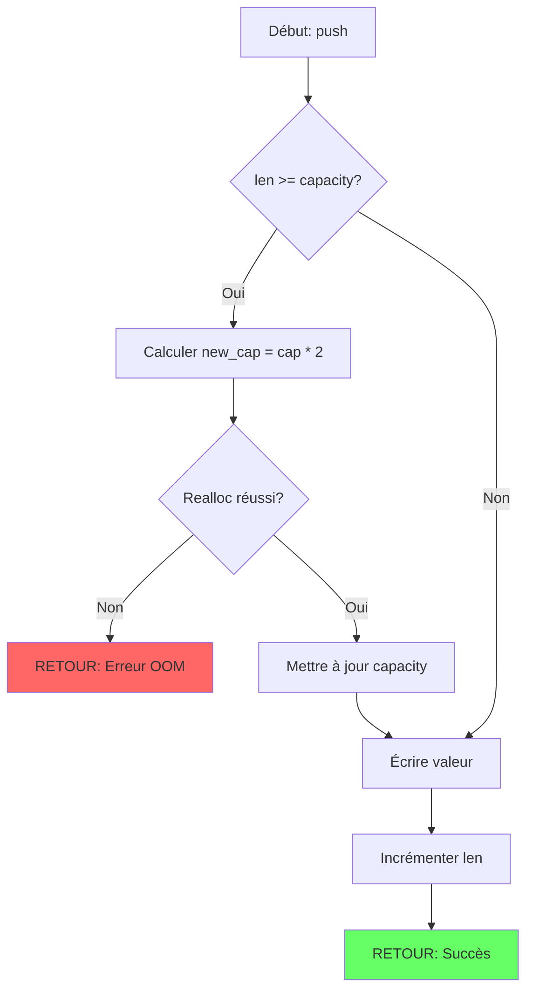
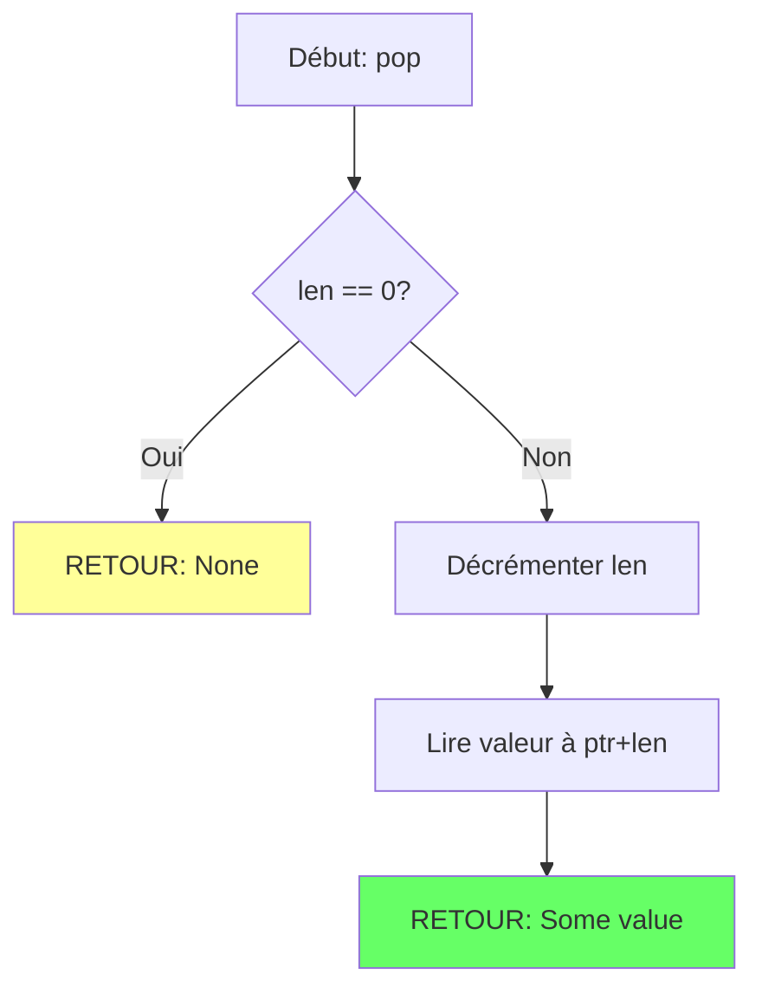

# Exercice 1.1.0-a : there_is_no_vec

**Module :**
1.1.0 — Arrays & Dynamic Memory

**Concept :**
a — Generic Vector (tableau dynamique générique)

**Difficulté :**
★★★★☆☆☆☆☆☆ (4/10)

**Type :**
complet

**Tiers :**
1 — Concept isolé

**Langage :**
Rust Edition 2024 + C (c17)

**Prérequis :**
- Syntaxe de base du langage
- Notion de pointeurs/références
- Allocation mémoire basique

**Domaines :**
Mem, Struct, Algo

**Durée estimée :**
45 min

**XP Base :**
100

**Complexité :**
T1 O(1) amorti push × S2 O(n)

---

## 📐 SECTION 1 : PROTOTYPE & CONSIGNE

### 1.1 Obligations

**Fichiers à rendre :**

| Langage | Fichiers |
|---------|----------|
| Rust | `src/lib.rs`, `Cargo.toml` |
| C | `generic_vec.c`, `generic_vec.h` |

**Fonctions autorisées :**

| Langage | Fonctions |
|---------|-----------|
| Rust | `std::alloc::{alloc, dealloc, realloc, Layout}`, `std::ptr::*`, `std::mem::*` |
| C | `malloc`, `realloc`, `free`, `memcpy`, `memmove` |

**Fonctions interdites :**

| Langage | Fonctions |
|---------|-----------|
| Rust | `Vec`, `VecDeque`, `Box<[T]>` (tu dois tout faire from scratch !) |
| C | `calloc` (pour forcer la gestion explicite de l'initialisation) |

---

### 1.2 Consigne

#### 🎬 Section Culture : "There Is No Vec"

**🎬 MATRIX — "Free your mind... and your memory"**

Tu connais la scène culte où Neo réalise qu'il n'y a pas de cuillère ? Qu'elle n'existe que dans son esprit et qu'il peut la manipuler à volonté ?

En programmation, c'est pareil avec les tableaux dynamiques. Il n'y a pas de "Vec magique" — c'est juste de la mémoire brute que TU contrôles. Comme Neo qui apprend à voir la Matrix pour ce qu'elle est vraiment (du code), tu vas apprendre à voir un Vec pour ce qu'il est vraiment : un pointeur, une taille, une capacité, et des règles de croissance.

*"What are you trying to tell me? That I can dodge memory leaks?"*
*"No, Neo. I'm trying to tell you that when you're ready... you won't have to."*

---

#### 🎓 Section Académique : Énoncé Formel

**Ta mission :**

Implémenter une structure de données `GenericVec<T>` (Rust) / `generic_vec_t` (C) qui représente un tableau dynamique générique supportant :

1. **Création** : Initialisation vide ou avec capacité pré-allouée
2. **Insertion** : Ajout à la fin (push), insertion à une position arbitraire
3. **Suppression** : Retrait de la fin (pop), suppression à une position arbitraire
4. **Accès** : Lecture et écriture par index
5. **Gestion capacité** : Réservation, réduction, nettoyage

**Entrée (Rust) :**

```rust
pub struct GenericVec<T> {
    // Ton implémentation interne
}

impl<T> GenericVec<T> {
    pub fn new() -> Self;
    pub fn with_capacity(capacity: usize) -> Self;
    pub fn len(&self) -> usize;
    pub fn is_empty(&self) -> bool;
    pub fn capacity(&self) -> usize;
    pub fn push(&mut self, value: T);
    pub fn pop(&mut self) -> Option<T>;
    pub fn insert(&mut self, index: usize, value: T);
    pub fn remove(&mut self, index: usize) -> T;
    pub fn get(&self, index: usize) -> Option<&T>;
    pub fn get_mut(&mut self, index: usize) -> Option<&mut T>;
    pub fn reserve(&mut self, additional: usize);
    pub fn shrink_to_fit(&mut self);
    pub fn clear(&mut self);
}
```

**Entrée (C) :**

```c
typedef struct s_generic_vec {
    void    *data;
    size_t  len;
    size_t  capacity;
    size_t  elem_size;
} t_generic_vec;

t_generic_vec   *vec_new(size_t elem_size);
t_generic_vec   *vec_with_capacity(size_t elem_size, size_t capacity);
size_t          vec_len(const t_generic_vec *v);
int             vec_is_empty(const t_generic_vec *v);
size_t          vec_capacity(const t_generic_vec *v);
int             vec_push(t_generic_vec *v, const void *value);
int             vec_pop(t_generic_vec *v, void *out);
int             vec_insert(t_generic_vec *v, size_t index, const void *value);
int             vec_remove(t_generic_vec *v, size_t index, void *out);
void            *vec_get(const t_generic_vec *v, size_t index);
int             vec_reserve(t_generic_vec *v, size_t additional);
int             vec_shrink_to_fit(t_generic_vec *v);
void            vec_clear(t_generic_vec *v);
void            vec_free(t_generic_vec *v);
```

**Sortie :**
- Toutes les opérations doivent fonctionner correctement
- `push` doit être O(1) amorti
- Pas de fuite mémoire

**Contraintes :**
- **Growth factor = 2** : Quand la capacité est dépassée, doubler
- **Shrink hysteresis** : Ne réduire que si `len < capacity / 4`, vers `capacity / 2`
- **Reserve** : Arrondir à la puissance de 2 supérieure pour efficacité
- Gérer le cas capacité = 0 (premier push alloue capacité 1)

**Exemples :**

| Opération | État avant | État après | Explication |
|-----------|------------|------------|-------------|
| `new()` | — | len=0, cap=0 | Vecteur vide |
| `push(42)` | len=0, cap=0 | len=1, cap=1 | Première allocation |
| `push(43)` | len=1, cap=1 | len=2, cap=2 | Doublement |
| `push(44)` | len=2, cap=2 | len=3, cap=4 | Doublement |
| `pop()` → 44 | len=3, cap=4 | len=2, cap=4 | Pas de shrink |
| `shrink_to_fit()` | len=2, cap=4 | len=2, cap=4 | 2 >= 4/4, pas de shrink |
| `pop()` | len=2, cap=4 | len=1, cap=4 | Pas encore |
| `shrink_to_fit()` | len=1, cap=4 | len=1, cap=2 | 1 < 4/4, shrink à 4/2=2 |

---

### 1.3 Prototype

**Rust :**
```rust
pub struct GenericVec<T> {
    ptr: *mut T,
    len: usize,
    capacity: usize,
}

impl<T> GenericVec<T> {
    pub fn new() -> Self;
    pub fn with_capacity(capacity: usize) -> Self;
    // ... (voir 1.2)
}

impl<T> Drop for GenericVec<T> {
    fn drop(&mut self);
}
```

**C :**
```c
typedef struct s_generic_vec {
    void    *data;
    size_t  len;
    size_t  capacity;
    size_t  elem_size;
} t_generic_vec;

// Voir prototypes complets en 1.2
```

---

## 💡 SECTION 2 : LE SAVIEZ-VOUS ?

### 2.1 Fun Facts

🧠 **Le doublement n'est pas arbitraire !**

Pourquoi doubler la capacité et pas tripler ou augmenter de 50% ?

- **Factor 2** : Garantit O(1) amorti, mais utilise au pire 50% de mémoire en excès
- **Factor 1.5** : Meilleure utilisation mémoire, mais plus de copies
- **Factor φ ≈ 1.618** (nombre d'or) : Facebook l'utilise ! Équilibre optimal entre les deux

La STL de Microsoft utilise 1.5, Rust utilise 2, Go utilise 2 pour les petits slices puis ~1.25 pour les grands.

🎮 **Les jeux vidéo sont experts en Vec !**

Les moteurs de jeu comme Unity et Unreal utilisent des techniques avancées :
- **Object pools** : Pré-allouer des centaines d'ennemis
- **Memory arenas** : Un gros bloc pour tout un niveau
- **SOA vs AOS** : Structure of Arrays vs Array of Structures pour le cache

---

### 2.5 DANS LA VRAIE VIE

| Métier | Utilisation du concept |
|--------|----------------------|
| **Game Developer** | Pools d'objets pour éviter l'allocation pendant le gameplay |
| **Systems Programmer** | Allocateurs custom pour embedded/temps réel |
| **Backend Engineer** | Buffers pour I/O réseau, queues de messages |
| **Data Engineer** | Colonnes de données dans Apache Arrow, Pandas |
| **Security Researcher** | Heap spraying, exploitation de corruptions mémoire |

---

## 🖥️ SECTION 3 : EXEMPLE D'UTILISATION

### 3.0 Session bash

**Rust :**
```bash
$ ls
src/  Cargo.toml

$ cargo test
running 6 tests
test test_basic_operations ... ok
test test_resize_growth ... ok
test test_shrink_hysteresis ... ok
test test_insert_remove ... ok
test test_reserve ... ok
test test_clear ... ok

test result: ok. 6 passed; 0 failed
```

**C :**
```bash
$ ls
generic_vec.c  generic_vec.h  main.c

$ gcc -Wall -Wextra -Werror -g generic_vec.c main.c -o test

$ ./test
Test basic operations: OK
Test resize growth: OK
Test shrink hysteresis: OK
Test insert/remove: OK
Test reserve: OK
Test clear: OK
All tests passed!

$ valgrind --leak-check=full ./test
==12345== LEAK SUMMARY:
==12345==    definitely lost: 0 bytes in 0 blocks
```

---

### 3.1 🔥 BONUS AVANCÉ (OPTIONNEL)

**Difficulté Bonus :**
★★★★★★☆☆☆☆ (6/10)

**Récompense :**
XP ×3

**Time Complexity attendue :**
O(1) amorti pour toutes les opérations

**Space Complexity attendue :**
O(n)

**Domaines Bonus :**
`Mem`, `Process` (thread-safety)

#### 3.1.1 Consigne Bonus

**🎬 "Welcome to the real world" — Thread-Safe Vec**

Neo a appris à manipuler la Matrix seul. Mais que se passe-t-il quand Morpheus, Trinity et lui essaient tous de modifier la même zone en même temps ?

C'est le défi du multi-threading : plusieurs threads accédant au même Vec.

**Ta mission bonus :**

Créer une version thread-safe `SyncVec<T>` (Rust) / `sync_vec_t` (C) qui :

1. Utilise un `RwLock` (Rust) / `pthread_rwlock` (C) pour permettre plusieurs lecteurs OU un seul écrivain
2. Implémente des itérateurs qui ne bloquent pas pendant l'itération (snapshot ou lock guards)
3. Supporte `extend()` et `drain()` pour les opérations batch

**Contraintes :**
┌─────────────────────────────────────────┐
│  Lectures concurrentes : AUTORISÉES     │
│  Écriture exclusive : OBLIGATOIRE       │
│  Deadlock : INTERDIT                    │
│  Pas de busy-waiting                    │
└─────────────────────────────────────────┘

**Exemples :**

| Opération | Thread 1 | Thread 2 | Résultat |
|-----------|----------|----------|----------|
| read + read | `get(0)` | `get(1)` | OK - concurrent |
| read + write | `get(0)` | `push(42)` | T2 attend |
| write + write | `push(1)` | `push(2)` | Séquentialisé |

#### 3.1.2 Prototype Bonus

**Rust :**
```rust
use std::sync::RwLock;

pub struct SyncVec<T> {
    inner: RwLock<GenericVec<T>>,
}

impl<T> SyncVec<T> {
    pub fn new() -> Self;
    pub fn push(&self, value: T);  // Note: &self, pas &mut self !
    pub fn pop(&self) -> Option<T>;
    pub fn get(&self, index: usize) -> Option<T> where T: Clone;
    pub fn len(&self) -> usize;
    pub fn extend<I: IntoIterator<Item = T>>(&self, iter: I);
    pub fn drain(&self) -> Vec<T>;
}
```

**C :**
```c
#include <pthread.h>

typedef struct s_sync_vec {
    t_generic_vec   *vec;
    pthread_rwlock_t lock;
} t_sync_vec;

t_sync_vec  *sync_vec_new(size_t elem_size);
int         sync_vec_push(t_sync_vec *v, const void *value);
int         sync_vec_pop(t_sync_vec *v, void *out);
void        *sync_vec_get(t_sync_vec *v, size_t index);
size_t      sync_vec_len(t_sync_vec *v);
void        sync_vec_free(t_sync_vec *v);
```

#### 3.1.3 Ce qui change par rapport à l'exercice de base

| Aspect | Base | Bonus |
|--------|------|-------|
| Thread-safety | Non | Oui (RwLock) |
| API mutabilité | `&mut self` | `&self` (interior mutability) |
| Complexité impl | Simple | Lock management |
| Edge cases | Index, capacity | + Deadlock, contention |

---

## ✅❌ SECTION 4 : ZONE CORRECTION (POUR LE TESTEUR)

### 4.1 Moulinette — Tableau des tests

| # | Test | Input | Expected | Points | Catégorie |
|---|------|-------|----------|--------|-----------|
| 1 | new_empty | `new()` | len=0, cap=0 | 5 | Basic |
| 2 | push_single | `push(42)` | len=1, get(0)=42 | 5 | Basic |
| 3 | push_grow | push 100 times | len=100, cap≥100 | 10 | Growth |
| 4 | pop_basic | push 3, pop | returns last | 5 | Basic |
| 5 | pop_empty | pop on empty | None/NULL | 5 | Edge |
| 6 | insert_middle | insert at len/2 | correct order | 10 | Insert |
| 7 | insert_start | insert at 0 | first element | 5 | Insert |
| 8 | remove_middle | remove at len/2 | correct shift | 10 | Remove |
| 9 | get_bounds | get(len) | None/NULL | 5 | Safety |
| 10 | reserve_growth | reserve(1000) | cap≥1000 | 5 | Reserve |
| 11 | shrink_hysteresis | shrink when len<cap/4 | cap halved | 10 | Shrink |
| 12 | shrink_noop | shrink when len≥cap/4 | cap unchanged | 5 | Shrink |
| 13 | clear_keeps_cap | clear() | len=0, cap same | 5 | Clear |
| 14 | drop_no_leak | create, drop | valgrind clean | 10 | Memory |
| 15 | capacity_power_of_2 | after grows | is_power_of_two | 5 | Invariant |

**Total : 100 points**

---

### 4.2 main.c de test (C)

```c
#include <stdio.h>
#include <assert.h>
#include <string.h>
#include "generic_vec.h"

void test_basic_operations(void) {
    t_generic_vec *v = vec_new(sizeof(int));
    assert(v != NULL);
    assert(vec_is_empty(v));
    assert(vec_len(v) == 0);

    int val = 42;
    assert(vec_push(v, &val) == 0);
    assert(vec_len(v) == 1);
    assert(!vec_is_empty(v));

    int *got = (int *)vec_get(v, 0);
    assert(got != NULL && *got == 42);

    int popped;
    assert(vec_pop(v, &popped) == 0);
    assert(popped == 42);
    assert(vec_is_empty(v));

    vec_free(v);
    printf("Test basic operations: OK\n");
}

void test_resize_growth(void) {
    t_generic_vec *v = vec_new(sizeof(int));

    for (int i = 0; i < 100; i++) {
        assert(vec_push(v, &i) == 0);
    }
    assert(vec_len(v) == 100);
    assert(vec_capacity(v) >= 100);

    // Check capacity is power of 2
    size_t cap = vec_capacity(v);
    assert((cap & (cap - 1)) == 0);  // Power of 2 check

    vec_free(v);
    printf("Test resize growth: OK\n");
}

void test_shrink_hysteresis(void) {
    t_generic_vec *v = vec_with_capacity(sizeof(int), 100);

    for (int i = 0; i < 50; i++) {
        vec_push(v, &i);
    }

    // Should not shrink: 50 >= 100/4 = 25
    vec_shrink_to_fit(v);
    assert(vec_capacity(v) >= 50);

    // Pop until len < capacity/4
    int dummy;
    while (vec_len(v) >= vec_capacity(v) / 4) {
        vec_pop(v, &dummy);
    }

    size_t old_cap = vec_capacity(v);
    vec_shrink_to_fit(v);
    assert(vec_capacity(v) < old_cap);

    vec_free(v);
    printf("Test shrink hysteresis: OK\n");
}

void test_insert_remove(void) {
    t_generic_vec *v = vec_new(sizeof(int));

    int a = 1, b = 3;
    vec_push(v, &a);
    vec_push(v, &b);

    int c = 2;
    vec_insert(v, 1, &c);

    assert(*(int *)vec_get(v, 0) == 1);
    assert(*(int *)vec_get(v, 1) == 2);
    assert(*(int *)vec_get(v, 2) == 3);

    int removed;
    vec_remove(v, 1, &removed);
    assert(removed == 2);
    assert(vec_len(v) == 2);

    vec_free(v);
    printf("Test insert/remove: OK\n");
}

void test_reserve(void) {
    t_generic_vec *v = vec_new(sizeof(int));

    vec_reserve(v, 100);
    assert(vec_capacity(v) >= 100);

    size_t cap = vec_capacity(v);
    for (int i = 0; i < 100; i++) {
        vec_push(v, &i);
    }
    assert(vec_capacity(v) == cap);  // No reallocation

    vec_free(v);
    printf("Test reserve: OK\n");
}

void test_clear(void) {
    t_generic_vec *v = vec_new(sizeof(int));

    for (int i = 0; i < 50; i++) {
        vec_push(v, &i);
    }

    size_t cap = vec_capacity(v);
    vec_clear(v);

    assert(vec_len(v) == 0);
    assert(vec_is_empty(v));
    assert(vec_capacity(v) == cap);  // Keeps capacity

    vec_free(v);
    printf("Test clear: OK\n");
}

int main(void) {
    test_basic_operations();
    test_resize_growth();
    test_shrink_hysteresis();
    test_insert_remove();
    test_reserve();
    test_clear();

    printf("\nAll tests passed!\n");
    return 0;
}
```

---

### 4.3 Solution de référence (Rust)

```rust
use std::alloc::{alloc, dealloc, realloc, Layout};
use std::ptr;

pub struct GenericVec<T> {
    ptr: *mut T,
    len: usize,
    capacity: usize,
}

impl<T> GenericVec<T> {
    pub fn new() -> Self {
        Self {
            ptr: ptr::null_mut(),
            len: 0,
            capacity: 0,
        }
    }

    pub fn with_capacity(capacity: usize) -> Self {
        if capacity == 0 {
            return Self::new();
        }
        let layout = Layout::array::<T>(capacity).unwrap();
        let ptr = unsafe { alloc(layout) as *mut T };
        Self { ptr, len: 0, capacity }
    }

    pub fn len(&self) -> usize { self.len }
    pub fn is_empty(&self) -> bool { self.len == 0 }
    pub fn capacity(&self) -> usize { self.capacity }

    fn grow(&mut self) {
        let new_cap = if self.capacity == 0 { 1 } else { self.capacity * 2 };
        self.resize_to(new_cap);
    }

    fn resize_to(&mut self, new_cap: usize) {
        if new_cap == 0 {
            if !self.ptr.is_null() {
                let layout = Layout::array::<T>(self.capacity).unwrap();
                unsafe { dealloc(self.ptr as *mut u8, layout); }
                self.ptr = ptr::null_mut();
            }
            self.capacity = 0;
            return;
        }

        let new_layout = Layout::array::<T>(new_cap).unwrap();
        let new_ptr = if self.ptr.is_null() {
            unsafe { alloc(new_layout) as *mut T }
        } else {
            let old_layout = Layout::array::<T>(self.capacity).unwrap();
            unsafe { realloc(self.ptr as *mut u8, old_layout, new_layout.size()) as *mut T }
        };

        self.ptr = new_ptr;
        self.capacity = new_cap;
    }

    pub fn push(&mut self, value: T) {
        if self.len >= self.capacity {
            self.grow();
        }
        unsafe {
            ptr::write(self.ptr.add(self.len), value);
        }
        self.len += 1;
    }

    pub fn pop(&mut self) -> Option<T> {
        if self.len == 0 {
            return None;
        }
        self.len -= 1;
        unsafe { Some(ptr::read(self.ptr.add(self.len))) }
    }

    pub fn insert(&mut self, index: usize, value: T) {
        assert!(index <= self.len, "index out of bounds");
        if self.len >= self.capacity {
            self.grow();
        }
        unsafe {
            let p = self.ptr.add(index);
            ptr::copy(p, p.add(1), self.len - index);
            ptr::write(p, value);
        }
        self.len += 1;
    }

    pub fn remove(&mut self, index: usize) -> T {
        assert!(index < self.len, "index out of bounds");
        self.len -= 1;
        unsafe {
            let p = self.ptr.add(index);
            let result = ptr::read(p);
            ptr::copy(p.add(1), p, self.len - index);
            result
        }
    }

    pub fn get(&self, index: usize) -> Option<&T> {
        if index >= self.len {
            None
        } else {
            unsafe { Some(&*self.ptr.add(index)) }
        }
    }

    pub fn get_mut(&mut self, index: usize) -> Option<&mut T> {
        if index >= self.len {
            None
        } else {
            unsafe { Some(&mut *self.ptr.add(index)) }
        }
    }

    pub fn reserve(&mut self, additional: usize) {
        let required = self.len + additional;
        if required > self.capacity {
            let new_cap = required.next_power_of_two();
            self.resize_to(new_cap);
        }
    }

    pub fn shrink_to_fit(&mut self) {
        if self.len < self.capacity / 4 {
            let new_cap = (self.capacity / 2).max(self.len).next_power_of_two();
            if new_cap < self.capacity {
                self.resize_to(new_cap);
            }
        }
    }

    pub fn clear(&mut self) {
        while self.pop().is_some() {}
    }
}

impl<T> Drop for GenericVec<T> {
    fn drop(&mut self) {
        self.clear();
        if !self.ptr.is_null() {
            let layout = Layout::array::<T>(self.capacity).unwrap();
            unsafe { dealloc(self.ptr as *mut u8, layout); }
        }
    }
}

impl<T> Default for GenericVec<T> {
    fn default() -> Self { Self::new() }
}
```

---

### 4.4 Solutions alternatives acceptées

**Alternative 1 : Utilisation de MaybeUninit (Rust)**

```rust
use std::mem::MaybeUninit;

pub struct GenericVec<T> {
    data: Box<[MaybeUninit<T>]>,
    len: usize,
}
// ... reste similaire mais avec MaybeUninit pour éviter undefined behavior
```

**Alternative 2 : Growth factor 1.5 (accepté mais noté)**

```rust
fn grow(&mut self) {
    let new_cap = if self.capacity == 0 {
        1
    } else {
        self.capacity + self.capacity / 2  // 1.5x
    };
    // ...
}
// Accepté mais moins optimal pour l'analyse amortie
```

---

### 4.5 Solutions refusées (avec explications)

**Refus 1 : Utilisation de Vec interne**

```rust
// ❌ REFUSÉ : Utilise Vec qu'on demande d'implémenter !
pub struct GenericVec<T> {
    inner: Vec<T>,
}
```
**Pourquoi refusé :** L'exercice demande d'implémenter Vec from scratch. Utiliser Vec viole cette contrainte.

**Refus 2 : Pas de Drop**

```rust
// ❌ REFUSÉ : Fuite mémoire garantie !
pub struct GenericVec<T> {
    ptr: *mut T,
    // ... pas de impl Drop
}
```
**Pourquoi refusé :** Sans Drop, la mémoire allouée n'est jamais libérée → fuite mémoire.

**Refus 3 : Growth factor de 1**

```rust
// ❌ REFUSÉ : Complexité O(n) pour chaque push !
fn grow(&mut self) {
    self.resize_to(self.capacity + 1);
}
```
**Pourquoi refusé :** Augmenter de 1 à chaque fois donne O(n²) total pour n pushs au lieu de O(n).

---

### 4.6 Solution bonus de référence (Rust)

```rust
use std::sync::RwLock;

pub struct SyncVec<T> {
    inner: RwLock<GenericVec<T>>,
}

impl<T> SyncVec<T> {
    pub fn new() -> Self {
        Self { inner: RwLock::new(GenericVec::new()) }
    }

    pub fn push(&self, value: T) {
        self.inner.write().unwrap().push(value);
    }

    pub fn pop(&self) -> Option<T> {
        self.inner.write().unwrap().pop()
    }

    pub fn len(&self) -> usize {
        self.inner.read().unwrap().len()
    }

    pub fn get(&self, index: usize) -> Option<T>
    where T: Clone
    {
        self.inner.read().unwrap().get(index).cloned()
    }

    pub fn extend<I: IntoIterator<Item = T>>(&self, iter: I) {
        let mut guard = self.inner.write().unwrap();
        for item in iter {
            guard.push(item);
        }
    }

    pub fn drain(&self) -> Vec<T> {
        let mut guard = self.inner.write().unwrap();
        let mut result = Vec::new();
        while let Some(item) = guard.pop() {
            result.push(item);
        }
        result.reverse();
        result
    }
}

unsafe impl<T: Send> Send for SyncVec<T> {}
unsafe impl<T: Send + Sync> Sync for SyncVec<T> {}
```

---

### 4.7 Solutions alternatives bonus (acceptées)

**Alternative : Mutex au lieu de RwLock**

```rust
use std::sync::Mutex;

pub struct SyncVec<T> {
    inner: Mutex<GenericVec<T>>,  // Simpler but less concurrent reads
}
```

---

### 4.8 Solutions refusées bonus

**Refus : Pas de synchronisation**

```rust
// ❌ REFUSÉ : Data race !
pub struct SyncVec<T> {
    inner: UnsafeCell<GenericVec<T>>,  // No lock = undefined behavior
}
```

---

### 4.9 spec.json (ENGINE v22.1)

```json
{
  "name": "there_is_no_vec",
  "language": "rust",
  "language_version": "edition 2024",
  "type": "code",
  "tier": 1,
  "tier_info": "Concept isolé",
  "tags": ["module1.1", "vec", "memory", "amortized", "phase1"],
  "passing_score": 70,

  "function": {
    "name": "GenericVec",
    "prototype": "pub struct GenericVec<T>",
    "return_type": "struct",
    "parameters": []
  },

  "driver": {
    "reference": "impl<T> GenericVec<T> { pub fn new() -> Self { Self { ptr: std::ptr::null_mut(), len: 0, capacity: 0 } } pub fn len(&self) -> usize { self.len } pub fn is_empty(&self) -> bool { self.len == 0 } pub fn capacity(&self) -> usize { self.capacity } pub fn push(&mut self, value: T) { if self.len >= self.capacity { let new_cap = if self.capacity == 0 { 1 } else { self.capacity * 2 }; /* resize */ } unsafe { std::ptr::write(self.ptr.add(self.len), value); } self.len += 1; } pub fn pop(&mut self) -> Option<T> { if self.len == 0 { return None; } self.len -= 1; unsafe { Some(std::ptr::read(self.ptr.add(self.len))) } } }",

    "edge_cases": [
      {
        "name": "empty_vec",
        "args": [],
        "expected": {"len": 0, "capacity": 0},
        "is_trap": false
      },
      {
        "name": "pop_empty",
        "args": ["pop on empty"],
        "expected": null,
        "is_trap": true,
        "trap_explanation": "Pop sur vecteur vide doit retourner None, pas panic"
      },
      {
        "name": "get_out_of_bounds",
        "args": ["get(100) on len=5"],
        "expected": null,
        "is_trap": true,
        "trap_explanation": "Accès hors limites doit retourner None"
      },
      {
        "name": "insert_at_len",
        "args": ["insert at index=len"],
        "expected": "ok",
        "is_trap": true,
        "trap_explanation": "Insert à index=len est équivalent à push, doit fonctionner"
      },
      {
        "name": "growth_power_of_2",
        "args": ["after 100 pushes"],
        "expected": {"capacity_is_power_of_2": true},
        "is_trap": false
      }
    ],

    "fuzzing": {
      "enabled": true,
      "iterations": 10000,
      "generators": [
        {
          "type": "int",
          "param_index": 0,
          "params": {"min": -1000000, "max": 1000000}
        }
      ]
    }
  },

  "norm": {
    "allowed_functions": ["alloc", "dealloc", "realloc", "ptr::write", "ptr::read", "ptr::copy"],
    "forbidden_functions": ["Vec", "VecDeque", "Box<[T]>"],
    "check_security": true,
    "check_memory": true,
    "blocking": true
  }
}
```

---

### 4.10 Solutions Mutantes (minimum 5)

**Mutant A (Boundary) : Grow trop tôt**

```rust
/* Mutant A (Boundary) : Condition off-by-one */
pub fn push(&mut self, value: T) {
    if self.len >= self.capacity {  // ❌ Devrait être >
        self.grow();  // Grow inutilement quand len == capacity - 1
    }
    // ...
}
// Pourquoi c'est faux : Grow quand len=0, capacity=1, donc on alloue 2 pour rien
// Ce qui était pensé : "Il faut grow quand on est plein"
```

**Mutant B (Safety) : Division par zéro**

```rust
/* Mutant B (Safety) : Pas de check capacity 0 */
pub fn shrink_to_fit(&mut self) {
    if self.len < self.capacity / 4 {  // ❌ Si capacity=0 → division OK mais logique fausse
        let new_cap = self.capacity / 2;
        // Si capacity=1 et len=0, new_cap=0, on dealloc tout
        // Puis on ne peut plus push sans panic
    }
}
// Pourquoi c'est faux : Shrink vers 0 rend le vec inutilisable
```

**Mutant C (Resource) : Fuite mémoire au shrink**

```rust
/* Mutant C (Resource) : Pas de dealloc avant realloc */
fn resize_to(&mut self, new_cap: usize) {
    // ❌ Ne libère pas l'ancienne mémoire si realloc échoue
    let new_ptr = unsafe {
        alloc(Layout::array::<T>(new_cap).unwrap()) as *mut T
    };
    // Copie les données
    unsafe { ptr::copy(self.ptr, new_ptr, self.len); }
    // ❌ self.ptr jamais libéré !
    self.ptr = new_ptr;
}
// Pourquoi c'est faux : L'ancienne allocation n'est jamais libérée
```

**Mutant D (Logic) : Growth factor incorrect**

```rust
/* Mutant D (Logic) : Growth linéaire au lieu d'exponentiel */
fn grow(&mut self) {
    let new_cap = self.capacity + 10;  // ❌ +10 au lieu de *2
    self.resize_to(new_cap);
}
// Pourquoi c'est faux : Donne O(n/10) reallocations, donc O(n²/10) copies total
// Ce qui était pensé : "Ajouter 10 c'est assez"
```

**Mutant E (Return) : Pop ne décrémente pas len**

```rust
/* Mutant E (Return) : Oubli de décrémenter len */
pub fn pop(&mut self) -> Option<T> {
    if self.len == 0 {
        return None;
    }
    // ❌ self.len -= 1; MANQUANT
    unsafe { Some(ptr::read(self.ptr.add(self.len - 1))) }  // Lit toujours le même
}
// Pourquoi c'est faux : len reste constant, pop retourne toujours le même élément
// Ce qui était pensé : Lecture suffit
```

---

## 🧠 SECTION 5 : COMPRENDRE (DOCUMENT DE COURS COMPLET)

### 5.1 Ce que cet exercice enseigne

| Concept | Description | Importance |
|---------|-------------|------------|
| Allocation dynamique | Gérer la mémoire manuellement | ⭐⭐⭐⭐⭐ |
| Analyse amortie | Comprendre O(1) amorti | ⭐⭐⭐⭐ |
| Stratégie de croissance | Pourquoi doubler | ⭐⭐⭐⭐ |
| Invariants | Maintenir len ≤ capacity | ⭐⭐⭐⭐ |
| RAII | Libération automatique | ⭐⭐⭐⭐⭐ |

---

### 5.2 LDA — Traduction littérale en MAJUSCULES

```
STRUCTURE GenericVec CONTENANT :
    ptr QUI EST UN POINTEUR VERS DES ÉLÉMENTS DE TYPE T
    len QUI EST UN ENTIER NON SIGNÉ (nombre d'éléments)
    capacity QUI EST UN ENTIER NON SIGNÉ (espace alloué)
FIN STRUCTURE

FONCTION push QUI PREND self COMME RÉFÉRENCE MUTABLE VERS GenericVec ET value DE TYPE T
DÉBUT FONCTION
    SI len EST SUPÉRIEUR OU ÉGAL À capacity ALORS
        APPELER grow SUR self
    FIN SI
    ÉCRIRE value À LA POSITION len DANS ptr
    INCRÉMENTER len DE 1
FIN FONCTION

FONCTION pop QUI RETOURNE Option<T> ET PREND self COMME RÉFÉRENCE MUTABLE VERS GenericVec
DÉBUT FONCTION
    SI len EST ÉGAL À 0 ALORS
        RETOURNER None
    FIN SI
    DÉCRÉMENTER len DE 1
    LIRE LA VALEUR À LA POSITION len DANS ptr
    RETOURNER Some DE CETTE VALEUR
FIN FONCTION

FONCTION grow QUI PREND self COMME RÉFÉRENCE MUTABLE VERS GenericVec
DÉBUT FONCTION
    SI capacity EST ÉGAL À 0 ALORS
        AFFECTER 1 À new_cap
    SINON
        AFFECTER capacity MULTIPLIÉ PAR 2 À new_cap
    FIN SI
    RÉALLOUER ptr AVEC TAILLE new_cap
    AFFECTER new_cap À capacity
FIN FONCTION
```

---

### 5.2.2 Style Académique Français

```
Algorithme : Opérations sur Vec dynamique

Données :
    Vec = (ptr: Pointeur[T], len: Entier, capacité: Entier)

Opération PUSH(Vec, valeur):
    Précondition : Vec est initialisé
    Postcondition : len(Vec) = len(Vec) + 1, dernier élément = valeur

    Début
        Si len ≥ capacité Alors
            NouvelleCapacité ← max(1, capacité × 2)
            Réallouer(ptr, NouvelleCapacité)
            capacité ← NouvelleCapacité
        FinSi
        ptr[len] ← valeur
        len ← len + 1
    Fin

Opération POP(Vec) → Optionnel[T]:
    Précondition : Vec est initialisé
    Postcondition : Si len > 0 alors len(Vec) = len(Vec) - 1

    Début
        Si len = 0 Alors
            Retourner Aucun
        FinSi
        len ← len - 1
        Retourner Quelque(ptr[len])
    Fin

Complexité :
    PUSH : O(1) amorti (O(n) pire cas lors du redimensionnement)
    POP : O(1)
```

---

### 5.2.2.1 Logic Flow (Structured English)

```
ALGORITHM: Dynamic Vector Operations
---

1. PUSH(vec, value):
   |
   |-- CHECK if vec.len >= vec.capacity:
   |     |-- YES: GROW vec (double capacity)
   |     |-- NO: continue
   |
   |-- WRITE value at vec.ptr[vec.len]
   |-- INCREMENT vec.len by 1
   |-- RETURN success

2. POP(vec) -> Option<T>:
   |
   |-- CHECK if vec.len == 0:
   |     RETURN None (empty)
   |
   |-- DECREMENT vec.len by 1
   |-- READ value from vec.ptr[vec.len]
   |-- RETURN Some(value)

3. GROW(vec):
   |
   |-- CALCULATE new_capacity = max(1, capacity * 2)
   |-- REALLOCATE vec.ptr with new_capacity
   |-- UPDATE vec.capacity = new_capacity
```

---

### 5.2.3 Représentation Algorithmique avec Garde

```
FONCTION: push(vec, value)
---
INIT result = failure

1. GARDE - Vérification capacité:
   |
   |-- SI vec.len >= vec.capacity:
   |     |-- CALCULER new_cap = max(1, cap * 2)
   |     |-- SI realloc ÉCHOUE:
   |     |     RETOURNER Erreur "Out of memory"
   |     |-- METTRE À JOUR vec.capacity
   |
   |-- CONTINUER (capacité suffisante)

2. ÉCRITURE:
   |
   |-- ÉCRIRE value à vec.ptr + vec.len
   |-- INCRÉMENTER vec.len
   |-- RETOURNER Succès

3. RETOURNER result
```

---

### 5.2.3.1 Diagramme Mermaid





---

### 5.3 Visualisation ASCII

**État du Vec après plusieurs opérations :**

```
Après new():
┌─────────────────────────────────────────────┐
│ GenericVec                                  │
│ ┌─────┬─────┬──────────┐                    │
│ │ ptr │ len │ capacity │                    │
│ │ NULL│  0  │    0     │                    │
│ └─────┴─────┴──────────┘                    │
└─────────────────────────────────────────────┘

Après push(42):
┌─────────────────────────────────────────────┐
│ GenericVec                    Heap          │
│ ┌─────┬─────┬──────────┐     ┌────┐        │
│ │ ptr │ len │ capacity │ ──► │ 42 │        │
│ │  ●  │  1  │    1     │     └────┘        │
│ └─────┴─────┴──────────┘     idx: 0        │
└─────────────────────────────────────────────┘

Après push(43), push(44):
┌─────────────────────────────────────────────┐
│ GenericVec                    Heap          │
│ ┌─────┬─────┬──────────┐     ┌────┬────┬────┬────┐
│ │ ptr │ len │ capacity │ ──► │ 42 │ 43 │ 44 │ ?? │
│ │  ●  │  3  │    4     │     └────┴────┴────┴────┘
│ └─────┴─────┴──────────┘     idx: 0    1    2    3
│                                    ▲         ▲
│                               utilisé    non init
└─────────────────────────────────────────────┘

Doublement de capacité lors du 3ème push:
┌───────────────────────────────────────────────────────┐
│  Avant (cap=2, len=2)        Après (cap=4, len=3)    │
│  ┌────┬────┐                 ┌────┬────┬────┬────┐   │
│  │ 42 │ 43 │  ──realloc──►   │ 42 │ 43 │ 44 │ ?? │   │
│  └────┴────┘                 └────┴────┴────┴────┘   │
│                                        ↑             │
│                                   nouveau push       │
└───────────────────────────────────────────────────────┘
```

**Shrink avec Hysteresis :**

```
État: len=1, capacity=8

Condition de shrink: len < capacity / 4 ?
                     1 < 8 / 4 = 2 ?
                     1 < 2 ✓ OUI

Shrink vers: capacity / 2 = 4

┌───────────────────────────────────────────────────────┐
│  Avant (cap=8, len=1)        Après (cap=4, len=1)    │
│  ┌──┬──┬──┬──┬──┬──┬──┬──┐   ┌──┬──┬──┬──┐          │
│  │42│??│??│??│??│??│??│??│ → │42│??│??│??│          │
│  └──┴──┴──┴──┴──┴──┴──┴──┘   └──┴──┴──┴──┘          │
│     ▲                           ▲                    │
│   seul élément              mémoire libérée          │
└───────────────────────────────────────────────────────┘
```

---

### 5.4 Les pièges en détail

#### Piège 1 : Off-by-one dans la condition de grow

```rust
// ❌ FAUX : Grow trop tard (overflow !)
if self.len > self.capacity {
    self.grow();
}
// Si len = capacity = 0, on essaie d'écrire à ptr[0] qui est NULL !

// ✅ CORRECT : Grow quand plein
if self.len >= self.capacity {
    self.grow();
}
```

#### Piège 2 : Oublier de décrémenter len dans pop

```rust
// ❌ FAUX : len reste constant
pub fn pop(&mut self) -> Option<T> {
    if self.len == 0 { return None; }
    unsafe { Some(ptr::read(self.ptr.add(self.len - 1))) }
    // Oups ! len pas décrémenté, on lit toujours le même
}

// ✅ CORRECT
pub fn pop(&mut self) -> Option<T> {
    if self.len == 0 { return None; }
    self.len -= 1;  // D'ABORD décrémenter
    unsafe { Some(ptr::read(self.ptr.add(self.len))) }  // PUIS lire
}
```

#### Piège 3 : Integer overflow dans le calcul de capacité

```rust
// ❌ FAUX : Overflow possible
let new_cap = self.capacity * 2;  // Si capacity = usize::MAX / 2 + 1 → overflow !

// ✅ CORRECT : Vérifier l'overflow
let new_cap = self.capacity.checked_mul(2).expect("capacity overflow");
// Ou utiliser saturating_mul pour éviter le panic
```

#### Piège 4 : Ne pas initialiser ptr à NULL

```rust
// ❌ FAUX : ptr contient des garbage bytes
pub fn new() -> Self {
    Self {
        ptr: unsafe { std::mem::uninitialized() },  // DANGER !
        len: 0,
        capacity: 0,
    }
}

// ✅ CORRECT : Initialiser à null
pub fn new() -> Self {
    Self {
        ptr: ptr::null_mut(),
        len: 0,
        capacity: 0,
    }
}
```

---

### 5.5 Cours Complet

#### 5.5.1 Introduction aux tableaux dynamiques

Un tableau dynamique (vector, dynamic array, ArrayList) est une structure de données qui :
- Stocke des éléments contigus en mémoire
- Peut grandir et rétrécir dynamiquement
- Offre un accès O(1) par index

**Pourquoi ne pas utiliser un tableau statique ?**

| Tableau statique | Tableau dynamique |
|------------------|-------------------|
| Taille fixe à la compilation | Taille variable |
| Stack ou segment data | Heap |
| Pas d'allocation runtime | Allocation/réallocation |
| `[T; N]` | `Vec<T>` |

#### 5.5.2 Anatomie d'un Vec

Un Vec est composé de trois champs :

```
┌─────────────────────────────────┐
│         GenericVec<T>           │
├─────────────────────────────────┤
│ ptr: *mut T                     │ → Pointeur vers le buffer heap
│ len: usize                      │ → Nombre d'éléments actuels
│ capacity: usize                 │ → Espace total alloué
└─────────────────────────────────┘
```

**Invariants à maintenir :**
1. `len <= capacity` (toujours)
2. `ptr` est valide pour `capacity` éléments (ou NULL si capacity=0)
3. Les éléments de `0..len` sont initialisés
4. Les éléments de `len..capacity` ne sont PAS initialisés

#### 5.5.3 Stratégie de croissance

**Le problème :** Quand le Vec est plein et qu'on veut ajouter un élément, il faut :
1. Allouer un nouveau buffer plus grand
2. Copier tous les éléments
3. Libérer l'ancien buffer

**Stratégies possibles :**

| Stratégie | Nouvelle capacité | Copies pour n pushes | Réallocations |
|-----------|------------------|---------------------|---------------|
| +1 | cap + 1 | O(n²) | n |
| +k | cap + k | O(n²/k) | n/k |
| ×1.5 | cap × 1.5 | O(n) | O(log n) |
| ×2 | cap × 2 | O(n) | O(log n) |

**Pourquoi ×2 ?**

Avec un facteur de croissance de 2 :
- Le nombre total de copies est ≤ 2n
- Donc l'amortissement donne O(1) par opération

**Preuve :** Après n pushes, si on double à chaque fois depuis 1 :
- Séquence de capacités : 1, 2, 4, 8, ..., 2^k où 2^k ≥ n
- Copies totales : 1 + 2 + 4 + ... + 2^(k-1) = 2^k - 1 < 2n
- Coût amorti par push : < 2 = O(1)

#### 5.5.4 Analyse amortie

**Définition :** L'analyse amortie calcule le coût moyen d'une opération sur une séquence, pas le pire cas individuel.

**Trois méthodes :**

1. **Méthode agrégat** : Coût total / nombre d'opérations
2. **Méthode comptable** : Chaque opération "paie" pour les futures
3. **Méthode du potentiel** : Fonction potentiel Φ qui accumule le "crédit"

**Méthode du potentiel pour Vec::push :**

Soit Φ(Vec) = 2 × len - capacity

- Après création : Φ = 0
- Après push sans grow : Φ augmente de 2
- Lors d'un grow : capacity double, on "dépense" le potentiel accumulé

Coût amorti = coût réel + ΔΦ

Pour push sans grow : 1 + 2 = 3
Pour push avec grow : n + (2×n - 2n) - (2×(n-1) - n) = n + 0 - (n - 2) = 2

Donc O(1) amorti dans tous les cas !

#### 5.5.5 Hysteresis dans le shrink

**Le problème :** Si on shrink dès que len < capacity/2, et qu'on alterne push/pop à la frontière :

```
len=4, cap=8 → shrink → cap=4
push → cap=8 (grow)
pop → cap=4 (shrink)
push → cap=8 (grow)
... O(n) à chaque opération !
```

**Solution : Hysteresis**

Ne shrink que si `len < capacity / 4`, vers `capacity / 2`.

Cela crée une "zone tampon" qui absorbe les oscillations.

```
Zone de stabilité:
|←──────────────────────────────────────→|
0        cap/4         cap/2            cap
         ↑              ↑
    shrink ici      shrink vers ici
```

---

### 5.6 Normes avec explications pédagogiques

```
┌─────────────────────────────────────────────────────────────────┐
│ ❌ HORS NORME (compile, mais interdit)                          │
├─────────────────────────────────────────────────────────────────┤
│ pub fn push(&mut self, value: T) {                              │
│     if self.len >= self.capacity { self.grow(); }               │
│     unsafe { ptr::write(self.ptr.add(self.len), value); }       │
│     self.len += 1; }                                            │
├─────────────────────────────────────────────────────────────────┤
│ ✅ CONFORME                                                     │
├─────────────────────────────────────────────────────────────────┤
│ pub fn push(&mut self, value: T) {                              │
│     if self.len >= self.capacity {                              │
│         self.grow();                                            │
│     }                                                           │
│     unsafe {                                                    │
│         ptr::write(self.ptr.add(self.len), value);              │
│     }                                                           │
│     self.len += 1;                                              │
│ }                                                               │
├─────────────────────────────────────────────────────────────────┤
│ 📖 POURQUOI ?                                                   │
│                                                                 │
│ • Lisibilité : Chaque étape sur sa ligne                        │
│ • Debug : Points d'arrêt précis possible                        │
│ • Unsafe : Block unsafe clairement délimité                     │
│ • Git : Modifications localisées                                │
└─────────────────────────────────────────────────────────────────┘
```

---

### 5.7 Simulation avec trace d'exécution

**Scénario : pushes successifs avec croissance**

```
┌───────┬──────────────────────────────────┬─────┬─────┬────────────────────────┐
│ Étape │ Opération                        │ len │ cap │ Explication            │
├───────┼──────────────────────────────────┼─────┼─────┼────────────────────────┤
│   1   │ new()                            │  0  │  0  │ Vec vide créé          │
├───────┼──────────────────────────────────┼─────┼─────┼────────────────────────┤
│   2   │ push(10)                         │  0  │  0  │ len >= cap ? OUI       │
│   3   │ → grow()                         │  0  │  1  │ cap = max(1, 0*2) = 1  │
│   4   │ → write(10)                      │  1  │  1  │ ptr[0] = 10            │
├───────┼──────────────────────────────────┼─────┼─────┼────────────────────────┤
│   5   │ push(20)                         │  1  │  1  │ len >= cap ? OUI       │
│   6   │ → grow()                         │  1  │  2  │ cap = 1*2 = 2          │
│   7   │ → write(20)                      │  2  │  2  │ ptr[1] = 20            │
├───────┼──────────────────────────────────┼─────┼─────┼────────────────────────┤
│   8   │ push(30)                         │  2  │  2  │ len >= cap ? OUI       │
│   9   │ → grow()                         │  2  │  4  │ cap = 2*2 = 4          │
│  10   │ → write(30)                      │  3  │  4  │ ptr[2] = 30            │
├───────┼──────────────────────────────────┼─────┼─────┼────────────────────────┤
│  11   │ push(40)                         │  3  │  4  │ len >= cap ? NON       │
│  12   │ → write(40)                      │  4  │  4  │ ptr[3] = 40, pas grow  │
├───────┼──────────────────────────────────┼─────┼─────┼────────────────────────┤
│  13   │ pop() → 40                       │  3  │  4  │ len--, return ptr[3]   │
├───────┼──────────────────────────────────┼─────┼─────┼────────────────────────┤
│  14   │ shrink_to_fit()                  │  3  │  4  │ 3 < 4/4=1 ? NON        │
│       │                                  │     │     │ Pas de shrink          │
├───────┼──────────────────────────────────┼─────┼─────┼────────────────────────┤
│  15   │ pop() → 30                       │  2  │  4  │ len--                  │
│  16   │ pop() → 20                       │  1  │  4  │ len--                  │
├───────┼──────────────────────────────────┼─────┼─────┼────────────────────────┤
│  17   │ shrink_to_fit()                  │  1  │  4  │ 1 < 4/4=1 ? NON        │
│       │                                  │     │     │ (1 n'est pas < 1)      │
├───────┼──────────────────────────────────┼─────┼─────┼────────────────────────┤
│  18   │ pop() → 10                       │  0  │  4  │ len--                  │
├───────┼──────────────────────────────────┼─────┼─────┼────────────────────────┤
│  19   │ shrink_to_fit()                  │  0  │  4  │ 0 < 4/4=1 ? OUI        │
│  20   │ → resize_to(2)                   │  0  │  2  │ cap = 4/2 = 2          │
└───────┴──────────────────────────────────┴─────┴─────┴────────────────────────┘
```

---

### 5.8 Mnémotechniques (MEME obligatoire)

#### 🎬 MEME : "There is no spoon" → "There is no Vec"

Comme Neo qui réalise que la cuillère n'existe pas vraiment — elle n'est qu'une représentation dans la Matrix — tu dois réaliser que `Vec` n'existe pas vraiment.

C'est juste :
- Un pointeur (l'adresse mémoire)
- Un compteur (combien d'éléments)
- Une limite (combien on peut en mettre)

*"Do not try to understand the Vec. That's impossible. Instead, only try to realize the truth: there is no Vec. Then you'll see that it is not the Vec that grows, it is only yourself."*

```rust
// 🥄 Ne vois pas le Vec...
let mut v: Vec<i32> = Vec::new();

// 🧠 Vois la mémoire !
struct Reality {
    ptr: *mut i32,    // Où
    len: usize,       // Combien
    capacity: usize,  // Max
}
```

---

#### 🎮 MEME : "Push it to the limit" — Scarface

Quand tu push dans un Vec plein, c'est comme Tony Montana qui pousse toujours plus loin :

*"In this country, you gotta make the memory first. Then when you get the memory, you get the capacity. Then when you get the capacity, then you get the data."*

```rust
// 🚀 Push it to the limit!
while has_more_data() {
    vec.push(data);  // Cap double automatiquement
}
// Walk along the razor's edge... of memory allocation
```

---

#### 💀 MEME : "You shall not pass!" — Gandalf protège les invariants

```rust
impl<T> GenericVec<T> {
    pub fn get(&self, index: usize) -> Option<&T> {
        // 🧙‍♂️ GANDALF (bounds check)
        if index >= self.len {
            // "YOU SHALL NOT PASS!"
            return None;
        }
        // Safe passage to the element
        unsafe { Some(&*self.ptr.add(index)) }
    }
}
```

---

### 5.9 Applications pratiques

| Application | Utilisation du Vec |
|-------------|-------------------|
| **Compilateur** | Buffer de tokens, AST nodes |
| **Serveur web** | Buffer de requêtes, queue de connexions |
| **Jeu vidéo** | Liste d'entités, particules, projectiles |
| **Base de données** | Résultats de query, index temporaires |
| **ML/Data Science** | Tensors, batches de données |

**Exemple concret : Pool d'objets pour jeu vidéo**

```rust
struct Bullet {
    x: f32,
    y: f32,
    active: bool,
}

struct BulletPool {
    bullets: GenericVec<Bullet>,
}

impl BulletPool {
    fn spawn(&mut self, x: f32, y: f32) {
        // Réutiliser une bullet inactive si possible
        for i in 0..self.bullets.len() {
            if let Some(b) = self.bullets.get_mut(i) {
                if !b.active {
                    b.x = x;
                    b.y = y;
                    b.active = true;
                    return;
                }
            }
        }
        // Sinon, en créer une nouvelle
        self.bullets.push(Bullet { x, y, active: true });
    }
}
```

---

## ⚠️ SECTION 6 : PIÈGES — RÉCAPITULATIF

| # | Piège | Conséquence | Solution |
|---|-------|-------------|----------|
| 1 | Off-by-one grow | Écriture sur NULL | `>=` pas `>` |
| 2 | Oublier décrémenter len | Pop retourne toujours pareil | `self.len -= 1` avant read |
| 3 | Integer overflow | Panic ou wrap | `checked_mul` |
| 4 | ptr non initialisé | Undefined behavior | `ptr::null_mut()` |
| 5 | Pas de Drop | Fuite mémoire | Implémenter Drop |
| 6 | Shrink sans hysteresis | Thrashing | `len < cap/4` |
| 7 | Growth factor = 1 | O(n²) total | Factor ≥ 1.5 |

---

## 📝 SECTION 7 : QCM

### Question 1 (3 points)
Quelle est la complexité amortie de `Vec::push` ?

- A) O(n)
- B) O(log n)
- C) O(1)
- D) O(n²)
- E) Ça dépend de la capacité
- F) O(√n)
- G) O(n log n)
- H) Impossible à déterminer
- I) O(1) si capacité suffisante, sinon O(n)
- J) Toujours O(1) même dans le pire cas

**Réponse : C** — O(1) amorti. Le pire cas individuel est O(n) mais sur une séquence, c'est O(1) par opération.

---

### Question 2 (3 points)
Pourquoi utiliser un growth factor de 2 plutôt que d'ajouter 1 ?

- A) C'est plus rapide à calculer
- B) Ça utilise moins de mémoire
- C) Ça garantit O(1) amorti pour push
- D) C'est la seule valeur qui fonctionne
- E) Pour éviter les allocations fragmentées
- F) Pour la compatibilité avec les anciennes versions
- G) Par convention
- H) Pour éviter l'overflow
- I) Ça n'a aucune importance
- J) Pour que capacity soit toujours pair

**Réponse : C** — Un facteur multiplicatif (≥ 1.5) garantit que le nombre total de copies est O(n), donc O(1) amorti par opération.

---

### Question 3 (4 points)
Que se passe-t-il si on appelle `shrink_to_fit()` quand `len = capacity / 3` ?

- A) La capacité est divisée par 2
- B) La capacité devient égale à len
- C) Rien ne se passe
- D) Panic
- E) La capacité est divisée par 3
- F) Undefined behavior
- G) La capacité devient len × 2
- H) Dépend de l'implémentation
- I) Erreur de compilation
- J) Memory leak

**Réponse : C** — Avec l'hysteresis (shrink seulement si `len < capacity/4`), et `len = cap/3 > cap/4`, rien ne se passe.

---

### Question 4 (5 points)
Dans cette implémentation, quel est le bug ?
```rust
pub fn pop(&mut self) -> Option<T> {
    if self.len == 0 { return None; }
    unsafe {
        let val = ptr::read(self.ptr.add(self.len - 1));
        Some(val)
    }
}
```

- A) Pas de bug
- B) `self.len` n'est pas décrémenté
- C) `ptr::read` est incorrect
- D) Il manque un `Drop`
- E) Index off-by-one
- F) Unsafe block incorrect
- G) Return type incorrect
- H) Missing lifetime
- I) Multiple mutable borrows
- J) Use after free

**Réponse : B** — `self.len` n'est jamais décrémenté, donc les appels successifs à `pop()` retournent toujours le même élément.

---

### Question 5 (5 points)
Pour un Vec avec `len=100, capacity=128`, combien de réallocations ont eu lieu depuis `new()` en utilisant un growth factor de 2 ?

- A) 0
- B) 7
- C) 100
- D) 128
- E) 6
- F) 8
- G) log₂(128) = 7
- H) log₂(100) ≈ 6.6
- I) Impossible à déterminer
- J) Dépend des valeurs pushées

**Réponse : B** — Séquence de capacités : 1→2→4→8→16→32→64→128 = 7 réallocations (pour atteindre capacity=128).

---

## 📊 SECTION 8 : RÉCAPITULATIF

| Critère | Valeur |
|---------|--------|
| **ID** | 1.1.0-a |
| **Nom** | there_is_no_vec |
| **Difficulté** | ★★★★☆☆☆☆☆☆ (4/10) |
| **Durée** | 45 min |
| **XP Base** | 100 |
| **XP Bonus (🔥)** | ×3 = 300 |
| **Langages** | Rust Edition 2024 + C c17 |
| **Concepts clés** | Allocation dynamique, analyse amortie, RAII |
| **Prérequis** | Syntaxe de base, pointeurs |
| **Domaines** | Mem, Struct, Algo |

---

## 📦 SECTION 9 : DEPLOYMENT PACK (JSON COMPLET)

```json
{
  "deploy": {
    "hackbrain_version": "5.5.2",
    "engine_version": "v22.1",
    "exercise_slug": "1.1.0-a-there_is_no_vec",
    "generated_at": "2026-01-11 14:30:00",

    "metadata": {
      "exercise_id": "1.1.0-a",
      "exercise_name": "there_is_no_vec",
      "module": "1.1.0",
      "module_name": "Arrays & Dynamic Memory",
      "concept": "a",
      "concept_name": "Generic Vector",
      "type": "complet",
      "tier": 1,
      "tier_info": "Concept isolé",
      "phase": 1,
      "difficulty": 4,
      "difficulty_stars": "★★★★☆☆☆☆☆☆",
      "languages": ["rust", "c"],
      "language_versions": {
        "rust": "edition 2024",
        "c": "c17"
      },
      "duration_minutes": 45,
      "xp_base": 100,
      "xp_bonus_multiplier": 3,
      "bonus_tier": "AVANCÉ",
      "bonus_icon": "🔥",
      "complexity_time": "T1 O(1) amorti",
      "complexity_space": "S2 O(n)",
      "prerequisites": ["syntax_basics", "pointers", "memory_basics"],
      "domains": ["Mem", "Struct", "Algo"],
      "domains_bonus": ["Process"],
      "tags": ["vec", "dynamic-array", "amortized", "memory-management", "raii"],
      "meme_reference": "Matrix - There is no spoon"
    },

    "files": {
      "spec.json": "/* Section 4.9 */",
      "references/rust/ref_solution.rs": "/* Section 4.3 */",
      "references/c/ref_solution.c": "/* Version C de 4.3 */",
      "references/rust/ref_solution_bonus.rs": "/* Section 4.6 */",
      "alternatives/rust/alt_maybe_uninit.rs": "/* Section 4.4 */",
      "alternatives/rust/alt_growth_1_5.rs": "/* Section 4.4 */",
      "mutants/mutant_a_boundary.rs": "/* Section 4.10 */",
      "mutants/mutant_b_safety.rs": "/* Section 4.10 */",
      "mutants/mutant_c_resource.rs": "/* Section 4.10 */",
      "mutants/mutant_d_logic.rs": "/* Section 4.10 */",
      "mutants/mutant_e_return.rs": "/* Section 4.10 */",
      "tests/main.c": "/* Section 4.2 */",
      "tests/lib_test.rs": "/* Tests Rust */",
      "course/README.md": "/* Section 5 complète */"
    },

    "validation": {
      "expected_pass": [
        "references/rust/ref_solution.rs",
        "references/c/ref_solution.c",
        "references/rust/ref_solution_bonus.rs",
        "alternatives/rust/alt_maybe_uninit.rs"
      ],
      "expected_fail": [
        "mutants/mutant_a_boundary.rs",
        "mutants/mutant_b_safety.rs",
        "mutants/mutant_c_resource.rs",
        "mutants/mutant_d_logic.rs",
        "mutants/mutant_e_return.rs"
      ]
    },

    "commands": {
      "validate_spec": "python3 hackbrain_engine_v22.py --validate-spec spec.json",
      "test_rust": "cargo test",
      "test_c": "gcc -Wall -Wextra -Werror generic_vec.c main.c -o test && ./test",
      "valgrind": "valgrind --leak-check=full ./test",
      "test_mutants": "python3 hackbrain_mutation_tester.py -r references/ -s spec.json --validate"
    }
  }
}
```

---

*Document généré selon HACKBRAIN v5.5.2 — L'excellence pédagogique ne se négocie pas*
