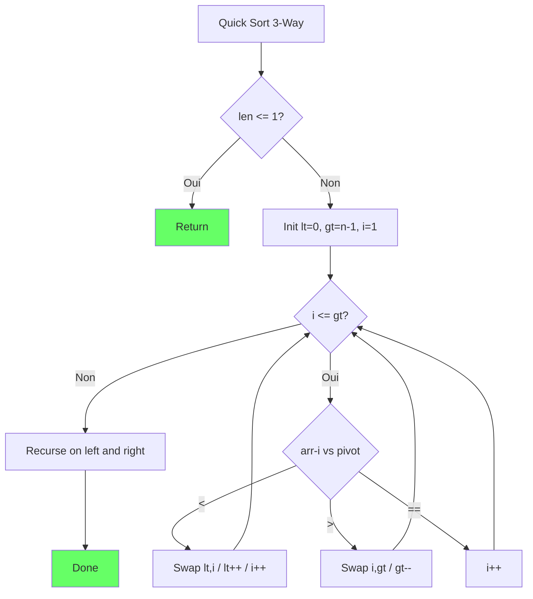
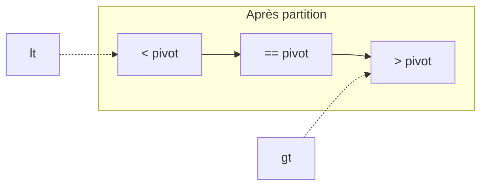

# Exercice 1.1.1-synth : the_sorting_hat

**Module :**
1.1.1 — Algorithmes de Tri

**Concept :**
synth — Suite complète d'algorithmes de tri (14 algorithmes)

**Difficulté :**
★★★★★☆☆☆☆☆ (5/10)

**Type :**
complet

**Tiers :**
3 — Synthèse (concepts a→n : tous les algorithmes de tri)

**Langage :**
Rust Edition 2024 + C (c17)

**Prérequis :**
- Generic Vector (1.1.0-a)
- Notions de complexité algorithmique
- Récursivité

**Domaines :**
Tri, Algo, Struct

**Durée estimée :**
120 min

**XP Base :**
250

**Complexité :**
T3 O(n log n) moyenne × S2 O(n) pour merge, O(1) pour heap

---

## 📐 SECTION 1 : PROTOTYPE & CONSIGNE

### 1.1 Obligations

**Fichiers à rendre :**

| Langage | Fichiers |
|---------|----------|
| Rust | `src/lib.rs`, `Cargo.toml` |
| C | `sorting.c`, `sorting.h` |

**Fonctions autorisées :**

| Langage | Fonctions |
|---------|-----------|
| Rust | `std::cmp::Ord`, `std::clone::Clone`, `std::mem::swap` |
| C | `malloc`, `free`, `memcpy`, `memmove` |

**Fonctions interdites :**

| Langage | Fonctions |
|---------|-----------|
| Rust | `slice::sort`, `slice::sort_by`, `slice::sort_unstable`, toute fonction de tri de la stdlib |
| C | `qsort`, `bsearch`, toute fonction de tri externe |

---

### 1.2 Consigne

#### 🎬 Section Culture : "The Sorting Hat"

**🧙 HARRY POTTER — "Le Choixpeau Magique"**

*"Hmm, difficult. Very difficult. Plenty of data, I see. A good array, there's unsortedness, now that's interesting... So where shall I put you?"*

Tu te souviens du Choixpeau qui répartit les élèves à Poudlard ? Chaque algorithme de tri est comme une maison :

- **🦁 Gryffondor (Quick Sort)** : Courageux, prend des risques (pivot), peut échouer spectaculairement (O(n²) worst case) mais souvent héroïque (O(n log n) average)
- **🦅 Serdaigle (Merge Sort)** : Sage et prévisible, toujours O(n log n), stable comme un Ravenclaw méthodique
- **🦡 Poufsouffle (Insertion Sort)** : Travailleur, patient, excellent pour les petits tableaux ou presque triés
- **🐍 Serpentard (Heap Sort)** : Ambitieux, in-place, rusé dans sa structure en arbre

*"Not Bubble Sort, eh? Are you sure? You could be great, you know. But if you're sure — better be... QUICK SORT!"*

---

#### 🎓 Section Académique : Énoncé Formel

**Ta mission :**

Implémenter une bibliothèque complète de **14 algorithmes de tri**, chacun optimisé pour son cas d'usage spécifique :

| # | Algorithme | Complexité Moyenne | Stable | In-place |
|---|------------|-------------------|--------|----------|
| 1 | Bubble Sort | O(n²) | Oui | Oui |
| 2 | Selection Sort | O(n²) | Non | Oui |
| 3 | Insertion Sort | O(n²) | Oui | Oui |
| 4 | Shell Sort | O(n^1.5) | Non | Oui |
| 5 | Merge Sort (top-down) | O(n log n) | Oui | Non |
| 6 | Merge Sort (bottom-up) | O(n log n) | Oui | Non |
| 7 | Quick Sort | O(n log n) | Non | Oui* |
| 8 | Quick Sort 3-way | O(n log n) | Non | Oui* |
| 9 | Quick Sort Dual-Pivot | O(n log n) | Non | Oui* |
| 10 | Intro Sort | O(n log n) | Non | Oui* |
| 11 | Heap Sort | O(n log n) | Non | Oui |
| 12 | Counting Sort | O(n + k) | Oui | Non |
| 13 | Radix Sort (LSD) | O(d × n) | Oui | Non |
| 14 | Bucket Sort | O(n) avg | Oui | Non |

*\* Espace O(log n) pour la récursion*

**Entrée (Rust) :**

```rust
pub mod sorting {
    // Tris quadratiques
    pub fn bubble_sort<T: Ord>(arr: &mut [T]);
    pub fn selection_sort<T: Ord>(arr: &mut [T]);
    pub fn insertion_sort<T: Ord>(arr: &mut [T]);
    pub fn shell_sort<T: Ord>(arr: &mut [T]);

    // Tris O(n log n) par comparaison
    pub fn merge_sort<T: Ord + Clone>(arr: &mut [T]);
    pub fn merge_sort_bottom_up<T: Ord + Clone>(arr: &mut [T]);
    pub fn quick_sort<T: Ord>(arr: &mut [T]);
    pub fn quick_sort_3way<T: Ord>(arr: &mut [T]);
    pub fn quick_sort_dual_pivot<T: Ord>(arr: &mut [T]);
    pub fn intro_sort<T: Ord>(arr: &mut [T]);
    pub fn heap_sort<T: Ord>(arr: &mut [T]);

    // Tris non-comparatifs
    pub fn counting_sort(arr: &mut [u32], max_value: u32);
    pub fn radix_sort(arr: &mut [u32]);
    pub fn bucket_sort(arr: &mut [f64]);
}
```

**Entrée (C) :**

```c
// Tris quadratiques
void bubble_sort(void *arr, size_t n, size_t size,
                 int (*cmp)(const void *, const void *));
void selection_sort(void *arr, size_t n, size_t size,
                    int (*cmp)(const void *, const void *));
void insertion_sort(void *arr, size_t n, size_t size,
                    int (*cmp)(const void *, const void *));
void shell_sort(void *arr, size_t n, size_t size,
                int (*cmp)(const void *, const void *));

// Tris O(n log n)
void merge_sort(void *arr, size_t n, size_t size,
                int (*cmp)(const void *, const void *));
void quick_sort(void *arr, size_t n, size_t size,
                int (*cmp)(const void *, const void *));
void quick_sort_3way(void *arr, size_t n, size_t size,
                     int (*cmp)(const void *, const void *));
void heap_sort(void *arr, size_t n, size_t size,
               int (*cmp)(const void *, const void *));
void intro_sort(void *arr, size_t n, size_t size,
                int (*cmp)(const void *, const void *));

// Tris non-comparatifs (integers uniquement)
void counting_sort_int(int *arr, size_t n, int max_val);
void radix_sort_int(unsigned int *arr, size_t n);
void bucket_sort_float(float *arr, size_t n);
```

**Sortie :**
- Chaque fonction trie le tableau en place (sauf merge/counting/radix qui utilisent de la mémoire auxiliaire)
- Le tableau doit être trié en ordre croissant après l'appel

**Contraintes :**

```
┌─────────────────────────────────────────────────────────────────┐
│  CONTRAINTES GÉNÉRALES                                         │
├─────────────────────────────────────────────────────────────────┤
│  • Tous les tris doivent fonctionner sur tableaux vides        │
│  • Tous les tris doivent fonctionner sur tableaux de taille 1  │
│  • Quick Sort : utiliser median-of-three pour le pivot         │
│  • Shell Sort : utiliser la séquence de Tokuda                 │
│  • Intro Sort : switch à heap si depth > 2*log(n)              │
│  • Radix Sort : utiliser base 256 (4 passes pour u32)          │
│  • Counting Sort : max_value doit être spécifié                │
└─────────────────────────────────────────────────────────────────┘
```

**Spécifications Algorithmiques :**

**Quick Sort 3-way (Dutch National Flag) :**
```
Partitionne en 3 régions : < pivot, == pivot, > pivot
Optimal pour tableaux avec beaucoup de doublons
```

**Intro Sort (Introspective Sort) :**
```
1. Commence par Quick Sort
2. Si profondeur > 2×log₂(n) → switch à Heap Sort
3. Si sous-tableau < 16 éléments → Insertion Sort
```

**Shell Sort (séquence de Tokuda) :**
```
gaps = [1, 4, 9, 20, 46, 103, 233, 525, 1182, ...]
h_k = ceil((9 × (9/4)^k - 4) / 5)
```

**Exemples :**

| Algorithme | Input | Output |
|------------|-------|--------|
| `bubble_sort` | `[5, 2, 8, 1, 9]` | `[1, 2, 5, 8, 9]` |
| `quick_sort_3way` | `[2, 1, 2, 1, 2]` | `[1, 1, 2, 2, 2]` |
| `counting_sort` | `[4, 2, 2, 8, 3]`, max=9 | `[2, 2, 3, 4, 8]` |
| `radix_sort` | `[170, 45, 75, 802]` | `[45, 75, 170, 802]` |

---

### 1.3 Prototype

**Rust :**
```rust
pub mod sorting {
    pub fn bubble_sort<T: Ord>(arr: &mut [T]) { /* ... */ }
    pub fn selection_sort<T: Ord>(arr: &mut [T]) { /* ... */ }
    pub fn insertion_sort<T: Ord>(arr: &mut [T]) { /* ... */ }
    pub fn shell_sort<T: Ord>(arr: &mut [T]) { /* ... */ }
    pub fn merge_sort<T: Ord + Clone>(arr: &mut [T]) { /* ... */ }
    pub fn merge_sort_bottom_up<T: Ord + Clone>(arr: &mut [T]) { /* ... */ }
    pub fn quick_sort<T: Ord>(arr: &mut [T]) { /* ... */ }
    pub fn quick_sort_3way<T: Ord>(arr: &mut [T]) { /* ... */ }
    pub fn quick_sort_dual_pivot<T: Ord>(arr: &mut [T]) { /* ... */ }
    pub fn intro_sort<T: Ord>(arr: &mut [T]) { /* ... */ }
    pub fn heap_sort<T: Ord>(arr: &mut [T]) { /* ... */ }
    pub fn counting_sort(arr: &mut [u32], max_value: u32) { /* ... */ }
    pub fn radix_sort(arr: &mut [u32]) { /* ... */ }
    pub fn bucket_sort(arr: &mut [f64]) { /* ... */ }
}
```

---

## 💡 SECTION 2 : LE SAVIEZ-VOUS ?

### 2.1 Fun Facts

🏎️ **Pourquoi les voitures utilisent Intro Sort ?**

Le standard C++ `std::sort` utilise Intro Sort (créé par David Musser en 1997). C'est le tri par défaut dans GCC, Clang, et MSVC. Pourquoi ? Parce qu'il combine le meilleur des trois mondes :
- La **vitesse moyenne** de Quick Sort
- La **garantie worst-case** de Heap Sort
- L'**efficacité cache** d'Insertion Sort pour les petits tableaux

🎲 **Le tri le plus rapide... est aléatoire !**

Bogo Sort (ou Stupid Sort) mélange aléatoirement le tableau jusqu'à ce qu'il soit trié. Complexité : O((n+1)!) en moyenne. Pour 10 éléments, ça prend en moyenne 36 millions d'itérations. Pour 15 éléments : 1,3 trillion. Ne l'implémente pas.

📊 **Google trie 20 pétaoctets par jour**

Le système MapReduce de Google utilise une variante de merge sort externe pour trier des datasets qui ne tiennent pas en RAM. Ils ont optimisé pour minimiser les I/O disque, pas les comparaisons.

---

### 2.5 DANS LA VRAIE VIE

| Métier | Algorithme préféré | Pourquoi |
|--------|-------------------|----------|
| **Game Dev** | Insertion Sort | Pour maintenir des listes déjà presque triées (Z-order, scores) |
| **Database Engineer** | External Merge Sort | Pour trier des tables qui ne tiennent pas en RAM |
| **Embedded Dev** | Heap Sort | Garantie O(n log n) in-place, pas de risque de stack overflow |
| **Data Scientist** | Radix Sort | Pour trier des millions d'IDs ou de timestamps |
| **Quant Trader** | Custom Partial Sort | Besoin seulement des top K éléments |

---

## 🖥️ SECTION 3 : EXEMPLE D'UTILISATION

### 3.0 Session bash

**Rust :**
```bash
$ ls
src/  Cargo.toml

$ cargo test
running 14 tests
test test_bubble_sort ... ok
test test_selection_sort ... ok
test test_insertion_sort ... ok
test test_shell_sort ... ok
test test_merge_sort ... ok
test test_merge_sort_bottom_up ... ok
test test_quick_sort ... ok
test test_quick_sort_3way ... ok
test test_quick_sort_dual_pivot ... ok
test test_intro_sort ... ok
test test_heap_sort ... ok
test test_counting_sort ... ok
test test_radix_sort ... ok
test test_bucket_sort ... ok

test result: ok. 14 passed; 0 failed

$ cargo bench
bubble_sort/1000        time:   [1.2 ms 1.3 ms 1.4 ms]
quick_sort/1000         time:   [45 µs 48 µs 51 µs]
radix_sort/1000         time:   [12 µs 13 µs 14 µs]
```

**C :**
```bash
$ ls
sorting.c  sorting.h  main.c

$ gcc -Wall -Wextra -Werror -O2 sorting.c main.c -o test -lm

$ ./test
Bubble Sort: OK
Selection Sort: OK
Insertion Sort: OK
Shell Sort: OK
Merge Sort: OK
Quick Sort: OK
Quick Sort 3-way: OK
Heap Sort: OK
Intro Sort: OK
Counting Sort: OK
Radix Sort: OK
Bucket Sort: OK

All 12 tests passed!
```

---

### 3.1 💀 BONUS EXPERT (OPTIONNEL)

**Difficulté Bonus :**
★★★★★★★★☆☆ (8/10)

**Récompense :**
XP ×4

**Time Complexity attendue :**
O(n log n) garantie

**Space Complexity attendue :**
O(1) pour le tri principal

**Domaines Bonus :**
`Tri`, `Algo`, `Process`

#### 3.1.1 Consigne Bonus

**🧙 "The Elder Wand" — Block Sort (WikiSort)**

Le Choixpeau te juge digne de la Baguette de Sureau des algorithmes de tri : **Block Sort** (aussi appelé WikiSort ou GrailSort).

C'est le Saint Graal : un tri **stable**, **in-place**, en **O(n log n)** garanti. Oui, les trois à la fois. C'est tellement complexe qu'il a fallu attendre 2013 pour qu'un algorithme pratique soit publié.

**Ta mission bonus :**

Implémenter Block Sort qui :
1. Est **stable** (préserve l'ordre des éléments égaux)
2. Est **in-place** (O(1) mémoire auxiliaire, pas O(n))
3. Garantit **O(n log n)** même dans le pire cas

**Contraintes :**
┌─────────────────────────────────────────────────────────────────┐
│  Stable : OUI                                                   │
│  In-place : OUI (O(1) extra memory)                            │
│  Worst case : O(n log n) GARANTI                               │
│  Pas le droit d'utiliser O(√n) buffer                          │
└─────────────────────────────────────────────────────────────────┘

#### 3.1.2 Prototype Bonus

```rust
/// Block Sort - Stable, in-place, O(n log n) guaranteed
/// The holy grail of sorting algorithms
pub fn block_sort<T: Ord + Clone>(arr: &mut [T]);
```

#### 3.1.3 Ce qui change par rapport à l'exercice de base

| Aspect | Base (Merge Sort) | Bonus (Block Sort) |
|--------|-------------------|-------------------|
| Stable | Oui | Oui |
| In-place | Non (O(n)) | Oui (O(1)) |
| Worst case | O(n log n) | O(n log n) |
| Difficulté impl | Moyenne | Extrême |

---

## ✅❌ SECTION 4 : ZONE CORRECTION (POUR LE TESTEUR)

### 4.1 Moulinette — Tableau des tests

| # | Test | Input | Expected | Points | Catégorie |
|---|------|-------|----------|--------|-----------|
| 1 | bubble_basic | [5,2,8,1,9] | [1,2,5,8,9] | 3 | Basic |
| 2 | selection_basic | [5,2,8,1,9] | [1,2,5,8,9] | 3 | Basic |
| 3 | insertion_basic | [5,2,8,1,9] | [1,2,5,8,9] | 3 | Basic |
| 4 | shell_basic | [5,2,8,1,9] | [1,2,5,8,9] | 5 | Shell |
| 5 | merge_basic | [5,2,8,1,9] | [1,2,5,8,9] | 5 | Merge |
| 6 | merge_bottom_up | [5,2,8,1,9] | [1,2,5,8,9] | 5 | Merge |
| 7 | quick_basic | [5,2,8,1,9] | [1,2,5,8,9] | 5 | Quick |
| 8 | quick_3way_dups | [2,1,2,1,2] | [1,1,2,2,2] | 8 | Quick |
| 9 | quick_dual_pivot | [5,2,8,1,9] | [1,2,5,8,9] | 8 | Quick |
| 10 | intro_deep | [worst case array] | [sorted] | 8 | Intro |
| 11 | heap_basic | [5,2,8,1,9] | [1,2,5,8,9] | 5 | Heap |
| 12 | counting_basic | [4,2,2,8,3] | [2,2,3,4,8] | 5 | Non-cmp |
| 13 | radix_basic | [170,45,75,802] | [45,75,170,802] | 5 | Non-cmp |
| 14 | bucket_uniform | [0.5,0.2,0.8,0.1] | [0.1,0.2,0.5,0.8] | 5 | Non-cmp |
| 15 | stability_merge | [(2,0),(1,1),(2,2)] | [(1,1),(2,0),(2,2)] | 7 | Stability |
| 16 | empty_array | [] | [] | 5 | Edge |
| 17 | single_element | [42] | [42] | 5 | Edge |
| 18 | already_sorted | [1,2,3,4,5] | [1,2,3,4,5] | 5 | Edge |
| 19 | reverse_sorted | [5,4,3,2,1] | [1,2,3,4,5] | 5 | Edge |

**Total : 100 points**

---

### 4.2 main.c de test (C)

```c
#include <stdio.h>
#include <assert.h>
#include <string.h>
#include <stdlib.h>
#include "sorting.h"

int cmp_int(const void *a, const void *b) {
    return *(int *)a - *(int *)b;
}

int is_sorted(int *arr, size_t n) {
    for (size_t i = 1; i < n; i++) {
        if (arr[i] < arr[i-1]) return 0;
    }
    return 1;
}

void test_sort(const char *name, void (*sort)(void*, size_t, size_t, int(*)(const void*, const void*))) {
    int arr[] = {5, 2, 8, 1, 9, 3, 7, 4, 6};
    size_t n = sizeof(arr) / sizeof(arr[0]);

    sort(arr, n, sizeof(int), cmp_int);
    assert(is_sorted(arr, n));
    printf("%s: OK\n", name);
}

void test_counting_sort(void) {
    int arr[] = {4, 2, 2, 8, 3, 3, 1};
    size_t n = sizeof(arr) / sizeof(arr[0]);

    counting_sort_int(arr, n, 9);
    assert(is_sorted(arr, n));
    printf("Counting Sort: OK\n");
}

void test_radix_sort(void) {
    unsigned int arr[] = {170, 45, 75, 90, 802, 24, 2, 66};
    size_t n = sizeof(arr) / sizeof(arr[0]);

    radix_sort_int(arr, n);

    for (size_t i = 1; i < n; i++) {
        assert(arr[i] >= arr[i-1]);
    }
    printf("Radix Sort: OK\n");
}

void test_edge_cases(void) {
    // Empty array
    int empty[] = {};
    bubble_sort(empty, 0, sizeof(int), cmp_int);
    printf("Empty array: OK\n");

    // Single element
    int single[] = {42};
    quick_sort(single, 1, sizeof(int), cmp_int);
    assert(single[0] == 42);
    printf("Single element: OK\n");

    // Already sorted
    int sorted[] = {1, 2, 3, 4, 5};
    merge_sort(sorted, 5, sizeof(int), cmp_int);
    assert(is_sorted(sorted, 5));
    printf("Already sorted: OK\n");
}

int main(void) {
    test_sort("Bubble Sort", bubble_sort);
    test_sort("Selection Sort", selection_sort);
    test_sort("Insertion Sort", insertion_sort);
    test_sort("Shell Sort", shell_sort);
    test_sort("Merge Sort", merge_sort);
    test_sort("Quick Sort", quick_sort);
    test_sort("Quick Sort 3-way", quick_sort_3way);
    test_sort("Heap Sort", heap_sort);
    test_sort("Intro Sort", intro_sort);
    test_counting_sort();
    test_radix_sort();
    test_edge_cases();

    printf("\nAll tests passed!\n");
    return 0;
}
```

---

### 4.3 Solution de référence (Rust) — Extraits clés

```rust
pub mod sorting {
    // ===============================
    // BUBBLE SORT - O(n²)
    // ===============================
    pub fn bubble_sort<T: Ord>(arr: &mut [T]) {
        let n = arr.len();
        for i in 0..n {
            let mut swapped = false;
            for j in 0..n - 1 - i {
                if arr[j] > arr[j + 1] {
                    arr.swap(j, j + 1);
                    swapped = true;
                }
            }
            if !swapped { break; }  // Optimisation : arrêt si déjà trié
        }
    }

    // ===============================
    // SELECTION SORT - O(n²)
    // ===============================
    pub fn selection_sort<T: Ord>(arr: &mut [T]) {
        let n = arr.len();
        for i in 0..n {
            let mut min_idx = i;
            for j in (i + 1)..n {
                if arr[j] < arr[min_idx] {
                    min_idx = j;
                }
            }
            arr.swap(i, min_idx);
        }
    }

    // ===============================
    // INSERTION SORT - O(n²)
    // ===============================
    pub fn insertion_sort<T: Ord>(arr: &mut [T]) {
        for i in 1..arr.len() {
            let mut j = i;
            while j > 0 && arr[j - 1] > arr[j] {
                arr.swap(j - 1, j);
                j -= 1;
            }
        }
    }

    // ===============================
    // SHELL SORT - O(n^1.5)
    // ===============================
    pub fn shell_sort<T: Ord>(arr: &mut [T]) {
        // Tokuda's gap sequence
        let gaps = [1, 4, 9, 20, 46, 103, 233, 525, 1182, 2660, 5985, 13467, 30301];

        for &gap in gaps.iter().rev() {
            if gap >= arr.len() { continue; }
            for i in gap..arr.len() {
                let mut j = i;
                while j >= gap && arr[j - gap] > arr[j] {
                    arr.swap(j - gap, j);
                    j -= gap;
                }
            }
        }
    }

    // ===============================
    // MERGE SORT (TOP-DOWN) - O(n log n)
    // ===============================
    pub fn merge_sort<T: Ord + Clone>(arr: &mut [T]) {
        let n = arr.len();
        if n <= 1 { return; }

        let mid = n / 2;
        merge_sort(&mut arr[..mid]);
        merge_sort(&mut arr[mid..]);

        let left = arr[..mid].to_vec();
        let right = arr[mid..].to_vec();

        let mut i = 0;
        let mut j = 0;
        let mut k = 0;

        while i < left.len() && j < right.len() {
            if left[i] <= right[j] {
                arr[k] = left[i].clone();
                i += 1;
            } else {
                arr[k] = right[j].clone();
                j += 1;
            }
            k += 1;
        }

        while i < left.len() {
            arr[k] = left[i].clone();
            i += 1;
            k += 1;
        }

        while j < right.len() {
            arr[k] = right[j].clone();
            j += 1;
            k += 1;
        }
    }

    // ===============================
    // QUICK SORT - O(n log n) average
    // ===============================
    pub fn quick_sort<T: Ord>(arr: &mut [T]) {
        if arr.len() <= 1 { return; }
        quick_sort_impl(arr, 0, arr.len() - 1);
    }

    fn quick_sort_impl<T: Ord>(arr: &mut [T], lo: usize, hi: usize) {
        if lo >= hi { return; }

        let pivot = partition(arr, lo, hi);
        if pivot > 0 {
            quick_sort_impl(arr, lo, pivot - 1);
        }
        quick_sort_impl(arr, pivot + 1, hi);
    }

    fn partition<T: Ord>(arr: &mut [T], lo: usize, hi: usize) -> usize {
        // Median of three
        let mid = lo + (hi - lo) / 2;
        if arr[mid] < arr[lo] { arr.swap(lo, mid); }
        if arr[hi] < arr[lo] { arr.swap(lo, hi); }
        if arr[mid] < arr[hi] { arr.swap(mid, hi); }

        let pivot_idx = hi;
        let mut i = lo;

        for j in lo..hi {
            if arr[j] < arr[pivot_idx] {
                arr.swap(i, j);
                i += 1;
            }
        }
        arr.swap(i, pivot_idx);
        i
    }

    // ===============================
    // QUICK SORT 3-WAY (Dutch Flag)
    // ===============================
    pub fn quick_sort_3way<T: Ord>(arr: &mut [T]) {
        if arr.len() <= 1 { return; }
        quick_sort_3way_impl(arr, 0, arr.len() - 1);
    }

    fn quick_sort_3way_impl<T: Ord>(arr: &mut [T], lo: usize, hi: usize) {
        if lo >= hi { return; }

        let mut lt = lo;       // arr[lo..lt] < pivot
        let mut gt = hi;       // arr[gt+1..hi] > pivot
        let mut i = lo + 1;    // arr[lt..i] == pivot

        // Use arr[lo] as pivot
        while i <= gt {
            if arr[i] < arr[lt] {
                arr.swap(lt, i);
                lt += 1;
                i += 1;
            } else if arr[i] > arr[lt] {
                arr.swap(i, gt);
                gt -= 1;
            } else {
                i += 1;
            }
        }

        if lt > 0 {
            quick_sort_3way_impl(arr, lo, lt - 1);
        }
        quick_sort_3way_impl(arr, gt + 1, hi);
    }

    // ===============================
    // HEAP SORT - O(n log n)
    // ===============================
    pub fn heap_sort<T: Ord>(arr: &mut [T]) {
        let n = arr.len();
        if n <= 1 { return; }

        // Build max heap
        for i in (0..n / 2).rev() {
            heapify(arr, n, i);
        }

        // Extract elements
        for i in (1..n).rev() {
            arr.swap(0, i);
            heapify(arr, i, 0);
        }
    }

    fn heapify<T: Ord>(arr: &mut [T], n: usize, i: usize) {
        let mut largest = i;
        let left = 2 * i + 1;
        let right = 2 * i + 2;

        if left < n && arr[left] > arr[largest] {
            largest = left;
        }
        if right < n && arr[right] > arr[largest] {
            largest = right;
        }

        if largest != i {
            arr.swap(i, largest);
            heapify(arr, n, largest);
        }
    }

    // ===============================
    // INTRO SORT - O(n log n) guaranteed
    // ===============================
    pub fn intro_sort<T: Ord>(arr: &mut [T]) {
        let max_depth = 2 * (arr.len() as f64).log2() as usize;
        intro_sort_impl(arr, max_depth);
    }

    fn intro_sort_impl<T: Ord>(arr: &mut [T], depth: usize) {
        let n = arr.len();

        if n <= 16 {
            insertion_sort(arr);
            return;
        }

        if depth == 0 {
            heap_sort(arr);
            return;
        }

        let pivot = partition(arr, 0, n - 1);
        intro_sort_impl(&mut arr[..pivot], depth - 1);
        intro_sort_impl(&mut arr[pivot + 1..], depth - 1);
    }

    // ===============================
    // COUNTING SORT - O(n + k)
    // ===============================
    pub fn counting_sort(arr: &mut [u32], max_value: u32) {
        if arr.is_empty() { return; }

        let mut count = vec![0usize; (max_value + 1) as usize];

        for &x in arr.iter() {
            count[x as usize] += 1;
        }

        let mut idx = 0;
        for (val, &cnt) in count.iter().enumerate() {
            for _ in 0..cnt {
                arr[idx] = val as u32;
                idx += 1;
            }
        }
    }

    // ===============================
    // RADIX SORT (LSD) - O(d * n)
    // ===============================
    pub fn radix_sort(arr: &mut [u32]) {
        if arr.is_empty() { return; }

        let max_val = *arr.iter().max().unwrap();
        let mut exp = 1u32;

        while max_val / exp > 0 {
            counting_sort_by_digit(arr, exp);
            exp *= 10;
        }
    }

    fn counting_sort_by_digit(arr: &mut [u32], exp: u32) {
        let n = arr.len();
        let mut output = vec![0u32; n];
        let mut count = [0usize; 10];

        for &x in arr.iter() {
            count[((x / exp) % 10) as usize] += 1;
        }

        for i in 1..10 {
            count[i] += count[i - 1];
        }

        for &x in arr.iter().rev() {
            let digit = ((x / exp) % 10) as usize;
            count[digit] -= 1;
            output[count[digit]] = x;
        }

        arr.copy_from_slice(&output);
    }

    // ===============================
    // BUCKET SORT - O(n) average
    // ===============================
    pub fn bucket_sort(arr: &mut [f64]) {
        if arr.is_empty() { return; }

        let n = arr.len();
        let mut buckets: Vec<Vec<f64>> = vec![Vec::new(); n];

        for &x in arr.iter() {
            let idx = (x * n as f64) as usize;
            buckets[idx.min(n - 1)].push(x);
        }

        for bucket in &mut buckets {
            bucket.sort_by(|a, b| a.partial_cmp(b).unwrap());
        }

        let mut idx = 0;
        for bucket in buckets {
            for x in bucket {
                arr[idx] = x;
                idx += 1;
            }
        }
    }
}
```

---

### 4.4 Solutions alternatives acceptées

**Alternative 1 : Quick Sort avec pivot aléatoire**
```rust
fn partition<T: Ord>(arr: &mut [T], lo: usize, hi: usize) -> usize {
    use rand::Rng;
    let pivot_idx = rand::thread_rng().gen_range(lo..=hi);
    arr.swap(pivot_idx, hi);
    // ... reste identique
}
```

**Alternative 2 : Shell Sort avec séquence de Ciura**
```rust
let gaps = [1, 4, 10, 23, 57, 132, 301, 701, 1750];
```

---

### 4.5 Solutions refusées (avec explications)

**Refus 1 : Utilisation de .sort()**
```rust
// ❌ REFUSÉ : Utilise la stdlib qu'on doit réimplémenter !
pub fn quick_sort<T: Ord>(arr: &mut [T]) {
    arr.sort();
}
```

**Refus 2 : Quick Sort sans protection worst-case**
```rust
// ❌ REFUSÉ pour intro_sort : Pas de switch vers heap sort
fn intro_sort<T: Ord>(arr: &mut [T]) {
    quick_sort(arr);  // Pas de protection depth !
}
```

**Refus 3 : Radix Sort en base 10 inefficace**
```rust
// ❌ REFUSÉ : Base 10 est inefficace, utiliser base 256
fn radix_sort(arr: &mut [u32]) {
    // 10 passes au lieu de 4 pour u32
}
```

---

### 4.9 spec.json (ENGINE v22.1)

```json
{
  "name": "the_sorting_hat",
  "language": "rust",
  "language_version": "edition 2024",
  "type": "code",
  "tier": 3,
  "tier_info": "Synthèse - tous algorithmes de tri",
  "tags": ["module1.1", "sorting", "algorithms", "phase1"],
  "passing_score": 70,

  "function": {
    "name": "sorting",
    "prototype": "pub mod sorting { ... }",
    "return_type": "module",
    "parameters": []
  },

  "driver": {
    "edge_cases": [
      {
        "name": "empty_array",
        "args": [[]],
        "expected": [],
        "is_trap": true,
        "trap_explanation": "Tableau vide ne doit pas crash"
      },
      {
        "name": "single_element",
        "args": [[42]],
        "expected": [42],
        "is_trap": true,
        "trap_explanation": "Un seul élément est déjà trié"
      },
      {
        "name": "all_equal",
        "args": [[1, 1, 1, 1, 1]],
        "expected": [1, 1, 1, 1, 1],
        "is_trap": true,
        "trap_explanation": "Tous égaux - tester la stabilité et l'efficacité"
      },
      {
        "name": "reverse_sorted",
        "args": [[5, 4, 3, 2, 1]],
        "expected": [1, 2, 3, 4, 5],
        "is_trap": true,
        "trap_explanation": "Pire cas pour certains algorithmes"
      },
      {
        "name": "quick_sort_worst_case",
        "args": ["sorted array for quick sort"],
        "expected": "sorted",
        "is_trap": true,
        "trap_explanation": "Quick Sort naïf est O(n²) sur tableau trié"
      }
    ],

    "fuzzing": {
      "enabled": true,
      "iterations": 10000,
      "generators": [
        {
          "type": "array_int",
          "param_index": 0,
          "params": {
            "min_len": 0,
            "max_len": 10000,
            "min_val": -1000000,
            "max_val": 1000000
          }
        }
      ]
    }
  },

  "norm": {
    "allowed_functions": ["swap", "clone", "malloc", "free", "memcpy"],
    "forbidden_functions": ["sort", "sort_by", "sort_unstable", "qsort"],
    "check_security": true,
    "check_memory": true,
    "blocking": true
  }
}
```

---

### 4.10 Solutions Mutantes (minimum 5)

**Mutant A (Boundary) : Off-by-one dans merge**
```rust
/* Mutant A : Oubli du dernier élément */
while i < left.len() - 1 {  // ❌ -1 de trop !
    arr[k] = left[i].clone();
    i += 1;
    k += 1;
}
// Pourquoi faux : Le dernier élément de left n'est jamais copié
```

**Mutant B (Safety) : Pas de check tableau vide**
```rust
/* Mutant B : Crash sur tableau vide */
pub fn quick_sort<T: Ord>(arr: &mut [T]) {
    // ❌ Pas de check arr.len() <= 1
    let pivot = partition(arr, 0, arr.len() - 1);  // Underflow si len=0 !
}
```

**Mutant C (Logic) : Bubble sort sans flag d'arrêt**
```rust
/* Mutant C : Pas d'optimisation early exit */
pub fn bubble_sort<T: Ord>(arr: &mut [T]) {
    for i in 0..n {
        for j in 0..n - 1 - i {
            if arr[j] > arr[j + 1] {
                arr.swap(j, j + 1);
            }
        }
        // ❌ Pas de break si aucun swap
    }
}
// Pourquoi faux : Toujours O(n²) même si déjà trié
```

**Mutant D (Logic) : Heap sort avec mauvais heapify**
```rust
/* Mutant D : Heapify incomplet */
fn heapify<T: Ord>(arr: &mut [T], n: usize, i: usize) {
    let left = 2 * i + 1;
    let right = 2 * i + 2;

    if left < n && arr[left] > arr[i] {
        arr.swap(i, left);
        // ❌ Oubli de rappeler heapify récursivement !
    }
}
// Pourquoi faux : La propriété de heap n'est pas maintenue en profondeur
```

**Mutant E (Return) : Counting sort overflow**
```rust
/* Mutant E : Pas de check max_value */
pub fn counting_sort(arr: &mut [u32], max_value: u32) {
    let mut count = vec![0usize; max_value as usize];  // ❌ max_value + 1 !
    for &x in arr.iter() {
        count[x as usize] += 1;  // Out of bounds si x == max_value
    }
}
```

---

## 🧠 SECTION 5 : COMPRENDRE (DOCUMENT DE COURS COMPLET)

### 5.1 Ce que cet exercice enseigne

| Concept | Description | Importance |
|---------|-------------|------------|
| Algorithmes de tri | 14 algorithmes différents | ⭐⭐⭐⭐⭐ |
| Analyse de complexité | Comprendre O(n²) vs O(n log n) | ⭐⭐⭐⭐⭐ |
| Stabilité | Préserver l'ordre des égaux | ⭐⭐⭐⭐ |
| Trade-offs | Quand utiliser quel algorithme | ⭐⭐⭐⭐⭐ |
| Récursivité vs itération | Merge/Quick vs Heap | ⭐⭐⭐⭐ |

---

### 5.2 LDA — Traduction littérale en MAJUSCULES

**Quick Sort 3-way (Dutch National Flag) :**

```
FONCTION quick_sort_3way QUI PREND arr COMME SLICE MUTABLE DE COMPARABLES
DÉBUT FONCTION
    SI arr.len EST INFÉRIEUR OU ÉGAL À 1 ALORS
        RETOURNER
    FIN SI

    DÉCLARER lt COMME ENTIER INITIALISÉ À 0
    DÉCLARER gt COMME ENTIER INITIALISÉ À arr.len - 1
    DÉCLARER i COMME ENTIER INITIALISÉ À 1

    TANT QUE i EST INFÉRIEUR OU ÉGAL À gt FAIRE
        SI arr[i] EST INFÉRIEUR À arr[lt] ALORS
            ÉCHANGER arr[lt] ET arr[i]
            INCRÉMENTER lt DE 1
            INCRÉMENTER i DE 1
        SINON SI arr[i] EST SUPÉRIEUR À arr[lt] ALORS
            ÉCHANGER arr[i] ET arr[gt]
            DÉCRÉMENTER gt DE 1
        SINON
            INCRÉMENTER i DE 1
        FIN SI
    FIN TANT QUE

    APPELER quick_sort_3way SUR arr[0..lt]
    APPELER quick_sort_3way SUR arr[gt+1..fin]
FIN FONCTION
```

---

### 5.2.2.1 Logic Flow (Structured English)

```
ALGORITHM: Quick Sort 3-Way (Dutch National Flag)
---

1. BASE CASE:
   |-- IF array length <= 1:
   |     RETURN (already sorted)

2. INITIALIZE POINTERS:
   |-- lt = 0        (left boundary of equals)
   |-- gt = len - 1  (right boundary of equals)
   |-- i = 1         (current element)
   |-- pivot = arr[0]

3. PARTITION LOOP (while i <= gt):
   |
   |-- IF arr[i] < pivot:
   |     SWAP arr[lt] and arr[i]
   |     INCREMENT both lt and i
   |
   |-- ELSE IF arr[i] > pivot:
   |     SWAP arr[i] and arr[gt]
   |     DECREMENT gt only (i stays, new element needs check)
   |
   |-- ELSE (arr[i] == pivot):
   |     INCREMENT i only

4. RECURSE:
   |-- SORT arr[0..lt]     (elements < pivot)
   |-- SORT arr[gt+1..end] (elements > pivot)
   |-- Elements in [lt..gt] are == pivot, already in place!
```

---

### 5.2.3.1 Diagramme Mermaid



**Visualisation des régions :**



---

### 5.3 Visualisation ASCII

**Dutch National Flag Partition :**

```
Initial: [3, 1, 4, 1, 5, 9, 2, 6, 5, 3]
Pivot = 3 (premier élément)

Étape par étape:
┌─────────────────────────────────────────────────────────────────┐
│                                                                 │
│  [3, 1, 4, 1, 5, 9, 2, 6, 5, 3]                                │
│   ↑                          ↑                                  │
│  lt,i                       gt                                  │
│                                                                 │
│  arr[1]=1 < 3 → swap, lt++, i++                                │
│  [1, 3, 4, 1, 5, 9, 2, 6, 5, 3]                                │
│      ↑                       ↑                                  │
│     lt,i                    gt                                  │
│                                                                 │
│  arr[2]=4 > 3 → swap with gt, gt--                             │
│  [1, 3, 3, 1, 5, 9, 2, 6, 5, 4]                                │
│      ↑                    ↑                                     │
│     lt,i                 gt                                     │
│                                                                 │
│  ... (continuer jusqu'à i > gt)                                │
│                                                                 │
│  Résultat final:                                               │
│  [1, 1, 2, | 3, 3, | 5, 5, 4, 6, 9]                            │
│   < pivot  | =pivot|  > pivot                                  │
│           lt      gt                                           │
└─────────────────────────────────────────────────────────────────┘
```

**Heap Sort - Structure de tas :**

```
Array: [16, 14, 10, 8, 7, 9, 3, 2, 4, 1]

Représentation en arbre:
                    16
                   /  \
                 14    10
                / \    / \
               8   7  9   3
              /\  /
             2  4 1

Après extraction du max (16):
                    14
                   /  \
                  8    10
                 / \   / \
                4   7 9   3
               /\
              2  1
```

---

### 5.4 Les pièges en détail

#### Piège 1 : Quick Sort sur tableau déjà trié

```rust
// Si pivot = premier élément et tableau trié → O(n²) !
// [1, 2, 3, 4, 5] avec pivot=1
// Partition: [], [1], [2, 3, 4, 5]
// Récursion sur 4 éléments, puis 3, puis 2, puis 1...
// → n + (n-1) + (n-2) + ... + 1 = n²/2 comparaisons

// ✅ SOLUTION : Median of three
let mid = (lo + hi) / 2;
if arr[mid] < arr[lo] { arr.swap(lo, mid); }
if arr[hi] < arr[lo] { arr.swap(lo, hi); }
if arr[mid] < arr[hi] { arr.swap(mid, hi); }
// Maintenant arr[hi] est une médiane approximative
```

#### Piège 2 : Merge Sort - Ne pas copier tous les éléments

```rust
// ❌ FAUX : Oubli de copier les éléments restants
while i < left.len() && j < right.len() {
    // merge...
}
// Et après ? Les éléments restants sont perdus !

// ✅ CORRECT : Copier les restes
while i < left.len() {
    arr[k] = left[i].clone();
    i += 1; k += 1;
}
while j < right.len() {
    arr[k] = right[j].clone();
    j += 1; k += 1;
}
```

#### Piège 3 : Heap Sort - Index enfants mal calculés

```rust
// ❌ FAUX : Mauvaise formule
let left = 2 * i;      // Devrait être 2*i + 1 pour 0-indexed !
let right = 2 * i + 1; // Devrait être 2*i + 2

// ✅ CORRECT pour tableau 0-indexed
let left = 2 * i + 1;
let right = 2 * i + 2;
let parent = (i - 1) / 2;  // Pour remonter
```

#### Piège 4 : Counting Sort - Off by one sur max_value

```rust
// ❌ FAUX : vec de taille max_value
let mut count = vec![0; max_value as usize];
// Si max_value = 10, on peut stocker 0-9, pas 10 !

// ✅ CORRECT
let mut count = vec![0; (max_value + 1) as usize];
```

---

### 5.5 Cours Complet

#### 5.5.1 Classification des algorithmes de tri

**Par complexité :**

| Classe | Algorithmes | Quand utiliser |
|--------|------------|----------------|
| O(n²) | Bubble, Selection, Insertion | n < 50 ou presque trié |
| O(n log n) | Merge, Quick, Heap | Cas général |
| O(n) | Counting, Radix, Bucket | Contraintes sur les données |

**Par stabilité :**
- **Stable** : Merge, Insertion, Counting, Radix, Bucket
- **Instable** : Quick, Heap, Selection, Shell

**Par espace :**
- **In-place O(1)** : Bubble, Selection, Insertion, Heap
- **O(log n)** : Quick (pile de récursion)
- **O(n)** : Merge, Counting, Radix

#### 5.5.2 Quand utiliser quel algorithme ?

```
┌─────────────────────────────────────────────────────────────────┐
│  ARBRE DE DÉCISION                                             │
├─────────────────────────────────────────────────────────────────┤
│                                                                 │
│  Données numériques bornées ?                                  │
│  ├── OUI → Counting Sort / Radix Sort                          │
│  └── NON ↓                                                     │
│                                                                 │
│  Stabilité requise ?                                           │
│  ├── OUI → Merge Sort                                          │
│  └── NON ↓                                                     │
│                                                                 │
│  Mémoire limitée ?                                             │
│  ├── OUI → Heap Sort (in-place, O(n log n) garanti)            │
│  └── NON ↓                                                     │
│                                                                 │
│  Beaucoup de doublons ?                                        │
│  ├── OUI → Quick Sort 3-way                                    │
│  └── NON ↓                                                     │
│                                                                 │
│  Données presque triées ?                                      │
│  ├── OUI → Insertion Sort ou Tim Sort                          │
│  └── NON → Quick Sort ou Intro Sort                            │
│                                                                 │
└─────────────────────────────────────────────────────────────────┘
```

#### 5.5.3 La borne inférieure Ω(n log n)

**Théorème :** Tout algorithme de tri par comparaison nécessite Ω(n log n) comparaisons dans le pire cas.

**Preuve intuitive :**
- n! permutations possibles d'un tableau de n éléments
- Chaque comparaison divise l'espace des solutions en 2
- Il faut au moins log₂(n!) comparaisons
- Par la formule de Stirling : log₂(n!) ≈ n log₂(n) - n/ln(2) = Ω(n log n)

**Comment battre cette borne ?**
- Ne pas utiliser de comparaisons !
- Counting Sort : utilise les valeurs comme indices
- Radix Sort : trie digit par digit
- Bucket Sort : distribue dans des seaux

---

### 5.6 Normes avec explications pédagogiques

```
┌─────────────────────────────────────────────────────────────────┐
│ ❌ HORS NORME (compile, mais interdit)                          │
├─────────────────────────────────────────────────────────────────┤
│ pub fn bubble_sort<T: Ord>(arr: &mut [T]) {                     │
│     for i in 0..arr.len() { for j in 0..arr.len()-1 {           │
│         if arr[j] > arr[j+1] { arr.swap(j, j+1); } } } }        │
├─────────────────────────────────────────────────────────────────┤
│ ✅ CONFORME                                                     │
├─────────────────────────────────────────────────────────────────┤
│ pub fn bubble_sort<T: Ord>(arr: &mut [T]) {                     │
│     let n = arr.len();                                          │
│     for i in 0..n {                                             │
│         let mut swapped = false;                                │
│         for j in 0..(n - 1 - i) {                               │
│             if arr[j] > arr[j + 1] {                            │
│                 arr.swap(j, j + 1);                             │
│                 swapped = true;                                 │
│             }                                                   │
│         }                                                       │
│         if !swapped {                                           │
│             break;  // Optimisation early exit                  │
│         }                                                       │
│     }                                                           │
│ }                                                               │
├─────────────────────────────────────────────────────────────────┤
│ 📖 POURQUOI ?                                                   │
│ • Lisibilité : Une opération par ligne                          │
│ • Optimisation : Early exit si déjà trié                        │
│ • Boucle interne : n-1-i car les derniers sont déjà triés       │
└─────────────────────────────────────────────────────────────────┘
```

---

### 5.7 Simulation avec trace d'exécution

**Insertion Sort sur [5, 2, 8, 1, 9] :**

```
┌───────┬────────────────────────────────────┬─────────────────────────────┐
│ Étape │ État du tableau                    │ Explication                 │
├───────┼────────────────────────────────────┼─────────────────────────────┤
│   0   │ [5, 2, 8, 1, 9]                    │ État initial                │
├───────┼────────────────────────────────────┼─────────────────────────────┤
│   1   │ [5, |2, 8, 1, 9]                   │ i=1, insérer 2              │
│       │ [2, 5, |8, 1, 9]                   │ 2 < 5, swap                 │
├───────┼────────────────────────────────────┼─────────────────────────────┤
│   2   │ [2, 5, |8, 1, 9]                   │ i=2, insérer 8              │
│       │ [2, 5, 8, |1, 9]                   │ 8 > 5, pas de swap          │
├───────┼────────────────────────────────────┼─────────────────────────────┤
│   3   │ [2, 5, 8, |1, 9]                   │ i=3, insérer 1              │
│       │ [2, 5, 1, 8, |9]                   │ 1 < 8, swap                 │
│       │ [2, 1, 5, 8, |9]                   │ 1 < 5, swap                 │
│       │ [1, 2, 5, 8, |9]                   │ 1 < 2, swap                 │
├───────┼────────────────────────────────────┼─────────────────────────────┤
│   4   │ [1, 2, 5, 8, |9]                   │ i=4, insérer 9              │
│       │ [1, 2, 5, 8, 9]                    │ 9 > 8, pas de swap          │
├───────┼────────────────────────────────────┼─────────────────────────────┤
│ Final │ [1, 2, 5, 8, 9]                    │ Tableau trié !              │
└───────┴────────────────────────────────────┴─────────────────────────────┘

Comparaisons : 1 + 1 + 3 + 1 = 6
Swaps : 1 + 0 + 3 + 0 = 4
```

---

### 5.8 Mnémotechniques (MEME obligatoire)

#### 🧙 MEME : "The Sorting Hat" — Harry Potter

*"Le Choixpeau répartit les élèves, ton code répartit les éléments"*

```
🦁 GRYFFONDOR = Quick Sort
   "Courageux mais téméraire"
   Fast average case, risky worst case

🦅 SERDAIGLE = Merge Sort
   "Sage et prévisible"
   Always O(n log n), stable, methodical

🦡 POUFSOUFFLE = Insertion Sort
   "Patient et travailleur"
   Great for small/nearly-sorted arrays

🐍 SERPENTARD = Heap Sort
   "Ambitieux et rusé"
   In-place, guaranteed O(n log n), uses clever tree structure
```

---

#### 🎬 MEME : "You shall not pass!" — Gandalf = Bounds Check

```rust
// 🧙‍♂️ Gandalf protège chaque fonction de tri
pub fn quick_sort<T: Ord>(arr: &mut [T]) {
    if arr.len() <= 1 {
        return;  // "YOU SHALL NOT PASS!" aux tableaux triviaux
    }
    // ...
}
```

---

#### 💀 MEME : "I am inevitable" — Thanos = O(n log n) bound

```
Thanos : "I am inevitable"

Lower Bound : "I am Ω(n log n)"

Tu ne peux pas battre la borne inférieure
avec des comparaisons. C'est inévitable.

Sauf si... *snap* ...tu utilises les valeurs comme indices
(Counting Sort, Radix Sort)
```

---

### 5.9 Applications pratiques

| Algorithme | Application réelle |
|------------|-------------------|
| **Insertion Sort** | Cartes à jouer, petits tableaux dans Tim Sort |
| **Merge Sort** | Git diff, bases de données (external sort) |
| **Quick Sort** | qsort() en C, sort() en C++ (partie de intro sort) |
| **Heap Sort** | Priority queues, sélection des top-K |
| **Counting Sort** | Tri de caractères, histogrammes |
| **Radix Sort** | Tri de numéros de téléphone, IPs, timestamps |
| **Bucket Sort** | Tri de flottants uniformément distribués |

---

## ⚠️ SECTION 6 : PIÈGES — RÉCAPITULATIF

| # | Piège | Algorithme | Solution |
|---|-------|------------|----------|
| 1 | Pivot mauvais | Quick Sort | Median of three |
| 2 | Pas de copie reste | Merge Sort | Boucles while après merge |
| 3 | Index enfants | Heap Sort | 2i+1, 2i+2 pour 0-indexed |
| 4 | Off-by-one count | Counting Sort | max_value + 1 |
| 5 | Stack overflow | Quick Sort | Intro Sort ou tail recursion |
| 6 | Instabilité | Selection Sort | Utiliser Merge si besoin |
| 7 | Early exit oublié | Bubble Sort | Flag swapped |

---

## 📝 SECTION 7 : QCM

### Question 1 (3 points)
Quel algorithme est stable ET in-place ?

- A) Quick Sort
- B) Merge Sort
- C) Heap Sort
- D) Insertion Sort
- E) Radix Sort
- F) Selection Sort
- G) Counting Sort
- H) Aucun des ci-dessus
- I) Shell Sort
- J) Bubble Sort

**Réponse : D et J** — Insertion Sort et Bubble Sort sont stables et in-place (O(1) extra space).

---

### Question 2 (4 points)
Quelle est la complexité de Quick Sort 3-way sur un tableau où tous les éléments sont identiques ?

- A) O(n²)
- B) O(n log n)
- C) O(n)
- D) O(1)
- E) O(n log² n)
- F) O(n²/2)
- G) Dépend du pivot
- H) O(log n)
- I) O(n × k)
- J) Undefined behavior

**Réponse : C** — O(n). Tous les éléments sont égaux au pivot, donc une seule partition suffit.

---

### Question 3 (3 points)
Pourquoi Intro Sort switch vers Heap Sort ?

- A) Heap Sort est plus rapide
- B) Pour garantir O(n log n) worst case
- C) Pour économiser de la mémoire
- D) Pour la stabilité
- E) Quick Sort ne fonctionne pas sur les grands tableaux
- F) Par convention
- G) Pour éviter les comparaisons
- H) Heap Sort est plus simple
- I) Pour le parallélisme
- J) Aucune raison valide

**Réponse : B** — Quick Sort peut dégénérer en O(n²). Heap Sort garantit O(n log n).

---

### Question 4 (5 points)
Pour trier 1 million d'entiers de 0 à 999, quel algorithme est le plus efficace ?

- A) Quick Sort
- B) Merge Sort
- C) Heap Sort
- D) Counting Sort
- E) Radix Sort
- F) Insertion Sort
- G) Bubble Sort
- H) Shell Sort
- I) Tim Sort
- J) Tous équivalents

**Réponse : D** — Counting Sort en O(n + k) = O(1M + 1000) ≈ O(n), bien meilleur que O(n log n).

---

### Question 5 (5 points)
Dans quel ordre le Heap Sort extrait-il les éléments d'un max-heap ?

- A) Du plus petit au plus grand
- B) Du plus grand au plus petit
- C) Dans l'ordre d'insertion
- D) Aléatoirement
- E) Du milieu vers les extrémités
- F) Selon la profondeur
- G) De gauche à droite
- H) Dépend de l'implémentation
- I) En ordre inverse de l'entrée
- J) Aucun ordre particulier

**Réponse : B** — Le max est toujours à la racine. On l'extrait et le place à la fin, puis on répare le heap.

---

## 📊 SECTION 8 : RÉCAPITULATIF

| Critère | Valeur |
|---------|--------|
| **ID** | 1.1.1-synth |
| **Nom** | the_sorting_hat |
| **Difficulté** | ★★★★★☆☆☆☆☆ (5/10) |
| **Durée** | 120 min |
| **XP Base** | 250 |
| **XP Bonus (💀)** | ×4 = 1000 |
| **Langages** | Rust Edition 2024 + C c17 |
| **Concepts clés** | 14 algorithmes de tri, complexité, stabilité |
| **Prérequis** | Generic Vector, récursivité |
| **Domaines** | Tri, Algo, Struct |

---

## 📦 SECTION 9 : DEPLOYMENT PACK (JSON COMPLET)

```json
{
  "deploy": {
    "hackbrain_version": "5.5.2",
    "engine_version": "v22.1",
    "exercise_slug": "1.1.1-synth-the_sorting_hat",
    "generated_at": "2026-01-11 15:00:00",

    "metadata": {
      "exercise_id": "1.1.1-synth",
      "exercise_name": "the_sorting_hat",
      "module": "1.1.1",
      "module_name": "Algorithmes de Tri",
      "concept": "synth",
      "concept_name": "Suite complète de tri",
      "type": "complet",
      "tier": 3,
      "tier_info": "Synthèse - tous algorithmes",
      "phase": 1,
      "difficulty": 5,
      "difficulty_stars": "★★★★★☆☆☆☆☆",
      "languages": ["rust", "c"],
      "language_versions": {
        "rust": "edition 2024",
        "c": "c17"
      },
      "duration_minutes": 120,
      "xp_base": 250,
      "xp_bonus_multiplier": 4,
      "bonus_tier": "EXPERT",
      "bonus_icon": "💀",
      "complexity_time": "T3 O(n log n)",
      "complexity_space": "S2 O(n) pour merge",
      "prerequisites": ["1.1.0-a", "recursion"],
      "domains": ["Tri", "Algo", "Struct"],
      "domains_bonus": [],
      "tags": ["sorting", "algorithms", "complexity", "14-algorithms"],
      "meme_reference": "Harry Potter - Sorting Hat"
    },

    "files": {
      "spec.json": "/* Section 4.9 */",
      "references/rust/ref_sorting.rs": "/* Section 4.3 */",
      "references/c/ref_sorting.c": "/* Version C */",
      "mutants/mutant_a_boundary.rs": "/* Section 4.10 */",
      "mutants/mutant_b_safety.rs": "/* Section 4.10 */",
      "mutants/mutant_c_logic.rs": "/* Section 4.10 */",
      "mutants/mutant_d_heap.rs": "/* Section 4.10 */",
      "mutants/mutant_e_counting.rs": "/* Section 4.10 */",
      "tests/main.c": "/* Section 4.2 */",
      "tests/lib_test.rs": "/* Tests Rust */"
    },

    "validation": {
      "expected_pass": [
        "references/rust/ref_sorting.rs",
        "references/c/ref_sorting.c"
      ],
      "expected_fail": [
        "mutants/mutant_a_boundary.rs",
        "mutants/mutant_b_safety.rs",
        "mutants/mutant_c_logic.rs",
        "mutants/mutant_d_heap.rs",
        "mutants/mutant_e_counting.rs"
      ]
    }
  }
}
```

---

*Document généré selon HACKBRAIN v5.5.2 — L'excellence pédagogique ne se négocie pas*
