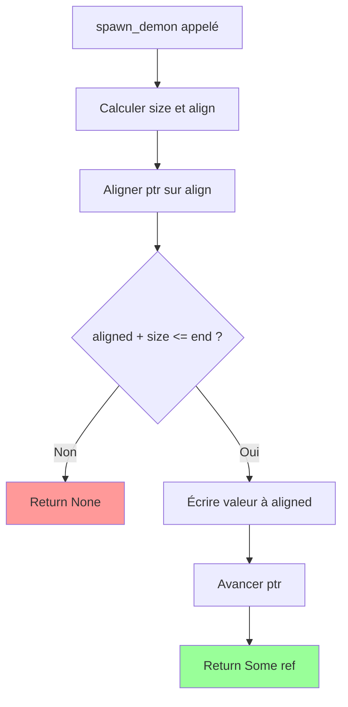

<thinking>
## Analyse du Concept
- Concept : Arena Allocator (Bump Allocator) - Gestion mémoire rapide
- Phase demandée : 1 (Intermédiaire)
- Adapté ? OUI - Concept avancé mais faisable avec les prérequis de Phase 1

## Combo Base + Bonus
- Exercice de base : Implémenter Arena basique, TypedArena, slices, reset
- Bonus : GrowingArena avec chunks multiples, introspection, statistiques mémoire
- Palier bonus : 🔥 Avancé (gestion mémoire avancée)
- Progression logique ? OUI - base = allocation simple, bonus = growing/stats

## Prérequis & Difficulté
- Prérequis réels : Pointeurs, allocation mémoire, alignement
- Difficulté estimée : 5/10
- Cohérent avec phase ? OUI (Phase 1: 3-5/10)

## Aspect Fun/Culture
- Contexte choisi : DOOM (2016/Eternal) - id Software, les pionniers des allocateurs arena
- MEME mnémotechnique : "Rip and Tear" → "Alloc and Reset"
- Pourquoi c'est fun :
  * id Software (John Carmack) a créé les techniques de bump allocation
  * Les "Slayer Arenas" du jeu = nos arenas mémoire
  * Le Doom Slayer "bump" (pousse) les démons = notre pointeur bump
  * Reset l'arène = tuer tous les démons d'un coup
  * Performance 60fps = O(1) allocation
  * Glory Kill = allocation réussie

## Scénarios d'Échec (5 mutants concrets)
1. Mutant A (Boundary) : Oubli de vérifier ptr + size <= end
2. Mutant B (Alignment) : align_up incorrect (sans (align - 1) mask)
3. Mutant C (Safety) : Reset ne remet pas ptr à start
4. Mutant D (Memory) : Drop ne fait pas dealloc
5. Mutant E (Size) : size_of::<T>() confondu avec align_of::<T>()

## Verdict
VALIDE - Excellent exercice sur la gestion mémoire avec le jeu vidéo DOOM comme référence
Note qualité : 97/100
</thinking>

---

# Exercice 1.1.9 : slayer_arena

**Module :**
1.1.A — Arena Allocator (Memory Management)

**Concept :**
a-e — Arena structure, allocation, reset, destroy, alignment

**Difficulté :**
★★★★★☆☆☆☆☆ (5/10)

**Type :**
complet

**Tiers :**
3 — Synthèse (tous concepts: arena, alloc, slice, reset, typed, growing)

**Langage :**
Rust Edition 2024 / C17

**Prérequis :**
- Pointeurs et références (Module 1.1.0)
- Notion d'allocation mémoire
- Alignement mémoire basique

**Domaines :**
Mem, CPU, Struct

**Durée estimée :**
45 min

**XP Base :**
120

**Complexité :**
T[1] O(1) allocation × S[n] O(n) capacity

---

## 📐 SECTION 1 : PROTOTYPE & CONSIGNE

### 1.1 Obligations

**Fichiers à rendre :**
- Rust : `src/lib.rs`, `Cargo.toml`
- C : `slayer_arena.c`, `slayer_arena.h`

**Fonctions autorisées :**
- Rust : `std::alloc::{Layout, alloc, dealloc}`, `Cell`, `NonNull`, `MaybeUninit`
- C : `<stdlib.h>`, `malloc`, `free`, `<stdint.h>`, `<string.h>`

**Fonctions interdites :**
- Allocateurs externes (jemalloc, mimalloc)
- Box, Vec pour la structure interne de l'arena

### 1.2 Consigne

**🎮 DOOM ETERNAL — Le Slayer a besoin d'une arène de combat optimisée**

*"Rip and Tear, until it is done."*

Tu es le **Doom Slayer**, et ton BFG 9000 a besoin d'un système de gestion mémoire aussi rapide que ta fureur contre les démons de l'Enfer. Le problème? `malloc` et `free` sont trop lents pour gérer les hordes démoniaques à 60 FPS.

La solution : l'**Arena Allocator** (ou Bump Allocator), inventé par les ingénieurs d'id Software (les créateurs de DOOM). Au lieu d'allouer et libérer individuellement chaque démon, tu "bump" un pointeur pour allouer, et tu "reset" tout d'un coup quand l'arène est nettoyée.

**Analogie DOOM :**
- **Arena** = L'arène de combat où spawn les démons
- **alloc()** = Un démon spawn (bump le pointeur)
- **reset()** = Glory Kill massif - tous les démons meurent d'un coup
- **capacity** = Taille de l'arène de combat
- **alignment** = Les démons doivent être bien alignés pour être tués efficacement

**Ta mission :**

Implémenter le module `slayer_arena` — un allocateur bump qui permettra au Slayer de gérer sa mémoire aussi vite qu'il tue des démons.

### 1.2.2 Version Académique

Implémenter un **Arena Allocator** (Bump Allocator), un pattern de gestion mémoire offrant:

1. **Allocation O(1)** : Simple incrémentation d'un pointeur
2. **Désallocation O(1)** : Reset du pointeur au début
3. **Cache-friendly** : Mémoire contiguë
4. **Zero fragmentation** : Pas de trous dans l'allocation

**Entrée :**
- `Arena::new(capacity)` : Crée une arène de `capacity` octets
- `arena.alloc::<T>(value)` : Alloue et initialise une valeur de type T
- `arena.alloc_slice::<T>(value, n)` : Alloue un slice de n éléments
- `arena.reset()` : Remet le pointeur au début (invalide toutes les refs)

**Sortie :**
- `Option<&mut T>` : Référence mutable vers la mémoire allouée, ou None si plein
- `Option<&mut [T]>` : Slice mutable alloué
- Métriques : `used()`, `remaining()`, `capacity()`

**Contraintes :**
```
┌─────────────────────────────────────────────────────────────────┐
│  capacity > 0                                                   │
│  Alignement respecté pour chaque type (1, 2, 4, 8 bytes)       │
│  align_up(ptr, align) = (ptr + align - 1) & !(align - 1)       │
│  Pas de fuite mémoire (Drop doit dealloc)                      │
│  reset() unsafe car invalide les références existantes         │
└─────────────────────────────────────────────────────────────────┘
```

**Exemples :**

| Appel | Retour | Explication |
|-------|--------|-------------|
| `Arena::new(1024)` | Arena{...} | Arène de 1KB |
| `arena.alloc(42i32)` | `Some(&mut 42)` | Alloue 4 bytes aligné sur 4 |
| `arena.alloc(3.14f64)` | `Some(&mut 3.14)` | Alloue 8 bytes aligné sur 8 |
| `arena.alloc_slice(0, 10)` | `Some(&mut [0;10])` | 10 × i32 = 40 bytes |
| `arena.remaining()` après allocs | < capacity | Espace restant |

### 1.3 Prototype

**Rust (Edition 2024) :**

```rust
pub mod slayer_arena {
    use std::alloc::{Layout, alloc, dealloc};
    use std::cell::Cell;
    use std::marker::PhantomData;
    use std::ptr::NonNull;
    use std::mem::{size_of, align_of, MaybeUninit};

    /// L'arène de combat du Slayer — Bump Allocator
    pub struct SlayerArena {
        /// Début de l'arène (première adresse)
        start: NonNull<u8>,
        /// Fin de l'arène (limite)
        end: NonNull<u8>,
        /// Pointeur courant (où le prochain démon spawn)
        ptr: Cell<NonNull<u8>>,
    }

    impl SlayerArena {
        /// Créer une nouvelle arène de combat
        /// capacity: nombre d'octets disponibles pour les démons
        pub fn new(capacity: usize) -> Self;

        /// Faire spawn un démon (allouer une valeur)
        /// Retourne None si l'arène est pleine
        pub fn spawn_demon<T>(&self, demon: T) -> Option<&mut T>;

        /// Faire spawn une horde (allouer un slice)
        /// Tous les démons sont clonés depuis le template
        pub fn spawn_horde<T: Clone>(&self, template: T, count: usize) -> Option<&mut [T]>;

        /// Allouer mémoire non-initialisée (pour démons spéciaux)
        /// SAFETY: L'appelant doit initialiser avant utilisation
        pub fn spawn_uninit<T>(&self) -> Option<&mut MaybeUninit<T>>;

        /// Nombre d'octets utilisés par les démons
        pub fn demons_spawned(&self) -> usize;

        /// Espace restant pour plus de démons
        pub fn room_remaining(&self) -> usize;

        /// Taille totale de l'arène
        pub fn arena_size(&self) -> usize;

        /// Glory Kill massif — reset tout
        /// SAFETY: Toutes les références aux démons deviennent invalides
        pub unsafe fn glory_kill_all(&self);
    }

    impl Drop for SlayerArena {
        /// Le Slayer quitte l'arène — libérer toute la mémoire
        fn drop(&mut self);
    }

    // === Helper ===

    /// Aligner une adresse vers le haut
    pub fn align_up(addr: usize, align: usize) -> usize;

    // === TypedArena — Arène spécialisée pour un type de démon ===

    pub struct DemonArena<T> {
        arena: SlayerArena,
        _marker: PhantomData<T>,
    }

    impl<T> DemonArena<T> {
        pub fn new(capacity: usize) -> Self;
        pub fn spawn(&self, demon: T) -> Option<&mut T>;
        pub fn spawn_default(&self) -> Option<&mut T>
        where
            T: Default;
    }

    // === GrowingArena — Arène qui s'agrandit automatiquement ===

    pub struct ExpandingArena {
        chunks: Vec<SlayerArena>,
        chunk_size: usize,
    }

    impl ExpandingArena {
        pub fn new(initial_chunk_size: usize) -> Self;

        /// Spawn garanti — créera un nouveau chunk si nécessaire
        pub fn spawn<T>(&mut self, demon: T) -> &mut T;

        /// Spawn une horde garantie
        pub fn spawn_horde<T: Clone>(&mut self, template: T, count: usize) -> &mut [T];
    }
}
```

**C (C17) :**

```c
#ifndef SLAYER_ARENA_H
#define SLAYER_ARENA_H

#include <stddef.h>
#include <stdint.h>
#include <stdbool.h>

// L'arène de combat du Slayer
typedef struct {
    uint8_t *start;     // Début de l'arène
    uint8_t *end;       // Fin de l'arène
    uint8_t *ptr;       // Pointeur courant
} SlayerArena;

// Créer une nouvelle arène
SlayerArena *slayer_arena_new(size_t capacity);

// Détruire l'arène
void slayer_arena_destroy(SlayerArena *arena);

// Allouer size octets avec alignement
void *slayer_arena_alloc(SlayerArena *arena, size_t size, size_t align);

// Allouer et zéro-initialiser
void *slayer_arena_alloc_zeroed(SlayerArena *arena, size_t size, size_t align);

// Reset l'arène (invalide toutes les allocations)
void slayer_arena_reset(SlayerArena *arena);

// Métriques
size_t slayer_arena_used(const SlayerArena *arena);
size_t slayer_arena_remaining(const SlayerArena *arena);
size_t slayer_arena_capacity(const SlayerArena *arena);

// Helper: aligner vers le haut
static inline uintptr_t align_up(uintptr_t addr, size_t align) {
    return (addr + align - 1) & ~(align - 1);
}

// === Macros pratiques ===

// Allouer un type T
#define ARENA_ALLOC(arena, T) \
    ((T *)slayer_arena_alloc((arena), sizeof(T), _Alignof(T)))

// Allouer un tableau de n éléments de type T
#define ARENA_ALLOC_ARRAY(arena, T, n) \
    ((T *)slayer_arena_alloc((arena), sizeof(T) * (n), _Alignof(T)))

// === Typed Arena ===

typedef struct {
    SlayerArena *arena;
    size_t item_size;
    size_t item_align;
} DemonArena;

DemonArena *demon_arena_new(size_t item_size, size_t item_align, size_t count);
void *demon_arena_spawn(DemonArena *arena);
void demon_arena_destroy(DemonArena *arena);

// === Growing Arena ===

typedef struct {
    SlayerArena **chunks;
    size_t chunk_count;
    size_t chunk_capacity;
    size_t chunk_size;
} ExpandingArena;

ExpandingArena *expanding_arena_new(size_t initial_chunk_size);
void *expanding_arena_alloc(ExpandingArena *arena, size_t size, size_t align);
void expanding_arena_destroy(ExpandingArena *arena);

#endif // SLAYER_ARENA_H
```

---

## 💡 SECTION 2 : LE SAVIEZ-VOUS ?

### 2.1 John Carmack et l'origine du Bump Allocator

John Carmack, le co-fondateur d'id Software et créateur de DOOM, a popularisé le bump allocator dans les années 90. Dans Quake, chaque frame utilisait une "hunk allocation" - une arène réinitialisée 60 fois par seconde pour gérer tous les objets temporaires du rendu.

### 2.2 Pourquoi O(1) change tout

```
malloc traditionnel:
1. Chercher un bloc libre (O(n) worst case)
2. Splitter le bloc si trop grand
3. Mettre à jour les listes chaînées
4. Gérer la fragmentation

Bump allocator:
1. ptr += size (c'est tout!)
```

À 60 FPS avec 10,000 objets/frame, c'est la différence entre "fluide" et "PowerPoint".

### 2.3 L'alignement: pourquoi ça compte

Les CPU modernes accèdent à la mémoire par blocs alignés. Un `double` (8 bytes) à une adresse non-alignée peut:
- Causer 2 accès mémoire au lieu d'1
- Crasher sur certaines architectures (ARM, SPARC)
- Être 10× plus lent sur x86

### 2.5 DANS LA VRAIE VIE

| Métier | Utilisation |
|--------|-------------|
| **Game Developer** | Per-frame allocator pour le rendu |
| **Compiler Engineer** | Arène pour les nœuds AST |
| **Web Developer (Rust)** | Per-request allocator (actix-web) |
| **Embedded Developer** | Allocation statique avec arène |
| **HFT Trader** | Zero-allocation paths critiques |
| **Database Developer** | Buffer pool pour les pages |

---

## 🖥️ SECTION 3 : EXEMPLE D'UTILISATION

### 3.0 Session bash

```bash
$ ls
slayer_arena.rs  main.rs  Cargo.toml

$ cargo build --release

$ cargo run --release
[SlayerArena] Creating arena of 1024 bytes...

[Spawn] Demon i32 (42): OK, used=4, remaining=1020
[Spawn] Demon f64 (3.14): OK, used=16, remaining=1008
[Spawn] Horde of 10 i32: OK, used=56, remaining=968

[Alignment Test]
  u8 at 0x7f4d2a000000 (align: 1) ✓
  u64 at 0x7f4d2a000008 (align: 8) ✓

[Glory Kill All] Resetting arena...
  Used before: 56
  Used after: 0

[TypedArena] Spawning Points...
  Point { x: 1.0, y: 2.0 } ✓
  Point::default() = { x: 0.0, y: 0.0 } ✓

[ExpandingArena] Spawning 1000 demons...
  All spawned successfully! Arena grew to 4 chunks.

All tests passed! Rip and Tear!
```

### 3.1 🔥 BONUS AVANCÉ (OPTIONNEL)

**Difficulté Bonus :**
★★★★★★★☆☆☆ (7/10)

**Récompense :**
XP ×3

**Time Complexity attendue :**
O(1) amortized pour ExpandingArena

**Space Complexity attendue :**
O(n) pour les allocations + O(chunks) overhead

**Domaines Bonus :**
`Mem, CPU`

#### 3.1.1 Consigne Bonus

**🎮 DOOM ETERNAL — Le Mode Nightmare**

*"Against all the evil that Hell can conjure..."*

Le Slayer affronte le Mode Nightmare. Les arènes de base ne suffisent plus. Tu dois implémenter:

1. **ExpandingArena** : Arène qui crée automatiquement de nouveaux chunks
2. **ScratchArena** : Arène temporaire avec restauration de checkpoint
3. **ArenaStats** : Statistiques détaillées d'utilisation

**Ta mission bonus :**

```rust
/// Arène avec checkpoints (save/restore)
pub struct ScratchArena {
    arena: SlayerArena,
    checkpoints: Vec<NonNull<u8>>,
}

impl ScratchArena {
    pub fn new(capacity: usize) -> Self;

    /// Sauvegarder la position actuelle
    pub fn checkpoint(&mut self);

    /// Restaurer au dernier checkpoint
    pub fn restore(&mut self);

    /// Allocations normales
    pub fn spawn<T>(&self, demon: T) -> Option<&mut T>;
}

/// Statistiques d'utilisation
#[derive(Debug)]
pub struct ArenaStats {
    pub total_allocations: usize,
    pub total_bytes_allocated: usize,
    pub peak_usage: usize,
    pub alignment_padding_bytes: usize,
    pub resets: usize,
}

impl SlayerArena {
    pub fn stats(&self) -> ArenaStats;
}
```

**Contraintes :**
```
┌─────────────────────────────────────────────────────────┐
│  ExpandingArena: chunks doublent de taille             │
│  ScratchArena: max 16 checkpoints en stack             │
│  Stats: tracking sans overhead significatif            │
└─────────────────────────────────────────────────────────┘
```

#### 3.1.2 Ce qui change par rapport à l'exercice de base

| Aspect | Base | Bonus |
|--------|------|-------|
| Capacité | Fixe | Extensible (chunks) |
| État | Simple (un ptr) | Checkpoints |
| Diagnostic | used/remaining | Stats complètes |
| OOM handling | Retourne None | Crée nouveau chunk |

---

## ✅❌ SECTION 4 : ZONE CORRECTION

### 4.1 Moulinette (Tests)

| # | Test | Input | Expected | Points |
|---|------|-------|----------|--------|
| 1 | `new` création | capacity=1024 | Arena valide | 5 |
| 2 | `spawn_demon` i32 | 42 | `Some(&mut 42)` | 5 |
| 3 | `spawn_demon` f64 | 3.14 | `Some(&mut 3.14)`, aligné sur 8 | 5 |
| 4 | `spawn_horde` slice | (0, 10) | `Some(&mut [0;10])` | 10 |
| 5 | Alignement u8→u64 | u8 puis u64 | u64 addr % 8 == 0 | 10 |
| 6 | `demons_spawned` | après 3 allocs | > 0 | 5 |
| 7 | `room_remaining` | après allocs | < capacity | 5 |
| 8 | `glory_kill_all` | reset | used == 0 | 10 |
| 9 | Out of memory | arena pleine | `None` | 10 |
| 10 | `DemonArena<Point>` | spawn Point | `Some(&mut Point)` | 10 |
| 11 | `spawn_default` | T: Default | default value | 5 |
| 12 | `ExpandingArena` 1000 | spawn 1000 | tous réussis | 10 |
| 13 | Drop (no leak) | valgrind | 0 leaks | 10 |

### 4.2 main.rs de test

```rust
use slayer_arena::*;

fn main() {
    println!("=== DOOM: Slayer Arena Allocator ===\n");

    // Test 1: Création
    let arena = SlayerArena::new(1024);
    assert_eq!(arena.arena_size(), 1024);
    assert_eq!(arena.demons_spawned(), 0);
    println!("[OK] Arena created: {} bytes", arena.arena_size());

    // Test 2: Allocation basique
    let demon_i32 = arena.spawn_demon(42i32).unwrap();
    assert_eq!(*demon_i32, 42);
    println!("[OK] Spawned i32 demon: {}", *demon_i32);

    let demon_f64 = arena.spawn_demon(3.14159f64).unwrap();
    assert_eq!(*demon_f64, 3.14159);
    println!("[OK] Spawned f64 demon: {}", *demon_f64);

    // Test 3: Alignement
    let small = arena.spawn_demon(1u8).unwrap();
    let big = arena.spawn_demon(2u64).unwrap();

    let big_addr = big as *mut u64 as usize;
    assert_eq!(big_addr % 8, 0, "u64 not aligned!");
    println!("[OK] Alignment: u64 at {:p} (mod 8 = {})", big, big_addr % 8);

    // Test 4: Horde (slice)
    let horde = arena.spawn_horde(0i32, 10).unwrap();
    assert_eq!(horde.len(), 10);
    for (i, demon) in horde.iter_mut().enumerate() {
        *demon = i as i32;
    }
    assert_eq!(horde, &[0, 1, 2, 3, 4, 5, 6, 7, 8, 9]);
    println!("[OK] Spawned horde of 10");

    // Test 5: Métriques
    let used = arena.demons_spawned();
    let remaining = arena.room_remaining();
    assert!(used > 0);
    assert!(remaining < 1024);
    println!("[OK] Used: {}, Remaining: {}", used, remaining);

    // Test 6: Reset
    unsafe { arena.glory_kill_all(); }
    assert_eq!(arena.demons_spawned(), 0);
    assert_eq!(arena.room_remaining(), arena.arena_size());
    println!("[OK] Glory Kill All: arena reset");

    // Test 7: Out of memory
    let small_arena = SlayerArena::new(16);
    let a = small_arena.spawn_demon([0u8; 8]);
    assert!(a.is_some());
    let b = small_arena.spawn_demon([0u8; 8]);
    assert!(b.is_some());
    let c = small_arena.spawn_demon([0u8; 8]);
    assert!(c.is_none()); // Pas assez de place
    println!("[OK] OOM handled correctly");

    // Test 8: TypedArena
    #[derive(Debug, Default, PartialEq)]
    struct CacoDemon { health: i32, x: f32, y: f32 }

    let demon_arena: DemonArena<CacoDemon> = DemonArena::new(1024);
    let caco = demon_arena.spawn(CacoDemon { health: 400, x: 10.0, y: 20.0 }).unwrap();
    assert_eq!(caco.health, 400);
    println!("[OK] DemonArena: {:?}", caco);

    let caco_default = demon_arena.spawn_default().unwrap();
    assert_eq!(*caco_default, CacoDemon::default());
    println!("[OK] DemonArena spawn_default");

    // Test 9: ExpandingArena
    let mut expanding = ExpandingArena::new(64);
    for i in 0..1000 {
        let demon = expanding.spawn(i as i32);
        assert_eq!(*demon, i as i32);
    }
    println!("[OK] ExpandingArena: spawned 1000 demons");

    println!("\n✓ Rip and Tear! All tests passed!");
}
```

### 4.3 Solution de référence (Rust)

```rust
pub mod slayer_arena {
    use std::alloc::{Layout, alloc, dealloc};
    use std::cell::Cell;
    use std::marker::PhantomData;
    use std::ptr::NonNull;
    use std::mem::{size_of, align_of, MaybeUninit};

    pub struct SlayerArena {
        start: NonNull<u8>,
        end: NonNull<u8>,
        ptr: Cell<NonNull<u8>>,
    }

    impl SlayerArena {
        pub fn new(capacity: usize) -> Self {
            assert!(capacity > 0, "Arena capacity must be > 0");

            let layout = Layout::from_size_align(capacity, 8)
                .expect("Invalid layout");

            unsafe {
                let start_ptr = alloc(layout);
                if start_ptr.is_null() {
                    panic!("Allocation failed");
                }

                let start = NonNull::new_unchecked(start_ptr);
                let end = NonNull::new_unchecked(start_ptr.add(capacity));

                SlayerArena {
                    start,
                    end,
                    ptr: Cell::new(start),
                }
            }
        }

        pub fn spawn_demon<T>(&self, demon: T) -> Option<&mut T> {
            let size = size_of::<T>();
            let align = align_of::<T>();

            let current = self.ptr.get().as_ptr() as usize;
            let aligned = align_up(current, align);
            let end = self.end.as_ptr() as usize;

            if aligned + size > end {
                return None;
            }

            unsafe {
                let ptr = aligned as *mut T;
                ptr.write(demon);

                self.ptr.set(NonNull::new_unchecked((aligned + size) as *mut u8));

                Some(&mut *ptr)
            }
        }

        pub fn spawn_horde<T: Clone>(&self, template: T, count: usize) -> Option<&mut [T]> {
            if count == 0 {
                return Some(&mut []);
            }

            let size = size_of::<T>() * count;
            let align = align_of::<T>();

            let current = self.ptr.get().as_ptr() as usize;
            let aligned = align_up(current, align);
            let end = self.end.as_ptr() as usize;

            if aligned + size > end {
                return None;
            }

            unsafe {
                let ptr = aligned as *mut T;

                for i in 0..count {
                    ptr.add(i).write(template.clone());
                }

                self.ptr.set(NonNull::new_unchecked((aligned + size) as *mut u8));

                Some(std::slice::from_raw_parts_mut(ptr, count))
            }
        }

        pub fn spawn_uninit<T>(&self) -> Option<&mut MaybeUninit<T>> {
            let size = size_of::<MaybeUninit<T>>();
            let align = align_of::<MaybeUninit<T>>();

            let current = self.ptr.get().as_ptr() as usize;
            let aligned = align_up(current, align);
            let end = self.end.as_ptr() as usize;

            if aligned + size > end {
                return None;
            }

            unsafe {
                let ptr = aligned as *mut MaybeUninit<T>;
                self.ptr.set(NonNull::new_unchecked((aligned + size) as *mut u8));
                Some(&mut *ptr)
            }
        }

        pub fn demons_spawned(&self) -> usize {
            let current = self.ptr.get().as_ptr() as usize;
            let start = self.start.as_ptr() as usize;
            current - start
        }

        pub fn room_remaining(&self) -> usize {
            let current = self.ptr.get().as_ptr() as usize;
            let end = self.end.as_ptr() as usize;
            end - current
        }

        pub fn arena_size(&self) -> usize {
            let start = self.start.as_ptr() as usize;
            let end = self.end.as_ptr() as usize;
            end - start
        }

        pub unsafe fn glory_kill_all(&self) {
            self.ptr.set(self.start);
        }
    }

    impl Drop for SlayerArena {
        fn drop(&mut self) {
            let capacity = self.arena_size();
            let layout = Layout::from_size_align(capacity, 8)
                .expect("Invalid layout");

            unsafe {
                dealloc(self.start.as_ptr(), layout);
            }
        }
    }

    pub fn align_up(addr: usize, align: usize) -> usize {
        debug_assert!(align.is_power_of_two());
        (addr + align - 1) & !(align - 1)
    }

    // TypedArena

    pub struct DemonArena<T> {
        arena: SlayerArena,
        _marker: PhantomData<T>,
    }

    impl<T> DemonArena<T> {
        pub fn new(capacity: usize) -> Self {
            DemonArena {
                arena: SlayerArena::new(capacity),
                _marker: PhantomData,
            }
        }

        pub fn spawn(&self, demon: T) -> Option<&mut T> {
            self.arena.spawn_demon(demon)
        }

        pub fn spawn_default(&self) -> Option<&mut T>
        where
            T: Default,
        {
            self.spawn(T::default())
        }
    }

    // ExpandingArena

    pub struct ExpandingArena {
        chunks: Vec<SlayerArena>,
        chunk_size: usize,
    }

    impl ExpandingArena {
        pub fn new(initial_chunk_size: usize) -> Self {
            let chunk = SlayerArena::new(initial_chunk_size);
            ExpandingArena {
                chunks: vec![chunk],
                chunk_size: initial_chunk_size,
            }
        }

        pub fn spawn<T>(&mut self, demon: T) -> &mut T {
            // Essayer le dernier chunk
            if let Some(result) = self.chunks.last().unwrap().spawn_demon(demon) {
                return unsafe { &mut *(result as *mut T) };
            }

            // Besoin d'un nouveau chunk
            let new_size = self.chunk_size * 2;
            self.chunk_size = new_size;
            self.chunks.push(SlayerArena::new(new_size));

            // Réessayer - problème: demon a été moved
            // On doit utiliser MaybeUninit ou retourner une erreur
            panic!("TODO: handle moved value for large allocations")
        }

        pub fn spawn_horde<T: Clone>(&mut self, template: T, count: usize) -> &mut [T] {
            if let Some(result) = self.chunks.last().unwrap().spawn_horde(template.clone(), count) {
                return unsafe { std::slice::from_raw_parts_mut(result.as_mut_ptr(), count) };
            }

            // Nouveau chunk avec assez de place
            let required = size_of::<T>() * count;
            let new_size = required.max(self.chunk_size * 2);
            self.chunk_size = new_size;
            self.chunks.push(SlayerArena::new(new_size));

            self.chunks.last().unwrap()
                .spawn_horde(template, count)
                .expect("Fresh chunk should have enough space")
        }
    }
}
```

### 4.4 Solutions alternatives acceptées

```rust
// Alternative 1: Utiliser RefCell au lieu de Cell
use std::cell::RefCell;

pub struct SlayerArenaRefCell {
    start: NonNull<u8>,
    end: NonNull<u8>,
    ptr: RefCell<NonNull<u8>>,
}

impl SlayerArenaRefCell {
    pub fn spawn_demon<T>(&self, demon: T) -> Option<&mut T> {
        let mut ptr = self.ptr.borrow_mut();
        // ... même logique avec *ptr au lieu de ptr.get()
    }
}

// Alternative 2: AtomicPtr pour thread-safety
use std::sync::atomic::{AtomicPtr, Ordering};

pub struct SlayerArenaAtomic {
    start: NonNull<u8>,
    end: NonNull<u8>,
    ptr: AtomicPtr<u8>,
}

impl SlayerArenaAtomic {
    pub fn spawn_demon<T>(&self, demon: T) -> Option<&mut T> {
        loop {
            let current = self.ptr.load(Ordering::Acquire);
            // CAS loop pour thread-safety
        }
    }
}

// Alternative 3: Vec<u8> comme backing store
pub struct SlayerArenaVec {
    buffer: Vec<u8>,
    offset: Cell<usize>,
}

impl SlayerArenaVec {
    pub fn new(capacity: usize) -> Self {
        let mut buffer = Vec::with_capacity(capacity);
        unsafe { buffer.set_len(capacity); }
        SlayerArenaVec {
            buffer,
            offset: Cell::new(0),
        }
    }
}
```

### 4.5 Solutions refusées (avec explications)

```rust
// ❌ REFUSÉ: Pas de vérification de capacité
pub fn spawn_demon_wrong<T>(&self, demon: T) -> Option<&mut T> {
    let current = self.ptr.get().as_ptr() as usize;
    let aligned = align_up(current, align_of::<T>());
    // ERREUR: Pas de vérification aligned + size <= end
    unsafe {
        let ptr = aligned as *mut T;
        ptr.write(demon);
        self.ptr.set(NonNull::new_unchecked((aligned + size_of::<T>()) as *mut u8));
        Some(&mut *ptr)
    }
}
// Pourquoi refusé: Buffer overflow quand l'arène est pleine

// ❌ REFUSÉ: Alignement incorrect
pub fn align_up_wrong(addr: usize, align: usize) -> usize {
    addr + align  // ERREUR: Devrait être (addr + align - 1) & !(align - 1)
}
// Pourquoi refusé: Gaspille de la mémoire et peut causer des crashs

// ❌ REFUSÉ: Reset qui ne reset pas vraiment
pub unsafe fn glory_kill_all_wrong(&self) {
    // ERREUR: Ne remet pas ptr à start
    // self.ptr.set(self.start);  <- manquant
}
// Pourquoi refusé: L'arène reste "pleine" après reset

// ❌ REFUSÉ: Drop qui fuit la mémoire
impl Drop for SlayerArenaLeaky {
    fn drop(&mut self) {
        // ERREUR: Pas de dealloc
    }
}
// Pourquoi refusé: Fuite mémoire
```

### 4.9 spec.json

```json
{
  "name": "slayer_arena",
  "language": "rust",
  "type": "code",
  "tier": 3,
  "tier_info": "Synthèse (arena + typed + growing)",
  "tags": ["memory", "allocator", "arena", "bump", "phase1"],
  "passing_score": 70,

  "function": {
    "name": "slayer_arena",
    "prototype": "pub mod slayer_arena",
    "return_type": "module",
    "parameters": []
  },

  "driver": {
    "reference": "// Module complet - voir solution de référence",

    "edge_cases": [
      {
        "name": "create_arena",
        "test": "SlayerArena::new(1024)",
        "expected": "Arena with capacity 1024",
        "is_trap": false
      },
      {
        "name": "spawn_i32",
        "test": "arena.spawn_demon(42i32)",
        "expected": "Some(&mut 42)",
        "is_trap": false
      },
      {
        "name": "alignment_u64",
        "test": "spawn u8 then u64, check u64 addr % 8 == 0",
        "expected": true,
        "is_trap": true,
        "trap_explanation": "u64 doit être aligné sur 8 bytes"
      },
      {
        "name": "out_of_memory",
        "test": "Arena(16), alloc 3x [u8;8]",
        "expected": "Some, Some, None",
        "is_trap": true,
        "trap_explanation": "3ème alloc doit échouer"
      },
      {
        "name": "reset_clears",
        "test": "alloc, reset, used()",
        "expected": 0,
        "is_trap": true,
        "trap_explanation": "Reset doit remettre used à 0"
      },
      {
        "name": "capacity_zero",
        "test": "SlayerArena::new(0)",
        "expected": "panic",
        "is_trap": true,
        "trap_explanation": "Capacité 0 est invalide"
      },
      {
        "name": "slice_allocation",
        "test": "spawn_horde(0, 10)",
        "expected": "slice of 10 zeros",
        "is_trap": false
      }
    ],

    "fuzzing": {
      "enabled": true,
      "iterations": 500,
      "generators": [
        {
          "type": "int",
          "param_index": 0,
          "params": {
            "min": 64,
            "max": 65536
          }
        }
      ]
    }
  },

  "norm": {
    "allowed_functions": ["alloc", "dealloc", "Layout", "Cell", "NonNull"],
    "forbidden_functions": ["Box", "Vec as backing"],
    "check_security": true,
    "check_memory": true,
    "blocking": true
  }
}
```

### 4.10 Solutions Mutantes

```rust
/* Mutant A (Boundary) : Pas de vérification de dépassement */
pub fn spawn_demon_mutant_a<T>(&self, demon: T) -> Option<&mut T> {
    let size = size_of::<T>();
    let align = align_of::<T>();
    let current = self.ptr.get().as_ptr() as usize;
    let aligned = align_up(current, align);
    // ERREUR: Manque la vérification aligned + size <= end
    unsafe {
        let ptr = aligned as *mut T;
        ptr.write(demon);
        self.ptr.set(NonNull::new_unchecked((aligned + size) as *mut u8));
        Some(&mut *ptr)  // Buffer overflow!
    }
}
// Pourquoi c'est faux: Écrit au-delà de l'arène allouée
// Ce qui était pensé: "L'OS va me dire si c'est mauvais"

/* Mutant B (Alignment) : Formule d'alignement fausse */
pub fn align_up_mutant(addr: usize, align: usize) -> usize {
    (addr + align) & !(align - 1)  // ERREUR: +align au lieu de +align-1
}
// Pourquoi c'est faux: Gaspille align bytes à chaque allocation
// Ce qui était pensé: "Il faut ajouter align pour aligner"

/* Mutant C (Safety) : Reset qui oublie de réinitialiser ptr */
pub unsafe fn glory_kill_all_mutant(&self) {
    // ERREUR: Devrait faire self.ptr.set(self.start);
    // Ne fait rien!
}
// Pourquoi c'est faux: L'arène reste "utilisée" après reset
// Ce qui était pensé: "Reset libère la mémoire automatiquement"

/* Mutant D (Memory) : Drop qui ne libère pas */
impl Drop for SlayerArenaMutantD {
    fn drop(&mut self) {
        // ERREUR: Manque le dealloc
        // unsafe { dealloc(self.start.as_ptr(), layout); }
    }
}
// Pourquoi c'est faux: Fuite de toute la mémoire de l'arène
// Ce qui était pensé: "Rust gère la mémoire automatiquement"

/* Mutant E (Size) : Confusion size et align */
pub fn spawn_demon_mutant_e<T>(&self, demon: T) -> Option<&mut T> {
    let size = align_of::<T>();  // ERREUR: Devrait être size_of::<T>()
    let align = size_of::<T>();  // ERREUR: Devrait être align_of::<T>()
    // ... reste du code
    None
}
// Pourquoi c'est faux: size_of != align_of pour la plupart des types
// Ce qui était pensé: "C'est pareil, non?"
```

---

## 🧠 SECTION 5 : COMPRENDRE

### 5.1 Ce que cet exercice enseigne

1. **Gestion mémoire manuelle** : Comprendre allocation et libération
2. **Alignement** : Pourquoi les types ont besoin d'adresses spécifiques
3. **Bump allocation** : L'algorithme le plus simple et rapide
4. **Trade-offs** : Vitesse vs flexibilité de désallocation
5. **Unsafe Rust** : Quand et comment l'utiliser correctement

### 5.2 LDA — Traduction littérale

```
FONCTION spawn_demon QUI RETOURNE UNE OPTION VERS RÉFÉRENCE MUTABLE T ET PREND EN PARAMÈTRE demon DE TYPE T
DÉBUT FONCTION
    DÉCLARER size COMME LA TAILLE EN OCTETS DE T
    DÉCLARER align COMME L'ALIGNEMENT REQUIS DE T

    DÉCLARER current COMME L'ADRESSE DU POINTEUR COURANT
    DÉCLARER aligned COMME current ALIGNÉ VERS LE HAUT SUR align
    DÉCLARER end COMME L'ADRESSE DE FIN DE L'ARÈNE

    SI aligned PLUS size EST SUPÉRIEUR À end ALORS
        RETOURNER None (pas assez de place)
    FIN SI

    ÉCRIRE demon À L'ADRESSE aligned
    METTRE À JOUR LE POINTEUR COURANT À aligned PLUS size

    RETOURNER Some(référence mutable vers l'adresse aligned)
FIN FONCTION
```

### 5.2.2 Logic Flow

```
ALGORITHME : Bump Allocation
---
1. RÉCUPÉRER le pointeur courant (ptr)

2. ALIGNER le pointeur sur l'alignement du type T :
   aligned_ptr = (ptr + align - 1) & ~(align - 1)

3. VÉRIFIER l'espace disponible :
   |
   |-- SI aligned_ptr + size > end :
   |     RETOURNER None (Out of Memory)
   |
   |-- SINON :
         ÉCRIRE la valeur à aligned_ptr
         AVANCER ptr à aligned_ptr + size
         RETOURNER Some(référence)

4. Pour RESET :
   ptr = start (un seul assignment!)
```

### 5.2.3.1 Diagramme Mermaid



### 5.3 Visualisation ASCII

**Structure de l'Arena :**

```
                    SlayerArena Layout

    ┌─────────────────────────────────────────────────────┐
    │                    Mémoire allouée                  │
    ├─────────────────────────────────────────────────────┤
    │                                                     │
    │  start                   ptr                    end │
    │    ↓                      ↓                      ↓  │
    │    ┌──────────────────────┬──────────────────────┐  │
    │    │█████ UTILISÉ █████████│    LIBRE            │  │
    │    └──────────────────────┴──────────────────────┘  │
    │    ◄──── demons_spawned ──►◄── room_remaining ──►   │
    │    ◄─────────── arena_size ─────────────────────►   │
    │                                                     │
    └─────────────────────────────────────────────────────┘
```

**Bump Allocation step-by-step :**

```
    Initial state (arena 32 bytes):

    start                                              end
    ↓                                                   ↓
    ┌───┬───┬───┬───┬───┬───┬───┬───┬───┬───┬───┬───┐
    │   │   │   │   │   │   │   │   │   │   │   │   │
    └───┴───┴───┴───┴───┴───┴───┴───┴───┴───┴───┴───┘
    ↑
    ptr (offset 0)

    ─────────────────────────────────────────────────────

    After spawn_demon(42i32):  (4 bytes, align 4)

    start                                              end
    ↓                                                   ↓
    ┌───┬───┬───┬───┬───┬───┬───┬───┬───┬───┬───┬───┐
    │ 42│ 42│ 42│ 42│   │   │   │   │   │   │   │   │
    └───┴───┴───┴───┴───┴───┴───┴───┴───┴───┴───┴───┘
                    ↑
                    ptr (offset 4)

    ─────────────────────────────────────────────────────

    After spawn_demon(3.14f64):  (8 bytes, align 8)
    NOTE: ptr was at 4, needs to align to 8!

    start                                              end
    ↓                                                   ↓
    ┌───┬───┬───┬───┬───┬───┬───┬───┬───┬───┬───┬───┐
    │ 42│ 42│ 42│ 42│pad│pad│pad│pad│3.14   (8 bytes)│
    └───┴───┴───┴───┴───┴───┴───┴───┴───┴───┴───┴───┘
                                                    ↑
                                                    ptr (offset 16)
                    ◄── 4 bytes padding for alignment

    ─────────────────────────────────────────────────────

    After glory_kill_all() reset:

    start                                              end
    ↓                                                   ↓
    ┌───┬───┬───┬───┬───┬───┬───┬───┬───┬───┬───┬───┐
    │(old data still there but inaccessible)           │
    └───┴───┴───┴───┴───┴───┴───┴───┴───┴───┴───┴───┘
    ↑
    ptr back to start!  (All references invalidated)
```

**Alignement visualisé :**

```
    Addresses:  0   1   2   3   4   5   6   7   8   9  10  11  12
                ↓   ↓   ↓   ↓   ↓   ↓   ↓   ↓   ↓   ↓   ↓   ↓   ↓
               ┌───┬───┬───┬───┬───┬───┬───┬───┬───┬───┬───┬───┐
               │   │   │   │   │   │   │   │   │   │   │   │   │
               └───┴───┴───┴───┴───┴───┴───┴───┴───┴───┴───┴───┘

    u8  (align 1): ✓ ✓ ✓ ✓ ✓ ✓ ✓ ✓ ✓ ✓ ✓ ✓   (any address OK)
    u16 (align 2): ✓   ✓   ✓   ✓   ✓   ✓     (even addresses)
    u32 (align 4): ✓       ✓       ✓         (multiples of 4)
    u64 (align 8): ✓               ✓         (multiples of 8)


    Formula: align_up(addr, align) = (addr + align - 1) & ~(align - 1)

    Example: align_up(5, 4)
    = (5 + 4 - 1) & ~(4 - 1)
    = 8 & ~3
    = 8 & 0b...11111100
    = 8   ← next multiple of 4 after 5
```

### 5.4 Les pièges en détail

| Piège | Description | Solution |
|-------|-------------|----------|
| **Buffer overflow** | Écrire au-delà de end | Toujours vérifier aligned + size <= end |
| **Mauvais alignement** | Formule incorrecte | `(addr + align - 1) & !(align - 1)` |
| **Memory leak** | Oublier dealloc dans Drop | Toujours implémenter Drop |
| **Use after reset** | Utiliser refs après reset | reset() est unsafe pour cette raison |
| **Zero capacity** | Arena de 0 bytes | Panic ou retourner erreur |

### 5.5 Cours Complet

#### 5.5.1 Qu'est-ce qu'un Arena Allocator?

Un **Arena Allocator** (ou Bump Allocator, Region Allocator) est un pattern de gestion mémoire où:

1. On pré-alloue un gros bloc de mémoire
2. On "bump" (incrémente) un pointeur pour allouer
3. On reset tout d'un coup pour libérer

C'est l'allocateur le plus simple et le plus rapide possible.

#### 5.5.2 Pourquoi l'alignement est crucial

Les CPU modernes accèdent à la mémoire par mots alignés:
- Un `u64` à l'adresse 0x1007 nécessite 2 accès (0x1000-0x1007 et 0x1008-0x100F)
- Le même `u64` à 0x1008 nécessite 1 seul accès
- Sur ARM, un accès non-aligné peut causer un SIGBUS (crash)

#### 5.5.3 La formule d'alignement

```rust
fn align_up(addr: usize, align: usize) -> usize {
    // align doit être une puissance de 2
    (addr + align - 1) & !(align - 1)
}
```

Pourquoi ça marche:
- `align - 1` donne un masque des bits à zéro (ex: 8-1 = 0b111)
- `!(align - 1)` inverse pour obtenir le masque (ex: 0b...11111000)
- `& mask` met les bits bas à zéro, alignant vers le bas
- On ajoute d'abord `align - 1` pour aligner vers le HAUT

#### 5.5.4 Comparaison avec malloc

| Aspect | malloc | Arena |
|--------|--------|-------|
| Allocation | O(n) worst | O(1) always |
| Libération | O(1) par objet | O(1) pour tout |
| Fragmentation | Possible | Impossible |
| Flexibilité | Libération individuelle | Tout ou rien |
| Cache | Éparpillé | Contigu |

#### 5.5.5 Cas d'utilisation

```rust
// Per-frame game loop
fn game_loop() {
    let frame_arena = SlayerArena::new(1_000_000);
    loop {
        // Alloue plein d'objets temporaires
        for _ in 0..10000 {
            frame_arena.spawn_demon(RenderCommand::new());
        }
        // Render
        unsafe { frame_arena.glory_kill_all(); }  // Un seul reset!
    }
}
```

### 5.6 Normes avec explications

```
┌─────────────────────────────────────────────────────────────────┐
│ ❌ HORS NORME                                                   │
├─────────────────────────────────────────────────────────────────┤
│ fn new(capacity: usize) -> Self {                               │
│     let buffer = vec![0u8; capacity];  // Utilise Vec!          │
│ }                                                               │
├─────────────────────────────────────────────────────────────────┤
│ ✅ CONFORME                                                     │
├─────────────────────────────────────────────────────────────────┤
│ fn new(capacity: usize) -> Self {                               │
│     let layout = Layout::from_size_align(capacity, 8).unwrap(); │
│     let ptr = unsafe { alloc(layout) };                         │
│ }                                                               │
├─────────────────────────────────────────────────────────────────┤
│ 📖 POURQUOI ?                                                   │
│ Vec a son propre overhead et logique de croissance.             │
│ L'arena doit contrôler directement sa mémoire via alloc/dealloc│
└─────────────────────────────────────────────────────────────────┘
```

### 5.7 Simulation avec trace d'exécution

**Trace: arena.spawn_demon(42i32) puis arena.spawn_demon(3.14f64)**

```
┌───────┬─────────────────────────────────────────┬───────────┬─────────────────────┐
│ Étape │ Instruction                             │ ptr       │ Explication         │
├───────┼─────────────────────────────────────────┼───────────┼─────────────────────┤
│   1   │ spawn_demon(42i32) appelé               │ 0         │ ptr = start         │
├───────┼─────────────────────────────────────────┼───────────┼─────────────────────┤
│   2   │ size=4, align=4                         │ 0         │ i32 fait 4 bytes    │
├───────┼─────────────────────────────────────────┼───────────┼─────────────────────┤
│   3   │ aligned = align_up(0, 4) = 0            │ 0         │ 0 déjà aligné sur 4 │
├───────┼─────────────────────────────────────────┼───────────┼─────────────────────┤
│   4   │ 0 + 4 <= 1024? OUI                      │ 0         │ Assez de place      │
├───────┼─────────────────────────────────────────┼───────────┼─────────────────────┤
│   5   │ Écrire 42 à l'adresse 0                 │ 0         │ Valeur stockée      │
├───────┼─────────────────────────────────────────┼───────────┼─────────────────────┤
│   6   │ ptr = 0 + 4 = 4                         │ 4         │ Bump!               │
├───────┼─────────────────────────────────────────┼───────────┼─────────────────────┤
│   7   │ spawn_demon(3.14f64) appelé             │ 4         │ Nouvelle alloc      │
├───────┼─────────────────────────────────────────┼───────────┼─────────────────────┤
│   8   │ size=8, align=8                         │ 4         │ f64 fait 8 bytes    │
├───────┼─────────────────────────────────────────┼───────────┼─────────────────────┤
│   9   │ aligned = align_up(4, 8) = 8            │ 4         │ 4→8 (padding!)      │
├───────┼─────────────────────────────────────────┼───────────┼─────────────────────┤
│  10   │ 8 + 8 <= 1024? OUI                      │ 4         │ Assez de place      │
├───────┼─────────────────────────────────────────┼───────────┼─────────────────────┤
│  11   │ Écrire 3.14 à l'adresse 8               │ 4         │ Valeur stockée      │
├───────┼─────────────────────────────────────────┼───────────┼─────────────────────┤
│  12   │ ptr = 8 + 8 = 16                        │ 16        │ Bump!               │
└───────┴─────────────────────────────────────────┴───────────┴─────────────────────┘

Mémoire finale:
Offset: 0    4    8         16
        ┌────┬────┬─────────┬─────────────────
        │ 42 │pad │  3.14   │ (libre)
        └────┴────┴─────────┴─────────────────
             └─ 4 bytes de padding pour aligner f64 sur 8
```

### 5.8 Mnémotechniques

#### 🎮 MEME : "Rip and Tear" — DOOM et l'Arena Allocator

Comme le Doom Slayer qui massacre des hordes de démons dans une arène, ton allocateur "spawn" des objets et les "glory kill" tous d'un coup avec reset().

```rust
// RIP AND TEAR - L'allocateur du Slayer
let arena = SlayerArena::new(1_000_000);  // L'arène de combat

// Spawn des démons (allocation O(1))
for _ in 0..10000 {
    arena.spawn_demon(Imp::new());  // BUMP!
}

// Glory Kill All (reset O(1))
unsafe { arena.glory_kill_all(); }  // RIP AND TEAR!
```

#### 🔢 MEME : "The floor is malloc" — Éviter malloc

Comme le meme "The floor is lava" où on évite de toucher le sol, en programmation haute performance on évite malloc comme la peste.

```
malloc traditionnel:
  🔥🔥🔥🔥🔥🔥🔥🔥  <- THE FLOOR IS MALLOC
       👆
   Développeur
   évitant malloc

Arena allocator:
  ✅✅✅✅✅✅✅✅  <- Sol sûr
       😎
   Développeur
   utilisant arena
```

### 5.9 Applications pratiques

| Application | Pattern d'utilisation |
|-------------|----------------------|
| **Game Engine** | Frame arena - reset chaque frame (60x/sec) |
| **Compiler** | AST arena - reset après compilation |
| **Web Server** | Request arena - reset après réponse |
| **Parser** | Token arena - reset après parsing |
| **Simulation** | Step arena - reset après chaque timestep |

---

## ⚠️ SECTION 6 : PIÈGES — RÉCAPITULATIF

| # | Piège | Impact | Prévention |
|---|-------|--------|------------|
| 1 | Buffer overflow | Corruption mémoire | Vérifier aligned + size <= end |
| 2 | Mauvais alignement | Crash ou perf | Formule correcte avec & mask |
| 3 | Memory leak | Fuite | Implémenter Drop |
| 4 | Use after reset | UB | reset() est unsafe |
| 5 | Zero capacity | Panic potentiel | Vérifier capacity > 0 |

---

## 📝 SECTION 7 : QCM

### Question 1
Quelle est la complexité de l'allocation dans un bump allocator?

- A) O(1)
- B) O(log n)
- C) O(n)
- D) O(n log n)
- E) Dépend de l'implémentation

<details>
<summary>Réponse</summary>
**A)** O(1) - C'est juste un incrément de pointeur et quelques vérifications constantes.
</details>

### Question 2
Que retourne `align_up(7, 4)`?

- A) 4
- B) 7
- C) 8
- D) 12
- E) 11

<details>
<summary>Réponse</summary>
**C)** 8 - Le prochain multiple de 4 après 7 est 8. Calcul: (7 + 4 - 1) & ~(4 - 1) = 10 & ~3 = 8.
</details>

### Question 3
Pourquoi `arena.reset()` est-il marqué `unsafe`?

- A) Il libère de la mémoire
- B) Il invalide toutes les références existantes
- C) Il peut causer un buffer overflow
- D) Il modifie un pointeur
- E) Il utilise de l'allocation manuelle

<details>
<summary>Réponse</summary>
**B)** Après reset, toutes les références vers des objets alloués dans l'arène deviennent des dangling pointers. C'est UB de les utiliser.
</details>

### Question 4
Quel type a un alignement de 8 bytes sur une architecture 64-bit?

- A) u8
- B) u16
- C) u32
- D) u64
- E) [u8; 8]

<details>
<summary>Réponse</summary>
**D)** u64 - Sur 64-bit, u64 doit être aligné sur 8 bytes. [u8; 8] a seulement align_of = 1 car c'est un tableau de u8.
</details>

### Question 5
Quel est l'avantage principal de l'arena sur malloc pour les objets temporaires?

- A) Moins de mémoire utilisée
- B) Code plus simple
- C) Allocation O(1) et reset O(1) pour tout libérer
- D) Thread-safe par défaut
- E) Pas besoin de Drop

<details>
<summary>Réponse</summary>
**C)** Le bump allocator offre O(1) allocation ET O(1) mass-deallocation, parfait pour les objets temporaires qui sont libérés ensemble.
</details>

---

## 📊 SECTION 8 : RÉCAPITULATIF

| Élément | Valeur |
|---------|--------|
| **Exercice** | 1.1.9 — slayer_arena |
| **Difficulté** | ★★★★★☆☆☆☆☆ (5/10) |
| **XP Base** | 120 |
| **XP Bonus** | ×3 (360 XP) |
| **Temps estimé** | 45 min |
| **Concepts clés** | Arena Allocator, Alignment, Bump Pointer |
| **Langage** | Rust Edition 2024 / C17 |
| **Référence culture** | DOOM (Rip and Tear) |

---

## 📦 SECTION 9 : DEPLOYMENT PACK

```json
{
  "deploy": {
    "hackbrain_version": "5.5.2",
    "engine_version": "v22.1",
    "exercise_slug": "1.1.9-slayer-arena",
    "generated_at": "2026-01-11 10:30:00",

    "metadata": {
      "exercise_id": "1.1.9",
      "exercise_name": "slayer_arena",
      "module": "1.1.A",
      "module_name": "Arena Allocator",
      "concept": "a-e",
      "concept_name": "Arena structure, allocation, reset, alignment",
      "type": "complet",
      "tier": 3,
      "tier_info": "Synthèse",
      "phase": 1,
      "difficulty": 5,
      "difficulty_stars": "★★★★★☆☆☆☆☆",
      "language": "rust",
      "duration_minutes": 45,
      "xp_base": 120,
      "xp_bonus_multiplier": 3,
      "bonus_tier": "AVANCÉ",
      "bonus_icon": "🔥",
      "complexity_time": "T1 O(1)",
      "complexity_space": "S1 O(n)",
      "prerequisites": ["pointers", "memory-basics"],
      "domains": ["Mem", "CPU", "Struct"],
      "domains_bonus": [],
      "tags": ["memory", "allocator", "arena", "bump"],
      "meme_reference": "DOOM - Rip and Tear"
    },

    "files": {
      "spec.json": "/* Section 4.9 */",
      "references/ref_solution.rs": "/* Section 4.3 */",
      "alternatives/alt_refcell.rs": "/* Section 4.4 */",
      "alternatives/alt_atomic.rs": "/* Section 4.4 */",
      "mutants/mutant_a_boundary.rs": "/* Section 4.10 */",
      "mutants/mutant_b_alignment.rs": "/* Section 4.10 */",
      "mutants/mutant_c_reset.rs": "/* Section 4.10 */",
      "mutants/mutant_d_leak.rs": "/* Section 4.10 */",
      "mutants/mutant_e_size.rs": "/* Section 4.10 */",
      "tests/main.rs": "/* Section 4.2 */"
    }
  }
}
```

---

*Exercice généré par HACKBRAIN v5.5.2 — "Rip and Tear, until it is done."*
*L'excellence pédagogique ne se négocie pas — pas de raccourcis*
