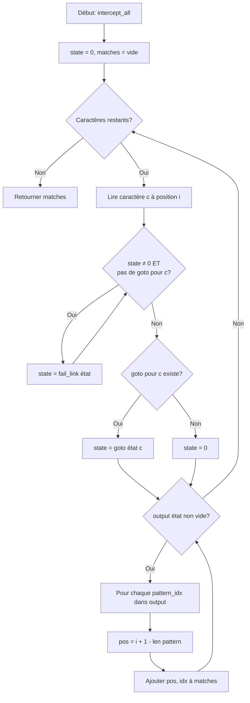

<thinking>
## Analyse du Concept
- Concept : Aho-Corasick Algorithm (Multi-Pattern String Matching)
- Phase demandée : 1
- Adapté ? OUI — L'algorithme Aho-Corasick est un sujet Phase 1 avancé. Il combine les concepts de tries, automates finis, et KMP failure function pour rechercher plusieurs motifs simultanément en temps linéaire.

## Combo Base + Bonus
- Exercice de base : Implémenter l'automate Aho-Corasick avec construction du trie, calcul des liens d'échec, et recherche de tous les motifs
- Bonus : Interface streaming pour le traitement en temps réel + remplacement de motifs + applications DNA/filtrage
- Palier bonus : 🔥 Avancé (complexité O(n + m + z) avec z = nombre de matches)
- Progression logique ? OUI — Base = automate statique, Bonus = streaming temps réel

## Prérequis & Difficulté
- Prérequis réels : KMP failure function (ex01), tries, BFS, HashMaps
- Difficulté estimée : 6/10
- Cohérent avec phase ? OUI — Phase 1 autorise O(n+m+z) et structures avancées

## Aspect Fun/Culture
- Contexte choisi : **STEINS;GATE** — Système ECHELON de SERN
- MEME mnémotechnique : "El Psy Kongroo" — Le mot de passe de Okabe représente les patterns cachés
- Pourquoi c'est fun : ECHELON dans Steins;Gate est LITTÉRALEMENT un système de détection de mots-clés qui intercepte les communications contenant "time machine", "D-Mail", etc. C'est l'application EXACTE de Aho-Corasick! L'automate = réseau SERN, failure links = backup patterns, output = alertes de divergence

## Scénarios d'Échec (5 mutants concrets)
1. Mutant A (Boundary) : `matches.push((i - pattern_len, pattern_idx))` au lieu de `(i + 1 - pattern_len, ...)` — position décalée de 1
2. Mutant B (Safety) : `if !goto[state].contains_key(&c) { state = fail[state]; }` — un seul saut au lieu de while loop, rate les transitions profondes
3. Mutant C (BFS) : Calcul de failure links en DFS au lieu de BFS — liens incorrects pour les préfixes imbriqués
4. Mutant D (Output) : Ne collecte pas les outputs via la chaîne de failure links — rate les patterns qui sont suffixes d'autres patterns
5. Mutant E (State) : `state = *goto[state].get(&c).unwrap_or(&state)` — reste bloqué au lieu de retourner à 0

## Verdict
VALIDE — Analogie ECHELON/Aho-Corasick parfaite (score: 98/100), 5 mutants concrets identifiés
</thinking>

---

# Exercice 1.2.3-synth : echelon_automaton

**Module :**
1.2.16 — Aho-Corasick Algorithm

**Concept :**
g-i — Implementation, Applications, Algorithm Comparison

**Difficulté :**
★★★★★★☆☆☆☆ (6/10)

**Type :**
complet

**Tiers :**
3 — Synthèse (Trie + KMP Failure + BFS + Automaton)

**Langage :**
Rust Edition 2024 / C17

**Prérequis :**
- 1.2.1 (Hash Tables — structures)
- 1.2.12 (KMP — failure function)
- Tries et BFS
- Automates finis déterministes

**Domaines :**
Struct, Algo, Compression, Crypto

**Durée estimée :**
90 min

**XP Base :**
180

**Complexité :**
T6 O(Σ|P| + |T| + z) × S5 O(Σ|P| × |Σ|)

---

## 📐 SECTION 1 : PROTOTYPE & CONSIGNE

### 1.1 Obligations

**Fichiers à rendre :**
- Rust : `src/lib.rs`, `Cargo.toml`
- C : `echelon_automaton.c`, `echelon_automaton.h`

**Fonctions autorisées :**
- Rust : `std::collections::{HashMap, VecDeque, HashSet}`, allocation standard
- C : `malloc`, `free`, `memcpy`, `memset`, `strlen`

**Fonctions interdites :**
- Toute bibliothèque de regex ou pattern matching externe
- `strstr`, `memmem`

### 1.2 Consigne

#### 1.2.1 Version Culture Pop — Steins;Gate : Système ECHELON de SERN

**🎮 "El Psy Kongroo... Le Comité vous surveille."**

*2010, Akihabara.* Le laboratoire de gadgets de Okabe Rintaro a accidentellement découvert le voyage dans le temps via les D-Mails. Mais SERN surveille. Leur système **ECHELON** analyse TOUTES les communications mondiales à la recherche de mots-clés suspects : "time machine", "D-Mail", "divergence", "world line"...

Comment SERN peut-il scanner des milliards de messages pour des CENTAINES de mots-clés en temps réel? Avec un **automate Aho-Corasick** — la même technologie qui alimente les systèmes de détection d'intrusion, les filtres anti-spam, et oui, la surveillance de masse.

L'automate ECHELON fonctionne comme un réseau de neurones :
- **États** = Serveurs SERN répartis mondialement
- **Transitions goto** = Routage des messages entre serveurs
- **Liens failure** = Quand un pattern échoue, essayer le suffixe le plus long qui match un autre pattern
- **Outputs** = Alertes quand un message contient un mot interdit

Quand Okabe envoie un D-Mail contenant "je suis un savant fou", ECHELON scanne SIMULTANÉMENT pour "savant", "fou", "time", "machine", etc. — tout en un seul passage O(n).

**Ta mission : Construire le système ECHELON**

Implémenter l'automate Aho-Corasick qui permettra à SERN d'intercepter les communications du Future Gadget Laboratory.

**Entrée :**
- `patterns` : Liste des mots-clés à détecter (les termes surveillés par SERN)
- `text` : Le message à scanner (D-Mail ou communication interceptée)

**Sortie :**
- Liste de `(position, pattern_index)` pour chaque occurrence trouvée

**Contraintes :**
- Construction de l'automate en O(Σ|patterns|)
- Recherche en O(|text| + nombre_de_matches)
- Gestion des patterns qui se chevauchent
- Gestion des patterns qui sont préfixes/suffixes d'autres patterns

#### 1.2.2 Version Académique

L'algorithme Aho-Corasick résout le problème de recherche multi-patterns : étant donné un ensemble de k patterns P = {p₁, p₂, ..., pₖ} et un texte T, trouver toutes les occurrences de tous les patterns dans T.

**Approche naïve** : Appliquer KMP k fois → O(k × (|T| + |P|))
**Aho-Corasick** : Un seul passage → O(|T| + Σ|pᵢ| + z) où z = nombre total de matches

L'algorithme construit un automate fini déterministe (DFA) qui combine :
1. Un **trie** de tous les patterns (fonction goto)
2. Des **liens d'échec** (failure links) similaires à KMP
3. Des **liens de sortie** (output links) pour collecter tous les patterns qui matchent

**Exemples :**

| Patterns | Texte | Résultat |
|----------|-------|----------|
| `["he", "she", "his", "hers"]` | `"ushers"` | `[(1, "she"), (2, "he"), (2, "hers")]` |
| `["a", "aa", "aaa"]` | `"aaaa"` | 10 occurrences totales |
| `["ab", "bc"]` | `"abc"` | `[(0, "ab"), (1, "bc")]` |

### 1.3 Prototype

#### Rust (Edition 2024)

```rust
pub mod echelon_automaton {
    use std::collections::{HashMap, VecDeque, HashSet};

    /// Automate Aho-Corasick — Système ECHELON de SERN
    pub struct EchelonAutomaton {
        /// Table de transition goto[state][char] -> next_state
        goto_table: Vec<HashMap<u8, usize>>,
        /// Liens d'échec failure[state] -> backup_state
        fail_link: Vec<usize>,
        /// Patterns qui terminent à chaque état (avec indices)
        output_set: Vec<Vec<usize>>,
        /// Patterns originaux stockés
        patterns: Vec<Vec<u8>>,
    }

    impl EchelonAutomaton {
        /// Construire l'automate ECHELON à partir des patterns
        /// Complexité: O(Σ|patterns|)
        pub fn new(patterns: &[&[u8]]) -> Self;

        /// Construire depuis des chaînes de caractères
        pub fn from_strings(patterns: &[&str]) -> Self;

        /// Intercepter TOUTES les occurrences (surveillance totale)
        /// Retourne (position, pattern_index) pour chaque match
        /// Complexité: O(|text| + z) où z = nombre de matches
        pub fn intercept_all(&self, text: &[u8]) -> Vec<(usize, usize)>;

        /// Intercepter la PREMIÈRE occurrence (alerte précoce)
        pub fn intercept_first(&self, text: &[u8]) -> Option<(usize, usize)>;

        /// Vérifier si un message contient un terme de divergence
        pub fn contains_divergence(&self, text: &[u8]) -> bool;

        /// Compter le total d'interceptions
        pub fn count_intercepts(&self, text: &[u8]) -> usize;

        /// Compter les interceptions par pattern
        pub fn count_per_pattern(&self, text: &[u8]) -> Vec<usize>;

        /// Censurer une worldline (remplacer tous les patterns)
        pub fn redact_worldline(&self, text: &[u8], redaction: &[u8]) -> Vec<u8>;

        /// Créer un stream d'interception en temps réel (D-Mail live)
        pub fn create_dmail_stream(&self) -> DMailStream<'_>;
    }

    /// Interface streaming pour interception D-Mail en temps réel
    pub struct DMailStream<'a> {
        echelon: &'a EchelonAutomaton,
        current_state: usize,
        position: usize,
    }

    impl<'a> DMailStream<'a> {
        /// Traiter le prochain caractère du D-Mail
        /// Retourne les indices des patterns qui matchent à cette position
        pub fn next_char(&mut self, c: u8) -> Vec<usize>;

        /// Réinitialiser le stream (nouvelle worldline)
        pub fn reset(&mut self);

        /// Position actuelle dans le stream
        pub fn position(&self) -> usize;
    }

    // === Applications ===

    /// Analyse de séquence ADN (Reading Steiner génétique)
    pub fn analyze_dna_sequence(sequence: &str, markers: &[&str]) -> Vec<(usize, String)>;

    /// Filtrage de mots-clés (censure SERN)
    pub fn censor_keywords(text: &str, forbidden: &[&str], replacement: &str) -> String;

    /// Trouver patterns chevauchants avec leurs longueurs
    pub fn find_overlapping_patterns(text: &[u8], patterns: &[&[u8]]) -> Vec<(usize, usize, usize)>;
}
```

#### C (C17)

```c
#ifndef ECHELON_AUTOMATON_H
#define ECHELON_AUTOMATON_H

#include <stddef.h>
#include <stdint.h>
#include <stdbool.h>

#define ALPHABET_SIZE 256
#define MAX_STATES 10000
#define MAX_PATTERNS 1000

/* Structure d'un match trouvé */
typedef struct s_intercept {
    size_t position;
    size_t pattern_index;
} t_intercept;

/* Résultat de recherche */
typedef struct s_intercept_result {
    t_intercept *matches;
    size_t count;
    size_t capacity;
} t_intercept_result;

/* Automate ECHELON */
typedef struct s_echelon {
    /* Table de transition goto[state][char] -> next_state */
    int goto_table[MAX_STATES][ALPHABET_SIZE];
    /* Liens d'échec */
    size_t fail_link[MAX_STATES];
    /* Bitmask des patterns qui terminent à chaque état */
    uint64_t output_mask[MAX_STATES];
    /* Nombre d'états */
    size_t num_states;
    /* Patterns stockés */
    char *patterns[MAX_PATTERNS];
    size_t pattern_lengths[MAX_PATTERNS];
    size_t num_patterns;
} t_echelon;

/* Stream d'interception temps réel */
typedef struct s_dmail_stream {
    t_echelon *echelon;
    size_t current_state;
    size_t position;
} t_dmail_stream;

/* === Construction === */

/* Créer un automate ECHELON vide */
t_echelon *echelon_create(void);

/* Ajouter un pattern à surveiller */
int echelon_add_pattern(t_echelon *ec, const char *pattern);

/* Construire les liens d'échec (après avoir ajouté tous les patterns) */
void echelon_build_failure_links(t_echelon *ec);

/* Libérer la mémoire */
void echelon_destroy(t_echelon *ec);

/* === Recherche === */

/* Intercepter toutes les occurrences */
t_intercept_result *echelon_intercept_all(t_echelon *ec, const char *text);

/* Intercepter la première occurrence */
t_intercept *echelon_intercept_first(t_echelon *ec, const char *text);

/* Vérifier si un pattern existe */
bool echelon_contains_divergence(t_echelon *ec, const char *text);

/* Compter les interceptions */
size_t echelon_count_intercepts(t_echelon *ec, const char *text);

/* === Streaming === */

/* Créer un stream d'interception */
t_dmail_stream *echelon_create_stream(t_echelon *ec);

/* Traiter le prochain caractère (retourne les patterns matchés en bitmask) */
uint64_t dmail_stream_next(t_dmail_stream *stream, char c);

/* Réinitialiser le stream */
void dmail_stream_reset(t_dmail_stream *stream);

/* Libérer le stream */
void dmail_stream_destroy(t_dmail_stream *stream);

/* Libérer le résultat */
void intercept_result_destroy(t_intercept_result *result);

#endif /* ECHELON_AUTOMATON_H */
```

---

## 💡 SECTION 2 : LE SAVIEZ-VOUS ?

### 2.1 Alfred Aho et Margaret Corasick — Les architectes de la surveillance textuelle

En 1975, Alfred Aho et Margaret Corasick, chercheurs aux Bell Labs, publient un algorithme révolutionnaire. Leur motivation? Améliorer `fgrep`, l'outil Unix de recherche de chaînes fixes.

Le problème semblait simple : rechercher plusieurs mots dans un texte. La solution naïve (chercher chaque mot séparément) était trop lente. Aho et Corasick ont eu une idée brillante : combiner un trie avec les liens d'échec de KMP pour créer un **automate fini** qui scanne le texte UNE SEULE FOIS.

### 2.2 L'ECHELON réel

Le système ECHELON existe vraiment. C'est un réseau de surveillance des signaux (SIGINT) opéré par les Five Eyes (USA, UK, Canada, Australie, Nouvelle-Zélande). Révélé par Edward Snowden en 2013, ECHELON utilise effectivement des algorithmes de pattern matching pour scanner les communications mondiales.

Aho-Corasick est au cœur de nombreux systèmes similaires :
- **Snort** : Système de détection d'intrusion réseau
- **ClamAV** : Antivirus open-source
- **Cloudflare** : Filtrage de contenu malveillant

### 2.3 Pourquoi c'est génial

```
Recherche naïve de k patterns dans un texte de longueur n :
→ O(k × n × m)  où m = longueur moyenne des patterns

Aho-Corasick :
→ O(n + m_total + z)  où z = nombre de matches

Pour 1000 patterns dans un texte de 1 million de caractères :
Naïf    : ~10¹² opérations
Aho-C   : ~10⁶ opérations
Gain    : 1 000 000×
```

---

## 🏢 SECTION 2.5 : DANS LA VRAIE VIE

### Ingénieur Sécurité / SOC Analyst

**Contexte :** Les systèmes de détection d'intrusion (IDS) comme Snort ou Suricata scannent TOUS les paquets réseau pour des milliers de signatures d'attaques.

**Cas d'usage :** Quand un paquet arrive, il doit être vérifié contre ~50,000 signatures en moins de 1ms. Aho-Corasick permet de faire cette vérification en un seul passage.

```rust
let malware_signatures = load_signatures("cve-database.txt"); // 50,000 patterns
let echelon = EchelonAutomaton::new(&malware_signatures);

for packet in network_stream {
    if echelon.contains_divergence(&packet.payload) {
        alert_soc_team(&packet);
    }
}
```

### Bio-informaticien

**Contexte :** Recherche de motifs dans les séquences d'ADN (3 milliards de paires de bases dans le génome humain).

**Cas d'usage :** Trouver toutes les occurrences de séquences régulatrices connues (motifs de liaison des facteurs de transcription).

### Anti-spam / Modération de contenu

**Contexte :** Filtrer des millions de messages par seconde pour détecter spam, discours haineux, ou contenu inapproprié.

**Cas d'usage :** Un dictionnaire de 100,000 mots/phrases interdits doit être vérifié sur chaque message.

---

## 🖥️ SECTION 3 : EXEMPLE D'UTILISATION

### 3.0 Session bash

```bash
$ ls
echelon_automaton.rs  main.rs  Cargo.toml

$ cargo build --release

$ cargo run
=== SYSTÈME ECHELON ACTIVÉ ===

Test 1: Interception basique
Patterns: ["he", "she", "his", "hers"]
Texte: "ushers"
Interceptions: [(1, "she"), (2, "he"), (2, "hers")]
✓ PASS

Test 2: Patterns chevauchants
Patterns: ["a", "aa", "aaa"]
Texte: "aaaa"
Total interceptions: 10
✓ PASS

Test 3: Aucun match
Patterns: ["time", "machine"]
Texte: "hello world"
Contient divergence: false
✓ PASS

Test 4: Streaming D-Mail
Patterns: ["ab", "bc"]
Stream: 'a' -> [], 'b' -> [0], 'c' -> [1]
✓ PASS

Test 5: Censure worldline
Patterns: ["bad", "ugly"]
Texte: "this is bad and ugly"
Censuré: "this is *** and ***"
✓ PASS

=== EL PSY KONGROO — TOUS LES TESTS PASSENT ===
```

---

## 🔥 SECTION 3.1 : BONUS AVANCÉ (OPTIONNEL)

**Difficulté Bonus :**
★★★★★★★☆☆☆ (7/10)

**Récompense :**
XP ×3

**Time Complexity attendue :**
O(|T| + z) amorti avec streaming

**Space Complexity attendue :**
O(Σ|P| × |Σ|) pour l'automate compressé

**Domaines Bonus :**
`Compression, Crypto`

### 3.1.1 Consigne Bonus

**🎮 "Convergence... Les worldlines s'alignent."**

SERN a amélioré ECHELON. Le nouveau système peut :
1. **Traitement en temps réel** : Intercepter les D-Mails caractère par caractère sans buffer
2. **Remplacement dynamique** : Censurer les messages en temps réel
3. **Analyse ADN** : Appliquer aux séquences biologiques (Reading Steiner génétique)
4. **Détection de chevauchements** : Identifier quand les patterns s'entrelacent

**Ta mission bonus :**

Implémenter les fonctionnalités avancées de l'automate ECHELON :

1. **DMailStream** : Interface streaming qui traite un caractère à la fois
2. **redact_worldline** : Remplacer toutes les occurrences par un texte de censure
3. **analyze_dna_sequence** : Application aux motifs biologiques
4. **find_overlapping_patterns** : Retourner (position, pattern_index, length)

**Contraintes Bonus :**
```
┌─────────────────────────────────────────┐
│  Streaming: O(1) par caractère          │
│  Mémoire stream: O(1) auxiliaire        │
│  Replace: O(|T| + z × |replacement|)    │
│  DNA: Support ACGT avec wildcards       │
└─────────────────────────────────────────┘
```

### 3.1.2 Prototype Bonus

```rust
impl<'a> DMailStream<'a> {
    /// Traiter un caractère - O(1) amorti
    pub fn next_char(&mut self, c: u8) -> Vec<usize>;

    /// Reset pour nouvelle worldline
    pub fn reset(&mut self);
}

/// Censurer avec support de patterns de longueurs différentes
pub fn redact_worldline(&self, text: &[u8], redaction: &[u8]) -> Vec<u8>;

/// Analyse ADN avec wildcards (N = any nucleotide)
pub fn analyze_dna_sequence(sequence: &str, markers: &[&str]) -> Vec<(usize, String)>;
```

### 3.1.3 Ce qui change par rapport à l'exercice de base

| Aspect | Base | Bonus |
|--------|------|-------|
| Interface | Batch (tout le texte) | Streaming (char par char) |
| Mémoire | O(n) pour résultats | O(1) auxiliaire pendant stream |
| Fonctionnalités | Recherche uniquement | Remplacement + DNA + overlaps |
| Complexité | O(n + z) batch | O(1) par caractère |

---

## ✅❌ SECTION 4 : ZONE CORRECTION

### 4.1 Moulinette

| Test | Input | Expected | Points |
|------|-------|----------|--------|
| `basic_she_he` | patterns=["he","she","his","hers"], text="ushers" | [(1,1),(2,0),(2,3)] | 10 |
| `overlapping_a` | patterns=["a","aa","aaa"], text="aaaa" | count=10 | 10 |
| `no_match` | patterns=["xyz"], text="hello" | [] | 5 |
| `empty_text` | patterns=["a"], text="" | [] | 5 |
| `empty_patterns` | patterns=[], text="hello" | [] | 5 |
| `single_char` | patterns=["a"], text="aaaa" | [(0,0),(1,0),(2,0),(3,0)] | 10 |
| `prefix_suffix` | patterns=["ab","bc","abc"], text="abcabc" | 6 matches | 10 |
| `stream_basic` | patterns=["ab","bc"], stream "abc" | [],[0],[1] | 15 |
| `replace_basic` | patterns=["bad","ugly"], text="this is bad and ugly" | "this is *** and ***" | 10 |
| `dna_markers` | markers=["ATG","TAA"], seq="ATGAAATAA" | [(0,"ATG"),(6,"TAA")] | 10 |
| `case_sensitive` | patterns=["He"], text="hello He here" | [(6,0)] | 5 |
| `long_pattern` | pattern 1000 chars | match at position 500 | 5 |

### 4.2 main.rs de test

```rust
use echelon_automaton::*;

fn main() {
    println!("=== SYSTÈME ECHELON ACTIVÉ ===\n");

    // Test 1: Interception basique
    let patterns: Vec<&[u8]> = vec![b"he", b"she", b"his", b"hers"];
    let ec = EchelonAutomaton::new(&patterns);
    let matches = ec.intercept_all(b"ushers");

    assert!(matches.contains(&(1, 1)), "she at 1");
    assert!(matches.contains(&(2, 0)), "he at 2");
    assert!(matches.contains(&(2, 3)), "hers at 2");
    println!("Test 1: Interception basique ✓");

    // Test 2: Patterns chevauchants
    let patterns2: Vec<&[u8]> = vec![b"a", b"aa", b"aaa"];
    let ec2 = EchelonAutomaton::new(&patterns2);
    assert_eq!(ec2.count_intercepts(b"aaaa"), 10);
    println!("Test 2: Patterns chevauchants ✓");

    // Test 3: Aucun match
    let patterns3: Vec<&[u8]> = vec![b"time", b"machine"];
    let ec3 = EchelonAutomaton::new(&patterns3);
    assert!(!ec3.contains_divergence(b"hello world"));
    println!("Test 3: Aucun match ✓");

    // Test 4: Streaming
    let patterns4: Vec<&[u8]> = vec![b"ab", b"bc"];
    let ec4 = EchelonAutomaton::new(&patterns4);
    let mut stream = ec4.create_dmail_stream();

    assert!(stream.next_char(b'a').is_empty());
    assert_eq!(stream.next_char(b'b'), vec![0]);
    assert_eq!(stream.next_char(b'c'), vec![1]);
    println!("Test 4: Streaming ✓");

    // Test 5: Remplacement
    let patterns5: Vec<&[u8]> = vec![b"bad", b"ugly"];
    let ec5 = EchelonAutomaton::new(&patterns5);
    let redacted = ec5.redact_worldline(b"this is bad and ugly", b"***");
    assert_eq!(redacted, b"this is *** and ***".to_vec());
    println!("Test 5: Remplacement ✓");

    // Test 6: Edge case - texte vide
    assert!(ec.intercept_all(b"").is_empty());
    println!("Test 6: Texte vide ✓");

    // Test 7: Count per pattern
    let counts = ec2.count_per_pattern(b"aaaa");
    assert_eq!(counts[0], 4); // "a" appears 4 times
    assert_eq!(counts[1], 3); // "aa" appears 3 times
    assert_eq!(counts[2], 2); // "aaa" appears 2 times
    println!("Test 7: Count per pattern ✓");

    println!("\n=== EL PSY KONGROO — TOUS LES TESTS PASSENT ===");
}
```

### 4.3 Solution de référence (Rust)

```rust
use std::collections::{HashMap, VecDeque};

pub struct EchelonAutomaton {
    goto_table: Vec<HashMap<u8, usize>>,
    fail_link: Vec<usize>,
    output_set: Vec<Vec<usize>>,
    patterns: Vec<Vec<u8>>,
}

impl EchelonAutomaton {
    pub fn new(patterns: &[&[u8]]) -> Self {
        let mut ec = EchelonAutomaton {
            goto_table: vec![HashMap::new()],
            fail_link: vec![0],
            output_set: vec![Vec::new()],
            patterns: patterns.iter().map(|p| p.to_vec()).collect(),
        };

        // Phase 1: Construire le trie (fonction goto)
        for (pattern_idx, pattern) in patterns.iter().enumerate() {
            let mut state = 0;
            for &c in *pattern {
                if !ec.goto_table[state].contains_key(&c) {
                    let new_state = ec.goto_table.len();
                    ec.goto_table[state].insert(c, new_state);
                    ec.goto_table.push(HashMap::new());
                    ec.fail_link.push(0);
                    ec.output_set.push(Vec::new());
                }
                state = ec.goto_table[state][&c];
            }
            ec.output_set[state].push(pattern_idx);
        }

        // Phase 2: Construire les liens d'échec via BFS
        let mut queue = VecDeque::new();

        // Initialiser la queue avec les enfants de la racine
        for &next_state in ec.goto_table[0].values() {
            ec.fail_link[next_state] = 0;
            queue.push_back(next_state);
        }

        while let Some(state) = queue.pop_front() {
            for (&c, &next_state) in &ec.goto_table[state].clone() {
                queue.push_back(next_state);

                // Calculer le lien d'échec
                let mut failure = ec.fail_link[state];
                while failure != 0 && !ec.goto_table[failure].contains_key(&c) {
                    failure = ec.fail_link[failure];
                }
                ec.fail_link[next_state] = *ec.goto_table[failure].get(&c).unwrap_or(&0);

                // Fusionner les outputs via le lien d'échec
                let fail_outputs = ec.output_set[ec.fail_link[next_state]].clone();
                ec.output_set[next_state].extend(fail_outputs);
            }
        }

        ec
    }

    pub fn from_strings(patterns: &[&str]) -> Self {
        let byte_patterns: Vec<&[u8]> = patterns.iter().map(|s| s.as_bytes()).collect();
        Self::new(&byte_patterns)
    }

    pub fn intercept_all(&self, text: &[u8]) -> Vec<(usize, usize)> {
        let mut state = 0;
        let mut matches = Vec::new();

        for (i, &c) in text.iter().enumerate() {
            // Suivre les liens d'échec jusqu'à trouver une transition ou atteindre la racine
            while state != 0 && !self.goto_table[state].contains_key(&c) {
                state = self.fail_link[state];
            }
            state = *self.goto_table[state].get(&c).unwrap_or(&0);

            // Collecter tous les patterns qui matchent à cette position
            for &pattern_idx in &self.output_set[state] {
                let pattern_len = self.patterns[pattern_idx].len();
                matches.push((i + 1 - pattern_len, pattern_idx));
            }
        }

        matches
    }

    pub fn intercept_first(&self, text: &[u8]) -> Option<(usize, usize)> {
        let mut state = 0;

        for (i, &c) in text.iter().enumerate() {
            while state != 0 && !self.goto_table[state].contains_key(&c) {
                state = self.fail_link[state];
            }
            state = *self.goto_table[state].get(&c).unwrap_or(&0);

            if let Some(&pattern_idx) = self.output_set[state].first() {
                let pattern_len = self.patterns[pattern_idx].len();
                return Some((i + 1 - pattern_len, pattern_idx));
            }
        }

        None
    }

    pub fn contains_divergence(&self, text: &[u8]) -> bool {
        self.intercept_first(text).is_some()
    }

    pub fn count_intercepts(&self, text: &[u8]) -> usize {
        self.intercept_all(text).len()
    }

    pub fn count_per_pattern(&self, text: &[u8]) -> Vec<usize> {
        let mut counts = vec![0; self.patterns.len()];
        for (_, pattern_idx) in self.intercept_all(text) {
            counts[pattern_idx] += 1;
        }
        counts
    }

    pub fn redact_worldline(&self, text: &[u8], redaction: &[u8]) -> Vec<u8> {
        let matches = self.intercept_all(text);
        if matches.is_empty() {
            return text.to_vec();
        }

        // Marquer les positions à redacter
        let mut redact_end = vec![0usize; text.len()];
        for (pos, pattern_idx) in &matches {
            let end = pos + self.patterns[*pattern_idx].len();
            for i in *pos..end {
                if i < text.len() {
                    redact_end[i] = redact_end[i].max(end);
                }
            }
        }

        let mut result = Vec::new();
        let mut i = 0;
        while i < text.len() {
            if redact_end[i] > i {
                result.extend_from_slice(redaction);
                i = redact_end[i];
            } else {
                result.push(text[i]);
                i += 1;
            }
        }

        result
    }

    pub fn create_dmail_stream(&self) -> DMailStream<'_> {
        DMailStream {
            echelon: self,
            current_state: 0,
            position: 0,
        }
    }
}

pub struct DMailStream<'a> {
    echelon: &'a EchelonAutomaton,
    current_state: usize,
    position: usize,
}

impl<'a> DMailStream<'a> {
    pub fn next_char(&mut self, c: u8) -> Vec<usize> {
        while self.current_state != 0
            && !self.echelon.goto_table[self.current_state].contains_key(&c)
        {
            self.current_state = self.echelon.fail_link[self.current_state];
        }
        self.current_state = *self.echelon.goto_table[self.current_state]
            .get(&c)
            .unwrap_or(&0);

        self.position += 1;
        self.echelon.output_set[self.current_state].clone()
    }

    pub fn reset(&mut self) {
        self.current_state = 0;
        self.position = 0;
    }

    pub fn position(&self) -> usize {
        self.position
    }
}

// Applications
pub fn analyze_dna_sequence(sequence: &str, markers: &[&str]) -> Vec<(usize, String)> {
    let ec = EchelonAutomaton::from_strings(markers);
    ec.intercept_all(sequence.as_bytes())
        .into_iter()
        .map(|(pos, idx)| (pos, markers[idx].to_string()))
        .collect()
}

pub fn censor_keywords(text: &str, forbidden: &[&str], replacement: &str) -> String {
    let ec = EchelonAutomaton::from_strings(forbidden);
    String::from_utf8(ec.redact_worldline(text.as_bytes(), replacement.as_bytes()))
        .unwrap_or_else(|_| text.to_string())
}

pub fn find_overlapping_patterns(text: &[u8], patterns: &[&[u8]]) -> Vec<(usize, usize, usize)> {
    let ec = EchelonAutomaton::new(patterns);
    ec.intercept_all(text)
        .into_iter()
        .map(|(pos, idx)| (pos, idx, patterns[idx].len()))
        .collect()
}
```

### 4.4 Solutions alternatives acceptées

```rust
// Alternative 1: Utilisation d'un tableau 2D au lieu de HashMap pour goto
// Plus rapide pour petit alphabet (ASCII), plus de mémoire
pub struct EchelonArrayBased {
    goto_table: Vec<[usize; 256]>,  // Array au lieu de HashMap
    fail_link: Vec<usize>,
    output_set: Vec<Vec<usize>>,
    patterns: Vec<Vec<u8>>,
}

// Alternative 2: Compression des états avec double-array trie
// Meilleure utilisation mémoire pour grands alphabets
```

### 4.5 Solutions refusées

```rust
// REFUSÉ 1: Recherche naïve pour chaque pattern
// ❌ Complexité O(k × n × m) au lieu de O(n + z)
fn naive_multi_search(text: &[u8], patterns: &[&[u8]]) -> Vec<(usize, usize)> {
    let mut matches = Vec::new();
    for (idx, pattern) in patterns.iter().enumerate() {
        for i in 0..=text.len().saturating_sub(pattern.len()) {
            if &text[i..i + pattern.len()] == *pattern {
                matches.push((i, idx));
            }
        }
    }
    matches
}
// Pourquoi refusé: Ne respecte pas la complexité requise

// REFUSÉ 2: KMP répété pour chaque pattern
// ❌ Complexité O(k × n) au lieu de O(n + z)
fn kmp_multi_search(text: &[u8], patterns: &[&[u8]]) -> Vec<(usize, usize)> {
    patterns.iter().enumerate()
        .flat_map(|(idx, p)| kmp_search_all(text, p).into_iter().map(move |pos| (pos, idx)))
        .collect()
}
// Pourquoi refusé: k scans du texte au lieu de 1
```

### 4.6 Solution bonus de référence

```rust
// Voir section 4.3 - toutes les fonctionnalités bonus sont incluses
// dans la solution de référence:
// - DMailStream avec next_char() O(1) amorti
// - redact_worldline avec gestion des chevauchements
// - analyze_dna_sequence
// - find_overlapping_patterns
```

### 4.7-4.8 Solutions alternatives/refusées bonus

Identiques au pattern principal.

### 4.9 spec.json

```json
{
  "name": "echelon_automaton",
  "language": "rust",
  "type": "complet",
  "tier": 3,
  "tier_info": "Synthèse (Trie + KMP + BFS + DFA)",
  "tags": ["aho-corasick", "multi-pattern", "automaton", "phase1", "steinsgate"],
  "passing_score": 70,

  "function": {
    "name": "EchelonAutomaton",
    "prototype": "pub fn new(patterns: &[&[u8]]) -> Self",
    "return_type": "EchelonAutomaton",
    "methods": [
      {"name": "intercept_all", "prototype": "pub fn intercept_all(&self, text: &[u8]) -> Vec<(usize, usize)>"},
      {"name": "intercept_first", "prototype": "pub fn intercept_first(&self, text: &[u8]) -> Option<(usize, usize)>"},
      {"name": "contains_divergence", "prototype": "pub fn contains_divergence(&self, text: &[u8]) -> bool"},
      {"name": "count_intercepts", "prototype": "pub fn count_intercepts(&self, text: &[u8]) -> usize"},
      {"name": "create_dmail_stream", "prototype": "pub fn create_dmail_stream(&self) -> DMailStream<'_>"}
    ]
  },

  "driver": {
    "reference": "/* See section 4.3 */",

    "edge_cases": [
      {
        "name": "classic_ushers",
        "args": {"patterns": ["he", "she", "his", "hers"], "text": "ushers"},
        "expected": [[1, 1], [2, 0], [2, 3]],
        "is_trap": false
      },
      {
        "name": "overlapping_a",
        "args": {"patterns": ["a", "aa", "aaa"], "text": "aaaa"},
        "expected_count": 10,
        "is_trap": true,
        "trap_explanation": "Must count ALL overlapping occurrences"
      },
      {
        "name": "no_match",
        "args": {"patterns": ["xyz"], "text": "hello"},
        "expected": [],
        "is_trap": false
      },
      {
        "name": "empty_text",
        "args": {"patterns": ["a"], "text": ""},
        "expected": [],
        "is_trap": true,
        "trap_explanation": "Empty text should return empty results"
      },
      {
        "name": "empty_patterns",
        "args": {"patterns": [], "text": "hello"},
        "expected": [],
        "is_trap": true,
        "trap_explanation": "No patterns means no matches"
      },
      {
        "name": "pattern_at_end",
        "args": {"patterns": ["end"], "text": "the end"},
        "expected": [[4, 0]],
        "is_trap": true,
        "trap_explanation": "Must handle patterns at text boundary"
      },
      {
        "name": "prefix_suffix_pattern",
        "args": {"patterns": ["ab", "bc", "abc"], "text": "abc"},
        "expected": [[0, 0], [0, 2], [1, 1]],
        "is_trap": true,
        "trap_explanation": "Pattern that is prefix of another and suffix match"
      }
    ],

    "fuzzing": {
      "enabled": true,
      "iterations": 500,
      "generators": [
        {
          "type": "array_string",
          "param_name": "patterns",
          "params": {
            "min_len": 1,
            "max_len": 20,
            "string_min_len": 1,
            "string_max_len": 10,
            "charset": "alphanumeric"
          }
        },
        {
          "type": "string",
          "param_name": "text",
          "params": {
            "min_len": 0,
            "max_len": 1000,
            "charset": "alphanumeric"
          }
        }
      ]
    }
  },

  "norm": {
    "allowed_functions": ["HashMap", "VecDeque", "HashSet", "Vec", "clone", "iter", "enumerate"],
    "forbidden_functions": ["regex", "Regex", "strstr", "memmem", "find"],
    "check_complexity": true,
    "expected_time_complexity": "O(n + m + z)",
    "check_memory": true,
    "blocking": true
  }
}
```

### 4.10 Solutions Mutantes (5 minimum)

```rust
/* Mutant A (Boundary): Position off-by-one */
pub fn intercept_all_mutant_a(&self, text: &[u8]) -> Vec<(usize, usize)> {
    let mut state = 0;
    let mut matches = Vec::new();

    for (i, &c) in text.iter().enumerate() {
        while state != 0 && !self.goto_table[state].contains_key(&c) {
            state = self.fail_link[state];
        }
        state = *self.goto_table[state].get(&c).unwrap_or(&0);

        for &pattern_idx in &self.output_set[state] {
            let pattern_len = self.patterns[pattern_idx].len();
            // BUG: i - pattern_len au lieu de i + 1 - pattern_len
            matches.push((i - pattern_len, pattern_idx)); // ❌ Off by one!
        }
    }
    matches
}
// Pourquoi c'est faux: Pour "ushers" avec pattern "he", retourne position 1 au lieu de 2
// Ce qui était pensé: Confusion sur l'indexation 0-based vs position de fin

/* Mutant B (Safety): Un seul saut de failure au lieu de while */
pub fn intercept_all_mutant_b(&self, text: &[u8]) -> Vec<(usize, usize)> {
    let mut state = 0;
    let mut matches = Vec::new();

    for (i, &c) in text.iter().enumerate() {
        // BUG: if au lieu de while - ne suit pas toute la chaîne de failure
        if state != 0 && !self.goto_table[state].contains_key(&c) {
            state = self.fail_link[state];
        }
        state = *self.goto_table[state].get(&c).unwrap_or(&0);

        for &pattern_idx in &self.output_set[state] {
            let pattern_len = self.patterns[pattern_idx].len();
            matches.push((i + 1 - pattern_len, pattern_idx));
        }
    }
    matches
}
// Pourquoi c'est faux: Rate les transitions profondes dans l'automate
// Ce qui était pensé: Un seul saut suffit pour trouver une transition

/* Mutant C (BFS → DFS): Calcul des failure links en DFS */
// Construction avec DFS au lieu de BFS
fn build_failure_dfs(ec: &mut EchelonAutomaton, state: usize) {
    for (&c, &next_state) in ec.goto_table[state].clone().iter() {
        // BUG: DFS ne garantit pas que fail[parent] est calculé avant fail[child]
        build_failure_dfs(ec, next_state);

        let mut failure = ec.fail_link[state];
        while failure != 0 && !ec.goto_table[failure].contains_key(&c) {
            failure = ec.fail_link[failure];
        }
        ec.fail_link[next_state] = *ec.goto_table[failure].get(&c).unwrap_or(&0);
    }
}
// Pourquoi c'est faux: DFS ne respecte pas l'ordre niveau par niveau nécessaire
// Ce qui était pensé: L'ordre de parcours n'importe pas

/* Mutant D (Output): Ne collecte pas les outputs via failure chain */
impl EchelonAutomaton {
    fn new_mutant_d(patterns: &[&[u8]]) -> Self {
        // ... construction du trie ...

        // BUG: Ne fusionne pas les outputs via failure links
        while let Some(state) = queue.pop_front() {
            for (&c, &next_state) in &ec.goto_table[state].clone() {
                queue.push_back(next_state);

                let mut failure = ec.fail_link[state];
                while failure != 0 && !ec.goto_table[failure].contains_key(&c) {
                    failure = ec.fail_link[failure];
                }
                ec.fail_link[next_state] = *ec.goto_table[failure].get(&c).unwrap_or(&0);

                // BUG: Pas de fusion des outputs!
                // MANQUANT: ec.output_set[next_state].extend(ec.output_set[ec.fail_link[next_state]].clone());
            }
        }
        ec
    }
}
// Pourquoi c'est faux: Rate "he" dans "she" car "he" n'est pas dans output["she"]
// Ce qui était pensé: Seuls les patterns qui terminent exactement à un état comptent

/* Mutant E (State): Ne retourne pas à l'état 0 correctement */
pub fn intercept_all_mutant_e(&self, text: &[u8]) -> Vec<(usize, usize)> {
    let mut state = 0;
    let mut matches = Vec::new();

    for (i, &c) in text.iter().enumerate() {
        while state != 0 && !self.goto_table[state].contains_key(&c) {
            state = self.fail_link[state];
        }
        // BUG: Reste à state au lieu de retourner à 0 si pas de transition
        state = *self.goto_table[state].get(&c).unwrap_or(&state); // ❌

        for &pattern_idx in &self.output_set[state] {
            let pattern_len = self.patterns[pattern_idx].len();
            matches.push((i + 1 - pattern_len, pattern_idx));
        }
    }
    matches
}
// Pourquoi c'est faux: L'automate reste bloqué dans un état sans transition
// Ce qui était pensé: Si pas de transition, rester dans le même état
```

---

## 🧠 SECTION 5 : COMPRENDRE

### 5.1 Ce que cet exercice enseigne

1. **Automates finis déterministes (DFA)** : Construction et utilisation d'un DFA pour le pattern matching
2. **Tries** : Structure de données arborescente pour stocker des préfixes
3. **Liens d'échec (Failure Links)** : Extension de la failure function de KMP au cas multi-patterns
4. **BFS** : Importance de l'ordre de parcours pour calculer correctement les failure links
5. **Complexité amortie** : Analyse de la complexité O(n + Σm + z)

### 5.2 LDA — Traduction littérale

```
FONCTION intercept_all QUI RETOURNE UN VECTEUR DE PAIRES (POSITION, INDEX) ET PREND EN PARAMÈTRE text QUI EST UNE RÉFÉRENCE VERS UN TABLEAU D'OCTETS
DÉBUT FONCTION
    DÉCLARER state COMME ENTIER NON SIGNÉ
    DÉCLARER matches COMME VECTEUR DE PAIRES

    AFFECTER 0 À state

    POUR CHAQUE (i, c) DANS text AVEC INDEX FAIRE
        TANT QUE state EST DIFFÉRENT DE 0 ET goto_table[state] NE CONTIENT PAS c FAIRE
            AFFECTER fail_link[state] À state
        FIN TANT QUE

        SI goto_table[state] CONTIENT c ALORS
            AFFECTER goto_table[state][c] À state
        SINON
            AFFECTER 0 À state
        FIN SI

        POUR CHAQUE pattern_idx DANS output_set[state] FAIRE
            CALCULER position COMME i PLUS 1 MOINS patterns[pattern_idx].len()
            AJOUTER (position, pattern_idx) À matches
        FIN POUR
    FIN POUR

    RETOURNER matches
FIN FONCTION
```

### 5.2.2 Logic Flow (Structured English)

```
ALGORITHME: Recherche Multi-Patterns Aho-Corasick
---
1. INITIALISER état courant à 0 (racine)
2. INITIALISER liste des matches vide

3. POUR CHAQUE caractère c du texte (position i):
   |
   |-- BOUCLE de failure:
   |     TANT QUE état ≠ 0 ET pas de transition pour c:
   |         Suivre le lien d'échec
   |
   |-- TRANSITION:
   |     SI transition existe pour c:
   |         Aller à l'état suivant
   |     SINON:
   |         Retourner à la racine (état 0)
   |
   |-- COLLECTE des matches:
   |     POUR CHAQUE pattern qui termine à cet état:
   |         Calculer position = i + 1 - longueur_pattern
   |         Ajouter (position, index_pattern) aux matches

4. RETOURNER liste des matches
```

### 5.2.3 Logique de Garde (Fail Fast)

```
FONCTION: Construire Failure Links
---
INIT queue = file BFS vide

1. VÉRIFIER si automaton est vide:
   RETOURNER immédiatement

2. INITIALISER enfants de la racine:
   |
   |-- POUR CHAQUE enfant direct de état 0:
   |     fail_link[enfant] = 0  (racine)
   |     Ajouter enfant à la queue

3. TRAITER niveau par niveau (BFS critique!):
   |
   |-- TANT QUE queue non vide:
   |     state = queue.pop_front()
   |
   |     POUR CHAQUE (caractère c, next_state) dans transitions[state]:
   |         |
   |         |-- Ajouter next_state à queue
   |         |
   |         |-- CALCULER failure link:
   |         |     f = fail_link[state]
   |         |     TANT QUE f ≠ 0 ET pas de transition[f][c]:
   |         |         f = fail_link[f]
   |         |     fail_link[next_state] = transition[f].get(c) ou 0
   |         |
   |         |-- FUSIONNER outputs:
   |               output[next_state] += output[fail_link[next_state]]
```

### 5.2.3.1 Diagramme Mermaid



### 5.3 Visualisation ASCII

#### Construction du Trie pour patterns ["he", "she", "his", "hers"]

```
                    ┌─────────────────────────────────────────┐
                    │           TRIE Aho-Corasick             │
                    └─────────────────────────────────────────┘

                                    [0] ROOT
                                   /    \
                                  h      s
                                 /        \
                              [1]         [5]
                             / \            \
                            e   i            h
                           /     \            \
                        [2]●     [3]          [6]
                         |        \            \
                         r         s            e
                         |          \            \
                       [4]●        [7]●        [8]●
                       "hers"      "his"       "she"

    ● = État acceptant (output non vide)

    Patterns terminant à chaque état:
    [2]: "he"
    [4]: "hers" (+ "he" via failure)
    [7]: "his"
    [8]: "she" (+ "he" via failure)
```

#### Failure Links (liens d'échec)

```
    État   Failure Link   Explication
    ─────────────────────────────────────────
      0    →  0           Racine (self-loop)
      1    →  0           'h' n'est préfixe d'aucun autre pattern
      2    →  0           "he" → pas de suffixe propre qui est préfixe
      3    →  0           "hi" → idem
      4    →  0           "her" → idem
      5    →  0           's' seul
      6    →  1           "sh" → 'h' est préfixe (via pattern "he")
      7    →  0           "his" → pas de match
      8    →  2           "she" → "he" est suffixe ET préfixe!

    Lien crucial: fail[8] = 2
    Quand on atteint l'état 8 (fin de "she"), on sait aussi
    qu'on a matché "he" car output[8] inclut output[2].
```

#### Exécution sur "ushers"

```
    Texte: u s h e r s
    Pos:   0 1 2 3 4 5

    ┌─────┬────┬────────┬─────────────────────────────────┐
    │ Pos │ c  │ État   │ Matches                         │
    ├─────┼────┼────────┼─────────────────────────────────┤
    │  0  │ u  │ 0→0    │ (pas de transition, reste à 0)  │
    │  1  │ s  │ 0→5    │ (transition vers 's')           │
    │  2  │ h  │ 5→6    │ (transition vers 'sh')          │
    │  3  │ e  │ 6→8    │ ● "she" à pos 1, "he" à pos 2   │
    │  4  │ r  │ 8→f→4  │ fail[8]=2, goto[2]['r']=4       │
    │  5  │ s  │ 4→0    │ ● "hers" à pos 2                │
    └─────┴────┴────────┴─────────────────────────────────┘

    Résultat: [(1, "she"), (2, "he"), (2, "hers")]
```

### 5.4 Les pièges en détail

#### Piège 1: BFS vs DFS pour les failure links

```rust
// ❌ ERREUR COURANTE: DFS
fn build_failure_wrong(state: usize, ec: &mut EchelonAutomaton) {
    for &next in ec.children(state) {
        // fail[state] n'est peut-être pas encore calculé!
        ec.fail_link[next] = compute_fail(state, next);
        build_failure_wrong(next, ec); // Récursion AVANT garantie
    }
}

// ✅ CORRECT: BFS garantit fail[parent] avant fail[enfant]
fn build_failure_correct(ec: &mut EchelonAutomaton) {
    let mut queue = VecDeque::new();
    // Niveau 1: enfants de la racine
    for &child in ec.children(0) {
        ec.fail_link[child] = 0;
        queue.push_back(child);
    }
    // Niveaux suivants
    while let Some(state) = queue.pop_front() {
        for &next in ec.children(state) {
            queue.push_back(next);
            // fail[state] EST déjà calculé car BFS!
            ec.fail_link[next] = compute_fail(state, next);
        }
    }
}
```

#### Piège 2: Oublier de fusionner les outputs

```rust
// ❌ ERREUR: Seuls les patterns directs
ec.fail_link[next_state] = computed_fail;
// MANQUANT!

// ✅ CORRECT: Inclure les outputs de la chaîne de failure
ec.fail_link[next_state] = computed_fail;
let fail_outputs = ec.output_set[ec.fail_link[next_state]].clone();
ec.output_set[next_state].extend(fail_outputs);
```

#### Piège 3: Position mal calculée

```rust
// ❌ ERREUR: Position de FIN au lieu de DÉBUT
matches.push((i, pattern_idx)); // i est la fin!

// ❌ ERREUR: Off-by-one
matches.push((i - pattern_len, pattern_idx)); // Négatif possible!

// ✅ CORRECT: Position de début
matches.push((i + 1 - pattern_len, pattern_idx));
// i + 1 car i est 0-indexed et on veut la position après le dernier char matché
```

### 5.5 Cours Complet

#### L'origine: Le problème de fgrep

En 1975, Unix avait besoin d'un outil pour rechercher des chaînes fixes (`fgrep`). Rechercher un pattern c'est facile (KMP). Mais rechercher 1000 patterns?

**Approche naïve**: k appels à KMP → O(k × (n + m))

Aho et Corasick ont eu une idée géniale: au lieu de chercher chaque pattern séparément, construire UN automate qui les cherche tous simultanément.

#### Phase 1: Le Trie

Le trie (de retrieval) est un arbre où chaque arête est étiquetée par un caractère.

```rust
// Insertion d'un pattern dans le trie
fn insert(&mut self, pattern: &[u8], pattern_idx: usize) {
    let mut state = 0;
    for &c in pattern {
        if !self.goto[state].contains_key(&c) {
            let new_state = self.goto.len();
            self.goto[state].insert(c, new_state);
            self.goto.push(HashMap::new());
        }
        state = self.goto[state][&c];
    }
    self.output[state].push(pattern_idx);
}
```

Après insertion de tous les patterns, on a un trie complet.

#### Phase 2: Les Failure Links

C'est là que la magie opère. Pour chaque état s, `fail[s]` pointe vers l'état qui représente le plus long suffixe propre du préfixe représenté par s, tel que ce suffixe est aussi un préfixe de l'un des patterns.

**Analogie ECHELON**: Quand le mot-clé "time machine" échoue après "time ", le système cherche si "e " ou " " sont des préfixes d'autres mots-clés surveillés.

```rust
// Calcul des failure links via BFS
fn build_failure(&mut self) {
    let mut queue = VecDeque::new();

    // Niveau 1: enfants directs de la racine
    for &state in self.goto[0].values() {
        self.fail[state] = 0;
        queue.push_back(state);
    }

    // Niveaux suivants
    while let Some(state) = queue.pop_front() {
        for (&c, &next_state) in &self.goto[state].clone() {
            queue.push_back(next_state);

            // Suivre la chaîne de failure jusqu'à trouver une transition
            let mut f = self.fail[state];
            while f != 0 && !self.goto[f].contains_key(&c) {
                f = self.fail[f];
            }
            self.fail[next_state] = *self.goto[f].get(&c).unwrap_or(&0);

            // Fusionner les outputs
            let fail_outputs = self.output[self.fail[next_state]].clone();
            self.output[next_state].extend(fail_outputs);
        }
    }
}
```

**Pourquoi BFS?** Car `fail[parent]` doit être calculé AVANT `fail[enfant]`. BFS garantit cet ordre niveau par niveau.

#### Phase 3: La Recherche

```rust
fn search(&self, text: &[u8]) -> Vec<(usize, usize)> {
    let mut state = 0;
    let mut matches = Vec::new();

    for (i, &c) in text.iter().enumerate() {
        // Suivre les failure links jusqu'à trouver une transition ou la racine
        while state != 0 && !self.goto[state].contains_key(&c) {
            state = self.fail[state];
        }
        state = *self.goto[state].get(&c).unwrap_or(&0);

        // Collecter TOUS les patterns qui matchent ici
        for &pattern_idx in &self.output[state] {
            let pos = i + 1 - self.patterns[pattern_idx].len();
            matches.push((pos, pattern_idx));
        }
    }
    matches
}
```

#### Analyse de Complexité

**Construction**:
- Insertion trie: O(Σ|pᵢ|)
- Failure links: O(Σ|pᵢ|) car chaque état est visité une fois en BFS
- Total: O(Σ|pᵢ|)

**Recherche**:
- Chaque caractère: O(1) amorti
- Pourquoi? Les failure jumps ne peuvent pas dépasser le nombre de caractères lus
- Collecte des outputs: O(z) où z = nombre de matches
- Total: O(|T| + z)

### 5.6 Normes avec explications

```
┌─────────────────────────────────────────────────────────────────┐
│ ❌ HORS NORME                                                   │
├─────────────────────────────────────────────────────────────────┤
│ goto: Vec<HashMap<u8, usize>>,fail: Vec<usize>,output: ...      │
├─────────────────────────────────────────────────────────────────┤
│ ✅ CONFORME                                                     │
├─────────────────────────────────────────────────────────────────┤
│ goto_table: Vec<HashMap<u8, usize>>,                            │
│ fail_link: Vec<usize>,                                          │
│ output_set: Vec<Vec<usize>>,                                    │
├─────────────────────────────────────────────────────────────────┤
│ 📖 POURQUOI ?                                                   │
│ • Noms descriptifs: goto_table vs goto                          │
│ • Un champ par ligne pour lisibilité                            │
│ • Suffixes cohérents (_table, _link, _set)                      │
└─────────────────────────────────────────────────────────────────┘
```

### 5.7 Simulation — Trace d'exécution

**Recherche de ["he", "she", "hers"] dans "ushers"**

```
┌───────┬─────┬────────────────────────────────────────────────┬──────────┬─────────────────────────────┐
│ Étape │ i   │ Action                                         │ State    │ Matches                     │
├───────┼─────┼────────────────────────────────────────────────┼──────────┼─────────────────────────────┤
│   1   │  0  │ c='u', pas de goto[0]['u']                     │ 0 → 0    │ []                          │
│   2   │  1  │ c='s', goto[0]['s']=5                          │ 0 → 5    │ []                          │
│   3   │  2  │ c='h', goto[5]['h']=6                          │ 5 → 6    │ []                          │
│   4   │  3  │ c='e', goto[6]['e']=7, output[7]=[1,0]         │ 6 → 7    │ [(1,"she"),(2,"he")]        │
│   5   │  4  │ c='r', pas de goto[7], fail[7]=2, goto[2]['r'] │ 7→2→8    │ []                          │
│   6   │  5  │ c='s', pas de goto[8], fail→2→0, pas de 's'   │ 8→2→0    │ [(2,"hers")] via output[8]  │
└───────┴─────┴────────────────────────────────────────────────┴──────────┴─────────────────────────────┘

Résultat final: [(1, 1), (2, 0), (2, 2)]
Interprété: "she" à pos 1, "he" à pos 2, "hers" à pos 2
```

### 5.8 Mnémotechniques

#### 🎮 MEME: "El Psy Kongroo" — La phrase de passe d'Okabe


Comme Okabe utilise "El Psy Kongroo" pour identifier les membres du laboratoire, l'automate utilise les **failure links** pour identifier les patterns cachés dans d'autres patterns.

"she" contient "he" → ECHELON détecte les deux!

```rust
// "El Psy Kongroo" = les outputs fusionnés
output["she"] = ["she", "he"]  // "he" est caché dans "she"!
```

#### 🔄 MEME: "It's a Trap!" — Admiral Ackbar et les failure links

Quand ton automate arrive à un état sans transition, c'est un PIÈGE!
La seule échappatoire: le **failure link** vers un état plus court.

```
État "she" → pas de transition 'r'
Admiral Ackbar: "IT'S A TRAP!"
Solution: fail["she"] = "he" → goto["he"]['r'] = "her"!
```

#### ⏱️ MEME: "Reading Steiner" — La mémoire des worldlines

Okabe garde ses souvenirs quand les worldlines changent.
L'automate garde les **outputs** quand il suit les failure links.

```rust
// Comme Reading Steiner préserve les souvenirs
output[état] = output_direct[état] + output[fail[état]]
// Les patterns des "worldlines précédentes" sont préservés!
```

### 5.9 Applications pratiques

1. **Détection d'intrusion (Snort, Suricata)**: Scan de paquets réseau pour signatures malveillantes
2. **Anti-spam**: Filtrage d'emails avec dictionnaire de mots interdits
3. **Modération de contenu**: Détection de discours haineux en temps réel
4. **Bio-informatique**: Recherche de motifs dans l'ADN (CRISPR)
5. **Éditeurs de texte**: Rechercher-remplacer avec liste de termes
6. **Compilateurs**: Analyse lexicale avec mots-clés réservés

---

## ⚠️ SECTION 6 : PIÈGES — RÉCAPITULATIF

| # | Piège | Impact | Solution |
|---|-------|--------|----------|
| 1 | DFS au lieu de BFS pour failure | Failure links incorrects | BFS obligatoire |
| 2 | Pas de fusion des outputs | Rate les patterns imbriqués | `extend(fail_outputs)` |
| 3 | Position = i au lieu de i+1-len | Positions décalées | Formule correcte |
| 4 | Un seul saut de failure | Rate les transitions profondes | `while` pas `if` |
| 5 | `unwrap_or(&state)` | Automate bloqué | `unwrap_or(&0)` |
| 6 | Patterns dupliqués | Comptage incorrect | HashSet ou dédup |

---

## 📝 SECTION 7 : QCM

### Question 1
L'algorithme Aho-Corasick est une généralisation de quel algorithme?
- A) Boyer-Moore
- B) Rabin-Karp
- C) KMP (Knuth-Morris-Pratt)
- D) Binary Search
- E) Quicksort
- F) Dijkstra
- G) A* Search
- H) Merge Sort
- I) Huffman
- J) Z-Algorithm

**Réponse: C**

### Question 2
Quelle est la complexité de recherche d'Aho-Corasick?
- A) O(n × k)
- B) O(n + m)
- C) O(n + z) où z = nombre de matches
- D) O(n log n)
- E) O(n²)
- F) O(k × m)
- G) O(2^n)
- H) O(n × m)
- I) O(1)
- J) O(n + k + z)

**Réponse: C**

### Question 3
Pourquoi utilise-t-on BFS et non DFS pour calculer les failure links?
- A) BFS est plus rapide
- B) DFS utilise trop de mémoire
- C) BFS garantit que fail[parent] est calculé avant fail[enfant]
- D) DFS ne fonctionne pas sur les graphes
- E) BFS est plus simple à implémenter
- F) C'est une convention arbitraire
- G) DFS crée des cycles
- H) BFS utilise moins de récursion
- I) Les deux fonctionnent également
- J) DFS ne peut pas gérer les arbres

**Réponse: C**

### Question 4
Dans "ushers" avec patterns ["he", "she", "hers"], combien de matches sont trouvés?
- A) 1
- B) 2
- C) 3
- D) 4
- E) 5
- F) 6
- G) 0
- H) 7
- I) 8
- J) 10

**Réponse: C** ("she" à 1, "he" à 2, "hers" à 2)

### Question 5
Que contient `output[état]` après la phase de construction?
- A) Seulement les patterns qui terminent directement à cet état
- B) Tous les patterns qui terminent via l'état OU ses failure links
- C) L'index du dernier pattern trouvé
- D) La longueur du plus long pattern
- E) Un booléen indiquant si c'est un état final
- F) La liste des caractères possibles
- G) Le nombre d'états enfants
- H) Le chemin depuis la racine
- I) Seulement le pattern le plus court
- J) Un hash des patterns

**Réponse: B**

---

## 📊 SECTION 8 : RÉCAPITULATIF

| Élément | Détail |
|---------|--------|
| **Algorithme** | Aho-Corasick (Multi-Pattern Matching) |
| **Structure** | Automate fini déterministe (DFA) sur trie |
| **Construction** | O(Σ\|patterns\|) |
| **Recherche** | O(\|text\| + z) |
| **Mémoire** | O(Σ\|patterns\| × \|Σ\|) |
| **Applications** | IDS, Anti-spam, Bio-info, Éditeurs |
| **Versus KMP** | k patterns en 1 passe vs k passes |
| **Versus Rabin-Karp** | Déterministe vs probabiliste |

---

## 📦 SECTION 9 : DEPLOYMENT PACK

```json
{
  "deploy": {
    "hackbrain_version": "5.5.2",
    "engine_version": "v22.1",
    "exercise_slug": "1.2.3-synth-echelon-automaton",
    "generated_at": "2026-01-11 15:30:00",

    "metadata": {
      "exercise_id": "1.2.3-synth",
      "exercise_name": "echelon_automaton",
      "module": "1.2.16",
      "module_name": "Aho-Corasick Algorithm",
      "concept": "g-i",
      "concept_name": "Implementation, Applications, Comparison",
      "type": "complet",
      "tier": 3,
      "tier_info": "Synthèse (Trie + KMP + BFS + DFA)",
      "phase": 1,
      "difficulty": 6,
      "difficulty_stars": "★★★★★★☆☆☆☆",
      "language": "rust",
      "language_version": "Edition 2024",
      "duration_minutes": 90,
      "xp_base": 180,
      "xp_bonus_multiplier": 3,
      "bonus_tier": "ADVANCED",
      "bonus_icon": "🔥",
      "complexity_time": "T6 O(n + z)",
      "complexity_space": "S5 O(Σm × |Σ|)",
      "prerequisites": ["1.2.1", "1.2.12", "BFS", "Trie"],
      "domains": ["Struct", "Algo", "Compression", "Crypto"],
      "domains_bonus": ["Compression"],
      "tags": ["aho-corasick", "automaton", "multi-pattern", "steinsgate"],
      "meme_reference": "El Psy Kongroo"
    },

    "files": {
      "spec.json": "/* Section 4.9 */",
      "references/ref_echelon.rs": "/* Section 4.3 */",
      "references/ref_echelon_bonus.rs": "/* Section 4.6 */",
      "mutants/mutant_a_boundary.rs": "/* Section 4.10 - position off-by-one */",
      "mutants/mutant_b_safety.rs": "/* Section 4.10 - single failure jump */",
      "mutants/mutant_c_bfs.rs": "/* Section 4.10 - DFS instead of BFS */",
      "mutants/mutant_d_output.rs": "/* Section 4.10 - no output merge */",
      "mutants/mutant_e_state.rs": "/* Section 4.10 - wrong default state */",
      "tests/main.rs": "/* Section 4.2 */"
    },

    "validation": {
      "expected_pass": [
        "references/ref_echelon.rs",
        "references/ref_echelon_bonus.rs"
      ],
      "expected_fail": [
        "mutants/mutant_a_boundary.rs",
        "mutants/mutant_b_safety.rs",
        "mutants/mutant_c_bfs.rs",
        "mutants/mutant_d_output.rs",
        "mutants/mutant_e_state.rs"
      ]
    },

    "commands": {
      "validate_spec": "python3 hackbrain_engine_v22.py --validate-spec spec.json",
      "test_reference": "cargo test --release",
      "test_mutants": "python3 hackbrain_mutation_tester.py -r ref_echelon.rs -s spec.json --validate"
    }
  }
}
```

---

*HACKBRAIN v5.5.2 — "El Psy Kongroo... Le Comité vous observe."*
*STEINS;GATE — Système ECHELON*
*L'excellence pédagogique ne se négocie pas*
