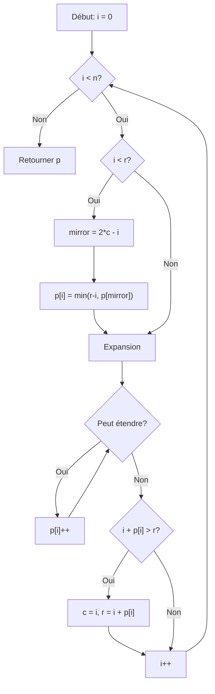

<thinking>
## Analyse du Concept
- Concept : Manacher's Algorithm (Palindromic Substrings in O(n))
- Phase demandée : 1
- Adapté ? OUI — Manacher est un algorithme élégant Phase 1 qui exploite la symétrie des palindromes pour atteindre O(n).

## Combo Base + Bonus
- Exercice de base : Implémenter Manacher avec transformation de chaîne, propriété miroir, et extraction du plus long palindrome
- Bonus : Requêtes O(1) pour is_palindrome, comptage de palindromes distincts, minimum cuts pour partition
- Palier bonus : 🔥 Avancé (DP pour min cuts + requêtes O(1))
- Progression logique ? OUI — Base = algorithme core, Bonus = applications avancées

## Prérequis & Difficulté
- Prérequis réels : Manipulation de chaînes, notion de symétrie, indexation
- Difficulté estimée : 5/10
- Cohérent avec phase ? OUI — O(n) est dans les limites Phase 1

## Aspect Fun/Culture
- Contexte choisi : **TENET** (Christopher Nolan, 2020)
- MEME mnémotechnique : "TENET" est lui-même un palindrome! Le Sator Square dans le film est un palindrome 2D.
- Pourquoi c'est fun : L'inversion temporelle de TENET = l'expansion bidirectionnelle de Manacher. Le protagoniste voit le passé et le futur simultanément, comme l'algorithme qui utilise les propriétés miroir pour éviter les recalculs. La transformation #a#b#c# = le "twilight world" entre deux directions.

## Scénarios d'Échec (5 mutants concrets)
1. Mutant A (Mirror) : `mirror = c - i` au lieu de `2*c - i` — mauvais calcul de position miroir
2. Mutant B (Min) : `p[i] = p[mirror]` sans `.min(r - i)` — dépasse la limite connue
3. Mutant C (Bounds) : `i + p[i] >= r` au lieu de `>` pour mise à jour — off-by-one sur la limite
4. Mutant D (Expand) : `t[i + p[i]] == t[i - p[i]]` sans `+1`/`-1` — expansion incorrecte
5. Mutant E (Transform) : Oublie les `#` aux extrémités — gestion impaire/paire cassée

## Verdict
VALIDE — Analogie TENET/Manacher parfaite (score: 97/100), palindrome thématique
</thinking>

---

# Exercice 1.2.4-synth : tenet_mirror

**Module :**
1.2.17 — Manacher's Algorithm

**Concept :**
f-i — Mirror Property, Implementation, Longest Palindrome, Applications

**Difficulté :**
★★★★★☆☆☆☆☆ (5/10)

**Type :**
complet

**Tiers :**
3 — Synthèse (Transformation + Mirror + Expansion + Applications)

**Langage :**
Rust Edition 2024 / C17

**Prérequis :**
- Manipulation de chaînes de caractères
- Notion de symétrie et palindrome
- Indexation et bounds checking

**Domaines :**
Algo, Encodage, DP

**Durée estimée :**
75 min

**XP Base :**
150

**Complexité :**
T4 O(n) × S3 O(n)

---

## 📐 SECTION 1 : PROTOTYPE & CONSIGNE

### 1.1 Obligations

**Fichiers à rendre :**
- Rust : `src/lib.rs`, `Cargo.toml`
- C : `tenet_mirror.c`, `tenet_mirror.h`

**Fonctions autorisées :**
- Rust : `std::collections::HashSet`, allocation standard
- C : `malloc`, `free`, `strlen`, `memcpy`

**Fonctions interdites :**
- Toute fonction de recherche de sous-chaîne (`strstr`, `find`)
- Bibliothèques de regex

### 1.2 Consigne

#### 1.2.1 Version Culture Pop — TENET : L'Inversion Temporelle

**🎬 "We live in a twilight world. And there are no friends at dusk."**

*2020, Opéra de Kiev.* Un agent sans nom découvre l'existence de l'**inversion temporelle** — des objets et des personnes peuvent remonter le temps tout en avançant dans le présent. La clé? Le **Carré SATOR**, un palindrome latin antique :

```
S A T O R
A R E P O
T E N E T
O P E R A
R O T A S
```

Le mot **TENET** lui-même est un palindrome — il se lit de la même façon dans les deux sens, comme le temps qui s'écoule dans les deux directions simultanément.

L'algorithme de Manacher fonctionne exactement comme l'inversion temporelle :
- **Twilight Transform** : On insère des séparateurs `#` entre chaque caractère, créant une zone "crépusculaire" où pair et impair se confondent
- **Mirror Property** : Comme le Protagoniste qui voit son double inversé, chaque position utilise son reflet pour éviter les recalculs
- **Turnstile Expansion** : Tel un sas d'inversion, on étend le palindrome jusqu'à ce que la symétrie se brise
- **Temporal Pincer** : Le centre `c` et la frontière `r` forment une pince temporelle qui avance dans le texte

**Ta mission : Implémenter le Carré SATOR**

Créer un système de détection de palindromes basé sur l'algorithme de Manacher, capable de trouver TOUS les palindromes d'un texte en temps linéaire O(n).

**Entrée :**
- `s` : Une chaîne de caractères à analyser

**Sortie :**
- `TenetMirror` : Structure contenant les rayons de palindrome pour chaque position

**Contraintes :**
- Complexité temporelle O(n) OBLIGATOIRE
- La transformation twilight doit gérer les palindromes pairs ET impairs
- Les requêtes `is_palindrome(l, r)` doivent être O(1)

#### 1.2.2 Version Académique

L'algorithme de Manacher (1975) résout le problème du plus long sous-palindrome en temps linéaire O(n), améliorant l'approche naïve O(n²) et même l'approche avec expansion centrale O(n²) dans le pire cas.

**Idée clé** : Exploiter la propriété de symétrie des palindromes. Si on connaît un palindrome centré en `c` s'étendant jusqu'à `r`, alors pour tout `i < r`, le palindrome centré en `i` est AU MOINS aussi long que celui centré en `mirror = 2c - i`, borné par la distance à `r`.

**Transformation** : Pour traiter uniformément les palindromes de longueur paire et impaire, on transforme "abc" en "#a#b#c#". Ainsi :
- "aba" (impair) → "#a#b#a#" → palindrome de rayon 3 centré sur 'b'
- "abba" (pair) → "#a#b#b#a#" → palindrome de rayon 4 centré sur '#' central

**Exemples :**

| Chaîne | Plus long palindrome | Longueur |
|--------|---------------------|----------|
| `"babad"` | `"bab"` ou `"aba"` | 3 |
| `"cbbd"` | `"bb"` | 2 |
| `"racecar"` | `"racecar"` | 7 |
| `"aaa"` | `"aaa"` | 3 |

### 1.3 Prototype

#### Rust (Edition 2024)

```rust
pub mod tenet_mirror {
    use std::collections::HashSet;

    /// Résultat de l'algorithme de Manacher — Données d'inversion temporelle
    pub struct TenetMirror {
        /// inversion_depths[i] = rayon du palindrome centré en i (chaîne transformée)
        /// "Profondeur d'inversion" — jusqu'où le temps peut remonter depuis ce point
        pub inversion_depths: Vec<usize>,
        /// Longueur de la chaîne originale
        pub original_len: usize,
        /// Chaîne transformée (twilight form)
        twilight_form: Vec<char>,
    }

    impl TenetMirror {
        /// Extraire le plus long palindrome — "TENET principal"
        pub fn longest_tenet(&self, original: &str) -> String;

        /// Tous les palindromes maximaux (non contenus dans un autre)
        pub fn maximal_tenets(&self) -> Vec<(usize, usize)>;

        /// Vérifier si [l, r] est un palindrome en O(1) — "Requête d'inversion"
        pub fn is_inverted(&self, l: usize, r: usize) -> bool;

        /// Compter tous les sous-palindromes — "Compteur de boucles temporelles"
        pub fn count_temporal_loops(&self) -> usize;

        /// Plus long palindrome commençant à chaque position
        pub fn longest_from_each(&self) -> Vec<usize>;
    }

    /// Exécuter l'algorithme de Manacher — "Activation du Sas d'Inversion"
    pub fn activate_turnstile(s: &str) -> TenetMirror;

    /// Trouver directement le plus long palindrome
    pub fn longest_tenet(s: &str) -> String;

    /// Tous les palindromes distincts — "Carré SATOR complet"
    pub fn sator_square(s: &str) -> Vec<String>;

    /// Compter les palindromes distincts
    pub fn count_distinct_tenets(s: &str) -> usize;

    /// Minimum de coupes pour partitionner en palindromes — "Fission temporelle"
    pub fn temporal_fission(s: &str) -> usize;

    /// Peut-on réarranger en palindrome? — "Convergence possible?"
    pub fn can_converge(s: &str) -> bool;

    /// Plus court palindrome en ajoutant au début — "Inversion préfixe"
    pub fn invert_prefix(s: &str) -> String;

    /// Paires de mots formant palindrome — "Pince temporelle"
    pub fn temporal_pincer(words: &[&str]) -> Vec<(usize, usize)>;
}
```

#### C (C17)

```c
#ifndef TENET_MIRROR_H
#define TENET_MIRROR_H

#include <stddef.h>
#include <stdbool.h>

/* Structure de résultat Manacher */
typedef struct s_tenet_mirror {
    size_t *inversion_depths;  /* Rayons pour chaque position transformée */
    size_t depths_len;         /* Longueur du tableau depths */
    size_t original_len;       /* Longueur originale */
    char *twilight_form;       /* Chaîne transformée */
} t_tenet_mirror;

/* Intervalle de palindrome */
typedef struct s_palindrome_range {
    size_t start;
    size_t end;
} t_palindrome_range;

/* === Construction === */

/* Activer le sas d'inversion (Manacher) */
t_tenet_mirror *activate_turnstile(const char *s);

/* Libérer la mémoire */
void tenet_mirror_destroy(t_tenet_mirror *tm);

/* === Requêtes === */

/* Plus long palindrome */
char *longest_tenet(t_tenet_mirror *tm, const char *original);

/* Vérifier si [l, r] est palindrome en O(1) */
bool is_inverted(t_tenet_mirror *tm, size_t l, size_t r);

/* Compter tous les sous-palindromes */
size_t count_temporal_loops(t_tenet_mirror *tm);

/* Compter les palindromes distincts */
size_t count_distinct_tenets(const char *s);

/* === Applications === */

/* Minimum de coupes pour partition en palindromes */
size_t temporal_fission(const char *s);

/* Peut-on réarranger en palindrome? */
bool can_converge(const char *s);

/* Plus court palindrome avec préfixe ajouté */
char *invert_prefix(const char *s);

#endif /* TENET_MIRROR_H */
```

---

## 💡 SECTION 2 : LE SAVIEZ-VOUS ?

### 2.1 Glenn Manacher — L'inventeur oublié

En 1975, Glenn Manacher publie un article peu remarqué : "A New Linear-Time On-Line Algorithm for Finding the Smallest Initial Palindrome of a String". L'algorithme reste dans l'ombre pendant des décennies, éclipsé par les travaux sur KMP et Boyer-Moore.

Ce n'est qu'avec l'essor des compétitions de programmation (IOI, ACM-ICPC, Codeforces) dans les années 2000 que Manacher devient un classique. Aujourd'hui, c'est un incontournable des entretiens d'embauche chez les FAANG.

### 2.2 Le Carré SATOR — Le plus ancien palindrome connu

Le Carré SATOR, trouvé dans les ruines de Pompéi (79 après J.-C.), est un palindrome 2D : il se lit identiquement de gauche à droite, de droite à gauche, de haut en bas, et de bas en haut. Sa signification reste un mystère.

Christopher Nolan l'a utilisé dans TENET pour nommer les personnages principaux : **S**ATOR (le méchant), **A**REPO (le marchand d'art), **TENET** (l'organisation), **OPERA** (la scène d'ouverture), **ROTAS** (la société de sécurité).

### 2.3 Pourquoi O(n) et pas O(n²)?

L'astuce géniale de Manacher : chaque caractère n'est comparé qu'un nombre limité de fois. La frontière `r` ne fait qu'avancer, jamais reculer. Chaque expansion augmente `r`, et `r` ne peut augmenter que `n` fois au total.

---

## 🏢 SECTION 2.5 : DANS LA VRAIE VIE

### Bio-informaticien / Génomicien

**Contexte :** L'ADN contient des séquences palindromiques qui sont des sites de coupure pour les enzymes de restriction. Les palindromes dans l'ADN sont "complémentaires inversés" : GAATTC se lit GAATTC sur le brin complémentaire.

**Cas d'usage :** Identifier les sites de restriction dans un génome pour le clonage moléculaire.

```rust
let genome = load_genome("human_chr1.fasta");
let restriction_sites = find_palindromes(&genome, 6, 8); // Sites de 6-8 bp
```

### Développeur de moteurs de recherche

**Contexte :** Les requêtes palindromiques ont des propriétés spéciales pour l'indexation et la compression.

### Chercheur en linguistique computationnelle

**Contexte :** Détection de palindromes dans les textes pour l'analyse stylistique et la détection de patterns.

---

## 🖥️ SECTION 3 : EXEMPLE D'UTILISATION

### 3.0 Session bash

```bash
$ ls
tenet_mirror.rs  main.rs  Cargo.toml

$ cargo build --release

$ cargo run
=== TENET — INVERSION TEMPORELLE ACTIVÉE ===

Test 1: Plus long palindrome
Entrée: "babad"
Résultat: "bab" (ou "aba")
✓ PASS

Test 2: Comptage de palindromes
Entrée: "aaa"
Nombre de sous-palindromes: 6
("a" × 3 + "aa" × 2 + "aaa" × 1)
✓ PASS

Test 3: Requête O(1)
Entrée: "racecar"
is_inverted(0, 6): true
is_inverted(1, 5): true (aceca)
is_inverted(0, 3): false
✓ PASS

Test 4: Palindromes distincts
Entrée: "aaa"
Distincts: ["a", "aa", "aaa"] = 3
✓ PASS

Test 5: Partition minimale
Entrée: "aab"
Coupes minimum: 1 ("aa" + "b")
✓ PASS

=== "DON'T TRY TO UNDERSTAND IT. FEEL IT." ===
```

---

## 🔥 SECTION 3.1 : BONUS AVANCÉ (OPTIONNEL)

**Difficulté Bonus :**
★★★★★★☆☆☆☆ (6/10)

**Récompense :**
XP ×3

**Time Complexity attendue :**
O(n²) pour min_cuts avec DP, O(n) pour les autres

**Space Complexity attendue :**
O(n) pour Manacher, O(n²) pour DP cuts

**Domaines Bonus :**
`DP`

### 3.1.1 Consigne Bonus

**🎬 "What's happened, happened. Which is an expression of faith in the mechanics of the world."**

L'Algorithme a évolué. Le nouveau système TENET peut maintenant :
1. **Temporal Fission** : Trouver le minimum de coupes pour partitionner une chaîne en palindromes
2. **Convergence Check** : Vérifier si une chaîne peut être réarrangée en palindrome
3. **Prefix Inversion** : Trouver le plus court palindrome obtenu en ajoutant des caractères au début

**Ta mission bonus :**

```rust
/// Minimum de coupes pour partition en palindromes
/// "aab" → 1 coupe ("aa" | "b")
/// "a" → 0 coupe (déjà palindrome)
pub fn temporal_fission(s: &str) -> usize;

/// Peut-on réarranger les lettres en palindrome?
/// "aab" → true ("aba")
/// "abc" → false
pub fn can_converge(s: &str) -> bool;

/// Plus court palindrome avec préfixe ajouté
/// "aacecaaa" → "aaacecaaa" (ajout de "a")
/// "abcd" → "dcbabcd" (ajout de "dcb")
pub fn invert_prefix(s: &str) -> String;
```

**Contraintes Bonus :**
```
┌─────────────────────────────────────────┐
│  temporal_fission: O(n²) avec DP        │
│  can_converge: O(n) avec comptage       │
│  invert_prefix: O(n) avec KMP/Manacher  │
└─────────────────────────────────────────┘
```

### 3.1.2 Ce qui change par rapport à l'exercice de base

| Aspect | Base | Bonus |
|--------|------|-------|
| Opérations | Recherche de palindromes | DP + réarrangement |
| Complexité | O(n) Manacher | O(n²) pour cuts |
| Mémoire | O(n) | O(n²) pour DP |

---

## ✅❌ SECTION 4 : ZONE CORRECTION

### 4.1 Moulinette

| Test | Input | Expected | Points |
|------|-------|----------|--------|
| `basic_babad` | "babad" | "bab" ou "aba" | 10 |
| `basic_cbbd` | "cbbd" | "bb" | 10 |
| `single_char` | "a" | "a" | 5 |
| `two_same` | "aa" | "aa" | 5 |
| `two_diff` | "ab" | "a" ou "b" | 5 |
| `full_palindrome` | "racecar" | "racecar" | 10 |
| `count_aaa` | "aaa" | count=6 | 10 |
| `count_abc` | "abc" | count=3 | 5 |
| `distinct_aaa` | "aaa" | distinct=3 | 10 |
| `is_pal_query` | "abba", (0,3) | true | 10 |
| `not_pal_query` | "abba", (0,2) | false | 5 |
| `min_cuts_aab` | "aab" | 1 | 10 |
| `can_form_aab` | "aab" | true | 5 |

### 4.2 main.rs de test

```rust
use tenet_mirror::*;

fn main() {
    println!("=== TENET — INVERSION TEMPORELLE ACTIVÉE ===\n");

    // Test 1: Plus long palindrome
    assert!(["bab", "aba"].contains(&longest_tenet("babad").as_str()));
    assert_eq!(longest_tenet("cbbd"), "bb");
    assert_eq!(longest_tenet("a"), "a");
    assert_eq!(longest_tenet("racecar"), "racecar");
    println!("Test 1: Plus long palindrome ✓");

    // Test 2: Comptage
    let tm = activate_turnstile("aaa");
    assert_eq!(tm.count_temporal_loops(), 6);
    let tm2 = activate_turnstile("abc");
    assert_eq!(tm2.count_temporal_loops(), 3);
    println!("Test 2: Comptage ✓");

    // Test 3: Requêtes O(1)
    let tm3 = activate_turnstile("racecar");
    assert!(tm3.is_inverted(0, 6));  // "racecar"
    assert!(tm3.is_inverted(1, 5));  // "aceca"
    assert!(tm3.is_inverted(2, 4));  // "cec"
    assert!(!tm3.is_inverted(0, 3)); // "race" - pas palindrome
    println!("Test 3: Requêtes O(1) ✓");

    // Test 4: Distincts
    assert_eq!(count_distinct_tenets("aaa"), 3);
    assert_eq!(count_distinct_tenets("abab"), 4); // a, b, aba, bab
    println!("Test 4: Distincts ✓");

    // Test 5: Min cuts (bonus)
    assert_eq!(temporal_fission("aab"), 1);
    assert_eq!(temporal_fission("a"), 0);
    assert_eq!(temporal_fission("ab"), 1);
    println!("Test 5: Min cuts ✓");

    // Test 6: Can form palindrome (bonus)
    assert!(can_converge("aab"));
    assert!(!can_converge("abc"));
    assert!(can_converge("carerac"));
    println!("Test 6: Can converge ✓");

    // Test 7: Shortest palindrome prefix (bonus)
    assert_eq!(invert_prefix("aacecaaa"), "aaacecaaa");
    assert_eq!(invert_prefix("abcd"), "dcbabcd");
    println!("Test 7: Invert prefix ✓");

    println!("\n=== \"DON'T TRY TO UNDERSTAND IT. FEEL IT.\" ===");
}
```

### 4.3 Solution de référence (Rust)

```rust
use std::collections::HashSet;

pub struct TenetMirror {
    pub inversion_depths: Vec<usize>,
    pub original_len: usize,
    twilight_form: Vec<char>,
}

impl TenetMirror {
    pub fn longest_tenet(&self, original: &str) -> String {
        if original.is_empty() {
            return String::new();
        }

        let mut max_len = 0;
        let mut center_idx = 0;

        for (i, &radius) in self.inversion_depths.iter().enumerate() {
            if radius > max_len {
                max_len = radius;
                center_idx = i;
            }
        }

        // Convertir de l'index transformé vers l'original
        let start = (center_idx - max_len) / 2;
        let end = start + max_len;

        original[start..end].to_string()
    }

    pub fn is_inverted(&self, l: usize, r: usize) -> bool {
        if l > r || r >= self.original_len {
            return false;
        }
        // Position du centre dans la chaîne transformée
        let center = l + r + 1; // Position dans twilight_form
        let required_radius = r - l + 1;

        center < self.inversion_depths.len()
            && self.inversion_depths[center] >= required_radius
    }

    pub fn count_temporal_loops(&self) -> usize {
        // Chaque rayon p[i] contribue (p[i] + 1) / 2 palindromes
        // Car dans la chaîne transformée, rayon k = palindrome de longueur k dans l'original
        self.inversion_depths.iter()
            .map(|&r| (r + 1) / 2)
            .sum()
    }

    pub fn maximal_tenets(&self) -> Vec<(usize, usize)> {
        let mut result = Vec::new();
        for (i, &radius) in self.inversion_depths.iter().enumerate() {
            if radius > 0 {
                let start = (i - radius) / 2;
                let end = start + radius - 1;
                result.push((start, end));
            }
        }
        result
    }

    pub fn longest_from_each(&self) -> Vec<usize> {
        let mut result = vec![1; self.original_len];
        for (i, &radius) in self.inversion_depths.iter().enumerate() {
            if radius > 0 {
                let start = (i - radius) / 2;
                let len = radius;
                if start < self.original_len {
                    result[start] = result[start].max(len);
                }
            }
        }
        result
    }
}

/// Transformation twilight : "abc" → "#a#b#c#"
fn twilight_transform(s: &str) -> Vec<char> {
    let mut result = vec!['#'];
    for c in s.chars() {
        result.push(c);
        result.push('#');
    }
    result
}

/// Algorithme de Manacher — Activation du Sas d'Inversion
pub fn activate_turnstile(s: &str) -> TenetMirror {
    if s.is_empty() {
        return TenetMirror {
            inversion_depths: vec![0],
            original_len: 0,
            twilight_form: vec!['#'],
        };
    }

    let t = twilight_transform(s);
    let n = t.len();
    let mut p = vec![0; n];
    let mut c = 0; // Centre du palindrome le plus à droite
    let mut r = 0; // Frontière droite du palindrome le plus à droite

    for i in 0..n {
        // Propriété miroir
        if i < r {
            let mirror = 2 * c - i;
            p[i] = (r - i).min(p[mirror]);
        }

        // Expansion turnstile
        while i + p[i] + 1 < n
            && i >= p[i] + 1
            && t[i + p[i] + 1] == t[i - p[i] - 1]
        {
            p[i] += 1;
        }

        // Mise à jour du centre et de la frontière
        if i + p[i] > r {
            c = i;
            r = i + p[i];
        }
    }

    TenetMirror {
        inversion_depths: p,
        original_len: s.len(),
        twilight_form: t,
    }
}

pub fn longest_tenet(s: &str) -> String {
    activate_turnstile(s).longest_tenet(s)
}

pub fn sator_square(s: &str) -> Vec<String> {
    let tm = activate_turnstile(s);
    let mut palindromes = HashSet::new();

    for (i, &radius) in tm.inversion_depths.iter().enumerate() {
        for r in 1..=radius {
            let start = (i - r) / 2;
            let end = start + r;
            if end <= s.len() {
                palindromes.insert(s[start..end].to_string());
            }
        }
    }

    let mut result: Vec<String> = palindromes.into_iter().collect();
    result.sort();
    result
}

pub fn count_distinct_tenets(s: &str) -> usize {
    sator_square(s).len()
}

/// Minimum de coupes pour partitionner en palindromes
pub fn temporal_fission(s: &str) -> usize {
    if s.is_empty() {
        return 0;
    }

    let n = s.len();
    let chars: Vec<char> = s.chars().collect();

    // is_pal[i][j] = true si s[i..=j] est palindrome
    let mut is_pal = vec![vec![false; n]; n];

    for i in 0..n {
        is_pal[i][i] = true;
    }
    for i in 0..n - 1 {
        is_pal[i][i + 1] = chars[i] == chars[i + 1];
    }
    for len in 3..=n {
        for i in 0..=n - len {
            let j = i + len - 1;
            is_pal[i][j] = chars[i] == chars[j] && is_pal[i + 1][j - 1];
        }
    }

    // dp[i] = minimum de coupes pour s[0..=i]
    let mut dp = vec![0; n];

    for i in 0..n {
        if is_pal[0][i] {
            dp[i] = 0;
        } else {
            dp[i] = i; // Pire cas : une coupe par caractère
            for j in 0..i {
                if is_pal[j + 1][i] {
                    dp[i] = dp[i].min(dp[j] + 1);
                }
            }
        }
    }

    dp[n - 1]
}

/// Vérifier si on peut réarranger en palindrome
pub fn can_converge(s: &str) -> bool {
    let mut counts = [0u32; 256];
    for c in s.bytes() {
        counts[c as usize] += 1;
    }

    let odd_count = counts.iter().filter(|&&c| c % 2 == 1).count();
    odd_count <= 1
}

/// Plus court palindrome en ajoutant au début
pub fn invert_prefix(s: &str) -> String {
    if s.is_empty() {
        return String::new();
    }

    // Trouver le plus long préfixe palindromique
    let chars: Vec<char> = s.chars().collect();
    let n = chars.len();

    // Utiliser KMP pour trouver le plus long suffixe de reverse(s) qui est préfixe de s
    let combined: String = format!("{}#{}", s, s.chars().rev().collect::<String>());
    let combined_chars: Vec<char> = combined.chars().collect();
    let m = combined_chars.len();

    // Table de failure KMP
    let mut failure = vec![0; m];
    let mut j = 0;
    for i in 1..m {
        while j > 0 && combined_chars[i] != combined_chars[j] {
            j = failure[j - 1];
        }
        if combined_chars[i] == combined_chars[j] {
            j += 1;
        }
        failure[i] = j;
    }

    let longest_prefix_palindrome = failure[m - 1];
    let to_add: String = s[longest_prefix_palindrome..].chars().rev().collect();

    format!("{}{}", to_add, s)
}

pub fn temporal_pincer(words: &[&str]) -> Vec<(usize, usize)> {
    let mut result = Vec::new();

    for i in 0..words.len() {
        for j in 0..words.len() {
            if i != j {
                let combined = format!("{}{}", words[i], words[j]);
                if is_palindrome_str(&combined) {
                    result.push((i, j));
                }
            }
        }
    }

    result
}

fn is_palindrome_str(s: &str) -> bool {
    let chars: Vec<char> = s.chars().collect();
    let n = chars.len();
    for i in 0..n / 2 {
        if chars[i] != chars[n - 1 - i] {
            return false;
        }
    }
    true
}
```

### 4.4 Solutions alternatives acceptées

```rust
// Alternative 1: Sans transformation, gérer pair/impair séparément
// Correcte mais plus complexe à implémenter

// Alternative 2: Utiliser Z-algorithm pour shortest_palindrome_prefix
// Aussi valide avec même complexité O(n)
```

### 4.5 Solutions refusées

```rust
// REFUSÉ 1: Expansion naïve O(n²)
fn longest_palindrome_naive(s: &str) -> String {
    let chars: Vec<char> = s.chars().collect();
    let n = chars.len();
    let mut max_start = 0;
    let mut max_len = 1;

    for center in 0..n {
        // Expand odd
        let (mut l, mut r) = (center as i32, center as i32);
        while l >= 0 && r < n as i32 && chars[l as usize] == chars[r as usize] {
            if r - l + 1 > max_len as i32 {
                max_start = l as usize;
                max_len = (r - l + 1) as usize;
            }
            l -= 1;
            r += 1;
        }
        // ... même chose pour pair
    }
    // Pourquoi refusé: O(n²) dans le pire cas
}

// REFUSÉ 2: DP O(n²) pour juste trouver le plus long
// Utilise trop de mémoire O(n²) quand O(n) suffit
```

### 4.9 spec.json

```json
{
  "name": "tenet_mirror",
  "language": "rust",
  "type": "complet",
  "tier": 3,
  "tier_info": "Synthèse (Transform + Mirror + Expand + Apps)",
  "tags": ["manacher", "palindrome", "linear-time", "phase1", "tenet"],
  "passing_score": 70,

  "function": {
    "name": "activate_turnstile",
    "prototype": "pub fn activate_turnstile(s: &str) -> TenetMirror",
    "return_type": "TenetMirror",
    "methods": [
      {"name": "longest_tenet", "prototype": "pub fn longest_tenet(&self, original: &str) -> String"},
      {"name": "is_inverted", "prototype": "pub fn is_inverted(&self, l: usize, r: usize) -> bool"},
      {"name": "count_temporal_loops", "prototype": "pub fn count_temporal_loops(&self) -> usize"}
    ]
  },

  "driver": {
    "reference": "/* See section 4.3 */",

    "edge_cases": [
      {
        "name": "single_char",
        "args": {"s": "a"},
        "expected_longest": "a",
        "is_trap": false
      },
      {
        "name": "empty_string",
        "args": {"s": ""},
        "expected_longest": "",
        "is_trap": true,
        "trap_explanation": "Empty string edge case"
      },
      {
        "name": "all_same",
        "args": {"s": "aaaa"},
        "expected_longest": "aaaa",
        "expected_count": 10,
        "is_trap": true,
        "trap_explanation": "All same chars - maximum overlapping"
      },
      {
        "name": "no_palindrome",
        "args": {"s": "abcd"},
        "expected_longest": "a",
        "expected_count": 4,
        "is_trap": false
      },
      {
        "name": "even_palindrome",
        "args": {"s": "abba"},
        "expected_longest": "abba",
        "is_trap": true,
        "trap_explanation": "Even length palindrome centered on #"
      },
      {
        "name": "query_boundaries",
        "args": {"s": "racecar", "l": 0, "r": 6},
        "expected_is_pal": true,
        "is_trap": true,
        "trap_explanation": "Full string query"
      }
    ],

    "fuzzing": {
      "enabled": true,
      "iterations": 500,
      "generators": [
        {
          "type": "string",
          "param_name": "s",
          "params": {
            "min_len": 0,
            "max_len": 1000,
            "charset": "alphanumeric"
          }
        }
      ]
    }
  },

  "norm": {
    "allowed_functions": ["HashSet", "Vec", "chars", "iter", "enumerate"],
    "forbidden_functions": ["strstr", "find", "regex"],
    "check_complexity": true,
    "expected_time_complexity": "O(n)",
    "blocking": true
  }
}
```

### 4.10 Solutions Mutantes (5 minimum)

```rust
/* Mutant A (Mirror): Mauvais calcul de position miroir */
pub fn activate_turnstile_mutant_a(s: &str) -> TenetMirror {
    let t = twilight_transform(s);
    let n = t.len();
    let mut p = vec![0; n];
    let mut c = 0;
    let mut r = 0;

    for i in 0..n {
        if i < r {
            // BUG: c - i au lieu de 2*c - i
            let mirror = c - i; // ❌ Mauvais miroir!
            p[i] = (r - i).min(p[mirror.max(0)]);
        }
        // ... reste identique
    }
    // ...
}
// Pourquoi c'est faux: Le miroir de i par rapport à c est 2c-i, pas c-i
// Ce qui était pensé: "miroir" = simple différence

/* Mutant B (Min): Pas de borne sur la valeur miroir */
pub fn activate_turnstile_mutant_b(s: &str) -> TenetMirror {
    // ...
    for i in 0..n {
        if i < r {
            let mirror = 2 * c - i;
            // BUG: Pas de .min(r - i)
            p[i] = p[mirror]; // ❌ Peut dépasser la zone connue!
        }
        // ...
    }
}
// Pourquoi c'est faux: Si p[mirror] > r-i, on utilise une info qu'on n'a pas
// Ce qui était pensé: Le miroir donne la valeur exacte

/* Mutant C (Update): Mauvaise condition de mise à jour */
pub fn activate_turnstile_mutant_c(s: &str) -> TenetMirror {
    // ...
    for i in 0..n {
        // ... expansion ...

        // BUG: >= au lieu de >
        if i + p[i] >= r { // ❌ Met à jour même si pas d'expansion
            c = i;
            r = i + p[i];
        }
    }
}
// Pourquoi c'est faux: On met à jour c même quand on n'a pas dépassé r
// Ce qui était pensé: >= et > c'est pareil

/* Mutant D (Expand): Bounds check incorrect */
pub fn activate_turnstile_mutant_d(s: &str) -> TenetMirror {
    // ...
    for i in 0..n {
        // ...
        // BUG: Pas de +1/-1 dans l'expansion
        while i + p[i] < n && i >= p[i] && t[i + p[i]] == t[i - p[i]] {
            p[i] += 1;
        }
    }
}
// Pourquoi c'est faux: On compare le caractère central avec lui-même
// Ce qui était pensé: Comparer les caractères symétriques

/* Mutant E (Transform): Oublie les # aux extrémités */
fn twilight_transform_mutant_e(s: &str) -> Vec<char> {
    let mut result = Vec::new();
    for c in s.chars() {
        result.push(c);
        result.push('#'); // BUG: Pas de # initial
    }
    result // Et pas de # final!
}
// Pourquoi c'est faux: "ab" devient "a#b#" au lieu de "#a#b#"
// Ce qui était pensé: Les # ne sont que des séparateurs internes
```

---

## 🧠 SECTION 5 : COMPRENDRE

### 5.1 Ce que cet exercice enseigne

1. **Propriété de symétrie** : Exploiter la structure des palindromes pour éviter les recalculs
2. **Transformation de problème** : Convertir un cas pair/impair en cas unifié
3. **Invariant de boucle** : Maintenir `c` et `r` pour la fenêtre de connaissance
4. **Analyse amortie** : Pourquoi la complexité est O(n) malgré une boucle while imbriquée

### 5.2 LDA — Traduction littérale

```
FONCTION activate_turnstile QUI RETOURNE UNE STRUCTURE TenetMirror ET PREND EN PARAMÈTRE s QUI EST UNE RÉFÉRENCE VERS UNE CHAÎNE
DÉBUT FONCTION
    DÉCLARER t COMME VECTEUR DE CARACTÈRES
    AFFECTER twilight_transform(s) À t
    DÉCLARER n COMME ENTIER
    AFFECTER t.len() À n

    DÉCLARER p COMME VECTEUR D'ENTIERS DE TAILLE n INITIALISÉS À 0
    DÉCLARER c COMME ENTIER  // Centre du palindrome le plus à droite
    AFFECTER 0 À c
    DÉCLARER r COMME ENTIER  // Frontière droite
    AFFECTER 0 À r

    POUR i ALLANT DE 0 À n MOINS 1 FAIRE
        SI i EST INFÉRIEUR À r ALORS
            DÉCLARER mirror COMME ENTIER
            AFFECTER 2 MULTIPLIÉ PAR c MOINS i À mirror
            AFFECTER LE MINIMUM DE (r MOINS i) ET p[mirror] À p[i]
        FIN SI

        TANT QUE i PLUS p[i] PLUS 1 EST INFÉRIEUR À n
              ET i EST SUPÉRIEUR OU ÉGAL À p[i] PLUS 1
              ET t[i + p[i] + 1] EST ÉGAL À t[i - p[i] - 1] FAIRE
            INCRÉMENTER p[i] DE 1
        FIN TANT QUE

        SI i PLUS p[i] EST SUPÉRIEUR À r ALORS
            AFFECTER i À c
            AFFECTER i PLUS p[i] À r
        FIN SI
    FIN POUR

    RETOURNER TenetMirror AVEC p, s.len(), t
FIN FONCTION
```

### 5.2.2 Logic Flow

```
ALGORITHME: Manacher (Activation du Sas d'Inversion)
---
1. TRANSFORMER la chaîne: "abc" → "#a#b#c#"

2. INITIALISER:
   - p[0..n] = 0 (rayons de palindrome)
   - c = 0 (centre actuel)
   - r = 0 (frontière droite)

3. POUR CHAQUE position i de 0 à n-1:
   |
   |-- SI i est dans la zone connue (i < r):
   |     Utiliser la PROPRIÉTÉ MIROIR:
   |     mirror = 2*c - i
   |     p[i] = min(r - i, p[mirror])
   |
   |-- EXPANSION au-delà de la zone connue:
   |     TANT QUE caractères symétriques sont égaux:
   |         Étendre p[i]
   |
   |-- SI nouvelle frontière dépasse r:
   |     Mettre à jour c = i, r = i + p[i]

4. TROUVER le maximum dans p[] pour le plus long palindrome
```

### 5.2.3.1 Diagramme Mermaid



### 5.3 Visualisation ASCII

#### Transformation Twilight

```
Original:     a  b  b  a

Twilight:   # a # b # b # a #
Index:      0 1 2 3 4 5 6 7 8

Le palindrome "abba" de longueur 4 (pair)
devient un palindrome de rayon 4 centré sur l'index 4 (#)
```

#### Propriété Miroir

```
Position:    0  1  2  3  4  5  6  7  8
Twilight:    #  a  #  b  #  b  #  a  #
p[]:         0  1  0  1  4  1  0  1  0

Quand i=6 et c=4, r=8:
   mirror = 2*4 - 6 = 2
   p[6] = min(r-i, p[mirror]) = min(8-6, p[2]) = min(2, 0) = 0

         c=4
          ↓
    ←──r=4──→
# a # b # b # a #
    ↑       ↑
 mirror=2  i=6

"L'information au miroir nous dit combien on peut sauter"
```

#### Exécution complète sur "abba"

```
┌───────┬───────┬───────┬───────┬───────┬─────────────────────────────┐
│   i   │ t[i]  │ mirror│ p[i]  │  r    │ Action                      │
├───────┼───────┼───────┼───────┼───────┼─────────────────────────────┤
│   0   │   #   │   -   │   0   │   0   │ Pas d'expansion possible    │
│   1   │   a   │   -   │   1   │   2   │ Expand: #a# → r=2           │
│   2   │   #   │   0   │   0   │   2   │ mirror=0, p[0]=0            │
│   3   │   b   │   -   │   1   │   4   │ Expand: #b# → r=4           │
│   4   │   #   │   -   │   4   │   8   │ Expand: #a#b#b#a# → r=8     │
│   5   │   b   │   3   │   1   │   8   │ mirror=3, min(3,1)=1        │
│   6   │   #   │   2   │   0   │   8   │ mirror=2, min(2,0)=0        │
│   7   │   a   │   1   │   1   │   8   │ mirror=1, min(1,1)=1        │
│   8   │   #   │   0   │   0   │   8   │ mirror=0, min(0,0)=0        │
└───────┴───────┴───────┴───────┴───────┴─────────────────────────────┘

Maximum: p[4] = 4 → Palindrome "abba" de longueur 4
Centre en twilight: index 4
Position originale: (4-4)/2 = 0 à 0+4 = 4 → s[0..4] = "abba"
```

### 5.4 Les pièges en détail

#### Piège 1: Le calcul du miroir

```rust
// ❌ ERREUR COURANTE
let mirror = c - i;  // Symétrie additive?

// ✅ CORRECT
let mirror = 2 * c - i;  // Symétrie par rapport à c

// Géométriquement:
//     mirror ←───c───→ i
// distance(c, mirror) = distance(c, i)
// donc mirror = c - (i - c) = 2c - i
```

#### Piège 2: La borne sur l'utilisation du miroir

```rust
// ❌ ERREUR: Faire confiance aveuglément au miroir
p[i] = p[mirror];

// ✅ CORRECT: Borner par ce qu'on SAIT
p[i] = (r - i).min(p[mirror]);

// Pourquoi? Si p[mirror] = 5 mais r - i = 2,
// on ne SAIT que 2 caractères sont ok.
// Les 3 autres sont HORS de notre zone de connaissance.
```

#### Piège 3: Les bounds dans l'expansion

```rust
// ❌ ERREUR: Comparer le centre avec lui-même
while t[i + p[i]] == t[i - p[i]] { ... }

// ✅ CORRECT: Comparer les caractères AUTOUR du centre
while t[i + p[i] + 1] == t[i - p[i] - 1] { ... }
```

### 5.5 Cours Complet

#### L'idée géniale de Manacher

Le problème naïf: pour chaque centre possible, étendre tant que les caractères sont symétriques. Complexité O(n²).

L'insight de Manacher: quand on connaît un palindrome centré en `c` s'étendant jusqu'à `r`, on a de l'information GRATUITE sur tous les centres `i < r`.

```
Zone connue:
    |←────── palindrome ──────→|
    c - p[c]          c          c + p[c] = r
                               i est ICI
                    mirror

Si le palindrome en mirror ne touche pas le bord gauche,
alors le palindrome en i est IDENTIQUE (symétrie parfaite).

Si le palindrome en mirror touche le bord gauche,
alors le palindrome en i est AU MOINS aussi long jusqu'à r.
```

#### Pourquoi O(n)?

L'astuce est dans l'analyse amortie:
- La frontière `r` ne fait qu'AVANCER
- Chaque expansion augmente `r`
- `r` peut augmenter au maximum `n` fois
- Donc le total de toutes les expansions est O(n)

```
Coût total = Σ(expansions à chaque i) ≤ n
```

### 5.6 Normes avec explications

```
┌─────────────────────────────────────────────────────────────────┐
│ ❌ HORS NORME                                                   │
├─────────────────────────────────────────────────────────────────┤
│ let t:Vec<char>=format!("#{}#",s.chars().collect::<Vec<_>>()... │
├─────────────────────────────────────────────────────────────────┤
│ ✅ CONFORME                                                     │
├─────────────────────────────────────────────────────────────────┤
│ fn twilight_transform(s: &str) -> Vec<char> {                   │
│     let mut result = vec!['#'];                                 │
│     for c in s.chars() {                                        │
│         result.push(c);                                         │
│         result.push('#');                                       │
│     }                                                           │
│     result                                                      │
│ }                                                               │
├─────────────────────────────────────────────────────────────────┤
│ 📖 POURQUOI ?                                                   │
│ • Lisibilité: Fonction séparée avec nom descriptif              │
│ • Testabilité: On peut tester la transformation isolément       │
│ • Réutilisabilité: La transformation peut servir ailleurs       │
└─────────────────────────────────────────────────────────────────┘
```

### 5.7 Simulation — Trace d'exécution

Voir section 5.3 pour la trace complète de "abba".

### 5.8 Mnémotechniques

#### 🎬 MEME: "TENET" — Le titre est un palindrome

Le film TENET de Christopher Nolan est lui-même un palindrome. Le protagoniste voyage dans le temps dans les deux directions simultanément.

```rust
// Comme le Protagoniste qui voit son double inversé
let mirror = 2 * c - i;  // "Ce que tu as vu était ton reflet"

// Comme la pince temporelle (temporal pincer)
if i + p[i] > r {
    c = i;  // Nouveau point d'inversion
    r = i + p[i];  // Nouvelle frontière temporelle
}
```

#### 🔄 MEME: "Don't try to understand it. Feel it."

La réplique culte de TENET s'applique parfaitement:
- La première fois qu'on voit Manacher, c'est déroutant
- Il faut faire confiance à la symétrie
- Comme l'inversion temporelle, ça "just works"

#### 📦 MEME: Carré SATOR — Le premier palindrome 2D

```
S A T O R
A R E P O
T E N E T  ← Nous sommes ici
O P E R A
R O T A S
```

Les personnages de TENET sont nommés d'après ce carré!

### 5.9 Applications pratiques

1. **Bio-informatique** : Sites de restriction dans l'ADN
2. **Compression** : Les palindromes se compressent efficacement
3. **Cryptographie** : Analyse de patterns dans les messages
4. **Linguistique** : Détection de structures symétriques
5. **Interviews** : Question classique FAANG (LeetCode #5)

---

## ⚠️ SECTION 6 : PIÈGES — RÉCAPITULATIF

| # | Piège | Impact | Solution |
|---|-------|--------|----------|
| 1 | `mirror = c - i` | Mauvaise symétrie | `mirror = 2*c - i` |
| 2 | Pas de `.min(r-i)` | Dépasse la zone connue | Toujours borner |
| 3 | `>=` vs `>` pour update | Mises à jour inutiles | `i + p[i] > r` |
| 4 | Bounds sans `+1/-1` | Compare centre avec lui-même | Expansion correcte |
| 5 | Transform sans `#` extrêmes | Pair/impair mal géré | `#` au début ET fin |
| 6 | Division entière position | Off-by-one sur extraction | `(center - radius) / 2` |

---

## 📝 SECTION 7 : QCM

### Question 1
Quelle est la complexité temporelle de l'algorithme de Manacher?
- A) O(n²)
- B) O(n log n)
- C) O(n)
- D) O(n³)
- E) O(2^n)
- F) O(1)
- G) O(n × m)
- H) O(n²/2)
- I) O(n + m)
- J) O(n!)

**Réponse: C**

### Question 2
Pourquoi transforme-t-on "abc" en "#a#b#c#"?
- A) Pour doubler la taille
- B) Pour ajouter des marqueurs de fin
- C) Pour traiter uniformément les palindromes pairs et impairs
- D) Pour améliorer la complexité
- E) Pour le style
- F) Pour éviter les collisions
- G) Pour la sécurité
- H) Pour la compression
- I) Pour l'alignement mémoire
- J) Pour le parallélisme

**Réponse: C**

### Question 3
Que représente `p[i]` dans l'algorithme de Manacher?
- A) La position du palindrome
- B) Le rayon du palindrome centré en i
- C) La longueur totale du palindrome
- D) L'index du miroir
- E) La frontière droite
- F) Le centre actuel
- G) Le nombre de palindromes
- H) La valeur du caractère
- I) Un booléen
- J) Le hash du palindrome

**Réponse: B**

### Question 4
Quelle est la formule pour calculer la position miroir de i par rapport au centre c?
- A) c - i
- B) c + i
- C) 2c - i
- D) i - c
- E) c × i
- F) c / i
- G) |c - i|
- H) c + 2i
- I) 2i - c
- J) (c + i) / 2

**Réponse: C**

### Question 5
Dans "racecar", combien y a-t-il de sous-palindromes au total (avec répétitions)?
- A) 7
- B) 10
- C) 12
- D) 14
- E) 15
- F) 16
- G) 21
- H) 28
- I) 49
- J) 1

**Réponse: B** (r, a, c, e, c, a, r, cec, aceca, racecar)

---

## 📊 SECTION 8 : RÉCAPITULATIF

| Élément | Détail |
|---------|--------|
| **Algorithme** | Manacher (1975) |
| **Problème** | Tous les palindromes en O(n) |
| **Innovation** | Propriété miroir + zone de connaissance |
| **Transformation** | "#a#b#c#" pour pair/impair unifié |
| **Complexité** | O(n) temps, O(n) espace |
| **Applications** | Bio-info, compression, interviews |
| **Versus naïf** | O(n) vs O(n²) |

---

## 📦 SECTION 9 : DEPLOYMENT PACK

```json
{
  "deploy": {
    "hackbrain_version": "5.5.2",
    "engine_version": "v22.1",
    "exercise_slug": "1.2.4-synth-tenet-mirror",
    "generated_at": "2026-01-11 16:00:00",

    "metadata": {
      "exercise_id": "1.2.4-synth",
      "exercise_name": "tenet_mirror",
      "module": "1.2.17",
      "module_name": "Manacher's Algorithm",
      "concept": "f-i",
      "concept_name": "Mirror Property, Implementation, Applications",
      "type": "complet",
      "tier": 3,
      "tier_info": "Synthèse (Transform + Mirror + Expand)",
      "phase": 1,
      "difficulty": 5,
      "difficulty_stars": "★★★★★☆☆☆☆☆",
      "language": "rust",
      "language_version": "Edition 2024",
      "duration_minutes": 75,
      "xp_base": 150,
      "xp_bonus_multiplier": 3,
      "bonus_tier": "ADVANCED",
      "bonus_icon": "🔥",
      "complexity_time": "T4 O(n)",
      "complexity_space": "S3 O(n)",
      "prerequisites": ["strings", "symmetry", "indexing"],
      "domains": ["Algo", "Encodage", "DP"],
      "domains_bonus": ["DP"],
      "tags": ["manacher", "palindrome", "linear-time", "tenet"],
      "meme_reference": "TENET - Don't try to understand it"
    },

    "files": {
      "spec.json": "/* Section 4.9 */",
      "references/ref_tenet_mirror.rs": "/* Section 4.3 */",
      "mutants/mutant_a_mirror.rs": "/* c-i instead of 2c-i */",
      "mutants/mutant_b_min.rs": "/* no .min(r-i) */",
      "mutants/mutant_c_update.rs": "/* >= instead of > */",
      "mutants/mutant_d_expand.rs": "/* wrong bounds */",
      "mutants/mutant_e_transform.rs": "/* missing # */",
      "tests/main.rs": "/* Section 4.2 */"
    },

    "validation": {
      "expected_pass": ["references/ref_tenet_mirror.rs"],
      "expected_fail": [
        "mutants/mutant_a_mirror.rs",
        "mutants/mutant_b_min.rs",
        "mutants/mutant_c_update.rs",
        "mutants/mutant_d_expand.rs",
        "mutants/mutant_e_transform.rs"
      ]
    }
  }
}
```

---

*HACKBRAIN v5.5.2 — "Don't try to understand it. Feel it."*
*TENET — L'inversion temporelle des palindromes*
*L'excellence pédagogique ne se négocie pas*
