<thinking>
## Analyse du Concept
- Concept : Mini-Projet Text Search Engine - SYNTHÈSE de tous les concepts du module 1.2
- Phase demandée : 1 (Transition débutant → intermédiaire)
- Adapté ? OUI - C'est un Tier 3 qui synthétise: Hash Tables, Rolling Hash, Rabin-Karp, Aho-Corasick, Manacher, Trie, Suffix Array, tous appliqués dans un moteur de recherche textuel complet

## Combo Base + Bonus
- Exercice de base : Moteur de recherche avec index inversé, recherche exacte/fuzzy/wildcard/phrase, autocomplete, ranking TF-IDF
- Bonus : Ajouter BM25, persistence, streaming search, distributed sharding
- Palier bonus : 🔥 Avancé (×3 XP) - Le bonus demande une architecture production-ready
- Progression logique ? OUI - Base = fonctionnalités core, Bonus = optimisations production

## Prérequis & Difficulté
- Prérequis réels : TOUS les concepts du module 1.2 (ex00-ex06)
- Difficulté estimée : 6/10 (Tier 3 synthèse, multiple structures)
- Cohérent avec phase ? OUI - Phase 1 max = 5/10 + 2 pour Tier 3 = 7/10 acceptable

## Aspect Fun/Culture
- Contexte choisi : **LA BIBLIOTHÈQUE DE BABEL** de Jorge Luis Borges
- Pourquoi c'est PARFAIT :
  1. La Bibliothèque contient TOUS les livres possibles de 410 pages → analogie parfaite avec l'indexation de documents
  2. Le défi n'est PAS de stocker mais de TROUVER → exactement le problème d'un search engine
  3. Les "bibliothécaires" cherchent le "Livre Justificateur" → analogie avec la pertinence/ranking
  4. Structure en hexagones avec 4 murs de 5 étagères → indexation structurée
  5. Le "Livre de Sable" (autre nouvelle) = livre infini → persistence d'index
  6. Recherche de sens dans un chaos de caractères → fuzzy matching, spell correction
  7. Les "vindicateurs" qui cherchent le sens → query parsers

- MEME mnémotechnique : "Finding a needle in an infinite haystack" / "Dans Babel, même 'aaaaaa...' existe quelque part"
- Noms de fonctions:
  - `BabelLibrary` → SearchEngine
  - `Hexagon` → Document
  - `Vindication` → SearchResult (le livre qui justifie l'existence)
  - `TheLibrarian` → QueryParser
  - `CrimsonHexagon` → InvertedIndex (hexagone rouge = important)
  - `GalleryOfBabel` → AutoComplete (galeries infinies de possibilités)
  - `BookOfSand` → Persistence (le livre infini qui ne s'arrête jamais)
  - `seek_vindication` → search()
  - `whisper_of_babel` → autocomplete()
  - `correct_the_gibberish` → suggest_correction()

## Scénarios d'Échec (5 mutants concrets)

1. **Mutant A (Index)** : Oubli de lowercase dans l'indexation
   ```rust
   // Bug: "Rust" et "rust" deviennent deux termes différents
   fn index_term(&mut self, term: &str) {
       self.inverted_index.entry(term.to_string())... // Manque .to_lowercase()
   }
   ```
   Impact: Recherche "rust" ne trouve pas "Rust is..."

2. **Mutant B (Position)** : Mauvais tracking des positions pour phrase search
   ```rust
   // Bug: Positions relatives au document au lieu d'absolues
   fn add_document(&mut self, doc: Document) {
       for (pos, word) in doc.content.split_whitespace().enumerate() {
           self.positions.entry(word).or_default().push(pos); // Manque doc_offset
       }
   }
   ```
   Impact: Phrase search trouve des faux positifs

3. **Mutant C (TF-IDF)** : Division par zéro ou log(0)
   ```rust
   // Bug: Si un terme apparaît dans TOUS les documents
   fn idf(&self, term: &str) -> f64 {
       let df = self.document_frequency(term);
       (self.doc_count as f64 / df as f64).ln() // df == doc_count → log(1) = 0
   }
   ```
   Impact: Score = 0 pour termes communs, ranking cassé

4. **Mutant D (Fuzzy)** : Edit distance off-by-one
   ```rust
   // Bug: Retourne distance+1 ou distance-1
   fn edit_distance(a: &str, b: &str) -> usize {
       // ... dp logic
       dp[m][n] + 1 // Off-by-one error
   }
   ```
   Impact: Fuzzy search avec distance=1 ne trouve rien ou trouve trop

5. **Mutant E (Autocomplete)** : Retourne des préfixes au lieu de mots complets
   ```rust
   // Bug: Dans le trie, on retourne dès qu'on trouve un nœud au lieu de chercher les feuilles
   fn autocomplete(&self, prefix: &str) -> Vec<String> {
       if let Some(node) = self.seek(prefix) {
           return vec![prefix.to_string()]; // Retourne le préfixe, pas les mots
       }
       vec![]
   }
   ```
   Impact: autocomplete("pro") retourne ["pro"] au lieu de ["program", "progress", ...]

## Verdict
VALIDE - Note d'intelligence estimée: 97/100
- L'analogie Bibliothèque de Babel est intellectuellement riche et parfaitement adaptée
- Le projet synthétise véritablement tous les concepts du module
- Les mutants couvrent des erreurs réelles et subtiles
</thinking>

---

# Exercice 1.2.7 : babel_library

**Module :**
1.2 — Hash Tables & Strings

**Concept :**
synth — Mini-Projet Text Search Engine (Synthèse Complète)

**Difficulté :**
★★★★★★☆☆☆☆ (6/10)

**Type :**
complet

**Tiers :**
3 — Synthèse (tous concepts 1.2.0→1.2.6)

**Langage :**
Rust Edition 2024 & C17

**Prérequis :**
- 1.2.0 : Hash Tables (inverted index)
- 1.2.1 : Rolling Hash (n-gram similarity)
- 1.2.2 : Rabin-Karp (multi-pattern search)
- 1.2.3 : Aho-Corasick (pattern matching)
- 1.2.4 : Manacher (palindrome detection)
- 1.2.5 : Trie (autocomplete)
- 1.2.6 : Suffix Array (substring search)

**Domaines :**
Struct, Tri, Encodage, FS, Mem

**Durée estimée :**
180 min

**XP Base :**
500

**Complexité :**
T4 O(n log n) × S3 O(n)

---

## 📐 SECTION 1 : PROTOTYPE & CONSIGNE

### 1.1 Obligations

**Fichiers à rendre :**
```
babel_library/
├── Cargo.toml
├── src/
│   ├── lib.rs
│   ├── hexagon.rs          # Document structure
│   ├── crimson_index.rs    # Inverted index
│   ├── gallery.rs          # Trie autocomplete
│   ├── seek.rs             # Search algorithms
│   ├── vindication.rs      # Results & ranking
│   └── book_of_sand.rs     # Persistence
├── tests/
│   └── integration_tests.rs
└── benches/
    └── search_bench.rs
```

**Fichier C :** `babel_library.c` + `babel_library.h`

**Fonctions autorisées :**
- Rust : std, serde, serde_json (pour persistence)
- C : malloc, free, calloc, realloc, strlen, strcmp, strncmp, strcpy, strncpy, strstr, fopen, fclose, fread, fwrite, fprintf, fscanf, memcpy, memset, memcmp, tolower, toupper, isalpha, isalnum, qsort, bsearch

**Fonctions interdites :**
- Bibliothèques de recherche textuelle externes (tantivy, lunr, elasticsearch bindings)
- regex (implémentation manuelle requise)

---

### 1.2 Consigne

#### 🎮 2.4.1 VERSION CULTURE — La Bibliothèque de Babel

**🌀 "L'univers (que d'autres appellent la Bibliothèque) se compose d'un nombre indéfini, et peut-être infini, de galeries hexagonales..."**
*— Jorge Luis Borges, "La Bibliothèque de Babel" (1941)*

Dans la nouvelle de Borges, la Bibliothèque contient **TOUS les livres possibles** de 410 pages. Chaque combinaison de 25 symboles existe quelque part. Cela signifie que :
- Quelque part existe le livre qui explique le sens de la vie
- Quelque part existe ce même livre, mais avec une faute de frappe
- Quelque part existe un livre qui n'est que "aaaaaa..." pendant 410 pages
- **Le défi n'est pas de stocker — c'est de TROUVER**

Les bibliothécaires de Babel passent leur vie à chercher le **"Livre Justificateur"** (en espagnol: *Vindicación*) — le livre qui donne sens à leur existence. La plupart ne le trouvent jamais.

**Ta mission : Construire le système de recherche que les bibliothécaires de Babel n'ont jamais eu.**

Tu vas créer `BabelLibrary`, un moteur de recherche textuel complet qui permettrait enfin aux habitants de Babel de trouver ce qu'ils cherchent dans l'infinité chaotique des hexagones.

---

#### 📚 2.4.2 VERSION ACADÉMIQUE

**Objectif :** Implémenter un moteur de recherche textuel complet intégrant tous les concepts du module 1.2.

**Composants requis :**

1. **Index Inversé** (ex00 - Hash Tables)
   - Mapping terme → liste de documents
   - Positions des occurrences pour phrase search

2. **Recherche Multi-Pattern** (ex02, ex03 - Rabin-Karp, Aho-Corasick)
   - Recherche exacte efficace
   - Boolean queries (AND, OR, NOT)

3. **Recherche Approximative** (ex01, ex04 - Rolling Hash, Manacher)
   - Fuzzy matching avec distance d'édition
   - Spell correction

4. **Autocomplétion** (ex05 - Trie)
   - Suggestions basées sur préfixe
   - Ranking par fréquence

5. **Recherche de Sous-chaînes** (ex06 - Suffix Array)
   - Wildcard patterns
   - Phrase search

6. **Ranking** (TF-IDF, BM25)
   - Pertinence des résultats
   - Scoring et tri

---

**Ta mission :**

Écrire la bibliothèque `BabelLibrary` qui fournit :

**Entrée (Documents) :**
- `Hexagon` : Structure document avec id, titre, contenu, métadonnées

**Sorties (Résultats) :**
- `Vindication` : Résultat de recherche avec score et positions des matches
- `Vec<String>` : Suggestions d'autocomplétion

**Opérations :**
| Méthode | Description |
|---------|-------------|
| `add_hexagon` | Indexer un nouveau document |
| `seek_vindication` | Recherche exacte |
| `seek_fuzzy` | Recherche approximative |
| `seek_wildcard` | Recherche avec patterns |
| `seek_phrase` | Recherche de phrase exacte |
| `seek_boolean` | Requêtes AND/OR/NOT |
| `whisper_of_babel` | Autocomplétion |
| `correct_the_gibberish` | Suggestion de correction |
| `inscribe` / `awaken` | Sauvegarder / Charger l'index |

**Contraintes :**
- Recherche exacte : O(1) lookup dans l'index inversé
- Autocomplétion : O(k) où k = longueur du préfixe
- Fuzzy search : O(n × m) avec early termination
- Phrase search : O(positions) avec vérification de continuité
- Mémoire : Index doit tenir en RAM (pas de streaming obligatoire)

---

### 1.3 Prototype

#### Rust (Edition 2024)

```rust
use std::collections::HashMap;
use std::path::Path;
use std::io::{self, Read, Write};

/// Un document dans la Bibliothèque — un hexagone contenant du savoir
#[derive(Clone, Debug, serde::Serialize, serde::Deserialize)]
pub struct Hexagon {
    /// Identifiant unique (ex: "hex-3-14-159")
    pub id: String,
    /// Titre du livre/document
    pub title: String,
    /// Contenu textuel complet
    pub content: String,
    /// Métadonnées additionnelles (auteur, date, catégorie...)
    pub metadata: HashMap<String, String>,
}

/// Le résultat de notre quête — le Livre Justificateur
#[derive(Debug, Clone)]
pub struct Vindication {
    /// ID du document trouvé
    pub hexagon_id: String,
    /// Score de pertinence (TF-IDF ou BM25)
    pub relevance_score: f64,
    /// Positions des matches dans le document
    pub illuminations: Vec<Illumination>,
}

/// Un point lumineux — là où le terme recherché apparaît
#[derive(Debug, Clone)]
pub struct Illumination {
    /// Champ où le match a été trouvé ("title" ou "content")
    pub field: String,
    /// Position du début du match
    pub position: usize,
    /// Longueur du match
    pub length: usize,
    /// Extrait contextuel autour du match
    pub snippet: String,
}

/// Options de recherche
#[derive(Debug, Clone, Default)]
pub struct SeekOptions {
    /// Activer la recherche floue
    pub fuzzy: bool,
    /// Distance d'édition maximale pour fuzzy search
    pub max_gibberish: usize,
    /// Mettre en évidence les matches
    pub illuminate: bool,
    /// Nombre maximum de résultats
    pub limit: usize,
    /// Offset pour pagination
    pub offset: usize,
}

/// Statistiques de la Bibliothèque
#[derive(Debug, Clone)]
pub struct LibraryStats {
    /// Nombre d'hexagones (documents)
    pub hexagon_count: usize,
    /// Nombre de termes uniques indexés
    pub term_count: usize,
    /// Nombre total de tokens
    pub total_tokens: usize,
    /// Taille estimée de l'index en bytes
    pub index_size_bytes: usize,
}

/// La Bibliothèque de Babel — le moteur de recherche
pub struct BabelLibrary {
    // Index inversé: terme → [(doc_id, positions)]
    crimson_index: HashMap<String, Vec<(String, Vec<usize>)>>,
    // Trie pour autocomplétion
    gallery: GalleryNode,
    // Documents stockés
    hexagons: HashMap<String, Hexagon>,
    // Fréquence des termes par document (pour TF-IDF)
    term_frequencies: HashMap<String, HashMap<String, usize>>,
    // Longueur des documents (en tokens)
    document_lengths: HashMap<String, usize>,
    // Longueur moyenne des documents
    avg_document_length: f64,
}

/// Nœud du Trie (Galerie infinie de possibilités)
struct GalleryNode {
    children: HashMap<char, GalleryNode>,
    is_complete_word: bool,
    frequency: usize,
}

impl BabelLibrary {
    /// Créer une nouvelle Bibliothèque vide
    pub fn new() -> Self;

    /// Charger la Bibliothèque depuis le Livre de Sable (persistence)
    pub fn awaken(path: &Path) -> io::Result<Self>;

    /// Inscrire la Bibliothèque dans le Livre de Sable
    pub fn inscribe(&self, path: &Path) -> io::Result<()>;

    /// Ajouter un hexagone (document) à la Bibliothèque
    pub fn add_hexagon(&mut self, hexagon: Hexagon);

    /// Ajouter plusieurs hexagones
    pub fn add_hexagons(&mut self, hexagons: Vec<Hexagon>);

    /// Retirer un hexagone
    pub fn remove_hexagon(&mut self, id: &str) -> bool;

    /// Recherche exacte — chercher le Livre Justificateur
    pub fn seek_vindication(&self, query: &str, options: &SeekOptions) -> Vec<Vindication>;

    /// Recherche floue — même les fautes de frappe ne nous arrêteront pas
    pub fn seek_fuzzy(&self, query: &str, max_distance: usize) -> Vec<Vindication>;

    /// Recherche wildcard — * et ? sont nos alliés
    pub fn seek_wildcard(&self, pattern: &str) -> Vec<Vindication>;

    /// Recherche de phrase exacte — l'ordre des mots compte
    pub fn seek_phrase(&self, phrase: &str) -> Vec<Vindication>;

    /// Recherche booléenne — AND, OR, NOT
    pub fn seek_boolean(&self, query: &str) -> Vec<Vindication>;

    /// Les murmures de Babel — autocomplétion
    pub fn whisper_of_babel(&self, prefix: &str, limit: usize) -> Vec<String>;

    /// Corriger le charabia — "Vouliez-vous dire...?"
    pub fn correct_the_gibberish(&self, query: &str) -> Option<String>;

    /// Compter les hexagones
    pub fn hexagon_count(&self) -> usize;

    /// Statistiques de la Bibliothèque
    pub fn statistics(&self) -> LibraryStats;
}

/// Le Bibliothécaire — parseur de requêtes complexes
pub struct TheLibrarian;

/// Types de requêtes que le Bibliothécaire comprend
#[derive(Debug, Clone)]
pub enum Quest {
    /// Terme simple
    Term(String),
    /// Phrase exacte
    Phrase(Vec<String>),
    /// Pattern wildcard
    Wildcard(String),
    /// Recherche floue avec distance max
    Fuzzy(String, usize),
    /// ET logique
    And(Box<Quest>, Box<Quest>),
    /// OU logique
    Or(Box<Quest>, Box<Quest>),
    /// NON logique
    Not(Box<Quest>),
}

#[derive(Debug)]
pub struct ParseError {
    pub message: String,
    pub position: usize,
}

impl TheLibrarian {
    /// Parser une requête textuelle en structure Quest
    pub fn interpret(query: &str) -> Result<Quest, ParseError>;
}

// === Fonctions internes importantes ===

/// Calcul TF-IDF
fn tf_idf(term_freq: usize, doc_length: usize, doc_freq: usize, total_docs: usize) -> f64;

/// Calcul BM25 (bonus)
fn bm25(term_freq: usize, doc_length: usize, avg_doc_length: f64,
        doc_freq: usize, total_docs: usize, k1: f64, b: f64) -> f64;

/// Distance d'édition (Levenshtein)
fn edit_distance(a: &str, b: &str) -> usize;

/// Tokenization
fn tokenize(text: &str) -> Vec<String>;
```

#### C (C17)

```c
#ifndef BABEL_LIBRARY_H
#define BABEL_LIBRARY_H

#include <stddef.h>
#include <stdbool.h>
#include <stdio.h>

/* === Structures de données === */

/* Métadonnée clé-valeur */
typedef struct s_metadata {
    char *key;
    char *value;
    struct s_metadata *next;
} t_metadata;

/* Document (Hexagone) */
typedef struct s_hexagon {
    char *id;
    char *title;
    char *content;
    t_metadata *metadata;
} t_hexagon;

/* Position d'un match (Illumination) */
typedef struct s_illumination {
    char *field;
    size_t position;
    size_t length;
    char *snippet;
    struct s_illumination *next;
} t_illumination;

/* Résultat de recherche (Vindication) */
typedef struct s_vindication {
    char *hexagon_id;
    double relevance_score;
    t_illumination *illuminations;
    struct s_vindication *next;
} t_vindication;

/* Options de recherche */
typedef struct s_seek_options {
    bool fuzzy;
    size_t max_gibberish;
    bool illuminate;
    size_t limit;
    size_t offset;
} t_seek_options;

/* Statistiques */
typedef struct s_library_stats {
    size_t hexagon_count;
    size_t term_count;
    size_t total_tokens;
    size_t index_size_bytes;
} t_library_stats;

/* Entrée d'index inversé */
typedef struct s_posting {
    char *doc_id;
    size_t *positions;
    size_t position_count;
    struct s_posting *next;
} t_posting;

/* Terme dans l'index */
typedef struct s_index_entry {
    char *term;
    t_posting *postings;
    size_t doc_frequency;
    struct s_index_entry *next;
} t_index_entry;

/* Noeud du Trie (Gallery) */
typedef struct s_gallery_node {
    struct s_gallery_node *children[256];
    bool is_complete_word;
    size_t frequency;
} t_gallery_node;

/* La Bibliothèque de Babel */
typedef struct s_babel_library {
    t_index_entry **crimson_index;  /* Hash table de l'index inversé */
    size_t index_capacity;
    t_gallery_node *gallery;        /* Trie pour autocomplete */
    t_hexagon **hexagons;           /* Documents stockés */
    size_t hexagon_count;
    size_t hexagon_capacity;
    double avg_document_length;
} t_babel_library;

/* === API Publique === */

/* Création et destruction */
t_babel_library *babel_library_new(void);
void babel_library_free(t_babel_library *lib);

/* Persistence */
int babel_library_inscribe(t_babel_library *lib, const char *path);
t_babel_library *babel_library_awaken(const char *path);

/* Gestion des documents */
void babel_add_hexagon(t_babel_library *lib, t_hexagon *hex);
bool babel_remove_hexagon(t_babel_library *lib, const char *id);

/* Recherche */
t_vindication *babel_seek_vindication(t_babel_library *lib,
                                       const char *query,
                                       t_seek_options *opts);
t_vindication *babel_seek_fuzzy(t_babel_library *lib,
                                 const char *query,
                                 size_t max_distance);
t_vindication *babel_seek_wildcard(t_babel_library *lib,
                                    const char *pattern);
t_vindication *babel_seek_phrase(t_babel_library *lib,
                                  const char *phrase);
t_vindication *babel_seek_boolean(t_babel_library *lib,
                                   const char *query);

/* Autocomplete et correction */
char **babel_whisper(t_babel_library *lib,
                     const char *prefix,
                     size_t limit,
                     size_t *count);
char *babel_correct_gibberish(t_babel_library *lib, const char *query);

/* Statistiques */
size_t babel_hexagon_count(t_babel_library *lib);
t_library_stats babel_statistics(t_babel_library *lib);

/* === Utilitaires === */

/* Création de structures */
t_hexagon *hexagon_new(const char *id, const char *title, const char *content);
void hexagon_add_metadata(t_hexagon *hex, const char *key, const char *value);
void hexagon_free(t_hexagon *hex);

void vindication_free(t_vindication *vind);
void illumination_free(t_illumination *ill);

t_seek_options seek_options_default(void);

/* Algorithmes internes */
size_t edit_distance(const char *a, const char *b);
double tf_idf(size_t tf, size_t doc_len, size_t df, size_t total_docs);
double bm25(size_t tf, size_t doc_len, double avg_len,
            size_t df, size_t total_docs, double k1, double b);
char **tokenize(const char *text, size_t *count);

#endif /* BABEL_LIBRARY_H */
```

---

## 💡 SECTION 2 : LE SAVIEZ-VOUS ?

### 2.1 L'origine de la métaphore

La nouvelle "La Bibliothèque de Babel" de Jorge Luis Borges (1941) décrit une bibliothèque infinie contenant tous les livres possibles de 410 pages, utilisant 25 symboles (22 lettres + point + virgule + espace).

Le nombre de livres possibles est : **25^1,312,000** (environ 10^1,834,097)

C'est plus grand que le nombre d'atomes dans l'univers observable (~10^80). Dans cette bibliothèque :
- Existe le livre qui guérit le cancer
- Existe le même livre avec une faute de frappe qui le rend faux
- Existe un livre qui n'est que "mxvz klpr..." sur 410 pages
- **99.9999...% des livres sont du pur charabia**

Le problème de Babel n'est pas le stockage — c'est la **recherche**. C'est exactement le problème que résout un search engine.

### 2.2 Les vrais moteurs de recherche

| Moteur | Index Size | Documents | Algo principal |
|--------|------------|-----------|----------------|
| Google | ~100 PB | 130+ trillion pages | PageRank + BERT |
| Elasticsearch | Variable | Variable | BM25 + Lucene |
| Algolia | ~1 TB | Millions | Typo-tolerance + Facets |
| MeiliSearch | Compact | Millions | Prefix + Typo + Filters |
| Typesense | Compact | Millions | Prefix + Geo + Facets |

---

## 2.5 DANS LA VRAIE VIE

| Métier | Utilisation | Exemple concret |
|--------|-------------|-----------------|
| **Backend Developer** | Implémentation de recherche dans apps | "Recherche de produits sur e-commerce" |
| **Data Engineer** | Indexation de data lakes | "Recherche dans 10TB de logs" |
| **DevOps** | Centralisation de logs | "ELK Stack (Elasticsearch)" |
| **ML Engineer** | Recherche sémantique | "Embedding + vector search" |
| **Security Analyst** | Threat hunting | "Recherche dans SIEM" |
| **Content Platforms** | Full-text search | "YouTube, Netflix, Spotify" |

---

## 🖥️ SECTION 3 : EXEMPLE D'UTILISATION

### 3.0 Session bash (Rust)

```bash
$ ls
Cargo.toml  src/  tests/  benches/

$ cargo build --release
   Compiling babel_library v1.0.0
    Finished release [optimized] target(s)

$ cargo test
running 12 tests
test test_basic_search ... ok
test test_fuzzy_search ... ok
test test_wildcard ... ok
test test_phrase_search ... ok
test test_autocomplete ... ok
test test_ranking ... ok
test test_persistence ... ok
test test_boolean_and ... ok
test test_boolean_or ... ok
test test_boolean_not ... ok
test test_spell_correction ... ok
test test_empty_library ... ok

test result: ok. 12 passed; 0 failed

$ cargo bench
search/exact_1000_docs  time: [45.234 µs 45.891 µs 46.547 µs]
search/fuzzy_1000_docs  time: [2.1234 ms 2.1891 ms 2.2547 ms]
autocomplete/prefix_5   time: [1.234 µs 1.291 µs 1.347 µs]
```

### 3.0.1 Session bash (C)

```bash
$ ls
babel_library.c  babel_library.h  main.c  Makefile

$ make
gcc -Wall -Wextra -Werror -O2 -c babel_library.c -o babel_library.o
gcc -Wall -Wextra -Werror -O2 main.c babel_library.o -o babel_search

$ ./babel_search
=== Babel Library Test Suite ===
[OK] Basic search
[OK] Fuzzy search
[OK] Wildcard search
[OK] Phrase search
[OK] Autocomplete
[OK] Ranking TF-IDF
[OK] Persistence
All tests passed!
```

---

## 🔥 SECTION 3.1 : BONUS AVANCÉ (OPTIONNEL)

**Difficulté Bonus :**
★★★★★★★★☆☆ (8/10)

**Récompense :**
XP ×3

**Time Complexity attendue :**
O(k) average pour toutes les opérations

**Space Complexity attendue :**
O(n) avec compression

**Domaines Bonus :**
`Net, Process, Compression`

### 3.1.1 Consigne Bonus

**🌀 La Bibliothèque Infinie de Babel 2.0**

Les bibliothécaires ont découvert que certains hexagones peuvent contenir des références à d'autres hexagones. Ils ont besoin d'un système qui :

1. **BM25 au lieu de TF-IDF** — Le ranking Okapi BM25, plus moderne et performant
2. **Index compressé** — Utiliser variable-byte encoding pour les postings lists
3. **Streaming search** — Pouvoir indexer des documents sans tout charger en RAM
4. **Faceted search** — Filtrer par métadonnées (auteur, date, catégorie)
5. **Highlighting avancé** — Snippets avec contexte configurable

**Contraintes Bonus :**
```
┌─────────────────────────────────────────┐
│  BM25 : k1 = 1.2, b = 0.75 par défaut   │
│  Compression : Variable-byte encoding   │
│  Streaming : Buffer de 1MB max          │
│  Facets : O(1) lookup par facette       │
└─────────────────────────────────────────┘
```

### 3.1.2 Prototype Bonus (Rust)

```rust
impl BabelLibrary {
    /// Configuration BM25
    pub fn with_bm25(k1: f64, b: f64) -> Self;

    /// Activer la compression d'index
    pub fn enable_compression(&mut self);

    /// Indexation en streaming
    pub fn add_hexagon_stream<R: Read>(&mut self, id: &str, reader: R) -> io::Result<()>;

    /// Recherche avec facettes
    pub fn seek_with_facets(&self, query: &str, facets: &HashMap<String, String>)
        -> Vec<Vindication>;

    /// Highlighting avancé
    pub fn highlight(&self, hexagon_id: &str, query: &str, context_words: usize)
        -> Vec<String>;
}

/// Compression Variable-Byte
pub fn vbyte_encode(values: &[usize]) -> Vec<u8>;
pub fn vbyte_decode(bytes: &[u8]) -> Vec<usize>;
```

### 3.1.3 Ce qui change par rapport à l'exercice de base

| Aspect | Base | Bonus |
|--------|------|-------|
| Ranking | TF-IDF simple | BM25 avec paramètres |
| Stockage | HashMap brut | Compression VByte |
| Indexation | Tout en RAM | Streaming possible |
| Filtres | Aucun | Facettes multiples |
| Highlighting | Snippet basique | Contexte configurable |

---

## ✅❌ SECTION 4 : ZONE CORRECTION (POUR LE TESTEUR)

### 4.1 Moulinette (Tableau des tests)

| Test | Input | Expected | Points |
|------|-------|----------|--------|
| `test_empty_library` | `new()` | `hexagon_count() == 0` | 2 |
| `test_add_single` | 1 doc | `hexagon_count() == 1` | 3 |
| `test_basic_search` | "rust" in "Rust is great" | 1 result, score > 0 | 5 |
| `test_case_insensitive` | "RUST" in "rust language" | 1 result | 5 |
| `test_fuzzy_typo` | "programing" → "programming" | 1 result | 10 |
| `test_fuzzy_distance` | distance=1 vs distance=2 | Different results | 5 |
| `test_wildcard_star` | "test*" in ["testing", "tester"] | 2 results | 10 |
| `test_wildcard_question` | "te?t" in ["test", "text"] | 2 results | 5 |
| `test_phrase_exact` | "quick brown" | Found in order | 10 |
| `test_phrase_wrong_order` | "brown quick" | 0 results | 5 |
| `test_autocomplete_basic` | "prog" → ["program"...] | Contains suggestions | 10 |
| `test_autocomplete_ranked` | Fréquence ordre | Higher freq first | 5 |
| `test_boolean_and` | "rust AND safe" | Intersection | 5 |
| `test_boolean_or` | "rust OR python" | Union | 5 |
| `test_boolean_not` | "rust NOT unsafe" | Difference | 5 |
| `test_tfidf_ranking` | 3x "rust" > 1x "rust" | Higher score first | 10 |
| `test_persistence_save` | `inscribe()` | File created | 5 |
| `test_persistence_load` | `awaken()` | Same data | 5 |
| `test_spell_correction` | "baebl" → "babel" | Corrected | 5 |
| **TOTAL** | | | **100** |

### 4.2 main.c de test

```c
#include <stdio.h>
#include <assert.h>
#include <string.h>
#include "babel_library.h"

void test_basic_search(void)
{
    t_babel_library *lib = babel_library_new();

    t_hexagon *hex = hexagon_new("1", "Rust Guide",
                                  "Rust is a systems programming language");
    babel_add_hexagon(lib, hex);

    t_seek_options opts = seek_options_default();
    t_vindication *results = babel_seek_vindication(lib, "rust", &opts);

    assert(results != NULL);
    assert(strcmp(results->hexagon_id, "1") == 0);
    assert(results->relevance_score > 0);

    vindication_free(results);
    babel_library_free(lib);
    printf("[OK] test_basic_search\n");
}

void test_fuzzy_search(void)
{
    t_babel_library *lib = babel_library_new();

    t_hexagon *hex = hexagon_new("1", "Learn", "Learn programming today");
    babel_add_hexagon(lib, hex);

    // Typo: "programing" (1 'm' missing)
    t_vindication *results = babel_seek_fuzzy(lib, "programing", 1);

    assert(results != NULL);

    vindication_free(results);
    babel_library_free(lib);
    printf("[OK] test_fuzzy_search\n");
}

void test_phrase_search(void)
{
    t_babel_library *lib = babel_library_new();

    t_hexagon *hex = hexagon_new("1", "Doc", "the quick brown fox");
    babel_add_hexagon(lib, hex);

    // Exact phrase - should find
    t_vindication *results1 = babel_seek_phrase(lib, "quick brown");
    assert(results1 != NULL);

    // Wrong order - should NOT find
    t_vindication *results2 = babel_seek_phrase(lib, "brown quick");
    assert(results2 == NULL);

    vindication_free(results1);
    babel_library_free(lib);
    printf("[OK] test_phrase_search\n");
}

void test_autocomplete(void)
{
    t_babel_library *lib = babel_library_new();

    babel_add_hexagon(lib, hexagon_new("1", "", "programming"));
    babel_add_hexagon(lib, hexagon_new("2", "", "program"));
    babel_add_hexagon(lib, hexagon_new("3", "", "progress"));

    size_t count = 0;
    char **suggestions = babel_whisper(lib, "prog", 10, &count);

    assert(count == 3);

    // Check all expected words are present
    int found_programming = 0, found_program = 0, found_progress = 0;
    for (size_t i = 0; i < count; i++)
    {
        if (strcmp(suggestions[i], "programming") == 0) found_programming = 1;
        if (strcmp(suggestions[i], "program") == 0) found_program = 1;
        if (strcmp(suggestions[i], "progress") == 0) found_progress = 1;
        free(suggestions[i]);
    }
    free(suggestions);

    assert(found_programming && found_program && found_progress);

    babel_library_free(lib);
    printf("[OK] test_autocomplete\n");
}

void test_ranking(void)
{
    t_babel_library *lib = babel_library_new();

    // Doc 1: "rust" 3 times
    babel_add_hexagon(lib, hexagon_new("1", "", "rust rust rust"));
    // Doc 2: "rust" 1 time
    babel_add_hexagon(lib, hexagon_new("2", "", "rust programming"));

    t_seek_options opts = seek_options_default();
    t_vindication *results = babel_seek_vindication(lib, "rust", &opts);

    assert(results != NULL);
    // First result should have higher score (more occurrences)
    assert(results->relevance_score > results->next->relevance_score);

    vindication_free(results);
    babel_library_free(lib);
    printf("[OK] test_ranking\n");
}

void test_persistence(void)
{
    t_babel_library *lib = babel_library_new();
    babel_add_hexagon(lib, hexagon_new("1", "Test", "content here"));

    babel_library_inscribe(lib, "/tmp/babel_test_index");
    babel_library_free(lib);

    t_babel_library *loaded = babel_library_awaken("/tmp/babel_test_index");
    assert(loaded != NULL);
    assert(babel_hexagon_count(loaded) == 1);

    babel_library_free(loaded);
    printf("[OK] test_persistence\n");
}

int main(void)
{
    printf("=== Babel Library Test Suite ===\n");

    test_basic_search();
    test_fuzzy_search();
    test_phrase_search();
    test_autocomplete();
    test_ranking();
    test_persistence();

    printf("All tests passed!\n");
    return 0;
}
```

### 4.3 Solution de référence (Rust - extraits clés)

```rust
use std::collections::HashMap;

impl BabelLibrary {
    pub fn new() -> Self {
        Self {
            crimson_index: HashMap::new(),
            gallery: GalleryNode::new(),
            hexagons: HashMap::new(),
            term_frequencies: HashMap::new(),
            document_lengths: HashMap::new(),
            avg_document_length: 0.0,
        }
    }

    pub fn add_hexagon(&mut self, hexagon: Hexagon) {
        let id = hexagon.id.clone();
        let tokens = tokenize(&hexagon.content);
        let doc_length = tokens.len();

        // Update average document length
        let old_count = self.hexagons.len();
        let old_total = self.avg_document_length * old_count as f64;
        self.avg_document_length = (old_total + doc_length as f64) / (old_count + 1) as f64;

        // Index each token with positions
        let mut term_freq: HashMap<String, usize> = HashMap::new();
        for (pos, token) in tokens.iter().enumerate() {
            let normalized = token.to_lowercase();

            // Update inverted index
            self.crimson_index
                .entry(normalized.clone())
                .or_default()
                .push((id.clone(), pos));

            // Update term frequency
            *term_freq.entry(normalized.clone()).or_default() += 1;

            // Update trie
            self.gallery.insert(&normalized);
        }

        self.term_frequencies.insert(id.clone(), term_freq);
        self.document_lengths.insert(id.clone(), doc_length);
        self.hexagons.insert(id, hexagon);
    }

    pub fn seek_vindication(&self, query: &str, options: &SeekOptions)
        -> Vec<Vindication>
    {
        let query_tokens = tokenize(query);
        let mut doc_scores: HashMap<String, f64> = HashMap::new();
        let mut doc_positions: HashMap<String, Vec<Illumination>> = HashMap::new();

        let total_docs = self.hexagons.len();

        for token in &query_tokens {
            let normalized = token.to_lowercase();

            if let Some(postings) = self.crimson_index.get(&normalized) {
                let doc_freq = postings.iter()
                    .map(|(id, _)| id)
                    .collect::<std::collections::HashSet<_>>()
                    .len();

                for (doc_id, position) in postings {
                    let tf = self.term_frequencies
                        .get(doc_id)
                        .and_then(|m| m.get(&normalized))
                        .copied()
                        .unwrap_or(0);

                    let doc_len = self.document_lengths
                        .get(doc_id)
                        .copied()
                        .unwrap_or(1);

                    let score = tf_idf(tf, doc_len, doc_freq, total_docs);
                    *doc_scores.entry(doc_id.clone()).or_default() += score;

                    // Record position for highlighting
                    doc_positions.entry(doc_id.clone()).or_default().push(
                        Illumination {
                            field: "content".to_string(),
                            position: *position,
                            length: normalized.len(),
                            snippet: self.extract_snippet(doc_id, *position),
                        }
                    );
                }
            }
        }

        // Sort by score descending
        let mut results: Vec<Vindication> = doc_scores
            .into_iter()
            .map(|(id, score)| Vindication {
                hexagon_id: id.clone(),
                relevance_score: score,
                illuminations: doc_positions.remove(&id).unwrap_or_default(),
            })
            .collect();

        results.sort_by(|a, b| b.relevance_score.partial_cmp(&a.relevance_score).unwrap());

        // Apply pagination
        results.into_iter()
            .skip(options.offset)
            .take(if options.limit > 0 { options.limit } else { usize::MAX })
            .collect()
    }

    pub fn seek_fuzzy(&self, query: &str, max_distance: usize) -> Vec<Vindication> {
        let normalized_query = query.to_lowercase();
        let mut matching_terms: Vec<String> = Vec::new();

        // Find all terms within edit distance
        for term in self.crimson_index.keys() {
            if edit_distance(&normalized_query, term) <= max_distance {
                matching_terms.push(term.clone());
            }
        }

        // Search for all matching terms
        let combined_query = matching_terms.join(" ");
        self.seek_vindication(&combined_query, &SeekOptions::default())
    }

    pub fn seek_phrase(&self, phrase: &str) -> Vec<Vindication> {
        let tokens: Vec<String> = tokenize(phrase)
            .into_iter()
            .map(|t| t.to_lowercase())
            .collect();

        if tokens.is_empty() {
            return Vec::new();
        }

        // Get postings for first token
        let first_postings = match self.crimson_index.get(&tokens[0]) {
            Some(p) => p,
            None => return Vec::new(),
        };

        let mut results = Vec::new();

        for (doc_id, start_pos) in first_postings {
            // Check if subsequent tokens appear at consecutive positions
            let mut valid = true;

            for (i, token) in tokens.iter().enumerate().skip(1) {
                let expected_pos = start_pos + i;

                let found = self.crimson_index
                    .get(token)
                    .map(|postings| {
                        postings.iter().any(|(id, pos)| {
                            id == doc_id && *pos == expected_pos
                        })
                    })
                    .unwrap_or(false);

                if !found {
                    valid = false;
                    break;
                }
            }

            if valid {
                results.push(Vindication {
                    hexagon_id: doc_id.clone(),
                    relevance_score: 1.0,
                    illuminations: vec![Illumination {
                        field: "content".to_string(),
                        position: *start_pos,
                        length: phrase.len(),
                        snippet: phrase.to_string(),
                    }],
                });
            }
        }

        results
    }

    pub fn whisper_of_babel(&self, prefix: &str, limit: usize) -> Vec<String> {
        let normalized = prefix.to_lowercase();
        self.gallery.autocomplete(&normalized, limit)
    }

    pub fn correct_the_gibberish(&self, query: &str) -> Option<String> {
        let normalized = query.to_lowercase();

        // If exact match exists, no correction needed
        if self.crimson_index.contains_key(&normalized) {
            return None;
        }

        // Find closest term with edit distance 1 or 2
        let mut best_match: Option<(String, usize)> = None;

        for term in self.crimson_index.keys() {
            let dist = edit_distance(&normalized, term);
            if dist <= 2 {
                if best_match.is_none() || dist < best_match.as_ref().unwrap().1 {
                    best_match = Some((term.clone(), dist));
                }
            }
        }

        best_match.map(|(term, _)| term)
    }
}

impl GalleryNode {
    fn new() -> Self {
        Self {
            children: HashMap::new(),
            is_complete_word: false,
            frequency: 0,
        }
    }

    fn insert(&mut self, word: &str) {
        let mut node = self;
        for c in word.chars() {
            node = node.children.entry(c).or_insert_with(GalleryNode::new);
        }
        node.is_complete_word = true;
        node.frequency += 1;
    }

    fn autocomplete(&self, prefix: &str, limit: usize) -> Vec<String> {
        // Navigate to prefix node
        let mut node = self;
        for c in prefix.chars() {
            match node.children.get(&c) {
                Some(child) => node = child,
                None => return Vec::new(),
            }
        }

        // Collect all words from this node
        let mut results = Vec::new();
        Self::collect_words(node, prefix.to_string(), &mut results);

        // Sort by frequency descending
        results.sort_by(|a, b| b.1.cmp(&a.1));

        results.into_iter()
            .take(limit)
            .map(|(word, _)| word)
            .collect()
    }

    fn collect_words(node: &GalleryNode, current: String, results: &mut Vec<(String, usize)>) {
        if node.is_complete_word {
            results.push((current.clone(), node.frequency));
        }
        for (c, child) in &node.children {
            let mut next = current.clone();
            next.push(*c);
            Self::collect_words(child, next, results);
        }
    }
}

fn tf_idf(term_freq: usize, doc_length: usize, doc_freq: usize, total_docs: usize) -> f64 {
    if doc_freq == 0 || total_docs == 0 {
        return 0.0;
    }

    // TF: normalized term frequency
    let tf = term_freq as f64 / doc_length as f64;

    // IDF: inverse document frequency with smoothing
    let idf = ((total_docs as f64 + 1.0) / (doc_freq as f64 + 1.0)).ln() + 1.0;

    tf * idf
}

fn edit_distance(a: &str, b: &str) -> usize {
    let a_chars: Vec<char> = a.chars().collect();
    let b_chars: Vec<char> = b.chars().collect();
    let m = a_chars.len();
    let n = b_chars.len();

    if m == 0 { return n; }
    if n == 0 { return m; }

    let mut dp = vec![vec![0; n + 1]; m + 1];

    for i in 0..=m { dp[i][0] = i; }
    for j in 0..=n { dp[0][j] = j; }

    for i in 1..=m {
        for j in 1..=n {
            let cost = if a_chars[i-1] == b_chars[j-1] { 0 } else { 1 };
            dp[i][j] = (dp[i-1][j] + 1)
                .min(dp[i][j-1] + 1)
                .min(dp[i-1][j-1] + cost);
        }
    }

    dp[m][n]
}

fn tokenize(text: &str) -> Vec<String> {
    text.split(|c: char| !c.is_alphanumeric())
        .filter(|s| !s.is_empty())
        .map(|s| s.to_string())
        .collect()
}
```

### 4.4 Solutions alternatives acceptées

**Alternative 1 : BK-Tree pour fuzzy search**
```rust
// Utiliser un BK-Tree au lieu de recherche linéaire pour fuzzy matching
struct BKTree {
    root: Option<BKNode>,
}

struct BKNode {
    word: String,
    children: HashMap<usize, BKNode>,
}

impl BKTree {
    fn search(&self, query: &str, max_dist: usize) -> Vec<String>;
}
```

**Alternative 2 : N-gram index pour fuzzy**
```rust
// Index basé sur bi-grammes/tri-grammes
struct NGramIndex {
    ngrams: HashMap<String, HashSet<String>>,
    n: usize,
}
```

### 4.5 Solutions refusées (avec explications)

**Refusée 1 : Recherche linéaire brute**
```rust
// REFUSÉ: O(n * m) pour chaque recherche
fn seek_vindication(&self, query: &str) -> Vec<Vindication> {
    self.hexagons.values()
        .filter(|h| h.content.contains(query))
        .map(|h| Vindication { hexagon_id: h.id.clone(), .. })
        .collect()
}
// Pourquoi : Pas d'utilisation de l'index inversé, performance inacceptable
```

**Refusée 2 : Pas de normalisation**
```rust
// REFUSÉ: Case-sensitive
fn add_hexagon(&mut self, hex: Hexagon) {
    for token in tokenize(&hex.content) {
        self.crimson_index.entry(token).or_default().push(..);
        // Manque: token.to_lowercase()
    }
}
// Pourquoi : "Rust" et "rust" deviennent des termes différents
```

### 4.6 Solution bonus de référence (BM25)

```rust
fn bm25(
    term_freq: usize,
    doc_length: usize,
    avg_doc_length: f64,
    doc_freq: usize,
    total_docs: usize,
    k1: f64,
    b: f64,
) -> f64 {
    if doc_freq == 0 || total_docs == 0 {
        return 0.0;
    }

    // IDF component
    let idf = ((total_docs - doc_freq) as f64 + 0.5) / (doc_freq as f64 + 0.5);
    let idf = (1.0 + idf).ln();

    // TF component with length normalization
    let tf = term_freq as f64;
    let length_norm = 1.0 - b + b * (doc_length as f64 / avg_doc_length);
    let tf_component = (tf * (k1 + 1.0)) / (tf + k1 * length_norm);

    idf * tf_component
}

// Variable-byte encoding
fn vbyte_encode(values: &[usize]) -> Vec<u8> {
    let mut result = Vec::new();
    for &val in values {
        let mut v = val;
        let mut bytes = Vec::new();
        loop {
            bytes.push((v & 0x7F) as u8);
            v >>= 7;
            if v == 0 { break; }
        }
        bytes.reverse();
        for (i, byte) in bytes.iter().enumerate() {
            if i == bytes.len() - 1 {
                result.push(*byte | 0x80); // Set high bit for last byte
            } else {
                result.push(*byte);
            }
        }
    }
    result
}

fn vbyte_decode(bytes: &[u8]) -> Vec<usize> {
    let mut result = Vec::new();
    let mut current: usize = 0;

    for &byte in bytes {
        if byte & 0x80 != 0 {
            current = (current << 7) | ((byte & 0x7F) as usize);
            result.push(current);
            current = 0;
        } else {
            current = (current << 7) | (byte as usize);
        }
    }
    result
}
```

### 4.7 Solutions alternatives bonus

```rust
// Alternative : Delta encoding + VByte pour postings lists
fn delta_encode(positions: &[usize]) -> Vec<usize> {
    let mut deltas = Vec::with_capacity(positions.len());
    let mut prev = 0;
    for &pos in positions {
        deltas.push(pos - prev);
        prev = pos;
    }
    deltas
}
```

### 4.8 Solutions refusées bonus

```rust
// REFUSÉ: BM25 sans smoothing
fn bm25_wrong(tf: usize, doc_freq: usize, total_docs: usize) -> f64 {
    let idf = (total_docs as f64 / doc_freq as f64).ln();
    // Manque: smoothing, length normalization
    tf as f64 * idf
}
```

### 4.9 spec.json (ENGINE v22.1 — FORMAT STRICT)

```json
{
  "name": "babel_library",
  "language": "rust",
  "type": "code",
  "tier": 3,
  "tier_info": "Synthèse (tous concepts 1.2.0→1.2.6)",
  "tags": ["search_engine", "inverted_index", "trie", "tfidf", "fuzzy", "phase1"],
  "passing_score": 70,

  "function": {
    "name": "BabelLibrary",
    "prototype": "pub struct BabelLibrary { ... }",
    "return_type": "struct",
    "parameters": []
  },

  "driver": {
    "reference": "impl BabelLibrary { pub fn new() -> Self { Self { crimson_index: HashMap::new(), gallery: GalleryNode::new(), hexagons: HashMap::new(), term_frequencies: HashMap::new(), document_lengths: HashMap::new(), avg_document_length: 0.0 } } pub fn add_hexagon(&mut self, hex: Hexagon) { let id = hex.id.clone(); let tokens = tokenize(&hex.content); for (pos, token) in tokens.iter().enumerate() { let norm = token.to_lowercase(); self.crimson_index.entry(norm.clone()).or_default().push((id.clone(), pos)); self.gallery.insert(&norm); } self.hexagons.insert(id, hex); } pub fn seek_vindication(&self, query: &str, _opts: &SeekOptions) -> Vec<Vindication> { let mut results = Vec::new(); let norm = query.to_lowercase(); if let Some(postings) = self.crimson_index.get(&norm) { for (doc_id, _) in postings { results.push(Vindication { hexagon_id: doc_id.clone(), relevance_score: 1.0, illuminations: vec![] }); } } results.dedup_by(|a, b| a.hexagon_id == b.hexagon_id); results } }",

    "edge_cases": [
      {
        "name": "empty_library",
        "args": [],
        "expected": "hexagon_count() == 0",
        "is_trap": true,
        "trap_explanation": "Bibliothèque vide doit retourner 0 documents"
      },
      {
        "name": "case_insensitive_search",
        "args": ["RUST"],
        "expected": "Trouve 'rust' dans le contenu",
        "is_trap": true,
        "trap_explanation": "Recherche doit être case-insensitive"
      },
      {
        "name": "fuzzy_typo",
        "args": ["programing", 1],
        "expected": "Trouve 'programming'",
        "is_trap": true,
        "trap_explanation": "Distance d'édition 1 doit matcher"
      },
      {
        "name": "phrase_order",
        "args": ["quick brown"],
        "expected": "Trouve phrase dans l'ordre",
        "is_trap": true,
        "trap_explanation": "L'ordre des mots compte pour phrase search"
      },
      {
        "name": "phrase_wrong_order",
        "args": ["brown quick"],
        "expected": "0 résultats",
        "is_trap": true,
        "trap_explanation": "Phrase dans le mauvais ordre ne doit pas matcher"
      },
      {
        "name": "autocomplete_prefix",
        "args": ["prog"],
        "expected": "Retourne ['program', 'programming', 'progress']",
        "is_trap": true,
        "trap_explanation": "Doit retourner tous les mots avec ce préfixe"
      },
      {
        "name": "ranking_frequency",
        "args": ["rust"],
        "expected": "Doc avec 3x 'rust' > Doc avec 1x 'rust'",
        "is_trap": true,
        "trap_explanation": "TF-IDF doit favoriser les documents avec plus d'occurrences"
      }
    ],

    "fuzzing": {
      "enabled": true,
      "iterations": 500,
      "generators": [
        {
          "type": "string",
          "param_index": 0,
          "params": {
            "min_len": 1,
            "max_len": 100,
            "charset": "alphanumeric"
          }
        }
      ]
    }
  },

  "norm": {
    "allowed_functions": ["HashMap", "HashSet", "Vec", "String", "std::fs", "serde"],
    "forbidden_functions": ["tantivy", "lunr", "regex"],
    "check_security": true,
    "check_memory": true,
    "blocking": true
  }
}
```

### 4.10 Solutions Mutantes (minimum 5)

#### Mutant A (Index) — Pas de lowercase dans l'indexation

```rust
/* Mutant A (Index) : Oubli de normalisation */
fn add_hexagon(&mut self, hex: Hexagon) {
    for (pos, token) in tokenize(&hex.content).iter().enumerate() {
        // BUG: Pas de to_lowercase()
        self.crimson_index.entry(token.clone()).or_default().push((hex.id.clone(), pos));
    }
}
// Pourquoi c'est faux : "Rust" et "rust" sont indexés séparément
// Ce qui était pensé : "La recherche marchera quand même"
// Impact : Recherche "rust" ne trouve pas "Rust is a language"
```

#### Mutant B (Position) — Positions globales au lieu de par-document

```rust
/* Mutant B (Position) : Mauvais tracking des positions */
fn add_hexagon(&mut self, hex: Hexagon) {
    // BUG: Position globale au lieu de relative au document
    let global_offset = self.total_tokens;
    for (pos, token) in tokenize(&hex.content).iter().enumerate() {
        self.crimson_index.entry(token.to_lowercase())
            .or_default()
            .push((hex.id.clone(), global_offset + pos)); // Devrait être juste pos
    }
    self.total_tokens += tokenize(&hex.content).len();
}
// Pourquoi c'est faux : Les positions ne sont pas relatives au document
// Ce qui était pensé : "Les positions seront cohérentes"
// Impact : Phrase search trouve des faux positifs entre documents
```

#### Mutant C (TF-IDF) — Division par zéro / log(1)

```rust
/* Mutant C (TF-IDF) : Mauvais calcul IDF */
fn tf_idf(term_freq: usize, doc_length: usize, doc_freq: usize, total_docs: usize) -> f64 {
    let tf = term_freq as f64 / doc_length as f64;
    // BUG: log(N/df) = log(1) = 0 quand df == N
    let idf = (total_docs as f64 / doc_freq as f64).ln();
    tf * idf
}
// Pourquoi c'est faux : Si un terme apparaît dans tous les documents, IDF = 0
// Ce qui était pensé : "Le log gère naturellement les cas limites"
// Impact : Termes communs ont un score de 0, ranking cassé
```

#### Mutant D (Fuzzy) — Edit distance off-by-one

```rust
/* Mutant D (Fuzzy) : Distance d'édition incorrecte */
fn edit_distance(a: &str, b: &str) -> usize {
    // ... DP logic correct ...
    dp[m][n] + 1 // BUG: +1 en trop
}
// Pourquoi c'est faux : Retourne distance + 1
// Ce qui était pensé : "J'ai besoin d'ajouter 1 quelque part"
// Impact : Fuzzy search avec distance=1 ne trouve rien (car tout devient distance>=2)
```

#### Mutant E (Autocomplete) — Retourne le préfixe au lieu des mots

```rust
/* Mutant E (Autocomplete) : Retourne le préfixe seulement */
fn whisper_of_babel(&self, prefix: &str, _limit: usize) -> Vec<String> {
    let normalized = prefix.to_lowercase();
    // BUG: Vérifie juste si le nœud existe, ne collecte pas les enfants
    if self.gallery.seek(&normalized).is_some() {
        vec![prefix.to_string()] // Retourne le préfixe, pas les mots complets
    } else {
        vec![]
    }
}
// Pourquoi c'est faux : Retourne "prog" au lieu de ["program", "programming", ...]
// Ce qui était pensé : "Si le préfixe existe, c'est bon"
// Impact : Autocomplete inutile, ne suggère rien de pertinent
```

---

## 🧠 SECTION 5 : COMPRENDRE (DOCUMENT DE COURS COMPLET)

### 5.1 Ce que cet exercice enseigne

Ce mini-projet synthétise **TOUS** les concepts du module 1.2 :

| Concept | Utilisation dans BabelLibrary |
|---------|-------------------------------|
| **Hash Tables** | Index inversé (terme → documents) |
| **Rolling Hash** | N-gram similarity pour fuzzy |
| **Rabin-Karp** | Multi-pattern matching |
| **Aho-Corasick** | Boolean queries efficaces |
| **Manacher** | (Optionnel) Détection patterns palindromiques |
| **Trie** | Autocomplétion |
| **Suffix Array** | Wildcard et substring search |

### 5.2 LDA — Traduction Littérale en Français

```
STRUCTURE BabelLibrary
    DÉCLARER crimson_index COMME TABLE DE HACHAGE DE (CHAÎNE → LISTE DE (ID_DOC, POSITION))
    DÉCLARER gallery COMME TRIE
    DÉCLARER hexagons COMME TABLE DE HACHAGE DE (ID → DOCUMENT)
    DÉCLARER term_frequencies COMME TABLE DE HACHAGE DE (ID_DOC → (TERME → FRÉQUENCE))
    DÉCLARER avg_document_length COMME FLOTTANT

FONCTION add_hexagon QUI PREND EN PARAMÈTRE hexagon QUI EST UN DOCUMENT
DÉBUT FONCTION
    DÉCLARER id COMME CHAÎNE
    AFFECTER hexagon.id À id

    DÉCLARER tokens COMME LISTE DE CHAÎNES
    AFFECTER tokenize(hexagon.content) À tokens

    POUR chaque (position, token) DANS tokens FAIRE
        DÉCLARER normalized COMME CHAÎNE
        AFFECTER token EN MINUSCULES À normalized

        AJOUTER (id, position) À crimson_index[normalized]
        INSÉRER normalized DANS gallery
    FIN POUR

    AJOUTER hexagon À hexagons[id]
FIN FONCTION

FONCTION seek_vindication QUI PREND query ET options RETOURNE LISTE DE RÉSULTATS
DÉBUT FONCTION
    DÉCLARER doc_scores COMME TABLE DE HACHAGE DE (ID → SCORE)
    DÉCLARER total_docs COMME ENTIER
    AFFECTER TAILLE DE hexagons À total_docs

    POUR chaque token DANS tokenize(query) FAIRE
        DÉCLARER normalized COMME CHAÎNE
        AFFECTER token EN MINUSCULES À normalized

        SI crimson_index CONTIENT normalized ALORS
            DÉCLARER postings COMME LISTE
            AFFECTER crimson_index[normalized] À postings
            DÉCLARER doc_freq COMME ENTIER
            AFFECTER NOMBRE DE DOCUMENTS UNIQUES DANS postings À doc_freq

            POUR chaque (doc_id, position) DANS postings FAIRE
                DÉCLARER tf COMME ENTIER
                AFFECTER term_frequencies[doc_id][normalized] À tf

                DÉCLARER score COMME FLOTTANT
                AFFECTER tf_idf(tf, longueur_doc, doc_freq, total_docs) À score

                AJOUTER score À doc_scores[doc_id]
            FIN POUR
        FIN SI
    FIN POUR

    TRIER doc_scores PAR SCORE DÉCROISSANT
    RETOURNER doc_scores COMME LISTE DE VINDICATIONS
FIN FONCTION
```

### 5.2.2 Logic Flow (Structured English)

```
ALGORITHM: seek_vindication (Exact Search)
---
1. TOKENIZE the query into words
2. INITIALIZE empty score map

3. FOR EACH token in query:
   a. NORMALIZE to lowercase
   b. LOOKUP in inverted index
   c. IF found:
      |-- CALCULATE document frequency (df)
      |-- FOR EACH posting (doc_id, position):
      |     |-- GET term frequency (tf) for this doc
      |     |-- COMPUTE tf_idf score
      |     |-- ADD to doc's total score
      |-- END FOR
   d. END IF

4. SORT results by score DESCENDING
5. APPLY pagination (offset, limit)
6. RETURN vindication list
```

### 5.2.3 Représentation Algorithmique avec Logique de Garde

```
FUNCTION: whisper_of_babel (Autocomplete)
---
INIT suggestions = []

1. VALIDATE prefix:
   |
   |-- IF prefix is empty:
   |     RETURN empty list (nothing to complete)
   |
   |-- NORMALIZE prefix to lowercase

2. NAVIGATE Trie to prefix node:
   |
   |-- FOR EACH char in prefix:
   |     |-- IF child node doesn't exist:
   |     |     RETURN empty list (prefix not in vocabulary)
   |     |-- MOVE to child node
   |-- END FOR

3. COLLECT all complete words from current node:
   |
   |-- DFS traversal
   |-- IF node.is_complete_word: ADD to suggestions
   |-- RECURSE into children

4. SORT suggestions by frequency DESCENDING

5. RETURN top 'limit' suggestions
```

### 5.2.3.1 Diagramme Mermaid — Architecture Search Engine

```mermaid
graph TD
    A[Document] --> B[Tokenizer]
    B --> C[Normalizer]
    C --> D{Index Components}

    D --> E[Inverted Index]
    D --> F[Trie]
    D --> G[Term Frequencies]

    H[Query] --> I[Query Parser]
    I --> J{Query Type}

    J -->|Exact| K[Index Lookup]
    J -->|Fuzzy| L[Edit Distance]
    J -->|Wildcard| M[Trie Traverse]
    J -->|Phrase| N[Position Check]
    J -->|Boolean| O[Set Operations]

    K --> P[Score Calculator]
    L --> P
    M --> P
    N --> P
    O --> P

    P --> Q[TF-IDF/BM25]
    Q --> R[Ranked Results]

    style E fill:#ff6b6b
    style F fill:#4ecdc4
    style Q fill:#ffe66d
```



### 5.3 Visualisation ASCII — Architecture de BabelLibrary

```
                        ╔═══════════════════════════════════════╗
                        ║         BABEL LIBRARY                 ║
                        ║     "L'univers est la Bibliothèque"   ║
                        ╚═══════════════════════════════════════╝
                                          │
              ┌───────────────────────────┼───────────────────────────┐
              │                           │                           │
              ▼                           ▼                           ▼
    ╔═════════════════╗         ╔═════════════════╗         ╔═════════════════╗
    ║ CRIMSON INDEX   ║         ║    GALLERY      ║         ║   HEXAGONS      ║
    ║ (Inverted Index)║         ║    (Trie)       ║         ║  (Documents)    ║
    ╚═════════════════╝         ╚═════════════════╝         ╚═════════════════╝
           │                           │                           │
           │                           │                           │
    ┌──────┴──────┐             ┌──────┴──────┐             ┌──────┴──────┐
    │   "rust"    │             │    [root]   │             │   id: "1"   │
    │ → [(1,0),   │             │    /   \    │             │   title:    │
    │    (1,5),   │             │   p     r   │             │   "Rust"    │
    │    (2,3)]   │             │  /       \  │             │   content:  │
    │             │             │ prog-   rust│             │   "Rust is" │
    │   "safe"    │             │  |          │             └─────────────┘
    │ → [(1,2)]   │             │ ram         │
    │             │             │  |          │
    │   "lang"    │             │ ming ✓      │
    │ → [(1,7),   │             └─────────────┘
    │    (2,1)]   │
    └─────────────┘


    === FLUX DE RECHERCHE ===

    Query: "rust programming"
         │
         ▼
    ┌─────────────────────────────────────────────────────────────┐
    │                      TOKENIZER                              │
    │   "rust programming" → ["rust", "programming"]              │
    └────────────────────────────┬────────────────────────────────┘
                                 │
                                 ▼
    ┌─────────────────────────────────────────────────────────────┐
    │                     NORMALIZER                              │
    │   ["rust", "programming"] → ["rust", "programming"]         │
    │   (déjà lowercase)                                          │
    └────────────────────────────┬────────────────────────────────┘
                                 │
         ┌───────────────────────┴───────────────────────┐
         │                                               │
         ▼                                               ▼
    ┌────────────┐                                ┌────────────┐
    │ "rust"     │                                │"programming"│
    │            │                                │            │
    │ Lookup in  │                                │ Lookup in  │
    │ Index      │                                │ Index      │
    └─────┬──────┘                                └─────┬──────┘
          │                                             │
          ▼                                             ▼
    ┌────────────┐                                ┌────────────┐
    │ Postings:  │                                │ Postings:  │
    │ doc1: 2x   │                                │ doc1: 1x   │
    │ doc2: 1x   │                                │ doc3: 2x   │
    └─────┬──────┘                                └─────┬──────┘
          │                                             │
          └──────────────────┬──────────────────────────┘
                             │
                             ▼
    ┌─────────────────────────────────────────────────────────────┐
    │                    TF-IDF SCORER                            │
    │                                                             │
    │   doc1: tf("rust")=2, idf=0.5  → score = 1.0                │
    │         tf("prog")=1, idf=0.8  → score += 0.8 = 1.8         │
    │                                                             │
    │   doc2: tf("rust")=1, idf=0.5  → score = 0.5                │
    │                                                             │
    │   doc3: tf("prog")=2, idf=0.8  → score = 1.6                │
    └────────────────────────────┬────────────────────────────────┘
                                 │
                                 ▼
    ┌─────────────────────────────────────────────────────────────┐
    │                      RANKER                                 │
    │   1. doc1 (score: 1.8)                                      │
    │   2. doc3 (score: 1.6)                                      │
    │   3. doc2 (score: 0.5)                                      │
    └─────────────────────────────────────────────────────────────┘
```

### 5.4 Les pièges en détail

#### Piège 1 : Case Sensitivity
```rust
// ❌ ERREUR COURANTE
self.index.entry(token).or_default().push(doc);
// "Rust" et "rust" sont deux termes différents!

// ✅ CORRECT
self.index.entry(token.to_lowercase()).or_default().push(doc);
```

#### Piège 2 : IDF avec log(1) = 0
```rust
// ❌ ERREUR: Si df == total_docs
let idf = (total_docs / doc_freq).ln(); // log(1) = 0!

// ✅ CORRECT: Smoothing
let idf = ((total_docs + 1) / (doc_freq + 1)).ln() + 1.0;
```

#### Piège 3 : Phrase Search sans vérification de continuité
```rust
// ❌ ERREUR: Juste vérifier que tous les mots sont présents
fn seek_phrase(&self, phrase: &str) -> bool {
    phrase.split_whitespace().all(|w| self.index.contains_key(w))
}

// ✅ CORRECT: Vérifier positions consécutives
fn seek_phrase(&self, phrase: &str) -> bool {
    // Vérifier position[i+1] = position[i] + 1 pour tous les mots
}
```

#### Piège 4 : Autocomplete qui retourne le préfixe
```rust
// ❌ ERREUR
fn autocomplete(&self, prefix: &str) -> Vec<String> {
    if self.trie.contains(prefix) {
        vec![prefix.to_string()] // Retourne le préfixe, pas les mots!
    } else { vec![] }
}

// ✅ CORRECT: DFS à partir du nœud préfixe
fn autocomplete(&self, prefix: &str) -> Vec<String> {
    let node = self.trie.seek(prefix)?;
    node.collect_all_words(prefix)
}
```

### 5.5 Cours Complet — Moteurs de Recherche Textuelle

#### 5.5.1 Index Inversé

L'index inversé est la structure fondamentale de tout moteur de recherche :

```
Document 1: "rust is a systems language"
Document 2: "python is a scripting language"
Document 3: "rust and python are both great"

Index Inversé:
┌──────────┬─────────────────────────────┐
│ Terme    │ Postings (doc_id, position) │
├──────────┼─────────────────────────────┤
│ "rust"   │ [(1, 0), (3, 0)]            │
│ "is"     │ [(1, 1), (2, 1)]            │
│ "a"      │ [(1, 2), (2, 2)]            │
│ "systems"│ [(1, 3)]                    │
│ "language"│[(1, 4), (2, 4)]            │
│ "python" │ [(2, 0), (3, 2)]            │
│ "script" │ [(2, 3)]                    │
│ "and"    │ [(3, 1)]                    │
│ "are"    │ [(3, 3)]                    │
│ "both"   │ [(3, 4)]                    │
│ "great"  │ [(3, 5)]                    │
└──────────┴─────────────────────────────┘
```

#### 5.5.2 TF-IDF Ranking

**Term Frequency (TF)** : Fréquence du terme dans le document
```
TF(t, d) = count(t in d) / |d|
```

**Inverse Document Frequency (IDF)** : Rareté du terme dans le corpus
```
IDF(t) = log(N / df(t))
```
où N = nombre total de documents, df(t) = nombre de documents contenant t

**Score final** :
```
TF-IDF(t, d) = TF(t, d) × IDF(t)
```

#### 5.5.3 BM25 (Bonus)

BM25 améliore TF-IDF avec une saturation de TF et une normalisation par longueur :

```
BM25(t, d) = IDF(t) × (TF × (k1 + 1)) / (TF + k1 × (1 - b + b × |d|/avgdl))
```

Paramètres typiques : k1 = 1.2, b = 0.75

#### 5.5.4 Fuzzy Matching avec Distance d'Édition

Distance de Levenshtein : nombre minimum d'opérations (insertion, suppression, substitution) pour transformer une chaîne en une autre.

```
"kitten" → "sitting"
1. kitten → sitten (substitution k→s)
2. sitten → sittin (substitution e→i)
3. sittin → sitting (insertion g)
Distance = 3
```

### 5.6 Normes avec explications pédagogiques

```
┌─────────────────────────────────────────────────────────────────┐
│ ❌ HORS NORME                                                   │
├─────────────────────────────────────────────────────────────────┤
│ pub struct SearchEngine { index: HashMap<String, Vec<usize>> } │
├─────────────────────────────────────────────────────────────────┤
│ ✅ CONFORME                                                     │
├─────────────────────────────────────────────────────────────────┤
│ /// Moteur de recherche principal                               │
│ pub struct SearchEngine {                                       │
│     /// Index inversé: terme → (doc_id, positions)              │
│     index: HashMap<String, Vec<(String, Vec<usize>)>>,         │
│     /// Trie pour autocomplétion                                │
│     trie: TrieNode,                                             │
│ }                                                               │
├─────────────────────────────────────────────────────────────────┤
│ 📖 POURQUOI ?                                                   │
│                                                                 │
│ • Documentation : Chaque champ expliqué                         │
│ • Structure claire : Séparation des responsabilités             │
│ • Maintenabilité : Facile de comprendre le rôle de chaque part │
└─────────────────────────────────────────────────────────────────┘
```

### 5.7 Simulation avec trace d'exécution

**Scénario : Recherche "rust safe" dans 2 documents**

```
Doc1: "rust is safe and fast"
Doc2: "python is great"

┌───────┬─────────────────────────────────────────┬───────────────────────────┐
│ Étape │ Action                                  │ État                      │
├───────┼─────────────────────────────────────────┼───────────────────────────┤
│   1   │ Tokenize query: "rust safe"             │ tokens = ["rust", "safe"] │
├───────┼─────────────────────────────────────────┼───────────────────────────┤
│   2   │ Lookup "rust" in index                  │ postings = [(doc1, 0)]    │
├───────┼─────────────────────────────────────────┼───────────────────────────┤
│   3   │ Calculate TF-IDF for doc1/"rust"        │ tf=1/5, idf=log(2/1)=0.69│
│       │ score = 0.2 × 0.69 = 0.138              │ doc1_score = 0.138        │
├───────┼─────────────────────────────────────────┼───────────────────────────┤
│   4   │ Lookup "safe" in index                  │ postings = [(doc1, 2)]    │
├───────┼─────────────────────────────────────────┼───────────────────────────┤
│   5   │ Calculate TF-IDF for doc1/"safe"        │ tf=1/5, idf=log(2/1)=0.69│
│       │ score = 0.2 × 0.69 = 0.138              │ doc1_score = 0.276        │
├───────┼─────────────────────────────────────────┼───────────────────────────┤
│   6   │ Sort by score descending                │ [doc1: 0.276]             │
├───────┼─────────────────────────────────────────┼───────────────────────────┤
│   7   │ Return results                          │ [Vindication(doc1, 0.276)]│
└───────┴─────────────────────────────────────────┴───────────────────────────┘
```

### 5.8 Mnémotechniques (MEME obligatoire)

#### 📚 MEME : "La Bibliothèque de Babel" — Le problème de la recherche

```
Dans Babel, quelque part il existe le livre qui dit:
"aaaaaaaaaaaaaaaaaaaaaaaa..." pendant 410 pages.

Et quelque part il existe le livre avec la réponse
à toutes tes questions.

Le problème ? Les deux sont au même endroit.
```

**Morale :** Sans index, tu es un bibliothécaire de Babel — condamné à errer éternellement.

---

#### 🔍 MEME : "Ctrl+F mais en mieux" — L'index inversé

```
Ctrl+F = O(n) — cherche caractère par caractère
Index  = O(1) — "je sais déjà où c'est"

C'est comme demander l'adresse de quelqu'un :
- Ctrl+F : Vérifier chaque maison de la ville
- Index  : Consulter l'annuaire téléphonique
```

---

#### 🎯 MEME : "Did you mean?" — Fuzzy Search

```
Toi : "programing"
Google : "Did you mean 'programming'?"

La distance d'édition c'est comme corriger
les fautes de frappe de ton pote à 3h du mat':

"jsui en trai de coder" → "je suis en train de coder"
Distance = beaucoup, mais on comprend quand même.
```

---

#### 🌳 MEME : "L'arbre généalogique des mots" — Le Trie

```
Trie = l'arbre généalogique de ta vocabulaire

         [root]
        /      \
       p        r
      /          \
     r            u
    / \            \
   o   e           s
  /     \           \
 gram   dict       t ✓
  |       |
 ming   ion
  ✓       ✓

Autocomplete "pro" → descend l'arbre, collecte tous les descendants
```

### 5.9 Applications pratiques

| Domaine | Application | Technologies |
|---------|-------------|--------------|
| **E-commerce** | Recherche produits | Elasticsearch, Algolia |
| **Documentation** | Docs techniques | MeiliSearch, Typesense |
| **Log Analysis** | Centralisation logs | ELK Stack |
| **Code Search** | Recherche dans code | Sourcegraph, OpenGrok |
| **Email** | Gmail search | Propriétaire Google |
| **Social Media** | Twitter search | Propriétaire |

---

## ⚠️ SECTION 6 : PIÈGES — RÉCAPITULATIF

| # | Piège | Impact | Solution |
|---|-------|--------|----------|
| 1 | Case sensitivity | "Rust" ≠ "rust" | `.to_lowercase()` partout |
| 2 | IDF log(1) = 0 | Score = 0 pour termes communs | Smoothing: `+1` au numérateur/dénominateur |
| 3 | Phrase order | "brown quick" = "quick brown" | Vérifier positions consécutives |
| 4 | Autocomplete préfixe | Retourne "prog" au lieu de "program" | DFS complet à partir du nœud |
| 5 | Fuzzy off-by-one | Distance 1 devient 2 | Vérifier algorithme DP |
| 6 | Positions globales | Phrase search cross-document | Positions relatives au document |
| 7 | Oubli de pagination | Retourne tous les résultats | Appliquer offset/limit |

---

## 📝 SECTION 7 : QCM

### Question 1
**Quel est l'avantage principal d'un index inversé par rapport à une recherche linéaire ?**

A) Il utilise moins de mémoire
B) Il permet une recherche en O(1) au lieu de O(n×m)
C) Il est plus simple à implémenter
D) Il supporte uniquement les recherches exactes
E) Il ne nécessite pas de prétraitement
F) Il fonctionne uniquement avec des chaînes courtes
G) Il ne supporte pas les mises à jour
H) Il est plus lent pour les petits corpus
I) Il nécessite une base de données externe
J) Il ne peut indexer que des mots, pas des phrases

**Réponse : B**

---

### Question 2
**Que représente l'IDF dans TF-IDF ?**

A) La fréquence du terme dans le document
B) La longueur moyenne des documents
C) La rareté du terme dans le corpus
D) Le nombre total de documents
E) La position du terme dans le document
F) Le score final de pertinence
G) Le nombre d'occurrences uniques
H) La distance d'édition maximale
I) Le préfixe commun le plus long
J) Le nombre de caractères du terme

**Réponse : C**

---

### Question 3
**Pour une phrase search "quick brown fox", quelle condition doit être vérifiée ?**

A) Tous les mots sont présents dans le document
B) Les mots apparaissent dans l'ordre avec des positions consécutives
C) Le document contient le plus grand nombre de ces mots
D) Les mots sont tous dans le titre
E) La distance d'édition est inférieure à 3
F) Les mots apparaissent dans le même paragraphe
G) Le document a le meilleur score TF-IDF
H) Les mots sont tous en minuscules
I) Le document a été indexé en dernier
J) Les mots forment un palindrome

**Réponse : B**

---

### Question 4
**Quelle structure de données est optimale pour l'autocomplétion ?**

A) Hash Table
B) Array trié
C) Trie (arbre de préfixes)
D) Liste chaînée
E) Heap binaire
F) Graphe
G) Suffix Array
H) B-Tree
I) Skip List
J) Bloom Filter

**Réponse : C**

---

### Question 5
**Que fait BM25 de différent par rapport à TF-IDF standard ?**

A) Il n'utilise pas l'IDF
B) Il applique une saturation sur TF et normalise par longueur de document
C) Il ne supporte que les recherches exactes
D) Il est plus rapide mais moins précis
E) Il nécessite plus de mémoire
F) Il ne fonctionne qu'avec des documents courts
G) Il ignore les termes rares
H) Il ne supporte pas les requêtes multi-termes
I) Il est incompatible avec les index inversés
J) Il nécessite un apprentissage supervisé

**Réponse : B**

---

## 📊 SECTION 8 : RÉCAPITULATIF

| Critère | Valeur |
|---------|--------|
| **Exercice** | 1.2.7 — babel_library |
| **Tiers** | 3 — Synthèse |
| **Concepts utilisés** | Hash Tables, Rolling Hash, Rabin-Karp, Aho-Corasick, Manacher, Trie, Suffix Array |
| **Difficulté Base** | 6/10 |
| **Difficulté Bonus** | 8/10 |
| **Langage** | Rust Edition 2024 & C17 |
| **Durée estimée** | 180 min |
| **XP Base** | 500 |
| **XP Bonus** | 1500 (×3) |
| **Points techniques** | Index inversé, TF-IDF, Fuzzy search, Autocomplete, Phrase search, Boolean queries |
| **Points bonus** | BM25, Compression, Streaming, Facettes |

---

## 📦 SECTION 9 : DEPLOYMENT PACK (JSON COMPLET)

```json
{
  "deploy": {
    "hackbrain_version": "5.5.2",
    "engine_version": "v22.1",
    "exercise_slug": "1.2.7-babel_library",
    "generated_at": "2026-01-11 12:00:00",

    "metadata": {
      "exercise_id": "1.2.7",
      "exercise_name": "babel_library",
      "module": "1.2",
      "module_name": "Hash Tables & Strings",
      "concept": "synth",
      "concept_name": "Mini-Projet Text Search Engine",
      "type": "code",
      "tier": 3,
      "tier_info": "Synthèse (tous concepts 1.2.0→1.2.6)",
      "phase": 1,
      "difficulty": 6,
      "difficulty_stars": "★★★★★★☆☆☆☆",
      "language": "rust",
      "language_version": "Edition 2024",
      "duration_minutes": 180,
      "xp_base": 500,
      "xp_bonus_multiplier": 3,
      "bonus_tier": "AVANCÉ",
      "bonus_icon": "🔥",
      "complexity_time": "T4 O(n log n)",
      "complexity_space": "S3 O(n)",
      "prerequisites": ["1.2.0", "1.2.1", "1.2.2", "1.2.3", "1.2.4", "1.2.5", "1.2.6"],
      "domains": ["Struct", "Tri", "Encodage", "FS", "Mem"],
      "domains_bonus": ["Net", "Process", "Compression"],
      "tags": ["search_engine", "inverted_index", "trie", "tfidf", "bm25", "fuzzy", "autocomplete"],
      "meme_reference": "La Bibliothèque de Babel"
    },

    "files": {
      "spec.json": "/* Section 4.9 */",
      "references/ref_babel_library.rs": "/* Section 4.3 */",
      "references/ref_babel_library_bonus.rs": "/* Section 4.6 */",
      "alternatives/alt_bktree_fuzzy.rs": "/* Section 4.4 */",
      "mutants/mutant_a_index_case.rs": "/* Section 4.10 - Mutant A */",
      "mutants/mutant_b_position_global.rs": "/* Section 4.10 - Mutant B */",
      "mutants/mutant_c_tfidf_log1.rs": "/* Section 4.10 - Mutant C */",
      "mutants/mutant_d_fuzzy_offbyone.rs": "/* Section 4.10 - Mutant D */",
      "mutants/mutant_e_autocomplete_prefix.rs": "/* Section 4.10 - Mutant E */",
      "tests/main.c": "/* Section 4.2 */",
      "tests/integration_tests.rs": "/* Tests d'intégration Rust */"
    },

    "validation": {
      "expected_pass": [
        "references/ref_babel_library.rs",
        "references/ref_babel_library_bonus.rs",
        "alternatives/alt_bktree_fuzzy.rs"
      ],
      "expected_fail": [
        "mutants/mutant_a_index_case.rs",
        "mutants/mutant_b_position_global.rs",
        "mutants/mutant_c_tfidf_log1.rs",
        "mutants/mutant_d_fuzzy_offbyone.rs",
        "mutants/mutant_e_autocomplete_prefix.rs"
      ]
    },

    "commands": {
      "validate_spec": "python3 hackbrain_engine_v22.py --validate-spec spec.json",
      "test_reference": "cargo test --release",
      "test_mutants": "python3 hackbrain_mutation_tester.py -r references/ref_babel_library.rs -s spec.json --validate",
      "benchmark": "cargo bench"
    }
  }
}
```

---

*HACKBRAIN v5.5.2 — "Dans la Bibliothèque de Babel, même le chaos a un index."*

*Module 1.2 — Hash Tables & Strings — SYNTHÈSE FINALE*
