<thinking>
## Analyse du Concept
- Concept : B-Trees & B+ Trees (arbres multi-voies pour stockage disque)
- Phase demandée : 1
- Adapté ? OUI - Les B-Trees sont fondamentaux pour comprendre les bases de données et systèmes de fichiers. Concepts 1.3.18-22 du module.

## Combo Base + Bonus
- Exercice de base : Implémentation B-Tree (insertion avec splits, recherche, suppression avec merge/borrow)
- Bonus Standard : B+ Tree avec leaf linking et range queries efficaces
- Bonus Expert : Buffer Pool simulation (disk I/O optimization)
- Bonus Génie : Bulk loading + Write-Ahead Logging
- Palier bonus : ⚡ Standard → 💀 Expert → 🧠 Génie
- Progression logique ? OUI - Base couvre B-Tree, puis B+ optimise les range queries, puis disk simulation ajoute le réalisme

## Prérequis & Difficulté
- Prérequis réels : BST (ex00), pointeurs, allocation mémoire
- Difficulté estimée : 5/10 (base), 7/10 (B+ bonus), 8/10 (disk bonus)
- Cohérent avec phase 1 ? OUI - Phase 1 permet 3-5/10, bonus peuvent aller plus haut

## Aspect Fun/Culture
- Contexte choisi : "The Filing Dungeon" - D&D meets Bureaucracy
- MEME mnémotechnique : "Bureaucracy Simulator 2024" + "Roll for Initiative... on disk I/O"
- Pourquoi c'est fun : Combine l'héroïque (D&D) avec le mundane (paperwork) - contraste comique parfait
- L'analogie est PARFAITE :
  * Scrolls = records
  * Rooms with shelves = nodes with keys
  * Filing Clerks = database operations
  * Split Ritual = node split
  * Secret corridors = leaf linking
  * Limited arm capacity = buffer pool

## Scénarios d'Échec (5 mutants concrets)
1. Mutant A (Boundary) : `keys.len() >= 2*t` au lieu de `keys.len() >= 2*t - 1` pour déclencher split
2. Mutant B (Safety) : Ne pas vérifier si le nœud est une feuille avant d'accéder aux enfants
3. Mutant C (Resource) : Split sans copier la clé médiane vers le parent (perte de données)
4. Mutant D (Logic) : Merge prend de droite au lieu de gauche quand les deux sont possibles
5. Mutant E (Return) : Retourne None quand la clé existe mais est dans un nœud interne

## Verdict
VALIDE - L'analogie D&D/Bureaucracy est originale, techniquement précise, et le contraste est comique.
Note d'intelligence estimée : 96/100
</thinking>

---

# Exercice 1.3.4-a : filing_dungeon_btree

**Module :**
1.3.4 — B-Trees & B+ Trees

**Concept :**
a — Arbres multi-voies pour stockage disque

**Difficulté :**
★★★★★☆☆☆☆☆ (5/10)

**Type :**
code

**Tiers :**
1 — Concept isolé

**Langage :**
Rust Edition 2024 / C (c17)

**Prérequis :**
- 1.3.1 (BST basique)
- Gestion mémoire et allocation dynamique
- Compréhension des tableaux dynamiques

**Domaines :**
Struct, FS, Mem

**Durée estimée :**
60 min

**XP Base :**
150

**Complexité :**
T3 O(log_t n) × S2 O(n)

---

## 📐 SECTION 1 : PROTOTYPE & CONSIGNE

### 1.1 Obligations

**Fichiers à rendre :**
- `filing_dungeon_btree.rs` (Rust)
- `filing_dungeon_btree.c` + `filing_dungeon_btree.h` (C)

**Fonctions autorisées :**
- Rust : `Vec`, `Box`, `Option`, `Clone`, standard library
- C : `malloc`, `free`, `memcpy`, `memmove`, `realloc`

**Fonctions interdites :**
- Structures de données externes (BTreeMap, etc.)
- Bibliothèques de B-Tree existantes

### 1.2 Consigne

**🎲 CONTEXTE FUN — The Filing Dungeon (D&D meets Bureaucracy)**

Bienvenue dans **The Filing Dungeon**, le légendaire sous-sol du Royaume où sont archivés tous les documents officiels : registres d'aventuriers, bounties de monstres, taxes des marchands, et actes de propriété de donjons.

Le problème ? Avec 10 000 nouveaux aventuriers par jour et des dragons qui génèrent beaucoup de paperasse (réclamations d'assurance, principalement), le système de fichiers en arbre binaire s'est effondré. Les temps de recherche sont devenus apocalyptiques.

**La Solution : Le B-Tree des Filing Clerks**

Les anciens archivistes ont développé un système révolutionnaire : au lieu d'un scroll par étagère, chaque **salle** (nœud) peut contenir **plusieurs étagères** (clés). Quand une salle déborde, on effectue le **Rituel du Split** : la clé du milieu monte au niveau supérieur, et la salle se divise en deux.

> *"Dans le Filing Dungeon, on ne traverse pas l'arbre... on DESCEND dans les profondeurs bureaucratiques."*
> — Gygax le Premier Clerc

**Ta mission :**

Implémenter un B-Tree générique avec les opérations :
1. `new(t)` : Créer un B-Tree de degré minimum `t`
2. `search(key)` : Trouver un scroll par sa clé
3. `insert(key, value)` : Ajouter un nouveau scroll (avec split si nécessaire)
4. `delete(key)` : Retirer un scroll (avec merge/borrow si nécessaire)
5. `range(lo, hi)` : Récupérer tous les scrolls dans un intervalle
6. `inorder()` : Parcours ordonné (inventaire complet)

**Entrée :**
- `t` : degré minimum (chaque nœud a entre `t-1` et `2t-1` clés, sauf la racine)
- `key` : clé de type générique comparable (`Ord` en Rust)
- `value` : valeur associée (le contenu du scroll)

**Sortie :**
- `search` : `Some(&value)` si trouvé, `None` sinon
- `insert` : void, modifie l'arbre en place
- `delete` : `Some(value)` si supprimé, `None` si clé absente
- `range` : vecteur de paires `(key, value)` triées

**Contraintes B-Tree :**
```
┌─────────────────────────────────────────────────────────────────────┐
│  PROPRIÉTÉS DU B-TREE (degré minimum t ≥ 2)                         │
├─────────────────────────────────────────────────────────────────────┤
│  1. Chaque nœud a AU PLUS 2t-1 clés                                 │
│  2. Chaque nœud (sauf racine) a AU MOINS t-1 clés                   │
│  3. La racine a au moins 1 clé (si non vide)                        │
│  4. Un nœud avec k clés a k+1 enfants (si interne)                  │
│  5. Toutes les feuilles sont au même niveau                         │
│  6. Les clés dans un nœud sont triées                               │
└─────────────────────────────────────────────────────────────────────┘
```

**Exemples :**

| Opération | Avant | Après/Résultat | Explication |
|-----------|-------|----------------|-------------|
| `new(2)` | — | B-Tree vide, t=2 | 2-3-4 tree (1 à 3 clés/nœud) |
| `insert(10, "Dragon")` | vide | racine: [10] | Premier scroll |
| `insert(20, "Goblin")` | [10] | [10, 20] | Ajout simple |
| `insert(30, "Orc")` | [10, 20] | [10, 20, 30] | Toujours OK (max 3) |
| `insert(40, "Troll")` | [10,20,30] | [20] avec enfants [10] et [30,40] | SPLIT ! |
| `search(30)` | arbre | `Some("Orc")` | Trouvé |
| `search(25)` | arbre | `None` | Pas trouvé |
| `delete(20)` | [20] parent | Réorganisation | La racine perd sa clé → merge |

### 1.2.2 Consigne Académique

Un **B-Tree** est un arbre de recherche équilibré où chaque nœud peut contenir plusieurs clés et avoir plusieurs enfants. Il est optimisé pour les systèmes où les accès disque sont coûteux, car il minimise le nombre de nœuds visités.

**Propriétés formelles :**
- Degré minimum `t ≥ 2`
- Chaque nœud non-racine contient entre `t-1` et `2t-1` clés
- Chaque nœud interne avec `k` clés a exactement `k+1` enfants
- Toutes les feuilles sont à la même profondeur
- Les clés sont stockées en ordre croissant dans chaque nœud

**Complexité :**
- Recherche : O(log_t n)
- Insertion : O(log_t n) amortie
- Suppression : O(log_t n) amortie
- Espace : O(n)

### 1.3 Prototype

**Rust :**
```rust
pub struct BTreeNode<K: Ord + Clone, V: Clone> {
    keys: Vec<K>,
    values: Vec<V>,
    children: Vec<Box<BTreeNode<K, V>>>,
    leaf: bool,
}

pub struct FilingDungeonBTree<K: Ord + Clone, V: Clone> {
    root: Option<Box<BTreeNode<K, V>>>,
    t: usize,  // Degré minimum
}

impl<K: Ord + Clone, V: Clone> FilingDungeonBTree<K, V> {
    /// Crée un nouveau B-Tree de degré minimum t
    pub fn new(min_degree: usize) -> Self;

    /// Recherche une clé et retourne une référence à la valeur
    pub fn search(&self, key: &K) -> Option<&V>;

    /// Insère une paire clé-valeur
    pub fn insert(&mut self, key: K, value: V);

    /// Supprime une clé et retourne sa valeur
    pub fn delete(&mut self, key: &K) -> Option<V>;

    /// Retourne toutes les paires dans l'intervalle [lo, hi]
    pub fn range(&self, lo: &K, hi: &K) -> Vec<(&K, &V)>;

    /// Parcours in-order
    pub fn inorder(&self) -> Vec<(&K, &V)>;

    /// Hauteur de l'arbre
    pub fn height(&self) -> usize;

    /// Nombre total de clés
    pub fn len(&self) -> usize;

    /// Vérifie si l'arbre est vide
    pub fn is_empty(&self) -> bool;
}
```

**C :**
```c
#include <stddef.h>
#include <stdbool.h>

typedef struct BTreeNode {
    int *keys;
    void **values;
    struct BTreeNode **children;
    size_t num_keys;
    bool leaf;
} BTreeNode;

typedef struct FilingDungeonBTree {
    BTreeNode *root;
    size_t t;  // Degré minimum
    int (*compare)(const void*, const void*);
} FilingDungeonBTree;

// Création et destruction
FilingDungeonBTree *btree_new(size_t min_degree, int (*cmp)(const void*, const void*));
void btree_free(FilingDungeonBTree *tree);

// Opérations principales
void *btree_search(const FilingDungeonBTree *tree, const void *key);
void btree_insert(FilingDungeonBTree *tree, int key, void *value);
void *btree_delete(FilingDungeonBTree *tree, const void *key);

// Traversée
typedef void (*btree_visitor)(int key, void *value, void *ctx);
void btree_inorder(const FilingDungeonBTree *tree, btree_visitor visit, void *ctx);
void btree_range(const FilingDungeonBTree *tree, const void *lo, const void *hi,
                 btree_visitor visit, void *ctx);

// Utilitaires
size_t btree_height(const FilingDungeonBTree *tree);
size_t btree_len(const FilingDungeonBTree *tree);
bool btree_is_empty(const FilingDungeonBTree *tree);
```

---

## 💡 SECTION 2 : LE SAVIEZ-VOUS ?

### 2.1 L'Histoire des B-Trees

Les B-Trees ont été inventés en **1970** par Rudolf Bayer et Edward McCreight chez Boeing Scientific Research Labs. Le "B" pourrait signifier "Boeing", "Balanced", "Bayer", ou "Broad" — personne ne sait vraiment !

### 2.2 Pourquoi pas des arbres binaires ?

Sur un disque dur, lire une page de 4KB coûte le même temps qu'un seul octet (à cause de la latence de rotation et du bras mécanique). Donc autant lire BEAUCOUP de clés par accès !

```
Arbre Binaire (hauteur ~20 pour 1M éléments)
                    [8]
                   /   \
                [4]     [12]        ← 20 accès disque !
               /   \   /    \
             ...   ...  ...  ...

B-Tree avec t=100 (hauteur ~3 pour 1M éléments)
         [k1 k2 k3 ... k199]
        /    |    \    ...   \
    [...]  [...]  [...]  ... [...]  ← 3 accès disque !
```

### 2.5 DANS LA VRAIE VIE

**Qui utilise les B-Trees au quotidien ?**

| Métier | Utilisation |
|--------|-------------|
| **DBA (Database Administrator)** | TOUS les index de bases de données (MySQL, PostgreSQL, Oracle) sont des B+ Trees |
| **Ingénieur Système de Fichiers** | NTFS, HFS+, ext4, Btrfs utilisent des B-Trees pour organiser les fichiers |
| **Développeur Backend** | Redis utilise des structures similaires, MongoDB utilise B-Trees |
| **Ingénieur Stockage** | Les SSD utilisent des variantes de B-Trees pour leur FTL (Flash Translation Layer) |

**Cas d'usage concret :**
```sql
-- Cette requête utilise un B+ Tree index en coulisse !
SELECT * FROM adventurers
WHERE level BETWEEN 10 AND 50
ORDER BY name;
```

---

## 🖥️ SECTION 3 : EXEMPLE D'UTILISATION

### 3.0 Session bash

```bash
$ ls
filing_dungeon_btree.rs  filing_dungeon_btree.c  filing_dungeon_btree.h  main.c  main.rs

$ rustc --edition 2024 filing_dungeon_btree.rs main.rs -o test_rust

$ ./test_rust
=== The Filing Dungeon - B-Tree Tests ===
Test insert (single): OK
Test insert (multiple with split): OK
Test search (found): OK
Test search (not found): OK
Test delete (leaf): OK
Test delete (internal): OK
Test range query: OK
All scrolls accounted for!

$ gcc -std=c17 -Wall -Wextra -Werror filing_dungeon_btree.c main.c -o test_c

$ ./test_c
[FILING DUNGEON] Running B-Tree tests...
Insert test: PASSED
Search test: PASSED
Delete test: PASSED
Range query test: PASSED
All 4 tests passed! The Archives are balanced.
```

### ⚡ SECTION 3.1 : BONUS STANDARD — B+ Tree avec Leaf Linking (OPTIONNEL)

**Difficulté Bonus :**
★★★★★★☆☆☆☆ (6/10)

**Récompense :**
XP ×2

**Time Complexity attendue :**
O(log_t n + k) pour range query de k éléments

**Space Complexity attendue :**
O(n)

**Domaines Bonus :**
`Struct, FS`

#### 3.1.1 Consigne Bonus

**🎲 THE SECRET CORRIDORS — B+ Tree Edition**

Les Filing Clerks ont découvert un moyen encore plus efficace : les **Corridors Secrets**. Dans un B+ Tree, TOUTES les valeurs sont stockées dans les feuilles, et des passages cachés relient les feuilles entre elles.

Quand le Chef Archiviste demande "tous les bounties entre 100 et 500 gold pieces", au lieu de remonter et redescendre l'arbre, tu peux simplement marcher dans le corridor d'une feuille à l'autre !

**Ta mission :**

Implémenter un B+ Tree où :
1. Les nœuds internes contiennent UNIQUEMENT des clés de routage
2. Les feuilles contiennent les paires (clé, valeur)
3. Les feuilles sont liées par un pointeur `next`
4. `scan()` parcourt toutes les feuilles via les liens

**Contraintes :**
```
┌─────────────────────────────────────────┐
│  B+ Tree = B-Tree MAIS :                │
│  • Valeurs SEULEMENT dans les feuilles  │
│  • Feuilles liées (doubly or singly)    │
│  • Clés internes = copies pour routage  │
│  Temps range query : O(log n + output)  │
└─────────────────────────────────────────┘
```

#### 3.1.2 Prototype Bonus

**Rust :**
```rust
pub struct BPlusLeaf<K: Ord + Clone, V: Clone> {
    keys: Vec<K>,
    values: Vec<V>,
    next: Option<*mut BPlusLeaf<K, V>>,
}

pub struct BPlusTree<K: Ord + Clone, V: Clone> {
    root: Option<BPlusNode<K, V>>,
    first_leaf: Option<*mut BPlusLeaf<K, V>>,
    t: usize,
}

impl<K: Ord + Clone, V: Clone> BPlusTree<K, V> {
    pub fn new(min_degree: usize) -> Self;
    pub fn search(&self, key: &K) -> Option<&V>;
    pub fn insert(&mut self, key: K, value: V);
    pub fn delete(&mut self, key: &K) -> Option<V>;
    pub fn range(&self, lo: &K, hi: &K) -> Vec<(&K, &V)>;  // O(log n + k)
    pub fn scan(&self) -> Vec<(&K, &V)>;  // Full leaf scan
}
```

#### 3.1.3 Ce qui change par rapport à l'exercice de base

| Aspect | B-Tree (Base) | B+ Tree (Bonus) |
|--------|---------------|-----------------|
| Stockage valeurs | Dans tous les nœuds | Feuilles uniquement |
| Liens feuilles | Non | Oui (chaînées) |
| Range query | O(log n) par élément | O(log n + k) total |
| Espace | Légèrement moins | Légèrement plus (clés dupliquées) |
| Use case | Général | Bases de données |

---

### 💀 SECTION 3.2 : BONUS EXPERT — Buffer Pool Simulation (OPTIONNEL)

**Difficulté Bonus :**
★★★★★★★★☆☆ (8/10)

**Récompense :**
XP ×4

**Time Complexity attendue :**
O(log_t n) opérations, avec I/O count minimum

**Space Complexity attendue :**
O(buffer_size) en mémoire

**Domaines Bonus :**
`Struct, FS, Mem`

#### 3.2.1 Consigne Bonus

**🎲 THE FILING CLERKS' LIMITED ARMS**

Les Filing Clerks ont un problème : ils ne peuvent porter que quelques scrolls à la fois. C'est le **Buffer Pool** — une simulation réaliste de comment les vraies bases de données gèrent la mémoire limitée.

Chaque "page" (nœud) doit être chargée du disque vers le buffer avant d'être lue. Quand le buffer est plein, on évacue les pages les moins récemment utilisées (LRU).

**Ta mission :**

Implémenter un DiskBTree qui :
1. Simule des pages de taille fixe
2. Gère un buffer pool avec politique LRU
3. Compte le nombre d'I/O (fetch/flush)
4. Minimise les accès disque

**Métriques de succès :**
- Insert de 1000 éléments avec buffer de 10 pages : < 3000 I/O
- Search après insert : ≤ height I/O par recherche

#### 3.2.2 Prototype Bonus

```rust
pub type PageId = u64;

pub struct BufferPool {
    pages: HashMap<PageId, Vec<u8>>,
    capacity: usize,
    lru_order: VecDeque<PageId>,
    io_count: usize,
}

pub struct DiskBTree {
    root_page: PageId,
    buffer_pool: BufferPool,
    next_page_id: PageId,
    page_size: usize,
}

impl DiskBTree {
    pub fn new(page_size: usize, buffer_capacity: usize) -> Self;
    pub fn search(&mut self, key: &[u8]) -> Option<Vec<u8>>;
    pub fn insert(&mut self, key: Vec<u8>, value: Vec<u8>);
    pub fn io_count(&self) -> usize;
    pub fn reset_io_count(&mut self);
}
```

---

### 🧠 SECTION 3.3 : BONUS GÉNIE — Bulk Loading (OPTIONNEL)

**Difficulté Bonus :**
🧠 (12/10)

**Récompense :**
XP ×6

**Domaines Bonus :**
`Struct, FS, Tri`

#### 3.3.1 Consigne Bonus

Quand le Royaume a annexé les terres voisines, 1 million de nouveaux scrolls sont arrivés **déjà triés**. Les insérer un par un prendrait des semaines !

Le **Bulk Loading** construit un B-Tree optimal en temps linéaire à partir de données triées :
1. Remplir les feuilles de gauche à droite
2. Quand une feuille est pleine, promouvoir la clé médiane
3. Construire les niveaux supérieurs récursivement

**Complexité attendue :** O(n) au lieu de O(n log n)

```rust
impl<K: Ord + Clone, V: Clone> FilingDungeonBTree<K, V> {
    /// Construit un B-Tree optimal à partir de données triées
    pub fn bulk_load(sorted_data: Vec<(K, V)>, min_degree: usize) -> Self;
}
```

---

## ✅❌ SECTION 4 : ZONE CORRECTION (POUR LE TESTEUR)

### 4.1 Moulinette (tableau des tests)

| Test | Input | Expected Output | Points | Trap |
|------|-------|-----------------|--------|------|
| `new_empty` | `new(2)` | `is_empty() == true` | 2 | — |
| `insert_single` | `insert(42, "scroll")` | `search(42) == Some("scroll")` | 3 | — |
| `insert_split` | insert 4 éléments (t=2) | split occurs, height=2 | 5 | Split timing |
| `search_found` | chercher clé existante | `Some(&value)` | 3 | — |
| `search_not_found` | chercher clé absente | `None` | 3 | Boundary |
| `delete_leaf` | supprimer clé en feuille | `Some(value)`, clé absente après | 5 | — |
| `delete_internal` | supprimer clé en nœud interne | Réorganisation correcte | 8 | Successor/Predecessor |
| `delete_merge` | supprimer causant merge | Arbre valide après | 8 | Merge direction |
| `delete_borrow` | supprimer avec borrow | Emprunt au sibling | 7 | Left vs Right |
| `range_query` | `range(10, 50)` | Tous les éléments [10,50] triés | 5 | Inclusive bounds |
| `inorder` | parcours complet | Tous triés | 3 | — |
| `height_property` | 1000 insertions | height ≤ log_t(1000) + 1 | 3 | — |
| `null_tree` | opérations sur arbre NULL | Comportement défini | 3 | Safety |
| `stress_test` | 10000 insert/delete | Arbre valide | 5 | Memory |

**Total : 63 points (base)**

### 4.2 main.c de test

```c
#include <stdio.h>
#include <stdlib.h>
#include <string.h>
#include <assert.h>
#include "filing_dungeon_btree.h"

int int_compare(const void *a, const void *b) {
    return *(int*)a - *(int*)b;
}

void test_insert_and_search(void) {
    printf("Test insert and search... ");
    FilingDungeonBTree *tree = btree_new(2, int_compare);

    btree_insert(tree, 10, "Dragon Bounty");
    btree_insert(tree, 20, "Goblin Registry");
    btree_insert(tree, 5, "Tax Record");

    assert(strcmp(btree_search(tree, &(int){10}), "Dragon Bounty") == 0);
    assert(strcmp(btree_search(tree, &(int){20}), "Goblin Registry") == 0);
    assert(strcmp(btree_search(tree, &(int){5}), "Tax Record") == 0);
    assert(btree_search(tree, &(int){15}) == NULL);

    btree_free(tree);
    printf("OK\n");
}

void test_split(void) {
    printf("Test split on overflow... ");
    FilingDungeonBTree *tree = btree_new(2, int_compare);  // Max 3 keys

    btree_insert(tree, 10, "A");
    btree_insert(tree, 20, "B");
    btree_insert(tree, 30, "C");
    assert(btree_height(tree) == 1);  // Still one node

    btree_insert(tree, 40, "D");  // Should trigger split
    assert(btree_height(tree) == 2);  // Now two levels

    // All elements still searchable
    assert(btree_search(tree, &(int){10}) != NULL);
    assert(btree_search(tree, &(int){20}) != NULL);
    assert(btree_search(tree, &(int){30}) != NULL);
    assert(btree_search(tree, &(int){40}) != NULL);

    btree_free(tree);
    printf("OK\n");
}

void test_delete(void) {
    printf("Test delete... ");
    FilingDungeonBTree *tree = btree_new(2, int_compare);

    for (int i = 0; i < 20; i++) {
        btree_insert(tree, i, "scroll");
    }

    // Delete some
    void *val = btree_delete(tree, &(int){10});
    assert(val != NULL);
    assert(btree_search(tree, &(int){10}) == NULL);

    // Delete non-existent
    val = btree_delete(tree, &(int){100});
    assert(val == NULL);

    btree_free(tree);
    printf("OK\n");
}

void print_kv(int key, void *value, void *ctx) {
    int *count = (int*)ctx;
    (*count)++;
}

void test_range(void) {
    printf("Test range query... ");
    FilingDungeonBTree *tree = btree_new(3, int_compare);

    for (int i = 0; i < 100; i++) {
        btree_insert(tree, i, "data");
    }

    int count = 0;
    btree_range(tree, &(int){25}, &(int){75}, print_kv, &count);
    assert(count == 51);  // 25 to 75 inclusive

    btree_free(tree);
    printf("OK\n");
}

void test_null_safety(void) {
    printf("Test NULL safety... ");

    assert(btree_search(NULL, &(int){5}) == NULL);
    assert(btree_delete(NULL, &(int){5}) == NULL);
    assert(btree_height(NULL) == 0);
    assert(btree_is_empty(NULL) == true);

    printf("OK\n");
}

int main(void) {
    printf("=== Filing Dungeon B-Tree Tests ===\n\n");

    test_insert_and_search();
    test_split();
    test_delete();
    test_range();
    test_null_safety();

    printf("\n✓ All tests passed! The Archives are in order.\n");
    return 0;
}
```

### 4.3 Solution de référence

**Rust :**
```rust
use std::cmp::Ordering;

#[derive(Clone)]
pub struct BTreeNode<K: Ord + Clone, V: Clone> {
    keys: Vec<K>,
    values: Vec<V>,
    children: Vec<Box<BTreeNode<K, V>>>,
    leaf: bool,
}

pub struct FilingDungeonBTree<K: Ord + Clone, V: Clone> {
    root: Option<Box<BTreeNode<K, V>>>,
    t: usize,
}

impl<K: Ord + Clone, V: Clone> BTreeNode<K, V> {
    fn new(leaf: bool) -> Self {
        BTreeNode {
            keys: Vec::new(),
            values: Vec::new(),
            children: Vec::new(),
            leaf,
        }
    }

    fn is_full(&self, t: usize) -> bool {
        self.keys.len() >= 2 * t - 1
    }

    fn search(&self, key: &K) -> Option<&V> {
        let mut i = 0;
        while i < self.keys.len() && key > &self.keys[i] {
            i += 1;
        }

        if i < self.keys.len() && key == &self.keys[i] {
            return Some(&self.values[i]);
        }

        if self.leaf {
            None
        } else {
            self.children[i].search(key)
        }
    }
}

impl<K: Ord + Clone, V: Clone> FilingDungeonBTree<K, V> {
    pub fn new(min_degree: usize) -> Self {
        if min_degree < 2 {
            panic!("Minimum degree must be at least 2");
        }
        FilingDungeonBTree {
            root: None,
            t: min_degree,
        }
    }

    pub fn search(&self, key: &K) -> Option<&V> {
        match &self.root {
            None => None,
            Some(root) => root.search(key),
        }
    }

    pub fn insert(&mut self, key: K, value: V) {
        match &mut self.root {
            None => {
                let mut node = BTreeNode::new(true);
                node.keys.push(key);
                node.values.push(value);
                self.root = Some(Box::new(node));
            }
            Some(root) => {
                if root.is_full(self.t) {
                    // Root is full, need to split
                    let mut new_root = BTreeNode::new(false);
                    let old_root = std::mem::replace(root, Box::new(BTreeNode::new(true)));
                    new_root.children.push(old_root);
                    Self::split_child(&mut new_root, 0, self.t);
                    *root = Box::new(new_root);
                    Self::insert_non_full(root, key, value, self.t);
                } else {
                    Self::insert_non_full(root, key, value, self.t);
                }
            }
        }
    }

    fn split_child(parent: &mut BTreeNode<K, V>, i: usize, t: usize) {
        let full_child = &mut parent.children[i];
        let mid = t - 1;

        let mut new_sibling = BTreeNode::new(full_child.leaf);

        // Move keys and values after median to new sibling
        new_sibling.keys = full_child.keys.split_off(mid + 1);
        new_sibling.values = full_child.values.split_off(mid + 1);

        // Move children if not leaf
        if !full_child.leaf {
            new_sibling.children = full_child.children.split_off(mid + 1);
        }

        // Get median key/value
        let median_key = full_child.keys.pop().unwrap();
        let median_value = full_child.values.pop().unwrap();

        // Insert median into parent
        parent.keys.insert(i, median_key);
        parent.values.insert(i, median_value);
        parent.children.insert(i + 1, Box::new(new_sibling));
    }

    fn insert_non_full(node: &mut Box<BTreeNode<K, V>>, key: K, value: V, t: usize) {
        let mut i = node.keys.len();

        // Find position
        while i > 0 && key < node.keys[i - 1] {
            i -= 1;
        }

        // Check for duplicate
        if i < node.keys.len() && key == node.keys[i] {
            node.values[i] = value;  // Update existing
            return;
        }

        if node.leaf {
            node.keys.insert(i, key);
            node.values.insert(i, value);
        } else {
            if node.children[i].is_full(t) {
                Self::split_child(node.as_mut(), i, t);
                if key > node.keys[i] {
                    i += 1;
                }
            }
            Self::insert_non_full(&mut node.children[i], key, value, t);
        }
    }

    pub fn delete(&mut self, key: &K) -> Option<V> {
        let root = self.root.as_mut()?;
        let result = Self::delete_from_node(root, key, self.t);

        // If root has no keys but has a child, make that child the new root
        if root.keys.is_empty() && !root.leaf {
            self.root = Some(root.children.remove(0));
        } else if root.keys.is_empty() && root.leaf {
            self.root = None;
        }

        result
    }

    fn delete_from_node(node: &mut BTreeNode<K, V>, key: &K, t: usize) -> Option<V> {
        let mut i = 0;
        while i < node.keys.len() && key > &node.keys[i] {
            i += 1;
        }

        // Case 1: Key is in this node
        if i < node.keys.len() && key == &node.keys[i] {
            if node.leaf {
                // Case 1a: Key is in a leaf
                node.keys.remove(i);
                return Some(node.values.remove(i));
            } else {
                // Case 1b: Key is in an internal node
                // Find predecessor or successor
                if node.children[i].keys.len() >= t {
                    // Get predecessor
                    let (pred_key, pred_val) = Self::get_predecessor(&node.children[i]);
                    node.keys[i] = pred_key.clone();
                    let old_val = std::mem::replace(&mut node.values[i], pred_val.clone());
                    Self::delete_from_node(&mut node.children[i], &pred_key, t);
                    return Some(old_val);
                } else if node.children[i + 1].keys.len() >= t {
                    // Get successor
                    let (succ_key, succ_val) = Self::get_successor(&node.children[i + 1]);
                    node.keys[i] = succ_key.clone();
                    let old_val = std::mem::replace(&mut node.values[i], succ_val.clone());
                    Self::delete_from_node(&mut node.children[i + 1], &succ_key, t);
                    return Some(old_val);
                } else {
                    // Merge children
                    Self::merge_children(node, i, t);
                    return Self::delete_from_node(&mut node.children[i], key, t);
                }
            }
        }

        // Case 2: Key is not in this node
        if node.leaf {
            return None;  // Key not found
        }

        // Ensure child has enough keys before descending
        if node.children[i].keys.len() < t {
            Self::fill_child(node, i, t);
        }

        // Recalculate i after potential structural changes
        let mut i = 0;
        while i < node.keys.len() && key > &node.keys[i] {
            i += 1;
        }

        Self::delete_from_node(&mut node.children[i], key, t)
    }

    fn get_predecessor(node: &BTreeNode<K, V>) -> (K, V) {
        let mut current = node;
        while !current.leaf {
            current = &current.children[current.children.len() - 1];
        }
        let last = current.keys.len() - 1;
        (current.keys[last].clone(), current.values[last].clone())
    }

    fn get_successor(node: &BTreeNode<K, V>) -> (K, V) {
        let mut current = node;
        while !current.leaf {
            current = &current.children[0];
        }
        (current.keys[0].clone(), current.values[0].clone())
    }

    fn fill_child(node: &mut BTreeNode<K, V>, i: usize, t: usize) {
        if i > 0 && node.children[i - 1].keys.len() >= t {
            Self::borrow_from_prev(node, i);
        } else if i < node.children.len() - 1 && node.children[i + 1].keys.len() >= t {
            Self::borrow_from_next(node, i);
        } else {
            if i < node.children.len() - 1 {
                Self::merge_children(node, i, t);
            } else {
                Self::merge_children(node, i - 1, t);
            }
        }
    }

    fn borrow_from_prev(node: &mut BTreeNode<K, V>, i: usize) {
        let sibling_key = node.children[i - 1].keys.pop().unwrap();
        let sibling_val = node.children[i - 1].values.pop().unwrap();

        let parent_key = std::mem::replace(&mut node.keys[i - 1], sibling_key);
        let parent_val = std::mem::replace(&mut node.values[i - 1], sibling_val);

        node.children[i].keys.insert(0, parent_key);
        node.children[i].values.insert(0, parent_val);

        if !node.children[i - 1].leaf {
            let child = node.children[i - 1].children.pop().unwrap();
            node.children[i].children.insert(0, child);
        }
    }

    fn borrow_from_next(node: &mut BTreeNode<K, V>, i: usize) {
        let sibling_key = node.children[i + 1].keys.remove(0);
        let sibling_val = node.children[i + 1].values.remove(0);

        let parent_key = std::mem::replace(&mut node.keys[i], sibling_key);
        let parent_val = std::mem::replace(&mut node.values[i], sibling_val);

        node.children[i].keys.push(parent_key);
        node.children[i].values.push(parent_val);

        if !node.children[i + 1].leaf {
            let child = node.children[i + 1].children.remove(0);
            node.children[i].children.push(child);
        }
    }

    fn merge_children(node: &mut BTreeNode<K, V>, i: usize, _t: usize) {
        let parent_key = node.keys.remove(i);
        let parent_val = node.values.remove(i);

        let mut right_child = node.children.remove(i + 1);
        let left_child = &mut node.children[i];

        left_child.keys.push(parent_key);
        left_child.values.push(parent_val);
        left_child.keys.append(&mut right_child.keys);
        left_child.values.append(&mut right_child.values);

        if !left_child.leaf {
            left_child.children.append(&mut right_child.children);
        }
    }

    pub fn range(&self, lo: &K, hi: &K) -> Vec<(&K, &V)> {
        let mut result = Vec::new();
        if let Some(root) = &self.root {
            Self::range_helper(root, lo, hi, &mut result);
        }
        result
    }

    fn range_helper<'a>(node: &'a BTreeNode<K, V>, lo: &K, hi: &K, result: &mut Vec<(&'a K, &'a V)>) {
        let mut i = 0;

        while i < node.keys.len() {
            // Visit left subtree if key could be there
            if !node.leaf && &node.keys[i] >= lo {
                Self::range_helper(&node.children[i], lo, hi, result);
            }

            // Add key if in range
            if &node.keys[i] >= lo && &node.keys[i] <= hi {
                result.push((&node.keys[i], &node.values[i]));
            }

            // Stop if we've passed hi
            if &node.keys[i] > hi {
                return;
            }

            i += 1;
        }

        // Visit rightmost subtree
        if !node.leaf && i < node.children.len() {
            Self::range_helper(&node.children[i], lo, hi, result);
        }
    }

    pub fn inorder(&self) -> Vec<(&K, &V)> {
        let mut result = Vec::new();
        if let Some(root) = &self.root {
            Self::inorder_helper(root, &mut result);
        }
        result
    }

    fn inorder_helper<'a>(node: &'a BTreeNode<K, V>, result: &mut Vec<(&'a K, &'a V)>) {
        for i in 0..node.keys.len() {
            if !node.leaf {
                Self::inorder_helper(&node.children[i], result);
            }
            result.push((&node.keys[i], &node.values[i]));
        }
        if !node.leaf {
            Self::inorder_helper(&node.children[node.keys.len()], result);
        }
    }

    pub fn height(&self) -> usize {
        match &self.root {
            None => 0,
            Some(root) => Self::height_helper(root),
        }
    }

    fn height_helper(node: &BTreeNode<K, V>) -> usize {
        if node.leaf {
            1
        } else {
            1 + Self::height_helper(&node.children[0])
        }
    }

    pub fn len(&self) -> usize {
        match &self.root {
            None => 0,
            Some(root) => Self::len_helper(root),
        }
    }

    fn len_helper(node: &BTreeNode<K, V>) -> usize {
        let mut count = node.keys.len();
        if !node.leaf {
            for child in &node.children {
                count += Self::len_helper(child);
            }
        }
        count
    }

    pub fn is_empty(&self) -> bool {
        self.root.is_none()
    }
}

#[cfg(test)]
mod tests {
    use super::*;

    #[test]
    fn test_insert_and_search() {
        let mut tree = FilingDungeonBTree::new(2);
        tree.insert(10, "Dragon");
        tree.insert(20, "Goblin");
        tree.insert(5, "Orc");

        assert_eq!(tree.search(&10), Some(&"Dragon"));
        assert_eq!(tree.search(&20), Some(&"Goblin"));
        assert_eq!(tree.search(&5), Some(&"Orc"));
        assert_eq!(tree.search(&15), None);
    }

    #[test]
    fn test_split() {
        let mut tree = FilingDungeonBTree::new(2);
        for i in 1..=10 {
            tree.insert(i, i * 10);
        }

        assert!(tree.height() <= 4);
        for i in 1..=10 {
            assert_eq!(tree.search(&i), Some(&(i * 10)));
        }
    }

    #[test]
    fn test_delete() {
        let mut tree = FilingDungeonBTree::new(2);
        for i in 1..=20 {
            tree.insert(i, i);
        }

        assert_eq!(tree.delete(&10), Some(10));
        assert_eq!(tree.search(&10), None);
        assert_eq!(tree.delete(&100), None);
    }

    #[test]
    fn test_range() {
        let mut tree = FilingDungeonBTree::new(3);
        for i in 0..100 {
            tree.insert(i, i);
        }

        let range = tree.range(&25, &50);
        assert_eq!(range.len(), 26);
    }
}
```

### 4.4 Solutions alternatives acceptées

**Alternative 1 — Avec vecteur de clés séparé pour indices :**
```rust
// Utilise des indices au lieu de clés stockées avec valeurs
// Accepté si toutes les propriétés B-Tree sont respectées
```

**Alternative 2 — Suppression paresseuse (tombstones) :**
```rust
// Marque les clés comme supprimées au lieu de réorganiser
// Accepté uniquement si compactage périodique implémenté
```

### 4.5 Solutions refusées (avec explications)

**Refusée 1 — Split non-équilibré :**
```rust
fn bad_split(node: &mut BTreeNode<K, V>, t: usize) {
    // ❌ Split au premier élément au lieu du médian
    let split_index = 0;  // FAUX ! Doit être t-1
    // ...
}
// Pourquoi refusé : Viole la propriété du B-Tree (minimum t-1 clés)
```

**Refusée 2 — Pas de vérification underflow :**
```rust
fn bad_delete(node: &mut BTreeNode<K, V>, key: &K) {
    // ❌ Supprime sans vérifier si le nœud descend sous t-1 clés
    if let Some(i) = node.keys.iter().position(|k| k == key) {
        node.keys.remove(i);  // DANGER !
    }
}
// Pourquoi refusé : Peut créer des nœuds avec moins de t-1 clés
```

### 4.6 Solution bonus de référence (B+ Tree)

```rust
pub struct BPlusLeaf<K: Ord + Clone, V: Clone> {
    keys: Vec<K>,
    values: Vec<V>,
    next: Option<*mut BPlusLeaf<K, V>>,
}

pub enum BPlusNode<K: Ord + Clone, V: Clone> {
    Leaf(Box<BPlusLeaf<K, V>>),
    Internal(Box<BPlusInternal<K, V>>),
}

pub struct BPlusInternal<K: Ord + Clone, V: Clone> {
    keys: Vec<K>,
    children: Vec<BPlusNode<K, V>>,
}

pub struct BPlusTree<K: Ord + Clone, V: Clone> {
    root: Option<BPlusNode<K, V>>,
    first_leaf: Option<*mut BPlusLeaf<K, V>>,
    t: usize,
}

impl<K: Ord + Clone, V: Clone> BPlusTree<K, V> {
    pub fn new(min_degree: usize) -> Self {
        BPlusTree {
            root: None,
            first_leaf: None,
            t: min_degree,
        }
    }

    pub fn range(&self, lo: &K, hi: &K) -> Vec<(&K, &V)> {
        let mut result = Vec::new();

        // Find starting leaf
        let mut current = self.first_leaf;
        while let Some(leaf_ptr) = current {
            let leaf = unsafe { &*leaf_ptr };

            for i in 0..leaf.keys.len() {
                if &leaf.keys[i] >= lo && &leaf.keys[i] <= hi {
                    result.push((&leaf.keys[i], &leaf.values[i]));
                }
                if &leaf.keys[i] > hi {
                    return result;
                }
            }

            current = leaf.next;
        }

        result
    }

    pub fn scan(&self) -> Vec<(&K, &V)> {
        let mut result = Vec::new();
        let mut current = self.first_leaf;

        while let Some(leaf_ptr) = current {
            let leaf = unsafe { &*leaf_ptr };
            for i in 0..leaf.keys.len() {
                result.push((&leaf.keys[i], &leaf.values[i]));
            }
            current = leaf.next;
        }

        result
    }
}
```

### 4.7 Solutions alternatives bonus

**Alternative — Safe leaf linking avec Rc/RefCell :**
```rust
use std::rc::Rc;
use std::cell::RefCell;

pub struct SafeBPlusLeaf<K: Ord + Clone, V: Clone> {
    keys: Vec<K>,
    values: Vec<V>,
    next: Option<Rc<RefCell<SafeBPlusLeaf<K, V>>>>,
}
// Accepté - plus safe mais légèrement plus lent
```

### 4.8 Solutions refusées bonus

**Refusée — B+ sans liens entre feuilles :**
```rust
// ❌ Range query qui traverse l'arbre pour chaque élément
fn bad_range(&self, lo: &K, hi: &K) -> Vec<(&K, &V)> {
    // Descend depuis la racine pour chaque clé
    // C'est O(k * log n) au lieu de O(log n + k)
}
// Pourquoi refusé : Ne profite pas de l'avantage des B+ Trees
```

### 4.9 spec.json (ENGINE v22.1)

```json
{
  "name": "filing_dungeon_btree",
  "language": "rust",
  "version": "2024",
  "secondary_language": "c",
  "secondary_version": "c17",
  "type": "code",
  "tier": 1,
  "tier_info": "Concept isolé",
  "tags": ["btree", "balanced-tree", "disk-oriented", "phase1", "struct"],
  "passing_score": 70,

  "function": {
    "name": "FilingDungeonBTree",
    "prototype": "pub struct FilingDungeonBTree<K: Ord + Clone, V: Clone>",
    "return_type": "struct",
    "methods": [
      {"name": "new", "signature": "pub fn new(min_degree: usize) -> Self"},
      {"name": "search", "signature": "pub fn search(&self, key: &K) -> Option<&V>"},
      {"name": "insert", "signature": "pub fn insert(&mut self, key: K, value: V)"},
      {"name": "delete", "signature": "pub fn delete(&mut self, key: &K) -> Option<V>"},
      {"name": "range", "signature": "pub fn range(&self, lo: &K, hi: &K) -> Vec<(&K, &V)>"},
      {"name": "inorder", "signature": "pub fn inorder(&self) -> Vec<(&K, &V)>"},
      {"name": "height", "signature": "pub fn height(&self) -> usize"},
      {"name": "len", "signature": "pub fn len(&self) -> usize"},
      {"name": "is_empty", "signature": "pub fn is_empty(&self) -> bool"}
    ]
  },

  "driver": {
    "reference": "impl<K: Ord + Clone, V: Clone> FilingDungeonBTree<K, V> { pub fn new(t: usize) -> Self { assert!(t >= 2); FilingDungeonBTree { root: None, t } } pub fn search(&self, key: &K) -> Option<&V> { self.root.as_ref()?.search(key) } pub fn is_empty(&self) -> bool { self.root.is_none() } }",

    "edge_cases": [
      {
        "name": "empty_tree",
        "setup": "let tree: FilingDungeonBTree<i32, &str> = FilingDungeonBTree::new(2);",
        "action": "tree.search(&42)",
        "expected": "None",
        "is_trap": true,
        "trap_explanation": "Search on empty tree must return None, not panic"
      },
      {
        "name": "single_insert",
        "setup": "let mut tree = FilingDungeonBTree::new(2); tree.insert(10, \"dragon\");",
        "action": "tree.search(&10)",
        "expected": "Some(&\"dragon\")",
        "is_trap": false
      },
      {
        "name": "split_trigger",
        "setup": "let mut tree = FilingDungeonBTree::new(2); for i in 1..=4 { tree.insert(i, i); }",
        "action": "tree.height()",
        "expected": "2",
        "is_trap": true,
        "trap_explanation": "With t=2, 4 keys must trigger split creating height 2"
      },
      {
        "name": "delete_nonexistent",
        "setup": "let mut tree = FilingDungeonBTree::new(2); tree.insert(1, 1);",
        "action": "tree.delete(&999)",
        "expected": "None",
        "is_trap": true,
        "trap_explanation": "Delete of non-existent key must return None"
      },
      {
        "name": "range_inclusive",
        "setup": "let mut tree = FilingDungeonBTree::new(2); for i in 0..10 { tree.insert(i, i); }",
        "action": "tree.range(&3, &7).len()",
        "expected": "5",
        "is_trap": true,
        "trap_explanation": "Range [3,7] is inclusive, must return 5 elements (3,4,5,6,7)"
      },
      {
        "name": "invalid_degree",
        "setup": "",
        "action": "FilingDungeonBTree::<i32, i32>::new(1)",
        "expected": "panic",
        "is_trap": true,
        "trap_explanation": "Degree t=1 is invalid, must be >= 2"
      },
      {
        "name": "duplicate_key",
        "setup": "let mut tree = FilingDungeonBTree::new(2); tree.insert(5, \"old\"); tree.insert(5, \"new\");",
        "action": "tree.search(&5)",
        "expected": "Some(&\"new\")",
        "is_trap": true,
        "trap_explanation": "Inserting duplicate key should update value"
      }
    ],

    "fuzzing": {
      "enabled": true,
      "iterations": 5000,
      "generators": [
        {
          "type": "int",
          "param_index": 0,
          "params": {"min": 0, "max": 10000}
        }
      ],
      "properties": [
        "search_after_insert_returns_value",
        "delete_removes_element",
        "inorder_is_sorted",
        "height_is_logarithmic"
      ]
    }
  },

  "norm": {
    "allowed_functions": ["Vec::new", "Box::new", "Option", "Clone", "malloc", "free", "memcpy", "memmove", "realloc"],
    "forbidden_functions": ["BTreeMap", "BTreeSet", "std::collections::btree"],
    "check_security": true,
    "check_memory": true,
    "blocking": true
  },

  "bonus": [
    {
      "name": "bplus_tree",
      "tier": "STANDARD",
      "xp_multiplier": 2,
      "required_functions": ["BPlusTree::range", "BPlusTree::scan"]
    },
    {
      "name": "buffer_pool",
      "tier": "EXPERT",
      "xp_multiplier": 4,
      "required_functions": ["DiskBTree::io_count"]
    },
    {
      "name": "bulk_load",
      "tier": "GENIUS",
      "xp_multiplier": 6,
      "required_functions": ["FilingDungeonBTree::bulk_load"]
    }
  ]
}
```

### 4.10 Solutions Mutantes (minimum 5)

**Mutant A (Boundary) — Mauvaise condition de split :**
```rust
fn is_full(&self, t: usize) -> bool {
    self.keys.len() >= 2 * t  // ❌ Devrait être 2*t - 1
}
// Pourquoi c'est faux : Split trop tard, le nœud dépasse la capacité max
// Ce qui était pensé : "2*t semble logique pour un arbre de degré t"
```

**Mutant B (Safety) — Accès enfants sur feuille :**
```rust
fn search(&self, key: &K) -> Option<&V> {
    let i = self.keys.binary_search(key).unwrap_or_else(|i| i);
    if i < self.keys.len() && &self.keys[i] == key {
        return Some(&self.values[i]);
    }
    // ❌ Pas de vérification self.leaf
    self.children[i].search(key)  // CRASH sur feuille !
}
// Pourquoi c'est faux : Les feuilles n'ont pas d'enfants
// Ce qui était pensé : "Tous les nœuds ont des enfants"
```

**Mutant C (Resource) — Perte de clé médiane au split :**
```rust
fn split_child(parent: &mut BTreeNode<K, V>, i: usize, t: usize) {
    let full_child = &mut parent.children[i];
    let mid = t - 1;

    let mut new_sibling = BTreeNode::new(full_child.leaf);
    new_sibling.keys = full_child.keys.split_off(mid);  // ❌ Pas mid+1 !
    // La clé médiane est perdue dans new_sibling au lieu de monter au parent
}
// Pourquoi c'est faux : La clé médiane doit monter au parent, pas rester en bas
// Ce qui était pensé : "split_off(mid) prend à partir de mid"
```

**Mutant D (Logic) — Borrow du mauvais côté :**
```rust
fn fill_child(node: &mut BTreeNode<K, V>, i: usize, t: usize) {
    // ❌ Toujours emprunte à droite même si gauche a plus
    if i < node.children.len() - 1 && node.children[i + 1].keys.len() >= t {
        Self::borrow_from_next(node, i);
    } else if i > 0 && node.children[i - 1].keys.len() >= t {
        Self::borrow_from_prev(node, i);
    } else {
        // merge
    }
}
// Pourquoi c'est faux : Doit vérifier gauche d'abord (convention standard)
// Ce qui était pensé : "L'ordre de vérification n'importe pas"
// Note : Ce mutant peut parfois passer mais crée des arbres non-optimaux
```

**Mutant E (Return) — Delete retourne toujours None :**
```rust
pub fn delete(&mut self, key: &K) -> Option<V> {
    if self.root.is_none() {
        return None;
    }
    Self::delete_from_node(self.root.as_mut().unwrap(), key, self.t);
    None  // ❌ Oublie de retourner la valeur supprimée !
}
// Pourquoi c'est faux : L'appelant ne peut pas récupérer la valeur
// Ce qui était pensé : "Delete ne retourne rien dans certains langages"
```

---

## 🧠 SECTION 5 : COMPRENDRE (DOCUMENT DE COURS COMPLET)

### 5.1 Ce que cet exercice enseigne

1. **B-Trees** : Arbres multi-voies équilibrés pour stockage en masse
2. **Trade-off mémoire/disque** : Pourquoi plus de clés par nœud = moins d'I/O
3. **Split et Merge** : Maintenir l'équilibre dans une structure dynamique
4. **Complexité logarithmique** : O(log_t n) au lieu de O(log_2 n)
5. **Applications base de données** : Fondement de TOUS les SGBD modernes

### 5.2 LDA — Traduction littérale en français (MAJUSCULES)

```
FONCTION search QUI RETOURNE UNE OPTION DE RÉFÉRENCE VERS V ET PREND EN PARAMÈTRE key QUI EST UNE RÉFÉRENCE VERS K
DÉBUT FONCTION
    SI LA RACINE EST VIDE ALORS
        RETOURNER VIDE
    FIN SI

    AFFECTER 0 À i
    TANT QUE i EST INFÉRIEUR AU NOMBRE DE CLÉS ET key EST SUPÉRIEUR À LA CLÉ À LA POSITION i FAIRE
        INCRÉMENTER i DE 1
    FIN TANT QUE

    SI i EST INFÉRIEUR AU NOMBRE DE CLÉS ET key EST ÉGAL À LA CLÉ À LA POSITION i ALORS
        RETOURNER LA VALEUR À LA POSITION i
    FIN SI

    SI LE NŒUD EST UNE FEUILLE ALORS
        RETOURNER VIDE
    SINON
        RETOURNER LE RÉSULTAT DE search SUR L'ENFANT À LA POSITION i
    FIN SI
FIN FONCTION
```

### 5.2.2 Style Académique

**Algorithme de recherche dans un B-Tree :**

```
Entrée : Arbre B de degré t, clé k à rechercher
Sortie : Valeur associée à k ou NIL

RECHERCHE-BTREE(nœud, k)
1   i ← 1
2   TANT QUE i ≤ n[nœud] ET k > clé[nœud, i]
3       i ← i + 1
4   SI i ≤ n[nœud] ET k = clé[nœud, i]
5       RETOURNER valeur[nœud, i]
6   SI feuille[nœud]
7       RETOURNER NIL
8   SINON
9       RETOURNER RECHERCHE-BTREE(enfant[nœud, i], k)
```

### 5.2.2.1 Logic Flow (Structured English)

```
ALGORITHME : Insertion B-Tree
---
1. SI l'arbre est vide :
   a. CRÉER une nouvelle racine feuille
   b. INSÉRER la clé dans la racine
   c. TERMINER

2. SI la racine est pleine :
   a. CRÉER une nouvelle racine (non-feuille)
   b. FAIRE de l'ancienne racine l'enfant de la nouvelle
   c. SPLITTER l'ancienne racine

3. DESCENDRE vers la feuille appropriée :
   a. À CHAQUE niveau :
      - TROUVER l'enfant approprié (binaire search)
      - SI cet enfant est plein :
          * SPLITTER l'enfant
          * CHOISIR le bon enfant après split
      - DESCENDRE dans l'enfant choisi

4. INSÉRER la clé dans la feuille (triée)
```

### 5.2.3 Représentation Algorithmique

```
FONCTION : Insertion B-Tree (key, value)
---
INIT position_courante = racine

1. SI arbre vide :
   |
   |-- CRÉER nouvelle racine feuille
   |-- INSÉRER (key, value)
   |-- RETOURNER Succès

2. SI racine.pleine :
   |
   |-- CRÉER nouvelle_racine (interne)
   |-- ATTACHER ancienne racine comme enfant[0]
   |-- SPLITTER ancienne racine
   |-- position_courante = nouvelle_racine

3. BOUCLE TANT QUE position_courante n'est pas feuille :
   |
   |-- TROUVER index i tel que keys[i-1] < key ≤ keys[i]
   |
   |-- SI children[i].plein :
   |     |-- SPLITTER children[i]
   |     |-- SI key > keys[i] ALORS i++
   |
   |-- DESCENDRE : position_courante = children[i]

4. INSÉRER key à la bonne position (trié) dans la feuille
   RETOURNER Succès
```

### 5.2.3.1 Logique de Garde (Fail Fast)

```
FONCTION : Delete B-Tree (key)
---
INIT résultat = None

1. VÉRIFIER si arbre vide :
   |     RETOURNER None

2. TROUVER position de la clé dans le nœud courant :
   |
   |-- SI clé trouvée dans nœud courant :
   |     |
   |     |-- CAS FEUILLE :
   |     |     SUPPRIMER directement
   |     |     RETOURNER valeur
   |     |
   |     |-- CAS INTERNE :
   |           |-- SI enfant gauche a ≥ t clés :
   |           |     REMPLACER par prédécesseur
   |           |     SUPPRIMER récursivement prédécesseur
   |           |
   |           |-- SINON SI enfant droit a ≥ t clés :
   |           |     REMPLACER par successeur
   |           |     SUPPRIMER récursivement successeur
   |           |
   |           |-- SINON :
   |                 MERGER les deux enfants
   |                 SUPPRIMER récursivement dans merged

3. SI clé NON trouvée et pas feuille :
   |
   |-- SI enfant cible a < t clés :
   |     REMPLIR enfant (borrow ou merge)
   |
   |-- RÉCURSION sur l'enfant approprié

4. RETOURNER résultat
```

### Diagramme Mermaid : Processus de Split

```mermaid
graph TD
    A[Début: Insert key] --> B{Racine pleine?}
    B -- Non --> C[Descendre vers feuille]
    B -- Oui --> D[Créer nouvelle racine]
    D --> E[Split ancienne racine]
    E --> C

    C --> F{Nœud courant = feuille?}
    F -- Oui --> G[Insérer key triée]
    F -- Non --> H{Enfant cible plein?}

    H -- Non --> I[Descendre dans enfant]
    H -- Oui --> J[Split enfant]
    J --> K{key > nouvelle clé parent?}
    K -- Oui --> L[Aller à droite du split]
    K -- Non --> M[Aller à gauche du split]
    L --> I
    M --> I
    I --> F

    G --> N[Fin: Succès]
```



### 5.3 Visualisation ASCII

**Structure d'un B-Tree (t=2, 2-3-4 tree) :**

```
                        ┌─────────────────────┐
                        │   Filing Dungeon    │
                        │     Main Hall       │
                        │    [20 | 40]        │
                        └─────────┬───────────┘
                  ┌───────────────┼───────────────┐
                  ▼               ▼               ▼
         ┌────────────┐  ┌────────────┐  ┌────────────┐
         │   Room A   │  │   Room B   │  │   Room C   │
         │  [5|10|15] │  │ [25|30|35] │  │ [45|50]    │
         └────────────┘  └────────────┘  └────────────┘
              │                │               │
              ▼                ▼               ▼
         (feuilles)       (feuilles)      (feuilles)
```

**Processus de Split visualisé :**

```
AVANT (nœud plein) :                    APRÈS (split) :
┌─────────────────────────┐            ┌───────────────┐
│   [10 | 20 | 30]        │            │     [20]      │  ← 20 monte
└─────────────────────────┘            └───────┬───────┘
                                          ┌────┴────┐
                                          ▼         ▼
                                       ┌─────┐   ┌─────┐
                                       │ [10]│   │ [30]│
                                       └─────┘   └─────┘
```

**B+ Tree avec liens feuilles :**

```
                    ┌───────────────────┐
                    │  Internal: [30]   │
                    └─────────┬─────────┘
               ┌──────────────┴──────────────┐
               ▼                             ▼
         ┌───────────┐                 ┌───────────┐
         │ Int: [15] │                 │ Int: [45] │
         └─────┬─────┘                 └─────┬─────┘
          ┌────┴────┐                   ┌────┴────┐
          ▼         ▼                   ▼         ▼
      ┌──────┐  ┌──────┐            ┌──────┐  ┌──────┐
      │10,12 │→→│18,22 │→→→→→→→→→→→→│35,40 │→→│50,55 │→→ NULL
      └──────┘  └──────┘            └──────┘  └──────┘
         ↑                             ↑
         └─────────── Liens feuilles ──┘
```

### 5.4 Les pièges en détail

| Piège | Description | Solution |
|-------|-------------|----------|
| **Off-by-one split** | Splitter à `t` au lieu de `t-1` | Médiane = index `t-1` |
| **Clé médiane perdue** | Ne pas promouvoir la clé au parent | `split_off(mid+1)` puis `pop()` |
| **Accès enfant sur feuille** | Pas de check `leaf` avant children | Toujours vérifier `node.leaf` |
| **Underflow ignoré** | Delete sans vérifier minimum | Fill child si `len < t` |
| **Merge direction** | Toujours merger à droite | Préférer gauche si possible |
| **Range bounds** | Exclusive au lieu d'inclusive | `>=` et `<=` pour [lo, hi] |

### 5.5 Cours Complet

#### 5.5.1 Introduction aux B-Trees

Les B-Trees résolvent un problème fondamental : **comment organiser des données sur disque efficacement ?**

Sur un disque dur :
- Lecture séquentielle : ~100 MB/s
- Lecture aléatoire : ~0.1 MB/s (1000× plus lent !)
- Temps de seek : ~10ms

Conclusion : Il faut minimiser le nombre d'accès disque, pas le nombre d'opérations.

#### 5.5.2 Propriétés formelles

Un B-Tree de degré minimum `t` (t ≥ 2) satisfait :

1. **Limite supérieure** : Chaque nœud contient AU PLUS `2t-1` clés
2. **Limite inférieure** : Chaque nœud (sauf racine) contient AU MOINS `t-1` clés
3. **Racine** : Au moins 1 clé (si non vide)
4. **Enfants** : Un nœud interne avec `k` clés a exactement `k+1` enfants
5. **Équilibre** : Toutes les feuilles sont au même niveau

#### 5.5.3 Complexité

| Opération | Temps | Explication |
|-----------|-------|-------------|
| Search | O(log_t n) | Hauteur × comparaisons par nœud |
| Insert | O(log_t n) | Un split par niveau max |
| Delete | O(log_t n) | Un merge/borrow par niveau max |
| Range(k elements) | O(log_t n + k) | Trouver début + parcourir |

**Hauteur maximale :**
```
h ≤ log_t((n+1)/2)
```

Pour t=100 et n=1 million : h ≤ 3

#### 5.5.4 Cas spéciaux de degré

| t | Nom | Clés/nœud | Usage |
|---|-----|-----------|-------|
| 2 | 2-3-4 tree | 1-3 | Académique |
| 3 | 2-3 tree | 2-5 | Simple |
| 50-100 | Standard DB | 99-199 | Production |
| 100-500 | Big Data | 199-999 | Très gros volumes |

### 5.6 Normes avec explications pédagogiques

```
┌─────────────────────────────────────────────────────────────────┐
│ ❌ HORS NORME                                                   │
├─────────────────────────────────────────────────────────────────┤
│ if node.keys.len() > 2*t { split(); }                           │
├─────────────────────────────────────────────────────────────────┤
│ ✅ CONFORME                                                     │
├─────────────────────────────────────────────────────────────────┤
│ if node.keys.len() >= 2 * t - 1 { // Max keys = 2t-1            │
│     split();                                                    │
│ }                                                               │
├─────────────────────────────────────────────────────────────────┤
│ 📖 POURQUOI ?                                                   │
│                                                                 │
│ • La capacité max est 2t-1, pas 2t                              │
│ • Le split doit se faire AVANT l'insertion                      │
│ • Un nœud avec 2t clés viole la propriété B-Tree                │
└─────────────────────────────────────────────────────────────────┘
```

### 5.7 Simulation avec trace d'exécution

**Insertion de [10, 20, 30, 40, 5] dans un B-Tree avec t=2 :**

```
┌───────┬─────────────────────────────────┬───────────────────────────────────┐
│ Étape │ Action                          │ État de l'arbre                   │
├───────┼─────────────────────────────────┼───────────────────────────────────┤
│   1   │ Insert(10)                      │ Racine: [10]                      │
├───────┼─────────────────────────────────┼───────────────────────────────────┤
│   2   │ Insert(20)                      │ Racine: [10, 20]                  │
├───────┼─────────────────────────────────┼───────────────────────────────────┤
│   3   │ Insert(30)                      │ Racine: [10, 20, 30]              │
├───────┼─────────────────────────────────┼───────────────────────────────────┤
│   4   │ Insert(40) → SPLIT !            │ Racine: [20]                      │
│       │ Racine pleine (3 = 2t-1)        │ Enfants: [10] et [30, 40]         │
├───────┼─────────────────────────────────┼───────────────────────────────────┤
│   5   │ Insert(5)                       │ Racine: [20]                      │
│       │ 5 < 20 → enfant gauche          │ Enfants: [5, 10] et [30, 40]      │
└───────┴─────────────────────────────────┴───────────────────────────────────┘
```

### 5.8 Mnémotechniques (MEME obligatoire)

#### 🎲 MEME : "Roll for Initiative... on Disk I/O"

```
                    ┌─────────────────────────────────┐
                    │                                 │
                    │   DUNGEON MASTER : "You want   │
                    │   to search for a scroll?"     │
                    │                                 │
                    │   Binary Tree Player :          │
                    │   "I roll 20d6 for disk access"│
                    │                                 │
                    │   B-Tree Player :               │
                    │   "I roll 3d6. That's it."     │
                    │                                 │
                    │   DM : "...B-Tree wins."       │
                    │                                 │
                    └─────────────────────────────────┘
```

**Règle à retenir :**
> "Plus de clés par nœud = moins de lancers de dés (I/O)"

#### 💼 MEME : "Bureaucracy Simulator 2024"

```
┌────────────────────────────────────────────────────────────────┐
│                                                                │
│   BIENVENUE DANS LE FILING DUNGEON !                           │
│                                                                │
│   Votre quête : Retrouver le formulaire B-73                   │
│                                                                │
│   ┌────────────────────────────────────────────────────────┐   │
│   │ Option A (Binary Tree) :                               │   │
│   │   → Visitez 20 salles                                  │   │
│   │   → 20 formulaires de passage                          │   │
│   │   → Durée estimée : 3 heures                           │   │
│   │                                                        │   │
│   │ Option B (B-Tree) :                                    │   │
│   │   → Visitez 3 salles                                   │   │
│   │   → 1 formulaire multi-case                            │   │
│   │   → Durée estimée : 10 minutes                         │   │
│   └────────────────────────────────────────────────────────┘   │
│                                                                │
│   [ CHOISIR OPTION B ]                                         │
│                                                                │
└────────────────────────────────────────────────────────────────┘
```

#### 📚 Règle mnémotechnique du Split

> **"Quand la salle déborde, le médian s'envole"**
> - La clé du MILIEU monte au parent
> - Les clés AVANT restent à gauche
> - Les clés APRÈS vont à droite

### 5.9 Applications pratiques

| Application | Utilisation du B-Tree |
|-------------|----------------------|
| **MySQL InnoDB** | Index clustered et secondary |
| **PostgreSQL** | Tous les index par défaut |
| **MongoDB** | Index compound et single-field |
| **SQLite** | Table et index storage |
| **NTFS** | Master File Table ($MFT) |
| **ext4** | Directory entries |
| **Btrfs** | Littéralement "B-Tree FS" |

**Exemple concret — Index SQL :**
```sql
CREATE INDEX idx_bounty ON adventurer_bounties(gold_amount);

-- Cette requête utilise le B-Tree index :
SELECT * FROM adventurer_bounties
WHERE gold_amount BETWEEN 100 AND 500;
-- → Range query sur B-Tree en O(log n + k)
```

---

## ⚠️ SECTION 6 : PIÈGES — RÉCAPITULATIF

| # | Piège | Impact | Prévention |
|---|-------|--------|------------|
| 1 | Split à `2*t` au lieu de `2*t-1` | Nœud dépasse capacité | Condition `>=` pas `>` |
| 2 | Médiane pas promue | Données perdues | `pop()` après `split_off` |
| 3 | Accès children sur feuille | Crash | Check `node.leaf` |
| 4 | Oubli fill_child avant delete | Underflow | Toujours vérifier avant descente |
| 5 | Range exclusif | Résultats manquants | `>=` et `<=` pas `>` et `<` |
| 6 | Height count faux | Mauvaise complexité | Compter depuis feuille ou récursif |

---

## 📝 SECTION 7 : QCM

### Question 1
**Dans un B-Tree de degré minimum t=3, combien de clés peut contenir un nœud au maximum ?**

A) 3
B) 4
C) 5
D) 6
E) 2
F) 7
G) 8
H) 9
I) 1
J) 10

**Réponse : C) 5** (max = 2t-1 = 2×3-1 = 5)

---

### Question 2
**Quand effectue-t-on un split lors d'une insertion ?**

A) Quand le nœud a t clés
B) Quand le nœud a t-1 clés
C) Quand le nœud a 2t-1 clés (plein)
D) Quand le nœud a 2t clés
E) Jamais, les B-Trees ne splitent pas
F) Quand la hauteur dépasse log(n)
G) Quand le nœud a plus d'enfants que de clés
H) À chaque insertion
I) Quand on descend dans un enfant plein
J) Quand le parent est plein

**Réponse : C) et I)** (Split quand nœud plein, proactivement en descendant)

---

### Question 3
**Quelle est la hauteur maximale d'un B-Tree avec t=100 contenant 1 million de clés ?**

A) 20
B) 10
C) 5
D) 3
E) 1000
F) log2(1000000)
G) 100
H) 7
I) 4
J) 2

**Réponse : D) 3** (h ≤ log_100(500000) ≈ 2.85 → 3)

---

### Question 4
**Que se passe-t-il quand on supprime une clé d'un nœud qui a exactement t-1 clés ?**

A) Rien de spécial
B) Le nœud est supprimé
C) On doit emprunter à un sibling ou merger
D) L'arbre se rééquilibre automatiquement
E) Erreur : suppression impossible
F) La racine est supprimée
G) On crée un nouveau nœud
H) Le parent absorbe le nœud
I) On remonte la clé au parent
J) Le B-Tree devient un arbre binaire

**Réponse : C)** (Underflow → borrow ou merge pour maintenir minimum t-1)

---

### Question 5
**Quelle est la différence principale entre B-Tree et B+ Tree ?**

A) B+ Tree n'a pas de feuilles
B) B-Tree est plus rapide
C) En B+ Tree, toutes les valeurs sont dans les feuilles
D) B+ Tree n'a pas de clés dans les nœuds internes
E) B-Tree ne supporte pas les range queries
F) B+ Tree a une hauteur fixe
G) B-Tree utilise moins de mémoire
H) B+ Tree ne supporte pas la suppression
I) B-Tree a des liens entre feuilles
J) Aucune différence

**Réponse : C)** (B+ stocke valeurs uniquement dans feuilles, internes = routage)

---

## 📊 SECTION 8 : RÉCAPITULATIF

```
┌─────────────────────────────────────────────────────────────────────────────┐
│  FILING DUNGEON B-TREE — RÉCAPITULATIF                                      │
├─────────────────────────────────────────────────────────────────────────────┤
│                                                                             │
│  CONCEPT CLÉ :                                                              │
│  Un B-Tree stocke plusieurs clés par nœud pour minimiser les accès disque   │
│                                                                             │
│  PROPRIÉTÉS (degré t) :                                                     │
│  • Max clés : 2t-1                                                          │
│  • Min clés : t-1 (sauf racine)                                             │
│  • Enfants = clés + 1                                                       │
│  • Toutes les feuilles au même niveau                                       │
│                                                                             │
│  OPÉRATIONS :                                                               │
│  • Search : O(log_t n) — descente simple                                    │
│  • Insert : O(log_t n) — avec splits proactifs                              │
│  • Delete : O(log_t n) — avec borrow/merge                                  │
│  • Range : O(log_t n + k) — trouve début puis parcourt                      │
│                                                                             │
│  SPLIT : Quand nœud plein                                                   │
│  1. Trouver médiane (index t-1)                                             │
│  2. Promouvoir médiane au parent                                            │
│  3. Séparer en deux nœuds                                                   │
│                                                                             │
│  UNDERFLOW (delete) : Quand < t-1 clés                                      │
│  1. Essayer d'emprunter au sibling gauche                                   │
│  2. Sinon emprunter au sibling droit                                        │
│  3. Sinon merger avec un sibling                                            │
│                                                                             │
│  APPLICATIONS : Bases de données, systèmes de fichiers                      │
│                                                                             │
│  MEME : "Roll for Initiative on Disk I/O" — B-Tree gagne toujours           │
│                                                                             │
└─────────────────────────────────────────────────────────────────────────────┘
```

---

## 📦 SECTION 9 : DEPLOYMENT PACK (JSON COMPLET)

```json
{
  "deploy": {
    "hackbrain_version": "5.5.2",
    "engine_version": "v22.1",
    "exercise_slug": "1.3.4-a-filing-dungeon-btree",
    "generated_at": "2025-01-11 15:30:00",

    "metadata": {
      "exercise_id": "1.3.4-a",
      "exercise_name": "filing_dungeon_btree",
      "module": "1.3.4",
      "module_name": "B-Trees & B+ Trees",
      "concept": "a",
      "concept_name": "Arbres multi-voies pour stockage disque",
      "type": "code",
      "tier": 1,
      "tier_info": "Concept isolé",
      "phase": 1,
      "difficulty": 5,
      "difficulty_stars": "★★★★★☆☆☆☆☆",
      "language": "rust",
      "language_version": "2024",
      "secondary_language": "c",
      "secondary_version": "c17",
      "duration_minutes": 60,
      "xp_base": 150,
      "xp_bonus_multiplier": 2,
      "bonus_tier": "STANDARD",
      "bonus_icon": "⚡",
      "complexity_time": "T3 O(log_t n)",
      "complexity_space": "S2 O(n)",
      "prerequisites": ["1.3.1-bst", "memory-management"],
      "domains": ["Struct", "FS", "Mem"],
      "domains_bonus": [],
      "tags": ["btree", "bplus", "balanced-tree", "disk-oriented", "database"],
      "meme_reference": "Roll for Initiative on Disk I/O"
    },

    "files": {
      "spec.json": "/* Section 4.9 */",
      "references/ref_filing_dungeon_btree.rs": "/* Section 4.3 Rust */",
      "references/ref_filing_dungeon_btree.c": "/* Section 4.3 C */",
      "references/ref_bplus_tree.rs": "/* Section 4.6 Bonus */",
      "alternatives/alt_rc_refcell.rs": "/* Section 4.7 */",
      "mutants/mutant_a_boundary.rs": "/* Section 4.10 - Split condition */",
      "mutants/mutant_b_safety.rs": "/* Section 4.10 - Leaf access */",
      "mutants/mutant_c_resource.rs": "/* Section 4.10 - Lost median */",
      "mutants/mutant_d_logic.rs": "/* Section 4.10 - Borrow direction */",
      "mutants/mutant_e_return.rs": "/* Section 4.10 - Delete return */",
      "tests/main.c": "/* Section 4.2 */",
      "tests/main.rs": "/* Section 4.3 tests */"
    },

    "validation": {
      "expected_pass": [
        "references/ref_filing_dungeon_btree.rs",
        "references/ref_filing_dungeon_btree.c",
        "references/ref_bplus_tree.rs",
        "alternatives/alt_rc_refcell.rs"
      ],
      "expected_fail": [
        "mutants/mutant_a_boundary.rs",
        "mutants/mutant_b_safety.rs",
        "mutants/mutant_c_resource.rs",
        "mutants/mutant_d_logic.rs",
        "mutants/mutant_e_return.rs"
      ]
    },

    "commands": {
      "validate_spec": "python3 hackbrain_engine_v22.py --validate-spec spec.json",
      "test_rust": "rustc --edition 2024 --test filing_dungeon_btree.rs -o test && ./test",
      "test_c": "gcc -std=c17 -Wall -Wextra -Werror filing_dungeon_btree.c main.c -o test && ./test",
      "test_mutants": "python3 hackbrain_mutation_tester.py -r references/ -s spec.json --validate"
    }
  }
}
```

---

*Exercise généré avec HACKBRAIN v5.5.2 — "L'excellence pédagogique ne se négocie pas"*
*The Filing Dungeon vous remercie pour votre contribution aux Archives du Royaume*
