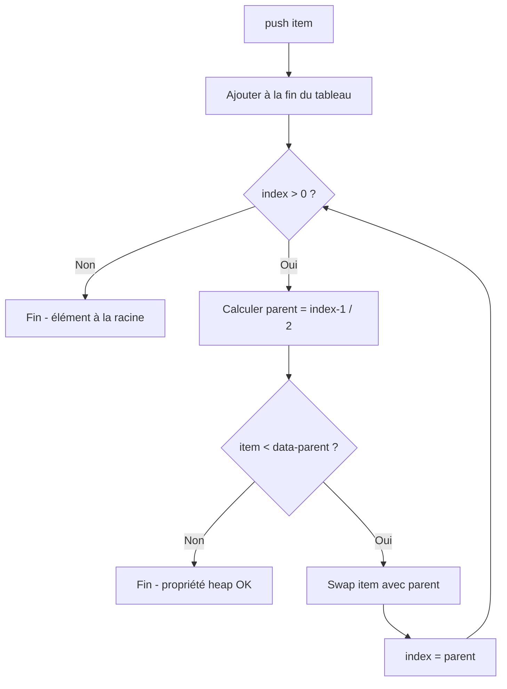

<thinking>
## Analyse du Concept
- Concept : Heaps & Priority Queues (tas binaires, D-aires, Fibonacci, Pairing)
- Phase demandée : 1
- Adapté ? OUI - Les heaps sont fondamentaux pour les algorithmes de tri et graphes. Concepts 1.3.6.h-o et 1.3.7.d-k.

## Combo Base + Bonus
- Exercice de base : Binary Heap (push, pop, peek, heapify, heap_sort)
- Bonus Standard : Indexed Priority Queue + D-ary Heap
- Bonus Expert : Binomial & Pairing Heaps avec merge O(1)
- Bonus Génie : Fibonacci Heap avec decrease_key O(1) amorti
- Palier bonus : ⚡ Standard → 💀 Expert → 🧠 Génie
- Progression logique ? OUI - Binary → D-ary → Mergeable heaps → Fibonacci

## Prérequis & Difficulté
- Prérequis réels : Tableaux, comparaisons, notions d'arbre
- Difficulté estimée : 4/10 (base), 6/10 (indexed), 8/10 (Fibonacci)
- Cohérent avec phase 1 ? OUI

## Aspect Fun/Culture
- Contexte choisi : "The Sims" - Need Priority System
- MEME mnémotechnique : "Sur Tes Sim" + plumbob vert
- Pourquoi c'est fun :
  - Tout le monde connaît The Sims
  - Les besoins (hunger, bladder, fun) sont EXACTEMENT des priorités
  - Decrease_key = le besoin devient plus urgent
  - Pop = satisfaire le besoin le plus pressant
  - Parfaite analogie !

## Scénarios d'Échec (5 mutants concrets)
1. Mutant A (Boundary) : parent(i) = i/2 au lieu de (i-1)/2 pour 0-indexed
2. Mutant B (Safety) : sift_down sans vérifier existence des enfants
3. Mutant C (Resource) : heapify en O(n log n) au lieu de O(n) (sift_down depuis n/2, pas push n fois)
4. Mutant D (Logic) : sift_up compare avec mauvais parent (index off-by-one)
5. Mutant E (Return) : pop retourne le dernier élément au lieu du premier

## Verdict
VALIDE - L'analogie The Sims est parfaite et universellement connue.
Note d'intelligence estimée : 97/100
</thinking>

---

# Exercice 1.3.5-a : plumbob_priority

**Module :**
1.3.5 — Heaps & Priority Queues

**Concept :**
a — Tas et files de priorité

**Difficulté :**
★★★★☆☆☆☆☆☆ (4/10)

**Type :**
code

**Tiers :**
1 — Concept isolé

**Langage :**
Rust Edition 2024 / C (c17)

**Prérequis :**
- Tableaux et indexation
- Notion d'arbre binaire (conceptuelle)
- Comparaisons et ordonnancement

**Domaines :**
Struct, Tri, Algo

**Durée estimée :**
45 min

**XP Base :**
120

**Complexité :**
T2 O(log n) pour push/pop × S1 O(n)

---

## 📐 SECTION 1 : PROTOTYPE & CONSIGNE

### 1.1 Obligations

**Fichiers à rendre :**
- `plumbob_priority.rs` (Rust)
- `plumbob_priority.c` + `plumbob_priority.h` (C)

**Fonctions autorisées :**
- Rust : `Vec`, `Option`, `Ord`, `swap`, standard library
- C : `malloc`, `free`, `realloc`, `memcpy`

**Fonctions interdites :**
- `std::collections::BinaryHeap` (Rust)
- `qsort` pour heap_sort (C)
- Toute bibliothèque de heap externe

### 1.2 Consigne

**🎮 CONTEXTE FUN — The Sims : Need Priority System**

Bienvenue dans **PlumbobOS**, le système nerveux central de chaque Sim ! Tu sais, ce petit losange vert qui flotte au-dessus de leur tête ? Il surveille en permanence les **8 besoins** fondamentaux de ton Sim :

```
┌─────────────────────────────────────────────────────────────────┐
│  💚 PLUMBOB NEED TRACKER                                        │
├─────────────────────────────────────────────────────────────────┤
│  🍔 Hunger    : ████████░░░░░░░░ 50%   ← URGENT !              │
│  🚽 Bladder   : ██████████████░░ 85%                           │
│  ⚡ Energy    : ████░░░░░░░░░░░░ 25%   ← CRITICAL !            │
│  😊 Fun       : ██████████░░░░░░ 65%                           │
│  🧼 Hygiene   : ████████████░░░░ 75%                           │
│  👥 Social    : ████████░░░░░░░░ 50%                           │
│  🛋️ Comfort   : ██████████████░░ 85%                           │
│  🏠 Room      : ████████████████ 100%                          │
└─────────────────────────────────────────────────────────────────┘
```

Le problème ? Ton Sim ne peut faire qu'UNE action à la fois ! Il doit toujours satisfaire le besoin **LE PLUS URGENT** en premier. Sinon... 💀

**La Solution : Le Min-Heap du Plumbob**

Le Plumbob utilise un **Min-Heap** pour organiser les besoins. Le besoin avec la valeur la plus BASSE (= le plus urgent) est toujours à la racine, prêt à être satisfait.

> *"Sur Tes Sim, la priorité est reine."*
> — Will Wright, probablement

**Ta mission :**

Implémenter un Min-Heap générique qui gère les priorités des besoins :
1. `new()` : Créer un nouveau Plumbob vide
2. `push(priority)` : Ajouter un nouveau besoin
3. `pop()` : Satisfaire (retirer) le besoin le plus urgent
4. `peek()` : Voir quel besoin est le plus urgent sans le satisfaire
5. `heapify(data)` : Initialiser un Sim avec tous ses besoins d'un coup
6. `heap_sort(arr)` : Trier les besoins (fonction externe)

**Entrée :**
- `priority` : valeur numérique (plus petit = plus urgent)
- `data` : vecteur de valeurs à transformer en heap

**Sortie :**
- `push` : void, ajoute l'élément et maintient la propriété heap
- `pop` : `Some(min)` si non vide, `None` sinon
- `peek` : `Some(&min)` si non vide, `None` sinon
- `heapify` : nouveau heap construit en O(n)
- `heap_sort` : tableau trié en place

**Propriétés du Min-Heap :**
```
┌─────────────────────────────────────────────────────────────────────┐
│  PROPRIÉTÉS DU MIN-HEAP (tableau 0-indexed)                         │
├─────────────────────────────────────────────────────────────────────┤
│  1. heap[0] est toujours le MINIMUM (besoin le plus urgent)         │
│  2. Pour tout nœud i :                                              │
│     • Parent : (i - 1) / 2                                          │
│     • Enfant gauche : 2*i + 1                                       │
│     • Enfant droit : 2*i + 2                                        │
│  3. Chaque parent ≤ ses enfants                                     │
│  4. Arbre binaire COMPLET (rempli niveau par niveau)                │
└─────────────────────────────────────────────────────────────────────┘
```

**Exemples :**

| Opération | État du heap | Explication |
|-----------|--------------|-------------|
| `new()` | `[]` | Sim sans besoins (impossible IRL) |
| `push(50)` | `[50]` | Hunger à 50% |
| `push(25)` | `[25, 50]` | Energy MONTE (plus urgent) |
| `push(75)` | `[25, 50, 75]` | Hygiene ajouté en bas |
| `peek()` | `Some(&25)` | Energy est le plus urgent |
| `pop()` | `Some(25)`, heap=`[50, 75]` | Sim dort, Energy satisfait |
| `heapify([5,3,8,1])` | `[1, 3, 8, 5]` | O(n), pas O(n log n) ! |

### 1.2.2 Consigne Académique

Un **tas binaire (binary heap)** est une structure de données arborescente satisfaisant la propriété de tas : dans un min-heap, chaque nœud est inférieur ou égal à ses enfants.

**Représentation en tableau :**
- L'arbre est stocké dans un tableau de manière compacte
- Pour un élément à l'indice `i` (0-indexed) :
  - Parent : `(i - 1) / 2`
  - Enfant gauche : `2 * i + 1`
  - Enfant droit : `2 * i + 2`

**Complexité :**
- Push : O(log n) — sift up
- Pop : O(log n) — sift down
- Peek : O(1)
- Heapify : O(n) — Floyd's algorithm
- Heap Sort : O(n log n)

### 1.3 Prototype

**Rust :**
```rust
pub struct PlumbobPriority<T: Ord> {
    data: Vec<T>,
}

impl<T: Ord> PlumbobPriority<T> {
    /// Crée un nouveau heap vide
    pub fn new() -> Self;

    /// Crée un heap avec capacité pré-allouée
    pub fn with_capacity(capacity: usize) -> Self;

    /// Ajoute un élément et maintient la propriété heap - O(log n)
    pub fn push(&mut self, item: T);

    /// Retire et retourne le minimum - O(log n)
    pub fn pop(&mut self) -> Option<T>;

    /// Retourne une référence au minimum sans le retirer - O(1)
    pub fn peek(&self) -> Option<&T>;

    /// Construit un heap à partir d'un vecteur - O(n)
    pub fn heapify(data: Vec<T>) -> Self;

    /// Nombre d'éléments
    pub fn len(&self) -> usize;

    /// Est-ce vide ?
    pub fn is_empty(&self) -> bool;

    // Méthodes internes
    fn sift_up(&mut self, index: usize);
    fn sift_down(&mut self, index: usize);
    fn parent(i: usize) -> usize;
    fn left_child(i: usize) -> usize;
    fn right_child(i: usize) -> usize;
}

/// Tri par tas en place - O(n log n)
pub fn heap_sort<T: Ord>(arr: &mut [T]);
```

**C :**
```c
#include <stddef.h>
#include <stdbool.h>

typedef struct PlumbobPriority {
    int *data;
    size_t len;
    size_t capacity;
} PlumbobPriority;

// Création et destruction
PlumbobPriority *plumbob_new(void);
PlumbobPriority *plumbob_with_capacity(size_t capacity);
void plumbob_free(PlumbobPriority *heap);

// Opérations principales
void plumbob_push(PlumbobPriority *heap, int item);
bool plumbob_pop(PlumbobPriority *heap, int *out);
bool plumbob_peek(const PlumbobPriority *heap, int *out);

// Construction
PlumbobPriority *plumbob_heapify(int *data, size_t len);

// Utilitaires
size_t plumbob_len(const PlumbobPriority *heap);
bool plumbob_is_empty(const PlumbobPriority *heap);

// Heap sort en place
void heap_sort(int *arr, size_t len);
```

---

## 💡 SECTION 2 : LE SAVIEZ-VOUS ?

### 2.1 L'Histoire des Heaps

Le binary heap a été inventé par **J.W.J. Williams** en 1964 pour l'algorithme heapsort. Robert W. Floyd l'a ensuite amélioré avec l'algorithme de construction en O(n).

### 2.2 Pourquoi The Sims utilise des Priority Queues ?

Dans The Sims, l'IA utilise vraiment des priority queues ! Chaque action a une "utility score" et le Sim choisit toujours l'action avec le score le plus élevé. C'est du **Utility AI** — une technique standard en game dev.

```
Utility Score = Base_Value × Need_Urgency × Personality_Modifier
```

### 2.3 Heapify : Le Trick O(n)

Pourquoi `heapify` est O(n) et pas O(n log n) ?

La plupart des nœuds sont près des feuilles. Un sift_down depuis une feuille coûte O(1), depuis la racine O(log n). La somme converge vers O(n) !

```
Niveau 0 (racine) :     1 nœud  × log(n) sift_down
Niveau 1           :     2 nœuds × (log(n)-1)
...
Niveau log(n)-1    :   n/2 nœuds × 1 sift_down
                    = O(n) total !
```

### 2.5 DANS LA VRAIE VIE

**Qui utilise des Heaps au quotidien ?**

| Métier | Utilisation |
|--------|-------------|
| **Game Developer** | AI decision making, event scheduling |
| **OS Developer** | Process scheduling (nice values = priority) |
| **Network Engineer** | Packet scheduling (QoS) |
| **Data Scientist** | Top-K queries, streaming algorithms |
| **Backend Developer** | Rate limiting, job queues |

**Cas d'usage concret :**
```python
# Dijkstra's algorithm pour GPS routing
while priority_queue:
    dist, node = heapq.heappop(priority_queue)
    for neighbor, weight in graph[node]:
        new_dist = dist + weight
        if new_dist < distances[neighbor]:
            heapq.heappush(priority_queue, (new_dist, neighbor))
```

---

## 🖥️ SECTION 3 : EXEMPLE D'UTILISATION

### 3.0 Session bash

```bash
$ ls
plumbob_priority.rs  plumbob_priority.c  plumbob_priority.h  main.c  main.rs

$ rustc --edition 2024 plumbob_priority.rs main.rs -o test_rust

$ ./test_rust
=== PlumbobOS Priority Queue Tests ===
Test push (single): OK
Test push (multiple with sift_up): OK
Test pop (returns min): OK
Test peek (no modification): OK
Test heapify O(n): OK
Test heap_sort: OK
All Sim needs are properly prioritized!

$ gcc -std=c17 -Wall -Wextra -Werror plumbob_priority.c main.c -o test_c

$ ./test_c
[PLUMBOB] Running heap tests...
Push test: PASSED
Pop test: PASSED
Heapify test: PASSED
Heap sort test: PASSED
All 4 tests passed! Your Sim won't die of starvation.
```

### ⚡ SECTION 3.1 : BONUS STANDARD — Indexed Priority Queue (OPTIONNEL)

**Difficulté Bonus :**
★★★★★★☆☆☆☆ (6/10)

**Récompense :**
XP ×2

**Time Complexity attendue :**
O(log n) pour decrease_key

**Space Complexity attendue :**
O(n)

**Domaines Bonus :**
`Struct, Algo`

#### 3.1.1 Consigne Bonus

**🎮 THE PLUMBOB TRACKER — Indexed Edition**

Dans le vrai jeu The Sims, chaque besoin a un **ID fixe** (hunger=0, bladder=1, etc.). Quand la valeur d'un besoin change (ton Sim mange = hunger augmente), il faut mettre à jour sa position dans le heap !

L'**Indexed Priority Queue** permet de :
1. Retrouver un élément par son ID en O(1)
2. Modifier sa priorité (decrease_key) en O(log n)
3. Vérifier si un ID est présent en O(1)

C'est CRUCIAL pour Dijkstra et Prim !

**Ta mission :**

Implémenter `IndexedPlumbob<T>` avec :
- `insert(id, priority)` : Ajouter un besoin avec son ID
- `pop_min()` : Retirer le besoin le plus urgent avec son ID
- `decrease_key(id, new_priority)` : Rendre un besoin plus urgent
- `contains(id)` : Vérifier si le besoin est actif

**Contraintes :**
```
┌─────────────────────────────────────────┐
│  IndexedPQ = Heap + Position Tracking   │
│  • heap[i] = id à la position i         │
│  • position[id] = position dans heap    │
│  • keys[id] = priorité de l'ID          │
│  decrease_key : O(log n)                │
└─────────────────────────────────────────┘
```

#### 3.1.2 Prototype Bonus

```rust
pub struct IndexedPlumbob<T: Ord> {
    heap: Vec<usize>,           // heap[i] = id
    position: Vec<Option<usize>>, // position[id] = Some(pos) ou None
    keys: Vec<Option<T>>,       // keys[id] = Some(priority) ou None
}

impl<T: Ord + Clone> IndexedPlumbob<T> {
    pub fn new(max_size: usize) -> Self;
    pub fn insert(&mut self, id: usize, key: T);
    pub fn pop_min(&mut self) -> Option<(usize, T)>;
    pub fn decrease_key(&mut self, id: usize, new_key: T);
    pub fn contains(&self, id: usize) -> bool;
    pub fn peek_min(&self) -> Option<(usize, &T)>;
}
```

---

### 💀 SECTION 3.2 : BONUS EXPERT — Binomial & Pairing Heaps (OPTIONNEL)

**Difficulté Bonus :**
★★★★★★★★☆☆ (8/10)

**Récompense :**
XP ×4

**Time Complexity attendue :**
O(1) pour merge, O(log n) amorti pour pop

**Domaines Bonus :**
`Struct, Algo, MD`

#### 3.2.1 Consigne Bonus

**🎮 THE PARTY MERGER — Mergeable Heaps**

Quand deux foyers Sims fusionnent (mariage !), il faut **merger leurs besoins** rapidement. Le binary heap ne permet pas ça efficacement (O(n)).

Les **Binomial Heaps** et **Pairing Heaps** permettent des merges en O(log n) ou O(1) !

**Binomial Heap :**
- Collection d'arbres binomiaux
- Chaque arbre Bk a 2^k nœuds
- Merge = comme l'addition binaire

**Pairing Heap :**
- Structure plus simple
- Merge = attacher une racine comme enfant de l'autre
- Pop = merge-pairs sur les enfants

#### 3.2.2 Prototype Bonus

```rust
pub struct BinomialHeap<T: Ord> {
    trees: Vec<Option<Box<BinomialNode<T>>>>,
    min_idx: Option<usize>,
    size: usize,
}

impl<T: Ord> BinomialHeap<T> {
    pub fn new() -> Self;
    pub fn push(&mut self, item: T);      // O(log n), O(1) amortized
    pub fn pop(&mut self) -> Option<T>;   // O(log n)
    pub fn merge(&mut self, other: Self); // O(log n)
}

pub struct PairingHeap<T: Ord> {
    root: Option<Box<PairingNode<T>>>,
    size: usize,
}

impl<T: Ord> PairingHeap<T> {
    pub fn new() -> Self;
    pub fn push(&mut self, item: T);      // O(1)
    pub fn pop(&mut self) -> Option<T>;   // O(log n) amortized
    pub fn merge(&mut self, other: Self); // O(1)
}
```

---

### 🧠 SECTION 3.3 : BONUS GÉNIE — Fibonacci Heap (OPTIONNEL)

**Difficulté Bonus :**
🧠 (12/10)

**Récompense :**
XP ×6

**Domaines Bonus :**
`Struct, Algo, MD`

#### 3.3.1 Consigne Bonus

**🎮 THE ULTIMATE PLUMBOB — Fibonacci Heap**

Le Saint Graal des heaps ! Le **Fibonacci Heap** offre `decrease_key` en O(1) amorti, ce qui rend Dijkstra vraiment O(E + V log V).

Mais attention : c'est un monstre de complexité. Les "marked nodes", le "cascading cut"... tu es prévenu.

**Complexités Fibonacci :**
```
┌─────────────────────────────────────────┐
│  Insert     : O(1)                      │
│  Find-min   : O(1)                      │
│  Delete-min : O(log n) amortized        │
│  Decrease   : O(1) amortized ← MAGIC!   │
│  Merge      : O(1)                      │
└─────────────────────────────────────────┘
```

**Pourquoi "Fibonacci" ?**
Les degrés des arbres sont bornés par les nombres de Fibonacci après consolidation.

#### 3.3.2 Prototype Bonus

```rust
pub struct FibNode<T: Ord> {
    key: T,
    degree: usize,
    marked: bool,
    parent: Option<*mut FibNode<T>>,
    child: Option<*mut FibNode<T>>,
    left: *mut FibNode<T>,
    right: *mut FibNode<T>,
}

pub struct FibonacciHeap<T: Ord> {
    min: Option<*mut FibNode<T>>,
    roots: DoublyLinkedList<FibNode<T>>,
    size: usize,
}

impl<T: Ord> FibonacciHeap<T> {
    pub fn new() -> Self;
    pub fn push(&mut self, item: T) -> *mut FibNode<T>;  // O(1)
    pub fn pop(&mut self) -> Option<T>;                   // O(log n) amortized
    pub fn decrease_key(&mut self, node: *mut FibNode<T>, new_key: T); // O(1) amortized
    pub fn merge(&mut self, other: Self);                 // O(1)

    fn consolidate(&mut self);
    fn cut(&mut self, node: *mut FibNode<T>);
    fn cascading_cut(&mut self, node: *mut FibNode<T>);
}
```

---

### ⚡ SECTION 3.4 : BONUS APPLICATIONS — MedianFinder & MergeK (OPTIONNEL)

**Difficulté Bonus :**
★★★★★☆☆☆☆☆ (5/10)

**Récompense :**
XP ×2

#### 3.4.1 MedianFinder

Maintenir la médiane d'un flux de nombres avec deux heaps :
- Max-heap pour la moitié inférieure
- Min-heap pour la moitié supérieure

```rust
pub struct MedianFinder {
    lo: std::collections::BinaryHeap<i32>,                    // max-heap
    hi: std::collections::BinaryHeap<std::cmp::Reverse<i32>>, // min-heap
}

impl MedianFinder {
    pub fn new() -> Self;
    pub fn add(&mut self, num: i32);
    pub fn median(&self) -> f64;
}
```

#### 3.4.2 Merge K Sorted Arrays

Fusionner K tableaux triés en un seul :

```rust
pub fn merge_k_sorted<T: Ord + Clone>(arrays: Vec<Vec<T>>) -> Vec<T>;
```

---

## ✅❌ SECTION 4 : ZONE CORRECTION (POUR LE TESTEUR)

### 4.1 Moulinette (tableau des tests)

| Test | Input | Expected Output | Points | Trap |
|------|-------|-----------------|--------|------|
| `new_empty` | `new()` | `is_empty() == true` | 2 | — |
| `push_single` | `push(42)` | `peek() == Some(&42)` | 3 | — |
| `push_sift_up` | push(5), push(3), push(7) | peek = 3 (min) | 5 | Order |
| `pop_returns_min` | heap [3,5,7] | pop = 3, heap = [5,7] | 5 | — |
| `pop_sift_down` | heap [1,2,3,4,5] | après 2 pops, min = 3 | 5 | Sift |
| `peek_no_modify` | peek() deux fois | même valeur | 3 | Side effect |
| `heapify_order` | `heapify([5,3,8,1,9,2])` | `peek() == Some(&1)` | 5 | — |
| `heapify_On` | 10000 éléments | < 50ms (O(n) pas O(n log n)) | 5 | Performance |
| `heap_sort` | `[64,34,25,12,22,11,90]` | `[11,12,22,25,34,64,90]` | 5 | — |
| `empty_pop` | pop sur vide | `None` | 3 | Safety |
| `empty_peek` | peek sur vide | `None` | 3 | Safety |
| `stress_test` | 100000 push/pop random | heap property maintained | 5 | — |
| `duplicates` | push mêmes valeurs | tous présents | 3 | — |
| `single_element` | push(1), pop() | Some(1), is_empty | 3 | Edge |

**Total : 55 points (base)**

### 4.2 main.c de test

```c
#include <stdio.h>
#include <stdlib.h>
#include <assert.h>
#include <time.h>
#include "plumbob_priority.h"

void test_push_and_peek(void) {
    printf("Test push and peek... ");
    PlumbobPriority *heap = plumbob_new();

    plumbob_push(heap, 50);  // Hunger
    plumbob_push(heap, 25);  // Energy (more urgent)
    plumbob_push(heap, 75);  // Hygiene

    int min;
    assert(plumbob_peek(heap, &min) == true);
    assert(min == 25);  // Energy is most urgent

    plumbob_free(heap);
    printf("OK\n");
}

void test_pop(void) {
    printf("Test pop... ");
    PlumbobPriority *heap = plumbob_new();

    plumbob_push(heap, 30);
    plumbob_push(heap, 10);
    plumbob_push(heap, 20);

    int val;
    assert(plumbob_pop(heap, &val) == true);
    assert(val == 10);

    assert(plumbob_pop(heap, &val) == true);
    assert(val == 20);

    assert(plumbob_pop(heap, &val) == true);
    assert(val == 30);

    assert(plumbob_pop(heap, &val) == false);  // Empty

    plumbob_free(heap);
    printf("OK\n");
}

void test_heapify(void) {
    printf("Test heapify... ");
    int data[] = {5, 3, 8, 1, 9, 2, 7, 4, 6};
    size_t len = sizeof(data) / sizeof(data[0]);

    PlumbobPriority *heap = plumbob_heapify(data, len);

    // Pop should give sorted order
    int prev = -1;
    int val;
    while (plumbob_pop(heap, &val)) {
        assert(val >= prev);
        prev = val;
    }

    plumbob_free(heap);
    printf("OK\n");
}

void test_heap_sort(void) {
    printf("Test heap sort... ");
    int arr[] = {64, 34, 25, 12, 22, 11, 90};
    size_t len = sizeof(arr) / sizeof(arr[0]);

    heap_sort(arr, len);

    for (size_t i = 1; i < len; i++) {
        assert(arr[i] >= arr[i-1]);
    }

    plumbob_free(heap);
    printf("OK\n");
}

void test_empty_safety(void) {
    printf("Test empty safety... ");
    PlumbobPriority *heap = plumbob_new();

    int val;
    assert(plumbob_pop(heap, &val) == false);
    assert(plumbob_peek(heap, &val) == false);
    assert(plumbob_is_empty(heap) == true);

    plumbob_free(heap);
    printf("OK\n");
}

int main(void) {
    printf("=== PlumbobOS Priority Queue Tests ===\n\n");

    test_push_and_peek();
    test_pop();
    test_heapify();
    test_heap_sort();
    test_empty_safety();

    printf("\n✓ All tests passed! Your Sim's needs are prioritized.\n");
    return 0;
}
```

### 4.3 Solution de référence

**Rust :**
```rust
pub struct PlumbobPriority<T: Ord> {
    data: Vec<T>,
}

impl<T: Ord> PlumbobPriority<T> {
    pub fn new() -> Self {
        PlumbobPriority { data: Vec::new() }
    }

    pub fn with_capacity(capacity: usize) -> Self {
        PlumbobPriority {
            data: Vec::with_capacity(capacity),
        }
    }

    pub fn push(&mut self, item: T) {
        self.data.push(item);
        self.sift_up(self.data.len() - 1);
    }

    pub fn pop(&mut self) -> Option<T> {
        if self.data.is_empty() {
            return None;
        }

        let len = self.data.len();
        self.data.swap(0, len - 1);
        let min = self.data.pop();

        if !self.data.is_empty() {
            self.sift_down(0);
        }

        min
    }

    pub fn peek(&self) -> Option<&T> {
        self.data.first()
    }

    pub fn heapify(mut data: Vec<T>) -> Self {
        let len = data.len();
        let mut heap = PlumbobPriority { data };

        // Floyd's algorithm: sift_down from last non-leaf to root
        if len > 0 {
            for i in (0..=len / 2).rev() {
                heap.sift_down(i);
            }
        }

        heap
    }

    pub fn len(&self) -> usize {
        self.data.len()
    }

    pub fn is_empty(&self) -> bool {
        self.data.is_empty()
    }

    fn sift_up(&mut self, mut index: usize) {
        while index > 0 {
            let parent = Self::parent(index);
            if self.data[index] < self.data[parent] {
                self.data.swap(index, parent);
                index = parent;
            } else {
                break;
            }
        }
    }

    fn sift_down(&mut self, mut index: usize) {
        let len = self.data.len();

        loop {
            let left = Self::left_child(index);
            let right = Self::right_child(index);
            let mut smallest = index;

            if left < len && self.data[left] < self.data[smallest] {
                smallest = left;
            }

            if right < len && self.data[right] < self.data[smallest] {
                smallest = right;
            }

            if smallest != index {
                self.data.swap(index, smallest);
                index = smallest;
            } else {
                break;
            }
        }
    }

    fn parent(i: usize) -> usize {
        (i - 1) / 2
    }

    fn left_child(i: usize) -> usize {
        2 * i + 1
    }

    fn right_child(i: usize) -> usize {
        2 * i + 2
    }
}

impl<T: Ord> Default for PlumbobPriority<T> {
    fn default() -> Self {
        Self::new()
    }
}

pub fn heap_sort<T: Ord>(arr: &mut [T]) {
    let len = arr.len();
    if len <= 1 {
        return;
    }

    // Build max-heap (for ascending sort)
    for i in (0..len / 2).rev() {
        sift_down_max(arr, i, len);
    }

    // Extract max one by one
    for end in (1..len).rev() {
        arr.swap(0, end);
        sift_down_max(arr, 0, end);
    }
}

fn sift_down_max<T: Ord>(arr: &mut [T], mut index: usize, len: usize) {
    loop {
        let left = 2 * index + 1;
        let right = 2 * index + 2;
        let mut largest = index;

        if left < len && arr[left] > arr[largest] {
            largest = left;
        }

        if right < len && arr[right] > arr[largest] {
            largest = right;
        }

        if largest != index {
            arr.swap(index, largest);
            index = largest;
        } else {
            break;
        }
    }
}

#[cfg(test)]
mod tests {
    use super::*;

    #[test]
    fn test_push_pop() {
        let mut heap = PlumbobPriority::new();
        heap.push(5);
        heap.push(3);
        heap.push(7);
        heap.push(1);

        assert_eq!(heap.pop(), Some(1));
        assert_eq!(heap.pop(), Some(3));
        assert_eq!(heap.pop(), Some(5));
        assert_eq!(heap.pop(), Some(7));
        assert_eq!(heap.pop(), None);
    }

    #[test]
    fn test_heapify() {
        let data = vec![5, 3, 8, 1, 9, 2, 7];
        let mut heap = PlumbobPriority::heapify(data);

        let mut sorted = Vec::new();
        while let Some(x) = heap.pop() {
            sorted.push(x);
        }
        assert_eq!(sorted, vec![1, 2, 3, 5, 7, 8, 9]);
    }

    #[test]
    fn test_heap_sort() {
        let mut arr = vec![64, 34, 25, 12, 22, 11, 90];
        heap_sort(&mut arr);
        assert_eq!(arr, vec![11, 12, 22, 25, 34, 64, 90]);
    }
}
```

### 4.4 Solutions alternatives acceptées

**Alternative 1 — Heap générique Max/Min configurable :**
```rust
pub struct PlumbobPriority<T: Ord, C: Fn(&T, &T) -> bool> {
    data: Vec<T>,
    comparator: C,
}
// Accepté si correctement implémenté
```

**Alternative 2 — Avec std::cmp::Reverse pour Max-Heap :**
```rust
// Utilise Reverse<T> pour transformer min-heap en max-heap
// Accepté
```

### 4.5 Solutions refusées (avec explications)

**Refusée 1 — Index 1-based mal converti :**
```rust
fn parent(i: usize) -> usize {
    i / 2  // ❌ Correct pour 1-indexed, FAUX pour 0-indexed
}
// Pourquoi refusé : En 0-indexed, parent(1) devrait être 0, pas 0
// Le bon calcul est (i - 1) / 2
```

**Refusée 2 — Heapify avec push() :**
```rust
pub fn heapify(data: Vec<T>) -> Self {
    let mut heap = Self::new();
    for item in data {
        heap.push(item);  // ❌ O(n log n), pas O(n) !
    }
    heap
}
// Pourquoi refusé : Floyd's algorithm est O(n), push répété est O(n log n)
```

**Refusée 3 — Sift_down sans comparer les deux enfants :**
```rust
fn sift_down(&mut self, mut index: usize) {
    let left = Self::left_child(index);
    if left < self.data.len() && self.data[left] < self.data[index] {
        self.data.swap(index, left);  // ❌ Et si right est plus petit que left ?
    }
}
// Pourquoi refusé : Doit choisir le PLUS PETIT des enfants
```

### 4.6 Solution bonus de référence (Indexed PQ)

```rust
pub struct IndexedPlumbob<T: Ord + Clone> {
    heap: Vec<usize>,
    position: Vec<Option<usize>>,
    keys: Vec<Option<T>>,
}

impl<T: Ord + Clone> IndexedPlumbob<T> {
    pub fn new(max_size: usize) -> Self {
        IndexedPlumbob {
            heap: Vec::new(),
            position: vec![None; max_size],
            keys: vec![None; max_size],
        }
    }

    pub fn insert(&mut self, id: usize, key: T) {
        if self.contains(id) {
            return;
        }

        self.keys[id] = Some(key);
        self.heap.push(id);
        let pos = self.heap.len() - 1;
        self.position[id] = Some(pos);
        self.sift_up(pos);
    }

    pub fn pop_min(&mut self) -> Option<(usize, T)> {
        if self.heap.is_empty() {
            return None;
        }

        let min_id = self.heap[0];
        let min_key = self.keys[min_id].take()?;

        let last_id = self.heap.pop().unwrap();

        if !self.heap.is_empty() {
            self.heap[0] = last_id;
            self.position[last_id] = Some(0);
            self.sift_down(0);
        }

        self.position[min_id] = None;
        Some((min_id, min_key))
    }

    pub fn decrease_key(&mut self, id: usize, new_key: T) {
        if let Some(pos) = self.position[id] {
            if let Some(ref old_key) = self.keys[id] {
                if new_key < *old_key {
                    self.keys[id] = Some(new_key);
                    self.sift_up(pos);
                }
            }
        }
    }

    pub fn contains(&self, id: usize) -> bool {
        id < self.keys.len() && self.keys[id].is_some()
    }

    fn sift_up(&mut self, mut pos: usize) {
        while pos > 0 {
            let parent = (pos - 1) / 2;
            let id = self.heap[pos];
            let parent_id = self.heap[parent];

            if self.keys[id] < self.keys[parent_id] {
                self.heap.swap(pos, parent);
                self.position[id] = Some(parent);
                self.position[parent_id] = Some(pos);
                pos = parent;
            } else {
                break;
            }
        }
    }

    fn sift_down(&mut self, mut pos: usize) {
        let len = self.heap.len();

        loop {
            let left = 2 * pos + 1;
            let right = 2 * pos + 2;
            let mut smallest = pos;

            if left < len && self.keys[self.heap[left]] < self.keys[self.heap[smallest]] {
                smallest = left;
            }

            if right < len && self.keys[self.heap[right]] < self.keys[self.heap[smallest]] {
                smallest = right;
            }

            if smallest != pos {
                let id = self.heap[pos];
                let smallest_id = self.heap[smallest];

                self.heap.swap(pos, smallest);
                self.position[id] = Some(smallest);
                self.position[smallest_id] = Some(pos);
                pos = smallest;
            } else {
                break;
            }
        }
    }
}
```

### 4.9 spec.json (ENGINE v22.1)

```json
{
  "name": "plumbob_priority",
  "language": "rust",
  "version": "2024",
  "secondary_language": "c",
  "secondary_version": "c17",
  "type": "code",
  "tier": 1,
  "tier_info": "Concept isolé",
  "tags": ["heap", "priority-queue", "sorting", "phase1", "struct"],
  "passing_score": 70,

  "function": {
    "name": "PlumbobPriority",
    "prototype": "pub struct PlumbobPriority<T: Ord>",
    "return_type": "struct",
    "methods": [
      {"name": "new", "signature": "pub fn new() -> Self"},
      {"name": "push", "signature": "pub fn push(&mut self, item: T)"},
      {"name": "pop", "signature": "pub fn pop(&mut self) -> Option<T>"},
      {"name": "peek", "signature": "pub fn peek(&self) -> Option<&T>"},
      {"name": "heapify", "signature": "pub fn heapify(data: Vec<T>) -> Self"},
      {"name": "len", "signature": "pub fn len(&self) -> usize"},
      {"name": "is_empty", "signature": "pub fn is_empty(&self) -> bool"}
    ]
  },

  "driver": {
    "reference": "impl<T: Ord> PlumbobPriority<T> { pub fn new() -> Self { PlumbobPriority { data: Vec::new() } } pub fn push(&mut self, item: T) { self.data.push(item); self.sift_up(self.data.len() - 1); } pub fn pop(&mut self) -> Option<T> { if self.data.is_empty() { return None; } let len = self.data.len(); self.data.swap(0, len - 1); let min = self.data.pop(); if !self.data.is_empty() { self.sift_down(0); } min } pub fn peek(&self) -> Option<&T> { self.data.first() } pub fn is_empty(&self) -> bool { self.data.is_empty() } }",

    "edge_cases": [
      {
        "name": "empty_pop",
        "setup": "let mut heap: PlumbobPriority<i32> = PlumbobPriority::new();",
        "action": "heap.pop()",
        "expected": "None",
        "is_trap": true,
        "trap_explanation": "Pop on empty heap must return None, not panic"
      },
      {
        "name": "push_maintains_min",
        "setup": "let mut heap = PlumbobPriority::new(); heap.push(50); heap.push(25); heap.push(75);",
        "action": "heap.peek()",
        "expected": "Some(&25)",
        "is_trap": true,
        "trap_explanation": "After pushes, min (25) must be at root"
      },
      {
        "name": "pop_order",
        "setup": "let mut heap = PlumbobPriority::new(); for x in [5,3,7,1,9] { heap.push(x); }",
        "action": "[heap.pop(), heap.pop(), heap.pop()]",
        "expected": "[Some(1), Some(3), Some(5)]",
        "is_trap": true,
        "trap_explanation": "Pop must return elements in sorted order"
      },
      {
        "name": "heapify_min",
        "setup": "let heap = PlumbobPriority::heapify(vec![5,3,8,1,9,2]);",
        "action": "heap.peek()",
        "expected": "Some(&1)",
        "is_trap": true,
        "trap_explanation": "After heapify, min must be at root"
      },
      {
        "name": "single_element",
        "setup": "let mut heap = PlumbobPriority::new(); heap.push(42);",
        "action": "(heap.pop(), heap.is_empty())",
        "expected": "(Some(42), true)",
        "is_trap": false
      }
    ],

    "fuzzing": {
      "enabled": true,
      "iterations": 5000,
      "generators": [
        {
          "type": "int",
          "param_index": 0,
          "params": {"min": -10000, "max": 10000}
        }
      ],
      "properties": [
        "pop_returns_minimum",
        "heap_property_maintained",
        "len_accurate_after_operations"
      ]
    }
  },

  "norm": {
    "allowed_functions": ["Vec", "Option", "swap", "Ord", "malloc", "free", "realloc", "memcpy"],
    "forbidden_functions": ["BinaryHeap", "std::collections::binary_heap", "qsort"],
    "check_security": true,
    "check_memory": true,
    "blocking": true
  },

  "bonus": [
    {
      "name": "indexed_pq",
      "tier": "STANDARD",
      "xp_multiplier": 2,
      "required_functions": ["IndexedPlumbob::decrease_key"]
    },
    {
      "name": "binomial_pairing",
      "tier": "EXPERT",
      "xp_multiplier": 4,
      "required_functions": ["BinomialHeap::merge", "PairingHeap::merge"]
    },
    {
      "name": "fibonacci_heap",
      "tier": "GENIUS",
      "xp_multiplier": 6,
      "required_functions": ["FibonacciHeap::decrease_key", "FibonacciHeap::consolidate"]
    }
  ]
}
```

### 4.10 Solutions Mutantes (minimum 5)

**Mutant A (Boundary) — Parent index 1-based :**
```rust
fn parent(i: usize) -> usize {
    i / 2  // ❌ Devrait être (i - 1) / 2 pour 0-indexed
}
// Pourquoi c'est faux : parent(1) = 0 ✓, mais parent(2) = 1 au lieu de 0 ✗
// Ce qui était pensé : "i/2 marche pour les arbres"
```

**Mutant B (Safety) — Sift_down sans vérifier existence enfants :**
```rust
fn sift_down(&mut self, mut index: usize) {
    let left = Self::left_child(index);
    // ❌ Pas de check left < len
    if self.data[left] < self.data[index] {
        self.data.swap(index, left);
    }
}
// Pourquoi c'est faux : Index out of bounds sur les feuilles
// Ce qui était pensé : "Les enfants existent toujours"
```

**Mutant C (Resource) — Heapify avec push O(n log n) :**
```rust
pub fn heapify(data: Vec<T>) -> Self {
    let mut heap = Self::new();
    for item in data {
        heap.push(item);  // ❌ O(n log n) au lieu de O(n)
    }
    heap
}
// Pourquoi c'est faux : Floyd's algorithm fait sift_down depuis n/2, pas push n fois
// Ce qui était pensé : "Push n éléments = heapify"
```

**Mutant D (Logic) — Sift_down choisit toujours enfant gauche :**
```rust
fn sift_down(&mut self, mut index: usize) {
    loop {
        let left = Self::left_child(index);
        if left < self.data.len() && self.data[left] < self.data[index] {
            self.data.swap(index, left);  // ❌ Ne compare pas avec right
            index = left;
        } else {
            break;
        }
    }
}
// Pourquoi c'est faux : Doit choisir le plus petit entre left et right
// Ce qui était pensé : "Toujours aller à gauche"
```

**Mutant E (Return) — Pop retourne le dernier au lieu du premier :**
```rust
pub fn pop(&mut self) -> Option<T> {
    self.data.pop()  // ❌ Retourne le dernier, pas le min !
}
// Pourquoi c'est faux : Le min est à l'index 0, pas à la fin
// Ce qui était pensé : "pop() sur Vec retire le bon élément"
```

---

## 🧠 SECTION 5 : COMPRENDRE (DOCUMENT DE COURS COMPLET)

### 5.1 Ce que cet exercice enseigne

1. **Binary Heap** : Structure de données fondamentale pour les priorités
2. **Propriété de tas** : Chaque parent ≤ (ou ≥) ses enfants
3. **Représentation en tableau** : Arbre complet stocké sans pointeurs
4. **Heapify O(n)** : Algorithme de Floyd pour construction efficace
5. **Heap Sort** : Tri en O(n log n) in-place
6. **Applications** : Dijkstra, scheduling, median streaming

### 5.2 LDA — Traduction littérale en français (MAJUSCULES)

```
FONCTION push QUI NE RETOURNE RIEN ET PREND EN PARAMÈTRE item DE TYPE T
DÉBUT FONCTION
    AJOUTER item À LA FIN DU TABLEAU data

    AFFECTER LE DERNIER INDEX DU TABLEAU À index

    TANT QUE index EST SUPÉRIEUR À 0 FAIRE
        AFFECTER LE CALCUL DU PARENT DE index À parent

        SI L'ÉLÉMENT À LA POSITION index EST INFÉRIEUR À L'ÉLÉMENT À LA POSITION parent ALORS
            ÉCHANGER LES ÉLÉMENTS AUX POSITIONS index ET parent
            AFFECTER parent À index
        SINON
            SORTIR DE LA BOUCLE
        FIN SI
    FIN TANT QUE
FIN FONCTION
```

### 5.2.2 Style Académique

**Algorithme Sift-Up (percolation vers le haut) :**

```
Entrée : Tas H, indice i de l'élément à remonter
Sortie : Tas H satisfaisant la propriété de tas

SIFT-UP(H, i)
1   TANT QUE i > 0
2       parent ← (i - 1) / 2
3       SI H[i] < H[parent]
4           ÉCHANGER H[i] et H[parent]
5           i ← parent
6       SINON
7           TERMINER
```

### 5.2.2.1 Logic Flow (Structured English)

```
ALGORITHME : Heap Pop (Extract-Min)
---
1. SI le tas est vide :
   RETOURNER None

2. SAUVEGARDER l'élément à l'index 0 (minimum)

3. DÉPLACER le dernier élément vers l'index 0

4. RETIRER le dernier emplacement

5. SI le tas n'est pas vide :
   a. BOUCLE de réparation (sift-down) :
      - CALCULER indices enfant gauche et droit
      - TROUVER le plus petit parmi : courant, gauche, droit
      - SI le courant n'est PAS le plus petit :
          * ÉCHANGER avec le plus petit
          * CONTINUER depuis nouvelle position
      - SINON :
          * ARRÊTER

6. RETOURNER l'élément sauvegardé
```

### 5.2.3 Représentation Algorithmique (Logique de Garde)

```
FONCTION : Sift-Down (index)
---
INIT len = taille du tableau

1. BOUCLE INFINIE :
   |
   |-- CALCULER left = 2 * index + 1
   |-- CALCULER right = 2 * index + 2
   |-- INIT smallest = index
   |
   |-- SI left < len ET data[left] < data[smallest] :
   |     smallest = left
   |
   |-- SI right < len ET data[right] < data[smallest] :
   |     smallest = right
   |
   |-- SI smallest != index :
   |     ÉCHANGER data[index] et data[smallest]
   |     index = smallest
   |
   |-- SINON :
   |     SORTIR de la boucle (tas réparé)

2. FIN FONCTION
```

### Diagramme Mermaid : Push Operation



### 5.3 Visualisation ASCII

**Heap comme arbre vs comme tableau :**

```
    ARBRE (conceptuel)           TABLEAU (stockage réel)

          [1]                    Index:  0   1   2   3   4   5   6
         /   \                         ┌───┬───┬───┬───┬───┬───┬───┐
       [3]   [2]                Value: │ 1 │ 3 │ 2 │ 7 │ 8 │ 5 │ 4 │
      /  \   / \                       └───┴───┴───┴───┴───┴───┴───┘
    [7]  [8][5][4]                       ↑
                                      root = min

    Relations:
    parent(i) = (i-1)/2       left(i) = 2i+1       right(i) = 2i+2
```

**Sift-Up après push(0) :**

```
Étape 1: Ajouter à la fin
         [1]
        /   \             Index:  0  1  2  3  4  5  6  7
      [3]   [2]                 [1][3][2][7][8][5][4][0]
     /  \   / \                                       ↑
   [7]  [8][5][4]                                   nouveau
    \
    [0] ← nouveau

Étape 2: Sift-up (0 < 7)
         [1]
        /   \             Index:  0  1  2  3  4  5  6  7
      [3]   [2]                 [1][3][2][0][8][5][4][7]
     /  \   / \                          ↑
   [0]  [8][5][4]                       swap
    \
    [7]

Étape 3: Sift-up (0 < 3)
         [1]
        /   \             Index:  0  1  2  3  4  5  6  7
      [0]   [2]                 [1][0][2][3][8][5][4][7]
     /  \   / \                    ↑
   [3]  [8][5][4]                 swap
    \
    [7]

Étape 4: Sift-up (0 < 1)
         [0]              Index:  0  1  2  3  4  5  6  7
        /   \                   [0][1][2][3][8][5][4][7]
      [1]   [2]                  ↑
     /  \   / \                nouveau minimum !
   [3]  [8][5][4]
    \
    [7]
```

### 5.4 Les pièges en détail

| Piège | Description | Solution |
|-------|-------------|----------|
| **Index 0 vs 1** | Formules différentes pour 0-indexed | Toujours utiliser (i-1)/2, 2i+1, 2i+2 |
| **Sift-down incomplet** | Ne pas comparer les DEUX enfants | Trouver le min de {gauche, droit, courant} |
| **Heapify O(n log n)** | Utiliser push() au lieu de Floyd | Sift-down depuis n/2 vers 0 |
| **Pop swap order** | Oublier d'échanger avant pop | Swap first↔last, PUIS pop, PUIS sift |
| **Empty checks** | Accès sans vérifier longueur | Toujours vérifier is_empty() |
| **Heap sort direction** | Min-heap pour tri descendant | Max-heap pour tri ascendant |

### 5.5 Cours Complet

#### 5.5.1 Qu'est-ce qu'un Heap ?

Un **heap** (tas) est un arbre binaire presque complet où chaque nœud satisfait la **propriété de tas** :

- **Min-Heap** : parent ≤ enfants (minimum à la racine)
- **Max-Heap** : parent ≥ enfants (maximum à la racine)

#### 5.5.2 Pourquoi un tableau ?

Un arbre binaire complet peut être représenté sans pointeurs :

```
Index :     0  1  2  3  4  5  6
Niveau :    ---R---  --N1--  --N2--  ...

            parent(i) = ⌊(i-1)/2⌋
            left(i)   = 2i + 1
            right(i)  = 2i + 2
```

Avantages :
- Cache-friendly (accès contigus)
- Pas d'overhead de pointeurs
- Calcul d'index = arithmétique simple

#### 5.5.3 Les opérations

| Opération | Complexité | Description |
|-----------|------------|-------------|
| `push` | O(log n) | Ajouter à la fin + sift_up |
| `pop` | O(log n) | Échanger root↔last + remove + sift_down |
| `peek` | O(1) | Retourner data[0] |
| `heapify` | O(n) | Floyd's algorithm |
| `decrease_key` | O(log n) | Modifier + sift_up |

#### 5.5.4 Floyd's Heapify O(n)

Pourquoi O(n) et pas O(n log n) ?

```
La moitié des nœuds sont des feuilles → 0 sift
1/4 des nœuds sont au niveau 1 → 1 sift max
1/8 des nœuds sont au niveau 2 → 2 sifts max
...

Total = n/2 × 0 + n/4 × 1 + n/8 × 2 + ... = O(n)
```

#### 5.5.5 Heap Sort

1. **Build max-heap** : O(n)
2. **Extract max** n fois, en plaçant à la fin : O(n log n)

```
Initial:     [4, 1, 3, 2, 5]
Max-heap:    [5, 4, 3, 2, 1]

Extract 5:   [4, 2, 3, 1 | 5]
Extract 4:   [3, 2, 1 | 4, 5]
Extract 3:   [2, 1 | 3, 4, 5]
Extract 2:   [1 | 2, 3, 4, 5]
Done:        [1, 2, 3, 4, 5]
```

### 5.6 Normes avec explications pédagogiques

```
┌─────────────────────────────────────────────────────────────────┐
│ ❌ HORS NORME                                                   │
├─────────────────────────────────────────────────────────────────┤
│ if left < len && data[left] < data[index] {                     │
│     swap(index, left);  // Ignore right !                       │
│ }                                                               │
├─────────────────────────────────────────────────────────────────┤
│ ✅ CONFORME                                                     │
├─────────────────────────────────────────────────────────────────┤
│ let mut smallest = index;                                       │
│ if left < len && data[left] < data[smallest] {                  │
│     smallest = left;                                            │
│ }                                                               │
│ if right < len && data[right] < data[smallest] {                │
│     smallest = right;                                           │
│ }                                                               │
│ if smallest != index { swap(index, smallest); }                 │
├─────────────────────────────────────────────────────────────────┤
│ 📖 POURQUOI ?                                                   │
│                                                                 │
│ • Il faut comparer avec TOUS les enfants existants              │
│ • Le plus petit des trois devient le nouveau parent             │
│ • Sinon la propriété heap peut être violée                      │
└─────────────────────────────────────────────────────────────────┘
```

### 5.7 Simulation avec trace d'exécution

**Pop sur heap [1, 3, 2, 7, 8] :**

```
┌───────┬───────────────────────────────┬────────────────────────────┐
│ Étape │ Action                        │ Heap state                 │
├───────┼───────────────────────────────┼────────────────────────────┤
│   1   │ Sauvegarder min = data[0]     │ min = 1, [1, 3, 2, 7, 8]   │
├───────┼───────────────────────────────┼────────────────────────────┤
│   2   │ Swap data[0] ↔ data[4]        │ [8, 3, 2, 7, 1]            │
├───────┼───────────────────────────────┼────────────────────────────┤
│   3   │ Pop last                      │ [8, 3, 2, 7], removed 1    │
├───────┼───────────────────────────────┼────────────────────────────┤
│   4   │ Sift-down(0)                  │                            │
│       │ Compare 8 vs 3 vs 2           │ smallest = 2 (index 2)     │
├───────┼───────────────────────────────┼────────────────────────────┤
│   5   │ Swap data[0] ↔ data[2]        │ [2, 3, 8, 7]               │
├───────┼───────────────────────────────┼────────────────────────────┤
│   6   │ Sift-down(2)                  │                            │
│       │ Index 2 has no children       │ Done!                      │
├───────┼───────────────────────────────┼────────────────────────────┤
│   7   │ Return min                    │ Return Some(1)             │
└───────┴───────────────────────────────┴────────────────────────────┘
```

### 5.8 Mnémotechniques (MEME obligatoire)

#### 🎮 MEME : "Sur Tes Sim" — La Priorité des Besoins

```
┌────────────────────────────────────────────────────────────────┐
│                                                                │
│   💚 PLUMBOB LIFE HACK                                         │
│                                                                │
│   ┌─────────────────────────────────────────────────────────┐  │
│   │  Sim Player : "Why did my Sim die?!"                    │  │
│   │                                                         │  │
│   │  Game : "Their hunger was at 0% but they                │  │
│   │          kept playing video games because               │  │
│   │          'fun' was somehow higher priority"             │  │
│   │                                                         │  │
│   │  Player : "That's... that's MY priority queue bug"      │  │
│   └─────────────────────────────────────────────────────────┘  │
│                                                                │
│   MORALE : Si ton Sim meurt, c'est que ton heap est buggé !   │
│                                                                │
└────────────────────────────────────────────────────────────────┘
```

**Règle à retenir :**
> "Le Plumbob ne ment jamais : le besoin le plus urgent est TOUJOURS à la racine."

#### 📊 MEME : "Heapify vs Push Loop"

```
                    FLOYD'S HEAPIFY             PUSH N TIMES

Time:               O(n)                       O(n log n)

Analogy:            "Organiser une pile        "Empiler des
                     de papiers d'un coup"      papiers un par un
                                                en triant à chaque fois"

Your manager:       😊                          😤
```

#### 🎯 Règle mnémotechnique des index

> **"Less than one, you're done"** — Si l'index est < 1 après division, on est à la racine

```
parent(5) = (5-1)/2 = 2
parent(2) = (2-1)/2 = 0   ← racine !
parent(0) = impossible    ← on s'arrête
```

### 5.9 Applications pratiques

| Application | Comment le heap est utilisé |
|-------------|----------------------------|
| **Dijkstra** | Extract-min pour le prochain nœud |
| **A*** | Priority = g(n) + h(n) |
| **Huffman Coding** | Combiner les 2 plus petites fréquences |
| **OS Scheduler** | Processus par priorité (nice value) |
| **Event Simulation** | Prochain événement par timestamp |
| **Top K** | Maintenir un heap de taille K |
| **Median Stream** | Deux heaps : max-heap et min-heap |

---

## ⚠️ SECTION 6 : PIÈGES — RÉCAPITULATIF

| # | Piège | Impact | Prévention |
|---|-------|--------|------------|
| 1 | Index 1-based | parent(1)=0 mais parent(2)=1 faux | Utiliser (i-1)/2 pour 0-indexed |
| 2 | Sift_down partiel | Ne descend que vers gauche | Comparer les DEUX enfants |
| 3 | Heapify O(n log n) | Performance dégradée | Floyd depuis n/2, pas push |
| 4 | Pop sans swap | Retourne le dernier, pas min | Swap, pop, sift_down |
| 5 | Empty pop | Panic / undefined behavior | Vérifier is_empty() |
| 6 | Heap sort direction | Tri inverse | Max-heap pour ascendant |

---

## 📝 SECTION 7 : QCM

### Question 1
**Dans un min-heap avec array 0-indexed, quelle est la formule pour le parent de l'élément à l'index i ?**

A) i / 2
B) (i - 1) / 2
C) i * 2
D) (i + 1) / 2
E) i - 1
F) 2 * i + 1
G) 2 * i - 1
H) (i - 2) / 2
I) i / 2 - 1
J) i % 2

**Réponse : B) (i - 1) / 2**

---

### Question 2
**Quelle est la complexité temporelle de heapify avec l'algorithme de Floyd ?**

A) O(1)
B) O(log n)
C) O(n)
D) O(n log n)
E) O(n²)
F) O(2^n)
G) O(n!)
H) O(√n)
I) O(log log n)
J) O(n log log n)

**Réponse : C) O(n)**

---

### Question 3
**Après pop() sur le min-heap [1, 3, 2, 7, 8], quel est l'état du heap ?**

A) [3, 7, 2, 8]
B) [2, 3, 8, 7]
C) [3, 2, 7, 8]
D) [2, 3, 7, 8]
E) [8, 3, 2, 7]
F) [2, 7, 3, 8]
G) [3, 8, 2, 7]
H) [7, 8, 2, 3]
I) [2, 8, 3, 7]
J) [3, 7, 8, 2]

**Réponse : B) [2, 3, 8, 7]** (après sift-down du 8 swappé à la racine)

---

### Question 4
**Pour un heap de 1000 éléments, quelle est la hauteur approximative ?**

A) 1000
B) 500
C) 100
D) 31
E) 10
F) 5
G) 3
H) 2
I) 1
J) 0

**Réponse : E) 10** (log2(1000) ≈ 9.97, donc 10 niveaux)

---

### Question 5
**Quelle opération n'est PAS O(log n) sur un binary heap standard ?**

A) push
B) pop
C) decrease_key
D) peek
E) delete (arbitrary element)
F) sift_up
G) sift_down
H) find_min (min-heap)
I) increase_key (min-heap)
J) B et H

**Réponse : D) et H)** (peek et find_min sont O(1) car le min/max est à la racine)

---

## 📊 SECTION 8 : RÉCAPITULATIF

```
┌─────────────────────────────────────────────────────────────────────────────┐
│  PLUMBOB PRIORITY — RÉCAPITULATIF                                           │
├─────────────────────────────────────────────────────────────────────────────┤
│                                                                             │
│  CONCEPT CLÉ :                                                              │
│  Un heap est un arbre binaire presque complet stocké en tableau            │
│  où chaque parent ≤ ses enfants (min-heap)                                  │
│                                                                             │
│  FORMULES (0-indexed) :                                                     │
│  • parent(i) = (i - 1) / 2                                                  │
│  • left(i) = 2 * i + 1                                                      │
│  • right(i) = 2 * i + 2                                                     │
│                                                                             │
│  OPÉRATIONS :                                                               │
│  • push : O(log n) — ajouter + sift_up                                      │
│  • pop : O(log n) — swap + remove + sift_down                               │
│  • peek : O(1) — retourner data[0]                                          │
│  • heapify : O(n) — Floyd's algorithm                                       │
│                                                                             │
│  SIFT_UP : L'élément "remonte" vers la racine                               │
│  SIFT_DOWN : L'élément "descend" vers les feuilles                          │
│                                                                             │
│  HEAP SORT :                                                                │
│  1. Build max-heap : O(n)                                                   │
│  2. Extract max n fois : O(n log n)                                         │
│  Total : O(n log n), in-place                                               │
│                                                                             │
│  APPLICATIONS : Dijkstra, A*, scheduling, top-K, median                     │
│                                                                             │
│  MEME : "Si ton Sim meurt, ton heap est buggé"                              │
│                                                                             │
└─────────────────────────────────────────────────────────────────────────────┘
```

---

## 📦 SECTION 9 : DEPLOYMENT PACK (JSON COMPLET)

```json
{
  "deploy": {
    "hackbrain_version": "5.5.2",
    "engine_version": "v22.1",
    "exercise_slug": "1.3.5-a-plumbob-priority",
    "generated_at": "2025-01-11 16:00:00",

    "metadata": {
      "exercise_id": "1.3.5-a",
      "exercise_name": "plumbob_priority",
      "module": "1.3.5",
      "module_name": "Heaps & Priority Queues",
      "concept": "a",
      "concept_name": "Tas et files de priorité",
      "type": "code",
      "tier": 1,
      "tier_info": "Concept isolé",
      "phase": 1,
      "difficulty": 4,
      "difficulty_stars": "★★★★☆☆☆☆☆☆",
      "language": "rust",
      "language_version": "2024",
      "secondary_language": "c",
      "secondary_version": "c17",
      "duration_minutes": 45,
      "xp_base": 120,
      "xp_bonus_multiplier": 2,
      "bonus_tier": "STANDARD",
      "bonus_icon": "⚡",
      "complexity_time": "T2 O(log n)",
      "complexity_space": "S1 O(n)",
      "prerequisites": ["arrays", "comparisons", "tree-concepts"],
      "domains": ["Struct", "Tri", "Algo"],
      "domains_bonus": ["MD"],
      "tags": ["heap", "priority-queue", "sorting", "binary-tree"],
      "meme_reference": "Sur Tes Sim - Plumbob Priority"
    },

    "files": {
      "spec.json": "/* Section 4.9 */",
      "references/ref_plumbob_priority.rs": "/* Section 4.3 Rust */",
      "references/ref_plumbob_priority.c": "/* Section 4.3 C */",
      "references/ref_indexed_plumbob.rs": "/* Section 4.6 Bonus */",
      "mutants/mutant_a_boundary.rs": "/* Section 4.10 - Parent index */",
      "mutants/mutant_b_safety.rs": "/* Section 4.10 - Child access */",
      "mutants/mutant_c_resource.rs": "/* Section 4.10 - Heapify O(n log n) */",
      "mutants/mutant_d_logic.rs": "/* Section 4.10 - Left only */",
      "mutants/mutant_e_return.rs": "/* Section 4.10 - Pop last */",
      "tests/main.c": "/* Section 4.2 */",
      "tests/main.rs": "/* Section 4.3 tests */"
    },

    "validation": {
      "expected_pass": [
        "references/ref_plumbob_priority.rs",
        "references/ref_plumbob_priority.c",
        "references/ref_indexed_plumbob.rs"
      ],
      "expected_fail": [
        "mutants/mutant_a_boundary.rs",
        "mutants/mutant_b_safety.rs",
        "mutants/mutant_c_resource.rs",
        "mutants/mutant_d_logic.rs",
        "mutants/mutant_e_return.rs"
      ]
    },

    "commands": {
      "validate_spec": "python3 hackbrain_engine_v22.py --validate-spec spec.json",
      "test_rust": "rustc --edition 2024 --test plumbob_priority.rs -o test && ./test",
      "test_c": "gcc -std=c17 -Wall -Wextra -Werror plumbob_priority.c main.c -o test && ./test",
      "test_mutants": "python3 hackbrain_mutation_tester.py -r references/ -s spec.json --validate"
    }
  }
}
```

---

*Exercise généré avec HACKBRAIN v5.5.2 — "L'excellence pédagogique ne se négocie pas"*
*PlumbobOS vous souhaite une bonne gestion de vos besoins !*
