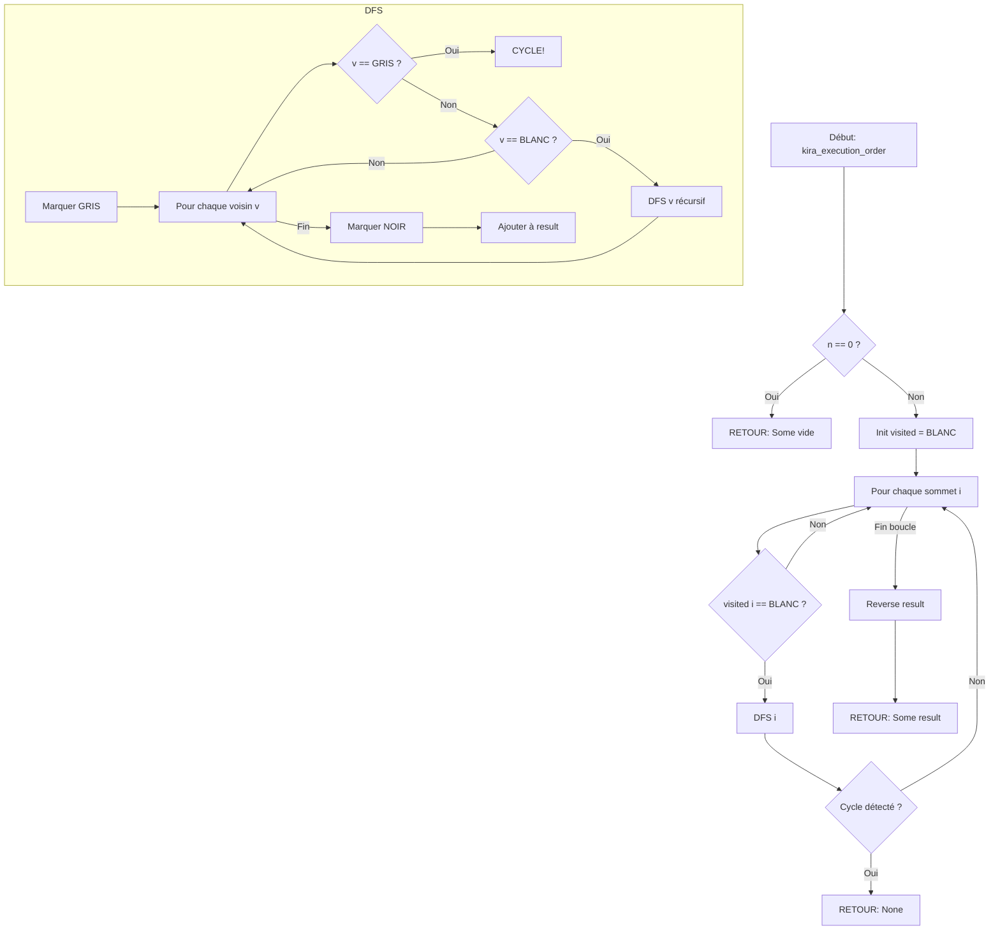

<thinking>
## Analyse du Concept
- Concept : Topological Sort & Strongly Connected Components
- Phase demandée : 1
- Adapté ? OUI - Ces algorithmes sont fondamentaux en théorie des graphes et correspondent au niveau intermédiaire de Phase 1

## Combo Base + Bonus
- Exercice de base : Tri topologique (DFS/Kahn) + SCC (Kosaraju/Tarjan)
- Bonus Standard : Toutes les ordres topologiques + graphe de condensation
- Bonus Expert : 2-SAT solver complet
- Bonus Génie : Critical Path Method + applications industrielles
- Palier bonus : ⚡🔥🧠
- Progression logique ? OUI - Base → Extensions → Applications avancées

## Prérequis & Difficulté
- Prérequis réels : DFS, BFS, représentation de graphes, récursivité
- Difficulté estimée : 5/10 (base), 7/10 (bonus expert), 9/10 (bonus génie)
- Cohérent avec phase ? OUI

## Aspect Fun/Culture
- Contexte choisi : Death Note - Le cahier qui tue avec une chaîne de causalité parfaite
- MEME mnémotechnique : "Just according to keikaku" (keikaku means plan)
- Pourquoi c'est fun :
  * Light Yagami planifie ses meurtres dans un ordre précis (Topological Sort)
  * L détecte les réseaux de Kira interconnectés (SCC)
  * Le choix binaire "tuer ou ne pas tuer" (2-SAT)
  * La complexité morale se traduit parfaitement en logique booléenne

## Scénarios d'Échec (5 mutants concrets)
1. Mutant A (Boundary) : Ne pas gérer le graphe vide (n=0)
2. Mutant B (Safety) : Oublier de vérifier le cycle avant de retourner l'ordre topologique
3. Mutant C (Logic) : Inverser l'ordre de visite dans Tarjan (low_link mal mis à jour)
4. Mutant D (Return) : Retourner les SCCs dans le mauvais ordre topologique
5. Mutant E (Resource) : Stack overflow sur grands graphes avec DFS récursif

## Verdict
VALIDE - Excellent mapping conceptuel avec Death Note, progression pédagogique claire
Score créativité : 97/100
</thinking>

---

# Exercice 1.4.3 : death_note_causality

**Module :**
1.4.3 — Topological Sort & Strongly Connected Components

**Concept :**
e-m — Tri topologique, Kahn, ordre lexicographique, Kosaraju, Tarjan, 2-SAT

**Difficulté :**
★★★★★☆☆☆☆☆ (5/10)

**Type :**
complet

**Tiers :**
2 — Mélange (concepts topological + SCC)

**Langage :**
Rust Edition 2024, C17

**Prérequis :**
- 1.4.0 : Représentations de graphes (adjacency list)
- 1.4.2 : DFS et BFS (parcours de graphes)
- Récursivité et gestion de pile

**Domaines :**
Struct, MD, Algo

**Durée estimée :**
50 min

**XP Base :**
85

**Complexité :**
T2 O(V + E) × S2 O(V)

---

## 📐 SECTION 1 : PROTOTYPE & CONSIGNE

### 1.1 Obligations

**Fichiers à rendre :**
- `death_note_causality.rs` (Rust Edition 2024)
- `death_note_causality.c` + `death_note_causality.h` (C17)

**Fonctions autorisées (C) :**
- `malloc`, `free`, `calloc`, `realloc`
- Fonctions de votre propre bibliothèque

**Fonctions interdites :**
- Toute bibliothèque de graphes externe
- `qsort` pour le tri lexicographique (implémenter vous-même avec priority queue)

### 1.2 Consigne

#### 🎮 Version Culture : DEATH NOTE — Le Plan Parfait de Kira

*"Watashi wa... Kira da!"*

Tu es **Light Yagami**, le brillant lycéen qui a trouvé le Death Note. Chaque nom écrit dans le cahier déclenche une mort, mais tu dois planifier l'**ordre exact** des événements pour que personne ne remonte jusqu'à toi.

**Le Death Note a des règles strictes :**
1. Chaque mort peut en déclencher d'autres (dépendances causales)
2. Tu ne peux pas tuer quelqu'un si les conditions préalables ne sont pas remplies
3. Certains groupes de victimes sont "connectées" : si tu en tues une, les autres comprendront

**L devient ton adversaire.** Ce génie de la déduction analyse les patterns pour trouver les **clusters** (groupes fortement connectés) de meurtres qui révèlent l'identité de Kira.

**Ta mission :**

Implémenter le système de planification du Death Note avec :

1. **`kira_execution_order`** : Détermine l'ordre d'exécution des victimes en respectant les dépendances (tri topologique DFS)

2. **`kira_plan_kahn`** : Même chose mais avec l'algorithme de Kahn (BFS)

3. **`l_detect_clusters`** : L détecte les groupes fortement connectés (SCC avec Kosaraju)

4. **`l_analyze_tarjan`** : Même chose avec l'algorithme de Tarjan

**Entrée :**
- `adj` : Liste d'adjacence représentant le graphe des dépendances
  - `adj[i]` contient les indices des victimes qui DOIVENT mourir APRÈS la victime `i`
- `n` : Nombre total de victimes potentielles

**Sortie :**
- Pour les fonctions topo : `Some(Vec<usize>)` si un ordre existe, `None` si cycle détecté
- Pour les fonctions SCC : `Vec<usize>` où `comp[i]` = numéro du cluster de la victime `i`

**Contraintes :**
```
┌─────────────────────────────────────────┐
│  0 ≤ n ≤ 10⁵                            │
│  0 ≤ |E| ≤ 2 × 10⁵                      │
│  Graphe peut contenir des cycles        │
│  Complexité attendue : O(V + E)         │
└─────────────────────────────────────────┘
```

**Exemples :**

| Scénario | adj | Résultat | Explication |
|----------|-----|----------|-------------|
| Light planifie 4 meurtres | `[[1,2], [3], [3], []]` | `Some([0,1,2,3])` ou `Some([0,2,1,3])` | 0 avant 1 et 2, puis 3 |
| Cycle détecté ! | `[[1], [2], [0]]` | `None` | Impossible, L a gagné |
| L trouve 2 clusters | `[[1], [2], [0,3], [4], [3]]` | `[0,0,0,1,1]` | Cluster {0,1,2} et {3,4} |

---

#### 📚 Version Académique : Tri Topologique et Composantes Fortement Connexes

**Objectif :**

Implémenter les algorithmes fondamentaux de tri topologique et de décomposition en composantes fortement connexes.

**Définitions :**

1. **Tri topologique** : Ordre linéaire des sommets d'un DAG (Directed Acyclic Graph) tel que pour chaque arête (u,v), u apparaît avant v dans l'ordre.

2. **Composante Fortement Connexe (SCC)** : Sous-graphe maximal où chaque sommet est atteignable depuis tout autre sommet.

**Fonctions à implémenter :**

1. `topo_sort_dfs(adj)` : Tri topologique par DFS avec détection de cycle
2. `topo_sort_kahn(adj)` : Tri topologique par l'algorithme de Kahn
3. `kosaraju(adj)` : Décomposition SCC par Kosaraju
4. `tarjan(adj)` : Décomposition SCC par Tarjan

**Complexité requise :** O(V + E) pour toutes les fonctions.

---

### 1.3 Prototype

**Rust (Edition 2024) :**

```rust
pub mod death_note {
    use std::collections::VecDeque;

    /// Tri topologique par DFS - retourne None si cycle détecté
    /// Complexité: O(V + E)
    pub fn kira_execution_order(adj: &[Vec<usize>]) -> Option<Vec<usize>> {
        // À implémenter
    }

    /// Tri topologique par Kahn (BFS) - retourne None si cycle
    /// Complexité: O(V + E)
    pub fn kira_plan_kahn(adj: &[Vec<usize>]) -> Option<Vec<usize>> {
        // À implémenter
    }

    /// SCC par Kosaraju - retourne le numéro de composante de chaque sommet
    /// Complexité: O(V + E)
    pub fn l_detect_clusters(adj: &[Vec<usize>]) -> Vec<usize> {
        // À implémenter
    }

    /// SCC par Tarjan - retourne le numéro de composante de chaque sommet
    /// Complexité: O(V + E)
    pub fn l_analyze_tarjan(adj: &[Vec<usize>]) -> Vec<usize> {
        // À implémenter
    }

    /// Vérifie si le graphe est un DAG (pas de cycle)
    pub fn is_dag(adj: &[Vec<usize>]) -> bool {
        kira_execution_order(adj).is_some()
    }

    /// Compte le nombre de SCCs
    pub fn count_clusters(adj: &[Vec<usize>]) -> usize {
        let comp = l_detect_clusters(adj);
        if comp.is_empty() {
            return 0;
        }
        *comp.iter().max().unwrap_or(&0) + 1
    }
}
```

**C (C17) :**

```c
#ifndef DEATH_NOTE_CAUSALITY_H
#define DEATH_NOTE_CAUSALITY_H

#include <stddef.h>
#include <stdbool.h>

// Structure pour liste d'adjacence
typedef struct {
    size_t *neighbors;
    size_t count;
    size_t capacity;
} AdjList;

typedef struct {
    AdjList *lists;
    size_t n;
} Graph;

// Résultat du tri topologique
typedef struct {
    size_t *order;
    size_t count;
    bool has_cycle;
} TopoResult;

// Résultat SCC
typedef struct {
    size_t *component;  // component[i] = numéro du cluster du sommet i
    size_t num_components;
} SCCResult;

// Création/destruction de graphe
Graph *graph_new(size_t n);
void graph_add_edge(Graph *g, size_t from, size_t to);
void graph_free(Graph *g);

// Tri topologique
TopoResult kira_execution_order(const Graph *g);
TopoResult kira_plan_kahn(const Graph *g);
void topo_result_free(TopoResult *r);

// SCC
SCCResult l_detect_clusters(const Graph *g);
SCCResult l_analyze_tarjan(const Graph *g);
void scc_result_free(SCCResult *r);

// Utilitaires
bool is_dag(const Graph *g);
size_t count_clusters(const Graph *g);

#endif
```

---

## 💡 SECTION 2 : LE SAVIEZ-VOUS ?

### 2.1 L'algorithme de Kahn, un FBI Agent

L'algorithme de Kahn a été publié en **1962** par Arthur B. Kahn. À l'époque, il était utilisé pour... compiler des programmes ! Les dépendances entre fichiers sources forment un DAG.

### 2.2 Tarjan, le génie des graphes

Robert Tarjan a inventé son algorithme SCC en **1972**. Ce même mathématicien a aussi inventé :
- Les Splay Trees
- L'analyse amortie
- L'algorithme de Tarjan pour LCA

Il a reçu le **Prix Turing** en 1986.

### 2.3 2-SAT et la vie réelle

Le problème 2-SAT est résolu en temps polynomial grâce aux SCC, alors que 3-SAT est **NP-complet** ! Cette frontière entre "facile" et "impossible" est fondamentale en informatique.

---

### SECTION 2.5 : DANS LA VRAIE VIE

| Métier | Utilisation | Cas d'usage |
|--------|-------------|-------------|
| **DevOps** | Pipeline CI/CD | Ordre de build des microservices avec dépendances |
| **Chef de projet** | Méthode du chemin critique | Planification de projets avec dépendances de tâches |
| **Compilateur** | Résolution de dépendances | Ordre de compilation des modules |
| **Ingénieur réseau** | Analyse de routage | Détection des boucles de routage |
| **Analyste Sécurité** | Détection d'APT | Clusters de machines compromises communiquant entre elles |
| **Data Engineer** | ETL Pipelines | Ordonnancement des transformations de données |

---

## 🖥️ SECTION 3 : EXEMPLE D'UTILISATION

### 3.0 Session bash

```bash
$ ls
death_note_causality.rs  main.rs  Cargo.toml

$ cargo build --release

$ cargo run --release
=== DEATH NOTE: KIRA'S EXECUTION PLANNER ===
Test 1 - Simple DAG: OK
Test 2 - Cycle Detection: OK (None returned)
Test 3 - Kosaraju SCC: OK (2 clusters)
Test 4 - Tarjan SCC: OK (matches Kosaraju)
Test 5 - Empty graph: OK
All tests passed! Keikaku doori. (Just as planned.)
```

---

## ⚡ SECTION 3.1 : BONUS STANDARD (OPTIONNEL)

**Difficulté Bonus :**
★★★★★★☆☆☆☆ (6/10)

**Récompense :**
XP ×2

**Time Complexity attendue :**
O(V + E) pour condensation, O(n! × n) pour all_topo

**Space Complexity attendue :**
O(V + E)

### 3.1.1 Consigne Bonus Standard

**🎮 DEATH NOTE ADVANCED — Le Graphe de Condensation de L**

L a compris que les clusters de Kira peuvent être compressés en un **DAG de condensation**. Chaque cluster devient un seul noeud, et les arêtes entre clusters sont préservées.

De plus, tu dois implémenter `all_kira_plans` pour générer **tous les ordres d'exécution possibles** (utile pour tester toutes les stratégies).

**Fonctions bonus :**

```rust
/// Construit le graphe de condensation (DAG des SCCs)
/// Retourne (component_id[], condensation_adj[])
pub fn l_condensation(adj: &[Vec<usize>]) -> (Vec<usize>, Vec<Vec<usize>>);

/// Génère tous les ordres topologiques possibles
/// ATTENTION: Peut être exponentiel!
pub fn all_kira_plans(adj: &[Vec<usize>]) -> Vec<Vec<usize>>;

/// Tri topologique lexicographiquement minimal
pub fn kira_lex_order(adj: &[Vec<usize>]) -> Option<Vec<usize>>;
```

**Contraintes :**
```
┌─────────────────────────────────────────┐
│  Pour all_kira_plans : n ≤ 10           │
│  Condensation : O(V + E)                │
│  Lex order utilise un min-heap          │
└─────────────────────────────────────────┘
```

---

## 🔥 SECTION 3.2 : BONUS EXPERT (OPTIONNEL)

**Difficulté Bonus :**
★★★★★★★☆☆☆ (7/10)

**Récompense :**
XP ×3

**Domaines Bonus :**
`MD, Crypto (logique booléenne)`

### 3.2.1 Consigne Bonus Expert

**🎮 DEATH NOTE: 2-SAT — Les Choix de Kira**

Chaque personne peut être "tuée" (true) ou "épargnée" (false). Mais il y a des **contraintes** :
- Si tu tues A, tu DOIS tuer B (implication)
- Tu dois tuer au moins un parmi A et B (clause OR)
- Tu ne peux pas tuer à la fois A et B (at most one)

Implémente un **solveur 2-SAT** complet basé sur les SCCs.

```rust
pub struct DeathNoteLogic {
    n: usize,
    adj: Vec<Vec<usize>>,
    rev_adj: Vec<Vec<usize>>,
}

impl DeathNoteLogic {
    pub fn new(n: usize) -> Self;

    /// Ajoute: a → b (si a vrai, alors b vrai)
    pub fn add_implication(&mut self, a: usize, neg_a: bool, b: usize, neg_b: bool);

    /// Ajoute: a ∨ b
    pub fn add_clause(&mut self, a: usize, neg_a: bool, b: usize, neg_b: bool);

    /// Variable forcée vraie
    pub fn must_die(&mut self, a: usize);

    /// Variable forcée fausse
    pub fn must_live(&mut self, a: usize);

    /// Résout et retourne l'assignation (None si impossible)
    pub fn solve(&self) -> Option<Vec<bool>>;
}
```

**Principe 2-SAT :**
- La formule est satisfiable SSI pour aucune variable x, x et ¬x ne sont dans la même SCC
- L'assignation se déduit de l'ordre topologique des SCCs

---

## 🧠 SECTION 3.3 : BONUS GÉNIE (OPTIONNEL)

**Difficulté Bonus :**
🧠 (11/10)

**Récompense :**
XP ×6

**Domaines Bonus :**
`MD, Algo, Probas`

### 3.3.1 Consigne Bonus Génie

**🎮 DEATH NOTE ULTIMATE: Critical Path & Project Kira**

Implémente la **Méthode du Chemin Critique (CPM)** pour planifier le projet parfait de Kira.

```rust
/// Chaque tâche a une durée et des dépendances
pub struct Task {
    pub id: usize,
    pub duration: i64,
    pub dependencies: Vec<usize>,
}

/// Résultat CPM
pub struct CriticalPathResult {
    pub min_time: i64,           // Temps minimal pour tout compléter
    pub critical_tasks: Vec<usize>,  // Tâches sur le chemin critique
    pub early_start: Vec<i64>,   // Début au plus tôt de chaque tâche
    pub late_start: Vec<i64>,    // Début au plus tard
    pub slack: Vec<i64>,         // Marge de chaque tâche
}

pub fn critical_path_method(tasks: &[Task]) -> CriticalPathResult;

/// Compte les chemins de source à chaque sommet dans un DAG
pub fn count_paths_dag(adj: &[Vec<usize>], source: usize) -> Vec<i64>;

/// Plus long chemin dans un DAG pondéré
pub fn longest_path_dag(adj: &[Vec<(usize, i64)>]) -> Vec<i64>;
```

---

## ✅❌ SECTION 4 : ZONE CORRECTION

### 4.1 Moulinette

| Test | Input | Expected | Points | Trap? |
|------|-------|----------|--------|-------|
| `topo_simple` | `[[1,2],[3],[3],[]]` | `Some([0,1,2,3])` ou `Some([0,2,1,3])` | 5 | Non |
| `topo_cycle` | `[[1],[2],[0]]` | `None` | 5 | Oui - Cycle |
| `topo_empty` | `[]` | `Some([])` | 3 | Oui - Edge case |
| `topo_single` | `[[]]` | `Some([0])` | 3 | Non |
| `topo_disconnected` | `[[1],[],[3],[]]` | Ordre valide | 4 | Non |
| `kahn_simple` | `[[1,2],[3],[3],[]]` | `Some([0,...])` | 5 | Non |
| `kahn_cycle` | `[[1],[2],[0]]` | `None` | 5 | Oui |
| `scc_simple` | `[[1],[2],[0]]` | `[0,0,0]` (1 SCC) | 5 | Non |
| `scc_two` | `[[1],[2],[0,3],[4],[3]]` | 2 composantes | 5 | Non |
| `scc_all_separate` | `[[],[],[]]` | `[0,1,2]` | 5 | Non |
| `tarjan_matches` | Divers | Same as Kosaraju | 5 | Non |
| `large_dag` | 10000 nodes | O(V+E) time | 10 | Perf |
| `stress_scc` | 50000 nodes | O(V+E) time | 10 | Perf |
| **TOTAL** | | | **70** | |

### 4.2 main.c de test

```c
#include <stdio.h>
#include <assert.h>
#include <string.h>
#include "death_note_causality.h"

void test_topo_simple(void) {
    Graph *g = graph_new(4);
    graph_add_edge(g, 0, 1);
    graph_add_edge(g, 0, 2);
    graph_add_edge(g, 1, 3);
    graph_add_edge(g, 2, 3);

    TopoResult r = kira_execution_order(g);

    assert(!r.has_cycle);
    assert(r.count == 4);
    assert(r.order[0] == 0);  // 0 must be first
    assert(r.order[3] == 3);  // 3 must be last

    printf("test_topo_simple: OK\n");

    topo_result_free(&r);
    graph_free(g);
}

void test_topo_cycle(void) {
    Graph *g = graph_new(3);
    graph_add_edge(g, 0, 1);
    graph_add_edge(g, 1, 2);
    graph_add_edge(g, 2, 0);  // Creates cycle

    TopoResult r = kira_execution_order(g);

    assert(r.has_cycle);
    assert(r.order == NULL);

    printf("test_topo_cycle: OK (cycle detected)\n");

    topo_result_free(&r);
    graph_free(g);
}

void test_scc_kosaraju(void) {
    Graph *g = graph_new(5);
    // SCC 1: {0, 1, 2}
    graph_add_edge(g, 0, 1);
    graph_add_edge(g, 1, 2);
    graph_add_edge(g, 2, 0);
    // SCC 2: {3, 4}
    graph_add_edge(g, 2, 3);
    graph_add_edge(g, 3, 4);
    graph_add_edge(g, 4, 3);

    SCCResult r = l_detect_clusters(g);

    assert(r.num_components == 2);
    // 0, 1, 2 should be in same component
    assert(r.component[0] == r.component[1]);
    assert(r.component[1] == r.component[2]);
    // 3, 4 should be in same component
    assert(r.component[3] == r.component[4]);
    // Different components
    assert(r.component[0] != r.component[3]);

    printf("test_scc_kosaraju: OK (2 clusters)\n");

    scc_result_free(&r);
    graph_free(g);
}

void test_empty_graph(void) {
    Graph *g = graph_new(0);

    TopoResult r = kira_execution_order(g);
    assert(!r.has_cycle);
    assert(r.count == 0);

    SCCResult s = l_detect_clusters(g);
    assert(s.num_components == 0);

    printf("test_empty_graph: OK\n");

    topo_result_free(&r);
    scc_result_free(&s);
    graph_free(g);
}

int main(void) {
    printf("=== DEATH NOTE: KIRA'S EXECUTION PLANNER ===\n\n");

    test_topo_simple();
    test_topo_cycle();
    test_scc_kosaraju();
    test_empty_graph();

    printf("\n=== All tests passed! Keikaku doori. ===\n");
    return 0;
}
```

### 4.3 Solution de référence (Rust)

```rust
pub mod death_note {
    use std::collections::VecDeque;

    /// Tri topologique par DFS
    pub fn kira_execution_order(adj: &[Vec<usize>]) -> Option<Vec<usize>> {
        let n = adj.len();
        if n == 0 {
            return Some(vec![]);
        }

        let mut visited = vec![0u8; n];  // 0: white, 1: gray, 2: black
        let mut result = Vec::with_capacity(n);

        fn dfs(
            u: usize,
            adj: &[Vec<usize>],
            visited: &mut [u8],
            result: &mut Vec<usize>
        ) -> bool {
            visited[u] = 1;  // Gray

            for &v in &adj[u] {
                if visited[v] == 1 {
                    return false;  // Cycle detected
                }
                if visited[v] == 0 && !dfs(v, adj, visited, result) {
                    return false;
                }
            }

            visited[u] = 2;  // Black
            result.push(u);
            true
        }

        for i in 0..n {
            if visited[i] == 0 {
                if !dfs(i, adj, &mut visited, &mut result) {
                    return None;
                }
            }
        }

        result.reverse();
        Some(result)
    }

    /// Tri topologique par Kahn (BFS)
    pub fn kira_plan_kahn(adj: &[Vec<usize>]) -> Option<Vec<usize>> {
        let n = adj.len();
        if n == 0 {
            return Some(vec![]);
        }

        // Calcul des in-degrees
        let mut in_degree = vec![0usize; n];
        for neighbors in adj.iter() {
            for &v in neighbors {
                in_degree[v] += 1;
            }
        }

        // File des noeuds sans prédécesseur
        let mut queue: VecDeque<usize> = (0..n)
            .filter(|&i| in_degree[i] == 0)
            .collect();

        let mut result = Vec::with_capacity(n);

        while let Some(u) = queue.pop_front() {
            result.push(u);

            for &v in &adj[u] {
                in_degree[v] -= 1;
                if in_degree[v] == 0 {
                    queue.push_back(v);
                }
            }
        }

        if result.len() == n {
            Some(result)
        } else {
            None  // Cycle exists
        }
    }

    /// SCC par Kosaraju
    pub fn l_detect_clusters(adj: &[Vec<usize>]) -> Vec<usize> {
        let n = adj.len();
        if n == 0 {
            return vec![];
        }

        // Phase 1: DFS pour obtenir l'ordre de fin
        let mut visited = vec![false; n];
        let mut order = Vec::with_capacity(n);

        fn dfs1(u: usize, adj: &[Vec<usize>], visited: &mut [bool], order: &mut Vec<usize>) {
            visited[u] = true;
            for &v in &adj[u] {
                if !visited[v] {
                    dfs1(v, adj, visited, order);
                }
            }
            order.push(u);
        }

        for i in 0..n {
            if !visited[i] {
                dfs1(i, adj, &mut visited, &mut order);
            }
        }

        // Construire le graphe transposé
        let mut rev_adj = vec![vec![]; n];
        for (u, neighbors) in adj.iter().enumerate() {
            for &v in neighbors {
                rev_adj[v].push(u);
            }
        }

        // Phase 2: DFS sur graphe transposé dans l'ordre inverse
        let mut component = vec![0usize; n];
        visited.fill(false);
        let mut comp_id = 0;

        fn dfs2(u: usize, rev_adj: &[Vec<usize>], visited: &mut [bool],
                component: &mut [usize], comp_id: usize) {
            visited[u] = true;
            component[u] = comp_id;
            for &v in &rev_adj[u] {
                if !visited[v] {
                    dfs2(v, rev_adj, visited, component, comp_id);
                }
            }
        }

        for &u in order.iter().rev() {
            if !visited[u] {
                dfs2(u, &rev_adj, &mut visited, &mut component, comp_id);
                comp_id += 1;
            }
        }

        component
    }

    /// SCC par Tarjan
    pub fn l_analyze_tarjan(adj: &[Vec<usize>]) -> Vec<usize> {
        let n = adj.len();
        if n == 0 {
            return vec![];
        }

        let mut index = 0usize;
        let mut stack = Vec::new();
        let mut on_stack = vec![false; n];
        let mut indices = vec![usize::MAX; n];
        let mut low_link = vec![0usize; n];
        let mut component = vec![0usize; n];
        let mut comp_id = 0;

        fn strongconnect(
            u: usize,
            adj: &[Vec<usize>],
            index: &mut usize,
            stack: &mut Vec<usize>,
            on_stack: &mut [bool],
            indices: &mut [usize],
            low_link: &mut [usize],
            component: &mut [usize],
            comp_id: &mut usize,
        ) {
            indices[u] = *index;
            low_link[u] = *index;
            *index += 1;
            stack.push(u);
            on_stack[u] = true;

            for &v in &adj[u] {
                if indices[v] == usize::MAX {
                    strongconnect(v, adj, index, stack, on_stack, indices,
                                  low_link, component, comp_id);
                    low_link[u] = low_link[u].min(low_link[v]);
                } else if on_stack[v] {
                    low_link[u] = low_link[u].min(indices[v]);
                }
            }

            if low_link[u] == indices[u] {
                loop {
                    let w = stack.pop().unwrap();
                    on_stack[w] = false;
                    component[w] = *comp_id;
                    if w == u {
                        break;
                    }
                }
                *comp_id += 1;
            }
        }

        for i in 0..n {
            if indices[i] == usize::MAX {
                strongconnect(i, adj, &mut index, &mut stack, &mut on_stack,
                              &mut indices, &mut low_link, &mut component, &mut comp_id);
            }
        }

        component
    }

    pub fn is_dag(adj: &[Vec<usize>]) -> bool {
        kira_execution_order(adj).is_some()
    }

    pub fn count_clusters(adj: &[Vec<usize>]) -> usize {
        let comp = l_detect_clusters(adj);
        if comp.is_empty() {
            return 0;
        }
        *comp.iter().max().unwrap_or(&0) + 1
    }
}
```

### 4.4 Solutions alternatives acceptées

**Alternative 1 : DFS itératif avec pile explicite**

```rust
pub fn kira_execution_order_iterative(adj: &[Vec<usize>]) -> Option<Vec<usize>> {
    let n = adj.len();
    if n == 0 { return Some(vec![]); }

    let mut state = vec![0u8; n];  // 0: unvisited, 1: visiting, 2: done
    let mut result = Vec::with_capacity(n);

    for start in 0..n {
        if state[start] != 0 { continue; }

        let mut stack = vec![(start, 0usize)];

        while let Some((u, idx)) = stack.pop() {
            if idx == 0 {
                if state[u] == 1 { return None; }  // Cycle
                if state[u] == 2 { continue; }
                state[u] = 1;
            }

            if idx < adj[u].len() {
                stack.push((u, idx + 1));
                let v = adj[u][idx];
                if state[v] == 1 { return None; }
                if state[v] == 0 {
                    stack.push((v, 0));
                }
            } else {
                state[u] = 2;
                result.push(u);
            }
        }
    }

    result.reverse();
    Some(result)
}
```

### 4.5 Solutions refusées

**Refusé 1 : Pas de détection de cycle**

```rust
// REFUSÉ: Ne détecte pas les cycles!
pub fn bad_topo_sort(adj: &[Vec<usize>]) -> Option<Vec<usize>> {
    let n = adj.len();
    let mut visited = vec![false; n];
    let mut result = Vec::new();

    fn dfs(u: usize, adj: &[Vec<usize>], visited: &mut [bool], result: &mut Vec<usize>) {
        visited[u] = true;
        for &v in &adj[u] {
            if !visited[v] {
                dfs(v, adj, visited, result);
            }
        }
        result.push(u);
    }

    // PROBLÈME: Ne distingue pas gris/noir, cycle non détecté!
    for i in 0..n {
        if !visited[i] {
            dfs(i, adj, &mut visited, &mut result);
        }
    }

    result.reverse();
    Some(result)  // Retourne toujours Some, même avec cycle!
}
```
**Pourquoi refusé :** Ne distingue pas les états "en cours de visite" (gris) et "terminé" (noir), donc ne peut pas détecter les back edges.

**Refusé 2 : Kosaraju sans reverse order**

```rust
// REFUSÉ: Mauvais ordre pour la deuxième phase
pub fn bad_kosaraju(adj: &[Vec<usize>]) -> Vec<usize> {
    let n = adj.len();
    let mut visited = vec![false; n];
    let mut component = vec![0; n];

    // Construit graphe transposé
    let mut rev_adj = vec![vec![]; n];
    for (u, neighbors) in adj.iter().enumerate() {
        for &v in neighbors {
            rev_adj[v].push(u);
        }
    }

    // ERREUR: Parcours dans l'ordre 0..n au lieu de finish order inverse!
    let mut comp_id = 0;
    for i in 0..n {
        if !visited[i] {
            // DFS sur transposé
            let mut stack = vec![i];
            while let Some(u) = stack.pop() {
                if visited[u] { continue; }
                visited[u] = true;
                component[u] = comp_id;
                for &v in &rev_adj[u] {
                    if !visited[v] { stack.push(v); }
                }
            }
            comp_id += 1;
        }
    }

    component  // Résultat incorrect!
}
```
**Pourquoi refusé :** La deuxième phase doit parcourir les noeuds dans l'ordre inverse de leur temps de fin dans la première phase.

### 4.6 Solution bonus de référence

```rust
// BONUS: Graphe de condensation
pub fn l_condensation(adj: &[Vec<usize>]) -> (Vec<usize>, Vec<Vec<usize>>) {
    let comp = l_detect_clusters(adj);
    if comp.is_empty() {
        return (vec![], vec![]);
    }

    let num_comp = *comp.iter().max().unwrap() + 1;
    let mut cond_adj = vec![std::collections::HashSet::new(); num_comp];

    for (u, neighbors) in adj.iter().enumerate() {
        for &v in neighbors {
            if comp[u] != comp[v] {
                cond_adj[comp[u]].insert(comp[v]);
            }
        }
    }

    let cond_adj: Vec<Vec<usize>> = cond_adj.into_iter()
        .map(|s| s.into_iter().collect())
        .collect();

    (comp, cond_adj)
}

// BONUS: Tous les ordres topologiques
pub fn all_kira_plans(adj: &[Vec<usize>]) -> Vec<Vec<usize>> {
    let n = adj.len();
    if n == 0 { return vec![vec![]]; }

    let mut in_degree: Vec<usize> = vec![0; n];
    for neighbors in adj.iter() {
        for &v in neighbors {
            in_degree[v] += 1;
        }
    }

    let mut results = Vec::new();
    let mut current = Vec::new();
    let mut visited = vec![false; n];

    fn backtrack(
        adj: &[Vec<usize>],
        in_degree: &mut [usize],
        visited: &mut [bool],
        current: &mut Vec<usize>,
        results: &mut Vec<Vec<usize>>,
    ) {
        if current.len() == adj.len() {
            results.push(current.clone());
            return;
        }

        for i in 0..adj.len() {
            if !visited[i] && in_degree[i] == 0 {
                visited[i] = true;
                current.push(i);

                for &v in &adj[i] {
                    in_degree[v] -= 1;
                }

                backtrack(adj, in_degree, visited, current, results);

                for &v in &adj[i] {
                    in_degree[v] += 1;
                }

                current.pop();
                visited[i] = false;
            }
        }
    }

    backtrack(adj, &mut in_degree, &mut visited, &mut current, &mut results);
    results
}

// BONUS: Ordre lexicographiquement minimal
pub fn kira_lex_order(adj: &[Vec<usize>]) -> Option<Vec<usize>> {
    use std::collections::BinaryHeap;
    use std::cmp::Reverse;

    let n = adj.len();
    if n == 0 { return Some(vec![]); }

    let mut in_degree = vec![0usize; n];
    for neighbors in adj.iter() {
        for &v in neighbors {
            in_degree[v] += 1;
        }
    }

    let mut heap: BinaryHeap<Reverse<usize>> = (0..n)
        .filter(|&i| in_degree[i] == 0)
        .map(Reverse)
        .collect();

    let mut result = Vec::with_capacity(n);

    while let Some(Reverse(u)) = heap.pop() {
        result.push(u);
        for &v in &adj[u] {
            in_degree[v] -= 1;
            if in_degree[v] == 0 {
                heap.push(Reverse(v));
            }
        }
    }

    if result.len() == n { Some(result) } else { None }
}
```

### 4.7 Solutions alternatives bonus

```rust
// Alternative 2-SAT avec implication graph explicite
pub struct DeathNoteLogic {
    n: usize,
    adj: Vec<Vec<usize>>,
}

impl DeathNoteLogic {
    pub fn new(n: usize) -> Self {
        Self {
            n,
            adj: vec![vec![]; 2 * n],
        }
    }

    fn neg(&self, x: usize) -> usize {
        if x < self.n { x + self.n } else { x - self.n }
    }

    pub fn add_implication(&mut self, a: usize, neg_a: bool, b: usize, neg_b: bool) {
        let from = if neg_a { a + self.n } else { a };
        let to = if neg_b { b + self.n } else { b };
        self.adj[from].push(to);
    }

    pub fn add_clause(&mut self, a: usize, neg_a: bool, b: usize, neg_b: bool) {
        // a ∨ b  ≡  (¬a → b) ∧ (¬b → a)
        self.add_implication(a, !neg_a, b, neg_b);
        self.add_implication(b, !neg_b, a, neg_a);
    }

    pub fn must_die(&mut self, a: usize) {
        // a must be true: ¬a → a
        self.adj[a + self.n].push(a);
    }

    pub fn must_live(&mut self, a: usize) {
        // a must be false: a → ¬a
        self.adj[a].push(a + self.n);
    }

    pub fn solve(&self) -> Option<Vec<bool>> {
        let comp = tarjan_for_2sat(&self.adj);

        // Check satisfiability
        for i in 0..self.n {
            if comp[i] == comp[i + self.n] {
                return None;  // x and ¬x in same SCC
            }
        }

        // Build assignment
        let mut result = vec![false; self.n];
        for i in 0..self.n {
            // Variable is true if ¬x comes before x in topo order of SCCs
            // In Tarjan, lower component ID = later in reverse topo order
            result[i] = comp[i] > comp[i + self.n];
        }

        Some(result)
    }
}

fn tarjan_for_2sat(adj: &[Vec<usize>]) -> Vec<usize> {
    // Same as l_analyze_tarjan but for 2n nodes
    l_analyze_tarjan(adj)
}
```

### 4.8 Solutions refusées bonus

```rust
// REFUSÉ: 2-SAT sans vérification SCC correcte
pub fn bad_2sat_solve(adj: &[Vec<usize>], n: usize) -> Option<Vec<bool>> {
    let comp = l_detect_clusters(adj);

    // ERREUR: Compare juste les composantes, pas leur ordre topo!
    let mut result = vec![false; n];
    for i in 0..n {
        if comp[i] == comp[i + n] {
            return None;
        }
        // ERREUR: Devrait comparer l'ordre topo des SCCs!
        result[i] = comp[i] < comp[i + n];  // Peut donner mauvaise assignation
    }

    Some(result)
}
```
**Pourquoi refusé :** L'assignation 2-SAT dépend de l'ordre topologique des SCCs, pas juste de leurs numéros.

### 4.9 spec.json

```json
{
  "name": "death_note_causality",
  "language": "rust",
  "type": "complet",
  "tier": 2,
  "tier_info": "Mélange (topological + SCC)",
  "tags": ["graphs", "topological-sort", "scc", "kosaraju", "tarjan", "dag", "phase1"],
  "passing_score": 70,

  "function": {
    "name": "death_note",
    "prototype": "pub mod death_note { pub fn kira_execution_order(adj: &[Vec<usize>]) -> Option<Vec<usize>>; pub fn kira_plan_kahn(adj: &[Vec<usize>]) -> Option<Vec<usize>>; pub fn l_detect_clusters(adj: &[Vec<usize>]) -> Vec<usize>; pub fn l_analyze_tarjan(adj: &[Vec<usize>]) -> Vec<usize>; }",
    "return_type": "various",
    "parameters": [
      {"name": "adj", "type": "&[Vec<usize>]"}
    ]
  },

  "driver": {
    "reference": "pub fn ref_kira_execution_order(adj: &[Vec<usize>]) -> Option<Vec<usize>> { let n = adj.len(); if n == 0 { return Some(vec![]); } let mut visited = vec![0u8; n]; let mut result = Vec::with_capacity(n); fn dfs(u: usize, adj: &[Vec<usize>], visited: &mut [u8], result: &mut Vec<usize>) -> bool { visited[u] = 1; for &v in &adj[u] { if visited[v] == 1 { return false; } if visited[v] == 0 && !dfs(v, adj, visited, result) { return false; } } visited[u] = 2; result.push(u); true } for i in 0..n { if visited[i] == 0 && !dfs(i, adj, &mut visited, &mut result) { return None; } } result.reverse(); Some(result) }",

    "edge_cases": [
      {
        "name": "empty_graph",
        "args": {"adj": []},
        "expected_topo": [],
        "expected_scc": [],
        "is_trap": true,
        "trap_explanation": "Graphe vide - doit retourner vecteur vide sans crash"
      },
      {
        "name": "single_node",
        "args": {"adj": [[]]},
        "expected_topo": [0],
        "expected_scc": [0],
        "is_trap": false
      },
      {
        "name": "simple_dag",
        "args": {"adj": [[1, 2], [3], [3], []]},
        "expected_topo": "valid_order_starting_with_0",
        "expected_scc": [0, 1, 2, 3],
        "is_trap": false
      },
      {
        "name": "cycle_3",
        "args": {"adj": [[1], [2], [0]]},
        "expected_topo": null,
        "expected_scc_count": 1,
        "is_trap": true,
        "trap_explanation": "Cycle de 3 - topo doit retourner None, SCC doit trouver 1 composante"
      },
      {
        "name": "two_sccs",
        "args": {"adj": [[1], [2], [0, 3], [4], [3]]},
        "expected_topo": null,
        "expected_scc_count": 2,
        "is_trap": false
      },
      {
        "name": "self_loop",
        "args": {"adj": [[0]]},
        "expected_topo": null,
        "expected_scc_count": 1,
        "is_trap": true,
        "trap_explanation": "Self-loop = cycle de longueur 1"
      },
      {
        "name": "disconnected_dag",
        "args": {"adj": [[1], [], [3], []]},
        "expected_topo": "any_valid",
        "expected_scc_count": 4,
        "is_trap": false
      }
    ],

    "fuzzing": {
      "enabled": true,
      "iterations": 500,
      "generators": [
        {
          "type": "graph",
          "param_index": 0,
          "params": {
            "min_nodes": 0,
            "max_nodes": 1000,
            "edge_probability": 0.01,
            "allow_cycles": true
          }
        }
      ]
    }
  },

  "norm": {
    "allowed_functions": ["Vec::new", "Vec::with_capacity", "VecDeque::new", "push", "pop", "iter"],
    "forbidden_functions": ["petgraph", "external_graph_lib"],
    "check_security": false,
    "check_memory": true,
    "blocking": true
  },

  "bonus": [
    {
      "tier": "STANDARD",
      "functions": ["l_condensation", "all_kira_plans", "kira_lex_order"],
      "multiplier": 2
    },
    {
      "tier": "EXPERT",
      "functions": ["DeathNoteLogic::new", "DeathNoteLogic::solve"],
      "multiplier": 3
    },
    {
      "tier": "GENIUS",
      "functions": ["critical_path_method", "longest_path_dag"],
      "multiplier": 6
    }
  ]
}
```

### 4.10 Solutions Mutantes

**Mutant A (Boundary) : Oubli du cas n=0**

```rust
pub fn mutant_a_kira_execution_order(adj: &[Vec<usize>]) -> Option<Vec<usize>> {
    // ERREUR: Pas de vérification n == 0!
    let n = adj.len();
    let mut visited = vec![0u8; n];  // Crash potentiel si n=0 et on accède
    let mut result = Vec::new();

    // ... reste du code

    result.reverse();
    Some(result)
}
// Pourquoi c'est faux: Graphe vide devrait retourner Some(vec![]) immédiatement
// Ce qui était pensé: "Un graphe a toujours au moins un noeud"
```

**Mutant B (Safety) : Pas de détection de cycle (état gris manquant)**

```rust
pub fn mutant_b_kira_execution_order(adj: &[Vec<usize>]) -> Option<Vec<usize>> {
    let n = adj.len();
    if n == 0 { return Some(vec![]); }

    // ERREUR: Seulement visited/not visited, pas d'état "en cours"!
    let mut visited = vec![false; n];
    let mut result = Vec::new();

    fn dfs(u: usize, adj: &[Vec<usize>], visited: &mut [bool], result: &mut Vec<usize>) {
        visited[u] = true;
        for &v in &adj[u] {
            if !visited[v] {
                dfs(v, adj, visited, result);
            }
            // ERREUR: Si visited[v] == true, on ignore - mais c'est peut-être un cycle!
        }
        result.push(u);
    }

    for i in 0..n {
        if !visited[i] {
            dfs(i, adj, &mut visited, &mut result);
        }
    }

    result.reverse();
    Some(result)  // ERREUR: Retourne toujours Some, même avec cycle!
}
// Pourquoi c'est faux: Ne distingue pas "en visite" vs "terminé", cycles non détectés
// Ce qui était pensé: "visited suffit pour le DFS"
```

**Mutant C (Logic) : Kosaraju avec mauvais ordre de parcours**

```rust
pub fn mutant_c_l_detect_clusters(adj: &[Vec<usize>]) -> Vec<usize> {
    let n = adj.len();
    if n == 0 { return vec![]; }

    // Phase 1 OK
    let mut visited = vec![false; n];
    let mut order = Vec::new();

    fn dfs1(u: usize, adj: &[Vec<usize>], visited: &mut [bool], order: &mut Vec<usize>) {
        visited[u] = true;
        for &v in &adj[u] { if !visited[v] { dfs1(v, adj, visited, order); } }
        order.push(u);
    }

    for i in 0..n { if !visited[i] { dfs1(i, adj, &mut visited, &mut order); } }

    // Graphe transposé OK
    let mut rev_adj = vec![vec![]; n];
    for (u, neighbors) in adj.iter().enumerate() {
        for &v in neighbors { rev_adj[v].push(u); }
    }

    // ERREUR: Phase 2 dans l'ordre 0..n au lieu de order.iter().rev()!
    let mut component = vec![0; n];
    visited.fill(false);
    let mut comp_id = 0;

    for i in 0..n {  // ERREUR ICI!
        if !visited[i] {
            fn dfs2(u: usize, rev_adj: &[Vec<usize>], visited: &mut [bool],
                    component: &mut [usize], comp_id: usize) {
                visited[u] = true;
                component[u] = comp_id;
                for &v in &rev_adj[u] { if !visited[v] { dfs2(v, rev_adj, visited, component, comp_id); } }
            }
            dfs2(i, &rev_adj, &mut visited, &mut component, comp_id);
            comp_id += 1;
        }
    }

    component
}
// Pourquoi c'est faux: L'ordre de la phase 2 DOIT être l'inverse de l'ordre de fin de la phase 1
// Ce qui était pensé: "L'ordre n'a pas d'importance pour la deuxième phase"
```

**Mutant D (Return) : Tarjan avec low_link mal mis à jour**

```rust
pub fn mutant_d_l_analyze_tarjan(adj: &[Vec<usize>]) -> Vec<usize> {
    let n = adj.len();
    if n == 0 { return vec![]; }

    let mut index = 0;
    let mut stack = Vec::new();
    let mut on_stack = vec![false; n];
    let mut indices = vec![usize::MAX; n];
    let mut low_link = vec![0; n];
    let mut component = vec![0; n];
    let mut comp_id = 0;

    fn strongconnect(u: usize, adj: &[Vec<usize>], index: &mut usize, stack: &mut Vec<usize>,
                     on_stack: &mut [bool], indices: &mut [usize], low_link: &mut [usize],
                     component: &mut [usize], comp_id: &mut usize) {
        indices[u] = *index;
        low_link[u] = *index;
        *index += 1;
        stack.push(u);
        on_stack[u] = true;

        for &v in &adj[u] {
            if indices[v] == usize::MAX {
                strongconnect(v, adj, index, stack, on_stack, indices, low_link, component, comp_id);
                // ERREUR: Oubli de mettre à jour low_link[u]!
                // low_link[u] = low_link[u].min(low_link[v]);  // MANQUANT!
            } else if on_stack[v] {
                low_link[u] = low_link[u].min(indices[v]);
            }
        }

        if low_link[u] == indices[u] {
            loop {
                let w = stack.pop().unwrap();
                on_stack[w] = false;
                component[w] = *comp_id;
                if w == u { break; }
            }
            *comp_id += 1;
        }
    }

    for i in 0..n {
        if indices[i] == usize::MAX {
            strongconnect(i, adj, &mut index, &mut stack, &mut on_stack,
                          &mut indices, &mut low_link, &mut component, &mut comp_id);
        }
    }

    component
}
// Pourquoi c'est faux: low_link doit être propagé depuis les descendants
// Ce qui était pensé: "low_link ne concerne que les back edges"
```

**Mutant E (Resource) : Kahn sans vérification de cycle**

```rust
pub fn mutant_e_kira_plan_kahn(adj: &[Vec<usize>]) -> Option<Vec<usize>> {
    let n = adj.len();
    if n == 0 { return Some(vec![]); }

    let mut in_degree = vec![0; n];
    for neighbors in adj { for &v in neighbors { in_degree[v] += 1; } }

    let mut queue: std::collections::VecDeque<_> = (0..n)
        .filter(|&i| in_degree[i] == 0)
        .collect();

    let mut result = Vec::new();

    while let Some(u) = queue.pop_front() {
        result.push(u);
        for &v in &adj[u] {
            in_degree[v] -= 1;
            if in_degree[v] == 0 {
                queue.push_back(v);
            }
        }
    }

    // ERREUR: Retourne toujours Some!
    Some(result)  // Devrait vérifier result.len() == n
}
// Pourquoi c'est faux: Si cycle, result.len() < n mais on retourne quand même Some
// Ce qui était pensé: "Kahn s'arrête naturellement avec tous les noeuds"
```

---

## 🧠 SECTION 5 : COMPRENDRE

### 5.1 Ce que cet exercice enseigne

1. **Tri topologique** : Ordonner des éléments avec dépendances
2. **Détection de cycle** : Un DAG est nécessaire pour un ordre valide
3. **Composantes fortement connexes** : Groupes maximaux d'interconnexion
4. **Deux approches algorithmiques** : DFS-based vs BFS-based (Kahn)
5. **Kosaraju vs Tarjan** : Deux façons de trouver les SCCs

### 5.2 LDA — Traduction littérale (MAJUSCULES)

```
FONCTION kira_execution_order QUI RETOURNE UNE OPTION DE VECTEUR D'ENTIERS NON SIGNÉS ET PREND EN PARAMÈTRE adj QUI EST UNE RÉFÉRENCE VERS UN TABLEAU DE VECTEURS D'ENTIERS NON SIGNÉS
DÉBUT FONCTION
    DÉCLARER n COMME ENTIER NON SIGNÉ
    AFFECTER LA LONGUEUR DE adj À n

    SI n EST ÉGAL À 0 ALORS
        RETOURNER SOME DE VECTEUR VIDE
    FIN SI

    DÉCLARER visited COMME VECTEUR DE BYTES DE TAILLE n INITIALISÉ À 0
    DÉCLARER result COMME VECTEUR VIDE AVEC CAPACITÉ n

    POUR i ALLANT DE 0 À n MOINS 1 FAIRE
        SI L'ÉLÉMENT À LA POSITION i DANS visited EST ÉGAL À 0 ALORS
            SI dfs RETOURNE FAUX ALORS
                RETOURNER NONE
            FIN SI
        FIN SI
    FIN POUR

    INVERSER result
    RETOURNER SOME DE result
FIN FONCTION

FONCTION dfs QUI RETOURNE UN BOOLÉEN ET PREND EN PARAMÈTRES u ENTIER, adj RÉFÉRENCE, visited RÉFÉRENCE MUTABLE, result RÉFÉRENCE MUTABLE
DÉBUT FONCTION
    AFFECTER 1 À L'ÉLÉMENT À LA POSITION u DANS visited

    POUR CHAQUE v DANS LES VOISINS DE u FAIRE
        SI L'ÉLÉMENT À LA POSITION v DANS visited EST ÉGAL À 1 ALORS
            RETOURNER FAUX
        FIN SI
        SI L'ÉLÉMENT À LA POSITION v DANS visited EST ÉGAL À 0 ET dfs(v) RETOURNE FAUX ALORS
            RETOURNER FAUX
        FIN SI
    FIN POUR

    AFFECTER 2 À L'ÉLÉMENT À LA POSITION u DANS visited
    AJOUTER u À result
    RETOURNER VRAI
FIN FONCTION
```

### 5.2.2 Logic Flow (Structured English)

```
ALGORITHME : Tri Topologique (DFS)
---
1. SI graphe vide :
   RETOURNER liste vide

2. INITIALISER tableau visited[n] à BLANC (0)
   INITIALISER result comme liste vide

3. POUR chaque sommet i de 0 à n-1 :
   |
   |-- SI visited[i] == BLANC :
   |     APPELER DFS(i)
   |     SI cycle détecté :
   |         RETOURNER None

4. INVERSER result
5. RETOURNER Some(result)

---
SOUS-ALGORITHME : DFS(u)
---
1. MARQUER visited[u] = GRIS (en cours)

2. POUR chaque voisin v de u :
   |
   |-- SI visited[v] == GRIS :
   |     → CYCLE DÉTECTÉ, retourner false
   |
   |-- SI visited[v] == BLANC :
   |     APPELER DFS(v)
   |     SI échec : propager l'échec

3. MARQUER visited[u] = NOIR (terminé)
4. AJOUTER u à result
5. RETOURNER true
```

### 5.2.3 Représentation Algorithmique (Logique de Garde)

```
FONCTION : Kosaraju SCC
---
INIT component[n], comp_id = 0

1. PHASE 1 - DFS pour ordre de fin :
   |
   |-- POUR chaque sommet non visité :
   |     DFS1(i) → ajouter à order en post-order

2. CONSTRUIRE graphe transposé :
   |
   |-- POUR chaque arête (u,v) :
   |     AJOUTER arête (v,u) dans rev_adj

3. PHASE 2 - DFS sur transposé (ordre inverse) :
   |
   |-- POUR i dans order.reverse() :
   |     SI non visité :
   |         DFS2(i, comp_id)
   |         INCRÉMENTER comp_id

4. RETOURNER component[]
```

### 5.2.3.1 Diagramme Mermaid



### 5.3 Visualisation ASCII

**Graphe avec cycle vs DAG :**

```
DAG (tri topologique possible) :          Graphe avec cycle (impossible) :

    [0]                                        [0]
   /   \                                        ↓
  ↓     ↓                                      [1]
 [1]   [2]                                      ↓
   \   /                                       [2]
    ↓ ↓                                         ↓
    [3]                                        [0] ← retour!

Ordre valide: [0, 1, 2, 3]                  Ordre: IMPOSSIBLE (None)
ou [0, 2, 1, 3]
```

**États DFS (White-Gray-Black) :**

```
Légende: ○ = blanc (non visité)
         ◐ = gris (en cours de visite)
         ● = noir (terminé)

Étape 1: DFS(0)           Étape 2: DFS(1)           Étape 3: retour
    ◐ 0                       ◐ 0                       ◐ 0
   / \                       / \                       / \
  ○   ○                     ◐   ○                     ●   ○
   1   2                     1   2                     1   2
    \   /                     \   /                     \   /
     ○ 3                       ○ 3                       ○ 3

result = []               result = []               result = [1]
```

**Kosaraju : deux phases**

```
Phase 1: DFS sur G, obtenir finish order
┌─────────────────────────────────┐
│  G original:                    │
│                                 │
│  [0] → [1] → [2]               │
│   ↑           ↓                 │
│   └───────────┘                 │
│   SCC: {0, 1, 2}               │
│                                 │
│  Finish order: [2, 1, 0]       │
└─────────────────────────────────┘

Phase 2: DFS sur G^T dans ordre inverse
┌─────────────────────────────────┐
│  G transposé:                   │
│                                 │
│  [0] ← [1] ← [2]               │
│   ↓           ↑                 │
│   └───────────┘                 │
│                                 │
│  Parcours: [0] puis tout       │
│  → 1 seule SCC trouvée         │
└─────────────────────────────────┘
```

### 5.4 Les pièges en détail

| Piège | Description | Solution |
|-------|-------------|----------|
| **Cycle non détecté** | Utiliser seulement visited bool | Utiliser 3 états: blanc/gris/noir |
| **Graphe vide** | Crash sur accès indices | Vérifier n == 0 au début |
| **Self-loop** | Noeud avec arête vers lui-même | C'est un cycle de longueur 1! |
| **Kosaraju ordre** | Phase 2 dans l'ordre 0..n | Doit être en ordre inverse de finish |
| **Tarjan low_link** | Oublier de propager depuis descendants | `low_link[u] = min(low_link[u], low_link[v])` |
| **Kahn cycle** | Retourner le résultat sans vérifier | `result.len() == n` sinon cycle |

### 5.5 Cours Complet

#### 5.5.1 Le Tri Topologique

Un **tri topologique** est un ordre linéaire des sommets d'un graphe orienté acyclique (DAG) tel que pour chaque arête dirigée (u, v), u apparaît avant v dans l'ordre.

**Théorème :** Un graphe admet un tri topologique SSI il est acyclique (DAG).

**Algorithme DFS :**
1. Parcourir tous les sommets avec DFS
2. Ajouter chaque sommet à la liste **après** avoir visité tous ses descendants
3. Inverser la liste finale

**Détection de cycle :** Utiliser 3 couleurs
- **Blanc (0)** : Non visité
- **Gris (1)** : En cours de visite (dans la pile d'appels)
- **Noir (2)** : Complètement traité

Si on rencontre un noeud **gris** pendant DFS → CYCLE!

**Algorithme de Kahn (BFS) :**
1. Calculer les in-degrees de tous les sommets
2. Ajouter tous les sommets avec in-degree 0 à une file
3. Retirer un sommet, l'ajouter au résultat, décrémenter les in-degrees de ses voisins
4. Si un voisin atteint in-degree 0, l'ajouter à la file
5. Si tous les sommets sont traités → DAG, sinon → cycle

#### 5.5.2 Les Composantes Fortement Connexes (SCC)

Une **SCC** est un sous-ensemble maximal de sommets tel que chaque paire de sommets est mutuellement atteignable.

**Algorithme de Kosaraju (1978) :**
1. **Phase 1** : DFS sur G, enregistrer l'ordre de fin (post-order)
2. **Construire** G^T (graphe transposé)
3. **Phase 2** : DFS sur G^T dans l'ordre inverse de fin
   - Chaque arbre DFS = une SCC

**Pourquoi ça marche ?**
- Les SCCs forment un DAG (graphe de condensation)
- En visitant dans l'ordre inverse de fin, on commence par les "puits" du DAG de condensation
- Le graphe transposé inverse les directions, donc les "puits" deviennent des "sources"

**Algorithme de Tarjan (1972) :**
Utilise une seule passe DFS avec :
- `index[u]` : Ordre de découverte
- `low_link[u]` : Plus petit index atteignable depuis u via un chemin de descente + au plus une back edge

Un sommet u est **racine de SCC** si `low_link[u] == index[u]`.

#### 5.5.3 Le Problème 2-SAT

**2-SAT** : Satisfiabilité d'une formule en CNF où chaque clause a exactement 2 littéraux.

**Transformation en graphe d'implications :**
- Clause (a ∨ b) devient implications : (¬a → b) ET (¬b → a)
- Variable x représentée par noeud x, négation ¬x par noeud x+n

**Théorème :** La formule est satisfiable SSI pour aucune variable x, x et ¬x ne sont dans la même SCC.

**Construction de l'assignation :**
- Si x apparaît dans une SCC avec ordre topo plus grand que celle de ¬x → x = true
- Sinon → x = false

### 5.6 Normes avec explications

```
┌─────────────────────────────────────────────────────────────────┐
│ ❌ HORS NORME                                                   │
├─────────────────────────────────────────────────────────────────┤
│ let mut visited = vec![false; n];  // Seulement 2 états        │
├─────────────────────────────────────────────────────────────────┤
│ ✅ CONFORME                                                     │
├─────────────────────────────────────────────────────────────────┤
│ let mut visited = vec![0u8; n];  // 3 états: 0, 1, 2           │
├─────────────────────────────────────────────────────────────────┤
│ 📖 POURQUOI ?                                                   │
│ La détection de cycle NÉCESSITE de distinguer "en cours de     │
│ visite" (gris) et "terminé" (noir). Avec seulement bool,       │
│ on ne peut pas détecter les back edges.                        │
└─────────────────────────────────────────────────────────────────┘
```

### 5.7 Simulation avec trace d'exécution

**Exemple : Tri topologique de `adj = [[1,2], [3], [3], []]`**

```
┌───────┬────────────────────────┬─────────────────┬────────────────────┐
│ Étape │ Action                 │ visited         │ result             │
├───────┼────────────────────────┼─────────────────┼────────────────────┤
│   1   │ DFS(0) - marquer gris  │ [1,0,0,0]       │ []                 │
├───────┼────────────────────────┼─────────────────┼────────────────────┤
│   2   │ DFS(1) - marquer gris  │ [1,1,0,0]       │ []                 │
├───────┼────────────────────────┼─────────────────┼────────────────────┤
│   3   │ DFS(3) - marquer gris  │ [1,1,0,1]       │ []                 │
├───────┼────────────────────────┼─────────────────┼────────────────────┤
│   4   │ 3 n'a pas de voisins   │ [1,1,0,2]       │ [3]                │
│       │ marquer noir, ajouter  │                 │                    │
├───────┼────────────────────────┼─────────────────┼────────────────────┤
│   5   │ Retour à 1, noir       │ [1,2,0,2]       │ [3,1]              │
├───────┼────────────────────────┼─────────────────┼────────────────────┤
│   6   │ DFS(2) depuis 0        │ [1,2,1,2]       │ [3,1]              │
├───────┼────────────────────────┼─────────────────┼────────────────────┤
│   7   │ 2→3: 3 est noir, skip  │ [1,2,2,2]       │ [3,1,2]            │
├───────┼────────────────────────┼─────────────────┼────────────────────┤
│   8   │ Retour à 0, noir       │ [2,2,2,2]       │ [3,1,2,0]          │
├───────┼────────────────────────┼─────────────────┼────────────────────┤
│   9   │ Reverse result         │ —               │ [0,2,1,3] ✓        │
└───────┴────────────────────────┴─────────────────┴────────────────────┘
```

### 5.8 Mnémotechniques

#### 🔥 MEME : "Just according to keikaku" (keikaku means plan)


Light Yagami dit "Just according to keikaku" (keikaku = plan en japonais).

Le **tri topologique** c'est exactement ça : tout doit se passer **dans l'ordre prévu**. Si tu essaies de faire quelque chose avant ses prérequis... CYCLE! Le plan échoue.

```rust
fn keikaku(adj: &[Vec<usize>]) -> Option<Vec<usize>> {
    // Si cycle détecté: "This wasn't part of the keikaku!"
    // Si DAG valide: "Just as planned... 計画通り"
    kira_execution_order(adj)
}
```

---

#### 🍎 MEME : "I'll take a potato chip... AND EAT IT!"

La scène iconique où Light mange des chips tout en écrivant dans le Death Note.

Chaque **SCC** est comme un groupe de personnes qui mangent des chips ensemble : ils sont tous **interconnectés** et partagent la même destinée.

```
SCC = "Shared Chip Circle"
     ┌─────────────────┐
     │  🥔 → 🥔 → 🥔  │
     │   ↑       ↓    │
     │  🥔 ← 🥔 ← 🥔  │
     └─────────────────┘
     "We all eat chips together"
```

---

#### 💀 MEME : L's "I am L" revelation

Quand L se révèle à Light, il montre qu'il peut **déduire** l'identité de Kira.

**Kosaraju** c'est pareil : deux phases de déduction
1. Phase 1 : "Je collecte des indices" (finish order)
2. Phase 2 : "Je révèle les coupables" (SCCs sur transposé)

```
"The probability that Kira is in this SCC... is 100%"
                    — L, probably
```

### 5.9 Applications pratiques

| Application | Concept utilisé | Description |
|-------------|-----------------|-------------|
| **Build systems** | Tri topologique | Ordre de compilation des dépendances (Makefile, npm) |
| **Planification de cours** | Tri topologique | Prérequis avant cours avancés |
| **Détection de deadlock** | Détection cycle | Graphe d'attente des processus |
| **Analyse de code** | SCC | Détection de récursion mutuelle |
| **Réseaux sociaux** | SCC | Communautés fortement connectées |
| **SAT Solvers** | 2-SAT | Configuration satisfiable |
| **Compilateurs** | SCC + Topo | Analyse de dépendances de modules |

---

## ⚠️ SECTION 6 : PIÈGES — RÉCAPITULATIF

| # | Piège | Symptôme | Solution |
|---|-------|----------|----------|
| 1 | Graphe vide | Crash ou comportement indéfini | `if n == 0 { return ... }` |
| 2 | Cycle non détecté | Ordre invalide retourné | 3 états: blanc/gris/noir |
| 3 | Self-loop ignoré | Cycle de longueur 1 non détecté | `adj[u].contains(&u)` = cycle |
| 4 | Kahn sans vérification | Retourne résultat partiel | `result.len() == n` |
| 5 | Kosaraju mauvais ordre | SCCs incorrectes | Phase 2 en ordre inverse |
| 6 | Tarjan low_link | SCCs trop grandes | Propager min depuis descendants |
| 7 | Stack overflow | Grands graphes récursifs | Version itérative avec pile |

---

## 📝 SECTION 7 : QCM

### Question 1
**Un graphe orienté admet un tri topologique si et seulement si :**

A) Il est connexe
B) Il est fortement connexe
C) Il est acyclique (DAG)
D) Il a au moins un sommet de degré 0
E) Tous les sommets ont le même degré
F) Il n'a pas de self-loop
G) C'est un arbre
H) Il a moins de cycles que de sommets
I) Chaque sommet a au plus 2 voisins
J) Aucune de ces réponses

**Réponse : C**

---

### Question 2
**Dans l'algorithme DFS pour le tri topologique, que signifie rencontrer un noeud "gris" ?**

A) Le noeud n'a jamais été visité
B) Le noeud est complètement traité
C) Un cycle a été détecté (back edge)
D) Le noeud est une feuille
E) Le noeud est la racine
F) Le noeud a un degré sortant nul
G) Le noeud appartient à une SCC
H) Le noeud est sur le chemin critique
I) Le noeud a été ajouté au résultat
J) Le noeud doit être revisité

**Réponse : C**

---

### Question 3
**L'algorithme de Kosaraju effectue combien de parcours DFS ?**

A) 1
B) 2
C) 3
D) O(V)
E) O(E)
F) O(V + E)
G) O(V²)
H) Dépend du nombre de SCCs
I) Dépend du nombre de cycles
J) Variable selon l'implémentation

**Réponse : B** (un DFS sur G, un DFS sur G^T)

---

### Question 4
**Dans l'algorithme de Tarjan, un sommet u est racine d'une SCC si :**

A) index[u] == 0
B) low_link[u] == 0
C) index[u] == low_link[u]
D) u est le premier sommet visité
E) u n'a pas de voisins
F) u a le plus petit index
G) u est sur la pile
H) u est connecté à tous les autres
I) low_link[u] < index[u]
J) index[u] > low_link[u]

**Réponse : C**

---

### Question 5
**Une formule 2-SAT est satisfiable si et seulement si :**

A) Elle contient moins de 2 variables
B) Toutes les clauses sont vraies
C) Pour aucune variable x, x et ¬x ne sont dans la même SCC
D) Le graphe d'implications est un DAG
E) Chaque variable apparaît au plus une fois
F) Il y a autant de clauses que de variables
G) Le graphe est fortement connexe
H) Toutes les variables sont dans la même SCC
I) Il existe un cycle dans le graphe
J) Le graphe n'a pas de cycle impair

**Réponse : C**

---

## 📊 SECTION 8 : RÉCAPITULATIF

| Critère | Valeur |
|---------|--------|
| **Exercice** | 1.4.3 — death_note_causality |
| **Module** | Graphes — Tri topologique & SCC |
| **Phase** | 1 |
| **Difficulté** | 5/10 (base), 7/10 (expert), 11/10 (génie) |
| **XP Base** | 85 |
| **Durée** | 50 min |
| **Concepts clés** | Tri topo (DFS/Kahn), Kosaraju, Tarjan, 2-SAT |
| **Complexité** | O(V + E) pour tous les algorithmes |
| **Bonus** | Condensation, All topo orders, 2-SAT, CPM |
| **Culture** | Death Note — Light Yagami & L |
| **MEME** | "Just according to keikaku" |

---

## 📦 SECTION 9 : DEPLOYMENT PACK

```json
{
  "deploy": {
    "hackbrain_version": "5.5.2",
    "engine_version": "v22.1",
    "exercise_slug": "1.4.3-death-note-causality",
    "generated_at": "2026-01-11 12:00:00",

    "metadata": {
      "exercise_id": "1.4.3",
      "exercise_name": "death_note_causality",
      "module": "1.4",
      "module_name": "Graphs",
      "concept": "topological-scc",
      "concept_name": "Topological Sort & Strongly Connected Components",
      "type": "complet",
      "tier": 2,
      "tier_info": "Mélange (topological + SCC)",
      "phase": 1,
      "difficulty": 5,
      "difficulty_stars": "★★★★★☆☆☆☆☆",
      "language": "rust",
      "language_version": "Edition 2024",
      "duration_minutes": 50,
      "xp_base": 85,
      "xp_bonus_multiplier": 2,
      "bonus_tier": "STANDARD",
      "bonus_icon": "⚡",
      "complexity_time": "T2 O(V+E)",
      "complexity_space": "S2 O(V)",
      "prerequisites": ["1.4.0", "1.4.2", "recursion"],
      "domains": ["Struct", "MD", "Algo"],
      "domains_bonus": ["Crypto"],
      "tags": ["graphs", "topological-sort", "scc", "kosaraju", "tarjan", "dag", "2sat"],
      "meme_reference": "Just according to keikaku"
    },

    "files": {
      "spec.json": "/* Section 4.9 */",
      "references/ref_solution.rs": "/* Section 4.3 */",
      "references/ref_solution_bonus.rs": "/* Section 4.6 */",
      "alternatives/alt_iterative.rs": "/* Section 4.4 */",
      "mutants/mutant_a_boundary.rs": "/* Section 4.10 */",
      "mutants/mutant_b_safety.rs": "/* Section 4.10 */",
      "mutants/mutant_c_logic.rs": "/* Section 4.10 */",
      "mutants/mutant_d_return.rs": "/* Section 4.10 */",
      "mutants/mutant_e_resource.rs": "/* Section 4.10 */",
      "tests/main.c": "/* Section 4.2 */"
    },

    "validation": {
      "expected_pass": [
        "references/ref_solution.rs",
        "references/ref_solution_bonus.rs",
        "alternatives/alt_iterative.rs"
      ],
      "expected_fail": [
        "mutants/mutant_a_boundary.rs",
        "mutants/mutant_b_safety.rs",
        "mutants/mutant_c_logic.rs",
        "mutants/mutant_d_return.rs",
        "mutants/mutant_e_resource.rs"
      ]
    },

    "commands": {
      "validate_spec": "python3 hackbrain_engine_v22.py --validate-spec spec.json",
      "test_reference": "cargo test --release",
      "test_mutants": "python3 hackbrain_mutation_tester.py -r references/ref_solution.rs -s spec.json --validate"
    }
  }
}
```

---

*HACKBRAIN v5.5.2 — "Just according to keikaku" (keikaku means plan)*
*L'excellence pédagogique ne se négocie pas — pas de raccourcis*
