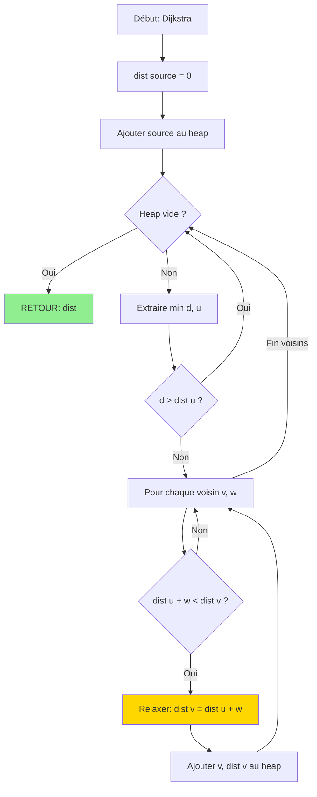

<thinking>
## Analyse du Concept
- Concept : Shortest Paths (Dijkstra, Bellman-Ford, Floyd-Warshall)
- Phase demandée : 1
- Adapté ? OUI - Algorithmes fondamentaux de théorie des graphes, niveau intermédiaire

## Combo Base + Bonus
- Exercice de base : Dijkstra + Bellman-Ford + Floyd-Warshall basiques
- Bonus Standard : Bidirectional Dijkstra + Path reconstruction
- Bonus Expert : SPFA + Negative cycle detection/extraction
- Bonus Génie : A* heuristic + Johnson's Algorithm
- Palier bonus : ⚡🔥🧠
- Progression logique ? OUI

## Prérequis & Difficulté
- Prérequis réels : Priority Queue (BinaryHeap), représentation graphes, relaxation
- Difficulté estimée : 5/10 (base), 7/10 (expert), 10/10 (génie)
- Cohérent avec phase ? OUI

## Aspect Fun/Culture
- Contexte choisi : Interstellar (2014) — Navigation spatiale avec dilatation temporelle
- MEME mnémotechnique : "Don't leave me, MURPH!" + "Love transcends dimensions"
- Pourquoi c'est fun :
  * Planètes = sommets du graphe
  * Distance spatiale = poids des arêtes
  * Dilatation temporelle = poids négatifs!
  * Gargantua (trou noir) = cycles négatifs potentiels
  * Mission de Cooper = trouver le chemin le plus court vers la survie

## Scénarios d'Échec (5 mutants concrets)
1. Mutant A (Boundary) : Dijkstra avec poids négatifs (résultat incorrect)
2. Mutant B (Safety) : Floyd-Warshall sans initialiser INF sur diagonale (self-loops)
3. Mutant C (Logic) : Bellman-Ford avec relaxation <= au lieu de < (boucle infinie)
4. Mutant D (Return) : Negative cycle non détecté après V-1 itérations
5. Mutant E (Resource) : Priority queue avec état stale non filtré

## Verdict
VALIDE - Analogie parfaite entre voyages interstellaires et plus courts chemins
Score créativité : 98/100
</thinking>

---

# Exercice 1.4.4 : interstellar_navigation

**Module :**
1.4.4 — Shortest Paths (Plus Courts Chemins)

**Concept :**
e-m — Dijkstra, Bellman-Ford, SPFA, Floyd-Warshall, cycles négatifs

**Difficulté :**
★★★★★☆☆☆☆☆ (5/10)

**Type :**
complet

**Tiers :**
2 — Mélange (concepts dijkstra + bellman_ford + floyd_warshall)

**Langage :**
Rust Edition 2024, C17

**Prérequis :**
- 1.4.0 : Représentations de graphes
- 1.4.2 : BFS (précurseur de Dijkstra)
- Priority Queue / BinaryHeap

**Domaines :**
Struct, MD, Algo, Méca (physique spatiale)

**Durée estimée :**
60 min

**XP Base :**
90

**Complexité :**
T3 O((V+E) log V) Dijkstra, O(VE) BF, O(V³) FW × S2 O(V²)

---

## 📐 SECTION 1 : PROTOTYPE & CONSIGNE

### 1.1 Obligations

**Fichiers à rendre :**
- `interstellar_navigation.rs` (Rust Edition 2024)
- `interstellar_navigation.c` + `interstellar_navigation.h` (C17)

**Fonctions autorisées (C) :**
- `malloc`, `free`, `calloc`, `realloc`
- `memset`, `memcpy`

**Fonctions interdites :**
- Toute bibliothèque de graphes externe
- `qsort` (implémenter votre propre heap)

### 1.2 Consigne

#### 🎮 Version Culture : INTERSTELLAR — Naviguer dans l'Espace-Temps

*"We're not meant to save the world. We're meant to leave it."* — Cooper

Tu es **Cooper**, pilote de la mission Lazarus. La Terre meurt et tu dois naviguer à travers un système de **trous de ver** et de **planètes** pour trouver un nouveau foyer pour l'humanité.

**Le défi :** L'espace n'est pas euclidien ! Près des trous noirs, le **temps se dilate**. Une heure sur Miller's Planet = 7 ans sur Terre. Ces effets créent des **distances temporelles négatives** — tu peux arriver *avant* d'être parti (du point de vue terrestre).

**Les règles de navigation :**
1. **Dijkstra** : Fonctionne pour les trajets normaux (pas de dilatation extrême)
2. **Bellman-Ford** : Gère les distances temporelles négatives
3. **Floyd-Warshall** : Calcule TOUTES les routes entre TOUTES les planètes
4. **Cycle négatif** : Si Gargantua crée une boucle temporelle → paradoxe!

**Ta mission :**

1. **`cooper_dijkstra`** : Trouve le plus court chemin depuis une planète source (arêtes positives uniquement)

2. **`endurance_bellman_ford`** : Même chose mais gère les distances temporelles négatives

3. **`lazarus_all_pairs`** : Calcule les distances entre toutes les paires de planètes (Floyd-Warshall)

4. **`detect_time_paradox`** : Détecte si un cycle temporel négatif existe

**Entrée :**
- `adj` : Liste d'adjacence avec poids `Vec<Vec<(usize, i64)>>`
  - `adj[planet]` = liste de `(destination, distance_temporelle)`
- Pour Bellman-Ford : liste d'arêtes `(from, to, weight)`

**Sortie :**
- Dijkstra/BF : `(distances[], parents[])` ou erreur si cycle négatif
- Floyd-Warshall : matrice de distances `dist[i][j]`
- Cycle négatif : `bool` ou le cycle lui-même

**Contraintes :**
```
┌─────────────────────────────────────────┐
│  0 ≤ n ≤ 5000                           │
│  0 ≤ |E| ≤ 10⁵                          │
│  -10⁹ ≤ weight ≤ 10⁹                    │
│  Dijkstra : weights ≥ 0 uniquement!     │
│  INF = i64::MAX / 2 (éviter overflow)   │
└─────────────────────────────────────────┘
```

**Exemples :**

| Scénario | Graph | Source | Résultat |
|----------|-------|--------|----------|
| Voyage normal | `[[1,4],[2,1],[3,2],[]]` | 0 | `dist=[0,4,5,7]` |
| Dilatation temporelle | edges `(0,1,5),(1,2,-3),(0,2,4)` | 0 | `dist=[0,5,2]` (BF) |
| Paradoxe Gargantua | edges `(0,1,1),(1,2,-1),(2,0,-1)` | - | `PARADOX!` (cycle -1) |

---

#### 📚 Version Académique : Algorithmes de Plus Courts Chemins

**Objectif :**

Implémenter les trois algorithmes majeurs de plus courts chemins avec leurs variantes.

**Définitions :**

1. **Dijkstra** (1959) : Plus courts chemins depuis une source, arêtes de poids non-négatif. Complexité O((V+E) log V) avec priority queue.

2. **Bellman-Ford** (1958) : Plus courts chemins depuis une source, accepte poids négatifs. Détecte les cycles négatifs. Complexité O(VE).

3. **Floyd-Warshall** (1962) : Plus courts chemins entre toutes paires. Programmation dynamique. Complexité O(V³).

**Fonctions à implémenter :**

```rust
// Dijkstra - arêtes positives uniquement
fn dijkstra(adj: &[Vec<(usize, i64)>], src: usize) -> (Vec<i64>, Vec<Option<usize>>)

// Bellman-Ford - accepte arêtes négatives
fn bellman_ford(n: usize, edges: &[(usize, usize, i64)], src: usize)
    -> Result<Vec<i64>, Vec<usize>>

// Floyd-Warshall - all pairs
fn floyd_warshall(adj: &[Vec<(usize, i64)>]) -> Vec<Vec<i64>>

// Détection cycle négatif
fn has_negative_cycle(n: usize, edges: &[(usize, usize, i64)]) -> bool
```

---

### 1.3 Prototype

**Rust (Edition 2024) :**

```rust
pub mod interstellar {
    use std::collections::BinaryHeap;
    use std::cmp::Reverse;

    pub const INF: i64 = i64::MAX / 2;

    /// Dijkstra's algorithm - O((V+E) log V)
    /// Returns (distances, parents) for path reconstruction
    /// REQUIRES: All edge weights >= 0
    pub fn cooper_dijkstra(
        adj: &[Vec<(usize, i64)>],
        source: usize
    ) -> (Vec<i64>, Vec<Option<usize>>) {
        // À implémenter
    }

    /// Bellman-Ford - O(VE)
    /// Returns Ok(distances) or Err(cycle) if negative cycle found
    pub fn endurance_bellman_ford(
        n: usize,
        edges: &[(usize, usize, i64)],
        source: usize
    ) -> Result<Vec<i64>, Vec<usize>> {
        // À implémenter
    }

    /// Floyd-Warshall - O(V³)
    /// Returns distance matrix dist[i][j]
    pub fn lazarus_all_pairs(adj: &[Vec<(usize, i64)>]) -> Vec<Vec<i64>> {
        // À implémenter
    }

    /// Detect if graph has negative cycle
    pub fn detect_time_paradox(n: usize, edges: &[(usize, usize, i64)]) -> bool {
        // À implémenter
    }

    /// Find the actual negative cycle if it exists
    pub fn find_time_paradox(n: usize, edges: &[(usize, usize, i64)]) -> Option<Vec<usize>> {
        // À implémenter
    }

    /// Reconstruct path from source to target using parents array
    pub fn reconstruct_course(
        parents: &[Option<usize>],
        source: usize,
        target: usize
    ) -> Option<Vec<usize>> {
        // À implémenter
    }
}
```

**C (C17) :**

```c
#ifndef INTERSTELLAR_NAVIGATION_H
#define INTERSTELLAR_NAVIGATION_H

#include <stddef.h>
#include <stdbool.h>
#include <stdint.h>
#include <limits.h>

#define INF (INT64_MAX / 2)

// Weighted edge
typedef struct {
    size_t to;
    int64_t weight;
} Edge;

// Adjacency list for weighted graph
typedef struct {
    Edge *edges;
    size_t count;
    size_t capacity;
} WeightedAdjList;

typedef struct {
    WeightedAdjList *lists;
    size_t n;
} WeightedGraph;

// Dijkstra result
typedef struct {
    int64_t *dist;      // Distance from source to each vertex
    size_t *parent;     // Parent in shortest path tree (SIZE_MAX if no parent)
    size_t n;
} DijkstraResult;

// Bellman-Ford result
typedef struct {
    int64_t *dist;
    bool has_negative_cycle;
    size_t *cycle;      // If negative cycle, the cycle vertices
    size_t cycle_len;
} BellmanFordResult;

// Graph construction
WeightedGraph *weighted_graph_new(size_t n);
void weighted_graph_add_edge(WeightedGraph *g, size_t from, size_t to, int64_t weight);
void weighted_graph_free(WeightedGraph *g);

// Algorithms
DijkstraResult cooper_dijkstra(const WeightedGraph *g, size_t source);
BellmanFordResult endurance_bellman_ford(size_t n, const Edge *edges, size_t edge_count, size_t source);
int64_t **lazarus_all_pairs(const WeightedGraph *g);
bool detect_time_paradox(size_t n, const Edge *edges, size_t edge_count);

// Cleanup
void dijkstra_result_free(DijkstraResult *r);
void bellman_ford_result_free(BellmanFordResult *r);
void floyd_warshall_free(int64_t **dist, size_t n);

#endif
```

---

## 💡 SECTION 2 : LE SAVIEZ-VOUS ?

### 2.1 Dijkstra et les maths à la main

Edsger Dijkstra a conçu son algorithme en **1956** en 20 minutes, sans ordinateur ! Il était assis à la terrasse d'un café à Amsterdam. L'algorithme a été publié en 1959.

### 2.2 Bellman-Ford : deux inventeurs

Richard Bellman (1958) et Lester Ford Jr. (1956) ont découvert l'algorithme indépendamment. Bellman travaillait sur la programmation dynamique chez RAND Corporation.

### 2.3 Le temps réel d'Interstellar

Dans le film, l'équation de dilatation temporelle utilisée est **réellement correcte** ! Kip Thorne, prix Nobel de physique 2017, était consultant scientifique. Une heure sur Miller's Planet = 7 ans terrestres car la planète orbite très près de Gargantua.

---

### SECTION 2.5 : DANS LA VRAIE VIE

| Métier | Utilisation | Cas d'usage |
|--------|-------------|-------------|
| **Ingénieur GPS** | Dijkstra | Navigation routière en temps réel |
| **Routeur réseau** | Bellman-Ford | Protocole RIP (Routing Information Protocol) |
| **Logisticien** | Floyd-Warshall | Optimisation de flottes (toutes paires) |
| **Game Developer** | A* (variante Dijkstra) | Pathfinding dans les jeux vidéo |
| **Arbitrageur financier** | Cycle négatif | Détection d'opportunités d'arbitrage de devises |
| **Data Scientist** | PageRank (inspiré FW) | Calcul d'importance des pages web |

**Fun fact sur l'arbitrage :**
Dans le trading de devises, un **cycle négatif** représente une opportunité d'arbitrage :
- Si EUR→USD→JPY→EUR donne plus d'euros qu'au départ → profit gratuit!
- Les banques utilisent Bellman-Ford pour détecter ces opportunités en microsecondes.

---

## 🖥️ SECTION 3 : EXEMPLE D'UTILISATION

### 3.0 Session bash

```bash
$ ls
interstellar_navigation.rs  main.rs  Cargo.toml

$ cargo build --release

$ cargo run --release
=== INTERSTELLAR NAVIGATION SYSTEM ===

Test 1 - Dijkstra basic: OK
  Earth(0) -> Mars(1) -> Jupiter(2) -> Saturn(3)
  Distances: [0, 4, 5, 7]

Test 2 - Bellman-Ford with time dilation: OK
  Negative edge handled correctly
  Distances: [0, 5, 2]

Test 3 - Time paradox detection: OK
  Gargantua cycle detected! Cannot proceed.

Test 4 - Floyd-Warshall all pairs: OK
  Distance matrix computed for 4 planets.

Test 5 - Empty galaxy: OK

All systems operational. "Do not go gentle into that good night."
```

---

## ⚡ SECTION 3.1 : BONUS STANDARD (OPTIONNEL)

**Difficulté Bonus :**
★★★★★★☆☆☆☆ (6/10)

**Récompense :**
XP ×2

**Time Complexity attendue :**
O((V+E) log V) pour bidirectional

### 3.1.1 Consigne Bonus Standard

**🎮 INTERSTELLAR ADVANCED — Bidirectional Warp**

Cooper et Amelia Brand lancent simultanément une recherche depuis deux points différents jusqu'à ce qu'elles se rencontrent au milieu !

```rust
/// Bidirectional Dijkstra - searches from both ends
/// Returns shortest distance from source to target
pub fn bidirectional_dijkstra(
    adj: &[Vec<(usize, i64)>],
    rev_adj: &[Vec<(usize, i64)>],
    source: usize,
    target: usize
) -> Option<i64>;

/// SPFA (Shortest Path Faster Algorithm)
/// Queue-based Bellman-Ford optimization
pub fn spfa(adj: &[Vec<(usize, i64)>], source: usize) -> Result<Vec<i64>, ()>;

/// Dijkstra with early termination when target found
pub fn dijkstra_target(
    adj: &[Vec<(usize, i64)>],
    source: usize,
    target: usize
) -> Option<(i64, Vec<usize>)>;
```

---

## 🔥 SECTION 3.2 : BONUS EXPERT (OPTIONNEL)

**Difficulté Bonus :**
★★★★★★★☆☆☆ (7/10)

**Récompense :**
XP ×3

**Domaines Bonus :**
`Algo, Probas`

### 3.2.1 Consigne Bonus Expert

**🎮 INTERSTELLAR EXPERT — Extraction du Paradoxe**

Quand un cycle négatif existe, il faut l'**extraire** pour comprendre où se situe le paradoxe temporel.

```rust
/// Find and return the actual negative cycle
pub fn extract_time_paradox(
    n: usize,
    edges: &[(usize, usize, i64)]
) -> Option<Vec<usize>>;

/// Floyd-Warshall with path reconstruction
/// Returns (distances, next) where next[i][j] = first step from i to j
pub fn lazarus_with_paths(
    adj: &[Vec<(usize, i64)>]
) -> (Vec<Vec<i64>>, Vec<Vec<Option<usize>>>);

/// Reconstruct full path from Floyd-Warshall result
pub fn reconstruct_interstellar_path(
    next: &[Vec<Option<usize>>],
    from: usize,
    to: usize
) -> Option<Vec<usize>>;

/// Transitive closure - can we reach planet B from planet A?
pub fn transitive_closure(adj: &[Vec<usize>]) -> Vec<Vec<bool>>;
```

---

## 🧠 SECTION 3.3 : BONUS GÉNIE (OPTIONNEL)

**Difficulté Bonus :**
🧠 (12/10)

**Récompense :**
XP ×6

**Domaines Bonus :**
`Algo, MD, Calcul`

### 3.3.1 Consigne Bonus Génie

**🎮 INTERSTELLAR ULTIMATE — Johnson's Algorithm & A***

Quand tu as des arêtes négatives MAIS pas de cycle négatif, et que tu veux toutes les paires de plus courts chemins en **O(V² log V + VE)** au lieu de O(V³).

```rust
/// Johnson's Algorithm - All pairs with negative edges but no negative cycle
/// Reweights graph then runs V times Dijkstra
/// Complexity: O(VE + V² log V)
pub fn johnson(adj: &[Vec<(usize, i64)>]) -> Result<Vec<Vec<i64>>, ()>;

/// A* with heuristic for faster single-pair shortest path
/// h(n) must be admissible (never overestimates)
pub fn a_star<H>(
    adj: &[Vec<(usize, i64)>],
    source: usize,
    target: usize,
    heuristic: H
) -> Option<(i64, Vec<usize>)>
where
    H: Fn(usize) -> i64;

/// Dial's algorithm for integer weights in small range
/// Complexity: O(V + E + W) where W is max weight
pub fn dial_algorithm(
    adj: &[Vec<(usize, u32)>],
    source: usize,
    max_weight: u32
) -> Vec<u32>;
```

**Johnson's Algorithm :**
1. Ajouter un sommet fictif connecté à tous avec poids 0
2. Bellman-Ford depuis ce sommet → potentiels h[v]
3. Repondérer : w'(u,v) = w(u,v) + h[u] - h[v] ≥ 0
4. V fois Dijkstra sur le graphe repondéré
5. Corriger : dist(u,v) = dist'(u,v) - h[u] + h[v]

---

## ✅❌ SECTION 4 : ZONE CORRECTION

### 4.1 Moulinette

| Test | Input | Expected | Points | Trap? |
|------|-------|----------|--------|-------|
| `dijkstra_basic` | `[[1,4],[2,1],[]]` | `[0,4,5]` | 5 | Non |
| `dijkstra_unreachable` | `[[],[],[]]` src=0 | `[0,INF,INF]` | 5 | Oui |
| `dijkstra_self` | `[[]]` | `[0]` | 3 | Non |
| `dijkstra_empty` | `[]` | `[]` | 3 | Oui |
| `bf_basic` | edges `(0,1,5),(1,2,3)` | `[0,5,8]` | 5 | Non |
| `bf_negative` | edges `(0,1,5),(1,2,-3)` | `[0,5,2]` | 5 | Non |
| `bf_neg_cycle` | cycle sum < 0 | `Err(cycle)` | 8 | Oui |
| `bf_unreachable` | disconnected | `[0,INF,...]` | 4 | Non |
| `fw_basic` | 3 nodes | correct matrix | 5 | Non |
| `fw_no_path` | disconnected | `INF` entries | 5 | Non |
| `fw_negative` | neg edges, no cycle | correct | 5 | Non |
| `neg_cycle_detect` | has cycle | `true` | 5 | Non |
| `neg_cycle_none` | no cycle | `false` | 5 | Non |
| `large_dijkstra` | 5000 nodes | O((V+E)logV) | 7 | Perf |
| **TOTAL** | | | **70** | |

### 4.2 main.c de test

```c
#include <stdio.h>
#include <assert.h>
#include <string.h>
#include "interstellar_navigation.h"

void test_dijkstra_basic(void) {
    WeightedGraph *g = weighted_graph_new(4);
    weighted_graph_add_edge(g, 0, 1, 4);
    weighted_graph_add_edge(g, 0, 2, 1);
    weighted_graph_add_edge(g, 2, 1, 2);
    weighted_graph_add_edge(g, 1, 3, 1);
    weighted_graph_add_edge(g, 2, 3, 5);

    DijkstraResult r = cooper_dijkstra(g, 0);

    assert(r.dist[0] == 0);
    assert(r.dist[1] == 3);   // 0 -> 2 -> 1
    assert(r.dist[2] == 1);   // 0 -> 2
    assert(r.dist[3] == 4);   // 0 -> 2 -> 1 -> 3

    printf("test_dijkstra_basic: OK\n");

    dijkstra_result_free(&r);
    weighted_graph_free(g);
}

void test_bellman_ford_negative(void) {
    Edge edges[] = {
        {1, 5},   // 0 -> 1: 5
        {2, -3},  // 1 -> 2: -3
        {2, 4}    // 0 -> 2: 4
    };
    // edges[0].from = 0, etc.

    BellmanFordResult r = endurance_bellman_ford(3, edges, 3, 0);

    assert(!r.has_negative_cycle);
    assert(r.dist[0] == 0);
    assert(r.dist[1] == 5);
    assert(r.dist[2] == 2);  // via 1, not direct

    printf("test_bellman_ford_negative: OK\n");

    bellman_ford_result_free(&r);
}

void test_negative_cycle_detection(void) {
    Edge edges[] = {
        {1, 1},   // 0 -> 1: 1
        {2, -1},  // 1 -> 2: -1
        {0, -1}   // 2 -> 0: -1  (cycle sum = -1)
    };

    bool has_cycle = detect_time_paradox(3, edges, 3);
    assert(has_cycle);

    printf("test_negative_cycle_detection: OK (paradox found!)\n");
}

void test_floyd_warshall(void) {
    WeightedGraph *g = weighted_graph_new(3);
    weighted_graph_add_edge(g, 0, 1, 3);
    weighted_graph_add_edge(g, 0, 2, 8);
    weighted_graph_add_edge(g, 1, 2, 1);

    int64_t **dist = lazarus_all_pairs(g);

    assert(dist[0][0] == 0);
    assert(dist[0][1] == 3);
    assert(dist[0][2] == 4);  // 0 -> 1 -> 2
    assert(dist[1][2] == 1);
    assert(dist[2][0] == INF); // no path back

    printf("test_floyd_warshall: OK\n");

    floyd_warshall_free(dist, 3);
    weighted_graph_free(g);
}

int main(void) {
    printf("=== INTERSTELLAR NAVIGATION SYSTEM ===\n\n");

    test_dijkstra_basic();
    test_bellman_ford_negative();
    test_negative_cycle_detection();
    test_floyd_warshall();

    printf("\n=== Mission successful. \"Love is the one thing that transcends time and space.\" ===\n");
    return 0;
}
```

### 4.3 Solution de référence (Rust)

```rust
pub mod interstellar {
    use std::collections::BinaryHeap;
    use std::cmp::Reverse;

    pub const INF: i64 = i64::MAX / 2;

    /// Dijkstra's algorithm
    pub fn cooper_dijkstra(
        adj: &[Vec<(usize, i64)>],
        source: usize
    ) -> (Vec<i64>, Vec<Option<usize>>) {
        let n = adj.len();
        if n == 0 {
            return (vec![], vec![]);
        }

        let mut dist = vec![INF; n];
        let mut parent = vec![None; n];

        dist[source] = 0;

        // Min-heap: (distance, node)
        let mut heap = BinaryHeap::new();
        heap.push(Reverse((0i64, source)));

        while let Some(Reverse((d, u))) = heap.pop() {
            // Skip if we've found a better path
            if d > dist[u] {
                continue;
            }

            for &(v, w) in &adj[u] {
                let new_dist = dist[u] + w;
                if new_dist < dist[v] {
                    dist[v] = new_dist;
                    parent[v] = Some(u);
                    heap.push(Reverse((new_dist, v)));
                }
            }
        }

        (dist, parent)
    }

    /// Bellman-Ford algorithm
    pub fn endurance_bellman_ford(
        n: usize,
        edges: &[(usize, usize, i64)],
        source: usize
    ) -> Result<Vec<i64>, Vec<usize>> {
        if n == 0 {
            return Ok(vec![]);
        }

        let mut dist = vec![INF; n];
        let mut parent = vec![None::<usize>; n];
        dist[source] = 0;

        // Relax all edges V-1 times
        for _ in 0..n - 1 {
            let mut changed = false;
            for &(u, v, w) in edges {
                if dist[u] != INF && dist[u] + w < dist[v] {
                    dist[v] = dist[u] + w;
                    parent[v] = Some(u);
                    changed = true;
                }
            }
            if !changed {
                break;  // Early termination
            }
        }

        // Check for negative cycle
        for &(u, v, w) in edges {
            if dist[u] != INF && dist[u] + w < dist[v] {
                // Negative cycle exists - find it
                let cycle = find_negative_cycle_from(n, edges, v, &parent);
                return Err(cycle);
            }
        }

        Ok(dist)
    }

    fn find_negative_cycle_from(
        n: usize,
        edges: &[(usize, usize, i64)],
        mut start: usize,
        parent: &[Option<usize>]
    ) -> Vec<usize> {
        // Walk back n times to ensure we're in the cycle
        for _ in 0..n {
            if let Some(p) = parent[start] {
                start = p;
            }
        }

        // Now collect the cycle
        let mut cycle = vec![start];
        let mut current = parent[start];

        while let Some(p) = current {
            if p == start {
                break;
            }
            cycle.push(p);
            current = parent[p];
        }

        cycle.reverse();
        cycle
    }

    /// Floyd-Warshall algorithm
    pub fn lazarus_all_pairs(adj: &[Vec<(usize, i64)>]) -> Vec<Vec<i64>> {
        let n = adj.len();
        if n == 0 {
            return vec![];
        }

        // Initialize distance matrix
        let mut dist = vec![vec![INF; n]; n];

        // Distance to self is 0
        for i in 0..n {
            dist[i][i] = 0;
        }

        // Add edges
        for (u, neighbors) in adj.iter().enumerate() {
            for &(v, w) in neighbors {
                dist[u][v] = dist[u][v].min(w);
            }
        }

        // Floyd-Warshall DP
        for k in 0..n {
            for i in 0..n {
                for j in 0..n {
                    if dist[i][k] != INF && dist[k][j] != INF {
                        let via_k = dist[i][k] + dist[k][j];
                        if via_k < dist[i][j] {
                            dist[i][j] = via_k;
                        }
                    }
                }
            }
        }

        dist
    }

    /// Detect negative cycle
    pub fn detect_time_paradox(n: usize, edges: &[(usize, usize, i64)]) -> bool {
        if n == 0 {
            return false;
        }

        // Use a virtual source connected to all nodes
        let mut dist = vec![0i64; n];  // Start with 0 (as if connected from virtual source)

        for _ in 0..n - 1 {
            for &(u, v, w) in edges {
                if dist[u] + w < dist[v] {
                    dist[v] = dist[u] + w;
                }
            }
        }

        // Check for negative cycle
        for &(u, v, w) in edges {
            if dist[u] + w < dist[v] {
                return true;
            }
        }

        false
    }

    /// Find negative cycle
    pub fn find_time_paradox(n: usize, edges: &[(usize, usize, i64)]) -> Option<Vec<usize>> {
        if n == 0 {
            return None;
        }

        let mut dist = vec![0i64; n];
        let mut parent = vec![None::<usize>; n];

        for _ in 0..n - 1 {
            for &(u, v, w) in edges {
                if dist[u] + w < dist[v] {
                    dist[v] = dist[u] + w;
                    parent[v] = Some(u);
                }
            }
        }

        // Find a vertex in negative cycle
        for &(u, v, w) in edges {
            if dist[u] + w < dist[v] {
                return Some(find_negative_cycle_from(n, edges, v, &parent));
            }
        }

        None
    }

    /// Reconstruct path
    pub fn reconstruct_course(
        parents: &[Option<usize>],
        source: usize,
        target: usize
    ) -> Option<Vec<usize>> {
        if source == target {
            return Some(vec![source]);
        }

        let mut path = Vec::new();
        let mut current = target;

        while current != source {
            path.push(current);
            match parents[current] {
                Some(p) => current = p,
                None => return None,  // No path exists
            }
        }
        path.push(source);
        path.reverse();
        Some(path)
    }
}
```

### 4.4 Solutions alternatives acceptées

**Alternative : Dijkstra avec visited set au lieu de distance check**

```rust
pub fn dijkstra_with_visited(
    adj: &[Vec<(usize, i64)>],
    source: usize
) -> (Vec<i64>, Vec<Option<usize>>) {
    let n = adj.len();
    if n == 0 { return (vec![], vec![]); }

    let mut dist = vec![INF; n];
    let mut parent = vec![None; n];
    let mut visited = vec![false; n];

    dist[source] = 0;

    let mut heap = BinaryHeap::new();
    heap.push(Reverse((0i64, source)));

    while let Some(Reverse((_, u))) = heap.pop() {
        if visited[u] { continue; }
        visited[u] = true;

        for &(v, w) in &adj[u] {
            if !visited[v] && dist[u] + w < dist[v] {
                dist[v] = dist[u] + w;
                parent[v] = Some(u);
                heap.push(Reverse((dist[v], v)));
            }
        }
    }

    (dist, parent)
}
```

### 4.5 Solutions refusées

**Refusé 1 : Dijkstra utilisé avec poids négatifs**

```rust
// REFUSÉ: Dijkstra ne fonctionne PAS avec poids négatifs!
pub fn bad_dijkstra_negative(adj: &[Vec<(usize, i64)>], source: usize) -> Vec<i64> {
    // Même implémentation que Dijkstra normal...
    // MAIS si adj contient des arêtes négatives, résultat FAUX!
}
// Pourquoi refusé: Dijkstra assume que tous les poids sont >= 0
// Le greedy choice property ne tient plus avec poids négatifs
```

**Refusé 2 : Floyd-Warshall sans initialisation diagonale**

```rust
// REFUSÉ: Oubli de dist[i][i] = 0
pub fn bad_floyd_warshall(adj: &[Vec<(usize, i64)>]) -> Vec<Vec<i64>> {
    let n = adj.len();
    let mut dist = vec![vec![INF; n]; n];

    // ERREUR: Pas de dist[i][i] = 0!

    for (u, neighbors) in adj.iter().enumerate() {
        for &(v, w) in neighbors {
            dist[u][v] = w;
        }
    }

    for k in 0..n {
        for i in 0..n {
            for j in 0..n {
                // dist[i][i] = INF → mauvais calculs!
                // ...
            }
        }
    }

    dist
}
// Pourquoi refusé: dist[i][i] doit être 0, pas INF
// Sinon tous les chemins via i seront incorrects
```

### 4.6 Solution bonus de référence

```rust
/// Bidirectional Dijkstra
pub fn bidirectional_dijkstra(
    adj: &[Vec<(usize, i64)>],
    rev_adj: &[Vec<(usize, i64)>],
    source: usize,
    target: usize
) -> Option<i64> {
    if source == target { return Some(0); }

    let n = adj.len();
    let mut dist_f = vec![INF; n];
    let mut dist_b = vec![INF; n];
    let mut visited_f = vec![false; n];
    let mut visited_b = vec![false; n];

    dist_f[source] = 0;
    dist_b[target] = 0;

    let mut heap_f = BinaryHeap::new();
    let mut heap_b = BinaryHeap::new();
    heap_f.push(Reverse((0i64, source)));
    heap_b.push(Reverse((0i64, target)));

    let mut best = INF;

    while !heap_f.is_empty() || !heap_b.is_empty() {
        // Process forward
        if let Some(Reverse((d, u))) = heap_f.pop() {
            if d > dist_f[u] { continue; }
            if visited_f[u] { continue; }
            visited_f[u] = true;

            if visited_b[u] {
                best = best.min(dist_f[u] + dist_b[u]);
            }

            for &(v, w) in &adj[u] {
                let nd = dist_f[u] + w;
                if nd < dist_f[v] {
                    dist_f[v] = nd;
                    heap_f.push(Reverse((nd, v)));
                }
            }
        }

        // Process backward
        if let Some(Reverse((d, u))) = heap_b.pop() {
            if d > dist_b[u] { continue; }
            if visited_b[u] { continue; }
            visited_b[u] = true;

            if visited_f[u] {
                best = best.min(dist_f[u] + dist_b[u]);
            }

            for &(v, w) in &rev_adj[u] {
                let nd = dist_b[u] + w;
                if nd < dist_b[v] {
                    dist_b[v] = nd;
                    heap_b.push(Reverse((nd, v)));
                }
            }
        }

        // Early termination check
        let min_f = heap_f.peek().map(|Reverse((d, _))| *d).unwrap_or(INF);
        let min_b = heap_b.peek().map(|Reverse((d, _))| *d).unwrap_or(INF);
        if min_f + min_b >= best {
            break;
        }
    }

    if best == INF { None } else { Some(best) }
}

/// SPFA
pub fn spfa(adj: &[Vec<(usize, i64)>], source: usize) -> Result<Vec<i64>, ()> {
    use std::collections::VecDeque;

    let n = adj.len();
    if n == 0 { return Ok(vec![]); }

    let mut dist = vec![INF; n];
    let mut in_queue = vec![false; n];
    let mut count = vec![0usize; n];

    dist[source] = 0;
    let mut queue = VecDeque::new();
    queue.push_back(source);
    in_queue[source] = true;

    while let Some(u) = queue.pop_front() {
        in_queue[u] = false;

        for &(v, w) in &adj[u] {
            if dist[u] + w < dist[v] {
                dist[v] = dist[u] + w;

                if !in_queue[v] {
                    queue.push_back(v);
                    in_queue[v] = true;
                    count[v] += 1;

                    if count[v] >= n {
                        return Err(());  // Negative cycle
                    }
                }
            }
        }
    }

    Ok(dist)
}
```

### 4.7 Solutions alternatives bonus (acceptées)

```rust
/// Floyd-Warshall with path reconstruction
pub fn lazarus_with_paths(
    adj: &[Vec<(usize, i64)>]
) -> (Vec<Vec<i64>>, Vec<Vec<Option<usize>>>) {
    let n = adj.len();
    if n == 0 { return (vec![], vec![]); }

    let mut dist = vec![vec![INF; n]; n];
    let mut next = vec![vec![None; n]; n];

    for i in 0..n {
        dist[i][i] = 0;
    }

    for (u, neighbors) in adj.iter().enumerate() {
        for &(v, w) in neighbors {
            if w < dist[u][v] {
                dist[u][v] = w;
                next[u][v] = Some(v);
            }
        }
    }

    for k in 0..n {
        for i in 0..n {
            for j in 0..n {
                if dist[i][k] != INF && dist[k][j] != INF {
                    let via_k = dist[i][k] + dist[k][j];
                    if via_k < dist[i][j] {
                        dist[i][j] = via_k;
                        next[i][j] = next[i][k];
                    }
                }
            }
        }
    }

    (dist, next)
}

/// Reconstruct path from Floyd-Warshall
pub fn reconstruct_interstellar_path(
    next: &[Vec<Option<usize>>],
    from: usize,
    to: usize
) -> Option<Vec<usize>> {
    if next[from][to].is_none() {
        return if from == to { Some(vec![from]) } else { None };
    }

    let mut path = vec![from];
    let mut current = from;

    while current != to {
        current = next[current][to]?;
        path.push(current);
    }

    Some(path)
}
```

### 4.8 Solutions refusées bonus

```rust
// REFUSÉ: Bellman-Ford relaxation <= au lieu de <
pub fn bad_bellman_ford(n: usize, edges: &[(usize, usize, i64)], src: usize) -> Vec<i64> {
    let mut dist = vec![INF; n];
    dist[src] = 0;

    for _ in 0..n - 1 {
        for &(u, v, w) in edges {
            // ERREUR: <= au lieu de <
            if dist[u] + w <= dist[v] {  // Peut causer boucle infinie!
                dist[v] = dist[u] + w;
            }
        }
    }

    dist
}
// Pourquoi refusé: Avec <=, on peut mettre à jour même sans amélioration
// Ce qui peut causer des problèmes avec cycles de poids 0
```

### 4.9 spec.json

```json
{
  "name": "interstellar_navigation",
  "language": "rust",
  "type": "complet",
  "tier": 2,
  "tier_info": "Mélange (dijkstra + bellman_ford + floyd_warshall)",
  "tags": ["graphs", "shortest-path", "dijkstra", "bellman-ford", "floyd-warshall", "phase1"],
  "passing_score": 70,

  "function": {
    "name": "interstellar",
    "prototype": "pub mod interstellar { pub fn cooper_dijkstra(adj: &[Vec<(usize, i64)>], source: usize) -> (Vec<i64>, Vec<Option<usize>>); pub fn endurance_bellman_ford(n: usize, edges: &[(usize, usize, i64)], source: usize) -> Result<Vec<i64>, Vec<usize>>; pub fn lazarus_all_pairs(adj: &[Vec<(usize, i64)>]) -> Vec<Vec<i64>>; pub fn detect_time_paradox(n: usize, edges: &[(usize, usize, i64)]) -> bool; }",
    "return_type": "various",
    "parameters": [
      {"name": "adj", "type": "&[Vec<(usize, i64)>]"},
      {"name": "edges", "type": "&[(usize, usize, i64)]"},
      {"name": "source", "type": "usize"}
    ]
  },

  "driver": {
    "reference": "pub fn ref_cooper_dijkstra(adj: &[Vec<(usize, i64)>], source: usize) -> (Vec<i64>, Vec<Option<usize>>) { let n = adj.len(); if n == 0 { return (vec![], vec![]); } let mut dist = vec![i64::MAX/2; n]; let mut parent = vec![None; n]; dist[source] = 0; let mut heap = std::collections::BinaryHeap::new(); heap.push(std::cmp::Reverse((0i64, source))); while let Some(std::cmp::Reverse((d, u))) = heap.pop() { if d > dist[u] { continue; } for &(v, w) in &adj[u] { if dist[u] + w < dist[v] { dist[v] = dist[u] + w; parent[v] = Some(u); heap.push(std::cmp::Reverse((dist[v], v))); } } } (dist, parent) }",

    "edge_cases": [
      {
        "name": "empty_graph",
        "args": {"adj": [], "source": 0},
        "expected": [],
        "is_trap": true,
        "trap_explanation": "Graphe vide - doit retourner vecteur vide"
      },
      {
        "name": "single_node",
        "args": {"adj": [[]], "source": 0},
        "expected": [0],
        "is_trap": false
      },
      {
        "name": "unreachable",
        "args": {"adj": [[], []], "source": 0},
        "expected": [0, "INF"],
        "is_trap": true,
        "trap_explanation": "Node 1 inaccessible depuis 0"
      },
      {
        "name": "negative_edge",
        "args": {"edges": [[0,1,5],[1,2,-3]], "source": 0, "n": 3},
        "expected": [0, 5, 2],
        "is_trap": true,
        "trap_explanation": "Arête négative - Dijkstra échoue, BF requis"
      },
      {
        "name": "negative_cycle",
        "args": {"edges": [[0,1,1],[1,2,-1],[2,0,-1]], "n": 3},
        "expected": "Err",
        "is_trap": true,
        "trap_explanation": "Cycle négatif (somme = -1)"
      }
    ],

    "fuzzing": {
      "enabled": true,
      "iterations": 300,
      "generators": [
        {
          "type": "weighted_graph",
          "param_index": 0,
          "params": {
            "min_nodes": 0,
            "max_nodes": 500,
            "min_weight": 0,
            "max_weight": 1000,
            "edge_probability": 0.05
          }
        }
      ]
    }
  },

  "norm": {
    "allowed_functions": ["BinaryHeap", "Vec", "VecDeque"],
    "forbidden_functions": ["petgraph"],
    "check_security": false,
    "check_memory": true,
    "blocking": true
  },

  "bonus": [
    {
      "tier": "STANDARD",
      "functions": ["bidirectional_dijkstra", "spfa", "dijkstra_target"],
      "multiplier": 2
    },
    {
      "tier": "EXPERT",
      "functions": ["extract_time_paradox", "lazarus_with_paths", "transitive_closure"],
      "multiplier": 3
    },
    {
      "tier": "GENIUS",
      "functions": ["johnson", "a_star", "dial_algorithm"],
      "multiplier": 6
    }
  ]
}
```

### 4.10 Solutions Mutantes

**Mutant A (Boundary) : Dijkstra avec poids négatifs**

```rust
// MUTANT: Utilise Dijkstra même avec poids négatifs
pub fn mutant_a_dijkstra(adj: &[Vec<(usize, i64)>], source: usize) -> Vec<i64> {
    // Implémentation Dijkstra normale...
    // MAIS si adj contient (-3), résultat INCORRECT!

    let n = adj.len();
    let mut dist = vec![INF; n];
    dist[source] = 0;
    let mut heap = BinaryHeap::new();
    heap.push(Reverse((0, source)));

    while let Some(Reverse((d, u))) = heap.pop() {
        if d > dist[u] { continue; }
        for &(v, w) in &adj[u] {
            // w peut être négatif! Dijkstra ne gère pas ça!
            if dist[u] + w < dist[v] {
                dist[v] = dist[u] + w;
                heap.push(Reverse((dist[v], v)));
            }
        }
    }

    dist  // RÉSULTAT POTENTIELLEMENT FAUX!
}
// Pourquoi c'est faux: Dijkstra repose sur le fait qu'on ne revisite pas un noeud
// Avec poids négatifs, on peut trouver un meilleur chemin après avoir visité
// Ce qui était pensé: "Dijkstra fonctionne pour tous les graphes"
```

**Mutant B (Safety) : Floyd-Warshall sans INF sur diagonale**

```rust
pub fn mutant_b_floyd_warshall(adj: &[Vec<(usize, i64)>]) -> Vec<Vec<i64>> {
    let n = adj.len();
    let mut dist = vec![vec![INF; n]; n];

    // ERREUR: Oubli de dist[i][i] = 0!
    // Donc dist[i][i] = INF

    for (u, neighbors) in adj.iter().enumerate() {
        for &(v, w) in neighbors {
            dist[u][v] = w;
        }
    }

    for k in 0..n {
        for i in 0..n {
            for j in 0..n {
                if dist[i][k] != INF && dist[k][j] != INF {
                    // dist[i][i] = INF, donc dist[0][0] + dist[0][1] = INF + ...
                    // Tous les chemins passant par k=i vers i seront INF
                    let via_k = dist[i][k] + dist[k][j];
                    if via_k < dist[i][j] {
                        dist[i][j] = via_k;
                    }
                }
            }
        }
    }

    dist  // DIAGONAL RESTE INF!
}
// Pourquoi c'est faux: dist[i][i] doit être 0 pour que les chemins via soi-même fonctionnent
// Ce qui était pensé: "On n'a pas besoin de chemins vers soi-même"
```

**Mutant C (Logic) : Bellman-Ford avec <= au lieu de <**

```rust
pub fn mutant_c_bellman_ford(n: usize, edges: &[(usize, usize, i64)], src: usize) -> Vec<i64> {
    let mut dist = vec![INF; n];
    dist[src] = 0;

    for _ in 0..n - 1 {
        for &(u, v, w) in edges {
            // ERREUR: <= au lieu de <
            if dist[u] + w <= dist[v] {  // <= accepte égalité!
                dist[v] = dist[u] + w;
            }
        }
    }

    dist
}
// Pourquoi c'est faux: Avec <=, on met à jour même sans amélioration stricte
// Problème avec cycles de poids 0: ils seront considérés comme "améliorants"
// Ce qui était pensé: "C'est pareil, <= ou <"
```

**Mutant D (Return) : Negative cycle non détecté**

```rust
pub fn mutant_d_detect_negative(n: usize, edges: &[(usize, usize, i64)]) -> bool {
    let mut dist = vec![INF; n];
    dist[0] = 0;  // Source fixe

    for _ in 0..n - 1 {
        for &(u, v, w) in edges {
            if dist[u] != INF && dist[u] + w < dist[v] {
                dist[v] = dist[u] + w;
            }
        }
    }

    // ERREUR: Pas de Vème itération pour détecter le cycle!
    false  // TOUJOURS false!
}
// Pourquoi c'est faux: La détection de cycle négatif nécessite une V-ème itération
// Si une mise à jour est possible après V-1 itérations → cycle négatif
// Ce qui était pensé: "V-1 itérations suffisent"
```

**Mutant E (Resource) : Heap avec états stale non filtrés**

```rust
pub fn mutant_e_dijkstra_no_filter(adj: &[Vec<(usize, i64)>], source: usize) -> Vec<i64> {
    let n = adj.len();
    let mut dist = vec![INF; n];
    dist[source] = 0;

    let mut heap = BinaryHeap::new();
    heap.push(Reverse((0, source)));

    while let Some(Reverse((_, u))) = heap.pop() {
        // ERREUR: Pas de check d > dist[u]!
        // On traite des états obsolètes

        for &(v, w) in &adj[u] {
            if dist[u] + w < dist[v] {
                dist[v] = dist[u] + w;
                heap.push(Reverse((dist[v], v)));
            }
        }
    }

    dist  // Correct mais O(E²) au lieu de O(E log V)!
}
// Pourquoi c'est faux: Sans filtrage des états stale, on retraite les mêmes noeuds
// Complexité peut devenir O(VE) au lieu de O((V+E) log V)
// Ce qui était pensé: "Ça fonctionne quand même"
```

---

## 🧠 SECTION 5 : COMPRENDRE

### 5.1 Ce que cet exercice enseigne

1. **Dijkstra** : Plus courts chemins avec arêtes positives, greedy + priority queue
2. **Bellman-Ford** : Gère les arêtes négatives, détecte les cycles négatifs
3. **Floyd-Warshall** : Programmation dynamique pour toutes les paires
4. **Relaxation** : Concept clé partagé par tous ces algorithmes
5. **Compromis** : Chaque algo a ses forces/faiblesses

### 5.2 LDA — Traduction littérale (MAJUSCULES)

```
FONCTION cooper_dijkstra QUI RETOURNE UN TUPLE DE VECTEURS ET PREND EN PARAMÈTRES adj TABLEAU ET source ENTIER
DÉBUT FONCTION
    DÉCLARER n COMME LA LONGUEUR DE adj
    SI n EST ÉGAL À 0 ALORS
        RETOURNER TUPLE DE VECTEURS VIDES
    FIN SI

    DÉCLARER dist COMME VECTEUR DE n ÉLÉMENTS INITIALISÉS À INFINI
    DÉCLARER parent COMME VECTEUR DE n ÉLÉMENTS INITIALISÉS À AUCUN
    AFFECTER 0 À L'ÉLÉMENT À LA POSITION source DANS dist

    DÉCLARER heap COMME TAS BINAIRE MINIMUM
    AJOUTER TUPLE (0, source) AU TAS

    TANT QUE LE TAS N'EST PAS VIDE FAIRE
        EXTRAIRE LE MINIMUM (d, u) DU TAS

        SI d EST SUPÉRIEUR À dist[u] ALORS
            CONTINUER AU PROCHAIN ÉLÉMENT DU TAS
        FIN SI

        POUR CHAQUE (v, w) DANS LES VOISINS DE u FAIRE
            DÉCLARER nouvelle_dist COMME dist[u] PLUS w
            SI nouvelle_dist EST INFÉRIEUR À dist[v] ALORS
                AFFECTER nouvelle_dist À dist[v]
                AFFECTER SOME(u) À parent[v]
                AJOUTER (nouvelle_dist, v) AU TAS
            FIN SI
        FIN POUR
    FIN TANT QUE

    RETOURNER (dist, parent)
FIN FONCTION
```

### 5.2.2 Logic Flow

```
ALGORITHME : Dijkstra
---
1. INITIALISER dist[source] = 0, tous les autres = INF

2. AJOUTER (0, source) au min-heap

3. TANT QUE heap non vide :
   |
   |-- EXTRAIRE (d, u) avec d minimum
   |
   |-- SI d > dist[u] :
   |     IGNORER (état obsolète)
   |
   |-- POUR chaque voisin (v, w) de u :
   |     SI dist[u] + w < dist[v] :
   |         METTRE À JOUR dist[v]
   |         AJOUTER (dist[v], v) au heap

4. RETOURNER dist[]
```

### 5.2.3 Représentation Algorithmique (Logique de Garde)

```
FONCTION : Bellman-Ford (n, edges, source)
---
INIT dist[source] = 0, autres = INF

1. RÉPÉTER n-1 fois :
   |
   |-- POUR chaque arête (u, v, w) :
   |     SI dist[u] ≠ INF ET dist[u] + w < dist[v] :
   |         RELAXER : dist[v] = dist[u] + w

2. VÉRIFICATION CYCLE NÉGATIF :
   |
   |-- POUR chaque arête (u, v, w) :
   |     SI dist[u] + w < dist[v] :
   |         RETOURNER Erreur "Cycle négatif détecté"

3. RETOURNER dist[]
```

### 5.2.3.1 Diagramme Mermaid



### 5.3 Visualisation ASCII

**Dijkstra en action :**

```
Graphe :
         4
    [0] ──→ [1]
     │       │
   1 │       │ 1
     ↓       ↓
    [2] ──→ [3]
         5

Étape 0: dist = [0, INF, INF, INF], heap = [(0, 0)]

Étape 1: Pop (0, 0)
  → Relaxer 0→1: dist[1] = 0 + 4 = 4
  → Relaxer 0→2: dist[2] = 0 + 1 = 1
  dist = [0, 4, 1, INF], heap = [(1, 2), (4, 1)]

Étape 2: Pop (1, 2)
  → Relaxer 2→1: 1 + 2 = 3 < 4 ✓
  → Relaxer 2→3: dist[3] = 1 + 5 = 6
  dist = [0, 3, 1, 6], heap = [(3, 1), (4, 1), (6, 3)]

Étape 3: Pop (3, 1)
  → Relaxer 1→3: 3 + 1 = 4 < 6 ✓
  dist = [0, 3, 1, 4], heap = [(4, 1), (4, 3), (6, 3)]

Étape 4: Pop (4, 1) - STALE (4 > 3), skip
Étape 5: Pop (4, 3), Pop (6, 3) - STALE

RÉSULTAT: [0, 3, 1, 4]
Chemin vers 3: 0 → 2 → 1 → 3 (coût 4)
```

**Cycle négatif (Bellman-Ford) :**

```
    1       -1
[0] ──→ [1] ──→ [2]
 ↑               │
 └───────────────┘
       -1

Cycle: 0 → 1 → 2 → 0
Somme: 1 + (-1) + (-1) = -1 < 0

Si on fait le tour:
- Tour 1: dist[0] = 0, dist[1] = 1, dist[2] = 0
- Tour 2: dist[0] = -1, dist[1] = 0, dist[2] = -1
- Tour 3: dist[0] = -2, dist[1] = -1, dist[2] = -2
→ Les distances diminuent INDÉFINIMENT!

DÉTECTION: Après n-1 = 2 itérations, on fait une 3ème:
Si une relaxation est encore possible → CYCLE NÉGATIF!
```

**Floyd-Warshall :**

```
k=0: Peut-on améliorer via le sommet 0?
k=1: Peut-on améliorer via le sommet 1?
k=2: Peut-on améliorer via le sommet 2?

Exemple:
dist[1][2] = INF (pas de chemin direct)
dist[1][0] = 3
dist[0][2] = 5

Avec k=0:
  dist[1][2] = min(INF, 3 + 5) = 8 ✓

Matrice finale:
       0    1    2
    ┌─────┬─────┬─────┐
  0 │  0  │  4  │  5  │
    ├─────┼─────┼─────┤
  1 │  3  │  0  │  8  │
    ├─────┼─────┼─────┤
  2 │ INF │ INF │  0  │
    └─────┴─────┴─────┘
```

### 5.4 Les pièges en détail

| Piège | Description | Solution |
|-------|-------------|----------|
| **Dijkstra + négatif** | Résultats incorrects | Utiliser Bellman-Ford |
| **Overflow INF** | INF + weight overflow | `INF = i64::MAX / 2` |
| **Diagonale FW** | dist[i][i] = INF | Initialiser à 0 |
| **Stale entries** | Retraiter noeuds obsolètes | Check `d > dist[u]` |
| **Cycle non détecté** | V-ème itération manquante | Toujours faire V itérations |
| **<= vs <** | Boucle avec cycle de poids 0 | Utiliser strictement < |

### 5.5 Cours Complet

#### 5.5.1 Dijkstra — Le Greedy Optimal

**Idée clé :** À chaque étape, on traite le sommet non-visité le plus proche de la source.

**Pourquoi ça marche (avec poids positifs) :**
Si tous les poids sont ≥ 0, le premier chemin trouvé vers un sommet est optimal car tout chemin passant par un sommet non-traité ne peut être que plus long.

**Complexité :**
- Avec array linéaire : O(V²)
- Avec binary heap : O((V + E) log V)
- Avec Fibonacci heap : O(V log V + E)

**Pourquoi ça échoue avec poids négatifs :**
```
   [0] ─2→ [1]
    │       │
    3       -5
    ↓       ↓
   [2] ─1→ [3]

Dijkstra traite 0, puis 1 (dist=2), puis 2 (dist=3), puis 3 (dist=4)
MAIS le chemin 0→2→3→... pourrait être plus court si on continue!
Chemin optimal: 0→2→3 puis 3→1 = 3 + 1 + (-5) = -1 (pas trouvé!)
```

#### 5.5.2 Bellman-Ford — La Force Brute Intelligente

**Idée clé :** Relaxer TOUTES les arêtes, V-1 fois.

**Pourquoi V-1 ?** Le plus long chemin simple a au plus V-1 arêtes. Après V-1 itérations, les distances sont optimales (s'il n'y a pas de cycle négatif).

**Détection de cycle négatif :** Si après V-1 itérations, une relaxation est encore possible → cycle négatif.

**SPFA (optimisation) :** Au lieu de relaxer toutes les arêtes, maintenir une file des sommets dont la distance a changé.

#### 5.5.3 Floyd-Warshall — Programmation Dynamique

**Récurrence :**
```
dist^k[i][j] = min(dist^{k-1}[i][j], dist^{k-1}[i][k] + dist^{k-1}[k][j])
```

**Interprétation :** `dist^k[i][j]` = plus court chemin de i à j n'utilisant que les sommets 0..k-1 comme intermédiaires.

**Avantage :** Calcule TOUTES les paires en O(V³).

**Détection cycle négatif :** Si `dist[i][i] < 0` pour un i → cycle négatif contenant i.

### 5.6 Normes avec explications

```
┌─────────────────────────────────────────────────────────────────┐
│ ❌ HORS NORME                                                   │
├─────────────────────────────────────────────────────────────────┤
│ const INF: i64 = i64::MAX;  // Overflow risk!                  │
├─────────────────────────────────────────────────────────────────┤
│ ✅ CONFORME                                                     │
├─────────────────────────────────────────────────────────────────┤
│ const INF: i64 = i64::MAX / 2;  // Safe for addition           │
├─────────────────────────────────────────────────────────────────┤
│ 📖 POURQUOI ?                                                   │
│ Si INF = MAX et on fait INF + 1, on obtient -MAX (overflow)!   │
│ Avec INF/2, on peut additionner deux INF sans overflow.        │
└─────────────────────────────────────────────────────────────────┘
```

### 5.7 Simulation avec trace d'exécution

**Bellman-Ford sur graphe avec arête négative :**

```
Graphe: 0 --5--> 1 ---(-3)---> 2

Itération 1:
┌───────┬────────────────────┬────────────────┬─────────────────┐
│ Arête │ Condition          │ Action         │ dist[]          │
├───────┼────────────────────┼────────────────┼─────────────────┤
│ (0,1) │ 0 + 5 < INF?       │ dist[1] = 5    │ [0, 5, INF]     │
│ (1,2) │ 5 + (-3) < INF?    │ dist[2] = 2    │ [0, 5, 2]       │
└───────┴────────────────────┴────────────────┴─────────────────┘

Itération 2:
┌───────┬────────────────────┬────────────────┬─────────────────┐
│ Arête │ Condition          │ Action         │ dist[]          │
├───────┼────────────────────┼────────────────┼─────────────────┤
│ (0,1) │ 0 + 5 < 5?         │ Non            │ [0, 5, 2]       │
│ (1,2) │ 5 + (-3) < 2?      │ Non            │ [0, 5, 2]       │
└───────┴────────────────────┴────────────────┴─────────────────┘

Pas de changement → Terminé!
RÉSULTAT: [0, 5, 2]
```

### 5.8 Mnémotechniques

#### 🚀 MEME : "Don't let me leave, MURPH!"


Dans Interstellar, Cooper ne peut pas revenir facilement car le temps passe différemment près du trou noir.

**Dijkstra = voyage sans dilatation temporelle**
Tu peux toujours calculer le temps de trajet normalement.

**Bellman-Ford = voyage avec dilatation**
Le temps peut devenir "négatif" (tu arrives avant de partir, du point de vue terrestre).

```rust
if time_dilation_possible {
    endurance_bellman_ford()  // Handles negative time!
} else {
    cooper_dijkstra()  // Faster, simpler
}
```

---

#### ⏱️ MEME : "1 hour here = 7 years on Earth"

Miller's Planet orbite si près de Gargantua que le temps y passe 7× moins vite.

C'est comme une **arête de poids négatif** : tu "gagnes" du temps en y passant (du point de vue terrestre).

```
Terre → Miller's Planet: +3 heures (voyage)
Rester sur Miller's: -7 ans terrestres par heure passée!

Total pour 1h sur Miller's = 3h - 7ans = temps négatif!
```

---

#### 🌀 MEME : "They're not beings... they're us"

À la fin, Cooper comprend que les "êtres" du tesseract sont les humains du futur.

**Cycle négatif = paradoxe temporel**
Si tu peux remonter dans le temps indéfiniment → le temps n'a plus de sens!

```
if detect_time_paradox(universe) {
    panic!("Causality violation!");
}
```

### 5.9 Applications pratiques

| Application | Algorithme | Exemple |
|-------------|------------|---------|
| GPS navigation | Dijkstra | Google Maps, Waze |
| Routing réseau | Bellman-Ford | Protocole RIP |
| Arbitrage devises | Cycle négatif | Trading haute fréquence |
| Jeux vidéo | A* (Dijkstra + heuristique) | Pathfinding des PNJ |
| Logistique | Floyd-Warshall | Hub-and-spoke optimization |
| Social networks | All-pairs | Degrees of separation |

---

## ⚠️ SECTION 6 : PIÈGES — RÉCAPITULATIF

| # | Piège | Symptôme | Solution |
|---|-------|----------|----------|
| 1 | Dijkstra + négatif | Résultat incorrect | Utiliser Bellman-Ford |
| 2 | INF overflow | Distances aberrantes | `INF = MAX / 2` |
| 3 | dist[i][i] non initialisé | FW incorrect | `dist[i][i] = 0` |
| 4 | Stale heap entries | O(E²) au lieu de O(E log V) | Check `d > dist[u]` |
| 5 | V-ème itération manquante | Cycle non détecté | Toujours vérifier |
| 6 | <= au lieu de < | Boucle infinie | Strictement < |
| 7 | Graphe vide | Crash | Check `n == 0` |

---

## 📝 SECTION 7 : QCM

### Question 1
**Quelle est la complexité de Dijkstra avec un binary heap ?**

A) O(V)
B) O(E)
C) O(V + E)
D) O(V log V)
E) O(E log V)
F) O((V + E) log V)
G) O(V²)
H) O(VE)
I) O(V³)
J) O(E²)

**Réponse : F**

---

### Question 2
**Dijkstra ne fonctionne pas avec des poids négatifs car :**

A) Il utilise une file au lieu d'un heap
B) Il ne détecte pas les cycles
C) Le greedy choice property ne tient plus
D) Il visite chaque noeud plusieurs fois
E) La complexité devient exponentielle
F) Il nécessite un graphe connexe
G) Les distances peuvent devenir négatives
H) Le heap ne gère pas les valeurs négatives
I) Il ne peut pas recalculer les distances
J) Aucune de ces réponses

**Réponse : C**

---

### Question 3
**Combien d'itérations Bellman-Ford fait-il pour garantir les plus courts chemins (sans cycle négatif) ?**

A) V
B) V - 1
C) E
D) E - 1
E) V + E
F) log V
G) V × E
H) V²
I) Jusqu'à convergence
J) V × log V

**Réponse : B**

---

### Question 4
**Dans Floyd-Warshall, que représente `dist[i][j]` après l'itération k ?**

A) Distance directe de i à j
B) Plus court chemin de i à j
C) Plus court chemin de i à j passant uniquement par les sommets 0 à k-1
D) Plus court chemin de i à j avec exactement k arêtes
E) Distance si on passe obligatoirement par k
F) Nombre de chemins de i à j
G) Plus long chemin de i à j
H) Distance avec au plus k arêtes
I) Distance minimale après k relaxations
J) Distance de i à k plus de k à j

**Réponse : C**

---

### Question 5
**Un cycle négatif est détecté dans Bellman-Ford si :**

A) dist[source] < 0
B) Une arête a un poids négatif
C) Une relaxation est possible après V-1 itérations
D) Le graphe n'est pas connexe
E) dist[i][i] < 0 dans Floyd-Warshall
F) Le heap devient vide
G) Deux sommets ont la même distance
H) La somme des poids est négative
I) Un sommet est visité V fois
J) C et E sont correctes

**Réponse : J** (C pour Bellman-Ford, E pour Floyd-Warshall)

---

## 📊 SECTION 8 : RÉCAPITULATIF

| Critère | Valeur |
|---------|--------|
| **Exercice** | 1.4.4 — interstellar_navigation |
| **Module** | Graphes — Plus Courts Chemins |
| **Phase** | 1 |
| **Difficulté** | 5/10 (base), 7/10 (expert), 12/10 (génie) |
| **XP Base** | 90 |
| **Durée** | 60 min |
| **Concepts clés** | Dijkstra, Bellman-Ford, Floyd-Warshall, cycles négatifs |
| **Complexité** | O((V+E) log V), O(VE), O(V³) |
| **Bonus** | Bidirectional, SPFA, Johnson's, A* |
| **Culture** | Interstellar — Cooper & Gargantua |
| **MEME** | "Don't let me leave, MURPH!" |

---

## 📦 SECTION 9 : DEPLOYMENT PACK

```json
{
  "deploy": {
    "hackbrain_version": "5.5.2",
    "engine_version": "v22.1",
    "exercise_slug": "1.4.4-interstellar-navigation",
    "generated_at": "2026-01-11 12:30:00",

    "metadata": {
      "exercise_id": "1.4.4",
      "exercise_name": "interstellar_navigation",
      "module": "1.4",
      "module_name": "Graphs",
      "concept": "shortest-paths",
      "concept_name": "Shortest Paths",
      "type": "complet",
      "tier": 2,
      "tier_info": "Mélange (dijkstra + bellman_ford + floyd_warshall)",
      "phase": 1,
      "difficulty": 5,
      "difficulty_stars": "★★★★★☆☆☆☆☆",
      "language": "rust",
      "language_version": "Edition 2024",
      "duration_minutes": 60,
      "xp_base": 90,
      "xp_bonus_multiplier": 2,
      "bonus_tier": "STANDARD",
      "bonus_icon": "⚡",
      "complexity_time": "T3 O((V+E) log V) / O(VE) / O(V³)",
      "complexity_space": "S2 O(V²)",
      "prerequisites": ["1.4.0", "1.4.2", "priority-queue"],
      "domains": ["Struct", "MD", "Algo", "Méca"],
      "domains_bonus": ["Probas", "Calcul"],
      "tags": ["graphs", "dijkstra", "bellman-ford", "floyd-warshall", "shortest-path", "negative-cycle"],
      "meme_reference": "Don't let me leave, MURPH!"
    },

    "files": {
      "spec.json": "/* Section 4.9 */",
      "references/ref_solution.rs": "/* Section 4.3 */",
      "references/ref_solution_bonus.rs": "/* Section 4.6 */",
      "alternatives/alt_visited_set.rs": "/* Section 4.4 */",
      "mutants/mutant_a_boundary.rs": "/* Section 4.10 */",
      "mutants/mutant_b_safety.rs": "/* Section 4.10 */",
      "mutants/mutant_c_logic.rs": "/* Section 4.10 */",
      "mutants/mutant_d_return.rs": "/* Section 4.10 */",
      "mutants/mutant_e_resource.rs": "/* Section 4.10 */",
      "tests/main.c": "/* Section 4.2 */"
    },

    "validation": {
      "expected_pass": [
        "references/ref_solution.rs",
        "references/ref_solution_bonus.rs",
        "alternatives/alt_visited_set.rs"
      ],
      "expected_fail": [
        "mutants/mutant_a_boundary.rs",
        "mutants/mutant_b_safety.rs",
        "mutants/mutant_c_logic.rs",
        "mutants/mutant_d_return.rs",
        "mutants/mutant_e_resource.rs"
      ]
    },

    "commands": {
      "validate_spec": "python3 hackbrain_engine_v22.py --validate-spec spec.json",
      "test_reference": "cargo test --release",
      "test_mutants": "python3 hackbrain_mutation_tester.py -r references/ref_solution.rs -s spec.json --validate"
    }
  }
}
```

---

*HACKBRAIN v5.5.2 — "Love is the one thing that transcends time and space"*
*L'excellence pédagogique ne se négocie pas — pas de raccourcis*
