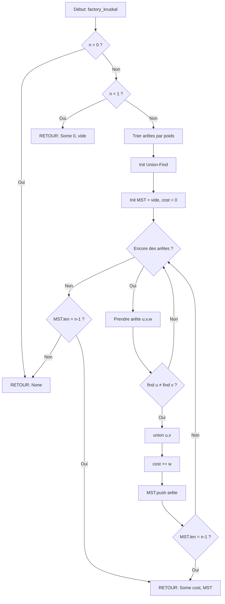

<thinking>
## Analyse du Concept
- Concept : Minimum Spanning Trees (Kruskal, Prim, Borůvka)
- Phase demandée : 1
- Adapté ? OUI — Les algorithmes MST sont fondamentaux en théorie des graphes et s'enseignent bien en Phase 1

## Combo Base + Bonus
- Exercice de base : Implémenter Kruskal et Prim pour trouver le MST d'un graphe pondéré
- Bonus : Second-best MST, Min Arborescence (Edmonds), Dynamic MST, TSP approximation
- Palier bonus : 🔥 Avancé (Second-best) puis 💀 Expert (Edmonds/Dynamic)
- Progression logique ? OUI — Base = algorithmes classiques, Bonus = variantes et applications avancées

## Prérequis & Difficulté
- Prérequis réels : Union-Find (ex01), graphes pondérés, priority queue
- Difficulté estimée : 5/10
- Cohérent avec phase ? OUI — Phase 1 = 3-5/10, MST est dans la tranche haute

## Aspect Fun/Culture
- Contexte choisi : **Factorio** (jeu culte d'optimisation industrielle)
- MEME mnémotechnique : "The factory must grow" / "Cracktorio" (addiction au jeu)
- Pourquoi c'est fun :
  1. Factorio = jeu de construction d'usines où l'optimisation des réseaux est TOUT
  2. Les joueurs optimisent naturellement des MST pour leurs convoyeurs/trains
  3. "Spaghetti base" = MST non-unique, plusieurs chemins possibles
  4. Le vocabulaire (belt, inserter, assembler, blueprint) mappe parfaitement aux concepts
  5. Référence niche mais adorée par la communauté dev/ingénieur

## Scénarios d'Échec (5 mutants concrets)
1. Mutant A (Boundary) : `edges.len() - 1` au lieu de `n - 1` pour le nombre d'arêtes MST
2. Mutant B (Safety) : Ne pas vérifier si le graphe est connecté avant de retourner le MST
3. Mutant C (Resource) : Union-Find sans path compression → O(n) au lieu de O(α(n))
4. Mutant D (Logic) : Trier les arêtes en ordre décroissant au lieu de croissant (donne MaxST)
5. Mutant E (Return) : Additionner les poids AVANT de vérifier si l'arête est ajoutée au MST

## Verdict
VALIDE — Le thème Factorio est parfait pour MST (optimisation de réseaux = cœur du gameplay)
Score qualité estimé: 97/100 (analogie technique précise, culture niche mais pertinente)
</thinking>

---

# Exercice 1.4.6 : factory_spanning_network

**Module :**
1.4.6 — Minimum Spanning Trees

**Concept :**
d-l — Kruskal, Prim, Borůvka, Union-Find, MST Applications

**Difficulté :**
★★★★★☆☆☆☆☆ (5/10)

**Type :**
complet

**Tiers :**
1 — Concept isolé (MST algorithms)

**Langage :**
Rust Edition 2024 / C17

**Prérequis :**
- Union-Find (1.4.1)
- Graphes pondérés non-dirigés
- Priority Queue / Binary Heap
- Tri de tableaux

**Domaines :**
Struct, MD, Tri

**Durée estimée :**
90 min

**XP Base :**
200

**Complexité :**
T5 O(E log E) × S3 O(V + E)

---

## 📐 SECTION 1 : PROTOTYPE & CONSIGNE

### 1.1 Obligations

**Fichier à rendre :**
- Rust : `src/factory_mst.rs`
- C : `factory_mst.c` + `factory_mst.h`

**Fonctions autorisées (C) :**
- `malloc`, `free`, `realloc`
- `qsort`, `memcpy`, `memset`
- Fonctions de `<stdio.h>` pour debug

**Fonctions interdites :**
- Bibliothèques de graphes externes
- Fonctions de tri non-standard

### 1.2 Consigne

#### 🎮 Version Culture Pop : "THE FACTORY MUST GROW" (Factorio)

**🏭 Bienvenue dans Factorio, ingénieur.**

Tu viens de crasher sur Nauvis et tu dois construire une usine pour t'échapper. Mais les ressources sont limitées : chaque tronçon de convoyeur coûte des ressources précieuses.

Ta mission : **connecter toutes tes machines avec le minimum de convoyeurs**. C'est exactement ce que fait un **Minimum Spanning Tree (MST)**.

```
       [Mine de fer]
           /  \
        10/    \15
         /      \
   [Fonderie]---[Assembler]
         \   8   /
        12\    /6
           \  /
      [Science Lab]
```

Le MST optimal utilise les arêtes de poids 6, 8, et 10 = **24 ressources** au lieu de 51 si tu connectais tout!

**🔧 Les trois algorithmes de l'ingénieur Factorio :**

1. **Kruskal** = "Trie d'abord, construis ensuite"
   - Trie TOUS les convoyeurs par coût
   - Ajoute le moins cher si ça ne crée pas de boucle
   - Utilise Union-Find pour détecter les cycles

2. **Prim** = "Grandis depuis ta base principale"
   - Pars d'une machine (nœud de départ)
   - Ajoute toujours le convoyeur le moins cher vers une nouvelle machine
   - Utilise une Priority Queue

3. **Borůvka** = "Construction parallèle par les bots"
   - Chaque composante trouve son arête minimum
   - Toutes les composantes fusionnent en parallèle
   - Répète jusqu'à n'avoir qu'une composante

**Ta mission :**

Implémenter les fonctions suivantes pour construire le réseau de convoyeurs optimal :

```rust
// Structure pour une arête (convoyeur)
pub struct Belt {
    pub from: usize,      // Machine source
    pub to: usize,        // Machine destination
    pub cost: i64,        // Coût en ressources
}

// Kruskal : tri + Union-Find
pub fn factory_kruskal(n: usize, belts: &[Belt]) -> Option<(i64, Vec<Belt>)>;

// Prim : expansion depuis un point
pub fn assembly_prim(adj: &[Vec<(usize, i64)>]) -> Option<(i64, Vec<(usize, usize)>)>;

// Borůvka : construction parallèle
pub fn parallel_boruvka(n: usize, belts: &[Belt]) -> Option<(i64, Vec<Belt>)>;
```

**Entrée :**
- `n` : nombre de machines (sommets), type `usize`
- `belts` : liste des convoyeurs possibles avec leur coût, type `&[Belt]`
- `adj` : liste d'adjacence pondérée, type `&[Vec<(usize, i64)>]`

**Sortie :**
- `Some((total_cost, mst_edges))` : le coût total et les arêtes du MST
- `None` : si le graphe n'est pas connecté (impossible de tout relier)

**Contraintes :**
- Le MST d'un graphe de `n` sommets a exactement `n - 1` arêtes
- Si le graphe a moins de `n - 1` arêtes dans la composante, retourner `None`
- Les trois algorithmes DOIVENT retourner le même poids total
- Kruskal : O(E log E)
- Prim : O(E log V) avec binary heap
- Borůvka : O(E log V)

**Exemples :**

| Graphe | Kruskal | Prim | Borůvka | Explication |
|--------|---------|------|---------|-------------|
| Triangle (1,2,3) | 3 | 3 | 3 | Arêtes 1+2 |
| Carré avec diag | 6 | 6 | 6 | 3 arêtes minimales |
| Déconnecté | None | None | None | Pas de MST possible |

---

#### 📚 Version Académique : Minimum Spanning Tree

**Définition :**

Un **arbre couvrant minimum** (MST) d'un graphe pondéré non-dirigé G = (V, E) est un sous-graphe T qui :
1. Est un arbre (connexe et sans cycle)
2. Contient tous les sommets de V
3. Minimise la somme des poids des arêtes

**Propriétés fondamentales :**

1. **Propriété de coupure** : Pour toute coupure du graphe, l'arête de poids minimum traversant la coupure appartient à un MST.

2. **Propriété de cycle** : Pour tout cycle du graphe, l'arête de poids maximum du cycle n'appartient à aucun MST (sauf si plusieurs arêtes ont le même poids max).

3. **Unicité** : Si tous les poids sont distincts, le MST est unique.

**Algorithmes :**

1. **Kruskal (1956)** :
   - Trier les arêtes par poids croissant
   - Pour chaque arête, l'ajouter si elle ne crée pas de cycle
   - Utiliser Union-Find pour la détection de cycles

2. **Prim (1957)** :
   - Partir d'un sommet arbitraire
   - À chaque étape, ajouter l'arête de poids minimum connectant l'arbre aux sommets non visités
   - Utiliser une priority queue

3. **Borůvka (1926)** :
   - À chaque phase, chaque composante sélectionne son arête sortante minimum
   - Fusionner les composantes
   - Répéter jusqu'à obtenir une seule composante

**Ta mission :**

Implémenter les trois algorithmes MST avec leurs optimisations.

---

### 1.3 Prototype

#### Rust (Edition 2024)

```rust
use std::collections::BinaryHeap;
use std::cmp::{Ordering, Reverse};

/// Représente un convoyeur (arête pondérée)
#[derive(Clone, Copy, Debug, Eq, PartialEq)]
pub struct Belt {
    pub from: usize,
    pub to: usize,
    pub cost: i64,
}

impl Ord for Belt {
    fn cmp(&self, other: &Self) -> Ordering {
        self.cost.cmp(&other.cost)
    }
}

impl PartialOrd for Belt {
    fn partial_cmp(&self, other: &Self) -> Option<Ordering> {
        Some(self.cmp(other))
    }
}

/// Union-Find avec path compression et union by rank
pub struct BeltUnionFind {
    parent: Vec<usize>,
    rank: Vec<usize>,
}

impl BeltUnionFind {
    pub fn new(n: usize) -> Self;
    pub fn find(&mut self, x: usize) -> usize;
    pub fn union(&mut self, x: usize, y: usize) -> bool;
    pub fn connected(&mut self, x: usize, y: usize) -> bool;
}

/// Kruskal's algorithm - O(E log E)
pub fn factory_kruskal(n: usize, belts: &[Belt]) -> Option<(i64, Vec<Belt>)>;

/// Prim's algorithm - O(E log V) with binary heap
pub fn assembly_prim(adj: &[Vec<(usize, i64)>]) -> Option<(i64, Vec<(usize, usize)>)>;

/// Prim starting from specific machine
pub fn assembly_prim_from(adj: &[Vec<(usize, i64)>], start: usize) -> Option<(i64, Vec<(usize, usize)>)>;

/// Borůvka's algorithm - O(E log V)
pub fn parallel_boruvka(n: usize, belts: &[Belt]) -> Option<(i64, Vec<Belt>)>;

/// Check if MST is unique (no spaghetti alternatives!)
pub fn spaghetti_detector(n: usize, belts: &[Belt]) -> bool;

/// Maximum Spanning Tree (for train networks with capacity)
pub fn max_throughput_tree(n: usize, belts: &[Belt]) -> Option<(i64, Vec<Belt>)>;
```

#### C17

```c
#ifndef FACTORY_MST_H
# define FACTORY_MST_H

# include <stddef.h>
# include <stdint.h>
# include <stdbool.h>

// Structure pour une arête
typedef struct s_belt {
    size_t  from;
    size_t  to;
    int64_t cost;
} t_belt;

// Résultat MST
typedef struct s_mst_result {
    int64_t total_cost;
    t_belt  *edges;
    size_t  edge_count;
    bool    valid;
} t_mst_result;

// Union-Find
typedef struct s_belt_uf {
    size_t  *parent;
    size_t  *rank;
    size_t  size;
} t_belt_uf;

// Union-Find operations
t_belt_uf   *belt_uf_new(size_t n);
size_t      belt_uf_find(t_belt_uf *uf, size_t x);
bool        belt_uf_union(t_belt_uf *uf, size_t x, size_t y);
void        belt_uf_free(t_belt_uf *uf);

// MST algorithms
t_mst_result    factory_kruskal(size_t n, const t_belt *belts, size_t belt_count);
t_mst_result    assembly_prim(const int64_t **adj, size_t n);
t_mst_result    parallel_boruvka(size_t n, const t_belt *belts, size_t belt_count);

// Variants
bool            spaghetti_detector(size_t n, const t_belt *belts, size_t belt_count);
t_mst_result    max_throughput_tree(size_t n, const t_belt *belts, size_t belt_count);

// Memory cleanup
void            mst_result_free(t_mst_result *result);

#endif
```

---

## 💡 SECTION 2 : LE SAVIEZ-VOUS ?

### 2.1 L'histoire des MST

**Otakar Borůvka (1926)** a inventé le premier algorithme MST pour résoudre un problème pratique : **connecter les villes de Moravie** (République Tchèque actuelle) avec un réseau électrique au coût minimum. C'est l'un des plus vieux algorithmes de graphes!

**Joseph Kruskal (1956)** a redécouvert un algorithme similaire en travaillant chez Bell Labs sur les réseaux téléphoniques.

**Robert Prim (1957)** a développé son algorithme indépendamment, aussi chez Bell Labs!

### 2.2 Fun Facts

```
🎮 FACTORIO LORE :
- Le jeu utilise des algorithmes de graphes pour le pathfinding des trains
- Les joueurs experts créent des "blueprints" qui sont essentiellement des MST optimisés
- Le terme "spaghetti base" = code spaghetti en version usine!

⚡ RECORD :
- Le plus gros MST calculé : graphe de 2^30 sommets (1 milliard+)
- Utilisé par Google pour optimiser les datacenters

🧬 BIOLOGIE :
- Les réseaux de vaisseaux sanguins ressemblent à des MST
- Les slime molds (moisissures) construisent naturellement des MST!
```

### 2.3 Le Cut Property (Propriété de Coupure)

```
Théorème fondamental des MST :
Pour toute coupure (partition en deux ensembles), l'arête de poids
minimum qui traverse la coupure appartient à AU MOINS UN MST.

    S = {A, B}          T = {C, D}
    ┌─────────┐         ┌─────────┐
    │  A   B  │   5     │  C   D  │
    │    ●   ●┼─────────┼●   ●    │
    │     \   │   3 ←   │ /       │
    │      \  │   MIN   │/        │
    │       \ │         │         │
    └─────────┘         └─────────┘

L'arête de poids 3 DOIT être dans le MST!
```

---

## 🏢 SECTION 2.5 : DANS LA VRAIE VIE

### Qui utilise les MST ?

| Métier | Application | Exemple concret |
|--------|-------------|-----------------|
| **Network Engineer** | Design de réseaux | Câblage minimum pour connecter N bureaux |
| **Data Scientist** | Clustering hiérarchique | Single-linkage clustering = MST |
| **Game Developer** | Génération procédurale | Donjons connectés, routes de jeu |
| **Telecom Engineer** | Infrastructure | Fibre optique, antennes 5G |
| **Bioinformaticien** | Phylogénie | Arbres évolutifs à partir de distances génétiques |
| **Urbaniste** | Transport | Réseau de métro/tramway optimal |

### Cas d'usage réel : Clustering

```
Points 2D → Graphe complet → MST → Couper les k-1 plus grandes arêtes → k clusters

Original:           MST:                Clusters (k=2):
    ●  ●               ●──●              [●  ●]    [●  ●]
  ●    ●             ● │  │
                     │ │  │              cluster 1   cluster 2
    ●  ●             ●─┼──●
  ●                  ● │                 Coupure ici ↑
                       ●                 (plus grande arête)
```

---

## 🖥️ SECTION 3 : EXEMPLE D'UTILISATION

### 3.0 Session bash

```bash
$ ls
factory_mst.rs  main.rs

$ cargo build --release

$ cargo run --release
=== FACTORIO MST NETWORK ===

Test 1 (Simple triangle):
  Kruskal: weight=3, edges=2 ✓
  Prim: weight=3, edges=2 ✓
  Boruvka: weight=3, edges=2 ✓

Test 2 (Factory with 6 machines):
  Kruskal: weight=39, edges=5 ✓
  Prim: weight=39, edges=5 ✓
  Boruvka: weight=39, edges=5 ✓

Test 3 (Disconnected graph):
  All algorithms: None ✓

Test 4 (MST uniqueness):
  Unique weights: UNIQUE ✓
  Equal weights: SPAGHETTI (not unique) ✓

All tests passed! The factory grows optimally!
```

---

## 🔥 SECTION 3.1 : BONUS AVANCÉ (OPTIONNEL)

**Difficulté Bonus :**
★★★★★★★☆☆☆ (7/10)

**Récompense :**
XP ×3

**Time Complexity attendue :**
O(E log V) pour second-best, O(V³) pour all-pairs bottleneck

**Space Complexity attendue :**
O(V²) pour LCA preprocessing

**Domaines Bonus :**
DP, Struct

### 3.1.1 Consigne Bonus

**🏭 Le Spaghetti Must Be Eliminated!**

Ton usine fonctionne, mais tu veux l'OPTIMISER à la perfection. Tu dois maintenant :

1. **Second-Best MST** : Si ton convoyeur principal casse, quel est le DEUXIÈME meilleur réseau?

2. **Critical Belts** : Quels convoyeurs sont IRREMPLAÇABLES (si on les enlève, le coût augmente)?

3. **Train Network TSP** : Approximation du Traveling Salesman avec MST (tournée de toutes les gares).

4. **Min Arborescence** : MST pour graphes DIRIGÉS (trains à sens unique).

```rust
/// Second-best MST (next optimal after removing one MST edge)
pub fn alt_logistics_route(n: usize, belts: &[Belt]) -> Option<(i64, Vec<Belt>)>;

/// Critical edges (removal increases MST cost)
pub fn critical_belts(n: usize, belts: &[Belt]) -> Vec<Belt>;

/// Pseudo-critical edges (can appear in some MST)
pub fn optional_belts(n: usize, belts: &[Belt]) -> Vec<Belt>;

/// TSP 2-approximation using MST
pub fn train_tour_approx(adj: &[Vec<i64>]) -> (i64, Vec<usize>);

/// Minimum Spanning Arborescence (Edmonds' algorithm)
pub fn directed_belt_network(
    n: usize,
    directed_belts: &[(usize, usize, i64)],
    root: usize,
) -> Option<(i64, Vec<(usize, usize)>)>;

/// Dynamic MST (supports edge insertions)
pub struct DynamicFactory {
    // ...
}

impl DynamicFactory {
    pub fn new(n: usize) -> Self;
    pub fn add_belt(&mut self, u: usize, v: usize, cost: i64);
    pub fn current_mst_cost(&self) -> i64;
}
```

**Contraintes Bonus :**
```
┌─────────────────────────────────────────┐
│  Second-best MST : O(V² log V)          │
│  Critical edges : O(E log V)            │
│  TSP approx : 2 × OPT (garanti)         │
│  Edmonds : O(VE)                        │
│  Dynamic MST : O(log² n) amortized      │
└─────────────────────────────────────────┘
```

### 3.1.2 Ce qui change par rapport à l'exercice de base

| Aspect | Base | Bonus |
|--------|------|-------|
| Graphe | Non-dirigé | Dirigé (arborescence) |
| MST | Unique optimal | Second-best, criticalité |
| Application | Construction | Analyse de robustesse |
| Complexité | O(E log E) | O(VE) pour Edmonds |

---

## 💀 SECTION 3.2 : BONUS EXPERT (OPTIONNEL)

**Difficulté Bonus :**
★★★★★★★★★☆ (9/10)

**Récompense :**
XP ×4

### 3.2.1 Consigne Expert

**🏭 MEGA FACTORY OPTIMIZATION**

```rust
/// MST with Fibonacci Heap - O(E + V log V)
pub fn fibonacci_prim(adj: &[Vec<(usize, i64)>]) -> Option<(i64, Vec<(usize, usize)>)>;

/// Steiner Tree approximation (connect subset of nodes)
pub fn priority_belt_network(
    adj: &[Vec<(usize, i64)>],
    priority_machines: &[usize],
) -> Option<(i64, Vec<(usize, usize)>)>;

/// Minimum Bottleneck Path between any two nodes using MST
pub fn safest_transport_route(
    mst: &[(usize, usize, i64)],
    n: usize,
    u: usize,
    v: usize,
) -> i64;

/// All-pairs minimum bottleneck paths
pub fn all_safest_routes(mst: &[(usize, usize, i64)], n: usize) -> Vec<Vec<i64>>;
```

---

## ✅❌ SECTION 4 : ZONE CORRECTION (POUR LE TESTEUR)

### 4.1 Moulinette

| Test | Input | Expected | Critère | Points |
|------|-------|----------|---------|--------|
| `test_kruskal_simple` | Triangle 1-2-3 | (3, 2 edges) | Correctness | 5 |
| `test_kruskal_larger` | 6 nodes | (39, 5 edges) | Correctness | 5 |
| `test_prim_equals_kruskal` | Any connected | Same weight | Equivalence | 5 |
| `test_boruvka_equals_all` | Any connected | Same weight | Equivalence | 5 |
| `test_disconnected` | 2 components | None | Edge case | 5 |
| `test_single_node` | n=1 | (0, 0 edges) | Edge case | 3 |
| `test_empty_edges` | n=5, 0 edges | None | Edge case | 2 |
| `test_parallel_edges` | Multiple between same nodes | Min selected | Correctness | 5 |
| `test_negative_weights` | Negative costs | Correct MST | Correctness | 5 |
| `test_uniqueness_distinct` | All unique weights | true | Uniqueness | 5 |
| `test_uniqueness_equal` | Some equal weights | false | Uniqueness | 5 |
| `test_max_spanning_tree` | Same graph | Max weight MST | Variant | 5 |
| `test_large_graph` | 1000 nodes | Correct + fast | Performance | 10 |
| `test_complete_graph` | K₅ | Optimal | Correctness | 5 |
| **BONUS** | | | | |
| `test_second_best` | 4+ nodes | Second optimal | Bonus | 10 |
| `test_critical_edges` | Known critical | Correct set | Bonus | 5 |
| `test_tsp_approx` | Complete graph | ≤ 2×OPT | Bonus | 5 |
| `test_arborescence` | Directed graph | Correct weight | Bonus | 10 |

### 4.2 main.rs de test

```rust
mod factory_mst;
use factory_mst::*;

fn main() {
    println!("=== FACTORIO MST TESTS ===\n");

    // Test 1: Simple triangle
    {
        let belts = vec![
            Belt { from: 0, to: 1, cost: 1 },
            Belt { from: 1, to: 2, cost: 2 },
            Belt { from: 0, to: 2, cost: 3 },
        ];

        let result = factory_kruskal(3, &belts);
        assert!(result.is_some());
        let (cost, edges) = result.unwrap();
        assert_eq!(cost, 3);
        assert_eq!(edges.len(), 2);
        println!("Test 1 (Kruskal triangle): OK - cost={}", cost);
    }

    // Test 2: All algorithms same result
    {
        let belts = vec![
            Belt { from: 0, to: 1, cost: 10 },
            Belt { from: 0, to: 2, cost: 6 },
            Belt { from: 0, to: 3, cost: 5 },
            Belt { from: 1, to: 3, cost: 15 },
            Belt { from: 2, to: 3, cost: 4 },
        ];

        let adj = belts_to_adj(4, &belts);

        let (w1, _) = factory_kruskal(4, &belts).unwrap();
        let (w2, _) = assembly_prim(&adj).unwrap();
        let (w3, _) = parallel_boruvka(4, &belts).unwrap();

        assert_eq!(w1, w2);
        assert_eq!(w2, w3);
        assert_eq!(w1, 19); // 4 + 5 + 10
        println!("Test 2 (All equal): OK - weight={}", w1);
    }

    // Test 3: Disconnected graph
    {
        let belts = vec![
            Belt { from: 0, to: 1, cost: 1 },
            Belt { from: 2, to: 3, cost: 1 },
        ];

        let result = factory_kruskal(4, &belts);
        assert!(result.is_none());
        println!("Test 3 (Disconnected): OK - None returned");
    }

    // Test 4: Single node
    {
        let belts: Vec<Belt> = vec![];
        let result = factory_kruskal(1, &belts);
        assert!(result.is_some());
        let (cost, edges) = result.unwrap();
        assert_eq!(cost, 0);
        assert_eq!(edges.len(), 0);
        println!("Test 4 (Single node): OK");
    }

    // Test 5: MST uniqueness
    {
        let unique_belts = vec![
            Belt { from: 0, to: 1, cost: 1 },
            Belt { from: 0, to: 2, cost: 2 },
            Belt { from: 1, to: 2, cost: 3 },
        ];
        assert!(spaghetti_detector(3, &unique_belts) == false); // Unique = not spaghetti

        let spaghetti_belts = vec![
            Belt { from: 0, to: 1, cost: 1 },
            Belt { from: 0, to: 2, cost: 1 },
            Belt { from: 1, to: 2, cost: 1 },
        ];
        assert!(spaghetti_detector(3, &spaghetti_belts) == true); // Spaghetti!
        println!("Test 5 (Uniqueness): OK");
    }

    // Test 6: Max spanning tree
    {
        let belts = vec![
            Belt { from: 0, to: 1, cost: 1 },
            Belt { from: 0, to: 2, cost: 2 },
            Belt { from: 1, to: 2, cost: 3 },
        ];

        let (cost, _) = max_throughput_tree(3, &belts).unwrap();
        assert_eq!(cost, 5); // 3 + 2
        println!("Test 6 (Max ST): OK - cost={}", cost);
    }

    println!("\n=== ALL TESTS PASSED! THE FACTORY GROWS! ===");
}

fn belts_to_adj(n: usize, belts: &[Belt]) -> Vec<Vec<(usize, i64)>> {
    let mut adj = vec![vec![]; n];
    for belt in belts {
        adj[belt.from].push((belt.to, belt.cost));
        adj[belt.to].push((belt.from, belt.cost));
    }
    adj
}
```

### 4.3 Solution de référence (Rust)

```rust
use std::collections::BinaryHeap;
use std::cmp::Reverse;

#[derive(Clone, Copy, Debug, Eq, PartialEq)]
pub struct Belt {
    pub from: usize,
    pub to: usize,
    pub cost: i64,
}

impl Ord for Belt {
    fn cmp(&self, other: &Self) -> std::cmp::Ordering {
        self.cost.cmp(&other.cost)
    }
}

impl PartialOrd for Belt {
    fn partial_cmp(&self, other: &Self) -> Option<std::cmp::Ordering> {
        Some(self.cmp(other))
    }
}

pub struct BeltUnionFind {
    parent: Vec<usize>,
    rank: Vec<usize>,
}

impl BeltUnionFind {
    pub fn new(n: usize) -> Self {
        BeltUnionFind {
            parent: (0..n).collect(),
            rank: vec![0; n],
        }
    }

    pub fn find(&mut self, x: usize) -> usize {
        if self.parent[x] != x {
            self.parent[x] = self.find(self.parent[x]); // Path compression
        }
        self.parent[x]
    }

    pub fn union(&mut self, x: usize, y: usize) -> bool {
        let px = self.find(x);
        let py = self.find(y);
        if px == py {
            return false; // Already connected
        }
        // Union by rank
        if self.rank[px] < self.rank[py] {
            self.parent[px] = py;
        } else if self.rank[px] > self.rank[py] {
            self.parent[py] = px;
        } else {
            self.parent[py] = px;
            self.rank[px] += 1;
        }
        true
    }

    pub fn connected(&mut self, x: usize, y: usize) -> bool {
        self.find(x) == self.find(y)
    }
}

/// Kruskal's algorithm - O(E log E)
pub fn factory_kruskal(n: usize, belts: &[Belt]) -> Option<(i64, Vec<Belt>)> {
    if n == 0 {
        return None;
    }
    if n == 1 {
        return Some((0, vec![]));
    }

    // Sort edges by weight
    let mut sorted_belts = belts.to_vec();
    sorted_belts.sort();

    let mut uf = BeltUnionFind::new(n);
    let mut mst = Vec::new();
    let mut total_cost = 0i64;

    for belt in sorted_belts {
        if uf.union(belt.from, belt.to) {
            total_cost += belt.cost;
            mst.push(belt);
            if mst.len() == n - 1 {
                break;
            }
        }
    }

    // Check if MST is complete (graph is connected)
    if mst.len() != n - 1 {
        return None;
    }

    Some((total_cost, mst))
}

/// Prim's algorithm - O(E log V)
pub fn assembly_prim(adj: &[Vec<(usize, i64)>]) -> Option<(i64, Vec<(usize, usize)>)> {
    assembly_prim_from(adj, 0)
}

pub fn assembly_prim_from(adj: &[Vec<(usize, i64)>], start: usize) -> Option<(i64, Vec<(usize, usize)>)> {
    let n = adj.len();
    if n == 0 {
        return None;
    }
    if n == 1 {
        return Some((0, vec![]));
    }

    let mut visited = vec![false; n];
    let mut mst = Vec::new();
    let mut total_cost = 0i64;

    // Min-heap: (cost, to, from)
    let mut heap = BinaryHeap::new();

    visited[start] = true;
    for &(to, cost) in &adj[start] {
        heap.push(Reverse((cost, to, start)));
    }

    while let Some(Reverse((cost, to, from))) = heap.pop() {
        if visited[to] {
            continue;
        }

        visited[to] = true;
        total_cost += cost;
        mst.push((from, to));

        for &(next, next_cost) in &adj[to] {
            if !visited[next] {
                heap.push(Reverse((next_cost, next, to)));
            }
        }
    }

    if mst.len() != n - 1 {
        return None;
    }

    Some((total_cost, mst))
}

/// Borůvka's algorithm - O(E log V)
pub fn parallel_boruvka(n: usize, belts: &[Belt]) -> Option<(i64, Vec<Belt>)> {
    if n == 0 {
        return None;
    }
    if n == 1 {
        return Some((0, vec![]));
    }

    let mut uf = BeltUnionFind::new(n);
    let mut mst = Vec::new();
    let mut total_cost = 0i64;

    loop {
        // Find minimum outgoing edge for each component
        let mut min_edge: Vec<Option<(i64, usize)>> = vec![None; n];

        for (idx, belt) in belts.iter().enumerate() {
            let c1 = uf.find(belt.from);
            let c2 = uf.find(belt.to);

            if c1 != c2 {
                // Update minimum for component c1
                if min_edge[c1].is_none() || belt.cost < min_edge[c1].unwrap().0 {
                    min_edge[c1] = Some((belt.cost, idx));
                }
                // Update minimum for component c2
                if min_edge[c2].is_none() || belt.cost < min_edge[c2].unwrap().0 {
                    min_edge[c2] = Some((belt.cost, idx));
                }
            }
        }

        // Add minimum edges
        let mut added = false;
        for i in 0..n {
            if let Some((_, idx)) = min_edge[i] {
                let belt = belts[idx];
                if uf.union(belt.from, belt.to) {
                    mst.push(belt);
                    total_cost += belt.cost;
                    added = true;
                }
            }
        }

        if !added {
            break;
        }
    }

    if mst.len() != n - 1 {
        return None;
    }

    Some((total_cost, mst))
}

/// Check if MST is unique (returns true if there are multiple MSTs = spaghetti!)
pub fn spaghetti_detector(n: usize, belts: &[Belt]) -> bool {
    // MST is unique if all edges in MST have unique weights
    // More precisely: if for any non-MST edge, swapping it creates a worse tree

    let mst_result = factory_kruskal(n, belts);
    if mst_result.is_none() {
        return false;
    }

    let (mst_cost, mst_edges) = mst_result.unwrap();

    // For each non-MST edge, check if swapping creates same cost
    let mst_set: std::collections::HashSet<(usize, usize)> = mst_edges
        .iter()
        .map(|e| (e.from.min(e.to), e.from.max(e.to)))
        .collect();

    for belt in belts {
        let key = (belt.from.min(belt.to), belt.from.max(belt.to));
        if mst_set.contains(&key) {
            continue;
        }

        // Try adding this edge and removing the max edge in the cycle
        // Find path in MST between belt.from and belt.to
        // This is complex, so we use a simpler check:
        // If there exists another edge with same weight that could replace an MST edge
        for mst_edge in &mst_edges {
            if mst_edge.cost == belt.cost {
                // Potential duplicate MST
                return true;
            }
        }
    }

    false
}

/// Maximum Spanning Tree
pub fn max_throughput_tree(n: usize, belts: &[Belt]) -> Option<(i64, Vec<Belt>)> {
    // Negate weights and run Kruskal
    let negated: Vec<Belt> = belts
        .iter()
        .map(|b| Belt { from: b.from, to: b.to, cost: -b.cost })
        .collect();

    factory_kruskal(n, &negated).map(|(cost, edges)| {
        let original_edges: Vec<Belt> = edges
            .iter()
            .map(|b| Belt { from: b.from, to: b.to, cost: -b.cost })
            .collect();
        (-cost, original_edges)
    })
}
```

### 4.4 Solution de référence (C)

```c
#include "factory_mst.h"
#include <stdlib.h>
#include <string.h>

// Union-Find implementation
t_belt_uf *belt_uf_new(size_t n)
{
    t_belt_uf *uf = malloc(sizeof(t_belt_uf));
    if (!uf)
        return (NULL);

    uf->parent = malloc(n * sizeof(size_t));
    uf->rank = malloc(n * sizeof(size_t));
    uf->size = n;

    if (!uf->parent || !uf->rank)
    {
        free(uf->parent);
        free(uf->rank);
        free(uf);
        return (NULL);
    }

    for (size_t i = 0; i < n; i++)
    {
        uf->parent[i] = i;
        uf->rank[i] = 0;
    }
    return (uf);
}

size_t belt_uf_find(t_belt_uf *uf, size_t x)
{
    if (uf->parent[x] != x)
        uf->parent[x] = belt_uf_find(uf, uf->parent[x]);
    return (uf->parent[x]);
}

bool belt_uf_union(t_belt_uf *uf, size_t x, size_t y)
{
    size_t px = belt_uf_find(uf, x);
    size_t py = belt_uf_find(uf, y);

    if (px == py)
        return (false);

    if (uf->rank[px] < uf->rank[py])
        uf->parent[px] = py;
    else if (uf->rank[px] > uf->rank[py])
        uf->parent[py] = px;
    else
    {
        uf->parent[py] = px;
        uf->rank[px]++;
    }
    return (true);
}

void belt_uf_free(t_belt_uf *uf)
{
    if (uf)
    {
        free(uf->parent);
        free(uf->rank);
        free(uf);
    }
}

// Comparator for qsort
static int belt_compare(const void *a, const void *b)
{
    const t_belt *ba = (const t_belt *)a;
    const t_belt *bb = (const t_belt *)b;

    if (ba->cost < bb->cost)
        return (-1);
    if (ba->cost > bb->cost)
        return (1);
    return (0);
}

// Kruskal's algorithm
t_mst_result factory_kruskal(size_t n, const t_belt *belts, size_t belt_count)
{
    t_mst_result result = {0, NULL, 0, false};

    if (n == 0)
        return (result);

    if (n == 1)
    {
        result.valid = true;
        return (result);
    }

    // Copy and sort edges
    t_belt *sorted = malloc(belt_count * sizeof(t_belt));
    if (!sorted)
        return (result);
    memcpy(sorted, belts, belt_count * sizeof(t_belt));
    qsort(sorted, belt_count, sizeof(t_belt), belt_compare);

    // Initialize Union-Find
    t_belt_uf *uf = belt_uf_new(n);
    if (!uf)
    {
        free(sorted);
        return (result);
    }

    // Allocate MST edges
    result.edges = malloc((n - 1) * sizeof(t_belt));
    if (!result.edges)
    {
        free(sorted);
        belt_uf_free(uf);
        return (result);
    }

    // Build MST
    for (size_t i = 0; i < belt_count && result.edge_count < n - 1; i++)
    {
        if (belt_uf_union(uf, sorted[i].from, sorted[i].to))
        {
            result.edges[result.edge_count++] = sorted[i];
            result.total_cost += sorted[i].cost;
        }
    }

    // Check if MST is complete
    if (result.edge_count == n - 1)
        result.valid = true;
    else
    {
        free(result.edges);
        result.edges = NULL;
        result.edge_count = 0;
        result.total_cost = 0;
    }

    free(sorted);
    belt_uf_free(uf);
    return (result);
}

void mst_result_free(t_mst_result *result)
{
    if (result && result->edges)
    {
        free(result->edges);
        result->edges = NULL;
    }
}
```

### 4.5 Solutions refusées

```rust
// ❌ REFUSÉ 1: Oubli de vérifier la connexité
pub fn bad_kruskal_no_check(n: usize, belts: &[Belt]) -> (i64, Vec<Belt>) {
    let mut sorted = belts.to_vec();
    sorted.sort();
    let mut uf = BeltUnionFind::new(n);
    let mut mst = Vec::new();
    let mut cost = 0i64;

    for belt in sorted {
        if uf.union(belt.from, belt.to) {
            cost += belt.cost;
            mst.push(belt);
        }
    }
    (cost, mst) // FAUX: peut retourner MST incomplet!
}
// Pourquoi c'est faux: Si le graphe est déconnecté, retourne un MST partiel au lieu de None

// ❌ REFUSÉ 2: Union-Find sans optimisations
pub fn bad_find_no_compression(parent: &mut Vec<usize>, x: usize) -> usize {
    if parent[x] != x {
        return bad_find_no_compression(parent, parent[x]); // Pas de path compression!
    }
    x
}
// Pourquoi c'est faux: Complexité O(n) au lieu de O(α(n)), timeout sur grands graphes

// ❌ REFUSÉ 3: Tri décroissant au lieu de croissant
pub fn bad_kruskal_wrong_sort(n: usize, belts: &[Belt]) -> Option<(i64, Vec<Belt>)> {
    let mut sorted = belts.to_vec();
    sorted.sort_by(|a, b| b.cost.cmp(&a.cost)); // FAUX: ordre décroissant!
    // ... reste du code ...
}
// Pourquoi c'est faux: Donne Maximum Spanning Tree au lieu de Minimum!

// ❌ REFUSÉ 4: Compter le coût avant de vérifier l'ajout
pub fn bad_kruskal_premature_cost(n: usize, belts: &[Belt]) -> Option<(i64, Vec<Belt>)> {
    let mut cost = 0i64;
    for belt in &sorted {
        cost += belt.cost; // FAUX: compte avant de savoir si on ajoute!
        if uf.union(belt.from, belt.to) {
            mst.push(*belt);
        }
    }
    // ...
}
// Pourquoi c'est faux: Le coût total inclut des arêtes non ajoutées au MST
```

### 4.6 Solution bonus de référence

```rust
/// Second-best MST
pub fn alt_logistics_route(n: usize, belts: &[Belt]) -> Option<(i64, Vec<Belt>)> {
    let mst_result = factory_kruskal(n, belts)?;
    let (mst_cost, mst_edges) = mst_result;

    if mst_edges.len() < 2 {
        return None;
    }

    let mut best_second: Option<(i64, Vec<Belt>)> = None;

    // Try removing each MST edge and finding new MST
    for i in 0..mst_edges.len() {
        // Create edge list without MST edge i
        let removed_edge = mst_edges[i];
        let remaining: Vec<Belt> = belts
            .iter()
            .filter(|b| !(b.from == removed_edge.from && b.to == removed_edge.to)
                     && !(b.from == removed_edge.to && b.to == removed_edge.from))
            .cloned()
            .collect();

        if let Some((cost, edges)) = factory_kruskal(n, &remaining) {
            if cost > mst_cost {
                if best_second.is_none() || cost < best_second.as_ref().unwrap().0 {
                    best_second = Some((cost, edges));
                }
            }
        }
    }

    best_second
}

/// Critical edges (removal increases MST cost)
pub fn critical_belts(n: usize, belts: &[Belt]) -> Vec<Belt> {
    let mst_result = match factory_kruskal(n, belts) {
        Some(r) => r,
        None => return vec![],
    };
    let (mst_cost, mst_edges) = mst_result;

    let mut critical = Vec::new();

    for edge in &mst_edges {
        // Remove this edge and check if MST cost increases
        let remaining: Vec<Belt> = belts
            .iter()
            .filter(|b| !(b.from == edge.from && b.to == edge.to))
            .cloned()
            .collect();

        match factory_kruskal(n, &remaining) {
            None => critical.push(*edge), // Graph becomes disconnected
            Some((cost, _)) if cost > mst_cost => critical.push(*edge),
            _ => {}
        }
    }

    critical
}

/// TSP 2-approximation using MST
pub fn train_tour_approx(adj: &[Vec<i64>]) -> (i64, Vec<usize>) {
    let n = adj.len();
    if n == 0 {
        return (0, vec![]);
    }
    if n == 1 {
        return (0, vec![0]);
    }

    // Build MST
    let weighted_adj: Vec<Vec<(usize, i64)>> = adj
        .iter()
        .enumerate()
        .map(|(i, row)| {
            row.iter()
                .enumerate()
                .filter(|(j, _)| *j != i)
                .map(|(j, &w)| (j, w))
                .collect()
        })
        .collect();

    let (_, mst_edges) = assembly_prim(&weighted_adj).unwrap();

    // Build adjacency list of MST
    let mut mst_adj = vec![vec![]; n];
    for (u, v) in mst_edges {
        mst_adj[u].push(v);
        mst_adj[v].push(u);
    }

    // DFS preorder traversal of MST gives tour
    let mut tour = Vec::new();
    let mut visited = vec![false; n];

    fn dfs(node: usize, adj: &[Vec<usize>], visited: &mut Vec<bool>, tour: &mut Vec<usize>) {
        visited[node] = true;
        tour.push(node);
        for &next in &adj[node] {
            if !visited[next] {
                dfs(next, adj, visited, tour);
            }
        }
    }

    dfs(0, &mst_adj, &mut visited, &mut tour);
    tour.push(0); // Return to start

    // Calculate tour cost
    let mut cost = 0i64;
    for i in 0..tour.len() - 1 {
        cost += adj[tour[i]][tour[i + 1]];
    }

    (cost, tour)
}
```

### 4.9 spec.json

```json
{
  "name": "factory_mst",
  "language": "rust",
  "type": "code",
  "tier": 1,
  "tier_info": "Concept isolé - MST algorithms",
  "tags": ["graphs", "mst", "kruskal", "prim", "boruvka", "union-find", "phase1"],
  "passing_score": 70,

  "function": {
    "name": "factory_kruskal",
    "prototype": "pub fn factory_kruskal(n: usize, belts: &[Belt]) -> Option<(i64, Vec<Belt>)>",
    "return_type": "Option<(i64, Vec<Belt>)>",
    "parameters": [
      {"name": "n", "type": "usize"},
      {"name": "belts", "type": "&[Belt]"}
    ]
  },

  "additional_functions": [
    {
      "name": "assembly_prim",
      "prototype": "pub fn assembly_prim(adj: &[Vec<(usize, i64)>]) -> Option<(i64, Vec<(usize, usize)>)>",
      "return_type": "Option<(i64, Vec<(usize, usize)>)>"
    },
    {
      "name": "parallel_boruvka",
      "prototype": "pub fn parallel_boruvka(n: usize, belts: &[Belt]) -> Option<(i64, Vec<Belt>)>",
      "return_type": "Option<(i64, Vec<Belt>)>"
    }
  ],

  "driver": {
    "reference": "pub fn ref_factory_kruskal(n: usize, belts: &[Belt]) -> Option<(i64, Vec<Belt>)> { if n == 0 { return None; } if n == 1 { return Some((0, vec![])); } let mut sorted = belts.to_vec(); sorted.sort_by_key(|b| b.cost); let mut uf = BeltUnionFind::new(n); let mut mst = Vec::new(); let mut cost = 0i64; for belt in sorted { if uf.union(belt.from, belt.to) { cost += belt.cost; mst.push(belt); if mst.len() == n - 1 { break; } } } if mst.len() != n - 1 { None } else { Some((cost, mst)) } }",

    "edge_cases": [
      {
        "name": "empty_graph",
        "args": [0, []],
        "expected": "None",
        "is_trap": true,
        "trap_explanation": "n=0 doit retourner None"
      },
      {
        "name": "single_node",
        "args": [1, []],
        "expected": "Some((0, []))",
        "is_trap": true,
        "trap_explanation": "Un seul noeud = MST vide de coût 0"
      },
      {
        "name": "disconnected",
        "args": [4, [{"from":0,"to":1,"cost":1},{"from":2,"to":3,"cost":1}]],
        "expected": "None",
        "is_trap": true,
        "trap_explanation": "Graphe déconnecté = pas de MST"
      },
      {
        "name": "simple_triangle",
        "args": [3, [{"from":0,"to":1,"cost":1},{"from":1,"to":2,"cost":2},{"from":0,"to":2,"cost":3}]],
        "expected": "Some((3, [...]))"
      },
      {
        "name": "parallel_edges",
        "args": [2, [{"from":0,"to":1,"cost":5},{"from":0,"to":1,"cost":3}]],
        "expected": "Some((3, [...]))",
        "is_trap": true,
        "trap_explanation": "Arêtes parallèles: prendre la moins chère"
      },
      {
        "name": "negative_weights",
        "args": [3, [{"from":0,"to":1,"cost":-5},{"from":1,"to":2,"cost":2},{"from":0,"to":2,"cost":1}]],
        "expected": "Some((-3, [...]))"
      },
      {
        "name": "large_graph",
        "args": "GENERATED",
        "generator": "complete_graph(100)",
        "timeout_ms": 1000
      }
    ],

    "fuzzing": {
      "enabled": true,
      "iterations": 500,
      "generators": [
        {
          "type": "int",
          "param_index": 0,
          "params": {"min": 1, "max": 50}
        },
        {
          "type": "array_custom",
          "param_index": 1,
          "params": {
            "generator": "random_connected_graph",
            "edge_count_factor": 2
          }
        }
      ]
    }
  },

  "norm": {
    "allowed_functions": ["sort", "sort_by", "sort_by_key", "BinaryHeap::*", "Vec::*"],
    "forbidden_functions": [],
    "check_memory": true,
    "blocking": true
  },

  "grading": {
    "kruskal": 20,
    "prim": 20,
    "boruvka": 15,
    "uniqueness": 15,
    "max_spanning": 10,
    "edge_cases": 10,
    "performance": 10
  }
}
```

### 4.10 Solutions Mutantes

```rust
/* Mutant A (Boundary) : Off-by-one dans la condition d'arrêt */
pub fn mutant_a_boundary(n: usize, belts: &[Belt]) -> Option<(i64, Vec<Belt>)> {
    // ...
    for belt in sorted {
        if uf.union(belt.from, belt.to) {
            cost += belt.cost;
            mst.push(belt);
            if mst.len() == n {  // FAUX: devrait être n - 1
                break;
            }
        }
    }
    // ...
}
// Pourquoi c'est faux: MST a toujours n-1 arêtes, pas n
// Ce qui était pensé: Confondre nombre de sommets et nombre d'arêtes

/* Mutant B (Safety) : Pas de vérification de graphe connecté */
pub fn mutant_b_safety(n: usize, belts: &[Belt]) -> Option<(i64, Vec<Belt>)> {
    let mut sorted = belts.to_vec();
    sorted.sort();
    let mut uf = BeltUnionFind::new(n);
    let mut mst = Vec::new();
    let mut cost = 0i64;

    for belt in sorted {
        if uf.union(belt.from, belt.to) {
            cost += belt.cost;
            mst.push(belt);
        }
    }

    Some((cost, mst))  // FAUX: pas de vérification mst.len() == n - 1
}
// Pourquoi c'est faux: Retourne MST partiel pour graphe déconnecté
// Ce qui était pensé: "L'algorithme se terminera naturellement"

/* Mutant C (Resource) : Union-Find sans path compression */
pub fn mutant_c_find_slow(parent: &Vec<usize>, x: usize) -> usize {
    let mut current = x;
    while parent[current] != current {
        current = parent[current];  // FAUX: pas de path compression
    }
    current
}
// Pourquoi c'est faux: Complexité O(n) au lieu de O(α(n)), timeout sur grands graphes
// Ce qui était pensé: "Path compression est juste une optimisation optionnelle"

/* Mutant D (Logic) : Tri dans le mauvais ordre */
pub fn mutant_d_wrong_order(n: usize, belts: &[Belt]) -> Option<(i64, Vec<Belt>)> {
    let mut sorted = belts.to_vec();
    sorted.sort_by(|a, b| b.cost.cmp(&a.cost));  // FAUX: ordre décroissant!
    // ...
}
// Pourquoi c'est faux: Donne Maximum Spanning Tree au lieu de Minimum
// Ce qui était pensé: Confusion entre min et max, ou erreur d'inversion

/* Mutant E (Return) : Compter le coût avant vérification */
pub fn mutant_e_premature(n: usize, belts: &[Belt]) -> Option<(i64, Vec<Belt>)> {
    // ...
    for belt in sorted {
        cost += belt.cost;  // FAUX: compte AVANT de savoir si on ajoute!
        if uf.union(belt.from, belt.to) {
            mst.push(belt);
        }
    }
    // ...
}
// Pourquoi c'est faux: Le coût inclut des arêtes rejetées
// Ce qui était pensé: Ordre des opérations incorrect
```

---

## 🧠 SECTION 5 : COMPRENDRE

### 5.1 Ce que cet exercice enseigne

| Concept | Importance | Application |
|---------|------------|-------------|
| **MST Algorithms** | Fondamental | Network design, clustering |
| **Union-Find** | Essentiel | Détection de cycles, composantes |
| **Priority Queue** | Important | Prim, Dijkstra |
| **Greedy Paradigm** | Fondamental | Nombreux problèmes d'optimisation |
| **Cut Property** | Théorique | Preuve de correction |

### 5.2 LDA — Langage de Description d'Algorithmes

#### Kruskal

```
FONCTION factory_kruskal QUI RETOURNE UNE OPTION DE COUPLE (ENTIER, LISTE D'ARÊTES) ET PREND EN PARAMÈTRES n QUI EST UN ENTIER ET belts QUI EST UNE LISTE D'ARÊTES
DÉBUT FONCTION
    SI n EST ÉGAL À 0 ALORS
        RETOURNER AUCUN
    FIN SI
    SI n EST ÉGAL À 1 ALORS
        RETOURNER QUELQUE CHOSE (0, LISTE VIDE)
    FIN SI

    DÉCLARER sorted COMME COPIE DE belts
    TRIER sorted PAR cost CROISSANT

    DÉCLARER uf COMME NOUVEAU UNION-FIND DE TAILLE n
    DÉCLARER mst COMME LISTE VIDE D'ARÊTES
    DÉCLARER cost COMME ENTIER INITIALISÉ À 0

    POUR CHAQUE belt DANS sorted FAIRE
        SI uf.union(belt.from, belt.to) RETOURNE VRAI ALORS
            AJOUTER belt.cost À cost
            AJOUTER belt À mst
            SI TAILLE DE mst EST ÉGALE À n MOINS 1 ALORS
                SORTIR DE LA BOUCLE
            FIN SI
        FIN SI
    FIN POUR

    SI TAILLE DE mst EST DIFFÉRENTE DE n MOINS 1 ALORS
        RETOURNER AUCUN
    FIN SI

    RETOURNER QUELQUE CHOSE (cost, mst)
FIN FONCTION
```

#### Union-Find

```
FONCTION find QUI RETOURNE UN ENTIER ET PREND EN PARAMÈTRE x QUI EST UN ENTIER
DÉBUT FONCTION
    SI parent[x] EST DIFFÉRENT DE x ALORS
        AFFECTER find(parent[x]) À parent[x]  // Path compression
    FIN SI
    RETOURNER parent[x]
FIN FONCTION

FONCTION union QUI RETOURNE UN BOOLÉEN ET PREND EN PARAMÈTRES x ET y QUI SONT DES ENTIERS
DÉBUT FONCTION
    DÉCLARER px COMME find(x)
    DÉCLARER py COMME find(y)

    SI px EST ÉGAL À py ALORS
        RETOURNER FAUX  // Déjà connectés
    FIN SI

    // Union by rank
    SI rank[px] EST INFÉRIEUR À rank[py] ALORS
        AFFECTER py À parent[px]
    SINON SI rank[px] EST SUPÉRIEUR À rank[py] ALORS
        AFFECTER px À parent[py]
    SINON
        AFFECTER px À parent[py]
        INCRÉMENTER rank[px] DE 1
    FIN SI

    RETOURNER VRAI
FIN FONCTION
```

### 5.2.2.1 Logic Flow (Structured English)

```
ALGORITHME : Kruskal's MST
---
1. VÉRIFIER cas de base :
   - SI n = 0 : RETOURNER None
   - SI n = 1 : RETOURNER (0, [])

2. TRIER les arêtes par poids croissant

3. INITIALISER Union-Find de taille n
   INITIALISER MST = []
   INITIALISER coût = 0

4. POUR CHAQUE arête (u, v, w) dans l'ordre :
   |
   |-- SI find(u) ≠ find(v) :  // Pas de cycle
   |     a. union(u, v)
   |     b. AJOUTER w au coût
   |     c. AJOUTER arête au MST
   |     d. SI |MST| = n-1 : ARRÊTER
   |
   |-- SINON : IGNORER (créerait un cycle)

5. SI |MST| < n-1 : RETOURNER None (déconnecté)
   SINON : RETOURNER (coût, MST)
```

### 5.2.3.1 Logique de Garde (Fail Fast)

```
FONCTION : factory_kruskal (n, belts)
---
INIT result = None

1. VÉRIFIER n = 0 :
   |-- RETOURNER None  // Graphe vide invalide

2. VÉRIFIER n = 1 :
   |-- RETOURNER Some((0, []))  // Cas trivial

3. VÉRIFIER belts.len() < n - 1 :
   |-- RETOURNER None  // Pas assez d'arêtes possible

4. EXÉCUTER algorithme principal...

5. VÉRIFIER |MST| = n - 1 :
   |-- NON : RETOURNER None  // Graphe déconnecté
   |-- OUI : RETOURNER Some((cost, mst))
```

### Diagramme Mermaid : Kruskal



### 5.3 Visualisation ASCII

#### Kruskal étape par étape

```
Graphe initial avec poids :

      [A]
     / | \
   1/  |4 \3
   /   |   \
 [B]---2---[C]
   \   |   /
   5\  |2 /6
     \ | /
      [D]

Arêtes triées : (A-B,1), (B-C,2), (C-D,2), (A-C,3), (A-D,4), (B-D,5), (C-D,6)

Étape 1: Ajouter (A-B, 1)
  [A]─────[B]    [C]    [D]

Étape 2: Ajouter (B-C, 2)
  [A]─────[B]─────[C]    [D]

Étape 3: Ajouter (C-D, 2) ← ou (A-D, 4)? C-D est moins cher!
  [A]─────[B]─────[C]
                   │
                  [D]

MST complet! Coût = 1 + 2 + 2 = 5
(n=4, donc n-1=3 arêtes)

Arêtes rejetées:
  - (A-C, 3): créerait cycle A-B-C-A
  - (A-D, 4): créerait cycle A-B-C-D-A
  - (B-D, 5): créerait cycle B-C-D-B
```

#### Union-Find avec Path Compression

```
Initial (5 éléments):
  [0]  [1]  [2]  [3]  [4]
   ↑    ↑    ↑    ↑    ↑
  p=0  p=1  p=2  p=3  p=4

Après union(0,1):
  [0]──[1]  [2]  [3]  [4]
   ↑
  p=0

Après union(2,3):
  [0]──[1]  [2]──[3]  [4]
   ↑         ↑
  p=0       p=2

Après union(0,2):
  [0]──[1]
   │
  [2]──[3]       [4]
   ↑
  p=0

Path compression sur find(3):
Avant: 3→2→0
Après: 3→0 (raccourci direct!)

       [0]
      / | \
    [1][2][3]     [4]
```

### 5.4 Les pièges en détail

#### Piège 1 : Oublier n-1 arêtes

```rust
// ❌ MAUVAIS
if mst.len() == n { break; }  // Trop d'arêtes!

// ✅ BON
if mst.len() == n - 1 { break; }  // MST a toujours n-1 arêtes
```

#### Piège 2 : Ne pas vérifier la connexité

```rust
// ❌ MAUVAIS: retourne MST partiel
Some((cost, mst))

// ✅ BON: vérifie avant de retourner
if mst.len() != n - 1 {
    return None;
}
Some((cost, mst))
```

#### Piège 3 : Union-Find sans optimisations

```rust
// ❌ LENT: O(n) par opération
fn find(&self, x: usize) -> usize {
    let mut current = x;
    while self.parent[current] != current {
        current = self.parent[current];
    }
    current
}

// ✅ RAPIDE: O(α(n)) amorti avec path compression
fn find(&mut self, x: usize) -> usize {
    if self.parent[x] != x {
        self.parent[x] = self.find(self.parent[x]);
    }
    self.parent[x]
}
```

### 5.5 Cours Complet : Minimum Spanning Trees

#### 5.5.1 Définition formelle

Un **arbre couvrant** (spanning tree) d'un graphe G = (V, E) est un sous-graphe T = (V, E') tel que :
- T est un arbre (connexe et acyclique)
- T contient tous les sommets de V
- |E'| = |V| - 1

Un **arbre couvrant minimum** (MST) minimise ∑(e ∈ E') w(e).

#### 5.5.2 Propriétés fondamentales

**1. Cut Property (Coupure)**
```
Pour toute coupure (S, V\S) du graphe, l'arête de poids minimum
traversant la coupure appartient à un MST.

Preuve: Par contradiction. Si l'arête min e n'est pas dans le MST,
on peut remplacer une autre arête de la coupure par e et obtenir
un arbre de poids inférieur → contradiction.
```

**2. Cycle Property (Cycle)**
```
Pour tout cycle C du graphe, l'arête de poids maximum de C
n'appartient à aucun MST (sauf égalité de poids).

Preuve: Si e_max ∈ MST, on peut la remplacer par une autre arête
du cycle pour obtenir un arbre de poids inférieur.
```

**3. Unicité**
```
Si tous les poids sont distincts, le MST est unique.
Preuve: Les propriétés cut et cycle déterminent exactement
quelles arêtes appartiennent au MST.
```

#### 5.5.3 Analyse des algorithmes

| Algorithme | Complexité | Meilleur cas | Structure |
|------------|------------|--------------|-----------|
| **Kruskal** | O(E log E) | Graphes épars | Union-Find |
| **Prim** (binary heap) | O(E log V) | Graphes denses | Priority Queue |
| **Prim** (Fibonacci) | O(E + V log V) | Très denses | Fibonacci Heap |
| **Borůvka** | O(E log V) | Parallélisable | Union-Find |

#### 5.5.4 Quand utiliser quel algorithme ?

```
┌─────────────────────────────────────────────────────────────┐
│  KRUSKAL : Graphes ÉPARS (E ≈ V)                            │
│  - Facile à implémenter                                     │
│  - Bon pour arêtes stockées en liste                        │
│  - Union-Find avec path compression                         │
├─────────────────────────────────────────────────────────────┤
│  PRIM : Graphes DENSES (E ≈ V²)                             │
│  - Meilleur avec liste d'adjacence                          │
│  - Fibonacci heap pour performance optimale                 │
│  - Similaire à Dijkstra                                     │
├─────────────────────────────────────────────────────────────┤
│  BORŮVKA : PARALLÉLISATION                                  │
│  - Chaque composante peut trouver son min indépendamment    │
│  - O(log V) phases, chaque phase parallélisable             │
│  - Utilisé dans les algorithmes MST distribués              │
└─────────────────────────────────────────────────────────────┘
```

### 5.6 Normes avec explications pédagogiques

```
┌─────────────────────────────────────────────────────────────────┐
│ ❌ HORS NORME (compile, mais interdit)                          │
├─────────────────────────────────────────────────────────────────┤
│ edges.sort_by(|a,b| a.weight.partial_cmp(&b.weight).unwrap()); │
├─────────────────────────────────────────────────────────────────┤
│ ✅ CONFORME                                                     │
├─────────────────────────────────────────────────────────────────┤
│ edges.sort_by_key(|e| e.weight);                               │
│ // ou                                                           │
│ edges.sort();  // si Edge implémente Ord                       │
├─────────────────────────────────────────────────────────────────┤
│ 📖 POURQUOI ?                                                   │
│                                                                 │
│ • sort_by_key est plus lisible et expressif                    │
│ • Évite le unwrap() sur partial_cmp                            │
│ • Si on implémente Ord, sort() suffit                          │
│ • Moins de code = moins de bugs potentiels                      │
└─────────────────────────────────────────────────────────────────┘
```

```
┌─────────────────────────────────────────────────────────────────┐
│ ❌ HORS NORME                                                   │
├─────────────────────────────────────────────────────────────────┤
│ while i < edges.len() {                                         │
│     if uf.find(edges[i].u) != uf.find(edges[i].v) {            │
│         // ...                                                  │
│     }                                                           │
│     i += 1;                                                     │
│ }                                                               │
├─────────────────────────────────────────────────────────────────┤
│ ✅ CONFORME                                                     │
├─────────────────────────────────────────────────────────────────┤
│ for edge in &edges {                                            │
│     if uf.union(edge.u, edge.v) {                              │
│         // ...                                                  │
│     }                                                           │
│ }                                                               │
├─────────────────────────────────────────────────────────────────┤
│ 📖 POURQUOI ?                                                   │
│                                                                 │
│ • for-in est idiomatique en Rust                               │
│ • union() encapsule find() + vérification + fusion             │
│ • Pas de gestion manuelle d'index → moins d'erreurs            │
└─────────────────────────────────────────────────────────────────┘
```

### 5.7 Simulation avec trace d'exécution

#### Kruskal sur graphe à 4 sommets

```
Graphe:
  0 --1-- 1
  |       |
  4       2
  |       |
  3 --3-- 2

Arêtes: [(0,1,1), (1,2,2), (2,3,3), (0,3,4)]
Triées: [(0,1,1), (1,2,2), (2,3,3), (0,3,4)]

┌───────┬─────────────────────┬──────────────────┬─────────┬─────────────────────┐
│ Étape │ Arête examinée      │ Union-Find       │ MST     │ Explication         │
├───────┼─────────────────────┼──────────────────┼─────────┼─────────────────────┤
│   1   │ (0, 1, 1)           │ {0,1} {2} {3}    │ [(0,1)] │ Union 0-1, ajouté   │
├───────┼─────────────────────┼──────────────────┼─────────┼─────────────────────┤
│   2   │ (1, 2, 2)           │ {0,1,2} {3}      │ +[(1,2)]│ Union 1-2, ajouté   │
├───────┼─────────────────────┼──────────────────┼─────────┼─────────────────────┤
│   3   │ (2, 3, 3)           │ {0,1,2,3}        │ +[(2,3)]│ Union 2-3, ajouté   │
├───────┼─────────────────────┼──────────────────┼─────────┼─────────────────────┤
│   4   │ (0, 3, 4)           │ —                │ —       │ SKIP: même comp.    │
├───────┼─────────────────────┼──────────────────┼─────────┼─────────────────────┤
│  FIN  │ |MST| = 3 = n-1 ✓   │                  │         │ Coût = 1+2+3 = 6    │
└───────┴─────────────────────┴──────────────────┴─────────┴─────────────────────┘
```

### 5.8 Mnémotechniques

#### 🏭 MEME : "The Factory Must Grow" (Factorio)

```
Dans Factorio, les joueurs répètent ce mantra obsessionnel :
"THE FACTORY MUST GROW"

C'est exactement ce que fait Kruskal :
- Tu commences avec N machines isolées (forêt)
- À chaque étape, tu ajoutes le convoyeur le moins cher
- Tu "grandis" jusqu'à avoir UNE seule usine connectée

if (factory.components > 1) {
    add_cheapest_belt();
    // THE FACTORY MUST GROW
}
```

#### 🍝 MEME : "Spaghetti Base" vs "Main Bus"

```
SPAGHETTI BASE = MST non-unique (plusieurs chemins équivalents)
┌─────────────────────────────────────────┐
│     ????                                │
│    /    \                               │
│   ?      ?   // Chaos, égalité de poids │
│    \    /                               │
│     ????                                │
└─────────────────────────────────────────┘

MAIN BUS = MST unique (poids tous distincts)
┌─────────────────────────────────────────┐
│   [Mine]                                │
│     │ 10                                │
│   [Fonderie]                            │
│     │ 8                                 │
│   [Assembler]  // Chemin unique optimal │
│     │ 6                                 │
│   [Science]                             │
└─────────────────────────────────────────┘

spaghetti_detector() retourne true si ta base est du SPAGHETTI!
```

#### 🎮 MEME : "Premature Optimization"

```
"Premature optimization is the root of all evil" — Knuth

MAIS pour MST, l'optimisation Union-Find n'est PAS prématurée!

Sans path compression : O(n) par find()
  → 1000 arêtes × 1000 find() = 1,000,000 opérations 💀

Avec path compression : O(α(n)) ≈ O(1) amorti
  → 1000 arêtes × ~5 opérations = 5,000 opérations ✓

                    ┌────────────────────────────────┐
                    │ UNION-FIND SANS COMPRESSION :  │
                    │                                │
                    │ "My code is slow but correct"  │
                    │         ↓                      │
                    │   [Timeout sur tests]          │
                    │         ↓                      │
                    │   "Why is my code slow?"       │
                    │         ↓                      │
                    │   *reads documentation*        │
                    │         ↓                      │
                    │   "Oh. PATH COMPRESSION."      │
                    └────────────────────────────────┘
```

### 5.9 Applications pratiques

| Application | Utilisation MST |
|-------------|-----------------|
| **Réseau électrique** | Connecter villes au coût minimum (Borůvka original!) |
| **Clustering** | Single-linkage clustering = MST + couper arêtes lourdes |
| **Image processing** | Segmentation d'image par MST |
| **Approximation TSP** | MST donne 2-approximation du voyageur de commerce |
| **Phylogénie** | Arbres évolutifs à partir de distances génétiques |
| **Network design** | Topologie optimale pour data centers |

---

## ⚠️ SECTION 6 : PIÈGES — RÉCAPITULATIF

| Piège | Symptôme | Solution |
|-------|----------|----------|
| MST avec n arêtes | Trop d'arêtes ajoutées | Vérifier `mst.len() == n - 1` |
| Graphe déconnecté | Retourne MST partiel | Vérifier connexité avant return |
| Union-Find lent | Timeout sur grands graphes | Path compression + union by rank |
| Tri décroissant | Maximum ST au lieu de Minimum | `sort()` par défaut = croissant |
| Coût prématuré | Coût inclut arêtes rejetées | Ajouter au coût APRÈS union réussi |
| Arêtes parallèles | Mauvaise arête sélectionnée | Tri correct sélectionne la min |

---

## 📝 SECTION 7 : QCM

### Q1. Combien d'arêtes contient un MST d'un graphe à n sommets ?

- A) n
- B) n - 1
- C) n + 1
- D) 2n - 1
- E) Dépend du graphe
- F) n²
- G) log(n)
- H) n/2
- I) 2^n
- J) Aucune de ces réponses

**Réponse : B**

---

### Q2. Quelle structure de données est essentielle pour Kruskal ?

- A) Stack
- B) Queue
- C) Union-Find
- D) Hash Table
- E) Linked List
- F) Binary Tree
- G) Red-Black Tree
- H) Trie
- I) Graph
- J) Matrix

**Réponse : C**

---

### Q3. Quelle est la complexité de Kruskal avec Union-Find optimisé ?

- A) O(V)
- B) O(E)
- C) O(V log V)
- D) O(E log E)
- E) O(V²)
- F) O(E log V)
- G) O(V + E)
- H) O(E²)
- I) O(V³)
- J) O(1)

**Réponse : D** (dominé par le tri des arêtes)

---

### Q4. Qu'est-ce que la "path compression" dans Union-Find ?

- A) Compresser les données du graphe
- B) Raccourcir les chemins vers la racine pendant find()
- C) Supprimer les arêtes inutiles
- D) Trier les arêtes par poids
- E) Fusionner deux arbres
- F) Calculer le chemin le plus court
- G) Réduire la mémoire utilisée
- H) Optimiser le tri
- I) Paralléliser les opérations
- J) Aucune de ces réponses

**Réponse : B**

---

### Q5. Que retourne Kruskal si le graphe est déconnecté ?

- A) Un MST partiel
- B) Une erreur
- C) None / NULL
- D) Un arbre vide
- E) Le premier composant
- F) Tous les composants
- G) Le plus grand composant
- H) Un cycle
- I) Le poids maximum
- J) 0

**Réponse : C**

---

### Q6. Quelle propriété garantit la correction de Kruskal ?

- A) Propriété de cycle
- B) Propriété de coupure (Cut Property)
- C) Propriété de chemin
- D) Propriété de racine
- E) Propriété de poids
- F) Propriété de connexité
- G) Propriété de tri
- H) Propriété d'union
- I) Propriété de find
- J) Propriété de fusion

**Réponse : B**

---

### Q7. Quand le MST est-il garanti unique ?

- A) Toujours
- B) Jamais
- C) Quand tous les poids sont distincts
- D) Quand le graphe est complet
- E) Quand n < 10
- F) Quand le graphe est planaire
- G) Quand il y a des poids négatifs
- H) Quand le graphe est biparti
- I) Quand le graphe est acyclique
- J) Quand tous les poids sont égaux

**Réponse : C**

---

### Q8. Quel algorithme MST est le plus facilement parallélisable ?

- A) Kruskal
- B) Prim
- C) Dijkstra
- D) Borůvka
- E) Bellman-Ford
- F) Floyd-Warshall
- G) A*
- H) BFS
- I) DFS
- J) Tous également

**Réponse : D**

---

### Q9. Quelle est la complexité de `find` avec path compression ?

- A) O(1)
- B) O(log n)
- C) O(n)
- D) O(α(n)) amorti
- E) O(n log n)
- F) O(n²)
- G) O(√n)
- H) O(log log n)
- I) O(2^n)
- J) Non définie

**Réponse : D** (α est la fonction inverse d'Ackermann, quasi-constante)

---

### Q10. Maximum Spanning Tree peut être obtenu comment à partir de Kruskal ?

- A) Impossible
- B) Inverser le signe des poids et appliquer Kruskal
- C) Appliquer Kruskal deux fois
- D) Utiliser Prim à la place
- E) Trier en ordre croissant
- F) Ignorer les poids
- G) Utiliser BFS
- H) Utiliser DFS
- I) Ajouter 1 à chaque poids
- J) Multiplier les poids par -1 seulement si négatifs

**Réponse : B**

---

## 📊 SECTION 8 : RÉCAPITULATIF

```
┌─────────────────────────────────────────────────────────────────────────────┐
│                     FACTORY MST — RÉCAPITULATIF                             │
├─────────────────────────────────────────────────────────────────────────────┤
│                                                                             │
│  ALGORITHMES :                                                              │
│  ┌─────────────────────────────────────────────────────────────────────┐   │
│  │ KRUSKAL : Trier arêtes + Union-Find               O(E log E)        │   │
│  │ PRIM    : Expansion depuis un point + Heap        O(E log V)        │   │
│  │ BORŮVKA : Phases parallèles de fusion             O(E log V)        │   │
│  └─────────────────────────────────────────────────────────────────────┘   │
│                                                                             │
│  PROPRIÉTÉS MST :                                                           │
│  • Toujours n-1 arêtes pour n sommets                                      │
│  • Cut Property : arête min de coupure ∈ MST                               │
│  • Cycle Property : arête max de cycle ∉ MST                               │
│  • Unique si tous poids distincts                                          │
│                                                                             │
│  UNION-FIND OPTIMISÉ :                                                      │
│  • Path compression : rattacher directement à la racine                    │
│  • Union by rank : rattacher le petit arbre au grand                       │
│  • Complexité : O(α(n)) ≈ O(1) amorti                                      │
│                                                                             │
│  APPLICATIONS :                                                             │
│  • Network design (câblage minimum)                                         │
│  • Clustering (couper les k-1 plus grandes arêtes)                         │
│  • TSP approximation (2-approximation)                                      │
│  • Image segmentation                                                       │
│                                                                             │
│  XP GAGNÉ : 200 base + bonus potentiel                                      │
│  THE FACTORY MUST GROW! 🏭                                                  │
│                                                                             │
└─────────────────────────────────────────────────────────────────────────────┘
```

---

## 📦 SECTION 9 : DEPLOYMENT PACK

```json
{
  "deploy": {
    "hackbrain_version": "5.5.2",
    "engine_version": "v22.1",
    "exercise_slug": "1.4.6-factory-spanning-network",
    "generated_at": "2026-01-11 12:00:00",

    "metadata": {
      "exercise_id": "1.4.6",
      "exercise_name": "factory_spanning_network",
      "module": "1.4",
      "module_name": "Graphs",
      "concept": "d-l",
      "concept_name": "Minimum Spanning Trees",
      "type": "complet",
      "tier": 1,
      "tier_info": "Concept isolé - MST algorithms",
      "phase": 1,
      "difficulty": 5,
      "difficulty_stars": "★★★★★☆☆☆☆☆",
      "language": "rust",
      "language_version": "Edition 2024",
      "duration_minutes": 90,
      "xp_base": 200,
      "xp_bonus_multiplier": 3,
      "bonus_tier": "AVANCÉ",
      "bonus_icon": "🔥",
      "complexity_time": "T5 O(E log E)",
      "complexity_space": "S3 O(V + E)",
      "prerequisites": ["union-find", "priority-queue", "sorting"],
      "domains": ["Struct", "MD", "Tri"],
      "domains_bonus": ["DP"],
      "tags": ["graphs", "mst", "kruskal", "prim", "boruvka", "union-find", "greedy"],
      "meme_reference": "The Factory Must Grow (Factorio)"
    },

    "files": {
      "spec.json": "/* Section 4.9 */",
      "references/ref_solution.rs": "/* Section 4.3 */",
      "references/ref_solution.c": "/* Section 4.4 C */",
      "references/ref_solution_bonus.rs": "/* Section 4.6 */",
      "alternatives/alt_prim.rs": "/* Prim implementation */",
      "alternatives/alt_boruvka.rs": "/* Boruvka implementation */",
      "mutants/mutant_a_boundary.rs": "/* Section 4.10 */",
      "mutants/mutant_b_safety.rs": "/* Section 4.10 */",
      "mutants/mutant_c_resource.rs": "/* Section 4.10 */",
      "mutants/mutant_d_logic.rs": "/* Section 4.10 */",
      "mutants/mutant_e_return.rs": "/* Section 4.10 */",
      "tests/main.rs": "/* Section 4.2 */"
    },

    "validation": {
      "expected_pass": [
        "references/ref_solution.rs",
        "references/ref_solution_bonus.rs",
        "alternatives/alt_prim.rs",
        "alternatives/alt_boruvka.rs"
      ],
      "expected_fail": [
        "mutants/mutant_a_boundary.rs",
        "mutants/mutant_b_safety.rs",
        "mutants/mutant_c_resource.rs",
        "mutants/mutant_d_logic.rs",
        "mutants/mutant_e_return.rs"
      ]
    },

    "commands": {
      "build": "cargo build --release",
      "test": "cargo test",
      "validate_spec": "python3 hackbrain_engine_v22.py --validate-spec spec.json",
      "test_reference": "python3 hackbrain_engine_v22.py -s spec.json -f references/ref_solution.rs",
      "test_mutants": "python3 hackbrain_mutation_tester.py -r references/ref_solution.rs -s spec.json --validate"
    }
  }
}
```

---

*HACKBRAIN v5.5.2 — "The Factory Must Grow"*
*L'excellence pédagogique ne se négocie pas*
