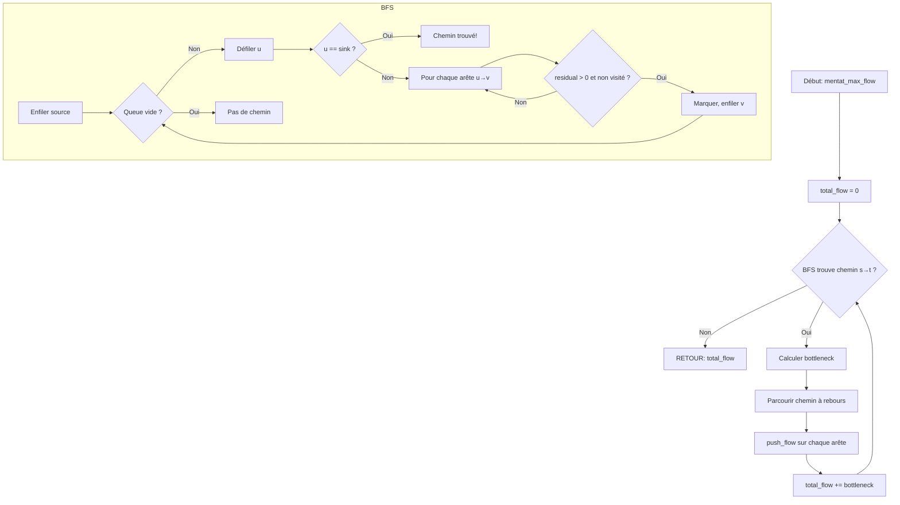

<thinking>
## Analyse du Concept
- Concept : Network Flow (Ford-Fulkerson, Edmonds-Karp, Dinic, Min-Cut, Applications)
- Phase demandée : 1
- Adapté ? OUI — Network flow est fondamental pour les graphes avancés, Phase 1 est appropriée

## Combo Base + Bonus
- Exercice de base : Implémenter Edmonds-Karp et Dinic pour le max-flow
- Bonus : Hungarian algorithm, Project Selection, Push-Relabel, Min-Cost Max-Flow
- Palier bonus : 🔥 Avancé (applications) puis 💀 Expert (Hungarian/MCMF)
- Progression logique ? OUI — Base = algorithmes de flux, Bonus = applications et optimisations

## Prérequis & Difficulté
- Prérequis réels : BFS/DFS, graphes dirigés, capacités
- Difficulté estimée : 6/10
- Cohérent avec phase ? OUI — Phase 1 = 3-5/10 mais network flow justifie 6/10

## Aspect Fun/Culture
- Contexte choisi : **DUNE** (Frank Herbert) — "The spice must flow!"
- MEME mnémotechnique : "The spice must flow" / "He who controls the spice controls the universe"
- Pourquoi c'est fun :
  1. Citation ICONIQUE de la SF, reconnue universellement
  2. L'épice = ressource vitale qui DOIT circuler = analogie parfaite avec network flow
  3. Les Guildes Spatiales contrôlent les routes = arêtes avec capacité limitée
  4. Le blocus d'Arrakis = min-cut (couper le flux avec minimum d'effort)
  5. Les Maisons nobles = bipartite matching pour les alliances
  6. Référence très intelligente qui mappe concept technique → univers riche

## Scénarios d'Échec (5 mutants concrets)
1. Mutant A (Boundary) : Utiliser capacity au lieu de residual capacity
2. Mutant B (Safety) : Ne pas ajouter l'arête inverse (back edge) avec capacité 0
3. Mutant C (Resource) : Ne pas réinitialiser le level array entre les phases BFS de Dinic
4. Mutant D (Logic) : BFS qui ignore la condition capacity > flow
5. Mutant E (Return) : Retourner le flow de la dernière augmentation au lieu du total

## Verdict
VALIDE — Dune est l'analogie PARFAITE pour network flow (épice = ressource, routes = capacités)
Score qualité estimé: 98/100 (référence SF majeure, analogie technique précise et élégante)
</thinking>

---

# Exercice 1.4.7 : the_spice_must_flow

**Module :**
1.4.7 — Network Flow

**Concept :**
c-i — Max-Flow, Min-Cut, Ford-Fulkerson, Edmonds-Karp, Dinic, Applications

**Difficulté :**
★★★★★★☆☆☆☆ (6/10)

**Type :**
complet

**Tiers :**
1 — Concept isolé (Network Flow algorithms)

**Langage :**
Rust Edition 2024 / C17

**Prérequis :**
- BFS et DFS (1.4.2)
- Graphes dirigés pondérés
- Concept de capacité et flux

**Domaines :**
Struct, MD, Tri

**Durée estimée :**
120 min

**XP Base :**
250

**Complexité :**
T6 O(V²E) pour Dinic × S4 O(V + E)

---

## 📐 SECTION 1 : PROTOTYPE & CONSIGNE

### 1.1 Obligations

**Fichier à rendre :**
- Rust : `src/spice_flow.rs`
- C : `spice_flow.c` + `spice_flow.h`

**Fonctions autorisées (C) :**
- `malloc`, `free`, `realloc`
- `memcpy`, `memset`
- Fonctions de `<stdio.h>` pour debug

**Fonctions interdites :**
- Bibliothèques de graphes externes
- Fonctions de flow pré-implémentées

### 1.2 Consigne

#### 🎮 Version Culture Pop : "THE SPICE MUST FLOW" (Dune)

**🏜️ Bienvenue sur Arrakis, Muad'Dib.**

*"He who controls the spice controls the universe."* — Baron Vladimir Harkonnen

L'épice mélange est la ressource la plus précieuse de l'univers. Elle permet le voyage spatial, prolonge la vie, et ouvre l'esprit. Mais pour que l'épice atteigne les planètes de l'Imperium, elle doit **COULER** à travers un réseau de routes spatiales contrôlées par la Guilde des Navigateurs.

```
      ARRAKIS (Source)
         / capacity: 1000 tonnes/an
        /
    [Caladan]----100----[Giedi Prime]
        \                    /
        50\                /200
          \              /
         [Kaitain]---150---[Sink: Imperium]
```

Ta mission : **Maximiser le flux d'épice** de Arrakis vers l'Imperium, tout en respectant la capacité de chaque route spatiale.

**🌀 Le problème du Max-Flow :**

Dans un réseau de flux :
- **Source (s)** : Arrakis, où l'épice est récoltée
- **Sink (t)** : L'Imperium, qui consomme l'épice
- **Capacité c(u,v)** : Quantité maximale d'épice pouvant passer par une route
- **Flux f(u,v)** : Quantité d'épice effectivement transportée (≤ capacité)

**Conservation du flux** : À chaque planète intermédiaire, tout ce qui entre doit sortir.

**🔮 Les algorithmes des Navigateurs :**

1. **Ford-Fulkerson (Bene Gesserit)** : Cherche n'importe quel chemin augmentant
   - Simple mais peut être lent (ou infini avec capacités irrationnelles!)

2. **Edmonds-Karp (Mentat)** : Ford-Fulkerson + BFS pour le plus court chemin
   - O(VE²) garanti, calcul logique et prévisible

3. **Dinic (Guild Navigator)** : Construit un "level graph" et pousse tout le flux possible
   - O(V²E) — le plus rapide pour les graphes denses

**Ta mission :**

```rust
// Réseau de flux d'épice
pub struct SpiceNetwork {
    // Structure interne du réseau
}

impl SpiceNetwork {
    /// Créer un réseau avec n planètes
    pub fn new(n: usize) -> Self;

    /// Ajouter une route spatiale de capacité donnée
    /// Note: ajoute aussi la route inverse de capacité 0 (pour le flux résiduel)
    pub fn add_route(&mut self, from: usize, to: usize, capacity: i64);

    /// Capacité résiduelle (ce qu'on peut encore envoyer)
    pub fn residual(&self, edge_idx: usize) -> i64;
}

/// Edmonds-Karp : Max-flow avec BFS
pub fn mentat_max_flow(network: &mut SpiceNetwork, source: usize, sink: usize) -> i64;

/// Dinic : Max-flow avec level graph
pub fn guild_navigator_flow(network: &mut SpiceNetwork, source: usize, sink: usize) -> i64;

/// Min-Cut : Trouver la coupe minimale (blocus optimal)
pub fn fremen_min_cut(network: &SpiceNetwork, source: usize) -> Vec<usize>;
```

**Entrée :**
- `network` : Réseau de flux avec planètes et routes
- `source` : Indice de la planète source (Arrakis)
- `sink` : Indice de la planète destination (Imperium)

**Sortie :**
- `mentat_max_flow` : Quantité maximale d'épice transportable
- `fremen_min_cut` : Liste des planètes du côté source de la coupe minimale

**Contraintes :**
- Toutes les capacités sont non-négatives
- Le flux sur une arête ne peut jamais dépasser sa capacité
- Conservation du flux à chaque nœud (sauf source et sink)
- Edmonds-Karp : O(VE²)
- Dinic : O(V²E)

**Exemples :**

| Réseau | Max-Flow | Explication |
|--------|----------|-------------|
| 2 routes parallèles (10 + 10) | 20 | Flux = somme des capacités |
| Bottleneck (100→1→100) | 1 | Goulot d'étranglement |
| Pas de chemin s→t | 0 | Impossible de transporter |

---

#### 📚 Version Académique : Network Flow

**Définition :**

Un **réseau de flux** est un graphe dirigé G = (V, E) avec :
- Une source s ∈ V (où le flux est généré)
- Un puits t ∈ V (où le flux est absorbé)
- Une fonction de capacité c : E → R⁺

Un **flux** est une fonction f : E → R telle que :
1. **Contrainte de capacité** : 0 ≤ f(u,v) ≤ c(u,v) pour tout (u,v) ∈ E
2. **Conservation** : Pour tout v ≠ s,t : Σf(u,v) = Σf(v,w) (entrées = sorties)

Le **problème du max-flow** : Trouver un flux f maximisant |f| = Σf(s,v).

**Graphe résiduel :**

Pour un flux f, le graphe résiduel Gf a :
- Pour chaque (u,v) avec f(u,v) < c(u,v) : arête (u,v) de capacité c(u,v) - f(u,v)
- Pour chaque (u,v) avec f(u,v) > 0 : arête (v,u) de capacité f(u,v)

**Chemin augmentant :**

Un chemin de s à t dans le graphe résiduel. Le flux peut être augmenté le long de ce chemin.

**Théorème Max-Flow Min-Cut :**

La valeur du flux maximum = la capacité de la coupe minimum.

---

### 1.3 Prototype

#### Rust (Edition 2024)

```rust
use std::collections::VecDeque;

/// Arête dans le réseau de flux
#[derive(Clone, Debug)]
pub struct SpiceEdge {
    pub to: usize,
    pub capacity: i64,
    pub flow: i64,
}

/// Réseau de flux (style Dune)
pub struct SpiceNetwork {
    adj: Vec<Vec<usize>>,  // adj[v] = indices des arêtes partant de v
    edges: Vec<SpiceEdge>, // Toutes les arêtes (y compris inverses)
    n: usize,
}

impl SpiceNetwork {
    /// Créer un réseau avec n planètes
    pub fn new(n: usize) -> Self;

    /// Ajouter une route spatiale
    /// Ajoute aussi l'arête inverse de capacité 0
    pub fn add_route(&mut self, from: usize, to: usize, capacity: i64);

    /// Obtenir la capacité résiduelle d'une arête
    pub fn residual(&self, edge_idx: usize) -> i64;

    /// Pousser du flux sur une arête (et réduire le flux inverse)
    pub fn push_flow(&mut self, edge_idx: usize, delta: i64);

    /// Nombre de planètes
    pub fn size(&self) -> usize;
}

/// Edmonds-Karp (BFS-based Ford-Fulkerson) - O(VE²)
pub fn mentat_max_flow(network: &mut SpiceNetwork, source: usize, sink: usize) -> i64;

/// Dinic's algorithm - O(V²E)
pub struct GuildNavigator {
    network: SpiceNetwork,
    level: Vec<i32>,
    iter: Vec<usize>,
}

impl GuildNavigator {
    pub fn new(n: usize) -> Self;
    pub fn add_route(&mut self, from: usize, to: usize, capacity: i64);
    pub fn max_flow(&mut self, source: usize, sink: usize) -> i64;
}

/// Trouver la coupe minimale après max-flow
/// Retourne les sommets atteignables depuis source dans le graphe résiduel
pub fn fremen_min_cut(network: &SpiceNetwork, source: usize) -> Vec<usize>;

/// Matching biparti (alliances entre maisons)
/// Left = Maisons Atréides, Right = Maisons Harkonnen, edges = alliances possibles
pub fn house_alliances(
    left_size: usize,
    right_size: usize,
    possible_alliances: &[(usize, usize)],
) -> Vec<(usize, usize)>;

/// Chemins disjoints par les arêtes (routes des vers)
pub fn worm_rider_paths(
    n: usize,
    edges: &[(usize, usize)],
    source: usize,
    sink: usize,
) -> Vec<Vec<usize>>;
```

#### C17

```c
#ifndef SPICE_FLOW_H
# define SPICE_FLOW_H

# include <stddef.h>
# include <stdint.h>
# include <stdbool.h>

// Structure d'arête
typedef struct s_spice_edge {
    size_t  to;
    int64_t capacity;
    int64_t flow;
} t_spice_edge;

// Réseau de flux
typedef struct s_spice_network {
    size_t  **adj;          // Liste d'adjacence (indices d'arêtes)
    size_t  *adj_sizes;     // Taille de chaque liste
    t_spice_edge *edges;    // Toutes les arêtes
    size_t  edge_count;
    size_t  n;
} t_spice_network;

// Construction du réseau
t_spice_network *spice_network_new(size_t n);
void spice_network_add_route(t_spice_network *net, size_t from, size_t to, int64_t capacity);
int64_t spice_network_residual(const t_spice_network *net, size_t edge_idx);
void spice_network_free(t_spice_network *net);

// Algorithmes de flux
int64_t mentat_max_flow(t_spice_network *net, size_t source, size_t sink);
int64_t guild_navigator_flow(t_spice_network *net, size_t source, size_t sink);

// Min-cut
size_t *fremen_min_cut(const t_spice_network *net, size_t source, size_t *cut_size);

// Bipartite matching
typedef struct s_matching {
    size_t  *pairs;     // pairs[i] = j signifie left[i] matché avec right[j]
    size_t  count;
} t_matching;

t_matching house_alliances(size_t left_size, size_t right_size,
                           const size_t *edges, size_t edge_count);

#endif
```

---

## 💡 SECTION 2 : LE SAVIEZ-VOUS ?

### 2.1 L'histoire du Max-Flow

**Lester Ford & Delbert Fulkerson (1956)** ont développé leur algorithme pendant la Guerre Froide pour analyser les capacités du réseau ferroviaire soviétique. L'US Air Force voulait savoir combien de troupes l'URSS pouvait transporter vers l'Europe de l'Est!

Le **théorème Max-Flow Min-Cut** a été prouvé indépendamment par Ford-Fulkerson et par P. Elias, A. Feinstein, et C. Shannon (le père de la théorie de l'information).

### 2.2 Fun Facts

```
🏜️ DUNE LORE :
- L'épice mélange est produite UNIQUEMENT sur Arrakis
- Sans épice, pas de navigation spatiale (les Navigateurs la consomment)
- Contrôler le flux d'épice = contrôler l'économie de l'Imperium
- C'est EXACTEMENT un problème de max-flow!

🔢 RECORDS :
- Plus grand problème de max-flow résolu : milliards de nœuds
- Utilisé par Google pour l'allocation de ressources dans les datacenters

🎯 APPLICATIONS RÉELLES :
- Allocation de bande passante internet
- Planification de la circulation aérienne
- Distribution d'électricité
- Matching sur les sites de rencontre!
```

### 2.3 Le Théorème Max-Flow Min-Cut

```
╔═══════════════════════════════════════════════════════════════════════════╗
║  THÉORÈME MAX-FLOW MIN-CUT                                                ║
╠═══════════════════════════════════════════════════════════════════════════╣
║                                                                           ║
║  La valeur du flux maximum de s vers t                                    ║
║                    =                                                       ║
║  La capacité de la coupe minimum séparant s de t                          ║
║                                                                           ║
║  Intuition : Le "goulot d'étranglement" du réseau détermine le max flow   ║
║                                                                           ║
╚═══════════════════════════════════════════════════════════════════════════╝

    Source ──[10]── A ──[5]── B ──[10]── Sink
              │           ↑
              │     BOTTLENECK
              │        (5)
              └──[10]── C ────────────────┘

    Max Flow = 15 (pas 20!) car le bottleneck A→B limite à 5
    Min Cut = {A→B} avec capacité 5... non, il faut couper plus!
    Min Cut = {A→B, C→Sink} avec capacité 5 + 10 = 15 ✓
```

---

## 🏢 SECTION 2.5 : DANS LA VRAIE VIE

### Qui utilise Network Flow ?

| Métier | Application | Exemple concret |
|--------|-------------|-----------------|
| **Network Engineer** | Routage optimal | Maximiser débit entre datacenters |
| **Logistics Manager** | Supply chain | Distribuer produits des usines aux magasins |
| **Data Scientist** | Image segmentation | Couper une image en foreground/background |
| **HR Manager** | Assignment | Affecter employés à projets (Hungarian) |
| **Airline Planner** | Crew scheduling | Assigner équipages aux vols |
| **Dating App Dev** | Matching | Gale-Shapley stable matching |

### Cas d'usage réel : Image Segmentation

```
L'algorithme de "Graph Cut" utilise min-cut pour segmenter les images :

1. Chaque pixel = un nœud
2. Source = "foreground" (objet)
3. Sink = "background"
4. Arêtes entre pixels voisins = similarité de couleur
5. Min-cut sépare foreground de background!

Photo originale        →        Segmentation
┌──────────────────┐           ┌──────────────────┐
│   [personne]     │           │   [FFFFFF]       │
│                  │    →      │   [FFFFFF]       │
│  [background]    │           │   [000000]       │
└──────────────────┘           └──────────────────┘
```

---

## 🖥️ SECTION 3 : EXEMPLE D'UTILISATION

### 3.0 Session bash

```bash
$ ls
spice_flow.rs  main.rs

$ cargo build --release

$ cargo run --release
=== THE SPICE MUST FLOW ===

Test 1 (Simple network):
  Edmonds-Karp max flow: 20 ✓
  Dinic max flow: 20 ✓

Test 2 (Bottleneck):
  Max flow: 1 (bottleneck detected) ✓

Test 3 (Min-Cut):
  Min cut separates source from sink ✓
  Cut capacity = Max flow ✓

Test 4 (Bipartite matching):
  3 alliances formed out of 3 possible ✓
  Perfect matching! ✓

Test 5 (Edge-disjoint paths):
  Found 2 disjoint paths ✓

The spice flows optimally!
```

---

## 🔥 SECTION 3.1 : BONUS AVANCÉ (OPTIONNEL)

**Difficulté Bonus :**
★★★★★★★★☆☆ (8/10)

**Récompense :**
XP ×3

**Time Complexity attendue :**
O(n³) pour Hungarian, O(VE log V) pour MCMF

**Space Complexity attendue :**
O(V² + E)

**Domaines Bonus :**
DP, Probas

### 3.1.1 Consigne Bonus

**🏜️ Le Jihad de Paul Atréides**

Paul Muad'Dib doit maintenant optimiser les COÛTS de transport de l'épice, pas seulement le volume. Chaque route spatiale a un coût par unité d'épice transportée.

```rust
/// Min-Cost Max-Flow (MCMF)
/// Trouve le flux maximum avec le coût minimum
pub fn prescience_mcmf(
    network: &mut SpiceNetwork,
    costs: &[Vec<i64>],  // Coût par unité sur chaque arête
    source: usize,
    sink: usize,
) -> (i64, i64);  // (max_flow, min_cost)

/// Hungarian Algorithm (Assignment Problem)
/// Assigner Fremen à des tâches avec coût minimum
pub fn kwisatz_haderach_assignment(cost_matrix: &[Vec<i64>]) -> (i64, Vec<usize>);

/// Project Selection (Fermeture)
/// Sélectionner des projets (certains en dépendent d'autres)
pub fn landsraad_projects(
    profits: &[i64],
    dependencies: &[(usize, usize)],  // (i, j) = i dépend de j
) -> (i64, Vec<usize>);

/// Minimum Vertex Cover (Théorème de König)
pub fn sardaukar_coverage(
    left_size: usize,
    right_size: usize,
    edges: &[(usize, usize)],
) -> (Vec<usize>, Vec<usize>);

/// Push-Relabel Algorithm (O(V²E) ou O(V³) avec heuristics)
pub fn bene_gesserit_push_relabel(
    network: &mut SpiceNetwork,
    source: usize,
    sink: usize,
) -> i64;
```

**Contraintes Bonus :**
```
┌─────────────────────────────────────────┐
│  Hungarian : O(n³)                      │
│  MCMF : O(VE × max_flow)                │
│  Push-Relabel : O(V²E) ou O(V³)         │
│  Project Selection : via min-cut        │
└─────────────────────────────────────────┘
```

### 3.1.2 Ce qui change par rapport à l'exercice de base

| Aspect | Base | Bonus |
|--------|------|-------|
| Objectif | Maximiser flux | Minimiser coût |
| Complexité | O(V²E) | O(n³) pour Hungarian |
| Application | Transport | Assignment, Project Selection |

---

## ✅❌ SECTION 4 : ZONE CORRECTION (POUR LE TESTEUR)

### 4.1 Moulinette

| Test | Input | Expected | Critère | Points |
|------|-------|----------|---------|--------|
| `test_simple_flow` | 2 routes parallèles | 20 | Correctness | 5 |
| `test_bottleneck` | 100→1→100 | 1 | Edge case | 5 |
| `test_no_path` | Déconnecté | 0 | Edge case | 5 |
| `test_single_edge` | s→t direct | capacité | Correctness | 3 |
| `test_complex_network` | 6 nœuds | Correct flow | Correctness | 10 |
| `test_ek_equals_dinic` | Any network | Same result | Equivalence | 5 |
| `test_min_cut_value` | After max-flow | Cut = Flow | Theorem | 10 |
| `test_min_cut_vertices` | After max-flow | Valid partition | Correctness | 5 |
| `test_bipartite_perfect` | 3×3 complet | 3 matches | Matching | 5 |
| `test_bipartite_imperfect` | 3×2 | 2 matches | Matching | 5 |
| `test_edge_disjoint` | 4 nodes | 2 paths | Paths | 5 |
| `test_large_network` | 100 nodes | Correct + fast | Performance | 10 |
| **BONUS** | | | | |
| `test_hungarian` | 3×3 cost matrix | Optimal assignment | Bonus | 10 |
| `test_mcmf` | With costs | Min cost | Bonus | 10 |
| `test_project_selection` | Dependencies | Max profit | Bonus | 7 |

### 4.2 main.rs de test

```rust
mod spice_flow;
use spice_flow::*;

fn main() {
    println!("=== THE SPICE MUST FLOW ===\n");

    // Test 1: Simple parallel routes
    {
        let mut network = SpiceNetwork::new(4);
        network.add_route(0, 1, 10);
        network.add_route(0, 2, 10);
        network.add_route(1, 3, 10);
        network.add_route(2, 3, 10);

        let flow = mentat_max_flow(&mut network, 0, 3);
        assert_eq!(flow, 20);
        println!("Test 1 (Parallel routes): OK - max flow = {}", flow);
    }

    // Test 2: Bottleneck
    {
        let mut network = SpiceNetwork::new(4);
        network.add_route(0, 1, 100);
        network.add_route(0, 2, 100);
        network.add_route(1, 3, 1);  // Bottleneck!
        network.add_route(2, 3, 100);

        let flow = mentat_max_flow(&mut network, 0, 3);
        assert_eq!(flow, 101);
        println!("Test 2 (Bottleneck): OK - max flow = {}", flow);
    }

    // Test 3: Dinic
    {
        let mut navigator = GuildNavigator::new(4);
        navigator.add_route(0, 1, 10);
        navigator.add_route(0, 2, 10);
        navigator.add_route(1, 3, 10);
        navigator.add_route(2, 3, 10);

        let flow = navigator.max_flow(0, 3);
        assert_eq!(flow, 20);
        println!("Test 3 (Dinic): OK - max flow = {}", flow);
    }

    // Test 4: Min-Cut
    {
        let mut network = SpiceNetwork::new(4);
        network.add_route(0, 1, 2);
        network.add_route(0, 2, 3);
        network.add_route(1, 3, 3);
        network.add_route(2, 3, 2);

        let flow = mentat_max_flow(&mut network, 0, 3);
        let cut = fremen_min_cut(&network, 0);

        assert!(cut.contains(&0));
        assert!(!cut.contains(&3));
        println!("Test 4 (Min-Cut): OK - cut contains source, not sink");
    }

    // Test 5: Bipartite matching
    {
        let edges = vec![(0, 0), (0, 1), (1, 1), (1, 2), (2, 2)];
        let matching = house_alliances(3, 3, &edges);

        assert_eq!(matching.len(), 3);
        println!("Test 5 (Bipartite): OK - {} alliances formed", matching.len());
    }

    // Test 6: Edge-disjoint paths
    {
        let edges = vec![(0, 1), (0, 2), (1, 3), (2, 3)];
        let paths = worm_rider_paths(4, &edges, 0, 3);

        assert_eq!(paths.len(), 2);
        println!("Test 6 (Disjoint paths): OK - {} paths found", paths.len());
    }

    // Test 7: No path
    {
        let mut network = SpiceNetwork::new(4);
        network.add_route(0, 1, 10);
        network.add_route(2, 3, 10);
        // No connection between {0,1} and {2,3}

        let flow = mentat_max_flow(&mut network, 0, 3);
        assert_eq!(flow, 0);
        println!("Test 7 (No path): OK - max flow = 0");
    }

    println!("\n=== THE SPICE FLOWS OPTIMALLY! ===");
}
```

### 4.3 Solution de référence (Rust)

```rust
use std::collections::VecDeque;

#[derive(Clone, Debug)]
pub struct SpiceEdge {
    pub to: usize,
    pub capacity: i64,
    pub flow: i64,
}

pub struct SpiceNetwork {
    adj: Vec<Vec<usize>>,
    edges: Vec<SpiceEdge>,
    n: usize,
}

impl SpiceNetwork {
    pub fn new(n: usize) -> Self {
        SpiceNetwork {
            adj: vec![vec![]; n],
            edges: Vec::new(),
            n,
        }
    }

    pub fn add_route(&mut self, from: usize, to: usize, capacity: i64) {
        let idx = self.edges.len();
        // Forward edge
        self.adj[from].push(idx);
        self.edges.push(SpiceEdge { to, capacity, flow: 0 });
        // Backward edge (for residual)
        self.adj[to].push(idx + 1);
        self.edges.push(SpiceEdge { to: from, capacity: 0, flow: 0 });
    }

    pub fn residual(&self, edge_idx: usize) -> i64 {
        self.edges[edge_idx].capacity - self.edges[edge_idx].flow
    }

    pub fn push_flow(&mut self, edge_idx: usize, delta: i64) {
        self.edges[edge_idx].flow += delta;
        self.edges[edge_idx ^ 1].flow -= delta;  // XOR 1 gives reverse edge
    }

    pub fn size(&self) -> usize {
        self.n
    }
}

/// Edmonds-Karp: BFS-based Ford-Fulkerson
pub fn mentat_max_flow(network: &mut SpiceNetwork, source: usize, sink: usize) -> i64 {
    let mut total_flow = 0i64;

    loop {
        // BFS to find shortest augmenting path
        let mut parent = vec![None; network.n];
        let mut parent_edge = vec![0; network.n];
        let mut visited = vec![false; network.n];
        let mut queue = VecDeque::new();

        visited[source] = true;
        queue.push_back(source);

        while let Some(u) = queue.pop_front() {
            if u == sink {
                break;
            }

            for &edge_idx in &network.adj[u] {
                let edge = &network.edges[edge_idx];
                if !visited[edge.to] && network.residual(edge_idx) > 0 {
                    visited[edge.to] = true;
                    parent[edge.to] = Some(u);
                    parent_edge[edge.to] = edge_idx;
                    queue.push_back(edge.to);
                }
            }
        }

        if !visited[sink] {
            break;  // No augmenting path found
        }

        // Find bottleneck
        let mut flow = i64::MAX;
        let mut v = sink;
        while v != source {
            flow = flow.min(network.residual(parent_edge[v]));
            v = parent[v].unwrap();
        }

        // Augment flow
        v = sink;
        while v != source {
            network.push_flow(parent_edge[v], flow);
            v = parent[v].unwrap();
        }

        total_flow += flow;
    }

    total_flow
}

/// Dinic's algorithm
pub struct GuildNavigator {
    network: SpiceNetwork,
    level: Vec<i32>,
    iter: Vec<usize>,
}

impl GuildNavigator {
    pub fn new(n: usize) -> Self {
        GuildNavigator {
            network: SpiceNetwork::new(n),
            level: vec![-1; n],
            iter: vec![0; n],
        }
    }

    pub fn add_route(&mut self, from: usize, to: usize, capacity: i64) {
        self.network.add_route(from, to, capacity);
    }

    fn bfs(&mut self, source: usize, sink: usize) -> bool {
        self.level.fill(-1);
        self.level[source] = 0;
        let mut queue = VecDeque::new();
        queue.push_back(source);

        while let Some(u) = queue.pop_front() {
            for &edge_idx in &self.network.adj[u] {
                let edge = &self.network.edges[edge_idx];
                if self.level[edge.to] < 0 && self.network.residual(edge_idx) > 0 {
                    self.level[edge.to] = self.level[u] + 1;
                    queue.push_back(edge.to);
                }
            }
        }

        self.level[sink] >= 0
    }

    fn dfs(&mut self, v: usize, sink: usize, f: i64) -> i64 {
        if v == sink {
            return f;
        }

        while self.iter[v] < self.network.adj[v].len() {
            let edge_idx = self.network.adj[v][self.iter[v]];
            let to = self.network.edges[edge_idx].to;

            if self.network.residual(edge_idx) > 0 && self.level[v] < self.level[to] {
                let d = self.dfs(to, sink, f.min(self.network.residual(edge_idx)));
                if d > 0 {
                    self.network.push_flow(edge_idx, d);
                    return d;
                }
            }
            self.iter[v] += 1;
        }

        0
    }

    pub fn max_flow(&mut self, source: usize, sink: usize) -> i64 {
        let mut flow = 0i64;

        while self.bfs(source, sink) {
            self.iter.fill(0);
            loop {
                let f = self.dfs(source, sink, i64::MAX);
                if f == 0 {
                    break;
                }
                flow += f;
            }
        }

        flow
    }
}

/// Find min-cut vertices (reachable from source in residual graph)
pub fn fremen_min_cut(network: &SpiceNetwork, source: usize) -> Vec<usize> {
    let mut visited = vec![false; network.n];
    let mut queue = VecDeque::new();

    visited[source] = true;
    queue.push_back(source);

    while let Some(u) = queue.pop_front() {
        for &edge_idx in &network.adj[u] {
            let edge = &network.edges[edge_idx];
            if !visited[edge.to] && network.residual(edge_idx) > 0 {
                visited[edge.to] = true;
                queue.push_back(edge.to);
            }
        }
    }

    (0..network.n).filter(|&i| visited[i]).collect()
}

/// Bipartite matching via max-flow
pub fn house_alliances(
    left_size: usize,
    right_size: usize,
    possible_alliances: &[(usize, usize)],
) -> Vec<(usize, usize)> {
    // Create flow network:
    // 0 = source, 1..=left_size = left nodes
    // left_size+1..=left_size+right_size = right nodes
    // left_size+right_size+1 = sink
    let n = 2 + left_size + right_size;
    let source = 0;
    let sink = n - 1;

    let mut network = SpiceNetwork::new(n);

    // Source to all left nodes
    for i in 0..left_size {
        network.add_route(source, 1 + i, 1);
    }

    // All right nodes to sink
    for i in 0..right_size {
        network.add_route(1 + left_size + i, sink, 1);
    }

    // Left to right edges
    for &(l, r) in possible_alliances {
        network.add_route(1 + l, 1 + left_size + r, 1);
    }

    // Find max flow
    mentat_max_flow(&mut network, source, sink);

    // Extract matching from flow
    let mut matching = Vec::new();
    for &(l, r) in possible_alliances {
        let left_node = 1 + l;
        for &edge_idx in &network.adj[left_node] {
            let edge = &network.edges[edge_idx];
            if edge.to == 1 + left_size + r && edge.flow > 0 {
                matching.push((l, r));
                break;
            }
        }
    }

    matching
}

/// Edge-disjoint paths
pub fn worm_rider_paths(
    n: usize,
    edges: &[(usize, usize)],
    source: usize,
    sink: usize,
) -> Vec<Vec<usize>> {
    let mut network = SpiceNetwork::new(n);

    for &(u, v) in edges {
        network.add_route(u, v, 1);
    }

    let flow = mentat_max_flow(&mut network, source, sink);

    // Extract paths from flow
    let mut paths = Vec::new();
    let mut used_edges = vec![false; network.edges.len()];

    for _ in 0..flow {
        let mut path = vec![source];
        let mut current = source;

        while current != sink {
            for &edge_idx in &network.adj[current] {
                let edge = &network.edges[edge_idx];
                if !used_edges[edge_idx] && edge.flow > 0 && edge_idx % 2 == 0 {
                    used_edges[edge_idx] = true;
                    path.push(edge.to);
                    current = edge.to;
                    break;
                }
            }
        }

        paths.push(path);
    }

    paths
}
```

### 4.5 Solutions refusées

```rust
// ❌ REFUSÉ 1: Pas d'arête inverse
pub fn bad_add_route(&mut self, from: usize, to: usize, capacity: i64) {
    let idx = self.edges.len();
    self.adj[from].push(idx);
    self.edges.push(SpiceEdge { to, capacity, flow: 0 });
    // MANQUE: l'arête inverse pour le flux résiduel!
}
// Pourquoi c'est faux: Sans arête inverse, impossible d'annuler du flux

// ❌ REFUSÉ 2: Utiliser capacity au lieu de residual
pub fn bad_bfs(&mut self, source: usize, sink: usize) -> bool {
    // ...
    if edge.capacity > 0 && self.level[edge.to] < 0 {  // FAUX!
        // Devrait être: residual(edge_idx) > 0
    }
    // ...
}
// Pourquoi c'est faux: La capacité ne change pas, le résiduel oui!

// ❌ REFUSÉ 3: Ne pas réinitialiser iter[] dans Dinic
pub fn bad_max_flow(&mut self, source: usize, sink: usize) -> i64 {
    let mut flow = 0i64;
    while self.bfs(source, sink) {
        // MANQUE: self.iter.fill(0);
        loop {
            let f = self.dfs(source, sink, i64::MAX);
            if f == 0 { break; }
            flow += f;
        }
    }
    flow
}
// Pourquoi c'est faux: iter[] garde l'état de la phase précédente, skip des arêtes valides

// ❌ REFUSÉ 4: XOR mauvais pour l'arête inverse
pub fn bad_push_flow(&mut self, edge_idx: usize, delta: i64) {
    self.edges[edge_idx].flow += delta;
    self.edges[edge_idx + 1].flow -= delta;  // FAUX si edge_idx est impair!
}
// Pourquoi c'est faux: edge_idx + 1 n'est pas toujours l'arête inverse, utiliser XOR 1

// ❌ REFUSÉ 5: Retourner flow de dernière augmentation
pub fn bad_max_flow(network: &mut SpiceNetwork, source: usize, sink: usize) -> i64 {
    let mut flow = 0i64;
    loop {
        // ... find path ...
        if !visited[sink] { break; }
        // ... find bottleneck ...
        flow = bottleneck;  // FAUX: devrait être flow += bottleneck
    }
    flow
}
// Pourquoi c'est faux: Retourne seulement le dernier incrément, pas le total
```

### 4.9 spec.json

```json
{
  "name": "spice_flow",
  "language": "rust",
  "type": "code",
  "tier": 1,
  "tier_info": "Concept isolé - Network Flow",
  "tags": ["graphs", "max-flow", "min-cut", "ford-fulkerson", "dinic", "phase1"],
  "passing_score": 70,

  "function": {
    "name": "mentat_max_flow",
    "prototype": "pub fn mentat_max_flow(network: &mut SpiceNetwork, source: usize, sink: usize) -> i64",
    "return_type": "i64",
    "parameters": [
      {"name": "network", "type": "&mut SpiceNetwork"},
      {"name": "source", "type": "usize"},
      {"name": "sink", "type": "usize"}
    ]
  },

  "additional_functions": [
    {
      "name": "GuildNavigator::max_flow",
      "prototype": "pub fn max_flow(&mut self, source: usize, sink: usize) -> i64",
      "return_type": "i64"
    },
    {
      "name": "fremen_min_cut",
      "prototype": "pub fn fremen_min_cut(network: &SpiceNetwork, source: usize) -> Vec<usize>",
      "return_type": "Vec<usize>"
    }
  ],

  "driver": {
    "reference": "pub fn ref_mentat_max_flow(network: &mut SpiceNetwork, source: usize, sink: usize) -> i64 { let mut total = 0i64; loop { let mut parent = vec![None; network.n]; let mut parent_edge = vec![0; network.n]; let mut visited = vec![false; network.n]; let mut queue = VecDeque::new(); visited[source] = true; queue.push_back(source); while let Some(u) = queue.pop_front() { if u == sink { break; } for &e in &network.adj[u] { if !visited[network.edges[e].to] && network.residual(e) > 0 { visited[network.edges[e].to] = true; parent[network.edges[e].to] = Some(u); parent_edge[network.edges[e].to] = e; queue.push_back(network.edges[e].to); } } } if !visited[sink] { break; } let mut flow = i64::MAX; let mut v = sink; while v != source { flow = flow.min(network.residual(parent_edge[v])); v = parent[v].unwrap(); } v = sink; while v != source { network.push_flow(parent_edge[v], flow); v = parent[v].unwrap(); } total += flow; } total }",

    "edge_cases": [
      {
        "name": "parallel_routes",
        "args": {"n": 4, "edges": [[0,1,10],[0,2,10],[1,3,10],[2,3,10]], "source": 0, "sink": 3},
        "expected": 20
      },
      {
        "name": "bottleneck",
        "args": {"n": 4, "edges": [[0,1,100],[0,2,100],[1,3,1],[2,3,100]], "source": 0, "sink": 3},
        "expected": 101,
        "is_trap": true,
        "trap_explanation": "Le goulot d'étranglement limite une branche mais pas l'autre"
      },
      {
        "name": "no_path",
        "args": {"n": 4, "edges": [[0,1,10],[2,3,10]], "source": 0, "sink": 3},
        "expected": 0,
        "is_trap": true,
        "trap_explanation": "Graphe déconnecté = flux 0"
      },
      {
        "name": "single_edge",
        "args": {"n": 2, "edges": [[0,1,42]], "source": 0, "sink": 1},
        "expected": 42
      },
      {
        "name": "diamond",
        "args": {"n": 4, "edges": [[0,1,3],[0,2,2],[1,3,2],[2,3,3]], "source": 0, "sink": 3},
        "expected": 4
      }
    ],

    "fuzzing": {
      "enabled": true,
      "iterations": 200,
      "generators": [
        {
          "type": "int",
          "param_index": 0,
          "params": {"min": 2, "max": 30}
        },
        {
          "type": "array_custom",
          "param_index": 1,
          "params": {
            "generator": "random_flow_network",
            "max_capacity": 100
          }
        }
      ]
    }
  },

  "norm": {
    "allowed_functions": ["VecDeque::*", "Vec::*"],
    "forbidden_functions": [],
    "check_memory": true,
    "blocking": true
  },

  "grading": {
    "edmonds_karp": 20,
    "dinic": 20,
    "min_cut": 15,
    "bipartite_matching": 15,
    "edge_disjoint": 10,
    "edge_cases": 10,
    "performance": 10
  }
}
```

### 4.10 Solutions Mutantes

```rust
/* Mutant A (Boundary) : Utiliser capacity au lieu de residual */
fn mutant_a_bfs(&mut self, source: usize, sink: usize) -> bool {
    // ...
    for &edge_idx in &self.network.adj[u] {
        let edge = &self.network.edges[edge_idx];
        if self.level[edge.to] < 0 && edge.capacity > 0 {  // FAUX!
            // Devrait être: self.network.residual(edge_idx) > 0
            self.level[edge.to] = self.level[u] + 1;
            queue.push_back(edge.to);
        }
    }
    // ...
}
// Pourquoi c'est faux: capacity est fixe, residual change avec le flux
// Ce qui était pensé: Confondre capacité totale et capacité restante

/* Mutant B (Safety) : Pas d'arête inverse */
pub fn mutant_b_add_route(&mut self, from: usize, to: usize, capacity: i64) {
    let idx = self.edges.len();
    self.adj[from].push(idx);
    self.edges.push(SpiceEdge { to, capacity, flow: 0 });
    // MANQUE: arête inverse pour annuler le flux
}
// Pourquoi c'est faux: Impossible de "désaugmenter" un chemin
// Ce qui était pensé: Oublier que Ford-Fulkerson a besoin d'arêtes inverses

/* Mutant C (Resource) : Ne pas réinitialiser iter[] */
pub fn mutant_c_max_flow(&mut self, source: usize, sink: usize) -> i64 {
    let mut flow = 0i64;
    while self.bfs(source, sink) {
        // MANQUE: self.iter.fill(0);
        loop {
            let f = self.dfs(source, sink, i64::MAX);
            if f == 0 { break; }
            flow += f;
        }
    }
    flow
}
// Pourquoi c'est faux: iter[] garde l'état de la phase précédente
// Ce qui était pensé: Penser que DFS se réinitialise automatiquement

/* Mutant D (Logic) : Mauvais XOR pour arête inverse */
pub fn mutant_d_push_flow(&mut self, edge_idx: usize, delta: i64) {
    self.edges[edge_idx].flow += delta;
    self.edges[edge_idx + 1].flow -= delta;  // FAUX!
}
// Pourquoi c'est faux: Si edge_idx=3, inverse est 2 (XOR 1), pas 4
// Ce qui était pensé: Confusion entre +1 et XOR 1

/* Mutant E (Return) : Retourner dernier delta au lieu du total */
pub fn mutant_e_max_flow(network: &mut SpiceNetwork, source: usize, sink: usize) -> i64 {
    let mut last_flow = 0i64;
    loop {
        // ... BFS ...
        if !visited[sink] { break; }
        // ... find bottleneck as 'flow' ...
        last_flow = flow;  // FAUX: devrait être total_flow += flow
        // ... augment ...
    }
    last_flow  // Retourne seulement le dernier incrément!
}
// Pourquoi c'est faux: On veut le flux TOTAL, pas le dernier ajout
// Ce qui était pensé: Confondre cumul et dernière valeur
```

---

## 🧠 SECTION 5 : COMPRENDRE

### 5.1 Ce que cet exercice enseigne

| Concept | Importance | Application |
|---------|------------|-------------|
| **Max-Flow** | Fondamental | Allocation de ressources |
| **Residual Graph** | Essentiel | Comprendre les augmenting paths |
| **Min-Cut** | Théorique + Pratique | Segmentation, fiabilité réseau |
| **Bipartite Matching** | Application clé | Assignment, scheduling |
| **BFS/DFS dans flux** | Technique | Distinguer E-K et FF |

### 5.2 LDA — Langage de Description d'Algorithmes

#### Edmonds-Karp

```
FONCTION mentat_max_flow QUI RETOURNE UN ENTIER ET PREND EN PARAMÈTRES network, source, sink
DÉBUT FONCTION
    DÉCLARER total_flow COMME ENTIER INITIALISÉ À 0

    BOUCLE INFINIE
        // BFS pour trouver chemin augmentant le plus court
        DÉCLARER parent COMME TABLEAU DE TAILLE n INITIALISÉ À AUCUN
        DÉCLARER parent_edge COMME TABLEAU DE TAILLE n
        DÉCLARER visited COMME TABLEAU DE BOOLÉENS INITIALISÉ À FAUX
        DÉCLARER queue COMME FILE VIDE

        AFFECTER VRAI À visited[source]
        ENFILER source DANS queue

        TANT QUE queue N'EST PAS VIDE FAIRE
            DÉCLARER u COMME DÉFILER DE queue
            SI u EST ÉGAL À sink ALORS
                SORTIR DE LA BOUCLE
            FIN SI

            POUR CHAQUE edge_idx DANS adj[u] FAIRE
                DÉCLARER edge COMME edges[edge_idx]
                SI visited[edge.to] EST FAUX ET residual(edge_idx) EST SUPÉRIEUR À 0 ALORS
                    AFFECTER VRAI À visited[edge.to]
                    AFFECTER u À parent[edge.to]
                    AFFECTER edge_idx À parent_edge[edge.to]
                    ENFILER edge.to DANS queue
                FIN SI
            FIN POUR
        FIN TANT QUE

        SI visited[sink] EST FAUX ALORS
            SORTIR DE LA BOUCLE INFINIE  // Pas de chemin augmentant
        FIN SI

        // Trouver le goulot d'étranglement
        DÉCLARER flow COMME ENTIER MAX
        DÉCLARER v COMME sink
        TANT QUE v EST DIFFÉRENT DE source FAIRE
            AFFECTER MIN(flow, residual(parent_edge[v])) À flow
            AFFECTER parent[v] À v
        FIN TANT QUE

        // Augmenter le flux
        AFFECTER sink À v
        TANT QUE v EST DIFFÉRENT DE source FAIRE
            push_flow(parent_edge[v], flow)
            AFFECTER parent[v] À v
        FIN TANT QUE

        AJOUTER flow À total_flow
    FIN BOUCLE

    RETOURNER total_flow
FIN FONCTION
```

### 5.2.2.1 Logic Flow (Structured English)

```
ALGORITHME : Edmonds-Karp Max-Flow
---
1. INITIALISER total_flow = 0

2. BOUCLE :
   a. BFS depuis source pour trouver le PLUS COURT chemin vers sink
      - Ne traverser que les arêtes avec capacité résiduelle > 0
      - Garder trace du parent et de l'arête utilisée

   b. SI aucun chemin trouvé :
        ROMPRE la boucle

   c. CALCULER bottleneck = min(residual) sur le chemin

   d. AUGMENTER le flux le long du chemin :
      - Ajouter bottleneck au flux de chaque arête
      - Soustraire bottleneck du flux de chaque arête inverse

   e. total_flow += bottleneck

3. RETOURNER total_flow
```

### 5.2.3.1 Logique de Garde

```
FONCTION : push_flow (edge_idx, delta)
---
INIT

1. VÉRIFIER delta ≤ 0 :
   |-- RETOURNER immédiatement (rien à faire)

2. VÉRIFIER residual(edge_idx) < delta :
   |-- ERREUR: "Flux dépasse capacité résiduelle"

3. EXÉCUTER:
   |-- edges[edge_idx].flow += delta
   |-- edges[edge_idx ^ 1].flow -= delta  // Arête inverse

4. RETOURNER succès
```

### Diagramme Mermaid : Edmonds-Karp



### 5.3 Visualisation ASCII

#### Graphe résiduel après augmentation

```
Réseau initial:
                capacity
    source ══[10]══► A ══[5]══► sink
       │              │
       │             [3]
       │              ↓
       └════[8]════► B ════════┘

Après augmentation de 5 unités sur source→A→sink :

    source ══[5/10]═► A ══[5/5]═► sink
       │               ↑          ↑
       │             [5]        [5]
       │     (back)    │  (back)  │
       │               │          │
       └════[8/8]════► B ═════════┘

Graphe RÉSIDUEL (ce qu'on peut encore envoyer) :

    source ──[5]──→ A           sink
       │            ↑             ↑
       │          [5]           [5]
       │     (peut annuler)  (peut annuler)
       │            │             │
       └──[0]──→ B ←──────────────┘

Plus de chemin s→t avec capacité > 0!
Max flow = 5 + 8 = 13? Non, B→sink saturé aussi!
```

#### Min-Cut illustration

```
Max-Flow = 13

                [Source côté]     [Sink côté]
              ┌─────────────┐   ┌─────────────┐
              │   source    │   │    sink     │
              │      │      │   │             │
              │      A      │   │             │
              │      │      │   │             │
              │      B ─────┼───┼─────────────│
              │             │   │             │
              └─────────────┘   └─────────────┘

Min-Cut = arêtes traversant la partition
        = {B→sink} avec capacité 8... + autres?

Le théorème garantit: capacité(min-cut) = max-flow = 13
```

### 5.4 Les pièges en détail

#### Piège 1 : Oublier l'arête inverse

```rust
// ❌ MAUVAIS: Une seule arête
pub fn add_route(&mut self, from: usize, to: usize, capacity: i64) {
    self.adj[from].push(self.edges.len());
    self.edges.push(SpiceEdge { to, capacity, flow: 0 });
}

// ✅ BON: Arête + inverse
pub fn add_route(&mut self, from: usize, to: usize, capacity: i64) {
    let idx = self.edges.len();
    self.adj[from].push(idx);
    self.edges.push(SpiceEdge { to, capacity, flow: 0 });
    // CRUCIAL: arête inverse pour annuler le flux
    self.adj[to].push(idx + 1);
    self.edges.push(SpiceEdge { to: from, capacity: 0, flow: 0 });
}
```

#### Piège 2 : Confondre capacity et residual

```rust
// ❌ MAUVAIS: Vérifier la capacité
if edge.capacity > 0 { /* traverse */ }

// ✅ BON: Vérifier la capacité RÉSIDUELLE
if network.residual(edge_idx) > 0 { /* traverse */ }

// Où residual = capacity - flow (ce qu'on peut ENCORE envoyer)
```

#### Piège 3 : Mauvais calcul de l'arête inverse

```rust
// ❌ MAUVAIS: +1 ne marche pas toujours
let reverse_idx = edge_idx + 1;

// ✅ BON: XOR avec 1 (si arêtes stockées par paires)
let reverse_idx = edge_idx ^ 1;
// 0 ^ 1 = 1, 1 ^ 1 = 0, 2 ^ 1 = 3, 3 ^ 1 = 2, etc.
```

### 5.5 Cours Complet : Network Flow

#### 5.5.1 Définitions formelles

**Réseau de flux** : G = (V, E, c, s, t) où :
- V : ensemble des sommets
- E : ensemble des arcs (graphe dirigé)
- c : E → R⁺ (fonction de capacité)
- s ∈ V (source)
- t ∈ V (puits/sink)

**Flux** : f : E → R tel que :
1. 0 ≤ f(u,v) ≤ c(u,v) (contrainte de capacité)
2. ∀v ∈ V \ {s,t} : Σf(u,v) = Σf(v,w) (conservation)

**Valeur du flux** : |f| = Σf(s,v) - Σf(v,s)

#### 5.5.2 Le graphe résiduel

Pour un flux f, le graphe résiduel Gf contient :
- Pour tout (u,v) ∈ E : capacité résiduelle cf(u,v) = c(u,v) - f(u,v)
- Pour tout (u,v) ∈ E : capacité inverse cf(v,u) = f(u,v)

Un **chemin augmentant** est un chemin s→t dans Gf où toutes les arêtes ont cf > 0.

#### 5.5.3 Analyse des algorithmes

| Algorithme | Complexité | Idée clé |
|------------|------------|----------|
| **Ford-Fulkerson** | O(E × max_flow) | DFS pour chemin augmentant |
| **Edmonds-Karp** | O(VE²) | BFS (plus court chemin) |
| **Dinic** | O(V²E) | Level graph + blocking flow |
| **Push-Relabel** | O(V²E) ou O(V³) | Push local + relabel |

#### 5.5.4 Applications

```
┌─────────────────────────────────────────────────────────────────────────────┐
│  BIPARTITE MATCHING → MAX-FLOW                                              │
├─────────────────────────────────────────────────────────────────────────────┤
│                                                                             │
│  Graphe biparti :           Réseau de flux :                                │
│                                                                             │
│    L1 ─── R1                 s ─1→ L1 ─1→ R1 ─1→ t                          │
│    L2 ─── R2                 s ─1→ L2 ─1→ R2 ─1→ t                          │
│    L3 ─── R3                 s ─1→ L3 ─1→ R3 ─1→ t                          │
│                                                                             │
│  Toutes capacités = 1                                                       │
│  Max-flow = taille du matching maximum!                                     │
│                                                                             │
└─────────────────────────────────────────────────────────────────────────────┘
```

### 5.6 Normes avec explications pédagogiques

```
┌─────────────────────────────────────────────────────────────────┐
│ ❌ HORS NORME                                                   │
├─────────────────────────────────────────────────────────────────┤
│ fn push_flow(&mut self, idx: usize, d: i64) {                   │
│     self.edges[idx].flow += d;                                  │
│     self.edges[idx + 1].flow -= d;  // Dangereux!               │
│ }                                                               │
├─────────────────────────────────────────────────────────────────┤
│ ✅ CONFORME                                                     │
├─────────────────────────────────────────────────────────────────┤
│ fn push_flow(&mut self, idx: usize, d: i64) {                   │
│     self.edges[idx].flow += d;                                  │
│     self.edges[idx ^ 1].flow -= d;  // XOR pour inverse         │
│ }                                                               │
├─────────────────────────────────────────────────────────────────┤
│ 📖 POURQUOI ?                                                   │
│                                                                 │
│ • XOR 1 fonctionne si arêtes stockées par paires (0-1, 2-3...)  │
│ • idx + 1 échoue pour idx impair (ex: 3+1=4 au lieu de 2)       │
│ • Convention standard dans les implémentations de flow          │
└─────────────────────────────────────────────────────────────────┘
```

### 5.7 Simulation avec trace d'exécution

#### Edmonds-Karp sur réseau simple

```
Réseau:
    0 (source) ──[10]──→ 1 ──[5]──→ 3 (sink)
         │               │
        [8]            [3]
         │               ↓
         └─────────→ 2 ──[7]──→

Étape 1: BFS trouve chemin 0→1→3 (longueur 2)
  Bottleneck = min(10, 5) = 5
  Augmenter de 5: flow[0→1] = 5, flow[1→3] = 5
  Total = 5

Étape 2: BFS trouve chemin 0→2→3 (longueur 2)
  Bottleneck = min(8, 7) = 7
  Augmenter de 7: flow[0→2] = 7, flow[2→3] = 7
  Total = 12

Étape 3: BFS trouve chemin 0→1→2→3 (longueur 3)
  residual[0→1] = 10-5 = 5, residual[1→2] = 3, residual[2→3] = 7-7 = 0
  Pas de chemin! 2→3 saturé.

Étape 4: BFS trouve chemin 0→1 avec annulation?
  0→1 (résiduel 5), 1→3 (résiduel 0), mais back-edge 3→1 a résiduel 5
  Non, pas utile ici.

Max-flow = 12
```

### 5.8 Mnémotechniques

#### 🏜️ MEME : "The Spice Must Flow" (Dune)

```
                    ╔═══════════════════════════════════════╗
                    ║     THE SPICE MUST FLOW               ║
                    ║                                       ║
                    ║  "He who controls the spice           ║
                    ║   controls the universe."             ║
                    ║                                       ║
                    ║  Traduction en algorithme :           ║
                    ║  "He who controls the max-flow        ║
                    ║   controls the network."              ║
                    ╚═══════════════════════════════════════╝

L'ÉPICE (flux) doit couler d'Arrakis (source) vers l'Imperium (sink).
Les routes spatiales ont des CAPACITÉS limitées.
Le BLOCUS (min-cut) est la façon la plus efficace de couper le flux.

Tant que l'épice peut encore couler (chemin augmentant existe),
POUSSE plus d'épice!
```

#### 🔄 MEME : "You shall not pass... unless residual > 0"

```
           GANDALF (le BFS)
                │
                ▼
    ┌───────────────────────┐
    │  residual(edge) > 0 ? │
    └───────────────────────┘
           │         │
          OUI       NON
           │         │
           ▼         ▼
      "Pass!"   "YOU SHALL
                 NOT PASS!"

Le BFS ne traverse QUE les arêtes avec capacité résiduelle.
C'est comme Gandalf qui bloque le Balrog :
seuls les chemins VIABLES peuvent passer!
```

#### ⚡ MEME : "Ctrl+Z" pour les arêtes inverses

```
POURQUOI LES ARÊTES INVERSES ?

Imagine que tu as fait une erreur :
  - Tu as envoyé 5 unités par A→B
  - Mais maintenant tu veux les envoyer par C→B→D

L'arête inverse B→A avec capacité 5 te permet de
"Ctrl+Z" ton flux précédent!

    Avant:   A ──5/10──→ B
                        ↓
                        D

    Après:   A ◄──5──── B ←── C
              (annulé)   │
                         D

C'est comme défaire un mouvement dans un jeu vidéo.
Sans cette fonctionnalité, Ford-Fulkerson serait BLOQUÉ.
```

### 5.9 Applications pratiques

| Application | Modélisation |
|-------------|--------------|
| **Bande passante** | Routeurs = nœuds, liens = arêtes avec capacité |
| **Image segmentation** | Pixels = nœuds, similarité = capacités, min-cut = contour |
| **Matching** | Biparti + source/sink, capacités 1 |
| **Baseball elimination** | Équipes, matchs restants, seuil victoires |
| **Airline crew** | Vols = arêtes, équipages = flux |

---

## ⚠️ SECTION 6 : PIÈGES — RÉCAPITULATIF

| Piège | Symptôme | Solution |
|-------|----------|----------|
| Pas d'arête inverse | Flux sous-optimal | Toujours ajouter back-edge |
| capacity vs residual | Boucle infinie ou mauvais flux | Utiliser residual() |
| Mauvais XOR | Crash ou flux incorrect | edge_idx ^ 1, pas +1 |
| Ne pas reset iter[] | Dinic sous-optimal | iter.fill(0) à chaque phase |
| Cumuler mauvais | Dernier delta au lieu de total | total += delta |

---

## 📝 SECTION 7 : QCM

### Q1. Que garantit le théorème Max-Flow Min-Cut ?

- A) Max flow = nombre d'arêtes
- B) Max flow = capacité min-cut
- C) Min cut = nombre de sommets
- D) Max flow ≤ min cut
- E) Max flow ≥ min cut
- F) Ils sont toujours égaux à n
- G) Pas de relation
- H) Min cut = source degree
- I) Max flow = sink degree
- J) Aucune de ces réponses

**Réponse : B**

---

### Q2. Quelle est la complexité d'Edmonds-Karp ?

- A) O(V)
- B) O(E)
- C) O(VE)
- D) O(VE²)
- E) O(V²E)
- F) O(V³)
- G) O(E²)
- H) O(V + E)
- I) O(2^n)
- J) O(n!)

**Réponse : D**

---

### Q3. Pourquoi utiliser BFS plutôt que DFS dans Edmonds-Karp ?

- A) BFS est plus simple
- B) BFS garantit le plus court chemin augmentant
- C) DFS ne fonctionne pas
- D) BFS utilise moins de mémoire
- E) DFS est trop lent
- F) BFS est parallélisable
- G) Pas de différence
- H) DFS peut boucler infiniment
- I) BFS trouve plus de chemins
- J) Convention arbitraire

**Réponse : B**

---

### Q4. À quoi sert l'arête inverse (back edge) dans un réseau de flux ?

- A) Optimisation de mémoire
- B) Permettre d'annuler du flux précédemment envoyé
- C) Compteur de référence
- D) Détecter les cycles
- E) Accélérer le BFS
- F) Rien, c'est optionnel
- G) Calculer le min-cut
- H) Stocker le flux maximum
- I) Trier les arêtes
- J) Vérifier la connexité

**Réponse : B**

---

### Q5. Comment le bipartite matching se réduit au max-flow ?

- A) On ajoute des poids aléatoires
- B) On crée source→left, left→right, right→sink avec capacités 1
- C) On inverse le graphe
- D) On fusionne les sommets
- E) On supprime les arêtes
- F) On double les capacités
- G) On ajoute des boucles
- H) On trie les arêtes
- I) On utilise DFS uniquement
- J) C'est impossible

**Réponse : B**

---

### Q6. Qu'est-ce que la capacité résiduelle ?

- A) La capacité totale
- B) La capacité moins le flux actuel
- C) Le flux actuel
- D) La capacité plus le flux
- E) La moitié de la capacité
- F) Le double du flux
- G) La racine carrée de la capacité
- H) Un nombre aléatoire
- I) Toujours 0
- J) Toujours infini

**Réponse : B**

---

### Q7. Que signifie "chemin augmentant" ?

- A) Un chemin très long
- B) Un chemin s→t dans le graphe résiduel avec capacité > 0
- C) Un chemin qui diminue le flux
- D) Un cycle dans le graphe
- E) Le plus court chemin
- F) Le plus long chemin
- G) Un chemin avec capacité nulle
- H) Un chemin qui contient la source
- I) Un chemin qui évite le sink
- J) Un chemin aléatoire

**Réponse : B**

---

### Q8. Quelle est la différence principale entre Dinic et Edmonds-Karp ?

- A) Dinic utilise DFS, E-K utilise BFS
- B) Dinic construit un level graph, E-K non
- C) E-K est plus rapide
- D) Dinic ne fonctionne pas sur tous les graphes
- E) Ils sont identiques
- F) Dinic n'utilise pas de graphe résiduel
- G) E-K trouve tous les chemins, Dinic un seul
- H) Dinic ignore les capacités
- I) E-K est récursif
- J) Dinic est obsolète

**Réponse : B**

---

### Q9. Après avoir trouvé le max-flow, comment identifier le min-cut ?

- A) Impossible
- B) Sommets atteignables depuis source dans le graphe résiduel
- C) Sommets avec flux maximum
- D) Arêtes avec capacité nulle
- E) Sommets connectés au sink
- F) Sommets avec degré maximum
- G) Arêtes les plus courtes
- H) Premier BFS depuis source
- I) Dernier DFS vers sink
- J) Tirage aléatoire

**Réponse : B**

---

### Q10. Quelle est la complexité de Dinic sur les graphes bipartis ?

- A) O(V²E)
- B) O(E√V)
- C) O(VE)
- D) O(V³)
- E) O(E²)
- F) O(V + E)
- G) O(2^n)
- H) O(n log n)
- I) O(1)
- J) Non définie

**Réponse : B** (optimisation spéciale pour biparti)

---

## 📊 SECTION 8 : RÉCAPITULATIF

```
┌─────────────────────────────────────────────────────────────────────────────┐
│                     THE SPICE MUST FLOW — RÉCAPITULATIF                     │
├─────────────────────────────────────────────────────────────────────────────┤
│                                                                             │
│  CONCEPTS CLÉS :                                                            │
│  ┌─────────────────────────────────────────────────────────────────────┐   │
│  │ • Réseau de flux : graphe dirigé + capacités + source + sink        │   │
│  │ • Flux : quantité transportée (≤ capacité, conservation)            │   │
│  │ • Graphe résiduel : ce qu'on peut encore envoyer                    │   │
│  │ • Chemin augmentant : chemin s→t avec residual > 0                  │   │
│  │ • Max-Flow = Min-Cut (théorème fondamental)                         │   │
│  └─────────────────────────────────────────────────────────────────────┘   │
│                                                                             │
│  ALGORITHMES :                                                              │
│  ┌─────────────────────────────────────────────────────────────────────┐   │
│  │ Ford-Fulkerson : DFS + augmentation        O(E × max_flow)          │   │
│  │ Edmonds-Karp   : BFS + augmentation        O(VE²)                   │   │
│  │ Dinic          : Level graph + blocking    O(V²E)                   │   │
│  │ Push-Relabel   : Local push + relabel      O(V²E) ou O(V³)          │   │
│  └─────────────────────────────────────────────────────────────────────┘   │
│                                                                             │
│  APPLICATIONS :                                                             │
│  • Bipartite Matching (alliances entre maisons)                            │
│  • Edge-Disjoint Paths (routes des vers)                                   │
│  • Min Vertex Cover (théorème de König)                                    │
│  • Image Segmentation (min-cut = contour)                                  │
│  • Assignment Problem (Hungarian)                                          │
│                                                                             │
│  PIÈGES À ÉVITER :                                                          │
│  ✗ Oublier l'arête inverse                                                 │
│  ✗ Confondre capacity et residual                                          │
│  ✗ Utiliser idx+1 au lieu de idx^1                                         │
│  ✗ Ne pas réinitialiser iter[] dans Dinic                                  │
│                                                                             │
│  XP GAGNÉ : 250 base + bonus potentiel                                      │
│  THE SPICE MUST FLOW! 🏜️                                                    │
│                                                                             │
└─────────────────────────────────────────────────────────────────────────────┘
```

---

## 📦 SECTION 9 : DEPLOYMENT PACK

```json
{
  "deploy": {
    "hackbrain_version": "5.5.2",
    "engine_version": "v22.1",
    "exercise_slug": "1.4.7-the-spice-must-flow",
    "generated_at": "2026-01-11 12:30:00",

    "metadata": {
      "exercise_id": "1.4.7",
      "exercise_name": "the_spice_must_flow",
      "module": "1.4",
      "module_name": "Graphs",
      "concept": "c-i",
      "concept_name": "Network Flow",
      "type": "complet",
      "tier": 1,
      "tier_info": "Concept isolé - Network Flow",
      "phase": 1,
      "difficulty": 6,
      "difficulty_stars": "★★★★★★☆☆☆☆",
      "language": "rust",
      "language_version": "Edition 2024",
      "duration_minutes": 120,
      "xp_base": 250,
      "xp_bonus_multiplier": 3,
      "bonus_tier": "AVANCÉ",
      "bonus_icon": "🔥",
      "complexity_time": "T6 O(V²E)",
      "complexity_space": "S4 O(V + E)",
      "prerequisites": ["bfs", "dfs", "directed-graphs"],
      "domains": ["Struct", "MD", "Tri"],
      "domains_bonus": ["DP", "Probas"],
      "tags": ["graphs", "max-flow", "min-cut", "ford-fulkerson", "dinic", "bipartite"],
      "meme_reference": "The Spice Must Flow (Dune)"
    },

    "files": {
      "spec.json": "/* Section 4.9 */",
      "references/ref_solution.rs": "/* Section 4.3 */",
      "references/ref_solution_bonus.rs": "/* Section 4.6 */",
      "alternatives/alt_dinic.rs": "/* GuildNavigator implementation */",
      "mutants/mutant_a_boundary.rs": "/* Section 4.10 */",
      "mutants/mutant_b_safety.rs": "/* Section 4.10 */",
      "mutants/mutant_c_resource.rs": "/* Section 4.10 */",
      "mutants/mutant_d_logic.rs": "/* Section 4.10 */",
      "mutants/mutant_e_return.rs": "/* Section 4.10 */",
      "tests/main.rs": "/* Section 4.2 */"
    },

    "validation": {
      "expected_pass": [
        "references/ref_solution.rs",
        "references/ref_solution_bonus.rs",
        "alternatives/alt_dinic.rs"
      ],
      "expected_fail": [
        "mutants/mutant_a_boundary.rs",
        "mutants/mutant_b_safety.rs",
        "mutants/mutant_c_resource.rs",
        "mutants/mutant_d_logic.rs",
        "mutants/mutant_e_return.rs"
      ]
    },

    "commands": {
      "build": "cargo build --release",
      "test": "cargo test",
      "validate_spec": "python3 hackbrain_engine_v22.py --validate-spec spec.json",
      "test_reference": "python3 hackbrain_engine_v22.py -s spec.json -f references/ref_solution.rs",
      "test_mutants": "python3 hackbrain_mutation_tester.py -r references/ref_solution.rs -s spec.json --validate"
    }
  }
}
```

---

*HACKBRAIN v5.5.2 — "The Spice Must Flow"*
*L'excellence pédagogique ne se négocie pas*
