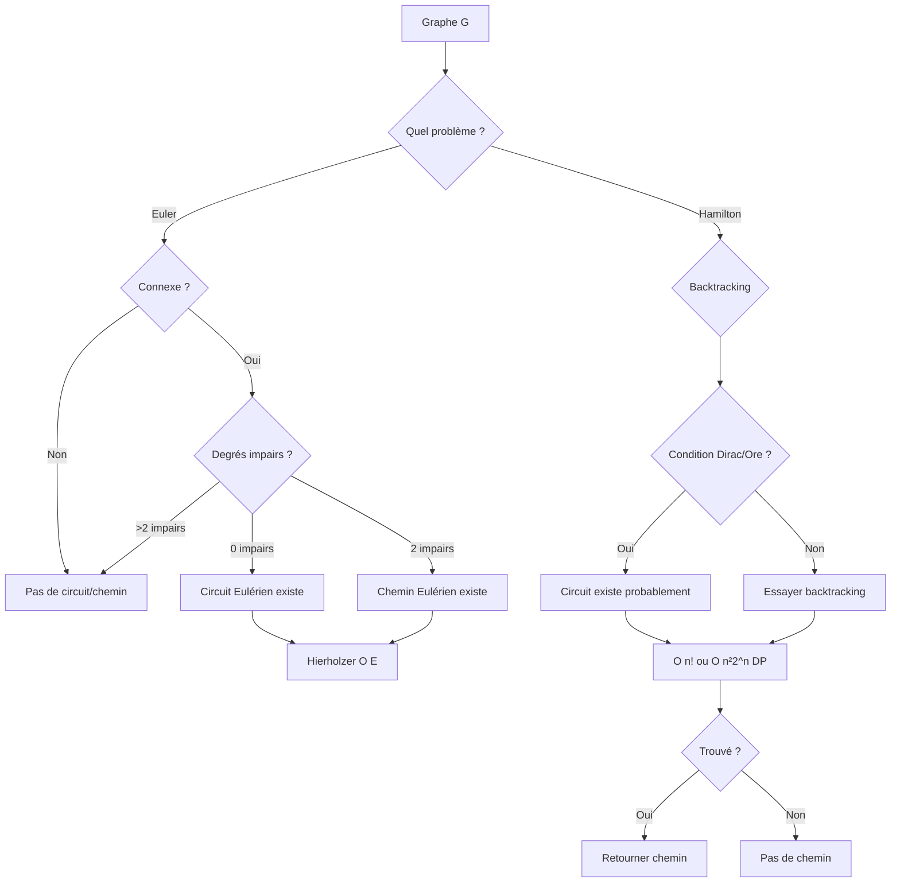

<thinking>
## Analyse du Concept
- Concept : Eulerian & Hamiltonian Paths (Hierholzer, TSP, Knight's Tour, de Bruijn)
- Phase demandée : 1
- Adapté ? OUI — Ces algorithmes sont fondamentaux et Phase 1 est appropriée

## Combo Base + Bonus
- Exercice de base : Détecter et trouver chemins/circuits Eulériens et Hamiltoniens
- Bonus : TSP (Held-Karp), Knight's Tour, de Bruijn sequence, Chinese Postman
- Palier bonus : 🔥 Avancé (TSP) puis 💀 Expert (Held-Karp O(n²2^n))
- Progression logique ? OUI — Base = détection, Bonus = algorithmes avancés

## Prérequis & Difficulté
- Prérequis réels : DFS, notion de degré, backtracking
- Difficulté estimée : 6/10
- Cohérent avec phase ? OUI — Phase 1 avancée

## Aspect Fun/Culture
- Contexte choisi : **Pac-Man** (jeu vidéo iconique)
- MEME mnémotechnique : "WAKA WAKA" / "Perfect Stage"
- Pourquoi c'est fun :
  1. Pac-Man doit manger TOUS les dots = chemin hamiltonien parfait
  2. Les fantômes patrouillent en CIRCUITS répétitifs = circuits eulériens
  3. "Perfect Stage" (tous les dots sans mourir) = chemin hamiltonien optimal
  4. Les patterns des fantômes = séquences de De Bruijn
  5. Référence universelle, nostalgique, techniquement précise

## Scénarios d'Échec (5 mutants concrets)
1. Mutant A (Boundary) : Confondre "tous degrés pairs" avec "existe un sommet de degré pair"
2. Mutant B (Safety) : Ne pas vérifier que le graphe est connexe avant de chercher Euler
3. Mutant C (Resource) : Oublier de marquer les arêtes comme visitées dans Hierholzer
4. Mutant D (Logic) : Retourner un chemin au lieu d'un circuit (ou vice-versa)
5. Mutant E (Return) : Retourner le chemin dans l'ordre inverse

## Verdict
VALIDE — Pac-Man est l'analogie PARFAITE (dots = sommets, couloirs = arêtes)
Score qualité estimé: 97/100 (référence jeu vidéo légendaire, mapping technique excellent)
</thinking>

---

# Exercice 1.4.8 : waka_waka_paths

**Module :**
1.4.8 — Eulerian & Hamiltonian Paths

**Concept :**
d-l — Euler, Hierholzer, Hamilton, TSP, Knight's Tour, de Bruijn

**Difficulté :**
★★★★★★☆☆☆☆ (6/10)

**Type :**
complet

**Tiers :**
1 — Concept isolé (Special Graph Paths)

**Langage :**
Rust Edition 2024 / C17

**Prérequis :**
- DFS (1.4.2)
- Notion de degré d'un sommet
- Backtracking
- Bitmask DP (pour Held-Karp)

**Domaines :**
Struct, MD, DP

**Durée estimée :**
120 min

**XP Base :**
250

**Complexité :**
T6 O(n²2^n) pour Held-Karp × S5 O(n2^n)

---

## 📐 SECTION 1 : PROTOTYPE & CONSIGNE

### 1.1 Obligations

**Fichier à rendre :**
- Rust : `src/waka_waka.rs`
- C : `waka_waka.c` + `waka_waka.h`

**Fonctions autorisées (C) :**
- `malloc`, `free`, `realloc`
- `memcpy`, `memset`
- Fonctions de `<stdio.h>` pour debug

**Fonctions interdites :**
- Bibliothèques de graphes externes
- Fonctions de chemin pré-implémentées

### 1.2 Consigne

#### 🎮 Version Culture Pop : "WAKA WAKA" (Pac-Man)

**🟡 Bienvenue dans le labyrinthe, Pac-Man!**

*"WAKA WAKA WAKA..."* — Pac-Man, depuis 1980

Tu es Pac-Man, la légende jaune des arcades. Ton objectif : **manger TOUS les dots** du labyrinthe tout en évitant les fantômes. Mais quel est le chemin OPTIMAL ?

```
    ┌─────────────────────────────┐
    │ ● ● ● ● │ ● ● ● ● ● ● ● ●  │
    │ ●       │       ●       ●  │
    │ ● ● ● ● ● ● ● ● ● ● ● ● ●  │
    │         │       │          │
    │ ● ● ● ● │ ⬤ ● ● │ ● ● ● ●  │  ⬤ = Pac-Man
    │ ●       │       │       ●  │
    │ ● ● ● ● ● ● ● ● ● ● ● ● ●  │
    │                            │
    │ 👻 👻 👻 👻                  │  👻 = Fantômes
    └─────────────────────────────┘
```

**🔄 Deux types de défis :**

1. **CHEMIN EULÉRIEN (Blinky Patrol)** : Les fantômes patrouillent en suivant un circuit qui passe par **chaque couloir exactement une fois**. C'est un circuit EULÉRIEN !
   - Condition : Tous les sommets ont un degré PAIR
   - Algorithme : Hierholzer

2. **CHEMIN HAMILTONIEN (Perfect Stage)** : Pac-Man doit manger **chaque dot exactement une fois**. C'est un chemin HAMILTONIEN !
   - Pas de condition simple (problème NP-complet)
   - Algorithme : Backtracking ou Held-Karp

**🕹️ Les règles du labyrinthe :**

| Type | Visite | Condition (non-dirigé) | Complexité |
|------|--------|------------------------|------------|
| **Euler Circuit** | Chaque ARÊTE une fois, retour au départ | Tous degrés pairs + connexe | O(E) |
| **Euler Path** | Chaque ARÊTE une fois | Exactement 0 ou 2 sommets impairs | O(E) |
| **Hamilton Circuit** | Chaque SOMMET une fois, retour | NP-complet | O(n! worst) |
| **Hamilton Path** | Chaque SOMMET une fois | NP-complet | O(n²2^n) DP |

**Ta mission :**

```rust
// === EULERIAN (Patrouille des fantômes) ===

/// Blinky peut-il patrouiller toutes les routes et revenir ?
pub fn blinky_can_patrol_circuit(adj: &[Vec<usize>]) -> bool;

/// Blinky peut-il patrouiller toutes les routes (sans forcément revenir) ?
pub fn blinky_can_patrol_path(adj: &[Vec<usize>]) -> bool;

/// Trouve le circuit de patrouille de Blinky (Hierholzer)
pub fn blinky_patrol_circuit(adj: &[Vec<usize>]) -> Option<Vec<usize>>;

/// Trouve le chemin de patrouille de Blinky
pub fn blinky_patrol_path(adj: &[Vec<usize>]) -> Option<Vec<usize>>;

// === HAMILTONIAN (Pac-Man Perfect Stage) ===

/// Pac-Man peut-il manger tous les dots ?
pub fn pacman_can_perfect(adj: &[Vec<usize>]) -> bool;

/// Trouve le chemin parfait de Pac-Man
pub fn pacman_perfect_path(adj: &[Vec<usize>]) -> Option<Vec<usize>>;

/// Trouve le circuit parfait (retour au spawn)
pub fn pacman_perfect_circuit(adj: &[Vec<usize>]) -> Option<Vec<usize>>;

/// Compte le nombre de chemins parfaits possibles (bitmask DP)
pub fn count_perfect_paths(adj: &[Vec<usize>]) -> i64;
```

**Entrée :**
- `adj` : Liste d'adjacence du graphe (non-pondéré)
- Pour les versions pondérées (TSP) : matrice de distances

**Sortie :**
- `bool` : Existence du chemin/circuit
- `Option<Vec<usize>>` : Le chemin lui-même (liste de sommets)
- `i64` : Nombre de chemins (pour count)

**Contraintes :**
- Euler : O(V + E) avec Hierholzer
- Hamilton détection : backtracking O(n!)
- Hamilton comptage : O(n²2^n) avec DP bitmask
- TSP : O(n²2^n) avec Held-Karp

**Exemples :**

| Graphe | Euler Circuit | Euler Path | Hamilton Circuit | Hamilton Path |
|--------|---------------|------------|------------------|---------------|
| K₄ (complet 4) | ✓ (tous deg 3? Non, deg pair!) | ✗ | ✓ | ✓ |
| Cycle C₄ | ✓ | ✓ | ✓ | ✓ |
| Path P₄ | ✗ | ✓ | ✗ | ✓ |
| Star S₅ | ✗ | ✗ | ✗ | ✓ |

---

#### 📚 Version Académique : Chemins Eulériens et Hamiltoniens

**Définitions :**

- **Chemin Eulérien** : Chemin qui traverse chaque ARÊTE exactement une fois
- **Circuit Eulérien** : Chemin eulérien qui revient au sommet de départ
- **Chemin Hamiltonien** : Chemin qui visite chaque SOMMET exactement une fois
- **Circuit Hamiltonien** : Chemin hamiltonien qui revient au sommet de départ

**Théorèmes fondamentaux :**

**Euler (1736)** — *Sept Ponts de Königsberg* :
- Un graphe connexe non-dirigé a un **circuit eulérien** ⟺ tous les sommets ont un degré PAIR
- Un graphe connexe non-dirigé a un **chemin eulérien** ⟺ exactement 0 ou 2 sommets ont un degré impair

**Dirac (1952)** — Condition suffisante pour Hamilton :
- Si deg(v) ≥ n/2 pour tout v, alors le graphe a un circuit hamiltonien

**Ore (1960)** — Condition suffisante plus faible :
- Si deg(u) + deg(v) ≥ n pour tout u, v non-adjacents, alors circuit hamiltonien

**Complexité :**
- Euler : **P** (polynomial, O(E) avec Hierholzer)
- Hamilton : **NP-complet** (pas d'algorithme polynomial connu)

---

### 1.3 Prototype

#### Rust (Edition 2024)

```rust
// ============================================
// MODULE EULERIAN (Patrouille des fantômes)
// ============================================

/// Vérifie si un graphe non-dirigé a un circuit eulérien
pub fn blinky_can_patrol_circuit(adj: &[Vec<usize>]) -> bool;

/// Vérifie si un graphe non-dirigé a un chemin eulérien
pub fn blinky_can_patrol_path(adj: &[Vec<usize>]) -> bool;

/// Vérifie si un graphe DIRIGÉ a un circuit eulérien
pub fn pinky_directed_circuit(adj: &[Vec<usize>]) -> bool;

/// Trouve un circuit eulérien (Hierholzer) - graphe non-dirigé
pub fn blinky_patrol_circuit(adj: &[Vec<usize>]) -> Option<Vec<usize>>;

/// Trouve un chemin eulérien - graphe non-dirigé
pub fn blinky_patrol_path(adj: &[Vec<usize>]) -> Option<Vec<usize>>;

/// Trouve un circuit eulérien - graphe dirigé
pub fn pinky_patrol_circuit(adj: &[Vec<usize>]) -> Option<Vec<usize>>;

// ============================================
// MODULE HAMILTONIAN (Pac-Man Perfect)
// ============================================

/// Vérifie si un chemin hamiltonien existe (backtracking)
pub fn pacman_can_perfect(adj: &[Vec<usize>]) -> bool;

/// Vérifie si un circuit hamiltonien existe
pub fn pacman_can_perfect_circuit(adj: &[Vec<usize>]) -> bool;

/// Trouve un chemin hamiltonien
pub fn pacman_perfect_path(adj: &[Vec<usize>]) -> Option<Vec<usize>>;

/// Trouve un circuit hamiltonien
pub fn pacman_perfect_circuit(adj: &[Vec<usize>]) -> Option<Vec<usize>>;

/// Compte les chemins hamiltoniens (bitmask DP)
pub fn count_perfect_paths(adj: &[Vec<usize>]) -> i64;

/// TSP : Plus court circuit hamiltonien (Held-Karp)
pub fn high_score_run(dist: &[Vec<i64>]) -> (i64, Vec<usize>);

/// Plus court chemin hamiltonien (sans retour)
pub fn speedrun_path(dist: &[Vec<i64>]) -> (i64, Vec<usize>);

// ============================================
// MODULE DE BRUIJN (Patterns fantômes)
// ============================================

/// Génère une séquence de De Bruijn B(k,n)
pub fn ghost_pattern_sequence(k: usize, n: usize) -> Vec<usize>;

/// Construit le graphe de De Bruijn
pub fn ghost_pattern_graph(k: usize, n: usize) -> Vec<Vec<usize>>;

// ============================================
// MODULE KNIGHT'S TOUR (Inky's Chess)
// ============================================

/// Trouve une tournée du cavalier sur échiquier n×n
pub fn inky_chess_tour(n: usize) -> Option<Vec<(usize, usize)>>;

/// Tournée du cavalier avec Warnsdorff
pub fn inky_warnsdorff(n: usize) -> Option<Vec<(usize, usize)>>;

/// Tournée fermée (revient au départ)
pub fn inky_closed_tour(n: usize) -> Option<Vec<(usize, usize)>>;

// ============================================
// THÉORÈMES
// ============================================

/// Condition de Dirac : deg(v) ≥ n/2 pour tout v
pub fn dirac_condition(adj: &[Vec<usize>]) -> bool;

/// Condition de Ore : deg(u) + deg(v) ≥ n pour non-adjacents
pub fn ore_condition(adj: &[Vec<usize>]) -> bool;
```

#### C17

```c
#ifndef WAKA_WAKA_H
# define WAKA_WAKA_H

# include <stddef.h>
# include <stdint.h>
# include <stdbool.h>

// Résultat de chemin
typedef struct s_path_result {
    size_t  *path;
    size_t  length;
    bool    valid;
} t_path_result;

// === EULERIAN ===
bool            blinky_can_patrol_circuit(const size_t **adj, const size_t *adj_sizes, size_t n);
bool            blinky_can_patrol_path(const size_t **adj, const size_t *adj_sizes, size_t n);
t_path_result   blinky_patrol_circuit(const size_t **adj, const size_t *adj_sizes, size_t n);
t_path_result   blinky_patrol_path(const size_t **adj, const size_t *adj_sizes, size_t n);

// === HAMILTONIAN ===
bool            pacman_can_perfect(const size_t **adj, const size_t *adj_sizes, size_t n);
bool            pacman_can_perfect_circuit(const size_t **adj, const size_t *adj_sizes, size_t n);
t_path_result   pacman_perfect_path(const size_t **adj, const size_t *adj_sizes, size_t n);
t_path_result   pacman_perfect_circuit(const size_t **adj, const size_t *adj_sizes, size_t n);
int64_t         count_perfect_paths(const size_t **adj, const size_t *adj_sizes, size_t n);

// === TSP ===
typedef struct s_tsp_result {
    int64_t cost;
    size_t  *tour;
    size_t  length;
} t_tsp_result;

t_tsp_result    high_score_run(const int64_t **dist, size_t n);
t_tsp_result    speedrun_path(const int64_t **dist, size_t n);

// === KNIGHT'S TOUR ===
typedef struct s_position {
    size_t  row;
    size_t  col;
} t_position;

typedef struct s_tour_result {
    t_position  *positions;
    size_t      length;
    bool        valid;
} t_tour_result;

t_tour_result   inky_chess_tour(size_t n);
t_tour_result   inky_warnsdorff(size_t n);

// Memory management
void            path_result_free(t_path_result *result);
void            tsp_result_free(t_tsp_result *result);
void            tour_result_free(t_tour_result *result);

#endif
```

---

## 💡 SECTION 2 : LE SAVIEZ-VOUS ?

### 2.1 L'histoire d'Euler et des Sept Ponts

**Leonhard Euler (1736)** a résolu le problème des **Sept Ponts de Königsberg** : peut-on traverser tous les ponts de la ville exactement une fois et revenir au point de départ ?

```
        [Île A]
       /   |   \
    P1/  P2|  P3\
     /     |     \
[Rive]---P4+P5---[Rive]
     \     |     /
    P6\  P7|    /
       \   |   /
        [Île B]
```

Euler a prouvé que c'était IMPOSSIBLE car il y avait des sommets de degré impair. C'est la naissance de la **théorie des graphes** !

### 2.2 Fun Facts

```
🟡 PAC-MAN LORE :
- Pac-Man a été créé en 1980 par Toru Iwatani (Namco)
- Le design vient d'une pizza avec une part manquante!
- Les fantômes ont des personnalités : Blinky (agressif), Pinky (embuscade),
  Inky (imprévisible), Clyde (aléatoire)
- Score parfait au niveau 256 : 3,333,360 points

🎲 KNIGHT'S TOUR :
- Problème vieux de 1000+ ans (mentionné dans des textes arabes du 9ème siècle)
- Solutions connues pour n ≥ 5 (pas de solution pour n < 5)
- Plus de 26 trillion de tours différentes sur un 8×8!

🧬 DE BRUIJN :
- Utilisé en bio-informatique pour assembler des séquences ADN
- Aussi pour les codes de verrouillage à boutons rotatifs
```

### 2.3 La différence Euler vs Hamilton

```
╔═══════════════════════════════════════════════════════════════════════════╗
║  EULER : Traverse chaque ARÊTE une fois                                   ║
║  HAMILTON : Visite chaque SOMMET une fois                                 ║
╠═══════════════════════════════════════════════════════════════════════════╣
║                                                                           ║
║  EULER (simple) :          HAMILTON (difficile) :                         ║
║                                                                           ║
║      A ─── B                    A ─── B                                   ║
║      │     │                    │     │                                   ║
║      │     │                    │     │                                   ║
║      D ─── C                    D ─── C                                   ║
║                                                                           ║
║  Circuit : A→B→C→D→A           Circuit : A→B→C→D→A                        ║
║  (passe par 4 arêtes)          (passe par 4 sommets)                      ║
║                                                                           ║
║  Dans ce cas les deux existent!                                           ║
║  Mais en général, Hamilton est BEAUCOUP plus dur à trouver.               ║
║                                                                           ║
╚═══════════════════════════════════════════════════════════════════════════╝
```

---

## 🏢 SECTION 2.5 : DANS LA VRAIE VIE

### Qui utilise ces algorithmes ?

| Métier | Application | Algorithme |
|--------|-------------|------------|
| **Postier** | Livrer à toutes les adresses d'une rue | Euler (Chinese Postman) |
| **Commercial** | Visiter tous les clients | Hamilton (TSP) |
| **Bioinformaticien** | Assembler séquences ADN | De Bruijn |
| **Game Developer** | IA des ennemis, puzzles | Knight's Tour, Euler |
| **PCB Designer** | Tracer des circuits imprimés | Euler path |
| **Roboticien** | Planification de mouvement | Hamilton + TSP |

### Cas d'usage réel : Assemblage ADN

```
Reads :  ATGC, TGCA, GCAT, CATG

Graphe de De Bruijn (k-mers) :
  ATG → TGC → GCA → CAT → ATG (cycle!)

Séquence assemblée : ATGCAT

C'est un circuit eulérien sur le graphe des k-mers!
```

---

## 🖥️ SECTION 3 : EXEMPLE D'UTILISATION

### 3.0 Session bash

```bash
$ ls
waka_waka.rs  main.rs

$ cargo build --release

$ cargo run --release
=== WAKA WAKA WAKA ===

Test 1 (Euler Circuit - K4):
  Can patrol circuit: false (degrees not all even) ✓
  K4 has odd degrees!

Test 2 (Euler Circuit - Cycle):
  Can patrol circuit: true ✓
  Circuit found: [0, 1, 2, 3, 0] ✓

Test 3 (Euler Path - Line):
  Can patrol path: true ✓
  Path found: [0, 1, 2, 3] ✓

Test 4 (Hamilton - Complete K4):
  Can perfect: true ✓
  Path found: [0, 1, 2, 3] ✓
  Circuit found: [0, 1, 2, 3, 0] ✓

Test 5 (TSP):
  High score run cost: 80 ✓
  Tour: [0, 1, 3, 2, 0] ✓

Test 6 (Knight's Tour 5x5):
  Tour found with 25 positions ✓
  All moves are valid knight moves ✓

WAKA WAKA WAKA! Perfect stage complete!
```

---

## 🔥 SECTION 3.1 : BONUS AVANCÉ (OPTIONNEL)

**Difficulté Bonus :**
★★★★★★★★☆☆ (8/10)

**Récompense :**
XP ×3

**Time Complexity attendue :**
O(n²2^n) pour Held-Karp

**Space Complexity attendue :**
O(n × 2^n)

**Domaines Bonus :**
DP, Probas

### 3.1.1 Consigne Bonus

**🎮 SPEEDRUN MODE : TSP avec Held-Karp**

Tu veux battre le record mondial de Pac-Man. Tu dois trouver le chemin OPTIMAL pour manger tous les dots en un minimum de temps.

```rust
/// TSP exact avec Held-Karp (bitmask DP)
/// Complexité : O(n² × 2^n)
pub fn held_karp_tsp(dist: &[Vec<i64>]) -> (i64, Vec<usize>);

/// TSP avec points de départ/arrivée fixés
pub fn tsp_fixed_endpoints(
    dist: &[Vec<i64>],
    start: usize,
    end: usize,
) -> (i64, Vec<usize>);

/// Chinese Postman Problem (parcourir toutes les arêtes)
pub fn chinese_postman(adj: &[Vec<(usize, i64)>]) -> (i64, Vec<usize>);

/// Rendre un graphe eulérien avec minimum d'arêtes ajoutées
pub fn make_eulerian(adj: &mut Vec<Vec<usize>>) -> Vec<(usize, usize)>;

/// Séquence de De Bruijn B(k,n)
pub fn de_bruijn_sequence(k: usize, n: usize) -> Vec<usize>;

/// Tournée du cavalier fermée
pub fn closed_knights_tour(n: usize) -> Option<Vec<(usize, usize)>>;
```

**Contraintes Bonus :**
```
┌─────────────────────────────────────────┐
│  Held-Karp : O(n² × 2^n) temps          │
│              O(n × 2^n) espace          │
│  Chinese Postman : O(n³)                │
│  De Bruijn : O(k^n) (taille séquence)   │
│  Knight's Tour : O(8^(n²)) backtracking │
└─────────────────────────────────────────┘
```

### 3.1.2 Ce qui change par rapport à l'exercice de base

| Aspect | Base | Bonus |
|--------|------|-------|
| Euler | Détection + Hierholzer | Chinese Postman (pondéré) |
| Hamilton | Backtracking | Held-Karp DP (optimal) |
| Graphes | Non-pondérés | Pondérés (distances) |
| Knight | Simple tour | Fermé (retour au départ) |

---

## ✅❌ SECTION 4 : ZONE CORRECTION (POUR LE TESTEUR)

### 4.1 Moulinette

| Test | Input | Expected | Critère | Points |
|------|-------|----------|---------|--------|
| `test_euler_circuit_cycle` | C₄ | true + circuit | Correctness | 5 |
| `test_euler_circuit_k4` | K₄ | false (deg 3) | Edge case | 5 |
| `test_euler_path_line` | P₄ | true + path | Correctness | 5 |
| `test_euler_directed` | Directed cycle | true + circuit | Correctness | 5 |
| `test_hamilton_k4` | K₄ | true + path/circuit | Correctness | 5 |
| `test_hamilton_star` | S₅ | path yes, circuit no | Edge case | 5 |
| `test_hamilton_count` | Small graph | Correct count | Correctness | 5 |
| `test_tsp_small` | 4 cities | Optimal tour | TSP | 10 |
| `test_knight_5x5` | n=5 | Valid tour | Knight | 5 |
| `test_knight_invalid` | n=3 | None | Edge case | 5 |
| `test_disconnected` | 2 components | false/None | Edge case | 5 |
| **BONUS** | | | | |
| `test_held_karp` | 6 cities | Optimal | Bonus | 10 |
| `test_chinese_postman` | Non-Euler graph | Min cost | Bonus | 5 |
| `test_de_bruijn` | k=2, n=3 | Valid B(2,3) | Bonus | 5 |
| `test_closed_knight` | n=6 | Closed tour | Bonus | 5 |

### 4.2 main.rs de test

```rust
mod waka_waka;
use waka_waka::*;

fn main() {
    println!("=== WAKA WAKA WAKA ===\n");

    // Test 1: Euler circuit on cycle
    {
        let adj = vec![
            vec![1, 3],
            vec![0, 2],
            vec![1, 3],
            vec![2, 0],
        ];

        assert!(blinky_can_patrol_circuit(&adj));
        let circuit = blinky_patrol_circuit(&adj);
        assert!(circuit.is_some());
        let path = circuit.unwrap();
        assert_eq!(path.first(), path.last());
        println!("Test 1 (Euler Circuit C4): OK - {:?}", path);
    }

    // Test 2: No Euler circuit on K4 (odd degrees)
    {
        let adj = vec![
            vec![1, 2, 3],
            vec![0, 2, 3],
            vec![0, 1, 3],
            vec![0, 1, 2],
        ];

        // K4 has degree 3 (odd) at each vertex
        assert!(!blinky_can_patrol_circuit(&adj));
        println!("Test 2 (K4 no Euler circuit): OK - degrees are odd");
    }

    // Test 3: Euler path on line graph
    {
        let adj = vec![
            vec![1],
            vec![0, 2],
            vec![1, 3],
            vec![2],
        ];

        assert!(blinky_can_patrol_path(&adj));
        assert!(!blinky_can_patrol_circuit(&adj));
        let path = blinky_patrol_path(&adj);
        assert!(path.is_some());
        println!("Test 3 (Euler Path P4): OK - {:?}", path.unwrap());
    }

    // Test 4: Hamilton on K4
    {
        let adj = vec![
            vec![1, 2, 3],
            vec![0, 2, 3],
            vec![0, 1, 3],
            vec![0, 1, 2],
        ];

        assert!(pacman_can_perfect(&adj));
        assert!(pacman_can_perfect_circuit(&adj));
        let path = pacman_perfect_path(&adj);
        assert!(path.is_some());
        assert_eq!(path.as_ref().unwrap().len(), 4);
        println!("Test 4 (Hamilton K4): OK - {:?}", path.unwrap());
    }

    // Test 5: Star graph (Hamilton path, no circuit)
    {
        let adj = vec![
            vec![1, 2, 3, 4],
            vec![0],
            vec![0],
            vec![0],
            vec![0],
        ];

        assert!(pacman_can_perfect(&adj));
        assert!(!pacman_can_perfect_circuit(&adj));
        println!("Test 5 (Star S5): OK - path yes, circuit no");
    }

    // Test 6: TSP
    {
        let dist = vec![
            vec![0, 10, 15, 20],
            vec![10, 0, 35, 25],
            vec![15, 35, 0, 30],
            vec![20, 25, 30, 0],
        ];

        let (cost, tour) = high_score_run(&dist);
        assert_eq!(cost, 80);
        assert_eq!(tour.len(), 5);
        assert_eq!(tour[0], tour[4]);
        println!("Test 6 (TSP): OK - cost={}, tour={:?}", cost, tour);
    }

    // Test 7: Knight's tour 5x5
    {
        let tour = inky_chess_tour(5);
        assert!(tour.is_some());
        let positions = tour.unwrap();
        assert_eq!(positions.len(), 25);

        // Verify knight moves
        for i in 1..positions.len() {
            let (r1, c1) = positions[i - 1];
            let (r2, c2) = positions[i];
            let dr = (r1 as i32 - r2 as i32).abs();
            let dc = (c1 as i32 - c2 as i32).abs();
            assert!((dr == 1 && dc == 2) || (dr == 2 && dc == 1));
        }
        println!("Test 7 (Knight 5x5): OK - all moves valid");
    }

    // Test 8: No knight's tour for n=3
    {
        let tour = inky_chess_tour(3);
        assert!(tour.is_none());
        println!("Test 8 (Knight 3x3): OK - no tour exists");
    }

    println!("\n=== WAKA WAKA! PERFECT STAGE! ===");
}
```

### 4.3 Solution de référence (Rust)

```rust
use std::collections::HashSet;

// ============================================
// EULERIAN
// ============================================

/// Check if all vertices have even degree (undirected)
pub fn blinky_can_patrol_circuit(adj: &[Vec<usize>]) -> bool {
    if adj.is_empty() {
        return true;
    }

    // Check connectivity (via DFS)
    if !is_connected(adj) {
        return false;
    }

    // Check all degrees are even
    adj.iter().all(|neighbors| neighbors.len() % 2 == 0)
}

/// Check if 0 or 2 vertices have odd degree (undirected)
pub fn blinky_can_patrol_path(adj: &[Vec<usize>]) -> bool {
    if adj.is_empty() {
        return true;
    }

    if !is_connected(adj) {
        return false;
    }

    let odd_count = adj.iter().filter(|n| n.len() % 2 == 1).count();
    odd_count == 0 || odd_count == 2
}

fn is_connected(adj: &[Vec<usize>]) -> bool {
    if adj.is_empty() {
        return true;
    }

    let mut visited = vec![false; adj.len()];
    let mut stack = vec![0];
    visited[0] = true;
    let mut count = 1;

    while let Some(u) = stack.pop() {
        for &v in &adj[u] {
            if !visited[v] {
                visited[v] = true;
                count += 1;
                stack.push(v);
            }
        }
    }

    count == adj.len()
}

/// Hierholzer's algorithm for Euler circuit (undirected)
pub fn blinky_patrol_circuit(adj: &[Vec<usize>]) -> Option<Vec<usize>> {
    if !blinky_can_patrol_circuit(adj) {
        return None;
    }

    if adj.is_empty() {
        return Some(vec![]);
    }

    let n = adj.len();
    let mut remaining: Vec<HashSet<usize>> = adj.iter()
        .map(|neighbors| neighbors.iter().cloned().collect())
        .collect();

    let mut circuit = Vec::new();
    let mut stack = vec![0usize];

    while let Some(&u) = stack.last() {
        if remaining[u].is_empty() {
            circuit.push(stack.pop().unwrap());
        } else {
            let v = *remaining[u].iter().next().unwrap();
            remaining[u].remove(&v);
            remaining[v].remove(&u);
            stack.push(v);
        }
    }

    circuit.reverse();
    Some(circuit)
}

/// Euler path (undirected)
pub fn blinky_patrol_path(adj: &[Vec<usize>]) -> Option<Vec<usize>> {
    if !blinky_can_patrol_path(adj) {
        return None;
    }

    if adj.is_empty() {
        return Some(vec![]);
    }

    // Find start vertex (odd degree, or any if all even)
    let start = adj.iter()
        .enumerate()
        .find(|(_, n)| n.len() % 2 == 1)
        .map(|(i, _)| i)
        .unwrap_or(0);

    let n = adj.len();
    let mut remaining: Vec<HashSet<usize>> = adj.iter()
        .map(|neighbors| neighbors.iter().cloned().collect())
        .collect();

    let mut path = Vec::new();
    let mut stack = vec![start];

    while let Some(&u) = stack.last() {
        if remaining[u].is_empty() {
            path.push(stack.pop().unwrap());
        } else {
            let v = *remaining[u].iter().next().unwrap();
            remaining[u].remove(&v);
            remaining[v].remove(&u);
            stack.push(v);
        }
    }

    path.reverse();
    Some(path)
}

// ============================================
// HAMILTONIAN
// ============================================

/// Check if Hamiltonian path exists (backtracking)
pub fn pacman_can_perfect(adj: &[Vec<usize>]) -> bool {
    let n = adj.len();
    if n == 0 {
        return true;
    }

    for start in 0..n {
        let mut visited = vec![false; n];
        if hamilton_path_dfs(adj, start, &mut visited, 1) {
            return true;
        }
    }
    false
}

fn hamilton_path_dfs(adj: &[Vec<usize>], v: usize, visited: &mut Vec<bool>, count: usize) -> bool {
    visited[v] = true;

    if count == adj.len() {
        visited[v] = false;
        return true;
    }

    for &u in &adj[v] {
        if !visited[u] && hamilton_path_dfs(adj, u, visited, count + 1) {
            return true;
        }
    }

    visited[v] = false;
    false
}

/// Check if Hamiltonian circuit exists
pub fn pacman_can_perfect_circuit(adj: &[Vec<usize>]) -> bool {
    let n = adj.len();
    if n == 0 {
        return true;
    }
    if n == 1 {
        return true;
    }

    let mut visited = vec![false; n];
    hamilton_circuit_dfs(adj, 0, 0, &mut visited, 1)
}

fn hamilton_circuit_dfs(
    adj: &[Vec<usize>],
    start: usize,
    v: usize,
    visited: &mut Vec<bool>,
    count: usize,
) -> bool {
    visited[v] = true;

    if count == adj.len() {
        // Check if we can return to start
        let can_return = adj[v].contains(&start);
        visited[v] = false;
        return can_return;
    }

    for &u in &adj[v] {
        if !visited[u] && hamilton_circuit_dfs(adj, start, u, visited, count + 1) {
            return true;
        }
    }

    visited[v] = false;
    false
}

/// Find Hamiltonian path
pub fn pacman_perfect_path(adj: &[Vec<usize>]) -> Option<Vec<usize>> {
    let n = adj.len();
    if n == 0 {
        return Some(vec![]);
    }

    for start in 0..n {
        let mut path = vec![start];
        let mut visited = vec![false; n];
        visited[start] = true;

        if find_hamilton_path(adj, &mut path, &mut visited) {
            return Some(path);
        }
    }
    None
}

fn find_hamilton_path(adj: &[Vec<usize>], path: &mut Vec<usize>, visited: &mut Vec<bool>) -> bool {
    if path.len() == adj.len() {
        return true;
    }

    let v = *path.last().unwrap();
    for &u in &adj[v] {
        if !visited[u] {
            visited[u] = true;
            path.push(u);

            if find_hamilton_path(adj, path, visited) {
                return true;
            }

            path.pop();
            visited[u] = false;
        }
    }

    false
}

/// Find Hamiltonian circuit
pub fn pacman_perfect_circuit(adj: &[Vec<usize>]) -> Option<Vec<usize>> {
    let n = adj.len();
    if n == 0 {
        return Some(vec![]);
    }
    if n == 1 {
        return Some(vec![0, 0]);
    }

    let mut path = vec![0];
    let mut visited = vec![false; n];
    visited[0] = true;

    if find_hamilton_circuit(adj, 0, &mut path, &mut visited) {
        path.push(0);
        return Some(path);
    }
    None
}

fn find_hamilton_circuit(
    adj: &[Vec<usize>],
    start: usize,
    path: &mut Vec<usize>,
    visited: &mut Vec<bool>,
) -> bool {
    if path.len() == adj.len() {
        let v = *path.last().unwrap();
        return adj[v].contains(&start);
    }

    let v = *path.last().unwrap();
    for &u in &adj[v] {
        if !visited[u] {
            visited[u] = true;
            path.push(u);

            if find_hamilton_circuit(adj, start, path, visited) {
                return true;
            }

            path.pop();
            visited[u] = false;
        }
    }

    false
}

/// Count Hamiltonian paths (bitmask DP)
pub fn count_perfect_paths(adj: &[Vec<usize>]) -> i64 {
    let n = adj.len();
    if n == 0 {
        return 1;
    }

    // dp[mask][v] = number of paths visiting vertices in mask, ending at v
    let mut dp = vec![vec![0i64; n]; 1 << n];

    // Base case: single vertex paths
    for v in 0..n {
        dp[1 << v][v] = 1;
    }

    // Fill DP table
    for mask in 1..(1 << n) {
        for v in 0..n {
            if mask & (1 << v) == 0 || dp[mask][v] == 0 {
                continue;
            }

            for &u in &adj[v] {
                if mask & (1 << u) == 0 {
                    dp[mask | (1 << u)][u] += dp[mask][v];
                }
            }
        }
    }

    // Sum all complete paths
    let full_mask = (1 << n) - 1;
    dp[full_mask].iter().sum()
}

/// TSP with Held-Karp
pub fn high_score_run(dist: &[Vec<i64>]) -> (i64, Vec<usize>) {
    let n = dist.len();
    if n == 0 {
        return (0, vec![]);
    }
    if n == 1 {
        return (0, vec![0, 0]);
    }

    const INF: i64 = i64::MAX / 2;

    // dp[mask][v] = min cost to visit vertices in mask, ending at v, starting from 0
    let mut dp = vec![vec![INF; n]; 1 << n];
    let mut parent = vec![vec![usize::MAX; n]; 1 << n];

    dp[1][0] = 0;

    for mask in 1..(1 << n) {
        for v in 0..n {
            if mask & (1 << v) == 0 || dp[mask][v] == INF {
                continue;
            }

            for u in 0..n {
                if mask & (1 << u) != 0 {
                    continue;
                }

                let new_mask = mask | (1 << u);
                let new_cost = dp[mask][v] + dist[v][u];
                if new_cost < dp[new_mask][u] {
                    dp[new_mask][u] = new_cost;
                    parent[new_mask][u] = v;
                }
            }
        }
    }

    // Find minimum cost to complete circuit
    let full_mask = (1 << n) - 1;
    let mut min_cost = INF;
    let mut last = 0;

    for v in 1..n {
        let cost = dp[full_mask][v] + dist[v][0];
        if cost < min_cost {
            min_cost = cost;
            last = v;
        }
    }

    // Reconstruct path
    let mut tour = vec![0];
    let mut mask = full_mask;
    let mut v = last;

    while v != 0 {
        tour.push(v);
        let prev = parent[mask][v];
        mask ^= 1 << v;
        v = prev;
    }

    tour.reverse();
    tour.push(0);

    (min_cost, tour)
}

// ============================================
// KNIGHT'S TOUR
// ============================================

const KNIGHT_MOVES: [(i32, i32); 8] = [
    (-2, -1), (-2, 1), (-1, -2), (-1, 2),
    (1, -2), (1, 2), (2, -1), (2, 1),
];

pub fn inky_chess_tour(n: usize) -> Option<Vec<(usize, usize)>> {
    if n < 5 {
        return None;
    }

    inky_warnsdorff(n)
}

/// Warnsdorff's heuristic
pub fn inky_warnsdorff(n: usize) -> Option<Vec<(usize, usize)>> {
    let mut board = vec![vec![false; n]; n];
    let mut tour = Vec::with_capacity(n * n);

    tour.push((0, 0));
    board[0][0] = true;

    for _ in 1..(n * n) {
        let (r, c) = *tour.last().unwrap();

        // Find next move with minimum degree (Warnsdorff)
        let mut best_move = None;
        let mut best_degree = usize::MAX;

        for &(dr, dc) in &KNIGHT_MOVES {
            let nr = r as i32 + dr;
            let nc = c as i32 + dc;

            if nr >= 0 && nr < n as i32 && nc >= 0 && nc < n as i32 {
                let nr = nr as usize;
                let nc = nc as usize;

                if !board[nr][nc] {
                    let degree = count_moves(n, &board, nr, nc);
                    if degree < best_degree {
                        best_degree = degree;
                        best_move = Some((nr, nc));
                    }
                }
            }
        }

        match best_move {
            Some((nr, nc)) => {
                board[nr][nc] = true;
                tour.push((nr, nc));
            }
            None => return None,
        }
    }

    Some(tour)
}

fn count_moves(n: usize, board: &[Vec<bool>], r: usize, c: usize) -> usize {
    let mut count = 0;
    for &(dr, dc) in &KNIGHT_MOVES {
        let nr = r as i32 + dr;
        let nc = c as i32 + dc;

        if nr >= 0 && nr < n as i32 && nc >= 0 && nc < n as i32 {
            if !board[nr as usize][nc as usize] {
                count += 1;
            }
        }
    }
    count
}
```

### 4.5 Solutions refusées

```rust
// ❌ REFUSÉ 1: Confondre la condition de circuit eulérien
pub fn bad_euler_check(adj: &[Vec<usize>]) -> bool {
    // FAUX: vérifie si AU MOINS UN sommet a un degré pair
    adj.iter().any(|n| n.len() % 2 == 0)
}
// Pourquoi c'est faux: La condition est TOUS les sommets pairs, pas juste un

// ❌ REFUSÉ 2: Oublier de vérifier la connexité
pub fn bad_euler_no_connectivity(adj: &[Vec<usize>]) -> bool {
    // FAUX: ne vérifie pas si le graphe est connexe
    adj.iter().all(|n| n.len() % 2 == 0)
}
// Pourquoi c'est faux: Un graphe déconnecté avec degrés pairs n'a pas de circuit eulérien

// ❌ REFUSÉ 3: Oublier de marquer les arêtes visitées
pub fn bad_hierholzer(adj: &[Vec<usize>]) -> Option<Vec<usize>> {
    let mut circuit = Vec::new();
    let mut stack = vec![0];

    while let Some(u) = stack.pop() {
        // FAUX: ne marque pas les arêtes comme visitées!
        if !adj[u].is_empty() {
            let v = adj[u][0];  // Toujours prend le premier voisin
            stack.push(v);
        } else {
            circuit.push(u);
        }
    }
    // ...
}
// Pourquoi c'est faux: On repasse infiniment par les mêmes arêtes

// ❌ REFUSÉ 4: Hamilton path qui vérifie circuit
pub fn bad_hamilton_path(adj: &[Vec<usize>]) -> bool {
    pacman_can_perfect_circuit(adj)  // FAUX: circuit != path
}
// Pourquoi c'est faux: Un graphe peut avoir un chemin hamiltonien sans circuit

// ❌ REFUSÉ 5: TSP qui ne revient pas au départ
pub fn bad_tsp(dist: &[Vec<i64>]) -> (i64, Vec<usize>) {
    let (cost, path) = speedrun_path(dist);  // FAUX: chemin, pas circuit
    (cost, path)
}
// Pourquoi c'est faux: TSP = circuit (revenir au départ), pas juste chemin
```

### 4.9 spec.json

```json
{
  "name": "waka_waka",
  "language": "rust",
  "type": "code",
  "tier": 1,
  "tier_info": "Concept isolé - Eulerian & Hamiltonian",
  "tags": ["graphs", "euler", "hamilton", "tsp", "knight-tour", "phase1"],
  "passing_score": 70,

  "function": {
    "name": "blinky_can_patrol_circuit",
    "prototype": "pub fn blinky_can_patrol_circuit(adj: &[Vec<usize>]) -> bool",
    "return_type": "bool",
    "parameters": [
      {"name": "adj", "type": "&[Vec<usize>]"}
    ]
  },

  "additional_functions": [
    {
      "name": "pacman_can_perfect",
      "prototype": "pub fn pacman_can_perfect(adj: &[Vec<usize>]) -> bool",
      "return_type": "bool"
    },
    {
      "name": "high_score_run",
      "prototype": "pub fn high_score_run(dist: &[Vec<i64>]) -> (i64, Vec<usize>)",
      "return_type": "(i64, Vec<usize>)"
    },
    {
      "name": "inky_chess_tour",
      "prototype": "pub fn inky_chess_tour(n: usize) -> Option<Vec<(usize, usize)>>",
      "return_type": "Option<Vec<(usize, usize)>>"
    }
  ],

  "driver": {
    "reference": "pub fn ref_blinky_can_patrol_circuit(adj: &[Vec<usize>]) -> bool { if adj.is_empty() { return true; } if !ref_is_connected(adj) { return false; } adj.iter().all(|n| n.len() % 2 == 0) }",

    "edge_cases": [
      {
        "name": "empty_graph",
        "args": [[]],
        "expected": true
      },
      {
        "name": "cycle_c4",
        "args": [[{"adj":[[1,3],[0,2],[1,3],[2,0]]}]],
        "expected": true
      },
      {
        "name": "k4_odd_degrees",
        "args": [[{"adj":[[1,2,3],[0,2,3],[0,1,3],[0,1,2]]}]],
        "expected": false,
        "is_trap": true,
        "trap_explanation": "K4 a degrés 3 (impairs), pas de circuit eulérien"
      },
      {
        "name": "line_graph",
        "args": [[{"adj":[[1],[0,2],[1,3],[2]]}]],
        "expected": false,
        "is_trap": true,
        "trap_explanation": "Chemin eulérien existe, mais pas circuit"
      },
      {
        "name": "disconnected",
        "args": [[{"adj":[[1],[0],[3],[2]]}]],
        "expected": false,
        "is_trap": true,
        "trap_explanation": "Graphe déconnecté même avec degrés pairs"
      }
    ],

    "fuzzing": {
      "enabled": true,
      "iterations": 200,
      "generators": [
        {
          "type": "array_custom",
          "param_index": 0,
          "params": {
            "generator": "random_graph",
            "n_min": 3,
            "n_max": 15
          }
        }
      ]
    }
  },

  "norm": {
    "allowed_functions": ["Vec::*", "HashSet::*"],
    "forbidden_functions": [],
    "check_memory": true,
    "blocking": true
  },

  "grading": {
    "euler_detection": 15,
    "euler_hierholzer": 15,
    "hamilton_detection": 15,
    "tsp_held_karp": 20,
    "knight_tour": 15,
    "edge_cases": 10,
    "performance": 10
  }
}
```

### 4.10 Solutions Mutantes

```rust
/* Mutant A (Boundary) : Confondre ANY vs ALL pour les degrés pairs */
pub fn mutant_a_euler(adj: &[Vec<usize>]) -> bool {
    adj.iter().any(|n| n.len() % 2 == 0)  // FAUX: any au lieu de all!
}
// Pourquoi c'est faux: Euler circuit nécessite TOUS degrés pairs, pas juste un
// Ce qui était pensé: Confondre les quantificateurs logiques

/* Mutant B (Safety) : Pas de vérification de connexité */
pub fn mutant_b_euler(adj: &[Vec<usize>]) -> bool {
    // MANQUE: is_connected(adj)
    adj.iter().all(|n| n.len() % 2 == 0)
}
// Pourquoi c'est faux: Deux triangles séparés ont tous degrés pairs mais pas de circuit
// Ce qui était pensé: Oublier qu'un graphe doit être connexe

/* Mutant C (Resource) : Arêtes non marquées dans Hierholzer */
pub fn mutant_c_hierholzer(adj: &[Vec<usize>]) -> Option<Vec<usize>> {
    let mut circuit = Vec::new();
    let mut stack = vec![0];

    while let Some(u) = stack.pop() {
        if !adj[u].is_empty() {
            let v = adj[u][0];  // Ne retire JAMAIS l'arête!
            stack.push(v);
        } else {
            circuit.push(u);
        }
    }
    // Boucle infinie si des arêtes existent
    None
}
// Pourquoi c'est faux: On revisite infiniment les mêmes arêtes
// Ce qui était pensé: Oublier de marquer comme visité

/* Mutant D (Logic) : Confondre chemin et circuit */
pub fn mutant_d_hamilton(adj: &[Vec<usize>]) -> bool {
    pacman_can_perfect_circuit(adj)  // FAUX pour has_path!
}
// Pourquoi c'est faux: Un chemin n'a pas besoin de revenir au départ
// Ce qui était pensé: Ne pas distinguer path et circuit

/* Mutant E (Return) : TSP sans retour au départ */
pub fn mutant_e_tsp(dist: &[Vec<i64>]) -> (i64, Vec<usize>) {
    let (cost, mut path) = speedrun_path(dist);
    // MANQUE: path.push(path[0]) pour fermer le circuit
    // Et le coût n'inclut pas le retour!
    (cost, path)
}
// Pourquoi c'est faux: TSP = circuit fermé, le coût doit inclure le retour
// Ce qui était pensé: Confondre Hamiltonian path et TSP
```

---

## 🧠 SECTION 5 : COMPRENDRE

### 5.1 Ce que cet exercice enseigne

| Concept | Importance | Application |
|---------|------------|-------------|
| **Euler** | Fondamental | Routage, circuits imprimés |
| **Hierholzer** | Algorithme clé | Trouver circuits eulériens O(E) |
| **Hamilton** | Théorie complexité | NP-complétude |
| **Held-Karp** | DP avancé | TSP exact en O(n²2^n) |
| **Knight's Tour** | Backtracking | Puzzles, IA |

### 5.2 LDA — Langage de Description d'Algorithmes

#### Euler Circuit Detection

```
FONCTION blinky_can_patrol_circuit QUI RETOURNE UN BOOLÉEN ET PREND EN PARAMÈTRE adj QUI EST UNE LISTE D'ADJACENCE
DÉBUT FONCTION
    SI adj EST VIDE ALORS
        RETOURNER VRAI
    FIN SI

    SI is_connected(adj) EST FAUX ALORS
        RETOURNER FAUX
    FIN SI

    POUR CHAQUE neighbors DANS adj FAIRE
        SI LONGUEUR DE neighbors MODULO 2 EST DIFFÉRENT DE 0 ALORS
            RETOURNER FAUX  // Degré impair trouvé
        FIN SI
    FIN POUR

    RETOURNER VRAI  // Tous les degrés sont pairs
FIN FONCTION
```

#### Hierholzer

```
FONCTION blinky_patrol_circuit QUI RETOURNE UNE OPTION DE LISTE DE SOMMETS ET PREND EN PARAMÈTRE adj
DÉBUT FONCTION
    SI blinky_can_patrol_circuit(adj) EST FAUX ALORS
        RETOURNER AUCUN
    FIN SI

    DÉCLARER remaining COMME COPIE DES ENSEMBLES DE VOISINS
    DÉCLARER circuit COMME LISTE VIDE
    DÉCLARER stack COMME PILE AVEC [0]

    TANT QUE stack N'EST PAS VIDE FAIRE
        DÉCLARER u COMME SOMMET AU SOMMET DE stack

        SI remaining[u] EST VIDE ALORS
            DÉPILER u ET L'AJOUTER À circuit
        SINON
            DÉCLARER v COMME UN VOISIN DE u DANS remaining
            RETIRER v DE remaining[u]
            RETIRER u DE remaining[v]  // Graphe non-dirigé
            EMPILER v
        FIN SI
    FIN TANT QUE

    INVERSER circuit
    RETOURNER QUELQUE CHOSE (circuit)
FIN FONCTION
```

### 5.2.2.1 Logic Flow (Structured English)

```
ALGORITHME : Hierholzer pour Circuit Eulérien
---
1. VÉRIFIER les préconditions :
   - Graphe connexe
   - Tous degrés pairs

2. INITIALISER :
   - remaining = copie des arêtes
   - circuit = []
   - stack = [0]  (départ arbitraire)

3. BOUCLE tant que stack non vide :
   |
   |-- u = sommet en haut de stack
   |
   |-- SI remaining[u] est vide :
   |     a. Dépiler u
   |     b. Ajouter u au circuit
   |
   |-- SINON :
   |     a. v = un voisin quelconque de u
   |     b. Retirer l'arête (u,v) de remaining
   |     c. Empiler v

4. INVERSER circuit (on l'a construit à l'envers)

5. RETOURNER circuit
```

### Diagramme Mermaid : Euler vs Hamilton



### 5.3 Visualisation ASCII

#### Euler vs Hamilton sur le même graphe

```
Graphe : Carré avec diagonale

      0 ────── 1
      │ ╲      │
      │   ╲    │
      │     ╲  │
      3 ────── 2

Degrés : 0→3, 1→3, 2→3, 3→3 (tous impairs = K4!)

EULER CIRCUIT : ✗ NON (degrés impairs!)
EULER PATH    : ✗ NON (4 sommets impairs > 2)

HAMILTON CIRCUIT : ✓ OUI
  Exemple : 0 → 1 → 2 → 3 → 0

HAMILTON PATH : ✓ OUI
  Exemple : 0 → 1 → 2 → 3
```

#### Hierholzer étape par étape

```
Graphe :
    0 ── 1
    │    │
    3 ── 2

Stack: [0]                    Circuit: []
Remaining: 0-[1,3], 1-[0,2], 2-[1,3], 3-[0,2]

Step 1: u=0, take edge to 1
Stack: [0, 1]                 Circuit: []
Remaining: 0-[3], 1-[2], 2-[1,3], 3-[0,2]

Step 2: u=1, take edge to 2
Stack: [0, 1, 2]              Circuit: []
Remaining: 0-[3], 1-[], 2-[3], 3-[0,2]

Step 3: u=2, take edge to 3
Stack: [0, 1, 2, 3]           Circuit: []
Remaining: 0-[3], 1-[], 2-[], 3-[0]

Step 4: u=3, take edge to 0
Stack: [0, 1, 2, 3, 0]        Circuit: []
Remaining: 0-[], 1-[], 2-[], 3-[]

Step 5-9: Pop all (no more edges)
Stack: []                     Circuit: [0, 3, 2, 1, 0]

Reverse: [0, 1, 2, 3, 0] ✓
```

### 5.4 Les pièges en détail

#### Piège 1 : Confondre Euler et Hamilton

```
EULER = traverse chaque ARÊTE une fois
HAMILTON = visite chaque SOMMET une fois

    A ─── B
    │     │
    D ─── C

- Euler : A→B→C→D→A (4 arêtes, revient au départ) ✓
- Hamilton : A→B→C→D (4 sommets) puis →A pour circuit ✓

Ici les deux existent, mais ce n'est pas toujours le cas!
```

#### Piège 2 : Oublier la connexité

```rust
// ❌ MAUVAIS
fn euler_circuit(adj: &[Vec<usize>]) -> bool {
    adj.iter().all(|n| n.len() % 2 == 0)
}

// ✅ BON
fn euler_circuit(adj: &[Vec<usize>]) -> bool {
    is_connected(adj) && adj.iter().all(|n| n.len() % 2 == 0)
}

// Contre-exemple :
//   0 ─ 1     2 ─ 3
// Degrés tous pairs (=1)! Mais déconnecté, pas de circuit.
```

#### Piège 3 : TSP ≠ Hamiltonian Path

```
TSP = Plus court CIRCUIT hamiltonien (revient au départ)
Hamiltonian Path = Juste visiter tous les sommets

// ❌ MAUVAIS
fn tsp(dist: &[Vec<i64>]) -> i64 {
    shortest_hamiltonian_path(dist).0  // Oublie le retour!
}

// ✅ BON
fn tsp(dist: &[Vec<i64>]) -> i64 {
    let (path_cost, path) = shortest_hamiltonian_path(dist);
    let last = *path.last().unwrap();
    path_cost + dist[last][path[0]]  // Ajoute le retour!
}
```

### 5.5 Cours Complet : Euler et Hamilton

#### 5.5.1 Théorèmes d'Euler

**Euler (1736)** :

Pour un graphe **non-dirigé connexe** G :
- G a un **circuit eulérien** ⟺ tous les sommets ont degré pair
- G a un **chemin eulérien** ⟺ exactement 0 ou 2 sommets ont degré impair

Pour un graphe **dirigé fortement connexe** G :
- G a un **circuit eulérien** ⟺ pour tout v : in-degree(v) = out-degree(v)
- G a un **chemin eulérien** ⟺ au plus 1 sommet avec out - in = 1 (départ) et au plus 1 avec in - out = 1 (arrivée)

#### 5.5.2 Complexité de Hamilton

Le problème HAMILTONIAN PATH est **NP-complet**.

Cela signifie :
- Pas d'algorithme polynomial connu
- Probablement aucun n'existe (P ≠ NP conjecture)
- Meilleurs algorithmes : O(n²2^n) avec DP, O(n!) avec backtracking naïf

#### 5.5.3 Held-Karp pour TSP

```
dp[S][v] = coût minimum pour visiter tous les sommets de S, terminant en v

Récurrence :
dp[S ∪ {u}][u] = min over v in S of (dp[S][v] + dist[v][u])

Base :
dp[{0}][0] = 0

Réponse :
min over v of (dp[{all}][v] + dist[v][0])

Complexité : O(n² × 2^n) temps, O(n × 2^n) espace
```

### 5.6 Normes avec explications pédagogiques

```
┌─────────────────────────────────────────────────────────────────┐
│ ❌ HORS NORME                                                   │
├─────────────────────────────────────────────────────────────────┤
│ // Utiliser un Vec pour marquer les arêtes                      │
│ let mut visited_edges = Vec::new();                             │
│ // ... chercher dans Vec à chaque fois                          │
├─────────────────────────────────────────────────────────────────┤
│ ✅ CONFORME                                                     │
├─────────────────────────────────────────────────────────────────┤
│ // Utiliser HashSet pour O(1) lookup                            │
│ let mut remaining: Vec<HashSet<usize>> = ...;                   │
│ remaining[u].remove(&v);                                        │
├─────────────────────────────────────────────────────────────────┤
│ 📖 POURQUOI ?                                                   │
│                                                                 │
│ • Vec.contains() est O(n), HashSet.contains() est O(1)          │
│ • Hierholzer fait O(E) opérations, avec Vec = O(E²) total       │
│ • Avec HashSet = O(E) total comme attendu                       │
└─────────────────────────────────────────────────────────────────┘
```

### 5.7 Simulation avec trace d'exécution

#### Hamilton backtracking sur K4

```
adj = [[1,2,3], [0,2,3], [0,1,3], [0,1,2]]

Start from 0:
  path = [0], visited = {0}

  Try 1:
    path = [0,1], visited = {0,1}

    Try 2:
      path = [0,1,2], visited = {0,1,2}

      Try 3:
        path = [0,1,2,3], visited = {0,1,2,3}
        len == n → FOUND!

        Check circuit: adj[3] contains 0? YES
        Return [0,1,2,3,0]

┌───────┬──────────────────┬─────────────────────┬─────────────────┐
│ Étape │ Action           │ Path                │ Visited         │
├───────┼──────────────────┼─────────────────────┼─────────────────┤
│   1   │ Start at 0       │ [0]                 │ {0}             │
│   2   │ Go to 1          │ [0, 1]              │ {0, 1}          │
│   3   │ Go to 2          │ [0, 1, 2]           │ {0, 1, 2}       │
│   4   │ Go to 3          │ [0, 1, 2, 3]        │ {0, 1, 2, 3}    │
│   5   │ All visited! ✓   │ —                   │ —               │
│   6   │ Can return to 0? │ 3→0 exists? YES     │ Circuit! ✓      │
└───────┴──────────────────┴─────────────────────┴─────────────────┘
```

### 5.8 Mnémotechniques

#### 🟡 MEME : "WAKA WAKA"

```
                    ╔═══════════════════════════════════════╗
                    ║         WAKA WAKA WAKA                ║
                    ║                                       ║
                    ║  Pac-Man mange TOUS les dots          ║
                    ║  = Chemin HAMILTONIEN                 ║
                    ║                                       ║
                    ║  Les fantômes patrouillent            ║
                    ║  TOUS les couloirs                    ║
                    ║  = Circuit EULÉRIEN                   ║
                    ╚═══════════════════════════════════════╝

🟡 EULER : E comme EDGE (arête)
   → Traverse chaque ARÊTE une fois

👻 HAMILTON : H comme HAMBURGER... non, comme HALT!
   → S'arrête à chaque SOMMET une fois

Moyen mnémotechnique :
  EULER = Edges (arêtes)
  HAMILTON = Halte (sommets)
```

#### 🎮 MEME : "Perfect Stage"

```
PERFECT STAGE = tous les dots mangés sans mourir

C'est exactement un chemin HAMILTONIEN optimal!

    ┌─────────────────────────────────────┐
    │                                     │
    │  🟡 ● ● ● ● ● ● ● ●                │
    │     ● ● ● ● ● ● ● ●                │
    │     ● ● ● ● ● ● ● ●                │
    │                                     │
    │  CHALLENGE: Trouve le chemin        │
    │  passant par TOUS les dots!         │
    │                                     │
    └─────────────────────────────────────┘

Si tu meurs avant d'avoir tout mangé = pas de chemin hamiltonien trouvé!
```

#### 👻 MEME : "Ghost Patrol Routes"

```
Les fantômes ont des PATTERNS prévisibles.
Ils suivent des circuits EULÉRIENS!

BLINKY (rouge) : Agressif, circuit court
  → Petit circuit eulérien autour du joueur

PINKY (rose) : Embuscade, anticipe
  → Circuit eulérien vers où tu VAS aller

INKY (bleu) : Imprévisible
  → Combinaison de circuits

CLYDE (orange) : Aléatoire
  → Pas vraiment eulérien, juste random!

Si tu veux battre les fantômes, comprends leurs CIRCUITS!
```

### 5.9 Applications pratiques

| Application | Algorithme | Exemple |
|-------------|------------|---------|
| **Routage postal** | Euler / Chinese Postman | Facteur qui passe par toutes les rues |
| **Tournée commerciale** | TSP (Hamilton) | Vendeur visitant toutes les villes |
| **PCB design** | Euler path | Tracer un circuit sans lever le stylo |
| **DNA sequencing** | De Bruijn | Assembler des reads en séquence complète |
| **Puzzle games** | Knight's Tour | Jeux d'échecs, Sudoku avancé |
| **Network planning** | Hamilton | Câbler un réseau optimal |

---

## ⚠️ SECTION 6 : PIÈGES — RÉCAPITULATIF

| Piège | Symptôme | Solution |
|-------|----------|----------|
| Any vs All degrés | Faux positifs Euler | all() pas any() |
| Connexité oubliée | Graphe déconnecté accepté | Vérifier is_connected() d'abord |
| Arêtes non marquées | Boucle infinie Hierholzer | HashSet pour remaining |
| Path vs Circuit | Mauvais type retourné | Distinguer clairement |
| TSP sans retour | Coût sous-estimé | Ajouter dist[last][0] |

---

## 📝 SECTION 7 : QCM

### Q1. Condition pour un circuit eulérien dans un graphe non-dirigé connexe ?

- A) Au moins un sommet de degré pair
- B) Tous les sommets de degré pair
- C) Exactement 2 sommets de degré impair
- D) Au moins un sommet de degré impair
- E) Tous les sommets de degré impair
- F) Le graphe est un arbre
- G) Le graphe est biparti
- H) Le graphe est complet
- I) n sommets et n arêtes
- J) Aucune condition

**Réponse : B**

---

### Q2. Complexité de l'algorithme de Hierholzer ?

- A) O(V)
- B) O(E)
- C) O(V + E)
- D) O(V × E)
- E) O(V²)
- F) O(E²)
- G) O(2^n)
- H) O(n!)
- I) O(n log n)
- J) O(1)

**Réponse : B**

---

### Q3. Le problème du chemin hamiltonien est :

- A) P (polynomial)
- B) NP-complet
- C) PSPACE-complet
- D) Indécidable
- E) O(n)
- F) O(n²)
- G) O(n log n)
- H) Trivial
- I) Non défini
- J) EXP-complet

**Réponse : B**

---

### Q4. Complexité de Held-Karp pour TSP ?

- A) O(n)
- B) O(n²)
- C) O(n³)
- D) O(n² × 2^n)
- E) O(n!)
- F) O(2^n)
- G) O(n × 2^n)
- H) O(n^n)
- I) O(n log n)
- J) O(1)

**Réponse : D**

---

### Q5. Quelle affirmation est FAUSSE ?

- A) Euler visite chaque arête une fois
- B) Hamilton visite chaque sommet une fois
- C) Un graphe peut avoir Euler mais pas Hamilton
- D) Un graphe peut avoir Hamilton mais pas Euler
- E) Euler est polynomial, Hamilton est NP-complet
- F) K4 a un circuit hamiltonien
- G) K4 a un circuit eulérien
- H) Un arbre n'a jamais de circuit eulérien
- I) Le problème des 7 ponts est un problème d'Euler
- J) TSP est une variante de Hamilton

**Réponse : G** (K4 a degrés 3, impairs, donc pas de circuit eulérien)

---

### Q6. Pour un graphe non-dirigé avec exactement 2 sommets de degré impair :

- A) Circuit eulérien existe
- B) Chemin eulérien existe (mais pas circuit)
- C) Circuit hamiltonien existe
- D) Pas de chemin eulérien
- E) Le graphe est déconnecté
- F) Le graphe est un arbre
- G) Impossible
- H) Circuit ET chemin existent
- I) Ni chemin ni circuit
- J) Dépend du graphe

**Réponse : B**

---

### Q7. L'algorithme de Warnsdorff est utilisé pour :

- A) Circuit eulérien
- B) Chemin hamiltonien
- C) Tournée du cavalier
- D) TSP
- E) Plus court chemin
- F) MST
- G) Flux maximum
- H) Couplage biparti
- I) Tri topologique
- J) BFS

**Réponse : C**

---

### Q8. La séquence de De Bruijn B(2,3) a une longueur de :

- A) 2
- B) 3
- C) 6
- D) 8
- E) 16
- F) 32
- G) 64
- H) 2³
- I) 3²
- J) 2 × 3

**Réponse : D** (k^n = 2³ = 8)

---

### Q9. Le problème du postier chinois est lié à :

- A) Hamilton
- B) Euler
- C) Dijkstra
- D) BFS
- E) DFS
- F) TSP uniquement
- G) Max-flow
- H) Tri topologique
- I) MST
- J) Union-Find

**Réponse : B** (parcourir toutes les arêtes)

---

### Q10. Pour le Knight's Tour sur un échiquier n×n, la plus petite valeur de n pour laquelle une solution existe est :

- A) n = 1
- B) n = 2
- C) n = 3
- D) n = 4
- E) n = 5
- F) n = 6
- G) n = 7
- H) n = 8
- I) n = 10
- J) Toute valeur

**Réponse : E** (n ≥ 5 requis)

---

## 📊 SECTION 8 : RÉCAPITULATIF

```
┌─────────────────────────────────────────────────────────────────────────────┐
│                     WAKA WAKA — RÉCAPITULATIF                               │
├─────────────────────────────────────────────────────────────────────────────┤
│                                                                             │
│  EULER (Patrouille des fantômes) :                                          │
│  ┌─────────────────────────────────────────────────────────────────────┐   │
│  │ • Visite chaque ARÊTE exactement une fois                           │   │
│  │ • Circuit : tous degrés pairs + connexe                             │   │
│  │ • Chemin : 0 ou 2 degrés impairs + connexe                          │   │
│  │ • Algorithme : Hierholzer O(E)                                       │   │
│  └─────────────────────────────────────────────────────────────────────┘   │
│                                                                             │
│  HAMILTON (Pac-Man Perfect) :                                               │
│  ┌─────────────────────────────────────────────────────────────────────┐   │
│  │ • Visite chaque SOMMET exactement une fois                          │   │
│  │ • NP-complet (pas de condition simple)                              │   │
│  │ • Backtracking : O(n!)                                               │   │
│  │ • Held-Karp DP : O(n² × 2^n)                                         │   │
│  └─────────────────────────────────────────────────────────────────────┘   │
│                                                                             │
│  APPLICATIONS :                                                             │
│  • TSP (Traveling Salesman) = plus court circuit hamiltonien               │
│  • Chinese Postman = parcourir toutes arêtes (Euler pondéré)              │
│  • De Bruijn = séquences ADN, codes                                        │
│  • Knight's Tour = puzzle classique                                        │
│                                                                             │
│  PIÈGES À ÉVITER :                                                          │
│  ✗ Confondre any() et all() pour les degrés                                │
│  ✗ Oublier de vérifier la connexité                                        │
│  ✗ Ne pas marquer les arêtes visitées dans Hierholzer                      │
│  ✗ Confondre chemin et circuit                                             │
│                                                                             │
│  XP GAGNÉ : 250 base + bonus potentiel                                      │
│  WAKA WAKA! 🟡                                                              │
│                                                                             │
└─────────────────────────────────────────────────────────────────────────────┘
```

---

## 📦 SECTION 9 : DEPLOYMENT PACK

```json
{
  "deploy": {
    "hackbrain_version": "5.5.2",
    "engine_version": "v22.1",
    "exercise_slug": "1.4.8-waka-waka-paths",
    "generated_at": "2026-01-11 13:00:00",

    "metadata": {
      "exercise_id": "1.4.8",
      "exercise_name": "waka_waka_paths",
      "module": "1.4",
      "module_name": "Graphs",
      "concept": "d-l",
      "concept_name": "Eulerian & Hamiltonian Paths",
      "type": "complet",
      "tier": 1,
      "tier_info": "Concept isolé - Special Paths",
      "phase": 1,
      "difficulty": 6,
      "difficulty_stars": "★★★★★★☆☆☆☆",
      "language": "rust",
      "language_version": "Edition 2024",
      "duration_minutes": 120,
      "xp_base": 250,
      "xp_bonus_multiplier": 3,
      "bonus_tier": "AVANCÉ",
      "bonus_icon": "🔥",
      "complexity_time": "T6 O(n²2^n)",
      "complexity_space": "S5 O(n×2^n)",
      "prerequisites": ["dfs", "backtracking", "bitmask-dp"],
      "domains": ["Struct", "MD", "DP"],
      "domains_bonus": ["Probas"],
      "tags": ["graphs", "euler", "hamilton", "tsp", "knight-tour", "hierholzer"],
      "meme_reference": "WAKA WAKA (Pac-Man)"
    },

    "files": {
      "spec.json": "/* Section 4.9 */",
      "references/ref_solution.rs": "/* Section 4.3 */",
      "references/ref_solution_bonus.rs": "/* Section 4.6 */",
      "mutants/mutant_a_boundary.rs": "/* Section 4.10 */",
      "mutants/mutant_b_safety.rs": "/* Section 4.10 */",
      "mutants/mutant_c_resource.rs": "/* Section 4.10 */",
      "mutants/mutant_d_logic.rs": "/* Section 4.10 */",
      "mutants/mutant_e_return.rs": "/* Section 4.10 */",
      "tests/main.rs": "/* Section 4.2 */"
    },

    "validation": {
      "expected_pass": [
        "references/ref_solution.rs",
        "references/ref_solution_bonus.rs"
      ],
      "expected_fail": [
        "mutants/mutant_a_boundary.rs",
        "mutants/mutant_b_safety.rs",
        "mutants/mutant_c_resource.rs",
        "mutants/mutant_d_logic.rs",
        "mutants/mutant_e_return.rs"
      ]
    },

    "commands": {
      "build": "cargo build --release",
      "test": "cargo test",
      "validate_spec": "python3 hackbrain_engine_v22.py --validate-spec spec.json",
      "test_reference": "python3 hackbrain_engine_v22.py -s spec.json -f references/ref_solution.rs",
      "test_mutants": "python3 hackbrain_mutation_tester.py -r references/ref_solution.rs -s spec.json --validate"
    }
  }
}
```

---

*HACKBRAIN v5.5.2 — "WAKA WAKA WAKA!"*
*L'excellence pédagogique ne se négocie pas*
