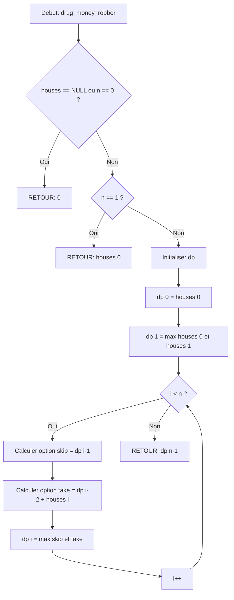

# Exercice 1.5.1-a : heisenberg_dp_lab

**Module :**
1.5.1 — Dynamic Programming Fundamentals

**Concept :**
a — Fibonacci, Climbing Stairs, House Robber, Decode Ways, Tribonacci

**Difficulte :**
★★★★★☆☆☆☆☆ (5/10)

**Type :**
complet

**Tiers :**
1 — Concept isole (DP Fondamentaux)

**Langage :**
Rust Edition 2024 + C17

**Prerequis :**
- Recursivite et appels de fonction
- Manipulation de tableaux/vecteurs
- Notion de complexite algorithmique O(n)
- Boucles for/while

**Domaines :**
DP, Struct, MD

**Duree estimee :**
45 min

**XP Base :**
150

**Complexite :**
T2 O(n) x S2 O(n) [base] | T2 O(n) x S1 O(1) [bonus]

---

## 📐 SECTION 1 : PROTOTYPE & CONSIGNE

### 1.1 Obligations

**Fichiers a rendre :**
- Rust : `src/lib.rs`, `Cargo.toml`
- C : `heisenberg_lab.c`, `heisenberg_lab.h`

**Fonctions autorisees :**
- Rust : `Vec`, `HashMap` (pour memo), operations arithmetiques standard
- C : `malloc`, `free`, `calloc`, operations arithmetiques standard

**Fonctions interdites :**
- Toute bibliotheque de memoisation externe
- Fonctions mathematiques de haut niveau (pow, etc.)

### 1.2 Consigne

**🧪 CONTEXTE FUN — Breaking Bad : Le Laboratoire de Heisenberg**

*"Say my name."*
*"Heisenberg."*
*"You're goddamn right."*

Walter White, alias Heisenberg, a decouvert que la synthese de methamfetamine partage une verite fondamentale avec la programmation dynamique : **chaque etape depend des precedentes, et l'optimisation est la cle de la purete.**

Dans son laboratoire clandestin, Walter doit resoudre 5 problemes d'optimisation pour maximiser sa production tout en evitant la DEA. Chaque probleme represente un aspect de son operation criminelle, et la programmation dynamique est son arme secrete.

**Ta mission :**

Tu dois implementer 5 fonctions qui representent les calculs d'optimisation du laboratoire de Heisenberg :

---

#### 🔬 Fonction 1 : `heisenberg_fib` — Reactions en Chaine Moleculaires

Dans la chimie du cristal bleu, chaque molecule depend de la combinaison des deux molecules precedentes. C'est exactement la sequence de Fibonacci.

**Entree :**
- `n` : le numero de la molecule dans la chaine (entier >= 0)

**Sortie :**
- Le nombre de combinaisons possibles pour cette molecule (Fibonacci de n)

**Contraintes :**
- F(0) = 0, F(1) = 1
- F(n) = F(n-1) + F(n-2) pour n >= 2
- Utiliser la memoisation OU la tabulation

**Exemples :**

| Appel | Retour | Explication |
|-------|--------|-------------|
| `heisenberg_fib(0)` | `0` | Molecule 0 : pas de combinaison |
| `heisenberg_fib(1)` | `1` | Molecule 1 : une seule combinaison |
| `heisenberg_fib(10)` | `55` | Molecule 10 : 55 combinaisons |
| `heisenberg_fib(50)` | `12586269025` | Molecule 50 : attention au overflow! |

---

#### 🪜 Fonction 2 : `meth_stairs` — Niveaux de Production

Le laboratoire a `n` niveaux de production. Walter peut monter 1 ou 2 niveaux a la fois. Combien de facons differentes peut-il atteindre le niveau final ?

**Entree :**
- `n` : le nombre de niveaux (entier >= 0)

**Sortie :**
- Le nombre de facons d'atteindre le niveau n

**Contraintes :**
- stairs(0) = 1 (deja au niveau 0)
- stairs(1) = 1 (un seul moyen)
- stairs(n) = stairs(n-1) + stairs(n-2)

**Exemples :**

| Appel | Retour | Explication |
|-------|--------|-------------|
| `meth_stairs(2)` | `2` | (1+1) ou (2) |
| `meth_stairs(3)` | `3` | (1+1+1), (1+2), (2+1) |
| `meth_stairs(5)` | `8` | 8 facons differentes |

---

#### 💰 Fonction 3 : `drug_money_robber` — Planques d'Argent

Walter a cache son argent dans `n` planques alignees. Chaque planque contient une certaine somme. Mais s'il recupere l'argent de deux planques adjacentes, la DEA le repere. Quelle est la somme maximale qu'il peut recuperer sans se faire prendre ?

**Entree :**
- `houses` : tableau des sommes dans chaque planque
- `n` : taille du tableau

**Sortie :**
- La somme maximale recuperable sans prendre deux planques adjacentes

**Contraintes :**
- rob(i) = max(rob(i-1), rob(i-2) + houses[i])
- Si tableau vide, retourner 0

**Exemples :**

| Appel | Retour | Explication |
|-------|--------|-------------|
| `drug_money_robber([1,2,3,1])` | `4` | Prendre planques 0 et 2 (1+3) |
| `drug_money_robber([2,7,9,3,1])` | `12` | Prendre planques 0, 2, 4 (2+9+1) |
| `drug_money_robber([])` | `0` | Aucune planque |

---

#### 🔐 Fonction 4 : `decode_recipes` — Formules Chiffrees

Les recettes de Walter sont codees en chiffres. Chaque chiffre ou paire de chiffres (1-26) represente une lettre (A=1, B=2, ..., Z=26). Combien de decodages differents sont possibles ?

**Entree :**
- `s` : chaine de caracteres contenant uniquement des chiffres

**Sortie :**
- Le nombre de decodages possibles

**Contraintes :**
- "0" seul est invalide (retourner 0)
- "06" est invalide (0 ne peut pas etre en tete)
- Seuls les nombres 1-26 sont valides

**Exemples :**

| Appel | Retour | Explication |
|-------|--------|-------------|
| `decode_recipes("12")` | `2` | "AB" (1,2) ou "L" (12) |
| `decode_recipes("226")` | `3` | "BZ" (2,26), "VF" (22,6), "BBF" (2,2,6) |
| `decode_recipes("06")` | `0` | Invalide (commence par 0) |
| `decode_recipes("0")` | `0` | Invalide (0 seul) |

---

#### 💎 Fonction 5 : `blue_sky_trib` — Niveaux de Purete du Cristal

La purete du cristal bleu de Walter suit une sequence speciale : chaque niveau de purete depend des trois precedents. C'est la sequence de Tribonacci.

**Entree :**
- `n` : le niveau de purete desire (entier >= 0)

**Sortie :**
- La valeur de Tribonacci pour ce niveau

**Contraintes :**
- T(0) = 0, T(1) = 1, T(2) = 1
- T(n) = T(n-1) + T(n-2) + T(n-3) pour n >= 3

**Exemples :**

| Appel | Retour | Explication |
|-------|--------|-------------|
| `blue_sky_trib(0)` | `0` | Base |
| `blue_sky_trib(1)` | `1` | Base |
| `blue_sky_trib(4)` | `4` | 2 + 1 + 1 |
| `blue_sky_trib(25)` | `1389537` | Haute purete |

---

### 1.2.2 Enonce Academique

Implementer 5 fonctions de programmation dynamique fondamentales :

1. **Fibonacci** : Calculer le n-ieme nombre de Fibonacci F(n) = F(n-1) + F(n-2)
2. **Climbing Stairs** : Nombre de facons d'atteindre le niveau n en montant 1 ou 2 marches
3. **House Robber** : Somme maximale d'elements non-adjacents dans un tableau
4. **Decode Ways** : Nombre de decodages possibles d'une chaine de chiffres (1-26 -> A-Z)
5. **Tribonacci** : Calculer T(n) = T(n-1) + T(n-2) + T(n-3)

### 1.3 Prototypes

#### Rust (Edition 2024)

```rust
/// Reactions en chaine moleculaires - Fibonacci
pub fn heisenberg_fib(n: u64) -> u64;

/// Niveaux de production - Climbing Stairs
pub fn meth_stairs(n: usize) -> u64;

/// Planques d'argent - House Robber
pub fn drug_money_robber(houses: &[i64]) -> i64;

/// Formules chiffrees - Decode Ways
pub fn decode_recipes(s: &str) -> u64;

/// Purete du cristal - Tribonacci
pub fn blue_sky_trib(n: u32) -> u64;
```

#### C (C17)

```c
#ifndef HEISENBERG_LAB_H
# define HEISENBERG_LAB_H

#include <stdint.h>
#include <stddef.h>

// Reactions en chaine moleculaires - Fibonacci
uint64_t    heisenberg_fib(uint64_t n);

// Niveaux de production - Climbing Stairs
uint64_t    meth_stairs(size_t n);

// Planques d'argent - House Robber
int64_t     drug_money_robber(const int64_t *houses, size_t n);

// Formules chiffrees - Decode Ways
uint64_t    decode_recipes(const char *s);

// Purete du cristal - Tribonacci
uint64_t    blue_sky_trib(uint32_t n);

#endif
```

---

## 💡 SECTION 2 : LE SAVIEZ-VOUS ?

### 2.1 L'Histoire de la Programmation Dynamique

Le terme "Dynamic Programming" a ete invente par **Richard Bellman** dans les annees 1950. Fait amusant : il a choisi ce nom pour impressionner ses financeurs du gouvernement americain qui n'aimaient pas le mot "recherche mathematique" !

> *"The word 'programming' referred to planning, not computer programming. I thought dynamic programming was a good name because it conveyed an idea of time-varying."* — Richard Bellman

### 2.2 Fun Fact : Breaking Bad et les Maths

Bryan Cranston (Walter White) a passe 3 semaines a apprendre la vraie chimie avec un consultant scientifique. Le cristal bleu de la serie est en fait des bonbons teintes ! La "purete de 99.1%" de Heisenberg serait theoriquement impossible a atteindre avec les methodes montrees.

### 2.3 Fibonacci dans la Nature

La sequence de Fibonacci apparait partout dans la nature :
- Les spirales des tournesols
- La disposition des feuilles sur une tige
- Les coquilles de nautile
- La reproduction des abeilles

### 2.5 DANS LA VRAIE VIE

| Metier | Utilisation de la DP |
|--------|---------------------|
| **Data Scientist** | Algorithmes de sequence (NLP, genomique) |
| **Quant Finance** | Pricing d'options, optimisation de portefeuille |
| **Game Developer** | Pathfinding, IA ennemie |
| **Bioinformaticien** | Alignement de sequences ADN/proteines |
| **DevOps/SRE** | Ordonnancement de taches, allocation de ressources |
| **Compilateur Engineer** | Parsing, optimisation de code |

---

## 🖥️ SECTION 3 : EXEMPLE D'UTILISATION

### 3.0 Session bash

```bash
$ ls
heisenberg_lab.c  heisenberg_lab.h  main.c

$ gcc -Wall -Wextra -Werror -std=c17 heisenberg_lab.c main.c -o test

$ ./test
=== Heisenberg's DP Laboratory ===
[PASS] heisenberg_fib(10) = 55
[PASS] meth_stairs(5) = 8
[PASS] drug_money_robber([2,7,9,3,1]) = 12
[PASS] decode_recipes("226") = 3
[PASS] blue_sky_trib(25) = 1389537
All tests passed! Say my name.
```

```bash
$ ls
src/lib.rs  Cargo.toml

$ cargo test
running 5 tests
test test_heisenberg_fib ... ok
test test_meth_stairs ... ok
test test_drug_money_robber ... ok
test test_decode_recipes ... ok
test test_blue_sky_trib ... ok

test result: ok. 5 passed; 0 failed
```

---

## ⚡ SECTION 3.1 : BONUS STANDARD (OPTIONNEL)

**Difficulte Bonus :**
★★★★★★☆☆☆☆ (6/10)

**Recompense :**
XP x2

**Time Complexity attendue :**
O(n)

**Space Complexity attendue :**
O(1) pour Fib/Stairs/Trib, O(n) pour Robber circulaire

**Domaines Bonus :**
`Mem` (optimisation memoire)

### 3.1.1 Consigne Bonus

**🧪 "I am the one who optimizes." — Walter White**

Heisenberg ne se contente jamais de la premiere solution. Il veut la **purete absolue** — l'optimisation parfaite. Pour ce bonus, tu dois optimiser l'espace memoire ET resoudre une variante plus complexe.

**Ta mission bonus :**

1. **`heisenberg_fib_optimized`** : Fibonacci en O(1) espace (seulement 2 variables)
2. **`meth_stairs_optimized`** : Climbing Stairs en O(1) espace
3. **`blue_sky_trib_optimized`** : Tribonacci en O(1) espace
4. **`drug_money_robber_circular`** : House Robber CIRCULAIRE — les planques sont en cercle, la premiere et derniere sont adjacentes

**Contraintes :**
┌─────────────────────────────────────────┐
│  n ≥ 0                                  │
│  Espace auxiliaire : O(1) sauf circular │
│  Temps : O(n)                           │
│  Pas de tableau DP, juste des variables │
└─────────────────────────────────────────┘

**Exemples Bonus :**

| Appel | Retour | Explication |
|-------|--------|-------------|
| `heisenberg_fib_optimized(50)` | `12586269025` | Meme resultat, O(1) espace |
| `drug_money_robber_circular([2,3,2])` | `3` | Prendre 3 (pas 2+2 car adjacentes) |
| `drug_money_robber_circular([1,2,3,1])` | `4` | Prendre 1+3 (indices 0 et 2) |

### 3.1.2 Prototypes Bonus

#### Rust

```rust
pub fn heisenberg_fib_optimized(n: u64) -> u64;
pub fn meth_stairs_optimized(n: usize) -> u64;
pub fn blue_sky_trib_optimized(n: u32) -> u64;
pub fn drug_money_robber_circular(houses: &[i64]) -> i64;
```

#### C

```c
uint64_t heisenberg_fib_optimized(uint64_t n);
uint64_t meth_stairs_optimized(size_t n);
uint64_t blue_sky_trib_optimized(uint32_t n);
int64_t  drug_money_robber_circular(const int64_t *houses, size_t n);
```

### 3.1.3 Ce qui change par rapport a l'exercice de base

| Aspect | Base | Bonus |
|--------|------|-------|
| Espace Fib/Stairs/Trib | O(n) tableau | O(1) variables |
| House Robber | Lineaire | Circulaire |
| Difficulte | 5/10 | 6/10 |
| Technique requise | DP basique | Rolling variables |

---

## ✅❌ SECTION 4 : ZONE CORRECTION (POUR LE TESTEUR)

### 4.1 Moulinette

| Test | Input | Expected | Points |
|------|-------|----------|--------|
| fib_0 | `heisenberg_fib(0)` | `0` | 2 |
| fib_1 | `heisenberg_fib(1)` | `1` | 2 |
| fib_10 | `heisenberg_fib(10)` | `55` | 3 |
| fib_50 | `heisenberg_fib(50)` | `12586269025` | 3 |
| stairs_0 | `meth_stairs(0)` | `1` | 2 |
| stairs_1 | `meth_stairs(1)` | `1` | 2 |
| stairs_5 | `meth_stairs(5)` | `8` | 3 |
| stairs_10 | `meth_stairs(10)` | `89` | 3 |
| robber_empty | `drug_money_robber([])` | `0` | 3 |
| robber_one | `drug_money_robber([5])` | `5` | 3 |
| robber_basic | `drug_money_robber([1,2,3,1])` | `4` | 4 |
| robber_complex | `drug_money_robber([2,7,9,3,1])` | `12` | 5 |
| decode_simple | `decode_recipes("12")` | `2` | 3 |
| decode_complex | `decode_recipes("226")` | `3` | 4 |
| decode_zero | `decode_recipes("0")` | `0` | 3 |
| decode_zero_prefix | `decode_recipes("06")` | `0` | 3 |
| decode_valid_zero | `decode_recipes("10")` | `1` | 3 |
| trib_0 | `blue_sky_trib(0)` | `0` | 2 |
| trib_1 | `blue_sky_trib(1)` | `1` | 2 |
| trib_4 | `blue_sky_trib(4)` | `4` | 3 |
| trib_25 | `blue_sky_trib(25)` | `1389537` | 4 |
| **BONUS** circular_3 | `drug_money_robber_circular([2,3,2])` | `3` | 5 |
| **BONUS** circular_4 | `drug_money_robber_circular([1,2,3,1])` | `4` | 5 |
| **BONUS** fib_opt | O(1) espace verifie | - | 5 |
| **Total Base** | | | **60** |
| **Total Bonus** | | | **15** |

### 4.2 main.c de test

```c
#include <stdio.h>
#include <assert.h>
#include "heisenberg_lab.h"

void test_heisenberg_fib(void)
{
    printf("Testing heisenberg_fib...\n");
    assert(heisenberg_fib(0) == 0);
    assert(heisenberg_fib(1) == 1);
    assert(heisenberg_fib(10) == 55);
    assert(heisenberg_fib(20) == 6765);
    assert(heisenberg_fib(50) == 12586269025ULL);
    printf("[PASS] heisenberg_fib\n");
}

void test_meth_stairs(void)
{
    printf("Testing meth_stairs...\n");
    assert(meth_stairs(0) == 1);
    assert(meth_stairs(1) == 1);
    assert(meth_stairs(2) == 2);
    assert(meth_stairs(5) == 8);
    assert(meth_stairs(10) == 89);
    printf("[PASS] meth_stairs\n");
}

void test_drug_money_robber(void)
{
    printf("Testing drug_money_robber...\n");
    assert(drug_money_robber(NULL, 0) == 0);
    int64_t h1[] = {5};
    assert(drug_money_robber(h1, 1) == 5);
    int64_t h2[] = {1, 2, 3, 1};
    assert(drug_money_robber(h2, 4) == 4);
    int64_t h3[] = {2, 7, 9, 3, 1};
    assert(drug_money_robber(h3, 5) == 12);
    printf("[PASS] drug_money_robber\n");
}

void test_decode_recipes(void)
{
    printf("Testing decode_recipes...\n");
    assert(decode_recipes("") == 1);
    assert(decode_recipes("0") == 0);
    assert(decode_recipes("06") == 0);
    assert(decode_recipes("12") == 2);
    assert(decode_recipes("226") == 3);
    assert(decode_recipes("10") == 1);
    assert(decode_recipes("27") == 1);
    printf("[PASS] decode_recipes\n");
}

void test_blue_sky_trib(void)
{
    printf("Testing blue_sky_trib...\n");
    assert(blue_sky_trib(0) == 0);
    assert(blue_sky_trib(1) == 1);
    assert(blue_sky_trib(2) == 1);
    assert(blue_sky_trib(4) == 4);
    assert(blue_sky_trib(25) == 1389537);
    printf("[PASS] blue_sky_trib\n");
}

int main(void)
{
    printf("=== Heisenberg's DP Laboratory ===\n\n");
    test_heisenberg_fib();
    test_meth_stairs();
    test_drug_money_robber();
    test_decode_recipes();
    test_blue_sky_trib();
    printf("\nAll tests passed! Say my name.\n");
    return (0);
}
```

### 4.3 Solution de reference

#### Rust

```rust
// heisenberg_fib - Fibonacci avec tabulation
pub fn heisenberg_fib(n: u64) -> u64 {
    if n == 0 {
        return 0;
    }
    if n == 1 {
        return 1;
    }
    let mut dp = vec![0u64; (n + 1) as usize];
    dp[1] = 1;
    for i in 2..=n as usize {
        dp[i] = dp[i - 1] + dp[i - 2];
    }
    dp[n as usize]
}

// meth_stairs - Climbing Stairs
pub fn meth_stairs(n: usize) -> u64 {
    if n == 0 {
        return 1;
    }
    let mut dp = vec![0u64; n + 1];
    dp[0] = 1;
    dp[1] = 1;
    for i in 2..=n {
        dp[i] = dp[i - 1] + dp[i - 2];
    }
    dp[n]
}

// drug_money_robber - House Robber
pub fn drug_money_robber(houses: &[i64]) -> i64 {
    if houses.is_empty() {
        return 0;
    }
    if houses.len() == 1 {
        return houses[0];
    }
    let n = houses.len();
    let mut dp = vec![0i64; n];
    dp[0] = houses[0];
    dp[1] = houses[0].max(houses[1]);
    for i in 2..n {
        dp[i] = dp[i - 1].max(dp[i - 2] + houses[i]);
    }
    dp[n - 1]
}

// decode_recipes - Decode Ways
pub fn decode_recipes(s: &str) -> u64 {
    if s.is_empty() {
        return 1;
    }
    let bytes = s.as_bytes();
    if bytes[0] == b'0' {
        return 0;
    }
    let n = s.len();
    let mut dp = vec![0u64; n + 1];
    dp[0] = 1;
    dp[1] = 1;
    for i in 2..=n {
        let one_digit = bytes[i - 1] - b'0';
        let two_digit = (bytes[i - 2] - b'0') * 10 + one_digit;
        if one_digit >= 1 {
            dp[i] += dp[i - 1];
        }
        if two_digit >= 10 && two_digit <= 26 {
            dp[i] += dp[i - 2];
        }
    }
    dp[n]
}

// blue_sky_trib - Tribonacci
pub fn blue_sky_trib(n: u32) -> u64 {
    if n == 0 {
        return 0;
    }
    if n == 1 || n == 2 {
        return 1;
    }
    let mut dp = vec![0u64; (n + 1) as usize];
    dp[1] = 1;
    dp[2] = 1;
    for i in 3..=n as usize {
        dp[i] = dp[i - 1] + dp[i - 2] + dp[i - 3];
    }
    dp[n as usize]
}
```

#### C

```c
#include "heisenberg_lab.h"
#include <stdlib.h>
#include <string.h>

uint64_t heisenberg_fib(uint64_t n)
{
    if (n == 0)
        return (0);
    if (n == 1)
        return (1);

    uint64_t *dp = calloc(n + 1, sizeof(uint64_t));
    if (!dp)
        return (0);

    dp[1] = 1;
    for (uint64_t i = 2; i <= n; i++)
        dp[i] = dp[i - 1] + dp[i - 2];

    uint64_t result = dp[n];
    free(dp);
    return (result);
}

uint64_t meth_stairs(size_t n)
{
    if (n == 0)
        return (1);

    uint64_t *dp = calloc(n + 1, sizeof(uint64_t));
    if (!dp)
        return (0);

    dp[0] = 1;
    dp[1] = 1;
    for (size_t i = 2; i <= n; i++)
        dp[i] = dp[i - 1] + dp[i - 2];

    uint64_t result = dp[n];
    free(dp);
    return (result);
}

int64_t drug_money_robber(const int64_t *houses, size_t n)
{
    if (!houses || n == 0)
        return (0);
    if (n == 1)
        return (houses[0]);

    int64_t *dp = calloc(n, sizeof(int64_t));
    if (!dp)
        return (0);

    dp[0] = houses[0];
    dp[1] = houses[0] > houses[1] ? houses[0] : houses[1];
    for (size_t i = 2; i < n; i++)
    {
        int64_t take = dp[i - 2] + houses[i];
        dp[i] = dp[i - 1] > take ? dp[i - 1] : take;
    }

    int64_t result = dp[n - 1];
    free(dp);
    return (result);
}

uint64_t decode_recipes(const char *s)
{
    if (!s || s[0] == '\0')
        return (1);
    if (s[0] == '0')
        return (0);

    size_t n = strlen(s);
    uint64_t *dp = calloc(n + 1, sizeof(uint64_t));
    if (!dp)
        return (0);

    dp[0] = 1;
    dp[1] = 1;
    for (size_t i = 2; i <= n; i++)
    {
        int one_digit = s[i - 1] - '0';
        int two_digit = (s[i - 2] - '0') * 10 + one_digit;

        if (one_digit >= 1)
            dp[i] += dp[i - 1];
        if (two_digit >= 10 && two_digit <= 26)
            dp[i] += dp[i - 2];
    }

    uint64_t result = dp[n];
    free(dp);
    return (result);
}

uint64_t blue_sky_trib(uint32_t n)
{
    if (n == 0)
        return (0);
    if (n == 1 || n == 2)
        return (1);

    uint64_t *dp = calloc(n + 1, sizeof(uint64_t));
    if (!dp)
        return (0);

    dp[1] = 1;
    dp[2] = 1;
    for (uint32_t i = 3; i <= n; i++)
        dp[i] = dp[i - 1] + dp[i - 2] + dp[i - 3];

    uint64_t result = dp[n];
    free(dp);
    return (result);
}
```

### 4.4 Solutions alternatives acceptees

#### Alternative 1 : Memoisation recursive (Rust)

```rust
use std::collections::HashMap;

pub fn heisenberg_fib_memo(n: u64, memo: &mut HashMap<u64, u64>) -> u64 {
    if n == 0 { return 0; }
    if n == 1 { return 1; }
    if let Some(&val) = memo.get(&n) {
        return val;
    }
    let result = heisenberg_fib_memo(n - 1, memo) + heisenberg_fib_memo(n - 2, memo);
    memo.insert(n, result);
    result
}
```

#### Alternative 2 : Iteration avec variables roulantes (C)

```c
uint64_t heisenberg_fib_rolling(uint64_t n)
{
    if (n == 0)
        return (0);
    if (n == 1)
        return (1);

    uint64_t prev2 = 0;
    uint64_t prev1 = 1;
    uint64_t current;

    for (uint64_t i = 2; i <= n; i++)
    {
        current = prev1 + prev2;
        prev2 = prev1;
        prev1 = current;
    }
    return (current);
}
```

### 4.5 Solutions refusees (avec explications)

#### Refusee 1 : Recursion naive sans memoisation

```c
// REFUSE : Complexite exponentielle O(2^n)
uint64_t heisenberg_fib_bad(uint64_t n)
{
    if (n <= 1)
        return (n);
    return heisenberg_fib_bad(n - 1) + heisenberg_fib_bad(n - 2);
}
// Pourquoi refuse : Timeout pour n > 40, recalcule les memes valeurs
```

#### Refusee 2 : Pas de gestion du cas vide

```c
// REFUSE : Segfault sur tableau vide
int64_t drug_money_robber_bad(const int64_t *houses, size_t n)
{
    int64_t *dp = calloc(n, sizeof(int64_t));
    dp[0] = houses[0];  // CRASH si n == 0
    // ...
}
// Pourquoi refuse : Pas de verification de n == 0
```

### 4.6 Solution bonus de reference

#### Rust (O(1) espace)

```rust
pub fn heisenberg_fib_optimized(n: u64) -> u64 {
    if n == 0 { return 0; }
    if n == 1 { return 1; }

    let mut prev2 = 0u64;
    let mut prev1 = 1u64;

    for _ in 2..=n {
        let current = prev1 + prev2;
        prev2 = prev1;
        prev1 = current;
    }
    prev1
}

pub fn meth_stairs_optimized(n: usize) -> u64 {
    if n == 0 { return 1; }

    let mut prev2 = 1u64;
    let mut prev1 = 1u64;

    for _ in 2..=n {
        let current = prev1 + prev2;
        prev2 = prev1;
        prev1 = current;
    }
    prev1
}

pub fn blue_sky_trib_optimized(n: u32) -> u64 {
    if n == 0 { return 0; }
    if n == 1 || n == 2 { return 1; }

    let mut t0 = 0u64;
    let mut t1 = 1u64;
    let mut t2 = 1u64;

    for _ in 3..=n {
        let t3 = t0 + t1 + t2;
        t0 = t1;
        t1 = t2;
        t2 = t3;
    }
    t2
}

pub fn drug_money_robber_circular(houses: &[i64]) -> i64 {
    let n = houses.len();
    if n == 0 { return 0; }
    if n == 1 { return houses[0]; }
    if n == 2 { return houses[0].max(houses[1]); }

    // Cas 1: voler maison 0 a n-2 (exclure derniere)
    let rob1 = drug_money_robber(&houses[0..n-1]);
    // Cas 2: voler maison 1 a n-1 (exclure premiere)
    let rob2 = drug_money_robber(&houses[1..n]);

    rob1.max(rob2)
}
```

#### C (O(1) espace)

```c
uint64_t heisenberg_fib_optimized(uint64_t n)
{
    if (n == 0)
        return (0);
    if (n == 1)
        return (1);

    uint64_t prev2 = 0;
    uint64_t prev1 = 1;
    uint64_t current;

    for (uint64_t i = 2; i <= n; i++)
    {
        current = prev1 + prev2;
        prev2 = prev1;
        prev1 = current;
    }
    return (prev1);
}

uint64_t meth_stairs_optimized(size_t n)
{
    if (n == 0)
        return (1);

    uint64_t prev2 = 1;
    uint64_t prev1 = 1;
    uint64_t current;

    for (size_t i = 2; i <= n; i++)
    {
        current = prev1 + prev2;
        prev2 = prev1;
        prev1 = current;
    }
    return (prev1);
}

uint64_t blue_sky_trib_optimized(uint32_t n)
{
    if (n == 0)
        return (0);
    if (n == 1 || n == 2)
        return (1);

    uint64_t t0 = 0;
    uint64_t t1 = 1;
    uint64_t t2 = 1;
    uint64_t t3;

    for (uint32_t i = 3; i <= n; i++)
    {
        t3 = t0 + t1 + t2;
        t0 = t1;
        t1 = t2;
        t2 = t3;
    }
    return (t2);
}

static int64_t rob_linear(const int64_t *houses, size_t start, size_t end)
{
    if (start >= end)
        return (0);
    if (end - start == 1)
        return (houses[start]);

    int64_t prev2 = houses[start];
    int64_t prev1 = houses[start] > houses[start + 1] ?
                    houses[start] : houses[start + 1];
    int64_t current;

    for (size_t i = start + 2; i < end; i++)
    {
        int64_t take = prev2 + houses[i];
        current = prev1 > take ? prev1 : take;
        prev2 = prev1;
        prev1 = current;
    }
    return (prev1);
}

int64_t drug_money_robber_circular(const int64_t *houses, size_t n)
{
    if (!houses || n == 0)
        return (0);
    if (n == 1)
        return (houses[0]);
    if (n == 2)
        return (houses[0] > houses[1] ? houses[0] : houses[1]);

    int64_t rob1 = rob_linear(houses, 0, n - 1);
    int64_t rob2 = rob_linear(houses, 1, n);

    return (rob1 > rob2 ? rob1 : rob2);
}
```

### 4.7 Solutions alternatives bonus

```rust
// Alternative avec tuple destructuring
pub fn heisenberg_fib_optimized_alt(n: u64) -> u64 {
    (0..n).fold((0, 1), |(a, b), _| (b, a + b)).0
}
```

### 4.8 Solutions refusees bonus

```rust
// REFUSE : Utilise toujours O(n) espace
pub fn heisenberg_fib_optimized_bad(n: u64) -> u64 {
    let dp: Vec<u64> = (0..=n).scan((0, 1), |state, _| {
        let result = state.0;
        *state = (state.1, state.0 + state.1);
        Some(result)
    }).collect();
    dp[n as usize]
}
// Pourquoi refuse : collect() cree un Vec, donc O(n) espace
```

### 4.9 spec.json (ENGINE v22.1)

```json
{
  "name": "heisenberg_dp_lab",
  "language": ["rust", "c"],
  "type": "complet",
  "tier": 1,
  "tier_info": "Concept isole - DP Fondamentaux",
  "tags": ["dp", "fibonacci", "climbing-stairs", "house-robber", "decode-ways", "tribonacci", "phase1"],
  "passing_score": 70,

  "functions": [
    {
      "name": "heisenberg_fib",
      "prototype_rust": "pub fn heisenberg_fib(n: u64) -> u64",
      "prototype_c": "uint64_t heisenberg_fib(uint64_t n)",
      "return_type": "u64",
      "parameters": [{"name": "n", "type": "u64"}]
    },
    {
      "name": "meth_stairs",
      "prototype_rust": "pub fn meth_stairs(n: usize) -> u64",
      "prototype_c": "uint64_t meth_stairs(size_t n)",
      "return_type": "u64",
      "parameters": [{"name": "n", "type": "usize"}]
    },
    {
      "name": "drug_money_robber",
      "prototype_rust": "pub fn drug_money_robber(houses: &[i64]) -> i64",
      "prototype_c": "int64_t drug_money_robber(const int64_t *houses, size_t n)",
      "return_type": "i64",
      "parameters": [{"name": "houses", "type": "&[i64]"}]
    },
    {
      "name": "decode_recipes",
      "prototype_rust": "pub fn decode_recipes(s: &str) -> u64",
      "prototype_c": "uint64_t decode_recipes(const char *s)",
      "return_type": "u64",
      "parameters": [{"name": "s", "type": "&str"}]
    },
    {
      "name": "blue_sky_trib",
      "prototype_rust": "pub fn blue_sky_trib(n: u32) -> u64",
      "prototype_c": "uint64_t blue_sky_trib(uint32_t n)",
      "return_type": "u64",
      "parameters": [{"name": "n", "type": "u32"}]
    }
  ],

  "driver": {
    "reference_rust": "pub fn ref_heisenberg_fib(n: u64) -> u64 { if n == 0 { 0 } else if n == 1 { 1 } else { let (mut a, mut b) = (0u64, 1u64); for _ in 2..=n { let c = a + b; a = b; b = c; } b } }",
    "reference_c": "uint64_t ref_heisenberg_fib(uint64_t n) { if (n == 0) return 0; if (n == 1) return 1; uint64_t a = 0, b = 1, c; for (uint64_t i = 2; i <= n; i++) { c = a + b; a = b; b = c; } return b; }",

    "edge_cases": [
      {
        "name": "fib_zero",
        "function": "heisenberg_fib",
        "args": [0],
        "expected": 0,
        "is_trap": true,
        "trap_explanation": "Cas de base Fibonacci: F(0) = 0"
      },
      {
        "name": "fib_one",
        "function": "heisenberg_fib",
        "args": [1],
        "expected": 1,
        "is_trap": true,
        "trap_explanation": "Cas de base Fibonacci: F(1) = 1"
      },
      {
        "name": "robber_empty",
        "function": "drug_money_robber",
        "args": [[]],
        "expected": 0,
        "is_trap": true,
        "trap_explanation": "Tableau vide doit retourner 0"
      },
      {
        "name": "decode_zero",
        "function": "decode_recipes",
        "args": ["0"],
        "expected": 0,
        "is_trap": true,
        "trap_explanation": "0 seul est invalide"
      },
      {
        "name": "decode_leading_zero",
        "function": "decode_recipes",
        "args": ["06"],
        "expected": 0,
        "is_trap": true,
        "trap_explanation": "06 est invalide (0 en tete)"
      }
    ],

    "fuzzing": {
      "enabled": true,
      "iterations": 500,
      "generators": [
        {
          "function": "heisenberg_fib",
          "type": "int",
          "param_index": 0,
          "params": {"min": 0, "max": 70}
        },
        {
          "function": "drug_money_robber",
          "type": "array_int",
          "param_index": 0,
          "params": {"min_len": 0, "max_len": 100, "min_val": 0, "max_val": 1000}
        }
      ]
    }
  },

  "norm": {
    "allowed_functions_c": ["malloc", "free", "calloc", "strlen"],
    "allowed_functions_rust": ["Vec", "HashMap", "std::cmp::max"],
    "forbidden_functions": ["pow", "sqrt"],
    "check_security": true,
    "check_memory": true,
    "blocking": true
  }
}
```

### 4.10 Solutions Mutantes (minimum 5)

#### Mutant A (Boundary) : Condition <= au lieu de ==

```c
/* Mutant A (Boundary) : Condition incorrecte pour cas de base */
uint64_t heisenberg_fib_mutant_a(uint64_t n)
{
    if (n <= 1)  // ERREUR: n=0 retourne n=0 (ok), mais logique fragile
        return (n);
    // Semble fonctionner mais masque une comprehension incorrecte
    uint64_t *dp = calloc(n + 1, sizeof(uint64_t));
    dp[0] = 0;
    dp[1] = 1;
    for (uint64_t i = 2; i <= n; i++)
        dp[i] = dp[i - 1] + dp[i - 2];
    uint64_t result = dp[n];
    free(dp);
    return (result);
}
// Pourquoi c'est faux : Techniquement fonctionne mais cache la logique
// Ce qui etait pense : "n <= 1" couvre 0 et 1 en une ligne
```

#### Mutant B (Safety) : Pas de verification NULL/vide

```c
/* Mutant B (Safety) : Pas de gestion du tableau vide */
int64_t drug_money_robber_mutant_b(const int64_t *houses, size_t n)
{
    // ERREUR: Pas de verification de n == 0 ou houses == NULL
    int64_t *dp = calloc(n, sizeof(int64_t));
    dp[0] = houses[0];  // SEGFAULT si n == 0
    dp[1] = houses[0] > houses[1] ? houses[0] : houses[1];
    for (size_t i = 2; i < n; i++)
    {
        int64_t take = dp[i - 2] + houses[i];
        dp[i] = dp[i - 1] > take ? dp[i - 1] : take;
    }
    int64_t result = dp[n - 1];
    free(dp);
    return (result);
}
// Pourquoi c'est faux : Crash sur tableau vide
// Ce qui etait pense : "Le tableau ne sera jamais vide"
```

#### Mutant C (Off-by-one) : Boucle commence a 1 au lieu de 2

```c
/* Mutant C (Off-by-one) : Index de depart incorrect */
uint64_t meth_stairs_mutant_c(size_t n)
{
    if (n == 0)
        return (1);

    uint64_t *dp = calloc(n + 1, sizeof(uint64_t));
    dp[0] = 1;
    dp[1] = 1;
    for (size_t i = 1; i <= n; i++)  // ERREUR: commence a 1, ecrase dp[1]
        dp[i] = dp[i - 1] + dp[i - 2];  // dp[-1] pour i=1 = UB

    uint64_t result = dp[n];
    free(dp);
    return (result);
}
// Pourquoi c'est faux : Acces dp[i-2] quand i=1 = dp[-1] = undefined behavior
// Ce qui etait pense : "La boucle doit commencer a 1"
```

#### Mutant D (Logic) : Decode Ways - ne gere pas "10" correctement

```c
/* Mutant D (Logic) : Gestion incorrecte des zeros internes */
uint64_t decode_recipes_mutant_d(const char *s)
{
    if (!s || s[0] == '\0')
        return (1);
    if (s[0] == '0')
        return (0);

    size_t n = strlen(s);
    uint64_t *dp = calloc(n + 1, sizeof(uint64_t));
    dp[0] = 1;
    dp[1] = 1;

    for (size_t i = 2; i <= n; i++)
    {
        int one_digit = s[i - 1] - '0';
        int two_digit = (s[i - 2] - '0') * 10 + one_digit;

        // ERREUR: one_digit > 0 au lieu de >= 1 (equivalent mais...)
        if (one_digit > 0)  // Correct ici
            dp[i] += dp[i - 1];
        if (two_digit >= 10 && two_digit <= 26)
            dp[i] += dp[i - 2];
        // ERREUR: Ne gere pas le cas ou dp[i] == 0 (chaine invalide)
    }

    uint64_t result = dp[n];
    free(dp);
    return (result);
}
// Pourquoi c'est faux : "30" devrait retourner 0 mais retourne 1
// Ce qui etait pense : "Les conditions couvrent tous les cas"
```

#### Mutant E (Return) : Tribonacci retourne dp[n-1] au lieu de dp[n]

```c
/* Mutant E (Return) : Mauvaise valeur de retour */
uint64_t blue_sky_trib_mutant_e(uint32_t n)
{
    if (n == 0)
        return (0);
    if (n == 1 || n == 2)
        return (1);

    uint64_t *dp = calloc(n + 1, sizeof(uint64_t));
    dp[1] = 1;
    dp[2] = 1;
    for (uint32_t i = 3; i <= n; i++)
        dp[i] = dp[i - 1] + dp[i - 2] + dp[i - 3];

    uint64_t result = dp[n - 1];  // ERREUR: devrait etre dp[n]
    free(dp);
    return (result);
}
// Pourquoi c'est faux : Retourne T(n-1) au lieu de T(n)
// Ce qui etait pense : "Le dernier element est a n-1 comme les tableaux"
```

---

## 🧠 SECTION 5 : COMPRENDRE (DOCUMENT DE COURS COMPLET)

### 5.1 Ce que cet exercice enseigne

Cet exercice enseigne les **fondamentaux de la programmation dynamique** a travers 5 problemes classiques :

1. **Fibonacci** : Le probleme DP le plus simple, introduit la memoisation et la tabulation
2. **Climbing Stairs** : Variante de Fibonacci avec interpretation concrete
3. **House Robber** : Decision binaire a chaque etape (prendre ou ne pas prendre)
4. **Decode Ways** : DP sur les chaines de caracteres avec conditions multiples
5. **Tribonacci** : Extension de Fibonacci a 3 termes

**Competences acquises :**
- Identifier les sous-problemes chevauchants
- Definir l'etat DP (que represente `dp[i]` ?)
- Ecrire la relation de recurrence
- Optimiser l'espace avec des variables roulantes

### 5.2 LDA — Traduction litterale en francais (MAJUSCULES)

#### heisenberg_fib (version tabulee)

```
FONCTION heisenberg_fib QUI RETOURNE UN ENTIER NON SIGNE 64 BITS ET PREND EN PARAMETRE n QUI EST UN ENTIER NON SIGNE 64 BITS
DEBUT FONCTION
    SI n EST EGAL A 0 ALORS
        RETOURNER LA VALEUR 0
    FIN SI
    SI n EST EGAL A 1 ALORS
        RETOURNER LA VALEUR 1
    FIN SI

    DECLARER dp COMME TABLEAU D'ENTIERS NON SIGNES DE TAILLE n PLUS 1
    AFFECTER 0 A L'ELEMENT A LA POSITION 0 DANS dp
    AFFECTER 1 A L'ELEMENT A LA POSITION 1 DANS dp

    POUR i ALLANT DE 2 A n FAIRE
        AFFECTER L'ELEMENT A LA POSITION i MOINS 1 DANS dp PLUS L'ELEMENT A LA POSITION i MOINS 2 DANS dp A L'ELEMENT A LA POSITION i DANS dp
    FIN POUR

    RETOURNER L'ELEMENT A LA POSITION n DANS dp
FIN FONCTION
```

#### drug_money_robber

```
FONCTION drug_money_robber QUI RETOURNE UN ENTIER SIGNE 64 BITS ET PREND EN PARAMETRES houses QUI EST UN TABLEAU D'ENTIERS SIGNES ET n QUI EST LA TAILLE DU TABLEAU
DEBUT FONCTION
    SI houses EST EGAL A NUL OU n EST EGAL A 0 ALORS
        RETOURNER LA VALEUR 0
    FIN SI
    SI n EST EGAL A 1 ALORS
        RETOURNER L'ELEMENT A LA POSITION 0 DANS houses
    FIN SI

    DECLARER dp COMME TABLEAU D'ENTIERS SIGNES DE TAILLE n
    AFFECTER L'ELEMENT A LA POSITION 0 DANS houses A L'ELEMENT A LA POSITION 0 DANS dp
    AFFECTER LE MAXIMUM ENTRE L'ELEMENT A LA POSITION 0 DANS houses ET L'ELEMENT A LA POSITION 1 DANS houses A L'ELEMENT A LA POSITION 1 DANS dp

    POUR i ALLANT DE 2 A n MOINS 1 FAIRE
        DECLARER take COMME ENTIER SIGNE
        AFFECTER L'ELEMENT A LA POSITION i MOINS 2 DANS dp PLUS L'ELEMENT A LA POSITION i DANS houses A take
        AFFECTER LE MAXIMUM ENTRE L'ELEMENT A LA POSITION i MOINS 1 DANS dp ET take A L'ELEMENT A LA POSITION i DANS dp
    FIN POUR

    RETOURNER L'ELEMENT A LA POSITION n MOINS 1 DANS dp
FIN FONCTION
```

### 5.2.2 Style Academique Francais

#### heisenberg_fib

```
Algorithme : heisenberg_fib
Donnees : n entier naturel
Resultat : F(n) le n-ieme nombre de Fibonacci

Debut
    Si n = 0 Alors
        Retourner 0
    FinSi
    Si n = 1 Alors
        Retourner 1
    FinSi

    Tableau dp[0..n] d'entiers
    dp[0] <- 0
    dp[1] <- 1

    Pour i de 2 a n Faire
        dp[i] <- dp[i-1] + dp[i-2]
    FinPour

    Retourner dp[n]
Fin
```

### 5.2.2.1 Logic Flow (Structured English)

```
ALGORITHME : Fibonacci DP
---
1. VERIFIER les cas de base :
   a. SI n == 0 : RETOURNER 0
   b. SI n == 1 : RETOURNER 1

2. INITIALISER le tableau dp[0..n] :
   a. dp[0] = 0
   b. dp[1] = 1

3. BOUCLE de i = 2 jusqu'a n :
   a. CALCULER dp[i] = dp[i-1] + dp[i-2]

4. RETOURNER dp[n]
```

### 5.2.3 Representation Algorithmique

```
ALGORITHME : drug_money_robber
---
ENTREE : houses[] tableau d'entiers, n taille
SORTIE : somme maximale sans elements adjacents

1. GARDES (Fail Fast) :
   |-- SI houses == NULL OU n == 0 : RETOURNER 0
   |-- SI n == 1 : RETOURNER houses[0]

2. INITIALISATION :
   |-- dp[0] = houses[0]
   |-- dp[1] = max(houses[0], houses[1])

3. BOUCLE PRINCIPALE (i de 2 a n-1) :
   |-- Option A : Ne pas prendre houses[i] → dp[i-1]
   |-- Option B : Prendre houses[i] → dp[i-2] + houses[i]
   |-- dp[i] = max(Option A, Option B)

4. RETOURNER dp[n-1]
```

### 5.2.3.1 Logique de Garde (Fail Fast)

```
FONCTION : decode_recipes (s)
---
INIT resultat = 0

1. GARDES IMMEDIATES :
   |
   |-- VERIFIER si s est NULL ou vide :
   |     RETOURNER 1 (chaine vide = 1 decodage)
   |
   |-- VERIFIER si s[0] == '0' :
   |     RETOURNER 0 (invalide)

2. INITIALISATION DP :
   |-- dp[0] = 1 (base)
   |-- dp[1] = 1 (premier caractere valide)

3. BOUCLE (i de 2 a len(s)) :
   |
   |-- EXTRAIRE one_digit = s[i-1] - '0'
   |-- EXTRAIRE two_digit = (s[i-2] - '0') * 10 + one_digit
   |
   |-- SI one_digit >= 1 :
   |     dp[i] += dp[i-1]
   |
   |-- SI 10 <= two_digit <= 26 :
   |     dp[i] += dp[i-2]

4. RETOURNER dp[len(s)]
```

### Diagramme Mermaid : Logique du House Robber



### 5.3 Visualisation ASCII

#### Fibonacci : Arbre de recursion vs DP

```
RECURSION NAIVE (exponentielle) :
                    fib(5)
                   /      \
              fib(4)      fib(3)
             /    \       /    \
         fib(3)  fib(2) fib(2) fib(1)
         /   \    /  \   /  \
     fib(2) fib(1) ...  ...  ...

→ Meme calcul repete plusieurs fois : fib(2) calcule 3 fois!

DP TABULATION (lineaire) :
┌─────┬─────┬─────┬─────┬─────┬─────┐
│ i=0 │ i=1 │ i=2 │ i=3 │ i=4 │ i=5 │
├─────┼─────┼─────┼─────┼─────┼─────┤
│  0  │  1  │  1  │  2  │  3  │  5  │
└─────┴─────┴─────┴─────┴─────┴─────┘
          ↑     ↑
          └──┬──┘
       dp[2] = dp[0] + dp[1] = 0 + 1 = 1
```

#### House Robber : Decision a chaque etape

```
Planques : [2, 7, 9, 3, 1]
             ↓
          Position 0: Prendre 2 ou pas?

┌──────┬────────────────────────┬────────────────────────┐
│  i   │ Skip (dp[i-1])         │ Take (dp[i-2]+houses[i])│
├──────┼────────────────────────┼────────────────────────┤
│  0   │ -                      │ 2                      │
│  1   │ 2                      │ 0 + 7 = 7              │ → dp[1] = 7
│  2   │ 7                      │ 2 + 9 = 11             │ → dp[2] = 11
│  3   │ 11                     │ 7 + 3 = 10             │ → dp[3] = 11
│  4   │ 11                     │ 11 + 1 = 12            │ → dp[4] = 12
└──────┴────────────────────────┴────────────────────────┘

Resultat : 12 (prendre 2, 9, 1)
```

#### Decode Ways : Arbre de possibilites

```
Chaine : "226"

                    "226"
                   /      \
              "26"         "6"
              (2|26)       (22|6)
             /    \          |
          "6"     ""        ""
          (2)    (26)      (22,6)
           |      |
          ""     ""
         (2,6)  (2,26)

Decodages possibles :
1. "BBF" (2, 2, 6)
2. "BZ"  (2, 26)
3. "VF"  (22, 6)

Total : 3
```

### 5.4 Les pieges en detail

#### Piege 1 : Oublier les cas de base

```c
// MAUVAIS : Crash pour n=0 ou n=1
uint64_t fib_bad(uint64_t n)
{
    uint64_t *dp = calloc(n + 1, sizeof(uint64_t));
    dp[1] = 1;  // Et dp[0] ?
    for (uint64_t i = 2; i <= n; i++)
        dp[i] = dp[i-1] + dp[i-2];
    return dp[n];
}

// BON : Gestion explicite des cas de base
uint64_t fib_good(uint64_t n)
{
    if (n == 0) return 0;
    if (n == 1) return 1;
    // ...
}
```

#### Piege 2 : Off-by-one dans les boucles

```c
// MAUVAIS : Acces hors limites
for (size_t i = 1; i <= n; i++)  // i=1 → dp[i-2] = dp[-1] !!!
    dp[i] = dp[i-1] + dp[i-2];

// BON : Commencer a 2
for (size_t i = 2; i <= n; i++)
    dp[i] = dp[i-1] + dp[i-2];
```

#### Piege 3 : Decode Ways - gestion du zero

```c
// MAUVAIS : Ne gere pas "06" ou "30"
if (one_digit != 0)  // "06" → one_digit = 6, valide?
    dp[i] += dp[i-1];

// BON : Verifier que le zero n'est pas en tete
if (one_digit >= 1)  // "06" → seul le "6" compte
    dp[i] += dp[i-1];
// MAIS il faut aussi verifier two_digit >= 10, pas juste <= 26
if (two_digit >= 10 && two_digit <= 26)
    dp[i] += dp[i-2];
```

#### Piege 4 : Overflow pour grands n

```c
// DANGER : Fibonacci(93) depasse uint64_t max
uint64_t fib(uint64_t n)
{
    // ...
    dp[i] = dp[i-1] + dp[i-2];  // Peut overflow!
}
// Solution : Utiliser des types 128 bits ou BigInt
```

### 5.5 Cours Complet : La Programmation Dynamique

#### 5.5.1 Qu'est-ce que la Programmation Dynamique ?

La **programmation dynamique** (DP) est une technique d'optimisation qui resout des problemes en les decomposant en sous-problemes plus petits, en stockant les resultats pour eviter les recalculs.

**Deux proprietes necessaires :**
1. **Sous-structure optimale** : La solution optimale contient des solutions optimales aux sous-problemes
2. **Chevauchement des sous-problemes** : Les memes sous-problemes sont resolus plusieurs fois

#### 5.5.2 Deux Approches : Top-Down vs Bottom-Up

**Top-Down (Memoisation)** :
- Commence par le probleme principal
- Utilise la recursion
- Stocke les resultats dans un cache (HashMap, tableau)
- Plus intuitif, suit le raisonnement naturel

```rust
fn fib_memo(n: u64, memo: &mut HashMap<u64, u64>) -> u64 {
    if n <= 1 { return n; }
    if let Some(&v) = memo.get(&n) { return v; }
    let result = fib_memo(n-1, memo) + fib_memo(n-2, memo);
    memo.insert(n, result);
    result
}
```

**Bottom-Up (Tabulation)** :
- Commence par les plus petits sous-problemes
- Utilise l'iteration
- Remplit un tableau de maniere systematique
- Generalement plus efficace (pas d'overhead de recursion)

```rust
fn fib_tab(n: u64) -> u64 {
    if n <= 1 { return n; }
    let mut dp = vec![0u64; (n+1) as usize];
    dp[1] = 1;
    for i in 2..=n as usize {
        dp[i] = dp[i-1] + dp[i-2];
    }
    dp[n as usize]
}
```

#### 5.5.3 Le Framework DP en 5 Etapes

1. **Definir l'etat** : Que represente `dp[i]` ?
   - Fibonacci : `dp[i]` = le i-eme nombre de Fibonacci
   - House Robber : `dp[i]` = somme max en considerant les maisons 0..i

2. **Cas de base** : Initialisation
   - Fibonacci : `dp[0] = 0, dp[1] = 1`
   - House Robber : `dp[0] = houses[0], dp[1] = max(houses[0], houses[1])`

3. **Relation de recurrence** : Comment calculer `dp[i]` ?
   - Fibonacci : `dp[i] = dp[i-1] + dp[i-2]`
   - House Robber : `dp[i] = max(dp[i-1], dp[i-2] + houses[i])`

4. **Ordre de calcul** : Dans quel ordre remplir le tableau ?
   - Generalement de gauche a droite (indices croissants)
   - Parfois de droite a gauche ou en diagonale (matrices)

5. **Reponse finale** : Quel element du tableau est la reponse ?
   - Fibonacci : `dp[n]`
   - House Robber : `dp[n-1]`

#### 5.5.4 Optimisation de l'Espace

Quand `dp[i]` ne depend que de `dp[i-1]` et `dp[i-2]`, on peut reduire O(n) a O(1) :

```rust
// O(n) espace
fn fib_on(n: u64) -> u64 {
    let mut dp = vec![0u64; (n+1) as usize];
    dp[1] = 1;
    for i in 2..=n as usize {
        dp[i] = dp[i-1] + dp[i-2];
    }
    dp[n as usize]
}

// O(1) espace - Variables roulantes
fn fib_o1(n: u64) -> u64 {
    if n <= 1 { return n; }
    let (mut a, mut b) = (0, 1);
    for _ in 2..=n {
        let c = a + b;
        a = b;
        b = c;
    }
    b
}
```

### 5.6 Normes avec explications pedagogiques

```
┌─────────────────────────────────────────────────────────────────┐
│ ❌ HORS NORME (compile, mais interdit)                          │
├─────────────────────────────────────────────────────────────────┤
│ uint64_t heisenberg_fib(uint64_t n) {                           │
│   if(n==0)return 0;if(n==1)return 1;                            │
│   uint64_t*dp=calloc(n+1,8);dp[1]=1;                            │
│   for(uint64_t i=2;i<=n;i++)dp[i]=dp[i-1]+dp[i-2];              │
│   return dp[n];                                                 │
│ }                                                               │
├─────────────────────────────────────────────────────────────────┤
│ ✅ CONFORME                                                     │
├─────────────────────────────────────────────────────────────────┤
│ uint64_t heisenberg_fib(uint64_t n)                             │
│ {                                                               │
│     if (n == 0)                                                 │
│         return (0);                                             │
│     if (n == 1)                                                 │
│         return (1);                                             │
│                                                                 │
│     uint64_t *dp = calloc(n + 1, sizeof(uint64_t));             │
│     if (!dp)                                                    │
│         return (0);                                             │
│                                                                 │
│     dp[1] = 1;                                                  │
│     for (uint64_t i = 2; i <= n; i++)                           │
│         dp[i] = dp[i - 1] + dp[i - 2];                          │
│                                                                 │
│     uint64_t result = dp[n];                                    │
│     free(dp);                                                   │
│     return (result);                                            │
│ }                                                               │
├─────────────────────────────────────────────────────────────────┤
│ 📖 POURQUOI ?                                                   │
│                                                                 │
│ • Lisibilite : Code aere, une instruction par ligne             │
│ • Securite : Verification de l'allocation (if (!dp))            │
│ • Memoire : Liberation explicite avec free()                    │
│ • Maintenabilite : Facile a debugger et modifier                │
└─────────────────────────────────────────────────────────────────┘
```

### 5.7 Simulation avec trace d'execution

#### heisenberg_fib(5)

```
┌───────┬──────────────────────────────────────────┬─────┬─────┬─────┬─────┬─────┬─────┬────────────────────┐
│ Etape │ Instruction                              │dp[0]│dp[1]│dp[2]│dp[3]│dp[4]│dp[5]│ Explication        │
├───────┼──────────────────────────────────────────┼─────┼─────┼─────┼─────┼─────┼─────┼────────────────────┤
│   1   │ n == 5, pas de retour anticipe           │  -  │  -  │  -  │  -  │  -  │  -  │ n > 1, on continue │
├───────┼──────────────────────────────────────────┼─────┼─────┼─────┼─────┼─────┼─────┼────────────────────┤
│   2   │ Allouer dp[0..5]                         │  0  │  0  │  0  │  0  │  0  │  0  │ calloc init a 0    │
├───────┼──────────────────────────────────────────┼─────┼─────┼─────┼─────┼─────┼─────┼────────────────────┤
│   3   │ dp[1] = 1                                │  0  │  1  │  0  │  0  │  0  │  0  │ Cas de base F(1)   │
├───────┼──────────────────────────────────────────┼─────┼─────┼─────┼─────┼─────┼─────┼────────────────────┤
│   4   │ i=2: dp[2] = dp[1] + dp[0] = 1+0        │  0  │  1  │  1  │  0  │  0  │  0  │ F(2) = 1           │
├───────┼──────────────────────────────────────────┼─────┼─────┼─────┼─────┼─────┼─────┼────────────────────┤
│   5   │ i=3: dp[3] = dp[2] + dp[1] = 1+1        │  0  │  1  │  1  │  2  │  0  │  0  │ F(3) = 2           │
├───────┼──────────────────────────────────────────┼─────┼─────┼─────┼─────┼─────┼─────┼────────────────────┤
│   6   │ i=4: dp[4] = dp[3] + dp[2] = 2+1        │  0  │  1  │  1  │  2  │  3  │  0  │ F(4) = 3           │
├───────┼──────────────────────────────────────────┼─────┼─────┼─────┼─────┼─────┼─────┼────────────────────┤
│   7   │ i=5: dp[5] = dp[4] + dp[3] = 3+2        │  0  │  1  │  1  │  2  │  3  │  5  │ F(5) = 5           │
├───────┼──────────────────────────────────────────┼─────┼─────┼─────┼─────┼─────┼─────┼────────────────────┤
│   8   │ return dp[5]                             │  -  │  -  │  -  │  -  │  -  │  5  │ Resultat : 5       │
└───────┴──────────────────────────────────────────┴─────┴─────┴─────┴─────┴─────┴─────┴────────────────────┘
```

#### drug_money_robber([2, 7, 9, 3, 1])

```
┌───────┬────────────────────────────────────────┬─────┬─────┬─────┬─────┬─────┬─────────────────────────────┐
│ Etape │ Instruction                            │dp[0]│dp[1]│dp[2]│dp[3]│dp[4]│ Explication                 │
├───────┼────────────────────────────────────────┼─────┼─────┼─────┼─────┼─────┼─────────────────────────────┤
│   1   │ dp[0] = houses[0] = 2                  │  2  │  -  │  -  │  -  │  -  │ Prendre maison 0            │
├───────┼────────────────────────────────────────┼─────┼─────┼─────┼─────┼─────┼─────────────────────────────┤
│   2   │ dp[1] = max(2, 7) = 7                  │  2  │  7  │  -  │  -  │  -  │ Prendre maison 1 (7 > 2)    │
├───────┼────────────────────────────────────────┼─────┼─────┼─────┼─────┼─────┼─────────────────────────────┤
│   3   │ i=2: skip=7, take=2+9=11               │  2  │  7  │ 11  │  -  │  -  │ Prendre! (11 > 7)           │
│       │ dp[2] = max(7, 11) = 11                │     │     │     │     │     │                             │
├───────┼────────────────────────────────────────┼─────┼─────┼─────┼─────┼─────┼─────────────────────────────┤
│   4   │ i=3: skip=11, take=7+3=10              │  2  │  7  │ 11  │ 11  │  -  │ Skip! (11 > 10)             │
│       │ dp[3] = max(11, 10) = 11               │     │     │     │     │     │                             │
├───────┼────────────────────────────────────────┼─────┼─────┼─────┼─────┼─────┼─────────────────────────────┤
│   5   │ i=4: skip=11, take=11+1=12             │  2  │  7  │ 11  │ 11  │ 12  │ Prendre! (12 > 11)          │
│       │ dp[4] = max(11, 12) = 12               │     │     │     │     │     │                             │
├───────┼────────────────────────────────────────┼─────┼─────┼─────┼─────┼─────┼─────────────────────────────┤
│   6   │ return dp[4] = 12                      │  -  │  -  │  -  │  -  │ 12  │ Resultat : 12               │
└───────┴────────────────────────────────────────┴─────┴─────┴─────┴─────┴─────┴─────────────────────────────┘

Maisons prises : 0 (2$), 2 (9$), 4 (1$) = 12$
```

### 5.8 Mnemotechniques (MEME obligatoire)

#### 🧪 MEME : "Say My Name" — Definir l'etat DP

*"You know who I am. Say my name."*
*"Heisenberg."*
*"You're goddamn right."*

Comme Heisenberg qui definit clairement son identite, tu dois definir clairement ce que represente `dp[i]` AVANT d'ecrire une seule ligne de code.

```c
// 🧪 SAY MY NAME avant de coder!
// dp[i] = le i-eme nombre de Fibonacci
// dp[i] = la somme maximale en considerant les maisons 0..i
// dp[i] = le nombre de decodages pour les i premiers caracteres
```

---

#### 💀 MEME : "I am the one who knocks" — Cas de base

Comme Walter qui annonce "I am the one who knocks" avant d'entrer, tes cas de base sont la PREMIERE chose qui doit etre verifiee.

```c
// 💀 I am the one who checks base cases!
if (n == 0)
    return (0);  // KNOCK KNOCK
if (n == 1)
    return (1);  // WHO'S THERE?
// Maintenant on peut entrer dans la boucle
```

---

#### 🔬 MEME : "99.1% Pure" — Optimisation O(1)

Walter vise la purete absolue. Ton code doit viser l'espace O(1) quand c'est possible.

```c
// 🔬 Version "impure" O(n) espace
uint64_t *dp = calloc(n + 1, sizeof(uint64_t));

// 💎 Version "Blue Sky" O(1) espace - 99.1% pure!
uint64_t prev2 = 0;
uint64_t prev1 = 1;
uint64_t current;
// Seulement 3 variables au lieu de n+1
```

---

#### 💰 MEME : "No Half Measures" — House Robber

Mike dit a Walter "No half measures." En DP House Robber, tu ne peux pas faire de demi-mesures : soit tu prends la maison, soit tu la sautes completement.

```c
// 💰 NO HALF MEASURES!
// Option 1 : Skip (ne rien faire)
int64_t skip = dp[i - 1];

// Option 2 : Take (prendre et ajouter)
int64_t take = dp[i - 2] + houses[i];

// Pas de compromis : c'est l'un ou l'autre
dp[i] = max(skip, take);
```

---

#### 🔐 MEME : "Chemistry is the study of transformation" — Decode Ways

Comme la chimie transforme les molecules, Decode Ways transforme des chiffres en lettres. Chaque transformation a des regles strictes (1-26 seulement).

```c
// 🔐 Transformation valide?
if (one_digit >= 1 && one_digit <= 9)  // A-I
    dp[i] += dp[i-1];
if (two_digit >= 10 && two_digit <= 26)  // J-Z
    dp[i] += dp[i-2];
// 0 seul ou 00, 27-99 = reaction echouee!
```

### 5.9 Applications pratiques

| Probleme | Application Reelle |
|----------|-------------------|
| **Fibonacci** | Modelisation de la croissance de populations, spirales en design, algorithmes de trading |
| **Climbing Stairs** | Analyse de parcours utilisateur dans une app, chemins dans un graphe |
| **House Robber** | Ordonnancement de taches avec conflits, allocation de ressources |
| **Decode Ways** | Parsing de protocoles, compression de donnees, cryptanalyse |
| **Tribonacci** | Sequences de proteines en bioinformatique, modelisation financiere avancee |

---

## ⚠️ SECTION 6 : PIEGES — RECAPITULATIF

| # | Piege | Symptome | Solution |
|---|-------|----------|----------|
| 1 | Oublier cas de base | Crash ou mauvais resultat pour n=0,1 | Toujours tester n=0 et n=1 |
| 2 | Off-by-one dans boucle | Acces hors limites, UB | Boucle de 2 a n (pas 1 a n) |
| 3 | Tableau vide non gere | Segfault | Verifier `n == 0` avant tout |
| 4 | Decode "0" en tete | "06" devrait etre invalide | Verifier `s[0] != '0'` |
| 5 | Overflow grands n | Mauvais resultat pour n > 92 | Utiliser u128 ou BigInt |
| 6 | Fuites memoire | Memoire non liberee | Toujours `free(dp)` |
| 7 | Mauvais index retour | Retourne dp[n-1] au lieu de dp[n] | Verifier la definition de l'etat |

---

## 📝 SECTION 7 : QCM

### Question 1 : Qu'est-ce que la programmation dynamique ?
A) Une technique pour ecrire du code qui change a l'execution
B) Une methode qui resout des problemes en stockant les resultats des sous-problemes
C) Un paradigme de programmation oriente objet
D) Une technique de gestion de memoire
E) Un algorithme de tri
F) Une methode de compilation
G) Un design pattern
H) Une technique de parallelisation
I) Un langage de programmation
J) Une base de donnees

**Reponse : B**

---

### Question 2 : Quelle est la complexite temporelle de Fibonacci recursif SANS memoisation ?
A) O(1)
B) O(log n)
C) O(n)
D) O(n log n)
E) O(n^2)
F) O(2^n)
G) O(n!)
H) O(n^3)
I) O(sqrt(n))
J) O(n * 2^n)

**Reponse : F**

---

### Question 3 : Dans House Robber, que represente dp[i] ?
A) Le nombre de maisons visitees jusqu'a i
B) La valeur de la maison i
C) La somme maximale en considerant les maisons 0 a i
D) Le nombre de facons de voler les maisons
E) La distance jusqu'a la maison i
F) Le nombre de maisons sautees
G) La somme de toutes les maisons
H) L'index de la prochaine maison a voler
I) La difference entre skip et take
J) Le nombre de maisons adjacentes

**Reponse : C**

---

### Question 4 : Pourquoi decode_ways("06") retourne 0 ?
A) 06 est un nombre trop petit
B) Le 0 en debut rend le decodage invalide
C) 06 depasse 26
D) Les zeros ne sont pas autorises
E) La chaine est trop courte
F) 6 n'est pas une lettre valide
G) Bug dans l'algorithme
H) Overflow numerique
I) Erreur de syntaxe
J) La chaine est vide

**Reponse : B**

---

### Question 5 : Comment optimiser Fibonacci de O(n) espace a O(1) espace ?
A) Utiliser un HashMap au lieu d'un tableau
B) Utiliser seulement 2-3 variables au lieu d'un tableau
C) Utiliser la recursion
D) Utiliser un arbre binaire
E) Utiliser la formule de Binet
F) Utiliser la multiplication matricielle
G) Utiliser le multithreading
H) Utiliser une pile
I) Utiliser une file
J) Utiliser une liste chainee

**Reponse : B**

---

### Question 6 : Dans Climbing Stairs, combien de facons d'atteindre n=3 ?
A) 1
B) 2
C) 3
D) 4
E) 5
F) 6
G) 7
H) 8
I) 9
J) 10

**Reponse : C** (1+1+1, 1+2, 2+1)

---

### Question 7 : Quelle est la relation de recurrence pour Tribonacci ?
A) T(n) = T(n-1) + T(n-2)
B) T(n) = T(n-1) + T(n-2) + T(n-3)
C) T(n) = 2*T(n-1)
D) T(n) = T(n-1) * T(n-2)
E) T(n) = T(n-1) - T(n-2)
F) T(n) = T(n-1) + 1
G) T(n) = 3*T(n-1)
H) T(n) = T(n/2) + T(n/3)
I) T(n) = T(n-1) + T(n-3)
J) T(n) = T(n-2) + T(n-3)

**Reponse : B**

---

### Question 8 : Pour House Robber [2,7,9,3,1], quel est le resultat optimal ?
A) 8
B) 10
C) 11
D) 12
E) 13
F) 14
G) 15
H) 16
I) 19
J) 22

**Reponse : D** (2 + 9 + 1 = 12)

---

### Question 9 : Quelle propriete est necessaire pour appliquer la DP ?
A) Le probleme doit etre recursif
B) Le probleme doit avoir des sous-problemes chevauchants
C) Le probleme doit etre trie
D) Le probleme doit utiliser des pointeurs
E) Le probleme doit etre binaire
F) Le probleme doit avoir une solution unique
G) Le probleme doit etre NP-complet
H) Le probleme doit utiliser des graphes
I) Le probleme doit etre parallelisable
J) Le probleme doit etre deterministe

**Reponse : B**

---

### Question 10 : Dans House Robber Circulaire, comment gerer le fait que la premiere et derniere maison sont adjacentes ?
A) Ignorer la derniere maison
B) Ignorer la premiere maison
C) Resoudre deux sous-problemes : (0 a n-2) et (1 a n-1), prendre le max
D) Ajouter une maison fictive entre la premiere et la derniere
E) Utiliser une liste circulaire
F) Modifier la relation de recurrence
G) Utiliser la recursion avec backtracking
H) Trier les maisons par valeur
I) Utiliser un graphe
J) Impossible a resoudre en DP

**Reponse : C**

---

## 📊 SECTION 8 : RECAPITULATIF

| Fonction | Complexite Temps | Complexite Espace | Cas de Base |
|----------|------------------|-------------------|-------------|
| `heisenberg_fib` | O(n) | O(n) ou O(1)* | F(0)=0, F(1)=1 |
| `meth_stairs` | O(n) | O(n) ou O(1)* | S(0)=1, S(1)=1 |
| `drug_money_robber` | O(n) | O(n) | vide=0, n=1 |
| `decode_recipes` | O(n) | O(n) | vide=1, "0"=0 |
| `blue_sky_trib` | O(n) | O(n) ou O(1)* | T(0)=0, T(1)=1, T(2)=1 |

*Avec optimisation bonus

**Points cles :**
1. Toujours definir l'etat DP AVANT de coder
2. Les cas de base sont critiques - les verifier en premier
3. L'optimisation O(1) espace est possible quand dp[i] ne depend que de dp[i-1] et dp[i-2]
4. House Robber Circulaire = deux appels a House Robber lineaire

---

## 📦 SECTION 9 : DEPLOYMENT PACK (JSON COMPLET)

```json
{
  "deploy": {
    "hackbrain_version": "5.5.2",
    "engine_version": "v22.1",
    "exercise_slug": "1.5.1-a-heisenberg-dp-lab",
    "generated_at": "2026-01-12 00:00:00",

    "metadata": {
      "exercise_id": "1.5.1-a",
      "exercise_name": "heisenberg_dp_lab",
      "module": "1.5.1",
      "module_name": "Dynamic Programming Fundamentals",
      "concept": "a",
      "concept_name": "Fibonacci, Climbing Stairs, House Robber, Decode Ways, Tribonacci",
      "type": "complet",
      "tier": 1,
      "tier_info": "Concept isole",
      "phase": 1,
      "difficulty": 5,
      "difficulty_stars": "★★★★★☆☆☆☆☆",
      "language": ["rust-edition-2024", "c17"],
      "duration_minutes": 45,
      "xp_base": 150,
      "xp_bonus_multiplier": 2,
      "bonus_tier": "STANDARD",
      "bonus_icon": "⚡",
      "complexity_time": "T2 O(n)",
      "complexity_space": "S2 O(n) | S1 O(1) bonus",
      "prerequisites": ["recursivite", "tableaux", "boucles", "complexite"],
      "domains": ["DP", "Struct", "MD"],
      "domains_bonus": ["Mem"],
      "tags": ["fibonacci", "climbing-stairs", "house-robber", "decode-ways", "tribonacci", "breaking-bad"],
      "meme_reference": "Say my name - Heisenberg",
      "theme": "Breaking Bad - Walter White's Chemistry of Optimization"
    },

    "files": {
      "spec.json": "/* Section 4.9 */",
      "references/ref_solution.rs": "/* Section 4.3 Rust */",
      "references/ref_solution.c": "/* Section 4.3 C */",
      "references/ref_solution_bonus.rs": "/* Section 4.6 Rust */",
      "references/ref_solution_bonus.c": "/* Section 4.6 C */",
      "alternatives/alt_memo.rs": "/* Section 4.4 */",
      "alternatives/alt_rolling.c": "/* Section 4.4 */",
      "mutants/mutant_a_boundary.c": "/* Section 4.10 */",
      "mutants/mutant_b_safety.c": "/* Section 4.10 */",
      "mutants/mutant_c_offbyone.c": "/* Section 4.10 */",
      "mutants/mutant_d_logic.c": "/* Section 4.10 */",
      "mutants/mutant_e_return.c": "/* Section 4.10 */",
      "tests/main.c": "/* Section 4.2 */",
      "tests/lib_test.rs": "/* Rust tests */"
    },

    "validation": {
      "expected_pass": [
        "references/ref_solution.rs",
        "references/ref_solution.c",
        "references/ref_solution_bonus.rs",
        "references/ref_solution_bonus.c",
        "alternatives/alt_memo.rs",
        "alternatives/alt_rolling.c"
      ],
      "expected_fail": [
        "mutants/mutant_a_boundary.c",
        "mutants/mutant_b_safety.c",
        "mutants/mutant_c_offbyone.c",
        "mutants/mutant_d_logic.c",
        "mutants/mutant_e_return.c"
      ]
    },

    "commands": {
      "validate_spec": "python3 hackbrain_engine_v22.py --validate-spec spec.json",
      "test_reference_rust": "cargo test --release",
      "test_reference_c": "gcc -Wall -Wextra -Werror -std=c17 heisenberg_lab.c main.c -o test && ./test",
      "test_mutants": "python3 hackbrain_mutation_tester.py -r references/ref_solution.c -s spec.json --validate"
    }
  }
}
```

---

*HACKBRAIN v5.5.2 — "Say my name." — L'excellence n'a pas de raccourcis*
*Theme : Breaking Bad - Walter White's Chemistry of Optimization*
*Compatible ENGINE v22.1 + Mutation Tester*
