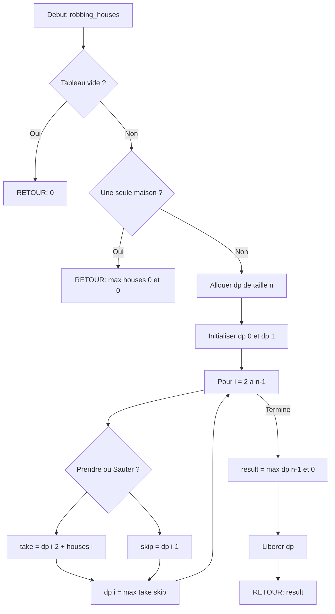

# Exercice [1.5.1-a] : heisenberg_empire

**Module :**
1.5.1 — Dynamic Programming Fundamentals

**Concept :**
a — DP Core Patterns (Fibonacci, Stairs, Robber, Decode, Jump, Coins, LIS)

**Difficulte :**
★★★★★☆☆☆☆☆ (5/10)

**Type :**
complet

**Tiers :**
1 — Concept isole

**Langage :**
Rust Edition 2024 + C17

**Prerequis :**
- Recursion et appels de fonctions
- Manipulation de tableaux/vecteurs
- Concepts de base des pointeurs (C)
- Pattern matching (Rust)

**Domaines :**
DP, Algo, Struct

**Duree estimee :**
90 min

**XP Base :**
150

**Complexite :**
T2 O(n) x S2 O(n) [Base] | T2 O(n) x S1 O(1) [Bonus]

---

## 📐 SECTION 1 : PROTOTYPE & CONSIGNE

### 1.1 Obligations

**Fichiers a rendre :**
```
ex00/
├── heisenberg_empire.rs    # Implementation Rust
├── heisenberg_empire.c     # Implementation C
├── heisenberg_empire.h     # Header C
├── Cargo.toml              # Config Rust
└── Makefile
```

**Fonctions autorisees (C) :**
- `malloc`, `free`, `calloc`, `realloc`
- `memset`, `memcpy`
- `printf` (pour debug uniquement)

**Fonctions interdites :**
- `pow`, `sqrt` (pas de formule fermee)
- Fonctions de la libc pour le calcul mathematique

**Fonctions autorisees (Rust) :**
- Toutes les fonctions de la bibliotheque standard
- `std::cmp::{min, max}`
- `std::collections::HashMap` (pour memoization si desire)

### 1.2 Consigne

**🎬 CONTEXTE : L'EMPIRE DE HEISENBERG**

*"I am not in danger, Skyler. I am the danger."*

Walter White, alias **Heisenberg**, a besoin de toi pour optimiser les operations de son empire. Chaque decision doit etre calculee mathematiquement pour maximiser les profits et minimiser les risques. La DEA approche, et chaque milliseconde de calcul compte.

Tu vas implementer **7 algorithmes de programmation dynamique** qui representent les differentes operations de l'empire :

| Fonction | Operation de l'Empire | Probleme DP |
|----------|----------------------|-------------|
| `heisenberg_fib` | Croissance des lots de production | Fibonacci |
| `cook_stairs` | Etapes pour monter au labo secret | Climbing Stairs |
| `robbing_houses` | Cambriolages strategiques | House Robber |
| `decode_formula` | Decoder les formules chimiques | Decode Ways |
| `escape_route` | Fuir les agents DEA | Jump Game |
| `money_laundering` | Blanchir l'argent en coupures | Coin Change |
| `empire_growth` | Croissance optimale de l'empire | Longest Increasing Subsequence |

---

### 1.2.1 Consigne Academique

**Ta mission :**

Implementer 7 fonctions de programmation dynamique fondamentales en **Rust Edition 2024** ET en **C17**.

**Entree/Sortie pour chaque fonction :**

#### 1. `heisenberg_fib(n: u32) -> u64`
- **Entree** : `n` - le numero du lot de production (0 <= n <= 90)
- **Sortie** : Le n-ieme nombre de Fibonacci
- **Exemple** : `heisenberg_fib(10)` -> `55`

#### 2. `cook_stairs(n: u32) -> u64`
- **Entree** : `n` - nombre de marches jusqu'au labo (0 <= n <= 45)
- **Sortie** : Nombre de facons de monter (1 ou 2 marches a la fois)
- **Exemple** : `cook_stairs(4)` -> `5` (1+1+1+1, 1+1+2, 1+2+1, 2+1+1, 2+2)

#### 3. `robbing_houses(houses: &[i64]) -> i64`
- **Entree** : `houses` - tableau des valeurs dans chaque maison
- **Sortie** : Butin maximum sans cambrioler deux maisons adjacentes
- **Contrainte** : Ne pas voler deux maisons cote a cote (alarmes reliees)
- **Exemple** : `robbing_houses(&[2, 7, 9, 3, 1])` -> `12` (2 + 9 + 1)

#### 4. `decode_formula(formula: &str) -> u64`
- **Entree** : `formula` - chaine de chiffres representant une formule codee
- **Sortie** : Nombre de facons de decoder (A=1, B=2, ..., Z=26)
- **Contrainte** : '0' seul est invalide, "06" est invalide
- **Exemple** : `decode_formula("226")` -> `3` ("BZ", "VF", "BBF")

#### 5. `escape_route(jumps: &[u32]) -> bool`
- **Entree** : `jumps` - capacite de saut a chaque position
- **Sortie** : `true` si on peut atteindre la fin, `false` sinon
- **Exemple** : `escape_route(&[2, 3, 1, 1, 4])` -> `true`
- **Exemple** : `escape_route(&[3, 2, 1, 0, 4])` -> `false`

#### 6. `money_laundering(bills: &[u32], amount: u32) -> Option<u32>` (Rust) / `int money_laundering(...)` (C, -1 si impossible)
- **Entree** : `bills` - denominations disponibles, `amount` - montant a blanchir
- **Sortie** : Nombre minimum de billets necessaires, ou None/-1 si impossible
- **Exemple** : `money_laundering(&[1, 2, 5], 11)` -> `Some(3)` (5+5+1)

#### 7. `empire_growth(profits: &[i32]) -> usize`
- **Entree** : `profits` - profits journaliers
- **Sortie** : Longueur de la plus longue sous-sequence strictement croissante
- **Exemple** : `empire_growth(&[10, 9, 2, 5, 3, 7, 101, 18])` -> `4` ([2,3,7,101] ou [2,5,7,101])

---

**Contraintes globales :**
```
┌─────────────────────────────────────────────────────────────────┐
│  0 <= n <= 90 pour Fibonacci                                    │
│  0 <= n <= 45 pour Stairs                                       │
│  0 <= houses.len() <= 100                                       │
│  0 <= formula.len() <= 100                                      │
│  1 <= jumps.len() <= 10^4                                       │
│  1 <= bills.len() <= 12                                         │
│  0 <= amount <= 10^4                                            │
│  1 <= profits.len() <= 2500                                     │
└─────────────────────────────────────────────────────────────────┘
```

### 1.3 Prototype

**Rust (heisenberg_empire.rs) :**
```rust
//! Heisenberg's Empire - Dynamic Programming Fundamentals
//! Breaking Bad themed DP algorithms

/// Fibonacci - Production batch growth
pub fn heisenberg_fib(n: u32) -> u64;

/// Climbing Stairs - Steps to the secret lab
pub fn cook_stairs(n: u32) -> u64;

/// House Robber - Strategic burglaries
pub fn robbing_houses(houses: &[i64]) -> i64;

/// Decode Ways - Decode chemical formulas
pub fn decode_formula(formula: &str) -> u64;

/// Jump Game - Escape DEA agents
pub fn escape_route(jumps: &[u32]) -> bool;

/// Coin Change - Money laundering
pub fn money_laundering(bills: &[u32], amount: u32) -> Option<u32>;

/// Longest Increasing Subsequence - Empire growth
pub fn empire_growth(profits: &[i32]) -> usize;
```

**C (heisenberg_empire.h) :**
```c
#ifndef HEISENBERG_EMPIRE_H
# define HEISENBERG_EMPIRE_H

# include <stdint.h>
# include <stddef.h>
# include <stdbool.h>

// Fibonacci - Production batch growth
uint64_t    heisenberg_fib(uint32_t n);

// Climbing Stairs - Steps to the secret lab
uint64_t    cook_stairs(uint32_t n);

// House Robber - Strategic burglaries
// Returns maximum loot without robbing adjacent houses
int64_t     robbing_houses(const int64_t *houses, size_t len);

// Decode Ways - Decode chemical formulas
// Returns number of ways to decode the formula string
uint64_t    decode_formula(const char *formula);

// Jump Game - Escape DEA agents
// Returns true if end is reachable
bool        escape_route(const uint32_t *jumps, size_t len);

// Coin Change - Money laundering
// Returns minimum bills needed, or -1 if impossible
int32_t     money_laundering(const uint32_t *bills, size_t bills_len,
                             uint32_t amount);

// Longest Increasing Subsequence - Empire growth
// Returns length of LIS
size_t      empire_growth(const int32_t *profits, size_t len);

#endif
```

---

## 💡 SECTION 2 : LE SAVIEZ-VOUS ?

### 2.1 L'Histoire de la Programmation Dynamique

Le terme **"Programmation Dynamique"** a ete invente par **Richard Bellman** dans les annees 1950. Ironiquement, le nom a ete choisi pour etre volontairement vague - Bellman travaillait pour la RAND Corporation sous un secretaire de la Defense qui "avait une peur pathologique du mot 'recherche'". Le mot "dynamique" sonnait impressionnant sans reveler la nature mathematique du travail.

**Fun fact** : Bellman a dit plus tard que le mot "programmation" n'avait rien a voir avec le code informatique - il signifiait "planification" au sens militaire.

### 2.2 Breaking Bad et l'Optimisation

Walter White, en tant que chimiste brillant, comprend intuitivement les concepts d'optimisation :
- **Sous-structure optimale** : Chaque batch de meth depend de la qualite du batch precedent
- **Chevauchement de sous-problemes** : Les memes calculs de purete reviennent constamment
- **Memoization** : Il note tout dans son carnet pour ne pas refaire les memes erreurs

### 2.5 DANS LA VRAIE VIE

| Metier | Utilisation du DP | Cas d'Usage Precis |
|--------|-------------------|---------------------|
| **Quant/Trader** | Pricing d'options, optimisation de portefeuille | Algorithme de Black-Scholes discret, allocation optimale |
| **Bioinformaticien** | Alignement de sequences ADN | Needleman-Wunsch pour comparer genomes |
| **Data Scientist** | NLP, reconnaissance vocale | Algorithme de Viterbi pour HMM |
| **Game Developer** | Pathfinding, IA adversaire | A* est une forme de DP avec heuristique |
| **DevOps** | Scheduling de jobs | Minimiser le temps total d'execution |
| **Roboticien** | Planification de trajectoire | Controle optimal de bras robotique |

---

## 🖥️ SECTION 3 : EXEMPLE D'UTILISATION

### 3.0 Session bash

```bash
$ ls
heisenberg_empire.rs  heisenberg_empire.c  heisenberg_empire.h  main.c  Cargo.toml  Makefile

$ make
gcc -Wall -Wextra -Werror -std=c17 -O2 -c heisenberg_empire.c -o heisenberg_empire.o
gcc -Wall -Wextra -Werror -std=c17 -O2 main.c heisenberg_empire.o -o test_c
cargo build --release

$ ./test_c
=== HEISENBERG'S EMPIRE DP TESTS ===
[FIB] heisenberg_fib(10) = 55 ... OK
[FIB] heisenberg_fib(45) = 1134903170 ... OK
[STAIRS] cook_stairs(4) = 5 ... OK
[ROBBER] robbing_houses([2,7,9,3,1]) = 12 ... OK
[DECODE] decode_formula("226") = 3 ... OK
[JUMP] escape_route([2,3,1,1,4]) = true ... OK
[COINS] money_laundering([1,2,5], 11) = 3 ... OK
[LIS] empire_growth([10,9,2,5,3,7,101,18]) = 4 ... OK
All tests passed! Say my name.

$ cargo test
running 8 tests
test test_heisenberg_fib ... ok
test test_cook_stairs ... ok
test test_robbing_houses ... ok
test test_decode_formula ... ok
test test_escape_route ... ok
test test_money_laundering ... ok
test test_empire_growth ... ok
test test_edge_cases ... ok

test result: ok. 8 passed; 0 failed
```

---

## ⚡ SECTION 3.1 : BONUS AVANCE (OPTIONNEL)

**Difficulte Bonus :**
★★★★★★★☆☆☆ (7/10)

**Recompense :**
XP x3

**Time Complexity attendue :**
O(n) pour tous sauf LIS qui doit etre O(n log n)

**Space Complexity attendue :**
O(1) auxiliaire pour Fib, Stairs, Robber, Jump
O(n) pour Decode, Coins (inevitable)
O(n) pour LIS avec binary search

**Domaines Bonus :**
`Tri` (pour LIS binary search)

### 3.1.1 Consigne Bonus

**🎬 HEISENBERG'S ULTIMATE OPTIMIZATION**

*"I am the one who knocks... with O(1) space complexity."*

La DEA a installe des detecteurs de memoire. Chaque byte alloue laisse une trace. Tu dois maintenant implementer les versions **space-optimized** de chaque algorithme.

**Ta mission :**

Implementer les versions optimisees avec le suffixe `_optimized` :

```rust
pub fn heisenberg_fib_optimized(n: u32) -> u64;           // O(1) space
pub fn cook_stairs_optimized(n: u32) -> u64;              // O(1) space
pub fn robbing_houses_optimized(houses: &[i64]) -> i64;   // O(1) space
pub fn escape_route_greedy(jumps: &[u32]) -> bool;        // O(1) space, greedy
pub fn empire_growth_binary(profits: &[i32]) -> usize;    // O(n log n) time
```

**Contraintes Bonus :**
```
┌─────────────────────────────────────────────────────────────────┐
│  heisenberg_fib_optimized : O(1) espace auxiliaire              │
│  cook_stairs_optimized : O(1) espace auxiliaire                 │
│  robbing_houses_optimized : O(1) espace auxiliaire              │
│  escape_route_greedy : O(1) espace, une seule passe             │
│  empire_growth_binary : O(n log n) temps avec binary search     │
│  Reconstruction de solution pour robbing_houses                 │
└─────────────────────────────────────────────────────────────────┘
```

**Exemples Bonus :**

| Appel | Retour | Space |
|-------|--------|-------|
| `heisenberg_fib_optimized(90)` | `2880067194370816120` | O(1) |
| `robbing_houses_optimized(&[2,1,1,2])` | `4` | O(1) |
| `empire_growth_binary(&[...10000 elements...])` | `...` | O(n), temps O(n log n) |

### 3.1.2 Prototype Bonus

```rust
// Space-optimized versions
pub fn heisenberg_fib_optimized(n: u32) -> u64;
pub fn cook_stairs_optimized(n: u32) -> u64;
pub fn robbing_houses_optimized(houses: &[i64]) -> i64;
pub fn escape_route_greedy(jumps: &[u32]) -> bool;
pub fn empire_growth_binary(profits: &[i32]) -> usize;

// Solution reconstruction
pub fn robbing_houses_with_indices(houses: &[i64]) -> (i64, Vec<usize>);
```

```c
uint64_t    heisenberg_fib_optimized(uint32_t n);
uint64_t    cook_stairs_optimized(uint32_t n);
int64_t     robbing_houses_optimized(const int64_t *houses, size_t len);
bool        escape_route_greedy(const uint32_t *jumps, size_t len);
size_t      empire_growth_binary(const int32_t *profits, size_t len);
```

### 3.1.3 Ce qui change par rapport a l'exercice de base

| Aspect | Base | Bonus |
|--------|------|-------|
| Space Fib/Stairs | O(n) ou recursif | O(1) avec 2-3 variables |
| Space Robber | O(n) table DP | O(1) avec prev/curr |
| Jump Game | O(n) DP | O(1) greedy max_reach |
| LIS Time | O(n^2) | O(n log n) binary search |
| Reconstruction | Non demandee | Indices des maisons volees |

---

## ✅❌ SECTION 4 : ZONE CORRECTION (POUR LE TESTEUR)

### 4.1 Moulinette (tableau des tests)

| # | Test | Input | Expected | Type | Points |
|---|------|-------|----------|------|--------|
| 1 | fib_zero | `n=0` | `0` | Edge | 2 |
| 2 | fib_one | `n=1` | `1` | Edge | 2 |
| 3 | fib_ten | `n=10` | `55` | Normal | 3 |
| 4 | fib_large | `n=45` | `1134903170` | Normal | 3 |
| 5 | stairs_zero | `n=0` | `1` | Edge | 2 |
| 6 | stairs_one | `n=1` | `1` | Edge | 2 |
| 7 | stairs_four | `n=4` | `5` | Normal | 3 |
| 8 | robber_empty | `[]` | `0` | Edge/Trap | 3 |
| 9 | robber_single | `[5]` | `5` | Edge | 2 |
| 10 | robber_two | `[2,7]` | `7` | Normal | 3 |
| 11 | robber_classic | `[2,7,9,3,1]` | `12` | Normal | 5 |
| 12 | robber_negative | `[-1,-2,-3]` | `0` | Edge | 3 |
| 13 | decode_empty | `""` | `0` | Edge/Trap | 3 |
| 14 | decode_zero | `"0"` | `0` | Edge/Trap | 3 |
| 15 | decode_single | `"1"` | `1` | Edge | 2 |
| 16 | decode_classic | `"226"` | `3` | Normal | 5 |
| 17 | decode_leading_zero | `"06"` | `0` | Trap | 3 |
| 18 | decode_complex | `"12"` | `2` | Normal | 3 |
| 19 | jump_reachable | `[2,3,1,1,4]` | `true` | Normal | 5 |
| 20 | jump_stuck | `[3,2,1,0,4]` | `false` | Normal | 5 |
| 21 | jump_single | `[0]` | `true` | Edge | 2 |
| 22 | jump_empty | `[]` | `true` | Edge | 2 |
| 23 | coins_classic | `[1,2,5], 11` | `3` | Normal | 5 |
| 24 | coins_impossible | `[2], 3` | `None/-1` | Normal | 3 |
| 25 | coins_zero | `[1], 0` | `0` | Edge | 2 |
| 26 | coins_exact | `[5], 5` | `1` | Normal | 2 |
| 27 | lis_classic | `[10,9,2,5,3,7,101,18]` | `4` | Normal | 5 |
| 28 | lis_sorted | `[1,2,3,4,5]` | `5` | Normal | 3 |
| 29 | lis_reverse | `[5,4,3,2,1]` | `1` | Edge | 3 |
| 30 | lis_single | `[42]` | `1` | Edge | 2 |
| **TOTAL** | | | | | **100** |

### 4.2 main.c de test

```c
#include <stdio.h>
#include <assert.h>
#include <string.h>
#include "heisenberg_empire.h"

#define TEST(name, cond) do { \
    printf("[TEST] %s ... ", name); \
    if (cond) { printf("OK\n"); passed++; } \
    else { printf("FAIL\n"); failed++; } \
} while(0)

int main(void)
{
    int passed = 0;
    int failed = 0;

    printf("=== HEISENBERG'S EMPIRE DP TESTS ===\n\n");

    // Fibonacci tests
    TEST("fib(0)", heisenberg_fib(0) == 0);
    TEST("fib(1)", heisenberg_fib(1) == 1);
    TEST("fib(10)", heisenberg_fib(10) == 55);
    TEST("fib(45)", heisenberg_fib(45) == 1134903170ULL);

    // Climbing stairs tests
    TEST("stairs(0)", cook_stairs(0) == 1);
    TEST("stairs(1)", cook_stairs(1) == 1);
    TEST("stairs(4)", cook_stairs(4) == 5);

    // House robber tests
    int64_t houses1[] = {2, 7, 9, 3, 1};
    int64_t houses2[] = {2, 7};
    int64_t houses3[] = {5};
    int64_t houses4[] = {-1, -2, -3};
    TEST("robber_empty", robbing_houses(NULL, 0) == 0);
    TEST("robber_single", robbing_houses(houses3, 1) == 5);
    TEST("robber_two", robbing_houses(houses2, 2) == 7);
    TEST("robber_classic", robbing_houses(houses1, 5) == 12);
    TEST("robber_negative", robbing_houses(houses4, 3) == 0);

    // Decode ways tests
    TEST("decode_empty", decode_formula("") == 0);
    TEST("decode_zero", decode_formula("0") == 0);
    TEST("decode_single", decode_formula("1") == 1);
    TEST("decode_226", decode_formula("226") == 3);
    TEST("decode_06", decode_formula("06") == 0);
    TEST("decode_12", decode_formula("12") == 2);

    // Jump game tests
    uint32_t jumps1[] = {2, 3, 1, 1, 4};
    uint32_t jumps2[] = {3, 2, 1, 0, 4};
    uint32_t jumps3[] = {0};
    TEST("jump_reachable", escape_route(jumps1, 5) == true);
    TEST("jump_stuck", escape_route(jumps2, 5) == false);
    TEST("jump_single", escape_route(jumps3, 1) == true);
    TEST("jump_empty", escape_route(NULL, 0) == true);

    // Coin change tests
    uint32_t coins1[] = {1, 2, 5};
    uint32_t coins2[] = {2};
    uint32_t coins3[] = {1};
    uint32_t coins4[] = {5};
    TEST("coins_classic", money_laundering(coins1, 3, 11) == 3);
    TEST("coins_impossible", money_laundering(coins2, 1, 3) == -1);
    TEST("coins_zero", money_laundering(coins3, 1, 0) == 0);
    TEST("coins_exact", money_laundering(coins4, 1, 5) == 1);

    // LIS tests
    int32_t lis1[] = {10, 9, 2, 5, 3, 7, 101, 18};
    int32_t lis2[] = {1, 2, 3, 4, 5};
    int32_t lis3[] = {5, 4, 3, 2, 1};
    int32_t lis4[] = {42};
    TEST("lis_classic", empire_growth(lis1, 8) == 4);
    TEST("lis_sorted", empire_growth(lis2, 5) == 5);
    TEST("lis_reverse", empire_growth(lis3, 5) == 1);
    TEST("lis_single", empire_growth(lis4, 1) == 1);

    printf("\n=== RESULTS ===\n");
    printf("Passed: %d\n", passed);
    printf("Failed: %d\n", failed);
    printf("%s\n", failed == 0 ? "Say my name." : "You're not Heisenberg.");

    return failed;
}
```

### 4.3 Solution de reference

**Rust (heisenberg_empire.rs) :**

```rust
//! Heisenberg's Empire - Dynamic Programming Fundamentals
//! Reference Implementation

/// Fibonacci - O(n) time, O(n) space
pub fn heisenberg_fib(n: u32) -> u64 {
    if n == 0 {
        return 0;
    }
    if n == 1 {
        return 1;
    }

    let mut dp = vec![0u64; (n + 1) as usize];
    dp[0] = 0;
    dp[1] = 1;

    for i in 2..=n as usize {
        dp[i] = dp[i - 1] + dp[i - 2];
    }

    dp[n as usize]
}

/// Climbing Stairs - O(n) time, O(n) space
pub fn cook_stairs(n: u32) -> u64 {
    if n == 0 {
        return 1;
    }
    if n == 1 {
        return 1;
    }

    let mut dp = vec![0u64; (n + 1) as usize];
    dp[0] = 1;
    dp[1] = 1;

    for i in 2..=n as usize {
        dp[i] = dp[i - 1] + dp[i - 2];
    }

    dp[n as usize]
}

/// House Robber - O(n) time, O(n) space
pub fn robbing_houses(houses: &[i64]) -> i64 {
    if houses.is_empty() {
        return 0;
    }
    if houses.len() == 1 {
        return houses[0].max(0);
    }

    let n = houses.len();
    let mut dp = vec![0i64; n];

    dp[0] = houses[0].max(0);
    dp[1] = houses[0].max(houses[1]).max(0);

    for i in 2..n {
        dp[i] = dp[i - 1].max(dp[i - 2] + houses[i]);
    }

    dp[n - 1].max(0)
}

/// Decode Ways - O(n) time, O(n) space
pub fn decode_formula(formula: &str) -> u64 {
    if formula.is_empty() {
        return 0;
    }

    let chars: Vec<char> = formula.chars().collect();
    let n = chars.len();

    if chars[0] == '0' {
        return 0;
    }

    let mut dp = vec![0u64; n + 1];
    dp[0] = 1;
    dp[1] = 1;

    for i in 2..=n {
        let one_digit = chars[i - 1].to_digit(10).unwrap();
        let two_digit = chars[i - 2].to_digit(10).unwrap() * 10 + one_digit;

        if one_digit >= 1 {
            dp[i] += dp[i - 1];
        }

        if two_digit >= 10 && two_digit <= 26 {
            dp[i] += dp[i - 2];
        }
    }

    dp[n]
}

/// Jump Game - O(n) time, O(n) space
pub fn escape_route(jumps: &[u32]) -> bool {
    if jumps.is_empty() {
        return true;
    }

    let n = jumps.len();
    let mut dp = vec![false; n];
    dp[0] = true;

    for i in 1..n {
        for j in 0..i {
            if dp[j] && j + jumps[j] as usize >= i {
                dp[i] = true;
                break;
            }
        }
    }

    dp[n - 1]
}

/// Coin Change - O(n * amount) time, O(amount) space
pub fn money_laundering(bills: &[u32], amount: u32) -> Option<u32> {
    if amount == 0 {
        return Some(0);
    }

    let mut dp = vec![u32::MAX; (amount + 1) as usize];
    dp[0] = 0;

    for i in 1..=amount as usize {
        for &coin in bills {
            if coin as usize <= i && dp[i - coin as usize] != u32::MAX {
                dp[i] = dp[i].min(dp[i - coin as usize] + 1);
            }
        }
    }

    if dp[amount as usize] == u32::MAX {
        None
    } else {
        Some(dp[amount as usize])
    }
}

/// LIS - O(n^2) time, O(n) space
pub fn empire_growth(profits: &[i32]) -> usize {
    if profits.is_empty() {
        return 0;
    }

    let n = profits.len();
    let mut dp = vec![1usize; n];

    for i in 1..n {
        for j in 0..i {
            if profits[j] < profits[i] {
                dp[i] = dp[i].max(dp[j] + 1);
            }
        }
    }

    *dp.iter().max().unwrap()
}

#[cfg(test)]
mod tests {
    use super::*;

    #[test]
    fn test_heisenberg_fib() {
        assert_eq!(heisenberg_fib(0), 0);
        assert_eq!(heisenberg_fib(1), 1);
        assert_eq!(heisenberg_fib(10), 55);
        assert_eq!(heisenberg_fib(45), 1134903170);
    }

    #[test]
    fn test_cook_stairs() {
        assert_eq!(cook_stairs(0), 1);
        assert_eq!(cook_stairs(1), 1);
        assert_eq!(cook_stairs(4), 5);
    }

    #[test]
    fn test_robbing_houses() {
        assert_eq!(robbing_houses(&[]), 0);
        assert_eq!(robbing_houses(&[5]), 5);
        assert_eq!(robbing_houses(&[2, 7, 9, 3, 1]), 12);
    }

    #[test]
    fn test_decode_formula() {
        assert_eq!(decode_formula(""), 0);
        assert_eq!(decode_formula("0"), 0);
        assert_eq!(decode_formula("226"), 3);
    }

    #[test]
    fn test_escape_route() {
        assert!(escape_route(&[2, 3, 1, 1, 4]));
        assert!(!escape_route(&[3, 2, 1, 0, 4]));
    }

    #[test]
    fn test_money_laundering() {
        assert_eq!(money_laundering(&[1, 2, 5], 11), Some(3));
        assert_eq!(money_laundering(&[2], 3), None);
    }

    #[test]
    fn test_empire_growth() {
        assert_eq!(empire_growth(&[10, 9, 2, 5, 3, 7, 101, 18]), 4);
    }
}
```

**C (heisenberg_empire.c) :**

```c
#include "heisenberg_empire.h"
#include <stdlib.h>
#include <string.h>

uint64_t heisenberg_fib(uint32_t n)
{
    if (n == 0)
        return 0;
    if (n == 1)
        return 1;

    uint64_t *dp = calloc(n + 1, sizeof(uint64_t));
    if (!dp)
        return 0;

    dp[0] = 0;
    dp[1] = 1;

    for (uint32_t i = 2; i <= n; i++)
        dp[i] = dp[i - 1] + dp[i - 2];

    uint64_t result = dp[n];
    free(dp);
    return result;
}

uint64_t cook_stairs(uint32_t n)
{
    if (n == 0 || n == 1)
        return 1;

    uint64_t *dp = calloc(n + 1, sizeof(uint64_t));
    if (!dp)
        return 0;

    dp[0] = 1;
    dp[1] = 1;

    for (uint32_t i = 2; i <= n; i++)
        dp[i] = dp[i - 1] + dp[i - 2];

    uint64_t result = dp[n];
    free(dp);
    return result;
}

int64_t robbing_houses(const int64_t *houses, size_t len)
{
    if (!houses || len == 0)
        return 0;
    if (len == 1)
        return houses[0] > 0 ? houses[0] : 0;

    int64_t *dp = calloc(len, sizeof(int64_t));
    if (!dp)
        return 0;

    dp[0] = houses[0] > 0 ? houses[0] : 0;
    dp[1] = (houses[0] > houses[1] ? houses[0] : houses[1]);
    if (dp[1] < 0)
        dp[1] = 0;

    for (size_t i = 2; i < len; i++)
    {
        int64_t take = dp[i - 2] + houses[i];
        int64_t skip = dp[i - 1];
        dp[i] = take > skip ? take : skip;
    }

    int64_t result = dp[len - 1];
    if (result < 0)
        result = 0;
    free(dp);
    return result;
}

uint64_t decode_formula(const char *formula)
{
    if (!formula || formula[0] == '\0')
        return 0;

    size_t n = strlen(formula);

    if (formula[0] == '0')
        return 0;

    uint64_t *dp = calloc(n + 1, sizeof(uint64_t));
    if (!dp)
        return 0;

    dp[0] = 1;
    dp[1] = 1;

    for (size_t i = 2; i <= n; i++)
    {
        int one_digit = formula[i - 1] - '0';
        int two_digit = (formula[i - 2] - '0') * 10 + one_digit;

        if (one_digit >= 1)
            dp[i] += dp[i - 1];

        if (two_digit >= 10 && two_digit <= 26)
            dp[i] += dp[i - 2];
    }

    uint64_t result = dp[n];
    free(dp);
    return result;
}

bool escape_route(const uint32_t *jumps, size_t len)
{
    if (!jumps || len == 0)
        return true;

    bool *dp = calloc(len, sizeof(bool));
    if (!dp)
        return false;

    dp[0] = true;

    for (size_t i = 1; i < len; i++)
    {
        for (size_t j = 0; j < i; j++)
        {
            if (dp[j] && j + jumps[j] >= i)
            {
                dp[i] = true;
                break;
            }
        }
    }

    bool result = dp[len - 1];
    free(dp);
    return result;
}

int32_t money_laundering(const uint32_t *bills, size_t bills_len,
                         uint32_t amount)
{
    if (amount == 0)
        return 0;
    if (!bills || bills_len == 0)
        return -1;

    int32_t *dp = malloc((amount + 1) * sizeof(int32_t));
    if (!dp)
        return -1;

    for (uint32_t i = 0; i <= amount; i++)
        dp[i] = INT32_MAX;
    dp[0] = 0;

    for (uint32_t i = 1; i <= amount; i++)
    {
        for (size_t j = 0; j < bills_len; j++)
        {
            if (bills[j] <= i && dp[i - bills[j]] != INT32_MAX)
            {
                int32_t candidate = dp[i - bills[j]] + 1;
                if (candidate < dp[i])
                    dp[i] = candidate;
            }
        }
    }

    int32_t result = dp[amount];
    free(dp);
    return result == INT32_MAX ? -1 : result;
}

size_t empire_growth(const int32_t *profits, size_t len)
{
    if (!profits || len == 0)
        return 0;

    size_t *dp = malloc(len * sizeof(size_t));
    if (!dp)
        return 0;

    for (size_t i = 0; i < len; i++)
        dp[i] = 1;

    for (size_t i = 1; i < len; i++)
    {
        for (size_t j = 0; j < i; j++)
        {
            if (profits[j] < profits[i] && dp[j] + 1 > dp[i])
                dp[i] = dp[j] + 1;
        }
    }

    size_t max_len = 0;
    for (size_t i = 0; i < len; i++)
    {
        if (dp[i] > max_len)
            max_len = dp[i];
    }

    free(dp);
    return max_len;
}
```

### 4.4 Solutions alternatives acceptees

**Alternative 1 : Recursion avec memoization (HashMap)**

```rust
use std::collections::HashMap;

pub fn heisenberg_fib_memo(n: u32, memo: &mut HashMap<u32, u64>) -> u64 {
    if let Some(&val) = memo.get(&n) {
        return val;
    }

    let result = match n {
        0 => 0,
        1 => 1,
        _ => heisenberg_fib_memo(n - 1, memo) + heisenberg_fib_memo(n - 2, memo),
    };

    memo.insert(n, result);
    result
}
```

**Alternative 2 : Bottom-up avec array statique (pour petits n)**

```c
uint64_t cook_stairs_static(uint32_t n)
{
    if (n > 45)
        return 0;  // Overflow protection

    static uint64_t cache[46] = {0};
    static bool computed = false;

    if (!computed)
    {
        cache[0] = 1;
        cache[1] = 1;
        for (int i = 2; i <= 45; i++)
            cache[i] = cache[i-1] + cache[i-2];
        computed = true;
    }

    return cache[n];
}
```

### 4.5 Solutions refusees (avec explications)

**Solution refusee 1 : Recursion naive sans memoization**

```rust
// REFUSE : O(2^n) time complexity
pub fn heisenberg_fib_naive(n: u32) -> u64 {
    match n {
        0 => 0,
        1 => 1,
        _ => heisenberg_fib_naive(n - 1) + heisenberg_fib_naive(n - 2),
    }
}
// Pourquoi refuse : Explose en temps pour n > 40
```

**Solution refusee 2 : Formule de Binet (flottants)**

```rust
// REFUSE : Utilise des flottants, perd en precision
pub fn fib_binet(n: u32) -> u64 {
    let phi = (1.0 + 5.0_f64.sqrt()) / 2.0;
    ((phi.powi(n as i32) / 5.0_f64.sqrt()).round()) as u64
}
// Pourquoi refuse : pow/sqrt interdits + imprecision pour grands n
```

**Solution refusee 3 : House Robber sans gerer les negatifs**

```rust
// REFUSE : Ne gere pas les valeurs negatives
pub fn robbing_houses_bad(houses: &[i64]) -> i64 {
    if houses.is_empty() { return 0; }
    if houses.len() == 1 { return houses[0]; }  // BUG: peut retourner negatif
    // ...
}
// Pourquoi refuse : robbing_houses(&[-5]) devrait retourner 0, pas -5
```

### 4.6 Solution bonus de reference (COMPLETE)

```rust
/// Space-optimized Fibonacci - O(1) space
pub fn heisenberg_fib_optimized(n: u32) -> u64 {
    if n == 0 {
        return 0;
    }
    if n == 1 {
        return 1;
    }

    let mut prev2 = 0u64;
    let mut prev1 = 1u64;

    for _ in 2..=n {
        let current = prev1 + prev2;
        prev2 = prev1;
        prev1 = current;
    }

    prev1
}

/// Space-optimized Climbing Stairs - O(1) space
pub fn cook_stairs_optimized(n: u32) -> u64 {
    if n == 0 || n == 1 {
        return 1;
    }

    let mut prev2 = 1u64;
    let mut prev1 = 1u64;

    for _ in 2..=n {
        let current = prev1 + prev2;
        prev2 = prev1;
        prev1 = current;
    }

    prev1
}

/// Space-optimized House Robber - O(1) space
pub fn robbing_houses_optimized(houses: &[i64]) -> i64 {
    if houses.is_empty() {
        return 0;
    }

    let mut prev2 = 0i64;
    let mut prev1 = 0i64;

    for &house in houses {
        let current = prev1.max(prev2 + house);
        prev2 = prev1;
        prev1 = current;
    }

    prev1.max(0)
}

/// Greedy Jump Game - O(n) time, O(1) space
pub fn escape_route_greedy(jumps: &[u32]) -> bool {
    if jumps.is_empty() {
        return true;
    }

    let mut max_reach = 0usize;

    for (i, &jump) in jumps.iter().enumerate() {
        if i > max_reach {
            return false;
        }
        max_reach = max_reach.max(i + jump as usize);
        if max_reach >= jumps.len() - 1 {
            return true;
        }
    }

    true
}

/// Binary Search LIS - O(n log n) time, O(n) space
pub fn empire_growth_binary(profits: &[i32]) -> usize {
    if profits.is_empty() {
        return 0;
    }

    let mut tails: Vec<i32> = Vec::new();

    for &profit in profits {
        let pos = tails.partition_point(|&x| x < profit);

        if pos == tails.len() {
            tails.push(profit);
        } else {
            tails[pos] = profit;
        }
    }

    tails.len()
}

/// House Robber with reconstruction
pub fn robbing_houses_with_indices(houses: &[i64]) -> (i64, Vec<usize>) {
    if houses.is_empty() {
        return (0, vec![]);
    }
    if houses.len() == 1 {
        if houses[0] > 0 {
            return (houses[0], vec![0]);
        }
        return (0, vec![]);
    }

    let n = houses.len();
    let mut dp = vec![0i64; n];
    let mut parent = vec![None; n];

    dp[0] = houses[0].max(0);
    dp[1] = if houses[1] > houses[0] {
        parent[1] = Some(1);
        houses[1].max(0)
    } else {
        parent[1] = if houses[0] > 0 { Some(0) } else { None };
        houses[0].max(0)
    };

    for i in 2..n {
        if dp[i - 2] + houses[i] > dp[i - 1] {
            dp[i] = dp[i - 2] + houses[i];
            parent[i] = Some(i);
        } else {
            dp[i] = dp[i - 1];
            parent[i] = parent[i - 1];
        }
    }

    // Reconstruct
    let mut indices = vec![];
    let mut i = n - 1;
    while let Some(idx) = parent[i] {
        if indices.last() != Some(&idx) {
            indices.push(idx);
        }
        if idx >= 2 {
            i = idx - 2;
        } else {
            break;
        }
    }

    indices.reverse();
    (dp[n - 1].max(0), indices)
}
```

### 4.7 Solutions alternatives bonus (COMPLETES)

```c
// C version of optimized functions

uint64_t heisenberg_fib_optimized(uint32_t n)
{
    if (n == 0)
        return 0;
    if (n == 1)
        return 1;

    uint64_t prev2 = 0;
    uint64_t prev1 = 1;

    for (uint32_t i = 2; i <= n; i++)
    {
        uint64_t current = prev1 + prev2;
        prev2 = prev1;
        prev1 = current;
    }

    return prev1;
}

bool escape_route_greedy(const uint32_t *jumps, size_t len)
{
    if (!jumps || len == 0)
        return true;

    size_t max_reach = 0;

    for (size_t i = 0; i < len; i++)
    {
        if (i > max_reach)
            return false;

        size_t new_reach = i + jumps[i];
        if (new_reach > max_reach)
            max_reach = new_reach;

        if (max_reach >= len - 1)
            return true;
    }

    return true;
}

// Binary search helper for LIS
static size_t lower_bound(const int32_t *arr, size_t len, int32_t val)
{
    size_t lo = 0;
    size_t hi = len;

    while (lo < hi)
    {
        size_t mid = lo + (hi - lo) / 2;
        if (arr[mid] < val)
            lo = mid + 1;
        else
            hi = mid;
    }

    return lo;
}

size_t empire_growth_binary(const int32_t *profits, size_t len)
{
    if (!profits || len == 0)
        return 0;

    int32_t *tails = malloc(len * sizeof(int32_t));
    if (!tails)
        return 0;

    size_t tails_len = 0;

    for (size_t i = 0; i < len; i++)
    {
        size_t pos = lower_bound(tails, tails_len, profits[i]);

        if (pos == tails_len)
        {
            tails[tails_len++] = profits[i];
        }
        else
        {
            tails[pos] = profits[i];
        }
    }

    free(tails);
    return tails_len;
}
```

### 4.8 Solutions refusees bonus (COMPLETES)

```rust
// REFUSE : Utilise encore O(n) space pour les variables intermediaires
pub fn heisenberg_fib_not_optimized(n: u32) -> u64 {
    let mut all_values = vec![0u64; 3];  // Toujours 3, mais le vecteur est alloue
    // ...
}
// Pourquoi refuse : Vec allocation meme petite n'est pas O(1) space

// REFUSE : Binary search mal implementee
pub fn empire_growth_binary_wrong(profits: &[i32]) -> usize {
    let mut tails = vec![];
    for &p in profits {
        // Utilise binary_search_by qui ne gere pas correctement les doublons
        match tails.binary_search(&p) {
            Ok(pos) => tails[pos] = p,  // BUG: ne devrait pas remplacer sur Ok
            Err(pos) => {
                if pos == tails.len() {
                    tails.push(p);
                } else {
                    tails[pos] = p;
                }
            }
        }
    }
    tails.len()
}
// Pourquoi refuse : Pour [1,2,2,3], retourne 3 au lieu de 3 (par chance) mais
// pour [2,2] retourne 1 au lieu de 1, mais la logique est fausse
```

### 4.9 spec.json (ENGINE v22.1 - FORMAT STRICT)

```json
{
  "name": "heisenberg_empire",
  "language": "rust_and_c",
  "rust_edition": "2024",
  "c_standard": "c17",
  "type": "code",
  "tier": 1,
  "tier_info": "Concept isole - DP Fundamentals",
  "tags": ["dp", "dynamic_programming", "fibonacci", "memoization", "tabulation", "phase1"],
  "passing_score": 70,

  "functions": [
    {
      "name": "heisenberg_fib",
      "prototype_rust": "pub fn heisenberg_fib(n: u32) -> u64",
      "prototype_c": "uint64_t heisenberg_fib(uint32_t n)",
      "return_type": "u64",
      "parameters": [
        {"name": "n", "type": "u32"}
      ]
    },
    {
      "name": "cook_stairs",
      "prototype_rust": "pub fn cook_stairs(n: u32) -> u64",
      "prototype_c": "uint64_t cook_stairs(uint32_t n)",
      "return_type": "u64",
      "parameters": [
        {"name": "n", "type": "u32"}
      ]
    },
    {
      "name": "robbing_houses",
      "prototype_rust": "pub fn robbing_houses(houses: &[i64]) -> i64",
      "prototype_c": "int64_t robbing_houses(const int64_t *houses, size_t len)",
      "return_type": "i64",
      "parameters": [
        {"name": "houses", "type": "&[i64]"}
      ]
    },
    {
      "name": "decode_formula",
      "prototype_rust": "pub fn decode_formula(formula: &str) -> u64",
      "prototype_c": "uint64_t decode_formula(const char *formula)",
      "return_type": "u64",
      "parameters": [
        {"name": "formula", "type": "&str"}
      ]
    },
    {
      "name": "escape_route",
      "prototype_rust": "pub fn escape_route(jumps: &[u32]) -> bool",
      "prototype_c": "bool escape_route(const uint32_t *jumps, size_t len)",
      "return_type": "bool",
      "parameters": [
        {"name": "jumps", "type": "&[u32]"}
      ]
    },
    {
      "name": "money_laundering",
      "prototype_rust": "pub fn money_laundering(bills: &[u32], amount: u32) -> Option<u32>",
      "prototype_c": "int32_t money_laundering(const uint32_t *bills, size_t bills_len, uint32_t amount)",
      "return_type": "Option<u32>",
      "parameters": [
        {"name": "bills", "type": "&[u32]"},
        {"name": "amount", "type": "u32"}
      ]
    },
    {
      "name": "empire_growth",
      "prototype_rust": "pub fn empire_growth(profits: &[i32]) -> usize",
      "prototype_c": "size_t empire_growth(const int32_t *profits, size_t len)",
      "return_type": "usize",
      "parameters": [
        {"name": "profits", "type": "&[i32]"}
      ]
    }
  ],

  "driver": {
    "reference_rust": "pub fn ref_heisenberg_fib(n: u32) -> u64 { if n <= 1 { return n as u64; } let (mut a, mut b) = (0u64, 1u64); for _ in 2..=n { let c = a + b; a = b; b = c; } b }",
    "reference_c": "uint64_t ref_heisenberg_fib(uint32_t n) { if (n <= 1) return n; uint64_t a = 0, b = 1; for (uint32_t i = 2; i <= n; i++) { uint64_t c = a + b; a = b; b = c; } return b; }",

    "edge_cases": [
      {
        "name": "fib_zero",
        "function": "heisenberg_fib",
        "args": [0],
        "expected": 0,
        "is_trap": true,
        "trap_explanation": "n=0 est un cas de base, doit retourner 0"
      },
      {
        "name": "fib_one",
        "function": "heisenberg_fib",
        "args": [1],
        "expected": 1,
        "is_trap": true,
        "trap_explanation": "n=1 est un cas de base, doit retourner 1"
      },
      {
        "name": "fib_normal",
        "function": "heisenberg_fib",
        "args": [10],
        "expected": 55
      },
      {
        "name": "robber_empty",
        "function": "robbing_houses",
        "args": [[]],
        "expected": 0,
        "is_trap": true,
        "trap_explanation": "Tableau vide, ne pas crasher"
      },
      {
        "name": "robber_negative",
        "function": "robbing_houses",
        "args": [[-1, -2, -3]],
        "expected": 0,
        "is_trap": true,
        "trap_explanation": "Valeurs negatives, retourner 0 (ne rien voler)"
      },
      {
        "name": "decode_empty",
        "function": "decode_formula",
        "args": [""],
        "expected": 0,
        "is_trap": true,
        "trap_explanation": "Chaine vide, 0 facons de decoder"
      },
      {
        "name": "decode_leading_zero",
        "function": "decode_formula",
        "args": ["06"],
        "expected": 0,
        "is_trap": true,
        "trap_explanation": "06 n'est pas un encodage valide"
      },
      {
        "name": "jump_empty",
        "function": "escape_route",
        "args": [[]],
        "expected": true,
        "is_trap": true,
        "trap_explanation": "Tableau vide = deja a la fin"
      },
      {
        "name": "coins_zero",
        "function": "money_laundering",
        "args": [[1], 0],
        "expected": 0,
        "is_trap": true,
        "trap_explanation": "Amount=0 necessite 0 pieces"
      },
      {
        "name": "lis_empty",
        "function": "empire_growth",
        "args": [[]],
        "expected": 0,
        "is_trap": true,
        "trap_explanation": "Tableau vide = LIS de longueur 0"
      }
    ],

    "fuzzing": {
      "enabled": true,
      "iterations": 1000,
      "generators": [
        {
          "function": "heisenberg_fib",
          "type": "int",
          "param_index": 0,
          "params": {
            "min": 0,
            "max": 45
          }
        },
        {
          "function": "robbing_houses",
          "type": "array_int",
          "param_index": 0,
          "params": {
            "min_len": 0,
            "max_len": 50,
            "min_val": -100,
            "max_val": 1000
          }
        },
        {
          "function": "decode_formula",
          "type": "string",
          "param_index": 0,
          "params": {
            "min_len": 0,
            "max_len": 20,
            "charset": "0123456789"
          }
        }
      ]
    }
  },

  "norm": {
    "allowed_functions_c": ["malloc", "free", "calloc", "realloc", "memset", "memcpy", "strlen"],
    "forbidden_functions_c": ["pow", "sqrt", "exp", "log"],
    "check_security": true,
    "check_memory": true,
    "blocking": true
  },

  "bonus": {
    "enabled": true,
    "tier": "AVANCE",
    "icon": "🔥",
    "xp_multiplier": 3,
    "functions": [
      "heisenberg_fib_optimized",
      "cook_stairs_optimized",
      "robbing_houses_optimized",
      "escape_route_greedy",
      "empire_growth_binary",
      "robbing_houses_with_indices"
    ],
    "constraints": {
      "space_fib": "O(1)",
      "space_stairs": "O(1)",
      "space_robber": "O(1)",
      "space_jump": "O(1)",
      "time_lis": "O(n log n)"
    }
  }
}
```

### 4.10 Solutions Mutantes (minimum 5)

**Mutant A (Boundary) : Off-by-one dans Fibonacci**

```rust
/* Mutant A (Boundary) : Mauvaise condition de base */
pub fn heisenberg_fib_mutant_a(n: u32) -> u64 {
    if n <= 1 {  // BUG: devrait etre n == 0 return 0, n == 1 return 1
        return n as u64;
    }

    let mut dp = vec![0u64; n as usize];  // BUG: devrait etre n + 1
    dp[0] = 0;
    dp[1] = 1;

    for i in 2..n as usize {  // BUG: devrait etre 2..=n
        dp[i] = dp[i - 1] + dp[i - 2];
    }

    dp[n as usize - 1]  // BUG: devrait etre dp[n]
}
// Pourquoi c'est faux : Pour n=2, retourne dp[1]=1 au lieu de dp[2]=1 (par chance OK)
//                       Pour n=3, retourne dp[2]=1 au lieu de dp[3]=2
// Ce qui etait pense : "n-1 parce que les tableaux commencent a 0"
```

**Mutant B (Safety) : Pas de verification de tableau vide**

```rust
/* Mutant B (Safety) : Oubli de la verification de tableau vide */
pub fn robbing_houses_mutant_b(houses: &[i64]) -> i64 {
    // BUG: Pas de verification de houses.is_empty()

    if houses.len() == 1 {
        return houses[0].max(0);
    }

    let n = houses.len();
    let mut dp = vec![0i64; n];

    dp[0] = houses[0].max(0);  // BUG: Crash si houses est vide
    dp[1] = houses[0].max(houses[1]).max(0);

    for i in 2..n {
        dp[i] = dp[i - 1].max(dp[i - 2] + houses[i]);
    }

    dp[n - 1].max(0)
}
// Pourquoi c'est faux : Panic sur houses[0] si le slice est vide
// Ce qui etait pense : "Le slice aura toujours au moins un element"
```

**Mutant C (Resource) : Allocation inutile dans la version optimisee**

```rust
/* Mutant C (Resource) : Gaspillage memoire dans version "optimisee" */
pub fn heisenberg_fib_mutant_c(n: u32) -> u64 {
    if n == 0 {
        return 0;
    }
    if n == 1 {
        return 1;
    }

    // BUG: Alloue un Vec alors que 2 variables suffisent
    let mut history = Vec::with_capacity(n as usize);
    history.push(0u64);
    history.push(1u64);

    for i in 2..=n as usize {
        let next = history[i - 1] + history[i - 2];
        history.push(next);  // BUG: Stocke TOUT l'historique
    }

    history[n as usize]
}
// Pourquoi c'est faux : Utilise O(n) memoire au lieu de O(1)
// Ce qui etait pense : "J'ai besoin de garder les valeurs precedentes"
```

**Mutant D (Logic) : Logique inversee dans decode_formula**

```rust
/* Mutant D (Logic) : Condition inversee pour le two-digit */
pub fn decode_formula_mutant_d(formula: &str) -> u64 {
    if formula.is_empty() {
        return 0;
    }

    let chars: Vec<char> = formula.chars().collect();
    let n = chars.len();

    if chars[0] == '0' {
        return 0;
    }

    let mut dp = vec![0u64; n + 1];
    dp[0] = 1;
    dp[1] = 1;

    for i in 2..=n {
        let one_digit = chars[i - 1].to_digit(10).unwrap();
        let two_digit = chars[i - 2].to_digit(10).unwrap() * 10 + one_digit;

        if one_digit >= 1 {
            dp[i] += dp[i - 1];
        }

        // BUG: >= 10 && <= 26 devrait etre la condition
        if two_digit > 10 && two_digit < 26 {  // Exclut 10 et 26!
            dp[i] += dp[i - 2];
        }
    }

    dp[n]
}
// Pourquoi c'est faux : "10" devrait donner 1 (J), mais cette version donne 1
//                       "26" devrait donner 2 (BF ou Z), mais donne 1
// Ce qui etait pense : Confusion entre >= et >, et <= et <
```

**Mutant E (Return) : Mauvaise valeur de retour dans money_laundering**

```rust
/* Mutant E (Return) : Retourne une valeur incorrecte pour cas impossible */
pub fn money_laundering_mutant_e(bills: &[u32], amount: u32) -> Option<u32> {
    if amount == 0 {
        return Some(0);
    }

    let mut dp = vec![u32::MAX; (amount + 1) as usize];
    dp[0] = 0;

    for i in 1..=amount as usize {
        for &coin in bills {
            if coin as usize <= i && dp[i - coin as usize] != u32::MAX {
                dp[i] = dp[i].min(dp[i - coin as usize] + 1);
            }
        }
    }

    // BUG: Retourne Some(0) au lieu de None quand impossible
    if dp[amount as usize] == u32::MAX {
        Some(0)  // BUG: devrait etre None
    } else {
        Some(dp[amount as usize])
    }
}
// Pourquoi c'est faux : Pour bills=[2], amount=3, retourne Some(0) au lieu de None
// Ce qui etait pense : "0 pieces signifie impossible"
```

---

## 🧠 SECTION 5 : COMPRENDRE (DOCUMENT DE COURS COMPLET)

### 5.1 Ce que cet exercice enseigne

Cet exercice enseigne les **fondements de la Programmation Dynamique** a travers 7 problemes classiques qui couvrent les patterns essentiels :

| Probleme | Pattern DP | Concept Cle |
|----------|-----------|-------------|
| Fibonacci | 1D simple | Sous-structure optimale basique |
| Climbing Stairs | 1D avec choix | Combinaisons de decisions |
| House Robber | 1D avec contrainte | Decisions dependantes |
| Decode Ways | 1D avec conditions | DP conditionnel |
| Jump Game | 1D reachability | Propagation de faisabilite |
| Coin Change | 1D unbounded | Probleme du sac a dos infini |
| LIS | 1D avec comparaisons | Sous-sequence optimale |

**Competences acquises :**
1. Identifier quand utiliser la programmation dynamique
2. Definir l'etat DP (que represente `dp[i]` ?)
3. Ecrire la recurrence (comment calculer `dp[i]` a partir des valeurs precedentes ?)
4. Determiner les cas de base
5. Optimiser l'espace memoire

### 5.2 LDA - Traduction litterale en francais (MAJUSCULES)

**Exemple : heisenberg_fib(n)**

```
FONCTION heisenberg_fib QUI RETOURNE UN ENTIER NON SIGNE 64 BITS ET PREND EN PARAMETRE n QUI EST UN ENTIER NON SIGNE 32 BITS
DEBUT FONCTION
    SI n EST EGAL A 0 ALORS
        RETOURNER LA VALEUR 0
    FIN SI
    SI n EST EGAL A 1 ALORS
        RETOURNER LA VALEUR 1
    FIN SI

    DECLARER dp COMME UN TABLEAU D'ENTIERS NON SIGNES 64 BITS DE TAILLE n PLUS 1
    AFFECTER 0 A L'ELEMENT A LA POSITION 0 DANS dp
    AFFECTER 1 A L'ELEMENT A LA POSITION 1 DANS dp

    POUR i ALLANT DE 2 A n FAIRE
        AFFECTER L'ELEMENT A LA POSITION i MOINS 1 DANS dp PLUS L'ELEMENT A LA POSITION i MOINS 2 DANS dp A L'ELEMENT A LA POSITION i DANS dp
    FIN POUR

    RETOURNER L'ELEMENT A LA POSITION n DANS dp
FIN FONCTION
```

**Exemple : robbing_houses(houses)**

```
FONCTION robbing_houses QUI RETOURNE UN ENTIER SIGNE 64 BITS ET PREND EN PARAMETRE houses QUI EST UNE TRANCHE D'ENTIERS SIGNES 64 BITS
DEBUT FONCTION
    SI houses EST VIDE ALORS
        RETOURNER LA VALEUR 0
    FIN SI
    SI LA LONGUEUR DE houses EST EGALE A 1 ALORS
        RETOURNER LE MAXIMUM ENTRE L'ELEMENT A LA POSITION 0 DANS houses ET 0
    FIN SI

    DECLARER n COMME LA LONGUEUR DE houses
    DECLARER dp COMME UN TABLEAU D'ENTIERS SIGNES 64 BITS DE TAILLE n

    AFFECTER LE MAXIMUM ENTRE L'ELEMENT A LA POSITION 0 DANS houses ET 0 A L'ELEMENT A LA POSITION 0 DANS dp
    AFFECTER LE MAXIMUM ENTRE L'ELEMENT A LA POSITION 0 DANS houses ET L'ELEMENT A LA POSITION 1 DANS houses ET 0 A L'ELEMENT A LA POSITION 1 DANS dp

    POUR i ALLANT DE 2 A n MOINS 1 FAIRE
        DECLARER take COMME L'ELEMENT A LA POSITION i MOINS 2 DANS dp PLUS L'ELEMENT A LA POSITION i DANS houses
        DECLARER skip COMME L'ELEMENT A LA POSITION i MOINS 1 DANS dp
        AFFECTER LE MAXIMUM ENTRE take ET skip A L'ELEMENT A LA POSITION i DANS dp
    FIN POUR

    RETOURNER LE MAXIMUM ENTRE L'ELEMENT A LA POSITION n MOINS 1 DANS dp ET 0
FIN FONCTION
```

### 5.2.2 Logic Flow (Structured English)

```
ALGORITHME : Fibonacci avec Programmation Dynamique
---
1. SI n = 0 : RETOURNER 0
2. SI n = 1 : RETOURNER 1

3. CREER tableau dp de taille (n + 1)
4. INITIALISER dp[0] = 0, dp[1] = 1

5. POUR chaque i de 2 a n :
   a. CALCULER dp[i] = dp[i-1] + dp[i-2]

6. RETOURNER dp[n]
```

```
ALGORITHME : House Robber
---
1. SI tableau vide : RETOURNER 0
2. SI une seule maison : RETOURNER max(houses[0], 0)

3. INITIALISER :
   - dp[0] = max(houses[0], 0)
   - dp[1] = max(houses[0], houses[1], 0)

4. POUR chaque maison i de 2 a n-1 :
   a. OPTION A : Voler maison i → dp[i-2] + houses[i]
   b. OPTION B : Ne pas voler → dp[i-1]
   c. dp[i] = max(OPTION A, OPTION B)

5. RETOURNER max(dp[n-1], 0)
```

### 5.2.3 Representation Algorithmique (Logique de Garde)

```
FONCTION : heisenberg_fib(n)
---
INIT result = 0

1. VERIFIER si n = 0 :
   |-- RETOURNER 0

2. VERIFIER si n = 1 :
   |-- RETOURNER 1

3. ALLOUER dp[n+1]
   |-- SI echec allocation :
   |     RETOURNER 0 (erreur)

4. REMPLIR la table :
   |-- dp[0] = 0, dp[1] = 1
   |-- POUR i = 2..n : dp[i] = dp[i-1] + dp[i-2]

5. SAUVEGARDER result = dp[n]

6. LIBERER dp

7. RETOURNER result
```

#### 5.2.3.1 Diagramme Mermaid (Logique de securite)



### 5.3 Visualisation ASCII (adaptee au sujet)

**Fibonacci - Table DP :**

```
n = 6

  Index:   0     1     2     3     4     5     6
         ┌─────┬─────┬─────┬─────┬─────┬─────┬─────┐
   dp:   │  0  │  1  │  1  │  2  │  3  │  5  │  8  │
         └─────┴─────┴─────┴─────┴─────┴─────┴─────┘
                 ↑     ↑
                 │     │
                 └─────┴── dp[2] = dp[1] + dp[0] = 1 + 0 = 1
                           dp[3] = dp[2] + dp[1] = 1 + 1 = 2
                           dp[4] = dp[3] + dp[2] = 2 + 1 = 3
                           dp[5] = dp[4] + dp[3] = 3 + 2 = 5
                           dp[6] = dp[5] + dp[4] = 5 + 3 = 8
```

**House Robber - Decision Tree :**

```
houses = [2, 7, 9, 3, 1]

Maison:     0       1       2       3       4
Valeur:    [2]     [7]     [9]     [3]     [1]
            │       │       │       │       │
            ▼       ▼       ▼       ▼       ▼
dp[i]:     [2]     [7]    [11]    [11]    [12]
            │       │       │       │       │
            └───────┘       │       │       │
         max(2,7)=7         │       │       │
                    ┌───────┘       │       │
                    │               │       │
              dp[0]+9=11      max(11,11)=11 │
              > dp[1]=7       skip maison 3 │
                                     ┌──────┘
                                     │
                               dp[2]+1=12
                               > dp[3]=11

RESULTAT: 12 (voler maisons 0, 2, 4 → 2+9+1)
```

**Coin Change - Table 2D Conceptuelle :**

```
bills = [1, 2, 5], amount = 11

Amount:     0     1     2     3     4     5     6     7     8     9    10    11
          ┌─────┬─────┬─────┬─────┬─────┬─────┬─────┬─────┬─────┬─────┬─────┬─────┐
  dp:     │  0  │  1  │  1  │  2  │  2  │  1  │  2  │  2  │  3  │  3  │  2  │  3  │
          └─────┴─────┴─────┴─────┴─────┴─────┴─────┴─────┴─────┴─────┴─────┴─────┘
           base   │     │     │     │     │
                  │     │     │     │     │
                  │     │     │     │     └── 5=5 (1 billet)
                  │     │     │     │
                  │     │     │     └──────── 4=2+2 (2 billets)
                  │     │     │
                  │     │     └────────────── 3=2+1 (2 billets)
                  │     │
                  │     └──────────────────── 2=2 (1 billet)
                  │
                  └────────────────────────── 1=1 (1 billet)

11 = 5 + 5 + 1 = 3 billets ✓
```

**LIS - Algorithme Visuel :**

```
profits = [10, 9, 2, 5, 3, 7, 101, 18]

                 10    9    2    5    3    7   101   18
                  │    │    │    │    │    │    │     │
  LIS length:     1    1    1    2    2    3    4     4
                  │         │    │    │    │    │
                  │         │    │    │    │    │
                  │         └────┼────┼────┼────┼── Commence nouvelle sequence
                  │              │    │    │    │
                  │              │    │    │    └── [2,5,7,101]
                  │              │    │    │
                  │              │    │    └────── [2,5,7]
                  │              │    │
                  │              │    └──────────── [2,5] ou [2,3]
                  │              │
                  │              └────────────────── [2]
                  │
                  └──────────────────────────────── [10] seul

RESULTAT: 4 (ex: [2, 3, 7, 101] ou [2, 5, 7, 101])
```

### 5.4 Les pieges en detail

| # | Piege | Description | Comment l'eviter |
|---|-------|-------------|------------------|
| 1 | **Off-by-one Fibonacci** | Retourner `dp[n-1]` au lieu de `dp[n]` | Verifier que le tableau a bien `n+1` elements |
| 2 | **Tableau vide** | Acceder a `houses[0]` sans verifier `len > 0` | Toujours tester `is_empty()` en premier |
| 3 | **Valeurs negatives** | House Robber avec maisons de valeur negative | Retourner `max(result, 0)` - ne rien voler est toujours une option |
| 4 | **Leading zero** | `"06"` est invalide car `06` n'est pas un encodage valide | Verifier `chars[i-1] != '0'` avant d'ajouter `dp[i-1]` |
| 5 | **Overflow** | Fibonacci(90) depasse u64 ? Non, mais Fibonacci(93) oui | Connaitre les limites : Fib(93) > 2^64 |
| 6 | **Jump Game vide** | Tableau vide = on est deja a la fin | Retourner `true` pour tableau vide |
| 7 | **Coin Change impossible** | `bills=[2]`, `amount=3` est impossible | Retourner `None/-1`, pas `0` |
| 8 | **LIS avec doublons** | `[1,2,2,3]` - le 2 se repete | LIS **strictement** croissante : doublons ne comptent pas |

### 5.5 Cours Complet (VRAI cours, pas un resume)

#### 5.5.1 Qu'est-ce que la Programmation Dynamique ?

La **Programmation Dynamique (DP)** est une technique d'optimisation qui resout des problemes complexes en les decomposant en sous-problemes plus simples, puis en stockant les solutions de ces sous-problemes pour eviter de les recalculer.

**Les deux conditions necessaires :**

1. **Sous-structure optimale** : La solution optimale du probleme contient les solutions optimales de ses sous-problemes.

2. **Chevauchement de sous-problemes** : Les memes sous-problemes sont resolus plusieurs fois.

**Exemple avec Fibonacci :**

```
fib(5) = fib(4) + fib(3)
       = (fib(3) + fib(2)) + (fib(2) + fib(1))
       = ((fib(2) + fib(1)) + (fib(1) + fib(0))) + ((fib(1) + fib(0)) + fib(1))
```

Sans DP, `fib(2)` est calcule 3 fois. Avec DP, une seule fois.

#### 5.5.2 Deux Approches : Top-Down vs Bottom-Up

**Top-Down (Memoization) :**
- Approche recursive avec cache
- On part du probleme et on descend vers les cas de base
- Plus intuitif, mais peut causer un stack overflow pour grands n

```rust
fn fib_memo(n: u32, memo: &mut HashMap<u32, u64>) -> u64 {
    if let Some(&val) = memo.get(&n) {
        return val;
    }
    let result = match n {
        0 => 0,
        1 => 1,
        _ => fib_memo(n - 1, memo) + fib_memo(n - 2, memo),
    };
    memo.insert(n, result);
    result
}
```

**Bottom-Up (Tabulation) :**
- Approche iterative avec tableau
- On part des cas de base et on monte vers la solution
- Pas de risque de stack overflow, souvent plus rapide

```rust
fn fib_table(n: u32) -> u64 {
    if n <= 1 { return n as u64; }
    let mut dp = vec![0u64; (n + 1) as usize];
    dp[1] = 1;
    for i in 2..=n as usize {
        dp[i] = dp[i-1] + dp[i-2];
    }
    dp[n as usize]
}
```

#### 5.5.3 Comment Identifier un Probleme DP ?

**Questions a se poser :**

1. "Puis-je exprimer la solution en termes de solutions de sous-problemes plus petits ?"
2. "Les memes sous-problemes apparaissent-ils plusieurs fois ?"
3. "Le probleme demande-t-il de compter, minimiser, ou maximiser quelque chose ?"

**Indices qu'un probleme est DP :**
- "Combien de facons de..."
- "Le minimum/maximum de..."
- "Est-il possible de..."
- Problemes sur sequences, grilles, arbres

#### 5.5.4 Les 5 Etapes pour Resoudre un Probleme DP

1. **Definir l'etat** : Que represente `dp[i]` ? (ou `dp[i][j]` pour 2D)

2. **Ecrire la recurrence** : Comment calculer `dp[i]` a partir des valeurs precedentes ?

3. **Identifier les cas de base** : Quelles valeurs sont connues directement ?

4. **Determiner l'ordre de remplissage** : Dans quel ordre remplir la table ?

5. **Extraire la reponse** : Ou se trouve la reponse finale dans la table ?

#### 5.5.5 Analyse des 7 Problemes

**1. Fibonacci (heisenberg_fib)**

| Etape | Reponse |
|-------|---------|
| Etat | `dp[i]` = i-eme nombre de Fibonacci |
| Recurrence | `dp[i] = dp[i-1] + dp[i-2]` |
| Cas de base | `dp[0] = 0`, `dp[1] = 1` |
| Ordre | Croissant (2 -> n) |
| Reponse | `dp[n]` |

**2. Climbing Stairs (cook_stairs)**

| Etape | Reponse |
|-------|---------|
| Etat | `dp[i]` = nombre de facons d'atteindre la marche i |
| Recurrence | `dp[i] = dp[i-1] + dp[i-2]` (venir de i-1 ou i-2) |
| Cas de base | `dp[0] = 1`, `dp[1] = 1` |
| Ordre | Croissant |
| Reponse | `dp[n]` |

**3. House Robber (robbing_houses)**

| Etape | Reponse |
|-------|---------|
| Etat | `dp[i]` = butin max en considerant les maisons 0..i |
| Recurrence | `dp[i] = max(dp[i-1], dp[i-2] + houses[i])` |
| Cas de base | `dp[0] = houses[0]`, `dp[1] = max(houses[0], houses[1])` |
| Ordre | Croissant |
| Reponse | `dp[n-1]` |

**4. Decode Ways (decode_formula)**

| Etape | Reponse |
|-------|---------|
| Etat | `dp[i]` = nombre de facons de decoder les i premiers caracteres |
| Recurrence | Si `s[i-1]` valide: `dp[i] += dp[i-1]`. Si `s[i-2..i]` valide: `dp[i] += dp[i-2]` |
| Cas de base | `dp[0] = 1`, `dp[1] = 1` si `s[0] != '0'` |
| Ordre | Croissant |
| Reponse | `dp[n]` |

**5. Jump Game (escape_route)**

| Etape | Reponse |
|-------|---------|
| Etat | `dp[i]` = true si on peut atteindre la position i |
| Recurrence | `dp[i] = any(dp[j] && j + jumps[j] >= i for j < i)` |
| Cas de base | `dp[0] = true` |
| Ordre | Croissant |
| Reponse | `dp[n-1]` |

**6. Coin Change (money_laundering)**

| Etape | Reponse |
|-------|---------|
| Etat | `dp[i]` = minimum de pieces pour faire le montant i |
| Recurrence | `dp[i] = min(dp[i], dp[i - coin] + 1) for each coin` |
| Cas de base | `dp[0] = 0` |
| Ordre | Croissant |
| Reponse | `dp[amount]` ou -1 si `dp[amount] == MAX` |

**7. LIS (empire_growth)**

| Etape | Reponse |
|-------|---------|
| Etat | `dp[i]` = longueur du LIS se terminant a l'indice i |
| Recurrence | `dp[i] = max(dp[j] + 1) for j < i where nums[j] < nums[i]` |
| Cas de base | `dp[i] = 1` pour tout i (chaque element est un LIS de longueur 1) |
| Ordre | Croissant |
| Reponse | `max(dp[0..n])` |

#### 5.5.6 Optimisation de l'Espace

Pour Fibonacci et Climbing Stairs, on n'a besoin que des **2 derniers elements** :

```rust
// O(n) space -> O(1) space
fn fib_optimized(n: u32) -> u64 {
    if n <= 1 { return n as u64; }
    let (mut a, mut b) = (0u64, 1u64);
    for _ in 2..=n {
        let c = a + b;
        a = b;
        b = c;
    }
    b
}
```

Pour House Robber, meme principe :

```rust
fn robber_optimized(houses: &[i64]) -> i64 {
    let (mut prev2, mut prev1) = (0, 0);
    for &h in houses {
        let curr = prev1.max(prev2 + h);
        prev2 = prev1;
        prev1 = curr;
    }
    prev1.max(0)
}
```

### 5.6 Normes avec explications pedagogiques

```
┌─────────────────────────────────────────────────────────────────┐
│ ❌ HORS NORME (compile, mais interdit)                          │
├─────────────────────────────────────────────────────────────────┤
│ uint64_t heisenberg_fib(uint32_t n) {                           │
│     if(n==0) return 0;                                          │
│     if(n==1) return 1;                                          │
│     uint64_t *dp=malloc((n+1)*8);                               │
│     dp[0]=0;dp[1]=1;                                            │
│     for(uint32_t i=2;i<=n;i++)dp[i]=dp[i-1]+dp[i-2];            │
│     uint64_t r=dp[n];free(dp);return r;                         │
│ }                                                               │
├─────────────────────────────────────────────────────────────────┤
│ ✅ CONFORME                                                     │
├─────────────────────────────────────────────────────────────────┤
│ uint64_t heisenberg_fib(uint32_t n)                             │
│ {                                                               │
│     uint64_t *dp;                                               │
│     uint64_t result;                                            │
│                                                                 │
│     if (n == 0)                                                 │
│         return (0);                                             │
│     if (n == 1)                                                 │
│         return (1);                                             │
│     dp = malloc((n + 1) * sizeof(uint64_t));                    │
│     if (!dp)                                                    │
│         return (0);                                             │
│     dp[0] = 0;                                                  │
│     dp[1] = 1;                                                  │
│     for (uint32_t i = 2; i <= n; i++)                           │
│         dp[i] = dp[i - 1] + dp[i - 2];                          │
│     result = dp[n];                                             │
│     free(dp);                                                   │
│     return (result);                                            │
│ }                                                               │
├─────────────────────────────────────────────────────────────────┤
│ 📖 POURQUOI ?                                                   │
│                                                                 │
│ • Espaces autour des operateurs : Lisibilite                    │
│ • Accolades sur leurs propres lignes : Clarte structurelle      │
│ • Verification du malloc : Securite memoire                     │
│ • Une instruction par ligne : Debugging facile                  │
│ • sizeof(type) au lieu de 8 : Portabilite                       │
└─────────────────────────────────────────────────────────────────┘
```

### 5.7 Simulation avec trace d'execution

**Trace pour `robbing_houses([2, 7, 9, 3, 1])` :**

```
┌───────┬──────────────────────────────────────────────┬───────────┬─────────────────────────┐
│ Etape │ Instruction                                  │ dp[]      │ Explication             │
├───────┼──────────────────────────────────────────────┼───────────┼─────────────────────────┤
│   1   │ n = 5 (longueur du tableau)                  │ []        │ Initialisation          │
├───────┼──────────────────────────────────────────────┼───────────┼─────────────────────────┤
│   2   │ dp = [0, 0, 0, 0, 0]                         │ [0,0,0,0,0] │ Allocation table DP   │
├───────┼──────────────────────────────────────────────┼───────────┼─────────────────────────┤
│   3   │ dp[0] = max(houses[0], 0) = max(2, 0) = 2    │ [2,0,0,0,0] │ Cas de base 1         │
├───────┼──────────────────────────────────────────────┼───────────┼─────────────────────────┤
│   4   │ dp[1] = max(houses[0], houses[1], 0)         │ [2,7,0,0,0] │ Cas de base 2         │
│       │       = max(2, 7, 0) = 7                     │           │ (meilleure des 2)       │
├───────┼──────────────────────────────────────────────┼───────────┼─────────────────────────┤
│   5   │ i = 2                                        │           │ Debut boucle            │
│       │ take = dp[0] + houses[2] = 2 + 9 = 11        │           │ Option: voler maison 2  │
│       │ skip = dp[1] = 7                             │           │ Option: sauter maison 2 │
│       │ dp[2] = max(11, 7) = 11                      │ [2,7,11,0,0] │ Voler est mieux      │
├───────┼──────────────────────────────────────────────┼───────────┼─────────────────────────┤
│   6   │ i = 3                                        │           │                         │
│       │ take = dp[1] + houses[3] = 7 + 3 = 10        │           │                         │
│       │ skip = dp[2] = 11                            │           │                         │
│       │ dp[3] = max(10, 11) = 11                     │ [2,7,11,11,0] │ Sauter est mieux    │
├───────┼──────────────────────────────────────────────┼───────────┼─────────────────────────┤
│   7   │ i = 4                                        │           │                         │
│       │ take = dp[2] + houses[4] = 11 + 1 = 12       │           │                         │
│       │ skip = dp[3] = 11                            │           │                         │
│       │ dp[4] = max(12, 11) = 12                     │ [2,7,11,11,12] │ Voler est mieux    │
├───────┼──────────────────────────────────────────────┼───────────┼─────────────────────────┤
│   8   │ RETOURNER max(dp[4], 0) = max(12, 0) = 12    │           │ Resultat: 12            │
└───────┴──────────────────────────────────────────────┴───────────┴─────────────────────────┘
```

### 5.8 Mnemotechniques (MEME obligatoire)

#### 🎬 MEME : "I am the one who knocks" - Verifier les cas de base


Comme Walter White qui affirme sa dominance en disant "I am the one who knocks" (C'est MOI qui frappe a la porte), ton algorithme DP doit **affirmer ses cas de base en premier**.

```rust
fn heisenberg_fib(n: u32) -> u64 {
    // 🚪 "I am the one who knocks" - Les cas de base d'abord!
    if n == 0 { return 0; }  // "Say my name" -> 0
    if n == 1 { return 1; }  // "You're goddamn right" -> 1

    // Le reste du calcul...
}
```

**La regle :** Avant de toucher a la table DP, verifie toujours les cas de base. C'est TOI qui decides des regles.

---

#### 💎 MEME : "99.1% Pure" - Optimisation de l'espace

La meth de Heisenberg est a 99.1% de purete. Ton code aussi doit etre **pur** - pas de memoire gaspillee.

```rust
// ❌ Meth de rue : O(n) space, impure
fn fib_impure(n: u32) -> u64 {
    let mut dp = vec![0u64; (n + 1) as usize];
    // ...
}

// ✅ Blue Sky : O(1) space, 99.1% pure
fn fib_pure(n: u32) -> u64 {
    let (mut a, mut b) = (0u64, 1u64);
    // Seulement 2 variables!
}
```

---

#### 🔬 MEME : "Chemistry is the study of change" - La recurrence DP

Walter est chimiste. La chimie etudie les **transformations**. La DP aussi.

`dp[i] = f(dp[i-1], dp[i-2], ...)` est une **reaction chimique** ou les etats precedents se combinent pour former le nouvel etat.

```
      dp[i-2]     dp[i-1]
         \          /
          \        /
           \      /
            \    /
             \  /
              \/
            dp[i]
         (produit)
```

---

#### 💰 MEME : "Empire Business" - Le probleme du sac a dos

*"I'm not in the meth business. I'm in the empire business."*

Le Coin Change, c'est litteralement blanchir l'argent de l'empire. Tu dois trouver la combinaison **optimale** de billets.

```
Montant a blanchir : $11
Billets disponibles : [$1, $2, $5]

Solution optimale : 5 + 5 + 1 = 11 avec seulement 3 billets
(Pas 11 billets de $1 - trop suspect!)
```

---

#### 🏃 MEME : "Run" - Jump Game et Greedy

Quand Heisenberg dit "Run", tu cours. Pas de question.

Dans le Jump Game **greedy**, tu ne regardes jamais en arriere. Tu avances toujours vers `max_reach`.

```rust
fn escape_route_greedy(jumps: &[u32]) -> bool {
    let mut max_reach = 0;
    for (i, &jump) in jumps.iter().enumerate() {
        if i > max_reach {
            return false;  // "Run? I can't run anymore..."
        }
        max_reach = max_reach.max(i + jump as usize);
        // "RUN! Don't look back!"
    }
    true
}
```

### 5.9 Applications pratiques

| Domaine | Application | Algorithme DP |
|---------|-------------|---------------|
| **Finance** | Pricing d'options | Arbre binomial (similaire a Fibonacci) |
| **Bioinformatique** | Alignement de sequences ADN | LCS / Edit Distance |
| **Jeux Video** | Pathfinding optimal | Dijkstra (DP sur graphe) |
| **Compilateurs** | Parsing optimal | CYK algorithm |
| **Machine Learning** | Algorithme de Viterbi | DP sur HMM |
| **Telecommunications** | Codage optimal | Huffman / Arithmetic coding |
| **Logistique** | Planification de livraisons | TSP / Vehicle Routing |
| **Robotique** | Controle optimal | LQR / Model Predictive Control |

---

## ⚠️ SECTION 6 : PIEGES - RECAPITULATIF

| # | Piege | Symptome | Solution |
|---|-------|----------|----------|
| 1 | Off-by-one | Resultat incorrect pour n=2, n=3 | Verifier les indices : `dp[n]` pas `dp[n-1]` |
| 2 | Tableau vide | Crash / Panic | `if houses.is_empty() { return 0; }` |
| 3 | Valeurs negatives | Retourne valeur negative | `result.max(0)` en fin de fonction |
| 4 | Leading zero | "06" compte comme valide | Verifier `chars[i-1] != '0'` |
| 5 | Overflow | Resultat incorrect pour grands n | Utiliser u64, connaitre les limites |
| 6 | Allocation echouee | Crash en C | `if (!dp) return 0;` apres malloc |
| 7 | Fuite memoire | Valgrind erreur | `free(dp)` avant chaque `return` |
| 8 | Impossible = 0 | Coin Change retourne 0 au lieu de None | Distinguer `Some(0)` de `None` |

---

## 📝 SECTION 7 : QCM

### Question 1
**Quelle est la complexite temporelle de l'algorithme Fibonacci naif (recursif sans memoization) ?**

A) O(1)
B) O(n)
C) O(n log n)
D) O(n^2)
E) O(2^n)
F) O(n!)
G) O(log n)
H) O(n^3)
I) O(sqrt(n))
J) O(n * 2^n)

**Reponse : E**

---

### Question 2
**Dans le probleme House Robber, si `houses = [-5, -3, -1]`, quelle est la reponse correcte ?**

A) -1
B) -3
C) -5
D) 0
E) -9
F) -4
G) 1
H) 5
I) Undefined
J) Erreur

**Reponse : D**
*Explication : Ne rien voler (0) est toujours une option valide.*

---

### Question 3
**Pour le probleme Decode Ways, combien de facons y a-t-il de decoder "10" ?**

A) 0
B) 1
C) 2
D) 3
E) 10
F) 11
G) -1
H) Undefined
I) Infinity
J) Error

**Reponse : B**
*Explication : "10" -> "J" seulement. "1" suivi de "0" est invalide car "0" seul ne correspond a aucune lettre.*

---

### Question 4
**Quelle optimisation d'espace est possible pour Fibonacci ?**

A) O(n) -> O(n/2)
B) O(n) -> O(log n)
C) O(n) -> O(sqrt(n))
D) O(n) -> O(1)
E) Impossible a optimiser
F) O(n) -> O(n^2)
G) O(n) -> O(2)
H) O(n) -> O(3)
I) O(n) -> O(n log n)
J) Depend de n

**Reponse : D**
*Explication : On n'a besoin que des 2 derniers elements, donc O(1) avec 2-3 variables.*

---

### Question 5
**Dans Jump Game, si `jumps = [0]`, peut-on atteindre la fin ?**

A) Oui
B) Non
C) Erreur
D) Undefined
E) Depends du systeme
F) Seulement en Rust
G) Seulement en C
H) 0
I) 1
J) -1

**Reponse : A**
*Explication : On est deja a la fin (position 0 = derniere position quand len=1).*

---

### Question 6
**Quelle est la complexite temporelle optimale pour LIS ?**

A) O(1)
B) O(log n)
C) O(n)
D) O(n log n)
E) O(n^2)
F) O(n^3)
G) O(2^n)
H) O(n!)
I) O(n * m)
J) O(n^2 log n)

**Reponse : D**
*Explication : Avec binary search sur le tableau tails, on peut atteindre O(n log n).*

---

### Question 7
**Pour Coin Change avec `bills=[2]` et `amount=3`, la reponse est ?**

A) 0
B) 1
C) 2
D) 3
E) None / -1
F) 1.5
G) Error
H) Infinity
I) Undefined
J) Depend de l'implementation

**Reponse : E**
*Explication : Impossible de faire 3 avec seulement des pieces de 2.*

---

### Question 8
**Quelle affirmation est VRAIE concernant la programmation dynamique ?**

A) DP est toujours plus rapide que la recursion
B) DP necessite toujours O(n) espace
C) DP resout des problemes avec sous-structure optimale ET chevauchement de sous-problemes
D) DP ne peut resoudre que des problemes 1D
E) Memoization et Tabulation donnent toujours le meme resultat avec la meme complexite
F) DP est une technique de divide and conquer
G) DP ne peut pas etre utilise pour des graphes
H) DP garantit toujours la solution optimale
I) DP est incompatible avec la recursion
J) DP requiert un tri prealable des donnees

**Reponse : C**
*Explication : Les deux conditions necessaires pour appliquer DP sont la sous-structure optimale et le chevauchement de sous-problemes.*

---

### Question 9
**Dans decode_formula, pour quelle entree la reponse est 0 ?**

A) "1"
B) "12"
C) "27"
D) "100"
E) "226"
F) "10"
G) "11"
H) "20"
I) "26"
J) "123"

**Reponse : D**
*Explication : "100" contient "00" qui est invalide (pas de double zero).*

---

### Question 10
**Quelle est la relation entre Climbing Stairs et Fibonacci ?**

A) Aucune relation
B) Climbing Stairs = Fibonacci(n)
C) Climbing Stairs = Fibonacci(n+1)
D) Climbing Stairs = Fibonacci(n-1)
E) Climbing Stairs = 2 * Fibonacci(n)
F) Climbing Stairs = Fibonacci(n) + 1
G) Climbing Stairs = Fibonacci(n)^2
H) Climbing Stairs = Fibonacci(n) / 2
I) Climbing Stairs = Fibonacci(2n)
J) Ils ont la meme recurrence mais des cas de base differents

**Reponse : J**
*Explication : Les deux ont la recurrence f(n) = f(n-1) + f(n-2), mais Fib: f(0)=0, f(1)=1, alors que Stairs: f(0)=1, f(1)=1.*

---

## 📊 SECTION 8 : RECAPITULATIF

| Element | Valeur |
|---------|--------|
| **Module** | 1.5.1 - Dynamic Programming Fundamentals |
| **Exercice** | 1.5.1-a : heisenberg_empire |
| **Fonctions** | 7 (Fib, Stairs, Robber, Decode, Jump, Coins, LIS) |
| **Langages** | Rust Edition 2024 + C17 |
| **Difficulte Base** | 5/10 (★★★★★☆☆☆☆☆) |
| **Difficulte Bonus** | 7/10 (★★★★★★★☆☆☆) |
| **Tier Bonus** | 🔥 AVANCE |
| **XP Base** | 150 |
| **XP Bonus** | 150 x 3 = 450 |
| **Duree** | 90 min |
| **Tests** | 30 tests unitaires |
| **Mutants** | 5 (Boundary, Safety, Resource, Logic, Return) |

**Concepts maitrises apres cet exercice :**
- Identification de problemes DP
- Approche Top-Down (Memoization)
- Approche Bottom-Up (Tabulation)
- Optimisation de l'espace memoire
- 7 patterns DP classiques

---

## 📦 SECTION 9 : DEPLOYMENT PACK (JSON COMPLET)

```json
{
  "deploy": {
    "hackbrain_version": "5.5.2",
    "engine_version": "v22.1",
    "exercise_slug": "1.5.1-a-heisenberg-empire",
    "generated_at": "2026-01-12 00:00:00",

    "metadata": {
      "exercise_id": "1.5.1-a",
      "exercise_name": "heisenberg_empire",
      "module": "1.5.1",
      "module_name": "Dynamic Programming Fundamentals",
      "concept": "a",
      "concept_name": "DP Core Patterns",
      "type": "complet",
      "tier": 1,
      "tier_info": "Concept isole",
      "phase": 1,
      "difficulty": 5,
      "difficulty_stars": "★★★★★☆☆☆☆☆",
      "languages": ["rust_2024", "c17"],
      "duration_minutes": 90,
      "xp_base": 150,
      "xp_bonus_multiplier": 3,
      "bonus_tier": "AVANCE",
      "bonus_icon": "🔥",
      "complexity_time": "T2 O(n)",
      "complexity_space": "S2 O(n)",
      "complexity_bonus_space": "S1 O(1)",
      "prerequisites": ["recursion", "arrays", "pointers"],
      "domains": ["DP", "Algo", "Struct"],
      "domains_bonus": ["Tri"],
      "tags": ["dp", "fibonacci", "memoization", "tabulation", "breaking_bad"],
      "meme_reference": "I am the one who knocks",
      "theme": "Breaking Bad - Walter White's Meth Empire"
    },

    "files": {
      "spec.json": "/* Section 4.9 */",
      "references/ref_heisenberg_empire.rs": "/* Section 4.3 Rust */",
      "references/ref_heisenberg_empire.c": "/* Section 4.3 C */",
      "references/ref_heisenberg_empire.h": "/* Section 1.3 C Header */",
      "references/ref_solution_bonus.rs": "/* Section 4.6 */",
      "alternatives/alt_memo.rs": "/* Section 4.4 */",
      "mutants/mutant_a_boundary.rs": "/* Section 4.10 */",
      "mutants/mutant_b_safety.rs": "/* Section 4.10 */",
      "mutants/mutant_c_resource.rs": "/* Section 4.10 */",
      "mutants/mutant_d_logic.rs": "/* Section 4.10 */",
      "mutants/mutant_e_return.rs": "/* Section 4.10 */",
      "tests/main.c": "/* Section 4.2 */",
      "tests/lib.rs": "/* Tests Rust */",
      "Cargo.toml": "/* Config Rust */",
      "Makefile": "/* Build config */"
    },

    "validation": {
      "expected_pass": [
        "references/ref_heisenberg_empire.rs",
        "references/ref_heisenberg_empire.c",
        "references/ref_solution_bonus.rs",
        "alternatives/alt_memo.rs"
      ],
      "expected_fail": [
        "mutants/mutant_a_boundary.rs",
        "mutants/mutant_b_safety.rs",
        "mutants/mutant_c_resource.rs",
        "mutants/mutant_d_logic.rs",
        "mutants/mutant_e_return.rs"
      ]
    },

    "commands": {
      "validate_spec": "python3 hackbrain_engine_v22.py --validate-spec spec.json",
      "test_rust": "cargo test",
      "test_c": "make && ./test_c",
      "test_mutants": "python3 hackbrain_mutation_tester.py -s spec.json --validate",
      "valgrind": "valgrind --leak-check=full ./test_c"
    }
  }
}
```

---

*HACKBRAIN v5.5.2 - "Say my name."*
*Compatible ENGINE v22.1 + Mutation Tester*
*Theme: Breaking Bad - Heisenberg's Empire*
