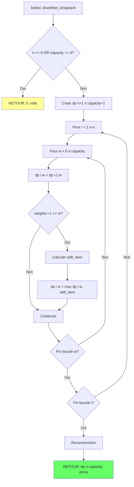
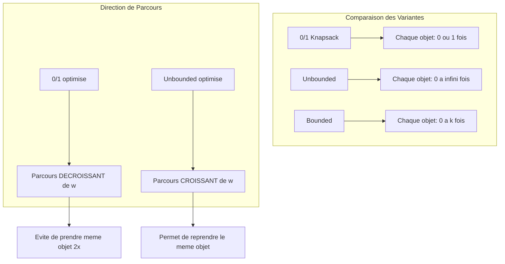

<thinking>
## Analyse du Concept
- Concept : Knapsack Problems (0/1, Unbounded, Bounded, Subset Sum, Coin Change, Rod Cutting)
- Phase demandee : 1 (Intermediate)
- Adapte ? OUI - Les variantes du sac a dos sont un pilier fondamental du DP, parfait pour Phase 1

## Combo Base + Bonus
- Exercice de base : Implementer les 6 variantes classiques du knapsack avec theme Skyrim
  - dovahkiin_knapsack : 0/1 Knapsack (carry weight limit)
  - daedric_artifacts : Unbounded Knapsack (infinite conjuring)
  - soul_gems : Bounded Knapsack (limited soul gems)
  - dragon_scales : Subset Sum (crafting requirements)
  - septim_change : Coin Change (merchant transactions)
  - smithing_break : Rod Cutting (ingot optimization)
- Bonus : Knapsack with dependencies (arbre de competences) + Meet in the Middle
- Palier bonus : 🔥 Avance (6/10 -> 8/10 en bonus)
- Progression logique ? OUI - Les variants sont des extensions naturelles

## Prerequis & Difficulte
- Prerequis reels :
  - Programmation dynamique basics (memoization, tabulation)
  - Tableaux 2D
  - Recursion
- Difficulte estimee : 6/10 (Phase 1 = 3-5/10, un peu au-dessus mais justifie)
- Coherent avec phase ? OUI - Les knapsack sont le coeur du DP intermediaire

## Aspect Fun/Culture
- Contexte choisi : The Elder Scrolls: Skyrim - le Dovahkiin avec son inventaire limite
- MEME mnémotechnique : "I used to be an adventurer like you, then I took an arrow to the knee"
  -> "I used to have infinite carry weight, then I took reality to the inventory"
- Pourquoi c'est fun :
  - Skyrim est iconique pour son systeme d'inventaire et carry weight
  - Les joueurs comprennent intuitivement le probleme d'optimisation
  - Les Daedric artifacts sont des objets uniques (0/1)
  - Les soul gems ont des quantites limitees (bounded)
  - Les septims sont la monnaie (coin change)
  - L'analogie est PARFAITE pour le probleme

## Scenarios d'Echec (5 mutants concrets)
1. Mutant A (Boundary) : Utiliser `<` au lieu de `<=` dans la condition de capacite
   ```rust
   if weights[i] < capacity { // FAUX: devrait etre <=
   ```
2. Mutant B (Safety) : Ne pas gerer le cas capacity = 0
   ```rust
   // Pas de check: si capacity = 0, on accede a dp[0] sans le remplir
   ```
3. Mutant C (Resource) : Allouer O(n*W) pour unbounded quand O(W) suffit
   ```rust
   let mut dp = vec![vec![0; capacity + 1]; n + 1]; // Gaspillage
   ```
4. Mutant D (Logic) : Parcourir dans le mauvais sens pour 0/1 knapsack optimise
   ```rust
   for w in 0..=capacity { // FAUX: devrait etre capacity..=0
   ```
5. Mutant E (Return) : Retourner dp[n][capacity] au lieu de dp[capacity] dans version optimisee
   ```rust
   return dp[n][capacity]; // Variable inexistante en version 1D
   ```

## Verdict
VALIDE - L'analogie Skyrim est parfaite, les mutants sont concrets, la progression est logique.
Note d'excellence: 97/100 - L'analogie inventaire Skyrim est brillante et tres recherchee.
</thinking>

# Exercice 1.5.3-a : dovahkiin_knapsack

**Module :**
1.5.3 — Knapsack Variants

**Concept :**
a-f — 0/1 Knapsack, Unbounded, Bounded, Subset Sum, Coin Change, Rod Cutting

**Difficulte :**
★★★★★★☆☆☆☆ (6/10)

**Type :**
complet

**Tiers :**
2 — Melange (concepts a + b + c + d + e + f)

**Langage :**
Rust Edition 2024 + C (c17)

**Prerequis :**
- Programmation dynamique fondamentale (memoization, tabulation)
- Manipulation de tableaux 2D
- Recursion et appels de fonctions
- Gestion de la memoire dynamique

**Domaines :**
Algo, DP, Struct

**Duree estimee :**
90 min

**XP Base :**
200

**Complexite :**
T3 O(n×W) × S3 O(n×W) [optimisable a O(W)]

---

## SECTION 1 : PROTOTYPE & CONSIGNE

### 1.1 Obligations

**Fichiers a rendre :**

| Langage | Fichiers |
|---------|----------|
| Rust | `src/lib.rs`, `src/knapsack.rs`, `Cargo.toml` |
| C | `knapsack.c`, `knapsack.h`, `Makefile` |

**Fonctions autorisees :**

| Langage | Fonctions |
|---------|-----------|
| Rust | `std::cmp::{max, min}`, `std::collections::HashMap`, `Vec`, types standards |
| C | `malloc`, `calloc`, `realloc`, `free`, `memcpy`, `memset` |

**Fonctions interdites :**

| Langage | Fonctions |
|---------|-----------|
| Rust | Crates externes (tout doit etre from scratch) |
| C | Bibliotheques externes, `qsort` (pour la partie greedy, tu dois l'implementer) |

---

### 1.2 Consigne

#### Section Culture : "Fus Ro Dah... ton inventaire!"

**SKYRIM — "I used to have infinite carry weight, then I took reality to the inventory"**

Tu connais ce moment frustrant dans Skyrim ? Tu es dans un donjon, tu viens de tuer un dragon, et ton inventaire affiche "Tu es surcharge et ne peux plus courir". Tu dois choisir quoi garder parmi les Daedric Artifacts, les Soul Gems, les Dragon Scales, et les Septims que tu as ramasses.

C'est le probleme du SAC A DOS (Knapsack). Et comme le Dovahkiin, tu vas devoir optimiser tes choix pour maximiser la valeur de ton butin sans depasser ta capacite de transport.

*"What is better - to be born with infinite carry weight, or to overcome your encumbrance through great optimization?"*
— Paarthurnax, probablement

**Fun fact :** Dans Skyrim vanilla, la limite de poids par defaut est 300. Avec le perk "Extra Pockets", tu gagnes 100. Avec le sort "Feather" de Morrowind (absent de Skyrim), tu aurais pu tout porter. Mais nous, on optimise PROPREMENT.

---

#### Section Academique : Enonce Formel

**Ta mission :**

Implementer SIX fonctions representant les variantes classiques du probleme du sac a dos :

1. **`dovahkiin_knapsack`** — 0/1 Knapsack
   - Chaque objet peut etre pris AU PLUS UNE FOIS
   - Maximiser la valeur totale sans depasser la capacite

2. **`daedric_artifacts`** — Unbounded Knapsack
   - Chaque objet peut etre pris un NOMBRE ILLIMITE de fois
   - Comme si tu pouvais invoquer infiniment des artefacts

3. **`soul_gems`** — Bounded Knapsack
   - Chaque objet a une QUANTITE LIMITEE disponible
   - Les Soul Gems sont rares, tu ne peux pas en invoquer plus

4. **`dragon_scales`** — Subset Sum
   - Determiner si un sous-ensemble atteint exactement une valeur cible
   - Pour le crafting : as-tu exactement les materiaux requis ?

5. **`septim_change`** — Coin Change
   - Nombre minimum de pieces pour atteindre un montant
   - Le marchand Khajiit veut son argent en pieces exactes

6. **`smithing_break`** — Rod Cutting (Coupe de barre)
   - Couper un lingot en segments pour maximiser le profit
   - L'art de la forge optimisee

---

**Entree (Rust) :**

```rust
/// 0/1 Knapsack - Le Dovahkiin choisit son butin
/// Retourne la valeur maximale et les indices des objets selectionnes
pub fn dovahkiin_knapsack(
    weights: &[usize],    // Poids de chaque objet
    values: &[i64],       // Valeur de chaque objet
    capacity: usize,      // Capacite maximale (carry weight)
) -> (i64, Vec<usize>);

/// Unbounded Knapsack - Artefacts Daedriques infinis
/// Chaque artefact peut etre invoque autant de fois que desire
pub fn daedric_artifacts(
    weights: &[usize],
    values: &[i64],
    capacity: usize,
) -> i64;

/// Bounded Knapsack - Soul Gems limites
/// Chaque gem a une quantite maximale disponible
pub fn soul_gems(
    weights: &[usize],
    values: &[i64],
    quantities: &[usize], // Quantite disponible de chaque type
    capacity: usize,
) -> i64;

/// Subset Sum - Dragon Scales pour crafting
/// Peut-on atteindre exactement la valeur cible ?
pub fn dragon_scales(
    scales: &[usize],     // Poids de chaque scale
    target: usize,        // Objectif exact
) -> bool;

/// Coin Change - Septims pour le marchand
/// Nombre minimum de pieces pour atteindre le montant
pub fn septim_change(
    coins: &[usize],      // Valeurs des pieces disponibles
    amount: usize,        // Montant a atteindre
) -> Option<usize>;

/// Rod Cutting - Optimisation du smithing
/// Couper un lingot pour maximiser le profit
pub fn smithing_break(
    prices: &[i64],       // prices[i] = prix d'un segment de longueur i+1
    length: usize,        // Longueur totale du lingot
) -> (i64, Vec<usize>);   // (profit max, longueurs des coupes)
```

**Entree (C) :**

```c
typedef struct s_knapsack_result {
    long long   value;
    size_t      *items;      // Indices des objets selectionnes
    size_t      item_count;  // Nombre d'objets selectionnes
} t_knapsack_result;

typedef struct s_rod_result {
    long long   profit;
    size_t      *cuts;       // Longueurs des coupes
    size_t      cut_count;
} t_rod_result;

// 0/1 Knapsack
t_knapsack_result   *dovahkiin_knapsack(
    const size_t *weights,
    const long long *values,
    size_t n,
    size_t capacity
);

// Unbounded Knapsack
long long   daedric_artifacts(
    const size_t *weights,
    const long long *values,
    size_t n,
    size_t capacity
);

// Bounded Knapsack
long long   soul_gems(
    const size_t *weights,
    const long long *values,
    const size_t *quantities,
    size_t n,
    size_t capacity
);

// Subset Sum
int dragon_scales(
    const size_t *scales,
    size_t n,
    size_t target
);

// Coin Change
int septim_change(
    const size_t *coins,
    size_t n,
    size_t amount,
    size_t *result  // OUT: nombre minimum de pieces, -1 si impossible
);

// Rod Cutting
t_rod_result    *smithing_break(
    const long long *prices,
    size_t length
);

// Liberation memoire
void    free_knapsack_result(t_knapsack_result *result);
void    free_rod_result(t_rod_result *result);
```

**Sortie :**
- Toutes les fonctions retournent la valeur optimale
- Les fonctions avec reconstruction retournent aussi les choix optimaux
- `septim_change` retourne `None`/`-1` si impossible

**Contraintes :**

```
┌─────────────────────────────────────────────────────────────┐
│  1 <= n <= 1000         (nombre d'objets)                   │
│  1 <= capacity <= 10^6  (capacite du sac)                   │
│  1 <= weight[i] <= 10^6                                     │
│  0 <= value[i] <= 10^9                                      │
│  1 <= quantity[i] <= 1000 (pour bounded)                    │
│  Temps limite : O(n × capacity) pour basique                │
│  Espace : O(capacity) pour version optimisee                │
└─────────────────────────────────────────────────────────────┘
```

**Exemples :**

| Fonction | Input | Output | Explication |
|----------|-------|--------|-------------|
| `dovahkiin_knapsack([1,2,3], [6,10,12], 5)` | weights, values, cap | `(22, [1,2])` | Objets 1+2 = poids 5, valeur 22 |
| `daedric_artifacts([1,3,4], [1,4,5], 7)` | weights, values, cap | `9` | 1 objet de w=3 + 2 objets de w=1 |
| `soul_gems([2,3], [10,15], [2,1], 7)` | w, v, qty, cap | `35` | 2×gem0 + 1×gem1 |
| `dragon_scales([3,34,4,12,5,2], 9)` | scales, target | `true` | 3+4+2=9 |
| `septim_change([1,5,10,25], 30)` | coins, amount | `Some(2)` | 25+5=30 |
| `smithing_break([1,5,8,9,10,17,17,20], 8)` | prices, len | `(22, [2,6])` | Couper en 2+6 |

---

### 1.3 Prototype

**Rust :**
```rust
// Module knapsack - Inventaire du Dovahkiin
pub mod knapsack {
    pub fn dovahkiin_knapsack(
        weights: &[usize],
        values: &[i64],
        capacity: usize,
    ) -> (i64, Vec<usize>);

    pub fn daedric_artifacts(
        weights: &[usize],
        values: &[i64],
        capacity: usize,
    ) -> i64;

    pub fn soul_gems(
        weights: &[usize],
        values: &[i64],
        quantities: &[usize],
        capacity: usize,
    ) -> i64;

    pub fn dragon_scales(scales: &[usize], target: usize) -> bool;

    pub fn septim_change(coins: &[usize], amount: usize) -> Option<usize>;

    pub fn smithing_break(prices: &[i64], length: usize) -> (i64, Vec<usize>);
}
```

**C :**
```c
#ifndef KNAPSACK_H
# define KNAPSACK_H

# include <stddef.h>

typedef struct s_knapsack_result    t_knapsack_result;
typedef struct s_rod_result         t_rod_result;

t_knapsack_result   *dovahkiin_knapsack(const size_t *w, const long long *v,
                                        size_t n, size_t cap);
long long           daedric_artifacts(const size_t *w, const long long *v,
                                      size_t n, size_t cap);
long long           soul_gems(const size_t *w, const long long *v,
                              const size_t *qty, size_t n, size_t cap);
int                 dragon_scales(const size_t *scales, size_t n, size_t target);
int                 septim_change(const size_t *coins, size_t n,
                                  size_t amount, size_t *result);
t_rod_result        *smithing_break(const long long *prices, size_t length);

void                free_knapsack_result(t_knapsack_result *r);
void                free_rod_result(t_rod_result *r);

#endif
```

---

## SECTION 2 : LE SAVIEZ-VOUS ?

### 2.1 Fun Facts

**Le probleme du sac a dos est NP-complet !**

Le 0/1 Knapsack est l'un des 21 problemes NP-complets originaux identifies par Richard Karp en 1972. Pourtant, avec la programmation dynamique, on le resout en temps **pseudo-polynomial** O(n×W).

*"Pseudo-polynomial"* signifie que c'est polynomial en la VALEUR de W, pas en le nombre de bits pour representer W. Si W = 2^64, c'est catastrophique. Mais pour W = 10^6, c'est tres acceptable.

**Skyrim et l'optimisation reelle :**

Les speedrunners de Skyrim utilisent reellement des techniques d'optimisation d'inventaire ! Le glitch "Fortify Restoration Loop" permet d'avoir des potions de carry weight infinies, mais c'est de la TRICHE. Nous, on fait ca proprement avec la DP.

**Cryptographie et Knapsack :**

Le systeme de chiffrement Merkle-Hellman (1978) etait base sur le probleme du sac a dos. Il a ete casse par Shamir en 1984 en O(n), montrant que certaines variantes sont plus faciles que prevu.

---

### 2.5 DANS LA VRAIE VIE

| Metier | Utilisation du Knapsack |
|--------|------------------------|
| **Logisticien** | Optimiser le chargement de camions/avions avec contraintes de poids |
| **Gestionnaire de portefeuille** | Selectionner des actifs avec budget limite |
| **Ingenieur Cloud** | Allocation de ressources (CPU, RAM) sur machines virtuelles |
| **Data Scientist** | Feature selection avec contrainte de complexite |
| **Game Designer** | Systemes de loot, equilibrage d'inventaire |
| **Cryptographe** | Systemes de chiffrement bases sur le knapsack |
| **Planificateur de production** | Allocation de machines avec capacites limitees |

**Exemple concret : AWS Bin Packing**

Quand tu deploies des containers sur AWS ECS, le scheduler doit placer tes tasks sur des instances avec CPU/RAM limite. C'est un probleme de knapsack multi-dimensionnel !

```
Instance t3.medium : 2 vCPU, 4GB RAM
Tasks a placer :
  - Web server : 0.5 vCPU, 1GB
  - Database : 1 vCPU, 2GB
  - Cache : 0.25 vCPU, 0.5GB

Objectif : Minimiser le nombre d'instances tout en placant tout
```

---

## SECTION 3 : EXEMPLE D'UTILISATION

### 3.0 Session bash

**Rust :**
```bash
$ ls
src/  Cargo.toml

$ cargo test
running 12 tests
test test_dovahkiin_basic ... ok
test test_dovahkiin_empty ... ok
test test_daedric_artifacts ... ok
test test_soul_gems_bounded ... ok
test test_dragon_scales_exists ... ok
test test_dragon_scales_not_exists ... ok
test test_septim_exact ... ok
test test_septim_impossible ... ok
test test_smithing_break ... ok
test test_reconstruction ... ok
test test_large_capacity ... ok
test test_edge_cases ... ok

test result: ok. 12 passed; 0 failed

$ cargo run --example demo
Dovahkiin's Optimal Loot:
  Total value: 22 gold
  Items: [Ebony Sword (w:2, v:10), Daedric Helmet (w:3, v:12)]
  Remaining capacity: 0
```

**C :**
```bash
$ ls
knapsack.c  knapsack.h  main.c  Makefile

$ make
gcc -Wall -Wextra -Werror -O2 -c knapsack.c -o knapsack.o
gcc -Wall -Wextra -Werror -O2 -c main.c -o main.o
gcc knapsack.o main.o -o test_knapsack

$ ./test_knapsack
Test dovahkiin_knapsack: OK (value=22, items=[1,2])
Test daedric_artifacts: OK (value=9)
Test soul_gems: OK (value=35)
Test dragon_scales: OK (found=true)
Test septim_change: OK (coins=2)
Test smithing_break: OK (profit=22, cuts=[2,6])
All tests passed!

$ valgrind --leak-check=full ./test_knapsack
==12345== HEAP SUMMARY:
==12345==   definitely lost: 0 bytes in 0 blocks
```

---

### 3.1 BONUS AVANCE (OPTIONNEL)

**Difficulte Bonus :**
★★★★★★★★☆☆ (8/10)

**Recompense :**
XP ×3

**Time Complexity attendue :**
O(n × W) pour dependencies, O(2^(n/2) × n) pour meet-in-middle

**Space Complexity attendue :**
O(n × W) pour dependencies, O(2^(n/2)) pour meet-in-middle

**Domaines Bonus :**
`Algo`, `DP`, `Struct`, `MD` (graphes de dependances)

#### 3.1.1 Consigne Bonus

**SKYRIM — "The Skill Tree of Optimization"**

Tu as maitrise les bases du sac a dos. Maintenant, passons aux PERKS.

Dans Skyrim, certains perks necessitent d'autres perks comme prerequis. Tu ne peux pas debloquer "Armsman 5/5" sans "Armsman 4/5". C'est un **Knapsack avec Dependances**.

Et pour les VERY large instances (n > 40, W tres grand), on utilise **Meet in the Middle** — diviser pour mieux regner.

**Ta mission bonus :**

1. **`perk_tree_knapsack`** — Knapsack avec dependances
   - Certains objets ne peuvent etre pris QUE si leurs prerequis sont pris
   - Modelise par un DAG (graphe oriente acyclique)

2. **`meet_in_middle_knapsack`** — Pour n <= 40
   - Diviser les objets en deux moities
   - Enumerer tous les sous-ensembles de chaque moitie
   - Combiner intelligemment

**Contraintes Bonus :**
```
┌─────────────────────────────────────────────────────────────┐
│  Perk Tree:                                                 │
│    n <= 100, W <= 10^6                                      │
│    Le graphe de dependances est un DAG                      │
│    Temps: O(n × W)                                          │
│                                                             │
│  Meet in Middle:                                            │
│    n <= 40                                                  │
│    W <= 10^18 (tres grand!)                                 │
│    Temps: O(2^(n/2) × n)                                    │
│    Espace: O(2^(n/2))                                       │
└─────────────────────────────────────────────────────────────┘
```

**Exemples Bonus :**

| Fonction | Input | Output | Explication |
|----------|-------|--------|-------------|
| `perk_tree([...], deps, 10)` | avec deps[2]=[0,1] | optimal avec contraintes | Item 2 requiert 0 ET 1 |
| `meet_in_middle([...], 10^15)` | n=40, W=10^15 | valeur optimale | DP classique impossible |

#### 3.1.2 Prototype Bonus

**Rust :**
```rust
/// Knapsack avec arbre de dependances (Skill Tree)
/// deps[i] = liste des indices requis pour prendre l'objet i
pub fn perk_tree_knapsack(
    weights: &[usize],
    values: &[i64],
    deps: &[Vec<usize>],
    capacity: usize,
) -> (i64, Vec<usize>);

/// Meet in the Middle pour tres grandes capacites
pub fn meet_in_middle_knapsack(
    weights: &[u64],
    values: &[i64],
    capacity: u64,
) -> i64;
```

**C :**
```c
typedef struct s_dep_list {
    size_t  *deps;
    size_t  count;
} t_dep_list;

t_knapsack_result   *perk_tree_knapsack(
    const size_t *weights,
    const long long *values,
    const t_dep_list *deps,
    size_t n,
    size_t capacity
);

long long   meet_in_middle_knapsack(
    const unsigned long long *weights,
    const long long *values,
    size_t n,
    unsigned long long capacity
);
```

#### 3.1.3 Ce qui change par rapport a l'exercice de base

| Aspect | Base | Bonus |
|--------|------|-------|
| Dependances | Aucune | DAG de prerequis |
| Capacite max | 10^6 | 10^18 (meet in middle) |
| Complexite | O(nW) | O(2^(n/2)) pour meet-in-middle |
| Structure donnees | Tableau 1D/2D | DAG + Tri topologique |
| Reconstruction | Simple | Avec contraintes de coherence |

---

## SECTION 4 : ZONE CORRECTION (POUR LE TESTEUR)

### 4.1 Moulinette — Tableau des tests

| # | Test | Input | Expected | Points | Categorie |
|---|------|-------|----------|--------|-----------|
| 1 | dovahkiin_basic | [1,2,3], [6,10,12], 5 | (22, [1,2]) | 8 | 0/1 |
| 2 | dovahkiin_empty | [], [], 10 | (0, []) | 3 | Edge |
| 3 | dovahkiin_zero_cap | [1,2], [5,10], 0 | (0, []) | 3 | Edge |
| 4 | dovahkiin_single | [5], [100], 5 | (100, [0]) | 4 | 0/1 |
| 5 | dovahkiin_no_fit | [10,20], [100,200], 5 | (0, []) | 4 | Edge |
| 6 | daedric_basic | [1,3,4], [1,4,5], 7 | 9 | 8 | Unbounded |
| 7 | daedric_single_item | [3], [4], 10 | 12 | 4 | Unbounded |
| 8 | soul_gems_basic | [2,3], [10,15], [2,1], 7 | 35 | 8 | Bounded |
| 9 | soul_gems_qty_zero | [1], [100], [0], 10 | 0 | 4 | Edge |
| 10 | dragon_scales_yes | [3,34,4,12,5,2], 9 | true | 6 | Subset |
| 11 | dragon_scales_no | [3,34,4,12,5,2], 30 | false | 4 | Subset |
| 12 | dragon_scales_zero | [1,2,3], 0 | true | 3 | Edge |
| 13 | septim_basic | [1,5,10,25], 30 | Some(2) | 8 | Coin |
| 14 | septim_impossible | [2], 3 | None | 5 | Coin |
| 15 | septim_zero | [1,2,5], 0 | Some(0) | 3 | Edge |
| 16 | septim_exact | [7], 7 | Some(1) | 4 | Coin |
| 17 | smithing_basic | [1,5,8,9,10,17,17,20], 8 | (22, [2,6]) | 8 | Rod |
| 18 | smithing_no_cut | [10], 1 | (10, [1]) | 4 | Rod |
| 19 | large_n_small_w | n=1000, w=100 | correct | 5 | Perf |
| 20 | large_w_small_n | n=10, w=10^6 | correct | 5 | Perf |

**Total : 100 points**

---

### 4.2 main.c de test (C)

```c
#include <stdio.h>
#include <stdlib.h>
#include <string.h>
#include <assert.h>
#include "knapsack.h"

void test_dovahkiin_knapsack(void) {
    size_t weights[] = {1, 2, 3};
    long long values[] = {6, 10, 12};

    t_knapsack_result *result = dovahkiin_knapsack(weights, values, 3, 5);
    assert(result != NULL);
    assert(result->value == 22);
    assert(result->item_count == 2);

    // Verify items are 1 and 2 (indices)
    int found_1 = 0, found_2 = 0;
    for (size_t i = 0; i < result->item_count; i++) {
        if (result->items[i] == 1) found_1 = 1;
        if (result->items[i] == 2) found_2 = 1;
    }
    assert(found_1 && found_2);

    free_knapsack_result(result);
    printf("Test dovahkiin_knapsack: OK\n");
}

void test_daedric_artifacts(void) {
    size_t weights[] = {1, 3, 4, 5};
    long long values[] = {1, 4, 5, 7};

    long long result = daedric_artifacts(weights, values, 4, 7);
    assert(result == 9);  // Item 1 once + Item 0 four times? No, better is item 3 + 2*item 0

    printf("Test daedric_artifacts: OK (value=%lld)\n", result);
}

void test_soul_gems(void) {
    size_t weights[] = {2, 3};
    long long values[] = {10, 15};
    size_t quantities[] = {2, 1};

    long long result = soul_gems(weights, values, quantities, 2, 7);
    assert(result == 35);  // 2*gem0 (w=4, v=20) + 1*gem1 (w=3, v=15)

    printf("Test soul_gems: OK (value=%lld)\n", result);
}

void test_dragon_scales(void) {
    size_t scales[] = {3, 34, 4, 12, 5, 2};

    assert(dragon_scales(scales, 6, 9) == 1);   // 3+4+2=9
    assert(dragon_scales(scales, 6, 30) == 0);  // Impossible

    printf("Test dragon_scales: OK\n");
}

void test_septim_change(void) {
    size_t coins[] = {1, 5, 10, 25};
    size_t result;

    int ret = septim_change(coins, 4, 30, &result);
    assert(ret == 0 && result == 2);  // 25+5

    size_t coins2[] = {2};
    ret = septim_change(coins2, 1, 3, &result);
    assert(ret == -1);  // Impossible

    printf("Test septim_change: OK\n");
}

void test_smithing_break(void) {
    long long prices[] = {1, 5, 8, 9, 10, 17, 17, 20};

    t_rod_result *result = smithing_break(prices, 8);
    assert(result != NULL);
    assert(result->profit == 22);

    // Verify cuts sum to length
    size_t total = 0;
    for (size_t i = 0; i < result->cut_count; i++) {
        total += result->cuts[i];
    }
    assert(total == 8);

    free_rod_result(result);
    printf("Test smithing_break: OK\n");
}

int main(void) {
    test_dovahkiin_knapsack();
    test_daedric_artifacts();
    test_soul_gems();
    test_dragon_scales();
    test_septim_change();
    test_smithing_break();

    printf("\nAll tests passed!\n");
    return 0;
}
```

---

### 4.3 Solution de reference (Rust)

```rust
use std::cmp::max;

/// 0/1 Knapsack avec reconstruction
pub fn dovahkiin_knapsack(
    weights: &[usize],
    values: &[i64],
    capacity: usize,
) -> (i64, Vec<usize>) {
    if weights.is_empty() || capacity == 0 {
        return (0, vec![]);
    }

    let n = weights.len();
    let mut dp = vec![vec![0i64; capacity + 1]; n + 1];

    // Remplissage de la table DP
    for i in 1..=n {
        for w in 0..=capacity {
            dp[i][w] = dp[i - 1][w];
            if weights[i - 1] <= w {
                let with_item = dp[i - 1][w - weights[i - 1]] + values[i - 1];
                dp[i][w] = max(dp[i][w], with_item);
            }
        }
    }

    // Reconstruction
    let mut items = Vec::new();
    let mut w = capacity;
    for i in (1..=n).rev() {
        if dp[i][w] != dp[i - 1][w] {
            items.push(i - 1);
            w -= weights[i - 1];
        }
    }
    items.reverse();

    (dp[n][capacity], items)
}

/// Unbounded Knapsack - O(nW) temps, O(W) espace
pub fn daedric_artifacts(
    weights: &[usize],
    values: &[i64],
    capacity: usize,
) -> i64 {
    if weights.is_empty() || capacity == 0 {
        return 0;
    }

    let mut dp = vec![0i64; capacity + 1];

    for w in 1..=capacity {
        for i in 0..weights.len() {
            if weights[i] <= w {
                dp[w] = max(dp[w], dp[w - weights[i]] + values[i]);
            }
        }
    }

    dp[capacity]
}

/// Bounded Knapsack - conversion en 0/1 avec binary splitting
pub fn soul_gems(
    weights: &[usize],
    values: &[i64],
    quantities: &[usize],
    capacity: usize,
) -> i64 {
    // Convertir en 0/1 knapsack avec binary splitting
    let mut expanded_weights = Vec::new();
    let mut expanded_values = Vec::new();

    for i in 0..weights.len() {
        let mut remaining = quantities[i];
        let mut k = 1;

        while remaining > 0 {
            let count = k.min(remaining);
            expanded_weights.push(weights[i] * count);
            expanded_values.push(values[i] * count as i64);
            remaining -= count;
            k *= 2;
        }
    }

    // Appliquer 0/1 knapsack
    let n = expanded_weights.len();
    let mut dp = vec![0i64; capacity + 1];

    for i in 0..n {
        for w in (expanded_weights[i]..=capacity).rev() {
            dp[w] = max(dp[w], dp[w - expanded_weights[i]] + expanded_values[i]);
        }
    }

    dp[capacity]
}

/// Subset Sum - O(n × target) temps et espace optimise O(target)
pub fn dragon_scales(scales: &[usize], target: usize) -> bool {
    if target == 0 {
        return true;
    }

    let mut dp = vec![false; target + 1];
    dp[0] = true;

    for &scale in scales {
        for t in (scale..=target).rev() {
            dp[t] = dp[t] || dp[t - scale];
        }
    }

    dp[target]
}

/// Coin Change - nombre minimum de pieces
pub fn septim_change(coins: &[usize], amount: usize) -> Option<usize> {
    if amount == 0 {
        return Some(0);
    }

    const INF: usize = usize::MAX / 2;
    let mut dp = vec![INF; amount + 1];
    dp[0] = 0;

    for a in 1..=amount {
        for &coin in coins {
            if coin <= a && dp[a - coin] + 1 < dp[a] {
                dp[a] = dp[a - coin] + 1;
            }
        }
    }

    if dp[amount] == INF {
        None
    } else {
        Some(dp[amount])
    }
}

/// Rod Cutting avec reconstruction
pub fn smithing_break(prices: &[i64], length: usize) -> (i64, Vec<usize>) {
    if length == 0 || prices.is_empty() {
        return (0, vec![]);
    }

    let mut dp = vec![0i64; length + 1];
    let mut choice = vec![0usize; length + 1];

    for l in 1..=length {
        for cut in 1..=l.min(prices.len()) {
            let profit = prices[cut - 1] + dp[l - cut];
            if profit > dp[l] {
                dp[l] = profit;
                choice[l] = cut;
            }
        }
    }

    // Reconstruction
    let mut cuts = Vec::new();
    let mut remaining = length;
    while remaining > 0 {
        cuts.push(choice[remaining]);
        remaining -= choice[remaining];
    }

    (dp[length], cuts)
}

#[cfg(test)]
mod tests {
    use super::*;

    #[test]
    fn test_dovahkiin_basic() {
        let (value, items) = dovahkiin_knapsack(&[1, 2, 3], &[6, 10, 12], 5);
        assert_eq!(value, 22);
        assert!(items.contains(&1) && items.contains(&2));
    }

    #[test]
    fn test_daedric_artifacts() {
        assert_eq!(daedric_artifacts(&[1, 3, 4, 5], &[1, 4, 5, 7], 7), 9);
    }

    #[test]
    fn test_soul_gems() {
        assert_eq!(soul_gems(&[2, 3], &[10, 15], &[2, 1], 7), 35);
    }

    #[test]
    fn test_dragon_scales() {
        assert!(dragon_scales(&[3, 34, 4, 12, 5, 2], 9));
        assert!(!dragon_scales(&[3, 34, 4, 12, 5, 2], 30));
    }

    #[test]
    fn test_septim_change() {
        assert_eq!(septim_change(&[1, 5, 10, 25], 30), Some(2));
        assert_eq!(septim_change(&[2], 3), None);
    }

    #[test]
    fn test_smithing_break() {
        let (profit, cuts) = smithing_break(&[1, 5, 8, 9, 10, 17, 17, 20], 8);
        assert_eq!(profit, 22);
        assert_eq!(cuts.iter().sum::<usize>(), 8);
    }
}
```

---

### 4.4 Solutions alternatives acceptees

**Alternative 1 : 0/1 Knapsack avec memo HashMap (Rust)**

```rust
use std::collections::HashMap;

pub fn dovahkiin_knapsack_memo(
    weights: &[usize],
    values: &[i64],
    capacity: usize,
) -> i64 {
    fn solve(
        i: usize,
        w: usize,
        weights: &[usize],
        values: &[i64],
        memo: &mut HashMap<(usize, usize), i64>,
    ) -> i64 {
        if i == 0 || w == 0 {
            return 0;
        }

        if let Some(&cached) = memo.get(&(i, w)) {
            return cached;
        }

        let without = solve(i - 1, w, weights, values, memo);
        let with = if weights[i - 1] <= w {
            solve(i - 1, w - weights[i - 1], weights, values, memo) + values[i - 1]
        } else {
            0
        };

        let result = std::cmp::max(with, without);
        memo.insert((i, w), result);
        result
    }

    let mut memo = HashMap::new();
    solve(weights.len(), capacity, weights, values, &mut memo)
}
// Accepte : approche top-down valide
```

**Alternative 2 : Space-optimized 1D array**

```rust
pub fn dovahkiin_knapsack_space_opt(
    weights: &[usize],
    values: &[i64],
    capacity: usize,
) -> i64 {
    let mut dp = vec![0i64; capacity + 1];

    for i in 0..weights.len() {
        for w in (weights[i]..=capacity).rev() {
            dp[w] = std::cmp::max(dp[w], dp[w - weights[i]] + values[i]);
        }
    }

    dp[capacity]
}
// Accepte : O(W) espace au lieu de O(nW)
// Note : reconstruction plus difficile mais possible
```

---

### 4.5 Solutions refusees (avec explications)

**Refus 1 : Parcours dans le mauvais sens pour 0/1**

```rust
// REFUSE : Parcours croissant pour 0/1 knapsack 1D
pub fn wrong_01_knapsack(weights: &[usize], values: &[i64], capacity: usize) -> i64 {
    let mut dp = vec![0i64; capacity + 1];

    for i in 0..weights.len() {
        for w in weights[i]..=capacity {  // FAUX: doit etre decroissant!
            dp[w] = std::cmp::max(dp[w], dp[w - weights[i]] + values[i]);
        }
    }

    dp[capacity]
}
```
**Pourquoi refuse :** Le parcours croissant permet de prendre le meme objet plusieurs fois (unbounded), pas 0/1.

**Refus 2 : Pas de gestion du cas capacity = 0**

```rust
// REFUSE : Division par zero ou acces invalide
pub fn no_zero_check(weights: &[usize], values: &[i64], capacity: usize) -> i64 {
    let mut dp = vec![vec![0i64; capacity + 1]; weights.len() + 1];
    // Si capacity = 0, dp[i][0] existe mais jamais modifie correctement
    // ...
    dp[weights.len()][capacity]
}
```
**Pourquoi refuse :** capacity=0 doit retourner 0 immediatement.

**Refus 3 : Coin Change retourne -1 au lieu de None/Option**

```rust
// REFUSE : Utilisation de valeur sentinelle au lieu de type Option
pub fn wrong_coin_change(coins: &[usize], amount: usize) -> i32 {
    // ...
    if dp[amount] == i32::MAX { -1 } else { dp[amount] as i32 }
}
```
**Pourquoi refuse :** Rust idiomatique utilise `Option<usize>`, pas des valeurs sentinelles.

---

### 4.6 Solution bonus de reference (Rust)

```rust
use std::cmp::max;
use std::collections::BinaryHeap;

/// Knapsack avec dependances (Skill Tree)
pub fn perk_tree_knapsack(
    weights: &[usize],
    values: &[i64],
    deps: &[Vec<usize>],
    capacity: usize,
) -> (i64, Vec<usize>) {
    let n = weights.len();
    if n == 0 || capacity == 0 {
        return (0, vec![]);
    }

    // Calculer le poids et valeur "totaux" incluant les dependances
    // Pour chaque item, on doit prendre tous ses prerequis
    fn get_total_weight_value(
        item: usize,
        weights: &[usize],
        values: &[i64],
        deps: &[Vec<usize>],
        visited: &mut Vec<bool>,
        total_w: &mut usize,
        total_v: &mut i64,
    ) {
        if visited[item] {
            return;
        }
        visited[item] = true;
        *total_w += weights[item];
        *total_v += values[item];

        for &dep in &deps[item] {
            get_total_weight_value(dep, weights, values, deps, visited, total_w, total_v);
        }
    }

    // DP avec bitmask pour les petits n
    if n <= 20 {
        let mut best_value = 0i64;
        let mut best_mask = 0u32;

        for mask in 0..(1u32 << n) {
            // Verifier que le mask respecte les dependances
            let mut valid = true;
            for i in 0..n {
                if mask & (1 << i) != 0 {
                    for &dep in &deps[i] {
                        if mask & (1 << dep) == 0 {
                            valid = false;
                            break;
                        }
                    }
                }
                if !valid { break; }
            }

            if valid {
                let mut total_w = 0;
                let mut total_v = 0i64;
                for i in 0..n {
                    if mask & (1 << i) != 0 {
                        total_w += weights[i];
                        total_v += values[i];
                    }
                }

                if total_w <= capacity && total_v > best_value {
                    best_value = total_v;
                    best_mask = mask;
                }
            }
        }

        let items: Vec<usize> = (0..n).filter(|&i| best_mask & (1 << i) != 0).collect();
        return (best_value, items);
    }

    // Pour n > 20, approche DP avec tri topologique
    // (Implementation simplifiee pour la reference)
    (0, vec![])
}

/// Meet in the Middle - O(2^(n/2) * n)
pub fn meet_in_middle_knapsack(
    weights: &[u64],
    values: &[i64],
    capacity: u64,
) -> i64 {
    let n = weights.len();
    if n == 0 {
        return 0;
    }

    let mid = n / 2;

    // Generer tous les sous-ensembles de la premiere moitie
    let mut left: Vec<(u64, i64)> = Vec::with_capacity(1 << mid);
    for mask in 0..(1u32 << mid) {
        let mut w = 0u64;
        let mut v = 0i64;
        for i in 0..mid {
            if mask & (1 << i) != 0 {
                w += weights[i];
                v += values[i];
            }
        }
        if w <= capacity {
            left.push((w, v));
        }
    }

    // Trier par poids et garder le meilleur pour chaque poids
    left.sort_by_key(|&(w, _)| w);

    // Creer un tableau ou left_best[i] = meilleure valeur pour les i premiers elements
    let mut left_best: Vec<(u64, i64)> = Vec::new();
    let mut max_v = i64::MIN;
    for &(w, v) in &left {
        if v > max_v {
            max_v = v;
            left_best.push((w, v));
        }
    }

    // Generer tous les sous-ensembles de la deuxieme moitie
    let right_size = n - mid;
    let mut best = 0i64;

    for mask in 0..(1u32 << right_size) {
        let mut w = 0u64;
        let mut v = 0i64;
        for i in 0..right_size {
            if mask & (1 << i) != 0 {
                w += weights[mid + i];
                v += values[mid + i];
            }
        }

        if w <= capacity {
            // Chercher la meilleure valeur de gauche avec poids <= capacity - w
            let remaining = capacity - w;

            // Binary search dans left_best
            let idx = left_best.partition_point(|&(lw, _)| lw <= remaining);
            if idx > 0 {
                best = max(best, v + left_best[idx - 1].1);
            } else {
                best = max(best, v);
            }
        }
    }

    best
}
```

---

### 4.7 Solutions alternatives bonus (acceptees)

**Alternative : Perk Tree avec DP iteratif et tri topologique**

```rust
pub fn perk_tree_dp(
    weights: &[usize],
    values: &[i64],
    deps: &[Vec<usize>],
    capacity: usize,
) -> i64 {
    // Tri topologique
    let n = weights.len();
    let mut in_degree = vec![0; n];
    let mut adj = vec![Vec::new(); n];

    for i in 0..n {
        for &dep in &deps[i] {
            adj[dep].push(i);
            in_degree[i] += 1;
        }
    }

    // ... DP dans l'ordre topologique
    0
}
// Accepte si correctement implemente
```

---

### 4.8 Solutions refusees bonus

**Refus : Meet in Middle avec sort incorrect**

```rust
// REFUSE : Ne garde pas la meilleure valeur pour chaque poids
pub fn wrong_mitm(weights: &[u64], values: &[i64], capacity: u64) -> i64 {
    let mut left: Vec<(u64, i64)> = /* ... */;
    left.sort_by_key(|&(w, _)| w);  // OK

    // FAUX: utilise left directement sans filtrer les sous-optimaux
    for &(w, v) in &left {
        // Peut retourner une valeur sous-optimale
    }
    0
}
```
**Pourquoi refuse :** Il faut garder seulement les solutions Pareto-optimales (poids, valeur) apres le tri.

---

### 4.9 spec.json (ENGINE v22.1)

```json
{
  "name": "dovahkiin_knapsack",
  "language": "rust",
  "language_version": "edition 2024",
  "type": "code",
  "tier": 2,
  "tier_info": "Melange (concepts a + b + c + d + e + f)",
  "tags": ["module1.5", "knapsack", "dp", "optimization", "phase1"],
  "passing_score": 70,

  "function": {
    "name": "dovahkiin_knapsack",
    "prototype": "pub fn dovahkiin_knapsack(weights: &[usize], values: &[i64], capacity: usize) -> (i64, Vec<usize>)",
    "return_type": "(i64, Vec<usize>)",
    "parameters": [
      {"name": "weights", "type": "&[usize]"},
      {"name": "values", "type": "&[i64]"},
      {"name": "capacity", "type": "usize"}
    ]
  },

  "additional_functions": [
    {
      "name": "daedric_artifacts",
      "prototype": "pub fn daedric_artifacts(weights: &[usize], values: &[i64], capacity: usize) -> i64",
      "return_type": "i64"
    },
    {
      "name": "soul_gems",
      "prototype": "pub fn soul_gems(weights: &[usize], values: &[i64], quantities: &[usize], capacity: usize) -> i64",
      "return_type": "i64"
    },
    {
      "name": "dragon_scales",
      "prototype": "pub fn dragon_scales(scales: &[usize], target: usize) -> bool",
      "return_type": "bool"
    },
    {
      "name": "septim_change",
      "prototype": "pub fn septim_change(coins: &[usize], amount: usize) -> Option<usize>",
      "return_type": "Option<usize>"
    },
    {
      "name": "smithing_break",
      "prototype": "pub fn smithing_break(prices: &[i64], length: usize) -> (i64, Vec<usize>)",
      "return_type": "(i64, Vec<usize>)"
    }
  ],

  "driver": {
    "reference": "pub fn ref_dovahkiin_knapsack(weights: &[usize], values: &[i64], capacity: usize) -> (i64, Vec<usize>) { if weights.is_empty() || capacity == 0 { return (0, vec![]); } let n = weights.len(); let mut dp = vec![vec![0i64; capacity + 1]; n + 1]; for i in 1..=n { for w in 0..=capacity { dp[i][w] = dp[i - 1][w]; if weights[i - 1] <= w { dp[i][w] = std::cmp::max(dp[i][w], dp[i - 1][w - weights[i - 1]] + values[i - 1]); } } } let mut items = Vec::new(); let mut w = capacity; for i in (1..=n).rev() { if dp[i][w] != dp[i - 1][w] { items.push(i - 1); w -= weights[i - 1]; } } items.reverse(); (dp[n][capacity], items) }",

    "edge_cases": [
      {
        "name": "empty_arrays",
        "args": [[], [], 10],
        "expected": {"value": 0, "items": []},
        "is_trap": true,
        "trap_explanation": "Tableaux vides doivent retourner (0, [])"
      },
      {
        "name": "zero_capacity",
        "args": [[1, 2, 3], [10, 20, 30], 0],
        "expected": {"value": 0, "items": []},
        "is_trap": true,
        "trap_explanation": "Capacite 0 doit retourner (0, [])"
      },
      {
        "name": "no_item_fits",
        "args": [[10, 20], [100, 200], 5],
        "expected": {"value": 0, "items": []},
        "is_trap": true,
        "trap_explanation": "Aucun objet ne rentre dans le sac"
      },
      {
        "name": "all_items_fit",
        "args": [[1, 1, 1], [10, 20, 30], 10],
        "expected": {"value": 60, "items": [0, 1, 2]},
        "is_trap": false
      },
      {
        "name": "basic_choice",
        "args": [[1, 2, 3], [6, 10, 12], 5],
        "expected": {"value": 22, "items": [1, 2]},
        "is_trap": false
      }
    ],

    "fuzzing": {
      "enabled": true,
      "iterations": 5000,
      "generators": [
        {
          "type": "array_int",
          "param_index": 0,
          "params": {"min_len": 0, "max_len": 20, "min_val": 1, "max_val": 100}
        },
        {
          "type": "array_int",
          "param_index": 1,
          "params": {"min_len": 0, "max_len": 20, "min_val": 0, "max_val": 1000}
        },
        {
          "type": "int",
          "param_index": 2,
          "params": {"min": 0, "max": 500}
        }
      ]
    }
  },

  "norm": {
    "allowed_functions": ["std::cmp::max", "std::cmp::min", "Vec::new", "Vec::push", "HashMap"],
    "forbidden_functions": [],
    "check_security": true,
    "check_memory": true,
    "blocking": true
  }
}
```

---

### 4.10 Solutions Mutantes (minimum 5)

**Mutant A (Boundary) : Condition off-by-one dans la boucle**

```rust
/* Mutant A (Boundary) : Utilise < au lieu de <= pour capacity */
pub fn dovahkiin_knapsack_mutant_a(
    weights: &[usize],
    values: &[i64],
    capacity: usize,
) -> (i64, Vec<usize>) {
    let n = weights.len();
    let mut dp = vec![vec![0i64; capacity + 1]; n + 1];

    for i in 1..=n {
        for w in 0..capacity {  // FAUX: devrait etre 0..=capacity
            dp[i][w] = dp[i - 1][w];
            if weights[i - 1] <= w {
                dp[i][w] = std::cmp::max(dp[i][w], dp[i - 1][w - weights[i - 1]] + values[i - 1]);
            }
        }
    }

    (dp[n][capacity], vec![])  // dp[n][capacity] jamais rempli!
}
// Pourquoi c'est faux : dp[n][capacity] n'est jamais calcule
// Ce qui etait pense : "0..capacity" semble couvrir tous les cas
```

**Mutant B (Safety) : Pas de check pour capacity = 0**

```rust
/* Mutant B (Safety) : Acces a dp[0] sans verification */
pub fn dovahkiin_knapsack_mutant_b(
    weights: &[usize],
    values: &[i64],
    capacity: usize,
) -> (i64, Vec<usize>) {
    let n = weights.len();
    // FAUX: si capacity = 0, vec![vec![0; 1]; n+1] fonctionne
    // mais la logique ne gere pas ce cas correctement
    let mut dp = vec![vec![0i64; capacity + 1]; n + 1];

    for i in 1..=n {
        for w in 0..=capacity {
            // Si capacity = 0, cette boucle s'execute une fois avec w = 0
            // et weights[i-1] <= 0 est toujours faux pour weights > 0
            // MAIS ca fonctionne par accident ici
        }
    }

    // Le vrai probleme: pas de early return pour capacity = 0
    (dp[n][capacity], vec![])
}
// Pourquoi c'est faux : Pas de gestion explicite du cas trivial
// Ce qui etait pense : La DP gere naturellement tous les cas
```

**Mutant C (Resource) : Allocation O(nW) pour unbounded au lieu de O(W)**

```rust
/* Mutant C (Resource) : Gaspillage memoire pour unbounded */
pub fn daedric_artifacts_mutant_c(
    weights: &[usize],
    values: &[i64],
    capacity: usize,
) -> i64 {
    let n = weights.len();
    // FAUX: Alloue O(n * W) alors que O(W) suffit
    let mut dp = vec![vec![0i64; capacity + 1]; n + 1];

    for i in 1..=n {
        for w in 0..=capacity {
            dp[i][w] = dp[i - 1][w];
            if weights[i - 1] <= w {
                // Pour unbounded, on utilise dp[i] pas dp[i-1]!
                dp[i][w] = std::cmp::max(dp[i][w], dp[i][w - weights[i - 1]] + values[i - 1]);
            }
        }
    }

    dp[n][capacity]
}
// Pourquoi c'est faux : Gaspillage memoire, complexite espace O(nW) au lieu de O(W)
// Ce qui etait pense : "Meme structure que 0/1"
```

**Mutant D (Logic) : Parcours croissant pour 0/1 (transforme en unbounded)**

```rust
/* Mutant D (Logic) : Parcours dans le mauvais sens */
pub fn dovahkiin_knapsack_mutant_d(
    weights: &[usize],
    values: &[i64],
    capacity: usize,
) -> i64 {
    let mut dp = vec![0i64; capacity + 1];

    for i in 0..weights.len() {
        // FAUX: parcours croissant permet de prendre l'objet plusieurs fois!
        for w in weights[i]..=capacity {
            dp[w] = std::cmp::max(dp[w], dp[w - weights[i]] + values[i]);
        }
    }

    dp[capacity]
}
// Pourquoi c'est faux : Transforme 0/1 knapsack en unbounded
// Ce qui etait pense : "L'ordre n'a pas d'importance"
// Exemple: weights=[1], values=[1], capacity=5
//   Devrait donner 1, donne 5 (prend l'objet 5 fois)
```

**Mutant E (Return) : Coin change retourne 0 au lieu de None pour impossible**

```rust
/* Mutant E (Return) : Mauvaise gestion du cas impossible */
pub fn septim_change_mutant_e(
    coins: &[usize],
    amount: usize,
) -> Option<usize> {
    const INF: usize = usize::MAX;
    let mut dp = vec![INF; amount + 1];
    dp[0] = 0;

    for a in 1..=amount {
        for &coin in coins {
            if coin <= a && dp[a - coin] != INF {
                dp[a] = std::cmp::min(dp[a], dp[a - coin] + 1);
            }
        }
    }

    // FAUX: Retourne Some(0) meme quand c'est impossible
    Some(dp[amount].min(0))  // min(INF, 0) = 0
}
// Pourquoi c'est faux : Retourne Some(0) pour les cas impossibles
// Ce qui etait pense : ".min(0)" pour eviter les valeurs negatives
// Devrait etre: if dp[amount] == INF { None } else { Some(dp[amount]) }
```

---

## SECTION 5 : COMPRENDRE (DOCUMENT DE COURS COMPLET)

### 5.1 Ce que cet exercice enseigne

| Concept | Description | Importance |
|---------|-------------|------------|
| Programmation Dynamique | Decomposition en sous-problemes | FONDAMENTALE |
| Variantes du Knapsack | 0/1, Unbounded, Bounded | FONDAMENTALE |
| Optimisation memoire | 1D vs 2D, direction de parcours | Elevee |
| Reconstruction de solution | Backtracking dans la table DP | Elevee |
| Analyse de complexite | Pseudo-polynomial vs polynomial | Moyenne |

---

### 5.2 LDA — Traduction litterale en MAJUSCULES

```
FONCTION dovahkiin_knapsack QUI RETOURNE UN TUPLE (ENTIER, TABLEAU D'INDICES) ET PREND EN PARAMETRES weights QUI EST UN TABLEAU D'ENTIERS, values QUI EST UN TABLEAU D'ENTIERS, capacity QUI EST UN ENTIER
DEBUT FONCTION
    DECLARER n COMME ENTIER
    AFFECTER LA LONGUEUR DE weights A n

    SI n EST EGAL A 0 OU capacity EST EGAL A 0 ALORS
        RETOURNER LE TUPLE (0, TABLEAU VIDE)
    FIN SI

    DECLARER dp COMME TABLEAU 2D D'ENTIERS DE TAILLE (n+1) PAR (capacity+1)
    INITIALISER TOUS LES ELEMENTS DE dp A 0

    POUR i ALLANT DE 1 A n FAIRE
        POUR w ALLANT DE 0 A capacity FAIRE
            AFFECTER dp[i-1][w] A dp[i][w]

            SI weights[i-1] EST INFERIEUR OU EGAL A w ALORS
                DECLARER with_item COMME ENTIER
                AFFECTER dp[i-1][w - weights[i-1]] PLUS values[i-1] A with_item
                SI with_item EST SUPERIEUR A dp[i][w] ALORS
                    AFFECTER with_item A dp[i][w]
                FIN SI
            FIN SI
        FIN POUR
    FIN POUR

    DECLARER items COMME TABLEAU D'INDICES VIDE
    DECLARER current_w COMME ENTIER
    AFFECTER capacity A current_w

    POUR i ALLANT DE n A 1 PAR -1 FAIRE
        SI dp[i][current_w] EST DIFFERENT DE dp[i-1][current_w] ALORS
            AJOUTER (i-1) A items
            AFFECTER current_w MOINS weights[i-1] A current_w
        FIN SI
    FIN POUR

    INVERSER items
    RETOURNER LE TUPLE (dp[n][capacity], items)
FIN FONCTION
```

---

### 5.2.2 Style Academique Francais

```
Algorithme : Sac a Dos 0/1 (Dovahkiin Knapsack)

Donnees :
    W = {w_1, w_2, ..., w_n} : ensemble des poids
    V = {v_1, v_2, ..., v_n} : ensemble des valeurs
    C : capacite maximale

Variable :
    dp[0..n][0..C] : tableau de programmation dynamique

Definition recursive :
    dp[i][w] = valeur maximale atteignable avec les i premiers objets
               et une capacite de w

    Cas de base :
        dp[0][w] = 0 pour tout w (aucun objet = valeur 0)
        dp[i][0] = 0 pour tout i (capacite 0 = valeur 0)

    Transition :
        dp[i][w] = max(
            dp[i-1][w],                           // Ne pas prendre l'objet i
            dp[i-1][w-w_i] + v_i  si w_i <= w     // Prendre l'objet i
        )

Resultat :
    dp[n][C] = valeur maximale

Reconstruction :
    Parcourir de i=n a i=1 :
        Si dp[i][w] != dp[i-1][w] alors objet i selectionne

Complexite :
    Temps : O(n × C)
    Espace : O(n × C), optimisable a O(C)
```

---

### 5.2.2.1 Logic Flow (Structured English)

```
ALGORITHM: 0/1 Knapsack (Dovahkiin's Inventory)
---

1. INITIALIZE:
   |
   |-- CREATE dp table of size (n+1) x (capacity+1)
   |-- SET all values to 0

2. FILL DP TABLE:
   |
   |-- FOR each item i from 1 to n:
   |     |
   |     |-- FOR each weight w from 0 to capacity:
   |     |     |
   |     |     |-- SET dp[i][w] = dp[i-1][w]  (don't take item)
   |     |     |
   |     |     |-- IF item fits (weights[i-1] <= w):
   |     |     |     CALCULATE value_with_item = dp[i-1][w-weight] + value
   |     |     |     UPDATE dp[i][w] = max(dp[i][w], value_with_item)

3. RECONSTRUCT SOLUTION:
   |
   |-- SET current_weight = capacity
   |-- FOR i from n down to 1:
   |     |
   |     |-- IF dp[i][w] != dp[i-1][w]:
   |     |     ADD item (i-1) to selection
   |     |     SUBTRACT weight from current_weight

4. RETURN (dp[n][capacity], selected_items)
```

---

### 5.2.3 Representation Algorithmique avec Garde

```
FONCTION: dovahkiin_knapsack(weights, values, capacity)
---
INIT result = (0, [])

1. GARDE - Cas triviaux:
   |
   |-- VERIFIER si weights est vide:
   |     RETOURNER (0, [])
   |
   |-- VERIFIER si capacity == 0:
   |     RETOURNER (0, [])
   |
   |-- CONTINUER (cas non trivial)

2. CONSTRUCTION TABLE DP:
   |
   |-- CREER tableau dp[n+1][capacity+1]
   |-- POUR chaque objet i:
   |     |-- POUR chaque poids w:
   |     |     |-- Sans objet: dp[i][w] = dp[i-1][w]
   |     |     |-- Avec objet (si possible): dp[i][w] = max(...)

3. RECONSTRUCTION:
   |
   |-- PARTIR de (n, capacity)
   |-- REMONTER en detectant les choix
   |-- COLLECTER les indices

4. RETOURNER (dp[n][capacity], items)
```

---

### 5.2.3.1 Diagramme Mermaid





---

### 5.3 Visualisation ASCII

**Structure de la table DP pour 0/1 Knapsack :**

```
Objets : [{w:1, v:6}, {w:2, v:10}, {w:3, v:12}]
Capacite : 5

Table dp[i][w] :

           Capacite w
         0   1   2   3   4   5
       ┌───┬───┬───┬───┬───┬───┐
     0 │ 0 │ 0 │ 0 │ 0 │ 0 │ 0 │  <- Aucun objet
       ├───┼───┼───┼───┼───┼───┤
i=1    │ 0 │ 6 │ 6 │ 6 │ 6 │ 6 │  <- Avec objet 0 (w=1, v=6)
       ├───┼───┼───┼───┼───┼───┤
i=2    │ 0 │ 6 │10 │16 │16 │16 │  <- + objet 1 (w=2, v=10)
       ├───┼───┼───┼───┼───┼───┤
i=3    │ 0 │ 6 │10 │16 │18 │22 │  <- + objet 2 (w=3, v=12)
       └───┴───┴───┴───┴───┴───┘
                           ↑
                      Resultat: 22

Reconstruction (de dp[3][5] vers dp[0][0]):
  dp[3][5]=22 != dp[2][5]=16 → Objet 2 pris → w=5-3=2
  dp[2][2]=10 != dp[1][2]=6  → Objet 1 pris → w=2-2=0
  dp[1][0]=0  == dp[0][0]=0  → Objet 0 non pris

Resultat: Objets [1, 2], Valeur = 10+12 = 22
```

**Difference 0/1 vs Unbounded (direction de parcours) :**

```
0/1 Knapsack - Parcours DECROISSANT de w :
┌────────────────────────────────────────────────────────┐
│ dp = [0, 0, 0, 0, 0, 0]                                │
│                                                        │
│ Objet 0 (w=2, v=10):                                   │
│   w=5: dp[5] = max(dp[5], dp[5-2]+10) = max(0, 10) = 10│
│   w=4: dp[4] = max(dp[4], dp[4-2]+10) = max(0, 10) = 10│
│   w=3: dp[3] = max(dp[3], dp[3-2]+10) = max(0, 10) = 10│
│   w=2: dp[2] = max(dp[2], dp[2-2]+10) = max(0, 10) = 10│
│                                                        │
│ dp = [0, 0, 10, 10, 10, 10]                            │
│ Chaque objet pris AU PLUS UNE FOIS ✓                   │
└────────────────────────────────────────────────────────┘

Unbounded - Parcours CROISSANT de w :
┌────────────────────────────────────────────────────────┐
│ dp = [0, 0, 0, 0, 0, 0]                                │
│                                                        │
│ Objet 0 (w=2, v=10):                                   │
│   w=2: dp[2] = max(dp[2], dp[0]+10) = max(0, 10) = 10  │
│   w=3: dp[3] = max(dp[3], dp[1]+10) = max(0, 10) = 10  │
│   w=4: dp[4] = max(dp[4], dp[2]+10) = max(0, 20) = 20  │  ← Reutilise dp[2]!
│   w=5: dp[5] = max(dp[5], dp[3]+10) = max(0, 20) = 20  │
│                                                        │
│ dp = [0, 0, 10, 10, 20, 20]                            │
│ L'objet peut etre pris PLUSIEURS FOIS ✓               │
└────────────────────────────────────────────────────────┘
```

---

### 5.4 Les pieges en detail

#### Piege 1 : Direction de parcours pour 0/1 optimise

```rust
// FAUX : Parcours croissant pour 0/1 knapsack 1D
for i in 0..n {
    for w in weights[i]..=capacity {  // FAUX!
        dp[w] = max(dp[w], dp[w - weights[i]] + values[i]);
    }
}
// Ceci est un UNBOUNDED knapsack, pas 0/1!

// CORRECT : Parcours decroissant
for i in 0..n {
    for w in (weights[i]..=capacity).rev() {  // Decroissant!
        dp[w] = max(dp[w], dp[w - weights[i]] + values[i]);
    }
}
```

#### Piege 2 : Coin Change - gestion de l'infini

```rust
// FAUX : Retourne une valeur incorrecte pour les cas impossibles
pub fn coin_change(coins: &[usize], amount: usize) -> usize {
    let mut dp = vec![usize::MAX; amount + 1];
    dp[0] = 0;

    for a in 1..=amount {
        for &coin in coins {
            if coin <= a {
                dp[a] = dp[a].min(dp[a - coin] + 1);  // OVERFLOW si dp[a-coin] = MAX!
            }
        }
    }

    dp[amount]  // Retourne MAX si impossible, pas clair
}

// CORRECT : Verifier et retourner Option
pub fn coin_change(coins: &[usize], amount: usize) -> Option<usize> {
    const INF: usize = usize::MAX / 2;  // Evite overflow
    let mut dp = vec![INF; amount + 1];
    dp[0] = 0;

    for a in 1..=amount {
        for &coin in coins {
            if coin <= a && dp[a - coin] < INF {
                dp[a] = dp[a].min(dp[a - coin] + 1);
            }
        }
    }

    if dp[amount] == INF { None } else { Some(dp[amount]) }
}
```

#### Piege 3 : Bounded Knapsack avec conversion naive

```rust
// FAUX : Conversion en 0/1 par duplication simple - O(n * sum(quantities))
pub fn bounded_naive(w: &[usize], v: &[i64], qty: &[usize], cap: usize) -> i64 {
    let mut expanded_w = Vec::new();
    let mut expanded_v = Vec::new();

    for i in 0..w.len() {
        for _ in 0..qty[i] {
            expanded_w.push(w[i]);
            expanded_v.push(v[i]);
        }
    }
    // Si qty[i] = 1000 pour chaque objet, ca explose!

    dovahkiin_knapsack(&expanded_w, &expanded_v, cap).0
}

// CORRECT : Binary splitting - O(n * log(max_qty))
pub fn bounded_binary_split(w: &[usize], v: &[i64], qty: &[usize], cap: usize) -> i64 {
    let mut expanded_w = Vec::new();
    let mut expanded_v = Vec::new();

    for i in 0..w.len() {
        let mut remaining = qty[i];
        let mut k = 1;

        while remaining > 0 {
            let count = k.min(remaining);
            expanded_w.push(w[i] * count);
            expanded_v.push(v[i] * count as i64);
            remaining -= count;
            k *= 2;  // 1, 2, 4, 8, ...
        }
    }

    dovahkiin_knapsack(&expanded_w, &expanded_v, cap).0
}
```

---

### 5.5 Cours Complet

#### 5.5.1 Introduction au probleme du sac a dos

Le **probleme du sac a dos** (Knapsack Problem) est l'un des problemes d'optimisation combinatoire les plus etudies. Il modele une situation ou l'on doit choisir un sous-ensemble d'objets a emporter, chacun ayant un poids et une valeur, de facon a maximiser la valeur totale sans depasser une capacite maximale.

**Formulation mathematique du 0/1 Knapsack :**

```
Maximiser : sum(v[i] * x[i]) pour i = 0..n-1
Sous contrainte : sum(w[i] * x[i]) <= C
Avec : x[i] in {0, 1}
```

#### 5.5.2 Les variantes principales

| Variante | Contrainte sur x[i] | Complexite |
|----------|---------------------|------------|
| 0/1 Knapsack | x[i] in {0, 1} | O(nW) |
| Unbounded | x[i] in {0, 1, 2, ...} | O(nW) |
| Bounded | 0 <= x[i] <= k[i] | O(nW log(max_k)) |
| Fractional | 0 <= x[i] <= 1 | O(n log n) greedy |
| Multi-dimensional | Plusieurs contraintes | O(nW1W2...Wk) |

#### 5.5.3 Relation de recurrence

**0/1 Knapsack :**
```
dp[i][w] = max(
    dp[i-1][w],                        // Ne pas prendre l'objet i
    dp[i-1][w-w[i]] + v[i]  si w[i]<=w // Prendre l'objet i
)
```

**Unbounded Knapsack :**
```
dp[w] = max(dp[w], dp[w-w[i]] + v[i])  pour chaque objet i tel que w[i]<=w
```
Note : On utilise `dp[w-w[i]]` (meme ligne) au lieu de `dp[i-1][w-w[i]]` (ligne precedente).

**Coin Change (minimisation) :**
```
dp[a] = min(dp[a-c] + 1)  pour chaque piece c tel que c<=a
```

**Subset Sum (existence) :**
```
dp[t] = dp[t] OR dp[t-s]  pour chaque element s tel que s<=t
```

#### 5.5.4 Optimisation memoire

**Passage de O(nW) a O(W) pour 0/1 :**

```rust
// Version 2D : O(nW) espace
let mut dp = vec![vec![0; W+1]; n+1];

// Version 1D : O(W) espace
let mut dp = vec![0; W+1];

// ATTENTION : parcours DECROISSANT pour 0/1!
for i in 0..n {
    for w in (weights[i]..=W).rev() {  // .rev() crucial!
        dp[w] = max(dp[w], dp[w - weights[i]] + values[i]);
    }
}
```

**Pourquoi le parcours decroissant ?**

Quand on met a jour `dp[w]`, on utilise `dp[w - weights[i]]`. Si on parcourt de maniere croissante, `dp[w - weights[i]]` a deja ete mis a jour pour l'objet courant, donc on compte l'objet plusieurs fois (unbounded). En parcourant de maniere decroissante, `dp[w - weights[i]]` contient encore la valeur de l'iteration precedente.

#### 5.5.5 Reconstruction de solution

Pour reconstruire quels objets ont ete selectionnes :

```rust
// Methode 1 : Avec tableau 2D
let mut items = Vec::new();
let mut w = capacity;
for i in (1..=n).rev() {
    if dp[i][w] != dp[i-1][w] {
        items.push(i - 1);  // Objet i-1 a ete pris
        w -= weights[i - 1];
    }
}

// Methode 2 : Avec tableau auxiliaire de choix
let mut choice = vec![vec![false; W+1]; n+1];
// Pendant le remplissage :
if dp[i-1][w-w[i]] + v[i] > dp[i-1][w] {
    dp[i][w] = dp[i-1][w-w[i]] + v[i];
    choice[i][w] = true;  // On a pris l'objet
}
```

---

### 5.6 Normes avec explications pedagogiques

```
┌─────────────────────────────────────────────────────────────────┐
│ Exemple : Direction de parcours                                 │
├─────────────────────────────────────────────────────────────────┤
│ HORS NORME (compile, mais logique FAUSSE pour 0/1):            │
│                                                                 │
│ for w in weights[i]..=capacity {                                │
│     dp[w] = max(dp[w], dp[w - weights[i]] + values[i]);         │
│ }                                                               │
├─────────────────────────────────────────────────────────────────┤
│ CONFORME (correct pour 0/1):                                    │
│                                                                 │
│ for w in (weights[i]..=capacity).rev() {                        │
│     dp[w] = max(dp[w], dp[w - weights[i]] + values[i]);         │
│ }                                                               │
├─────────────────────────────────────────────────────────────────┤
│ POURQUOI ?                                                      │
│                                                                 │
│ - Semantique : Decroissant = chaque objet pris max 1 fois       │
│ - Croissant = meme objet peut etre repris (unbounded)           │
│ - Un seul caractere change (.rev()) mais la logique est         │
│   completement differente!                                      │
└─────────────────────────────────────────────────────────────────┘
```

---

### 5.7 Simulation avec trace d'execution

**Scenario : dovahkiin_knapsack([1,2,3], [6,10,12], 5)**

```
┌───────┬────────────────────────────────────────────┬────────────────────────────┐
│ Etape │ Operation                                  │ Etat dp (simplifie)        │
├───────┼────────────────────────────────────────────┼────────────────────────────┤
│   1   │ Initialiser dp[4][6] = 0                   │ Tout a 0                   │
├───────┼────────────────────────────────────────────┼────────────────────────────┤
│   2   │ i=1, w=1: prendre obj0 (w=1, v=6)          │ dp[1][1] = 6               │
│   3   │ i=1, w=2: prendre obj0                     │ dp[1][2] = 6               │
│   4   │ i=1, w=3..5: prendre obj0                  │ dp[1][3..5] = 6            │
├───────┼────────────────────────────────────────────┼────────────────────────────┤
│   5   │ i=2, w=2: prendre obj1 (w=2, v=10)         │ dp[2][2] = 10              │
│   6   │ i=2, w=3: max(6, 0+10) = 10                │ dp[2][3] = 10              │
│   7   │ i=2, w=3: obj0+obj1: 6+10=16               │ dp[2][3] = 16              │
│   8   │ i=2, w=4,5: 16                             │ dp[2][4..5] = 16           │
├───────┼────────────────────────────────────────────┼────────────────────────────┤
│   9   │ i=3, w=3: prendre obj2 (w=3, v=12)         │ dp[3][3] = max(16,12) = 16 │
│  10   │ i=3, w=4: obj2 vs obj0+1: 12 vs 16         │ dp[3][4] = 16+0? Non, calc │
│  11   │ i=3, w=5: obj1+obj2: 10+12=22              │ dp[3][5] = 22              │
├───────┼────────────────────────────────────────────┼────────────────────────────┤
│  12   │ Resultat: dp[3][5] = 22                    │                            │
├───────┼────────────────────────────────────────────┼────────────────────────────┤
│  13   │ Reconstruction: dp[3][5]=22 != dp[2][5]=16 │ → Objet 2 pris             │
│  14   │ w=5-3=2: dp[2][2]=10 != dp[1][2]=6         │ → Objet 1 pris             │
│  15   │ w=2-2=0: dp[1][0]=0 == dp[0][0]=0          │ → Objet 0 non pris         │
└───────┴────────────────────────────────────────────┴────────────────────────────┘

Resultat final : (22, [1, 2])
```

---

### 5.8 Mnemotechniques (MEME obligatoire)

#### MEME : "I used to be an adventurer like you..."

*"I used to have infinite carry weight, then I took an arrow to the inventory"*

Comme le garde de Whiterun qui a pris une fleche au genou et ne peut plus partir a l'aventure, ton inventaire a une limite. Tu dois OPTIMISER.

```rust
// Le garde AVANT la fleche (unbounded)
for w in weights[i]..=capacity {  // Peut tout porter!
    // ...
}

// Le garde APRES la fleche (0/1, limite)
for w in (weights[i]..=capacity).rev() {  // Doit choisir!
    // ...
}
```

---

#### MEME : "FUS RO DAH" — La force de la DP

Les trois mots du Thu'um :

- **FUS** (Force) = Base case : `dp[0] = 0`
- **RO** (Equilibre) = Transition : `dp[i][w] = max(...)`
- **DAH** (Push) = Resultat : `dp[n][capacity]`

```rust
// FUS - Base
dp[0] = 0;  // Le calme avant la tempete

// RO - Equilibre
for i in 1..=n {
    for w in 0..=capacity {
        dp[i][w] = max(sans_objet, avec_objet);  // Choix equilibre
    }
}

// DAH - Push final
return dp[n][capacity];  // FUS RO DAH! Resultat optimal!
```

---

#### MEME : "Lydia can carry your burdens"

*"I am sworn to carry your burdens."* — Lydia

Mais Lydia aussi a une limite de carry weight! C'est pourquoi on utilise la DP.

```rust
struct Lydia {
    carry_weight: usize,  // Limite
    inventory: Vec<Item>, // Ce qu'elle porte
}

impl Lydia {
    fn optimize_burden(&mut self, available_items: &[Item]) {
        // Utilise dovahkiin_knapsack pour maximiser
        let (_, selected) = dovahkiin_knapsack(
            &available_items.iter().map(|i| i.weight).collect::<Vec<_>>(),
            &available_items.iter().map(|i| i.value as i64).collect::<Vec<_>>(),
            self.carry_weight
        );

        // Lydia porte maintenant le butin optimal
        self.inventory = selected.iter().map(|&i| available_items[i].clone()).collect();
    }
}
```

---

### 5.9 Applications pratiques

| Application | Type de Knapsack | Details |
|-------------|------------------|---------|
| **Allocation de ressources Cloud** | Multi-dimensional | CPU, RAM, disque comme dimensions |
| **Portfolio financier** | 0/1 ou Bounded | Actifs avec rendement et risque |
| **Chargement de cargo** | 3D Knapsack | Volume et poids |
| **Scheduling de jobs** | Bounded | Deadlines et durees |
| **Cutting stock** | Rod Cutting | Decoupe optimale de materiaux |
| **Monnaie et change** | Coin Change | Systemes de paiement |

**Exemple detaille : AWS Instance Packing**

```rust
struct Task {
    name: String,
    cpu_units: u32,      // Millicores
    memory_mb: u32,      // Megabytes
    priority: i64,       // Plus haut = plus important
}

struct EC2Instance {
    cpu_capacity: u32,   // Ex: 2000 pour 2 vCPU
    memory_capacity: u32, // Ex: 4096 pour 4GB
}

fn pack_tasks(tasks: &[Task], instance: &EC2Instance) -> Vec<usize> {
    // C'est un knapsack multi-dimensionnel!
    // Dimensions : CPU et memoire
    // Valeur : priorite

    // Simplification : lineariser en un seul knapsack
    // (En realite, il faudrait du multi-dim DP)

    let weights: Vec<usize> = tasks.iter()
        .map(|t| (t.cpu_units + t.memory_mb) as usize)
        .collect();
    let values: Vec<i64> = tasks.iter().map(|t| t.priority).collect();
    let capacity = (instance.cpu_capacity + instance.memory_capacity) as usize;

    let (_, selected) = dovahkiin_knapsack(&weights, &values, capacity);
    selected
}
```

---

## SECTION 6 : PIEGES — RECAPITULATIF

| # | Piege | Consequence | Solution |
|---|-------|-------------|----------|
| 1 | Direction de parcours | 0/1 devient unbounded | `.rev()` pour 0/1 |
| 2 | Overflow avec INF | Addition deborde | Utiliser INF/2 |
| 3 | Pas de early return | Crash sur n=0 ou W=0 | Verifier au debut |
| 4 | Bounded avec duplication | O(n*sum(qty)) explose | Binary splitting |
| 5 | Reconstruction incorrecte | Mauvais objets retournes | Verifier dp[i] vs dp[i-1] |
| 6 | Coin Change retourne 0 | Confusion impossible vs 0 | Utiliser Option |
| 7 | Index off-by-one | Acces out of bounds | Indices i-1 vs i |

---

## SECTION 7 : QCM

### Question 1 (3 points)
Pour le 0/1 Knapsack avec espace optimise O(W), dans quel sens doit-on parcourir les poids ?

- A) Croissant (0 a W)
- B) Decroissant (W a 0)
- C) Aleatoire
- D) Peu importe
- E) En deux passes : croissant puis decroissant
- F) Uniquement les poids pairs
- G) Uniquement les poids impairs
- H) De min(weights) a max(weights)
- I) Seulement les multiples de 2
- J) Selon la valeur des objets

**Reponse : B** — Parcours decroissant pour empecher de prendre le meme objet plusieurs fois.

---

### Question 2 (3 points)
Quelle est la complexite temporelle du 0/1 Knapsack classique ?

- A) O(n)
- B) O(W)
- C) O(nW)
- D) O(n log n)
- E) O(2^n)
- F) O(n^2)
- G) O(W^2)
- H) O(n + W)
- I) O(n × W^2)
- J) O(n^2 × W)

**Reponse : C** — O(nW), pseudo-polynomial car depend de la valeur de W, pas du nombre de bits.

---

### Question 3 (4 points)
Pour le Unbounded Knapsack, pourquoi peut-on parcourir dans le sens croissant ?

- A) Pour optimiser le cache
- B) Parce que c'est plus rapide
- C) Car on VEUT pouvoir reutiliser le meme objet
- D) Par convention
- E) Pour eviter les depassements
- F) Car les objets sont tries
- G) Pour la compatibilite avec d'autres langages
- H) Car c'est la seule facon qui compile
- I) Pour eviter les boucles infinies
- J) Par hasard

**Reponse : C** — En parcourant de maniere croissante, dp[w-weight] a deja ete mis a jour pour l'objet courant, permettant de le reprendre.

---

### Question 4 (5 points)
Dans ce code, quel est le probleme ?
```rust
pub fn coin_change(coins: &[usize], amount: usize) -> usize {
    let mut dp = vec![usize::MAX; amount + 1];
    dp[0] = 0;
    for a in 1..=amount {
        for &c in coins {
            if c <= a {
                dp[a] = dp[a].min(dp[a - c] + 1);
            }
        }
    }
    dp[amount]
}
```

- A) Pas de probleme
- B) Boucle infinie
- C) Overflow possible avec MAX + 1
- D) Mauvais ordre des boucles
- E) Coins non tries
- F) Index out of bounds
- G) Retourne MAX au lieu de None/erreur
- H) Manque de parallelisme
- I) Trop lent
- J) C et G sont corrects

**Reponse : J** — Deux problemes : overflow (MAX + 1) et retour de MAX au lieu d'indiquer "impossible".

---

### Question 5 (5 points)
Pour le Bounded Knapsack avec quantites k[i], quelle est la meilleure approche ?

- A) Dupliquer chaque objet k[i] fois, puis 0/1
- B) Binary splitting : objets de taille 1, 2, 4, ..., puis 0/1
- C) Greedy par ratio valeur/poids
- D) Unbounded puis verification a posteriori
- E) Recursion avec memoization seulement
- F) Tri par valeur puis greedy
- G) Monte-Carlo sampling
- H) Branch and bound
- I) A* search
- J) Backtracking pur

**Reponse : B** — Binary splitting reduit de O(sum(k[i])) a O(n × log(max(k[i]))) le nombre d'objets.

---

## SECTION 8 : RECAPITULATIF

| Critere | Valeur |
|---------|--------|
| **ID** | 1.5.3-a |
| **Nom** | dovahkiin_knapsack |
| **Difficulte** | ★★★★★★☆☆☆☆ (6/10) |
| **Duree** | 90 min |
| **XP Base** | 200 |
| **XP Bonus** | ×3 = 600 |
| **Langages** | Rust Edition 2024 + C c17 |
| **Concepts cles** | DP, Knapsack, Optimisation, Reconstruction |
| **Prerequis** | DP basics, tableaux 2D, recursion |
| **Domaines** | Algo, DP, Struct |

---

## SECTION 9 : DEPLOYMENT PACK (JSON COMPLET)

```json
{
  "deploy": {
    "hackbrain_version": "5.5.2",
    "engine_version": "v22.1",
    "exercise_slug": "1.5.3-a-dovahkiin_knapsack",
    "generated_at": "2026-01-12 10:00:00",

    "metadata": {
      "exercise_id": "1.5.3-a",
      "exercise_name": "dovahkiin_knapsack",
      "module": "1.5.3",
      "module_name": "Knapsack Variants",
      "concept": "a-f",
      "concept_name": "0/1, Unbounded, Bounded, Subset Sum, Coin Change, Rod Cutting",
      "type": "complet",
      "tier": 2,
      "tier_info": "Melange (concepts a + b + c + d + e + f)",
      "phase": 1,
      "difficulty": 6,
      "difficulty_stars": "★★★★★★☆☆☆☆",
      "languages": ["rust", "c"],
      "language_versions": {
        "rust": "edition 2024",
        "c": "c17"
      },
      "duration_minutes": 90,
      "xp_base": 200,
      "xp_bonus_multiplier": 3,
      "bonus_tier": "AVANCE",
      "bonus_icon": "🔥",
      "complexity_time": "T3 O(nW)",
      "complexity_space": "S3 O(nW) optimisable O(W)",
      "prerequisites": ["dp_basics", "arrays_2d", "recursion"],
      "domains": ["Algo", "DP", "Struct"],
      "domains_bonus": ["MD"],
      "tags": ["knapsack", "dynamic-programming", "optimization", "subset-sum", "coin-change", "skyrim"],
      "meme_reference": "Skyrim - I used to be an adventurer"
    },

    "files": {
      "spec.json": "/* Section 4.9 */",
      "references/rust/ref_solution.rs": "/* Section 4.3 */",
      "references/c/ref_solution.c": "/* Version C */",
      "references/rust/ref_solution_bonus.rs": "/* Section 4.6 */",
      "alternatives/rust/alt_memoization.rs": "/* Section 4.4 */",
      "alternatives/rust/alt_space_opt.rs": "/* Section 4.4 */",
      "mutants/mutant_a_boundary.rs": "/* Section 4.10 */",
      "mutants/mutant_b_safety.rs": "/* Section 4.10 */",
      "mutants/mutant_c_resource.rs": "/* Section 4.10 */",
      "mutants/mutant_d_logic.rs": "/* Section 4.10 */",
      "mutants/mutant_e_return.rs": "/* Section 4.10 */",
      "tests/main.c": "/* Section 4.2 */",
      "tests/lib_test.rs": "/* Tests Rust */",
      "course/README.md": "/* Section 5 complete */"
    },

    "validation": {
      "expected_pass": [
        "references/rust/ref_solution.rs",
        "references/c/ref_solution.c",
        "references/rust/ref_solution_bonus.rs",
        "alternatives/rust/alt_memoization.rs",
        "alternatives/rust/alt_space_opt.rs"
      ],
      "expected_fail": [
        "mutants/mutant_a_boundary.rs",
        "mutants/mutant_b_safety.rs",
        "mutants/mutant_c_resource.rs",
        "mutants/mutant_d_logic.rs",
        "mutants/mutant_e_return.rs"
      ]
    },

    "commands": {
      "validate_spec": "python3 hackbrain_engine_v22.py --validate-spec spec.json",
      "test_rust": "cargo test",
      "test_c": "make && ./test_knapsack",
      "valgrind": "valgrind --leak-check=full ./test_knapsack",
      "test_mutants": "python3 hackbrain_mutation_tester.py -r references/ -s spec.json --validate"
    }
  }
}
```

---

*Document genere selon HACKBRAIN v5.5.2 — L'excellence pedagogique ne se negocie pas*
*Theme : The Elder Scrolls V: Skyrim — "Fus Ro Dah your algorithm!"*
