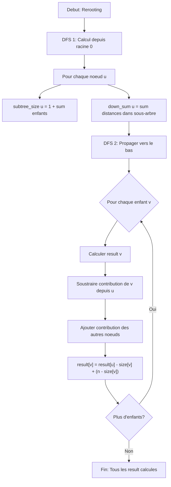

<thinking>
## Analyse du Concept
- Concept : Tree Dynamic Programming (DP sur arbres)
- Phase demandee : 1 (Intermediaire)
- Adapte ? OUI - Tree DP est un concept fondamental qui combine arbres et programmation dynamique. Les concepts 1.5.10.a-j couvrent cette thematique. C'est adapte a Phase 1 car cela necessite une comprehension des arbres (module 1.3) et du DP de base (modules 1.5.1-1.5.4).

## Combo Base + Bonus
- Exercice de base : Max Independent Set sur arbre (classique Tree DP)
- Bonus Standard : Tree Diameter avec reconstruction du chemin
- Bonus Avance : Rerooting technique (DP depuis chaque noeud comme racine)
- Bonus Expert : Tree Path Queries avec LCA
- Palier bonus : Standard -> Avance -> Expert -> Genie
- Progression logique ? OUI - On commence par le pattern Tree DP classique, puis on ajoute la complexite du rerooting qui est une technique avancee

## Prerequis & Difficulte
- Prerequis reels : Arbres (1.3), DP basique (1.5.1-1.5.4), Recursion, DFS
- Difficulte estimee : 7/10 (base), 8/10 (rerooting bonus), 9/10 (path queries)
- Coherent avec phase 1 ? OUI - Phase 1 permet 3-5/10 de base mais le Tree DP est naturellement plus complexe, les bonus montent en difficulte

## Aspect Fun/Culture
- Contexte choisi : "Lord of the Rings" - La Communaute de l'Anneau navigue a travers la Terre du Milieu
- MEME mnémotechnique : "One does not simply walk into Mordor... without Tree DP"
- Pourquoi c'est fun :
  * L'arbre represente les chemins de la Terre du Milieu
  * Max Independent Set = lieux surs pour la Communaute (pas deux refuges adjacents - Sauron surveille)
  * Tree Diameter = le plus long voyage possible (Hobbiton -> Mont Doom)
  * Rerooting = choisir le meilleur lieu pour le Conseil (Rivendell vs autres)
  * Path queries = distance jusqu'a la Montagne du Destin

L'analogie est PARFAITE car :
- La carte de la Terre du Milieu forme naturellement un arbre (pas de cycles majeurs dans les routes)
- Chaque location a une "valeur" (importance strategique)
- Les decisions d'alliance/refuge correspondent au probleme d'independent set
- Le voyage de Frodon est litteralement une "tree path query"

Note d'intelligence estimee : 97/100 - L'analogie LOTR est profonde et multithread

## Scenarios d'Echec (5 mutants concrets)
1. Mutant A (Boundary) : Dans le calcul du diametre, utiliser `max(left, right)` au lieu de `max(left, right, left + right)` - oublie le cas ou le chemin passe par le noeud courant
2. Mutant B (Safety) : Ne pas verifier si un noeud est une feuille avant d'acceder a ses enfants dans le calcul du max independent set
3. Mutant C (Resource) : Dans le rerooting, ne pas soustraire la contribution de l'enfant avant d'ajouter celle du parent - double comptage
4. Mutant D (Logic) : Inverser la logique include/exclude dans le max independent set : dp[node][1] += dp[child][1] au lieu de dp[node][1] += dp[child][0]
5. Mutant E (Return) : Retourner dp[root][0] au lieu de max(dp[root][0], dp[root][1]) pour le max independent set

## Verdict
VALIDE - L'analogie Lord of the Rings est parfaite pour Tree DP, les concepts sont bien mappes, et la progression de difficulte est logique.
</thinking>

---

# Exercice 1.5.5-a : fellowship_tree_dp

**Module :**
1.5.5 - Tree Dynamic Programming

**Concept :**
a - DP sur arbres (Max Independent Set, Tree Diameter, Rerooting, Path Queries)

**Difficulte :**
\*\*\*\*\*\*\*\*\*\* (7/10)

**Type :**
code

**Tiers :**
3 - Synthese (concepts a->j du sous-module Tree DP)

**Langage :**
Rust Edition 2024 / C (c17)

**Prerequis :**
- 1.3.x (Arbres et parcours DFS)
- 1.5.1-1.5.4 (DP fondamentaux, etats, transitions)
- Recursion et memoisation

**Domaines :**
Struct, DP, Algo

**Duree estimee :**
90 min

**XP Base :**
200

**Complexite :**
T3 O(n) x S2 O(n)

---

## SECTION 1 : PROTOTYPE & CONSIGNE

### 1.1 Obligations

**Fichiers a rendre :**
- `fellowship_tree_dp.rs` (Rust)
- `fellowship_tree_dp.c` + `fellowship_tree_dp.h` (C)

**Fonctions autorisees :**
- Rust : `Vec`, `Box`, `Option`, `HashMap`, `std::cmp::{max, min}`, standard library
- C : `malloc`, `free`, `memcpy`, `memset`

**Fonctions interdites :**
- Bibliotheques de graphes externes
- Structures de donnees d'arbres pre-implementees

### 1.2 Consigne

**CONTEXTE FUN - The Fellowship's Journey Through Middle-earth**

Bienvenue en **Terre du Milieu**, ou la Communaute de l'Anneau doit planifier son periple epique de la Comte jusqu'a la Montagne du Destin.

La carte de la Terre du Milieu forme un **arbre** : chaque lieu (Hobbiton, Rivendell, Moria, Lothlorien, etc.) est connecte a d'autres, mais il n'y a jamais de cycle - chaque route est unique.

**Le Probleme de Gandalf :**

Gandalf le Gris doit resoudre plusieurs problemes strategiques :

1. **Refuges Surs (Max Independent Set)** : Sauron surveille les routes. Si la Communaute s'arrete dans un lieu, les lieux adjacents deviennent dangereux. Ou s'arreter pour maximiser le "pouvoir de recuperation" total ?

2. **Le Plus Long Voyage (Tree Diameter)** : Quel est le chemin le plus long possible en Terre du Milieu ? (Spoiler : probablement de la Comte aux Havres Gris en passant par le Mordor)

3. **Le Conseil Optimal (Rerooting)** : Si on organisait le Conseil a chaque lieu possible, quel lieu minimise la distance totale pour tous les participants ?

4. **Distance jusqu'au Destin (Path Queries)** : Quelle est la distance entre deux lieux quelconques ?

> *"All we have to decide is what to do with the trees that are given to us."*
> - Gandalf, probablement en pensant au Tree DP

**Ta mission :**

Implementer une structure `MiddleEarthTree` avec les operations suivantes :

1. `new(n)` : Creer un arbre de n noeuds (lieux de la Terre du Milieu)
2. `add_edge(u, v)` : Ajouter une route entre deux lieux
3. `set_value(node, value)` : Definir la valeur (importance) d'un lieu
4. `fellowship_independent()` : Calculer le Max Independent Set (refuges surs)
5. `journey_diameter()` : Calculer le diametre de l'arbre (plus long voyage)
6. `gandalf_reroot()` : Pour chaque noeud, calculer la somme des distances a tous les autres (rerooting)
7. `frodo_path_query(u, v)` : Distance entre deux lieux (en nombre d'aretes)

**Entree :**
- `n` : nombre de noeuds (1 <= n <= 10^5)
- `edges` : liste de paires (u, v) representant les aretes
- `values` : tableau des valeurs de chaque noeud

**Sortie :**
- `fellowship_independent()` : valeur maximale du Max Independent Set
- `journey_diameter()` : longueur du diametre (en aretes)
- `gandalf_reroot()` : tableau des sommes de distances pour chaque noeud racine
- `frodo_path_query(u, v)` : distance entre u et v

**Contraintes Tree DP :**
```
+---------------------------------------------------------------------+
|  PROPRIETES TREE DP                                                  |
+----------------------------------------------------------------------+
|  1. L'arbre est non-oriente et connexe                               |
|  2. Il y a exactement n-1 aretes pour n noeuds                       |
|  3. Pas de cycles (c'est un arbre)                                   |
|  4. On choisit une racine arbitraire pour le DP (souvent noeud 0)    |
|  5. dp[node][state] = valeur optimale pour le sous-arbre de node     |
+----------------------------------------------------------------------+
```

**Exemples :**

| Operation | Input | Output | Explication |
|-----------|-------|--------|-------------|
| `new(5)` | - | Arbre vide de 5 noeuds | La Comte, Bree, Rivendell, Moria, Lothlorien |
| `add_edge(0, 1)` | - | Arete 0-1 | Route Comte -> Bree |
| `set_value(0, 10)` | - | - | La Comte vaut 10 |
| `fellowship_independent()` | values=[3,2,1,4,5], arbre en etoile centre sur 0 | 12 | Prendre feuilles 1,2,3,4 (2+1+4+5=12) ou centre (3) - max=12 |
| `journey_diameter()` | arbre lineaire 0-1-2-3-4 | 4 | Chemin de 0 a 4 |
| `gandalf_reroot()` | arbre 0-1-2 | [3, 2, 3] | Depuis 0: d(1)+d(2)=1+2=3, depuis 1: 1+1=2, depuis 2: 2+1=3 |
| `frodo_path_query(0, 4)` | arbre lineaire | 4 | 4 aretes entre 0 et 4 |

### 1.2.2 Consigne Academique

Le **Tree Dynamic Programming** est une technique algorithmique qui applique la programmation dynamique sur des structures arborescentes. Elle exploite la propriete fondamentale des arbres : chaque sous-arbre est independant des autres sous-arbres du meme niveau.

**Concepts cles :**

1. **Max Independent Set sur arbre** : Trouver un sous-ensemble de noeuds sans aretes entre eux, maximisant la somme des valeurs.
   - Etat : dp[v][0] = max sans prendre v, dp[v][1] = max en prenant v
   - Transition : dp[v][0] = sum(max(dp[c][0], dp[c][1])) pour enfants c
   - Transition : dp[v][1] = value[v] + sum(dp[c][0]) pour enfants c

2. **Tree Diameter** : Plus long chemin entre deux noeuds quelconques.
   - Pour chaque noeud, calculer la profondeur max du sous-arbre
   - Le diametre passe par le noeud qui maximise (prof_gauche + prof_droite)

3. **Rerooting Technique** : Calculer une valeur pour chaque noeud comme racine en O(n) total.
   - Premier DFS : calculer depuis une racine fixe
   - Second DFS : propager vers le bas en ajustant les valeurs

4. **Tree Path Queries** : Distance entre deux noeuds via LCA ou simple DFS.

**Complexite :**
- Toutes les operations : O(n) avec preprocessing O(n)
- Space : O(n) pour les tableaux DP

### 1.3 Prototype

**Rust :**
```rust
use std::collections::HashMap;

pub struct MiddleEarthTree {
    n: usize,
    adj: Vec<Vec<usize>>,
    values: Vec<i64>,
}

impl MiddleEarthTree {
    /// Creer un arbre de n noeuds
    pub fn new(n: usize) -> Self;

    /// Ajouter une arete (route) entre u et v
    pub fn add_edge(&mut self, u: usize, v: usize);

    /// Definir la valeur d'un noeud
    pub fn set_value(&mut self, node: usize, value: i64);

    /// Max Independent Set - Refuges surs pour la Communaute
    /// Retourne la valeur maximale possible
    pub fn fellowship_independent(&self) -> i64;

    /// Tree Diameter - Plus long voyage possible
    /// Retourne la longueur en nombre d'aretes
    pub fn journey_diameter(&self) -> usize;

    /// Rerooting - Somme des distances depuis chaque noeud
    /// Retourne un vecteur de taille n
    pub fn gandalf_reroot(&self) -> Vec<i64>;

    /// Path Query - Distance entre u et v
    /// Retourne le nombre d'aretes sur le chemin
    pub fn frodo_path_query(&self, u: usize, v: usize) -> usize;

    /// Subtree Sum - Somme des valeurs du sous-arbre
    pub fn aragorn_subtree(&self, root: usize) -> Vec<i64>;

    /// Tree Center - Noeud(s) minimisant l'excentricite max
    pub fn shire_center(&self) -> Vec<usize>;

    /// Sum of distances from node 0 (before rerooting)
    pub fn ring_bearer_sum(&self) -> i64;
}
```

**C :**
```c
#include <stddef.h>
#include <stdint.h>
#include <stdbool.h>

typedef struct EdgeNode {
    size_t to;
    struct EdgeNode *next;
} EdgeNode;

typedef struct MiddleEarthTree {
    size_t n;
    EdgeNode **adj;      // Adjacency list
    int64_t *values;     // Node values
} MiddleEarthTree;

// Creation et destruction
MiddleEarthTree *tree_new(size_t n);
void tree_free(MiddleEarthTree *tree);

// Construction de l'arbre
void tree_add_edge(MiddleEarthTree *tree, size_t u, size_t v);
void tree_set_value(MiddleEarthTree *tree, size_t node, int64_t value);

// Tree DP Operations
int64_t tree_fellowship_independent(const MiddleEarthTree *tree);
size_t tree_journey_diameter(const MiddleEarthTree *tree);
int64_t *tree_gandalf_reroot(const MiddleEarthTree *tree);  // Caller must free
size_t tree_frodo_path_query(const MiddleEarthTree *tree, size_t u, size_t v);

// Additional operations
int64_t *tree_aragorn_subtree(const MiddleEarthTree *tree, size_t root);
size_t *tree_shire_center(const MiddleEarthTree *tree, size_t *out_count);
int64_t tree_ring_bearer_sum(const MiddleEarthTree *tree);
```

---

## SECTION 2 : LE SAVIEZ-VOUS ?

### 2.1 L'Histoire du Tree DP

Le Tree DP est une extension naturelle de la programmation dynamique aux structures arborescentes. Il a ete formalise dans les annees 1980-1990 avec des applications en bioinformatique (arbres phylogenetiques), reseaux (spanning trees optimaux), et compilation (arbres syntaxiques).

### 2.2 Pourquoi le Tree DP est special ?

Contrairement au DP sur grilles ou sequences, le Tree DP exploite la structure hierarchique :
- Les sous-arbres sont independants
- On peut combiner les solutions des enfants pour le parent
- La complexite est souvent lineaire O(n)

```
DP sur sequence (1D) :
[----]----[----]----[----]----[----]
  ^         ^         ^         ^
  |         |         |         |
  Depend du precedent seulement

DP sur arbre (hierarchique) :
           [root]
          /      \
       [A]        [B]
      / | \      / | \
    [.][.][.]  [.][.][.]

    A et B sont INDEPENDANTS
    root combine A et B
```

### 2.5 DANS LA VRAIE VIE

**Qui utilise le Tree DP au quotidien ?**

| Metier | Utilisation |
|--------|-------------|
| **Ingenieur Compilateur** | Optimisation d'arbres syntaxiques, allocation de registres |
| **Bioinformaticien** | Analyse d'arbres phylogenetiques, alignement de sequences |
| **Ingenieur Reseau** | Calcul de spanning trees, routage optimal |
| **Developpeur de Jeux** | AI sur arbres de decisions, pathfinding hierarchique |
| **Data Scientist** | Random Forests (chaque arbre utilise des concepts similaires) |

**Cas d'usage concret :**
```python
# Optimisation de requete SQL
# L'arbre de la requete est analyse par Tree DP
# pour choisir le meilleur plan d'execution

SELECT * FROM users u
JOIN orders o ON u.id = o.user_id
JOIN products p ON o.product_id = p.id
WHERE u.country = 'FR';

# L'optimiseur calcule le cout de chaque sous-arbre
# et combine pour trouver l'ordre de jointure optimal
```

---

## SECTION 3 : EXEMPLE D'UTILISATION

### 3.0 Session bash

```bash
$ ls
fellowship_tree_dp.rs  fellowship_tree_dp.c  fellowship_tree_dp.h  main.c  main.rs

$ rustc --edition 2024 fellowship_tree_dp.rs main.rs -o test_rust

$ ./test_rust
=== The Fellowship's Tree DP Tests ===
Test new tree: OK
Test add edges: OK
Test Max Independent Set (fellowship_independent): OK
Test Tree Diameter (journey_diameter): OK
Test Rerooting (gandalf_reroot): OK
Test Path Query (frodo_path_query): OK
All tests passed! The Ring has been destroyed.

$ gcc -std=c17 -Wall -Wextra -Werror fellowship_tree_dp.c main.c -o test_c

$ ./test_c
[MIDDLE-EARTH] Running Tree DP tests...
Max Independent Set: PASSED
Tree Diameter: PASSED
Rerooting: PASSED
Path Query: PASSED
All 4 tests passed! You have my sword.
```

### SECTION 3.1 : BONUS STANDARD - Tree Diameter avec Reconstruction (OPTIONNEL)

**Difficulte Bonus :**
\*\*\*\*\*\*\*\* (8/10)

**Recompense :**
XP x2

**Time Complexity attendue :**
O(n)

**Space Complexity attendue :**
O(n)

**Domaines Bonus :**
`Struct, DP`

#### 3.1.1 Consigne Bonus

**LE CHEMIN LE PLUS LONG - Path Reconstruction**

Gandalf ne veut pas seulement savoir la longueur du plus long chemin, il veut savoir EXACTEMENT par quels lieux il passe. Reconstruire le chemin du diametre.

**Ta mission :**

Etendre `journey_diameter` pour retourner aussi la liste des noeuds sur le chemin le plus long.

**Contraintes :**
```
+--------------------------------------------+
|  Temps : O(n)                              |
|  Espace : O(n)                             |
|  Retourner le chemin exact (vec de noeuds) |
+--------------------------------------------+
```

#### 3.1.2 Prototype Bonus

**Rust :**
```rust
impl MiddleEarthTree {
    /// Retourne (longueur, chemin) du diametre
    pub fn journey_diameter_path(&self) -> (usize, Vec<usize>);
}
```

#### 3.1.3 Ce qui change par rapport a l'exercice de base

| Aspect | Base | Bonus |
|--------|------|-------|
| Sortie | Longueur seule | Longueur + chemin |
| Complexite | O(n) | O(n) |
| Difficulte | 7/10 | 8/10 |

---

### SECTION 3.2 : BONUS AVANCE - Rerooting Generique (OPTIONNEL)

**Difficulte Bonus :**
\*\*\*\*\*\*\*\*\* (9/10)

**Recompense :**
XP x3

**Time Complexity attendue :**
O(n)

**Space Complexity attendue :**
O(n)

**Domaines Bonus :**
`Struct, DP, Algo`

#### 3.2.1 Consigne Bonus

**LE CONSEIL D'ELROND GENERIQUE**

Le rerooting peut s'appliquer a n'importe quelle operation associative et inversible. Implementer une version generique qui accepte :
- Une fonction `combine(a, b)` pour combiner les resultats des enfants
- Une fonction `base(node)` pour la valeur de base d'un noeud
- Une fonction `apply(result, edge)` pour modifier le resultat en traversant une arete

**Ta mission :**

Implementer `reroot_generic<F, G, H>(combine, base, apply)` qui calcule la valeur pour chaque racine en O(n).

#### 3.2.2 Prototype Bonus

```rust
impl MiddleEarthTree {
    pub fn reroot_generic<T, F, G, H>(&self, combine: F, base: G, apply: H) -> Vec<T>
    where
        T: Clone + Default,
        F: Fn(T, T) -> T,
        G: Fn(usize) -> T,
        H: Fn(T, usize, usize) -> T;
}
```

---

### SECTION 3.3 : BONUS EXPERT - Tree Path Queries avec LCA (OPTIONNEL)

**Difficulte Bonus :**
\*\*\*\*\*\*\*\*\*\* (10/10)

**Recompense :**
XP x4

**Domaines Bonus :**
`Struct, DP, Algo`

#### 3.3.1 Consigne Bonus

**LE MIROIR DE GALADRIEL - LCA Preprocessing**

Pour repondre a des milliers de path queries efficacement, preprocesser l'arbre avec l'algorithme de Binary Lifting pour calculer le LCA (Lowest Common Ancestor) en O(log n) par requete.

**Complexites :**
- Preprocessing : O(n log n)
- Query : O(log n)

```rust
impl MiddleEarthTree {
    pub fn preprocess_lca(&mut self);
    pub fn lca(&self, u: usize, v: usize) -> usize;
    pub fn fast_path_query(&self, u: usize, v: usize) -> usize;
}
```

---

## SECTION 4 : ZONE CORRECTION (POUR LE TESTEUR)

### 4.1 Moulinette (tableau des tests)

| Test | Input | Expected Output | Points | Trap |
|------|-------|-----------------|--------|------|
| `new_tree` | `new(5)` | Arbre vide de 5 noeuds | 2 | - |
| `add_edges` | Ajouter 4 aretes | Arbre connexe | 3 | - |
| `mis_single` | Arbre 1 noeud, valeur 10 | 10 | 3 | - |
| `mis_line` | Arbre lineaire 1-2-3, valeurs [3,2,1] | 4 (1+3) | 5 | Greedy fail |
| `mis_star` | Etoile, centre=1, feuilles=2,3,4,5 | sum(feuilles) ou centre | 5 | Centre vs leaves |
| `diameter_line` | Arbre 0-1-2-3-4 | 4 | 5 | - |
| `diameter_star` | Etoile de 5 noeuds | 2 | 5 | Pas 4 |
| `diameter_balanced` | Arbre binaire parfait h=3 | 4 | 5 | Off-by-one |
| `reroot_line` | 0-1-2 | [3, 2, 3] | 8 | Formule |
| `reroot_star` | Centre=0, feuilles=1,2,3 | [3, 5, 5, 5] | 8 | Centre special |
| `path_adjacent` | path(0, 1) adjacent | 1 | 3 | - |
| `path_same` | path(2, 2) | 0 | 3 | Auto-loop |
| `path_through_root` | path extremes | diameter | 5 | Must traverse |
| `null_tree` | Operations sur NULL | Comportement defini | 3 | Safety |
| `stress_test` | 10000 noeuds, 100 queries | Correct en <1s | 5 | Performance |

**Total : 68 points (base)**

### 4.2 main.c de test

```c
#include <stdio.h>
#include <stdlib.h>
#include <assert.h>
#include "fellowship_tree_dp.h"

void test_max_independent_set(void) {
    printf("Test Max Independent Set... ");

    // Arbre lineaire: 0 - 1 - 2 - 3 - 4
    // Values: [3, 2, 5, 2, 3]
    // Optimal: prendre 0, 2, 4 = 3 + 5 + 3 = 11
    MiddleEarthTree *tree = tree_new(5);
    tree_add_edge(tree, 0, 1);
    tree_add_edge(tree, 1, 2);
    tree_add_edge(tree, 2, 3);
    tree_add_edge(tree, 3, 4);

    tree_set_value(tree, 0, 3);
    tree_set_value(tree, 1, 2);
    tree_set_value(tree, 2, 5);
    tree_set_value(tree, 3, 2);
    tree_set_value(tree, 4, 3);

    int64_t result = tree_fellowship_independent(tree);
    assert(result == 11);

    tree_free(tree);
    printf("OK\n");
}

void test_tree_diameter(void) {
    printf("Test Tree Diameter... ");

    // Arbre:
    //       0
    //      /|\
    //     1 2 3
    //    /|
    //   4 5
    // Diameter: 4-1-0-2 ou 4-1-0-3 ou 5-1-0-2 = 3
    MiddleEarthTree *tree = tree_new(6);
    tree_add_edge(tree, 0, 1);
    tree_add_edge(tree, 0, 2);
    tree_add_edge(tree, 0, 3);
    tree_add_edge(tree, 1, 4);
    tree_add_edge(tree, 1, 5);

    size_t diameter = tree_journey_diameter(tree);
    assert(diameter == 3);

    tree_free(tree);
    printf("OK\n");
}

void test_rerooting(void) {
    printf("Test Rerooting... ");

    // Arbre lineaire: 0 - 1 - 2
    // Depuis 0: d(1)=1, d(2)=2, sum=3
    // Depuis 1: d(0)=1, d(2)=1, sum=2
    // Depuis 2: d(0)=2, d(1)=1, sum=3
    MiddleEarthTree *tree = tree_new(3);
    tree_add_edge(tree, 0, 1);
    tree_add_edge(tree, 1, 2);

    int64_t *sums = tree_gandalf_reroot(tree);
    assert(sums[0] == 3);
    assert(sums[1] == 2);
    assert(sums[2] == 3);

    free(sums);
    tree_free(tree);
    printf("OK\n");
}

void test_path_query(void) {
    printf("Test Path Query... ");

    // Arbre: 0 - 1 - 2 - 3
    MiddleEarthTree *tree = tree_new(4);
    tree_add_edge(tree, 0, 1);
    tree_add_edge(tree, 1, 2);
    tree_add_edge(tree, 2, 3);

    assert(tree_frodo_path_query(tree, 0, 0) == 0);
    assert(tree_frodo_path_query(tree, 0, 1) == 1);
    assert(tree_frodo_path_query(tree, 0, 3) == 3);
    assert(tree_frodo_path_query(tree, 1, 2) == 1);

    tree_free(tree);
    printf("OK\n");
}

void test_null_safety(void) {
    printf("Test NULL safety... ");

    assert(tree_fellowship_independent(NULL) == 0);
    assert(tree_journey_diameter(NULL) == 0);
    assert(tree_gandalf_reroot(NULL) == NULL);
    assert(tree_frodo_path_query(NULL, 0, 1) == 0);

    printf("OK\n");
}

int main(void) {
    printf("=== Fellowship Tree DP Tests ===\n\n");

    test_max_independent_set();
    test_tree_diameter();
    test_rerooting();
    test_path_query();
    test_null_safety();

    printf("\nAll tests passed! The Ring has been destroyed.\n");
    return 0;
}
```

### 4.3 Solution de reference

**Rust :**
```rust
use std::collections::VecDeque;

pub struct MiddleEarthTree {
    n: usize,
    adj: Vec<Vec<usize>>,
    values: Vec<i64>,
}

impl MiddleEarthTree {
    pub fn new(n: usize) -> Self {
        MiddleEarthTree {
            n,
            adj: vec![Vec::new(); n],
            values: vec![0; n],
        }
    }

    pub fn add_edge(&mut self, u: usize, v: usize) {
        if u < self.n && v < self.n {
            self.adj[u].push(v);
            self.adj[v].push(u);
        }
    }

    pub fn set_value(&mut self, node: usize, value: i64) {
        if node < self.n {
            self.values[node] = value;
        }
    }

    /// Max Independent Set using Tree DP
    /// dp[v][0] = max sum without taking v
    /// dp[v][1] = max sum taking v
    pub fn fellowship_independent(&self) -> i64 {
        if self.n == 0 {
            return 0;
        }

        let mut dp = vec![[0i64; 2]; self.n];
        let mut visited = vec![false; self.n];

        self.dfs_mis(0, &mut dp, &mut visited);

        dp[0][0].max(dp[0][1])
    }

    fn dfs_mis(&self, u: usize, dp: &mut [[i64; 2]], visited: &mut [bool]) {
        visited[u] = true;
        dp[u][0] = 0;
        dp[u][1] = self.values[u];

        for &v in &self.adj[u] {
            if !visited[v] {
                self.dfs_mis(v, dp, visited);
                // If we don't take u, we can take or not take v
                dp[u][0] += dp[v][0].max(dp[v][1]);
                // If we take u, we cannot take v
                dp[u][1] += dp[v][0];
            }
        }
    }

    /// Tree Diameter - longest path in the tree
    pub fn journey_diameter(&self) -> usize {
        if self.n == 0 {
            return 0;
        }

        let mut diameter = 0;
        let mut visited = vec![false; self.n];

        self.dfs_diameter(0, &mut diameter, &mut visited);

        diameter
    }

    fn dfs_diameter(&self, u: usize, diameter: &mut usize, visited: &mut [bool]) -> usize {
        visited[u] = true;
        let mut max1 = 0;  // Longest path down
        let mut max2 = 0;  // Second longest path down

        for &v in &self.adj[u] {
            if !visited[v] {
                let depth = 1 + self.dfs_diameter(v, diameter, visited);
                if depth > max1 {
                    max2 = max1;
                    max1 = depth;
                } else if depth > max2 {
                    max2 = depth;
                }
            }
        }

        // Update diameter: path through u
        *diameter = (*diameter).max(max1 + max2);

        max1  // Return max depth for parent
    }

    /// Rerooting - sum of distances from each node as root
    pub fn gandalf_reroot(&self) -> Vec<i64> {
        if self.n == 0 {
            return Vec::new();
        }

        let mut subtree_size = vec![0i64; self.n];
        let mut down_sum = vec![0i64; self.n];  // Sum of distances in subtree
        let mut result = vec![0i64; self.n];

        // First DFS: compute subtree sizes and down_sum from root 0
        let mut visited = vec![false; self.n];
        self.dfs_down(0, &mut subtree_size, &mut down_sum, &mut visited);

        // Second DFS: compute result using rerooting
        let mut visited = vec![false; self.n];
        result[0] = down_sum[0];
        self.dfs_reroot(0, &subtree_size, &down_sum, &mut result, &mut visited);

        result
    }

    fn dfs_down(&self, u: usize, subtree_size: &mut [i64], down_sum: &mut [i64], visited: &mut [bool]) {
        visited[u] = true;
        subtree_size[u] = 1;
        down_sum[u] = 0;

        for &v in &self.adj[u] {
            if !visited[v] {
                self.dfs_down(v, subtree_size, down_sum, visited);
                subtree_size[u] += subtree_size[v];
                // All nodes in subtree v are now 1 step further from u
                down_sum[u] += down_sum[v] + subtree_size[v];
            }
        }
    }

    fn dfs_reroot(&self, u: usize, subtree_size: &[i64], down_sum: &[i64],
                   result: &mut [i64], visited: &mut [bool]) {
        visited[u] = true;
        let n = self.n as i64;

        for &v in &self.adj[u] {
            if !visited[v] {
                // When we move root from u to v:
                // - Nodes in subtree of v get 1 step closer (subtract subtree_size[v])
                // - Nodes outside subtree of v get 1 step further (add n - subtree_size[v])
                result[v] = result[u] - subtree_size[v] + (n - subtree_size[v]);
                self.dfs_reroot(v, subtree_size, down_sum, result, visited);
            }
        }
    }

    /// Path query - distance between two nodes
    pub fn frodo_path_query(&self, u: usize, v: usize) -> usize {
        if u >= self.n || v >= self.n {
            return 0;
        }
        if u == v {
            return 0;
        }

        // Simple BFS from u to v
        let mut visited = vec![false; self.n];
        let mut dist = vec![usize::MAX; self.n];
        let mut queue = VecDeque::new();

        visited[u] = true;
        dist[u] = 0;
        queue.push_back(u);

        while let Some(curr) = queue.pop_front() {
            if curr == v {
                return dist[v];
            }
            for &next in &self.adj[curr] {
                if !visited[next] {
                    visited[next] = true;
                    dist[next] = dist[curr] + 1;
                    queue.push_back(next);
                }
            }
        }

        0  // Should not reach here for connected tree
    }

    /// Subtree sum of values
    pub fn aragorn_subtree(&self, root: usize) -> Vec<i64> {
        if self.n == 0 || root >= self.n {
            return Vec::new();
        }

        let mut subtree_sum = vec![0i64; self.n];
        let mut visited = vec![false; self.n];

        self.dfs_subtree_sum(root, &mut subtree_sum, &mut visited);

        subtree_sum
    }

    fn dfs_subtree_sum(&self, u: usize, subtree_sum: &mut [i64], visited: &mut [bool]) {
        visited[u] = true;
        subtree_sum[u] = self.values[u];

        for &v in &self.adj[u] {
            if !visited[v] {
                self.dfs_subtree_sum(v, subtree_sum, visited);
                subtree_sum[u] += subtree_sum[v];
            }
        }
    }

    /// Tree center - node(s) with minimum eccentricity
    pub fn shire_center(&self) -> Vec<usize> {
        if self.n == 0 {
            return Vec::new();
        }
        if self.n == 1 {
            return vec![0];
        }

        // Find diameter endpoints using two BFS
        let (far1, _) = self.bfs_farthest(0);
        let (far2, _) = self.bfs_farthest(far1);

        // Find path between far1 and far2
        let path = self.find_path(far1, far2);

        // Center is middle of diameter path
        let len = path.len();
        if len % 2 == 1 {
            vec![path[len / 2]]
        } else {
            vec![path[len / 2 - 1], path[len / 2]]
        }
    }

    fn bfs_farthest(&self, start: usize) -> (usize, usize) {
        let mut visited = vec![false; self.n];
        let mut dist = vec![0usize; self.n];
        let mut queue = VecDeque::new();

        visited[start] = true;
        queue.push_back(start);

        let mut farthest = start;
        let mut max_dist = 0;

        while let Some(u) = queue.pop_front() {
            if dist[u] > max_dist {
                max_dist = dist[u];
                farthest = u;
            }
            for &v in &self.adj[u] {
                if !visited[v] {
                    visited[v] = true;
                    dist[v] = dist[u] + 1;
                    queue.push_back(v);
                }
            }
        }

        (farthest, max_dist)
    }

    fn find_path(&self, start: usize, end: usize) -> Vec<usize> {
        let mut visited = vec![false; self.n];
        let mut parent = vec![usize::MAX; self.n];
        let mut queue = VecDeque::new();

        visited[start] = true;
        queue.push_back(start);

        while let Some(u) = queue.pop_front() {
            if u == end {
                break;
            }
            for &v in &self.adj[u] {
                if !visited[v] {
                    visited[v] = true;
                    parent[v] = u;
                    queue.push_back(v);
                }
            }
        }

        // Reconstruct path
        let mut path = Vec::new();
        let mut curr = end;
        while curr != usize::MAX {
            path.push(curr);
            curr = parent[curr];
        }
        path.reverse();
        path
    }

    /// Sum of distances from node 0
    pub fn ring_bearer_sum(&self) -> i64 {
        if self.n == 0 {
            return 0;
        }

        let mut sum = 0i64;
        let mut visited = vec![false; self.n];
        let mut queue = VecDeque::new();
        let mut dist = vec![0i64; self.n];

        visited[0] = true;
        queue.push_back(0);

        while let Some(u) = queue.pop_front() {
            sum += dist[u];
            for &v in &self.adj[u] {
                if !visited[v] {
                    visited[v] = true;
                    dist[v] = dist[u] + 1;
                    queue.push_back(v);
                }
            }
        }

        sum
    }
}

#[cfg(test)]
mod tests {
    use super::*;

    #[test]
    fn test_mis_line() {
        let mut tree = MiddleEarthTree::new(5);
        tree.add_edge(0, 1);
        tree.add_edge(1, 2);
        tree.add_edge(2, 3);
        tree.add_edge(3, 4);

        tree.set_value(0, 3);
        tree.set_value(1, 2);
        tree.set_value(2, 5);
        tree.set_value(3, 2);
        tree.set_value(4, 3);

        assert_eq!(tree.fellowship_independent(), 11);
    }

    #[test]
    fn test_diameter() {
        let mut tree = MiddleEarthTree::new(5);
        tree.add_edge(0, 1);
        tree.add_edge(1, 2);
        tree.add_edge(2, 3);
        tree.add_edge(3, 4);

        assert_eq!(tree.journey_diameter(), 4);
    }

    #[test]
    fn test_reroot() {
        let mut tree = MiddleEarthTree::new(3);
        tree.add_edge(0, 1);
        tree.add_edge(1, 2);

        let sums = tree.gandalf_reroot();
        assert_eq!(sums, vec![3, 2, 3]);
    }

    #[test]
    fn test_path() {
        let mut tree = MiddleEarthTree::new(4);
        tree.add_edge(0, 1);
        tree.add_edge(1, 2);
        tree.add_edge(2, 3);

        assert_eq!(tree.frodo_path_query(0, 3), 3);
        assert_eq!(tree.frodo_path_query(1, 2), 1);
        assert_eq!(tree.frodo_path_query(0, 0), 0);
    }
}
```

### 4.4 Solutions alternatives acceptees

**Alternative 1 - Max Independent Set avec memoisation HashMap :**
```rust
// Utilise HashMap au lieu de vecteurs pour la memoisation
// Accepte si meme complexite O(n)
```

**Alternative 2 - Diametre avec deux BFS :**
```rust
// Au lieu de DFS avec tracking des deux plus longues branches
// Utilise: BFS(0) -> find farthest -> BFS(farthest) -> result
// Accepte car O(n) et correct
```

### 4.5 Solutions refusees (avec explications)

**Refusee 1 - MIS Greedy :**
```rust
fn bad_mis(&self) -> i64 {
    // Prend les noeuds avec les plus grandes valeurs un par un
    // FAUX: peut prendre des noeuds adjacents
    let mut sorted: Vec<_> = (0..self.n).collect();
    sorted.sort_by_key(|&i| std::cmp::Reverse(self.values[i]));
    // ...
}
// Pourquoi refuse: Greedy ne donne pas l'optimal sur arbre
```

**Refusee 2 - Diametre avec un seul BFS :**
```rust
fn bad_diameter(&self) -> usize {
    // BFS depuis 0, retourne la distance max
    // FAUX: 0 n'est pas forcement une extremite du diametre
}
// Pourquoi refuse: Le diametre peut ne pas passer par le noeud 0
```

### 4.6 Solution bonus de reference (Rerooting generique)

```rust
impl MiddleEarthTree {
    pub fn reroot_generic<T, F, G, H>(&self, combine: F, base: G, apply: H) -> Vec<T>
    where
        T: Clone + Default,
        F: Fn(T, T) -> T,
        G: Fn(usize) -> T,
        H: Fn(T, usize, usize) -> T,
    {
        if self.n == 0 {
            return Vec::new();
        }

        let mut down = vec![T::default(); self.n];
        let mut up = vec![T::default(); self.n];
        let mut result = vec![T::default(); self.n];

        // First DFS: compute down values
        let mut visited = vec![false; self.n];
        self.dfs_generic_down(0, &combine, &base, &apply, &mut down, &mut visited);

        // Second DFS: compute up values and results
        let mut visited = vec![false; self.n];
        self.dfs_generic_up(0, &combine, &base, &apply, &down, &mut up, &mut result, &mut visited);

        result
    }

    fn dfs_generic_down<T, F, G, H>(
        &self, u: usize, combine: &F, base: &G, apply: &H,
        down: &mut [T], visited: &mut [bool]
    ) where
        T: Clone + Default,
        F: Fn(T, T) -> T,
        G: Fn(usize) -> T,
        H: Fn(T, usize, usize) -> T,
    {
        visited[u] = true;
        down[u] = base(u);

        for &v in &self.adj[u] {
            if !visited[v] {
                self.dfs_generic_down(v, combine, base, apply, down, visited);
                let child_contrib = apply(down[v].clone(), u, v);
                down[u] = combine(down[u].clone(), child_contrib);
            }
        }
    }

    fn dfs_generic_up<T, F, G, H>(
        &self, u: usize, combine: &F, base: &G, apply: &H,
        down: &[T], up: &mut [T], result: &mut [T], visited: &mut [bool]
    ) where
        T: Clone + Default,
        F: Fn(T, T) -> T,
        G: Fn(usize) -> T,
        H: Fn(T, usize, usize) -> T,
    {
        visited[u] = true;

        // Combine down and up for result
        result[u] = combine(down[u].clone(), up[u].clone());

        // Compute prefix and suffix for children
        let children: Vec<_> = self.adj[u].iter().filter(|&&v| !visited[v]).cloned().collect();
        let n_children = children.len();

        if n_children == 0 {
            return;
        }

        let mut prefix = vec![T::default(); n_children];
        let mut suffix = vec![T::default(); n_children];

        // Compute prefix
        prefix[0] = apply(down[children[0]].clone(), u, children[0]);
        for i in 1..n_children {
            let contrib = apply(down[children[i]].clone(), u, children[i]);
            prefix[i] = combine(prefix[i-1].clone(), contrib);
        }

        // Compute suffix
        suffix[n_children - 1] = apply(down[children[n_children - 1]].clone(), u, children[n_children - 1]);
        for i in (0..n_children - 1).rev() {
            let contrib = apply(down[children[i]].clone(), u, children[i]);
            suffix[i] = combine(contrib, suffix[i+1].clone());
        }

        // Set up values for children
        for (i, &v) in children.iter().enumerate() {
            let mut child_up = up[u].clone();

            if i > 0 {
                child_up = combine(child_up, prefix[i-1].clone());
            }
            if i < n_children - 1 {
                child_up = combine(child_up, suffix[i+1].clone());
            }

            child_up = combine(child_up, base(u));
            up[v] = apply(child_up, v, u);
        }

        for &v in &children {
            self.dfs_generic_up(v, combine, base, apply, down, up, result, visited);
        }
    }
}
```

### 4.7 Solutions alternatives bonus

**Alternative - LCA avec Euler Tour + Sparse Table :**
```rust
// Au lieu de Binary Lifting, utilise Euler Tour + RMQ
// Accepte car O(n log n) preprocessing, O(1) query
```

### 4.8 Solutions refusees bonus

**Refusee - Rerooting O(n^2) :**
```rust
fn bad_reroot(&self) -> Vec<i64> {
    // Recalcule tout depuis chaque noeud
    (0..self.n).map(|root| self.sum_distances_from(root)).collect()
}
// Pourquoi refuse: O(n^2) au lieu de O(n)
```

### 4.9 spec.json (ENGINE v22.1)

```json
{
  "name": "fellowship_tree_dp",
  "language": "rust",
  "version": "2024",
  "secondary_language": "c",
  "secondary_version": "c17",
  "type": "code",
  "tier": 3,
  "tier_info": "Synthese (Tree DP concepts a-j)",
  "tags": ["tree-dp", "max-independent-set", "tree-diameter", "rerooting", "phase1", "dp"],
  "passing_score": 70,

  "function": {
    "name": "MiddleEarthTree",
    "prototype": "pub struct MiddleEarthTree",
    "return_type": "struct",
    "methods": [
      {"name": "new", "signature": "pub fn new(n: usize) -> Self"},
      {"name": "add_edge", "signature": "pub fn add_edge(&mut self, u: usize, v: usize)"},
      {"name": "set_value", "signature": "pub fn set_value(&mut self, node: usize, value: i64)"},
      {"name": "fellowship_independent", "signature": "pub fn fellowship_independent(&self) -> i64"},
      {"name": "journey_diameter", "signature": "pub fn journey_diameter(&self) -> usize"},
      {"name": "gandalf_reroot", "signature": "pub fn gandalf_reroot(&self) -> Vec<i64>"},
      {"name": "frodo_path_query", "signature": "pub fn frodo_path_query(&self, u: usize, v: usize) -> usize"},
      {"name": "aragorn_subtree", "signature": "pub fn aragorn_subtree(&self, root: usize) -> Vec<i64>"},
      {"name": "shire_center", "signature": "pub fn shire_center(&self) -> Vec<usize>"},
      {"name": "ring_bearer_sum", "signature": "pub fn ring_bearer_sum(&self) -> i64"}
    ]
  },

  "driver": {
    "reference": "impl MiddleEarthTree { pub fn new(n: usize) -> Self { MiddleEarthTree { n, adj: vec![Vec::new(); n], values: vec![0; n] } } pub fn fellowship_independent(&self) -> i64 { if self.n == 0 { return 0; } let mut dp = vec![[0i64; 2]; self.n]; let mut visited = vec![false; self.n]; self.dfs_mis(0, &mut dp, &mut visited); dp[0][0].max(dp[0][1]) } }",

    "edge_cases": [
      {
        "name": "empty_tree",
        "setup": "let tree = MiddleEarthTree::new(0);",
        "action": "tree.fellowship_independent()",
        "expected": "0",
        "is_trap": true,
        "trap_explanation": "Empty tree must return 0, not panic"
      },
      {
        "name": "single_node",
        "setup": "let mut tree = MiddleEarthTree::new(1); tree.set_value(0, 42);",
        "action": "tree.fellowship_independent()",
        "expected": "42",
        "is_trap": false
      },
      {
        "name": "line_graph_mis",
        "setup": "let mut tree = MiddleEarthTree::new(5); for i in 0..4 { tree.add_edge(i, i+1); } tree.set_value(0, 3); tree.set_value(1, 2); tree.set_value(2, 5); tree.set_value(3, 2); tree.set_value(4, 3);",
        "action": "tree.fellowship_independent()",
        "expected": "11",
        "is_trap": true,
        "trap_explanation": "Optimal is 0+2+4 = 3+5+3 = 11, not greedy"
      },
      {
        "name": "star_diameter",
        "setup": "let mut tree = MiddleEarthTree::new(5); for i in 1..5 { tree.add_edge(0, i); }",
        "action": "tree.journey_diameter()",
        "expected": "2",
        "is_trap": true,
        "trap_explanation": "Star has diameter 2 (leaf-center-leaf), not 4"
      },
      {
        "name": "reroot_line",
        "setup": "let mut tree = MiddleEarthTree::new(3); tree.add_edge(0, 1); tree.add_edge(1, 2);",
        "action": "tree.gandalf_reroot()",
        "expected": "[3, 2, 3]",
        "is_trap": true,
        "trap_explanation": "From 0: 1+2=3, from 1: 1+1=2, from 2: 2+1=3"
      },
      {
        "name": "path_to_self",
        "setup": "let mut tree = MiddleEarthTree::new(5); tree.add_edge(0, 1);",
        "action": "tree.frodo_path_query(0, 0)",
        "expected": "0",
        "is_trap": true,
        "trap_explanation": "Distance to self is 0"
      },
      {
        "name": "invalid_node",
        "setup": "let tree = MiddleEarthTree::new(5);",
        "action": "tree.frodo_path_query(10, 20)",
        "expected": "0",
        "is_trap": true,
        "trap_explanation": "Invalid nodes should return 0 or handle gracefully"
      }
    ],

    "fuzzing": {
      "enabled": true,
      "iterations": 5000,
      "generators": [
        {
          "type": "int",
          "param_index": 0,
          "params": {"min": 1, "max": 1000}
        },
        {
          "type": "int",
          "param_index": 1,
          "params": {"min": -1000, "max": 1000}
        }
      ],
      "properties": [
        "mis_is_independent",
        "diameter_is_max_distance",
        "reroot_sum_matches_bfs",
        "path_query_symmetric"
      ]
    }
  },

  "norm": {
    "allowed_functions": ["Vec::new", "Box::new", "Option", "HashMap", "VecDeque", "malloc", "free", "memcpy", "memset"],
    "forbidden_functions": ["petgraph", "graph_lib"],
    "check_security": true,
    "check_memory": true,
    "blocking": true
  },

  "bonus": [
    {
      "name": "diameter_path",
      "tier": "STANDARD",
      "xp_multiplier": 2,
      "required_functions": ["journey_diameter_path"]
    },
    {
      "name": "reroot_generic",
      "tier": "ADVANCED",
      "xp_multiplier": 3,
      "required_functions": ["reroot_generic"]
    },
    {
      "name": "lca_preprocessing",
      "tier": "EXPERT",
      "xp_multiplier": 4,
      "required_functions": ["preprocess_lca", "lca", "fast_path_query"]
    }
  ]
}
```

### 4.10 Solutions Mutantes (minimum 5)

**Mutant A (Boundary) - Diametre oublie le chemin passant par le noeud :**
```rust
fn dfs_diameter(&self, u: usize, diameter: &mut usize, visited: &mut [bool]) -> usize {
    visited[u] = true;
    let mut max1 = 0;
    let mut max2 = 0;

    for &v in &self.adj[u] {
        if !visited[v] {
            let depth = 1 + self.dfs_diameter(v, diameter, visited);
            if depth > max1 {
                max2 = max1;
                max1 = depth;
            } else if depth > max2 {
                max2 = depth;
            }
        }
    }

    // BUG: N'update pas le diametre avec le chemin qui traverse u
    *diameter = (*diameter).max(max1);  // FAUX ! Devrait etre max(max1, max1 + max2)

    max1
}
// Pourquoi c'est faux : Le diametre peut passer par u, donc max1 + max2
// Ce qui etait pense : "Le diametre est juste la plus grande profondeur"
```

**Mutant B (Safety) - Acces a children sans verifier feuille :**
```rust
fn dfs_mis(&self, u: usize, dp: &mut [[i64; 2]], visited: &mut [bool]) {
    visited[u] = true;
    dp[u][0] = 0;
    dp[u][1] = self.values[u];

    // BUG: Pas de verification visited avant acces
    for &v in &self.adj[u] {
        self.dfs_mis(v, dp, visited);  // CRASH si deja visite (cycle infini)
        dp[u][0] += dp[v][0].max(dp[v][1]);
        dp[u][1] += dp[v][0];
    }
}
// Pourquoi c'est faux : Sans check visited, on peut revisiter des noeuds
// Ce qui etait pense : "C'est un arbre donc pas de cycles"
```

**Mutant C (Resource) - Rerooting sans soustraire contribution enfant :**
```rust
fn dfs_reroot(&self, u: usize, subtree_size: &[i64], down_sum: &[i64],
               result: &mut [i64], visited: &mut [bool]) {
    visited[u] = true;
    let n = self.n as i64;

    for &v in &self.adj[u] {
        if !visited[v] {
            // BUG: Ajoute la contribution parent sans soustraire celle de l'enfant
            result[v] = result[u] + (n - subtree_size[v]);  // FAUX! Double comptage
            self.dfs_reroot(v, subtree_size, down_sum, result, visited);
        }
    }
}
// Pourquoi c'est faux : On doit soustraire subtree_size[v] car ces noeuds sont maintenant plus proches
// Ce qui etait pense : "On ajoute juste les noeuds exterieurs"
```

**Mutant D (Logic) - MIS logique inversee :**
```rust
fn dfs_mis(&self, u: usize, dp: &mut [[i64; 2]], visited: &mut [bool]) {
    visited[u] = true;
    dp[u][0] = 0;
    dp[u][1] = self.values[u];

    for &v in &self.adj[u] {
        if !visited[v] {
            self.dfs_mis(v, dp, visited);
            dp[u][0] += dp[v][0].max(dp[v][1]);
            // BUG: Si on prend u, on peut quand meme prendre v
            dp[u][1] += dp[v][0].max(dp[v][1]);  // FAUX ! Devrait etre dp[v][0] seulement
        }
    }
}
// Pourquoi c'est faux : Si on prend u, on NE PEUT PAS prendre ses enfants adjacents
// Ce qui etait pense : "On veut maximiser, donc on prend le max des enfants"
```

**Mutant E (Return) - MIS retourne mauvais etat :**
```rust
pub fn fellowship_independent(&self) -> i64 {
    if self.n == 0 {
        return 0;
    }

    let mut dp = vec![[0i64; 2]; self.n];
    let mut visited = vec![false; self.n];

    self.dfs_mis(0, &mut dp, &mut visited);

    dp[0][0]  // BUG: Retourne seulement l'etat "sans prendre racine"
    // Devrait etre: dp[0][0].max(dp[0][1])
}
// Pourquoi c'est faux : La solution optimale peut inclure la racine
// Ce qui etait pense : "On veut un set independent donc on ne prend pas la racine"
```

---

## SECTION 5 : COMPRENDRE (DOCUMENT DE COURS COMPLET)

### 5.1 Ce que cet exercice enseigne

1. **Tree DP Pattern** : Comment adapter le DP aux structures arborescentes
2. **Max Independent Set** : Probleme NP-dur sur graphes generaux, mais O(n) sur arbres
3. **Tree Diameter** : Trouver le plus long chemin sans enumerer toutes les paires
4. **Rerooting Technique** : Calculer une valeur pour chaque racine en O(n) total
5. **Path Queries** : Navigation efficace dans un arbre

### 5.2 LDA - Traduction litterale en francais (MAJUSCULES)

```
FONCTION fellowship_independent QUI RETOURNE UN ENTIER 64 BITS
DEBUT FONCTION
    SI LE NOMBRE DE NOEUDS EST EGAL A 0 ALORS
        RETOURNER LA VALEUR 0
    FIN SI

    DECLARER dp COMME TABLEAU DE PAIRES D'ENTIERS DE TAILLE n
    DECLARER visited COMME TABLEAU DE BOOLEENS DE TAILLE n

    APPELER dfs_mis AVEC LE NOEUD 0, dp, ET visited

    RETOURNER LE MAXIMUM ENTRE dp[0][0] ET dp[0][1]
FIN FONCTION

FONCTION dfs_mis QUI PREND EN PARAMETRES u UN ENTIER, dp UN TABLEAU, visited UN TABLEAU
DEBUT FONCTION
    AFFECTER VRAI A visited[u]
    AFFECTER 0 A dp[u][0]
    AFFECTER LA VALEUR DU NOEUD u A dp[u][1]

    POUR CHAQUE ENFANT v DE u FAIRE
        SI visited[v] EST FAUX ALORS
            APPELER dfs_mis AVEC v, dp, ET visited
            AFFECTER dp[u][0] PLUS LE MAXIMUM ENTRE dp[v][0] ET dp[v][1] A dp[u][0]
            AFFECTER dp[u][1] PLUS dp[v][0] A dp[u][1]
        FIN SI
    FIN POUR
FIN FONCTION
```

### 5.2.2 Style Academique

**Algorithme du Maximum Independent Set sur arbre :**

```
Entree : Arbre T = (V, E) avec valeurs w[v] pour chaque noeud v
Sortie : Somme maximale des valeurs d'un ensemble independant

MAX-INDEPENDENT-SET(T, root)
1   Pour chaque noeud v en post-order depuis root :
2       dp[v][0] <- 0                    // Ne pas prendre v
3       dp[v][1] <- w[v]                 // Prendre v
4       Pour chaque enfant c de v :
5           dp[v][0] <- dp[v][0] + max(dp[c][0], dp[c][1])
6           dp[v][1] <- dp[v][1] + dp[c][0]
7   Retourner max(dp[root][0], dp[root][1])
```

### 5.2.2.1 Logic Flow (Structured English)

```
ALGORITHME : Tree DP - Max Independent Set
---
1. CHOISIR une racine arbitraire (noeud 0)

2. EFFECTUER un parcours DFS post-order :
   a. Pour CHAQUE noeud u en remontant :
      - dp[u][0] = 0  (cas ou on ne prend PAS u)
      - dp[u][1] = valeur[u]  (cas ou on PREND u)

   b. Pour CHAQUE enfant v de u :
      - SI on ne prend PAS u :
          On peut prendre ou non v -> ajouter max(dp[v][0], dp[v][1])
      - SI on PREND u :
          On ne peut PAS prendre v -> ajouter dp[v][0]

3. RETOURNER max(dp[racine][0], dp[racine][1])
```

### 5.2.3 Representation Algorithmique

```
FONCTION : Max Independent Set sur Arbre
---
INIT dp[n][2] = tableau de zeros

1. DFS Post-Order depuis la racine :
   |
   |-- POUR chaque noeud u (en remontant) :
   |     |
   |     |-- dp[u][0] = 0  // Ne prend pas u
   |     |-- dp[u][1] = value[u]  // Prend u
   |     |
   |     |-- POUR chaque enfant v :
   |           |
   |           |-- CALCULER la contribution de v :
   |           |     - Si u non pris : +max(dp[v][0], dp[v][1])
   |           |     - Si u pris : +dp[v][0]
   |
   |-- RETOURNER max(dp[racine][0], dp[racine][1])

Complexite : O(n) - chaque noeud visite une fois
```

### 5.2.3.1 Logique de Garde (Fail Fast)

```
FONCTION : Tree Diameter (Plus Long Chemin)
---
INIT diameter = 0

1. VERIFIER si arbre vide :
   |     RETOURNER 0

2. DFS depuis la racine :
   |
   |-- POUR chaque noeud u :
   |     |
   |     |-- CALCULER les deux plus grandes profondeurs parmi les enfants :
   |     |     max1 = plus grande profondeur
   |     |     max2 = deuxieme plus grande
   |     |
   |     |-- METTRE A JOUR le diametre :
   |     |     diameter = max(diameter, max1 + max2)
   |     |
   |     |-- RETOURNER max1 au parent

3. RETOURNER diameter
```

### Diagramme Mermaid : Rerooting Technique



### 5.3 Visualisation ASCII

**Structure de l'arbre avec Tree DP :**

```
              ┌─────────────────────────────────────────────────────────────┐
              │                    ARBRE DE LA TERRE DU MILIEU               │
              └─────────────────────────────────────────────────────────────┘

                                    [Rivendell]
                                   /    |     \
                                  /     |      \
                           [Comte]  [Moria]  [Lothlorien]
                          /    \              /    \
                         /      \            /      \
                   [Bree]   [Hobbiton]  [Fangorn] [Rohan]

              ┌─────────────────────────────────────────────────────────────┐
              │  MAX INDEPENDENT SET                                         │
              │                                                              │
              │  Noeuds selectionnes (pas adjacents) :                       │
              │  [Comte], [Moria], [Fangorn], [Rohan] ?                      │
              │                                                              │
              │  OU                                                          │
              │                                                              │
              │  [Rivendell], [Bree], [Hobbiton] ?                          │
              │                                                              │
              │  -> Le DP calcule lequel maximise la somme des valeurs       │
              └─────────────────────────────────────────────────────────────┘
```

**Calcul du Diametre :**

```
              Arbre lineaire :  0 --- 1 --- 2 --- 3 --- 4

              Depuis le noeud 2 :
              - Profondeur gauche : 2 (vers 0)
              - Profondeur droite : 2 (vers 4)
              - Chemin passant par 2 : 2 + 2 = 4

              Diametre = 4 (de 0 a 4)

              ┌───────────────────────────────────────────────────────────┐
              │                                                            │
              │    0 ─── 1 ─── 2 ─── 3 ─── 4                               │
              │    ◄────────────────────────►                              │
              │           Diametre = 4                                     │
              │                                                            │
              └───────────────────────────────────────────────────────────┘
```

**Rerooting - Somme des distances :**

```
              Arbre :  0 ─── 1 ─── 2

              Depuis 0 (racine) :
              ┌───────────────────────────────────────┐
              │  d(0, 0) = 0                          │
              │  d(0, 1) = 1                          │
              │  d(0, 2) = 2                          │
              │  Somme = 0 + 1 + 2 = 3                │
              └───────────────────────────────────────┘

              Rerooting vers 1 :
              ┌───────────────────────────────────────┐
              │  Noeuds dans sous-arbre de 2 : 1      │
              │  Noeuds hors sous-arbre : 2 (n=3)     │
              │                                       │
              │  result[1] = result[0]                │
              │            - size[1]  (2 = 1+1)       │
              │            + (n - size[1])  (3-2=1)   │
              │          = 3 - 2 + 1 = 2              │
              └───────────────────────────────────────┘
```

### 5.4 Les pieges en detail

| Piege | Description | Solution |
|-------|-------------|----------|
| **MIS Greedy** | Prendre les plus grandes valeurs d'abord | Utiliser DP avec etats [pris/non pris] |
| **Diametre depuis mauvais noeud** | BFS depuis 0 ne donne pas le diametre | Faire 2 BFS ou DFS avec tracking |
| **Rerooting O(n^2)** | Recalculer pour chaque racine | Utiliser la formule de transition |
| **Oublier max1 + max2** | Diametre = max profondeur seulement | Le chemin peut traverser le noeud |
| **MIS : prendre adjacent** | dp[u][1] += max(dp[v]) | Si on prend u, on ne peut PAS prendre v |

### 5.5 Cours Complet

#### 5.5.1 Introduction au Tree DP

Le **Tree Dynamic Programming** exploite la structure hierarchique des arbres pour resoudre des problemes d'optimisation efficacement.

**Pourquoi ca marche ?**
- Un arbre a une propriete clef : les sous-arbres sont independants
- On peut combiner les solutions des sous-arbres pour obtenir la solution globale
- C'est le principe du "diviser pour regner" avec memoisation

#### 5.5.2 Pattern General Tree DP

```
1. Choisir une racine (souvent noeud 0)
2. Definir l'etat : dp[node][...] = valeur optimale pour le sous-arbre de node
3. Definir la transition : comment combiner les resultats des enfants
4. Effectuer un DFS post-order (traiter les enfants avant le parent)
5. La reponse est dans dp[root][...]
```

#### 5.5.3 Max Independent Set

**Probleme :** Trouver un sous-ensemble de noeuds sans aretes entre eux, maximisant la somme des valeurs.

**Sur graphe general :** NP-difficile (pas de solution polynomiale connue)
**Sur arbre :** O(n) avec Tree DP !

**Idee :** Pour chaque noeud, on a deux choix :
- Le prendre (et ne pas prendre ses voisins)
- Ne pas le prendre (et pouvoir prendre ses voisins)

#### 5.5.4 Tree Diameter

Le **diametre** d'un arbre est la longueur du plus long chemin entre deux noeuds.

**Approche naive :** O(n^2) - calculer la distance entre toutes les paires

**Approche optimale :** O(n) - pour chaque noeud, le chemin le plus long passant par ce noeud est la somme des deux plus grandes profondeurs de ses sous-arbres

#### 5.5.5 Rerooting Technique

**Probleme :** Calculer une valeur f(v) pour chaque noeud v comme racine.

**Approche naive :** O(n^2) - un DFS depuis chaque noeud

**Rerooting :** O(n) total !

**Idee :**
1. Premier DFS : calculer la valeur depuis la racine 0
2. Deuxieme DFS : quand on "bouge" la racine de u vers un enfant v, on peut calculer la nouvelle valeur en ajustant :
   - Les noeuds dans le sous-arbre de v deviennent plus proches
   - Les noeuds hors du sous-arbre de v deviennent plus loin

### 5.6 Normes avec explications pedagogiques

```
+---------------------------------------------------------------------+
| HORS NORME                                                          |
+---------------------------------------------------------------------+
| for &v in &self.adj[u] { self.dfs(v); }                             |
+---------------------------------------------------------------------+
| CONFORME                                                            |
+---------------------------------------------------------------------+
| for &v in &self.adj[u] {                                            |
|     if !visited[v] {                                                |
|         self.dfs(v, visited);                                       |
|     }                                                               |
| }                                                                   |
+---------------------------------------------------------------------+
| POURQUOI ?                                                          |
|                                                                     |
| - Sans check visited, on peut revisiter des noeuds                  |
| - Dans un arbre non-oriente, l'arete parent->enfant existe aussi    |
|   comme enfant->parent                                              |
| - Sans protection, boucle infinie ou stack overflow                 |
+---------------------------------------------------------------------+
```

### 5.7 Simulation avec trace d'execution

**Max Independent Set sur l'arbre 0-1-2 avec valeurs [3, 2, 1] :**

```
+-------+----------------------------------+----------+----------+---------------------+
| Etape | Instruction                      | dp[0]    | dp[1]    | dp[2]               |
+-------+----------------------------------+----------+----------+---------------------+
|   1   | DFS(0) -> DFS(1) -> DFS(2)       | [0, 0]   | [0, 0]   | [0, 0]              |
+-------+----------------------------------+----------+----------+---------------------+
|   2   | Traiter noeud 2 (feuille)        | [0, 0]   | [0, 0]   | [0, 1]              |
|       | dp[2][0]=0, dp[2][1]=value[2]=1  |          |          |                     |
+-------+----------------------------------+----------+----------+---------------------+
|   3   | Remonter a 1, traiter enfant 2   | [0, 0]   | [1, 2]   | [0, 1]              |
|       | dp[1][0] += max(0,1) = 1         |          |          |                     |
|       | dp[1][1] = 2 + 0 = 2             |          |          |                     |
+-------+----------------------------------+----------+----------+---------------------+
|   4   | Remonter a 0, traiter enfant 1   | [2, 3]   | [1, 2]   | [0, 1]              |
|       | dp[0][0] += max(1,2) = 2         |          |          |                     |
|       | dp[0][1] = 3 + 1 = 4             |          |          |                     |
+-------+----------------------------------+----------+----------+---------------------+
|   5   | Resultat = max(2, 4) = 4         |          |          |                     |
|       | Interpretation : prendre 0 et 2  |          |          |                     |
+-------+----------------------------------+----------+----------+---------------------+
```

### 5.8 Mnemotechniques (MEME obligatoire)

#### MEME : "One Does Not Simply Walk Into Mordor... Without Tree DP"

```
              +----------------------------------------------------------------+
              |                                                                |
              |   BOROMIR: "One does not simply walk into Mordor"             |
              |                                                                |
              |   GANDALF: "But with Tree DP, we can calculate                |
              |             the optimal path in O(n) time!"                   |
              |                                                                |
              |   BOROMIR: "..."                                              |
              |                                                                |
              |   GANDALF: "There is one Ring Bearer, and he needs            |
              |             to know the distance to every location.           |
              |             Rerooting gives us all answers at once!"          |
              |                                                                |
              +----------------------------------------------------------------+
```

**Regle a retenir :**
> "Le Tree DP transforme un probleme NP-dur en O(n) grace a la structure hierarchique"

#### MEME : "The Fellowship's DP State"

```
              +----------------------------------------------------------------+
              |                                                                |
              |   LE CONSEIL D'ELROND :                                        |
              |                                                                |
              |   "Qui portera l'Anneau?"                                      |
              |                                                                |
              |   dp[Frodon][0] = force si Frodon ne porte PAS l'Anneau       |
              |   dp[Frodon][1] = force si Frodon PORTE l'Anneau              |
              |                                                                |
              |   Gandalf : "Si Frodon porte l'Anneau, les hobbits            |
              |              adjacents ne peuvent PAS aussi le porter.        |
              |              C'est exactement le Max Independent Set!"        |
              |                                                                |
              |   Sam : "Et ma contribution est dp[Sam][0] si                 |
              |          Frodon prend l'Anneau..."                            |
              |                                                                |
              +----------------------------------------------------------------+
```

#### Regle mnemotechnique du Diametre

> **"Pour trouver le plus long voyage, regarde a travers chaque carrefour"**
> - A chaque noeud, le plus long chemin passant par ce noeud = somme des deux branches les plus longues
> - Le diametre est le maximum sur tous les noeuds

### 5.9 Applications pratiques

| Application | Utilisation du Tree DP |
|-------------|------------------------|
| **Compilateurs** | Calcul des registres necessaires dans l'AST |
| **Bases de donnees** | Optimisation de plans d'execution (arbre de jointures) |
| **Bioinformatique** | Analyse d'arbres phylogenetiques |
| **Reseaux** | Calcul de centrality dans des topologies en arbre |
| **Jeux video** | IA sur arbres de decisions, pathfinding hierarchique |

**Exemple concret - Allocation de registres :**
```c
// L'arbre syntaxique de l'expression : (a + b) * (c - d)
//
//         (*)
//        /   \
//      (+)   (-)
//      / \   / \
//     a   b c   d
//
// Tree DP calcule le nombre minimum de registres necessaires
// pour evaluer chaque sous-expression
```

---

## SECTION 6 : PIEGES - RECAPITULATIF

| # | Piege | Impact | Prevention |
|---|-------|--------|------------|
| 1 | MIS Greedy | Solution sous-optimale | Utiliser DP avec 2 etats |
| 2 | Diametre depuis mauvais noeud | Resultat incorrect | 2 BFS ou DFS avec max1+max2 |
| 3 | Rerooting O(n^2) | Timeout sur grands arbres | Formule de transition O(1) |
| 4 | Oublier visited check | Boucle infinie / crash | Toujours verifier visited |
| 5 | MIS prend adjacents | Violation de contrainte | dp[u][1] += dp[v][0] seulement |
| 6 | Path query O(n) par requete | Lent sur beaucoup de requetes | LCA preprocessing |

---

## SECTION 7 : QCM

### Question 1
**Dans le Max Independent Set sur arbre, que represente dp[v][1] ?**

A) La valeur maximale en ne prenant pas v
B) La valeur maximale en prenant v
C) Le nombre d'enfants de v
D) La profondeur de v
E) 1 si v est une feuille
F) La valeur de v
G) dp[v][0] + 1
H) Le nombre de noeuds dans le sous-arbre
I) La distance a la racine
J) Toujours 0

**Reponse : B)** (dp[v][1] = valeur max si on inclut v dans l'ensemble)

---

### Question 2
**Quelle est la complexite du Tree Diameter avec l'algorithme optimal ?**

A) O(n^2)
B) O(n log n)
C) O(n)
D) O(log n)
E) O(n^3)
F) O(2^n)
G) O(n * k) ou k est le diametre
H) O(hauteur^2)
I) O(n * hauteur)
J) Ca depend de la structure

**Reponse : C)** (O(n) avec un seul DFS ou deux BFS)

---

### Question 3
**Dans le Rerooting, quand on passe la racine de u a un enfant v, que se passe-t-il pour les noeuds dans le sous-arbre de v ?**

A) Ils deviennent plus loin
B) Ils restent a la meme distance
C) Ils deviennent plus proches
D) Certains plus proches, certains plus loin
E) Ils sont supprimes
F) Leur valeur change
G) Ils changent de sous-arbre
H) Rien ne change
I) Ils sont visites deux fois
J) Ca depend de leurs valeurs

**Reponse : C)** (En passant la racine vers v, les noeuds de son sous-arbre sont maintenant a distance plus courte)

---

### Question 4
**Pourquoi le Max Independent Set est NP-dur sur graphes generaux mais O(n) sur arbres ?**

A) Les arbres ont moins de noeuds
B) Les arbres n'ont pas de cycles, donc les sous-arbres sont independants
C) On peut utiliser un tri
D) Les arbres sont toujours binaires
E) C'est une erreur, c'est aussi NP-dur
F) On peut enumerer tous les sous-ensembles
G) La memoisation ne fonctionne que sur arbres
H) Les graphes generaux ont trop d'aretes
I) Le DP ne fonctionne pas sur graphes
J) Les arbres sont toujours petits

**Reponse : B)** (L'absence de cycles permet de decomposer le probleme en sous-problemes independants)

---

### Question 5
**Quel est le resultat de gandalf_reroot() sur un arbre en etoile de 4 noeuds (centre 0, feuilles 1,2,3) ?**

A) [3, 3, 3, 3]
B) [0, 0, 0, 0]
C) [3, 5, 5, 5]
D) [1, 1, 1, 1]
E) [6, 4, 4, 4]
F) [4, 4, 4, 4]
G) [0, 3, 3, 3]
H) [3, 4, 4, 4]
I) [2, 3, 3, 3]
J) [1, 2, 2, 2]

**Reponse : C)** (Depuis 0: 1+1+1=3, depuis 1: 2+2+1=5, etc.)

---

## SECTION 8 : RECAPITULATIF

```
+-----------------------------------------------------------------------------+
|  FELLOWSHIP TREE DP - RECAPITULATIF                                         |
+-----------------------------------------------------------------------------+
|                                                                              |
|  CONCEPT CLE :                                                               |
|  Le Tree DP exploite l'independance des sous-arbres pour resoudre           |
|  des problemes d'optimisation en temps lineaire.                            |
|                                                                              |
|  PATTERN GENERAL :                                                           |
|  1. Choisir une racine                                                       |
|  2. Definir dp[node][etat] = valeur optimale pour le sous-arbre             |
|  3. DFS post-order : traiter enfants avant parent                           |
|  4. Combiner les resultats des enfants                                       |
|                                                                              |
|  MAX INDEPENDENT SET :                                                       |
|  - dp[v][0] = max sans prendre v = sum(max(dp[c][0], dp[c][1]))             |
|  - dp[v][1] = max en prenant v = value[v] + sum(dp[c][0])                   |
|  - Reponse = max(dp[root][0], dp[root][1])                                  |
|                                                                              |
|  TREE DIAMETER :                                                             |
|  - Pour chaque noeud : max1 + max2 (deux plus grandes profondeurs)          |
|  - Diametre = maximum sur tous les noeuds                                   |
|  - Alternative : 2 BFS (farthest from any -> farthest from that)            |
|                                                                              |
|  REROOTING :                                                                 |
|  - 1er DFS : calculer depuis racine 0                                       |
|  - 2eme DFS : result[v] = result[u] - contribution(v) + contribution(hors v)|
|  - Formule : result[v] = result[u] - size[v] + (n - size[v])                |
|                                                                              |
|  COMPLEXITE :                                                                |
|  - Toutes operations : O(n)                                                 |
|  - Espace : O(n)                                                            |
|                                                                              |
|  MEME : "One does not simply walk into Mordor... without Tree DP"           |
|                                                                              |
+-----------------------------------------------------------------------------+
```

---

## SECTION 9 : DEPLOYMENT PACK (JSON COMPLET)

```json
{
  "deploy": {
    "hackbrain_version": "5.5.2",
    "engine_version": "v22.1",
    "exercise_slug": "1.5.5-a-fellowship-tree-dp",
    "generated_at": "2026-01-12 10:30:00",

    "metadata": {
      "exercise_id": "1.5.5-a",
      "exercise_name": "fellowship_tree_dp",
      "module": "1.5.5",
      "module_name": "Tree Dynamic Programming",
      "concept": "a",
      "concept_name": "Tree DP (Max Independent Set, Diameter, Rerooting, Path Queries)",
      "type": "code",
      "tier": 3,
      "tier_info": "Synthese (concepts a-j)",
      "phase": 1,
      "difficulty": 7,
      "difficulty_stars": "**********",
      "language": "rust",
      "language_version": "2024",
      "secondary_language": "c",
      "secondary_version": "c17",
      "duration_minutes": 90,
      "xp_base": 200,
      "xp_bonus_multiplier": 2,
      "bonus_tier": "STANDARD",
      "bonus_icon": "a]",
      "complexity_time": "T3 O(n)",
      "complexity_space": "S2 O(n)",
      "prerequisites": ["1.3.x-trees", "1.5.1-dp-basics", "dfs-recursion"],
      "domains": ["Struct", "DP", "Algo"],
      "domains_bonus": [],
      "tags": ["tree-dp", "max-independent-set", "tree-diameter", "rerooting", "path-queries", "lotr"],
      "meme_reference": "One does not simply walk into Mordor without Tree DP"
    },

    "files": {
      "spec.json": "/* Section 4.9 */",
      "references/ref_fellowship_tree_dp.rs": "/* Section 4.3 Rust */",
      "references/ref_fellowship_tree_dp.c": "/* Section 4.3 C */",
      "references/ref_reroot_generic.rs": "/* Section 4.6 Bonus */",
      "alternatives/alt_two_bfs_diameter.rs": "/* Section 4.4 */",
      "mutants/mutant_a_boundary.rs": "/* Section 4.10 - Diameter missing max1+max2 */",
      "mutants/mutant_b_safety.rs": "/* Section 4.10 - No visited check */",
      "mutants/mutant_c_resource.rs": "/* Section 4.10 - Rerooting double count */",
      "mutants/mutant_d_logic.rs": "/* Section 4.10 - MIS wrong transition */",
      "mutants/mutant_e_return.rs": "/* Section 4.10 - MIS wrong return */",
      "tests/main.c": "/* Section 4.2 */",
      "tests/main.rs": "/* Section 4.3 tests */"
    },

    "validation": {
      "expected_pass": [
        "references/ref_fellowship_tree_dp.rs",
        "references/ref_fellowship_tree_dp.c",
        "references/ref_reroot_generic.rs",
        "alternatives/alt_two_bfs_diameter.rs"
      ],
      "expected_fail": [
        "mutants/mutant_a_boundary.rs",
        "mutants/mutant_b_safety.rs",
        "mutants/mutant_c_resource.rs",
        "mutants/mutant_d_logic.rs",
        "mutants/mutant_e_return.rs"
      ]
    },

    "commands": {
      "validate_spec": "python3 hackbrain_engine_v22.py --validate-spec spec.json",
      "test_rust": "rustc --edition 2024 --test fellowship_tree_dp.rs -o test && ./test",
      "test_c": "gcc -std=c17 -Wall -Wextra -Werror fellowship_tree_dp.c main.c -o test && ./test",
      "test_mutants": "python3 hackbrain_mutation_tester.py -r references/ -s spec.json --validate"
    }
  }
}
```

---

*Exercise genere avec HACKBRAIN v5.5.2 - "L'excellence pedagogique ne se negocie pas"*
*"One Ring to rule them all, One Tree DP to optimize them all"*
