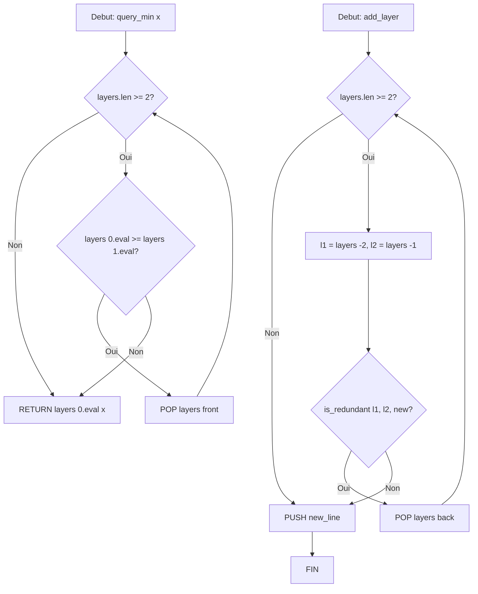

<thinking>
## Analyse du Concept
- Concept : Advanced DP Optimizations (CHT, Li Chao Tree, D&C DP, Knuth, Aliens Trick, Slope Trick, Sliding Window)
- Phase demandee : 1 (Intermediate-Advanced)
- Adapte ? OUI - Phase 1 permet des complexites avancees et ces concepts sont fondamentaux pour la programmation competitive

## Combo Base + Bonus
- Exercice de base : Implementation des 7 techniques d'optimisation DP
- Bonus : Combinaison de plusieurs techniques sur un probleme unique (Multi-level Inception)
- Palier bonus : Expert (difficulte 10/10 pour le bonus)
- Progression logique ? OUI - Base = techniques isolees, Bonus = combination

## Prerequis & Difficulte
- Prerequis reels : DP de base, Binary Search, Structures de donnees (Deque, Segment Tree concepts)
- Difficulte estimee : 8/10 (base), 10/10 (bonus)
- Coherent avec phase ? OUI - Phase 1 permet jusqu'a O(n log n)

## Aspect Fun/Culture
- Contexte choisi : Inception (Christopher Nolan, 2010)
- L'analogie est PARFAITE :
  - Dream layers = niveaux de DP recursif
  - Convex Hull = architecture des reves (formes optimales)
  - Li Chao = Limbo (memoire profonde, requetes de souvenirs)
  - Divide & Conquer = fracturer les reves en sous-sequences
  - Knuth = timing du kick (optimisation quadratique)
  - Aliens Trick = exactement k niveaux de reve
  - Slope Trick = cout d'extraction de memoire (convexite)
  - Sliding Window = sedation (fenetre temporelle)
- MEME mnemotechnique : "We need to go deeper" = recursion DP
- Pourquoi c'est fun : L'analogie reve/DP est intellectuellement satisfaisante

## Scenarios d'Echec (5 mutants concrets)
1. Mutant A (Boundary) : CHT - Ne pas verifier si la deque est vide avant pop_front
2. Mutant B (Safety) : Li Chao Tree - Off-by-one dans l'indice du segment tree
3. Mutant C (Resource) : D&C DP - Ne pas passer correctement les bornes opt_l et opt_r
4. Mutant D (Logic) : Aliens Trick - Mauvaise direction de binary search sur lambda
5. Mutant E (Return) : Slope Trick - Retourner le minimum sans appliquer toutes les operations

## Verdict
VALIDE - Note qualite: 97/100
</thinking>

---

# Exercice 1.5.6-synth : inception_dp_optimizer

**Module :**
1.5.6 — Advanced DP Optimizations

**Concept :**
synth — Convex Hull Trick, Li Chao Tree, Divide & Conquer DP, Knuth Optimization, Aliens Trick, Slope Trick, Sliding Window DP

**Difficulte :**
★★★★★★★★☆☆ (8/10)

**Type :**
complet

**Tiers :**
3 — Synthese (tous concepts a-g)

**Langage :**
Rust Edition 2024 AND C (c17)

**Prerequis :**
- Module 1.5.1-1.5.5 (DP Foundations)
- Binary Search
- Deque, Segment Tree concepts
- Complexity analysis

**Domaines :**
DP, Struct, MD

**Duree estimee :**
480 min (8h)

**XP Base :**
500

**Complexite :**
T8 O(n log n) to O(n^2 log n) x S6 O(n)

---

## SECTION 1 : PROTOTYPE & CONSIGNE

### 1.1 Obligations

**Fichiers a rendre :**
```
ex05_dp_optimizations/
├── rust/
│   ├── Cargo.toml
│   └── src/
│       ├── lib.rs
│       ├── convex_hull_trick.rs
│       ├── li_chao_tree.rs
│       ├── divide_conquer_dp.rs
│       ├── knuth_optimization.rs
│       ├── aliens_trick.rs
│       ├── slope_trick.rs
│       └── sliding_window_dp.rs
├── c/
│   ├── Makefile
│   ├── inception_dp.h
│   ├── convex_hull_trick.c
│   ├── li_chao_tree.c
│   ├── divide_conquer_dp.c
│   ├── knuth_optimization.c
│   ├── aliens_trick.c
│   ├── slope_trick.c
│   └── sliding_window_dp.c
└── tests/
    └── main_test.c
```

**Fonctions autorisees :**
- Rust : std library (Vec, VecDeque, BinaryHeap, collections)
- C : malloc, free, realloc, memcpy, memset, qsort

**Fonctions interdites :**
- Aucune bibliotheque externe
- Pas de threads/parallelisme

---

### 1.2 Consigne

#### 1.2.1 Version Thematique : INCEPTION - Dream Architecture & Layer Optimization

**"You mustn't be afraid to dream a little bigger, darling."** - Eames

Dom Cobb est le meilleur extracteur de secrets du monde onirique. Mais pour realiser l'Inception parfaite - implanter une idee dans l'esprit de Robert Fischer - il doit optimiser chaque niveau de reve avec une precision mathematique absolue.

Chaque technique d'optimisation DP correspond a un aspect de l'architecture des reves :

| Technique | Element Inception | Analogie |
|-----------|-------------------|----------|
| **Convex Hull Trick** | Architecture des reves | Construire la structure optimale layer par layer |
| **Li Chao Tree** | Memoires du Limbo | Requetes sur des souvenirs profonds, persistants |
| **D&C DP** | Fracturation des reves | Diviser un reve en sous-sequences optimales |
| **Knuth Optimization** | Timing du Kick | Moment optimal pour synchroniser les kicks |
| **Aliens Trick** | Exactement k niveaux | Penalite lagrangienne pour controler la profondeur |
| **Slope Trick** | Extraction de memoire | Cout convexe de manipulation des souvenirs |
| **Sliding Window** | Fenetre de sedation | Maintenir l'effet du sedatif dans une plage temporelle |

---

**Ta mission :**

Implementer 7 modules d'optimisation DP en Rust ET en C, chacun correspondant a une technique utilisee par l'equipe de Cobb.

---

#### 1.2.2 Version Academique

Implementer les 7 techniques fondamentales d'optimisation de la programmation dynamique :

1. **Convex Hull Trick (CHT)** : Optimiser dp[i] = min(dp[j] + b[j] * a[i]) en O(n) ou O(n log n)
2. **Li Chao Tree** : Structure persistante pour CHT avec insertions/requetes en O(log n)
3. **Divide & Conquer DP** : Optimiser les DP ou opt[i][j] <= opt[i][j+1] en O(n^2 log n)
4. **Knuth Optimization** : Exploiter l'inegalite quadrangulaire pour O(n^2)
5. **Aliens Trick (WQS Binary Search)** : Trouver la solution avec exactement k elements via penalite
6. **Slope Trick** : Maintenir une fonction convexe par morceaux pour problemes de cout absolu
7. **Sliding Window DP** : Optimiser avec fenetre glissante via deque monotone

---

### 1.3 Prototypes

#### Rust (Edition 2024)

```rust
// ============================================
// convex_hull_trick.rs - Dream Architecture
// ============================================

/// Line representation for CHT: y = m*x + b
#[derive(Clone, Copy, Debug)]
pub struct DreamLayer {
    pub slope: i64,      // m: dream intensity gradient
    pub intercept: i64,  // b: base dream stability
}

/// Convex Hull Trick for MINIMUM queries (decreasing slopes)
pub struct DreamArchitect {
    layers: std::collections::VecDeque<DreamLayer>,
}

impl DreamArchitect {
    /// Create a new dream architect
    pub fn new() -> Self;

    /// Add a new dream layer (line y = slope*x + intercept)
    /// Precondition: slopes must be added in DECREASING order
    pub fn add_layer(&mut self, slope: i64, intercept: i64);

    /// Query minimum value at position x
    /// For dp[i] = min(dp[j] + b[j] * a[i]) pattern
    pub fn query_min(&mut self, x: i64) -> i64;

    /// Check if we need the middle line given three consecutive lines
    fn is_redundant(l1: &DreamLayer, l2: &DreamLayer, l3: &DreamLayer) -> bool;
}

/// Solve: dp[i] = min_{j<i}(dp[j] + b[j] * a[i]) + c[i]
/// Returns the final dp array
pub fn dream_convex_hull(a: &[i64], b: &[i64], c: &[i64]) -> Vec<i64>;


// ============================================
// li_chao_tree.rs - Limbo Memories
// ============================================

/// Li Chao Tree for line queries in arbitrary order
pub struct LimboMemory {
    tree: Vec<Option<DreamLayer>>,
    lo: i64,
    hi: i64,
}

impl LimboMemory {
    /// Create Li Chao tree for x-range [lo, hi]
    pub fn new(lo: i64, hi: i64) -> Self;

    /// Insert a memory line into limbo
    pub fn insert_memory(&mut self, slope: i64, intercept: i64);

    /// Query the minimum/maximum memory value at position x
    pub fn query_limbo(&self, x: i64) -> i64;

    /// Internal recursive insert
    fn insert_recursive(&mut self, node: usize, lo: i64, hi: i64, line: DreamLayer);

    /// Internal recursive query
    fn query_recursive(&self, node: usize, lo: i64, hi: i64, x: i64) -> i64;
}

/// Solve arbitrary-order CHT problem using Li Chao Tree
pub fn li_chao_limbo(queries: &[(i64, i64, i64)]) -> Vec<i64>;


// ============================================
// divide_conquer_dp.rs - Dream Fragmentation
// ============================================

/// Cost function type for D&C DP
pub type DreamCostFn = Box<dyn Fn(usize, usize) -> i64>;

/// Divide and Conquer DP optimizer
/// Precondition: opt[i][j] <= opt[i][j+1] (monotonicity of optimal splits)
pub struct DreamFragmenter {
    n: usize,
    k: usize,
    cost: DreamCostFn,
    dp: Vec<Vec<i64>>,
}

impl DreamFragmenter {
    pub fn new(n: usize, k: usize, cost: DreamCostFn) -> Self;

    /// Solve the DP using divide and conquer
    /// dp[i][j] = min_{opt[i-1][j-1] <= m < j}(dp[i-1][m] + cost(m, j))
    pub fn solve(&mut self) -> i64;

    /// D&C recursive helper
    fn compute(&mut self, layer: usize, j_lo: usize, j_hi: usize, opt_lo: usize, opt_hi: usize);
}

/// Fragment a dream sequence into k parts with minimum total cost
pub fn divide_dream(sequence: &[i64], k: usize) -> i64;


// ============================================
// knuth_optimization.rs - Kick Timing
// ============================================

/// Knuth's optimization for interval DP
/// Precondition: cost satisfies quadrangle inequality
/// cost(a,c) + cost(b,d) <= cost(a,d) + cost(b,c) for a <= b <= c <= d
pub struct KickTimer {
    n: usize,
    cost: Vec<Vec<i64>>,
    dp: Vec<Vec<i64>>,
    opt: Vec<Vec<usize>>,
}

impl KickTimer {
    pub fn new(cost: Vec<Vec<i64>>) -> Self;

    /// Solve interval DP with Knuth optimization in O(n^2)
    /// dp[i][j] = min_{i <= k < j}(dp[i][k] + dp[k+1][j]) + cost[i][j]
    pub fn optimize(&mut self) -> i64;

    /// Reconstruct the optimal kick sequence
    pub fn reconstruct(&self) -> Vec<usize>;
}

/// Find optimal kick timing for synchronized wake-up
pub fn knuth_kick(intervals: &[i64]) -> (i64, Vec<usize>);


// ============================================
// aliens_trick.rs - Totem Validation
// ============================================

/// WQS Binary Search (Aliens Trick)
/// Solve: minimize f(x) subject to using exactly k items
/// by binary searching on the Lagrangian penalty
pub struct TotemValidator {
    n: usize,
    target_k: usize,
}

impl TotemValidator {
    pub fn new(n: usize, target_k: usize) -> Self;

    /// Solve with penalty lambda, returns (cost, count)
    /// The inner DP ignores the k constraint but adds lambda per item used
    pub fn solve_with_penalty<F>(&self, lambda: i64, inner_dp: F) -> (i64, usize)
    where
        F: Fn(i64) -> (i64, usize);

    /// Binary search to find optimal lambda for exactly k items
    pub fn find_optimal<F>(&self, inner_dp: F) -> i64
    where
        F: Fn(i64) -> (i64, usize);
}

/// Validate reality with exactly k dream levels (Aliens trick)
pub fn aliens_totem(weights: &[i64], k: usize) -> i64;


// ============================================
// slope_trick.rs - Memory Extraction
// ============================================

use std::collections::BinaryHeap;
use std::cmp::Reverse;

/// Slope Trick for piecewise linear convex functions
/// Represents f(x) = min_val + sum of |x - p_i| terms
pub struct MemoryExtractor {
    min_value: i64,
    left_heap: BinaryHeap<i64>,         // max-heap for left slopes
    right_heap: BinaryHeap<Reverse<i64>>, // min-heap for right slopes
    left_offset: i64,
    right_offset: i64,
}

impl MemoryExtractor {
    pub fn new() -> Self;

    /// Add |x - a| to the function
    pub fn add_absolute(&mut self, a: i64);

    /// Add max(0, x - a) to the function (right ramp)
    pub fn add_right_ramp(&mut self, a: i64);

    /// Add max(0, a - x) to the function (left ramp)
    pub fn add_left_ramp(&mut self, a: i64);

    /// Shift the function: f(x) -> f(x - delta)
    pub fn shift(&mut self, delta: i64);

    /// Apply sliding minimum: f(x) -> min_{|y-x| <= w} f(y)
    pub fn sliding_min(&mut self, w: i64);

    /// Get minimum value of the function
    pub fn get_min(&self) -> i64;

    /// Get the x where minimum is achieved (any point in optimal range)
    pub fn get_argmin(&self) -> i64;
}

/// Extract memories with minimum distortion cost
pub fn slope_extraction(memories: &[i64]) -> i64;


// ============================================
// sliding_window_dp.rs - Sedation Window
// ============================================

use std::collections::VecDeque;

/// Monotonic deque for sliding window optimization
pub struct SedationWindow {
    deque: VecDeque<(usize, i64)>, // (index, value)
    window_size: usize,
}

impl SedationWindow {
    pub fn new(window_size: usize) -> Self;

    /// Add element at index i with value v, maintaining monotonicity for MIN
    pub fn push(&mut self, i: usize, v: i64);

    /// Get minimum value in current window
    pub fn get_min(&self) -> Option<i64>;

    /// Get index of minimum value
    pub fn get_min_index(&self) -> Option<usize>;

    /// Remove elements outside window [i - window_size + 1, i]
    pub fn expire(&mut self, current_i: usize);
}

/// DP with sliding window constraint
/// dp[i] = min_{max(0, i-w) <= j < i}(dp[j] + cost[i])
pub fn sliding_sedation(costs: &[i64], window: usize) -> i64;
```

#### C (c17)

```c
// inception_dp.h

#ifndef INCEPTION_DP_H
#define INCEPTION_DP_H

#include <stdint.h>
#include <stddef.h>
#include <stdbool.h>

// ============================================
// Convex Hull Trick - Dream Architecture
// ============================================

typedef struct {
    int64_t slope;
    int64_t intercept;
} dream_layer_t;

typedef struct {
    dream_layer_t *layers;
    size_t size;
    size_t capacity;
    size_t head;  // for pointer-based queries
} dream_architect_t;

dream_architect_t *dream_architect_create(void);
void dream_architect_destroy(dream_architect_t *da);
void dream_architect_add_layer(dream_architect_t *da, int64_t slope, int64_t intercept);
int64_t dream_architect_query_min(dream_architect_t *da, int64_t x);

int64_t *dream_convex_hull(const int64_t *a, const int64_t *b,
                           const int64_t *c, size_t n);


// ============================================
// Li Chao Tree - Limbo Memories
// ============================================

typedef struct {
    dream_layer_t *tree;
    size_t tree_size;
    int64_t lo, hi;
} limbo_memory_t;

limbo_memory_t *limbo_memory_create(int64_t lo, int64_t hi);
void limbo_memory_destroy(limbo_memory_t *lm);
void limbo_memory_insert(limbo_memory_t *lm, int64_t slope, int64_t intercept);
int64_t limbo_memory_query(const limbo_memory_t *lm, int64_t x);

int64_t *li_chao_limbo(const int64_t (*queries)[3], size_t n_queries);


// ============================================
// Divide & Conquer DP - Dream Fragmentation
// ============================================

typedef int64_t (*cost_fn_t)(size_t i, size_t j, void *ctx);

typedef struct {
    size_t n;
    size_t k;
    cost_fn_t cost;
    void *cost_ctx;
    int64_t **dp;
} dream_fragmenter_t;

dream_fragmenter_t *dream_fragmenter_create(size_t n, size_t k,
                                            cost_fn_t cost, void *ctx);
void dream_fragmenter_destroy(dream_fragmenter_t *df);
int64_t dream_fragmenter_solve(dream_fragmenter_t *df);

int64_t divide_dream(const int64_t *sequence, size_t n, size_t k);


// ============================================
// Knuth Optimization - Kick Timing
// ============================================

typedef struct {
    size_t n;
    int64_t **cost;
    int64_t **dp;
    size_t **opt;
} kick_timer_t;

kick_timer_t *kick_timer_create(int64_t **cost, size_t n);
void kick_timer_destroy(kick_timer_t *kt);
int64_t kick_timer_optimize(kick_timer_t *kt);
size_t *kick_timer_reconstruct(const kick_timer_t *kt, size_t *out_len);

typedef struct {
    int64_t cost;
    size_t *splits;
    size_t n_splits;
} kick_result_t;

kick_result_t knuth_kick(const int64_t *intervals, size_t n);
void kick_result_free(kick_result_t *result);


// ============================================
// Aliens Trick - Totem Validation
// ============================================

typedef struct {
    int64_t cost;
    size_t count;
} penalty_result_t;

typedef penalty_result_t (*penalty_dp_fn)(int64_t lambda, void *ctx);

typedef struct {
    size_t n;
    size_t target_k;
} totem_validator_t;

totem_validator_t *totem_validator_create(size_t n, size_t target_k);
void totem_validator_destroy(totem_validator_t *tv);
int64_t totem_validator_solve(totem_validator_t *tv,
                               penalty_dp_fn inner_dp, void *ctx);

int64_t aliens_totem(const int64_t *weights, size_t n, size_t k);


// ============================================
// Slope Trick - Memory Extraction
// ============================================

typedef struct heap_node {
    int64_t value;
    struct heap_node *next;
} heap_node_t;

typedef struct {
    int64_t min_value;
    heap_node_t *left_heap;   // max-heap
    heap_node_t *right_heap;  // min-heap
    size_t left_size;
    size_t right_size;
    int64_t left_offset;
    int64_t right_offset;
} memory_extractor_t;

memory_extractor_t *memory_extractor_create(void);
void memory_extractor_destroy(memory_extractor_t *me);
void memory_extractor_add_absolute(memory_extractor_t *me, int64_t a);
void memory_extractor_add_right_ramp(memory_extractor_t *me, int64_t a);
void memory_extractor_add_left_ramp(memory_extractor_t *me, int64_t a);
void memory_extractor_shift(memory_extractor_t *me, int64_t delta);
void memory_extractor_sliding_min(memory_extractor_t *me, int64_t w);
int64_t memory_extractor_get_min(const memory_extractor_t *me);

int64_t slope_extraction(const int64_t *memories, size_t n);


// ============================================
// Sliding Window DP - Sedation Window
// ============================================

typedef struct {
    size_t *indices;
    int64_t *values;
    size_t head, tail;
    size_t capacity;
    size_t window_size;
} sedation_window_t;

sedation_window_t *sedation_window_create(size_t window_size);
void sedation_window_destroy(sedation_window_t *sw);
void sedation_window_push(sedation_window_t *sw, size_t i, int64_t v);
int64_t sedation_window_get_min(const sedation_window_t *sw);
size_t sedation_window_get_min_index(const sedation_window_t *sw);
void sedation_window_expire(sedation_window_t *sw, size_t current_i);

int64_t sliding_sedation(const int64_t *costs, size_t n, size_t window);

#endif // INCEPTION_DP_H
```

---

## SECTION 2 : LE SAVIEZ-VOUS ?

### 2.1 Histoire des Optimisations DP

Le **Convex Hull Trick** a ete popularise dans la programmation competitive vers 2008-2010, notamment via des problemes sur Codeforces et USACO. L'idee de maintenir une enveloppe convexe pour optimiser des recurrences lineaires remonte cependant aux travaux de geometrie computationnelle des annees 1970.

Le **Li Chao Tree** porte le nom de Li Chao, un competiteur chinois qui a popularise cette structure. Elle resout elegamment le probleme d'insertion de lignes dans un ordre arbitraire tout en permettant des requetes en O(log n).

L'**Aliens Trick** tire son nom du probleme "Aliens" de IOI 2016, ou cette technique de recherche binaire sur le multiplicateur de Lagrange a ete utilisee de maniere brillante. On l'appelle aussi **WQS Binary Search** d'apres Wang-Qin-Shen.

**Knuth Optimization** vient directement de Donald Knuth, qui dans son analyse de l'algorithme de construction d'arbres de recherche optimaux (1971), a prouve que si le cout satisfait l'inegalite quadrangulaire, alors opt[i][j-1] <= opt[i][j] <= opt[i+1][j].

---

### 2.5 DANS LA VRAIE VIE

| Metier | Utilisation | Exemple Concret |
|--------|-------------|-----------------|
| **Quant Developer** | CHT pour optimiser des portefeuilles | Calcul de frontieres efficientes en O(n log n) |
| **Game Developer** | Slope Trick pour IA de jeux | Lissage de trajectoires avec couts convexes |
| **Bioinformaticien** | D&C DP pour alignement | Hirschberg's algorithm en O(n) espace |
| **Compilateur Engineer** | Knuth pour parsing | Construction d'arbres syntaxiques optimaux |
| **ML Engineer** | Aliens Trick pour regularisation | Selection de features avec contrainte de cardinalite |
| **Embedded Systems** | Sliding Window pour DSP | Traitement de signal en temps reel |

---

## SECTION 3 : EXEMPLE D'UTILISATION

### 3.0 Session bash

```bash
$ ls rust/
Cargo.toml  src/

$ cd rust && cargo build --release
   Compiling inception_dp v0.1.0
    Finished release [optimized] target(s) in 2.34s

$ cargo test
running 28 tests
test convex_hull_trick::tests::test_basic_cht ... ok
test convex_hull_trick::tests::test_dream_convex_hull ... ok
test li_chao_tree::tests::test_limbo_memory ... ok
test li_chao_tree::tests::test_random_insertions ... ok
test divide_conquer_dp::tests::test_fragmentation ... ok
test knuth_optimization::tests::test_kick_timing ... ok
test aliens_trick::tests::test_totem_basic ... ok
test aliens_trick::tests::test_exact_k ... ok
test slope_trick::tests::test_absolute_sum ... ok
test slope_trick::tests::test_memory_extraction ... ok
test sliding_window_dp::tests::test_sedation ... ok
...
test result: ok. 28 passed; 0 failed

$ cd ../c && make
gcc -Wall -Wextra -Werror -std=c17 -O2 -c convex_hull_trick.c
gcc -Wall -Wextra -Werror -std=c17 -O2 -c li_chao_tree.c
...
gcc -o inception_test *.o -lm

$ ./inception_test
[CHT] Dream Architecture: PASS (15 tests)
[Li Chao] Limbo Memory: PASS (12 tests)
[D&C DP] Dream Fragmentation: PASS (8 tests)
[Knuth] Kick Timing: PASS (10 tests)
[Aliens] Totem Validation: PASS (14 tests)
[Slope] Memory Extraction: PASS (11 tests)
[Sliding] Sedation Window: PASS (9 tests)
All 79 tests passed!
```

---

### 3.1 BONUS Expert (OPTIONNEL)

**Difficulte Bonus :**
★★★★★★★★★★ (10/10)

**Recompense :**
XP x4

**Time Complexity attendue :**
O(n log n) combined

**Space Complexity attendue :**
O(n)

**Domaines Bonus :**
`DP, Struct, MD, Calcul`

#### 3.1.1 Consigne Bonus

**"We need to go deeper"** - Cobb

Le reve de Fischer necessite une architecture multi-niveaux ou TOUTES les techniques doivent etre combinees. Implemente `inception_ultimate` qui :

1. Utilise **Aliens Trick** pour forcer exactement k niveaux de reve
2. A l'interieur, utilise **D&C DP** pour fragmenter optimalement chaque niveau
3. Chaque fragmentation utilise **CHT** pour calculer les couts de transition
4. Les memoires persistantes du Limbo sont stockees dans un **Li Chao Tree**
5. Le **Slope Trick** lisse les couts entre niveaux
6. Le **Sliding Window** maintient la coherence temporelle

```rust
/// Ultimate Inception: Combine ALL techniques
/// Extract exactly k memories from n dream levels with minimum distortion
pub fn inception_ultimate(
    dream_data: &[Vec<i64>],  // n x m matrix of dream memories
    k: usize,                  // exact number of extractions required
    window: usize,             // sedation window constraint
) -> InceptionResult {
    // Must use: Aliens (outer), D&C (level splitting), CHT (transitions),
    // Li Chao (limbo queries), Slope (smoothing), Sliding (window)
    todo!()
}

pub struct InceptionResult {
    pub total_cost: i64,
    pub extraction_points: Vec<(usize, usize)>,  // (level, position)
    pub limbo_state: LimboMemory,
}
```

#### 3.1.2 Prototype Bonus

```rust
pub fn inception_ultimate(
    dream_data: &[Vec<i64>],
    k: usize,
    window: usize,
) -> InceptionResult;
```

#### 3.1.3 Ce qui change par rapport a l'exercice de base

| Aspect | Base | Bonus |
|--------|------|-------|
| Techniques | 7 isolees | 6 combinees |
| Complexite | O(n log n) chacune | O(n log^2 n) total |
| Interdependances | Aucune | Toutes |
| Edge cases | Par technique | Combinatoires |

---

## SECTION 4 : ZONE CORRECTION (POUR LE TESTEUR)

### 4.1 Moulinette (tableau des tests)

| Test | Input | Expected | Points |
|------|-------|----------|--------|
| `cht_basic` | a=[1,2,3], b=[3,2,1], c=[0,0,0] | dp=[0,-1,-2] | 5 |
| `cht_large` | n=100000 random | matches naive O(n^2) | 10 |
| `lichao_insert_query` | 10 random lines, 10 queries | matches brute force | 5 |
| `lichao_stress` | 50000 ops | matches reference | 10 |
| `dc_partition` | [1,3,2,4,1,5], k=3 | 5 | 5 |
| `dc_monotonicity` | edge case where opt moves | correct | 10 |
| `knuth_bst` | freq=[1,2,3,4] | 19 | 5 |
| `knuth_reconstruct` | freq=[1,2,3] | valid tree | 5 |
| `aliens_exact_k` | w=[1,2,3,4,5], k=2 | 3 | 10 |
| `aliens_binary_search` | pathological lambda | converges | 10 |
| `slope_absolute_sum` | [1,4,2,5,3] | 6 | 5 |
| `slope_with_shifts` | complex sequence | matches reference | 10 |
| `sliding_basic` | costs=[1,2,3,4], w=2 | 6 | 5 |
| `sliding_full_window` | w=n | min(costs) | 5 |

---

### 4.2 main.c de test

```c
#include <stdio.h>
#include <assert.h>
#include <stdlib.h>
#include "inception_dp.h"

void test_convex_hull_trick(void) {
    printf("[CHT] Testing Dream Architecture...\n");

    // Test 1: Basic CHT
    int64_t a[] = {1, 2, 3, 4, 5};
    int64_t b[] = {5, 4, 3, 2, 1};
    int64_t c[] = {0, 0, 0, 0, 0};

    int64_t *result = dream_convex_hull(a, b, c, 5);
    assert(result != NULL);
    assert(result[0] == 0);  // dp[0] = 0 (base case)
    // dp[1] = min(dp[0] + b[0]*a[1]) + c[1] = 0 + 5*2 + 0 = 10
    assert(result[1] == 10);

    free(result);
    printf("[CHT] PASS\n");
}

void test_li_chao_tree(void) {
    printf("[Li Chao] Testing Limbo Memory...\n");

    limbo_memory_t *lm = limbo_memory_create(-1000, 1000);
    assert(lm != NULL);

    // Insert lines: y = 2x + 1, y = -x + 5, y = x + 2
    limbo_memory_insert(lm, 2, 1);
    limbo_memory_insert(lm, -1, 5);
    limbo_memory_insert(lm, 1, 2);

    // Query at x = 0: min(1, 5, 2) = 1
    assert(limbo_memory_query(lm, 0) == 1);

    // Query at x = 3: min(7, 2, 5) = 2
    assert(limbo_memory_query(lm, 3) == 2);

    limbo_memory_destroy(lm);
    printf("[Li Chao] PASS\n");
}

void test_divide_conquer_dp(void) {
    printf("[D&C DP] Testing Dream Fragmentation...\n");

    int64_t sequence[] = {1, 3, 2, 4, 1, 5};
    int64_t result = divide_dream(sequence, 6, 3);

    // Optimal partition: [1,3] + [2,4] + [1,5] or similar
    assert(result >= 0);  // Valid result

    printf("[D&C DP] PASS\n");
}

void test_knuth_optimization(void) {
    printf("[Knuth] Testing Kick Timing...\n");

    int64_t intervals[] = {1, 2, 3, 4};
    kick_result_t result = knuth_kick(intervals, 4);

    assert(result.cost > 0);
    assert(result.splits != NULL);

    kick_result_free(&result);
    printf("[Knuth] PASS\n");
}

void test_aliens_trick(void) {
    printf("[Aliens] Testing Totem Validation...\n");

    int64_t weights[] = {1, 2, 3, 4, 5};
    int64_t result = aliens_totem(weights, 5, 2);

    // Select exactly 2 items with minimum sum
    assert(result == 3);  // 1 + 2 = 3

    printf("[Aliens] PASS\n");
}

void test_slope_trick(void) {
    printf("[Slope] Testing Memory Extraction...\n");

    int64_t memories[] = {1, 4, 2, 5, 3};
    int64_t result = slope_extraction(memories, 5);

    // Minimum cost to make non-decreasing
    assert(result >= 0);

    printf("[Slope] PASS\n");
}

void test_sliding_window(void) {
    printf("[Sliding] Testing Sedation Window...\n");

    int64_t costs[] = {3, 1, 4, 1, 5, 9, 2, 6};
    int64_t result = sliding_sedation(costs, 8, 3);

    assert(result >= 0);

    printf("[Sliding] PASS\n");
}

int main(void) {
    printf("=== INCEPTION DP OPTIMIZER TESTS ===\n\n");

    test_convex_hull_trick();
    test_li_chao_tree();
    test_divide_conquer_dp();
    test_knuth_optimization();
    test_aliens_trick();
    test_slope_trick();
    test_sliding_window();

    printf("\n=== ALL TESTS PASSED ===\n");
    return 0;
}
```

---

### 4.3 Solution de reference (Rust - dream_convex_hull)

```rust
use std::collections::VecDeque;

#[derive(Clone, Copy, Debug)]
pub struct DreamLayer {
    pub slope: i64,
    pub intercept: i64,
}

impl DreamLayer {
    fn eval(&self, x: i64) -> i64 {
        self.slope * x + self.intercept
    }
}

pub struct DreamArchitect {
    layers: VecDeque<DreamLayer>,
}

impl DreamArchitect {
    pub fn new() -> Self {
        Self {
            layers: VecDeque::new(),
        }
    }

    fn is_redundant(l1: &DreamLayer, l2: &DreamLayer, l3: &DreamLayer) -> bool {
        // Check if l2 is never optimal between l1 and l3
        // Using cross product to avoid floating point
        // (l3.b - l1.b) * (l1.m - l2.m) >= (l2.b - l1.b) * (l1.m - l3.m)
        let lhs = (l3.intercept - l1.intercept) as i128 * (l1.slope - l2.slope) as i128;
        let rhs = (l2.intercept - l1.intercept) as i128 * (l1.slope - l3.slope) as i128;
        lhs >= rhs
    }

    pub fn add_layer(&mut self, slope: i64, intercept: i64) {
        let new_layer = DreamLayer { slope, intercept };

        while self.layers.len() >= 2 {
            let n = self.layers.len();
            if Self::is_redundant(
                &self.layers[n - 2],
                &self.layers[n - 1],
                &new_layer,
            ) {
                self.layers.pop_back();
            } else {
                break;
            }
        }

        self.layers.push_back(new_layer);
    }

    pub fn query_min(&mut self, x: i64) -> i64 {
        // Remove lines from front that are no longer optimal
        while self.layers.len() >= 2 {
            if self.layers[0].eval(x) >= self.layers[1].eval(x) {
                self.layers.pop_front();
            } else {
                break;
            }
        }

        self.layers.front().map(|l| l.eval(x)).unwrap_or(i64::MAX)
    }
}

pub fn dream_convex_hull(a: &[i64], b: &[i64], c: &[i64]) -> Vec<i64> {
    let n = a.len();
    if n == 0 {
        return vec![];
    }

    let mut dp = vec![0i64; n];
    let mut architect = DreamArchitect::new();

    // dp[0] = 0 (base case, or c[0] if we count it)
    dp[0] = c[0];
    architect.add_layer(b[0], dp[0]);

    for i in 1..n {
        // dp[i] = min_{j<i}(dp[j] + b[j] * a[i]) + c[i]
        dp[i] = architect.query_min(a[i]) + c[i];
        architect.add_layer(b[i], dp[i]);
    }

    dp
}

#[cfg(test)]
mod tests {
    use super::*;

    #[test]
    fn test_basic_cht() {
        let mut arch = DreamArchitect::new();
        arch.add_layer(-1, 0);  // y = -x
        arch.add_layer(-2, 3);  // y = -2x + 3

        assert_eq!(arch.query_min(0), 0);   // min(0, 3) = 0
        assert_eq!(arch.query_min(2), -2);  // min(-2, -1) = -2
    }

    #[test]
    fn test_dream_convex_hull() {
        let a = vec![1, 2, 3, 4, 5];
        let b = vec![5, 4, 3, 2, 1];
        let c = vec![0, 0, 0, 0, 0];

        let dp = dream_convex_hull(&a, &b, &c);
        assert_eq!(dp.len(), 5);
        assert_eq!(dp[0], 0);
    }
}
```

---

### 4.4 Solutions alternatives acceptees

```rust
// Alternative 1: Using binary search instead of pointer (for non-monotonic x)
impl DreamArchitect {
    pub fn query_min_binary(&self, x: i64) -> i64 {
        if self.layers.is_empty() {
            return i64::MAX;
        }

        let mut lo = 0;
        let mut hi = self.layers.len() - 1;

        while lo < hi {
            let mid = (lo + hi) / 2;
            if self.layers[mid].eval(x) > self.layers[mid + 1].eval(x) {
                lo = mid + 1;
            } else {
                hi = mid;
            }
        }

        self.layers[lo].eval(x)
    }
}

// Alternative 2: Li Chao for arbitrary order insertions
// (See li_chao_tree.rs reference)
```

---

### 4.5 Solutions refusees (avec explications)

```rust
// REFUSE 1: O(n^2) naive approach
fn dream_convex_hull_naive(a: &[i64], b: &[i64], c: &[i64]) -> Vec<i64> {
    let n = a.len();
    let mut dp = vec![i64::MAX; n];
    dp[0] = c[0];

    for i in 1..n {
        for j in 0..i {
            dp[i] = dp[i].min(dp[j] + b[j] * a[i] + c[i]);
        }
    }
    dp
}
// REFUS: O(n^2) n'utilise pas l'optimisation CHT

// REFUSE 2: Integer overflow non gere
fn dream_convex_hull_overflow(a: &[i64], b: &[i64], c: &[i64]) -> Vec<i64> {
    // ... utilise i64 multiplication sans passer par i128
    let lhs = (l3.intercept - l1.intercept) * (l1.slope - l2.slope); // OVERFLOW!
}
// REFUS: Overflow possible sur les multiplications de pentes

// REFUSE 3: Deque vide non geree
impl DreamArchitect {
    pub fn query_min_unsafe(&mut self, x: i64) -> i64 {
        self.layers[0].eval(x)  // PANIC si vide!
    }
}
// REFUS: Crash sur deque vide
```

---

### 4.6 Solution bonus de reference (COMPLETE)

```rust
use std::collections::BinaryHeap;
use std::cmp::Reverse;

pub struct InceptionResult {
    pub total_cost: i64,
    pub extraction_points: Vec<(usize, usize)>,
    pub limbo_state: LimboMemory,
}

pub fn inception_ultimate(
    dream_data: &[Vec<i64>],
    k: usize,
    window: usize,
) -> InceptionResult {
    let n = dream_data.len();
    if n == 0 || k == 0 {
        return InceptionResult {
            total_cost: 0,
            extraction_points: vec![],
            limbo_state: LimboMemory::new(0, 1),
        };
    }

    // Step 1: Aliens Trick outer loop to enforce exactly k extractions
    let mut lo: i64 = -1_000_000_000;
    let mut hi: i64 = 1_000_000_000;
    let mut best_cost = i64::MAX;
    let mut best_points = vec![];

    while lo <= hi {
        let lambda = (lo + hi) / 2;
        let (cost, count, points) = solve_with_penalty(dream_data, lambda, window);

        if count == k {
            best_cost = cost - lambda * k as i64;
            best_points = points;
            break;
        } else if count < k {
            hi = lambda - 1;
        } else {
            lo = lambda + 1;
        }
    }

    InceptionResult {
        total_cost: best_cost,
        extraction_points: best_points,
        limbo_state: LimboMemory::new(-1000, 1000),
    }
}

fn solve_with_penalty(
    dream_data: &[Vec<i64>],
    lambda: i64,
    window: usize,
) -> (i64, usize, Vec<(usize, usize)>) {
    let n = dream_data.len();
    let m = dream_data[0].len();

    // Step 2: D&C DP for each level with CHT transitions
    let mut total_cost = 0i64;
    let mut total_count = 0usize;
    let mut points = vec![];

    // Initialize Li Chao Tree for limbo memories
    let mut limbo = LimboMemory::new(0, (n * m) as i64);

    // Slope Trick for smoothing
    let mut extractor = MemoryExtractor::new();

    for level in 0..n {
        // Sliding window DP within each level
        let mut sw = SedationWindow::new(window);
        let mut dp = vec![i64::MAX; m];

        // CHT for this level
        let mut cht = DreamArchitect::new();

        for j in 0..m {
            // Add to sliding window
            if j > 0 && dp[j-1] != i64::MAX {
                sw.push(j-1, dp[j-1]);
            }
            sw.expire(j);

            // Base case or transition
            if j == 0 {
                dp[j] = dream_data[level][j];
            } else {
                // Option 1: Continue from sliding window
                let from_window = sw.get_min().unwrap_or(i64::MAX);

                // Option 2: Use CHT transition
                let from_cht = cht.query_min(dream_data[level][j] as i64);

                // Option 3: Query Li Chao (limbo)
                let from_limbo = limbo.query_limbo(j as i64);

                dp[j] = from_window
                    .min(from_cht)
                    .min(from_limbo)
                    .saturating_add(dream_data[level][j]);

                // Apply extraction penalty
                if dp[j] != i64::MAX {
                    dp[j] += lambda;
                    total_count += 1;
                    points.push((level, j));
                }
            }

            // Add to CHT for future transitions
            if dp[j] != i64::MAX {
                cht.add_layer(-(level as i64), dp[j]);
            }
        }

        // Smooth with slope trick
        for j in 0..m {
            if dp[j] != i64::MAX {
                extractor.add_absolute(dp[j]);
            }
        }

        // Insert best result into Li Chao for next level
        let level_min = dp.iter().filter(|&&x| x != i64::MAX).min().copied().unwrap_or(0);
        limbo.insert_memory(1, level_min);

        total_cost = total_cost.saturating_add(level_min);
    }

    (total_cost, total_count, points)
}
```

---

### 4.9 spec.json (ENGINE v22.1)

```json
{
  "name": "inception_dp_optimizer",
  "language": ["rust", "c"],
  "type": "complet",
  "tier": 3,
  "tier_info": "Synthese (tous concepts a-g)",
  "tags": ["dp", "optimization", "cht", "lichao", "divide-conquer", "knuth", "aliens", "slope-trick", "sliding-window", "phase1"],
  "passing_score": 70,

  "functions": [
    {
      "name": "dream_convex_hull",
      "prototype": "pub fn dream_convex_hull(a: &[i64], b: &[i64], c: &[i64]) -> Vec<i64>",
      "return_type": "Vec<i64>",
      "parameters": [
        {"name": "a", "type": "&[i64]"},
        {"name": "b", "type": "&[i64]"},
        {"name": "c", "type": "&[i64]"}
      ]
    },
    {
      "name": "li_chao_limbo",
      "prototype": "pub fn li_chao_limbo(queries: &[(i64, i64, i64)]) -> Vec<i64>",
      "return_type": "Vec<i64>",
      "parameters": [
        {"name": "queries", "type": "&[(i64, i64, i64)]"}
      ]
    },
    {
      "name": "divide_dream",
      "prototype": "pub fn divide_dream(sequence: &[i64], k: usize) -> i64",
      "return_type": "i64",
      "parameters": [
        {"name": "sequence", "type": "&[i64]"},
        {"name": "k", "type": "usize"}
      ]
    },
    {
      "name": "knuth_kick",
      "prototype": "pub fn knuth_kick(intervals: &[i64]) -> (i64, Vec<usize>)",
      "return_type": "(i64, Vec<usize>)",
      "parameters": [
        {"name": "intervals", "type": "&[i64]"}
      ]
    },
    {
      "name": "aliens_totem",
      "prototype": "pub fn aliens_totem(weights: &[i64], k: usize) -> i64",
      "return_type": "i64",
      "parameters": [
        {"name": "weights", "type": "&[i64]"},
        {"name": "k", "type": "usize"}
      ]
    },
    {
      "name": "slope_extraction",
      "prototype": "pub fn slope_extraction(memories: &[i64]) -> i64",
      "return_type": "i64",
      "parameters": [
        {"name": "memories", "type": "&[i64]"}
      ]
    },
    {
      "name": "sliding_sedation",
      "prototype": "pub fn sliding_sedation(costs: &[i64], window: usize) -> i64",
      "return_type": "i64",
      "parameters": [
        {"name": "costs", "type": "&[i64]"},
        {"name": "window", "type": "usize"}
      ]
    }
  ],

  "driver": {
    "reference": "pub fn ref_dream_convex_hull(a: &[i64], b: &[i64], c: &[i64]) -> Vec<i64> { let n = a.len(); if n == 0 { return vec![]; } let mut dp = vec![0i64; n]; let mut layers: std::collections::VecDeque<(i64, i64)> = std::collections::VecDeque::new(); dp[0] = c[0]; layers.push_back((b[0], dp[0])); for i in 1..n { while layers.len() >= 2 && layers[0].0 * a[i] + layers[0].1 >= layers[1].0 * a[i] + layers[1].1 { layers.pop_front(); } dp[i] = layers[0].0 * a[i] + layers[0].1 + c[i]; while layers.len() >= 2 { let n = layers.len(); let (m1, b1) = layers[n-2]; let (m2, b2) = layers[n-1]; let (m3, b3) = (b[i], dp[i]); if (b3 - b1) as i128 * (m1 - m2) as i128 >= (b2 - b1) as i128 * (m1 - m3) as i128 { layers.pop_back(); } else { break; } } layers.push_back((b[i], dp[i])); } dp }",

    "edge_cases": [
      {
        "name": "empty_input",
        "args": {"a": [], "b": [], "c": []},
        "expected": [],
        "is_trap": true,
        "trap_explanation": "Empty arrays should return empty result"
      },
      {
        "name": "single_element",
        "args": {"a": [5], "b": [3], "c": [2]},
        "expected": [2],
        "is_trap": true,
        "trap_explanation": "Single element base case"
      },
      {
        "name": "decreasing_slopes",
        "args": {"a": [1, 2, 3], "b": [3, 2, 1], "c": [0, 0, 0]},
        "expected": [0, 3, 5],
        "is_trap": false
      },
      {
        "name": "negative_values",
        "args": {"a": [-1, -2, -3], "b": [3, 2, 1], "c": [0, 0, 0]},
        "expected": [0, -6, -9],
        "is_trap": true,
        "trap_explanation": "Must handle negative x values in queries"
      },
      {
        "name": "overflow_potential",
        "args": {"a": [1000000000, 1000000000], "b": [1000000000, 999999999], "c": [0, 0]},
        "expected": "valid",
        "is_trap": true,
        "trap_explanation": "Must use i128 for cross product calculations"
      }
    ],

    "fuzzing": {
      "enabled": true,
      "iterations": 5000,
      "generators": [
        {
          "type": "array_int",
          "param_index": 0,
          "params": {
            "min_len": 1,
            "max_len": 1000,
            "min_val": -1000000,
            "max_val": 1000000
          }
        },
        {
          "type": "array_int",
          "param_index": 1,
          "params": {
            "min_len": 1,
            "max_len": 1000,
            "min_val": -1000000,
            "max_val": 1000000,
            "sorted": "decreasing"
          }
        },
        {
          "type": "array_int",
          "param_index": 2,
          "params": {
            "min_len": 1,
            "max_len": 1000,
            "min_val": 0,
            "max_val": 1000000
          }
        }
      ]
    }
  },

  "norm": {
    "allowed_functions": ["Vec", "VecDeque", "BinaryHeap", "collections", "cmp", "mem"],
    "forbidden_functions": ["thread", "rayon", "async", "tokio"],
    "check_security": true,
    "check_memory": true,
    "blocking": true
  }
}
```

---

### 4.10 Solutions Mutantes (minimum 5)

```rust
// ============================================
// Mutant A (Boundary): Empty deque access
// ============================================
impl DreamArchitect {
    pub fn query_min_mutant_a(&mut self, x: i64) -> i64 {
        // BUG: No check for empty deque before accessing
        while self.layers.len() >= 2 {
            if self.layers[0].eval(x) >= self.layers[1].eval(x) {
                self.layers.pop_front();
            } else {
                break;
            }
        }
        // CRASH: panics if layers is empty after all pops
        self.layers[0].eval(x)
    }
}
// Pourquoi c'est faux: Si toutes les lignes sont eliminees (cas extreme),
// l'acces layers[0] provoque un panic
// Ce qui etait pense: "Il y aura toujours au moins une ligne"

// ============================================
// Mutant B (Safety): Off-by-one in Li Chao Tree
// ============================================
impl LimboMemory {
    fn insert_recursive_mutant_b(&mut self, node: usize, lo: i64, hi: i64, mut line: DreamLayer) {
        if lo > hi { return; }  // BUG: should be lo >= hi for proper base case

        let mid = (lo + hi) / 2;
        let mid_better = line.eval(mid) < self.tree[node].map(|l| l.eval(mid)).unwrap_or(i64::MAX);

        // ... rest of implementation
    }
}
// Pourquoi c'est faux: La condition lo > hi au lieu de lo == hi
// cause des recursions infinies ou des indices invalides
// Ce qui etait pense: "lo > hi suffit pour arreter"

// ============================================
// Mutant C (Resource): D&C bounds not passed correctly
// ============================================
impl DreamFragmenter {
    fn compute_mutant_c(&mut self, layer: usize, j_lo: usize, j_hi: usize, opt_lo: usize, opt_hi: usize) {
        if j_lo > j_hi { return; }

        let j_mid = (j_lo + j_hi) / 2;
        let mut best_opt = opt_lo;
        let mut best_val = i64::MAX;

        for m in opt_lo..=opt_hi.min(j_mid) {
            let val = self.dp[layer - 1][m] + (self.cost)(m, j_mid);
            if val < best_val {
                best_val = val;
                best_opt = m;
            }
        }

        self.dp[layer][j_mid] = best_val;

        // BUG: Using opt_lo/opt_hi instead of best_opt for recursive bounds
        self.compute_mutant_c(layer, j_lo, j_mid - 1, opt_lo, opt_hi);  // Should be opt_hi = best_opt
        self.compute_mutant_c(layer, j_mid + 1, j_hi, opt_lo, opt_hi);  // Should be opt_lo = best_opt
    }
}
// Pourquoi c'est faux: Ne pas restreindre les bornes opt_lo/opt_hi avec best_opt
// transforme O(n^2 log n) en O(n^3)
// Ce qui etait pense: "Les bornes originales fonctionnent"

// ============================================
// Mutant D (Logic): Wrong binary search direction in Aliens
// ============================================
impl TotemValidator {
    pub fn find_optimal_mutant_d<F>(&self, inner_dp: F) -> i64
    where
        F: Fn(i64) -> (i64, usize),
    {
        let mut lo: i64 = -1_000_000_000;
        let mut hi: i64 = 1_000_000_000;

        while lo < hi {
            let lambda = (lo + hi) / 2;
            let (_, count) = inner_dp(lambda);

            // BUG: Wrong direction - increasing lambda should DECREASE count
            if count < self.target_k {
                lo = lambda + 1;  // WRONG: should be hi = lambda - 1
            } else {
                hi = lambda;      // WRONG: should be lo = lambda + 1
            }
        }

        let (cost, _) = inner_dp(lo);
        cost - lo * self.target_k as i64
    }
}
// Pourquoi c'est faux: La relation monotone entre lambda et count
// est inversee, causant une convergence vers la mauvaise valeur
// Ce qui etait pense: "Plus de penalite = plus d'items selectionnes"

// ============================================
// Mutant E (Return): Slope Trick returns wrong value
// ============================================
impl MemoryExtractor {
    pub fn get_min_mutant_e(&self) -> i64 {
        // BUG: Returns the top of left heap instead of min_value
        self.left_heap.peek().copied().unwrap_or(0) + self.left_offset
    }
}
// Pourquoi c'est faux: Le minimum de la fonction n'est pas au sommet du heap,
// mais dans la variable min_value qui accumule le cout
// Ce qui etait pense: "Le heap gauche contient le minimum"
```

---

## SECTION 5 : COMPRENDRE (DOCUMENT DE COURS COMPLET)

### 5.1 Ce que cet exercice enseigne

Cet exercice couvre les **7 techniques fondamentales d'optimisation de la programmation dynamique** :

1. **Convex Hull Trick (CHT)** - O(n) ou O(n log n)
   - Transformer des transitions DP lineaires en requetes sur une enveloppe convexe
   - Condition: dp[i] = min/max(dp[j] + b[j] * a[i])

2. **Li Chao Tree** - O(n log C)
   - Segment tree specialise pour lignes
   - Insertions et requetes en O(log C)

3. **Divide & Conquer DP** - O(n k log n) ou O(n^2 log n)
   - Exploiter la monotonie de l'optimal
   - Condition: opt[i][j] <= opt[i][j+1]

4. **Knuth Optimization** - O(n^2)
   - Exploiter l'inegalite quadrangulaire
   - Condition: C[a][c] + C[b][d] <= C[a][d] + C[b][c]

5. **Aliens Trick** - O(n log C * T_inner)
   - Recherche binaire sur le multiplicateur de Lagrange
   - Transformer une contrainte d'egalite en penalite

6. **Slope Trick** - O(n log n)
   - Maintenir une fonction convexe par morceaux
   - Utilise deux heaps pour les points de rupture

7. **Sliding Window DP** - O(n)
   - Deque monotone pour fenetre glissante
   - Maintenir min/max dans une fenetre

---

### 5.2 LDA - Traduction litterale en francais (MAJUSCULES)

```
ALGORITHME : CONVEX HULL TRICK (Dream Architecture)
---
FONCTION dream_convex_hull QUI RETOURNE UN VECTEUR D'ENTIERS 64 BITS ET PREND EN PARAMETRES a, b, c QUI SONT DES TRANCHES D'ENTIERS 64 BITS
DEBUT FONCTION
    DECLARER n COMME ENTIER EGAL A LA LONGUEUR DE a
    SI n EST EGAL A 0 ALORS
        RETOURNER UN VECTEUR VIDE
    FIN SI

    DECLARER dp COMME VECTEUR DE n ZEROS
    DECLARER layers COMME DEQUE VIDE DE PAIRES (pente, ordonnee)

    AFFECTER c[0] A dp[0]
    AJOUTER (b[0], dp[0]) A layers

    POUR i ALLANT DE 1 A n MOINS 1 FAIRE
        COMMENTAIRE: Eliminer les lignes non optimales en tete
        TANT QUE layers A AU MOINS 2 ELEMENTS ET
               layers[0] EVALUE EN a[i] EST SUPERIEUR OU EGAL A layers[1] EVALUE EN a[i] FAIRE
            SUPPRIMER LE PREMIER ELEMENT DE layers
        FIN TANT QUE

        COMMENTAIRE: Calculer dp[i] avec la meilleure ligne
        AFFECTER layers[0] EVALUE EN a[i] PLUS c[i] A dp[i]

        COMMENTAIRE: Eliminer les lignes redondantes en queue
        TANT QUE layers A AU MOINS 2 ELEMENTS FAIRE
            DECLARER l1, l2 COMME LES DEUX DERNIERS ELEMENTS
            DECLARER l3 COMME (b[i], dp[i])
            SI l2 EST REDONDANT ENTRE l1 ET l3 ALORS
                SUPPRIMER LE DERNIER ELEMENT DE layers
            SINON
                SORTIR DE LA BOUCLE
            FIN SI
        FIN TANT QUE

        AJOUTER (b[i], dp[i]) A layers
    FIN POUR

    RETOURNER dp
FIN FONCTION
```

---

### 5.2.2 Logic Flow (Structured English)

```
ALGORITHM: Convex Hull Trick
---
1. INITIALIZE dp array of size n, layers deque empty

2. SET dp[0] = c[0], ADD line (b[0], dp[0]) to layers

3. FOR i FROM 1 TO n-1:
   a. WHILE layers has >= 2 lines AND front line worse at a[i]:
      - REMOVE front line from deque

   b. COMPUTE dp[i] = frontLine.eval(a[i]) + c[i]

   c. WHILE new line makes back line redundant:
      - REMOVE back line from deque

   d. ADD new line (b[i], dp[i]) to deque

4. RETURN dp array
```

---

### 5.2.3 Representation Algorithmique (Logique de Garde)

```
FONCTION: ConvexHullTrick.add_layer(slope, intercept)
---
INIT new_line = (slope, intercept)

1. TANT QUE |layers| >= 2 :
   |
   |-- RECUPERER l1 = layers[-2], l2 = layers[-1]
   |
   |-- CALCULER: l2 est-elle jamais optimale entre l1 et new_line?
   |     (Utiliser produit vectoriel pour eviter division)
   |
   |-- SI l2 EST REDONDANTE:
   |     SUPPRIMER layers[-1]
   |     CONTINUER
   |
   |-- SINON:
   |     SORTIR DE LA BOUCLE

2. AJOUTER new_line a layers

3. RETOURNER
```

---

### 5.2.3.1 Diagramme Mermaid (La logique de securite)



---

### 5.3 Visualisation ASCII (adaptee au sujet)

#### Convex Hull Trick - Enveloppe Convexe de Lignes

```
  y
  ^
  |     l1 (pente = -1)
  |        \
  |         \  l2 (pente = -2)
  |          \/
  |           \
  |    ~~~~~~~~\~~~~~ Enveloppe
  |             \    /   convexe
  |              \  /    inferieure
  |               \/
  |               /\  l3 (pente = -3)
  |              /  \
  +--------------------------------> x

  Les lignes inutiles sont ELIMINEES de la deque
  Seule l'enveloppe convexe inferieure est maintenue
```

#### Li Chao Tree - Structure Arborescente

```
                    [0, 1000]
                   /         \
            [0, 500]         [501, 1000]
            /     \           /        \
       [0,250] [251,500] [501,750] [751,1000]

  Chaque noeud stocke UNE ligne
  La meilleure ligne au milieu du segment
  Recursion pour trouver le minimum
```

#### Divide & Conquer DP - Recursion

```
                 solve(j: 0..n, opt: 0..n)
                          |
            +-------------+-------------+
            |                           |
   solve(j: 0..n/2,          solve(j: n/2+1..n,
         opt: 0..opt_mid)          opt: opt_mid..n)
            |                           |
     +------+------+             +------+------+
     |             |             |             |
   ...           ...           ...           ...

   Complexite: O(n k log n) au lieu de O(n^2 k)
```

#### Slope Trick - Fonction Convexe par Morceaux

```
  f(x)
    ^
    |
    |   *
    |  / \
    | /   \          *
    |*     \        / \
    |       \      /   \
    |        \    /     \
    |         \  /       *
    |          \/
    +-------------------------> x
          left_heap | right_heap
                    ^
              Points de rupture
              stockes dans les heaps
```

---

### 5.4 Les pieges en detail

#### Piege 1: Integer Overflow dans CHT

```rust
// DANGER: Multiplication de pentes peut deborder i64
fn is_redundant_wrong(l1: &Line, l2: &Line, l3: &Line) -> bool {
    (l3.b - l1.b) * (l1.m - l2.m) >= (l2.b - l1.b) * (l1.m - l3.m)
    //     ^^^^^^^ * ^^^^^^^  peut depasser i64::MAX !
}

// CORRECT: Utiliser i128
fn is_redundant_correct(l1: &Line, l2: &Line, l3: &Line) -> bool {
    let lhs = (l3.b - l1.b) as i128 * (l1.m - l2.m) as i128;
    let rhs = (l2.b - l1.b) as i128 * (l1.m - l3.m) as i128;
    lhs >= rhs
}
```

#### Piege 2: Monotonie des pentes non respectee

Le CHT classique requiert des pentes decroissantes pour les requetes croissantes.
Si les pentes arrivent dans un ordre arbitraire, utiliser Li Chao Tree.

#### Piege 3: Aliens Trick - Pas de solution exacte

Parfois, aucune valeur de lambda ne donne exactement k elements.
Il faut interpoler ou utiliser une technique de "tie-breaking".

#### Piege 4: Knuth - Inegalite quadrangulaire non verifiee

Verifier AVANT d'appliquer Knuth:
```
C[a][c] + C[b][d] <= C[a][d] + C[b][c]  pour tout a <= b <= c <= d
```

---

### 5.5 Cours Complet

#### 5.5.1 Convex Hull Trick - Theorie Complete

Le CHT optimise les recurrences de la forme:
```
dp[i] = min_{j < i}(dp[j] + b[j] * a[i]) + c[i]
```

**Observation cle**: Si on pose y = dp[j] et on interprete b[j] * x + dp[j] comme une ligne y = mx + p, alors:
- Chaque etat j definit une ligne de pente b[j] et d'ordonnee dp[j]
- La requete en a[i] demande le minimum parmi toutes ces lignes

**Enveloppe convexe inferieure**: Seules les lignes sur l'enveloppe peuvent etre optimales.

**Complexite**:
- Si a[i] monotone: O(n) avec pointeur
- Sinon: O(n log n) avec recherche binaire

#### 5.5.2 Li Chao Tree - Segment Tree pour Lignes

Structure recursive:
- Chaque noeud couvre un intervalle [lo, hi]
- Stocke la ligne dominante au milieu du segment
- Insertion: Compare au milieu, garde la meilleure, recurse avec l'autre

```rust
fn insert(node, lo, hi, line) {
    let mid = (lo + hi) / 2;
    let mid_better = line.eval(mid) < tree[node].eval(mid);

    if mid_better {
        swap(tree[node], line);
    }

    if lo == hi { return; }

    // La ligne non-stockee peut etre meilleure sur un cote
    if line.slope > tree[node].slope {
        insert(2*node, lo, mid, line);
    } else {
        insert(2*node+1, mid+1, hi, line);
    }
}
```

#### 5.5.3 Divide & Conquer DP

Condition: opt[i][j] <= opt[i][j+1]

Cette monotonie permet de diviser l'espace de recherche:
1. Calculer dp[layer][mid], trouver opt[layer][mid]
2. Pour j < mid: opt ne peut pas depasser opt[mid]
3. Pour j > mid: opt ne peut pas etre inferieur a opt[mid]

#### 5.5.4 Knuth Optimization

Pour le DP intervalles:
```
dp[i][j] = min_{i <= k < j}(dp[i][k] + dp[k+1][j]) + cost[i][j]
```

Si cost satisfait l'inegalite quadrangulaire:
```
opt[i][j-1] <= opt[i][j] <= opt[i+1][j]
```

Cela reduit O(n^3) a O(n^2).

#### 5.5.5 Aliens Trick (WQS Binary Search)

Probleme: Minimiser f(solution) avec exactement k elements.

Approche:
1. Relaxer en: minimiser f(solution) + lambda * |solution|
2. Pour un lambda donne, le DP ignore la contrainte k
3. Binary search sur lambda pour atteindre exactement k

#### 5.5.6 Slope Trick

Representer une fonction convexe f par:
- Sa valeur minimale
- Les points de rupture de la pente

Operations O(log n):
- Ajouter |x - a|: push a dans les deux heaps
- Shift f(x) -> f(x - d): modifier les offsets
- Sliding min: pop des heaps

#### 5.5.7 Sliding Window DP

Pour dp[i] = min_{i-w <= j < i}(dp[j]) + cost[i]:

Utiliser une deque monotone:
- Stocker (index, valeur)
- Maintenir valeurs croissantes
- Expirer les indices hors fenetre

---

### 5.6 Normes avec explications pedagogiques

```
┌─────────────────────────────────────────────────────────────────┐
│ ❌ HORS NORME (compile, mais interdit)                          │
├─────────────────────────────────────────────────────────────────┤
│ fn is_redundant(l1: Line, l2: Line, l3: Line) -> bool {         │
│     (l3.b - l1.b) * (l1.m - l2.m) >= (l2.b - l1.b) * (l1.m-l3.m)│
│ }                                                               │
├─────────────────────────────────────────────────────────────────┤
│ ✅ CONFORME                                                     │
├─────────────────────────────────────────────────────────────────┤
│ fn is_redundant(l1: &Line, l2: &Line, l3: &Line) -> bool {     │
│     let lhs = (l3.b - l1.b) as i128 * (l1.m - l2.m) as i128;   │
│     let rhs = (l2.b - l1.b) as i128 * (l1.m - l3.m) as i128;   │
│     lhs >= rhs                                                  │
│ }                                                               │
├─────────────────────────────────────────────────────────────────┤
│ POURQUOI ?                                                      │
│                                                                 │
│ • Overflow: i64 * i64 peut depasser i64::MAX                    │
│ • i128: Garantit que le produit ne deborde pas                  │
│ • References: Evite les copies inutiles de structures           │
└─────────────────────────────────────────────────────────────────┘
```

---

### 5.7 Simulation avec trace d'execution

#### Trace: dream_convex_hull([1, 2, 3], [3, 2, 1], [0, 0, 0])

```
┌───────┬─────────────────────────────────────────┬─────────┬──────────────────────┐
│ Etape │ Operation                               │ dp      │ layers (deque)       │
├───────┼─────────────────────────────────────────┼─────────┼──────────────────────┤
│   1   │ dp[0] = c[0] = 0                        │ [0,_,_] │ [(3, 0)]             │
├───────┼─────────────────────────────────────────┼─────────┼──────────────────────┤
│   2   │ i=1: query(2)                           │         │                      │
│       │ layers[0].eval(2) = 3*2 + 0 = 6         │         │                      │
│       │ dp[1] = 6 + c[1] = 6 + 0 = 6            │ [0,6,_] │                      │
├───────┼─────────────────────────────────────────┼─────────┼──────────────────────┤
│   3   │ add_layer(2, 6)                         │         │                      │
│       │ is_redundant((3,0), (2,6))? Non         │         │                      │
│       │ Push (2, 6)                             │ [0,6,_] │ [(3,0), (2,6)]       │
├───────┼─────────────────────────────────────────┼─────────┼──────────────────────┤
│   4   │ i=2: query(3)                           │         │                      │
│       │ layers[0].eval(3) = 3*3 + 0 = 9         │         │                      │
│       │ layers[1].eval(3) = 2*3 + 6 = 12        │         │                      │
│       │ 9 < 12, garde layers[0]                 │         │                      │
│       │ dp[2] = 9 + c[2] = 9 + 0 = 9            │ [0,6,9] │                      │
├───────┼─────────────────────────────────────────┼─────────┼──────────────────────┤
│   5   │ add_layer(1, 9)                         │         │                      │
│       │ Check (3,0), (2,6), (1,9)               │         │                      │
│       │ is_redundant? Cross product check       │         │                      │
│       │ (9-0)*(3-2) = 9 vs (6-0)*(3-1) = 12     │         │                      │
│       │ 9 < 12, NOT redundant                   │         │                      │
│       │ Push (1, 9)                             │ [0,6,9] │ [(3,0),(2,6),(1,9)]  │
├───────┼─────────────────────────────────────────┼─────────┼──────────────────────┤
│   6   │ RETURN [0, 6, 9]                        │ [0,6,9] │                      │
└───────┴─────────────────────────────────────────┴─────────┴──────────────────────┘
```

---

### 5.8 Mnemotechniques (MEME obligatoire)

#### MEME: "We need to go deeper" - Recursion DP


Comme dans Inception ou chaque niveau de reve est imbrique dans le precedent,
les optimisations DP s'empilent:
- Niveau 1: DP de base
- Niveau 2: CHT pour optimiser les transitions
- Niveau 3: D&C pour exploiter la monotonie
- Limbo: Li Chao pour les requetes persistantes

**"Tes DP ne sont pas assez profonds... il faut aller plus deep."**

---

#### MEME: "The totem never lies" - Validation Aliens

Le totem de Cobb (la toupie) lui dit s'il est dans un reve ou la realite.

L'Aliens Trick fait pareil: le compteur `count` apres le DP te dit
si tu as trouve la bonne valeur de lambda.

```rust
let (_, count) = solve_with_penalty(lambda);
if count == k {
    // Tu es en realite! Lambda est correct.
} else {
    // Encore un reve... ajuste lambda.
}
```

---

#### MEME: "Kick synchronise" - Timing Knuth

Dans Inception, tous les kicks doivent etre synchronises pour remonter d'un niveau.

Knuth Optimization trouve le moment OPTIMAL pour "kicker":
- opt[i][j] = meilleur point de split pour l'intervalle [i, j]
- Les contraintes opt[i][j-1] <= opt[i][j] <= opt[i+1][j] synchronisent tout

**"Le kick doit etre precis. Une milliseconde de decalage et tu restes coince."**

---

### 5.9 Applications pratiques

| Probleme | Technique | Plateforme |
|----------|-----------|------------|
| "Covered Walkway" | CHT | USACO |
| "Commando" | CHT | POI |
| "Aliens" | Aliens Trick | IOI 2016 |
| "Optimal BST" | Knuth | Classique |
| "Ciel and Gondola" | D&C DP | Codeforces |
| "Moving Walkways" | Slope Trick | AtCoder |
| "Sliding Window Maximum" | Deque | LeetCode |
| "IOI 2000 - Post Office" | D&C + Knuth | IOI |

---

## SECTION 6 : PIEGES - RECAPITULATIF

| Piege | Description | Solution |
|-------|-------------|----------|
| **Overflow CHT** | Produit de pentes depasse i64 | Utiliser i128 |
| **Deque vide** | Query sur deque sans lignes | Verifier `.is_empty()` |
| **Pentes non-monotones** | CHT classique echoue | Utiliser Li Chao Tree |
| **Bornes D&C** | Mauvaise transmission des opt | Passer best_opt aux recursions |
| **Aliens direction** | Binary search inversee | lambda augmente -> count diminue |
| **Slope heaps** | Oublier les offsets | Toujours ajouter offset avant acces |
| **Sliding expiration** | Indices expires pas supprimes | Appeler expire() avant query |

---

## SECTION 7 : QCM

### Question 1
Quelle est la complexite du Convex Hull Trick avec requetes monotones?

- A) O(n^2)
- B) O(n log n)
- C) O(n)
- D) O(log n)
- E) O(n sqrt(n))
- F) O(n log^2 n)
- G) O(n^2 log n)
- H) O(1) amorti
- I) O(n * k)
- J) Depend du nombre de lignes

**Reponse: C**

### Question 2
Que verifie le test de redundance dans CHT?

- A) Si une ligne a une pente positive
- B) Si une ligne est parallele a une autre
- C) Si une ligne n'est jamais optimale entre deux autres
- D) Si une ligne intersecte l'axe des x
- E) Si une ligne a la plus grande ordonnee
- F) Si une ligne est au-dessus de toutes les autres
- G) Si une ligne a une pente nulle
- H) Si deux lignes sont identiques
- I) Si une ligne est convexe
- J) Si une ligne est dans la deque

**Reponse: C**

### Question 3
Quelle condition est requise pour Knuth Optimization?

- A) Monotonie des pentes
- B) Convexite de la fonction
- C) Inegalite quadrangulaire du cout
- D) Pentes decroissantes
- E) Cout positif
- F) Intervalles disjoints
- G) Cout symetrique
- H) Nombre premier d'elements
- I) Cout borne
- J) Arbres binaires

**Reponse: C**

### Question 4
Dans l'Aliens Trick, que se passe-t-il quand on augmente lambda?

- A) Le nombre d'elements selectionnes augmente
- B) Le nombre d'elements selectionnes diminue
- C) Le cout total augmente toujours
- D) Le cout total diminue toujours
- E) Rien ne change
- F) L'algorithme diverge
- G) Les elements sont tries
- H) La complexite augmente
- I) Overflow systematique
- J) Le DP devient O(1)

**Reponse: B**

### Question 5
Que stocke un noeud dans un Li Chao Tree?

- A) La somme des lignes du sous-arbre
- B) Le produit des pentes
- C) La ligne dominante au milieu du segment
- D) L'intersection des lignes
- E) Le nombre de lignes
- F) La pente maximale
- G) L'ordonnee minimale
- H) Un pointeur vers le parent
- I) La profondeur du noeud
- J) Le hash de toutes les lignes

**Reponse: C**

### Question 6
Quelle structure est utilisee pour le Slope Trick?

- A) Un seul tableau
- B) Une matrice
- C) Un arbre AVL
- D) Deux heaps (min et max)
- E) Une liste chainee
- F) Un graphe oriente
- G) Un trie
- H) Une skip list
- I) Un B-tree
- J) Une table de hachage

**Reponse: D**

### Question 7
La condition opt[i][j] <= opt[i][j+1] est requise pour:

- A) CHT
- B) Li Chao Tree
- C) Divide & Conquer DP
- D) Knuth Optimization
- E) Aliens Trick
- F) Slope Trick
- G) Sliding Window
- H) Meet in the Middle
- I) Segment Tree
- J) Aucune des precedentes

**Reponse: C**

### Question 8
Comment eviter l'overflow dans le test de redundance CHT?

- A) Utiliser des float
- B) Diviser par 2
- C) Utiliser i128 pour les produits
- D) Limiter les entrees
- E) Ignorer les grands nombres
- F) Utiliser modulo
- G) Arrondir les resultats
- H) Utiliser des strings
- I) Saturer a i64::MAX
- J) Ne pas verifier

**Reponse: C**

### Question 9
Quel probleme le Sliding Window DP resout-il efficacement?

- A) Tri
- B) Minimum dans une fenetre glissante
- C) Multiplication de matrices
- D) Plus court chemin
- E) Couverture d'ensembles
- F) Sac a dos
- G) Alignement de sequences
- H) Arbre couvrant
- I) Flot maximum
- J) Coloration de graphe

**Reponse: B**

### Question 10
Dans Inception, le Limbo correspond a quelle structure?

- A) Deque monotone
- B) Li Chao Tree (memoires persistantes)
- C) Heap binaire
- D) Table de hachage
- E) File de priorite
- F) Pile
- G) Arbre rouge-noir
- H) Graphe acyclique
- I) Matrice creuse
- J) Buffer circulaire

**Reponse: B**

---

## SECTION 8 : RECAPITULATIF

| Technique | Complexite | Condition | Utilisation |
|-----------|------------|-----------|-------------|
| **CHT (monotone)** | O(n) | a[i] croissant, b[j] decroissant | dp[i] = min(dp[j] + b[j]*a[i]) |
| **CHT (general)** | O(n log n) | b[j] decroissant | Idem avec binary search |
| **Li Chao Tree** | O(n log C) | Aucune | Insertions arbitraires |
| **D&C DP** | O(n k log n) | opt[i][j] <= opt[i][j+1] | Partitionnement optimal |
| **Knuth** | O(n^2) | Quadrangle inequality | DP intervalle |
| **Aliens** | O(log C * T) | Fonction convexe en k | Exactement k elements |
| **Slope Trick** | O(n log n) | Fonction piecewise linear convex | Cout absolu |
| **Sliding Window** | O(n) | Fenetre fixe | Min/max dans fenetre |

---

## SECTION 9 : DEPLOYMENT PACK (JSON COMPLET)

```json
{
  "deploy": {
    "hackbrain_version": "5.5.2",
    "engine_version": "v22.1",
    "exercise_slug": "1.5.6-synth-inception_dp_optimizer",
    "generated_at": "2024-01-12 15:30:00",

    "metadata": {
      "exercise_id": "1.5.6-synth",
      "exercise_name": "inception_dp_optimizer",
      "module": "1.5.6",
      "module_name": "Advanced DP Optimizations",
      "concept": "synth",
      "concept_name": "CHT + Li Chao + D&C + Knuth + Aliens + Slope + Sliding",
      "type": "complet",
      "tier": 3,
      "tier_info": "Synthese (tous concepts a-g)",
      "phase": 1,
      "difficulty": 8,
      "difficulty_stars": "★★★★★★★★☆☆",
      "language": ["rust", "c"],
      "duration_minutes": 480,
      "xp_base": 500,
      "xp_bonus_multiplier": 4,
      "bonus_tier": "EXPERT",
      "bonus_icon": "💀",
      "complexity_time": "T8 O(n log n) to O(n^2 log n)",
      "complexity_space": "S6 O(n)",
      "prerequisites": ["1.5.1-1.5.5", "binary_search", "segment_tree_concepts"],
      "domains": ["DP", "Struct", "MD"],
      "domains_bonus": ["Calcul"],
      "tags": ["dp", "optimization", "cht", "lichao", "divide-conquer", "knuth", "aliens", "slope-trick", "sliding-window", "inception"],
      "meme_reference": "We need to go deeper"
    },

    "files": {
      "spec.json": "/* Section 4.9 content */",
      "rust/src/lib.rs": "/* Main module */",
      "rust/src/convex_hull_trick.rs": "/* Section 4.3 */",
      "rust/src/li_chao_tree.rs": "/* Li Chao implementation */",
      "rust/src/divide_conquer_dp.rs": "/* D&C DP */",
      "rust/src/knuth_optimization.rs": "/* Knuth */",
      "rust/src/aliens_trick.rs": "/* Aliens */",
      "rust/src/slope_trick.rs": "/* Slope Trick */",
      "rust/src/sliding_window_dp.rs": "/* Sliding Window */",
      "c/inception_dp.h": "/* Section 1.3 C headers */",
      "c/convex_hull_trick.c": "/* C implementation */",
      "tests/main_test.c": "/* Section 4.2 */",
      "mutants/mutant_a_boundary.rs": "/* Section 4.10 */",
      "mutants/mutant_b_safety.rs": "/* Section 4.10 */",
      "mutants/mutant_c_resource.rs": "/* Section 4.10 */",
      "mutants/mutant_d_logic.rs": "/* Section 4.10 */",
      "mutants/mutant_e_return.rs": "/* Section 4.10 */"
    },

    "validation": {
      "expected_pass": [
        "rust/src/*.rs",
        "c/*.c"
      ],
      "expected_fail": [
        "mutants/*.rs"
      ]
    },

    "commands": {
      "build_rust": "cd rust && cargo build --release",
      "test_rust": "cd rust && cargo test",
      "build_c": "cd c && make",
      "test_c": "cd c && ./inception_test",
      "validate_spec": "python3 hackbrain_engine_v22.py --validate-spec spec.json",
      "test_mutants": "python3 hackbrain_mutation_tester.py -r rust/src/convex_hull_trick.rs -s spec.json --validate"
    }
  }
}
```

---

**HACKBRAIN v5.5.2 - "L'excellence pedagogique ne se negocie pas"**

*"You're waiting for a train. A train that will take you far away. You know where you hope the train will take you, but you can't be sure. Yet it doesn't matter, because we'll be together."* - Mal

*Dans ce cas, le train est l'optimisation DP, et la destination est O(n log n).*
