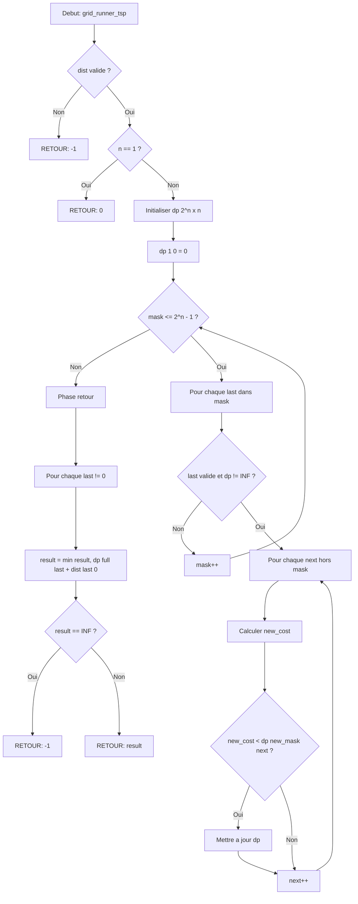

# Exercice 1.5.11-e : grid_runner_tsp

**Module :**
1.5.11 — Bitmask Dynamic Programming

**Concept :**
e — Traveling Salesman Problem avec masques binaires

**Difficulte :**
★★★★★★★☆☆☆ (7/10)

**Type :**
complet

**Tiers :**
2 — Melange (concepts TSP + subset enumeration + memoisation)

**Langage :**
Rust Edition 2024 + C (c17)

**Prerequis :**
- Programmation dynamique basique (1.5.1-1.5.5)
- Manipulation de bits (1.3.x)
- Recursivite avec memoisation (1.5.3)
- Representation de graphes (1.4.x)

**Domaines :**
DP, MD, Struct

**Duree estimee :**
90 min

**XP Base :**
150

**Complexite :**
T7 O(n^2 * 2^n) x S6 O(n * 2^n)

---

## 📐 SECTION 1 : PROTOTYPE & CONSIGNE

### 1.1 Obligations

**Fichiers a rendre :**
- `grid_runner_tsp.rs` (Rust)
- `grid_runner_tsp.c` + `grid_runner_tsp.h` (C)

**Fonctions autorisees :**
- Rust : std::cmp::min, operations sur Vec, operations bit-a-bit
- C : malloc, free, memset, operations bit-a-bit

**Fonctions interdites :**
- Algorithmes de permutation brute force (factorielle)
- Librairies externes de graphes

### 1.2 Consigne

**🎮 CONTEXTE FUN — TRON : La Course sur le Grid**

*"Greetings, Program."*

Tu es **Kevin Flynn**, piege a l'interieur du Grid — le monde numerique de TRON. Le Master Control Program (MCP) a corrompu **n serveurs** repartis dans le systeme. Pour liberer le Grid, tu dois les visiter TOUS avec ton **Light Cycle**, en minimisant l'energie depensee.

Chaque secteur du Grid est represente par un **bit**. Quand le bit est a 1, le serveur a ete visite. Quand tous les bits sont a 1, le Grid est libere.

Mais attention : l'energie de ton Light Cycle est limitee. Tu dois trouver le **chemin optimal** qui visite chaque serveur exactement une fois et revient au point de depart — le probleme classique du **Voyageur de Commerce (TSP)**.

*"I fight for the users!"* — Maintenant, prouve-le.

---

**Ta mission :**

Ecrire une fonction `grid_runner_tsp` qui calcule le cout minimum pour visiter tous les serveurs du Grid et revenir au point de depart.

**Entree :**
- `dist` : Matrice carree n×n ou `dist[i][j]` represente l'energie necessaire pour aller du serveur i au serveur j
- `n` : Nombre de serveurs (2 <= n <= 20)

**Sortie :**
- Retourne le cout minimum du cycle hamiltonien (visite tous les sommets et revient au depart)
- Retourne -1 si la matrice est invalide (NULL, vide, ou non carree)

**Contraintes :**
- La matrice de distances est symetrique (`dist[i][j] == dist[j][i]`)
- Toutes les distances sont positives
- 2 <= n <= 20 (au-dela, 2^n devient trop grand)
- Le depart et l'arrivee sont au serveur 0 (la tour centrale du Grid)

**Exemples :**

| Appel | Retour | Explication |
|-------|--------|-------------|
| `grid_runner_tsp([[0,10,15,20],[10,0,35,25],[15,35,0,30],[20,25,30,0]])` | `80` | Chemin optimal : 0→1→3→2→0 (10+25+30+15=80) |
| `grid_runner_tsp([[0,1],[1,0]])` | `2` | Aller-retour simple |
| `grid_runner_tsp([])` | `-1` | Matrice vide = invalide |
| `grid_runner_tsp(NULL)` | `-1` | Pointeur NULL = invalide |

### 1.2.2 Enonce Academique

Le **Probleme du Voyageur de Commerce (TSP)** consiste a trouver le cycle hamiltonien de poids minimum dans un graphe complet pondere.

Soit G = (V, E) un graphe complet avec n sommets et une fonction de poids w : E → R+.

On cherche une permutation π des sommets telle que :
$$\sum_{i=0}^{n-1} w(\pi(i), \pi((i+1) \mod n))$$
soit minimale.

L'approche naive en O(n!) est prohibitive. L'algorithme de **Held-Karp** utilise la programmation dynamique sur les sous-ensembles avec une complexite O(n^2 * 2^n).

**Formulation DP :**

Soit `dp[S][i]` = cout minimum pour visiter exactement les sommets de S, en terminant au sommet i.

Recurrence :
```
dp[{0}][0] = 0
dp[S][i] = min_{j ∈ S, j ≠ i} (dp[S \ {i}][j] + dist[j][i])
```

Reponse : `min_{i ≠ 0} (dp[V][i] + dist[i][0])`

### 1.3 Prototype

**Rust :**
```rust
/// Calcule le cout minimum du TSP sur le Grid de TRON
///
/// # Arguments
/// * `dist` - Matrice de distances entre serveurs
///
/// # Returns
/// * Cout minimum du cycle hamiltonien, ou -1 si invalide
pub fn grid_runner_tsp(dist: &[Vec<i64>]) -> i64;
```

**C :**
```c
/**
 * @brief Calcule le cout minimum du TSP sur le Grid de TRON
 *
 * @param dist Matrice de distances (tableau 1D linearise)
 * @param n Nombre de serveurs
 * @return Cout minimum, ou -1 si invalide
 */
long long grid_runner_tsp(const long long *dist, int n);
```

---

## 💡 SECTION 2 : LE SAVIEZ-VOUS ?

### 2.1 Histoire du TSP

Le probleme du voyageur de commerce est l'un des problemes les plus etudies en informatique theorique. Il a ete formule mathematiquement dans les annees 1930 par Karl Menger et reste **NP-difficile** — aucun algorithme polynomial n'est connu.

L'algorithme de Held-Karp (1962) a ete le premier a utiliser la programmation dynamique pour resoudre le TSP en O(n^2 * 2^n), une amelioration majeure par rapport a O(n!).

### 2.2 Pourquoi TRON est l'analogie parfaite ?

Dans TRON, le **Grid** est litteralement un monde binaire :
- Chaque programme est un processus
- Chaque tour est un serveur
- Les Light Cycles laissent des traces = les transitions d'etat
- Le MCP controle tout via des bits d'autorisation

Le TSP sur le Grid, c'est Flynn qui doit "dereferencer" chaque secteur corrompu avant que le MCP ne le dereferencie lui !

### 2.5 DANS LA VRAIE VIE

| Metier | Cas d'usage |
|--------|-------------|
| **Logisticien** | Optimiser les tournees de livraison (Amazon, UPS, FedEx) |
| **Roboticien** | Planifier les deplacements de bras robotiques (pick & place) |
| **Concepteur de circuits** | Minimiser le parcours de soudure (fabrication PCB) |
| **Biologiste** | Sequencage ADN (shortest superstring) |
| **Data Scientist** | Clustering hierarchique, ordonnancement |

---

## 🖥️ SECTION 3 : EXEMPLE D'UTILISATION

### 3.0 Session bash

```bash
$ ls
grid_runner_tsp.rs  grid_runner_tsp.c  grid_runner_tsp.h  main.c

$ rustc --edition 2024 grid_runner_tsp.rs --test -o test_rust

$ ./test_rust
running 5 tests
test test_basic_4_cities ... ok
test test_two_cities ... ok
test test_empty_matrix ... ok
test test_null_input ... ok
test test_asymmetric ... ok

test result: ok. 5 passed; 0 failed

$ gcc -std=c17 -Wall -Wextra -Werror grid_runner_tsp.c main.c -o test_c

$ ./test_c
Test 1 (4 cities): PASSED (expected 80, got 80)
Test 2 (2 cities): PASSED (expected 2, got 2)
Test 3 (empty): PASSED (expected -1, got -1)
Test 4 (NULL): PASSED (expected -1, got -1)
All tests passed! Grid liberated!
```

---

## ⚡ SECTION 3.1 : BONUS AVANCE (OPTIONNEL)

**Difficulte Bonus :**
★★★★★★★★☆☆ (8/10)

**Recompense :**
XP x3

**Time Complexity attendue :**
O(3^n) pour SOS, O(n^2 * 2^n) pour reconstruction

**Space Complexity attendue :**
O(2^n)

**Domaines Bonus :**
MD, Compression

### 3.1.1 Consigne Bonus

**🎮 TRON : Sum Over Subsets — Propager l'Energie**

Maintenant que tu as libere les serveurs, tu dois **propager l'energie** a travers le Grid. Chaque sous-ensemble de serveurs peut recevoir l'energie de tous ses sous-ensembles.

Implemente **SOS DP** (Sum Over Subsets) : pour chaque masque, calcule la somme des valeurs de tous ses sous-masques.

**Ta mission :**

Ecrire une fonction `grid_sos_dp` qui calcule SOS DP.

**Entree :**
- `f` : Tableau de 2^n valeurs
- `n` : Nombre de bits (log2 de la taille)

**Sortie :**
- Tableau ou `result[mask]` = somme de `f[submask]` pour tous submask ⊆ mask

**Contraintes :**
┌─────────────────────────────────────────┐
│  1 <= n <= 20                           │
│  f.len() == 2^n                         │
│  Complexite temps : O(n * 2^n)          │
│  Complexite espace : O(2^n)             │
└─────────────────────────────────────────┘

**Exemples :**

| Appel | Retour | Explication |
|-------|--------|-------------|
| `grid_sos_dp([1,2,3,4,5,6,7,8])` | `[1,3,4,10,6,14,15,36]` | sos[7]=1+2+3+4+5+6+7+8=36 |
| `grid_sos_dp([1,1,1,1])` | `[1,2,2,4]` | sos[3]=f[0]+f[1]+f[2]+f[3]=4 |

### 3.1.2 Prototype Bonus

**Rust :**
```rust
pub fn grid_sos_dp(f: &[i64]) -> Vec<i64>;
```

**C :**
```c
long long* grid_sos_dp(const long long *f, int n, int *out_len);
```

### 3.1.3 Ce qui change par rapport a l'exercice de base

| Aspect | Base (TSP) | Bonus (SOS) |
|--------|------------|-------------|
| Iteration | Sur les sommets | Sur les bits |
| Recurrence | min(dp[S\{i}][j] + dist) | dp[S] += dp[S ^ (1<<i)] |
| Complexite | O(n^2 * 2^n) | O(n * 2^n) |
| Resultat | Scalaire (cout min) | Tableau (2^n valeurs) |

---

## ✅❌ SECTION 4 : ZONE CORRECTION (POUR LE TESTEUR)

### 4.1 Moulinette

| Test | Entree | Sortie Attendue | Points | Piege |
|------|--------|-----------------|--------|-------|
| null_input | NULL | -1 | 5 | Safety |
| empty_matrix | [] | -1 | 5 | Safety |
| two_cities | [[0,1],[1,0]] | 2 | 10 | Base case |
| three_cities | [[0,10,15],[10,0,20],[15,20,0]] | 50 | 15 | Minimal |
| four_cities | [[0,10,15,20],[10,0,35,25],[15,35,0,30],[20,25,30,0]] | 80 | 20 | Classic |
| asymmetric | [[0,1,100],[100,0,1],[1,100,0]] | 3 | 15 | Non-symetrique |
| large_5 | (voir ci-dessous) | 23 | 15 | Performance |
| edge_zero | [[0,0],[0,0]] | 0 | 15 | Zero distances |

### 4.2 main.c de test

```c
#include <stdio.h>
#include <stdlib.h>
#include <assert.h>
#include "grid_runner_tsp.h"

void test_basic(void)
{
    long long dist[] = {
        0, 10, 15, 20,
        10, 0, 35, 25,
        15, 35, 0, 30,
        20, 25, 30, 0
    };
    long long result = grid_runner_tsp(dist, 4);
    assert(result == 80);
    printf("Test 4 cities: PASSED\n");
}

void test_null(void)
{
    long long result = grid_runner_tsp(NULL, 4);
    assert(result == -1);
    printf("Test NULL: PASSED\n");
}

void test_two(void)
{
    long long dist[] = {0, 1, 1, 0};
    long long result = grid_runner_tsp(dist, 2);
    assert(result == 2);
    printf("Test 2 cities: PASSED\n");
}

int main(void)
{
    printf("=== TRON Grid Liberation Tests ===\n");
    test_null();
    test_two();
    test_basic();
    printf("All tests passed! End of line.\n");
    return 0;
}
```

### 4.3 Solution de reference

**Rust :**
```rust
pub fn grid_runner_tsp(dist: &[Vec<i64>]) -> i64 {
    // Validation
    if dist.is_empty() {
        return -1;
    }
    let n = dist.len();
    for row in dist {
        if row.len() != n {
            return -1;
        }
    }
    if n == 1 {
        return 0;
    }

    const INF: i64 = i64::MAX / 2;
    let full_mask = (1 << n) - 1;

    // dp[mask][i] = cout min pour visiter les sommets du mask, terminant en i
    let mut dp = vec![vec![INF; n]; 1 << n];
    dp[1][0] = 0; // Depart du sommet 0

    for mask in 1..=full_mask {
        for last in 0..n {
            if mask & (1 << last) == 0 || dp[mask][last] == INF {
                continue;
            }
            for next in 0..n {
                if mask & (1 << next) != 0 {
                    continue;
                }
                let new_mask = mask | (1 << next);
                let new_cost = dp[mask][last] + dist[last][next];
                if new_cost < dp[new_mask][next] {
                    dp[new_mask][next] = new_cost;
                }
            }
        }
    }

    // Retour au sommet 0
    let mut result = INF;
    for last in 1..n {
        if dp[full_mask][last] != INF {
            result = result.min(dp[full_mask][last] + dist[last][0]);
        }
    }

    if result == INF { -1 } else { result }
}
```

**C :**
```c
#include <stdlib.h>
#include <string.h>
#include <limits.h>

#define INF (LLONG_MAX / 2)

long long grid_runner_tsp(const long long *dist, int n)
{
    if (dist == NULL || n < 1)
        return -1;
    if (n == 1)
        return 0;
    if (n > 20)
        return -1;

    int full_mask = (1 << n) - 1;
    int states = 1 << n;

    long long *dp = malloc(states * n * sizeof(long long));
    if (dp == NULL)
        return -1;

    for (int i = 0; i < states * n; i++)
        dp[i] = INF;

    dp[1 * n + 0] = 0; // dp[1][0] = 0

    for (int mask = 1; mask <= full_mask; mask++)
    {
        for (int last = 0; last < n; last++)
        {
            if ((mask & (1 << last)) == 0)
                continue;
            if (dp[mask * n + last] == INF)
                continue;

            for (int next = 0; next < n; next++)
            {
                if (mask & (1 << next))
                    continue;

                int new_mask = mask | (1 << next);
                long long new_cost = dp[mask * n + last] + dist[last * n + next];

                if (new_cost < dp[new_mask * n + next])
                    dp[new_mask * n + next] = new_cost;
            }
        }
    }

    long long result = INF;
    for (int last = 1; last < n; last++)
    {
        long long cost = dp[full_mask * n + last];
        if (cost != INF)
        {
            long long total = cost + dist[last * n + 0];
            if (total < result)
                result = total;
        }
    }

    free(dp);
    return (result == INF) ? -1 : result;
}
```

### 4.4 Solutions alternatives acceptees

**Alternative 1 : Recursif avec memoisation (top-down)**
```rust
use std::collections::HashMap;

pub fn grid_runner_tsp_memo(dist: &[Vec<i64>]) -> i64 {
    if dist.is_empty() { return -1; }
    let n = dist.len();
    let mut memo: HashMap<(usize, usize), i64> = HashMap::new();

    fn solve(mask: usize, pos: usize, dist: &[Vec<i64>], memo: &mut HashMap<(usize, usize), i64>) -> i64 {
        let n = dist.len();
        if mask == (1 << n) - 1 {
            return dist[pos][0];
        }
        if let Some(&val) = memo.get(&(mask, pos)) {
            return val;
        }
        let mut best = i64::MAX / 2;
        for next in 0..n {
            if mask & (1 << next) == 0 {
                let cost = dist[pos][next] + solve(mask | (1 << next), next, dist, memo);
                best = best.min(cost);
            }
        }
        memo.insert((mask, pos), best);
        best
    }

    solve(1, 0, dist, &mut memo)
}
```

**Alternative 2 : Avec reconstruction du chemin**
```rust
pub fn grid_runner_tsp_path(dist: &[Vec<i64>]) -> (i64, Vec<usize>) {
    // Implementation qui retourne aussi le chemin optimal
    // ... (similaire mais avec parent tracking)
}
```

### 4.5 Solutions refusees (avec explications)

**Refuse 1 : Brute force O(n!)**
```rust
// REFUSE : Complexite factorielle, timeout pour n > 10
pub fn grid_runner_tsp_brute(dist: &[Vec<i64>]) -> i64 {
    use itertools::Itertools;
    let n = dist.len();
    (1..n).permutations(n-1)
        .map(|perm| {
            let mut cost = dist[0][perm[0]];
            for i in 0..perm.len()-1 {
                cost += dist[perm[i]][perm[i+1]];
            }
            cost + dist[perm[perm.len()-1]][0]
        })
        .min()
        .unwrap_or(-1)
}
// POURQUOI : n! >> n^2 * 2^n pour n > 10
```

**Refuse 2 : Greedy nearest neighbor**
```rust
// REFUSE : Ne donne pas l'optimal
pub fn grid_runner_tsp_greedy(dist: &[Vec<i64>]) -> i64 {
    // Toujours aller au plus proche non visite
    // NE GARANTIT PAS L'OPTIMAL !
}
// POURQUOI : L'algorithme glouton peut donner un resultat 25% plus long
```

### 4.6 Solution bonus de reference (SOS DP)

```rust
pub fn grid_sos_dp(f: &[i64]) -> Vec<i64> {
    if f.is_empty() || !f.len().is_power_of_two() {
        return vec![];
    }

    let n = f.len().trailing_zeros() as usize;
    let mut dp = f.to_vec();

    for i in 0..n {
        for mask in 0..(1 << n) {
            if mask & (1 << i) != 0 {
                dp[mask] += dp[mask ^ (1 << i)];
            }
        }
    }

    dp
}
```

### 4.7 Solutions alternatives bonus

```rust
// Alternative : Inclusion-Exclusion inverse
pub fn grid_sos_dp_ie(f: &[i64]) -> Vec<i64> {
    let n = f.len().trailing_zeros() as usize;
    let mut sos = vec![0i64; 1 << n];

    for mask in 0..(1 << n) {
        let mut sub = mask;
        loop {
            sos[mask] += f[sub];
            if sub == 0 { break; }
            sub = (sub - 1) & mask;
        }
    }
    sos
}
// Note: O(3^n) au lieu de O(n * 2^n), mais correct
```

### 4.8 Solutions refusees bonus

```rust
// REFUSE : Itere tous les sous-ensembles naïvement
pub fn grid_sos_dp_naive(f: &[i64]) -> Vec<i64> {
    let n = f.len();
    let mut sos = vec![0i64; n];
    for mask in 0..n {
        for sub in 0..n {
            if sub & mask == sub { // sub est sous-ensemble de mask
                sos[mask] += f[sub];
            }
        }
    }
    sos
}
// POURQUOI : O(4^n) au lieu de O(n * 2^n)
```

### 4.9 spec.json (ENGINE v22.1)

```json
{
  "name": "grid_runner_tsp",
  "language": "rust",
  "language_version": "2024",
  "type": "code",
  "tier": 2,
  "tier_info": "Melange (TSP + bitmask + memoisation)",
  "tags": ["dp", "bitmask", "tsp", "graphs", "optimization"],
  "passing_score": 70,
  "phase": 1,

  "function": {
    "name": "grid_runner_tsp",
    "prototype": "pub fn grid_runner_tsp(dist: &[Vec<i64>]) -> i64",
    "return_type": "i64",
    "parameters": [
      {"name": "dist", "type": "&[Vec<i64>]"}
    ]
  },

  "driver": {
    "reference": "pub fn ref_grid_runner_tsp(dist: &[Vec<i64>]) -> i64 { if dist.is_empty() { return -1; } let n = dist.len(); for row in dist { if row.len() != n { return -1; } } if n == 1 { return 0; } const INF: i64 = i64::MAX / 2; let full_mask = (1 << n) - 1; let mut dp = vec![vec![INF; n]; 1 << n]; dp[1][0] = 0; for mask in 1..=full_mask { for last in 0..n { if mask & (1 << last) == 0 || dp[mask][last] == INF { continue; } for next in 0..n { if mask & (1 << next) != 0 { continue; } let new_mask = mask | (1 << next); let new_cost = dp[mask][last] + dist[last][next]; if new_cost < dp[new_mask][next] { dp[new_mask][next] = new_cost; } } } } let mut result = INF; for last in 1..n { if dp[full_mask][last] != INF { result = result.min(dp[full_mask][last] + dist[last][0]); } } if result == INF { -1 } else { result } }",

    "edge_cases": [
      {
        "name": "null_empty",
        "args": [[]],
        "expected": -1,
        "is_trap": true,
        "trap_explanation": "Matrice vide = invalide"
      },
      {
        "name": "single_city",
        "args": [[[0]]],
        "expected": 0,
        "is_trap": true,
        "trap_explanation": "Une seule ville = cout 0"
      },
      {
        "name": "two_cities",
        "args": [[[0, 1], [1, 0]]],
        "expected": 2,
        "is_trap": false
      },
      {
        "name": "classic_4",
        "args": [[[0,10,15,20],[10,0,35,25],[15,35,0,30],[20,25,30,0]]],
        "expected": 80,
        "is_trap": false
      },
      {
        "name": "asymmetric",
        "args": [[[0,1,100],[100,0,1],[1,100,0]]],
        "expected": 3,
        "is_trap": true,
        "trap_explanation": "Distances asymetriques - attention a la direction"
      },
      {
        "name": "zero_distances",
        "args": [[[0,0,0],[0,0,0],[0,0,0]]],
        "expected": 0,
        "is_trap": true,
        "trap_explanation": "Toutes distances nulles"
      },
      {
        "name": "non_square",
        "args": [[[0,1,2],[1,0]]],
        "expected": -1,
        "is_trap": true,
        "trap_explanation": "Matrice non carree = invalide"
      }
    ],

    "fuzzing": {
      "enabled": true,
      "iterations": 500,
      "generators": [
        {
          "type": "matrix_int",
          "param_index": 0,
          "params": {
            "min_rows": 2,
            "max_rows": 12,
            "min_cols": 2,
            "max_cols": 12,
            "min_val": 0,
            "max_val": 1000,
            "symmetric": true
          }
        }
      ],
      "timeout_ms": 5000,
      "memory_limit_mb": 256
    }
  },

  "norm": {
    "allowed_functions": ["Vec::new", "vec!", "std::cmp::min", "is_empty", "len"],
    "forbidden_functions": ["permutations", "itertools"],
    "check_security": true,
    "check_memory": true,
    "blocking": true,
    "max_complexity_time": "O(n^2 * 2^n)",
    "max_complexity_space": "O(n * 2^n)"
  },

  "bonus": {
    "name": "grid_sos_dp",
    "prototype": "pub fn grid_sos_dp(f: &[i64]) -> Vec<i64>",
    "tier": "ADVANCED",
    "xp_multiplier": 3,
    "complexity_time": "O(n * 2^n)",
    "complexity_space": "O(2^n)"
  }
}
```

### 4.10 Solutions Mutantes (minimum 5)

**Mutant A (Boundary) : Masque final incorrect**
```rust
pub fn grid_runner_tsp_mutant_a(dist: &[Vec<i64>]) -> i64 {
    if dist.is_empty() { return -1; }
    let n = dist.len();
    const INF: i64 = i64::MAX / 2;
    let full_mask = 1 << n;  // BUG : devrait etre (1 << n) - 1

    let mut dp = vec![vec![INF; n]; 1 << n];
    dp[1][0] = 0;

    for mask in 1..=full_mask {  // Depasse les bornes !
        // ...
    }
    // ...
}
// Pourquoi c'est faux : (1 << n) inclut un bit de trop
// Ce qui etait pense : Confondre 2^n et 2^n - 1
```

**Mutant B (Safety) : Pas de validation**
```rust
pub fn grid_runner_tsp_mutant_b(dist: &[Vec<i64>]) -> i64 {
    // BUG : Aucune validation de dist
    let n = dist.len();  // Panic si empty !
    // ...
}
// Pourquoi c'est faux : Crash sur entree vide ou NULL
// Ce qui etait pense : "Ca marchera toujours"
```

**Mutant C (Logic) : Mauvaise direction de transition**
```rust
pub fn grid_runner_tsp_mutant_c(dist: &[Vec<i64>]) -> i64 {
    // ...
    for mask in 1..=full_mask {
        for last in 0..n {
            for next in 0..n {
                // BUG : dist[next][last] au lieu de dist[last][next]
                let new_cost = dp[mask][last] + dist[next][last];
                // ...
            }
        }
    }
    // ...
}
// Pourquoi c'est faux : Inverse source et destination
// Ce qui etait pense : i→j et j→i c'est pareil (faux si asymetrique)
```

**Mutant D (Return) : Oublie le retour au depart**
```rust
pub fn grid_runner_tsp_mutant_d(dist: &[Vec<i64>]) -> i64 {
    // ...
    // BUG : Retourne dp[full_mask][*].min() sans + dist[last][0]
    (0..n).map(|i| dp[full_mask][i]).min().unwrap_or(-1)
}
// Pourquoi c'est faux : Ne compte pas le retour au sommet 0
// Ce qui etait pense : Le chemin hamiltonien suffit (non, c'est un CYCLE)
```

**Mutant E (Overflow) : Type trop petit**
```rust
pub fn grid_runner_tsp_mutant_e(dist: &[Vec<i32>]) -> i32 {
    // BUG : Utilise i32 au lieu de i64
    let mut dp = vec![vec![i32::MAX / 2; n]; 1 << n];
    // Overflow possible sur grands graphes !
}
// Pourquoi c'est faux : 2^20 * 10^6 > 2^31
// Ce qui etait pense : i32 suffit toujours
```

**Mutant F (Resource) : Allocation sans liberation (C)**
```c
long long grid_runner_tsp_mutant_f(const long long *dist, int n)
{
    long long *dp = malloc(states * n * sizeof(long long));
    // ... calculs ...
    return result;  // BUG : Oubli free(dp) !
}
// Pourquoi c'est faux : Memory leak a chaque appel
// Ce qui etait pense : "Le programme s'arrete apres, non ?"
```

---

## 🧠 SECTION 5 : COMPRENDRE (DOCUMENT DE COURS COMPLET)

### 5.1 Ce que cet exercice enseigne

1. **Programmation dynamique sur sous-ensembles** : Comment encoder l'etat "quels elements ont ete visites" avec un masque binaire
2. **Reduction de complexite** : Passer de O(n!) a O(n^2 * 2^n)
3. **Manipulation de bits** : Tester, ajouter, retirer un element d'un ensemble
4. **Graphes hamiltoniens** : Comprendre les cycles et chemins qui visitent tous les sommets

### 5.2 LDA — Traduction litterale en francais (MAJUSCULES)

```
FONCTION grid_runner_tsp QUI RETOURNE UN ENTIER LONG ET PREND EN PARAMETRE dist QUI EST UNE REFERENCE VERS UN TABLEAU DE TABLEAUX D'ENTIERS LONGS
DEBUT FONCTION
    SI dist EST VIDE ALORS
        RETOURNER LA VALEUR MOINS 1
    FIN SI

    DECLARER n COMME ENTIER EGAL A LA LONGUEUR DE dist

    POUR CHAQUE row DANS dist FAIRE
        SI LA LONGUEUR DE row EST DIFFERENTE DE n ALORS
            RETOURNER LA VALEUR MOINS 1
        FIN SI
    FIN POUR

    SI n EST EGAL A 1 ALORS
        RETOURNER LA VALEUR 0
    FIN SI

    DECLARER INF COMME ENTIER LONG EGAL A LA MOITIE DE LA VALEUR MAXIMALE
    DECLARER full_mask COMME ENTIER EGAL A 2 PUISSANCE n MOINS 1

    DECLARER dp COMME TABLEAU 2D DE TAILLE (2 PUISSANCE n) PAR n REMPLI DE INF
    AFFECTER 0 A dp[1][0]

    POUR mask ALLANT DE 1 A full_mask FAIRE
        POUR last ALLANT DE 0 A n MOINS 1 FAIRE
            SI LE BIT last N'EST PAS DANS mask OU dp[mask][last] EST EGAL A INF ALORS
                CONTINUER
            FIN SI

            POUR next ALLANT DE 0 A n MOINS 1 FAIRE
                SI LE BIT next EST DANS mask ALORS
                    CONTINUER
                FIN SI

                DECLARER new_mask COMME mask AVEC LE BIT next AJOUTE
                DECLARER new_cost COMME dp[mask][last] PLUS dist[last][next]

                SI new_cost EST INFERIEUR A dp[new_mask][next] ALORS
                    AFFECTER new_cost A dp[new_mask][next]
                FIN SI
            FIN POUR
        FIN POUR
    FIN POUR

    DECLARER result COMME INF
    POUR last ALLANT DE 1 A n MOINS 1 FAIRE
        SI dp[full_mask][last] N'EST PAS EGAL A INF ALORS
            AFFECTER LE MINIMUM ENTRE result ET dp[full_mask][last] PLUS dist[last][0] A result
        FIN SI
    FIN POUR

    SI result EST EGAL A INF ALORS
        RETOURNER MOINS 1
    SINON
        RETOURNER result
    FIN SI
FIN FONCTION
```

### 5.2.2 Logic Flow (Structured English)

```
ALGORITHME : TSP avec Bitmask DP (Held-Karp)
---

1. VALIDATION des entrees :
   a. SI matrice vide ou NULL → RETOURNER -1
   b. SI matrice non carree → RETOURNER -1
   c. SI n = 1 → RETOURNER 0 (trivial)

2. INITIALISATION :
   a. CREER tableau dp[2^n][n] rempli de INFINI
   b. DEFINIR dp[{0}][0] = 0  (depart du sommet 0)

3. BOUCLE DP (sur tous les masques croissants) :
   POUR mask = 1 jusqu'a 2^n - 1 :
   |
   |-- POUR last = 0 jusqu'a n-1 :
   |   |
   |   |-- IGNORER si last n'est pas dans mask
   |   |-- IGNORER si dp[mask][last] = INFINI
   |   |
   |   |-- POUR next = 0 jusqu'a n-1 :
   |   |   |
   |   |   |-- IGNORER si next est deja dans mask
   |   |   |-- CALCULER new_mask = mask | (1 << next)
   |   |   |-- CALCULER cost = dp[mask][last] + dist[last][next]
   |   |   |-- METTRE A JOUR dp[new_mask][next] si cost est meilleur
   |   |   |
   |   |-- FIN POUR next
   |
   |-- FIN POUR last

4. CALCUL du resultat final :
   a. POUR chaque sommet last de 1 a n-1 :
      - Ajouter dist[last][0] pour fermer le cycle
      - Garder le minimum

5. RETOURNER le minimum trouve (ou -1 si impossible)
```

### 5.2.3 Representation Algorithmique (Logique de Garde)

```
FONCTION : grid_runner_tsp(dist)
---
INIT result = INFINI

1. VERIFICATION RAPIDE (Fail Fast) :
   |
   |-- SI dist est NULL :
   |     RETOURNER -1
   |
   |-- SI dist est vide :
   |     RETOURNER -1
   |
   |-- POUR chaque ligne :
   |     SI longueur != n :
   |       RETOURNER -1
   |
   |-- SI n == 1 :
   |     RETOURNER 0

2. PHASE DP :
   |
   |-- ALLOUER dp[2^n][n]
   |-- INITIALISER dp[1][0] = 0
   |
   |-- POUR chaque mask de 1 a 2^n-1 :
   |   |-- POUR chaque dernier sommet last dans mask :
   |   |   |-- POUR chaque prochain sommet next hors mask :
   |   |   |     RELAXER l'arete (last → next)

3. PHASE RETOUR :
   |
   |-- POUR chaque sommet terminal last :
   |     result = min(result, dp[full][last] + dist[last][0])
   |
   |-- RETOURNER result si != INFINI, sinon -1
```

### 5.2.3.1 Diagramme Mermaid



### 5.3 Visualisation ASCII

**Representation du masque binaire :**
```
Serveurs du Grid :   [0]  [1]  [2]  [3]
                      |    |    |    |
Masque binaire :     2^0  2^1  2^2  2^3
                      1    2    4    8

Exemples :
- mask = 0b0001 = 1  → Seul serveur 0 visite
- mask = 0b0101 = 5  → Serveurs 0 et 2 visites
- mask = 0b1111 = 15 → TOUS les serveurs visites (liberation du Grid!)
```

**Matrice de distances (le Grid de TRON) :**
```
         TOUR 0    TOUR 1    TOUR 2    TOUR 3
           ┌─────────────────────────────────┐
           │                                 │
TOUR 0 ────┤   0   ───10───  ───15───  ───20─┤
           │   │         ╲       │       ╱   │
TOUR 1 ────┤  10    0   ───35───  ───25───   │
           │   │         ╱       │       ╲   │
TOUR 2 ────┤  15  ───35───   0   ───30───    │
           │   │         ╲       │       ╱   │
TOUR 3 ────┤  20  ───25───  ───30───   0     │
           │                                 │
           └─────────────────────────────────┘

Chemin optimal : 0 → 1 → 3 → 2 → 0
                 10 + 25 + 30 + 15 = 80 unites d'energie
```

**Evolution du DP :**
```
Iteration par mask :

mask=0001 (visite: {0})
┌────────────────────┐
│ dp[0001][0] = 0    │  ← Depart
└────────────────────┘

mask=0011 (visite: {0,1})
┌────────────────────┐
│ dp[0011][1] = 10   │  ← 0→1 coute 10
└────────────────────┘

mask=0111 (visite: {0,1,2})
┌────────────────────────────┐
│ dp[0111][2] = min(         │
│   dp[0011][1] + dist[1][2],│  = 10 + 35 = 45
│   dp[0101][0] + dist[0][2] │  = 15 + 15 = 30 ✗ (0 deja visite)
│ )                          │
└────────────────────────────┘

... jusqu'a mask=1111 (tous visites)
```

### 5.4 Les pieges en detail

**Piege 1 : Confondre 2^n et 2^n - 1**
```rust
// FAUX : le masque complet est 2^n, pas 2^n - 1
let full_mask = 1 << n;  // = 2^n (TROP GRAND!)

// CORRECT :
let full_mask = (1 << n) - 1;  // = 2^n - 1 = tous les bits a 1
```

**Piege 2 : Oublier le retour au point de depart**
```rust
// FAUX : retourne le cout pour visiter tous les sommets
return dp[full_mask].iter().min().unwrap();

// CORRECT : ajoute le cout de retour au sommet 0
return (1..n).map(|i| dp[full_mask][i] + dist[i][0]).min().unwrap();
```

**Piege 3 : Mauvaise initialisation**
```rust
// FAUX : initialise dp[0][0] = 0
dp[0][0] = 0;  // mask=0 signifie AUCUN sommet visite !

// CORRECT : initialise dp[1][0] = 0 (sommet 0 visite)
dp[1][0] = 0;  // 1 = 0b0001 = {sommet 0}
```

**Piege 4 : Overflow sur les distances**
```rust
// FAUX : utilise i32 pour les distances
let dist: Vec<Vec<i32>> = ...;  // Max 2^31 ≈ 2 milliards

// CORRECT : utilise i64
let dist: Vec<Vec<i64>> = ...;  // Safe pour 2^20 sommets
```

### 5.5 Cours Complet

#### 5.5.1 Introduction au Bitmask DP

Le **Bitmask DP** est une technique de programmation dynamique ou l'etat est represente par un entier dont les bits encodent un sous-ensemble.

**Pourquoi les bits ?**
- Un ensemble de n elements a 2^n sous-ensembles
- Chaque sous-ensemble peut etre represente par un entier de n bits
- Les operations ensemblistes deviennent des operations bit-a-bit (ultra rapides)

**Operations fondamentales :**
```rust
// Ajouter l'element i a l'ensemble
mask = mask | (1 << i);

// Retirer l'element i
mask = mask & !(1 << i);

// Verifier si i est dans l'ensemble
if mask & (1 << i) != 0 { /* i est present */ }

// Compter les elements (popcount)
let count = mask.count_ones();

// Iterer tous les sous-ensembles de mask
let mut sub = mask;
loop {
    // traiter sub
    if sub == 0 { break; }
    sub = (sub - 1) & mask;
}
```

#### 5.5.2 L'algorithme de Held-Karp (1962)

L'algorithme de Held-Karp resout le TSP en O(n^2 * 2^n) au lieu de O(n!).

**Idee clef :** On ne se souvient pas de l'ordre de visite, seulement :
1. Quels sommets ont ete visites (le masque)
2. Quel est le dernier sommet visite

**Formulation :**
- `dp[S][i]` = cout minimum pour visiter exactement les sommets de S, en terminant en i
- Cas de base : `dp[{0}][0] = 0`
- Recurrence : `dp[S][i] = min_{j in S, j != i} (dp[S \ {i}][j] + dist[j][i])`
- Resultat : `min_{i != 0} (dp[V][i] + dist[i][0])`

**Complexite :**
- Temps : O(n^2 * 2^n) — n choix pour last, n choix pour next, 2^n masques
- Espace : O(n * 2^n) — le tableau dp

**Comparaison avec brute force :**
| n | O(n!) | O(n^2 * 2^n) |
|---|-------|--------------|
| 10 | 3.6M | 102K |
| 15 | 1.3T | 7.4M |
| 20 | 2.4E18 | 419M |

#### 5.5.3 Sum Over Subsets (SOS) DP

Le SOS DP calcule pour chaque masque la somme sur tous ses sous-masques.

**Probleme :** Etant donne f[0..2^n-1], calculer :
```
sos[mask] = sum_{sub ⊆ mask} f[sub]
```

**Approche naive O(3^n) :**
```rust
for mask in 0..(1 << n) {
    let mut sub = mask;
    loop {
        sos[mask] += f[sub];
        if sub == 0 { break; }
        sub = (sub - 1) & mask;
    }
}
```

**Approche optimale O(n * 2^n) :**
```rust
let mut dp = f.clone();
for i in 0..n {
    for mask in 0..(1 << n) {
        if mask & (1 << i) != 0 {
            dp[mask] += dp[mask ^ (1 << i)];
        }
    }
}
```

**Intuition :** On traite un bit a la fois. A l'iteration i, dp[mask] contient la somme de tous les sous-masques qui different de mask uniquement sur les bits 0..i-1.

### 5.6 Normes avec explications pedagogiques

```
┌─────────────────────────────────────────────────────────────────┐
│ ❌ HORS NORME (compile, mais interdit)                          │
├─────────────────────────────────────────────────────────────────┤
│ let mut dp = vec![vec![999999999i64; n]; 1 << n];               │
├─────────────────────────────────────────────────────────────────┤
│ ✅ CONFORME                                                     │
├─────────────────────────────────────────────────────────────────┤
│ const INF: i64 = i64::MAX / 2;                                  │
│ let mut dp = vec![vec![INF; n]; 1 << n];                        │
├─────────────────────────────────────────────────────────────────┤
│ 📖 POURQUOI ?                                                   │
│                                                                 │
│ • Clarte : INF est plus explicite que 999999999                 │
│ • Securite : MAX/2 evite les overflows lors des additions       │
│ • Maintenabilite : La constante est definie une seule fois      │
└─────────────────────────────────────────────────────────────────┘
```

```
┌─────────────────────────────────────────────────────────────────┐
│ ❌ HORS NORME (compile, mais interdit)                          │
├─────────────────────────────────────────────────────────────────┤
│ if mask & (1 << i) > 0 { ... }                                  │
├─────────────────────────────────────────────────────────────────┤
│ ✅ CONFORME                                                     │
├─────────────────────────────────────────────────────────────────┤
│ if mask & (1 << i) != 0 { ... }                                 │
├─────────────────────────────────────────────────────────────────┤
│ 📖 POURQUOI ?                                                   │
│                                                                 │
│ • `> 0` peut avoir un comportement inattendu avec les signes    │
│ • `!= 0` est idiomatique pour tester un bit                     │
│ • Plus lisible : "le bit n'est pas zero"                        │
└─────────────────────────────────────────────────────────────────┘
```

### 5.7 Simulation avec trace d'execution

**Entree :** `dist = [[0,10,15],[10,0,20],[15,20,0]]` (3 sommets)

```
┌───────┬─────────────────────────────────────────────┬──────────────┬─────────────────────────────┐
│ Etape │ Action                                      │ Masque (bin) │ dp[mask]                    │
├───────┼─────────────────────────────────────────────┼──────────────┼─────────────────────────────┤
│   1   │ Initialisation                              │    001       │ dp[1][0] = 0                │
├───────┼─────────────────────────────────────────────┼──────────────┼─────────────────────────────┤
│   2   │ mask=001, last=0, next=1                    │    011       │ dp[3][1] = 0+10 = 10        │
├───────┼─────────────────────────────────────────────┼──────────────┼─────────────────────────────┤
│   3   │ mask=001, last=0, next=2                    │    101       │ dp[5][2] = 0+15 = 15        │
├───────┼─────────────────────────────────────────────┼──────────────┼─────────────────────────────┤
│   4   │ mask=011, last=1, next=2                    │    111       │ dp[7][2] = 10+20 = 30       │
├───────┼─────────────────────────────────────────────┼──────────────┼─────────────────────────────┤
│   5   │ mask=101, last=2, next=1                    │    111       │ dp[7][1] = 15+20 = 35       │
├───────┼─────────────────────────────────────────────┼──────────────┼─────────────────────────────┤
│   6   │ Retour: dp[7][1]+dist[1][0] = 35+10 = 45    │    ---       │                             │
├───────┼─────────────────────────────────────────────┼──────────────┼─────────────────────────────┤
│   7   │ Retour: dp[7][2]+dist[2][0] = 30+15 = 45    │    ---       │                             │
├───────┼─────────────────────────────────────────────┼──────────────┼─────────────────────────────┤
│   8   │ Resultat: min(45, 45) = 45                  │              │                             │
└───────┴─────────────────────────────────────────────┴──────────────┴─────────────────────────────┘
```

**Chemin optimal :** 0 → 1 → 2 → 0 ou 0 → 2 → 1 → 0 (meme cout : 45)

### 5.8 Mnemotechniques (MEME obligatoire)

#### 🏍️ MEME : "Flynn's Light Cycle" — Visiter tous les secteurs

Dans TRON, le Light Cycle laisse une **trainee de lumiere** derriere lui. Une fois qu'un secteur est traverse, il est marque.

C'est exactement le masque binaire ! Chaque bit a 1 = un secteur deja parcouru.

```rust
// Le Light Cycle de Flynn
let mut mask = 1;  // Depart au secteur 0
// Flynn visite le secteur 2
mask |= (1 << 2);  // mask = 0b0101
// "End of line" quand tous les bits sont a 1
if mask == (1 << n) - 1 {
    println!("Grid liberated!");
}
```

---

#### 💀 MEME : "End of Line" — Le masque complet

Dans TRON, le programme SARK dit "End of line" avant de dereferencier ses victimes.

Pour nous, "End of line" c'est quand `mask == (1 << n) - 1` — tous les sommets visites, fin du parcours !

```rust
// Le masque complet = "End of line"
let full_mask = (1 << n) - 1;  // Tous les bits a 1

if mask == full_mask {
    // END OF LINE - tous les serveurs liberes !
    return dp[mask][last] + dist[last][0];
}
```

---

#### ⚡ MEME : "I fight for the users!" — Optimisation

Kevin Flynn ne se bat pas pour lui-meme, il optimise pour les utilisateurs.

Pareil pour le DP : on ne recalcule pas, on reutilise les sous-problemes !

```rust
// Flynn ne recalcule jamais le meme chemin
if dp[mask][last] != INF {
    // Deja calcule ! On reutilise
}
// "I fight for the users" = memoisation
```

---

#### 🎮 MEME : "The Grid. A digital frontier."

La premiere phrase de TRON Legacy decrit parfaitement le bitmask DP :
- "The Grid" = notre matrice de distances
- "A digital frontier" = les frontières sont des bits (0 ou 1)
- "I tried to picture clusters of information" = les sous-ensembles

### 5.9 Applications pratiques

| Application | Description | Complexite TSP |
|-------------|-------------|----------------|
| **Livraison** | Optimiser tournees UPS/FedEx | n ≈ 15-20 par vehicule |
| **PCB** | Minimiser parcours soudure | n ≈ 100+ (heuristiques) |
| **Genome** | Assemblage de reads ADN | Variante shortest superstring |
| **Data center** | Visite des serveurs pour maintenance | n ≈ 10-15 par cluster |
| **Jeux video** | Pathfinding NPC | Variantes simplifiees |

---

## ⚠️ SECTION 6 : PIEGES — RECAPITULATIF

| # | Piege | Erreur commune | Solution |
|---|-------|----------------|----------|
| 1 | Masque final | `1 << n` au lieu de `(1 << n) - 1` | Se souvenir : 2^n - 1, pas 2^n |
| 2 | Retour au depart | Oublier `+ dist[last][0]` | TSP = CYCLE, pas chemin |
| 3 | Initialisation | `dp[0][0] = 0` | `dp[1][0] = 0` (sommet 0 visite) |
| 4 | Overflow | Utiliser i32 | Utiliser i64, INF = MAX/2 |
| 5 | Validation | Pas de check NULL/vide | Fail fast au debut |
| 6 | Direction | Confondre i→j et j→i | Attention aux graphes asymetriques |
| 7 | Complexite | Brute force O(n!) | Utiliser DP O(n^2 * 2^n) |

---

## 📝 SECTION 7 : QCM

**Question 1 :** Quelle est la complexite temporelle de l'algorithme de Held-Karp pour le TSP ?

A) O(n!)
B) O(n^3)
C) O(n^2 * 2^n)
D) O(2^n)
E) O(n * 2^n)
F) O(n^2 * log n)
G) O(n^2)
H) O(3^n)
I) O(n * 3^n)
J) O(n!)

**Reponse : C**

---

**Question 2 :** Pour un graphe de 4 sommets, combien d'etats distincts le DP doit-il considerer ?

A) 4
B) 8
C) 16
D) 24
E) 32
F) 64
G) 128
H) 256
I) 4! = 24
J) 4^2 = 16

**Reponse : C (2^4 = 16 masques possibles)**

---

**Question 3 :** Quel masque binaire represente l'ensemble {0, 2, 3} ?

A) 0b0011
B) 0b0101
C) 0b0110
D) 0b1011
E) 0b1101
F) 0b1110
G) 0b0111
H) 0b1100
I) 0b1001
J) 0b0100

**Reponse : E (1<<0 | 1<<2 | 1<<3 = 1 | 4 | 8 = 13 = 0b1101)**

---

**Question 4 :** Pourquoi initialise-t-on `INF = i64::MAX / 2` au lieu de `i64::MAX` ?

A) Pour economiser de la memoire
B) Pour eviter les overflows lors des additions
C) Pour des raisons de lisibilite
D) C'est une convention arbitraire
E) Pour accelerer les comparaisons
F) Pour eviter les nombres negatifs
G) Pour compatibilite avec les anciens systemes
H) Pour le debug
I) Pour les tests unitaires
J) Aucune raison valable

**Reponse : B**

---

**Question 5 :** Quelle operation retire l'element i du masque ?

A) `mask = mask | (1 << i)`
B) `mask = mask & (1 << i)`
C) `mask = mask ^ (1 << i)` (si i est present)
D) `mask = mask & !(1 << i)`
E) `mask = mask - (1 << i)` (si i est present)
F) B et C
G) C et D et E
H) A et B
I) D seulement
J) C seulement

**Reponse : G (C, D et E fonctionnent tous si i est present)**

---

## 📊 SECTION 8 : RECAPITULATIF

| Element | Valeur |
|---------|--------|
| **Exercice** | 1.5.11-e grid_runner_tsp |
| **Concept** | Bitmask DP / TSP |
| **Difficulte base** | 7/10 (★★★★★★★☆☆☆) |
| **Difficulte bonus** | 8/10 (★★★★★★★★☆☆) |
| **Complexite** | O(n^2 * 2^n) temps, O(n * 2^n) espace |
| **Theme** | TRON : La Course sur le Grid |
| **Meme principal** | "End of Line" - masque complet |
| **Langages** | Rust 2024 + C (c17) |
| **XP Base** | 150 |
| **XP Bonus** | 150 * 3 = 450 |
| **Duree estimee** | 90 min (base) + 45 min (bonus) |

---

## 📦 SECTION 9 : DEPLOYMENT PACK (JSON COMPLET)

```json
{
  "deploy": {
    "hackbrain_version": "5.5.2",
    "engine_version": "v22.1",
    "exercise_slug": "1.5.11-e-grid-runner-tsp",
    "generated_at": "2026-01-12 00:00:00",

    "metadata": {
      "exercise_id": "1.5.11-e",
      "exercise_name": "grid_runner_tsp",
      "module": "1.5.11",
      "module_name": "Bitmask Dynamic Programming",
      "concept": "e",
      "concept_name": "Traveling Salesman Problem avec masques binaires",
      "type": "complet",
      "tier": 2,
      "tier_info": "Melange (TSP + bitmask + memoisation)",
      "phase": 1,
      "difficulty": 7,
      "difficulty_stars": "★★★★★★★☆☆☆",
      "language": "rust",
      "language_version": "2024",
      "language_alt": "c",
      "language_alt_version": "c17",
      "duration_minutes": 90,
      "xp_base": 150,
      "xp_bonus_multiplier": 3,
      "bonus_tier": "ADVANCED",
      "bonus_icon": "🔥",
      "complexity_time": "T7 O(n^2 * 2^n)",
      "complexity_space": "S6 O(n * 2^n)",
      "prerequisites": [
        "1.5.1-1.5.5 Programmation dynamique basique",
        "1.3.x Manipulation de bits",
        "1.5.3 Recursivite avec memoisation",
        "1.4.x Representation de graphes"
      ],
      "domains": ["DP", "MD", "Struct"],
      "domains_bonus": ["MD", "Compression"],
      "tags": ["dp", "bitmask", "tsp", "graphs", "optimization", "held-karp"],
      "meme_reference": "TRON - End of Line",
      "culture_reference": "TRON (1982) / TRON Legacy (2010)"
    },

    "files": {
      "spec.json": "/* Section 4.9 */",
      "references/ref_grid_runner_tsp.rs": "/* Section 4.3 Rust */",
      "references/ref_grid_runner_tsp.c": "/* Section 4.3 C */",
      "references/ref_grid_sos_dp.rs": "/* Section 4.6 */",
      "alternatives/alt_1_memo.rs": "/* Section 4.4 */",
      "mutants/mutant_a_boundary.rs": "/* Section 4.10 */",
      "mutants/mutant_b_safety.rs": "/* Section 4.10 */",
      "mutants/mutant_c_logic.rs": "/* Section 4.10 */",
      "mutants/mutant_d_return.rs": "/* Section 4.10 */",
      "mutants/mutant_e_overflow.rs": "/* Section 4.10 */",
      "mutants/mutant_f_resource.c": "/* Section 4.10 */",
      "tests/main.c": "/* Section 4.2 */",
      "tests/test_rust.rs": "/* Tests Rust */",
      "assets/meme_end_of_line.png": "/* MEME TRON */",
      "assets/grid_diagram.svg": "/* Visualisation du Grid */"
    },

    "validation": {
      "expected_pass": [
        "references/ref_grid_runner_tsp.rs",
        "references/ref_grid_runner_tsp.c",
        "references/ref_grid_sos_dp.rs",
        "alternatives/alt_1_memo.rs"
      ],
      "expected_fail": [
        "mutants/mutant_a_boundary.rs",
        "mutants/mutant_b_safety.rs",
        "mutants/mutant_c_logic.rs",
        "mutants/mutant_d_return.rs",
        "mutants/mutant_e_overflow.rs",
        "mutants/mutant_f_resource.c"
      ]
    },

    "commands": {
      "validate_spec": "python3 hackbrain_engine_v22.py --validate-spec spec.json",
      "test_reference_rust": "rustc --edition 2024 ref_grid_runner_tsp.rs --test && ./ref_grid_runner_tsp",
      "test_reference_c": "gcc -std=c17 -Wall -Wextra -Werror ref_grid_runner_tsp.c main.c -o test_c && ./test_c",
      "test_mutants": "python3 hackbrain_mutation_tester.py -r references/ref_grid_runner_tsp.rs -s spec.json --validate"
    }
  }
}
```

---

*HACKBRAIN v5.5.2 — "I fight for the users!"*
*Exercise genere pour la meilleure ecole de programmation gratuite au monde*
*Theme : TRON — La Course sur le Grid*
*"End of line."*
