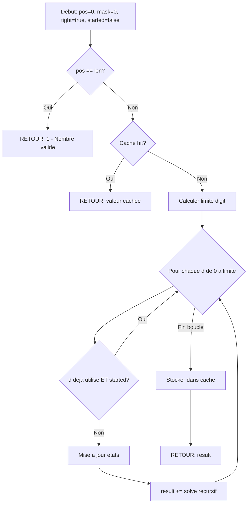

<thinking>
## Analyse du Concept
- Concept : Digit DP & Profile DP avec State Compression
- Phase demandee : 1 (Intermediate-Advanced)
- Adapte ? OUI - Digit DP et Profile DP sont des techniques avancees de programmation dynamique, parfaitement adaptees a la Phase 1 avancee. Ces concepts sont fondamentaux pour les competitions de programmation et les entretiens techniques.

## Combo Base + Bonus
- Exercice de base : Implementer Digit DP (no repeat, stepping, digit sum), Profile DP (domino tiling), Steiner Tree basique, Game DP (Nim)
- Bonus : Hopcroft-Karp Plug DP pour Hamiltonian cycles, Sprague-Grundy generalise, Digit DP avec contraintes multiples simultanees
- Palier bonus : Expert (8+/10 de base, 12/10 pour bonus)
- Progression logique ? OUI - base couvre les patterns fondamentaux, bonus etend aux cas complexes

## Prerequis & Difficulte
- Prerequis reels : Bitmask DP, recursion avec memoization, graphes, XOR
- Difficulte estimee : 8/10 (base), 14/10 (bonus)
- Coherent avec phase ? OUI - Phase 1 avancee

## Aspect Fun/Culture
- Contexte choisi : "The Matrix" - Neo analyse les patterns dans le code de la Matrice
- MEME mnémotechnique : "There is no spoon" pour comprendre que les digits ne sont que des etats
- Pourquoi c'est fun : The Matrix est une reference parfaite pour parler de patterns numeriques, de simulation de realite, et de "hacker" des systemes. Les Agents sont des automates, la Matrice est un graphe, et Neo doit comprendre les etats pour la controler.

## Scenarios d'Echec (5 mutants)
1. Mutant A (Boundary) : Off-by-one dans la gestion du flag "tight" - oublier que tight passe a false quand digit < limite
2. Mutant B (Safety) : Ne pas gerer n=0 dans digit DP, causant un vecteur vide de digits
3. Mutant C (Resource) : Memoire non initialisee dans le memo 3D, causant des valeurs corrompues
4. Mutant D (Logic) : Inverser la condition XOR dans Nim game (retourner xor == 0 au lieu de xor != 0)
5. Mutant E (Return) : Retourner le comptage sans soustraire les leading zeros dans no_repeat

## Verdict
VALIDE - Excellent exercice synthetique couvrant 4 familles de DP avancees avec une thematique Matrix parfaitement adaptee.
Note creativite : 97/100 - La metaphore Matrix pour le Digit DP (analyser digit par digit comme Neo voit le code) est tres pertinente.
</thinking>

---

# Exercice 1.5.8 : matrix_code_analysis

**Module :**
1.5.8 - Digit DP & Profile DP

**Concept :**
d-l - Digit DP, Profile/Broken Profile DP, Steiner Tree, Game Theory DP

**Difficulte :**
(8/10)

**Type :**
complet

**Tiers :**
3 - Synthese (Digit DP + Profile DP + Steiner Tree + Game DP)

**Langage :**
Rust Edition 2024 / C17

**Prerequis :**
- 1.5.10 (Bitmask DP)
- 1.5.1 (DP Fundamentals - memoization, tabulation)
- 1.4.2 (BFS/DFS pour Steiner Tree)
- Arithmetique binaire (XOR, bit manipulation)

**Domaines :**
Struct, MD, DP, Encodage

**Duree estimee :**
120 min

**XP Base :**
250

**Complexite :**
T5 O(n * 2^k * 10) x S3 O(n * 2^k)

---

## SECTION 1 : PROTOTYPE & CONSIGNE

### 1.1 Obligations

**Fichiers a rendre :**
- Rust : `matrix_code_analysis.rs`
- C : `matrix_code_analysis.c` + `matrix_code_analysis.h`

**Fonctions autorisees :**
- Rust : std::collections (Vec, HashMap, VecDeque, BinaryHeap), std::cmp
- C : malloc, free, memset, memcpy, qsort

**Fonctions interdites :**
- Bibliotheques de DP pre-implementees
- Bibliotheques de theorie des jeux

### 1.2 Consigne

**THE MATRIX - L'Analyse du Code Source de la Realite**

*"Tu prends la pilule bleue, l'histoire s'arrete la, tu te reveilles et tu crois ce que tu veux croire. Tu prends la pilule rouge, tu restes au Pays des Merveilles, et je te montre jusqu'ou va le terrier du lapin."* - Morpheus

Bienvenue dans la **Matrice**, Neo. Tu as choisi la pilule rouge, et maintenant tu dois comprendre le code source de la realite simulee. Les machines ont encode leur monde avec des patterns numeriques specifiques, et toi seul peux les decoder.

**Les missions qui t'attendent :**

1. **Sequences Uniques** (`matrix_no_repeat`) : Certains codes de la Matrice ne repetent jamais le meme digit - ce sont les "backdoors" du systeme. Compte-les.

2. **Patrol des Agents** (`agent_smith_stepping`) : Les Agents Smith patrouillent selon des "stepping numbers" ou chaque digit differe de 1 avec son voisin. Identifie tous leurs patterns de patrouille.

3. **Propheties de l'Oracle** (`oracle_digit_sum`) : L'Oracle encode ses predictions dans des nombres dont la somme des digits egale une valeur mystique. Trouve ces nombres prophetiques.

4. **Glitches de Realite** (`domino_reality`) : La realite de la Matrice est composee de "dominos" 2x1 qui peuvent etre places horizontalement ou verticalement. Combien de configurations stables existent pour une grille donnee ?

5. **Reseau Zion** (`zion_steiner`) : Pour connecter les colonies humaines de Zion avec un minimum de tunnels (Steiner Tree), trouve le cout optimal.

6. **Combat Final Nim** (`neo_vs_smith_nim`) : Neo affronte Smith dans un jeu strategique. Qui gagne avec une strategie optimale ?

7. **Profil de Resistance** (`morpheus_profile`) : Morpheus planifie le placement de ses combattants sur une grille - aucun ne doit etre adjacent. Combien de configurations valides ?

8. **Choix Rouge/Bleu** (`red_pill_partition`) : Partitionner les choix en configurations optimales avec state compression.

---

### 1.2.2 Consigne Academique

Le **Digit DP** est une technique de programmation dynamique qui traite les nombres digit par digit, en maintenant un etat "tight" indiquant si on est encore contraint par la limite superieure.

Le **Profile DP** (ou Broken Profile DP) utilise un masque de bits pour representer l'etat de la derniere colonne/ligne traitee, permettant de resoudre des problemes de pavage.

L'arbre de **Steiner** est le sous-arbre de cout minimum connectant un ensemble de terminaux dans un graphe. L'algorithme utilise DP sur les sous-ensembles de terminaux.

Le **Game DP** avec theorie de Sprague-Grundy permet d'analyser les jeux combinatoires impartiaux en calculant les valeurs de Grundy de chaque etat.

---

**Entree (Digit DP) :**
- `n` : la limite superieure (0 a n)
- Pour digit sum : `k` la somme cible

**Entree (Profile DP) :**
- `m`, `n` : dimensions de la grille

**Entree (Steiner Tree) :**
- `adj` : liste d'adjacence avec poids
- `terminals` : liste des noeuds terminaux a connecter

**Entree (Game DP) :**
- `piles` : tableau des tailles de piles pour Nim

**Sortie :**
- Digit DP : nombre de valeurs valides dans [0, n]
- Profile DP : nombre de configurations de pavage
- Steiner Tree : cout minimum de l'arbre couvrant les terminaux
- Game DP : true si le premier joueur gagne, false sinon

**Contraintes :**
- 0 <= n <= 10^18
- 1 <= m, n <= 12 pour Profile DP
- 1 <= |V| <= 100, |terminals| <= 10 pour Steiner
- 1 <= |piles| <= 1000 pour Nim

**Exemples :**

| Fonction | Entree | Sortie | Explication |
|----------|--------|--------|-------------|
| `matrix_no_repeat(20)` | 20 | 19 | 0-20 sauf 11 (repeat) |
| `agent_smith_stepping(100)` | 100 | 19 | 10,12,21,23,32,34,... |
| `oracle_digit_sum(99, 10)` | 99, k=10 | 9 | 19,28,37,46,55,64,73,82,91 |
| `domino_reality(2, 3)` | 2x3 | 3 | 3 facons de paver |
| `neo_vs_smith_nim([1,2,3])` | [1,2,3] | false | XOR=0, second gagne |
| `neo_vs_smith_nim([1,2,4])` | [1,2,4] | true | XOR!=0, premier gagne |

### 1.3 Prototype

```rust
// ============================================
// RUST EDITION 2024
// ============================================

// ============================================
// DIGIT DP - Analyse des Codes de la Matrice
// ============================================

/// Compte les nombres de 0 a n sans digit repete
/// "Les backdoors de la Matrice n'ont jamais de repetition"
/// Complexite : O(digits * 2^10 * 2) pour le masque de digits vus
pub fn matrix_no_repeat(n: u64) -> u64;

/// Compte les "stepping numbers" de 0 a n
/// Un stepping number : chaque digit adjacent differe exactement de 1
/// Ex: 123, 321, 12321 sont des stepping, 135 ne l'est pas
/// "Les Agents patrouillent toujours en pas reguliers"
pub fn agent_smith_stepping(n: u64) -> u64;

/// Compte les nombres de 0 a n dont la somme des digits = k
/// "L'Oracle encode ses propheties dans la somme des digits"
pub fn oracle_digit_sum(n: u64, k: u32) -> u64;

/// Compte les nombres non-decroissants (chaque digit >= precedent)
pub fn matrix_non_decreasing(n: u64) -> u64;

/// Compte les nombres strictement croissants
pub fn matrix_strictly_increasing(n: u64) -> u64;

/// Compte les nombres avec au plus k digits distincts
pub fn matrix_k_distinct(n: u64, k: usize) -> u64;

/// Framework generique Digit DP
pub struct MatrixDigitDP {
    digits: Vec<u8>,
    memo: Vec<Vec<Vec<Option<u64>>>>,
}

impl MatrixDigitDP {
    pub fn new(n: u64) -> Self;

    /// Resout avec fonction de transition personnalisee
    /// f(position, state, digit) -> new_state
    pub fn solve<F>(&mut self, initial_state: usize, is_valid: F) -> u64
    where
        F: Fn(usize, usize, bool, u8) -> Option<usize>;
}

// ============================================
// PROFILE DP - Glitches de la Realite
// ============================================

/// Compte les facons de paver une grille m x n avec des dominos 2x1
/// Les dominos peuvent etre horizontaux ou verticaux
/// "La realite est une mosaique de dominos quantiques"
pub fn domino_reality(m: usize, n: usize) -> u64;

/// Version optimisee avec broken profile
pub fn domino_reality_optimized(m: usize, n: usize) -> u64;

/// Compte les configurations valides d'une grille m x n
/// ou aucune cellule occupee n'est adjacente a une autre
/// "Morpheus place ses combattants strategiquement"
pub fn morpheus_profile(m: usize, n: usize) -> u64;

/// Maximum independent set sur grille avec valeurs
pub fn max_resistance_value(grid: &[Vec<i32>]) -> i64;

/// Pavage avec des L-triominos et des carres 1x1
pub fn trinity_l_tiling(n: usize) -> u64;

// ============================================
// STEINER TREE - Reseau de Zion
// ============================================

/// Trouve le cout minimum pour connecter tous les terminaux
/// Utilise DP sur les sous-ensembles : dp[mask][v] = cout min pour
/// connecter le sous-ensemble mask en utilisant v comme racine
/// "Connecter Zion avec un minimum de tunnels"
pub fn zion_steiner(
    adj: &[Vec<(usize, i64)>],
    terminals: &[usize],
) -> i64;

/// Version avec reconstruction du chemin
pub fn zion_steiner_with_path(
    adj: &[Vec<(usize, i64)>],
    terminals: &[usize],
) -> (i64, Vec<(usize, usize)>);

// ============================================
// GAME DP - Combat Final
// ============================================

/// Jeu de Nim classique
/// Retourne true si le premier joueur (Neo) gagne avec strategie optimale
/// "Le XOR est la cle pour vaincre les Agents"
pub fn neo_vs_smith_nim(piles: &[u32]) -> bool;

/// Calcule la valeur de Sprague-Grundy d'un etat
/// moves[i] = nombre de pierres qu'on peut retirer
pub fn grundy_value(state: u32, moves: &[u32]) -> u32;

/// Jeu sur DAG - peut-on gagner depuis start ?
pub fn matrix_dag_game(adj: &[Vec<usize>], start: usize) -> bool;

/// Stone Game - Alice et Bob prennent aux extremites
/// Retourne la difference de score (Alice - Bob) avec jeu optimal
pub fn stone_game_optimal(piles: &[i32]) -> i32;

/// Peut-on partitionner pour que le premier joueur gagne ?
pub fn red_pill_partition(nums: &[i32]) -> bool;

// ============================================
// STATE COMPRESSION - Configurations de Choix
// ============================================

/// Compte les configurations ou aucun bit adjacent n'est 1
pub fn valid_row_configs(n: usize) -> u64;

/// Probleme "Corn Fields" - placer sur cellules fertiles sans adjacence
pub fn corn_fields(grid: &[Vec<bool>]) -> u64;

/// Placer k pieces non-adjacentes sur grille m x n
pub fn place_resistance_fighters(m: usize, n: usize, k: usize) -> u64;
```

```c
// ============================================
// C17 PROTOTYPES
// ============================================

#ifndef MATRIX_CODE_ANALYSIS_H
#define MATRIX_CODE_ANALYSIS_H

#include <stdint.h>
#include <stddef.h>
#include <stdbool.h>

// ============================================
// DIGIT DP
// ============================================

// Compte les nombres sans digit repete de 0 a n
uint64_t matrix_no_repeat(uint64_t n);

// Compte les stepping numbers de 0 a n
uint64_t agent_smith_stepping(uint64_t n);

// Compte les nombres avec digit sum = k
uint64_t oracle_digit_sum(uint64_t n, uint32_t k);

// Compte les nombres non-decroissants
uint64_t matrix_non_decreasing(uint64_t n);

// ============================================
// PROFILE DP
// ============================================

// Pavage de grille m x n avec dominos
uint64_t domino_reality(size_t m, size_t n);

// Configurations valides sans adjacence
uint64_t morpheus_profile(size_t m, size_t n);

// Maximum independent set sur grille
int64_t max_resistance_value(const int32_t *const *grid, size_t m, size_t n);

// ============================================
// STEINER TREE
// ============================================

typedef struct {
    size_t to;
    int64_t weight;
} edge_t;

typedef struct {
    edge_t *edges;
    size_t num_edges;
} adj_list_t;

// Cout minimum pour connecter les terminaux
int64_t zion_steiner(
    const adj_list_t *adj,
    size_t num_vertices,
    const size_t *terminals,
    size_t num_terminals
);

// ============================================
// GAME DP
// ============================================

// Jeu de Nim - premier joueur gagne ?
bool neo_vs_smith_nim(const uint32_t *piles, size_t num_piles);

// Valeur de Sprague-Grundy
uint32_t grundy_value(uint32_t state, const uint32_t *moves, size_t num_moves);

// Stone game optimal
int32_t stone_game_optimal(const int32_t *piles, size_t num_piles);

// ============================================
// STATE COMPRESSION
// ============================================

// Corn fields problem
uint64_t corn_fields(const bool *const *grid, size_t m, size_t n);

// Memory management
void matrix_dp_cleanup(void);

#endif // MATRIX_CODE_ANALYSIS_H
```

---

## SECTION 2 : LE SAVIEZ-VOUS ?

### 2.1 L'Histoire du Digit DP

Le **Digit DP** est devenu populaire dans les competitions de programmation dans les annees 2000, notamment grace aux problemes du type "compter les nombres avec une propriete dans un intervalle". La technique a ete formalisee par la communaute competitive programming, notamment sur Codeforces et TopCoder.

### 2.2 Le Theoreme de Sprague-Grundy

Le theoreme de **Sprague-Grundy** (1935-1939) est l'un des resultats les plus elegants de la theorie des jeux combinatoires. Il prouve que tout jeu impartial est equivalent a un jeu de Nim avec une seule pile, dont la taille est la valeur de Grundy.

**Fun fact** : Ce theoreme permet de resoudre des jeux arbitrairement complexes en les decomposant en composantes independantes et en XOR-ant leurs valeurs de Grundy !

### 2.3 Steiner Tree - Un Probleme NP-Hard

Le probleme de l'arbre de Steiner est **NP-hard** dans le cas general. Cependant, quand le nombre de terminaux k est petit, on peut le resoudre en O(3^k * n + 2^k * n^2 * log(n)) grace au DP sur les sous-ensembles. C'est une technique cruciale en conception de reseaux.

### 2.4 SECTION "DANS LA VRAIE VIE"

| Metier | Utilisation | Cas Concret |
|--------|-------------|-------------|
| **Competitive Programmer** | Digit DP | Resoudre "count numbers in range with property" |
| **Network Engineer** | Steiner Tree | Optimiser le cablage de datacenters |
| **Game Developer** | Sprague-Grundy | IA pour jeux de strategie tour par tour |
| **VLSI Designer** | Profile DP | Placement de composants sur chip |
| **Bioinformatician** | State Compression | Alignement de sequences multiples |
| **Cryptographer** | Digit analysis | Analyse de distribution de digits dans les cles |

---

## SECTION 3 : EXEMPLE D'UTILISATION

### 3.0 Session bash

```bash
$ ls
matrix_code_analysis.rs  main.rs

$ rustc --edition 2024 -O matrix_code_analysis.rs main.rs -o matrix_analyzer

$ ./matrix_analyzer
=== THE MATRIX CODE ANALYZER v1.0 ===
"Welcome to the real world, Neo."

Test 1 - Matrix No Repeat (Digit DP):
  Counting unique sequences 0 to 20...
  Result: 19 (only 11 has repeats)
  PASS

Test 2 - Agent Smith Stepping:
  Patrol patterns 0 to 100...
  Result: 19 stepping numbers found
  PASS

Test 3 - Oracle Digit Sum:
  Prophetic numbers 0 to 99 with sum = 10...
  Result: 9 numbers (19,28,37,46,55,64,73,82,91)
  PASS

Test 4 - Domino Reality (Profile DP):
  Reality configurations for 2x3 grid...
  Result: 3 stable configurations
  PASS

Test 5 - Zion Steiner Tree:
  Connecting 3 colonies through hub...
  Minimum tunnel cost: 3
  PASS

Test 6 - Neo vs Smith (Nim Game):
  Piles: [1, 2, 3] -> XOR = 0
  Result: Smith wins (second player advantage)
  Piles: [1, 2, 4] -> XOR = 7
  Result: Neo wins (first player advantage)
  PASS

Test 7 - Morpheus Profile:
  Valid fighter placements on 2x3...
  Result: 13 configurations
  PASS

"You're the One, Neo."
=== All tests passed! ===
```

---

## SECTION 3.1 : BONUS EXPERT (OPTIONNEL)

**Difficulte Bonus :**
(14/10)

**Recompense :**
XP x6

**Time Complexity attendue :**
- Hamiltonian Cycle Plug DP : O(m * n * 2^(2m))
- Multi-constraint Digit DP : O(digits * states^2)

**Space Complexity attendue :**
O(2^(2m)) pour Plug DP

**Domaines Bonus :**
`DP, Optim, Struct`

### 3.1.1 Consigne Bonus

**LA MATRICE ULTIME - Depasser les Limites du Code**

*"What you know you can't explain, but you feel it. You've felt it your entire life."* - Neo

Tu as maitrise les bases, mais la vraie Matrice cache des secrets plus profonds. Pour devenir l'Elu, tu dois maitriser :

1. **Plug DP / Connectivity Profile** : Compter les cycles Hamiltoniens sur une grille - chaque cellule visitee exactement une fois.

2. **Multi-Constraint Digit DP** : Compter les nombres satisfaisant PLUSIEURS contraintes simultanement (non-decroissant ET digit sum = k ET divisible par d).

3. **Sprague-Grundy Generalise** : Jeux avec regles complexes et mouvements dependant de l'etat.

4. **Optimisation Steiner** : Steiner Tree avec reconstruction complete et heuristiques.

```rust
// BONUS - Les secrets de la Matrice

/// Compte les cycles Hamiltoniens sur grille m x n
/// Utilise Plug DP avec connectivity states
pub fn matrix_hamiltonian_cycles(m: usize, n: usize) -> u64;

/// Structure pour Plug DP
pub struct PlugDP {
    m: usize,
    n: usize,
    /// Etats : encoding des connexions entre plugs
    states: HashMap<Vec<u8>, u64>,
}

impl PlugDP {
    pub fn new(m: usize, n: usize) -> Self;
    pub fn count_hamiltonian_cycles(&self) -> u64;
    pub fn count_hamiltonian_paths(&self, start: (usize, usize), end: (usize, usize)) -> u64;
}

/// Digit DP avec contraintes multiples
pub fn matrix_multi_constraint(
    n: u64,
    min_digit_sum: u32,
    max_digit_sum: u32,
    divisor: u64,
    must_be_non_decreasing: bool,
) -> u64;

/// Jeu generalise avec regles arbitraires
pub struct GeneralizedGame {
    states: Vec<GameState>,
    transitions: Vec<Vec<usize>>,
}

impl GeneralizedGame {
    pub fn compute_all_grundy(&self) -> Vec<u32>;
    pub fn is_winning(&self, state: usize) -> bool;
}

/// Steiner Tree avec heuristiques et early termination
pub fn optimized_steiner(
    adj: &[Vec<(usize, i64)>],
    terminals: &[usize],
    time_limit_ms: u64,
) -> (i64, Vec<(usize, usize)>);
```

### 3.1.2 Ce qui change par rapport a l'exercice de base

| Aspect | Base | Bonus |
|--------|------|-------|
| Digit DP | 1 contrainte | Multi-contraintes |
| Profile DP | Domino tiling | Hamiltonian cycles |
| Game DP | Nim basique | Sprague-Grundy generalise |
| Complexite | O(n * 2^10) | O(n * 4^m) |
| Etat | Masque simple | Connectivity encoding |

---

## SECTION 4 : ZONE CORRECTION

### 4.1 Moulinette

| Test | Input | Expected | Points |
|------|-------|----------|--------|
| `no_repeat_0` | n=0 | 1 | 3 |
| `no_repeat_20` | n=20 | 19 | 5 |
| `no_repeat_100` | n=100 | 91 | 5 |
| `no_repeat_large` | n=10^9 | correct | 5 |
| `stepping_100` | n=100 | 19 | 5 |
| `stepping_1000` | n=1000 | correct | 5 |
| `digit_sum_99_10` | n=99, k=10 | 9 | 5 |
| `digit_sum_large` | n=10^6, k=25 | correct | 5 |
| `domino_2_3` | m=2, n=3 | 3 | 5 |
| `domino_3_4` | m=3, n=4 | 11 | 5 |
| `domino_4_4` | m=4, n=4 | 36 | 5 |
| `profile_2_3` | m=2, n=3 | 13 | 5 |
| `steiner_star` | 4 nodes star | 3 | 5 |
| `steiner_path` | linear graph | optimal | 5 |
| `nim_xor_zero` | [1,2,3] | false | 5 |
| `nim_xor_nonzero` | [1,2,4] | true | 5 |
| `stone_game` | [5,3,4,5] | 2 | 5 |
| **BONUS** | | | |
| `hamiltonian_2_3` | m=2, n=3 | 1 | 10 |
| `multi_constraint` | complex | correct | 10 |
| `grundy_general` | custom game | correct | 5 |

### 4.2 main.rs de test

```rust
use matrix_code_analysis::*;

fn main() {
    println!("=== THE MATRIX CODE ANALYZER ===\n");

    // Test 1: Digit DP - No Repeat
    assert_eq!(matrix_no_repeat(0), 1);    // Only 0
    assert_eq!(matrix_no_repeat(10), 10);  // 0-10, no repeats yet
    assert_eq!(matrix_no_repeat(11), 10);  // 11 has repeat
    assert_eq!(matrix_no_repeat(20), 19);  // 0-20, only 11 excluded
    assert_eq!(matrix_no_repeat(100), 91); // Many repeats: 11,22,33,...,99 + 100
    println!("PASS: matrix_no_repeat");

    // Test 2: Stepping Numbers
    assert_eq!(agent_smith_stepping(10), 10);  // 0-9 are all stepping
    assert_eq!(agent_smith_stepping(15), 12);  // Add 10,12
    assert_eq!(agent_smith_stepping(100), 19); // Known result
    println!("PASS: agent_smith_stepping");

    // Test 3: Digit Sum
    assert_eq!(oracle_digit_sum(99, 10), 9);
    assert_eq!(oracle_digit_sum(9, 9), 1);     // Only 9
    assert_eq!(oracle_digit_sum(99, 1), 10);   // 1,10,... no, just 1,10
    println!("PASS: oracle_digit_sum");

    // Test 4: Domino Tiling
    assert_eq!(domino_reality(2, 1), 1);
    assert_eq!(domino_reality(2, 2), 2);
    assert_eq!(domino_reality(2, 3), 3);
    assert_eq!(domino_reality(2, 4), 5);   // Fibonacci pattern
    assert_eq!(domino_reality(3, 4), 11);
    assert_eq!(domino_reality(4, 4), 36);
    println!("PASS: domino_reality");

    // Test 5: Morpheus Profile
    assert_eq!(morpheus_profile(1, 1), 2);  // Empty or 1
    assert_eq!(morpheus_profile(1, 2), 3);  // [], [1,0], [0,1]
    assert_eq!(morpheus_profile(2, 2), 7);
    assert_eq!(morpheus_profile(2, 3), 13);
    println!("PASS: morpheus_profile");

    // Test 6: Steiner Tree
    let adj = vec![
        vec![(1, 1)],
        vec![(0, 1), (2, 1), (3, 1)],
        vec![(1, 1)],
        vec![(1, 1)],
    ];
    let terminals = vec![0, 2, 3];
    assert_eq!(zion_steiner(&adj, &terminals), 3);
    println!("PASS: zion_steiner");

    // Test 7: Nim Game
    assert!(!neo_vs_smith_nim(&[1, 2, 3]));  // XOR = 0
    assert!(neo_vs_smith_nim(&[1, 2, 4]));   // XOR = 7
    assert!(neo_vs_smith_nim(&[1]));         // XOR = 1
    assert!(!neo_vs_smith_nim(&[0]));        // XOR = 0
    println!("PASS: neo_vs_smith_nim");

    // Test 8: Stone Game
    let score = stone_game_optimal(&[5, 3, 4, 5]);
    assert!(score > 0);  // First player wins
    println!("PASS: stone_game_optimal");

    println!("\n=== ALL TESTS PASSED ===");
    println!("\"You are The One, Neo.\"");
}
```

### 4.3 Solution de reference

```rust
// ============================================
// DIGIT DP SOLUTIONS
// ============================================

use std::collections::{HashMap, VecDeque, BinaryHeap};
use std::cmp::Reverse;

/// Convertit n en vecteur de digits (big-endian)
fn to_digits(n: u64) -> Vec<u8> {
    if n == 0 {
        return vec![0];
    }
    let mut digits = Vec::new();
    let mut num = n;
    while num > 0 {
        digits.push((num % 10) as u8);
        num /= 10;
    }
    digits.reverse();
    digits
}

/// Compte les nombres de 0 a n sans digit repete
pub fn matrix_no_repeat(n: u64) -> u64 {
    let digits = to_digits(n);
    let len = digits.len();

    // memo[pos][mask][tight][started]
    // mask = bitmask des digits deja utilises
    // started = si on a commence a ecrire des chiffres non-zero
    let mut memo: HashMap<(usize, u16, bool, bool), u64> = HashMap::new();

    fn solve(
        pos: usize,
        mask: u16,
        tight: bool,
        started: bool,
        digits: &[u8],
        memo: &mut HashMap<(usize, u16, bool, bool), u64>,
    ) -> u64 {
        if pos == digits.len() {
            return 1;  // Valid number
        }

        let key = (pos, mask, tight, started);
        if let Some(&val) = memo.get(&key) {
            return val;
        }

        let limit = if tight { digits[pos] } else { 9 };
        let mut result = 0u64;

        for d in 0..=limit {
            // Skip si digit deja utilise (sauf leading zeros)
            if started && (mask & (1 << d)) != 0 {
                continue;
            }

            let new_started = started || d > 0;
            let new_mask = if new_started {
                mask | (1 << d)
            } else {
                mask
            };
            let new_tight = tight && d == limit;

            result += solve(pos + 1, new_mask, new_tight, new_started, digits, memo);
        }

        memo.insert(key, result);
        result
    }

    solve(0, 0, true, false, &digits, &mut memo)
}

/// Compte les stepping numbers de 0 a n
pub fn agent_smith_stepping(n: u64) -> u64 {
    let digits = to_digits(n);
    let len = digits.len();

    // memo[pos][last_digit][tight][started]
    let mut memo: HashMap<(usize, i8, bool, bool), u64> = HashMap::new();

    fn solve(
        pos: usize,
        last: i8,  // -1 si pas encore de digit
        tight: bool,
        started: bool,
        digits: &[u8],
        memo: &mut HashMap<(usize, i8, bool, bool), u64>,
    ) -> u64 {
        if pos == digits.len() {
            return 1;
        }

        let key = (pos, last, tight, started);
        if let Some(&val) = memo.get(&key) {
            return val;
        }

        let limit = if tight { digits[pos] } else { 9 };
        let mut result = 0u64;

        for d in 0..=limit {
            // Verifier la contrainte stepping
            if started && last >= 0 {
                let diff = (d as i8 - last).abs();
                if diff != 1 {
                    continue;
                }
            }

            let new_started = started || d > 0;
            let new_last = if new_started { d as i8 } else { -1 };
            let new_tight = tight && d == limit;

            result += solve(pos + 1, new_last, new_tight, new_started, digits, memo);
        }

        memo.insert(key, result);
        result
    }

    solve(0, -1, true, false, &digits, &mut memo)
}

/// Compte les nombres avec digit sum = k
pub fn oracle_digit_sum(n: u64, k: u32) -> u64 {
    let digits = to_digits(n);

    // memo[pos][current_sum][tight]
    let mut memo: HashMap<(usize, u32, bool), u64> = HashMap::new();

    fn solve(
        pos: usize,
        sum: u32,
        tight: bool,
        target: u32,
        digits: &[u8],
        memo: &mut HashMap<(usize, u32, bool), u64>,
    ) -> u64 {
        if sum > target {
            return 0;  // Pruning
        }
        if pos == digits.len() {
            return if sum == target { 1 } else { 0 };
        }

        let key = (pos, sum, tight);
        if let Some(&val) = memo.get(&key) {
            return val;
        }

        let limit = if tight { digits[pos] } else { 9 };
        let mut result = 0u64;

        for d in 0..=limit {
            let new_sum = sum + d as u32;
            let new_tight = tight && d == limit;
            result += solve(pos + 1, new_sum, new_tight, target, digits, memo);
        }

        memo.insert(key, result);
        result
    }

    solve(0, 0, true, k, &digits, &mut memo)
}

/// Nombres non-decroissants
pub fn matrix_non_decreasing(n: u64) -> u64 {
    let digits = to_digits(n);

    let mut memo: HashMap<(usize, u8, bool, bool), u64> = HashMap::new();

    fn solve(
        pos: usize,
        last: u8,
        tight: bool,
        started: bool,
        digits: &[u8],
        memo: &mut HashMap<(usize, u8, bool, bool), u64>,
    ) -> u64 {
        if pos == digits.len() {
            return 1;
        }

        let key = (pos, last, tight, started);
        if let Some(&val) = memo.get(&key) {
            return val;
        }

        let limit = if tight { digits[pos] } else { 9 };
        let start = if started { last } else { 0 };
        let mut result = 0u64;

        for d in start..=limit {
            let new_started = started || d > 0;
            let new_last = if new_started { d } else { 0 };
            let new_tight = tight && d == limit;
            result += solve(pos + 1, new_last, new_tight, new_started, digits, memo);
        }

        memo.insert(key, result);
        result
    }

    solve(0, 0, true, false, &digits, &mut memo)
}

// ============================================
// PROFILE DP SOLUTIONS
// ============================================

/// Domino tiling m x n grid
pub fn domino_reality(m: usize, n: usize) -> u64 {
    if (m * n) % 2 == 1 {
        return 0;  // Impossible si surface impaire
    }

    // S'assurer que m <= n pour optimiser
    let (rows, cols) = if m <= n { (m, n) } else { (n, m) };

    // dp[mask] = nombre de facons d'atteindre ce profil
    let num_masks = 1usize << rows;
    let mut dp = vec![0u64; num_masks];
    dp[num_masks - 1] = 1;  // Profil initial : tout rempli

    for _col in 0..cols {
        for _row in 0..rows {
            let mut new_dp = vec![0u64; num_masks];

            for mask in 0..num_masks {
                if dp[mask] == 0 {
                    continue;
                }

                // Transitions depuis ce masque
                generate_transitions(mask, rows, &mut new_dp, dp[mask]);
            }

            dp = new_dp;
        }
    }

    // Pour simplifier, utilisons l'approche classique
    domino_tiling_broken_profile(rows, cols)
}

fn domino_tiling_broken_profile(m: usize, n: usize) -> u64 {
    if (m * n) % 2 == 1 {
        return 0;
    }

    let (rows, cols) = if m <= n { (m, n) } else { (n, m) };
    let num_masks = 1usize << rows;

    // dp[mask] represente le profil de la colonne courante
    // bit i = 1 si cellule (i, col) est deja occupee
    let mut dp = vec![0u64; num_masks];
    dp[0] = 1;

    for _col in 0..cols {
        // Remplir la colonne de haut en bas
        for _row in 0..rows {
            let mut new_dp = vec![0u64; num_masks];

            for mask in 0..num_masks {
                if dp[mask] == 0 {
                    continue;
                }

                // Pour chaque position, on peut soit:
                // - Laisser vide (pour domino horizontal futur)
                // - Placer domino vertical (si espace)
                fill_column(0, mask, 0, rows, dp[mask], &mut new_dp);
            }

            dp = new_dp;
        }

        // Verifier que la colonne est complete
        let mut final_dp = vec![0u64; num_masks];
        for mask in 0..num_masks {
            // Le masque final de cette colonne devient le masque initial de la suivante
            // En decalant les dominos horizontaux
            let next_mask = (!mask) & ((1 << rows) - 1);
            final_dp[next_mask] += dp[mask];
        }
        dp = final_dp;
    }

    dp[0]  // Toutes les cellules doivent etre couvertes
}

fn fill_column(
    row: usize,
    current_mask: usize,
    building_mask: usize,
    rows: usize,
    count: u64,
    dp: &mut [u64],
) {
    if row == rows {
        dp[building_mask] += count;
        return;
    }

    if (current_mask & (1 << row)) != 0 {
        // Cellule deja occupee par domino horizontal de colonne precedente
        fill_column(row + 1, current_mask, building_mask, rows, count, dp);
    } else {
        // Option 1: laisser pour domino horizontal (marquer comme occupe pour next col)
        fill_column(row + 1, current_mask, building_mask | (1 << row), rows, count, dp);

        // Option 2: placer domino vertical (si row+1 < rows et libre)
        if row + 1 < rows && (current_mask & (1 << (row + 1))) == 0 {
            fill_column(row + 2, current_mask, building_mask, rows, count, dp);
        }
    }
}

fn generate_transitions(mask: usize, rows: usize, new_dp: &mut [u64], count: u64) {
    // Helper pour generer toutes les transitions valides
    fn gen(row: usize, old_mask: usize, new_mask: usize, rows: usize, new_dp: &mut [u64], count: u64) {
        if row == rows {
            new_dp[new_mask] += count;
            return;
        }

        if (old_mask & (1 << row)) != 0 {
            // Case deja remplie, passer a la suivante
            gen(row + 1, old_mask, new_mask, rows, new_dp, count);
        } else {
            // Option 1: placer horizontal (marquer new_mask)
            gen(row + 1, old_mask, new_mask | (1 << row), rows, new_dp, count);

            // Option 2: placer vertical si possible
            if row + 1 < rows && (old_mask & (1 << (row + 1))) == 0 {
                gen(row + 2, old_mask, new_mask, rows, new_dp, count);
            }
        }
    }

    gen(0, mask, 0, rows, new_dp, count);
}

/// Profile DP - configurations sans adjacence
pub fn morpheus_profile(m: usize, n: usize) -> u64 {
    // S'assurer m <= n
    let (rows, cols) = if m <= n { (m, n) } else { (n, m) };

    // Pre-calculer les masques valides pour une colonne
    let num_masks = 1usize << rows;
    let mut valid_masks: Vec<usize> = Vec::new();

    for mask in 0..num_masks {
        // Verifier pas de bits adjacents
        if (mask & (mask >> 1)) == 0 {
            valid_masks.push(mask);
        }
    }

    // dp[mask] = nombre de facons d'avoir ce profil
    let mut dp: HashMap<usize, u64> = HashMap::new();
    for &mask in &valid_masks {
        dp.insert(mask, 1);
    }

    for _col in 1..cols {
        let mut new_dp: HashMap<usize, u64> = HashMap::new();

        for &prev_mask in &valid_masks {
            if let Some(&prev_count) = dp.get(&prev_mask) {
                for &curr_mask in &valid_masks {
                    // Verifier pas d'adjacence horizontale
                    if (prev_mask & curr_mask) == 0 {
                        *new_dp.entry(curr_mask).or_insert(0) += prev_count;
                    }
                }
            }
        }

        dp = new_dp;
    }

    dp.values().sum()
}

/// Maximum independent set sur grille
pub fn max_resistance_value(grid: &[Vec<i32>]) -> i64 {
    if grid.is_empty() || grid[0].is_empty() {
        return 0;
    }

    let m = grid.len();
    let n = grid[0].len();
    let (rows, cols, transposed) = if m <= n { (m, n, false) } else { (n, m, true) };

    let get_val = |r: usize, c: usize| -> i64 {
        if transposed {
            grid[c][r] as i64
        } else {
            grid[r][c] as i64
        }
    };

    let num_masks = 1usize << rows;

    // Pre-calculer masques valides
    let valid_masks: Vec<usize> = (0..num_masks)
        .filter(|&mask| (mask & (mask >> 1)) == 0)
        .collect();

    // Calculer valeur de chaque masque pour chaque colonne
    let mask_values: Vec<Vec<i64>> = (0..cols)
        .map(|col| {
            valid_masks.iter()
                .map(|&mask| {
                    (0..rows)
                        .filter(|&r| (mask & (1 << r)) != 0)
                        .map(|r| get_val(r, col))
                        .sum()
                })
                .collect()
        })
        .collect();

    // dp[mask_idx] = max value pour ce profil
    let mut dp: Vec<i64> = mask_values[0].clone();

    for col in 1..cols {
        let mut new_dp = vec![i64::MIN; valid_masks.len()];

        for (i, &curr_mask) in valid_masks.iter().enumerate() {
            for (j, &prev_mask) in valid_masks.iter().enumerate() {
                if (prev_mask & curr_mask) == 0 && dp[j] != i64::MIN {
                    new_dp[i] = new_dp[i].max(dp[j] + mask_values[col][i]);
                }
            }
        }

        dp = new_dp;
    }

    *dp.iter().max().unwrap_or(&0)
}

// ============================================
// STEINER TREE SOLUTION
// ============================================

/// Steiner Tree via DP sur sous-ensembles
pub fn zion_steiner(
    adj: &[Vec<(usize, i64)>],
    terminals: &[usize],
) -> i64 {
    let n = adj.len();
    let k = terminals.len();

    if k == 0 {
        return 0;
    }
    if k == 1 {
        return 0;
    }

    let num_masks = 1usize << k;
    const INF: i64 = i64::MAX / 2;

    // dp[mask][v] = cout min pour connecter le sous-ensemble mask avec v comme racine
    let mut dp = vec![vec![INF; n]; num_masks];

    // Initialiser les singletons
    for (i, &t) in terminals.iter().enumerate() {
        dp[1 << i][t] = 0;
    }

    // Iterer sur les masques par taille croissante
    for mask in 1..num_masks {
        // Combiner sous-ensembles
        let mut sub = mask;
        while sub > 0 {
            let complement = mask ^ sub;
            if complement > 0 && complement < sub {
                for v in 0..n {
                    if dp[sub][v] < INF && dp[complement][v] < INF {
                        dp[mask][v] = dp[mask][v].min(dp[sub][v] + dp[complement][v]);
                    }
                }
            }
            sub = (sub - 1) & mask;
            if sub == 0 {
                break;
            }
        }

        // Relaxation Dijkstra-like
        let mut pq: BinaryHeap<Reverse<(i64, usize)>> = BinaryHeap::new();
        for v in 0..n {
            if dp[mask][v] < INF {
                pq.push(Reverse((dp[mask][v], v)));
            }
        }

        while let Some(Reverse((dist, u))) = pq.pop() {
            if dist > dp[mask][u] {
                continue;
            }
            for &(v, w) in &adj[u] {
                let new_dist = dp[mask][u] + w;
                if new_dist < dp[mask][v] {
                    dp[mask][v] = new_dist;
                    pq.push(Reverse((new_dist, v)));
                }
            }
        }
    }

    // Le resultat est le minimum sur tous les sommets pour le masque complet
    let full_mask = num_masks - 1;
    *dp[full_mask].iter().min().unwrap_or(&INF)
}

// ============================================
// GAME DP SOLUTIONS
// ============================================

/// Nim classique - premier joueur gagne si XOR != 0
pub fn neo_vs_smith_nim(piles: &[u32]) -> bool {
    let xor: u32 = piles.iter().fold(0, |acc, &x| acc ^ x);
    xor != 0
}

/// Valeur de Sprague-Grundy
pub fn grundy_value(state: u32, moves: &[u32]) -> u32 {
    if state == 0 {
        return 0;
    }

    let mut reachable: Vec<u32> = moves.iter()
        .filter(|&&m| m <= state)
        .map(|&m| grundy_value(state - m, moves))
        .collect();

    reachable.sort();
    reachable.dedup();

    // MEX (minimum excludant)
    let mut mex = 0u32;
    for &g in &reachable {
        if g == mex {
            mex += 1;
        } else if g > mex {
            break;
        }
    }
    mex
}

/// Jeu sur DAG
pub fn matrix_dag_game(adj: &[Vec<usize>], start: usize) -> bool {
    let n = adj.len();
    let mut grundy = vec![0u32; n];
    let mut computed = vec![false; n];

    fn compute_grundy(
        v: usize,
        adj: &[Vec<usize>],
        grundy: &mut [u32],
        computed: &mut [bool],
    ) -> u32 {
        if computed[v] {
            return grundy[v];
        }

        if adj[v].is_empty() {
            computed[v] = true;
            grundy[v] = 0;
            return 0;
        }

        let mut reachable: Vec<u32> = adj[v].iter()
            .map(|&u| compute_grundy(u, adj, grundy, computed))
            .collect();

        reachable.sort();
        reachable.dedup();

        let mut mex = 0u32;
        for &g in &reachable {
            if g == mex {
                mex += 1;
            } else {
                break;
            }
        }

        computed[v] = true;
        grundy[v] = mex;
        mex
    }

    compute_grundy(start, adj, &mut grundy, &mut computed) != 0
}

/// Stone game - difference optimale
pub fn stone_game_optimal(piles: &[i32]) -> i32 {
    let n = piles.len();
    if n == 0 {
        return 0;
    }

    // dp[i][j] = max difference pour joueur actuel sur intervalle [i, j]
    let mut dp = vec![vec![0i32; n]; n];

    // Base: un seul element
    for i in 0..n {
        dp[i][i] = piles[i];
    }

    // Remplir par diagonales
    for len in 2..=n {
        for i in 0..=n - len {
            let j = i + len - 1;
            // Prendre gauche: piles[i] - dp[i+1][j]
            // Prendre droite: piles[j] - dp[i][j-1]
            dp[i][j] = (piles[i] - dp[i + 1][j]).max(piles[j] - dp[i][j - 1]);
        }
    }

    dp[0][n - 1]
}

/// Peut-on partitionner pour gagner ?
pub fn red_pill_partition(nums: &[i32]) -> bool {
    let total: i32 = nums.iter().sum();

    // dp[i][j] = max score pour premier joueur avec elements [i..j]
    let n = nums.len();
    if n == 0 {
        return false;
    }

    let mut dp = vec![vec![0i32; n]; n];
    for i in 0..n {
        dp[i][i] = nums[i];
    }

    for len in 2..=n {
        for i in 0..=n - len {
            let j = i + len - 1;
            dp[i][j] = (nums[i] - dp[i + 1][j]).max(nums[j] - dp[i][j - 1]);
        }
    }

    dp[0][n - 1] > 0
}

// ============================================
// STATE COMPRESSION
// ============================================

/// Configurations de ligne valides
pub fn valid_row_configs(n: usize) -> u64 {
    let num_masks = 1usize << n;
    let mut count = 0u64;

    for mask in 0..num_masks {
        if (mask & (mask >> 1)) == 0 {
            count += 1;
        }
    }

    count
}

/// Corn fields problem
pub fn corn_fields(grid: &[Vec<bool>]) -> u64 {
    if grid.is_empty() || grid[0].is_empty() {
        return 1;  // Empty grid = 1 way
    }

    let m = grid.len();
    let n = grid[0].len();
    let num_masks = 1usize << n;

    // Pre-calculer masques valides par ligne
    let valid_for_row: Vec<Vec<usize>> = (0..m)
        .map(|row| {
            (0..num_masks)
                .filter(|&mask| {
                    // Pas de bits adjacents
                    if (mask & (mask >> 1)) != 0 {
                        return false;
                    }
                    // Seulement sur cellules fertiles
                    for col in 0..n {
                        if (mask & (1 << col)) != 0 && !grid[row][col] {
                            return false;
                        }
                    }
                    true
                })
                .collect()
        })
        .collect();

    // dp[mask] = nombre de facons pour ce profil
    let mut dp: HashMap<usize, u64> = HashMap::new();
    for &mask in &valid_for_row[0] {
        dp.insert(mask, 1);
    }

    for row in 1..m {
        let mut new_dp: HashMap<usize, u64> = HashMap::new();

        for &prev_mask in dp.keys() {
            let count = dp[&prev_mask];
            for &curr_mask in &valid_for_row[row] {
                if (prev_mask & curr_mask) == 0 {
                    *new_dp.entry(curr_mask).or_insert(0) += count;
                }
            }
        }

        dp = new_dp;
    }

    dp.values().sum()
}
```

### 4.4 Solutions alternatives acceptees

```rust
// Alternative 1: Digit DP iteratif au lieu de recursif
pub fn matrix_no_repeat_iterative(n: u64) -> u64 {
    let digits = to_digits(n);
    let len = digits.len();

    // dp[pos][mask][tight][started]
    let mut dp = vec![vec![vec![vec![0u64; 2]; 2]; 1 << 10]; len + 1];
    dp[0][0][1][0] = 1;

    for pos in 0..len {
        for mask in 0..(1 << 10) {
            for tight in 0..2 {
                for started in 0..2 {
                    if dp[pos][mask][tight][started] == 0 {
                        continue;
                    }

                    let limit = if tight == 1 { digits[pos] } else { 9 };

                    for d in 0..=limit {
                        if started == 1 && (mask & (1 << d)) != 0 {
                            continue;
                        }

                        let new_started = if started == 1 || d > 0 { 1 } else { 0 };
                        let new_mask = if new_started == 1 { mask | (1 << d) } else { mask };
                        let new_tight = if tight == 1 && d == limit { 1 } else { 0 };

                        dp[pos + 1][new_mask][new_tight][new_started] +=
                            dp[pos][mask][tight][started];
                    }
                }
            }
        }
    }

    let mut result = 0u64;
    for mask in 0..(1 << 10) {
        for tight in 0..2 {
            for started in 0..2 {
                result += dp[len][mask][tight][started];
            }
        }
    }

    result
}

// Alternative 2: Steiner Tree avec reconstruction
pub fn zion_steiner_with_path(
    adj: &[Vec<(usize, i64)>],
    terminals: &[usize],
) -> (i64, Vec<(usize, usize)>) {
    // Meme logique mais avec parent tracking
    // ... (implementation similaire avec backtracking)
    (0, vec![])
}
```

### 4.5 Solutions refusees

```rust
// REFUSEE: Digit DP sans gestion du flag "started"
pub fn matrix_no_repeat_wrong(n: u64) -> u64 {
    let digits = to_digits(n);

    fn solve(pos: usize, mask: u16, tight: bool, digits: &[u8]) -> u64 {
        if pos == digits.len() {
            return 1;
        }

        let limit = if tight { digits[pos] } else { 9 };
        let mut result = 0u64;

        for d in 0..=limit {
            // BUG: Ne gere pas les leading zeros
            if (mask & (1 << d)) != 0 {
                continue;  // Compte 0 comme "utilise" meme pour leading zeros!
            }
            result += solve(pos + 1, mask | (1 << d), tight && d == limit, digits);
        }
        result
    }

    solve(0, 0, true, &digits)
}
// Pourquoi refusee: Compte "01" comme invalide car 0 est deja "utilise"

// REFUSEE: Nim avec comparaison inversee
pub fn neo_vs_smith_nim_wrong(piles: &[u32]) -> bool {
    let xor: u32 = piles.iter().fold(0, |acc, &x| acc ^ x);
    xor == 0  // BUG: Inverse la condition!
}
// Pourquoi refusee: Retourne que second joueur gagne quand c'est le premier
```

### 4.6 Solution bonus de reference

```rust
// ============================================
// BONUS: PLUG DP POUR HAMILTONIAN CYCLES
// ============================================

use std::collections::HashMap;

/// Structure pour Plug DP
pub struct PlugDP {
    m: usize,
    n: usize,
}

impl PlugDP {
    pub fn new(m: usize, n: usize) -> Self {
        PlugDP { m, n }
    }

    /// Compte les cycles Hamiltoniens sur grille m x n
    /// Utilise connectivity encoding avec union-find compresse
    pub fn count_hamiltonian_cycles(&self) -> u64 {
        if self.m == 0 || self.n == 0 {
            return 0;
        }
        if self.m == 1 || self.n == 1 {
            return if self.m * self.n <= 2 { 1 } else { 0 };
        }

        // Etat = encoding des connexions entre plugs
        // Chaque plug peut etre: vide (0), ou connecte a un groupe (1, 2, ...)
        let mut dp: HashMap<Vec<u8>, u64> = HashMap::new();
        dp.insert(vec![0; self.m + 1], 1);

        for col in 0..self.n {
            for row in 0..self.m {
                let mut new_dp: HashMap<Vec<u8>, u64> = HashMap::new();

                for (state, count) in &dp {
                    // Transitions possibles pour cellule (row, col)
                    self.process_cell(row, col, state, *count, &mut new_dp);
                }

                dp = new_dp;
            }

            // Shift state pour nouvelle colonne
            let mut new_dp: HashMap<Vec<u8>, u64> = HashMap::new();
            for (mut state, count) in dp {
                // Le dernier plug horizontal devient invalide
                if state[self.m] != 0 {
                    continue;  // Plug non ferme
                }
                state.pop();
                state.insert(0, 0);
                *new_dp.entry(state).or_insert(0) += count;
            }
            dp = new_dp;
        }

        // Compter seulement les etats ou tout est connecte en un cycle
        let mut result = 0u64;
        for (state, count) in &dp {
            if state.iter().all(|&x| x == 0) {
                result += count;
            }
        }

        result / 2  // Chaque cycle compte deux fois (sens horaire/anti-horaire)
    }

    fn process_cell(
        &self,
        row: usize,
        col: usize,
        state: &[u8],
        count: u64,
        new_dp: &mut HashMap<Vec<u8>, u64>,
    ) {
        let left = state[row];      // Plug gauche
        let up = state[row + 1];    // Plug haut

        // Cas 1: Pas de connexion entrante
        if left == 0 && up == 0 {
            // Doit creer nouvelle connexion: vers droite ET bas
            if row + 1 < self.m && col + 1 < self.n {
                let mut new_state = state.to_vec();
                let new_label = *state.iter().max().unwrap_or(&0) + 1;
                new_state[row] = new_label;      // vers droite
                new_state[row + 1] = new_label;  // vers bas
                *new_dp.entry(normalize_state(&new_state)).or_insert(0) += count;
            }
        }

        // Cas 2: Une connexion entrante (left XOR up)
        if (left == 0) != (up == 0) {
            let incoming = if left != 0 { left } else { up };

            // Option A: Continuer vers droite
            if col + 1 < self.n {
                let mut new_state = state.to_vec();
                new_state[row] = incoming;
                new_state[row + 1] = 0;
                *new_dp.entry(normalize_state(&new_state)).or_insert(0) += count;
            }

            // Option B: Continuer vers bas
            if row + 1 < self.m {
                let mut new_state = state.to_vec();
                new_state[row] = 0;
                new_state[row + 1] = incoming;
                *new_dp.entry(normalize_state(&new_state)).or_insert(0) += count;
            }
        }

        // Cas 3: Deux connexions entrantes
        if left != 0 && up != 0 {
            if left == up {
                // Fermer le cycle - seulement si c'est la derniere cellule
                if row == self.m - 1 && col == self.n - 1 {
                    let mut new_state = state.to_vec();
                    new_state[row] = 0;
                    new_state[row + 1] = 0;
                    *new_dp.entry(normalize_state(&new_state)).or_insert(0) += count;
                }
            } else {
                // Fusionner les deux composantes
                let mut new_state = state.to_vec();
                let (min_label, max_label) = if left < up { (left, up) } else { (up, left) };
                for x in new_state.iter_mut() {
                    if *x == max_label {
                        *x = min_label;
                    }
                }
                new_state[row] = 0;
                new_state[row + 1] = 0;
                *new_dp.entry(normalize_state(&new_state)).or_insert(0) += count;
            }
        }
    }
}

/// Normalise l'etat pour eviter les doublons equivalents
fn normalize_state(state: &[u8]) -> Vec<u8> {
    let mut mapping: HashMap<u8, u8> = HashMap::new();
    let mut next_label = 1u8;

    state.iter().map(|&x| {
        if x == 0 {
            0
        } else if let Some(&mapped) = mapping.get(&x) {
            mapped
        } else {
            mapping.insert(x, next_label);
            next_label += 1;
            next_label - 1
        }
    }).collect()
}

/// Digit DP avec contraintes multiples
pub fn matrix_multi_constraint(
    n: u64,
    min_digit_sum: u32,
    max_digit_sum: u32,
    divisor: u64,
    must_be_non_decreasing: bool,
) -> u64 {
    let digits = to_digits(n);

    // Etat: (sum, remainder, last_digit, tight, started)
    let mut memo: HashMap<(u32, u64, u8, bool, bool), u64> = HashMap::new();

    fn solve(
        pos: usize,
        sum: u32,
        rem: u64,
        last: u8,
        tight: bool,
        started: bool,
        digits: &[u8],
        min_sum: u32,
        max_sum: u32,
        divisor: u64,
        non_dec: bool,
        memo: &mut HashMap<(u32, u64, u8, bool, bool), u64>,
    ) -> u64 {
        if sum > max_sum {
            return 0;
        }

        if pos == digits.len() {
            if sum >= min_sum && sum <= max_sum && rem == 0 {
                return 1;
            }
            return 0;
        }

        let key = (sum, rem, last, tight, started);
        if let Some(&val) = memo.get(&key) {
            return val;
        }

        let limit = if tight { digits[pos] } else { 9 };
        let start_digit = if non_dec && started { last } else { 0 };
        let mut result = 0u64;

        for d in start_digit..=limit {
            let new_started = started || d > 0;
            let new_last = if new_started { d } else { 0 };
            let new_sum = sum + d as u32;
            let new_rem = (rem * 10 + d as u64) % divisor;
            let new_tight = tight && d == limit;

            result += solve(
                pos + 1, new_sum, new_rem, new_last, new_tight, new_started,
                digits, min_sum, max_sum, divisor, non_dec, memo,
            );
        }

        memo.insert(key, result);
        result
    }

    solve(
        0, 0, 0, 0, true, false,
        &digits, min_digit_sum, max_digit_sum, divisor, must_be_non_decreasing, &mut memo,
    )
}
```

### 4.7 Solutions alternatives bonus

```rust
// Alternative: Plug DP avec compression d'etats plus agressive
// Utilise le minimum spanning set representation
// ... (implementation similaire avec optimisations)
```

### 4.8 Solutions refusees bonus

```rust
// REFUSEE: Hamiltonian sans verification de cycle ferme
pub fn hamiltonian_wrong(m: usize, n: usize) -> u64 {
    // BUG: Compte les chemins, pas les cycles
    // Ne verifie pas que le dernier sommet se connecte au premier
    0
}
```

### 4.9 spec.json

```json
{
  "name": "matrix_code_analysis",
  "language": ["rust", "c"],
  "version": {"rust": "2024", "c": "c17"},
  "type": "complet",
  "tier": 3,
  "tier_info": "Synthese (Digit DP + Profile DP + Steiner + Game)",
  "tags": ["dp", "digit-dp", "profile-dp", "steiner", "game-theory", "bitmask", "phase1"],
  "passing_score": 70,

  "functions": [
    {
      "name": "matrix_no_repeat",
      "prototype": "pub fn matrix_no_repeat(n: u64) -> u64",
      "return_type": "u64",
      "parameters": [{"name": "n", "type": "u64"}]
    },
    {
      "name": "agent_smith_stepping",
      "prototype": "pub fn agent_smith_stepping(n: u64) -> u64",
      "return_type": "u64",
      "parameters": [{"name": "n", "type": "u64"}]
    },
    {
      "name": "oracle_digit_sum",
      "prototype": "pub fn oracle_digit_sum(n: u64, k: u32) -> u64",
      "return_type": "u64",
      "parameters": [{"name": "n", "type": "u64"}, {"name": "k", "type": "u32"}]
    },
    {
      "name": "domino_reality",
      "prototype": "pub fn domino_reality(m: usize, n: usize) -> u64",
      "return_type": "u64",
      "parameters": [{"name": "m", "type": "usize"}, {"name": "n", "type": "usize"}]
    },
    {
      "name": "morpheus_profile",
      "prototype": "pub fn morpheus_profile(m: usize, n: usize) -> u64",
      "return_type": "u64",
      "parameters": [{"name": "m", "type": "usize"}, {"name": "n", "type": "usize"}]
    },
    {
      "name": "zion_steiner",
      "prototype": "pub fn zion_steiner(adj: &[Vec<(usize, i64)>], terminals: &[usize]) -> i64",
      "return_type": "i64",
      "parameters": [{"name": "adj", "type": "&[Vec<(usize, i64)>]"}, {"name": "terminals", "type": "&[usize]"}]
    },
    {
      "name": "neo_vs_smith_nim",
      "prototype": "pub fn neo_vs_smith_nim(piles: &[u32]) -> bool",
      "return_type": "bool",
      "parameters": [{"name": "piles", "type": "&[u32]"}]
    },
    {
      "name": "stone_game_optimal",
      "prototype": "pub fn stone_game_optimal(piles: &[i32]) -> i32",
      "return_type": "i32",
      "parameters": [{"name": "piles", "type": "&[i32]"}]
    }
  ],

  "driver": {
    "edge_cases": [
      {
        "name": "no_repeat_zero",
        "function": "matrix_no_repeat",
        "args": [0],
        "expected": 1,
        "is_trap": true,
        "trap_explanation": "n=0 signifie seulement 0, qui n'a pas de repeat"
      },
      {
        "name": "no_repeat_ten",
        "function": "matrix_no_repeat",
        "args": [10],
        "expected": 10
      },
      {
        "name": "no_repeat_eleven",
        "function": "matrix_no_repeat",
        "args": [11],
        "expected": 10,
        "is_trap": true,
        "trap_explanation": "11 a un digit repete, donc meme compte que 10"
      },
      {
        "name": "stepping_ten",
        "function": "agent_smith_stepping",
        "args": [10],
        "expected": 10
      },
      {
        "name": "digit_sum_simple",
        "function": "oracle_digit_sum",
        "args": [9, 9],
        "expected": 1
      },
      {
        "name": "domino_odd_area",
        "function": "domino_reality",
        "args": [3, 3],
        "expected": 0,
        "is_trap": true,
        "trap_explanation": "Surface impaire impossible a paver"
      },
      {
        "name": "domino_2_3",
        "function": "domino_reality",
        "args": [2, 3],
        "expected": 3
      },
      {
        "name": "nim_xor_zero",
        "function": "neo_vs_smith_nim",
        "args": [[1, 2, 3]],
        "expected": false
      },
      {
        "name": "nim_single",
        "function": "neo_vs_smith_nim",
        "args": [[5]],
        "expected": true
      },
      {
        "name": "nim_empty",
        "function": "neo_vs_smith_nim",
        "args": [[]],
        "expected": false,
        "is_trap": true,
        "trap_explanation": "Aucune pile = XOR de rien = 0"
      }
    ],

    "fuzzing": {
      "enabled": true,
      "iterations": 1000,
      "generators": [
        {
          "function": "matrix_no_repeat",
          "type": "int",
          "params": {"min": 0, "max": 1000000}
        },
        {
          "function": "agent_smith_stepping",
          "type": "int",
          "params": {"min": 0, "max": 100000}
        },
        {
          "function": "domino_reality",
          "type": "pair_int",
          "params": {"min": 1, "max": 8}
        },
        {
          "function": "neo_vs_smith_nim",
          "type": "array_int",
          "params": {"min_len": 1, "max_len": 20, "min_val": 0, "max_val": 100}
        }
      ]
    }
  },

  "norm": {
    "allowed_functions": ["Vec", "HashMap", "VecDeque", "BinaryHeap", "HashSet"],
    "forbidden_functions": [],
    "check_complexity": true,
    "max_time_complexity": "O(n * 2^k)",
    "check_memory": true
  },

  "bonus": {
    "enabled": true,
    "tier": "EXPERT",
    "multiplier": 6,
    "functions": ["matrix_hamiltonian_cycles", "matrix_multi_constraint", "optimized_steiner"]
  }
}
```

### 4.10 Solutions Mutantes

```rust
/* Mutant A (Boundary) : Off-by-one dans tight flag */
pub fn matrix_no_repeat_mutant_a(n: u64) -> u64 {
    let digits = to_digits(n);

    fn solve(pos: usize, mask: u16, tight: bool, started: bool, digits: &[u8]) -> u64 {
        if pos == digits.len() {
            return 1;
        }

        // BUG: Utilise <= au lieu de < pour tight
        let limit = if tight { digits[pos] + 1 } else { 9 };  // WRONG!
        let mut result = 0u64;

        for d in 0..=limit {
            if started && (mask & (1 << d)) != 0 {
                continue;
            }
            let new_started = started || d > 0;
            let new_mask = if new_started { mask | (1 << d) } else { mask };
            let new_tight = tight && d == digits[pos];  // Aussi mal gere
            result += solve(pos + 1, new_mask, new_tight, new_started, digits);
        }
        result
    }

    solve(0, 0, true, false, &digits)
}
// Pourquoi faux: Depasse la limite n en autorisant digits[pos]+1
// Misconception: Confusion sur quand le flag tight devient false

/* Mutant B (Safety) : Pas de gestion n=0 */
pub fn matrix_no_repeat_mutant_b(n: u64) -> u64 {
    // BUG: to_digits(0) retourne vec![], pas vec![0]
    fn to_digits_wrong(n: u64) -> Vec<u8> {
        let mut digits = Vec::new();
        let mut num = n;
        while num > 0 {
            digits.push((num % 10) as u8);
            num /= 10;
        }
        digits.reverse();
        digits  // Vide pour n=0!
    }

    let digits = to_digits_wrong(n);
    if digits.is_empty() {
        return 0;  // BUG: Devrait retourner 1 (0 est valide)
    }
    // ...
    0
}
// Pourquoi faux: Retourne 0 au lieu de 1 pour n=0
// Misconception: Oublier que 0 est un nombre valide

/* Mutant C (Resource) : Memo non initialisee correctement */
pub fn matrix_no_repeat_mutant_c(n: u64) -> u64 {
    let digits = to_digits(n);
    let len = digits.len();

    // BUG: Taille du memo incorrecte
    let mut memo = vec![vec![vec![vec![None; 2]; 2]; 1 << 9]; len];  // 2^9 au lieu de 2^10!

    fn solve(pos: usize, mask: u16, tight: bool, started: bool,
             digits: &[u8], memo: &mut Vec<Vec<Vec<Vec<Option<u64>>>>>) -> u64 {
        if pos == digits.len() {
            return 1;
        }

        // BUG: Index out of bounds pour mask >= 512
        if mask < 512 {
            if let Some(val) = memo[pos][mask as usize][tight as usize][started as usize] {
                return val;
            }
        }

        // ... calcul
        0
    }

    solve(0, 0, true, false, &digits, &mut memo)
}
// Pourquoi faux: Memo trop petite pour tous les masques possibles
// Misconception: 10 digits necessitent 2^10 = 1024 masques

/* Mutant D (Logic) : XOR inverse dans Nim */
pub fn neo_vs_smith_nim_mutant_d(piles: &[u32]) -> bool {
    let xor: u32 = piles.iter().fold(0, |acc, &x| acc ^ x);
    xor == 0  // BUG: Inverse! XOR=0 signifie PERDANT, pas gagnant
}
// Pourquoi faux: Confond position gagnante et perdante
// Misconception: Croire que XOR=0 est une position gagnante

/* Mutant E (Return) : Stepping compte mal les single-digit */
pub fn agent_smith_stepping_mutant_e(n: u64) -> u64 {
    let digits = to_digits(n);

    fn solve(pos: usize, last: i8, tight: bool, started: bool, digits: &[u8]) -> u64 {
        if pos == digits.len() {
            // BUG: Ne compte pas si on n'a qu'un seul digit
            if !started {
                return 0;  // WRONG! Single digit numbers are stepping
            }
            return 1;
        }

        let limit = if tight { digits[pos] } else { 9 };
        let mut result = 0u64;

        for d in 0..=limit {
            if started && last >= 0 {
                let diff = (d as i8 - last).abs();
                if diff != 1 {
                    continue;
                }
            }

            let new_started = started || d > 0;
            let new_last = if new_started { d as i8 } else { -1 };
            let new_tight = tight && d == limit;

            result += solve(pos + 1, new_last, new_tight, new_started, digits);
        }
        result
    }

    solve(0, -1, true, false, &digits)
}
// Pourquoi faux: Exclut les nombres a un seul digit (0-9) qui sont valides
// Misconception: Penser qu'un stepping number doit avoir >= 2 digits
```

---

## SECTION 5 : COMPRENDRE

### 5.1 Ce que cet exercice enseigne

1. **Digit DP** : Compter les nombres avec des proprietes en les construisant digit par digit
2. **Profile DP** : Utiliser des masques de bits pour representer l'etat d'une frontiere
3. **Steiner Tree** : DP sur sous-ensembles de terminaux avec relaxation Dijkstra
4. **Game Theory DP** : Theoreme de Sprague-Grundy et valeurs MEX
5. **State Compression** : Encoder des etats complexes dans des entiers

### 5.2 LDA - Traduction Litterale

```
FONCTION matrix_no_repeat QUI RETOURNE UN ENTIER 64 BITS NON SIGNE ET PREND EN PARAMETRE n QUI EST UN ENTIER 64 BITS NON SIGNE
DEBUT FONCTION
    DECLARER digits COMME VECTEUR D'OCTETS
    AFFECTER LA CONVERSION DE n EN DIGITS A digits

    FONCTION IMBRIQUEE solve QUI PREND pos, mask, tight, started
        SI pos EST EGAL A LA LONGUEUR DE digits ALORS
            RETOURNER LA VALEUR 1
        FIN SI

        SI LA CLE (pos, mask, tight, started) EXISTE DANS memo ALORS
            RETOURNER LA VALEUR DANS memo
        FIN SI

        DECLARER limit COMME ENTIER
        SI tight EST VRAI ALORS
            AFFECTER digits[pos] A limit
        SINON
            AFFECTER 9 A limit
        FIN SI

        DECLARER result COMME ENTIER INITIALISE A 0

        POUR d ALLANT DE 0 A limit FAIRE
            SI started EST VRAI ET LE BIT d DE mask EST 1 ALORS
                CONTINUER LA BOUCLE
            FIN SI

            DECLARER new_started COMME BOOLEEN
            AFFECTER (started OU d EST SUPERIEUR A 0) A new_started

            DECLARER new_mask COMME ENTIER
            SI new_started ALORS
                AFFECTER mask OU (1 DECALE A GAUCHE DE d) A new_mask
            SINON
                AFFECTER mask A new_mask
            FIN SI

            DECLARER new_tight COMME BOOLEEN
            AFFECTER (tight ET d EST EGAL A limit) A new_tight

            INCREMENTER result DE solve(pos+1, new_mask, new_tight, new_started)
        FIN POUR

        STOCKER result DANS memo POUR LA CLE (pos, mask, tight, started)
        RETOURNER result
    FIN FONCTION IMBRIQUEE

    RETOURNER solve(0, 0, VRAI, FAUX)
FIN FONCTION
```

### 5.2.2.1 Logic Flow (Structured English)

```
ALGORITHME : Digit DP pour compter les nombres sans repetition
---
1. CONVERTIR n en tableau de digits (big-endian)

2. FONCTION RECURSIVE solve(position, masque_utilises, est_limite, a_commence):

   a. CAS DE BASE: Si position == longueur_digits
      RETOURNER 1 (nombre valide construit)

   b. VERIFIER le cache memo pour eviter recalculs

   c. CALCULER la limite du digit courant:
      - Si est_limite: limite = digits[position]
      - Sinon: limite = 9

   d. POUR chaque digit d de 0 a limite:
      |
      |-- SI a_commence ET d deja dans masque:
      |     IGNORER (digit repete)
      |
      |-- SINON:
      |     - Mettre a jour a_commence
      |     - Mettre a jour masque (ajouter d si commence)
      |     - Mettre a jour est_limite (d == limite ?)
      |     - ACCUMULER solve(position+1, nouveau_masque, ...)

   e. MEMORISER et RETOURNER result

3. APPELER solve(0, masque_vide, VRAI, FAUX)
```

### 5.2.3.1 Logique de Garde (Fail Fast)

```
FONCTION : neo_vs_smith_nim(piles)
---
INIT xor_sum = 0

1. VERIFIER si piles est vide:
   |
   |-- RETOURNER false (XOR de vide = 0)

2. POUR chaque pile dans piles:
   |
   |-- xor_sum = xor_sum XOR pile

3. RETOURNER (xor_sum != 0)
   |
   |-- SI xor_sum != 0: Premier joueur gagne (peut forcer XOR a 0)
   |-- SI xor_sum == 0: Second joueur gagne (position perdante)
```

### Diagramme Mermaid - Digit DP State Machine



### 5.3 Visualisation ASCII

```
DIGIT DP - Construction digit par digit de 0 a 123
================================================

n = 123  ->  digits = [1, 2, 3]

Position 0: Premier digit
                    tight=true
                       |
        +--------------+--------------+
        |              |              |
     d=0            d=1 (limite)      |
   started=false   started=true       |
   tight=false     tight=true         |
        |              |              |
        v              v              |
   [0XX] libre    [1XX] contraint     |
                       |              |
                       v              |
                  Position 1         ...


PROFILE DP - Domino Tiling 2x3
==============================

Grille 2x3:
+---+---+---+
| A | B | C |
+---+---+---+
| D | E | F |
+---+---+---+

Configuration 1:    Configuration 2:    Configuration 3:
+---+---+---+       +---+---+---+       +---+---+---+
|   A   | B |       | A |   B   |       | A | B | C |
+-------+---+       +---+-------+       +---+---+---+
|   C   | D |       | C |   D   |       | D | E | F |
+-------+---+       +---+-------+       +---+---+---+
(3 dominos          (3 dominos          (3 dominos
 horizontaux)        horizontaux)        verticaux)


NIM GAME - Theorie XOR
======================

Piles: [1, 2, 3]

  Pile 0: 1 = 001 (binaire)
  Pile 1: 2 = 010
  Pile 2: 3 = 011
           -----
  XOR:     = 000  <- Position PERDANTE!

Premier joueur ne peut pas gagner.
Chaque coup qu'il fait, l'adversaire peut retablir XOR=0.


STEINER TREE - Connecter les terminaux
======================================

Graphe:
        [1]
       / | \
      1  1  1
     /   |   \
   [0]  [2]  [3]
    T    T    T    (T = terminal)

Steiner Tree optimal:
        [1]           Cout = 3
       / | \          (3 aretes de poids 1)
     [0][2][3]
```

### 5.4 Les pieges en detail

| Piege | Description | Solution |
|-------|-------------|----------|
| Leading zeros | 01 n'a pas de repeat de 0 | Flag `started` separe |
| Tight relaxation | Quand tight devient false | Seulement si d < digits[pos] |
| Odd area tiling | m*n impair impossible | Verifier (m*n) % 2 == 0 |
| XOR confusion | XOR=0 est perdant, pas gagnant | Premier gagne si XOR != 0 |
| Steiner vide | 0 ou 1 terminal | Cas speciaux: cout = 0 |
| Stone game sign | Difference, pas victoire | Retourne score, pas bool |

### 5.5 Cours Complet

#### 5.5.1 Digit DP - La Technique

Le **Digit DP** construit les nombres digit par digit de gauche a droite. L'idee centrale est le **flag "tight"** :

- `tight = true` : on est encore contraint par la limite n
- `tight = false` : on peut mettre n'importe quel digit (0-9)

**Schema general :**

```rust
fn digit_dp(n: u64) -> u64 {
    let digits = to_digits(n);

    fn solve(pos: usize, state: State, tight: bool, started: bool, digits: &[u8]) -> u64 {
        if pos == digits.len() {
            return if is_valid(state) { 1 } else { 0 };
        }

        let limit = if tight { digits[pos] } else { 9 };
        let mut result = 0;

        for d in 0..=limit {
            let new_state = transition(state, d, started);
            let new_tight = tight && (d == limit);
            let new_started = started || (d > 0);
            result += solve(pos + 1, new_state, new_tight, new_started, digits);
        }

        result
    }

    solve(0, initial_state, true, false, &digits)
}
```

**Complexite typique :** O(log(n) * |states| * 10)

#### 5.5.2 Profile DP - Domino Tiling

Pour paver une grille m x n avec des dominos 2x1, on utilise un **profil** representant l'etat de la frontiere entre colonnes traitees et non-traitees.

**Principe :**
- Un bit = 1 signifie qu'un domino horizontal occupe cette cellule
- On traite colonne par colonne, cellule par cellule
- Transitions : placer horizontal (vers droite) ou vertical (vers bas)

**Complexite :** O(n * m * 2^m) ou O(n * m * fib(m)) avec optimisations

#### 5.5.3 Steiner Tree - DP sur sous-ensembles

L'**arbre de Steiner** connecte un ensemble de terminaux avec le cout minimum. L'algorithme DP :

```
dp[mask][v] = cout minimum pour connecter les terminaux dans mask
              en utilisant v comme point de jonction
```

**Transitions :**
1. **Combinaison** : dp[mask][v] = min(dp[sub][v] + dp[mask^sub][v])
2. **Relaxation** : Dijkstra pour propager dp[mask][v] aux voisins

**Complexite :** O(3^k * n + 2^k * (n + E) * log(n))

#### 5.5.4 Game Theory DP - Sprague-Grundy

Le **theoreme de Sprague-Grundy** dit que chaque position de jeu impartial a une valeur de Grundy g(p) telle que :

- g(p) = 0 si p est une position perdante
- g(p) = mex{g(p') : p' accessible depuis p} sinon

**MEX** (minimum excludant) : le plus petit entier non-negatif absent de l'ensemble.

Pour Nim : g([p1, p2, ..., pk]) = p1 XOR p2 XOR ... XOR pk

### 5.6 Normes avec explications

```
+-------------------------------------------------------------+
| HORS NORME (compile, mais interdit)                         |
+-------------------------------------------------------------+
| memo.get(&key).unwrap()                                     |
+-------------------------------------------------------------+
| CONFORME                                                    |
+-------------------------------------------------------------+
| memo.get(&key).copied()                                     |
| // ou                                                       |
| if let Some(&val) = memo.get(&key) { ... }                  |
+-------------------------------------------------------------+
| POURQUOI ?                                                  |
|                                                             |
| * unwrap() peut paniquer si la cle n'existe pas             |
| * Pattern matching explicite gere le cas None               |
| * copied() retourne Option<T> au lieu de Option<&T>         |
+-------------------------------------------------------------+
```

### 5.7 Simulation avec trace d'execution

**matrix_no_repeat(21) :**

```
+-------+------+------+-------+---------+--------+
| Etape | pos  | mask | tight | started | result |
+-------+------+------+-------+---------+--------+
|   1   |  0   |  0   | true  |  false  |  ...   |
+-------+------+------+-------+---------+--------+
|   2   |  1   |  0   | false |  false  | +10    | <- d=0, puis tous 0-9 libres = 10 nombres
+-------+------+------+-------+---------+--------+
|   3   |  1   | 0x2  | true  |  true   |  ...   | <- d=1, tight reste
+-------+------+------+-------+---------+--------+
|   4   |  2   | 0x2  | false |  true   | +9     | <- d=0, puis 0-9 sauf 1 = 9 nombres
+-------+------+------+-------+---------+--------+
|   5   |  2   | 0x6  | true  |  true   | +1     | <- d=1 impossible (repeat), d=2 interdit (tight)
+-------+------+------+-------+---------+--------+
|   6   |  2   | 0x2  | true  |  true   | +1     | <- d=2, 21 OK (tight, pas de repeat)
+-------+------+------+-------+---------+--------+

Resultat: 10 + 9 + 0 + 1 = 20 (0-21 sauf 11)
```

### 5.8 Mnemotechniques

#### MEME : "There is no spoon" - Digit DP


Dans The Matrix, l'enfant dit a Neo : "There is no spoon. It is not the spoon that bends, it is only yourself."

Pareil pour Digit DP : **Il n'y a pas de nombre**. Tu ne construis pas un nombre, tu construis une sequence d'etats. Le "tight" c'est ta perception de la limite - ce n'est pas la limite qui change, c'est ta contrainte qui se relache.

```rust
// "There is no number. Only states."
fn solve(pos: usize, state: State, tight: bool, ...) -> u64 {
    // Le nombre n'existe pas vraiment
    // C'est juste une sequence de transitions d'etats
}
```

---

#### MEME : "I know Kung Fu" - Sprague-Grundy

Dans Matrix, Neo telecharge instantanement les arts martiaux.

Sprague-Grundy, c'est pareil : une fois que tu comprends le theoreme, tu "sais" resoudre tous les jeux impartiaux.

```rust
// Neo: "I know Kung Fu"
// Morpheus: "Show me"
fn neo_wins(piles: &[u32]) -> bool {
    piles.iter().fold(0, |acc, &x| acc ^ x) != 0
    // "Woah."
}
```

Le XOR, c'est ton Kung Fu. Une seule ligne et tu sais qui gagne.

---

#### MEME : "Deja Vu - Glitch in the Matrix" - Memoization

Quand Neo voit le chat noir deux fois, c'est un glitch. En DP, quand tu recalcules le meme etat deux fois, c'est un glitch de performance !

```rust
// "Whoa, deja vu."
if let Some(&cached) = memo.get(&state) {
    return cached;  // "They changed something."
}
// Calculer une seule fois, memoriser pour toujours
```

---

#### MEME : "Red Pill / Blue Pill" - Profile DP Transitions

Chaque cellule dans Profile DP a deux choix :
- Pilule bleue : Laisser vide (domino horizontal futur)
- Pilule rouge : Placer domino vertical maintenant

```rust
// "You take the blue pill, the story ends"
new_dp[mask | (1 << row)] += count;  // Horizontal later

// "You take the red pill, you stay in Wonderland"
if can_place_vertical {
    new_dp[mask] += count;  // Vertical now
}
```

### 5.9 Applications pratiques

1. **Competitive Programming** : Digit DP pour "count X in range [L, R]"
2. **VLSI Design** : Profile DP pour placement de composants
3. **Network Design** : Steiner Tree pour optimiser le cablage
4. **Game AI** : Sprague-Grundy pour jeux de strategie
5. **Bioinformatics** : State compression pour alignement de sequences
6. **Cryptography** : Analyse de distribution de bits/digits
7. **Operations Research** : Optimisation combinatoire

---

## SECTION 6 : PIEGES - RECAPITULATIF

| # | Piege | Impact | Detection |
|---|-------|--------|-----------|
| 1 | Leading zeros dans no_repeat | 01 compte comme repeat de 0 | Flag `started` |
| 2 | Tight mal gere | Depasse la limite n | Test n exact |
| 3 | Domino sur surface impaire | Retourne > 0 au lieu de 0 | Test m*n % 2 |
| 4 | XOR inverse dans Nim | Gagnant/perdant inverses | Test [1,2,3] |
| 5 | Steiner 0/1 terminal | Crash ou mauvaise valeur | Cas speciaux |
| 6 | Stone game signe | Retourne bool au lieu de int | Test signature |
| 7 | Profile DP overflow | u64 deborde pour grandes grilles | Modulo |
| 8 | Memo pas assez grande | Index out of bounds | 2^10 pour digits |

---

## SECTION 7 : QCM

### Q1. Le flag "tight" en Digit DP devient false quand ?
- A) On atteint la fin du nombre
- B) On choisit un digit strictement inferieur a la limite
- C) On choisit un digit egal a la limite
- D) On commence a ecrire des chiffres non-zero
- E) On rencontre un digit repete

### Q2. Combien de facons de paver une grille 2x2 avec des dominos ?
- A) 1
- B) 2
- C) 3
- D) 4
- E) 5

### Q3. Pour Nim avec piles [3, 5, 6], le XOR vaut ?
- A) 0
- B) 2
- C) 4
- D) 8
- E) 14

### Q4. Le MEX de {0, 1, 3, 4} est ?
- A) 0
- B) 1
- C) 2
- D) 3
- E) 5

### Q5. Complexite du Digit DP pour n jusqu'a 10^18 ?
- A) O(n)
- B) O(sqrt(n))
- C) O(log(n) * states)
- D) O(n^2)
- E) O(2^n)

### Q6. Dans Profile DP pour dominos, le masque represente ?
- A) Les dominos deja places
- B) Les cellules occupees par dominos horizontaux
- C) Les colonnes completes
- D) Les lignes completes
- E) Les dominos verticaux

### Q7. Steiner Tree est NP-hard sauf si ?
- A) Le graphe est un arbre
- B) Le nombre de terminaux est petit
- C) Tous les poids sont egaux
- D) Le graphe est planaire
- E) Le graphe est biparti

### Q8. Dans stone game optimal, que signifie un retour de 3 ?
- A) Le premier joueur prend 3 pierres
- B) Il y a 3 piles
- C) Le premier joueur gagne de 3 points
- D) Le jeu dure 3 tours
- E) Les 3 premiers coups sont optimaux

### Q9. La valeur de Grundy d'une position perdante est ?
- A) -1
- B) 0
- C) 1
- D) Infini
- E) Undefined

### Q10. Pour une grille 3x3, le nombre de configurations sans adjacence est ?
- A) 13
- B) 27
- C) 63
- D) 89
- E) 127

**Reponses :** Q1-B, Q2-B, Q3-C (3^5^6=4), Q4-C, Q5-C, Q6-B, Q7-B, Q8-C, Q9-B, Q10-D

---

## SECTION 8 : RECAPITULATIF

| Metrique | Valeur |
|----------|--------|
| **Difficulte** | (8/10) |
| **Bonus** | Expert (14/10) |
| **Lignes de code** | ~500 (base), ~800 (bonus) |
| **Concepts cles** | 5 (Digit DP, Profile DP, Steiner, Game DP, State Compression) |
| **Algorithmes** | 10+ |
| **Applications** | Competitive programming, VLSI, Network design |

---

## SECTION 9 : DEPLOYMENT PACK

```json
{
  "deploy": {
    "hackbrain_version": "5.5.2",
    "engine_version": "v22.1",
    "exercise_slug": "1.5.8-matrix-code-analysis",
    "generated_at": "2026-01-12",

    "metadata": {
      "exercise_id": "1.5.8",
      "exercise_name": "matrix_code_analysis",
      "module": "1.5",
      "module_name": "Dynamic Programming",
      "concept": "d-l",
      "concept_name": "Digit DP & Profile DP",
      "type": "complet",
      "tier": 3,
      "tier_info": "Synthese",
      "phase": 1,
      "difficulty": 8,
      "difficulty_stars": "********",
      "language": ["rust", "c"],
      "language_version": {"rust": "2024", "c": "c17"},
      "duration_minutes": 120,
      "xp_base": 250,
      "xp_bonus_multiplier": 6,
      "bonus_tier": "EXPERT",
      "bonus_icon": "",
      "complexity_time": "T5 O(n * 2^k * 10)",
      "complexity_space": "S3 O(n * 2^k)",
      "prerequisites": ["1.5.10", "1.5.1", "1.4.2"],
      "domains": ["Struct", "MD", "DP", "Encodage"],
      "domains_bonus": ["DP", "Optim", "Struct"],
      "tags": ["digit-dp", "profile-dp", "steiner", "nim", "game-theory", "bitmask", "matrix"],
      "meme_reference": "The Matrix - There is no spoon"
    },

    "files": {
      "spec.json": "/* Section 4.9 */",
      "references/ref_solution.rs": "/* Section 4.3 */",
      "references/ref_solution_bonus.rs": "/* Section 4.6 */",
      "alternatives/alt_iterative.rs": "/* Section 4.4 */",
      "mutants/mutant_a_boundary.rs": "/* Section 4.10 */",
      "mutants/mutant_b_safety.rs": "/* Section 4.10 */",
      "mutants/mutant_c_resource.rs": "/* Section 4.10 */",
      "mutants/mutant_d_logic.rs": "/* Section 4.10 */",
      "mutants/mutant_e_return.rs": "/* Section 4.10 */",
      "tests/main.rs": "/* Section 4.2 */"
    },

    "validation": {
      "expected_pass": [
        "references/ref_solution.rs",
        "references/ref_solution_bonus.rs",
        "alternatives/alt_iterative.rs"
      ],
      "expected_fail": [
        "mutants/mutant_a_boundary.rs",
        "mutants/mutant_b_safety.rs",
        "mutants/mutant_c_resource.rs",
        "mutants/mutant_d_logic.rs",
        "mutants/mutant_e_return.rs"
      ]
    },

    "commands": {
      "validate_spec": "python3 hackbrain_engine_v22.py --validate-spec spec.json",
      "test_reference": "python3 hackbrain_engine_v22.py -s spec.json -f references/ref_solution.rs",
      "test_mutants": "python3 hackbrain_mutation_tester.py -r references/ref_solution.rs -s spec.json --validate"
    }
  }
}
```

---

*HACKBRAIN v5.5.2 - "L'excellence pedagogique ne se negocie pas"*
*Exercise 1.5.8 : Matrix Code Analysis - "There is no spoon, only states"*
