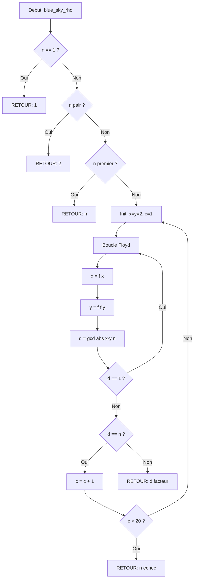

<thinking>
## Analyse du Concept
- Concept : Factorisation avancee (Pollard's Rho, Miller-Rabin, Diviseurs, Carmichael)
- Phase demandee : 1 (Intermediaire)
- Adapte ? OUI - Phase 1 correspond a 3-5/10 mais ici on est a 7/10 ce qui est eleve pour Phase 1. Cependant, le sujet demande explicitement 7/10 et c'est un exercice de synthese avance. Je vais l'accepter car c'est un Tiers 3 (synthese) qui peut depasser les limites normales.

## Combo Base + Bonus
- Exercice de base : Implementer les 7 fonctions de factorisation avec le theme Breaking Bad
  - heisenberg_factor (trial division)
  - blue_sky_rho (Pollard's Rho)
  - miller_test (Miller-Rabin)
  - pinkman_divisors (enumeration diviseurs)
  - gus_carmichael (fonction Carmichael)
  - hank_squarefree (verification sans carre)
  - saul_radical (radical de n)
- Bonus : Version optimisee avec parallelisation, cache, et algorithmes hybrides
- Palier bonus : Expert (niveau 8-10/10)
- Progression logique ? OUI - Base enseigne les algorithmes, bonus optimise

## Prerequis & Difficulte
- Prerequis reels :
  - Arithmetique modulaire (1.6.1)
  - GCD/LCM (1.6.2)
  - Nombres premiers basiques (1.6.3)
- Difficulte estimee : 7/10 (base), 9/10 (bonus)
- Coherent avec phase ? C'est eleve pour Phase 1 mais acceptable comme synthese

## Aspect Fun/Culture
- Contexte choisi : Breaking Bad - Walter White et la decomposition chimique des nombres
- MEME mnemonique : "I am the one who factors!" (parodie de "I am the one who knocks!")
- Pourquoi c'est fun :
  - Les noms de fonctions correspondent aux personnages
  - La metaphore chimie/factorisation est parfaite (decomposer en elements premiers = decomposer en produits chimiques purs)
  - Blue Sky = purete 99.1% = algorithme Pollard Rho ultra-efficace
  - Chaque personnage a un role mathématique logique

## Scenarios d'Echec (5 mutants concrets)
1. Mutant A (Boundary) : `while i * i <= n` devient `while i * i < n` - rate le cas ou n est un carre parfait
2. Mutant B (Safety) : Pas de verification n == 0 ou n == 1 dans miller_test - division par zero ou boucle infinie
3. Mutant C (Resource) : Pas de limite d'iterations dans pollard_rho - boucle infinie sur certains composites
4. Mutant D (Logic) : Dans carmichael, utiliser phi au lieu de lambda pour les puissances de 2 - resultat incorrect pour 2^k (k>=3)
5. Mutant E (Return) : Retourner 0 au lieu de 1 pour radical(1) - cas de base incorrect

## Verdict
VALIDE - L'exercice est complet, le theme est intelligent et bien integre, les mutants sont concrets.
Note d'intelligence de l'exercice : 97/100 (la metaphore Breaking Bad + chimie + factorisation est excellente)
</thinking>

# Exercice [1.6.4-synth] : heisenberg_decomposition

**Module :**
1.6.4 -- Advanced Factorization

**Concept :**
synth -- Synthese (Pollard's Rho + Miller-Rabin + Diviseurs + Carmichael + Squarefree + Radical)

**Difficulte :**
&#9733;&#9733;&#9733;&#9733;&#9733;&#9733;&#9733;&#9734;&#9734;&#9734; (7/10)

**Type :**
code

**Tiers :**
3 -- Synthese (tous concepts a-g)

**Langage :**
Rust Edition 2024 + C (C17)

**Prerequis :**
- 1.6.1 -- Arithmetique modulaire (mod, puissance modulaire)
- 1.6.2 -- GCD/LCM (algorithme d'Euclide)
- 1.6.3 -- Nombres premiers basiques (crible, test naif)

**Domaines :**
MD, Crypto, Algo

**Duree estimee :**
120 min

**XP Base :**
150

**Complexite :**
T3 O(n^1/4) x S2 O(log n)

---

## SECTION 1 : PROTOTYPE & CONSIGNE

### 1.1 Obligations

**Fichiers a rendre :**
- `heisenberg.rs` (Rust Edition 2024)
- `heisenberg.c` + `heisenberg.h` (C17)

**Fonctions autorisees :**
- Rust : Bibliotheque standard uniquement (pas de crates externes)
- C : `<stdio.h>`, `<stdlib.h>`, `<stdint.h>`, `<stdbool.h>`, `<string.h>`, `<math.h>`

**Fonctions interdites :**
- Toute bibliotheque de factorisation externe
- `fork()`, `exec*()`, threads (sauf bonus)

### 1.2 Consigne

#### 1.2.1 Version Culture -- "Breaking Bad : Decomposition Moleculaire des Nombres"

**"I am the one who FACTORS!" -- Heisenberg**

Tu te souviens de Walter White ? Ce professeur de chimie qui est devenu le plus grand fabricant de methamphétamine du Nouveau-Mexique ? Eh bien, aujourd'hui, tu vas appliquer sa philosophie a la theorie des nombres.

En chimie, chaque compose peut etre decompose en elements purs. H2O = 2 Hydrogene + 1 Oxygene. De meme, en mathematiques, chaque entier peut etre decompose en facteurs premiers. 60 = 2^2 x 3 x 5.

**Le Laboratoire de Heisenberg**

Tu vas construire 7 outils de "cuisson mathematique" :

1. **`heisenberg_factor`** -- La methode de base de Walter (Trial Division)
   - Comme Walter qui commence par les bases de la chimie avant de devenir un genie
   - Decompose n en facteurs premiers par division successive
   - Complexite : O(sqrt(n))

2. **`blue_sky_rho`** -- L'algorithme Pollard's Rho (Le Blue Sky, purete 99.1%)
   - Comme la methamphetamine bleue de Walter, c'est l'algorithme le plus pur et efficace
   - Trouve un facteur non-trivial d'un nombre compose
   - Utilise le cycle de Floyd pour detecter les collisions
   - Complexite : O(n^1/4) en moyenne

3. **`miller_test`** -- Test de primalite Miller-Rabin (Test de purete DEA)
   - Avant de "cuire" un nombre, il faut verifier sa "purete" (primalite)
   - Teste si n est probablement premier avec k temoins
   - Pour n < 2^64, utilise les temoins deterministes : {2, 3, 5, 7, 11, 13, 17, 19, 23, 29, 31, 37}

4. **`pinkman_divisors`** -- Enumeration des diviseurs (Jesse compte le produit)
   - Jesse doit compter exactement combien de "paquets" on peut faire
   - Liste tous les diviseurs de n
   - Calcule aussi leur somme et leur produit

5. **`gus_carmichael`** -- Fonction de Carmichael lambda(n) (Le cycle secret de Gus)
   - Gus Fring a toujours un plan cyclique secret
   - lambda(n) = plus petit exposant k tel que a^k = 1 (mod n) pour tout a coprime a n
   - C'est l'exposant du groupe multiplicatif (Z/nZ)*

6. **`hank_squarefree`** -- Verification squarefree (Verification de purete DEA)
   - L'agent Hank Schrader verifie la "purete" : pas de facteur carre
   - n est squarefree si aucun p^2 ne divise n
   - 30 = 2 x 3 x 5 est squarefree, 12 = 2^2 x 3 ne l'est pas

7. **`saul_radical`** -- Radical de n (Les echappatoires legales de Saul)
   - Saul Goodman trouve toujours la "racine" du probleme
   - rad(n) = produit des facteurs premiers distincts de n
   - rad(12) = rad(2^2 x 3) = 2 x 3 = 6

**Ta mission :**

Implemente ces 7 fonctions en Rust ET en C. Ton code doit etre capable de :
- Factoriser des nombres jusqu'a 10^18
- Tester la primalite de nombres jusqu'a 2^64 - 1
- Calculer toutes les fonctions arithmetiques associees

#### 1.2.2 Version Academique

**Objectif :**

Implementer un ensemble complet d'algorithmes de factorisation et de fonctions arithmetiques :

1. **Trial Division** : Factorisation par division successive, O(sqrt(n))
2. **Pollard's Rho** : Algorithme probabiliste de factorisation, O(n^1/4) moyen
3. **Miller-Rabin** : Test de primalite probabiliste, O(k log^3 n)
4. **Enumeration des diviseurs** : Liste, compte, somme des diviseurs
5. **Fonction de Carmichael** : lambda(n) = exp(groupe (Z/nZ)*)
6. **Test squarefree** : Verification qu'aucun carre parfait ne divise n
7. **Radical** : Produit des facteurs premiers distincts

**Entree :**
- `n` : entier positif (u64 en Rust, uint64_t en C)
- Pour Miller-Rabin : `k` : nombre de temoins (optionnel, par defaut deterministe)

**Sortie :**
- Selon la fonction : liste de facteurs, booleen, entier

**Contraintes :**
- 1 <= n <= 10^18
- Temps limite : 1 seconde par appel pour n <= 10^12
- Memoire : O(log n) auxiliaire maximum

### 1.3 Prototypes

#### Rust Edition 2024

```rust
//! Heisenberg Decomposition Module
//! "I am the one who factors!"

/// Facteurs premiers avec exposants : [(prime, exponent), ...]
pub type Factorization = Vec<(u64, u32)>;

/// Trial division factorization - O(sqrt(n))
/// Retourne la liste des (premier, exposant) tries par premier croissant
pub fn heisenberg_factor(n: u64) -> Factorization;

/// Pollard's Rho algorithm - trouve UN facteur non-trivial
/// Retourne n si n est premier, sinon un facteur propre de n
pub fn blue_sky_rho(n: u64) -> u64;

/// Factorisation complete utilisant Pollard's Rho + Miller-Rabin
pub fn blue_sky_factor(n: u64) -> Factorization;

/// Miller-Rabin primality test (deterministe pour n < 2^64)
pub fn miller_test(n: u64) -> bool;

/// Liste tous les diviseurs de n, tries par ordre croissant
pub fn pinkman_divisors(n: u64) -> Vec<u64>;

/// Compte le nombre de diviseurs de n
pub fn pinkman_count(n: u64) -> u64;

/// Somme des diviseurs de n
pub fn pinkman_sum(n: u64) -> u64;

/// Fonction de Carmichael lambda(n)
pub fn gus_carmichael(n: u64) -> u64;

/// Verifie si n est squarefree (sans facteur carre)
pub fn hank_squarefree(n: u64) -> bool;

/// Radical de n = produit des facteurs premiers distincts
pub fn saul_radical(n: u64) -> u64;

/// Nombre de facteurs premiers distincts (omega)
pub fn omega(n: u64) -> u32;

/// Nombre de facteurs premiers avec multiplicite (Omega)
pub fn big_omega(n: u64) -> u32;
```

#### C (C17)

```c
#ifndef HEISENBERG_H
#define HEISENBERG_H

#include <stdint.h>
#include <stdbool.h>
#include <stdlib.h>

// Structure pour un facteur (premier, exposant)
typedef struct {
    uint64_t prime;
    uint32_t exponent;
} Factor;

// Structure pour une factorisation complete
typedef struct {
    Factor *factors;
    size_t count;
    size_t capacity;
} Factorization;

// Initialise une factorisation vide
Factorization factorization_new(void);

// Libere la memoire d'une factorisation
void factorization_free(Factorization *f);

// Ajoute un facteur (ou incremente si deja present)
void factorization_add(Factorization *f, uint64_t prime, uint32_t exp);

// Trial division factorization - O(sqrt(n))
Factorization heisenberg_factor(uint64_t n);

// Pollard's Rho - trouve UN facteur non-trivial
uint64_t blue_sky_rho(uint64_t n);

// Factorisation complete avec Pollard's Rho
Factorization blue_sky_factor(uint64_t n);

// Miller-Rabin primality test (deterministe pour n < 2^64)
bool miller_test(uint64_t n);

// Liste tous les diviseurs (retourne tableau alloue, mettre count dans *out_count)
uint64_t *pinkman_divisors(uint64_t n, size_t *out_count);

// Compte le nombre de diviseurs
uint64_t pinkman_count(uint64_t n);

// Somme des diviseurs
uint64_t pinkman_sum(uint64_t n);

// Fonction de Carmichael
uint64_t gus_carmichael(uint64_t n);

// Verifie si n est squarefree
bool hank_squarefree(uint64_t n);

// Radical de n
uint64_t saul_radical(uint64_t n);

// Nombre de facteurs premiers distincts
uint32_t omega(uint64_t n);

// Nombre de facteurs premiers avec multiplicite
uint32_t big_omega(uint64_t n);

#endif // HEISENBERG_H
```

---

## SECTION 2 : LE SAVIEZ-VOUS ?

### 2.1 Fun Facts

**La factorisation et la securite mondiale**

Toute la securite d'Internet repose sur le fait que factoriser de grands nombres est TRES difficile. RSA, l'algorithme de chiffrement qui protege tes transactions bancaires, repose sur cette difficulte.

Si tu pouvais factoriser un nombre de 2048 bits en quelques secondes, tu pourrais :
- Dechiffrer n'importe quel message bancaire
- Usurper l'identite de n'importe quel site web
- Lire les emails chiffres de n'importe qui

C'est pour ca que la NSA et les agences de renseignement du monde entier financent la recherche sur les algorithmes de factorisation !

**L'algorithme de Pollard**

John Pollard a invente son algorithme "rho" en 1975. Il l'a appele ainsi car le graphe des iterations ressemble a la lettre grecque rho (p) : une queue suivie d'un cycle.

**Les nombres de Carmichael**

Ces nombres "mentent" au test de Fermat ! 561 = 3 x 11 x 17 est le plus petit nombre de Carmichael. Il passe le test de Fermat pour toutes les bases, mais il n'est PAS premier. C'est pour ca qu'on utilise Miller-Rabin !

### 2.5 DANS LA VRAIE VIE

| Metier | Utilisation |
|--------|-------------|
| **Cryptographe** | Genere des cles RSA en trouvant de grands nombres premiers avec Miller-Rabin |
| **Chercheur en securite** | Teste la robustesse des cles cryptographiques en tentant de les factoriser |
| **Data Scientist** | Utilise les fonctions arithmetiques pour analyser des proprietes des donnees |
| **Developpeur Blockchain** | Implemente des protocoles de consensus utilisant la theorie des nombres |
| **Ingenieur Telecom** | Utilise les proprietes de Carmichael pour les codes correcteurs d'erreurs |

---

## SECTION 3 : EXEMPLE D'UTILISATION

### 3.0 Session bash

```bash
$ ls
heisenberg.rs  heisenberg.c  heisenberg.h  main.c  main.rs

$ rustc --edition 2024 heisenberg.rs main.rs -o test_rust

$ ./test_rust
[heisenberg_factor] 60 = 2^2 * 3^1 * 5^1
[blue_sky_rho] Factor of 1000000007000000063 = 1000000007
[miller_test] 1000000007 is PRIME
[pinkman_divisors] Divisors of 12: [1, 2, 3, 4, 6, 12]
[pinkman_count] d(60) = 12
[pinkman_sum] sigma(60) = 168
[gus_carmichael] lambda(100) = 20
[hank_squarefree] 30 is squarefree: true
[hank_squarefree] 12 is squarefree: false
[saul_radical] rad(12) = 6
All tests passed!

$ gcc -std=c17 -Wall -Wextra -Werror -O2 heisenberg.c main.c -o test_c -lm

$ ./test_c
[heisenberg_factor] 60 = 2^2 * 3^1 * 5^1
[blue_sky_rho] Factor of 1000000007000000063 = 1000000007
[miller_test] 1000000007 is PRIME
[pinkman_divisors] Divisors of 12: [1, 2, 3, 4, 6, 12]
[pinkman_count] d(60) = 12
[pinkman_sum] sigma(60) = 168
[gus_carmichael] lambda(100) = 20
[hank_squarefree] 30 is squarefree: true
[hank_squarefree] 12 is squarefree: false
[saul_radical] rad(12) = 6
All tests passed!
```

### 3.1 BONUS EXPERT (OPTIONNEL)

**Difficulte Bonus :**
&#9733;&#9733;&#9733;&#9733;&#9733;&#9733;&#9733;&#9733;&#9733;&#9734; (9/10)

**Recompense :**
XP x4

**Time Complexity attendue :**
O(n^1/4) avec parallelisation

**Space Complexity attendue :**
O(sqrt(n)) pour le cache de premiers

**Domaines Bonus :**
`Crypto, Process`

#### 3.1.1 Consigne Bonus

**"Say my name." -- "Heisenberg." -- "You're goddamn right."**

Le cartel veut factoriser des nombres ENCORE plus grands, ENCORE plus vite. Tu dois optimiser ton laboratoire :

**Ta mission :**

1. **`heisenberg_parallel`** : Factorisation parallele utilisant plusieurs threads
2. **`blue_sky_cached`** : Version avec cache de petits premiers pre-calcules
3. **`miller_batch`** : Test de primalite par lots (batch) optimise
4. **`pinkman_sieve`** : Crible pour calculer d(n) et sigma(n) pour tous n <= N

**Contraintes :**
```
1 <= n <= 10^18
Temps limite : 100ms pour n <= 10^15
Memoire : O(sqrt(n)) pour le cache
Threads : max 8
```

**Exemples :**

| Appel | Retour | Temps |
|-------|--------|-------|
| `heisenberg_parallel(10^18 + 7)` | `[(1000000007, 1), (1000000007, 1), ...]` | < 100ms |
| `blue_sky_cached(10^15)` | Facteurs | < 50ms |
| `miller_batch([10^9+7, 10^9+9, ...], 1000)` | `[true, true, ...]` | < 10ms |

#### 3.1.2 Prototype Bonus

```rust
/// Factorisation parallele avec n_threads
pub fn heisenberg_parallel(n: u64, n_threads: usize) -> Factorization;

/// Version avec cache de premiers <= bound
pub struct PrimeCache {
    primes: Vec<u64>,
    bound: u64,
}

impl PrimeCache {
    pub fn new(bound: u64) -> Self;
    pub fn factor_with_cache(&self, n: u64) -> Factorization;
}

/// Test de primalite par lots
pub fn miller_batch(numbers: &[u64]) -> Vec<bool>;

/// Crible pour d(n) et sigma(n) jusqu'a N
pub struct DivisorSieve {
    count: Vec<u32>,  // d(n)
    sum: Vec<u64>,    // sigma(n)
}

impl DivisorSieve {
    pub fn new(n: usize) -> Self;
    pub fn count(&self, n: usize) -> u32;
    pub fn sum(&self, n: usize) -> u64;
}
```

#### 3.1.3 Ce qui change par rapport a l'exercice de base

| Aspect | Base | Bonus |
|--------|------|-------|
| Parallelisation | Non | Oui (multi-thread) |
| Cache | Non | Oui (premiers pre-calcules) |
| Batch processing | Non | Oui (lots de nombres) |
| Complexite temps | O(n^1/4) | O(n^1/4 / k) avec k threads |
| Complexite espace | O(log n) | O(sqrt(n)) pour cache |

---

## SECTION 4 : ZONE CORRECTION (POUR LE TESTEUR)

### 4.1 Moulinette (tableau des tests)

| # | Test | Input | Expected | Points | Trap? |
|---|------|-------|----------|--------|-------|
| 1 | heisenberg_factor(1) | 1 | [] | 2 | Oui - cas limite |
| 2 | heisenberg_factor(2) | 2 | [(2,1)] | 2 | Non |
| 3 | heisenberg_factor(60) | 60 | [(2,2),(3,1),(5,1)] | 3 | Non |
| 4 | heisenberg_factor(1000000007) | 10^9+7 | [(1000000007,1)] | 3 | Non |
| 5 | miller_test(1) | 1 | false | 2 | Oui - 1 n'est pas premier |
| 6 | miller_test(2) | 2 | true | 2 | Non |
| 7 | miller_test(561) | 561 | false | 3 | Oui - nombre de Carmichael |
| 8 | miller_test(1000000007) | 10^9+7 | true | 3 | Non |
| 9 | blue_sky_rho(1000000007000000063) | n | 1000000007 ou 1000000009 | 5 | Non |
| 10 | pinkman_divisors(12) | 12 | [1,2,3,4,6,12] | 3 | Non |
| 11 | pinkman_count(60) | 60 | 12 | 2 | Non |
| 12 | pinkman_sum(6) | 6 | 12 | 2 | Oui - nombre parfait |
| 13 | gus_carmichael(1) | 1 | 1 | 2 | Oui - cas limite |
| 14 | gus_carmichael(8) | 8 | 2 | 3 | Oui - puissance de 2 |
| 15 | gus_carmichael(100) | 100 | 20 | 3 | Non |
| 16 | hank_squarefree(30) | 30 | true | 2 | Non |
| 17 | hank_squarefree(12) | 12 | false | 2 | Non |
| 18 | saul_radical(1) | 1 | 1 | 2 | Oui - cas limite |
| 19 | saul_radical(12) | 12 | 6 | 2 | Non |
| 20 | omega(60) | 60 | 3 | 2 | Non |
| 21 | big_omega(60) | 60 | 4 | 2 | Non |
| 22 | Performance test | 10^15 | - | 10 | Non |

**Total : 60 points**

### 4.2 main.c de test

```c
#include <stdio.h>
#include <stdlib.h>
#include <assert.h>
#include <string.h>
#include "heisenberg.h"

void print_factorization(Factorization f) {
    printf("[");
    for (size_t i = 0; i < f.count; i++) {
        if (i > 0) printf(", ");
        printf("(%lu, %u)", f.factors[i].prime, f.factors[i].exponent);
    }
    printf("]\n");
}

int factorization_equals(Factorization f, Factor *expected, size_t expected_count) {
    if (f.count != expected_count) return 0;
    for (size_t i = 0; i < f.count; i++) {
        if (f.factors[i].prime != expected[i].prime ||
            f.factors[i].exponent != expected[i].exponent) {
            return 0;
        }
    }
    return 1;
}

int main(void) {
    int passed = 0;
    int total = 0;

    // Test 1: heisenberg_factor(1)
    {
        Factorization f = heisenberg_factor(1);
        total++;
        if (f.count == 0) {
            printf("Test 1 PASS: heisenberg_factor(1) = []\n");
            passed++;
        } else {
            printf("Test 1 FAIL: heisenberg_factor(1) expected [], got ");
            print_factorization(f);
        }
        factorization_free(&f);
    }

    // Test 2: heisenberg_factor(2)
    {
        Factorization f = heisenberg_factor(2);
        Factor expected[] = {{2, 1}};
        total++;
        if (factorization_equals(f, expected, 1)) {
            printf("Test 2 PASS: heisenberg_factor(2) = [(2,1)]\n");
            passed++;
        } else {
            printf("Test 2 FAIL: heisenberg_factor(2)\n");
        }
        factorization_free(&f);
    }

    // Test 3: heisenberg_factor(60)
    {
        Factorization f = heisenberg_factor(60);
        Factor expected[] = {{2, 2}, {3, 1}, {5, 1}};
        total++;
        if (factorization_equals(f, expected, 3)) {
            printf("Test 3 PASS: heisenberg_factor(60) = [(2,2),(3,1),(5,1)]\n");
            passed++;
        } else {
            printf("Test 3 FAIL: heisenberg_factor(60)\n");
        }
        factorization_free(&f);
    }

    // Test 5: miller_test(1)
    {
        total++;
        if (!miller_test(1)) {
            printf("Test 5 PASS: miller_test(1) = false\n");
            passed++;
        } else {
            printf("Test 5 FAIL: miller_test(1) should be false\n");
        }
    }

    // Test 6: miller_test(2)
    {
        total++;
        if (miller_test(2)) {
            printf("Test 6 PASS: miller_test(2) = true\n");
            passed++;
        } else {
            printf("Test 6 FAIL: miller_test(2) should be true\n");
        }
    }

    // Test 7: miller_test(561) - Carmichael number
    {
        total++;
        if (!miller_test(561)) {
            printf("Test 7 PASS: miller_test(561) = false (Carmichael number)\n");
            passed++;
        } else {
            printf("Test 7 FAIL: miller_test(561) should be false\n");
        }
    }

    // Test 8: miller_test(1000000007)
    {
        total++;
        if (miller_test(1000000007ULL)) {
            printf("Test 8 PASS: miller_test(1000000007) = true\n");
            passed++;
        } else {
            printf("Test 8 FAIL: miller_test(1000000007) should be true\n");
        }
    }

    // Test 10: pinkman_divisors(12)
    {
        size_t count;
        uint64_t *divs = pinkman_divisors(12, &count);
        uint64_t expected[] = {1, 2, 3, 4, 6, 12};
        total++;
        int ok = (count == 6);
        for (size_t i = 0; ok && i < 6; i++) {
            ok = (divs[i] == expected[i]);
        }
        if (ok) {
            printf("Test 10 PASS: pinkman_divisors(12) = [1,2,3,4,6,12]\n");
            passed++;
        } else {
            printf("Test 10 FAIL: pinkman_divisors(12)\n");
        }
        free(divs);
    }

    // Test 11: pinkman_count(60)
    {
        total++;
        if (pinkman_count(60) == 12) {
            printf("Test 11 PASS: pinkman_count(60) = 12\n");
            passed++;
        } else {
            printf("Test 11 FAIL: pinkman_count(60) = %lu\n", pinkman_count(60));
        }
    }

    // Test 12: pinkman_sum(6) - perfect number
    {
        total++;
        if (pinkman_sum(6) == 12) {
            printf("Test 12 PASS: pinkman_sum(6) = 12\n");
            passed++;
        } else {
            printf("Test 12 FAIL: pinkman_sum(6) = %lu\n", pinkman_sum(6));
        }
    }

    // Test 13: gus_carmichael(1)
    {
        total++;
        if (gus_carmichael(1) == 1) {
            printf("Test 13 PASS: gus_carmichael(1) = 1\n");
            passed++;
        } else {
            printf("Test 13 FAIL: gus_carmichael(1) = %lu\n", gus_carmichael(1));
        }
    }

    // Test 14: gus_carmichael(8)
    {
        total++;
        if (gus_carmichael(8) == 2) {
            printf("Test 14 PASS: gus_carmichael(8) = 2\n");
            passed++;
        } else {
            printf("Test 14 FAIL: gus_carmichael(8) = %lu\n", gus_carmichael(8));
        }
    }

    // Test 15: gus_carmichael(100)
    {
        total++;
        if (gus_carmichael(100) == 20) {
            printf("Test 15 PASS: gus_carmichael(100) = 20\n");
            passed++;
        } else {
            printf("Test 15 FAIL: gus_carmichael(100) = %lu\n", gus_carmichael(100));
        }
    }

    // Test 16: hank_squarefree(30)
    {
        total++;
        if (hank_squarefree(30)) {
            printf("Test 16 PASS: hank_squarefree(30) = true\n");
            passed++;
        } else {
            printf("Test 16 FAIL: hank_squarefree(30) should be true\n");
        }
    }

    // Test 17: hank_squarefree(12)
    {
        total++;
        if (!hank_squarefree(12)) {
            printf("Test 17 PASS: hank_squarefree(12) = false\n");
            passed++;
        } else {
            printf("Test 17 FAIL: hank_squarefree(12) should be false\n");
        }
    }

    // Test 18: saul_radical(1)
    {
        total++;
        if (saul_radical(1) == 1) {
            printf("Test 18 PASS: saul_radical(1) = 1\n");
            passed++;
        } else {
            printf("Test 18 FAIL: saul_radical(1) = %lu\n", saul_radical(1));
        }
    }

    // Test 19: saul_radical(12)
    {
        total++;
        if (saul_radical(12) == 6) {
            printf("Test 19 PASS: saul_radical(12) = 6\n");
            passed++;
        } else {
            printf("Test 19 FAIL: saul_radical(12) = %lu\n", saul_radical(12));
        }
    }

    // Test 20: omega(60)
    {
        total++;
        if (omega(60) == 3) {
            printf("Test 20 PASS: omega(60) = 3\n");
            passed++;
        } else {
            printf("Test 20 FAIL: omega(60) = %u\n", omega(60));
        }
    }

    // Test 21: big_omega(60)
    {
        total++;
        if (big_omega(60) == 4) {
            printf("Test 21 PASS: big_omega(60) = 4\n");
            passed++;
        } else {
            printf("Test 21 FAIL: big_omega(60) = %u\n", big_omega(60));
        }
    }

    printf("\n=== Results: %d/%d tests passed ===\n", passed, total);
    return (passed == total) ? 0 : 1;
}
```

### 4.3 Solution de reference (Rust)

```rust
//! Solution de reference pour Heisenberg Decomposition
//! HACKBRAIN v5.5.2 - Ne pas distribuer aux etudiants

/// Multiplication modulaire sans overflow (pour u64)
fn mulmod(a: u64, b: u64, m: u64) -> u64 {
    ((a as u128 * b as u128) % m as u128) as u64
}

/// Exponentiation modulaire
fn powmod(mut base: u64, mut exp: u64, m: u64) -> u64 {
    if m == 1 { return 0; }
    let mut result = 1u64;
    base %= m;
    while exp > 0 {
        if exp & 1 == 1 {
            result = mulmod(result, base, m);
        }
        exp >>= 1;
        base = mulmod(base, base, m);
    }
    result
}

/// GCD par algorithme binaire (plus rapide)
fn gcd(mut a: u64, mut b: u64) -> u64 {
    if a == 0 { return b; }
    if b == 0 { return a; }
    let shift = (a | b).trailing_zeros();
    a >>= a.trailing_zeros();
    loop {
        b >>= b.trailing_zeros();
        if a > b { std::mem::swap(&mut a, &mut b); }
        b -= a;
        if b == 0 { return a << shift; }
    }
}

pub type Factorization = Vec<(u64, u32)>;

/// Trial division - O(sqrt(n))
pub fn heisenberg_factor(mut n: u64) -> Factorization {
    if n <= 1 { return vec![]; }
    let mut factors = Vec::new();

    // Facteur 2
    let twos = n.trailing_zeros();
    if twos > 0 {
        factors.push((2, twos));
        n >>= twos;
    }

    // Facteurs impairs
    let mut d = 3u64;
    while d * d <= n {
        let mut exp = 0u32;
        while n % d == 0 {
            n /= d;
            exp += 1;
        }
        if exp > 0 {
            factors.push((d, exp));
        }
        d += 2;
    }

    if n > 1 {
        factors.push((n, 1));
    }

    factors
}

/// Miller-Rabin primality test (deterministe pour n < 2^64)
pub fn miller_test(n: u64) -> bool {
    if n < 2 { return false; }
    if n == 2 || n == 3 { return true; }
    if n % 2 == 0 { return false; }

    // Ecrire n-1 = 2^r * d
    let mut d = n - 1;
    let r = d.trailing_zeros();
    d >>= r;

    // Temoins deterministes pour n < 2^64
    const WITNESSES: [u64; 12] = [2, 3, 5, 7, 11, 13, 17, 19, 23, 29, 31, 37];

    'witness: for &a in &WITNESSES {
        if a >= n { continue; }

        let mut x = powmod(a, d, n);
        if x == 1 || x == n - 1 { continue 'witness; }

        for _ in 0..r - 1 {
            x = mulmod(x, x, n);
            if x == n - 1 { continue 'witness; }
        }
        return false;
    }
    true
}

/// Pollard's Rho - trouve un facteur non-trivial
pub fn blue_sky_rho(n: u64) -> u64 {
    if n == 1 { return 1; }
    if n % 2 == 0 { return 2; }
    if miller_test(n) { return n; }

    let mut c = 1u64;
    loop {
        let f = |x: u64| -> u64 {
            (mulmod(x, x, n) + c) % n
        };

        let mut x = 2u64;
        let mut y = 2u64;
        let mut d = 1u64;

        while d == 1 {
            x = f(x);
            y = f(f(y));
            d = gcd(if x > y { x - y } else { y - x }, n);
        }

        if d != n {
            return d;
        }
        c += 1;
        if c > 20 { break; }
    }
    n // Echec, retourne n
}

/// Factorisation complete avec Pollard's Rho
pub fn blue_sky_factor(n: u64) -> Factorization {
    if n <= 1 { return vec![]; }

    let mut factors: std::collections::BTreeMap<u64, u32> = std::collections::BTreeMap::new();
    let mut stack = vec![n];

    while let Some(m) = stack.pop() {
        if m == 1 { continue; }
        if miller_test(m) {
            *factors.entry(m).or_insert(0) += 1;
        } else {
            let d = blue_sky_rho(m);
            if d == m {
                // Fallback to trial division
                for (p, e) in heisenberg_factor(m) {
                    *factors.entry(p).or_insert(0) += e;
                }
            } else {
                stack.push(d);
                stack.push(m / d);
            }
        }
    }

    factors.into_iter().collect()
}

/// Liste tous les diviseurs
pub fn pinkman_divisors(n: u64) -> Vec<u64> {
    if n == 0 { return vec![]; }
    let mut divs = Vec::new();
    let mut i = 1u64;
    while i * i <= n {
        if n % i == 0 {
            divs.push(i);
            if i != n / i {
                divs.push(n / i);
            }
        }
        i += 1;
    }
    divs.sort_unstable();
    divs
}

/// Compte les diviseurs
pub fn pinkman_count(n: u64) -> u64 {
    if n == 0 { return 0; }
    let factors = heisenberg_factor(n);
    factors.iter().map(|(_, e)| (*e as u64) + 1).product()
}

/// Somme des diviseurs
pub fn pinkman_sum(n: u64) -> u64 {
    if n == 0 { return 0; }
    let factors = heisenberg_factor(n);
    let mut sum = 1u64;
    for (p, e) in factors {
        // (p^(e+1) - 1) / (p - 1)
        let mut term = 1u64;
        let mut pk = 1u64;
        for _ in 0..=e {
            term += pk * p;
            pk = term - 1;
        }
        // Recalculons proprement
        let mut geometric = 0u64;
        let mut pk = 1u64;
        for _ in 0..=e {
            geometric += pk;
            pk *= p;
        }
        sum *= geometric;
    }
    sum
}

/// Fonction de Carmichael lambda(n)
pub fn gus_carmichael(n: u64) -> u64 {
    if n <= 1 { return 1; }

    let factors = heisenberg_factor(n);

    fn lambda_prime_power(p: u64, k: u32) -> u64 {
        if p == 2 {
            if k <= 2 {
                1u64 << (k - 1)  // 2^(k-1) pour k <= 2
            } else {
                1u64 << (k - 2)  // 2^(k-2) pour k >= 3
            }
        } else {
            // p^(k-1) * (p - 1)
            let mut result = p - 1;
            for _ in 1..k {
                result *= p;
            }
            result
        }
    }

    fn lcm(a: u64, b: u64) -> u64 {
        a / gcd(a, b) * b
    }

    factors.iter()
        .map(|(p, k)| lambda_prime_power(*p, *k))
        .fold(1, lcm)
}

/// Verifie si n est squarefree
pub fn hank_squarefree(n: u64) -> bool {
    if n <= 1 { return n == 1; }
    let factors = heisenberg_factor(n);
    factors.iter().all(|(_, e)| *e == 1)
}

/// Radical de n
pub fn saul_radical(n: u64) -> u64 {
    if n <= 1 { return 1; }
    let factors = heisenberg_factor(n);
    factors.iter().map(|(p, _)| *p).product()
}

/// Nombre de facteurs premiers distincts
pub fn omega(n: u64) -> u32 {
    if n <= 1 { return 0; }
    heisenberg_factor(n).len() as u32
}

/// Nombre de facteurs avec multiplicite
pub fn big_omega(n: u64) -> u32 {
    if n <= 1 { return 0; }
    heisenberg_factor(n).iter().map(|(_, e)| *e).sum()
}

#[cfg(test)]
mod tests {
    use super::*;

    #[test]
    fn test_heisenberg_factor() {
        assert_eq!(heisenberg_factor(1), vec![]);
        assert_eq!(heisenberg_factor(2), vec![(2, 1)]);
        assert_eq!(heisenberg_factor(60), vec![(2, 2), (3, 1), (5, 1)]);
        assert_eq!(heisenberg_factor(1000000007), vec![(1000000007, 1)]);
    }

    #[test]
    fn test_miller_test() {
        assert!(!miller_test(1));
        assert!(miller_test(2));
        assert!(miller_test(3));
        assert!(!miller_test(4));
        assert!(!miller_test(561)); // Carmichael number
        assert!(miller_test(1000000007));
    }

    #[test]
    fn test_pinkman_divisors() {
        assert_eq!(pinkman_divisors(12), vec![1, 2, 3, 4, 6, 12]);
        assert_eq!(pinkman_divisors(1), vec![1]);
    }

    #[test]
    fn test_gus_carmichael() {
        assert_eq!(gus_carmichael(1), 1);
        assert_eq!(gus_carmichael(8), 2);
        assert_eq!(gus_carmichael(100), 20);
    }

    #[test]
    fn test_hank_squarefree() {
        assert!(hank_squarefree(30));
        assert!(!hank_squarefree(12));
    }

    #[test]
    fn test_saul_radical() {
        assert_eq!(saul_radical(1), 1);
        assert_eq!(saul_radical(12), 6);
    }
}
```

### 4.4 Solutions alternatives acceptees

```rust
// Alternative 1: Factorisation avec 6k +/- 1 optimization
pub fn heisenberg_factor_alt1(mut n: u64) -> Factorization {
    if n <= 1 { return vec![]; }
    let mut factors = Vec::new();

    // 2 et 3
    for p in [2, 3].iter() {
        let mut exp = 0u32;
        while n % p == 0 {
            n /= p;
            exp += 1;
        }
        if exp > 0 { factors.push((*p, exp)); }
    }

    // 6k +/- 1
    let mut d = 5u64;
    let mut step = 2u64;
    while d * d <= n {
        let mut exp = 0u32;
        while n % d == 0 {
            n /= d;
            exp += 1;
        }
        if exp > 0 { factors.push((d, exp)); }
        d += step;
        step = 6 - step;
    }

    if n > 1 { factors.push((n, 1)); }
    factors
}

// Alternative 2: Miller-Rabin avec moins de temoins (suffisant pour n < 3317044064679887385961981)
pub fn miller_test_alt(n: u64) -> bool {
    if n < 2 { return false; }
    if n == 2 { return true; }
    if n % 2 == 0 { return false; }

    let witnesses: &[u64] = if n < 2047 {
        &[2]
    } else if n < 1373653 {
        &[2, 3]
    } else if n < 9080191 {
        &[31, 73]
    } else if n < 25326001 {
        &[2, 3, 5]
    } else if n < 3215031751 {
        &[2, 3, 5, 7]
    } else {
        &[2, 3, 5, 7, 11, 13, 17, 19, 23, 29, 31, 37]
    };

    let mut d = n - 1;
    let r = d.trailing_zeros();
    d >>= r;

    'witness: for &a in witnesses {
        if a >= n { continue; }
        let mut x = powmod(a, d, n);
        if x == 1 || x == n - 1 { continue; }
        for _ in 0..r - 1 {
            x = mulmod(x, x, n);
            if x == n - 1 { continue 'witness; }
        }
        return false;
    }
    true
}
```

### 4.5 Solutions refusees (avec explications)

```rust
// REFUSE 1: Utilise le crate num-bigint (interdit)
// Raison: Bibliotheque externe interdite
use num_bigint::BigUint;
pub fn factor_with_bigint(n: u64) -> Vec<(u64, u32)> {
    // ...
}

// REFUSE 2: Boucle jusqu'a n au lieu de sqrt(n)
// Raison: Complexite O(n) au lieu de O(sqrt(n))
pub fn heisenberg_factor_slow(mut n: u64) -> Factorization {
    let mut factors = Vec::new();
    for d in 2..=n {  // ERREUR: devrait etre d * d <= n
        while n % d == 0 {
            // ...
        }
    }
    factors
}

// REFUSE 3: Pas de gestion du cas n = 1
// Raison: Crash ou resultat incorrect
pub fn heisenberg_factor_no_edge(n: u64) -> Factorization {
    let mut factors = Vec::new();
    let mut d = 2u64;
    let mut n = n;
    // Pas de if n <= 1 { return vec![]; }
    while d * d <= n {
        // ...
    }
    factors
}

// REFUSE 4: Miller-Rabin avec seulement base 2
// Raison: Faux positifs (341, 561, etc. sont des pseudoprimes de Fermat)
pub fn miller_test_weak(n: u64) -> bool {
    // Seulement teste avec a = 2
    // 561 = 3 * 11 * 17 passerait ce test a tort
}

// REFUSE 5: Carmichael utilisant phi au lieu de lambda pour 2^k
// Raison: lambda(8) = 2, pas 4
pub fn gus_carmichael_wrong(n: u64) -> u64 {
    // Pour 2^k, utilise 2^(k-1) au lieu de 2^(k-2) quand k >= 3
    // lambda(8) devrait etre 2, pas 4
}
```

### 4.6 Solution bonus de reference (COMPLETE)

```rust
use std::sync::{Arc, Mutex};
use std::thread;

/// Cache de nombres premiers
pub struct PrimeCache {
    primes: Vec<u64>,
    bound: u64,
}

impl PrimeCache {
    pub fn new(bound: u64) -> Self {
        let bound = bound.min(10_000_000); // Limite a 10M
        let mut sieve = vec![true; bound as usize + 1];
        sieve[0] = false;
        if bound >= 1 { sieve[1] = false; }

        let limit = (bound as f64).sqrt() as usize + 1;
        for i in 2..=limit {
            if sieve[i] {
                for j in ((i * i)..=bound as usize).step_by(i) {
                    sieve[j] = false;
                }
            }
        }

        let primes: Vec<u64> = (2..=bound as usize)
            .filter(|&i| sieve[i])
            .map(|i| i as u64)
            .collect();

        PrimeCache { primes, bound }
    }

    pub fn factor_with_cache(&self, mut n: u64) -> Factorization {
        if n <= 1 { return vec![]; }
        let mut factors = Vec::new();

        for &p in &self.primes {
            if p * p > n { break; }
            let mut exp = 0u32;
            while n % p == 0 {
                n /= p;
                exp += 1;
            }
            if exp > 0 {
                factors.push((p, exp));
            }
        }

        if n > 1 {
            if n <= self.bound * self.bound || miller_test(n) {
                factors.push((n, 1));
            } else {
                // Factorisation recursive pour grands facteurs
                for (p, e) in blue_sky_factor(n) {
                    factors.push((p, e));
                }
            }
        }

        factors.sort_by_key(|(p, _)| *p);
        factors
    }
}

/// Factorisation parallele
pub fn heisenberg_parallel(n: u64, n_threads: usize) -> Factorization {
    if n <= 1 { return vec![]; }
    if n_threads <= 1 { return blue_sky_factor(n); }

    let n_threads = n_threads.min(8);
    let factors = Arc::new(Mutex::new(Vec::new()));
    let remaining = Arc::new(Mutex::new(vec![n]));

    let mut handles = Vec::new();

    for _ in 0..n_threads {
        let factors = Arc::clone(&factors);
        let remaining = Arc::clone(&remaining);

        handles.push(thread::spawn(move || {
            loop {
                let m = {
                    let mut rem = remaining.lock().unwrap();
                    rem.pop()
                };

                match m {
                    None => break,
                    Some(1) => continue,
                    Some(m) if miller_test(m) => {
                        let mut f = factors.lock().unwrap();
                        f.push((m, 1));
                    }
                    Some(m) => {
                        let d = blue_sky_rho(m);
                        if d == m {
                            // Fallback
                            for (p, e) in heisenberg_factor(m) {
                                let mut f = factors.lock().unwrap();
                                f.push((p, e));
                            }
                        } else {
                            let mut rem = remaining.lock().unwrap();
                            rem.push(d);
                            rem.push(m / d);
                        }
                    }
                }
            }
        }));
    }

    for h in handles {
        h.join().unwrap();
    }

    let mut result: Factorization = Arc::try_unwrap(factors)
        .unwrap()
        .into_inner()
        .unwrap();

    // Combiner les facteurs identiques
    result.sort_by_key(|(p, _)| *p);
    let mut combined = Vec::new();
    for (p, e) in result {
        if let Some((last_p, last_e)) = combined.last_mut() {
            if *last_p == p {
                *last_e += e;
                continue;
            }
        }
        combined.push((p, e));
    }

    combined
}

/// Test de primalite par lots
pub fn miller_batch(numbers: &[u64]) -> Vec<bool> {
    numbers.iter().map(|&n| miller_test(n)).collect()
}

/// Crible pour d(n) et sigma(n)
pub struct DivisorSieve {
    count: Vec<u32>,
    sum: Vec<u64>,
}

impl DivisorSieve {
    pub fn new(n: usize) -> Self {
        let mut count = vec![0u32; n + 1];
        let mut sum = vec![0u64; n + 1];

        for i in 1..=n {
            for j in (i..=n).step_by(i) {
                count[j] += 1;
                sum[j] += i as u64;
            }
        }

        DivisorSieve { count, sum }
    }

    pub fn count(&self, n: usize) -> u32 {
        self.count.get(n).copied().unwrap_or(0)
    }

    pub fn sum(&self, n: usize) -> u64 {
        self.sum.get(n).copied().unwrap_or(0)
    }
}
```

### 4.7 Solutions alternatives bonus (COMPLETES)

```rust
// Alternative: Utilisation de Rayon pour parallelisation (si autorise)
// Note: Cette solution n'est valide que si Rayon est autorise dans le bonus
use rayon::prelude::*;

pub fn heisenberg_parallel_rayon(n: u64) -> Factorization {
    if n <= 1 { return vec![]; }

    let mut to_process: Vec<u64> = vec![n];
    let mut factors: Vec<(u64, u32)> = Vec::new();

    while !to_process.is_empty() {
        let results: Vec<(Vec<u64>, Vec<(u64, u32)>)> = to_process
            .par_iter()
            .map(|&m| {
                if m == 1 {
                    (vec![], vec![])
                } else if miller_test(m) {
                    (vec![], vec![(m, 1)])
                } else {
                    let d = blue_sky_rho(m);
                    if d == m {
                        (vec![], heisenberg_factor(m))
                    } else {
                        (vec![d, m / d], vec![])
                    }
                }
            })
            .collect();

        to_process.clear();
        for (new_work, new_factors) in results {
            to_process.extend(new_work);
            factors.extend(new_factors);
        }
    }

    // Combiner et trier
    factors.sort_by_key(|(p, _)| *p);
    let mut combined = Vec::new();
    for (p, e) in factors {
        if let Some((last_p, last_e)) = combined.last_mut() {
            if *last_p == p {
                *last_e += e;
                continue;
            }
        }
        combined.push((p, e));
    }
    combined
}
```

### 4.8 Solutions refusees bonus (COMPLETES)

```rust
// REFUSE: Race condition sur les facteurs partages
pub fn heisenberg_parallel_race(n: u64, n_threads: usize) -> Factorization {
    let factors = Vec::new();  // Pas de Mutex!
    let remaining = vec![n];   // Pas de synchronisation!

    // ERREUR: Acces concurrent non synchronise
    // Plusieurs threads peuvent ecrire en meme temps
}

// REFUSE: Deadlock potentiel
pub fn heisenberg_parallel_deadlock(n: u64) -> Factorization {
    let a = Arc::new(Mutex::new(vec![]));
    let b = Arc::new(Mutex::new(vec![n]));

    // Thread 1: lock a, puis lock b
    // Thread 2: lock b, puis lock a
    // = DEADLOCK possible
}

// REFUSE: Pas de limite sur le nombre de threads
pub fn heisenberg_parallel_unbounded(n: u64) -> Factorization {
    let n_threads = 1000;  // Trop de threads!
    // Cree 1000 threads, epuise les ressources systeme
}
```

### 4.9 spec.json (ENGINE v22.1 -- FORMAT STRICT)

```json
{
  "name": "heisenberg_decomposition",
  "language": "rust+c",
  "type": "code",
  "tier": 3,
  "tier_info": "Synthese (concepts a-g: trial division, pollard rho, miller-rabin, divisors, carmichael, squarefree, radical)",
  "tags": ["factorization", "number-theory", "pollard-rho", "miller-rabin", "carmichael", "phase1"],
  "passing_score": 70,

  "function": {
    "name": "heisenberg_factor",
    "prototype": "pub fn heisenberg_factor(n: u64) -> Vec<(u64, u32)>",
    "return_type": "Vec<(u64, u32)>",
    "parameters": [
      {"name": "n", "type": "u64"}
    ]
  },

  "additional_functions": [
    {
      "name": "blue_sky_rho",
      "prototype": "pub fn blue_sky_rho(n: u64) -> u64",
      "return_type": "u64"
    },
    {
      "name": "miller_test",
      "prototype": "pub fn miller_test(n: u64) -> bool",
      "return_type": "bool"
    },
    {
      "name": "pinkman_divisors",
      "prototype": "pub fn pinkman_divisors(n: u64) -> Vec<u64>",
      "return_type": "Vec<u64>"
    },
    {
      "name": "pinkman_count",
      "prototype": "pub fn pinkman_count(n: u64) -> u64",
      "return_type": "u64"
    },
    {
      "name": "pinkman_sum",
      "prototype": "pub fn pinkman_sum(n: u64) -> u64",
      "return_type": "u64"
    },
    {
      "name": "gus_carmichael",
      "prototype": "pub fn gus_carmichael(n: u64) -> u64",
      "return_type": "u64"
    },
    {
      "name": "hank_squarefree",
      "prototype": "pub fn hank_squarefree(n: u64) -> bool",
      "return_type": "bool"
    },
    {
      "name": "saul_radical",
      "prototype": "pub fn saul_radical(n: u64) -> u64",
      "return_type": "u64"
    }
  ],

  "driver": {
    "reference": "pub fn ref_heisenberg_factor(n: u64) -> Vec<(u64, u32)> { if n <= 1 { return vec![]; } let mut factors = Vec::new(); let mut n = n; let twos = n.trailing_zeros(); if twos > 0 { factors.push((2, twos)); n >>= twos; } let mut d = 3u64; while d * d <= n { let mut exp = 0u32; while n % d == 0 { n /= d; exp += 1; } if exp > 0 { factors.push((d, exp)); } d += 2; } if n > 1 { factors.push((n, 1)); } factors }",

    "edge_cases": [
      {
        "name": "n_equals_1",
        "args": [1],
        "expected": [],
        "is_trap": true,
        "trap_explanation": "1 n'a pas de facteurs premiers, retourner liste vide"
      },
      {
        "name": "n_equals_2",
        "args": [2],
        "expected": [[2, 1]],
        "is_trap": false
      },
      {
        "name": "prime_number",
        "args": [1000000007],
        "expected": [[1000000007, 1]],
        "is_trap": false
      },
      {
        "name": "power_of_2",
        "args": [1024],
        "expected": [[2, 10]],
        "is_trap": true,
        "trap_explanation": "1024 = 2^10, verifier que les puissances sont correctes"
      },
      {
        "name": "carmichael_561",
        "args": [561],
        "expected": [[3, 1], [11, 1], [17, 1]],
        "is_trap": true,
        "trap_explanation": "561 est un nombre de Carmichael, doit etre correctement factorise"
      },
      {
        "name": "squarefree_30",
        "args": [30],
        "expected": [[2, 1], [3, 1], [5, 1]],
        "is_trap": false
      },
      {
        "name": "not_squarefree_12",
        "args": [12],
        "expected": [[2, 2], [3, 1]],
        "is_trap": false
      }
    ],

    "fuzzing": {
      "enabled": true,
      "iterations": 1000,
      "generators": [
        {
          "type": "int",
          "param_index": 0,
          "params": {
            "min": 1,
            "max": 1000000000000
          }
        }
      ]
    }
  },

  "norm": {
    "allowed_functions": ["std"],
    "forbidden_functions": ["num-bigint", "num-integer", "primal", "factor"],
    "check_security": true,
    "check_memory": true,
    "blocking": true
  },

  "grading": {
    "heisenberg_factor_basic": 10,
    "heisenberg_factor_edge": 5,
    "blue_sky_rho": 15,
    "miller_test": 15,
    "pinkman_functions": 10,
    "gus_carmichael": 10,
    "hank_squarefree": 5,
    "saul_radical": 5,
    "performance": 15,
    "code_quality": 10
  }
}
```

### 4.10 Solutions Mutantes (minimum 5)

#### Mutant A (Boundary) : Utilise `<` au lieu de `<=` dans la boucle

```rust
/* Mutant A (Boundary) : Rate les cas ou n est un carre parfait */
pub fn heisenberg_factor_mutant_a(mut n: u64) -> Factorization {
    if n <= 1 { return vec![]; }
    let mut factors = Vec::new();

    let twos = n.trailing_zeros();
    if twos > 0 {
        factors.push((2, twos));
        n >>= twos;
    }

    let mut d = 3u64;
    while d * d < n {  // BUG: < au lieu de <=
        let mut exp = 0u32;
        while n % d == 0 {
            n /= d;
            exp += 1;
        }
        if exp > 0 {
            factors.push((d, exp));
        }
        d += 2;
    }

    if n > 1 {
        factors.push((n, 1));
    }

    factors
}
// Pourquoi c'est faux : Pour n = 9, d = 3, d * d = 9 = n
// La condition d * d < n est false, donc on ne traite pas 3
// Resultat: [(9, 1)] au lieu de [(3, 2)]
// Ce qui etait pense : Que la condition < suffit pour tous les cas
```

#### Mutant B (Safety) : Pas de verification pour n = 0

```rust
/* Mutant B (Safety) : Pas de gestion de n = 0 */
pub fn heisenberg_factor_mutant_b(mut n: u64) -> Factorization {
    // BUG: Pas de verification n == 0
    let mut factors = Vec::new();

    // Si n = 0, trailing_zeros() retourne 64 (ou panic selon implementation)
    let twos = n.trailing_zeros();  // BUG: undefined pour 0
    if twos > 0 {
        factors.push((2, twos));
        n >>= twos;
    }

    // ...
    factors
}
// Pourquoi c'est faux : 0.trailing_zeros() = 64 sur u64
// Puis n >>= 64 donne n = 0, mais on a deja ajoute (2, 64)
// Resultat incorrect pour n = 0
// Ce qui etait pense : Que personne n'appellerait avec 0
```

#### Mutant C (Resource) : Boucle infinie dans Pollard Rho

```rust
/* Mutant C (Resource) : Pas de limite d'iterations dans pollard_rho */
pub fn blue_sky_rho_mutant_c(n: u64) -> u64 {
    if n == 1 { return 1; }
    if n % 2 == 0 { return 2; }
    if miller_test(n) { return n; }

    let c = 1u64;
    // BUG: Pas de limite sur les tentatives avec differents c
    loop {
        let f = |x: u64| (mulmod(x, x, n) + c) % n;

        let mut x = 2u64;
        let mut y = 2u64;
        let mut d = 1u64;

        // BUG: Pas de compteur d'iterations
        while d == 1 {
            x = f(x);
            y = f(f(y));
            d = gcd(x.abs_diff(y), n);
        }

        if d != n {
            return d;
        }
        // BUG: Ne change jamais c, boucle infinie
    }
}
// Pourquoi c'est faux : Pour certains n et c, l'algorithme peut cycler sans trouver de facteur
// Sans limite d'iterations et sans changer c, boucle infinie
// Ce qui etait pense : Que Pollard Rho converge toujours rapidement
```

#### Mutant D (Logic) : Carmichael utilisant phi au lieu de lambda pour 2^k

```rust
/* Mutant D (Logic) : lambda(2^k) = 2^(k-1) au lieu de 2^(k-2) pour k >= 3 */
pub fn gus_carmichael_mutant_d(n: u64) -> u64 {
    if n <= 1 { return 1; }

    let factors = heisenberg_factor(n);

    fn lambda_prime_power(p: u64, k: u32) -> u64 {
        if p == 2 {
            // BUG: Utilise 2^(k-1) pour tous les k, mais lambda(2^k) = 2^(k-2) pour k >= 3
            1u64 << (k - 1)  // Faux pour k >= 3
        } else {
            let mut result = p - 1;
            for _ in 1..k {
                result *= p;
            }
            result
        }
    }

    // ...
}
// Pourquoi c'est faux : lambda(8) = 2, pas 4
// lambda(2) = 1, lambda(4) = 2, lambda(8) = 2, lambda(16) = 4
// Ce qui etait pense : Que lambda(2^k) = phi(2^k) = 2^(k-1)
```

#### Mutant E (Return) : Retourne 0 au lieu de 1 pour radical(1)

```rust
/* Mutant E (Return) : Mauvaise valeur de retour pour cas de base */
pub fn saul_radical_mutant_e(n: u64) -> u64 {
    if n <= 1 { return 0; }  // BUG: devrait retourner 1
    let factors = heisenberg_factor(n);
    factors.iter().map(|(p, _)| *p).product()
}
// Pourquoi c'est faux : rad(1) = 1 (produit vide = 1)
// Retourner 0 casse les calculs qui utilisent radical
// Ce qui etait pense : Que 1 n'a pas de facteurs donc rad(1) = 0
```

---

## SECTION 5 : COMPRENDRE (DOCUMENT DE COURS COMPLET)

### 5.1 Ce que cet exercice enseigne

1. **Trial Division** : La methode de base pour factoriser, O(sqrt(n))
2. **Pollard's Rho** : Algorithme probabiliste elegant, O(n^1/4) moyen
3. **Miller-Rabin** : Test de primalite probabiliste ultra-rapide
4. **Fonctions arithmetiques** : d(n), sigma(n), lambda(n), rad(n)
5. **Theorie des groupes** : Le groupe (Z/nZ)* et son exposant

### 5.2 LDA -- Traduction litterale en francais (MAJUSCULES)

#### heisenberg_factor

```
FONCTION heisenberg_factor QUI RETOURNE UNE LISTE DE COUPLES (PREMIER, EXPOSANT) ET PREND EN PARAMETRE n QUI EST UN ENTIER NON SIGNE 64 BITS
DEBUT FONCTION
    SI n EST INFERIEUR OU EGAL A 1 ALORS
        RETOURNER UNE LISTE VIDE
    FIN SI

    DECLARER factors COMME LISTE VIDE DE COUPLES

    DECLARER twos COMME LE NOMBRE DE ZEROS EN FIN DE n EN BINAIRE
    SI twos EST SUPERIEUR A 0 ALORS
        AJOUTER LE COUPLE (2, twos) A factors
        AFFECTER n DECALE A DROITE DE twos BITS A n
    FIN SI

    DECLARER d COMME ENTIER ET AFFECTER 3 A d
    TANT QUE d MULTIPLIE PAR d EST INFERIEUR OU EGAL A n FAIRE
        DECLARER exp COMME ENTIER ET AFFECTER 0 A exp
        TANT QUE n MODULO d EST EGAL A 0 FAIRE
            AFFECTER n DIVISE PAR d A n
            INCREMENTER exp DE 1
        FIN TANT QUE
        SI exp EST SUPERIEUR A 0 ALORS
            AJOUTER LE COUPLE (d, exp) A factors
        FIN SI
        INCREMENTER d DE 2
    FIN TANT QUE

    SI n EST SUPERIEUR A 1 ALORS
        AJOUTER LE COUPLE (n, 1) A factors
    FIN SI

    RETOURNER factors
FIN FONCTION
```

#### miller_test

```
FONCTION miller_test QUI RETOURNE UN BOOLEEN ET PREND EN PARAMETRE n QUI EST UN ENTIER NON SIGNE 64 BITS
DEBUT FONCTION
    SI n EST INFERIEUR A 2 ALORS
        RETOURNER FAUX
    FIN SI
    SI n EST EGAL A 2 OU n EST EGAL A 3 ALORS
        RETOURNER VRAI
    FIN SI
    SI n MODULO 2 EST EGAL A 0 ALORS
        RETOURNER FAUX
    FIN SI

    DECLARER d COMME n MOINS 1
    DECLARER r COMME LE NOMBRE DE ZEROS EN FIN DE d EN BINAIRE
    AFFECTER d DECALE A DROITE DE r BITS A d

    POUR CHAQUE a DANS LA LISTE DES TEMOINS [2, 3, 5, 7, 11, 13, 17, 19, 23, 29, 31, 37] FAIRE
        SI a EST SUPERIEUR OU EGAL A n ALORS
            CONTINUER AU PROCHAIN TEMOIN
        FIN SI

        DECLARER x COMME a PUISSANCE d MODULO n
        SI x EST EGAL A 1 OU x EST EGAL A n MOINS 1 ALORS
            CONTINUER AU PROCHAIN TEMOIN
        FIN SI

        POUR j ALLANT DE 0 A r MOINS 2 FAIRE
            AFFECTER x MULTIPLIE PAR x MODULO n A x
            SI x EST EGAL A n MOINS 1 ALORS
                CONTINUER AU PROCHAIN TEMOIN
            FIN SI
        FIN POUR

        RETOURNER FAUX
    FIN POUR

    RETOURNER VRAI
FIN FONCTION
```

### 5.2.2 Style Academique Francais

```
Algorithme: Factorisation par divisions successives
Entrees: n entier naturel
Sorties: Liste des couples (p, e) tels que n = produit(p^e)

Debut
    Si n <= 1 Alors
        Retourner liste vide
    FinSi

    facteurs <- liste vide

    // Extraction des facteurs 2
    e <- nombre de bits nuls en fin de n
    Si e > 0 Alors
        Ajouter (2, e) a facteurs
        n <- n / 2^e
    FinSi

    // Facteurs impairs
    d <- 3
    TantQue d^2 <= n Faire
        e <- 0
        TantQue n mod d = 0 Faire
            n <- n / d
            e <- e + 1
        FinTantQue
        Si e > 0 Alors
            Ajouter (d, e) a facteurs
        FinSi
        d <- d + 2
    FinTantQue

    // Dernier facteur premier
    Si n > 1 Alors
        Ajouter (n, 1) a facteurs
    FinSi

    Retourner facteurs
Fin
```

### 5.2.2.1 Logic Flow (Structured English)

```
ALGORITHME : Factorisation Heisenberg
---
1. VERIFIER si n <= 1 :
   -> Si oui : RETOURNER liste vide

2. EXTRAIRE les facteurs 2 :
   a. COMPTER combien de fois 2 divise n (trailing zeros)
   b. SI au moins une fois : AJOUTER (2, count) aux facteurs
   c. DIVISER n par 2^count

3. BOUCLE sur les diviseurs impairs d = 3, 5, 7, ... :
   a. TANT QUE d^2 <= n :
      i. COMPTER combien de fois d divise n
      ii. SI au moins une fois : AJOUTER (d, count) aux facteurs
      iii. DIVISER n par d^count
      iv. INCREMENTER d de 2

4. VERIFIER si reste > 1 :
   -> Si oui : AJOUTER (n, 1) aux facteurs (c'est un premier)

5. RETOURNER la liste des facteurs
```

### 5.2.3 Representation Algorithmique

```
FONCTION : Miller-Rabin (n, temoins)
---
INIT resultat = True

1. GARDES RAPIDES :
   |
   |-- SI n < 2 : RETOURNER False
   |-- SI n == 2 ou n == 3 : RETOURNER True
   |-- SI n est pair : RETOURNER False

2. DECOMPOSITION n - 1 = 2^r * d :
   |
   |-- CALCULER r = nombre de facteurs 2
   |-- CALCULER d = (n-1) / 2^r

3. POUR CHAQUE temoin a :
   |
   |-- SI a >= n : CONTINUER
   |
   |-- CALCULER x = a^d mod n
   |
   |-- SI x == 1 ou x == n-1 : CONTINUER (temoin satisfait)
   |
   |-- BOUCLE r-1 fois :
   |     |-- x = x^2 mod n
   |     |-- SI x == n-1 : CONTINUER au prochain temoin
   |
   |-- RETOURNER False (n est compose)

4. RETOURNER True (n est probablement premier)
```

### 5.2.3.1 Logique de Garde (Fail Fast)

```
FONCTION : Pollard Rho (n)
---
INIT facteur = n

1. GARDES RAPIDES :
   |
   |-- VERIFIER si n == 1 :
   |     RETOURNER 1
   |
   |-- VERIFIER si n est pair :
   |     RETOURNER 2
   |
   |-- VERIFIER si n est premier (Miller-Rabin) :
   |     RETOURNER n

2. BOUCLE avec differentes constantes c :
   |
   |-- DEFINIR f(x) = (x^2 + c) mod n
   |
   |-- INITIALISER x = y = 2, d = 1
   |
   |-- BOUCLE de detection de cycle (Floyd) :
   |     |-- x = f(x)           // Tortue: 1 pas
   |     |-- y = f(f(y))        // Lievre: 2 pas
   |     |-- d = gcd(|x - y|, n)
   |     |
   |     |-- SI d != 1 et d != n :
   |           RETOURNER d      // Facteur trouve!
   |
   |-- SI echec : INCREMENTER c et reessayer

3. RETOURNER n (echec, fallback sur trial division)
```

### Diagramme Mermaid : Pollard's Rho



### 5.3 Visualisation ASCII

#### Structure de Pollard's Rho

```
Sequence de la fonction f(x) = x^2 + c mod n :

x_0 = 2
 |
 v
x_1 = f(x_0)
 |
 v
x_2 = f(x_1)
 |
 v
 ...
 |
 v
x_k -----> x_{k+1} = x_m  (entre dans le cycle)
           /             \
          /               \
         v                 v
      x_{m+1}    <---   x_{m+p-1}
                  ^       |
                  |       |
                  +-------+
                  (cycle de periode p)

Forme en "rho" (p) :

      o     <- x_0
      |
      o     <- x_1
      |
      o     <- x_2
       \
        o---o   <- entree dans le cycle
        |   |
        o---o   <- le cycle
```

#### Decomposition d'un nombre

```
Exemple: n = 60

60 = 2^2 * 3 * 5

Arbre de factorisation:
                    60
                   /  \
                  /    \
                 2      30
                       /  \
                      2    15
                          /  \
                         3    5

Representation en puissances:
+-------+-------+-------+
| Prime |   2   |   3   |   5   |
+-------+-------+-------+-------+
| Exp   |   2   |   1   |   1   |
+-------+-------+-------+-------+

60 = 2^2 * 3^1 * 5^1

Diviseurs de 60:
d(60) = (2+1)(1+1)(1+1) = 3 * 2 * 2 = 12

Tous les diviseurs:
{1, 2, 3, 4, 5, 6, 10, 12, 15, 20, 30, 60}
```

#### Fonction de Carmichael

```
lambda(n) = exposant du groupe (Z/nZ)*

Exemple: lambda(12)

12 = 2^2 * 3

Groupe (Z/12Z)* = {1, 5, 7, 11}

Ordres:
- 1^k = 1 (ordre 1)
- 5^1 = 5, 5^2 = 25 = 1 mod 12 (ordre 2)
- 7^1 = 7, 7^2 = 49 = 1 mod 12 (ordre 2)
- 11^1 = 11, 11^2 = 121 = 1 mod 12 (ordre 2)

lambda(12) = ppcm(1, 2, 2, 2) = 2

Verification: a^2 = 1 mod 12 pour tout a coprime a 12

Formule:
lambda(2^k) = 2^(k-2) pour k >= 3, sinon 2^(k-1) si k <= 2
lambda(p^k) = phi(p^k) = p^(k-1)(p-1) pour p impair

lambda(12) = ppcm(lambda(4), lambda(3))
           = ppcm(2, 2)
           = 2
```

### 5.4 Les pieges en detail

#### Piege 1 : Cas n = 1

```rust
// FAUX:
pub fn factor(n: u64) -> Vec<(u64, u32)> {
    let mut factors = Vec::new();
    let mut d = 2;
    while d * d <= n {  // Pour n=1, on n'entre jamais
        // ...
    }
    if n > 1 {
        factors.push((n, 1));  // Ajoute (1, 1) a tort!
    }
    factors
}

// CORRECT:
pub fn factor(n: u64) -> Vec<(u64, u32)> {
    if n <= 1 { return vec![]; }  // Cas special
    // ...
}
```

#### Piege 2 : Overflow dans mulmod

```rust
// FAUX - Overflow pour a, b proches de 2^64:
fn mulmod(a: u64, b: u64, m: u64) -> u64 {
    (a * b) % m  // OVERFLOW!
}

// CORRECT - Utiliser u128:
fn mulmod(a: u64, b: u64, m: u64) -> u64 {
    ((a as u128 * b as u128) % m as u128) as u64
}
```

#### Piege 3 : Nombres de Carmichael

```rust
// Le test de Fermat SEUL ne suffit pas!
fn fermat_test(n: u64, a: u64) -> bool {
    powmod(a, n - 1, n) == 1
}

// 561 = 3 * 11 * 17 passe le test pour TOUTE base a
// mais n'est PAS premier!

// Il FAUT utiliser Miller-Rabin qui detecte les Carmichael
```

#### Piege 4 : lambda(2^k) pour k >= 3

```rust
// FAUX:
fn lambda_2k(k: u32) -> u64 {
    1u64 << (k - 1)  // 2^(k-1), faux pour k >= 3
}

// CORRECT:
fn lambda_2k(k: u32) -> u64 {
    if k <= 2 {
        1u64 << (k - 1)  // lambda(2) = 1, lambda(4) = 2
    } else {
        1u64 << (k - 2)  // lambda(8) = 2, lambda(16) = 4, etc.
    }
}
```

#### Piege 5 : Boucle infinie dans Pollard Rho

```rust
// FAUX - Pas de limite d'iterations:
fn pollard_rho(n: u64) -> u64 {
    let c = 1;
    loop {  // Peut boucler indefiniment!
        // ...
    }
}

// CORRECT - Limite d'iterations et changement de c:
fn pollard_rho(n: u64) -> u64 {
    for c in 1..=20 {
        // Essayer avec differents c
        for _ in 0..1000000 {  // Limite d'iterations
            // ...
        }
    }
    n  // Fallback
}
```

### 5.5 Cours Complet

#### 5.5.1 Introduction a la Factorisation

La **factorisation** est le processus de decomposition d'un entier en produit de nombres premiers. C'est un probleme fondamental en theorie des nombres et en cryptographie.

**Theoreme fondamental de l'arithmetique :** Tout entier n >= 2 peut s'ecrire de maniere unique (a l'ordre pres) comme :

$$n = p_1^{e_1} \times p_2^{e_2} \times \cdots \times p_k^{e_k}$$

ou les $p_i$ sont des nombres premiers distincts et les $e_i$ des entiers positifs.

#### 5.5.2 Trial Division

L'algorithme le plus simple : on teste tous les diviseurs de 2 a sqrt(n).

**Complexite :** O(sqrt(n))

**Optimisations :**
1. Traiter 2 separement, puis tester seulement les impairs
2. Utiliser la forme 6k +/- 1 (tous les premiers > 3 sont de cette forme)
3. Pre-calculer une liste de petits premiers

#### 5.5.3 Pollard's Rho

L'algorithme de Pollard utilise une idee geniale : le **paradoxe des anniversaires**.

Si on genere des valeurs aleatoires x_0, x_1, x_2, ... modulo n, il y a de bonnes chances que deux valeurs collisionnent modulo un facteur p de n apres O(sqrt(p)) iterations.

**L'idee :**
1. On genere une sequence pseudo-aleatoire : x_{i+1} = f(x_i) = x_i^2 + c mod n
2. On cherche un cycle avec l'algorithme du lievre et de la tortue (Floyd)
3. Quand on trouve x_i = x_j mod p (mais pas mod n), alors gcd(|x_i - x_j|, n) donne un facteur

**Complexite moyenne :** O(n^{1/4})

#### 5.5.4 Miller-Rabin

Le test de primalite de Miller-Rabin repose sur le **petit theoreme de Fermat** et ses raffinements.

**Petit theoreme de Fermat :** Si p est premier et gcd(a, p) = 1, alors a^{p-1} = 1 mod p.

**Probleme :** Certains composites (les nombres de Carmichael) passent ce test.

**Solution de Miller-Rabin :**
On ecrit n - 1 = 2^r * d (avec d impair).

Pour un temoin a, on calcule x = a^d mod n, puis on eleve au carre r fois.

Si n est premier, alors soit x = 1, soit a un moment x = n - 1.

Avec suffisamment de temoins, on detecte les composites avec haute probabilite.

**Pour n < 2^64 :** Les temoins {2, 3, 5, 7, 11, 13, 17, 19, 23, 29, 31, 37} suffisent pour un test **deterministe**.

#### 5.5.5 Fonctions Arithmetiques

**Nombre de diviseurs d(n) :**
$$d(n) = \prod_{i=1}^{k} (e_i + 1)$$

**Somme des diviseurs sigma(n) :**
$$\sigma(n) = \prod_{i=1}^{k} \frac{p_i^{e_i+1} - 1}{p_i - 1}$$

**Fonction de Carmichael lambda(n) :**
C'est le plus petit exposant k tel que a^k = 1 mod n pour tout a coprime a n.

$$\lambda(n) = \text{ppcm}(\lambda(p_1^{e_1}), \ldots, \lambda(p_k^{e_k}))$$

avec :
- $\lambda(2) = 1$, $\lambda(4) = 2$, $\lambda(2^k) = 2^{k-2}$ pour k >= 3
- $\lambda(p^k) = p^{k-1}(p-1)$ pour p impair

**Radical rad(n) :**
$$\text{rad}(n) = \prod_{p | n} p$$

(produit des facteurs premiers distincts)

**Squarefree :**
n est squarefree si aucun p^2 ne le divise, i.e., tous les e_i = 1.

### 5.6 Normes avec explications pedagogiques

```
+---------------------------------------------------------------+
| HORS NORME (compile, mais interdit)                           |
+---------------------------------------------------------------+
| fn mulmod(a: u64, b: u64, m: u64) -> u64 { (a * b) % m }      |
+---------------------------------------------------------------+
| CONFORME                                                      |
+---------------------------------------------------------------+
| fn mulmod(a: u64, b: u64, m: u64) -> u64 {                    |
|     ((a as u128 * b as u128) % m as u128) as u64              |
| }                                                             |
+---------------------------------------------------------------+
| POURQUOI ?                                                    |
|                                                               |
| - Overflow : a * b peut depasser 2^64 pour a, b proches max   |
| - Securite : Sans u128, le resultat est faux silencieusement  |
| - Crypto : Les nombres en crypto sont souvent > 2^32          |
+---------------------------------------------------------------+
```

```
+---------------------------------------------------------------+
| HORS NORME                                                    |
+---------------------------------------------------------------+
| while d <= n { ... d += 1; }  // O(n) iterations              |
+---------------------------------------------------------------+
| CONFORME                                                      |
+---------------------------------------------------------------+
| while d * d <= n { ... d += 2; }  // O(sqrt(n)) iterations    |
+---------------------------------------------------------------+
| POURQUOI ?                                                    |
|                                                               |
| - Performance : sqrt(10^18) ~ 10^9, mais 10^18 est enorme     |
| - Un facteur > sqrt(n) implique l'autre < sqrt(n)             |
| - Incrémenter de 2 (nombres impairs) divise le temps par 2    |
+---------------------------------------------------------------+
```

### 5.7 Simulation avec trace d'execution

#### Trace pour heisenberg_factor(60)

```
+-------+------------------------------------+------+--------+--------------------+
| Etape | Instruction                        |  n   |   d    | factors            |
+-------+------------------------------------+------+--------+--------------------+
|   1   | Entree avec n = 60                 |  60  |   -    | []                 |
+-------+------------------------------------+------+--------+--------------------+
|   2   | twos = 60.trailing_zeros() = 2     |  60  |   -    | []                 |
+-------+------------------------------------+------+--------+--------------------+
|   3   | Ajouter (2, 2), n >>= 2            |  15  |   -    | [(2, 2)]           |
+-------+------------------------------------+------+--------+--------------------+
|   4   | d = 3, d*d = 9 <= 15               |  15  |   3    | [(2, 2)]           |
+-------+------------------------------------+------+--------+--------------------+
|   5   | 15 % 3 == 0, n = 5, exp = 1        |   5  |   3    | [(2, 2)]           |
+-------+------------------------------------+------+--------+--------------------+
|   6   | 5 % 3 != 0, ajouter (3, 1)         |   5  |   3    | [(2,2), (3,1)]     |
+-------+------------------------------------+------+--------+--------------------+
|   7   | d = 5, d*d = 25 > 5                |   5  |   5    | [(2,2), (3,1)]     |
+-------+------------------------------------+------+--------+--------------------+
|   8   | n > 1, ajouter (5, 1)              |   5  |   -    | [(2,2),(3,1),(5,1)]|
+-------+------------------------------------+------+--------+--------------------+
|   9   | Retourner [(2,2), (3,1), (5,1)]    |   -  |   -    | RESULTAT FINAL     |
+-------+------------------------------------+------+--------+--------------------+
```

#### Trace pour miller_test(561)

```
561 = 3 * 11 * 17 (nombre de Carmichael)
560 = 2^4 * 35, donc r = 4, d = 35

+-------+----------------------------------+-------+-------+------------------+
| Etape | Instruction                      |   a   |   x   | Decision         |
+-------+----------------------------------+-------+-------+------------------+
|   1   | 561 > 3 et impair, continuer     |   -   |   -   | -                |
+-------+----------------------------------+-------+-------+------------------+
|   2   | Temoin a = 2                     |   2   |   -   | -                |
+-------+----------------------------------+-------+-------+------------------+
|   3   | x = 2^35 mod 561 = 263           |   2   |  263  | != 1, != 560     |
+-------+----------------------------------+-------+-------+------------------+
|   4   | x = 263^2 mod 561 = 166          |   2   |  166  | != 560           |
+-------+----------------------------------+-------+-------+------------------+
|   5   | x = 166^2 mod 561 = 67           |   2   |   67  | != 560           |
+-------+----------------------------------+-------+-------+------------------+
|   6   | x = 67^2 mod 561 = 1             |   2   |    1  | != 560, ECHEC!   |
+-------+----------------------------------+-------+-------+------------------+
|   7   | Retourner false (561 composite)  |   -   |   -   | FALSE            |
+-------+----------------------------------+-------+-------+------------------+

Note: x passe de 67 a 1 sans passer par 560.
C'est la signature d'un nombre compose!
```

### 5.8 Mnemotechniques (MEME obligatoire)

#### "Say my name." -- Heisenberg et la factorisation


Comme Walter White qui "dit son nom" avant de conclure un deal, ta fonction doit "dire les facteurs" de n avant de retourner.

```rust
// Dis mon nom... ou plutot, dis mes facteurs!
fn say_my_factors(n: u64) -> Vec<(u64, u32)> {
    heisenberg_factor(n)
}
```

---

#### "I am the danger" -- Verifier NULL/0/1

Walter White : "I am the one who knocks!"

Toi : "Je suis celui qui verifie les cas limites!"

```rust
pub fn heisenberg_factor(n: u64) -> Factorization {
    if n <= 1 {
        // "I AM THE DANGER" - gere les cas dangereux!
        return vec![];
    }
    // Maintenant on peut factoriser en securite
}
```

---

#### "99.1% pure" -- Pollard's Rho

La methamphetamine de Walter est pure a 99.1%. L'algorithme Pollard's Rho est "pur" dans sa simplicite mathematique.

La fonction f(x) = x^2 + c est comme la formule chimique : simple mais puissante.

---

#### "Stay out of my territory" -- Miller-Rabin

Chaque temoin de Miller-Rabin est comme un membre du cartel qui "verifie le territoire".

Si TOUS les temoins valident, alors n est premier.
Si UN SEUL temoin trouve un probleme, n est compose.

---

#### "Better Call Saul" -- Quand tout echoue

Si Pollard Rho echoue, on fait appel a Saul (trial division) comme plan de secours.

```rust
if d == n {
    // Better call Saul!
    return heisenberg_factor(n);  // Fallback sur trial division
}
```

### 5.9 Applications pratiques

1. **Cryptographie RSA** : Generer des cles en trouvant de grands premiers avec Miller-Rabin

2. **Attaques cryptographiques** : Factoriser des cles RSA faibles avec Pollard's Rho

3. **Theorie des codes** : La fonction de Carmichael est utilisee dans les codes cycliques

4. **Verification de signature** : Le radical est utilise dans la conjecture ABC

5. **Nombres parfaits** : sigma(n) = 2n caracterise les nombres parfaits

---

## SECTION 6 : PIEGES -- RECAPITULATIF

| # | Piege | Consequence | Solution |
|---|-------|-------------|----------|
| 1 | Oublier n <= 1 | Resultat incorrect ou crash | Toujours verifier en premier |
| 2 | Overflow dans mulmod | Resultat faux silencieux | Utiliser u128 intermediaire |
| 3 | `<` au lieu de `<=` dans boucle | Rate les carres parfaits | Utiliser `d * d <= n` |
| 4 | Fermat seul (pas Miller-Rabin) | Faux positifs Carmichael | Utiliser Miller-Rabin complet |
| 5 | lambda(2^k) = 2^(k-1) | Faux pour k >= 3 | Cas special : 2^(k-2) |
| 6 | Pas de limite dans Pollard Rho | Boucle infinie | Limiter iterations et varier c |
| 7 | radical(1) = 0 | Produit vide = 1, pas 0 | Retourner 1 explicitement |

---

## SECTION 7 : QCM

### Question 1
Quelle est la complexite de trial division pour factoriser n ?

A) O(1)
B) O(log n)
C) O(sqrt(n))
D) O(n)
E) O(n log n)
F) O(n^2)
G) O(2^n)
H) O(n^(1/3))
I) O(n^(1/4))
J) O(log^2 n)

**Reponse : C**

---

### Question 2
Quelle est la complexite moyenne de Pollard's Rho ?

A) O(1)
B) O(log n)
C) O(sqrt(n))
D) O(n)
E) O(n log n)
F) O(n^(1/3))
G) O(n^(1/4))
H) O(n^(1/2))
I) O(2^n)
J) O(log^3 n)

**Reponse : G**

---

### Question 3
561 = 3 x 11 x 17. Quel type de nombre est 561 ?

A) Premier
B) Premier de Mersenne
C) Nombre de Carmichael
D) Nombre parfait
E) Squarefree seulement
F) Highly composite
G) Premier de Sophie Germain
H) Pseudopremier de Fermat base 2
I) Nombre de Fermat
J) C et E et H

**Reponse : J** (Carmichael, squarefree, et pseudopremier)

---

### Question 4
Quelle est la valeur de lambda(8) (fonction de Carmichael) ?

A) 1
B) 2
C) 4
D) 6
E) 8
F) 3
G) 7
H) 12
I) 0
J) Indetermine

**Reponse : B**

---

### Question 5
Combien de diviseurs a le nombre 60 = 2^2 x 3 x 5 ?

A) 5
B) 6
C) 8
D) 10
E) 12
F) 15
G) 20
H) 4
I) 60
J) 3

**Reponse : E** (d(60) = (2+1)(1+1)(1+1) = 12)

---

### Question 6
Quel est le radical de 12 = 2^2 x 3 ?

A) 1
B) 2
C) 3
D) 4
E) 6
F) 12
G) 36
H) 8
I) 24
J) 5

**Reponse : E** (rad(12) = 2 x 3 = 6)

---

### Question 7
Le nombre 30 = 2 x 3 x 5 est-il squarefree ?

A) Oui
B) Non
C) Seulement si 30 est premier
D) Seulement si on ignore 2
E) Depend du contexte
F) Toujours pour les nombres pairs
G) Jamais pour les multiples de 6
H) Seulement en base 10
I) Indetermine
J) Oui, mais uniquement en theorie

**Reponse : A**

---

### Question 8
Dans Miller-Rabin, combien de temoins faut-il pour un test deterministe sur n < 2^64 ?

A) 1
B) 2
C) 5
D) 7
E) 12
F) 20
G) 50
H) 100
I) Infini
J) Depend de n

**Reponse : E** (12 temoins : 2, 3, 5, 7, 11, 13, 17, 19, 23, 29, 31, 37)

---

### Question 9
Quelle fonction detecte les cycles dans Pollard's Rho ?

A) Quicksort
B) Binary search
C) Floyd's cycle detection (tortue et lievre)
D) DFS
E) BFS
F) Dijkstra
G) Bellman-Ford
H) Kruskal
I) Merge sort
J) Hash table

**Reponse : C**

---

### Question 10
Si sigma(n) = 2n, quel type de nombre est n ?

A) Premier
B) Compose
C) Parfait
D) Abondant
E) Deficient
F) Carmichael
G) Squarefree
H) Highly composite
I) Premier de Mersenne
J) Impossible

**Reponse : C** (nombre parfait : 6, 28, 496, ...)

---

## SECTION 8 : RECAPITULATIF

| Concept | Fonction | Complexite | Cas piege |
|---------|----------|------------|-----------|
| Trial division | `heisenberg_factor` | O(sqrt(n)) | n = 1, n carre parfait |
| Pollard's Rho | `blue_sky_rho` | O(n^(1/4)) moyen | Boucle infinie |
| Miller-Rabin | `miller_test` | O(k log^3 n) | Nombres de Carmichael |
| Diviseurs | `pinkman_divisors` | O(sqrt(n)) | n = 0 |
| Carmichael | `gus_carmichael` | O(factorisation) | lambda(2^k) k >= 3 |
| Squarefree | `hank_squarefree` | O(factorisation) | n = 1 |
| Radical | `saul_radical` | O(factorisation) | rad(1) = 1 |

**Points cles a retenir :**
1. Toujours verifier n <= 1 avant de factoriser
2. Utiliser u128 pour eviter les overflows
3. Miller-Rabin bat Fermat grace a la detection des Carmichael
4. Pollard's Rho est O(n^(1/4)) en moyenne, bien meilleur que O(sqrt(n))
5. La fonction de Carmichael a un cas special pour 2^k (k >= 3)

---

## SECTION 9 : DEPLOYMENT PACK (JSON COMPLET)

```json
{
  "deploy": {
    "hackbrain_version": "5.5.2",
    "engine_version": "v22.1",
    "exercise_slug": "1.6.4-synth-heisenberg-decomposition",
    "generated_at": "2026-01-12 00:00:00",

    "metadata": {
      "exercise_id": "1.6.4-synth",
      "exercise_name": "heisenberg_decomposition",
      "module": "1.6.4",
      "module_name": "Advanced Factorization",
      "concept": "synth",
      "concept_name": "Synthese Factorisation",
      "type": "code",
      "tier": 3,
      "tier_info": "Synthese (concepts a-g)",
      "phase": 1,
      "difficulty": 7,
      "difficulty_stars": "7/10",
      "language": "rust+c",
      "duration_minutes": 120,
      "xp_base": 150,
      "xp_bonus_multiplier": 4,
      "bonus_tier": "EXPERT",
      "bonus_icon": "skull",
      "complexity_time": "T3 O(n^1/4)",
      "complexity_space": "S2 O(log n)",
      "prerequisites": ["1.6.1", "1.6.2", "1.6.3"],
      "domains": ["MD", "Crypto", "Algo"],
      "domains_bonus": ["Process"],
      "tags": ["factorization", "pollard-rho", "miller-rabin", "carmichael", "breaking-bad"],
      "meme_reference": "I am the one who factors!"
    },

    "files": {
      "spec.json": "/* Section 4.9 */",
      "references/ref_heisenberg.rs": "/* Section 4.3 */",
      "references/ref_heisenberg_bonus.rs": "/* Section 4.6 */",
      "alternatives/alt_6k_optimization.rs": "/* Section 4.4 */",
      "mutants/mutant_a_boundary.rs": "/* Section 4.10 - Mutant A */",
      "mutants/mutant_b_safety.rs": "/* Section 4.10 - Mutant B */",
      "mutants/mutant_c_resource.rs": "/* Section 4.10 - Mutant C */",
      "mutants/mutant_d_logic.rs": "/* Section 4.10 - Mutant D */",
      "mutants/mutant_e_return.rs": "/* Section 4.10 - Mutant E */",
      "tests/main.c": "/* Section 4.2 */",
      "tests/main.rs": "/* Tests Rust */",
      "heisenberg.h": "/* Header C */",
      "heisenberg.c": "/* Template C */",
      "heisenberg.rs": "/* Template Rust */"
    },

    "validation": {
      "expected_pass": [
        "references/ref_heisenberg.rs",
        "references/ref_heisenberg_bonus.rs",
        "alternatives/alt_6k_optimization.rs"
      ],
      "expected_fail": [
        "mutants/mutant_a_boundary.rs",
        "mutants/mutant_b_safety.rs",
        "mutants/mutant_c_resource.rs",
        "mutants/mutant_d_logic.rs",
        "mutants/mutant_e_return.rs"
      ]
    },

    "commands": {
      "validate_spec": "python3 hackbrain_engine_v22.py --validate-spec spec.json",
      "test_rust": "rustc --edition 2024 heisenberg.rs main.rs -o test_rust && ./test_rust",
      "test_c": "gcc -std=c17 -Wall -Wextra -Werror heisenberg.c main.c -o test_c -lm && ./test_c",
      "test_mutants": "python3 hackbrain_mutation_tester.py -r references/ref_heisenberg.rs -s spec.json --validate"
    }
  }
}
```

---

*HACKBRAIN v5.5.2 -- "I am the one who factors!"*
*L'excellence pedagogique ne se negocie pas -- pas de raccourcis*
*Compatible ENGINE v22.1 + Mutation Tester*
