# Exercice 1.6.5-a : matrix_architect

**Module :**
1.6.5 — Matrix Operations

**Concept :**
a — Matrix Struct & Basic Operations

**Difficulte :**
★★★★★★★☆☆☆ (7/10)

**Type :**
complet

**Tiers :**
1 — Concept isole (structures matricielles et operations de base)

**Langage :**
Rust Edition 2024 ET C (version c17)

**Prerequis :**
- Structures de donnees (structs, generics en Rust)
- Arithmetique modulaire (exercices 1.6.1 a 1.6.4)
- Allocation memoire dynamique (C)
- Traits et implementations (Rust)

**Domaines :**
AL, MD, Struct, Mem

**Duree estimee :**
90 min

**XP Base :**
150

**Complexite :**
T3 O(n³) pour multiplication × S2 O(n²) pour stockage matriciel

---

## 📐 SECTION 1 : PROTOTYPE & CONSIGNE

### 1.1 Obligations

**Fichiers a rendre :**
- `matrix_architect.rs` (Rust)
- `matrix_architect.c` + `matrix_architect.h` (C)

**Fonctions autorisees :**
- Rust : `std::ops` traits, `Vec`, `clone`, `iter`
- C : `malloc`, `calloc`, `free`, `memcpy`, `memset`

**Fonctions interdites :**
- Rust : Crates externes (`nalgebra`, `ndarray`, etc.)
- C : Fonctions mathematiques de `<math.h>` (sauf si explicitement autorise)

### 1.2 Consigne

**🎬 CONTEXTE FUN — "The Matrix Reloaded" : L'Architecte a besoin de toi**

*"Hello, Neo. As you adequately put, the problem is choice."*

Tu es dans la salle blanche de l'Architecte. Des ecrans montrent des millions de matrices — pas les ecrans de surveillance, mais de VRAIES matrices mathematiques. L'Architecte t'explique :

*"The Matrix is older than you know. I prefer counting from the emergence of one integral anomaly to the emergence of the next, in which case this is the sixth version."*

Pour calculer l'evolution de la Matrice a travers ses differentes versions, l'Architecte utilise l'**exponentiation matricielle**. Pour predire les anomalies, il emploie l'**elimination de Gauss**. Et pour manipuler le code binaire sous-jacent de la Matrice... il utilise le **XOR Basis**.

**Ta mission :**

Construire la bibliotheque `matrix_architect` qui permettra a l'Architecte de :

1. **Creer et manipuler des matrices** (comme il cree et manipule la realite)
2. **Multiplier des matrices** (combiner les probabilites)
3. **Calculer la puissance modulaire d'une matrice** (predire les etats futurs)
4. **Resoudre des systemes lineaires** (trouver les chemins possibles)

### 1.2.2 Enonce Academique

**Objectif :** Implementer une structure de donnees `Matrix<T>` generique permettant de representer et manipuler des matrices mathematiques, avec les operations fondamentales d'algebre lineaire.

**Operations requises :**

1. **Construction** : Creer une matrice de dimensions m×n initialisee a zero ou a partir de donnees
2. **Identite** : Generer une matrice identite n×n
3. **Multiplication** : Calculer le produit de deux matrices compatibles
4. **Exponentiation modulaire** : Calculer M^k mod p efficacement en O(n³ log k)
5. **Resolution de systemes** : Implementer l'elimination de Gauss-Jordan

**Entree :**
- `rows` : nombre de lignes (1 ≤ rows ≤ 1000)
- `cols` : nombre de colonnes (1 ≤ cols ≤ 1000)
- `data` : tableau 2D de valeurs entieres ou flottantes
- `modulo` : valeur du modulo pour les operations modulaires

**Sortie :**
- Matrices resultantes des operations
- Solution du systeme lineaire ou indication de non-solvabilite

**Contraintes :**
- Les indices sont 0-indexed
- La multiplication n'est definie que si A.cols == B.rows
- L'exponentiation modulaire utilise l'algorithme d'exponentiation rapide
- L'elimination de Gauss doit detecter les systemes impossibles ou indetermines

### 1.3 Prototype

**Rust :**

```rust
/// Matrix structure - The building block of reality
#[derive(Debug, Clone, PartialEq)]
pub struct Matrix<T> {
    rows: usize,
    cols: usize,
    data: Vec<Vec<T>>,
}

impl<T> Matrix<T>
where
    T: Clone + Default + std::ops::Add<Output = T> + std::ops::Mul<Output = T>,
{
    /// Creates a new matrix filled with default values
    /// "Let me tell you why you're here. You're here because you know something."
    pub fn new(rows: usize, cols: usize) -> Self;

    /// Creates an identity matrix
    /// "I am the Architect. I created the Matrix."
    pub fn identity(size: usize) -> Self
    where
        T: From<u8>;

    /// Creates a matrix from a 2D vector
    /// "The Matrix is a system, Neo. That system is our enemy."
    pub fn from_vec(data: Vec<Vec<T>>) -> Result<Self, &'static str>;

    /// Gets element at position (row, col)
    pub fn get(&self, row: usize, col: usize) -> Option<&T>;

    /// Sets element at position (row, col)
    pub fn set(&mut self, row: usize, col: usize, value: T) -> Result<(), &'static str>;

    /// Returns matrix dimensions as (rows, cols)
    pub fn dimensions(&self) -> (usize, usize);
}

/// Matrix multiplication
/// "Choice. The problem is choice."
pub fn matrix_multiply<T>(a: &Matrix<T>, b: &Matrix<T>) -> Result<Matrix<T>, &'static str>
where
    T: Clone + Default + std::ops::Add<Output = T> + std::ops::Mul<Output = T>;

/// Matrix exponentiation with modulo
/// "There are levels of survival we are prepared to accept."
pub fn matrix_pow_mod(matrix: &Matrix<i64>, exp: u64, modulo: i64) -> Result<Matrix<i64>, &'static str>;

/// Gaussian elimination to solve Ax = b
/// "You've already made the choice. Now you have to understand it."
pub fn solve_linear(augmented: &Matrix<f64>) -> Result<Vec<f64>, &'static str>;

/// Calculate matrix determinant
/// "What do all men with power want? More power."
pub fn determinant(matrix: &Matrix<f64>) -> Result<f64, &'static str>;
```

**C :**

```c
#ifndef MATRIX_ARCHITECT_H
#define MATRIX_ARCHITECT_H

#include <stddef.h>
#include <stdint.h>

// Matrix structure - The fabric of the simulation
typedef struct s_matrix {
    size_t      rows;
    size_t      cols;
    int64_t     **data;
} t_matrix;

// Matrix for floating point operations
typedef struct s_matrix_f {
    size_t      rows;
    size_t      cols;
    double      **data;
} t_matrix_f;

// Error codes - Red pill or blue pill?
typedef enum e_matrix_error {
    MATRIX_OK = 0,
    MATRIX_ERR_NULL = -1,
    MATRIX_ERR_DIMENSIONS = -2,
    MATRIX_ERR_ALLOC = -3,
    MATRIX_ERR_SINGULAR = -4,
    MATRIX_ERR_OVERFLOW = -5
} t_matrix_error;

// Creation and destruction
t_matrix        *matrix_new(size_t rows, size_t cols);
t_matrix        *matrix_identity(size_t size);
t_matrix        *matrix_from_array(int64_t **data, size_t rows, size_t cols);
void            matrix_free(t_matrix *matrix);

// Basic operations
int64_t         matrix_get(t_matrix *m, size_t row, size_t col, t_matrix_error *err);
t_matrix_error  matrix_set(t_matrix *m, size_t row, size_t col, int64_t value);

// Advanced operations
t_matrix        *matrix_multiply(t_matrix *a, t_matrix *b, t_matrix_error *err);
t_matrix        *matrix_pow_mod(t_matrix *m, uint64_t exp, int64_t mod, t_matrix_error *err);

// Floating point matrix operations
t_matrix_f      *matrix_f_new(size_t rows, size_t cols);
void            matrix_f_free(t_matrix_f *matrix);
double          *solve_linear(t_matrix_f *augmented, t_matrix_error *err);
double          determinant(t_matrix_f *m, t_matrix_error *err);

#endif
```

---

## 💡 SECTION 2 : LE SAVIEZ-VOUS ?

### 2.1 Origine de l'exponentiation matricielle

L'exponentiation matricielle est l'une des techniques les plus puissantes en algorithmique competitive. Elle permet de resoudre des recurrences lineaires en **O(n³ log k)** au lieu de **O(n × k)**.

**Exemple celebre :** Calculer le n-ieme nombre de Fibonacci en O(log n) :

```
| F(n+1) |   | 1  1 |^n   | F(1) |
|        | = |      |   × |      |
| F(n)   |   | 1  0 |     | F(0) |
```

### 2.2 L'elimination de Gauss dans l'histoire

Carl Friedrich Gauss (1777-1855) a systematise cette methode, mais elle etait deja connue des mathematiciens chinois il y a plus de 2000 ans ! Le *Jiuzhang Suanshu* (Neuf Chapitres sur l'Art Mathematique) decrivait cette technique vers 200 av. J.-C.

### 2.3 Le XOR Basis et la cryptographie

Le XOR Basis est fondamental en :
- **Cryptographie** : Attaques sur les LFSR (Linear Feedback Shift Register)
- **Compression** : Algorithmes bases sur XOR
- **Competitive Programming** : Problemes sur les sous-ensembles XOR

### 2.5 DANS LA VRAIE VIE

| Metier | Cas d'usage |
|--------|-------------|
| **Data Scientist** | Decomposition SVD, PCA pour la reduction de dimensionalite |
| **Game Developer** | Transformations 3D (rotation, translation, projection) |
| **Quant/Trader** | Modeles de Markov, optimisation de portefeuille |
| **Cryptographe** | Cryptanalyse, codes correcteurs d'erreurs |
| **Physicien** | Mecanique quantique (operateurs, etats) |
| **Ingenieur ML** | Reseaux de neurones, backpropagation |

---

## 🖥️ SECTION 3 : EXEMPLE D'UTILISATION

### 3.0 Session bash

```bash
$ ls
matrix_architect.rs  matrix_architect.c  matrix_architect.h  main.rs  main.c

$ rustc --edition 2024 matrix_architect.rs main.rs -o test_rust

$ ./test_rust
=== The Architect's Matrix Laboratory ===

Test 1: Matrix Creation... OK
Test 2: Identity Matrix... OK
Test 3: Matrix Multiplication... OK
Test 4: Matrix Power Mod (Fibonacci)... OK
  F(10) = 55
  F(100) mod 1000000007 = 687995182
Test 5: Gaussian Elimination... OK
  Solution: x=2, y=3, z=-1
Test 6: Determinant... OK
  det(A) = -306

All tests passed! Welcome to the real world, Neo.

$ gcc -Wall -Wextra -Werror -std=c17 matrix_architect.c main.c -o test_c

$ ./test_c
=== Matrix Architect Test Suite ===
[OK] matrix_new(3, 3)
[OK] matrix_identity(4)
[OK] matrix_multiply
[OK] matrix_pow_mod - Fibonacci(50) mod 10^9+7 = 586268941
[OK] solve_linear - System solved
[OK] determinant = -306.000000

All systems operational. The Matrix has you.
```

---

## ⚡ SECTION 3.1 : BONUS STANDARD (OPTIONNEL)

**Difficulte Bonus :**
★★★★★★★★☆☆ (8/10)

**Recompense :**
XP ×2

**Time Complexity attendue :**
O(n³) pour les operations, O(n × 2^n) pour XOR Basis queries

**Space Complexity attendue :**
O(n²) + O(64) pour XOR Basis

**Domaines Bonus :**
`Crypto, Compression`

### 3.1.1 Consigne Bonus

**🎬 "Free your mind" — Les pouvoirs de l'Oracle**

*"I'm going to let you in on a little secret. Being The One is just like being in love."*

L'Oracle peut predire l'avenir. Comment ? En utilisant l'algorithme de **Berlekamp-Massey** pour trouver le pattern dans les sequences. Et pour manipuler le code binaire de la Matrice, elle utilise le **XOR Basis**.

**Ta mission :**

Etendre ta bibliotheque avec :

1. **XOR Basis** : Structure pour maintenir une base de vecteurs lineairement independants sur GF(2)
2. **Berlekamp-Massey** : Trouver la plus courte recurrence lineaire qui genere une sequence

**Entree :**
- `XorBasis::insert(x)` : Inserer un element dans la base
- `XorBasis::max_xor()` : Trouver le XOR maximum possible
- `XorBasis::can_represent(x)` : Verifier si x est representable
- `berlekamp_massey(seq)` : Trouver la recurrence minimale

**Sortie :**
- XOR maximum realisable avec les elements de la base
- Coefficients de la recurrence lineaire

**Contraintes :**
┌─────────────────────────────────────────┐
│  1 ≤ |sequence| ≤ 10⁶                   │
│  0 ≤ elements ≤ 10¹⁸ (64 bits)          │
│  XOR Basis : taille maximale 64         │
│  Berlekamp-Massey : modulo prime        │
└─────────────────────────────────────────┘

### 3.1.2 Prototype Bonus

**Rust :**

```rust
/// XOR Basis - "There is no spoon" (because it's all binary)
pub struct XorBasis {
    basis: [i64; 64],
    size: usize,
}

impl XorBasis {
    /// Creates an empty XOR basis
    pub fn new() -> Self;

    /// Inserts a number into the basis
    /// Returns true if the number was linearly independent
    pub fn insert(&mut self, x: i64) -> bool;

    /// Returns the maximum XOR achievable
    pub fn max_xor(&self) -> i64;

    /// Returns the minimum non-zero XOR achievable
    pub fn min_xor(&self) -> i64;

    /// Checks if x can be represented as XOR of basis elements
    pub fn can_represent(&self, x: i64) -> bool;

    /// Returns the k-th smallest XOR (0-indexed)
    pub fn kth_smallest(&self, k: u64) -> Option<i64>;
}

/// Berlekamp-Massey algorithm - "I know kung fu" (pattern recognition)
/// Finds the shortest linear recurrence for a sequence
pub fn berlekamp_massey(sequence: &[i64], modulo: i64) -> Vec<i64>;

/// Predict next elements using the recurrence
pub fn predict_sequence(sequence: &[i64], recurrence: &[i64], count: usize, modulo: i64) -> Vec<i64>;
```

**C :**

```c
// XOR Basis structure
typedef struct s_xor_basis {
    int64_t     basis[64];
    size_t      size;
} t_xor_basis;

t_xor_basis     *xor_basis_new(void);
void            xor_basis_free(t_xor_basis *xb);
int             xor_basis_insert(t_xor_basis *xb, int64_t x);
int64_t         xor_basis_max_xor(t_xor_basis *xb);
int64_t         xor_basis_min_xor(t_xor_basis *xb);
int             xor_basis_can_represent(t_xor_basis *xb, int64_t x);

// Berlekamp-Massey
int64_t         *berlekamp_massey(int64_t *seq, size_t len, int64_t mod, size_t *out_len);
int64_t         *predict_sequence(int64_t *seq, size_t seq_len,
                                  int64_t *rec, size_t rec_len,
                                  size_t count, int64_t mod);
```

### 3.1.3 Ce qui change par rapport a l'exercice de base

| Aspect | Base | Bonus |
|--------|------|-------|
| Structures | Matrix<T> | + XorBasis, Berlekamp-Massey |
| Complexite | O(n³) | + O(64) pour XOR, O(n²) pour BM |
| Domaine mathematique | Algebre lineaire standard | + Corps finis GF(2), polynomes |
| Difficulte conceptuelle | Moyenne | Elevee (theorie des corps) |

---

## ✅❌ SECTION 4 : ZONE CORRECTION (POUR LE TESTEUR)

### 4.1 Moulinette (tableau des tests)

| # | Test | Input | Expected | Points | Trap? |
|---|------|-------|----------|--------|-------|
| 1 | new_matrix | rows=3, cols=3 | Matrix 3x3 zeros | 5 | Non |
| 2 | identity | size=4 | Matrix 4x4 identity | 5 | Non |
| 3 | from_vec_valid | [[1,2],[3,4]] | Matrix OK | 5 | Non |
| 4 | from_vec_jagged | [[1,2],[3]] | Error | 5 | Oui |
| 5 | get_valid | (0,0) on 3x3 | Value | 5 | Non |
| 6 | get_oob | (5,5) on 3x3 | None/Error | 10 | Oui |
| 7 | multiply_valid | 2x3 * 3x2 | 2x2 result | 10 | Non |
| 8 | multiply_invalid | 2x3 * 4x2 | Error | 10 | Oui |
| 9 | pow_mod_zero | M^0 | Identity | 10 | Oui |
| 10 | pow_mod_one | M^1 | M | 5 | Non |
| 11 | pow_mod_fib | Fib matrix^10 | F(10)=55 | 15 | Non |
| 12 | pow_mod_large | M^10^18 mod p | Correct | 20 | Non |
| 13 | solve_unique | 3x4 augmented | Solution | 15 | Non |
| 14 | solve_singular | Singular matrix | Error | 15 | Oui |
| 15 | solve_infinite | Underdetermined | Error | 10 | Oui |
| 16 | determinant_2x2 | [[1,2],[3,4]] | -2.0 | 10 | Non |
| 17 | determinant_3x3 | Example | -306.0 | 10 | Non |
| 18 | determinant_singular | Singular | 0.0 | 10 | Oui |
| 19 | null_input | NULL matrix | Error handled | 15 | Oui |
| 20 | memory_cleanup | Create/destroy | No leaks | 20 | Non |

**BONUS Tests :**

| # | Test | Input | Expected | Points |
|---|------|-------|----------|--------|
| B1 | xor_basis_insert | [1,2,3,4] | basis size=2 | 20 |
| B2 | xor_basis_max | [3,5,7] | 7 | 15 |
| B3 | xor_basis_represent | 6 in {3,5,7} | true | 15 |
| B4 | berlekamp_fib | [1,1,2,3,5,8] | [1,1] | 25 |
| B5 | predict_next | Fib + predict 3 | [13,21,34] | 25 |

### 4.2 main.c de test

```c
#include <stdio.h>
#include <stdlib.h>
#include <assert.h>
#include "matrix_architect.h"

#define MOD 1000000007

void test_matrix_creation(void)
{
    t_matrix *m = matrix_new(3, 3);
    assert(m != NULL);
    assert(m->rows == 3 && m->cols == 3);

    t_matrix_error err;
    assert(matrix_get(m, 0, 0, &err) == 0);
    assert(err == MATRIX_OK);

    matrix_free(m);
    printf("[OK] matrix_new\n");
}

void test_identity(void)
{
    t_matrix *id = matrix_identity(4);
    assert(id != NULL);

    t_matrix_error err;
    for (size_t i = 0; i < 4; i++) {
        for (size_t j = 0; j < 4; j++) {
            int64_t expected = (i == j) ? 1 : 0;
            assert(matrix_get(id, i, j, &err) == expected);
        }
    }

    matrix_free(id);
    printf("[OK] matrix_identity\n");
}

void test_multiply(void)
{
    t_matrix *a = matrix_new(2, 3);
    t_matrix *b = matrix_new(3, 2);

    // A = [[1,2,3],[4,5,6]]
    matrix_set(a, 0, 0, 1); matrix_set(a, 0, 1, 2); matrix_set(a, 0, 2, 3);
    matrix_set(a, 1, 0, 4); matrix_set(a, 1, 1, 5); matrix_set(a, 1, 2, 6);

    // B = [[7,8],[9,10],[11,12]]
    matrix_set(b, 0, 0, 7);  matrix_set(b, 0, 1, 8);
    matrix_set(b, 1, 0, 9);  matrix_set(b, 1, 1, 10);
    matrix_set(b, 2, 0, 11); matrix_set(b, 2, 1, 12);

    t_matrix_error err;
    t_matrix *c = matrix_multiply(a, b, &err);

    assert(c != NULL);
    assert(c->rows == 2 && c->cols == 2);
    // C = [[58,64],[139,154]]
    assert(matrix_get(c, 0, 0, &err) == 58);
    assert(matrix_get(c, 0, 1, &err) == 64);
    assert(matrix_get(c, 1, 0, &err) == 139);
    assert(matrix_get(c, 1, 1, &err) == 154);

    matrix_free(a);
    matrix_free(b);
    matrix_free(c);
    printf("[OK] matrix_multiply\n");
}

void test_pow_mod_fibonacci(void)
{
    // Fibonacci matrix: [[1,1],[1,0]]
    t_matrix *fib = matrix_new(2, 2);
    matrix_set(fib, 0, 0, 1); matrix_set(fib, 0, 1, 1);
    matrix_set(fib, 1, 0, 1); matrix_set(fib, 1, 1, 0);

    t_matrix_error err;

    // F(10) = 55
    t_matrix *result10 = matrix_pow_mod(fib, 10, MOD, &err);
    assert(result10 != NULL);
    assert(matrix_get(result10, 0, 1, &err) == 55);

    // F(50) mod 10^9+7 = 586268941
    t_matrix *result50 = matrix_pow_mod(fib, 50, MOD, &err);
    assert(result50 != NULL);
    assert(matrix_get(result50, 0, 1, &err) == 586268941);

    matrix_free(fib);
    matrix_free(result10);
    matrix_free(result50);
    printf("[OK] matrix_pow_mod (Fibonacci)\n");
}

void test_solve_linear(void)
{
    // System: x + y + z = 4
    //         2x - y + z = 2
    //         3x + 2y - z = 5
    // Solution: x=2, y=3, z=-1 (but we'll use floating point)
    t_matrix_f *aug = matrix_f_new(3, 4);

    // Row 0: [1, 1, 1, 4]
    aug->data[0][0] = 1; aug->data[0][1] = 1; aug->data[0][2] = 1; aug->data[0][3] = 4;
    // Row 1: [2, -1, 1, 2]
    aug->data[1][0] = 2; aug->data[1][1] = -1; aug->data[1][2] = 1; aug->data[1][3] = 2;
    // Row 2: [3, 2, -1, 5]
    aug->data[2][0] = 3; aug->data[2][1] = 2; aug->data[2][2] = -1; aug->data[2][3] = 5;

    t_matrix_error err;
    double *solution = solve_linear(aug, &err);

    assert(solution != NULL);
    assert(err == MATRIX_OK);

    // Check solution (with tolerance for floating point)
    double eps = 1e-9;
    assert(solution[0] > 2.0 - eps && solution[0] < 2.0 + eps);  // x = 2
    assert(solution[1] > 3.0 - eps && solution[1] < 3.0 + eps);  // y = 3
    assert(solution[2] > -1.0 - eps && solution[2] < -1.0 + eps); // z = -1

    free(solution);
    matrix_f_free(aug);
    printf("[OK] solve_linear\n");
}

void test_determinant(void)
{
    // det([[6,1,1],[4,-2,5],[2,8,7]]) = -306
    t_matrix_f *m = matrix_f_new(3, 3);
    m->data[0][0] = 6; m->data[0][1] = 1; m->data[0][2] = 1;
    m->data[1][0] = 4; m->data[1][1] = -2; m->data[1][2] = 5;
    m->data[2][0] = 2; m->data[2][1] = 8; m->data[2][2] = 7;

    t_matrix_error err;
    double det = determinant(m, &err);

    assert(err == MATRIX_OK);
    double eps = 1e-9;
    assert(det > -306.0 - eps && det < -306.0 + eps);

    matrix_f_free(m);
    printf("[OK] determinant\n");
}

int main(void)
{
    printf("=== Matrix Architect Test Suite ===\n");

    test_matrix_creation();
    test_identity();
    test_multiply();
    test_pow_mod_fibonacci();
    test_solve_linear();
    test_determinant();

    printf("\nAll systems operational. The Matrix has you.\n");
    return 0;
}
```

### 4.3 Solution de reference

**Rust :**

```rust
use std::ops::{Add, Mul, AddAssign, Rem};

#[derive(Debug, Clone, PartialEq)]
pub struct Matrix<T> {
    rows: usize,
    cols: usize,
    data: Vec<Vec<T>>,
}

impl<T> Matrix<T>
where
    T: Clone + Default,
{
    pub fn new(rows: usize, cols: usize) -> Self {
        let data = vec![vec![T::default(); cols]; rows];
        Matrix { rows, cols, data }
    }

    pub fn from_vec(data: Vec<Vec<T>>) -> Result<Self, &'static str> {
        if data.is_empty() {
            return Err("Empty data");
        }
        let cols = data[0].len();
        if data.iter().any(|row| row.len() != cols) {
            return Err("Jagged array");
        }
        Ok(Matrix {
            rows: data.len(),
            cols,
            data,
        })
    }

    pub fn get(&self, row: usize, col: usize) -> Option<&T> {
        self.data.get(row)?.get(col)
    }

    pub fn set(&mut self, row: usize, col: usize, value: T) -> Result<(), &'static str> {
        if row >= self.rows || col >= self.cols {
            return Err("Index out of bounds");
        }
        self.data[row][col] = value;
        Ok(())
    }

    pub fn dimensions(&self) -> (usize, usize) {
        (self.rows, self.cols)
    }
}

impl<T> Matrix<T>
where
    T: Clone + Default + From<u8>,
{
    pub fn identity(size: usize) -> Self {
        let mut m = Matrix::new(size, size);
        for i in 0..size {
            m.data[i][i] = T::from(1u8);
        }
        m
    }
}

pub fn matrix_multiply<T>(a: &Matrix<T>, b: &Matrix<T>) -> Result<Matrix<T>, &'static str>
where
    T: Clone + Default + Add<Output = T> + Mul<Output = T> + AddAssign,
{
    if a.cols != b.rows {
        return Err("Incompatible dimensions");
    }

    let mut result = Matrix::new(a.rows, b.cols);

    for i in 0..a.rows {
        for j in 0..b.cols {
            let mut sum = T::default();
            for k in 0..a.cols {
                sum += a.data[i][k].clone() * b.data[k][j].clone();
            }
            result.data[i][j] = sum;
        }
    }

    Ok(result)
}

pub fn matrix_pow_mod(matrix: &Matrix<i64>, mut exp: u64, modulo: i64) -> Result<Matrix<i64>, &'static str> {
    if matrix.rows != matrix.cols {
        return Err("Matrix must be square");
    }

    let n = matrix.rows;
    let mut result = Matrix::<i64>::identity(n);
    let mut base = matrix.clone();

    // Apply modulo to base
    for i in 0..n {
        for j in 0..n {
            base.data[i][j] = ((base.data[i][j] % modulo) + modulo) % modulo;
        }
    }

    while exp > 0 {
        if exp & 1 == 1 {
            result = matrix_multiply_mod(&result, &base, modulo)?;
        }
        base = matrix_multiply_mod(&base, &base, modulo)?;
        exp >>= 1;
    }

    Ok(result)
}

fn matrix_multiply_mod(a: &Matrix<i64>, b: &Matrix<i64>, modulo: i64) -> Result<Matrix<i64>, &'static str> {
    if a.cols != b.rows {
        return Err("Incompatible dimensions");
    }

    let mut result = Matrix::new(a.rows, b.cols);

    for i in 0..a.rows {
        for j in 0..b.cols {
            let mut sum: i64 = 0;
            for k in 0..a.cols {
                sum = (sum + (a.data[i][k] * b.data[k][j]) % modulo) % modulo;
            }
            result.data[i][j] = (sum + modulo) % modulo;
        }
    }

    Ok(result)
}

pub fn solve_linear(augmented: &Matrix<f64>) -> Result<Vec<f64>, &'static str> {
    if augmented.cols != augmented.rows + 1 {
        return Err("Invalid augmented matrix dimensions");
    }

    let n = augmented.rows;
    let mut a = augmented.data.clone();
    let eps = 1e-12;

    // Forward elimination with partial pivoting
    for col in 0..n {
        // Find pivot
        let mut max_row = col;
        for row in (col + 1)..n {
            if a[row][col].abs() > a[max_row][col].abs() {
                max_row = row;
            }
        }

        // Swap rows
        a.swap(col, max_row);

        // Check for singular matrix
        if a[col][col].abs() < eps {
            return Err("Singular matrix");
        }

        // Eliminate column
        for row in (col + 1)..n {
            let factor = a[row][col] / a[col][col];
            for j in col..=n {
                a[row][j] -= factor * a[col][j];
            }
        }
    }

    // Back substitution
    let mut solution = vec![0.0; n];
    for i in (0..n).rev() {
        solution[i] = a[i][n];
        for j in (i + 1)..n {
            solution[i] -= a[i][j] * solution[j];
        }
        solution[i] /= a[i][i];
    }

    Ok(solution)
}

pub fn determinant(matrix: &Matrix<f64>) -> Result<f64, &'static str> {
    if matrix.rows != matrix.cols {
        return Err("Matrix must be square");
    }

    let n = matrix.rows;
    let mut a = matrix.data.clone();
    let mut det = 1.0;
    let eps = 1e-12;

    for col in 0..n {
        // Find pivot
        let mut max_row = col;
        for row in (col + 1)..n {
            if a[row][col].abs() > a[max_row][col].abs() {
                max_row = row;
            }
        }

        if max_row != col {
            a.swap(col, max_row);
            det *= -1.0; // Sign change for row swap
        }

        if a[col][col].abs() < eps {
            return Ok(0.0); // Singular matrix
        }

        det *= a[col][col];

        for row in (col + 1)..n {
            let factor = a[row][col] / a[col][col];
            for j in col..n {
                a[row][j] -= factor * a[col][j];
            }
        }
    }

    Ok(det)
}
```

**C :**

```c
#include <stdlib.h>
#include <string.h>
#include <math.h>
#include "matrix_architect.h"

t_matrix *matrix_new(size_t rows, size_t cols)
{
    if (rows == 0 || cols == 0)
        return NULL;

    t_matrix *m = malloc(sizeof(t_matrix));
    if (!m)
        return NULL;

    m->rows = rows;
    m->cols = cols;
    m->data = calloc(rows, sizeof(int64_t *));
    if (!m->data) {
        free(m);
        return NULL;
    }

    for (size_t i = 0; i < rows; i++) {
        m->data[i] = calloc(cols, sizeof(int64_t));
        if (!m->data[i]) {
            for (size_t j = 0; j < i; j++)
                free(m->data[j]);
            free(m->data);
            free(m);
            return NULL;
        }
    }

    return m;
}

t_matrix *matrix_identity(size_t size)
{
    t_matrix *m = matrix_new(size, size);
    if (!m)
        return NULL;

    for (size_t i = 0; i < size; i++)
        m->data[i][i] = 1;

    return m;
}

void matrix_free(t_matrix *matrix)
{
    if (!matrix)
        return;
    if (matrix->data) {
        for (size_t i = 0; i < matrix->rows; i++)
            free(matrix->data[i]);
        free(matrix->data);
    }
    free(matrix);
}

int64_t matrix_get(t_matrix *m, size_t row, size_t col, t_matrix_error *err)
{
    if (!m) {
        if (err) *err = MATRIX_ERR_NULL;
        return 0;
    }
    if (row >= m->rows || col >= m->cols) {
        if (err) *err = MATRIX_ERR_DIMENSIONS;
        return 0;
    }
    if (err) *err = MATRIX_OK;
    return m->data[row][col];
}

t_matrix_error matrix_set(t_matrix *m, size_t row, size_t col, int64_t value)
{
    if (!m)
        return MATRIX_ERR_NULL;
    if (row >= m->rows || col >= m->cols)
        return MATRIX_ERR_DIMENSIONS;
    m->data[row][col] = value;
    return MATRIX_OK;
}

t_matrix *matrix_multiply(t_matrix *a, t_matrix *b, t_matrix_error *err)
{
    if (!a || !b) {
        if (err) *err = MATRIX_ERR_NULL;
        return NULL;
    }
    if (a->cols != b->rows) {
        if (err) *err = MATRIX_ERR_DIMENSIONS;
        return NULL;
    }

    t_matrix *c = matrix_new(a->rows, b->cols);
    if (!c) {
        if (err) *err = MATRIX_ERR_ALLOC;
        return NULL;
    }

    for (size_t i = 0; i < a->rows; i++) {
        for (size_t j = 0; j < b->cols; j++) {
            int64_t sum = 0;
            for (size_t k = 0; k < a->cols; k++) {
                sum += a->data[i][k] * b->data[k][j];
            }
            c->data[i][j] = sum;
        }
    }

    if (err) *err = MATRIX_OK;
    return c;
}

static t_matrix *matrix_multiply_mod(t_matrix *a, t_matrix *b, int64_t mod, t_matrix_error *err)
{
    if (!a || !b) {
        if (err) *err = MATRIX_ERR_NULL;
        return NULL;
    }
    if (a->cols != b->rows) {
        if (err) *err = MATRIX_ERR_DIMENSIONS;
        return NULL;
    }

    t_matrix *c = matrix_new(a->rows, b->cols);
    if (!c) {
        if (err) *err = MATRIX_ERR_ALLOC;
        return NULL;
    }

    for (size_t i = 0; i < a->rows; i++) {
        for (size_t j = 0; j < b->cols; j++) {
            int64_t sum = 0;
            for (size_t k = 0; k < a->cols; k++) {
                sum = (sum + (a->data[i][k] * b->data[k][j]) % mod) % mod;
            }
            c->data[i][j] = ((sum % mod) + mod) % mod;
        }
    }

    if (err) *err = MATRIX_OK;
    return c;
}

t_matrix *matrix_pow_mod(t_matrix *m, uint64_t exp, int64_t mod, t_matrix_error *err)
{
    if (!m) {
        if (err) *err = MATRIX_ERR_NULL;
        return NULL;
    }
    if (m->rows != m->cols) {
        if (err) *err = MATRIX_ERR_DIMENSIONS;
        return NULL;
    }

    size_t n = m->rows;
    t_matrix *result = matrix_identity(n);
    t_matrix *base = matrix_new(n, n);

    if (!result || !base) {
        matrix_free(result);
        matrix_free(base);
        if (err) *err = MATRIX_ERR_ALLOC;
        return NULL;
    }

    // Copy and apply modulo to base
    for (size_t i = 0; i < n; i++) {
        for (size_t j = 0; j < n; j++) {
            base->data[i][j] = ((m->data[i][j] % mod) + mod) % mod;
        }
    }

    while (exp > 0) {
        if (exp & 1) {
            t_matrix *temp = matrix_multiply_mod(result, base, mod, err);
            matrix_free(result);
            result = temp;
            if (!result) {
                matrix_free(base);
                return NULL;
            }
        }
        t_matrix *temp = matrix_multiply_mod(base, base, mod, err);
        matrix_free(base);
        base = temp;
        if (!base) {
            matrix_free(result);
            return NULL;
        }
        exp >>= 1;
    }

    matrix_free(base);
    if (err) *err = MATRIX_OK;
    return result;
}

// Floating point matrix functions
t_matrix_f *matrix_f_new(size_t rows, size_t cols)
{
    if (rows == 0 || cols == 0)
        return NULL;

    t_matrix_f *m = malloc(sizeof(t_matrix_f));
    if (!m)
        return NULL;

    m->rows = rows;
    m->cols = cols;
    m->data = calloc(rows, sizeof(double *));
    if (!m->data) {
        free(m);
        return NULL;
    }

    for (size_t i = 0; i < rows; i++) {
        m->data[i] = calloc(cols, sizeof(double));
        if (!m->data[i]) {
            for (size_t j = 0; j < i; j++)
                free(m->data[j]);
            free(m->data);
            free(m);
            return NULL;
        }
    }

    return m;
}

void matrix_f_free(t_matrix_f *matrix)
{
    if (!matrix)
        return;
    if (matrix->data) {
        for (size_t i = 0; i < matrix->rows; i++)
            free(matrix->data[i]);
        free(matrix->data);
    }
    free(matrix);
}

double *solve_linear(t_matrix_f *augmented, t_matrix_error *err)
{
    if (!augmented) {
        if (err) *err = MATRIX_ERR_NULL;
        return NULL;
    }
    if (augmented->cols != augmented->rows + 1) {
        if (err) *err = MATRIX_ERR_DIMENSIONS;
        return NULL;
    }

    size_t n = augmented->rows;
    double eps = 1e-12;

    // Create working copy
    double **a = malloc(n * sizeof(double *));
    if (!a) {
        if (err) *err = MATRIX_ERR_ALLOC;
        return NULL;
    }
    for (size_t i = 0; i < n; i++) {
        a[i] = malloc((n + 1) * sizeof(double));
        if (!a[i]) {
            for (size_t j = 0; j < i; j++)
                free(a[j]);
            free(a);
            if (err) *err = MATRIX_ERR_ALLOC;
            return NULL;
        }
        memcpy(a[i], augmented->data[i], (n + 1) * sizeof(double));
    }

    // Forward elimination with partial pivoting
    for (size_t col = 0; col < n; col++) {
        // Find pivot
        size_t max_row = col;
        for (size_t row = col + 1; row < n; row++) {
            if (fabs(a[row][col]) > fabs(a[max_row][col]))
                max_row = row;
        }

        // Swap rows
        double *temp = a[col];
        a[col] = a[max_row];
        a[max_row] = temp;

        // Check for singular
        if (fabs(a[col][col]) < eps) {
            for (size_t i = 0; i < n; i++)
                free(a[i]);
            free(a);
            if (err) *err = MATRIX_ERR_SINGULAR;
            return NULL;
        }

        // Eliminate
        for (size_t row = col + 1; row < n; row++) {
            double factor = a[row][col] / a[col][col];
            for (size_t j = col; j <= n; j++) {
                a[row][j] -= factor * a[col][j];
            }
        }
    }

    // Back substitution
    double *solution = malloc(n * sizeof(double));
    if (!solution) {
        for (size_t i = 0; i < n; i++)
            free(a[i]);
        free(a);
        if (err) *err = MATRIX_ERR_ALLOC;
        return NULL;
    }

    for (size_t i = n; i-- > 0; ) {
        solution[i] = a[i][n];
        for (size_t j = i + 1; j < n; j++) {
            solution[i] -= a[i][j] * solution[j];
        }
        solution[i] /= a[i][i];
    }

    for (size_t i = 0; i < n; i++)
        free(a[i]);
    free(a);

    if (err) *err = MATRIX_OK;
    return solution;
}

double determinant(t_matrix_f *m, t_matrix_error *err)
{
    if (!m) {
        if (err) *err = MATRIX_ERR_NULL;
        return 0.0;
    }
    if (m->rows != m->cols) {
        if (err) *err = MATRIX_ERR_DIMENSIONS;
        return 0.0;
    }

    size_t n = m->rows;
    double eps = 1e-12;
    double det = 1.0;

    // Create working copy
    double **a = malloc(n * sizeof(double *));
    if (!a) {
        if (err) *err = MATRIX_ERR_ALLOC;
        return 0.0;
    }
    for (size_t i = 0; i < n; i++) {
        a[i] = malloc(n * sizeof(double));
        if (!a[i]) {
            for (size_t j = 0; j < i; j++)
                free(a[j]);
            free(a);
            if (err) *err = MATRIX_ERR_ALLOC;
            return 0.0;
        }
        memcpy(a[i], m->data[i], n * sizeof(double));
    }

    for (size_t col = 0; col < n; col++) {
        // Find pivot
        size_t max_row = col;
        for (size_t row = col + 1; row < n; row++) {
            if (fabs(a[row][col]) > fabs(a[max_row][col]))
                max_row = row;
        }

        if (max_row != col) {
            double *temp = a[col];
            a[col] = a[max_row];
            a[max_row] = temp;
            det *= -1.0;
        }

        if (fabs(a[col][col]) < eps) {
            for (size_t i = 0; i < n; i++)
                free(a[i]);
            free(a);
            if (err) *err = MATRIX_OK;
            return 0.0;
        }

        det *= a[col][col];

        for (size_t row = col + 1; row < n; row++) {
            double factor = a[row][col] / a[col][col];
            for (size_t j = col; j < n; j++) {
                a[row][j] -= factor * a[col][j];
            }
        }
    }

    for (size_t i = 0; i < n; i++)
        free(a[i]);
    free(a);

    if (err) *err = MATRIX_OK;
    return det;
}
```

### 4.4 Solutions alternatives acceptees

**Alternative 1 : Rust avec traits personnalises**

```rust
// Using a custom trait for matrix elements
pub trait MatrixElement: Clone + Default +
    Add<Output = Self> + Mul<Output = Self> +
    AddAssign + From<u8> + PartialEq {}

impl MatrixElement for i64 {}
impl MatrixElement for f64 {}

// Rest of implementation using this trait bound
```

**Alternative 2 : C avec macros generiques**

```c
// Generic matrix using macros (C11 _Generic)
#define MATRIX_TYPE(T) struct { size_t rows, cols; T **data; }

// Type-specific implementations
#define matrix_new_generic(T, r, c) _matrix_new_##T(r, c)
```

### 4.5 Solutions refusees (avec explications)

**Refusee 1 : Allocation sur la stack pour grandes matrices**

```c
// REFUSE : Stack overflow pour grandes matrices
int data[1000][1000]; // 8MB sur la stack!
```

**Pourquoi :** La stack est limitee (typiquement 1-8MB). Les grandes matrices doivent etre allouees sur le heap.

**Refusee 2 : Multiplication naive sans verification**

```rust
// REFUSE : Pas de verification des dimensions
pub fn matrix_multiply<T>(a: &Matrix<T>, b: &Matrix<T>) -> Matrix<T> {
    let mut result = Matrix::new(a.rows, b.cols);
    // Panic si a.cols != b.rows
    for i in 0..a.rows {
        for j in 0..b.cols {
            for k in 0..a.cols {
                result.data[i][j] += a.data[i][k] * b.data[k][j];
            }
        }
    }
    result
}
```

**Pourquoi :** Pas de gestion d'erreur. Peut panic si les dimensions sont incompatibles.

**Refusee 3 : Exponentiation sans modulo intermediaire**

```c
// REFUSE : Overflow garanti
int64_t sum = 0;
for (k = 0; k < n; k++) {
    sum += a[i][k] * b[k][j]; // Overflow si grands nombres!
}
result[i][j] = sum % mod; // Trop tard, deja overflow
```

**Pourquoi :** Le modulo doit etre applique a chaque etape pour eviter l'overflow.

### 4.6 Solution bonus de reference (COMPLETE)

```rust
/// XOR Basis - Maintains a set of linearly independent vectors over GF(2)
pub struct XorBasis {
    basis: [i64; 64],
    size: usize,
}

impl XorBasis {
    pub fn new() -> Self {
        XorBasis {
            basis: [0; 64],
            size: 0,
        }
    }

    pub fn insert(&mut self, mut x: i64) -> bool {
        for i in (0..64).rev() {
            if x & (1i64 << i) == 0 {
                continue;
            }
            if self.basis[i] == 0 {
                self.basis[i] = x;
                self.size += 1;
                return true;
            }
            x ^= self.basis[i];
        }
        false // x is linearly dependent
    }

    pub fn max_xor(&self) -> i64 {
        let mut result = 0i64;
        for i in (0..64).rev() {
            if (result ^ self.basis[i]) > result {
                result ^= self.basis[i];
            }
        }
        result
    }

    pub fn min_xor(&self) -> i64 {
        for i in 0..64 {
            if self.basis[i] != 0 {
                return self.basis[i];
            }
        }
        0
    }

    pub fn can_represent(&self, mut x: i64) -> bool {
        for i in (0..64).rev() {
            if x & (1i64 << i) != 0 && self.basis[i] != 0 {
                x ^= self.basis[i];
            }
        }
        x == 0
    }

    pub fn kth_smallest(&self, mut k: u64) -> Option<i64> {
        // Build reduced basis
        let mut reduced: Vec<i64> = Vec::new();
        for i in 0..64 {
            if self.basis[i] != 0 {
                let mut v = self.basis[i];
                for &r in &reduced {
                    v = v.min(v ^ r);
                }
                if v != 0 {
                    reduced.push(v);
                    reduced.sort();
                }
            }
        }

        if k >= (1u64 << reduced.len()) {
            return None;
        }

        let mut result = 0i64;
        for (i, &b) in reduced.iter().enumerate() {
            if k & (1 << i) != 0 {
                result ^= b;
            }
        }
        Some(result)
    }
}

/// Berlekamp-Massey algorithm
/// Finds the shortest linear recurrence for a sequence
pub fn berlekamp_massey(sequence: &[i64], modulo: i64) -> Vec<i64> {
    let n = sequence.len();
    let mut c = vec![0i64; n + 1];
    let mut b = vec![0i64; n + 1];
    c[0] = 1;
    b[0] = 1;

    let mut l = 0usize;
    let mut m = 1usize;
    let mut bb = 1i64;

    for i in 0..n {
        let mut d = sequence[i];
        for j in 1..=l {
            d = (d + c[j] * sequence[i - j]) % modulo;
        }
        d = ((d % modulo) + modulo) % modulo;

        if d == 0 {
            m += 1;
        } else if 2 * l <= i {
            let temp = c.clone();
            let coef = (d * mod_inverse(bb, modulo)) % modulo;
            for j in m..=n {
                c[j] = ((c[j] - coef * b[j - m]) % modulo + modulo) % modulo;
            }
            l = i + 1 - l;
            b = temp;
            bb = d;
            m = 1;
        } else {
            let coef = (d * mod_inverse(bb, modulo)) % modulo;
            for j in m..=n {
                c[j] = ((c[j] - coef * b[j - m]) % modulo + modulo) % modulo;
            }
            m += 1;
        }
    }

    c[1..=l].to_vec()
}

fn mod_inverse(a: i64, m: i64) -> i64 {
    let mut a = a;
    let mut m0 = m;
    let mut x0 = 0i64;
    let mut x1 = 1i64;

    if m == 1 {
        return 0;
    }

    while a > 1 {
        let q = a / m0;
        let mut t = m0;
        m0 = a % m0;
        a = t;
        t = x0;
        x0 = x1 - q * x0;
        x1 = t;
    }

    if x1 < 0 {
        x1 += m;
    }
    x1
}

/// Predict next elements using the recurrence
pub fn predict_sequence(
    sequence: &[i64],
    recurrence: &[i64],
    count: usize,
    modulo: i64
) -> Vec<i64> {
    let mut result = sequence.to_vec();
    let k = recurrence.len();

    for _ in 0..count {
        let n = result.len();
        let mut next = 0i64;
        for (i, &coef) in recurrence.iter().enumerate() {
            next = (next + coef * result[n - 1 - i]) % modulo;
        }
        next = ((next % modulo) + modulo) % modulo;
        // Negate because Berlekamp-Massey gives negative coefficients
        next = (modulo - next) % modulo;
        result.push(next);
    }

    result[sequence.len()..].to_vec()
}
```

### 4.7 Solutions alternatives bonus (COMPLETES)

**Alternative : XOR Basis avec reconstruction**

```rust
impl XorBasis {
    /// Reconstructs a value from basis indices
    pub fn reconstruct(&self, indices: &[usize]) -> i64 {
        let mut result = 0i64;
        for &i in indices {
            if i < 64 {
                result ^= self.basis[i];
            }
        }
        result
    }

    /// Find which basis elements compose x (if representable)
    pub fn decompose(&self, mut x: i64) -> Option<Vec<usize>> {
        let mut indices = Vec::new();
        for i in (0..64).rev() {
            if x & (1i64 << i) != 0 {
                if self.basis[i] == 0 {
                    return None;
                }
                indices.push(i);
                x ^= self.basis[i];
            }
        }
        if x == 0 {
            Some(indices)
        } else {
            None
        }
    }
}
```

### 4.8 Solutions refusees bonus (COMPLETES)

**Refusee : XOR Basis sans reduction**

```rust
// REFUSE : Ne maintient pas l'invariant de base echelonnee
pub fn insert(&mut self, x: i64) -> bool {
    if !self.can_represent(x) {
        self.basis[self.size] = x; // Position arbitraire
        self.size += 1;
        return true;
    }
    false
}
```

**Pourquoi :** La base doit etre echelonnee (chaque element a son bit le plus significatif unique) pour que les operations soient correctes et efficaces.

### 4.9 spec.json (ENGINE v22.1 — FORMAT STRICT)

```json
{
  "name": "matrix_architect",
  "language": ["rust", "c"],
  "type": "complet",
  "tier": 1,
  "tier_info": "Concept isole",
  "tags": ["linear-algebra", "matrices", "phase1", "advanced"],
  "passing_score": 70,

  "function": {
    "name": "matrix_architect",
    "files": {
      "rust": "matrix_architect.rs",
      "c": ["matrix_architect.c", "matrix_architect.h"]
    },
    "prototypes": {
      "rust": "pub struct Matrix<T>; pub fn matrix_multiply<T>(...) -> Result<Matrix<T>, &'static str>; pub fn matrix_pow_mod(...) -> Result<Matrix<i64>, &'static str>; pub fn solve_linear(...) -> Result<Vec<f64>, &'static str>; pub fn determinant(...) -> Result<f64, &'static str>;",
      "c": "t_matrix *matrix_new(size_t rows, size_t cols); t_matrix *matrix_multiply(t_matrix *a, t_matrix *b, t_matrix_error *err); t_matrix *matrix_pow_mod(t_matrix *m, uint64_t exp, int64_t mod, t_matrix_error *err); double *solve_linear(t_matrix_f *augmented, t_matrix_error *err); double determinant(t_matrix_f *m, t_matrix_error *err);"
    }
  },

  "driver": {
    "reference": "int ref_matrix_test() { t_matrix *m = matrix_new(2, 2); if (!m) return 0; matrix_set(m, 0, 0, 1); matrix_set(m, 0, 1, 1); matrix_set(m, 1, 0, 1); matrix_set(m, 1, 1, 0); t_matrix_error err; t_matrix *r = matrix_pow_mod(m, 10, 1000000007, &err); if (!r || err != MATRIX_OK) { matrix_free(m); return 0; } int64_t fib10 = matrix_get(r, 0, 1, &err); matrix_free(m); matrix_free(r); return fib10 == 55 ? 1 : 0; }",

    "edge_cases": [
      {
        "name": "null_matrix",
        "args": [null],
        "expected": "MATRIX_ERR_NULL",
        "is_trap": true,
        "trap_explanation": "NULL matrix must return error"
      },
      {
        "name": "zero_dimensions",
        "args": [0, 0],
        "expected": null,
        "is_trap": true,
        "trap_explanation": "Zero dimensions should return NULL"
      },
      {
        "name": "incompatible_multiply",
        "args": ["2x3", "4x2"],
        "expected": "MATRIX_ERR_DIMENSIONS",
        "is_trap": true,
        "trap_explanation": "Cannot multiply 2x3 by 4x2"
      },
      {
        "name": "power_zero",
        "args": ["matrix", 0, 1000000007],
        "expected": "identity",
        "is_trap": true,
        "trap_explanation": "M^0 = Identity matrix"
      },
      {
        "name": "fibonacci_10",
        "args": ["fib_matrix", 10, 1000000007],
        "expected": 55
      },
      {
        "name": "fibonacci_50",
        "args": ["fib_matrix", 50, 1000000007],
        "expected": 586268941
      },
      {
        "name": "singular_matrix",
        "args": ["singular_augmented"],
        "expected": "MATRIX_ERR_SINGULAR",
        "is_trap": true,
        "trap_explanation": "Singular matrix has no unique solution"
      },
      {
        "name": "determinant_2x2",
        "args": ["[[1,2],[3,4]]"],
        "expected": -2.0
      },
      {
        "name": "determinant_singular",
        "args": ["[[1,2],[2,4]]"],
        "expected": 0.0,
        "is_trap": true,
        "trap_explanation": "Singular matrix has determinant 0"
      },
      {
        "name": "out_of_bounds_access",
        "args": ["3x3_matrix", 5, 5],
        "expected": "error",
        "is_trap": true,
        "trap_explanation": "Index 5,5 is out of bounds for 3x3"
      }
    ],

    "fuzzing": {
      "enabled": true,
      "iterations": 500,
      "generators": [
        {
          "type": "matrix_int",
          "param_index": 0,
          "params": {
            "min_rows": 1,
            "max_rows": 10,
            "min_cols": 1,
            "max_cols": 10,
            "min_val": -1000,
            "max_val": 1000
          }
        },
        {
          "type": "int",
          "param_index": 1,
          "params": {
            "min": 0,
            "max": 1000000
          }
        }
      ]
    }
  },

  "norm": {
    "allowed_functions": {
      "rust": ["std::ops", "Vec", "clone", "iter"],
      "c": ["malloc", "calloc", "free", "memcpy", "memset"]
    },
    "forbidden_functions": {
      "rust": ["nalgebra", "ndarray"],
      "c": []
    },
    "check_security": true,
    "check_memory": true,
    "blocking": true
  },

  "bonus": {
    "enabled": true,
    "functions": ["XorBasis", "berlekamp_massey", "predict_sequence"],
    "multiplier": 2
  }
}
```

### 4.10 Solutions Mutantes (minimum 5)

**Mutant A (Boundary) : Condition d'arret incorrecte dans matrix_pow_mod**

```c
/* Mutant A (Boundary) : exp > 0 au lieu de exp >= 1 equivalent mais
   en utilisant exp-- au lieu de exp >>= 1 */
t_matrix *matrix_pow_mod_mutant_a(t_matrix *m, uint64_t exp, int64_t mod, t_matrix_error *err)
{
    t_matrix *result = matrix_identity(m->rows);
    t_matrix *base = matrix_copy(m);

    while (exp > 0) {
        if (exp % 2 == 1) {
            t_matrix *temp = matrix_multiply_mod(result, base, mod, err);
            matrix_free(result);
            result = temp;
        }
        t_matrix *temp = matrix_multiply_mod(base, base, mod, err);
        matrix_free(base);
        base = temp;
        exp--;  // BUG: devrait etre exp >>= 1
    }

    matrix_free(base);
    return result;
}
// Pourquoi c'est faux : exp-- fait une boucle de 'exp' iterations au lieu de log(exp)
// Ce qui etait pense : "Tant que exp > 0, on decremente" - confusion avec boucle lineaire
```

**Mutant B (Safety) : Pas de verification des dimensions**

```rust
/* Mutant B (Safety) : Oubli de verifier la compatibilite des matrices */
pub fn matrix_multiply_mutant_b<T>(a: &Matrix<T>, b: &Matrix<T>) -> Matrix<T>
where
    T: Clone + Default + Add<Output = T> + Mul<Output = T> + AddAssign,
{
    // BUG: Pas de verification a.cols == b.rows
    let mut result = Matrix::new(a.rows, b.cols);

    for i in 0..a.rows {
        for j in 0..b.cols {
            let mut sum = T::default();
            for k in 0..a.cols {
                // Panic possible si a.cols > b.rows
                sum += a.data[i][k].clone() * b.data[k][j].clone();
            }
            result.data[i][j] = sum;
        }
    }

    result
}
// Pourquoi c'est faux : Acces hors limites si a.cols != b.rows
// Ce qui etait pense : "Les dimensions sont toujours correctes"
```

**Mutant C (Resource) : Fuite memoire dans pow_mod**

```c
/* Mutant C (Resource) : Oubli de liberer la matrice temporaire */
t_matrix *matrix_pow_mod_mutant_c(t_matrix *m, uint64_t exp, int64_t mod, t_matrix_error *err)
{
    t_matrix *result = matrix_identity(m->rows);
    t_matrix *base = matrix_copy(m);

    while (exp > 0) {
        if (exp & 1) {
            t_matrix *temp = matrix_multiply_mod(result, base, mod, err);
            // BUG: Oubli de matrix_free(result) avant reassignation
            result = temp;
        }
        t_matrix *temp = matrix_multiply_mod(base, base, mod, err);
        matrix_free(base);
        base = temp;
        exp >>= 1;
    }

    matrix_free(base);
    return result;
}
// Pourquoi c'est faux : Fuite memoire a chaque iteration impaire
// Ce qui etait pense : "La reassignation libere automatiquement" - non en C!
```

**Mutant D (Logic) : Indices inverses dans la multiplication**

```rust
/* Mutant D (Logic) : Inversion des indices dans la boucle interne */
pub fn matrix_multiply_mutant_d<T>(a: &Matrix<T>, b: &Matrix<T>) -> Result<Matrix<T>, &'static str>
where
    T: Clone + Default + Add<Output = T> + Mul<Output = T> + AddAssign,
{
    if a.cols != b.rows {
        return Err("Incompatible dimensions");
    }

    let mut result = Matrix::new(a.rows, b.cols);

    for i in 0..a.rows {
        for j in 0..b.cols {
            let mut sum = T::default();
            for k in 0..a.cols {
                // BUG: b.data[j][k] au lieu de b.data[k][j]
                sum += a.data[i][k].clone() * b.data[j][k].clone();
            }
            result.data[i][j] = sum;
        }
    }

    Ok(result)
}
// Pourquoi c'est faux : Calcule a[i][k] * b[j][k] au lieu de a[i][k] * b[k][j]
// Ce qui etait pense : Confusion entre lignes et colonnes
```

**Mutant E (Return) : Determinant avec signe incorrect**

```c
/* Mutant E (Return) : Oubli du changement de signe lors du swap */
double determinant_mutant_e(t_matrix_f *m, t_matrix_error *err)
{
    size_t n = m->rows;
    double det = 1.0;
    double **a = copy_matrix_data(m);

    for (size_t col = 0; col < n; col++) {
        size_t max_row = find_pivot(a, col, n);

        if (max_row != col) {
            swap_rows(a, col, max_row);
            // BUG: Oubli de det *= -1.0;
        }

        if (fabs(a[col][col]) < 1e-12) {
            free_matrix_data(a, n);
            return 0.0;
        }

        det *= a[col][col];
        eliminate_column(a, col, n);
    }

    free_matrix_data(a, n);
    return det;  // Signe potentiellement faux
}
// Pourquoi c'est faux : Chaque echange de lignes doit multiplier le determinant par -1
// Ce qui etait pense : "Le pivot n'affecte que la valeur, pas le signe"
```

---

## 🧠 SECTION 5 : COMPRENDRE (DOCUMENT DE COURS COMPLET)

### 5.1 Ce que cet exercice enseigne

1. **Structures de donnees generiques** : Creer des structures flexibles avec des types parametres
2. **Algebre lineaire fondamentale** : Comprendre les matrices comme objets mathematiques
3. **Exponentiation rapide** : Technique O(log n) applicable a de nombreux problemes
4. **Gestion memoire** : Allocation, liberation, et eviter les fuites
5. **Gestion d'erreurs robuste** : Anticiper et gerer tous les cas limites
6. **Precision numerique** : Comprendre les limites du floating-point

### 5.2 LDA — Traduction litterale en francais (MAJUSCULES)

```
FONCTION matrix_pow_mod QUI RETOURNE UN POINTEUR VERS UNE MATRICE ET PREND EN PARAMETRES m QUI EST UN POINTEUR VERS UNE MATRICE ET exp QUI EST UN ENTIER NON SIGNE ET mod QUI EST UN ENTIER
DEBUT FONCTION
    DECLARER result COMME POINTEUR VERS UNE MATRICE
    DECLARER base COMME POINTEUR VERS UNE MATRICE

    SI m EST EGAL A NUL ALORS
        RETOURNER NUL
    FIN SI

    SI LE NOMBRE DE LIGNES DE m EST DIFFERENT DU NOMBRE DE COLONNES DE m ALORS
        RETOURNER NUL AVEC ERREUR DIMENSIONS
    FIN SI

    AFFECTER CREER MATRICE IDENTITE DE TAILLE m.rows A result
    AFFECTER COPIER LA MATRICE m A base

    TANT QUE exp EST SUPERIEUR A 0 FAIRE
        SI exp MODULO 2 EST EGAL A 1 ALORS
            AFFECTER MULTIPLIER result PAR base MODULO mod A result
        FIN SI
        AFFECTER MULTIPLIER base PAR base MODULO mod A base
        AFFECTER exp DIVISE PAR 2 A exp
    FIN TANT QUE

    LIBERER LA MEMOIRE DE base
    RETOURNER result
FIN FONCTION
```

### 5.2.2 Logic Flow (Structured English)

```
ALGORITHME : Exponentiation Matricielle Modulaire
---
1. VERIFIER les entrees :
   a. SI matrice est NULL → RETOURNER erreur
   b. SI matrice n'est pas carree → RETOURNER erreur

2. INITIALISER :
   a. result ← matrice identite (n × n)
   b. base ← copie de la matrice d'entree

3. BOUCLE tant que exposant > 0 :
   a. SI exposant est impair :
      |-- result ← result × base (mod m)

   b. base ← base × base (mod m)
   c. exposant ← exposant / 2 (division entiere)

4. LIBERER base
5. RETOURNER result
```

### 5.2.3 Representation Algorithmique (Logique de Garde)

```
FONCTION : matrix_multiply_mod (A, B, modulo)
---
INIT resultat = nouvelle matrice (A.rows × B.cols)

1. VERIFIER compatibilite :
   |
   |-- SI A est NULL ou B est NULL :
   |     RETOURNER Erreur "NULL input"
   |
   |-- SI A.cols ≠ B.rows :
   |     RETOURNER Erreur "Dimensions incompatibles"
   |
   |-- CONTINUER vers calcul

2. POUR i DE 0 A A.rows - 1 :
   |
   |-- POUR j DE 0 A B.cols - 1 :
   |     |
   |     |-- somme ← 0
   |     |-- POUR k DE 0 A A.cols - 1 :
   |     |     |
   |     |     |-- somme ← (somme + A[i][k] × B[k][j]) mod modulo
   |     |
   |     |-- resultat[i][j] ← somme

3. RETOURNER resultat
```

### 5.2.3.1 Diagramme Mermaid

```mermaid
graph TD
    A[Debut: matrix_pow_mod] --> B{m == NULL ?}
    B -- Oui --> C[RETOUR: Erreur NULL]
    B -- Non --> D{m.rows == m.cols ?}

    D -- Non --> E[RETOUR: Erreur dimensions]
    D -- Oui --> F[result = Identity matrix]

    F --> G[base = copy of m]
    G --> H{exp > 0 ?}

    H -- Non --> I[free base]
    I --> J[RETOUR: result]

    H -- Oui --> K{exp & 1 == 1 ?}
    K -- Oui --> L[result = result × base mod m]
    K -- Non --> M[Continue]
    L --> M

    M --> N[base = base × base mod m]
    N --> O[exp = exp >> 1]
    O --> H
```



### 5.3 Visualisation ASCII (adaptee au sujet)

**Multiplication matricielle :**

```
    A (2×3)              B (3×2)              C (2×2)
┌─────────────┐      ┌─────────┐          ┌─────────┐
│  1   2   3  │      │  7   8  │          │ 58  64  │
│  4   5   6  │  ×   │  9  10  │    =     │139 154  │
└─────────────┘      │ 11  12  │          └─────────┘
                     └─────────┘

Calcul de C[0][0] = 58 :
┌───┐ ┌───┐   ┌───┐ ┌───┐   ┌───┐ ┌───┐
│ 1 │×│ 7 │ + │ 2 │×│ 9 │ + │ 3 │×│11 │ = 7 + 18 + 33 = 58
└───┘ └───┘   └───┘ └───┘   └───┘ └───┘
```

**Exponentiation rapide (M^13) :**

```
13 en binaire : 1101

Iteration 1 : exp=13 (impair)  → result = I × M = M
              base = M × M = M²
              exp = 6

Iteration 2 : exp=6 (pair)     → result = M (inchange)
              base = M² × M² = M⁴
              exp = 3

Iteration 3 : exp=3 (impair)   → result = M × M⁴ = M⁵
              base = M⁴ × M⁴ = M⁸
              exp = 1

Iteration 4 : exp=1 (impair)   → result = M⁵ × M⁸ = M¹³
              exp = 0

Total : 4 iterations (log₂(13) = 3.7)
vs 12 multiplications naives
```

**Matrice de Fibonacci :**

```
┌───────────┐^n    ┌───────────────┐
│  1    1   │      │ F(n+1)  F(n)  │
│           │   =  │               │
│  1    0   │      │ F(n)   F(n-1) │
└───────────┘      └───────────────┘

Exemple pour n=5 :
┌───┬───┐^5   ┌───┬───┐
│ 1 │ 1 │     │ 8 │ 5 │
│───┼───│  =  │───┼───│
│ 1 │ 0 │     │ 5 │ 3 │
└───┴───┘     └───┴───┘

F(5) = 5, F(6) = 8 ✓
```

**Elimination de Gauss :**

```
Systeme original :          Matrice augmentee :
x + y + z = 4              ┌───┬───┬───┬───┐
2x - y + z = 2             │ 1 │ 1 │ 1 │ 4 │
3x + 2y - z = 5            │ 2 │-1 │ 1 │ 2 │
                           │ 3 │ 2 │-1 │ 5 │
                           └───┴───┴───┴───┘

Apres elimination :         Back-substitution :
┌───┬───┬───┬───┐          z = -1
│ 1 │ 1 │ 1 │ 4 │          y = -6 / -2 = 3
│ 0 │-3 │-1 │-6 │          x = (4 - 3 + 1) / 1 = 2
│ 0 │ 0 │-4│ 4  │
└───┴───┴───┴───┘          Solution : (2, 3, -1)
```

### 5.4 Les pieges en detail

**Piege 1 : Overflow dans la multiplication modulaire**

```c
// DANGER : Overflow avant le modulo !
int64_t sum = 0;
for (k = 0; k < n; k++) {
    sum += a[i][k] * b[k][j];  // Peut depasser INT64_MAX
}
sum %= mod;  // Trop tard !

// CORRECT : Modulo a chaque etape
for (k = 0; k < n; k++) {
    sum = (sum + (a[i][k] * b[k][j]) % mod) % mod;
}
```

**Piege 2 : Division par zero dans Gauss**

```c
// DANGER : Le pivot peut etre zero !
for (row = col + 1; row < n; row++) {
    double factor = a[row][col] / a[col][col];  // Division par zero!
    // ...
}

// CORRECT : Pivoting partiel
size_t max_row = col;
for (row = col + 1; row < n; row++) {
    if (fabs(a[row][col]) > fabs(a[max_row][col]))
        max_row = row;
}
swap_rows(a, col, max_row);
if (fabs(a[col][col]) < eps) return ERROR_SINGULAR;
```

**Piege 3 : M^0 = Identite, pas M**

```rust
// DANGER : Oubli du cas exp = 0
pub fn matrix_pow_mod(matrix: &Matrix<i64>, exp: u64, modulo: i64) {
    let mut result = matrix.clone();  // FAUX si exp = 0
    // ...
}

// CORRECT : Initialiser avec l'identite
let mut result = Matrix::identity(matrix.rows);
```

**Piege 4 : Precision floating-point**

```rust
// DANGER : Comparaison exacte de flottants
if a[col][col] == 0.0 {  // Peut rater des presque-zeros
    return Err("Singular");
}

// CORRECT : Utiliser une tolerance
const EPS: f64 = 1e-12;
if a[col][col].abs() < EPS {
    return Err("Singular");
}
```

### 5.5 Cours Complet (VRAI cours, pas un resume)

#### 5.5.1 Introduction aux matrices

Une **matrice** est un tableau rectangulaire de nombres organises en lignes et colonnes. Une matrice A de dimensions m×n a m lignes et n colonnes :

```
        n colonnes
      ┌─────────────┐
      │ a₁₁ ... a₁ₙ │
m     │  ⋮   ⋱   ⋮  │
lignes│ aₘ₁ ... aₘₙ │
      └─────────────┘
```

**Notation :** A[i][j] ou aᵢⱼ designe l'element a la ligne i, colonne j (0-indexed ou 1-indexed selon convention).

#### 5.5.2 Operations fondamentales

**Addition :** Deux matrices de memes dimensions peuvent etre additionnees element par element.

```
A + B = C  ou  cᵢⱼ = aᵢⱼ + bᵢⱼ
```

**Multiplication par un scalaire :** Chaque element est multiplie par le scalaire.

```
kA = B  ou  bᵢⱼ = k × aᵢⱼ
```

**Multiplication matricielle :** Pour multiplier A (m×n) par B (n×p), on obtient C (m×p) :

```
cᵢⱼ = Σₖ aᵢₖ × bₖⱼ  pour k de 0 a n-1
```

**Condition :** Le nombre de colonnes de A doit egal le nombre de lignes de B.

**Complexite :** O(m × n × p), soit O(n³) pour des matrices carrees.

#### 5.5.3 Matrices speciales

**Matrice identite (I):** Matrice carree avec des 1 sur la diagonale et des 0 ailleurs.

```
I₃ = │ 1  0  0 │
     │ 0  1  0 │
     │ 0  0  1 │
```

Propriete : A × I = I × A = A

**Matrice nulle (O):** Tous les elements sont 0.

**Matrice diagonale:** Seuls les elements de la diagonale sont non-nuls.

**Matrice triangulaire:** Superieure ou inferieure, avec des zeros d'un cote de la diagonale.

#### 5.5.4 Exponentiation matricielle rapide

L'idee cle est d'utiliser l'exponentiation binaire :

```
M^13 = M^(1101₂) = M^8 × M^4 × M^1
```

Au lieu de 12 multiplications, on n'en fait que 4 (log₂(13)).

**Algorithme :**

```
FONCTION pow_mod(M, exp, mod):
    result = I (identite)
    base = M

    TANT QUE exp > 0:
        SI exp est impair:
            result = result × base (mod)
        base = base × base (mod)
        exp = exp / 2

    RETOURNER result
```

**Applications :**
- Fibonacci en O(log n)
- Recurrences lineaires
- Comptage de chemins dans un graphe

#### 5.5.5 Elimination de Gauss

L'elimination de Gauss transforme un systeme d'equations lineaires en forme echelonnee :

**Etape 1 - Elimination progressive :**

```
Pour chaque colonne c de 0 a n-1 :
    1. Trouver le pivot (element max absolu dans la colonne)
    2. Echanger les lignes si necessaire
    3. Pour chaque ligne en dessous :
       - Calculer le facteur = a[ligne][c] / a[c][c]
       - Soustraire facteur × ligne_pivot de la ligne courante
```

**Etape 2 - Substitution arriere :**

```
Pour i de n-1 a 0 :
    x[i] = b[i]
    Pour j de i+1 a n-1 :
        x[i] -= a[i][j] × x[j]
    x[i] /= a[i][i]
```

**Complexite :** O(n³)

#### 5.5.6 Determinant

Le determinant mesure le "facteur d'echelle" d'une transformation lineaire.

**Proprietes :**
- det(AB) = det(A) × det(B)
- det(A⁻¹) = 1/det(A)
- det(kA) = k^n × det(A) pour une matrice n×n
- det(A) = 0 si et seulement si A est singuliere (non inversible)

**Calcul par elimination :**

```
det(A) = produit des pivots × (-1)^(nombre d'echanges de lignes)
```

#### 5.5.7 XOR Basis (Bonus)

Un XOR Basis est une structure pour representer un ensemble de vecteurs sur le corps GF(2) (champ binaire).

**Propriete cle :** Tout XOR realisable par les elements originaux peut etre realise par les elements de la base.

**Representation :** On stocke au plus 64 elements (pour des entiers 64 bits), chacun ayant son bit le plus significatif unique.

**Insertion :**

```
POUR chaque bit de 63 a 0 :
    SI x a ce bit a 1 :
        SI base[bit] est vide :
            base[bit] = x
            RETOURNER true (nouvel element independant)
        x = x XOR base[bit]
RETOURNER false (element lineairement dependant)
```

#### 5.5.8 Berlekamp-Massey (Bonus)

L'algorithme de Berlekamp-Massey trouve la plus courte recurrence lineaire qui genere une sequence donnee.

**Entree :** Sequence s₀, s₁, ..., sₙ₋₁

**Sortie :** Coefficients c₁, c₂, ..., cₖ tels que :
```
sᵢ = c₁×sᵢ₋₁ + c₂×sᵢ₋₂ + ... + cₖ×sᵢ₋ₖ (mod p)
```

**Complexite :** O(n²)

**Application :** Predire les termes suivants d'une sequence definie par recurrence, meme sans connaitre la formule explicite.

### 5.6 Normes avec explications pedagogiques

```
┌─────────────────────────────────────────────────────────────────┐
│ ❌ HORS NORME (compile, mais interdit)                          │
├─────────────────────────────────────────────────────────────────┤
│ t_matrix m; m.rows = 3; m.cols = 3;                             │
│ m.data = malloc(sizeof(int64_t *) * 3);                         │
├─────────────────────────────────────────────────────────────────┤
│ ✅ CONFORME                                                     │
├─────────────────────────────────────────────────────────────────┤
│ t_matrix *matrix_new(size_t rows, size_t cols)                  │
│ {                                                               │
│     t_matrix *m = malloc(sizeof(t_matrix));                     │
│     if (!m)                                                     │
│         return NULL;                                            │
│     m->rows = rows;                                             │
│     m->cols = cols;                                             │
│     m->data = calloc(rows, sizeof(int64_t *));                  │
│     // ... verification et boucle d'allocation ...              │
│     return m;                                                   │
│ }                                                               │
├─────────────────────────────────────────────────────────────────┤
│ 📖 POURQUOI ?                                                   │
│                                                                 │
│ • Encapsulation : La creation est centralisee dans une fonction │
│ • Verification : Chaque allocation est verifiee                 │
│ • Coherence : Toutes les matrices sont creees de la meme facon  │
│ • Liberation : Une fonction free() correspondante peut exister  │
└─────────────────────────────────────────────────────────────────┘
```

```
┌─────────────────────────────────────────────────────────────────┐
│ ❌ HORS NORME (Rust)                                            │
├─────────────────────────────────────────────────────────────────┤
│ pub fn matrix_multiply<T>(a: Matrix<T>, b: Matrix<T>) -> ...    │
│ // Prend ownership inutilement                                  │
├─────────────────────────────────────────────────────────────────┤
│ ✅ CONFORME                                                     │
├─────────────────────────────────────────────────────────────────┤
│ pub fn matrix_multiply<T>(a: &Matrix<T>, b: &Matrix<T>) -> ...  │
│ // Emprunte immutablement                                       │
├─────────────────────────────────────────────────────────────────┤
│ 📖 POURQUOI ?                                                   │
│                                                                 │
│ • Performance : Pas de copie des matrices                       │
│ • Flexibilite : L'appelant garde ses matrices                   │
│ • Idiomatique : Pattern Rust standard                           │
└─────────────────────────────────────────────────────────────────┘
```

### 5.7 Simulation avec trace d'execution

**Trace : matrix_pow_mod avec matrice Fibonacci, exp=5, mod=1000**

```
┌───────┬─────────────────────────────────────────────────┬──────────────────────────┬────────────────────┐
│ Etape │ Operation                                       │ Valeurs                  │ Explication        │
├───────┼─────────────────────────────────────────────────┼──────────────────────────┼────────────────────┤
│   1   │ Initialisation                                  │ result=I, base=[[1,1],   │ Identite 2x2       │
│       │                                                 │ [1,0]], exp=5            │                    │
├───────┼─────────────────────────────────────────────────┼──────────────────────────┼────────────────────┤
│   2   │ exp=5 impair? OUI                               │ exp & 1 = 1              │ 5 = 101₂           │
├───────┼─────────────────────────────────────────────────┼──────────────────────────┼────────────────────┤
│   3   │ result = result × base                          │ result=[[1,1],[1,0]]     │ I × M = M          │
├───────┼─────────────────────────────────────────────────┼──────────────────────────┼────────────────────┤
│   4   │ base = base × base                              │ base=[[2,1],[1,1]]       │ M² calcule         │
├───────┼─────────────────────────────────────────────────┼──────────────────────────┼────────────────────┤
│   5   │ exp = exp >> 1                                  │ exp = 2                  │ 5/2 = 2            │
├───────┼─────────────────────────────────────────────────┼──────────────────────────┼────────────────────┤
│   6   │ exp=2 impair? NON                               │ exp & 1 = 0              │ 2 = 10₂            │
├───────┼─────────────────────────────────────────────────┼──────────────────────────┼────────────────────┤
│   7   │ base = base × base                              │ base=[[5,3],[3,2]]       │ M⁴ calcule         │
├───────┼─────────────────────────────────────────────────┼──────────────────────────┼────────────────────┤
│   8   │ exp = exp >> 1                                  │ exp = 1                  │ 2/2 = 1            │
├───────┼─────────────────────────────────────────────────┼──────────────────────────┼────────────────────┤
│   9   │ exp=1 impair? OUI                               │ exp & 1 = 1              │                    │
├───────┼─────────────────────────────────────────────────┼──────────────────────────┼────────────────────┤
│  10   │ result = result × base                          │ result=[[8,5],[5,3]]     │ M × M⁴ = M⁵        │
├───────┼─────────────────────────────────────────────────┼──────────────────────────┼────────────────────┤
│  11   │ base = base × base                              │ base=[[34,21],[21,13]]   │ M⁸ (non utilise)   │
├───────┼─────────────────────────────────────────────────┼──────────────────────────┼────────────────────┤
│  12   │ exp = exp >> 1                                  │ exp = 0                  │ Fin de boucle      │
├───────┼─────────────────────────────────────────────────┼──────────────────────────┼────────────────────┤
│  13   │ Retour                                          │ result[0][1] = 5         │ F(5) = 5 ✓         │
└───────┴─────────────────────────────────────────────────┴──────────────────────────┴────────────────────┘
```

### 5.8 Mnemotechniques (MEME obligatoire)

#### 🎬 MEME : "There is no spoon" — Comprendre les matrices


*"Do not try and bend the spoon. That's impossible. Instead, only try to realize the truth... there is no spoon."*

Les matrices ne sont pas des tableaux de nombres — ce sont des **transformations**. Quand tu multiplies un vecteur par une matrice, tu le transformes dans un nouvel espace.

```rust
// La cuillere n'existe pas — seule la transformation compte
let transformation = Matrix::from_vec(vec![
    vec![0, -1],  // Rotation de 90 degres
    vec![1, 0],
]);
let reality = matrix_multiply(&transformation, &spoon)?;
// La realite est ce que tu en fais
```

---

#### 🏗️ MEME : "I am the Architect" — Construire des matrices

*"I am the Architect. I created the Matrix. I've been waiting for you."*

L'Architecte cree la Matrice — et toi, tu crees des matrices. Comme lui, tu dois etre **methodique** et **rigoureux**.

```c
// Je suis l'Architecte de cette matrice
t_matrix *matrix_identity(size_t size)
{
    // Je cree la realite, ligne par ligne
    t_matrix *m = matrix_new(size, size);
    for (size_t i = 0; i < size; i++)
        m->data[i][i] = 1;  // La diagonale de l'existence
    return m;
}
```

---

#### ⏱️ MEME : "Time is always against us" — Exponentiation rapide

*"Time is always against us, Morpheus."*

En algorithmique competitive, le temps est precieux. L'exponentiation rapide transforme O(n) en O(log n) — c'est comme passer de 1 000 000 iterations a 20.

```
Naif    : M¹⁰⁰⁰⁰⁰⁰ = M × M × M × ... (999 999 multiplications)
Rapide  : M¹⁰⁰⁰⁰⁰⁰ = (M^500000)²     (≈20 multiplications)

"Free your mind" — libere-toi des boucles naives!
```

---

#### 🔴🔵 MEME : "Red pill, blue pill" — Verifications NULL

*"You take the blue pill, the story ends. You take the red pill, you stay in Wonderland."*

```c
t_matrix *m = matrix_new(3, 3);
if (m == NULL) {
    // Blue pill : ignorer et crash
    return disaster();
}
// Red pill : gerer proprement et survivre
```

Chaque `if (ptr == NULL)` est un choix entre le crash et la survie.

---

#### 👁️ MEME : "The Oracle" — Berlekamp-Massey

*"I'm the Oracle. I know you're Neo. I know why you're here."*

L'Oracle predit l'avenir. Berlekamp-Massey fait pareil : a partir d'une sequence, il decouvre la formule cachee et predit les termes suivants.

```rust
let sequence = vec![1, 1, 2, 3, 5, 8, 13];
let oracle = berlekamp_massey(&sequence, MOD);
// oracle = [1, 1] signifie : F(n) = F(n-1) + F(n-2)
// "I can only show you the door. You're the one that has to walk through it."
```

### 5.9 Applications pratiques

| Domaine | Application | Technique |
|---------|-------------|-----------|
| **Finance** | Modeles de Markov pour les marches | Exponentiation matricielle |
| **Gaming** | Transformations 3D (rotation, scale) | Multiplication matricielle |
| **ML/IA** | Propagation dans les reseaux de neurones | Operations matricielles |
| **Graphes** | Nombre de chemins de longueur k | M^k ou M = matrice d'adjacence |
| **Cryptographie** | Attaques sur LFSR | XOR Basis, Berlekamp-Massey |
| **Physique** | Mecanique quantique | Algebre lineaire |
| **Graphisme** | Systemes d'eclairage, raytracing | Systemes lineaires |

---

## ⚠️ SECTION 6 : PIEGES — RECAPITULATIF

| # | Piege | Impact | Prevention |
|---|-------|--------|------------|
| 1 | Dimensions incompatibles | Crash ou resultats faux | Verifier a.cols == b.rows |
| 2 | M^0 mal gere | Retourne M au lieu de I | Initialiser avec identite |
| 3 | Overflow avant modulo | Resultats incorrects | Modulo a chaque operation |
| 4 | Division par zero (Gauss) | Crash | Pivoting partiel |
| 5 | Signe du determinant | Valeur incorrecte | Tracker les swaps |
| 6 | Comparaison flottants exacte | Faux negatifs | Utiliser epsilon |
| 7 | Fuites memoire | Memoire epuisee | free() systematique |
| 8 | Indices inverses (i,j vs j,i) | Resultats faux | Bien relire la formule |

---

## 📝 SECTION 7 : QCM

**Question 1 : Dimensions du produit**
Si A est une matrice 3×4 et B est une matrice 4×2, quelles sont les dimensions de A×B ?

A) 3×2
B) 4×4
C) 2×3
D) 3×4
E) 4×2
F) 2×4
G) Impossible a calculer
H) 3×3
I) 2×2
J) 4×3

**Reponse : A**

---

**Question 2 : Complexite de l'exponentiation rapide**
Quelle est la complexite temporelle de matrix_pow_mod pour une matrice n×n elevee a la puissance k ?

A) O(n²)
B) O(n³)
C) O(n³ × k)
D) O(n³ × log k)
E) O(n² × log k)
F) O(n × k)
G) O(log k)
H) O(k)
I) O(n³ × k²)
J) O(n² × k)

**Reponse : D**

---

**Question 3 : M^0**
Que retourne matrix_pow_mod(M, 0, mod) pour une matrice M carree ?

A) M
B) La matrice nulle
C) La matrice identite
D) NULL / Erreur
E) M mod mod
F) M × M
G) 1
H) mod
I) M inverse
J) M transpose

**Reponse : C**

---

**Question 4 : Pivot nul**
Que doit-on faire si le pivot est zero lors de l'elimination de Gauss ?

A) Diviser par zero
B) Ignorer cette ligne
C) Retourner une erreur immediatement
D) Echanger avec une ligne ayant un pivot non-nul
E) Multiplier par -1
F) Ajouter 1 au pivot
G) Passer a la colonne suivante
H) Inverser la matrice
I) Recommencer depuis le debut
J) Utiliser 0.0001 comme pivot

**Reponse : D**

---

**Question 5 : Determinant et swaps**
Si on echange 3 paires de lignes pendant l'elimination de Gauss, par quel facteur le determinant est-il multiplie ?

A) 3
B) -3
C) 1
D) -1
E) 0
F) 6
G) -6
H) 8
I) -8
J) Depend de la matrice

**Reponse : D** ((-1)^3 = -1)

---

**Question 6 : XOR Basis — taille maximale**
Quelle est la taille maximale d'un XOR Basis pour des entiers 64 bits ?

A) 32
B) 64
C) 128
D) 256
E) Illimitee
F) 63
G) 65
H) 8
I) 16
J) Depend des valeurs

**Reponse : B**

---

**Question 7 : Condition de multiplication**
Quand peut-on multiplier deux matrices A et B ?

A) Quand A.rows == B.rows
B) Quand A.cols == B.cols
C) Quand A.cols == B.rows
D) Quand A.rows == B.cols
E) Toujours
F) Quand les deux sont carrees
G) Quand elles ont les memes dimensions
H) Quand det(A) != 0
I) Quand det(B) != 0
J) Jamais

**Reponse : C**

---

**Question 8 : Fibonacci par matrice**
Quelle matrice permet de calculer les nombres de Fibonacci ?

A) [[1,0],[0,1]]
B) [[1,1],[1,0]]
C) [[0,1],[1,0]]
D) [[1,1],[0,1]]
E) [[2,1],[1,1]]
F) [[1,2],[1,1]]
G) [[0,1],[1,1]]
H) [[1,1],[1,1]]
I) [[1,0],[1,1]]
J) [[0,0],[1,1]]

**Reponse : B**

---

**Question 9 : Matrice singuliere**
Qu'est-ce qui caracterise une matrice singuliere ?

A) Elle est carree
B) Son determinant est 0
C) Son determinant est 1
D) Elle a des elements negatifs
E) Elle est diagonale
F) Toutes ses valeurs sont nulles
G) Elle est inversible
H) Elle a plus de lignes que de colonnes
I) Elle est symetrique
J) Son determinant est negatif

**Reponse : B**

---

**Question 10 : Berlekamp-Massey**
Quelle recurrence Berlekamp-Massey trouve-t-il pour la sequence [1,1,2,3,5,8,13,21] ?

A) [2]
B) [1]
C) [1,1]
D) [1,2]
E) [2,1]
F) [1,1,1]
G) [3,2,1]
H) [1,0,1]
I) [0,1,1]
J) Aucune recurrence

**Reponse : C** (Fibonacci : s[n] = s[n-1] + s[n-2])

---

## 📊 SECTION 8 : RECAPITULATIF

| Aspect | Valeur |
|--------|--------|
| **Exercice** | 1.6.5-a : matrix_architect |
| **Difficulte** | ★★★★★★★☆☆☆ (7/10) |
| **Bonus** | ⚡ Standard (XOR Basis, Berlekamp-Massey) |
| **Langages** | Rust Edition 2024, C (c17) |
| **Duree** | 90 min (base) + 45 min (bonus) |
| **XP** | 150 base, ×2 bonus = 300 total |
| **Competences** | Algebre lineaire, structures, gestion memoire |
| **Pieges principaux** | Dimensions, overflow, pivots nuls |
| **Reference culture** | The Matrix Reloaded |

---

## 📦 SECTION 9 : DEPLOYMENT PACK (JSON COMPLET)

```json
{
  "deploy": {
    "hackbrain_version": "5.5.2",
    "engine_version": "v22.1",
    "exercise_slug": "1.6.5-a-matrix-architect",
    "generated_at": "2026-01-12 15:30:00",

    "metadata": {
      "exercise_id": "1.6.5-a",
      "exercise_name": "matrix_architect",
      "module": "1.6.5",
      "module_name": "Matrix Operations",
      "concept": "a",
      "concept_name": "Matrix Struct & Basic Operations",
      "type": "complet",
      "tier": 1,
      "tier_info": "Concept isole",
      "phase": 1,
      "difficulty": 7,
      "difficulty_stars": "★★★★★★★☆☆☆",
      "languages": ["rust", "c"],
      "duration_minutes": 90,
      "xp_base": 150,
      "xp_bonus_multiplier": 2,
      "bonus_tier": "STANDARD",
      "bonus_icon": "⚡",
      "complexity_time": "T3 O(n³)",
      "complexity_space": "S2 O(n²)",
      "prerequisites": [
        "Structures de donnees",
        "Arithmetique modulaire",
        "Allocation memoire",
        "Traits Rust"
      ],
      "domains": ["AL", "MD", "Struct", "Mem"],
      "domains_bonus": ["Crypto", "Compression"],
      "tags": [
        "linear-algebra",
        "matrices",
        "exponentiation",
        "gaussian-elimination",
        "xor-basis",
        "berlekamp-massey"
      ],
      "meme_reference": "The Matrix Reloaded"
    },

    "files": {
      "spec.json": "/* Section 4.9 */",
      "references/ref_matrix_architect.rs": "/* Section 4.3 Rust */",
      "references/ref_matrix_architect.c": "/* Section 4.3 C */",
      "references/ref_matrix_architect.h": "/* Section 1.3 Header */",
      "references/ref_bonus.rs": "/* Section 4.6 */",
      "alternatives/alt_generic_traits.rs": "/* Section 4.4 */",
      "mutants/mutant_a_boundary.c": "/* Section 4.10 - exp-- */",
      "mutants/mutant_b_safety.rs": "/* Section 4.10 - no dim check */",
      "mutants/mutant_c_resource.c": "/* Section 4.10 - leak */",
      "mutants/mutant_d_logic.rs": "/* Section 4.10 - indices */",
      "mutants/mutant_e_return.c": "/* Section 4.10 - det sign */",
      "tests/main.c": "/* Section 4.2 */",
      "tests/main.rs": "/* Rust test equivalent */"
    },

    "validation": {
      "expected_pass": [
        "references/ref_matrix_architect.rs",
        "references/ref_matrix_architect.c",
        "references/ref_bonus.rs",
        "alternatives/alt_generic_traits.rs"
      ],
      "expected_fail": [
        "mutants/mutant_a_boundary.c",
        "mutants/mutant_b_safety.rs",
        "mutants/mutant_c_resource.c",
        "mutants/mutant_d_logic.rs",
        "mutants/mutant_e_return.c"
      ]
    },

    "commands": {
      "validate_spec": "python3 hackbrain_engine_v22.py --validate-spec spec.json",
      "test_rust": "rustc --edition 2024 matrix_architect.rs main.rs -o test && ./test",
      "test_c": "gcc -Wall -Wextra -Werror -std=c17 matrix_architect.c main.c -o test && ./test",
      "test_mutants": "python3 hackbrain_mutation_tester.py -r references/ -s spec.json --validate"
    }
  }
}
```

---

*HACKBRAIN v5.5.2 — "L'excellence pedagogique ne se negocie pas"*
*"Welcome to the real world, Neo."*
