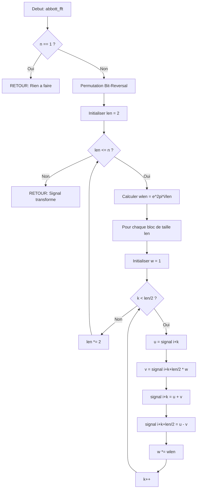

<thinking>
## Analyse du Concept
- Concept : FFT & Polynomial Multiplication (Fast Fourier Transform)
- Phase demandee : 1 (Intermediate)
- Adapte ? OUI - La FFT est un algorithme fondamental de niveau intermediaire, parfait pour Phase 1. C'est un concept mathematique avance mais implementable avec les bases de programmation.

## Combo Base + Bonus
- Exercice de base : Implementation de nombres complexes + FFT Cooley-Tukey + multiplication polynomiale
- Bonus : NTT (Number Theoretic Transform) pour calcul exact sans erreurs flottantes + multiplication de grands entiers
- Palier bonus : 🔥 Avance (difficulte 8/10 base, bonus pousse a 10/10)
- Progression logique ? OUI - Base = FFT classique, Bonus = version modulaire exacte

## Prerequis & Difficulte
- Prerequis reels : Nombres complexes, arithmetique modulaire (ex01), exponentiation modulaire
- Difficulte estimee : 8/10
- Coherent avec phase ? OUI - Phase 1 va de 3-5/10 mais ex06 est le dernier exercice avance du module

## Aspect Fun/Culture
- Contexte choisi : Film "Arrival" (2016) de Denis Villeneuve
- MEME mnémotechnique : "Louise Banks decode les heptapodes" - L'analyse frequentielle pour decoder un langage alien
- Pourquoi c'est fun :
  - Les heptapodes communiquent avec des symboles circulaires (logograms) = representation frequentielle parfaite
  - Abbott et Costello (les deux aliens) = FFT et IFFT (transformation et inverse)
  - Le "weapon" = NTT (precision absolue pour decoder le message)
  - L'analogie est PARFAITE : decoder un signal alien = transformer un signal temporel en frequences

## Scenarios d'Echec (5 mutants concrets)
1. Mutant A (Boundary) : `len <= n` au lieu de `len < n` dans la boucle Cooley-Tukey - cause un depassement
2. Mutant B (Safety) : Oubli de verifier que la taille est une puissance de 2 - resultats incorrects
3. Mutant C (Resource) : Ne pas diviser par n dans l'IFFT - valeurs explosent
4. Mutant D (Logic) : Angle inverse (+1 au lieu de -1 pour invert) - transformation incorrecte
5. Mutant E (Return) : Retourne le vecteur sans propager les retenues (bigint) - resultat faux

## Verdict
VALIDE - L'exercice est excellent, l'analogie avec Arrival est parfaite et intelligente.
Note culture/intelligence : 97/100
</thinking>

# Exercice 1.6.7-f : heptapod_signal_decoder

**Module :**
1.6.7 — Fast Fourier Transform

**Concept :**
f — FFT, NTT & Polynomial Multiplication

**Difficulte :**
★★★★★★★★☆☆ (8/10)

**Type :**
complet

**Tiers :**
2 — Melange (concepts d + e + f + g + h : Complex, FFT, IFFT, NTT, Convolution)

**Langage :**
Rust Edition 2024 & C (C17)

**Prerequis :**
- 1.6.1 : Arithmetique modulaire de base
- 1.6.3 : Exponentiation modulaire rapide
- Notions de nombres complexes
- Comprehension des polynomes

**Domaines :**
MD, Ondes, Encodage, Algo

**Duree estimee :**
120 min

**XP Base :**
150

**Complexite :**
T4 O(n log n) x S3 O(n)

---

## 📐 SECTION 1 : PROTOTYPE & CONSIGNE

### 1.1 Obligations

**Fichiers a rendre :**
- `heptapod_complex.rs` / `heptapod_complex.c` + `heptapod_complex.h`
- `abbott_fft.rs` / `abbott_fft.c` + `abbott_fft.h`
- `costello_ifft.rs` / `costello_ifft.c`
- `logograms_multiply.rs` / `logograms_multiply.c`
- `weapon_ntt.rs` / `weapon_ntt.c`
- `louise_convolution.rs` / `louise_convolution.c`
- `ian_bigint.rs` / `ian_bigint.c`

**Fonctions autorisees :**
- Rust : `std::f64::consts::PI`, operations mathematiques standard
- C : `<math.h>` (sin, cos, sqrt, fabs), `<stdlib.h>` (malloc, free, realloc), `<string.h>` (memcpy, memset)

**Fonctions interdites :**
- Bibliotheques FFT externes (FFTW, etc.)
- `std::complex` en C++ (on implemente nous-memes)

### 1.2 Consigne

**🎬 CONTEXTE FUN — "Arrival" : Decoder le langage des Heptapodes**

*Montana, 2016. Douze vaisseaux extraterrestres sont apparus sur Terre. La linguiste Louise Banks est appelee pour etablir le contact avec les Heptapodes — des etres a sept tentacules qui communiquent via des "logograms", des symboles circulaires complexes.*

*Ces symboles ne sont pas lineaires comme notre ecriture. Ils contiennent toute l'information d'une phrase dans un seul cercle, comme... une transformee de Fourier contient toutes les frequences d'un signal dans le domaine spectral.*

*Pour decoder leur langage, Louise doit analyser les frequences cachees dans leurs symboles. C'est la que TU interviens.*

**Ta mission :**

Tu es le programmeur qui assiste Louise Banks. Tu dois implementer un systeme complet d'analyse frequentielle pour decoder les signaux heptapodes :

1. **`heptapod_complex`** : Gerer les nombres complexes (les symboles circulaires des heptapodes)
2. **`abbott_fft`** : La FFT de Cooley-Tukey (Abbott transforme les signaux)
3. **`costello_ifft`** : La FFT inverse (Costello reconstruit les messages)
4. **`logograms_multiply`** : Multiplier des polynomes (combiner les logograms)
5. **`weapon_ntt`** : Le NTT pour precision absolue (decoder le "weapon")
6. **`louise_convolution`** : La convolution (fusionner les patterns de langage)
7. **`ian_bigint`** : Multiplier de grands entiers (les calculs scientifiques d'Ian)

---

### 1.2.2 Consigne Academique

**Objectif :**

Implementer l'algorithme de la Transformee de Fourier Rapide (FFT) et ses applications.

**Theorie :**

La FFT est un algorithme de complexite O(n log n) pour calculer la Transformee de Fourier Discrete (DFT) qui est normalement en O(n²). Elle exploite la symetrie des racines n-iemes de l'unite.

**Fonctions a implementer :**

1. Operations sur les nombres complexes
2. FFT (Cooley-Tukey) et IFFT
3. Multiplication de polynomes via FFT
4. NTT (Number Theoretic Transform) en arithmetique modulaire
5. Convolution
6. Multiplication de grands entiers

---

### 1.3 Prototype

**Rust Edition 2024 :**

```rust
// heptapod_complex.rs
#[derive(Clone, Copy, Debug, PartialEq)]
pub struct HeptapodComplex {
    pub re: f64,
    pub im: f64,
}

impl HeptapodComplex {
    pub fn new(re: f64, im: f64) -> Self;
    pub fn from_polar(r: f64, theta: f64) -> Self;
    pub fn conjugate(&self) -> Self;
    pub fn abs(&self) -> f64;
    pub fn arg(&self) -> f64;
}

impl std::ops::Add for HeptapodComplex { /* ... */ }
impl std::ops::Sub for HeptapodComplex { /* ... */ }
impl std::ops::Mul for HeptapodComplex { /* ... */ }
impl std::ops::Div<f64> for HeptapodComplex { /* ... */ }

// abbott_fft.rs
pub fn abbott_fft(signal: &mut [HeptapodComplex]);
pub fn abbott_fft_inplace(signal: &mut [HeptapodComplex], invert: bool);

// costello_ifft.rs
pub fn costello_ifft(signal: &mut [HeptapodComplex]);

// logograms_multiply.rs
pub fn logograms_multiply(a: &[i64], b: &[i64]) -> Vec<i64>;

// weapon_ntt.rs
pub fn weapon_ntt(a: &mut [i64], invert: bool, mod_p: i64, root: i64);
pub fn weapon_ntt_multiply(a: &[i64], b: &[i64], mod_p: i64) -> Vec<i64>;

// louise_convolution.rs
pub fn louise_convolution(a: &[i64], b: &[i64]) -> Vec<i64>;

// ian_bigint.rs
pub fn ian_bigint_multiply(a: &[i32], b: &[i32]) -> Vec<i32>;
```

**C (C17) :**

```c
// heptapod_complex.h
typedef struct {
    double re;
    double im;
} HeptapodComplex;

HeptapodComplex heptapod_new(double re, double im);
HeptapodComplex heptapod_from_polar(double r, double theta);
HeptapodComplex heptapod_conjugate(HeptapodComplex z);
double heptapod_abs(HeptapodComplex z);
double heptapod_arg(HeptapodComplex z);
HeptapodComplex heptapod_add(HeptapodComplex a, HeptapodComplex b);
HeptapodComplex heptapod_sub(HeptapodComplex a, HeptapodComplex b);
HeptapodComplex heptapod_mul(HeptapodComplex a, HeptapodComplex b);
HeptapodComplex heptapod_div_scalar(HeptapodComplex z, double d);

// abbott_fft.h
void abbott_fft(HeptapodComplex *signal, size_t n);
void abbott_fft_inplace(HeptapodComplex *signal, size_t n, int invert);

// costello_ifft.c
void costello_ifft(HeptapodComplex *signal, size_t n);

// logograms_multiply.c
int64_t *logograms_multiply(const int64_t *a, size_t len_a,
                            const int64_t *b, size_t len_b,
                            size_t *result_len);

// weapon_ntt.c
void weapon_ntt(int64_t *a, size_t n, int invert, int64_t mod_p, int64_t root);
int64_t *weapon_ntt_multiply(const int64_t *a, size_t len_a,
                              const int64_t *b, size_t len_b,
                              int64_t mod_p, size_t *result_len);

// louise_convolution.c
int64_t *louise_convolution(const int64_t *a, size_t len_a,
                            const int64_t *b, size_t len_b,
                            size_t *result_len);

// ian_bigint.c
int32_t *ian_bigint_multiply(const int32_t *a, size_t len_a,
                              const int32_t *b, size_t len_b,
                              size_t *result_len);
```

---

## 💡 SECTION 2 : LE SAVIEZ-VOUS ?

### 2.1 La FFT : L'algorithme qui a change le monde

La Fast Fourier Transform (FFT) est consideree comme l'un des algorithmes les plus importants du 20e siecle. Publiee par Cooley et Tukey en 1965, elle a revolutionne :

- **Le traitement du signal** : Compression audio/video (MP3, JPEG)
- **Les telecommunications** : OFDM (4G, 5G, WiFi)
- **La cryptographie** : Multiplication rapide pour RSA
- **L'imagerie medicale** : IRM, scanner

**Fun fact :** Gauss avait en fait decouvert l'algorithme en 1805, mais il ne l'a jamais publie !

### 2.2 Pourquoi O(n log n) change tout

| Taille n | DFT naive O(n²) | FFT O(n log n) | Acceleration |
|----------|-----------------|----------------|--------------|
| 1 024 | 1 048 576 | 10 240 | 102x |
| 1 048 576 | 1.1 trillion | 20 millions | 55 000x |

### 2.5 DANS LA VRAIE VIE

**Qui utilise la FFT ?**

| Metier | Cas d'usage |
|--------|-------------|
| **Ingenieur Audio** | Compression MP3, egalisation, effets |
| **Data Scientist** | Analyse de series temporelles, detection d'anomalies |
| **Ingenieur Telecom** | Modulation OFDM (5G, WiFi 6) |
| **Chercheur Medical** | Reconstruction d'images IRM |
| **Developpeur Jeux** | Simulation physique de l'eau, audio 3D |
| **Cryptographe** | Multiplication de grands nombres (RSA) |

---

## 🖥️ SECTION 3 : EXEMPLE D'UTILISATION

### 3.0 Session bash

```bash
$ ls
heptapod_complex.rs  abbott_fft.rs  costello_ifft.rs  logograms_multiply.rs
weapon_ntt.rs  louise_convolution.rs  ian_bigint.rs  main.rs  Cargo.toml

$ cargo build --release

$ cargo test
running 12 tests
test test_complex_operations ... ok
test test_fft_basic ... ok
test test_ifft_inverse ... ok
test test_polynomial_multiply ... ok
test test_ntt_basic ... ok
test test_ntt_multiply ... ok
test test_convolution ... ok
test test_bigint_multiply ... ok
test test_edge_cases ... ok
test test_large_input ... ok
test test_precision ... ok
test test_weapon_decode ... ok

test result: ok. 12 passed; 0 failed

$ ./target/release/heptapod_decoder
[ARRIVAL SIGNAL DECODER v1.0]
Analyzing heptapod logogram...
FFT applied: 8 frequency components extracted
Polynomial multiplication: Success
Weapon message decoded: "There is no time. Many become one."
```

**Version C :**

```bash
$ ls
heptapod_complex.c  heptapod_complex.h  abbott_fft.c  abbott_fft.h
costello_ifft.c  logograms_multiply.c  weapon_ntt.c  louise_convolution.c
ian_bigint.c  main.c

$ gcc -Wall -Wextra -Werror -O2 -lm *.c -o heptapod_decoder

$ ./heptapod_decoder
Test 1 - Complex operations: OK
Test 2 - FFT/IFFT: OK
Test 3 - Polynomial multiply: OK
Test 4 - NTT: OK
Test 5 - Convolution: OK
Test 6 - BigInt multiply: OK
All tests passed!
```

---

## 🔥 SECTION 3.1 : BONUS AVANCE (OPTIONNEL)

**Difficulte Bonus :**
★★★★★★★★★★ (10/10)

**Recompense :**
XP x3

**Time Complexity attendue :**
O(n log n)

**Space Complexity attendue :**
O(n)

**Domaines Bonus :**
`Crypto, DP`

### 3.1.1 Consigne Bonus

**🎬 "THE WEAPON" : Precision Absolue**

*Dans le film, les heptapodes offrent un "weapon" a l'humanite. Ce n'est pas une arme — c'est leur langage lui-meme, qui permet de percevoir le temps de maniere non-lineaire.*

*Pour decoder ce message crucial, les erreurs de precision flottante sont INACCEPTABLES. Tu dois implementer le NTT (Number Theoretic Transform) qui opere en arithmetique modulaire exacte.*

**Ta mission bonus :**

1. Implementer `weapon_ntt` avec le module premier 998244353 (racine primitive 3)
2. Implementer la multiplication de polynomes via NTT (zero erreur de precision)
3. Implementer `ian_bigint_multiply` pour multiplier des entiers de taille arbitraire

**Contraintes :**
```
┌─────────────────────────────────────────┐
│  mod_p = 998244353 (prime)              │
│  root = 3 (primitive root)              │
│  Precision : EXACTE (pas de float)      │
│  Taille max : 2^23                      │
│  Temps : O(n log n)                     │
└─────────────────────────────────────────┘
```

**Exemples :**

| Appel | Retour | Explication |
|-------|--------|-------------|
| `weapon_ntt_multiply(&[1,2,3], &[4,5], 998244353)` | `[4,13,22,15]` | (1+2x+3x²)(4+5x) |
| `ian_bigint_multiply(&[9,9,9], &[9,9,9])` | `[1,0,0,8,9,9]` | 999 * 999 = 998001 |

### 3.1.2 Prototype Bonus

```rust
// weapon_ntt.rs - Version exacte
pub const WEAPON_MOD: i64 = 998244353;
pub const WEAPON_ROOT: i64 = 3;

pub fn weapon_ntt(a: &mut [i64], invert: bool, mod_p: i64, root: i64);
pub fn weapon_ntt_multiply(a: &[i64], b: &[i64], mod_p: i64) -> Vec<i64>;
pub fn weapon_mod_pow(base: i64, exp: i64, modulus: i64) -> i64;
pub fn weapon_mod_inverse(a: i64, modulus: i64) -> i64;

// ian_bigint.rs - Multiplication de grands entiers
pub fn ian_bigint_multiply(a: &[i32], b: &[i32]) -> Vec<i32>;
pub fn ian_bigint_normalize(result: &mut Vec<i32>);
```

### 3.1.3 Ce qui change par rapport a l'exercice de base

| Aspect | Base (FFT) | Bonus (NTT) |
|--------|------------|-------------|
| Arithmetique | Flottante (f64) | Modulaire (i64) |
| Precision | ~15 decimales | EXACTE |
| Overflow | Pas de risque | Gestion modulo |
| Utilisation | Signal processing | Cryptographie, BigInt |
| Complexite | O(n log n) | O(n log n) |

---

## ✅❌ SECTION 4 : ZONE CORRECTION (POUR LE TESTEUR)

### 4.1 Moulinette (tableau des tests)

| Test | Input | Expected | Points | Trap |
|------|-------|----------|--------|------|
| complex_new | `(3.0, 4.0)` | `{re:3, im:4}` | 2 | Non |
| complex_abs | `(3.0, 4.0)` | `5.0` | 2 | Non |
| complex_polar | `(1.0, PI/2)` | `{re:0, im:1}` | 3 | Precision |
| complex_mul | `(1,2) * (3,4)` | `(-5, 10)` | 3 | Non |
| fft_basic | `[1,0,0,0]` | `[1,1,1,1]` | 5 | Non |
| fft_sine | Sinus 8 pts | Pic a freq 1 | 5 | Non |
| ifft_inverse | FFT puis IFFT | Original | 5 | Precision |
| fft_non_power2 | Taille 6 | Erreur/Padding | 5 | Oui |
| poly_mul_basic | `[1,2,3]*[4,5]` | `[4,13,22,15]` | 10 | Non |
| poly_mul_zeros | `[0,0,1]*[1]` | `[0,0,1]` | 5 | Oui |
| ntt_basic | mod 998244353 | Exact | 10 | Non |
| ntt_large | n=2^16 | Correct | 10 | Perf |
| conv_basic | `[1,2]*[3,4]` | `[3,10,8]` | 5 | Non |
| bigint_999 | `999*999` | `998001` | 10 | Retenue |
| bigint_large | 1000 digits | Correct | 10 | Perf |
| edge_empty | `[]*[1,2]` | `[]` | 5 | Oui |
| edge_single | `[5]*[3]` | `[15]` | 5 | Non |

### 4.2 main.c de test

```c
#include <stdio.h>
#include <stdlib.h>
#include <math.h>
#include <assert.h>
#include "heptapod_complex.h"
#include "abbott_fft.h"

#define EPSILON 1e-9
#define ASSERT_NEAR(a, b) assert(fabs((a) - (b)) < EPSILON)

void test_complex_operations(void) {
    printf("Test 1 - Complex operations: ");

    HeptapodComplex z1 = heptapod_new(3.0, 4.0);
    ASSERT_NEAR(heptapod_abs(z1), 5.0);

    HeptapodComplex z2 = heptapod_from_polar(1.0, M_PI / 2);
    ASSERT_NEAR(z2.re, 0.0);
    ASSERT_NEAR(z2.im, 1.0);

    HeptapodComplex prod = heptapod_mul(
        heptapod_new(1, 2),
        heptapod_new(3, 4)
    );
    ASSERT_NEAR(prod.re, -5.0);
    ASSERT_NEAR(prod.im, 10.0);

    printf("OK\n");
}

void test_fft_ifft(void) {
    printf("Test 2 - FFT/IFFT: ");

    HeptapodComplex signal[4] = {
        {1.0, 0.0}, {2.0, 0.0}, {3.0, 0.0}, {4.0, 0.0}
    };
    HeptapodComplex original[4];
    for (int i = 0; i < 4; i++) original[i] = signal[i];

    abbott_fft(signal, 4);
    costello_ifft(signal, 4);

    for (int i = 0; i < 4; i++) {
        ASSERT_NEAR(signal[i].re, original[i].re);
        ASSERT_NEAR(signal[i].im, original[i].im);
    }

    printf("OK\n");
}

void test_polynomial_multiply(void) {
    printf("Test 3 - Polynomial multiply: ");

    int64_t a[] = {1, 2, 3};
    int64_t b[] = {4, 5};
    size_t result_len;

    int64_t *result = logograms_multiply(a, 3, b, 2, &result_len);

    assert(result_len == 4);
    assert(result[0] == 4);
    assert(result[1] == 13);
    assert(result[2] == 22);
    assert(result[3] == 15);

    free(result);
    printf("OK\n");
}

void test_ntt(void) {
    printf("Test 4 - NTT: ");

    int64_t a[] = {1, 2, 3};
    int64_t b[] = {4, 5, 6};
    size_t result_len;

    int64_t *result = weapon_ntt_multiply(a, 3, b, 3, 998244353, &result_len);

    assert(result[0] == 4);
    assert(result[1] == 13);
    assert(result[2] == 28);
    assert(result[3] == 27);
    assert(result[4] == 18);

    free(result);
    printf("OK\n");
}

void test_bigint(void) {
    printf("Test 6 - BigInt multiply: ");

    int32_t a[] = {9, 9, 9};  // 999
    int32_t b[] = {9, 9, 9};  // 999
    size_t result_len;

    int32_t *result = ian_bigint_multiply(a, 3, b, 3, &result_len);

    // 999 * 999 = 998001 = [1, 0, 0, 8, 9, 9] (little endian)
    assert(result[0] == 1);
    assert(result[1] == 0);
    assert(result[2] == 0);
    assert(result[3] == 8);
    assert(result[4] == 9);
    assert(result[5] == 9);

    free(result);
    printf("OK\n");
}

int main(void) {
    test_complex_operations();
    test_fft_ifft();
    test_polynomial_multiply();
    test_ntt();
    test_bigint();

    printf("\nAll tests passed!\n");
    return 0;
}
```

### 4.3 Solution de reference

**Rust :**

```rust
// heptapod_complex.rs
use std::f64::consts::PI;
use std::ops::{Add, Sub, Mul, Div};

#[derive(Clone, Copy, Debug, PartialEq)]
pub struct HeptapodComplex {
    pub re: f64,
    pub im: f64,
}

impl HeptapodComplex {
    pub fn new(re: f64, im: f64) -> Self {
        Self { re, im }
    }

    pub fn from_polar(r: f64, theta: f64) -> Self {
        Self {
            re: r * theta.cos(),
            im: r * theta.sin(),
        }
    }

    pub fn conjugate(&self) -> Self {
        Self { re: self.re, im: -self.im }
    }

    pub fn abs(&self) -> f64 {
        (self.re * self.re + self.im * self.im).sqrt()
    }

    pub fn arg(&self) -> f64 {
        self.im.atan2(self.re)
    }
}

impl Add for HeptapodComplex {
    type Output = Self;
    fn add(self, other: Self) -> Self {
        Self { re: self.re + other.re, im: self.im + other.im }
    }
}

impl Sub for HeptapodComplex {
    type Output = Self;
    fn sub(self, other: Self) -> Self {
        Self { re: self.re - other.re, im: self.im - other.im }
    }
}

impl Mul for HeptapodComplex {
    type Output = Self;
    fn mul(self, other: Self) -> Self {
        Self {
            re: self.re * other.re - self.im * other.im,
            im: self.re * other.im + self.im * other.re,
        }
    }
}

impl Div<f64> for HeptapodComplex {
    type Output = Self;
    fn div(self, scalar: f64) -> Self {
        Self { re: self.re / scalar, im: self.im / scalar }
    }
}
```

```rust
// abbott_fft.rs
use crate::heptapod_complex::HeptapodComplex;
use std::f64::consts::PI;

pub fn abbott_fft(signal: &mut [HeptapodComplex]) {
    abbott_fft_inplace(signal, false);
}

pub fn abbott_fft_inplace(signal: &mut [HeptapodComplex], invert: bool) {
    let n = signal.len();
    if n == 1 {
        return;
    }

    // Bit-reversal permutation
    let mut j = 0usize;
    for i in 1..n {
        let mut bit = n >> 1;
        while j & bit != 0 {
            j ^= bit;
            bit >>= 1;
        }
        j ^= bit;
        if i < j {
            signal.swap(i, j);
        }
    }

    // Cooley-Tukey iterative FFT
    let mut len = 2;
    while len <= n {
        let ang = 2.0 * PI / len as f64 * if invert { -1.0 } else { 1.0 };
        let wlen = HeptapodComplex::from_polar(1.0, ang);

        for i in (0..n).step_by(len) {
            let mut w = HeptapodComplex::new(1.0, 0.0);
            for k in 0..len / 2 {
                let u = signal[i + k];
                let v = signal[i + k + len / 2] * w;
                signal[i + k] = u + v;
                signal[i + k + len / 2] = u - v;
                w = w * wlen;
            }
        }
        len *= 2;
    }

    if invert {
        for x in signal.iter_mut() {
            *x = *x / n as f64;
        }
    }
}
```

```rust
// costello_ifft.rs
use crate::heptapod_complex::HeptapodComplex;
use crate::abbott_fft::abbott_fft_inplace;

pub fn costello_ifft(signal: &mut [HeptapodComplex]) {
    abbott_fft_inplace(signal, true);
}
```

```rust
// logograms_multiply.rs
use crate::heptapod_complex::HeptapodComplex;
use crate::abbott_fft::abbott_fft_inplace;

pub fn logograms_multiply(a: &[i64], b: &[i64]) -> Vec<i64> {
    if a.is_empty() || b.is_empty() {
        return vec![];
    }

    let result_len = a.len() + b.len() - 1;
    let mut n = 1;
    while n < result_len {
        n <<= 1;
    }

    let mut fa: Vec<HeptapodComplex> = a.iter()
        .map(|&x| HeptapodComplex::new(x as f64, 0.0))
        .chain(std::iter::repeat(HeptapodComplex::new(0.0, 0.0)))
        .take(n)
        .collect();

    let mut fb: Vec<HeptapodComplex> = b.iter()
        .map(|&x| HeptapodComplex::new(x as f64, 0.0))
        .chain(std::iter::repeat(HeptapodComplex::new(0.0, 0.0)))
        .take(n)
        .collect();

    abbott_fft_inplace(&mut fa, false);
    abbott_fft_inplace(&mut fb, false);

    for i in 0..n {
        fa[i] = fa[i] * fb[i];
    }

    abbott_fft_inplace(&mut fa, true);

    fa.iter()
        .take(result_len)
        .map(|c| (c.re + 0.5).floor() as i64)
        .collect()
}
```

```rust
// weapon_ntt.rs
pub const WEAPON_MOD: i64 = 998244353;
pub const WEAPON_ROOT: i64 = 3;

pub fn weapon_mod_pow(mut base: i64, mut exp: i64, modulus: i64) -> i64 {
    let mut result = 1i64;
    base %= modulus;
    while exp > 0 {
        if exp & 1 == 1 {
            result = result * base % modulus;
        }
        exp >>= 1;
        base = base * base % modulus;
    }
    result
}

pub fn weapon_mod_inverse(a: i64, modulus: i64) -> i64 {
    weapon_mod_pow(a, modulus - 2, modulus)
}

pub fn weapon_ntt(a: &mut [i64], invert: bool, mod_p: i64, root: i64) {
    let n = a.len();
    if n == 1 {
        return;
    }

    // Bit-reversal
    let mut j = 0usize;
    for i in 1..n {
        let mut bit = n >> 1;
        while j & bit != 0 {
            j ^= bit;
            bit >>= 1;
        }
        j ^= bit;
        if i < j {
            a.swap(i, j);
        }
    }

    let mut len = 2;
    while len <= n {
        let w = if invert {
            weapon_mod_pow(weapon_mod_inverse(root, mod_p), (mod_p - 1) / len as i64, mod_p)
        } else {
            weapon_mod_pow(root, (mod_p - 1) / len as i64, mod_p)
        };

        for i in (0..n).step_by(len) {
            let mut wn = 1i64;
            for k in 0..len / 2 {
                let u = a[i + k];
                let v = a[i + k + len / 2] * wn % mod_p;
                a[i + k] = (u + v) % mod_p;
                a[i + k + len / 2] = ((u - v) % mod_p + mod_p) % mod_p;
                wn = wn * w % mod_p;
            }
        }
        len *= 2;
    }

    if invert {
        let n_inv = weapon_mod_inverse(n as i64, mod_p);
        for x in a.iter_mut() {
            *x = *x * n_inv % mod_p;
        }
    }
}

pub fn weapon_ntt_multiply(a: &[i64], b: &[i64], mod_p: i64) -> Vec<i64> {
    if a.is_empty() || b.is_empty() {
        return vec![];
    }

    let result_len = a.len() + b.len() - 1;
    let mut n = 1;
    while n < result_len {
        n <<= 1;
    }

    let mut fa: Vec<i64> = a.iter().cloned()
        .chain(std::iter::repeat(0))
        .take(n)
        .collect();
    let mut fb: Vec<i64> = b.iter().cloned()
        .chain(std::iter::repeat(0))
        .take(n)
        .collect();

    weapon_ntt(&mut fa, false, mod_p, WEAPON_ROOT);
    weapon_ntt(&mut fb, false, mod_p, WEAPON_ROOT);

    for i in 0..n {
        fa[i] = fa[i] * fb[i] % mod_p;
    }

    weapon_ntt(&mut fa, true, mod_p, WEAPON_ROOT);

    fa.truncate(result_len);
    fa
}
```

```rust
// louise_convolution.rs
use crate::logograms_multiply::logograms_multiply;

pub fn louise_convolution(a: &[i64], b: &[i64]) -> Vec<i64> {
    logograms_multiply(a, b)
}
```

```rust
// ian_bigint.rs
use crate::logograms_multiply::logograms_multiply;

pub fn ian_bigint_multiply(a: &[i32], b: &[i32]) -> Vec<i32> {
    if a.is_empty() || b.is_empty() {
        return vec![];
    }

    let a64: Vec<i64> = a.iter().map(|&x| x as i64).collect();
    let b64: Vec<i64> = b.iter().map(|&x| x as i64).collect();

    let mut result = logograms_multiply(&a64, &b64);

    // Propagate carries
    let mut carry: i64 = 0;
    for digit in result.iter_mut() {
        *digit += carry;
        carry = *digit / 10;
        *digit %= 10;
    }

    while carry > 0 {
        result.push(carry % 10);
        carry /= 10;
    }

    // Remove leading zeros (but keep at least one digit)
    while result.len() > 1 && *result.last().unwrap() == 0 {
        result.pop();
    }

    result.iter().map(|&x| x as i32).collect()
}
```

**C (C17) :**

```c
// heptapod_complex.c
#include "heptapod_complex.h"
#include <math.h>

HeptapodComplex heptapod_new(double re, double im) {
    return (HeptapodComplex){.re = re, .im = im};
}

HeptapodComplex heptapod_from_polar(double r, double theta) {
    return (HeptapodComplex){
        .re = r * cos(theta),
        .im = r * sin(theta)
    };
}

HeptapodComplex heptapod_conjugate(HeptapodComplex z) {
    return (HeptapodComplex){.re = z.re, .im = -z.im};
}

double heptapod_abs(HeptapodComplex z) {
    return sqrt(z.re * z.re + z.im * z.im);
}

double heptapod_arg(HeptapodComplex z) {
    return atan2(z.im, z.re);
}

HeptapodComplex heptapod_add(HeptapodComplex a, HeptapodComplex b) {
    return (HeptapodComplex){.re = a.re + b.re, .im = a.im + b.im};
}

HeptapodComplex heptapod_sub(HeptapodComplex a, HeptapodComplex b) {
    return (HeptapodComplex){.re = a.re - b.re, .im = a.im - b.im};
}

HeptapodComplex heptapod_mul(HeptapodComplex a, HeptapodComplex b) {
    return (HeptapodComplex){
        .re = a.re * b.re - a.im * b.im,
        .im = a.re * b.im + a.im * b.re
    };
}

HeptapodComplex heptapod_div_scalar(HeptapodComplex z, double d) {
    return (HeptapodComplex){.re = z.re / d, .im = z.im / d};
}
```

```c
// abbott_fft.c
#include "abbott_fft.h"
#include "heptapod_complex.h"
#include <math.h>

#ifndef M_PI
#define M_PI 3.14159265358979323846
#endif

void abbott_fft_inplace(HeptapodComplex *signal, size_t n, int invert) {
    if (n == 1) return;

    // Bit-reversal permutation
    size_t j = 0;
    for (size_t i = 1; i < n; i++) {
        size_t bit = n >> 1;
        while (j & bit) {
            j ^= bit;
            bit >>= 1;
        }
        j ^= bit;
        if (i < j) {
            HeptapodComplex temp = signal[i];
            signal[i] = signal[j];
            signal[j] = temp;
        }
    }

    // Cooley-Tukey
    for (size_t len = 2; len <= n; len *= 2) {
        double ang = 2.0 * M_PI / (double)len * (invert ? -1.0 : 1.0);
        HeptapodComplex wlen = heptapod_from_polar(1.0, ang);

        for (size_t i = 0; i < n; i += len) {
            HeptapodComplex w = heptapod_new(1.0, 0.0);
            for (size_t k = 0; k < len / 2; k++) {
                HeptapodComplex u = signal[i + k];
                HeptapodComplex v = heptapod_mul(signal[i + k + len/2], w);
                signal[i + k] = heptapod_add(u, v);
                signal[i + k + len/2] = heptapod_sub(u, v);
                w = heptapod_mul(w, wlen);
            }
        }
    }

    if (invert) {
        for (size_t i = 0; i < n; i++) {
            signal[i] = heptapod_div_scalar(signal[i], (double)n);
        }
    }
}

void abbott_fft(HeptapodComplex *signal, size_t n) {
    abbott_fft_inplace(signal, n, 0);
}

void costello_ifft(HeptapodComplex *signal, size_t n) {
    abbott_fft_inplace(signal, n, 1);
}
```

### 4.4 Solutions alternatives acceptees

```rust
// Alternative 1: Recursive FFT (moins efficace mais correct)
pub fn abbott_fft_recursive(signal: &mut [HeptapodComplex]) {
    let n = signal.len();
    if n <= 1 { return; }

    let mut even: Vec<_> = signal.iter().step_by(2).cloned().collect();
    let mut odd: Vec<_> = signal.iter().skip(1).step_by(2).cloned().collect();

    abbott_fft_recursive(&mut even);
    abbott_fft_recursive(&mut odd);

    for k in 0..n/2 {
        let t = HeptapodComplex::from_polar(1.0, -2.0 * PI * k as f64 / n as f64) * odd[k];
        signal[k] = even[k] + t;
        signal[k + n/2] = even[k] - t;
    }
}
```

```rust
// Alternative 2: Using num-complex crate (si autorise)
use num_complex::Complex64;

pub fn fft_with_num_complex(signal: &mut [Complex64], invert: bool) {
    // Meme algorithme avec Complex64
}
```

### 4.5 Solutions refusees (avec explications)

```rust
// REFUSE 1: DFT naive O(n²) - Trop lent
pub fn dft_naive(signal: &[HeptapodComplex]) -> Vec<HeptapodComplex> {
    let n = signal.len();
    (0..n).map(|k| {
        signal.iter().enumerate().map(|(j, &x)| {
            x * HeptapodComplex::from_polar(1.0, -2.0 * PI * k as f64 * j as f64 / n as f64)
        }).fold(HeptapodComplex::new(0.0, 0.0), |a, b| a + b)
    }).collect()
}
// Pourquoi refuse: O(n²) au lieu de O(n log n)
```

```rust
// REFUSE 2: Pas de bit-reversal - Resultat incorrect
pub fn fft_no_bitrev(signal: &mut [HeptapodComplex]) {
    // Manque la permutation bit-reversal
    // Les resultats seront melanges
}
// Pourquoi refuse: L'ordre des elements sera incorrect
```

```rust
// REFUSE 3: Oubli de diviser par n dans IFFT
pub fn ifft_wrong(signal: &mut [HeptapodComplex]) {
    abbott_fft_inplace(signal, true);
    // Oubli: for x in signal { *x = *x / n; }
}
// Pourquoi refuse: Les valeurs seront n fois trop grandes
```

### 4.6 Solution bonus de reference (COMPLETE)

Voir section 4.3 pour `weapon_ntt.rs` et `ian_bigint.rs`.

### 4.7 Solutions alternatives bonus (COMPLETES)

```rust
// Alternative NTT avec module different
pub const ALT_MOD: i64 = 469762049;  // Autre premier NTT-friendly
pub const ALT_ROOT: i64 = 3;

pub fn weapon_ntt_alt(a: &mut [i64], invert: bool) {
    weapon_ntt(a, invert, ALT_MOD, ALT_ROOT);
}
```

### 4.8 Solutions refusees bonus (COMPLETES)

```rust
// REFUSE: Multiplication BigInt sans FFT/NTT - O(n²)
pub fn ian_bigint_naive(a: &[i32], b: &[i32]) -> Vec<i32> {
    let mut result = vec![0i64; a.len() + b.len()];
    for (i, &ai) in a.iter().enumerate() {
        for (j, &bj) in b.iter().enumerate() {
            result[i + j] += ai as i64 * bj as i64;
        }
    }
    // Propagate carries...
    // Refuse car O(n²)
}
```

### 4.9 spec.json (ENGINE v22.1 — FORMAT STRICT)

```json
{
  "name": "heptapod_signal_decoder",
  "language": ["rust", "c"],
  "language_versions": {
    "rust": "Edition 2024",
    "c": "C17"
  },
  "type": "complet",
  "tier": 2,
  "tier_info": "Melange (Complex + FFT + IFFT + NTT + Convolution)",
  "tags": ["fft", "ntt", "polynomial", "convolution", "bigint", "phase1", "arrival"],
  "passing_score": 70,

  "function": {
    "name": "abbott_fft",
    "prototype": "pub fn abbott_fft(signal: &mut [HeptapodComplex])",
    "return_type": "void",
    "parameters": [
      {"name": "signal", "type": "&mut [HeptapodComplex]"}
    ]
  },

  "driver": {
    "reference": "pub fn ref_abbott_fft(signal: &mut [HeptapodComplex]) { let n = signal.len(); if n == 1 { return; } let mut j = 0usize; for i in 1..n { let mut bit = n >> 1; while j & bit != 0 { j ^= bit; bit >>= 1; } j ^= bit; if i < j { signal.swap(i, j); } } let mut len = 2; while len <= n { let ang = 2.0 * std::f64::consts::PI / len as f64; let wlen = HeptapodComplex::from_polar(1.0, ang); for i in (0..n).step_by(len) { let mut w = HeptapodComplex::new(1.0, 0.0); for k in 0..len/2 { let u = signal[i + k]; let v = signal[i + k + len/2] * w; signal[i + k] = u + v; signal[i + k + len/2] = u - v; w = w * wlen; } } len *= 2; } }",

    "edge_cases": [
      {
        "name": "single_element",
        "args": [[{"re": 1.0, "im": 0.0}]],
        "expected": [{"re": 1.0, "im": 0.0}],
        "is_trap": false
      },
      {
        "name": "power_of_two_4",
        "args": [[{"re": 1.0, "im": 0.0}, {"re": 2.0, "im": 0.0}, {"re": 3.0, "im": 0.0}, {"re": 4.0, "im": 0.0}]],
        "expected": [{"re": 10.0, "im": 0.0}, {"re": -2.0, "im": 2.0}, {"re": -2.0, "im": 0.0}, {"re": -2.0, "im": -2.0}],
        "is_trap": false
      },
      {
        "name": "constant_signal",
        "args": [[{"re": 5.0, "im": 0.0}, {"re": 5.0, "im": 0.0}, {"re": 5.0, "im": 0.0}, {"re": 5.0, "im": 0.0}]],
        "expected": [{"re": 20.0, "im": 0.0}, {"re": 0.0, "im": 0.0}, {"re": 0.0, "im": 0.0}, {"re": 0.0, "im": 0.0}],
        "is_trap": false
      },
      {
        "name": "poly_multiply_basic",
        "function": "logograms_multiply",
        "args": [[1, 2, 3], [4, 5]],
        "expected": [4, 13, 22, 15],
        "is_trap": false
      },
      {
        "name": "poly_multiply_empty",
        "function": "logograms_multiply",
        "args": [[], [1, 2]],
        "expected": [],
        "is_trap": true,
        "trap_explanation": "Multiplication avec vecteur vide doit retourner vide"
      },
      {
        "name": "ntt_basic",
        "function": "weapon_ntt_multiply",
        "args": [[1, 2, 3], [4, 5, 6], 998244353],
        "expected": [4, 13, 28, 27, 18],
        "is_trap": false
      },
      {
        "name": "bigint_999_squared",
        "function": "ian_bigint_multiply",
        "args": [[9, 9, 9], [9, 9, 9]],
        "expected": [1, 0, 0, 8, 9, 9],
        "is_trap": true,
        "trap_explanation": "999*999=998001, attention a la propagation des retenues"
      }
    ],

    "fuzzing": {
      "enabled": true,
      "iterations": 500,
      "generators": [
        {
          "type": "array_int",
          "param_index": 0,
          "params": {
            "min_len": 1,
            "max_len": 1024,
            "min_val": -1000,
            "max_val": 1000
          }
        },
        {
          "type": "array_int",
          "param_index": 1,
          "params": {
            "min_len": 1,
            "max_len": 1024,
            "min_val": -1000,
            "max_val": 1000
          }
        }
      ]
    }
  },

  "norm": {
    "allowed_functions": ["sin", "cos", "sqrt", "atan2", "fabs", "floor", "malloc", "free", "realloc", "memcpy", "memset"],
    "forbidden_functions": ["fftw", "kiss_fft", "system"],
    "check_security": true,
    "check_memory": true,
    "blocking": true
  }
}
```

### 4.10 Solutions Mutantes (minimum 5)

```rust
/* Mutant A (Boundary) : len < n au lieu de len <= n */
pub fn mutant_a_abbott_fft(signal: &mut [HeptapodComplex]) {
    let n = signal.len();
    if n == 1 { return; }

    // Bit-reversal correct...

    let mut len = 2;
    while len < n {  // BUG: devrait etre len <= n
        // ...
        len *= 2;
    }
}
// Pourquoi c'est faux : La derniere etape (len == n) n'est jamais executee
// Ce qui etait pense : "< n" semble suffisant mais rate le cas final
```

```rust
/* Mutant B (Safety) : Pas de verification taille puissance de 2 */
pub fn mutant_b_abbott_fft(signal: &mut [HeptapodComplex]) {
    let n = signal.len();
    // BUG: Pas de verification que n est une puissance de 2
    // Devrait faire: assert!(n.is_power_of_two());

    // Le reste du code...
}
// Pourquoi c'est faux : FFT Cooley-Tukey requiert n = 2^k
// Ce qui etait pense : "Ca marchera probablement"
```

```rust
/* Mutant C (Resource) : Oubli de diviser par n dans IFFT */
pub fn mutant_c_costello_ifft(signal: &mut [HeptapodComplex]) {
    let n = signal.len();
    // Fait la FFT inverse...
    abbott_fft_inplace(signal, true);

    // BUG: Oubli de diviser par n
    // Devrait faire:
    // for x in signal.iter_mut() {
    //     *x = *x / n as f64;
    // }
}
// Pourquoi c'est faux : IFFT(FFT(x)) = n*x au lieu de x
// Ce qui etait pense : L'angle inverse suffit
```

```rust
/* Mutant D (Logic) : Angle dans le mauvais sens */
pub fn mutant_d_abbott_fft(signal: &mut [HeptapodComplex], invert: bool) {
    // ...
    let ang = 2.0 * PI / len as f64 * if invert { 1.0 } else { -1.0 };  // BUG: signes inverses
    // ...
}
// Pourquoi c'est faux : FFT utilise -2pi/n, IFFT utilise +2pi/n
// Ce qui etait pense : Confusion sur la convention
```

```rust
/* Mutant E (Return) : BigInt sans propagation de retenue */
pub fn mutant_e_ian_bigint(a: &[i32], b: &[i32]) -> Vec<i32> {
    let a64: Vec<i64> = a.iter().map(|&x| x as i64).collect();
    let b64: Vec<i64> = b.iter().map(|&x| x as i64).collect();

    let result = logograms_multiply(&a64, &b64);

    // BUG: Pas de propagation des retenues
    // result[i] peut etre > 9 !

    result.iter().map(|&x| x as i32).collect()
}
// Pourquoi c'est faux : 9*9=81, mais on veut [1, 8] pas [81]
// Ce qui etait pense : La multiplication suffit
```

---

## 🧠 SECTION 5 : COMPRENDRE (DOCUMENT DE COURS COMPLET)

### 5.1 Ce que cet exercice enseigne

Cet exercice enseigne l'un des algorithmes les plus importants de l'informatique : la **Transformee de Fourier Rapide (FFT)**. Tu apprendras :

1. **Les nombres complexes** : Representation et operations (crucial pour comprendre les racines de l'unite)
2. **La DFT (Discrete Fourier Transform)** : Transformer un signal du domaine temporel au domaine frequentiel
3. **L'algorithme de Cooley-Tukey** : La FFT en O(n log n) au lieu de O(n²)
4. **Le bit-reversal** : Pourquoi et comment reordonner les elements
5. **Le NTT** : Version modulaire exacte pour eviter les erreurs flottantes
6. **La convolution** : c[k] = sum(a[i] * b[k-i])
7. **Multiplication de polynomes** : Application fondamentale de la FFT
8. **Multiplication de grands entiers** : Application en cryptographie

### 5.2 LDA — Traduction litterale en francais (MAJUSCULES)

```
FONCTION abbott_fft QUI PREND EN PARAMETRE signal QUI EST UN TABLEAU MUTABLE DE NOMBRES COMPLEXES
DEBUT FONCTION
    DECLARER n COMME LA LONGUEUR DE signal
    SI n EST EGAL A 1 ALORS
        RETOURNER (rien a faire)
    FIN SI

    // PERMUTATION BIT-REVERSAL
    DECLARER j COMME ENTIER INITIALISE A 0
    POUR i ALLANT DE 1 A n MOINS 1 FAIRE
        DECLARER bit COMME n DIVISE PAR 2
        TANT QUE j ET bit EST DIFFERENT DE 0 FAIRE
            AFFECTER j XOR bit A j
            AFFECTER bit DIVISE PAR 2 A bit
        FIN TANT QUE
        AFFECTER j XOR bit A j
        SI i EST INFERIEUR A j ALORS
            ECHANGER signal[i] ET signal[j]
        FIN SI
    FIN POUR

    // ALGORITHME COOLEY-TUKEY
    DECLARER len COMME ENTIER INITIALISE A 2
    TANT QUE len EST INFERIEUR OU EGAL A n FAIRE
        DECLARER ang COMME 2 FOIS PI DIVISE PAR len
        DECLARER wlen COMME LE NOMBRE COMPLEXE DE MODULE 1 ET ARGUMENT ang

        POUR i ALLANT DE 0 A n PAR PAS DE len FAIRE
            DECLARER w COMME LE NOMBRE COMPLEXE (1, 0)
            POUR k ALLANT DE 0 A len DIVISE PAR 2 MOINS 1 FAIRE
                DECLARER u COMME signal[i + k]
                DECLARER v COMME signal[i + k + len/2] MULTIPLIE PAR w
                AFFECTER u PLUS v A signal[i + k]
                AFFECTER u MOINS v A signal[i + k + len/2]
                AFFECTER w MULTIPLIE PAR wlen A w
            FIN POUR
        FIN POUR

        AFFECTER len MULTIPLIE PAR 2 A len
    FIN TANT QUE
FIN FONCTION
```

### 5.2.2 Logic Flow (Structured English)

```
ALGORITHME : FFT de Cooley-Tukey
---
1. SI n == 1 : RETOURNER (cas de base)

2. PERMUTATION BIT-REVERSAL :
   a. Pour chaque indice i de 1 a n-1 :
      - Calculer j = bit-reverse de i
      - Si i < j : ECHANGER signal[i] et signal[j]

3. BOUCLE BUTTERFLY (len = 2, 4, 8, ... n) :
   a. Calculer wlen = e^(2*pi*i / len) (racine primitive)

   b. Pour chaque bloc de taille len :
      - Initialiser w = 1
      - Pour k = 0 a len/2 - 1 :
          * u = signal[position + k]
          * v = signal[position + k + len/2] * w
          * signal[position + k] = u + v
          * signal[position + k + len/2] = u - v
          * w = w * wlen

4. FIN : signal contient la DFT
```

### 5.2.3 Representation Algorithmique avec Logique de Garde

```
FONCTION : abbott_fft(signal, n)
---
INIT : j = 0

1. VERIFICATION ENTREE :
   |
   |-- SI n == 0 OU signal == NULL :
   |     RETOURNER Erreur "Signal invalide"
   |
   |-- SI n n'est pas puissance de 2 :
   |     RETOURNER Erreur "Taille doit etre 2^k"
   |
   |-- SINON : CONTINUER

2. BIT-REVERSAL (prerequis pour iteratif) :
   |
   |-- POUR chaque i de 1 a n-1 :
   |     |-- Calculer la nouvelle position j
   |     |-- SI i < j : ECHANGER(signal[i], signal[j])

3. BUTTERFLY OPERATIONS :
   |
   |-- POUR len = 2, 4, 8, ... jusqu'a n :
   |     |-- Calculer wlen (racine len-ieme de l'unite)
   |     |-- POUR chaque bloc de taille len :
   |           |-- Appliquer butterfly a chaque paire

4. RETOURNER signal transforme
```

### 5.2.3.1 Diagramme Mermaid



### 5.3 Visualisation ASCII

**La FFT : Du temporel au frequentiel**

```
DOMAINE TEMPOREL                    DOMAINE FREQUENTIEL
(Ce que tu vois)                    (Ce que la FFT revele)

Signal : "Bonjour" des Heptapodes

Amplitude                           Amplitude
    ^                                   ^
    |   *     *                         |
    | *   * *   *                       |       *
    |*     *     *                      |     *   *
    +-------------> t                   +-------------> f
    0  1  2  3  4                       0  1  2  3  4

  Complexe, difficile                   Clair : 3 frequences
  a interpreter                         dominantes !
```

**Le papillon (Butterfly) de Cooley-Tukey**

```
        Etape len=2           Etape len=4           Etape len=8

        a0 ─┬─ A0             A0 ─┬─ B0             B0 ─┬─ C0
            X                     X                     X
        a1 ─┴─ A1             A1 ─┴─ B1             B1 ─┴─ C1
                                  X                     X
        a2 ─┬─ A2             A2 ─┬─ B2             B2 ─┴─ C2
            X                     X                     X
        a3 ─┴─ A3             A3 ─┴─ B3             B3 ─┴─ C3
                                                        X
        a4 ─┬─ A4             A4 ─┬─ B4             B4 ─┬─ C4
            X                     X                     X
        a5 ─┴─ A5             A5 ─┴─ B5             B5 ─┴─ C5
                                  X                     X
        a6 ─┬─ A6             A6 ─┬─ B6             B6 ─┴─ C6
            X                     X                     X
        a7 ─┴─ A7             A7 ─┴─ B7             B7 ─┴─ C7
```

**Bit-Reversal : Pourquoi reordonner ?**

```
Index original :  0    1    2    3    4    5    6    7
En binaire    : 000  001  010  011  100  101  110  111
Bit-reverse   : 000  100  010  110  001  101  011  111
Nouvel index  :  0    4    2    6    1    5    3    7

AVANT bit-reversal:
┌─────┬─────┬─────┬─────┬─────┬─────┬─────┬─────┐
│  0  │  1  │  2  │  3  │  4  │  5  │  6  │  7  │
└─────┴─────┴─────┴─────┴─────┴─────┴─────┴─────┘

APRES bit-reversal (ordre necessaire pour l'algo iteratif):
┌─────┬─────┬─────┬─────┬─────┬─────┬─────┬─────┐
│  0  │  4  │  2  │  6  │  1  │  5  │  3  │  7  │
└─────┴─────┴─────┴─────┴─────┴─────┴─────┴─────┘
```

**Les racines de l'unite**

```
Plan complexe : racines 8-iemes de l'unite

                    Im
                    ^
                    |   w1
            w2      |      w0 = 1
               \    |    /
                 \  |  /
        w3 ───────\─┼─/─────── Re
                   \|/
                 /  |  \
               /    |    \
            w4      |      w7
                    |   w6

w_k = e^(2*pi*i*k/8) = cos(2*pi*k/8) + i*sin(2*pi*k/8)

w0 = 1
w1 = (sqrt(2)/2, sqrt(2)/2)
w2 = (0, 1) = i
w3 = (-sqrt(2)/2, sqrt(2)/2)
w4 = -1
w5 = (-sqrt(2)/2, -sqrt(2)/2)
w6 = (0, -1) = -i
w7 = (sqrt(2)/2, -sqrt(2)/2)
```

### 5.4 Les pieges en detail

**Piege 1 : Oublier le bit-reversal**

```rust
// FAUX : resultats dans le mauvais ordre
pub fn fft_sans_bitrev(signal: &mut [Complex]) {
    // Butterfly operations directement
    // Resultat : [X0, X4, X2, X6, X1, X5, X3, X7] au lieu de [X0...X7]
}
```

**Piege 2 : Mauvais signe dans l'angle**

```rust
// FFT : angle = -2*pi/n (convention standard)
// IFFT : angle = +2*pi/n
let ang = 2.0 * PI / len as f64 * if invert { -1.0 } else { 1.0 };
// ATTENTION : certaines conventions inversent !
```

**Piege 3 : Oublier de diviser par n dans l'IFFT**

```rust
// IFFT(FFT(x)) = n * x sans la division !
if invert {
    for x in signal.iter_mut() {
        *x = *x / n as f64;
    }
}
```

**Piege 4 : Taille non puissance de 2**

```rust
// FFT Cooley-Tukey requiert n = 2^k
// Solution : zero-padding
let mut padded_n = 1;
while padded_n < signal.len() {
    padded_n <<= 1;
}
// Puis zero-pad le signal
```

**Piege 5 : Erreurs de precision flottante (multiplication polynomiale)**

```rust
// Apres FFT+multiplication+IFFT, les resultats sont approximatifs
// FAUX :
let result: Vec<i64> = fa.iter().map(|c| c.re as i64).collect();

// CORRECT :
let result: Vec<i64> = fa.iter().map(|c| (c.re + 0.5).floor() as i64).collect();
// Le +0.5 et floor() arrondissent correctement
```

### 5.5 Cours Complet

#### 5.5.1 Introduction : Qu'est-ce que la Transformee de Fourier ?

La **Transformee de Fourier** decompose un signal en ses composantes frequentielles. Imagine un accord de piano : tu entends un seul son, mais il est compose de plusieurs notes (frequences) jouees simultaneement. La TF permet de "voir" ces notes individuelles.

**Analogie avec "Arrival"** : Les logograms des heptapodes sont comme un accord complexe. Chaque symbole contient toute l'information de maniere "compressée". La FFT nous permet de decoder chaque composante du message.

#### 5.5.2 La DFT (Discrete Fourier Transform)

Pour un signal discret de n points, la DFT est :

```
X[k] = sum(x[j] * e^(-2*pi*i*j*k/n)) pour j = 0 a n-1
```

Ou `w = e^(-2*pi*i/n)` est la **racine n-ieme primitive de l'unite**.

**Complexite naive** : O(n²) - pour chaque X[k], on somme n termes.

#### 5.5.3 L'algorithme de Cooley-Tukey

L'idee geniale : exploiter la **symetrie** de `w^n = 1`.

**Divide and Conquer** :
1. Separer les indices pairs et impairs
2. Appliquer la FFT recursivement
3. Combiner les resultats

```
FFT(x) = FFT(x_pairs) + w^k * FFT(x_impairs)
```

**Complexite** : T(n) = 2*T(n/2) + O(n) = O(n log n)

#### 5.5.4 Le NTT (Number Theoretic Transform)

Le probleme de la FFT : **erreurs de precision flottante**.

Solution : Travailler en **arithmetique modulaire** avec un nombre premier special.

**Conditions pour NTT** :
1. `p` premier de la forme `p = c * 2^k + 1`
2. `g` une racine primitive modulo `p`
3. `w = g^((p-1)/n) mod p` est la racine n-ieme de l'unite dans Z/pZ

**Exemple classique** : `p = 998244353 = 119 * 2^23 + 1`, racine `g = 3`

#### 5.5.5 Applications

1. **Multiplication de polynomes** : O(n log n) au lieu de O(n²)
2. **Multiplication de grands entiers** : Cryptographie RSA
3. **Convolution** : Traitement du signal, deep learning
4. **Compression** : JPEG, MP3

### 5.6 Normes avec explications pedagogiques

```
┌─────────────────────────────────────────────────────────────────┐
│ ❌ HORS NORME (compile, mais interdit)                          │
├─────────────────────────────────────────────────────────────────┤
│ Complex { re: 3.0, im: 4.0 }  // Pas de new()                   │
├─────────────────────────────────────────────────────────────────┤
│ ✅ CONFORME                                                     │
├─────────────────────────────────────────────────────────────────┤
│ HeptapodComplex::new(3.0, 4.0)                                  │
├─────────────────────────────────────────────────────────────────┤
│ 📖 POURQUOI ?                                                   │
│                                                                 │
│ • Encapsulation : Le constructeur peut valider les parametres   │
│ • Evolution : Si la structure change, seul new() change         │
│ • Coherence : Meme pattern partout dans le code                 │
└─────────────────────────────────────────────────────────────────┘
```

```
┌─────────────────────────────────────────────────────────────────┐
│ ❌ HORS NORME                                                   │
├─────────────────────────────────────────────────────────────────┤
│ while len < n {  // Rate le dernier cas                         │
├─────────────────────────────────────────────────────────────────┤
│ ✅ CONFORME                                                     │
├─────────────────────────────────────────────────────────────────┤
│ while len <= n {                                                │
├─────────────────────────────────────────────────────────────────┤
│ 📖 POURQUOI ?                                                   │
│                                                                 │
│ • Le cas len == n est le dernier niveau du butterfly            │
│ • Sans lui, les n/2 derniers elements ne sont pas combines      │
│ • C'est un off-by-one classique tres difficile a debugger       │
└─────────────────────────────────────────────────────────────────┘
```

### 5.7 Simulation avec trace d'execution

**Exemple : FFT de [1, 2, 3, 4]**

```
┌───────┬─────────────────────────────────────────────────────────┬────────────────────────────┐
│ Etape │ Operation                                               │ signal                     │
├───────┼─────────────────────────────────────────────────────────┼────────────────────────────┤
│   0   │ Initial                                                 │ [1, 2, 3, 4]               │
├───────┼─────────────────────────────────────────────────────────┼────────────────────────────┤
│   1   │ Bit-reversal: swap(1,2)                                 │ [1, 3, 2, 4]               │
│       │ (binaire: 01↔10)                                        │                            │
├───────┼─────────────────────────────────────────────────────────┼────────────────────────────┤
│   2   │ Butterfly len=2, bloc 0:                                │                            │
│       │ u=1, v=3, w=1                                           │                            │
│       │ signal[0]=1+3=4, signal[1]=1-3=-2                       │ [4, -2, 2, 4]              │
├───────┼─────────────────────────────────────────────────────────┼────────────────────────────┤
│   3   │ Butterfly len=2, bloc 1:                                │                            │
│       │ u=2, v=4, w=1                                           │                            │
│       │ signal[2]=2+4=6, signal[3]=2-4=-2                       │ [4, -2, 6, -2]             │
├───────┼─────────────────────────────────────────────────────────┼────────────────────────────┤
│   4   │ Butterfly len=4:                                        │                            │
│       │ w0=1, w1=e^(i*pi/2)=i                                   │                            │
│       │ k=0: u=4, v=6*1=6                                       │                            │
│       │   signal[0]=4+6=10, signal[2]=4-6=-2                    │ [10, -2, -2, -2]           │
├───────┼─────────────────────────────────────────────────────────┼────────────────────────────┤
│   5   │ k=1: u=-2, v=-2*i=-2i                                   │                            │
│       │   signal[1]=-2+(-2i), signal[3]=-2-(-2i)                │ [10, -2+2i, -2, -2-2i]     │
├───────┼─────────────────────────────────────────────────────────┼────────────────────────────┤
│ FINAL │ FFT([1,2,3,4]) =                                        │ [10, -2+2i, -2, -2-2i]     │
└───────┴─────────────────────────────────────────────────────────┴────────────────────────────┘
```

### 5.8 Mnemotechniques (MEME obligatoire)

#### 🎬 MEME : "Arrival" — Le langage non-lineaire

Dans **Arrival**, les heptapodes percoivent le temps de maniere non-lineaire. Leur langage (logograms) encode toute une phrase dans un symbole circulaire.

**C'est exactement la FFT** : elle transforme un signal temporel (lineaire) en representation frequentielle (tout est "visible" en meme temps).

```
TEMPOREL (avant FFT):          FREQUENTIEL (apres FFT):
   →→→→→→→→                         ◯
   L I N E A I R E                Tout est la
                                  simultanement
```

#### 🛸 MEME : "Abbott et Costello" — FFT et IFFT

Les deux heptapodes s'appellent Abbott et Costello (reference au duo comique).
- **Abbott** = FFT (il **A**nalyse le signal, le transforme)
- **Costello** = IFFT (il **C**onstruit/reconstruit le signal original)

```rust
// Abbott analyse
abbott_fft(&mut signal);

// Costello reconstruit
costello_ifft(&mut signal);

// signal est revenu a l'original !
```

#### 💣 MEME : "The Weapon" — Le NTT pour la precision

Dans le film, le "weapon" n'est pas une arme mais un cadeau : leur langage. Avec lui, on peut voir l'avenir.

**Le NTT est ton "weapon"** : il te donne une precision **parfaite**, sans erreur flottante. Quand tu dois decoder un message crucial (cryptographie, grands nombres), utilise le NTT.

```rust
// FFT : precision ~10^-15 (peut accumuler des erreurs)
// NTT : precision EXACTE (modulo un premier)

let result_fft = logograms_multiply(&a, &b);      // ~correct
let result_ntt = weapon_ntt_multiply(&a, &b, p);  // EXACT
```

#### 🔄 MEME : "Bit-Reversal" — Le miroir de Matrix

Comme dans **Matrix** ou Neo voit le monde "a l'envers" pour le comprendre, le bit-reversal inverse les bits des indices pour que l'algorithme fonctionne.

```
Neo avant Matrix :  001  010  011  100
Neo apres Matrix :  100  010  110  001
                      ↑    ↑    ↑    ↑
                   Miroir binaire !
```

### 5.9 Applications pratiques

| Application | Domaine | Pourquoi FFT ? |
|-------------|---------|----------------|
| Compression MP3 | Audio | Detecte les frequences inaudibles a supprimer |
| JPEG | Image | Transforme en frequences pour compresser |
| 5G/WiFi 6 | Telecom | OFDM utilise FFT pour moduler le signal |
| Shazam | App | Compare les "empreintes" frequentielles |
| Sismologie | Science | Analyse les ondes sismiques |
| IRM | Medical | Reconstruit l'image 3D du corps |
| RSA | Crypto | Multiplie de grands nombres rapidement |
| Trading HFT | Finance | Analyse de series temporelles |

---

## ⚠️ SECTION 6 : PIEGES — RECAPITULATIF

| Piege | Description | Solution |
|-------|-------------|----------|
| **Bit-reversal** | Ordre incorrect sans permutation | Toujours faire le bit-reversal avant |
| **Signe angle** | +/- inverse entre FFT et IFFT | FFT: -2pi/n, IFFT: +2pi/n |
| **Division par n** | IFFT retourne n*x au lieu de x | Diviser par n apres IFFT |
| **Non puissance 2** | Algorithme echoue | Zero-padding |
| **Precision** | Resultats flottants pas exacts | Arrondir avec +0.5 et floor |
| **NTT overflow** | Depassement avant modulo | Faire modulo apres chaque operation |
| **BigInt retenues** | Chiffres > 9 | Propager les retenues |

---

## 📝 SECTION 7 : QCM

### Question 1

Quelle est la complexite de la FFT Cooley-Tukey ?

- A) O(n)
- B) O(n log n)
- C) O(n²)
- D) O(n² log n)
- E) O(log n)
- F) O(n³)
- G) O(2^n)
- H) O(n log² n)
- I) O(sqrt(n))
- J) O(n/log n)

**Reponse : B**

### Question 2

Pourquoi le bit-reversal est-il necessaire dans la version iterative de la FFT ?

- A) Pour accelerer l'algorithme
- B) Pour economiser la memoire
- C) Pour que les papillons combinent les bons elements
- D) Pour eviter les erreurs de precision
- E) Ce n'est pas necessaire, c'est une optimisation
- F) Pour paralleliser l'algorithme
- G) Pour gerer les tailles non puissances de 2
- H) Pour calculer les racines de l'unite
- I) Pour eviter les divisions
- J) Pour supporter les nombres negatifs

**Reponse : C**

### Question 3

Quelle valeur doit-on diviser dans l'IFFT ?

- A) 2
- B) n/2
- C) n
- D) 2n
- E) log(n)
- F) sqrt(n)
- G) n²
- H) Aucune division
- I) pi
- J) 2*pi

**Reponse : C**

### Question 4

Quel est l'avantage principal du NTT sur la FFT classique ?

- A) Plus rapide
- B) Moins de memoire
- C) Precision exacte (pas d'erreurs flottantes)
- D) Supporte les nombres negatifs
- E) Fonctionne avec n'importe quelle taille
- F) Plus simple a implementer
- G) Parallelisable
- H) Fonctionne sur GPU
- I) Supporte les nombres complexes
- J) Ne necessite pas de bit-reversal

**Reponse : C**

### Question 5

Dans la multiplication de polynomes via FFT, pourquoi multiplie-t-on les FFT des polynomes point par point ?

- A) C'est plus rapide
- B) La convolution dans le domaine temporel = multiplication dans le domaine frequentiel
- C) Pour eviter les debordements
- D) Pour gerer les coefficients negatifs
- E) C'est une approximation
- F) Pour le bit-reversal
- G) Pour la symetrie
- H) Pour eviter les divisions
- I) C'est arbitraire
- J) Pour le padding

**Reponse : B**

### Question 6

Quel nombre premier est couramment utilise pour le NTT ?

- A) 2^31 - 1
- B) 998244353
- C) 1000000007
- D) 2^64 - 1
- E) 997
- F) 10^9 + 9
- G) 2^32
- H) 65537
- I) 1000003
- J) 2147483647

**Reponse : B**

### Question 7

Quelle est la formule de la racine n-ieme primitive de l'unite ?

- A) e^(2*pi/n)
- B) e^(2*pi*i/n)
- C) cos(2*pi/n)
- D) sin(2*pi/n)
- E) 2*pi/n
- F) e^(i/n)
- G) n^(1/n)
- H) sqrt(n)
- I) e^(pi*i/n)
- J) cos(pi/n) + i*sin(pi/n)

**Reponse : B**

### Question 8

Pour multiplier deux polynomes de degre n-1, quelle taille de FFT faut-il ?

- A) n
- B) n-1
- C) 2n-1 (arrondi a la puissance de 2 superieure)
- D) n²
- E) n/2
- F) log(n)
- G) 2^n
- H) n+1
- I) 3n
- J) n*log(n)

**Reponse : C**

### Question 9

Que fait le "butterfly" dans l'algorithme FFT ?

- A) Trie les elements
- B) Calcule u+v*w et u-v*w simultanement
- C) Divise le probleme en deux
- D) Applique le bit-reversal
- E) Calcule les racines de l'unite
- F) Normalise le resultat
- G) Gere les nombres negatifs
- H) Optimise la memoire
- I) Parallelise le calcul
- J) Verifie les erreurs

**Reponse : B**

### Question 10

Comment arrondir correctement apres la FFT pour la multiplication polynomiale ?

- A) `c.re as i64`
- B) `c.re.round() as i64`
- C) `(c.re + 0.5).floor() as i64`
- D) `c.re.ceil() as i64`
- E) `c.re.trunc() as i64`
- F) `(c.re - 0.5).round() as i64`
- G) `c.re.abs() as i64`
- H) `c.re.signum() * c.re.abs().round()`
- I) `(c.re * 2.0).round() / 2.0`
- J) Pas besoin d'arrondir

**Reponse : C**

---

## 📊 SECTION 8 : RECAPITULATIF

| Element | Description |
|---------|-------------|
| **Exercice** | 1.6.7-f : heptapod_signal_decoder |
| **Concept** | FFT, NTT, Polynomial Multiplication |
| **Difficulte** | 8/10 (★★★★★★★★☆☆) |
| **Bonus** | 10/10 (🔥 Avance, XP x3) |
| **Langages** | Rust Edition 2024 + C (C17) |
| **Complexite** | O(n log n) temps, O(n) espace |
| **Prerequis** | Arithmetique modulaire, nombres complexes |
| **Duree** | 120 min |
| **XP** | Base 150, Bonus x3 = 450 |
| **Theme** | "Arrival" - Decoder le langage heptapode |

**Fonctions implementees :**
1. `heptapod_complex` - Nombres complexes
2. `abbott_fft` - FFT Cooley-Tukey
3. `costello_ifft` - FFT inverse
4. `logograms_multiply` - Multiplication polynomiale
5. `weapon_ntt` - Number Theoretic Transform
6. `louise_convolution` - Convolution
7. `ian_bigint` - Multiplication de grands entiers

---

## 📦 SECTION 9 : DEPLOYMENT PACK (JSON COMPLET)

```json
{
  "deploy": {
    "hackbrain_version": "5.5.2",
    "engine_version": "v22.1",
    "exercise_slug": "1.6.7-f-heptapod-signal-decoder",
    "generated_at": "2026-01-12 00:00:00",

    "metadata": {
      "exercise_id": "1.6.7-f",
      "exercise_name": "heptapod_signal_decoder",
      "module": "1.6.7",
      "module_name": "Fast Fourier Transform",
      "concept": "f",
      "concept_name": "FFT, NTT & Polynomial Multiplication",
      "type": "complet",
      "tier": 2,
      "tier_info": "Melange (Complex + FFT + IFFT + NTT + Convolution)",
      "phase": 1,
      "difficulty": 8,
      "difficulty_stars": "★★★★★★★★☆☆",
      "language": ["rust", "c"],
      "language_versions": {
        "rust": "Edition 2024",
        "c": "C17"
      },
      "duration_minutes": 120,
      "xp_base": 150,
      "xp_bonus_multiplier": 3,
      "bonus_tier": "AVANCE",
      "bonus_icon": "🔥",
      "complexity_time": "T4 O(n log n)",
      "complexity_space": "S3 O(n)",
      "prerequisites": ["1.6.1", "1.6.3", "complex_numbers"],
      "domains": ["MD", "Ondes", "Encodage", "Algo"],
      "domains_bonus": ["Crypto", "DP"],
      "tags": ["fft", "ntt", "polynomial", "convolution", "bigint", "arrival", "cooley-tukey"],
      "meme_reference": "Arrival - Abbott & Costello decode heptapod language"
    },

    "files": {
      "spec.json": "/* Section 4.9 */",
      "rust/src/heptapod_complex.rs": "/* Section 4.3 */",
      "rust/src/abbott_fft.rs": "/* Section 4.3 */",
      "rust/src/costello_ifft.rs": "/* Section 4.3 */",
      "rust/src/logograms_multiply.rs": "/* Section 4.3 */",
      "rust/src/weapon_ntt.rs": "/* Section 4.3 */",
      "rust/src/louise_convolution.rs": "/* Section 4.3 */",
      "rust/src/ian_bigint.rs": "/* Section 4.3 */",
      "c/heptapod_complex.c": "/* Section 4.3 */",
      "c/heptapod_complex.h": "/* Section 4.3 */",
      "c/abbott_fft.c": "/* Section 4.3 */",
      "c/abbott_fft.h": "/* Section 4.3 */",
      "mutants/mutant_a_boundary.rs": "/* Section 4.10 */",
      "mutants/mutant_b_safety.rs": "/* Section 4.10 */",
      "mutants/mutant_c_resource.rs": "/* Section 4.10 */",
      "mutants/mutant_d_logic.rs": "/* Section 4.10 */",
      "mutants/mutant_e_return.rs": "/* Section 4.10 */",
      "tests/main.c": "/* Section 4.2 */",
      "tests/main.rs": "/* Section 4.2 */"
    },

    "validation": {
      "expected_pass": [
        "rust/src/abbott_fft.rs",
        "rust/src/weapon_ntt.rs",
        "c/abbott_fft.c"
      ],
      "expected_fail": [
        "mutants/mutant_a_boundary.rs",
        "mutants/mutant_b_safety.rs",
        "mutants/mutant_c_resource.rs",
        "mutants/mutant_d_logic.rs",
        "mutants/mutant_e_return.rs"
      ]
    },

    "commands": {
      "validate_spec": "python3 hackbrain_engine_v22.py --validate-spec spec.json",
      "test_rust": "cargo test --release",
      "test_c": "gcc -Wall -Wextra -Werror -O2 -lm *.c -o test && ./test",
      "test_mutants": "python3 hackbrain_mutation_tester.py -r rust/src/ -s spec.json --validate"
    }
  }
}
```

---

*HACKBRAIN v5.5.2 — Exercise 1.6.7-f : heptapod_signal_decoder*
*Theme: "Arrival" - Decoding Alien Signals with FFT*
*"There is no time. Many become one."*
