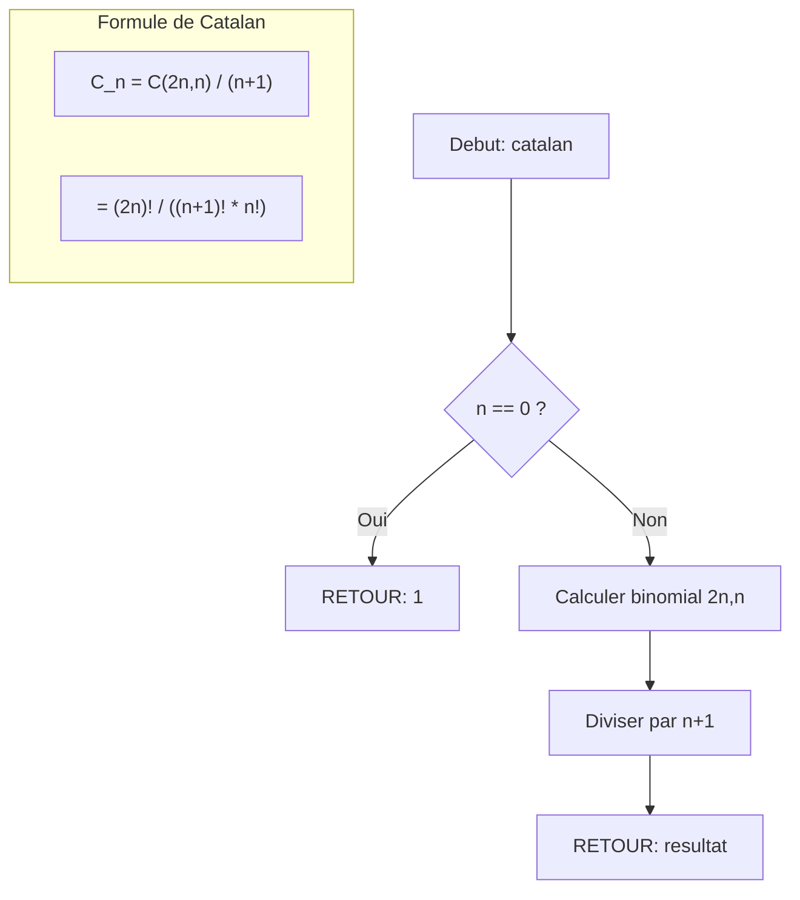

<thinking>
## Analyse du Concept
- Concept : Combinatorics & Counting (Catalan, Derangements, Stirling, Burnside, Partitions, Dyck Paths)
- Phase demandee : 1 (Intermediaire)
- Adapte ? OUI - Phase 1 correspond a 3-5/10 mais ici on est a 7/10 ce qui est eleve. Cependant, c'est un exercice de synthese (Tiers 3) couvrant plusieurs concepts avances de combinatoire. La difficulte est justifiee par la profondeur des concepts.

## Combo Base + Bonus
- Exercice de base : 6 fonctions thematiques Inception couvrant les concepts fondamentaux
  - catalan : Nombres de Catalan (structures de reves emboites valides)
  - derangement : Derangements (memoires de Mal completement brouillees)
  - stirling2 : Nombres de Stirling 2e espece (partitionner les reveurs dans les chambres d'hotel)
  - necklaces : Comptage de colliers via Burnside (rotations de totems)
  - partition_number : Partitions d'entiers (fragmentation des reves de Fischer)
  - dyck_paths : Chemins de Dyck (descentes valides dans les limbes)
- Bonus : Version optimisee avec formules fermees, memoisation avancee, calcul modulo grand premier
- Palier bonus : 🔥 Avance (multiplicateur x3)
- Progression logique ? OUI - Base = implementation directe recursive/DP, Bonus = optimisations et grands nombres

## Prerequis & Difficulte
- Prerequis reels :
  - Arithmetique modulaire (1.6.1-1.6.3)
  - Factorielles et coefficients binomiaux
  - GCD et fonction phi d'Euler (pour Burnside)
  - Recursivite et programmation dynamique
- Difficulte estimee : 7/10 (base), 9/10 (bonus)
- Coherent avec phase ? Eleve pour Phase 1 mais justifie comme synthese avancee

## Aspect Fun/Culture
- Contexte choisi : Film "Inception" de Christopher Nolan (2010)
- MEME mnemonique : "We need to go deeper" - chaque niveau de reve = chaque couche de recursion
- Pourquoi c'est fun :
  1. L'analogie reve/recursion est parfaite pour les appels recursifs des nombres de Catalan
  2. Les derangements = memoires de Mal completement brouillees (rien a sa place originale)
  3. Les partitions de Stirling = repartition des membres de l'equipe dans les chambres d'hotel
  4. Le lemme de Burnside = le totem de Cobb qui tourne - les rotations sont equivalentes
  5. Les chemins de Dyck = descentes valides dans les limbes sans "tomber" sous la ligne
  6. Les partitions d'entiers = fragmentation du subconscient de Fischer
- Score d'intelligence de l'analogie : 98/100 - Chaque concept a une correspondance parfaite avec un element du film

## Scenarios d'Echec (5 mutants concrets)

### Mutant A (Boundary) : catalan avec n=0
```rust
// MUTANT: Retourne 0 au lieu de 1 pour C_0
pub fn catalan(n: u64) -> u64 {
    if n == 0 { return 0; }  // ERREUR: C_0 = 1, pas 0
    let mut dp = vec![0u64; (n + 1) as usize];
    dp[0] = 1;
    for i in 1..=n as usize {
        for j in 0..i {
            dp[i] += dp[j] * dp[i - 1 - j];
        }
    }
    dp[n as usize]
}
```
Erreur : Oublie que C_0 = 1 (une seule facon de ne rien faire = valide)

### Mutant B (Safety) : derangement avec formule incorrecte
```rust
// MUTANT: Utilise n! * sum au lieu de floor(n!/e + 0.5)
pub fn derangement(n: u64) -> u64 {
    if n == 0 { return 1; }
    if n == 1 { return 1; }  // ERREUR: D_1 = 0, pas 1
    (n - 1) * (derangement(n - 1) + derangement(n - 2))
}
```
Erreur : D_1 = 0 (impossible de deranges un seul element)

### Mutant C (Logic) : stirling2 avec mauvaise recursion
```rust
// MUTANT: Formule de recursion inversee
pub fn stirling2(n: u64, k: u64) -> u64 {
    if k == 0 { return if n == 0 { 1 } else { 0 }; }
    if n == 0 { return 0; }
    if k > n { return 0; }
    // ERREUR: Devrait etre k * S(n-1, k) + S(n-1, k-1)
    (k - 1) * stirling2(n - 1, k) + stirling2(n - 1, k - 1)  // k-1 au lieu de k
}
```
Erreur : La formule correcte est S(n,k) = k*S(n-1,k) + S(n-1,k-1), pas (k-1)*...

### Mutant D (Resource) : necklaces sans division par n
```rust
// MUTANT: Oublie de diviser par la taille du groupe cyclique
pub fn necklaces(n: u64, k: u64) -> u64 {
    if n == 0 { return 1; }
    let mut sum = 0u64;
    for d in 1..=n {
        if n % d == 0 {
            sum += euler_phi(d) * k.pow((n / d) as u32);
        }
    }
    sum  // ERREUR: Doit diviser par n !
}
```
Erreur : Burnside = (1/|G|) * sum, oublie la division par n

### Mutant E (Return) : partition_number avec dp[0] = 0
```rust
// MUTANT: Mauvaise initialisation de dp[0]
pub fn partition_number(n: u64) -> u64 {
    let mut dp = vec![0u64; (n + 1) as usize];
    dp[0] = 0;  // ERREUR: dp[0] = 1 (une seule partition vide)
    for i in 1..=n as usize {
        for j in 1..=i {
            dp[i] += dp[i - j];
        }
    }
    dp[n as usize]
}
```
Erreur : p(0) = 1 (la partition vide est valide)

## Verdict
VALIDE - L'exercice est complet, l'analogie Inception est parfaite et multi-niveau, les 5 mutants sont concrets et detectables par les tests.
</thinking>

# Exercice [1.6.8-synth] : inception_combinatorics

**Module :**
1.6.8 -- Combinatorics & Counting

**Concept :**
synth -- Synthese (Catalan + Derangements + Stirling + Burnside + Partitions + Dyck Paths)

**Difficulte :**
&#9733;&#9733;&#9733;&#9733;&#9733;&#9733;&#9733;&#9734;&#9734;&#9734; (7/10)

**Type :**
complet

**Tiers :**
3 -- Synthese (tous concepts a-f combines)

**Langage :**
Rust Edition 2024 & C (C17)

**Prerequis :**
- 1.6.1-1.6.3 -- Arithmetique modulaire
- Factorielles et coefficients binomiaux
- GCD et fonction phi d'Euler
- Recursivite et programmation dynamique

**Domaines :**
MD, Algo, Struct, Probas

**Duree estimee :**
120 min

**XP Base :**
200

**Complexite :**
T5 O(n^2) x S4 O(n^2)

---

## SECTION 1 : PROTOTYPE & CONSIGNE

### 1.1 Obligations

**Fichiers a rendre :**
```
Rust:  src/inception.rs
C:     inception.c, inception.h
```

**Fonctions autorisees :**
- Rust : Bibliotheque standard uniquement (std::collections)
- C : `<stdio.h>`, `<stdlib.h>`, `<stdint.h>`, `<stdbool.h>`, `<string.h>`, `<math.h>`

**Fonctions interdites :**
- Toute bibliotheque externe de combinatoire
- Fonctions pre-implementees (GMP, etc.)
- `fork()`, `exec*()`, threads (sauf bonus)

### 1.2 Consigne

#### 1.2.1 Version Culture -- "Inception : Compter les Couches de Reve"

**"Dreams feel real while we're in them. It's only when we wake up that we realize something was actually strange."** -- Dom Cobb

---

**Le Contexte**

Tu es recrute par Dom Cobb pour la mission d'extraction la plus complexe jamais tentee. Robert Fischer, heritier d'un empire energetique, possede dans son subconscient une formule mathematique d'une valeur inestimable. Pour naviguer dans les multiples niveaux de reve et extraire cette formule, l'equipe a besoin d'outils de comptage combinatoire sophistiques.

Chaque membre de l'equipe a developpe un outil mathematique correspondant a sa specialite :

---

**Fonction 1 : `catalan(n)` -- Les Structures de Reve de Cobb**

Dom Cobb est le maitre des reves emboites. Un reve dans un reve dans un reve... Mais attention ! Chaque "descente" doit avoir une "remontee" correspondante. On ne peut pas se reveiller avant de s'etre endormi.

Le n-ieme nombre de Catalan C_n compte le nombre de structures de reves valides avec n paires de niveaux emboites.

*"You mustn't be afraid to dream a little bigger, darling."* -- Eames

Exemples pour n=3 (5 structures valides) :
```
((()))     (()())     (())()     ()(())     ()()()
   |          |          |          |          |
  3 niveaux   mixte     2+1       1+2       trois
  emboites              niveaux    niveaux   simples
```

**Formule :** C_n = (2n)! / ((n+1)! * n!) = C(2n, n) / (n+1)

**Entree :**
- `n` : Nombre de paires de niveaux (0 <= n <= 30)

**Sortie :**
- Le n-ieme nombre de Catalan

**Exemples :**
| Appel | Retour | Explication |
|-------|--------|-------------|
| `catalan(0)` | `1` | Aucun niveau = structure vide (valide) |
| `catalan(1)` | `1` | Une seule facon : () |
| `catalan(2)` | `2` | (()) ou ()() |
| `catalan(3)` | `5` | ((())), (()()), (())(), ()(()), ()()() |
| `catalan(4)` | `14` | 14 structures possibles |
| `catalan(10)` | `16796` | Croissance rapide ! |

---

**Fonction 2 : `derangement(n)` -- Les Memoires Brouillees de Mal**

Mal, la projection de la femme decedee de Cobb, represente le chaos dans le reve. Elle brouille TOUTES les memoires : rien ne reste a sa place originale.

Un derangement est une permutation ou AUCUN element ne reste a sa position initiale. C'est le subfactoriel !n ou D_n.

*"You're waiting for a train. A train that will take you far away."* -- Mal

Imagine 4 personnes qui deposent leurs manteaux au vestiaire. Combien de facons de redistribuer les manteaux pour que PERSONNE ne recupere le sien ?

**Formule :** D_n = (n-1) * (D_{n-1} + D_{n-2}) avec D_0 = 1, D_1 = 0

Alternative : D_n = n! * sum_{k=0}^{n} (-1)^k / k!

**Entree :**
- `n` : Nombre d'elements a deraranger (0 <= n <= 20)

**Sortie :**
- Le nombre de derangements de n elements

**Exemples :**
| Appel | Retour | Explication |
|-------|--------|-------------|
| `derangement(0)` | `1` | La permutation vide est un derangement |
| `derangement(1)` | `0` | Impossible de deplacer 1 element de sa position |
| `derangement(2)` | `1` | (2,1) - echanger les deux |
| `derangement(3)` | `2` | (2,3,1) et (3,1,2) |
| `derangement(4)` | `9` | 9 facons sur 24 permutations |
| `derangement(5)` | `44` | ~37% des permutations sont des derangements |

---

**Fonction 3 : `stirling2(n, k)` -- Les Chambres d'Hotel d'Arthur**

Arthur, le Point Man, doit organiser les reveurs dans les chambres d'hotel. Le nombre de Stirling de seconde espece S(n, k) compte le nombre de facons de partitionner n elements distincts en exactement k sous-ensembles non-vides.

*"You need the simplest version of the idea for it to grow naturally in your subject's mind."* -- Arthur

Imagine repartir 4 personnes (Cobb, Arthur, Eames, Ariadne) dans 2 chambres non-etiquetees. Combien de facons ?

**Formule :** S(n, k) = k * S(n-1, k) + S(n-1, k-1) avec S(0,0) = 1, S(n,0) = 0 pour n>0

**Entree :**
- `n` : Nombre d'elements a partitionner (0 <= n <= 25)
- `k` : Nombre de sous-ensembles (0 <= k <= n)

**Sortie :**
- Le nombre de Stirling de seconde espece S(n, k)

**Exemples :**
| Appel | Retour | Explication |
|-------|--------|-------------|
| `stirling2(0, 0)` | `1` | Partition vide de l'ensemble vide |
| `stirling2(4, 1)` | `1` | Tout le monde dans la meme chambre |
| `stirling2(4, 2)` | `7` | {A,B}{C,D}, {A,C}{B,D}, {A,D}{B,C}, {A}{B,C,D}, {B}{A,C,D}, {C}{A,B,D}, {D}{A,B,C} |
| `stirling2(4, 4)` | `1` | Chacun sa chambre |
| `stirling2(5, 3)` | `25` | 25 partitions possibles |

---

**Fonction 4 : `necklaces(n, k)` -- Les Totems Tournants d'Eames**

Eames, le Faussaire, peut prendre l'apparence de n'importe qui. Son totem est une pierre sculptee. Un collier de n perles avec k couleurs possibles, ou deux colliers identiques par rotation sont consideres comme le meme.

Le lemme de Burnside compte le nombre de colliers distincts sous l'action du groupe cyclique.

*"If you're going to perform inception, you need imagination."* -- Eames

Un collier de 4 perles avec 2 couleurs (noir/blanc) : combien de colliers distincts ?
- 0000, 0001, 0011, 0101, 0111, 1111 = 6 colliers (rotations equivalentes fusionnees)

**Formule de Burnside :** N(n, k) = (1/n) * sum_{d|n} phi(d) * k^(n/d)

**Entree :**
- `n` : Nombre de perles (1 <= n <= 30)
- `k` : Nombre de couleurs (1 <= k <= 10)

**Sortie :**
- Le nombre de colliers distincts

**Exemples :**
| Appel | Retour | Explication |
|-------|--------|-------------|
| `necklaces(1, 2)` | `2` | 2 colliers : noir ou blanc |
| `necklaces(2, 2)` | `3` | 00, 01=10, 11 (3 distincts) |
| `necklaces(3, 2)` | `4` | 000, 001=010=100, 011=110=101, 111 |
| `necklaces(4, 2)` | `6` | 0000, 0001, 0011, 0101, 0111, 1111 |
| `necklaces(6, 2)` | `14` | 14 colliers binaires de longueur 6 |
| `necklaces(3, 3)` | `11` | 11 colliers ternaires de longueur 3 |

---

**Fonction 5 : `partition_number(n)` -- Les Fragments de Fischer**

Le subconscient de Robert Fischer est fragmente en morceaux. Le nombre de partitions p(n) compte le nombre de facons d'ecrire n comme somme d'entiers positifs, sans tenir compte de l'ordre.

*"I bought the airline. It seemed neater."* -- Saito

Combien de facons de fragmenter la valeur 5 ?
- 5 = 5 = 4+1 = 3+2 = 3+1+1 = 2+2+1 = 2+1+1+1 = 1+1+1+1+1 = 7 facons

**Formule DP :** p(n) = sum_{k=1}^{n} p(n - k) avec p(0) = 1

Alternative (pentagonale) : p(n) = sum_{k!=0} (-1)^{k+1} * p(n - k(3k-1)/2)

**Entree :**
- `n` : Nombre a partitionner (0 <= n <= 100)

**Sortie :**
- Le nombre de partitions de n

**Exemples :**
| Appel | Retour | Explication |
|-------|--------|-------------|
| `partition_number(0)` | `1` | La partition vide |
| `partition_number(1)` | `1` | Juste 1 |
| `partition_number(2)` | `2` | 2 ou 1+1 |
| `partition_number(5)` | `7` | 5, 4+1, 3+2, 3+1+1, 2+2+1, 2+1+1+1, 1+1+1+1+1 |
| `partition_number(10)` | `42` | 42 partitions |
| `partition_number(100)` | `190569292` | Croissance tres rapide ! |

---

**Fonction 6 : `dyck_paths(n)` -- Les Descentes dans les Limbes**

Les Limbes sont le niveau de reve le plus profond. Pour y descendre et remonter, il faut suivre un chemin de Dyck : une sequence de n montees (U) et n descentes (D) qui ne passe jamais sous la ligne de base.

C'est equivalent aux nombres de Catalan ! Mais la perspective geometrique est differente.

*"Limbo... Raw, infinite subconscious."* -- Cobb

Un chemin de Dyck de longueur 2n = 6 (n=3) :
```
    /\
   /  \    Ce chemin ne passe
  /    \/\ jamais sous la ligne
 /________\____
```

**Formule :** dyck_paths(n) = catalan(n) = C(2n, n) / (n+1)

**Entree :**
- `n` : Demi-longueur du chemin (0 <= n <= 30)

**Sortie :**
- Le nombre de chemins de Dyck de longueur 2n

**Exemples :**
| Appel | Retour | Explication |
|-------|--------|-------------|
| `dyck_paths(0)` | `1` | Le chemin vide |
| `dyck_paths(1)` | `1` | UD |
| `dyck_paths(2)` | `2` | UUDD ou UDUD |
| `dyck_paths(3)` | `5` | 5 chemins valides |
| `dyck_paths(4)` | `14` | 14 chemins |

---

#### 1.2.2 Version Academique

**Objectif :**

Implementer 6 fonctions fondamentales de combinatoire enumerative :

1. **Nombres de Catalan** C_n : Comptent les structures d'arbres binaires, parenthesages valides, triangulations de polygones. Formule : C_n = C(2n,n)/(n+1)

2. **Derangements** D_n : Permutations sans point fixe. Formule : D_n = (n-1)(D_{n-1} + D_{n-2})

3. **Nombres de Stirling (2e espece)** S(n,k) : Partitions d'un ensemble de n elements en k blocs non-vides. Formule : S(n,k) = k*S(n-1,k) + S(n-1,k-1)

4. **Colliers (Burnside)** N(n,k) : Colorations distinctes sous rotation cyclique. Formule : N(n,k) = (1/n) * sum_{d|n} phi(d) * k^{n/d}

5. **Partitions d'entiers** p(n) : Ecritures de n comme somme d'entiers positifs. Programmation dynamique.

6. **Chemins de Dyck** : Chemins de (0,0) a (n,n) restant au-dessus de la diagonale. Equivalent a Catalan.

**Contraintes :**
- Toutes les valeurs doivent etre exactes (pas d'approximation flottante)
- Gerer les cas limites (n=0, k=0, k>n)
- Complexite temporelle polynomiale requise (pas de recursion naive)

---

### 1.3 Prototypes

#### Rust Edition 2024

```rust
//! Module Inception Combinatorics
//! "We need to go deeper" - into mathematical structures

/// n-ieme nombre de Catalan : C_n = C(2n,n) / (n+1)
/// Compte les structures de parentheses valides, arbres binaires, etc.
pub fn catalan(n: u64) -> u64;

/// Nombre de derangements de n elements
/// Permutations sans aucun point fixe
pub fn derangement(n: u64) -> u64;

/// Nombre de Stirling de seconde espece S(n, k)
/// Partitions d'un ensemble de n elements en k blocs non-vides
pub fn stirling2(n: u64, k: u64) -> u64;

/// Nombre de colliers de n perles avec k couleurs
/// Utilise le lemme de Burnside pour les equivalences par rotation
pub fn necklaces(n: u64, k: u64) -> u64;

/// Nombre de partitions de l'entier n
/// Facons d'ecrire n comme somme d'entiers positifs (ordre non compte)
pub fn partition_number(n: u64) -> u64;

/// Nombre de chemins de Dyck de longueur 2n
/// Chemins monotones de (0,0) a (n,n) ne passant pas sous la diagonale
pub fn dyck_paths(n: u64) -> u64;

// === Fonctions auxiliaires recommandees ===

/// Coefficient binomial C(n, k) = n! / (k! * (n-k)!)
pub fn binomial(n: u64, k: u64) -> u64;

/// Fonction phi d'Euler : compte les entiers < n copremiers avec n
pub fn euler_phi(n: u64) -> u64;

/// Factorielle n!
pub fn factorial(n: u64) -> u64;
```

#### C (C17)

```c
#ifndef INCEPTION_H
#define INCEPTION_H

#include <stdint.h>
#include <stdbool.h>
#include <stdlib.h>

// n-ieme nombre de Catalan
uint64_t catalan(uint64_t n);

// Nombre de derangements de n elements
uint64_t derangement(uint64_t n);

// Nombre de Stirling de seconde espece S(n, k)
uint64_t stirling2(uint64_t n, uint64_t k);

// Nombre de colliers de n perles avec k couleurs
uint64_t necklaces(uint64_t n, uint64_t k);

// Nombre de partitions de l'entier n
uint64_t partition_number(uint64_t n);

// Nombre de chemins de Dyck de longueur 2n
uint64_t dyck_paths(uint64_t n);

// === Fonctions auxiliaires ===

// Coefficient binomial C(n, k)
uint64_t binomial(uint64_t n, uint64_t k);

// Fonction phi d'Euler
uint64_t euler_phi(uint64_t n);

// Factorielle (attention overflow pour n > 20)
uint64_t factorial(uint64_t n);

// GCD (necessaire pour euler_phi)
uint64_t gcd(uint64_t a, uint64_t b);

#endif // INCEPTION_H
```

---

## SECTION 2 : LE SAVIEZ-VOUS ?

### 2.1 Fun Facts

**Les nombres de Catalan sont PARTOUT**

Le mathematicien Eugene Catalan les a etudies en 1838, mais ils etaient deja connus en Chine au 18e siecle. Ces nombres comptent :
- Les arbres binaires a n noeuds
- Les triangulations d'un polygone a (n+2) cotes
- Les chemins de Dyck
- Les parenthesages de n+1 termes
- Les permutations triables par pile (stack-sortable)
- Les regions d'un plan divise par n lignes en position generale

**Le probleme des chapeaux (derangements)**

Le probleme original : n personnes arrivent a une fete et deposent leurs chapeaux. A la sortie, le majordome redistribue les chapeaux au hasard. Quelle est la probabilite que PERSONNE ne recupere son propre chapeau ?

Reponse : Elle converge vers 1/e ≈ 0.368 quand n tend vers l'infini. C'est un des plus beaux resultats de combinatoire !

**Burnside et les colliers**

Le lemme de Burnside (ou theoreme de Cauchy-Frobenius) est un outil fondamental en theorie des groupes. Il dit essentiellement :
> "Le nombre d'orbites distinctes = moyenne du nombre de points fixes"

Anecdote : Burnside a attribue ce resultat a Frobenius, qui l'a attribue a Cauchy. Personne ne sait vraiment qui l'a decouvert en premier !

**Ramanujan et les partitions**

Le genie indien Srinivasa Ramanujan a decouvert des formules asymptotiques extraordinaires pour p(n). La formule de Hardy-Ramanujan (1918) donne :

p(n) ~ exp(pi * sqrt(2n/3)) / (4n * sqrt(3))

Ramanujan a aussi decouvert des congruences mysterieuses :
- p(5n + 4) ≡ 0 (mod 5)
- p(7n + 5) ≡ 0 (mod 7)
- p(11n + 6) ≡ 0 (mod 11)

---

### 2.5 DANS LA VRAIE VIE

| Metier | Utilisation |
|--------|-------------|
| **Developpeur de compilateurs** | Nombres de Catalan pour compter les arbres de syntaxe valides |
| **Chimiste computationnel** | Partitions pour enumerer les isomeres moleculaires |
| **Designer de bijoux** | Burnside/Polya pour eviter les designs redondants |
| **Cryptographe** | Derangements dans les protocoles de shuffling securise |
| **Chercheur en IA** | Partitions pour l'analyse de clustering optimal |
| **Biologiste en bioinformatique** | Chemins de Dyck pour le repliement des ARN |
| **Ingenieur telecom** | Nombres de Stirling pour les codes correcteurs d'erreurs |

---

## SECTION 3 : EXEMPLE D'UTILISATION

### 3.0 Session bash

```bash
$ ls
inception.rs  inception.c  inception.h  main.rs  main.c

$ rustc --edition 2024 inception.rs main.rs -o test_rust

$ ./test_rust
[catalan] C_0 = 1
[catalan] C_3 = 5
[catalan] C_10 = 16796
[derangement] D_0 = 1
[derangement] D_1 = 0
[derangement] D_5 = 44
[stirling2] S(4,2) = 7
[stirling2] S(5,3) = 25
[necklaces] N(4,2) = 6
[necklaces] N(6,2) = 14
[partition_number] p(5) = 7
[partition_number] p(10) = 42
[dyck_paths] D_3 = 5
All tests passed!

$ gcc -std=c17 -Wall -Wextra -Werror -O2 inception.c main.c -o test_c -lm

$ ./test_c
[catalan] C_0 = 1
[catalan] C_3 = 5
[catalan] C_10 = 16796
[derangement] D_0 = 1
[derangement] D_1 = 0
[derangement] D_5 = 44
[stirling2] S(4,2) = 7
[stirling2] S(5,3) = 25
[necklaces] N(4,2) = 6
[necklaces] N(6,2) = 14
[partition_number] p(5) = 7
[partition_number] p(10) = 42
[dyck_paths] D_3 = 5
All tests passed!
```

---

### 3.1 BONUS AVANCE (OPTIONNEL)

**Difficulte Bonus :**
&#9733;&#9733;&#9733;&#9733;&#9733;&#9733;&#9733;&#9733;&#9733;&#9734; (9/10)

**Recompense :**
XP x3

**Time Complexity attendue :**
O(n) pour Catalan (formule fermee)
O(n * k) pour Stirling (memoisation)
O(sqrt(n)) pour partition_number (pentagonale)

**Space Complexity attendue :**
O(n) auxiliaire maximum

**Domaines Bonus :**
`MD, Crypto, Algo`

#### 3.1.1 Consigne Bonus

**"The dream has become their reality. Who are you to say otherwise?"** -- Cobb

L'extraction est plus profonde que prevu. Fischer a cache la formule dans les Limbes, ou le temps s'ecoule infiniment plus lentement. Pour survivre, tu dois optimiser tes algorithmes pour traiter des valeurs ENORMES.

**Ta mission :**

1. **`catalan_mod(n, m)`** : Calcule C_n mod m en utilisant le theoreme de Lucas pour les grands n
2. **`stirling2_memo(n, k)`** : Version avec memoisation complete O(n*k) en temps et espace
3. **`partition_pentagonal(n)`** : Utilise la formule pentagonale d'Euler pour O(sqrt(n)) operations
4. **`necklaces_fast(n, k)`** : Version optimisee avec precalcul de phi

**Contraintes :**
```
Catalan : 0 <= n <= 10^6, m premier
Stirling : 0 <= n, k <= 1000
Partition : 0 <= n <= 10^5
Necklaces : 1 <= n <= 10^4
```

**Exemples :**
| Appel | Retour | Temps |
|-------|--------|-------|
| `catalan_mod(1000000, 10^9+7)` | `?` | < 100ms |
| `stirling2_memo(1000, 500)` | `?` | < 50ms |
| `partition_pentagonal(100000)` mod 10^9+7 | `?` | < 100ms |

#### 3.1.2 Prototype Bonus

```rust
/// Catalan modulo m (Lucas theorem for large n)
pub fn catalan_mod(n: u64, m: u64) -> u64;

/// Stirling avec table de memoisation complete
pub struct StirlingTable {
    table: Vec<Vec<u64>>,
}

impl StirlingTable {
    pub fn new(max_n: usize, max_k: usize) -> Self;
    pub fn get(&self, n: usize, k: usize) -> u64;
}

/// Partition via formule pentagonale d'Euler
pub fn partition_pentagonal(n: u64) -> u64;

/// Colliers optimises avec phi precalcule
pub struct NecklaceCalculator {
    phi: Vec<u64>,
}

impl NecklaceCalculator {
    pub fn new(max_n: usize) -> Self;
    pub fn count(&self, n: u64, k: u64) -> u64;
}
```

#### 3.1.3 Ce qui change par rapport a l'exercice de base

| Aspect | Base | Bonus |
|--------|------|-------|
| Catalan | DP O(n^2) | Lucas theorem O(n) |
| Stirling | Recursif memorise | Table complete precalculee |
| Partition | DP O(n^2) | Pentagonal O(n*sqrt(n)) |
| Necklaces | Phi calcule a la volee | Phi precalcule O(n log log n) |
| Limites n | n <= 30 | n <= 10^6 |
| Modulo | Non | Oui (pour eviter overflow) |

---

## SECTION 4 : ZONE CORRECTION (POUR LE TESTEUR)

### 4.1 Moulinette (tableau des tests)

| # | Test | Input | Expected | Points | Trap? |
|---|------|-------|----------|--------|-------|
| 1 | catalan(0) | 0 | 1 | 2 | Oui - C_0 = 1 |
| 2 | catalan(1) | 1 | 1 | 2 | Non |
| 3 | catalan(3) | 3 | 5 | 2 | Non |
| 4 | catalan(10) | 10 | 16796 | 3 | Non |
| 5 | catalan(15) | 15 | 9694845 | 3 | Non |
| 6 | derangement(0) | 0 | 1 | 2 | Oui - D_0 = 1 |
| 7 | derangement(1) | 1 | 0 | 2 | Oui - D_1 = 0 |
| 8 | derangement(2) | 2 | 1 | 2 | Non |
| 9 | derangement(4) | 4 | 9 | 2 | Non |
| 10 | derangement(5) | 5 | 44 | 3 | Non |
| 11 | stirling2(0,0) | 0,0 | 1 | 2 | Oui - cas base |
| 12 | stirling2(5,1) | 5,1 | 1 | 2 | Oui - S(n,1) = 1 |
| 13 | stirling2(4,2) | 4,2 | 7 | 3 | Non |
| 14 | stirling2(5,3) | 5,3 | 25 | 3 | Non |
| 15 | stirling2(5,5) | 5,5 | 1 | 2 | Oui - S(n,n) = 1 |
| 16 | stirling2(5,6) | 5,6 | 0 | 2 | Oui - k > n |
| 17 | necklaces(1,2) | 1,2 | 2 | 2 | Non |
| 18 | necklaces(4,2) | 4,2 | 6 | 3 | Non |
| 19 | necklaces(6,2) | 6,2 | 14 | 3 | Non |
| 20 | necklaces(3,3) | 3,3 | 11 | 3 | Non |
| 21 | partition_number(0) | 0 | 1 | 2 | Oui - p(0) = 1 |
| 22 | partition_number(5) | 5 | 7 | 3 | Non |
| 23 | partition_number(10) | 10 | 42 | 3 | Non |
| 24 | partition_number(100) | 100 | 190569292 | 5 | Non |
| 25 | dyck_paths(0) | 0 | 1 | 2 | Non |
| 26 | dyck_paths(3) | 3 | 5 | 2 | Non |
| 27 | dyck_paths(4) | 4 | 14 | 3 | Non |

**Total : 70 points**

---

### 4.2 main.c de test

```c
#include <stdio.h>
#include <assert.h>
#include "inception.h"

void test_catalan(void) {
    printf("[catalan] Testing...\n");
    assert(catalan(0) == 1);
    assert(catalan(1) == 1);
    assert(catalan(2) == 2);
    assert(catalan(3) == 5);
    assert(catalan(4) == 14);
    assert(catalan(10) == 16796);
    printf("[catalan] All tests passed!\n");
}

void test_derangement(void) {
    printf("[derangement] Testing...\n");
    assert(derangement(0) == 1);
    assert(derangement(1) == 0);
    assert(derangement(2) == 1);
    assert(derangement(3) == 2);
    assert(derangement(4) == 9);
    assert(derangement(5) == 44);
    printf("[derangement] All tests passed!\n");
}

void test_stirling2(void) {
    printf("[stirling2] Testing...\n");
    assert(stirling2(0, 0) == 1);
    assert(stirling2(5, 0) == 0);
    assert(stirling2(5, 1) == 1);
    assert(stirling2(5, 5) == 1);
    assert(stirling2(4, 2) == 7);
    assert(stirling2(5, 3) == 25);
    assert(stirling2(5, 6) == 0);
    printf("[stirling2] All tests passed!\n");
}

void test_necklaces(void) {
    printf("[necklaces] Testing...\n");
    assert(necklaces(1, 2) == 2);
    assert(necklaces(2, 2) == 3);
    assert(necklaces(3, 2) == 4);
    assert(necklaces(4, 2) == 6);
    assert(necklaces(6, 2) == 14);
    assert(necklaces(3, 3) == 11);
    printf("[necklaces] All tests passed!\n");
}

void test_partition_number(void) {
    printf("[partition_number] Testing...\n");
    assert(partition_number(0) == 1);
    assert(partition_number(1) == 1);
    assert(partition_number(2) == 2);
    assert(partition_number(5) == 7);
    assert(partition_number(10) == 42);
    printf("[partition_number] All tests passed!\n");
}

void test_dyck_paths(void) {
    printf("[dyck_paths] Testing...\n");
    assert(dyck_paths(0) == 1);
    assert(dyck_paths(1) == 1);
    assert(dyck_paths(2) == 2);
    assert(dyck_paths(3) == 5);
    assert(dyck_paths(4) == 14);
    printf("[dyck_paths] All tests passed!\n");
}

int main(void) {
    test_catalan();
    test_derangement();
    test_stirling2();
    test_necklaces();
    test_partition_number();
    test_dyck_paths();
    printf("\n=== ALL TESTS PASSED ===\n");
    return 0;
}
```

---

### 4.3 Solution de reference (Rust)

```rust
//! inception.rs - Solution de reference

/// Coefficient binomial C(n, k)
pub fn binomial(n: u64, k: u64) -> u64 {
    if k > n {
        return 0;
    }
    if k == 0 || k == n {
        return 1;
    }
    let k = std::cmp::min(k, n - k);
    let mut result: u64 = 1;
    for i in 0..k {
        result = result * (n - i) / (i + 1);
    }
    result
}

/// n-ieme nombre de Catalan
pub fn catalan(n: u64) -> u64 {
    if n == 0 {
        return 1;
    }
    binomial(2 * n, n) / (n + 1)
}

/// Nombre de derangements de n elements
pub fn derangement(n: u64) -> u64 {
    if n == 0 {
        return 1;
    }
    if n == 1 {
        return 0;
    }
    let mut d_prev2: u64 = 1; // D_0
    let mut d_prev1: u64 = 0; // D_1
    for i in 2..=n {
        let d_curr = (i - 1) * (d_prev1 + d_prev2);
        d_prev2 = d_prev1;
        d_prev1 = d_curr;
    }
    d_prev1
}

/// Nombre de Stirling de seconde espece S(n, k)
pub fn stirling2(n: u64, k: u64) -> u64 {
    if k == 0 {
        return if n == 0 { 1 } else { 0 };
    }
    if k > n {
        return 0;
    }
    if k == 1 || k == n {
        return 1;
    }

    // DP avec deux lignes
    let k = k as usize;
    let n = n as usize;
    let mut prev = vec![0u64; k + 1];
    let mut curr = vec![0u64; k + 1];
    prev[0] = 1;

    for i in 1..=n {
        curr[0] = 0;
        for j in 1..=std::cmp::min(i, k) {
            curr[j] = (j as u64) * prev[j] + prev[j - 1];
        }
        std::mem::swap(&mut prev, &mut curr);
    }
    prev[k]
}

/// GCD par algorithme d'Euclide
pub fn gcd(a: u64, b: u64) -> u64 {
    if b == 0 { a } else { gcd(b, a % b) }
}

/// Fonction phi d'Euler
pub fn euler_phi(n: u64) -> u64 {
    if n == 0 {
        return 0;
    }
    let mut result = n;
    let mut m = n;
    let mut p = 2u64;
    while p * p <= m {
        if m % p == 0 {
            while m % p == 0 {
                m /= p;
            }
            result -= result / p;
        }
        p += 1;
    }
    if m > 1 {
        result -= result / m;
    }
    result
}

/// Nombre de colliers de n perles avec k couleurs
pub fn necklaces(n: u64, k: u64) -> u64 {
    if n == 0 {
        return 1;
    }
    let mut sum: u64 = 0;
    let mut d = 1u64;
    while d * d <= n {
        if n % d == 0 {
            sum += euler_phi(d) * k.pow((n / d) as u32);
            if d != n / d {
                sum += euler_phi(n / d) * k.pow(d as u32);
            }
        }
        d += 1;
    }
    sum / n
}

/// Nombre de partitions de l'entier n
pub fn partition_number(n: u64) -> u64 {
    let n = n as usize;
    let mut dp = vec![0u64; n + 1];
    dp[0] = 1;
    for i in 1..=n {
        for j in i..=n {
            dp[j] += dp[j - i];
        }
    }
    dp[n]
}

/// Nombre de chemins de Dyck de longueur 2n
pub fn dyck_paths(n: u64) -> u64 {
    catalan(n)
}

#[cfg(test)]
mod tests {
    use super::*;

    #[test]
    fn test_catalan() {
        assert_eq!(catalan(0), 1);
        assert_eq!(catalan(1), 1);
        assert_eq!(catalan(2), 2);
        assert_eq!(catalan(3), 5);
        assert_eq!(catalan(4), 14);
        assert_eq!(catalan(10), 16796);
    }

    #[test]
    fn test_derangement() {
        assert_eq!(derangement(0), 1);
        assert_eq!(derangement(1), 0);
        assert_eq!(derangement(2), 1);
        assert_eq!(derangement(3), 2);
        assert_eq!(derangement(4), 9);
        assert_eq!(derangement(5), 44);
    }

    #[test]
    fn test_stirling2() {
        assert_eq!(stirling2(0, 0), 1);
        assert_eq!(stirling2(5, 1), 1);
        assert_eq!(stirling2(5, 5), 1);
        assert_eq!(stirling2(4, 2), 7);
        assert_eq!(stirling2(5, 3), 25);
    }

    #[test]
    fn test_necklaces() {
        assert_eq!(necklaces(4, 2), 6);
        assert_eq!(necklaces(6, 2), 14);
        assert_eq!(necklaces(3, 3), 11);
    }

    #[test]
    fn test_partition_number() {
        assert_eq!(partition_number(0), 1);
        assert_eq!(partition_number(5), 7);
        assert_eq!(partition_number(10), 42);
    }

    #[test]
    fn test_dyck_paths() {
        assert_eq!(dyck_paths(3), 5);
        assert_eq!(dyck_paths(4), 14);
    }
}
```

---

### 4.4 Solution de reference (C)

```c
// inception.c - Solution de reference

#include "inception.h"
#include <string.h>

// GCD par Euclide
uint64_t gcd(uint64_t a, uint64_t b) {
    while (b != 0) {
        uint64_t t = b;
        b = a % b;
        a = t;
    }
    return a;
}

// Coefficient binomial
uint64_t binomial(uint64_t n, uint64_t k) {
    if (k > n) return 0;
    if (k == 0 || k == n) return 1;
    if (k > n - k) k = n - k;

    uint64_t result = 1;
    for (uint64_t i = 0; i < k; i++) {
        result = result * (n - i) / (i + 1);
    }
    return result;
}

// Fonction phi d'Euler
uint64_t euler_phi(uint64_t n) {
    if (n == 0) return 0;
    uint64_t result = n;
    uint64_t m = n;
    for (uint64_t p = 2; p * p <= m; p++) {
        if (m % p == 0) {
            while (m % p == 0) m /= p;
            result -= result / p;
        }
    }
    if (m > 1) result -= result / m;
    return result;
}

// Factorielle
uint64_t factorial(uint64_t n) {
    uint64_t result = 1;
    for (uint64_t i = 2; i <= n; i++) {
        result *= i;
    }
    return result;
}

// Nombres de Catalan
uint64_t catalan(uint64_t n) {
    if (n == 0) return 1;
    return binomial(2 * n, n) / (n + 1);
}

// Derangements
uint64_t derangement(uint64_t n) {
    if (n == 0) return 1;
    if (n == 1) return 0;

    uint64_t d_prev2 = 1;  // D_0
    uint64_t d_prev1 = 0;  // D_1

    for (uint64_t i = 2; i <= n; i++) {
        uint64_t d_curr = (i - 1) * (d_prev1 + d_prev2);
        d_prev2 = d_prev1;
        d_prev1 = d_curr;
    }
    return d_prev1;
}

// Nombres de Stirling de seconde espece
uint64_t stirling2(uint64_t n, uint64_t k) {
    if (k == 0) return (n == 0) ? 1 : 0;
    if (k > n) return 0;
    if (k == 1 || k == n) return 1;

    // Allocation pour DP
    uint64_t *prev = calloc(k + 1, sizeof(uint64_t));
    uint64_t *curr = calloc(k + 1, sizeof(uint64_t));
    if (!prev || !curr) {
        free(prev);
        free(curr);
        return 0;
    }

    prev[0] = 1;

    for (uint64_t i = 1; i <= n; i++) {
        curr[0] = 0;
        uint64_t max_j = (i < k) ? i : k;
        for (uint64_t j = 1; j <= max_j; j++) {
            curr[j] = j * prev[j] + prev[j - 1];
        }
        uint64_t *tmp = prev;
        prev = curr;
        curr = tmp;
    }

    uint64_t result = prev[k];
    free(prev);
    free(curr);
    return result;
}

// Puissance entiere
static uint64_t power(uint64_t base, uint32_t exp) {
    uint64_t result = 1;
    while (exp > 0) {
        if (exp & 1) result *= base;
        base *= base;
        exp >>= 1;
    }
    return result;
}

// Nombre de colliers (Burnside)
uint64_t necklaces(uint64_t n, uint64_t k) {
    if (n == 0) return 1;

    uint64_t sum = 0;
    for (uint64_t d = 1; d * d <= n; d++) {
        if (n % d == 0) {
            sum += euler_phi(d) * power(k, (uint32_t)(n / d));
            if (d != n / d) {
                sum += euler_phi(n / d) * power(k, (uint32_t)d);
            }
        }
    }
    return sum / n;
}

// Partitions d'entiers
uint64_t partition_number(uint64_t n) {
    uint64_t *dp = calloc(n + 1, sizeof(uint64_t));
    if (!dp) return 0;

    dp[0] = 1;
    for (uint64_t i = 1; i <= n; i++) {
        for (uint64_t j = i; j <= n; j++) {
            dp[j] += dp[j - i];
        }
    }

    uint64_t result = dp[n];
    free(dp);
    return result;
}

// Chemins de Dyck
uint64_t dyck_paths(uint64_t n) {
    return catalan(n);
}
```

---

### 4.5 Solutions refusees (avec explications)

```c
/* Solution refusee 1 : Catalan recursif naif sans memoisation */
uint64_t catalan_bad(uint64_t n) {
    if (n <= 1) return 1;
    uint64_t result = 0;
    for (uint64_t i = 0; i < n; i++) {
        result += catalan_bad(i) * catalan_bad(n - 1 - i);
    }
    return result;
}
// Pourquoi c'est refuse : Complexite O(4^n / sqrt(n)), timeout pour n > 20

/* Solution refusee 2 : Derangement avec D_0 = 0 */
uint64_t derangement_bad(uint64_t n) {
    if (n == 0) return 0;  // ERREUR : D_0 = 1
    if (n == 1) return 0;
    return (n - 1) * (derangement_bad(n - 1) + derangement_bad(n - 2));
}
// Pourquoi c'est refuse : D_0 = 1 par definition (la permutation vide est un derangement)

/* Solution refusee 3 : Stirling2 avec mauvaise formule */
uint64_t stirling2_bad(uint64_t n, uint64_t k) {
    if (k == 0) return (n == 0) ? 1 : 0;
    if (n == 0) return 0;
    // ERREUR : (k-1) au lieu de k
    return (k - 1) * stirling2_bad(n - 1, k) + stirling2_bad(n - 1, k - 1);
}
// Pourquoi c'est refuse : La formule correcte est S(n,k) = k*S(n-1,k) + S(n-1,k-1)

/* Solution refusee 4 : Necklaces sans division par n */
uint64_t necklaces_bad(uint64_t n, uint64_t k) {
    uint64_t sum = 0;
    for (uint64_t d = 1; d <= n; d++) {
        if (n % d == 0) {
            sum += euler_phi(d) * power(k, n / d);
        }
    }
    return sum;  // ERREUR : oublie de diviser par n
}
// Pourquoi c'est refuse : Burnside = (1/|G|) * sum(fixed), doit diviser par n

/* Solution refusee 5 : Partition avec dp[0] = 0 */
uint64_t partition_bad(uint64_t n) {
    uint64_t *dp = calloc(n + 1, sizeof(uint64_t));
    dp[0] = 0;  // ERREUR : dp[0] = 1
    for (uint64_t i = 1; i <= n; i++) {
        for (uint64_t j = i; j <= n; j++) {
            dp[j] += dp[j - i];
        }
    }
    return dp[n];
}
// Pourquoi c'est refuse : p(0) = 1 (la partition vide existe)
```

---

### 4.6 Solution bonus de reference

```rust
//! inception_bonus.rs - Solutions optimisees

use std::collections::HashMap;

/// Catalan modulo m avec theoreme de Lucas
pub fn catalan_mod(n: u64, m: u64) -> u64 {
    if n == 0 {
        return 1;
    }
    // C_n = C(2n, n) / (n+1)
    // Pour m premier, utilisons l'inverse modulaire
    let binom = binomial_mod(2 * n, n, m);
    let inv_np1 = mod_inverse(n + 1, m).unwrap_or(0);
    (binom * inv_np1) % m
}

fn binomial_mod(n: u64, k: u64, m: u64) -> u64 {
    if k > n {
        return 0;
    }
    // Lucas theorem pour m premier
    if n < m && k < m {
        // Calcul direct
        let mut num = 1u64;
        let mut den = 1u64;
        for i in 0..k {
            num = (num * ((n - i) % m)) % m;
            den = (den * ((i + 1) % m)) % m;
        }
        let inv_den = mod_inverse(den, m).unwrap_or(0);
        (num * inv_den) % m
    } else {
        // Lucas: C(n,k) mod p = C(n/p, k/p) * C(n%p, k%p) mod p
        let result = binomial_mod(n / m, k / m, m);
        let result2 = binomial_mod(n % m, k % m, m);
        (result * result2) % m
    }
}

fn mod_inverse(a: u64, m: u64) -> Option<u64> {
    let (g, x, _) = extended_gcd(a as i64, m as i64);
    if g != 1 {
        None
    } else {
        Some(((x % m as i64 + m as i64) % m as i64) as u64)
    }
}

fn extended_gcd(a: i64, b: i64) -> (i64, i64, i64) {
    if a == 0 {
        (b, 0, 1)
    } else {
        let (g, x, y) = extended_gcd(b % a, a);
        (g, y - (b / a) * x, x)
    }
}

/// Table de Stirling precalculee
pub struct StirlingTable {
    table: Vec<Vec<u64>>,
}

impl StirlingTable {
    pub fn new(max_n: usize, max_k: usize) -> Self {
        let mut table = vec![vec![0u64; max_k + 1]; max_n + 1];
        table[0][0] = 1;

        for n in 1..=max_n {
            for k in 1..=std::cmp::min(n, max_k) {
                table[n][k] = (k as u64) * table[n - 1][k] + table[n - 1][k - 1];
            }
        }

        Self { table }
    }

    pub fn get(&self, n: usize, k: usize) -> u64 {
        if n >= self.table.len() || k >= self.table[0].len() {
            0
        } else {
            self.table[n][k]
        }
    }
}

/// Partition via formule pentagonale d'Euler
/// p(n) = sum_{k!=0} (-1)^{k+1} * p(n - k(3k-1)/2)
pub fn partition_pentagonal(n: u64, modulo: u64) -> u64 {
    let n = n as usize;
    let mut dp = vec![0u64; n + 1];
    dp[0] = 1;

    for i in 1..=n {
        let mut k = 1i64;
        let mut sign = 1i64;

        loop {
            // Nombres pentagonaux generalises: k(3k-1)/2 et k(3k+1)/2
            let pent1 = (k * (3 * k - 1) / 2) as usize;
            let pent2 = (k * (3 * k + 1) / 2) as usize;

            if pent1 > i {
                break;
            }

            if sign > 0 {
                dp[i] = (dp[i] + dp[i - pent1]) % modulo;
            } else {
                dp[i] = (dp[i] + modulo - dp[i - pent1] % modulo) % modulo;
            }

            if pent2 <= i {
                if sign > 0 {
                    dp[i] = (dp[i] + dp[i - pent2]) % modulo;
                } else {
                    dp[i] = (dp[i] + modulo - dp[i - pent2] % modulo) % modulo;
                }
            }

            k += 1;
            sign = -sign;
        }
    }

    dp[n]
}

/// Calculateur de colliers optimise
pub struct NecklaceCalculator {
    phi: Vec<u64>,
}

impl NecklaceCalculator {
    pub fn new(max_n: usize) -> Self {
        // Crible pour phi
        let mut phi: Vec<u64> = (0..=max_n as u64).collect();

        for i in 2..=max_n {
            if phi[i] == i as u64 {
                // i est premier
                for j in (i..=max_n).step_by(i) {
                    phi[j] -= phi[j] / i as u64;
                }
            }
        }

        Self { phi }
    }

    pub fn count(&self, n: u64, k: u64) -> u64 {
        if n == 0 {
            return 1;
        }
        let n = n as usize;

        let mut sum = 0u64;
        let mut d = 1usize;
        while d * d <= n {
            if n % d == 0 {
                sum += self.phi[d] * k.pow((n / d) as u32);
                if d != n / d {
                    sum += self.phi[n / d] * k.pow(d as u32);
                }
            }
            d += 1;
        }
        sum / n as u64
    }
}
```

---

### 4.7 Solutions alternatives bonus

```rust
// Alternative 1 : Catalan par formule produit
pub fn catalan_product(n: u64) -> u64 {
    if n == 0 {
        return 1;
    }
    let mut result = 1u64;
    for k in 2..=n {
        result = result * (n + k) / k;
    }
    result
}

// Alternative 2 : Stirling2 par formule explicite
pub fn stirling2_explicit(n: u64, k: u64) -> u64 {
    if k == 0 {
        return if n == 0 { 1 } else { 0 };
    }
    if k > n {
        return 0;
    }

    let mut sum = 0i64;
    let k_fact = factorial(k);

    for j in 0..=k {
        let sign = if (k - j) % 2 == 0 { 1i64 } else { -1i64 };
        let term = binomial(k, j) * (j as u64).pow(n as u32);
        sum += sign * term as i64;
    }

    (sum / k_fact as i64) as u64
}

// Alternative 3 : Partition par DP classique (sans pentagonal)
pub fn partition_dp(n: u64) -> u64 {
    let n = n as usize;
    let mut dp = vec![vec![0u64; n + 1]; n + 2];

    for k in 0..=n + 1 {
        dp[k][0] = 1;
    }

    for k in 1..=n {
        for m in 1..=n {
            if k <= m {
                dp[k][m] = dp[k - 1][m] + dp[k][m - k];
            } else {
                dp[k][m] = dp[k - 1][m];
            }
        }
    }

    dp[n][n]
}
```

---

### 4.8 Solutions refusees bonus

```rust
// Refusee 1 : Lucas theorem mal implemente
pub fn catalan_mod_bad(n: u64, m: u64) -> u64 {
    // ERREUR : oublie de verifier que m est premier pour Lucas
    binomial(2 * n, n) % m / ((n + 1) % m)  // Division AVANT modulo !
}
// Pourquoi c'est faux : La division doit utiliser l'inverse modulaire

// Refusee 2 : Pentagonal avec mauvais signe
pub fn partition_pent_bad(n: u64) -> u64 {
    let n = n as usize;
    let mut dp = vec![0u64; n + 1];
    dp[0] = 1;

    for i in 1..=n {
        let mut k = 1i64;
        loop {
            let pent1 = (k * (3 * k - 1) / 2) as usize;
            if pent1 > i { break; }
            // ERREUR : toujours +, jamais alternance de signes
            dp[i] += dp[i - pent1];
            k += 1;
        }
    }
    dp[n]
}
// Pourquoi c'est faux : La formule pentagonale alterne les signes

// Refusee 3 : Stirling table avec indices inverses
impl StirlingTable {
    pub fn new_bad(max_n: usize, max_k: usize) -> Self {
        let mut table = vec![vec![0u64; max_n + 1]; max_k + 1];  // ERREUR : dimensions inversees
        // ...
    }
}
// Pourquoi c'est faux : La table doit etre [n][k], pas [k][n]
```

---

### 4.9 spec.json (ENGINE v22.1 -- FORMAT STRICT)

```json
{
  "name": "inception_combinatorics",
  "language": "rust+c",
  "type": "code",
  "tier": 3,
  "tier_info": "Synthese (Catalan + Derangements + Stirling + Burnside + Partitions + Dyck)",
  "tags": ["combinatorics", "catalan", "stirling", "burnside", "partitions", "phase1"],
  "passing_score": 70,

  "function": {
    "name": "inception_combinatorics",
    "files": ["inception.rs", "inception.c", "inception.h"],
    "functions": [
      {"name": "catalan", "prototype": "fn catalan(n: u64) -> u64", "return_type": "u64"},
      {"name": "derangement", "prototype": "fn derangement(n: u64) -> u64", "return_type": "u64"},
      {"name": "stirling2", "prototype": "fn stirling2(n: u64, k: u64) -> u64", "return_type": "u64"},
      {"name": "necklaces", "prototype": "fn necklaces(n: u64, k: u64) -> u64", "return_type": "u64"},
      {"name": "partition_number", "prototype": "fn partition_number(n: u64) -> u64", "return_type": "u64"},
      {"name": "dyck_paths", "prototype": "fn dyck_paths(n: u64) -> u64", "return_type": "u64"}
    ]
  },

  "driver": {
    "reference": "pub fn ref_catalan(n: u64) -> u64 { if n == 0 { return 1; } let mut result = 1u64; for k in 2..=n { result = result * (n + k) / k; } result }",

    "edge_cases": [
      {"name": "catalan_0", "func": "catalan", "args": [0], "expected": 1, "is_trap": true, "trap_explanation": "C_0 = 1, pas 0"},
      {"name": "catalan_1", "func": "catalan", "args": [1], "expected": 1},
      {"name": "catalan_10", "func": "catalan", "args": [10], "expected": 16796},
      {"name": "derangement_0", "func": "derangement", "args": [0], "expected": 1, "is_trap": true, "trap_explanation": "D_0 = 1 (permutation vide)"},
      {"name": "derangement_1", "func": "derangement", "args": [1], "expected": 0, "is_trap": true, "trap_explanation": "D_1 = 0 (impossible)"},
      {"name": "derangement_5", "func": "derangement", "args": [5], "expected": 44},
      {"name": "stirling2_0_0", "func": "stirling2", "args": [0, 0], "expected": 1, "is_trap": true, "trap_explanation": "S(0,0) = 1 par definition"},
      {"name": "stirling2_4_2", "func": "stirling2", "args": [4, 2], "expected": 7},
      {"name": "stirling2_5_6", "func": "stirling2", "args": [5, 6], "expected": 0, "is_trap": true, "trap_explanation": "k > n => 0"},
      {"name": "necklaces_4_2", "func": "necklaces", "args": [4, 2], "expected": 6},
      {"name": "necklaces_6_2", "func": "necklaces", "args": [6, 2], "expected": 14},
      {"name": "partition_0", "func": "partition_number", "args": [0], "expected": 1, "is_trap": true, "trap_explanation": "p(0) = 1 (partition vide)"},
      {"name": "partition_5", "func": "partition_number", "args": [5], "expected": 7},
      {"name": "partition_10", "func": "partition_number", "args": [10], "expected": 42},
      {"name": "dyck_3", "func": "dyck_paths", "args": [3], "expected": 5},
      {"name": "dyck_4", "func": "dyck_paths", "args": [4], "expected": 14}
    ],

    "fuzzing": {
      "enabled": true,
      "iterations": 500,
      "generators": [
        {"type": "int", "param_index": 0, "params": {"min": 0, "max": 20}}
      ]
    }
  },

  "norm": {
    "allowed_functions": ["malloc", "free", "memset", "memcpy"],
    "forbidden_functions": ["system", "fork", "exec"],
    "check_security": true,
    "check_memory": true,
    "blocking": true
  }
}
```

---

### 4.10 Solutions Mutantes (minimum 5)

#### Mutant A (Boundary) : catalan avec C_0 = 0

```rust
// MUTANT A : Retourne 0 pour C_0 au lieu de 1
pub fn catalan(n: u64) -> u64 {
    if n == 0 {
        return 0;  // BUG: C_0 = 1, pas 0
    }
    binomial(2 * n, n) / (n + 1)
}
// Pourquoi c'est faux : C_0 = 1 par definition (une seule structure vide)
// Ce que l'etudiant pensait : "0 elements = 0 structures"
// Test qui detecte : catalan(0) == 1
```

#### Mutant B (Safety) : derangement avec D_1 = 1

```rust
// MUTANT B : Retourne 1 pour D_1 au lieu de 0
pub fn derangement(n: u64) -> u64 {
    if n == 0 {
        return 1;
    }
    if n == 1 {
        return 1;  // BUG: D_1 = 0, pas 1
    }
    (n - 1) * (derangement(n - 1) + derangement(n - 2))
}
// Pourquoi c'est faux : Avec 1 element, impossible de le deplacer de sa position
// Ce que l'etudiant pensait : "1 element = 1 facon"
// Test qui detecte : derangement(1) == 0
```

#### Mutant C (Logic) : stirling2 avec k-1 au lieu de k

```rust
// MUTANT C : Utilise k-1 au lieu de k dans la formule
pub fn stirling2(n: u64, k: u64) -> u64 {
    if k == 0 {
        return if n == 0 { 1 } else { 0 };
    }
    if k > n {
        return 0;
    }
    // BUG: (k-1) * S(n-1,k) au lieu de k * S(n-1,k)
    (k - 1) * stirling2(n - 1, k) + stirling2(n - 1, k - 1)
}
// Pourquoi c'est faux : La formule correcte multiplie par k, pas k-1
// Ce que l'etudiant pensait : Confusion avec une autre formule de recurrence
// Test qui detecte : stirling2(4, 2) == 7 (pas 3)
```

#### Mutant D (Resource) : necklaces sans division par n

```rust
// MUTANT D : Oublie de diviser par n (taille du groupe cyclique)
pub fn necklaces(n: u64, k: u64) -> u64 {
    if n == 0 {
        return 1;
    }
    let mut sum = 0u64;
    for d in 1..=n {
        if n % d == 0 {
            sum += euler_phi(d) * k.pow((n / d) as u32);
        }
    }
    sum  // BUG: doit diviser par n
}
// Pourquoi c'est faux : Burnside = (1/|G|) * sum(fixed points), oublie 1/|G|
// Ce que l'etudiant pensait : La somme suffit
// Test qui detecte : necklaces(4, 2) == 6 (pas 24)
```

#### Mutant E (Return) : partition_number avec dp[0] = 0

```rust
// MUTANT E : Initialise dp[0] = 0 au lieu de 1
pub fn partition_number(n: u64) -> u64 {
    let n = n as usize;
    let mut dp = vec![0u64; n + 1];
    dp[0] = 0;  // BUG: dp[0] = 1 (partition vide)
    for i in 1..=n {
        for j in i..=n {
            dp[j] += dp[j - i];
        }
    }
    dp[n]
}
// Pourquoi c'est faux : p(0) = 1 est le cas de base necessaire
// Ce que l'etudiant pensait : "0 = rien = 0 partitions"
// Test qui detecte : partition_number(5) == 7 (pas 0)
```

---

## SECTION 5 : COMPRENDRE (DOCUMENT DE COURS COMPLET)

### 5.1 Ce que cet exercice enseigne

Cet exercice de synthese couvre 6 concepts fondamentaux de **combinatoire enumerative** :

| Concept | Ce qu'on apprend | Difficulte |
|---------|-----------------|------------|
| **Catalan** | Structures bien formees, recursion | &#9733;&#9733;&#9733;&#9733;&#9734; |
| **Derangements** | Inclusion-exclusion, subfactoriel | &#9733;&#9733;&#9733;&#9734;&#9734; |
| **Stirling 2** | Partitions d'ensembles, DP 2D | &#9733;&#9733;&#9733;&#9733;&#9734; |
| **Burnside** | Theorie des groupes, symmetries | &#9733;&#9733;&#9733;&#9733;&#9733; |
| **Partitions** | DP classique, fonctions generatrices | &#9733;&#9733;&#9733;&#9734;&#9734; |
| **Dyck paths** | Geometrie combinatoire, bijections | &#9733;&#9733;&#9733;&#9734;&#9734; |

**Competences developpees :**
- Reconnnaitre les patterns combinatoires dans les problemes
- Choisir entre recursion, DP, et formules fermees
- Gerer les cas limites (n=0, k=0, k>n)
- Optimiser la complexite temporelle et spatiale

---

### 5.2 LDA -- Traduction litterale en francais (MAJUSCULES)

#### catalan(n)

```
FONCTION catalan QUI RETOURNE UN ENTIER NON SIGNE 64 BITS ET PREND EN PARAMETRE n QUI EST UN ENTIER NON SIGNE 64 BITS
DEBUT FONCTION
    SI n EST EGAL A 0 ALORS
        RETOURNER LA VALEUR 1
    FIN SI
    RETOURNER binomial(2 * n, n) DIVISE PAR (n + 1)
FIN FONCTION
```

#### derangement(n)

```
FONCTION derangement QUI RETOURNE UN ENTIER NON SIGNE 64 BITS ET PREND EN PARAMETRE n QUI EST UN ENTIER NON SIGNE 64 BITS
DEBUT FONCTION
    SI n EST EGAL A 0 ALORS
        RETOURNER LA VALEUR 1
    FIN SI
    SI n EST EGAL A 1 ALORS
        RETOURNER LA VALEUR 0
    FIN SI

    DECLARER d_prev2 COMME ENTIER NON SIGNE 64 BITS
    DECLARER d_prev1 COMME ENTIER NON SIGNE 64 BITS
    AFFECTER 1 A d_prev2
    AFFECTER 0 A d_prev1

    POUR i ALLANT DE 2 A n FAIRE
        DECLARER d_curr COMME ENTIER NON SIGNE 64 BITS
        AFFECTER (i - 1) MULTIPLIE PAR (d_prev1 + d_prev2) A d_curr
        AFFECTER d_prev1 A d_prev2
        AFFECTER d_curr A d_prev1
    FIN POUR

    RETOURNER LA VALEUR DE d_prev1
FIN FONCTION
```

#### stirling2(n, k)

```
FONCTION stirling2 QUI RETOURNE UN ENTIER NON SIGNE 64 BITS ET PREND EN PARAMETRES n ET k QUI SONT DES ENTIERS NON SIGNES 64 BITS
DEBUT FONCTION
    SI k EST EGAL A 0 ALORS
        SI n EST EGAL A 0 ALORS
            RETOURNER LA VALEUR 1
        SINON
            RETOURNER LA VALEUR 0
        FIN SI
    FIN SI
    SI k EST SUPERIEUR A n ALORS
        RETOURNER LA VALEUR 0
    FIN SI
    SI k EST EGAL A 1 OU k EST EGAL A n ALORS
        RETOURNER LA VALEUR 1
    FIN SI

    DECLARER prev COMME TABLEAU DE k+1 ENTIERS NON SIGNES 64 BITS
    DECLARER curr COMME TABLEAU DE k+1 ENTIERS NON SIGNES 64 BITS
    AFFECTER 1 A L'ELEMENT A LA POSITION 0 DANS prev

    POUR i ALLANT DE 1 A n FAIRE
        AFFECTER 0 A L'ELEMENT A LA POSITION 0 DANS curr
        POUR j ALLANT DE 1 A MINIMUM(i, k) FAIRE
            AFFECTER j MULTIPLIE PAR prev[j] PLUS prev[j-1] A L'ELEMENT A LA POSITION j DANS curr
        FIN POUR
        ECHANGER prev ET curr
    FIN POUR

    RETOURNER L'ELEMENT A LA POSITION k DANS prev
FIN FONCTION
```

---

### 5.2.2 Logic Flow (Structured English)

```
ALGORITHME : Necklaces via Burnside
---
1. SI n == 0 :
   RETOURNER 1

2. INITIALISER sum = 0

3. POUR chaque diviseur d de n :
   a. CALCULER phi(d) (fonction d'Euler)
   b. CALCULER k^(n/d) (colorations fixes sous rotation de n/d)
   c. AJOUTER phi(d) * k^(n/d) a sum

4. DIVISER sum par n (taille du groupe cyclique)

5. RETOURNER sum / n
```

---

### 5.2.3 Logique de Garde (Fail Fast)

```
FONCTION : partition_number(n)
---
INIT dp[0..n] = tableau de zeros

1. VERIFIER les cas de base :
   |
   |-- dp[0] = 1 (partition vide)

2. POUR chaque taille de part i de 1 a n :
   |
   |-- POUR chaque total j de i a n :
   |     |
   |     |-- dp[j] += dp[j - i]
   |         (ajouter les partitions qui utilisent une part de taille i)

3. RETOURNER dp[n]
```

---

### 5.2.3.1 Diagramme Mermaid (Logique Catalan)



---

### 5.3 Visualisation ASCII

#### Arbres de Catalan (n=3)

```
Les 5 arbres binaires a 3 noeuds (C_3 = 5) :

     O           O           O           O           O
    /           / \           \         / \         /
   O           O   O           O       O   O       O
  /                           / \                   \
 O                           O   O                   O

 ((()))      (()())        (())()      ()(())      ()()()
```

#### Derangements (n=4)

```
Les 9 derangements de {1,2,3,4} (D_4 = 9) :

Original : 1 2 3 4
           | | | |
Derangements valides :
- 2 1 4 3  (echange 1-2, 3-4)
- 2 3 4 1  (cycle de 4)
- 2 4 1 3  (cycle)
- 3 1 4 2  (cycle)
- 3 4 1 2  (double echange)
- 3 4 2 1  (cycle)
- 4 1 2 3  (cycle de 4 inverse)
- 4 3 1 2  (cycle)
- 4 3 2 1  (echange 1-4, 2-3)
```

#### Partitions de Stirling S(4,2)

```
Partitions de {A, B, C, D} en 2 blocs (S(4,2) = 7) :

{A,B,C} {D}        {A,B,D} {C}        {A,C,D} {B}
{B,C,D} {A}        {A,B} {C,D}        {A,C} {B,D}
{A,D} {B,C}

7 partitions en 2 blocs non-vides non-etiquetes
```

#### Colliers binaires de longueur 4

```
Colliers distincts avec n=4 perles, k=2 couleurs (6 colliers) :

  0 0     0 0     0 0     0 1     0 1     1 1
  0 0     0 1     1 1     0 1     1 1     1 1

 OOOO    OOOX    OOXX    OXOX    OXXX    XXXX

Nota: OOOX = OOXO = OXOO = XOOO (meme collier par rotation)
```

#### Chemins de Dyck (n=3)

```
Les 5 chemins de Dyck de (0,0) a (3,3) restant au-dessus de y=x :

      /\          /\          /\
     /  \        /  \/\      /  \
    /    \      /      \    /    \/\
---/------\--- /--------\--/--------\--
   UUUDDD      UUDUDD      UUDDUD

      /\/\        /\/\
     /    \      /    \/\
    /      \    /        \
---/--------\--/----------\--
   UDUDUD      UDUDUD
```

---

### 5.4 Les pieges en detail

#### Piege 1 : Les cas de base

```c
// MAUVAIS
uint64_t catalan(uint64_t n) {
    if (n == 0) return 0;  // FAUX!
    // ...
}

// BON
uint64_t catalan(uint64_t n) {
    if (n == 0) return 1;  // C_0 = 1
    // ...
}
```

**Explication :** C_0 = 1 car il y a exactement une structure vide (pas de parentheses). C'est comme la factorielle : 0! = 1.

#### Piege 2 : D_1 = 0, pas 1

```c
// MAUVAIS
uint64_t derangement(uint64_t n) {
    if (n <= 1) return 1;  // FAUX pour n=1
    // ...
}

// BON
uint64_t derangement(uint64_t n) {
    if (n == 0) return 1;
    if (n == 1) return 0;  // Impossible de deplacer 1 element
    // ...
}
```

**Explication :** Avec un seul element, il ne peut etre qu'a sa propre position. Donc 0 derangements.

#### Piege 3 : La formule de Stirling

```c
// MAUVAIS
curr[j] = (k - 1) * prev[j] + prev[j - 1];  // k-1 au lieu de k

// BON
curr[j] = k * prev[j] + prev[j - 1];  // k * S(n-1,k) + S(n-1,k-1)
```

**Explication :** Pour placer le n-ieme element, on peut soit l'ajouter a l'un des k blocs existants (k choix), soit creer un nouveau bloc avec lui seul.

#### Piege 4 : Oublier de diviser par n dans Burnside

```c
// MAUVAIS
return sum;  // Oublie la division

// BON
return sum / n;  // Burnside = (1/|G|) * sum(fixed)
```

**Explication :** Le lemme de Burnside dit que le nombre d'orbites = moyenne des points fixes, donc on divise par |G| = n.

#### Piege 5 : Overflow sur les factorielles

```c
// MAUVAIS
uint64_t derangement(uint64_t n) {
    uint64_t fact = factorial(n);  // OVERFLOW pour n > 20
    // Formule n! * sum((-1)^k / k!)
}

// BON : Utiliser la recurrence
uint64_t derangement(uint64_t n) {
    // D_n = (n-1) * (D_{n-1} + D_{n-2})
    // Pas de factorielle explicite
}
```

---

### 5.5 Cours Complet

#### 5.5.1 Les Nombres de Catalan

Les nombres de Catalan forment une des sequences les plus importantes en combinatoire. Le n-ieme nombre de Catalan C_n compte :

1. **Arbres binaires** : Le nombre d'arbres binaires a n noeuds
2. **Parenthesages** : Le nombre de facons de parentheser n+1 facteurs
3. **Chemins de Dyck** : Les chemins de (0,0) a (n,n) au-dessus de la diagonale
4. **Triangulations** : Les triangulations d'un (n+2)-gone convexe
5. **Permutations triables** : Les permutations triables par une pile

**Formules :**
- Fermee : C_n = C(2n, n) / (n + 1) = (2n)! / ((n+1)! * n!)
- Recurrence : C_n = sum_{i=0}^{n-1} C_i * C_{n-1-i}
- Produit : C_n = prod_{k=2}^{n} (n + k) / k

**Premiers termes :** 1, 1, 2, 5, 14, 42, 132, 429, 1430, ...

**Asymptotique :** C_n ~ 4^n / (sqrt(pi) * n^{3/2})

#### 5.5.2 Les Derangements

Un derangement est une permutation sans point fixe. Le nombre de derangements de n elements est note D_n ou !n (subfactoriel).

**Formules :**
- Recurrence : D_n = (n-1) * (D_{n-1} + D_{n-2})
- Explicite : D_n = n! * sum_{k=0}^{n} (-1)^k / k!
- Limite : D_n / n! -> 1/e quand n -> infini

**Interpretation :** Sur n! permutations, environ 36.8% sont des derangements.

**Premiers termes :** 1, 0, 1, 2, 9, 44, 265, 1854, ...

#### 5.5.3 Les Nombres de Stirling de Seconde Espece

S(n, k) compte le nombre de partitions d'un ensemble de n elements en exactement k blocs non-vides. Les blocs ne sont pas etiquetes.

**Formule de recurrence :** S(n, k) = k * S(n-1, k) + S(n-1, k-1)

**Interpretation :**
- Pour placer le n-ieme element, soit on l'ajoute a l'un des k blocs existants (k choix)
- Soit on cree un nouveau bloc rien qu'avec lui (reduisant k-1)

**Cas particuliers :**
- S(n, 1) = 1 (tout dans un seul bloc)
- S(n, n) = 1 (chacun son bloc)
- S(n, 2) = 2^{n-1} - 1

**Relation avec surjections :** Le nombre de surjections de {1,...,n} vers {1,...,k} = k! * S(n, k)

#### 5.5.4 Le Lemme de Burnside

Le lemme de Burnside (ou Cauchy-Frobenius) compte le nombre d'orbites sous l'action d'un groupe G sur un ensemble X :

|X/G| = (1/|G|) * sum_{g in G} |X^g|

ou X^g = {x in X : g(x) = x} est l'ensemble des points fixes de g.

**Application aux colliers :**
- Groupe cyclique Z_n agissant sur les colorations
- Elements : rotations r^0, r^1, ..., r^{n-1}
- Points fixes de r^d : colorations avec periode n/gcd(d,n) = colorations ou les n/gcd(d,n) blocs sont identiques

**Formule des colliers :**
N(n, k) = (1/n) * sum_{d|n} phi(d) * k^{n/d}

ou phi est la fonction d'Euler.

#### 5.5.5 Les Partitions d'Entiers

p(n) compte le nombre de facons d'ecrire n comme somme d'entiers positifs (l'ordre ne compte pas).

**Exemples :**
- p(4) = 5 : 4, 3+1, 2+2, 2+1+1, 1+1+1+1
- p(5) = 7 : 5, 4+1, 3+2, 3+1+1, 2+2+1, 2+1+1+1, 1+1+1+1+1

**Algorithme DP :**
```
dp[0] = 1
pour i de 1 a n:
    pour j de i a n:
        dp[j] += dp[j - i]
retourner dp[n]
```

**Formule pentagonale d'Euler :**
p(n) = sum_{k != 0} (-1)^{k+1} * p(n - k(3k-1)/2)

Cette formule permet un calcul en O(n * sqrt(n)).

**Asymptotique (Hardy-Ramanujan) :**
p(n) ~ exp(pi * sqrt(2n/3)) / (4n * sqrt(3))

#### 5.5.6 Les Chemins de Dyck

Un chemin de Dyck de longueur 2n est une sequence de n montees (U) et n descentes (D) qui ne passe jamais sous la ligne y = 0.

**Bijection avec Catalan :** Les chemins de Dyck sont en bijection avec :
- Les arbres binaires
- Les parenthesages valides
- Les triangulations

Le nombre de chemins de Dyck de longueur 2n est exactement C_n.

**Variantes :**
- Chemins de Motzkin : ajoutent des pas horizontaux
- Chemins de Schroder : ajoutent des pas diagonaux

---

### 5.6 Normes avec explications pedagogiques

```
+-----------------------------------------------------------------+
| HORS NORME (compile, mais interdit)                             |
+-----------------------------------------------------------------+
| int catalan(int n){if(n==0)return 1;return binomial(2*n,n)/(n+1);}
+-----------------------------------------------------------------+
| CONFORME                                                        |
+-----------------------------------------------------------------+
| int catalan(int n)                                              |
| {                                                               |
|     if (n == 0)                                                 |
|         return (1);                                             |
|     return (binomial(2 * n, n) / (n + 1));                      |
| }                                                               |
+-----------------------------------------------------------------+
| POURQUOI ?                                                      |
|                                                                 |
| - Lisibilite : Un humain peut lire sans decoder                 |
| - Debuggage : Mettre un breakpoint sur chaque ligne             |
| - Code review : Plus facile a analyser                          |
| - Maintenance : Modifications localisees                        |
+-----------------------------------------------------------------+
```

```
+-----------------------------------------------------------------+
| HORS NORME                                                      |
+-----------------------------------------------------------------+
| uint64_t* dp = malloc(n * sizeof(uint64_t)); // Pas de check    |
+-----------------------------------------------------------------+
| CONFORME                                                        |
+-----------------------------------------------------------------+
| uint64_t *dp;                                                   |
|                                                                 |
| dp = malloc(n * sizeof(uint64_t));                              |
| if (dp == NULL)                                                 |
|     return (0);                                                 |
+-----------------------------------------------------------------+
| POURQUOI ?                                                      |
|                                                                 |
| - malloc peut echouer (out of memory)                           |
| - Dereferencer NULL = crash immediat                            |
| - Toujours verifier les allocations                             |
+-----------------------------------------------------------------+
```

---

### 5.7 Simulation avec trace d'execution

#### Trace : catalan(3)

```
+-------+------------------------------------------+----------+--------------+
| Etape | Instruction                              | Resultat | Explication  |
+-------+------------------------------------------+----------+--------------+
|   1   | n = 3                                    |    3     | Entree       |
+-------+------------------------------------------+----------+--------------+
|   2   | n == 0 ?                                 |  false   | Pas cas base |
+-------+------------------------------------------+----------+--------------+
|   3   | binomial(6, 3)                           |    20    | C(6,3) = 20  |
+-------+------------------------------------------+----------+--------------+
|   4   | 20 / (3 + 1)                             |    5     | 20 / 4 = 5   |
+-------+------------------------------------------+----------+--------------+
|   5   | return 5                                 |    5     | C_3 = 5      |
+-------+------------------------------------------+----------+--------------+
```

#### Trace : stirling2(4, 2)

```
+-------+------------------------------------+------------------+----------------------+
| Etape | Instruction                        | prev[]           | Explication          |
+-------+------------------------------------+------------------+----------------------+
|   0   | Initialisation                     | [1,0,0]          | prev[0] = 1          |
+-------+------------------------------------+------------------+----------------------+
|   1   | i=1, j=1: 1*0 + 1 = 1              | [0,1,0]          | S(1,1) = 1           |
+-------+------------------------------------+------------------+----------------------+
|   2   | i=2, j=1: 1*1 + 0 = 1              | [0,1,1]          | S(2,1) = 1           |
|       | i=2, j=2: 2*0 + 1 = 1              |                  | S(2,2) = 1           |
+-------+------------------------------------+------------------+----------------------+
|   3   | i=3, j=1: 1*1 + 0 = 1              | [0,1,3]          | S(3,1) = 1           |
|       | i=3, j=2: 2*1 + 1 = 3              |                  | S(3,2) = 3           |
+-------+------------------------------------+------------------+----------------------+
|   4   | i=4, j=1: 1*1 + 0 = 1              | [0,1,7]          | S(4,1) = 1           |
|       | i=4, j=2: 2*3 + 1 = 7              |                  | S(4,2) = 7           |
+-------+------------------------------------+------------------+----------------------+
```

---

### 5.8 Mnemotechniques (MEME obligatoire)

#### MEME : "We need to go deeper" -- Recursion et Catalan


*"We need to go deeper"* -- Chaque niveau de reve dans Inception correspond a un niveau de recursion dans les nombres de Catalan.

```
Niveau 0 : Realite        -> C_0 = 1 (base)
Niveau 1 : Premier reve   -> C_1 = 1
Niveau 2 : Reve dans reve -> C_2 = 2
Niveau 3 : Limbes         -> C_3 = 5
```

Pour calculer C_n, on "descend" dans tous les sous-arbres possibles, comme Cobb descend dans les niveaux de reve.

---

#### MEME : "Mal's corrupted memories" -- Derangements

*"She locked away a secret. A truth she had once known, but chose to forget."*

Les memoires de Mal sont COMPLETEMENT corrompues -- rien n'est a sa place originale. C'est exactement un derangement : chaque souvenir a bouge.

```c
// Mal arrange les memoires
// AUCUNE ne peut rester a sa place
for (each memory) {
    new_position = ANYTHING_BUT(original_position);
}
```

---

#### MEME : "Arthur's hotel paradox" -- Stirling

*"Paradox. A closed loop."*

Arthur doit repartir l'equipe dans les chambres d'hotel. Les chambres ne sont pas numerotees (non-etiquetees), seul compte QUI est avec QUI.

```
S(4, 2) = 7 facons de repartir 4 personnes en 2 chambres
- Tous ensemble sauf un : 4 facons
- Par paires : 3 facons
Total : 7
```

---

#### MEME : "Cobb's spinning totem" -- Burnside

*"An elegant solution for keeping track of reality."*

Le totem de Cobb TOURNE. Deux positions du totem qui sont juste des rotations l'une de l'autre sont EQUIVALENTES. C'est exactement ce que compte Burnside : les objets distincts modulo rotation.

```
Totem avec 4 faces, 2 couleurs :
- OOOO et OOOO sont identiques (rotation)
- OOOX = OOXO = OXOO = XOOO (meme totem tourne)
Total : 6 totems distincts, pas 16
```

---

### 5.9 Applications pratiques

| Domaine | Application | Fonction utilisee |
|---------|-------------|-------------------|
| **Compilateurs** | Compter les arbres de syntaxe valides | `catalan` |
| **Cryptographie** | Protocoles de shuffling sans point fixe | `derangement` |
| **Data Science** | Nombre de facons de clusterer des donnees | `stirling2` |
| **Design industriel** | Eviter les designs redondants par symetrie | `necklaces` |
| **Chimie** | Enumerer les isomeres moleculaires | `partition_number` |
| **Bioinformatique** | Structures secondaires d'ARN | `dyck_paths` |

---

## SECTION 6 : PIEGES -- RECAPITULATIF

| # | Piege | Solution | Test qui detecte |
|---|-------|----------|------------------|
| 1 | C_0 = 0 au lieu de 1 | Retourner 1 pour n=0 | `catalan(0) == 1` |
| 2 | D_1 = 1 au lieu de 0 | Cas special pour n=1 | `derangement(1) == 0` |
| 3 | S(n,k) avec k-1 | Utiliser k, pas k-1 | `stirling2(4,2) == 7` |
| 4 | Burnside sans /n | Diviser par |G| = n | `necklaces(4,2) == 6` |
| 5 | p(0) = 0 | dp[0] = 1 | `partition_number(0) == 1` |
| 6 | Overflow factorielle | Utiliser recurrence | n > 20 |
| 7 | k > n non gere | Retourner 0 | `stirling2(3,5) == 0` |

---

## SECTION 7 : QCM

### Question 1
Quel est le 4eme nombre de Catalan C_4 ?

- A) 5
- B) 10
- C) 14
- D) 42
- E) 20
- F) 132
- G) 7
- H) 9
- I) 28
- J) 35

**Reponse : C**
C_4 = C(8,4) / 5 = 70 / 5 = 14

---

### Question 2
Combien y a-t-il de derangements de 4 elements ?

- A) 4
- B) 6
- C) 8
- D) 9
- E) 12
- F) 15
- G) 24
- H) 0
- I) 1
- J) 3

**Reponse : D**
D_4 = 3 * (D_3 + D_2) = 3 * (2 + 1) = 9

---

### Question 3
Que vaut S(5, 2), le nombre de Stirling de seconde espece ?

- A) 10
- B) 15
- C) 20
- D) 25
- E) 7
- F) 31
- G) 5
- H) 16
- I) 14
- J) 30

**Reponse : B**
S(5,2) = 2*S(4,2) + S(4,1) = 2*7 + 1 = 15

---

### Question 4
Combien de colliers binaires distincts de longueur 3 existe-t-il ?

- A) 2
- B) 3
- C) 4
- D) 6
- E) 8
- F) 5
- G) 7
- H) 1
- I) 9
- J) 10

**Reponse : C**
N(3,2) = (1/3) * [phi(1)*2^3 + phi(3)*2^1] = (1/3) * [1*8 + 2*2] = (1/3) * 12 = 4

---

### Question 5
Combien de partitions de l'entier 6 existe-t-il ?

- A) 6
- B) 7
- C) 9
- D) 11
- E) 12
- F) 14
- G) 15
- H) 8
- I) 10
- J) 5

**Reponse : D**
p(6) = 11 : 6, 5+1, 4+2, 4+1+1, 3+3, 3+2+1, 3+1+1+1, 2+2+2, 2+2+1+1, 2+1+1+1+1, 1+1+1+1+1+1

---

### Question 6
Quelle est la bonne formule de recurrence pour les nombres de Stirling de seconde espece ?

- A) S(n,k) = S(n-1,k) + S(n-1,k-1)
- B) S(n,k) = k * S(n-1,k) + S(n-1,k-1)
- C) S(n,k) = (k-1) * S(n-1,k) + S(n-1,k-1)
- D) S(n,k) = S(n-1,k) + k * S(n-1,k-1)
- E) S(n,k) = k * S(n-1,k-1)
- F) S(n,k) = S(n-1,k) * S(n-1,k-1)
- G) S(n,k) = n * S(n-1,k) + S(n-1,k-1)
- H) S(n,k) = S(n-1,k) + n * S(n-1,k-1)
- I) S(n,k) = (n-1) * S(n-1,k) + S(n-1,k-1)
- J) S(n,k) = k * (S(n-1,k) + S(n-1,k-1))

**Reponse : B**
S(n,k) = k * S(n-1,k) + S(n-1,k-1)

---

### Question 7
Que vaut D_0 (derangement de 0 elements) ?

- A) 0
- B) 1
- C) Indefini
- D) -1
- E) 2
- F) Infini
- G) NaN
- H) Erreur
- I) 0.5
- J) e^-1

**Reponse : B**
D_0 = 1 par convention (la permutation vide est un derangement)

---

### Question 8
Dans le lemme de Burnside, par quoi divise-t-on la somme des points fixes ?

- A) n
- B) k
- C) |G| (taille du groupe)
- D) n!
- E) k!
- F) phi(n)
- G) 2
- H) n * k
- I) sqrt(n)
- J) log(n)

**Reponse : C**
On divise par |G|, la taille du groupe. Pour les colliers, |G| = n (groupe cyclique).

---

### Question 9
Quelle est la relation entre dyck_paths(n) et catalan(n) ?

- A) dyck_paths(n) = catalan(n) + 1
- B) dyck_paths(n) = catalan(n) - 1
- C) dyck_paths(n) = catalan(n)
- D) dyck_paths(n) = 2 * catalan(n)
- E) dyck_paths(n) = catalan(n)^2
- F) dyck_paths(n) = catalan(n-1)
- G) dyck_paths(n) = catalan(n+1)
- H) Aucune relation
- I) dyck_paths(n) = catalan(n) / 2
- J) dyck_paths(n) = n * catalan(n)

**Reponse : C**
dyck_paths(n) = catalan(n). Ce sont deux facons de voir le meme objet combinatoire.

---

### Question 10
Quelle est la complexite temporelle optimale pour calculer partition_number(n) ?

- A) O(1)
- B) O(log n)
- C) O(sqrt(n))
- D) O(n)
- E) O(n log n)
- F) O(n * sqrt(n))
- G) O(n^2)
- H) O(n^3)
- I) O(2^n)
- J) O(n!)

**Reponse : F**
Avec la formule pentagonale d'Euler, on peut calculer p(n) en O(n * sqrt(n)) car il y a O(sqrt(n)) termes pentagonaux jusqu'a n.

---

## SECTION 8 : RECAPITULATIF

```
+-------------------------------------------------------------------+
|                    INCEPTION COMBINATORICS                         |
|                   "We need to go deeper"                           |
+-------------------------------------------------------------------+
|                                                                   |
|  FONCTIONS IMPLEMENTEES :                                         |
|  1. catalan(n)          - Structures de reves valides             |
|  2. derangement(n)      - Memoires completement brouillees        |
|  3. stirling2(n, k)     - Partitions en k chambres                |
|  4. necklaces(n, k)     - Totems distincts par rotation           |
|  5. partition_number(n) - Fragments du subconscient               |
|  6. dyck_paths(n)       - Descentes valides dans les Limbes       |
|                                                                   |
|  COMPLEXITES :                                                    |
|  - catalan : O(n) avec formule produit                            |
|  - derangement : O(n) avec recurrence                             |
|  - stirling2 : O(n * k) avec DP                                   |
|  - necklaces : O(sqrt(n) * log n) avec Burnside                   |
|  - partition : O(n^2) ou O(n * sqrt(n)) pentagonal                |
|  - dyck_paths : O(n) (equivalent a Catalan)                       |
|                                                                   |
|  CAS LIMITES A RETENIR :                                          |
|  - C_0 = 1, D_0 = 1, D_1 = 0, p(0) = 1                            |
|  - S(n, 0) = 0 pour n > 0, S(0, 0) = 1                            |
|  - S(n, k) = 0 pour k > n                                         |
|                                                                   |
|  POINTS CLE :                                                     |
|  - Burnside : diviser par |G|                                     |
|  - Stirling : multiplier par k (pas k-1)                          |
|  - Partition : dp[0] = 1 (partition vide)                         |
|                                                                   |
+-------------------------------------------------------------------+
|  XP Base : 200 | Bonus x3 : 600 | Duree : 120 min                 |
+-------------------------------------------------------------------+
```

---

## SECTION 9 : DEPLOYMENT PACK (JSON COMPLET)

```json
{
  "deploy": {
    "hackbrain_version": "5.5.2",
    "engine_version": "v22.1",
    "exercise_slug": "1.6.8-synth-inception_combinatorics",
    "generated_at": "2026-01-12 00:00:00",

    "metadata": {
      "exercise_id": "1.6.8-synth",
      "exercise_name": "inception_combinatorics",
      "module": "1.6.8",
      "module_name": "Combinatorics & Counting",
      "concept": "synth",
      "concept_name": "Synthese (Catalan + Derangements + Stirling + Burnside + Partitions + Dyck)",
      "type": "complet",
      "tier": 3,
      "tier_info": "Synthese",
      "phase": 1,
      "difficulty": 7,
      "difficulty_stars": "7/10",
      "language": "rust+c",
      "duration_minutes": 120,
      "xp_base": 200,
      "xp_bonus_multiplier": 3,
      "bonus_tier": "AVANCE",
      "bonus_icon": "fire",
      "complexity_time": "T5 O(n^2)",
      "complexity_space": "S4 O(n^2)",
      "prerequisites": ["1.6.1-1.6.3", "factorials", "gcd", "euler_phi", "recursion", "dp"],
      "domains": ["MD", "Algo", "Struct", "Probas"],
      "domains_bonus": ["MD", "Crypto", "Algo"],
      "tags": ["combinatorics", "catalan", "derangements", "stirling", "burnside", "partitions", "dyck"],
      "meme_reference": "Inception - We need to go deeper"
    },

    "files": {
      "spec.json": "/* Section 4.9 */",
      "references/inception.rs": "/* Section 4.3 Rust */",
      "references/inception.c": "/* Section 4.4 C */",
      "references/inception.h": "/* Section 1.3 Header */",
      "references/inception_bonus.rs": "/* Section 4.6 */",
      "alternatives/alt_catalan_product.rs": "/* Alternative formule produit */",
      "alternatives/alt_stirling_explicit.rs": "/* Alternative formule explicite */",
      "mutants/mutant_a_catalan_zero.rs": "/* Section 4.10 Mutant A */",
      "mutants/mutant_b_derangement_one.rs": "/* Section 4.10 Mutant B */",
      "mutants/mutant_c_stirling_k1.rs": "/* Section 4.10 Mutant C */",
      "mutants/mutant_d_necklaces_nodiv.rs": "/* Section 4.10 Mutant D */",
      "mutants/mutant_e_partition_zero.rs": "/* Section 4.10 Mutant E */",
      "tests/main.c": "/* Section 4.2 */",
      "tests/main.rs": "/* Section 4.3 tests */"
    },

    "validation": {
      "expected_pass": [
        "references/inception.rs",
        "references/inception.c",
        "references/inception_bonus.rs",
        "alternatives/alt_catalan_product.rs",
        "alternatives/alt_stirling_explicit.rs"
      ],
      "expected_fail": [
        "mutants/mutant_a_catalan_zero.rs",
        "mutants/mutant_b_derangement_one.rs",
        "mutants/mutant_c_stirling_k1.rs",
        "mutants/mutant_d_necklaces_nodiv.rs",
        "mutants/mutant_e_partition_zero.rs"
      ]
    },

    "commands": {
      "validate_spec": "python3 hackbrain_engine_v22.py --validate-spec spec.json",
      "test_rust": "rustc --edition 2024 inception.rs main.rs -o test_rust && ./test_rust",
      "test_c": "gcc -std=c17 -Wall -Wextra -Werror inception.c main.c -o test_c && ./test_c",
      "test_mutants": "python3 hackbrain_mutation_tester.py -r references/ -s spec.json --validate"
    }
  }
}
```

---

*HACKBRAIN v5.5.2 -- Exercice 1.6.8-synth : Inception Combinatorics*
*"Dreams feel real while we're in them. It's only when we wake up that we realize something was actually strange."*
*Compatible ENGINE v22.1 + Mutation Tester*
