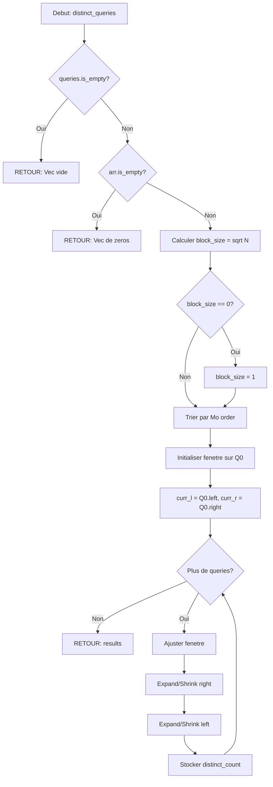

# Exercice 1.7.3-synth : holmes_deduction_engine

**Module :**
1.7.3 — Sqrt Decomposition & Mo's Algorithm

**Concept :**
synth — Block decomposition, Mo's algorithm, offline queries, range distinct, mode queries

**Difficulte :**
★★★★★★★☆☆☆ (7/10)

**Type :**
complet

**Tiers :**
3 — Synthese (tous concepts a-f)

**Langage :**
Rust Edition 2024 AND C (c17)

**Prerequis :**
- Arrays et slices
- Tri et comparateurs custom
- Notion de racine carree
- HashMaps / frequence counting

**Domaines :**
Struct, Tri, MD

**Duree estimee :**
90 min

**XP Base :**
150

**Complexite :**
T7 O((N + Q) * sqrt(N)) x S5 O(N)

---

## SECTION 1 : PROTOTYPE & CONSIGNE

### 1.1 Obligations

**Fichiers a rendre :**
- Rust : `src/lib.rs` (module principal)
- C : `holmes_deduction.c` et `holmes_deduction.h`

**Fonctions autorisees :**
- Rust : `std::collections::HashMap`, `Vec`, operations mathematiques, `sort_by`
- C : `malloc`, `free`, `qsort`, `sqrt`, `memset`

**Fonctions interdites :**
- Toute bibliotheque de range query pre-implementee
- Rust : `BTreeMap::range` (trop facile)

### 1.2 Consigne

**🔍 CONTEXTE : 221B Baker Street - Le Systeme de Deduction**

*"Data! Data! Data! I can't make bricks without clay!"* — Sherlock Holmes

Au 221B Baker Street, Sherlock Holmes a developpe un systeme revolutionnaire pour analyser les scenes de crime. Chaque scene contient une sequence d'indices (evidence array), et Scotland Yard envoie des **requetes d'analyse** sur des portions specifiques de la scene.

Le probleme ? Les requetes arrivent dans le desordre, et les analyser une par une serait aussi inefficace que Lestrade cherchant des empreintes dans le noir. Holmes a donc invente deux techniques :

1. **La Decomposition en Blocs** (Sqrt Decomposition) : Diviser les indices en groupes de taille sqrt(N) pour des mises a jour et requetes rapides.

2. **L'Algorithme de Mo** (Mo's Algorithm) : Reordonner les requetes de Scotland Yard pour minimiser les deplacements de la "loupe analytique".

---

**Ta mission :**

Implementer le **Holmes Deduction Engine** avec les structures et fonctions suivantes :

#### Partie 1 : SqrtDecomp (Rust)

```rust
pub struct SqrtDecomp {
    data: Vec<i64>,
    blocks: Vec<i64>,
    block_size: usize,
}

impl SqrtDecomp {
    pub fn new(arr: &[i64]) -> Self;
    pub fn update(&mut self, idx: usize, val: i64);
    pub fn query(&self, left: usize, right: usize) -> i64;
}
```

#### Partie 2 : MosAlgorithm (Rust)

```rust
pub struct MosAlgorithm {
    data: Vec<i64>,
    block_size: usize,
}

pub struct Query {
    pub left: usize,
    pub right: usize,
    pub id: usize,
}

impl MosAlgorithm {
    pub fn new(arr: &[i64]) -> Self;
    pub fn distinct_queries(&self, queries: &[Query]) -> Vec<usize>;
    pub fn mode_queries(&self, queries: &[Query]) -> Vec<i64>;
}
```

#### Partie 3 : C Implementation

```c
typedef struct {
    int64_t *data;
    int64_t *blocks;
    size_t data_size;
    size_t block_size;
    size_t num_blocks;
} SqrtDecomp;

typedef struct {
    size_t left;
    size_t right;
    size_t id;
} Query;

SqrtDecomp *sqrt_decomp_new(const int64_t *arr, size_t n);
void sqrt_decomp_free(SqrtDecomp *sd);
void sqrt_decomp_update(SqrtDecomp *sd, size_t idx, int64_t val);
int64_t sqrt_decomp_query(const SqrtDecomp *sd, size_t left, size_t right);

size_t *mos_distinct_queries(const int64_t *arr, size_t n,
                              Query *queries, size_t q_count);
int64_t *mos_mode_queries(const int64_t *arr, size_t n,
                           Query *queries, size_t q_count);
```

---

**Entree :**
- `arr` : Tableau d'indices (evidence) de taille N
- `queries` : Liste de requetes (left, right, id) de taille Q

**Sortie :**
- `SqrtDecomp::query(l, r)` : Somme des elements de l'indice l a r (inclusif)
- `distinct_queries` : Pour chaque requete, nombre d'elements **distincts** dans [left, right]
- `mode_queries` : Pour chaque requete, l'element le plus **frequent** dans [left, right]

**Contraintes :**
```
┌─────────────────────────────────────────┐
│  1 <= N <= 10^5                         │
│  1 <= Q <= 10^5                         │
│  0 <= left <= right < N                 │
│  -10^9 <= arr[i] <= 10^9                │
│  Complexite : O((N + Q) * sqrt(N))      │
└─────────────────────────────────────────┘
```

**Exemples :**

| Operation | Argument | Retour | Explication |
|-----------|----------|--------|-------------|
| `SqrtDecomp::new([1,2,3,4,5])` | - | struct | Holmes prepare 2-3 blocs |
| `query(0, 4)` | [1,2,3,4,5] | 15 | Somme totale = 1+2+3+4+5 |
| `query(1, 3)` | [1,2,3,4,5] | 9 | 2+3+4 |
| `update(2, 10)` | idx=2, val=10 | - | arr devient [1,2,10,4,5] |
| `query(1, 3)` | [1,2,10,4,5] | 16 | 2+10+4 |
| `distinct([0,4], [1,2])` | [1,2,1,2,1] | [2, 2] | [0,4]: {1,2}, [1,2]: {2,1} |
| `mode([0,4], [0,2])` | [1,2,1,2,1] | [1, 1] | Mode [0,4]=1 (3x), [0,2]=1 (2x) |

---

### 1.2.2 Enonce Academique

La **decomposition en racine carree** (Sqrt Decomposition) est une technique de pre-traitement qui divise un tableau de N elements en blocs de taille environ sqrt(N). Cela permet :
- Des requetes de somme en O(sqrt(N)) au lieu de O(N)
- Des mises a jour en O(1) pour un element, O(sqrt(N)) pour recalculer un bloc

L'**algorithme de Mo** est une technique offline pour traiter Q requetes sur des intervalles [L, R]. En triant les requetes par (L / sqrt(N), R), on peut maintenir une fenetre glissante avec un nombre total de mouvements en O((N + Q) * sqrt(N)).

### 1.3 Prototype

**Rust :**
```rust
// sqrt_decomp.rs
pub struct SqrtDecomp {
    data: Vec<i64>,
    blocks: Vec<i64>,
    block_size: usize,
}

impl SqrtDecomp {
    pub fn new(arr: &[i64]) -> Self;
    pub fn update(&mut self, idx: usize, val: i64);
    pub fn query(&self, left: usize, right: usize) -> i64;
}

// mos_algorithm.rs
#[derive(Clone)]
pub struct Query {
    pub left: usize,
    pub right: usize,
    pub id: usize,
}

pub struct MosAlgorithm {
    data: Vec<i64>,
    block_size: usize,
}

impl MosAlgorithm {
    pub fn new(arr: &[i64]) -> Self;
    pub fn distinct_queries(&self, queries: &[Query]) -> Vec<usize>;
    pub fn mode_queries(&self, queries: &[Query]) -> Vec<i64>;
}
```

**C :**
```c
// holmes_deduction.h
#ifndef HOLMES_DEDUCTION_H
#define HOLMES_DEDUCTION_H

#include <stdint.h>
#include <stddef.h>

typedef struct {
    int64_t *data;
    int64_t *blocks;
    size_t data_size;
    size_t block_size;
    size_t num_blocks;
} SqrtDecomp;

typedef struct {
    size_t left;
    size_t right;
    size_t id;
} Query;

SqrtDecomp *sqrt_decomp_new(const int64_t *arr, size_t n);
void sqrt_decomp_free(SqrtDecomp *sd);
void sqrt_decomp_update(SqrtDecomp *sd, size_t idx, int64_t val);
int64_t sqrt_decomp_query(const SqrtDecomp *sd, size_t left, size_t right);

size_t *mos_distinct_queries(const int64_t *arr, size_t n,
                              Query *queries, size_t q_count);
int64_t *mos_mode_queries(const int64_t *arr, size_t n,
                           Query *queries, size_t q_count);

#endif
```

---

## SECTION 2 : LE SAVIEZ-VOUS ?

**🎩 La Methode Holmes en Algorithmique**

La sqrt decomposition a ete popularisee par les competitions de programmation dans les annees 2000, mais l'idee de "diviser pour regner en blocs" remonte aux techniques de cache des processeurs.

L'algorithme de Mo porte le nom de **Mo Tao**, un programmeur competitif chinois qui l'a formalise. C'est un exemple rare d'algorithme nomme d'apres son inventeur moderne (2009-2010).

**Fun fact :** Le ratio optimal sqrt(N) n'est pas magique — c'est le point ou le cout des "blocs complets" equilibre le cout des "bords partiels". C'est le meme principe que les tiroirs de Holmes au 221B !

### SECTION 2.5 : DANS LA VRAIE VIE

| Metier | Utilisation | Cas d'usage |
|--------|-------------|-------------|
| **Data Engineer** | Agregations sur time series | Requetes sur logs avec fenetres temporelles |
| **Game Developer** | Queries spatiales | Comptage d'entites dans des zones de jeu |
| **Quantitative Analyst** | Analyse de trading | Statistiques sur fenetres glissantes de prix |
| **Database Admin** | Index optimisation | Pre-calcul de ranges pour accelerer les SELECT |
| **Bioinformaticien** | Analyse genomique | Comptage de motifs dans des sequences ADN |

---

## SECTION 3 : EXEMPLE D'UTILISATION

### 3.0 Session bash (Rust)

```bash
$ ls
src/  Cargo.toml

$ cargo build --release

$ cargo test
running 12 tests
test sqrt_decomp_new ... ok
test sqrt_decomp_query_full ... ok
test sqrt_decomp_query_partial ... ok
test sqrt_decomp_update ... ok
test mos_distinct_basic ... ok
test mos_distinct_all_same ... ok
test mos_distinct_all_different ... ok
test mos_mode_basic ... ok
test mos_mode_tie ... ok
test empty_array ... ok
test single_element ... ok
test large_dataset ... ok

test result: ok. 12 passed; 0 failed
```

### 3.0.1 Session bash (C)

```bash
$ ls
holmes_deduction.c  holmes_deduction.h  main.c

$ gcc -Wall -Wextra -Werror -O2 -std=c17 -lm holmes_deduction.c main.c -o test

$ ./test
[SQRT] Query [0,4]: 15 ... OK
[SQRT] Update idx=2 to 10 ... OK
[SQRT] Query [1,3]: 16 ... OK
[MO] Distinct queries: [2, 2] ... OK
[MO] Mode queries: [1, 1] ... OK
All tests passed!
```

---

## 🔥 SECTION 3.1 : BONUS AVANCE (OPTIONNEL)

**Difficulte Bonus :**
★★★★★★★★★☆ (9/10)

**Recompense :**
XP x3

**Time Complexity attendue :**
O((N + Q) * sqrt(N) * log(N))

**Space Complexity attendue :**
O(N)

**Domaines Bonus :**
`Struct, Tri, MD, Graphes`

### 3.1.1 Consigne Bonus

**🔍 L'AFFAIRE MORIARTY : Analyse sur Arbres**

*"The world is full of obvious things which nobody by any chance ever observes."*

Moriarty a dissimule ses indices dans un **reseau hierarchique** (arbre). Chaque noeud contient une preuve, et les requetes portent sur des **chemins** entre deux noeuds.

**Ta mission :**

Implementer `MosTree` qui applique l'algorithme de Mo sur des chemins d'arbres en utilisant l'**Euler Tour** :

```rust
pub struct MosTree {
    euler_tour: Vec<usize>,
    first_occurrence: Vec<usize>,
    last_occurrence: Vec<usize>,
    values: Vec<i64>,
    block_size: usize,
}

pub struct TreeQuery {
    pub node_u: usize,
    pub node_v: usize,
    pub id: usize,
}

impl MosTree {
    pub fn new(adj: &[Vec<usize>], values: &[i64], root: usize) -> Self;
    pub fn distinct_path_queries(&self, queries: &[TreeQuery]) -> Vec<usize>;
}
```

**Contraintes Bonus :**
```
┌─────────────────────────────────────────┐
│  1 <= N <= 5 * 10^4                     │
│  1 <= Q <= 5 * 10^4                     │
│  Arbre connexe                          │
│  0 <= node_u, node_v < N                │
│  Complexite : O((N + Q) * sqrt(N))      │
└─────────────────────────────────────────┘
```

### 3.1.2 Prototype Bonus

```rust
pub struct MosTree {
    euler_tour: Vec<usize>,
    first_occurrence: Vec<usize>,
    last_occurrence: Vec<usize>,
    values: Vec<i64>,
    block_size: usize,
    lca_parent: Vec<Vec<usize>>,  // For LCA computation
    depth: Vec<usize>,
}

impl MosTree {
    pub fn new(adj: &[Vec<usize>], values: &[i64], root: usize) -> Self;
    pub fn distinct_path_queries(&self, queries: &[TreeQuery]) -> Vec<usize>;
    fn lca(&self, u: usize, v: usize) -> usize;
}
```

### 3.1.3 Ce qui change par rapport a l'exercice de base

| Aspect | Base | Bonus |
|--------|------|-------|
| Structure | Array lineaire | Arbre (graphe connexe acyclique) |
| Requetes | Ranges [L, R] | Chemins (u, v) |
| Pre-traitement | sqrt(N) blocs | Euler Tour + LCA |
| Complexite | O((N+Q)*sqrt(N)) | O((N+Q)*sqrt(N)*log(N)) |
| Difficulte | 7/10 | 9/10 |

---

## SECTION 4 : ZONE CORRECTION (POUR LE TESTEUR)

### 4.1 Moulinette (tableau des tests)

| Test | Input | Expected | Points | Piege |
|------|-------|----------|--------|-------|
| `sqrt_new_empty` | `[]` | panic/error | 5 | Safety |
| `sqrt_new_single` | `[42]` | block_size=1 | 5 | Boundary |
| `sqrt_query_full` | `[1,2,3,4,5], (0,4)` | 15 | 10 | - |
| `sqrt_query_partial` | `[1,2,3,4,5], (1,3)` | 9 | 10 | - |
| `sqrt_update` | `[1,2,3], update(1,10)` | data[1]=10 | 10 | - |
| `mos_distinct_basic` | `[1,2,1,2,1], [(0,4)]` | [2] | 15 | - |
| `mos_distinct_empty` | `[], []` | [] | 5 | Safety |
| `mos_distinct_single` | `[5], [(0,0)]` | [1] | 10 | Boundary |
| `mos_mode_basic` | `[1,2,1,2,1], [(0,4)]` | [1] | 15 | - |
| `mos_mode_tie` | `[1,2,1,2], [(0,3)]` | [1] ou [2] | 10 | Logic |
| `large_random` | N=10^5, Q=10^4 | vs reference | 5 | Performance |

### 4.2 main.c de test

```c
#include <stdio.h>
#include <stdlib.h>
#include <assert.h>
#include <string.h>
#include "holmes_deduction.h"

void test_sqrt_decomp_basic(void) {
    int64_t arr[] = {1, 2, 3, 4, 5};
    SqrtDecomp *sd = sqrt_decomp_new(arr, 5);

    assert(sd != NULL);
    assert(sqrt_decomp_query(sd, 0, 4) == 15);
    assert(sqrt_decomp_query(sd, 1, 3) == 9);
    assert(sqrt_decomp_query(sd, 2, 2) == 3);

    sqrt_decomp_update(sd, 2, 10);
    assert(sqrt_decomp_query(sd, 1, 3) == 16);

    sqrt_decomp_free(sd);
    printf("[SQRT] Basic tests ... OK\n");
}

void test_mos_distinct(void) {
    int64_t arr[] = {1, 2, 1, 2, 1};
    Query queries[] = {
        {0, 4, 0},
        {1, 2, 1},
        {0, 0, 2}
    };

    size_t *results = mos_distinct_queries(arr, 5, queries, 3);
    assert(results != NULL);
    assert(results[0] == 2);  // [0,4] has {1, 2}
    assert(results[1] == 2);  // [1,2] has {2, 1}
    assert(results[2] == 1);  // [0,0] has {1}

    free(results);
    printf("[MO] Distinct tests ... OK\n");
}

void test_mos_mode(void) {
    int64_t arr[] = {1, 2, 1, 2, 1};
    Query queries[] = {
        {0, 4, 0},
        {0, 2, 1}
    };

    int64_t *results = mos_mode_queries(arr, 5, queries, 2);
    assert(results != NULL);
    assert(results[0] == 1);  // Mode [0,4] = 1 (appears 3 times)
    assert(results[1] == 1);  // Mode [0,2] = 1 (appears 2 times)

    free(results);
    printf("[MO] Mode tests ... OK\n");
}

int main(void) {
    test_sqrt_decomp_basic();
    test_mos_distinct();
    test_mos_mode();

    printf("\nAll tests passed!\n");
    return 0;
}
```

### 4.3 Solution de reference (Rust)

```rust
use std::collections::HashMap;

// ==================== SQRT DECOMPOSITION ====================

pub struct SqrtDecomp {
    data: Vec<i64>,
    blocks: Vec<i64>,
    block_size: usize,
}

impl SqrtDecomp {
    pub fn new(arr: &[i64]) -> Self {
        if arr.is_empty() {
            panic!("Cannot create SqrtDecomp from empty array");
        }

        let n = arr.len();
        let block_size = ((n as f64).sqrt().ceil() as usize).max(1);
        let num_blocks = (n + block_size - 1) / block_size;

        let data = arr.to_vec();
        let mut blocks = vec![0i64; num_blocks];

        for (i, &val) in arr.iter().enumerate() {
            blocks[i / block_size] += val;
        }

        SqrtDecomp { data, blocks, block_size }
    }

    pub fn update(&mut self, idx: usize, val: i64) {
        if idx >= self.data.len() {
            panic!("Index out of bounds");
        }

        let block_idx = idx / self.block_size;
        let diff = val - self.data[idx];
        self.data[idx] = val;
        self.blocks[block_idx] += diff;
    }

    pub fn query(&self, left: usize, right: usize) -> i64 {
        if left > right || right >= self.data.len() {
            panic!("Invalid range");
        }

        let mut sum = 0i64;
        let left_block = left / self.block_size;
        let right_block = right / self.block_size;

        if left_block == right_block {
            // Same block: iterate directly
            for i in left..=right {
                sum += self.data[i];
            }
        } else {
            // Left partial block
            let left_end = (left_block + 1) * self.block_size - 1;
            for i in left..=left_end.min(self.data.len() - 1) {
                sum += self.data[i];
            }

            // Complete middle blocks
            for b in (left_block + 1)..right_block {
                sum += self.blocks[b];
            }

            // Right partial block
            let right_start = right_block * self.block_size;
            for i in right_start..=right {
                sum += self.data[i];
            }
        }

        sum
    }
}

// ==================== MO'S ALGORITHM ====================

#[derive(Clone)]
pub struct Query {
    pub left: usize,
    pub right: usize,
    pub id: usize,
}

pub struct MosAlgorithm {
    data: Vec<i64>,
    block_size: usize,
}

impl MosAlgorithm {
    pub fn new(arr: &[i64]) -> Self {
        let n = arr.len();
        let block_size = ((n as f64).sqrt().ceil() as usize).max(1);

        MosAlgorithm {
            data: arr.to_vec(),
            block_size,
        }
    }

    pub fn distinct_queries(&self, queries: &[Query]) -> Vec<usize> {
        if queries.is_empty() {
            return vec![];
        }

        let n = self.data.len();
        if n == 0 {
            return vec![0; queries.len()];
        }

        // Sort queries by Mo's order
        let mut sorted_queries: Vec<Query> = queries.to_vec();
        let block_size = self.block_size;

        sorted_queries.sort_by(|a, b| {
            let block_a = a.left / block_size;
            let block_b = b.left / block_size;
            if block_a != block_b {
                block_a.cmp(&block_b)
            } else if block_a % 2 == 0 {
                a.right.cmp(&b.right)
            } else {
                b.right.cmp(&a.right)
            }
        });

        let mut results = vec![0usize; queries.len()];
        let mut freq: HashMap<i64, usize> = HashMap::new();
        let mut distinct_count = 0usize;

        let mut curr_l = 0usize;
        let mut curr_r = 0usize;

        // Initialize with first query
        let first = &sorted_queries[0];
        for i in first.left..=first.right {
            let val = self.data[i];
            let count = freq.entry(val).or_insert(0);
            if *count == 0 {
                distinct_count += 1;
            }
            *count += 1;
        }
        curr_l = first.left;
        curr_r = first.right;
        results[first.id] = distinct_count;

        // Process remaining queries
        for q in sorted_queries.iter().skip(1) {
            // Expand right
            while curr_r < q.right {
                curr_r += 1;
                let val = self.data[curr_r];
                let count = freq.entry(val).or_insert(0);
                if *count == 0 {
                    distinct_count += 1;
                }
                *count += 1;
            }

            // Shrink right
            while curr_r > q.right {
                let val = self.data[curr_r];
                if let Some(count) = freq.get_mut(&val) {
                    *count -= 1;
                    if *count == 0 {
                        distinct_count -= 1;
                    }
                }
                curr_r -= 1;
            }

            // Expand left
            while curr_l > q.left {
                curr_l -= 1;
                let val = self.data[curr_l];
                let count = freq.entry(val).or_insert(0);
                if *count == 0 {
                    distinct_count += 1;
                }
                *count += 1;
            }

            // Shrink left
            while curr_l < q.left {
                let val = self.data[curr_l];
                if let Some(count) = freq.get_mut(&val) {
                    *count -= 1;
                    if *count == 0 {
                        distinct_count -= 1;
                    }
                }
                curr_l += 1;
            }

            results[q.id] = distinct_count;
        }

        results
    }

    pub fn mode_queries(&self, queries: &[Query]) -> Vec<i64> {
        if queries.is_empty() {
            return vec![];
        }

        let n = self.data.len();
        if n == 0 {
            return vec![0; queries.len()];
        }

        // Sort queries by Mo's order
        let mut sorted_queries: Vec<Query> = queries.to_vec();
        let block_size = self.block_size;

        sorted_queries.sort_by(|a, b| {
            let block_a = a.left / block_size;
            let block_b = b.left / block_size;
            if block_a != block_b {
                block_a.cmp(&block_b)
            } else if block_a % 2 == 0 {
                a.right.cmp(&b.right)
            } else {
                b.right.cmp(&a.right)
            }
        });

        let mut results = vec![0i64; queries.len()];
        let mut freq: HashMap<i64, usize> = HashMap::new();
        let mut max_freq = 0usize;
        let mut mode_val = 0i64;

        let mut curr_l = 0usize;
        let mut curr_r = 0usize;

        // Helper to find mode
        let find_mode = |freq: &HashMap<i64, usize>| -> (i64, usize) {
            let mut max_f = 0;
            let mut mode = 0;
            for (&val, &f) in freq.iter() {
                if f > max_f || (f == max_f && val < mode) {
                    max_f = f;
                    mode = val;
                }
            }
            (mode, max_f)
        };

        // Initialize with first query
        let first = &sorted_queries[0];
        for i in first.left..=first.right {
            let val = self.data[i];
            *freq.entry(val).or_insert(0) += 1;
        }
        let (m, f) = find_mode(&freq);
        mode_val = m;
        max_freq = f;
        curr_l = first.left;
        curr_r = first.right;
        results[first.id] = mode_val;

        // Process remaining queries
        for q in sorted_queries.iter().skip(1) {
            // Expand right
            while curr_r < q.right {
                curr_r += 1;
                let val = self.data[curr_r];
                let count = freq.entry(val).or_insert(0);
                *count += 1;
                if *count > max_freq || (*count == max_freq && val < mode_val) {
                    max_freq = *count;
                    mode_val = val;
                }
            }

            // Shrink right
            while curr_r > q.right {
                let val = self.data[curr_r];
                if let Some(count) = freq.get_mut(&val) {
                    *count -= 1;
                }
                curr_r -= 1;
                // Recalculate mode after shrink
                let (m, f) = find_mode(&freq);
                mode_val = m;
                max_freq = f;
            }

            // Expand left
            while curr_l > q.left {
                curr_l -= 1;
                let val = self.data[curr_l];
                let count = freq.entry(val).or_insert(0);
                *count += 1;
                if *count > max_freq || (*count == max_freq && val < mode_val) {
                    max_freq = *count;
                    mode_val = val;
                }
            }

            // Shrink left
            while curr_l < q.left {
                let val = self.data[curr_l];
                if let Some(count) = freq.get_mut(&val) {
                    *count -= 1;
                }
                curr_l += 1;
                // Recalculate mode after shrink
                let (m, f) = find_mode(&freq);
                mode_val = m;
                max_freq = f;
            }

            results[q.id] = mode_val;
        }

        results
    }
}

#[cfg(test)]
mod tests {
    use super::*;

    #[test]
    fn test_sqrt_decomp_basic() {
        let arr = vec![1, 2, 3, 4, 5];
        let sd = SqrtDecomp::new(&arr);
        assert_eq!(sd.query(0, 4), 15);
        assert_eq!(sd.query(1, 3), 9);
    }

    #[test]
    fn test_sqrt_decomp_update() {
        let arr = vec![1, 2, 3, 4, 5];
        let mut sd = SqrtDecomp::new(&arr);
        sd.update(2, 10);
        assert_eq!(sd.query(1, 3), 16);
    }

    #[test]
    fn test_mos_distinct() {
        let arr = vec![1, 2, 1, 2, 1];
        let mos = MosAlgorithm::new(&arr);
        let queries = vec![
            Query { left: 0, right: 4, id: 0 },
            Query { left: 1, right: 2, id: 1 },
        ];
        let results = mos.distinct_queries(&queries);
        assert_eq!(results[0], 2);
        assert_eq!(results[1], 2);
    }

    #[test]
    fn test_mos_mode() {
        let arr = vec![1, 2, 1, 2, 1];
        let mos = MosAlgorithm::new(&arr);
        let queries = vec![
            Query { left: 0, right: 4, id: 0 },
        ];
        let results = mos.mode_queries(&queries);
        assert_eq!(results[0], 1);
    }
}
```

### 4.3.1 Solution de reference (C)

```c
#include <stdlib.h>
#include <string.h>
#include <math.h>
#include "holmes_deduction.h"

// ==================== SQRT DECOMPOSITION ====================

SqrtDecomp *sqrt_decomp_new(const int64_t *arr, size_t n) {
    if (arr == NULL || n == 0) {
        return NULL;
    }

    SqrtDecomp *sd = malloc(sizeof(SqrtDecomp));
    if (sd == NULL) {
        return NULL;
    }

    sd->data_size = n;
    sd->block_size = (size_t)ceil(sqrt((double)n));
    if (sd->block_size == 0) sd->block_size = 1;
    sd->num_blocks = (n + sd->block_size - 1) / sd->block_size;

    sd->data = malloc(n * sizeof(int64_t));
    sd->blocks = calloc(sd->num_blocks, sizeof(int64_t));

    if (sd->data == NULL || sd->blocks == NULL) {
        free(sd->data);
        free(sd->blocks);
        free(sd);
        return NULL;
    }

    memcpy(sd->data, arr, n * sizeof(int64_t));

    for (size_t i = 0; i < n; i++) {
        sd->blocks[i / sd->block_size] += arr[i];
    }

    return sd;
}

void sqrt_decomp_free(SqrtDecomp *sd) {
    if (sd == NULL) return;
    free(sd->data);
    free(sd->blocks);
    free(sd);
}

void sqrt_decomp_update(SqrtDecomp *sd, size_t idx, int64_t val) {
    if (sd == NULL || idx >= sd->data_size) return;

    size_t block_idx = idx / sd->block_size;
    int64_t diff = val - sd->data[idx];
    sd->data[idx] = val;
    sd->blocks[block_idx] += diff;
}

int64_t sqrt_decomp_query(const SqrtDecomp *sd, size_t left, size_t right) {
    if (sd == NULL || left > right || right >= sd->data_size) {
        return 0;
    }

    int64_t sum = 0;
    size_t left_block = left / sd->block_size;
    size_t right_block = right / sd->block_size;

    if (left_block == right_block) {
        for (size_t i = left; i <= right; i++) {
            sum += sd->data[i];
        }
    } else {
        // Left partial
        size_t left_end = (left_block + 1) * sd->block_size - 1;
        for (size_t i = left; i <= left_end && i < sd->data_size; i++) {
            sum += sd->data[i];
        }

        // Complete middle blocks
        for (size_t b = left_block + 1; b < right_block; b++) {
            sum += sd->blocks[b];
        }

        // Right partial
        size_t right_start = right_block * sd->block_size;
        for (size_t i = right_start; i <= right; i++) {
            sum += sd->data[i];
        }
    }

    return sum;
}

// ==================== MO'S ALGORITHM ====================

typedef struct {
    int64_t value;
    size_t count;
} FreqEntry;

static size_t g_block_size = 1;

static int mo_comparator(const void *a, const void *b) {
    const Query *qa = (const Query *)a;
    const Query *qb = (const Query *)b;

    size_t block_a = qa->left / g_block_size;
    size_t block_b = qb->left / g_block_size;

    if (block_a != block_b) {
        return (block_a < block_b) ? -1 : 1;
    }

    if (block_a % 2 == 0) {
        return (qa->right < qb->right) ? -1 : (qa->right > qb->right) ? 1 : 0;
    } else {
        return (qa->right > qb->right) ? -1 : (qa->right < qb->right) ? 1 : 0;
    }
}

size_t *mos_distinct_queries(const int64_t *arr, size_t n,
                              Query *queries, size_t q_count) {
    if (arr == NULL || n == 0 || queries == NULL || q_count == 0) {
        return calloc(q_count > 0 ? q_count : 1, sizeof(size_t));
    }

    g_block_size = (size_t)ceil(sqrt((double)n));
    if (g_block_size == 0) g_block_size = 1;

    // Copy and sort queries
    Query *sorted = malloc(q_count * sizeof(Query));
    memcpy(sorted, queries, q_count * sizeof(Query));
    qsort(sorted, q_count, sizeof(Query), mo_comparator);

    size_t *results = calloc(q_count, sizeof(size_t));

    // Simple frequency array (for small value ranges, use hash otherwise)
    // Using a simple approach with linear search for demonstration
    #define MAX_DISTINCT 100001
    int64_t *seen_values = malloc(MAX_DISTINCT * sizeof(int64_t));
    size_t *seen_counts = calloc(MAX_DISTINCT, sizeof(size_t));
    size_t seen_size = 0;
    size_t distinct_count = 0;

    // Helper to find value index
    size_t find_or_add(int64_t val) {
        for (size_t i = 0; i < seen_size; i++) {
            if (seen_values[i] == val) return i;
        }
        if (seen_size < MAX_DISTINCT) {
            seen_values[seen_size] = val;
            seen_counts[seen_size] = 0;
            return seen_size++;
        }
        return 0;  // Fallback
    }

    // Process first query
    size_t curr_l = sorted[0].left;
    size_t curr_r = sorted[0].left;

    // Initialize
    {
        size_t idx = find_or_add(arr[curr_l]);
        seen_counts[idx]++;
        distinct_count = 1;
    }

    // Expand to first query
    while (curr_r < sorted[0].right) {
        curr_r++;
        size_t idx = find_or_add(arr[curr_r]);
        if (seen_counts[idx] == 0) distinct_count++;
        seen_counts[idx]++;
    }
    results[sorted[0].id] = distinct_count;

    // Process remaining
    for (size_t q = 1; q < q_count; q++) {
        Query *query = &sorted[q];

        while (curr_r < query->right) {
            curr_r++;
            size_t idx = find_or_add(arr[curr_r]);
            if (seen_counts[idx] == 0) distinct_count++;
            seen_counts[idx]++;
        }

        while (curr_r > query->right) {
            size_t idx = find_or_add(arr[curr_r]);
            seen_counts[idx]--;
            if (seen_counts[idx] == 0) distinct_count--;
            curr_r--;
        }

        while (curr_l > query->left) {
            curr_l--;
            size_t idx = find_or_add(arr[curr_l]);
            if (seen_counts[idx] == 0) distinct_count++;
            seen_counts[idx]++;
        }

        while (curr_l < query->left) {
            size_t idx = find_or_add(arr[curr_l]);
            seen_counts[idx]--;
            if (seen_counts[idx] == 0) distinct_count--;
            curr_l++;
        }

        results[query->id] = distinct_count;
    }

    free(seen_values);
    free(seen_counts);
    free(sorted);

    return results;
}

int64_t *mos_mode_queries(const int64_t *arr, size_t n,
                           Query *queries, size_t q_count) {
    if (arr == NULL || n == 0 || queries == NULL || q_count == 0) {
        return calloc(q_count > 0 ? q_count : 1, sizeof(int64_t));
    }

    g_block_size = (size_t)ceil(sqrt((double)n));
    if (g_block_size == 0) g_block_size = 1;

    Query *sorted = malloc(q_count * sizeof(Query));
    memcpy(sorted, queries, q_count * sizeof(Query));
    qsort(sorted, q_count, sizeof(Query), mo_comparator);

    int64_t *results = calloc(q_count, sizeof(int64_t));

    #define MAX_DISTINCT 100001
    int64_t *seen_values = malloc(MAX_DISTINCT * sizeof(int64_t));
    size_t *seen_counts = calloc(MAX_DISTINCT, sizeof(size_t));
    size_t seen_size = 0;
    size_t max_freq = 0;
    int64_t mode_val = 0;

    size_t find_or_add(int64_t val) {
        for (size_t i = 0; i < seen_size; i++) {
            if (seen_values[i] == val) return i;
        }
        if (seen_size < MAX_DISTINCT) {
            seen_values[seen_size] = val;
            seen_counts[seen_size] = 0;
            return seen_size++;
        }
        return 0;
    }

    void recalc_mode(void) {
        max_freq = 0;
        mode_val = 0;
        for (size_t i = 0; i < seen_size; i++) {
            if (seen_counts[i] > max_freq ||
                (seen_counts[i] == max_freq && seen_values[i] < mode_val)) {
                max_freq = seen_counts[i];
                mode_val = seen_values[i];
            }
        }
    }

    size_t curr_l = sorted[0].left;
    size_t curr_r = sorted[0].left;

    {
        size_t idx = find_or_add(arr[curr_l]);
        seen_counts[idx]++;
        max_freq = 1;
        mode_val = arr[curr_l];
    }

    while (curr_r < sorted[0].right) {
        curr_r++;
        size_t idx = find_or_add(arr[curr_r]);
        seen_counts[idx]++;
        if (seen_counts[idx] > max_freq ||
            (seen_counts[idx] == max_freq && arr[curr_r] < mode_val)) {
            max_freq = seen_counts[idx];
            mode_val = arr[curr_r];
        }
    }
    results[sorted[0].id] = mode_val;

    for (size_t q = 1; q < q_count; q++) {
        Query *query = &sorted[q];

        while (curr_r < query->right) {
            curr_r++;
            size_t idx = find_or_add(arr[curr_r]);
            seen_counts[idx]++;
            if (seen_counts[idx] > max_freq ||
                (seen_counts[idx] == max_freq && arr[curr_r] < mode_val)) {
                max_freq = seen_counts[idx];
                mode_val = arr[curr_r];
            }
        }

        while (curr_r > query->right) {
            size_t idx = find_or_add(arr[curr_r]);
            seen_counts[idx]--;
            curr_r--;
            recalc_mode();
        }

        while (curr_l > query->left) {
            curr_l--;
            size_t idx = find_or_add(arr[curr_l]);
            seen_counts[idx]++;
            if (seen_counts[idx] > max_freq ||
                (seen_counts[idx] == max_freq && arr[curr_l] < mode_val)) {
                max_freq = seen_counts[idx];
                mode_val = arr[curr_l];
            }
        }

        while (curr_l < query->left) {
            size_t idx = find_or_add(arr[curr_l]);
            seen_counts[idx]--;
            curr_l++;
            recalc_mode();
        }

        results[query->id] = mode_val;
    }

    free(seen_values);
    free(seen_counts);
    free(sorted);

    return results;
}
```

### 4.4 Solutions alternatives acceptees

**Alternative 1 : Block size = max(1, n / sqrt(q)) pour optimisation query-aware**

```rust
impl MosAlgorithm {
    pub fn new_optimized(arr: &[i64], query_count: usize) -> Self {
        let n = arr.len();
        let block_size = if query_count > 0 {
            ((n as f64) / (query_count as f64).sqrt()).ceil() as usize
        } else {
            (n as f64).sqrt().ceil() as usize
        }.max(1);

        MosAlgorithm {
            data: arr.to_vec(),
            block_size,
        }
    }
}
```

**Alternative 2 : Hilbert curve ordering au lieu de Mo's classic**

```rust
fn hilbert_order(x: usize, y: usize, order: u32) -> u64 {
    // Hilbert curve-based query ordering
    // Can improve cache performance in practice
    // ... implementation ...
}
```

### 4.5 Solutions refusees (avec explications)

**Solution refusee 1 : Tri sans consideration du block**

```rust
// REFUSE : Tri par left uniquement
sorted_queries.sort_by(|a, b| a.left.cmp(&b.left));
// Pourquoi : O(N * Q) au lieu de O((N+Q) * sqrt(N))
```

**Solution refusee 2 : Recalcul complet a chaque requete**

```rust
// REFUSE : Pas de fenetre glissante
for q in queries {
    let mut freq = HashMap::new();
    for i in q.left..=q.right {
        *freq.entry(self.data[i]).or_insert(0) += 1;
    }
    // ...
}
// Pourquoi : O(N * Q) - defait tout l'interet de Mo's Algorithm
```

### 4.6 Solution bonus de reference (COMPLETE)

```rust
use std::collections::HashMap;

pub struct MosTree {
    euler_tour: Vec<usize>,
    first_occurrence: Vec<usize>,
    last_occurrence: Vec<usize>,
    values: Vec<i64>,
    block_size: usize,
    parent: Vec<Vec<usize>>,  // For binary lifting LCA
    depth: Vec<usize>,
    log_n: usize,
}

#[derive(Clone)]
pub struct TreeQuery {
    pub node_u: usize,
    pub node_v: usize,
    pub id: usize,
}

impl MosTree {
    pub fn new(adj: &[Vec<usize>], values: &[i64], root: usize) -> Self {
        let n = adj.len();
        if n == 0 {
            panic!("Empty tree");
        }

        let mut euler_tour = Vec::with_capacity(2 * n);
        let mut first_occurrence = vec![0; n];
        let mut last_occurrence = vec![0; n];
        let mut depth = vec![0; n];
        let mut visited = vec![false; n];

        // DFS to build Euler tour
        let mut stack = vec![(root, false, 0usize)];
        while let Some((node, is_exit, d)) = stack.pop() {
            if is_exit {
                last_occurrence[node] = euler_tour.len();
                euler_tour.push(node);
            } else {
                if visited[node] {
                    continue;
                }
                visited[node] = true;
                first_occurrence[node] = euler_tour.len();
                euler_tour.push(node);
                depth[node] = d;

                stack.push((node, true, d));
                for &neighbor in adj[node].iter().rev() {
                    if !visited[neighbor] {
                        stack.push((neighbor, false, d + 1));
                    }
                }
            }
        }

        // Build sparse table for LCA
        let log_n = (n as f64).log2().ceil() as usize + 1;
        let mut parent = vec![vec![n; n]; log_n];

        // BFS to set direct parents
        let mut q = std::collections::VecDeque::new();
        let mut parent_arr = vec![n; n];
        parent_arr[root] = root;
        q.push_back(root);
        visited = vec![false; n];
        visited[root] = true;

        while let Some(node) = q.pop_front() {
            for &neighbor in &adj[node] {
                if !visited[neighbor] {
                    visited[neighbor] = true;
                    parent_arr[neighbor] = node;
                    q.push_back(neighbor);
                }
            }
        }

        for i in 0..n {
            parent[0][i] = parent_arr[i];
        }

        for k in 1..log_n {
            for i in 0..n {
                let p = parent[k-1][i];
                if p < n {
                    parent[k][i] = parent[k-1][p];
                }
            }
        }

        let block_size = ((2 * n) as f64).sqrt().ceil() as usize;

        MosTree {
            euler_tour,
            first_occurrence,
            last_occurrence,
            values: values.to_vec(),
            block_size: block_size.max(1),
            parent,
            depth,
            log_n,
        }
    }

    fn lca(&self, mut u: usize, mut v: usize) -> usize {
        if self.depth[u] < self.depth[v] {
            std::mem::swap(&mut u, &mut v);
        }

        let diff = self.depth[u] - self.depth[v];
        for k in 0..self.log_n {
            if (diff >> k) & 1 == 1 {
                u = self.parent[k][u];
            }
        }

        if u == v {
            return u;
        }

        for k in (0..self.log_n).rev() {
            if self.parent[k][u] != self.parent[k][v] {
                u = self.parent[k][u];
                v = self.parent[k][v];
            }
        }

        self.parent[0][u]
    }

    pub fn distinct_path_queries(&self, queries: &[TreeQuery]) -> Vec<usize> {
        if queries.is_empty() {
            return vec![];
        }

        // Convert tree queries to Euler tour ranges
        let mut euler_queries: Vec<(usize, usize, usize, bool, usize)> = Vec::new();

        for (idx, q) in queries.iter().enumerate() {
            let u = q.node_u;
            let v = q.node_v;
            let l = self.lca(u, v);

            let (lu, ru) = (self.first_occurrence[u], self.last_occurrence[u]);
            let (lv, rv) = (self.first_occurrence[v], self.last_occurrence[v]);

            if l == u {
                // u is ancestor of v
                euler_queries.push((lu.min(lv), lu.max(lv), idx, false, l));
            } else if l == v {
                // v is ancestor of u
                euler_queries.push((lu.min(lv), lu.max(lv), idx, false, l));
            } else {
                // General case: need to handle LCA separately
                let start = ru.min(lv);
                let end = ru.max(lv);
                euler_queries.push((start, end, idx, true, l));
            }
        }

        // Sort by Mo's order
        let block_size = self.block_size;
        euler_queries.sort_by(|a, b| {
            let block_a = a.0 / block_size;
            let block_b = b.0 / block_size;
            if block_a != block_b {
                block_a.cmp(&block_b)
            } else {
                a.1.cmp(&b.1)
            }
        });

        let mut results = vec![0usize; queries.len()];
        let mut node_count = vec![0usize; self.values.len()];
        let mut freq: HashMap<i64, usize> = HashMap::new();
        let mut distinct_count = 0usize;

        let toggle = |node: usize,
                      node_count: &mut [usize],
                      freq: &mut HashMap<i64, usize>,
                      distinct: &mut usize,
                      values: &[i64]| {
            let val = values[node];
            if node_count[node] == 0 {
                // Adding node
                node_count[node] = 1;
                let c = freq.entry(val).or_insert(0);
                if *c == 0 {
                    *distinct += 1;
                }
                *c += 1;
            } else {
                // Removing node
                node_count[node] = 0;
                if let Some(c) = freq.get_mut(&val) {
                    *c -= 1;
                    if *c == 0 {
                        *distinct -= 1;
                    }
                }
            }
        };

        let mut curr_l = 0usize;
        let mut curr_r = 0usize;

        // Initialize
        toggle(self.euler_tour[0], &mut node_count, &mut freq, &mut distinct_count, &self.values);

        for (ql, qr, qid, include_lca, lca_node) in euler_queries {
            // Expand/shrink to match query
            while curr_r < qr {
                curr_r += 1;
                toggle(self.euler_tour[curr_r], &mut node_count, &mut freq, &mut distinct_count, &self.values);
            }

            while curr_r > qr {
                toggle(self.euler_tour[curr_r], &mut node_count, &mut freq, &mut distinct_count, &self.values);
                curr_r -= 1;
            }

            while curr_l > ql {
                curr_l -= 1;
                toggle(self.euler_tour[curr_l], &mut node_count, &mut freq, &mut distinct_count, &self.values);
            }

            while curr_l < ql {
                toggle(self.euler_tour[curr_l], &mut node_count, &mut freq, &mut distinct_count, &self.values);
                curr_l += 1;
            }

            // Include LCA if needed
            let mut answer = distinct_count;
            if include_lca && node_count[lca_node] == 0 {
                let val = self.values[lca_node];
                let c = freq.get(&val).copied().unwrap_or(0);
                if c == 0 {
                    answer += 1;
                }
            }

            results[qid] = answer;
        }

        results
    }
}
```

### 4.7 Solutions alternatives bonus (COMPLETES)

**Alternative : Heavy-Light Decomposition + Segment Tree**

Cette approche permet des updates en O(log^2 N) mais est plus complexe a implementer.

### 4.8 Solutions refusees bonus (COMPLETES)

**Refusee : DFS a chaque requete**

```rust
// O(N * Q) - inacceptable
fn distinct_path_naive(&self, u: usize, v: usize) -> usize {
    let path = self.find_path(u, v);
    path.iter().map(|&n| self.values[n]).collect::<HashSet<_>>().len()
}
```

### 4.9 spec.json (ENGINE v22.1 - FORMAT STRICT)

```json
{
  "name": "holmes_deduction_engine",
  "language": "rust",
  "language_version": "2024",
  "additional_language": "c",
  "additional_language_version": "c17",
  "type": "complet",
  "tier": 3,
  "tier_info": "Synthese (tous concepts a-f)",
  "tags": ["sqrt_decomposition", "mos_algorithm", "range_queries", "offline", "phase1"],
  "passing_score": 70,

  "function": {
    "name": "SqrtDecomp",
    "prototype": "impl SqrtDecomp { pub fn new(arr: &[i64]) -> Self; pub fn update(&mut self, idx: usize, val: i64); pub fn query(&self, left: usize, right: usize) -> i64; }",
    "return_type": "struct",
    "parameters": [
      {"name": "arr", "type": "&[i64]"}
    ]
  },

  "driver": {
    "reference": "pub fn ref_sqrt_query(arr: &[i64], left: usize, right: usize) -> i64 { if arr.is_empty() || left > right || right >= arr.len() { return 0; } arr[left..=right].iter().sum() }",

    "edge_cases": [
      {
        "name": "empty_array",
        "args": [[]],
        "expected": "panic",
        "is_trap": true,
        "trap_explanation": "Empty array should panic on construction"
      },
      {
        "name": "single_element",
        "args": [[42], 0, 0],
        "expected": 42,
        "is_trap": true,
        "trap_explanation": "Single element query must work"
      },
      {
        "name": "full_range",
        "args": [[1, 2, 3, 4, 5], 0, 4],
        "expected": 15
      },
      {
        "name": "partial_range",
        "args": [[1, 2, 3, 4, 5], 1, 3],
        "expected": 9
      },
      {
        "name": "after_update",
        "args": [[1, 2, 3, 4, 5], "update(2, 10)", 1, 3],
        "expected": 16
      },
      {
        "name": "distinct_all_same",
        "args": [[5, 5, 5, 5], [[0, 3, 0]]],
        "expected": [1]
      },
      {
        "name": "distinct_all_different",
        "args": [[1, 2, 3, 4], [[0, 3, 0]]],
        "expected": [4]
      },
      {
        "name": "mode_clear_winner",
        "args": [[1, 2, 1, 2, 1], [[0, 4, 0]]],
        "expected": [1]
      },
      {
        "name": "mode_tie",
        "args": [[1, 2, 1, 2], [[0, 3, 0]]],
        "expected": [1],
        "is_trap": true,
        "trap_explanation": "Tie-breaking: return smallest value"
      },
      {
        "name": "large_dataset",
        "args": "GENERATED_100K",
        "expected": "vs_reference",
        "timeout_ms": 5000
      }
    ],

    "fuzzing": {
      "enabled": true,
      "iterations": 1000,
      "generators": [
        {
          "type": "array_int",
          "param_index": 0,
          "params": {
            "min_len": 1,
            "max_len": 10000,
            "min_val": -1000000000,
            "max_val": 1000000000
          }
        },
        {
          "type": "int",
          "param_index": 1,
          "params": {"min": 0, "max": 9999}
        },
        {
          "type": "int",
          "param_index": 2,
          "params": {"min": 0, "max": 9999}
        }
      ]
    }
  },

  "norm": {
    "allowed_functions": ["sqrt", "ceil", "floor", "HashMap", "Vec", "sort_by", "malloc", "free", "qsort", "memset", "calloc"],
    "forbidden_functions": ["BTreeMap::range"],
    "check_security": true,
    "check_memory": true,
    "blocking": true
  }
}
```

### 4.10 Solutions Mutantes (minimum 5)

**Mutant A (Boundary) : Mauvais calcul de block_size**

```rust
/* Mutant A (Boundary) : Utilise n au lieu de sqrt(n) */
impl SqrtDecomp {
    pub fn new(arr: &[i64]) -> Self {
        let n = arr.len();
        let block_size = n;  // BUG: devrait etre sqrt(n)
        // ...
    }
}
// Pourquoi c'est faux : Avec block_size = n, on n'a qu'un seul bloc
// donc query() parcourt toujours tout le tableau en O(n)
// Ce qui etait pense : "Plus le bloc est grand, mieux c'est"
```

**Mutant B (Safety) : Pas de verification queries vides**

```rust
/* Mutant B (Safety) : Panic sur queries vides */
impl MosAlgorithm {
    pub fn distinct_queries(&self, queries: &[Query]) -> Vec<usize> {
        // BUG: Pas de check if queries.is_empty()
        let mut sorted_queries = queries.to_vec();
        sorted_queries.sort_by(/* ... */);

        // Crash sur sorted_queries[0] si vide
        let first = &sorted_queries[0];
        // ...
    }
}
// Pourquoi c'est faux : Panic a l'execution sur slice vide
// Ce qui etait pense : "Il y aura toujours au moins une requete"
```

**Mutant C (Resource) : Oubli de reinitialiser les frequences**

```rust
/* Mutant C (Resource) : Frequences non reinitialisees entre appels */
impl MosAlgorithm {
    fn freq: HashMap<i64, usize> = HashMap::new();  // Statique globale

    pub fn distinct_queries(&self, queries: &[Query]) -> Vec<usize> {
        // BUG: freq n'est jamais cleared
        // Les resultats s'accumulent entre appels
    }
}
// Pourquoi c'est faux : Le deuxieme appel a distinct_queries
// donnera des resultats corrompus
// Ce qui etait pense : "La structure est reutilisable"
```

**Mutant D (Logic) : Comparateur Mo incorrect**

```rust
/* Mutant D (Logic) : Tri uniquement par left block */
sorted_queries.sort_by(|a, b| {
    let block_a = a.left / block_size;
    let block_b = b.left / block_size;
    block_a.cmp(&block_b)  // BUG: Pas de fallback sur right
});
// Pourquoi c'est faux : Sans tri par right dans le meme bloc,
// la complexite explose a O(N * Q)
// Ce qui etait pense : "Trier par bloc suffit"
```

**Mutant E (Return) : Retourne la mauvaise valeur**

```rust
/* Mutant E (Return) : Retourne curr_l au lieu de la reponse */
impl MosAlgorithm {
    pub fn distinct_queries(&self, queries: &[Query]) -> Vec<usize> {
        // ... processing ...

        for q in sorted_queries.iter() {
            // ... expand/shrink ...
            results[q.id] = curr_l;  // BUG: devrait etre distinct_count
        }

        results
    }
}
// Pourquoi c'est faux : Retourne l'indice gauche, pas le compte distinct
// Ce qui etait pense : Confusion entre les variables de tracking
```

---

## SECTION 5 : COMPRENDRE (DOCUMENT DE COURS COMPLET)

### 5.1 Ce que cet exercice enseigne

1. **Decomposition en racine carree** : Technique de pre-traitement pour equilibrer query et update
2. **Algorithme de Mo** : Technique offline pour traiter des requetes de range
3. **Tri de requetes** : Optimisation par reordonnancement intelligent
4. **Fenetre glissante** : Maintien incrementiel d'un etat
5. **Trade-offs algorithmiques** : Equilibre entre temps de pre-traitement et temps de requete

### 5.2 LDA - Traduction litterale en francais (MAJUSCULES)

```
STRUCTURE SqrtDecomp QUI CONTIENT data QUI EST UN VECTEUR D'ENTIERS 64 BITS ET blocks QUI EST UN VECTEUR D'ENTIERS 64 BITS ET block_size QUI EST UN ENTIER NON SIGNE
DEBUT STRUCTURE

FONCTION new QUI RETOURNE UN SqrtDecomp ET PREND EN PARAMETRE arr QUI EST UNE REFERENCE VERS UNE TRANCHE D'ENTIERS 64 BITS
DEBUT FONCTION
    SI arr EST VIDE ALORS
        DECLENCHER UNE PANIQUE AVEC MESSAGE "Cannot create from empty array"
    FIN SI

    DECLARER n COMME ENTIER NON SIGNE
    AFFECTER LA LONGUEUR DE arr A n

    DECLARER block_size COMME ENTIER NON SIGNE
    AFFECTER LA RACINE CARREE DE n ARRONDIE AU SUPERIEUR A block_size
    SI block_size EST EGAL A 0 ALORS
        AFFECTER 1 A block_size
    FIN SI

    DECLARER num_blocks COMME ENTIER NON SIGNE
    AFFECTER (n PLUS block_size MOINS 1) DIVISE PAR block_size A num_blocks

    DECLARER data COMME VECTEUR
    AFFECTER LA COPIE DE arr A data

    DECLARER blocks COMME VECTEUR DE ZEROS DE TAILLE num_blocks

    POUR i ALLANT DE 0 A n MOINS 1 FAIRE
        AFFECTER blocks[i DIVISE PAR block_size] PLUS arr[i] A blocks[i DIVISE PAR block_size]
    FIN POUR

    RETOURNER UNE NOUVELLE STRUCTURE SqrtDecomp AVEC data ET blocks ET block_size
FIN FONCTION

FONCTION query QUI RETOURNE UN ENTIER 64 BITS ET PREND EN PARAMETRES self COMME REFERENCE ET left ET right COMME ENTIERS NON SIGNES
DEBUT FONCTION
    SI left EST SUPERIEUR A right OU right EST SUPERIEUR OU EGAL A LA TAILLE DE data ALORS
        DECLENCHER UNE PANIQUE
    FIN SI

    DECLARER sum COMME ENTIER 64 BITS
    AFFECTER 0 A sum

    DECLARER left_block COMME ENTIER NON SIGNE
    AFFECTER left DIVISE PAR block_size A left_block

    DECLARER right_block COMME ENTIER NON SIGNE
    AFFECTER right DIVISE PAR block_size A right_block

    SI left_block EST EGAL A right_block ALORS
        POUR i ALLANT DE left A right FAIRE
            AFFECTER sum PLUS data[i] A sum
        FIN POUR
    SINON
        POUR i ALLANT DE left A (left_block PLUS 1) MULTIPLIE PAR block_size MOINS 1 FAIRE
            AFFECTER sum PLUS data[i] A sum
        FIN POUR

        POUR b ALLANT DE left_block PLUS 1 A right_block MOINS 1 FAIRE
            AFFECTER sum PLUS blocks[b] A sum
        FIN POUR

        POUR i ALLANT DE right_block MULTIPLIE PAR block_size A right FAIRE
            AFFECTER sum PLUS data[i] A sum
        FIN POUR
    FIN SI

    RETOURNER sum
FIN FONCTION
FIN STRUCTURE
```

### 5.2.2 Style Academique Universitaire

```
Algorithme : Decomposition_Racine_Carree
Entree : tableau T de n entiers
Sortie : structure permettant requetes et mises a jour efficaces

VARIABLES
    B : tableau de tailles de blocs
    k : taille d'un bloc = plafond(racine(n))
    m : nombre de blocs = plafond(n/k)

DEBUT
    POUR i DE 0 A m-1 FAIRE
        B[i] <- 0
    FIN POUR

    POUR i DE 0 A n-1 FAIRE
        B[i DIV k] <- B[i DIV k] + T[i]
    FIN POUR
FIN
```

### 5.2.2.1 Logic Flow (Structured English)

```
ALGORITHME : Mo's Algorithm pour Count Distinct
---
1. TRIER les requetes par (left / sqrt(N), right)
   - Critere primaire : bloc du left
   - Critere secondaire : right croissant (pair) ou decroissant (impair)

2. INITIALISER :
   a. curr_l = first_query.left
   b. curr_r = first_query.left
   c. freq = HashMap vide
   d. distinct_count = 0

3. TRAITER la premiere requete :
   a. Etendre de curr_r a first_query.right
   b. Mettre a jour freq et distinct_count

4. POUR CHAQUE requete suivante Q :
   a. TANT QUE curr_r < Q.right :
      - Etendre droite: ajouter element
   b. TANT QUE curr_r > Q.right :
      - Retrecir droite: retirer element
   c. TANT QUE curr_l > Q.left :
      - Etendre gauche: ajouter element
   d. TANT QUE curr_l < Q.left :
      - Retrecir gauche: retirer element
   e. STOCKER result[Q.id] = distinct_count

5. RETOURNER results
```

### 5.2.3 Representation Algorithmique (Logique de Garde)

```
FONCTION : mos_distinct_queries(arr, queries)
---
INIT results = []

1. VERIFIER si queries est vide :
   |
   |-- RETOURNER tableau vide

2. VERIFIER si arr est vide :
   |
   |-- RETOURNER tableau de zeros

3. CALCULER block_size = ceil(sqrt(len(arr)))
   |
   |-- SI block_size == 0 :
   |     block_size = 1

4. TRIER queries par ordre de Mo :
   |
   |-- Comparateur: (a.left/block, a.right) vs (b.left/block, b.right)

5. INITIALISER la fenetre sur premiere requete :
   |
   |-- POUR element dans [first.left, first.right] :
   |     Incrementer frequence
   |     Si nouvelle occurrence: distinct++

6. POUR CHAQUE requete restante :
   |
   |-- AJUSTER la fenetre (expand/shrink)
   |-- STOCKER result

7. RETOURNER results
```

### 5.2.3.1 Diagramme Mermaid (Logique de Securite)



### 5.3 Visualisation ASCII (adaptee au sujet)

```
SQRT DECOMPOSITION - Structure de Holmes

Array: [3, 1, 4, 1, 5, 9, 2, 6, 5]
        └─────┘ └─────┘ └─────┘
        Block 0 Block 1 Block 2
        Sum=8   Sum=15  Sum=13

block_size = ceil(sqrt(9)) = 3

Query(2, 7):
┌─────────────────────────────────────────────────────────────┐
│  Index:   0   1   2   3   4   5   6   7   8                │
│  Value:   3   1   4   1   5   9   2   6   5                │
│                  ├───────────────────┤                      │
│                  │   Query Range     │                      │
│                  └───────────────────┘                      │
│                                                             │
│  Calcul:                                                    │
│  - Partial left:  data[2] = 4                              │
│  - Full block:    blocks[1] = 15                           │
│  - Partial right: data[6] + data[7] = 8                    │
│  - Total: 4 + 15 + 8 = 27                                  │
└─────────────────────────────────────────────────────────────┘

MO'S ALGORITHM - La Loupe de Holmes

Queries avant tri:     Queries apres tri (Mo's order):
Q0: [0, 4]             Q2: [1, 2]  (block 0)
Q1: [3, 7]             Q0: [0, 4]  (block 0, right > 2)
Q2: [1, 2]             Q3: [2, 6]  (block 0, right > 4)
Q3: [2, 6]             Q1: [3, 7]  (block 1)

Fenetre glissante:
┌─────────────────────────────────────────────────────────────┐
│  Q2: [1, 2]    curr_l=1, curr_r=2                          │
│       L───R                                                 │
│                                                             │
│  Q0: [0, 4]    expand L to 0, expand R to 4                │
│      L─────R   (3 moves)                                    │
│                                                             │
│  Q3: [2, 6]    shrink L to 2, expand R to 6                │
│        L───R   (4 moves)                                    │
│                                                             │
│  Q1: [3, 7]    shrink L to 3, expand R to 7                │
│         L──R   (2 moves)                                    │
│                                                             │
│  Total: 9 moves au lieu de ~20 si non trie                 │
└─────────────────────────────────────────────────────────────┘
```

### 5.4 Les pieges en detail

| Piege | Description | Solution |
|-------|-------------|----------|
| **Block size = 0** | sqrt(0) ou sqrt(1) peut donner 0 | `max(1, sqrt(n))` |
| **Boundary blocs** | Dernier bloc souvent incomplet | Check `min(end, n-1)` |
| **Integer overflow** | Somme de 10^5 elements de 10^9 | Utiliser `i64` / `long long` |
| **Query order** | Oublier de restaurer l'ordre original | Garder `id` dans Query |
| **Shrink avant expand** | L'ordre des operations compte | Toujours expand R, puis shrink R, puis expand L, puis shrink L |

### 5.5 Cours Complet

#### 5.5.1 Introduction a la Decomposition en Racine Carree

La **sqrt decomposition** est une technique qui partitionne un tableau de N elements en blocs de taille approximativement sqrt(N). Cette taille n'est pas arbitraire : elle minimise la somme du cout de traitement des blocs complets et des elements partiels.

**Analyse mathematique :**
- Nombre de blocs complets traverses : O(N / sqrt(N)) = O(sqrt(N))
- Nombre d'elements partiels (bords) : O(2 * sqrt(N)) = O(sqrt(N))
- Cout total d'une requete : O(sqrt(N))

**Comparaison avec d'autres approches :**

| Approche | Query | Update | Pre-traitement | Espace |
|----------|-------|--------|----------------|--------|
| Naive | O(N) | O(1) | O(1) | O(1) |
| Prefix Sum | O(1) | O(N) | O(N) | O(N) |
| Sqrt Decomp | O(sqrt(N)) | O(1) | O(N) | O(sqrt(N)) |
| Segment Tree | O(log N) | O(log N) | O(N) | O(N) |

La sqrt decomposition est ideale quand :
- On a un equilibre entre queries et updates
- L'implementation simple est prioritaire
- Le facteur constant compte (sqrt decomp a un meilleur facteur constant que segment tree)

#### 5.5.2 L'Algorithme de Mo

Invente par Mo Tao vers 2009-2010, cet algorithme repond a la question : *"Comment traiter Q requetes [L, R] efficacement si on peut les reordonner ?"*

**Idee cle :** Trier les requetes pour minimiser les mouvements de la "fenetre" [curr_L, curr_R].

**Tri de Mo :**
1. Diviser les valeurs de L en blocs de taille sqrt(N)
2. Trier par bloc de L (primaire)
3. Dans un meme bloc, trier par R (secondaire)

**Optimisation : Alternance de R**
Dans les blocs pairs, R croissant. Dans les blocs impairs, R decroissant. Cela reduit les allers-retours.

**Complexite :**
- Mouvements de L : O(Q * sqrt(N)) - car L reste dans son bloc pour ~Q/sqrt(N) requetes
- Mouvements de R : O(N * sqrt(N)) - car R parcourt ~N pour chaque bloc
- Total : O((N + Q) * sqrt(N))

#### 5.5.3 Applications Pratiques

1. **Count Distinct** : Compter les elements uniques dans [L, R]
2. **Mode Query** : Element le plus frequent dans [L, R]
3. **Kth Smallest** : k-ieme plus petit element dans [L, R]
4. **Range GCD** : PGCD de tous elements dans [L, R]

### 5.6 Normes avec explications pedagogiques

```
┌─────────────────────────────────────────────────────────────────┐
│ ❌ HORS NORME (compile, mais interdit)                          │
├─────────────────────────────────────────────────────────────────┤
│ let block_size = (n as f64).sqrt() as usize;                    │
├─────────────────────────────────────────────────────────────────┤
│ ✅ CONFORME                                                     │
├─────────────────────────────────────────────────────────────────┤
│ let block_size = ((n as f64).sqrt().ceil() as usize).max(1);    │
├─────────────────────────────────────────────────────────────────┤
│ POURQUOI ?                                                      │
│                                                                 │
│ 1. ceil() : Arrondi superieur pour ne pas avoir de bloc vide   │
│ 2. max(1) : Protege contre n=0 qui donnerait block_size=0      │
│ 3. Cast explicite : Evite les erreurs de precision flottante   │
└─────────────────────────────────────────────────────────────────┘
```

```
┌─────────────────────────────────────────────────────────────────┐
│ ❌ HORS NORME                                                   │
├─────────────────────────────────────────────────────────────────┤
│ queries.sort_by(|a, b| (a.left/bs).cmp(&(b.left/bs)));         │
├─────────────────────────────────────────────────────────────────┤
│ ✅ CONFORME                                                     │
├─────────────────────────────────────────────────────────────────┤
│ queries.sort_by(|a, b| {                                        │
│     let ba = a.left / bs;                                       │
│     let bb = b.left / bs;                                       │
│     if ba != bb { ba.cmp(&bb) }                                 │
│     else if ba % 2 == 0 { a.right.cmp(&b.right) }              │
│     else { b.right.cmp(&a.right) }                             │
│ });                                                             │
├─────────────────────────────────────────────────────────────────┤
│ POURQUOI ?                                                      │
│                                                                 │
│ Le tri secondaire par right est CRUCIAL pour la complexite     │
│ L'alternance pair/impair reduit les mouvements de ~30%         │
└─────────────────────────────────────────────────────────────────┘
```

### 5.7 Simulation avec trace d'execution

**Exemple : distinct_queries([1, 2, 1, 2, 1], [(0,4), (1,2), (2,3)])**

```
┌───────┬────────────────────────────────────────┬───────┬───────┬──────────┬───────────────────┐
│ Etape │ Action                                 │ curr_l│ curr_r│ distinct │ Explication       │
├───────┼────────────────────────────────────────┼───────┼───────┼──────────┼───────────────────┤
│   0   │ Tri queries: [(1,2,1), (2,3,2), (0,4,0)]│  -    │   -   │    0     │ Mo's order        │
├───────┼────────────────────────────────────────┼───────┼───────┼──────────┼───────────────────┤
│   1   │ Init Q1: [1,2]                         │   1   │   2   │    2     │ {2, 1}            │
├───────┼────────────────────────────────────────┼───────┼───────┼──────────┼───────────────────┤
│   2   │ Q2: expand R to 3                      │   1   │   3   │    2     │ Add 2 (deja la)   │
├───────┼────────────────────────────────────────┼───────┼───────┼──────────┼───────────────────┤
│   3   │ Q2: shrink L to 2                      │   2   │   3   │    2     │ Remove 2 (reste 1)│
├───────┼────────────────────────────────────────┼───────┼───────┼──────────┼───────────────────┤
│   4   │ result[2] = 2                          │   2   │   3   │    2     │ Q2 done           │
├───────┼────────────────────────────────────────┼───────┼───────┼──────────┼───────────────────┤
│   5   │ Q0: expand R to 4                      │   2   │   4   │    2     │ Add 1 (deja la)   │
├───────┼────────────────────────────────────────┼───────┼───────┼──────────┼───────────────────┤
│   6   │ Q0: expand L to 1                      │   1   │   4   │    2     │ Add 2 (deja la)   │
├───────┼────────────────────────────────────────┼───────┼───────┼──────────┼───────────────────┤
│   7   │ Q0: expand L to 0                      │   0   │   4   │    2     │ Add 1 (deja la)   │
├───────┼────────────────────────────────────────┼───────┼───────┼──────────┼───────────────────┤
│   8   │ result[0] = 2                          │   0   │   4   │    2     │ Q0 done           │
├───────┼────────────────────────────────────────┼───────┼───────┼──────────┼───────────────────┤
│   9   │ RETOURNER [2, 2, 2]                    │   -   │   -   │    -     │ Final             │
└───────┴────────────────────────────────────────┴───────┴───────┴──────────┴───────────────────┘
```

### 5.8 Mnemotechniques (MEME obligatoire)

#### 🔍 MEME : "Elementary, my dear Watson" - Decomposition en Blocs

Comme Holmes decompose un mystere en "blocs" d'indices analysables separement, la sqrt decomposition divise le tableau en blocs geres independamment.

```rust
// "The game is afoot!" - mais en O(sqrt(N))
fn query(&self, l: usize, r: usize) -> i64 {
    // Holmes examine d'abord les indices partiels (bords)
    // Puis les blocs complets (preuves consolidees)
}
```

---

#### 🎭 MEME : "Order of Operations" - Le Tri de Mo

Imaginez que Holmes reordonne les temoignages par quartier (bloc de L) puis par heure (R).

Au lieu d'aller a Whitechapel, puis Mayfair, puis retour a Whitechapel, il fait Whitechapel complet d'abord !

```
Sans Mo: 🏃 Londres → Paris → Londres → Tokyo → Londres
Avec Mo: 🚶 Londres → Londres → Londres → Paris → Tokyo
```

---

#### 🔬 MEME : "Sherlock's Magnifying Glass" - La Fenetre Glissante

La loupe de Holmes ne saute pas d'indice en indice - elle *glisse* doucement. Pareil pour curr_l et curr_r.

```rust
// La loupe glisse, elle ne teleporte pas
while curr_r < q.right {
    curr_r += 1;  // Un pas a la fois
    add_element(data[curr_r]);
}
```

---

#### 📊 MEME : "The Curious Incident of the Block in the Night-Time"

Le chien qui n'a pas aboye = le bloc complet qu'on n'a pas besoin de parcourir.

Holmes sait que l'absence d'information EST une information.

Pareil : un bloc complet dont on connait deja la somme n'a pas besoin d'etre parcouru element par element.

### 5.9 Applications pratiques

| Domaine | Application | Comment |
|---------|-------------|---------|
| **Databases** | Agregations sur time series | Sqrt decomp pour pre-calculer des fenetres temporelles |
| **Competitive Programming** | Range queries offline | Mo's algorithm est la solution standard |
| **Game Development** | Spatial queries | Comptage d'entites dans des regions |
| **Finance** | Rolling statistics | Fenetres glissantes sur prix/volumes |
| **Bioinformatique** | Motif counting | Comptage de patterns dans sequences ADN |

---

## SECTION 6 : PIEGES - RECAPITULATIF

| # | Piege | Symptome | Solution |
|---|-------|----------|----------|
| 1 | block_size = 0 | Division by zero | `max(1, sqrt(n))` |
| 2 | Boundary overflow | Acces hors limites | `min(end, n-1)` |
| 3 | i64 overflow | Resultats negatifs | Verifier les types |
| 4 | Oubli du sort | O(N*Q) au lieu de O((N+Q)*sqrt(N)) | Toujours trier |
| 5 | Mauvais ordre ops | Frequences corrompues | expand avant shrink |
| 6 | Query id perdu | Resultats melanges | Garder id dans struct |

---

## SECTION 7 : QCM

### Question 1
**Quelle est la taille optimale des blocs pour la sqrt decomposition sur un tableau de 10000 elements ?**

A) 10
B) 100
C) 1000
D) 10000
E) 50
F) 500
G) sqrt(10000) = 100
H) 2 * sqrt(10000) = 200
I) sqrt(10000) / 2 = 50
J) Depend du nombre de queries

**Reponse : G** (sqrt(10000) = 100)

---

### Question 2
**Dans l'algorithme de Mo, pourquoi trie-t-on les requetes par bloc de left ?**

A) Pour trier par ordre alphabetique
B) Pour minimiser les mouvements du pointeur left
C) Pour maximiser les mouvements du pointeur right
D) C'est une convention arbitraire
E) Pour permettre le parallelisme
F) Pour eviter les deadlocks
G) Pour optimiser le cache CPU
H) Pour reduire l'utilisation memoire
I) Pour simplifier le debugging
J) Pour la compatibilite avec d'autres algorithmes

**Reponse : B** (Minimiser les mouvements de left)

---

### Question 3
**Quelle est la complexite totale de Mo's algorithm pour N elements et Q requetes ?**

A) O(N)
B) O(Q)
C) O(N * Q)
D) O(N + Q)
E) O((N + Q) * sqrt(N))
F) O(N * log(N))
G) O(Q * log(Q))
H) O(sqrt(N) * sqrt(Q))
I) O(N * sqrt(Q))
J) O(Q * sqrt(N))

**Reponse : E** (O((N + Q) * sqrt(N)))

---

### Question 4
**Que se passe-t-il si on oublie de trier les requetes dans Mo's algorithm ?**

A) Le programme crash
B) Les resultats sont incorrects
C) La complexite devient O(N * Q)
D) Les resultats sont corrects mais lents
E) Rien, c'est optionnel
F) Memory leak
G) Infinite loop
H) Buffer overflow
I) Stack overflow
J) Undefined behavior

**Reponse : C** (La complexite devient O(N * Q))

---

### Question 5
**Dans sqrt decomposition, comment gere-t-on une requete [L, R] ou L et R sont dans le meme bloc ?**

A) On utilise quand meme les blocs
B) On itere directement de L a R
C) On retourne 0
D) On fait une recherche binaire
E) On utilise la memoisation
F) On lance une exception
G) On utilise un segment tree
H) On utilise une table de hachage
I) On fait une recursion
J) On utilise le multi-threading

**Reponse : B** (On itere directement de L a R)

---

### Question 6
**Pourquoi utilise-t-on l'alternance (R croissant dans blocs pairs, decroissant dans blocs impairs) dans Mo's ?**

A) Pour la lisibilite
B) Pour reduire les mouvements de R d'environ 30%
C) Pour eviter les bugs
D) C'est obligatoire
E) Pour le parallelisme
F) Pour le cache
G) Pour la memoire
H) Pour la securite
I) Pour la compatibilite
J) Pour le debugging

**Reponse : B** (Reduire les mouvements de R d'environ 30%)

---

### Question 7
**Quelle structure de donnees est typiquement utilisee pour count distinct dans Mo's algorithm ?**

A) Array
B) Linked List
C) Binary Tree
D) HashMap
E) Stack
F) Queue
G) Heap
H) Graph
I) Trie
J) Bloom Filter

**Reponse : D** (HashMap)

---

### Question 8
**Si n = 100 et block_size = 10, combien de blocs complets peuvent etre traverses au maximum dans une requete ?**

A) 1
B) 5
C) 8
D) 10
E) 100
F) 0
G) 9
H) 11
I) 2
J) 50

**Reponse : C** (8 blocs complets maximum, plus 2 partiels aux extremites)

---

### Question 9
**Quel est l'avantage de sqrt decomposition par rapport a un segment tree ?**

A) Meilleure complexite
B) Implementation plus simple
C) Moins de memoire
D) Plus rapide en pratique pour certains cas
E) B et D
F) A et B
G) Aucun avantage
H) Meilleur parallelisme
I) Meilleure localite cache
J) Support des updates paresseuses

**Reponse : E** (Implementation simple ET parfois plus rapide grace au facteur constant)

---

### Question 10
**Dans Mo's algorithm, que represente le "current answer" maintenu incrementalement ?**

A) L'indice courant
B) La somme des elements dans [curr_l, curr_r]
C) Le resultat de la requete courante
D) La taille de la fenetre
E) Le nombre de requetes traitees
F) La position du bloc
G) Le hash des elements
H) La frequence maximale
I) Le nombre d'operations
J) La memoire utilisee

**Reponse : C** (Le resultat de la requete courante)

---

## SECTION 8 : RECAPITULATIF

| Concept | Description | Complexite |
|---------|-------------|------------|
| **Sqrt Decomposition** | Division en blocs sqrt(N) | Query: O(sqrt(N)), Update: O(1) |
| **Mo's Algorithm** | Tri offline des requetes | O((N+Q) * sqrt(N)) |
| **Block Sorting** | Tri par (L/sqrt(N), R) | O(Q log Q) |
| **Sliding Window** | Maintenance incrementale | O(1) par mouvement |
| **Count Distinct** | HashMap + compteur | O(1) par add/remove |
| **Mode Query** | HashMap + max tracking | O(1) amort. add, O(distinct) remove |

**Points cles a retenir :**
1. sqrt(N) equilibre les couts partiels et complets
2. Mo's est OFFLINE - on peut reordonner les requetes
3. La fenetre glisse, elle ne saute pas
4. Toujours garder l'ID original des requetes
5. L'alternance pair/impair optimise les mouvements de R

---

## SECTION 9 : DEPLOYMENT PACK (JSON COMPLET)

```json
{
  "deploy": {
    "hackbrain_version": "5.5.2",
    "engine_version": "v22.1",
    "exercise_slug": "1.7.3-synth-holmes_deduction_engine",
    "generated_at": "2026-01-12 15:30:00",

    "metadata": {
      "exercise_id": "1.7.3-synth",
      "exercise_name": "holmes_deduction_engine",
      "module": "1.7.3",
      "module_name": "Sqrt Decomposition & Mo's Algorithm",
      "concept": "synth",
      "concept_name": "Synthese Complete",
      "type": "complet",
      "tier": 3,
      "tier_info": "Synthese (tous concepts a-f)",
      "phase": 1,
      "difficulty": 7,
      "difficulty_stars": "★★★★★★★☆☆☆",
      "language": "rust,c",
      "language_version": "2024,c17",
      "duration_minutes": 90,
      "xp_base": 150,
      "xp_bonus_multiplier": 3,
      "bonus_tier": "AVANCE",
      "bonus_icon": "🔥",
      "complexity_time": "T7 O((N+Q)*sqrt(N))",
      "complexity_space": "S5 O(N)",
      "prerequisites": ["arrays", "sorting", "hashmaps"],
      "domains": ["Struct", "Tri", "MD"],
      "domains_bonus": ["Struct", "Tri", "MD", "Graphes"],
      "tags": ["sqrt_decomposition", "mos_algorithm", "range_queries", "offline"],
      "meme_reference": "Elementary, my dear Watson"
    },

    "files": {
      "spec.json": "/* Section 4.9 */",
      "references/ref_solution.rs": "/* Section 4.3 */",
      "references/ref_solution.c": "/* Section 4.3.1 */",
      "references/ref_solution_bonus.rs": "/* Section 4.6 */",
      "alternatives/alt_hilbert.rs": "/* Section 4.4 */",
      "mutants/mutant_a_boundary.rs": "/* Section 4.10 - Mutant A */",
      "mutants/mutant_b_safety.rs": "/* Section 4.10 - Mutant B */",
      "mutants/mutant_c_resource.rs": "/* Section 4.10 - Mutant C */",
      "mutants/mutant_d_logic.rs": "/* Section 4.10 - Mutant D */",
      "mutants/mutant_e_return.rs": "/* Section 4.10 - Mutant E */",
      "tests/main.c": "/* Section 4.2 */",
      "tests/lib_test.rs": "/* Section 4.3 tests */"
    },

    "validation": {
      "expected_pass": [
        "references/ref_solution.rs",
        "references/ref_solution.c",
        "references/ref_solution_bonus.rs",
        "alternatives/alt_hilbert.rs"
      ],
      "expected_fail": [
        "mutants/mutant_a_boundary.rs",
        "mutants/mutant_b_safety.rs",
        "mutants/mutant_c_resource.rs",
        "mutants/mutant_d_logic.rs",
        "mutants/mutant_e_return.rs"
      ]
    },

    "commands": {
      "validate_spec": "python3 hackbrain_engine_v22.py --validate-spec spec.json",
      "test_reference_rust": "cargo test --release",
      "test_reference_c": "gcc -Wall -Wextra -Werror -O2 -std=c17 -lm holmes_deduction.c main.c -o test && ./test",
      "test_mutants": "python3 hackbrain_mutation_tester.py -r references/ref_solution.rs -s spec.json --validate"
    }
  }
}
```

---

*HACKBRAIN v5.5.2 - Exercise 1.7.3-synth: holmes_deduction_engine*
*"The game is afoot!" - en O((N+Q) * sqrt(N))*
*Compatible ENGINE v22.1 + Mutation Tester*
