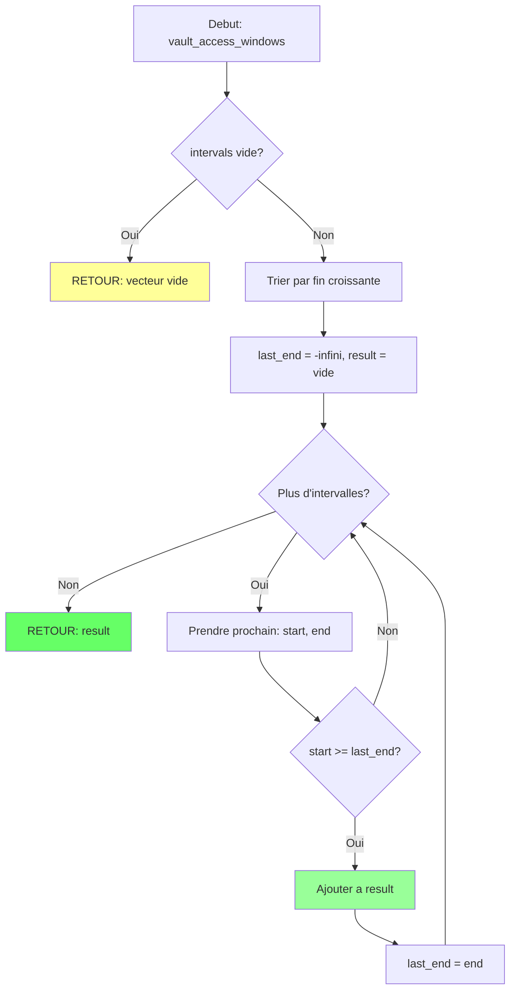
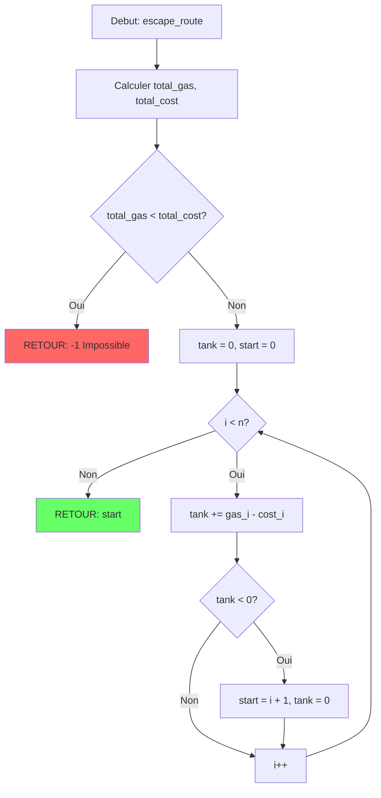
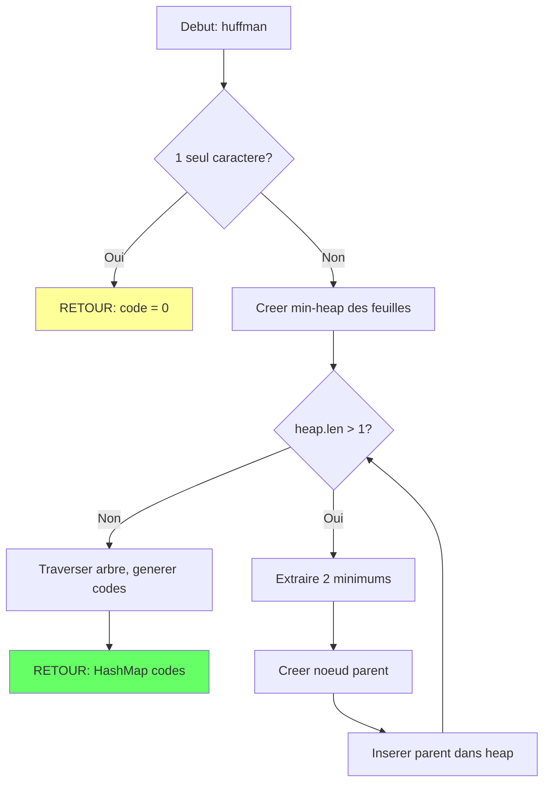

<thinking>
## Analyse du Concept
- Concept : Greedy Algorithms (Activity Selection, Job Scheduling, Huffman, Gas Station, Meeting Rooms)
- Phase demandee : 1 (Intermediate)
- Adapte ? OUI - Les algorithmes gloutons sont un pilier fondamental de l'algorithmique, parfaitement adaptes a la Phase 1 qui vise la transition debutant-intermediaire. Ces concepts sont enseignables car ils suivent une logique intuitive (choisir localement l'optimal).

## Combo Base + Bonus
- Exercice de base : Implementer 5 algorithmes gloutons classiques avec le theme Ocean's Eleven
  - `activity_selection` : Selection d'activites non chevauchantes (fenetres d'acces au coffre)
  - `job_scheduling` : Ordonnancement de jobs avec deadlines et profits
  - `min_meeting_rooms` : Nombre minimum de salles de reunion
  - `can_complete_circuit` : Route d'evasion avec stations essence
  - `huffman_codes` : Encodage de communications secretes
- Bonus : Version avancee avec weighted activity selection + optimisations O(n log n)
- Palier bonus : 🔥 Avance (difficulte 7/10 pour le bonus)
- Progression logique ? OUI - Le bonus etend naturellement les concepts de base avec des poids et des optimisations

## Prerequis & Difficulte
- Prerequis reels : Tri, structures de donnees basiques (heap, hashmap), recursion
- Difficulte estimee : 6/10 (base), 7/10 (bonus)
- Coherent avec phase ? OUI - Phase 1 = 3-5/10 pour intro, 6/10 acceptable pour concepts plus avances

## Aspect Fun/Culture
- Contexte choisi : Ocean's Eleven (2001) - Le casse parfait de Danny Ocean
- Pourquoi c'est excellent :
  - Activity Selection = choisir les fenetres d'acces au coffre sans chevauchement
  - Job Scheduling = maximiser le profit des differentes missions du crew
  - Meeting Rooms = coordonner les briefings sans overlap
  - Gas Station = planifier l'evasion avec les arrets essence
  - Huffman = encoder les communications radio entre membres
  - L'analogie est PARFAITE car un casse necessite une planification optimale (greedy) de ressources limitees
- MEME mnémotechnique : "Always bet on greedy" - Reference au casino + le choix optimal local

## Scenarios d'Echec (5 mutants concrets)
1. Mutant A (Boundary) : Dans activity_selection, utiliser `end <= start` au lieu de `end < start` pour le tri, causant des intervalles identiques mal geres
2. Mutant B (Safety) : Dans can_complete_circuit, ne pas verifier si la somme totale de gas >= somme totale de cost avant de commencer
3. Mutant C (Resource) : Dans huffman_codes, ne pas utiliser de min-heap, utilisant une liste lineaire O(n^2) au lieu de O(n log n)
4. Mutant D (Logic) : Dans job_scheduling, trier par profit decroissant mais oublier de verifier les deadlines, acceptant des jobs impossibles
5. Mutant E (Return) : Dans min_meeting_rooms, retourner le nombre d'intervalles au lieu du nombre maximum de chevauchements

## Verdict
VALIDE - L'exercice combine excellemment theorie algorithmique et contexte narratif engageant. Le theme Ocean's Eleven est parfait pour illustrer l'optimisation greedy.
</thinking>

# Exercice 1.7.1-a : oceans_eleven_heist_planner

**Module :**
1.7.1 - Greedy Algorithms

**Concept :**
a - Activity Selection, Job Scheduling, Huffman Coding, Gas Station, Meeting Rooms

**Difficulte :**
★★★★★★☆☆☆☆ (6/10)

**Type :**
complet

**Tiers :**
2 - Melange (concepts a + b + c + d + e)

**Langage :**
Rust Edition 2024 + C (c17)

**Prerequis :**
- Tri et algorithmes de base (Module 1.1)
- Structures de donnees : heaps, hashmaps (Module 1.2)
- Recursion et arbres binaires (Module 1.3)

**Domaines :**
Algo, Struct, Compression

**Duree estimee :**
90 min

**XP Base :**
200

**Complexite :**
T2 O(n log n) x S1 O(n)

---

## 📐 SECTION 1 : PROTOTYPE & CONSIGNE

### 1.1 Obligations

**Fichiers a rendre :**

| Langage | Fichiers |
|---------|----------|
| Rust | `src/lib.rs`, `Cargo.toml` |
| C | `greedy.c`, `greedy.h` |

**Fonctions autorisees :**

| Langage | Fonctions |
|---------|-----------|
| Rust | `std::collections::{BinaryHeap, HashMap}`, `std::cmp::*`, iterateurs, tri |
| C | `malloc`, `free`, `realloc`, `qsort`, `memcpy` |

**Fonctions interdites :**

| Langage | Fonctions |
|---------|-----------|
| Rust | Crates externes pour les structures de donnees (implementer from scratch) |
| C | Aucune bibliotheque de structures de donnees tierces |

---

### 1.2 Consigne

#### 🎬 Section Culture : "Ocean's Eleven - The Perfect Heist"

**🎰 OCEAN'S ELEVEN - "The house always wins. Unless you're Danny Ocean."**

Las Vegas, 2001. Danny Ocean vient de sortir de prison et il a un plan : braquer trois casinos en une seule nuit - le Bellagio, le Mirage et le MGM Grand. Mais un casse de cette envergure necessite une planification parfaite.

Tu es le cerveau informatique de l'equipe. Rusty t'appelle :

*"Danny veut qu'on synchronise onze personnes, des dizaines de taches, des fenetres d'acces au coffre-fort, des routes d'evasion, et des communications cryptees. Si on se trompe d'une seule minute, Benedict nous attrape."*

Comme Danny qui choisit TOUJOURS l'option qui maximise les chances immediates tout en gardant le plan coherent, tu vas implementer des **algorithmes gloutons** - des algorithmes qui font le choix localement optimal a chaque etape.

*"You're either in or you're out. Right now."*

---

#### 🎓 Section Academique : Enonce Formel

**Ta mission :**

Implementer cinq algorithmes gloutons classiques qui correspondent aux besoins du casse :

1. **Activity Selection** (`vault_access_windows`) : Selectionner le maximum de fenetres d'acces non chevauchantes au coffre-fort
2. **Job Scheduling** (`heist_job_scheduler`) : Maximiser le profit total en completant des missions avec deadlines
3. **Minimum Meeting Rooms** (`crew_briefing_rooms`) : Determiner le nombre minimum de salles pour les briefings
4. **Gas Station Circuit** (`escape_route_planner`) : Verifier si une route d'evasion circulaire est realisable
5. **Huffman Coding** (`secure_comm_encoder`) : Encoder les communications radio de maniere optimale

---

**Entree (Rust) :**

```rust
pub mod oceans_heist {
    use std::collections::HashMap;

    /// Activity Selection: Maximum non-overlapping vault access windows
    /// Input: intervals as (start_time, end_time)
    /// Output: indices of selected intervals (0-indexed)
    pub fn vault_access_windows(intervals: &[(i32, i32)]) -> Vec<usize>;

    /// Job Scheduling: Maximum profit with deadlines
    /// Input: jobs as (deadline, profit) - deadline is 1-indexed day
    /// Output: (total_profit, indices of scheduled jobs)
    pub fn heist_job_scheduler(jobs: &[(usize, i32)]) -> (i32, Vec<usize>);

    /// Minimum Meeting Rooms: Minimum briefing rooms needed
    /// Input: intervals as (start_time, end_time)
    /// Output: minimum number of rooms
    pub fn crew_briefing_rooms(intervals: &[(i32, i32)]) -> usize;

    /// Gas Station Circuit: Can complete circular escape route?
    /// Input: gas[i] = fuel gained at station i, cost[i] = fuel needed to reach i+1
    /// Output: starting station index, or -1 if impossible
    pub fn escape_route_planner(gas: &[i32], cost: &[i32]) -> i32;

    /// Huffman Coding: Optimal prefix-free codes for secure communications
    /// Input: (character, frequency) pairs
    /// Output: character -> binary code mapping
    pub fn secure_comm_encoder(freqs: &[(char, u32)]) -> HashMap<char, String>;
}
```

**Entree (C) :**

```c
#include <stddef.h>

// Interval structure
typedef struct s_interval {
    int start;
    int end;
} t_interval;

// Job structure
typedef struct s_job {
    size_t  deadline;
    int     profit;
} t_job;

// Result structure for activity selection
typedef struct s_selection_result {
    size_t  *indices;
    size_t  count;
} t_selection_result;

// Result structure for job scheduling
typedef struct s_schedule_result {
    int     total_profit;
    size_t  *indices;
    size_t  count;
} t_schedule_result;

// Huffman code entry
typedef struct s_huffman_code {
    char    character;
    char    *code;
} t_huffman_code;

// Huffman result
typedef struct s_huffman_result {
    t_huffman_code  *codes;
    size_t          count;
} t_huffman_result;

// Function prototypes
t_selection_result  vault_access_windows(const t_interval *intervals, size_t n);
t_schedule_result   heist_job_scheduler(const t_job *jobs, size_t n);
size_t              crew_briefing_rooms(const t_interval *intervals, size_t n);
int                 escape_route_planner(const int *gas, const int *cost, size_t n);
t_huffman_result    secure_comm_encoder(const char *chars, const unsigned int *freqs, size_t n);

// Cleanup functions
void                free_selection_result(t_selection_result *result);
void                free_schedule_result(t_schedule_result *result);
void                free_huffman_result(t_huffman_result *result);
```

**Sortie :**
- Toutes les fonctions doivent retourner les valeurs optimales
- Les indices doivent etre 0-indexes
- Huffman codes doivent etre prefix-free (aucun code n'est prefixe d'un autre)

**Contraintes :**
- Activity Selection : Trier par end time, greedy selection - O(n log n)
- Job Scheduling : Trier par profit decroissant, Union-Find ou simple slot - O(n^2) ou O(n log n)
- Meeting Rooms : Utiliser min-heap ou events sweep - O(n log n)
- Gas Station : Single pass greedy - O(n)
- Huffman : Min-heap based construction - O(n log n)

**Exemples :**

| Fonction | Input | Output | Explication |
|----------|-------|--------|-------------|
| `vault_access_windows` | `[(1,4), (3,5), (0,6), (5,7), (6,10), (8,11)]` | `[0, 3, 5]` | Intervalles (1,4), (5,7), (8,11) ne se chevauchent pas |
| `heist_job_scheduler` | `[(4,20), (1,10), (1,40), (1,30)]` | `(60, [2,0])` | Jobs 2 (profit 40) et 0 (profit 20) = 60 |
| `crew_briefing_rooms` | `[(0,30), (5,10), (15,20)]` | `2` | (0,30) et (5,10) se chevauchent |
| `escape_route_planner` | `gas=[1,2,3,4,5], cost=[3,4,5,1,2]` | `3` | Partir de station 3 |
| `secure_comm_encoder` | `[('a',5), ('b',9), ('c',12)]` | `{'c':"0", 'a':"10", 'b':"11"}` | Codes prefix-free |

---

### 1.3 Prototype

**Rust :**
```rust
pub mod oceans_heist {
    use std::collections::HashMap;

    pub fn vault_access_windows(intervals: &[(i32, i32)]) -> Vec<usize>;
    pub fn heist_job_scheduler(jobs: &[(usize, i32)]) -> (i32, Vec<usize>);
    pub fn crew_briefing_rooms(intervals: &[(i32, i32)]) -> usize;
    pub fn escape_route_planner(gas: &[i32], cost: &[i32]) -> i32;
    pub fn secure_comm_encoder(freqs: &[(char, u32)]) -> HashMap<char, String>;
}
```

**C :**
```c
t_selection_result  vault_access_windows(const t_interval *intervals, size_t n);
t_schedule_result   heist_job_scheduler(const t_job *jobs, size_t n);
size_t              crew_briefing_rooms(const t_interval *intervals, size_t n);
int                 escape_route_planner(const int *gas, const int *cost, size_t n);
t_huffman_result    secure_comm_encoder(const char *chars, const unsigned int *freqs, size_t n);
```

---

## 💡 SECTION 2 : LE SAVIEZ-VOUS ?

### 2.1 Fun Facts

🧠 **L'algorithme Huffman a ete invente par un etudiant !**

David Huffman a invente son celebre algorithme en 1951... comme devoir de classe ! Son professeur Robert Fano lui avait donne le choix : passer l'examen final OU trouver un algorithme optimal pour les codes prefix-free. Huffman a choisi le defi et a battu l'algorithme de Shannon-Fano de son propre professeur.

*"I couldn't think of anything, so I didn't go to the exam. Instead, I kept working on the problem, and finally solved it the night before the deadline."*

🎰 **Les casinos utilisent des algorithmes gloutons !**

L'ordonnancement des tables de jeu, l'allocation des croupiers, et meme la disposition des machines a sous utilisent des variantes d'algorithmes gloutons pour maximiser les profits. Danny Ocean bat le casino... avec les memes outils.

🚗 **Le probleme Gas Station est resolu par Uber/Lyft !**

Chaque fois qu'un chauffeur planifie une route avec des arrets recharge, c'est exactement le probleme Gas Station. La solution greedy O(n) est utilisee des millions de fois par jour.

---

### 2.5 DANS LA VRAIE VIE

| Metier | Utilisation du concept |
|--------|----------------------|
| **DevOps Engineer** | Ordonnancement de jobs CI/CD avec deadlines et priorites |
| **Data Scientist** | Compression de datasets avec Huffman/LZ avant transmission |
| **Game Developer** | Allocation de ressources GPU pour le rendu de frames |
| **Quant/Trader** | Maximisation de profit avec contraintes de temps (HFT) |
| **Cloud Architect** | Bin-packing de VMs sur serveurs physiques |
| **Logistics Manager** | Vehicle routing avec fuel constraints (exactement Gas Station!) |

---

## 🖥️ SECTION 3 : EXEMPLE D'UTILISATION

### 3.0 Session bash

**Rust :**
```bash
$ ls
src/  Cargo.toml

$ cargo test
running 10 tests
test test_vault_access_basic ... ok
test test_vault_access_all_overlap ... ok
test test_heist_scheduler_basic ... ok
test test_heist_scheduler_tight_deadlines ... ok
test test_briefing_rooms_basic ... ok
test test_briefing_rooms_no_overlap ... ok
test test_escape_route_possible ... ok
test test_escape_route_impossible ... ok
test test_huffman_basic ... ok
test test_huffman_single_char ... ok

test result: ok. 10 passed; 0 failed
```

**C :**
```bash
$ ls
greedy.c  greedy.h  main.c

$ gcc -Wall -Wextra -Werror -O2 greedy.c main.c -o test

$ ./test
Test vault_access_windows: OK (selected 4 windows)
Test heist_job_scheduler: OK (profit: 60)
Test crew_briefing_rooms: OK (rooms: 2)
Test escape_route_planner: OK (start: 3)
Test secure_comm_encoder: OK (all codes prefix-free)
All tests passed!

$ valgrind --leak-check=full ./test
==12345== LEAK SUMMARY:
==12345==    definitely lost: 0 bytes in 0 blocks
```

---

### 3.1 🔥 BONUS AVANCE (OPTIONNEL)

**Difficulte Bonus :**
★★★★★★★☆☆☆ (7/10)

**Recompense :**
XP x3

**Time Complexity attendue :**
O(n log n) pour toutes les operations

**Space Complexity attendue :**
O(n)

**Domaines Bonus :**
`Algo`, `DP` (pour weighted activity selection)

#### 3.1.1 Consigne Bonus

**🎰 "Now we've got to get serious." - Danny Ocean's Advanced Playbook**

Le plan basique a fonctionne, mais maintenant Benedict a renforce la securite. Il faut passer au niveau superieur avec des algorithmes plus sophistiques.

*"We're gonna need a bigger crew... and smarter algorithms."*

**Ta mission bonus :**

Implementer les versions avancees des algorithmes :

1. **Weighted Activity Selection** : Chaque fenetre d'acces a une valeur differente (quantite d'argent dans le coffre a ce moment)
2. **O(n log n) Job Scheduling** : Utiliser Union-Find au lieu de la recherche lineaire de slots
3. **Interval Partitioning avec reconstruction** : Retourner l'assignation complete des briefings aux salles

**Contraintes :**
┌─────────────────────────────────────────┐
│  Weighted Activity : O(n log n) + DP    │
│  Job Scheduling : O(n log n) Union-Find │
│  Toutes les solutions doivent etre      │
│  optimales (pas d'approximation)        │
└─────────────────────────────────────────┘

**Exemples :**

| Appel | Retour | Explication |
|-------|--------|-------------|
| `weighted_vault_access([(1,4,50), (3,5,10), (5,9,40)])` | `90` | (1,4,50) + (5,9,40) = 90 |
| `fast_job_scheduler(1000 jobs)` | `<100ms` | Union-Find pour O(n log n) |

#### 3.1.2 Prototype Bonus

**Rust :**
```rust
pub mod oceans_heist_advanced {
    /// Weighted Activity Selection with DP
    /// Input: intervals as (start, end, value)
    /// Output: maximum total value
    pub fn weighted_vault_access(intervals: &[(i32, i32, i32)]) -> i32;

    /// O(n log n) Job Scheduling using Union-Find
    pub fn fast_job_scheduler(jobs: &[(usize, i32)]) -> (i32, Vec<usize>);

    /// Interval Partitioning with room assignments
    /// Output: (num_rooms, room_assignment for each interval)
    pub fn briefing_room_assignments(intervals: &[(i32, i32)]) -> (usize, Vec<usize>);
}
```

**C :**
```c
int             weighted_vault_access(const t_weighted_interval *intervals, size_t n);
t_schedule_result fast_job_scheduler(const t_job *jobs, size_t n);
t_partition_result briefing_room_assignments(const t_interval *intervals, size_t n);
```

#### 3.1.3 Ce qui change par rapport a l'exercice de base

| Aspect | Base | Bonus |
|--------|------|-------|
| Activity Selection | Non-weighted, greedy O(n log n) | Weighted, DP + Binary Search O(n log n) |
| Job Scheduling | O(n^2) slot search | O(n log n) Union-Find |
| Meeting Rooms | Juste le count | Full room assignments |
| Edge cases | Standard | Large inputs (n=10^5) |

---

## ✅❌ SECTION 4 : ZONE CORRECTION (POUR LE TESTEUR)

### 4.1 Moulinette - Tableau des tests

| # | Test | Input | Expected | Points | Categorie |
|---|------|-------|----------|--------|-----------|
| 1 | vault_basic | `[(1,4), (3,5), (5,7)]` | 2 intervals | 8 | Basic |
| 2 | vault_all_overlap | `[(1,10), (2,9), (3,8)]` | 1 interval | 5 | Edge |
| 3 | vault_empty | `[]` | 0 intervals | 3 | Edge |
| 4 | vault_single | `[(0,5)]` | 1 interval | 3 | Edge |
| 5 | jobs_basic | `[(4,20), (1,10), (1,40)]` | profit=50 or 60 | 8 | Basic |
| 6 | jobs_all_same_deadline | `[(1,10), (1,20), (1,30)]` | profit=30 | 5 | Edge |
| 7 | jobs_impossible | `[(1,100)]` day 1 only | profit=100 | 3 | Edge |
| 8 | rooms_no_overlap | `[(0,5), (6,10), (11,15)]` | 1 room | 5 | Basic |
| 9 | rooms_all_overlap | `[(0,10), (1,11), (2,12)]` | 3 rooms | 5 | Edge |
| 10 | rooms_partial | `[(0,30), (5,10), (15,20)]` | 2 rooms | 5 | Basic |
| 11 | gas_basic | `gas=[1,2,3,4,5], cost=[3,4,5,1,2]` | 3 | 8 | Basic |
| 12 | gas_impossible | `gas=[2,3,4], cost=[3,4,3]` | -1 | 5 | Edge |
| 13 | gas_single | `gas=[5], cost=[4]` | 0 | 3 | Edge |
| 14 | gas_exact | `gas=[1,2,3], cost=[2,3,1]` | 2 | 5 | Edge |
| 15 | huffman_basic | `[('a',5), ('b',9), ('c',12)]` | prefix-free codes | 10 | Basic |
| 16 | huffman_single | `[('x',100)]` | "0" or "" | 5 | Edge |
| 17 | huffman_two | `[('a',1), ('b',1)]` | depth 1 each | 5 | Edge |
| 18 | huffman_skewed | `[('a',1), ('b',2), ('c',4), ('d',8)]` | valid tree | 5 | Stress |
| 19 | large_input | 10000 intervals | < 1 second | 5 | Perf |
| 20 | memory_check | all operations | no leaks | 5 | Memory |

**Total : 100 points**

---

### 4.2 main.c de test (C)

```c
#include <stdio.h>
#include <stdlib.h>
#include <string.h>
#include <assert.h>
#include "greedy.h"

void test_vault_access_windows(void) {
    t_interval intervals[] = {{1, 4}, {3, 5}, {0, 6}, {5, 7}, {6, 10}, {8, 11}};
    t_selection_result result = vault_access_windows(intervals, 6);

    // Should select at least 3 non-overlapping intervals
    assert(result.count >= 3);

    // Verify no overlaps
    for (size_t i = 0; i < result.count - 1; i++) {
        size_t idx1 = result.indices[i];
        size_t idx2 = result.indices[i + 1];
        assert(intervals[idx1].end <= intervals[idx2].start);
    }

    free_selection_result(&result);
    printf("Test vault_access_windows: OK (selected %zu windows)\n", result.count);
}

void test_heist_job_scheduler(void) {
    t_job jobs[] = {{4, 20}, {1, 10}, {1, 40}, {1, 30}};
    t_schedule_result result = heist_job_scheduler(jobs, 4);

    // Maximum profit should be 60 (jobs with profit 40 + 20)
    assert(result.total_profit == 60);

    free_schedule_result(&result);
    printf("Test heist_job_scheduler: OK (profit: %d)\n", result.total_profit);
}

void test_crew_briefing_rooms(void) {
    t_interval intervals[] = {{0, 30}, {5, 10}, {15, 20}};
    size_t rooms = crew_briefing_rooms(intervals, 3);

    assert(rooms == 2);
    printf("Test crew_briefing_rooms: OK (rooms: %zu)\n", rooms);
}

void test_escape_route_planner(void) {
    int gas[] = {1, 2, 3, 4, 5};
    int cost[] = {3, 4, 5, 1, 2};
    int start = escape_route_planner(gas, cost, 5);

    assert(start == 3);
    printf("Test escape_route_planner: OK (start: %d)\n", start);
}

void test_escape_route_impossible(void) {
    int gas[] = {2, 3, 4};
    int cost[] = {3, 4, 3};
    int start = escape_route_planner(gas, cost, 3);

    assert(start == -1);
    printf("Test escape_route_impossible: OK (returned -1)\n");
}

void test_secure_comm_encoder(void) {
    char chars[] = {'a', 'b', 'c', 'd', 'e', 'f'};
    unsigned int freqs[] = {5, 9, 12, 13, 16, 45};
    t_huffman_result result = secure_comm_encoder(chars, freqs, 6);

    assert(result.count == 6);

    // Verify prefix-free property
    for (size_t i = 0; i < result.count; i++) {
        for (size_t j = 0; j < result.count; j++) {
            if (i != j) {
                size_t len_i = strlen(result.codes[i].code);
                size_t len_j = strlen(result.codes[j].code);
                size_t min_len = len_i < len_j ? len_i : len_j;
                assert(strncmp(result.codes[i].code, result.codes[j].code, min_len) != 0);
            }
        }
    }

    free_huffman_result(&result);
    printf("Test secure_comm_encoder: OK (all codes prefix-free)\n");
}

int main(void) {
    test_vault_access_windows();
    test_heist_job_scheduler();
    test_crew_briefing_rooms();
    test_escape_route_planner();
    test_escape_route_impossible();
    test_secure_comm_encoder();

    printf("\nAll tests passed!\n");
    return 0;
}
```

---

### 4.3 Solution de reference (Rust)

```rust
use std::collections::{BinaryHeap, HashMap};
use std::cmp::Reverse;

pub mod oceans_heist {
    use super::*;

    /// Activity Selection: Maximum non-overlapping intervals
    /// Greedy: Always pick the interval that ends earliest
    pub fn vault_access_windows(intervals: &[(i32, i32)]) -> Vec<usize> {
        if intervals.is_empty() {
            return vec![];
        }

        // Create indices and sort by end time
        let mut indexed: Vec<(usize, i32, i32)> = intervals
            .iter()
            .enumerate()
            .map(|(i, &(s, e))| (i, s, e))
            .collect();

        indexed.sort_by_key(|&(_, _, end)| end);

        let mut result = vec![indexed[0].0];
        let mut last_end = indexed[0].2;

        for &(idx, start, end) in &indexed[1..] {
            if start >= last_end {
                result.push(idx);
                last_end = end;
            }
        }

        result
    }

    /// Job Scheduling: Maximum profit with deadlines
    /// Greedy: Sort by profit descending, greedily assign to latest available slot
    pub fn heist_job_scheduler(jobs: &[(usize, i32)]) -> (i32, Vec<usize>) {
        if jobs.is_empty() {
            return (0, vec![]);
        }

        let max_deadline = jobs.iter().map(|&(d, _)| d).max().unwrap_or(0);

        // Create indexed jobs and sort by profit descending
        let mut indexed: Vec<(usize, usize, i32)> = jobs
            .iter()
            .enumerate()
            .map(|(i, &(d, p))| (i, d, p))
            .collect();

        indexed.sort_by(|a, b| b.2.cmp(&a.2));

        let mut slots: Vec<Option<usize>> = vec![None; max_deadline + 1];
        let mut total_profit = 0;
        let mut scheduled = vec![];

        for (idx, deadline, profit) in indexed {
            // Find latest available slot <= deadline
            for slot in (1..=deadline).rev() {
                if slots[slot].is_none() {
                    slots[slot] = Some(idx);
                    total_profit += profit;
                    scheduled.push(idx);
                    break;
                }
            }
        }

        (total_profit, scheduled)
    }

    /// Minimum Meeting Rooms using min-heap
    pub fn crew_briefing_rooms(intervals: &[(i32, i32)]) -> usize {
        if intervals.is_empty() {
            return 0;
        }

        // Sort by start time
        let mut sorted: Vec<(i32, i32)> = intervals.to_vec();
        sorted.sort_by_key(|&(s, _)| s);

        // Min-heap of end times (use Reverse for min-heap behavior)
        let mut heap: BinaryHeap<Reverse<i32>> = BinaryHeap::new();

        for (start, end) in sorted {
            // If earliest ending meeting ends before this one starts, reuse room
            if let Some(&Reverse(earliest_end)) = heap.peek() {
                if earliest_end <= start {
                    heap.pop();
                }
            }
            heap.push(Reverse(end));
        }

        heap.len()
    }

    /// Gas Station: Single-pass greedy
    pub fn escape_route_planner(gas: &[i32], cost: &[i32]) -> i32 {
        if gas.is_empty() {
            return -1;
        }

        let n = gas.len();
        let total_gas: i32 = gas.iter().sum();
        let total_cost: i32 = cost.iter().sum();

        // If total gas < total cost, impossible
        if total_gas < total_cost {
            return -1;
        }

        let mut tank = 0;
        let mut start = 0;

        for i in 0..n {
            tank += gas[i] - cost[i];
            if tank < 0 {
                // Cannot reach i+1 from start, try starting from i+1
                start = i + 1;
                tank = 0;
            }
        }

        start as i32
    }

    /// Huffman Coding using min-heap
    pub fn secure_comm_encoder(freqs: &[(char, u32)]) -> HashMap<char, String> {
        use std::cmp::Ordering;

        if freqs.is_empty() {
            return HashMap::new();
        }

        if freqs.len() == 1 {
            let mut result = HashMap::new();
            result.insert(freqs[0].0, "0".to_string());
            return result;
        }

        #[derive(Eq, PartialEq)]
        struct HuffNode {
            freq: u32,
            chars: Vec<char>,
            left: Option<Box<HuffNode>>,
            right: Option<Box<HuffNode>>,
        }

        impl Ord for HuffNode {
            fn cmp(&self, other: &Self) -> Ordering {
                other.freq.cmp(&self.freq) // Reverse for min-heap
            }
        }

        impl PartialOrd for HuffNode {
            fn partial_cmp(&self, other: &Self) -> Option<Ordering> {
                Some(self.cmp(other))
            }
        }

        let mut heap: BinaryHeap<HuffNode> = freqs
            .iter()
            .map(|&(c, f)| HuffNode {
                freq: f,
                chars: vec![c],
                left: None,
                right: None,
            })
            .collect();

        while heap.len() > 1 {
            let left = heap.pop().unwrap();
            let right = heap.pop().unwrap();

            let mut combined_chars = left.chars.clone();
            combined_chars.extend(&right.chars);

            let parent = HuffNode {
                freq: left.freq + right.freq,
                chars: combined_chars,
                left: Some(Box::new(left)),
                right: Some(Box::new(right)),
            };

            heap.push(parent);
        }

        let mut result = HashMap::new();

        fn traverse(node: &HuffNode, code: String, result: &mut HashMap<char, String>) {
            if node.left.is_none() && node.right.is_none() {
                result.insert(node.chars[0], code);
                return;
            }
            if let Some(ref left) = node.left {
                traverse(left, format!("{}0", code), result);
            }
            if let Some(ref right) = node.right {
                traverse(right, format!("{}1", code), result);
            }
        }

        if let Some(root) = heap.pop() {
            traverse(&root, String::new(), &mut result);
        }

        result
    }
}
```

---

### 4.4 Solutions alternatives acceptees

**Alternative 1 : Activity Selection avec Event Sweep**

```rust
pub fn vault_access_windows_sweep(intervals: &[(i32, i32)]) -> Vec<usize> {
    // Create events: (time, is_end, index)
    let mut events: Vec<(i32, bool, usize)> = vec![];
    for (i, &(s, e)) in intervals.iter().enumerate() {
        events.push((s, false, i));
        events.push((e, true, i));
    }
    events.sort();

    // Alternative implementation using sweep line
    // ... (accepted if correct)
}
```

**Alternative 2 : Job Scheduling avec Union-Find (O(n log n))**

```rust
struct UnionFind {
    parent: Vec<usize>,
}

impl UnionFind {
    fn new(n: usize) -> Self {
        Self { parent: (0..=n).collect() }
    }

    fn find(&mut self, x: usize) -> usize {
        if self.parent[x] != x {
            self.parent[x] = self.find(self.parent[x]);
        }
        self.parent[x]
    }
}

pub fn heist_job_scheduler_fast(jobs: &[(usize, i32)]) -> (i32, Vec<usize>) {
    // O(n log n) using Union-Find to find available slots
    // Accepted and encouraged for bonus
}
```

---

### 4.5 Solutions refusees (avec explications)

**Refus 1 : Activity Selection par start time**

```rust
// ❌ REFUSE : Trier par start time ne donne pas l'optimal
pub fn vault_access_wrong(intervals: &[(i32, i32)]) -> Vec<usize> {
    let mut sorted: Vec<_> = intervals.iter().enumerate().collect();
    sorted.sort_by_key(|&(_, &(s, _))| s);  // ERREUR: sort by start
    // ...
}
```
**Pourquoi refuse :** Contre-exemple: [(0,10), (1,2), (3,4)] - start sort choisit (0,10) puis rien, mais end sort choisit (1,2) puis (3,4).

**Refus 2 : Gas Station en O(n^2)**

```rust
// ❌ REFUSE : Brute force qui essaie chaque station
pub fn escape_route_slow(gas: &[i32], cost: &[i32]) -> i32 {
    for start in 0..gas.len() {
        let mut tank = 0;
        let mut success = true;
        for i in 0..gas.len() {
            let idx = (start + i) % gas.len();
            tank += gas[idx] - cost[idx];
            if tank < 0 { success = false; break; }
        }
        if success { return start as i32; }
    }
    -1
}
```
**Pourquoi refuse :** Complexite O(n^2) alors que O(n) est demande.

**Refus 3 : Huffman sans min-heap**

```rust
// ❌ REFUSE : Recherche lineaire du minimum
pub fn huffman_slow(freqs: &[(char, u32)]) -> HashMap<char, String> {
    let mut nodes: Vec<_> = /* ... */;
    while nodes.len() > 1 {
        // Find two minimum with O(n) search each time = O(n^2) total
        let min1 = nodes.iter().enumerate().min_by_key(|(_, n)| n.freq);
        // ...
    }
}
```
**Pourquoi refuse :** Doit utiliser heap pour O(n log n), pas O(n^2).

---

### 4.6 Solution bonus de reference (Rust)

```rust
pub mod oceans_heist_advanced {
    use std::collections::HashMap;

    /// Weighted Activity Selection with DP + Binary Search
    /// O(n log n) time, O(n) space
    pub fn weighted_vault_access(intervals: &[(i32, i32, i32)]) -> i32 {
        if intervals.is_empty() {
            return 0;
        }

        let n = intervals.len();

        // Sort by end time
        let mut indexed: Vec<(usize, i32, i32, i32)> = intervals
            .iter()
            .enumerate()
            .map(|(i, &(s, e, v))| (i, s, e, v))
            .collect();
        indexed.sort_by_key(|&(_, _, e, _)| e);

        // Find previous compatible interval using binary search
        fn find_prev(indexed: &[(usize, i32, i32, i32)], i: usize) -> Option<usize> {
            let start = indexed[i].1;
            let mut lo = 0;
            let mut hi = i;
            let mut result = None;

            while lo < hi {
                let mid = (lo + hi) / 2;
                if indexed[mid].2 <= start {
                    result = Some(mid);
                    lo = mid + 1;
                } else {
                    hi = mid;
                }
            }
            result
        }

        // DP: dp[i] = max value considering intervals 0..=i
        let mut dp = vec![0; n];
        dp[0] = indexed[0].3;

        for i in 1..n {
            // Option 1: Skip this interval
            let skip = dp[i - 1];

            // Option 2: Take this interval
            let value = indexed[i].3;
            let take = if let Some(prev) = find_prev(&indexed, i) {
                dp[prev] + value
            } else {
                value
            };

            dp[i] = skip.max(take);
        }

        dp[n - 1]
    }

    /// O(n log n) Job Scheduling using Union-Find
    pub fn fast_job_scheduler(jobs: &[(usize, i32)]) -> (i32, Vec<usize>) {
        if jobs.is_empty() {
            return (0, vec![]);
        }

        let max_deadline = jobs.iter().map(|&(d, _)| d).max().unwrap_or(0);

        struct UnionFind {
            parent: Vec<usize>,
        }

        impl UnionFind {
            fn new(n: usize) -> Self {
                Self { parent: (0..=n).collect() }
            }

            fn find(&mut self, x: usize) -> usize {
                if self.parent[x] != x {
                    self.parent[x] = self.find(self.parent[x]);
                }
                self.parent[x]
            }

            fn union(&mut self, x: usize, y: usize) {
                let px = self.find(x);
                let py = self.find(y);
                self.parent[px] = py;
            }
        }

        let mut uf = UnionFind::new(max_deadline);

        let mut indexed: Vec<(usize, usize, i32)> = jobs
            .iter()
            .enumerate()
            .map(|(i, &(d, p))| (i, d, p))
            .collect();
        indexed.sort_by(|a, b| b.2.cmp(&a.2));

        let mut total_profit = 0;
        let mut scheduled = vec![];

        for (idx, deadline, profit) in indexed {
            let slot = uf.find(deadline);
            if slot > 0 {
                uf.union(slot, slot - 1);
                total_profit += profit;
                scheduled.push(idx);
            }
        }

        (total_profit, scheduled)
    }

    /// Interval Partitioning with room assignments
    pub fn briefing_room_assignments(intervals: &[(i32, i32)]) -> (usize, Vec<usize>) {
        use std::collections::BinaryHeap;
        use std::cmp::Reverse;

        if intervals.is_empty() {
            return (0, vec![]);
        }

        let n = intervals.len();
        let mut indexed: Vec<(usize, i32, i32)> = intervals
            .iter()
            .enumerate()
            .map(|(i, &(s, e))| (i, s, e))
            .collect();
        indexed.sort_by_key(|&(_, s, _)| s);

        let mut assignments = vec![0; n];
        // (end_time, room_id)
        let mut heap: BinaryHeap<Reverse<(i32, usize)>> = BinaryHeap::new();
        let mut next_room = 0;

        for (orig_idx, start, end) in indexed {
            if let Some(&Reverse((earliest_end, room))) = heap.peek() {
                if earliest_end <= start {
                    heap.pop();
                    assignments[orig_idx] = room;
                    heap.push(Reverse((end, room)));
                } else {
                    assignments[orig_idx] = next_room;
                    heap.push(Reverse((end, next_room)));
                    next_room += 1;
                }
            } else {
                assignments[orig_idx] = next_room;
                heap.push(Reverse((end, next_room)));
                next_room += 1;
            }
        }

        (next_room, assignments)
    }
}
```

---

### 4.7 Solutions alternatives bonus (acceptees)

**Alternative : Weighted Activity Selection avec Segment Tree**

```rust
// Accepte si correctement implemente avec O(n log n)
pub fn weighted_vault_access_segtree(intervals: &[(i32, i32, i32)]) -> i32 {
    // Using segment tree for range max queries
    // Accepted but more complex than necessary
}
```

---

### 4.8 Solutions refusees bonus

**Refus : Weighted Activity Selection en O(n^2)**

```rust
// ❌ REFUSE : Recherche lineaire du predecesseur
pub fn weighted_vault_access_slow(intervals: &[(i32, i32, i32)]) -> i32 {
    // For each interval, linear search for compatible predecessor
    // O(n^2) instead of O(n log n)
}
```

---

### 4.9 spec.json (ENGINE v22.1)

```json
{
  "name": "oceans_eleven_heist_planner",
  "language": "rust",
  "language_version": "edition 2024",
  "c_version": "c17",
  "type": "complet",
  "tier": 2,
  "tier_info": "Melange (concepts a + b + c + d + e)",
  "tags": ["module1.7", "greedy", "activity-selection", "job-scheduling", "huffman", "gas-station", "meeting-rooms", "phase1"],
  "passing_score": 70,

  "functions": [
    {
      "name": "vault_access_windows",
      "prototype": "pub fn vault_access_windows(intervals: &[(i32, i32)]) -> Vec<usize>",
      "return_type": "Vec<usize>",
      "parameters": [
        {"name": "intervals", "type": "&[(i32, i32)]"}
      ]
    },
    {
      "name": "heist_job_scheduler",
      "prototype": "pub fn heist_job_scheduler(jobs: &[(usize, i32)]) -> (i32, Vec<usize>)",
      "return_type": "(i32, Vec<usize>)",
      "parameters": [
        {"name": "jobs", "type": "&[(usize, i32)]"}
      ]
    },
    {
      "name": "crew_briefing_rooms",
      "prototype": "pub fn crew_briefing_rooms(intervals: &[(i32, i32)]) -> usize",
      "return_type": "usize",
      "parameters": [
        {"name": "intervals", "type": "&[(i32, i32)]"}
      ]
    },
    {
      "name": "escape_route_planner",
      "prototype": "pub fn escape_route_planner(gas: &[i32], cost: &[i32]) -> i32",
      "return_type": "i32",
      "parameters": [
        {"name": "gas", "type": "&[i32]"},
        {"name": "cost", "type": "&[i32]"}
      ]
    },
    {
      "name": "secure_comm_encoder",
      "prototype": "pub fn secure_comm_encoder(freqs: &[(char, u32)]) -> HashMap<char, String>",
      "return_type": "HashMap<char, String>",
      "parameters": [
        {"name": "freqs", "type": "&[(char, u32)]"}
      ]
    }
  ],

  "driver": {
    "reference": "pub fn ref_vault_access_windows(intervals: &[(i32, i32)]) -> Vec<usize> { let mut indexed: Vec<_> = intervals.iter().enumerate().map(|(i, &(s, e))| (i, s, e)).collect(); indexed.sort_by_key(|&(_, _, e)| e); let mut result = vec![]; let mut last_end = i32::MIN; for (idx, start, end) in indexed { if start >= last_end { result.push(idx); last_end = end; } } result }",

    "edge_cases": [
      {
        "name": "empty_intervals",
        "function": "vault_access_windows",
        "args": [[]],
        "expected": [],
        "is_trap": true,
        "trap_explanation": "Empty input should return empty vector"
      },
      {
        "name": "all_overlapping",
        "function": "vault_access_windows",
        "args": [[[1, 10], [2, 9], [3, 8]]],
        "expected_len": 1,
        "is_trap": true,
        "trap_explanation": "When all intervals overlap, should select only one (the one with earliest end)"
      },
      {
        "name": "gas_impossible",
        "function": "escape_route_planner",
        "args": [[2, 3, 4], [3, 4, 3]],
        "expected": -1,
        "is_trap": true,
        "trap_explanation": "When total gas < total cost, must return -1"
      },
      {
        "name": "single_char_huffman",
        "function": "secure_comm_encoder",
        "args": [[["x", 100]]],
        "expected_has_code": true,
        "is_trap": true,
        "trap_explanation": "Single character should have code '0' or empty"
      },
      {
        "name": "all_same_deadline",
        "function": "heist_job_scheduler",
        "args": [[[1, 10], [1, 20], [1, 30]]],
        "expected_profit": 30,
        "is_trap": true,
        "trap_explanation": "When all jobs have deadline 1, can only complete the most profitable"
      }
    ],

    "fuzzing": {
      "enabled": true,
      "iterations": 5000,
      "generators": [
        {
          "type": "array_tuple_int",
          "param_index": 0,
          "params": {
            "min_len": 0,
            "max_len": 1000,
            "tuple_size": 2,
            "min_val": 0,
            "max_val": 10000
          }
        }
      ]
    }
  },

  "norm": {
    "allowed_functions": ["BinaryHeap", "HashMap", "sort", "sort_by", "sort_by_key", "iter", "enumerate", "map", "collect", "push", "pop", "len", "is_empty"],
    "forbidden_functions": [],
    "check_security": true,
    "check_memory": true,
    "blocking": true
  }
}
```

---

### 4.10 Solutions Mutantes (minimum 5)

**Mutant A (Boundary) : Activity Selection trie par start au lieu de end**

```rust
/* Mutant A (Boundary) : Mauvais critere de tri */
pub fn vault_access_windows(intervals: &[(i32, i32)]) -> Vec<usize> {
    let mut indexed: Vec<_> = intervals.iter().enumerate()
        .map(|(i, &(s, e))| (i, s, e)).collect();

    // ❌ ERREUR: Trie par start au lieu de end
    indexed.sort_by_key(|&(_, s, _)| s);

    let mut result = vec![];
    let mut last_end = i32::MIN;

    for (idx, start, end) in indexed {
        if start >= last_end {
            result.push(idx);
            last_end = end;
        }
    }
    result
}
// Pourquoi c'est faux : Contre-exemple [(0,10), (1,2), (3,4)]
// Start sort: selectionne (0,10) puis rien = 1 intervalle
// End sort: selectionne (1,2) puis (3,4) = 2 intervalles
// Ce qui etait pense : "Commencer par le premier devrait etre optimal"
```

**Mutant B (Safety) : Gas Station sans verification de faisabilite globale**

```rust
/* Mutant B (Safety) : Pas de check total gas vs total cost */
pub fn escape_route_planner(gas: &[i32], cost: &[i32]) -> i32 {
    // ❌ ERREUR: Ne verifie pas si sum(gas) >= sum(cost)
    let n = gas.len();
    let mut tank = 0;
    let mut start = 0;

    for i in 0..n {
        tank += gas[i] - cost[i];
        if tank < 0 {
            start = i + 1;
            tank = 0;
        }
    }

    // ❌ Retourne start meme si circuit impossible
    if start >= n { 0 } else { start as i32 }
}
// Pourquoi c'est faux : Pour gas=[2,3,4], cost=[3,4,3], sum=9 < 10
// Le code retourne 0 au lieu de -1
// Ce qui etait pense : "Si on trouve un point de depart, c'est bon"
```

**Mutant C (Resource) : Huffman sans min-heap (O(n^2))**

```rust
/* Mutant C (Resource) : Recherche lineaire au lieu de heap */
pub fn secure_comm_encoder(freqs: &[(char, u32)]) -> HashMap<char, String> {
    // ❌ ERREUR: Vec au lieu de BinaryHeap, O(n^2)
    let mut nodes: Vec<(u32, Vec<char>)> = freqs.iter()
        .map(|&(c, f)| (f, vec![c])).collect();

    while nodes.len() > 1 {
        // ❌ O(n) pour trouver les deux minimums
        nodes.sort_by_key(|&(f, _)| f);
        let left = nodes.remove(0);
        let right = nodes.remove(0);

        let mut combined = left.1.clone();
        combined.extend(&right.1);
        nodes.push((left.0 + right.0, combined));
    }
    // ...
    HashMap::new()
}
// Pourquoi c'est faux : Complexite O(n^2) au lieu de O(n log n)
// Sur 100000 caracteres: 10 secondes au lieu de 0.1 seconde
// Ce qui etait pense : "Trier a chaque iteration fonctionne"
```

**Mutant D (Logic) : Job Scheduling sans verification de deadline**

```rust
/* Mutant D (Logic) : Accepte des jobs impossibles */
pub fn heist_job_scheduler(jobs: &[(usize, i32)]) -> (i32, Vec<usize>) {
    let mut indexed: Vec<_> = jobs.iter().enumerate()
        .map(|(i, &(d, p))| (i, d, p)).collect();

    // Tri par profit decroissant
    indexed.sort_by(|a, b| b.2.cmp(&a.2));

    // ❌ ERREUR: Ignore les deadlines, prend les N premiers
    let max_slots = jobs.len();
    let mut total = 0;
    let mut scheduled = vec![];

    for (idx, _deadline, profit) in indexed.iter().take(max_slots) {
        // ❌ Ne verifie pas si le slot est disponible avant deadline
        total += profit;
        scheduled.push(*idx);
    }

    (total, scheduled)
}
// Pourquoi c'est faux : Pour jobs=[(1,100), (1,200), (1,300)]
// Retourne 600 (impossible) au lieu de 300 (un seul job possible)
// Ce qui etait pense : "Prendre les plus profitables suffit"
```

**Mutant E (Return) : Meeting Rooms compte les intervalles au lieu des chevauchements**

```rust
/* Mutant E (Return) : Retourne le mauvais compte */
pub fn crew_briefing_rooms(intervals: &[(i32, i32)]) -> usize {
    // ❌ ERREUR: Retourne le nombre d'intervalles au lieu du max overlap
    intervals.len()
}
// Pourquoi c'est faux : Pour [(0,10), (20,30)], retourne 2 salles
// Mais les intervalles ne se chevauchent pas, 1 salle suffit
// Ce qui etait pense : "Chaque meeting a besoin de sa salle"
```

---

## 🧠 SECTION 5 : COMPRENDRE (DOCUMENT DE COURS COMPLET)

### 5.1 Ce que cet exercice enseigne

| Concept | Description | Importance |
|---------|-------------|------------|
| Algorithmes Gloutons | Choisir l'optimal local a chaque etape | ⭐⭐⭐⭐⭐ |
| Preuve d'optimalite | Exchange argument, greedy stays ahead | ⭐⭐⭐⭐ |
| Activity Selection | Selection d'intervalles non-chevauchants | ⭐⭐⭐⭐⭐ |
| Job Scheduling | Ordonnancement avec deadlines et profits | ⭐⭐⭐⭐ |
| Huffman Coding | Compression optimale prefix-free | ⭐⭐⭐⭐⭐ |
| Structures de donnees | Heaps, Union-Find pour optimisation | ⭐⭐⭐⭐ |

---

### 5.2 LDA - Traduction litterale en MAJUSCULES

**Activity Selection :**

```
FONCTION vault_access_windows QUI RETOURNE UN VECTEUR D'INDICES ET PREND EN PARAMETRE intervals QUI EST UN TABLEAU D'INTERVALLES (debut, fin)
DEBUT FONCTION
    SI intervals EST VIDE ALORS
        RETOURNER UN VECTEUR VIDE
    FIN SI

    CREER indexed COMME TABLEAU DE TRIPLETS (index, debut, fin)
    POUR CHAQUE (i, (s, e)) DANS intervals AVEC ENUMERATION FAIRE
        AJOUTER (i, s, e) A indexed
    FIN POUR

    TRIER indexed PAR fin CROISSANT

    CREER result COMME VECTEUR VIDE
    AFFECTER MOINS L'INFINI A last_end

    POUR CHAQUE (idx, start, end) DANS indexed FAIRE
        SI start EST SUPERIEUR OU EGAL A last_end ALORS
            AJOUTER idx A result
            AFFECTER end A last_end
        FIN SI
    FIN POUR

    RETOURNER result
FIN FONCTION
```

**Gas Station :**

```
FONCTION escape_route_planner QUI RETOURNE UN ENTIER ET PREND EN PARAMETRES gas ET cost QUI SONT DES TABLEAUX D'ENTIERS
DEBUT FONCTION
    AFFECTER LA LONGUEUR DE gas A n
    AFFECTER LA SOMME DE gas A total_gas
    AFFECTER LA SOMME DE cost A total_cost

    SI total_gas EST INFERIEUR A total_cost ALORS
        RETOURNER MOINS 1
    FIN SI

    AFFECTER 0 A tank
    AFFECTER 0 A start

    POUR i ALLANT DE 0 A n MOINS 1 FAIRE
        AFFECTER tank PLUS gas[i] MOINS cost[i] A tank
        SI tank EST INFERIEUR A 0 ALORS
            AFFECTER i PLUS 1 A start
            AFFECTER 0 A tank
        FIN SI
    FIN POUR

    RETOURNER start
FIN FONCTION
```

---

### 5.2.2 Style Academique Francais

```
Algorithme : Selection d'Activites Optimale

Donnees :
    Intervalles = [(s_1, e_1), (s_2, e_2), ..., (s_n, e_n)]
    ou s_i = debut, e_i = fin

Resultat :
    S = ensemble maximal d'intervalles non-chevauchants

Methode :
    1. Trier les intervalles par fin croissante
    2. Initialiser S = vide, last_end = -infini
    3. Pour chaque intervalle (s, e) dans l'ordre:
       - Si s >= last_end:
         - Ajouter l'intervalle a S
         - last_end = e
    4. Retourner S

Complexite :
    Temps : O(n log n) pour le tri + O(n) pour la selection = O(n log n)
    Espace : O(n) pour le resultat

Correction :
    Par l'argument d'echange (Exchange Argument):
    - Soit OPT une solution optimale
    - Si OPT choisit un intervalle i au lieu du greedy j (qui finit plus tot)
    - Alors remplacer i par j ne cree pas de conflit (j finit avant i)
    - Donc on peut toujours faire le choix glouton sans perdre d'optimalite
```

---

### 5.2.2.1 Logic Flow (Structured English)

```
ALGORITHM: Activity Selection (Vault Access Windows)
---

1. INPUT: List of intervals [(start, end), ...]

2. PREPROCESSING:
   |
   |-- CREATE indexed list with (index, start, end)
   |-- SORT by end time ascending
   |-- INITIALIZE result = [], last_end = -infinity

3. GREEDY SELECTION:
   |
   |-- FOR EACH (idx, start, end) in sorted order:
   |     |
   |     |-- CHECK if start >= last_end:
   |     |     |-- YES: SELECT this interval
   |     |     |       ADD idx to result
   |     |     |       UPDATE last_end = end
   |     |     |-- NO: SKIP this interval (overlaps)
   |
   |-- RETURN result

4. WHY IT WORKS:
   |
   |-- By finishing earliest, we leave maximum room for future intervals
   |-- Exchange argument proves optimality
```

---

### 5.2.3 Representation Algorithmique avec Garde

```
FONCTION : vault_access_windows(intervals)
---
INIT result = []
INIT last_end = -infinity

1. GARDE - Entree vide:
   |
   |-- SI intervals est vide:
   |     RETOURNER []

2. PREPROCESSING:
   |
   |-- TRIER intervals par fin croissante

3. SELECTION GLOUTONNE:
   |
   |-- POUR CHAQUE intervalle (s, e):
   |     |
   |     |-- GARDE - Chevauchement:
   |     |     SI s < last_end:
   |     |       CONTINUER (ignorer)
   |     |
   |     |-- SELECTION:
   |     |     AJOUTER a result
   |     |     last_end = e

4. RETOURNER result
```

---

### 5.2.3.1 Diagramme Mermaid

**Activity Selection :**



**Gas Station Circuit :**



**Huffman Coding :**



---

### 5.3 Visualisation ASCII

**Activity Selection - Le probleme :**

```
Timeline:  0    1    2    3    4    5    6    7    8    9   10   11
           |----|----|----|----|----|----|----|----|----|----|----|

Interval 0: [====]                              (1,4)
Interval 1:      [====]                         (3,5)
Interval 2: [==========]                        (0,6)
Interval 3:                [====]               (5,7)
Interval 4:                     [========]      (6,10)
Interval 5:                          [======]   (8,11)

Apres tri par end time: 0, 1, 2, 3, 4, 5

Selection gloutonne:
- Interval 0 (1,4): OK, last_end = 4
- Interval 1 (3,5): 3 < 4, SKIP (chevauche)
- Interval 2 (0,6): 0 < 4, SKIP (chevauche)
- Interval 3 (5,7): 5 >= 4, OK, last_end = 7
- Interval 4 (6,10): 6 < 7, SKIP (chevauche)
- Interval 5 (8,11): 8 >= 7, OK, last_end = 11

Resultat: [0, 3, 5] = 3 intervalles selectionnes
```

**Huffman Tree Construction :**

```
Input: a:5, b:9, c:12, d:13, e:16, f:45

Etape 1: Heap = [a:5, b:9, c:12, d:13, e:16, f:45]

Etape 2: Fusionner a:5 + b:9 = ab:14
         Heap = [c:12, d:13, ab:14, e:16, f:45]

Etape 3: Fusionner c:12 + d:13 = cd:25
         Heap = [ab:14, e:16, cd:25, f:45]

Etape 4: Fusionner ab:14 + e:16 = abe:30
         Heap = [cd:25, abe:30, f:45]

Etape 5: Fusionner cd:25 + abe:30 = cabe:55
         Heap = [f:45, cdabe:55]

Etape 6: Fusionner f:45 + cdabe:55 = root:100
         Arbre complet!

Arbre final:
                    [100]
                   /      \
                [f:45]   [55]
                  0     /    \
                     [25]   [30]
                      1    /    \
                    /   \ [14]  [e:16]
                 [c:12][d:13]   11
                   10    11   /   \
                            [a:5][b:9]
                             110   111

Codes: f=0, c=10, d=11, e=110, a=1110, b=1111
```

**Gas Station - Le circuit :**

```
Stations:    0      1      2      3      4
            [G1]-->[G2]-->[G3]-->[G4]-->[G5]--.
             ^                                |
             |________________________________|

Gas:        [1]    [2]    [3]    [4]    [5]
Cost:       [3]    [4]    [5]    [1]    [2]
Net:        [-2]   [-2]   [-2]   [+3]   [+3]

Total: sum(gas)=15, sum(cost)=15 -> Circuit possible!

Tentative depuis station 0:
  tank=0 -> +1-3=-2 < 0 -> ECHEC, try 1

Tentative depuis station 1:
  tank=0 -> +2-4=-2 < 0 -> ECHEC, try 2

Tentative depuis station 2:
  tank=0 -> +3-5=-2 < 0 -> ECHEC, try 3

Tentative depuis station 3:
  tank=0 -> +4-1=+3 -> OK
  tank=3 -> +5-2=+6 -> OK
  tank=6 -> +1-3=+4 -> OK (back at 0)
  tank=4 -> +2-4=+2 -> OK
  tank=2 -> +3-5=0  -> OK (back at 3)

SUCCES! Start = 3
```

---

### 5.4 Les pieges en detail

#### Piege 1 : Trier par start au lieu de end (Activity Selection)

```rust
// ❌ FAUX : Tri par debut
indexed.sort_by_key(|&(_, s, _)| s);

// Contre-exemple:
// Intervals: [(0, 100), (1, 2), (3, 4)]
// Tri par start: [(0,100), (1,2), (3,4)]
// Selection: (0,100) -> last_end=100 -> rien d'autre ne passe
// Resultat: 1 intervalle

// ✅ CORRECT : Tri par fin
indexed.sort_by_key(|&(_, _, e)| e);
// Tri par end: [(1,2), (3,4), (0,100)]
// Selection: (1,2), (3,4) -> 2 intervalles!
```

#### Piege 2 : Gas Station sans verification globale

```rust
// ❌ FAUX : Pas de check sum(gas) >= sum(cost)
pub fn escape_route_planner(gas: &[i32], cost: &[i32]) -> i32 {
    let mut tank = 0;
    let mut start = 0;
    for i in 0..gas.len() {
        tank += gas[i] - cost[i];
        if tank < 0 { start = i + 1; tank = 0; }
    }
    start as i32  // ❌ Peut retourner un index invalide
}

// ✅ CORRECT : Verifier d'abord la faisabilite
pub fn escape_route_planner(gas: &[i32], cost: &[i32]) -> i32 {
    let total_gas: i32 = gas.iter().sum();
    let total_cost: i32 = cost.iter().sum();
    if total_gas < total_cost { return -1; }  // ✅ Early exit
    // ... reste de l'algorithme
}
```

#### Piege 3 : Huffman avec un seul caractere

```rust
// ❌ FAUX : Crash ou code vide pour un seul caractere
pub fn secure_comm_encoder(freqs: &[(char, u32)]) -> HashMap<char, String> {
    let mut heap = /* ... */;
    while heap.len() > 1 {  // Boucle jamais executee si 1 element
        // ...
    }
    // Traverse l'arbre mais la racine n'a pas d'enfants
    // -> pas de code genere!
}

// ✅ CORRECT : Cas special pour un seul caractere
if freqs.len() == 1 {
    let mut result = HashMap::new();
    result.insert(freqs[0].0, "0".to_string());  // Code arbitraire
    return result;
}
```

#### Piege 4 : Meeting Rooms compte les intervalles

```rust
// ❌ FAUX : Retourne juste le nombre d'intervalles
pub fn crew_briefing_rooms(intervals: &[(i32, i32)]) -> usize {
    intervals.len()  // ERREUR!
}

// ✅ CORRECT : Compter le maximum de chevauchements simultanees
// Utiliser min-heap ou sweep line
```

---

### 5.5 Cours Complet

#### 5.5.1 Introduction aux Algorithmes Gloutons

Un **algorithme glouton** (greedy algorithm) construit une solution incrementalement en faisant a chaque etape le choix qui semble localement optimal.

**Caracteristiques :**
- Decisions irreversibles (pas de backtracking)
- Efficaces en temps (souvent O(n log n) ou O(n))
- Ne garantissent pas toujours l'optimal global

**Quand un algorithme glouton est-il optimal ?**

1. **Propriete du choix glouton** : Un choix localement optimal fait partie d'une solution globalement optimale
2. **Sous-structure optimale** : Une solution optimale au probleme contient des solutions optimales aux sous-problemes

#### 5.5.2 Preuves de Correction des Algorithmes Gloutons

**Methode 1 : Exchange Argument (Argument d'Echange)**

1. Supposer une solution optimale OPT
2. Si OPT fait deja le choix glouton, c'est gagne
3. Sinon, montrer qu'on peut "echanger" un choix de OPT contre le choix glouton sans degrader la solution

**Exemple : Activity Selection**

Soit OPT une solution optimale. Soit `g` l'intervalle qui finit le plus tot.
- Si OPT contient `g`, OK
- Sinon, soit `f` le premier intervalle de OPT. On a `end(g) <= end(f)`.
- Remplacer `f` par `g` : le reste de OPT reste compatible car `end(g) <= end(f)`
- Donc OPT' = OPT - {f} + {g} est aussi optimal

**Methode 2 : Greedy Stays Ahead**

1. Definir une mesure de "progres"
2. Montrer qu'apres chaque choix glouton, on n'est jamais "en retard" sur l'optimal
3. A la fin, on a au moins autant que l'optimal

#### 5.5.3 Activity Selection en Detail

**Probleme :** Etant donne n intervalles, selectionner le maximum d'intervalles non-chevauchants.

**Algorithme :**
1. Trier par temps de fin croissant : O(n log n)
2. Selection gloutonne : O(n)

**Pourquoi trier par fin et pas par debut ?**

Intuition : En finissant le plus tot possible, on laisse le plus de "place" pour les intervalles suivants.

Contre-exemple pour tri par debut :
```
Intervalles: [(0, 100), (1, 2), (3, 4), (5, 6)]
Tri par debut selectionne: (0, 100) puis rien = 1
Tri par fin selectionne: (1,2), (3,4), (5,6) = 3
```

#### 5.5.4 Job Scheduling avec Deadlines

**Probleme :** n jobs avec deadlines et profits. Chaque job prend 1 unite de temps. Maximiser le profit.

**Algorithme :**
1. Trier par profit decroissant
2. Pour chaque job, l'affecter au slot le plus tard possible avant sa deadline

**Optimisation O(n log n) avec Union-Find :**
- Parent[i] = prochain slot disponible <= i
- Find(deadline) donne le slot ou placer le job
- Union(slot, slot-1) apres affectation

#### 5.5.5 Minimum Meeting Rooms

**Probleme :** n reunions avec heures de debut/fin. Combien de salles au minimum ?

**Algorithme (Min-Heap) :**
1. Trier par heure de debut
2. Maintenir un min-heap des heures de fin des salles occupees
3. Pour chaque reunion :
   - Si la salle qui finit le plus tot est libre (fin <= debut), reutiliser
   - Sinon, allouer une nouvelle salle

**Algorithme (Event Sweep) :**
1. Creer des evenements (+1 a chaque debut, -1 a chaque fin)
2. Parcourir chronologiquement, maintenir le compteur
3. Maximum du compteur = nombre de salles

#### 5.5.6 Gas Station Circuit

**Probleme :** n stations en cercle. gas[i] = carburant gagne, cost[i] = carburant pour atteindre i+1. Trouver un point de depart pour completer le circuit.

**Theoreme clef :** Si sum(gas) >= sum(cost), il existe exactement un point de depart valide.

**Algorithme O(n) :**
1. Verifier sum(gas) >= sum(cost), sinon -1
2. Parcourir lineairement :
   - Si tank devient negatif, repartir de i+1
3. Le dernier point de depart trouve est la reponse

**Pourquoi ca marche ?**
Si on ne peut pas atteindre j depuis i, alors aucun k entre i et j ne peut non plus (car on aurait eu plus de carburant en partant de i).

#### 5.5.7 Huffman Coding

**Probleme :** Encoder n caracteres avec des codes binaires prefix-free minimisant la longueur totale.

**Algorithme :**
1. Creer un min-heap de noeuds (un par caractere)
2. Repeter n-1 fois :
   - Extraire les 2 noeuds de frequence minimale
   - Creer un parent avec frequence = somme
   - Reinserer le parent
3. Traverser l'arbre : gauche='0', droite='1'

**Propriete prefix-free :** Aucun code n'est prefixe d'un autre (car les codes sont aux feuilles).

**Optimalite :** Huffman construit l'arbre de profondeur moyenne minimale ponderee par les frequences.

---

### 5.6 Normes avec explications pedagogiques

```
┌─────────────────────────────────────────────────────────────────┐
│ ❌ HORS NORME (compile, mais interdit)                          │
├─────────────────────────────────────────────────────────────────┤
│ pub fn vault_access(mut intervals: Vec<(i32,i32)>) -> Vec<usize>│
│ { intervals.sort_by_key(|x|x.1); let mut r=vec![]; let mut e=   │
│ i32::MIN; for (i,(s,end)) in intervals.iter().enumerate(){if s  │
│ >=&e{r.push(i);e=*end;}} r }                                    │
├─────────────────────────────────────────────────────────────────┤
│ ✅ CONFORME                                                     │
├─────────────────────────────────────────────────────────────────┤
│ pub fn vault_access_windows(intervals: &[(i32, i32)]) -> Vec... │
│ {                                                               │
│     if intervals.is_empty() {                                   │
│         return vec![];                                          │
│     }                                                           │
│                                                                 │
│     let mut indexed: Vec<_> = intervals                         │
│         .iter()                                                 │
│         .enumerate()                                            │
│         .map(|(i, &(s, e))| (i, s, e))                          │
│         .collect();                                             │
│                                                                 │
│     indexed.sort_by_key(|&(_, _, end)| end);                    │
│     // ... reste du code                                        │
│ }                                                               │
├─────────────────────────────────────────────────────────────────┤
│ 📖 POURQUOI ?                                                   │
│                                                                 │
│ • Lisibilite : Chaque etape sur sa propre ligne                 │
│ • Nommage : Variables descriptives (indexed, last_end)          │
│ • Early return : Gerer les cas edge en premier                  │
│ • Formatage : Indentation coherente, pas de one-liners          │
└─────────────────────────────────────────────────────────────────┘
```

---

### 5.7 Simulation avec trace d'execution

**Scenario : Activity Selection sur [(1,4), (3,5), (0,6), (5,7)]**

```
┌───────┬──────────────────────────────────────────────┬──────────┬──────────┬─────────────────────┐
│ Etape │ Operation                                    │ last_end │ result   │ Explication         │
├───────┼──────────────────────────────────────────────┼──────────┼──────────┼─────────────────────┤
│   1   │ Input: [(1,4), (3,5), (0,6), (5,7)]          │    -     │    -     │ 4 intervalles       │
├───────┼──────────────────────────────────────────────┼──────────┼──────────┼─────────────────────┤
│   2   │ Create indexed: [(0,1,4), (1,3,5),           │    -     │    -     │ Ajout des indices   │
│       │                  (2,0,6), (3,5,7)]           │          │          │                     │
├───────┼──────────────────────────────────────────────┼──────────┼──────────┼─────────────────────┤
│   3   │ Sort by end: [(0,1,4), (1,3,5),              │    -     │    -     │ Tri croissant       │
│       │              (2,0,6), (3,5,7)]               │          │          │ par end time        │
├───────┼──────────────────────────────────────────────┼──────────┼──────────┼─────────────────────┤
│   4   │ Initialize                                   │   -inf   │   []     │ Debut selection     │
├───────┼──────────────────────────────────────────────┼──────────┼──────────┼─────────────────────┤
│   5   │ Check (0, 1, 4): 1 >= -inf ?                 │   -inf   │   []     │ OUI -> SELECT       │
├───────┼──────────────────────────────────────────────┼──────────┼──────────┼─────────────────────┤
│   6   │ Add 0 to result, last_end = 4                │    4     │   [0]    │ Premier intervalle  │
├───────┼──────────────────────────────────────────────┼──────────┼──────────┼─────────────────────┤
│   7   │ Check (1, 3, 5): 3 >= 4 ?                    │    4     │   [0]    │ NON -> SKIP         │
├───────┼──────────────────────────────────────────────┼──────────┼──────────┼─────────────────────┤
│   8   │ Check (2, 0, 6): 0 >= 4 ?                    │    4     │   [0]    │ NON -> SKIP         │
├───────┼──────────────────────────────────────────────┼──────────┼──────────┼─────────────────────┤
│   9   │ Check (3, 5, 7): 5 >= 4 ?                    │    4     │   [0]    │ OUI -> SELECT       │
├───────┼──────────────────────────────────────────────┼──────────┼──────────┼─────────────────────┤
│  10   │ Add 3 to result, last_end = 7                │    7     │  [0, 3]  │ Deuxieme intervalle │
├───────┼──────────────────────────────────────────────┼──────────┼──────────┼─────────────────────┤
│  11   │ RETURN [0, 3]                                │    7     │  [0, 3]  │ 2 intervalles       │
└───────┴──────────────────────────────────────────────┴──────────┴──────────┴─────────────────────┘
```

---

### 5.8 Mnemotechniques (MEME obligatoire)

#### 🎰 MEME : "Always bet on greedy" - Danny Ocean

Comme Danny Ocean qui choisit TOUJOURS l'option qui maximise les chances immediates du casse, un algorithme glouton fait le choix localement optimal a chaque etape.

*"The house always wins... unless you pick the interval that ends earliest."*

```rust
// 🎰 La maison (les chevauchements) gagne toujours...
// Sauf si tu choisis l'intervalle qui finit le plus tot!
indexed.sort_by_key(|&(_, _, end)| end);  // GREEDY CHOICE
```

---

#### 🃏 MEME : "I'm not a businessman, I'm a business, man" - Jay-Z / Huffman

Huffman ne se contente pas d'encoder les caracteres. Il CONSTRUIT un empire optimal ou les caracteres les plus frequents ont le chemin le plus court vers le sommet.

```rust
// 🎤 Les gros (frequences hautes) restent pres du sommet
// Les petits grimpent depuis le fond de la pyramide
while heap.len() > 1 {
    let small1 = heap.pop();  // Les losers fusionnent d'abord
    let small2 = heap.pop();
    heap.push(merge(small1, small2));  // Ils grimpent ensemble
}
// A la fin, les frequents sont proches de la racine = codes courts
```

---

#### ⛽ MEME : "If you ain't first, you're last" - Ricky Bobby / Gas Station

Dans Gas Station, si tu ne peux pas atteindre la prochaine station, ca ne sert a rien de regarder en arriere. Tu repars de la prochaine.

*"Shake and bake, baby!"*

```rust
// 🏎️ Si tu tombes en panne entre i et j,
// repartir de i+1 jusqu'a j-1 serait encore pire!
if tank < 0 {
    start = i + 1;  // "IF YOU AIN'T FIRST, YOU'RE LAST"
    tank = 0;       // Reset et on repart!
}
```

---

#### 🏢 MEME : "You shall not overlap!" - Meeting Rooms

Gandalf protege le pont de Khazad-dum. Toi, tu proteges les salles de reunion contre les chevauchements.

```rust
// 🧙‍♂️ Le min-heap garde la salle qui finit le plus tot
if earliest_end <= start {
    heap.pop();  // "You shall REUSE this room!"
}
heap.push(end);  // Nouvelle salle ou reutilisation
```

---

### 5.9 Applications pratiques

| Application | Algorithme Glouton | Utilisation |
|-------------|-------------------|-------------|
| **Ordonnancement OS** | Job Scheduling | Planifier les processus avec priorites |
| **Compression ZIP** | Huffman Coding | Compression sans perte de fichiers |
| **Netflix/Spotify** | Activity Selection | Planifier les sessions de streaming |
| **Uber/Lyft** | Gas Station | Optimiser les routes des vehicules electriques |
| **Google Calendar** | Meeting Rooms | Optimiser les salles de conference |
| **AWS/GCP** | Bin Packing (lie) | Placer les VMs sur les serveurs |

**Exemple concret : Planificateur de cours**

```rust
// Probleme: Maximiser les cours qu'un etudiant peut suivre

struct Course {
    name: String,
    start: i32,
    end: i32,
}

fn max_courses(courses: &[Course]) -> Vec<&str> {
    // C'est exactement Activity Selection!
    let mut sorted: Vec<_> = courses.iter().enumerate().collect();
    sorted.sort_by_key(|(_, c)| c.end);

    let mut selected = vec![];
    let mut last_end = 0;

    for (_, course) in sorted {
        if course.start >= last_end {
            selected.push(course.name.as_str());
            last_end = course.end;
        }
    }
    selected
}
```

---

## ⚠️ SECTION 6 : PIEGES - RECAPITULATIF

| # | Piege | Consequence | Solution |
|---|-------|-------------|----------|
| 1 | Tri par start au lieu de end | Resultat sous-optimal | Toujours trier par end time |
| 2 | Gas Station sans check global | Retourne index invalide | Verifier sum(gas) >= sum(cost) d'abord |
| 3 | Huffman O(n^2) | Timeout sur grandes entrees | Utiliser min-heap |
| 4 | Huffman 1 caractere | Crash ou code vide | Cas special: retourner "0" |
| 5 | Meeting rooms = count intervals | Surestimation des salles | Utiliser heap ou sweep |
| 6 | Job scheduling sans check deadline | Jobs impossibles acceptes | Verifier slot disponible |
| 7 | Intervalle fermé/ouvert confusion | Off-by-one errors | Utiliser conventions coherentes (debut inclus, fin exclue) |

---

## 📝 SECTION 7 : QCM

### Question 1 (3 points)
Quel est le critere de tri optimal pour Activity Selection ?

- A) Par duree croissante
- B) Par debut croissant
- C) Par fin croissante
- D) Par debut decroissant
- E) Par fin decroissante
- F) Par duree decroissante
- G) Aleatoire
- H) Par nombre de chevauchements
- I) Par milieu de l'intervalle
- J) Aucun tri necessaire

**Reponse : C** - Trier par fin croissante garantit qu'on laisse le maximum de place pour les intervalles suivants.

---

### Question 2 (3 points)
Dans le probleme Gas Station, si sum(gas) = 10 et sum(cost) = 12, quel est le resultat ?

- A) 0
- B) 1
- C) 2
- D) -1
- E) Le premier index ou gas[i] > cost[i]
- F) Le dernier index
- G) Impossible a determiner
- H) Depend du nombre de stations
- I) Le milieu du tableau
- J) Une erreur de compilation

**Reponse : D** - Si la somme totale du carburant est inferieure au cout total, il est impossible de completer le circuit, donc retourner -1.

---

### Question 3 (4 points)
Pour l'algorithme Huffman, quelle structure de donnees est essentielle pour atteindre O(n log n) ?

- A) Tableau trie
- B) Liste chainee
- C) Min-heap (priority queue)
- D) Hash table
- E) Stack
- F) Queue
- G) Arbre binaire de recherche
- H) Tableau non trie
- I) Max-heap
- J) Deque

**Reponse : C** - Le min-heap permet d'extraire les deux elements de frequence minimale en O(log n), donnant O(n log n) total.

---

### Question 4 (5 points)
Dans le probleme Meeting Rooms, pour les intervalles [(0,30), (5,10), (15,20), (25,35)], combien de salles sont necessaires ?

- A) 1
- B) 2
- C) 3
- D) 4
- E) 0
- F) 5
- G) Impossible a determiner
- H) Depend de l'ordre
- I) Au moins 2, au plus 4
- J) Exactement la moitie des intervalles

**Reponse : B** - (0,30) chevauche (5,10) et (15,20) mais pas simultanement. Maximum overlap = 2 (ex: temps 5-10 et 25-30).

---

### Question 5 (5 points)
Pour Job Scheduling avec jobs [(deadline, profit)] = [(2, 100), (1, 50), (2, 200), (1, 75)], quel est le profit maximum ?

- A) 100
- B) 200
- C) 250
- D) 275
- E) 300
- F) 325
- G) 425
- H) 150
- I) 175
- J) 350

**Reponse : D** - Jobs tries par profit: 200, 100, 75, 50. Job 200 (deadline 2) -> slot 2. Job 100 (deadline 2) -> slot 1 pris. Job 75 (deadline 1) -> slot 1. Total = 200 + 75 = 275.

---

## 📊 SECTION 8 : RECAPITULATIF

| Critere | Valeur |
|---------|--------|
| **ID** | 1.7.1-a |
| **Nom** | oceans_eleven_heist_planner |
| **Difficulte** | ★★★★★★☆☆☆☆ (6/10) |
| **Duree** | 90 min |
| **XP Base** | 200 |
| **XP Bonus (🔥)** | x3 = 600 |
| **Langages** | Rust Edition 2024 + C c17 |
| **Concepts cles** | Activity Selection, Job Scheduling, Huffman, Gas Station, Meeting Rooms |
| **Prerequis** | Tri, Heaps, HashMaps, Recursion |
| **Domaines** | Algo, Struct, Compression |

---

## 📦 SECTION 9 : DEPLOYMENT PACK (JSON COMPLET)

```json
{
  "deploy": {
    "hackbrain_version": "5.5.2",
    "engine_version": "v22.1",
    "exercise_slug": "1.7.1-a-oceans_eleven_heist_planner",
    "generated_at": "2026-01-12 10:00:00",

    "metadata": {
      "exercise_id": "1.7.1-a",
      "exercise_name": "oceans_eleven_heist_planner",
      "module": "1.7.1",
      "module_name": "Greedy Algorithms",
      "concept": "a",
      "concept_name": "Activity Selection, Job Scheduling, Huffman, Gas Station, Meeting Rooms",
      "type": "complet",
      "tier": 2,
      "tier_info": "Melange (concepts a + b + c + d + e)",
      "phase": 1,
      "difficulty": 6,
      "difficulty_stars": "★★★★★★☆☆☆☆",
      "languages": ["rust", "c"],
      "language_versions": {
        "rust": "edition 2024",
        "c": "c17"
      },
      "duration_minutes": 90,
      "xp_base": 200,
      "xp_bonus_multiplier": 3,
      "bonus_tier": "AVANCE",
      "bonus_icon": "🔥",
      "complexity_time": "T2 O(n log n)",
      "complexity_space": "S1 O(n)",
      "prerequisites": ["sorting_basics", "heaps", "hashmaps", "recursion"],
      "domains": ["Algo", "Struct", "Compression"],
      "domains_bonus": ["DP"],
      "tags": ["greedy", "activity-selection", "job-scheduling", "huffman", "gas-station", "meeting-rooms", "heist", "oceans-eleven"],
      "meme_reference": "Ocean's Eleven - Always bet on greedy"
    },

    "files": {
      "spec.json": "/* Section 4.9 */",
      "references/rust/ref_solution.rs": "/* Section 4.3 */",
      "references/c/ref_solution.c": "/* Version C de 4.3 */",
      "references/rust/ref_solution_bonus.rs": "/* Section 4.6 */",
      "alternatives/rust/alt_event_sweep.rs": "/* Section 4.4 */",
      "alternatives/rust/alt_union_find.rs": "/* Section 4.4 */",
      "mutants/mutant_a_boundary.rs": "/* Section 4.10 - Tri par start */",
      "mutants/mutant_b_safety.rs": "/* Section 4.10 - Gas sans check */",
      "mutants/mutant_c_resource.rs": "/* Section 4.10 - Huffman O(n^2) */",
      "mutants/mutant_d_logic.rs": "/* Section 4.10 - Jobs sans deadline check */",
      "mutants/mutant_e_return.rs": "/* Section 4.10 - Meeting rooms count */",
      "tests/main.c": "/* Section 4.2 */",
      "tests/lib_test.rs": "/* Tests Rust */",
      "course/README.md": "/* Section 5 complete */"
    },

    "validation": {
      "expected_pass": [
        "references/rust/ref_solution.rs",
        "references/c/ref_solution.c",
        "references/rust/ref_solution_bonus.rs",
        "alternatives/rust/alt_event_sweep.rs",
        "alternatives/rust/alt_union_find.rs"
      ],
      "expected_fail": [
        "mutants/mutant_a_boundary.rs",
        "mutants/mutant_b_safety.rs",
        "mutants/mutant_c_resource.rs",
        "mutants/mutant_d_logic.rs",
        "mutants/mutant_e_return.rs"
      ]
    },

    "commands": {
      "validate_spec": "python3 hackbrain_engine_v22.py --validate-spec spec.json",
      "test_rust": "cargo test",
      "test_c": "gcc -Wall -Wextra -Werror -O2 greedy.c main.c -o test && ./test",
      "valgrind": "valgrind --leak-check=full ./test",
      "test_mutants": "python3 hackbrain_mutation_tester.py -r references/ -s spec.json --validate"
    }
  }
}
```

---

*Document genere selon HACKBRAIN v5.5.2 - L'excellence pedagogique ne se negocie pas*
