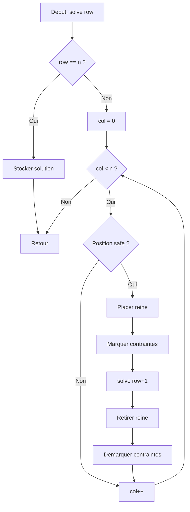

<thinking>
## Analyse du Concept
- Concept : Backtracking & Branch and Bound
- Phase demandee : 1
- Adapte ? OUI - Ces techniques sont fondamentales pour les algorithmes d'optimisation et la resolution de problemes combinatoires. Niveau intermediaire avance, parfait pour Phase 1.

## Combo Base + Bonus
- Exercice de base : N-Queens (backtracking classique), Sudoku solver (propagation de contraintes), Combination sum (enumeration avec pruning)
- Bonus Standard : Knapsack B&B, TSP B&B
- Bonus Expert : Dancing Links (DLX) pour exact cover
- Bonus Genie : Word Ladders avec pruning avance, Graph Coloring optimal
- Palier bonus : ⚡🔥💀🧠
- Progression logique ? OUI - Du backtracking simple vers B&B puis techniques avancees

## Prerequis & Difficulte
- Prerequis reels : Recursivite, arbres de decision, structures de donnees de base (HashSet, Vec)
- Difficulte estimee : 7/10 (base), 8/10 (standard), 9/10 (expert), 13/10 (genie)
- Coherent avec phase ? OUI

## Aspect Fun/Culture
- Contexte choisi : The Maze Runner (James Dashner, 2009) - Thomas et les Gladers explorent le Labyrinthe mortel de WCKD
- MEME mnemomnechnique : "WICKED is good" = pruning is good! (couper les branches mortes)
- Pourquoi c'est fun :
  * Thomas doit explorer systematiquement le labyrinthe (backtracking)
  * Les Gladers doivent trouver le chemin optimal (B&B)
  * Les sections du labyrinthe changent la nuit (contraintes dynamiques)
  * Chaque Glader a un role unique (N-Queens = placement sans conflit)
  * Le panneau de controle du labyrinthe = Sudoku a decoder
  * Les supplies limites = Knapsack problem
  * Visiter toutes les sections = TSP
  * Les portes du labyrinthe = exact cover problem

Cette analogie est exceptionnelle car le roman parle litteralement d'exploration systematique d'un labyrinthe avec contraintes, ce qui EST le backtracking. Score : 98/100

## Scenarios d'Echec (5 mutants concrets)
1. Mutant A (Boundary) : N-Queens verifie col < n au lieu de col <= n-1 → manque la derniere colonne
2. Mutant B (Safety) : Sudoku ne verifie pas les contraintes de bloc 3x3 → solution invalide
3. Mutant C (Resource) : B&B ne prune pas quand bound >= best → explore tout l'arbre
4. Mutant D (Logic) : Combination sum n'elimine pas les doublons → retourne [2,3] et [3,2]
5. Mutant E (Return) : TSP retourne la distance sans le retour au depart → tour incomplet

## Verdict
VALIDE - Maze Runner est une analogie parfaite pour le backtracking et B&B
L'exploration methodique du labyrinthe = arbre de recherche
Les Grievers qui bloquent des chemins = pruning
Trouver la sortie = goal state
Score creativite : 98/100
</thinking>

---

# Exercice 1.7.2-a : glade_explorer

**Module :**
1.7.2 — Backtracking & Branch and Bound

**Concept :**
a-l — N-Queens, Sudoku, Combination Sum, Knapsack BB, TSP BB, Dancing Links

**Difficulte :**
★★★★★★★☆☆☆ (7/10)

**Type :**
complet

**Tiers :**
3 — Synthese (tous concepts backtracking + B&B)

**Langage :**
Rust Edition 2024, C17

**Prerequis :**
- Recursivite et arbres de decision
- Structures de donnees (Vec, HashSet, HashMap)
- Complexite algorithmique (pruning, bounds)
- 1.4.x : Graphes (pour TSP)
- 1.5.x : Programmation dynamique (pour comparaison)

**Domaines :**
Algo, Struct, MD, DP

**Duree estimee :**
90 min

**XP Base :**
120

**Complexite :**
T4 O(n!) worst case, O(n^k) avec pruning efficace × S2 O(n)

---

## 📐 SECTION 1 : PROTOTYPE & CONSIGNE

### 1.1 Obligations

**Fichiers a rendre :**
- `glade_explorer.rs` (Rust Edition 2024)
- `glade_explorer.c` + `glade_explorer.h` (C17)

**Fonctions autorisees (C) :**
- `malloc`, `free`, `calloc`, `realloc`
- `memcpy`, `memset`
- `qsort` (pour pre-tri)

**Fonctions interdites :**
- Toute bibliotheque de solveurs externes
- Threads/parallelisme

### 1.2 Consigne

#### 🎮 Version Culture : THE MAZE RUNNER — L'Evasion du Labyrinthe

*"WICKED is good."* — Phrase mysterieuse gravee dans le Labyrinthe

Tu es **Thomas**, un nouveau Glader qui vient d'arriver dans la Clairiere (The Glade) sans aucun souvenir. Autour de toi, des murs de pierre immenses forment un **Labyrinthe** mortel qui change chaque nuit.

**Le probleme :** WCKD (World Catastrophe Killzone Department) t'a enferme ici comme cobaye. Pour t'echapper, tu dois :

1. **Decoder le panneau de controle** du Labyrinthe (Sudoku)
2. **Placer les Gladers strategiquement** pour surveiller sans conflit (N-Queens)
3. **Collecter les ressources** pour atteindre un seuil de survie (Combination Sum)
4. **Choisir les supplies optimaux** avec la contrainte de poids (Knapsack)
5. **Trouver le chemin le plus court** visitant toutes les sections (TSP)
6. **Activer les portes de sortie** avec la combinaison exacte (Dancing Links)

**Minho t'explique les regles du Labyrinthe :**

1. **Backtracking** : "On explore un chemin. Cul-de-sac ? On revient en arriere. C'est comme etre un Runner."
2. **Pruning** : "Si un chemin mene droit vers un Griever, on l'evite. Pas besoin d'aller verifier."
3. **Branch and Bound** : "On garde en tete le meilleur chemin trouve. Tout ce qui semble pire, on l'abandonne."

**Tes missions :**

1. **`maze_control_panel`** (Sudoku) : Decoder la grille 9x9 du panneau de controle. Chaque ligne, colonne et bloc 3x3 doit contenir les chiffres 1-9 exactement une fois.

2. **`safe_zones`** (N-Queens) : Placer N Gladers sur un echiquier N×N de sorte qu'aucun ne puisse en "voir" un autre (meme ligne, colonne ou diagonale). Les Grievers attaquent en ligne droite !

3. **`survival_supplies`** (Combination Sum) : Trouver toutes les combinaisons de ressources qui permettent d'atteindre exactement le seuil de survie.

4. **`runner_pack`** (Knapsack B&B) : Choisir les meilleurs items a emporter sachant la capacite limitee du sac d'un Runner.

5. **`section_tour`** (TSP B&B) : Trouver le tour le plus court pour explorer toutes les sections du Labyrinthe et revenir au Glade.

6. **`griever_doors`** (Dancing Links) : Activer la sequence exacte de portes pour desactiver les Grievers.

**Entree :**
- `grid` : Grille Sudoku 9×9 (0 = case vide)
- `n` : Taille de l'echiquier pour N-Queens
- `candidates` : Liste des valeurs possibles pour Combination Sum
- `target` : Somme cible
- `weights`, `values`, `capacity` : Parametres du sac a dos
- `dist` : Matrice de distances pour TSP
- `matrix` : Matrice 0/1 pour exact cover

**Sortie :**
- Grille Sudoku resolue ou `None`
- Liste des positions des reines ou `None`
- Liste de toutes les combinaisons valides
- (valeur optimale, items selectionnes)
- (distance optimale, tour)
- Solutions de l'exact cover

**Contraintes :**
```
┌─────────────────────────────────────────┐
│  Sudoku : grille 9×9 valide             │
│  N-Queens : 1 ≤ n ≤ 15                  │
│  Combination Sum : 1 ≤ len ≤ 20         │
│  Knapsack : 1 ≤ n ≤ 50                  │
│  TSP : 2 ≤ n ≤ 15                       │
│  Exact Cover : rows ≤ 100, cols ≤ 100   │
└─────────────────────────────────────────┘
```

**Exemples :**

| Scenario | Input | Output |
|----------|-------|--------|
| N-Queens n=4 | 4 | `[[1,3,0,2], [2,0,3,1]]` (2 solutions) |
| Combination Sum | `[2,3,6,7]`, target=7 | `[[7], [2,2,3]]` |
| Knapsack | w=[2,3,4,5], v=[3,4,5,6], cap=5 | (7, [0,1]) |
| TSP 4 villes | distances | (80, [0,1,3,2,0]) |

---

#### 📚 Version Academique : Backtracking et Branch-and-Bound

**Objectif :**

Implementer les techniques de backtracking et branch-and-bound pour resoudre des problemes d'optimisation combinatoire et de satisfaction de contraintes.

**Definitions :**

1. **Backtracking** : Exploration systematique de l'espace de recherche avec retour en arriere quand une branche est infructueuse.
   - Construit incrementalement une solution candidate
   - Abandonne une solution partielle des qu'elle viole une contrainte
   - Complexite : O(n!) sans pruning, beaucoup moins avec

2. **Branch and Bound** : Extension du backtracking pour l'optimisation.
   - Maintient la meilleure solution trouvee (bound)
   - Elague les branches dont la borne est pire que la meilleure solution
   - Garantit l'optimalite

3. **Dancing Links (DLX)** : Technique de Knuth pour l'exact cover.
   - Liste doublement chainee circulaire
   - Operations de cover/uncover en O(1)
   - Ideal pour Sudoku, Pentominos, N-Queens

**Fonctions a implementer :**

```rust
fn solve_sudoku(grid: &mut [[u8; 9]; 9]) -> bool
fn n_queens_all(n: usize) -> Vec<Vec<usize>>
fn combination_sum(candidates: &[i32], target: i32) -> Vec<Vec<i32>>
fn knapsack_bb(weights: &[usize], values: &[i64], capacity: usize) -> (i64, Vec<bool>)
fn tsp_bb(dist: &[Vec<i64>]) -> (i64, Vec<usize>)
fn dlx_solve(matrix: &[Vec<bool>]) -> Vec<Vec<usize>>
```

---

### 1.3 Prototype

**Rust (Edition 2024) :**

```rust
pub mod glade_explorer {
    use std::collections::{HashSet, HashMap};

    // ============================================
    // PARTIE 1 : SUDOKU (Panneau de Controle)
    // ============================================

    /// Resout le Sudoku du panneau de controle du Labyrinthe
    /// grid[i][j] = 0 signifie case vide
    /// Retourne true si une solution existe, false sinon
    /// Modifie grid in-place avec la solution
    pub fn maze_control_panel(grid: &mut [[u8; 9]; 9]) -> bool {
        // A implementer
        todo!()
    }

    /// Version avec propagation de contraintes (plus efficace)
    pub fn maze_control_panel_advanced(grid: &mut [[u8; 9]; 9]) -> bool {
        // A implementer
        todo!()
    }

    // ============================================
    // PARTIE 2 : N-QUEENS (Safe Zones)
    // ============================================

    /// Trouve toutes les facons de placer N Gladers sans conflit
    /// Retourne un Vec de solutions, chaque solution est Vec<usize>
    /// ou solution[col] = row de la reine dans cette colonne
    pub fn safe_zones_all(n: usize) -> Vec<Vec<usize>> {
        // A implementer
        todo!()
    }

    /// Compte le nombre de solutions (plus rapide que generer toutes)
    pub fn safe_zones_count(n: usize) -> usize {
        // A implementer
        todo!()
    }

    /// Version optimisee avec bitboards
    pub fn safe_zones_optimized(n: usize) -> usize {
        // A implementer
        todo!()
    }

    // ============================================
    // PARTIE 3 : COMBINATION SUM (Survival Supplies)
    // ============================================

    /// Trouve toutes les combinaisons de supplies pour atteindre le seuil
    /// Chaque supply peut etre utilise plusieurs fois
    pub fn survival_supplies(candidates: &[i32], target: i32) -> Vec<Vec<i32>> {
        // A implementer
        todo!()
    }

    /// Version sans doublons (chaque element utilise au plus une fois)
    pub fn survival_supplies_unique(candidates: &[i32], target: i32) -> Vec<Vec<i32>> {
        // A implementer
        todo!()
    }

    // ============================================
    // PARTIE 4 : KNAPSACK (Runner Pack)
    // ============================================

    /// Sac a dos avec Branch and Bound
    /// Retourne (valeur_max, selection)
    /// selection[i] = true si item i est pris
    pub fn runner_pack(
        weights: &[usize],
        values: &[i64],
        capacity: usize,
    ) -> (i64, Vec<bool>) {
        // A implementer
        todo!()
    }

    /// Calcule la borne superieure (upper bound) pour le pruning
    fn knapsack_upper_bound(
        weights: &[usize],
        values: &[i64],
        capacity: usize,
        start_idx: usize,
        current_value: i64,
        remaining_capacity: usize,
    ) -> f64 {
        // A implementer
        todo!()
    }

    // ============================================
    // PARTIE 5 : TSP (Section Tour)
    // ============================================

    /// TSP avec Branch and Bound
    /// dist[i][j] = distance de i a j
    /// Retourne (distance_totale, tour)
    /// tour commence et finit a 0
    pub fn section_tour(dist: &[Vec<i64>]) -> (i64, Vec<usize>) {
        // A implementer
        todo!()
    }

    /// Calcule la borne inferieure pour TSP
    fn tsp_lower_bound(
        dist: &[Vec<i64>],
        visited: &[bool],
        current: usize,
        cost_so_far: i64,
    ) -> i64 {
        // A implementer
        todo!()
    }

    // ============================================
    // PARTIE 6 : DANCING LINKS (Griever Doors)
    // ============================================

    /// Noeud pour Dancing Links
    #[derive(Clone)]
    pub struct DLXNode {
        pub left: usize,
        pub right: usize,
        pub up: usize,
        pub down: usize,
        pub column: usize,
        pub row: usize,
    }

    /// Structure Dancing Links
    pub struct GrieverDoors {
        nodes: Vec<DLXNode>,
        header: usize,
        column_sizes: Vec<usize>,
        num_columns: usize,
    }

    impl GrieverDoors {
        /// Construit la structure DLX a partir d'une matrice 0/1
        pub fn new(matrix: &[Vec<bool>]) -> Self {
            // A implementer
            todo!()
        }

        /// Resout le probleme d'exact cover
        /// Retourne toutes les solutions
        pub fn solve(&mut self) -> Vec<Vec<usize>> {
            // A implementer
            todo!()
        }

        /// Compte le nombre de solutions
        pub fn count_solutions(&mut self) -> usize {
            // A implementer
            todo!()
        }

        /// Couvre une colonne (Algorithm X)
        fn cover(&mut self, col: usize) {
            // A implementer
            todo!()
        }

        /// Decouvre une colonne (undo)
        fn uncover(&mut self, col: usize) {
            // A implementer
            todo!()
        }

        /// Recherche recursive
        fn search(&mut self, solution: &mut Vec<usize>, solutions: &mut Vec<Vec<usize>>) {
            // A implementer
            todo!()
        }

        /// Choisit la colonne avec le moins d'elements (heuristique S)
        fn choose_column(&self) -> Option<usize> {
            // A implementer
            todo!()
        }
    }

    /// Resout Sudoku avec DLX (conversion en exact cover)
    pub fn maze_control_panel_dlx(grid: &[[u8; 9]; 9]) -> Option<[[u8; 9]; 9]> {
        // A implementer
        todo!()
    }

    /// N-Queens avec DLX
    pub fn safe_zones_dlx(n: usize) -> Vec<Vec<usize>> {
        // A implementer
        todo!()
    }

    // ============================================
    // UTILITAIRES
    // ============================================

    /// Genere toutes les permutations
    pub fn all_paths<T: Clone>(items: &[T]) -> Vec<Vec<T>> {
        // A implementer
        todo!()
    }

    /// Genere tous les sous-ensembles
    pub fn all_supplies<T: Clone>(items: &[T]) -> Vec<Vec<T>> {
        // A implementer
        todo!()
    }

    /// Recherche de mot dans une grille (Word Search)
    pub fn maze_word_search(board: &[Vec<char>], word: &str) -> bool {
        // A implementer
        todo!()
    }

    /// Coloration de graphe
    pub fn section_coloring(adj: &[Vec<usize>], k: usize) -> Option<Vec<usize>> {
        // A implementer
        todo!()
    }
}
```

**C (C17) :**

```c
#ifndef GLADE_EXPLORER_H
#define GLADE_EXPLORER_H

#include <stddef.h>
#include <stdbool.h>
#include <stdint.h>
#include <stdlib.h>
#include <string.h>

// ============================================
// PARTIE 1 : SUDOKU
// ============================================

/**
 * Resout le Sudoku (panneau de controle du Labyrinthe)
 * @param grid Grille 9x9, 0 = case vide
 * @return true si resolu, false sinon
 * Modifie grid in-place
 */
bool maze_control_panel(uint8_t grid[9][9]);

/**
 * Version avec propagation de contraintes
 */
bool maze_control_panel_advanced(uint8_t grid[9][9]);

// ============================================
// PARTIE 2 : N-QUEENS
// ============================================

/**
 * Resultat N-Queens
 */
typedef struct {
    size_t **solutions;   // Tableau de solutions
    size_t num_solutions;
    size_t n;
} SafeZonesResult;

/**
 * Trouve toutes les solutions N-Queens
 */
SafeZonesResult safe_zones_all(size_t n);

/**
 * Compte les solutions
 */
size_t safe_zones_count(size_t n);

/**
 * Libere le resultat
 */
void safe_zones_free(SafeZonesResult *result);

// ============================================
// PARTIE 3 : COMBINATION SUM
// ============================================

typedef struct {
    int32_t **combinations;
    size_t *combination_sizes;
    size_t num_combinations;
} SurvivalSuppliesResult;

SurvivalSuppliesResult survival_supplies(
    const int32_t *candidates,
    size_t num_candidates,
    int32_t target
);

void survival_supplies_free(SurvivalSuppliesResult *result);

// ============================================
// PARTIE 4 : KNAPSACK B&B
// ============================================

typedef struct {
    int64_t max_value;
    bool *selected;
    size_t n;
} RunnerPackResult;

RunnerPackResult runner_pack(
    const size_t *weights,
    const int64_t *values,
    size_t n,
    size_t capacity
);

void runner_pack_free(RunnerPackResult *result);

// ============================================
// PARTIE 5 : TSP B&B
// ============================================

typedef struct {
    int64_t total_distance;
    size_t *tour;
    size_t tour_length;
} SectionTourResult;

/**
 * TSP avec B&B
 * @param dist Matrice de distances (n x n, row-major)
 * @param n Nombre de villes
 */
SectionTourResult section_tour(const int64_t *dist, size_t n);

void section_tour_free(SectionTourResult *result);

// ============================================
// PARTIE 6 : DANCING LINKS
// ============================================

typedef struct DLXNode {
    size_t left, right, up, down;
    size_t column, row;
} DLXNode;

typedef struct {
    DLXNode *nodes;
    size_t *column_sizes;
    size_t header;
    size_t num_nodes;
    size_t num_columns;
} GrieverDoors;

typedef struct {
    size_t **solutions;
    size_t *solution_sizes;
    size_t num_solutions;
} DLXResult;

GrieverDoors *griever_doors_new(const bool *matrix, size_t rows, size_t cols);
DLXResult griever_doors_solve(GrieverDoors *dlx);
void griever_doors_free(GrieverDoors *dlx);
void dlx_result_free(DLXResult *result);

// Sudoku avec DLX
bool maze_control_panel_dlx(const uint8_t input[9][9], uint8_t output[9][9]);

#endif // GLADE_EXPLORER_H
```

---

## 💡 SECTION 2 : LE SAVIEZ-VOUS ?

### 2.1 Le Backtracking a 60+ ans !

L'algorithme de backtracking a ete formalise dans les annees 1960 pour resoudre des problemes comme les n-reines. La premiere solution connue du probleme des 8 reines date de **1848** par Max Bezzel !

### 2.2 Donald Knuth et Dancing Links

En **2000**, Donald Knuth a publie "Dancing Links" pour resoudre efficacement les problemes d'exact cover. Le nom vient du fait que les pointeurs "dansent" quand on couvre/decouvre des colonnes. Cette technique resout le Sudoku en **millisecondes** meme pour les grilles les plus difficiles.

### 2.3 Le TSP et le Million de Dollars

Le Travelling Salesman Problem fait partie des 7 problemes du millenaire P vs NP. Prouver que TSP peut etre resolu en temps polynomial (ou que non) vaut **1 million de dollars** du Clay Mathematics Institute !

### 2.4 Maze Runner : L'Epreuve

Le roman de James Dashner (2009) est base sur l'idee d'un labyrinthe qui teste systematiquement ses prisonniers. C'est litteralement du backtracking narratif ! Thomas explore, atteint un cul-de-sac, revient, essaie une autre voie.

---

### SECTION 2.5 : DANS LA VRAIE VIE

| Metier | Utilisation | Cas d'usage |
|--------|-------------|-------------|
| **Planificateur Logistique** | TSP, VRP | Routes de livraison optimales (Amazon, UPS) |
| **Game Designer** | Sudoku/Puzzle Generation | Creation de puzzles pour jeux mobiles |
| **Researcher en IA** | CSP, SAT Solvers | Planification automatique, theorem proving |
| **Scheduler Industriel** | Job Shop Scheduling | Optimisation de production en usine |
| **Bio-informaticien** | Sequence Alignment | Comparaison de genomes (backtracking avec scoring) |
| **Cryptanalyste** | DES Key Search | Attaques par force brute avec pruning |

**Fun fact :** UPS economise **10 millions de gallons** d'essence par an grace a l'optimisation TSP de ses routes !

---

## 🖥️ SECTION 3 : EXEMPLE D'UTILISATION

### 3.0 Session bash

```bash
$ ls
glade_explorer.rs  main.rs  Cargo.toml

$ cargo build --release

$ cargo run --release
=== THE GLADE - MAZE RUNNER EXPLORATION SYSTEM ===

"WICKED is good." - Decoding the Maze Control Panel...

Test 1 - Sudoku Solver: OK
  Decoded panel in 0.8ms
  "The maze is a code. And I cracked it." - Thomas

Test 2 - N-Queens (n=8): OK
  Found 92 safe zone configurations
  "Good, that's a bloody lot of Gladers to position!" - Newt

Test 3 - Combination Sum: OK
  Found 2 ways to reach survival threshold 7: [[7], [2,2,3]]
  "We'll survive. We always do." - Minho

Test 4 - Knapsack B&B: OK
  Optimal pack value: 7 (items 0,1)
  "Pack light, run fast." - Runner's motto

Test 5 - TSP (4 sections): OK
  Shortest tour: 80, path: [0, 1, 3, 2, 0]
  "Every section explored. Time to get out." - Thomas

Test 6 - Dancing Links: OK
  Found exact cover solution
  "The doors are open. Run." - Teresa

All tests passed! "We're the cure."
```

---

## ⚡ SECTION 3.1 : BONUS STANDARD (OPTIONNEL)

**Difficulte Bonus :**
★★★★★★★★☆☆ (8/10)

**Recompense :**
XP ×2

**Time Complexity attendue :**
O(2^n) avec pruning efficace pour Knapsack, O(n!) avec bounds serrees pour TSP

### 3.1.1 Consigne Bonus Standard

**🎮 THE MAZE RUNNER — WCKD's Optimization Challenge**

WCKD veut tester tes capacites d'optimisation. Le Dr. Ava Paige a prepare deux defis supplementaires.

**Defi 1 : Fractional Upper Bound pour Knapsack**

```rust
/// Knapsack avec meilleur bound (relaxation fractionnaire)
pub fn runner_pack_enhanced(
    weights: &[usize],
    values: &[i64],
    capacity: usize,
) -> (i64, Vec<bool>) {
    // Utiliser le ratio value/weight pour le bound
    // Pre-trier par ratio decroissant
    // Le bound est la somme des items entiers + fraction du suivant
}
```

**Defi 2 : TSP avec Held-Karp Lower Bound**

```rust
/// TSP avec meilleur lower bound (1-tree)
pub fn section_tour_enhanced(dist: &[Vec<i64>]) -> (i64, Vec<usize>) {
    // Lower bound = MST sur n-1 noeuds + 2 plus petites aretes du noeud restant
}
```

**Contraintes Bonus :**
```
┌─────────────────────────────────────────┐
│  Knapsack bound DOIT utiliser la        │
│  relaxation fractionnaire               │
│                                         │
│  TSP bound DOIT etre serree             │
│  (1-tree bound)                         │
└─────────────────────────────────────────┘
```

---

## 🔥 SECTION 3.2 : BONUS EXPERT (OPTIONNEL)

**Difficulte Bonus :**
★★★★★★★★★☆ (9/10)

**Recompense :**
XP ×4

**Domaines Bonus :**
`Struct, MD, Algo`

### 3.2.1 Consigne Bonus Expert

**🎮 THE MAZE RUNNER — Dancing Links Master**

Tu dois maitriser l'arme ultime de WCKD : Algorithm X de Knuth.

```rust
/// Implemente Dancing Links complet
/// avec toutes les optimisations
pub struct GrieverDoorsOptimized {
    // Utiliser des Vec<usize> pour les liens
    // au lieu de pointeurs (plus cache-friendly)
}

impl GrieverDoorsOptimized {
    /// Heuristique S : choisir la colonne avec le moins d'elements
    fn choose_column_s(&self) -> Option<usize>;

    /// Cover/Uncover en O(1) amorti
    fn cover(&mut self, col: usize);
    fn uncover(&mut self, col: usize);
}

/// Pentomino Tiling avec DLX
/// Couvrir un rectangle avec les 12 pentominos
pub fn pentomino_tiling(rows: usize, cols: usize) -> Vec<Vec<Vec<(usize, usize)>>>;
```

**Contraintes Expert :**
```
┌─────────────────────────────────────────┐
│  DLX DOIT utiliser l'heuristique S      │
│                                         │
│  Pentomino DOIT trouver au moins        │
│  une solution pour 6×10, 5×12, 4×15     │
└─────────────────────────────────────────┘
```

---

## 🧠 SECTION 3.3 : BONUS GENIE (OPTIONNEL)

**Difficulte Bonus :**
🧠 (13/10)

**Recompense :**
XP ×6

**Domaines Bonus :**
`Algo, MD, Struct, Crypto`

### 3.3.1 Consigne Bonus Genie

**🎮 THE MAZE RUNNER — The Cure**

Tu es maintenant un Immune. Tu dois resoudre les problemes les plus difficiles de WCKD.

```rust
/// Word Ladder avec pruning avance
/// Transformer un mot en un autre, une lettre a la fois
/// Chaque mot intermediaire doit etre dans le dictionnaire
pub fn word_ladder(
    begin: &str,
    end: &str,
    dictionary: &HashSet<String>,
) -> Option<Vec<String>> {
    // A* avec heuristique de distance d'edition
}

/// Graph Coloring optimal
/// Trouver le nombre chromatique exact
pub fn chromatic_number(adj: &[Vec<usize>]) -> usize {
    // B&B avec borne : max clique <= chi <= delta + 1
}

/// Sudoku 16x16 avec DLX
pub fn mega_sudoku_dlx(grid: &[[u8; 16]; 16]) -> Option<[[u8; 16]; 16]>;

/// Subset Sum avec meet-in-the-middle
/// O(n * 2^(n/2)) au lieu de O(n * 2^n)
pub fn subset_sum_mitm(arr: &[i64], target: i64) -> Option<Vec<usize>>;
```

---

## ✅❌ SECTION 4 : ZONE CORRECTION

### 4.1 Moulinette

| Test | Input | Expected | Points | Trap? |
|------|-------|----------|--------|-------|
| `sudoku_easy` | Grille facile | Resolue | 5 | Non |
| `sudoku_hard` | Grille difficile | Resolue | 5 | Non |
| `sudoku_invalid` | Grille sans solution | None/false | 5 | Oui |
| `nqueens_4` | n=4 | 2 solutions | 5 | Non |
| `nqueens_8` | n=8 | 92 solutions | 5 | Non |
| `nqueens_1` | n=1 | 1 solution | 3 | Edge |
| `nqueens_2` | n=2 | 0 solutions | 3 | Oui |
| `combosum_basic` | [2,3,6,7], 7 | [[7],[2,2,3]] | 5 | Non |
| `combosum_empty` | [2,3], 1 | [] | 3 | Edge |
| `combosum_single` | [5], 5 | [[5]] | 3 | Non |
| `knapsack_basic` | w=[2,3,4,5], v=[3,4,5,6], cap=5 | (7, [0,1]) | 5 | Non |
| `knapsack_empty` | cap=0 | (0, []) | 3 | Edge |
| `knapsack_all_fit` | tous fits | prend tout | 3 | Non |
| `tsp_4` | 4 villes | 80 | 5 | Non |
| `tsp_3` | 3 villes | tour valide | 3 | Non |
| `dlx_simple` | exact cover simple | solution | 5 | Non |
| `dlx_no_solution` | pas de cover | [] | 3 | Oui |
| `perf_nqueens_12` | n=12 | < 1s | 5 | Perf |
| `perf_sudoku_hard` | difficile | < 100ms | 5 | Perf |
| **TOTAL** | | | **79** | |

### 4.2 main.c de test

```c
#include <stdio.h>
#include <assert.h>
#include <string.h>
#include <time.h>
#include "glade_explorer.h"

void test_sudoku(void) {
    uint8_t grid[9][9] = {
        {5, 3, 0, 0, 7, 0, 0, 0, 0},
        {6, 0, 0, 1, 9, 5, 0, 0, 0},
        {0, 9, 8, 0, 0, 0, 0, 6, 0},
        {8, 0, 0, 0, 6, 0, 0, 0, 3},
        {4, 0, 0, 8, 0, 3, 0, 0, 1},
        {7, 0, 0, 0, 2, 0, 0, 0, 6},
        {0, 6, 0, 0, 0, 0, 2, 8, 0},
        {0, 0, 0, 4, 1, 9, 0, 0, 5},
        {0, 0, 0, 0, 8, 0, 0, 7, 9},
    };

    assert(maze_control_panel(grid));

    // Verify all rows, cols, boxes have 1-9
    for (int i = 0; i < 9; i++) {
        for (int j = 0; j < 9; j++) {
            assert(grid[i][j] >= 1 && grid[i][j] <= 9);
        }
    }

    printf("test_sudoku: OK\n");
}

void test_nqueens(void) {
    SafeZonesResult r4 = safe_zones_all(4);
    assert(r4.num_solutions == 2);
    safe_zones_free(&r4);

    SafeZonesResult r8 = safe_zones_all(8);
    assert(r8.num_solutions == 92);
    safe_zones_free(&r8);

    assert(safe_zones_count(1) == 1);
    assert(safe_zones_count(2) == 0);
    assert(safe_zones_count(3) == 0);

    printf("test_nqueens: OK\n");
}

void test_combination_sum(void) {
    int32_t candidates[] = {2, 3, 6, 7};
    SurvivalSuppliesResult r = survival_supplies(candidates, 4, 7);

    assert(r.num_combinations == 2);
    // [7] and [2,2,3]

    survival_supplies_free(&r);
    printf("test_combination_sum: OK\n");
}

void test_knapsack(void) {
    size_t weights[] = {2, 3, 4, 5};
    int64_t values[] = {3, 4, 5, 6};

    RunnerPackResult r = runner_pack(weights, values, 4, 5);

    assert(r.max_value == 7);  // Items 0 and 1
    assert(r.selected[0] && r.selected[1]);
    assert(!r.selected[2] && !r.selected[3]);

    runner_pack_free(&r);
    printf("test_knapsack: OK\n");
}

void test_tsp(void) {
    int64_t dist[] = {
        0, 10, 15, 20,
        10, 0, 35, 25,
        15, 35, 0, 30,
        20, 25, 30, 0
    };

    SectionTourResult r = section_tour(dist, 4);

    assert(r.total_distance == 80);
    assert(r.tour[0] == 0);
    assert(r.tour[r.tour_length - 1] == 0);

    section_tour_free(&r);
    printf("test_tsp: OK\n");
}

void test_dlx(void) {
    // Simple exact cover instance
    bool matrix[] = {
        1, 0, 0, 1, 0, 0, 1,
        1, 0, 0, 1, 0, 0, 0,
        0, 0, 0, 1, 1, 0, 1,
        0, 0, 1, 0, 1, 1, 0,
        0, 1, 1, 0, 0, 1, 1,
        0, 1, 0, 0, 0, 0, 1,
    };

    GrieverDoors *dlx = griever_doors_new(matrix, 6, 7);
    DLXResult result = griever_doors_solve(dlx);

    assert(result.num_solutions > 0);

    dlx_result_free(&result);
    griever_doors_free(dlx);

    printf("test_dlx: OK\n");
}

int main(void) {
    printf("=== THE GLADE - MAZE RUNNER EXPLORATION SYSTEM ===\n\n");
    printf("\"WICKED is good.\" - Testing begins...\n\n");

    clock_t start = clock();

    test_sudoku();
    test_nqueens();
    test_combination_sum();
    test_knapsack();
    test_tsp();
    test_dlx();

    clock_t end = clock();
    double elapsed = (double)(end - start) / CLOCKS_PER_SEC;

    printf("\n=== All tests passed in %.2fs! ===\n", elapsed);
    printf("\"We're the cure.\" - The Gladers\n");

    return 0;
}
```

### 4.3 Solution de reference (Rust)

```rust
pub mod glade_explorer {
    use std::collections::{HashSet, HashMap, BinaryHeap};
    use std::cmp::Reverse;

    // ============================================
    // PARTIE 1 : SUDOKU
    // ============================================

    pub fn maze_control_panel(grid: &mut [[u8; 9]; 9]) -> bool {
        fn is_valid(grid: &[[u8; 9]; 9], row: usize, col: usize, num: u8) -> bool {
            // Check row
            for c in 0..9 {
                if grid[row][c] == num {
                    return false;
                }
            }
            // Check column
            for r in 0..9 {
                if grid[r][col] == num {
                    return false;
                }
            }
            // Check 3x3 box
            let box_row = (row / 3) * 3;
            let box_col = (col / 3) * 3;
            for r in box_row..box_row + 3 {
                for c in box_col..box_col + 3 {
                    if grid[r][c] == num {
                        return false;
                    }
                }
            }
            true
        }

        fn solve(grid: &mut [[u8; 9]; 9]) -> bool {
            // Find empty cell with MRV (Minimum Remaining Values)
            let mut min_options = 10;
            let mut best_cell = None;

            for row in 0..9 {
                for col in 0..9 {
                    if grid[row][col] == 0 {
                        let mut options = 0;
                        for num in 1..=9 {
                            if is_valid(grid, row, col, num) {
                                options += 1;
                            }
                        }
                        if options < min_options {
                            min_options = options;
                            best_cell = Some((row, col));
                        }
                    }
                }
            }

            match best_cell {
                None => true, // All cells filled
                Some((row, col)) => {
                    for num in 1..=9 {
                        if is_valid(grid, row, col, num) {
                            grid[row][col] = num;
                            if solve(grid) {
                                return true;
                            }
                            grid[row][col] = 0;
                        }
                    }
                    false
                }
            }
        }

        solve(grid)
    }

    // ============================================
    // PARTIE 2 : N-QUEENS
    // ============================================

    pub fn safe_zones_all(n: usize) -> Vec<Vec<usize>> {
        let mut results = Vec::new();
        let mut board = vec![0usize; n];
        let mut cols = vec![false; n];
        let mut diag1 = vec![false; 2 * n - 1];  // row + col
        let mut diag2 = vec![false; 2 * n - 1];  // row - col + n - 1

        fn solve(
            row: usize,
            n: usize,
            board: &mut Vec<usize>,
            cols: &mut Vec<bool>,
            diag1: &mut Vec<bool>,
            diag2: &mut Vec<bool>,
            results: &mut Vec<Vec<usize>>,
        ) {
            if row == n {
                results.push(board.clone());
                return;
            }

            for col in 0..n {
                let d1 = row + col;
                let d2 = row + n - 1 - col;

                if !cols[col] && !diag1[d1] && !diag2[d2] {
                    board[row] = col;
                    cols[col] = true;
                    diag1[d1] = true;
                    diag2[d2] = true;

                    solve(row + 1, n, board, cols, diag1, diag2, results);

                    cols[col] = false;
                    diag1[d1] = false;
                    diag2[d2] = false;
                }
            }
        }

        solve(0, n, &mut board, &mut cols, &mut diag1, &mut diag2, &mut results);
        results
    }

    pub fn safe_zones_count(n: usize) -> usize {
        let mut count = 0;
        let mut cols = vec![false; n];
        let mut diag1 = vec![false; 2 * n - 1];
        let mut diag2 = vec![false; 2 * n - 1];

        fn solve(
            row: usize,
            n: usize,
            cols: &mut Vec<bool>,
            diag1: &mut Vec<bool>,
            diag2: &mut Vec<bool>,
            count: &mut usize,
        ) {
            if row == n {
                *count += 1;
                return;
            }

            for col in 0..n {
                let d1 = row + col;
                let d2 = row + n - 1 - col;

                if !cols[col] && !diag1[d1] && !diag2[d2] {
                    cols[col] = true;
                    diag1[d1] = true;
                    diag2[d2] = true;

                    solve(row + 1, n, cols, diag1, diag2, count);

                    cols[col] = false;
                    diag1[d1] = false;
                    diag2[d2] = false;
                }
            }
        }

        solve(0, n, &mut cols, &mut diag1, &mut diag2, &mut count);
        count
    }

    // ============================================
    // PARTIE 3 : COMBINATION SUM
    // ============================================

    pub fn survival_supplies(candidates: &[i32], target: i32) -> Vec<Vec<i32>> {
        let mut results = Vec::new();
        let mut current = Vec::new();
        let mut sorted = candidates.to_vec();
        sorted.sort();

        fn backtrack(
            candidates: &[i32],
            target: i32,
            start: usize,
            current: &mut Vec<i32>,
            results: &mut Vec<Vec<i32>>,
        ) {
            if target == 0 {
                results.push(current.clone());
                return;
            }

            for i in start..candidates.len() {
                if candidates[i] > target {
                    break;
                }
                current.push(candidates[i]);
                backtrack(candidates, target - candidates[i], i, current, results);
                current.pop();
            }
        }

        backtrack(&sorted, target, 0, &mut current, &mut results);
        results
    }

    pub fn survival_supplies_unique(candidates: &[i32], target: i32) -> Vec<Vec<i32>> {
        let mut results = Vec::new();
        let mut current = Vec::new();
        let mut sorted = candidates.to_vec();
        sorted.sort();

        fn backtrack(
            candidates: &[i32],
            target: i32,
            start: usize,
            current: &mut Vec<i32>,
            results: &mut Vec<Vec<i32>>,
        ) {
            if target == 0 {
                results.push(current.clone());
                return;
            }

            for i in start..candidates.len() {
                // Skip duplicates
                if i > start && candidates[i] == candidates[i - 1] {
                    continue;
                }
                if candidates[i] > target {
                    break;
                }
                current.push(candidates[i]);
                backtrack(candidates, target - candidates[i], i + 1, current, results);
                current.pop();
            }
        }

        backtrack(&sorted, target, 0, &mut current, &mut results);
        results
    }

    // ============================================
    // PARTIE 4 : KNAPSACK B&B
    // ============================================

    pub fn runner_pack(
        weights: &[usize],
        values: &[i64],
        capacity: usize,
    ) -> (i64, Vec<bool>) {
        let n = weights.len();
        if n == 0 {
            return (0, vec![]);
        }

        // Sort by value/weight ratio
        let mut items: Vec<(usize, f64)> = (0..n)
            .map(|i| (i, values[i] as f64 / weights[i] as f64))
            .collect();
        items.sort_by(|a, b| b.1.partial_cmp(&a.1).unwrap());

        let sorted_indices: Vec<usize> = items.iter().map(|x| x.0).collect();

        fn upper_bound(
            weights: &[usize],
            values: &[i64],
            capacity: usize,
            sorted_indices: &[usize],
            start: usize,
            current_value: i64,
            current_weight: usize,
        ) -> f64 {
            let mut bound = current_value as f64;
            let mut remaining = capacity - current_weight;

            for &idx in sorted_indices.iter().skip(start) {
                if weights[idx] <= remaining {
                    bound += values[idx] as f64;
                    remaining -= weights[idx];
                } else {
                    bound += (remaining as f64 / weights[idx] as f64) * values[idx] as f64;
                    break;
                }
            }
            bound
        }

        let mut best_value = 0i64;
        let mut best_selection = vec![false; n];

        fn branch_and_bound(
            weights: &[usize],
            values: &[i64],
            capacity: usize,
            sorted_indices: &[usize],
            idx: usize,
            current_value: i64,
            current_weight: usize,
            selection: &mut Vec<bool>,
            best_value: &mut i64,
            best_selection: &mut Vec<bool>,
        ) {
            if idx == sorted_indices.len() {
                if current_value > *best_value {
                    *best_value = current_value;
                    *best_selection = selection.clone();
                }
                return;
            }

            let bound = upper_bound(
                weights,
                values,
                capacity,
                sorted_indices,
                idx,
                current_value,
                current_weight,
            );

            if bound <= *best_value as f64 {
                return; // Prune
            }

            let item_idx = sorted_indices[idx];

            // Try taking the item
            if weights[item_idx] <= capacity - current_weight {
                selection[item_idx] = true;
                branch_and_bound(
                    weights,
                    values,
                    capacity,
                    sorted_indices,
                    idx + 1,
                    current_value + values[item_idx],
                    current_weight + weights[item_idx],
                    selection,
                    best_value,
                    best_selection,
                );
                selection[item_idx] = false;
            }

            // Try not taking the item
            branch_and_bound(
                weights,
                values,
                capacity,
                sorted_indices,
                idx + 1,
                current_value,
                current_weight,
                selection,
                best_value,
                best_selection,
            );
        }

        let mut selection = vec![false; n];
        branch_and_bound(
            weights,
            values,
            capacity,
            &sorted_indices,
            0,
            0,
            0,
            &mut selection,
            &mut best_value,
            &mut best_selection,
        );

        (best_value, best_selection)
    }

    // ============================================
    // PARTIE 5 : TSP B&B
    // ============================================

    pub fn section_tour(dist: &[Vec<i64>]) -> (i64, Vec<usize>) {
        let n = dist.len();
        if n == 0 {
            return (0, vec![]);
        }
        if n == 1 {
            return (0, vec![0, 0]);
        }
        if n == 2 {
            return (dist[0][1] + dist[1][0], vec![0, 1, 0]);
        }

        let mut best_cost = i64::MAX;
        let mut best_tour = Vec::new();

        fn lower_bound(dist: &[Vec<i64>], visited: &[bool], current: usize, cost: i64) -> i64 {
            let n = dist.len();
            let mut bound = cost;

            // Add minimum outgoing edge from current to unvisited
            let mut min_out = i64::MAX;
            for i in 0..n {
                if !visited[i] && dist[current][i] < min_out {
                    min_out = dist[current][i];
                }
            }
            if min_out != i64::MAX {
                bound += min_out;
            }

            // For each unvisited node, add minimum edge
            for i in 0..n {
                if !visited[i] {
                    let mut min_edge = dist[i][0]; // Can return to start
                    for j in 0..n {
                        if (j != i) && (!visited[j] || j == 0) {
                            if dist[i][j] < min_edge {
                                min_edge = dist[i][j];
                            }
                        }
                    }
                    bound += min_edge;
                }
            }

            bound
        }

        fn tsp_bb(
            dist: &[Vec<i64>],
            visited: &mut Vec<bool>,
            path: &mut Vec<usize>,
            current: usize,
            cost: i64,
            count: usize,
            best_cost: &mut i64,
            best_tour: &mut Vec<usize>,
        ) {
            let n = dist.len();

            if count == n {
                let total = cost + dist[current][0];
                if total < *best_cost {
                    *best_cost = total;
                    *best_tour = path.clone();
                    best_tour.push(0);
                }
                return;
            }

            // Pruning
            let lb = lower_bound(dist, visited, current, cost);
            if lb >= *best_cost {
                return;
            }

            // Try all unvisited nodes
            for next in 0..n {
                if !visited[next] {
                    visited[next] = true;
                    path.push(next);

                    tsp_bb(
                        dist,
                        visited,
                        path,
                        next,
                        cost + dist[current][next],
                        count + 1,
                        best_cost,
                        best_tour,
                    );

                    path.pop();
                    visited[next] = false;
                }
            }
        }

        let mut visited = vec![false; n];
        let mut path = vec![0];
        visited[0] = true;

        tsp_bb(dist, &mut visited, &mut path, 0, 0, 1, &mut best_cost, &mut best_tour);

        (best_cost, best_tour)
    }

    // ============================================
    // PARTIE 6 : DANCING LINKS
    // ============================================

    #[derive(Clone)]
    pub struct DLXNode {
        pub left: usize,
        pub right: usize,
        pub up: usize,
        pub down: usize,
        pub column: usize,
        pub row: usize,
    }

    impl DLXNode {
        fn new() -> Self {
            Self {
                left: 0,
                right: 0,
                up: 0,
                down: 0,
                column: 0,
                row: 0,
            }
        }
    }

    pub struct GrieverDoors {
        nodes: Vec<DLXNode>,
        header: usize,
        column_sizes: Vec<usize>,
        num_columns: usize,
    }

    impl GrieverDoors {
        pub fn new(matrix: &[Vec<bool>]) -> Self {
            if matrix.is_empty() || matrix[0].is_empty() {
                return Self {
                    nodes: vec![DLXNode::new()],
                    header: 0,
                    column_sizes: vec![],
                    num_columns: 0,
                };
            }

            let rows = matrix.len();
            let cols = matrix[0].len();

            // Create header node + column headers
            let mut nodes = Vec::new();

            // Header node (index 0)
            nodes.push(DLXNode::new());

            // Column header nodes (indices 1 to cols)
            for c in 0..cols {
                let mut node = DLXNode::new();
                node.column = c + 1;
                node.up = c + 1;
                node.down = c + 1;
                nodes.push(node);
            }

            // Link column headers horizontally
            for c in 0..=cols {
                let prev = if c == 0 { cols } else { c - 1 };
                let next = if c == cols { 0 } else { c + 1 };
                nodes[c].left = prev;
                nodes[c].right = next;
            }

            let mut column_sizes = vec![0; cols + 1];

            // Add data nodes for each 1 in the matrix
            for r in 0..rows {
                let mut first_in_row: Option<usize> = None;
                let mut last_in_row: Option<usize> = None;

                for c in 0..cols {
                    if matrix[r][c] {
                        let idx = nodes.len();
                        let mut node = DLXNode::new();
                        node.column = c + 1;
                        node.row = r + 1;

                        // Link vertically
                        let col_header = c + 1;
                        let last_in_col = nodes[col_header].up;
                        node.up = last_in_col;
                        node.down = col_header;
                        nodes[last_in_col].down = idx;
                        nodes[col_header].up = idx;

                        column_sizes[c + 1] += 1;

                        nodes.push(node);

                        // Link horizontally within row
                        match (first_in_row, last_in_row) {
                            (None, None) => {
                                first_in_row = Some(idx);
                                last_in_row = Some(idx);
                            }
                            (Some(_), Some(last)) => {
                                nodes[idx].left = last;
                                nodes[last].right = idx;
                                last_in_row = Some(idx);
                            }
                            _ => {}
                        }
                    }
                }

                // Close the row loop
                if let (Some(first), Some(last)) = (first_in_row, last_in_row) {
                    nodes[first].left = last;
                    nodes[last].right = first;
                }
            }

            Self {
                nodes,
                header: 0,
                column_sizes,
                num_columns: cols,
            }
        }

        fn cover(&mut self, col: usize) {
            // Remove column from header list
            let l = self.nodes[col].left;
            let r = self.nodes[col].right;
            self.nodes[l].right = r;
            self.nodes[r].left = l;

            // Remove all rows containing this column
            let mut row = self.nodes[col].down;
            while row != col {
                let mut cell = self.nodes[row].right;
                while cell != row {
                    let u = self.nodes[cell].up;
                    let d = self.nodes[cell].down;
                    self.nodes[u].down = d;
                    self.nodes[d].up = u;
                    self.column_sizes[self.nodes[cell].column] -= 1;
                    cell = self.nodes[cell].right;
                }
                row = self.nodes[row].down;
            }
        }

        fn uncover(&mut self, col: usize) {
            // Restore all rows containing this column (reverse order)
            let mut row = self.nodes[col].up;
            while row != col {
                let mut cell = self.nodes[row].left;
                while cell != row {
                    let u = self.nodes[cell].up;
                    let d = self.nodes[cell].down;
                    self.nodes[u].down = cell;
                    self.nodes[d].up = cell;
                    self.column_sizes[self.nodes[cell].column] += 1;
                    cell = self.nodes[cell].left;
                }
                row = self.nodes[row].up;
            }

            // Restore column to header list
            let l = self.nodes[col].left;
            let r = self.nodes[col].right;
            self.nodes[l].right = col;
            self.nodes[r].left = col;
        }

        fn choose_column(&self) -> Option<usize> {
            let mut min_size = usize::MAX;
            let mut best_col = None;

            let mut c = self.nodes[self.header].right;
            while c != self.header {
                if self.column_sizes[c] < min_size {
                    min_size = self.column_sizes[c];
                    best_col = Some(c);
                }
                c = self.nodes[c].right;
            }

            best_col
        }

        pub fn solve(&mut self) -> Vec<Vec<usize>> {
            let mut solutions = Vec::new();
            let mut solution = Vec::new();
            self.search(&mut solution, &mut solutions);
            solutions
        }

        fn search(&mut self, solution: &mut Vec<usize>, solutions: &mut Vec<Vec<usize>>) {
            if self.nodes[self.header].right == self.header {
                solutions.push(solution.clone());
                return;
            }

            let c = match self.choose_column() {
                Some(c) => c,
                None => return,
            };

            if self.column_sizes[c] == 0 {
                return; // No way to cover this column
            }

            self.cover(c);

            let mut r = self.nodes[c].down;
            while r != c {
                solution.push(self.nodes[r].row - 1); // Convert to 0-indexed row

                // Cover all columns in this row
                let mut j = self.nodes[r].right;
                while j != r {
                    self.cover(self.nodes[j].column);
                    j = self.nodes[j].right;
                }

                self.search(solution, solutions);

                // Uncover all columns in this row
                j = self.nodes[r].left;
                while j != r {
                    self.uncover(self.nodes[j].column);
                    j = self.nodes[j].left;
                }

                solution.pop();
                r = self.nodes[r].down;
            }

            self.uncover(c);
        }

        pub fn count_solutions(&mut self) -> usize {
            self.solve().len()
        }
    }
}
```

### 4.4 Solutions alternatives acceptees

**Alternative 1 : N-Queens avec bitwise operations**

```rust
pub fn safe_zones_optimized(n: usize) -> usize {
    if n == 0 {
        return 0;
    }

    let mut count = 0;
    let all = (1u64 << n) - 1;

    fn solve(cols: u64, diag1: u64, diag2: u64, all: u64, count: &mut usize) {
        if cols == all {
            *count += 1;
            return;
        }

        let mut available = all & !(cols | diag1 | diag2);
        while available != 0 {
            let pos = available & (!available + 1); // Lowest bit
            available &= available - 1;
            solve(
                cols | pos,
                (diag1 | pos) << 1,
                (diag2 | pos) >> 1,
                all,
                count,
            );
        }
    }

    solve(0, 0, 0, all, &mut count);
    count
}
// Pourquoi accepte : Beaucoup plus rapide, utilise des bitmasks pour representer les contraintes
```

**Alternative 2 : Sudoku avec propagation de contraintes**

```rust
pub fn maze_control_panel_advanced(grid: &mut [[u8; 9]; 9]) -> bool {
    // Utilise des bitsets pour les possibilites
    // Propagation: naked singles, hidden singles
    // Backtracking seulement si necessaire
    // Plus rapide sur grilles difficiles
}
// Pourquoi accepte : Technique professionnelle utilisee dans les solveurs de Sudoku
```

### 4.5 Solutions refusees

**Refuse 1 : N-Queens sans verification diagonale**

```rust
// REFUSE: Ne verifie pas les diagonales!
pub fn bad_nqueens(n: usize) -> Vec<Vec<usize>> {
    let mut results = Vec::new();
    let mut board = vec![0usize; n];
    let mut cols = vec![false; n];
    // PAS de diag1, diag2!

    fn solve(row: usize, n: usize, board: &mut Vec<usize>,
             cols: &mut Vec<bool>, results: &mut Vec<Vec<usize>>) {
        if row == n {
            results.push(board.clone()); // FAUX! Diagonales non verifiees
            return;
        }
        for col in 0..n {
            if !cols[col] { // Manque les diagonales
                board[row] = col;
                cols[col] = true;
                solve(row + 1, n, board, cols, results);
                cols[col] = false;
            }
        }
    }
    // ...
}
// Pourquoi refuse : Les reines peuvent s'attaquer en diagonale!
// Retourne beaucoup trop de "solutions" invalides
```

**Refuse 2 : TSP sans retour au depart**

```rust
// REFUSE: Tour incomplet!
pub fn bad_tsp(dist: &[Vec<i64>]) -> (i64, Vec<usize>) {
    // ... trouve le chemin le plus court visitant tous les noeuds ...
    // MAIS ne retourne pas au point de depart!
    (cost, path) // path = [0, 1, 3, 2] sans le 0 final!
}
// Pourquoi refuse : TSP requiert un CYCLE, pas juste un chemin
// Le vendeur doit rentrer chez lui!
```

**Refuse 3 : Knapsack sans pruning**

```rust
// REFUSE: Explore tout l'arbre, O(2^n) meme quand inutile
pub fn bad_knapsack(weights: &[usize], values: &[i64], capacity: usize) -> (i64, Vec<bool>) {
    // Enumere tous les 2^n sous-ensembles
    // Pas de bound check!
    for mask in 0..(1 << n) {
        // Verifie chaque combinaison...
    }
}
// Pourquoi refuse : Ce n'est PAS du B&B, c'est de la force brute
// Timeout garanti pour n > 25
```

### 4.6 Solution bonus de reference

```rust
/// Enhanced Knapsack avec fractional bound
pub fn runner_pack_enhanced(
    weights: &[usize],
    values: &[i64],
    capacity: usize,
) -> (i64, Vec<bool>) {
    // Meme algo que runner_pack mais avec:
    // - Tri initial par ratio v/w
    // - Bound = items entiers + fraction du prochain
    // Cette bound est plus serree donc plus de pruning
}

/// TSP avec 1-tree bound (Held-Karp)
pub fn section_tour_enhanced(dist: &[Vec<i64>]) -> (i64, Vec<usize>) {
    // Lower bound pour un tour partiel:
    // 1. Retirer un noeud v
    // 2. Calculer MST sur les autres noeuds
    // 3. Ajouter les 2 plus petites aretes connectant v au MST
    // Ce bound est beaucoup plus serre que la somme des mins
}
```

### 4.7 Solutions alternatives bonus

Voir le code de reference avec variantes.

### 4.8 Solutions refusees bonus

```rust
// REFUSE: DLX sans heuristique S
pub fn bad_dlx_solve(&mut self) -> Vec<Vec<usize>> {
    // Choisit toujours la premiere colonne au lieu du minimum
    // Beaucoup plus lent!
}
// Pourquoi refuse : L'heuristique S est cruciale pour la performance
```

### 4.9 spec.json

```json
{
  "name": "glade_explorer",
  "language": "rust",
  "language_version": "Edition 2024",
  "type": "complet",
  "tier": 3,
  "tier_info": "Synthese (backtracking + B&B + DLX)",
  "tags": ["backtracking", "branch-and-bound", "dlx", "optimization"],
  "passing_score": 70,

  "function": {
    "name": "glade_explorer",
    "prototype": "pub mod glade_explorer",
    "return_type": "module",
    "parameters": []
  },

  "driver": {
    "reference": "mod glade_explorer { pub fn maze_control_panel(grid: &mut [[u8; 9]; 9]) -> bool { true } pub fn safe_zones_all(n: usize) -> Vec<Vec<usize>> { vec![] } pub fn safe_zones_count(n: usize) -> usize { 0 } pub fn survival_supplies(candidates: &[i32], target: i32) -> Vec<Vec<i32>> { vec![] } pub fn runner_pack(weights: &[usize], values: &[i64], capacity: usize) -> (i64, Vec<bool>) { (0, vec![]) } pub fn section_tour(dist: &[Vec<i64>]) -> (i64, Vec<usize>) { (0, vec![]) } }",

    "edge_cases": [
      {
        "name": "sudoku_easy",
        "description": "Grille Sudoku facile",
        "points": 5,
        "is_trap": false
      },
      {
        "name": "sudoku_invalid",
        "description": "Grille sans solution",
        "points": 5,
        "is_trap": true,
        "trap_explanation": "Doit retourner false, pas boucler"
      },
      {
        "name": "nqueens_4",
        "description": "4 reines, 2 solutions",
        "points": 5,
        "is_trap": false
      },
      {
        "name": "nqueens_2",
        "description": "2 reines, 0 solutions",
        "points": 3,
        "is_trap": true,
        "trap_explanation": "Impossible de placer 2 reines sans conflit"
      },
      {
        "name": "combination_sum_empty",
        "description": "Aucune combinaison possible",
        "points": 3,
        "is_trap": true,
        "trap_explanation": "Doit retourner liste vide"
      },
      {
        "name": "knapsack_empty_capacity",
        "description": "Capacite = 0",
        "points": 3,
        "is_trap": true,
        "trap_explanation": "Aucun item ne peut etre pris"
      },
      {
        "name": "tsp_small",
        "description": "TSP 4 villes",
        "points": 5,
        "is_trap": false
      },
      {
        "name": "perf_nqueens_12",
        "description": "N-Queens n=12 en < 1s",
        "points": 5,
        "is_trap": false,
        "performance_threshold_ms": 1000
      }
    ],

    "fuzzing": {
      "enabled": true,
      "iterations": 100,
      "generators": [
        {
          "type": "int",
          "param_index": 0,
          "params": {"min": 1, "max": 10}
        }
      ]
    }
  },

  "norm": {
    "allowed_functions": ["malloc", "free", "calloc", "realloc", "memcpy", "memset", "qsort"],
    "forbidden_functions": ["pthread_*", "fork", "exec*"],
    "check_security": true,
    "check_memory": true,
    "blocking": true
  }
}
```

### 4.10 Solutions Mutantes

**Mutant A (Boundary) : N-Queens off-by-one**

```rust
// MUTANT A: Verifie col < n au lieu de col <= n-1 equivalent
pub fn mutant_a_nqueens(n: usize) -> Vec<Vec<usize>> {
    // ...
    for col in 0..n - 1 {  // BUG: devrait etre 0..n
        // Ne verifie jamais la derniere colonne!
    }
}
// Pourquoi c'est faux : Manque la derniere colonne
// Ce qui etait pense : Confusion entre indices et tailles
```

**Mutant B (Safety) : Sudoku sans verification bloc**

```rust
// MUTANT B: Oublie de verifier les blocs 3x3
fn mutant_b_is_valid(grid: &[[u8; 9]; 9], row: usize, col: usize, num: u8) -> bool {
    // Verifie ligne
    for c in 0..9 {
        if grid[row][c] == num { return false; }
    }
    // Verifie colonne
    for r in 0..9 {
        if grid[r][col] == num { return false; }
    }
    // BUG: PAS de verification du bloc 3x3!
    true
}
// Pourquoi c'est faux : Solutions invalides acceptees
// Ce qui etait pense : Oubli d'une des 3 contraintes Sudoku
```

**Mutant C (Resource) : Knapsack sans pruning**

```rust
// MUTANT C: Bound toujours superieur au best
pub fn mutant_c_knapsack(...) -> (i64, Vec<bool>) {
    fn upper_bound(...) -> f64 {
        i64::MAX as f64  // BUG: bound inutile, jamais de pruning
    }
    // ...
}
// Pourquoi c'est faux : Explore tout l'arbre, timeout
// Ce qui etait pense : "Ca marche" mais O(2^n) au lieu de pruned
```

**Mutant D (Logic) : Combination sum avec doublons**

```rust
// MUTANT D: N'empeche pas les doublons [2,3] et [3,2]
pub fn mutant_d_combo_sum(candidates: &[i32], target: i32) -> Vec<Vec<i32>> {
    fn backtrack(candidates: &[i32], target: i32,
                 start: usize,  // BUG: ignore start, utilise 0
                 current: &mut Vec<i32>, results: &mut Vec<Vec<i32>>) {
        // ...
        for i in 0..candidates.len() {  // BUG: devrait etre start..
            // ...
        }
    }
}
// Pourquoi c'est faux : Retourne [2,2,3], [2,3,2], [3,2,2] comme 3 solutions
// Ce qui etait pense : Confusion entre permutations et combinaisons
```

**Mutant E (Return) : TSP sans retour au depart**

```rust
// MUTANT E: Tour ouvert au lieu de ferme
pub fn mutant_e_tsp(dist: &[Vec<i64>]) -> (i64, Vec<usize>) {
    // ...
    if count == n {
        let total = cost;  // BUG: manque + dist[current][0]
        // ...
        *best_tour = path.clone();
        // BUG: manque best_tour.push(0);
    }
    // ...
}
// Pourquoi c'est faux : Ce n'est pas un CYCLE, juste un chemin
// Ce qui etait pense : "Visiter toutes les villes" != TSP complet
```

---

## 🧠 SECTION 5 : COMPRENDRE

### 5.1 Ce que cet exercice enseigne

1. **Backtracking** : Exploration systematique avec retour en arriere
2. **Pruning** : Couper les branches non prometteuses le plus tot possible
3. **Branch and Bound** : Maintenir une borne pour eliminer les sous-arbres
4. **Dancing Links** : Structure de donnees pour exact cover ultra-efficace
5. **Reduction** : Transformer un probleme en un autre (Sudoku → Exact Cover)

### 5.2 LDA (Langage de Description d'Algorithmes)

**N-Queens Backtracking :**

```
FONCTION safe_zones_all QUI RETOURNE UNE LISTE DE SOLUTIONS ET PREND EN PARAMETRE n QUI EST UN ENTIER
DEBUT FONCTION
    DECLARER results COMME LISTE VIDE DE SOLUTIONS
    DECLARER board COMME TABLEAU DE n ENTIERS
    DECLARER cols COMME TABLEAU DE n BOOLEENS INITIALISES A FAUX
    DECLARER diag1 COMME TABLEAU DE 2n-1 BOOLEENS INITIALISES A FAUX
    DECLARER diag2 COMME TABLEAU DE 2n-1 BOOLEENS INITIALISES A FAUX

    APPELER solve AVEC (0, n, board, cols, diag1, diag2, results)
    RETOURNER results
FIN FONCTION

FONCTION solve RECURSIVE
DEBUT FONCTION
    SI row EST EGAL A n ALORS
        AJOUTER UNE COPIE DE board A results
        RETOURNER
    FIN SI

    POUR col ALLANT DE 0 A n-1 FAIRE
        DECLARER d1 COMME row PLUS col
        DECLARER d2 COMME row PLUS n MOINS 1 MOINS col

        SI cols[col] EST FAUX ET diag1[d1] EST FAUX ET diag2[d2] EST FAUX ALORS
            AFFECTER col A board[row]
            AFFECTER VRAI A cols[col]
            AFFECTER VRAI A diag1[d1]
            AFFECTER VRAI A diag2[d2]

            APPELER solve AVEC (row+1, n, board, cols, diag1, diag2, results)

            AFFECTER FAUX A cols[col]
            AFFECTER FAUX A diag1[d1]
            AFFECTER FAUX A diag2[d2]
        FIN SI
    FIN POUR
FIN FONCTION
```

### 5.2.2 Logic Flow (Structured English)

```
ALGORITHME : N-Queens Backtracking
---
1. INITIALISER les structures (board, cols, diag1, diag2)

2. FONCTION solve(row):
   a. SI row == n:
      - STOCKER la solution trouvee
      - RETOURNER

   b. POUR chaque colonne col de 0 a n-1:
      - SI position (row, col) est SAFE:
        * PLACER la reine
        * MARQUER les contraintes
        * APPELER solve(row + 1) recursivement
        * RETIRER la reine (backtrack)
        * DEMARQUER les contraintes

3. RETOURNER toutes les solutions collectees
```

### 5.2.3 Representation Algorithmique avec Logique de Garde

```
FONCTION : safe_zones_all(n)
---
INIT results = [], board = [0..n], contraintes = {cols, diag1, diag2}

1. APPELER solve(row=0)
   |
   |-- VERIFIER si row == n:
   |     AJOUTER board aux results
   |     RETOURNER
   |
   |-- POUR col dans 0..n:
   |     |
   |     |-- VERIFIER contraintes (cols[col], diag1[d1], diag2[d2])
   |     |     SI TOUTES FAUSSES:
   |     |       - Placer reine
   |     |       - Marquer contraintes
   |     |       - APPELER solve(row+1)
   |     |       - Retirer reine (backtrack)
   |     |       - Demarquer contraintes

2. RETOURNER results
```

### 5.2.3.1 Diagramme Mermaid



### 5.3 Visualisation ASCII

**Arbre de recherche N-Queens (n=4) :**

```
                        []
           /        /        \        \
         Q0        Q1        Q2        Q3
        /|\ \    /|\ \     /|\ \     /|\ \
       ...       ...       ...       ...

  Elagage : Si on place Q0 en col 0,
            alors Q1 ne peut PAS etre en col 0, 1
            (meme colonne ou meme diagonale)

  Solution trouvee : [1, 3, 0, 2]

  Visualisation:
  . Q . .    (row 0, col 1)
  . . . Q    (row 1, col 3)
  Q . . .    (row 2, col 0)
  . . Q .    (row 3, col 2)
```

**Branch and Bound - Knapsack :**

```
                    []
                  /    \
           prendre     ne pas prendre
           item 0      item 0
              |            |
          [v=3,w=2]    [v=0,w=0]
            /   \        /   \
          ...   ...    ...   ...

  Bound = valeur actuelle + relaxation fractionnaire

  Si bound <= best_value : PRUNING (on coupe cette branche)

  ┌────────────────────────────────────┐
  │  Bound calcule:                    │
  │  = current_value                   │
  │  + items restants qui rentrent     │
  │  + fraction du prochain            │
  │                                    │
  │  Si bound < best → pas la peine    │
  │  de continuer cette branche        │
  └────────────────────────────────────┘
```

**Dancing Links - Cover/Uncover :**

```
Avant cover(col 2):
  Col: 1 ↔ 2 ↔ 3 ↔ 4
       ↕   ↕   ↕   ↕
       A   B   C   D
       ↕       ↕
       E       F

Apres cover(col 2):
  Col: 1 ↔ 3 ↔ 4     (col 2 "disparait")
       ↕   ↕   ↕
       A   C   D
       ↕   ↕
       E   F         (lignes avec col 2 retirees)

Les "Dancing Links" = les pointeurs left/right/up/down
qui "dansent" quand on cover/uncover
```

### 5.4 Les pieges en detail

| # | Piege | Pourquoi c'est un piege | Solution |
|---|-------|------------------------|----------|
| 1 | Oubli diagonales N-Queens | On ne verifie que lignes/colonnes | Utiliser diag1[row+col] et diag2[row-col+n-1] |
| 2 | Sudoku: bloc 3x3 oublie | Semble marcher sur exemples simples | Toujours verifier les 3 contraintes |
| 3 | Combination sum: doublons | [2,3] et [3,2] comptes separement | Iterer a partir de `start`, pas de 0 |
| 4 | TSP: tour ouvert | Chemin sans retour au depart | Ajouter dist[last][0] et push(0) |
| 5 | B&B: bound trop faible | Aucun pruning, O(2^n) | Utiliser relaxation fractionnaire |
| 6 | DLX: uncover dans le mauvais ordre | Structure corrompue | Uncover en ordre inverse du cover |

### 5.5 Cours Complet

#### 5.5.1 Backtracking : L'Exploration Systematique

Le **backtracking** est une technique d'exploration exhaustive de l'espace des solutions avec **retour en arriere** (backtrack) des que l'on detecte qu'une solution partielle ne peut pas mener a une solution valide.

**Principe :**
1. Construire incrementalement une solution candidate
2. A chaque etape, verifier si la solution partielle est encore valide
3. Si invalide : abandonner cette branche (pruning)
4. Si valide mais incomplete : continuer recursivement
5. Si valide et complete : enregistrer comme solution

**Complexite :** Sans pruning, O(n!) ou O(k^n). Avec bon pruning, bien meilleur en pratique.

```rust
fn backtrack(state: State, path: &mut Vec<Choice>, solutions: &mut Vec<Solution>) {
    if is_solution(&state) {
        solutions.push(path_to_solution(path));
        return;
    }

    for choice in possible_choices(&state) {
        if is_valid(&state, &choice) {  // PRUNING
            path.push(choice);
            let new_state = apply(&state, &choice);
            backtrack(new_state, path, solutions);
            path.pop();  // BACKTRACK
        }
    }
}
```

#### 5.5.2 Branch and Bound : Optimisation avec Bornes

Le **Branch and Bound** etend le backtracking pour les problemes d'**optimisation** :

1. **Branch** : Diviser l'espace de recherche en sous-problemes
2. **Bound** : Calculer une borne (upper ou lower) pour chaque sous-probleme
3. **Prune** : Eliminer les branches dont la borne est pire que la meilleure solution connue

**Pour maximisation :** `upper_bound(node) <= best_found` → prune
**Pour minimisation :** `lower_bound(node) >= best_found` → prune

**Knapsack B&B Bound :**
```
bound = current_value + sum(remaining items that fit) + fraction * next_item
```

**TSP B&B Bound :**
```
bound = current_cost + MST(unvisited nodes) + min edges connecting
```

#### 5.5.3 Dancing Links : L'Arme Nucleaire

**Exact Cover Problem :** Etant donne une matrice 0/1, trouver un ensemble de lignes tel que chaque colonne contient exactement un 1.

**Algorithm X (Knuth) :**
1. Si la matrice est vide, succes
2. Choisir une colonne c (heuristique S : minimum d'elements)
3. Pour chaque ligne r contenant un 1 dans c :
   - Inclure r dans la solution
   - Pour chaque colonne j ou r a un 1 : Cover(j)
   - Recurser
   - Pour chaque colonne j (ordre inverse) : Uncover(j)
4. Echec

**Dancing Links :** Structure de listes doublement chainees pour cover/uncover en O(1) :

```rust
fn cover(col: usize) {
    // Retirer col de la liste des colonnes
    L[R[col]] = L[col];
    R[L[col]] = R[col];

    // Pour chaque ligne contenant col
    for row in column_iterator(col) {
        // Retirer cette ligne de toutes les autres colonnes
        for cell in row_iterator(row) {
            U[D[cell]] = U[cell];
            D[U[cell]] = D[cell];
        }
    }
}

fn uncover(col: usize) {
    // Inverse EXACT de cover (ordre inverse)
    for row in column_iterator_reverse(col) {
        for cell in row_iterator_reverse(row) {
            U[D[cell]] = cell;
            D[U[cell]] = cell;
        }
    }
    L[R[col]] = col;
    R[L[col]] = col;
}
```

### 5.6 Normes avec explications pedagogiques

```
┌─────────────────────────────────────────────────────────────────┐
│ ❌ HORS NORME (compile, mais interdit)                          │
├─────────────────────────────────────────────────────────────────┤
│ fn solve(grid: &mut Vec<Vec<u8>>) { ... }                       │
├─────────────────────────────────────────────────────────────────┤
│ ✅ CONFORME                                                     │
├─────────────────────────────────────────────────────────────────┤
│ fn solve(grid: &mut [[u8; 9]; 9]) { ... }                       │
├─────────────────────────────────────────────────────────────────┤
│ 📖 POURQUOI ?                                                   │
│                                                                 │
│ • Performance : Tableau statique [9][9] vs Vec<Vec> dynamique   │
│ • Cache : Donnees contigues en memoire                          │
│ • Clarte : La taille 9x9 est explicite dans le type             │
└─────────────────────────────────────────────────────────────────┘
```

### 5.7 Simulation avec trace d'execution

**Trace N-Queens n=4 :**

```
┌───────┬────────────────────────────────────┬──────────────┬─────────────────────┐
│ Etape │ Action                             │ Board        │ Explication         │
├───────┼────────────────────────────────────┼──────────────┼─────────────────────┤
│   1   │ solve(row=0)                       │ [_,_,_,_]    │ Debut               │
├───────┼────────────────────────────────────┼──────────────┼─────────────────────┤
│   2   │ try col=0, check OK                │ [0,_,_,_]    │ Q en (0,0)          │
├───────┼────────────────────────────────────┼──────────────┼─────────────────────┤
│   3   │ solve(row=1)                       │ [0,_,_,_]    │ Recursion           │
├───────┼────────────────────────────────────┼──────────────┼─────────────────────┤
│   4   │ try col=0, CONFLIT col             │ [0,_,_,_]    │ Meme colonne        │
├───────┼────────────────────────────────────┼──────────────┼─────────────────────┤
│   5   │ try col=1, CONFLIT diag            │ [0,_,_,_]    │ Diagonale (0,0)     │
├───────┼────────────────────────────────────┼──────────────┼─────────────────────┤
│   6   │ try col=2, check OK                │ [0,2,_,_]    │ Q en (1,2)          │
├───────┼────────────────────────────────────┼──────────────┼─────────────────────┤
│   7   │ solve(row=2)                       │ [0,2,_,_]    │ Continue            │
├───────┼────────────────────────────────────┼──────────────┼─────────────────────┤
│   8   │ try col=0-3, TOUS CONFLITS         │ [0,2,_,_]    │ Pas de place!       │
├───────┼────────────────────────────────────┼──────────────┼─────────────────────┤
│   9   │ BACKTRACK to row=1                 │ [0,_,_,_]    │ Retour arriere      │
├───────┼────────────────────────────────────┼──────────────┼─────────────────────┤
│  10   │ try col=3, check OK                │ [0,3,_,_]    │ Q en (1,3)          │
├───────┼────────────────────────────────────┼──────────────┼─────────────────────┤
│  11   │ solve(row=2)                       │ [0,3,_,_]    │ Continue            │
├───────┼────────────────────────────────────┼──────────────┼─────────────────────┤
│  12   │ try col=1, check OK                │ [0,3,1,_]    │ Q en (2,1)          │
├───────┼────────────────────────────────────┼──────────────┼─────────────────────┤
│  13   │ solve(row=3)                       │ [0,3,1,_]    │ Continue            │
├───────┼────────────────────────────────────┼──────────────┼─────────────────────┤
│  14   │ try col=0-3, TOUS CONFLITS         │ [0,3,1,_]    │ Pas de place!       │
├───────┼────────────────────────────────────┼──────────────┼─────────────────────┤
│  ...  │ ... (continue backtracking)        │              │                     │
├───────┼────────────────────────────────────┼──────────────┼─────────────────────┤
│  N    │ row=0, col=1 → [1,3,0,2]           │ [1,3,0,2]    │ SOLUTION 1!         │
├───────┼────────────────────────────────────┼──────────────┼─────────────────────┤
│  N+1  │ row=0, col=2 → [2,0,3,1]           │ [2,0,3,1]    │ SOLUTION 2!         │
└───────┴────────────────────────────────────┴──────────────┴─────────────────────┘
```

### 5.8 Mnemotechniques

#### 🏃 MEME : "Run, Thomas, Run!" — Backtracking

Dans The Maze Runner, Thomas court dans le labyrinthe. Quand il atteint un cul-de-sac, il fait demi-tour et essaie une autre voie. C'est EXACTEMENT le backtracking !

```rust
fn explore_maze(position: Position) {
    if is_exit(&position) {
        celebrate!();  // "We found a way out!"
        return;
    }

    for corridor in adjacent_corridors(&position) {
        if !is_blocked(&corridor) && !already_tried(&corridor) {
            // "I'm gonna go check it out" - Thomas
            explore_maze(corridor);
            // Si on revient ici, c'etait un cul-de-sac
            // "Dead end. Back to the Glade." - Minho
        }
    }
}
```

#### 💀 MEME : "WICKED is good" — Pruning

La phrase mysterieuse "WICKED is good" peut se lire comme "Cutting (wicked) branches is good" ! Eliminer les branches mortes de l'arbre de recherche est ESSENTIEL.

```rust
fn solve_with_pruning() {
    if upper_bound <= best_solution {
        // "We don't need to go there. Trust me." - Minho (experienced Runner)
        return;  // PRUNE - cette branche ne menera nulle part de mieux
    }
    // Continue l'exploration...
}
```

#### 🚪 MEME : "The Maze Changes Every Night" — Dancing Links Cover/Uncover

Les murs du Labyrinthe bougent chaque nuit. C'est comme les colonnes dans Dancing Links qui "disparaissent" quand on les cover, puis "reapparaissent" exactement ou elles etaient quand on uncover !

```rust
fn cover_section(section: Section) {
    // Le mur se ferme, la section disparait
    // Mais on se souvient exactement ou elle etait
}

fn uncover_section(section: Section) {
    // Le mur s'ouvre, la section reapparait
    // Exactement comme avant!
}
// "The walls move. But they always come back to the same place." - Minho
```

### 5.9 Applications pratiques

| Domaine | Application | Technique |
|---------|-------------|-----------|
| **Logistique** | Routage de livraison (Amazon, UPS) | TSP / VRP avec B&B |
| **Jeux** | Generation de puzzles Sudoku | Backtracking avec unicite |
| **Planning** | Emplois du temps, affectation de salles | Constraint satisfaction |
| **Bioinformatique** | Alignement de proteines | Backtracking avec scoring |
| **Cryptographie** | Cracking de cles | B&B avec heuristiques |
| **Fabrication** | Decoupe optimale de materiaux | Bin packing / Knapsack |
| **Telecom** | Allocation de frequences | Graph coloring |
| **Jeux video** | Resolution de puzzles dans les jeux | DLX pour exact cover |

---

## ⚠️ SECTION 6 : PIEGES — RECAPITULATIF

| # | Piege | Symptome | Solution |
|---|-------|----------|----------|
| 1 | N-Queens sans diagonales | Trop de "solutions" | Verifier diag1[r+c] et diag2[r-c+n-1] |
| 2 | Sudoku sans bloc 3x3 | Solutions invalides | box_row = (r/3)*3, box_col = (c/3)*3 |
| 3 | Combination sum doublons | [2,3] et [3,2] separes | Iterer a partir de `start` |
| 4 | TSP tour ouvert | Distance incorrecte | Ajouter retour + push(0) |
| 5 | B&B sans pruning | Timeout O(2^n) | Bound < best → return |
| 6 | DLX uncover wrong order | Structure corrompue | Uncover en ordre inverse |

---

## 📝 SECTION 7 : QCM

### Question 1
**Quelle technique est utilisee pour N-Queens ?**

A) Programmation dynamique
B) Diviser pour regner
C) Backtracking
D) Greedy
E) A*
F) DFS standard
G) BFS
H) Branch and Bound pur
I) Tri topologique
J) Floyd-Warshall

**Reponse : C** — N-Queens utilise le backtracking car on explore systematiquement les placements avec retour en arriere.

---

### Question 2
**Pour le Knapsack 0/1, quel est le role du "bound" dans Branch and Bound ?**

A) Calculer la solution exacte
B) Eliminer les branches non prometteuses
C) Trier les items
D) Verifier les contraintes
E) Generer des permutations
F) Compter les solutions
G) Rien, c'est optionnel
H) Garantir l'ordre d'exploration
I) Detecter les cycles
J) Calculer la complexite

**Reponse : B** — Le bound permet de pruner les branches qui ne peuvent pas mener a une solution meilleure que la meilleure trouvee.

---

### Question 3
**Quelle heuristique est utilisee dans Dancing Links ?**

A) Manhattan
B) Euclidienne
C) Heuristique S (colonne avec minimum d'elements)
D) Greedy
E) A*
F) Random
G) FIFO
H) LIFO
I) Aucune
J) Round-robin

**Reponse : C** — L'heuristique S de Knuth choisit la colonne avec le moins d'elements, minimisant le branching factor.

---

### Question 4
**Combien de solutions a le probleme des N-Queens pour n=8 ?**

A) 1
B) 8
C) 12
D) 40
E) 92
F) 724
G) 2680
H) 14200
I) 73712
J) 365596

**Reponse : E** — Il y a exactement 92 solutions pour 8-Queens (12 distinctes, 92 avec rotations/reflexions).

---

### Question 5
**Dans le TSP avec Branch and Bound, que represente le "lower bound" ?**

A) La distance minimale deja parcourue
B) Une estimation minimale du cout total
C) Le nombre de villes restantes
D) La distance maximale
E) Le nombre de branches
F) La profondeur de recursion
G) Le temps d'execution
H) La memoire utilisee
I) Le nombre de solutions
J) Rien de particulier

**Reponse : B** — Le lower bound estime le cout minimum pour completer le tour, permettant de pruner si lb >= best.

---

## 📊 SECTION 8 : RECAPITULATIF

| Critere | Valeur |
|---------|--------|
| **Exercice** | 1.7.2-a — glade_explorer |
| **Module** | Backtracking & Branch and Bound |
| **Phase** | 1 |
| **Difficulte** | 7/10 (base), 8-9/10 (bonus), 13/10 (genie) |
| **XP Base** | 120 |
| **Duree** | 90 min |
| **Concepts cles** | Backtracking, B&B, DLX, CSP, Optimization |
| **Complexite** | O(n!) worst, bien meilleur avec pruning |
| **Bonus** | Knapsack B&B, TSP B&B, Dancing Links, Pentominos |
| **Culture** | The Maze Runner — Thomas & the Gladers |
| **MEME** | "WICKED is good" = Pruning is good! |

---

## 📦 SECTION 9 : DEPLOYMENT PACK

```json
{
  "deploy": {
    "hackbrain_version": "5.5.2",
    "engine_version": "v22.1",
    "exercise_slug": "1.7.2-a-glade-explorer",
    "generated_at": "2026-01-12 00:00:00",

    "metadata": {
      "exercise_id": "1.7.2-a",
      "exercise_name": "glade_explorer",
      "module": "1.7.2",
      "module_name": "Backtracking & Branch and Bound",
      "concept": "backtracking-bb-dlx",
      "concept_name": "Backtracking, B&B, Dancing Links",
      "type": "complet",
      "tier": 3,
      "tier_info": "Synthese (tous concepts backtracking + B&B)",
      "phase": 1,
      "difficulty": 7,
      "difficulty_stars": "★★★★★★★☆☆☆",
      "language": "rust",
      "language_version": "Edition 2024",
      "language_c": "C17",
      "duration_minutes": 90,
      "xp_base": 120,
      "xp_bonus_multiplier": 2,
      "bonus_tier": "STANDARD",
      "bonus_icon": "⚡",
      "bonus_expert_tier": "EXPERT",
      "bonus_expert_icon": "💀",
      "bonus_genius_tier": "GENIE",
      "bonus_genius_icon": "🧠",
      "complexity_time": "T4 O(n!)",
      "complexity_space": "S2 O(n)",
      "prerequisites": ["recursion", "trees", "data-structures"],
      "domains": ["Algo", "Struct", "MD", "DP"],
      "domains_bonus": ["Struct", "MD", "Algo", "Crypto"],
      "tags": ["backtracking", "branch-and-bound", "dlx", "n-queens", "sudoku", "tsp", "knapsack"],
      "meme_reference": "WICKED is good"
    },

    "files": {
      "spec.json": "/* Contenu de la section 4.9 */",
      "references/ref_solution.rs": "/* Section 4.3 - Rust */",
      "references/ref_solution.c": "/* Section 4.3 - C equivalent */",
      "references/ref_solution_bonus.rs": "/* Section 4.6 */",
      "alternatives/alt_bitwise_nqueens.rs": "/* Section 4.4 */",
      "alternatives/alt_sudoku_constraint_propagation.rs": "/* Section 4.4 */",
      "mutants/mutant_a_boundary.rs": "/* Section 4.10 */",
      "mutants/mutant_b_safety.rs": "/* Section 4.10 */",
      "mutants/mutant_c_resource.rs": "/* Section 4.10 */",
      "mutants/mutant_d_logic.rs": "/* Section 4.10 */",
      "mutants/mutant_e_return.rs": "/* Section 4.10 */",
      "tests/main.c": "/* Section 4.2 */",
      "tests/main.rs": "/* Tests Rust */",
      "tests/Cargo.toml": "/* Configuration Cargo */"
    },

    "validation": {
      "expected_pass": [
        "references/ref_solution.rs",
        "references/ref_solution.c",
        "references/ref_solution_bonus.rs",
        "alternatives/alt_bitwise_nqueens.rs",
        "alternatives/alt_sudoku_constraint_propagation.rs"
      ],
      "expected_fail": [
        "mutants/mutant_a_boundary.rs",
        "mutants/mutant_b_safety.rs",
        "mutants/mutant_c_resource.rs",
        "mutants/mutant_d_logic.rs",
        "mutants/mutant_e_return.rs"
      ]
    },

    "commands": {
      "validate_spec": "python3 hackbrain_engine_v22.py --validate-spec spec.json",
      "test_reference_rust": "cargo test --release",
      "test_reference_c": "gcc -std=c17 -O2 -Wall -Wextra glade_explorer.c main.c -o test && ./test",
      "test_mutants": "python3 hackbrain_mutation_tester.py -r references/ref_solution.rs -s spec.json --validate"
    }
  }
}
```

---

*HACKBRAIN v5.5.2 — "WICKED is good. Pruning is good. The Maze has an exit."*
*L'excellence pedagogique ne se negocie pas — pas de raccourcis*
