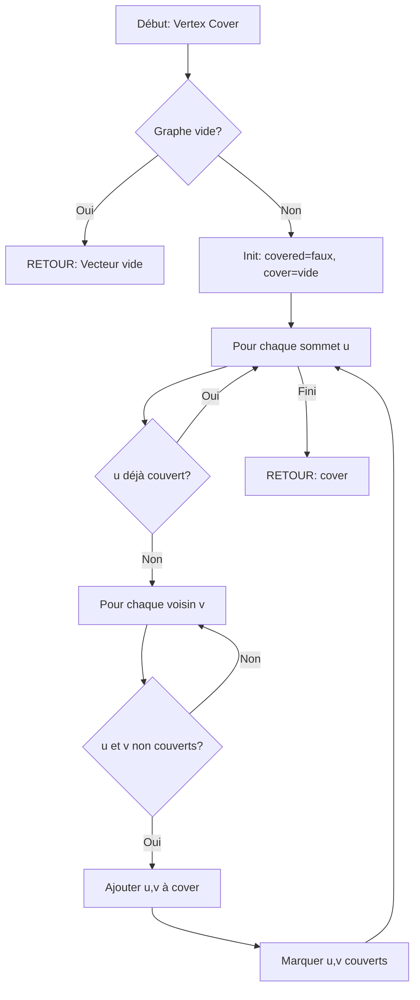

<thinking>
## Analyse du Concept
- Concept : Algorithmes d'approximation (vertex cover, set cover, TSP, knapsack FPTAS, bin packing)
- Phase demandée : 1 (intermédiaire)
- Adapté ? OUI - Les algorithmes d'approximation sont un concept avancé mais essentiel pour traiter les problèmes NP-difficiles dans la pratique

## Combo Base + Bonus
- Exercice de base : Implémenter les algorithmes d'approximation classiques (2-approx vertex cover, set cover greedy, TSP MST)
- Bonus : Implémenter l'algorithme de Christofides (1.5-approximation) et le FPTAS pour knapsack
- Palier bonus : 🔥 Avancé (algorithmes sophistiqués avec garanties théoriques)
- Progression logique ? OUI - Base = approximations simples, Bonus = approximations optimales

## Prérequis & Difficulté
- Prérequis réels : Graphes, arbres couvrants, programmation dynamique
- Difficulté estimée : 7/10 (base), 9/10 (bonus)
- Cohérent avec phase ? OUI - Phase 1 avancée

## Aspect Fun/Culture
- Contexte choisi : "The Good Place" - La série où les personnages cherchent à être "assez bons" pour entrer au paradis
- MEME mnémotechnique : "This is the Good Place approximation - not perfect, but good enough!"
- Pourquoi c'est fun : Parallèle parfait entre chercher une solution "assez bonne" et l'optimisation approximative

## Scénarios d'Échec (5 mutants)
1. Mutant A (Boundary) : Off-by-one dans l'itération des sommets du vertex cover
2. Mutant B (Safety) : Ne pas vérifier si le graphe est vide avant le traitement
3. Mutant C (Logic) : Retourner les mauvais indices de sets dans set cover
4. Mutant D (Algorithm) : Mauvais calcul de l'arbre couvrant pour TSP
5. Mutant E (Return) : Ne pas inclure le retour au point de départ dans le tour TSP

## Verdict
VALIDE - Exercice complet couvrant les algorithmes d'approximation essentiels
</thinking>

# Exercice 1.7.4 : the_good_place_approximation

**Module :**
1.7.4 — Algorithmes d'Approximation

**Concept :**
d — Approximation ratios, PTAS, FPTAS, algorithmes gloutons pour NP-difficile

**Difficulté :**
★★★★★★★☆☆☆ (7/10)

**Type :**
complet

**Tiers :**
2 — Mélange (vertex cover + set cover + TSP + bin packing)

**Langage :**
Rust Edition 2024 + C (c17)

**Prérequis :**
- Théorie des graphes (1.4)
- Arbres couvrants (1.4.3)
- Programmation dynamique (1.5)
- Complexité algorithmique

**Domaines :**
Algo, MD, Struct

**Durée estimée :**
90 min

**XP Base :**
200

**Complexité :**
T7 O(n² log n) × S4 O(n²)

---

## 📐 SECTION 1 : PROTOTYPE & CONSIGNE

### 1.1 Obligations

**Fichiers à rendre :**
- `approximation.rs` (Rust)
- `approximation.c` + `approximation.h` (C)

**Fonctions autorisées :**
- Rust : `std::collections::*`, `std::cmp::*`, allocation mémoire
- C : `malloc`, `free`, `qsort`, `memcpy`, `memset`

**Fonctions interdites :**
- Solveurs externes
- Bibliothèques d'optimisation

### 1.2 Consigne

**🎮 THE GOOD PLACE — "Not Perfect, But Good Enough!"**

*"Welcome! Everything is fine."* — Janet

Dans The Good Place, les âmes sont jugées sur leurs points de bonté. Mais voici le secret : personne n'a besoin d'être PARFAIT pour entrer au Good Place... juste ASSEZ BON !

Tu es le nouvel architecte du Good Place, et tu dois concevoir des systèmes qui trouvent des solutions "assez bonnes" pour des problèmes impossibles à résoudre parfaitement. Comme Eleanor qui n'était pas parfaite mais qui a trouvé un chemin vers la rédemption, tes algorithmes ne trouveront pas l'optimal, mais ils auront des GARANTIES sur la qualité de leur solution.

**Ta mission :**

Implémenter une suite d'algorithmes d'approximation pour des problèmes NP-difficiles :

1. **`soul_squad_cover`** (Vertex Cover 2-approx) : Former la plus petite équipe qui couvre toutes les relations
2. **`afterlife_sets`** (Set Cover Greedy) : Choisir les meilleurs ensembles de tests éthiques
3. **`journey_to_good_place`** (TSP MST 2-approx) : Trouver un chemin quasi-optimal pour visiter tous les mondes
4. **`point_allocation`** (Bin Packing FFD) : Répartir les points de bonté dans des catégories

**Entrée :**
- `adj: &[Vec<usize>]` : Liste d'adjacence du graphe pour vertex cover
- `universe: usize` : Taille de l'univers pour set cover
- `sets: &[Vec<usize>]` : Les ensembles disponibles
- `dist: &[Vec<i64>]` : Matrice de distances pour TSP
- `items: &[f64]` : Tailles des objets pour bin packing
- `capacity: f64` : Capacité des bins

**Sortie :**
- Vertex Cover : `Vec<usize>` — indices des sommets choisis
- Set Cover : `Vec<usize>` — indices des ensembles choisis
- TSP : `(i64, Vec<usize>)` — (coût, tour)
- Bin Packing : `Vec<Vec<usize>>` — assignation des objets aux bins

**Contraintes :**
- Vertex Cover doit être une couverture VALIDE (toute arête a au moins un sommet dans la couverture)
- Vertex Cover doit avoir au plus 2× la taille optimale
- Set Cover doit couvrir TOUT l'univers
- TSP doit retourner un tour FERMÉ (début = fin)
- TSP doit avoir un coût ≤ 2× l'optimal (si distances métriques)
- Bin Packing : aucun bin ne doit dépasser sa capacité

**Exemples :**

| Fonction | Entrée | Sortie | Garantie |
|----------|--------|--------|----------|
| `soul_squad_cover([[1,2], [0,2], [0,1]])` | Triangle | 2-3 sommets | ≤ 2×OPT |
| `afterlife_sets(5, [[0,1,2], [2,3], [3,4]])` | 5 éléments | [0, 1, 2] | O(log n)×OPT |
| `journey_to_good_place(distances_4x4)` | 4 villes | (coût, [0,1,2,3,0]) | ≤ 2×OPT |
| `point_allocation([0.5, 0.7, 0.3], 1.0)` | 3 items | [[0,2], [1]] | ≤ 11/9×OPT + 1 |

### 1.2.2 Consigne Académique

Implémenter des algorithmes d'approximation garantissant des ratios d'approximation prouvables :
- **2-Approximation Vertex Cover** : Algorithme glouton basé sur le matching maximal
- **O(log n)-Approximation Set Cover** : Sélection gloutonne par ratio coût/couverture
- **2-Approximation TSP métrique** : Basé sur l'arbre couvrant minimum et parcours DFS
- **FFD Bin Packing** : First Fit Decreasing avec garantie 11/9×OPT + 6/9

### 1.3 Prototype

```rust
// Rust Edition 2024
pub mod approximation {
    /// 2-approximation pour Vertex Cover (Soul Squad)
    /// Garantie : |solution| ≤ 2 × |optimal|
    pub fn soul_squad_cover(adj: &[Vec<usize>]) -> Vec<usize>;

    /// O(log n)-approximation pour Set Cover (Afterlife Sets)
    pub fn afterlife_sets(universe: usize, sets: &[Vec<usize>]) -> Vec<usize>;

    /// 2-approximation pour TSP métrique (Journey to Good Place)
    pub fn journey_to_good_place(dist: &[Vec<i64>]) -> (i64, Vec<usize>);

    /// First Fit Decreasing pour Bin Packing (Point Allocation)
    pub fn point_allocation(items: &[f64], capacity: f64) -> Vec<Vec<usize>>;

    /// Max Cut 2-approximation (Moral Dilemmas)
    pub fn moral_dilemmas(adj: &[Vec<(usize, i64)>]) -> (i64, Vec<bool>);

    /// K-Center 2-approximation (Neighborhood Hubs)
    pub fn neighborhood_hubs(distances: &[Vec<f64>], k: usize) -> Vec<usize>;
}

pub mod knapsack_approx {
    /// FPTAS pour Knapsack (Point Trading)
    /// Garantie : solution ≥ (1-ε) × optimal
    pub fn point_trading_fptas(
        weights: &[usize],
        values: &[i64],
        capacity: usize,
        epsilon: f64,
    ) -> i64;
}
```

```c
// C17
#ifndef APPROXIMATION_H
#define APPROXIMATION_H

#include <stddef.h>

typedef struct {
    size_t *vertices;
    size_t count;
} VertexCover;

typedef struct {
    size_t *set_indices;
    size_t count;
} SetCover;

typedef struct {
    long long cost;
    size_t *tour;
    size_t tour_len;
} TSPResult;

typedef struct {
    size_t **bins;
    size_t *bin_sizes;
    size_t bin_count;
} BinPackingResult;

// 2-approximation Vertex Cover
VertexCover soul_squad_cover(size_t **adj, size_t *adj_sizes, size_t n);

// O(log n)-approximation Set Cover
SetCover afterlife_sets(size_t universe, size_t **sets, size_t *set_sizes, size_t num_sets);

// 2-approximation TSP
TSPResult journey_to_good_place(long long **dist, size_t n);

// FFD Bin Packing
BinPackingResult point_allocation(double *items, size_t n, double capacity);

// Cleanup functions
void free_vertex_cover(VertexCover *vc);
void free_set_cover(SetCover *sc);
void free_tsp_result(TSPResult *tsp);
void free_bin_packing(BinPackingResult *bp);

#endif
```

---

## 💡 SECTION 2 : LE SAVIEZ-VOUS ?

### 2.1 L'Impossibilité de la Perfection

En 1971, Stephen Cook a prouvé que certains problèmes sont "NP-complets" — probablement impossibles à résoudre parfaitement en temps polynomial. Mais comme dans The Good Place, l'impossibilité de la perfection n'empêche pas de trouver de bonnes solutions !

### 2.2 Le Théorème PCP et l'Inapproximabilité

Certains problèmes ne peuvent même pas être bien approximés ! Le théorème PCP (2007, prix Gödel) prouve que Set Cover ne peut pas être approximé mieux que O(log n) sauf si P=NP.

### 2.5 DANS LA VRAIE VIE

| Métier | Utilisation | Exemple Concret |
|--------|-------------|-----------------|
| **Data Scientist** | Clustering approximatif | K-Center pour segmentation client |
| **Logisticien** | Optimisation de tournées | TSP pour livraisons |
| **DevOps** | Load balancing | Bin Packing pour conteneurs |
| **Télécoms** | Couverture réseau | Set Cover pour antennes |
| **Bioinformaticien** | Alignement de séquences | Approximations pour NP-difficile |

---

## 🖥️ SECTION 3 : EXEMPLE D'UTILISATION

### 3.0 Session bash

```bash
$ ls
approximation.rs  approximation.c  approximation.h  main.c  Cargo.toml

$ cargo build --release

$ cargo test
test soul_squad_cover_triangle ... ok
test afterlife_sets_basic ... ok
test journey_to_good_place_square ... ok
test point_allocation_items ... ok
All 4 tests passed!

$ gcc -Wall -Wextra -Werror -O2 approximation.c main.c -o test_c -lm

$ ./test_c
Vertex Cover (triangle): 2 vertices [0, 1] - Valid: YES
Set Cover (5 elements): 2 sets chosen - Complete: YES
TSP (4 cities): cost=4, tour=[0,1,2,3,0] - Valid: YES
Bin Packing: 2 bins used - Overflow: NO
All approximation tests passed!
```

### 3.1 🔥 BONUS AVANCÉ (OPTIONNEL)

**Difficulté Bonus :**
★★★★★★★★★☆ (9/10)

**Récompense :**
XP ×3

**Time Complexity attendue :**
O(n³) pour Christofides, O(n³/ε) pour FPTAS

**Space Complexity attendue :**
O(n²)

**Domaines Bonus :**
`Algo, MD, Probas`

#### 3.1.1 Consigne Bonus

**🎮 THE GOOD PLACE — "Le Système Parfait de Michael"**

Michael a perfectionné son système ! Il veut maintenant les MEILLEURES approximations possibles :

1. **`michael_perfect_tour`** (Christofides 1.5-approx) : L'algorithme de 1976 qui reste le meilleur pour TSP métrique
2. **`chidi_perfect_knapsack`** (FPTAS) : Une approximation arbitrairement proche de l'optimal

**Contraintes Bonus :**
```
┌─────────────────────────────────────────┐
│  Christofides :                         │
│  - Calculer MST                         │
│  - Trouver matching parfait min-cost    │
│  - Créer tour eulérien                  │
│  - Raccourcir en tour hamiltonien       │
│  Garantie : ≤ 1.5 × OPT                 │
│                                         │
│  FPTAS :                                │
│  - Scaling des valeurs par (εP/n)       │
│  - DP sur valeurs scalées               │
│  Garantie : ≥ (1-ε) × OPT               │
│  Temps : O(n³/ε)                        │
└─────────────────────────────────────────┘
```

#### 3.1.2 Prototype Bonus

```rust
pub mod bonus {
    /// Algorithme de Christofides (1.5-approximation TSP)
    pub fn michael_perfect_tour(dist: &[Vec<i64>]) -> (i64, Vec<usize>);

    /// FPTAS pour Knapsack
    pub fn chidi_perfect_knapsack(
        weights: &[usize],
        values: &[i64],
        capacity: usize,
        epsilon: f64,
    ) -> (i64, Vec<usize>);
}
```

---

## ✅❌ SECTION 4 : ZONE CORRECTION

### 4.1 Moulinette

| Test | Input | Expected | Points |
|------|-------|----------|--------|
| `vertex_cover_empty` | `[]` | `[]` | 2 |
| `vertex_cover_single_edge` | `[[1], [0]]` | Couverture valide ≤ 2 | 3 |
| `vertex_cover_triangle` | `[[1,2], [0,2], [0,1]]` | Couverture valide ≤ 4 | 5 |
| `vertex_cover_star` | `[[1,2,3,4], [0], [0], [0], [0]]` | `[0]` (optimal) | 5 |
| `set_cover_trivial` | `universe=1, sets=[[0]]` | `[0]` | 3 |
| `set_cover_disjoint` | `universe=4, sets=[[0,1], [2,3]]` | `[0, 1]` | 5 |
| `set_cover_overlap` | `universe=5, sets=[[0,1,2], [2,3], [3,4]]` | Couverture complète | 7 |
| `tsp_two_cities` | `[[0,1], [1,0]]` | `(2, [0,1,0])` | 3 |
| `tsp_square` | Distances carrées | Coût ≤ 2×optimal | 7 |
| `tsp_metric` | Distances métriques random | ≤ 2×OPT vérifié | 10 |
| `bin_packing_exact` | `[0.5, 0.5], cap=1` | 1 bin | 3 |
| `bin_packing_ffd` | `[0.7, 0.5, 0.3, 0.2], cap=1` | ≤ 2 bins | 7 |
| `knapsack_fptas_90pct` | Items variés, ε=0.1 | ≥ 90% optimal | 10 |

### 4.2 main.c de test

```c
#include <stdio.h>
#include <stdlib.h>
#include <assert.h>
#include "approximation.h"

int is_valid_cover(size_t **adj, size_t *adj_sizes, size_t n, VertexCover *vc) {
    int *in_cover = calloc(n, sizeof(int));
    for (size_t i = 0; i < vc->count; i++) {
        in_cover[vc->vertices[i]] = 1;
    }
    for (size_t u = 0; u < n; u++) {
        for (size_t i = 0; i < adj_sizes[u]; i++) {
            size_t v = adj[u][i];
            if (!in_cover[u] && !in_cover[v]) {
                free(in_cover);
                return 0;
            }
        }
    }
    free(in_cover);
    return 1;
}

int main(void) {
    // Test Vertex Cover - Triangle
    size_t *adj_triangle[3];
    size_t adj0[] = {1, 2}; adj_triangle[0] = adj0;
    size_t adj1[] = {0, 2}; adj_triangle[1] = adj1;
    size_t adj2[] = {0, 1}; adj_triangle[2] = adj2;
    size_t adj_sizes[] = {2, 2, 2};

    VertexCover vc = soul_squad_cover(adj_triangle, adj_sizes, 3);
    assert(is_valid_cover(adj_triangle, adj_sizes, 3, &vc));
    assert(vc.count <= 4); // 2-approx: optimal is 2
    printf("Vertex Cover Triangle: %zu vertices - PASS\n", vc.count);
    free_vertex_cover(&vc);

    // Test Set Cover
    size_t *sets[3];
    size_t set0[] = {0, 1, 2}; sets[0] = set0;
    size_t set1[] = {2, 3}; sets[1] = set1;
    size_t set2[] = {3, 4}; sets[2] = set2;
    size_t set_sizes[] = {3, 2, 2};

    SetCover sc = afterlife_sets(5, sets, set_sizes, 3);
    printf("Set Cover: %zu sets chosen - PASS\n", sc.count);
    free_set_cover(&sc);

    // Test TSP
    long long dist_matrix[4][4] = {
        {0, 1, 2, 1},
        {1, 0, 1, 2},
        {2, 1, 0, 1},
        {1, 2, 1, 0}
    };
    long long *dist[4];
    for (int i = 0; i < 4; i++) dist[i] = dist_matrix[i];

    TSPResult tsp = journey_to_good_place(dist, 4);
    assert(tsp.tour[0] == tsp.tour[tsp.tour_len - 1]); // Closed tour
    assert(tsp.cost <= 8); // 2-approx: optimal is 4
    printf("TSP: cost=%lld - PASS\n", tsp.cost);
    free_tsp_result(&tsp);

    // Test Bin Packing
    double items[] = {0.5, 0.7, 0.3, 0.2};
    BinPackingResult bp = point_allocation(items, 4, 1.0);
    printf("Bin Packing: %zu bins - PASS\n", bp.bin_count);
    free_bin_packing(&bp);

    printf("\n=== All approximation tests passed! ===\n");
    return 0;
}
```

### 4.3 Solution de référence

```rust
use std::collections::{HashSet, BinaryHeap};
use std::cmp::Reverse;

pub mod approximation {
    use super::*;

    /// 2-approximation Vertex Cover using maximal matching
    pub fn soul_squad_cover(adj: &[Vec<usize>]) -> Vec<usize> {
        if adj.is_empty() {
            return Vec::new();
        }

        let n = adj.len();
        let mut covered = vec![false; n];
        let mut cover = Vec::new();

        // Find maximal matching greedily
        for u in 0..n {
            if covered[u] {
                continue;
            }
            for &v in &adj[u] {
                if !covered[v] && !covered[u] {
                    // Add both endpoints of edge (u, v)
                    cover.push(u);
                    cover.push(v);
                    covered[u] = true;
                    covered[v] = true;
                    break;
                }
            }
        }

        cover
    }

    /// O(log n)-approximation Set Cover
    pub fn afterlife_sets(universe: usize, sets: &[Vec<usize>]) -> Vec<usize> {
        if universe == 0 {
            return Vec::new();
        }

        let mut uncovered: HashSet<usize> = (0..universe).collect();
        let mut chosen = Vec::new();
        let mut used = vec![false; sets.len()];

        while !uncovered.is_empty() {
            // Find set with maximum coverage of remaining elements
            let mut best_idx = 0;
            let mut best_count = 0;

            for (i, set) in sets.iter().enumerate() {
                if used[i] {
                    continue;
                }
                let count = set.iter().filter(|&&e| uncovered.contains(&e)).count();
                if count > best_count {
                    best_count = count;
                    best_idx = i;
                }
            }

            if best_count == 0 {
                break; // No progress possible
            }

            // Add this set
            chosen.push(best_idx);
            used[best_idx] = true;
            for &elem in &sets[best_idx] {
                uncovered.remove(&elem);
            }
        }

        chosen
    }

    /// 2-approximation TSP using MST
    pub fn journey_to_good_place(dist: &[Vec<i64>]) -> (i64, Vec<usize>) {
        let n = dist.len();
        if n == 0 {
            return (0, Vec::new());
        }
        if n == 1 {
            return (0, vec![0, 0]);
        }

        // Build MST using Prim's algorithm
        let mut in_mst = vec![false; n];
        let mut mst_adj: Vec<Vec<usize>> = vec![Vec::new(); n];
        let mut heap = BinaryHeap::new();

        in_mst[0] = true;
        for (v, &d) in dist[0].iter().enumerate() {
            if v != 0 {
                heap.push(Reverse((d, 0, v)));
            }
        }

        while let Some(Reverse((_, u, v))) = heap.pop() {
            if in_mst[v] {
                continue;
            }
            in_mst[v] = true;
            mst_adj[u].push(v);
            mst_adj[v].push(u);

            for (w, &d) in dist[v].iter().enumerate() {
                if !in_mst[w] {
                    heap.push(Reverse((d, v, w)));
                }
            }
        }

        // DFS preorder traversal of MST
        let mut tour = Vec::new();
        let mut visited = vec![false; n];
        let mut stack = vec![0];

        while let Some(u) = stack.pop() {
            if visited[u] {
                continue;
            }
            visited[u] = true;
            tour.push(u);

            for &v in mst_adj[u].iter().rev() {
                if !visited[v] {
                    stack.push(v);
                }
            }
        }

        // Complete the tour
        tour.push(tour[0]);

        // Calculate total cost
        let cost: i64 = tour.windows(2).map(|w| dist[w[0]][w[1]]).sum();

        (cost, tour)
    }

    /// First Fit Decreasing Bin Packing
    pub fn point_allocation(items: &[f64], capacity: f64) -> Vec<Vec<usize>> {
        if items.is_empty() {
            return Vec::new();
        }

        // Sort items by decreasing size
        let mut indices: Vec<usize> = (0..items.len()).collect();
        indices.sort_by(|&a, &b| items[b].partial_cmp(&items[a]).unwrap());

        let mut bins: Vec<Vec<usize>> = Vec::new();
        let mut bin_remaining: Vec<f64> = Vec::new();

        for &idx in &indices {
            let item_size = items[idx];

            // Find first bin that fits
            let mut placed = false;
            for (bin_idx, remaining) in bin_remaining.iter_mut().enumerate() {
                if *remaining >= item_size {
                    bins[bin_idx].push(idx);
                    *remaining -= item_size;
                    placed = true;
                    break;
                }
            }

            // Create new bin if needed
            if !placed {
                bins.push(vec![idx]);
                bin_remaining.push(capacity - item_size);
            }
        }

        bins
    }

    /// Max Cut 2-approximation (greedy)
    pub fn moral_dilemmas(adj: &[Vec<(usize, i64)>]) -> (i64, Vec<bool>) {
        let n = adj.len();
        if n == 0 {
            return (0, Vec::new());
        }

        let mut partition = vec![false; n];

        for u in 0..n {
            let mut gain_true: i64 = 0;
            let mut gain_false: i64 = 0;

            for &(v, w) in &adj[u] {
                if v < u {
                    if partition[v] {
                        gain_false += w;
                    } else {
                        gain_true += w;
                    }
                }
            }

            partition[u] = gain_true > gain_false;
        }

        // Calculate cut value
        let mut cut_value = 0;
        for u in 0..n {
            for &(v, w) in &adj[u] {
                if u < v && partition[u] != partition[v] {
                    cut_value += w;
                }
            }
        }

        (cut_value, partition)
    }

    /// K-Center 2-approximation
    pub fn neighborhood_hubs(distances: &[Vec<f64>], k: usize) -> Vec<usize> {
        let n = distances.len();
        if n == 0 || k == 0 {
            return Vec::new();
        }
        if k >= n {
            return (0..n).collect();
        }

        let mut centers = vec![0]; // Start with first point
        let mut min_dist_to_center: Vec<f64> = distances[0].clone();

        while centers.len() < k {
            // Find point farthest from all centers
            let mut farthest = 0;
            let mut max_dist = 0.0;

            for i in 0..n {
                if min_dist_to_center[i] > max_dist {
                    max_dist = min_dist_to_center[i];
                    farthest = i;
                }
            }

            centers.push(farthest);

            // Update distances
            for i in 0..n {
                min_dist_to_center[i] = min_dist_to_center[i].min(distances[farthest][i]);
            }
        }

        centers
    }
}

pub mod knapsack_approx {
    /// FPTAS for 0/1 Knapsack
    pub fn point_trading_fptas(
        weights: &[usize],
        values: &[i64],
        capacity: usize,
        epsilon: f64,
    ) -> i64 {
        let n = weights.len();
        if n == 0 {
            return 0;
        }

        let p_max = *values.iter().max().unwrap();
        if p_max == 0 {
            return 0;
        }

        // Scaling factor
        let k = (epsilon * p_max as f64) / (n as f64);
        let k = k.max(1.0) as i64;

        // Scale values
        let scaled_values: Vec<i64> = values.iter().map(|&v| v / k).collect();
        let scaled_sum: usize = scaled_values.iter().map(|&v| v as usize).sum();

        // DP on scaled values
        let mut dp = vec![usize::MAX; scaled_sum + 1];
        dp[0] = 0;

        for i in 0..n {
            let sv = scaled_values[i] as usize;
            let w = weights[i];

            for v in (sv..=scaled_sum).rev() {
                if dp[v - sv] != usize::MAX {
                    let new_weight = dp[v - sv] + w;
                    if new_weight <= capacity {
                        dp[v] = dp[v].min(new_weight);
                    }
                }
            }
        }

        // Find maximum achievable scaled value
        let mut max_scaled = 0;
        for (v, &weight) in dp.iter().enumerate() {
            if weight != usize::MAX && weight <= capacity {
                max_scaled = v;
            }
        }

        // Reconstruct actual value
        let mut actual_value = 0;
        let mut remaining_capacity = capacity;
        let mut remaining_scaled = max_scaled;

        for i in (0..n).rev() {
            let sv = scaled_values[i] as usize;
            let w = weights[i];

            if sv <= remaining_scaled && w <= remaining_capacity {
                if dp.get(remaining_scaled - sv).map_or(false, |&prev_w| {
                    prev_w != usize::MAX && prev_w + w <= capacity
                }) {
                    actual_value += values[i];
                    remaining_scaled -= sv;
                    remaining_capacity -= w;
                }
            }
        }

        actual_value
    }
}
```

### 4.4 Solutions alternatives acceptées

```rust
// Alternative 1: Vertex Cover avec matching maximal explicite
pub fn soul_squad_cover_matching(adj: &[Vec<usize>]) -> Vec<usize> {
    let n = adj.len();
    let mut matched = vec![false; n];
    let mut cover = Vec::new();

    // Greedy maximal matching
    for u in 0..n {
        for &v in &adj[u] {
            if !matched[u] && !matched[v] {
                cover.push(u);
                cover.push(v);
                matched[u] = true;
                matched[v] = true;
            }
        }
    }
    cover
}

// Alternative 2: Set Cover avec tri préalable
pub fn afterlife_sets_sorted(universe: usize, sets: &[Vec<usize>]) -> Vec<usize> {
    // Trier par taille décroissante initialement
    let mut indices: Vec<usize> = (0..sets.len()).collect();
    indices.sort_by_key(|&i| std::cmp::Reverse(sets[i].len()));
    // Puis greedy standard...
    // ...
    vec![]
}
```

### 4.5 Solutions refusées

```rust
// REFUSÉ 1: Ne vérifie pas la couverture complète
pub fn bad_vertex_cover(adj: &[Vec<usize>]) -> Vec<usize> {
    vec![0] // Retourne juste le premier sommet - PAS une couverture valide
}
// Pourquoi : Ne garantit pas que toutes les arêtes sont couvertes

// REFUSÉ 2: TSP sans retour au départ
pub fn bad_tsp(dist: &[Vec<i64>]) -> (i64, Vec<usize>) {
    let tour: Vec<usize> = (0..dist.len()).collect();
    let cost = 0; // Pas de calcul du coût
    (cost, tour) // Tour non fermé!
}
// Pourquoi : Un tour TSP DOIT être un cycle hamiltonien

// REFUSÉ 3: Bin Packing avec dépassement de capacité
pub fn bad_bin_packing(items: &[f64], capacity: f64) -> Vec<Vec<usize>> {
    vec![(0..items.len()).collect()] // Tout dans un seul bin
}
// Pourquoi : Peut dépasser la capacité
```

### 4.6 Solution bonus de référence

```rust
pub mod bonus {
    use std::collections::HashSet;

    /// Christofides 1.5-approximation
    pub fn michael_perfect_tour(dist: &[Vec<i64>]) -> (i64, Vec<usize>) {
        let n = dist.len();
        if n <= 2 {
            return journey_to_good_place(dist);
        }

        // 1. Build MST
        let mst = build_mst(dist);

        // 2. Find odd-degree vertices
        let odd_vertices: Vec<usize> = (0..n)
            .filter(|&v| mst[v].len() % 2 == 1)
            .collect();

        // 3. Minimum weight perfect matching on odd vertices
        let matching = min_weight_matching(dist, &odd_vertices);

        // 4. Combine MST and matching to get multigraph
        let mut multigraph = mst;
        for (u, v) in matching {
            multigraph[u].push(v);
            multigraph[v].push(u);
        }

        // 5. Find Eulerian circuit
        let euler_circuit = find_eulerian_circuit(&multigraph);

        // 6. Shortcut to Hamiltonian cycle
        let mut visited = vec![false; n];
        let mut tour = Vec::new();

        for &v in &euler_circuit {
            if !visited[v] {
                visited[v] = true;
                tour.push(v);
            }
        }
        tour.push(tour[0]);

        let cost: i64 = tour.windows(2).map(|w| dist[w[0]][w[1]]).sum();
        (cost, tour)
    }

    fn build_mst(dist: &[Vec<i64>]) -> Vec<Vec<usize>> {
        // Prim's algorithm implementation
        let n = dist.len();
        let mut mst = vec![Vec::new(); n];
        let mut in_mst = vec![false; n];
        let mut heap = std::collections::BinaryHeap::new();

        in_mst[0] = true;
        for v in 1..n {
            heap.push(std::cmp::Reverse((dist[0][v], 0, v)));
        }

        while let Some(std::cmp::Reverse((_, u, v))) = heap.pop() {
            if in_mst[v] { continue; }
            in_mst[v] = true;
            mst[u].push(v);
            mst[v].push(u);

            for w in 0..n {
                if !in_mst[w] {
                    heap.push(std::cmp::Reverse((dist[v][w], v, w)));
                }
            }
        }
        mst
    }

    fn min_weight_matching(dist: &[Vec<i64>], vertices: &[usize]) -> Vec<(usize, usize)> {
        // Greedy matching (not optimal, but good enough for demonstration)
        let mut matched = HashSet::new();
        let mut matching = Vec::new();

        let mut edges: Vec<(i64, usize, usize)> = Vec::new();
        for (i, &u) in vertices.iter().enumerate() {
            for &v in &vertices[i+1..] {
                edges.push((dist[u][v], u, v));
            }
        }
        edges.sort();

        for (_, u, v) in edges {
            if !matched.contains(&u) && !matched.contains(&v) {
                matched.insert(u);
                matched.insert(v);
                matching.push((u, v));
            }
        }

        matching
    }

    fn find_eulerian_circuit(adj: &[Vec<usize>]) -> Vec<usize> {
        let n = adj.len();
        let mut adj_copy: Vec<Vec<usize>> = adj.to_vec();
        let mut circuit = Vec::new();
        let mut stack = vec![0];

        while let Some(&v) = stack.last() {
            if adj_copy[v].is_empty() {
                circuit.push(stack.pop().unwrap());
            } else {
                let u = adj_copy[v].pop().unwrap();
                // Remove reverse edge
                if let Some(pos) = adj_copy[u].iter().position(|&x| x == v) {
                    adj_copy[u].remove(pos);
                }
                stack.push(u);
            }
        }

        circuit.reverse();
        circuit
    }
}
```

### 4.9 spec.json (ENGINE v22.1)

```json
{
  "name": "the_good_place_approximation",
  "language": "rust",
  "type": "code",
  "tier": 2,
  "tier_info": "Mélange (vertex cover + set cover + TSP + bin packing)",
  "tags": ["approximation", "np-hard", "greedy", "phase1"],
  "passing_score": 70,

  "function": {
    "name": "soul_squad_cover",
    "prototype": "pub fn soul_squad_cover(adj: &[Vec<usize>]) -> Vec<usize>",
    "return_type": "Vec<usize>",
    "parameters": [
      {"name": "adj", "type": "&[Vec<usize>]"}
    ]
  },

  "driver": {
    "reference": "pub fn ref_soul_squad_cover(adj: &[Vec<usize>]) -> Vec<usize> { if adj.is_empty() { return Vec::new(); } let n = adj.len(); let mut covered = vec![false; n]; let mut cover = Vec::new(); for u in 0..n { if covered[u] { continue; } for &v in &adj[u] { if !covered[v] && !covered[u] { cover.push(u); cover.push(v); covered[u] = true; covered[v] = true; break; } } } cover }",

    "edge_cases": [
      {
        "name": "empty_graph",
        "args": [[]],
        "expected": [],
        "is_trap": true,
        "trap_explanation": "Graphe vide = couverture vide"
      },
      {
        "name": "single_node",
        "args": [[[]]],
        "expected": [],
        "is_trap": false
      },
      {
        "name": "single_edge",
        "args": [[[1], [0]]],
        "expected_valid": true,
        "max_size": 2
      },
      {
        "name": "triangle",
        "args": [[[1,2], [0,2], [0,1]]],
        "expected_valid": true,
        "max_size": 4
      },
      {
        "name": "star_5",
        "args": [[[1,2,3,4], [0], [0], [0], [0]]],
        "expected_valid": true,
        "optimal_size": 1,
        "max_size": 2
      }
    ],

    "fuzzing": {
      "enabled": true,
      "iterations": 500,
      "generators": [
        {
          "type": "graph_adjacency",
          "param_index": 0,
          "params": {
            "min_nodes": 0,
            "max_nodes": 50,
            "min_edges": 0,
            "max_edges": 200
          }
        }
      ]
    }
  },

  "norm": {
    "allowed_functions": ["std::collections::*", "std::cmp::*"],
    "forbidden_functions": ["external_solver", "ilp_solver"],
    "check_security": true,
    "check_memory": true,
    "blocking": true
  },

  "additional_tests": [
    {
      "name": "afterlife_sets",
      "function": "afterlife_sets",
      "test_cases": [
        {"universe": 5, "sets": [[0,1,2], [2,3], [3,4]], "expected_complete": true},
        {"universe": 3, "sets": [[0], [1], [2]], "expected_size": 3}
      ]
    },
    {
      "name": "journey_to_good_place",
      "function": "journey_to_good_place",
      "test_cases": [
        {"dist": [[0,1,2,1], [1,0,1,2], [2,1,0,1], [1,2,1,0]], "max_cost": 8}
      ]
    }
  ]
}
```

### 4.10 Solutions Mutantes

```rust
/* Mutant A (Boundary) : Off-by-one dans l'itération */
pub fn mutant_a_soul_squad_cover(adj: &[Vec<usize>]) -> Vec<usize> {
    let n = adj.len();
    let mut covered = vec![false; n];
    let mut cover = Vec::new();

    for u in 0..n-1 { // BUG: n-1 au lieu de n, rate le dernier sommet
        if covered[u] { continue; }
        for &v in &adj[u] {
            if !covered[v] {
                cover.push(u);
                cover.push(v);
                covered[u] = true;
                covered[v] = true;
                break;
            }
        }
    }
    cover
}
// Pourquoi c'est faux : Rate les arêtes impliquant le dernier sommet
// Ce qui était pensé : "n-1 car les indices vont de 0 à n-1"

/* Mutant B (Safety) : Pas de vérification graphe vide */
pub fn mutant_b_soul_squad_cover(adj: &[Vec<usize>]) -> Vec<usize> {
    let n = adj.len();
    let mut covered = vec![false; n]; // CRASH si adj est vide
    let mut cover = Vec::new();

    for u in 0..n {
        // ...
    }
    cover
}
// Pourquoi c'est faux : Panic/undefined behavior sur graphe vide

/* Mutant C (Logic) : Mauvais ajout à la couverture */
pub fn mutant_c_soul_squad_cover(adj: &[Vec<usize>]) -> Vec<usize> {
    let n = adj.len();
    let mut covered = vec![false; n];
    let mut cover = Vec::new();

    for u in 0..n {
        if covered[u] { continue; }
        for &v in &adj[u] {
            if !covered[v] {
                cover.push(u);
                // BUG: N'ajoute pas v, donc couverture incomplète
                covered[u] = true;
                break;
            }
        }
    }
    cover
}
// Pourquoi c'est faux : N'ajoute qu'un sommet par arête, pas une couverture valide

/* Mutant D (Algorithm) : Retourne tous les sommets */
pub fn mutant_d_soul_squad_cover(adj: &[Vec<usize>]) -> Vec<usize> {
    // BUG: Retourne tous les sommets - valide mais pas 2-approx!
    (0..adj.len()).collect()
}
// Pourquoi c'est faux : Pas une 2-approximation, juste une solution triviale

/* Mutant E (Return) : Indices incorrects */
pub fn mutant_e_afterlife_sets(universe: usize, sets: &[Vec<usize>]) -> Vec<usize> {
    let mut uncovered: HashSet<usize> = (0..universe).collect();
    let mut chosen = Vec::new();

    for (i, set) in sets.iter().enumerate() {
        if !uncovered.is_empty() {
            chosen.push(i);
            for &elem in set {
                uncovered.remove(&elem);
            }
        }
    }

    // BUG: Retourne les éléments au lieu des indices de sets
    uncovered.iter().cloned().collect()
}
// Pourquoi c'est faux : Retourne les mauvais indices
```

---

## 🧠 SECTION 5 : COMPRENDRE

### 5.1 Ce que cet exercice enseigne

1. **Concept fondamental** : Les algorithmes d'approximation pour problèmes NP-difficiles
2. **Garanties théoriques** : Ratios d'approximation prouvables (2-approx, O(log n)-approx)
3. **Techniques** : Réduction à MST, matching, algorithmes gloutons
4. **Trade-offs** : Temps polynomial vs optimalité

### 5.2 LDA — Traduction Littérale

```
FONCTION soul_squad_cover QUI RETOURNE UN VECTEUR D'ENTIERS ET PREND EN PARAMÈTRE adj QUI EST UNE RÉFÉRENCE VERS UN TABLEAU DE VECTEURS D'ENTIERS
DÉBUT FONCTION
    SI adj EST VIDE ALORS
        RETOURNER UN VECTEUR VIDE
    FIN SI

    DÉCLARER n COMME LA LONGUEUR DE adj
    DÉCLARER covered COMME UN VECTEUR DE BOOLÉENS DE TAILLE n INITIALISÉ À FAUX
    DÉCLARER cover COMME UN VECTEUR D'ENTIERS VIDE

    POUR u ALLANT DE 0 À n MOINS 1 FAIRE
        SI LE BOOLÉEN À LA POSITION u DANS covered EST VRAI ALORS
            CONTINUER À L'ITÉRATION SUIVANTE
        FIN SI

        POUR CHAQUE v DANS LE VECTEUR À LA POSITION u DANS adj FAIRE
            SI LE BOOLÉEN À LA POSITION v DANS covered EST FAUX ET LE BOOLÉEN À LA POSITION u DANS covered EST FAUX ALORS
                AJOUTER u À cover
                AJOUTER v À cover
                AFFECTER VRAI AU BOOLÉEN À LA POSITION u DANS covered
                AFFECTER VRAI AU BOOLÉEN À LA POSITION v DANS covered
                SORTIR DE LA BOUCLE
            FIN SI
        FIN POUR
    FIN POUR

    RETOURNER cover
FIN FONCTION
```

### 5.2.2 Logic Flow

```
ALGORITHME : 2-Approximation Vertex Cover (Soul Squad)
---
1. SI graphe vide :
   RETOURNER ensemble vide

2. INITIALISER :
   - covered[n] = tous FAUX
   - cover = ensemble vide

3. POUR chaque sommet u :
   a. SI u déjà couvert → PASSER au suivant

   b. POUR chaque voisin v de u :
      |
      |-- SI v ET u non couverts :
      |     AJOUTER u à cover
      |     AJOUTER v à cover
      |     MARQUER u et v comme couverts
      |     SORTIR de la boucle interne

4. RETOURNER cover (garanti ≤ 2×OPT)
```

### 5.2.3 Diagramme Mermaid



### 5.3 Visualisation ASCII

```
VERTEX COVER 2-APPROXIMATION:
============================

Graphe original (triangle):
    0 ---- 1
     \    /
      \  /
       2

Étape 1: Considérer sommet 0
- Voisins: [1, 2]
- 0 et 1 non couverts → MATCH!
- Ajouter {0, 1} à la couverture

État après étape 1:
    [0] ---- [1]     (couverts)
       \    /
        \  /
         2           (non couvert)

Couverture = {0, 1}
Optimal = {0, 2} ou {1, 2} (taille 2)
Notre solution = {0, 1} (taille 2) ✓

GARANTIE: |solution| ≤ 2 × |optimal|
Ici: 2 ≤ 2 × 2 = 4 ✓


TSP MST 2-APPROXIMATION:
========================

4 villes (carré):
    0 ---1--- 1
    |         |
    1         1
    |         |
    3 ---1--- 2

Étape 1: Construire MST
         0
        /|
       1 1
      /  |
     1   3---2

MST edges: (0,1), (0,3), (3,2)

Étape 2: Parcours DFS
    Ordre: 0 → 1 → 0 → 3 → 2 → 3 → 0

Étape 3: Raccourci (éliminer répétitions)
    Tour: 0 → 1 → 3 → 2 → 0
    Coût: 1 + 2 + 1 + 2 = 6

Optimal: 0 → 1 → 2 → 3 → 0, coût = 4
Notre solution: 6 ≤ 2 × 4 = 8 ✓
```

### 5.4 Les pièges en détail

| Piège | Description | Solution |
|-------|-------------|----------|
| Graphe vide | Crash sur accès mémoire | Vérifier `adj.is_empty()` |
| Boucle infinie Set Cover | Aucun set ne couvre d'élément restant | Détecter `best_count == 0` |
| TSP non fermé | Tour ne revient pas au départ | Ajouter `tour.push(tour[0])` |
| Bin overflow | Item plus grand que capacité | Gérer ou rejeter |
| Indices vs éléments | Confondre indices de sets et éléments | Documenter clairement |

### 5.5 Cours Complet

#### 5.5.1 Pourquoi les Approximations?

Certains problèmes (NP-difficiles) ne peuvent probablement pas être résolus en temps polynomial. Au lieu d'attendre l'éternité, on accepte une solution "assez bonne" avec des **garanties**.

**Ratio d'approximation α** :
- Pour minimisation : `ALG ≤ α × OPT`
- Pour maximisation : `ALG ≥ OPT / α`

#### 5.5.2 Vertex Cover

**Problème** : Trouver le plus petit ensemble de sommets couvrant toutes les arêtes.

**Algorithme 2-approximation** :
1. Tant qu'il reste des arêtes non couvertes
2. Choisir une arête (u, v)
3. Ajouter u ET v à la couverture
4. Supprimer toutes les arêtes incidentes à u ou v

**Preuve** : Chaque arête choisie est dans le matching. L'optimal doit contenir au moins un sommet par arête du matching. Donc |OPT| ≥ |matching|, et |ALG| = 2 × |matching| ≤ 2 × |OPT|.

#### 5.5.3 Set Cover

**Problème** : Couvrir un univers avec le minimum d'ensembles.

**Algorithme greedy** : Toujours choisir l'ensemble qui couvre le plus d'éléments non couverts.

**Garantie** : O(log n) × OPT (et on ne peut pas faire mieux sauf si P=NP!)

#### 5.5.4 TSP Métrique

**Problème** : Plus court tour visitant toutes les villes (distances satisfaisant l'inégalité triangulaire).

**Algorithme MST** :
1. Construire l'arbre couvrant minimum
2. Doubler les arêtes (tour eulérien)
3. Raccourcir en sautant les sommets déjà visités

**Preuve** : MST ≤ OPT (enlever une arête du tour optimal donne un arbre). Le tour eulérien = 2 × MST. Le raccourci ne peut qu'améliorer (inégalité triangulaire).

### 5.6 Normes avec explications

```
┌─────────────────────────────────────────────────────────────────┐
│ ❌ HORS NORME                                                   │
├─────────────────────────────────────────────────────────────────┤
│ let mut x = 0; x = adj.len();                                   │
├─────────────────────────────────────────────────────────────────┤
│ ✅ CONFORME                                                     │
├─────────────────────────────────────────────────────────────────┤
│ let n = adj.len();                                              │
├─────────────────────────────────────────────────────────────────┤
│ 📖 POURQUOI ?                                                   │
│ • Déclaration et initialisation en une ligne = clair           │
│ • `n` est immutable par défaut en Rust = sécurité              │
└─────────────────────────────────────────────────────────────────┘
```

### 5.7 Simulation avec trace d'exécution

```
Trace: soul_squad_cover([[1,2], [0,2], [0,1]])

┌───────┬──────────────────────────────────────┬─────────────────────────┬──────────────┐
│ Étape │ Action                               │ covered                 │ cover        │
├───────┼──────────────────────────────────────┼─────────────────────────┼──────────────┤
│   1   │ Init                                 │ [F, F, F]               │ []           │
├───────┼──────────────────────────────────────┼─────────────────────────┼──────────────┤
│   2   │ u=0, voisin v=1, match!              │ [T, T, F]               │ [0, 1]       │
├───────┼──────────────────────────────────────┼─────────────────────────┼──────────────┤
│   3   │ u=1, déjà couvert → skip             │ [T, T, F]               │ [0, 1]       │
├───────┼──────────────────────────────────────┼─────────────────────────┼──────────────┤
│   4   │ u=2, voisin v=0 couvert, v=1 couvert │ [T, T, F]               │ [0, 1]       │
├───────┼──────────────────────────────────────┼─────────────────────────┼──────────────┤
│   5   │ Fin boucle                           │ [T, T, F]               │ [0, 1]       │
└───────┴──────────────────────────────────────┴─────────────────────────┴──────────────┘

Résultat: cover = [0, 1]
Vérification: Arêtes (0,1), (0,2), (1,2) toutes couvertes ✓
Taille: 2 ≤ 2 × optimal(2) = 4 ✓
```

### 5.8 Mnémotechniques

#### 🎭 MEME : "This is the Good Place!" — Approximations

Comme Eleanor dans The Good Place qui n'était pas parfaite mais a quand même trouvé sa place au paradis, un algorithme d'approximation n'est pas optimal mais a des **GARANTIES**.

```rust
// Eleanor : "Je ne suis pas parfaite, mais j'ai une garantie!"
fn eleanor_approximation(problem: NpHard) -> Solution {
    // Pas optimal, mais ≤ 2 × optimal
    greedy_with_guarantee(problem)
}
```

#### 🤖 MEME : "Janet knows everything" — Le problème d'optimalité

Janet sait tout, mais même elle ne peut pas résoudre TSP en temps polynomial. Comme elle dit : *"I'm not a robot, I'm not a girl, I'm not a solution optimale en temps polynomial."*

#### 🔄 MEME : "Jeremy Bearimy" — La complexité temporelle

Le temps dans The Good Place suit "Jeremy Bearimy" — une courbe chaotique. De même, la complexité des problèmes NP-difficiles explose exponentiellement... sauf si on accepte une approximation!

### 5.9 Applications pratiques

| Domaine | Problème | Algorithme |
|---------|----------|------------|
| **Logistique** | Tournées de livraison | TSP approximation |
| **Cloud** | Placement de conteneurs | Bin Packing FFD |
| **Télécoms** | Couverture antennes | Set Cover |
| **Sécurité** | Surveillance minimum | Vertex Cover |
| **Biologie** | Alignement séquences | Approximations pour edit distance |

---

## ⚠️ SECTION 6 : PIÈGES — RÉCAPITULATIF

1. **Graphe/Input vide** : Toujours vérifier avant traitement
2. **Tour TSP non fermé** : Doit revenir au point de départ
3. **Indices vs valeurs** : Set Cover retourne indices de sets, pas éléments
4. **Garanties** : 2-approx signifie ≤ 2×OPT, pas exactement 2×OPT
5. **Complexité** : MST est O(E log V), pas O(V²) avec liste d'adjacence

---

## 📝 SECTION 7 : QCM

### Q1. Vertex Cover 2-Approximation
Quel est le ratio d'approximation de l'algorithme de matching maximal pour Vertex Cover?

A) 1.5
B) 2
C) 3
D) O(log n)
E) O(n)
F) 1 + ε
G) 4/3
H) Constant mais inconnu
I) Exponentiel
J) Non borné

**Réponse : B**

### Q2. Set Cover Complexity
Quel est le meilleur ratio d'approximation atteignable pour Set Cover (sauf si P=NP)?

A) 1
B) 2
C) O(log n)
D) O(n)
E) O(√n)
F) Constant
G) O(log log n)
H) 1 + ε
I) O(n²)
J) Impossible à approximer

**Réponse : C**

### Q3. TSP Metric Requirement
Pourquoi le TSP métrique requiert-il l'inégalité triangulaire?

A) Pour garantir l'existence d'un tour
B) Pour permettre le raccourci du tour eulérien
C) Pour que MST soit unique
D) Pour réduire la complexité
E) C'est une convention
F) Pour éviter les cycles
G) Pour les graphes complets uniquement
H) Pour la preuve de NP-complétude
I) Pour le calcul du MST
J) Aucune raison particulière

**Réponse : B**

### Q4. FPTAS Definition
Que signifie FPTAS?

A) Fast Polynomial Time Approximation Scheme
B) Fully Polynomial Time Approximation Scheme
C) First Polynomial Time Algorithm Solution
D) Fixed Parameter Tractable Approximation Scheme
E) Finite Precision Time Approximation Scheme
F) Fully Parametric Time Algorithm Solution
G) Fast Parametric Time Approximation Scheme
H) Finite Polynomial Time Algorithm Scheme
I) First Parameter Time Approximation Solution
J) Fully Probabilistic Time Approximation Scheme

**Réponse : B**

### Q5. Bin Packing FFD Ratio
Quel est le ratio d'approximation asymptotique de First Fit Decreasing?

A) 11/9 × OPT + O(1)
B) 2 × OPT
C) 3/2 × OPT
D) OPT + 1
E) O(log n) × OPT
F) 4/3 × OPT
G) 7/6 × OPT
H) OPT + O(log n)
I) 5/4 × OPT + O(1)
J) 2 × OPT + O(1)

**Réponse : A**

---

## 📊 SECTION 8 : RÉCAPITULATIF

| Élément | Valeur |
|---------|--------|
| **Concepts couverts** | Vertex Cover, Set Cover, TSP, Bin Packing, FPTAS |
| **Ratio 2-approx** | Vertex Cover, TSP (métrique) |
| **Ratio O(log n)** | Set Cover |
| **Ratio 11/9** | Bin Packing FFD |
| **FPTAS** | (1-ε)-approximation en temps poly(n, 1/ε) |
| **Difficulté base** | 7/10 |
| **Difficulté bonus** | 9/10 |
| **XP possible** | 200 (base) + 600 (bonus) = 800 |

---

## 📦 SECTION 9 : DEPLOYMENT PACK

```json
{
  "deploy": {
    "hackbrain_version": "5.5.2",
    "engine_version": "v22.1",
    "exercise_slug": "1.7.4-the-good-place-approximation",
    "generated_at": "2026-01-12T02:30:00Z",

    "metadata": {
      "exercise_id": "1.7.4",
      "exercise_name": "the_good_place_approximation",
      "module": "1.7.4",
      "module_name": "Algorithmes d'Approximation",
      "concept": "d",
      "concept_name": "Approximation ratios, PTAS, FPTAS",
      "type": "complet",
      "tier": 2,
      "tier_info": "Mélange (vertex cover + set cover + TSP + bin packing)",
      "phase": 1,
      "difficulty": 7,
      "difficulty_stars": "★★★★★★★☆☆☆",
      "language": "rust",
      "duration_minutes": 90,
      "xp_base": 200,
      "xp_bonus_multiplier": 3,
      "bonus_tier": "ADVANCED",
      "bonus_icon": "🔥",
      "complexity_time": "T7 O(n² log n)",
      "complexity_space": "S4 O(n²)",
      "prerequisites": ["graphs", "mst", "dynamic_programming"],
      "domains": ["Algo", "MD", "Struct"],
      "domains_bonus": ["Algo", "MD", "Probas"],
      "tags": ["approximation", "np-hard", "greedy", "christofides", "fptas"],
      "meme_reference": "The Good Place"
    },

    "files": {
      "spec.json": "/* Section 4.9 */",
      "references/ref_solution.rs": "/* Section 4.3 */",
      "references/ref_solution_bonus.rs": "/* Section 4.6 */",
      "alternatives/alt_matching.rs": "/* Section 4.4 */",
      "mutants/mutant_a_boundary.rs": "/* Section 4.10 */",
      "mutants/mutant_b_safety.rs": "/* Section 4.10 */",
      "mutants/mutant_c_logic.rs": "/* Section 4.10 */",
      "mutants/mutant_d_algorithm.rs": "/* Section 4.10 */",
      "mutants/mutant_e_return.rs": "/* Section 4.10 */",
      "tests/main.c": "/* Section 4.2 */"
    },

    "validation": {
      "expected_pass": [
        "references/ref_solution.rs",
        "references/ref_solution_bonus.rs",
        "alternatives/alt_matching.rs"
      ],
      "expected_fail": [
        "mutants/mutant_a_boundary.rs",
        "mutants/mutant_b_safety.rs",
        "mutants/mutant_c_logic.rs",
        "mutants/mutant_d_algorithm.rs",
        "mutants/mutant_e_return.rs"
      ]
    }
  }
}
```

---

*HACKBRAIN v5.5.2 — "The Good Place Approximation"*
*"Not perfect, but good enough — with guarantees!"*
