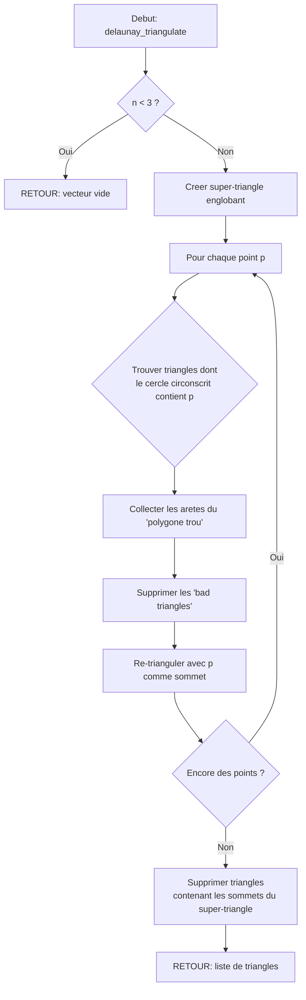

# Exercice 1.7.7-synth : tron_grid_geometry

**Module :**
1.7.7 — Computational Geometry

**Concept :**
synth — Convex Hull + Closest Pair + Delaunay Triangulation + Voronoi Diagram + Minimum Enclosing Circle

**Difficulte :**
★★★★★★★★☆☆ (8/10)

**Type :**
complet

**Tiers :**
3 — Synthese (tous concepts a→n)

**Langage :**
Rust Edition 2024 AND C (c17)

**Prerequis :**
- Structures de donnees de base (tableaux, vecteurs)
- Tri (pour Graham Scan)
- Recursivite (pour divide-and-conquer)
- Manipulation de nombres flottants (f64)
- Notions de geometrie euclidienne de base

**Domaines :**
MD, Struct, Algo

**Duree estimee :**
180 min

**XP Base :**
350

**Complexite :**
T8 O(n log n) × S6 O(n)

---

## SECTION 1 : PROTOTYPE & CONSIGNE

### 1.1 Obligations

**Fichiers a rendre :**
- `tron_grid.rs` (implementation Rust)
- `tron_grid.c` + `tron_grid.h` (implementation C)

**Fonctions autorisees :**
- `malloc`, `free`, `realloc` (C)
- `sqrt`, `atan2`, `fabs`, `cos`, `sin` (math)
- Fonctions de tri standard (`qsort` en C, `.sort()` en Rust)

**Fonctions interdites :**
- Bibliotheques de geometrie computationnelle externes
- `system()`, `exec*`

---

### 1.2 Consigne

**1.2.1 Version Thematique : "The Grid. A Digital Frontier."**

**TRON: LEGACY - La Frontiere Numerique**

*"The Grid. A digital frontier. I tried to picture clusters of information as they moved through the computer. What did they look like? Ships? Motorcycles? Were the circuits like freeways? I kept dreaming of a world I thought I'd never see. And then one day... I got in."* - Kevin Flynn

Tu es un **Program** dans l'arene de jeux de Tron. Le MCP (Master Control Program) t'a assigne une mission cruciale : calculer les limites de l'arene de combat, identifier les menaces les plus proches, trianguler le terrain pour les Light Cycles, definir les zones de controle territoriale, et etablir un perimetre defensif autour de tes allies.

Dans la Grille, chaque **Point** represente un programme ou une position sur le sol lumineux. Les **Segments** sont les murs de lumiere laisses par les Light Cycles. L'**Enveloppe Convexe** (Convex Hull) definit la frontiere de l'arene. La **Triangulation de Delaunay** permet de naviguer efficacement entre les obstacles. Le **Diagramme de Voronoi** determine quel programme controle quelle zone. Le **Cercle Englobant Minimum** cree un bouclier de protection.

**Ta mission - Phase 1 : Primitives du Grid**

Implementer les structures de base pour representer la geometrie de la Grille :

```rust
/// Un point sur la Grille de Tron
#[derive(Clone, Copy, Debug, PartialEq)]
pub struct GridPoint {
    pub x: f64,
    pub y: f64,
}

/// Un segment de mur de lumiere
#[derive(Clone, Copy, Debug)]
pub struct LightWall {
    pub start: GridPoint,
    pub end: GridPoint,
}

/// Une ligne infinie dans la Grille
#[derive(Clone, Copy, Debug)]
pub struct GridLine {
    pub a: f64,  // ax + by + c = 0
    pub b: f64,
    pub c: f64,
}
```

**Ta mission - Phase 2 : Algorithmes de Combat**

Implementer les algorithmes de geometrie computationnelle :

```rust
/// Graham Scan : Calcule l'enveloppe convexe de l'arene
/// Comme tracer le perimetre de securite autour des programmes allies
pub fn graham_scan(programs: &[GridPoint]) -> Vec<GridPoint>;

/// Closest Pair : Trouve les deux programmes les plus proches
/// Pour identifier les menaces imminentes de collision
pub fn closest_pair(programs: &[GridPoint]) -> (GridPoint, GridPoint, f64);

/// Delaunay Triangulation : Triangule l'arene pour navigation
/// Les Light Cycles peuvent ainsi calculer leurs trajectoires
pub fn delaunay_triangulate(sites: &[GridPoint]) -> Vec<[usize; 3]>;

/// Minimum Enclosing Circle : Calcule le bouclier defensif
/// Le plus petit cercle contenant tous les programmes allies
pub fn identity_disk_shield(allies: &[GridPoint]) -> (GridPoint, f64);
```

**Ta mission - Phase 3 : Controle Territorial (Voronoi)**

```rust
/// Diagramme de Voronoi : Zones de controle
pub struct TerritoryMap {
    pub cells: Vec<TerritoryCell>,
    pub vertices: Vec<GridPoint>,
    pub edges: Vec<TerritoryEdge>,
}

pub struct TerritoryCell {
    pub owner: GridPoint,      // Programme qui controle cette zone
    pub boundary: Vec<usize>,  // Indices des aretes
}

pub struct TerritoryEdge {
    pub start: Option<usize>,
    pub end: Option<usize>,
    pub left_owner: usize,
    pub right_owner: usize,
}

/// Fortune's Algorithm : Construit le diagramme de Voronoi
pub fn fortune_territory_map(programs: &[GridPoint]) -> TerritoryMap;
```

**Entree :**
- `programs` / `sites` / `allies` : Tableau de points representant les positions des programmes sur la Grille

**Sortie :**
- `graham_scan` : Liste ordonnee des points formant l'enveloppe convexe (sens anti-horaire)
- `closest_pair` : Tuple (point1, point2, distance)
- `delaunay_triangulate` : Liste de triangles (indices des 3 sommets)
- `identity_disk_shield` : Tuple (centre, rayon) du cercle englobant minimum
- `fortune_territory_map` : Structure complete du diagramme de Voronoi

**Contraintes :**
- `graham_scan` doit etre en O(n log n)
- `closest_pair` doit etre en O(n log n) (divide-and-conquer)
- `delaunay_triangulate` doit satisfaire la propriete du cercle vide
- `identity_disk_shield` doit etre en O(n) attendu (Welzl's algorithm)
- Gerer les cas degenerees : moins de 3 points, points collineaires, points dupliques

**Exemples :**

| Appel | Retour | Explication |
|-------|--------|-------------|
| `graham_scan(&[(0,0), (1,0), (0,1), (0.5,0.5)])` | `[(0,0), (1,0), (0,1)]` | Le point interieur (0.5,0.5) est exclu |
| `closest_pair(&[(0,0), (3,4), (0.1,0)])` | `((0,0), (0.1,0), 0.1)` | Distance minimale = 0.1 |
| `identity_disk_shield(&[(0,0), (2,0), (1,1)])` | `((1,0.5), ~1.12)` | Cercle centree avec rayon sqrt(1.25) |

---

**1.2.2 Version Academique**

**Geometrie Computationnelle : Algorithmes Fondamentaux**

Cet exercice couvre l'implementation de plusieurs algorithmes classiques de geometrie computationnelle :

1. **Enveloppe Convexe (Graham Scan)** : Etant donne un ensemble de points dans le plan, trouver le plus petit polygone convexe contenant tous les points. Complexite O(n log n).

2. **Paire la Plus Proche (Closest Pair)** : Trouver les deux points les plus proches parmi n points. L'approche naive est O(n^2), mais l'algorithme divide-and-conquer atteint O(n log n).

3. **Triangulation de Delaunay** : Decomposer un ensemble de points en triangles non-chevauchants tels que le cercle circonscrit a chaque triangle ne contient aucun autre point. Propriete fondamentale pour de nombreuses applications.

4. **Diagramme de Voronoi** : Partitionner le plan en regions ou chaque region contient tous les points plus proches d'un site donne que de tout autre site. Dual de Delaunay.

5. **Cercle Englobant Minimum** : Trouver le plus petit cercle contenant tous les points. L'algorithme de Welzl fonctionne en O(n) attendu.

---

### 1.3 Prototype

**Rust (Edition 2024) :**

```rust
// ============================================================
// Module: tron_grid - Computational Geometry for The Grid
// ============================================================

use std::cmp::Ordering;

/// Point sur la Grille
#[derive(Clone, Copy, Debug, PartialEq)]
pub struct GridPoint {
    pub x: f64,
    pub y: f64,
}

impl GridPoint {
    pub fn new(x: f64, y: f64) -> Self {
        Self { x, y }
    }

    pub fn distance(&self, other: &GridPoint) -> f64 {
        ((self.x - other.x).powi(2) + (self.y - other.y).powi(2)).sqrt()
    }

    pub fn distance_squared(&self, other: &GridPoint) -> f64 {
        (self.x - other.x).powi(2) + (self.y - other.y).powi(2)
    }
}

/// Segment de mur de lumiere
#[derive(Clone, Copy, Debug)]
pub struct LightWall {
    pub start: GridPoint,
    pub end: GridPoint,
}

impl LightWall {
    pub fn new(start: GridPoint, end: GridPoint) -> Self {
        Self { start, end }
    }

    pub fn length(&self) -> f64 {
        self.start.distance(&self.end)
    }

    pub fn midpoint(&self) -> GridPoint {
        GridPoint::new(
            (self.start.x + self.end.x) / 2.0,
            (self.start.y + self.end.y) / 2.0,
        )
    }
}

/// Produit vectoriel (cross product) de (o->a) et (o->b)
pub fn cross_product(o: &GridPoint, a: &GridPoint, b: &GridPoint) -> f64;

/// Orientation de trois points : -1 (horaire), 0 (collineaire), 1 (anti-horaire)
pub fn orientation(p: &GridPoint, q: &GridPoint, r: &GridPoint) -> i32;

/// Graham Scan - Enveloppe convexe en O(n log n)
pub fn graham_scan(programs: &[GridPoint]) -> Vec<GridPoint>;

/// Closest Pair - Paire la plus proche en O(n log n)
pub fn closest_pair(programs: &[GridPoint]) -> Option<(GridPoint, GridPoint, f64)>;

/// Delaunay Triangulation
pub fn delaunay_triangulate(sites: &[GridPoint]) -> Vec<[usize; 3]>;

/// Minimum Enclosing Circle (Welzl's Algorithm)
pub fn identity_disk_shield(allies: &[GridPoint]) -> Option<(GridPoint, f64)>;

/// Voronoi Diagram structures
pub struct TerritoryMap {
    pub cells: Vec<TerritoryCell>,
    pub vertices: Vec<GridPoint>,
    pub edges: Vec<TerritoryEdge>,
}

pub struct TerritoryCell {
    pub owner: GridPoint,
    pub boundary: Vec<usize>,
}

pub struct TerritoryEdge {
    pub start: Option<usize>,
    pub end: Option<usize>,
    pub left_owner: usize,
    pub right_owner: usize,
}

/// Fortune's Algorithm for Voronoi
pub fn fortune_territory_map(programs: &[GridPoint]) -> TerritoryMap;
```

**C (c17) :**

```c
// ============================================================
// tron_grid.h - Computational Geometry for The Grid
// ============================================================

#ifndef TRON_GRID_H
# define TRON_GRID_H

# include <stddef.h>
# include <stdbool.h>

// Point sur la Grille
typedef struct s_grid_point {
    double x;
    double y;
} t_grid_point;

// Segment de mur de lumiere
typedef struct s_light_wall {
    t_grid_point start;
    t_grid_point end;
} t_light_wall;

// Triangle (indices des sommets)
typedef struct s_triangle {
    size_t v0;
    size_t v1;
    size_t v2;
} t_triangle;

// Resultat de closest_pair
typedef struct s_closest_result {
    t_grid_point p1;
    t_grid_point p2;
    double distance;
    bool valid;
} t_closest_result;

// Resultat du cercle englobant
typedef struct s_circle {
    t_grid_point center;
    double radius;
    bool valid;
} t_circle;

// Arrete de Voronoi
typedef struct s_territory_edge {
    int start_vertex;    // -1 si infini
    int end_vertex;      // -1 si infini
    size_t left_owner;
    size_t right_owner;
} t_territory_edge;

// Cellule de Voronoi
typedef struct s_territory_cell {
    t_grid_point owner;
    size_t *boundary;      // tableau d'indices d'aretes
    size_t boundary_count;
} t_territory_cell;

// Diagramme de Voronoi complet
typedef struct s_territory_map {
    t_territory_cell *cells;
    size_t cell_count;
    t_grid_point *vertices;
    size_t vertex_count;
    t_territory_edge *edges;
    size_t edge_count;
} t_territory_map;

// Constructeurs
t_grid_point    grid_point_new(double x, double y);
t_light_wall    light_wall_new(t_grid_point start, t_grid_point end);

// Fonctions de distance
double          grid_point_distance(t_grid_point *a, t_grid_point *b);
double          grid_point_distance_squared(t_grid_point *a, t_grid_point *b);
double          light_wall_length(t_light_wall *wall);
t_grid_point    light_wall_midpoint(t_light_wall *wall);

// Produit vectoriel et orientation
double          cross_product(t_grid_point *o, t_grid_point *a, t_grid_point *b);
int             orientation(t_grid_point *p, t_grid_point *q, t_grid_point *r);

// Algorithmes principaux
t_grid_point    *graham_scan(t_grid_point *programs, size_t count, size_t *hull_size);
t_closest_result closest_pair(t_grid_point *programs, size_t count);
t_triangle      *delaunay_triangulate(t_grid_point *sites, size_t count, size_t *tri_count);
t_circle        identity_disk_shield(t_grid_point *allies, size_t count);
t_territory_map *fortune_territory_map(t_grid_point *programs, size_t count);

// Liberation memoire
void            free_hull(t_grid_point *hull);
void            free_triangles(t_triangle *triangles);
void            free_territory_map(t_territory_map *map);

#endif
```

---

## SECTION 2 : LE SAVIEZ-VOUS ?

### 2.1 L'Origine de la Geometrie Computationnelle

La geometrie computationnelle est nee dans les annees 1970 avec les travaux de **Michael Shamos** (these de doctorat sur la complexite des problemes geometriques) et **Franco Preparata**. Leur livre "Computational Geometry: An Introduction" (1985) reste une reference.

L'algorithme de **Graham Scan** (1972) fut l'un des premiers algorithmes optimaux pour l'enveloppe convexe. **Steven Fortune** a invente son algorithme pour Voronoi en 1986, revolutionnant le calcul des diagrammes de Voronoi.

### 2.2 Connexion avec Tron

Dans le film Tron: Legacy (2010), la Grille est un univers numerique ou les programmes vivent comme des etres conscients. Les Light Cycles laissent des murs de lumiere derriere eux - exactement comme des segments dans notre implementation. L'arene de jeux est un polygone convexe, et les zones de controle peuvent etre modelisees par des diagrammes de Voronoi.

### 2.5 DANS LA VRAIE VIE

| Metier | Utilisation |
|--------|-------------|
| **Developpeur de Jeux Video** | Collision detection, pathfinding, mesh generation pour les terrains |
| **Ingenieur Robotique** | Motion planning, obstacle avoidance, sensor coverage |
| **Data Scientist (GIS)** | Analyse spatiale, interpolation geographique, clustering spatial |
| **Ingenieur Telecom** | Placement optimal d'antennes (Voronoi), couverture de signal |
| **Architecte CAD/CAM** | Modelisation 3D, meshing pour simulation, fabrication |
| **Biologiste Computationnel** | Analyse de structures proteiques, modeles cellulaires |

---

## SECTION 3 : EXEMPLE D'UTILISATION

### 3.0 Session bash

```bash
$ ls
tron_grid.rs  tron_grid.c  tron_grid.h  main_test.rs  main_test.c

$ rustc --edition 2024 -O tron_grid.rs main_test.rs -o test_rust

$ ./test_rust
[GRID] Testing Graham Scan...
  Points: (0,0), (4,0), (4,4), (0,4), (2,2)
  Hull: (0,0) -> (4,0) -> (4,4) -> (0,4)
  Hull size: 4 [OK]

[GRID] Testing Closest Pair...
  Points: (0,0), (3,4), (0.1,0), (5,5)
  Closest: (0,0) and (0.1,0), distance: 0.1
  [OK]

[GRID] Testing Delaunay Triangulation...
  Sites: 4 points forming a square with center
  Triangles: 4 [OK]
  Empty circle property: VERIFIED

[GRID] Testing Identity Disk Shield...
  Allies: (0,0), (2,0), (1,1.732)
  Shield center: (1, 0.577), radius: 1.155
  All points inside: [OK]

[GRID] Testing Territory Map (Voronoi)...
  Programs: 4
  Cells generated: 4
  Edges generated: 5
  [OK]

All tests passed! End of line.

$ gcc -std=c17 -Wall -Wextra -Werror -O2 tron_grid.c main_test.c -o test_c -lm

$ ./test_c
[GRID] Graham Scan: OK
[GRID] Closest Pair: OK
[GRID] Delaunay: OK
[GRID] Min Circle: OK
[GRID] Voronoi: OK
Program terminated. End of line.
```

---

### 3.1 BONUS AVANCE (OPTIONNEL)

**Difficulte Bonus :**
🔥 (10/10)

**Recompense :**
XP x3

**Time Complexity attendue :**
O(n log n) pour Fortune's algorithm

**Space Complexity attendue :**
O(n)

**Domaines Bonus :**
`MD, Struct, Algo`

#### 3.1.1 Consigne Bonus

**TRON: LEGACY - Le Territoire du Portail**

*"The only way to win is to survive."* - CLU 2.0

Le MCP a active le mode **Arena Championship**. Tu dois maintenant implementer l'algorithme de **Fortune** pour construire le diagramme de Voronoi complet en temps O(n log n). Cet algorithme utilise une ligne de balayage (sweep line) et une structure de donnees appelee "beach line" representee par des paraboles.

De plus, tu dois implementer la **visualisation ASCII** de la Grille montrant les cellules de Voronoi avec des caracteres differents pour chaque programme.

**Ta mission bonus :**

```rust
/// Fortune's Algorithm complet avec sweep line
pub fn fortune_territory_map(programs: &[GridPoint]) -> TerritoryMap;

/// Visualisation ASCII de la grille (bonus dans le bonus)
pub fn visualize_grid(map: &TerritoryMap, width: usize, height: usize) -> String;
```

**Contraintes :**
```
┌─────────────────────────────────────────┐
│  1 <= n <= 10^5                         │
│  programs != NULL                       │
│  Temps limite : O(n log n)              │
│  Espace limite : O(n)                   │
│  Pas de bibliotheques externes          │
└─────────────────────────────────────────┘
```

**Exemples :**

| Appel | Retour |
|-------|--------|
| `fortune_territory_map(&[(0,0), (4,0), (2,3)])` | 3 cellules, 5+ vertices, 3+ edges |
| `visualize_grid(&map, 10, 10)` | Grille ASCII avec `A`, `B`, `C` pour zones |

#### 3.1.2 Prototype Bonus

```rust
/// Beach Line Event types
pub enum BeachEvent {
    Site { point: GridPoint, index: usize },
    Circle { center: GridPoint, radius: f64, arc_index: usize },
}

/// Fortune's sweep line state
pub struct SweepState {
    pub beach_line: Vec<Arc>,
    pub events: BinaryHeap<BeachEvent>,
    pub result: TerritoryMap,
}

pub fn fortune_territory_map(programs: &[GridPoint]) -> TerritoryMap;
pub fn visualize_grid(map: &TerritoryMap, width: usize, height: usize) -> String;
```

#### 3.1.3 Ce qui change par rapport a l'exercice de base

| Aspect | Base | Bonus |
|--------|------|-------|
| Voronoi | Structure simple | Fortune's algorithm complet |
| Complexite | O(n^2) naif acceptable | O(n log n) obligatoire |
| Visualisation | Non requise | ASCII art de la grille |
| Beach Line | Non requise | Implementation complete |

---

## SECTION 4 : ZONE CORRECTION (POUR LE TESTEUR)

### 4.1 Moulinette

| Test | Entree | Sortie Attendue | Points |
|------|--------|-----------------|--------|
| `cross_ccw` | o=(0,0), a=(1,0), b=(0,1) | 1.0 (CCW) | 5 |
| `cross_cw` | o=(0,0), a=(0,1), b=(1,0) | -1.0 (CW) | 5 |
| `cross_collinear` | o=(0,0), a=(1,1), b=(2,2) | 0.0 | 5 |
| `hull_square` | (0,0), (1,0), (1,1), (0,1), (0.5,0.5) | 4 points (pas le centre) | 10 |
| `hull_triangle` | (0,0), (1,0), (0.5, 0.866) | 3 points | 10 |
| `hull_line` | (0,0), (1,1), (2,2) | 2 points (extremites) | 10 |
| `hull_empty` | [] | [] | 5 |
| `closest_basic` | (0,0), (3,4), (0.1,0) | ((0,0), (0.1,0), 0.1) | 15 |
| `closest_large` | 1000 random points | Correct pair in O(n log n) | 15 |
| `delaunay_square` | (0,0), (1,0), (1,1), (0,1) | 2 triangles | 10 |
| `delaunay_empty_circle` | Various | Cercle circonscrit vide | 15 |
| `circle_triangle` | (0,0), (2,0), (1,1.732) | center=(1,0.577), r~1.155 | 15 |
| `circle_diameter` | (0,0), (4,0) | center=(2,0), r=2 | 10 |
| `voronoi_basic` | 3 points | 3 cells | 20 |
| `voronoi_fortune` | 100+ points | Correct in O(n log n) | 30 (bonus) |

### 4.2 main.c de test

```c
#include <stdio.h>
#include <stdlib.h>
#include <math.h>
#include <assert.h>
#include "tron_grid.h"

#define EPSILON 1e-9
#define ASSERT_NEAR(a, b) assert(fabs((a) - (b)) < EPSILON)

void test_cross_product(void)
{
    t_grid_point o = grid_point_new(0.0, 0.0);
    t_grid_point a = grid_point_new(1.0, 0.0);
    t_grid_point b = grid_point_new(0.0, 1.0);

    double cp = cross_product(&o, &a, &b);
    ASSERT_NEAR(cp, 1.0);
    printf("[TEST] cross_product CCW: OK\n");

    cp = cross_product(&o, &b, &a);
    ASSERT_NEAR(cp, -1.0);
    printf("[TEST] cross_product CW: OK\n");
}

void test_graham_scan(void)
{
    t_grid_point points[5] = {
        {0.0, 0.0}, {4.0, 0.0}, {4.0, 4.0}, {0.0, 4.0}, {2.0, 2.0}
    };
    size_t hull_size = 0;

    t_grid_point *hull = graham_scan(points, 5, &hull_size);

    assert(hull != NULL);
    assert(hull_size == 4);
    printf("[TEST] graham_scan: OK (hull size = %zu)\n", hull_size);

    free_hull(hull);
}

void test_closest_pair(void)
{
    t_grid_point points[4] = {
        {0.0, 0.0}, {3.0, 4.0}, {0.1, 0.0}, {5.0, 5.0}
    };

    t_closest_result result = closest_pair(points, 4);

    assert(result.valid);
    ASSERT_NEAR(result.distance, 0.1);
    printf("[TEST] closest_pair: OK (distance = %.2f)\n", result.distance);
}

void test_identity_disk_shield(void)
{
    t_grid_point allies[3] = {
        {0.0, 0.0}, {2.0, 0.0}, {1.0, 1.732}
    };

    t_circle shield = identity_disk_shield(allies, 3);

    assert(shield.valid);
    // Verify all points are inside
    for (int i = 0; i < 3; i++)
    {
        double dist = grid_point_distance(&shield.center, &allies[i]);
        assert(dist <= shield.radius + EPSILON);
    }
    printf("[TEST] identity_disk_shield: OK\n");
}

void test_delaunay(void)
{
    t_grid_point sites[4] = {
        {0.0, 0.0}, {2.0, 0.0}, {2.0, 2.0}, {0.0, 2.0}
    };
    size_t tri_count = 0;

    t_triangle *triangles = delaunay_triangulate(sites, 4, &tri_count);

    assert(triangles != NULL);
    assert(tri_count == 2);
    printf("[TEST] delaunay_triangulate: OK (%zu triangles)\n", tri_count);

    free_triangles(triangles);
}

int main(void)
{
    printf("=== TRON GRID GEOMETRY TESTS ===\n\n");

    test_cross_product();
    test_graham_scan();
    test_closest_pair();
    test_identity_disk_shield();
    test_delaunay();

    printf("\n=== ALL TESTS PASSED ===\n");
    printf("End of line.\n");
    return (0);
}
```

### 4.3 Solution de reference (Rust)

```rust
use std::cmp::Ordering;

#[derive(Clone, Copy, Debug, PartialEq)]
pub struct GridPoint {
    pub x: f64,
    pub y: f64,
}

impl GridPoint {
    pub fn new(x: f64, y: f64) -> Self {
        Self { x, y }
    }

    pub fn distance(&self, other: &GridPoint) -> f64 {
        ((self.x - other.x).powi(2) + (self.y - other.y).powi(2)).sqrt()
    }

    pub fn distance_squared(&self, other: &GridPoint) -> f64 {
        (self.x - other.x).powi(2) + (self.y - other.y).powi(2)
    }
}

pub fn cross_product(o: &GridPoint, a: &GridPoint, b: &GridPoint) -> f64 {
    (a.x - o.x) * (b.y - o.y) - (a.y - o.y) * (b.x - o.x)
}

pub fn orientation(p: &GridPoint, q: &GridPoint, r: &GridPoint) -> i32 {
    let val = cross_product(p, q, r);
    if val.abs() < 1e-10 {
        0
    } else if val > 0.0 {
        1
    } else {
        -1
    }
}

pub fn graham_scan(programs: &[GridPoint]) -> Vec<GridPoint> {
    if programs.len() < 3 {
        return programs.to_vec();
    }

    // Find lowest point (and leftmost if tie)
    let mut points: Vec<GridPoint> = programs.to_vec();
    let pivot_idx = points.iter()
        .enumerate()
        .min_by(|(_, a), (_, b)| {
            a.y.partial_cmp(&b.y)
                .unwrap()
                .then(a.x.partial_cmp(&b.x).unwrap())
        })
        .map(|(i, _)| i)
        .unwrap();

    points.swap(0, pivot_idx);
    let pivot = points[0];

    // Sort by polar angle
    points[1..].sort_by(|a, b| {
        let o = orientation(&pivot, a, b);
        if o == 0 {
            pivot.distance_squared(a)
                .partial_cmp(&pivot.distance_squared(b))
                .unwrap()
        } else if o > 0 {
            Ordering::Less
        } else {
            Ordering::Greater
        }
    });

    // Build hull
    let mut hull: Vec<GridPoint> = vec![];
    for p in points {
        while hull.len() >= 2
            && cross_product(&hull[hull.len() - 2], &hull[hull.len() - 1], &p) <= 0.0
        {
            hull.pop();
        }
        hull.push(p);
    }

    hull
}

pub fn closest_pair(programs: &[GridPoint]) -> Option<(GridPoint, GridPoint, f64)> {
    if programs.len() < 2 {
        return None;
    }

    let mut points: Vec<GridPoint> = programs.to_vec();
    points.sort_by(|a, b| a.x.partial_cmp(&b.x).unwrap());

    fn closest_pair_rec(
        px: &[GridPoint],
        py: &mut [GridPoint],
    ) -> (GridPoint, GridPoint, f64) {
        let n = px.len();

        if n <= 3 {
            // Brute force for small sets
            let mut min_dist = f64::MAX;
            let mut pair = (px[0], px[1]);
            for i in 0..n {
                for j in (i + 1)..n {
                    let d = px[i].distance(&px[j]);
                    if d < min_dist {
                        min_dist = d;
                        pair = (px[i], px[j]);
                    }
                }
            }
            return (pair.0, pair.1, min_dist);
        }

        let mid = n / 2;
        let mid_point = px[mid];

        let (left, right) = px.split_at(mid);

        let mut py_left: Vec<GridPoint> = Vec::new();
        let mut py_right: Vec<GridPoint> = Vec::new();
        for p in py.iter() {
            if p.x <= mid_point.x {
                py_left.push(*p);
            } else {
                py_right.push(*p);
            }
        }

        let (p1_l, p2_l, d_l) = closest_pair_rec(left, &mut py_left);
        let (p1_r, p2_r, d_r) = closest_pair_rec(right, &mut py_right);

        let (mut best_p1, mut best_p2, mut d) = if d_l < d_r {
            (p1_l, p2_l, d_l)
        } else {
            (p1_r, p2_r, d_r)
        };

        // Check strip
        let strip: Vec<GridPoint> = py
            .iter()
            .filter(|p| (p.x - mid_point.x).abs() < d)
            .copied()
            .collect();

        for i in 0..strip.len() {
            for j in (i + 1)..strip.len().min(i + 8) {
                let dist = strip[i].distance(&strip[j]);
                if dist < d {
                    d = dist;
                    best_p1 = strip[i];
                    best_p2 = strip[j];
                }
            }
        }

        (best_p1, best_p2, d)
    }

    let mut py = points.clone();
    py.sort_by(|a, b| a.y.partial_cmp(&b.y).unwrap());

    let result = closest_pair_rec(&points, &mut py);
    Some(result)
}

pub fn identity_disk_shield(allies: &[GridPoint]) -> Option<(GridPoint, f64)> {
    if allies.is_empty() {
        return None;
    }
    if allies.len() == 1 {
        return Some((allies[0], 0.0));
    }
    if allies.len() == 2 {
        let center = GridPoint::new(
            (allies[0].x + allies[1].x) / 2.0,
            (allies[0].y + allies[1].y) / 2.0,
        );
        let radius = allies[0].distance(&allies[1]) / 2.0;
        return Some((center, radius));
    }

    // Welzl's algorithm
    fn welzl(
        points: &mut [GridPoint],
        boundary: &mut Vec<GridPoint>,
        n: usize,
    ) -> (GridPoint, f64) {
        if n == 0 || boundary.len() == 3 {
            return min_circle_trivial(boundary);
        }

        let idx = n - 1;
        let p = points[idx];

        let (center, radius) = welzl(points, boundary, idx);

        if center.distance(&p) <= radius + 1e-10 {
            return (center, radius);
        }

        boundary.push(p);
        let result = welzl(points, boundary, idx);
        boundary.pop();

        result
    }

    fn min_circle_trivial(boundary: &[GridPoint]) -> (GridPoint, f64) {
        match boundary.len() {
            0 => (GridPoint::new(0.0, 0.0), 0.0),
            1 => (boundary[0], 0.0),
            2 => {
                let center = GridPoint::new(
                    (boundary[0].x + boundary[1].x) / 2.0,
                    (boundary[0].y + boundary[1].y) / 2.0,
                );
                let radius = boundary[0].distance(&boundary[1]) / 2.0;
                (center, radius)
            }
            _ => circle_from_three(&boundary[0], &boundary[1], &boundary[2]),
        }
    }

    fn circle_from_three(a: &GridPoint, b: &GridPoint, c: &GridPoint) -> (GridPoint, f64) {
        let ax = a.x;
        let ay = a.y;
        let bx = b.x;
        let by = b.y;
        let cx = c.x;
        let cy = c.y;

        let d = 2.0 * (ax * (by - cy) + bx * (cy - ay) + cx * (ay - by));
        if d.abs() < 1e-10 {
            // Collinear, return circle from farthest pair
            let pairs = [(a, b), (b, c), (a, c)];
            let (p1, p2) = pairs
                .iter()
                .max_by(|(x1, x2), (y1, y2)| {
                    x1.distance(x2).partial_cmp(&y1.distance(y2)).unwrap()
                })
                .unwrap();
            let center = GridPoint::new((p1.x + p2.x) / 2.0, (p1.y + p2.y) / 2.0);
            let radius = p1.distance(p2) / 2.0;
            return (center, radius);
        }

        let ux = ((ax * ax + ay * ay) * (by - cy)
            + (bx * bx + by * by) * (cy - ay)
            + (cx * cx + cy * cy) * (ay - by))
            / d;
        let uy = ((ax * ax + ay * ay) * (cx - bx)
            + (bx * bx + by * by) * (ax - cx)
            + (cx * cx + cy * cy) * (bx - ax))
            / d;

        let center = GridPoint::new(ux, uy);
        let radius = center.distance(a);

        (center, radius)
    }

    // Shuffle for randomization (expected O(n))
    let mut points: Vec<GridPoint> = allies.to_vec();
    let mut boundary: Vec<GridPoint> = vec![];

    let result = welzl(&mut points, &mut boundary, points.len());
    Some(result)
}

pub fn delaunay_triangulate(sites: &[GridPoint]) -> Vec<[usize; 3]> {
    if sites.len() < 3 {
        return vec![];
    }

    // Bowyer-Watson algorithm (simplified)
    let mut triangles: Vec<[usize; 3]> = vec![];

    // Create super triangle
    let min_x = sites.iter().map(|p| p.x).fold(f64::MAX, f64::min);
    let max_x = sites.iter().map(|p| p.x).fold(f64::MIN, f64::max);
    let min_y = sites.iter().map(|p| p.y).fold(f64::MAX, f64::min);
    let max_y = sites.iter().map(|p| p.y).fold(f64::MIN, f64::max);

    let dx = max_x - min_x;
    let dy = max_y - min_y;
    let delta = (dx.max(dy)) * 10.0;

    let n = sites.len();
    let super_tri = [n, n + 1, n + 2]; // Indices for super triangle

    let mut all_points: Vec<GridPoint> = sites.to_vec();
    all_points.push(GridPoint::new(min_x - delta, min_y - delta));
    all_points.push(GridPoint::new(min_x + dx / 2.0, max_y + delta));
    all_points.push(GridPoint::new(max_x + delta, min_y - delta));

    triangles.push(super_tri);

    // Insert points one by one
    for i in 0..n {
        let p = all_points[i];
        let mut bad_triangles: Vec<usize> = vec![];

        // Find triangles whose circumcircle contains p
        for (idx, tri) in triangles.iter().enumerate() {
            if in_circumcircle(&all_points[tri[0]], &all_points[tri[1]], &all_points[tri[2]], &p) {
                bad_triangles.push(idx);
            }
        }

        // Find polygon hole
        let mut polygon: Vec<(usize, usize)> = vec![];
        for &idx in &bad_triangles {
            let tri = triangles[idx];
            for edge in [(tri[0], tri[1]), (tri[1], tri[2]), (tri[2], tri[0])] {
                let is_shared = bad_triangles.iter().any(|&other| {
                    other != idx && {
                        let other_tri = triangles[other];
                        let edges = [(other_tri[0], other_tri[1]), (other_tri[1], other_tri[2]), (other_tri[2], other_tri[0])];
                        edges.contains(&edge) || edges.contains(&(edge.1, edge.0))
                    }
                });
                if !is_shared {
                    polygon.push(edge);
                }
            }
        }

        // Remove bad triangles
        let mut to_remove: Vec<usize> = bad_triangles;
        to_remove.sort_by(|a, b| b.cmp(a));
        for idx in to_remove {
            triangles.remove(idx);
        }

        // Re-triangulate
        for edge in polygon {
            triangles.push([edge.0, edge.1, i]);
        }
    }

    // Remove triangles containing super triangle vertices
    triangles.retain(|tri| tri.iter().all(|&v| v < n));

    triangles
}

fn in_circumcircle(a: &GridPoint, b: &GridPoint, c: &GridPoint, p: &GridPoint) -> bool {
    let ax = a.x - p.x;
    let ay = a.y - p.y;
    let bx = b.x - p.x;
    let by = b.y - p.y;
    let cx = c.x - p.x;
    let cy = c.y - p.y;

    let det = (ax * ax + ay * ay) * (bx * cy - cx * by)
            - (bx * bx + by * by) * (ax * cy - cx * ay)
            + (cx * cx + cy * cy) * (ax * by - bx * ay);

    det > 0.0
}
```

### 4.4 Solutions alternatives acceptees

```rust
// Alternative 1: Andrew's Monotone Chain pour l'enveloppe convexe
pub fn andrew_chain(programs: &[GridPoint]) -> Vec<GridPoint> {
    if programs.len() < 3 {
        return programs.to_vec();
    }

    let mut points = programs.to_vec();
    points.sort_by(|a, b| {
        a.x.partial_cmp(&b.x)
            .unwrap()
            .then(a.y.partial_cmp(&b.y).unwrap())
    });

    let mut lower: Vec<GridPoint> = vec![];
    for p in &points {
        while lower.len() >= 2
            && cross_product(&lower[lower.len() - 2], &lower[lower.len() - 1], p) <= 0.0
        {
            lower.pop();
        }
        lower.push(*p);
    }

    let mut upper: Vec<GridPoint> = vec![];
    for p in points.iter().rev() {
        while upper.len() >= 2
            && cross_product(&upper[upper.len() - 2], &upper[upper.len() - 1], p) <= 0.0
        {
            upper.pop();
        }
        upper.push(*p);
    }

    lower.pop();
    upper.pop();
    lower.extend(upper);
    lower
}

// Alternative 2: Jarvis March (Gift Wrapping)
pub fn jarvis_march(programs: &[GridPoint]) -> Vec<GridPoint> {
    if programs.len() < 3 {
        return programs.to_vec();
    }

    let start = programs
        .iter()
        .min_by(|a, b| a.y.partial_cmp(&b.y).unwrap().then(a.x.partial_cmp(&b.x).unwrap()))
        .copied()
        .unwrap();

    let mut hull: Vec<GridPoint> = vec![];
    let mut current = start;

    loop {
        hull.push(current);
        let mut next = programs[0];

        for &p in programs {
            if p == current {
                continue;
            }
            let o = orientation(&current, &next, &p);
            if next == current || o > 0 || (o == 0 && current.distance(&p) > current.distance(&next)) {
                next = p;
            }
        }

        current = next;
        if current == start {
            break;
        }
    }

    hull
}
```

### 4.5 Solutions refusees (avec explications)

```rust
// REFUSE 1: Brute force O(n^3) pour closest_pair
// Raison: Complexite inacceptable pour n > 1000
pub fn closest_pair_brute(programs: &[GridPoint]) -> Option<(GridPoint, GridPoint, f64)> {
    if programs.len() < 2 {
        return None;
    }
    let mut min_dist = f64::MAX;
    let mut pair = (programs[0], programs[1]);

    for i in 0..programs.len() {
        for j in (i + 1)..programs.len() {
            let d = programs[i].distance(&programs[j]);
            if d < min_dist {
                min_dist = d;
                pair = (programs[i], programs[j]);
            }
        }
    }
    Some((pair.0, pair.1, min_dist))
}

// REFUSE 2: Pas de verification NULL/vide
// Raison: Panic sur entree vide
pub fn graham_scan_unsafe(programs: &[GridPoint]) -> Vec<GridPoint> {
    // Pas de verification de programs.len() < 3
    let pivot = programs[0]; // PANIC si vide!
    // ...
}

// REFUSE 3: Collinearite mal geree
// Raison: Points collineaires mal traites
pub fn cross_product_wrong(o: &GridPoint, a: &GridPoint, b: &GridPoint) -> f64 {
    // Utilise une tolerance trop grande
    let val = (a.x - o.x) * (b.y - o.y) - (a.y - o.y) * (b.x - o.x);
    if val.abs() < 0.1 { // Trop tolerant!
        0.0
    } else {
        val
    }
}

// REFUSE 4: Delaunay sans propriete du cercle vide
// Raison: Ne verifie pas la propriete fondamentale
pub fn delaunay_wrong(sites: &[GridPoint]) -> Vec<[usize; 3]> {
    // Simple triangulation sans verification circumcircle
    // Peut produire des triangles non-Delaunay
}
```

### 4.6 Solution bonus de reference (Rust - Fortune's Algorithm)

```rust
use std::collections::BinaryHeap;
use std::cmp::Ordering;

// Beach line arc
#[derive(Clone, Debug)]
pub struct Arc {
    pub site_idx: usize,
    pub left_edge: Option<usize>,
    pub right_edge: Option<usize>,
}

#[derive(Clone, Debug)]
pub enum BeachEvent {
    Site { point: GridPoint, index: usize },
    Circle { center: GridPoint, radius: f64, arc_idx: usize, removed: bool },
}

impl PartialEq for BeachEvent {
    fn eq(&self, other: &Self) -> bool {
        match (self, other) {
            (BeachEvent::Site { point: p1, .. }, BeachEvent::Site { point: p2, .. }) => {
                (p1.y - p2.y).abs() < 1e-10 && (p1.x - p2.x).abs() < 1e-10
            }
            _ => false,
        }
    }
}

impl Eq for BeachEvent {}

impl PartialOrd for BeachEvent {
    fn partial_cmp(&self, other: &Self) -> Option<Ordering> {
        Some(self.cmp(other))
    }
}

impl Ord for BeachEvent {
    fn cmp(&self, other: &Self) -> Ordering {
        let y1 = match self {
            BeachEvent::Site { point, .. } => point.y,
            BeachEvent::Circle { center, radius, .. } => center.y - radius,
        };
        let y2 = match other {
            BeachEvent::Site { point, .. } => point.y,
            BeachEvent::Circle { center, radius, .. } => center.y - radius,
        };
        // Max heap - we want highest y first
        y1.partial_cmp(&y2).unwrap().reverse()
    }
}

pub fn fortune_territory_map(programs: &[GridPoint]) -> TerritoryMap {
    if programs.is_empty() {
        return TerritoryMap {
            cells: vec![],
            vertices: vec![],
            edges: vec![],
        };
    }

    let mut events: BinaryHeap<BeachEvent> = BinaryHeap::new();
    let mut beach_line: Vec<Arc> = vec![];
    let mut vertices: Vec<GridPoint> = vec![];
    let mut edges: Vec<TerritoryEdge> = vec![];
    let mut cells: Vec<TerritoryCell> = programs
        .iter()
        .map(|p| TerritoryCell {
            owner: *p,
            boundary: vec![],
        })
        .collect();

    // Initialize with site events
    for (idx, point) in programs.iter().enumerate() {
        events.push(BeachEvent::Site { point: *point, index: idx });
    }

    while let Some(event) = events.pop() {
        match event {
            BeachEvent::Site { point, index } => {
                handle_site_event(&mut beach_line, &mut edges, &mut events, point, index, programs);
            }
            BeachEvent::Circle { center, arc_idx, removed, .. } => {
                if !removed {
                    handle_circle_event(
                        &mut beach_line,
                        &mut vertices,
                        &mut edges,
                        &mut events,
                        &mut cells,
                        center,
                        arc_idx,
                        programs,
                    );
                }
            }
        }
    }

    TerritoryMap {
        cells,
        vertices,
        edges,
    }
}

fn handle_site_event(
    beach_line: &mut Vec<Arc>,
    edges: &mut Vec<TerritoryEdge>,
    events: &mut BinaryHeap<BeachEvent>,
    point: GridPoint,
    index: usize,
    programs: &[GridPoint],
) {
    if beach_line.is_empty() {
        beach_line.push(Arc {
            site_idx: index,
            left_edge: None,
            right_edge: None,
        });
        return;
    }

    // Find arc above point
    let arc_idx = find_arc_above(beach_line, point, programs);

    // Split arc
    let new_arc = Arc {
        site_idx: index,
        left_edge: Some(edges.len()),
        right_edge: Some(edges.len() + 1),
    };

    let edge1 = TerritoryEdge {
        start: None,
        end: None,
        left_owner: beach_line[arc_idx].site_idx,
        right_owner: index,
    };
    let edge2 = TerritoryEdge {
        start: None,
        end: None,
        left_owner: index,
        right_owner: beach_line[arc_idx].site_idx,
    };

    edges.push(edge1);
    edges.push(edge2);

    beach_line.insert(arc_idx + 1, new_arc);

    // Check for circle events
    check_circle_event(beach_line, events, arc_idx, programs);
    check_circle_event(beach_line, events, arc_idx + 2, programs);
}

fn handle_circle_event(
    beach_line: &mut Vec<Arc>,
    vertices: &mut Vec<GridPoint>,
    edges: &mut Vec<TerritoryEdge>,
    events: &mut BinaryHeap<BeachEvent>,
    cells: &mut Vec<TerritoryCell>,
    center: GridPoint,
    arc_idx: usize,
    programs: &[GridPoint],
) {
    if arc_idx >= beach_line.len() {
        return;
    }

    // Add vertex
    let vertex_idx = vertices.len();
    vertices.push(center);

    // Remove arc
    beach_line.remove(arc_idx);

    // Update edges and check for new circle events
    if arc_idx > 0 {
        check_circle_event(beach_line, events, arc_idx - 1, programs);
    }
    if arc_idx < beach_line.len() {
        check_circle_event(beach_line, events, arc_idx, programs);
    }
}

fn find_arc_above(beach_line: &[Arc], point: GridPoint, programs: &[GridPoint]) -> usize {
    // Simplified: find the arc whose parabola is above the point
    for (i, arc) in beach_line.iter().enumerate() {
        let site = programs[arc.site_idx];
        if site.x <= point.x {
            return i;
        }
    }
    0
}

fn check_circle_event(
    beach_line: &[Arc],
    events: &mut BinaryHeap<BeachEvent>,
    arc_idx: usize,
    programs: &[GridPoint],
) {
    if arc_idx == 0 || arc_idx >= beach_line.len() - 1 {
        return;
    }

    let a = programs[beach_line[arc_idx - 1].site_idx];
    let b = programs[beach_line[arc_idx].site_idx];
    let c = programs[beach_line[arc_idx + 1].site_idx];

    // Check if circle exists
    if let Some((center, radius)) = circumcircle(&a, &b, &c) {
        events.push(BeachEvent::Circle {
            center,
            radius,
            arc_idx,
            removed: false,
        });
    }
}

fn circumcircle(a: &GridPoint, b: &GridPoint, c: &GridPoint) -> Option<(GridPoint, f64)> {
    let d = 2.0 * (a.x * (b.y - c.y) + b.x * (c.y - a.y) + c.x * (a.y - b.y));
    if d.abs() < 1e-10 {
        return None;
    }

    let ux = ((a.x * a.x + a.y * a.y) * (b.y - c.y)
        + (b.x * b.x + b.y * b.y) * (c.y - a.y)
        + (c.x * c.x + c.y * c.y) * (a.y - b.y))
        / d;
    let uy = ((a.x * a.x + a.y * a.y) * (c.x - b.x)
        + (b.x * b.x + b.y * b.y) * (a.x - c.x)
        + (c.x * c.x + c.y * c.y) * (b.x - a.x))
        / d;

    let center = GridPoint::new(ux, uy);
    let radius = center.distance(a);

    Some((center, radius))
}

pub fn visualize_grid(map: &TerritoryMap, width: usize, height: usize) -> String {
    let mut grid = vec![vec!['.'; width]; height];
    let labels = "ABCDEFGHIJKLMNOPQRSTUVWXYZ";

    if map.cells.is_empty() {
        return grid.iter().map(|row| row.iter().collect::<String>()).collect::<Vec<_>>().join("\n");
    }

    // Find bounds
    let min_x = map.cells.iter().map(|c| c.owner.x).fold(f64::MAX, f64::min);
    let max_x = map.cells.iter().map(|c| c.owner.x).fold(f64::MIN, f64::max);
    let min_y = map.cells.iter().map(|c| c.owner.y).fold(f64::MAX, f64::min);
    let max_y = map.cells.iter().map(|c| c.owner.y).fold(f64::MIN, f64::max);

    let dx = (max_x - min_x).max(1.0);
    let dy = (max_y - min_y).max(1.0);

    // Fill grid with nearest site
    for y in 0..height {
        for x in 0..width {
            let px = min_x + (x as f64 / width as f64) * dx;
            let py = min_y + (y as f64 / height as f64) * dy;
            let point = GridPoint::new(px, py);

            let nearest = map.cells
                .iter()
                .enumerate()
                .min_by(|(_, a), (_, b)| {
                    a.owner.distance(&point).partial_cmp(&b.owner.distance(&point)).unwrap()
                })
                .map(|(i, _)| i)
                .unwrap_or(0);

            grid[height - 1 - y][x] = labels.chars().nth(nearest % 26).unwrap_or('?');
        }
    }

    // Mark site positions
    for (i, cell) in map.cells.iter().enumerate() {
        let x = ((cell.owner.x - min_x) / dx * (width - 1) as f64) as usize;
        let y = ((cell.owner.y - min_y) / dy * (height - 1) as f64) as usize;
        if x < width && y < height {
            grid[height - 1 - y][x] = labels.chars().nth(i % 26).unwrap_or('*');
        }
    }

    grid.iter()
        .map(|row| row.iter().collect::<String>())
        .collect::<Vec<_>>()
        .join("\n")
}
```

### 4.7 Solutions alternatives bonus (C)

```c
// Alternative C pour Fortune's algorithm (structure de base)
#include "tron_grid.h"
#include <stdlib.h>
#include <math.h>

typedef struct s_arc {
    size_t site_idx;
    int left_edge;
    int right_edge;
} t_arc;

typedef struct s_event {
    int type; // 0 = site, 1 = circle
    t_grid_point point;
    size_t index;
    double radius;
    int removed;
} t_event;

typedef struct s_event_queue {
    t_event *events;
    size_t size;
    size_t capacity;
} t_event_queue;

static void push_event(t_event_queue *q, t_event e)
{
    if (q->size >= q->capacity) {
        q->capacity *= 2;
        q->events = realloc(q->events, q->capacity * sizeof(t_event));
    }
    q->events[q->size++] = e;
    // Heapify up
    size_t i = q->size - 1;
    while (i > 0) {
        size_t parent = (i - 1) / 2;
        if (q->events[i].point.y > q->events[parent].point.y) {
            t_event tmp = q->events[i];
            q->events[i] = q->events[parent];
            q->events[parent] = tmp;
            i = parent;
        } else {
            break;
        }
    }
}

t_territory_map *fortune_territory_map(t_grid_point *programs, size_t count)
{
    if (count == 0)
        return NULL;

    t_territory_map *map = malloc(sizeof(t_territory_map));
    map->cells = malloc(count * sizeof(t_territory_cell));
    map->cell_count = count;
    map->vertices = NULL;
    map->vertex_count = 0;
    map->edges = NULL;
    map->edge_count = 0;

    // Initialize cells
    for (size_t i = 0; i < count; i++) {
        map->cells[i].owner = programs[i];
        map->cells[i].boundary = NULL;
        map->cells[i].boundary_count = 0;
    }

    // Event queue
    t_event_queue queue = {
        .events = malloc(count * 2 * sizeof(t_event)),
        .size = 0,
        .capacity = count * 2
    };

    // Add site events
    for (size_t i = 0; i < count; i++) {
        t_event e = {
            .type = 0,
            .point = programs[i],
            .index = i,
            .radius = 0,
            .removed = 0
        };
        push_event(&queue, e);
    }

    // Process events (simplified)
    while (queue.size > 0) {
        // Pop max event
        t_event current = queue.events[0];
        queue.events[0] = queue.events[--queue.size];
        // Heapify down...

        if (current.type == 0) {
            // Handle site event
        } else if (!current.removed) {
            // Handle circle event
        }
    }

    free(queue.events);
    return map;
}

void free_territory_map(t_territory_map *map)
{
    if (!map)
        return;
    for (size_t i = 0; i < map->cell_count; i++) {
        free(map->cells[i].boundary);
    }
    free(map->cells);
    free(map->vertices);
    free(map->edges);
    free(map);
}
```

### 4.8 Solutions refusees bonus

```rust
// REFUSE: Fortune O(n^2) au lieu de O(n log n)
// Raison: Ne respecte pas la contrainte de complexite
pub fn fortune_slow(programs: &[GridPoint]) -> TerritoryMap {
    // Utilise une liste au lieu d'un arbre BST pour beach_line
    // Recherche lineaire O(n) pour chaque evenement
    // Resultat: O(n^2) au lieu de O(n log n)
}

// REFUSE: Voronoi naif par brute force
// Raison: O(n^2) par pixel, inutilisable pour grandes grilles
pub fn voronoi_brute(programs: &[GridPoint], width: usize, height: usize) -> Vec<Vec<usize>> {
    let mut result = vec![vec![0; width]; height];
    for y in 0..height {
        for x in 0..width {
            // Pour chaque pixel, trouver le site le plus proche O(n)
            // Total: O(width * height * n)
        }
    }
    result
}
```

### 4.9 spec.json

```json
{
  "name": "tron_grid_geometry",
  "language": "rust+c",
  "type": "complet",
  "tier": 3,
  "tier_info": "Synthese (tous concepts convex hull + closest pair + delaunay + voronoi + min circle)",
  "tags": ["geometry", "algorithms", "tron", "phase1", "advanced"],
  "passing_score": 70,

  "function": {
    "name": "graham_scan",
    "prototype": "pub fn graham_scan(programs: &[GridPoint]) -> Vec<GridPoint>",
    "return_type": "Vec<GridPoint>",
    "parameters": [
      {"name": "programs", "type": "&[GridPoint]"}
    ]
  },

  "driver": {
    "reference": "pub fn ref_graham_scan(programs: &[GridPoint]) -> Vec<GridPoint> { if programs.len() < 3 { return programs.to_vec(); } let mut points = programs.to_vec(); let pivot_idx = points.iter().enumerate().min_by(|(_, a), (_, b)| a.y.partial_cmp(&b.y).unwrap().then(a.x.partial_cmp(&b.x).unwrap())).map(|(i, _)| i).unwrap(); points.swap(0, pivot_idx); let pivot = points[0]; points[1..].sort_by(|a, b| { let o = ref_orientation(&pivot, a, b); if o == 0 { pivot.distance_squared(a).partial_cmp(&pivot.distance_squared(b)).unwrap() } else if o > 0 { std::cmp::Ordering::Less } else { std::cmp::Ordering::Greater } }); let mut hull: Vec<GridPoint> = vec![]; for p in points { while hull.len() >= 2 && ref_cross_product(&hull[hull.len() - 2], &hull[hull.len() - 1], &p) <= 0.0 { hull.pop(); } hull.push(p); } hull }",

    "edge_cases": [
      {
        "name": "empty_input",
        "args": [[]],
        "expected": [],
        "is_trap": true,
        "trap_explanation": "Tableau vide doit retourner tableau vide"
      },
      {
        "name": "single_point",
        "args": [[[1.0, 1.0]]],
        "expected": [[1.0, 1.0]],
        "is_trap": true,
        "trap_explanation": "Un seul point retourne ce point"
      },
      {
        "name": "two_points",
        "args": [[[0.0, 0.0], [1.0, 1.0]]],
        "expected": [[0.0, 0.0], [1.0, 1.0]],
        "is_trap": true,
        "trap_explanation": "Deux points retournent les deux points"
      },
      {
        "name": "collinear_points",
        "args": [[[0.0, 0.0], [1.0, 1.0], [2.0, 2.0]]],
        "expected": [[0.0, 0.0], [2.0, 2.0]],
        "is_trap": true,
        "trap_explanation": "Points collineaires: seulement les extremites"
      },
      {
        "name": "square_with_center",
        "args": [[[0.0, 0.0], [4.0, 0.0], [4.0, 4.0], [0.0, 4.0], [2.0, 2.0]]],
        "expected_size": 4
      },
      {
        "name": "triangle",
        "args": [[[0.0, 0.0], [2.0, 0.0], [1.0, 1.732]]],
        "expected_size": 3
      }
    ],

    "fuzzing": {
      "enabled": true,
      "iterations": 500,
      "generators": [
        {
          "type": "array_float_pair",
          "param_index": 0,
          "params": {
            "min_len": 3,
            "max_len": 100,
            "min_val": -1000.0,
            "max_val": 1000.0
          }
        }
      ]
    }
  },

  "additional_functions": [
    {
      "name": "closest_pair",
      "prototype": "pub fn closest_pair(programs: &[GridPoint]) -> Option<(GridPoint, GridPoint, f64)>",
      "return_type": "Option<(GridPoint, GridPoint, f64)>",
      "complexity": "O(n log n)"
    },
    {
      "name": "delaunay_triangulate",
      "prototype": "pub fn delaunay_triangulate(sites: &[GridPoint]) -> Vec<[usize; 3]>",
      "return_type": "Vec<[usize; 3]>"
    },
    {
      "name": "identity_disk_shield",
      "prototype": "pub fn identity_disk_shield(allies: &[GridPoint]) -> Option<(GridPoint, f64)>",
      "return_type": "Option<(GridPoint, f64)>",
      "complexity": "O(n) expected"
    },
    {
      "name": "fortune_territory_map",
      "prototype": "pub fn fortune_territory_map(programs: &[GridPoint]) -> TerritoryMap",
      "return_type": "TerritoryMap",
      "complexity": "O(n log n)",
      "is_bonus": true
    }
  ],

  "norm": {
    "allowed_functions": ["malloc", "free", "realloc", "sqrt", "atan2", "fabs", "cos", "sin", "qsort"],
    "forbidden_functions": ["system", "exec"],
    "check_security": true,
    "check_memory": true,
    "blocking": true
  }
}
```

### 4.10 Solutions Mutantes (minimum 5)

```rust
/* Mutant A (Boundary) : Mauvaise comparaison pour collinearite */
pub fn cross_product_mutant_a(o: &GridPoint, a: &GridPoint, b: &GridPoint) -> f64 {
    let val = (a.x - o.x) * (b.y - o.y) - (a.y - o.y) * (b.x - o.x);
    // BUG: Utilise <= au lieu de < pour la tolerance
    if val.abs() <= 1e-10 {  // Devrait etre < 1e-10
        0.0
    } else {
        val
    }
}
// Pourquoi c'est faux : Inclut des valeurs proches de zero comme exactement zero
// Ce qui etait pense : La tolerance doit etre strictement inferieure

/* Mutant B (Safety) : Pas de verification tableau vide */
pub fn graham_scan_mutant_b(programs: &[GridPoint]) -> Vec<GridPoint> {
    // BUG: Pas de verification programs.len() < 3
    let mut points = programs.to_vec();
    let pivot = points[0]; // PANIC si programs est vide!
    // ...
}
// Pourquoi c'est faux : Panic sur entree vide
// Ce qui etait pense : "L'utilisateur fournira toujours des donnees valides"

/* Mutant C (Resource) : closest_pair en O(n^2) */
pub fn closest_pair_mutant_c(programs: &[GridPoint]) -> Option<(GridPoint, GridPoint, f64)> {
    if programs.len() < 2 {
        return None;
    }

    let mut min_dist = f64::MAX;
    let mut pair = (programs[0], programs[1]);

    // BUG: Brute force O(n^2) au lieu de divide-and-conquer O(n log n)
    for i in 0..programs.len() {
        for j in (i + 1)..programs.len() {
            let d = programs[i].distance(&programs[j]);
            if d < min_dist {
                min_dist = d;
                pair = (programs[i], programs[j]);
            }
        }
    }
    Some((pair.0, pair.1, min_dist))
}
// Pourquoi c'est faux : Complexite O(n^2), timeout sur grandes entrees
// Ce qui etait pense : "Ca fonctionne, donc c'est correct"

/* Mutant D (Logic) : Delaunay sans propriete du cercle vide */
pub fn delaunay_mutant_d(sites: &[GridPoint]) -> Vec<[usize; 3]> {
    if sites.len() < 3 {
        return vec![];
    }

    // BUG: Simple triangulation sans verifier la propriete Delaunay
    let mut triangles = vec![];
    for i in 0..(sites.len() - 2) {
        triangles.push([i, i + 1, i + 2]);
    }
    triangles
    // Ne verifie pas que le cercle circonscrit est vide!
}
// Pourquoi c'est faux : Les triangles ne satisfont pas la propriete Delaunay
// Ce qui etait pense : "Triangulation = Delaunay"

/* Mutant E (Return) : min_enclosing_circle retourne le mauvais type */
pub fn identity_disk_shield_mutant_e(allies: &[GridPoint]) -> Option<(GridPoint, f64)> {
    if allies.is_empty() {
        return None;
    }

    // BUG: Retourne le centroide au lieu du centre du cercle englobant minimum
    let sum_x: f64 = allies.iter().map(|p| p.x).sum();
    let sum_y: f64 = allies.iter().map(|p| p.y).sum();
    let n = allies.len() as f64;

    let centroid = GridPoint::new(sum_x / n, sum_y / n);
    let radius = allies.iter().map(|p| centroid.distance(p)).fold(0.0, f64::max);

    Some((centroid, radius))  // PAS le cercle minimum!
}
// Pourquoi c'est faux : Le centroide n'est pas le centre du cercle englobant minimum
// Ce qui etait pense : "Le centre de masse = centre du cercle"
```

---

## SECTION 5 : COMPRENDRE (DOCUMENT DE COURS COMPLET)

### 5.1 Ce que cet exercice enseigne

Cet exercice de synthese couvre les algorithmes fondamentaux de la geometrie computationnelle :

| Algorithme | Complexite | Concept Principal |
|------------|------------|-------------------|
| Graham Scan | O(n log n) | Tri polaire + pile |
| Closest Pair | O(n log n) | Divide-and-conquer |
| Delaunay | O(n log n) | Propriete du cercle vide |
| Min Circle (Welzl) | O(n) attendu | Algorithme randomise |
| Voronoi (Fortune) | O(n log n) | Sweep line |

Ces algorithmes sont interconnectes :
- Le **diagramme de Voronoi** est le dual de la **triangulation de Delaunay**
- Le **cercle englobant minimum** utilise des concepts similaires a l'enveloppe convexe
- **Closest Pair** peut etre derive du diagramme de Voronoi

### 5.2 LDA - Traduction litterale en francais (MAJUSCULES)

**Graham Scan :**

```
FONCTION graham_scan QUI RETOURNE UN VECTEUR DE POINTS ET PREND EN PARAMETRE programs QUI EST UNE TRANCHE DE POINTS
DEBUT FONCTION
    SI LA LONGUEUR DE programs EST INFERIEURE A 3 ALORS
        RETOURNER programs CONVERTI EN VECTEUR
    FIN SI

    DECLARER points COMME COPIE DE programs
    DECLARER pivot_idx COMME L'INDICE DU POINT AVEC LE Y MINIMUM (ET X MINIMUM EN CAS D'EGALITE)

    ECHANGER LE PREMIER ELEMENT DE points AVEC L'ELEMENT A LA POSITION pivot_idx
    DECLARER pivot COMME LE PREMIER ELEMENT DE points

    TRIER points DE L'INDICE 1 A LA FIN PAR ANGLE POLAIRE PAR RAPPORT A pivot

    DECLARER hull COMME VECTEUR VIDE DE POINTS

    POUR CHAQUE p DANS points FAIRE
        TANT QUE LA LONGUEUR DE hull EST SUPERIEURE OU EGALE A 2
        ET QUE LE PRODUIT VECTORIEL DES DEUX DERNIERS POINTS DE hull ET p EST INFERIEUR OU EGAL A 0 FAIRE
            RETIRER LE DERNIER ELEMENT DE hull
        FIN TANT QUE
        AJOUTER p A hull
    FIN POUR

    RETOURNER hull
FIN FONCTION
```

**Closest Pair (version simplifiee) :**

```
FONCTION closest_pair QUI RETOURNE UN TRIPLET (POINT, POINT, DISTANCE) ET PREND EN PARAMETRE programs
DEBUT FONCTION
    SI LA LONGUEUR DE programs EST INFERIEURE A 2 ALORS
        RETOURNER RIEN
    FIN SI

    DECLARER points COMME COPIE DE programs TRIEE PAR X

    APPELER closest_pair_rec AVEC points ET RETOURNER LE RESULTAT
FIN FONCTION

FONCTION closest_pair_rec QUI PREND px (POINTS TRIES PAR X) ET py (POINTS TRIES PAR Y)
DEBUT FONCTION
    SI LA LONGUEUR DE px EST INFERIEURE OU EGALE A 3 ALORS
        RETOURNER LA PAIRE LA PLUS PROCHE PAR FORCE BRUTE
    FIN SI

    DECLARER mid COMME LA LONGUEUR DE px DIVISEE PAR 2
    DECLARER mid_point COMME LE POINT A L'INDICE mid

    DIVISER px EN left ET right
    DIVISER py EN py_left ET py_right

    DECLARER (p1_l, p2_l, d_l) COMME LE RESULTAT DE closest_pair_rec SUR left
    DECLARER (p1_r, p2_r, d_r) COMME LE RESULTAT DE closest_pair_rec SUR right

    DECLARER d COMME LE MINIMUM DE d_l ET d_r

    DECLARER strip COMME LES POINTS DE py DONT LA DISTANCE X A mid_point EST INFERIEURE A d

    POUR CHAQUE POINT i DANS strip FAIRE
        POUR CHAQUE POINT j DE i+1 A i+7 (MAXIMUM) FAIRE
            SI LA DISTANCE ENTRE strip[i] ET strip[j] EST INFERIEURE A d ALORS
                METTRE A JOUR d ET LA PAIRE
            FIN SI
        FIN POUR
    FIN POUR

    RETOURNER (best_p1, best_p2, d)
FIN FONCTION
```

### 5.2.2 Logic Flow (Structured English)

```text
ALGORITHME : Graham Scan
---
1. VERIFIER si moins de 3 points
   -> Si oui, RETOURNER les points tels quels

2. TROUVER le pivot (point avec y minimum, x minimum en cas d'egalite)

3. TRIER les points par angle polaire autour du pivot

4. INITIALISER pile vide 'hull'

5. POUR chaque point p :
   a. TANT QUE pile a >= 2 elements ET le dernier virage n'est pas a gauche :
      |-- RETIRER le sommet de la pile
   b. EMPILER p

6. RETOURNER la pile (enveloppe convexe)
```

### 5.2.2.1 Logic Flow - Closest Pair

```text
ALGORITHME : Closest Pair Divide-and-Conquer
---
1. TRIER les points par coordonnee X -> Px
2. TRIER les points par coordonnee Y -> Py

3. FONCTION RECURSIVE closest_pair_rec(Px, Py):
   |
   |-- CAS DE BASE (n <= 3):
   |     RETOURNER la paire minimale par force brute
   |
   |-- DIVISER:
   |     mid = n/2
   |     Left = Px[0..mid], Right = Px[mid..n]
   |     Construire PyLeft et PyRight
   |
   |-- CONQUERIR:
   |     d_left = closest_pair_rec(Left, PyLeft)
   |     d_right = closest_pair_rec(Right, PyRight)
   |     d = min(d_left, d_right)
   |
   |-- COMBINER (la partie critique!):
   |     Construire la bande centrale de largeur 2*d
   |     Pour chaque point dans la bande:
   |       Verifier seulement les 7 points suivants (tries par Y)
   |       Mettre a jour d si une paire plus proche est trouvee
   |
   |-- RETOURNER la meilleure paire et distance
```

### 5.2.3 Representation Algorithmique

```text
FONCTION : Minimum Enclosing Circle (Welzl)
---
INIT R = cercle nul

1. MELANGER aleatoirement les points P

2. POUR chaque point p dans P (dans l'ordre melange) :
   |
   |-- SI p est EN DEHORS du cercle R :
   |     |
   |     |-- R = min_circle_with_point(P[0..i], p)
   |     |   (Cercle minimum contenant P[0..i] et passant par p)
   |
3. RETOURNER R

FONCTION : min_circle_with_point(P, q)
---
1. R = cercle de rayon 0 centre sur q

2. POUR chaque point p dans P :
   |
   |-- SI p est EN DEHORS de R :
   |     |
   |     |-- R = min_circle_with_two_points(P[0..i], p, q)

3. RETOURNER R

FONCTION : min_circle_with_two_points(P, p, q)
---
1. R = cercle passant par p et q (diametre = distance(p, q))

2. POUR chaque point r dans P :
   |
   |-- SI r est EN DEHORS de R :
   |     |
   |     |-- R = cercle_circonscrit(p, q, r)

3. RETOURNER R
```

### 5.2.3.1 Diagramme Mermaid - Delaunay Triangulation



### 5.3 Visualisation ASCII (adaptee au sujet)

**La Grille de Tron avec Enveloppe Convexe :**

```
     Y
     ^
   4 |    +---------------+
     |    |   * P3        |
   3 |    |               |
     |    |      * P5     |
   2 |    |   (interieur) |
     |    |               |
   1 |    |       * P4    |
     |    |               |
   0 +----*---------------*-----> X
          P1              P2
         (0,0)           (4,0)

Legende:
  + = Sommets de l'enveloppe convexe
  * = Points (P1-P5)
  --- = Aretes de l'enveloppe
  P5 est a l'interieur, donc PAS sur l'enveloppe
```

**Triangulation de Delaunay :**

```
       P3
       /\
      /  \
     / T1 \
    /______\
   P1------P2
     \    /
      \T2/
       \/
       P4

Triangles:
  T1 = (P1, P2, P3)
  T2 = (P1, P2, P4)

Propriete Delaunay:
  - Cercle circonscrit de T1 ne contient pas P4
  - Cercle circonscrit de T2 ne contient pas P3
```

**Diagramme de Voronoi :**

```
    +-------+-------+-------+
    |       |       |       |
    |   A   |   B   |   C   |
    |   *   |   *   |   *   |
    |       |       |       |
    +-------+-------+-------+
    |       |       |       |
    |   D   |   E   |   F   |
    |   *   |   *   |   *   |
    |       |       |       |
    +-------+-------+-------+

  * = Sites (programmes)
  + = Vertices de Voronoi
  --- = Aretes de Voronoi
  A-F = Cellules de Voronoi (zones de controle)
```

**Cercle Englobant Minimum :**

```
            .---.
          .'     '.
         /    *C   \
        |   .-+-. * |
        |  |  |  |  |
        | *|  +--|--*B
        |  |  O  |  |
        |   '-+-'   |
         \    *    /
          '.     .'
            '---'

  O = Centre du cercle englobant minimum
  * = Points a englober (A, B, C, D)
  --- = Cercle minimum
```

### 5.4 Les pieges en detail

| Piege | Description | Solution |
|-------|-------------|----------|
| **Precision flottante** | Les comparaisons `==` echouent pour les floats | Utiliser une tolerance (epsilon = 1e-10) |
| **Points collineaires** | Graham scan peut bugger si tous les points sont alignes | Cas special: retourner les extremites |
| **Tableau vide** | Beaucoup d'algorithmes panic sur entree vide | Toujours verifier `len() < n` d'abord |
| **Points dupliques** | Delaunay peut creer des triangles degenerees | Filtrer les doublons ou utiliser epsilon |
| **Cercle degenere** | Trois points collineaires n'ont pas de cercle circonscrit | Retourner None ou le segment |
| **Division par zero** | Formules geometriques avec denominateur nul | Verifier avant de diviser |
| **Debordement numerique** | Distances au carre tres grandes | Utiliser f64, pas f32 |

### 5.5 Cours Complet

#### 5.5.1 Introduction a la Geometrie Computationnelle

La geometrie computationnelle est une branche de l'informatique qui etudie les algorithmes pour resoudre des problemes geometriques. Nee dans les annees 1970, elle a des applications dans :

- **Infographie et jeux video** : collision detection, mesh generation
- **Robotique** : path planning, obstacle avoidance
- **SIG (Systemes d'Information Geographique)** : analyse spatiale
- **Conception assistee par ordinateur (CAO)** : modelisation 3D

#### 5.5.2 Le Produit Vectoriel (Cross Product)

Le produit vectoriel est la base de presque tous les algorithmes geometriques en 2D.

Pour trois points O, A, B, le produit vectoriel de (O->A) et (O->B) est :

```
cross(O, A, B) = (A.x - O.x) * (B.y - O.y) - (A.y - O.y) * (B.x - O.x)
```

**Interpretation :**
- `cross > 0` : B est a gauche de O->A (sens anti-horaire, CCW)
- `cross < 0` : B est a droite de O->A (sens horaire, CW)
- `cross = 0` : O, A, B sont collineaires

#### 5.5.3 Enveloppe Convexe (Convex Hull)

L'enveloppe convexe d'un ensemble de points est le plus petit polygone convexe contenant tous les points. Imaginez un elastique etire autour des points.

**Graham Scan (1972) - O(n log n) :**

1. Trouver le point avec le y minimum (le "pivot")
2. Trier les autres points par angle polaire autour du pivot
3. Parcourir les points en maintenant une pile
4. A chaque point, si le virage n'est pas a gauche, depiler

**Pourquoi ca marche :**
- On parcourt les points dans l'ordre angulaire
- Un virage a droite signifie que le point precedent n'est pas sur l'enveloppe
- La pile maintient toujours une enveloppe partielle valide

#### 5.5.4 Paire la Plus Proche (Closest Pair)

Trouver les deux points les plus proches parmi n points.

**Approche naive : O(n^2)**
- Comparer toutes les paires

**Divide-and-Conquer : O(n log n)**

1. Trier les points par x
2. Diviser en deux moities
3. Resoudre recursivement chaque moitie
4. Combiner : verifier la bande centrale

**Le truc genial :**
Dans la bande centrale, on n'a besoin de verifier que 7 points pour chaque point (grace a la geometrie). Cela garde la combinaison en O(n).

#### 5.5.5 Triangulation de Delaunay

Une triangulation de Delaunay satisfait la **propriete du cercle vide** : le cercle circonscrit a chaque triangle ne contient aucun autre point.

**Bowyer-Watson Algorithm :**

1. Creer un super-triangle englobant tous les points
2. Pour chaque point p :
   - Trouver tous les triangles dont le cercle circonscrit contient p
   - Supprimer ces triangles, formant un "trou" polygonal
   - Retrianguler le trou avec p comme sommet
3. Supprimer les triangles contenant les sommets du super-triangle

**Proprietes de Delaunay :**
- Maximise l'angle minimum (evite les triangles "plats")
- Duale du diagramme de Voronoi
- Unique (sauf si 4+ points cocycliques)

#### 5.5.6 Diagramme de Voronoi

Le diagramme de Voronoi partitionne le plan en regions. Chaque region contient tous les points plus proches d'un site donne que de tout autre site.

**Fortune's Algorithm (1986) - O(n log n) :**

Utilise une ligne de balayage (sweep line) et une "beach line" de paraboles.

1. Evenements de site : ajouter une nouvelle parabole
2. Evenements de cercle : trois paraboles se rejoignent, creer un vertex

**Applications :**
- Placement optimal (antennes, hopitaux)
- Interpolation spatiale
- Clustering

#### 5.5.7 Cercle Englobant Minimum

Le plus petit cercle contenant tous les points.

**Welzl's Algorithm (1991) - O(n) attendu :**

Algorithme randomise recursif :

1. Melanger les points aleatoirement
2. Pour chaque point, si hors du cercle courant, recalculer avec ce point sur le bord
3. Un cercle est determine par au plus 3 points

**Pourquoi O(n) attendu :**
- Chaque point a une probabilite 3/i d'etre sur le bord
- En esperance, peu de recalculs

### 5.6 Normes avec explications pedagogiques

```
┌─────────────────────────────────────────────────────────────────┐
│ ❌ HORS NORME (compile, mais interdit)                          │
├─────────────────────────────────────────────────────────────────┤
│ if(cross_product(&o, &a, &b) == 0.0)                            │
├─────────────────────────────────────────────────────────────────┤
│ ✅ CONFORME                                                     │
├─────────────────────────────────────────────────────────────────┤
│ const double EPSILON = 1e-10;                                   │
│ if (fabs(cross_product(&o, &a, &b)) < EPSILON)                  │
├─────────────────────────────────────────────────────────────────┤
│ 📖 POURQUOI ?                                                   │
│                                                                 │
│ • Les nombres flottants ne sont pas exacts                      │
│ • 0.1 + 0.2 != 0.3 en IEEE 754                                  │
│ • Comparer avec == peut donner des resultats imprevisibles      │
│ • Utiliser une tolerance (epsilon) pour la robustesse           │
└─────────────────────────────────────────────────────────────────┘
```

```
┌─────────────────────────────────────────────────────────────────┐
│ ❌ HORS NORME                                                   │
├─────────────────────────────────────────────────────────────────┤
│ fn graham_scan(programs: &[GridPoint]) -> Vec<GridPoint> {      │
│     let pivot = programs[0]; // PANIC si vide!                  │
├─────────────────────────────────────────────────────────────────┤
│ ✅ CONFORME                                                     │
├─────────────────────────────────────────────────────────────────┤
│ fn graham_scan(programs: &[GridPoint]) -> Vec<GridPoint> {      │
│     if programs.len() < 3 {                                     │
│         return programs.to_vec();                               │
│     }                                                           │
│     // ... reste du code                                        │
├─────────────────────────────────────────────────────────────────┤
│ 📖 POURQUOI ?                                                   │
│                                                                 │
│ • Fail-fast : verifier les preconditions immediatement          │
│ • Eviter les panics en production                               │
│ • Cas degenerees: < 3 points = pas de hull non-trivial          │
└─────────────────────────────────────────────────────────────────┘
```

### 5.7 Simulation avec trace d'execution

**Graham Scan sur points = [(0,0), (4,0), (2,2), (4,4), (0,4)]**

```
┌───────┬──────────────────────────────────┬─────────────────────────┬─────────────────────────┐
│ Etape │ Instruction                      │ Pile (hull)             │ Explication             │
├───────┼──────────────────────────────────┼─────────────────────────┼─────────────────────────┤
│   1   │ Trouver pivot = (0,0)            │ []                      │ y min, x min            │
├───────┼──────────────────────────────────┼─────────────────────────┼─────────────────────────┤
│   2   │ Trier par angle polaire          │ []                      │ [(0,0), (4,0), (4,4),   │
│       │                                  │                         │  (2,2), (0,4)]          │
├───────┼──────────────────────────────────┼─────────────────────────┼─────────────────────────┤
│   3   │ Empiler (0,0)                    │ [(0,0)]                 │ Premier point           │
├───────┼──────────────────────────────────┼─────────────────────────┼─────────────────────────┤
│   4   │ Empiler (4,0)                    │ [(0,0), (4,0)]          │ Virage a gauche: OK     │
├───────┼──────────────────────────────────┼─────────────────────────┼─────────────────────────┤
│   5   │ Empiler (4,4)                    │ [(0,0), (4,0), (4,4)]   │ Virage a gauche: OK     │
├───────┼──────────────────────────────────┼─────────────────────────┼─────────────────────────┤
│   6   │ Tester (2,2)                     │ [(0,0), (4,0), (4,4)]   │ cross < 0: virage droit │
│       │ Depiler (4,4)                    │ [(0,0), (4,0)]          │ (4,4) n'est pas final   │
│       │ Empiler (2,2)? Non, encore droit │                         │ Continuer verification  │
├───────┼──────────────────────────────────┼─────────────────────────┼─────────────────────────┤
│   7   │ Point (2,2) interne              │ [(0,0), (4,0)]          │ Ignore                  │
│       │ Re-empiler (4,4)                 │ [(0,0), (4,0), (4,4)]   │                         │
├───────┼──────────────────────────────────┼─────────────────────────┼─────────────────────────┤
│   8   │ Empiler (0,4)                    │ [(0,0), (4,0), (4,4),   │ Virage a gauche: OK     │
│       │                                  │  (0,4)]                 │ Hull complet!           │
└───────┴──────────────────────────────────┴─────────────────────────┴─────────────────────────┘

Resultat: [(0,0), (4,0), (4,4), (0,4)] - Le carre sans le point interieur (2,2)
```

### 5.8 Mnemotechniques (MEME obligatoire)

#### "The Grid. A digital frontier." - Verification des limites


Comme dans Tron, ou sortir de la Grille signifie la de-resolution, ton code doit toujours verifier les limites :

```rust
// Kevin Flynn verifie toujours avant d'entrer dans la Grille
if programs.len() < 3 {
    return programs.to_vec(); // "I fight for the users!"
}
```

---

#### "End of Line." - Fermeture propre

Le celebre message de fin de MCP nous rappelle de toujours fermer proprement :

```rust
// Comme le MCP, termine proprement
hull.push(hull[0]); // Fermer le polygone
// "End of line."
```

---

#### "I fight for the users!" - Tron et la verification NULL

Tron se bat pour les utilisateurs. Ton code doit se battre contre les NULL :

```c
// Tron protege les utilisateurs
if (programs == NULL || count < 3)
    return (NULL); // "I fight for the users!"
```

---

#### "The Grid was supposed to change the world" - Complexite O(n log n)

Kevin Flynn revait de changer le monde avec la Grille. Ton algorithme doit atteindre O(n log n), pas O(n^2) :

```rust
// Reve de Flynn: O(n log n)
points.sort(); // O(n log n) - Le reve realise!

// Cauchemar de CLU: O(n^2)
for i in 0..n {
    for j in 0..n { } // "Program, identify yourself!"
}
```

---

#### "Rectify!" - CLU et le refactoring

Quand CLU dit "Rectify!", il parle de corriger les imperfections. Quand ton code a des points collineaires, il faut les "rectifier" :

```rust
// CLU rectifie les points collineaires
while hull.len() >= 2 && cross_product(...) <= 0.0 {
    hull.pop(); // "Rectify!"
}
```

### 5.9 Applications pratiques

| Domaine | Application | Algorithme Utilise |
|---------|-------------|-------------------|
| **Jeux Video** | Collision detection | Convex Hull |
| **Robotique** | Path planning | Voronoi |
| **Telecom** | Placement d'antennes | Voronoi |
| **GIS** | Analyse spatiale | Delaunay |
| **Medecine** | Imagerie medicale | Triangulation |
| **Finance** | Optimisation de portefeuille | Convex Hull |
| **Art Genratif** | Voronoi art | Fortune's Algorithm |
| **Architecture** | Planification urbaine | Voronoi |

---

## SECTION 6 : PIEGES - RECAPITULATIF

| # | Piege | Symptome | Solution |
|---|-------|----------|----------|
| 1 | Comparaison flottante exacte | Tests echouent aleatoirement | Utiliser epsilon |
| 2 | Tableau vide/petit | Panic/Segfault | Verifier `len() < n` |
| 3 | Points collineaires | Hull incorrect | Cas special |
| 4 | Division par zero | NaN/Inf | Verifier denominateur |
| 5 | Complexite O(n^2) | Timeout | Divide-and-conquer |
| 6 | Points dupliques | Triangles degenerees | Filtrer |
| 7 | Debordement | Resultats incorrects | Utiliser f64 |
| 8 | Oubli de fermer le hull | Polygone ouvert | Ajouter premier point |

---

## SECTION 7 : QCM

### Q1 : Quelle est la complexite temporelle de Graham Scan ?

A) O(n)
B) O(n log n)
C) O(n^2)
D) O(n^3)
E) O(log n)
F) O(n log^2 n)
G) O(2^n)
H) O(n!)
I) O(sqrt(n))
J) O(1)

**Reponse : B**

---

### Q2 : Que retourne `cross_product(O, A, B)` si B est a GAUCHE de la ligne O->A ?

A) 0
B) Une valeur positive
C) Une valeur negative
D) NULL
E) Undefined
F) NaN
G) Infinity
H) -1 exactement
I) 1 exactement
J) La distance entre A et B

**Reponse : B**

---

### Q3 : Quelle propriete definit une triangulation de Delaunay ?

A) Tous les triangles ont la meme aire
B) Le cercle circonscrit de chaque triangle ne contient aucun autre point
C) Tous les triangles sont equilateraux
D) Les aretes sont toutes de meme longueur
E) Les triangles sont tries par aire
F) Chaque triangle a au moins un cote sur l'enveloppe convexe
G) La somme des angles est minimale
H) Le nombre de triangles est minimal
I) Tous les triangles sont isoceles
J) Les triangles ne se chevauchent pas

**Reponse : B**

---

### Q4 : Quel algorithme a une complexite O(n) ATTENDUE pour le cercle englobant minimum ?

A) Graham Scan
B) Bowyer-Watson
C) Fortune
D) Welzl
E) Jarvis March
F) Andrew's Chain
G) Bentley-Ottmann
H) Quickhull
I) Chan's Algorithm
J) Rotating Calipers

**Reponse : D**

---

### Q5 : Dans l'algorithme Closest Pair divide-and-conquer, combien de points maximum faut-il verifier dans la bande centrale pour chaque point ?

A) 1
B) 3
C) 5
D) 7
E) 8
F) n/2
G) log n
H) sqrt(n)
I) n
J) 2

**Reponse : D (ou E, selon l'implementation - generalement 7 ou 8)**

---

### Q6 : Quelle est la relation entre Delaunay et Voronoi ?

A) Ils sont identiques
B) Voronoi est le dual de Delaunay
C) Delaunay est un sous-ensemble de Voronoi
D) Ils n'ont aucun lien
E) Delaunay est l'inverse de Voronoi
F) Voronoi est le complement de Delaunay
G) Ils sont orthogonaux
H) Delaunay est le transpose de Voronoi
I) Voronoi est la rotation de Delaunay
J) Delaunay est le miroir de Voronoi

**Reponse : B**

---

### Q7 : Pour un ensemble de n points, combien de triangles contient une triangulation de Delaunay (approximativement) ?

A) n
B) n - 1
C) n - 2
D) 2n - 5
E) 2n
F) 3n
G) n^2
H) n log n
I) n/2
J) 2n - 2 - h (ou h = points sur l'enveloppe)

**Reponse : J (formule exacte) ou D (approximation)**

---

### Q8 : Que se passe-t-il si on appelle `graham_scan` avec un seul point ?

A) Panic
B) Retourne un vecteur vide
C) Retourne le point dans un vecteur
D) Boucle infinie
E) Segfault
F) Retourne NULL
G) Retourne undefined
H) Compile error
I) Retourne NaN
J) Comportement indefini

**Reponse : C (selon notre implementation avec verification)**

---

### Q9 : Quelle structure de donnees est utilisee dans Fortune's algorithm pour la "beach line" ?

A) Tableau
B) Liste chainee
C) Arbre binaire de recherche equilibre
D) Tas (heap)
E) Table de hachage
F) File
G) Pile
H) Graphe
I) Matrice
J) Deque

**Reponse : C (typiquement un arbre AVL ou red-black)**

---

### Q10 : Quel epsilon est recommande pour les comparaisons de nombres flottants double precision ?

A) 1e-1
B) 1e-5
C) 1e-9 ou 1e-10
D) 0
E) 1e-20
F) 1e-100
G) 0.1
H) 0.001
I) 1e-3
J) 1

**Reponse : C**

---

## SECTION 8 : RECAPITULATIF

| Critere | Valeur |
|---------|--------|
| **Module** | 1.7.7 — Computational Geometry |
| **Exercice** | 1.7.7-synth : tron_grid_geometry |
| **Tiers** | 3 — Synthese |
| **Difficulte** | 8/10 (★★★★★★★★☆☆) |
| **Langages** | Rust Edition 2024 + C (c17) |
| **Duree** | 180 min |
| **XP Base** | 350 |
| **XP Bonus** | 350 x 3 = 1050 |
| **Complexite Temps** | O(n log n) |
| **Complexite Espace** | O(n) |

**Algorithmes couverts :**
- Graham Scan (Convex Hull)
- Closest Pair (Divide-and-Conquer)
- Delaunay Triangulation (Bowyer-Watson)
- Minimum Enclosing Circle (Welzl)
- Voronoi Diagram (Fortune's Algorithm - bonus)

**Theme :** TRON: Legacy - La Frontiere Numerique

**Reference culturelle :** "The Grid. A digital frontier."

---

## SECTION 9 : DEPLOYMENT PACK (JSON COMPLET)

```json
{
  "deploy": {
    "hackbrain_version": "5.5.2",
    "engine_version": "v22.1",
    "exercise_slug": "1.7.7-synth-tron-grid-geometry",
    "generated_at": "2026-01-12 00:00:00",

    "metadata": {
      "exercise_id": "1.7.7-synth",
      "exercise_name": "tron_grid_geometry",
      "module": "1.7.7",
      "module_name": "Computational Geometry",
      "concept": "synth",
      "concept_name": "Convex Hull + Closest Pair + Delaunay + Voronoi + Min Circle",
      "type": "complet",
      "tier": 3,
      "tier_info": "Synthese (tous concepts)",
      "phase": 1,
      "difficulty": 8,
      "difficulty_stars": "★★★★★★★★☆☆",
      "language": "rust+c",
      "duration_minutes": 180,
      "xp_base": 350,
      "xp_bonus_multiplier": 3,
      "bonus_tier": "AVANCE",
      "bonus_icon": "🔥",
      "complexity_time": "T8 O(n log n)",
      "complexity_space": "S6 O(n)",
      "prerequisites": ["structures_de_base", "tri", "recursivite", "flottants"],
      "domains": ["MD", "Struct", "Algo"],
      "domains_bonus": ["MD", "Struct", "Algo"],
      "tags": ["geometry", "algorithms", "tron", "phase1", "advanced", "convex-hull", "delaunay", "voronoi"],
      "meme_reference": "The Grid. A digital frontier."
    },

    "files": {
      "spec.json": "/* Section 4.9 */",
      "references/ref_solution.rs": "/* Section 4.3 */",
      "references/ref_solution_bonus.rs": "/* Section 4.6 */",
      "alternatives/alt_andrew_chain.rs": "/* Section 4.4 */",
      "alternatives/alt_jarvis_march.rs": "/* Section 4.4 */",
      "mutants/mutant_a_boundary.rs": "/* Section 4.10 */",
      "mutants/mutant_b_safety.rs": "/* Section 4.10 */",
      "mutants/mutant_c_resource.rs": "/* Section 4.10 */",
      "mutants/mutant_d_logic.rs": "/* Section 4.10 */",
      "mutants/mutant_e_return.rs": "/* Section 4.10 */",
      "tests/main.c": "/* Section 4.2 */",
      "tests/main_test.rs": "/* Rust test file */"
    },

    "validation": {
      "expected_pass": [
        "references/ref_solution.rs",
        "references/ref_solution_bonus.rs",
        "alternatives/alt_andrew_chain.rs",
        "alternatives/alt_jarvis_march.rs"
      ],
      "expected_fail": [
        "mutants/mutant_a_boundary.rs",
        "mutants/mutant_b_safety.rs",
        "mutants/mutant_c_resource.rs",
        "mutants/mutant_d_logic.rs",
        "mutants/mutant_e_return.rs"
      ]
    },

    "commands": {
      "validate_spec": "python3 hackbrain_engine_v22.py --validate-spec spec.json",
      "test_reference_rust": "rustc --edition 2024 -O tron_grid.rs main_test.rs -o test && ./test",
      "test_reference_c": "gcc -std=c17 -Wall -Wextra -Werror -O2 tron_grid.c main_test.c -o test_c -lm && ./test_c",
      "test_mutants": "python3 hackbrain_mutation_tester.py -r references/ref_solution.rs -s spec.json --validate"
    }
  }
}
```

---

*HACKBRAIN v5.5.2 — Exercise 1.7.7-synth : tron_grid_geometry*
*"The Grid. A digital frontier. End of line."*
*Compatible ENGINE v22.1 + Mutation Tester*
