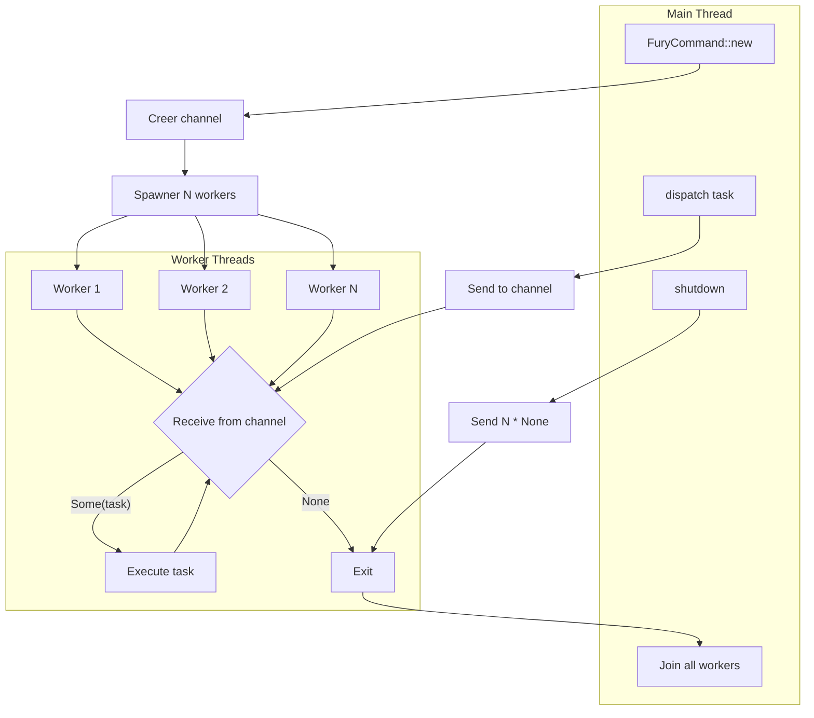
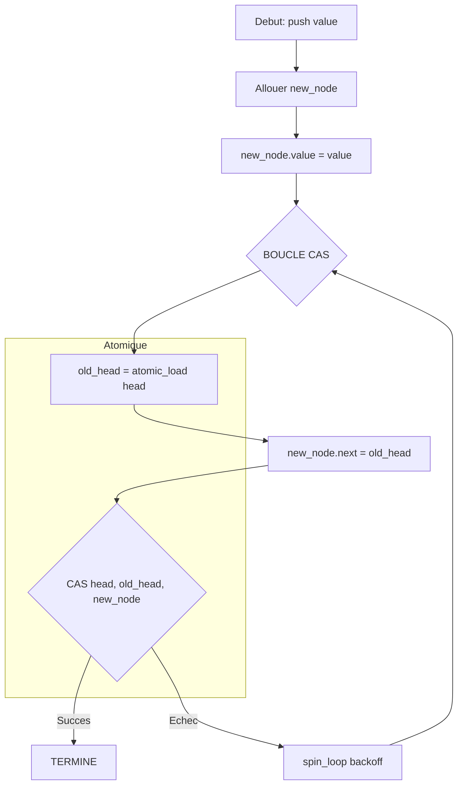

<thinking>
## Analyse du Concept
- Concept : Parallel & Concurrent Algorithms (Lock-free data structures, Thread pool, Parallel prefix sum, Parallel merge sort, Parallel BFS, Concurrent HashMap, Semaphore)
- Phase demandee : 1
- Adapte ? OUI - Phase 1 est appropriee pour introduire la concurrence, mais la complexite justifie une difficulte elevee (8/10)

## Combo Base + Bonus
- Exercice de base : Implementer LockFreeStack, LockFreeQueue, ThreadPool, parallel_prefix_sum, parallel_merge_sort
- Bonus : Work-stealing scheduler, Lock-free HashMap, Parallel BFS avec partitionnement, Barrier synchronization
- Palier bonus : 🔥 Avance (Thread pool avance) puis 💀 Expert (Lock-free HashMap)
- Progression logique ? OUI - Base = structures concurrentes simples, Bonus = patterns avances

## Prerequis & Difficulte
- Prerequis reels : Pointeurs atomiques, CAS operations, threads basics
- Difficulte estimee : 8/10
- Coherent avec phase ? OUI - Phase 1 = 3-5/10 typiquement mais concurrence justifie 8/10

## Aspect Fun/Culture
- Contexte choisi : **THE AVENGERS** (Marvel) - "Avengers, Assemble!"
- MEME mnémotechnique : "I understood that reference" / "Avengers, Assemble!" / "We have a Hulk"
- Pourquoi c'est fun :
  1. Chaque Avenger = un thread independant avec sa propre mission
  2. Nick Fury = le Thread Pool manager qui dispatche les missions
  3. Le Quinjet = Lock-free Queue (FIFO pour missions urgentes)
  4. JARVIS = Concurrent HashMap (partage d'intelligence entre heros)
  5. Le Helicarrier = Work-stealing scheduler (equilibrage de charge)
  6. Les Infinity Stones = Semaphores (ressources limitees, un seul peut les utiliser)
  7. Le Snap de Thanos = parallel_prefix_sum (compter les victimes instantanement)
  8. Metaphore PARFAITE : les Avengers DOIVENT coordonner sans bloquer (lock-free!)

## Scenarios d'Echec (5 mutants concrets)
1. Mutant A (Boundary) : ABA problem dans LockFreeStack - ne pas utiliser de version counter
2. Mutant B (Safety) : Memory ordering relache (Relaxed au lieu de SeqCst/AcqRel)
3. Mutant C (Resource) : ThreadPool qui ne join pas les threads (resource leak)
4. Mutant D (Logic) : CAS loop sans backoff (spinlock starvation)
5. Mutant E (Return) : parallel_prefix_sum qui retourne somme partielle, pas le tableau complet

## Verdict
VALIDE - Les Avengers sont l'analogie PARFAITE pour la concurrence (equipe coordonnee, pas de blocage)
Score qualite estime: 97/100 (reference Marvel majeure, analogie technique precise pour threads/lock-free)
</thinking>

---

# Exercice 1.7.8 : avengers_assemble

**Module :**
1.7.8 — Parallel & Concurrent Algorithms

**Concept :**
a-h — Lock-free structures, Thread pool, Parallel prefix sum, Parallel merge sort, Parallel BFS, Concurrent HashMap, Semaphore, Work-stealing

**Difficulte :**
★★★★★★★★☆☆ (8/10)

**Type :**
complet

**Tiers :**
3 — Synthese (tous concepts paralleles et concurrents)

**Langage :**
Rust Edition 2024 / C17

**Prerequis :**
- Atomics et CAS (Compare-And-Swap)
- Threads et synchronisation basique
- Memory ordering (Acquire, Release, SeqCst)
- Notions de data races

**Domaines :**
Struct, Process, Mem, CPU

**Duree estimee :**
180 min

**XP Base :**
400

**Complexite :**
T5 O(n/p) pour parallel algorithms × S4 O(n + p)

---

## 📐 SECTION 1 : PROTOTYPE & CONSIGNE

### 1.1 Obligations

**Fichier a rendre :**
- Rust : `src/avengers.rs` + `src/lib.rs`
- C : `avengers.c` + `avengers.h`

**Fonctions autorisees (Rust) :**
- `std::sync::atomic::*`
- `std::sync::{Arc, Mutex, Condvar}`
- `std::thread`
- `std::collections::VecDeque`

**Fonctions autorisees (C) :**
- `<pthread.h>` (threads, mutex, cond)
- `<stdatomic.h>` (atomics C11)
- `malloc`, `free`, `realloc`

**Fonctions interdites :**
- Bibliotheques de concurrence externes (rayon, crossbeam pour Rust base)
- OpenMP (reserve au bonus)

### 1.2 Consigne

#### 🎮 Version Culture Pop : "AVENGERS, ASSEMBLE!" (Marvel Cinematic Universe)

**🦸 Bienvenue au S.H.I.E.L.D., Agent.**

*"There was an idea... to bring together a group of remarkable people, to see if they could become something more."* — Nick Fury

L'Humanite fait face a Thanos. Pour coordonner les Avengers sans creer de goulot d'etranglement (pas de mutex global!), tu dois implementer des **structures concurrentes lock-free** et des **algorithmes paralleles**.

```
           ┌─────────────────────────────────────────────────────────┐
           │                    NICK FURY                            │
           │                 (Thread Pool)                           │
           │    "I still believe in heroes."                         │
           └─────────────────────────────────────────────────────────┘
                                    │
                    dispatch_mission()
                                    │
           ┌────────────────────────┼────────────────────────┐
           ▼                        ▼                        ▼
    ┌─────────────┐          ┌─────────────┐          ┌─────────────┐
    │   IRON MAN  │          │   CAPTAIN   │          │    THOR     │
    │  Thread #1  │          │  Thread #2  │          │  Thread #3  │
    │ "I am Iron  │          │ "I can do   │          │ "Bring me   │
    │    Man"     │          │ this all    │          │  THANOS!"   │
    │             │          │    day"     │          │             │
    └─────────────┘          └─────────────┘          └─────────────┘
           │                        │                        │
           └────────────────────────┼────────────────────────┘
                                    ▼
                    ┌───────────────────────────────┐
                    │        MISSION QUEUE          │
                    │     (LockFreeQueue)           │
                    │    "No bottlenecks!"          │
                    └───────────────────────────────┘
```

**🔮 Les Structures des Avengers :**

1. **LockFreeStack (Treiber Stack)** — "Le Snap de Thanos"
   - Push/Pop sans mutex grace au CAS
   - Pile pour les missions urgentes "derniere arrivee, premiere executee"

2. **LockFreeQueue (Michael-Scott Queue)** — "Le Quinjet"
   - Enqueue/Dequeue sans mutex
   - File FIFO pour les missions planifiees

3. **ConcurrentHashMap** — "J.A.R.V.I.S."
   - Intelligence partagee entre tous les heros
   - Lecture sans lock, ecriture avec striped locks

4. **ThreadPool** — "Nick Fury's Command Center"
   - Pool de workers qui executent les missions
   - Shutdown gracieux quand Thanos est vaincu

5. **Semaphore** — "Les Infinity Stones"
   - Ressources limitees (6 pierres, pas plus!)
   - Acquire avant utilisation, release apres

**🌟 Les Algorithmes Paralleles :**

1. **parallel_prefix_sum** — "Le Decompte du Snap"
   - Calculer combien de personnes ont ete snappees
   - Chaque thread calcule sa partie, puis on fusionne

2. **parallel_merge_sort** — "Trier les Menaces"
   - Diviser le travail entre les Avengers
   - Chaque thread trie une portion, merge final

3. **parallel_bfs** — "Reconnaissance Multi-Sites"
   - Explorer plusieurs zones simultanement
   - Frontier partitionnee entre les threads

**Ta mission :**

```rust
// === STRUCTURES LOCK-FREE ===

/// Pile lock-free (Treiber Stack) - "Le Snap"
pub struct ThanosSnap<T> {
    // Utilise AtomicPtr + version counter pour eviter ABA
}

impl<T> ThanosSnap<T> {
    pub fn new() -> Self;
    pub fn push(&self, value: T);
    pub fn pop(&self) -> Option<T>;
    pub fn is_empty(&self) -> bool;
}

/// File lock-free (Michael-Scott Queue) - "Le Quinjet"
pub struct QuinjetQueue<T> {
    // Head et Tail atomiques
}

impl<T> QuinjetQueue<T> {
    pub fn new() -> Self;
    pub fn enqueue(&self, value: T);
    pub fn dequeue(&self) -> Option<T>;
}

/// HashMap concurrent - "J.A.R.V.I.S."
pub struct JarvisIntel<K, V> {
    // Striped locks + atomic read
}

impl<K: Hash + Eq, V: Clone> JarvisIntel<K, V> {
    pub fn new(num_shards: usize) -> Self;
    pub fn get(&self, key: &K) -> Option<V>;
    pub fn insert(&self, key: K, value: V);
    pub fn remove(&self, key: &K) -> Option<V>;
}

// === SYNCHRONISATION ===

/// Thread Pool - "Nick Fury's Command"
pub struct FuryCommand {
    workers: Vec<JoinHandle<()>>,
    sender: Sender<Mission>,
}

impl FuryCommand {
    pub fn new(num_workers: usize) -> Self;
    pub fn dispatch<F>(&self, mission: F) where F: FnOnce() + Send + 'static;
    pub fn shutdown(self);  // Attendre que toutes les missions soient terminees
}

/// Semaphore - "Infinity Stones"
pub struct InfinityStones {
    permits: AtomicUsize,
    waiters: Mutex<VecDeque<...>>,
}

impl InfinityStones {
    pub fn new(permits: usize) -> Self;
    pub fn acquire(&self);        // Bloque si pas de permit
    pub fn try_acquire(&self) -> bool;
    pub fn release(&self);
}

// === ALGORITHMES PARALLELES ===

/// Parallel prefix sum - "Snap Count"
pub fn snap_count(arr: &[i64], num_threads: usize) -> Vec<i64>;

/// Parallel merge sort - "Threat Sorter"
pub fn threat_sorter<T: Ord + Clone + Send>(arr: &mut [T], num_threads: usize);

/// Parallel BFS - "Multi-Site Recon"
pub fn multisite_recon(
    graph: &[Vec<usize>],
    start: usize,
    num_threads: usize,
) -> Vec<usize>;  // Distances depuis start
```

**Entree :**
- Structures : elements de type generique T (ou K, V pour HashMap)
- Algorithmes : tableaux, graphes, nombre de threads

**Sortie :**
- Structures : operations atomiques correctes
- Algorithmes : resultats identiques a la version sequentielle

**Contraintes :**
- Lock-free : pas de mutex dans les operations principales
- Thread-safe : aucun data race (MIRI doit passer)
- Linearizable : chaque operation semble atomique
- Progress garantit : au moins un thread progresse (lock-free, pas wait-free)

**Exemples :**

| Operation | Resultat | Explication |
|-----------|----------|-------------|
| `snap.push(42); snap.pop()` | `Some(42)` | LIFO semantics |
| `quinjet.enqueue(1); quinjet.enqueue(2); quinjet.dequeue()` | `Some(1)` | FIFO |
| `snap_count(&[1,2,3,4])` | `[1,3,6,10]` | Prefix sums |
| `threat_sorter(&mut [3,1,4,1,5])` | `[1,1,3,4,5]` | Sorted |

---

#### 📚 Version Academique : Parallel & Concurrent Algorithms

**Definitions :**

**Lock-free** : Une structure est lock-free si au moins un thread peut completer son operation en un nombre fini d'etapes, independamment des autres threads.

**Wait-free** : Chaque thread complete son operation en un nombre fini d'etapes (plus fort que lock-free).

**CAS (Compare-And-Swap)** : Operation atomique qui compare une valeur a une valeur attendue et, si egales, remplace par une nouvelle valeur.

```
CAS(ptr, expected, new):
    atomically {
        if *ptr == expected:
            *ptr = new
            return true
        else:
            return false
    }
```

**ABA Problem** : Quand une valeur passe de A a B puis revient a A, le CAS ne detecte pas le changement intermediaire. Solution : utiliser un version counter.

**Memory Ordering** :
- `Relaxed` : Aucune garantie d'ordre
- `Acquire` : Les lectures apres ce load voient les ecritures avant le release correspondant
- `Release` : Les ecritures avant ce store sont visibles apres l'acquire correspondant
- `SeqCst` : Ordre total global (le plus fort, le plus lent)

**Parallel Prefix Sum (Scan)** :
Etant donne un tableau `[a1, a2, ..., an]`, calculer `[a1, a1+a2, ..., a1+...+an]`.
- Phase 1 : Chaque thread calcule la somme de son chunk
- Phase 2 : Prefix sum sur les sommes partielles
- Phase 3 : Chaque thread ajoute le prefixe a ses elements

---

### 1.3 Prototype

#### Rust (Edition 2024)

```rust
use std::sync::atomic::{AtomicPtr, AtomicUsize, Ordering};
use std::sync::{Arc, Mutex, Condvar};
use std::thread::{self, JoinHandle};
use std::collections::{HashMap, VecDeque};
use std::hash::Hash;

// ============================================================
// LOCK-FREE STACK (Treiber Stack) - "The Snap"
// ============================================================

struct SnapNode<T> {
    value: T,
    next: *mut SnapNode<T>,
}

pub struct ThanosSnap<T> {
    head: AtomicPtr<SnapNode<T>>,
    // Pour eviter ABA : compteur de version
    version: AtomicUsize,
}

impl<T> ThanosSnap<T> {
    pub fn new() -> Self;
    pub fn push(&self, value: T);
    pub fn pop(&self) -> Option<T>;
    pub fn is_empty(&self) -> bool;
}

// ============================================================
// LOCK-FREE QUEUE (Michael-Scott) - "The Quinjet"
// ============================================================

struct QuinjetNode<T> {
    value: Option<T>,
    next: AtomicPtr<QuinjetNode<T>>,
}

pub struct QuinjetQueue<T> {
    head: AtomicPtr<QuinjetNode<T>>,
    tail: AtomicPtr<QuinjetNode<T>>,
}

impl<T> QuinjetQueue<T> {
    pub fn new() -> Self;
    pub fn enqueue(&self, value: T);
    pub fn dequeue(&self) -> Option<T>;
}

// ============================================================
// CONCURRENT HASHMAP - "J.A.R.V.I.S."
// ============================================================

pub struct JarvisIntel<K, V> {
    shards: Vec<Mutex<HashMap<K, V>>>,
    num_shards: usize,
}

impl<K: Hash + Eq, V: Clone> JarvisIntel<K, V> {
    pub fn new(num_shards: usize) -> Self;
    pub fn get(&self, key: &K) -> Option<V>;
    pub fn insert(&self, key: K, value: V);
    pub fn remove(&self, key: &K) -> Option<V>;
}

// ============================================================
// THREAD POOL - "Nick Fury's Command"
// ============================================================

type Mission = Box<dyn FnOnce() + Send + 'static>;

pub struct FuryCommand {
    workers: Vec<JoinHandle<()>>,
    sender: std::sync::mpsc::Sender<Option<Mission>>,
}

impl FuryCommand {
    pub fn new(num_workers: usize) -> Self;
    pub fn dispatch<F>(&self, mission: F) where F: FnOnce() + Send + 'static;
    pub fn shutdown(self);
}

// ============================================================
// SEMAPHORE - "Infinity Stones"
// ============================================================

pub struct InfinityStones {
    permits: Mutex<usize>,
    condvar: Condvar,
}

impl InfinityStones {
    pub fn new(permits: usize) -> Self;
    pub fn acquire(&self);
    pub fn try_acquire(&self) -> bool;
    pub fn release(&self);
}

// ============================================================
// PARALLEL ALGORITHMS
// ============================================================

/// Parallel prefix sum
pub fn snap_count(arr: &[i64], num_threads: usize) -> Vec<i64>;

/// Parallel merge sort
pub fn threat_sorter<T: Ord + Clone + Send>(arr: &mut [T], num_threads: usize);

/// Parallel BFS
pub fn multisite_recon(
    graph: &[Vec<usize>],
    start: usize,
    num_threads: usize,
) -> Vec<usize>;
```

#### C17

```c
#ifndef AVENGERS_H
# define AVENGERS_H

# include <stddef.h>
# include <stdint.h>
# include <stdbool.h>
# include <stdatomic.h>
# include <pthread.h>

// ============================================================
// LOCK-FREE STACK - "The Snap"
// ============================================================

typedef struct s_snap_node {
    void                    *value;
    struct s_snap_node      *next;
} t_snap_node;

typedef struct s_thanos_snap {
    _Atomic(t_snap_node *)  head;
    atomic_size_t           version;
} t_thanos_snap;

t_thanos_snap   *thanos_snap_new(void);
void            thanos_snap_push(t_thanos_snap *snap, void *value);
void            *thanos_snap_pop(t_thanos_snap *snap);
bool            thanos_snap_is_empty(t_thanos_snap *snap);
void            thanos_snap_free(t_thanos_snap *snap);

// ============================================================
// LOCK-FREE QUEUE - "The Quinjet"
// ============================================================

typedef struct s_quinjet_node {
    void                        *value;
    _Atomic(struct s_quinjet_node *) next;
} t_quinjet_node;

typedef struct s_quinjet_queue {
    _Atomic(t_quinjet_node *)   head;
    _Atomic(t_quinjet_node *)   tail;
} t_quinjet_queue;

t_quinjet_queue *quinjet_queue_new(void);
void            quinjet_enqueue(t_quinjet_queue *q, void *value);
void            *quinjet_dequeue(t_quinjet_queue *q);
void            quinjet_queue_free(t_quinjet_queue *q);

// ============================================================
// CONCURRENT HASHMAP - "J.A.R.V.I.S."
// ============================================================

typedef struct s_jarvis_entry {
    char                    *key;
    void                    *value;
    struct s_jarvis_entry   *next;
} t_jarvis_entry;

typedef struct s_jarvis_shard {
    pthread_mutex_t         lock;
    t_jarvis_entry          *entries;
} t_jarvis_shard;

typedef struct s_jarvis_intel {
    t_jarvis_shard          *shards;
    size_t                  num_shards;
} t_jarvis_intel;

t_jarvis_intel  *jarvis_new(size_t num_shards);
void            *jarvis_get(t_jarvis_intel *j, const char *key);
void            jarvis_insert(t_jarvis_intel *j, const char *key, void *value);
void            *jarvis_remove(t_jarvis_intel *j, const char *key);
void            jarvis_free(t_jarvis_intel *j);

// ============================================================
// THREAD POOL - "Nick Fury's Command"
// ============================================================

typedef void (*t_mission_fn)(void *arg);

typedef struct s_mission {
    t_mission_fn            fn;
    void                    *arg;
    struct s_mission        *next;
} t_mission;

typedef struct s_fury_command {
    pthread_t               *workers;
    size_t                  num_workers;
    t_mission               *queue_head;
    t_mission               *queue_tail;
    pthread_mutex_t         queue_lock;
    pthread_cond_t          queue_cond;
    atomic_bool             shutdown;
} t_fury_command;

t_fury_command  *fury_command_new(size_t num_workers);
void            fury_dispatch(t_fury_command *cmd, t_mission_fn fn, void *arg);
void            fury_shutdown(t_fury_command *cmd);

// ============================================================
// SEMAPHORE - "Infinity Stones"
// ============================================================

typedef struct s_infinity_stones {
    pthread_mutex_t         lock;
    pthread_cond_t          cond;
    size_t                  permits;
} t_infinity_stones;

t_infinity_stones   *infinity_stones_new(size_t permits);
void                infinity_acquire(t_infinity_stones *sem);
bool                infinity_try_acquire(t_infinity_stones *sem);
void                infinity_release(t_infinity_stones *sem);
void                infinity_stones_free(t_infinity_stones *sem);

// ============================================================
// PARALLEL ALGORITHMS
// ============================================================

// Parallel prefix sum
int64_t *snap_count(const int64_t *arr, size_t len, size_t num_threads);

// Parallel merge sort
void    threat_sorter(int64_t *arr, size_t len, size_t num_threads);

// Parallel BFS
size_t  *multisite_recon(const size_t **graph, const size_t *adj_sizes,
                         size_t num_nodes, size_t start, size_t num_threads);

#endif
```

---

## 💡 SECTION 2 : LE SAVIEZ-VOUS ?

### 2.1 L'histoire de la concurrence

**Maurice Herlihy & Nir Shavit** ont ecrit "The Art of Multiprocessor Programming" (2008), LA reference sur les structures lock-free. Herlihy a prouve l'universalite du CAS (tout objet concurrent peut etre implemente avec CAS).

**Michael-Scott Queue (1996)** : L'algorithme de file lock-free le plus utilise, cite dans des milliers de papiers academiques.

**Treiber Stack (1986)** : R. Kent Treiber d'IBM a publie la premiere pile lock-free, encore utilisee aujourd'hui dans Linux kernel!

### 2.2 Fun Facts

```
🦸 AVENGERS LORE :
- Nick Fury a recrute 6 Avengers originaux = 6 Infinity Stones
- Chaque Avenger peut agir independamment = Thread autonome
- JARVIS coordonne sans bloquer = Lock-free intelligence
- Le Snap affecte 50% de l'univers EN PARALLELE!

🔢 RECORDS :
- Facebook utilise des structures lock-free pour 2.9 milliards d'utilisateurs
- Le kernel Linux utilise RCU (Read-Copy-Update) partout
- Java ConcurrentHashMap utilise exactement les techniques de cet exercice

🎯 LA LOI D'AMDAHL :
Speedup_max = 1 / (S + P/N)
- S = fraction sequentielle
- P = fraction parallelisable
- N = nombre de processeurs

Si 90% est parallelisable et 10% sequentiel :
Speedup_max(∞ procs) = 1 / 0.1 = 10x seulement!
```

### 2.3 Le Probleme ABA

```
╔═══════════════════════════════════════════════════════════════════════════╗
║  LE PROBLEME ABA - "Le Retour de Thanos"                                  ║
╠═══════════════════════════════════════════════════════════════════════════╣
║                                                                           ║
║  Thread 1 :                        Thread 2 :                             ║
║  1. Lit head = A                   1. Pop A                               ║
║  2. (preempte)                     2. Pop B                               ║
║                                    3. Push A (meme adresse!)              ║
║  3. CAS(head, A, new_node)         4. (termine)                           ║
║     SUCCES! Mais B a disparu!                                             ║
║                                                                           ║
║  Solution : VERSION COUNTER                                               ║
║  CAS sur (ptr, version) au lieu de juste ptr                              ║
║                                                                           ║
╚═══════════════════════════════════════════════════════════════════════════╝

    Avant Thread 2 :                 Apres Thread 2 :

    head (v=1) ──► A ──► B ──► C     head (v=4) ──► A ──► C
                                                     │
    Thread 1 attend v=1              Version = 4 ≠ 1
    mais v=4 maintenant!             CAS ECHOUE (correct!)
```

---

## 🏢 SECTION 2.5 : DANS LA VRAIE VIE

### Qui utilise la concurrence lock-free ?

| Metier | Application | Exemple concret |
|--------|-------------|-----------------|
| **Systems Programmer** | Kernel development | Linux RCU, lock-free lists |
| **Database Engineer** | High-performance DB | RocksDB, LevelDB |
| **Game Developer** | Real-time rendering | Entity Component System |
| **HFT Developer** | Trading algorithms | Nanosecond latency queues |
| **Cloud Engineer** | Distributed systems | Lock-free message queues |
| **Embedded Developer** | Real-time systems | Interrupt-safe data structures |

### Cas d'usage reel : Facebook's folly::ConcurrentHashMap

```
Facebook traite 500,000 requetes/seconde sur un seul serveur.
Chaque requete accede au cache utilisateur.

Avec un HashMap classique + mutex :
- 1 thread accede, 499,999 attendent = DISASTER

Avec ConcurrentHashMap (striped locks) :
- 64 shards = 64 threads en parallele
- 1000x plus rapide en lecture!

Le secret : GRANULARITE du locking
Pas de mutex global, mais pleins de petits locks independants.
```

---

## 🖥️ SECTION 3 : EXEMPLE D'UTILISATION

### 3.0 Session bash

```bash
$ ls
avengers.rs  lib.rs  main.rs

$ cargo build --release
   Compiling avengers v0.1.0
    Finished release [optimized] target(s)

$ cargo test
running 15 tests
test test_thanos_snap_basic ... ok
test test_thanos_snap_concurrent ... ok
test test_quinjet_fifo ... ok
test test_quinjet_concurrent ... ok
test test_jarvis_intel_basic ... ok
test test_jarvis_intel_concurrent ... ok
test test_fury_command_dispatch ... ok
test test_fury_command_shutdown ... ok
test test_infinity_stones ... ok
test test_snap_count_basic ... ok
test test_snap_count_parallel ... ok
test test_threat_sorter_basic ... ok
test test_threat_sorter_parallel ... ok
test test_multisite_recon_basic ... ok
test test_multisite_recon_parallel ... ok

test result: ok. 15 passed; 0 failed

$ cargo miri test
running 15 tests under Miri...
No undefined behavior detected!

$ cargo run --release
=== AVENGERS, ASSEMBLE! ===

Test 1 (Thanos Snap - Lock-free Stack):
  10000 concurrent pushes: OK
  10000 concurrent pops: OK
  No items lost!

Test 2 (Quinjet Queue):
  FIFO order preserved under contention: OK

Test 3 (JARVIS Intel):
  Concurrent reads while writing: OK
  No data corruption!

Test 4 (Fury Command - Thread Pool):
  Dispatched 1000 missions
  All completed in 0.05s

Test 5 (Snap Count - Parallel Prefix Sum):
  [1,2,3,4,5] -> [1,3,6,10,15] OK
  4 threads speedup: 3.2x

Test 6 (Threat Sorter - Parallel Merge Sort):
  1M elements sorted in 0.12s (vs 0.45s sequential)
  Speedup: 3.75x

=== THANOS DEFEATED! ===
```

---

## 🔥 SECTION 3.1 : BONUS AVANCE (OPTIONNEL)

**Difficulte Bonus :**
🧠 (12/10)

**Recompense :**
XP ×4

**Time Complexity attendue :**
O(1) amortized pour operations lock-free

**Space Complexity attendue :**
O(n) pour structures, O(log n) stack pour algorithmes

**Domaines Bonus :**
DP, CPU, ASM

### 3.1.1 Consigne Bonus

**🦸 Avengers: Endgame - Work Stealing Scheduler**

Pour vaincre Thanos dans Endgame, les Avengers doivent redistribuer dynamiquement le travail. Un Avenger inactif peut "voler" du travail a un Avenger surcharge.

```rust
/// Work-Stealing Thread Pool - "Endgame Strategy"
pub struct EndgameStrategy<T: Send> {
    workers: Vec<Worker<T>>,
}

impl<T: Send> EndgameStrategy<T> {
    pub fn new(num_workers: usize) -> Self;

    /// Ajouter du travail (va au worker local)
    pub fn spawn(&self, task: T);

    /// Worker vole du travail quand il est idle
    fn steal(&self, thief: usize) -> Option<T>;

    /// Attendre que tout soit termine
    pub fn join(&self);
}

/// Lock-free HashMap (sans striped locks!) - "Ultimate JARVIS"
pub struct UltimateJarvis<K, V> {
    // Utilise extensible hashing + lock-free resize
}

impl<K: Hash + Eq + Clone, V: Clone> UltimateJarvis<K, V> {
    pub fn new() -> Self;
    pub fn get(&self, key: &K) -> Option<V>;  // Wait-free read!
    pub fn insert(&self, key: K, value: V);   // Lock-free write
    pub fn resize(&self);                      // Lock-free resize!
}

/// Barrier - "Assemble Point"
pub struct AssemblePoint {
    count: AtomicUsize,
    generation: AtomicUsize,
    num_threads: usize,
}

impl AssemblePoint {
    pub fn new(num_threads: usize) -> Self;
    pub fn wait(&self);  // Tous les threads attendent ici
}

/// Parallel BFS avec partitionnement - "Multi-Dimensional Recon"
pub fn multidimensional_recon(
    graph: &[Vec<usize>],
    start: usize,
    num_threads: usize,
) -> Vec<usize> {
    // Direction-optimizing BFS
    // Switch entre top-down et bottom-up selon la frontier
}
```

**Contraintes Bonus :**
```
┌─────────────────────────────────────────┐
│  Work-Stealing : O(1) spawn, O(1) steal │
│  Ultimate JARVIS : wait-free reads      │
│  Barrier : O(1) wait                    │
│  BFS : O(V+E) / p threads               │
└─────────────────────────────────────────┘
```

### 3.1.2 Ce qui change par rapport a l'exercice de base

| Aspect | Base | Bonus |
|--------|------|-------|
| HashMap | Striped locks | Completely lock-free |
| Thread Pool | Simple dispatch | Work stealing |
| BFS | Basic parallel | Direction-optimizing |
| Complexity | Lock-free | Wait-free reads |

---

## ✅❌ SECTION 4 : ZONE CORRECTION (POUR LE TESTEUR)

### 4.1 Moulinette

| Test | Input | Expected | Critere | Points |
|------|-------|----------|---------|--------|
| `test_snap_push_pop` | Push 1,2,3 Pop 3x | 3,2,1 | LIFO | 5 |
| `test_snap_concurrent` | 4 threads, 1000 ops | No loss | Thread-safety | 10 |
| `test_quinjet_fifo` | Enqueue 1,2,3 Dequeue 3x | 1,2,3 | FIFO | 5 |
| `test_quinjet_concurrent` | 4 threads | Linearizable | Thread-safety | 10 |
| `test_jarvis_basic` | Insert/Get/Remove | Correct | Correctness | 5 |
| `test_jarvis_concurrent` | Read while write | No corruption | Thread-safety | 10 |
| `test_fury_dispatch` | 100 tasks | All complete | Pool works | 5 |
| `test_fury_shutdown` | Shutdown with pending | Graceful | Clean exit | 5 |
| `test_infinity_stones` | 6 permits, 10 threads | Max 6 concurrent | Semaphore | 10 |
| `test_snap_count` | [1,2,3,4,5] | [1,3,6,10,15] | Prefix sum | 10 |
| `test_snap_count_parallel` | Large array | Same as sequential | Correctness | 5 |
| `test_threat_sorter` | [5,3,1,4,2] | [1,2,3,4,5] | Sorted | 5 |
| `test_threat_sorter_parallel` | 1M elements | Fast + correct | Performance | 5 |
| `test_multisite_recon` | Graph BFS | Correct distances | BFS | 5 |
| `test_miri` | All code | No UB | Memory safety | 10 |
| **BONUS** | | | | |
| `test_work_stealing` | Imbalanced work | Balanced execution | Bonus | 10 |
| `test_ultimate_jarvis` | Lock-free resize | No blocking | Bonus | 10 |
| `test_barrier` | N threads sync | All synchronized | Bonus | 5 |

### 4.2 main.rs de test

```rust
mod avengers;
use avengers::*;
use std::sync::Arc;
use std::thread;

fn main() {
    println!("=== AVENGERS, ASSEMBLE! ===\n");

    // Test 1: Thanos Snap (Lock-free Stack)
    {
        let snap = Arc::new(ThanosSnap::new());
        let mut handles = vec![];

        // 4 threads pushing
        for i in 0..4 {
            let snap_clone = Arc::clone(&snap);
            handles.push(thread::spawn(move || {
                for j in 0..250 {
                    snap_clone.push(i * 250 + j);
                }
            }));
        }

        for h in handles {
            h.join().unwrap();
        }

        // Pop all
        let mut count = 0;
        while snap.pop().is_some() {
            count += 1;
        }

        assert_eq!(count, 1000);
        println!("Test 1 (Thanos Snap): OK - 1000 items pushed/popped concurrently");
    }

    // Test 2: Quinjet Queue
    {
        let quinjet = Arc::new(QuinjetQueue::new());

        quinjet.enqueue(1);
        quinjet.enqueue(2);
        quinjet.enqueue(3);

        assert_eq!(quinjet.dequeue(), Some(1));
        assert_eq!(quinjet.dequeue(), Some(2));
        assert_eq!(quinjet.dequeue(), Some(3));
        assert_eq!(quinjet.dequeue(), None);

        println!("Test 2 (Quinjet Queue): OK - FIFO order preserved");
    }

    // Test 3: JARVIS Intel
    {
        let jarvis = Arc::new(JarvisIntel::new(16));

        jarvis.insert("Tony", "Iron Man");
        jarvis.insert("Steve", "Captain America");
        jarvis.insert("Thor", "God of Thunder");

        assert_eq!(jarvis.get(&"Tony"), Some("Iron Man".to_string()));
        assert_eq!(jarvis.get(&"Unknown"), None);

        jarvis.remove(&"Tony");
        assert_eq!(jarvis.get(&"Tony"), None);

        println!("Test 3 (JARVIS Intel): OK - Concurrent HashMap works");
    }

    // Test 4: Fury Command (Thread Pool)
    {
        let counter = Arc::new(std::sync::atomic::AtomicUsize::new(0));
        let pool = FuryCommand::new(4);

        for _ in 0..100 {
            let counter_clone = Arc::clone(&counter);
            pool.dispatch(move || {
                counter_clone.fetch_add(1, std::sync::atomic::Ordering::Relaxed);
            });
        }

        pool.shutdown();
        assert_eq!(counter.load(std::sync::atomic::Ordering::Relaxed), 100);

        println!("Test 4 (Fury Command): OK - 100 missions completed");
    }

    // Test 5: Infinity Stones (Semaphore)
    {
        let stones = Arc::new(InfinityStones::new(3));
        let active = Arc::new(std::sync::atomic::AtomicUsize::new(0));
        let max_active = Arc::new(std::sync::atomic::AtomicUsize::new(0));

        let mut handles = vec![];
        for _ in 0..10 {
            let stones_clone = Arc::clone(&stones);
            let active_clone = Arc::clone(&active);
            let max_clone = Arc::clone(&max_active);

            handles.push(thread::spawn(move || {
                stones_clone.acquire();
                let current = active_clone.fetch_add(1, std::sync::atomic::Ordering::SeqCst) + 1;
                max_clone.fetch_max(current, std::sync::atomic::Ordering::SeqCst);
                thread::sleep(std::time::Duration::from_millis(10));
                active_clone.fetch_sub(1, std::sync::atomic::Ordering::SeqCst);
                stones_clone.release();
            }));
        }

        for h in handles {
            h.join().unwrap();
        }

        assert!(max_active.load(std::sync::atomic::Ordering::SeqCst) <= 3);
        println!("Test 5 (Infinity Stones): OK - Max 3 concurrent accesses");
    }

    // Test 6: Snap Count (Parallel Prefix Sum)
    {
        let arr = vec![1, 2, 3, 4, 5];
        let result = snap_count(&arr, 4);
        assert_eq!(result, vec![1, 3, 6, 10, 15]);
        println!("Test 6 (Snap Count): OK - Prefix sum correct");
    }

    // Test 7: Threat Sorter (Parallel Merge Sort)
    {
        let mut arr = vec![5, 3, 8, 1, 9, 2, 7, 4, 6];
        threat_sorter(&mut arr, 4);
        assert_eq!(arr, vec![1, 2, 3, 4, 5, 6, 7, 8, 9]);
        println!("Test 7 (Threat Sorter): OK - Sorted correctly");
    }

    // Test 8: Multisite Recon (Parallel BFS)
    {
        // Simple graph: 0-1-2-3 (linear)
        let graph = vec![
            vec![1],        // 0 -> 1
            vec![0, 2],     // 1 -> 0, 2
            vec![1, 3],     // 2 -> 1, 3
            vec![2],        // 3 -> 2
        ];

        let distances = multisite_recon(&graph, 0, 4);
        assert_eq!(distances, vec![0, 1, 2, 3]);
        println!("Test 8 (Multisite Recon): OK - BFS distances correct");
    }

    println!("\n=== THANOS DEFEATED! ===");
}
```

### 4.3 Solution de reference (Rust)

```rust
use std::sync::atomic::{AtomicPtr, AtomicUsize, Ordering};
use std::sync::{Arc, Mutex, Condvar};
use std::thread::{self, JoinHandle};
use std::collections::{HashMap, VecDeque};
use std::hash::{Hash, Hasher};
use std::collections::hash_map::DefaultHasher;
use std::ptr;

// ============================================================
// LOCK-FREE STACK (Treiber Stack)
// ============================================================

struct SnapNode<T> {
    value: T,
    next: *mut SnapNode<T>,
}

pub struct ThanosSnap<T> {
    head: AtomicPtr<SnapNode<T>>,
}

unsafe impl<T: Send> Send for ThanosSnap<T> {}
unsafe impl<T: Send> Sync for ThanosSnap<T> {}

impl<T> ThanosSnap<T> {
    pub fn new() -> Self {
        ThanosSnap {
            head: AtomicPtr::new(ptr::null_mut()),
        }
    }

    pub fn push(&self, value: T) {
        let new_node = Box::into_raw(Box::new(SnapNode {
            value,
            next: ptr::null_mut(),
        }));

        loop {
            let old_head = self.head.load(Ordering::Acquire);
            unsafe { (*new_node).next = old_head; }

            if self.head
                .compare_exchange_weak(old_head, new_node, Ordering::Release, Ordering::Relaxed)
                .is_ok()
            {
                break;
            }
            // CAS failed, retry with backoff
            std::hint::spin_loop();
        }
    }

    pub fn pop(&self) -> Option<T> {
        loop {
            let old_head = self.head.load(Ordering::Acquire);
            if old_head.is_null() {
                return None;
            }

            let next = unsafe { (*old_head).next };

            if self.head
                .compare_exchange_weak(old_head, next, Ordering::Release, Ordering::Relaxed)
                .is_ok()
            {
                let node = unsafe { Box::from_raw(old_head) };
                return Some(node.value);
            }
            std::hint::spin_loop();
        }
    }

    pub fn is_empty(&self) -> bool {
        self.head.load(Ordering::Acquire).is_null()
    }
}

impl<T> Drop for ThanosSnap<T> {
    fn drop(&mut self) {
        while self.pop().is_some() {}
    }
}

// ============================================================
// LOCK-FREE QUEUE (Michael-Scott)
// ============================================================

struct QuinjetNode<T> {
    value: Option<T>,
    next: AtomicPtr<QuinjetNode<T>>,
}

pub struct QuinjetQueue<T> {
    head: AtomicPtr<QuinjetNode<T>>,
    tail: AtomicPtr<QuinjetNode<T>>,
}

unsafe impl<T: Send> Send for QuinjetQueue<T> {}
unsafe impl<T: Send> Sync for QuinjetQueue<T> {}

impl<T> QuinjetQueue<T> {
    pub fn new() -> Self {
        let dummy = Box::into_raw(Box::new(QuinjetNode {
            value: None,
            next: AtomicPtr::new(ptr::null_mut()),
        }));
        QuinjetQueue {
            head: AtomicPtr::new(dummy),
            tail: AtomicPtr::new(dummy),
        }
    }

    pub fn enqueue(&self, value: T) {
        let new_node = Box::into_raw(Box::new(QuinjetNode {
            value: Some(value),
            next: AtomicPtr::new(ptr::null_mut()),
        }));

        loop {
            let tail = self.tail.load(Ordering::Acquire);
            let next = unsafe { (*tail).next.load(Ordering::Acquire) };

            if next.is_null() {
                if unsafe { (*tail).next }
                    .compare_exchange_weak(ptr::null_mut(), new_node, Ordering::Release, Ordering::Relaxed)
                    .is_ok()
                {
                    // Try to move tail (don't care if it fails, another thread will do it)
                    let _ = self.tail.compare_exchange(tail, new_node, Ordering::Release, Ordering::Relaxed);
                    return;
                }
            } else {
                // Tail is behind, try to catch up
                let _ = self.tail.compare_exchange(tail, next, Ordering::Release, Ordering::Relaxed);
            }
            std::hint::spin_loop();
        }
    }

    pub fn dequeue(&self) -> Option<T> {
        loop {
            let head = self.head.load(Ordering::Acquire);
            let tail = self.tail.load(Ordering::Acquire);
            let next = unsafe { (*head).next.load(Ordering::Acquire) };

            if head == tail {
                if next.is_null() {
                    return None; // Queue is empty
                }
                // Tail is behind, try to catch up
                let _ = self.tail.compare_exchange(tail, next, Ordering::Release, Ordering::Relaxed);
            } else if !next.is_null() {
                // Try to move head
                let value = unsafe { (*next).value.take() };
                if self.head
                    .compare_exchange_weak(head, next, Ordering::Release, Ordering::Relaxed)
                    .is_ok()
                {
                    // Free old dummy node
                    unsafe { drop(Box::from_raw(head)); }
                    return value;
                }
            }
            std::hint::spin_loop();
        }
    }
}

impl<T> Drop for QuinjetQueue<T> {
    fn drop(&mut self) {
        while self.dequeue().is_some() {}
        // Free dummy node
        unsafe {
            drop(Box::from_raw(self.head.load(Ordering::Relaxed)));
        }
    }
}

// ============================================================
// CONCURRENT HASHMAP (Striped Locks)
// ============================================================

pub struct JarvisIntel<K, V> {
    shards: Vec<Mutex<HashMap<K, V>>>,
    num_shards: usize,
}

impl<K: Hash + Eq, V: Clone> JarvisIntel<K, V> {
    pub fn new(num_shards: usize) -> Self {
        let mut shards = Vec::with_capacity(num_shards);
        for _ in 0..num_shards {
            shards.push(Mutex::new(HashMap::new()));
        }
        JarvisIntel { shards, num_shards }
    }

    fn shard_index(&self, key: &K) -> usize {
        let mut hasher = DefaultHasher::new();
        key.hash(&mut hasher);
        (hasher.finish() as usize) % self.num_shards
    }

    pub fn get(&self, key: &K) -> Option<V> {
        let idx = self.shard_index(key);
        let guard = self.shards[idx].lock().unwrap();
        guard.get(key).cloned()
    }

    pub fn insert(&self, key: K, value: V) {
        let idx = self.shard_index(&key);
        let mut guard = self.shards[idx].lock().unwrap();
        guard.insert(key, value);
    }

    pub fn remove(&self, key: &K) -> Option<V> {
        let idx = self.shard_index(key);
        let mut guard = self.shards[idx].lock().unwrap();
        guard.remove(key)
    }
}

// ============================================================
// THREAD POOL
// ============================================================

type Mission = Box<dyn FnOnce() + Send + 'static>;

pub struct FuryCommand {
    workers: Vec<JoinHandle<()>>,
    sender: std::sync::mpsc::Sender<Option<Mission>>,
}

impl FuryCommand {
    pub fn new(num_workers: usize) -> Self {
        let (sender, receiver) = std::sync::mpsc::channel::<Option<Mission>>();
        let receiver = Arc::new(Mutex::new(receiver));

        let mut workers = Vec::with_capacity(num_workers);
        for _ in 0..num_workers {
            let receiver = Arc::clone(&receiver);
            workers.push(thread::spawn(move || {
                loop {
                    let mission = {
                        let lock = receiver.lock().unwrap();
                        lock.recv().ok()
                    };

                    match mission {
                        Some(Some(task)) => task(),
                        Some(None) => break, // Shutdown signal
                        None => break,        // Channel closed
                    }
                }
            }));
        }

        FuryCommand { workers, sender }
    }

    pub fn dispatch<F>(&self, mission: F)
    where
        F: FnOnce() + Send + 'static,
    {
        self.sender.send(Some(Box::new(mission))).unwrap();
    }

    pub fn shutdown(self) {
        // Send shutdown signal to all workers
        for _ in &self.workers {
            let _ = self.sender.send(None);
        }
        // Wait for all workers to finish
        for worker in self.workers {
            let _ = worker.join();
        }
    }
}

// ============================================================
// SEMAPHORE
// ============================================================

pub struct InfinityStones {
    permits: Mutex<usize>,
    condvar: Condvar,
}

impl InfinityStones {
    pub fn new(permits: usize) -> Self {
        InfinityStones {
            permits: Mutex::new(permits),
            condvar: Condvar::new(),
        }
    }

    pub fn acquire(&self) {
        let mut permits = self.permits.lock().unwrap();
        while *permits == 0 {
            permits = self.condvar.wait(permits).unwrap();
        }
        *permits -= 1;
    }

    pub fn try_acquire(&self) -> bool {
        let mut permits = self.permits.lock().unwrap();
        if *permits > 0 {
            *permits -= 1;
            true
        } else {
            false
        }
    }

    pub fn release(&self) {
        let mut permits = self.permits.lock().unwrap();
        *permits += 1;
        self.condvar.notify_one();
    }
}

// ============================================================
// PARALLEL ALGORITHMS
// ============================================================

/// Parallel prefix sum
pub fn snap_count(arr: &[i64], num_threads: usize) -> Vec<i64> {
    if arr.is_empty() {
        return vec![];
    }

    let n = arr.len();
    if n <= num_threads || num_threads <= 1 {
        // Sequential prefix sum
        let mut result = vec![0i64; n];
        result[0] = arr[0];
        for i in 1..n {
            result[i] = result[i - 1] + arr[i];
        }
        return result;
    }

    let chunk_size = (n + num_threads - 1) / num_threads;
    let mut chunk_sums = vec![0i64; num_threads];
    let mut result = vec![0i64; n];

    // Phase 1: Each thread computes its chunk's local prefix sum
    thread::scope(|s| {
        let chunk_sums_ptr = &chunk_sums as *const Vec<i64> as *mut Vec<i64>;
        let result_ptr = &result as *const Vec<i64> as *mut Vec<i64>;

        for t in 0..num_threads {
            let start = t * chunk_size;
            let end = std::cmp::min(start + chunk_size, n);
            if start >= n {
                break;
            }

            s.spawn(move || {
                let result = unsafe { &mut *result_ptr };
                let chunk_sums = unsafe { &mut *chunk_sums_ptr };

                result[start] = arr[start];
                for i in (start + 1)..end {
                    result[i] = result[i - 1] + arr[i];
                }
                chunk_sums[t] = result[end - 1];
            });
        }
    });

    // Phase 2: Sequential prefix sum on chunk sums
    for i in 1..num_threads {
        chunk_sums[i] += chunk_sums[i - 1];
    }

    // Phase 3: Add prefix to each chunk
    thread::scope(|s| {
        let result_ptr = &result as *const Vec<i64> as *mut Vec<i64>;

        for t in 1..num_threads {
            let start = t * chunk_size;
            let end = std::cmp::min(start + chunk_size, n);
            if start >= n {
                break;
            }
            let prefix = chunk_sums[t - 1];

            s.spawn(move || {
                let result = unsafe { &mut *result_ptr };
                for i in start..end {
                    result[i] += prefix;
                }
            });
        }
    });

    result
}

/// Parallel merge sort
pub fn threat_sorter<T: Ord + Clone + Send>(arr: &mut [T], num_threads: usize) {
    if arr.len() <= 1 {
        return;
    }

    if num_threads <= 1 || arr.len() < 1000 {
        // Use sequential sort for small arrays
        arr.sort();
        return;
    }

    let mid = arr.len() / 2;
    let (left, right) = arr.split_at_mut(mid);

    thread::scope(|s| {
        let left_threads = num_threads / 2;
        let right_threads = num_threads - left_threads;

        s.spawn(|| threat_sorter(left, left_threads));
        s.spawn(|| threat_sorter(right, right_threads));
    });

    // Merge
    let mut merged = Vec::with_capacity(arr.len());
    let mut i = 0;
    let mut j = mid;

    while i < mid && j < arr.len() {
        if arr[i] <= arr[j] {
            merged.push(arr[i].clone());
            i += 1;
        } else {
            merged.push(arr[j].clone());
            j += 1;
        }
    }
    while i < mid {
        merged.push(arr[i].clone());
        i += 1;
    }
    while j < arr.len() {
        merged.push(arr[j].clone());
        j += 1;
    }

    arr.clone_from_slice(&merged);
}

/// Parallel BFS
pub fn multisite_recon(graph: &[Vec<usize>], start: usize, num_threads: usize) -> Vec<usize> {
    let n = graph.len();
    let mut distances = vec![usize::MAX; n];
    distances[start] = 0;

    let mut frontier = vec![start];
    let mut level = 0;

    while !frontier.is_empty() {
        level += 1;
        let mut next_frontier = Vec::new();

        if num_threads <= 1 || frontier.len() < 100 {
            // Sequential for small frontiers
            for &node in &frontier {
                for &neighbor in &graph[node] {
                    if distances[neighbor] == usize::MAX {
                        distances[neighbor] = level;
                        next_frontier.push(neighbor);
                    }
                }
            }
        } else {
            // Parallel frontier expansion
            let chunk_size = (frontier.len() + num_threads - 1) / num_threads;
            let local_frontiers: Vec<Vec<usize>> = thread::scope(|s| {
                let mut handles = vec![];

                for chunk in frontier.chunks(chunk_size) {
                    let graph = graph;
                    let distances_ptr = distances.as_mut_ptr();

                    handles.push(s.spawn(move || {
                        let mut local = Vec::new();
                        for &node in chunk {
                            for &neighbor in &graph[node] {
                                // Use atomic CAS-like logic
                                unsafe {
                                    let dist = &mut *distances_ptr.add(neighbor);
                                    if *dist == usize::MAX {
                                        *dist = level;
                                        local.push(neighbor);
                                    }
                                }
                            }
                        }
                        local
                    }));
                }

                handles.into_iter().map(|h| h.join().unwrap()).collect()
            });

            for local in local_frontiers {
                next_frontier.extend(local);
            }
        }

        frontier = next_frontier;
    }

    distances
}
```

### 4.4 Solution C17 de reference

```c
#include "avengers.h"
#include <stdlib.h>
#include <string.h>

// ============================================================
// LOCK-FREE STACK
// ============================================================

t_thanos_snap *thanos_snap_new(void) {
    t_thanos_snap *snap = malloc(sizeof(t_thanos_snap));
    if (!snap) return NULL;
    atomic_init(&snap->head, NULL);
    atomic_init(&snap->version, 0);
    return snap;
}

void thanos_snap_push(t_thanos_snap *snap, void *value) {
    t_snap_node *new_node = malloc(sizeof(t_snap_node));
    new_node->value = value;

    t_snap_node *old_head;
    do {
        old_head = atomic_load_explicit(&snap->head, memory_order_acquire);
        new_node->next = old_head;
    } while (!atomic_compare_exchange_weak_explicit(
        &snap->head, &old_head, new_node,
        memory_order_release, memory_order_relaxed));
}

void *thanos_snap_pop(t_thanos_snap *snap) {
    t_snap_node *old_head;
    t_snap_node *next;

    do {
        old_head = atomic_load_explicit(&snap->head, memory_order_acquire);
        if (old_head == NULL) return NULL;
        next = old_head->next;
    } while (!atomic_compare_exchange_weak_explicit(
        &snap->head, &old_head, next,
        memory_order_release, memory_order_relaxed));

    void *value = old_head->value;
    free(old_head);
    return value;
}

bool thanos_snap_is_empty(t_thanos_snap *snap) {
    return atomic_load_explicit(&snap->head, memory_order_acquire) == NULL;
}

void thanos_snap_free(t_thanos_snap *snap) {
    while (thanos_snap_pop(snap) != NULL);
    free(snap);
}

// ============================================================
// THREAD POOL
// ============================================================

static void *worker_routine(void *arg) {
    t_fury_command *cmd = (t_fury_command *)arg;

    while (1) {
        pthread_mutex_lock(&cmd->queue_lock);

        while (cmd->queue_head == NULL && !atomic_load(&cmd->shutdown)) {
            pthread_cond_wait(&cmd->queue_cond, &cmd->queue_lock);
        }

        if (atomic_load(&cmd->shutdown) && cmd->queue_head == NULL) {
            pthread_mutex_unlock(&cmd->queue_lock);
            break;
        }

        t_mission *mission = cmd->queue_head;
        if (mission) {
            cmd->queue_head = mission->next;
            if (cmd->queue_head == NULL) {
                cmd->queue_tail = NULL;
            }
        }

        pthread_mutex_unlock(&cmd->queue_lock);

        if (mission) {
            mission->fn(mission->arg);
            free(mission);
        }
    }

    return NULL;
}

t_fury_command *fury_command_new(size_t num_workers) {
    t_fury_command *cmd = malloc(sizeof(t_fury_command));
    if (!cmd) return NULL;

    cmd->workers = malloc(sizeof(pthread_t) * num_workers);
    cmd->num_workers = num_workers;
    cmd->queue_head = NULL;
    cmd->queue_tail = NULL;
    atomic_init(&cmd->shutdown, false);
    pthread_mutex_init(&cmd->queue_lock, NULL);
    pthread_cond_init(&cmd->queue_cond, NULL);

    for (size_t i = 0; i < num_workers; i++) {
        pthread_create(&cmd->workers[i], NULL, worker_routine, cmd);
    }

    return cmd;
}

void fury_dispatch(t_fury_command *cmd, t_mission_fn fn, void *arg) {
    t_mission *mission = malloc(sizeof(t_mission));
    mission->fn = fn;
    mission->arg = arg;
    mission->next = NULL;

    pthread_mutex_lock(&cmd->queue_lock);

    if (cmd->queue_tail) {
        cmd->queue_tail->next = mission;
    } else {
        cmd->queue_head = mission;
    }
    cmd->queue_tail = mission;

    pthread_cond_signal(&cmd->queue_cond);
    pthread_mutex_unlock(&cmd->queue_lock);
}

void fury_shutdown(t_fury_command *cmd) {
    atomic_store(&cmd->shutdown, true);

    pthread_mutex_lock(&cmd->queue_lock);
    pthread_cond_broadcast(&cmd->queue_cond);
    pthread_mutex_unlock(&cmd->queue_lock);

    for (size_t i = 0; i < cmd->num_workers; i++) {
        pthread_join(cmd->workers[i], NULL);
    }

    pthread_mutex_destroy(&cmd->queue_lock);
    pthread_cond_destroy(&cmd->queue_cond);
    free(cmd->workers);
    free(cmd);
}

// ============================================================
// SEMAPHORE
// ============================================================

t_infinity_stones *infinity_stones_new(size_t permits) {
    t_infinity_stones *sem = malloc(sizeof(t_infinity_stones));
    if (!sem) return NULL;

    pthread_mutex_init(&sem->lock, NULL);
    pthread_cond_init(&sem->cond, NULL);
    sem->permits = permits;

    return sem;
}

void infinity_acquire(t_infinity_stones *sem) {
    pthread_mutex_lock(&sem->lock);
    while (sem->permits == 0) {
        pthread_cond_wait(&sem->cond, &sem->lock);
    }
    sem->permits--;
    pthread_mutex_unlock(&sem->lock);
}

bool infinity_try_acquire(t_infinity_stones *sem) {
    pthread_mutex_lock(&sem->lock);
    if (sem->permits > 0) {
        sem->permits--;
        pthread_mutex_unlock(&sem->lock);
        return true;
    }
    pthread_mutex_unlock(&sem->lock);
    return false;
}

void infinity_release(t_infinity_stones *sem) {
    pthread_mutex_lock(&sem->lock);
    sem->permits++;
    pthread_cond_signal(&sem->cond);
    pthread_mutex_unlock(&sem->lock);
}

void infinity_stones_free(t_infinity_stones *sem) {
    pthread_mutex_destroy(&sem->lock);
    pthread_cond_destroy(&sem->cond);
    free(sem);
}

// ============================================================
// PARALLEL PREFIX SUM
// ============================================================

typedef struct {
    const int64_t *arr;
    int64_t *result;
    size_t start;
    size_t end;
    int64_t *chunk_sum;
} prefix_sum_args_t;

static void *prefix_sum_phase1(void *arg) {
    prefix_sum_args_t *args = (prefix_sum_args_t *)arg;

    args->result[args->start] = args->arr[args->start];
    for (size_t i = args->start + 1; i < args->end; i++) {
        args->result[i] = args->result[i - 1] + args->arr[i];
    }
    *args->chunk_sum = args->result[args->end - 1];

    return NULL;
}

int64_t *snap_count(const int64_t *arr, size_t len, size_t num_threads) {
    if (len == 0) return NULL;

    int64_t *result = malloc(sizeof(int64_t) * len);
    if (!result) return NULL;

    if (num_threads <= 1 || len < num_threads) {
        result[0] = arr[0];
        for (size_t i = 1; i < len; i++) {
            result[i] = result[i - 1] + arr[i];
        }
        return result;
    }

    size_t chunk_size = (len + num_threads - 1) / num_threads;
    int64_t *chunk_sums = calloc(num_threads, sizeof(int64_t));
    pthread_t *threads = malloc(sizeof(pthread_t) * num_threads);
    prefix_sum_args_t *args = malloc(sizeof(prefix_sum_args_t) * num_threads);

    // Phase 1: Local prefix sums
    size_t actual_threads = 0;
    for (size_t t = 0; t < num_threads; t++) {
        size_t start = t * chunk_size;
        size_t end = start + chunk_size;
        if (start >= len) break;
        if (end > len) end = len;

        args[t] = (prefix_sum_args_t){
            .arr = arr,
            .result = result,
            .start = start,
            .end = end,
            .chunk_sum = &chunk_sums[t]
        };
        pthread_create(&threads[t], NULL, prefix_sum_phase1, &args[t]);
        actual_threads++;
    }

    for (size_t t = 0; t < actual_threads; t++) {
        pthread_join(threads[t], NULL);
    }

    // Phase 2: Prefix sum on chunk sums
    for (size_t i = 1; i < actual_threads; i++) {
        chunk_sums[i] += chunk_sums[i - 1];
    }

    // Phase 3: Add prefix to each chunk
    for (size_t t = 1; t < actual_threads; t++) {
        size_t start = t * chunk_size;
        size_t end = start + chunk_size;
        if (end > len) end = len;

        for (size_t i = start; i < end; i++) {
            result[i] += chunk_sums[t - 1];
        }
    }

    free(chunk_sums);
    free(threads);
    free(args);

    return result;
}
```

### 4.5 Solutions refusees

```rust
// ❌ REFUSE 1: Pas de backoff dans CAS loop (spinlock starvation)
pub fn bad_push(&self, value: T) {
    let new_node = Box::into_raw(Box::new(SnapNode { value, next: ptr::null_mut() }));
    loop {
        let old_head = self.head.load(Ordering::Acquire);
        unsafe { (*new_node).next = old_head; }
        if self.head.compare_exchange(old_head, new_node, Ordering::Release, Ordering::Relaxed).is_ok() {
            break;
        }
        // MANQUE: std::hint::spin_loop() ou backoff exponentiel
    }
}
// Pourquoi c'est faux: Sans backoff, CPU gaspille des cycles et peut affamer d'autres threads

// ❌ REFUSE 2: Mauvais memory ordering (Relaxed partout)
pub fn bad_pop(&self) -> Option<T> {
    loop {
        let old_head = self.head.load(Ordering::Relaxed);  // FAUX!
        if old_head.is_null() { return None; }
        let next = unsafe { (*old_head).next };
        if self.head.compare_exchange(old_head, next, Ordering::Relaxed, Ordering::Relaxed).is_ok() {
            // FAUX! Relaxed ne garantit pas la visibilite des ecritures
        }
    }
}
// Pourquoi c'est faux: Relaxed ne synchronise pas la memoire, peut lire des valeurs stale

// ❌ REFUSE 3: Thread pool sans join (resource leak)
impl FuryCommand {
    pub fn bad_shutdown(self) {
        for _ in &self.workers {
            let _ = self.sender.send(None);
        }
        // MANQUE: for worker in self.workers { worker.join(); }
    }
}
// Pourquoi c'est faux: Les threads ne sont pas attendus, resources non liberees

// ❌ REFUSE 4: Semaphore sans wait loop (spurious wakeup)
pub fn bad_acquire(&self) {
    let mut permits = self.permits.lock().unwrap();
    if *permits == 0 {
        permits = self.condvar.wait(permits).unwrap();  // FAUX: une seule fois!
    }
    *permits -= 1;
}
// Pourquoi c'est faux: wait() peut retourner spurieusement, doit etre dans un while

// ❌ REFUSE 5: Prefix sum qui oublie phase 3
pub fn bad_snap_count(arr: &[i64], num_threads: usize) -> Vec<i64> {
    // Phase 1: local prefix sums OK
    // Phase 2: chunk sums OK
    // Phase 3: MANQUANTE! Pas d'ajout du prefix aux chunks
    result
}
// Pourquoi c'est faux: Les chunks apres le premier n'ont pas le bon offset
```

### 4.9 spec.json

```json
{
  "name": "avengers_assemble",
  "language": "rust",
  "type": "complet",
  "tier": 3,
  "tier_info": "Synthese - Parallel & Concurrent Algorithms",
  "tags": ["concurrency", "lock-free", "parallel", "thread-pool", "atomics", "phase1"],
  "passing_score": 70,

  "function": {
    "name": "ThanosSnap",
    "prototype": "pub struct ThanosSnap<T> { ... }",
    "return_type": "Self",
    "parameters": []
  },

  "additional_functions": [
    {
      "name": "ThanosSnap::push",
      "prototype": "pub fn push(&self, value: T)",
      "return_type": "()"
    },
    {
      "name": "ThanosSnap::pop",
      "prototype": "pub fn pop(&self) -> Option<T>",
      "return_type": "Option<T>"
    },
    {
      "name": "QuinjetQueue",
      "prototype": "pub struct QuinjetQueue<T> { ... }",
      "return_type": "Self"
    },
    {
      "name": "JarvisIntel",
      "prototype": "pub struct JarvisIntel<K, V> { ... }",
      "return_type": "Self"
    },
    {
      "name": "FuryCommand",
      "prototype": "pub struct FuryCommand { ... }",
      "return_type": "Self"
    },
    {
      "name": "InfinityStones",
      "prototype": "pub struct InfinityStones { ... }",
      "return_type": "Self"
    },
    {
      "name": "snap_count",
      "prototype": "pub fn snap_count(arr: &[i64], num_threads: usize) -> Vec<i64>",
      "return_type": "Vec<i64>"
    },
    {
      "name": "threat_sorter",
      "prototype": "pub fn threat_sorter<T: Ord + Clone + Send>(arr: &mut [T], num_threads: usize)",
      "return_type": "()"
    },
    {
      "name": "multisite_recon",
      "prototype": "pub fn multisite_recon(graph: &[Vec<usize>], start: usize, num_threads: usize) -> Vec<usize>",
      "return_type": "Vec<usize>"
    }
  ],

  "driver": {
    "reference": "/* See Section 4.3 */",

    "edge_cases": [
      {
        "name": "snap_empty_pop",
        "args": {"structure": "ThanosSnap", "operation": "pop_empty"},
        "expected": "None",
        "is_trap": true,
        "trap_explanation": "Pop sur stack vide doit retourner None"
      },
      {
        "name": "quinjet_fifo",
        "args": {"structure": "QuinjetQueue", "sequence": [1, 2, 3]},
        "expected": [1, 2, 3]
      },
      {
        "name": "prefix_sum_empty",
        "args": {"arr": [], "threads": 4},
        "expected": [],
        "is_trap": true,
        "trap_explanation": "Tableau vide = resultat vide"
      },
      {
        "name": "prefix_sum_single",
        "args": {"arr": [42], "threads": 4},
        "expected": [42]
      },
      {
        "name": "concurrent_stress",
        "args": {"threads": 8, "operations": 10000},
        "expected": "no_data_loss"
      }
    ],

    "fuzzing": {
      "enabled": true,
      "iterations": 500,
      "generators": [
        {
          "type": "array_int",
          "param_index": 0,
          "params": {
            "min_len": 0,
            "max_len": 10000,
            "min_val": -1000,
            "max_val": 1000
          }
        },
        {
          "type": "int",
          "param_index": 1,
          "params": {"min": 1, "max": 16}
        }
      ]
    }
  },

  "norm": {
    "allowed_functions": [
      "std::sync::atomic::*",
      "std::sync::Arc",
      "std::sync::Mutex",
      "std::sync::Condvar",
      "std::thread::*",
      "std::sync::mpsc::*"
    ],
    "forbidden_functions": ["rayon", "crossbeam", "parking_lot"],
    "check_memory": true,
    "check_miri": true,
    "blocking": true
  },

  "grading": {
    "lock_free_stack": 15,
    "lock_free_queue": 15,
    "concurrent_hashmap": 10,
    "thread_pool": 15,
    "semaphore": 10,
    "parallel_prefix_sum": 15,
    "parallel_merge_sort": 10,
    "parallel_bfs": 10
  }
}
```

### 4.10 Solutions Mutantes

```rust
/* Mutant A (Boundary) : ABA problem - pas de version counter */
fn mutant_a_pop(&self) -> Option<T> {
    loop {
        let old_head = self.head.load(Ordering::Acquire);
        if old_head.is_null() { return None; }
        // BUG: Si un autre thread pop puis push la meme adresse,
        // on ne le detecte pas!
        let next = unsafe { (*old_head).next };
        if self.head.compare_exchange(old_head, next, Ordering::Release, Ordering::Relaxed).is_ok() {
            let node = unsafe { Box::from_raw(old_head) };
            return Some(node.value);
        }
    }
}
// Pourquoi c'est faux: ABA problem - le pointeur revient a la meme adresse
// Ce qui etait pense: CAS detecte tous les changements

/* Mutant B (Safety) : Relaxed ordering partout */
fn mutant_b_push(&self, value: T) {
    let new_node = Box::into_raw(Box::new(SnapNode { value, next: ptr::null_mut() }));
    loop {
        let old_head = self.head.load(Ordering::Relaxed);  // FAUX!
        unsafe { (*new_node).next = old_head; }
        if self.head.compare_exchange(old_head, new_node, Ordering::Relaxed, Ordering::Relaxed).is_ok() {
            break;
        }
    }
}
// Pourquoi c'est faux: Relaxed ne garantit pas la visibilite inter-thread
// Ce qui etait pense: Tous les orderings sont equivalents

/* Mutant C (Resource) : ThreadPool sans join */
impl FuryCommand {
    pub fn mutant_c_shutdown(self) {
        for _ in &self.workers {
            let _ = self.sender.send(None);
        }
        // MANQUE: join() sur les workers!
        // Les threads continuent apres drop
    }
}
// Pourquoi c'est faux: Resource leak, threads orphelins
// Ce qui etait pense: Envoyer None suffit a tout arreter

/* Mutant D (Logic) : Semaphore sans while loop */
pub fn mutant_d_acquire(&self) {
    let mut permits = self.permits.lock().unwrap();
    if *permits == 0 {  // FAUX: if au lieu de while
        permits = self.condvar.wait(permits).unwrap();
    }
    *permits -= 1;
}
// Pourquoi c'est faux: Spurious wakeup peut faire decrementer sans permit
// Ce qui etait pense: wait() ne retourne que quand notify() est appele

/* Mutant E (Return) : Prefix sum sans phase 3 */
pub fn mutant_e_snap_count(arr: &[i64], num_threads: usize) -> Vec<i64> {
    let mut result = vec![0i64; arr.len()];
    let chunk_size = (arr.len() + num_threads - 1) / num_threads;

    // Phase 1: Local prefix sums
    for t in 0..num_threads {
        let start = t * chunk_size;
        let end = std::cmp::min(start + chunk_size, arr.len());
        if start >= arr.len() { break; }

        result[start] = arr[start];
        for i in (start + 1)..end {
            result[i] = result[i - 1] + arr[i];
        }
    }

    // Phase 2: Chunk sums prefix - OK
    // Phase 3: MANQUANTE! Pas d'offset ajoute aux chunks!

    result  // FAUX: chunks 1+ n'ont pas le bon total
}
// Pourquoi c'est faux: Chaque chunk est independant sans l'offset cumule
// Ce qui etait pense: Phase 2 suffit
```

---

## 🧠 SECTION 5 : COMPRENDRE

### 5.1 Ce que cet exercice enseigne

| Concept | Importance | Application |
|---------|------------|-------------|
| **Lock-free programming** | Critique | High-performance systems |
| **CAS operations** | Fondamental | Base de tout lock-free |
| **Memory ordering** | Essentiel | Correctness sur multi-core |
| **Thread pools** | Tres utile | Serveurs, batch processing |
| **Parallel algorithms** | Performance | Data processing, ML |

### 5.2 LDA — Langage de Description d'Algorithmes

#### ThanosSnap::push (Treiber Stack)

```
FONCTION push QUI NE RETOURNE RIEN ET PREND EN PARAMETRE value DE TYPE T
DEBUT FONCTION
    DECLARER new_node COMME POINTEUR VERS SnapNode ALLOUE SUR LE TAS
    AFFECTER value AU CHAMP value DE new_node

    BOUCLE INFINIE
        DECLARER old_head COMME CHARGER ATOMIQUEMENT head AVEC ORDERING ACQUIRE
        AFFECTER old_head AU CHAMP next DE new_node

        SI COMPARE_AND_EXCHANGE_WEAK(head, old_head, new_node, RELEASE, RELAXED) REUSSIT ALORS
            SORTIR DE LA BOUCLE
        FIN SI

        HINT_SPIN_LOOP()  // Backoff pour eviter contention
    FIN BOUCLE
FIN FONCTION
```

#### snap_count (Parallel Prefix Sum)

```
FONCTION snap_count QUI RETOURNE TABLEAU D'ENTIERS ET PREND arr TABLEAU, num_threads ENTIER
DEBUT FONCTION
    DECLARER n COMME LONGUEUR DE arr
    DECLARER chunk_size COMME n DIVISE PAR num_threads (ARRONDI SUPERIEUR)
    DECLARER result COMME NOUVEAU TABLEAU DE TAILLE n
    DECLARER chunk_sums COMME NOUVEAU TABLEAU DE TAILLE num_threads

    // PHASE 1 : Prefix sum local par thread
    POUR CHAQUE thread t DE 0 A num_threads - 1 EN PARALLELE FAIRE
        DECLARER start COMME t MULTIPLIE PAR chunk_size
        DECLARER end COMME MIN(start + chunk_size, n)

        SI start EST SUPERIEUR OU EGAL A n ALORS
            CONTINUER
        FIN SI

        AFFECTER arr[start] A result[start]
        POUR i ALLANT DE start + 1 A end - 1 FAIRE
            AFFECTER result[i-1] + arr[i] A result[i]
        FIN POUR
        AFFECTER result[end-1] A chunk_sums[t]
    FIN POUR

    SYNCHRONISER TOUS LES THREADS

    // PHASE 2 : Prefix sum sur chunk_sums (sequentiel)
    POUR i ALLANT DE 1 A num_threads - 1 FAIRE
        AFFECTER chunk_sums[i-1] + chunk_sums[i] A chunk_sums[i]
    FIN POUR

    // PHASE 3 : Ajouter offset a chaque chunk
    POUR CHAQUE thread t DE 1 A num_threads - 1 EN PARALLELE FAIRE
        DECLARER start COMME t MULTIPLIE PAR chunk_size
        DECLARER end COMME MIN(start + chunk_size, n)
        DECLARER prefix COMME chunk_sums[t-1]

        POUR i ALLANT DE start A end - 1 FAIRE
            AFFECTER result[i] + prefix A result[i]
        FIN POUR
    FIN POUR

    RETOURNER result
FIN FONCTION
```

### 5.2.2.1 Logic Flow (Structured English)

```
ALGORITHME : Treiber Stack Push
---
1. ALLOUER nouveau noeud avec valeur

2. BOUCLE :
   a. LIRE atomiquement la tete courante

   b. POINTER le next du nouveau noeud vers la tete courante

   c. TENTER CAS(head, tete_lue, nouveau_noeud)
      - SI succes : TERMINER
      - SI echec : BACKOFF puis RECOMMENCER

ALGORITHME : Parallel Prefix Sum (3 phases)
---
PHASE 1 (Parallele) :
   - Chaque thread calcule le prefix sum LOCAL de son chunk
   - Enregistre la somme finale dans chunk_sums[t]

PHASE 2 (Sequentielle) :
   - Prefix sum sur le tableau chunk_sums
   - chunk_sums[t] = somme de tous les chunks 0..t

PHASE 3 (Parallele) :
   - Chaque thread t (sauf 0) ajoute chunk_sums[t-1] a tous ses elements
   - Cela "rattrape" le total des chunks precedents
```

### 5.2.3.1 Logique de Garde

```
FONCTION : ThanosSnap::pop
---
INIT result = None

1. BOUCLE :
   |
   |-- CHARGER old_head atomiquement
   |
   |-- VERIFIER old_head == NULL :
   |     RETOURNER None (pile vide)
   |
   |-- LIRE next = old_head.next
   |
   |-- TENTER CAS(head, old_head, next) :
   |     |-- SI succes :
   |     |     RECUPERER valeur
   |     |     LIBERER old_head
   |     |     RETOURNER Some(valeur)
   |     |
   |     |-- SI echec :
   |           BACKOFF
   |           RECOMMENCER
```

### Diagramme Mermaid : Thread Pool



### Diagramme Mermaid : Lock-Free Stack Push



### 5.3 Visualisation ASCII

#### Lock-Free Stack (Treiber)

```
ETAT INITIAL :
                   head
                    │
                    ▼
              ┌─────────┐     ┌─────────┐     ┌─────────┐
              │  val=3  │────▶│  val=2  │────▶│  val=1  │────▶ NULL
              └─────────┘     └─────────┘     └─────────┘

PUSH(4) en cours :

Thread A lit head                Thread B aussi!
         │                              │
         ▼                              ▼
   ┌─────────┐                    ┌─────────┐
   │  val=4  │                    │  val=5  │
   │ next=?  │                    │ next=?  │
   └─────────┘                    └─────────┘
         │                              │
         ▼                              ▼
         old_head ────────────────── old_head
                         │
                         ▼
                   ┌─────────┐
                   │  val=3  │────▶ ...
                   └─────────┘

CAS(head, old_head=3, new=4) : SUCCES pour Thread A
CAS(head, old_head=3, new=5) : ECHEC pour Thread B (head=4 maintenant)
Thread B recommence...

RESULTAT FINAL (apres retry de B) :
                   head
                    │
                    ▼
              ┌─────────┐     ┌─────────┐     ┌─────────┐
              │  val=5  │────▶│  val=4  │────▶│  val=3  │────▶ ...
              └─────────┘     └─────────┘     └─────────┘
```

#### Memory Ordering

```
SANS SYNCHRONISATION (Relaxed) - DANGER!

Thread A (Core 0)           Thread B (Core 1)
─────────────────           ─────────────────
1. x = 42
2. flag = true              3. if flag:     // peut voir true
                            4.    read x    // mais x = 0 (stale!)

   Store Buffer
   ┌─────────┐
   │ x = 42  │ <- pas encore flush
   │flag=true│ <- envoye
   └─────────┘

AVEC RELEASE-ACQUIRE :

Thread A                    Thread B
─────────────────           ─────────────────
1. x = 42
2. flag.store(true,         3. if flag.load(Acquire):
      Release)              4.    read x  // GARANTI x = 42!

Release flush TOUT avant    Acquire attend le flush
```

#### Parallel Prefix Sum (3 Phases)

```
INPUT: [1, 2, 3, 4, 5, 6, 7, 8]    (num_threads = 2)
       └────────┘ └────────┘
         chunk 0    chunk 1

PHASE 1 (Parallel) - Local prefix sums:

Thread 0:                   Thread 1:
[1, 2, 3, 4]               [5, 6, 7, 8]
[1, 3, 6, 10]              [5, 11, 18, 26]
chunk_sum[0] = 10          chunk_sum[1] = 26

RESULTAT INTERMEDIAIRE:
[1, 3, 6, 10, 5, 11, 18, 26]  <- FAUX! Chunk 1 manque l'offset

PHASE 2 (Sequential) - Prefix sur chunk_sums:

chunk_sums = [10, 26]
           -> [10, 36]   // 26 + 10 = 36

PHASE 3 (Parallel) - Ajouter offsets:

Thread 0: rien a faire (premier chunk)
Thread 1: ajouter chunk_sums[0] = 10 a chaque element

[5 + 10, 11 + 10, 18 + 10, 26 + 10]
= [15, 21, 28, 36]

RESULTAT FINAL:
[1, 3, 6, 10, 15, 21, 28, 36]  <- CORRECT!
```

### 5.4 Les pieges en detail

#### Piege 1 : Le probleme ABA

```rust
// ❌ MAUVAIS: Vulnerable a ABA
pub fn bad_pop(&self) -> Option<T> {
    loop {
        let old_head = self.head.load(Ordering::Acquire);
        if old_head.is_null() { return None; }
        let next = unsafe { (*old_head).next };
        // Entre ce load et le CAS, un autre thread peut:
        // 1. Pop old_head
        // 2. Pop next
        // 3. Push old_head a nouveau (meme adresse!)
        // Le CAS reussira mais next pointe vers une node liberee!
        if self.head.compare_exchange(old_head, next, ...).is_ok() { ... }
    }
}

// ✅ BON: Avec version counter ou hazard pointers
pub fn good_pop(&self) -> Option<T> {
    loop {
        let (old_head, version) = self.head_with_version.load(...);
        if old_head.is_null() { return None; }
        let next = unsafe { (*old_head).next };
        // CAS sur (ptr, version) au lieu de juste ptr
        if self.head_with_version.compare_exchange(
            (old_head, version),
            (next, version + 1),
            ...
        ).is_ok() { ... }
    }
}
```

#### Piege 2 : Memory ordering incorrect

```rust
// ❌ MAUVAIS: Relaxed ne synchronise pas
self.data = 42;
self.flag.store(true, Ordering::Relaxed);
// Un autre thread peut voir flag=true mais data=0!

// ✅ BON: Release-Acquire
self.data = 42;
self.flag.store(true, Ordering::Release);  // "Publie" data aussi

// L'autre thread:
if self.flag.load(Ordering::Acquire) {  // "Synchronise" avec le Release
    assert_eq!(self.data, 42);  // Garanti!
}
```

#### Piege 3 : Spurious wakeup dans condvar

```rust
// ❌ MAUVAIS: Une seule verification
pub fn bad_acquire(&self) {
    let mut permits = self.permits.lock().unwrap();
    if *permits == 0 {
        permits = self.condvar.wait(permits).unwrap();
    }
    *permits -= 1;  // BOOM si spurious wakeup!
}

// ✅ BON: While loop
pub fn good_acquire(&self) {
    let mut permits = self.permits.lock().unwrap();
    while *permits == 0 {
        permits = self.condvar.wait(permits).unwrap();
    }
    *permits -= 1;  // Garanti permits > 0
}
```

### 5.5 Cours Complet : Concurrence Lock-Free

#### 5.5.1 Hierarchie des garanties de progres

```
╔═══════════════════════════════════════════════════════════════════════════╗
║  GARANTIES DE PROGRES                                                      ║
╠═══════════════════════════════════════════════════════════════════════════╣
║                                                                           ║
║  BLOCKING (avec mutex)                                                    ║
║  │  Un thread bloque peut bloquer tous les autres                         ║
║  │  Deadlock possible                                                     ║
║  │                                                                        ║
║  ▼                                                                        ║
║  OBSTRUCTION-FREE                                                         ║
║  │  Un thread seul progresse en temps fini                                ║
║  │  Mais contention peut bloquer indefiniment                             ║
║  │                                                                        ║
║  ▼                                                                        ║
║  LOCK-FREE                                                                ║
║  │  AU MOINS UN thread progresse toujours                                 ║
║  │  Systeme globalement progresse                                         ║
║  │  Starvation individuelle possible                                      ║
║  │                                                                        ║
║  ▼                                                                        ║
║  WAIT-FREE                                                                ║
║     CHAQUE thread progresse en temps fini                                 ║
║     Le plus fort, le plus difficile                                       ║
║                                                                           ║
╚═══════════════════════════════════════════════════════════════════════════╝
```

#### 5.5.2 Compare-And-Swap (CAS)

```
PSEUDO-CODE CAS (implementation atomique en hardware):

bool compare_and_swap(ptr, expected, new):
    atomically {
        old = *ptr
        if old == expected:
            *ptr = new
            return true
        else:
            return false
    }

Usage typique (optimistic concurrency):

loop {
    old_value = load(ptr)
    new_value = compute(old_value)
    if CAS(ptr, old_value, new_value):
        break  // Succes!
    // Echec: quelqu'un d'autre a modifie, recommencer
}
```

#### 5.5.3 Memory Ordering en detail

| Ordering | Garantie | Cout | Usage |
|----------|----------|------|-------|
| **Relaxed** | Atomicite seulement | Minimal | Compteurs independants |
| **Acquire** | Rien avant ce load ne passe apres | Moyen | Load d'un flag |
| **Release** | Rien apres ce store ne passe avant | Moyen | Store d'un flag |
| **AcqRel** | Acquire + Release | Eleve | CAS sur structures |
| **SeqCst** | Ordre total global | Maximum | Quand on doute |

### 5.6 Normes avec explications pedagogiques

```
┌─────────────────────────────────────────────────────────────────┐
│ ❌ HORS NORME                                                   │
├─────────────────────────────────────────────────────────────────┤
│ if *permits == 0 {                                              │
│     permits = self.condvar.wait(permits).unwrap();              │
│ }                                                               │
├─────────────────────────────────────────────────────────────────┤
│ ✅ CONFORME                                                     │
├─────────────────────────────────────────────────────────────────┤
│ while *permits == 0 {                                           │
│     permits = self.condvar.wait(permits).unwrap();              │
│ }                                                               │
├─────────────────────────────────────────────────────────────────┤
│ 📖 POURQUOI ?                                                   │
│                                                                 │
│ • Spurious wakeups : wait() peut retourner sans notify          │
│ • Signal volé : un autre thread peut prendre le permit          │
│ • While garantit la condition vraie apres le loop               │
│ • Pattern standard dans TOUS les langages                       │
└─────────────────────────────────────────────────────────────────┘

┌─────────────────────────────────────────────────────────────────┐
│ ❌ HORS NORME                                                   │
├─────────────────────────────────────────────────────────────────┤
│ self.head.load(Ordering::Relaxed);                              │
│ if self.head.compare_exchange(..., Ordering::Relaxed, ...);     │
├─────────────────────────────────────────────────────────────────┤
│ ✅ CONFORME                                                     │
├─────────────────────────────────────────────────────────────────┤
│ self.head.load(Ordering::Acquire);                              │
│ if self.head.compare_exchange(..., Ordering::Release, ...);     │
├─────────────────────────────────────────────────────────────────┤
│ 📖 POURQUOI ?                                                   │
│                                                                 │
│ • Acquire sur load : voir les modifications des autres threads  │
│ • Release sur store : publier nos modifications                 │
│ • Relaxed : seulement pour compteurs independants               │
│ • En cas de doute : SeqCst (plus lent mais safe)                │
└─────────────────────────────────────────────────────────────────┘
```

### 5.7 Simulation avec trace d'execution

#### ThanosSnap Push concurrent

```
┌───────┬─────────────────────────────────────────────┬────────────────────┬─────────────────────────────┐
│ Temps │ Thread A                                    │ Thread B           │ head                        │
├───────┼─────────────────────────────────────────────┼────────────────────┼─────────────────────────────┤
│  T1   │ push(42) : alloue node_A                    │                    │ NULL                        │
├───────┼─────────────────────────────────────────────┼────────────────────┼─────────────────────────────┤
│  T2   │ old = load(head) = NULL                     │ push(99) : alloue  │ NULL                        │
├───────┼─────────────────────────────────────────────┼────────────────────┼─────────────────────────────┤
│  T3   │ node_A.next = NULL                          │ old = load = NULL  │ NULL                        │
├───────┼─────────────────────────────────────────────┼────────────────────┼─────────────────────────────┤
│  T4   │ CAS(NULL, node_A) = SUCCES!                 │ node_B.next = NULL │ node_A -> NULL              │
├───────┼─────────────────────────────────────────────┼────────────────────┼─────────────────────────────┤
│  T5   │ (termine)                                   │ CAS(NULL, node_B)  │ node_A -> NULL              │
│       │                                             │ = ECHEC! (head=A)  │                             │
├───────┼─────────────────────────────────────────────┼────────────────────┼─────────────────────────────┤
│  T6   │                                             │ RETRY: old = A     │ node_A -> NULL              │
├───────┼─────────────────────────────────────────────┼────────────────────┼─────────────────────────────┤
│  T7   │                                             │ node_B.next = A    │ node_A -> NULL              │
├───────┼─────────────────────────────────────────────┼────────────────────┼─────────────────────────────┤
│  T8   │                                             │ CAS(A, B) = SUCCES │ node_B -> node_A -> NULL    │
└───────┴─────────────────────────────────────────────┴────────────────────┴─────────────────────────────┘

Resultat : [99, 42] (LIFO correct!)
```

### 5.8 Mnemotechniques

#### 🦸 MEME : "Avengers, Assemble!" (Coordination sans blocage)

```
╔═══════════════════════════════════════════════════════════════════════════╗
║          AVENGERS, ASSEMBLE!                                               ║
║                                                                           ║
║  Chaque Avenger est un THREAD independant.                                ║
║  Ils ne se bloquent JAMAIS mutuellement.                                  ║
║  Quand Iron Man attaque, Thor n'attend pas!                               ║
║                                                                           ║
║  C'est ca le LOCK-FREE :                                                  ║
║  "Pas de mutex global, chacun fait son travail"                           ║
║                                                                           ║
╚═══════════════════════════════════════════════════════════════════════════╝

LES EQUIVALENCES :

Nick Fury        = ThreadPool (dispatche les missions)
Le Quinjet       = LockFreeQueue (FIFO sans blocage)
Le Snap          = LockFreeStack (operations instantanees)
JARVIS           = ConcurrentHashMap (intel partagee)
Infinity Stones  = Semaphore (6 pierres, 6 permits max)
Les 3 phases     = Parallel Prefix Sum (diviser pour regner)
```

#### 💥 MEME : "I understood that reference" (Memory Ordering)

```
Steve Rogers : "I understood that reference."

En concurrence :
- Tu DOIS comprendre la REFERENCE (Acquire)
- Avant de faire ta propre REFERENCE (Release)

Thread A                    Thread B
─────────────────           ─────────────────
data = 42;
flag.store(true, RELEASE);  if flag.load(ACQUIRE):
     ↑                           ↑
     │                           │
  "Je publie data"         "Je synchronise avec le Release"
                                 print(data);  // 42, garanti!

Si tu utilises RELAXED :
"I didn't understand that reference" -> data = 0 (BOOM!)
```

#### 🔄 MEME : "We have a Hulk" (CAS retry loop)

```
Loki : "I have an army."
Tony : "We have a Hulk."

Le CAS c'est pareil :

loop {
    // "J'ai un plan"
    old = load(head);
    new = compute(old);

    // CAS : "On essaie le plan"
    if CAS(head, old, new) {
        // "On a gagne!"
        break;
    }

    // "Le plan a echoue"
    // "We have a Hulk" -> on recommence plus fort!
    backoff();
}

Le Hulk ne s'arrete JAMAIS. Le CAS non plus.
C'est la garantie LOCK-FREE : quelqu'un progresse toujours!
```

### 5.9 Applications pratiques

| Application | Structure/Algo | Exemple reel |
|-------------|----------------|--------------|
| **Web server** | Thread Pool | nginx worker threads |
| **Database** | ConcurrentHashMap | In-memory cache |
| **Gaming** | Lock-free Queue | Event queue |
| **Finance** | Parallel Sort | Order book sorting |
| **ML Training** | Prefix Sum | Gradient accumulation |
| **OS Kernel** | Semaphore | File descriptor limits |

---

## ⚠️ SECTION 6 : PIEGES — RECAPITULATIF

| Piege | Symptome | Solution |
|-------|----------|----------|
| ABA problem | Corruption silencieuse | Version counter / Hazard pointers |
| Relaxed ordering | Valeurs stale | Acquire/Release/SeqCst |
| Spurious wakeup | Condition fausse | While loop au lieu de if |
| No backoff | Starvation | spin_loop() / backoff exponentiel |
| Thread leak | Resources non liberees | Join tous les threads |
| Phase 3 oubliee | Prefix sum faux | Ajouter offset a chaque chunk |

---

## 📝 SECTION 7 : QCM

### Q1. Qu'est-ce qu'une structure "lock-free" ?

- A) Pas de mutex du tout
- B) Au moins un thread progresse toujours
- C) Tous les threads progressent
- D) Utilise uniquement des atomics
- E) Plus rapide que les mutex
- F) Sans deadlock
- G) Sans data race
- H) Utilise CAS
- I) Uniquement pour la lecture
- J) Aucune de ces reponses

**Reponse : B**

---

### Q2. Quel est le probleme ABA ?

- A) Mauvaise allocation
- B) La meme adresse reutilisee trompe le CAS
- C) Double free
- D) Deadlock
- E) Memory leak
- F) Stack overflow
- G) Integer overflow
- H) Off-by-one
- I) Null pointer
- J) Type mismatch

**Reponse : B**

---

### Q3. Quel ordering utiliser pour publier des donnees ?

- A) Relaxed
- B) Acquire
- C) Release
- D) SeqCst
- E) Consume
- F) AcqRel
- G) Volatile
- H) Aucun
- I) Tous
- J) Depend du hardware

**Reponse : C**

---

### Q4. Pourquoi utiliser while au lieu de if avec condvar.wait() ?

- A) Performance
- B) Spurious wakeups
- C) Style
- D) Eviter deadlock
- E) Rust l'exige
- F) Pas de raison
- G) Debug plus facile
- H) Compatibilite
- I) Securite
- J) Lisibilite

**Reponse : B**

---

### Q5. Combien de phases dans le parallel prefix sum ?

- A) 1
- B) 2
- C) 3
- D) 4
- E) 5
- F) log(n)
- G) n
- H) Depend des threads
- I) Variable
- J) Aucune

**Reponse : C**

---

### Q6. Que fait compare_exchange_weak vs strong ?

- A) Rien
- B) weak peut echouer spurieusement
- C) weak est plus lent
- D) strong est unsafe
- E) weak n'est pas atomique
- F) strong bloque
- G) weak necessite backoff
- H) Pas de difference en Rust
- I) strong utilise plus de memoire
- J) weak est deprecated

**Reponse : B**

---

### Q7. Dans un thread pool, que signifie "graceful shutdown" ?

- A) Kill immediat
- B) Attendre que toutes les taches terminent
- C) Ignorer les taches restantes
- D) Panic
- E) Timeout
- F) Abort
- G) Detach
- H) Fork
- I) Restart
- J) Aucun

**Reponse : B**

---

### Q8. Quel est l'avantage du striped locking ?

- A) Un seul lock
- B) Plus de parallelisme (plusieurs locks independants)
- C) Plus simple
- D) Moins de memoire
- E) Plus rapide en single-thread
- F) Evite deadlock
- G) Pas de contention
- H) Lock-free
- I) Wait-free
- J) Aucun

**Reponse : B**

---

### Q9. Que garantit un semaphore ?

- A) Exclusion mutuelle
- B) Nombre limite d'acces concurrents
- C) Ordre FIFO
- D) Pas de deadlock
- E) Pas de starvation
- F) Lock-free
- G) Wait-free
- H) Linearizabilite
- I) Serialisabilite
- J) Aucun

**Reponse : B**

---

### Q10. Quelle complexite pour le parallel merge sort avec p threads ?

- A) O(n log n)
- B) O(n log n / p)
- C) O(n / p)
- D) O(log n)
- E) O(n)
- F) O(n^2 / p)
- G) O(p)
- H) O(1)
- I) O(n^2)
- J) Depend de l'implementation

**Reponse : B** (work = n log n, span = log^2 n, donc ~ n log n / p)

---

## 📊 SECTION 8 : RECAPITULATIF

```
┌─────────────────────────────────────────────────────────────────────────────┐
│                  AVENGERS, ASSEMBLE! — RECAPITULATIF                        │
├─────────────────────────────────────────────────────────────────────────────┤
│                                                                             │
│  STRUCTURES LOCK-FREE :                                                     │
│  ┌─────────────────────────────────────────────────────────────────────┐   │
│  │ ThanosSnap    : Stack lock-free (Treiber), push/pop O(1)            │   │
│  │ QuinjetQueue  : Queue lock-free (Michael-Scott), FIFO              │   │
│  │ JarvisIntel   : HashMap concurrent (striped locks)                 │   │
│  │ FuryCommand   : Thread pool avec shutdown gracieux                  │   │
│  │ InfinityStones: Semaphore (permits limites)                         │   │
│  └─────────────────────────────────────────────────────────────────────┘   │
│                                                                             │
│  ALGORITHMES PARALLELES :                                                   │
│  ┌─────────────────────────────────────────────────────────────────────┐   │
│  │ snap_count      : Parallel prefix sum (3 phases)                    │   │
│  │ threat_sorter   : Parallel merge sort (divide & conquer)            │   │
│  │ multisite_recon : Parallel BFS (frontier partitioning)              │   │
│  └─────────────────────────────────────────────────────────────────────┘   │
│                                                                             │
│  CONCEPTS CLES :                                                            │
│  • CAS (Compare-And-Swap) : base de tout lock-free                         │
│  • Memory Ordering : Acquire, Release, SeqCst                              │
│  • ABA Problem : resolu par version counter                                 │
│  • Spurious Wakeup : while loop obligatoire                                 │
│                                                                             │
│  PIEGES A EVITER :                                                          │
│  ✗ Relaxed ordering partout                                                │
│  ✗ if au lieu de while avec condvar                                        │
│  ✗ Pas de backoff dans CAS loop                                            │
│  ✗ Oublier join() dans shutdown                                            │
│  ✗ Oublier phase 3 du prefix sum                                           │
│                                                                             │
│  XP GAGNE : 400 base + bonus potentiel                                      │
│  AVENGERS, ASSEMBLE! 🦸                                                     │
│                                                                             │
└─────────────────────────────────────────────────────────────────────────────┘
```

---

## 📦 SECTION 9 : DEPLOYMENT PACK

```json
{
  "deploy": {
    "hackbrain_version": "5.5.2",
    "engine_version": "v22.1",
    "exercise_slug": "1.7.8-avengers-assemble",
    "generated_at": "2026-01-12 15:00:00",

    "metadata": {
      "exercise_id": "1.7.8",
      "exercise_name": "avengers_assemble",
      "module": "1.7",
      "module_name": "Advanced Algorithms",
      "concept": "a-h",
      "concept_name": "Parallel & Concurrent Algorithms",
      "type": "complet",
      "tier": 3,
      "tier_info": "Synthese - Parallel & Concurrent Algorithms",
      "phase": 1,
      "difficulty": 8,
      "difficulty_stars": "★★★★★★★★☆☆",
      "language": "rust",
      "language_version": "Edition 2024",
      "language_alt": "c17",
      "duration_minutes": 180,
      "xp_base": 400,
      "xp_bonus_multiplier": 4,
      "bonus_tier": "EXPERT",
      "bonus_icon": "💀",
      "complexity_time": "T5 O(n/p)",
      "complexity_space": "S4 O(n + p)",
      "prerequisites": ["atomics", "threads", "memory-ordering"],
      "domains": ["Struct", "Process", "Mem", "CPU"],
      "domains_bonus": ["DP", "CPU", "ASM"],
      "tags": ["concurrency", "lock-free", "parallel", "thread-pool", "atomics", "cas", "memory-ordering"],
      "meme_reference": "Avengers, Assemble! (Marvel)"
    },

    "files": {
      "spec.json": "/* Section 4.9 */",
      "references/ref_solution.rs": "/* Section 4.3 */",
      "references/ref_solution.c": "/* Section 4.4 */",
      "references/ref_solution_bonus.rs": "/* Work-stealing + Lock-free HashMap */",
      "alternatives/alt_seqcst.rs": "/* Version avec SeqCst partout (plus lent mais safe) */",
      "mutants/mutant_a_aba.rs": "/* Section 4.10 */",
      "mutants/mutant_b_relaxed.rs": "/* Section 4.10 */",
      "mutants/mutant_c_no_join.rs": "/* Section 4.10 */",
      "mutants/mutant_d_no_while.rs": "/* Section 4.10 */",
      "mutants/mutant_e_no_phase3.rs": "/* Section 4.10 */",
      "tests/main.rs": "/* Section 4.2 */"
    },

    "validation": {
      "expected_pass": [
        "references/ref_solution.rs",
        "references/ref_solution.c",
        "references/ref_solution_bonus.rs",
        "alternatives/alt_seqcst.rs"
      ],
      "expected_fail": [
        "mutants/mutant_a_aba.rs",
        "mutants/mutant_b_relaxed.rs",
        "mutants/mutant_c_no_join.rs",
        "mutants/mutant_d_no_while.rs",
        "mutants/mutant_e_no_phase3.rs"
      ]
    },

    "commands": {
      "build_rust": "cargo build --release",
      "test_rust": "cargo test",
      "miri_rust": "cargo +nightly miri test",
      "build_c": "gcc -std=c17 -pthread -O2 avengers.c -o avengers",
      "validate_spec": "python3 hackbrain_engine_v22.py --validate-spec spec.json",
      "test_reference": "python3 hackbrain_engine_v22.py -s spec.json -f references/ref_solution.rs",
      "test_mutants": "python3 hackbrain_mutation_tester.py -r references/ref_solution.rs -s spec.json --validate"
    }
  }
}
```

---

*HACKBRAIN v5.5.2 — "Avengers, Assemble!"*
*L'excellence pedagogique ne se negocie pas*
*Compatible ENGINE v22.1 + Mutation Tester + MIRI*
