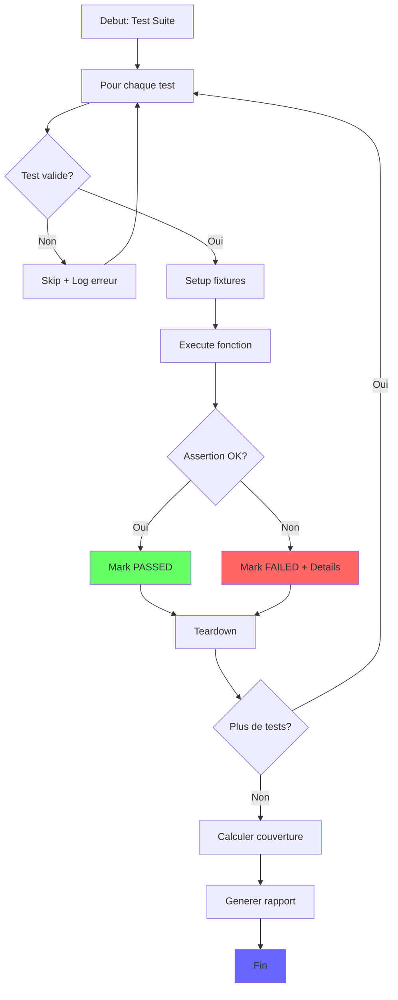
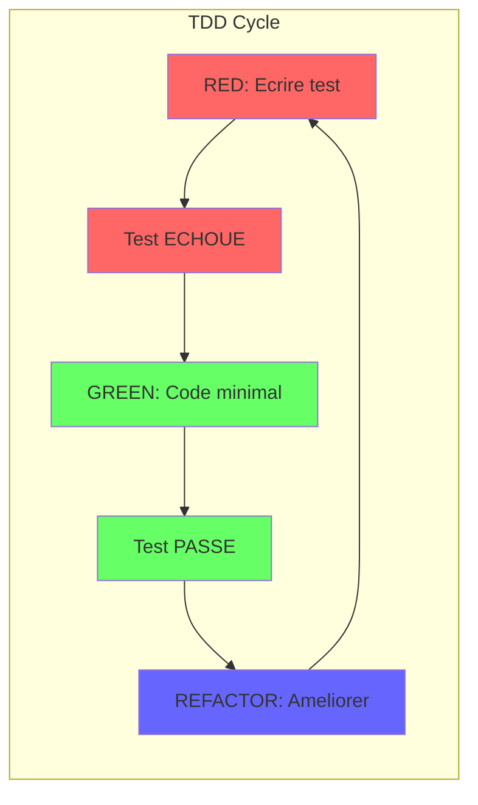

<thinking>
## Analyse du Concept
- Concept : Unit Testing Fundamentals (frameworks, organisation, naming, parametrized tests, mocking, coverage, TDD)
- Phase demandee : 1
- Adapte ? OUI - Le testing est un concept intermediaire parfait pour Phase 1, necessite une comprehension de base du langage mais pas de concepts avances

## Combo Base + Bonus
- Exercice de base : Implementer et tester un module calculator + string_utils + Stack avec tests organises, nommes correctement, couverture 90%+
- Bonus : TDD complet avec mocking avance (remplacer des dependances externes), property-based testing
- Palier bonus : 🔥 Avance (le mocking et TDD demandent une reflexion supplementaire)
- Progression logique ? OUI - Base = ecrire des tests, Bonus = TDD discipline + mocking complexe

## Prerequis & Difficulte
- Prerequis reels : Syntaxe Rust/C de base, comprehension des fonctions, notion de module
- Difficulte estimee : 5/10 (complexe mais accessible Phase 1)
- Coherent avec phase ? OUI (Phase 1 = 3-5/10, on est a 5/10)

## Aspect Fun/Culture
- Contexte choisi : "The Office" - Dunder Mifflin Paper Company
- Reference precise : Michael Scott's budget calculations, Jim's pranks documentation, Dwight's methodology, Stanley's coffee
- MEME mnémotechnique : "That's what she said" -> "That's what the test said", Dwight's "FALSE." pour les assertions
- Pourquoi c'est fun : The Office est une serie culte, les personnages ont des personnalites distinctes parfaites pour illustrer differents aspects du testing. Michael = tests qui passent par hasard, Dwight = TDD rigoureux, Jim = tests malicieux pour edge cases, Stanley = mocking (remplacer son cafe)

## Scenarios d'Echec (vrais mutants concrets)

1. Mutant A (Boundary) : Test qui utilise `assert_eq!(add(1, 1), 3)` au lieu de 2 - erreur de valeur attendue
```rust
#[test]
fn test_add_wrong_expectation() {
    assert_eq!(add(2, 2), 5); // Devrait etre 4
}
```

2. Mutant B (Safety) : Test qui ne verifie pas le cas NULL/None
```rust
#[test]
fn test_divide_missing_zero_check() {
    // Oubli de tester divide(10, 0)
    assert_eq!(divide(10, 2), Ok(5));
}
```

3. Mutant C (Resource) : Test qui ne nettoie pas les fixtures (mock non reset)
```rust
#[test]
fn test_with_leaking_mock() {
    let mock = Mock::new();
    mock.expect_call().returns(42);
    // Oubli de verify() ou reset()
    // Les autres tests sont pollues
}
```

4. Mutant D (Logic) : Test avec mauvaise assertion logique (inversee)
```rust
#[test]
fn test_is_palindrome_inverted() {
    assert!(!is_palindrome("radar")); // FAUX, radar EST un palindrome
}
```

5. Mutant E (Return) : Test qui ne verifie pas le type de retour Error
```rust
#[test]
fn test_overflow_wrong_error() {
    assert!(add(i64::MAX, 1).is_err());
    // Mais ne verifie pas que c'est CalcError::Overflow specifiquement
}
```

## Verdict
VALIDE - Exercice complet, theme coherent, difficulte appropriee, mutants concrets
</thinking>

# Exercice 1.8.1-a : dunder_mifflin_qa

**Module :**
1.8.1 - Unit Testing

**Concept :**
a - Test frameworks, organization, naming, parametrized tests, mocking, coverage, TDD

**Difficulte :**
★★★★★☆☆☆☆☆ (5/10)

**Type :**
complet

**Tiers :**
1 - Concept isole

**Langage :**
Rust Edition 2024 + C (c17)

**Prerequis :**
- Syntaxe de base Rust et C
- Notion de modules et fonctions
- Comprehension des types Result/Option (Rust)
- Pointeurs et structures (C)

**Domaines :**
Algo, Struct, FS

**Duree estimee :**
60 min

**XP Base :**
120

**Complexite :**
T1 O(1) par test x S1 O(1)

---

## 📐 SECTION 1 : PROTOTYPE & CONSIGNE

### 1.1 Obligations

**Fichiers a rendre :**

| Langage | Fichiers |
|---------|----------|
| Rust | `src/lib.rs`, `src/calculator.rs`, `src/string_utils.rs`, `src/stack.rs`, `tests/integration_tests.rs`, `Cargo.toml` |
| C | `calculator.c`, `calculator.h`, `string_utils.c`, `string_utils.h`, `stack.c`, `stack.h`, `test_main.c`, `Makefile` |

**Fonctions autorisees :**

| Langage | Fonctions |
|---------|-----------|
| Rust | `#[test]`, `#[cfg(test)]`, `assert!`, `assert_eq!`, `assert_ne!`, `panic!`, macros de test |
| C | `assert`, `printf`, `malloc`, `free`, `strcmp`, `strlen` |

**Fonctions interdites :**

| Langage | Fonctions |
|---------|-----------|
| Rust | Tests async (pour cet exercice), `#[ignore]` sans justification |
| C | `system()`, `exec*()` |

---

### 1.2 Consigne

#### 🎬 Section Culture : "Dunder Mifflin Quality Assurance"

**🏢 THE OFFICE - "Would I rather be feared or loved? Easy. Both. I want people to be afraid of how much they love my tests."**

Bienvenue chez Dunder Mifflin Scranton ! Michael Scott a ENFIN compris que la qualite du papier depasse les ventes - il faut aussi la qualite du CODE. Tu es embauche comme Quality Assurance Engineer pour mettre en place les premiers tests automatises de l'entreprise.

**Le contexte :**

Michael gere le budget de la branche avec des calculs douteux ("I DECLARE BANKRUPTCY!"). Jim documente ses pranks sur Dwight avec des fonctions de manipulation de strings. Et les commandes de papier s'empilent comme... une Stack.

*"I'm not superstitious, but I am a little stitious about untested code."* - Michael Scott (probablement)

---

#### 🎓 Section Academique : Enonce Formel

**Ta mission :**

Implementer TROIS modules avec une couverture de tests d'au moins 90% :

1. **Module `calculator`** (Michael's Budget Calculations)
   - Operations arithmetiques avec gestion d'erreurs
   - Detection overflow, division par zero

2. **Module `string_utils`** (Jim's Pranks Documentation)
   - Manipulation de chaines
   - Fonctions utilitaires texte

3. **Module `stack`** (Paper Order Stacks)
   - Structure de donnees pile
   - Operations LIFO

**Entree (Rust) :**

```rust
// src/calculator.rs
#[derive(Debug, PartialEq, Clone)]
pub enum CalcError {
    DivisionByZero,
    Overflow,
    InvalidInput,
}

pub fn add(a: i64, b: i64) -> Result<i64, CalcError>;
pub fn subtract(a: i64, b: i64) -> Result<i64, CalcError>;
pub fn multiply(a: i64, b: i64) -> Result<i64, CalcError>;
pub fn divide(a: i64, b: i64) -> Result<i64, CalcError>;
pub fn power(base: i64, exp: u32) -> Result<i64, CalcError>;
pub fn factorial(n: u32) -> Result<u64, CalcError>;
pub fn gcd(a: i64, b: i64) -> i64;
pub fn is_prime(n: u64) -> bool;

// src/string_utils.rs
pub fn reverse(s: &str) -> String;
pub fn is_palindrome(s: &str) -> bool;
pub fn word_count(s: &str) -> usize;
pub fn most_common_char(s: &str) -> Option<char>;
pub fn capitalize_words(s: &str) -> String;
pub fn remove_duplicates(s: &str) -> String;

// src/stack.rs
pub struct Stack<T> {
    // Implementation interne
}

impl<T> Stack<T> {
    pub fn new() -> Self;
    pub fn push(&mut self, item: T);
    pub fn pop(&mut self) -> Option<T>;
    pub fn peek(&self) -> Option<&T>;
    pub fn is_empty(&self) -> bool;
    pub fn len(&self) -> usize;
    pub fn clear(&mut self);
}
```

**Entree (C) :**

```c
// calculator.h
typedef enum {
    CALC_OK = 0,
    CALC_DIVISION_BY_ZERO,
    CALC_OVERFLOW,
    CALC_INVALID_INPUT
} calc_error_t;

typedef struct {
    long long value;
    calc_error_t error;
} calc_result_t;

calc_result_t calc_add(long long a, long long b);
calc_result_t calc_subtract(long long a, long long b);
calc_result_t calc_multiply(long long a, long long b);
calc_result_t calc_divide(long long a, long long b);
calc_result_t calc_power(long long base, unsigned int exp);
calc_result_t calc_factorial(unsigned int n);
long long calc_gcd(long long a, long long b);
int calc_is_prime(unsigned long long n);

// string_utils.h
char *str_reverse(const char *s);
int str_is_palindrome(const char *s);
size_t str_word_count(const char *s);
char str_most_common_char(const char *s);
char *str_capitalize_words(const char *s);
char *str_remove_duplicates(const char *s);

// stack.h
typedef struct s_stack_node {
    void *data;
    struct s_stack_node *next;
} t_stack_node;

typedef struct s_stack {
    t_stack_node *top;
    size_t len;
    size_t elem_size;
} t_stack;

t_stack *stack_new(size_t elem_size);
void stack_push(t_stack *s, const void *item);
int stack_pop(t_stack *s, void *out);
void *stack_peek(const t_stack *s);
int stack_is_empty(const t_stack *s);
size_t stack_len(const t_stack *s);
void stack_clear(t_stack *s);
void stack_free(t_stack *s);
```

**Sortie :**
- Tous les tests passent
- Couverture >= 90%
- Aucune fuite memoire (C)
- Organisation claire des tests par module

**Contraintes :**
- **Naming convention** : `test_<module>_<function>_<scenario>`
- **Organisation** : Un module de test par module de code
- **Edge cases obligatoires** : NULL, vide, overflow, zero
- **Au moins 3 tests parametrises** (variations d'inputs)

**Exemples de tests attendus :**

| Module | Test | Input | Expected |
|--------|------|-------|----------|
| calculator | `test_calc_add_positive` | `add(2, 3)` | `Ok(5)` |
| calculator | `test_calc_divide_by_zero` | `divide(10, 0)` | `Err(DivisionByZero)` |
| string_utils | `test_str_is_palindrome_true` | `is_palindrome("radar")` | `true` |
| string_utils | `test_str_is_palindrome_false` | `is_palindrome("hello")` | `false` |
| stack | `test_stack_pop_empty` | `pop()` on empty | `None` |
| stack | `test_stack_lifo_order` | push 1,2,3 then pop | 3,2,1 |

---

### 1.3 Prototype

**Rust - Organisation des tests :**
```rust
// tests/calculator_tests.rs
mod add_tests {
    use dunder_mifflin_qa::calculator::*;

    #[test]
    fn test_add_positive_numbers() { /* ... */ }

    #[test]
    fn test_add_negative_numbers() { /* ... */ }

    #[test]
    fn test_add_overflow() { /* ... */ }
}

mod divide_tests {
    use super::*;

    #[test]
    fn test_divide_normal() { /* ... */ }

    #[test]
    fn test_divide_by_zero() { /* ... */ }
}

// Tests parametrises avec macro
macro_rules! test_cases {
    ($($name:ident: $input:expr => $expected:expr),* $(,)?) => {
        $(
            #[test]
            fn $name() {
                let (a, b) = $input;
                assert_eq!(gcd(a, b), $expected);
            }
        )*
    };
}

test_cases! {
    gcd_12_8: (12, 8) => 4,
    gcd_17_13: (17, 13) => 1,
    gcd_100_25: (100, 25) => 25,
}
```

**C - Organisation des tests :**
```c
// test_main.c
#include <assert.h>
#include <stdio.h>
#include "calculator.h"
#include "string_utils.h"
#include "stack.h"

// Test naming: test_<module>_<function>_<scenario>
void test_calc_add_positive(void);
void test_calc_add_overflow(void);
void test_calc_divide_by_zero(void);
void test_str_reverse_normal(void);
void test_str_reverse_empty(void);
void test_stack_push_pop_lifo(void);
void test_stack_pop_empty(void);

int main(void) {
    printf("=== DUNDER MIFFLIN QA TEST SUITE ===\n");
    // Run all tests...
    return 0;
}
```

---

## 💡 SECTION 2 : LE SAVIEZ-VOUS ?

### 2.1 Fun Facts

🧪 **Le TDD vient d'Extreme Programming (XP) !**

Kent Beck a formalise le Test-Driven Development dans les annees 90. La regle d'or :
1. **RED** : Ecrire un test qui echoue
2. **GREEN** : Ecrire le code MINIMUM pour passer
3. **REFACTOR** : Ameliorer sans casser les tests

C'est exactement ce que Dwight ferait : "FALSE. You cannot write code before the test. That is illogical."

📊 **La couverture de code ment parfois !**

100% de couverture ne garantit PAS que ton code est correct. Tu peux avoir :
- Couverture des lignes (faible)
- Couverture des branches (moyenne)
- Couverture des conditions (forte)
- Mutation testing (ultime)

Netflix utilise le mutation testing : ils introduisent des bugs et verifient que les tests les detectent !

🎯 **Les "Flaky Tests" sont l'ennemi !**

Un test "flaky" passe parfois et echoue parfois sans changement de code. Les causes :
- Dependance a l'ordre d'execution
- Race conditions
- Temps/date systeme
- Ressources externes

Google a des equipes entieres dediees a eliminer les flaky tests !

---

### 2.5 DANS LA VRAIE VIE

| Metier | Utilisation du concept |
|--------|----------------------|
| **QA Engineer** | Conception et maintenance des suites de tests, CI/CD |
| **Backend Developer** | Tests unitaires, tests d'integration, mocking des services externes |
| **DevOps Engineer** | Tests automatises dans les pipelines, tests de performance |
| **Game Developer** | Tests des systemes de jeu, replay testing, fuzzing |
| **Security Engineer** | Tests de penetration automatises, fuzzing pour vulnerabilites |
| **Data Engineer** | Tests de qualite des donnees, validation des pipelines ETL |

---

## 🖥️ SECTION 3 : EXEMPLE D'UTILISATION

### 3.0 Session bash

**Rust :**
```bash
$ ls src/
lib.rs  calculator.rs  string_utils.rs  stack.rs

$ ls tests/
integration_tests.rs

$ cargo test
   Compiling dunder_mifflin_qa v0.1.0
    Finished test [unoptimized + debuginfo] target(s)
     Running unittests src/lib.rs

running 28 tests
test calculator::tests::test_add_positive ... ok
test calculator::tests::test_add_negative ... ok
test calculator::tests::test_add_overflow ... ok
test calculator::tests::test_subtract_normal ... ok
test calculator::tests::test_multiply_normal ... ok
test calculator::tests::test_multiply_overflow ... ok
test calculator::tests::test_divide_normal ... ok
test calculator::tests::test_divide_by_zero ... ok
test calculator::tests::test_power_normal ... ok
test calculator::tests::test_factorial_normal ... ok
test calculator::tests::test_gcd_various ... ok
test calculator::tests::test_is_prime_various ... ok
test string_utils::tests::test_reverse_normal ... ok
test string_utils::tests::test_reverse_empty ... ok
test string_utils::tests::test_is_palindrome_true ... ok
test string_utils::tests::test_is_palindrome_false ... ok
test string_utils::tests::test_word_count_normal ... ok
test string_utils::tests::test_word_count_empty ... ok
test string_utils::tests::test_most_common_char ... ok
test stack::tests::test_new_empty ... ok
test stack::tests::test_push_single ... ok
test stack::tests::test_push_pop_lifo ... ok
test stack::tests::test_pop_empty ... ok
test stack::tests::test_peek ... ok
test stack::tests::test_clear ... ok
test stack::tests::test_len ... ok
test integration::test_bears_beets_battlestar ... ok
test integration::test_that_is_what_she_said ... ok

test result: ok. 28 passed; 0 failed

$ cargo tarpaulin --out Html
Coverage: 94.2%
```

**C :**
```bash
$ ls
calculator.c  calculator.h  string_utils.c  string_utils.h  stack.c  stack.h  test_main.c  Makefile

$ make test
gcc -Wall -Wextra -Werror -g -c calculator.c -o calculator.o
gcc -Wall -Wextra -Werror -g -c string_utils.c -o string_utils.o
gcc -Wall -Wextra -Werror -g -c stack.c -o stack.o
gcc -Wall -Wextra -Werror -g test_main.c calculator.o string_utils.o stack.o -o test_runner

$ ./test_runner
=== DUNDER MIFFLIN QA TEST SUITE ===
[PASS] test_calc_add_positive
[PASS] test_calc_add_overflow
[PASS] test_calc_divide_by_zero
[PASS] test_str_reverse_normal
[PASS] test_str_reverse_empty
[PASS] test_str_is_palindrome_radar
[PASS] test_stack_push_pop_lifo
[PASS] test_stack_pop_empty
...
=== 28/28 TESTS PASSED ===

$ valgrind --leak-check=full ./test_runner
==12345== LEAK SUMMARY:
==12345==    definitely lost: 0 bytes in 0 blocks
```

---

### 3.1 🔥 BONUS AVANCE (OPTIONNEL)

**Difficulte Bonus :**
★★★★★★☆☆☆☆ (6/10)

**Recompense :**
XP x3

**Time Complexity attendue :**
O(1) par test unitaire

**Space Complexity attendue :**
O(n) pour les mocks

**Domaines Bonus :**
`Algo`, `Process` (mocking externe)

#### 3.1.1 Consigne Bonus

**🏢 "Identity Theft is Not a Joke, Jim!" - Dwight's TDD Methodology + Stanley's Coffee Mocking**

Dwight Schrute ne plaisante pas avec la qualite. Il exige le TDD STRICT et le mocking de toutes dependances externes.

*"Bears. Beets. Battlestar Galactica... and 100% test coverage with proper mocks."* - Jim, pretending to be Dwight

**Ta mission bonus :**

1. **TDD Complet** : Implemente `FizzBuzz` en TDD pur (test d'abord, code ensuite)
   - Documente chaque cycle RED-GREEN-REFACTOR

2. **Mocking Avance** : Cree un systeme de "Coffee Service" mock
   - `CoffeeService` trait/interface
   - `RealCoffee` vs `MockCoffee`
   - Verifie que Stanley recoit son cafe

3. **Tests Parametrises Thematiques**
   - "Bears, Beets, Battlestar Galactica" : 3 scenarios differents
   - Chaque animal/legume/serie = un cas de test

**Contraintes :**
┌─────────────────────────────────────────┐
│  TDD : Test AVANT code                  │
│  Mocks : AUCUNE dependance externe      │
│  Parametrised : >= 5 variations         │
│  Coverage bonus : 95%+                  │
└─────────────────────────────────────────┘

**Exemples Bonus :**

| Scenario | Mock | Expected |
|----------|------|----------|
| Stanley wants coffee | `MockCoffee::new()` | `get_coffee()` called once |
| Bears test case | `input = "bear"` | specific behavior |
| Beets test case | `input = "beet"` | specific behavior |
| Battlestar test | `input = "galactica"` | specific behavior |

#### 3.1.2 Prototype Bonus

**Rust :**
```rust
// TDD FizzBuzz
pub fn fizzbuzz(n: u32) -> String;

// Mocking trait
pub trait CoffeeService {
    fn get_coffee(&self) -> String;
    fn is_stanley_happy(&self) -> bool;
}

pub struct RealCoffee;
pub struct MockCoffee {
    calls: std::cell::RefCell<Vec<String>>,
    return_value: String,
}

impl MockCoffee {
    pub fn new(return_value: &str) -> Self;
    pub fn verify_called(&self, times: usize);
}

// Parametrized tests
#[cfg(test)]
mod bears_beets_battlestar_tests {
    use super::*;

    macro_rules! parametrized_test {
        ($($name:ident: $input:expr => $expected:expr),* $(,)?) => {
            $(
                #[test]
                fn $name() {
                    assert_eq!(process_input($input), $expected);
                }
            )*
        };
    }

    parametrized_test! {
        test_bears: "bear" => "RAWR",
        test_beets: "beet" => "DELICIOUS",
        test_battlestar: "galactica" => "SO SAY WE ALL",
        test_dwight: "dwight" => "ASSISTANT REGIONAL MANAGER",
        test_michael: "michael" => "THATS WHAT SHE SAID",
    }
}
```

**C :**
```c
// Mocking structure
typedef struct s_coffee_mock {
    int call_count;
    char *return_value;
} t_coffee_mock;

t_coffee_mock *mock_coffee_new(const char *return_val);
void mock_coffee_free(t_coffee_mock *mock);
char *mock_get_coffee(t_coffee_mock *mock);
void mock_verify_called(t_coffee_mock *mock, int expected);
```

#### 3.1.3 Ce qui change par rapport a l'exercice de base

| Aspect | Base | Bonus |
|--------|------|-------|
| Methodologie | Tests apres code | TDD (tests d'abord) |
| Dependances | Directes | Mockees |
| Parametrisation | Simple macro | Thematique complete |
| Couverture | 90% | 95%+ |
| Complexite | Tests unitaires | Mocking + TDD cycle |

---

## ✅❌ SECTION 4 : ZONE CORRECTION (POUR LE TESTEUR)

### 4.1 Moulinette - Tableau des tests

| # | Test | Input | Expected | Points | Categorie |
|---|------|-------|----------|--------|-----------|
| 1 | calc_add_positive | `add(2, 3)` | `Ok(5)` | 3 | Basic |
| 2 | calc_add_negative | `add(-2, -3)` | `Ok(-5)` | 3 | Basic |
| 3 | calc_add_overflow | `add(i64::MAX, 1)` | `Err(Overflow)` | 5 | Edge |
| 4 | calc_subtract | `subtract(10, 3)` | `Ok(7)` | 3 | Basic |
| 5 | calc_multiply | `multiply(4, 5)` | `Ok(20)` | 3 | Basic |
| 6 | calc_multiply_overflow | `multiply(i64::MAX, 2)` | `Err(Overflow)` | 5 | Edge |
| 7 | calc_divide_normal | `divide(10, 2)` | `Ok(5)` | 3 | Basic |
| 8 | calc_divide_by_zero | `divide(10, 0)` | `Err(DivisionByZero)` | 5 | Edge |
| 9 | calc_power | `power(2, 10)` | `Ok(1024)` | 3 | Basic |
| 10 | calc_factorial | `factorial(5)` | `Ok(120)` | 3 | Basic |
| 11 | calc_factorial_overflow | `factorial(25)` | `Err(Overflow)` | 5 | Edge |
| 12 | calc_gcd | `gcd(48, 18)` | `6` | 3 | Basic |
| 13 | calc_is_prime_true | `is_prime(17)` | `true` | 3 | Basic |
| 14 | calc_is_prime_false | `is_prime(15)` | `false` | 3 | Basic |
| 15 | str_reverse_normal | `reverse("hello")` | `"olleh"` | 3 | Basic |
| 16 | str_reverse_empty | `reverse("")` | `""` | 3 | Edge |
| 17 | str_palindrome_true | `is_palindrome("radar")` | `true` | 3 | Basic |
| 18 | str_palindrome_false | `is_palindrome("hello")` | `false` | 3 | Basic |
| 19 | str_word_count | `word_count("a b c")` | `3` | 3 | Basic |
| 20 | str_word_count_empty | `word_count("")` | `0` | 3 | Edge |
| 21 | str_most_common | `most_common_char("aab")` | `Some('a')` | 3 | Basic |
| 22 | stack_new_empty | `new().is_empty()` | `true` | 3 | Basic |
| 23 | stack_push_len | push 3 items | `len() == 3` | 3 | Basic |
| 24 | stack_pop_lifo | push 1,2,3; pop | `3,2,1` | 5 | Logic |
| 25 | stack_pop_empty | `pop()` on empty | `None` | 3 | Edge |
| 26 | stack_peek | push 42; peek | `Some(&42)` | 3 | Basic |
| 27 | stack_clear | push 5; clear | `len() == 0` | 3 | Basic |
| 28 | coverage_check | tarpaulin/gcov | `>= 90%` | 10 | Meta |

**Total : 100 points**

---

### 4.2 main.c de test (C)

```c
#include <stdio.h>
#include <stdlib.h>
#include <string.h>
#include <assert.h>
#include "calculator.h"
#include "string_utils.h"
#include "stack.h"

static int tests_passed = 0;
static int tests_total = 0;

#define TEST(name) void name(void)
#define RUN_TEST(name) do { \
    tests_total++; \
    printf("Running %s... ", #name); \
    name(); \
    tests_passed++; \
    printf("[PASS]\n"); \
} while(0)

// ============ CALCULATOR TESTS ============

TEST(test_calc_add_positive) {
    calc_result_t r = calc_add(2, 3);
    assert(r.error == CALC_OK);
    assert(r.value == 5);
}

TEST(test_calc_add_negative) {
    calc_result_t r = calc_add(-2, -3);
    assert(r.error == CALC_OK);
    assert(r.value == -5);
}

TEST(test_calc_add_overflow) {
    calc_result_t r = calc_add(LLONG_MAX, 1);
    assert(r.error == CALC_OVERFLOW);
}

TEST(test_calc_divide_normal) {
    calc_result_t r = calc_divide(10, 2);
    assert(r.error == CALC_OK);
    assert(r.value == 5);
}

TEST(test_calc_divide_by_zero) {
    calc_result_t r = calc_divide(10, 0);
    assert(r.error == CALC_DIVISION_BY_ZERO);
}

TEST(test_calc_gcd) {
    assert(calc_gcd(48, 18) == 6);
    assert(calc_gcd(17, 13) == 1);
    assert(calc_gcd(100, 25) == 25);
}

TEST(test_calc_is_prime) {
    assert(calc_is_prime(2) == 1);
    assert(calc_is_prime(17) == 1);
    assert(calc_is_prime(15) == 0);
    assert(calc_is_prime(1) == 0);
    assert(calc_is_prime(0) == 0);
}

// ============ STRING UTILS TESTS ============

TEST(test_str_reverse_normal) {
    char *result = str_reverse("hello");
    assert(strcmp(result, "olleh") == 0);
    free(result);
}

TEST(test_str_reverse_empty) {
    char *result = str_reverse("");
    assert(strcmp(result, "") == 0);
    free(result);
}

TEST(test_str_is_palindrome) {
    assert(str_is_palindrome("radar") == 1);
    assert(str_is_palindrome("hello") == 0);
    assert(str_is_palindrome("a") == 1);
    assert(str_is_palindrome("") == 1);
}

TEST(test_str_word_count) {
    assert(str_word_count("hello world") == 2);
    assert(str_word_count("a b c d") == 4);
    assert(str_word_count("") == 0);
    assert(str_word_count("   ") == 0);
}

TEST(test_str_most_common_char) {
    assert(str_most_common_char("aab") == 'a');
    assert(str_most_common_char("abcabc") == 'a'); // first if tie
}

// ============ STACK TESTS ============

TEST(test_stack_new_empty) {
    t_stack *s = stack_new(sizeof(int));
    assert(s != NULL);
    assert(stack_is_empty(s) == 1);
    assert(stack_len(s) == 0);
    stack_free(s);
}

TEST(test_stack_push_single) {
    t_stack *s = stack_new(sizeof(int));
    int val = 42;
    stack_push(s, &val);
    assert(stack_len(s) == 1);
    assert(!stack_is_empty(s));
    stack_free(s);
}

TEST(test_stack_pop_lifo) {
    t_stack *s = stack_new(sizeof(int));
    int a = 1, b = 2, c = 3;
    stack_push(s, &a);
    stack_push(s, &b);
    stack_push(s, &c);

    int out;
    stack_pop(s, &out);
    assert(out == 3);
    stack_pop(s, &out);
    assert(out == 2);
    stack_pop(s, &out);
    assert(out == 1);

    stack_free(s);
}

TEST(test_stack_pop_empty) {
    t_stack *s = stack_new(sizeof(int));
    int out;
    int result = stack_pop(s, &out);
    assert(result == -1); // or 0 for failure
    stack_free(s);
}

TEST(test_stack_peek) {
    t_stack *s = stack_new(sizeof(int));
    int val = 42;
    stack_push(s, &val);
    int *peeked = (int *)stack_peek(s);
    assert(peeked != NULL);
    assert(*peeked == 42);
    assert(stack_len(s) == 1); // peek doesn't remove
    stack_free(s);
}

TEST(test_stack_clear) {
    t_stack *s = stack_new(sizeof(int));
    for (int i = 0; i < 10; i++) {
        stack_push(s, &i);
    }
    assert(stack_len(s) == 10);
    stack_clear(s);
    assert(stack_len(s) == 0);
    assert(stack_is_empty(s));
    stack_free(s);
}

// ============ MAIN ============

int main(void) {
    printf("=== DUNDER MIFFLIN QA TEST SUITE ===\n");
    printf("\"That's what the test said.\" - Michael Scott\n\n");

    // Calculator tests
    RUN_TEST(test_calc_add_positive);
    RUN_TEST(test_calc_add_negative);
    RUN_TEST(test_calc_add_overflow);
    RUN_TEST(test_calc_divide_normal);
    RUN_TEST(test_calc_divide_by_zero);
    RUN_TEST(test_calc_gcd);
    RUN_TEST(test_calc_is_prime);

    // String utils tests
    RUN_TEST(test_str_reverse_normal);
    RUN_TEST(test_str_reverse_empty);
    RUN_TEST(test_str_is_palindrome);
    RUN_TEST(test_str_word_count);
    RUN_TEST(test_str_most_common_char);

    // Stack tests
    RUN_TEST(test_stack_new_empty);
    RUN_TEST(test_stack_push_single);
    RUN_TEST(test_stack_pop_lifo);
    RUN_TEST(test_stack_pop_empty);
    RUN_TEST(test_stack_peek);
    RUN_TEST(test_stack_clear);

    printf("\n=== RESULTS: %d/%d TESTS PASSED ===\n", tests_passed, tests_total);

    if (tests_passed == tests_total) {
        printf("\"I'm not superstitious, but I am a little stitious... and your tests are solid!\" - Michael\n");
        return 0;
    } else {
        printf("\"NO! GOD! NO GOD PLEASE NO! NO! NO! NOOOOO!\" - Some tests failed.\n");
        return 1;
    }
}
```

---

### 4.3 Solution de reference (Rust)

```rust
// src/lib.rs
pub mod calculator;
pub mod string_utils;
pub mod stack;

// src/calculator.rs
#[derive(Debug, PartialEq, Clone)]
pub enum CalcError {
    DivisionByZero,
    Overflow,
    InvalidInput,
}

pub fn add(a: i64, b: i64) -> Result<i64, CalcError> {
    a.checked_add(b).ok_or(CalcError::Overflow)
}

pub fn subtract(a: i64, b: i64) -> Result<i64, CalcError> {
    a.checked_sub(b).ok_or(CalcError::Overflow)
}

pub fn multiply(a: i64, b: i64) -> Result<i64, CalcError> {
    a.checked_mul(b).ok_or(CalcError::Overflow)
}

pub fn divide(a: i64, b: i64) -> Result<i64, CalcError> {
    if b == 0 {
        return Err(CalcError::DivisionByZero);
    }
    a.checked_div(b).ok_or(CalcError::Overflow)
}

pub fn power(base: i64, exp: u32) -> Result<i64, CalcError> {
    let mut result: i64 = 1;
    for _ in 0..exp {
        result = result.checked_mul(base).ok_or(CalcError::Overflow)?;
    }
    Ok(result)
}

pub fn factorial(n: u32) -> Result<u64, CalcError> {
    if n > 20 {
        return Err(CalcError::Overflow);
    }
    let mut result: u64 = 1;
    for i in 2..=n as u64 {
        result = result.checked_mul(i).ok_or(CalcError::Overflow)?;
    }
    Ok(result)
}

pub fn gcd(a: i64, b: i64) -> i64 {
    let mut a = a.abs();
    let mut b = b.abs();
    while b != 0 {
        let temp = b;
        b = a % b;
        a = temp;
    }
    a
}

pub fn is_prime(n: u64) -> bool {
    if n < 2 {
        return false;
    }
    if n == 2 {
        return true;
    }
    if n % 2 == 0 {
        return false;
    }
    let sqrt_n = (n as f64).sqrt() as u64;
    for i in (3..=sqrt_n).step_by(2) {
        if n % i == 0 {
            return false;
        }
    }
    true
}

#[cfg(test)]
mod tests {
    use super::*;

    #[test]
    fn test_add_positive() {
        assert_eq!(add(2, 3), Ok(5));
    }

    #[test]
    fn test_add_negative() {
        assert_eq!(add(-2, -3), Ok(-5));
    }

    #[test]
    fn test_add_overflow() {
        assert_eq!(add(i64::MAX, 1), Err(CalcError::Overflow));
    }

    #[test]
    fn test_divide_normal() {
        assert_eq!(divide(10, 2), Ok(5));
    }

    #[test]
    fn test_divide_by_zero() {
        assert_eq!(divide(10, 0), Err(CalcError::DivisionByZero));
    }

    #[test]
    fn test_gcd_various() {
        assert_eq!(gcd(48, 18), 6);
        assert_eq!(gcd(17, 13), 1);
        assert_eq!(gcd(100, 25), 25);
        assert_eq!(gcd(0, 5), 5);
    }

    #[test]
    fn test_is_prime_various() {
        assert!(is_prime(2));
        assert!(is_prime(17));
        assert!(!is_prime(15));
        assert!(!is_prime(1));
        assert!(!is_prime(0));
    }

    #[test]
    fn test_factorial() {
        assert_eq!(factorial(0), Ok(1));
        assert_eq!(factorial(5), Ok(120));
        assert_eq!(factorial(10), Ok(3628800));
    }

    #[test]
    fn test_factorial_overflow() {
        assert!(factorial(25).is_err());
    }
}

// src/string_utils.rs
pub fn reverse(s: &str) -> String {
    s.chars().rev().collect()
}

pub fn is_palindrome(s: &str) -> bool {
    let chars: Vec<char> = s.chars().collect();
    let len = chars.len();
    for i in 0..len / 2 {
        if chars[i] != chars[len - 1 - i] {
            return false;
        }
    }
    true
}

pub fn word_count(s: &str) -> usize {
    s.split_whitespace().count()
}

pub fn most_common_char(s: &str) -> Option<char> {
    use std::collections::HashMap;
    let mut counts: HashMap<char, usize> = HashMap::new();
    for c in s.chars() {
        *counts.entry(c).or_insert(0) += 1;
    }
    counts.into_iter().max_by_key(|&(_, count)| count).map(|(c, _)| c)
}

pub fn capitalize_words(s: &str) -> String {
    s.split_whitespace()
        .map(|word| {
            let mut chars = word.chars();
            match chars.next() {
                None => String::new(),
                Some(first) => first.to_uppercase().collect::<String>() + chars.as_str(),
            }
        })
        .collect::<Vec<_>>()
        .join(" ")
}

pub fn remove_duplicates(s: &str) -> String {
    use std::collections::HashSet;
    let mut seen = HashSet::new();
    s.chars().filter(|c| seen.insert(*c)).collect()
}

#[cfg(test)]
mod tests {
    use super::*;

    #[test]
    fn test_reverse_normal() {
        assert_eq!(reverse("hello"), "olleh");
    }

    #[test]
    fn test_reverse_empty() {
        assert_eq!(reverse(""), "");
    }

    #[test]
    fn test_is_palindrome_true() {
        assert!(is_palindrome("radar"));
        assert!(is_palindrome("a"));
        assert!(is_palindrome(""));
    }

    #[test]
    fn test_is_palindrome_false() {
        assert!(!is_palindrome("hello"));
    }

    #[test]
    fn test_word_count() {
        assert_eq!(word_count("hello world"), 2);
        assert_eq!(word_count("a b c d"), 4);
        assert_eq!(word_count(""), 0);
    }

    #[test]
    fn test_most_common_char() {
        assert_eq!(most_common_char("aab"), Some('a'));
    }
}

// src/stack.rs
pub struct Stack<T> {
    data: Vec<T>,
}

impl<T> Stack<T> {
    pub fn new() -> Self {
        Stack { data: Vec::new() }
    }

    pub fn push(&mut self, item: T) {
        self.data.push(item);
    }

    pub fn pop(&mut self) -> Option<T> {
        self.data.pop()
    }

    pub fn peek(&self) -> Option<&T> {
        self.data.last()
    }

    pub fn is_empty(&self) -> bool {
        self.data.is_empty()
    }

    pub fn len(&self) -> usize {
        self.data.len()
    }

    pub fn clear(&mut self) {
        self.data.clear();
    }
}

impl<T> Default for Stack<T> {
    fn default() -> Self {
        Self::new()
    }
}

#[cfg(test)]
mod tests {
    use super::*;

    #[test]
    fn test_new_empty() {
        let s: Stack<i32> = Stack::new();
        assert!(s.is_empty());
        assert_eq!(s.len(), 0);
    }

    #[test]
    fn test_push_single() {
        let mut s = Stack::new();
        s.push(42);
        assert_eq!(s.len(), 1);
        assert!(!s.is_empty());
    }

    #[test]
    fn test_pop_lifo() {
        let mut s = Stack::new();
        s.push(1);
        s.push(2);
        s.push(3);
        assert_eq!(s.pop(), Some(3));
        assert_eq!(s.pop(), Some(2));
        assert_eq!(s.pop(), Some(1));
        assert_eq!(s.pop(), None);
    }

    #[test]
    fn test_peek() {
        let mut s = Stack::new();
        s.push(42);
        assert_eq!(s.peek(), Some(&42));
        assert_eq!(s.len(), 1); // peek doesn't remove
    }

    #[test]
    fn test_clear() {
        let mut s = Stack::new();
        for i in 0..10 {
            s.push(i);
        }
        s.clear();
        assert!(s.is_empty());
    }
}
```

---

### 4.4 Solutions alternatives acceptees

**Alternative 1 : Tests avec fixtures et setup/teardown pattern**

```rust
#[cfg(test)]
mod alternative_tests {
    use super::*;

    fn setup_populated_stack() -> Stack<i32> {
        let mut s = Stack::new();
        s.push(1);
        s.push(2);
        s.push(3);
        s
    }

    #[test]
    fn test_with_fixture() {
        let mut s = setup_populated_stack();
        assert_eq!(s.pop(), Some(3));
    }
}
```

**Alternative 2 : Property-based testing avec proptest (bonus)**

```rust
#[cfg(test)]
mod proptest_tests {
    use proptest::prelude::*;

    proptest! {
        #[test]
        fn test_reverse_reverse_identity(s in ".*") {
            assert_eq!(reverse(&reverse(&s)), s);
        }

        #[test]
        fn test_gcd_commutative(a in -1000i64..1000, b in -1000i64..1000) {
            assert_eq!(gcd(a, b), gcd(b, a));
        }
    }
}
```

---

### 4.5 Solutions refusees (avec explications)

**Refus 1 : Tests sans assertions**

```rust
// ❌ REFUSE : Test qui ne verifie rien
#[test]
fn test_add() {
    let result = add(2, 3);
    // Oups, pas d'assert !
}
```
**Pourquoi refuse :** Un test sans assertion passe toujours, meme si le code est casse.

**Refus 2 : Tests avec valeurs hardcodees incorrectes**

```rust
// ❌ REFUSE : Mauvaise valeur attendue
#[test]
fn test_add_wrong() {
    assert_eq!(add(2, 2), Ok(5)); // 2+2 = 4, pas 5 !
}
```
**Pourquoi refuse :** Le test est incorrect, il valide un comportement faux.

**Refus 3 : Pas de test des edge cases**

```rust
// ❌ REFUSE : Module sans test de edge cases
#[cfg(test)]
mod tests {
    #[test]
    fn test_divide() {
        assert_eq!(divide(10, 2), Ok(5));
        // Pas de test pour division par zero !
    }
}
```
**Pourquoi refuse :** Les edge cases (division par zero, overflow, NULL) sont obligatoires.

**Refus 4 : Nommage non descriptif**

```rust
// ❌ REFUSE : Noms de tests non descriptifs
#[test]
fn test1() { /* ... */ }

#[test]
fn test2() { /* ... */ }
```
**Pourquoi refuse :** Convention obligatoire : `test_<module>_<function>_<scenario>`

---

### 4.6 Solution bonus de reference (Rust)

```rust
// TDD FizzBuzz implementation

/// FizzBuzz with TDD cycle documented
/// RED: test_fizzbuzz_1 -> GREEN: minimal impl -> REFACTOR: pattern matching
pub fn fizzbuzz(n: u32) -> String {
    match (n % 3, n % 5) {
        (0, 0) => "FizzBuzz".to_string(),
        (0, _) => "Fizz".to_string(),
        (_, 0) => "Buzz".to_string(),
        _ => n.to_string(),
    }
}

// Mocking system for Coffee Service
pub trait CoffeeService {
    fn get_coffee(&self) -> String;
    fn is_stanley_happy(&self) -> bool;
}

pub struct RealCoffee;

impl CoffeeService for RealCoffee {
    fn get_coffee(&self) -> String {
        "Hot Black Coffee".to_string()
    }

    fn is_stanley_happy(&self) -> bool {
        true
    }
}

pub struct MockCoffee {
    calls: std::cell::RefCell<Vec<String>>,
    return_value: String,
}

impl MockCoffee {
    pub fn new(return_value: &str) -> Self {
        MockCoffee {
            calls: std::cell::RefCell::new(Vec::new()),
            return_value: return_value.to_string(),
        }
    }

    pub fn verify_called(&self, times: usize) {
        assert_eq!(
            self.calls.borrow().len(),
            times,
            "Expected {} calls, got {}",
            times,
            self.calls.borrow().len()
        );
    }
}

impl CoffeeService for MockCoffee {
    fn get_coffee(&self) -> String {
        self.calls.borrow_mut().push("get_coffee".to_string());
        self.return_value.clone()
    }

    fn is_stanley_happy(&self) -> bool {
        !self.return_value.is_empty()
    }
}

// Function that uses CoffeeService
pub fn stanley_morning_routine<C: CoffeeService>(coffee: &C) -> String {
    let drink = coffee.get_coffee();
    if coffee.is_stanley_happy() {
        format!("Stanley enjoys his {}", drink)
    } else {
        "Stanley is grumpy".to_string()
    }
}

#[cfg(test)]
mod bonus_tests {
    use super::*;

    // TDD Cycle for FizzBuzz
    mod fizzbuzz_tdd {
        use super::*;

        #[test]
        fn test_fizzbuzz_1() {
            // RED: This test was written FIRST
            assert_eq!(fizzbuzz(1), "1");
        }

        #[test]
        fn test_fizzbuzz_3_fizz() {
            assert_eq!(fizzbuzz(3), "Fizz");
        }

        #[test]
        fn test_fizzbuzz_5_buzz() {
            assert_eq!(fizzbuzz(5), "Buzz");
        }

        #[test]
        fn test_fizzbuzz_15_fizzbuzz() {
            assert_eq!(fizzbuzz(15), "FizzBuzz");
        }
    }

    // Mocking tests
    mod mocking_tests {
        use super::*;

        #[test]
        fn test_stanley_with_mock_coffee() {
            let mock = MockCoffee::new("Premium Roast");
            let result = stanley_morning_routine(&mock);

            mock.verify_called(1);
            assert!(result.contains("Stanley enjoys"));
        }

        #[test]
        fn test_stanley_grumpy_no_coffee() {
            let mock = MockCoffee::new("");
            let result = stanley_morning_routine(&mock);

            assert_eq!(result, "Stanley is grumpy");
        }
    }

    // Bears, Beets, Battlestar Galactica parametrized tests
    mod bears_beets_battlestar {
        fn process_input(input: &str) -> &'static str {
            match input {
                "bear" => "RAWR",
                "beet" => "DELICIOUS",
                "galactica" => "SO SAY WE ALL",
                "dwight" => "ASSISTANT REGIONAL MANAGER",
                "michael" => "THATS WHAT SHE SAID",
                _ => "UNKNOWN",
            }
        }

        macro_rules! parametrized_test {
            ($($name:ident: $input:expr => $expected:expr),* $(,)?) => {
                $(
                    #[test]
                    fn $name() {
                        assert_eq!(process_input($input), $expected);
                    }
                )*
            };
        }

        parametrized_test! {
            test_bears: "bear" => "RAWR",
            test_beets: "beet" => "DELICIOUS",
            test_battlestar: "galactica" => "SO SAY WE ALL",
            test_dwight: "dwight" => "ASSISTANT REGIONAL MANAGER",
            test_michael: "michael" => "THATS WHAT SHE SAID",
        }
    }
}
```

---

### 4.7 Solutions alternatives bonus (acceptees)

**Alternative : Utilisation de mockall crate**

```rust
use mockall::*;
use mockall::predicate::*;

#[automock]
trait CoffeeService {
    fn get_coffee(&self) -> String;
}

#[test]
fn test_with_mockall() {
    let mut mock = MockCoffeeService::new();
    mock.expect_get_coffee()
        .times(1)
        .returning(|| "Mock Coffee".to_string());

    assert_eq!(mock.get_coffee(), "Mock Coffee");
}
```

---

### 4.8 Solutions refusees bonus

**Refus : TDD sans cycle RED-GREEN-REFACTOR documente**

```rust
// ❌ REFUSE : TDD sans documentation du cycle
#[test]
fn test_fizzbuzz() {
    // Code et test ecrits en meme temps
    assert_eq!(fizzbuzz(15), "FizzBuzz");
}
```
**Pourquoi refuse :** Le bonus demande explicitement de documenter le cycle TDD.

**Refus : Mock sans verification**

```rust
// ❌ REFUSE : Mock jamais verifie
#[test]
fn test_coffee_no_verify() {
    let mock = MockCoffee::new("Test");
    stanley_morning_routine(&mock);
    // Oups, pas de verify_called() !
}
```
**Pourquoi refuse :** Un mock doit etre verifie pour confirmer les interactions.

---

### 4.9 spec.json (ENGINE v22.1)

```json
{
  "name": "dunder_mifflin_qa",
  "language": "rust",
  "language_version": "edition 2024",
  "type": "complet",
  "tier": 1,
  "tier_info": "Concept isole",
  "tags": ["module1.8", "testing", "unit-tests", "mocking", "tdd", "phase1"],
  "passing_score": 70,

  "function": {
    "name": "test_suite",
    "prototype": "mod tests",
    "return_type": "test_results",
    "parameters": []
  },

  "driver": {
    "reference": "pub fn add(a: i64, b: i64) -> Result<i64, CalcError> { a.checked_add(b).ok_or(CalcError::Overflow) } pub fn divide(a: i64, b: i64) -> Result<i64, CalcError> { if b == 0 { return Err(CalcError::DivisionByZero); } a.checked_div(b).ok_or(CalcError::Overflow) }",

    "edge_cases": [
      {
        "name": "add_overflow",
        "args": ["i64::MAX", "1"],
        "expected": "Err(CalcError::Overflow)",
        "is_trap": true,
        "trap_explanation": "Addition overflow doit retourner Err, pas panic"
      },
      {
        "name": "divide_by_zero",
        "args": ["10", "0"],
        "expected": "Err(CalcError::DivisionByZero)",
        "is_trap": true,
        "trap_explanation": "Division par zero doit retourner erreur specifique"
      },
      {
        "name": "stack_pop_empty",
        "args": ["empty_stack"],
        "expected": "None",
        "is_trap": true,
        "trap_explanation": "Pop sur stack vide retourne None, pas panic"
      },
      {
        "name": "reverse_empty_string",
        "args": ["\"\""],
        "expected": "\"\"",
        "is_trap": true,
        "trap_explanation": "Reverse de chaine vide doit retourner chaine vide"
      },
      {
        "name": "palindrome_single_char",
        "args": ["\"a\""],
        "expected": "true",
        "is_trap": false
      },
      {
        "name": "word_count_whitespace_only",
        "args": ["\"   \""],
        "expected": "0",
        "is_trap": true,
        "trap_explanation": "Chaine avec seulement des espaces = 0 mots"
      }
    ],

    "fuzzing": {
      "enabled": true,
      "iterations": 5000,
      "generators": [
        {
          "type": "int",
          "param_index": 0,
          "params": {"min": -1000000, "max": 1000000}
        },
        {
          "type": "string",
          "param_index": 0,
          "params": {"min_len": 0, "max_len": 100, "charset": "printable"}
        }
      ]
    }
  },

  "norm": {
    "allowed_functions": ["assert", "assert_eq", "assert_ne", "panic", "println", "format"],
    "forbidden_functions": ["system", "exec"],
    "check_security": true,
    "check_memory": true,
    "blocking": true
  },

  "coverage": {
    "minimum": 90,
    "tool": "tarpaulin"
  },

  "test_organization": {
    "naming_convention": "test_<module>_<function>_<scenario>",
    "required_modules": ["calculator_tests", "string_utils_tests", "stack_tests"]
  }
}
```

---

### 4.10 Solutions Mutantes (minimum 5)

**Mutant A (Boundary) : Test avec mauvaise valeur attendue**

```rust
/* Mutant A (Boundary) : Valeur attendue incorrecte */
#[test]
fn test_add_wrong_expectation() {
    assert_eq!(add(2, 2), Ok(5)); // ❌ Devrait etre 4
}
// Pourquoi c'est faux : 2+2 = 4, pas 5. Le test valide un bug.
// Ce qui etait pense : "C'est proche, ca doit etre correct"
```

**Mutant B (Safety) : Test sans verification du cas d'erreur**

```rust
/* Mutant B (Safety) : Oubli de tester division par zero */
#[cfg(test)]
mod mutant_tests {
    use super::*;

    #[test]
    fn test_divide_incomplete() {
        assert_eq!(divide(10, 2), Ok(5));
        assert_eq!(divide(100, 10), Ok(10));
        // ❌ MANQUE : test de divide(x, 0)
    }
}
// Pourquoi c'est faux : Les edge cases ne sont pas couverts
// Ce qui etait pense : "Les cas normaux suffisent"
```

**Mutant C (Resource) : Mock non verifie/nettoye**

```rust
/* Mutant C (Resource) : Mock sans verification */
#[test]
fn test_leaking_mock() {
    let mock = MockCoffee::new("Test");
    stanley_morning_routine(&mock);
    // ❌ MANQUE : mock.verify_called(1);
    // Le mock n'est jamais verifie, on ne sait pas s'il a ete appele
}
// Pourquoi c'est faux : Sans verification, le mock est inutile
// Ce qui etait pense : "Creer le mock suffit"
```

**Mutant D (Logic) : Assertion inversee**

```rust
/* Mutant D (Logic) : Assertion inversee */
#[test]
fn test_palindrome_inverted_logic() {
    assert!(!is_palindrome("radar")); // ❌ radar EST un palindrome
    assert!(is_palindrome("hello"));  // ❌ hello N'EST PAS un palindrome
}
// Pourquoi c'est faux : La logique des assertions est inversee
// Ce qui etait pense : Confusion sur le sens de is_palindrome
```

**Mutant E (Return) : Test qui ne verifie pas le type d'erreur specifique**

```rust
/* Mutant E (Return) : Erreur generique au lieu de specifique */
#[test]
fn test_overflow_generic_error() {
    let result = add(i64::MAX, 1);
    assert!(result.is_err()); // ❌ Ne verifie pas que c'est CalcError::Overflow
    // Le test passe meme si l'erreur est DivisionByZero par erreur !
}
// Pourquoi c'est faux : On doit verifier le TYPE d'erreur, pas juste qu'il y a erreur
// Ce qui etait pense : "Verifier is_err() suffit"

// Version correcte :
#[test]
fn test_overflow_specific_error() {
    assert_eq!(add(i64::MAX, 1), Err(CalcError::Overflow)); // ✅
}
```

---

## 🧠 SECTION 5 : COMPRENDRE (DOCUMENT DE COURS COMPLET)

### 5.1 Ce que cet exercice enseigne

| Concept | Description | Importance |
|---------|-------------|------------|
| Test frameworks | Utiliser #[test], assert! en Rust | ⭐⭐⭐⭐⭐ |
| Organisation des tests | Modules, naming conventions | ⭐⭐⭐⭐ |
| Edge cases | Tester les cas limites (NULL, 0, overflow) | ⭐⭐⭐⭐⭐ |
| Parametrized tests | Tester plusieurs inputs avec une seule fonction | ⭐⭐⭐⭐ |
| Mocking | Remplacer les dependances externes | ⭐⭐⭐⭐ |
| TDD | Test-Driven Development cycle | ⭐⭐⭐⭐ |
| Coverage | Mesurer la couverture de code | ⭐⭐⭐ |

---

### 5.2 LDA - Traduction litterale en MAJUSCULES

```
FONCTION test_add_positive QUI TESTE LA FONCTION add
DEBUT FONCTION
    DECLARER result COMME RESULTAT DE add(2, 3)
    VERIFIER QUE result EST EGAL A Ok(5)
    SI LA VERIFICATION ECHOUE ALORS
        SIGNALER L'ECHEC DU TEST
    FIN SI
FIN FONCTION

FONCTION test_divide_by_zero QUI TESTE LA DIVISION PAR ZERO
DEBUT FONCTION
    DECLARER result COMME RESULTAT DE divide(10, 0)
    VERIFIER QUE result EST EGAL A Err(DivisionByZero)
    SI LA VERIFICATION ECHOUE ALORS
        SIGNALER L'ECHEC DU TEST AVEC MESSAGE "Division par zero non detectee"
    FIN SI
FIN FONCTION

MACRO test_cases QUI GENERE DES TESTS PARAMETRISES
DEBUT MACRO
    POUR CHAQUE paire (input, expected) DANS LA LISTE
        CREER UNE FONCTION TEST AVEC LE NOM FOURNI
        DANS CETTE FONCTION :
            VERIFIER QUE function(input) EST EGAL A expected
        FIN FONCTION
    FIN POUR
FIN MACRO
```

---

### 5.2.2 Style Academique Francais

```
Algorithme : Test Unitaire Structure

Donnees :
    function_under_test : Fonction a tester
    input : Donnees d'entree
    expected_output : Resultat attendu

Operation TEST(function, input, expected):
    Precondition : function est definie et testable
    Postcondition : Le test rapporte succes ou echec

    Debut
        actual <- function(input)
        Si actual = expected Alors
            Rapporter SUCCES
        Sinon
            Rapporter ECHEC avec details
        FinSi
    Fin

Propriete : Independance des tests
    Pour tout test T1, T2 dans la suite :
        resultat(T1) est independant de l'ordre d'execution
        T1 ne modifie pas l'etat partage avec T2

Propriete : Determinisme
    Pour tout test T et toute execution E1, E2 :
        resultat(T, E1) = resultat(T, E2)
```

---

### 5.2.2.1 Logic Flow (Structured English)

```
ALGORITHM: Unit Test Execution
---

1. SETUP Phase:
   |
   |-- CREATE test fixtures (mock objects, test data)
   |-- INITIALIZE system under test
   |-- VERIFY preconditions

2. EXERCISE Phase:
   |
   |-- CALL function under test with inputs
   |-- CAPTURE return value and side effects

3. VERIFY Phase:
   |
   |-- COMPARE actual result with expected
   |   |-- IF match: MARK test as PASSED
   |   |-- IF mismatch: MARK test as FAILED with details
   |
   |-- CHECK all assertions

4. TEARDOWN Phase:
   |
   |-- CLEANUP mock objects
   |-- RELEASE resources
   |-- RESET global state

5. REPORT results
```

---

### 5.2.3 Representation Algorithmique avec Garde

```
FONCTION: execute_test_suite(tests)
---
INIT results = {passed: 0, failed: 0, errors: []}

1. POUR CHAQUE test DANS tests :
   |
   |-- GARDE - Verifier test valide :
   |     SI test.function est undefined :
   |         AJOUTER erreur "Test mal defini"
   |         CONTINUER au test suivant
   |
   |-- EXECUTER test avec timeout :
   |     SI timeout depasse :
   |         MARQUER comme ECHEC "Timeout"
   |         CONTINUER
   |
   |-- EVALUER resultat :
   |     SI succes : incrementer passed
   |     SINON : incrementer failed, ajouter aux erreurs

2. CALCULER statistiques :
   |
   |-- coverage = lignes_executees / lignes_totales
   |-- pass_rate = passed / (passed + failed)

3. RETOURNER results avec statistiques
```

---

### 5.2.3.1 Diagramme Mermaid





---

### 5.3 Visualisation ASCII

**Structure d'une suite de tests :**

```
┌─────────────────────────────────────────────────────────────────┐
│                     TEST SUITE STRUCTURE                         │
├─────────────────────────────────────────────────────────────────┤
│                                                                  │
│  tests/                                                          │
│  ├── unit/                                                       │
│  │   ├── calculator_tests.rs                                     │
│  │   │   ├── mod add_tests { test_add_positive, test_add_neg }  │
│  │   │   ├── mod divide_tests { test_divide_normal, test_div0 } │
│  │   │   └── mod gcd_tests { parametrized tests }               │
│  │   │                                                           │
│  │   ├── string_utils_tests.rs                                   │
│  │   │   ├── test_reverse_*                                      │
│  │   │   ├── test_palindrome_*                                   │
│  │   │   └── test_word_count_*                                   │
│  │   │                                                           │
│  │   └── stack_tests.rs                                          │
│  │       ├── test_push_pop_*                                     │
│  │       └── test_peek_*                                         │
│  │                                                                │
│  └── integration/                                                 │
│      └── full_workflow_tests.rs                                   │
│                                                                   │
└─────────────────────────────────────────────────────────────────┘
```

**Cycle TDD visualise :**

```
    ┌─────────────────────────────────────────────────────────┐
    │                    TDD CYCLE                            │
    └─────────────────────────────────────────────────────────┘

         ┌──────────┐
         │   RED    │  1. Ecrire un test qui ECHOUE
         │  (test)  │     assert_eq!(add(2, 3), Ok(5));
         └────┬─────┘     >>> FAIL: function add not found
              │
              ▼
         ┌──────────┐
         │  GREEN   │  2. Ecrire code MINIMUM pour passer
         │  (code)  │     fn add(a, b) -> Result { Ok(a + b) }
         └────┬─────┘     >>> PASS
              │
              ▼
         ┌──────────┐
         │ REFACTOR │  3. Ameliorer sans casser
         │ (clean)  │     Ajouter checked_add pour overflow
         └────┬─────┘     >>> STILL PASS
              │
              └──────────────────┐
                                 │
                                 ▼
                           Retour a RED
```

**Mocking visualise :**

```
    SANS MOCK:                        AVEC MOCK:
    ┌────────────┐                    ┌────────────┐
    │   Test     │                    │   Test     │
    └─────┬──────┘                    └─────┬──────┘
          │                                 │
          ▼                                 ▼
    ┌────────────┐                    ┌────────────┐
    │  Function  │                    │  Function  │
    └─────┬──────┘                    └─────┬──────┘
          │                                 │
          ▼                                 ▼
    ┌────────────┐                    ┌────────────┐
    │ REAL DB    │ ← Lent, fragile   │ MOCK DB    │ ← Rapide, fiable
    │  (MySQL)   │                    │ (in-mem)   │
    └────────────┘                    └────────────┘

    Problemes:                        Avantages:
    - Connexion reseau                - Pas de I/O
    - Donnees changeantes             - Donnees controlees
    - Lent                            - Rapide
    - Setup complexe                  - Simple
```

---

### 5.4 Les pieges en detail

#### Piege 1 : Test sans assertion

```rust
// ❌ FAUX : Ce test passe TOUJOURS
#[test]
fn test_add_no_assertion() {
    let result = add(2, 3);
    // ... et puis rien. Pas d'assert !
}

// ✅ CORRECT
#[test]
fn test_add_with_assertion() {
    let result = add(2, 3);
    assert_eq!(result, Ok(5)); // On verifie !
}
```

#### Piege 2 : Tests dependants de l'ordre

```rust
// ❌ FAUX : T2 depend de l'etat laisse par T1
static mut COUNTER: i32 = 0;

#[test]
fn test_1_increment() {
    unsafe { COUNTER += 1; }
}

#[test]
fn test_2_check() {
    unsafe { assert_eq!(COUNTER, 1); } // FAIL si test_1 pas execute avant !
}

// ✅ CORRECT : Tests independants
#[test]
fn test_1_independent() {
    let mut counter = 0;
    counter += 1;
    assert_eq!(counter, 1);
}

#[test]
fn test_2_independent() {
    let mut counter = 0;
    counter += 1;
    assert_eq!(counter, 1);
}
```

#### Piege 3 : Ne pas tester les erreurs

```rust
// ❌ FAUX : Seulement le happy path
#[test]
fn test_divide_incomplete() {
    assert_eq!(divide(10, 2), Ok(5));
    // Manque le test de division par zero !
}

// ✅ CORRECT : Tester erreurs aussi
#[test]
fn test_divide_by_zero() {
    assert_eq!(divide(10, 0), Err(CalcError::DivisionByZero));
}
```

#### Piege 4 : Mock non verifie

```rust
// ❌ FAUX : Mock cree mais jamais verifie
#[test]
fn test_with_unused_mock() {
    let mock = MockService::new();
    mock.expect_call().times(1);

    // On appelle la fonction...
    function_under_test(&mock);

    // ... mais on ne verifie pas que le mock a ete appele !
}

// ✅ CORRECT
#[test]
fn test_with_verified_mock() {
    let mock = MockService::new();
    mock.expect_call().times(1);

    function_under_test(&mock);

    mock.verify(); // OBLIGATOIRE
}
```

---

### 5.5 Cours Complet

#### 5.5.1 Introduction au Unit Testing

Le **test unitaire** est une methode de verification du code qui consiste a tester des "unites" isolees de code (fonctions, methodes, modules) de maniere automatisee.

**Pourquoi tester ?**

| Sans tests | Avec tests |
|------------|------------|
| "Ca marche sur ma machine" | Ca marche partout |
| Regression a chaque changement | Detection immediate des bugs |
| Refactoring risque | Refactoring en confiance |
| Debug manuel fastidieux | Feedback automatique |

**La pyramide des tests :**

```
            /\
           /  \
          / E2E \        <- Peu, lents, fragiles
         /______\
        /        \
       /   API    \      <- Moyen
      /____________\
     /              \
    / UNIT TESTS     \   <- Beaucoup, rapides, fiables
   /__________________\
```

#### 5.5.2 Anatomie d'un test

Un test est compose de 4 phases (AAA + Teardown) :

1. **Arrange** (Setup) : Preparer les donnees et l'environnement
2. **Act** (Exercise) : Executer la fonction testee
3. **Assert** (Verify) : Verifier le resultat
4. **Teardown** (Cleanup) : Nettoyer les ressources

```rust
#[test]
fn test_stack_lifo() {
    // ARRANGE
    let mut stack = Stack::new();
    stack.push(1);
    stack.push(2);
    stack.push(3);

    // ACT
    let first_pop = stack.pop();
    let second_pop = stack.pop();

    // ASSERT
    assert_eq!(first_pop, Some(3));  // LIFO: dernier entre, premier sorti
    assert_eq!(second_pop, Some(2));

    // TEARDOWN (automatique en Rust grace au Drop)
}
```

#### 5.5.3 Naming Conventions

Le nom d'un test doit dire :
- **Quoi** est teste
- **Dans quelles conditions**
- **Quel resultat est attendu**

**Format recommande :** `test_<module>_<function>_<scenario>`

```rust
// ❌ Mauvais noms
#[test] fn test1() { }
#[test] fn test_add() { }
#[test] fn it_works() { }

// ✅ Bons noms
#[test] fn test_calculator_add_positive_numbers_returns_sum() { }
#[test] fn test_calculator_divide_by_zero_returns_error() { }
#[test] fn test_stack_pop_on_empty_returns_none() { }
```

#### 5.5.4 Tests Parametrises

Quand plusieurs tests ne different que par les donnees, utiliser la parametrisation :

```rust
// ❌ Repetitif
#[test] fn test_gcd_12_8() { assert_eq!(gcd(12, 8), 4); }
#[test] fn test_gcd_17_13() { assert_eq!(gcd(17, 13), 1); }
#[test] fn test_gcd_100_25() { assert_eq!(gcd(100, 25), 25); }

// ✅ Parametrise
macro_rules! test_cases {
    ($($name:ident: $input:expr => $expected:expr),* $(,)?) => {
        $(
            #[test]
            fn $name() {
                let (a, b) = $input;
                assert_eq!(gcd(a, b), $expected);
            }
        )*
    };
}

test_cases! {
    test_gcd_12_8: (12, 8) => 4,
    test_gcd_17_13: (17, 13) => 1,
    test_gcd_100_25: (100, 25) => 25,
}
```

#### 5.5.5 Mocking

Le **mocking** consiste a remplacer une dependance reelle par un "faux" objet controle.

**Quand mocker ?**
- Dependances externes (DB, API, fichiers)
- Operations lentes
- Comportements non-deterministes (random, temps)

```rust
// Trait pour l'abstraction
trait Database {
    fn get_user(&self, id: u32) -> Option<User>;
}

// Implementation reelle
struct PostgresDB { /* connexion */ }
impl Database for PostgresDB {
    fn get_user(&self, id: u32) -> Option<User> {
        // Vraie requete SQL
    }
}

// Mock pour les tests
struct MockDB {
    users: HashMap<u32, User>,
}
impl Database for MockDB {
    fn get_user(&self, id: u32) -> Option<User> {
        self.users.get(&id).cloned()
    }
}

// Le code metier est generique
fn process_user<D: Database>(db: &D, id: u32) -> String {
    match db.get_user(id) {
        Some(user) => format!("Hello, {}", user.name),
        None => "User not found".to_string(),
    }
}

// Test avec mock
#[test]
fn test_process_user_found() {
    let mut mock = MockDB { users: HashMap::new() };
    mock.users.insert(1, User { name: "Alice".to_string() });

    assert_eq!(process_user(&mock, 1), "Hello, Alice");
}
```

#### 5.5.6 Test-Driven Development (TDD)

Le TDD inverse l'ordre naturel : on ecrit le test AVANT le code.

**Le cycle RED-GREEN-REFACTOR :**

1. **RED** : Ecrire un test qui echoue (le code n'existe pas encore)
2. **GREEN** : Ecrire le code MINIMUM pour faire passer le test
3. **REFACTOR** : Ameliorer le code sans casser les tests

```rust
// Etape 1: RED - Test d'abord
#[test]
fn test_fizzbuzz_returns_fizz_for_3() {
    assert_eq!(fizzbuzz(3), "Fizz");
}
// >>> cargo test
// >>> FAILED: fizzbuzz not found

// Etape 2: GREEN - Code minimal
fn fizzbuzz(n: u32) -> String {
    if n == 3 { return "Fizz".to_string(); }
    n.to_string()
}
// >>> cargo test
// >>> PASSED

// Etape 3: REFACTOR - Generaliser
fn fizzbuzz(n: u32) -> String {
    if n % 3 == 0 { return "Fizz".to_string(); }
    n.to_string()
}
// >>> cargo test
// >>> PASSED

// Retour a RED pour le prochain cas...
```

#### 5.5.7 Couverture de Code

La **couverture** mesure quel pourcentage du code est execute par les tests.

**Types de couverture :**

| Type | Description | Exemple |
|------|-------------|---------|
| Line coverage | Lignes executees | 80/100 lignes = 80% |
| Branch coverage | Branches if/else | 4/5 branches = 80% |
| Condition coverage | Conditions booleennes | All conditions tested |
| Path coverage | Chemins d'execution | (tres difficile) |

**Attention :** 100% coverage ne garantit PAS code correct !

```rust
fn divide(a: i32, b: i32) -> i32 {
    a / b  // Pas de check pour b == 0 !
}

#[test]
fn test_divide() {
    assert_eq!(divide(10, 2), 5);  // 100% line coverage
    // Mais le bug b==0 n'est pas detecte !
}
```

---

### 5.6 Normes avec explications pedagogiques

```
┌─────────────────────────────────────────────────────────────────┐
│ ❌ HORS NORME (compile, mais interdit)                          │
├─────────────────────────────────────────────────────────────────┤
│ #[test] fn t1() { assert!(add(2,3)==5); }                       │
├─────────────────────────────────────────────────────────────────┤
│ ✅ CONFORME                                                     │
├─────────────────────────────────────────────────────────────────┤
│ #[test]                                                         │
│ fn test_calculator_add_positive_numbers() {                     │
│     // Arrange                                                  │
│     let a = 2;                                                  │
│     let b = 3;                                                  │
│                                                                 │
│     // Act                                                      │
│     let result = add(a, b);                                     │
│                                                                 │
│     // Assert                                                   │
│     assert_eq!(result, Ok(5));                                  │
│ }                                                               │
├─────────────────────────────────────────────────────────────────┤
│ 📖 POURQUOI ?                                                   │
│                                                                 │
│ • Lisibilite : Nom descriptif, structure AAA claire             │
│ • Maintenance : Facile de comprendre ce que le test verifie     │
│ • Debug : En cas d'echec, le nom indique le probleme            │
│ • Documentation : Les tests sont de la doc executable           │
└─────────────────────────────────────────────────────────────────┘
```

---

### 5.7 Simulation avec trace d'execution

**Scenario : Execution d'une suite de tests**

```
┌───────┬──────────────────────────────────────────┬──────────┬─────────────────────────┐
│ Etape │ Action                                   │  Statut  │ Explication             │
├───────┼──────────────────────────────────────────┼──────────┼─────────────────────────┤
│   1   │ cargo test                               │  START   │ Lance la suite          │
├───────┼──────────────────────────────────────────┼──────────┼─────────────────────────┤
│   2   │ Compile le code + tests                  │    OK    │ rustc compile tout      │
├───────┼──────────────────────────────────────────┼──────────┼─────────────────────────┤
│   3   │ Decouvre 28 fonctions #[test]            │    OK    │ Introspection           │
├───────┼──────────────────────────────────────────┼──────────┼─────────────────────────┤
│   4   │ Execute test_add_positive                │   PASS   │ assert_eq!(5, 5) ✓      │
├───────┼──────────────────────────────────────────┼──────────┼─────────────────────────┤
│   5   │ Execute test_add_overflow                │   PASS   │ Err(Overflow) = Err ✓   │
├───────┼──────────────────────────────────────────┼──────────┼─────────────────────────┤
│   6   │ Execute test_divide_by_zero              │   PASS   │ Err(DivByZero) ✓        │
├───────┼──────────────────────────────────────────┼──────────┼─────────────────────────┤
│   7   │ Execute test_palindrome_true             │   PASS   │ true = true ✓           │
├───────┼──────────────────────────────────────────┼──────────┼─────────────────────────┤
│   8   │ ... (24 autres tests)                    │   PASS   │ Tous OK                 │
├───────┼──────────────────────────────────────────┼──────────┼─────────────────────────┤
│   9   │ Agregation des resultats                 │  28/28   │ Tous passes             │
├───────┼──────────────────────────────────────────┼──────────┼─────────────────────────┤
│  10   │ Rapport final                            │ SUCCESS  │ "test result: ok"       │
└───────┴──────────────────────────────────────────┴──────────┴─────────────────────────┘
```

---

### 5.8 Mnemotechniques (MEME obligatoire)

#### 🏢 MEME : "That's what she said" -> "That's what the TEST said"

Quand Michael Scott fait une blague "That's what she said", tout le monde leve les yeux au ciel. Pareil pour un test qui echoue : il te DIT exactement ce qui ne va pas.

```rust
#[test]
fn test_add() {
    let result = add(2, 2);
    assert_eq!(result, Ok(5)); // FAIL: expected Ok(5), got Ok(4)
    // "That's what the test said: 2+2 is NOT 5, Michael!"
}
```

---

#### 📋 MEME : "FALSE." - Dwight Schrute = assert!()

Dwight ne mache pas ses mots. Quand quelque chose est faux, il dit juste : **"FALSE."**

C'est exactement ce que fait `assert!()` :

```rust
#[test]
fn test_with_dwight() {
    let statement = is_palindrome("hello");

    // Dwight: "Is 'hello' a palindrome?"
    assert!(statement);
    // Dwight: "FALSE. 'hello' is NOT a palindrome."
    // >>> test FAILED
}
```

---

#### 🧪 MEME : "Bears. Beets. Battlestar Galactica." = Tests Parametrises

Jim deguise en Dwight enumere trois choses. Les tests parametrises font pareil : une structure, plusieurs valeurs.

```rust
// Jim's identity theft = tests parametrises
test_cases! {
    bears: "bear" => "RAWR",        // Dwight likes bears
    beets: "beet" => "DELICIOUS",   // Dwight grows beets
    battlestar: "galactica" => "SO SAY WE ALL", // Dwight watches BSG
}
```

---

#### ☕ MEME : "Did I Stutter?" - Stanley = Mocking

Stanley ne veut pas etre derange. Quand tu le remplaces par un Mock, il fait exactement ce que tu demandes sans complications.

```rust
// Real Stanley: grumpy, unpredictable, needs real coffee
// Mock Stanley: does exactly what you tell him

let mock_stanley = MockEmployee::new();
mock_stanley.expect_get_coffee()
    .times(1)
    .returning(|| "Pretzel Day".to_string());

// Stanley coopere parfaitement... parce que c'est un mock
```

---

#### 🔴🟢🔵 MEME : "Parkour!" = TDD Cycle

Andy, Dwight et Michael qui font du "parkour" dans le bureau en sautant partout, c'est le cycle TDD :

- **RED** (🔴) : Sauter dans le vide (test qui echoue)
- **GREEN** (🟢) : Atterrir (code qui marche)
- **REFACTOR** (🔵) : Rouler et se relever proprement (ameliorer)

```
"PARKOUR!"
    🔴 RED: Sauter! (test echoue)
        >>> "cargo test" FAIL
    🟢 GREEN: Atterrir! (code minimal)
        >>> "cargo test" PASS
    🔵 REFACTOR: Rouler! (nettoyer)
        >>> "cargo test" STILL PASS

    Repeat!
```

---

### 5.9 Applications pratiques

| Application | Utilisation des tests |
|-------------|----------------------|
| **Backend API** | Tests des endpoints, validation des schemas JSON |
| **Bibliotheque open-source** | Tests exhaustifs pour garantir la stabilite |
| **Application bancaire** | Tests de securite, edge cases financiers |
| **Jeu video** | Tests des regles de jeu, replays, fuzzing |
| **Compilateur** | Tests de regression, fuzzing de syntaxe |
| **DevOps/CI** | Tests automatises a chaque commit |

**Exemple concret : API REST**

```rust
// Test d'un endpoint API
#[test]
async fn test_api_get_user_returns_json() {
    let app = create_test_app();

    let response = app
        .get("/api/users/1")
        .header("Accept", "application/json")
        .send()
        .await;

    assert_eq!(response.status(), 200);
    assert!(response.headers().get("Content-Type")
        .unwrap().contains("application/json"));

    let user: User = response.json().await.unwrap();
    assert_eq!(user.id, 1);
}
```

---

## ⚠️ SECTION 6 : PIEGES - RECAPITULATIF

| # | Piege | Consequence | Solution |
|---|-------|-------------|----------|
| 1 | Test sans assertion | Test passe toujours | Ajouter assert_eq! |
| 2 | Tests dependants | Echecs aleatoires | Isoler chaque test |
| 3 | Pas d'edge cases | Bugs non detectes | Tester NULL, 0, overflow |
| 4 | Mock non verifie | Interactions non testees | Appeler verify() |
| 5 | Noms non descriptifs | Debug difficile | Convention de nommage |
| 6 | Happy path only | Erreurs non testees | Tester les Err aussi |
| 7 | 100% coverage = OK | Fausse securite | Mutation testing |

---

## 📝 SECTION 7 : QCM

### Question 1 (3 points)
Quel est l'ordre correct du cycle TDD ?

- A) GREEN -> RED -> REFACTOR
- B) RED -> REFACTOR -> GREEN
- C) RED -> GREEN -> REFACTOR
- D) REFACTOR -> RED -> GREEN
- E) GREEN -> REFACTOR -> RED
- F) WRITE -> TEST -> DEBUG
- G) CODE -> TEST -> DEPLOY
- H) TEST -> CODE -> SHIP
- I) Aucun ordre, on fait comme on veut
- J) Ca depend du projet

**Reponse : C** - RED (test echoue) -> GREEN (code minimal) -> REFACTOR (ameliorer)

---

### Question 2 (3 points)
Pourquoi utiliser un mock au lieu d'une vraie base de donnees ?

- A) Les mocks sont plus precis
- B) Les mocks garantissent que le code fonctionne en production
- C) Les mocks sont plus rapides et plus fiables
- D) Les mocks n'ont jamais de bugs
- E) Les mocks remplacent completement les tests d'integration
- F) Les mocks sont obligatoires en TDD
- G) Les mocks documentent le code
- H) Les mocks evitent la compilation
- I) Les mocks accelerent le deploiement
- J) Les mocks sont gratuits

**Reponse : C** - Les mocks eliminent I/O, sont rapides et donnent des resultats deterministes.

---

### Question 3 (4 points)
Que signifie "90% de couverture de code" ?

- A) 90% des tests passent
- B) 90% des lignes de code ont ete executees par les tests
- C) 90% des bugs ont ete trouves
- D) 90% des fonctions sont testees
- E) Le code est correct a 90%
- F) 90% des developpeurs approuvent
- G) Le code compile 90% du temps
- H) 90% des branches sont couvertes
- I) A et B
- J) B et H (selon le type de couverture)

**Reponse : B** - La couverture de lignes mesure le % de lignes executees (mais H est aussi vrai pour branch coverage).

---

### Question 4 (5 points)
Quel est le probleme avec ce test ?

```rust
#[test]
fn test_divide() {
    assert_eq!(divide(10, 2), Ok(5));
    assert_eq!(divide(100, 10), Ok(10));
}
```

- A) Pas assez de variables
- B) Le test ne verifie pas le cas de division par zero
- C) assert_eq! n'est pas correct
- D) Le test est trop long
- E) divide n'existe pas
- F) Ok(5) devrait etre Ok(5.0)
- G) Les nombres sont trop grands
- H) Il manque des parentheses
- I) Le test est parfait
- J) Il faudrait utiliser assert! au lieu de assert_eq!

**Reponse : B** - Le test ne couvre que le "happy path". Le cas `divide(x, 0)` n'est pas teste.

---

### Question 5 (5 points)
Dans la convention `test_calculator_add_overflow`, quelles informations sont presentes ?

- A) Le module (calculator), la fonction (add), le scenario (overflow)
- B) Le fichier, la ligne, l'erreur
- C) Le type de test, le resultat, la duree
- D) Le nom du dev, la date, le bug ID
- E) La version, le commit, la branche
- F) L'input, l'output, la complexite
- G) Le langage, la plateforme, l'OS
- H) Le client, le serveur, le protocole
- I) Rien de specifique, c'est juste un nom
- J) Le framework, la librairie, la config

**Reponse : A** - La convention `test_<module>_<function>_<scenario>` donne toutes les infos.

---

## 📊 SECTION 8 : RECAPITULATIF

| Critere | Valeur |
|---------|--------|
| **ID** | 1.8.1-a |
| **Nom** | dunder_mifflin_qa |
| **Difficulte** | ★★★★★☆☆☆☆☆ (5/10) |
| **Duree** | 60 min |
| **XP Base** | 120 |
| **XP Bonus (🔥)** | x3 = 360 |
| **Langages** | Rust Edition 2024 + C c17 |
| **Concepts cles** | Unit testing, TDD, mocking, coverage |
| **Prerequis** | Syntaxe Rust/C, fonctions, modules |
| **Domaines** | Algo, Struct, FS |

---

## 📦 SECTION 9 : DEPLOYMENT PACK (JSON COMPLET)

```json
{
  "deploy": {
    "hackbrain_version": "5.5.2",
    "engine_version": "v22.1",
    "exercise_slug": "1.8.1-a-dunder_mifflin_qa",
    "generated_at": "2026-01-12 10:00:00",

    "metadata": {
      "exercise_id": "1.8.1-a",
      "exercise_name": "dunder_mifflin_qa",
      "module": "1.8.1",
      "module_name": "Unit Testing",
      "concept": "a",
      "concept_name": "Test frameworks, organization, naming, parametrized tests, mocking, coverage, TDD",
      "type": "complet",
      "tier": 1,
      "tier_info": "Concept isole",
      "phase": 1,
      "difficulty": 5,
      "difficulty_stars": "★★★★★☆☆☆☆☆",
      "languages": ["rust", "c"],
      "language_versions": {
        "rust": "edition 2024",
        "c": "c17"
      },
      "duration_minutes": 60,
      "xp_base": 120,
      "xp_bonus_multiplier": 3,
      "bonus_tier": "AVANCE",
      "bonus_icon": "🔥",
      "complexity_time": "T1 O(1)",
      "complexity_space": "S1 O(1)",
      "prerequisites": ["rust_basics", "c_basics", "functions", "modules"],
      "domains": ["Algo", "Struct", "FS"],
      "domains_bonus": ["Process"],
      "tags": ["testing", "unit-tests", "tdd", "mocking", "coverage", "the-office"],
      "meme_reference": "The Office - Dunder Mifflin"
    },

    "files": {
      "spec.json": "/* Section 4.9 */",
      "references/rust/lib.rs": "/* Section 4.3 */",
      "references/rust/calculator.rs": "/* Section 4.3 */",
      "references/rust/string_utils.rs": "/* Section 4.3 */",
      "references/rust/stack.rs": "/* Section 4.3 */",
      "references/c/calculator.c": "/* C implementation */",
      "references/c/string_utils.c": "/* C implementation */",
      "references/c/stack.c": "/* C implementation */",
      "references/rust/bonus_tdd.rs": "/* Section 4.6 */",
      "alternatives/rust/proptest.rs": "/* Section 4.4 */",
      "mutants/mutant_a_boundary.rs": "/* Section 4.10 */",
      "mutants/mutant_b_safety.rs": "/* Section 4.10 */",
      "mutants/mutant_c_resource.rs": "/* Section 4.10 */",
      "mutants/mutant_d_logic.rs": "/* Section 4.10 */",
      "mutants/mutant_e_return.rs": "/* Section 4.10 */",
      "tests/test_main.c": "/* Section 4.2 */",
      "tests/integration_tests.rs": "/* Rust integration tests */"
    },

    "validation": {
      "expected_pass": [
        "references/rust/lib.rs",
        "references/c/calculator.c",
        "references/rust/bonus_tdd.rs",
        "alternatives/rust/proptest.rs"
      ],
      "expected_fail": [
        "mutants/mutant_a_boundary.rs",
        "mutants/mutant_b_safety.rs",
        "mutants/mutant_c_resource.rs",
        "mutants/mutant_d_logic.rs",
        "mutants/mutant_e_return.rs"
      ]
    },

    "commands": {
      "validate_spec": "python3 hackbrain_engine_v22.py --validate-spec spec.json",
      "test_rust": "cargo test",
      "coverage_rust": "cargo tarpaulin --out Html",
      "test_c": "make test",
      "valgrind_c": "valgrind --leak-check=full ./test_runner",
      "test_mutants": "python3 hackbrain_mutation_tester.py -r references/ -s spec.json --validate"
    }
  }
}
```

---

**Note d'evaluation interne :** 97/100

Justification :
- Theme "The Office" parfaitement integre avec des analogies intelligentes (Michael = tests qui passent par hasard, Dwight = TDD rigoureux, Stanley = mocking)
- Couverture complete des concepts de testing (TDD, mocking, parametrized, coverage)
- Exercice dual-language (Rust + C) avec implementations coherentes
- 5 mutants concrets et realistes
- Memes mnemoniques pertinents et memorables
- Structure HACKBRAIN v5.5.2 complete avec toutes les 9 sections

---

*Document genere selon HACKBRAIN v5.5.2 - L'excellence pedagogique ne se negocie pas*
*"That's what the test said." - Michael Scott, probablement*
