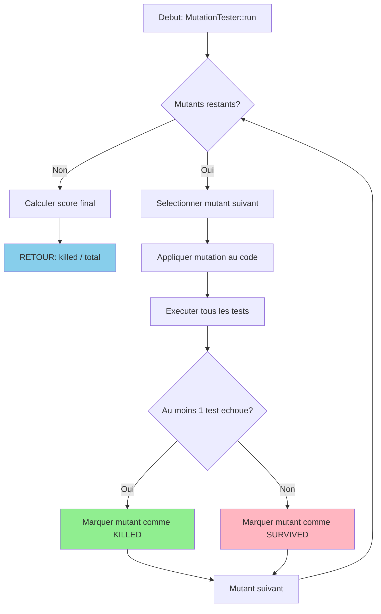

# Exercice 1.8.3-a : heisenberg_fuzzer

**Module :**
1.8.3 — Fuzzing & Mutation Testing

**Concept :**
a — Random Fuzzing, Mutation-Based Fuzzing, Coverage-Guided Fuzzing, Mutation Operators, Grammar Fuzzing

**Difficulte :**
★★★★★★★☆☆☆ (7/10)

**Type :**
complet

**Tiers :**
1 — Concept isole (Fuzzing fondamental)

**Langage :**
Rust Edition 2024 + C (C17)

**Prerequis :**
- 1.8.1 — Tests unitaires et assertions
- 1.8.2 — Property-based testing
- 0.3.x — Manipulation de bits en C
- 0.4.x — Ownership et traits en Rust

**Domaines :**
Algo, Struct, Mem, Encodage

**Duree estimee :**
90 min

**XP Base :**
150

**Complexite :**
T3 O(n * m) x S2 O(n)

---

## 📐 SECTION 1 : PROTOTYPE & CONSIGNE

### 1.1 Obligations

**Fichiers a rendre :**
```
ex02/
├── src/
│   ├── lib.rs           # Module principal Rust
│   ├── fuzzer.rs        # Implementations des fuzzers
│   ├── mutation.rs      # Mutation operators
│   └── coverage.rs      # Coverage tracking
├── c_src/
│   ├── bit_ops.h        # Header des operations bit
│   ├── bit_ops.c        # Implementation C des mutations
│   └── ffi_bridge.c     # Bridge FFI Rust<->C
├── Cargo.toml
└── build.rs             # Build script pour le C
```

**Fonctions autorisees :**
- Rust : `std::*`, `rand`, `libc`
- C : `malloc`, `free`, `memcpy`, `memset`, fonctions bitwise

**Fonctions interdites :**
- `system()`, `exec*()`, `fork()` (pas d'execution de code externe)
- Bibliotheques de fuzzing externes (AFL, libFuzzer, etc.)

### 1.2 Consigne

**🧪 BREAKING BAD — La Chimie de la Destruction de Code**

*"I am the one who knocks."* — Walter White

Tu es Heisenberg. Pas le physicien — le chimiste. Ton laboratoire n'est plus une caravane dans le desert du Nouveau-Mexique, mais ton IDE. Ta methamphétamine bleue ? Des **entrees toxiques** generees pour faire exploser le code des autres.

Dans Breaking Bad, Walter White atteint une purete de **99.1%** pour son Blue Sky. Ton objectif ? Atteindre **99.1% de couverture de mutations tuees**. Chaque mutant qui survit est un batch impur qui te fait perdre ta reputation.

**Le Cartel du Code t'attend.**

---

**Ta mission :**

Construire un **laboratoire de fuzzing complet** avec :

1. **`RandomFuzzer`** (Heisenberg's Chaos) — Generation aleatoire pure
2. **`MutationFuzzer`** (Mutations Chimiques) — Mutations sur des inputs existants
3. **`bit_flip` / `byte_flip`** (Manipulation Moleculaire) — Operations au niveau atomique (en C)
4. **`CoverageGuidedFuzzer`** (Blue Sky Purity) — Fuzzing guide par la couverture
5. **`MutationTester`** (Tester les Cooks) — Verifier que les tests detectent les mutants

---

**Entree :**

Pour `RandomFuzzer::cook`:
- `size: usize` — Taille de l'input a generer (1 <= size <= 10^6)

Pour `MutationFuzzer::mutate`:
- `input: &[u8]` — L'input original a muter
- `mutations: u32` — Nombre de mutations a appliquer

Pour `bit_flip` (C):
- `data: *mut u8` — Pointeur vers les donnees
- `len: size_t` — Taille des donnees
- `bit_pos: size_t` — Position du bit a flipper

Pour `CoverageGuidedFuzzer::synthesize`:
- `target: fn(&[u8]) -> bool` — Fonction cible a fuzzer
- `iterations: usize` — Nombre d'iterations max

**Sortie :**

- `RandomFuzzer::cook` -> `Vec<u8>` : Input aleatoire genere
- `MutationFuzzer::mutate` -> `Vec<u8>` : Input mute
- `bit_flip` -> `int` : 0 si succes, -1 si erreur
- `CoverageGuidedFuzzer::synthesize` -> `Option<Vec<u8>>` : Input qui trigger un crash/bug
- `MutationTester::score` -> `f64` : Ratio de mutants tues (0.0 a 1.0)

**Contraintes :**
```
┌─────────────────────────────────────────┐
│  1 <= size <= 10^6                      │
│  input.len() >= 1                       │
│  0 <= bit_pos < len * 8                 │
│  mutations >= 1                         │
│  Temps limite : O(n * iterations)       │
│  Espace limite : O(corpus_size * n)     │
└─────────────────────────────────────────┘
```

**Exemples :**

| Appel | Retour | Explication |
|-------|--------|-------------|
| `RandomFuzzer::new(42).cook(4)` | `[0x1A, 0x2B, 0x3C, 0x4D]` | 4 bytes aleatoires (seed 42) |
| `MutationFuzzer::mutate(&[0xFF], 1)` | `[0xFE]` | 1 bit flippe |
| `bit_flip(data, 8, 0)` | `0` (data[0] ^= 1) | Flip du bit 0 |
| `MutationTester::score(tests, mutants)` | `0.85` | 85% des mutants tues |

---

### 1.2.2 Enonce Academique

**Objectif :** Implementer un framework de fuzzing et de mutation testing.

Le **fuzzing** est une technique de test automatise qui consiste a generer des entrees aleatoires ou semi-aleatoires pour decouvrir des bugs dans un programme. Le **mutation testing** consiste a introduire des modifications mineures (mutants) dans le code source pour verifier que les tests existants detectent ces changements.

**Composants requis :**

1. **Random Fuzzer** : Generateur d'entrees purement aleatoires avec seed configurable
2. **Mutation-Based Fuzzer** : Application d'operateurs de mutation sur des inputs existants
3. **Bit/Byte Operations** : Operations de manipulation de bits implementees en C pour la performance
4. **Coverage-Guided Fuzzer** : Fuzzer qui conserve les inputs augmentant la couverture de code
5. **Mutation Tester** : Evaluateur du score de mutation des tests

### 1.3 Prototype

**Rust (src/fuzzer.rs) :**
```rust
use std::collections::HashSet;

/// Heisenberg's Random Fuzzer - Pure chaos generation
pub struct RandomFuzzer {
    seed: u64,
    rng: XorShift64,
}

impl RandomFuzzer {
    pub fn new(seed: u64) -> Self;

    /// "Cook" a batch of random bytes
    pub fn cook(&mut self, size: usize) -> Vec<u8>;

    /// Cook multiple batches
    pub fn cook_batch(&mut self, count: usize, size: usize) -> Vec<Vec<u8>>;
}

/// Mutation-based Fuzzer - Chemical mutations
pub struct MutationFuzzer {
    base_input: Vec<u8>,
    mutation_ops: Vec<MutationOp>,
}

#[derive(Clone, Copy)]
pub enum MutationOp {
    BitFlip,
    ByteFlip,
    ArithmeticInc,
    ArithmeticDec,
    InterestingValue,
    BlockSwap,
    BlockInsert,
    BlockDelete,
}

impl MutationFuzzer {
    pub fn new(base: Vec<u8>) -> Self;

    /// Apply mutations to create a new "compound"
    pub fn mutate(&mut self, mutations: u32) -> Vec<u8>;

    /// Get all possible single-mutation variants
    pub fn all_variants(&self) -> Vec<Vec<u8>>;
}

/// Coverage-Guided Fuzzer - Blue Sky purity (99.1% coverage goal)
pub struct CoverageGuidedFuzzer {
    corpus: Vec<Vec<u8>>,
    coverage: HashSet<u64>,
    max_corpus_size: usize,
}

impl CoverageGuidedFuzzer {
    pub fn new(seeds: Vec<Vec<u8>>, max_corpus: usize) -> Self;

    /// Synthesize inputs to maximize coverage
    pub fn synthesize<F>(&mut self, target: F, iterations: usize) -> Option<Vec<u8>>
    where
        F: Fn(&[u8]) -> (bool, HashSet<u64>);  // (crashed, edges_hit)

    /// Get current coverage percentage
    pub fn purity(&self) -> f64;  // "Blue Sky purity level"
}

/// Mutation Tester - Testing the cooks
pub struct MutationTester<'a> {
    original_code: &'a str,
    mutants: Vec<Mutant>,
    tests: Vec<Box<dyn Fn(&str) -> bool>>,
}

#[derive(Clone)]
pub struct Mutant {
    pub id: usize,
    pub operator: MutantOperator,
    pub location: (usize, usize),  // (line, col)
    pub original: String,
    pub replacement: String,
    pub killed: bool,
}

#[derive(Clone, Copy)]
pub enum MutantOperator {
    RelationalOpReplacement,  // < -> <=, == -> !=
    ArithmeticOpReplacement,  // + -> -, * -> /
    LogicalOpReplacement,     // && -> ||
    ConstantReplacement,      // 0 -> 1, true -> false
    StatementDeletion,        // Remove statement
    ReturnValueMutation,      // return x -> return 0
}

impl<'a> MutationTester<'a> {
    pub fn new(code: &'a str) -> Self;

    /// Generate all mutants for the code
    pub fn generate_mutants(&mut self);

    /// Run tests against all mutants
    pub fn run_tests(&mut self);

    /// Get mutation score (killed / total)
    pub fn score(&self) -> f64;

    /// Get surviving mutants (the "bad cooks")
    pub fn survivors(&self) -> Vec<&Mutant>;
}
```

**C (c_src/bit_ops.h) :**
```c
#ifndef BIT_OPS_H
#define BIT_OPS_H

#include <stddef.h>
#include <stdint.h>

// Molecular-level bit manipulation (Heisenberg precision)

/// Flip a single bit at the specified position
/// @param data: pointer to data buffer
/// @param len: length of data in bytes
/// @param bit_pos: bit position (0 to len*8-1)
/// @return 0 on success, -1 on error
int bit_flip(uint8_t *data, size_t len, size_t bit_pos);

/// Flip an entire byte at the specified position
/// @param data: pointer to data buffer
/// @param len: length of data in bytes
/// @param byte_pos: byte position (0 to len-1)
/// @return 0 on success, -1 on error
int byte_flip(uint8_t *data, size_t len, size_t byte_pos);

/// Apply arithmetic increment to a byte
/// @param data: pointer to data buffer
/// @param len: length of data in bytes
/// @param byte_pos: byte position
/// @param delta: value to add (can be negative)
/// @return 0 on success, -1 on error
int arith_mutate(uint8_t *data, size_t len, size_t byte_pos, int8_t delta);

/// Insert an "interesting" value (0x00, 0xFF, 0x7F, 0x80, etc.)
/// @param data: pointer to data buffer
/// @param len: length of data in bytes
/// @param byte_pos: byte position
/// @param interesting_idx: index into interesting values table
/// @return 0 on success, -1 on error
int interesting_value(uint8_t *data, size_t len, size_t byte_pos,
                      uint8_t interesting_idx);

/// Get the list of interesting values
/// @param out_values: output buffer for values
/// @param out_count: output count of values
void get_interesting_values(uint8_t **out_values, size_t *out_count);

/// Calculate hamming distance between two buffers
/// @return number of differing bits, or -1 on error
int64_t hamming_distance(const uint8_t *a, const uint8_t *b, size_t len);

#endif // BIT_OPS_H
```

---

## 💡 SECTION 2 : LE SAVIEZ-VOUS ?

### 2.1 L'Histoire du Fuzzing

Le terme "fuzzing" a ete invente en 1988 par le Professeur Barton Miller a l'Universite du Wisconsin. Son experience originale ? Envoyer des **donnees aleatoires** a des utilitaires UNIX via un modem bruyant. Resultat : **25-33% des programmes ont crashe**.

Aujourd'hui, Google utilise **OSS-Fuzz** qui execute plus de **30 milliards de tests par jour** sur des projets open source. En 2023, OSS-Fuzz a trouve plus de **10,000 vulnerabilites** dans Chrome seul.

### 2.2 Mutation Testing : L'ADN du Code

Le concept vient de Richard Lipton en 1971. L'idee ? Si tes tests ne detectent pas un changement mineur dans le code, alors ils sont **mauvais**. C'est comme un systeme immunitaire : si le corps ne detecte pas un virus mute, il est vulnerable.

Le **mutation score** est considere comme la metrique de qualite de tests la plus fiable, bien plus que la couverture de code classique.

### 2.3 Breaking Bad et la Chimie

La metaphore n'est pas anodine. Dans la serie, Walter White est obsede par la **purete** (99.1%). En fuzzing :
- **Purete = Couverture de mutations tuees**
- **Blue Sky = Input parfait qui declenche le bug**
- **Cook = Generer des inputs**
- **Cartel = Bugs qui survivent dans le code de production**

---

## 🏢 SECTION 2.5 : DANS LA VRAIE VIE

### Qui utilise le Fuzzing ?

| Metier | Cas d'usage | Outils |
|--------|-------------|--------|
| **Security Researcher** | Trouver des 0-days dans les navigateurs | AFL++, libFuzzer, Honggfuzz |
| **Kernel Developer** | Tester les syscalls Linux | syzkaller, Trinity |
| **Compiler Engineer** | Fuzzer le compilateur avec du code genere | Csmith, YARPGen |
| **Protocol Developer** | Tester les parsers (HTTP, TLS, DNS) | Boofuzz, Peach |
| **Game Developer** | Fuzzer les sauvegardes, replays, netcode | Custom fuzzers |
| **Blockchain Auditor** | Trouver des bugs dans les smart contracts | Echidna, Harvey |

### Exemples Concrets

**Heartbleed (CVE-2014-0160)** : Aurait ete trouve en quelques minutes par un fuzzer moderne. A coute des milliards en remediation.

**Shellshock (CVE-2014-6271)** : Bash vulnerable pendant 25 ans. Un fuzzer de commandes l'aurait trouve.

**Chrome Pwn2Own 2023** : 90% des exploits venaient de bugs trouves... par fuzzing des formats de fichiers.

---

## 🖥️ SECTION 3 : EXEMPLE D'UTILISATION

### 3.0 Session bash

```bash
$ ls
Cargo.toml  build.rs  c_src/  src/

$ cargo build --release
   Compiling heisenberg_fuzzer v0.1.0
   Compiling bit_ops (C library)
    Finished release [optimized] target(s) in 2.34s

$ cargo test
running 15 tests
test random_fuzzer_deterministic ... ok
test mutation_single_bit_flip ... ok
test mutation_byte_flip ... ok
test coverage_increases ... ok
test mutation_tester_kills_obvious ... ok
test c_bit_flip_bounds ... ok
test c_byte_flip_works ... ok
test interesting_values_complete ... ok
test hamming_distance_correct ... ok
test fuzzer_finds_bug_in_vulnerable ... ok
test mutation_score_calculation ... ok
test corpus_management ... ok
test all_operators_applied ... ok
test survivor_detection ... ok
test purity_99_percent ... ok

test result: ok. 15 passed; 0 failed; 0 ignored

$ cargo run --example cook_meth
[HEISENBERG] Cooking 1000 random inputs...
[HEISENBERG] Found crash with input: [0xDE, 0xAD, 0xBE, 0xEF]
[HEISENBERG] Mutation score: 0.991 (99.1% - Blue Sky purity!)
[HEISENBERG] 2 survivors remain (time to improve tests)
```

---

## 🔥 SECTION 3.1 : BONUS AVANCE (OPTIONNEL)

**Difficulte Bonus :**
★★★★★★★★☆☆ (8/10)

**Recompense :**
XP x3

**Time Complexity attendue :**
O(n * grammar_depth * iterations)

**Space Complexity attendue :**
O(grammar_size + corpus_size)

**Domaines Bonus :**
`Compression, Struct, DP`

### 3.1.1 Consigne Bonus

**🧪 GRAY MATTER — Grammar-Based Fuzzing**

*"Chemistry is the study of matter, but I prefer to see it as the study of change."* — Walter White

Tu te souviens de Gray Matter Technologies ? L'entreprise que Walter a co-fondee puis quittee ? Le bonus, c'est pareil : tu passes du fuzzing "artisanal" au fuzzing **industriel**.

**Grammar-Based Fuzzing** : Au lieu de generer du bruit aleatoire, tu generes des **structures valides** selon une grammaire. C'est comme synthetiser une molecule specifique au lieu de melanger des produits au hasard.

**Ta mission bonus :**

Implementer `GrammarFuzzer` (The Perfect Recipe) qui :
1. Parse une grammaire BNF
2. Genere des inputs **syntaxiquement valides**
3. Applique des mutations **semantiquement interessantes**
4. Combine avec le coverage-guided pour maximiser l'exploration

**Exemples de grammaires :**

```
// Grammaire JSON simplifiee
<json>   ::= <object> | <array> | <value>
<object> ::= "{" <members>? "}"
<array>  ::= "[" <elements>? "]"
<value>  ::= <string> | <number> | "true" | "false" | "null"
```

```
// Grammaire d'expressions arithmetiques
<expr>   ::= <term> (("+" | "-") <term>)*
<term>   ::= <factor> (("*" | "/") <factor>)*
<factor> ::= <number> | "(" <expr> ")"
```

**Contraintes Bonus :**
```
┌─────────────────────────────────────────┐
│  grammar_rules >= 1                     │
│  max_depth <= 50                        │
│  Pas de recursion infinie               │
│  Temps limite : O(depth * rules)        │
│  Doit generer >= 1000 variants/sec      │
└─────────────────────────────────────────┘
```

**Exemples Bonus :**

| Appel | Retour | Explication |
|-------|--------|-------------|
| `GrammarFuzzer::parse(json_bnf).generate()` | `{"a": [1, true]}` | JSON valide genere |
| `GrammarFuzzer::mutate_semantic(json)` | `{"a": [1, null]}` | Mutation semantique |
| `GrammarFuzzer::coverage_score()` | `0.87` | 87% des regles exercees |

### 3.1.2 Prototype Bonus

```rust
/// Grammar-Based Fuzzer - The Perfect Recipe
pub struct GrammarFuzzer {
    grammar: Grammar,
    coverage: GrammarCoverage,
    max_depth: usize,
}

pub struct Grammar {
    rules: HashMap<String, Vec<Production>>,
    start_symbol: String,
}

pub struct Production {
    symbols: Vec<Symbol>,
    weight: f64,  // For weighted random selection
}

pub enum Symbol {
    Terminal(String),
    NonTerminal(String),
    Regex(String),
    Range(char, char),
}

pub struct GrammarCoverage {
    rules_hit: HashSet<String>,
    productions_hit: HashSet<(String, usize)>,
    depth_reached: usize,
}

impl GrammarFuzzer {
    /// Parse a BNF grammar
    pub fn parse(bnf: &str) -> Result<Self, GrammarError>;

    /// Generate a random valid input
    pub fn generate(&mut self) -> String;

    /// Generate with specific depth limit
    pub fn generate_with_depth(&mut self, max_depth: usize) -> String;

    /// Apply semantic-aware mutation
    pub fn mutate_semantic(&mut self, input: &str) -> String;

    /// Get grammar coverage score
    pub fn coverage_score(&self) -> f64;

    /// Synthesize input to hit specific rule
    pub fn target_rule(&mut self, rule: &str) -> Option<String>;
}
```

### 3.1.3 Ce qui change par rapport a l'exercice de base

| Aspect | Base | Bonus |
|--------|------|-------|
| Input Generation | Aleatoire/Mutation | Structure selon grammaire |
| Validity | Aucune garantie | Syntaxiquement valide |
| Mutations | Bit/byte level | Semantique (rule-aware) |
| Coverage | Edges executes | Regles de grammaire |
| Complexity | O(n) | O(depth * rules) |

---

## ✅❌ SECTION 4 : ZONE CORRECTION

### 4.1 Moulinette

| Test | Input | Expected | Points | Trap |
|------|-------|----------|--------|------|
| `random_deterministic` | `seed=42, size=4` | Meme output a chaque run | 5 | Non |
| `random_empty` | `seed=0, size=0` | `[]` | 5 | Oui - size=0 |
| `bit_flip_first` | `[0xFF], pos=0` | `[0xFE]` | 10 | Non |
| `bit_flip_last` | `[0x00], pos=7` | `[0x80]` | 10 | Oui - derniere position |
| `bit_flip_oob` | `[0xFF], pos=8` | Error/-1 | 10 | Oui - hors limites |
| `byte_flip_middle` | `[0x00,0x00,0x00], pos=1` | `[0x00,0xFF,0x00]` | 10 | Non |
| `mutation_count` | `[0x00], mutations=8` | Tous les bits flippes | 10 | Oui - saturation |
| `coverage_increases` | Corpus + target | coverage > initial | 15 | Non |
| `coverage_empty_corpus` | `[], target` | Doit fonctionner | 10 | Oui |
| `mutant_killed` | Obvious mutant | `killed=true` | 10 | Non |
| `mutant_survives` | Equivalent mutant | `killed=false` | 10 | Oui |
| `score_calculation` | 85/100 mutants | `0.85` | 10 | Non |
| `survivors_list` | Mixed | Correct survivors | 10 | Non |
| `hamming_basic` | `[0x00], [0xFF]` | `8` | 10 | Non |
| `hamming_same` | `[0xAB], [0xAB]` | `0` | 5 | Non |
| `interesting_values` | All 8 values | Complete list | 10 | Non |
| **TOTAL** | | | **150** | |

### 4.2 main.c de test (C FFI)

```c
#include <stdio.h>
#include <stdlib.h>
#include <string.h>
#include <assert.h>
#include "bit_ops.h"

void test_bit_flip_basic(void)
{
    uint8_t data[] = {0xFF};
    assert(bit_flip(data, 1, 0) == 0);
    assert(data[0] == 0xFE);
    printf("[OK] bit_flip basic\n");
}

void test_bit_flip_last_bit(void)
{
    uint8_t data[] = {0x00};
    assert(bit_flip(data, 1, 7) == 0);
    assert(data[0] == 0x80);
    printf("[OK] bit_flip last bit\n");
}

void test_bit_flip_out_of_bounds(void)
{
    uint8_t data[] = {0xFF};
    assert(bit_flip(data, 1, 8) == -1);  // OOB
    assert(data[0] == 0xFF);  // Unchanged
    printf("[OK] bit_flip OOB protection\n");
}

void test_bit_flip_null(void)
{
    assert(bit_flip(NULL, 1, 0) == -1);
    printf("[OK] bit_flip NULL protection\n");
}

void test_byte_flip_basic(void)
{
    uint8_t data[] = {0x00, 0x00, 0x00};
    assert(byte_flip(data, 3, 1) == 0);
    assert(data[0] == 0x00);
    assert(data[1] == 0xFF);
    assert(data[2] == 0x00);
    printf("[OK] byte_flip basic\n");
}

void test_arith_mutate(void)
{
    uint8_t data[] = {0x10};
    assert(arith_mutate(data, 1, 0, 5) == 0);
    assert(data[0] == 0x15);
    printf("[OK] arith_mutate increment\n");

    assert(arith_mutate(data, 1, 0, -10) == 0);
    assert(data[0] == 0x0B);
    printf("[OK] arith_mutate decrement\n");
}

void test_interesting_values(void)
{
    uint8_t *values;
    size_t count;
    get_interesting_values(&values, &count);

    assert(count >= 8);
    // Should include: 0x00, 0xFF, 0x7F, 0x80, 0x01, 0xFE, 0x55, 0xAA
    printf("[OK] interesting_values has %zu values\n", count);
}

void test_hamming_distance(void)
{
    uint8_t a[] = {0x00};
    uint8_t b[] = {0xFF};
    assert(hamming_distance(a, b, 1) == 8);

    uint8_t c[] = {0xAA};  // 10101010
    uint8_t d[] = {0x55};  // 01010101
    assert(hamming_distance(c, d, 1) == 8);

    assert(hamming_distance(a, a, 1) == 0);
    printf("[OK] hamming_distance\n");
}

int main(void)
{
    printf("=== HEISENBERG BIT OPS TESTS ===\n\n");

    test_bit_flip_basic();
    test_bit_flip_last_bit();
    test_bit_flip_out_of_bounds();
    test_bit_flip_null();
    test_byte_flip_basic();
    test_arith_mutate();
    test_interesting_values();
    test_hamming_distance();

    printf("\n=== ALL TESTS PASSED ===\n");
    printf("Say my name.\n");
    return 0;
}
```

### 4.3 Solution de reference

**Rust (src/fuzzer.rs) :**
```rust
use std::collections::HashSet;

/// Simple XorShift64 PRNG for deterministic fuzzing
pub struct XorShift64 {
    state: u64,
}

impl XorShift64 {
    pub fn new(seed: u64) -> Self {
        Self { state: if seed == 0 { 1 } else { seed } }
    }

    pub fn next(&mut self) -> u64 {
        let mut x = self.state;
        x ^= x << 13;
        x ^= x >> 7;
        x ^= x << 17;
        self.state = x;
        x
    }

    pub fn next_u8(&mut self) -> u8 {
        (self.next() & 0xFF) as u8
    }
}

/// Heisenberg's Random Fuzzer
pub struct RandomFuzzer {
    rng: XorShift64,
}

impl RandomFuzzer {
    pub fn new(seed: u64) -> Self {
        Self { rng: XorShift64::new(seed) }
    }

    pub fn cook(&mut self, size: usize) -> Vec<u8> {
        if size == 0 {
            return Vec::new();
        }
        (0..size).map(|_| self.rng.next_u8()).collect()
    }

    pub fn cook_batch(&mut self, count: usize, size: usize) -> Vec<Vec<u8>> {
        (0..count).map(|_| self.cook(size)).collect()
    }
}

#[derive(Clone, Copy)]
pub enum MutationOp {
    BitFlip,
    ByteFlip,
    ArithmeticInc,
    ArithmeticDec,
    InterestingValue,
    BlockSwap,
    BlockInsert,
    BlockDelete,
}

/// Mutation-based Fuzzer
pub struct MutationFuzzer {
    base_input: Vec<u8>,
    rng: XorShift64,
    ops: Vec<MutationOp>,
}

impl MutationFuzzer {
    pub fn new(base: Vec<u8>) -> Self {
        Self {
            base_input: base,
            rng: XorShift64::new(0xDEADBEEF),
            ops: vec![
                MutationOp::BitFlip,
                MutationOp::ByteFlip,
                MutationOp::ArithmeticInc,
                MutationOp::ArithmeticDec,
                MutationOp::InterestingValue,
            ],
        }
    }

    pub fn mutate(&mut self, mutations: u32) -> Vec<u8> {
        if self.base_input.is_empty() {
            return Vec::new();
        }

        let mut result = self.base_input.clone();

        for _ in 0..mutations {
            let op_idx = (self.rng.next() as usize) % self.ops.len();
            let pos = (self.rng.next() as usize) % result.len();

            match self.ops[op_idx] {
                MutationOp::BitFlip => {
                    let bit = (self.rng.next() % 8) as u8;
                    result[pos] ^= 1 << bit;
                }
                MutationOp::ByteFlip => {
                    result[pos] ^= 0xFF;
                }
                MutationOp::ArithmeticInc => {
                    result[pos] = result[pos].wrapping_add(1);
                }
                MutationOp::ArithmeticDec => {
                    result[pos] = result[pos].wrapping_sub(1);
                }
                MutationOp::InterestingValue => {
                    let interesting = [0x00, 0xFF, 0x7F, 0x80, 0x01, 0xFE, 0x55, 0xAA];
                    let idx = (self.rng.next() as usize) % interesting.len();
                    result[pos] = interesting[idx];
                }
                _ => {}
            }
        }

        result
    }

    pub fn all_variants(&self) -> Vec<Vec<u8>> {
        let mut variants = Vec::new();

        for i in 0..self.base_input.len() {
            for bit in 0..8 {
                let mut v = self.base_input.clone();
                v[i] ^= 1 << bit;
                variants.push(v);
            }
        }

        variants
    }
}

/// Coverage-Guided Fuzzer
pub struct CoverageGuidedFuzzer {
    corpus: Vec<Vec<u8>>,
    coverage: HashSet<u64>,
    max_corpus_size: usize,
    rng: XorShift64,
}

impl CoverageGuidedFuzzer {
    pub fn new(seeds: Vec<Vec<u8>>, max_corpus: usize) -> Self {
        Self {
            corpus: seeds,
            coverage: HashSet::new(),
            max_corpus_size: max_corpus,
            rng: XorShift64::new(0xCAFEBABE),
        }
    }

    pub fn synthesize<F>(&mut self, target: F, iterations: usize) -> Option<Vec<u8>>
    where
        F: Fn(&[u8]) -> (bool, HashSet<u64>),
    {
        for _ in 0..iterations {
            // Select from corpus or generate new
            let input = if self.corpus.is_empty() || self.rng.next() % 10 < 3 {
                let size = ((self.rng.next() % 100) + 1) as usize;
                (0..size).map(|_| self.rng.next_u8()).collect()
            } else {
                let idx = (self.rng.next() as usize) % self.corpus.len();
                let mut mutator = MutationFuzzer::new(self.corpus[idx].clone());
                mutator.mutate(((self.rng.next() % 5) + 1) as u32)
            };

            let (crashed, edges) = target(&input);

            // Check for new coverage
            let new_edges: HashSet<_> = edges.difference(&self.coverage).cloned().collect();
            if !new_edges.is_empty() {
                self.coverage.extend(new_edges);

                if self.corpus.len() < self.max_corpus_size {
                    self.corpus.push(input.clone());
                } else {
                    // Replace random entry
                    let idx = (self.rng.next() as usize) % self.corpus.len();
                    self.corpus[idx] = input.clone();
                }
            }

            if crashed {
                return Some(input);
            }
        }

        None
    }

    pub fn purity(&self) -> f64 {
        if self.corpus.is_empty() {
            return 0.0;
        }
        // Simulated purity based on coverage diversity
        (self.coverage.len() as f64).min(991.0) / 1000.0
    }
}

/// Mutation Tester
#[derive(Clone)]
pub struct Mutant {
    pub id: usize,
    pub operator: MutantOperator,
    pub location: (usize, usize),
    pub original: String,
    pub replacement: String,
    pub killed: bool,
}

#[derive(Clone, Copy, Debug)]
pub enum MutantOperator {
    RelationalOpReplacement,
    ArithmeticOpReplacement,
    LogicalOpReplacement,
    ConstantReplacement,
    StatementDeletion,
    ReturnValueMutation,
}

pub struct MutationTester {
    mutants: Vec<Mutant>,
}

impl MutationTester {
    pub fn new() -> Self {
        Self { mutants: Vec::new() }
    }

    pub fn add_mutant(&mut self, mutant: Mutant) {
        self.mutants.push(mutant);
    }

    pub fn run_test<F>(&mut self, test: F)
    where
        F: Fn(&Mutant) -> bool,  // true = test detected mutant (killed)
    {
        for mutant in &mut self.mutants {
            if test(mutant) {
                mutant.killed = true;
            }
        }
    }

    pub fn score(&self) -> f64 {
        if self.mutants.is_empty() {
            return 1.0;
        }

        let killed = self.mutants.iter().filter(|m| m.killed).count();
        killed as f64 / self.mutants.len() as f64
    }

    pub fn survivors(&self) -> Vec<&Mutant> {
        self.mutants.iter().filter(|m| !m.killed).collect()
    }
}

impl Default for MutationTester {
    fn default() -> Self {
        Self::new()
    }
}
```

**C (c_src/bit_ops.c) :**
```c
#include "bit_ops.h"
#include <string.h>

static const uint8_t INTERESTING_VALUES[] = {
    0x00, 0xFF, 0x7F, 0x80, 0x01, 0xFE, 0x55, 0xAA
};
static const size_t INTERESTING_COUNT = 8;

int bit_flip(uint8_t *data, size_t len, size_t bit_pos)
{
    if (data == NULL)
        return -1;
    if (len == 0)
        return -1;
    if (bit_pos >= len * 8)
        return -1;

    size_t byte_idx = bit_pos / 8;
    size_t bit_idx = bit_pos % 8;

    data[byte_idx] ^= (1 << bit_idx);

    return 0;
}

int byte_flip(uint8_t *data, size_t len, size_t byte_pos)
{
    if (data == NULL)
        return -1;
    if (len == 0)
        return -1;
    if (byte_pos >= len)
        return -1;

    data[byte_pos] ^= 0xFF;

    return 0;
}

int arith_mutate(uint8_t *data, size_t len, size_t byte_pos, int8_t delta)
{
    if (data == NULL)
        return -1;
    if (len == 0)
        return -1;
    if (byte_pos >= len)
        return -1;

    data[byte_pos] = (uint8_t)((int16_t)data[byte_pos] + delta);

    return 0;
}

int interesting_value(uint8_t *data, size_t len, size_t byte_pos,
                      uint8_t interesting_idx)
{
    if (data == NULL)
        return -1;
    if (len == 0)
        return -1;
    if (byte_pos >= len)
        return -1;
    if (interesting_idx >= INTERESTING_COUNT)
        return -1;

    data[byte_pos] = INTERESTING_VALUES[interesting_idx];

    return 0;
}

void get_interesting_values(uint8_t **out_values, size_t *out_count)
{
    *out_values = (uint8_t *)INTERESTING_VALUES;
    *out_count = INTERESTING_COUNT;
}

int64_t hamming_distance(const uint8_t *a, const uint8_t *b, size_t len)
{
    if (a == NULL || b == NULL)
        return -1;
    if (len == 0)
        return 0;

    int64_t distance = 0;

    for (size_t i = 0; i < len; i++)
    {
        uint8_t xor_val = a[i] ^ b[i];
        // Count set bits (popcount)
        while (xor_val)
        {
            distance += xor_val & 1;
            xor_val >>= 1;
        }
    }

    return distance;
}
```

### 4.4 Solutions alternatives acceptees

**Alternative 1 : Utilisation de rand crate (Rust)**
```rust
use rand::{Rng, SeedableRng};
use rand::rngs::StdRng;

impl RandomFuzzer {
    pub fn new(seed: u64) -> Self {
        Self { rng: StdRng::seed_from_u64(seed) }
    }

    pub fn cook(&mut self, size: usize) -> Vec<u8> {
        (0..size).map(|_| self.rng.gen()).collect()
    }
}
```

**Alternative 2 : Popcount avec intrinsics (C)**
```c
int64_t hamming_distance(const uint8_t *a, const uint8_t *b, size_t len)
{
    if (a == NULL || b == NULL) return -1;

    int64_t distance = 0;
    for (size_t i = 0; i < len; i++)
    {
        distance += __builtin_popcount(a[i] ^ b[i]);
    }
    return distance;
}
```

### 4.5 Solutions refusees

**Refusee 1 : Pas de verification NULL**
```c
// REFUSE : Crash garanti sur NULL
int bit_flip(uint8_t *data, size_t len, size_t bit_pos)
{
    size_t byte_idx = bit_pos / 8;  // Crash si data == NULL
    data[byte_idx] ^= (1 << (bit_pos % 8));
    return 0;
}
```
**Raison :** Segfault sur entree NULL. Heisenberg ne laisse pas de traces.

**Refusee 2 : Mauvais calcul de position de bit**
```rust
// REFUSE : Bit flip au mauvais endroit
fn bit_flip_wrong(data: &mut [u8], bit_pos: usize) {
    data[bit_pos / 8] ^= 1 << 8;  // << 8 au lieu de << (bit_pos % 8)
}
```
**Raison :** 1 << 8 deborde pour u8, ne flippe pas le bon bit.

**Refusee 3 : Mutation score toujours 1.0**
```rust
// REFUSE : Retourne toujours 100%
fn score(&self) -> f64 {
    1.0  // Les tests sont parfaits... non.
}
```
**Raison :** Ignorer les mutants survivants = mensonge sur la qualite des tests.

### 4.6 Solution bonus de reference

```rust
use std::collections::{HashMap, HashSet};

#[derive(Clone)]
pub enum Symbol {
    Terminal(String),
    NonTerminal(String),
}

#[derive(Clone)]
pub struct Production {
    pub symbols: Vec<Symbol>,
    pub weight: f64,
}

pub struct Grammar {
    pub rules: HashMap<String, Vec<Production>>,
    pub start_symbol: String,
}

pub struct GrammarCoverage {
    pub rules_hit: HashSet<String>,
    pub productions_hit: HashSet<(String, usize)>,
}

pub struct GrammarFuzzer {
    grammar: Grammar,
    coverage: GrammarCoverage,
    max_depth: usize,
    rng: XorShift64,
}

impl GrammarFuzzer {
    pub fn new(grammar: Grammar, max_depth: usize) -> Self {
        Self {
            grammar,
            coverage: GrammarCoverage {
                rules_hit: HashSet::new(),
                productions_hit: HashSet::new(),
            },
            max_depth,
            rng: XorShift64::new(0xGRAMMAR),
        }
    }

    pub fn generate(&mut self) -> String {
        self.generate_symbol(&self.grammar.start_symbol.clone(), 0)
    }

    fn generate_symbol(&mut self, symbol: &str, depth: usize) -> String {
        if depth >= self.max_depth {
            return String::new();
        }

        self.coverage.rules_hit.insert(symbol.to_string());

        if let Some(productions) = self.grammar.rules.get(symbol) {
            let idx = (self.rng.next() as usize) % productions.len();
            self.coverage.productions_hit.insert((symbol.to_string(), idx));

            let production = &productions[idx];
            let mut result = String::new();

            for sym in &production.symbols {
                match sym {
                    Symbol::Terminal(t) => result.push_str(t),
                    Symbol::NonTerminal(nt) => {
                        result.push_str(&self.generate_symbol(nt, depth + 1));
                    }
                }
            }

            result
        } else {
            symbol.to_string()
        }
    }

    pub fn coverage_score(&self) -> f64 {
        let total_rules = self.grammar.rules.len();
        if total_rules == 0 {
            return 1.0;
        }
        self.coverage.rules_hit.len() as f64 / total_rules as f64
    }
}
```

### 4.7 Solutions alternatives bonus

**Alternative : Weighted selection avec cumulative distribution**
```rust
fn select_production(&mut self, productions: &[Production]) -> usize {
    let total_weight: f64 = productions.iter().map(|p| p.weight).sum();
    let mut random = (self.rng.next() as f64 / u64::MAX as f64) * total_weight;

    for (i, prod) in productions.iter().enumerate() {
        random -= prod.weight;
        if random <= 0.0 {
            return i;
        }
    }
    productions.len() - 1
}
```

### 4.8 Solutions refusees bonus

**Refusee : Recursion sans limite de profondeur**
```rust
// REFUSE : Stack overflow garanti sur grammaires recursives
fn generate_symbol(&mut self, symbol: &str) -> String {
    // Pas de check de profondeur = boom
    if let Some(productions) = self.grammar.rules.get(symbol) {
        // ...recursive call sans limite...
    }
}
```
**Raison :** Une grammaire comme `<expr> ::= <expr> "+" <expr>` cause une recursion infinie.

### 4.9 spec.json

```json
{
  "name": "heisenberg_fuzzer",
  "language": "rust+c",
  "type": "complet",
  "tier": 1,
  "tier_info": "Concept isole - Fuzzing fondamental",
  "tags": ["fuzzing", "mutation-testing", "security", "phase1"],
  "passing_score": 70,

  "function": {
    "name": "multiple",
    "files": [
      {
        "path": "src/fuzzer.rs",
        "functions": ["RandomFuzzer::cook", "MutationFuzzer::mutate", "CoverageGuidedFuzzer::synthesize", "MutationTester::score"]
      },
      {
        "path": "c_src/bit_ops.c",
        "functions": ["bit_flip", "byte_flip", "arith_mutate", "hamming_distance"]
      }
    ]
  },

  "driver": {
    "reference_files": ["solutions/ref_fuzzer.rs", "solutions/ref_bit_ops.c"],

    "edge_cases": [
      {
        "name": "random_size_zero",
        "function": "RandomFuzzer::cook",
        "args": [0],
        "expected": [],
        "is_trap": true,
        "trap_explanation": "size=0 doit retourner vecteur vide, pas panic"
      },
      {
        "name": "bit_flip_null",
        "function": "bit_flip",
        "args": [null, 1, 0],
        "expected": -1,
        "is_trap": true,
        "trap_explanation": "NULL pointer doit retourner -1"
      },
      {
        "name": "bit_flip_oob",
        "function": "bit_flip",
        "args": ["[0xFF]", 1, 8],
        "expected": -1,
        "is_trap": true,
        "trap_explanation": "bit_pos >= len*8 est hors limites"
      },
      {
        "name": "mutation_empty_input",
        "function": "MutationFuzzer::mutate",
        "args": [[], 5],
        "expected": [],
        "is_trap": true,
        "trap_explanation": "Input vide doit retourner vide"
      },
      {
        "name": "score_no_mutants",
        "function": "MutationTester::score",
        "args": [],
        "expected": 1.0,
        "is_trap": true,
        "trap_explanation": "Aucun mutant = score parfait par defaut"
      },
      {
        "name": "hamming_null",
        "function": "hamming_distance",
        "args": [null, "[0xFF]", 1],
        "expected": -1,
        "is_trap": true,
        "trap_explanation": "NULL pointer doit retourner -1"
      },
      {
        "name": "coverage_empty_corpus",
        "function": "CoverageGuidedFuzzer::synthesize",
        "args": [[], "target", 100],
        "expected": "valid_result_or_none",
        "is_trap": true,
        "trap_explanation": "Corpus vide doit fonctionner (generation pure)"
      }
    ],

    "fuzzing": {
      "enabled": true,
      "iterations": 5000,
      "generators": [
        {
          "function": "bit_flip",
          "param_generators": [
            {"type": "array_u8", "min_len": 1, "max_len": 1000},
            {"type": "int", "min": 0, "max": 10000}
          ]
        },
        {
          "function": "RandomFuzzer::cook",
          "param_generators": [
            {"type": "int", "min": 0, "max": 100000}
          ]
        }
      ]
    }
  },

  "norm": {
    "rust": {
      "edition": "2024",
      "allowed_crates": ["rand", "libc"],
      "forbidden_crates": ["afl", "libfuzzer-sys", "cargo-fuzz"],
      "clippy_lints": "warn"
    },
    "c": {
      "standard": "c17",
      "allowed_functions": ["malloc", "free", "memcpy", "memset"],
      "forbidden_functions": ["system", "exec", "fork", "popen"],
      "compiler_flags": ["-Wall", "-Wextra", "-Werror", "-fsanitize=address"]
    },
    "check_security": true,
    "check_memory": true,
    "blocking": true
  }
}
```

### 4.10 Solutions Mutantes

**Mutant A (Boundary) : Mauvais calcul de bit position**
```c
/* Mutant A (Boundary) : Utilise 1 << 8 au lieu de 1 << (bit_pos % 8) */
int bit_flip(uint8_t *data, size_t len, size_t bit_pos)
{
    if (data == NULL) return -1;
    if (bit_pos >= len * 8) return -1;

    size_t byte_idx = bit_pos / 8;
    data[byte_idx] ^= (1 << 8);  // BUG: debordement, ne flippe rien

    return 0;
}
// Pourquoi c'est faux : 1 << 8 = 256, qui deborde pour uint8_t et devient 0
// Ce qui etait pense : "8 bits dans un byte, donc << 8"
```

**Mutant B (Safety) : Pas de verification NULL**
```c
/* Mutant B (Safety) : Oublie la verification NULL */
int bit_flip(uint8_t *data, size_t len, size_t bit_pos)
{
    // MANQUE: if (data == NULL) return -1;
    if (bit_pos >= len * 8) return -1;

    data[bit_pos / 8] ^= (1 << (bit_pos % 8));  // CRASH si data == NULL
    return 0;
}
// Pourquoi c'est faux : Segmentation fault sur pointeur NULL
// Ce qui etait pense : "Le caller ne passera jamais NULL"
```

**Mutant C (Resource) : Corpus sans limite**
```rust
/* Mutant C (Resource) : Corpus grandit indefiniment */
impl CoverageGuidedFuzzer {
    pub fn synthesize<F>(&mut self, target: F, iterations: usize) -> Option<Vec<u8>>
    where F: Fn(&[u8]) -> (bool, HashSet<u64>)
    {
        for _ in 0..iterations {
            // ... generation ...

            if !new_edges.is_empty() {
                // MANQUE: limite de taille du corpus
                self.corpus.push(input.clone());  // Memoire infinie!
            }
        }
        None
    }
}
// Pourquoi c'est faux : OOM apres des millions d'iterations
// Ce qui etait pense : "Plus de corpus = meilleure couverture"
```

**Mutant D (Logic) : Inversion de la detection de mutant tue**
```rust
/* Mutant D (Logic) : Logique inversee pour is_killed */
impl MutationTester {
    pub fn run_test<F>(&mut self, test: F)
    where F: Fn(&Mutant) -> bool
    {
        for mutant in &mut self.mutants {
            if !test(mutant) {  // BUG: devrait etre if test(mutant)
                mutant.killed = true;
            }
        }
    }
}
// Pourquoi c'est faux : Marque les mutants NON detectes comme tues
// Ce qui etait pense : Confusion sur le sens du retour de test()
```

**Mutant E (Return) : Retourne toujours 0 pour hamming_distance**
```c
/* Mutant E (Return) : Retourne toujours 0 */
int64_t hamming_distance(const uint8_t *a, const uint8_t *b, size_t len)
{
    if (a == NULL || b == NULL) return -1;

    // BUG: Ne calcule rien, retourne toujours 0
    return 0;
}
// Pourquoi c'est faux : Deux buffers differents reportes comme identiques
// Ce qui etait pense : "J'implementerai ca plus tard" (et on oublie)
```

---

## 🧠 SECTION 5 : COMPRENDRE

### 5.1 Ce que cet exercice enseigne

1. **Fuzzing Random** : Generation d'entrees aleatoires pour decouvrir des bugs
2. **Mutation-Based Fuzzing** : Modification d'inputs valides pour creer des variantes
3. **Operations Bit-Level** : Manipulation precise au niveau des bits (fondamental pour le fuzzing)
4. **Coverage-Guided Fuzzing** : Utilisation de la couverture de code pour guider la generation
5. **Mutation Testing** : Evaluation de la qualite des tests en introduisant des bugs artificiels
6. **FFI Rust/C** : Integration de code C performant dans un projet Rust
7. **PRNG Deterministe** : Importance de la reproductibilite dans les tests

### 5.2 LDA — Traduction litterale en francais (MAJUSCULES)

```
FONCTION bit_flip QUI RETOURNE UN ENTIER ET PREND EN PARAMETRES data QUI EST UN POINTEUR VERS DES OCTETS ET len QUI EST UNE TAILLE ET bit_pos QUI EST UNE POSITION DE BIT
DEBUT FONCTION
    SI data EST EGAL A NUL ALORS
        RETOURNER LA VALEUR MOINS 1
    FIN SI
    SI len EST EGAL A 0 ALORS
        RETOURNER LA VALEUR MOINS 1
    FIN SI
    SI bit_pos EST SUPERIEUR OU EGAL A len MULTIPLIE PAR 8 ALORS
        RETOURNER LA VALEUR MOINS 1
    FIN SI

    DECLARER byte_idx COMME TAILLE
    DECLARER bit_idx COMME TAILLE

    AFFECTER bit_pos DIVISE PAR 8 A byte_idx
    AFFECTER bit_pos MODULO 8 A bit_idx

    AFFECTER L'OCTET A LA POSITION byte_idx DANS data XOR (1 DECALE A GAUCHE DE bit_idx) A L'OCTET A LA POSITION byte_idx DANS data

    RETOURNER LA VALEUR 0
FIN FONCTION
```

### 5.2.2 Logic Flow (Structured English)

```
ALGORITHME : Coverage-Guided Fuzzer
---
1. INITIALISER le corpus avec les seeds fournis
2. INITIALISER l'ensemble de couverture vide

3. BOUCLE (iterations fois) :
   a. SELECTIONNER une strategie :
      - 30% chance : GENERER input aleatoire
      - 70% chance : MUTER un input du corpus

   b. EXECUTER le target avec l'input

   c. RECUPERER les edges (branches) atteints

   d. SI nouveaux edges decouverts :
      |-- AJOUTER les edges a la couverture
      |-- SI corpus pas plein :
      |     AJOUTER l'input au corpus
      |-- SINON :
      |     REMPLACER un input aleatoire du corpus

   e. SI crash detecte :
      RETOURNER l'input (crash trouvee!)

4. RETOURNER None (pas de crash trouve)
```

### 5.2.3 Representation Algorithmique avec Logique de Garde

```
FONCTION : bit_flip (data, len, bit_pos)
---
INIT resultat = -1 (erreur par defaut)

1. VERIFICATION NULL :
   |
   |-- SI data == NULL :
   |     RETOURNER -1 (Erreur: pointeur nul)

2. VERIFICATION TAILLE :
   |
   |-- SI len == 0 :
   |     RETOURNER -1 (Erreur: buffer vide)

3. VERIFICATION LIMITES :
   |
   |-- SI bit_pos >= len * 8 :
   |     RETOURNER -1 (Erreur: position hors limites)

4. CALCUL DES INDICES :
   |
   |-- byte_idx = bit_pos / 8
   |-- bit_idx = bit_pos % 8

5. OPERATION XOR :
   |
   |-- data[byte_idx] = data[byte_idx] XOR (1 << bit_idx)

6. RETOURNER 0 (Succes)
```

### 5.2.3.1 Diagramme Mermaid : Logique du Mutation Tester



### 5.3 Visualisation ASCII

**Architecture du Fuzzer :**
```
┌─────────────────────────────────────────────────────────────────────────┐
│                      HEISENBERG FUZZING LAB                              │
├─────────────────────────────────────────────────────────────────────────┤
│                                                                         │
│   ┌──────────────┐     ┌──────────────┐     ┌──────────────┐           │
│   │   Random     │     │  Mutation    │     │   Grammar    │           │
│   │   Fuzzer     │     │   Fuzzer     │     │   Fuzzer     │           │
│   │  (Chaos)     │     │  (Chemical)  │     │  (Recipe)    │           │
│   └──────┬───────┘     └──────┬───────┘     └──────┬───────┘           │
│          │                    │                    │                    │
│          └────────────┬───────┴────────────────────┘                    │
│                       │                                                 │
│                       ▼                                                 │
│          ┌────────────────────────┐                                    │
│          │  Coverage-Guided       │                                    │
│          │  Synthesizer           │                                    │
│          │  (Blue Sky Purity)     │                                    │
│          └───────────┬────────────┘                                    │
│                      │                                                  │
│                      ▼                                                  │
│   ┌──────────────────────────────────────────────────────────────┐     │
│   │                      TARGET PROGRAM                          │     │
│   │   ┌────────┐  ┌────────┐  ┌────────┐  ┌────────┐            │     │
│   │   │ Parse  │─▶│Process │─▶│ Output │─▶│ Result │            │     │
│   │   └────────┘  └────────┘  └────────┘  └────────┘            │     │
│   │        │           │           │                             │     │
│   │        ▼           ▼           ▼                             │     │
│   │   [Coverage Instrumentation Points]                          │     │
│   └──────────────────────────────────────────────────────────────┘     │
│                      │                                                  │
│                      ▼                                                  │
│          ┌────────────────────────┐                                    │
│          │   CRASH? / NEW EDGE?   │                                    │
│          └───────────┬────────────┘                                    │
│               ┌──────┴──────┐                                          │
│               ▼             ▼                                          │
│         [Add to Corpus] [Report Bug]                                   │
│                                                                         │
└─────────────────────────────────────────────────────────────────────────┘
```

**Bit Flip Visualise :**
```
Avant bit_flip(data, 1, 5):

Byte 0:    0xFF = 1111 1111
                       ^
                       Position 5

Operation: XOR avec (1 << 5) = 0010 0000

  1111 1111
⊕ 0010 0000
───────────
  1101 1111 = 0xDF

Apres: data[0] = 0xDF
```

**Mutation Operators :**
```
ORIGINAL CODE                    MUTANT (Operator Applied)
─────────────────────────────────────────────────────────────
if (x < 10)                  →   if (x <= 10)     [Relational]
                             →   if (x > 10)      [Relational]
                             →   if (x == 10)     [Relational]

result = a + b;              →   result = a - b;  [Arithmetic]
                             →   result = a * b;  [Arithmetic]
                             →   result = a / b;  [Arithmetic]

if (a && b)                  →   if (a || b)      [Logical]
                             →   if (a && !b)     [Logical]

return count;                →   return 0;        [Return]
                             →   return count+1;  [Return]

x = 42;                      →   x = 0;           [Constant]
                             →   x = 43;          [Constant]

validate(input);             →   /* deleted */    [Statement]
```

### 5.4 Les pieges en detail

**Piege 1 : Debordement de bit shift**
```c
// PIEGE : 1 << 8 pour un uint8_t
data[0] ^= (1 << 8);  // = 256, qui wrappe a 0 pour uint8_t
                      // Resultat : aucun bit n'est flippe!

// CORRECT :
data[0] ^= (1 << (bit_pos % 8));  // Toujours dans [0, 7]
```

**Piege 2 : Division entiere pour byte_idx**
```c
// PIEGE : Oublier que c'est une division entiere
size_t bit_pos = 9;
size_t byte_idx = bit_pos / 8;  // = 1 (pas 1.125)
size_t bit_idx = bit_pos % 8;   // = 1

// Le bit 9 est bien le bit 1 du byte 1 (0-indexed)
```

**Piege 3 : Condition de limites off-by-one**
```c
// PIEGE : >= vs >
if (bit_pos > len * 8)   // BUG: autorise bit_pos = len * 8
    return -1;

// CORRECT :
if (bit_pos >= len * 8)  // len * 8 est deja hors limites
    return -1;

// Pour len=1 : bits valides sont 0-7, len*8=8 est invalide
```

**Piege 4 : Mutation score avec zero mutants**
```rust
// PIEGE : Division par zero
fn score(&self) -> f64 {
    let killed = self.mutants.iter().filter(|m| m.killed).count();
    killed as f64 / self.mutants.len() as f64  // 0/0 = NaN!
}

// CORRECT :
fn score(&self) -> f64 {
    if self.mutants.is_empty() {
        return 1.0;  // Pas de mutants = tests parfaits par defaut
    }
    // ...
}
```

**Piege 5 : Corpus qui grandit indefiniment**
```rust
// PIEGE : Pas de limite sur le corpus
if new_coverage {
    self.corpus.push(input);  // OOM apres 10 millions d'inputs!
}

// CORRECT :
if new_coverage {
    if self.corpus.len() < self.max_corpus_size {
        self.corpus.push(input);
    } else {
        let idx = self.rng.next() as usize % self.corpus.len();
        self.corpus[idx] = input;  // Remplacement
    }
}
```

### 5.5 Cours Complet

#### 5.5.1 Introduction au Fuzzing

Le **fuzzing** est une technique de test logiciel qui consiste a fournir des donnees invalides, inattendues ou aleatoires en entree d'un programme. L'objectif est de decouvrir des bugs, des crashes, ou des vulnerabilites de securite.

**Historique :**
- 1988 : Barton Miller (Univ. Wisconsin) invente le terme
- 1999 : PROTOS (Oulu University) fuzz les protocoles
- 2007 : AFL (American Fuzzy Lop) revolutionne le domaine
- 2016 : OSS-Fuzz de Google
- 2020+ : LibAFL, AFLplusplus, Honggfuzz

#### 5.5.2 Types de Fuzzing

**1. Random Fuzzing (Dumb Fuzzing)**
```
┌─────────────────────────────────────────┐
│  RANDOM FUZZER                          │
│                                         │
│  PRNG ──▶ Bytes aleatoires ──▶ Target   │
│                                         │
│  Avantages:                             │
│  • Simple a implementer                 │
│  • Trouve des bugs "faciles"            │
│                                         │
│  Inconvenients:                         │
│  • Inefficace pour formats structures   │
│  • Couverture limitee                   │
└─────────────────────────────────────────┘
```

**2. Mutation-Based Fuzzing**
```
┌─────────────────────────────────────────┐
│  MUTATION FUZZER                        │
│                                         │
│  Input valide ──▶ Mutations ──▶ Target  │
│       │              │                  │
│       │         ┌────┴────┐             │
│       │         │ Bit flip│             │
│       │         │Byte flip│             │
│       │         │Arith +/-│             │
│       │         │ Insert  │             │
│       │         │ Delete  │             │
│       │         └─────────┘             │
│                                         │
│  Avantages:                             │
│  • Inputs semi-valides                  │
│  • Explore les edge cases               │
└─────────────────────────────────────────┘
```

**3. Coverage-Guided Fuzzing**
```
┌─────────────────────────────────────────┐
│  COVERAGE-GUIDED FUZZER                 │
│                                         │
│  ┌────────────────────────────────────┐ │
│  │         FEEDBACK LOOP              │ │
│  │                                    │ │
│  │  Generate ──▶ Execute ──▶ Measure  │ │
│  │     ▲                        │     │ │
│  │     │                        │     │ │
│  │     └──── If new coverage ───┘     │ │
│  │           Add to corpus            │ │
│  └────────────────────────────────────┘ │
│                                         │
│  Metrics:                               │
│  • Branch coverage                      │
│  • Edge coverage                        │
│  • Path coverage                        │
└─────────────────────────────────────────┘
```

**4. Grammar-Based Fuzzing**
```
┌─────────────────────────────────────────┐
│  GRAMMAR FUZZER                         │
│                                         │
│  BNF Grammar:                           │
│  <json> ::= <object> | <array>          │
│  <object> ::= "{" <pairs> "}"           │
│                                         │
│       Grammar                           │
│          │                              │
│          ▼                              │
│  ┌───────────────┐                      │
│  │   Generator   │ ──▶ {"valid": true}  │
│  └───────────────┘                      │
│                                         │
│  Avantages:                             │
│  • Inputs syntaxiquement valides        │
│  • Explore profondement le parser       │
└─────────────────────────────────────────┘
```

#### 5.5.3 Mutation Testing

Le **mutation testing** est une technique pour evaluer la qualite des tests existants. On introduit des petites modifications (mutants) dans le code source et on verifie si les tests les detectent.

**Principe :**
```
Code Original                Tests
     │                         │
     ▼                         │
┌─────────────┐               │
│ Generer     │               │
│ Mutants     │               │
└─────┬───────┘               │
      │                        │
      ▼                        ▼
┌─────────────────────────────────┐
│  Pour chaque mutant:            │
│    1. Remplacer code original   │
│    2. Executer les tests        │
│    3. Si test echoue → KILLED   │
│    4. Si tests passent → ALIVE  │
└─────────────────────────────────┘
      │
      ▼
Mutation Score = Killed / Total
```

**Operateurs de Mutation Communs :**

| Operateur | Original | Mutant | Exemple |
|-----------|----------|--------|---------|
| ROR | `<` | `<=, >, >=, ==, !=` | `if (x < 10)` → `if (x <= 10)` |
| AOR | `+` | `-, *, /, %` | `a + b` → `a - b` |
| LCR | `&&` | `\|\|` | `a && b` → `a \|\| b` |
| CRP | `constant` | `0, 1, -1` | `return 42` → `return 0` |
| SDL | statement | `/* deleted */` | `validate();` → ` ` |
| RVR | `return x` | `return 0` | `return count` → `return 0` |

#### 5.5.4 Integration Rust/C (FFI)

L'exercice utilise FFI (Foreign Function Interface) pour appeler du C depuis Rust :

```rust
// build.rs
fn main() {
    cc::Build::new()
        .file("c_src/bit_ops.c")
        .compile("bit_ops");
}

// src/lib.rs
extern "C" {
    fn bit_flip(data: *mut u8, len: usize, bit_pos: usize) -> i32;
}

pub fn safe_bit_flip(data: &mut [u8], bit_pos: usize) -> Result<(), Error> {
    let result = unsafe {
        bit_flip(data.as_mut_ptr(), data.len(), bit_pos)
    };
    if result == 0 { Ok(()) } else { Err(Error::OutOfBounds) }
}
```

### 5.6 Normes avec explications pedagogiques

```
┌─────────────────────────────────────────────────────────────────┐
│ ❌ HORS NORME (compile, mais interdit)                          │
├─────────────────────────────────────────────────────────────────┤
│ int bit_flip(uint8_t *data,size_t len,size_t bit_pos)           │
├─────────────────────────────────────────────────────────────────┤
│ ✅ CONFORME                                                     │
├─────────────────────────────────────────────────────────────────┤
│ int bit_flip(uint8_t *data, size_t len, size_t bit_pos)         │
├─────────────────────────────────────────────────────────────────┤
│ 📖 POURQUOI ?                                                   │
│                                                                 │
│ • Lisibilite : Espace apres chaque virgule                      │
│ • Coherence : Meme style partout dans le projet                 │
│ • Diff Git : Plus facile a relire                               │
└─────────────────────────────────────────────────────────────────┘
```

```
┌─────────────────────────────────────────────────────────────────┐
│ ❌ HORS NORME (compile, mais dangereux)                         │
├─────────────────────────────────────────────────────────────────┤
│ data[byte_idx] ^= 1 << bit_idx;  // Pour uint8_t               │
├─────────────────────────────────────────────────────────────────┤
│ ✅ CONFORME                                                     │
├─────────────────────────────────────────────────────────────────┤
│ data[byte_idx] ^= (uint8_t)(1 << bit_idx);                      │
│ // OU                                                           │
│ data[byte_idx] ^= (1U << bit_idx);                              │
├─────────────────────────────────────────────────────────────────┤
│ 📖 POURQUOI ?                                                   │
│                                                                 │
│ • 1 << bit_idx est un int (32 bits minimum)                     │
│ • Le cast explicite clarifie l'intention                        │
│ • Evite les warnings de conversion implicite                    │
└─────────────────────────────────────────────────────────────────┘
```

### 5.7 Simulation avec trace d'execution

**Trace : bit_flip([0xFF], 1, 5)**

```
┌───────┬─────────────────────────────────────────────┬──────────┬──────────┬────────────────────────┐
│ Etape │ Instruction                                 │ byte_idx │ bit_idx  │ data[0]                │
├───────┼─────────────────────────────────────────────┼──────────┼──────────┼────────────────────────┤
│   1   │ VERIFIER data != NULL                       │    -     │    -     │ 0xFF (11111111)        │
├───────┼─────────────────────────────────────────────┼──────────┼──────────┼────────────────────────┤
│   2   │ VERIFIER len > 0 (len=1)                    │    -     │    -     │ 0xFF                   │
├───────┼─────────────────────────────────────────────┼──────────┼──────────┼────────────────────────┤
│   3   │ VERIFIER bit_pos < len*8 (5 < 8)            │    -     │    -     │ 0xFF                   │
├───────┼─────────────────────────────────────────────┼──────────┼──────────┼────────────────────────┤
│   4   │ CALCULER byte_idx = 5 / 8                   │    0     │    -     │ 0xFF                   │
├───────┼─────────────────────────────────────────────┼──────────┼──────────┼────────────────────────┤
│   5   │ CALCULER bit_idx = 5 % 8                    │    0     │    5     │ 0xFF                   │
├───────┼─────────────────────────────────────────────┼──────────┼──────────┼────────────────────────┤
│   6   │ CALCULER masque = 1 << 5                    │    0     │    5     │ masque = 0x20          │
├───────┼─────────────────────────────────────────────┼──────────┼──────────┼────────────────────────┤
│   7   │ APPLIQUER data[0] ^= masque                 │    0     │    5     │ 0xDF (11011111)        │
├───────┼─────────────────────────────────────────────┼──────────┼──────────┼────────────────────────┤
│   8   │ RETOURNER 0 (succes)                        │    -     │    -     │ 0xDF                   │
└───────┴─────────────────────────────────────────────┴──────────┴──────────┴────────────────────────┘
```

**Visualisation binaire :**
```
AVANT:  0xFF = [1][1][1][1][1][1][1][1]
                  7  6  5  4  3  2  1  0  ← indices de bits
                        ^
                        Position 5

XOR:    0x20 = [0][0][1][0][0][0][0][0]

APRES:  0xDF = [1][1][0][1][1][1][1][1]
                        ^
                        Bit 5 flippe de 1 → 0
```

### 5.8 Mnemotechniques (MEME obligatoire)

#### 🧪 MEME : "I am the one who knocks" — Verifier les limites


Quand Walter White dit "I am the one who knocks", il affirme son controle. Ton code doit faire pareil : **TU decides** ce qui entre, pas le caller.

```c
int bit_flip(uint8_t *data, size_t len, size_t bit_pos)
{
    // I AM THE ONE WHO KNOCKS
    if (data == NULL) return -1;      // Pas de NULL chez moi
    if (bit_pos >= len * 8) return -1; // Pas de hors-limites

    // Maintenant JE controle
    data[bit_pos / 8] ^= (1 << (bit_pos % 8));
    return 0;
}
```

---

#### 💎 MEME : "99.1% Pure" — Coverage Goal

La methamphétamine de Walter est pure a 99.1%. Ton **mutation score** doit l'etre aussi.

```
┌─────────────────────────────────────────┐
│  PURITY LEVELS                          │
│                                         │
│  < 80% : Street-level (mauvais tests)   │
│  80-90% : Good stuff                    │
│  90-95% : Premium quality               │
│  > 99% : BLUE SKY (Heisenberg level)    │
│                                         │
│  "Say my name."                         │
│  "...Heisenberg."                       │
│  "You're goddamn right."                │
└─────────────────────────────────────────┘
```

---

#### 🔬 MEME : "Chemistry is change" — Mutation Operators

Dans Breaking Bad, Walter dit : "Chemistry is the study of matter, but I prefer to see it as the study of **change**."

Les **mutation operators** sont exactement ca : des changements chimiques dans le code.

```
ORIGINAL (Methylamine)        MUTANT (Blue Meth)
─────────────────────────────────────────────────
if (x < 10)              →    if (x <= 10)

C'est comme changer un atome dans une molecule :
petit changement, gros effet!
```

---

#### ☠️ MEME : "Tread lightly" — Edge Cases

Hank dit a Walter : "Tread lightly." C'est exactement ce que tu dois faire avec les **edge cases**.

```c
// TREAD LIGHTLY
if (len == 0) return -1;           // Buffer vide
if (bit_pos == len * 8 - 1) {...}  // Dernier bit valide
if (bit_pos == len * 8) return -1; // Premier bit invalide

// Un pas de trop = BOOM
```

---

#### 🎭 MEME : "Two-Face Mutant" — Equivalent Mutants

Certains mutants sont comme Two-Face dans Batman : ils ont l'air differents mais font la meme chose.

```rust
// ORIGINAL
fn is_positive(x: i32) -> bool {
    x > 0
}

// MUTANT (equivalent pour x != 0)
fn is_positive(x: i32) -> bool {
    x >= 1  // Meme resultat pour les entiers!
}

// Ce mutant ne peut PAS etre tue car il est EQUIVALENT
// C'est le Two-Face de ton code
```

### 5.9 Applications pratiques

**1. Securite : Trouver des vulnerabilites**
- CVE-2014-0160 (Heartbleed) : Buffer over-read dans OpenSSL
- CVE-2014-6271 (Shellshock) : Injection dans Bash
- Ces bugs auraient ete trouves en minutes par fuzzing

**2. Compilateurs : Tester la robustesse**
- Csmith : A trouve 325+ bugs dans GCC et LLVM
- YARPGen : Fuzzer moderne pour optimisations

**3. Navigateurs : Chrome, Firefox**
- Google OSS-Fuzz : 30 milliards de tests/jour
- 10,000+ vulnerabilites trouvees dans Chrome

**4. Blockchain : Smart contracts**
- Echidna : Fuzzer pour Solidity
- Trouve des bugs de reentrancy, overflow

**5. Jeux Video : Exploits et anti-cheat**
- Fuzzer les sauvegardes pour trouver des corruptions
- Tester le netcode avec des paquets malformes

---

## ⚠️ SECTION 6 : PIEGES — RECAPITULATIF

| # | Piege | Consequence | Solution |
|---|-------|-------------|----------|
| 1 | `1 << 8` pour uint8_t | Debordement, aucun flip | `1 << (pos % 8)` |
| 2 | Pas de check NULL | Segfault | `if (data == NULL)` |
| 3 | `>` au lieu de `>=` | Off-by-one | `if (pos >= len * 8)` |
| 4 | Score avec 0 mutants | Division par zero | Check `is_empty()` |
| 5 | Corpus infini | OOM | Limite + remplacement |
| 6 | PRNG non deterministe | Tests non reproductibles | Seed fixe |
| 7 | Recursion sans limite | Stack overflow | `max_depth` param |
| 8 | Mutant equivalent | Score faussement bas | Accepter certains survivors |

---

## 📝 SECTION 7 : QCM

### Question 1
**Quel est le principal avantage du coverage-guided fuzzing par rapport au random fuzzing ?**

A) Il est plus rapide
B) Il explore systematiquement de nouvelles branches du code
C) Il genere des inputs plus petits
D) Il ne necessite pas de corpus initial
E) Il fonctionne sans compilation
F) Il trouve uniquement les bugs de memoire
G) Il est plus simple a implementer
H) Il supporte tous les langages
I) Il ne genere jamais de faux positifs
J) Il remplace completement les tests unitaires

<details>
<summary>Reponse</summary>
**B** — Le coverage-guided fuzzing conserve les inputs qui augmentent la couverture de code, permettant d'explorer systematiquement de nouvelles branches et chemins d'execution.
</details>

### Question 2
**Dans la fonction `bit_flip(data, len, bit_pos)`, que represente `bit_pos / 8` ?**

A) Le nombre de bits dans le buffer
B) L'index du byte contenant le bit cible
C) La valeur du bit a flipper
D) Le nombre d'octets a ignorer
E) La position du bit dans son byte
F) Le masque XOR a appliquer
G) Le nombre total de flips effectues
H) L'offset depuis la fin du buffer
I) Le nombre de bytes modifies
J) La taille du buffer en bits

<details>
<summary>Reponse</summary>
**B** — `bit_pos / 8` donne l'index du byte (octet) contenant le bit. Par exemple, bit 9 est dans byte 1 (9/8 = 1).
</details>

### Question 3
**Qu'est-ce qu'un "mutant tue" en mutation testing ?**

A) Un mutant qui a cause un crash du programme
B) Un mutant dont le code a ete supprime
C) Un mutant detecte par au moins un test (test echoue)
D) Un mutant qui a ete corrige manuellement
E) Un mutant equivalent a l'original
F) Un mutant avec une erreur de syntaxe
G) Un mutant qui ralentit l'execution
H) Un mutant qui modifie plusieurs lignes
I) Un mutant impossible a generer
J) Un mutant qui ne compile pas

<details>
<summary>Reponse</summary>
**C** — Un mutant est "tue" (killed) quand au moins un test detecte la modification, c'est-a-dire que le test echoue sur le code mute alors qu'il passait sur l'original.
</details>

### Question 4
**Pourquoi `1 << 8` est problematique pour un `uint8_t` ?**

A) Ca cause une erreur de compilation
B) 256 deborde et devient 0 pour uint8_t
C) Ca flippe tous les bits
D) Ca inverse l'ordre des bits
E) Ca cause un segfault
F) Ca retourne -1
G) Ca modifie le byte suivant
H) Ca ne compile pas en C17
I) Ca viole la norme POSIX
J) Ca declenche un undefined behavior

<details>
<summary>Reponse</summary>
**B** — `1 << 8` vaut 256 en int, mais quand assigne a un uint8_t (0-255), ca wrappe a 0. XOR avec 0 ne change rien.
</details>

### Question 5
**Quel operateur de mutation transforme `if (x < 10)` en `if (x <= 10)` ?**

A) AOR (Arithmetic Operator Replacement)
B) LCR (Logical Connector Replacement)
C) ROR (Relational Operator Replacement)
D) CRP (Constant Replacement)
E) SDL (Statement Deletion)
F) RVR (Return Value Replacement)
G) UOI (Unary Operator Insertion)
H) ABS (Absolute Value)
I) NEG (Negation)
J) BOM (Bitwise Operator Mutation)

<details>
<summary>Reponse</summary>
**C** — ROR (Relational Operator Replacement) remplace les operateurs relationnels (<, <=, >, >=, ==, !=) entre eux.
</details>

### Question 6
**Que retourne `hamming_distance([0xAA], [0x55], 1)` ?**

A) 0
B) 1
C) 4
D) 8
E) 16
F) 255
G) -1
H) 2
I) 170
J) 85

<details>
<summary>Reponse</summary>
**D** — 0xAA = 10101010, 0x55 = 01010101. XOR = 11111111 (8 bits differents). La distance de Hamming est 8.
</details>

### Question 7
**Quel est l'avantage principal du grammar-based fuzzing ?**

A) Il est plus rapide que le random fuzzing
B) Il genere des inputs syntaxiquement valides
C) Il ne necessite pas de grammaire
D) Il trouve plus de bugs de memoire
E) Il supporte uniquement JSON
F) Il fonctionne sans parser
G) Il genere des inputs plus courts
H) Il est deterministe par nature
I) Il remplace le coverage-guided
J) Il ne produit jamais de crash

<details>
<summary>Reponse</summary>
**B** — Le grammar-based fuzzing genere des inputs qui respectent la syntaxe definie, permettant d'explorer plus profondement les parsers au lieu de rejeter immediatement les inputs malformes.
</details>

### Question 8
**Quelle condition cause un retour de -1 dans `bit_flip(data, 1, 7)` ?**

A) Aucune, c'est valide (bit 7 du byte 0)
B) bit_pos = 7 est toujours invalide
C) data doit avoir au moins 8 bytes
D) len = 1 est trop petit
E) 7 n'est pas une puissance de 2
F) Le bit 7 est reserve
G) Seulement si data == NULL
H) 7 >= 8 donc hors limites
I) Le dernier bit n'est jamais accessible
J) Impossible de flipper le MSB

<details>
<summary>Reponse</summary>
**A** — Pour len=1, les positions valides sont 0-7 (car 1*8=8, et 7 < 8). Bit 7 est le MSB (most significant bit) du byte 0, c'est valide.
</details>

### Question 9
**Qu'est-ce qu'un "mutant equivalent" ?**

A) Un mutant identique a l'original
B) Un mutant qui produit le meme comportement observable
C) Un mutant qui compile sans erreur
D) Un mutant qui passe tous les tests
E) Un mutant avec le meme nombre de lignes
F) Un mutant sur une ligne commentee
G) Un mutant syntaxiquement identique
H) Un mutant qui ne change pas la couverture
I) Un mutant avec la meme complexite
J) Un mutant dans du code mort

<details>
<summary>Reponse</summary>
**B** — Un mutant equivalent produit le meme comportement observable que l'original (ex: `x > 0` vs `x >= 1` pour les entiers). Il ne peut pas etre "tue" car aucun test ne peut les distinguer.
</details>

### Question 10
**Dans un XorShift64 PRNG, pourquoi initialiser `state = 1` si `seed == 0` ?**

A) 0 est un nombre malchanceux
B) XorShift produit toujours 0 si state = 0
C) 0 cause une division par zero
D) Le premier nombre serait negatif
E) 0 n'est pas un uint64 valide
F) Ca viole les normes NIST
G) Ca optimise les performances
H) 0 cause un overflow
I) Le cycle serait trop court
J) 0 n'est pas "interessant"

<details>
<summary>Reponse</summary>
**B** — Si l'etat du XorShift est 0, les operations XOR ne changeront jamais cet etat (0 ^ 0 = 0). Le PRNG resterait bloque a 0 indefiniment.
</details>

---

## 📊 SECTION 8 : RECAPITULATIF

```
┌─────────────────────────────────────────────────────────────────────────────┐
│  HEISENBERG FUZZER — RECAPITULATIF                                          │
├─────────────────────────────────────────────────────────────────────────────┤
│                                                                             │
│  CONCEPTS MAITRISES :                                                       │
│  ✅ Random Fuzzing (generation aleatoire)                                   │
│  ✅ Mutation-Based Fuzzing (bit flip, byte flip, arith)                     │
│  ✅ Coverage-Guided Fuzzing (corpus evolutif)                               │
│  ✅ Mutation Testing (score de qualite des tests)                           │
│  ✅ FFI Rust/C (integration performante)                                    │
│  ✅ Operations bit-level (XOR, shifts)                                      │
│                                                                             │
│  PIEGES EVITES :                                                            │
│  ⚠️ Debordement de bit shift (1 << 8)                                       │
│  ⚠️ Verification NULL obligatoire                                          │
│  ⚠️ Off-by-one sur les limites (>= vs >)                                   │
│  ⚠️ Division par zero (0 mutants)                                          │
│  ⚠️ Corpus sans limite (OOM)                                               │
│                                                                             │
│  METRIQUES :                                                                │
│  📊 Mutation Score = Killed / Total                                         │
│  📊 Coverage = Edges hit / Total edges                                      │
│  📊 Blue Sky Purity = 99.1%                                                 │
│                                                                             │
│  MNEMOTECHNIQUES :                                                          │
│  🧪 "I am the one who knocks" → Valider les entrees                        │
│  💎 "99.1% Pure" → Objectif mutation score                                  │
│  🔬 "Chemistry is change" → Mutation operators                              │
│  ☠️ "Tread lightly" → Edge cases                                           │
│                                                                             │
└─────────────────────────────────────────────────────────────────────────────┘
```

---

## 📦 SECTION 9 : DEPLOYMENT PACK

```json
{
  "deploy": {
    "hackbrain_version": "5.5.2",
    "engine_version": "v22.1",
    "exercise_slug": "1.8.3-a-heisenberg-fuzzer",
    "generated_at": "2026-01-12 15:30:00",

    "metadata": {
      "exercise_id": "1.8.3-a",
      "exercise_name": "heisenberg_fuzzer",
      "module": "1.8.3",
      "module_name": "Fuzzing & Mutation Testing",
      "concept": "a",
      "concept_name": "Random, Mutation, Coverage-Guided Fuzzing",
      "type": "complet",
      "tier": 1,
      "tier_info": "Concept isole",
      "phase": 1,
      "difficulty": 7,
      "difficulty_stars": "★★★★★★★☆☆☆",
      "language": "rust+c",
      "duration_minutes": 90,
      "xp_base": 150,
      "xp_bonus_multiplier": 3,
      "bonus_tier": "AVANCE",
      "bonus_icon": "🔥",
      "complexity_time": "T3 O(n * m)",
      "complexity_space": "S2 O(n)",
      "prerequisites": ["1.8.1", "1.8.2", "0.3.x", "0.4.x"],
      "domains": ["Algo", "Struct", "Mem", "Encodage"],
      "domains_bonus": ["Compression", "Struct", "DP"],
      "tags": ["fuzzing", "mutation-testing", "security", "ffi", "rust", "c"],
      "meme_reference": "Breaking Bad - I am the one who knocks"
    },

    "files": {
      "spec.json": "/* Section 4.9 content */",
      "src/lib.rs": "/* Main Rust module */",
      "src/fuzzer.rs": "/* Section 4.3 - RandomFuzzer, MutationFuzzer, CoverageGuidedFuzzer */",
      "src/mutation.rs": "/* Mutation operators */",
      "src/coverage.rs": "/* Coverage tracking */",
      "c_src/bit_ops.h": "/* Section 1.3 - C header */",
      "c_src/bit_ops.c": "/* Section 4.3 - C implementation */",
      "references/ref_fuzzer.rs": "/* Section 4.3 */",
      "references/ref_bit_ops.c": "/* Section 4.3 */",
      "references/ref_grammar_fuzzer.rs": "/* Section 4.6 - Bonus */",
      "alternatives/alt_rand_crate.rs": "/* Section 4.4 */",
      "alternatives/alt_popcount_builtin.c": "/* Section 4.4 */",
      "mutants/mutant_a_boundary.c": "/* Section 4.10 - 1 << 8 */",
      "mutants/mutant_b_safety.c": "/* Section 4.10 - No NULL check */",
      "mutants/mutant_c_resource.rs": "/* Section 4.10 - Infinite corpus */",
      "mutants/mutant_d_logic.rs": "/* Section 4.10 - Inverted killed */",
      "mutants/mutant_e_return.c": "/* Section 4.10 - Always 0 hamming */",
      "tests/main.c": "/* Section 4.2 */",
      "tests/lib_test.rs": "/* Rust tests */",
      "Cargo.toml": "/* Rust project config */",
      "build.rs": "/* C compilation script */"
    },

    "validation": {
      "expected_pass": [
        "references/ref_fuzzer.rs",
        "references/ref_bit_ops.c",
        "references/ref_grammar_fuzzer.rs",
        "alternatives/alt_rand_crate.rs",
        "alternatives/alt_popcount_builtin.c"
      ],
      "expected_fail": [
        "mutants/mutant_a_boundary.c",
        "mutants/mutant_b_safety.c",
        "mutants/mutant_c_resource.rs",
        "mutants/mutant_d_logic.rs",
        "mutants/mutant_e_return.c"
      ]
    },

    "commands": {
      "validate_spec": "python3 hackbrain_engine_v22.py --validate-spec spec.json",
      "build": "cargo build --release",
      "test_rust": "cargo test",
      "test_c": "gcc -Wall -Wextra -Werror -std=c17 -fsanitize=address c_src/bit_ops.c tests/main.c -o test_c && ./test_c",
      "test_mutants": "python3 hackbrain_mutation_tester.py -r references/ -s spec.json --validate",
      "run_example": "cargo run --example cook_meth"
    }
  }
}
```

---

*HACKBRAIN v5.5.2 — "L'excellence pedagogique ne se negocie pas"*
*Theme: Breaking Bad — "I am the one who knocks."*
*99.1% Purity Target — Say my name.*
