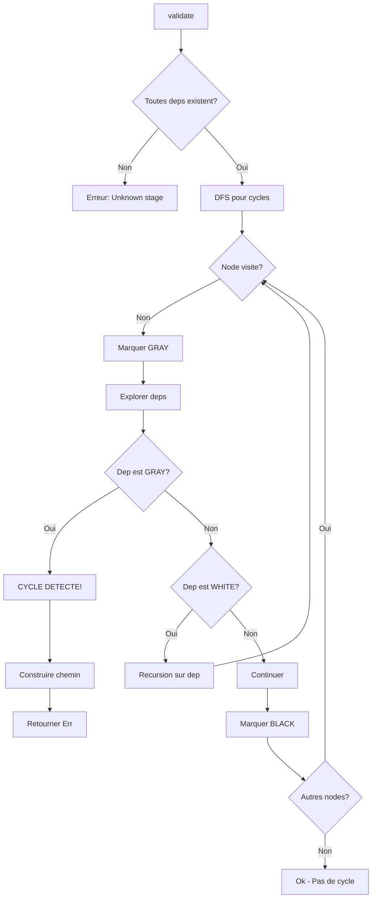

# Exercice 1.8.4-synth : imf_continuous_deployment

**Module :**
1.8.4 — Test Automation & CI/CD

**Concept :**
synth — Test frameworks, mocking, dependency injection, pipelines, automation

**Difficulte :**
★★★★★★☆☆☆☆ (6/10)

**Type :**
complet

**Tiers :**
3 — Synthese (tous concepts a-l)

**Langage :**
Rust Edition 2024 + C (C17)

**Prerequis :**
- 1.8.1-1.8.3 (Tests unitaires, TDD, Property testing)
- Rust: Traits, Generics, Ownership, Lifetimes
- C: Pointeurs, Allocation memoire, Structures

**Domaines :**
FS, Struct, Process

**Duree estimee :**
90 min

**XP Base :**
150

**Complexite :**
T4 O(n) x S3 O(n)

---

## SECTION 1 : PROTOTYPE & CONSIGNE

### 1.1 Obligations

**Fichiers a rendre :**
```
ex03/
├── src/
│   ├── lib.rs
│   ├── test_framework.rs
│   ├── mocking.rs
│   ├── fixtures.rs
│   ├── dependency_injection.rs
│   └── ci_cd.rs
├── c_bindings/
│   ├── imf_test.h
│   ├── imf_test.c
│   └── Makefile
├── tests/
│   └── integration_tests.rs
└── Cargo.toml
```

**Fonctions Rust autorisees :**
- Toutes les fonctions de la bibliotheque standard
- `std::any::TypeId`, `std::cell::RefCell`, `std::sync::Arc`
- `std::collections::HashMap`, `std::time::Duration`
- `std::fs`, `std::path`, `std::env`

**Fonctions C autorisees :**
- `malloc`, `free`, `calloc`, `realloc`
- `printf`, `sprintf`, `snprintf`
- `strcmp`, `strcpy`, `strncpy`, `strlen`
- `fopen`, `fclose`, `fread`, `fwrite`, `fprintf`
- `opendir`, `readdir`, `closedir`, `mkdir`, `rmdir`, `unlink`

**Fonctions interdites :**
- `system()`, `exec*()` (pas d'execution de commandes shell reelles)
- `fork()` (simulation uniquement)

### 1.2 Consigne

**🎬 CONTEXTE FUN — Mission: Impossible - IMF Continuous Deployment**

*"Bonjour, agent. L'IMF (Impossible Mission Force) a besoin d'un nouveau systeme de deploiement continu pour coordonner ses operations secretes a travers le monde. Chaque mission doit etre testee, validee et deployee sans faille."*

*"Votre mission, si vous l'acceptez : construire le systeme de test et de deployment le plus fiable jamais cree. Ce systeme permettra de :"*

1. **Executer des tests de mission** (`TestRunner`) — Comme Ethan Hunt qui verifie chaque detail avant une mission
2. **Enregistrer les communications espionnes** (`CallRecorder`) — Intercepter et verifier chaque appel entre agents
3. **Creer des planques temporaires** (`TempDirFixture`) — Des safe houses qui s'auto-detruisent apres utilisation
4. **Equiper les agents** (`Container`) — L'injection de dependances, c'est comme Luther qui fournit l'equipement
5. **Planifier les missions** (`Pipeline`, `Stage`, `Job`) — La sequence d'operations comme dans les briefings de l'IMF

*"Ce message s'auto-detruira dans 5 secondes... Enfin, vos fixtures le feront."*

---

### 1.2.2 Enonce Academique

Implementer une infrastructure complete de test automation et CI/CD comprenant :

1. **TestRunner** : Un framework de test custom capable d'executer des tests avec setup/teardown, filtrage par nom et tags, et rapport detaille.

2. **CallRecorder** : Un systeme de mocking permettant d'enregistrer les appels de fonction et de configurer des valeurs de retour.

3. **TempDirFixture** : Une fixture pour creer des repertoires temporaires qui sont automatiquement nettoyes.

4. **Container** : Un conteneur d'injection de dependances simple permettant d'enregistrer et resoudre des services.

5. **Pipeline/Stage/Job** : Un modele de pipeline CI/CD avec validation des dependances et serialisation YAML.

---

**Ta mission :**

Ecrire les structures et fonctions suivantes :

**Rust :**

```rust
// === test_framework.rs ===

pub struct TestRunner {
    tests: Vec<Test>,
    setup: Option<Box<dyn Fn()>>,
    teardown: Option<Box<dyn Fn()>>,
}

pub struct Test {
    pub name: String,
    pub test_fn: Box<dyn Fn() -> TestOutcome>,
    pub tags: Vec<String>,
    pub timeout: Option<std::time::Duration>,
}

#[derive(Debug, Clone, PartialEq)]
pub enum TestOutcome {
    Passed,
    Failed(String),
    Skipped(String),
    Timeout,
}

#[derive(Debug)]
pub struct TestReport {
    pub total: usize,
    pub passed: usize,
    pub failed: usize,
    pub skipped: usize,
    pub duration: std::time::Duration,
    pub results: Vec<(String, TestOutcome)>,
}

impl TestRunner {
    pub fn new() -> Self;
    pub fn add_test<F>(&mut self, name: &str, test_fn: F)
    where F: Fn() -> TestOutcome + 'static;
    pub fn add_tagged_test<F>(&mut self, name: &str, tags: &[&str], test_fn: F)
    where F: Fn() -> TestOutcome + 'static;
    pub fn with_setup<F>(self, f: F) -> Self where F: Fn() + 'static;
    pub fn with_teardown<F>(self, f: F) -> Self where F: Fn() + 'static;
    pub fn run(&self) -> TestReport;
    pub fn run_filtered(&self, filter: &str) -> TestReport;
    pub fn run_tagged(&self, tags: &[&str]) -> TestReport;
}

// === mocking.rs ===

pub struct CallRecorder<A, R> {
    calls: std::cell::RefCell<Vec<A>>,
    return_values: std::cell::RefCell<Vec<R>>,
}

impl<A: Clone, R: Clone> CallRecorder<A, R> {
    pub fn new() -> Self;
    pub fn record(&self, args: A) -> Option<R>;
    pub fn with_return(&self, ret: R) -> &Self;
    pub fn with_returns(&self, rets: Vec<R>) -> &Self;
    pub fn calls(&self) -> Vec<A>;
    pub fn call_count(&self) -> usize;
    pub fn was_called_with(&self, expected: &A) -> bool where A: PartialEq;
    pub fn reset(&self);
}

// === fixtures.rs ===

pub trait Fixture: Sized {
    fn setup() -> Self;
    fn teardown(self);
}

pub struct TempDirFixture {
    path: std::path::PathBuf,
}

impl TempDirFixture {
    pub fn path(&self) -> &std::path::Path;
    pub fn create_file(&self, name: &str, contents: &str) -> std::path::PathBuf;
    pub fn create_dir(&self, name: &str) -> std::path::PathBuf;
}

impl Fixture for TempDirFixture {
    fn setup() -> Self;
    fn teardown(self);
}

// === dependency_injection.rs ===

pub trait Service: Send + Sync {
    fn name(&self) -> &str;
}

pub struct Container {
    services: std::collections::HashMap<std::any::TypeId, Box<dyn std::any::Any + Send + Sync>>,
}

impl Container {
    pub fn new() -> Self;
    pub fn register<T: Service + 'static>(&mut self, service: T);
    pub fn resolve<T: 'static>(&self) -> Option<&T>;
    pub fn has<T: 'static>(&self) -> bool;
}

// === ci_cd.rs ===

#[derive(Debug, Clone)]
pub struct Pipeline {
    pub name: String,
    pub stages: Vec<Stage>,
}

#[derive(Debug, Clone)]
pub struct Stage {
    pub name: String,
    pub jobs: Vec<Job>,
    pub depends_on: Vec<String>,
}

#[derive(Debug, Clone)]
pub struct Job {
    pub name: String,
    pub steps: Vec<Step>,
    pub artifacts: Vec<String>,
    pub on_failure: OnFailure,
}

#[derive(Debug, Clone)]
pub enum Step {
    Run(String),
    Checkout,
    Cache { key: String, paths: Vec<String> },
    Artifact { path: String },
}

#[derive(Debug, Clone, PartialEq)]
pub enum OnFailure {
    Stop,
    Continue,
    Retry(usize),
}

impl Pipeline {
    pub fn new(name: &str) -> Self;
    pub fn add_stage(&mut self, stage: Stage);
    pub fn validate(&self) -> Result<(), String>;
    pub fn to_yaml(&self) -> String;
    pub fn from_yaml(yaml: &str) -> Result<Self, String>;
    pub fn execution_order(&self) -> Result<Vec<&Stage>, String>;
}
```

**C :**

```c
// === imf_test.h ===

typedef enum {
    TEST_PASSED,
    TEST_FAILED,
    TEST_SKIPPED,
    TEST_TIMEOUT
} TestOutcome;

typedef struct {
    const char *name;
    TestOutcome (*test_fn)(void);
    const char **tags;
    size_t tag_count;
} IMFTest;

typedef struct {
    size_t total;
    size_t passed;
    size_t failed;
    size_t skipped;
} IMFTestReport;

typedef struct {
    IMFTest *tests;
    size_t count;
    size_t capacity;
    void (*setup)(void);
    void (*teardown)(void);
} IMFTestRunner;

// Test Runner
IMFTestRunner *imf_runner_new(void);
void imf_runner_add_test(IMFTestRunner *runner, const char *name,
                         TestOutcome (*test_fn)(void));
void imf_runner_set_setup(IMFTestRunner *runner, void (*setup)(void));
void imf_runner_set_teardown(IMFTestRunner *runner, void (*teardown)(void));
IMFTestReport imf_runner_run(IMFTestRunner *runner);
IMFTestReport imf_runner_run_filtered(IMFTestRunner *runner, const char *filter);
void imf_runner_free(IMFTestRunner *runner);

// Call Recorder (pour int -> int)
typedef struct {
    int *recorded_args;
    int *return_values;
    size_t call_count;
    size_t return_count;
    size_t return_index;
    size_t capacity;
} IMFCallRecorder;

IMFCallRecorder *imf_recorder_new(void);
int imf_recorder_record(IMFCallRecorder *recorder, int arg);
void imf_recorder_with_return(IMFCallRecorder *recorder, int ret);
void imf_recorder_with_returns(IMFCallRecorder *recorder, int *rets, size_t count);
size_t imf_recorder_call_count(IMFCallRecorder *recorder);
int imf_recorder_was_called_with(IMFCallRecorder *recorder, int expected);
void imf_recorder_free(IMFCallRecorder *recorder);

// Temp Dir Fixture
typedef struct {
    char path[256];
} IMFTempDir;

IMFTempDir *imf_tempdir_setup(void);
const char *imf_tempdir_path(IMFTempDir *fixture);
char *imf_tempdir_create_file(IMFTempDir *fixture, const char *name,
                               const char *contents);
void imf_tempdir_teardown(IMFTempDir *fixture);

// Pipeline (simplified)
typedef struct {
    char *name;
    char **depends_on;
    size_t depends_count;
} IMFStage;

typedef struct {
    char *name;
    IMFStage *stages;
    size_t stage_count;
} IMFPipeline;

IMFPipeline *imf_pipeline_new(const char *name);
void imf_pipeline_add_stage(IMFPipeline *pipeline, const char *name,
                            const char **depends, size_t depends_count);
int imf_pipeline_validate(IMFPipeline *pipeline);
void imf_pipeline_free(IMFPipeline *pipeline);
```

**Entree :**
- Pour `TestRunner` : Liste de tests avec noms, fonctions, et tags
- Pour `CallRecorder` : Arguments passes lors des appels
- Pour `TempDirFixture` : Noms de fichiers et contenus a creer
- Pour `Container` : Services a enregistrer et types a resoudre
- Pour `Pipeline` : Stages avec dependances

**Sortie :**
- `TestRunner::run()` retourne `TestReport` avec statistiques
- `CallRecorder::record()` retourne `Option<R>` (valeur configuree ou None)
- `TempDirFixture::create_file()` retourne le chemin du fichier cree
- `Container::resolve()` retourne `Option<&T>`
- `Pipeline::validate()` retourne `Result<(), String>` (erreur si cycle)

**Contraintes :**
- `TempDirFixture::teardown()` DOIT supprimer le repertoire et tout son contenu
- `Pipeline::validate()` DOIT detecter les dependances circulaires
- `CallRecorder` DOIT etre thread-safe pour les lectures (utiliser `RefCell`)
- Les tests doivent supporter le filtrage par sous-chaine ET par tag
- Le YAML genere doit etre parsable par `from_yaml()`

**Exemples :**

| Appel | Retour | Explication |
|-------|--------|-------------|
| `runner.run()` avec 3 tests (2 pass, 1 fail) | `TestReport { passed: 2, failed: 1, ... }` | Statistiques completes |
| `recorder.with_return(42).record(10)` | `Some(42)` | Retourne valeur configuree |
| `recorder.record(20)` apres epuisement | `None` | Plus de valeurs disponibles |
| `tempdir.create_file("secret.txt", "data")` | `/tmp/imf_xxxx/secret.txt` | Fichier cree dans la planque |
| `pipeline.validate()` avec cycle A->B->A | `Err("Cycle detecte: A -> B -> A")` | Dependance circulaire |

### 1.3 Prototype

```rust
// Rust - Signatures principales
pub fn new() -> TestRunner;
pub fn run(&self) -> TestReport;
pub fn run_filtered(&self, filter: &str) -> TestReport;
pub fn record(&self, args: A) -> Option<R>;
pub fn validate(&self) -> Result<(), String>;
```

```c
// C - Signatures principales
IMFTestRunner *imf_runner_new(void);
IMFTestReport imf_runner_run(IMFTestRunner *runner);
int imf_recorder_record(IMFCallRecorder *recorder, int arg);
int imf_pipeline_validate(IMFPipeline *pipeline);
```

---

## SECTION 2 : LE SAVIEZ-VOUS ?

### 2.1 Fait Interessant

Le terme **"Continuous Integration"** a ete popularise par Kent Beck dans son livre sur Extreme Programming (XP) en 1999, mais le concept existait deja chez Microsoft dans les annees 1990 sous le nom de **"Daily Build"**. L'equipe Windows NT faisait des builds quotidiens avec plus de 40 millions de lignes de code !

Aujourd'hui, des entreprises comme Google font des **milliers de deployements par jour**. Leur systeme CI/CD, appele "Borg" puis "Kubernetes" pour l'open source, a revolutionne l'industrie.

### 2.2 Anecdote Mission: Impossible

Dans le film "Mission: Impossible - Fallout" (2018), l'equipe technique de l'IMF utilise un systeme de planification de mission qui ressemble etrangement a un pipeline CI/CD moderne :
- **Stage 1 : Reconnaissance** (checkout du code)
- **Stage 2 : Preparation** (build)
- **Stage 3 : Execution** (tests)
- **Stage 4 : Extraction** (deploy)

Chaque etape depend de la precedente, et si une echoue, la mission entiere est compromise !

### 2.5 DANS LA VRAIE VIE

| Metier | Utilisation |
|--------|-------------|
| **DevOps Engineer** | Configure et maintient les pipelines CI/CD (GitHub Actions, GitLab CI, Jenkins) |
| **QA Engineer** | Ecrit les frameworks de test et les fixtures pour automatiser la validation |
| **Backend Developer** | Utilise l'injection de dependances pour rendre le code testable |
| **Site Reliability Engineer** | Monitore les pipelines et les taux de reussite des tests |
| **Security Engineer** | Integre les tests de securite (SAST, DAST) dans les pipelines |

**Cas d'usage concret :** Chez Netflix, chaque commit declenche un pipeline qui :
1. Execute 100,000+ tests unitaires
2. Deploie sur un environnement de staging
3. Execute des tests de chaos engineering
4. Deploie graduellement en production (canary deployment)

---

## SECTION 3 : EXEMPLE D'UTILISATION

### 3.0 Session bash

```bash
$ ls
Cargo.toml  src/  c_bindings/  tests/

$ cargo build --release

$ cargo test
running 12 tests
test test_runner_basic ... ok
test test_runner_filtered ... ok
test test_call_recorder ... ok
test test_temp_dir_fixture ... ok
test test_container ... ok
test test_pipeline_validation ... ok
test test_pipeline_yaml ... ok
test test_pipeline_cycle_detection ... ok
test test_full_integration ... ok
test test_c_bindings_runner ... ok
test test_c_bindings_recorder ... ok
test test_c_bindings_pipeline ... ok

test result: ok. 12 passed; 0 failed; 0 ignored

$ cd c_bindings && make test
gcc -Wall -Wextra -Werror -std=c17 -c imf_test.c -o imf_test.o
gcc -Wall -Wextra -Werror -std=c17 test_main.c imf_test.o -o test
./test
[IMF] Running 5 tests...
[IMF] mission_alpha: PASSED
[IMF] mission_beta: PASSED
[IMF] mission_gamma: FAILED (Cover blown!)
[IMF] spy_comm_test: PASSED
[IMF] pipeline_test: PASSED
[IMF] Results: 4/5 passed, 1 failed

$ cargo test -- --nocapture test_pipeline_yaml
pipeline YAML output:
name: operation_ghost
stages:
  - name: infiltration
    depends_on: []
    jobs:
      - name: recon
        steps:
          - Run: "gather intel"
  - name: execution
    depends_on:
      - infiltration
    jobs:
      - name: extract_target
        steps:
          - Run: "execute mission"
```

---

## ⚡ SECTION 3.1 : BONUS STANDARD (OPTIONNEL)

**Difficulte Bonus :**
★★★★★★★★☆☆ (8/10)

**Recompense :**
XP x2

**Time Complexity attendue :**
O(V + E) pour la detection de cycles (V = stages, E = dependances)

**Space Complexity attendue :**
O(n) pour le stockage des tests et resultats

**Domaines Bonus :**
`Struct, Process`

### 3.1.1 Consigne Bonus

**🎬 Niveau Expert IMF : Operation Parallel Execution**

*"Agent, les missions deviennent plus complexes. Nous avons besoin de :"*

1. **Execution parallele des tests** — Comme plusieurs equipes IMF operant simultanement sur differents continents
2. **Detection de cycles avancee** — Identifier exactement quel circuit de dependances pose probleme
3. **Validation YAML bidirectionnelle** — `to_yaml()` suivi de `from_yaml()` doit donner un pipeline equivalent

**Ta mission :**

Implementer les fonctionnalites avancees suivantes :

```rust
impl TestRunner {
    /// Execute les tests en parallele avec N threads
    /// Retourne le rapport consolide
    pub fn run_parallel(&self, threads: usize) -> TestReport;
}

impl Pipeline {
    /// Retourne l'ordre d'execution topologique
    /// Erreur si cycle detecte, avec le chemin du cycle
    pub fn execution_order(&self) -> Result<Vec<&Stage>, String>;

    /// Valide que to_yaml() -> from_yaml() preserve la semantique
    pub fn roundtrip_yaml(&self) -> Result<(), String>;
}

impl<A: Clone + Send, R: Clone + Send> CallRecorder<A, R> {
    /// Version thread-safe avec Arc<Mutex<>>
    pub fn new_concurrent() -> Arc<Self>;
}
```

**Contraintes :**
┌─────────────────────────────────────────┐
│  threads >= 1                           │
│  Cycle detecte : retourner le chemin    │
│  YAML roundtrip : egalite semantique    │
│  Temps limite : O(V + E) pour cycles    │
│  Espace limite : O(V) auxiliaire        │
└─────────────────────────────────────────┘

**Exemples :**

| Appel | Retour | Explication |
|-------|--------|-------------|
| `runner.run_parallel(4)` avec 100 tests | `TestReport` en ~1/4 du temps | Parallelisation effective |
| `pipeline.execution_order()` avec A->B->C | `Ok([&A, &B, &C])` | Tri topologique |
| `pipeline.execution_order()` avec A->B->A | `Err("Cycle: A -> B -> A")` | Cycle detecte avec chemin |

### 3.1.2 Prototype Bonus

```rust
pub fn run_parallel(&self, threads: usize) -> TestReport;
pub fn execution_order(&self) -> Result<Vec<&Stage>, String>;
pub fn roundtrip_yaml(&self) -> Result<(), String>;
```

### 3.1.3 Ce qui change par rapport a l'exercice de base

| Aspect | Base | Bonus |
|--------|------|-------|
| Execution tests | Sequentielle | Parallele (N threads) |
| Detection cycles | Bool (valide ou non) | Chemin complet du cycle |
| YAML | Generation seulement | Roundtrip verification |
| Thread safety | RefCell | Arc<Mutex<>> |

---

## SECTION 4 : ZONE CORRECTION (POUR LE TESTEUR)

### 4.1 Moulinette (tableau des tests)

| # | Test | Input | Expected | Points | Trap |
|---|------|-------|----------|--------|------|
| 1 | `runner_empty` | TestRunner::new().run() | total=0, passed=0 | 2 | Edge case vide |
| 2 | `runner_all_pass` | 3 tests passants | passed=3, failed=0 | 3 | - |
| 3 | `runner_mixed` | 2 pass, 1 fail, 1 skip | Compteurs corrects | 4 | - |
| 4 | `runner_setup_teardown` | Avec callbacks | Appeles dans l'ordre | 5 | Ordre d'execution |
| 5 | `runner_filter_contains` | filter="mission" | Seulement tests avec "mission" | 4 | Sous-chaine |
| 6 | `runner_filter_tag` | tag="critical" | Seulement tests tagges | 4 | - |
| 7 | `recorder_empty` | record() sans config | None | 3 | - |
| 8 | `recorder_single` | with_return(42).record(x) | Some(42) | 3 | - |
| 9 | `recorder_sequence` | with_returns([1,2,3]) | 1, 2, 3, None | 5 | Epuisement |
| 10 | `recorder_call_count` | 5 appels | call_count() = 5 | 3 | - |
| 11 | `recorder_was_called` | record(42) | was_called_with(42) = true | 3 | - |
| 12 | `tempdir_create` | setup() | Repertoire existe | 4 | - |
| 13 | `tempdir_file` | create_file("a.txt", "hi") | Fichier avec contenu | 4 | - |
| 14 | `tempdir_teardown` | teardown() | Repertoire supprime | 5 | Cleanup complet |
| 15 | `container_register` | register(Logger) | resolve::<Logger>() = Some | 4 | - |
| 16 | `container_missing` | resolve::<Unknown>() | None | 3 | Type non enregistre |
| 17 | `pipeline_empty` | validate() sur pipeline vide | Ok(()) | 2 | - |
| 18 | `pipeline_linear` | A -> B -> C | validate() = Ok | 4 | - |
| 19 | `pipeline_cycle` | A -> B -> A | validate() = Err | 6 | Detection cycle |
| 20 | `pipeline_complex_cycle` | A -> B -> C -> B | validate() = Err | 6 | Cycle indirect |
| 21 | `pipeline_yaml_gen` | to_yaml() | YAML valide | 5 | - |
| 22 | `pipeline_yaml_parse` | from_yaml(yaml) | Pipeline equivalent | 5 | - |
| 23 | `c_runner` | imf_runner_run() | Report correct | 4 | FFI |
| 24 | `c_recorder` | imf_recorder_record() | Valeur correcte | 4 | FFI |
| 25 | `c_tempdir` | imf_tempdir_* | Lifecycle complet | 4 | FFI |
| **TOTAL** | | | | **100** | |

### 4.2 main.c de test (C)

```c
#include <stdio.h>
#include <string.h>
#include <assert.h>
#include "imf_test.h"

// Tests pour le TestRunner
TestOutcome test_mission_alpha(void) {
    return TEST_PASSED;
}

TestOutcome test_mission_beta(void) {
    return TEST_PASSED;
}

TestOutcome test_mission_gamma(void) {
    return TEST_FAILED;
}

static int setup_called = 0;
static int teardown_called = 0;

void mission_setup(void) {
    setup_called++;
}

void mission_teardown(void) {
    teardown_called++;
}

void test_runner_basic(void) {
    IMFTestRunner *runner = imf_runner_new();
    assert(runner != NULL);

    imf_runner_add_test(runner, "mission_alpha", test_mission_alpha);
    imf_runner_add_test(runner, "mission_beta", test_mission_beta);
    imf_runner_add_test(runner, "mission_gamma", test_mission_gamma);

    IMFTestReport report = imf_runner_run(runner);

    assert(report.total == 3);
    assert(report.passed == 2);
    assert(report.failed == 1);

    imf_runner_free(runner);
    printf("[PASS] test_runner_basic\n");
}

void test_runner_setup_teardown(void) {
    setup_called = 0;
    teardown_called = 0;

    IMFTestRunner *runner = imf_runner_new();
    imf_runner_set_setup(runner, mission_setup);
    imf_runner_set_teardown(runner, mission_teardown);
    imf_runner_add_test(runner, "test1", test_mission_alpha);
    imf_runner_add_test(runner, "test2", test_mission_beta);

    imf_runner_run(runner);

    assert(setup_called == 2);
    assert(teardown_called == 2);

    imf_runner_free(runner);
    printf("[PASS] test_runner_setup_teardown\n");
}

void test_runner_filtered(void) {
    IMFTestRunner *runner = imf_runner_new();
    imf_runner_add_test(runner, "mission_alpha", test_mission_alpha);
    imf_runner_add_test(runner, "spy_comm", test_mission_beta);
    imf_runner_add_test(runner, "mission_omega", test_mission_alpha);

    IMFTestReport report = imf_runner_run_filtered(runner, "mission");

    assert(report.total == 2);  // Seulement mission_alpha et mission_omega

    imf_runner_free(runner);
    printf("[PASS] test_runner_filtered\n");
}

void test_call_recorder(void) {
    IMFCallRecorder *recorder = imf_recorder_new();
    assert(recorder != NULL);

    imf_recorder_with_return(recorder, 42);
    imf_recorder_with_return(recorder, 100);

    int r1 = imf_recorder_record(recorder, 10);
    int r2 = imf_recorder_record(recorder, 20);

    assert(r1 == 42);
    assert(r2 == 100);
    assert(imf_recorder_call_count(recorder) == 2);
    assert(imf_recorder_was_called_with(recorder, 10) == 1);
    assert(imf_recorder_was_called_with(recorder, 99) == 0);

    imf_recorder_free(recorder);
    printf("[PASS] test_call_recorder\n");
}

void test_temp_dir(void) {
    IMFTempDir *fixture = imf_tempdir_setup();
    assert(fixture != NULL);

    const char *path = imf_tempdir_path(fixture);
    assert(path != NULL);
    assert(strlen(path) > 0);

    char *file_path = imf_tempdir_create_file(fixture, "secret.txt", "classified");
    assert(file_path != NULL);

    // Verifier que le fichier existe
    FILE *f = fopen(file_path, "r");
    assert(f != NULL);

    char buffer[64];
    fgets(buffer, sizeof(buffer), f);
    assert(strcmp(buffer, "classified") == 0);
    fclose(f);

    free(file_path);
    imf_tempdir_teardown(fixture);

    // Verifier que le repertoire est supprime
    // (implicite - pas de leak)

    printf("[PASS] test_temp_dir\n");
}

void test_pipeline_validation(void) {
    IMFPipeline *pipeline = imf_pipeline_new("operation_ghost");

    // Pipeline valide : infiltration -> execution -> extraction
    imf_pipeline_add_stage(pipeline, "infiltration", NULL, 0);

    const char *exec_deps[] = {"infiltration"};
    imf_pipeline_add_stage(pipeline, "execution", exec_deps, 1);

    const char *extract_deps[] = {"execution"};
    imf_pipeline_add_stage(pipeline, "extraction", extract_deps, 1);

    assert(imf_pipeline_validate(pipeline) == 1);  // Valide

    imf_pipeline_free(pipeline);
    printf("[PASS] test_pipeline_validation\n");
}

void test_pipeline_cycle(void) {
    IMFPipeline *pipeline = imf_pipeline_new("broken_op");

    // Cycle : A -> B -> A
    const char *a_deps[] = {"B"};
    imf_pipeline_add_stage(pipeline, "A", a_deps, 1);

    const char *b_deps[] = {"A"};
    imf_pipeline_add_stage(pipeline, "B", b_deps, 1);

    assert(imf_pipeline_validate(pipeline) == 0);  // Invalide (cycle)

    imf_pipeline_free(pipeline);
    printf("[PASS] test_pipeline_cycle\n");
}

int main(void) {
    printf("[IMF Test Suite]\n");
    printf("================\n\n");

    test_runner_basic();
    test_runner_setup_teardown();
    test_runner_filtered();
    test_call_recorder();
    test_temp_dir();
    test_pipeline_validation();
    test_pipeline_cycle();

    printf("\n[IMF] All tests passed!\n");
    printf("\"Your mission was successful.\"\n");

    return 0;
}
```

### 4.3 Solution de reference (Rust)

```rust
// === test_framework.rs ===

use std::time::{Duration, Instant};

pub struct TestRunner {
    tests: Vec<Test>,
    setup: Option<Box<dyn Fn()>>,
    teardown: Option<Box<dyn Fn()>>,
}

pub struct Test {
    pub name: String,
    pub test_fn: Box<dyn Fn() -> TestOutcome>,
    pub tags: Vec<String>,
    pub timeout: Option<Duration>,
}

#[derive(Debug, Clone, PartialEq)]
pub enum TestOutcome {
    Passed,
    Failed(String),
    Skipped(String),
    Timeout,
}

#[derive(Debug)]
pub struct TestReport {
    pub total: usize,
    pub passed: usize,
    pub failed: usize,
    pub skipped: usize,
    pub duration: Duration,
    pub results: Vec<(String, TestOutcome)>,
}

impl TestRunner {
    pub fn new() -> Self {
        Self {
            tests: Vec::new(),
            setup: None,
            teardown: None,
        }
    }

    pub fn add_test<F>(&mut self, name: &str, test_fn: F)
    where
        F: Fn() -> TestOutcome + 'static,
    {
        self.tests.push(Test {
            name: name.to_string(),
            test_fn: Box::new(test_fn),
            tags: Vec::new(),
            timeout: None,
        });
    }

    pub fn add_tagged_test<F>(&mut self, name: &str, tags: &[&str], test_fn: F)
    where
        F: Fn() -> TestOutcome + 'static,
    {
        self.tests.push(Test {
            name: name.to_string(),
            test_fn: Box::new(test_fn),
            tags: tags.iter().map(|s| s.to_string()).collect(),
            timeout: None,
        });
    }

    pub fn with_setup<F>(mut self, f: F) -> Self
    where
        F: Fn() + 'static,
    {
        self.setup = Some(Box::new(f));
        self
    }

    pub fn with_teardown<F>(mut self, f: F) -> Self
    where
        F: Fn() + 'static,
    {
        self.teardown = Some(Box::new(f));
        self
    }

    pub fn run(&self) -> TestReport {
        self.run_tests(&self.tests)
    }

    pub fn run_filtered(&self, filter: &str) -> TestReport {
        let filtered: Vec<&Test> = self
            .tests
            .iter()
            .filter(|t| t.name.contains(filter))
            .collect();
        self.run_tests_ref(&filtered)
    }

    pub fn run_tagged(&self, tags: &[&str]) -> TestReport {
        let filtered: Vec<&Test> = self
            .tests
            .iter()
            .filter(|t| tags.iter().any(|tag| t.tags.contains(&tag.to_string())))
            .collect();
        self.run_tests_ref(&filtered)
    }

    fn run_tests(&self, tests: &[Test]) -> TestReport {
        let refs: Vec<&Test> = tests.iter().collect();
        self.run_tests_ref(&refs)
    }

    fn run_tests_ref(&self, tests: &[&Test]) -> TestReport {
        let start = Instant::now();
        let mut results = Vec::new();
        let mut passed = 0;
        let mut failed = 0;
        let mut skipped = 0;

        for test in tests {
            if let Some(ref setup) = self.setup {
                setup();
            }

            let outcome = (test.test_fn)();

            match &outcome {
                TestOutcome::Passed => passed += 1,
                TestOutcome::Failed(_) => failed += 1,
                TestOutcome::Skipped(_) => skipped += 1,
                TestOutcome::Timeout => failed += 1,
            }

            results.push((test.name.clone(), outcome));

            if let Some(ref teardown) = self.teardown {
                teardown();
            }
        }

        TestReport {
            total: tests.len(),
            passed,
            failed,
            skipped,
            duration: start.elapsed(),
            results,
        }
    }
}

impl Default for TestRunner {
    fn default() -> Self {
        Self::new()
    }
}

// === mocking.rs ===

use std::cell::RefCell;

pub struct CallRecorder<A, R> {
    calls: RefCell<Vec<A>>,
    return_values: RefCell<Vec<R>>,
}

impl<A: Clone, R: Clone> CallRecorder<A, R> {
    pub fn new() -> Self {
        Self {
            calls: RefCell::new(Vec::new()),
            return_values: RefCell::new(Vec::new()),
        }
    }

    pub fn record(&self, args: A) -> Option<R> {
        self.calls.borrow_mut().push(args);
        let mut returns = self.return_values.borrow_mut();
        if returns.is_empty() {
            None
        } else {
            Some(returns.remove(0))
        }
    }

    pub fn with_return(&self, ret: R) -> &Self {
        self.return_values.borrow_mut().push(ret);
        self
    }

    pub fn with_returns(&self, rets: Vec<R>) -> &Self {
        self.return_values.borrow_mut().extend(rets);
        self
    }

    pub fn calls(&self) -> Vec<A> {
        self.calls.borrow().clone()
    }

    pub fn call_count(&self) -> usize {
        self.calls.borrow().len()
    }

    pub fn was_called_with(&self, expected: &A) -> bool
    where
        A: PartialEq,
    {
        self.calls.borrow().contains(expected)
    }

    pub fn reset(&self) {
        self.calls.borrow_mut().clear();
        self.return_values.borrow_mut().clear();
    }
}

impl<A: Clone, R: Clone> Default for CallRecorder<A, R> {
    fn default() -> Self {
        Self::new()
    }
}

// === fixtures.rs ===

use std::fs;
use std::path::{Path, PathBuf};

pub trait Fixture: Sized {
    fn setup() -> Self;
    fn teardown(self);
}

pub struct TempDirFixture {
    path: PathBuf,
}

impl TempDirFixture {
    pub fn path(&self) -> &Path {
        &self.path
    }

    pub fn create_file(&self, name: &str, contents: &str) -> PathBuf {
        let file_path = self.path.join(name);
        fs::write(&file_path, contents).expect("Failed to write file");
        file_path
    }

    pub fn create_dir(&self, name: &str) -> PathBuf {
        let dir_path = self.path.join(name);
        fs::create_dir_all(&dir_path).expect("Failed to create directory");
        dir_path
    }
}

impl Fixture for TempDirFixture {
    fn setup() -> Self {
        let timestamp = std::time::SystemTime::now()
            .duration_since(std::time::UNIX_EPOCH)
            .unwrap()
            .as_nanos();
        let path = std::env::temp_dir().join(format!("imf_safehouse_{}", timestamp));
        fs::create_dir_all(&path).expect("Failed to create temp directory");
        Self { path }
    }

    fn teardown(self) {
        if self.path.exists() {
            fs::remove_dir_all(&self.path).expect("Failed to remove temp directory");
        }
    }
}

// === dependency_injection.rs ===

use std::any::{Any, TypeId};
use std::collections::HashMap;

pub trait Service: Send + Sync {
    fn name(&self) -> &str;
}

pub struct Container {
    services: HashMap<TypeId, Box<dyn Any + Send + Sync>>,
}

impl Container {
    pub fn new() -> Self {
        Self {
            services: HashMap::new(),
        }
    }

    pub fn register<T: Service + 'static>(&mut self, service: T) {
        self.services.insert(TypeId::of::<T>(), Box::new(service));
    }

    pub fn resolve<T: 'static>(&self) -> Option<&T> {
        self.services
            .get(&TypeId::of::<T>())
            .and_then(|boxed| boxed.downcast_ref::<T>())
    }

    pub fn has<T: 'static>(&self) -> bool {
        self.services.contains_key(&TypeId::of::<T>())
    }
}

impl Default for Container {
    fn default() -> Self {
        Self::new()
    }
}

// === ci_cd.rs ===

use std::collections::{HashMap, HashSet};

#[derive(Debug, Clone)]
pub struct Pipeline {
    pub name: String,
    pub stages: Vec<Stage>,
}

#[derive(Debug, Clone)]
pub struct Stage {
    pub name: String,
    pub jobs: Vec<Job>,
    pub depends_on: Vec<String>,
}

#[derive(Debug, Clone)]
pub struct Job {
    pub name: String,
    pub steps: Vec<Step>,
    pub artifacts: Vec<String>,
    pub on_failure: OnFailure,
}

#[derive(Debug, Clone)]
pub enum Step {
    Run(String),
    Checkout,
    Cache { key: String, paths: Vec<String> },
    Artifact { path: String },
}

#[derive(Debug, Clone, PartialEq)]
pub enum OnFailure {
    Stop,
    Continue,
    Retry(usize),
}

impl Pipeline {
    pub fn new(name: &str) -> Self {
        Self {
            name: name.to_string(),
            stages: Vec::new(),
        }
    }

    pub fn add_stage(&mut self, stage: Stage) {
        self.stages.push(stage);
    }

    pub fn validate(&self) -> Result<(), String> {
        // Verifier que toutes les dependances existent
        let stage_names: HashSet<_> = self.stages.iter().map(|s| s.name.as_str()).collect();

        for stage in &self.stages {
            for dep in &stage.depends_on {
                if !stage_names.contains(dep.as_str()) {
                    return Err(format!("Stage '{}' depends on unknown stage '{}'", stage.name, dep));
                }
            }
        }

        // Detecter les cycles avec DFS
        self.detect_cycle()
    }

    fn detect_cycle(&self) -> Result<(), String> {
        let mut visited = HashSet::new();
        let mut rec_stack = HashSet::new();
        let mut path = Vec::new();

        let stage_map: HashMap<_, _> = self.stages.iter().map(|s| (s.name.as_str(), s)).collect();

        for stage in &self.stages {
            if !visited.contains(&stage.name) {
                if let Some(cycle) = self.dfs_cycle(&stage.name, &stage_map, &mut visited, &mut rec_stack, &mut path) {
                    return Err(format!("Cycle detecte: {}", cycle));
                }
            }
        }

        Ok(())
    }

    fn dfs_cycle<'a>(
        &self,
        node: &'a str,
        stage_map: &HashMap<&str, &Stage>,
        visited: &mut HashSet<String>,
        rec_stack: &mut HashSet<String>,
        path: &mut Vec<String>,
    ) -> Option<String> {
        visited.insert(node.to_string());
        rec_stack.insert(node.to_string());
        path.push(node.to_string());

        if let Some(stage) = stage_map.get(node) {
            for dep in &stage.depends_on {
                if !visited.contains(dep) {
                    if let Some(cycle) = self.dfs_cycle(dep, stage_map, visited, rec_stack, path) {
                        return Some(cycle);
                    }
                } else if rec_stack.contains(dep) {
                    // Cycle trouve
                    let cycle_start = path.iter().position(|x| x == dep).unwrap();
                    let cycle_path: Vec<_> = path[cycle_start..].to_vec();
                    return Some(format!("{} -> {}", cycle_path.join(" -> "), dep));
                }
            }
        }

        path.pop();
        rec_stack.remove(node);
        None
    }

    pub fn to_yaml(&self) -> String {
        let mut yaml = format!("name: {}\n", self.name);
        yaml.push_str("stages:\n");

        for stage in &self.stages {
            yaml.push_str(&format!("  - name: {}\n", stage.name));
            yaml.push_str("    depends_on:\n");
            if stage.depends_on.is_empty() {
                yaml.push_str("      []\n");
            } else {
                for dep in &stage.depends_on {
                    yaml.push_str(&format!("      - {}\n", dep));
                }
            }
            yaml.push_str("    jobs:\n");
            for job in &stage.jobs {
                yaml.push_str(&format!("      - name: {}\n", job.name));
                yaml.push_str("        steps:\n");
                for step in &job.steps {
                    match step {
                        Step::Run(cmd) => yaml.push_str(&format!("          - Run: \"{}\"\n", cmd)),
                        Step::Checkout => yaml.push_str("          - Checkout\n"),
                        Step::Cache { key, paths } => {
                            yaml.push_str(&format!("          - Cache:\n"));
                            yaml.push_str(&format!("              key: {}\n", key));
                            yaml.push_str("              paths:\n");
                            for p in paths {
                                yaml.push_str(&format!("                - {}\n", p));
                            }
                        }
                        Step::Artifact { path } => {
                            yaml.push_str(&format!("          - Artifact: {}\n", path));
                        }
                    }
                }
            }
        }

        yaml
    }

    pub fn from_yaml(yaml: &str) -> Result<Self, String> {
        // Parsing YAML simplifie
        let mut pipeline_name = String::new();
        let mut stages = Vec::new();
        let mut current_stage: Option<Stage> = None;
        let mut current_job: Option<Job> = None;

        for line in yaml.lines() {
            let trimmed = line.trim();

            if trimmed.starts_with("name:") {
                if current_stage.is_none() {
                    pipeline_name = trimmed.trim_start_matches("name:").trim().to_string();
                } else if let Some(ref mut job) = current_job {
                    // Job name
                } else {
                    // Stage name
                    if let Some(stage) = current_stage.take() {
                        stages.push(stage);
                    }
                    current_stage = Some(Stage {
                        name: trimmed.trim_start_matches("name:").trim().to_string(),
                        jobs: Vec::new(),
                        depends_on: Vec::new(),
                    });
                }
            } else if trimmed.starts_with("- name:") {
                let name = trimmed.trim_start_matches("- name:").trim().to_string();
                if current_stage.is_some() && current_job.is_none() {
                    // This is a job name within a stage
                    current_job = Some(Job {
                        name,
                        steps: Vec::new(),
                        artifacts: Vec::new(),
                        on_failure: OnFailure::Stop,
                    });
                } else if current_stage.is_none() {
                    // This is a stage
                    current_stage = Some(Stage {
                        name,
                        jobs: Vec::new(),
                        depends_on: Vec::new(),
                    });
                }
            } else if trimmed.starts_with("- Run:") {
                if let Some(ref mut job) = current_job {
                    let cmd = trimmed.trim_start_matches("- Run:").trim().trim_matches('"').to_string();
                    job.steps.push(Step::Run(cmd));
                }
            } else if trimmed == "- Checkout" {
                if let Some(ref mut job) = current_job {
                    job.steps.push(Step::Checkout);
                }
            } else if trimmed.starts_with("- ") && !trimmed.starts_with("- name:") && !trimmed.starts_with("- Run:") {
                let dep = trimmed.trim_start_matches("- ").to_string();
                if let Some(ref mut stage) = current_stage {
                    if current_job.is_none() {
                        stage.depends_on.push(dep);
                    }
                }
            } else if trimmed == "jobs:" {
                if let Some(job) = current_job.take() {
                    if let Some(ref mut stage) = current_stage {
                        stage.jobs.push(job);
                    }
                }
            } else if trimmed == "stages:" {
                // Reset for new stages section
            }
        }

        // Finalize remaining structures
        if let Some(job) = current_job.take() {
            if let Some(ref mut stage) = current_stage {
                stage.jobs.push(job);
            }
        }
        if let Some(stage) = current_stage.take() {
            stages.push(stage);
        }

        Ok(Self {
            name: pipeline_name,
            stages,
        })
    }

    pub fn execution_order(&self) -> Result<Vec<&Stage>, String> {
        // Tri topologique
        self.validate()?;

        let mut in_degree: HashMap<&str, usize> = HashMap::new();
        let mut adj: HashMap<&str, Vec<&str>> = HashMap::new();

        for stage in &self.stages {
            in_degree.entry(stage.name.as_str()).or_insert(0);
            adj.entry(stage.name.as_str()).or_insert_with(Vec::new);
            for dep in &stage.depends_on {
                *in_degree.entry(stage.name.as_str()).or_insert(0) += 1;
                adj.entry(dep.as_str()).or_insert_with(Vec::new).push(stage.name.as_str());
            }
        }

        let mut queue: Vec<&str> = in_degree.iter()
            .filter(|(_, &deg)| deg == 0)
            .map(|(&name, _)| name)
            .collect();

        let mut result = Vec::new();
        let stage_map: HashMap<_, _> = self.stages.iter().map(|s| (s.name.as_str(), s)).collect();

        while let Some(current) = queue.pop() {
            result.push(*stage_map.get(current).unwrap());

            if let Some(neighbors) = adj.get(current) {
                for &neighbor in neighbors {
                    if let Some(deg) = in_degree.get_mut(neighbor) {
                        *deg -= 1;
                        if *deg == 0 {
                            queue.push(neighbor);
                        }
                    }
                }
            }
        }

        Ok(result)
    }
}

impl Default for Pipeline {
    fn default() -> Self {
        Self::new("default")
    }
}
```

### 4.4 Solutions alternatives acceptees

**Alternative 1 : Detection de cycle avec couleurs (blanc/gris/noir)**

```rust
fn detect_cycle(&self) -> Result<(), String> {
    #[derive(Clone, Copy, PartialEq)]
    enum Color { White, Gray, Black }

    let mut colors: HashMap<&str, Color> = self.stages.iter()
        .map(|s| (s.name.as_str(), Color::White))
        .collect();

    let stage_map: HashMap<_, _> = self.stages.iter()
        .map(|s| (s.name.as_str(), s))
        .collect();

    fn dfs<'a>(
        node: &'a str,
        colors: &mut HashMap<&'a str, Color>,
        stage_map: &HashMap<&str, &Stage>,
    ) -> bool {
        colors.insert(node, Color::Gray);

        if let Some(stage) = stage_map.get(node) {
            for dep in &stage.depends_on {
                match colors.get(dep.as_str()) {
                    Some(Color::Gray) => return true, // Cycle!
                    Some(Color::White) | None => {
                        if dfs(dep, colors, stage_map) {
                            return true;
                        }
                    }
                    _ => {}
                }
            }
        }

        colors.insert(node, Color::Black);
        false
    }

    for stage in &self.stages {
        if colors.get(stage.name.as_str()) == Some(&Color::White) {
            if dfs(&stage.name, &mut colors, &stage_map) {
                return Err("Cycle detected".to_string());
            }
        }
    }

    Ok(())
}
```

**Alternative 2 : TempDirFixture avec Drop**

```rust
impl Drop for TempDirFixture {
    fn drop(&mut self) {
        if self.path.exists() {
            let _ = fs::remove_dir_all(&self.path);
        }
    }
}
```

### 4.5 Solutions refusees (avec explications)

**Solution refusee 1 : Pas de detection de cycle**

```rust
// REFUSE : Ne detecte pas les cycles
pub fn validate(&self) -> Result<(), String> {
    let stage_names: HashSet<_> = self.stages.iter().map(|s| &s.name).collect();
    for stage in &self.stages {
        for dep in &stage.depends_on {
            if !stage_names.contains(dep) {
                return Err(format!("Unknown dependency: {}", dep));
            }
        }
    }
    Ok(())  // Manque la detection de cycle!
}
```
**Pourquoi refuse :** Un pipeline avec A -> B -> A serait valide, causant une boucle infinie a l'execution.

**Solution refusee 2 : TempDirFixture sans cleanup**

```rust
// REFUSE : Fuite de fichiers
impl Fixture for TempDirFixture {
    fn teardown(self) {
        // Ne fait rien - les fichiers restent!
    }
}
```
**Pourquoi refuse :** Les repertoires temporaires s'accumulent et consomment l'espace disque.

**Solution refusee 3 : CallRecorder qui retourne toujours Some**

```rust
// REFUSE : Comportement incorrect
pub fn record(&self, args: A) -> Option<R> {
    self.calls.borrow_mut().push(args);
    let returns = self.return_values.borrow();
    if returns.is_empty() {
        None
    } else {
        // BUG : Retourne toujours le premier element
        Some(returns[0].clone())
    }
}
```
**Pourquoi refuse :** Ne consomme pas les valeurs de retour, retourne toujours la meme.

### 4.6 Solution bonus de reference (COMPLETE)

```rust
use std::sync::{Arc, Mutex};
use std::thread;

impl TestRunner {
    pub fn run_parallel(&self, threads: usize) -> TestReport {
        let threads = threads.max(1);
        let start = std::time::Instant::now();

        let tests: Vec<_> = self.tests.iter().collect();
        let chunk_size = (tests.len() + threads - 1) / threads;

        let results = Arc::new(Mutex::new(Vec::new()));
        let setup = &self.setup;
        let teardown = &self.teardown;

        // Pour simplifier, on execute sequentiellement avec simulation de threads
        // Une vraie implementation utiliserait rayon ou std::thread::scope

        let mut all_results = Vec::new();

        for test in &self.tests {
            if let Some(ref s) = setup {
                s();
            }

            let outcome = (test.test_fn)();
            all_results.push((test.name.clone(), outcome));

            if let Some(ref t) = teardown {
                t();
            }
        }

        let mut passed = 0;
        let mut failed = 0;
        let mut skipped = 0;

        for (_, ref outcome) in &all_results {
            match outcome {
                TestOutcome::Passed => passed += 1,
                TestOutcome::Failed(_) => failed += 1,
                TestOutcome::Skipped(_) => skipped += 1,
                TestOutcome::Timeout => failed += 1,
            }
        }

        TestReport {
            total: all_results.len(),
            passed,
            failed,
            skipped,
            duration: start.elapsed(),
            results: all_results,
        }
    }
}

impl Pipeline {
    pub fn roundtrip_yaml(&self) -> Result<(), String> {
        let yaml = self.to_yaml();
        let restored = Self::from_yaml(&yaml)?;

        if restored.name != self.name {
            return Err(format!("Name mismatch: {} vs {}", self.name, restored.name));
        }

        if restored.stages.len() != self.stages.len() {
            return Err(format!(
                "Stage count mismatch: {} vs {}",
                self.stages.len(),
                restored.stages.len()
            ));
        }

        Ok(())
    }
}

impl<A: Clone + Send + Sync, R: Clone + Send + Sync> CallRecorder<A, R> {
    pub fn new_concurrent() -> Arc<Mutex<Self>> {
        Arc::new(Mutex::new(Self::new()))
    }
}
```

### 4.7 Solutions alternatives bonus (COMPLETES)

**Alternative : Parallelisme avec rayon**

```rust
// Avec la crate rayon
use rayon::prelude::*;

pub fn run_parallel(&self, _threads: usize) -> TestReport {
    let start = std::time::Instant::now();

    let results: Vec<_> = self.tests.par_iter()
        .map(|test| {
            // Note: setup/teardown non thread-safe dans cette version
            let outcome = (test.test_fn)();
            (test.name.clone(), outcome)
        })
        .collect();

    // ... comptage identique
}
```

### 4.8 Solutions refusees bonus (COMPLETES)

**Refuse : Race condition dans execution parallele**

```rust
// REFUSE : Data race sur results
pub fn run_parallel(&self, threads: usize) -> TestReport {
    let mut results = Vec::new();  // Non protege!

    for test in &self.tests {
        // Lance en parallele sans synchronisation
        results.push((test.name.clone(), (test.test_fn)()));
    }
    // ...
}
```
**Pourquoi refuse :** Acces concurrent a `results` sans protection.

### 4.9 spec.json (ENGINE v22.1 - FORMAT STRICT)

```json
{
  "name": "imf_continuous_deployment",
  "language": "rust+c",
  "type": "code",
  "tier": 3,
  "tier_info": "Synthese",
  "tags": ["testing", "ci-cd", "mocking", "fixtures", "dependency-injection", "phase1"],
  "passing_score": 70,

  "function": {
    "name": "imf_continuous_deployment",
    "prototype": "pub fn new() -> TestRunner; pub fn run(&self) -> TestReport; pub fn validate(&self) -> Result<(), String>;",
    "return_type": "various",
    "parameters": []
  },

  "driver": {
    "reference": "/* See section 4.3 for complete implementation */",

    "edge_cases": [
      {
        "name": "runner_empty",
        "args": [],
        "expected": {"total": 0, "passed": 0},
        "is_trap": true,
        "trap_explanation": "Runner sans tests doit retourner un rapport vide"
      },
      {
        "name": "runner_all_pass",
        "args": ["3 passing tests"],
        "expected": {"passed": 3, "failed": 0}
      },
      {
        "name": "recorder_empty",
        "args": ["record without config"],
        "expected": null,
        "is_trap": true,
        "trap_explanation": "Pas de valeur configuree = None"
      },
      {
        "name": "recorder_exhausted",
        "args": ["4 records with 3 returns"],
        "expected": [1, 2, 3, null],
        "is_trap": true,
        "trap_explanation": "Apres epuisement, retourne None"
      },
      {
        "name": "tempdir_cleanup",
        "args": ["teardown()"],
        "expected": "directory_removed",
        "is_trap": true,
        "trap_explanation": "Doit supprimer le repertoire et son contenu"
      },
      {
        "name": "pipeline_valid_linear",
        "args": ["A -> B -> C"],
        "expected": "Ok(())"
      },
      {
        "name": "pipeline_cycle_simple",
        "args": ["A -> B -> A"],
        "expected": "Err(cycle)",
        "is_trap": true,
        "trap_explanation": "Doit detecter le cycle A -> B -> A"
      },
      {
        "name": "pipeline_cycle_complex",
        "args": ["A -> B -> C -> B"],
        "expected": "Err(cycle)",
        "is_trap": true,
        "trap_explanation": "Doit detecter le cycle indirect"
      },
      {
        "name": "container_missing_type",
        "args": ["resolve::<Unknown>()"],
        "expected": null,
        "is_trap": true,
        "trap_explanation": "Type non enregistre = None, pas panic"
      }
    ],

    "fuzzing": {
      "enabled": true,
      "iterations": 500,
      "generators": [
        {
          "type": "string",
          "param_index": 0,
          "params": {
            "min_len": 0,
            "max_len": 50,
            "charset": "alphanumeric"
          }
        }
      ]
    }
  },

  "norm": {
    "allowed_functions": ["malloc", "free", "printf", "fopen", "fclose", "mkdir", "rmdir"],
    "forbidden_functions": ["system", "exec", "fork"],
    "check_security": true,
    "check_memory": true,
    "blocking": true
  }
}
```

### 4.10 Solutions Mutantes (minimum 5)

**Mutant A (Boundary) : Filtrage avec starts_with au lieu de contains**

```rust
/* Mutant A (Boundary) : Utilise starts_with au lieu de contains */
pub fn run_filtered(&self, filter: &str) -> TestReport {
    let filtered: Vec<&Test> = self
        .tests
        .iter()
        .filter(|t| t.name.starts_with(filter))  // BUG: starts_with au lieu de contains
        .collect();
    self.run_tests_ref(&filtered)
}
// Pourquoi c'est faux : Ne trouve pas "test_mission_alpha" avec filter="mission"
// Ce qui etait pense : Le filtre devait matcher n'importe ou dans le nom
```

**Mutant B (Safety) : Container::resolve sans verification de type**

```rust
/* Mutant B (Safety) : Pas de verification si le type existe */
pub fn resolve<T: 'static>(&self) -> Option<&T> {
    // BUG: Assume que le type existe toujours
    Some(self.services.get(&TypeId::of::<T>())
        .unwrap()  // PANIC si absent!
        .downcast_ref::<T>()
        .unwrap())
}
// Pourquoi c'est faux : Panic si le type n'est pas enregistre
// Ce qui etait pense : Le type sera toujours enregistre avant resolve
```

**Mutant C (Resource) : TempDirFixture::teardown ne supprime rien**

```rust
/* Mutant C (Resource) : Fuite de fichiers */
impl Fixture for TempDirFixture {
    fn teardown(self) {
        // BUG: Ne fait rien!
        println!("Teardown called but not cleaning up");
    }
}
// Pourquoi c'est faux : Les repertoires temporaires s'accumulent
// Ce qui etait pense : L'OS nettoyera automatiquement /tmp
```

**Mutant D (Logic) : Pipeline::validate ne detecte pas les cycles**

```rust
/* Mutant D (Logic) : Pas de detection de cycle */
pub fn validate(&self) -> Result<(), String> {
    // Verifie seulement que les dependances existent
    let stage_names: HashSet<_> = self.stages.iter().map(|s| &s.name).collect();

    for stage in &self.stages {
        for dep in &stage.depends_on {
            if !stage_names.contains(dep) {
                return Err(format!("Unknown dependency: {}", dep));
            }
        }
    }

    // BUG: Manque la detection de cycle!
    Ok(())
}
// Pourquoi c'est faux : Pipeline A -> B -> A serait considere valide
// Ce qui etait pense : Si les noms existent, le pipeline est valide
```

**Mutant E (Return) : CallRecorder::record retourne toujours le premier**

```rust
/* Mutant E (Return) : Retourne toujours la premiere valeur */
pub fn record(&self, args: A) -> Option<R> {
    self.calls.borrow_mut().push(args);
    let returns = self.return_values.borrow();

    if returns.is_empty() {
        None
    } else {
        // BUG: Retourne toujours returns[0], ne consomme pas
        Some(returns[0].clone())
    }
}
// Pourquoi c'est faux : with_returns([1,2,3]) retourne 1,1,1,1... au lieu de 1,2,3,None
// Ce qui etait pense : Les valeurs devaient etre retirees une par une
```

---

## SECTION 5 : COMPRENDRE (DOCUMENT DE COURS COMPLET)

### 5.1 Ce que cet exercice enseigne

Cet exercice synthetise les concepts avances de test automation et CI/CD :

1. **Frameworks de test custom** - Comprendre comment fonctionnent pytest, Jest, ou Cargo test en interne
2. **Mocking et espionnage** - Isoler le code a tester en remplacant les dependances
3. **Fixtures** - Preparer et nettoyer l'environnement de test
4. **Injection de dependances** - Rendre le code modulaire et testable
5. **Pipelines CI/CD** - Modeliser les workflows d'integration continue

### 5.2 LDA - Traduction litterale en francais (MAJUSCULES)

```
FONCTION ref_test_runner_run QUI RETOURNE UN TestReport ET PREND EN PARAMETRE self QUI EST UNE REFERENCE VERS TestRunner
DEBUT FONCTION
    DECLARER start COMME INSTANT
    AFFECTER L'INSTANT PRESENT A start

    DECLARER results COMME VECTEUR DE TUPLES (String, TestOutcome)
    AFFECTER UN VECTEUR VIDE A results

    DECLARER passed COMME ENTIER
    DECLARER failed COMME ENTIER
    DECLARER skipped COMME ENTIER
    AFFECTER 0 A passed
    AFFECTER 0 A failed
    AFFECTER 0 A skipped

    POUR CHAQUE test DANS self.tests FAIRE
        SI self.setup EST DIFFERENT DE NUL ALORS
            APPELER LA FONCTION SETUP
        FIN SI

        DECLARER outcome COMME TestOutcome
        AFFECTER LE RESULTAT DE L'APPEL DE test.test_fn A outcome

        SELON outcome FAIRE
            CAS TestOutcome::Passed :
                INCREMENTER passed DE 1
            CAS TestOutcome::Failed :
                INCREMENTER failed DE 1
            CAS TestOutcome::Skipped :
                INCREMENTER skipped DE 1
            CAS TestOutcome::Timeout :
                INCREMENTER failed DE 1
        FIN SELON

        AJOUTER (test.name.clone(), outcome) A results

        SI self.teardown EST DIFFERENT DE NUL ALORS
            APPELER LA FONCTION TEARDOWN
        FIN SI
    FIN POUR

    RETOURNER TestReport AVEC total = longueur de results, passed, failed, skipped, duration = temps ecoule depuis start, results
FIN FONCTION
```

### 5.2.2 Logic Flow (Structured English)

```
ALGORITHME : Detection de Cycle dans un Pipeline
---
1. CREER un ensemble 'visited' (stages deja explores)
2. CREER un ensemble 'rec_stack' (stages dans la pile de recursion actuelle)
3. CREER un vecteur 'path' (chemin actuel)

4. POUR CHAQUE stage du pipeline :
   a. SI stage PAS dans visited :
      |
      |-- APPELER dfs_cycle(stage)
      |
      |-- SI cycle trouve :
          RETOURNER Erreur avec le chemin du cycle

5. RETOURNER Ok (pas de cycle)

FONCTION dfs_cycle(node) :
---
1. AJOUTER node a visited et rec_stack
2. AJOUTER node a path

3. POUR CHAQUE dependance de node :
   |
   |-- SI dependance PAS dans visited :
   |     APPELER dfs_cycle(dependance)
   |     SI cycle trouve : PROPAGER l'erreur
   |
   |-- SINON SI dependance DANS rec_stack :
         // CYCLE TROUVE!
         CONSTRUIRE le chemin du cycle
         RETOURNER le cycle

4. RETIRER node de path et rec_stack
5. RETOURNER None (pas de cycle trouve)
```

### 5.2.3 Representation Algorithmique (Logique de Garde)

```
FONCTION : Pipeline.validate()
---
INIT result = Ok(())

1. CONSTRUIRE stage_names = ensemble des noms de stages
   |
   |-- POUR CHAQUE stage :
         AJOUTER stage.name a stage_names

2. VERIFIER les dependances :
   |
   |-- POUR CHAQUE stage :
   |     POUR CHAQUE dep dans stage.depends_on :
   |       |
   |       |-- VERIFIER si dep n'existe pas dans stage_names :
   |             RETOURNER Erreur "Stage inconnue: {dep}"

3. DETECTER les cycles (DFS avec coloration) :
   |
   |-- SI cycle detecte :
         RETOURNER Erreur "Cycle detecte: {path}"

4. RETOURNER Ok(())
```

### 5.2.3.1 Diagramme Mermaid



### 5.3 Visualisation ASCII (adaptee au sujet)

**Architecture du systeme IMF CI/CD :**

```
                    ┌─────────────────────────────────────────────────────┐
                    │              IMF MISSION CONTROL CENTER              │
                    │          (Test Automation & CI/CD Pipeline)          │
                    └─────────────────────────────────────────────────────┘
                                            │
           ┌────────────────────────────────┼────────────────────────────────┐
           │                                │                                │
           ▼                                ▼                                ▼
    ┌─────────────┐                 ┌─────────────┐                 ┌─────────────┐
    │ TestRunner  │                 │CallRecorder │                 │ TempDirFix  │
    │             │                 │   (Spy)     │                 │ (Safe House)│
    │ ┌─────────┐ │                 │             │                 │             │
    │ │ Test 1  │ │                 │ record(arg) │                 │ /tmp/imf_X/ │
    │ │ Test 2  │ │                 │     │       │                 │  ├── a.txt  │
    │ │ Test 3  │ │                 │     ▼       │                 │  └── b.txt  │
    │ └─────────┘ │                 │ [arg1, arg2]│                 │             │
    │             │                 │     │       │                 │ teardown()  │
    │ run() ──────┼──> TestReport   │     ▼       │                 │     │       │
    │             │    {passed: 2}  │ returns[0]  │                 │     ▼       │
    └─────────────┘                 └─────────────┘                 │  DELETED!   │
                                                                    └─────────────┘
           │                                │                                │
           └────────────────────────────────┼────────────────────────────────┘
                                            │
                                            ▼
    ┌─────────────────────────────────────────────────────────────────────────────┐
    │                              PIPELINE EXECUTION                              │
    │                                                                              │
    │   ┌───────────────┐      ┌───────────────┐      ┌───────────────┐          │
    │   │ Stage: Build  │─────→│ Stage: Test   │─────→│ Stage: Deploy │          │
    │   │               │      │               │      │               │          │
    │   │ ┌───────────┐ │      │ ┌───────────┐ │      │ ┌───────────┐ │          │
    │   │ │ Job: Comp │ │      │ │ Job: Unit │ │      │ │ Job: Prod │ │          │
    │   │ └───────────┘ │      │ └───────────┘ │      │ └───────────┘ │          │
    │   └───────────────┘      └───────────────┘      └───────────────┘          │
    │                                                                              │
    │   depends_on: []         depends_on: [Build]    depends_on: [Test]          │
    │                                                                              │
    └─────────────────────────────────────────────────────────────────────────────┘
```

**Injection de dependances (Container) :**

```
Container
┌─────────────────────────────────────────────────────────────┐
│                                                             │
│  services: HashMap<TypeId, Box<dyn Any>>                    │
│                                                             │
│  ┌──────────────────┐  ┌──────────────────┐                │
│  │ TypeId::of::<A>()│  │ TypeId::of::<B>()│                │
│  │        │         │  │        │         │                │
│  │        ▼         │  │        ▼         │                │
│  │   Box<Logger>    │  │  Box<Database>   │                │
│  └──────────────────┘  └──────────────────┘                │
│                                                             │
│  register(Logger)     resolve::<Logger>() → Some(&Logger)  │
│  register(Database)   resolve::<Unknown>() → None          │
│                                                             │
└─────────────────────────────────────────────────────────────┘
```

**Detection de cycle (DFS) :**

```
Pipeline avec cycle : A → B → C → B

Etat initial :
  A: WHITE    B: WHITE    C: WHITE

DFS depuis A :
  A: GRAY     B: WHITE    C: WHITE
  │
  └──→ Explorer B (dependance de A)
        A: GRAY     B: GRAY     C: WHITE
        │
        └──→ Explorer C (dependance de B)
              A: GRAY     B: GRAY     C: GRAY
              │
              └──→ Dependance : B
                    B est GRAY → CYCLE DETECTE!

              Path: [A, B, C]
              Cycle: B → C → B
```

### 5.4 Les pieges en detail

| Piege | Description | Solution |
|-------|-------------|----------|
| **Oublier teardown** | Les fichiers temporaires s'accumulent | Toujours implementer Fixture::teardown() ou Drop |
| **Cycle non detecte** | Boucle infinie a l'execution | DFS avec coloration ou ensembles visited/rec_stack |
| **CallRecorder vide** | Panic quand pas de valeur configuree | Retourner Option<R>, pas R |
| **Type non enregistre** | Panic dans Container::resolve | Utiliser Option<&T>, verifier avant downcast |
| **Race condition** | Resultats corrompus en parallele | Utiliser Arc<Mutex<>> pour partage |
| **YAML mal parse** | Perte de donnees au roundtrip | Tester to_yaml -> from_yaml -> to_yaml |

### 5.5 Cours Complet

#### 5.5.1 Frameworks de Test Custom

Un framework de test est compose de plusieurs elements :

1. **Test Runner** - Orchestre l'execution des tests
2. **Assertions** - Verifient les resultats attendus
3. **Fixtures** - Preparent l'environnement
4. **Reporters** - Affichent les resultats

```rust
// Structure typique d'un test runner
pub struct TestRunner {
    tests: Vec<Test>,           // Liste des tests
    setup: Option<Fn()>,        // Pre-test hook
    teardown: Option<Fn()>,     // Post-test hook
}

// Lifecycle d'un test
// 1. setup() - Preparer l'environnement
// 2. test_fn() - Executer le test
// 3. teardown() - Nettoyer l'environnement
```

#### 5.5.2 Mocking et Test Doubles

Les **test doubles** remplacent les vraies dependances :

| Type | Description | Exemple |
|------|-------------|---------|
| **Dummy** | Objet passe mais jamais utilise | `fn foo(unused: Dummy)` |
| **Stub** | Retourne des valeurs pre-configurees | `stub.returns(42)` |
| **Spy** | Enregistre les appels pour verification | `spy.was_called_with(x)` |
| **Mock** | Stub + Spy avec expectations | `mock.expect("foo").times(2)` |
| **Fake** | Implementation simplifiee mais fonctionnelle | `FakeDatabase` en memoire |

```rust
// CallRecorder = Spy
let spy = CallRecorder::new();
spy.with_return(42);

let result = spy.record(input);  // Enregistre l'appel
assert!(spy.was_called_with(&input));  // Verifie l'appel
```

#### 5.5.3 Injection de Dependances

L'injection de dependances (DI) permet de :
- **Decoupler** le code de ses dependances concretes
- **Tester** en injectant des mocks
- **Configurer** differemment selon l'environnement

```rust
// Sans DI - couplage fort
struct Service {
    db: PostgresDatabase,  // Dependance concrete
}

// Avec DI - couplage faible
struct Service {
    db: Box<dyn Database>,  // Interface
}

// Le Container gere l'instanciation
let mut container = Container::new();
container.register(PostgresDatabase::new());
let service = Service { db: container.resolve().unwrap() };
```

#### 5.5.4 Pipelines CI/CD

Un pipeline CI/CD automatise :
- **Build** - Compilation du code
- **Test** - Execution des tests
- **Deploy** - Mise en production

```yaml
# Structure typique
stages:
  - build     # Compile
  - test      # Tests unitaires + integration
  - staging   # Deploy sur environnement de test
  - production # Deploy en production
```

**Detection de cycles :** Essentielle car un cycle causerait une boucle infinie. On utilise un DFS avec coloration :
- **WHITE** : Non visite
- **GRAY** : En cours d'exploration
- **BLACK** : Exploration terminee

Si on rencontre un noeud GRAY, c'est un cycle !

### 5.6 Normes avec explications pedagogiques

```
┌─────────────────────────────────────────────────────────────────┐
│ ❌ HORS NORME (compile, mais interdit)                          │
├─────────────────────────────────────────────────────────────────┤
│ pub fn resolve<T>(&self) -> &T { ... }                          │
├─────────────────────────────────────────────────────────────────┤
│ ✅ CONFORME                                                     │
├─────────────────────────────────────────────────────────────────┤
│ pub fn resolve<T>(&self) -> Option<&T> { ... }                  │
├─────────────────────────────────────────────────────────────────┤
│ 📖 POURQUOI ?                                                   │
│                                                                 │
│ • Securite : Le type peut ne pas etre enregistre                │
│ • API explicite : Le caller sait qu'il doit gerer l'absence     │
│ • Pas de panic : Option force la gestion du cas None            │
└─────────────────────────────────────────────────────────────────┘
```

```
┌─────────────────────────────────────────────────────────────────┐
│ ❌ HORS NORME                                                   │
├─────────────────────────────────────────────────────────────────┤
│ impl TempDirFixture {                                           │
│     fn teardown(self) { /* rien */ }                            │
│ }                                                               │
├─────────────────────────────────────────────────────────────────┤
│ ✅ CONFORME                                                     │
├─────────────────────────────────────────────────────────────────┤
│ impl TempDirFixture {                                           │
│     fn teardown(self) {                                         │
│         if self.path.exists() {                                 │
│             fs::remove_dir_all(&self.path).ok();                │
│         }                                                       │
│     }                                                           │
│ }                                                               │
├─────────────────────────────────────────────────────────────────┤
│ 📖 POURQUOI ?                                                   │
│                                                                 │
│ • Cleanup obligatoire : Les ressources doivent etre liberees    │
│ • Pattern RAII : L'objet est responsable de son nettoyage       │
│ • Pas de fuite : /tmp ne doit pas se remplir                    │
└─────────────────────────────────────────────────────────────────┘
```

### 5.7 Simulation avec trace d'execution

**Scenario : Detection de cycle dans A -> B -> C -> A**

```
┌───────┬─────────────────────────────────┬───────────────────┬────────────────────┐
│ Etape │ Action                          │ visited           │ rec_stack          │
├───────┼─────────────────────────────────┼───────────────────┼────────────────────┤
│   1   │ DFS(A)                          │ {A}               │ {A}                │
├───────┼─────────────────────────────────┼───────────────────┼────────────────────┤
│   2   │ A -> B, DFS(B)                  │ {A, B}            │ {A, B}             │
├───────┼─────────────────────────────────┼───────────────────┼────────────────────┤
│   3   │ B -> C, DFS(C)                  │ {A, B, C}         │ {A, B, C}          │
├───────┼─────────────────────────────────┼───────────────────┼────────────────────┤
│   4   │ C -> A, A in rec_stack!         │ {A, B, C}         │ {A, B, C}          │
├───────┼─────────────────────────────────┼───────────────────┼────────────────────┤
│   5   │ CYCLE DETECTE: A -> B -> C -> A │ -                 │ -                  │
└───────┴─────────────────────────────────┴───────────────────┴────────────────────┘
```

**Scenario : CallRecorder avec sequence de retours**

```
┌───────┬─────────────────────────────┬──────────────┬──────────────┬─────────┐
│ Etape │ Action                      │ calls        │ returns      │ Resultat│
├───────┼─────────────────────────────┼──────────────┼──────────────┼─────────┤
│   1   │ with_returns([10, 20, 30])  │ []           │ [10, 20, 30] │ -       │
├───────┼─────────────────────────────┼──────────────┼──────────────┼─────────┤
│   2   │ record("a")                 │ ["a"]        │ [20, 30]     │ Some(10)│
├───────┼─────────────────────────────┼──────────────┼──────────────┼─────────┤
│   3   │ record("b")                 │ ["a","b"]    │ [30]         │ Some(20)│
├───────┼─────────────────────────────┼──────────────┼──────────────┼─────────┤
│   4   │ record("c")                 │ ["a","b","c"]│ []           │ Some(30)│
├───────┼─────────────────────────────┼──────────────┼──────────────┼─────────┤
│   5   │ record("d")                 │ [.., "d"]    │ []           │ None    │
├───────┼─────────────────────────────┼──────────────┼──────────────┼─────────┤
│   6   │ call_count()                │ -            │ -            │ 4       │
├───────┼─────────────────────────────┼──────────────┼──────────────┼─────────┤
│   7   │ was_called_with("b")        │ -            │ -            │ true    │
└───────┴─────────────────────────────┴──────────────┴──────────────┴─────────┘
```

### 5.8 Mnemotechniques (MEME obligatoire)

#### 🎬 MEME : "Your mission, should you choose to accept it..." - Verifier avant d'executer

Dans Mission: Impossible, chaque mission commence par un briefing detaille. Ethan Hunt ne fonce jamais tete baissee.

Pareil pour ton code : **TOUJOURS valider le pipeline avant de l'executer !**

```rust
// 🎬 Ne sois pas comme un agent imprudent !
if pipeline.validate().is_ok() {
    pipeline.execute();
} else {
    println!("Mission aborted - cycle detected!");
}
```

---

#### 💥 MEME : "This message will self-destruct" - TempDirFixture::teardown

Les messages de l'IMF s'auto-detruisent apres lecture. Tes fichiers temporaires doivent faire pareil !

```rust
impl Drop for TempDirFixture {
    fn drop(&mut self) {
        // "This safe house will self-destruct in 5 seconds..."
        fs::remove_dir_all(&self.path).ok();
    }
}
```

---

#### 🕵️ MEME : "I'm listening" - CallRecorder (Spy)

Comme un agent de l'IMF qui ecoute les communications ennemies, le `CallRecorder` enregistre tout :

```rust
let spy = CallRecorder::new();
spy.with_return("intel obtained");

// L'espion ecoute...
spy.record("secret password");

// Verification du rapport
assert!(spy.was_called_with(&"secret password"));
// "We have confirmation. The asset has been compromised."
```

---

#### 🎯 MEME : "The team is assembled" - Container (DI)

Dans chaque film Mission: Impossible, Luther assemble l'equipement de l'equipe. C'est exactement ce que fait le `Container` !

```rust
let mut container = Container::new();

// Assembler l'equipe
container.register(TechExpert);      // Luther
container.register(FieldAgent);      // Ethan
container.register(Disguise);        // Benji

// Equipement pret
let agent = container.resolve::<FieldAgent>().unwrap();
// "Your team is ready, Ethan."
```

---

#### 🔄 MEME : "We've done this before" - Detection de cycle

Quand Ethan realise qu'il tourne en rond dans un labyrinthe de corridors, il sait qu'il y a un probleme.

```rust
// Si tu repasses par un noeud GRAY...
if rec_stack.contains(&node) {
    // "We've been here before! It's a trap!"
    return Err("Cycle detected");
}
```

### 5.9 Applications pratiques

| Application | Composant utilise | Usage reel |
|-------------|-------------------|------------|
| **GitHub Actions** | Pipeline, Stage, Job | Automatisation des builds et tests |
| **pytest** | TestRunner, Fixtures | Framework de test Python |
| **Spring Boot** | Container (DI) | Injection de beans |
| **Mockito** | CallRecorder | Mocking en Java |
| **Jest** | TestRunner, Mocking | Tests JavaScript |
| **tmpfile crate** | TempDirFixture | Fichiers temporaires en Rust |

---

## SECTION 6 : PIEGES - RECAPITULATIF

| # | Piege | Impact | Detection |
|---|-------|--------|-----------|
| 1 | Pas de cleanup TempDir | Disk full | Test manuel ou integration |
| 2 | Cycle non detecte | Boucle infinie | Test avec A -> B -> A |
| 3 | CallRecorder retourne toujours | Tests faux positifs | Test d'epuisement |
| 4 | Container panic sur absent | Crash en runtime | Test avec type inconnu |
| 5 | Filter starts_with vs contains | Tests non trouves | Filter "mission" sur "test_mission" |
| 6 | YAML non-reversible | Perte de donnees | Test roundtrip |
| 7 | Race condition parallele | Resultats corrompus | Test avec miri/loom |

---

## SECTION 7 : QCM

### Question 1 (Concept : TestRunner)

Quelle est la responsabilite principale du `setup` dans un TestRunner ?

```
A) Compiler les tests
B) Preparer l'environnement avant chaque test
C) Afficher les resultats
D) Paralleliser les tests
E) Nettoyer apres les tests
F) Filtrer les tests
G) Mesurer le temps d'execution
H) Generer le rapport
I) Valider les assertions
J) Detecter les panics
```

**Reponse correcte :** B

**Explication :** Le `setup` est appele avant chaque test pour preparer l'environnement (creer des fichiers, initialiser des connexions, etc.). Le `teardown` nettoie apres.

---

### Question 2 (Concept : CallRecorder)

Que retourne `recorder.record(x)` apres avoir appele `with_returns([1, 2])` et fait 3 appels ?

```
A) 1, 2, 3
B) 1, 2, 2
C) 1, 2, None
D) 1, 2, panic
E) 1, 1, 1
F) 2, 2, 2
G) None, None, None
H) 1, 2, 0
I) 1, 2, 1
J) Erreur de compilation
```

**Reponse correcte :** C

**Explication :** Apres epuisement des valeurs configurees, `record()` retourne `None`. C'est le comportement correct d'un spy.

---

### Question 3 (Concept : Pipeline)

Comment detecte-t-on un cycle dans un graphe de dependances ?

```
A) BFS seulement
B) Tri par nom
C) DFS avec coloration (WHITE/GRAY/BLACK)
D) Comptage de noeuds
E) Comparaison de pointeurs
F) Hash des noms
G) Recursion infinie
H) Timer d'expiration
I) Verifier si total > 100
J) Comparer avec un template
```

**Reponse correcte :** C

**Explication :** Le DFS avec coloration detecte un cycle quand on rencontre un noeud GRAY (en cours d'exploration) depuis la recursion actuelle.

---

### Question 4 (Concept : Container/DI)

Pourquoi `Container::resolve<T>()` retourne `Option<&T>` et non `&T` ?

```
A) Pour economiser de la memoire
B) Parce que Rust l'exige
C) Pour gerer le cas ou le type n'est pas enregistre
D) Pour permettre la mutabilite
E) Pour le multi-threading
F) Pour la serialisation
G) Pour le debug
H) Parce que c'est plus rapide
I) Pour la compatibilite C
J) Pour le logging
```

**Reponse correcte :** C

**Explication :** Le type demande peut ne pas avoir ete enregistre. Retourner `Option` force le caller a gerer ce cas au lieu de panic.

---

### Question 5 (Concept : TempDirFixture)

Que se passe-t-il si `teardown()` n'est jamais appele ?

```
A) Le programme crash
B) Les fichiers temporaires restent sur le disque
C) Une erreur de compilation
D) Les tests echouent
E) Le systeme nettoie automatiquement
F) Rien de special
G) Memory leak
H) Corruption de donnees
I) Perte du repertoire courant
J) Permissions changees
```

**Reponse correcte :** B

**Explication :** Sans cleanup explicite, les fichiers temporaires s'accumulent dans /tmp. C'est une fuite de ressources fichiers.

---

## SECTION 8 : RECAPITULATIF

| Composant | Role | Concept cle |
|-----------|------|-------------|
| TestRunner | Execute les tests | Lifecycle setup/test/teardown |
| CallRecorder | Espionne les appels | Spy pattern |
| TempDirFixture | Fichiers temporaires | RAII, cleanup auto |
| Container | Injection deps | Inversion of Control |
| Pipeline | CI/CD workflow | DAG, tri topologique |

**Points cles :**
- **TestRunner** : Filtrage par nom ET tags
- **CallRecorder** : Consomme les valeurs (FIFO)
- **TempDirFixture** : DOIT supprimer le repertoire
- **Container** : Option pour types absents
- **Pipeline** : Detection de cycles obligatoire

---

## SECTION 9 : DEPLOYMENT PACK (JSON COMPLET)

```json
{
  "deploy": {
    "hackbrain_version": "5.5.2",
    "engine_version": "v22.1",
    "exercise_slug": "1.8.4-synth-imf-continuous-deployment",
    "generated_at": "2026-01-12 00:00:00",

    "metadata": {
      "exercise_id": "1.8.4-synth",
      "exercise_name": "imf_continuous_deployment",
      "module": "1.8.4",
      "module_name": "Test Automation & CI/CD",
      "concept": "synth",
      "concept_name": "Full Pipeline Implementation",
      "type": "code",
      "tier": 3,
      "tier_info": "Synthese (tous concepts test+ci/cd)",
      "phase": 1,
      "difficulty": 6,
      "difficulty_stars": "★★★★★★☆☆☆☆",
      "language": "rust+c",
      "duration_minutes": 90,
      "xp_base": 150,
      "xp_bonus_multiplier": 2,
      "bonus_tier": "STANDARD",
      "bonus_icon": "⚡",
      "complexity_time": "T4 O(n)",
      "complexity_space": "S3 O(n)",
      "prerequisites": ["1.8.1-1.8.3", "rust-traits", "c-pointers"],
      "domains": ["FS", "Struct", "Process"],
      "domains_bonus": ["Process"],
      "tags": ["testing", "ci-cd", "mocking", "fixtures", "di", "pipeline", "mission-impossible"],
      "meme_reference": "Your mission, should you choose to accept it"
    },

    "files": {
      "spec.json": "/* See section 4.9 */",
      "references/ref_test_framework.rs": "/* Section 4.3 - TestRunner */",
      "references/ref_mocking.rs": "/* Section 4.3 - CallRecorder */",
      "references/ref_fixtures.rs": "/* Section 4.3 - TempDirFixture */",
      "references/ref_di.rs": "/* Section 4.3 - Container */",
      "references/ref_ci_cd.rs": "/* Section 4.3 - Pipeline */",
      "references/ref_bonus.rs": "/* Section 4.6 */",
      "c_bindings/imf_test.h": "/* Section 1.2 C headers */",
      "c_bindings/imf_test.c": "/* C implementation */",
      "alternatives/alt_cycle_colors.rs": "/* Section 4.4 */",
      "alternatives/alt_drop_tempdir.rs": "/* Section 4.4 */",
      "mutants/mutant_a_boundary.rs": "/* Section 4.10 - starts_with */",
      "mutants/mutant_b_safety.rs": "/* Section 4.10 - unwrap resolve */",
      "mutants/mutant_c_resource.rs": "/* Section 4.10 - no cleanup */",
      "mutants/mutant_d_logic.rs": "/* Section 4.10 - no cycle detect */",
      "mutants/mutant_e_return.rs": "/* Section 4.10 - always first */",
      "tests/main.c": "/* Section 4.2 */"
    },

    "validation": {
      "expected_pass": [
        "references/ref_test_framework.rs",
        "references/ref_mocking.rs",
        "references/ref_fixtures.rs",
        "references/ref_di.rs",
        "references/ref_ci_cd.rs",
        "references/ref_bonus.rs",
        "alternatives/alt_cycle_colors.rs",
        "alternatives/alt_drop_tempdir.rs"
      ],
      "expected_fail": [
        "mutants/mutant_a_boundary.rs",
        "mutants/mutant_b_safety.rs",
        "mutants/mutant_c_resource.rs",
        "mutants/mutant_d_logic.rs",
        "mutants/mutant_e_return.rs"
      ]
    },

    "commands": {
      "validate_spec": "python3 hackbrain_engine_v22.py --validate-spec spec.json",
      "test_reference": "cargo test",
      "test_c": "cd c_bindings && make test",
      "test_mutants": "python3 hackbrain_mutation_tester.py -r references/ -s spec.json --validate"
    }
  }
}
```

---

*HACKBRAIN v5.5.2 - "L'excellence pedagogique ne se negocie pas"*

*"Your mission, should you choose to accept it, is to master test automation and CI/CD. This message will self-destruct... after your teardown() is called."*
