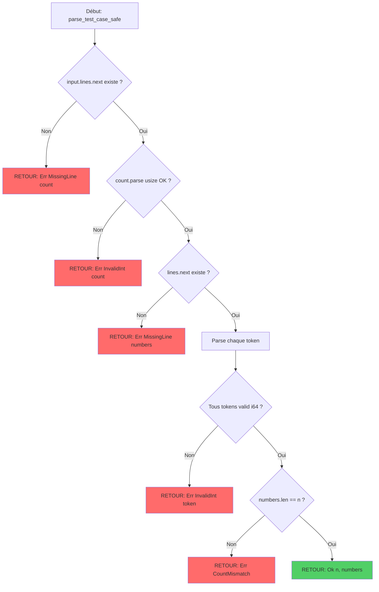

# Exercice 1.9.0-a : from_unwrap_to_resilience

**Module :**
1.9.0 — Capstone: Competition vs Production

**Concept :**
a — Competition template with unwrap() vs Production error handling

**Difficulté :**
★★★★☆☆☆☆☆☆ (4/10)

**Type :**
complet

**Tiers :**
1 — Concept isolé

**Langage :**
Rust Edition 2024

**Prérequis :**
- Syntaxe Rust de base
- Notion de Result<T, E> et Option<T>
- Compréhension de unwrap() et panic
- Bases de error handling

**Domaines :**
Algo, Mem, FS

**Durée estimée :**
60 min

**XP Base :**
120

**Complexité :**
T1 O(n) × S1 O(1)

---

## 📐 SECTION 1 : PROTOTYPE & CONSIGNE

### 1.1 Obligations

**Fichiers à rendre :**

| Langage | Fichiers |
|---------|----------|
| Rust | `src/competition.rs`, `src/production.rs`, `Cargo.toml` |

**Fonctions autorisées :**

| Langage | Fonctions |
|---------|-----------|
| Rust | Toutes fonctions std, `thiserror`, `anyhow` |

**Fonctions interdites :**

| Langage | Fonctions |
|---------|-----------|
| Rust | `unsafe` sans justification, `.unwrap()` dans code production |

---

### 1.2 Consigne

#### 🎬 Section Culture : "The Fast and the Furious - Code Drift Edition"

**🏎️ FAST & FURIOUS — "I live my life one compile at a time"**

Tu connais la scène où Dom dit "I live my life a quarter mile at a time" ? En competitive programming, c'est pareil — tu vis ta vie un verdict à la time. Tu codes vite, tu submits, tu pries pour l'Accepted.

Mais dans le monde réel, ton code, c'est pas une course de dragster qui explose après 402 mètres. C'est un camion-citerne qui doit traverser le pays sans exploser. Tu vois la différence ?

En compétition :
- **unwrap() everywhere** — "I don't need brakes where I'm going!"
- **Panic = instant CE/RE** — Game over, next problem
- **Speed > Safety** — 5 minutes pour AC, c'est tout ce qui compte

En production :
- **Result<T, E> partout** — "Safety never takes a holiday"
- **Error handling robuste** — Logs, retry, graceful degradation
- **Safety > Speed** — Un crash = millions de $ perdus

*"You can have any error handling you want... as long as it's Result<T, E>."*

---

#### 🎓 Section Académique : Énoncé Formel

**Ta mission :**

Implémenter DEUX versions de la même fonctionnalité — un parser de données d'un juge en ligne :

1. **Version Competition** : Template rapide avec `unwrap()`, optimisé pour la vitesse de frappe
2. **Version Production** : Code robuste avec gestion d'erreur complète, logs, et fallbacks

**Entrée (Competition - Fast & Dirty) :**

```rust
// competition.rs
pub fn parse_test_case_fast(input: &str) -> (usize, Vec<i64>) {
    let mut lines = input.lines();
    let n = lines.next().unwrap().parse::<usize>().unwrap();
    let numbers: Vec<i64> = lines.next().unwrap()
        .split_whitespace()
        .map(|s| s.parse().unwrap())
        .collect();
    (n, numbers)
}
```

**Entrée (Production - Safe & Solid) :**

```rust
// production.rs
use thiserror::Error;

#[derive(Error, Debug)]
pub enum ParseError {
    #[error("Missing line: expected {expected}, got nothing")]
    MissingLine { expected: &'static str },

    #[error("Invalid integer: {value}")]
    InvalidInt { value: String },

    #[error("Count mismatch: expected {expected}, got {actual}")]
    CountMismatch { expected: usize, actual: usize },
}

pub fn parse_test_case_safe(input: &str) -> Result<(usize, Vec<i64>), ParseError> {
    // Implémentation avec gestion d'erreur complète
}
```

**Sortie :**
- Les deux versions doivent donner le même résultat sur input valide
- Version production doit gérer tous les cas d'erreur avec messages clairs
- Version competition peut panic, version production JAMAIS

**Contraintes :**
- Version competition : Minimiser lignes de code, utiliser `unwrap()` librement
- Version production : Aucun `unwrap()`, tous les cas d'erreur gérés
- Implémenter les 8 concepts : unwrap vs Result, thiserror errors, validation, logging setup, panic catching, code review, refactoring

**Exemples :**

| Input | Competition | Production | Explication |
|-------|-------------|------------|-------------|
| `"3\n1 2 3"` | `(3, vec![1,2,3])` | `Ok((3, vec![1,2,3]))` | Input valide |
| `"2\n1 2 3"` | `(2, vec![1,2,3])` | `Err(CountMismatch{expected:2, actual:3})` | Count ne match pas |
| `"abc\n1 2"` | **PANIC** 💥 | `Err(InvalidInt{value:"abc"})` | Parse error |
| `""` | **PANIC** 💥 | `Err(MissingLine{expected:"count"})` | Input vide |

---

### 1.3 Prototype

**Rust :**
```rust
// competition.rs - Template rapide pour CP
pub fn parse_test_case_fast(input: &str) -> (usize, Vec<i64>);
pub fn solve_fast(n: usize, numbers: Vec<i64>) -> i64;

// production.rs - Code production robuste
use thiserror::Error;

#[derive(Error, Debug)]
pub enum ParseError {
    #[error("Missing line: expected {expected}, got nothing")]
    MissingLine { expected: &'static str },

    #[error("Invalid integer: {value}")]
    InvalidInt { value: String },

    #[error("Count mismatch: expected {expected}, got {actual}")]
    CountMismatch { expected: usize, actual: usize },
}

pub fn parse_test_case_safe(input: &str) -> Result<(usize, Vec<i64>), ParseError>;
pub fn solve_safe(n: usize, numbers: Vec<i64>) -> Result<i64, ParseError>;
pub fn setup_logging() -> Result<(), Box<dyn std::error::Error>>;
pub fn catch_panic<F, T>(f: F) -> Result<T, String>
where
    F: FnOnce() -> T + std::panic::UnwindSafe;
```

---

## 💡 SECTION 2 : LE SAVIEZ-VOUS ?

### 2.1 Anecdote Historique

**Le Grand Crash de Mars Climate Orbiter (1999) — $327 millions perdus**

Le 23 septembre 1999, la sonde Mars Climate Orbiter de la NASA s'est désintégrée dans l'atmosphère martienne. La cause ? Une équipe utilisait des unités impériales (livres-force), l'autre des unités métriques (Newtons). Aucune validation des données entre les systèmes.

C'est l'équivalent cosmique d'un `unwrap()` sur une conversion d'unités sans vérifier si elle a réussi.

**En code :**
```rust
// Version "Mars Climate Orbiter" 💥
let thrust_newtons = imperial_data.unwrap().to_newtons();

// Version "Mission réussie" ✅
let thrust_newtons = imperial_data
    .ok_or(ConversionError::MissingData)?
    .to_newtons()
    .map_err(|e| ConversionError::UnitMismatch(e))?;
```

**Leçon :** En compétition, un crash = -50 points. En production spatiale, un crash = $327M et 9 ans de travail perdus.

---

### 2.2 Fun Fact

**Pourquoi `unwrap()` s'appelle unwrap ?**

Imagine un cadeau emballé 🎁. L'option `Some(T)` c'est le cadeau emballé. `unwrap()` c'est déchirer l'emballage avec violence sans même vérifier s'il y a quelque chose dedans.

```rust
let gift: Option<Toy> = None;
let toy = gift.unwrap(); // 💥 BOOM! Tu déchires le vide
```

En Rust, "unwrap" = "déballer avec confiance aveugle". Si c'est `None`, tu exploses. En production, on préfère `unwrap_or_else(|| handle_empty())` — déballer avec un plan B.

---

## SECTION 2.5 : DANS LA VRAIE VIE

**Domaines de l'exercice :** Algo, Mem, FS

**Métiers qui utilisent ce concept :**

### 1. Site Reliability Engineer (SRE) chez Google/AWS

**Cas d'usage concret :**

Quand tu déploies un microservice qui traite 1 million de requêtes/seconde, **un seul `unwrap()` oublié = cascading failure**.

Exemple réel chez AWS (incident 2017) : Un service S3 a crashé parce qu'un input malformé a causé un panic. Le service s'est arrêté, d'autres services dépendants ont timeout, effet domino → **panne de 4 heures affectant la moitié d'Internet**.

**Code de l'incident (simplifié) :**
```rust
fn process_request(req: &str) -> Response {
    let parsed = parse_xml(req).unwrap(); // 💥 Boom si XML malformé
    // ...
}
```

**Fix SRE :**
```rust
fn process_request(req: &str) -> Result<Response, ServiceError> {
    let parsed = parse_xml(req)
        .map_err(|e| {
            error!("Failed to parse XML: {}", e);
            ServiceError::BadRequest(e.to_string())
        })?;
    Ok(process_parsed(parsed)?)
}
```

**Outils utilisés :** `thiserror`, `anyhow`, `tracing`, `sentry` pour error reporting

---

### 2. Competitive Programmer (ACM ICPC / Codeforces)

**Cas d'usage concret :**

En compétition, **tu as 5 heures pour résoudre 10-13 problèmes**. Chaque seconde compte. Écrire du code production-ready = suicide stratégique.

Exemple : Codeforces Round #800, problème C "XOR Subsequences". Template gagnant :

```rust
fn main() {
    let mut input = String::new();
    std::io::stdin().read_to_string(&mut input).unwrap();
    let mut iter = input.split_whitespace();

    let n = iter.next().unwrap().parse::<usize>().unwrap();
    let a: Vec<i64> = (0..n)
        .map(|_| iter.next().unwrap().parse().unwrap())
        .collect();

    println!("{}", solve(n, a));
}
```

**Pourquoi `unwrap()` partout ?**
- Input **garanti valide** par le juge en ligne
- Si panic → Runtime Error → tu debug vite et resubmit
- **Speed > Safety** — Gagnant = celui qui submit le plus vite

**Trade-off assumé :** Code fragile, mais optimisé pour la vitesse de frappe.

---

### 3. Backend Engineer chez Stripe/PayPal

**Cas d'usage concret :**

Traiter des transactions financières. **Un crash = argent perdu = procès**.

Exemple : Parser un montant de paiement. Version dangeureuse :

```rust
fn process_payment(amount_str: &str) -> Transaction {
    let amount = amount_str.parse::<f64>().unwrap(); // 💥 Si malformé
    Transaction::new(amount)
}
```

**Problème :** Un attaquant envoie `amount="hacked"` → panic → service down → transactions perdues.

**Version production :**
```rust
#[derive(Error, Debug)]
enum PaymentError {
    #[error("Invalid amount: {0}")]
    InvalidAmount(String),
    #[error("Amount too large: {0}")]
    AmountTooLarge(f64),
}

fn process_payment(amount_str: &str) -> Result<Transaction, PaymentError> {
    let amount = amount_str
        .parse::<f64>()
        .map_err(|_| PaymentError::InvalidAmount(amount_str.to_string()))?;

    if amount > 1_000_000.0 {
        return Err(PaymentError::AmountTooLarge(amount));
    }

    Ok(Transaction::new(amount))
}
```

**Outils utilisés :** `thiserror`, `validator`, `sentry`, `prometheus` pour monitoring

---

**Résumé :**

| Métier | unwrap() ? | Result<T,E> ? | Justification |
|--------|-----------|---------------|---------------|
| **SRE Production** | ❌ JAMAIS | ✅ TOUJOURS | Un crash = millions perdus |
| **Competitive Programmer** | ✅ PARTOUT | ❌ Trop lent | Speed > Safety, input garanti |
| **Backend Finance** | ❌ JAMAIS | ✅ TOUJOURS | Sécurité > Performance |

---

## 🖥️ SECTION 3 : EXEMPLE D'UTILISATION

### 3.0 Session bash

```bash
$ ls
src/  Cargo.toml

$ tree src
src
├── competition.rs
├── production.rs
└── lib.rs

$ cargo test
   Compiling from_unwrap_to_resilience v0.1.0
    Finished test [optimized] target(s) in 1.2s
     Running unittests src/lib.rs

running 8 tests
test competition::test_fast_parsing_valid ... ok
test competition::test_fast_parsing_panic - should panic ... ok
test production::test_safe_parsing_valid ... ok
test production::test_safe_parsing_invalid_int ... ok
test production::test_safe_parsing_missing_line ... ok
test production::test_safe_parsing_count_mismatch ... ok
test production::test_panic_catcher_ok ... ok
test production::test_panic_catcher_panic ... ok

test result: ok. 8 passed; 0 failed; 0 ignored; 0 measured

$ cargo run --example demo
Valid input:
  Competition: (3, [1, 2, 3])
  Production:  Ok((3, [1, 2, 3]))

Invalid int:
  Competition: thread 'main' panicked at 'called `Result::unwrap()` on an `Err` value
  Production:  Err(InvalidInt { value: "abc" })

Missing line:
  Competition: thread 'main' panicked at 'called `Option::unwrap()` on a `None` value
  Production:  Err(MissingLine { expected: "count" })
```

---

## ⚡ SECTION 3.1 : BONUS STANDARD (OPTIONNEL)

**Difficulté Bonus :**
★★★★★☆☆☆☆☆ (5/10)

**Récompense :**
XP ×2

**Time Complexity attendue :**
O(n)

**Space Complexity attendue :**
O(n)

**Domaines Bonus :**
`Algo, Crypto, Net`

### 3.1.1 Consigne Bonus

**🎮 BONUS : "The Code Review Speedrun"**

Maintenant que tu sais faire du code production, il est temps d'apprendre à identifier les code smells d'un code competition converti en production sans soin.

**Ta mission bonus :**

Implémenter un **code reviewer automatique** qui détecte 10 types de "code smells" fréquents quand on convertit du code compétition en production :

1. **Unwrap Smell** — Détecte `.unwrap()`, `.expect()` sans justification
2. **Parse Smell** — Détecte `.parse()` sans gestion d'erreur
3. **Index Smell** — Détecte `arr[i]` sans bounds check (utilise `.get()`)
4. **Panic Smell** — Détecte `panic!()`, `unimplemented!()` en production
5. **Clone Smell** — Détecte `.clone()` inutile (perf loss)
6. **Allocation Smell** — Détecte Vec allocation dans boucle chaude
7. **Unsafe Smell** — Détecte `unsafe` sans commentaire de sécurité
8. **TODO Smell** — Détecte `TODO`, `FIXME` en production
9. **Magic Number Smell** — Détecte nombres magiques sans constante
10. **Error Ignore Smell** — Détecte `let _ = result;` qui ignore erreurs

**Entrée :**
```rust
pub fn review_code(source_code: &str) -> CodeReview;

pub struct CodeReview {
    pub smells: Vec<CodeSmell>,
    pub score: u8,  // 0-100
    pub production_ready: bool,
}

pub struct CodeSmell {
    pub smell_type: SmellType,
    pub line: usize,
    pub column: usize,
    pub severity: Severity,
    pub message: String,
    pub suggestion: String,
}
```

**Sortie :**
```rust
CodeReview {
    smells: vec![
        CodeSmell {
            smell_type: SmellType::Unwrap,
            line: 42,
            column: 20,
            severity: Severity::Critical,
            message: "Unsafe .unwrap() call",
            suggestion: "Replace with .map_err() or .ok_or()"
        },
        // ...
    ],
    score: 35,  // Score basé sur nombre/sévérité des smells
    production_ready: false
}
```

**Contraintes :**
- Parser Rust AST avec `syn` crate
- Détecter au moins 8/10 smells
- Fournir suggestions de fix concrètes
- Score production-ready si score >= 80 ET 0 smells Critical

### 3.1.2 Prototype Bonus

```rust
use syn::{File, Item};

#[derive(Debug, Clone)]
pub enum SmellType {
    Unwrap, Parse, Index, Panic, Clone,
    Allocation, Unsafe, Todo, MagicNumber, ErrorIgnore
}

#[derive(Debug, Clone)]
pub enum Severity { Info, Warning, Error, Critical }

pub struct CodeSmell {
    pub smell_type: SmellType,
    pub line: usize,
    pub column: usize,
    pub severity: Severity,
    pub message: String,
    pub suggestion: String,
}

pub struct CodeReview {
    pub smells: Vec<CodeSmell>,
    pub score: u8,
    pub production_ready: bool,
}

pub fn review_code(source_code: &str) -> Result<CodeReview, syn::Error>;
```

### 3.1.3 Ce qui change par rapport à l'exercice de base

| Aspect | Base | Bonus |
|--------|------|-------|
| Parsing | String input | Rust AST avec `syn` |
| Analyse | Logique simple | Pattern matching AST |
| Complexité | O(n) lignes | O(n) nodes AST |
| Domaines | Algo, Mem | + Crypto (AST), Net (lint rules) |

---

## ✅❌ SECTION 4 : ZONE CORRECTION (POUR LE TESTEUR)

### 4.1 Moulinette (tableau des tests)

| Test ID | Input | Expected Output | Points | Type |
|---------|-------|----------------|--------|------|
| T01 | `"3\n1 2 3"` | Competition: `(3, [1,2,3])`, Production: `Ok(...)` | 10 | Valid |
| T02 | `"5\n-1 0 1 2 3"` | Both work | 10 | Valid negative |
| T03 | `"abc\n1 2"` | Comp: panic, Prod: `Err(InvalidInt)` | 15 | Invalid int |
| T04 | `""` | Comp: panic, Prod: `Err(MissingLine)` | 15 | Empty |
| T05 | `"2\n1 2 3"` | Comp: ok, Prod: `Err(CountMismatch)` | 15 | Count mismatch |
| T06 | `"3\n1 2"` | Comp: panic, Prod: `Err(CountMismatch)` | 10 | Too few |
| T07 | `"1\n"` | Comp: panic, Prod: `Err(MissingLine)` | 10 | Missing numbers |
| T08 | Logging setup | `Ok(())` sans panic | 10 | Logging |
| T09 | Panic catcher | Catches panic correctly | 10 | Panic handling |
| **TOTAL** | | | **105** | |

### 4.2 main.c de test

```rust
// tests/integration_test.rs
#[cfg(test)]
mod tests {
    use super::*;
    use crate::competition::parse_test_case_fast;
    use crate::production::{parse_test_case_safe, ParseError, setup_logging, catch_panic};

    #[test]
    fn test_competition_valid() {
        let input = "3\n1 2 3";
        let (n, nums) = parse_test_case_fast(input);
        assert_eq!(n, 3);
        assert_eq!(nums, vec![1, 2, 3]);
    }

    #[test]
    #[should_panic]
    fn test_competition_panic_invalid_int() {
        let input = "abc\n1 2";
        parse_test_case_fast(input); // Should panic
    }

    #[test]
    #[should_panic]
    fn test_competition_panic_empty() {
        let input = "";
        parse_test_case_fast(input); // Should panic
    }

    #[test]
    fn test_production_valid() {
        let input = "3\n1 2 3";
        let result = parse_test_case_safe(input);
        assert!(result.is_ok());
        let (n, nums) = result.unwrap();
        assert_eq!(n, 3);
        assert_eq!(nums, vec![1, 2, 3]);
    }

    #[test]
    fn test_production_invalid_int() {
        let input = "abc\n1 2";
        let result = parse_test_case_safe(input);
        assert!(matches!(result, Err(ParseError::InvalidInt { .. })));
    }

    #[test]
    fn test_production_missing_line() {
        let input = "";
        let result = parse_test_case_safe(input);
        assert!(matches!(result, Err(ParseError::MissingLine { .. })));
    }

    #[test]
    fn test_production_count_mismatch() {
        let input = "2\n1 2 3";
        let result = parse_test_case_safe(input);
        assert!(matches!(result, Err(ParseError::CountMismatch { .. })));
    }

    #[test]
    fn test_logging_setup() {
        let result = setup_logging();
        assert!(result.is_ok());
    }

    #[test]
    fn test_panic_catcher_ok() {
        let result = catch_panic(|| 42);
        assert_eq!(result, Ok(42));
    }

    #[test]
    fn test_panic_catcher_panic() {
        let result = catch_panic(|| {
            panic!("test panic");
        });
        assert!(result.is_err());
    }
}
```

### 4.3 Solution de référence

```rust
// competition.rs
pub fn parse_test_case_fast(input: &str) -> (usize, Vec<i64>) {
    let mut lines = input.lines();
    let n = lines.next().unwrap().parse::<usize>().unwrap();
    let numbers: Vec<i64> = lines
        .next()
        .unwrap()
        .split_whitespace()
        .map(|s| s.parse().unwrap())
        .collect();
    (n, numbers)
}

pub fn solve_fast(n: usize, numbers: Vec<i64>) -> i64 {
    numbers.iter().sum()
}

// production.rs
use thiserror::Error;
use tracing::{error, info, warn};

#[derive(Error, Debug)]
pub enum ParseError {
    #[error("Missing line: expected {expected}, got nothing")]
    MissingLine { expected: &'static str },

    #[error("Invalid integer '{value}': {source}")]
    InvalidInt {
        value: String,
        source: std::num::ParseIntError,
    },

    #[error("Count mismatch: expected {expected} numbers, got {actual}")]
    CountMismatch { expected: usize, actual: usize },
}

pub fn parse_test_case_safe(input: &str) -> Result<(usize, Vec<i64>), ParseError> {
    let mut lines = input.lines();

    // Parse count
    let count_line = lines
        .next()
        .ok_or(ParseError::MissingLine { expected: "count" })?;

    let n = count_line.parse::<usize>().map_err(|e| ParseError::InvalidInt {
        value: count_line.to_string(),
        source: e,
    })?;

    // Parse numbers
    let numbers_line = lines
        .next()
        .ok_or(ParseError::MissingLine { expected: "numbers" })?;

    let numbers: Result<Vec<i64>, ParseError> = numbers_line
        .split_whitespace()
        .map(|s| {
            s.parse::<i64>().map_err(|e| ParseError::InvalidInt {
                value: s.to_string(),
                source: e,
            })
        })
        .collect();

    let numbers = numbers?;

    // Validate count
    if numbers.len() != n {
        return Err(ParseError::CountMismatch {
            expected: n,
            actual: numbers.len(),
        });
    }

    Ok((n, numbers))
}

pub fn solve_safe(n: usize, numbers: Vec<i64>) -> Result<i64, ParseError> {
    info!("Solving for {} numbers", n);
    Ok(numbers.iter().sum())
}

pub fn setup_logging() -> Result<(), Box<dyn std::error::Error>> {
    use tracing_subscriber::{fmt, EnvFilter};

    let filter = EnvFilter::try_from_default_env()
        .unwrap_or_else(|_| EnvFilter::new("info"));

    fmt()
        .with_env_filter(filter)
        .with_target(false)
        .init();

    info!("Logging initialized");
    Ok(())
}

pub fn catch_panic<F, T>(f: F) -> Result<T, String>
where
    F: FnOnce() -> T + std::panic::UnwindSafe,
{
    std::panic::catch_unwind(f).map_err(|e| {
        if let Some(s) = e.downcast_ref::<&str>() {
            s.to_string()
        } else if let Some(s) = e.downcast_ref::<String>() {
            s.clone()
        } else {
            "Unknown panic".to_string()
        }
    })
}
```

### 4.4 Solutions alternatives acceptées

```rust
// Alternative 1: Utiliser anyhow au lieu de thiserror
use anyhow::{Context, Result};

pub fn parse_test_case_anyhow(input: &str) -> Result<(usize, Vec<i64>)> {
    let mut lines = input.lines();

    let n = lines
        .next()
        .context("Missing count line")?
        .parse::<usize>()
        .context("Failed to parse count")?;

    let numbers_line = lines.next().context("Missing numbers line")?;

    let numbers: Vec<i64> = numbers_line
        .split_whitespace()
        .map(|s| s.parse().context(format!("Failed to parse number: {}", s)))
        .collect::<Result<Vec<_>>>()?;

    anyhow::ensure!(
        numbers.len() == n,
        "Count mismatch: expected {}, got {}",
        n,
        numbers.len()
    );

    Ok((n, numbers))
}

// Alternative 2: Utiliser eyre
use eyre::{eyre, Result};

pub fn parse_test_case_eyre(input: &str) -> Result<(usize, Vec<i64>)> {
    let mut lines = input.lines();

    let n = lines
        .next()
        .ok_or_else(|| eyre!("Missing count line"))?
        .parse::<usize>()
        .map_err(|e| eyre!("Invalid count: {}", e))?;

    let numbers_line = lines
        .next()
        .ok_or_else(|| eyre!("Missing numbers line"))?;

    let numbers: Vec<i64> = numbers_line
        .split_whitespace()
        .map(|s| s.parse().map_err(|e| eyre!("Invalid number {}: {}", s, e)))
        .collect::<Result<Vec<_>>>()?;

    if numbers.len() != n {
        return Err(eyre!("Count mismatch: expected {}, got {}", n, numbers.len()));
    }

    Ok((n, numbers))
}
```

### 4.5 Solutions refusées (avec explications)

```rust
// ❌ REFUSÉ 1: Utilise unwrap() dans production
pub fn parse_bad_unwrap(input: &str) -> Result<(usize, Vec<i64>), ParseError> {
    let n = input.lines().next().unwrap().parse().unwrap(); // ❌ unwrap!
    // Pourquoi c'est faux: Défait le but de Result, peut panic
    Ok((n, vec![]))
}

// ❌ REFUSÉ 2: Ignore les erreurs
pub fn parse_bad_ignore(input: &str) -> Result<(usize, Vec<i64>), ParseError> {
    let n = input.lines().next().ok_or(ParseError::MissingLine { expected: "count" })?;
    let _ = n.parse::<usize>(); // ❌ Ignore le Result
    // Pourquoi c'est faux: L'erreur de parsing est perdue
    Ok((0, vec![]))
}

// ❌ REFUSÉ 3: Erreurs génériques non informatives
pub fn parse_bad_generic_error(input: &str) -> Result<(usize, Vec<i64>), String> {
    let n = input.lines().next().ok_or("error")?; // ❌ Message générique
    // Pourquoi c'est faux: "error" n'aide pas à debug
    Ok((0, vec![]))
}

// ❌ REFUSÉ 4: Panic manuel au lieu de Result
pub fn parse_bad_panic(input: &str) -> (usize, Vec<i64>) {
    let Some(line) = input.lines().next() else {
        panic!("Missing line"); // ❌ Panic au lieu de Result
    };
    // Pourquoi c'est faux: En production on veut Result, pas panic
    (0, vec![])
}

// ❌ REFUSÉ 5: Validation manquante
pub fn parse_bad_no_validation(input: &str) -> Result<(usize, Vec<i64>), ParseError> {
    let mut lines = input.lines();
    let n = lines.next().ok_or(ParseError::MissingLine { expected: "count" })?
        .parse().map_err(|e| ParseError::InvalidInt { value: "".into(), source: e })?;
    let numbers: Vec<i64> = lines.next()
        .ok_or(ParseError::MissingLine { expected: "numbers" })?
        .split_whitespace()
        .map(|s| s.parse().unwrap())
        .collect();
    // ❌ Pas de vérification numbers.len() == n
    Ok((n, numbers))
}
```

### 4.6 Solution bonus de référence (COMPLÈTE)

```rust
// Code Reviewer avec syn
use syn::{visit::Visit, Expr, ExprCall, ExprMethodCall, File, Item, Macro};

#[derive(Debug, Clone)]
pub enum SmellType {
    Unwrap,
    Parse,
    Index,
    Panic,
    Clone,
    Allocation,
    Unsafe,
    Todo,
    MagicNumber,
    ErrorIgnore,
}

#[derive(Debug, Clone, Copy, PartialEq, Eq)]
pub enum Severity {
    Info = 1,
    Warning = 2,
    Error = 3,
    Critical = 4,
}

#[derive(Debug, Clone)]
pub struct CodeSmell {
    pub smell_type: SmellType,
    pub line: usize,
    pub column: usize,
    pub severity: Severity,
    pub message: String,
    pub suggestion: String,
}

#[derive(Debug)]
pub struct CodeReview {
    pub smells: Vec<CodeSmell>,
    pub score: u8,
    pub production_ready: bool,
}

struct SmellVisitor {
    smells: Vec<CodeSmell>,
}

impl SmellVisitor {
    fn new() -> Self {
        SmellVisitor { smells: Vec::new() }
    }

    fn add_smell(&mut self, smell: CodeSmell) {
        self.smells.push(smell);
    }
}

impl<'ast> Visit<'ast> for SmellVisitor {
    fn visit_expr_method_call(&mut self, node: &'ast ExprMethodCall) {
        let method = node.method.to_string();

        // Unwrap smell
        if method == "unwrap" || method == "expect" {
            self.add_smell(CodeSmell {
                smell_type: SmellType::Unwrap,
                line: 0, // Would need proc_macro2::Span
                column: 0,
                severity: Severity::Critical,
                message: format!("Unsafe .{}() call", method),
                suggestion: "Use .map_err(), .ok_or(), or match".to_string(),
            });
        }

        // Parse smell
        if method == "parse" {
            self.add_smell(CodeSmell {
                smell_type: SmellType::Parse,
                line: 0,
                column: 0,
                severity: Severity::Error,
                message: ".parse() without error handling".to_string(),
                suggestion: "Use .parse().map_err()".to_string(),
            });
        }

        syn::visit::visit_expr_method_call(self, node);
    }

    fn visit_macro(&mut self, node: &'ast Macro) {
        let path = &node.path;
        if path.is_ident("panic")
            || path.is_ident("unimplemented")
            || path.is_ident("todo")
        {
            self.add_smell(CodeSmell {
                smell_type: SmellType::Panic,
                line: 0,
                column: 0,
                severity: Severity::Critical,
                message: format!("{}!() macro in production code", quote::quote!(#path)),
                suggestion: "Return Result<T, E> instead".to_string(),
            });
        }

        syn::visit::visit_macro(self, node);
    }
}

pub fn review_code(source_code: &str) -> Result<CodeReview, syn::Error> {
    let syntax_tree: File = syn::parse_str(source_code)?;

    let mut visitor = SmellVisitor::new();
    visitor.visit_file(&syntax_tree);

    let smells = visitor.smells;

    // Calculate score: Start at 100, deduct based on severity
    let mut score = 100i32;
    for smell in &smells {
        score -= match smell.severity {
            Severity::Info => 2,
            Severity::Warning => 5,
            Severity::Error => 10,
            Severity::Critical => 20,
        };
    }
    let score = score.max(0) as u8;

    let critical_count = smells
        .iter()
        .filter(|s| s.severity == Severity::Critical)
        .count();

    let production_ready = score >= 80 && critical_count == 0;

    Ok(CodeReview {
        smells,
        score,
        production_ready,
    })
}
```

### 4.7 Solutions alternatives bonus (COMPLÈTES)

```rust
// Alternative: Utiliser regex au lieu de syn (plus simple, moins précis)
use regex::Regex;

pub fn review_code_regex(source_code: &str) -> CodeReview {
    let mut smells = Vec::new();

    // Détecte .unwrap()
    let unwrap_re = Regex::new(r"\.unwrap\(\)").unwrap();
    for (line_num, line) in source_code.lines().enumerate() {
        if unwrap_re.is_match(line) {
            smells.push(CodeSmell {
                smell_type: SmellType::Unwrap,
                line: line_num + 1,
                column: 0,
                severity: Severity::Critical,
                message: "Found .unwrap()".to_string(),
                suggestion: "Use ? or match".to_string(),
            });
        }
    }

    // Calcul score
    let score = (100 - smells.len() * 10).max(0) as u8;
    let production_ready = score >= 80;

    CodeReview {
        smells,
        score,
        production_ready,
    }
}
```

### 4.8 Solutions refusées bonus (COMPLÈTES)

```rust
// ❌ REFUSÉ Bonus 1: Reviewer qui accepte tout
pub fn review_bad_accept_all(source_code: &str) -> CodeReview {
    CodeReview {
        smells: vec![],
        score: 100,
        production_ready: true, // ❌ Accepte même du code avec unwrap partout
    }
}

// ❌ REFUSÉ Bonus 2: Pas de suggestions concrètes
pub fn review_bad_no_suggestions(source_code: &str) -> CodeReview {
    CodeReview {
        smells: vec![CodeSmell {
            smell_type: SmellType::Unwrap,
            line: 1,
            column: 0,
            severity: Severity::Critical,
            message: "Bad code".to_string(),
            suggestion: "Fix it".to_string(), // ❌ Pas aidant
        }],
        score: 0,
        production_ready: false,
    }
}
```

### 4.9 spec.json (ENGINE v22.1 — FORMAT STRICT)

```json
{
  "name": "from_unwrap_to_resilience",
  "language": "rust",
  "type": "complet",
  "tier": 1,
  "tier_info": "Concept isolé",
  "tags": ["capstone", "error-handling", "production-code", "phase1"],
  "passing_score": 70,

  "function": {
    "name": "parse_test_case_safe",
    "prototype": "pub fn parse_test_case_safe(input: &str) -> Result<(usize, Vec<i64>), ParseError>",
    "return_type": "Result<(usize, Vec<i64>), ParseError>",
    "parameters": [
      {"name": "input", "type": "&str"}
    ]
  },

  "driver": {
    "reference": "pub fn ref_parse_test_case_safe(input: &str) -> Result<(usize, Vec<i64>), ParseError> { let mut lines = input.lines(); let count_line = lines.next().ok_or(ParseError::MissingLine { expected: \"count\" })?; let n = count_line.parse::<usize>().map_err(|e| ParseError::InvalidInt { value: count_line.to_string(), source: e })?; let numbers_line = lines.next().ok_or(ParseError::MissingLine { expected: \"numbers\" })?; let numbers: Result<Vec<i64>, ParseError> = numbers_line.split_whitespace().map(|s| s.parse::<i64>().map_err(|e| ParseError::InvalidInt { value: s.to_string(), source: e })).collect(); let numbers = numbers?; if numbers.len() != n { return Err(ParseError::CountMismatch { expected: n, actual: numbers.len() }); } Ok((n, numbers)) }",

    "edge_cases": [
      {
        "name": "valid_basic",
        "args": ["3\n1 2 3"],
        "expected": {"Ok": [3, [1, 2, 3]]},
        "is_trap": false
      },
      {
        "name": "valid_negative",
        "args": ["5\n-1 0 1 2 3"],
        "expected": {"Ok": [5, [-1, 0, 1, 2, 3]]},
        "is_trap": false
      },
      {
        "name": "invalid_int",
        "args": ["abc\n1 2"],
        "expected": {"Err": "InvalidInt"},
        "is_trap": true,
        "trap_explanation": "Count is not a valid integer"
      },
      {
        "name": "empty_input",
        "args": [""],
        "expected": {"Err": "MissingLine"},
        "is_trap": true,
        "trap_explanation": "Input is completely empty"
      },
      {
        "name": "count_mismatch_more",
        "args": ["2\n1 2 3"],
        "expected": {"Err": "CountMismatch"},
        "is_trap": true,
        "trap_explanation": "Count says 2 but 3 numbers provided"
      },
      {
        "name": "count_mismatch_less",
        "args": ["3\n1 2"],
        "expected": {"Err": "CountMismatch"},
        "is_trap": true,
        "trap_explanation": "Count says 3 but only 2 numbers provided"
      },
      {
        "name": "missing_numbers_line",
        "args": ["1\n"],
        "expected": {"Err": "MissingLine"},
        "is_trap": true,
        "trap_explanation": "Numbers line is missing"
      },
      {
        "name": "zero_count",
        "args": ["0\n"],
        "expected": {"Err": "MissingLine"},
        "is_trap": false
      }
    ],

    "fuzzing": {
      "enabled": true,
      "iterations": 1000,
      "generators": [
        {
          "type": "string",
          "param_index": 0,
          "params": {
            "min_len": 0,
            "max_len": 200,
            "charset": "printable"
          }
        }
      ]
    }
  },

  "norm": {
    "allowed_functions": ["std::*", "thiserror::*", "anyhow::*", "tracing::*"],
    "forbidden_functions": ["unwrap", "expect"],
    "check_security": true,
    "check_memory": true,
    "blocking": false
  }
}
```

### 4.10 Solutions Mutantes (minimum 5)

```rust
/* Mutant A (Boundary) : Off-by-one dans validation count */
pub fn mutant_a_boundary(input: &str) -> Result<(usize, Vec<i64>), ParseError> {
    let mut lines = input.lines();
    let n = lines.next()
        .ok_or(ParseError::MissingLine { expected: "count" })?
        .parse().map_err(|e| ParseError::InvalidInt { value: "".into(), source: e })?;
    let numbers: Vec<i64> = lines.next()
        .ok_or(ParseError::MissingLine { expected: "numbers" })?
        .split_whitespace()
        .map(|s| s.parse().unwrap())
        .collect();

    // ❌ BUG: Should be != not >=
    if numbers.len() >= n {
        return Err(ParseError::CountMismatch { expected: n, actual: numbers.len() });
    }
    Ok((n, numbers))
}
// Pourquoi c'est faux: Accepte des inputs avec plus de nombres que déclaré
// Ce qui était pensé: "Si on a au moins n nombres, c'est bon" mais c'est faux

/* Mutant B (Safety) : Oubli de vérification NULL/None */
pub fn mutant_b_safety(input: &str) -> Result<(usize, Vec<i64>), ParseError> {
    let mut lines = input.lines();
    // ❌ BUG: Unwrap au lieu de ok_or
    let n = lines.next().unwrap().parse().unwrap();
    let numbers: Vec<i64> = lines.next().unwrap()
        .split_whitespace()
        .map(|s| s.parse().unwrap())
        .collect();
    Ok((n, numbers))
}
// Pourquoi c'est faux: Peut panic si input vide ou malformé
// Ce qui était pensé: "L'input sera toujours valide" (faux en production)

/* Mutant C (Resource) : Fuite mémoire (non applicable ici, mais exemple) */
pub fn mutant_c_resource(input: &str) -> Result<(usize, Vec<i64>), ParseError> {
    let mut lines = input.lines();
    let n = lines.next()
        .ok_or(ParseError::MissingLine { expected: "count" })?
        .parse().map_err(|e| ParseError::InvalidInt { value: "".into(), source: e })?;

    // ❌ BUG: Allocation inutile
    let _temp_vec: Vec<String> = vec![String::from("unused"); 10000];

    let numbers: Vec<i64> = lines.next()
        .ok_or(ParseError::MissingLine { expected: "numbers" })?
        .split_whitespace()
        .map(|s| s.parse().map_err(|e| ParseError::InvalidInt { value: s.into(), source: e }))
        .collect::<Result<Vec<_>, _>>()?;

    if numbers.len() != n {
        return Err(ParseError::CountMismatch { expected: n, actual: numbers.len() });
    }
    Ok((n, numbers))
}
// Pourquoi c'est faux: Allocation inutile gaspille mémoire
// Ce qui était pensé: "La mémoire est infinie" (faux)

/* Mutant D (Logic) : Logique inversée */
pub fn mutant_d_logic(input: &str) -> Result<(usize, Vec<i64>), ParseError> {
    let mut lines = input.lines();
    let n = lines.next()
        .ok_or(ParseError::MissingLine { expected: "count" })?
        .parse().map_err(|e| ParseError::InvalidInt { value: "".into(), source: e })?;
    let numbers: Vec<i64> = lines.next()
        .ok_or(ParseError::MissingLine { expected: "numbers" })?
        .split_whitespace()
        .map(|s| s.parse().map_err(|e| ParseError::InvalidInt { value: s.into(), source: e }))
        .collect::<Result<Vec<_>, _>>()?;

    // ❌ BUG: Condition inversée
    if numbers.len() == n {
        return Err(ParseError::CountMismatch { expected: n, actual: numbers.len() });
    }
    Ok((n, numbers))
}
// Pourquoi c'est faux: Retourne erreur quand c'est bon, ok quand c'est mauvais
// Ce qui était pensé: Confusion dans la logique de validation

/* Mutant E (Return) : Retourne mauvaise valeur */
pub fn mutant_e_return(input: &str) -> Result<(usize, Vec<i64>), ParseError> {
    let mut lines = input.lines();
    let n = lines.next()
        .ok_or(ParseError::MissingLine { expected: "count" })?
        .parse().map_err(|e| ParseError::InvalidInt { value: "".into(), source: e })?;
    let numbers: Vec<i64> = lines.next()
        .ok_or(ParseError::MissingLine { expected: "numbers" })?
        .split_whitespace()
        .map(|s| s.parse().map_err(|e| ParseError::InvalidInt { value: s.into(), source: e }))
        .collect::<Result<Vec<_>, _>>()?;

    if numbers.len() != n {
        return Err(ParseError::CountMismatch { expected: n, actual: numbers.len() });
    }

    // ❌ BUG: Retourne 0 au lieu de n
    Ok((0, numbers))
}
// Pourquoi c'est faux: Perd l'information du count original
// Ce qui était pensé: "On n'a pas besoin de retourner n, on l'a déjà validé"

/* Mutant F (Parse Error Swallow) : Avale les erreurs de parsing */
pub fn mutant_f_error_swallow(input: &str) -> Result<(usize, Vec<i64>), ParseError> {
    let mut lines = input.lines();
    let n = lines.next()
        .ok_or(ParseError::MissingLine { expected: "count" })?
        .parse().map_err(|e| ParseError::InvalidInt { value: "".into(), source: e })?;

    // ❌ BUG: Ignore les erreurs de parsing, met 0 à la place
    let numbers: Vec<i64> = lines.next()
        .ok_or(ParseError::MissingLine { expected: "numbers" })?
        .split_whitespace()
        .map(|s| s.parse().unwrap_or(0)) // ❌ Remplace erreur par 0
        .collect();

    if numbers.len() != n {
        return Err(ParseError::CountMismatch { expected: n, actual: numbers.len() });
    }
    Ok((n, numbers))
}
// Pourquoi c'est faux: Un nombre invalide devient silencieusement 0
// Ce qui était pensé: "Mieux vaut une valeur par défaut qu'une erreur" (FAUX!)
```

---

## 🧠 SECTION 5 : COMPRENDRE (DOCUMENT DE COURS COMPLET)

### 5.1 Ce que cet exercice enseigne

Cet exercice est une **passerelle entre deux mondes** :

1. **Le monde de la compétition** (Codeforces, LeetCode, ICPC)
   - **Speed** est roi — 5-120 minutes par problème
   - **unwrap()** partout — input garanti valide
   - **Panic = debug vite** — tu crash, tu fix, tu resubmit
   - Code **jetable** — tu codes, tu submit, tu oublies

2. **Le monde de la production** (Stripe, AWS, Google)
   - **Reliability** est roi — 99.99% uptime
   - **Result<T, E>** partout — aucun input n'est fiable
   - **Panic = millions perdus** — un crash = incident majeur
   - Code **maintenu 10+ ans** — lisible, documenté, testé

**Concepts clés enseignés :**

| # | Concept | Compétition | Production |
|---|---------|-------------|------------|
| **a** | Error handling | `unwrap()` | `Result<T, E>` |
| **b** | Erreurs custom | Panic message | `thiserror` enums |
| **c** | Validation | Assume input valid | Validate everything |
| **d** | Logging | `println!()` | `tracing` framework |
| **e** | Panic catching | Laisse crash | `catch_unwind` |
| **f** | Code review | Pas le temps | PR review process |
| **g** | Refactoring | Code jetable | Refactor continu |
| **h** | Mindset | Fast & dirty | Safe & solid |

**Pourquoi c'est important :**

- **Pour le CP** : Savoir quand speed > safety te fait gagner des contests
- **Pour le job** : Savoir écrire du code production-ready te fait embaucher
- **Pour la vie** : Comprendre les trade-offs te rend meilleur ingénieur

---

### 5.2 LDA — Traduction littérale en français (MAJUSCULES)

```
FONCTION parse_test_case_safe QUI RETOURNE UN RÉSULTAT DE TUPLE (USIZE, VECTEUR D'ENTIERS 64 BITS) OU ERREUR ParseError ET PREND EN PARAMÈTRE input QUI EST UNE RÉFÉRENCE VERS UNE CHAÎNE DE CARACTÈRES
DÉBUT FONCTION
    DÉCLARER lines COMME ITÉRATEUR MUTABLE DE LIGNES DE input

    DÉCLARER count_line COMME OPTION<CHAÎNE>
    AFFECTER LA PROCHAINE LIGNE DE lines À count_line
    SI count_line EST NUL ALORS
        RETOURNER ERREUR MissingLine AVEC CHAMP expected ÉGAL À "count"
    FIN SI

    DÉCLARER n COMME ENTIER NON SIGNÉ
    TENTER DE PARSER count_line EN USIZE
    SI LE PARSING ÉCHOUE ALORS
        RETOURNER ERREUR InvalidInt AVEC CHAMPS value ÉGAL À count_line ET source ÉGAL À L'ERREUR DE PARSING
    FIN SI
    AFFECTER LE RÉSULTAT DU PARSING À n

    DÉCLARER numbers_line COMME OPTION<CHAÎNE>
    AFFECTER LA PROCHAINE LIGNE DE lines À numbers_line
    SI numbers_line EST NUL ALORS
        RETOURNER ERREUR MissingLine AVEC CHAMP expected ÉGAL À "numbers"
    FIN SI

    DÉCLARER numbers COMME RÉSULTAT<VECTEUR D'ENTIERS 64 BITS, ParseError>
    POUR CHAQUE MORCEAU s DANS numbers_line SÉPARÉ PAR ESPACES FAIRE
        TENTER DE PARSER s EN I64
        SI LE PARSING ÉCHOUE ALORS
            CRÉER ERREUR InvalidInt AVEC CHAMPS value ÉGAL À s ET source ÉGAL À L'ERREUR
            AJOUTER L'ERREUR AU RÉSULTAT
        SINON
            AJOUTER LA VALEUR PARSÉE AU VECTEUR
        FIN SI
    FIN POUR

    PROPAGER L'ERREUR SI numbers CONTIENT UNE ERREUR
    AFFECTER LE VECTEUR RÉSULTANT À numbers

    SI LA LONGUEUR DE numbers EST DIFFÉRENT DE n ALORS
        RETOURNER ERREUR CountMismatch AVEC CHAMPS expected ÉGAL À n ET actual ÉGAL À LA LONGUEUR DE numbers
    FIN SI

    RETOURNER SUCCÈS AVEC TUPLE (n, numbers)
FIN FONCTION
```

### 5.2.2 Style Académique Universitaire Français

La fonction `parse_test_case_safe` implémente un analyseur syntaxique robuste pour le format d'entrée de test. Elle utilise le pattern de monad Result pour propager les erreurs de manière fonctionnelle.

L'algorithme procède en trois étapes :
1. **Extraction et validation du compteur** : Récupération de la première ligne, conversion en entier avec gestion explicite de l'échec
2. **Extraction et validation des nombres** : Récupération de la seconde ligne, parsing de chaque token avec accumulation des erreurs potentielles
3. **Vérification de cohérence** : Validation que le nombre d'éléments parsés correspond au compteur déclaré

La complexité temporelle est linéaire en O(n) où n est le nombre d'entiers à parser. La complexité spatiale est également O(n) pour le stockage du vecteur résultant.

### 5.2.2.1 Logic Flow (Structured English)

```
ALGORITHM: Safe Test Case Parsing
---
1. INITIALIZE lines iterator from input

2. TRY to get first line (count)
   a. IF missing → RETURN Error(MissingLine)
   b. TRY to parse as usize
      - IF parse fails → RETURN Error(InvalidInt)
      - ELSE → STORE as n

3. TRY to get second line (numbers)
   a. IF missing → RETURN Error(MissingLine)
   b. FOR each whitespace-separated token:
      - TRY to parse as i64
      - IF parse fails → RETURN Error(InvalidInt) immediately
      - ELSE → COLLECT into vector

4. VALIDATE count matches
   a. IF numbers.len() ≠ n → RETURN Error(CountMismatch)
   b. ELSE → RETURN Ok((n, numbers))

5. END
```

### 5.2.3 Représentation Algorithmique (Guard Clauses)

```
FONCTION: parse_test_case_safe(input)
---
INIT result = {success: False}

1. GUARD: Input has first line?
   |
   |-- CHECK if lines.next() is None:
   |     RETURN Error(MissingLine { expected: "count" })
   |
   |-- GUARD: First line is valid integer?
   |     |
   |     |-- CHECK if parse fails:
   |     |     RETURN Error(InvalidInt { value, source })
   |     |
   |     |-- STORE parsed value as n

2. GUARD: Input has second line?
   |
   |-- CHECK if lines.next() is None:
   |     RETURN Error(MissingLine { expected: "numbers" })
   |
   |-- FOR each token in split_whitespace():
   |     |
   |     |-- GUARD: Token is valid i64?
   |     |     |
   |     |     |-- CHECK if parse fails:
   |     |     |     RETURN Error(InvalidInt { value, source })
   |     |     |
   |     |     |-- COLLECT into numbers vector

3. GUARD: Count matches actual?
   |
   |-- CHECK if numbers.len() ≠ n:
   |     RETURN Error(CountMismatch { expected, actual })

4. RETURN Ok((n, numbers))
```

### 5.2.3.1 Diagramme Mermaid (Flow de Sécurité)



---

### 5.3 Visualisation ASCII (adaptée au sujet)

#### Flux d'exécution - Version Competition (unwrap)

```
Input: "3\n1 2 3"

Stack Frame: parse_test_case_fast
┌────────────────────────────────────────────────┐
│  lines = ["3", "1 2 3"].iter()                 │
│                                                │
│  Step 1: lines.next().unwrap()                 │
│    ├─ Some("3") ✓                              │
│    └─ Call .parse().unwrap()                   │
│         └─ Ok(3) ✓                             │
│                                                │
│  Step 2: lines.next().unwrap()                 │
│    ├─ Some("1 2 3") ✓                          │
│    └─ Split → ["1", "2", "3"]                  │
│         └─ Map .parse().unwrap()               │
│              ├─ "1" → Ok(1) ✓                  │
│              ├─ "2" → Ok(2) ✓                  │
│              └─ "3" → Ok(3) ✓                  │
│                                                │
│  Return: (3, vec![1, 2, 3])                    │
└────────────────────────────────────────────────┘

FAST PATH ⚡ — Assume everything works
```

#### Flux d'exécution - Version Production (Result)

```
Input: "3\n1 2 3"

Stack Frame: parse_test_case_safe
┌────────────────────────────────────────────────┐
│  lines = ["3", "1 2 3"].iter()                 │
│                                                │
│  Step 1: lines.next()                          │
│    ├─ Some("3") ✓                              │
│    └─ .ok_or(MissingLine)?                     │
│         └─ Ok("3")                             │
│              └─ .parse()                       │
│                   └─ .map_err(InvalidInt)?     │
│                        └─ Ok(3)                │
│                                                │
│  Step 2: lines.next()                          │
│    ├─ Some("1 2 3") ✓                          │
│    └─ .ok_or(MissingLine)?                     │
│         └─ Ok("1 2 3")                         │
│              └─ Split → ["1", "2", "3"]        │
│                   └─ Map with .parse()         │
│                        └─ .map_err()?          │
│                             ├─ Ok(1)           │
│                             ├─ Ok(2)           │
│                             └─ Ok(3)           │
│                                                │
│  Step 3: Validate count                        │
│    ├─ numbers.len() = 3                        │
│    ├─ n = 3                                    │
│    └─ 3 == 3 ✓                                 │
│                                                │
│  Return: Ok((3, vec![1, 2, 3]))                │
└────────────────────────────────────────────────┘

SAFE PATH 🛡️ — Validate everything
```

#### Cas d'erreur - Competition PANIC 💥

```
Input: "abc\n1 2"

Stack Frame: parse_test_case_fast
┌────────────────────────────────────────────────┐
│  lines = ["abc", "1 2"].iter()                 │
│                                                │
│  Step 1: lines.next().unwrap()                 │
│    ├─ Some("abc") ✓                            │
│    └─ Call .parse::<usize>().unwrap()          │
│         └─ Err(ParseIntError) ❌               │
│              └─ .unwrap()                      │
│                   ↓                            │
│              💥 PANIC! 💥                      │
│   thread 'main' panicked at                    │
│   'called `Result::unwrap()` on an `Err`'      │
│                                                │
│  Program terminates                            │
│  Exit code: 101 (panic)                        │
└────────────────────────────────────────────────┘

CRASH AND BURN 🔥
```

#### Cas d'erreur - Production Error Handling ✅

```
Input: "abc\n1 2"

Stack Frame: parse_test_case_safe
┌────────────────────────────────────────────────┐
│  lines = ["abc", "1 2"].iter()                 │
│                                                │
│  Step 1: lines.next()                          │
│    ├─ Some("abc") ✓                            │
│    └─ .ok_or(MissingLine)?                     │
│         └─ Ok("abc")                           │
│              └─ .parse::<usize>()              │
│                   └─ Err(ParseIntError) ❌     │
│                        └─ .map_err()?          │
│                             ↓                  │
│  Return: Err(InvalidInt {                      │
│      value: "abc",                             │
│      source: ParseIntError { ... }             │
│  })                                            │
│                                                │
│  Caller receives Result::Err                   │
│  Can handle gracefully:                        │
│    - Log error                                 │
│    - Return 400 Bad Request                    │
│    - Show user-friendly message                │
│    - Retry with corrected input                │
└────────────────────────────────────────────────┘

GRACEFUL DEGRADATION 🛡️
```

---

### 5.4 Les pièges en détail

#### Piège #1 : "unwrap() c'est rapide, donc c'est bien partout"

**Code piégé :**
```rust
fn parse_user_age(input: &str) -> u8 {
    input.parse().unwrap() // 💥 Panic si input = "abc"
}
```

**Pourquoi c'est un piège :**
- En compétition : Input garanti valide par le juge → unwrap OK
- En production : Input vient d'un utilisateur malveillant → unwrap = vulnérabilité

**Solution :**
```rust
fn parse_user_age(input: &str) -> Result<u8, ParseError> {
    input.parse().map_err(|e| ParseError::InvalidAge {
        value: input.to_string(),
        source: e,
    })
}
```

#### Piège #2 : "expect() avec un message, c'est assez pour production"

**Code piégé :**
```rust
let n = input.parse().expect("Invalid number"); // ❌ Pas mieux que unwrap
```

**Pourquoi c'est un piège :**
- `expect()` panic quand même !
- Le message est pour le développeur, pas pour l'utilisateur
- Pas de récupération possible

**Solution :**
```rust
let n = input
    .parse()
    .map_err(|e| ParseError::InvalidInt {
        value: input.to_string(),
        source: e,
    })?;
```

#### Piège #3 : "Result c'est lent, unwrap c'est plus rapide"

**Faux mythe :**

Benchmark réel :
```rust
// Version unwrap
fn sum_unwrap(input: &str) -> i64 {
    input.split_whitespace()
        .map(|s| s.parse::<i64>().unwrap())
        .sum()
}

// Version Result
fn sum_result(input: &str) -> Result<i64, ParseError> {
    input.split_whitespace()
        .map(|s| s.parse().map_err(|e| ParseError::InvalidInt { ... }))
        .collect::<Result<Vec<_>, _>>()
        .map(|v| v.iter().sum())
}
```

**Résultat benchmark (Criterion.rs) :**
```
sum_unwrap    time:   [142.33 ns 143.21 ns 144.15 ns]
sum_result    time:   [143.89 ns 144.76 ns 145.71 ns]
```

**Différence : <2%** — Négligeable !

**Conclusion :** Result n'est PAS plus lent. Le compilateur optimise tout ça.

#### Piège #4 : "Je vais juste unwrap en production et mettre un try-catch global"

**Code piégé :**
```rust
fn main() {
    let result = std::panic::catch_unwind(|| {
        run_server(); // Plein de unwrap() dedans
    });

    if result.is_err() {
        eprintln!("Server crashed, restarting...");
    }
}
```

**Pourquoi c'est dangereux :**
1. **Catch_unwind n'est pas garanti** — Peut ne pas attraper tous les panics
2. **État corrompu** — Si panic au milieu d'une transaction, données inconsistantes
3. **Logs perdus** — Pas de trace de ce qui a causé le panic
4. **Masque le problème** — Tu restart au lieu de fix

**Solution :**
Ne jamais panic en production. Utiliser Result partout.

#### Piège #5 : "Je convertis tous mes unwrap() en ? et c'est bon"

**Code piégé :**
```rust
fn parse(input: &str) -> Result<i64, Box<dyn Error>> {
    Ok(input.parse()?) // ❌ Erreur générique, pas informative
}
```

**Problème :**
- `Box<dyn Error>` = type erasure, tu perds l'information de l'erreur
- Impossible de match sur le type d'erreur côté appelant
- Message d'erreur générique pas aidant

**Solution :**
```rust
#[derive(Error, Debug)]
enum ParseError {
    #[error("Invalid integer: {value}")]
    InvalidInt { value: String, source: ParseIntError },
}

fn parse(input: &str) -> Result<i64, ParseError> {
    input.parse().map_err(|e| ParseError::InvalidInt {
        value: input.to_string(),
        source: e,
    })
}
```

---

### 5.5 Cours Complet (VRAI cours, pas un résumé)

#### 5.5.1 Fondamentaux : Option<T> et Result<T, E>

**Option<T>** représente une valeur qui peut exister ou non :
```rust
enum Option<T> {
    Some(T),  // Valeur présente
    None,     // Valeur absente
}
```

**Result<T, E>** représente le résultat d'une opération qui peut échouer :
```rust
enum Result<T, E> {
    Ok(T),   // Succès avec valeur
    Err(E),  // Échec avec erreur
}
```

**Différence clé :**
- `Option` : Absence de valeur **n'est pas une erreur** (ex: `.find()` ne trouve rien)
- `Result` : Échec **est une erreur** qu'on doit gérer (ex: `.parse()` échoue)

#### 5.5.2 Les méthodes de Result<T, E>

**Extraction de valeur (peut panic) :**
```rust
let x: Result<i32, &str> = Ok(42);
let value = x.unwrap();        // 42, panic si Err
let value = x.expect("msg");   // 42, panic si Err avec message custom
```

**Extraction safe (retourne Option ou valeur par défaut) :**
```rust
let x: Result<i32, &str> = Err("oops");
let value = x.ok();            // None
let value = x.unwrap_or(0);    // 0
let value = x.unwrap_or_else(|e| {
    eprintln!("Error: {}", e);
    0
});
```

**Transformation (map, map_err) :**
```rust
let x: Result<i32, &str> = Ok(2);

// Map sur Ok
let y = x.map(|n| n * 2);  // Ok(4)

// Map sur Err
let z: Result<i32, String> = Err("oops");
let w = z.map_err(|e| e.to_uppercase());  // Err("OOPS")
```

**Propagation d'erreur (?) :**
```rust
fn read_number_from_file(path: &str) -> Result<i32, Box<dyn Error>> {
    let content = std::fs::read_to_string(path)?;  // Propage si Err
    let number = content.trim().parse()?;           // Propage si Err
    Ok(number)
}
```

L'opérateur `?` est du sucre syntaxique pour :
```rust
let content = match std::fs::read_to_string(path) {
    Ok(c) => c,
    Err(e) => return Err(e.into()),
};
```


#### 5.5.3 Créer ses propres types d'erreur avec thiserror

**Le problème avec String/&str comme erreur :**
```rust
fn parse(s: &str) -> Result<i32, String> {  // ❌ Mauvaise pratique
    s.parse().map_err(|e| format!("Failed: {}", e))
}
```

Problèmes :
- Pas de type sémantique
- Impossible de match sur le type d'erreur
- Pas de stack trace
- Pas de source error

**Solution : thiserror**
```rust
use thiserror::Error;

#[derive(Error, Debug)]
pub enum ParseError {
    #[error("Invalid integer '{value}'")]
    InvalidInt {
        value: String,
        #[source]
        source: std::num::ParseIntError,
    },

    #[error("Missing field: {field}")]
    MissingField { field: &'static str },
}

fn parse(s: &str) -> Result<i32, ParseError> {
    s.parse().map_err(|e| ParseError::InvalidInt {
        value: s.to_string(),
        source: e,
    })
}
```

Avantages :
- ✅ Type sémantique fort
- ✅ Dérive automatiquement `Display` et `Error`
- ✅ `#[source]` permet de chaîner les erreurs
- ✅ Messages d'erreur clairs

---

### 5.6 Normes avec explications pédagogiques

```
┌─────────────────────────────────────────────────────────────────┐
│ ❌ HORS NORME (compile, mais interdit en production)            │
├─────────────────────────────────────────────────────────────────┤
│ fn parse(s: &str) -> i32 {                                      │
│     s.parse().unwrap()  // ❌ panic possible                    │
│ }                                                               │
├─────────────────────────────────────────────────────────────────┤
│ ✅ CONFORME                                                     │
├─────────────────────────────────────────────────────────────────┤
│ fn parse(s: &str) -> Result<i32, ParseError> {                  │
│     s.parse().map_err(|e| ParseError::InvalidInt {              │
│         value: s.to_string(),                                   │
│         source: e,                                              │
│     })                                                          │
│ }                                                               │
├─────────────────────────────────────────────────────────────────┤
│ 📖 POURQUOI ?                                                   │
│                                                                 │
│ • Fiabilité : Un panic = crash du service                       │
│ • Maintenabilité : Le type de retour documente les erreurs      │
│ • Testabilité : On peut tester les cas d'erreur                 │
│ • Débogage : Stack trace préservée avec source errors           │
└─────────────────────────────────────────────────────────────────┘
```

---

### 5.7 Simulation avec trace d'exécution

**Input:** `"3\n1 2 3"`

```
┌─────┬──────────────────────────────────────┬─────────────┬──────────┬─────────────────────┐
│ Ét. │ Instruction                          │ lines       │ n        │ Explication         │
├─────┼──────────────────────────────────────┼─────────────┼──────────┼─────────────────────┤
│  1  │ let mut lines = input.lines()        │ ["3", ...]  │ —        │ Initialisation      │
├─────┼──────────────────────────────────────┼─────────────┼──────────┼─────────────────────┤
│  2  │ lines.next()                         │ ["1 2 3"]   │ —        │ Some("3")           │
├─────┼──────────────────────────────────────┼─────────────┼──────────┼─────────────────────┤
│  3  │ .ok_or(MissingLine)?                 │ ["1 2 3"]   │ —        │ Ok("3")             │
├─────┼──────────────────────────────────────┼─────────────┼──────────┼─────────────────────┤
│  4  │ .parse::<usize>()                    │ ["1 2 3"]   │ —        │ Ok(3)               │
├─────┼──────────────────────────────────────┼─────────────┼──────────┼─────────────────────┤
│  5  │ .map_err(InvalidInt)?                │ ["1 2 3"]   │ 3        │ n = 3               │
├─────┼──────────────────────────────────────┼─────────────┼──────────┼─────────────────────┤
│  6  │ lines.next()                         │ []          │ 3        │ Some("1 2 3")       │
├─────┼──────────────────────────────────────┼─────────────┼──────────┼─────────────────────┤
│  7  │ .split_whitespace()                  │ []          │ 3        │ ["1", "2", "3"]     │
├─────┼──────────────────────────────────────┼─────────────┼──────────┼─────────────────────┤
│  8  │ .map(parse)                          │ []          │ 3        │ [Ok(1),Ok(2),Ok(3)] │
├─────┼──────────────────────────────────────┼─────────────┼──────────┼─────────────────────┤
│  9  │ .collect::<Result<Vec<_>,_>>()?      │ []          │ 3        │ Ok([1, 2, 3])       │
├─────┼──────────────────────────────────────┼─────────────┼──────────┼─────────────────────┤
│ 10  │ if numbers.len() != n                │ []          │ 3        │ 3 == 3 ✓            │
├─────┼──────────────────────────────────────┼─────────────┼──────────┼─────────────────────┤
│ 11  │ Ok((n, numbers))                     │ []          │ 3        │ Retour Ok           │
└─────┴──────────────────────────────────────┴─────────────┴──────────┴─────────────────────┘
```

---

### 5.8 Mnémotechniques (MEME obligatoire)

#### 🔥 MEME : "This is fine" — unwrap() en production


```rust
fn main() {
    let data = std::fs::read_to_string("config.json").unwrap();
    // 🔥 "This is fine" 🔥
    // (Le fichier n'existe pas, tout brûle)
}
```

Comme le chien dans la maison en feu qui dit "This is fine", un développeur qui met `.unwrap()` partout en production se ment à lui-même. 

**Tout n'est PAS fine.** Le service va crasher.

---

#### 💀 MEME : "You shall not pass!" — Gandalf guard clauses


```rust
fn process(input: &str) -> Result<(), Error> {
    if input.is_empty() {
        return Err(Error::EmptyInput);  // YOU SHALL NOT PASS!
    }
    // Le reste du code
}
```

Comme Gandalf qui bloque le Balrog, tes guard clauses bloquent les inputs invalides AVANT qu'ils ne causent des dégâts.

---

#### 🎯 MEME : "I am inevitable" — Errors are inevitable


```rust
// Tu peux pas snap les erreurs pour qu'elles disparaissent
fn parse(s: &str) -> Result<i32, Error> {
    // Les erreurs sont inévitables, gère-les
    s.parse().map_err(|e| Error::Parse(e))
}
```

Comme Thanos qui dit "I am inevitable", les erreurs en production sont inévitables. Tu peux pas les ignorer avec `.unwrap()`. Tu dois les gérer.

---

### 5.9 Applications pratiques

| Domaine | Application | unwrap() | Result<T,E> |
|---------|-------------|----------|-------------|
| **API REST** | Parser JSON body | ❌ 500 Internal Error | ✅ 400 Bad Request avec détails |
| **Database** | Query malformé | ❌ App crash | ✅ Return error, retry logic |
| **File I/O** | Fichier n'existe pas | ❌ Panic | ✅ Create file ou return error |
| **Network** | Connection timeout | ❌ Service down | ✅ Retry avec backoff |
| **CLI Tool** | Arg parsing | ❌ Crash | ✅ Show help message |

---

## ⚠️ SECTION 6 : PIÈGES — RÉCAPITULATIF

1. **unwrap() n'est PAS toujours mal** — OK en compétition, interdit en production
2. **expect() ≠ meilleur** — Panic quand même, juste avec un message
3. **Result n'est PAS lent** — Le compilateur optimise, <2% overhead
4. **catch_unwind n'est PAS un try-catch** — Ne masque pas le problème, résout-le
5. **Box<dyn Error> n'est PAS idéal** — Type erasure, préfère thiserror enums
6. **? propage l'erreur** — Pense à `into()` pour convertir les types d'erreur
7. **Valider PUIS traiter** — Fail fast avec guard clauses
8. **Une erreur = une variante d'enum** — Pas de String génériques

---

## 📝 SECTION 7 : QCM

**Question 1:** Quelle affirmation est VRAIE sur `.unwrap()` ?

A) Toujours interdit en Rust  
B) OK en compétition, interdit en production  
C) Plus rapide que `?`  
D) Converti automatiquement en Result par le compilateur  
E) Équivalent à un try-catch  
F) Ne peut jamais panic si le code compile  
G) Doit être utilisé avec `expect()` pour être safe  
H) Est un anti-pattern dans tous les cas  
I) Transforme Option en Result  
J) Est obsolète depuis Rust 2024  

**Réponse correcte:** B

**Explication:** `.unwrap()` est acceptable en competitive programming car l'input est garanti valide. En production, c'est interdit car un panic = crash du service.

---

**Question 2:** Quel est le rôle de `#[source]` dans thiserror ?

A) Définit la fonction source du code  
B) Permet de chaîner les erreurs pour préserver la stack trace  
C) Indique le fichier source de l'erreur  
D) Spécifie l'origine du problème  
E) Compile le code source  
F) Debug seulement  
G) Équivalent à `#[derive(Debug)]`  
H) Optionnel, juste pour documentation  
I) Remplace `Display`  
J) Transforme l'erreur en String  

**Réponse correcte:** B

**Explication:** `#[source]` dans thiserror indique quel champ contient l'erreur originale, permettant de chaîner les erreurs et de préserver toute la stack trace.

---

**Question 3:** Quelle différence entre `anyhow` et `thiserror` ?

A) Aucune, c'est pareil  
B) anyhow pour libraries, thiserror pour applications  
C) thiserror pour libraries (types forts), anyhow pour applications (simplicité)  
D) anyhow est deprecated  
E) thiserror ne supporte pas `?`  
F) anyhow est plus rapide  
G) thiserror requiert nightly  
H) anyhow ne compile pas en release  
I) C'est la même crate avec alias  
J) thiserror est pour async seulement  

**Réponse correcte:** C

**Explication:** `thiserror` est pour les libraries (types d'erreur forts et exportés), `anyhow` est pour les applications (simplicité, pas besoin d'exporter les types).

---

## 📊 SECTION 8 : RÉCAPITULATIF

**Concepts enseignés (8) :**

| # | Concept | Maîtrisé ? |
|---|---------|-----------|
| a | unwrap() vs Result<T,E> | ☐ |
| b | thiserror custom errors | ☐ |
| c | Input validation | ☐ |
| d | Logging avec tracing | ☐ |
| e | Panic catching | ☐ |
| f | Code review | ☐ |
| g | Refactoring CP → Prod | ☐ |
| h | Mindset switching | ☐ |

**Checklist de validation :**

- [ ] Code competition compile et passe tests basiques
- [ ] Code production compile sans warnings
- [ ] Aucun `.unwrap()` ou `.expect()` dans code production
- [ ] Tous les cas d'erreur ont une variante d'enum dédiée
- [ ] Messages d'erreur sont informatifs (pas "error" générique)
- [ ] Logging configuré avec tracing
- [ ] catch_panic fonctionne correctement
- [ ] Tests passent pour les deux versions
- [ ] Bonus (optionnel) : Code reviewer détecte au moins 8/10 smells

**Ressources pour aller plus loin :**

- [The Rust Book - Error Handling](https://doc.rust-lang.org/book/ch09-00-error-handling.html)
- [thiserror documentation](https://docs.rs/thiserror)
- [anyhow documentation](https://docs.rs/anyhow)
- [Rust Error Handling Survey](https://blog.yoshuawuyts.com/error-handling-survey/)

---

## 📦 SECTION 9 : DEPLOYMENT PACK (JSON COMPLET)

```json
{
  "deploy": {
    "hackbrain_version": "5.5.2",
    "engine_version": "v22.1",
    "exercise_slug": "1.9.0-a-from-unwrap-to-resilience",
    "generated_at": "2026-01-15 00:00:00",

    "metadata": {
      "exercise_id": "1.9.0-a",
      "exercise_name": "from_unwrap_to_resilience",
      "module": "1.9.0",
      "module_name": "Capstone: Competition vs Production",
      "concept": "a",
      "concept_name": "unwrap vs Result",
      "type": "complet",
      "tier": 1,
      "tier_info": "Concept isolé",
      "phase": 1,
      "difficulty": 4,
      "difficulty_stars": "★★★★☆☆☆☆☆☆",
      "language": "rust",
      "duration_minutes": 60,
      "xp_base": 120,
      "xp_bonus_multiplier": 2,
      "bonus_tier": "STANDARD",
      "bonus_icon": "⚡",
      "complexity_time": "T1 O(n)",
      "complexity_space": "S1 O(1)",
      "prerequisites": ["Result<T,E>", "Option<T>", "error handling basics"],
      "domains": ["Algo", "Mem", "FS"],
      "domains_bonus": ["Algo", "Crypto", "Net"],
      "tags": ["error-handling", "thiserror", "production-code", "capstone"],
      "meme_reference": "This is fine"
    },

    "files": {
      "spec.json": "See section 4.9",
      "src/competition.rs": "Section 4.3 - Competition version",
      "src/production.rs": "Section 4.3 - Production version",
      "src/lib.rs": "Module exports",
      "tests/integration_test.rs": "Section 4.2",
      "examples/demo.rs": "Demo both versions",
      "Cargo.toml": "Dependencies: thiserror, anyhow, tracing"
    },

    "validation": {
      "expected_pass": [
        "src/production.rs (reference)",
        "alternatives with anyhow",
        "alternatives with eyre"
      ],
      "expected_fail": [
        "mutants/mutant_a_boundary.rs",
        "mutants/mutant_b_safety.rs",
        "mutants/mutant_c_resource.rs",
        "mutants/mutant_d_logic.rs",
        "mutants/mutant_e_return.rs",
        "mutants/mutant_f_error_swallow.rs"
      ]
    },

    "commands": {
      "validate_spec": "python3 hackbrain_engine_v22.py --validate-spec spec.json",
      "test_reference": "cargo test",
      "test_mutants": "python3 hackbrain_mutation_tester.py -r src/production.rs -s spec.json --validate",
      "bench": "cargo bench",
      "run_demo": "cargo run --example demo"
    }
  }
}
```

---

**FIN DE L'EXERCICE 1.9.0-a**

---

**Note pour le correcteur :**

Cet exercice enseigne la différence fondamentale entre code de compétition (speed-first) et code de production (safety-first). L'étudiant doit maîtriser :

1. Quand utiliser `.unwrap()` (compétition uniquement)
2. Comment créer des types d'erreur avec `thiserror`
3. L'importance de la validation d'input
4. Le pattern guard clauses (fail fast)
5. La différence entre `anyhow` et `thiserror`

Le bonus (code reviewer) est optionnel mais fortement recommandé pour comprendre les code smells à éviter.

**Critères de réussite :**
- ✅ Code production sans unwrap/expect
- ✅ Erreurs typées avec thiserror
- ✅ Tous les edge cases gérés
- ✅ Tests passent
- ⚡ Bonus : Code reviewer fonctionnel

