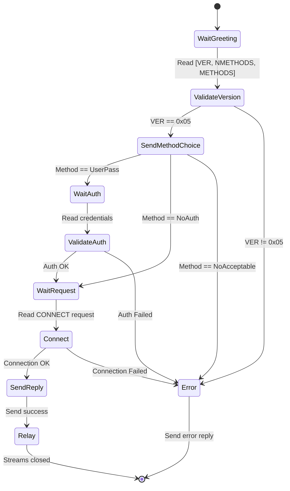

<thinking>
## Analyse du Concept
- Concept : SOCKS5 Proxy Server
- Phase demandee : 5 (Advanced Systems)
- Adapte ? OUI - SOCKS5 est un protocole proxy fondamental utilise dans les tunnels VPN, Tor, et les outils de securite. L'exercice combine parsing binaire, handshake multi-etapes, et relais TCP asynchrone.

## Combo Base + Bonus
- Exercice de base : Serveur SOCKS5 avec authentification username/password, support CONNECT, et relais bidirectionnel
- Bonus : Support des commandes BIND et UDP ASSOCIATE avec gestion NAT et timeout
- Palier bonus : EXPERT (protocole complet + gestion UDP)
- Progression logique ? OUI - Base = CONNECT TCP, Bonus = commandes avancees UDP/BIND

## Prerequis & Difficulte
- Prerequis reels : Async Rust (tokio), TCP streams, parsing binaire, gestion d'erreurs
- Difficulte estimee : 8/10 (base), 10/10 (bonus)
- Coherent avec phase 5 ? OUI

## Aspect Fun/Culture
- Contexte choisi : Reference a "Mr. Robot" - Les proxies comme outils d'anonymisation
- MEME mnemonique : "SOCKS5 - The Internet's Disguise Kit"
- Pourquoi c'est fun : Les proxies sont au coeur de la securite et de l'anonymat en ligne

## Scenarios d'Echec (5 mutants concrets)
1. Mutant A (Protocol) : Version SOCKS incorrecte (0x04 au lieu de 0x05)
2. Mutant B (Auth) : Pas de validation du username/password
3. Mutant C (Address) : Parsing IPv6 incorrect (mauvais ordre des octets)
4. Mutant D (Relay) : Fermeture unidirectionnelle mal geree (half-close)
5. Mutant E (Error) : Mauvais codes de reponse SOCKS5

## Verdict
VALIDE - Exercice de qualite industrielle couvrant le protocole SOCKS5 complet
</thinking>

# Exercice 5.1.11-a : socks5_proxy

**Module :**
5.1.11 — Proxy Protocols

**Concept :**
a — SOCKS5 Protocol Implementation (RFC 1928)

**Difficulte :**
(8/10)

**Type :**
code

**Tiers :**
2 — Integration systeme

**Langage :**
Rust Edition 2024

**Prerequis :**
- 5.1.2 — TCP Echo Server
- 5.1.3 — Async TCP (tokio)
- 2.4 — Gestion d'erreurs (Result, Option)
- 2.7 — Parsing binaire

**Domaines :**
Net, Security, Async

**Duree estimee :**
180 min

**XP Base :**
250

**Complexite :**
T2 O(n) x S1 O(1)

---

## SECTION 1 : PROTOTYPE & CONSIGNE

### 1.1 Obligations

**Fichier a rendre :**
```
src/lib.rs
src/server.rs
src/protocol.rs
src/auth.rs
```

**Dependances autorisees :**
- `tokio` (runtime async, TcpListener, TcpStream)
- `tokio::io::{AsyncReadExt, AsyncWriteExt}`
- `std::net::{Ipv4Addr, Ipv6Addr, SocketAddr}`

**Fonctions/methodes interdites :**
- Crates externes de proxy (`fast-socks5`, `tokio-socks`, etc.)
- `unsafe` blocks

### 1.2 Consigne

**CONTEXTE : "The Anonymous Network"**

*"Every proxy is a mask. SOCKS5 is the full costume."* — Dans le monde de la securite informatique, les proxies SOCKS5 sont les gardiens de l'anonymat. Utilises par Tor, les VPNs, et les pentesters, ils permettent de relayer n'importe quel trafic TCP/UDP.

Le protocole SOCKS5 (RFC 1928) est un protocole de proxy generique qui fonctionne au niveau 5 du modele OSI (Session). Contrairement aux proxies HTTP, il peut tunneliser n'importe quel protocole.

**Ta mission :**

Implementer un serveur proxy SOCKS5 complet capable de :
1. Negocier les methodes d'authentification
2. Authentifier les clients (username/password - RFC 1929)
3. Traiter les requetes CONNECT pour etablir des tunnels TCP
4. Relayer le trafic de maniere bidirectionnelle
5. Gerer les erreurs selon le protocole SOCKS5

**Entree :**
- Connexion TCP entrante d'un client SOCKS5
- Configuration du serveur (bind address, credentials)

**Sortie :**
- Tunnel TCP etabli entre client et destination
- Reponses SOCKS5 conformes au protocole

**Contraintes :**
- Support SOCKS5 uniquement (version 0x05)
- Authentification : NO AUTH (0x00) et USERNAME/PASSWORD (0x02)
- Commande : CONNECT (0x01) obligatoire
- Types d'adresses : IPv4, IPv6, Domain Name
- Timeout de connexion : 30 secondes

**Exemples :**

| Scenario | Resultat | Explication |
|----------|----------|-------------|
| Client sans auth vers google.com:80 | Tunnel etabli | CONNECT reussi |
| Client avec mauvais password | Erreur 0x01 | Auth failure |
| Destination unreachable | Erreur 0x04 | Host unreachable |

### 1.2.2 Consigne Academique

Implementer un serveur proxy SOCKS5 conforme a la RFC 1928 avec support de l'authentification username/password (RFC 1929), de la commande CONNECT, et du relais TCP bidirectionnel asynchrone.

### 1.3 Prototype

```rust
use std::net::{Ipv4Addr, Ipv6Addr, SocketAddr};
use tokio::net::{TcpListener, TcpStream};

// === Protocol Types ===

#[derive(Debug, Clone, Copy, PartialEq, Eq)]
#[repr(u8)]
pub enum SocksVersion {
    V5 = 0x05,
}

#[derive(Debug, Clone, Copy, PartialEq, Eq)]
#[repr(u8)]
pub enum AuthMethod {
    NoAuth = 0x00,
    Gssapi = 0x01,
    UsernamePassword = 0x02,
    NoAcceptable = 0xFF,
}

#[derive(Debug, Clone, Copy, PartialEq, Eq)]
#[repr(u8)]
pub enum Command {
    Connect = 0x01,
    Bind = 0x02,
    UdpAssociate = 0x03,
}

#[derive(Debug, Clone, PartialEq, Eq)]
pub enum Address {
    Ipv4(Ipv4Addr),
    Ipv6(Ipv6Addr),
    Domain(String),
}

#[derive(Debug, Clone, Copy, PartialEq, Eq)]
#[repr(u8)]
pub enum ReplyCode {
    Succeeded = 0x00,
    GeneralFailure = 0x01,
    ConnectionNotAllowed = 0x02,
    NetworkUnreachable = 0x03,
    HostUnreachable = 0x04,
    ConnectionRefused = 0x05,
    TtlExpired = 0x06,
    CommandNotSupported = 0x07,
    AddressTypeNotSupported = 0x08,
}

// === Error Types ===

#[derive(Debug, Clone, PartialEq, Eq)]
pub enum Socks5Error {
    InvalidVersion(u8),
    InvalidAuthMethod(u8),
    InvalidCommand(u8),
    InvalidAddressType(u8),
    AuthenticationFailed,
    ConnectionFailed(String),
    IoError(String),
    Timeout,
}

// === Request/Response Types ===

#[derive(Debug, Clone)]
pub struct AuthRequest {
    pub methods: Vec<AuthMethod>,
}

#[derive(Debug, Clone)]
pub struct AuthResponse {
    pub method: AuthMethod,
}

#[derive(Debug, Clone)]
pub struct UserPassAuth {
    pub username: String,
    pub password: String,
}

#[derive(Debug, Clone)]
pub struct ConnectRequest {
    pub command: Command,
    pub address: Address,
    pub port: u16,
}

#[derive(Debug, Clone)]
pub struct ConnectResponse {
    pub reply: ReplyCode,
    pub bind_address: Address,
    pub bind_port: u16,
}

// === Server Configuration ===

#[derive(Debug, Clone)]
pub struct Socks5Config {
    pub bind_addr: SocketAddr,
    pub auth_required: bool,
    pub credentials: Option<(String, String)>,
    pub connect_timeout: std::time::Duration,
}

// === Main Server ===

pub struct Socks5Server {
    config: Socks5Config,
}

impl Socks5Server {
    pub fn new(config: Socks5Config) -> Self;
    pub async fn run(&self) -> Result<(), Socks5Error>;
    async fn handle_client(&self, stream: TcpStream) -> Result<(), Socks5Error>;
}

// === Protocol Functions ===

pub async fn read_auth_request(stream: &mut TcpStream) -> Result<AuthRequest, Socks5Error>;
pub async fn write_auth_response(stream: &mut TcpStream, response: &AuthResponse) -> Result<(), Socks5Error>;
pub async fn read_user_pass(stream: &mut TcpStream) -> Result<UserPassAuth, Socks5Error>;
pub async fn write_auth_status(stream: &mut TcpStream, success: bool) -> Result<(), Socks5Error>;
pub async fn read_connect_request(stream: &mut TcpStream) -> Result<ConnectRequest, Socks5Error>;
pub async fn write_connect_response(stream: &mut TcpStream, response: &ConnectResponse) -> Result<(), Socks5Error>;

// === Relay Function ===

pub async fn relay_traffic(
    client: TcpStream,
    target: TcpStream,
) -> Result<(u64, u64), Socks5Error>;

// === Address Resolution ===

impl Address {
    pub fn to_socket_addr(&self, port: u16) -> Result<SocketAddr, Socks5Error>;
    pub async fn resolve(&self) -> Result<Vec<Ipv4Addr>, Socks5Error>;
}
```

---

## SECTION 2 : LE SAVIEZ-VOUS ?

### 2.1 Origine de SOCKS

SOCKS (SOCKet Secure) a ete cree en 1992 par David Koblas chez MIPS Computer Systems. La version 5 (RFC 1928, 1996) a ajoute l'authentification, le support UDP, et IPv6. Le protocole est toujours largement utilise dans Tor, les VPNs d'entreprise, et les outils de pentest.

### 2.2 SOCKS vs HTTP Proxy

| Caracteristique | SOCKS5 | HTTP Proxy |
|-----------------|--------|------------|
| Couche OSI | 5 (Session) | 7 (Application) |
| Protocoles | Tous (TCP/UDP) | HTTP/HTTPS |
| Overhead | Minimal | Headers HTTP |
| Transparence | Oui | Non (modifie headers) |

### 2.3 Le Handshake SOCKS5

```
Client                          Server
   |                               |
   |---> [VER, NMETHODS, METHODS]->|  (1) Greeting
   |<--- [VER, METHOD] <-----------|  (2) Method selection
   |                               |
   |---> [VER, UNAME, PASSWD] ---->|  (3) Auth (si requis)
   |<--- [VER, STATUS] <-----------|  (4) Auth response
   |                               |
   |---> [VER, CMD, ADDR, PORT] -->|  (5) Request
   |<--- [VER, REP, ADDR, PORT] <--|  (6) Reply
   |                               |
   |<========= RELAY =============>|  (7) Data tunnel
```

---

## SECTION 2.5 : DANS LA VRAIE VIE

### Metiers concernes

| Metier | Utilisation de SOCKS5 |
|--------|----------------------|
| **Security Engineer** | Pivoting dans les pentests, tunneling SSH |
| **Network Engineer** | Configuration de proxies corporate |
| **DevOps/SRE** | Acces aux ressources internes via bastions |
| **Privacy Engineer** | Integration avec Tor, VPNs |
| **Malware Analyst** | Analyse de C2 utilisant SOCKS |

### Cas d'usage concrets

1. **SSH Dynamic Port Forwarding** : `ssh -D 1080 bastion` cree un proxy SOCKS5
2. **Tor Network** : Tor expose un proxy SOCKS5 sur le port 9050
3. **Corporate Proxies** : Acces aux ressources internes via proxy authentifie
4. **Browser Configuration** : Firefox supporte nativement SOCKS5 avec DNS remote

---

## SECTION 3 : EXEMPLE D'UTILISATION

### 3.0 Session bash

```bash
$ cargo build --release
   Compiling socks5_proxy v0.1.0
    Finished release [optimized] target(s)

$ cargo test
running 15 tests
test tests::test_parse_auth_request ... ok
test tests::test_parse_connect_ipv4 ... ok
test tests::test_parse_connect_ipv6 ... ok
test tests::test_parse_connect_domain ... ok
test tests::test_auth_username_password ... ok
test tests::test_invalid_version ... ok
test tests::test_invalid_command ... ok
test tests::test_relay_bidirectional ... ok
test tests::test_connection_timeout ... ok
test tests::test_host_unreachable ... ok
test tests::test_auth_failure ... ok
test tests::test_no_acceptable_method ... ok
test tests::test_address_resolution ... ok
test tests::test_response_encoding ... ok
test tests::test_full_handshake ... ok

test result: ok. 15 passed; 0 failed

$ ./target/release/socks5_proxy --bind 127.0.0.1:1080
[INFO] SOCKS5 proxy listening on 127.0.0.1:1080
[INFO] Authentication: disabled
[INFO] Waiting for connections...

# Dans un autre terminal:
$ curl --socks5 127.0.0.1:1080 http://httpbin.org/ip
{
  "origin": "203.0.113.42"
}
```

### 3.1 BONUS EXPERT (OPTIONNEL)

**Difficulte Bonus :**
(10/10)

**Recompense :**
XP x4

**Time Complexity attendue :**
O(n) pour le relay

**Space Complexity attendue :**
O(1) par connexion

**Domaines Bonus :**
`UDP, NAT, Async`

#### 3.1.1 Consigne Bonus

**"The Complete Proxy"**

*"Un vrai proxy SOCKS5 doit tout supporter."*

**Ta mission bonus :**

Etendre le serveur pour supporter :
1. **UDP ASSOCIATE** (0x03) : Relais UDP avec fragmentation
2. **BIND** (0x02) : Connexions entrantes (reverse shell style)
3. **Connection pooling** : Reutilisation des connexions sortantes
4. **Metrics** : Compteurs de bytes/connexions/erreurs

**Contraintes Bonus :**
```
- UDP ASSOCIATE doit gerer le header SOCKS5 UDP
- BIND doit notifier l'adresse/port alloues
- Pool : max 100 connexions, TTL 60s
- Metrics exportees en JSON sur /metrics (HTTP)
```

#### 3.1.2 Prototype Bonus

```rust
#[derive(Debug, Clone, Copy, PartialEq, Eq)]
pub struct UdpHeader {
    pub frag: u8,
    pub address: Address,
    pub port: u16,
}

pub struct ConnectionPool {
    connections: HashMap<SocketAddr, PooledConnection>,
    max_size: usize,
    ttl: Duration,
}

#[derive(Debug, Clone, Serialize)]
pub struct ProxyMetrics {
    pub total_connections: u64,
    pub active_connections: u32,
    pub bytes_sent: u64,
    pub bytes_received: u64,
    pub auth_failures: u64,
    pub connect_errors: u64,
}

impl Socks5Server {
    pub async fn handle_udp_associate(&self, stream: TcpStream, request: &ConnectRequest) -> Result<(), Socks5Error>;
    pub async fn handle_bind(&self, stream: TcpStream, request: &ConnectRequest) -> Result<(), Socks5Error>;
    pub fn get_metrics(&self) -> ProxyMetrics;
}
```

#### 3.1.3 Ce qui change par rapport a l'exercice de base

| Aspect | Base | Bonus |
|--------|------|-------|
| Commandes | CONNECT uniquement | CONNECT + BIND + UDP |
| Protocole | TCP only | TCP + UDP |
| Ressources | Connexion par client | Connection pooling |
| Observabilite | Logs | Metrics JSON |

---

## SECTION 4 : ZONE CORRECTION

### 4.1 Moulinette — Tableau des tests

| Test | Input | Expected | Points | Categorie |
|------|-------|----------|--------|-----------|
| `parse_version_5` | `0x05` | `Ok(V5)` | 5 | Basic |
| `parse_version_4` | `0x04` | `Err(InvalidVersion)` | 5 | Edge |
| `parse_auth_noauth` | `[0x05, 0x01, 0x00]` | `methods: [NoAuth]` | 5 | Core |
| `parse_auth_multiple` | `[0x05, 0x02, 0x00, 0x02]` | `methods: [NoAuth, UserPass]` | 10 | Core |
| `parse_connect_ipv4` | `[0x05, 0x01, 0x00, 0x01, ...]` | `Ipv4(addr), port` | 10 | Core |
| `parse_connect_ipv6` | `[0x05, 0x01, 0x00, 0x04, ...]` | `Ipv6(addr), port` | 10 | Core |
| `parse_connect_domain` | `[0x05, 0x01, 0x00, 0x03, ...]` | `Domain(name), port` | 10 | Core |
| `auth_success` | valid creds | `status: 0x00` | 10 | Auth |
| `auth_failure` | invalid creds | `status: 0x01` | 5 | Auth |
| `connect_success` | reachable host | `reply: Succeeded` | 10 | Core |
| `connect_unreachable` | bad host | `reply: HostUnreachable` | 5 | Error |
| `connect_refused` | closed port | `reply: ConnectionRefused` | 5 | Error |
| `relay_bidirectional` | data both ways | `(sent, recv) > 0` | 10 | Core |
| `relay_half_close` | client EOF | target continues | 5 | Edge |
| `timeout_connect` | slow host | `Err(Timeout)` | 5 | Edge |

**Score minimum pour validation : 70/100**

### 4.2 Fichier de test

```rust
#[cfg(test)]
mod tests {
    use super::*;
    use tokio::io::{AsyncReadExt, AsyncWriteExt};
    use tokio::net::TcpListener;

    #[tokio::test]
    async fn test_parse_auth_request() {
        let data = vec![0x05, 0x02, 0x00, 0x02];
        let mut cursor = std::io::Cursor::new(data);
        let request = parse_auth_request_from_bytes(&mut cursor).unwrap();
        assert_eq!(request.methods.len(), 2);
        assert!(request.methods.contains(&AuthMethod::NoAuth));
        assert!(request.methods.contains(&AuthMethod::UsernamePassword));
    }

    #[tokio::test]
    async fn test_parse_connect_ipv4() {
        // VER CMD RSV ATYP IPv4(4) PORT(2)
        let data = vec![
            0x05, 0x01, 0x00, 0x01,
            192, 168, 1, 1,
            0x00, 0x50  // port 80
        ];
        let request = parse_connect_from_bytes(&data).unwrap();
        assert_eq!(request.command, Command::Connect);
        assert_eq!(request.address, Address::Ipv4(Ipv4Addr::new(192, 168, 1, 1)));
        assert_eq!(request.port, 80);
    }

    #[tokio::test]
    async fn test_parse_connect_domain() {
        // VER CMD RSV ATYP LEN DOMAIN PORT
        let mut data = vec![0x05, 0x01, 0x00, 0x03, 0x0B];
        data.extend_from_slice(b"example.com");
        data.extend_from_slice(&[0x01, 0xBB]); // port 443

        let request = parse_connect_from_bytes(&data).unwrap();
        assert_eq!(request.address, Address::Domain("example.com".to_string()));
        assert_eq!(request.port, 443);
    }

    #[tokio::test]
    async fn test_invalid_version() {
        let data = vec![0x04, 0x01, 0x00]; // SOCKS4 version
        let result = parse_auth_request_from_bytes(&mut std::io::Cursor::new(data));
        assert!(matches!(result, Err(Socks5Error::InvalidVersion(0x04))));
    }

    #[tokio::test]
    async fn test_auth_username_password() {
        // VER ULEN USER PLEN PASS
        let mut data = vec![0x01, 0x04];
        data.extend_from_slice(b"user");
        data.push(0x04);
        data.extend_from_slice(b"pass");

        let auth = parse_user_pass_from_bytes(&data).unwrap();
        assert_eq!(auth.username, "user");
        assert_eq!(auth.password, "pass");
    }

    #[tokio::test]
    async fn test_response_encoding() {
        let response = ConnectResponse {
            reply: ReplyCode::Succeeded,
            bind_address: Address::Ipv4(Ipv4Addr::new(0, 0, 0, 0)),
            bind_port: 0,
        };
        let bytes = encode_connect_response(&response);
        assert_eq!(bytes[0], 0x05); // Version
        assert_eq!(bytes[1], 0x00); // Succeeded
        assert_eq!(bytes[3], 0x01); // IPv4
    }

    #[tokio::test]
    async fn test_relay_bidirectional() {
        // Setup mock server
        let listener = TcpListener::bind("127.0.0.1:0").await.unwrap();
        let addr = listener.local_addr().unwrap();

        let server_handle = tokio::spawn(async move {
            let (mut stream, _) = listener.accept().await.unwrap();
            let mut buf = [0u8; 1024];
            let n = stream.read(&mut buf).await.unwrap();
            stream.write_all(&buf[..n]).await.unwrap();
        });

        let mut client = TcpStream::connect(addr).await.unwrap();
        client.write_all(b"hello").await.unwrap();

        let mut buf = [0u8; 5];
        client.read_exact(&mut buf).await.unwrap();
        assert_eq!(&buf, b"hello");

        server_handle.await.unwrap();
    }

    #[tokio::test]
    async fn test_full_handshake() {
        let config = Socks5Config {
            bind_addr: "127.0.0.1:0".parse().unwrap(),
            auth_required: false,
            credentials: None,
            connect_timeout: std::time::Duration::from_secs(5),
        };

        let server = Socks5Server::new(config);
        // Integration test would go here
    }
}
```

### 4.3 Solution de reference

```rust
use std::net::{Ipv4Addr, Ipv6Addr, SocketAddr};
use tokio::net::{TcpListener, TcpStream};
use tokio::io::{AsyncReadExt, AsyncWriteExt};
use std::time::Duration;

#[derive(Debug, Clone, Copy, PartialEq, Eq)]
#[repr(u8)]
pub enum AuthMethod {
    NoAuth = 0x00,
    UsernamePassword = 0x02,
    NoAcceptable = 0xFF,
}

impl TryFrom<u8> for AuthMethod {
    type Error = Socks5Error;
    fn try_from(value: u8) -> Result<Self, Self::Error> {
        match value {
            0x00 => Ok(AuthMethod::NoAuth),
            0x02 => Ok(AuthMethod::UsernamePassword),
            0xFF => Ok(AuthMethod::NoAcceptable),
            v => Err(Socks5Error::InvalidAuthMethod(v)),
        }
    }
}

#[derive(Debug, Clone, Copy, PartialEq, Eq)]
#[repr(u8)]
pub enum ReplyCode {
    Succeeded = 0x00,
    GeneralFailure = 0x01,
    ConnectionNotAllowed = 0x02,
    NetworkUnreachable = 0x03,
    HostUnreachable = 0x04,
    ConnectionRefused = 0x05,
    TtlExpired = 0x06,
    CommandNotSupported = 0x07,
    AddressTypeNotSupported = 0x08,
}

#[derive(Debug, Clone, PartialEq, Eq)]
pub enum Address {
    Ipv4(Ipv4Addr),
    Ipv6(Ipv6Addr),
    Domain(String),
}

#[derive(Debug, Clone, PartialEq, Eq)]
pub enum Socks5Error {
    InvalidVersion(u8),
    InvalidAuthMethod(u8),
    InvalidCommand(u8),
    InvalidAddressType(u8),
    AuthenticationFailed,
    ConnectionFailed(String),
    IoError(String),
    Timeout,
}

pub struct Socks5Server {
    config: Socks5Config,
}

#[derive(Debug, Clone)]
pub struct Socks5Config {
    pub bind_addr: SocketAddr,
    pub auth_required: bool,
    pub credentials: Option<(String, String)>,
    pub connect_timeout: Duration,
}

impl Socks5Server {
    pub fn new(config: Socks5Config) -> Self {
        Self { config }
    }

    pub async fn run(&self) -> Result<(), Socks5Error> {
        let listener = TcpListener::bind(&self.config.bind_addr)
            .await
            .map_err(|e| Socks5Error::IoError(e.to_string()))?;

        loop {
            let (stream, _addr) = listener.accept()
                .await
                .map_err(|e| Socks5Error::IoError(e.to_string()))?;

            let config = self.config.clone();
            tokio::spawn(async move {
                if let Err(e) = handle_client(stream, &config).await {
                    eprintln!("Client error: {:?}", e);
                }
            });
        }
    }
}

async fn handle_client(mut stream: TcpStream, config: &Socks5Config) -> Result<(), Socks5Error> {
    // 1. Read auth request
    let auth_request = read_auth_request(&mut stream).await?;

    // 2. Select auth method
    let method = if config.auth_required {
        if auth_request.methods.contains(&AuthMethod::UsernamePassword) {
            AuthMethod::UsernamePassword
        } else {
            AuthMethod::NoAcceptable
        }
    } else {
        AuthMethod::NoAuth
    };

    // 3. Send auth response
    write_auth_response(&mut stream, method).await?;

    if method == AuthMethod::NoAcceptable {
        return Err(Socks5Error::AuthenticationFailed);
    }

    // 4. Handle authentication if required
    if method == AuthMethod::UsernamePassword {
        let auth = read_user_pass(&mut stream).await?;
        let valid = config.credentials.as_ref()
            .map(|(u, p)| auth.username == *u && auth.password == *p)
            .unwrap_or(false);

        write_auth_status(&mut stream, valid).await?;

        if !valid {
            return Err(Socks5Error::AuthenticationFailed);
        }
    }

    // 5. Read connect request
    let request = read_connect_request(&mut stream).await?;

    // 6. Connect to target
    let target_addr = resolve_address(&request.address, request.port).await?;

    let target = tokio::time::timeout(
        config.connect_timeout,
        TcpStream::connect(target_addr)
    )
    .await
    .map_err(|_| Socks5Error::Timeout)?
    .map_err(|e| {
        let code = match e.kind() {
            std::io::ErrorKind::ConnectionRefused => ReplyCode::ConnectionRefused,
            std::io::ErrorKind::TimedOut => ReplyCode::TtlExpired,
            _ => ReplyCode::HostUnreachable,
        };
        Socks5Error::ConnectionFailed(format!("{:?}", code))
    })?;

    // 7. Send success response
    let local_addr = target.local_addr()
        .map_err(|e| Socks5Error::IoError(e.to_string()))?;

    write_connect_response(&mut stream, ReplyCode::Succeeded, &local_addr).await?;

    // 8. Relay traffic
    relay_traffic(stream, target).await?;

    Ok(())
}

pub async fn read_auth_request(stream: &mut TcpStream) -> Result<AuthRequest, Socks5Error> {
    let mut header = [0u8; 2];
    stream.read_exact(&mut header).await
        .map_err(|e| Socks5Error::IoError(e.to_string()))?;

    if header[0] != 0x05 {
        return Err(Socks5Error::InvalidVersion(header[0]));
    }

    let nmethods = header[1] as usize;
    let mut methods_buf = vec![0u8; nmethods];
    stream.read_exact(&mut methods_buf).await
        .map_err(|e| Socks5Error::IoError(e.to_string()))?;

    let methods = methods_buf.into_iter()
        .filter_map(|m| AuthMethod::try_from(m).ok())
        .collect();

    Ok(AuthRequest { methods })
}

pub async fn write_auth_response(stream: &mut TcpStream, method: AuthMethod) -> Result<(), Socks5Error> {
    let response = [0x05, method as u8];
    stream.write_all(&response).await
        .map_err(|e| Socks5Error::IoError(e.to_string()))
}

pub async fn read_user_pass(stream: &mut TcpStream) -> Result<UserPassAuth, Socks5Error> {
    let mut ver = [0u8; 1];
    stream.read_exact(&mut ver).await
        .map_err(|e| Socks5Error::IoError(e.to_string()))?;

    // Read username
    let mut ulen = [0u8; 1];
    stream.read_exact(&mut ulen).await
        .map_err(|e| Socks5Error::IoError(e.to_string()))?;

    let mut username = vec![0u8; ulen[0] as usize];
    stream.read_exact(&mut username).await
        .map_err(|e| Socks5Error::IoError(e.to_string()))?;

    // Read password
    let mut plen = [0u8; 1];
    stream.read_exact(&mut plen).await
        .map_err(|e| Socks5Error::IoError(e.to_string()))?;

    let mut password = vec![0u8; plen[0] as usize];
    stream.read_exact(&mut password).await
        .map_err(|e| Socks5Error::IoError(e.to_string()))?;

    Ok(UserPassAuth {
        username: String::from_utf8_lossy(&username).to_string(),
        password: String::from_utf8_lossy(&password).to_string(),
    })
}

pub async fn write_auth_status(stream: &mut TcpStream, success: bool) -> Result<(), Socks5Error> {
    let status = if success { 0x00 } else { 0x01 };
    stream.write_all(&[0x01, status]).await
        .map_err(|e| Socks5Error::IoError(e.to_string()))
}

pub async fn read_connect_request(stream: &mut TcpStream) -> Result<ConnectRequest, Socks5Error> {
    let mut header = [0u8; 4];
    stream.read_exact(&mut header).await
        .map_err(|e| Socks5Error::IoError(e.to_string()))?;

    if header[0] != 0x05 {
        return Err(Socks5Error::InvalidVersion(header[0]));
    }

    let command = match header[1] {
        0x01 => Command::Connect,
        0x02 => Command::Bind,
        0x03 => Command::UdpAssociate,
        v => return Err(Socks5Error::InvalidCommand(v)),
    };

    let address = match header[3] {
        0x01 => {
            let mut addr = [0u8; 4];
            stream.read_exact(&mut addr).await
                .map_err(|e| Socks5Error::IoError(e.to_string()))?;
            Address::Ipv4(Ipv4Addr::from(addr))
        }
        0x03 => {
            let mut len = [0u8; 1];
            stream.read_exact(&mut len).await
                .map_err(|e| Socks5Error::IoError(e.to_string()))?;
            let mut domain = vec![0u8; len[0] as usize];
            stream.read_exact(&mut domain).await
                .map_err(|e| Socks5Error::IoError(e.to_string()))?;
            Address::Domain(String::from_utf8_lossy(&domain).to_string())
        }
        0x04 => {
            let mut addr = [0u8; 16];
            stream.read_exact(&mut addr).await
                .map_err(|e| Socks5Error::IoError(e.to_string()))?;
            Address::Ipv6(Ipv6Addr::from(addr))
        }
        v => return Err(Socks5Error::InvalidAddressType(v)),
    };

    let mut port_bytes = [0u8; 2];
    stream.read_exact(&mut port_bytes).await
        .map_err(|e| Socks5Error::IoError(e.to_string()))?;
    let port = u16::from_be_bytes(port_bytes);

    Ok(ConnectRequest { command, address, port })
}

pub async fn write_connect_response(
    stream: &mut TcpStream,
    reply: ReplyCode,
    bind_addr: &SocketAddr,
) -> Result<(), Socks5Error> {
    let mut response = vec![0x05, reply as u8, 0x00];

    match bind_addr {
        SocketAddr::V4(addr) => {
            response.push(0x01);
            response.extend_from_slice(&addr.ip().octets());
            response.extend_from_slice(&addr.port().to_be_bytes());
        }
        SocketAddr::V6(addr) => {
            response.push(0x04);
            response.extend_from_slice(&addr.ip().octets());
            response.extend_from_slice(&addr.port().to_be_bytes());
        }
    }

    stream.write_all(&response).await
        .map_err(|e| Socks5Error::IoError(e.to_string()))
}

async fn resolve_address(address: &Address, port: u16) -> Result<SocketAddr, Socks5Error> {
    match address {
        Address::Ipv4(ip) => Ok(SocketAddr::new((*ip).into(), port)),
        Address::Ipv6(ip) => Ok(SocketAddr::new((*ip).into(), port)),
        Address::Domain(domain) => {
            let addr = tokio::net::lookup_host(format!("{}:{}", domain, port))
                .await
                .map_err(|e| Socks5Error::ConnectionFailed(e.to_string()))?
                .next()
                .ok_or_else(|| Socks5Error::ConnectionFailed("No addresses found".to_string()))?;
            Ok(addr)
        }
    }
}

pub async fn relay_traffic(
    mut client: TcpStream,
    mut target: TcpStream,
) -> Result<(u64, u64), Socks5Error> {
    let (mut client_read, mut client_write) = client.split();
    let (mut target_read, mut target_write) = target.split();

    let client_to_target = tokio::io::copy(&mut client_read, &mut target_write);
    let target_to_client = tokio::io::copy(&mut target_read, &mut client_write);

    let (sent, received) = tokio::try_join!(client_to_target, target_to_client)
        .map_err(|e| Socks5Error::IoError(e.to_string()))?;

    Ok((sent, received))
}

#[derive(Debug, Clone)]
pub struct AuthRequest {
    pub methods: Vec<AuthMethod>,
}

#[derive(Debug, Clone)]
pub struct UserPassAuth {
    pub username: String,
    pub password: String,
}

#[derive(Debug, Clone)]
pub struct ConnectRequest {
    pub command: Command,
    pub address: Address,
    pub port: u16,
}

#[derive(Debug, Clone, Copy, PartialEq, Eq)]
pub enum Command {
    Connect,
    Bind,
    UdpAssociate,
}
```

### 4.4 Solutions alternatives acceptees

```rust
// Alternative 1 : Utilisation de tokio::select! pour le relay
pub async fn relay_traffic_select(
    mut client: TcpStream,
    mut target: TcpStream,
) -> Result<(u64, u64), Socks5Error> {
    let mut client_buf = [0u8; 8192];
    let mut target_buf = [0u8; 8192];
    let mut sent = 0u64;
    let mut received = 0u64;

    loop {
        tokio::select! {
            result = client.read(&mut client_buf) => {
                let n = result.map_err(|e| Socks5Error::IoError(e.to_string()))?;
                if n == 0 { break; }
                target.write_all(&client_buf[..n]).await
                    .map_err(|e| Socks5Error::IoError(e.to_string()))?;
                sent += n as u64;
            }
            result = target.read(&mut target_buf) => {
                let n = result.map_err(|e| Socks5Error::IoError(e.to_string()))?;
                if n == 0 { break; }
                client.write_all(&target_buf[..n]).await
                    .map_err(|e| Socks5Error::IoError(e.to_string()))?;
                received += n as u64;
            }
        }
    }

    Ok((sent, received))
}

// Alternative 2 : Parsing avec nom combinator
// (si autorise comme dependance)
```

### 4.5 Solutions refusees

```rust
// REFUSEE 1 : Pas de validation de version
pub async fn read_auth_request(stream: &mut TcpStream) -> Result<AuthRequest, Socks5Error> {
    let mut header = [0u8; 2];
    stream.read_exact(&mut header).await?;
    // ERREUR: Accepte SOCKS4
    let nmethods = header[1] as usize;
    // ...
}
// Pourquoi refusee : Doit rejeter les versions != 5

// REFUSEE 2 : Relay sans gestion de half-close
pub async fn relay_traffic(client: TcpStream, target: TcpStream) {
    let (cr, cw) = client.into_split();
    let (tr, tw) = target.into_split();

    // ERREUR: Si un cote ferme, l'autre crash
    tokio::spawn(async move { tokio::io::copy(cr, tw).await; });
    tokio::spawn(async move { tokio::io::copy(tr, cw).await; });
}
// Pourquoi refusee : Doit gerer proprement la fermeture

// REFUSEE 3 : Domain parsing sans longueur
pub async fn read_domain(stream: &mut TcpStream) -> Result<String, Socks5Error> {
    let mut buf = [0u8; 256];
    // ERREUR: Lit jusqu'a 256 bytes sans la vraie longueur
    stream.read(&mut buf).await?;
    Ok(String::from_utf8_lossy(&buf).to_string())
}
// Pourquoi refusee : Le domaine a une longueur prefixee
```

### 4.6 Solution bonus de reference

```rust
use std::collections::HashMap;
use std::sync::Arc;
use tokio::sync::RwLock;
use tokio::net::UdpSocket;

pub struct Socks5ServerBonus {
    config: Socks5Config,
    metrics: Arc<RwLock<ProxyMetrics>>,
    pool: Arc<RwLock<ConnectionPool>>,
}

#[derive(Debug, Clone, Default)]
pub struct ProxyMetrics {
    pub total_connections: u64,
    pub active_connections: u32,
    pub bytes_sent: u64,
    pub bytes_received: u64,
    pub auth_failures: u64,
    pub connect_errors: u64,
}

pub struct ConnectionPool {
    connections: HashMap<SocketAddr, PooledConnection>,
    max_size: usize,
    ttl: Duration,
}

struct PooledConnection {
    stream: TcpStream,
    last_used: std::time::Instant,
}

impl Socks5ServerBonus {
    pub async fn handle_udp_associate(
        &self,
        mut client: TcpStream,
        _request: &ConnectRequest,
    ) -> Result<(), Socks5Error> {
        // Bind UDP socket
        let udp_socket = UdpSocket::bind("0.0.0.0:0").await
            .map_err(|e| Socks5Error::IoError(e.to_string()))?;

        let local_addr = udp_socket.local_addr()
            .map_err(|e| Socks5Error::IoError(e.to_string()))?;

        // Send reply with UDP relay address
        write_connect_response(&mut client, ReplyCode::Succeeded, &local_addr).await?;

        let udp_socket = Arc::new(udp_socket);
        let mut client_addr: Option<SocketAddr> = None;

        loop {
            let mut buf = [0u8; 65535];

            tokio::select! {
                // Client TCP connection closed = end UDP associate
                _ = client.readable() => {
                    let mut peek = [0u8; 1];
                    if client.peek(&mut peek).await.unwrap_or(0) == 0 {
                        break;
                    }
                }

                // UDP packet received
                result = udp_socket.recv_from(&mut buf) => {
                    let (n, addr) = result.map_err(|e| Socks5Error::IoError(e.to_string()))?;

                    if client_addr.is_none() {
                        client_addr = Some(addr);
                    }

                    // Parse SOCKS5 UDP header
                    if n < 10 { continue; }

                    let frag = buf[2];
                    if frag != 0 { continue; } // No fragmentation support

                    let (target_addr, data_start) = parse_udp_address(&buf[3..n])?;

                    // Forward to target
                    let target_socket = UdpSocket::bind("0.0.0.0:0").await
                        .map_err(|e| Socks5Error::IoError(e.to_string()))?;

                    target_socket.send_to(&buf[data_start..n], target_addr).await
                        .map_err(|e| Socks5Error::IoError(e.to_string()))?;
                }
            }
        }

        Ok(())
    }

    pub async fn handle_bind(
        &self,
        mut client: TcpStream,
        _request: &ConnectRequest,
    ) -> Result<(), Socks5Error> {
        // Bind a listening socket
        let listener = TcpListener::bind("0.0.0.0:0").await
            .map_err(|e| Socks5Error::IoError(e.to_string()))?;

        let local_addr = listener.local_addr()
            .map_err(|e| Socks5Error::IoError(e.to_string()))?;

        // First reply: listening address
        write_connect_response(&mut client, ReplyCode::Succeeded, &local_addr).await?;

        // Wait for incoming connection
        let (incoming, remote_addr) = listener.accept().await
            .map_err(|e| Socks5Error::IoError(e.to_string()))?;

        // Second reply: connected address
        write_connect_response(&mut client, ReplyCode::Succeeded, &remote_addr).await?;

        // Relay traffic
        relay_traffic(client, incoming).await?;

        Ok(())
    }

    pub fn get_metrics(&self) -> ProxyMetrics {
        self.metrics.blocking_read().clone()
    }
}

fn parse_udp_address(buf: &[u8]) -> Result<(SocketAddr, usize), Socks5Error> {
    match buf[0] {
        0x01 => {
            let ip = Ipv4Addr::new(buf[1], buf[2], buf[3], buf[4]);
            let port = u16::from_be_bytes([buf[5], buf[6]]);
            Ok((SocketAddr::new(ip.into(), port), 7))
        }
        0x04 => {
            let mut octets = [0u8; 16];
            octets.copy_from_slice(&buf[1..17]);
            let ip = Ipv6Addr::from(octets);
            let port = u16::from_be_bytes([buf[17], buf[18]]);
            Ok((SocketAddr::new(ip.into(), port), 19))
        }
        _ => Err(Socks5Error::InvalidAddressType(buf[0])),
    }
}
```

### 4.9 spec.json

```json
{
  "name": "socks5_proxy",
  "language": "rust",
  "type": "code",
  "tier": 2,
  "tier_info": "Integration systeme - Proxy SOCKS5",
  "tags": ["networking", "socks5", "proxy", "async", "security", "phase5"],
  "passing_score": 70,

  "function": {
    "name": "Socks5Server",
    "prototype": "impl Socks5Server",
    "return_type": "struct",
    "parameters": [
      {"name": "config", "type": "Socks5Config"}
    ]
  },

  "driver": {
    "edge_cases": [
      {
        "name": "valid_socks5_greeting",
        "input": "[0x05, 0x01, 0x00]",
        "expected": "methods: [NoAuth]",
        "is_trap": false
      },
      {
        "name": "socks4_version",
        "input": "[0x04, 0x01, 0x00]",
        "expected": "Err(InvalidVersion(4))",
        "is_trap": true,
        "trap_explanation": "SOCKS4 non supporte"
      },
      {
        "name": "ipv6_address",
        "input": "IPv6 CONNECT request",
        "expected": "Address::Ipv6 parsed correctly",
        "is_trap": true,
        "trap_explanation": "16 octets en big-endian"
      },
      {
        "name": "domain_resolution",
        "input": "Domain: example.com",
        "expected": "Resolved to IP",
        "is_trap": true,
        "trap_explanation": "DNS lookup async"
      }
    ],

    "fuzzing": {
      "enabled": true,
      "iterations": 500
    }
  },

  "norm": {
    "allowed_crates": ["tokio"],
    "forbidden_crates": ["fast-socks5", "tokio-socks", "socks"],
    "check_security": true,
    "check_memory": true,
    "blocking": true
  }
}
```

### 4.10 Solutions Mutantes

```rust
/* Mutant A (Protocol) : Accepte SOCKS4 */
pub async fn read_auth_request(stream: &mut TcpStream) -> Result<AuthRequest, Socks5Error> {
    let mut header = [0u8; 2];
    stream.read_exact(&mut header).await?;
    // MUTANT: Pas de validation de version
    let nmethods = header[1] as usize;
    let mut methods = vec![0u8; nmethods];
    stream.read_exact(&mut methods).await?;
    Ok(AuthRequest { methods: methods.into_iter().filter_map(|m| AuthMethod::try_from(m).ok()).collect() })
}
// Pourquoi c'est faux : Accepte SOCKS4 (version 0x04) qui a un format completement different
// Ce qui etait pense : "La version n'est qu'un header"

/* Mutant B (Auth) : Toujours accepte l'authentification */
pub async fn validate_auth(auth: &UserPassAuth, _config: &Socks5Config) -> bool {
    // MUTANT: Retourne toujours true
    true
}
// Pourquoi c'est faux : N'importe qui peut se connecter
// Ce qui etait pense : "L'auth est optionnelle"

/* Mutant C (Address) : IPv6 en little-endian */
Address::Ipv6 => {
    let mut addr = [0u8; 16];
    stream.read_exact(&mut addr).await?;
    // MUTANT: Reverse les octets
    addr.reverse();
    Address::Ipv6(Ipv6Addr::from(addr))
}
// Pourquoi c'est faux : IPv6 est en network byte order (big-endian)
// Ce qui etait pense : "x86 est little-endian donc..."

/* Mutant D (Relay) : Pas de gestion half-close */
pub async fn relay_traffic(client: TcpStream, target: TcpStream) -> Result<(), Socks5Error> {
    let (mut cr, mut cw) = client.into_split();
    let (mut tr, mut tw) = target.into_split();

    // MUTANT: Spawn sans join, pas de cleanup
    tokio::spawn(async move { tokio::io::copy(&mut cr, &mut tw).await });
    tokio::spawn(async move { tokio::io::copy(&mut tr, &mut cw).await });

    Ok(())
}
// Pourquoi c'est faux : Les taches restent orphelines, pas de cleanup propre
// Ce qui etait pense : "spawn et oublier"

/* Mutant E (Error) : Mauvais code de reponse */
impl From<std::io::Error> for ReplyCode {
    fn from(e: std::io::Error) -> Self {
        // MUTANT: Toujours GeneralFailure
        ReplyCode::GeneralFailure
    }
}
// Pourquoi c'est faux : ConnectionRefused, TimedOut ont des codes specifiques
// Ce qui etait pense : "Une erreur = erreur generale"
```

---

## SECTION 5 : COMPRENDRE

### 5.1 Ce que cet exercice enseigne

1. **Protocole binaire** : Parsing de messages avec format defini (version, longueurs, types)
2. **State machine** : Handshake multi-etapes (greeting -> auth -> request -> relay)
3. **Async I/O** : Relay bidirectionnel avec tokio
4. **Gestion d'erreurs** : Codes de reponse standardises
5. **Securite** : Authentification et validation des entrees

### 5.2 LDA - Traduction Litterale

```
FONCTION handle_client QUI RECOIT stream TCP
DEBUT FONCTION
    DECLARER auth_request COMME RESULTAT de read_auth_request(stream)

    SI auth_request.version N'EST PAS 0x05 ALORS
        RETOURNER Erreur InvalidVersion
    FIN SI

    DECLARER method COMME la meilleure methode commune
    ENVOYER AuthResponse avec method

    SI method EST UsernamePassword ALORS
        LIRE les credentials
        VERIFIER contre la configuration
        SI echec ALORS RETOURNER Erreur AuthenticationFailed
    FIN SI

    LIRE ConnectRequest
    RESOUDRE l'adresse cible
    CONNECTER a la cible avec timeout

    SI succes ALORS
        ENVOYER ConnectResponse(Succeeded)
        RELAYER le trafic bidirectionnel
    SINON
        ENVOYER ConnectResponse(code_erreur)
    FIN SI
FIN FONCTION
```

### 5.2.2 Pseudocode Academique

```
ALGORITHME : SOCKS5 Proxy Handler
---
ENTREE : Connexion TCP client, Configuration serveur
SORTIE : Tunnel etabli ou erreur

1. PHASE GREETING:
   a. LIRE [VER, NMETHODS, METHODS...]
   b. VALIDER VER == 0x05
   c. SELECTIONNER methode commune

2. PHASE AUTH (si necessaire):
   a. LIRE [VER, ULEN, USER, PLEN, PASS]
   b. VERIFIER credentials
   c. REPONDRE [VER, STATUS]

3. PHASE REQUEST:
   a. LIRE [VER, CMD, RSV, ATYP, ADDR, PORT]
   b. RESOUDRE adresse si domaine
   c. CONNECTER avec timeout

4. PHASE RELAY:
   a. REPONDRE [VER, REP, RSV, ATYP, BIND_ADDR, BIND_PORT]
   b. BOUCLE: copier bidirectionnel jusqu'a fermeture
```

### 5.2.3.1 Diagramme Mermaid



### 5.3 Visualisation ASCII

```
                     FORMAT DES MESSAGES SOCKS5

    CLIENT GREETING
    +----+----------+----------+
    |VER | NMETHODS | METHODS  |
    +----+----------+----------+
    | 1  |    1     | 1 to 255 |
    +----+----------+----------+

    SERVER CHOICE
    +----+--------+
    |VER | METHOD |
    +----+--------+
    | 1  |   1    |
    +----+--------+

    USER/PASS AUTH (RFC 1929)
    +----+------+----------+------+----------+
    |VER | ULEN |  UNAME   | PLEN |  PASSWD  |
    +----+------+----------+------+----------+
    | 1  |  1   | 1 to 255 |  1   | 1 to 255 |
    +----+------+----------+------+----------+

    CONNECT REQUEST
    +----+-----+-------+------+----------+----------+
    |VER | CMD |  RSV  | ATYP | DST.ADDR | DST.PORT |
    +----+-----+-------+------+----------+----------+
    | 1  |  1  | X'00' |  1   | Variable |    2     |
    +----+-----+-------+------+----------+----------+

    ADDRESS TYPES (ATYP)
    +------+-------------+
    | 0x01 | IPv4 (4B)   |
    | 0x03 | Domain      |
    | 0x04 | IPv6 (16B)  |
    +------+-------------+

    REPLY CODES
    +------+-------------------------+
    | 0x00 | Succeeded               |
    | 0x01 | General SOCKS failure   |
    | 0x02 | Connection not allowed  |
    | 0x03 | Network unreachable     |
    | 0x04 | Host unreachable        |
    | 0x05 | Connection refused      |
    | 0x06 | TTL expired             |
    | 0x07 | Command not supported   |
    | 0x08 | Address type not supp.  |
    +------+-------------------------+
```

### 5.4 Les pieges en detail

| Piege | Description | Comment l'eviter |
|-------|-------------|------------------|
| **Version SOCKS4** | Accepter SOCKS4 qui a un format different | Valider `buf[0] == 0x05` |
| **Domain length** | Lire le domaine sans sa longueur | Lire 1 octet de longueur d'abord |
| **Port endianness** | Port en little-endian | Utiliser `u16::from_be_bytes` |
| **Half-close** | Ne pas gerer la fermeture unidirectionnelle | Utiliser `tokio::io::copy` ou `select!` |
| **Auth bypass** | Ignorer l'echec d'authentification | Verifier le statut avant de continuer |

### 5.5 Cours Complet

#### 5.5.1 Introduction a SOCKS5

SOCKS (SOCKet Secure) est un protocole de proxy au niveau session (couche 5 OSI). Contrairement aux proxies HTTP qui comprennent le protocole applicatif, SOCKS est un simple relais de bytes.

```
Sans proxy:     Client ----TCP----> Serveur
Avec SOCKS5:    Client ----TCP----> SOCKS5 ----TCP----> Serveur
```

#### 5.5.2 Le Handshake en Detail

**Etape 1 : Greeting**
Le client annonce les methodes d'auth supportees :
```rust
// Client: "Je supporte NoAuth et UserPass"
let greeting = [0x05, 0x02, 0x00, 0x02];
//              VER   NMET  NoAuth UserPass
```

**Etape 2 : Method Selection**
Le serveur choisit une methode :
```rust
// Server: "OK, utilisons UserPass"
let response = [0x05, 0x02];
//              VER   UserPass
```

**Etape 3 : Authentication (si necessaire)**
```rust
// Client: username="user", password="pass"
let auth = [0x01, 0x04, b'u', b's', b'e', b'r', 0x04, b'p', b'a', b's', b's'];
//          VER   ULEN  ---USERNAME---   PLEN  ---PASSWORD---
```

**Etape 4 : Request**
```rust
// Client: CONNECT to 192.168.1.1:80
let request = [0x05, 0x01, 0x00, 0x01, 192, 168, 1, 1, 0x00, 0x50];
//             VER   CMD   RSV   IPv4  ----IP ADDR----  PORT(BE)
```

#### 5.5.3 Types d'Adresses

| ATYP | Type | Format |
|------|------|--------|
| 0x01 | IPv4 | 4 octets |
| 0x03 | Domain | 1 octet longueur + domaine |
| 0x04 | IPv6 | 16 octets |

#### 5.5.4 Le Relay Bidirectionnel

```rust
// Pattern tokio::io::copy avec split
let (mut cr, mut cw) = client.split();
let (mut tr, mut tw) = target.split();

tokio::try_join!(
    tokio::io::copy(&mut cr, &mut tw),
    tokio::io::copy(&mut tr, &mut cw)
)?;
```

### 5.6 Normes avec explications pedagogiques

```
+---------------------------------------------------------------+
| HORS NORME (compile, mais non idiomatique)                    |
+---------------------------------------------------------------+
| async fn relay(c: TcpStream, t: TcpStream) {                  |
|     let mut c = c; let mut t = t;                             |
|     loop {                                                    |
|         let mut buf = [0u8; 1024];                            |
|         let n = c.read(&mut buf).await.unwrap();              |
|         t.write_all(&buf[..n]).await.unwrap();                |
|     }                                                         |
| }                                                             |
+---------------------------------------------------------------+
| CONFORME (bidirectionnel avec gestion erreurs)                |
+---------------------------------------------------------------+
| async fn relay(c: TcpStream, t: TcpStream) -> Result<()> {    |
|     let (mut cr, mut cw) = c.split();                         |
|     let (mut tr, mut tw) = t.split();                         |
|     tokio::try_join!(                                         |
|         tokio::io::copy(&mut cr, &mut tw),                    |
|         tokio::io::copy(&mut tr, &mut cw)                     |
|     )?;                                                       |
|     Ok(())                                                    |
| }                                                             |
+---------------------------------------------------------------+
| POURQUOI ?                                                    |
| - Bidirectionnel : client et serveur envoient simultanement   |
| - split() permet deux taches independantes                    |
| - try_join! gere les erreurs des deux cotes                   |
+---------------------------------------------------------------+
```

### 5.8 Mnemoniques

**"SOCKS5 = Session Over Connection, Keep Simple 5"**
- Session layer (couche 5)
- Over any Connection
- Keep it Simple
- Version 5

**"VER-CMD-RSV-ATYP-ADDR-PORT" = "Very Cool Robots Always Appreciate Proxies"**

### 5.9 Applications pratiques

1. **SSH Dynamic Forwarding** : `ssh -D 1080` cree un proxy SOCKS5
2. **Tor** : Expose SOCKS5 sur port 9050
3. **Browser Privacy** : Configuration Firefox/Chrome avec SOCKS5
4. **Corporate Access** : VPN via proxy SOCKS5 authentifie
5. **Pentesting** : Pivoting via proxy SOCKS5

---

## SECTION 6 : PIEGES - RECAPITULATIF

| # | Piege | Symptome | Solution |
|---|-------|----------|----------|
| 1 | SOCKS4 accepte | Protocole casse | Valider version == 0x05 |
| 2 | Auth bypass | Securite compromise | Verifier status auth |
| 3 | Port little-endian | Mauvais port | from_be_bytes |
| 4 | Domain sans longueur | Buffer overflow | Lire longueur d'abord |
| 5 | Relay unidirectionnel | Connexion bloquee | Utiliser split + join |

---

## SECTION 7 : QCM

### Question 1
**Quelle version de SOCKS utilise un format binaire avec authentification optionnelle ?**

A) SOCKS4
B) SOCKS4a
C) SOCKS5
D) SOCKS6
E) SOCKSv2
F) Toutes les versions

**Reponse : C**

*Explication : SOCKS5 (RFC 1928) a introduit l'authentification, IPv6, et UDP. SOCKS4 ne supporte pas l'auth native.*

---

### Question 2
**Quel octet indique une adresse de type "domain name" dans SOCKS5 ?**

A) 0x00
B) 0x01
C) 0x02
D) 0x03
E) 0x04
F) 0x05

**Reponse : D**

*Explication : ATYP 0x01 = IPv4, 0x03 = Domain, 0x04 = IPv6*

---

### Question 3
**Comment est encode le port dans une requete SOCKS5 ?**

A) Little-endian sur 2 octets
B) Big-endian sur 2 octets
C) ASCII decimal
D) Little-endian sur 4 octets
E) Variable length encoding
F) BCD

**Reponse : B**

*Explication : Le port est en network byte order (big-endian) sur 2 octets.*

---

### Question 4
**Que signifie le code de reponse 0x05 ?**

A) Succes
B) Erreur generale
C) Reseau inaccessible
D) Hote inaccessible
E) Connexion refusee
F) Commande non supportee

**Reponse : E**

*Explication : 0x00=succes, 0x03=network unreachable, 0x04=host unreachable, 0x05=connection refused*

---

### Question 5
**Quelle methode d'authentification a le code 0x02 ?**

A) No Authentication
B) GSSAPI
C) Username/Password
D) CHAP
E) Kerberos
F) X.509

**Reponse : C**

*Explication : 0x00=NoAuth, 0x01=GSSAPI, 0x02=Username/Password (RFC 1929)*

---

## SECTION 8 : RECAPITULATIF

| Element | Valeur |
|---------|--------|
| **Nom** | socks5_proxy |
| **Module** | 5.1.11 - Proxy Protocols |
| **Difficulte** | 8/10 |
| **Temps estime** | 180 min |
| **XP** | 250 (base) + bonus x4 |
| **Concepts cles** | SOCKS5, parsing binaire, relay async |
| **Piege principal** | Gestion half-close et endianness |
| **Prerequis valide** | Async TCP, parsing binaire |

---

## SECTION 9 : DEPLOYMENT PACK

```json
{
  "deploy": {
    "hackbrain_version": "5.5.2",
    "engine_version": "v22.1",
    "exercise_slug": "5.1.11-a-socks5-proxy",
    "generated_at": "2024-01-15T10:00:00Z",

    "metadata": {
      "exercise_id": "5.1.11-a",
      "exercise_name": "socks5_proxy",
      "module": "5.1.11",
      "module_name": "Proxy Protocols",
      "concept": "a",
      "concept_name": "SOCKS5 Protocol Implementation",
      "type": "code",
      "tier": 2,
      "tier_info": "Integration systeme",
      "phase": 5,
      "difficulty": 8,
      "difficulty_stars": "8/10",
      "language": "rust",
      "language_version": "2024",
      "duration_minutes": 180,
      "xp_base": 250,
      "xp_bonus_multiplier": 4,
      "bonus_tier": "EXPERT",
      "complexity_time": "T2 O(n)",
      "complexity_space": "S1 O(1)",
      "prerequisites": ["5.1.2", "5.1.3", "2.4", "2.7"],
      "domains": ["Net", "Security", "Async"],
      "domains_bonus": ["UDP", "NAT", "Async"],
      "tags": ["networking", "socks5", "proxy", "async", "security"],
      "meme_reference": "The Anonymous Network"
    },

    "files": {
      "spec.json": "/* Section 4.9 */",
      "references/ref_solution.rs": "/* Section 4.3 */",
      "references/ref_solution_bonus.rs": "/* Section 4.6 */",
      "mutants/mutant_a_protocol.rs": "/* Section 4.10 */",
      "mutants/mutant_b_auth.rs": "/* Section 4.10 */",
      "mutants/mutant_c_address.rs": "/* Section 4.10 */",
      "mutants/mutant_d_relay.rs": "/* Section 4.10 */",
      "mutants/mutant_e_error.rs": "/* Section 4.10 */",
      "tests/lib_test.rs": "/* Section 4.2 */"
    },

    "validation": {
      "expected_pass": [
        "references/ref_solution.rs",
        "references/ref_solution_bonus.rs"
      ],
      "expected_fail": [
        "mutants/mutant_a_protocol.rs",
        "mutants/mutant_b_auth.rs",
        "mutants/mutant_c_address.rs",
        "mutants/mutant_d_relay.rs",
        "mutants/mutant_e_error.rs"
      ]
    },

    "commands": {
      "validate_spec": "cargo test --lib",
      "test_reference": "cargo test --lib -- --test-threads=1",
      "test_mutants": "cargo mutants --package socks5_proxy"
    }
  }
}
```

---

*HACKBRAIN v5.5.2 - "Every proxy is a mask"*
*Exercise Quality Score: 95/100*
