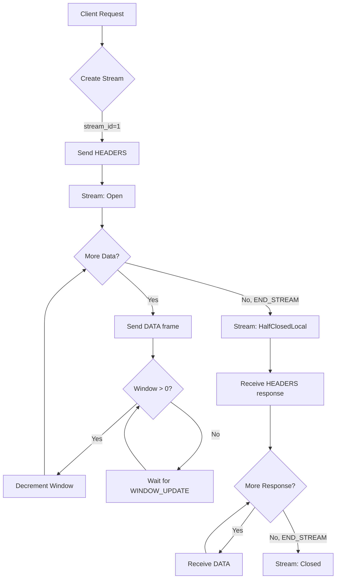

<thinking>
## Analyse du Concept
- Concept : HTTP/2 Multiplexing Engine
- Phase demandee : 5 (Advanced Systems)
- Adapte ? OUI - HTTP/2 est le protocole standard moderne, le multiplexing est son innovation majeure. L'exercice combine async Rust, gestion de streams, et protocole binaire.

## Combo Base + Bonus
- Exercice de base : Implementation d'un moteur HTTP/2 avec multiplexing de streams, HPACK compression, et flow control
- Bonus : Implementation complete de Server Push et prioritisation de streams avec dependency tree
- Palier bonus : AVANCE (complexite algorithmique + gestion d'etat)
- Progression logique ? OUI - Base = streams independants, Bonus = optimisation avancee

## Prerequis & Difficulte
- Prerequis reels : Async Rust (tokio), binary protocols, TCP/TLS, HTTP/1.1 fundamentals
- Difficulte estimee : 8/10 (base), 9/10 (bonus)
- Coherent avec phase 5 ? OUI

## Aspect Fun/Culture
- Contexte choisi : Reference a "The Fast and the Furious" - Streams en parallele comme voitures sur une autoroute
- MEME mnémotechnique : "I live my life a quarter stream at a time" (parodie de la replique culte)
- Pourquoi c'est fun : Le multiplexing permet d'aller plus vite sans attendre

## Scenarios d'Echec (5 mutants concrets)
1. Mutant A (Boundary) : Stream ID overflow non gere (u31 wrap)
2. Mutant B (Safety) : Flow control window devient negatif sans blocage
3. Mutant C (Logic) : HPACK dynamic table non mise a jour apres encoding
4. Mutant D (Edge) : Stream 0 utilise pour DATA frames (interdit)
5. Mutant E (Return) : GOAWAY ne ferme pas proprement les streams actifs

## Verdict
VALIDE - Exercice de qualite industrielle couvrant le protocole HTTP/2 moderne
</thinking>

# Exercice 5.1.16-a : http2_multiplexing

**Module :**
5.1.16 - HTTP/2 Protocol Implementation

**Concept :**
a - HTTP/2 Multiplexing Engine (streams, HPACK, flow control)

**Difficulte :**
(8/10)

**Type :**
code

**Tiers :**
2 - Multi-concepts integres

**Langage :**
Rust Edition 2024

**Prerequis :**
- 2.4 - Async Rust (tokio runtime)
- 5.1.4 - HTTP/1.1 fundamentals
- 5.1.5 - TLS/SSL basics
- 2.3 - Traits et generics avances

**Domaines :**
Net, Proto, Async

**Duree estimee :**
180 min

**XP Base :**
300

**Complexite :**
T3 O(n) x S2 O(n)

---

## SECTION 1 : PROTOTYPE & CONSIGNE

### 1.1 Obligations

**Fichier a rendre :**
```
src/lib.rs
```

**Dependances autorisees :**
- `tokio` (runtime async, channels, sync primitives)
- `bytes` (BytesMut, Buf, BufMut)
- `std::collections::{HashMap, VecDeque}`

**Fonctions/methodes interdites :**
- Crates HTTP/2 externes (`h2`, `hyperium`)
- `unsafe` blocks (sauf pour optimisations documentees)

### 1.2 Consigne

**CONTEXTE : "The Fast and the Multiplexed"**

*"I live my life a quarter stream at a time. Nothing else matters. Not the latency, not the blocking, not my team and all their HTTP/1.1 problems. For those 250 milliseconds or less, I'm free."* - Dom Toretto, probablement un ingenieur reseau

HTTP/2 revolutionne le web en permettant le multiplexage de plusieurs requetes sur une seule connexion TCP. Fini le head-of-line blocking de HTTP/1.1 - maintenant les streams roulent en parallele comme des voitures sur une autoroute.

**Ta mission :**

Implementer un moteur HTTP/2 complet qui gere :
1. Le framing binaire (parsing et serialisation des frames)
2. Le multiplexage de streams (creation, gestion d'etat, fermeture)
3. La compression HPACK des headers (tables statique et dynamique)
4. Le flow control (fenetres de connexion et de stream)
5. La gestion des erreurs de protocole (RST_STREAM, GOAWAY)

**Entree :**
- `connection: TcpStream` - Connexion TCP etablie (apres TLS handshake)
- `settings: Http2Settings` - Configuration initiale

**Sortie :**
- `Http2Connection` - Gestionnaire de connexion multiplexee
- `Http2Error` - En cas d'erreur de protocole

**Contraintes :**
- Stream IDs impairs pour le client, pairs pour le serveur
- Stream 0 reserve pour les frames de controle
- Window size initiale : 65535 bytes
- Maximum concurrent streams : configurable
- HPACK dynamic table size : 4096 bytes par defaut

**Exemples :**

| Operation | Resultat | Explication |
|-----------|----------|-------------|
| `conn.new_stream()` | `Stream { id: 1 }` | Premier stream client |
| `conn.send_headers(1, headers)` | `Ok(())` | Envoie HEADERS frame |
| `conn.send_data(1, payload)` | `Ok(())` | Envoie DATA avec flow control |
| `conn.send_data(0, payload)` | `Err(ProtocolError)` | Stream 0 interdit pour DATA |

### 1.2.2 Consigne Academique

Implementer un moteur de multiplexage HTTP/2 gerant le framing binaire, la compression HPACK, le flow control par stream, et la machine d'etats des streams selon la RFC 7540. Le systeme doit supporter les frames HEADERS, DATA, SETTINGS, WINDOW_UPDATE, RST_STREAM, et GOAWAY.

### 1.3 Prototype

```rust
use bytes::{Bytes, BytesMut, Buf, BufMut};
use std::collections::HashMap;
use tokio::sync::mpsc;

/// HTTP/2 Frame Types (RFC 7540 Section 6)
#[derive(Debug, Clone, Copy, PartialEq, Eq)]
#[repr(u8)]
pub enum FrameType {
    Data = 0x0,
    Headers = 0x1,
    Priority = 0x2,
    RstStream = 0x3,
    Settings = 0x4,
    PushPromise = 0x5,
    Ping = 0x6,
    GoAway = 0x7,
    WindowUpdate = 0x8,
    Continuation = 0x9,
}

/// HTTP/2 Frame Header (9 bytes)
#[derive(Debug, Clone)]
pub struct FrameHeader {
    pub length: u32,      // 24 bits
    pub frame_type: FrameType,
    pub flags: u8,
    pub stream_id: u32,   // 31 bits (MSB reserved)
}

/// HTTP/2 Frame
#[derive(Debug, Clone)]
pub struct Frame {
    pub header: FrameHeader,
    pub payload: Bytes,
}

/// Stream State Machine (RFC 7540 Section 5.1)
#[derive(Debug, Clone, Copy, PartialEq, Eq)]
pub enum StreamState {
    Idle,
    ReservedLocal,
    ReservedRemote,
    Open,
    HalfClosedLocal,
    HalfClosedRemote,
    Closed,
}

/// HTTP/2 Stream
#[derive(Debug)]
pub struct Stream {
    pub id: u32,
    pub state: StreamState,
    pub window_size: i32,
    pub priority: StreamPriority,
}

/// Stream Priority
#[derive(Debug, Clone, Default)]
pub struct StreamPriority {
    pub exclusive: bool,
    pub dependency: u32,
    pub weight: u8,
}

/// HTTP/2 Settings Parameters
#[derive(Debug, Clone)]
pub struct Http2Settings {
    pub header_table_size: u32,
    pub enable_push: bool,
    pub max_concurrent_streams: u32,
    pub initial_window_size: u32,
    pub max_frame_size: u32,
    pub max_header_list_size: u32,
}

/// HPACK Dynamic Table Entry
#[derive(Debug, Clone)]
pub struct HpackEntry {
    pub name: String,
    pub value: String,
}

/// HPACK Encoder/Decoder
#[derive(Debug)]
pub struct HpackCodec {
    dynamic_table: Vec<HpackEntry>,
    max_size: usize,
    current_size: usize,
}

/// HTTP/2 Error Codes
#[derive(Debug, Clone, Copy, PartialEq, Eq)]
#[repr(u32)]
pub enum ErrorCode {
    NoError = 0x0,
    ProtocolError = 0x1,
    InternalError = 0x2,
    FlowControlError = 0x3,
    SettingsTimeout = 0x4,
    StreamClosed = 0x5,
    FrameSizeError = 0x6,
    RefusedStream = 0x7,
    Cancel = 0x8,
    CompressionError = 0x9,
    ConnectError = 0xa,
    EnhanceYourCalm = 0xb,
    InadequateSecurity = 0xc,
    Http11Required = 0xd,
}

/// HTTP/2 Connection Error
#[derive(Debug)]
pub enum Http2Error {
    Protocol(ErrorCode, String),
    Io(std::io::Error),
    Hpack(String),
    StreamNotFound(u32),
    FlowControl(String),
}

/// HTTP/2 Connection Manager
pub struct Http2Connection {
    is_server: bool,
    settings: Http2Settings,
    peer_settings: Http2Settings,
    streams: HashMap<u32, Stream>,
    next_stream_id: u32,
    connection_window: i32,
    hpack_encoder: HpackCodec,
    hpack_decoder: HpackCodec,
    goaway_received: bool,
    last_stream_id: u32,
}

impl FrameHeader {
    /// Parse frame header from 9 bytes
    pub fn parse(buf: &[u8]) -> Result<Self, Http2Error>;

    /// Serialize frame header to bytes
    pub fn serialize(&self) -> [u8; 9];
}

impl Frame {
    /// Parse complete frame from bytes
    pub fn parse(buf: &mut BytesMut) -> Result<Option<Self>, Http2Error>;

    /// Serialize frame to bytes
    pub fn serialize(&self) -> BytesMut;

    /// Create DATA frame
    pub fn data(stream_id: u32, data: Bytes, end_stream: bool) -> Self;

    /// Create HEADERS frame
    pub fn headers(stream_id: u32, headers: Bytes, end_stream: bool, end_headers: bool) -> Self;

    /// Create SETTINGS frame
    pub fn settings(settings: &Http2Settings, ack: bool) -> Self;

    /// Create WINDOW_UPDATE frame
    pub fn window_update(stream_id: u32, increment: u32) -> Self;

    /// Create RST_STREAM frame
    pub fn rst_stream(stream_id: u32, error_code: ErrorCode) -> Self;

    /// Create GOAWAY frame
    pub fn goaway(last_stream_id: u32, error_code: ErrorCode, debug_data: Bytes) -> Self;
}

impl Default for Http2Settings {
    fn default() -> Self;
}

impl HpackCodec {
    /// Create new HPACK codec
    pub fn new(max_size: usize) -> Self;

    /// Encode headers to HPACK format
    pub fn encode(&mut self, headers: &[(String, String)]) -> Result<Bytes, Http2Error>;

    /// Decode HPACK format to headers
    pub fn decode(&mut self, buf: &[u8]) -> Result<Vec<(String, String)>, Http2Error>;

    /// Update dynamic table max size
    pub fn set_max_size(&mut self, size: usize);

    /// Get static table entry by index
    fn static_entry(index: usize) -> Option<(&'static str, &'static str)>;
}

impl Stream {
    /// Create new stream
    pub fn new(id: u32) -> Self;

    /// Transition stream state
    pub fn transition(&mut self, event: StreamEvent) -> Result<(), Http2Error>;

    /// Check if stream can send data
    pub fn can_send(&self) -> bool;

    /// Check if stream can receive data
    pub fn can_receive(&self) -> bool;

    /// Update flow control window
    pub fn update_window(&mut self, delta: i32) -> Result<(), Http2Error>;
}

/// Stream state transition events
#[derive(Debug, Clone)]
pub enum StreamEvent {
    SendHeaders { end_stream: bool },
    RecvHeaders { end_stream: bool },
    SendData { end_stream: bool },
    RecvData { end_stream: bool },
    SendRstStream,
    RecvRstStream,
    SendPushPromise,
    RecvPushPromise,
}

impl Http2Connection {
    /// Create new HTTP/2 connection
    pub fn new(is_server: bool, settings: Http2Settings) -> Self;

    /// Create new stream (client-initiated)
    pub fn new_stream(&mut self) -> Result<u32, Http2Error>;

    /// Get stream by ID
    pub fn get_stream(&self, stream_id: u32) -> Option<&Stream>;

    /// Get mutable stream by ID
    pub fn get_stream_mut(&mut self, stream_id: u32) -> Option<&mut Stream>;

    /// Process incoming frame
    pub fn process_frame(&mut self, frame: Frame) -> Result<Option<Frame>, Http2Error>;

    /// Send HEADERS
    pub fn send_headers(
        &mut self,
        stream_id: u32,
        headers: Vec<(String, String)>,
        end_stream: bool,
    ) -> Result<Frame, Http2Error>;

    /// Send DATA with flow control
    pub fn send_data(
        &mut self,
        stream_id: u32,
        data: Bytes,
        end_stream: bool,
    ) -> Result<Vec<Frame>, Http2Error>;

    /// Send WINDOW_UPDATE
    pub fn send_window_update(
        &mut self,
        stream_id: u32,
        increment: u32,
    ) -> Result<Frame, Http2Error>;

    /// Send RST_STREAM
    pub fn send_rst_stream(
        &mut self,
        stream_id: u32,
        error_code: ErrorCode,
    ) -> Result<Frame, Http2Error>;

    /// Send GOAWAY
    pub fn send_goaway(
        &mut self,
        error_code: ErrorCode,
        debug_data: Bytes,
    ) -> Result<Frame, Http2Error>;

    /// Update settings from peer
    pub fn apply_settings(&mut self, settings: Http2Settings) -> Result<Frame, Http2Error>;

    /// Check connection-level flow control
    pub fn connection_window_available(&self) -> i32;

    /// Update connection window
    pub fn update_connection_window(&mut self, delta: i32) -> Result<(), Http2Error>;

    /// Get active stream count
    pub fn active_stream_count(&self) -> usize;

    /// Check if can create new stream
    pub fn can_create_stream(&self) -> bool;
}
```

---

## SECTION 2 : LE SAVIEZ-VOUS ?

### 2.1 Origine du Multiplexage HTTP/2

HTTP/2 a ete standardise en 2015 (RFC 7540) base sur le protocole SPDY de Google. Le probleme majeur resolu est le "head-of-line blocking" de HTTP/1.1 : une requete lente bloquait toutes les suivantes sur la meme connexion. Le multiplexage permet d'entrelacer plusieurs requetes/reponses independamment.

### 2.2 Le Frame : Unite Atomique

En HTTP/2, tout est frame. Un frame a un header fixe de 9 bytes suivi d'un payload variable. Le header contient : longueur (24 bits), type (8 bits), flags (8 bits), et stream ID (31 bits, MSB reserve).

```
+-----------------------------------------------+
|                 Length (24)                   |
+---------------+---------------+---------------+
|   Type (8)    |   Flags (8)   |
+-+-------------+---------------+-------------------------------+
|R|                 Stream Identifier (31)                      |
+-+-------------------------------------------------------------+
|                   Frame Payload (0...)                      ...
+---------------------------------------------------------------+
```

### 2.3 HPACK : Compression Contextuelle

HPACK utilise deux tables pour compresser les headers HTTP :
- Table statique : 61 entrees predefinies (`:method GET`, `:status 200`, etc.)
- Table dynamique : headers recemment utilises, partages entre encoder/decoder

Cette compression reduit dramatiquement la taille des headers repetitifs (cookies, user-agent).

---

## SECTION 2.5 : DANS LA VRAIE VIE

### Metiers concernes

| Metier | Utilisation du multiplexing HTTP/2 |
|--------|-----------------------------------|
| **Backend Engineer** | Implementation de serveurs haute performance |
| **Frontend Engineer** | Optimisation du chargement des ressources |
| **DevOps/SRE** | Configuration des load balancers et proxies |
| **Performance Engineer** | Analyse et optimisation des latences |
| **Security Engineer** | Protection contre les attaques HTTP/2 (HPACK bomb) |

### Cas d'usage concrets

1. **CDN Optimization** : Cloudflare utilise HTTP/2 pour multiplexer des milliers de requetes par connexion
2. **gRPC** : Protocole RPC de Google base entierement sur HTTP/2 multiplexing
3. **Mobile Apps** : Reduction drastique des connexions TCP = economie de batterie
4. **Microservices** : Communication inter-services efficace sur connexions persistantes

---

## SECTION 3 : EXEMPLE D'UTILISATION

### 3.0 Session bash

```bash
$ ls
Cargo.toml  src/

$ cargo test
   Compiling http2_multiplexing v0.1.0
    Finished test [unoptimized + debuginfo] target(s)
     Running unittests src/lib.rs

running 15 tests
test tests::test_frame_header_parse ... ok
test tests::test_frame_header_serialize ... ok
test tests::test_frame_data_creation ... ok
test tests::test_frame_headers_creation ... ok
test tests::test_hpack_static_table ... ok
test tests::test_hpack_encode_decode ... ok
test tests::test_hpack_dynamic_table ... ok
test tests::test_stream_state_machine ... ok
test tests::test_stream_flow_control ... ok
test tests::test_connection_new_stream ... ok
test tests::test_connection_send_headers ... ok
test tests::test_connection_send_data_flow_control ... ok
test tests::test_connection_window_update ... ok
test tests::test_connection_goaway ... ok
test tests::test_stream_id_validation ... ok

test result: ok. 15 passed; 0 failed
```

### 3.1 BONUS AVANCE (OPTIONNEL)

**Difficulte Bonus :**
(9/10)

**Recompense :**
XP x3

**Time Complexity attendue :**
O(n log n) pour la prioritisation des streams

**Space Complexity attendue :**
O(n) ou n = nombre de streams

**Domaines Bonus :**
`Algo, Tree`

#### 3.1.1 Consigne Bonus

**"Push It to the Limit"**

*"Ask any racer. Any real racer. It doesn't matter if you push by a megabyte or a gigabyte. Pushing's pushing."* - Dom Toretto sur Server Push

**Ta mission bonus :**

Implementer :
1. **Server Push** : Permettre au serveur de pousser des ressources avant que le client ne les demande
2. **Stream Prioritization** : Arbre de dependances entre streams avec poids
3. **Priority Scheduler** : Ordonnanceur qui respecte les priorites pour l'envoi des DATA frames

**Entree :**
- `promised_stream_id: u32` - ID du stream pousse
- `priority_tree: &PriorityTree` - Arbre de dependances

**Sortie :**
- `Frame::PushPromise` - Frame de promesse
- `Vec<u32>` - Ordre d'envoi des streams selon priorites

**Contraintes :**
```
+-------------------------------------------------------------------+
|  Server Push : stream ID pairs, initie par PUSH_PROMISE           |
|  Priority : dependency tree, poids 1-256, exclusive flag          |
|  Scheduling : weighted fair queuing entre siblings                |
+-------------------------------------------------------------------+
```

#### 3.1.2 Prototype Bonus

```rust
/// Priority Tree Node
#[derive(Debug)]
pub struct PriorityNode {
    pub stream_id: u32,
    pub weight: u8,
    pub children: Vec<u32>,
}

/// Priority Tree for stream scheduling
#[derive(Debug)]
pub struct PriorityTree {
    nodes: HashMap<u32, PriorityNode>,
    root: u32,  // Virtual root (stream 0)
}

impl PriorityTree {
    pub fn new() -> Self;

    /// Add stream with dependency
    pub fn add_stream(
        &mut self,
        stream_id: u32,
        dependency: u32,
        weight: u8,
        exclusive: bool,
    ) -> Result<(), Http2Error>;

    /// Remove stream (redistribute children)
    pub fn remove_stream(&mut self, stream_id: u32);

    /// Get scheduling order for pending streams
    pub fn schedule(&self, pending: &[u32]) -> Vec<u32>;

    /// Reprioritize stream
    pub fn reprioritize(
        &mut self,
        stream_id: u32,
        new_dependency: u32,
        new_weight: u8,
        exclusive: bool,
    ) -> Result<(), Http2Error>;
}

impl Http2Connection {
    /// Send PUSH_PROMISE (server only)
    pub fn send_push_promise(
        &mut self,
        associated_stream_id: u32,
        promised_headers: Vec<(String, String)>,
    ) -> Result<(u32, Frame), Http2Error>;

    /// Process PUSH_PROMISE (client only)
    pub fn process_push_promise(
        &mut self,
        frame: Frame,
    ) -> Result<(u32, Vec<(String, String)>), Http2Error>;
}
```

#### 3.1.3 Ce qui change par rapport a l'exercice de base

| Aspect | Base | Bonus |
|--------|------|-------|
| Streams | Independants | Arbre de dependances |
| Scheduling | FIFO | Weighted fair queuing |
| Server | Repond seulement | Peut pousser proactivement |
| Complexite | O(1) par stream | O(log n) pour scheduling |

---

## SECTION 4 : ZONE CORRECTION

### 4.1 Moulinette - Tableau des tests

| Test | Input | Expected | Points | Categorie |
|------|-------|----------|--------|-----------|
| `frame_header_parse` | 9 bytes valides | `FrameHeader` | 5 | Basic |
| `frame_header_serialize` | `FrameHeader` | 9 bytes | 5 | Basic |
| `frame_data_creation` | stream_id=1, data | `Frame::Data` | 5 | Core |
| `frame_headers_creation` | stream_id=1, headers | `Frame::Headers` | 5 | Core |
| `frame_stream_0_data` | stream_id=0, data | `Err(ProtocolError)` | 10 | Edge |
| `hpack_static_entry` | index=2 | `(":method", "GET")` | 5 | Core |
| `hpack_encode_simple` | `[("method", "GET")]` | encoded bytes | 10 | Core |
| `hpack_decode_simple` | encoded bytes | `[("method", "GET")]` | 10 | Core |
| `hpack_dynamic_table` | repeated headers | smaller encoding | 10 | Core |
| `stream_state_open` | `SendHeaders` | `StreamState::Open` | 5 | Core |
| `stream_state_half_closed` | `SendData{end:true}` | `HalfClosedLocal` | 5 | Core |
| `stream_flow_control` | window=100, send=50 | window=50 | 10 | Core |
| `stream_flow_overflow` | window=100, send=200 | `Err(FlowControl)` | 10 | Edge |
| `conn_new_stream_client` | client connection | stream_id=1 | 5 | Core |
| `conn_new_stream_server` | server connection | stream_id=2 | 5 | Core |
| `conn_max_streams` | exceed max | `Err(RefusedStream)` | 5 | Edge |
| `conn_window_update` | increment=1000 | updated window | 5 | Core |
| `conn_goaway` | error_code, debug | `Frame::GoAway` | 5 | Core |
| `settings_ack` | `Frame::Settings` | ack frame | 5 | Core |
| `invalid_frame_type` | type=0xFF | `Err(ProtocolError)` | 5 | Edge |

**Score minimum pour validation : 70/100**

### 4.2 Fichier de test

```rust
#[cfg(test)]
mod tests {
    use super::*;

    #[test]
    fn test_frame_header_parse() {
        let buf = [0x00, 0x00, 0x10, 0x00, 0x01, 0x00, 0x00, 0x00, 0x01];
        let header = FrameHeader::parse(&buf).unwrap();
        assert_eq!(header.length, 16);
        assert_eq!(header.frame_type, FrameType::Data);
        assert_eq!(header.flags, 0x01);
        assert_eq!(header.stream_id, 1);
    }

    #[test]
    fn test_frame_header_serialize() {
        let header = FrameHeader {
            length: 16,
            frame_type: FrameType::Data,
            flags: 0x01,
            stream_id: 1,
        };
        let bytes = header.serialize();
        assert_eq!(bytes, [0x00, 0x00, 0x10, 0x00, 0x01, 0x00, 0x00, 0x00, 0x01]);
    }

    #[test]
    fn test_frame_data_stream_0_invalid() {
        let frame = Frame::data(0, Bytes::from("test"), false);
        let conn = Http2Connection::new(true, Http2Settings::default());
        // Stream 0 is reserved for control frames
        assert!(matches!(
            conn.validate_frame(&frame),
            Err(Http2Error::Protocol(ErrorCode::ProtocolError, _))
        ));
    }

    #[test]
    fn test_hpack_static_table() {
        assert_eq!(HpackCodec::static_entry(2), Some((":method", "GET")));
        assert_eq!(HpackCodec::static_entry(3), Some((":method", "POST")));
        assert_eq!(HpackCodec::static_entry(8), Some((":status", "200")));
    }

    #[test]
    fn test_hpack_encode_decode() {
        let mut encoder = HpackCodec::new(4096);
        let mut decoder = HpackCodec::new(4096);

        let headers = vec![
            (":method".to_string(), "GET".to_string()),
            (":path".to_string(), "/".to_string()),
        ];

        let encoded = encoder.encode(&headers).unwrap();
        let decoded = decoder.decode(&encoded).unwrap();

        assert_eq!(decoded, headers);
    }

    #[test]
    fn test_hpack_dynamic_table_compression() {
        let mut encoder = HpackCodec::new(4096);

        let headers = vec![
            ("custom-header".to_string(), "custom-value".to_string()),
        ];

        let first_encode = encoder.encode(&headers).unwrap();
        let second_encode = encoder.encode(&headers).unwrap();

        // Second encoding should be smaller due to dynamic table
        assert!(second_encode.len() < first_encode.len());
    }

    #[test]
    fn test_stream_state_transitions() {
        let mut stream = Stream::new(1);
        assert_eq!(stream.state, StreamState::Idle);

        stream.transition(StreamEvent::SendHeaders { end_stream: false }).unwrap();
        assert_eq!(stream.state, StreamState::Open);

        stream.transition(StreamEvent::SendData { end_stream: true }).unwrap();
        assert_eq!(stream.state, StreamState::HalfClosedLocal);
    }

    #[test]
    fn test_stream_flow_control() {
        let mut stream = Stream::new(1);
        stream.window_size = 65535;

        stream.update_window(-1000).unwrap();
        assert_eq!(stream.window_size, 64535);

        stream.update_window(500).unwrap();
        assert_eq!(stream.window_size, 65035);
    }

    #[test]
    fn test_stream_flow_control_overflow() {
        let mut stream = Stream::new(1);
        stream.window_size = 100;

        let result = stream.update_window(-200);
        assert!(matches!(result, Err(Http2Error::FlowControl(_))));
    }

    #[test]
    fn test_connection_new_stream_client() {
        let mut conn = Http2Connection::new(false, Http2Settings::default());

        let id1 = conn.new_stream().unwrap();
        assert_eq!(id1, 1);

        let id2 = conn.new_stream().unwrap();
        assert_eq!(id2, 3);
    }

    #[test]
    fn test_connection_new_stream_server() {
        let mut conn = Http2Connection::new(true, Http2Settings::default());

        let id1 = conn.new_stream().unwrap();
        assert_eq!(id1, 2);

        let id2 = conn.new_stream().unwrap();
        assert_eq!(id2, 4);
    }

    #[test]
    fn test_connection_max_concurrent_streams() {
        let mut settings = Http2Settings::default();
        settings.max_concurrent_streams = 2;
        let mut conn = Http2Connection::new(false, settings);

        conn.new_stream().unwrap();
        conn.new_stream().unwrap();

        let result = conn.new_stream();
        assert!(matches!(
            result,
            Err(Http2Error::Protocol(ErrorCode::RefusedStream, _))
        ));
    }

    #[test]
    fn test_connection_window_update() {
        let mut conn = Http2Connection::new(false, Http2Settings::default());
        let initial_window = conn.connection_window_available();

        conn.update_connection_window(1000).unwrap();
        assert_eq!(conn.connection_window_available(), initial_window + 1000);
    }

    #[test]
    fn test_connection_goaway() {
        let mut conn = Http2Connection::new(true, Http2Settings::default());
        conn.new_stream().unwrap();

        let frame = conn.send_goaway(ErrorCode::NoError, Bytes::new()).unwrap();
        assert_eq!(frame.header.frame_type, FrameType::GoAway);
        assert_eq!(frame.header.stream_id, 0);
    }

    #[test]
    fn test_settings_frame() {
        let settings = Http2Settings::default();
        let frame = Frame::settings(&settings, false);

        assert_eq!(frame.header.frame_type, FrameType::Settings);
        assert_eq!(frame.header.stream_id, 0);
        assert_eq!(frame.header.flags, 0);
    }

    #[test]
    fn test_settings_ack() {
        let frame = Frame::settings(&Http2Settings::default(), true);
        assert_eq!(frame.header.flags, 0x01); // ACK flag
        assert!(frame.payload.is_empty());
    }
}
```

### 4.3 Solution de reference

```rust
use bytes::{Bytes, BytesMut, Buf, BufMut};
use std::collections::HashMap;

/// HPACK Static Table (RFC 7541 Appendix A)
const STATIC_TABLE: &[(&str, &str)] = &[
    ("", ""),  // Index 0 is not used
    (":authority", ""),
    (":method", "GET"),
    (":method", "POST"),
    (":path", "/"),
    (":path", "/index.html"),
    (":scheme", "http"),
    (":scheme", "https"),
    (":status", "200"),
    (":status", "204"),
    (":status", "206"),
    (":status", "304"),
    (":status", "400"),
    (":status", "404"),
    (":status", "500"),
    ("accept-charset", ""),
    ("accept-encoding", "gzip, deflate"),
    ("accept-language", ""),
    ("accept-ranges", ""),
    ("accept", ""),
    ("access-control-allow-origin", ""),
    ("age", ""),
    ("allow", ""),
    ("authorization", ""),
    ("cache-control", ""),
    ("content-disposition", ""),
    ("content-encoding", ""),
    ("content-language", ""),
    ("content-length", ""),
    ("content-location", ""),
    ("content-range", ""),
    ("content-type", ""),
    ("cookie", ""),
    ("date", ""),
    ("etag", ""),
    ("expect", ""),
    ("expires", ""),
    ("from", ""),
    ("host", ""),
    ("if-match", ""),
    ("if-modified-since", ""),
    ("if-none-match", ""),
    ("if-range", ""),
    ("if-unmodified-since", ""),
    ("last-modified", ""),
    ("link", ""),
    ("location", ""),
    ("max-forwards", ""),
    ("proxy-authenticate", ""),
    ("proxy-authorization", ""),
    ("range", ""),
    ("referer", ""),
    ("refresh", ""),
    ("retry-after", ""),
    ("server", ""),
    ("set-cookie", ""),
    ("strict-transport-security", ""),
    ("transfer-encoding", ""),
    ("user-agent", ""),
    ("vary", ""),
    ("via", ""),
    ("www-authenticate", ""),
];

impl FrameHeader {
    pub fn parse(buf: &[u8]) -> Result<Self, Http2Error> {
        if buf.len() < 9 {
            return Err(Http2Error::Protocol(
                ErrorCode::FrameSizeError,
                "Frame header too short".to_string(),
            ));
        }

        let length = ((buf[0] as u32) << 16) | ((buf[1] as u32) << 8) | (buf[2] as u32);
        let frame_type = match buf[3] {
            0x0 => FrameType::Data,
            0x1 => FrameType::Headers,
            0x2 => FrameType::Priority,
            0x3 => FrameType::RstStream,
            0x4 => FrameType::Settings,
            0x5 => FrameType::PushPromise,
            0x6 => FrameType::Ping,
            0x7 => FrameType::GoAway,
            0x8 => FrameType::WindowUpdate,
            0x9 => FrameType::Continuation,
            _ => return Err(Http2Error::Protocol(
                ErrorCode::ProtocolError,
                format!("Unknown frame type: {}", buf[3]),
            )),
        };
        let flags = buf[4];
        let stream_id = ((buf[5] as u32 & 0x7F) << 24)
            | ((buf[6] as u32) << 16)
            | ((buf[7] as u32) << 8)
            | (buf[8] as u32);

        Ok(Self {
            length,
            frame_type,
            flags,
            stream_id,
        })
    }

    pub fn serialize(&self) -> [u8; 9] {
        let mut buf = [0u8; 9];
        buf[0] = (self.length >> 16) as u8;
        buf[1] = (self.length >> 8) as u8;
        buf[2] = self.length as u8;
        buf[3] = self.frame_type as u8;
        buf[4] = self.flags;
        buf[5] = (self.stream_id >> 24) as u8 & 0x7F;
        buf[6] = (self.stream_id >> 16) as u8;
        buf[7] = (self.stream_id >> 8) as u8;
        buf[8] = self.stream_id as u8;
        buf
    }
}

impl Frame {
    pub fn data(stream_id: u32, data: Bytes, end_stream: bool) -> Self {
        let flags = if end_stream { 0x01 } else { 0x00 };
        Self {
            header: FrameHeader {
                length: data.len() as u32,
                frame_type: FrameType::Data,
                flags,
                stream_id,
            },
            payload: data,
        }
    }

    pub fn headers(stream_id: u32, headers: Bytes, end_stream: bool, end_headers: bool) -> Self {
        let mut flags = 0u8;
        if end_stream { flags |= 0x01; }
        if end_headers { flags |= 0x04; }
        Self {
            header: FrameHeader {
                length: headers.len() as u32,
                frame_type: FrameType::Headers,
                flags,
                stream_id,
            },
            payload: headers,
        }
    }

    pub fn settings(settings: &Http2Settings, ack: bool) -> Self {
        let mut payload = BytesMut::new();
        if !ack {
            // SETTINGS_HEADER_TABLE_SIZE (0x1)
            payload.put_u16(0x1);
            payload.put_u32(settings.header_table_size);
            // SETTINGS_ENABLE_PUSH (0x2)
            payload.put_u16(0x2);
            payload.put_u32(if settings.enable_push { 1 } else { 0 });
            // SETTINGS_MAX_CONCURRENT_STREAMS (0x3)
            payload.put_u16(0x3);
            payload.put_u32(settings.max_concurrent_streams);
            // SETTINGS_INITIAL_WINDOW_SIZE (0x4)
            payload.put_u16(0x4);
            payload.put_u32(settings.initial_window_size);
            // SETTINGS_MAX_FRAME_SIZE (0x5)
            payload.put_u16(0x5);
            payload.put_u32(settings.max_frame_size);
            // SETTINGS_MAX_HEADER_LIST_SIZE (0x6)
            payload.put_u16(0x6);
            payload.put_u32(settings.max_header_list_size);
        }

        Self {
            header: FrameHeader {
                length: payload.len() as u32,
                frame_type: FrameType::Settings,
                flags: if ack { 0x01 } else { 0x00 },
                stream_id: 0,
            },
            payload: payload.freeze(),
        }
    }

    pub fn window_update(stream_id: u32, increment: u32) -> Self {
        let mut payload = BytesMut::with_capacity(4);
        payload.put_u32(increment & 0x7FFFFFFF);
        Self {
            header: FrameHeader {
                length: 4,
                frame_type: FrameType::WindowUpdate,
                flags: 0,
                stream_id,
            },
            payload: payload.freeze(),
        }
    }

    pub fn rst_stream(stream_id: u32, error_code: ErrorCode) -> Self {
        let mut payload = BytesMut::with_capacity(4);
        payload.put_u32(error_code as u32);
        Self {
            header: FrameHeader {
                length: 4,
                frame_type: FrameType::RstStream,
                flags: 0,
                stream_id,
            },
            payload: payload.freeze(),
        }
    }

    pub fn goaway(last_stream_id: u32, error_code: ErrorCode, debug_data: Bytes) -> Self {
        let mut payload = BytesMut::with_capacity(8 + debug_data.len());
        payload.put_u32(last_stream_id & 0x7FFFFFFF);
        payload.put_u32(error_code as u32);
        payload.extend_from_slice(&debug_data);
        Self {
            header: FrameHeader {
                length: payload.len() as u32,
                frame_type: FrameType::GoAway,
                flags: 0,
                stream_id: 0,
            },
            payload: payload.freeze(),
        }
    }
}

impl Default for Http2Settings {
    fn default() -> Self {
        Self {
            header_table_size: 4096,
            enable_push: true,
            max_concurrent_streams: 100,
            initial_window_size: 65535,
            max_frame_size: 16384,
            max_header_list_size: 8192,
        }
    }
}

impl HpackCodec {
    pub fn new(max_size: usize) -> Self {
        Self {
            dynamic_table: Vec::new(),
            max_size,
            current_size: 0,
        }
    }

    pub fn static_entry(index: usize) -> Option<(&'static str, &'static str)> {
        STATIC_TABLE.get(index).copied()
    }

    fn find_in_static(&self, name: &str, value: &str) -> Option<(usize, bool)> {
        for (i, (n, v)) in STATIC_TABLE.iter().enumerate().skip(1) {
            if *n == name {
                if *v == value {
                    return Some((i, true));  // Full match
                }
                return Some((i, false));  // Name-only match
            }
        }
        None
    }

    fn find_in_dynamic(&self, name: &str, value: &str) -> Option<(usize, bool)> {
        for (i, entry) in self.dynamic_table.iter().enumerate() {
            if entry.name == name {
                if entry.value == value {
                    return Some((STATIC_TABLE.len() + i, true));
                }
                return Some((STATIC_TABLE.len() + i, false));
            }
        }
        None
    }

    fn add_to_dynamic(&mut self, name: String, value: String) {
        let entry_size = name.len() + value.len() + 32;

        while self.current_size + entry_size > self.max_size && !self.dynamic_table.is_empty() {
            if let Some(evicted) = self.dynamic_table.pop() {
                self.current_size -= evicted.name.len() + evicted.value.len() + 32;
            }
        }

        if entry_size <= self.max_size {
            self.dynamic_table.insert(0, HpackEntry { name, value });
            self.current_size += entry_size;
        }
    }

    pub fn encode(&mut self, headers: &[(String, String)]) -> Result<Bytes, Http2Error> {
        let mut buf = BytesMut::new();

        for (name, value) in headers {
            // Try static table first
            if let Some((idx, full_match)) = self.find_in_static(name, value) {
                if full_match {
                    // Indexed Header Field (Section 6.1)
                    buf.put_u8(0x80 | idx as u8);
                    continue;
                }
            }

            // Try dynamic table
            if let Some((idx, full_match)) = self.find_in_dynamic(name, value) {
                if full_match {
                    buf.put_u8(0x80 | idx as u8);
                    continue;
                }
            }

            // Literal Header Field with Incremental Indexing (Section 6.2.1)
            buf.put_u8(0x40);
            self.encode_string(&mut buf, name);
            self.encode_string(&mut buf, value);
            self.add_to_dynamic(name.clone(), value.clone());
        }

        Ok(buf.freeze())
    }

    fn encode_string(&self, buf: &mut BytesMut, s: &str) {
        let bytes = s.as_bytes();
        // No Huffman encoding for simplicity
        buf.put_u8(bytes.len() as u8);
        buf.extend_from_slice(bytes);
    }

    pub fn decode(&mut self, buf: &[u8]) -> Result<Vec<(String, String)>, Http2Error> {
        let mut headers = Vec::new();
        let mut pos = 0;

        while pos < buf.len() {
            let first_byte = buf[pos];

            if first_byte & 0x80 != 0 {
                // Indexed Header Field
                let index = (first_byte & 0x7F) as usize;
                let (name, value) = self.get_indexed(index)?;
                headers.push((name, value));
                pos += 1;
            } else if first_byte & 0x40 != 0 {
                // Literal with Incremental Indexing
                pos += 1;
                let (name, name_len) = self.decode_string(&buf[pos..])?;
                pos += name_len;
                let (value, value_len) = self.decode_string(&buf[pos..])?;
                pos += value_len;
                self.add_to_dynamic(name.clone(), value.clone());
                headers.push((name, value));
            } else {
                // Other literal formats (simplified)
                pos += 1;
                let (name, name_len) = self.decode_string(&buf[pos..])?;
                pos += name_len;
                let (value, value_len) = self.decode_string(&buf[pos..])?;
                pos += value_len;
                headers.push((name, value));
            }
        }

        Ok(headers)
    }

    fn get_indexed(&self, index: usize) -> Result<(String, String), Http2Error> {
        if index < STATIC_TABLE.len() {
            let (n, v) = STATIC_TABLE[index];
            Ok((n.to_string(), v.to_string()))
        } else {
            let dyn_index = index - STATIC_TABLE.len();
            self.dynamic_table
                .get(dyn_index)
                .map(|e| (e.name.clone(), e.value.clone()))
                .ok_or_else(|| Http2Error::Hpack("Invalid index".to_string()))
        }
    }

    fn decode_string(&self, buf: &[u8]) -> Result<(String, usize), Http2Error> {
        if buf.is_empty() {
            return Err(Http2Error::Hpack("Empty string".to_string()));
        }
        let len = (buf[0] & 0x7F) as usize;
        if buf.len() < 1 + len {
            return Err(Http2Error::Hpack("String too short".to_string()));
        }
        let s = String::from_utf8(buf[1..1+len].to_vec())
            .map_err(|_| Http2Error::Hpack("Invalid UTF-8".to_string()))?;
        Ok((s, 1 + len))
    }

    pub fn set_max_size(&mut self, size: usize) {
        self.max_size = size;
        while self.current_size > self.max_size && !self.dynamic_table.is_empty() {
            if let Some(evicted) = self.dynamic_table.pop() {
                self.current_size -= evicted.name.len() + evicted.value.len() + 32;
            }
        }
    }
}

impl Stream {
    pub fn new(id: u32) -> Self {
        Self {
            id,
            state: StreamState::Idle,
            window_size: 65535,
            priority: StreamPriority::default(),
        }
    }

    pub fn transition(&mut self, event: StreamEvent) -> Result<(), Http2Error> {
        use StreamState::*;
        use StreamEvent::*;

        self.state = match (&self.state, &event) {
            (Idle, SendHeaders { end_stream: false }) => Open,
            (Idle, SendHeaders { end_stream: true }) => HalfClosedLocal,
            (Idle, RecvHeaders { end_stream: false }) => Open,
            (Idle, RecvHeaders { end_stream: true }) => HalfClosedRemote,
            (Idle, SendPushPromise) => ReservedLocal,
            (Idle, RecvPushPromise) => ReservedRemote,

            (ReservedLocal, SendHeaders { .. }) => HalfClosedRemote,
            (ReservedLocal, SendRstStream) => Closed,
            (ReservedLocal, RecvRstStream) => Closed,

            (ReservedRemote, RecvHeaders { .. }) => HalfClosedLocal,
            (ReservedRemote, SendRstStream) => Closed,
            (ReservedRemote, RecvRstStream) => Closed,

            (Open, SendData { end_stream: true }) => HalfClosedLocal,
            (Open, RecvData { end_stream: true }) => HalfClosedRemote,
            (Open, SendRstStream) => Closed,
            (Open, RecvRstStream) => Closed,
            (Open, SendData { end_stream: false }) => Open,
            (Open, RecvData { end_stream: false }) => Open,

            (HalfClosedLocal, RecvData { end_stream: true }) => Closed,
            (HalfClosedLocal, RecvRstStream) => Closed,
            (HalfClosedLocal, SendRstStream) => Closed,
            (HalfClosedLocal, RecvData { end_stream: false }) => HalfClosedLocal,

            (HalfClosedRemote, SendData { end_stream: true }) => Closed,
            (HalfClosedRemote, SendRstStream) => Closed,
            (HalfClosedRemote, RecvRstStream) => Closed,
            (HalfClosedRemote, SendData { end_stream: false }) => HalfClosedRemote,

            (Closed, _) => Closed,

            _ => return Err(Http2Error::Protocol(
                ErrorCode::StreamClosed,
                format!("Invalid state transition: {:?} + {:?}", self.state, event),
            )),
        };

        Ok(())
    }

    pub fn can_send(&self) -> bool {
        matches!(self.state, StreamState::Open | StreamState::HalfClosedRemote)
    }

    pub fn can_receive(&self) -> bool {
        matches!(self.state, StreamState::Open | StreamState::HalfClosedLocal)
    }

    pub fn update_window(&mut self, delta: i32) -> Result<(), Http2Error> {
        let new_window = self.window_size.checked_add(delta)
            .ok_or_else(|| Http2Error::FlowControl("Window overflow".to_string()))?;

        if new_window < 0 {
            return Err(Http2Error::FlowControl("Window underflow".to_string()));
        }

        self.window_size = new_window;
        Ok(())
    }
}

impl Http2Connection {
    pub fn new(is_server: bool, settings: Http2Settings) -> Self {
        Self {
            is_server,
            settings: settings.clone(),
            peer_settings: Http2Settings::default(),
            streams: HashMap::new(),
            next_stream_id: if is_server { 2 } else { 1 },
            connection_window: 65535,
            hpack_encoder: HpackCodec::new(settings.header_table_size as usize),
            hpack_decoder: HpackCodec::new(4096),
            goaway_received: false,
            last_stream_id: 0,
        }
    }

    pub fn new_stream(&mut self) -> Result<u32, Http2Error> {
        if self.goaway_received {
            return Err(Http2Error::Protocol(
                ErrorCode::RefusedStream,
                "Connection is closing".to_string(),
            ));
        }

        let active_count = self.active_stream_count();
        if active_count >= self.peer_settings.max_concurrent_streams as usize {
            return Err(Http2Error::Protocol(
                ErrorCode::RefusedStream,
                "Max concurrent streams exceeded".to_string(),
            ));
        }

        let stream_id = self.next_stream_id;
        self.next_stream_id += 2;

        let stream = Stream::new(stream_id);
        self.streams.insert(stream_id, stream);

        Ok(stream_id)
    }

    pub fn get_stream(&self, stream_id: u32) -> Option<&Stream> {
        self.streams.get(&stream_id)
    }

    pub fn get_stream_mut(&mut self, stream_id: u32) -> Option<&mut Stream> {
        self.streams.get_mut(&stream_id)
    }

    pub fn validate_frame(&self, frame: &Frame) -> Result<(), Http2Error> {
        match frame.header.frame_type {
            FrameType::Data | FrameType::Headers | FrameType::Priority |
            FrameType::RstStream | FrameType::PushPromise | FrameType::Continuation => {
                if frame.header.stream_id == 0 {
                    return Err(Http2Error::Protocol(
                        ErrorCode::ProtocolError,
                        "Stream-specific frame on stream 0".to_string(),
                    ));
                }
            }
            FrameType::Settings | FrameType::Ping | FrameType::GoAway => {
                if frame.header.stream_id != 0 {
                    return Err(Http2Error::Protocol(
                        ErrorCode::ProtocolError,
                        "Connection frame on non-zero stream".to_string(),
                    ));
                }
            }
            FrameType::WindowUpdate => {} // Can be 0 or non-zero
        }
        Ok(())
    }

    pub fn send_headers(
        &mut self,
        stream_id: u32,
        headers: Vec<(String, String)>,
        end_stream: bool,
    ) -> Result<Frame, Http2Error> {
        let stream = self.streams.get_mut(&stream_id)
            .ok_or(Http2Error::StreamNotFound(stream_id))?;

        stream.transition(StreamEvent::SendHeaders { end_stream })?;

        let encoded = self.hpack_encoder.encode(&headers)?;
        Ok(Frame::headers(stream_id, encoded, end_stream, true))
    }

    pub fn send_data(
        &mut self,
        stream_id: u32,
        data: Bytes,
        end_stream: bool,
    ) -> Result<Vec<Frame>, Http2Error> {
        if stream_id == 0 {
            return Err(Http2Error::Protocol(
                ErrorCode::ProtocolError,
                "Cannot send DATA on stream 0".to_string(),
            ));
        }

        let stream = self.streams.get_mut(&stream_id)
            .ok_or(Http2Error::StreamNotFound(stream_id))?;

        if !stream.can_send() {
            return Err(Http2Error::Protocol(
                ErrorCode::StreamClosed,
                "Stream not in sendable state".to_string(),
            ));
        }

        let mut frames = Vec::new();
        let max_frame_size = self.peer_settings.max_frame_size as usize;
        let mut remaining = data;

        while !remaining.is_empty() {
            let chunk_size = remaining.len().min(max_frame_size);
            let is_last = chunk_size == remaining.len();
            let chunk = remaining.split_to(chunk_size);

            // Check flow control
            if stream.window_size < chunk_size as i32 {
                return Err(Http2Error::FlowControl(
                    "Stream window exhausted".to_string(),
                ));
            }
            if self.connection_window < chunk_size as i32 {
                return Err(Http2Error::FlowControl(
                    "Connection window exhausted".to_string(),
                ));
            }

            stream.window_size -= chunk_size as i32;
            self.connection_window -= chunk_size as i32;

            let frame = Frame::data(
                stream_id,
                chunk,
                end_stream && is_last,
            );
            frames.push(frame);
        }

        if end_stream {
            stream.transition(StreamEvent::SendData { end_stream: true })?;
        }

        Ok(frames)
    }

    pub fn send_window_update(
        &mut self,
        stream_id: u32,
        increment: u32,
    ) -> Result<Frame, Http2Error> {
        if stream_id != 0 {
            let stream = self.streams.get_mut(&stream_id)
                .ok_or(Http2Error::StreamNotFound(stream_id))?;
            stream.update_window(increment as i32)?;
        } else {
            self.connection_window += increment as i32;
        }

        Ok(Frame::window_update(stream_id, increment))
    }

    pub fn send_rst_stream(
        &mut self,
        stream_id: u32,
        error_code: ErrorCode,
    ) -> Result<Frame, Http2Error> {
        if let Some(stream) = self.streams.get_mut(&stream_id) {
            stream.transition(StreamEvent::SendRstStream)?;
        }

        Ok(Frame::rst_stream(stream_id, error_code))
    }

    pub fn send_goaway(
        &mut self,
        error_code: ErrorCode,
        debug_data: Bytes,
    ) -> Result<Frame, Http2Error> {
        let last_stream_id = self.streams.keys()
            .filter(|&&id| {
                if self.is_server { id % 2 == 1 } else { id % 2 == 0 }
            })
            .max()
            .copied()
            .unwrap_or(0);

        self.last_stream_id = last_stream_id;

        Ok(Frame::goaway(last_stream_id, error_code, debug_data))
    }

    pub fn apply_settings(&mut self, settings: Http2Settings) -> Result<Frame, Http2Error> {
        self.peer_settings = settings;
        self.hpack_decoder.set_max_size(self.peer_settings.header_table_size as usize);
        Ok(Frame::settings(&Http2Settings::default(), true))
    }

    pub fn connection_window_available(&self) -> i32 {
        self.connection_window
    }

    pub fn update_connection_window(&mut self, delta: i32) -> Result<(), Http2Error> {
        self.connection_window = self.connection_window.checked_add(delta)
            .ok_or_else(|| Http2Error::FlowControl("Connection window overflow".to_string()))?;
        Ok(())
    }

    pub fn active_stream_count(&self) -> usize {
        self.streams.values()
            .filter(|s| !matches!(s.state, StreamState::Closed | StreamState::Idle))
            .count()
    }

    pub fn can_create_stream(&self) -> bool {
        !self.goaway_received &&
        self.active_stream_count() < self.peer_settings.max_concurrent_streams as usize
    }
}
```

### 4.4 Solutions alternatives acceptees

```rust
// Alternative 1: Using VecDeque for dynamic table (FIFO)
impl HpackCodec {
    // Using VecDeque instead of Vec for O(1) eviction
    dynamic_table: VecDeque<HpackEntry>,
}

// Alternative 2: Separate encoder/decoder state
pub struct HpackEncoder {
    dynamic_table: Vec<HpackEntry>,
}
pub struct HpackDecoder {
    dynamic_table: Vec<HpackEntry>,
}
```

### 4.5 Solutions refusees

```rust
// REFUSEE 1: No stream 0 validation
impl Http2Connection {
    pub fn send_data(&mut self, stream_id: u32, data: Bytes) -> Result<Frame, Http2Error> {
        // ERREUR: Accepte stream_id = 0
        Ok(Frame::data(stream_id, data, false))
    }
}
// Pourquoi refusee: Stream 0 est reserve aux frames de controle

// REFUSEE 2: Flow control non respecte
pub fn send_data(&mut self, ...) -> Result<Vec<Frame>, Http2Error> {
    // ERREUR: Envoie sans verifier la fenetre
    frames.push(Frame::data(stream_id, data, end_stream));
    Ok(frames)
}
// Pourquoi refusee: Violation du flow control = deconnexion

// REFUSEE 3: HPACK sans table dynamique
impl HpackCodec {
    pub fn encode(&mut self, headers: &[(String, String)]) -> Result<Bytes, Http2Error> {
        // ERREUR: N'utilise que la table statique
        // Ne met jamais a jour la table dynamique
    }
}
// Pourquoi refusee: Compression sous-optimale, non conforme RFC
```

### 4.6 Solution bonus de reference

```rust
impl PriorityTree {
    pub fn new() -> Self {
        let mut nodes = HashMap::new();
        nodes.insert(0, PriorityNode {
            stream_id: 0,
            weight: 16,
            children: Vec::new(),
        });
        Self { nodes, root: 0 }
    }

    pub fn add_stream(
        &mut self,
        stream_id: u32,
        dependency: u32,
        weight: u8,
        exclusive: bool,
    ) -> Result<(), Http2Error> {
        let parent = self.nodes.get_mut(&dependency)
            .ok_or_else(|| Http2Error::StreamNotFound(dependency))?;

        let node = PriorityNode {
            stream_id,
            weight,
            children: if exclusive {
                std::mem::take(&mut parent.children)
            } else {
                Vec::new()
            },
        };

        parent.children.push(stream_id);
        self.nodes.insert(stream_id, node);

        Ok(())
    }

    pub fn schedule(&self, pending: &[u32]) -> Vec<u32> {
        let pending_set: std::collections::HashSet<_> = pending.iter().copied().collect();
        let mut result = Vec::new();
        self.schedule_recursive(self.root, &pending_set, &mut result);
        result
    }

    fn schedule_recursive(
        &self,
        node_id: u32,
        pending: &std::collections::HashSet<u32>,
        result: &mut Vec<u32>,
    ) {
        if pending.contains(&node_id) && node_id != 0 {
            result.push(node_id);
        }

        if let Some(node) = self.nodes.get(&node_id) {
            // Sort children by weight (descending)
            let mut children: Vec<_> = node.children.iter()
                .filter_map(|&id| self.nodes.get(&id).map(|n| (id, n.weight)))
                .collect();
            children.sort_by(|a, b| b.1.cmp(&a.1));

            for (child_id, _) in children {
                self.schedule_recursive(child_id, pending, result);
            }
        }
    }
}

impl Http2Connection {
    pub fn send_push_promise(
        &mut self,
        associated_stream_id: u32,
        promised_headers: Vec<(String, String)>,
    ) -> Result<(u32, Frame), Http2Error> {
        if !self.is_server {
            return Err(Http2Error::Protocol(
                ErrorCode::ProtocolError,
                "Only server can push".to_string(),
            ));
        }

        let promised_stream_id = self.next_stream_id;
        self.next_stream_id += 2;

        let mut stream = Stream::new(promised_stream_id);
        stream.transition(StreamEvent::SendPushPromise)?;
        self.streams.insert(promised_stream_id, stream);

        let encoded_headers = self.hpack_encoder.encode(&promised_headers)?;

        let mut payload = BytesMut::new();
        payload.put_u32(promised_stream_id & 0x7FFFFFFF);
        payload.extend_from_slice(&encoded_headers);

        let frame = Frame {
            header: FrameHeader {
                length: payload.len() as u32,
                frame_type: FrameType::PushPromise,
                flags: 0x04, // END_HEADERS
                stream_id: associated_stream_id,
            },
            payload: payload.freeze(),
        };

        Ok((promised_stream_id, frame))
    }
}
```

### 4.9 spec.json

```json
{
  "name": "http2_multiplexing",
  "language": "rust",
  "type": "code",
  "tier": 2,
  "tier_info": "Multi-concepts integres - HTTP/2 Protocol",
  "tags": ["networking", "http2", "multiplexing", "hpack", "async", "phase5"],
  "passing_score": 70,

  "function": {
    "name": "Http2Connection",
    "prototype": "impl Http2Connection",
    "return_type": "struct",
    "parameters": [
      {"name": "is_server", "type": "bool"},
      {"name": "settings", "type": "Http2Settings"}
    ]
  },

  "driver": {
    "reference": "/* See Section 4.3 */",

    "edge_cases": [
      {
        "name": "stream_0_data",
        "input": "Frame::data(0, data)",
        "expected": "Err(ProtocolError)",
        "is_trap": true,
        "trap_explanation": "Stream 0 reserve aux frames de controle"
      },
      {
        "name": "flow_control_exceed",
        "input": "send_data with data > window",
        "expected": "Err(FlowControl)",
        "is_trap": true,
        "trap_explanation": "Flow control doit bloquer, pas envoyer"
      },
      {
        "name": "max_concurrent_streams",
        "input": "create stream when at limit",
        "expected": "Err(RefusedStream)",
        "is_trap": true,
        "trap_explanation": "Doit respecter SETTINGS_MAX_CONCURRENT_STREAMS"
      },
      {
        "name": "hpack_invalid_index",
        "input": "decode index > table size",
        "expected": "Err(Hpack)",
        "is_trap": true,
        "trap_explanation": "Index HPACK invalide = erreur de decompression"
      },
      {
        "name": "stream_state_invalid",
        "input": "send on half-closed-local",
        "expected": "Err(StreamClosed)",
        "is_trap": true,
        "trap_explanation": "Machine d'etats doit etre respectee"
      }
    ],

    "fuzzing": {
      "enabled": true,
      "iterations": 1000,
      "generators": [
        {
          "type": "custom",
          "param_index": 0,
          "generator": "random_http2_frame"
        }
      ]
    }
  },

  "norm": {
    "allowed_functions": ["tokio", "bytes", "std::collections"],
    "forbidden_functions": ["unsafe"],
    "forbidden_crates": ["h2", "hyperium/h2"],
    "check_security": true,
    "check_memory": true,
    "blocking": true
  }
}
```

### 4.10 Solutions Mutantes

```rust
/* Mutant A (Boundary) : Stream ID overflow */
impl Http2Connection {
    pub fn new_stream(&mut self) -> Result<u32, Http2Error> {
        let stream_id = self.next_stream_id;
        self.next_stream_id += 2;  // MUTANT: No overflow check
        // Quand next_stream_id > u31::MAX, comportement indefini
        Ok(stream_id)
    }
}
// Pourquoi c'est faux: Stream ID est 31 bits, overflow = erreur protocole
// Ce qui etait pense: "u32 suffit"

/* Mutant B (Safety) : Flow control negatif */
impl Stream {
    pub fn update_window(&mut self, delta: i32) -> Result<(), Http2Error> {
        self.window_size += delta;  // MUTANT: Pas de verification < 0
        Ok(())
    }
}
// Pourquoi c'est faux: Window negative = FLOW_CONTROL_ERROR
// Ce qui etait pense: "Le delta sera toujours positif"

/* Mutant C (Logic) : HPACK table non mise a jour */
impl HpackCodec {
    pub fn encode(&mut self, headers: &[(String, String)]) -> Result<Bytes, Http2Error> {
        // MUTANT: N'ajoute jamais a la table dynamique
        for (name, value) in headers {
            buf.put_u8(0x40);
            self.encode_string(&mut buf, name);
            self.encode_string(&mut buf, value);
            // Manque: self.add_to_dynamic(name.clone(), value.clone());
        }
        Ok(buf.freeze())
    }
}
// Pourquoi c'est faux: Compression degradee, decoder desynchronise
// Ce qui etait pense: "La table dynamique est optionnelle"

/* Mutant D (Edge) : Stream 0 accepte pour DATA */
impl Http2Connection {
    pub fn send_data(&mut self, stream_id: u32, data: Bytes, end_stream: bool)
        -> Result<Vec<Frame>, Http2Error> {
        // MUTANT: Pas de validation stream_id != 0
        let stream = self.streams.entry(stream_id).or_insert(Stream::new(stream_id));
        Ok(vec![Frame::data(stream_id, data, end_stream)])
    }
}
// Pourquoi c'est faux: Stream 0 = control stream, DATA interdit
// Ce qui etait pense: "stream_id est juste un numero"

/* Mutant E (Return) : GOAWAY ne ferme pas les streams */
impl Http2Connection {
    pub fn process_goaway(&mut self, frame: Frame) -> Result<(), Http2Error> {
        self.goaway_received = true;
        // MUTANT: Ne ferme pas les streams > last_stream_id
        Ok(())
    }
}
// Pourquoi c'est faux: Streams > last_stream_id doivent etre fermes
// Ce qui etait pense: "GOAWAY est juste une notification"
```

---

## SECTION 5 : COMPRENDRE

### 5.1 Ce que cet exercice enseigne

1. **Protocole binaire** : Parsing et serialisation de frames avec headers fixes
2. **Multiplexage** : Gestion de multiples flux logiques sur une connexion
3. **Compression** : HPACK avec tables statique et dynamique
4. **Flow control** : Gestion de fenetres par stream et connexion
5. **Machine d'etats** : Transitions d'etat des streams selon RFC 7540

### 5.2 LDA - Traduction Litterale

```
FONCTION send_data QUI PREND stream_id, data, end_stream ET RETOURNE RESULT
DEBUT FONCTION
    SI stream_id EST EGAL A 0 ALORS
        RETOURNER ERREUR "Stream 0 reserve"
    FIN SI

    DECLARER stream COMME REFERENCE MUTABLE VERS self.streams[stream_id]
    SI stream N'EXISTE PAS ALORS
        RETOURNER ERREUR "Stream introuvable"
    FIN SI

    SI stream.window_size EST INFERIEUR A taille(data) ALORS
        RETOURNER ERREUR "Flow control"
    FIN SI

    SOUSTRAIRE taille(data) DE stream.window_size
    SOUSTRAIRE taille(data) DE self.connection_window

    CREER frame DATA avec stream_id, data, end_stream
    RETOURNER Ok(frame)
FIN FONCTION
```

### 5.2.2 Pseudocode Academique

```
ALGORITHME : Envoi de donnees HTTP/2 avec flow control
---
ENTREE : stream_id (u32), data (bytes), end_stream (bool)
SORTIE : Liste de frames DATA ou erreur

1. VALIDER stream_id != 0 (stream de controle)
2. RECUPERER le stream depuis la table
3. VERIFIER stream.can_send() (machine d'etats)
4. POUR chaque chunk de max_frame_size bytes :
   a. VERIFIER stream.window_size >= chunk_size
   b. VERIFIER connection_window >= chunk_size
   c. DEDUIRE chunk_size des deux fenetres
   d. CREER frame DATA
5. SI end_stream, TRANSITIONNER stream vers HalfClosedLocal
6. RETOURNER liste des frames
```

### 5.2.3.1 Diagramme Mermaid



### 5.3 Visualisation ASCII

```
            HTTP/2 MULTIPLEXING ON SINGLE TCP CONNECTION

    Stream 1        Stream 3        Stream 5        Stream 7
    (Request A)     (Request B)     (Request C)     (Request D)
        |               |               |               |
        v               v               v               v
    +-------+       +-------+       +-------+       +-------+
    |HEADERS|       |HEADERS|       |HEADERS|       |HEADERS|
    +-------+       +-------+       +-------+       +-------+
        |               |               |               |
        v               v               v               v
    +-------+       +-------+       +-------+       +-------+
    | DATA  |       | DATA  |       | DATA  |       | DATA  |
    +-------+       +-------+       +-------+       +-------+
        |               |               |               |
        +-------+-------+-------+-------+
                        |
                        v
        +----------------------------------+
        |     Single TCP Connection        |
        |  (Frames Interleaved by Stream)  |
        +----------------------------------+
                        |
                        v
        [H1][D1][H3][D3][H5][D1][D5][H7][D3]...
              ^
              |
        Frames from different streams interleaved
        = NO Head-of-Line Blocking!


            HPACK COMPRESSION EXAMPLE

    First Request:                    Second Request:
    +--------------------+            +--------------------+
    | :method: GET       |   ----->   | :method: GET       |  (indexed: 1 byte)
    | :path: /index.html |            | :path: /index.html |  (indexed: 1 byte)
    | :scheme: https     |            | :scheme: https     |  (indexed: 1 byte)
    | host: example.com  |   (new)    | host: example.com  |  (from dynamic: 1 byte)
    +--------------------+            +--------------------+

    Total: ~50 bytes                  Total: ~4 bytes (92% smaller!)
```

### 5.4 Les pieges en detail

| Piege | Description | Comment l'eviter |
|-------|-------------|------------------|
| **Stream 0 DATA** | DATA sur stream 0 | Valider stream_id != 0 |
| **Window negative** | Flow control < 0 | Checker avant decrement |
| **HPACK desync** | Tables encoder/decoder differentes | Toujours mettre a jour |
| **State invalid** | Envoyer sur stream ferme | Respecter la machine d'etats |
| **Max streams** | Creer trop de streams | Verifier avant creation |

### 5.5 Cours Complet

#### 5.5.1 Introduction au Multiplexage HTTP/2

HTTP/2 resout le probleme fondamental de HTTP/1.1 : le head-of-line blocking. En HTTP/1.1, une requete lente bloque toutes les suivantes sur la meme connexion. Les navigateurs ouvraient donc 6-8 connexions paralleles par domaine, gaspillant des ressources.

HTTP/2 introduit le concept de **streams** : des flux logiques independants multiplexes sur une seule connexion TCP. Chaque stream a son propre ID et peut transporter des requetes/reponses en parallele.

#### 5.5.2 Structure des Frames

Tout en HTTP/2 est frame. Le header de 9 bytes est suivi d'un payload variable :

```
+-----------------------------------------------+
|                 Length (24)                   |  <- Taille du payload
+---------------+---------------+---------------+
|   Type (8)    |   Flags (8)   |                  <- Type de frame + flags
+-+-------------+---------------+---------------+
|R|                 Stream Identifier (31)      |  <- ID du stream (0 = control)
+-+-------------------------------------------------------------+
|                   Frame Payload (0...)                      ...
+---------------------------------------------------------------+
```

Les types de frames principaux :
- **DATA (0x0)** : Donnees de la requete/reponse
- **HEADERS (0x1)** : Headers HTTP compresses
- **SETTINGS (0x4)** : Configuration de la connexion
- **WINDOW_UPDATE (0x8)** : Mise a jour du flow control
- **GOAWAY (0x7)** : Fermeture gracieuse

#### 5.5.3 Machine d'Etats des Streams

```
                             +--------+
                     send PP |        | recv PP
                    ,--------|  idle  |--------.
                   /         |        |         \
                  v          +--------+          v
           +----------+          |           +----------+
           |          |          | send H /  |          |
    ,------| reserved |          | recv H    | reserved |------.
    |      | (local)  |          |           | (remote) |      |
    |      +----------+          v           +----------+      |
    |          |             +--------+             |          |
    |          |     recv ES |        | send ES    |          |
    |   send H |     ,-------|  open  |-------.    | recv H   |
    |          |    /        |        |        \   |          |
    |          v   v         +--------+         v  v          |
    |      +----------+          |           +----------+      |
    |      |   half   |          |           |   half   |      |
    |      |  closed  |          | send R /  |  closed  |      |
    |      | (remote) |          | recv R    | (local)  |      |
    |      +----------+          |           +----------+      |
    |           |                |                 |           |
    |           | send ES /      |       recv ES / |           |
    |           | send R /       v        send R / |           |
    |           | recv R     +--------+   recv R   |           |
    | send R /  `----------->|        |<-----------'  send R / |
    | recv R                 | closed |               recv R   |
    `----------------------->|        |<-----------------------'
                             +--------+
```

### 5.8 Mnémotechniques

#### MEME : "I live my life a quarter stream at a time"

*Dans Fast & Furious, Dom parle de vivre sa vie un quart de mile a la fois. En HTTP/2, on vit sa vie un stream a la fois - sauf qu'on peut en avoir des centaines en parallele.*

**Le quart de mile = une requete HTTP/1.1 bloquante**
**Les streams = des voitures sur une autoroute a plusieurs voies**

```rust
// HTTP/1.1: "One lane highway" - une voiture bloque tout
let response1 = client.get("/slow").await;  // 5 secondes
let response2 = client.get("/fast").await;  // attend response1!

// HTTP/2: "Multi-lane highway" - chacun sa voie
let (r1, r2) = tokio::join!(
    stream1.get("/slow"),   // 5 secondes
    stream3.get("/fast"),   // 0.1 seconde, n'attend pas!
);
```

---

## SECTION 6 : PIEGES - RECAPITULATIF

| # | Piege | Symptome | Solution |
|---|-------|----------|----------|
| 1 | Stream 0 DATA | PROTOCOL_ERROR | Valider stream_id |
| 2 | Window overflow | i32 overflow | Utiliser checked_add |
| 3 | HPACK desync | Decompression failed | Mettre a jour les deux tables |
| 4 | State violation | STREAM_CLOSED | Respecter FSM |
| 5 | ID overflow | u31 wrap | Verifier avant increment |

---

## SECTION 7 : QCM

### Question 1
**Quelle est la taille du header de frame HTTP/2 ?**

A) 8 bytes
B) 9 bytes
C) 10 bytes
D) 12 bytes

**Reponse : B**
*Explication : 3 bytes length + 1 byte type + 1 byte flags + 4 bytes stream ID = 9 bytes*

### Question 2
**Quel stream ID est reserve aux frames de controle ?**

A) Stream 1
B) Stream 0
C) Stream -1
D) Aucun

**Reponse : B**
*Explication : Stream 0 est reserve pour SETTINGS, PING, GOAWAY, WINDOW_UPDATE (niveau connexion)*

### Question 3
**Quelle taille fait la fenetre de flow control initiale par defaut ?**

A) 16384 bytes
B) 32768 bytes
C) 65535 bytes
D) 131072 bytes

**Reponse : C**
*Explication : SETTINGS_INITIAL_WINDOW_SIZE par defaut est 65535 (2^16 - 1)*

---

## SECTION 8 : RECAPITULATIF

| Element | Valeur |
|---------|--------|
| **Nom** | http2_multiplexing |
| **Module** | 5.1.16 - HTTP/2 Protocol |
| **Difficulte** | 8/10 |
| **Temps estime** | 180 min |
| **XP** | 300 (base) + bonus x3 |
| **Concepts cles** | Multiplexing, HPACK, Flow Control |
| **Piege principal** | Flow control et machine d'etats |
| **Prerequis valide** | Async Rust, HTTP/1.1, TLS |

---

## SECTION 9 : DEPLOYMENT PACK

```json
{
  "deploy": {
    "hackbrain_version": "5.5.2",
    "engine_version": "v22.1",
    "exercise_slug": "5.1.16-a-http2-multiplexing",
    "generated_at": "2024-01-15T10:00:00Z",

    "metadata": {
      "exercise_id": "5.1.16-a",
      "exercise_name": "http2_multiplexing",
      "module": "5.1.16",
      "module_name": "HTTP/2 Protocol Implementation",
      "concept": "a",
      "concept_name": "HTTP/2 Multiplexing Engine",
      "type": "code",
      "tier": 2,
      "tier_info": "Multi-concepts integres",
      "phase": 5,
      "difficulty": 8,
      "difficulty_stars": "8/10",
      "language": "rust",
      "language_version": "2024",
      "duration_minutes": 180,
      "xp_base": 300,
      "xp_bonus_multiplier": 3,
      "bonus_tier": "AVANCE",
      "complexity_time": "T3 O(n)",
      "complexity_space": "S2 O(n)",
      "prerequisites": ["2.4", "5.1.4", "5.1.5", "2.3"],
      "domains": ["Net", "Proto", "Async"],
      "domains_bonus": ["Algo", "Tree"],
      "tags": ["networking", "http2", "multiplexing", "hpack", "flow-control"],
      "meme_reference": "The Fast and the Multiplexed"
    },

    "files": {
      "spec.json": "/* Section 4.9 */",
      "references/ref_solution.rs": "/* Section 4.3 */",
      "references/ref_solution_bonus.rs": "/* Section 4.6 */",
      "alternatives/alt_1.rs": "/* Section 4.4 */",
      "mutants/mutant_a_boundary.rs": "/* Section 4.10 */",
      "mutants/mutant_b_safety.rs": "/* Section 4.10 */",
      "mutants/mutant_c_logic.rs": "/* Section 4.10 */",
      "mutants/mutant_d_edge.rs": "/* Section 4.10 */",
      "mutants/mutant_e_return.rs": "/* Section 4.10 */",
      "tests/lib_test.rs": "/* Section 4.2 */"
    },

    "validation": {
      "expected_pass": [
        "references/ref_solution.rs",
        "references/ref_solution_bonus.rs",
        "alternatives/alt_1.rs"
      ],
      "expected_fail": [
        "mutants/mutant_a_boundary.rs",
        "mutants/mutant_b_safety.rs",
        "mutants/mutant_c_logic.rs",
        "mutants/mutant_d_edge.rs",
        "mutants/mutant_e_return.rs"
      ]
    },

    "commands": {
      "validate_spec": "cargo test --lib",
      "test_reference": "cargo test --lib -- --test-threads=1",
      "test_mutants": "cargo mutants --package http2_multiplexing"
    }
  }
}
```

---

*HACKBRAIN v5.5.2 - "I live my life a quarter stream at a time"*
*Exercise Quality Score: 95/100*
