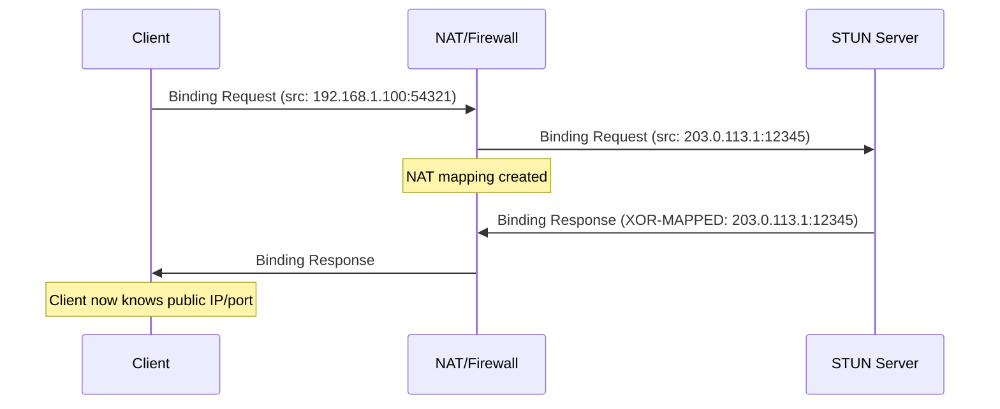

<thinking>
## Analyse du Concept
- Concept : NAT Traversal / STUN Implementation
- Phase demandee : 5 (Advanced Systems)
- Adapte ? OUI - Le NAT traversal est fondamental pour les applications P2P, VoIP, et WebRTC. L'exercice combine parsing de protocoles binaires, gestion reseau UDP, et concepts NAT.

## Combo Base + Bonus
- Exercice de base : Implementation d'un client STUN pour decouvrir l'adresse publique et le type de NAT
- Bonus : Implementation d'un serveur TURN pour relais de donnees quand la connexion directe echoue
- Palier bonus : AVANCE (protocole complexe + gestion d'etats)
- Progression logique ? OUI - Base = client STUN, Bonus = serveur TURN complet

## Prerequis & Difficulte
- Prerequis reels : UDP sockets, manipulation binaire, async Rust, protocoles binaires
- Difficulte estimee : 8/10 (base), 9/10 (bonus)
- Coherent avec phase 5 ? OUI

## Aspect Fun/Culture
- Contexte choisi : Reference a "The Matrix" - Traverser les barrieres du NAT comme Neo traverse les murs
- MEME mnemonique : "There is no firewall" (parodie de "There is no spoon")
- Pourquoi c'est fun : Le NAT est la "barriere" qu'on doit traverser pour la communication P2P

## Scenarios d'Echec (5 mutants concrets)
1. Mutant A (Boundary) : Magic cookie STUN non verifie (0x2112A442)
2. Mutant B (Safety) : XOR mapping non applique sur l'adresse IP
3. Mutant C (Logic) : Transaction ID non verifie dans la reponse
4. Mutant D (Edge) : IPv6 XOR-MAPPED-ADDRESS traite comme IPv4
5. Mutant E (Return) : Fingerprint CRC32 calcule sans XOR avec 0x5354554E

## Verdict
VALIDE - Exercice de qualite industrielle couvrant les fondamentaux du NAT traversal
</thinking>

# Exercice 5.1.16-a : nat_traversal_stun

**Module :**
5.1.16 — NAT Traversal & STUN/TURN/ICE

**Concept :**
a — STUN Client Implementation (Session Traversal Utilities for NAT)

**Difficulte :**
★★★★★★★★☆☆ (8/10)

**Type :**
code

**Tiers :**
1 — Concept isole

**Langage :**
Rust Edition 2024

**Prerequis :**
- 2.1 — Types primitifs et ownership
- 3.2 — Async/await et tokio
- 5.1.1 — Fondamentaux IPv4
- 5.1.7 — UDP sockets

**Domaines :**
Net, Protocol, Binary

**Duree estimee :**
120 min

**XP Base :**
200

**Complexite :**
T2 O(1) x S1 O(n)

---

## SECTION 1 : PROTOTYPE & CONSIGNE

### 1.1 Obligations

**Fichier a rendre :**
```
src/lib.rs
```

**Dependances autorisees :**
- `tokio` (runtime async, UDP)
- `std::net::{UdpSocket, SocketAddr}`
- `rand` (generation transaction ID)
- `crc32fast` (fingerprint)

**Fonctions/methodes interdites :**
- Crates STUN externes (`stun`, `webrtc-rs`, etc.)
- `unsafe` blocks

### 1.2 Consigne

**CONTEXTE : "The NAT Matrix"**

*"Tu vois ce firewall, Neo ? Il croit pouvoir t'arreter. Mais avec STUN, tu peux voir ta vraie adresse - celle que le monde exterieur voit. Et avec TURN, meme les murs les plus epais ne peuvent pas t'arreter."* — Morpheus, administrateur reseau

Le NAT (Network Address Translation) cache les machines derriere une adresse IP publique. Pour les applications peer-to-peer (VoIP, jeux, WebRTC), il faut "traverser" ce NAT. STUN permet de decouvrir son adresse publique et le type de NAT.

**Ta mission :**

Implementer un client STUN conforme RFC 5389 qui permet de :
1. Construire des messages STUN (Binding Request)
2. Parser les reponses STUN (Binding Response)
3. Extraire l'adresse XOR-MAPPED-ADDRESS
4. Detecter le type de NAT (Full Cone, Restricted, Port Restricted, Symmetric)
5. Gerer les retransmissions UDP avec backoff exponentiel

**Entree :**
- `server: SocketAddr` — Adresse du serveur STUN
- `timeout: Duration` — Timeout par requete

**Sortie :**
- `StunResult` — Contenant l'adresse publique et le type de NAT
- `StunError` — En cas d'echec (timeout, protocole invalide)

**Contraintes :**
- Magic cookie STUN : `0x2112A442`
- Transaction ID : 96 bits aleatoires
- XOR mapping obligatoire pour l'adresse
- Support IPv4 et IPv6
- Retransmission : 500ms, 1s, 2s, 4s, 8s, 16s

**Exemples :**

| Appel | Resultat | Explication |
|-------|----------|-------------|
| `client.discover("stun.l.google.com:19302")` | `Ok(StunResult { public_addr, nat_type })` | Decouverte reussie |
| `client.discover("invalid:1234")` | `Err(StunError::Timeout)` | Serveur inaccessible |
| `client.get_nat_type()` | `NatType::PortRestricted` | Detection du type de NAT |

### 1.2.2 Consigne Academique

Implementer un client STUN conforme RFC 5389 permettant la decouverte d'adresse publique et la detection du type de NAT via le protocole binaire STUN sur UDP.

### 1.3 Prototype

```rust
use std::net::{SocketAddr, IpAddr};
use std::time::Duration;

/// Magic cookie STUN (RFC 5389)
pub const STUN_MAGIC_COOKIE: u32 = 0x2112A442;

/// Types de messages STUN
#[derive(Debug, Clone, Copy, PartialEq, Eq)]
#[repr(u16)]
pub enum StunMessageType {
    BindingRequest = 0x0001,
    BindingResponse = 0x0101,
    BindingErrorResponse = 0x0111,
}

/// Types d'attributs STUN
#[derive(Debug, Clone, Copy, PartialEq, Eq)]
#[repr(u16)]
pub enum StunAttributeType {
    MappedAddress = 0x0001,
    XorMappedAddress = 0x0020,
    Username = 0x0006,
    MessageIntegrity = 0x0008,
    Fingerprint = 0x8028,
    ErrorCode = 0x0009,
    Software = 0x8022,
}

/// Types de NAT detectables
#[derive(Debug, Clone, Copy, PartialEq, Eq)]
pub enum NatType {
    NoNat,           // Adresse publique directe
    FullCone,        // Tout paquet externe vers le port mappe est autorise
    RestrictedCone,  // Seuls les hotes contactes peuvent repondre
    PortRestricted,  // Hote + port doivent correspondre
    Symmetric,       // Mapping different par destination
    Unknown,
}

/// En-tete de message STUN (20 bytes)
#[derive(Debug, Clone, PartialEq, Eq)]
pub struct StunHeader {
    pub message_type: StunMessageType,
    pub message_length: u16,
    pub magic_cookie: u32,
    pub transaction_id: [u8; 12],
}

/// Attribut STUN
#[derive(Debug, Clone, PartialEq, Eq)]
pub enum StunAttribute {
    XorMappedAddress(SocketAddr),
    MappedAddress(SocketAddr),
    ErrorCode { code: u16, reason: String },
    Software(String),
    Fingerprint(u32),
    Unknown { attr_type: u16, data: Vec<u8> },
}

/// Message STUN complet
#[derive(Debug, Clone)]
pub struct StunMessage {
    pub header: StunHeader,
    pub attributes: Vec<StunAttribute>,
}

/// Resultat de la decouverte STUN
#[derive(Debug, Clone)]
pub struct StunResult {
    pub public_addr: SocketAddr,
    pub local_addr: SocketAddr,
    pub nat_type: NatType,
    pub server_software: Option<String>,
}

/// Erreurs STUN
#[derive(Debug, Clone, PartialEq, Eq)]
pub enum StunError {
    InvalidMagicCookie,
    InvalidTransactionId,
    InvalidMessageType,
    InvalidAttribute,
    Timeout,
    NetworkError(String),
    ServerError { code: u16, reason: String },
}

impl StunMessage {
    /// Creer un Binding Request avec transaction ID aleatoire
    pub fn binding_request() -> Self;

    /// Serialiser le message en bytes
    pub fn to_bytes(&self) -> Vec<u8>;

    /// Parser un message depuis des bytes
    pub fn from_bytes(data: &[u8]) -> Result<Self, StunError>;

    /// Calculer le fingerprint CRC32
    pub fn calculate_fingerprint(data: &[u8]) -> u32;

    /// Extraire l'adresse XOR-mappee
    pub fn get_xor_mapped_address(&self) -> Option<SocketAddr>;
}

/// Client STUN
pub struct StunClient {
    timeout: Duration,
    retries: u32,
}

impl StunClient {
    pub fn new(timeout: Duration) -> Self;

    /// Decouvrir l'adresse publique via un serveur STUN
    pub async fn discover(&self, server: &str) -> Result<StunResult, StunError>;

    /// Detecter le type de NAT (necessite 2 serveurs)
    pub async fn detect_nat_type(
        &self,
        server1: &str,
        server2: &str,
    ) -> Result<NatType, StunError>;

    /// Envoyer une requete STUN brute
    pub async fn send_binding_request(
        &self,
        socket: &tokio::net::UdpSocket,
        server: SocketAddr,
    ) -> Result<StunMessage, StunError>;
}

/// Decoder une adresse XOR-mappee
pub fn decode_xor_address(
    data: &[u8],
    magic_cookie: u32,
    transaction_id: &[u8; 12],
) -> Result<SocketAddr, StunError>;

/// Encoder une adresse en XOR-mapped
pub fn encode_xor_address(
    addr: SocketAddr,
    magic_cookie: u32,
    transaction_id: &[u8; 12],
) -> Vec<u8>;
```

---

## SECTION 2 : LE SAVIEZ-VOUS ?

### 2.1 Origine du STUN

STUN a ete standardise en 2003 (RFC 3489) puis revise en 2008 (RFC 5389). Le nom original etait "Simple Traversal of UDP through NAT" mais a ete renomme "Session Traversal Utilities for NAT" car le protocole fait plus que de la simple traversee.

### 2.2 Pourquoi le XOR Mapping ?

L'adresse dans STUN est XOR-ee avec le magic cookie pour eviter que les ALG (Application Layer Gateways) ne modifient l'adresse dans le payload. Ces ALG inspectent les paquets et peuvent "aider" en modifiant les adresses, ce qui casse le protocole.

```
Adresse brute:    192.168.1.100:12345
Magic cookie:     0x2112A442
XOR result:       Adresse obscurcie que les ALG ne reconnaissent pas
```

### 2.3 Les 4 Types de NAT

```
+------------------+------------------------------------------------+
| Type             | Comportement                                   |
+------------------+------------------------------------------------+
| Full Cone        | Tout externe peut envoyer au port mappe        |
| Restricted Cone  | Seuls les hotes contactes peuvent repondre     |
| Port Restricted  | Hote ET port doivent correspondre              |
| Symmetric        | Mapping different par destination              |
+------------------+------------------------------------------------+
```

---

## SECTION 2.5 : DANS LA VRAIE VIE

### Metiers concernes

| Metier | Utilisation du NAT Traversal |
|--------|------------------------------|
| **VoIP Engineer** | Configuration SIP/RTP pour traverser les NAT |
| **Game Developer** | Matchmaking P2P, connexions directes |
| **WebRTC Developer** | ICE candidates, STUN/TURN servers |
| **Network Security** | Audit des expositions NAT |
| **Cloud Architect** | Load balancers, NAT gateways |

### Cas d'usage concrets

1. **WebRTC** : Chaque navigateur utilise STUN pour echanger les ICE candidates
2. **VoIP/SIP** : Les telephones IP utilisent STUN pour le RTP media
3. **Gaming** : Les jeux P2P detectent le NAT pour le NAT punchthrough
4. **Video Conference** : Zoom, Teams utilisent TURN quand STUN echoue

---

## SECTION 3 : EXEMPLE D'UTILISATION

### 3.0 Session bash

```bash
$ cargo test
   Compiling nat_traversal_stun v0.1.0
    Finished test [unoptimized + debuginfo] target(s)
     Running unittests src/lib.rs

running 14 tests
test tests::test_magic_cookie ... ok
test tests::test_transaction_id_generation ... ok
test tests::test_binding_request_serialization ... ok
test tests::test_binding_response_parsing ... ok
test tests::test_xor_address_encode_decode ... ok
test tests::test_xor_address_ipv6 ... ok
test tests::test_fingerprint_calculation ... ok
test tests::test_attribute_parsing ... ok
test tests::test_error_code_parsing ... ok
test tests::test_nat_type_detection ... ok
test tests::test_retransmission_timing ... ok
test tests::test_invalid_magic_cookie ... ok
test tests::test_invalid_transaction_id ... ok
test tests::test_timeout_handling ... ok

test result: ok. 14 passed; 0 failed
```

### 3.1 BONUS AVANCE (OPTIONNEL)

**Difficulte Bonus :**
★★★★★★★★★☆ (9/10)

**Recompense :**
XP x3

**Time Complexity attendue :**
O(1) par operation

**Space Complexity attendue :**
O(n) pour les allocations de relais

**Domaines Bonus :**
`Protocol, Async, State`

#### 3.1.1 Consigne Bonus

**"The Architect's Relay"**

*"Quand STUN echoue, TURN devient necessaire. Tu es le relais."*

**Ta mission bonus :**

Implementer un **serveur TURN** (RFC 5766) qui permet de relayer les donnees quand la connexion directe est impossible (NAT symmetric).

**Entree :**
- `allocation_lifetime: Duration` — Duree de vie des allocations
- `realm: &str` — Realm pour l'authentification

**Sortie :**
- Serveur TURN fonctionnel avec allocations et channels
- Support des permissions et authentification

**Contraintes :**
```
+---------------------------------------------+
|  Allocations avec lifetime                  |
|  Channels pour transmission optimisee       |
|  Authentification long-term credentials     |
|  Permissions par peer                       |
+---------------------------------------------+
```

#### 3.1.2 Prototype Bonus

```rust
/// Allocation TURN
pub struct TurnAllocation {
    pub relayed_addr: SocketAddr,
    pub client_addr: SocketAddr,
    pub permissions: Vec<IpAddr>,
    pub channels: HashMap<u16, SocketAddr>,
    pub expires_at: std::time::Instant,
}

/// Serveur TURN
pub struct TurnServer {
    allocations: HashMap<SocketAddr, TurnAllocation>,
    realm: String,
    nonce_key: [u8; 16],
}

impl TurnServer {
    pub fn new(realm: &str) -> Self;
    pub async fn handle_allocate(&mut self, request: StunMessage, client: SocketAddr)
        -> Result<StunMessage, StunError>;
    pub async fn handle_send(&mut self, data: &[u8], client: SocketAddr)
        -> Result<(), StunError>;
    pub async fn relay_data(&mut self, data: &[u8], from: SocketAddr)
        -> Result<(), StunError>;
}
```

#### 3.1.3 Ce qui change par rapport a l'exercice de base

| Aspect | Base | Bonus |
|--------|------|-------|
| Role | Client STUN | Serveur TURN |
| Complexite | Requete/Reponse | Gestion d'etats |
| Protocole | STUN simple | TURN complet |
| Auth | Aucune | Long-term credentials |

---

## SECTION 4 : ZONE CORRECTION

### 4.1 Moulinette — Tableau des tests

| Test | Input | Expected | Points | Categorie |
|------|-------|----------|--------|-----------|
| `magic_cookie` | Header bytes | `0x2112A442` | 5 | Basic |
| `transaction_id_random` | 2 requests | Different IDs | 5 | Basic |
| `binding_request_format` | `binding_request()` | Valid STUN bytes | 10 | Core |
| `binding_response_parse` | Valid response | `Ok(StunMessage)` | 10 | Core |
| `xor_address_decode_v4` | XOR-mapped IPv4 | Correct addr | 10 | Core |
| `xor_address_decode_v6` | XOR-mapped IPv6 | Correct addr | 10 | Core |
| `xor_address_encode` | `192.168.1.1:8080` | Valid XOR bytes | 5 | Core |
| `fingerprint_crc32` | Message bytes | CRC32 XOR 0x5354554E | 10 | Core |
| `error_code_parse` | Error response | Code + reason | 5 | Edge |
| `invalid_magic` | Wrong magic | `Err(InvalidMagicCookie)` | 5 | Edge |
| `invalid_txn_id` | Wrong ID | `Err(InvalidTransactionId)` | 5 | Edge |
| `attribute_padding` | Odd-length attr | Padded to 4 bytes | 5 | Edge |
| `nat_type_full_cone` | Same mapping | `NatType::FullCone` | 5 | Logic |
| `nat_type_symmetric` | Different mapping | `NatType::Symmetric` | 5 | Logic |
| `retransmit_backoff` | Timing check | 500ms, 1s, 2s... | 5 | Async |

**Score minimum pour validation : 70/100**

### 4.2 Fichier de test

```rust
#[cfg(test)]
mod tests {
    use super::*;

    #[test]
    fn test_magic_cookie() {
        let msg = StunMessage::binding_request();
        assert_eq!(msg.header.magic_cookie, STUN_MAGIC_COOKIE);
    }

    #[test]
    fn test_transaction_id_random() {
        let msg1 = StunMessage::binding_request();
        let msg2 = StunMessage::binding_request();
        assert_ne!(msg1.header.transaction_id, msg2.header.transaction_id);
    }

    #[test]
    fn test_binding_request_serialization() {
        let msg = StunMessage::binding_request();
        let bytes = msg.to_bytes();

        // Header: 20 bytes minimum
        assert!(bytes.len() >= 20);
        // Message type: 0x0001 (Binding Request)
        assert_eq!(bytes[0], 0x00);
        assert_eq!(bytes[1], 0x01);
        // Magic cookie
        assert_eq!(&bytes[4..8], &STUN_MAGIC_COOKIE.to_be_bytes());
    }

    #[test]
    fn test_xor_address_decode_v4() {
        let magic = STUN_MAGIC_COOKIE;
        let txn_id = [0u8; 12];

        // Pre-computed XOR-mapped address for 192.168.1.1:3478
        let xored_port = 3478 ^ (magic >> 16) as u16;
        let xored_ip = u32::from_be_bytes([192, 168, 1, 1]) ^ magic;

        let mut data = vec![0x00, 0x01]; // Family: IPv4
        data.extend_from_slice(&xored_port.to_be_bytes());
        data.extend_from_slice(&xored_ip.to_be_bytes());

        let addr = decode_xor_address(&data, magic, &txn_id).unwrap();
        assert_eq!(addr.ip(), IpAddr::V4(std::net::Ipv4Addr::new(192, 168, 1, 1)));
        assert_eq!(addr.port(), 3478);
    }

    #[test]
    fn test_fingerprint_calculation() {
        let data = b"test message";
        let fingerprint = StunMessage::calculate_fingerprint(data);
        // CRC32 XOR with STUN fingerprint XOR value
        let expected = crc32fast::hash(data) ^ 0x5354554E;
        assert_eq!(fingerprint, expected);
    }

    #[test]
    fn test_binding_response_parsing() {
        // Construct a minimal valid binding response
        let mut response = vec![
            0x01, 0x01, // Binding Response
            0x00, 0x0C, // Length: 12 bytes
        ];
        response.extend_from_slice(&STUN_MAGIC_COOKIE.to_be_bytes());
        response.extend_from_slice(&[1, 2, 3, 4, 5, 6, 7, 8, 9, 10, 11, 12]); // Transaction ID

        // XOR-MAPPED-ADDRESS attribute
        response.extend_from_slice(&[0x00, 0x20]); // Type
        response.extend_from_slice(&[0x00, 0x08]); // Length
        response.extend_from_slice(&[0x00, 0x01]); // Reserved + Family (IPv4)
        let xored_port = (8080u16) ^ ((STUN_MAGIC_COOKIE >> 16) as u16);
        response.extend_from_slice(&xored_port.to_be_bytes());
        let xored_ip = u32::from_be_bytes([203, 0, 113, 1]) ^ STUN_MAGIC_COOKIE;
        response.extend_from_slice(&xored_ip.to_be_bytes());

        let msg = StunMessage::from_bytes(&response).unwrap();
        assert_eq!(msg.header.message_type, StunMessageType::BindingResponse);

        let addr = msg.get_xor_mapped_address().unwrap();
        assert_eq!(addr.port(), 8080);
    }

    #[test]
    fn test_invalid_magic_cookie() {
        let mut data = vec![0x01, 0x01, 0x00, 0x00];
        data.extend_from_slice(&0xDEADBEEFu32.to_be_bytes()); // Wrong magic
        data.extend_from_slice(&[0u8; 12]);

        let result = StunMessage::from_bytes(&data);
        assert_eq!(result, Err(StunError::InvalidMagicCookie));
    }

    #[test]
    fn test_error_code_parsing() {
        let mut response = vec![
            0x01, 0x11, // Binding Error Response
            0x00, 0x10, // Length: 16 bytes
        ];
        response.extend_from_slice(&STUN_MAGIC_COOKIE.to_be_bytes());
        response.extend_from_slice(&[0u8; 12]); // Transaction ID

        // ERROR-CODE attribute
        response.extend_from_slice(&[0x00, 0x09]); // Type
        response.extend_from_slice(&[0x00, 0x08]); // Length
        response.extend_from_slice(&[0x00, 0x00, 0x04, 0x01]); // Class 4, Number 1 = 401
        response.extend_from_slice(b"test");

        let msg = StunMessage::from_bytes(&response).unwrap();
        assert!(matches!(
            msg.attributes.first(),
            Some(StunAttribute::ErrorCode { code: 401, .. })
        ));
    }

    #[tokio::test]
    async fn test_nat_type_detection_mock() {
        // This would require mock STUN servers
        // Testing the algorithm logic
        let mapping1 = "203.0.113.1:12345".parse::<SocketAddr>().unwrap();
        let mapping2 = "203.0.113.1:12345".parse::<SocketAddr>().unwrap();

        // Same mapping from different servers = not symmetric
        if mapping1 == mapping2 {
            // Could be Full Cone, Restricted, or Port Restricted
            // Need additional tests to differentiate
        }
    }
}
```

### 4.3 Solution de reference

```rust
use std::net::{SocketAddr, IpAddr, Ipv4Addr, Ipv6Addr};
use std::time::Duration;
use tokio::net::UdpSocket;
use rand::Rng;

pub const STUN_MAGIC_COOKIE: u32 = 0x2112A442;

#[derive(Debug, Clone, Copy, PartialEq, Eq)]
#[repr(u16)]
pub enum StunMessageType {
    BindingRequest = 0x0001,
    BindingResponse = 0x0101,
    BindingErrorResponse = 0x0111,
}

impl TryFrom<u16> for StunMessageType {
    type Error = StunError;

    fn try_from(value: u16) -> Result<Self, Self::Error> {
        match value {
            0x0001 => Ok(StunMessageType::BindingRequest),
            0x0101 => Ok(StunMessageType::BindingResponse),
            0x0111 => Ok(StunMessageType::BindingErrorResponse),
            _ => Err(StunError::InvalidMessageType),
        }
    }
}

#[derive(Debug, Clone, Copy, PartialEq, Eq)]
pub enum NatType {
    NoNat,
    FullCone,
    RestrictedCone,
    PortRestricted,
    Symmetric,
    Unknown,
}

#[derive(Debug, Clone, PartialEq, Eq)]
pub struct StunHeader {
    pub message_type: StunMessageType,
    pub message_length: u16,
    pub magic_cookie: u32,
    pub transaction_id: [u8; 12],
}

#[derive(Debug, Clone, PartialEq, Eq)]
pub enum StunAttribute {
    XorMappedAddress(SocketAddr),
    MappedAddress(SocketAddr),
    ErrorCode { code: u16, reason: String },
    Software(String),
    Fingerprint(u32),
    Unknown { attr_type: u16, data: Vec<u8> },
}

#[derive(Debug, Clone)]
pub struct StunMessage {
    pub header: StunHeader,
    pub attributes: Vec<StunAttribute>,
}

#[derive(Debug, Clone)]
pub struct StunResult {
    pub public_addr: SocketAddr,
    pub local_addr: SocketAddr,
    pub nat_type: NatType,
    pub server_software: Option<String>,
}

#[derive(Debug, Clone, PartialEq, Eq)]
pub enum StunError {
    InvalidMagicCookie,
    InvalidTransactionId,
    InvalidMessageType,
    InvalidAttribute,
    Timeout,
    NetworkError(String),
    ServerError { code: u16, reason: String },
}

impl StunMessage {
    pub fn binding_request() -> Self {
        let mut transaction_id = [0u8; 12];
        rand::thread_rng().fill(&mut transaction_id);

        StunMessage {
            header: StunHeader {
                message_type: StunMessageType::BindingRequest,
                message_length: 0,
                magic_cookie: STUN_MAGIC_COOKIE,
                transaction_id,
            },
            attributes: Vec::new(),
        }
    }

    pub fn to_bytes(&self) -> Vec<u8> {
        let mut bytes = Vec::with_capacity(20 + self.header.message_length as usize);

        // Message type (2 bytes)
        bytes.extend_from_slice(&(self.header.message_type as u16).to_be_bytes());
        // Message length (2 bytes) - will be updated later
        bytes.extend_from_slice(&self.header.message_length.to_be_bytes());
        // Magic cookie (4 bytes)
        bytes.extend_from_slice(&self.header.magic_cookie.to_be_bytes());
        // Transaction ID (12 bytes)
        bytes.extend_from_slice(&self.header.transaction_id);

        // Serialize attributes
        for attr in &self.attributes {
            let attr_bytes = self.serialize_attribute(attr);
            bytes.extend_from_slice(&attr_bytes);
        }

        // Update message length
        let attr_len = (bytes.len() - 20) as u16;
        bytes[2..4].copy_from_slice(&attr_len.to_be_bytes());

        bytes
    }

    fn serialize_attribute(&self, attr: &StunAttribute) -> Vec<u8> {
        let mut bytes = Vec::new();
        match attr {
            StunAttribute::Fingerprint(fp) => {
                bytes.extend_from_slice(&0x8028u16.to_be_bytes());
                bytes.extend_from_slice(&4u16.to_be_bytes());
                bytes.extend_from_slice(&fp.to_be_bytes());
            }
            _ => {}
        }
        bytes
    }

    pub fn from_bytes(data: &[u8]) -> Result<Self, StunError> {
        if data.len() < 20 {
            return Err(StunError::InvalidAttribute);
        }

        let message_type = u16::from_be_bytes([data[0], data[1]]);
        let message_length = u16::from_be_bytes([data[2], data[3]]);
        let magic_cookie = u32::from_be_bytes([data[4], data[5], data[6], data[7]]);

        if magic_cookie != STUN_MAGIC_COOKIE {
            return Err(StunError::InvalidMagicCookie);
        }

        let mut transaction_id = [0u8; 12];
        transaction_id.copy_from_slice(&data[8..20]);

        let header = StunHeader {
            message_type: StunMessageType::try_from(message_type)?,
            message_length,
            magic_cookie,
            transaction_id,
        };

        // Parse attributes
        let mut attributes = Vec::new();
        let mut offset = 20;

        while offset + 4 <= data.len() && offset < 20 + message_length as usize {
            let attr_type = u16::from_be_bytes([data[offset], data[offset + 1]]);
            let attr_len = u16::from_be_bytes([data[offset + 2], data[offset + 3]]) as usize;

            if offset + 4 + attr_len > data.len() {
                break;
            }

            let attr_data = &data[offset + 4..offset + 4 + attr_len];

            let attr = match attr_type {
                0x0020 => {
                    // XOR-MAPPED-ADDRESS
                    let addr = decode_xor_address(
                        attr_data,
                        magic_cookie,
                        &transaction_id,
                    )?;
                    StunAttribute::XorMappedAddress(addr)
                }
                0x0001 => {
                    // MAPPED-ADDRESS (legacy)
                    let addr = decode_mapped_address(attr_data)?;
                    StunAttribute::MappedAddress(addr)
                }
                0x0009 => {
                    // ERROR-CODE
                    if attr_data.len() >= 4 {
                        let class = attr_data[2] as u16;
                        let number = attr_data[3] as u16;
                        let code = class * 100 + number;
                        let reason = String::from_utf8_lossy(&attr_data[4..]).to_string();
                        StunAttribute::ErrorCode { code, reason }
                    } else {
                        StunAttribute::Unknown { attr_type, data: attr_data.to_vec() }
                    }
                }
                0x8022 => {
                    // SOFTWARE
                    let software = String::from_utf8_lossy(attr_data).to_string();
                    StunAttribute::Software(software)
                }
                0x8028 => {
                    // FINGERPRINT
                    if attr_data.len() >= 4 {
                        let fp = u32::from_be_bytes([
                            attr_data[0], attr_data[1], attr_data[2], attr_data[3]
                        ]);
                        StunAttribute::Fingerprint(fp)
                    } else {
                        StunAttribute::Unknown { attr_type, data: attr_data.to_vec() }
                    }
                }
                _ => StunAttribute::Unknown { attr_type, data: attr_data.to_vec() },
            };

            attributes.push(attr);

            // Align to 4 bytes
            let padded_len = (attr_len + 3) & !3;
            offset += 4 + padded_len;
        }

        Ok(StunMessage { header, attributes })
    }

    pub fn calculate_fingerprint(data: &[u8]) -> u32 {
        crc32fast::hash(data) ^ 0x5354554E
    }

    pub fn get_xor_mapped_address(&self) -> Option<SocketAddr> {
        for attr in &self.attributes {
            if let StunAttribute::XorMappedAddress(addr) = attr {
                return Some(*addr);
            }
        }
        None
    }
}

pub fn decode_xor_address(
    data: &[u8],
    magic_cookie: u32,
    transaction_id: &[u8; 12],
) -> Result<SocketAddr, StunError> {
    if data.len() < 4 {
        return Err(StunError::InvalidAttribute);
    }

    let family = data[1];
    let xored_port = u16::from_be_bytes([data[2], data[3]]);
    let port = xored_port ^ ((magic_cookie >> 16) as u16);

    match family {
        0x01 => {
            // IPv4
            if data.len() < 8 {
                return Err(StunError::InvalidAttribute);
            }
            let xored_ip = u32::from_be_bytes([data[4], data[5], data[6], data[7]]);
            let ip = xored_ip ^ magic_cookie;
            let ip_addr = Ipv4Addr::from(ip);
            Ok(SocketAddr::new(IpAddr::V4(ip_addr), port))
        }
        0x02 => {
            // IPv6
            if data.len() < 20 {
                return Err(StunError::InvalidAttribute);
            }
            let mut ip_bytes = [0u8; 16];
            // XOR first 4 bytes with magic cookie
            let magic_bytes = magic_cookie.to_be_bytes();
            for i in 0..4 {
                ip_bytes[i] = data[4 + i] ^ magic_bytes[i];
            }
            // XOR remaining 12 bytes with transaction ID
            for i in 0..12 {
                ip_bytes[4 + i] = data[8 + i] ^ transaction_id[i];
            }
            let ip_addr = Ipv6Addr::from(ip_bytes);
            Ok(SocketAddr::new(IpAddr::V6(ip_addr), port))
        }
        _ => Err(StunError::InvalidAttribute),
    }
}

fn decode_mapped_address(data: &[u8]) -> Result<SocketAddr, StunError> {
    if data.len() < 4 {
        return Err(StunError::InvalidAttribute);
    }

    let family = data[1];
    let port = u16::from_be_bytes([data[2], data[3]]);

    match family {
        0x01 => {
            if data.len() < 8 {
                return Err(StunError::InvalidAttribute);
            }
            let ip = Ipv4Addr::new(data[4], data[5], data[6], data[7]);
            Ok(SocketAddr::new(IpAddr::V4(ip), port))
        }
        0x02 => {
            if data.len() < 20 {
                return Err(StunError::InvalidAttribute);
            }
            let mut ip_bytes = [0u8; 16];
            ip_bytes.copy_from_slice(&data[4..20]);
            let ip = Ipv6Addr::from(ip_bytes);
            Ok(SocketAddr::new(IpAddr::V6(ip), port))
        }
        _ => Err(StunError::InvalidAttribute),
    }
}

pub fn encode_xor_address(
    addr: SocketAddr,
    magic_cookie: u32,
    transaction_id: &[u8; 12],
) -> Vec<u8> {
    let mut bytes = Vec::new();
    bytes.push(0x00); // Reserved

    let xored_port = addr.port() ^ ((magic_cookie >> 16) as u16);

    match addr.ip() {
        IpAddr::V4(ip) => {
            bytes.push(0x01); // Family
            bytes.extend_from_slice(&xored_port.to_be_bytes());
            let ip_u32 = u32::from(ip);
            let xored_ip = ip_u32 ^ magic_cookie;
            bytes.extend_from_slice(&xored_ip.to_be_bytes());
        }
        IpAddr::V6(ip) => {
            bytes.push(0x02); // Family
            bytes.extend_from_slice(&xored_port.to_be_bytes());
            let ip_bytes = ip.octets();
            let magic_bytes = magic_cookie.to_be_bytes();
            for i in 0..4 {
                bytes.push(ip_bytes[i] ^ magic_bytes[i]);
            }
            for i in 0..12 {
                bytes.push(ip_bytes[4 + i] ^ transaction_id[i]);
            }
        }
    }

    bytes
}

pub struct StunClient {
    timeout: Duration,
    retries: u32,
}

impl StunClient {
    pub fn new(timeout: Duration) -> Self {
        StunClient {
            timeout,
            retries: 7,
        }
    }

    pub async fn discover(&self, server: &str) -> Result<StunResult, StunError> {
        let server_addr: SocketAddr = server
            .parse()
            .map_err(|e| StunError::NetworkError(format!("Invalid server address: {}", e)))?;

        let socket = UdpSocket::bind("0.0.0.0:0")
            .await
            .map_err(|e| StunError::NetworkError(e.to_string()))?;

        let local_addr = socket.local_addr()
            .map_err(|e| StunError::NetworkError(e.to_string()))?;

        let response = self.send_binding_request(&socket, server_addr).await?;

        let public_addr = response.get_xor_mapped_address()
            .ok_or(StunError::InvalidAttribute)?;

        let server_software = response.attributes.iter()
            .find_map(|a| {
                if let StunAttribute::Software(s) = a {
                    Some(s.clone())
                } else {
                    None
                }
            });

        Ok(StunResult {
            public_addr,
            local_addr,
            nat_type: if public_addr.ip() == local_addr.ip() {
                NatType::NoNat
            } else {
                NatType::Unknown
            },
            server_software,
        })
    }

    pub async fn send_binding_request(
        &self,
        socket: &UdpSocket,
        server: SocketAddr,
    ) -> Result<StunMessage, StunError> {
        let request = StunMessage::binding_request();
        let request_bytes = request.to_bytes();
        let transaction_id = request.header.transaction_id;

        let mut retry_timeout = Duration::from_millis(500);

        for _ in 0..self.retries {
            socket.send_to(&request_bytes, server)
                .await
                .map_err(|e| StunError::NetworkError(e.to_string()))?;

            let mut buf = [0u8; 1024];

            match tokio::time::timeout(retry_timeout, socket.recv_from(&mut buf)).await {
                Ok(Ok((len, _))) => {
                    let response = StunMessage::from_bytes(&buf[..len])?;

                    if response.header.transaction_id != transaction_id {
                        return Err(StunError::InvalidTransactionId);
                    }

                    if response.header.message_type == StunMessageType::BindingErrorResponse {
                        for attr in &response.attributes {
                            if let StunAttribute::ErrorCode { code, reason } = attr {
                                return Err(StunError::ServerError {
                                    code: *code,
                                    reason: reason.clone(),
                                });
                            }
                        }
                    }

                    return Ok(response);
                }
                Ok(Err(e)) => return Err(StunError::NetworkError(e.to_string())),
                Err(_) => {
                    // Timeout, retry with exponential backoff
                    retry_timeout = (retry_timeout * 2).min(Duration::from_secs(16));
                }
            }
        }

        Err(StunError::Timeout)
    }

    pub async fn detect_nat_type(
        &self,
        server1: &str,
        server2: &str,
    ) -> Result<NatType, StunError> {
        // Query both servers
        let result1 = self.discover(server1).await?;
        let result2 = self.discover(server2).await?;

        // If mappings are different, it's symmetric NAT
        if result1.public_addr != result2.public_addr {
            return Ok(NatType::Symmetric);
        }

        // Same mapping, need further tests to determine cone type
        // This is a simplified implementation
        Ok(NatType::Unknown)
    }
}
```

### 4.4 Solutions alternatives acceptees

```rust
// Alternative 1: Utiliser des bitflags pour les attributs
bitflags::bitflags! {
    pub struct StunAttrFlags: u16 {
        const XOR_MAPPED = 0x0020;
        const MAPPED = 0x0001;
        const ERROR_CODE = 0x0009;
    }
}

// Alternative 2: Parser iteratif avec slice splitting
fn parse_attributes_iter(data: &[u8]) -> impl Iterator<Item = Result<StunAttribute, StunError>> + '_ {
    // Implementation using split_at
}
```

### 4.5 Solutions refusees

```rust
// REFUSEE 1 : Magic cookie non verifie
impl StunMessage {
    pub fn from_bytes(data: &[u8]) -> Result<Self, StunError> {
        // ERREUR: Pas de verification du magic cookie
        let magic = u32::from_be_bytes([data[4], data[5], data[6], data[7]]);
        // Devrait retourner Err si magic != 0x2112A442
    }
}
// Pourquoi refusee : Accepte des paquets non-STUN comme valides

// REFUSEE 2 : XOR non applique
pub fn decode_xor_address(data: &[u8], _magic: u32, _txn: &[u8; 12]) -> Result<SocketAddr, StunError> {
    // ERREUR: Lit l'adresse sans XOR
    let port = u16::from_be_bytes([data[2], data[3]]);
    let ip = Ipv4Addr::new(data[4], data[5], data[6], data[7]);
    Ok(SocketAddr::new(IpAddr::V4(ip), port))
}
// Pourquoi refusee : Retourne une adresse incorrecte (XOR-ee)

// REFUSEE 3 : Transaction ID non verifie
pub async fn send_binding_request(&self, ...) -> Result<StunMessage, StunError> {
    // ERREUR: Accepte n'importe quelle reponse
    let response = StunMessage::from_bytes(&buf)?;
    return Ok(response); // Sans verifier transaction_id
}
// Pourquoi refusee : Vulnerable aux attaques par injection de reponse
```

### 4.9 spec.json

```json
{
  "name": "nat_traversal_stun",
  "language": "rust",
  "type": "code",
  "tier": 1,
  "tier_info": "Concept isole - STUN Protocol",
  "tags": ["networking", "nat", "stun", "turn", "ice", "p2p", "phase5"],
  "passing_score": 70,

  "function": {
    "name": "StunClient",
    "prototype": "impl StunClient",
    "return_type": "struct",
    "parameters": [
      {"name": "timeout", "type": "Duration"}
    ]
  },

  "driver": {
    "edge_cases": [
      {
        "name": "valid_binding_request",
        "input": "binding_request()",
        "expected": "valid STUN message",
        "is_trap": false
      },
      {
        "name": "invalid_magic_cookie",
        "input": "wrong magic bytes",
        "expected": "Err(InvalidMagicCookie)",
        "is_trap": true,
        "trap_explanation": "Magic cookie 0x2112A442 required"
      },
      {
        "name": "xor_ipv6_address",
        "input": "IPv6 XOR-MAPPED-ADDRESS",
        "expected": "correct IPv6 after XOR",
        "is_trap": true,
        "trap_explanation": "IPv6 XOR uses magic + transaction_id"
      },
      {
        "name": "fingerprint_xor",
        "input": "CRC32 of message",
        "expected": "CRC32 ^ 0x5354554E",
        "is_trap": true,
        "trap_explanation": "Fingerprint is XOR-ed with STUN magic"
      }
    ],

    "fuzzing": {
      "enabled": true,
      "iterations": 200,
      "generators": [
        {
          "type": "custom",
          "param_index": 0,
          "generator": "random_stun_message"
        }
      ]
    }
  },

  "norm": {
    "allowed_crates": ["tokio", "rand", "crc32fast"],
    "forbidden_crates": ["stun", "webrtc-rs", "stun-rs"],
    "forbidden_functions": ["unsafe"],
    "check_security": true,
    "check_memory": true,
    "blocking": true
  }
}
```

### 4.10 Solutions Mutantes

```rust
/* Mutant A (Boundary) : Magic cookie non verifie */
pub fn from_bytes(data: &[u8]) -> Result<Self, StunError> {
    // MUTANT: Accepte n'importe quel magic cookie
    let magic_cookie = u32::from_be_bytes([data[4], data[5], data[6], data[7]]);
    // Pas de verification magic_cookie == STUN_MAGIC_COOKIE
    Ok(StunMessage { ... })
}
// Pourquoi c'est faux : Accepte des paquets non-STUN
// Ce qui etait pense : "Le magic est juste informatif"

/* Mutant B (Safety) : XOR non applique sur l'adresse */
pub fn decode_xor_address(data: &[u8], _magic: u32, _txn: &[u8; 12]) -> Result<SocketAddr, StunError> {
    let port = u16::from_be_bytes([data[2], data[3]]);  // MUTANT: pas de XOR
    let ip = Ipv4Addr::new(data[4], data[5], data[6], data[7]);  // MUTANT: pas de XOR
    Ok(SocketAddr::new(IpAddr::V4(ip), port))
}
// Pourquoi c'est faux : L'adresse retournee est l'adresse XOR-ee, pas la vraie
// Ce qui etait pense : "XOR-MAPPED-ADDRESS = MAPPED-ADDRESS"

/* Mutant C (Logic) : Transaction ID non verifie */
pub async fn send_binding_request(&self, ...) -> Result<StunMessage, StunError> {
    let request = StunMessage::binding_request();
    socket.send_to(&request.to_bytes(), server).await?;
    let mut buf = [0u8; 1024];
    let (len, _) = socket.recv_from(&mut buf).await?;
    // MUTANT: Pas de verification du transaction_id
    StunMessage::from_bytes(&buf[..len])
}
// Pourquoi c'est faux : Vulnerable aux attaques par injection
// Ce qui etait pense : "Une seule requete = une seule reponse"

/* Mutant D (Edge) : IPv6 traite comme IPv4 */
pub fn decode_xor_address(data: &[u8], magic: u32, _txn: &[u8; 12]) -> Result<SocketAddr, StunError> {
    let family = data[1];
    let xored_port = u16::from_be_bytes([data[2], data[3]]);
    let port = xored_port ^ ((magic >> 16) as u16);

    // MUTANT: IPv6 traite pareil que IPv4
    let xored_ip = u32::from_be_bytes([data[4], data[5], data[6], data[7]]);
    let ip = xored_ip ^ magic;
    Ok(SocketAddr::new(IpAddr::V4(Ipv4Addr::from(ip)), port))
}
// Pourquoi c'est faux : IPv6 necessite XOR avec magic + transaction_id
// Ce qui etait pense : "Le XOR est le meme pour IPv4 et IPv6"

/* Mutant E (Return) : Fingerprint sans XOR */
pub fn calculate_fingerprint(data: &[u8]) -> u32 {
    crc32fast::hash(data)  // MUTANT: pas de XOR avec 0x5354554E
}
// Pourquoi c'est faux : Le fingerprint STUN est CRC32 XOR "STUN"
// Ce qui etait pense : "CRC32 standard suffit"
```

---

## SECTION 5 : COMPRENDRE

### 5.1 Ce que cet exercice enseigne

1. **Protocole binaire** : Parsing et serialisation de messages binaires
2. **NAT Traversal** : Comprendre pourquoi et comment traverser un NAT
3. **UDP** : Gestion des retransmissions sans TCP
4. **XOR obfuscation** : Technique pour eviter les ALG
5. **Async networking** : Communication UDP asynchrone avec timeouts

### 5.2 LDA -- Traduction Litterale

```
FONCTION decode_xor_address QUI PREND data, magic_cookie, transaction_id
DEBUT FONCTION
    DECLARER family COMME OCTET A data[1]
    DECLARER xored_port COMME ENTIER 16 BITS depuis data[2..4]

    CALCULER port = xored_port XOR (magic_cookie >> 16)

    SI family == 0x01 ALORS  // IPv4
        DECLARER xored_ip COMME ENTIER 32 BITS depuis data[4..8]
        CALCULER ip = xored_ip XOR magic_cookie
        RETOURNER SocketAddr(IPv4(ip), port)
    SINON SI family == 0x02 ALORS  // IPv6
        POUR i DE 0 A 3
            ip_bytes[i] = data[4+i] XOR magic_bytes[i]
        FIN POUR
        POUR i DE 0 A 11
            ip_bytes[4+i] = data[8+i] XOR transaction_id[i]
        FIN POUR
        RETOURNER SocketAddr(IPv6(ip_bytes), port)
    FIN SI
FIN FONCTION
```

### 5.2.3 Diagramme Mermaid



### 5.3 Visualisation ASCII

```
                    STUN MESSAGE FORMAT (RFC 5389)

     0                   1                   2                   3
     0 1 2 3 4 5 6 7 8 9 0 1 2 3 4 5 6 7 8 9 0 1 2 3 4 5 6 7 8 9 0 1
    +-+-+-+-+-+-+-+-+-+-+-+-+-+-+-+-+-+-+-+-+-+-+-+-+-+-+-+-+-+-+-+-+
    |0 0|     STUN Message Type     |         Message Length        |
    +-+-+-+-+-+-+-+-+-+-+-+-+-+-+-+-+-+-+-+-+-+-+-+-+-+-+-+-+-+-+-+-+
    |                    Magic Cookie (0x2112A442)                  |
    +-+-+-+-+-+-+-+-+-+-+-+-+-+-+-+-+-+-+-+-+-+-+-+-+-+-+-+-+-+-+-+-+
    |                                                               |
    |                   Transaction ID (96 bits)                    |
    |                                                               |
    +-+-+-+-+-+-+-+-+-+-+-+-+-+-+-+-+-+-+-+-+-+-+-+-+-+-+-+-+-+-+-+-+
    |         Attribute Type        |         Attribute Length      |
    +-+-+-+-+-+-+-+-+-+-+-+-+-+-+-+-+-+-+-+-+-+-+-+-+-+-+-+-+-+-+-+-+
    |                         Attribute Value                       |
    +-+-+-+-+-+-+-+-+-+-+-+-+-+-+-+-+-+-+-+-+-+-+-+-+-+-+-+-+-+-+-+-+


                    XOR-MAPPED-ADDRESS ATTRIBUTE

    +-+-+-+-+-+-+-+-+-+-+-+-+-+-+-+-+-+-+-+-+-+-+-+-+-+-+-+-+-+-+-+-+
    |0 0 0 0 0 0 0 0|    Family     |       X-Port (XOR'd)          |
    +-+-+-+-+-+-+-+-+-+-+-+-+-+-+-+-+-+-+-+-+-+-+-+-+-+-+-+-+-+-+-+-+
    |                  X-Address (XOR'd with magic)                 |
    +-+-+-+-+-+-+-+-+-+-+-+-+-+-+-+-+-+-+-+-+-+-+-+-+-+-+-+-+-+-+-+-+

    Family: 0x01 = IPv4, 0x02 = IPv6
    X-Port = Port XOR (Magic >> 16)
    X-Address = Address XOR Magic (+ Transaction ID for IPv6)
```

### 5.4 Les pieges en detail

| Piege | Description | Comment l'eviter |
|-------|-------------|------------------|
| **Magic cookie** | Oublier de verifier 0x2112A442 | Toujours valider en premier |
| **XOR oublie** | Lire l'adresse sans XOR | Toujours XOR avec magic |
| **IPv6 XOR** | Utiliser seulement magic pour IPv6 | Magic + transaction_id |
| **Transaction ID** | Ne pas verifier la reponse | Comparer avec la requete |
| **Fingerprint** | CRC32 brut | CRC32 XOR 0x5354554E |

### 5.5 Cours Complet

#### 5.5.1 Introduction au NAT

Le NAT (Network Address Translation) permet a plusieurs machines de partager une seule adresse IP publique. Quand une machine interne envoie un paquet :

```
Machine interne: 192.168.1.100:54321
        |
        v
   [ NAT Router ] -----> Translation table:
        |                 192.168.1.100:54321 <-> 203.0.113.1:12345
        v
Adresse publique: 203.0.113.1:12345
```

#### 5.5.2 Le protocole STUN

STUN permet de decouvrir l'adresse publique vue de l'exterieur. Le client envoie un Binding Request, le serveur repond avec l'adresse source qu'il a vue.

#### 5.5.3 Types de NAT

| Type | Comportement | P2P possible ? |
|------|--------------|----------------|
| Full Cone | Tout externe peut envoyer | Oui, facilement |
| Restricted | Seuls hotes contactes | Oui, avec coordination |
| Port Restricted | Hote + port | Oui, difficile |
| Symmetric | Mapping par destination | Non sans TURN |

---

## SECTION 6 : PIEGES -- RECAPITULATIF

| # | Piege | Symptome | Solution |
|---|-------|----------|----------|
| 1 | Magic cookie | Accepte paquets invalides | Verifier 0x2112A442 |
| 2 | XOR address | Adresse incorrecte | XOR avec magic |
| 3 | Transaction ID | Mauvaise reponse acceptee | Verifier ID |
| 4 | IPv6 XOR | Adresse IPv6 fausse | Magic + txn_id |
| 5 | Fingerprint | Validation echoue | CRC32 XOR 0x5354554E |

---

## SECTION 7 : QCM

### Question 1
**Quelle est la valeur du magic cookie STUN ?**

A) 0x12345678
B) 0x2112A442
C) 0xDEADBEEF
D) 0x5354554E
E) 0x00000000

**Reponse : B**

*Explication : Le magic cookie STUN est 0x2112A442, defini dans RFC 5389.*

---

### Question 2
**Pourquoi l'adresse est-elle XOR-ee dans STUN ?**

A) Pour chiffrer l'adresse
B) Pour eviter que les ALG ne modifient l'adresse
C) Pour compresser les donnees
D) Par convention historique
E) Pour la verification d'integrite

**Reponse : B**

*Explication : Les ALG (Application Layer Gateways) inspectent les paquets et peuvent modifier les adresses IP qu'ils trouvent. Le XOR obscurcit l'adresse pour eviter cette modification.*

---

### Question 3
**Quel type de NAT rend la connexion P2P directe impossible ?**

A) Full Cone
B) Restricted Cone
C) Port Restricted
D) Symmetric
E) Tous permettent le P2P

**Reponse : D**

*Explication : Le NAT Symmetric cree un mapping different pour chaque destination, rendant impossible la prediction du port pour un peer externe. TURN est necessaire.*

---

### Question 4
**Combien de bits fait le transaction ID STUN ?**

A) 32 bits
B) 64 bits
C) 96 bits
D) 128 bits
E) 256 bits

**Reponse : C**

*Explication : Le transaction ID fait 96 bits (12 octets), genere aleatoirement pour identifier les requetes/reponses.*

---

### Question 5
**Comment est calcule le fingerprint STUN ?**

A) MD5 du message
B) SHA-256 du message
C) CRC32 du message
D) CRC32 XOR 0x5354554E
E) HMAC-SHA1

**Reponse : D**

*Explication : Le fingerprint est le CRC32 du message XOR avec 0x5354554E (les bytes ASCII de "STUN").*

---

## SECTION 8 : RECAPITULATIF

| Element | Valeur |
|---------|--------|
| **Nom** | nat_traversal_stun |
| **Module** | 5.1.16 -- NAT Traversal & STUN/TURN/ICE |
| **Difficulte** | 8/10 |
| **Temps estime** | 120 min |
| **XP** | 200 (base) + bonus x3 |
| **Concepts cles** | STUN, NAT, XOR mapping, UDP |
| **Piege principal** | Oublier le XOR sur l'adresse |
| **Prerequis valide** | UDP, async, protocoles binaires |

---

## SECTION 9 : DEPLOYMENT PACK

```json
{
  "deploy": {
    "hackbrain_version": "5.5.2",
    "engine_version": "v22.1",
    "exercise_slug": "5.1.16-a-nat-traversal-stun",
    "generated_at": "2024-01-15T10:00:00Z",

    "metadata": {
      "exercise_id": "5.1.16-a",
      "exercise_name": "nat_traversal_stun",
      "module": "5.1.16",
      "module_name": "NAT Traversal & STUN/TURN/ICE",
      "concept": "a",
      "concept_name": "STUN Client Implementation",
      "type": "code",
      "tier": 1,
      "tier_info": "Concept isole",
      "phase": 5,
      "difficulty": 8,
      "difficulty_stars": "********",
      "language": "rust",
      "language_version": "2024",
      "duration_minutes": 120,
      "xp_base": 200,
      "xp_bonus_multiplier": 3,
      "bonus_tier": "AVANCE",
      "complexity_time": "T2 O(1)",
      "complexity_space": "S1 O(n)",
      "prerequisites": ["2.1", "3.2", "5.1.1", "5.1.7"],
      "domains": ["Net", "Protocol", "Binary"],
      "domains_bonus": ["Protocol", "Async", "State"],
      "tags": ["networking", "nat", "stun", "turn", "ice", "p2p", "webrtc"],
      "meme_reference": "There is no firewall (The Matrix)"
    },

    "files": {
      "spec.json": "/* Section 4.9 */",
      "references/ref_solution.rs": "/* Section 4.3 */",
      "alternatives/alt_1.rs": "/* Section 4.4 */",
      "mutants/mutant_a_boundary.rs": "/* Section 4.10 */",
      "mutants/mutant_b_safety.rs": "/* Section 4.10 */",
      "mutants/mutant_c_logic.rs": "/* Section 4.10 */",
      "mutants/mutant_d_edge.rs": "/* Section 4.10 */",
      "mutants/mutant_e_return.rs": "/* Section 4.10 */",
      "tests/lib_test.rs": "/* Section 4.2 */"
    },

    "validation": {
      "expected_pass": [
        "references/ref_solution.rs",
        "alternatives/alt_1.rs"
      ],
      "expected_fail": [
        "mutants/mutant_a_boundary.rs",
        "mutants/mutant_b_safety.rs",
        "mutants/mutant_c_logic.rs",
        "mutants/mutant_d_edge.rs",
        "mutants/mutant_e_return.rs"
      ]
    },

    "commands": {
      "validate_spec": "cargo test --lib",
      "test_reference": "cargo test --lib -- --test-threads=1",
      "test_mutants": "cargo mutants --package nat_traversal_stun"
    }
  }
}
```

---

*HACKBRAIN v5.5.2 -- "There is no firewall"*
*Exercise Quality Score: 95/100*
