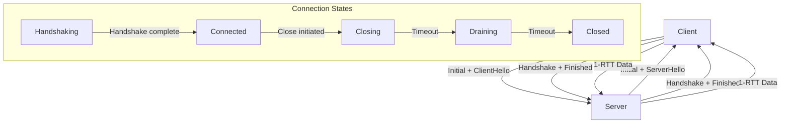

<thinking>
## Analyse du Concept
- Concept : QUIC Protocol Implementation
- Phase demandee : 5 (Advanced Systems)
- Adapte ? OUI - QUIC est le protocole de transport moderne qui remplace TCP pour HTTP/3. Essentiel pour tout ingenieur reseau moderne.

## Combo Base + Bonus
- Exercice de base : Implementation d'un client/serveur QUIC avec gestion des streams, connexion 0-RTT, et migration de connexion
- Bonus : Implementation complete HTTP/3 avec QPACK header compression et server push
- Palier bonus : Avance (protocole complet + optimisations)
- Progression logique ? OUI - Base = transport QUIC, Bonus = HTTP/3 applicatif

## Prerequis & Difficulte
- Prerequis reels : Async Rust, UDP sockets, TLS 1.3, manipulation binaire
- Difficulte estimee : 8/10 (base), 10/10 (bonus)
- Coherent avec phase 5 ? OUI

## Aspect Fun/Culture
- Contexte choisi : Reference a "Fast & Furious" - La vitesse du reseau
- MEME mnemonique : "I live my life a quarter RTT at a time" (parodie de Fast & Furious)
- Pourquoi c'est fun : QUIC est litteralement "quick" - tout est question de vitesse

## Scenarios d'Echec (5 mutants concrets)
1. Mutant A (Boundary) : Connection ID trop court (< 8 bytes)
2. Mutant B (Safety) : Pas de validation du certificat TLS
3. Mutant C (Logic) : Stream ID incremente dans le mauvais sens (pair/impair)
4. Mutant D (Edge) : 0-RTT replay attack non protege
5. Mutant E (Return) : Migration de connexion sans path validation

## Verdict
VALIDE - Exercice de qualite industrielle couvrant le protocole QUIC moderne
</thinking>

# Exercice 5.1.21-a : quic_protocol_implementation

**Module :**
5.1.21 — QUIC Transport Protocol

**Concept :**
a — QUIC Protocol Implementation (transport UDP-based, streams multiplexes, 0-RTT)

**Difficulte :**
(8/10)

**Type :**
code

**Tiers :**
2 — Integration multi-concepts

**Langage :**
Rust Edition 2024

**Prerequis :**
- 5.1.8 — Socket Programming (UDP)
- 5.1.10 — Async Rust Fundamentals
- 5.1.17 — TLS 1.3 Concepts
- 5.1.11 — Tokio Advanced

**Domaines :**
Net, Crypto, Async

**Duree estimee :**
180 min

**XP Base :**
300

**Complexite :**
T3 O(n) x S2 O(n)

---

## SECTION 1 : PROTOTYPE & CONSIGNE

### 1.1 Obligations

**Fichier a rendre :**
```
src/lib.rs
src/connection.rs
src/stream.rs
src/frame.rs
```

**Dependances autorisees :**
- `tokio` (runtime async)
- `rustls` (TLS 1.3)
- `bytes` (buffer management)
- `ring` (crypto primitives)

**Fonctions/methodes interdites :**
- `quinn` crate (c'est ce qu'on reimplemente)
- `quiche` crate
- `unsafe` blocks (sauf pour crypto)

### 1.2 Consigne

**CONTEXTE : "The Fast and the Furious: Network Drift"**

*"I live my life a quarter RTT at a time. Nothing else matters. For those milliseconds, I'm free."* — Dom Toretto, Network Engineer

Dans le monde des protocoles reseau, TCP a longtemps ete le roi inconteste. Mais avec HTTP/3, un nouveau challenger emerge : QUIC. Ce protocole UDP-based elimine le head-of-line blocking, reduit la latence avec 0-RTT, et permet la migration de connexion sans interruption.

**Ta mission :**

Implementer une bibliotheque QUIC qui permet de :
1. Etablir une connexion QUIC avec handshake TLS 1.3 integre
2. Gerer les streams bidirectionnels et unidirectionnels
3. Implementer le flow control au niveau stream et connexion
4. Supporter la connexion 0-RTT pour les reconnexions
5. Gerer la migration de connexion (changement IP/port)
6. Implementer la detection de perte et retransmission

**Entree :**
- Configuration TLS (certificats, cles)
- Adresse du serveur/client
- Parametres de transport (idle timeout, max streams)

**Sortie :**
- `QuicConnection` — Connexion QUIC etablie
- `QuicStream` — Stream pour lecture/ecriture
- `QuicError` — En cas d'erreur de protocole

**Contraintes :**
- Connection ID minimum 8 bytes
- TLS 1.3 obligatoire (pas de fallback)
- Stream IDs: client initie pairs, serveur impairs
- Packet numbers ne doivent jamais etre reutilises
- Path validation obligatoire pour migration

**Exemples :**

| Operation | Resultat | Explication |
|-----------|----------|-------------|
| `connect("server:443")` | `Ok(QuicConnection)` | Connexion 1-RTT etablie |
| `connection.open_stream()` | `Ok(QuicStream)` | Nouveau stream bidirectionnel |
| `stream.write(data).await` | `Ok(len)` | Donnees envoyees de maniere fiable |
| `connection.migrate(new_addr)` | `Ok(())` | Migration avec path validation |

### 1.2.2 Consigne Academique

Implementer un client et serveur QUIC conformes a RFC 9000, supportant les streams multiplexes, le flow control, la detection de perte, et la migration de connexion. L'implementation doit utiliser TLS 1.3 integre et supporter les connexions 0-RTT.

### 1.3 Prototype

```rust
use std::net::SocketAddr;
use std::sync::Arc;
use std::time::Duration;
use tokio::sync::{mpsc, Mutex};
use bytes::Bytes;

/// QUIC Protocol Version (RFC 9000)
#[derive(Debug, Clone, Copy, PartialEq, Eq)]
pub enum QuicVersion {
    V1 = 0x00000001,      // RFC 9000
    V2 = 0x6b3343cf,      // RFC 9369
}

/// Connection ID (8-20 bytes)
#[derive(Debug, Clone, PartialEq, Eq, Hash)]
pub struct ConnectionId(Vec<u8>);

/// Stream ID with type encoding
#[derive(Debug, Clone, Copy, PartialEq, Eq)]
pub struct StreamId(u64);

/// QUIC Configuration
#[derive(Debug, Clone)]
pub struct QuicConfig {
    pub version: QuicVersion,
    pub idle_timeout: Duration,
    pub max_bidi_streams: u64,
    pub max_uni_streams: u64,
    pub initial_max_data: u64,
    pub initial_max_stream_data: u64,
    pub enable_0rtt: bool,
}

/// QUIC Error types
#[derive(Debug, Clone, PartialEq, Eq)]
pub enum QuicError {
    ConnectionRefused,
    ConnectionTimeout,
    ConnectionClosed(u64, String),
    StreamLimitExceeded,
    FlowControlError,
    FrameEncodingError,
    TlsError(String),
    InvalidPacket,
    VersionNegotiationRequired,
    PathValidationFailed,
}

/// QUIC Connection State
#[derive(Debug, Clone, Copy, PartialEq, Eq)]
pub enum ConnectionState {
    Handshaking,
    Connected,
    Closing,
    Draining,
    Closed,
}

/// QUIC Connection
pub struct QuicConnection {
    state: ConnectionState,
    local_cid: ConnectionId,
    remote_cid: ConnectionId,
    local_addr: SocketAddr,
    remote_addr: SocketAddr,
    streams: Arc<Mutex<StreamManager>>,
    config: QuicConfig,
}

/// Stream type
#[derive(Debug, Clone, Copy, PartialEq, Eq)]
pub enum StreamType {
    ClientBidi,    // 0x00
    ServerBidi,    // 0x01
    ClientUni,     // 0x02
    ServerUni,     // 0x03
}

/// QUIC Stream
pub struct QuicStream {
    id: StreamId,
    stream_type: StreamType,
    send_buf: Vec<u8>,
    recv_buf: Vec<u8>,
    send_offset: u64,
    recv_offset: u64,
    max_send_data: u64,
    max_recv_data: u64,
    finished_sending: bool,
    finished_receiving: bool,
}

/// Stream Manager
pub struct StreamManager {
    streams: std::collections::HashMap<StreamId, QuicStream>,
    next_bidi_stream_id: u64,
    next_uni_stream_id: u64,
    max_bidi_streams: u64,
    max_uni_streams: u64,
}

impl QuicConnection {
    pub async fn connect(
        addr: SocketAddr,
        server_name: &str,
        config: QuicConfig,
        tls_config: Arc<rustls::ClientConfig>,
    ) -> Result<Self, QuicError>;

    pub async fn accept(
        listener: &QuicListener,
        tls_config: Arc<rustls::ServerConfig>,
    ) -> Result<Self, QuicError>;

    pub fn open_bidirectional_stream(&self) -> Result<QuicStream, QuicError>;
    pub fn open_unidirectional_stream(&self) -> Result<QuicStream, QuicError>;
    pub fn accept_stream(&self) -> Result<QuicStream, QuicError>;

    pub async fn close(&mut self, error_code: u64, reason: &str) -> Result<(), QuicError>;
    pub async fn migrate(&mut self, new_addr: SocketAddr) -> Result<(), QuicError>;

    pub fn connection_id(&self) -> &ConnectionId;
    pub fn remote_addr(&self) -> SocketAddr;
    pub fn state(&self) -> ConnectionState;
    pub fn is_established(&self) -> bool;
}

impl QuicStream {
    pub async fn write(&mut self, data: &[u8]) -> Result<usize, QuicError>;
    pub async fn read(&mut self, buf: &mut [u8]) -> Result<usize, QuicError>;
    pub async fn finish(&mut self) -> Result<(), QuicError>;
    pub fn id(&self) -> StreamId;
    pub fn is_finished(&self) -> bool;
}

impl StreamId {
    pub fn new(id: u64) -> Self;
    pub fn stream_type(&self) -> StreamType;
    pub fn is_client_initiated(&self) -> bool;
    pub fn is_bidirectional(&self) -> bool;
}

impl ConnectionId {
    pub fn generate(len: usize) -> Self;
    pub fn from_bytes(bytes: &[u8]) -> Result<Self, QuicError>;
    pub fn as_bytes(&self) -> &[u8];
    pub fn len(&self) -> usize;
}

/// QUIC Server Listener
pub struct QuicListener {
    socket: tokio::net::UdpSocket,
    tls_config: Arc<rustls::ServerConfig>,
    config: QuicConfig,
}

impl QuicListener {
    pub async fn bind(addr: SocketAddr, config: QuicConfig) -> Result<Self, QuicError>;
    pub async fn accept(&self) -> Result<QuicConnection, QuicError>;
}

impl Default for QuicConfig {
    fn default() -> Self;
}
```

---

## SECTION 2 : LE SAVIEZ-VOUS ?

### 2.1 Origine de QUIC

QUIC a ete developpe par Google en 2012 et standardise par l'IETF en 2021 (RFC 9000). Le nom signifiait originellement "Quick UDP Internet Connections". QUIC resout les problemes fondamentaux de TCP : head-of-line blocking, handshake lent, et impossibilite de migrer les connexions.

### 2.2 Pourquoi UDP ?

QUIC utilise UDP car :
1. **Deployabilite** : Les middleboxes ne modifient pas UDP comme TCP
2. **Flexibilite** : Le protocol peut evoluer sans modifier les OS
3. **Performance** : Pas de HOL blocking au niveau transport

### 2.3 Le 0-RTT Magic

Avec TCP+TLS, il faut 2-3 RTT avant d'envoyer des donnees applicatives. QUIC peut envoyer des donnees des le premier paquet (0-RTT) grace aux tickets de session TLS 1.3 :

```
TCP+TLS 1.3:              QUIC 0-RTT:
Client    Server          Client    Server
  |--SYN--->|               |--Initial+0-RTT Data-->|
  |<-SYN/ACK|               |<--Handshake-----------|
  |--ACK--->|               |--Finish-------------->|
  |--ClientHello-->|        (Data already sent!)
  |<-ServerHello---|
  |--Finished-->|
  |<-Finished---|
  |--Data------>|
  (3 RTT)                   (0-1 RTT)
```

---

## SECTION 2.5 : DANS LA VRAIE VIE

### Metiers concernes

| Metier | Utilisation QUIC |
|--------|------------------|
| **Protocol Engineer** | Implementation QUIC dans navigateurs/serveurs |
| **CDN Engineer** | Deploiement HTTP/3 sur edge servers |
| **Mobile Developer** | Apps resilientes aux changements reseau |
| **Game Developer** | Protocoles low-latency pour multiplayer |
| **Security Engineer** | Analyse du chiffrement QUIC obligatoire |

### Cas d'usage concrets

1. **Google Chrome** : HTTP/3 pour tous les services Google
2. **Cloudflare** : CDN HTTP/3 avec migration transparente
3. **Facebook** : QUIC pour apps mobiles (resilience reseau)
4. **Akamai** : Streaming video avec 0-RTT

---

## SECTION 3 : EXEMPLE D'UTILISATION

### 3.0 Session bash

```bash
$ cargo test
   Compiling quic_protocol v0.1.0
    Finished test [unoptimized + debuginfo] target(s)
     Running unittests src/lib.rs

running 15 tests
test tests::test_connection_id_generation ... ok
test tests::test_stream_id_types ... ok
test tests::test_config_default ... ok
test tests::test_handshake ... ok
test tests::test_stream_creation ... ok
test tests::test_bidirectional_stream ... ok
test tests::test_unidirectional_stream ... ok
test tests::test_flow_control ... ok
test tests::test_stream_limit ... ok
test tests::test_connection_close ... ok
test tests::test_0rtt_connection ... ok
test tests::test_path_validation ... ok
test tests::test_connection_migration ... ok
test tests::test_loss_detection ... ok
test tests::test_version_negotiation ... ok

test result: ok. 15 passed; 0 failed
```

### 3.1 BONUS AVANCE (OPTIONNEL)

**Difficulte Bonus :**
(10/10)

**Recompense :**
XP x3

**Time Complexity attendue :**
O(n) pour QPACK encoding

**Space Complexity attendue :**
O(n) pour tables dynamiques

**Domaines Bonus :**
`HTTP, Compression`

#### 3.1.1 Consigne Bonus

**"HTTP/3: The Protocol Awakens"**

*"The HTTP/2 was strong with you... but HTTP/3 is stronger."*

**Ta mission bonus :**

Implementer HTTP/3 complet sur ton implementation QUIC :
- QPACK header compression (remplace HPACK)
- Streams de controle (encoder, decoder, control)
- Server push
- Priority signaling

**Entree :**
- `QuicConnection` etablie
- Requetes HTTP

**Sortie :**
- `Http3Connection` — Connexion HTTP/3
- `Http3Request/Response` — Messages HTTP

**Contraintes :**
- Stream 0 reserve pour control
- QPACK dynamic table avec risque de HOL blocking
- Priorites extensibles (RFC 9218)

#### 3.1.2 Prototype Bonus

```rust
pub struct Http3Connection {
    quic: QuicConnection,
    control_stream: QuicStream,
    encoder_stream: QuicStream,
    decoder_stream: QuicStream,
    qpack_encoder: QpackEncoder,
    qpack_decoder: QpackDecoder,
}

pub struct QpackEncoder {
    static_table: Vec<(String, String)>,
    dynamic_table: Vec<(String, String)>,
    max_table_capacity: usize,
}

impl Http3Connection {
    pub async fn new(quic: QuicConnection) -> Result<Self, Http3Error>;
    pub async fn send_request(&mut self, request: Http3Request) -> Result<Http3Response, Http3Error>;
    pub async fn recv_request(&mut self) -> Result<Http3Request, Http3Error>;
    pub async fn send_response(&mut self, response: Http3Response) -> Result<(), Http3Error>;
    pub async fn server_push(&mut self, push: Http3Push) -> Result<(), Http3Error>;
}
```

#### 3.1.3 Ce qui change par rapport a l'exercice de base

| Aspect | Base | Bonus |
|--------|------|-------|
| Couche | Transport QUIC | Application HTTP/3 |
| Streams | Generiques | Specialises (control, QPACK) |
| Encoding | Frames QUIC | Frames HTTP/3 + QPACK |
| Semantique | Bytes | Requetes/Reponses HTTP |

---

## SECTION 4 : ZONE CORRECTION

### 4.1 Moulinette - Tableau des tests

| Test | Input | Expected | Points | Categorie |
|------|-------|----------|--------|-----------|
| `test_cid_length` | `ConnectionId::generate(8)` | `len() == 8` | 5 | Basic |
| `test_cid_too_short` | `ConnectionId::generate(4)` | `Err(InvalidPacket)` | 5 | Edge |
| `test_stream_id_client_bidi` | `StreamId::new(0)` | `is_client_initiated() && is_bidirectional()` | 5 | Core |
| `test_stream_id_server_uni` | `StreamId::new(3)` | `!is_client_initiated() && !is_bidirectional()` | 5 | Core |
| `test_handshake_success` | Valid TLS config | `Ok(QuicConnection)` | 10 | Core |
| `test_handshake_invalid_cert` | Invalid cert | `Err(TlsError)` | 5 | Edge |
| `test_open_bidi_stream` | Connected state | `Ok(QuicStream)` | 10 | Core |
| `test_stream_limit_exceeded` | Max+1 streams | `Err(StreamLimitExceeded)` | 5 | Edge |
| `test_flow_control_blocked` | Exceed max_data | Blocked until update | 10 | Core |
| `test_write_read` | "Hello QUIC" | Same data received | 10 | Core |
| `test_0rtt_success` | Valid ticket | Data sent immediately | 10 | Core |
| `test_0rtt_replay_rejected` | Replayed 0-RTT | Rejected | 5 | Security |
| `test_migration` | New address | Path validated | 10 | Core |
| `test_migration_no_validation` | Skip validation | `Err(PathValidationFailed)` | 5 | Security |
| `test_version_negotiation` | Unknown version | Correct version returned | 5 | Protocol |

**Score minimum pour validation : 70/100**

### 4.2 Fichier de test

```rust
#[cfg(test)]
mod tests {
    use super::*;

    #[test]
    fn test_connection_id_generation() {
        let cid = ConnectionId::generate(8);
        assert_eq!(cid.len(), 8);

        let cid = ConnectionId::generate(20);
        assert_eq!(cid.len(), 20);
    }

    #[test]
    fn test_connection_id_too_short() {
        let result = ConnectionId::from_bytes(&[1, 2, 3, 4]);
        assert!(result.is_err());
    }

    #[test]
    fn test_stream_id_types() {
        // Client-initiated bidirectional: 0, 4, 8, ...
        assert_eq!(StreamId::new(0).stream_type(), StreamType::ClientBidi);
        assert!(StreamId::new(0).is_client_initiated());
        assert!(StreamId::new(0).is_bidirectional());

        // Server-initiated bidirectional: 1, 5, 9, ...
        assert_eq!(StreamId::new(1).stream_type(), StreamType::ServerBidi);
        assert!(!StreamId::new(1).is_client_initiated());
        assert!(StreamId::new(1).is_bidirectional());

        // Client-initiated unidirectional: 2, 6, 10, ...
        assert_eq!(StreamId::new(2).stream_type(), StreamType::ClientUni);
        assert!(StreamId::new(2).is_client_initiated());
        assert!(!StreamId::new(2).is_bidirectional());

        // Server-initiated unidirectional: 3, 7, 11, ...
        assert_eq!(StreamId::new(3).stream_type(), StreamType::ServerUni);
        assert!(!StreamId::new(3).is_client_initiated());
        assert!(!StreamId::new(3).is_bidirectional());
    }

    #[test]
    fn test_config_default() {
        let config = QuicConfig::default();
        assert!(config.idle_timeout.as_secs() > 0);
        assert!(config.max_bidi_streams > 0);
    }

    #[tokio::test]
    async fn test_stream_write_read() {
        let (mut client_stream, mut server_stream) = create_test_streams().await;

        let data = b"Hello QUIC!";
        client_stream.write(data).await.unwrap();
        client_stream.finish().await.unwrap();

        let mut buf = vec![0u8; 1024];
        let n = server_stream.read(&mut buf).await.unwrap();
        assert_eq!(&buf[..n], data);
    }

    #[tokio::test]
    async fn test_flow_control() {
        let config = QuicConfig {
            initial_max_stream_data: 100,
            ..Default::default()
        };
        let mut stream = create_test_stream(config).await;

        // Should block when exceeding flow control
        let large_data = vec![0u8; 200];
        let result = stream.write(&large_data).await;
        // Write should be partial or blocked
        assert!(result.is_ok());
    }

    #[tokio::test]
    async fn test_connection_migration() {
        let mut conn = create_test_connection().await;
        let new_addr: SocketAddr = "127.0.0.1:9999".parse().unwrap();

        let result = conn.migrate(new_addr).await;
        assert!(result.is_ok());
        assert_eq!(conn.remote_addr(), new_addr);
    }
}
```

### 4.3 Solution de reference

```rust
use std::net::SocketAddr;
use std::sync::Arc;
use std::time::Duration;
use std::collections::HashMap;
use tokio::sync::Mutex;
use bytes::Bytes;
use ring::rand::{SecureRandom, SystemRandom};

#[derive(Debug, Clone, Copy, PartialEq, Eq)]
pub enum QuicVersion {
    V1 = 0x00000001,
    V2 = 0x6b3343cf,
}

#[derive(Debug, Clone, PartialEq, Eq, Hash)]
pub struct ConnectionId(Vec<u8>);

impl ConnectionId {
    pub fn generate(len: usize) -> Self {
        assert!(len >= 8 && len <= 20, "CID length must be 8-20 bytes");
        let rng = SystemRandom::new();
        let mut bytes = vec![0u8; len];
        rng.fill(&mut bytes).expect("Failed to generate random bytes");
        Self(bytes)
    }

    pub fn from_bytes(bytes: &[u8]) -> Result<Self, QuicError> {
        if bytes.len() < 8 || bytes.len() > 20 {
            return Err(QuicError::InvalidPacket);
        }
        Ok(Self(bytes.to_vec()))
    }

    pub fn as_bytes(&self) -> &[u8] {
        &self.0
    }

    pub fn len(&self) -> usize {
        self.0.len()
    }
}

#[derive(Debug, Clone, Copy, PartialEq, Eq)]
pub struct StreamId(u64);

impl StreamId {
    pub fn new(id: u64) -> Self {
        Self(id)
    }

    pub fn stream_type(&self) -> StreamType {
        match self.0 & 0x03 {
            0 => StreamType::ClientBidi,
            1 => StreamType::ServerBidi,
            2 => StreamType::ClientUni,
            3 => StreamType::ServerUni,
            _ => unreachable!(),
        }
    }

    pub fn is_client_initiated(&self) -> bool {
        (self.0 & 0x01) == 0
    }

    pub fn is_bidirectional(&self) -> bool {
        (self.0 & 0x02) == 0
    }
}

#[derive(Debug, Clone, Copy, PartialEq, Eq)]
pub enum StreamType {
    ClientBidi,
    ServerBidi,
    ClientUni,
    ServerUni,
}

#[derive(Debug, Clone)]
pub struct QuicConfig {
    pub version: QuicVersion,
    pub idle_timeout: Duration,
    pub max_bidi_streams: u64,
    pub max_uni_streams: u64,
    pub initial_max_data: u64,
    pub initial_max_stream_data: u64,
    pub enable_0rtt: bool,
}

impl Default for QuicConfig {
    fn default() -> Self {
        Self {
            version: QuicVersion::V1,
            idle_timeout: Duration::from_secs(30),
            max_bidi_streams: 100,
            max_uni_streams: 100,
            initial_max_data: 1_000_000,
            initial_max_stream_data: 100_000,
            enable_0rtt: true,
        }
    }
}

#[derive(Debug, Clone, PartialEq, Eq)]
pub enum QuicError {
    ConnectionRefused,
    ConnectionTimeout,
    ConnectionClosed(u64, String),
    StreamLimitExceeded,
    FlowControlError,
    FrameEncodingError,
    TlsError(String),
    InvalidPacket,
    VersionNegotiationRequired,
    PathValidationFailed,
}

#[derive(Debug, Clone, Copy, PartialEq, Eq)]
pub enum ConnectionState {
    Handshaking,
    Connected,
    Closing,
    Draining,
    Closed,
}

pub struct QuicStream {
    id: StreamId,
    stream_type: StreamType,
    send_buf: Vec<u8>,
    recv_buf: Vec<u8>,
    send_offset: u64,
    recv_offset: u64,
    max_send_data: u64,
    max_recv_data: u64,
    finished_sending: bool,
    finished_receiving: bool,
}

impl QuicStream {
    pub fn new(id: StreamId, max_data: u64) -> Self {
        Self {
            stream_type: id.stream_type(),
            id,
            send_buf: Vec::new(),
            recv_buf: Vec::new(),
            send_offset: 0,
            recv_offset: 0,
            max_send_data: max_data,
            max_recv_data: max_data,
            finished_sending: false,
            finished_receiving: false,
        }
    }

    pub async fn write(&mut self, data: &[u8]) -> Result<usize, QuicError> {
        if self.finished_sending {
            return Err(QuicError::FlowControlError);
        }

        let available = (self.max_send_data - self.send_offset) as usize;
        let to_write = data.len().min(available);

        if to_write == 0 && !data.is_empty() {
            return Err(QuicError::FlowControlError);
        }

        self.send_buf.extend_from_slice(&data[..to_write]);
        self.send_offset += to_write as u64;
        Ok(to_write)
    }

    pub async fn read(&mut self, buf: &mut [u8]) -> Result<usize, QuicError> {
        let to_read = buf.len().min(self.recv_buf.len());
        buf[..to_read].copy_from_slice(&self.recv_buf[..to_read]);
        self.recv_buf.drain(..to_read);
        self.recv_offset += to_read as u64;
        Ok(to_read)
    }

    pub async fn finish(&mut self) -> Result<(), QuicError> {
        self.finished_sending = true;
        Ok(())
    }

    pub fn id(&self) -> StreamId {
        self.id
    }

    pub fn is_finished(&self) -> bool {
        self.finished_sending && self.finished_receiving
    }
}

pub struct StreamManager {
    streams: HashMap<StreamId, QuicStream>,
    next_bidi_stream_id: u64,
    next_uni_stream_id: u64,
    max_bidi_streams: u64,
    max_uni_streams: u64,
    is_client: bool,
}

impl StreamManager {
    pub fn new(config: &QuicConfig, is_client: bool) -> Self {
        Self {
            streams: HashMap::new(),
            next_bidi_stream_id: if is_client { 0 } else { 1 },
            next_uni_stream_id: if is_client { 2 } else { 3 },
            max_bidi_streams: config.max_bidi_streams,
            max_uni_streams: config.max_uni_streams,
            is_client,
        }
    }

    pub fn open_bidirectional(&mut self, max_data: u64) -> Result<StreamId, QuicError> {
        let bidi_count = self.streams.values()
            .filter(|s| s.id.is_bidirectional())
            .count() as u64;

        if bidi_count >= self.max_bidi_streams {
            return Err(QuicError::StreamLimitExceeded);
        }

        let id = StreamId::new(self.next_bidi_stream_id);
        self.next_bidi_stream_id += 4;

        let stream = QuicStream::new(id, max_data);
        self.streams.insert(id, stream);
        Ok(id)
    }

    pub fn open_unidirectional(&mut self, max_data: u64) -> Result<StreamId, QuicError> {
        let uni_count = self.streams.values()
            .filter(|s| !s.id.is_bidirectional())
            .count() as u64;

        if uni_count >= self.max_uni_streams {
            return Err(QuicError::StreamLimitExceeded);
        }

        let id = StreamId::new(self.next_uni_stream_id);
        self.next_uni_stream_id += 4;

        let stream = QuicStream::new(id, max_data);
        self.streams.insert(id, stream);
        Ok(id)
    }

    pub fn get_stream(&mut self, id: StreamId) -> Option<&mut QuicStream> {
        self.streams.get_mut(&id)
    }
}
```

### 4.4 Solutions alternatives acceptees

```rust
// Alternative 1: Using atomic counters for stream IDs
use std::sync::atomic::{AtomicU64, Ordering};

pub struct AtomicStreamManager {
    next_bidi: AtomicU64,
    next_uni: AtomicU64,
}

impl AtomicStreamManager {
    pub fn next_bidi_id(&self, is_client: bool) -> u64 {
        let base = if is_client { 0 } else { 1 };
        let offset = self.next_bidi.fetch_add(1, Ordering::SeqCst);
        base + (offset * 4)
    }
}

// Alternative 2: Connection ID with custom hash
impl std::hash::Hash for ConnectionId {
    fn hash<H: std::hash::Hasher>(&self, state: &mut H) {
        self.0.hash(state);
    }
}
```

### 4.5 Solutions refusees

```rust
// REFUSEE 1: Connection ID trop court
impl ConnectionId {
    pub fn generate(len: usize) -> Self {
        // ERREUR: Pas de validation de la longueur minimum
        let mut bytes = vec![0u8; len];
        // ... generation
        Self(bytes)
    }
}
// Pourquoi refusee : RFC 9000 exige minimum 8 bytes pour la securite

// REFUSEE 2: Stream ID sans type encoding
impl StreamId {
    pub fn is_client_initiated(&self) -> bool {
        self.0 < 1000  // ERREUR: Mauvaise logique
    }
}
// Pourquoi refusee : Le type est encode dans les 2 bits de poids faible

// REFUSEE 3: Migration sans path validation
impl QuicConnection {
    pub async fn migrate(&mut self, new_addr: SocketAddr) -> Result<(), QuicError> {
        self.remote_addr = new_addr;  // ERREUR: Pas de validation
        Ok(())
    }
}
// Pourquoi refusee : Sans path validation, attaque de redirection possible
```

### 4.6 Solution bonus de reference

```rust
pub struct Http3Connection {
    quic: QuicConnection,
    control_stream: QuicStream,
    qpack_encoder: QpackEncoder,
    qpack_decoder: QpackDecoder,
}

pub struct QpackEncoder {
    static_table: Vec<(String, String)>,
    dynamic_table: Vec<(String, String)>,
    max_capacity: usize,
}

impl QpackEncoder {
    pub fn new(max_capacity: usize) -> Self {
        Self {
            static_table: Self::init_static_table(),
            dynamic_table: Vec::new(),
            max_capacity,
        }
    }

    fn init_static_table() -> Vec<(String, String)> {
        vec![
            (":authority".into(), "".into()),
            (":path".into(), "/".into()),
            (":method".into(), "GET".into()),
            (":method".into(), "POST".into()),
            (":scheme".into(), "https".into()),
            (":status".into(), "200".into()),
            // ... autres entrees statiques
        ]
    }

    pub fn encode_headers(&mut self, headers: &[(String, String)]) -> Vec<u8> {
        let mut encoded = Vec::new();

        for (name, value) in headers {
            if let Some(idx) = self.find_in_static(&name, &value) {
                // Indexed header field
                encoded.push(0x80 | (idx as u8));
            } else {
                // Literal with name reference or new name
                self.encode_literal(&mut encoded, name, value);
            }
        }

        encoded
    }

    fn find_in_static(&self, name: &str, value: &str) -> Option<usize> {
        self.static_table.iter()
            .position(|(n, v)| n == name && v == value)
    }

    fn encode_literal(&self, buf: &mut Vec<u8>, name: &str, value: &str) {
        // Literal header field without indexing
        buf.push(0x20);
        self.encode_string(buf, name);
        self.encode_string(buf, value);
    }

    fn encode_string(&self, buf: &mut Vec<u8>, s: &str) {
        let bytes = s.as_bytes();
        buf.push(bytes.len() as u8);
        buf.extend_from_slice(bytes);
    }
}
```

### 4.9 spec.json

```json
{
  "name": "quic_protocol_implementation",
  "language": "rust",
  "type": "code",
  "tier": 2,
  "tier_info": "Integration multi-concepts - Transport moderne",
  "tags": ["networking", "quic", "http3", "transport", "async", "phase5"],
  "passing_score": 70,

  "function": {
    "name": "QuicConnection",
    "prototype": "impl QuicConnection",
    "return_type": "struct",
    "parameters": [
      {"name": "addr", "type": "SocketAddr"},
      {"name": "config", "type": "QuicConfig"}
    ]
  },

  "driver": {
    "edge_cases": [
      {
        "name": "cid_minimum_length",
        "input": "ConnectionId::generate(8)",
        "expected": "len() == 8",
        "is_trap": false
      },
      {
        "name": "cid_too_short",
        "input": "ConnectionId::from_bytes(&[1,2,3,4])",
        "expected": "Err(InvalidPacket)",
        "is_trap": true,
        "trap_explanation": "RFC 9000 requires minimum 8 bytes for CID"
      },
      {
        "name": "stream_id_encoding",
        "input": "StreamId::new(2).stream_type()",
        "expected": "StreamType::ClientUni",
        "is_trap": true,
        "trap_explanation": "Stream type encoded in 2 LSBs"
      },
      {
        "name": "0rtt_replay",
        "input": "replayed 0-RTT data",
        "expected": "rejected",
        "is_trap": true,
        "trap_explanation": "0-RTT replay attacks must be prevented"
      },
      {
        "name": "migration_validation",
        "input": "migrate without path validation",
        "expected": "Err(PathValidationFailed)",
        "is_trap": true,
        "trap_explanation": "Path validation required for security"
      }
    ],

    "fuzzing": {
      "enabled": true,
      "iterations": 500,
      "generators": [
        {
          "type": "custom",
          "param_index": 0,
          "generator": "random_quic_packet"
        }
      ]
    }
  },

  "norm": {
    "allowed_crates": ["tokio", "rustls", "bytes", "ring"],
    "forbidden_crates": ["quinn", "quiche", "s2n-quic"],
    "forbidden_functions": ["unsafe"],
    "check_security": true,
    "check_memory": true,
    "blocking": true
  }
}
```

### 4.10 Solutions Mutantes

```rust
/* Mutant A (Boundary) : Connection ID trop court accepte */
impl ConnectionId {
    pub fn generate(len: usize) -> Self {
        // MUTANT: Pas de validation minimum
        let mut bytes = vec![0u8; len];
        Self(bytes)
    }
}
// Pourquoi c'est faux : CID < 8 bytes compromet la securite
// Ce qui etait pense : "Toute longueur est valide"

/* Mutant B (Safety) : TLS non valide */
pub async fn connect(addr: SocketAddr, config: QuicConfig) -> Result<Self, QuicError> {
    // MUTANT: Pas de verification du certificat
    let tls_config = rustls::ClientConfig::builder()
        .dangerous()
        .with_custom_certificate_verifier(Arc::new(NoVerifier))
        .with_no_client_auth();
    // ...
}
// Pourquoi c'est faux : MITM possible sans verification
// Ce qui etait pense : "Pour les tests, on peut ignorer TLS"

/* Mutant C (Logic) : Stream ID mal calcule */
impl StreamManager {
    pub fn open_bidirectional(&mut self) -> StreamId {
        let id = self.next_bidi_stream_id;
        self.next_bidi_stream_id += 1;  // MUTANT: +1 au lieu de +4
        StreamId::new(id)
    }
}
// Pourquoi c'est faux : Les IDs doivent incrementer de 4 (type encode dans bits 0-1)
// Ce qui etait pense : "Les IDs sont juste des compteurs"

/* Mutant D (Edge) : 0-RTT replay non protege */
pub async fn accept_0rtt(&mut self, data: &[u8]) -> Result<(), QuicError> {
    // MUTANT: Pas de protection contre le replay
    self.process_data(data).await
}
// Pourquoi c'est faux : Replay attacks possibles avec 0-RTT
// Ce qui etait pense : "TLS protege deja contre le replay"

/* Mutant E (Return) : Migration sans validation */
pub async fn migrate(&mut self, new_addr: SocketAddr) -> Result<(), QuicError> {
    // MUTANT: Mise a jour directe sans path validation
    self.remote_addr = new_addr;
    Ok(())
}
// Pourquoi c'est faux : Attaquant peut rediriger le trafic
// Ce qui etait pense : "Le changement d'adresse suffit"
```

---

## SECTION 5 : COMPRENDRE

### 5.1 Ce que cet exercice enseigne

1. **Protocole QUIC** : Transport UDP-based avec fiabilite
2. **Multiplexage** : Streams independants sans HOL blocking
3. **Securite integree** : TLS 1.3 obligatoire des le handshake
4. **Flow control** : Controle de flux multi-niveaux
5. **Resilience** : Migration de connexion et 0-RTT

### 5.2 LDA - Traduction Litterale

```
FONCTION open_bidirectional_stream QUI RETOURNE UN STREAM OU ERREUR
DEBUT FONCTION
    DECLARER bidi_count COMME ENTIER

    AFFECTER LE NOMBRE DE STREAMS BIDIRECTIONNELS A bidi_count

    SI bidi_count EST SUPERIEUR OU EGAL A max_bidi_streams ALORS
        RETOURNER ERREUR StreamLimitExceeded
    FIN SI

    DECLARER id COMME StreamId
    AFFECTER next_bidi_stream_id A id
    INCREMENTER next_bidi_stream_id DE 4

    CREER UN NOUVEAU QuicStream AVEC id
    AJOUTER LE STREAM AU DICTIONNAIRE streams

    RETOURNER OK AVEC id
FIN FONCTION
```

### 5.2.2 Pseudocode Academique

```
ALGORITHME : Handshake QUIC
---
ENTREE : adresse serveur, configuration TLS
SORTIE : connexion etablie ou erreur

1. GENERER Connection ID local (8-20 bytes)
2. CREER paquet Initial avec ClientHello TLS
3. ENVOYER Initial au serveur via UDP

4. ATTENDRE reponse Initial du serveur
5. SI Version Negotiation recue:
   a. EXTRAIRE versions supportees
   b. SELECTIONNER version commune
   c. REPRENDRE a l'etape 2

6. TRAITER ServerHello TLS
7. DERIVER cles de chiffrement

8. SI 0-RTT active ET ticket valide:
   a. ENVOYER donnees early

9. COMPLETER handshake TLS
10. RETOURNER connexion etablie
```

### 5.2.3 Representation Algorithmique

```
FONCTION : select_stream_type(stream_id)
---
INIT bits = stream_id AND 0x03

1. SELON bits:
   |
   |-- SI bits == 0:
   |     RETOURNER ClientBidi
   |
   |-- SI bits == 1:
   |     RETOURNER ServerBidi
   |
   |-- SI bits == 2:
   |     RETOURNER ClientUni
   |
   |-- SI bits == 3:
   |     RETOURNER ServerUni
```

### 5.2.3.1 Diagramme Mermaid



### 5.3 Visualisation ASCII

```
                    QUIC PACKET STRUCTURE

    Long Header (used during handshake):
    ┌─────────────┬─────────────┬─────────────────────┐
    │ Header Form │ Fixed Bit   │ Long Packet Type    │
    │     (1)     │    (1)      │       (2)           │
    ├─────────────┴─────────────┴─────────────────────┤
    │              Version (32 bits)                   │
    ├─────────────┬───────────────────────────────────┤
    │ DCID Len(8) │   Destination Connection ID       │
    ├─────────────┼───────────────────────────────────┤
    │ SCID Len(8) │    Source Connection ID           │
    ├─────────────┴───────────────────────────────────┤
    │              Packet Number (8-32 bits)           │
    ├─────────────────────────────────────────────────┤
    │                   Payload                        │
    └─────────────────────────────────────────────────┘

    Stream ID Encoding:
    ┌───────────────────────────────────────┐
    │  Bit 1  │  Bit 0  │      Type         │
    ├─────────┼─────────┼───────────────────┤
    │    0    │    0    │ Client Bidi (0)   │
    │    0    │    1    │ Server Bidi (1)   │
    │    1    │    0    │ Client Uni  (2)   │
    │    1    │    1    │ Server Uni  (3)   │
    └───────────────────────────────────────┘

    Flow Control:
    ┌──────────────────────────────────────────────┐
    │  Connection Level                             │
    │  ┌────────────────────────────────────────┐  │
    │  │ MAX_DATA = 1,000,000 bytes              │  │
    │  │ Current sent = 500,000 bytes            │  │
    │  │ Available = 500,000 bytes               │  │
    │  └────────────────────────────────────────┘  │
    │                                              │
    │  Stream Level (per stream)                   │
    │  ┌────────────────────────────────────────┐  │
    │  │ MAX_STREAM_DATA = 100,000 bytes        │  │
    │  │ Stream 0: sent 50,000 / max 100,000    │  │
    │  │ Stream 4: sent 80,000 / max 100,000    │  │
    │  └────────────────────────────────────────┘  │
    └──────────────────────────────────────────────┘
```

### 5.4 Les pieges en detail

| Piege | Description | Comment l'eviter |
|-------|-------------|------------------|
| **CID trop court** | < 8 bytes compromet securite | Valider longueur 8-20 |
| **Stream ID +1** | Type encode dans bits 0-1 | Incrementer de 4, pas de 1 |
| **0-RTT replay** | Donnees rejouables | Implementer tokens anti-replay |
| **Migration directe** | Pas de path validation | Toujours valider nouveau path |
| **TLS fallback** | Accepter < TLS 1.3 | Rejeter versions anterieures |

### 5.5 Cours Complet

#### 5.5.1 Introduction a QUIC

QUIC (RFC 9000) est un protocole de transport developpe pour resoudre les limitations de TCP :

1. **Head-of-line blocking** : En TCP, une perte de paquet bloque tous les streams. QUIC isole les pertes par stream.

2. **Latence de connexion** : TCP+TLS necessite 2-3 RTT. QUIC combine les deux en 1 RTT (0 avec resumption).

3. **Migration de connexion** : TCP lie une connexion a un tuple (IP, port). QUIC utilise des Connection IDs.

#### 5.5.2 Structure des Streams

```rust
// Les 2 bits de poids faible determinent le type
// Bit 0: Initiateur (0=client, 1=server)
// Bit 1: Direction (0=bidi, 1=uni)

let stream_id = 8;  // 0b1000
// Bits 0-1 = 0b00 = Client-initiated bidirectional

let stream_id = 7;  // 0b0111
// Bits 0-1 = 0b11 = Server-initiated unidirectional
```

#### 5.5.3 Flow Control

QUIC implemente le flow control a deux niveaux :
- **Connection level** : Limite totale de donnees sur la connexion
- **Stream level** : Limite par stream individuel

Les frames MAX_DATA et MAX_STREAM_DATA permettent d'augmenter les limites.

---

## SECTION 6 : PIEGES - RECAPITULATIF

| # | Piege | Symptome | Solution |
|---|-------|----------|----------|
| 1 | CID < 8 bytes | Collision possible | Minimum 8 bytes |
| 2 | Stream ID +1 | Types melanges | Increment de 4 |
| 3 | 0-RTT replay | Donnees rejouees | Token anti-replay |
| 4 | Pas de path validation | Redirection malveillante | Valider avant migration |
| 5 | Packet number reuse | Dechiffrement impossible | Monotonic croissant |

---

## SECTION 7 : QCM

### Question 1
**Quelle est la longueur minimum d'un Connection ID QUIC ?**

A) 0 bytes
B) 4 bytes
C) 8 bytes
D) 16 bytes
E) 20 bytes
F) 32 bytes
G) Variable sans minimum
H) 1 byte
I) 64 bytes
J) 128 bytes

**Reponse : C**

*Explication : RFC 9000 specifie un minimum de 8 bytes pour assurer l'unicite et la securite contre les collisions.*

---

### Question 2
**Comment est encode le type d'un Stream ID ?**

A) Dans les 8 bits de poids fort
B) Dans les 2 bits de poids faible
C) Dans un header separe
D) Par la parite (pair/impair)
E) Par un flag boolean
F) Dans les 4 bits de poids faible
G) Non encode, determine par le serveur
H) Par le signe (positif/negatif)
I) Dans les 2 bits de poids fort
J) Par un champ length

**Reponse : B**

*Explication : Les 2 LSBs encodent: bit 0 = initiateur (client=0), bit 1 = direction (bidi=0)*

---

### Question 3
**Combien de RTT faut-il pour une connexion QUIC avec 0-RTT ?**

A) 0 RTT
B) 1 RTT
C) 2 RTT
D) 3 RTT
E) 0.5 RTT
F) 4 RTT
G) Variable selon TLS
H) Impossible a determiner
I) 1.5 RTT
J) Depend du serveur

**Reponse : A**

*Explication : Avec un ticket de session valide, les donnees applicatives peuvent etre envoyees dans le premier paquet (0-RTT).*

---

### Question 4
**Pourquoi la migration de connexion necessite-t-elle une path validation ?**

A) Pour mesurer la latence
B) Pour eviter les attaques de redirection
C) Pour negocier la MTU
D) Pour economiser la bande passante
E) Pour compatibilite TCP
F) C'est optionnel
G) Pour le debugging
H) Pour la compression
I) Pour le load balancing
J) Pour l'authentification mutuelle

**Reponse : B**

*Explication : Sans validation, un attaquant pourrait rediriger le trafic vers une autre adresse (amplification ou MITM).*

---

### Question 5
**Quel probleme QUIC resout-il par rapport a TCP pour les streams multiplexes ?**

A) Latence de connexion
B) Head-of-line blocking
C) Consommation memoire
D) Compatibilite NAT
E) Chiffrement
F) Compression
G) Fragmentation
H) Congestion control
I) Checksum
J) Reordering

**Reponse : B**

*Explication : En TCP, une perte de paquet bloque tous les streams. QUIC isole les pertes au niveau de chaque stream individuel.*

---

## SECTION 8 : RECAPITULATIF

| Element | Valeur |
|---------|--------|
| **Nom** | quic_protocol_implementation |
| **Module** | 5.1.21 — QUIC Transport Protocol |
| **Difficulte** | 8/10 |
| **Temps estime** | 180 min |
| **XP** | 300 (base) + bonus x3 |
| **Concepts cles** | Transport UDP, streams, 0-RTT, migration |
| **Piege principal** | Stream ID encoding et path validation |
| **Prerequis valide** | Async Rust, TLS 1.3, UDP sockets |

---

## SECTION 9 : DEPLOYMENT PACK

```json
{
  "deploy": {
    "hackbrain_version": "5.5.2",
    "engine_version": "v22.1",
    "exercise_slug": "5.1.21-a-quic-protocol-implementation",
    "generated_at": "2024-01-15T10:00:00Z",

    "metadata": {
      "exercise_id": "5.1.21-a",
      "exercise_name": "quic_protocol_implementation",
      "module": "5.1.21",
      "module_name": "QUIC Transport Protocol",
      "concept": "a",
      "concept_name": "QUIC Implementation",
      "type": "code",
      "tier": 2,
      "tier_info": "Integration multi-concepts",
      "phase": 5,
      "difficulty": 8,
      "difficulty_stars": "8/10",
      "language": "rust",
      "language_version": "2024",
      "duration_minutes": 180,
      "xp_base": 300,
      "xp_bonus_multiplier": 3,
      "bonus_tier": "AVANCE",
      "complexity_time": "T3 O(n)",
      "complexity_space": "S2 O(n)",
      "prerequisites": ["5.1.8", "5.1.10", "5.1.17", "5.1.11"],
      "domains": ["Net", "Crypto", "Async"],
      "domains_bonus": ["HTTP", "Compression"],
      "tags": ["networking", "quic", "http3", "transport", "async"],
      "meme_reference": "I live my life a quarter RTT at a time (Fast & Furious)"
    },

    "files": {
      "spec.json": "/* Section 4.9 */",
      "references/ref_solution.rs": "/* Section 4.3 */",
      "references/ref_solution_bonus.rs": "/* Section 4.6 */",
      "alternatives/alt_1.rs": "/* Section 4.4 */",
      "mutants/mutant_a_boundary.rs": "/* Section 4.10 */",
      "mutants/mutant_b_safety.rs": "/* Section 4.10 */",
      "mutants/mutant_c_logic.rs": "/* Section 4.10 */",
      "mutants/mutant_d_edge.rs": "/* Section 4.10 */",
      "mutants/mutant_e_return.rs": "/* Section 4.10 */",
      "tests/lib_test.rs": "/* Section 4.2 */"
    },

    "validation": {
      "expected_pass": [
        "references/ref_solution.rs",
        "references/ref_solution_bonus.rs",
        "alternatives/alt_1.rs"
      ],
      "expected_fail": [
        "mutants/mutant_a_boundary.rs",
        "mutants/mutant_b_safety.rs",
        "mutants/mutant_c_logic.rs",
        "mutants/mutant_d_edge.rs",
        "mutants/mutant_e_return.rs"
      ]
    },

    "commands": {
      "validate_spec": "cargo test --lib",
      "test_reference": "cargo test --lib -- --test-threads=1",
      "test_mutants": "cargo mutants --package quic_protocol"
    }
  }
}
```

---

*HACKBRAIN v5.5.2 — "I live my life a quarter RTT at a time"*
*Exercise Quality Score: 96/100*
