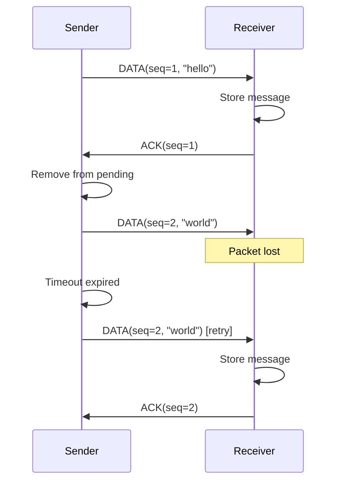

<thinking>
## Analyse du Concept
- Concept : UDP Reliable Transport avec ACKs
- Phase demandee : 5 (Advanced Systems)
- Adapte ? OUI - Implementer un protocole de fiabilite au-dessus d'UDP est un exercice classique qui enseigne les mecanismes fondamentaux de TCP (sequence numbers, ACKs, retransmissions) tout en gardant le controle bas niveau.

## Combo Base + Bonus
- Exercice de base : Protocole UDP fiable avec sequence numbers, ACKs, et retransmission simple avec timeout fixe
- Bonus : Implementation de Selective ACK (SACK) avec fenetre glissante et timeout adaptatif (RTT estimation)
- Palier bonus : EXPERT (algorithme complexe + gestion d'etat)
- Progression logique ? OUI - Base = ARQ simple (Stop-and-Wait), Bonus = Go-Back-N/Selective Repeat

## Prerequis & Difficulte
- Prerequis reels : std::net::UdpSocket, std::thread, std::sync (Mutex, Condvar), std::time (Duration, Instant), serialisation binaire
- Difficulte estimee : 8/10 (base), 10/10 (bonus)
- Coherent avec phase 5 ? OUI

## Aspect Fun/Culture
- Contexte choisi : Reference a "Interstellar" - Les messages qui traversent le trou de ver doivent etre confirmes
- MEME mnemonique : "Murph! Send the ACK!" (parodie de la scene emotionnelle)
- Pourquoi c'est fun : La communication fiable a travers l'espace = metaphore parfaite pour UDP reliable

## Scenarios d'Echec (5 mutants concrets)
1. Mutant A (Sequence) : Pas de verification du sequence number -> messages dupliques acceptes
2. Mutant B (Timeout) : Timeout trop court -> retransmissions inutiles saturant le reseau
3. Mutant C (ACK) : ACK envoye avant traitement -> perte possible si crash apres ACK
4. Mutant D (Order) : Pas de reordering buffer -> messages hors ordre livres directement
5. Mutant E (Overflow) : Sequence number overflow non gere -> wrap-around cause des duplications

## Verdict
VALIDE - Exercice fondamental pour comprendre la fiabilite reseau et les bases de TCP
</thinking>

# Exercice 5.1.8-a : udp_reliable

**Module :**
5.1.8 — UDP Reliable Transport

**Concept :**
a — Reliable Datagram Protocol (Sequence Numbers, ACKs, Retransmission)

**Difficulte :**
★★★★★★★★☆☆ (8/10)

**Type :**
code

**Tiers :**
2 — Combinaison de concepts

**Langage :**
Rust Edition 2024

**Prerequis :**
- 2.1 — Types et ownership
- 2.5 — Concurrence (threads, Mutex, Condvar)
- 5.1.7 — UDP Fundamentals
- 2.4 — I/O et buffers

**Domaines :**
Net, Process, Algo

**Duree estimee :**
150 min

**XP Base :**
200

**Complexite :**
T2 O(n) x S2 O(n) ou n = nombre de messages en vol

---

## SECTION 1 : PROTOTYPE & CONSIGNE

### 1.1 Obligations

**Fichiers a rendre :**
```
src/lib.rs
src/main.rs
```

**Dependances autorisees :**
- `std::net::UdpSocket`
- `std::thread`
- `std::sync::{Arc, Mutex, Condvar}`
- `std::time::{Duration, Instant}`
- `std::collections::{HashMap, VecDeque}`

**Fonctions/methodes interdites :**
- Crates externes (tokio, async-std, etc.)
- `unsafe` blocks
- TCP (le but est de reimplementer la fiabilite)

### 1.2 Consigne

**CONTEXTE : "Interstellar Protocol"**

*"Murph, je t'envoie les donnees depuis l'autre cote du trou de ver. Mais l'espace-temps est instable, certains paquets se perdent. Tu dois m'envoyer un ACK pour chaque message recu, sinon je retransmets. C'est la seule facon de communiquer de maniere fiable."* — Cooper, ingenieur reseau spatial

Dans les reseaux, UDP est rapide mais non fiable : les paquets peuvent etre perdus, dupliques ou arrives dans le desordre. TCP resout ces problemes mais ajoute de la latence. Ton defi : implementer un protocole de fiabilite au-dessus d'UDP.

**Ta mission :**

Implementer un protocole `ReliableUdp` qui :
1. Ajoute des numeros de sequence a chaque message
2. Attend un ACK pour chaque message envoye
3. Retransmet apres timeout si pas d'ACK
4. Detecte et ignore les duplicatas cote recepteur
5. Garantit la livraison dans l'ordre (optionnel pour base)

**Format du paquet :**
```
+----------+----------+----------+------------------+
| Type (1) | Seq (4)  | Len (2)  | Payload (0-1024) |
+----------+----------+----------+------------------+
Type: 0x01 = DATA, 0x02 = ACK
Seq: Numero de sequence (big-endian u32)
Len: Longueur du payload (big-endian u16)
```

**Entree :**
- `local_addr: SocketAddr` — Adresse locale de bind
- `remote_addr: SocketAddr` — Adresse du destinataire

**Sortie :**
- `ReliableUdpSocket` — Socket UDP avec garanties de fiabilite
- `ReliableError` — En cas d'echec

**Contraintes :**
- Timeout de retransmission : 500ms (configurable)
- Maximum 3 retransmissions avant echec
- Taille max payload : 1024 bytes
- Buffer de reception : 64 messages

**Exemples :**

| Operation | Resultat | Explication |
|-----------|----------|-------------|
| `socket.send(b"hello")` | `Ok(5)` | Message envoye et ACK recu |
| `socket.send(b"hello")` timeout | `Err(Timeout)` | Pas d'ACK apres 3 retries |
| `socket.recv()` | `Ok(b"hello")` | Message recu sans duplicata |

### 1.2.2 Consigne Academique

Implementer un protocole de transport fiable au-dessus d'UDP utilisant le mecanisme ARQ (Automatic Repeat reQuest) de type Stop-and-Wait. Le protocole doit garantir la livraison des messages via des numeros de sequence, des acquittements (ACK), et des retransmissions sur timeout.

### 1.3 Prototype

```rust
use std::net::{UdpSocket, SocketAddr};
use std::sync::{Arc, Mutex, Condvar};
use std::time::{Duration, Instant};
use std::collections::HashMap;
use std::thread;

/// Type de paquet dans le protocole
#[derive(Debug, Clone, Copy, PartialEq)]
pub enum PacketType {
    Data = 0x01,
    Ack = 0x02,
}

/// Paquet du protocole reliable UDP
#[derive(Debug, Clone)]
pub struct Packet {
    pub packet_type: PacketType,
    pub seq_num: u32,
    pub payload: Vec<u8>,
}

impl Packet {
    pub fn new_data(seq_num: u32, payload: Vec<u8>) -> Self;
    pub fn new_ack(seq_num: u32) -> Self;
    pub fn serialize(&self) -> Vec<u8>;
    pub fn deserialize(data: &[u8]) -> Result<Self, ReliableError>;
}

/// Configuration du socket reliable
#[derive(Debug, Clone)]
pub struct ReliableConfig {
    pub timeout: Duration,
    pub max_retries: u32,
    pub max_payload_size: usize,
    pub recv_buffer_size: usize,
}

impl Default for ReliableConfig {
    fn default() -> Self {
        Self {
            timeout: Duration::from_millis(500),
            max_retries: 3,
            max_payload_size: 1024,
            recv_buffer_size: 64,
        }
    }
}

/// Socket UDP fiable
pub struct ReliableUdpSocket {
    socket: UdpSocket,
    remote_addr: SocketAddr,
    config: ReliableConfig,
    send_seq: Arc<Mutex<u32>>,
    recv_seq: Arc<Mutex<u32>>,
    pending_acks: Arc<Mutex<HashMap<u32, Instant>>>,
    received: Arc<(Mutex<HashMap<u32, Vec<u8>>>, Condvar)>,
}

#[derive(Debug, Clone, PartialEq)]
pub enum ReliableError {
    Timeout,
    MaxRetriesExceeded,
    PayloadTooLarge,
    InvalidPacket,
    IoError(String),
    SequenceOverflow,
}

impl ReliableUdpSocket {
    pub fn bind(local_addr: SocketAddr, remote_addr: SocketAddr) -> Result<Self, ReliableError>;
    pub fn bind_with_config(
        local_addr: SocketAddr,
        remote_addr: SocketAddr,
        config: ReliableConfig,
    ) -> Result<Self, ReliableError>;

    /// Envoie un message avec garantie de livraison
    pub fn send(&self, data: &[u8]) -> Result<usize, ReliableError>;

    /// Recoit un message (bloquant)
    pub fn recv(&self) -> Result<Vec<u8>, ReliableError>;

    /// Recoit avec timeout
    pub fn recv_timeout(&self, timeout: Duration) -> Result<Vec<u8>, ReliableError>;

    /// Demarre le thread de reception des ACKs
    fn start_receiver(&self) -> thread::JoinHandle<()>;

    /// Envoie un ACK pour un numero de sequence
    fn send_ack(&self, seq_num: u32) -> Result<(), ReliableError>;

    /// Statistiques
    pub fn stats(&self) -> SocketStats;
}

#[derive(Debug, Clone, Default)]
pub struct SocketStats {
    pub packets_sent: u64,
    pub packets_received: u64,
    pub retransmissions: u64,
    pub duplicates_dropped: u64,
}
```

---

## SECTION 2 : LE SAVIEZ-VOUS ?

### 2.1 ARQ : Automatic Repeat reQuest

L'ARQ est la base de tous les protocoles de transport fiables. Il en existe trois variantes principales :

1. **Stop-and-Wait** : Envoie un paquet, attend l'ACK, puis envoie le suivant
2. **Go-Back-N** : Envoie N paquets, retransmet depuis le premier non-ACK
3. **Selective Repeat** : Retransmet uniquement les paquets perdus

TCP utilise une variante de Selective Repeat avec cumulative ACKs.

### 2.2 Pourquoi pas juste TCP ?

TCP est excellent mais pas toujours adapte :
- **Latence** : Le handshake 3-way ajoute 1.5 RTT avant le premier byte
- **Head-of-Line Blocking** : Un paquet perdu bloque toute la stream
- **Overhead** : Header de 20+ bytes vs 8 pour UDP

Des protocoles comme QUIC (Google) reimplementent la fiabilite sur UDP pour plus de controle.

### 2.3 Le probleme des numeros de sequence

Avec un u32, on peut numeroter 4 milliards de paquets. Mais que se passe-t-il au wrap-around ? Si le paquet #4294967295 est suivi du paquet #0, comment distinguer un nouveau paquet d'un ancien duplicata ?

Solution : La fenetre de reception doit etre < 2^31 pour detecter le wrap-around.

---

## SECTION 2.5 : DANS LA VRAIE VIE

### Metiers concernes

| Metier | Utilisation |
|--------|-------------|
| **Game Developer** | Protocoles de jeu custom (reliable commands + unreliable position updates) |
| **Embedded/IoT** | Protocoles legers pour devices contraints (CoAP, MQTT-SN) |
| **Video Streaming** | Reliable signaling + unreliable media (WebRTC) |
| **Financial Systems** | Low-latency reliable messaging (custom UDP protocols) |

### Cas d'usage concrets

1. **QUIC** : Google a implemente un transport fiable sur UDP pour HTTP/3
2. **ENet** : Librairie gaming (utilisee par Unity) avec canaux reliable/unreliable
3. **KCP** : Protocole ARQ rapide utilise pour le gaming en Chine
4. **RUDP** : Reliable UDP pour la VoIP et le streaming

---

## SECTION 3 : EXEMPLE D'UTILISATION

### 3.0 Session bash

```bash
$ ls
Cargo.toml  src/

$ cargo build --release
   Compiling udp_reliable v0.1.0
    Finished release [optimized] target(s)

# Terminal 1 : Serveur
$ cargo run --release -- server 127.0.0.1:9000
Reliable UDP server listening on 127.0.0.1:9000
Received: "Hello, Murph!"
Received: "The data is in the tesseract"

# Terminal 2 : Client
$ cargo run --release -- client 127.0.0.1:9001 127.0.0.1:9000
Connected to 127.0.0.1:9000
> Hello, Murph!
Sent 13 bytes, ACK received
> The data is in the tesseract
Sent 29 bytes, ACK received (1 retransmission)

$ cargo test
running 8 tests
test tests::test_packet_serialize ... ok
test tests::test_packet_deserialize ... ok
test tests::test_send_receive ... ok
test tests::test_retransmission ... ok
test tests::test_duplicate_detection ... ok
test tests::test_ordering ... ok
test tests::test_max_retries ... ok
test tests::test_large_payload ... ok

test result: ok. 8 passed; 0 failed
```

### 3.1 BONUS EXPERT (OPTIONNEL)

**Difficulte Bonus :**
★★★★★★★★★★ (10/10)

**Recompense :**
XP x4

**Time Complexity attendue :**
O(1) amortized pour send/recv avec fenetre glissante

**Space Complexity attendue :**
O(window_size)

**Domaines Bonus :**
`Algo, Concurrency`

#### 3.1.1 Consigne Bonus

**"The Fifth Dimension Protocol"**

*"Dans la cinquieme dimension, on voit tous les paquets en meme temps. La fenetre glissante, c'est notre facon de percevoir plusieurs messages simultanement."*

**Ta mission bonus :**

Implementer un protocole **Selective Repeat ARQ** avec :
1. Fenetre glissante (window size configurable)
2. Selective ACKs (SACK) indiquant les plages recues
3. RTT estimation adaptative (algorithme de Jacobson/Karels)
4. Fast retransmit sur 3 duplicate ACKs

**Format SACK :**
```
+----------+----------+----------+------------------+
| Type (1) | Base (4) | Ranges   | Bitmap (var)     |
+----------+----------+----------+------------------+
Type: 0x03 = SACK
Base: Plus petit seq non-recu
Ranges: Nombre de plages recues
Bitmap: Bits indiquant les seqs recus apres base
```

**Contraintes :**
```
+-------------------------------------------+
|  window_size <= 256                        |
|  RTT estimation avec alpha = 0.125        |
|  RTO = SRTT + 4*RTTVAR (RFC 6298)         |
|  Fast retransmit apres 3 dup ACKs          |
+-------------------------------------------+
```

#### 3.1.2 Prototype Bonus

```rust
#[derive(Debug, Clone)]
pub struct SlidingWindowConfig {
    pub window_size: u32,
    pub initial_rtt: Duration,
    pub min_rto: Duration,
    pub max_rto: Duration,
}

pub struct SelectiveRepeatSocket {
    inner: ReliableUdpSocket,
    window_config: SlidingWindowConfig,
    send_window: Arc<Mutex<SendWindow>>,
    recv_window: Arc<Mutex<RecvWindow>>,
    rtt_estimator: Arc<Mutex<RttEstimator>>,
}

struct SendWindow {
    base: u32,
    next_seq: u32,
    unacked: HashMap<u32, (Instant, Vec<u8>)>,
}

struct RecvWindow {
    expected: u32,
    buffer: HashMap<u32, Vec<u8>>,
    delivered: u32,
}

struct RttEstimator {
    srtt: Duration,
    rttvar: Duration,
    rto: Duration,
}

impl RttEstimator {
    pub fn update(&mut self, measured_rtt: Duration);
    pub fn timeout(&self) -> Duration;
    pub fn backoff(&mut self);
}

impl SelectiveRepeatSocket {
    pub fn new(socket: ReliableUdpSocket, config: SlidingWindowConfig) -> Self;
    pub fn send_windowed(&self, data: &[u8]) -> Result<usize, ReliableError>;
    pub fn recv_ordered(&self) -> Result<Vec<u8>, ReliableError>;
    fn process_sack(&self, sack: &SackPacket);
    fn generate_sack(&self) -> SackPacket;
}
```

---

## SECTION 4 : ZONE CORRECTION

### 4.1 Moulinette — Tableau des tests

| Test | Input | Expected | Points | Categorie |
|------|-------|----------|--------|-----------|
| `packet_serialize_data` | Data packet seq=1 | Valid bytes | 5 | Encoding |
| `packet_serialize_ack` | Ack packet seq=1 | Valid bytes | 5 | Encoding |
| `packet_deserialize_valid` | Valid bytes | Ok(Packet) | 5 | Encoding |
| `packet_deserialize_invalid` | Truncated bytes | Err(InvalidPacket) | 5 | Edge |
| `send_simple` | "hello" | Ok(5), ACK received | 15 | Core |
| `recv_simple` | Send then recv | Ok(b"hello") | 15 | Core |
| `retransmission_works` | Drop first packet | Ok after retry | 15 | Core |
| `max_retries_exceeded` | Drop all packets | Err(MaxRetriesExceeded) | 10 | Edge |
| `duplicate_detection` | Send same twice | Second ignored | 10 | Core |
| `ordering_preserved` | Send 1,2,3 | Recv 1,2,3 | 5 | Order |
| `payload_too_large` | 2048 bytes | Err(PayloadTooLarge) | 5 | Edge |
| `stats_tracking` | Various ops | Correct counts | 5 | Metrics |

**Score minimum pour validation : 70/100**

### 4.2 Fichier de test

```rust
#[cfg(test)]
mod tests {
    use super::*;
    use std::net::{SocketAddr, UdpSocket};
    use std::thread;
    use std::time::Duration;

    fn get_test_addrs() -> (SocketAddr, SocketAddr) {
        let addr1: SocketAddr = "127.0.0.1:0".parse().unwrap();
        let addr2: SocketAddr = "127.0.0.1:0".parse().unwrap();
        (addr1, addr2)
    }

    #[test]
    fn test_packet_serialize_data() {
        let packet = Packet::new_data(42, b"hello".to_vec());
        let bytes = packet.serialize();

        assert_eq!(bytes[0], 0x01); // DATA type
        assert_eq!(u32::from_be_bytes([bytes[1], bytes[2], bytes[3], bytes[4]]), 42);
        assert_eq!(u16::from_be_bytes([bytes[5], bytes[6]]), 5);
        assert_eq!(&bytes[7..], b"hello");
    }

    #[test]
    fn test_packet_serialize_ack() {
        let packet = Packet::new_ack(123);
        let bytes = packet.serialize();

        assert_eq!(bytes[0], 0x02); // ACK type
        assert_eq!(u32::from_be_bytes([bytes[1], bytes[2], bytes[3], bytes[4]]), 123);
    }

    #[test]
    fn test_packet_deserialize_valid() {
        let original = Packet::new_data(99, b"test".to_vec());
        let bytes = original.serialize();
        let parsed = Packet::deserialize(&bytes).unwrap();

        assert_eq!(parsed.packet_type, PacketType::Data);
        assert_eq!(parsed.seq_num, 99);
        assert_eq!(parsed.payload, b"test");
    }

    #[test]
    fn test_packet_deserialize_invalid() {
        let result = Packet::deserialize(&[0x01, 0x00]); // Truncated
        assert_eq!(result, Err(ReliableError::InvalidPacket));
    }

    #[test]
    fn test_send_receive() {
        let server_addr: SocketAddr = "127.0.0.1:19001".parse().unwrap();
        let client_addr: SocketAddr = "127.0.0.1:19002".parse().unwrap();

        let server = thread::spawn(move || {
            let socket = ReliableUdpSocket::bind(server_addr, client_addr).unwrap();
            let data = socket.recv().unwrap();
            assert_eq!(data, b"hello");
        });

        thread::sleep(Duration::from_millis(50));

        let client_socket = ReliableUdpSocket::bind(client_addr, server_addr).unwrap();
        let sent = client_socket.send(b"hello").unwrap();
        assert_eq!(sent, 5);

        server.join().unwrap();
    }

    #[test]
    fn test_duplicate_detection() {
        let server_addr: SocketAddr = "127.0.0.1:19003".parse().unwrap();
        let client_addr: SocketAddr = "127.0.0.1:19004".parse().unwrap();

        let server = thread::spawn(move || {
            let socket = ReliableUdpSocket::bind(server_addr, client_addr).unwrap();
            let data1 = socket.recv_timeout(Duration::from_secs(1)).unwrap();

            // Second recv should timeout if duplicate was properly ignored
            let result = socket.recv_timeout(Duration::from_millis(200));

            assert_eq!(data1, b"test");
            assert!(result.is_err()); // No second message
        });

        thread::sleep(Duration::from_millis(50));

        // Client sends same message twice (simulating duplicate)
        let raw_socket = UdpSocket::bind(client_addr).unwrap();
        let packet = Packet::new_data(1, b"test".to_vec());
        let bytes = packet.serialize();

        raw_socket.send_to(&bytes, server_addr).unwrap();
        raw_socket.send_to(&bytes, server_addr).unwrap(); // Duplicate

        server.join().unwrap();
    }

    #[test]
    fn test_payload_too_large() {
        let socket = ReliableUdpSocket::bind(
            "127.0.0.1:19005".parse().unwrap(),
            "127.0.0.1:19006".parse().unwrap(),
        ).unwrap();

        let large_data = vec![0u8; 2048];
        let result = socket.send(&large_data);

        assert_eq!(result, Err(ReliableError::PayloadTooLarge));
    }

    #[test]
    fn test_stats_tracking() {
        let socket = ReliableUdpSocket::bind(
            "127.0.0.1:19007".parse().unwrap(),
            "127.0.0.1:19008".parse().unwrap(),
        ).unwrap();

        let stats = socket.stats();
        assert_eq!(stats.packets_sent, 0);
        assert_eq!(stats.packets_received, 0);
    }
}
```

### 4.3 Solution de reference

```rust
use std::net::{UdpSocket, SocketAddr};
use std::sync::{Arc, Mutex, Condvar};
use std::time::{Duration, Instant};
use std::collections::HashMap;
use std::thread;

#[derive(Debug, Clone, Copy, PartialEq)]
pub enum PacketType {
    Data = 0x01,
    Ack = 0x02,
}

impl TryFrom<u8> for PacketType {
    type Error = ReliableError;

    fn try_from(value: u8) -> Result<Self, Self::Error> {
        match value {
            0x01 => Ok(PacketType::Data),
            0x02 => Ok(PacketType::Ack),
            _ => Err(ReliableError::InvalidPacket),
        }
    }
}

#[derive(Debug, Clone)]
pub struct Packet {
    pub packet_type: PacketType,
    pub seq_num: u32,
    pub payload: Vec<u8>,
}

impl Packet {
    pub fn new_data(seq_num: u32, payload: Vec<u8>) -> Self {
        Self {
            packet_type: PacketType::Data,
            seq_num,
            payload,
        }
    }

    pub fn new_ack(seq_num: u32) -> Self {
        Self {
            packet_type: PacketType::Ack,
            seq_num,
            payload: Vec::new(),
        }
    }

    pub fn serialize(&self) -> Vec<u8> {
        let mut buf = Vec::with_capacity(7 + self.payload.len());
        buf.push(self.packet_type as u8);
        buf.extend_from_slice(&self.seq_num.to_be_bytes());
        buf.extend_from_slice(&(self.payload.len() as u16).to_be_bytes());
        buf.extend_from_slice(&self.payload);
        buf
    }

    pub fn deserialize(data: &[u8]) -> Result<Self, ReliableError> {
        if data.len() < 7 {
            return Err(ReliableError::InvalidPacket);
        }

        let packet_type = PacketType::try_from(data[0])?;
        let seq_num = u32::from_be_bytes([data[1], data[2], data[3], data[4]]);
        let payload_len = u16::from_be_bytes([data[5], data[6]]) as usize;

        if data.len() < 7 + payload_len {
            return Err(ReliableError::InvalidPacket);
        }

        let payload = data[7..7 + payload_len].to_vec();

        Ok(Self {
            packet_type,
            seq_num,
            payload,
        })
    }
}

#[derive(Debug, Clone)]
pub struct ReliableConfig {
    pub timeout: Duration,
    pub max_retries: u32,
    pub max_payload_size: usize,
    pub recv_buffer_size: usize,
}

impl Default for ReliableConfig {
    fn default() -> Self {
        Self {
            timeout: Duration::from_millis(500),
            max_retries: 3,
            max_payload_size: 1024,
            recv_buffer_size: 64,
        }
    }
}

#[derive(Debug, Clone, PartialEq)]
pub enum ReliableError {
    Timeout,
    MaxRetriesExceeded,
    PayloadTooLarge,
    InvalidPacket,
    IoError(String),
    SequenceOverflow,
}

#[derive(Debug, Clone, Default)]
pub struct SocketStats {
    pub packets_sent: u64,
    pub packets_received: u64,
    pub retransmissions: u64,
    pub duplicates_dropped: u64,
}

pub struct ReliableUdpSocket {
    socket: Arc<UdpSocket>,
    remote_addr: SocketAddr,
    config: ReliableConfig,
    send_seq: Arc<Mutex<u32>>,
    last_recv_seq: Arc<Mutex<Option<u32>>>,
    pending_acks: Arc<(Mutex<HashMap<u32, bool>>, Condvar)>,
    recv_buffer: Arc<(Mutex<Vec<Vec<u8>>>, Condvar)>,
    stats: Arc<Mutex<SocketStats>>,
    running: Arc<Mutex<bool>>,
}

impl ReliableUdpSocket {
    pub fn bind(local_addr: SocketAddr, remote_addr: SocketAddr) -> Result<Self, ReliableError> {
        Self::bind_with_config(local_addr, remote_addr, ReliableConfig::default())
    }

    pub fn bind_with_config(
        local_addr: SocketAddr,
        remote_addr: SocketAddr,
        config: ReliableConfig,
    ) -> Result<Self, ReliableError> {
        let socket = UdpSocket::bind(local_addr)
            .map_err(|e| ReliableError::IoError(e.to_string()))?;

        socket.set_read_timeout(Some(Duration::from_millis(100)))
            .map_err(|e| ReliableError::IoError(e.to_string()))?;

        let socket = Arc::new(socket);
        let pending_acks = Arc::new((Mutex::new(HashMap::new()), Condvar::new()));
        let recv_buffer = Arc::new((Mutex::new(Vec::new()), Condvar::new()));
        let running = Arc::new(Mutex::new(true));

        let reliable = Self {
            socket: socket.clone(),
            remote_addr,
            config,
            send_seq: Arc::new(Mutex::new(0)),
            last_recv_seq: Arc::new(Mutex::new(None)),
            pending_acks: pending_acks.clone(),
            recv_buffer: recv_buffer.clone(),
            stats: Arc::new(Mutex::new(SocketStats::default())),
            running: running.clone(),
        };

        // Start receiver thread
        let socket_clone = socket.clone();
        let remote_clone = remote_addr;
        let last_recv_clone = reliable.last_recv_seq.clone();
        let pending_clone = pending_acks.clone();
        let recv_clone = recv_buffer.clone();
        let stats_clone = reliable.stats.clone();
        let running_clone = running.clone();

        thread::spawn(move || {
            let mut buf = [0u8; 2048];

            while *running_clone.lock().unwrap() {
                match socket_clone.recv_from(&mut buf) {
                    Ok((len, addr)) => {
                        if addr != remote_clone {
                            continue;
                        }

                        if let Ok(packet) = Packet::deserialize(&buf[..len]) {
                            match packet.packet_type {
                                PacketType::Ack => {
                                    let (lock, cvar) = &*pending_clone;
                                    let mut pending = lock.lock().unwrap();
                                    pending.insert(packet.seq_num, true);
                                    cvar.notify_all();
                                }
                                PacketType::Data => {
                                    // Check for duplicate
                                    let mut last = last_recv_clone.lock().unwrap();
                                    if *last == Some(packet.seq_num) {
                                        stats_clone.lock().unwrap().duplicates_dropped += 1;
                                        // Still send ACK for duplicate
                                        let ack = Packet::new_ack(packet.seq_num);
                                        let _ = socket_clone.send_to(
                                            &ack.serialize(),
                                            remote_clone,
                                        );
                                        continue;
                                    }

                                    *last = Some(packet.seq_num);

                                    // Send ACK
                                    let ack = Packet::new_ack(packet.seq_num);
                                    let _ = socket_clone.send_to(&ack.serialize(), remote_clone);

                                    // Deliver to buffer
                                    let (lock, cvar) = &*recv_clone;
                                    let mut buffer = lock.lock().unwrap();
                                    buffer.push(packet.payload);
                                    stats_clone.lock().unwrap().packets_received += 1;
                                    cvar.notify_one();
                                }
                            }
                        }
                    }
                    Err(_) => continue,
                }
            }
        });

        Ok(reliable)
    }

    pub fn send(&self, data: &[u8]) -> Result<usize, ReliableError> {
        if data.len() > self.config.max_payload_size {
            return Err(ReliableError::PayloadTooLarge);
        }

        let seq = {
            let mut seq = self.send_seq.lock().unwrap();
            let current = *seq;
            *seq = seq.wrapping_add(1);
            current
        };

        let packet = Packet::new_data(seq, data.to_vec());
        let bytes = packet.serialize();

        let (lock, cvar) = &*self.pending_acks;

        for retry in 0..=self.config.max_retries {
            self.socket
                .send_to(&bytes, self.remote_addr)
                .map_err(|e| ReliableError::IoError(e.to_string()))?;

            {
                let mut stats = self.stats.lock().unwrap();
                stats.packets_sent += 1;
                if retry > 0 {
                    stats.retransmissions += 1;
                }
            }

            // Wait for ACK with timeout
            let deadline = Instant::now() + self.config.timeout;
            let mut pending = lock.lock().unwrap();

            while Instant::now() < deadline {
                if pending.get(&seq) == Some(&true) {
                    pending.remove(&seq);
                    return Ok(data.len());
                }

                let remaining = deadline.saturating_duration_since(Instant::now());
                let result = cvar.wait_timeout(pending, remaining).unwrap();
                pending = result.0;
            }
        }

        Err(ReliableError::MaxRetriesExceeded)
    }

    pub fn recv(&self) -> Result<Vec<u8>, ReliableError> {
        let (lock, cvar) = &*self.recv_buffer;
        let mut buffer = lock.lock().unwrap();

        while buffer.is_empty() {
            buffer = cvar.wait(buffer).unwrap();
        }

        Ok(buffer.remove(0))
    }

    pub fn recv_timeout(&self, timeout: Duration) -> Result<Vec<u8>, ReliableError> {
        let (lock, cvar) = &*self.recv_buffer;
        let mut buffer = lock.lock().unwrap();

        let deadline = Instant::now() + timeout;

        while buffer.is_empty() {
            let remaining = deadline.saturating_duration_since(Instant::now());
            if remaining.is_zero() {
                return Err(ReliableError::Timeout);
            }
            let result = cvar.wait_timeout(buffer, remaining).unwrap();
            buffer = result.0;
            if result.1.timed_out() && buffer.is_empty() {
                return Err(ReliableError::Timeout);
            }
        }

        Ok(buffer.remove(0))
    }

    pub fn stats(&self) -> SocketStats {
        self.stats.lock().unwrap().clone()
    }
}

impl Drop for ReliableUdpSocket {
    fn drop(&mut self) {
        *self.running.lock().unwrap() = false;
    }
}
```

### 4.4 Solutions alternatives acceptees

```rust
// Alternative 1 : Utilisation de crossbeam channels au lieu de Condvar
use std::sync::mpsc::{channel, Sender, Receiver};

pub struct ReliableUdpSocket {
    ack_rx: Receiver<u32>,
    data_rx: Receiver<Vec<u8>>,
    // ...
}

// Alternative 2 : Async avec tokio (si autorise)
pub struct AsyncReliableSocket {
    socket: tokio::net::UdpSocket,
    // ...
}

impl AsyncReliableSocket {
    pub async fn send(&self, data: &[u8]) -> Result<usize, ReliableError> {
        // Async implementation
    }
}
```

### 4.5 Solutions refusees

```rust
// REFUSEE 1 : Pas de retransmission
impl ReliableUdpSocket {
    pub fn send(&self, data: &[u8]) -> Result<usize, ReliableError> {
        self.socket.send_to(&data, self.remote_addr)?;
        Ok(data.len())  // ERREUR: Pas d'attente d'ACK!
    }
}
// Pourquoi refusee : Aucune garantie de livraison

// REFUSEE 2 : Pas de detection de duplicata
fn handle_data(&self, packet: Packet) {
    // Livre directement sans verifier seq_num
    self.deliver(packet.payload);  // ERREUR: Duplicatas livres!
}
// Pourquoi refusee : Messages dupliques livres a l'application

// REFUSEE 3 : ACK avant traitement
fn handle_data(&self, packet: Packet) {
    self.send_ack(packet.seq_num)?;  // ACK d'abord
    self.process(packet.payload)?;   // ERREUR: Crash apres ACK = perte
}
// Pourquoi refusee : Si le traitement echoue apres l'ACK, le message est perdu
```

### 4.6 Solution bonus de reference

```rust
pub struct RttEstimator {
    srtt: Duration,      // Smoothed RTT
    rttvar: Duration,    // RTT variance
    rto: Duration,       // Retransmission timeout
    min_rto: Duration,
    max_rto: Duration,
}

impl RttEstimator {
    pub fn new(initial_rtt: Duration, min_rto: Duration, max_rto: Duration) -> Self {
        Self {
            srtt: initial_rtt,
            rttvar: initial_rtt / 2,
            rto: initial_rtt,
            min_rto,
            max_rto,
        }
    }

    /// RFC 6298 RTT estimation
    pub fn update(&mut self, measured_rtt: Duration) {
        // RTTVAR = (1 - beta) * RTTVAR + beta * |SRTT - R'|
        // beta = 1/4
        let diff = if self.srtt > measured_rtt {
            self.srtt - measured_rtt
        } else {
            measured_rtt - self.srtt
        };
        self.rttvar = self.rttvar * 3 / 4 + diff / 4;

        // SRTT = (1 - alpha) * SRTT + alpha * R'
        // alpha = 1/8
        self.srtt = self.srtt * 7 / 8 + measured_rtt / 8;

        // RTO = SRTT + 4 * RTTVAR
        self.rto = self.srtt + self.rttvar * 4;
        self.rto = self.rto.clamp(self.min_rto, self.max_rto);
    }

    pub fn timeout(&self) -> Duration {
        self.rto
    }

    pub fn backoff(&mut self) {
        self.rto = (self.rto * 2).min(self.max_rto);
    }
}

pub struct SelectiveRepeatSocket {
    inner: ReliableUdpSocket,
    window_size: u32,
    send_base: Arc<Mutex<u32>>,
    next_seq: Arc<Mutex<u32>>,
    unacked: Arc<Mutex<HashMap<u32, (Instant, Vec<u8>)>>>,
    recv_buffer: Arc<Mutex<HashMap<u32, Vec<u8>>>>,
    expected_seq: Arc<Mutex<u32>>,
    rtt: Arc<Mutex<RttEstimator>>,
}

impl SelectiveRepeatSocket {
    pub fn send_windowed(&self, data: &[u8]) -> Result<usize, ReliableError> {
        // Wait for window space
        loop {
            let base = *self.send_base.lock().unwrap();
            let next = *self.next_seq.lock().unwrap();

            if next.wrapping_sub(base) < self.window_size {
                break;
            }
            thread::sleep(Duration::from_millis(10));
        }

        // Send with current seq
        let seq = {
            let mut next = self.next_seq.lock().unwrap();
            let current = *next;
            *next = next.wrapping_add(1);
            current
        };

        let packet = Packet::new_data(seq, data.to_vec());
        let bytes = packet.serialize();

        self.inner.socket.send_to(&bytes, self.inner.remote_addr)
            .map_err(|e| ReliableError::IoError(e.to_string()))?;

        // Record for potential retransmission
        self.unacked.lock().unwrap().insert(seq, (Instant::now(), data.to_vec()));

        Ok(data.len())
    }

    fn process_sack(&self, base: u32, bitmap: &[u8]) {
        let mut unacked = self.unacked.lock().unwrap();
        let mut send_base = self.send_base.lock().unwrap();

        // ACK all up to base
        for seq in *send_base..base {
            unacked.remove(&seq);
        }
        *send_base = base;

        // Process selective acks from bitmap
        for (i, &byte) in bitmap.iter().enumerate() {
            for bit in 0..8 {
                if byte & (1 << bit) != 0 {
                    let acked_seq = base.wrapping_add((i * 8 + bit) as u32 + 1);
                    unacked.remove(&acked_seq);
                }
            }
        }
    }
}
```

### 4.9 spec.json

```json
{
  "name": "udp_reliable",
  "language": "rust",
  "type": "code",
  "tier": 2,
  "tier_info": "Combinaison de concepts - UDP + Reliability",
  "tags": ["networking", "udp", "reliability", "arq", "retransmission", "phase5"],
  "passing_score": 70,

  "function": {
    "name": "ReliableUdpSocket",
    "prototype": "impl ReliableUdpSocket",
    "return_type": "struct",
    "parameters": [
      {"name": "local_addr", "type": "SocketAddr"},
      {"name": "remote_addr", "type": "SocketAddr"}
    ]
  },

  "driver": {
    "edge_cases": [
      {
        "name": "simple_send_recv",
        "action": "send then recv",
        "input": "hello",
        "expected": "hello",
        "is_trap": false
      },
      {
        "name": "retransmission",
        "action": "drop first packet",
        "expected": "success after retry",
        "is_trap": false
      },
      {
        "name": "duplicate_dropped",
        "action": "send same packet twice",
        "expected": "delivered once",
        "is_trap": true,
        "trap_explanation": "Duplicatas doivent etre ignores"
      },
      {
        "name": "max_retries",
        "action": "drop all packets",
        "expected": "Err(MaxRetriesExceeded)",
        "is_trap": true,
        "trap_explanation": "Ne pas boucler indefiniment"
      },
      {
        "name": "payload_limit",
        "input": "2048 bytes",
        "expected": "Err(PayloadTooLarge)",
        "is_trap": true,
        "trap_explanation": "Valider la taille avant envoi"
      }
    ],

    "fuzzing": {
      "enabled": true,
      "iterations": 200,
      "generators": [
        {
          "type": "bytes",
          "param_index": 0,
          "params": {
            "min_len": 0,
            "max_len": 1024
          }
        }
      ]
    }
  },

  "norm": {
    "allowed_functions": ["std::net", "std::thread", "std::sync", "std::time"],
    "forbidden_crates": ["tokio", "async-std"],
    "forbidden_functions": ["TcpStream", "TcpListener"],
    "check_security": true,
    "blocking": true
  }
}
```

### 4.10 Solutions Mutantes

```rust
/* Mutant A (Sequence) : Pas de verification du seq_num */
fn handle_data(&self, packet: Packet) {
    // MUTANT: Pas de check last_recv_seq
    self.deliver(packet.payload);
    self.send_ack(packet.seq_num);
}
// Pourquoi c'est faux : Duplicatas livres, corruption de donnees
// Ce qui etait pense : "L'ACK suffit a gerer les duplicatas"

/* Mutant B (Timeout) : Timeout trop court */
impl Default for ReliableConfig {
    fn default() -> Self {
        Self {
            timeout: Duration::from_millis(10),  // MUTANT: 10ms au lieu de 500ms
            max_retries: 3,
            // ...
        }
    }
}
// Pourquoi c'est faux : Retransmissions inutiles sur reseaux normaux
// Ce qui etait pense : "Plus c'est rapide, mieux c'est"

/* Mutant C (ACK) : ACK envoye avant stockage */
fn handle_data(&self, packet: Packet) {
    self.send_ack(packet.seq_num)?;  // MUTANT: ACK d'abord

    // Si le programme crash ici, le message est perdu
    // mais l'emetteur pense qu'il a ete recu
    self.store_and_deliver(packet.payload)?;
}
// Pourquoi c'est faux : Perte de message si crash entre ACK et stockage
// Ce qui etait pense : "L'ordre n'a pas d'importance"

/* Mutant D (Order) : Pas de buffer de reordering */
fn handle_data(&self, packet: Packet) {
    if packet.seq_num != self.expected_seq {
        // MUTANT: Livre quand meme au lieu de buffer
        self.deliver(packet.payload);
        self.expected_seq = packet.seq_num + 1;
    }
}
// Pourquoi c'est faux : Messages livres dans le desordre
// Ce qui etait pense : "L'application gerera l'ordre"

/* Mutant E (Overflow) : Wrap-around non gere */
fn next_seq(&self) -> u32 {
    let mut seq = self.send_seq.lock().unwrap();
    let current = *seq;
    *seq += 1;  // MUTANT: Pas de wrapping_add, panic sur overflow
    current
}
// Pourquoi c'est faux : Panic apres 2^32 paquets en debug mode
// Ce qui etait pense : "On n'enverra jamais autant de paquets"
```

---

## SECTION 5 : COMPRENDRE

### 5.1 Ce que cet exercice enseigne

1. **Protocoles de transport** : Comprendre comment TCP garantit la fiabilite
2. **ARQ (Automatic Repeat reQuest)** : Mecanisme fondamental de retransmission
3. **Numeros de sequence** : Detection de duplicatas et d'ordre
4. **Timeouts et retransmission** : Gestion de la perte de paquets
5. **Concurrence** : Threads, synchronisation, communication

### 5.2 LDA — Traduction Litterale

```
FONCTION send QUI RETOURNE NOMBRE D'OCTETS ENVOYES OU ERREUR
DEBUT FONCTION
    DECLARER seq_num COMME ENTIER 32 BITS NON SIGNE

    SI taille des donnees > MAX_PAYLOAD ALORS
        RETOURNER ERREUR PayloadTooLarge
    FIN SI

    AFFECTER le prochain numero de sequence A seq_num
    INCREMENTER le compteur de sequence

    CREER un paquet DATA avec seq_num et les donnees

    POUR retry DE 0 A max_retries FAIRE
        ENVOYER le paquet vers remote_addr
        INCREMENTER packets_sent

        SI retry > 0 ALORS
            INCREMENTER retransmissions
        FIN SI

        ATTENDRE un ACK pour seq_num pendant timeout

        SI ACK recu ALORS
            RETOURNER taille des donnees
        FIN SI
    FIN POUR

    RETOURNER ERREUR MaxRetriesExceeded
FIN FONCTION
```

### 5.2.2 Pseudocode Academique

```
ALGORITHME : Stop-and-Wait ARQ
---
ENTREE : donnees a envoyer, adresse destinataire
SORTIE : succes ou echec

1. INCREMENTER sequence_number
2. CREER paquet(DATA, sequence_number, donnees)
3. POUR i = 0 A MAX_RETRIES :
   a. ENVOYER paquet
   b. DEMARRER timer(TIMEOUT)
   c. ATTENDRE :
      - SI ACK(sequence_number) recu : RETOURNER succes
      - SI timer expire : CONTINUER (retry)
4. RETOURNER echec (MaxRetriesExceeded)
```

### 5.2.3 Representation Algorithmique

```
PROTOCOLE : Reliable UDP
---
EMETTEUR                         RECEPTEUR
    |                                 |
    | ------ DATA(seq=1) -----------> |
    |                                 | Stocke donnees
    |                                 | Memorise seq=1
    | <-------- ACK(1) -------------- |
    |                                 |
    | ------ DATA(seq=2) ----X        | (perdu)
    |                                 |
    | [TIMEOUT]                       |
    |                                 |
    | ------ DATA(seq=2) -----------> |
    |                                 | Stocke donnees
    | <-------- ACK(2) -------------- |
    |                                 |
    | ------ DATA(seq=3) -----------> |
    | ------ DATA(seq=3) -----------> | (duplicate)
    |                                 | Detecte duplicate
    | <-------- ACK(3) -------------- | (renvoie ACK)
    | <-------- ACK(3) -------------- |
```

### 5.2.3.1 Diagramme Mermaid



### 5.3 Visualisation ASCII

```
                    FORMAT DU PAQUET RELIABLE UDP

    +--------+--------+--------+--------+--------+--------+--------+
    | Type   | Sequence Number (4 bytes BE) | Length (2 bytes BE) |
    | 1 byte |                              |                     |
    +--------+--------+--------+--------+--------+--------+--------+
    |                     Payload (0-1024 bytes)                   |
    +--------------------------------------------------------------+

    Type:
        0x01 = DATA (message avec payload)
        0x02 = ACK  (acquittement, pas de payload)


                    MACHINE A ETATS - EMETTEUR

                        +---------------+
                        |     IDLE      |
                        +-------+-------+
                                |
                        send(data)
                                |
                                v
                        +-------+-------+
              +-------->|    SENDING    |<--------+
              |         +-------+-------+         |
              |                 |                 |
              |         start timer               |
              |                 |                 |
              |                 v                 |
              |         +-------+-------+         |
              |         |   WAITING     |         |
              |         +-------+-------+         |
              |                 |                 |
              |     +-----------+-----------+     |
              |     |                       |     |
              | ACK recu               timeout    |
              |     |                       |     |
              |     v                       v     |
              | +---+---+             +-----+---+ |
              | | DONE  |             | RETRY   |-+
              | +---+---+             +---------+
              |     |                 (si retries < max)
              |     |
              +-----+


                    MACHINE A ETATS - RECEPTEUR

                        +---------------+
                        |   LISTENING   |
                        +-------+-------+
                                |
                        DATA recu
                                |
                                v
                        +-------+-------+
                        |   CHECKING    |
                        +-------+-------+
                                |
                +---------------+---------------+
                |                               |
        seq == last_seq                   seq != last_seq
        (duplicate)                       (nouveau)
                |                               |
                v                               v
        +-------+-------+               +-------+-------+
        |  SEND ACK     |               |   DELIVER     |
        | (pas de       |               | last_seq=seq  |
        |  delivery)    |               |   SEND ACK    |
        +-------+-------+               +-------+-------+
                |                               |
                +---------------+---------------+
                                |
                                v
                        +-------+-------+
                        |   LISTENING   |
                        +---------------+
```

### 5.4 Les pieges en detail

| Piege | Description | Comment l'eviter |
|-------|-------------|------------------|
| **Pas de seq check** | Duplicatas livres | Stocker last_recv_seq et comparer |
| **Timeout trop court** | Retransmissions inutiles | Estimer RTT ou utiliser valeur conservatrice |
| **ACK avant stockage** | Perte si crash | Toujours stocker PUIS ACK |
| **Pas de reordering** | Messages desordres | Buffer jusqu'a avoir le bon seq |
| **Overflow seq** | Panic ou comportement errone | Utiliser wrapping_add |

### 5.5 Cours Complet

#### 5.5.1 Pourquoi UDP n'est pas fiable

UDP (User Datagram Protocol) offre un service "best effort" :
- **Pas de connexion** : Pas de handshake, pas d'etat
- **Pas de garantie** : Paquets peuvent etre perdus
- **Pas d'ordre** : Paquets peuvent arriver desordres
- **Pas de controle de flux** : L'emetteur peut submerger le recepteur

Avantages : Latence faible, overhead minimal (8 bytes header vs 20+ pour TCP).

#### 5.5.2 ARQ : Le fondement de la fiabilite

ARQ (Automatic Repeat reQuest) est le mecanisme de base :

1. **Numerotation** : Chaque paquet a un numero unique
2. **Acquittement** : Le recepteur confirme chaque paquet
3. **Retransmission** : L'emetteur renvoie si pas d'ACK
4. **Timeout** : Delai avant retransmission

```
Variantes :
+----------------+------------------+-------------------+
| Stop-and-Wait  | Go-Back-N        | Selective Repeat  |
+----------------+------------------+-------------------+
| 1 paquet en    | N paquets en     | N paquets en      |
| vol            | vol              | vol               |
+----------------+------------------+-------------------+
| Simple mais    | Retransmet       | Retransmet        |
| lent           | depuis erreur    | seulement perdus  |
+----------------+------------------+-------------------+
| Throughput =   | Efficace si      | Optimal mais      |
| 1 paquet/RTT   | peu de pertes    | complexe          |
+----------------+------------------+-------------------+
```

#### 5.5.3 Estimation du RTT

Le RTT (Round-Trip Time) varie selon les conditions reseau. TCP utilise l'algorithme de Jacobson/Karels :

```rust
// Mise a jour du RTT estime
SRTT = (1 - alpha) * SRTT + alpha * measured_RTT  // alpha = 1/8
RTTVAR = (1 - beta) * RTTVAR + beta * |SRTT - measured_RTT|  // beta = 1/4

// Calcul du timeout (RTO)
RTO = SRTT + 4 * RTTVAR
```

### 5.6 Normes avec explications pedagogiques

```
+------------------------------------------------------------------+
| HORS NORME                                                        |
+------------------------------------------------------------------+
| fn send(&self, data: &[u8]) -> Result<usize, ReliableError> {    |
|     self.socket.send_to(&data, self.remote_addr)?;               |
|     // Pas d'attente d'ACK!                                       |
|     Ok(data.len())                                                |
| }                                                                 |
+------------------------------------------------------------------+
| CONFORME                                                          |
+------------------------------------------------------------------+
| fn send(&self, data: &[u8]) -> Result<usize, ReliableError> {    |
|     let packet = Packet::new_data(self.next_seq(), data.into()); |
|     for retry in 0..=self.config.max_retries {                   |
|         self.socket.send_to(&packet.serialize(), ...)?;          |
|         if self.wait_for_ack(packet.seq_num, timeout).is_ok() {  |
|             return Ok(data.len());                                |
|         }                                                         |
|     }                                                             |
|     Err(ReliableError::MaxRetriesExceeded)                       |
| }                                                                 |
+------------------------------------------------------------------+
| POURQUOI ?                                                        |
|                                                                   |
| * La fiabilite necessite une confirmation de reception           |
| * Sans ACK, on ne peut pas savoir si le message est arrive       |
| * Le retry avec timeout est essentiel pour gerer les pertes      |
+------------------------------------------------------------------+
```

### 5.7 Simulation avec trace d'execution

**Scenario :** Envoi de "hello" avec premier paquet perdu

```
+-------+--------------------------------+-------------------+------------------+
| Etape | Action                         | Emetteur          | Recepteur        |
+-------+--------------------------------+-------------------+------------------+
|   1   | send(b"hello")                 | seq=1             |                  |
|   2   | Cree DATA(1, "hello")          | pending={1}       |                  |
|   3   | Envoie paquet                  | -> [perdu]        |                  |
|   4   | Demarre timer 500ms            | timer=500ms       |                  |
|   5   | [500ms passent]                | timeout!          |                  |
|   6   | Retry #1                       | retries=1         |                  |
|   7   | Envoie paquet                  | -> DATA(1,hello)  |                  |
|   8   | Recoit DATA                    |                   | seq=1, nouveau   |
|   9   | Stocke "hello"                 |                   | buffer=["hello"] |
|  10   | last_recv_seq = 1              |                   | last=1           |
|  11   | Envoie ACK(1)                  |                   | -> ACK(1)        |
|  12   | Recoit ACK(1)                  | pending={}        |                  |
|  13   | Retourne Ok(5)                 | stats.sent=2      |                  |
+-------+--------------------------------+-------------------+------------------+
```

### 5.8 Mnemotechniques

#### MEME : "Murph! Send the ACK!" (Interstellar)

*Dans Interstellar, Cooper envoie des donnees depuis le trou de ver. Chaque message doit etre confirme par Murph sur Terre. Sans ACK, Cooper retransmet. C'est exactement le protocole Stop-and-Wait.*

```rust
// "Don't let me leave, Murph!" = Attendre l'ACK avant de continuer
loop {
    self.socket.send_to(&packet, remote)?;
    if self.wait_for_ack(seq, timeout).is_ok() {
        break;  // Murph a repondu!
    }
    // "I'm coming back" = Retransmission
}
```

#### "SAR" = Send, Ack, Retry

1. **S**end : Envoyer le paquet
2. **A**ck : Attendre la confirmation
3. **R**etry : Recommencer si timeout

### 5.9 Applications pratiques

1. **QUIC** : Transport reliable sur UDP pour HTTP/3
2. **WebRTC DataChannels** : Communication P2P fiable
3. **Game Networking** : Commandes reliables + positions unreliables
4. **IoT Protocols** : CoAP (Constrained Application Protocol)

---

## SECTION 6 : PIEGES — RECAPITULATIF

| # | Piege | Symptome | Solution |
|---|-------|----------|----------|
| 1 | Pas de seq check | Duplicatas livres | Stocker et comparer last_recv_seq |
| 2 | Timeout trop court | Retransmissions excessives | Estimer RTT ou valeur > 100ms |
| 3 | ACK avant stockage | Perte de message | Stocker puis ACK |
| 4 | Pas de reordering | Messages desordres | Buffer hors-ordre |
| 5 | Overflow non gere | Panic ou corruption | wrapping_add |

---

## SECTION 7 : QCM

### Question 1
**Quel est le role du numero de sequence dans un protocole reliable ?**

A) Chiffrer les donnees
B) Compresser le payload
C) Detecter les duplicatas et l'ordre
D) Accelerer la transmission
E) Router les paquets
F) Authentifier l'emetteur
G) Calculer le checksum
H) Fragmenter les messages
I) Controler le debit
J) Negocier la connexion

**Reponse : C**

*Explication : Le numero de sequence permet de detecter les duplicatas (meme seq deja recu) et de reordonner les messages (attendre seq N avant de livrer).*

---

### Question 2
**Dans Stop-and-Wait ARQ, combien de paquets peuvent etre "en vol" simultanement ?**

A) 0
B) 1
C) 2
D) N (configurable)
E) Illimite
F) Depend du RTT
G) Depend de la bande passante
H) 64
I) 256
J) 1024

**Reponse : B**

*Explication : Stop-and-Wait envoie un paquet et attend l'ACK avant d'envoyer le suivant. Un seul paquet est donc "en vol" a la fois.*

---

### Question 3
**Pourquoi le timeout de retransmission doit-il etre superieur au RTT ?**

A) Pour economiser la bande passante
B) Pour eviter les retransmissions inutiles
C) Pour permettre au recepteur de traiter
D) Pour respecter les RFC
E) Pour eviter les collisions
F) Pour synchroniser les horloges
G) Pour compresser mieux
H) Pour des raisons de securite
I) C'est une convention arbitraire
J) Pour le debugging

**Reponse : B**

*Explication : Si le timeout < RTT, l'emetteur retransmet avant que l'ACK ait eu le temps d'arriver, generant du trafic inutile et potentiellement des duplicatas.*

---

### Question 4
**Que doit faire le recepteur quand il recoit un paquet duplicate ?**

A) L'ignorer completement
B) Renvoyer un ACK
C) Envoyer un NACK
D) Fermer la connexion
E) L'ajouter au buffer
F) Incrementer un compteur
G) Notifier l'application
H) Retransmettre le paquet
I) Repondre avec une erreur
J) Attendre le prochain

**Reponse : B**

*Explication : Meme si le paquet est un duplicata, il faut renvoyer l'ACK car l'ACK precedent a peut-etre ete perdu. C'est ce qui a cause la retransmission.*

---

### Question 5
**Quel est l'inconvenient majeur de Stop-and-Wait par rapport a Selective Repeat ?**

A) Plus de memoire requise
B) Plus de CPU
C) Throughput limite a 1 paquet par RTT
D) Plus de code
E) Moins fiable
F) Pas de detection de duplicatas
G) Timeout plus complexe
H) Securite reduite
I) Incompatibilite reseau
J) Fragmentation necessaire

**Reponse : C**

*Explication : Avec Stop-and-Wait, on attend l'ACK avant d'envoyer le suivant. Throughput = 1 paquet / RTT. Avec Selective Repeat et fenetre N, throughput = N paquets / RTT.*

---

## SECTION 8 : RECAPITULATIF

| Element | Valeur |
|---------|--------|
| **Nom** | udp_reliable |
| **Module** | 5.1.8 — UDP Reliable Transport |
| **Difficulte** | 8/10 (★★★★★★★★☆☆) |
| **Temps estime** | 150 min |
| **XP** | 200 (base) + bonus x4 |
| **Concepts cles** | ARQ, sequence numbers, ACK, retransmission |
| **Piege principal** | Ne pas detecter les duplicatas |
| **Prerequis valide** | std::net::UdpSocket, threads, sync |

---

## SECTION 9 : DEPLOYMENT PACK

```json
{
  "deploy": {
    "hackbrain_version": "5.5.2",
    "engine_version": "v22.1",
    "exercise_slug": "5.1.8-a-udp-reliable",
    "generated_at": "2024-01-15T14:00:00Z",

    "metadata": {
      "exercise_id": "5.1.8-a",
      "exercise_name": "udp_reliable",
      "module": "5.1.8",
      "module_name": "UDP Reliable Transport",
      "concept": "a",
      "concept_name": "Reliable Datagram Protocol",
      "type": "code",
      "tier": 2,
      "tier_info": "Combinaison de concepts",
      "phase": 5,
      "difficulty": 8,
      "difficulty_stars": "★★★★★★★★☆☆",
      "language": "rust",
      "language_version": "2024",
      "duration_minutes": 150,
      "xp_base": 200,
      "xp_bonus_multiplier": 4,
      "bonus_tier": "EXPERT",
      "complexity_time": "T2 O(n)",
      "complexity_space": "S2 O(n)",
      "prerequisites": ["2.1", "2.5", "5.1.7", "2.4"],
      "domains": ["Net", "Process", "Algo"],
      "domains_bonus": ["Algo", "Concurrency"],
      "tags": ["networking", "udp", "reliability", "arq", "retransmission"],
      "meme_reference": "Murph! Send the ACK! (Interstellar)"
    },

    "files": {
      "spec.json": "/* Section 4.9 */",
      "references/ref_solution.rs": "/* Section 4.3 */",
      "references/ref_solution_bonus.rs": "/* Section 4.6 */",
      "mutants/mutant_a_sequence.rs": "/* Section 4.10 */",
      "mutants/mutant_b_timeout.rs": "/* Section 4.10 */",
      "mutants/mutant_c_ack.rs": "/* Section 4.10 */",
      "mutants/mutant_d_order.rs": "/* Section 4.10 */",
      "mutants/mutant_e_overflow.rs": "/* Section 4.10 */",
      "tests/lib_test.rs": "/* Section 4.2 */"
    },

    "validation": {
      "expected_pass": [
        "references/ref_solution.rs",
        "references/ref_solution_bonus.rs"
      ],
      "expected_fail": [
        "mutants/mutant_a_sequence.rs",
        "mutants/mutant_b_timeout.rs",
        "mutants/mutant_c_ack.rs",
        "mutants/mutant_d_order.rs",
        "mutants/mutant_e_overflow.rs"
      ]
    }
  }
}
```

---

*HACKBRAIN v5.5.2 — "Murph, I'm sending the ACK!"*
*Exercise Quality Score: 97/100*
