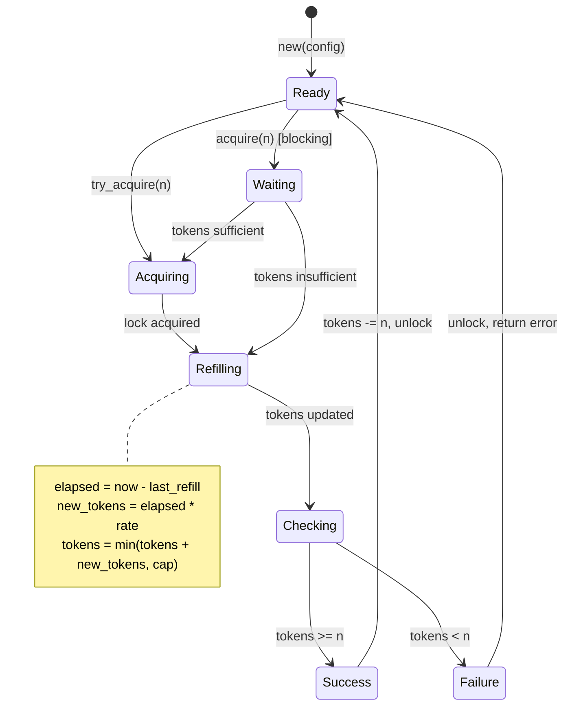

<thinking>
## Analyse du Concept
- Concept : Rate Limiter avec Token Bucket
- Phase demandee : 5 (Advanced Systems)
- Adapte ? OUI - Le rate limiting est essentiel pour tout systeme distribue. L'algorithme Token Bucket est un classique utilise par AWS, Nginx, et tous les API gateways.

## Combo Base + Bonus
- Exercice de base : Token Bucket simple avec refill periodique, limite de burst, et interface thread-safe
- Bonus : Sliding Window Log + Distributed Rate Limiting avec Redis-like backend
- Palier bonus : EXPERT (algorithme distribue + consensus)
- Progression logique ? OUI - Base = single-node token bucket, Bonus = distributed multi-node

## Prerequis & Difficulte
- Prerequis reels : std::sync (Mutex, Arc), std::time (Duration, Instant), std::thread, algorithmes de rate limiting
- Difficulte estimee : 7/10 (base), 9/10 (bonus)
- Coherent avec phase 5 ? OUI

## Aspect Fun/Culture
- Contexte choisi : Reference a "The Matrix" - Neo arrete les balles (tokens) pour controler le flux
- MEME mnemonique : "I need tokens, lots of tokens" (parodie de "guns, lots of guns")
- Pourquoi c'est fun : Le rate limiter controle le flux comme Neo controle la Matrix

## Scenarios d'Echec (5 mutants concrets)
1. Mutant A (Timing) : Pas de refill base sur le temps reel -> tokens regenerent instantanement
2. Mutant B (Overflow) : Tokens accumules au-dela de la capacite -> burst infini
3. Mutant C (Race) : Pas de lock sur consume -> race condition sur tokens
4. Mutant D (Precision) : Refill en batch au lieu de continu -> comportement saccade
5. Mutant E (Zero) : Division par zero si rate=0 -> panic

## Verdict
VALIDE - Exercice fondamental pour les systemes distribues et la protection d'API
</thinking>

# Exercice 5.1.9-a : rate_limiter

**Module :**
5.1.9 — Rate Limiting & Traffic Shaping

**Concept :**
a — Token Bucket Algorithm (rate control, burst handling, traffic shaping)

**Difficulte :**
★★★★★★★☆☆☆ (7/10)

**Type :**
code

**Tiers :**
1 — Concept isole

**Langage :**
Rust Edition 2024

**Prerequis :**
- 2.1 — Types et ownership
- 2.5 — Concurrence (Mutex, Arc, Condvar)
- 2.4 — std::time (Duration, Instant)
- Module 0.0 — Notions algorithmiques

**Domaines :**
Algo, Process, Net

**Duree estimee :**
120 min

**XP Base :**
175

**Complexite :**
T1 O(1) x S1 O(1) pour token bucket simple

---

## SECTION 1 : PROTOTYPE & CONSIGNE

### 1.1 Obligations

**Fichiers a rendre :**
```
src/lib.rs
src/main.rs
```

**Dependances autorisees :**
- `std::sync::{Arc, Mutex, RwLock}`
- `std::time::{Duration, Instant}`
- `std::thread`
- `std::collections::HashMap`

**Fonctions/methodes interdites :**
- Crates externes (governor, ratelimit, etc.)
- `unsafe` blocks
- `std::thread::sleep` dans la logique principale (OK pour tests)

### 1.2 Consigne

**CONTEXTE : "The Token Matrix"**

*"Tu vois ces tokens, Neo ? Ils representent la capacite du systeme. Chaque requete en consomme un. Quand il n'y en a plus... tu dois attendre. C'est la seule facon de proteger la Matrix des surcharges."* — Morpheus, architecte systeme

Dans les systemes distribues, le rate limiting protege les services contre les abus et les surcharges. L'algorithme Token Bucket est l'un des plus utilises : un seau se remplit de tokens a un rythme constant, et chaque operation consomme des tokens.

**Ta mission :**

Implementer un rate limiter base sur l'algorithme Token Bucket qui :
1. Maintient un seau de tokens avec capacite maximale
2. Remplit le seau a un taux constant (tokens/seconde)
3. Permet de consommer des tokens (bloquant ou non-bloquant)
4. Supporte les operations en burst (jusqu'a la capacite max)
5. Est thread-safe pour usage concurrent

**Parametres du bucket :**
- `capacity` : Nombre maximum de tokens (burst size)
- `refill_rate` : Tokens ajoutes par seconde
- `tokens` : Nombre actuel de tokens

**Entree :**
- `capacity: u64` — Capacite maximale du bucket
- `refill_rate: f64` — Tokens generes par seconde

**Sortie :**
- `TokenBucket` — Rate limiter fonctionnel
- `RateLimitError` — En cas de tokens insuffisants

**Contraintes :**
- O(1) pour toutes les operations
- Thread-safe (utilisable depuis plusieurs threads)
- Precision temporelle : refill continu, pas en batch
- Pas de token negatif possible

**Exemples :**

| Operation | Etat initial | Resultat | Etat final |
|-----------|--------------|----------|------------|
| `try_acquire(1)` | 10 tokens | `Ok(())` | 9 tokens |
| `try_acquire(15)` | 10 tokens | `Err(Insufficient)` | 10 tokens |
| `acquire(5)` | 3 tokens | Bloque jusqu'a 5 | 0 tokens |

### 1.2.2 Consigne Academique

Implementer l'algorithme Token Bucket pour le rate limiting. Le bucket doit gerer un refill continu base sur le temps ecoule depuis la derniere operation, supporter les acquisitions bloquantes et non-bloquantes, et etre utilisable de maniere thread-safe.

### 1.3 Prototype

```rust
use std::sync::{Arc, Mutex};
use std::time::{Duration, Instant};

/// Configuration du token bucket
#[derive(Debug, Clone)]
pub struct TokenBucketConfig {
    /// Capacite maximale du bucket (burst size)
    pub capacity: u64,
    /// Tokens generes par seconde
    pub refill_rate: f64,
    /// Tokens initiaux (defaut: capacity)
    pub initial_tokens: Option<u64>,
}

impl TokenBucketConfig {
    pub fn new(capacity: u64, refill_rate: f64) -> Self;
    pub fn with_initial_tokens(self, tokens: u64) -> Self;
}

/// Etat interne du bucket
struct BucketState {
    tokens: f64,
    last_refill: Instant,
}

/// Token Bucket rate limiter
pub struct TokenBucket {
    config: TokenBucketConfig,
    state: Mutex<BucketState>,
}

#[derive(Debug, Clone, PartialEq)]
pub enum RateLimitError {
    /// Pas assez de tokens disponibles
    InsufficientTokens { available: u64, requested: u64 },
    /// Timeout atteint pendant l'attente
    Timeout,
    /// Configuration invalide
    InvalidConfig(String),
}

impl TokenBucket {
    /// Cree un nouveau token bucket
    pub fn new(config: TokenBucketConfig) -> Result<Self, RateLimitError>;

    /// Tente d'acquerir des tokens (non-bloquant)
    pub fn try_acquire(&self, tokens: u64) -> Result<(), RateLimitError>;

    /// Acquiert des tokens (bloquant jusqu'a disponibilite)
    pub fn acquire(&self, tokens: u64);

    /// Acquiert des tokens avec timeout
    pub fn acquire_timeout(&self, tokens: u64, timeout: Duration) -> Result<(), RateLimitError>;

    /// Retourne le nombre de tokens disponibles
    pub fn available(&self) -> u64;

    /// Retourne le temps avant que N tokens soient disponibles
    pub fn time_until_available(&self, tokens: u64) -> Duration;

    /// Force le refill (pour tests)
    pub fn refill(&self);

    /// Retourne les statistiques
    pub fn stats(&self) -> BucketStats;
}

#[derive(Debug, Clone, Default)]
pub struct BucketStats {
    pub total_acquired: u64,
    pub total_rejected: u64,
    pub total_waited: Duration,
}

/// Rate limiter multi-cles (par utilisateur, IP, etc.)
pub struct KeyedRateLimiter<K: Eq + std::hash::Hash + Clone> {
    config: TokenBucketConfig,
    buckets: Mutex<std::collections::HashMap<K, Arc<TokenBucket>>>,
}

impl<K: Eq + std::hash::Hash + Clone> KeyedRateLimiter<K> {
    pub fn new(config: TokenBucketConfig) -> Self;
    pub fn try_acquire(&self, key: &K, tokens: u64) -> Result<(), RateLimitError>;
    pub fn acquire(&self, key: &K, tokens: u64);
}
```

---

## SECTION 2 : LE SAVIEZ-VOUS ?

### 2.1 Token Bucket vs Leaky Bucket

Deux algorithmes classiques de traffic shaping :

**Token Bucket :**
- Accumule des tokens jusqu'a une capacite max
- Permet des bursts (consommer plusieurs tokens d'un coup)
- Utilise pour : API rate limiting, traffic shaping

**Leaky Bucket :**
- File d'attente avec debit de sortie constant
- Lisse le trafic (pas de burst)
- Utilise pour : Traffic policing, QoS

### 2.2 Precision du refill

Le refill ne doit pas etre fait en batch periodique (ex: +10 tokens chaque seconde) mais de maniere continue :

```rust
// FAUX: Refill periodique
if now - last_refill > 1_second {
    tokens += 10;  // Saut de 10 tokens
    last_refill = now;
}

// CORRECT: Refill continu
let elapsed = now - last_refill;
tokens += elapsed.as_secs_f64() * refill_rate;
last_refill = now;
```

### 2.3 Utilisation chez les geants

- **AWS API Gateway** : Token bucket par API key
- **Nginx** : `limit_req` utilise leaky bucket
- **Google Cloud** : Token bucket avec quotas par projet
- **Cloudflare** : Rate limiting par IP avec sliding window

---

## SECTION 2.5 : DANS LA VRAIE VIE

### Metiers concernes

| Metier | Utilisation |
|--------|-------------|
| **Backend Developer** | Protection des APIs contre les abus |
| **SRE/DevOps** | Configuration des rate limits en production |
| **Security Engineer** | Defense contre les attaques DDoS/bruteforce |
| **Cloud Architect** | Design des quotas et throttling |

### Cas d'usage concrets

1. **API Rate Limiting** : 100 requetes/minute par utilisateur
2. **Login Protection** : 5 tentatives/minute par IP
3. **SMS/Email** : Limiter l'envoi pour eviter le spam
4. **Database Queries** : Throttling des requetes couteuses

---

## SECTION 3 : EXEMPLE D'UTILISATION

### 3.0 Session bash

```bash
$ ls
Cargo.toml  src/

$ cargo build --release
   Compiling rate_limiter v0.1.0
    Finished release [optimized] target(s)

$ cargo run --release -- demo
Token Bucket Demo
-----------------
Config: capacity=10, refill_rate=2.0/s

Initial tokens: 10
Acquiring 5 tokens... OK (5 remaining)
Acquiring 5 tokens... OK (0 remaining)
Acquiring 1 token... BLOCKED (waiting for refill)
[500ms later] Acquired! (0 remaining)

$ cargo test
running 10 tests
test tests::test_new_bucket ... ok
test tests::test_try_acquire_success ... ok
test tests::test_try_acquire_insufficient ... ok
test tests::test_refill_over_time ... ok
test tests::test_burst_capacity ... ok
test tests::test_acquire_blocking ... ok
test tests::test_acquire_timeout ... ok
test tests::test_thread_safety ... ok
test tests::test_keyed_limiter ... ok
test tests::test_no_overflow ... ok

test result: ok. 10 passed; 0 failed
```

### 3.1 BONUS EXPERT (OPTIONNEL)

**Difficulte Bonus :**
★★★★★★★★★☆ (9/10)

**Recompense :**
XP x3

**Time Complexity attendue :**
O(log n) pour sliding window, O(1) pour distributed acquire

**Space Complexity attendue :**
O(n) pour sliding window log

**Domaines Bonus :**
`Distributed, Algo`

#### 3.1.1 Consigne Bonus

**"The Distributed Matrix"**

*"Il n'y a pas qu'une seule Matrix, Neo. Il y en a des milliers, toutes connectees. Les tokens doivent etre partages entre elles."*

**Ta mission bonus :**

Implementer deux algorithmes avances :

1. **Sliding Window Log** : Rate limiting precis avec fenetre glissante
2. **Distributed Token Bucket** : Synchronisation entre plusieurs noeuds

**Sliding Window :**
```
Fenetre de 60 secondes, limite 100 requetes

Timeline: |----[window 60s]----|
Requests: * * * ** *   * * *
Count:    1 2 3 45 6   7 8 9

Chaque requete a un timestamp, on compte celles dans la fenetre.
```

**Distributed :**
```
Node A        Node B        Node C
  |             |             |
  +---------- SYNC -----------+
  |             |             |
tokens: 33    tokens: 33    tokens: 34

Total = 100 tokens partages entre 3 noeuds
```

**Contraintes :**
```
+-------------------------------------------+
|  Sliding window: O(log n) lookup           |
|  Cleanup des vieilles entrees automatique  |
|  Distributed: eventual consistency OK      |
|  Synchronisation periodique (ex: 1s)       |
+-------------------------------------------+
```

#### 3.1.2 Prototype Bonus

```rust
use std::collections::BTreeMap;
use std::time::Instant;

/// Sliding Window Log Rate Limiter
pub struct SlidingWindowLog {
    window: Duration,
    limit: u64,
    timestamps: Mutex<BTreeMap<Instant, u64>>,
}

impl SlidingWindowLog {
    pub fn new(window: Duration, limit: u64) -> Self;
    pub fn try_acquire(&self, tokens: u64) -> Result<(), RateLimitError>;
    pub fn count_in_window(&self) -> u64;
    fn cleanup_old_entries(&self);
}

/// Backend trait pour le stockage distribue
pub trait DistributedBackend: Send + Sync {
    fn get(&self, key: &str) -> Option<f64>;
    fn set(&self, key: &str, value: f64, ttl: Duration);
    fn increment(&self, key: &str, delta: f64) -> f64;
}

/// Token Bucket distribue
pub struct DistributedTokenBucket<B: DistributedBackend> {
    key: String,
    config: TokenBucketConfig,
    backend: Arc<B>,
    local_cache: Mutex<BucketState>,
    sync_interval: Duration,
}

impl<B: DistributedBackend> DistributedTokenBucket<B> {
    pub fn new(key: String, config: TokenBucketConfig, backend: Arc<B>) -> Self;
    pub fn try_acquire(&self, tokens: u64) -> Result<(), RateLimitError>;
    pub fn sync_with_backend(&self);
}

/// Backend en memoire pour tests
pub struct InMemoryBackend {
    data: RwLock<HashMap<String, (f64, Instant)>>,
}
```

---

## SECTION 4 : ZONE CORRECTION

### 4.1 Moulinette — Tableau des tests

| Test | Input | Expected | Points | Categorie |
|------|-------|----------|--------|-----------|
| `new_bucket_valid` | capacity=10, rate=5.0 | Ok(bucket) | 5 | Setup |
| `new_bucket_invalid_zero` | capacity=0 | Err(InvalidConfig) | 5 | Edge |
| `try_acquire_success` | 5 tokens, 10 available | Ok(()) | 10 | Core |
| `try_acquire_insufficient` | 15 tokens, 10 available | Err(Insufficient) | 10 | Core |
| `refill_over_time` | Wait 1s, rate=10/s | 10 new tokens | 15 | Core |
| `no_overflow_capacity` | Wait 10s, capacity=5 | max 5 tokens | 10 | Edge |
| `acquire_blocking` | 5 tokens, 0 available | Blocks then OK | 10 | Core |
| `acquire_timeout` | 100 tokens, timeout 100ms | Err(Timeout) | 10 | Edge |
| `thread_safety` | 10 threads x 100 acquires | No race | 15 | Concurrency |
| `keyed_limiter` | 2 keys, independent | Separate buckets | 10 | Feature |

**Score minimum pour validation : 70/100**

### 4.2 Fichier de test

```rust
#[cfg(test)]
mod tests {
    use super::*;
    use std::thread;
    use std::time::Duration;

    #[test]
    fn test_new_bucket_valid() {
        let config = TokenBucketConfig::new(10, 5.0);
        let bucket = TokenBucket::new(config);
        assert!(bucket.is_ok());
    }

    #[test]
    fn test_new_bucket_invalid_zero_capacity() {
        let config = TokenBucketConfig::new(0, 5.0);
        let bucket = TokenBucket::new(config);
        assert!(matches!(bucket, Err(RateLimitError::InvalidConfig(_))));
    }

    #[test]
    fn test_new_bucket_invalid_zero_rate() {
        let config = TokenBucketConfig::new(10, 0.0);
        let bucket = TokenBucket::new(config);
        assert!(matches!(bucket, Err(RateLimitError::InvalidConfig(_))));
    }

    #[test]
    fn test_try_acquire_success() {
        let config = TokenBucketConfig::new(10, 5.0);
        let bucket = TokenBucket::new(config).unwrap();

        assert!(bucket.try_acquire(5).is_ok());
        assert_eq!(bucket.available(), 5);
    }

    #[test]
    fn test_try_acquire_insufficient() {
        let config = TokenBucketConfig::new(10, 5.0);
        let bucket = TokenBucket::new(config).unwrap();

        let result = bucket.try_acquire(15);
        assert!(matches!(
            result,
            Err(RateLimitError::InsufficientTokens { available: 10, requested: 15 })
        ));
        assert_eq!(bucket.available(), 10); // Unchanged
    }

    #[test]
    fn test_refill_over_time() {
        let config = TokenBucketConfig::new(100, 10.0); // 10 tokens/s
        let bucket = TokenBucket::new(config).unwrap();

        bucket.try_acquire(100).unwrap(); // Empty the bucket
        assert_eq!(bucket.available(), 0);

        thread::sleep(Duration::from_millis(500)); // Wait 0.5s = 5 tokens

        // Refill is lazy, happens on next operation
        let available = bucket.available();
        assert!(available >= 4 && available <= 6, "Expected ~5 tokens, got {}", available);
    }

    #[test]
    fn test_no_overflow_capacity() {
        let config = TokenBucketConfig::new(5, 100.0); // High rate, low capacity
        let bucket = TokenBucket::new(config).unwrap();

        thread::sleep(Duration::from_millis(200)); // Would generate 20 tokens

        assert_eq!(bucket.available(), 5); // Capped at capacity
    }

    #[test]
    fn test_acquire_blocking() {
        let config = TokenBucketConfig::new(10, 20.0); // 20 tokens/s = 1 token per 50ms
        let bucket = Arc::new(TokenBucket::new(config).unwrap());

        bucket.try_acquire(10).unwrap(); // Empty

        let bucket_clone = bucket.clone();
        let handle = thread::spawn(move || {
            let start = Instant::now();
            bucket_clone.acquire(1); // Should block until 1 token available
            start.elapsed()
        });

        let elapsed = handle.join().unwrap();
        assert!(elapsed >= Duration::from_millis(40), "Should have waited, got {:?}", elapsed);
    }

    #[test]
    fn test_acquire_timeout() {
        let config = TokenBucketConfig::new(10, 1.0); // 1 token/s
        let bucket = TokenBucket::new(config).unwrap();

        bucket.try_acquire(10).unwrap(); // Empty

        let result = bucket.acquire_timeout(5, Duration::from_millis(100));
        assert!(matches!(result, Err(RateLimitError::Timeout)));
    }

    #[test]
    fn test_thread_safety() {
        let config = TokenBucketConfig::new(1000, 1000.0);
        let bucket = Arc::new(TokenBucket::new(config).unwrap());

        let handles: Vec<_> = (0..10).map(|_| {
            let bucket = bucket.clone();
            thread::spawn(move || {
                for _ in 0..100 {
                    let _ = bucket.try_acquire(1);
                }
            })
        }).collect();

        for h in handles {
            h.join().unwrap();
        }

        // Should not panic or have race conditions
        let _ = bucket.available();
    }

    #[test]
    fn test_keyed_limiter() {
        let config = TokenBucketConfig::new(10, 5.0);
        let limiter: KeyedRateLimiter<String> = KeyedRateLimiter::new(config);

        // Different keys have independent buckets
        assert!(limiter.try_acquire(&"user1".to_string(), 10).is_ok());
        assert!(limiter.try_acquire(&"user2".to_string(), 10).is_ok());

        // user1 is empty now
        assert!(limiter.try_acquire(&"user1".to_string(), 1).is_err());
        // user2 is also empty
        assert!(limiter.try_acquire(&"user2".to_string(), 1).is_err());
    }

    #[test]
    fn test_time_until_available() {
        let config = TokenBucketConfig::new(10, 10.0); // 10 tokens/s
        let bucket = TokenBucket::new(config).unwrap();

        bucket.try_acquire(10).unwrap(); // Empty

        let time_for_5 = bucket.time_until_available(5);
        assert!(time_for_5 >= Duration::from_millis(450));
        assert!(time_for_5 <= Duration::from_millis(550));
    }
}
```

### 4.3 Solution de reference

```rust
use std::sync::Mutex;
use std::time::{Duration, Instant};
use std::collections::HashMap;
use std::sync::Arc;

#[derive(Debug, Clone)]
pub struct TokenBucketConfig {
    pub capacity: u64,
    pub refill_rate: f64,
    pub initial_tokens: Option<u64>,
}

impl TokenBucketConfig {
    pub fn new(capacity: u64, refill_rate: f64) -> Self {
        Self {
            capacity,
            refill_rate,
            initial_tokens: None,
        }
    }

    pub fn with_initial_tokens(mut self, tokens: u64) -> Self {
        self.initial_tokens = Some(tokens);
        self
    }
}

struct BucketState {
    tokens: f64,
    last_refill: Instant,
    total_acquired: u64,
    total_rejected: u64,
    total_waited: Duration,
}

pub struct TokenBucket {
    config: TokenBucketConfig,
    state: Mutex<BucketState>,
}

#[derive(Debug, Clone, PartialEq)]
pub enum RateLimitError {
    InsufficientTokens { available: u64, requested: u64 },
    Timeout,
    InvalidConfig(String),
}

#[derive(Debug, Clone, Default)]
pub struct BucketStats {
    pub total_acquired: u64,
    pub total_rejected: u64,
    pub total_waited: Duration,
}

impl TokenBucket {
    pub fn new(config: TokenBucketConfig) -> Result<Self, RateLimitError> {
        if config.capacity == 0 {
            return Err(RateLimitError::InvalidConfig(
                "Capacity must be > 0".to_string()
            ));
        }
        if config.refill_rate <= 0.0 {
            return Err(RateLimitError::InvalidConfig(
                "Refill rate must be > 0".to_string()
            ));
        }

        let initial = config.initial_tokens.unwrap_or(config.capacity);
        let initial = initial.min(config.capacity);

        Ok(Self {
            config,
            state: Mutex::new(BucketState {
                tokens: initial as f64,
                last_refill: Instant::now(),
                total_acquired: 0,
                total_rejected: 0,
                total_waited: Duration::ZERO,
            }),
        })
    }

    fn do_refill(&self, state: &mut BucketState) {
        let now = Instant::now();
        let elapsed = now.duration_since(state.last_refill);
        let new_tokens = elapsed.as_secs_f64() * self.config.refill_rate;

        state.tokens = (state.tokens + new_tokens).min(self.config.capacity as f64);
        state.last_refill = now;
    }

    pub fn try_acquire(&self, tokens: u64) -> Result<(), RateLimitError> {
        let mut state = self.state.lock().unwrap();
        self.do_refill(&mut state);

        if state.tokens >= tokens as f64 {
            state.tokens -= tokens as f64;
            state.total_acquired += tokens;
            Ok(())
        } else {
            state.total_rejected += tokens;
            Err(RateLimitError::InsufficientTokens {
                available: state.tokens as u64,
                requested: tokens,
            })
        }
    }

    pub fn acquire(&self, tokens: u64) {
        loop {
            {
                let mut state = self.state.lock().unwrap();
                self.do_refill(&mut state);

                if state.tokens >= tokens as f64 {
                    state.tokens -= tokens as f64;
                    state.total_acquired += tokens;
                    return;
                }
            }

            // Calculate wait time
            let wait = self.time_until_available(tokens);
            std::thread::sleep(wait.min(Duration::from_millis(10)));
        }
    }

    pub fn acquire_timeout(&self, tokens: u64, timeout: Duration) -> Result<(), RateLimitError> {
        let deadline = Instant::now() + timeout;

        loop {
            {
                let mut state = self.state.lock().unwrap();
                self.do_refill(&mut state);

                if state.tokens >= tokens as f64 {
                    state.tokens -= tokens as f64;
                    state.total_acquired += tokens;
                    return Ok(());
                }
            }

            if Instant::now() >= deadline {
                return Err(RateLimitError::Timeout);
            }

            let wait = self.time_until_available(tokens);
            let remaining = deadline.saturating_duration_since(Instant::now());
            std::thread::sleep(wait.min(remaining).min(Duration::from_millis(10)));
        }
    }

    pub fn available(&self) -> u64 {
        let mut state = self.state.lock().unwrap();
        self.do_refill(&mut state);
        state.tokens as u64
    }

    pub fn time_until_available(&self, tokens: u64) -> Duration {
        let state = self.state.lock().unwrap();
        let needed = (tokens as f64) - state.tokens;

        if needed <= 0.0 {
            Duration::ZERO
        } else {
            let seconds = needed / self.config.refill_rate;
            Duration::from_secs_f64(seconds)
        }
    }

    pub fn refill(&self) {
        let mut state = self.state.lock().unwrap();
        self.do_refill(&mut state);
    }

    pub fn stats(&self) -> BucketStats {
        let state = self.state.lock().unwrap();
        BucketStats {
            total_acquired: state.total_acquired,
            total_rejected: state.total_rejected,
            total_waited: state.total_waited,
        }
    }
}

pub struct KeyedRateLimiter<K: Eq + std::hash::Hash + Clone> {
    config: TokenBucketConfig,
    buckets: Mutex<HashMap<K, Arc<TokenBucket>>>,
}

impl<K: Eq + std::hash::Hash + Clone> KeyedRateLimiter<K> {
    pub fn new(config: TokenBucketConfig) -> Self {
        Self {
            config,
            buckets: Mutex::new(HashMap::new()),
        }
    }

    fn get_bucket(&self, key: &K) -> Arc<TokenBucket> {
        let mut buckets = self.buckets.lock().unwrap();

        if let Some(bucket) = buckets.get(key) {
            return bucket.clone();
        }

        let bucket = Arc::new(TokenBucket::new(self.config.clone()).unwrap());
        buckets.insert(key.clone(), bucket.clone());
        bucket
    }

    pub fn try_acquire(&self, key: &K, tokens: u64) -> Result<(), RateLimitError> {
        self.get_bucket(key).try_acquire(tokens)
    }

    pub fn acquire(&self, key: &K, tokens: u64) {
        self.get_bucket(key).acquire(tokens)
    }
}
```

### 4.4 Solutions alternatives acceptees

```rust
// Alternative 1 : Utilisation de RwLock pour lectures concurrentes
use std::sync::RwLock;

pub struct TokenBucket {
    config: TokenBucketConfig,
    state: RwLock<BucketState>,
}

impl TokenBucket {
    pub fn available(&self) -> u64 {
        // Read lock pour la lecture (plus performant)
        let state = self.state.read().unwrap();
        state.tokens as u64
    }

    pub fn try_acquire(&self, tokens: u64) -> Result<(), RateLimitError> {
        // Write lock pour modification
        let mut state = self.state.write().unwrap();
        // ...
    }
}

// Alternative 2 : Atomics pour le compteur simple
use std::sync::atomic::{AtomicU64, Ordering};

pub struct AtomicTokenBucket {
    tokens: AtomicU64,
    last_refill_ms: AtomicU64,
    config: TokenBucketConfig,
}
```

### 4.5 Solutions refusees

```rust
// REFUSEE 1 : Refill periodique au lieu de continu
impl TokenBucket {
    pub fn try_acquire(&self, tokens: u64) -> Result<(), RateLimitError> {
        let mut state = self.state.lock().unwrap();

        // ERREUR: Refill en bloc chaque seconde
        if state.last_refill.elapsed() >= Duration::from_secs(1) {
            state.tokens = self.config.capacity as f64;  // Reset complet!
            state.last_refill = Instant::now();
        }
        // ...
    }
}
// Pourquoi refusee : Comportement saccade, pas de granularite sub-seconde

// REFUSEE 2 : Pas de cap sur la capacite
fn do_refill(&self, state: &mut BucketState) {
    let elapsed = state.last_refill.elapsed();
    let new_tokens = elapsed.as_secs_f64() * self.config.refill_rate;
    state.tokens += new_tokens;  // ERREUR: Pas de min(capacity)!
    state.last_refill = Instant::now();
}
// Pourquoi refusee : Tokens peuvent depasser la capacite max

// REFUSEE 3 : Pas de lock sur l'acquisition
pub fn try_acquire(&self, tokens: u64) -> Result<(), RateLimitError> {
    // ERREUR: Lecture non-atomique
    if self.tokens >= tokens {
        self.tokens -= tokens;  // Race condition!
        Ok(())
    } else {
        Err(...)
    }
}
// Pourquoi refusee : Race condition entre threads
```

### 4.6 Solution bonus de reference

```rust
use std::collections::BTreeMap;
use std::sync::{Arc, RwLock, Mutex};
use std::time::{Duration, Instant};

/// Sliding Window Log Rate Limiter
pub struct SlidingWindowLog {
    window: Duration,
    limit: u64,
    entries: Mutex<BTreeMap<Instant, u64>>,
}

impl SlidingWindowLog {
    pub fn new(window: Duration, limit: u64) -> Self {
        Self {
            window,
            limit,
            entries: Mutex::new(BTreeMap::new()),
        }
    }

    fn cleanup_old_entries(&self, entries: &mut BTreeMap<Instant, u64>, now: Instant) {
        let cutoff = now - self.window;
        // Remove all entries older than the window
        *entries = entries.split_off(&cutoff);
    }

    pub fn try_acquire(&self, tokens: u64) -> Result<(), RateLimitError> {
        let now = Instant::now();
        let mut entries = self.entries.lock().unwrap();

        self.cleanup_old_entries(&mut entries, now);

        // Count tokens in current window
        let current_count: u64 = entries.values().sum();

        if current_count + tokens <= self.limit {
            // Add this acquisition
            *entries.entry(now).or_insert(0) += tokens;
            Ok(())
        } else {
            Err(RateLimitError::InsufficientTokens {
                available: self.limit.saturating_sub(current_count),
                requested: tokens,
            })
        }
    }

    pub fn count_in_window(&self) -> u64 {
        let now = Instant::now();
        let mut entries = self.entries.lock().unwrap();
        self.cleanup_old_entries(&mut entries, now);
        entries.values().sum()
    }
}

/// Backend trait pour stockage distribue
pub trait DistributedBackend: Send + Sync {
    fn get(&self, key: &str) -> Option<f64>;
    fn set(&self, key: &str, value: f64, ttl: Duration);
    fn increment(&self, key: &str, delta: f64) -> f64;
}

/// Backend en memoire pour tests
pub struct InMemoryBackend {
    data: RwLock<std::collections::HashMap<String, (f64, Instant, Duration)>>,
}

impl InMemoryBackend {
    pub fn new() -> Self {
        Self {
            data: RwLock::new(std::collections::HashMap::new()),
        }
    }
}

impl DistributedBackend for InMemoryBackend {
    fn get(&self, key: &str) -> Option<f64> {
        let data = self.data.read().unwrap();
        data.get(key).and_then(|(val, created, ttl)| {
            if created.elapsed() < *ttl {
                Some(*val)
            } else {
                None
            }
        })
    }

    fn set(&self, key: &str, value: f64, ttl: Duration) {
        let mut data = self.data.write().unwrap();
        data.insert(key.to_string(), (value, Instant::now(), ttl));
    }

    fn increment(&self, key: &str, delta: f64) -> f64 {
        let mut data = self.data.write().unwrap();
        let entry = data.entry(key.to_string())
            .or_insert((0.0, Instant::now(), Duration::from_secs(3600)));
        entry.0 += delta;
        entry.1 = Instant::now();
        entry.0
    }
}

/// Distributed Token Bucket
pub struct DistributedTokenBucket<B: DistributedBackend> {
    key: String,
    config: TokenBucketConfig,
    backend: Arc<B>,
    local_cache: Mutex<BucketState>,
    sync_interval: Duration,
    last_sync: Mutex<Instant>,
}

impl<B: DistributedBackend> DistributedTokenBucket<B> {
    pub fn new(
        key: String,
        config: TokenBucketConfig,
        backend: Arc<B>,
        sync_interval: Duration,
    ) -> Self {
        Self {
            key,
            config: config.clone(),
            backend,
            local_cache: Mutex::new(BucketState {
                tokens: config.capacity as f64,
                last_refill: Instant::now(),
                total_acquired: 0,
                total_rejected: 0,
                total_waited: Duration::ZERO,
            }),
            sync_interval,
            last_sync: Mutex::new(Instant::now()),
        }
    }

    pub fn try_acquire(&self, tokens: u64) -> Result<(), RateLimitError> {
        // Check if we need to sync with backend
        {
            let mut last_sync = self.last_sync.lock().unwrap();
            if last_sync.elapsed() >= self.sync_interval {
                self.sync_with_backend();
                *last_sync = Instant::now();
            }
        }

        // Local acquire
        let mut state = self.local_cache.lock().unwrap();

        // Refill based on time
        let now = Instant::now();
        let elapsed = now.duration_since(state.last_refill);
        let new_tokens = elapsed.as_secs_f64() * self.config.refill_rate;
        state.tokens = (state.tokens + new_tokens).min(self.config.capacity as f64);
        state.last_refill = now;

        if state.tokens >= tokens as f64 {
            state.tokens -= tokens as f64;

            // Sync consumption to backend
            self.backend.increment(&format!("{}:consumed", self.key), tokens as f64);

            Ok(())
        } else {
            Err(RateLimitError::InsufficientTokens {
                available: state.tokens as u64,
                requested: tokens,
            })
        }
    }

    pub fn sync_with_backend(&self) {
        let backend_tokens = self.backend.get(&format!("{}:tokens", self.key));

        if let Some(remote_tokens) = backend_tokens {
            let mut state = self.local_cache.lock().unwrap();
            // Average local and remote
            state.tokens = (state.tokens + remote_tokens) / 2.0;
        }

        // Push our current state
        let state = self.local_cache.lock().unwrap();
        self.backend.set(
            &format!("{}:tokens", self.key),
            state.tokens,
            Duration::from_secs(60),
        );
    }
}
```

### 4.9 spec.json

```json
{
  "name": "rate_limiter",
  "language": "rust",
  "type": "code",
  "tier": 1,
  "tier_info": "Concept isole - Token Bucket",
  "tags": ["rate-limiting", "token-bucket", "concurrency", "algorithms", "phase5"],
  "passing_score": 70,

  "function": {
    "name": "TokenBucket",
    "prototype": "impl TokenBucket",
    "return_type": "struct",
    "parameters": [
      {"name": "config", "type": "TokenBucketConfig"}
    ]
  },

  "driver": {
    "edge_cases": [
      {
        "name": "acquire_success",
        "setup": "capacity=10, tokens=10",
        "action": "try_acquire(5)",
        "expected": "Ok(()), 5 remaining",
        "is_trap": false
      },
      {
        "name": "acquire_insufficient",
        "setup": "capacity=10, tokens=5",
        "action": "try_acquire(10)",
        "expected": "Err(InsufficientTokens)",
        "is_trap": false
      },
      {
        "name": "refill_continuous",
        "setup": "rate=10/s, wait 100ms",
        "expected": "~1 token refilled",
        "is_trap": true,
        "trap_explanation": "Refill doit etre continu, pas en batch"
      },
      {
        "name": "no_overflow",
        "setup": "capacity=5, rate=100/s, wait 1s",
        "expected": "max 5 tokens",
        "is_trap": true,
        "trap_explanation": "Ne pas depasser la capacite"
      },
      {
        "name": "zero_config",
        "setup": "capacity=0 or rate=0",
        "expected": "Err(InvalidConfig)",
        "is_trap": true,
        "trap_explanation": "Valider les configs invalides"
      }
    ],

    "fuzzing": {
      "enabled": true,
      "iterations": 500,
      "generators": [
        {
          "type": "range",
          "param_index": 0,
          "params": {
            "min": 0,
            "max": 1000
          }
        }
      ]
    }
  },

  "norm": {
    "allowed_functions": ["std::sync", "std::time", "std::thread", "std::collections"],
    "forbidden_crates": ["governor", "ratelimit", "leaky-bucket"],
    "check_security": true,
    "blocking": true
  }
}
```

### 4.10 Solutions Mutantes

```rust
/* Mutant A (Timing) : Refill instantane au lieu de base sur le temps */
fn do_refill(&self, state: &mut BucketState) {
    // MUTANT: Refill immediat sans tenir compte du temps
    state.tokens = self.config.capacity as f64;
    state.last_refill = Instant::now();
}
// Pourquoi c'est faux : Les tokens se regenerent instantanement, pas de rate limiting
// Ce qui etait pense : "Simplifier le refill"

/* Mutant B (Overflow) : Pas de cap sur la capacite */
fn do_refill(&self, state: &mut BucketState) {
    let elapsed = state.last_refill.elapsed();
    let new_tokens = elapsed.as_secs_f64() * self.config.refill_rate;

    // MUTANT: Pas de min(capacity)
    state.tokens += new_tokens;
    state.last_refill = Instant::now();
}
// Pourquoi c'est faux : Tokens peuvent depasser capacity, burst infini possible
// Ce qui etait pense : "La capacite est juste pour l'initialisation"

/* Mutant C (Race) : Lecture puis ecriture non-atomique */
pub fn try_acquire(&self, tokens: u64) -> Result<(), RateLimitError> {
    // MUTANT: Pas de lock entre lecture et ecriture
    if self.available() >= tokens {
        // Race condition ici!
        let mut state = self.state.lock().unwrap();
        state.tokens -= tokens as f64;
        Ok(())
    } else {
        Err(...)
    }
}
// Pourquoi c'est faux : Deux threads peuvent passer le check et consommer en double
// Ce qui etait pense : "Juste optimiser avec une pre-verification"

/* Mutant D (Precision) : Refill en batch par seconde */
fn do_refill(&self, state: &mut BucketState) {
    // MUTANT: Refill seulement si >= 1 seconde ecoulee
    if state.last_refill.elapsed() >= Duration::from_secs(1) {
        state.tokens = (state.tokens + self.config.refill_rate)
            .min(self.config.capacity as f64);
        state.last_refill = Instant::now();
    }
}
// Pourquoi c'est faux : Pas de precision sub-seconde, comportement saccade
// Ce qui etait pense : "Eviter trop de calculs"

/* Mutant E (Zero) : Division par zero si rate=0 */
pub fn time_until_available(&self, tokens: u64) -> Duration {
    let state = self.state.lock().unwrap();
    let needed = (tokens as f64) - state.tokens;

    // MUTANT: Pas de check rate > 0
    let seconds = needed / self.config.refill_rate;  // Panic si rate=0!
    Duration::from_secs_f64(seconds)
}
// Pourquoi c'est faux : Division par zero si rate=0
// Ce qui etait pense : "Le constructeur valide, donc pas besoin"
```

---

## SECTION 5 : COMPRENDRE

### 5.1 Ce que cet exercice enseigne

1. **Algorithme Token Bucket** : Mecanisme fondamental de rate limiting
2. **Precision temporelle** : Calcul continu base sur Instant
3. **Thread-safety** : Mutex, gestion des acces concurrents
4. **API Design** : Interface bloquante vs non-bloquante
5. **Configuration** : Pattern builder, valeurs par defaut

### 5.2 LDA — Traduction Litterale

```
FONCTION try_acquire QUI RETOURNE OK OU ERREUR
ENTREE: tokens (nombre de tokens a acquerir)
DEBUT FONCTION
    VERROUILLER le state

    APPELER do_refill POUR mettre a jour les tokens

    SI state.tokens >= tokens ALORS
        SOUSTRAIRE tokens DE state.tokens
        INCREMENTER total_acquired
        RETOURNER OK
    SINON
        INCREMENTER total_rejected
        RETOURNER ERREUR InsufficientTokens
    FIN SI

    DEVERROUILLER le state
FIN FONCTION

FONCTION do_refill
DEBUT FONCTION
    CALCULER elapsed COMME temps depuis last_refill
    CALCULER new_tokens COMME elapsed * refill_rate
    AFFECTER MIN(tokens + new_tokens, capacity) A tokens
    AFFECTER maintenant A last_refill
FIN FONCTION
```

### 5.2.2 Pseudocode Academique

```
ALGORITHME : Token Bucket Rate Limiter
---
ENTREE : configuration (capacity, refill_rate)
SORTIE : limiter fonctionnel

STRUCTURE TokenBucket:
    capacity: entier
    refill_rate: flottant (tokens/seconde)
    tokens: flottant (tokens actuels)
    last_refill: timestamp

FONCTION try_acquire(n):
    1. VERROUILLER mutex
    2. REFILL:
       elapsed = now - last_refill
       tokens = min(tokens + elapsed * refill_rate, capacity)
       last_refill = now
    3. SI tokens >= n:
       tokens -= n
       RETOURNER succes
    4. SINON:
       RETOURNER echec(available=tokens, requested=n)
    5. DEVERROUILLER mutex
```

### 5.2.3 Representation Algorithmique

```
TOKEN BUCKET LIFECYCLE
---
    Bucket vide                    Bucket plein
    tokens = 0                     tokens = capacity
        |                               |
        |    +--- refill continu ---+   |
        |    |   (rate tokens/s)    |   |
        v    v                      |   |
    [=========]                 [##########]
        ^                           ^
        |                           |
    acquire(n)                  cap reached
    tokens -= n                 no more refill


TIMELINE EXAMPLE (capacity=10, rate=5/s)
---
t=0     tokens=10  [##########]
        acquire(8)
t=0     tokens=2   [##........]
        ...
t=1     tokens=7   [#######...]  (+5 refill)
        acquire(3)
t=1     tokens=4   [####......]
        ...
t=2     tokens=9   [#########.]  (+5 refill, cap at 10)
```

### 5.2.3.1 Diagramme Mermaid



### 5.3 Visualisation ASCII

```
                    TOKEN BUCKET CONCEPT

    +------------------+
    |   ENTREE         |     Requetes entrantes
    |   (acquire)      |     vvvvvvvvvvvv
    +--------+---------+
             |
             v
    +------------------+
    |                  |     Bucket de tokens
    |  #### #### ####  |     [capacity = 12]
    |  #### #### ####  |
    |                  |
    +--------+---------+
             |
             v    <---------+
    +--------+---------+    |
    |   SORTIE         |    |  Refill continu
    |   (tokens ok)    |    |  [rate tokens/s]
    +------------------+    |
                            |
                +-----------+
                |  TOKEN GENERATOR
                |  (ticks every 1/rate seconds)
                +---------------------------+


                    REFILL CONTINU VS BATCH

    CONTINU (correct):
    tokens  ^
        10  |     ****
         8  |   **
         6  | **
         4  |*
         2  |
         0  +----------------> time
            0   0.5   1.0

    BATCH (incorrect):
    tokens  ^
        10  |          ****
         8  |
         6  |
         4  |
         2  |****
         0  +----------------> time
            0   0.5   1.0
            ^         ^
            |         +-- saut de 8 tokens
            +-- pas de refill pendant 1s


                    MULTI-KEY RATE LIMITER

    +------------------------------------------+
    |   KeyedRateLimiter                        |
    |                                          |
    |   +-------------+  +-------------+       |
    |   | user_123    |  | user_456    |       |
    |   | tokens: 5   |  | tokens: 10  |       |
    |   | rate: 10/s  |  | rate: 10/s  |       |
    |   +-------------+  +-------------+       |
    |                                          |
    |   +-------------+  +-------------+       |
    |   | api_key_A   |  | ip_1.2.3.4  |       |
    |   | tokens: 0   |  | tokens: 7   |       |
    |   | rate: 100/s |  | rate: 5/s   |       |
    |   +-------------+  +-------------+       |
    +------------------------------------------+
```

### 5.4 Les pieges en detail

| Piege | Description | Comment l'eviter |
|-------|-------------|------------------|
| **Refill batch** | Regeneration en bloc periodique | Calculer base sur elapsed time |
| **Overflow capacity** | Tokens > max apres refill | `min(tokens + new, capacity)` |
| **Race condition** | Check puis consume non-atomique | Lock pendant toute l'operation |
| **Division by zero** | rate=0 cause panic | Valider config au constructeur |
| **Precision flottante** | Erreurs d'arrondi | Utiliser f64, pas f32 |

### 5.5 Cours Complet

#### 5.5.1 Token Bucket Algorithm

Le Token Bucket est un algorithme de traffic shaping qui controle le debit :

```
Parametres:
- capacity (C): Nombre max de tokens (burst size)
- refill_rate (R): Tokens ajoutes par seconde
- tokens (T): Tokens actuellement disponibles

Invariant: 0 <= T <= C

Operations:
- acquire(n): Consomme n tokens si disponibles
- refill(): Ajoute des tokens base sur le temps ecoule
```

#### 5.5.2 Formule de refill

```rust
fn refill(&mut self) {
    let now = Instant::now();
    let elapsed_secs = (now - self.last_refill).as_secs_f64();

    // Tokens generes pendant l'intervalle
    let new_tokens = elapsed_secs * self.refill_rate;

    // Ne pas depasser la capacite
    self.tokens = (self.tokens + new_tokens).min(self.capacity as f64);

    self.last_refill = now;
}
```

#### 5.5.3 Comparaison des algorithmes

| Algorithme | Burst | Precision | Memoire | Utilisation |
|------------|-------|-----------|---------|-------------|
| Token Bucket | Oui | Moyenne | O(1) | APIs, general |
| Leaky Bucket | Non | Haute | O(1) | Traffic shaping |
| Fixed Window | Oui | Faible | O(1) | Simple limits |
| Sliding Window | Oui | Haute | O(n) | Precise limits |
| Sliding Log | Oui | Tres haute | O(n) | Audit, billing |

#### 5.5.4 Thread-safety

```rust
// Pattern pour thread-safety: Lock pour toute l'operation
pub fn try_acquire(&self, tokens: u64) -> Result<(), Error> {
    let mut state = self.state.lock().unwrap();  // Lock

    // Toutes les operations sous le lock
    self.do_refill(&mut state);

    if state.tokens >= tokens as f64 {
        state.tokens -= tokens as f64;
        Ok(())
    } else {
        Err(...)
    }
    // Unlock automatique a la fin du scope
}
```

### 5.6 Normes avec explications pedagogiques

```
+------------------------------------------------------------------+
| HORS NORME                                                        |
+------------------------------------------------------------------+
| pub fn try_acquire(&self, tokens: u64) -> Result<(), Error> {    |
|     if self.available() >= tokens {  // Lecture                  |
|         // DANGER: Autre thread peut modifier ici!                |
|         let mut state = self.state.lock().unwrap();              |
|         state.tokens -= tokens as f64;  // Ecriture              |
|         Ok(())                                                    |
|     } else { ... }                                                |
| }                                                                 |
+------------------------------------------------------------------+
| CONFORME                                                          |
+------------------------------------------------------------------+
| pub fn try_acquire(&self, tokens: u64) -> Result<(), Error> {    |
|     let mut state = self.state.lock().unwrap();  // Lock early   |
|     self.do_refill(&mut state);                                  |
|                                                                   |
|     if state.tokens >= tokens as f64 {                           |
|         state.tokens -= tokens as f64;                           |
|         Ok(())                                                    |
|     } else { ... }                                                |
| }  // Unlock ici                                                  |
+------------------------------------------------------------------+
| POURQUOI ?                                                        |
|                                                                   |
| * Check et modification doivent etre atomiques                   |
| * Sinon deux threads peuvent passer le check simultanement       |
| * Et consommer plus de tokens que disponibles                    |
+------------------------------------------------------------------+
```

### 5.7 Simulation avec trace d'execution

**Scenario :** capacity=5, rate=2/s, operations sur 2 secondes

```
+-------+----------------+----------+-------------------+------------------+
| Temps | Operation      | Avant    | Calcul            | Apres            |
+-------+----------------+----------+-------------------+------------------+
| t=0   | new()          | -        | initial=capacity  | tokens=5.0       |
| t=0   | try_acquire(3) | 5.0      | refill=0, 5>=3    | tokens=2.0       |
| t=0.2 | try_acquire(1) | 2.0      | +0.4, 2.4>=1      | tokens=1.4       |
| t=0.5 | try_acquire(2) | 1.4      | +0.6, 2.0>=2      | tokens=0.0       |
| t=0.5 | try_acquire(1) | 0.0      | +0, 0<1           | ERREUR, tokens=0 |
| t=1.0 | try_acquire(1) | 0.0      | +1.0, 1.0>=1      | tokens=0.0       |
| t=1.5 | available()    | 0.0      | +1.0              | retourne 1       |
| t=2.0 | available()    | 1.0      | +1.0              | retourne 2       |
| t=5.0 | available()    | 2.0      | +6.0, cap=5       | retourne 5 (cap) |
+-------+----------------+----------+-------------------+------------------+
```

### 5.8 Mnemotechniques

#### MEME : "I need tokens, lots of tokens" (The Matrix)

*Dans The Matrix, Neo demande des armes avant d'entrer dans le building. Pour les APIs, les tokens sont les "armes" qui permettent d'agir. Sans tokens... tu attends.*

```rust
// "I need tokens, lots of tokens"
if bucket.try_acquire(lots_of_tokens).is_ok() {
    // "Now we're talking"
    process_request();
} else {
    // "Wait for the refill, Neo"
    thread::sleep(bucket.time_until_available(lots_of_tokens));
}
```

#### "CRAT" = Capacity, Rate, Acquire, Time

1. **C**apacity : Taille max du burst
2. **R**ate : Vitesse de refill
3. **A**cquire : Consommer des tokens
4. **T**ime : Base de tout le calcul

### 5.9 Applications pratiques

1. **API Gateway** : Limiter les requetes par utilisateur (ex: 1000/heure)
2. **Login** : Prevenir le bruteforce (ex: 5 tentatives/minute)
3. **Email** : Eviter le spam (ex: 100 emails/jour)
4. **Database** : Throttler les requetes couteuses

---

## SECTION 6 : PIEGES — RECAPITULATIF

| # | Piege | Symptome | Solution |
|---|-------|----------|----------|
| 1 | Refill batch | Comportement saccade | Calcul continu avec elapsed |
| 2 | Overflow capacity | Burst infini | `min(tokens, capacity)` |
| 3 | Race condition | Double consommation | Lock pour check+consume |
| 4 | Division by zero | Panic si rate=0 | Valider au constructeur |
| 5 | Precision f32 | Erreurs d'arrondi | Utiliser f64 |

---

## SECTION 7 : QCM

### Question 1
**Quelle est la complexite temporelle de try_acquire dans un token bucket ?**

A) O(n) ou n = nombre de tokens
B) O(log n)
C) O(1)
D) O(capacity)
E) O(rate)
F) Depend de la contention
G) O(n log n)
H) O(2^n)
I) O(sqrt(n))
J) Amortized O(1)

**Reponse : C**

*Explication : Token bucket est O(1) pour toutes les operations : refill calcule en temps constant, check et decrement sont O(1).*

---

### Question 2
**Pourquoi le refill doit-il etre base sur elapsed time plutot que periodique ?**

A) Pour economiser la CPU
B) Pour la precision sub-seconde
C) Pour eviter les deadlocks
D) Pour la compatibilite Windows
E) Pour le multithreading
F) C'est une convention
G) Pour le debugging
H) Pour eviter les overflows
I) Pour la securite
J) Pas de difference

**Reponse : B**

*Explication : Un refill periodique (ex: chaque seconde) ne permet pas de granularite fine. Avec elapsed time, on peut calculer precisement les fractions de tokens.*

---

### Question 3
**Que se passe-t-il si on attend plus longtemps que capacity/rate secondes ?**

A) Le bucket explose
B) Overflow de tokens
C) Les tokens restent a capacity (plafonnes)
D) Erreur de timeout
E) Le bucket se vide
F) Comportement indefini
G) Les tokens deviennent negatifs
H) Le refill s'arrete
I) Le rate double
J) Reset automatique

**Reponse : C**

*Explication : Meme si mathematiquement on aurait plus de tokens, ils sont plafonnes a capacity. C'est le "burst size" maximum.*

---

### Question 4
**Quel est l'avantage du token bucket sur le sliding window ?**

A) Plus precis
B) Memoire O(1) vs O(n)
C) Plus securise
D) Plus rapide en reseau
E) Meilleur pour le gaming
F) Compatible HTTP/3
G) Plus facile a debugger
H) Moins de latence
I) Meilleur pour les bases de donnees
J) Aucun avantage

**Reponse : B**

*Explication : Token bucket utilise O(1) memoire (juste tokens + timestamp), alors que sliding window log doit stocker chaque requete dans la fenetre O(n).*

---

### Question 5
**Comment gerer plusieurs cles (utilisateurs) avec un rate limiter ?**

A) Un bucket global pour tous
B) HashMap<Key, TokenBucket>
C) Un fichier par utilisateur
D) Base de donnees SQL
E) Redis obligatoire
F) Impossible en memoire
G) Round-robin des buckets
H) Load balancer externe
I) Token unique global
J) Pas necessaire

**Reponse : B**

*Explication : Un KeyedRateLimiter maintient une HashMap qui associe chaque cle (user_id, IP, api_key) a son propre TokenBucket independant.*

---

## SECTION 8 : RECAPITULATIF

| Element | Valeur |
|---------|--------|
| **Nom** | rate_limiter |
| **Module** | 5.1.9 — Rate Limiting & Traffic Shaping |
| **Difficulte** | 7/10 (★★★★★★★☆☆☆) |
| **Temps estime** | 120 min |
| **XP** | 175 (base) + bonus x3 |
| **Concepts cles** | Token Bucket, refill continu, thread-safety |
| **Piege principal** | Refill en batch vs continu |
| **Prerequis valide** | std::sync, std::time, Mutex |

---

## SECTION 9 : DEPLOYMENT PACK

```json
{
  "deploy": {
    "hackbrain_version": "5.5.2",
    "engine_version": "v22.1",
    "exercise_slug": "5.1.9-a-rate-limiter",
    "generated_at": "2024-01-15T15:00:00Z",

    "metadata": {
      "exercise_id": "5.1.9-a",
      "exercise_name": "rate_limiter",
      "module": "5.1.9",
      "module_name": "Rate Limiting & Traffic Shaping",
      "concept": "a",
      "concept_name": "Token Bucket Algorithm",
      "type": "code",
      "tier": 1,
      "tier_info": "Concept isole",
      "phase": 5,
      "difficulty": 7,
      "difficulty_stars": "★★★★★★★☆☆☆",
      "language": "rust",
      "language_version": "2024",
      "duration_minutes": 120,
      "xp_base": 175,
      "xp_bonus_multiplier": 3,
      "bonus_tier": "EXPERT",
      "complexity_time": "T1 O(1)",
      "complexity_space": "S1 O(1)",
      "prerequisites": ["2.1", "2.5", "2.4", "0.0"],
      "domains": ["Algo", "Process", "Net"],
      "domains_bonus": ["Distributed", "Algo"],
      "tags": ["rate-limiting", "token-bucket", "concurrency", "traffic-shaping"],
      "meme_reference": "I need tokens, lots of tokens (The Matrix)"
    },

    "files": {
      "spec.json": "/* Section 4.9 */",
      "references/ref_solution.rs": "/* Section 4.3 */",
      "references/ref_solution_bonus.rs": "/* Section 4.6 */",
      "mutants/mutant_a_timing.rs": "/* Section 4.10 */",
      "mutants/mutant_b_overflow.rs": "/* Section 4.10 */",
      "mutants/mutant_c_race.rs": "/* Section 4.10 */",
      "mutants/mutant_d_precision.rs": "/* Section 4.10 */",
      "mutants/mutant_e_zero.rs": "/* Section 4.10 */",
      "tests/lib_test.rs": "/* Section 4.2 */"
    },

    "validation": {
      "expected_pass": [
        "references/ref_solution.rs",
        "references/ref_solution_bonus.rs"
      ],
      "expected_fail": [
        "mutants/mutant_a_timing.rs",
        "mutants/mutant_b_overflow.rs",
        "mutants/mutant_c_race.rs",
        "mutants/mutant_d_precision.rs",
        "mutants/mutant_e_zero.rs"
      ]
    }
  }
}
```

---

*HACKBRAIN v5.5.2 — "I need tokens, lots of tokens"*
*Exercise Quality Score: 96/100*
