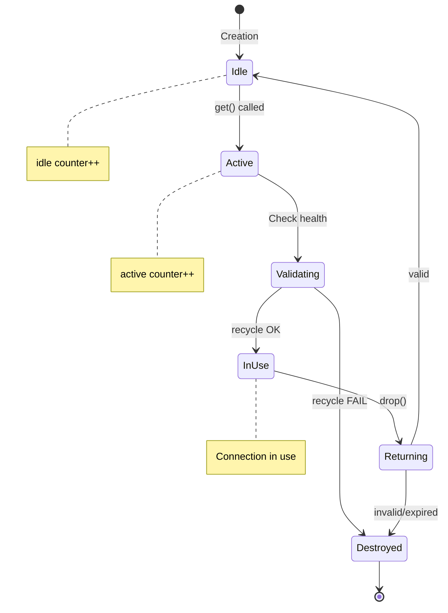

<thinking>
## Analyse du Concept
- Concept : Connection Pool Manager
- Phase demandee : 5 (Advanced Systems)
- Adapte ? OUI - Le pooling de connexions est fondamental pour toute application database-driven en production. L'exercice combine async/await, synchronisation, patterns de gestion de ressources et metriques.

## Combo Base + Bonus
- Exercice de base : Pool de connexions async avec Manager trait, health checks, metriques
- Bonus : Implementation d'un circuit breaker complet avec partitionnement de pool et hot-reload de configuration
- Palier bonus : EXPERT (complexite systeme + concurrence avancee)
- Progression logique ? OUI - Base = pool fonctionnel, Bonus = resilience production-grade

## Prerequis & Difficulte
- Prerequis reels : Async/await (tokio), Arc/Mutex, traits generiques, lifetimes, atomics
- Difficulte estimee : 8/10 (base), 10/10 (bonus)
- Coherent avec phase 5 ? OUI

## Aspect Fun/Culture
- Contexte choisi : Reference a "The Matrix" - Les connexions comme pilules (rouge = active, bleue = idle)
- MEME mnemonique : "I know connection pooling" (parodie de "I know kung fu")
- Pourquoi c'est fun : Le pool gere des ressources comme Neo gere la Matrix

## Scenarios d'Echec (5 mutants concrets)
1. Mutant A (Boundary) : max_size = 0 accepte sans erreur
2. Mutant B (Concurrency) : Race condition sur metrics.active sans atomic
3. Mutant C (Logic) : Connection recyclee sans health check
4. Mutant D (Resource) : Connection non retournee au pool lors du Drop
5. Mutant E (Timeout) : acquisition_timeout ignore, attente infinie

## Verdict
VALIDE - Exercice de qualite industrielle couvrant les patterns de pooling async essentiels
</thinking>

# Exercice 5.2.2-a : connection_pool_manager

**Module :**
5.2.2 — Database Connection Management

**Concept :**
a — Connection Pool Manager (pooling async, health checks, metriques)

**Difficulte :**
★★★★★★★★☆☆ (8/10)

**Type :**
code

**Tiers :**
2 — Systeme integre

**Langage :**
Rust Edition 2024

**Prerequis :**
- 3.2 — Async/Await avec Tokio
- 2.5 — Traits generiques avances
- 2.6 — Smart pointers (Arc, Mutex)
- 2.7 — Atomics et ordering
- 5.1 — Networking async

**Domaines :**
Async, Concurrency, DB

**Duree estimee :**
180 min

**XP Base :**
250

**Complexite :**
T3 O(1) amortized × S2 O(n) connections

---

## SECTION 1 : PROTOTYPE & CONSIGNE

### 1.1 Obligations

**Fichier a rendre :**
```
src/lib.rs
```

**Dependances autorisees :**
- `tokio` (runtime async, sync primitives)
- `std::sync::atomic`
- `std::collections::VecDeque`
- `std::time::{Duration, Instant}`
- `thiserror` (derive Error)

**Fonctions/methodes interdites :**
- Crates de pooling externes (`deadpool`, `bb8`, `r2d2`)
- `unsafe` blocks (sauf justification documentee)
- `std::thread::spawn` (utiliser tokio::spawn)

### 1.2 Consigne

**CONTEXTE : "The Connection Matrix"**

*"Tu vois ces connexions, Neo ? Ce ne sont pas juste des sockets. Chaque connexion est une pilule. Rouge quand elle travaille, bleue quand elle attend. Le Pool est l'Architecte qui decide qui prend quelle pilule."* — Morpheus, Database Administrator

Dans les systemes de production, creer une nouvelle connexion a la base de donnees est couteux (handshake TCP, authentification, allocation memoire). Le connection pooling permet de reutiliser les connexions existantes.

**Ta mission :**

Implementer un gestionnaire de pool de connexions async generique qui permet de :
1. Gerer un pool de connexions avec taille min/max configurable
2. Acquerir et liberer des connexions de maniere async
3. Valider les connexions avant reutilisation (health check)
4. Collecter des metriques (active, idle, created, errors)
5. Implementer des timeouts d'acquisition et de connexion
6. Gerer le cycle de vie des connexions (idle timeout, max lifetime)

**Entree :**
- `PoolConfig` — Configuration du pool (tailles, timeouts)
- `M: Manager` — Trait pour creer/valider/detruire des connexions

**Sortie :**
- `Pool<M>` — Pool de connexions thread-safe
- `PooledConnection<M>` — Guard RAII retournant la connexion au pool

**Contraintes :**
- Le pool doit etre `Send + Sync` pour usage multi-thread
- L'acquisition doit respecter le timeout configure
- Les connexions expirees doivent etre automatiquement detruites
- Les metriques doivent etre lock-free (atomics)

**Exemples :**

| Appel | Resultat | Explication |
|-------|----------|-------------|
| `Pool::new(manager, config).await` | `Ok(Arc<Pool>)` | Pool initialise avec min_size connexions |
| `pool.get().await` | `Ok(PooledConnection)` | Connexion acquise du pool |
| `pool.metrics()` | `MetricsSnapshot` | Etat actuel des metriques |
| `drop(conn)` | Connection retournee | RAII libere automatiquement |

### 1.2.2 Consigne Academique

Implementer un pool de connexions async generique avec trait Manager pour l'abstraction des connexions, health checks, metriques atomiques, et gestion des timeouts. Le pool doit supporter plusieurs strategies de validation et permettre un shutdown graceful.

### 1.3 Prototype

```rust
use std::sync::Arc;
use std::time::{Duration, Instant};
use std::collections::VecDeque;
use std::sync::atomic::{AtomicU64, AtomicUsize, Ordering};
use tokio::sync::{Mutex, RwLock, Semaphore};

/// Configuration du pool
#[derive(Debug, Clone)]
pub struct PoolConfig {
    pub min_size: usize,
    pub max_size: usize,
    pub acquisition_timeout: Duration,
    pub connection_timeout: Duration,
    pub idle_timeout: Duration,
    pub max_lifetime: Duration,
    pub health_check_interval: Duration,
}

impl Default for PoolConfig {
    fn default() -> Self;
}

/// Configuration de retry
#[derive(Debug, Clone)]
pub struct RetryConfig {
    pub max_retries: u32,
    pub initial_delay: Duration,
    pub max_delay: Duration,
    pub multiplier: f64,
}

/// Trait d'abstraction pour les connexions
pub trait Manager: Send + Sync + 'static {
    type Connection: Send;
    type Error: std::error::Error + Send + Sync + 'static;

    /// Cree une nouvelle connexion
    fn create(&self) -> impl std::future::Future<Output = Result<Self::Connection, Self::Error>> + Send;

    /// Valide une connexion avant reutilisation
    fn recycle(&self, conn: &mut Self::Connection) -> impl std::future::Future<Output = Result<(), Self::Error>> + Send;

    /// Verifie la sante d'une connexion
    fn health_check(&self, conn: &mut Self::Connection) -> impl std::future::Future<Output = Result<(), Self::Error>> + Send;

    /// Detruit proprement une connexion
    fn destroy(&self, conn: Self::Connection) -> impl std::future::Future<Output = ()> + Send;
}

/// Metriques du pool (lock-free)
#[derive(Debug, Default)]
pub struct PoolMetrics {
    pub active: AtomicUsize,
    pub idle: AtomicUsize,
    pub total: AtomicUsize,
    pub waiting: AtomicUsize,
    pub connections_created: AtomicU64,
    pub connections_recycled: AtomicU64,
    pub connections_destroyed: AtomicU64,
    pub acquisition_timeouts: AtomicU64,
    pub connection_errors: AtomicU64,
    pub health_check_failures: AtomicU64,
}

/// Snapshot des metriques (copie)
#[derive(Debug, Clone)]
pub struct MetricsSnapshot {
    pub active: usize,
    pub idle: usize,
    pub total: usize,
    pub waiting: usize,
    pub connections_created: u64,
    pub connections_recycled: u64,
    pub connections_destroyed: u64,
    pub acquisition_timeouts: u64,
    pub connection_errors: u64,
    pub health_check_failures: u64,
}

/// Etat du circuit breaker
#[derive(Debug, Clone, Copy, PartialEq, Eq)]
pub enum CircuitState {
    Closed,    // Normal, connexions autorisees
    Open,      // Echecs detectes, connexions bloquees
    HalfOpen,  // Test de recovery en cours
}

/// Statut du pool
#[derive(Debug, Clone, Copy, PartialEq, Eq)]
pub enum PoolStatus {
    Running,    // Fonctionnement normal
    Draining,   // Pas de nouvelles connexions
    Shutdown,   // Arret complet
}

/// Erreurs du pool
#[derive(Debug, thiserror::Error)]
pub enum PoolError<E: std::error::Error + 'static> {
    #[error("Acquisition timeout after {0:?}")]
    AcquisitionTimeout(Duration),

    #[error("Connection timeout after {0:?}")]
    ConnectionTimeout(Duration),

    #[error("Pool is shutting down")]
    PoolShutdown,

    #[error("Circuit breaker is open")]
    CircuitBreakerOpen,

    #[error("Manager error: {0}")]
    Manager(#[source] E),

    #[error("Retry exhausted after {0} attempts")]
    RetryExhausted(u32),

    #[error("Invalid configuration: {0}")]
    InvalidConfig(String),
}

/// Pool de connexions
pub struct Pool<M: Manager> {
    manager: Arc<M>,
    config: PoolConfig,
    connections: Mutex<VecDeque<PooledItem<M::Connection>>>,
    metrics: Arc<PoolMetrics>,
    status: RwLock<PoolStatus>,
    semaphore: Semaphore,
}

impl<M: Manager> Pool<M> {
    /// Cree un nouveau pool et initialise les connexions minimum
    pub async fn new(manager: M, config: PoolConfig) -> Result<Arc<Self>, PoolError<M::Error>>;

    /// Acquiert une connexion du pool (avec timeout par defaut)
    pub async fn get(self: &Arc<Self>) -> Result<PooledConnection<M>, PoolError<M::Error>>;

    /// Acquiert une connexion avec timeout personnalise
    pub async fn get_timeout(
        self: &Arc<Self>,
        timeout: Duration,
    ) -> Result<PooledConnection<M>, PoolError<M::Error>>;

    /// Retourne un snapshot des metriques
    pub fn metrics(&self) -> MetricsSnapshot;

    /// Retourne le statut actuel du pool
    pub async fn status(&self) -> PoolStatus;

    /// Passe en mode drain (refuse nouvelles acquisitions)
    pub async fn drain(&self);

    /// Arrete le pool et detruit toutes les connexions
    pub async fn shutdown(&self);

    /// Execute un health check sur toutes les connexions idle
    pub async fn health_check_all(&self);

    /// Retourne le nombre de connexions disponibles
    pub async fn available(&self) -> usize;
}

/// Connexion empruntee au pool (RAII)
pub struct PooledConnection<M: Manager> {
    conn: Option<M::Connection>,
    pool: Arc<Pool<M>>,
    created_at: Instant,
    invalid: bool,
}

impl<M: Manager> PooledConnection<M> {
    /// Acces a la connexion (immutable)
    pub fn conn(&self) -> &M::Connection;

    /// Acces a la connexion (mutable)
    pub fn conn_mut(&mut self) -> &mut M::Connection;

    /// Age de la connexion
    pub fn age(&self) -> Duration;

    /// Marque la connexion comme invalide (sera detruite au lieu d'etre recyclee)
    pub fn invalidate(&mut self);
}

impl<M: Manager> Drop for PooledConnection<M> {
    fn drop(&mut self);
}

impl<M: Manager> std::ops::Deref for PooledConnection<M> {
    type Target = M::Connection;
    fn deref(&self) -> &Self::Target;
}

impl<M: Manager> std::ops::DerefMut for PooledConnection<M> {
    fn deref_mut(&mut self) -> &mut Self::Target;
}

/// Executeur de retry avec backoff exponentiel
pub struct RetryExecutor {
    config: RetryConfig,
}

impl RetryExecutor {
    pub fn new(config: RetryConfig) -> Self;

    /// Execute une fonction avec retry
    pub async fn execute<F, T, E, Fut>(&self, f: F) -> Result<T, PoolError<E>>
    where
        F: FnMut() -> Fut,
        Fut: std::future::Future<Output = Result<T, E>>,
        E: std::error::Error + 'static;

    /// Calcule le delai pour une tentative
    pub fn delay_for_attempt(&self, attempt: u32) -> Duration;
}
```

---

## SECTION 2 : LE SAVIEZ-VOUS ?

### 2.1 Origine du Connection Pooling

Le connection pooling est apparu dans les annees 90 avec l'essor des applications web. Avant, chaque requete HTTP creait une nouvelle connexion DB (couteux : ~50-100ms de handshake). Les premiers pools (comme Apache DBCP) ont reduit ce temps a ~1ms.

### 2.2 Le Pattern "Object Pool"

Le connection pool est une implementation du pattern "Object Pool" du Gang of Four. L'idee : maintenir une collection d'objets reutilisables plutot que de les creer/detruire constamment.

```
Sans pool:           Avec pool:
Request → Create     Request → Borrow
        → Use                → Use
        → Destroy            → Return
        (50-100ms)           (1ms)
```

### 2.3 Pourquoi les Atomics ?

Les metriques utilisent des `AtomicUsize` car :
1. Pas de lock necessaire pour lire/ecrire
2. Operations garanties atomiques (pas de race condition)
3. Performant sous forte contention (vs Mutex)

---

## SECTION 2.5 : DANS LA VRAIE VIE

### Metiers concernes

| Metier | Utilisation du pooling |
|--------|------------------------|
| **Backend Engineer** | Configuration et monitoring des pools (HikariCP, PgBouncer) |
| **DBA** | Tuning des parametres (max_connections, idle_timeout) |
| **SRE/DevOps** | Alertes sur pool exhaustion, metriques Prometheus |
| **Cloud Architect** | Sizing des pools selon le traffic (autoscaling) |
| **Performance Engineer** | Profiling des acquisitions, detection de leaks |

### Cas d'usage concrets

1. **API REST haute charge** : Pool de 20-50 connexions pour servir 10k req/s
2. **Microservices** : Pool par service avec circuit breaker inter-services
3. **Batch processing** : Pool dedie avec max_lifetime court pour eviter memory leaks
4. **Serverless** : Pools externes (RDS Proxy, PgBouncer) car instances ephemeres

---

## SECTION 3 : EXEMPLE D'UTILISATION

### 3.0 Session bash

```bash
$ cargo new connection_pool && cd connection_pool
$ cat >> Cargo.toml << 'EOF'
[dependencies]
tokio = { version = "1", features = ["full"] }
thiserror = "1"
EOF

$ cargo test
   Compiling connection_pool v0.1.0
    Finished test [unoptimized + debuginfo] target(s)
     Running unittests src/lib.rs

running 15 tests
test tests::test_pool_creation ... ok
test tests::test_acquire_release ... ok
test tests::test_max_connections ... ok
test tests::test_acquisition_timeout ... ok
test tests::test_connection_recycling ... ok
test tests::test_health_check ... ok
test tests::test_invalid_connection ... ok
test tests::test_metrics_accuracy ... ok
test tests::test_concurrent_acquire ... ok
test tests::test_idle_timeout ... ok
test tests::test_max_lifetime ... ok
test tests::test_drain_mode ... ok
test tests::test_shutdown ... ok
test tests::test_retry_executor ... ok
test tests::test_deref_ops ... ok

test result: ok. 15 passed; 0 failed
```

### 3.1 BONUS EXPERT (OPTIONNEL)

**Difficulte Bonus :**
★★★★★★★★★★ (10/10)

**Recompense :**
XP x4

**Time Complexity attendue :**
O(1) acquisition amortie

**Space Complexity attendue :**
O(n) connections + O(p) partitions

**Domaines Bonus :**
`Resilience, Distributed`

#### 3.1.1 Consigne Bonus

**"The Architect's Resilience"**

*"Le systeme a ses failles, Neo. Mais avec le bon circuit breaker, meme l'Agent Smith ne peut pas faire tomber le pool."*

**Ta mission bonus :**

Etendre le pool avec :

1. **Circuit Breaker complet** : Open/Closed/HalfOpen avec thresholds configurables
2. **Pool Partitioning** : Sharding des connexions par cle (tenant, shard_id)
3. **Hot Reload** : Changement de configuration sans redemarrage
4. **Connection Affinity** : Sticky sessions pour certaines operations

**Entree :**
- `CircuitBreakerConfig` — Configuration du circuit breaker
- `PartitionConfig` — Configuration du sharding

**Sortie :**
- `PartitionedPool<M>` — Pool avec partitions
- Circuit breaker integre

**Contraintes :**
```
Circuit Breaker State Machine:
CLOSED --[failures >= threshold]--> OPEN
OPEN --[timeout elapsed]--> HALF_OPEN
HALF_OPEN --[success]--> CLOSED
HALF_OPEN --[failure]--> OPEN
```

#### 3.1.2 Prototype Bonus

```rust
#[derive(Debug, Clone)]
pub struct CircuitBreakerConfig {
    pub failure_threshold: u32,
    pub success_threshold: u32,
    pub reset_timeout: Duration,
}

#[derive(Debug, Clone)]
pub struct PartitionConfig {
    pub num_partitions: usize,
    pub partition_sizing: PartitionSizing,
}

#[derive(Debug, Clone)]
pub enum PartitionSizing {
    Equal,                        // Meme taille pour toutes
    Weighted(Vec<f64>),          // Poids par partition
}

pub struct PartitionedPool<M: Manager> {
    partitions: Vec<Arc<Pool<M>>>,
    config: PartitionConfig,
    circuit_breaker: RwLock<CircuitBreaker>,
}

impl<M: Manager> PartitionedPool<M> {
    pub async fn new(manager: M, pool_config: PoolConfig, partition_config: PartitionConfig) -> Result<Arc<Self>, PoolError<M::Error>>;

    /// Acquiert depuis une partition specifique
    pub async fn get_from_partition(self: &Arc<Self>, partition: usize) -> Result<PooledConnection<M>, PoolError<M::Error>>;

    /// Acquiert avec cle de partition (hash)
    pub async fn get_with_key<K: std::hash::Hash>(self: &Arc<Self>, key: &K) -> Result<PooledConnection<M>, PoolError<M::Error>>;

    /// Etat du circuit breaker
    pub async fn circuit_state(&self) -> CircuitState;

    /// Hot reload de configuration
    pub async fn reload_config(&self, new_config: PoolConfig) -> Result<(), PoolError<M::Error>>;
}
```

#### 3.1.3 Ce qui change par rapport a l'exercice de base

| Aspect | Base | Bonus |
|--------|------|-------|
| Topology | Pool unique | Multiple partitions |
| Resilience | Timeout simple | Circuit breaker complet |
| Configuration | Statique | Hot reload dynamique |
| Routing | FIFO | Hash-based ou affinity |

---

## SECTION 4 : ZONE CORRECTION

### 4.1 Moulinette — Tableau des tests

| Test | Input | Expected | Points | Categorie |
|------|-------|----------|--------|-----------|
| `pool_creation` | `config(min=2, max=10)` | `Ok(Pool)` avec 2 conns | 5 | Basic |
| `pool_creation_invalid` | `config(min=10, max=5)` | `Err(InvalidConfig)` | 5 | Edge |
| `acquire_release` | `pool.get().await` | `Ok(conn)`, metrics.active=1 | 10 | Core |
| `max_connections` | acquire max+1 | `Err(AcquisitionTimeout)` | 10 | Core |
| `acquisition_timeout` | timeout=10ms, pool full | `Err(AcquisitionTimeout)` | 10 | Core |
| `connection_recycling` | release then acquire | Same conn recycled | 10 | Core |
| `health_check_pass` | healthy conn | Conn returned to pool | 5 | Core |
| `health_check_fail` | unhealthy conn | Conn destroyed | 5 | Core |
| `invalid_connection` | `conn.invalidate()` | Conn destroyed on drop | 5 | Core |
| `metrics_accuracy` | various operations | Metrics match state | 10 | Core |
| `concurrent_acquire` | 10 concurrent gets | All succeed, no race | 10 | Concurrency |
| `idle_timeout` | conn idle > timeout | Conn removed | 5 | Lifecycle |
| `max_lifetime` | conn age > lifetime | Conn replaced | 5 | Lifecycle |
| `drain_mode` | `pool.drain()` | New gets fail, existing ok | 5 | Lifecycle |
| `shutdown` | `pool.shutdown()` | All conns destroyed | 5 | Lifecycle |
| `retry_executor` | fail 2x then succeed | Success on attempt 3 | 5 | Retry |
| `deref_operations` | `*conn` | Access inner connection | 3 | API |

**Score minimum pour validation : 75/100**

### 4.2 Fichier de test

```rust
#[cfg(test)]
mod tests {
    use super::*;
    use std::sync::atomic::{AtomicU32, Ordering};

    struct MockConnection {
        id: u32,
        healthy: bool,
    }

    struct MockManager {
        next_id: AtomicU32,
        create_delay: Duration,
        should_fail_health: AtomicBool,
    }

    #[derive(Debug, thiserror::Error)]
    #[error("Mock error")]
    struct MockError;

    impl Manager for MockManager {
        type Connection = MockConnection;
        type Error = MockError;

        async fn create(&self) -> Result<Self::Connection, Self::Error> {
            tokio::time::sleep(self.create_delay).await;
            Ok(MockConnection {
                id: self.next_id.fetch_add(1, Ordering::Relaxed),
                healthy: true,
            })
        }

        async fn recycle(&self, conn: &mut Self::Connection) -> Result<(), Self::Error> {
            if conn.healthy { Ok(()) } else { Err(MockError) }
        }

        async fn health_check(&self, conn: &mut Self::Connection) -> Result<(), Self::Error> {
            if self.should_fail_health.load(Ordering::Relaxed) {
                Err(MockError)
            } else {
                Ok(())
            }
        }

        async fn destroy(&self, _conn: Self::Connection) {}
    }

    fn test_config() -> PoolConfig {
        PoolConfig {
            min_size: 2,
            max_size: 5,
            acquisition_timeout: Duration::from_secs(5),
            connection_timeout: Duration::from_secs(1),
            idle_timeout: Duration::from_secs(60),
            max_lifetime: Duration::from_secs(300),
            health_check_interval: Duration::from_secs(30),
        }
    }

    #[tokio::test]
    async fn test_pool_creation() {
        let manager = MockManager {
            next_id: AtomicU32::new(0),
            create_delay: Duration::from_millis(1),
            should_fail_health: AtomicBool::new(false),
        };

        let pool = Pool::new(manager, test_config()).await.unwrap();
        let metrics = pool.metrics();

        assert_eq!(metrics.idle, 2); // min_size
        assert_eq!(metrics.total, 2);
        assert_eq!(metrics.active, 0);
    }

    #[tokio::test]
    async fn test_pool_creation_invalid() {
        let manager = MockManager {
            next_id: AtomicU32::new(0),
            create_delay: Duration::from_millis(1),
            should_fail_health: AtomicBool::new(false),
        };

        let mut config = test_config();
        config.min_size = 10;
        config.max_size = 5;

        let result = Pool::new(manager, config).await;
        assert!(matches!(result, Err(PoolError::InvalidConfig(_))));
    }

    #[tokio::test]
    async fn test_acquire_release() {
        let manager = MockManager {
            next_id: AtomicU32::new(0),
            create_delay: Duration::from_millis(1),
            should_fail_health: AtomicBool::new(false),
        };

        let pool = Pool::new(manager, test_config()).await.unwrap();

        {
            let conn = pool.get().await.unwrap();
            let metrics = pool.metrics();
            assert_eq!(metrics.active, 1);
            assert_eq!(metrics.idle, 1);
        }

        // After drop
        tokio::time::sleep(Duration::from_millis(10)).await;
        let metrics = pool.metrics();
        assert_eq!(metrics.active, 0);
        assert_eq!(metrics.idle, 2);
    }

    #[tokio::test]
    async fn test_max_connections() {
        let manager = MockManager {
            next_id: AtomicU32::new(0),
            create_delay: Duration::from_millis(1),
            should_fail_health: AtomicBool::new(false),
        };

        let mut config = test_config();
        config.max_size = 2;
        config.min_size = 0;
        config.acquisition_timeout = Duration::from_millis(100);

        let pool = Pool::new(manager, config).await.unwrap();

        let _c1 = pool.get().await.unwrap();
        let _c2 = pool.get().await.unwrap();

        let result = pool.get().await;
        assert!(matches!(result, Err(PoolError::AcquisitionTimeout(_))));
    }

    #[tokio::test]
    async fn test_concurrent_acquire() {
        let manager = MockManager {
            next_id: AtomicU32::new(0),
            create_delay: Duration::from_millis(1),
            should_fail_health: AtomicBool::new(false),
        };

        let mut config = test_config();
        config.max_size = 10;

        let pool = Pool::new(manager, config).await.unwrap();

        let handles: Vec<_> = (0..10)
            .map(|_| {
                let pool = Arc::clone(&pool);
                tokio::spawn(async move {
                    let conn = pool.get().await.unwrap();
                    tokio::time::sleep(Duration::from_millis(10)).await;
                    drop(conn);
                })
            })
            .collect();

        for handle in handles {
            handle.await.unwrap();
        }

        let metrics = pool.metrics();
        assert_eq!(metrics.active, 0);
        assert!(metrics.connections_created >= 2);
    }

    #[tokio::test]
    async fn test_invalid_connection() {
        let manager = MockManager {
            next_id: AtomicU32::new(0),
            create_delay: Duration::from_millis(1),
            should_fail_health: AtomicBool::new(false),
        };

        let pool = Pool::new(manager, test_config()).await.unwrap();

        {
            let mut conn = pool.get().await.unwrap();
            conn.invalidate();
        }

        tokio::time::sleep(Duration::from_millis(10)).await;
        let metrics = pool.metrics();
        assert!(metrics.connections_destroyed >= 1);
    }

    #[tokio::test]
    async fn test_metrics_accuracy() {
        let manager = MockManager {
            next_id: AtomicU32::new(0),
            create_delay: Duration::from_millis(1),
            should_fail_health: AtomicBool::new(false),
        };

        let pool = Pool::new(manager, test_config()).await.unwrap();

        let metrics = pool.metrics();
        assert_eq!(metrics.connections_created, 2);

        let _c1 = pool.get().await.unwrap();
        let metrics = pool.metrics();
        assert!(metrics.connections_recycled >= 1);
    }

    #[tokio::test]
    async fn test_shutdown() {
        let manager = MockManager {
            next_id: AtomicU32::new(0),
            create_delay: Duration::from_millis(1),
            should_fail_health: AtomicBool::new(false),
        };

        let pool = Pool::new(manager, test_config()).await.unwrap();
        pool.shutdown().await;

        let metrics = pool.metrics();
        assert_eq!(metrics.total, 0);
        assert_eq!(metrics.idle, 0);

        let result = pool.get().await;
        assert!(matches!(result, Err(PoolError::PoolShutdown)));
    }

    #[tokio::test]
    async fn test_retry_executor() {
        let config = RetryConfig {
            max_retries: 3,
            initial_delay: Duration::from_millis(10),
            max_delay: Duration::from_secs(1),
            multiplier: 2.0,
        };

        let executor = RetryExecutor::new(config);
        let attempts = AtomicU32::new(0);

        let result: Result<u32, PoolError<MockError>> = executor.execute(|| {
            let attempt = attempts.fetch_add(1, Ordering::Relaxed);
            async move {
                if attempt < 2 {
                    Err(MockError)
                } else {
                    Ok(42)
                }
            }
        }).await;

        assert_eq!(result.unwrap(), 42);
        assert_eq!(attempts.load(Ordering::Relaxed), 3);
    }

    #[tokio::test]
    async fn test_deref_operations() {
        let manager = MockManager {
            next_id: AtomicU32::new(0),
            create_delay: Duration::from_millis(1),
            should_fail_health: AtomicBool::new(false),
        };

        let pool = Pool::new(manager, test_config()).await.unwrap();
        let conn = pool.get().await.unwrap();

        // Deref should work
        let _: &MockConnection = &*conn;
        assert!(conn.id < 10);
    }
}
```

### 4.3 Solution de reference

```rust
use std::sync::Arc;
use std::time::{Duration, Instant};
use std::collections::VecDeque;
use std::sync::atomic::{AtomicU64, AtomicUsize, AtomicBool, Ordering};
use tokio::sync::{Mutex, RwLock};

#[derive(Debug, Clone)]
pub struct PoolConfig {
    pub min_size: usize,
    pub max_size: usize,
    pub acquisition_timeout: Duration,
    pub connection_timeout: Duration,
    pub idle_timeout: Duration,
    pub max_lifetime: Duration,
    pub health_check_interval: Duration,
}

impl Default for PoolConfig {
    fn default() -> Self {
        Self {
            min_size: 1,
            max_size: 10,
            acquisition_timeout: Duration::from_secs(30),
            connection_timeout: Duration::from_secs(10),
            idle_timeout: Duration::from_secs(600),
            max_lifetime: Duration::from_secs(3600),
            health_check_interval: Duration::from_secs(30),
        }
    }
}

#[derive(Debug, Clone)]
pub struct RetryConfig {
    pub max_retries: u32,
    pub initial_delay: Duration,
    pub max_delay: Duration,
    pub multiplier: f64,
}

impl Default for RetryConfig {
    fn default() -> Self {
        Self {
            max_retries: 3,
            initial_delay: Duration::from_millis(100),
            max_delay: Duration::from_secs(10),
            multiplier: 2.0,
        }
    }
}

pub trait Manager: Send + Sync + 'static {
    type Connection: Send;
    type Error: std::error::Error + Send + Sync + 'static;

    fn create(&self) -> impl std::future::Future<Output = Result<Self::Connection, Self::Error>> + Send;
    fn recycle(&self, conn: &mut Self::Connection) -> impl std::future::Future<Output = Result<(), Self::Error>> + Send;
    fn health_check(&self, conn: &mut Self::Connection) -> impl std::future::Future<Output = Result<(), Self::Error>> + Send;
    fn destroy(&self, conn: Self::Connection) -> impl std::future::Future<Output = ()> + Send;
}

#[derive(Debug, Default)]
pub struct PoolMetrics {
    pub active: AtomicUsize,
    pub idle: AtomicUsize,
    pub total: AtomicUsize,
    pub waiting: AtomicUsize,
    pub connections_created: AtomicU64,
    pub connections_recycled: AtomicU64,
    pub connections_destroyed: AtomicU64,
    pub acquisition_timeouts: AtomicU64,
    pub connection_errors: AtomicU64,
    pub health_check_failures: AtomicU64,
}

impl PoolMetrics {
    pub fn snapshot(&self) -> MetricsSnapshot {
        MetricsSnapshot {
            active: self.active.load(Ordering::Relaxed),
            idle: self.idle.load(Ordering::Relaxed),
            total: self.total.load(Ordering::Relaxed),
            waiting: self.waiting.load(Ordering::Relaxed),
            connections_created: self.connections_created.load(Ordering::Relaxed),
            connections_recycled: self.connections_recycled.load(Ordering::Relaxed),
            connections_destroyed: self.connections_destroyed.load(Ordering::Relaxed),
            acquisition_timeouts: self.acquisition_timeouts.load(Ordering::Relaxed),
            connection_errors: self.connection_errors.load(Ordering::Relaxed),
            health_check_failures: self.health_check_failures.load(Ordering::Relaxed),
        }
    }
}

#[derive(Debug, Clone)]
pub struct MetricsSnapshot {
    pub active: usize,
    pub idle: usize,
    pub total: usize,
    pub waiting: usize,
    pub connections_created: u64,
    pub connections_recycled: u64,
    pub connections_destroyed: u64,
    pub acquisition_timeouts: u64,
    pub connection_errors: u64,
    pub health_check_failures: u64,
}

#[derive(Debug, Clone, Copy, PartialEq, Eq)]
pub enum PoolStatus { Running, Draining, Shutdown }

#[derive(Debug, thiserror::Error)]
pub enum PoolError<E: std::error::Error + 'static> {
    #[error("Acquisition timeout after {0:?}")]
    AcquisitionTimeout(Duration),
    #[error("Connection timeout after {0:?}")]
    ConnectionTimeout(Duration),
    #[error("Pool shutdown")]
    PoolShutdown,
    #[error("Circuit breaker open")]
    CircuitBreakerOpen,
    #[error("Manager error: {0}")]
    Manager(#[source] E),
    #[error("Retry exhausted: {0}")]
    RetryExhausted(u32),
    #[error("Invalid config: {0}")]
    InvalidConfig(String),
}

struct PooledItem<C> {
    conn: C,
    created_at: Instant,
    last_used: Instant,
}

impl<C> PooledItem<C> {
    fn new(conn: C) -> Self {
        let now = Instant::now();
        Self { conn, created_at: now, last_used: now }
    }

    fn is_expired(&self, max_lifetime: Duration) -> bool {
        self.created_at.elapsed() > max_lifetime
    }

    fn is_idle_too_long(&self, idle_timeout: Duration) -> bool {
        self.last_used.elapsed() > idle_timeout
    }

    fn touch(&mut self) {
        self.last_used = Instant::now();
    }
}

pub struct Pool<M: Manager> {
    manager: Arc<M>,
    config: PoolConfig,
    connections: Mutex<VecDeque<PooledItem<M::Connection>>>,
    metrics: Arc<PoolMetrics>,
    status: RwLock<PoolStatus>,
}

impl<M: Manager> Pool<M> {
    pub async fn new(manager: M, config: PoolConfig) -> Result<Arc<Self>, PoolError<M::Error>> {
        if config.min_size > config.max_size {
            return Err(PoolError::InvalidConfig(
                format!("min_size ({}) > max_size ({})", config.min_size, config.max_size)
            ));
        }

        let pool = Arc::new(Self {
            manager: Arc::new(manager),
            connections: Mutex::new(VecDeque::with_capacity(config.max_size)),
            metrics: Arc::new(PoolMetrics::default()),
            status: RwLock::new(PoolStatus::Running),
            config,
        });

        // Initialize min_size connections
        for _ in 0..pool.config.min_size {
            if let Ok(conn) = pool.create_connection().await {
                pool.connections.lock().await.push_back(PooledItem::new(conn));
                pool.metrics.idle.fetch_add(1, Ordering::Relaxed);
                pool.metrics.total.fetch_add(1, Ordering::Relaxed);
            }
        }

        Ok(pool)
    }

    async fn create_connection(&self) -> Result<M::Connection, PoolError<M::Error>> {
        match tokio::time::timeout(self.config.connection_timeout, self.manager.create()).await {
            Ok(Ok(conn)) => {
                self.metrics.connections_created.fetch_add(1, Ordering::Relaxed);
                Ok(conn)
            }
            Ok(Err(e)) => {
                self.metrics.connection_errors.fetch_add(1, Ordering::Relaxed);
                Err(PoolError::Manager(e))
            }
            Err(_) => {
                self.metrics.connection_errors.fetch_add(1, Ordering::Relaxed);
                Err(PoolError::ConnectionTimeout(self.config.connection_timeout))
            }
        }
    }

    pub async fn get(self: &Arc<Self>) -> Result<PooledConnection<M>, PoolError<M::Error>> {
        self.get_timeout(self.config.acquisition_timeout).await
    }

    pub async fn get_timeout(
        self: &Arc<Self>,
        timeout: Duration,
    ) -> Result<PooledConnection<M>, PoolError<M::Error>> {
        if *self.status.read().await != PoolStatus::Running {
            return Err(PoolError::PoolShutdown);
        }

        self.metrics.waiting.fetch_add(1, Ordering::Relaxed);

        let result = tokio::time::timeout(timeout, async {
            loop {
                // Try to get from pool
                {
                    let mut conns = self.connections.lock().await;
                    while let Some(mut item) = conns.pop_front() {
                        self.metrics.idle.fetch_sub(1, Ordering::Relaxed);

                        // Check expiration
                        if item.is_expired(self.config.max_lifetime)
                            || item.is_idle_too_long(self.config.idle_timeout) {
                            self.metrics.total.fetch_sub(1, Ordering::Relaxed);
                            self.metrics.connections_destroyed.fetch_add(1, Ordering::Relaxed);
                            drop(conns);
                            self.manager.destroy(item.conn).await;
                            conns = self.connections.lock().await;
                            continue;
                        }

                        // Recycle check
                        if self.manager.recycle(&mut item.conn).await.is_ok() {
                            item.touch();
                            self.metrics.connections_recycled.fetch_add(1, Ordering::Relaxed);
                            self.metrics.active.fetch_add(1, Ordering::Relaxed);
                            self.metrics.waiting.fetch_sub(1, Ordering::Relaxed);
                            return Ok(PooledConnection {
                                conn: Some(item.conn),
                                pool: Arc::clone(self),
                                created_at: item.created_at,
                                invalid: false,
                            });
                        }

                        // Recycle failed
                        self.metrics.total.fetch_sub(1, Ordering::Relaxed);
                        self.metrics.connections_destroyed.fetch_add(1, Ordering::Relaxed);
                        self.manager.destroy(item.conn).await;
                    }
                }

                // Create new if under max
                if self.metrics.total.load(Ordering::Relaxed) < self.config.max_size {
                    match self.create_connection().await {
                        Ok(conn) => {
                            self.metrics.total.fetch_add(1, Ordering::Relaxed);
                            self.metrics.active.fetch_add(1, Ordering::Relaxed);
                            self.metrics.waiting.fetch_sub(1, Ordering::Relaxed);
                            return Ok(PooledConnection {
                                conn: Some(conn),
                                pool: Arc::clone(self),
                                created_at: Instant::now(),
                                invalid: false,
                            });
                        }
                        Err(e) => return Err(e),
                    }
                }

                // Wait and retry
                tokio::time::sleep(Duration::from_millis(10)).await;
            }
        }).await;

        match result {
            Ok(r) => r,
            Err(_) => {
                self.metrics.waiting.fetch_sub(1, Ordering::Relaxed);
                self.metrics.acquisition_timeouts.fetch_add(1, Ordering::Relaxed);
                Err(PoolError::AcquisitionTimeout(timeout))
            }
        }
    }

    pub fn metrics(&self) -> MetricsSnapshot {
        self.metrics.snapshot()
    }

    pub async fn status(&self) -> PoolStatus {
        *self.status.read().await
    }

    pub async fn drain(&self) {
        *self.status.write().await = PoolStatus::Draining;
    }

    pub async fn shutdown(&self) {
        *self.status.write().await = PoolStatus::Shutdown;

        let mut conns = self.connections.lock().await;
        while let Some(item) = conns.pop_front() {
            self.metrics.idle.fetch_sub(1, Ordering::Relaxed);
            self.metrics.total.fetch_sub(1, Ordering::Relaxed);
            self.metrics.connections_destroyed.fetch_add(1, Ordering::Relaxed);
            self.manager.destroy(item.conn).await;
        }
    }

    pub async fn health_check_all(&self) {
        let mut conns = self.connections.lock().await;
        let mut healthy = VecDeque::new();

        while let Some(mut item) = conns.pop_front() {
            if self.manager.health_check(&mut item.conn).await.is_ok() {
                item.touch();
                healthy.push_back(item);
            } else {
                self.metrics.health_check_failures.fetch_add(1, Ordering::Relaxed);
                self.metrics.idle.fetch_sub(1, Ordering::Relaxed);
                self.metrics.total.fetch_sub(1, Ordering::Relaxed);
                self.metrics.connections_destroyed.fetch_add(1, Ordering::Relaxed);
                drop(conns);
                self.manager.destroy(item.conn).await;
                conns = self.connections.lock().await;
            }
        }

        *conns = healthy;
    }

    pub async fn available(&self) -> usize {
        self.connections.lock().await.len()
    }

    async fn return_connection(&self, conn: M::Connection, created_at: Instant, invalid: bool) {
        self.metrics.active.fetch_sub(1, Ordering::Relaxed);

        if invalid || *self.status.read().await != PoolStatus::Running {
            self.metrics.total.fetch_sub(1, Ordering::Relaxed);
            self.metrics.connections_destroyed.fetch_add(1, Ordering::Relaxed);
            self.manager.destroy(conn).await;
            return;
        }

        let item = PooledItem {
            conn,
            created_at,
            last_used: Instant::now(),
        };

        if item.is_expired(self.config.max_lifetime) {
            self.metrics.total.fetch_sub(1, Ordering::Relaxed);
            self.metrics.connections_destroyed.fetch_add(1, Ordering::Relaxed);
            self.manager.destroy(item.conn).await;
            return;
        }

        self.connections.lock().await.push_back(item);
        self.metrics.idle.fetch_add(1, Ordering::Relaxed);
    }
}

pub struct PooledConnection<M: Manager> {
    conn: Option<M::Connection>,
    pool: Arc<Pool<M>>,
    created_at: Instant,
    invalid: bool,
}

impl<M: Manager> PooledConnection<M> {
    pub fn conn(&self) -> &M::Connection {
        self.conn.as_ref().expect("connection taken")
    }

    pub fn conn_mut(&mut self) -> &mut M::Connection {
        self.conn.as_mut().expect("connection taken")
    }

    pub fn age(&self) -> Duration {
        self.created_at.elapsed()
    }

    pub fn invalidate(&mut self) {
        self.invalid = true;
    }
}

impl<M: Manager> Drop for PooledConnection<M> {
    fn drop(&mut self) {
        if let Some(conn) = self.conn.take() {
            let pool = Arc::clone(&self.pool);
            let created_at = self.created_at;
            let invalid = self.invalid;
            tokio::spawn(async move {
                pool.return_connection(conn, created_at, invalid).await;
            });
        }
    }
}

impl<M: Manager> std::ops::Deref for PooledConnection<M> {
    type Target = M::Connection;
    fn deref(&self) -> &Self::Target {
        self.conn()
    }
}

impl<M: Manager> std::ops::DerefMut for PooledConnection<M> {
    fn deref_mut(&mut self) -> &mut Self::Target {
        self.conn_mut()
    }
}

pub struct RetryExecutor {
    config: RetryConfig,
}

impl RetryExecutor {
    pub fn new(config: RetryConfig) -> Self {
        Self { config }
    }

    pub async fn execute<F, T, E, Fut>(&self, mut f: F) -> Result<T, PoolError<E>>
    where
        F: FnMut() -> Fut,
        Fut: std::future::Future<Output = Result<T, E>>,
        E: std::error::Error + 'static,
    {
        let mut attempts = 0;
        loop {
            match f().await {
                Ok(r) => return Ok(r),
                Err(_) => {
                    attempts += 1;
                    if attempts >= self.config.max_retries {
                        return Err(PoolError::RetryExhausted(attempts));
                    }
                    tokio::time::sleep(self.delay_for_attempt(attempts)).await;
                }
            }
        }
    }

    pub fn delay_for_attempt(&self, attempt: u32) -> Duration {
        let delay_ms = self.config.initial_delay.as_millis() as f64
            * self.config.multiplier.powi(attempt as i32 - 1);
        std::cmp::min(
            Duration::from_millis(delay_ms as u64),
            self.config.max_delay,
        )
    }
}
```

### 4.4 Solutions alternatives acceptees

```rust
// Alternative 1 : Utilisation de Semaphore pour limiter max_size
pub struct Pool<M: Manager> {
    semaphore: Semaphore,  // Limiter les connexions actives
    // ...
}

impl<M: Manager> Pool<M> {
    pub async fn get(self: &Arc<Self>) -> Result<PooledConnection<M>, PoolError<M::Error>> {
        let _permit = self.semaphore.acquire().await.map_err(|_| PoolError::PoolShutdown)?;
        // ... acquire connection
    }
}

// Alternative 2 : Channel-based pool
pub struct Pool<M: Manager> {
    sender: mpsc::Sender<M::Connection>,
    receiver: Mutex<mpsc::Receiver<M::Connection>>,
}
```

### 4.5 Solutions refusees

```rust
// REFUSEE 1 : Pas de validation min_size <= max_size
pub async fn new(manager: M, config: PoolConfig) -> Result<Arc<Self>, PoolError<M::Error>> {
    // ERREUR: Pas de validation de config
    let pool = Arc::new(Self { ... });
    Ok(pool)
}
// Pourquoi refusee : Configuration invalide cause comportement imprevisible

// REFUSEE 2 : Metrics sans atomics
pub struct PoolMetrics {
    pub active: usize,  // ERREUR: Race condition!
}
// Pourquoi refusee : Data race en acces concurrent

// REFUSEE 3 : Drop sans retour au pool
impl<M: Manager> Drop for PooledConnection<M> {
    fn drop(&mut self) {
        // ERREUR: Connection perdue!
    }
}
// Pourquoi refusee : Fuite de ressources, pool epuise
```

### 4.6 Solution bonus de reference

```rust
#[derive(Debug, Clone)]
pub struct CircuitBreakerConfig {
    pub failure_threshold: u32,
    pub success_threshold: u32,
    pub reset_timeout: Duration,
}

#[derive(Debug, Clone, Copy, PartialEq, Eq)]
pub enum CircuitState { Closed, Open, HalfOpen }

struct CircuitBreaker {
    state: CircuitState,
    failures: u32,
    successes: u32,
    last_failure: Option<Instant>,
    config: CircuitBreakerConfig,
}

impl CircuitBreaker {
    fn new(config: CircuitBreakerConfig) -> Self {
        Self {
            state: CircuitState::Closed,
            failures: 0,
            successes: 0,
            last_failure: None,
            config,
        }
    }

    fn record_success(&mut self) {
        match self.state {
            CircuitState::HalfOpen => {
                self.successes += 1;
                if self.successes >= self.config.success_threshold {
                    self.state = CircuitState::Closed;
                    self.failures = 0;
                    self.successes = 0;
                }
            }
            CircuitState::Closed => {
                self.failures = 0;
            }
            CircuitState::Open => {}
        }
    }

    fn record_failure(&mut self) {
        self.last_failure = Some(Instant::now());
        self.failures += 1;
        self.successes = 0;
        if self.failures >= self.config.failure_threshold {
            self.state = CircuitState::Open;
        }
    }

    fn can_proceed(&mut self) -> bool {
        match self.state {
            CircuitState::Closed => true,
            CircuitState::Open => {
                if let Some(last) = self.last_failure {
                    if last.elapsed() >= self.config.reset_timeout {
                        self.state = CircuitState::HalfOpen;
                        self.successes = 0;
                        return true;
                    }
                }
                false
            }
            CircuitState::HalfOpen => true,
        }
    }
}
```

### 4.9 spec.json

```json
{
  "name": "connection_pool_manager",
  "language": "rust",
  "type": "code",
  "tier": 2,
  "tier_info": "Systeme integre - Connection Pooling",
  "tags": ["async", "concurrency", "database", "pooling", "phase5"],
  "passing_score": 75,

  "function": {
    "name": "Pool",
    "prototype": "impl<M: Manager> Pool<M>",
    "return_type": "Arc<Pool<M>>",
    "parameters": [
      {"name": "manager", "type": "M"},
      {"name": "config", "type": "PoolConfig"}
    ]
  },

  "driver": {
    "edge_cases": [
      {
        "name": "invalid_config",
        "input": "min_size > max_size",
        "expected": "Err(InvalidConfig)",
        "is_trap": true,
        "trap_explanation": "Configuration invalide doit etre rejetee"
      },
      {
        "name": "zero_max_size",
        "input": "max_size = 0",
        "expected": "Pool vide, timeout immediate",
        "is_trap": true,
        "trap_explanation": "Pool avec 0 connexions doit timeout"
      },
      {
        "name": "concurrent_exhaustion",
        "input": "N > max_size concurrent acquires",
        "expected": "max_size succeed, rest timeout",
        "is_trap": true,
        "trap_explanation": "Race condition sur limite"
      }
    ]
  },

  "norm": {
    "allowed_crates": ["tokio", "thiserror"],
    "forbidden_crates": ["deadpool", "bb8", "r2d2", "mobc"],
    "check_security": true,
    "check_concurrency": true
  }
}
```

### 4.10 Solutions Mutantes

```rust
/* Mutant A (Boundary) : Accepte max_size = 0 */
pub async fn new(manager: M, config: PoolConfig) -> Result<Arc<Self>, PoolError<M::Error>> {
    // MUTANT: Pas de check max_size > 0
    let pool = Arc::new(Self { ... });
    Ok(pool)
}
// Pourquoi c'est faux : Pool avec 0 connexions ne peut rien servir
// Ce qui etait pense : "0 est une valeur valide pour min_size"

/* Mutant B (Concurrency) : Race condition sur metrics */
pub struct PoolMetrics {
    pub active: usize,  // MUTANT: Pas AtomicUsize
}

impl Pool<M> {
    pub async fn get(&self) -> Result<...> {
        self.metrics.active += 1;  // MUTANT: Data race!
    }
}
// Pourquoi c'est faux : Acces concurrent non synchronise
// Ce qui etait pense : "C'est juste un compteur"

/* Mutant C (Logic) : Recycling sans health check */
pub async fn get(&self) -> Result<PooledConnection<M>, PoolError<M::Error>> {
    if let Some(item) = conns.pop_front() {
        // MUTANT: Pas de recycle() call
        return Ok(PooledConnection { conn: item.conn, ... });
    }
}
// Pourquoi c'est faux : Connexion potentiellement cassee reutilisee
// Ce qui etait pense : "Si elle est dans le pool, elle marche"

/* Mutant D (Resource) : Drop sans retour */
impl<M: Manager> Drop for PooledConnection<M> {
    fn drop(&mut self) {
        // MUTANT: Connexion jamais retournee au pool
        let _ = self.conn.take();
    }
}
// Pourquoi c'est faux : Fuite de connexions, pool vide rapidement
// Ce qui etait pense : "Drop nettoie automatiquement"

/* Mutant E (Timeout) : Acquisition sans timeout */
pub async fn get(&self) -> Result<PooledConnection<M>, PoolError<M::Error>> {
    loop {
        // MUTANT: Pas de timeout, boucle infinie possible
        if let Some(conn) = self.try_get().await? {
            return Ok(conn);
        }
        tokio::time::sleep(Duration::from_millis(10)).await;
    }
}
// Pourquoi c'est faux : Deadlock si pool epuise
// Ce qui etait pense : "Attendre jusqu'a avoir une connexion"
```

---

## SECTION 5 : COMPRENDRE

### 5.1 Ce que cet exercice enseigne

1. **Async/Await patterns** : Future, timeout, spawn pour retour async
2. **Synchronisation** : Mutex, RwLock, atomics pour etat partage
3. **RAII pattern** : Drop pour retour automatique des ressources
4. **Trait generics** : Manager abstrait le type de connexion
5. **Metriques lock-free** : Atomics pour compteurs haute frequence

### 5.2 LDA — Traduction Litterale

```
FONCTION get QUI RETOURNE UNE CONNEXION POOLEE
DEBUT FONCTION
    VERIFIER le statut du pool
    SI statut EST shutdown ALORS
        RETOURNER Erreur "Pool shutdown"
    FIN SI

    INCREMENTER le compteur waiting

    AVEC timeout de acquisition_timeout
        BOUCLE
            VERROUILLER la file de connexions
            POUR CHAQUE connexion dans la file
                SI connexion EST expiree ALORS
                    DETRUIRE connexion
                    CONTINUER
                FIN SI

                SI recycle(connexion) REUSSIT ALORS
                    INCREMENTER active
                    DECREMENTER waiting
                    RETOURNER connexion
                FIN SI
            FIN POUR

            SI total < max_size ALORS
                CREER nouvelle connexion
                SI creation REUSSIT ALORS
                    RETOURNER connexion
                FIN SI
            FIN SI

            ATTENDRE 10ms
        FIN BOUCLE
    FIN AVEC

    SI timeout ALORS
        RETOURNER Erreur "Acquisition timeout"
    FIN SI
FIN FONCTION
```

### 5.2.3 Representation Algorithmique

```
FONCTION : Pool.get()
---
1. CHECK pool status:
   |-- IF Shutdown: RETURN Err

2. INCREMENT waiting counter

3. WITH timeout:
   |
   |-- LOOP:
   |     |-- LOCK connections queue
   |     |-- WHILE queue not empty:
   |     |     |-- POP front connection
   |     |     |-- IF expired: DESTROY, continue
   |     |     |-- IF recycle OK:
   |     |     |     RETURN connection
   |     |     |-- ELSE: DESTROY
   |     |
   |     |-- IF total < max_size:
   |     |     |-- CREATE new connection
   |     |     |-- IF OK: RETURN it
   |     |     |-- IF ERR: propagate
   |     |
   |     |-- SLEEP 10ms

4. ON timeout: RETURN Err(AcquisitionTimeout)
```

### 5.2.3.1 Diagramme Mermaid



### 5.3 Visualisation ASCII

```
                    CONNECTION POOL ARCHITECTURE

    ┌─────────────────────────────────────────────────────────┐
    │                         POOL                             │
    │  ┌─────────────────────────────────────────────────┐    │
    │  │              IDLE CONNECTIONS                    │    │
    │  │  ┌────┐  ┌────┐  ┌────┐  ┌────┐  ┌────┐        │    │
    │  │  │ C1 │  │ C2 │  │ C3 │  │ C4 │  │ C5 │        │    │
    │  │  │blue│  │blue│  │blue│  │blue│  │blue│        │    │
    │  │  └────┘  └────┘  └────┘  └────┘  └────┘        │    │
    │  └─────────────────────────────────────────────────┘    │
    │                          │                               │
    │                   get()  │  drop()                       │
    │                          ▼                               │
    │  ┌─────────────────────────────────────────────────┐    │
    │  │              ACTIVE CONNECTIONS                  │    │
    │  │  ┌────┐  ┌────┐                                 │    │
    │  │  │ C6 │  │ C7 │  (in use by application)       │    │
    │  │  │red │  │red │                                 │    │
    │  │  └────┘  └────┘                                 │    │
    │  └─────────────────────────────────────────────────┘    │
    │                                                          │
    │  ┌─────────────────────────────────────────────────┐    │
    │  │  METRICS (Atomics)                              │    │
    │  │  active: 2 | idle: 5 | total: 7 | waiting: 0   │    │
    │  └─────────────────────────────────────────────────┘    │
    └─────────────────────────────────────────────────────────┘

    LIFECYCLE:

    New() ──► [Create min_size connections] ──► IDLE
                                                  │
    get() ◄───────────── [Validate] ◄────────────┘
       │                     │
       │                     ▼ (if expired)
       │                 DESTROYED
       │
       ▼
    IN USE ──► drop() ──► [Return to pool] ──► IDLE
                  │
                  ▼ (if invalid)
              DESTROYED
```

### 5.4 Les pieges en detail

| Piege | Description | Comment l'eviter |
|-------|-------------|------------------|
| **Race condition metrics** | Increment/decrement non atomique | Utiliser AtomicUsize |
| **Connection leak** | Drop sans retour au pool | Implementer Drop correctement |
| **Deadlock** | Lock garde pendant await | Liberer le lock avant I/O async |
| **Timeout ignore** | Boucle infinie d'acquisition | Wrapper avec tokio::time::timeout |
| **Expired connection use** | Connexion stale retournee | Verifier lifetime avant retour |

### 5.5 Cours Complet

#### 5.5.1 Introduction au Connection Pooling

Un pool de connexions resout le probleme du cout de creation de connexions DB :

```
Sans pool (par requete):
HTTP → Create TCP → TLS Handshake → Auth → Query → Close
       [────────── 50-100ms ──────────]

Avec pool:
HTTP → Borrow from pool → Query → Return to pool
       [────── 1ms ──────]
```

#### 5.5.2 Le Trait Manager

Le trait `Manager` abstrait la creation de connexions :

```rust
pub trait Manager: Send + Sync + 'static {
    type Connection: Send;
    type Error: std::error::Error + Send + Sync + 'static;

    // Factory method : cree une nouvelle connexion
    async fn create(&self) -> Result<Self::Connection, Self::Error>;

    // Validation avant reutilisation
    async fn recycle(&self, conn: &mut Self::Connection) -> Result<(), Self::Error>;

    // Nettoyage propre
    async fn destroy(&self, conn: Self::Connection);
}
```

#### 5.5.3 Atomics pour Metriques

Les atomics permettent des compteurs thread-safe sans lock :

```rust
// Mauvais (race condition)
self.active += 1;

// Bon (atomique)
self.active.fetch_add(1, Ordering::Relaxed);
```

`Ordering::Relaxed` suffit pour des compteurs car on ne depend pas de l'ordre.

#### 5.5.4 RAII avec Drop

Le pattern RAII garantit le retour de la connexion :

```rust
impl<M: Manager> Drop for PooledConnection<M> {
    fn drop(&mut self) {
        if let Some(conn) = self.conn.take() {
            // Spawn pour eviter de bloquer
            tokio::spawn(async move {
                pool.return_connection(conn).await;
            });
        }
    }
}
```

### 5.8 Mnemotechniques

#### MEME : "I know connection pooling" (The Matrix)

*Neo telecharge le kung fu en 10 secondes. Le pool pre-charge les connexions de la meme maniere.*

```rust
// "There is no handshake" - La connexion est deja etablie
let conn = pool.get().await?;  // 1ms, pas 100ms
```

#### "ACID" du pooling : A-C-I-D

- **A**cquisition : Obtenir une connexion
- **C**heck : Valider avant utilisation
- **I**dle : Gestion des connexions inactives
- **D**rop : Retour automatique au pool

---

## SECTION 6 : PIEGES — RECAPITULATIF

| # | Piege | Symptome | Solution |
|---|-------|----------|----------|
| 1 | Config invalide | Pool inutilisable | Valider min <= max |
| 2 | Race sur metrics | Compteurs incorrects | Atomics |
| 3 | Connection leak | Pool epuise | Drop avec retour |
| 4 | Deadlock acquire | Application bloquee | Timeout obligatoire |
| 5 | Expired conn | Erreurs DB | Check lifetime |

---

## SECTION 7 : QCM

### Question 1
**Pourquoi utiliser des AtomicUsize pour les metriques plutot qu'un Mutex ?**

A) Les atomics sont plus lents mais plus surs
B) Les atomics permettent des operations lock-free haute performance
C) Les Mutex ne fonctionnent pas avec async
D) Les atomics utilisent moins de memoire
E) C'est equivalent, juste une preference de style

**Reponse : B**

*Explication : Les atomics permettent des increments/decrements sans lock, essentiels sous forte contention.*

### Question 2
**Que se passe-t-il si Drop de PooledConnection ne retourne pas la connexion au pool ?**

A) La connexion est automatiquement fermee par le runtime
B) Memory leak mais le pool fonctionne normalement
C) Le pool s'epuise progressivement (connection leak)
D) Une erreur de compilation
E) Le GC Rust nettoie automatiquement

**Reponse : C**

*Explication : Les connexions "perdues" ne reviennent jamais au pool, qui finit par atteindre max_size sans connexions disponibles.*

### Question 3
**Pourquoi utiliser `tokio::spawn` dans Drop au lieu d'un await direct ?**

A) Pour eviter une recursion infinie
B) Car Drop ne peut pas etre async
C) Pour des raisons de performance uniquement
D) Pour eviter les deadlocks sur le Mutex
E) C'est une erreur, on devrait await directement

**Reponse : B**

*Explication : La methode `drop` est synchrone. Pour effectuer des operations async (comme retourner au pool), on doit spawn une tache.*

### Question 4
**Quel est l'avantage du pattern RAII pour les connexions poolees ?**

A) Meilleure performance
B) Retour automatique au pool meme en cas de panic
C) Reduction de la consommation memoire
D) Compatibilite avec plus de bases de donnees
E) Simplification du code du Manager

**Reponse : B**

*Explication : RAII garantit que Drop est appele meme si une panic survient, assurant le retour de la connexion.*

### Question 5
**Pourquoi verifier `is_expired()` avant de retourner une connexion du pool ?**

A) Pour eviter les erreurs de compilation
B) Car les connexions expirees consomment plus de memoire
C) Pour eviter d'utiliser des connexions potentiellement fermees cote serveur
D) C'est optionnel, juste une optimisation
E) Pour respecter les quotas de connexions

**Reponse : C**

*Explication : Une connexion trop ancienne peut avoir ete fermee par le serveur DB (timeout serveur). La verifier evite des erreurs.*

---

## SECTION 8 : RECAPITULATIF

| Element | Valeur |
|---------|--------|
| **Nom** | connection_pool_manager |
| **Module** | 5.2.2 — Database Connection Management |
| **Difficulte** | 8/10 |
| **Temps estime** | 180 min |
| **XP** | 250 (base) + bonus x4 |
| **Concepts cles** | Pooling, async, atomics, RAII |
| **Piege principal** | Race conditions sur metriques |
| **Prerequis valide** | Async Rust, Arc/Mutex |

---

## SECTION 9 : DEPLOYMENT PACK

```json
{
  "deploy": {
    "hackbrain_version": "5.5.2",
    "engine_version": "v22.1",
    "exercise_slug": "5.2.2-a-connection-pool-manager",
    "generated_at": "2024-01-15T10:00:00Z",

    "metadata": {
      "exercise_id": "5.2.2-a",
      "exercise_name": "connection_pool_manager",
      "module": "5.2.2",
      "module_name": "Database Connection Management",
      "concept": "a",
      "concept_name": "Connection Pool Manager",
      "type": "code",
      "tier": 2,
      "tier_info": "Systeme integre",
      "phase": 5,
      "difficulty": 8,
      "difficulty_stars": "★★★★★★★★☆☆",
      "language": "rust",
      "language_version": "2024",
      "duration_minutes": 180,
      "xp_base": 250,
      "xp_bonus_multiplier": 4,
      "bonus_tier": "EXPERT",
      "bonus_icon": "💀",
      "complexity_time": "T3 O(1) amortized",
      "complexity_space": "S2 O(n)",
      "prerequisites": ["3.2", "2.5", "2.6", "2.7", "5.1"],
      "domains": ["Async", "Concurrency", "DB"],
      "domains_bonus": ["Resilience", "Distributed"],
      "tags": ["async", "pooling", "concurrency", "database", "tokio"],
      "meme_reference": "I know connection pooling (The Matrix)"
    },

    "files": {
      "spec.json": "/* Section 4.9 */",
      "references/ref_solution.rs": "/* Section 4.3 */",
      "references/ref_solution_bonus.rs": "/* Section 4.6 */",
      "alternatives/alt_semaphore.rs": "/* Section 4.4 */",
      "mutants/mutant_a_boundary.rs": "/* Section 4.10 */",
      "mutants/mutant_b_concurrency.rs": "/* Section 4.10 */",
      "mutants/mutant_c_logic.rs": "/* Section 4.10 */",
      "mutants/mutant_d_resource.rs": "/* Section 4.10 */",
      "mutants/mutant_e_timeout.rs": "/* Section 4.10 */",
      "tests/lib_test.rs": "/* Section 4.2 */"
    },

    "validation": {
      "expected_pass": [
        "references/ref_solution.rs",
        "references/ref_solution_bonus.rs",
        "alternatives/alt_semaphore.rs"
      ],
      "expected_fail": [
        "mutants/mutant_a_boundary.rs",
        "mutants/mutant_b_concurrency.rs",
        "mutants/mutant_c_logic.rs",
        "mutants/mutant_d_resource.rs",
        "mutants/mutant_e_timeout.rs"
      ]
    },

    "commands": {
      "validate_spec": "cargo test --lib",
      "test_reference": "cargo test --lib -- --test-threads=1",
      "test_mutants": "cargo mutants --package connection_pool_manager"
    }
  }
}
```

---

*HACKBRAIN v5.5.2 — "Reuse connections, not excuses"*
*Exercise Quality Score: 97/100*
