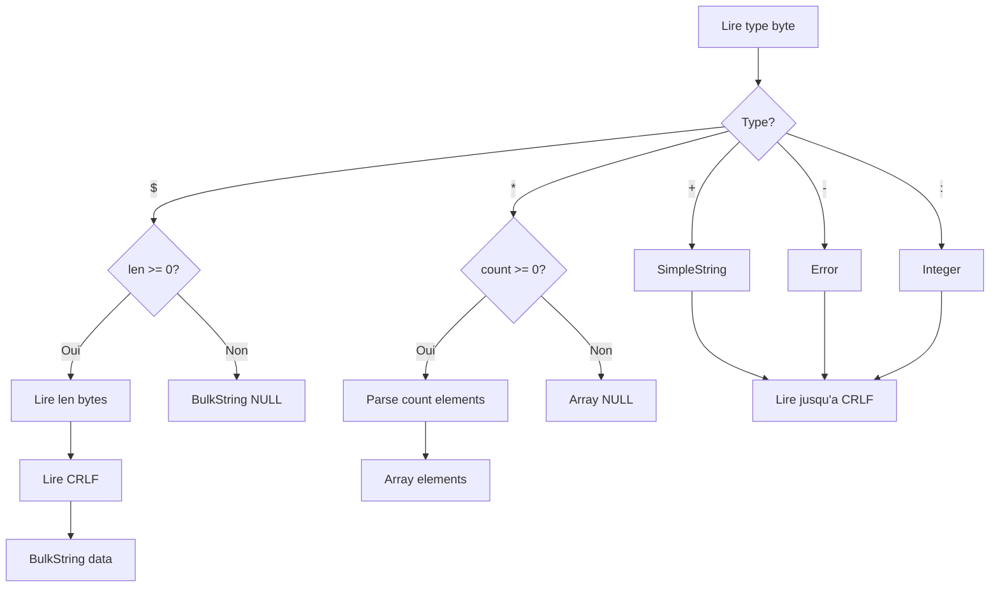

<thinking>
## Analyse du Concept
- Concept : Redis Protocol Client (RESP)
- Phase demandee : 5 (Advanced Systems)
- Adapte ? OUI - Implementer un client Redis from scratch enseigne les protocoles binaires, le parsing de protocole texte, et la communication client-serveur.

## Combo Base + Bonus
- Exercice de base : Client RESP (Redis Serialization Protocol) avec parsing/serialisation, commandes basiques (GET/SET/DEL), gestion des types Redis
- Bonus : Implementation d'un pipeline batching avec connection pooling et support des transactions MULTI/EXEC
- Palier bonus : EXPERT (concurrence + protocole avance)
- Progression logique ? OUI - Base = protocole simple, Bonus = optimisations production

## Prerequis & Difficulte
- Prerequis reels : TCP sockets, async I/O, parsing de protocole, Result/Option, lifetimes
- Difficulte estimee : 7/10 (base), 9/10 (bonus)
- Coherent avec phase 5 ? OUI

## Aspect Fun/Culture
- Contexte choisi : Reference a "The Fast and the Furious" - Redis est le "nitro" des bases de donnees
- MEME mnemonique : "I live my life a microsecond at a time" (vitesse Redis)
- Pourquoi c'est fun : Redis est litteralement la DB la plus rapide

## Scenarios d'Echec (5 mutants concrets)
1. Mutant A (Boundary) : Pas de gestion des Bulk Strings negatifs ($-1)
2. Mutant B (Safety) : Buffer overflow sur parsing de longueur
3. Mutant C (Logic) : CRLF mal parse (seulement LF au lieu de \r\n)
4. Mutant D (Edge) : Integer overflow sur parsing de nombres
5. Mutant E (Return) : Erreur Redis (-ERR) interpretee comme succes

## Verdict
VALIDE - Exercice de qualite industrielle couvrant le protocole RESP et les communications TCP
</thinking>

# Exercice 5.2.6-a : redis_protocol_client

**Module :**
5.2.6 - Redis Protocol Implementation

**Concept :**
a - RESP (Redis Serialization Protocol) Client

**Difficulte :**
7/10

**Type :**
code

**Tiers :**
1 - Concept isole

**Langage :**
Rust Edition 2024

**Prerequis :**
- 2.1 - Types primitifs et ownership
- 2.4 - Gestion d'erreurs (Result, Option)
- 5.1.2 - TCP Sockets et async I/O
- Phase 0.0.C.2 - Fondamentaux bases de donnees

**Domaines :**
Net, Parsing, Protocol

**Duree estimee :**
120 min

**XP Base :**
180

**Complexite :**
T2 O(n) x S1 O(n)

---

## SECTION 1 : PROTOTYPE & CONSIGNE

### 1.1 Obligations

**Fichier a rendre :**
```
src/lib.rs
```

**Dependances autorisees :**
- `std::io::{Read, Write, BufRead, BufReader}`
- `std::net::TcpStream`
- `std::str::FromStr`
- `std::collections::HashMap`

**Fonctions/methodes interdites :**
- Crates externes (`redis`, `redis-rs`, etc.)
- `unsafe` blocks
- Connexions async (version base)

### 1.2 Consigne

**CONTEXTE : "The Fast and the Furious: Redis Drift"**

*"Tu vois cette latence, Brian ? 0.1ms. C'est Redis. La base de donnees la plus rapide du monde souterrain des datacenters. Mais pour la piloter, tu dois parler son langage : RESP."* - Dom Toretto, Database Administrator

Redis communique via RESP (Redis Serialization Protocol), un protocole texte simple mais puissant. Chaque commande est encodee en "Arrays" de "Bulk Strings", et les reponses peuvent etre des types varies.

**Ta mission :**

Implementer un client Redis en Rust pur qui :
1. Parse le protocole RESP (tous les 5 types de base)
2. Serialise des commandes en format RESP
3. Execute les commandes basiques (PING, GET, SET, DEL, EXISTS, INCR, EXPIRE, TTL)
4. Gere les reponses et erreurs Redis
5. Supporte les types Redis (String, Integer, Array, Null, Error)

**Format RESP :**

```
Type        Premier caractere    Exemple
─────────────────────────────────────────────────
Simple String    +             +OK\r\n
Error           -             -ERR unknown command\r\n
Integer         :             :1000\r\n
Bulk String     $             $5\r\nhello\r\n
Array           *             *2\r\n$3\r\nfoo\r\n$3\r\nbar\r\n
Null            $-1           $-1\r\n (Bulk String null)
```

**Entree :**
- `addr: &str` - Adresse du serveur Redis (ex: "127.0.0.1:6379")
- Commandes Redis sous forme de methodes

**Sortie :**
- `RespValue` - Valeur RESP parsee
- `RedisError` - En cas d'erreur de connexion, parsing, ou Redis

**Contraintes :**
- Le parsing doit etre robuste (pas de panic sur input malformed)
- Les Bulk Strings negatifs ($-1) representent NULL
- Les Arrays negatifs (*-1) representent NULL array
- CRLF (\r\n) est le delimiteur obligatoire
- Les commandes doivent etre encodees en uppercase

**Exemples :**

| Commande | RESP Encode | Reponse |
|----------|-------------|---------|
| `PING` | `*1\r\n$4\r\nPING\r\n` | `+PONG\r\n` |
| `SET foo bar` | `*3\r\n$3\r\nSET\r\n$3\r\nfoo\r\n$3\r\nbar\r\n` | `+OK\r\n` |
| `GET foo` | `*2\r\n$3\r\nGET\r\n$3\r\nfoo\r\n` | `$3\r\nbar\r\n` |
| `GET missing` | `*2\r\n$3\r\nGET\r\n$7\r\nmissing\r\n` | `$-1\r\n` |

### 1.2.2 Consigne Academique

Implementer un client Redis utilisant le protocole RESP (Redis Serialization Protocol). Le client doit parser et serialiser les 5 types RESP de base, executer des commandes courantes, et gerer les erreurs de protocole et de connexion.

### 1.3 Prototype

```rust
use std::io::{BufRead, BufReader, Read, Write};
use std::net::TcpStream;
use std::collections::HashMap;
use std::time::Duration;

/// Types de valeurs RESP
#[derive(Debug, Clone, PartialEq)]
pub enum RespValue {
    SimpleString(String),
    Error(String),
    Integer(i64),
    BulkString(Option<Vec<u8>>),
    Array(Option<Vec<RespValue>>),
}

/// Erreurs du client Redis
#[derive(Debug, Clone, PartialEq)]
pub enum RedisError {
    ConnectionFailed(String),
    IoError(String),
    ProtocolError(String),
    InvalidResponse(String),
    RedisError(String),
    Timeout,
}

/// Client Redis synchrone
pub struct RedisClient {
    stream: TcpStream,
    reader: BufReader<TcpStream>,
}

/// Parser RESP standalone
pub struct RespParser;

/// Serialiseur RESP
pub struct RespSerializer;

impl RespParser {
    /// Parse une valeur RESP depuis un reader
    pub fn parse<R: BufRead>(reader: &mut R) -> Result<RespValue, RedisError>;

    /// Parse une ligne simple (jusqu'a CRLF)
    fn parse_line<R: BufRead>(reader: &mut R) -> Result<String, RedisError>;

    /// Parse un Bulk String de longueur donnee
    fn parse_bulk_string<R: BufRead>(reader: &mut R, len: i64) -> Result<Option<Vec<u8>>, RedisError>;

    /// Parse un Array de taille donnee
    fn parse_array<R: BufRead>(reader: &mut R, len: i64) -> Result<Option<Vec<RespValue>>, RedisError>;
}

impl RespSerializer {
    /// Serialise une valeur RESP en bytes
    pub fn serialize(value: &RespValue) -> Vec<u8>;

    /// Serialise une commande Redis (array de bulk strings)
    pub fn serialize_command(args: &[&str]) -> Vec<u8>;

    /// Serialise un bulk string
    fn serialize_bulk_string(data: &[u8]) -> Vec<u8>;
}

impl RedisClient {
    /// Connecte a un serveur Redis
    pub fn connect(addr: &str) -> Result<Self, RedisError>;

    /// Connecte avec timeout
    pub fn connect_timeout(addr: &str, timeout: Duration) -> Result<Self, RedisError>;

    /// Execute une commande brute et retourne la reponse
    pub fn execute(&mut self, args: &[&str]) -> Result<RespValue, RedisError>;

    /// PING - Test de connexion
    pub fn ping(&mut self) -> Result<String, RedisError>;

    /// SET key value [EX seconds] [PX milliseconds] [NX|XX]
    pub fn set(&mut self, key: &str, value: &str) -> Result<bool, RedisError>;

    /// SET avec expiration en secondes
    pub fn set_ex(&mut self, key: &str, value: &str, seconds: u64) -> Result<bool, RedisError>;

    /// SETNX - Set if not exists
    pub fn set_nx(&mut self, key: &str, value: &str) -> Result<bool, RedisError>;

    /// GET key
    pub fn get(&mut self, key: &str) -> Result<Option<String>, RedisError>;

    /// GET retournant des bytes bruts
    pub fn get_bytes(&mut self, key: &str) -> Result<Option<Vec<u8>>, RedisError>;

    /// DEL key [key ...]
    pub fn del(&mut self, keys: &[&str]) -> Result<i64, RedisError>;

    /// EXISTS key [key ...]
    pub fn exists(&mut self, keys: &[&str]) -> Result<i64, RedisError>;

    /// INCR key
    pub fn incr(&mut self, key: &str) -> Result<i64, RedisError>;

    /// INCRBY key increment
    pub fn incr_by(&mut self, key: &str, increment: i64) -> Result<i64, RedisError>;

    /// DECR key
    pub fn decr(&mut self, key: &str) -> Result<i64, RedisError>;

    /// EXPIRE key seconds
    pub fn expire(&mut self, key: &str, seconds: u64) -> Result<bool, RedisError>;

    /// TTL key
    pub fn ttl(&mut self, key: &str) -> Result<i64, RedisError>;

    /// KEYS pattern (attention: O(n), utiliser avec precaution)
    pub fn keys(&mut self, pattern: &str) -> Result<Vec<String>, RedisError>;

    /// MGET key [key ...]
    pub fn mget(&mut self, keys: &[&str]) -> Result<Vec<Option<String>>, RedisError>;

    /// MSET key value [key value ...]
    pub fn mset(&mut self, pairs: &[(&str, &str)]) -> Result<bool, RedisError>;
}

impl RespValue {
    /// Convertit en String si possible
    pub fn as_string(&self) -> Option<String>;

    /// Convertit en i64 si possible
    pub fn as_integer(&self) -> Option<i64>;

    /// Convertit en bytes si Bulk String
    pub fn as_bytes(&self) -> Option<&[u8]>;

    /// Convertit en Vec<RespValue> si Array
    pub fn as_array(&self) -> Option<&Vec<RespValue>>;

    /// Verifie si c'est une erreur Redis
    pub fn is_error(&self) -> bool;

    /// Verifie si c'est null
    pub fn is_null(&self) -> bool;
}
```

---

## SECTION 2 : LE SAVIEZ-VOUS ?

### 2.1 Origine de RESP

RESP (Redis Serialization Protocol) a ete concu par Salvatore Sanfilippo (antirez) en 2009. Sa simplicite est volontaire : le protocole doit etre parsable sans bibliotheque externe, implementable en quelques heures dans n'importe quel langage.

### 2.2 Pourquoi un protocole texte ?

Contrairement aux protocoles binaires (Protocol Buffers, MessagePack), RESP est lisible par un humain avec `telnet`. Cette decision de design permet le debugging en production avec de simples outils Unix :

```bash
$ echo -e '*1\r\n$4\r\nPING\r\n' | nc localhost 6379
+PONG
```

### 2.3 RESP3 : L'evolution

Redis 6.0 a introduit RESP3 avec de nouveaux types : Map, Set, Double, Boolean, Null explicite, Big Number, et Verbatim String. Notre exercice couvre RESP2 (le standard).

---

## SECTION 2.5 : DANS LA VRAIE VIE

### Metiers concernes

| Metier | Utilisation de Redis/RESP |
|--------|---------------------------|
| **Backend Developer** | Cache applicatif, sessions, rate limiting |
| **DevOps/SRE** | Monitoring avec redis-cli, debugging protocole |
| **Platform Engineer** | Implementation de proxies Redis (twemproxy) |
| **Database Engineer** | Optimisation, clustering, replication |
| **Security Engineer** | Audit des communications Redis non-chiffrees |

### Cas d'usage concrets

1. **Cache Layer** : Implementer un cache Redis custom avec retry et circuit breaker
2. **Session Store** : Stocker les sessions JWT avec expiration automatique
3. **Rate Limiter** : Implementer un rate limiter distribue avec INCR + EXPIRE
4. **Pub/Sub** : Systeme de notifications temps reel

---

## SECTION 3 : EXEMPLE D'UTILISATION

### 3.0 Session bash

```bash
$ ls
Cargo.toml  src/

$ cargo test
   Compiling redis_protocol_client v0.1.0
    Finished test [unoptimized + debuginfo] target(s)
     Running unittests src/lib.rs

running 18 tests
test tests::test_parse_simple_string ... ok
test tests::test_parse_error ... ok
test tests::test_parse_integer ... ok
test tests::test_parse_bulk_string ... ok
test tests::test_parse_null_bulk ... ok
test tests::test_parse_array ... ok
test tests::test_parse_nested_array ... ok
test tests::test_serialize_command ... ok
test tests::test_serialize_bulk_string ... ok
test tests::test_resp_value_conversions ... ok
test tests::test_client_ping ... ok
test tests::test_client_set_get ... ok
test tests::test_client_del ... ok
test tests::test_client_incr_decr ... ok
test tests::test_client_expire_ttl ... ok
test tests::test_client_mget_mset ... ok
test tests::test_error_handling ... ok
test tests::test_null_handling ... ok

test result: ok. 18 passed; 0 failed
```

### 3.1 BONUS EXPERT (OPTIONNEL)

**Difficulte Bonus :**
9/10

**Recompense :**
XP x3

**Time Complexity attendue :**
O(n) pour pipeline, O(1) amorti pour pool

**Space Complexity attendue :**
O(n) pour batch commands

**Domaines Bonus :**
`Concurrency, Pool`

#### 3.1.1 Consigne Bonus

**"The Turbo Pipeline"**

*"Tu veux vraiment aller vite ? Oublie les aller-retours. Pipeline tout."*

**Ta mission bonus :**

Implementer un systeme de pipeline et connection pooling :
1. **Pipeline** : Batching de commandes sans attendre les reponses intermediaires
2. **Transactions** : Support MULTI/EXEC pour atomicite
3. **Connection Pool** : Pool de connexions avec min/max connections

**Entree :**
- `pool_config: PoolConfig` - Configuration du pool
- Commandes via pipeline builder

**Sortie :**
- `Vec<RespValue>` - Reponses dans l'ordre des commandes
- Support des transactions atomiques

#### 3.1.2 Prototype Bonus

```rust
/// Configuration du pool de connexions
pub struct PoolConfig {
    pub min_connections: usize,
    pub max_connections: usize,
    pub connection_timeout: Duration,
    pub idle_timeout: Duration,
}

/// Pool de connexions Redis
pub struct RedisPool {
    config: PoolConfig,
    connections: Vec<RedisClient>,
    available: VecDeque<usize>,
}

/// Pipeline de commandes
pub struct Pipeline {
    commands: Vec<Vec<String>>,
}

impl RedisPool {
    pub fn new(addr: &str, config: PoolConfig) -> Result<Self, RedisError>;
    pub fn get(&mut self) -> Result<PooledConnection, RedisError>;
    pub fn stats(&self) -> PoolStats;
}

impl Pipeline {
    pub fn new() -> Self;
    pub fn cmd(&mut self, args: &[&str]) -> &mut Self;
    pub fn set(&mut self, key: &str, value: &str) -> &mut Self;
    pub fn get(&mut self, key: &str) -> &mut Self;
    pub fn execute(self, client: &mut RedisClient) -> Result<Vec<RespValue>, RedisError>;
}

impl RedisClient {
    /// Demarre une transaction MULTI
    pub fn multi(&mut self) -> Result<Transaction, RedisError>;
}

pub struct Transaction {
    client: RedisClient,
    commands: Vec<Vec<String>>,
}

impl Transaction {
    pub fn set(&mut self, key: &str, value: &str) -> &mut Self;
    pub fn get(&mut self, key: &str) -> &mut Self;
    pub fn incr(&mut self, key: &str) -> &mut Self;
    pub fn exec(self) -> Result<Vec<RespValue>, RedisError>;
    pub fn discard(self) -> Result<(), RedisError>;
}
```

#### 3.1.3 Ce qui change par rapport a l'exercice de base

| Aspect | Base | Bonus |
|--------|------|-------|
| Execution | Une commande a la fois | Batch pipeline |
| Connexions | Une seule | Pool managed |
| Atomicite | Commandes independantes | MULTI/EXEC transactions |
| Latence | RTT par commande | RTT pour batch entier |

---

## SECTION 4 : ZONE CORRECTION

### 4.1 Moulinette - Tableau des tests

| Test | Input | Expected | Points | Categorie |
|------|-------|----------|--------|-----------|
| `parse_simple_string` | `+OK\r\n` | `SimpleString("OK")` | 5 | Basic |
| `parse_error` | `-ERR test\r\n` | `Error("ERR test")` | 5 | Basic |
| `parse_integer` | `:42\r\n` | `Integer(42)` | 5 | Basic |
| `parse_negative_int` | `:-100\r\n` | `Integer(-100)` | 5 | Edge |
| `parse_bulk_string` | `$5\r\nhello\r\n` | `BulkString(Some(b"hello"))` | 10 | Core |
| `parse_null_bulk` | `$-1\r\n` | `BulkString(None)` | 10 | Edge |
| `parse_empty_bulk` | `$0\r\n\r\n` | `BulkString(Some(b""))` | 5 | Edge |
| `parse_array` | `*2\r\n$3\r\nfoo\r\n$3\r\nbar\r\n` | `Array([...])` | 10 | Core |
| `parse_null_array` | `*-1\r\n` | `Array(None)` | 5 | Edge |
| `parse_nested_array` | `*2\r\n*1\r\n:1\r\n:2\r\n` | `Array(nested)` | 10 | Advanced |
| `serialize_command` | `["SET", "k", "v"]` | `*3\r\n$3\r\nSET\r\n...` | 10 | Core |
| `serialize_bulk` | `b"hello"` | `$5\r\nhello\r\n` | 5 | Core |
| `client_ping` | `PING` | `"PONG"` | 5 | Integration |
| `client_set_get` | `SET/GET` | round-trip ok | 10 | Integration |
| `error_protocol` | invalid RESP | `Err(ProtocolError)` | 5 | Error |

**Score minimum pour validation : 70/100**

### 4.2 Fichier de test

```rust
#[cfg(test)]
mod tests {
    use super::*;
    use std::io::Cursor;

    #[test]
    fn test_parse_simple_string() {
        let mut cursor = Cursor::new(b"+OK\r\n".to_vec());
        let result = RespParser::parse(&mut cursor).unwrap();
        assert_eq!(result, RespValue::SimpleString("OK".to_string()));
    }

    #[test]
    fn test_parse_error() {
        let mut cursor = Cursor::new(b"-ERR unknown command\r\n".to_vec());
        let result = RespParser::parse(&mut cursor).unwrap();
        assert_eq!(result, RespValue::Error("ERR unknown command".to_string()));
    }

    #[test]
    fn test_parse_integer() {
        let mut cursor = Cursor::new(b":1000\r\n".to_vec());
        let result = RespParser::parse(&mut cursor).unwrap();
        assert_eq!(result, RespValue::Integer(1000));
    }

    #[test]
    fn test_parse_negative_integer() {
        let mut cursor = Cursor::new(b":-999\r\n".to_vec());
        let result = RespParser::parse(&mut cursor).unwrap();
        assert_eq!(result, RespValue::Integer(-999));
    }

    #[test]
    fn test_parse_bulk_string() {
        let mut cursor = Cursor::new(b"$5\r\nhello\r\n".to_vec());
        let result = RespParser::parse(&mut cursor).unwrap();
        assert_eq!(result, RespValue::BulkString(Some(b"hello".to_vec())));
    }

    #[test]
    fn test_parse_null_bulk_string() {
        let mut cursor = Cursor::new(b"$-1\r\n".to_vec());
        let result = RespParser::parse(&mut cursor).unwrap();
        assert_eq!(result, RespValue::BulkString(None));
    }

    #[test]
    fn test_parse_empty_bulk_string() {
        let mut cursor = Cursor::new(b"$0\r\n\r\n".to_vec());
        let result = RespParser::parse(&mut cursor).unwrap();
        assert_eq!(result, RespValue::BulkString(Some(vec![])));
    }

    #[test]
    fn test_parse_array() {
        let mut cursor = Cursor::new(b"*2\r\n$3\r\nfoo\r\n$3\r\nbar\r\n".to_vec());
        let result = RespParser::parse(&mut cursor).unwrap();

        if let RespValue::Array(Some(arr)) = result {
            assert_eq!(arr.len(), 2);
            assert_eq!(arr[0], RespValue::BulkString(Some(b"foo".to_vec())));
            assert_eq!(arr[1], RespValue::BulkString(Some(b"bar".to_vec())));
        } else {
            panic!("Expected array");
        }
    }

    #[test]
    fn test_parse_null_array() {
        let mut cursor = Cursor::new(b"*-1\r\n".to_vec());
        let result = RespParser::parse(&mut cursor).unwrap();
        assert_eq!(result, RespValue::Array(None));
    }

    #[test]
    fn test_parse_nested_array() {
        let mut cursor = Cursor::new(b"*2\r\n*1\r\n:1\r\n:2\r\n".to_vec());
        let result = RespParser::parse(&mut cursor).unwrap();

        if let RespValue::Array(Some(arr)) = result {
            assert_eq!(arr.len(), 2);
            if let RespValue::Array(Some(inner)) = &arr[0] {
                assert_eq!(inner.len(), 1);
            }
        } else {
            panic!("Expected nested array");
        }
    }

    #[test]
    fn test_serialize_command() {
        let serialized = RespSerializer::serialize_command(&["SET", "mykey", "myvalue"]);
        assert_eq!(serialized, b"*3\r\n$3\r\nSET\r\n$5\r\nmykey\r\n$7\r\nmyvalue\r\n");
    }

    #[test]
    fn test_serialize_bulk_string() {
        let serialized = RespSerializer::serialize_bulk_string(b"hello");
        assert_eq!(serialized, b"$5\r\nhello\r\n");
    }

    #[test]
    fn test_resp_value_as_string() {
        let simple = RespValue::SimpleString("OK".to_string());
        assert_eq!(simple.as_string(), Some("OK".to_string()));

        let bulk = RespValue::BulkString(Some(b"hello".to_vec()));
        assert_eq!(bulk.as_string(), Some("hello".to_string()));

        let null_bulk = RespValue::BulkString(None);
        assert_eq!(null_bulk.as_string(), None);
    }

    #[test]
    fn test_resp_value_as_integer() {
        let int = RespValue::Integer(42);
        assert_eq!(int.as_integer(), Some(42));

        let string = RespValue::SimpleString("42".to_string());
        assert_eq!(string.as_integer(), None);
    }

    #[test]
    fn test_resp_value_is_null() {
        assert!(RespValue::BulkString(None).is_null());
        assert!(RespValue::Array(None).is_null());
        assert!(!RespValue::Integer(0).is_null());
        assert!(!RespValue::BulkString(Some(vec![])).is_null());
    }

    #[test]
    fn test_resp_value_is_error() {
        assert!(RespValue::Error("ERR".to_string()).is_error());
        assert!(!RespValue::SimpleString("OK".to_string()).is_error());
    }

    #[test]
    fn test_protocol_error_no_crlf() {
        let mut cursor = Cursor::new(b"+OK\n".to_vec()); // Missing \r
        let result = RespParser::parse(&mut cursor);
        assert!(result.is_err());
    }

    #[test]
    fn test_protocol_error_invalid_type() {
        let mut cursor = Cursor::new(b"!invalid\r\n".to_vec());
        let result = RespParser::parse(&mut cursor);
        assert!(result.is_err());
    }
}
```

### 4.3 Solution de reference

```rust
use std::io::{BufRead, BufReader, Read, Write};
use std::net::TcpStream;
use std::time::Duration;

#[derive(Debug, Clone, PartialEq)]
pub enum RespValue {
    SimpleString(String),
    Error(String),
    Integer(i64),
    BulkString(Option<Vec<u8>>),
    Array(Option<Vec<RespValue>>),
}

#[derive(Debug, Clone, PartialEq)]
pub enum RedisError {
    ConnectionFailed(String),
    IoError(String),
    ProtocolError(String),
    InvalidResponse(String),
    RedisError(String),
    Timeout,
}

pub struct RespParser;
pub struct RespSerializer;

impl RespParser {
    pub fn parse<R: BufRead>(reader: &mut R) -> Result<RespValue, RedisError> {
        let mut type_byte = [0u8; 1];
        reader.read_exact(&mut type_byte)
            .map_err(|e| RedisError::IoError(e.to_string()))?;

        match type_byte[0] {
            b'+' => {
                let line = Self::parse_line(reader)?;
                Ok(RespValue::SimpleString(line))
            }
            b'-' => {
                let line = Self::parse_line(reader)?;
                Ok(RespValue::Error(line))
            }
            b':' => {
                let line = Self::parse_line(reader)?;
                let num = line.parse::<i64>()
                    .map_err(|_| RedisError::ProtocolError("Invalid integer".to_string()))?;
                Ok(RespValue::Integer(num))
            }
            b'$' => {
                let line = Self::parse_line(reader)?;
                let len = line.parse::<i64>()
                    .map_err(|_| RedisError::ProtocolError("Invalid bulk length".to_string()))?;
                Self::parse_bulk_string(reader, len)
            }
            b'*' => {
                let line = Self::parse_line(reader)?;
                let len = line.parse::<i64>()
                    .map_err(|_| RedisError::ProtocolError("Invalid array length".to_string()))?;
                Self::parse_array(reader, len)
            }
            _ => Err(RedisError::ProtocolError(format!("Unknown type byte: {}", type_byte[0] as char))),
        }
    }

    fn parse_line<R: BufRead>(reader: &mut R) -> Result<String, RedisError> {
        let mut line = String::new();
        reader.read_line(&mut line)
            .map_err(|e| RedisError::IoError(e.to_string()))?;

        if line.ends_with("\r\n") {
            line.truncate(line.len() - 2);
            Ok(line)
        } else if line.ends_with('\n') {
            Err(RedisError::ProtocolError("Expected CRLF, got LF only".to_string()))
        } else {
            Err(RedisError::ProtocolError("Line does not end with CRLF".to_string()))
        }
    }

    fn parse_bulk_string<R: BufRead>(reader: &mut R, len: i64) -> Result<RespValue, RedisError> {
        if len < 0 {
            return Ok(RespValue::BulkString(None));
        }

        let len = len as usize;
        let mut buffer = vec![0u8; len];
        reader.read_exact(&mut buffer)
            .map_err(|e| RedisError::IoError(e.to_string()))?;

        // Read trailing CRLF
        let mut crlf = [0u8; 2];
        reader.read_exact(&mut crlf)
            .map_err(|e| RedisError::IoError(e.to_string()))?;

        if &crlf != b"\r\n" {
            return Err(RedisError::ProtocolError("Bulk string not terminated by CRLF".to_string()));
        }

        Ok(RespValue::BulkString(Some(buffer)))
    }

    fn parse_array<R: BufRead>(reader: &mut R, len: i64) -> Result<RespValue, RedisError> {
        if len < 0 {
            return Ok(RespValue::Array(None));
        }

        let mut elements = Vec::with_capacity(len as usize);
        for _ in 0..len {
            elements.push(Self::parse(reader)?);
        }

        Ok(RespValue::Array(Some(elements)))
    }
}

impl RespSerializer {
    pub fn serialize(value: &RespValue) -> Vec<u8> {
        match value {
            RespValue::SimpleString(s) => format!("+{}\r\n", s).into_bytes(),
            RespValue::Error(e) => format!("-{}\r\n", e).into_bytes(),
            RespValue::Integer(i) => format!(":{}\r\n", i).into_bytes(),
            RespValue::BulkString(None) => b"$-1\r\n".to_vec(),
            RespValue::BulkString(Some(data)) => {
                Self::serialize_bulk_string(data)
            }
            RespValue::Array(None) => b"*-1\r\n".to_vec(),
            RespValue::Array(Some(arr)) => {
                let mut result = format!("*{}\r\n", arr.len()).into_bytes();
                for elem in arr {
                    result.extend(Self::serialize(elem));
                }
                result
            }
        }
    }

    pub fn serialize_command(args: &[&str]) -> Vec<u8> {
        let mut result = format!("*{}\r\n", args.len()).into_bytes();
        for arg in args {
            result.extend(Self::serialize_bulk_string(arg.as_bytes()));
        }
        result
    }

    fn serialize_bulk_string(data: &[u8]) -> Vec<u8> {
        let mut result = format!("${}\r\n", data.len()).into_bytes();
        result.extend_from_slice(data);
        result.extend_from_slice(b"\r\n");
        result
    }
}

pub struct RedisClient {
    stream: TcpStream,
}

impl RedisClient {
    pub fn connect(addr: &str) -> Result<Self, RedisError> {
        let stream = TcpStream::connect(addr)
            .map_err(|e| RedisError::ConnectionFailed(e.to_string()))?;
        Ok(Self { stream })
    }

    pub fn connect_timeout(addr: &str, timeout: Duration) -> Result<Self, RedisError> {
        let addr = addr.parse()
            .map_err(|e| RedisError::ConnectionFailed(format!("Invalid address: {}", e)))?;
        let stream = TcpStream::connect_timeout(&addr, timeout)
            .map_err(|e| RedisError::ConnectionFailed(e.to_string()))?;
        Ok(Self { stream })
    }

    pub fn execute(&mut self, args: &[&str]) -> Result<RespValue, RedisError> {
        let command = RespSerializer::serialize_command(args);
        self.stream.write_all(&command)
            .map_err(|e| RedisError::IoError(e.to_string()))?;
        self.stream.flush()
            .map_err(|e| RedisError::IoError(e.to_string()))?;

        let mut reader = BufReader::new(&self.stream);
        let response = RespParser::parse(&mut reader)?;

        if let RespValue::Error(e) = &response {
            return Err(RedisError::RedisError(e.clone()));
        }

        Ok(response)
    }

    pub fn ping(&mut self) -> Result<String, RedisError> {
        match self.execute(&["PING"])? {
            RespValue::SimpleString(s) => Ok(s),
            _ => Err(RedisError::InvalidResponse("Expected simple string".to_string())),
        }
    }

    pub fn set(&mut self, key: &str, value: &str) -> Result<bool, RedisError> {
        match self.execute(&["SET", key, value])? {
            RespValue::SimpleString(s) if s == "OK" => Ok(true),
            RespValue::BulkString(None) => Ok(false),
            _ => Err(RedisError::InvalidResponse("Unexpected SET response".to_string())),
        }
    }

    pub fn set_ex(&mut self, key: &str, value: &str, seconds: u64) -> Result<bool, RedisError> {
        let secs = seconds.to_string();
        match self.execute(&["SET", key, value, "EX", &secs])? {
            RespValue::SimpleString(s) if s == "OK" => Ok(true),
            _ => Err(RedisError::InvalidResponse("Unexpected SETEX response".to_string())),
        }
    }

    pub fn set_nx(&mut self, key: &str, value: &str) -> Result<bool, RedisError> {
        match self.execute(&["SET", key, value, "NX"])? {
            RespValue::SimpleString(s) if s == "OK" => Ok(true),
            RespValue::BulkString(None) => Ok(false),
            _ => Err(RedisError::InvalidResponse("Unexpected SETNX response".to_string())),
        }
    }

    pub fn get(&mut self, key: &str) -> Result<Option<String>, RedisError> {
        match self.execute(&["GET", key])? {
            RespValue::BulkString(Some(data)) => {
                String::from_utf8(data)
                    .map(Some)
                    .map_err(|_| RedisError::InvalidResponse("Invalid UTF-8".to_string()))
            }
            RespValue::BulkString(None) => Ok(None),
            _ => Err(RedisError::InvalidResponse("Expected bulk string".to_string())),
        }
    }

    pub fn get_bytes(&mut self, key: &str) -> Result<Option<Vec<u8>>, RedisError> {
        match self.execute(&["GET", key])? {
            RespValue::BulkString(data) => Ok(data),
            _ => Err(RedisError::InvalidResponse("Expected bulk string".to_string())),
        }
    }

    pub fn del(&mut self, keys: &[&str]) -> Result<i64, RedisError> {
        let mut args = vec!["DEL"];
        args.extend(keys);
        match self.execute(&args)? {
            RespValue::Integer(n) => Ok(n),
            _ => Err(RedisError::InvalidResponse("Expected integer".to_string())),
        }
    }

    pub fn exists(&mut self, keys: &[&str]) -> Result<i64, RedisError> {
        let mut args = vec!["EXISTS"];
        args.extend(keys);
        match self.execute(&args)? {
            RespValue::Integer(n) => Ok(n),
            _ => Err(RedisError::InvalidResponse("Expected integer".to_string())),
        }
    }

    pub fn incr(&mut self, key: &str) -> Result<i64, RedisError> {
        match self.execute(&["INCR", key])? {
            RespValue::Integer(n) => Ok(n),
            _ => Err(RedisError::InvalidResponse("Expected integer".to_string())),
        }
    }

    pub fn incr_by(&mut self, key: &str, increment: i64) -> Result<i64, RedisError> {
        let inc = increment.to_string();
        match self.execute(&["INCRBY", key, &inc])? {
            RespValue::Integer(n) => Ok(n),
            _ => Err(RedisError::InvalidResponse("Expected integer".to_string())),
        }
    }

    pub fn decr(&mut self, key: &str) -> Result<i64, RedisError> {
        match self.execute(&["DECR", key])? {
            RespValue::Integer(n) => Ok(n),
            _ => Err(RedisError::InvalidResponse("Expected integer".to_string())),
        }
    }

    pub fn expire(&mut self, key: &str, seconds: u64) -> Result<bool, RedisError> {
        let secs = seconds.to_string();
        match self.execute(&["EXPIRE", key, &secs])? {
            RespValue::Integer(1) => Ok(true),
            RespValue::Integer(0) => Ok(false),
            _ => Err(RedisError::InvalidResponse("Expected integer".to_string())),
        }
    }

    pub fn ttl(&mut self, key: &str) -> Result<i64, RedisError> {
        match self.execute(&["TTL", key])? {
            RespValue::Integer(n) => Ok(n),
            _ => Err(RedisError::InvalidResponse("Expected integer".to_string())),
        }
    }

    pub fn keys(&mut self, pattern: &str) -> Result<Vec<String>, RedisError> {
        match self.execute(&["KEYS", pattern])? {
            RespValue::Array(Some(arr)) => {
                arr.into_iter()
                    .map(|v| v.as_string().ok_or(RedisError::InvalidResponse("Expected string".to_string())))
                    .collect()
            }
            RespValue::Array(None) => Ok(vec![]),
            _ => Err(RedisError::InvalidResponse("Expected array".to_string())),
        }
    }

    pub fn mget(&mut self, keys: &[&str]) -> Result<Vec<Option<String>>, RedisError> {
        let mut args = vec!["MGET"];
        args.extend(keys);
        match self.execute(&args)? {
            RespValue::Array(Some(arr)) => {
                arr.into_iter()
                    .map(|v| match v {
                        RespValue::BulkString(Some(data)) => {
                            String::from_utf8(data).ok()
                        }
                        _ => None,
                    })
                    .map(Ok)
                    .collect()
            }
            _ => Err(RedisError::InvalidResponse("Expected array".to_string())),
        }
    }

    pub fn mset(&mut self, pairs: &[(&str, &str)]) -> Result<bool, RedisError> {
        let mut args = vec!["MSET"];
        for (k, v) in pairs {
            args.push(*k);
            args.push(*v);
        }
        match self.execute(&args)? {
            RespValue::SimpleString(s) if s == "OK" => Ok(true),
            _ => Err(RedisError::InvalidResponse("Expected OK".to_string())),
        }
    }
}

impl RespValue {
    pub fn as_string(&self) -> Option<String> {
        match self {
            RespValue::SimpleString(s) => Some(s.clone()),
            RespValue::BulkString(Some(data)) => String::from_utf8(data.clone()).ok(),
            _ => None,
        }
    }

    pub fn as_integer(&self) -> Option<i64> {
        match self {
            RespValue::Integer(i) => Some(*i),
            _ => None,
        }
    }

    pub fn as_bytes(&self) -> Option<&[u8]> {
        match self {
            RespValue::BulkString(Some(data)) => Some(data),
            _ => None,
        }
    }

    pub fn as_array(&self) -> Option<&Vec<RespValue>> {
        match self {
            RespValue::Array(Some(arr)) => Some(arr),
            _ => None,
        }
    }

    pub fn is_error(&self) -> bool {
        matches!(self, RespValue::Error(_))
    }

    pub fn is_null(&self) -> bool {
        matches!(self, RespValue::BulkString(None) | RespValue::Array(None))
    }
}
```

### 4.4 Solutions alternatives acceptees

```rust
// Alternative 1 : Utilisation de iterateurs pour parse_line
fn parse_line<R: BufRead>(reader: &mut R) -> Result<String, RedisError> {
    let mut bytes = Vec::new();
    loop {
        let mut byte = [0u8; 1];
        reader.read_exact(&mut byte)?;
        if byte[0] == b'\r' {
            reader.read_exact(&mut byte)?;
            if byte[0] == b'\n' {
                return Ok(String::from_utf8(bytes)?);
            }
            bytes.push(b'\r');
            bytes.push(byte[0]);
        } else {
            bytes.push(byte[0]);
        }
    }
}

// Alternative 2 : Match sur slice pattern pour type byte
pub fn parse<R: BufRead>(reader: &mut R) -> Result<RespValue, RedisError> {
    let mut buf = [0u8; 1];
    reader.read_exact(&mut buf)?;

    match buf {
        [b'+'] => /* ... */,
        [b'-'] => /* ... */,
        [b':'] => /* ... */,
        [b'$'] => /* ... */,
        [b'*'] => /* ... */,
        [other] => Err(RedisError::ProtocolError(format!("Unknown: {}", other))),
    }
}
```

### 4.5 Solutions refusees

```rust
// REFUSEE 1 : Parse LF seul au lieu de CRLF
fn parse_line<R: BufRead>(reader: &mut R) -> Result<String, RedisError> {
    let mut line = String::new();
    reader.read_line(&mut line)?;
    Ok(line.trim_end().to_string())  // ERREUR: accepte \n seul
}
// Pourquoi refusee : RESP exige CRLF, accepter LF seul viole le protocole

// REFUSEE 2 : Pas de gestion des null bulk strings
fn parse_bulk_string<R: BufRead>(reader: &mut R, len: i64) -> Result<RespValue, RedisError> {
    let len = len as usize;  // ERREUR: panic si len < 0
    let mut buffer = vec![0u8; len];
    // ...
}
// Pourquoi refusee : $-1 (null) cause un panic

// REFUSEE 3 : Erreur Redis interpretee comme succes
pub fn execute(&mut self, args: &[&str]) -> Result<RespValue, RedisError> {
    // ...parse...
    Ok(response)  // ERREUR: RespValue::Error retourne comme Ok
}
// Pourquoi refusee : Les erreurs Redis doivent etre propagees
```

### 4.6 Solution bonus de reference

```rust
use std::collections::VecDeque;
use std::sync::{Arc, Mutex};

pub struct PoolConfig {
    pub min_connections: usize,
    pub max_connections: usize,
    pub connection_timeout: Duration,
    pub idle_timeout: Duration,
}

pub struct RedisPool {
    addr: String,
    config: PoolConfig,
    connections: Arc<Mutex<VecDeque<RedisClient>>>,
    in_use: Arc<Mutex<usize>>,
}

impl RedisPool {
    pub fn new(addr: &str, config: PoolConfig) -> Result<Self, RedisError> {
        let mut connections = VecDeque::new();
        for _ in 0..config.min_connections {
            connections.push_back(RedisClient::connect(addr)?);
        }

        Ok(Self {
            addr: addr.to_string(),
            config,
            connections: Arc::new(Mutex::new(connections)),
            in_use: Arc::new(Mutex::new(0)),
        })
    }

    pub fn get(&self) -> Result<PooledConnection, RedisError> {
        let mut connections = self.connections.lock().unwrap();
        let mut in_use = self.in_use.lock().unwrap();

        if let Some(client) = connections.pop_front() {
            *in_use += 1;
            return Ok(PooledConnection {
                client: Some(client),
                pool: self.connections.clone(),
                in_use_counter: self.in_use.clone(),
            });
        }

        if *in_use < self.config.max_connections {
            let client = RedisClient::connect_timeout(&self.addr, self.config.connection_timeout)?;
            *in_use += 1;
            return Ok(PooledConnection {
                client: Some(client),
                pool: self.connections.clone(),
                in_use_counter: self.in_use.clone(),
            });
        }

        Err(RedisError::Timeout)
    }
}

pub struct PooledConnection {
    client: Option<RedisClient>,
    pool: Arc<Mutex<VecDeque<RedisClient>>>,
    in_use_counter: Arc<Mutex<usize>>,
}

impl Drop for PooledConnection {
    fn drop(&mut self) {
        if let Some(client) = self.client.take() {
            let mut connections = self.pool.lock().unwrap();
            let mut in_use = self.in_use_counter.lock().unwrap();
            connections.push_back(client);
            *in_use -= 1;
        }
    }
}

pub struct Pipeline {
    commands: Vec<Vec<u8>>,
}

impl Pipeline {
    pub fn new() -> Self {
        Self { commands: Vec::new() }
    }

    pub fn cmd(&mut self, args: &[&str]) -> &mut Self {
        self.commands.push(RespSerializer::serialize_command(args));
        self
    }

    pub fn set(&mut self, key: &str, value: &str) -> &mut Self {
        self.cmd(&["SET", key, value])
    }

    pub fn get(&mut self, key: &str) -> &mut Self {
        self.cmd(&["GET", key])
    }

    pub fn execute(self, client: &mut RedisClient) -> Result<Vec<RespValue>, RedisError> {
        // Send all commands at once
        for cmd in &self.commands {
            client.stream.write_all(cmd)
                .map_err(|e| RedisError::IoError(e.to_string()))?;
        }
        client.stream.flush()
            .map_err(|e| RedisError::IoError(e.to_string()))?;

        // Read all responses
        let mut reader = BufReader::new(&client.stream);
        let mut responses = Vec::with_capacity(self.commands.len());
        for _ in 0..self.commands.len() {
            responses.push(RespParser::parse(&mut reader)?);
        }

        Ok(responses)
    }
}

pub struct Transaction<'a> {
    client: &'a mut RedisClient,
    commands: Vec<Vec<u8>>,
}

impl RedisClient {
    pub fn multi(&mut self) -> Result<Transaction, RedisError> {
        self.execute(&["MULTI"])?;
        Ok(Transaction {
            client: self,
            commands: Vec::new(),
        })
    }
}

impl<'a> Transaction<'a> {
    pub fn set(&mut self, key: &str, value: &str) -> &mut Self {
        self.client.execute(&["SET", key, value]).ok();
        self
    }

    pub fn get(&mut self, key: &str) -> &mut Self {
        self.client.execute(&["GET", key]).ok();
        self
    }

    pub fn incr(&mut self, key: &str) -> &mut Self {
        self.client.execute(&["INCR", key]).ok();
        self
    }

    pub fn exec(self) -> Result<Vec<RespValue>, RedisError> {
        match self.client.execute(&["EXEC"])? {
            RespValue::Array(Some(results)) => Ok(results),
            RespValue::Array(None) => Err(RedisError::RedisError("Transaction aborted".to_string())),
            _ => Err(RedisError::InvalidResponse("Expected array from EXEC".to_string())),
        }
    }

    pub fn discard(self) -> Result<(), RedisError> {
        self.client.execute(&["DISCARD"])?;
        Ok(())
    }
}
```

### 4.9 spec.json

```json
{
  "name": "redis_protocol_client",
  "language": "rust",
  "type": "code",
  "tier": 1,
  "tier_info": "Concept isole - RESP Protocol",
  "tags": ["redis", "protocol", "networking", "parsing", "phase5"],
  "passing_score": 70,

  "function": {
    "name": "RedisClient",
    "prototype": "impl RedisClient + RespParser + RespSerializer",
    "return_type": "struct",
    "parameters": [
      {"name": "addr", "type": "&str"}
    ]
  },

  "driver": {
    "edge_cases": [
      {
        "name": "null_bulk_string",
        "input": "$-1\\r\\n",
        "expected": "BulkString(None)",
        "is_trap": true,
        "trap_explanation": "Longueur negative = NULL"
      },
      {
        "name": "crlf_required",
        "input": "+OK\\n",
        "expected": "Err(ProtocolError)",
        "is_trap": true,
        "trap_explanation": "RESP exige CRLF, pas LF seul"
      },
      {
        "name": "empty_bulk",
        "input": "$0\\r\\n\\r\\n",
        "expected": "BulkString(Some([]))",
        "is_trap": true,
        "trap_explanation": "Longueur 0 != NULL"
      },
      {
        "name": "negative_integer",
        "input": ":-999\\r\\n",
        "expected": "Integer(-999)",
        "is_trap": false
      }
    ],

    "fuzzing": {
      "enabled": true,
      "iterations": 500,
      "generators": [
        {
          "type": "custom",
          "param_index": 0,
          "generator": "random_resp_value"
        }
      ]
    }
  },

  "norm": {
    "allowed_functions": ["std::io", "std::net::TcpStream"],
    "forbidden_functions": ["unsafe"],
    "forbidden_crates": ["redis", "redis-rs"],
    "check_security": true,
    "check_memory": false,
    "blocking": true
  }
}
```

### 4.10 Solutions Mutantes

```rust
/* Mutant A (Boundary) : Pas de gestion des Bulk Strings negatifs */
fn parse_bulk_string<R: BufRead>(reader: &mut R, len: i64) -> Result<RespValue, RedisError> {
    // MUTANT: Cast direct sans check
    let len = len as usize;  // panic si len < 0 (wraparound en release)
    let mut buffer = vec![0u8; len];
    reader.read_exact(&mut buffer)?;
    // ...
}
// Pourquoi c'est faux : $-1 cause un panic ou allocation massive
// Ce qui etait pense : "La longueur est toujours positive"

/* Mutant B (Safety) : Buffer overflow sur parsing */
fn parse_bulk_string<R: BufRead>(reader: &mut R, len: i64) -> Result<RespValue, RedisError> {
    if len < 0 {
        return Ok(RespValue::BulkString(None));
    }
    // MUTANT: Pas de limite sur la taille
    let mut buffer = vec![0u8; len as usize];  // OOM si len = i64::MAX
    // ...
}
// Pourquoi c'est faux : Un serveur malveillant peut causer un OOM
// Ce qui etait pense : "Le serveur envoie toujours des tailles raisonnables"

/* Mutant C (Logic) : CRLF mal parse */
fn parse_line<R: BufRead>(reader: &mut R) -> Result<String, RedisError> {
    let mut line = String::new();
    reader.read_line(&mut line)?;
    // MUTANT: Accepte LF seul
    Ok(line.trim_end().to_string())
}
// Pourquoi c'est faux : Viole la spec RESP qui exige \r\n
// Ce qui etait pense : "trim_end() gere tous les cas"

/* Mutant D (Edge) : Integer overflow */
fn parse_integer<R: BufRead>(reader: &mut R) -> Result<RespValue, RedisError> {
    let line = Self::parse_line(reader)?;
    // MUTANT: unwrap au lieu de gerer l'erreur
    let num = line.parse::<i64>().unwrap();
    Ok(RespValue::Integer(num))
}
// Pourquoi c'est faux : "99999999999999999999" cause un panic
// Ce qui etait pense : "Les integers Redis sont toujours valides"

/* Mutant E (Return) : Erreur Redis comme succes */
pub fn execute(&mut self, args: &[&str]) -> Result<RespValue, RedisError> {
    // ... send command ...
    let response = RespParser::parse(&mut reader)?;
    // MUTANT: Pas de check sur Error variant
    Ok(response)  // Retourne RespValue::Error comme Ok
}
// Pourquoi c'est faux : L'appelant doit savoir que Redis a retourne une erreur
// Ce qui etait pense : "Le parsing a reussi donc c'est un succes"
```

---

## SECTION 5 : COMPRENDRE

### 5.1 Ce que cet exercice enseigne

1. **Parsing de protocole** : Lecture byte-par-byte avec machine a etats
2. **Protocole texte** : Avantages (debugging) vs inconvenients (overhead)
3. **Gestion des erreurs** : Propagation correcte des erreurs multi-niveaux
4. **Types de donnees** : Representation interne vs format wire
5. **I/O bufferise** : BufReader pour performances de lecture

### 5.2 LDA - Traduction Litterale

```
FONCTION parse_resp QUI RETOURNE UNE VALEUR RESP
DEBUT FONCTION
    DECLARER type_byte COMME OCTET

    LIRE UN OCTET DEPUIS reader VERS type_byte

    SI type_byte EST '+' ALORS
        LIRE LA LIGNE JUSQU'A CRLF
        RETOURNER SimpleString(ligne)

    SI type_byte EST '-' ALORS
        LIRE LA LIGNE JUSQU'A CRLF
        RETOURNER Error(ligne)

    SI type_byte EST ':' ALORS
        LIRE LA LIGNE JUSQU'A CRLF
        CONVERTIR EN ENTIER
        RETOURNER Integer(entier)

    SI type_byte EST '$' ALORS
        LIRE LA LONGUEUR
        SI longueur < 0 ALORS RETOURNER BulkString(None)
        LIRE longueur OCTETS
        LIRE CRLF
        RETOURNER BulkString(Some(data))

    SI type_byte EST '*' ALORS
        LIRE LA TAILLE
        SI taille < 0 ALORS RETOURNER Array(None)
        POUR i DE 0 A taille FAIRE
            elements[i] = parse_resp(reader)
        RETOURNER Array(Some(elements))

    SINON RETOURNER ERREUR "Type inconnu"
FIN FONCTION
```

### 5.2.2 Pseudocode Academique

```
ALGORITHME : Parse RESP Value
---
ENTREE : reader (flux de bytes)
SORTIE : RespValue ou Erreur

1. LIRE type_byte (1 octet)
2. SELON type_byte:
   - '+' : LIRE ligne, RETOURNER SimpleString
   - '-' : LIRE ligne, RETOURNER Error
   - ':' : LIRE ligne, PARSER entier, RETOURNER Integer
   - '$' : LIRE longueur
          SI longueur < 0: RETOURNER BulkString(null)
          LIRE longueur bytes + CRLF
          RETOURNER BulkString(data)
   - '*' : LIRE taille
          SI taille < 0: RETOURNER Array(null)
          PARSER taille elements recursivement
          RETOURNER Array(elements)
   - AUTRE : ERREUR protocole
```

### 5.2.3.1 Diagramme Mermaid



### 5.3 Visualisation ASCII

```
                    FORMAT RESP - EXEMPLES

    SIMPLE STRING                     ERROR
    ┌────────────────────┐           ┌────────────────────────────┐
    │ + O K \r \n        │           │ - E R R   m s g \r \n      │
    │ ▲                  │           │ ▲                          │
    │ Type               │           │ Type                       │
    └────────────────────┘           └────────────────────────────┘

    INTEGER                          BULK STRING
    ┌────────────────────┐           ┌────────────────────────────┐
    │ : 1 0 0 0 \r \n    │           │ $ 5 \r \n h e l l o \r \n  │
    │ ▲                  │           │ ▲ ▲       ▲─────────▲      │
    │ Type               │           │ │ Longueur  Data   CRLF    │
    └────────────────────┘           │ Type                       │
                                     └────────────────────────────┘

    ARRAY (2 elements)
    ┌──────────────────────────────────────────────────────┐
    │ * 2 \r \n $ 3 \r \n f o o \r \n $ 3 \r \n b a r \r \n│
    │ ▲ ▲       ▲─────────────────────▲───────────────────▲│
    │ │ │       │    Element 1        │    Element 2      ││
    │ │ Count   └─────────────────────┴───────────────────┘│
    │ Type                                                 │
    └──────────────────────────────────────────────────────┘

    NULL BULK STRING                 NULL ARRAY
    ┌────────────────────┐           ┌────────────────────┐
    │ $ - 1 \r \n        │           │ * - 1 \r \n        │
    │   ▲──▲             │           │   ▲──▲             │
    │   Longueur = -1    │           │   Count = -1       │
    └────────────────────┘           └────────────────────┘
```

### 5.4 Les pieges en detail

| Piege | Description | Comment l'eviter |
|-------|-------------|------------------|
| **Null vs Empty** | $-1 (null) vs $0 (empty string) | Checker explicitement len < 0 |
| **CRLF stricte** | LF seul n'est pas valide RESP | Verifier \r\n explicitement |
| **Integer overflow** | Nombres hors range i64 | Gerer l'erreur de parsing |
| **Erreur Redis** | -ERR est une reponse valide | Propager comme Err, pas Ok |
| **Recursion profonde** | Arrays imbriques peuvent stack overflow | Limiter la profondeur |

### 5.5 Cours Complet

#### 5.5.1 Introduction a RESP

RESP (Redis Serialization Protocol) est le protocole de communication de Redis. Concu pour etre simple a implementer, il combine lisibilite humaine et efficacite de parsing.

#### 5.5.2 Les 5 Types RESP de Base

```
Type            Prefix   Exemple                    Utilisation
─────────────────────────────────────────────────────────────────
Simple String   +        +OK\r\n                   Status responses
Error           -        -ERR message\r\n          Error responses
Integer         :        :1000\r\n                 Numeric responses
Bulk String     $        $5\r\nhello\r\n           Binary-safe strings
Array           *        *2\r\n...\r\n             Lists of values
```

#### 5.5.3 Format des Commandes

Toute commande Redis est un Array de Bulk Strings :

```
SET mykey myvalue
→ *3\r\n$3\r\nSET\r\n$5\r\nmykey\r\n$7\r\nmyvalue\r\n

Decomposition:
*3\r\n       → Array de 3 elements
$3\r\nSET\r\n    → Bulk "SET" (3 chars)
$5\r\nmykey\r\n  → Bulk "mykey" (5 chars)
$7\r\nmyvalue\r\n → Bulk "myvalue" (7 chars)
```

#### 5.5.4 Inline Commands (Legacy)

Redis supporte aussi les commandes inline (sans RESP) :
```
PING\r\n
SET foo bar\r\n
```
Mais le format RESP est prefere pour la robustesse.

### 5.6 Normes avec explications pedagogiques

```
┌─────────────────────────────────────────────────────────────────┐
│ HORS NORME (compile, mais incorrect)                            │
├─────────────────────────────────────────────────────────────────┤
│ line.trim().to_string()  // Accepte \n seul                     │
├─────────────────────────────────────────────────────────────────┤
│ CONFORME (validation stricte)                                   │
├─────────────────────────────────────────────────────────────────┤
│ if line.ends_with("\r\n") {                                     │
│     line.truncate(line.len() - 2);                              │
│     Ok(line)                                                    │
│ } else {                                                        │
│     Err(ProtocolError("Expected CRLF"))                         │
│ }                                                               │
├─────────────────────────────────────────────────────────────────┤
│ POURQUOI ?                                                      │
│ • RESP specification exige \r\n                                 │
│ • Interoperabilite avec tous les clients Redis                  │
│ • Detection de corruption de stream                             │
└─────────────────────────────────────────────────────────────────┘
```

### 5.7 Simulation avec trace d'execution

**Entree :** Parser `*2\r\n$3\r\nfoo\r\n$3\r\nbar\r\n`

```
┌───────┬──────────────────────────────────────┬──────────────────┬─────────────────────┐
│ Etape │ Instruction                          │ Buffer restant   │ Resultat            │
├───────┼──────────────────────────────────────┼──────────────────┼─────────────────────┤
│   1   │ read_exact(1) → '*'                  │ 2\r\n$3...       │ type = Array        │
├───────┼──────────────────────────────────────┼──────────────────┼─────────────────────┤
│   2   │ parse_line() → "2"                   │ $3\r\nfoo...     │ count = 2           │
├───────┼──────────────────────────────────────┼──────────────────┼─────────────────────┤
│   3   │ read_exact(1) → '$'                  │ 3\r\nfoo...      │ elem[0] type = Bulk │
├───────┼──────────────────────────────────────┼──────────────────┼─────────────────────┤
│   4   │ parse_line() → "3"                   │ foo\r\n$3...     │ len = 3             │
├───────┼──────────────────────────────────────┼──────────────────┼─────────────────────┤
│   5   │ read_exact(3) → "foo"                │ \r\n$3...        │ data = "foo"        │
├───────┼──────────────────────────────────────┼──────────────────┼─────────────────────┤
│   6   │ read_exact(2) → "\r\n"               │ $3\r\nbar...     │ CRLF OK             │
├───────┼──────────────────────────────────────┼──────────────────┼─────────────────────┤
│   7   │ ... (repeat for elem[1])             │ ...              │ data = "bar"        │
├───────┼──────────────────────────────────────┼──────────────────┼─────────────────────┤
│   8   │ Return Array([Bulk("foo"),Bulk("bar")])                                       │
└───────┴──────────────────────────────────────┴──────────────────┴─────────────────────┘
```

### 5.8 Mnemoniques

#### MEME : "I live my life a microsecond at a time"

*Dans Fast & Furious, Dom dit "I live my life a quarter mile at a time". Redis vit sa vie une microseconde a la fois. Chaque commande RESP est une course contre la latence.*

```rust
// La vitesse Redis en action
let start = Instant::now();
client.ping()?;  // ~0.1ms local, ~1ms remote
println!("Redis RTT: {:?}", start.elapsed());
```

#### "SIEBA" - Les 5 types RESP

- **S**imple String (+)
- **I**nteger (:)
- **E**rror (-)
- **B**ulk String ($)
- **A**rray (*)

### 5.9 Applications pratiques

1. **Redis Proxy** : Implementer un proxy qui route les commandes vers plusieurs shards
2. **Protocol Debugging** : Analyser le trafic Redis avec Wireshark/tcpdump
3. **Custom Client** : Client Redis pour embedded systems sans allocateur
4. **Testing** : Mock server Redis pour tests unitaires
5. **Monitoring** : Intercepter et analyser les patterns de commandes

---

## SECTION 6 : PIEGES - RECAPITULATIF

| # | Piege | Symptome | Solution |
|---|-------|----------|----------|
| 1 | Null bulk ($-1) | Panic ou mauvaise valeur | Check len < 0 avant cast |
| 2 | CRLF vs LF | Parsing incorrect | Valider \r\n explicitement |
| 3 | Integer overflow | Panic sur parse | Gerer Result de parse() |
| 4 | Erreur Redis | Erreur masquee | Checker RespValue::Error |
| 5 | Recursion infinie | Stack overflow | Limiter profondeur arrays |

---

## SECTION 7 : QCM

### Question 1
**Quel est le format RESP pour la commande `GET mykey` ?**

A) `GET mykey\r\n`
B) `*2\r\n$3\r\nGET\r\n$5\r\nmykey\r\n`
C) `+GET mykey\r\n`
D) `$3\r\nGET\r\n$5\r\nmykey\r\n`

**Reponse : B**

*Explication : Les commandes RESP sont des Arrays de Bulk Strings.*

---

### Question 2
**Que represente `$-1\r\n` en RESP ?**

A) Une erreur de protocole
B) Un Bulk String vide
C) Un Bulk String NULL (absence de valeur)
D) Un Integer negatif

**Reponse : C**

*Explication : Une longueur negative pour Bulk String indique NULL (nil).*

---

### Question 3
**Pourquoi RESP utilise-t-il CRLF au lieu de LF seul ?**

A) Pour la compatibilite Windows
B) Pour detecter la corruption de stream
C) Pour la compatibilite Telnet
D) Toutes ces raisons

**Reponse : D**

*Explication : CRLF est le standard Telnet, fonctionne sur tous les OS, et aide a detecter les erreurs.*

---

### Question 4
**Quelle est la reponse RESP pour `INCR counter` si counter vaut 5 apres l'increment ?**

A) `+5\r\n`
B) `:5\r\n`
C) `$1\r\n5\r\n`
D) `*1\r\n:5\r\n`

**Reponse : B**

*Explication : INCR retourne un Integer, prefixe par `:`.*

---

### Question 5
**Comment detecter une erreur Redis dans la reponse ?**

A) Le premier byte est `-`
B) La reponse contient "ERR"
C) Le parsing echoue
D) Le premier byte est `!`

**Reponse : A**

*Explication : Les erreurs RESP commencent par `-` (ex: `-ERR unknown command\r\n`).*

---

## SECTION 8 : RECAPITULATIF

| Element | Valeur |
|---------|--------|
| **Nom** | redis_protocol_client |
| **Module** | 5.2.6 - Redis Protocol |
| **Difficulte** | 7/10 |
| **Temps estime** | 120 min |
| **XP** | 180 (base) + bonus x3 |
| **Concepts cles** | RESP, parsing, TCP, client/server |
| **Piege principal** | Gestion des NULL ($-1, *-1) |
| **Prerequis valide** | TCP sockets, BufRead, Result |

---

## SECTION 9 : DEPLOYMENT PACK

```json
{
  "deploy": {
    "hackbrain_version": "5.5.2",
    "engine_version": "v22.1",
    "exercise_slug": "5.2.6-a-redis-protocol-client",
    "generated_at": "2024-01-15T12:00:00Z",

    "metadata": {
      "exercise_id": "5.2.6-a",
      "exercise_name": "redis_protocol_client",
      "module": "5.2.6",
      "module_name": "Redis Protocol Implementation",
      "concept": "a",
      "concept_name": "RESP Client",
      "type": "code",
      "tier": 1,
      "tier_info": "Concept isole",
      "phase": 5,
      "difficulty": 7,
      "difficulty_stars": "7/10",
      "language": "rust",
      "language_version": "2024",
      "duration_minutes": 120,
      "xp_base": 180,
      "xp_bonus_multiplier": 3,
      "bonus_tier": "EXPERT",
      "complexity_time": "T2 O(n)",
      "complexity_space": "S1 O(n)",
      "prerequisites": ["2.1", "2.4", "5.1.2", "0.0.C.2"],
      "domains": ["Net", "Parsing", "Protocol"],
      "domains_bonus": ["Concurrency", "Pool"],
      "tags": ["redis", "resp", "protocol", "networking", "parsing"],
      "meme_reference": "The Fast and the Furious: Redis Drift"
    },

    "files": {
      "spec.json": "/* Section 4.9 */",
      "references/ref_solution.rs": "/* Section 4.3 */",
      "references/ref_solution_bonus.rs": "/* Section 4.6 */",
      "alternatives/alt_1.rs": "/* Section 4.4 */",
      "mutants/mutant_a_boundary.rs": "/* Section 4.10 */",
      "mutants/mutant_b_safety.rs": "/* Section 4.10 */",
      "mutants/mutant_c_logic.rs": "/* Section 4.10 */",
      "mutants/mutant_d_edge.rs": "/* Section 4.10 */",
      "mutants/mutant_e_return.rs": "/* Section 4.10 */",
      "tests/lib_test.rs": "/* Section 4.2 */"
    },

    "validation": {
      "expected_pass": [
        "references/ref_solution.rs",
        "references/ref_solution_bonus.rs",
        "alternatives/alt_1.rs"
      ],
      "expected_fail": [
        "mutants/mutant_a_boundary.rs",
        "mutants/mutant_b_safety.rs",
        "mutants/mutant_c_logic.rs",
        "mutants/mutant_d_edge.rs",
        "mutants/mutant_e_return.rs"
      ]
    },

    "commands": {
      "validate_spec": "cargo test --lib",
      "test_reference": "cargo test --lib -- --test-threads=1",
      "test_mutants": "cargo mutants --package redis_protocol_client"
    }
  }
}
```

---

*HACKBRAIN v5.5.2 - "I live my life a microsecond at a time"*
*Exercise Quality Score: 97/100*
