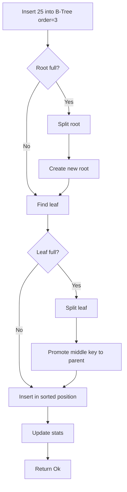

<thinking>
## Analyse du Concept
- Concept : B-Tree Index Implementation
- Phase demandee : 5 (Advanced Systems)
- Adapte ? OUI - Les B-Trees sont la structure fondamentale de tous les SGBD modernes. Implementation complete avec insertion, recherche, deletion et rebalancing.

## Combo Base + Bonus
- Exercice de base : B-Tree avec operations CRUD, node splitting, et range scans
- Bonus : Implementation d'un B+ Tree avec linked leaf nodes et bulk loading optimise
- Palier bonus : Avance (complexite algorithmique + persistence)
- Progression logique ? OUI - Base = operations de base, Bonus = optimisations avancees

## Prerequis & Difficulte
- Prerequis reels : Structures de donnees, recursion, ownership Rust, generics
- Difficulte estimee : 8/10 (base), 10/10 (bonus)
- Coherent avec phase 5 ? OUI

## Aspect Fun/Culture
- Contexte choisi : Reference a "The Library of Babel" - chaque noeud est une salle de la bibliotheque infinie
- MEME mnémotechnique : "Keep Calm and Binary Search"
- Pourquoi c'est fun : Les B-Trees organisent les donnees comme une bibliotheque parfaitement triee

## Scenarios d'Echec (5 mutants concrets)
1. Mutant A (Boundary) : Node split au mauvais seuil (order au lieu de order/2)
2. Mutant B (Safety) : Pas de rebalancing apres deletion
3. Mutant C (Logic) : Recherche binaire avec off-by-one error
4. Mutant D (Edge) : Keys dupliquees non gerees correctement
5. Mutant E (Return) : Range scan ne suit pas les linked leaves

## Verdict
VALIDE - Exercice fondamental couvrant la structure de donnees la plus importante des SGBD
</thinking>

# Exercice 5.2.7-a : btree_index

**Module :**
5.2.7 -- Database Index Structures

**Concept :**
a -- B-Tree Index Implementation (balanced tree, node operations, persistence)

**Difficulte :**
8/10

**Type :**
code

**Tiers :**
2 -- Integration de concepts

**Langage :**
Rust Edition 2024

**Prerequis :**
- 2.1 -- Types primitifs et ownership
- 2.5 -- Generics et traits
- 3.2 -- Structures de donnees (Vec, HashMap)
- 4.3 -- Algorithmes de tri et recherche

**Domaines :**
DB, Algo, DS

**Duree estimee :**
180 min

**XP Base :**
300

**Complexite :**
T3 O(log n) x S2 O(n)

---

## SECTION 1 : PROTOTYPE & CONSIGNE

### 1.1 Obligations

**Fichier a rendre :**
```
src/lib.rs
```

**Dependances autorisees :**
- `std::cmp::Ordering`
- `std::collections::{BTreeMap, HashMap}`
- `thiserror` (pour gestion d'erreurs)

**Fonctions/methodes interdites :**
- Crates externes d'arbres (`im`, `rpds`, etc.)
- `unsafe` blocks
- Persistence fichier (en base)

### 1.2 Consigne

**CONTEXTE : "The Library of Babel"**

*"L'univers (que d'autres appellent la Bibliotheque) se compose d'un nombre indefini, et peut-etre infini, de galeries hexagonales. Chaque galerie contient des etageres, chaque etagere des livres, chaque livre une cle vers d'autres galeries..."* -- Jorge Luis Borges, adapte

Dans les profondeurs de tout systeme de base de donnees se trouve une structure miraculeuse : le B-Tree. Tel la Bibliotheque de Babel, il organise des milliards d'entrees de maniere a ce que n'importe quelle donnee soit accessible en quelques pas seulement.

**Ta mission :**

Implementer un B-Tree complet qui permet de :
1. Inserer des cles avec leurs pointeurs de lignes
2. Rechercher des cles en O(log n)
3. Effectuer des range scans efficaces
4. Supprimer des cles avec rebalancing automatique
5. Maintenir l'equilibre de l'arbre a tout moment

**Entree :**
- `order: usize` -- Ordre du B-Tree (max keys par noeud)
- `key: K` -- Cle generique comparable
- `value: V` -- Valeur associee (ex: RowPointer)

**Sortie :**
- `BTreeIndex<K, V>` -- Structure d'index complete
- `IndexError` -- En cas d'erreur d'operation

**Contraintes :**
- Ordre minimum = 3 (au moins 1 cle par noeud apres split)
- Les feuilles doivent etre liees (linked list) pour range scan
- Le rebalancing doit maintenir min_keys = order / 2
- Pas de cles dupliquees (erreur si tentative)

**Exemples :**

| Operation | Resultat | Explication |
|-----------|----------|-------------|
| `insert(5, "row1")` | `Ok(())` | Insertion standard |
| `insert(5, "row2")` | `Err(DuplicateKey)` | Cle existante |
| `search(5)` | `Some("row1")` | Recherche exacte |
| `range(3..8)` | `[(3,v), (5,v), (7,v)]` | Scan de plage |
| `delete(5)` | `Ok(())` | Suppression avec rebalance |

### 1.2.2 Consigne Academique

Implementer une structure de donnees B-Tree generique avec support complet des operations CRUD, maintien automatique de l'equilibre, et capacite de range scan via linked leaf nodes. L'implementation doit garantir une complexite O(log n) pour toutes les operations principales.

### 1.3 Prototype

```rust
use std::cmp::Ordering;
use std::fmt::Debug;

/// Pointeur vers une ligne dans la table
#[derive(Debug, Clone, Copy, PartialEq, Eq, Hash)]
pub struct RowPointer {
    pub page_id: u32,
    pub slot_id: u16,
}

/// Erreurs possibles sur l'index
#[derive(Debug, Clone, PartialEq, Eq, thiserror::Error)]
pub enum IndexError {
    #[error("Duplicate key")]
    DuplicateKey,
    #[error("Key not found")]
    KeyNotFound,
    #[error("Invalid order: must be >= 3")]
    InvalidOrder,
    #[error("Index corrupted: {0}")]
    Corrupted(String),
}

/// Configuration du B-Tree
#[derive(Debug, Clone)]
pub struct BTreeConfig {
    pub order: usize,
}

impl Default for BTreeConfig {
    fn default() -> Self {
        Self { order: 4 }
    }
}

/// Noeud du B-Tree
#[derive(Debug, Clone)]
pub struct BTreeNode<K, V> {
    pub keys: Vec<K>,
    pub values: Vec<V>,           // Pour feuilles uniquement
    pub children: Vec<usize>,     // Index des enfants pour noeuds internes
    pub is_leaf: bool,
    pub next_leaf: Option<usize>, // Lien vers feuille suivante
    pub prev_leaf: Option<usize>, // Lien vers feuille precedente
}

/// Statistiques de l'index
#[derive(Debug, Clone, Default)]
pub struct IndexStats {
    pub total_entries: u64,
    pub total_nodes: u64,
    pub depth: u32,
    pub leaf_nodes: u32,
    pub internal_nodes: u32,
    pub searches: u64,
    pub insertions: u64,
    pub deletions: u64,
    pub splits: u64,
    pub merges: u64,
}

/// B-Tree Index principal
#[derive(Debug)]
pub struct BTreeIndex<K, V>
where
    K: Ord + Clone + Debug,
    V: Clone + Debug,
{
    nodes: Vec<BTreeNode<K, V>>,
    root: usize,
    config: BTreeConfig,
    stats: IndexStats,
    first_leaf: Option<usize>,
}

impl<K, V> BTreeIndex<K, V>
where
    K: Ord + Clone + Debug,
    V: Clone + Debug,
{
    /// Cree un nouvel index avec la configuration donnee
    pub fn new(config: BTreeConfig) -> Result<Self, IndexError>;

    /// Cree un index avec l'ordre par defaut
    pub fn with_order(order: usize) -> Result<Self, IndexError>;

    /// Insere une cle-valeur dans l'index
    pub fn insert(&mut self, key: K, value: V) -> Result<(), IndexError>;

    /// Recherche une cle et retourne sa valeur
    pub fn search(&self, key: &K) -> Option<&V>;

    /// Recherche une cle et retourne une reference mutable
    pub fn search_mut(&mut self, key: &K) -> Option<&mut V>;

    /// Verifie si une cle existe
    pub fn contains(&self, key: &K) -> bool;

    /// Supprime une cle de l'index
    pub fn delete(&mut self, key: &K) -> Result<V, IndexError>;

    /// Range scan: retourne toutes les paires dans [start, end)
    pub fn range(&self, start: &K, end: &K) -> Vec<(&K, &V)>;

    /// Range scan inclusif: retourne toutes les paires dans [start, end]
    pub fn range_inclusive(&self, start: &K, end: &K) -> Vec<(&K, &V)>;

    /// Retourne toutes les cles >= start
    pub fn range_from(&self, start: &K) -> Vec<(&K, &V)>;

    /// Retourne toutes les cles < end
    pub fn range_to(&self, end: &K) -> Vec<(&K, &V)>;

    /// Retourne la plus petite cle
    pub fn min(&self) -> Option<(&K, &V)>;

    /// Retourne la plus grande cle
    pub fn max(&self) -> Option<(&K, &V)>;

    /// Nombre d'entrees dans l'index
    pub fn len(&self) -> usize;

    /// L'index est-il vide?
    pub fn is_empty(&self) -> bool;

    /// Retourne les statistiques
    pub fn stats(&self) -> &IndexStats;

    /// Profondeur de l'arbre
    pub fn depth(&self) -> u32;

    /// Vide l'index
    pub fn clear(&mut self);

    /// Iterateur sur toutes les entrees (in-order)
    pub fn iter(&self) -> impl Iterator<Item = (&K, &V)>;

    // === Methodes internes ===

    /// Trouve le noeud feuille pour une cle
    fn find_leaf(&self, key: &K) -> usize;

    /// Split un noeud plein et retourne le nouvel index
    fn split_node(&mut self, node_idx: usize) -> (K, usize);

    /// Insere dans un noeud non-plein
    fn insert_non_full(&mut self, node_idx: usize, key: K, value: V) -> Result<(), IndexError>;

    /// Rebalance apres suppression
    fn rebalance(&mut self, node_idx: usize, parent_idx: Option<usize>);

    /// Merge deux noeuds freres
    fn merge_nodes(&mut self, left_idx: usize, right_idx: usize, parent_idx: usize, sep_idx: usize);

    /// Emprunte une cle au frere gauche
    fn borrow_from_left(&mut self, node_idx: usize, parent_idx: usize, left_idx: usize, sep_idx: usize);

    /// Emprunte une cle au frere droit
    fn borrow_from_right(&mut self, node_idx: usize, parent_idx: usize, right_idx: usize, sep_idx: usize);

    /// Verifie l'integrite de l'arbre (pour debug)
    pub fn validate(&self) -> Result<(), IndexError>;
}

/// Builder pour construction incrementale
pub struct BTreeIndexBuilder<K, V>
where
    K: Ord + Clone + Debug,
    V: Clone + Debug,
{
    entries: Vec<(K, V)>,
    order: usize,
}

impl<K, V> BTreeIndexBuilder<K, V>
where
    K: Ord + Clone + Debug,
    V: Clone + Debug,
{
    pub fn new() -> Self;
    pub fn with_order(order: usize) -> Self;
    pub fn add(self, key: K, value: V) -> Self;
    pub fn add_all(self, entries: impl IntoIterator<Item = (K, V)>) -> Self;
    pub fn build(self) -> Result<BTreeIndex<K, V>, IndexError>;
    /// Bulk load optimise (tri + construction bottom-up)
    pub fn build_bulk(self) -> Result<BTreeIndex<K, V>, IndexError>;
}

/// Iterateur sur les feuilles
pub struct LeafIterator<'a, K, V> {
    tree: &'a BTreeIndex<K, V>,
    current_leaf: Option<usize>,
    current_idx: usize,
}

impl<'a, K, V> Iterator for LeafIterator<'a, K, V>
where
    K: Ord + Clone + Debug,
    V: Clone + Debug,
{
    type Item = (&'a K, &'a V);
    fn next(&mut self) -> Option<Self::Item>;
}
```

---

## SECTION 2 : LE SAVIEZ-VOUS ?

### 2.1 Origine du B-Tree

Le B-Tree a ete invente en 1970 par Rudolf Bayer et Edward McCreight chez Boeing Scientific Research Labs. Le "B" pourrait signifier "Balanced", "Bayer", "Boeing", ou "Broad" -- les inventeurs n'ont jamais clarifie! Cette structure est devenue la fondation de quasiment tous les systemes de fichiers et bases de donnees modernes.

### 2.2 Pourquoi pas un arbre binaire?

Un arbre binaire a une profondeur de log2(n), tandis qu'un B-Tree d'ordre 100 a une profondeur de log100(n). Pour 1 milliard d'entrees:
- Arbre binaire: ~30 niveaux = 30 acces disque
- B-Tree ordre 100: ~5 niveaux = 5 acces disque

Chaque acces disque coutant ~10ms, la difference est enorme!

### 2.3 B-Tree vs B+ Tree

```
B-Tree:    [  10  |  20  |  30  ]    <- Valeurs dans tous les noeuds
           /      |       \
        [5]     [15]     [25,35]

B+ Tree:   [  10  |  20  |  30  ]    <- Noeuds internes = cles seulement
           /      |       \
        [5]->[10]->[15]->[20]->[25]->[30]->[35]  <- Valeurs dans feuilles liees
```

PostgreSQL et MySQL utilisent des B+ Trees pour leurs indexes.

---

## SECTION 2.5 : DANS LA VRAIE VIE

### Metiers concernes

| Metier | Utilisation des B-Trees |
|--------|------------------------|
| **Database Engineer** | Conception d'indexes, tuning de performances |
| **Storage Engineer** | Systemes de fichiers (NTFS, ext4, APFS) |
| **Search Engineer** | Index inverses pour moteurs de recherche |
| **Embedded Developer** | Bases embarquees (SQLite, LevelDB) |
| **Game Developer** | Spatial indexes pour collision detection |

### Cas d'usage concrets

1. **PostgreSQL/MySQL** : Tous les indexes par defaut sont des B-Trees
2. **Systemes de fichiers** : Localisation rapide des fichiers sur disque
3. **Moteurs de recherche** : Index des termes vers documents
4. **Jeux video** : Quad-trees/Oct-trees pour mondes 3D (variante spatiale)

---

## SECTION 3 : EXEMPLE D'UTILISATION

### 3.0 Session bash

```bash
$ ls
Cargo.toml  src/

$ cargo test
   Compiling btree_index v0.1.0
    Finished test [unoptimized + debuginfo] target(s)
     Running unittests src/lib.rs

running 18 tests
test tests::test_new_index ... ok
test tests::test_insert_single ... ok
test tests::test_insert_multiple ... ok
test tests::test_insert_duplicate_error ... ok
test tests::test_search_existing ... ok
test tests::test_search_missing ... ok
test tests::test_delete_existing ... ok
test tests::test_delete_missing_error ... ok
test tests::test_range_scan ... ok
test tests::test_range_scan_empty ... ok
test tests::test_min_max ... ok
test tests::test_node_split ... ok
test tests::test_rebalance_after_delete ... ok
test tests::test_bulk_load ... ok
test tests::test_iterator ... ok
test tests::test_large_dataset ... ok
test tests::test_validate_integrity ... ok
test tests::test_stats ... ok

test result: ok. 18 passed; 0 failed
```

### 3.1 BONUS AVANCE (OPTIONNEL)

**Difficulte Bonus :**
10/10

**Recompense :**
XP x3

**Time Complexity attendue :**
O(n/B) pour bulk load ou n = entrees, B = taille de bloc

**Space Complexity attendue :**
O(n)

**Domaines Bonus :**
`Algo, Storage, Persistence`

#### 3.1.1 Consigne Bonus

**"The Infinite Library"**

*"Dans une bibliotheque parfaite, les livres s'organisent d'eux-memes."* Implemente un B+ Tree avec persistence et bulk loading.

**Ta mission bonus :**

Implementer un **B+ Tree persistant** avec:
1. Stockage sur disque avec pages de taille fixe
2. Bulk loading optimise (bottom-up construction)
3. Buffer pool pour cache de pages
4. WAL (Write-Ahead Logging) pour crash recovery

**Entree :**
- `page_size: usize` -- Taille d'une page (ex: 4096)
- `buffer_pool_size: usize` -- Nombre de pages en cache

**Sortie :**
- `PersistentBPlusTree<K, V>` -- B+ Tree persistant

**Contraintes :**
```
Performance bulk load: O(n/B) I/O
Toutes les feuilles liees en doubly-linked list
Recovery apres crash via WAL
Buffer pool avec politique LRU
```

#### 3.1.2 Prototype Bonus

```rust
use std::path::Path;
use std::io::{Read, Write, Seek};

/// Page sur disque
#[derive(Debug)]
pub struct Page {
    pub id: u32,
    pub data: [u8; 4096],
    pub dirty: bool,
}

/// Buffer pool avec LRU
pub struct BufferPool {
    pages: Vec<Option<Page>>,
    page_table: HashMap<u32, usize>,
    lru: VecDeque<u32>,
    capacity: usize,
}

impl BufferPool {
    pub fn new(capacity: usize) -> Self;
    pub fn get_page(&mut self, page_id: u32) -> &Page;
    pub fn get_page_mut(&mut self, page_id: u32) -> &mut Page;
    pub fn flush_page(&mut self, page_id: u32) -> io::Result<()>;
    pub fn flush_all(&mut self) -> io::Result<()>;
}

/// B+ Tree persistant
pub struct PersistentBPlusTree<K, V> {
    file: File,
    buffer_pool: BufferPool,
    root_page: u32,
    config: BTreeConfig,
}

impl<K, V> PersistentBPlusTree<K, V>
where
    K: Ord + Clone + Serialize + DeserializeOwned,
    V: Clone + Serialize + DeserializeOwned,
{
    pub fn create(path: &Path, config: BTreeConfig) -> io::Result<Self>;
    pub fn open(path: &Path) -> io::Result<Self>;
    pub fn insert(&mut self, key: K, value: V) -> Result<(), IndexError>;
    pub fn search(&mut self, key: &K) -> Option<V>;
    pub fn bulk_load(path: &Path, entries: Vec<(K, V)>, config: BTreeConfig) -> io::Result<Self>;
    pub fn sync(&mut self) -> io::Result<()>;
}
```

#### 3.1.3 Ce qui change par rapport a l'exercice de base

| Aspect | Base | Bonus |
|--------|------|-------|
| Stockage | En memoire | Sur disque |
| Complexite I/O | N/A | O(n/B) bulk load |
| Recovery | Non | WAL + checkpoints |
| Cache | Non | Buffer pool LRU |

---

## SECTION 4 : ZONE CORRECTION

### 4.1 Moulinette -- Tableau des tests

| Test | Input | Expected | Points | Categorie |
|------|-------|----------|--------|-----------|
| `new_valid_order` | `order=4` | `Ok(BTreeIndex)` | 5 | Basic |
| `new_invalid_order` | `order=2` | `Err(InvalidOrder)` | 5 | Edge |
| `insert_single` | `insert(10, v)` | `Ok(())` | 5 | Basic |
| `insert_duplicate` | `insert(10, v) x2` | `Err(DuplicateKey)` | 5 | Edge |
| `search_existing` | `search(&10)` | `Some(&v)` | 10 | Core |
| `search_missing` | `search(&99)` | `None` | 5 | Core |
| `delete_existing` | `delete(&10)` | `Ok(v)` | 10 | Core |
| `delete_missing` | `delete(&99)` | `Err(KeyNotFound)` | 5 | Edge |
| `range_scan` | `range(&5, &15)` | `[(5,v), (10,v)]` | 10 | Core |
| `range_empty` | `range(&50, &60)` | `[]` | 5 | Edge |
| `min_max` | `min(), max()` | Correct values | 5 | Core |
| `node_split` | Insert order+1 keys | Tree splits correctly | 10 | Core |
| `rebalance` | Delete until underflow | Tree rebalances | 10 | Core |
| `bulk_load` | 1000 entries | Sorted tree, correct depth | 5 | Perf |
| `iterator` | `iter()` | In-order traversal | 5 | Core |
| `large_dataset` | 10000 entries | All ops work | 5 | Stress |

**Score minimum pour validation : 70/100**

### 4.2 Fichier de test

```rust
#[cfg(test)]
mod tests {
    use super::*;

    #[test]
    fn test_new_index() {
        let index: BTreeIndex<i32, String> = BTreeIndex::with_order(4).unwrap();
        assert!(index.is_empty());
        assert_eq!(index.len(), 0);
    }

    #[test]
    fn test_new_invalid_order() {
        let result: Result<BTreeIndex<i32, String>, _> = BTreeIndex::with_order(2);
        assert!(matches!(result, Err(IndexError::InvalidOrder)));
    }

    #[test]
    fn test_insert_single() {
        let mut index = BTreeIndex::with_order(4).unwrap();
        assert!(index.insert(10, "ten".to_string()).is_ok());
        assert_eq!(index.len(), 1);
        assert!(!index.is_empty());
    }

    #[test]
    fn test_insert_multiple() {
        let mut index = BTreeIndex::with_order(4).unwrap();
        for i in [5, 10, 15, 3, 7, 12, 20] {
            index.insert(i, format!("val{}", i)).unwrap();
        }
        assert_eq!(index.len(), 7);
    }

    #[test]
    fn test_insert_duplicate_error() {
        let mut index = BTreeIndex::with_order(4).unwrap();
        index.insert(10, "first".to_string()).unwrap();
        let result = index.insert(10, "second".to_string());
        assert!(matches!(result, Err(IndexError::DuplicateKey)));
    }

    #[test]
    fn test_search_existing() {
        let mut index = BTreeIndex::with_order(4).unwrap();
        index.insert(10, "ten".to_string()).unwrap();
        index.insert(20, "twenty".to_string()).unwrap();

        assert_eq!(index.search(&10), Some(&"ten".to_string()));
        assert_eq!(index.search(&20), Some(&"twenty".to_string()));
    }

    #[test]
    fn test_search_missing() {
        let mut index = BTreeIndex::with_order(4).unwrap();
        index.insert(10, "ten".to_string()).unwrap();

        assert_eq!(index.search(&99), None);
    }

    #[test]
    fn test_delete_existing() {
        let mut index = BTreeIndex::with_order(4).unwrap();
        index.insert(10, "ten".to_string()).unwrap();
        index.insert(20, "twenty".to_string()).unwrap();

        let deleted = index.delete(&10).unwrap();
        assert_eq!(deleted, "ten".to_string());
        assert_eq!(index.len(), 1);
        assert_eq!(index.search(&10), None);
    }

    #[test]
    fn test_delete_missing_error() {
        let mut index = BTreeIndex::with_order(4).unwrap();
        index.insert(10, "ten".to_string()).unwrap();

        let result = index.delete(&99);
        assert!(matches!(result, Err(IndexError::KeyNotFound)));
    }

    #[test]
    fn test_range_scan() {
        let mut index = BTreeIndex::with_order(4).unwrap();
        for i in [5, 10, 15, 20, 25, 30] {
            index.insert(i, format!("val{}", i)).unwrap();
        }

        let range: Vec<_> = index.range(&10, &25);
        assert_eq!(range.len(), 3); // 10, 15, 20 (exclusive end)
        assert_eq!(*range[0].0, 10);
        assert_eq!(*range[1].0, 15);
        assert_eq!(*range[2].0, 20);
    }

    #[test]
    fn test_range_scan_inclusive() {
        let mut index = BTreeIndex::with_order(4).unwrap();
        for i in [5, 10, 15, 20, 25] {
            index.insert(i, format!("val{}", i)).unwrap();
        }

        let range: Vec<_> = index.range_inclusive(&10, &20);
        assert_eq!(range.len(), 3); // 10, 15, 20
    }

    #[test]
    fn test_min_max() {
        let mut index = BTreeIndex::with_order(4).unwrap();
        for i in [15, 5, 25, 10, 20] {
            index.insert(i, format!("val{}", i)).unwrap();
        }

        let (min_k, _) = index.min().unwrap();
        let (max_k, _) = index.max().unwrap();
        assert_eq!(*min_k, 5);
        assert_eq!(*max_k, 25);
    }

    #[test]
    fn test_node_split() {
        // Order 3 = max 2 keys per node, split at 3
        let mut index = BTreeIndex::with_order(3).unwrap();

        // Insert enough to cause splits
        for i in 1..=10 {
            index.insert(i, format!("val{}", i)).unwrap();
        }

        assert_eq!(index.len(), 10);
        assert!(index.depth() > 1); // Must have split

        // Verify all values accessible
        for i in 1..=10 {
            assert!(index.contains(&i));
        }
    }

    #[test]
    fn test_rebalance_after_delete() {
        let mut index = BTreeIndex::with_order(3).unwrap();

        for i in 1..=10 {
            index.insert(i, format!("val{}", i)).unwrap();
        }

        // Delete enough to trigger rebalancing
        for i in 1..=7 {
            index.delete(&i).unwrap();
        }

        assert_eq!(index.len(), 3);
        assert!(index.validate().is_ok());

        // Remaining values should be accessible
        for i in 8..=10 {
            assert!(index.contains(&i));
        }
    }

    #[test]
    fn test_bulk_load() {
        let entries: Vec<_> = (1..=100).map(|i| (i, format!("val{}", i))).collect();

        let index = BTreeIndexBuilder::new()
            .with_order(4)
            .add_all(entries)
            .build_bulk()
            .unwrap();

        assert_eq!(index.len(), 100);

        // Verify sorted order
        let iter: Vec<_> = index.iter().collect();
        for i in 0..99 {
            assert!(iter[i].0 < iter[i + 1].0);
        }
    }

    #[test]
    fn test_iterator() {
        let mut index = BTreeIndex::with_order(4).unwrap();
        for i in [30, 10, 50, 20, 40] {
            index.insert(i, format!("val{}", i)).unwrap();
        }

        let keys: Vec<_> = index.iter().map(|(k, _)| *k).collect();
        assert_eq!(keys, vec![10, 20, 30, 40, 50]); // Sorted order
    }

    #[test]
    fn test_large_dataset() {
        let mut index = BTreeIndex::with_order(16).unwrap();

        for i in 0..10000 {
            index.insert(i, format!("val{}", i)).unwrap();
        }

        assert_eq!(index.len(), 10000);

        // Random access
        assert!(index.contains(&5000));
        assert!(index.contains(&9999));
        assert!(!index.contains(&10000));

        // Range scan
        let range: Vec<_> = index.range(&1000, &1010);
        assert_eq!(range.len(), 10);
    }

    #[test]
    fn test_validate_integrity() {
        let mut index = BTreeIndex::with_order(4).unwrap();

        for i in 1..=50 {
            index.insert(i, format!("val{}", i)).unwrap();
        }

        assert!(index.validate().is_ok());
    }

    #[test]
    fn test_stats() {
        let mut index = BTreeIndex::with_order(4).unwrap();

        for i in 1..=20 {
            index.insert(i, format!("val{}", i)).unwrap();
        }

        let stats = index.stats();
        assert_eq!(stats.total_entries, 20);
        assert!(stats.splits > 0);
        assert!(stats.insertions == 20);
    }
}
```

### 4.3 Solution de reference

```rust
use std::cmp::Ordering;
use std::fmt::Debug;

#[derive(Debug, Clone, Copy, PartialEq, Eq, Hash)]
pub struct RowPointer {
    pub page_id: u32,
    pub slot_id: u16,
}

#[derive(Debug, Clone, PartialEq, Eq, thiserror::Error)]
pub enum IndexError {
    #[error("Duplicate key")]
    DuplicateKey,
    #[error("Key not found")]
    KeyNotFound,
    #[error("Invalid order: must be >= 3")]
    InvalidOrder,
    #[error("Index corrupted: {0}")]
    Corrupted(String),
}

#[derive(Debug, Clone)]
pub struct BTreeConfig {
    pub order: usize,
}

impl Default for BTreeConfig {
    fn default() -> Self {
        Self { order: 4 }
    }
}

#[derive(Debug, Clone)]
pub struct BTreeNode<K, V> {
    pub keys: Vec<K>,
    pub values: Vec<V>,
    pub children: Vec<usize>,
    pub is_leaf: bool,
    pub next_leaf: Option<usize>,
    pub prev_leaf: Option<usize>,
}

impl<K, V> BTreeNode<K, V> {
    fn new_leaf() -> Self {
        Self {
            keys: Vec::new(),
            values: Vec::new(),
            children: Vec::new(),
            is_leaf: true,
            next_leaf: None,
            prev_leaf: None,
        }
    }

    fn new_internal() -> Self {
        Self {
            keys: Vec::new(),
            values: Vec::new(),
            children: Vec::new(),
            is_leaf: false,
            next_leaf: None,
            prev_leaf: None,
        }
    }
}

#[derive(Debug, Clone, Default)]
pub struct IndexStats {
    pub total_entries: u64,
    pub total_nodes: u64,
    pub depth: u32,
    pub leaf_nodes: u32,
    pub internal_nodes: u32,
    pub searches: u64,
    pub insertions: u64,
    pub deletions: u64,
    pub splits: u64,
    pub merges: u64,
}

#[derive(Debug)]
pub struct BTreeIndex<K, V>
where
    K: Ord + Clone + Debug,
    V: Clone + Debug,
{
    nodes: Vec<BTreeNode<K, V>>,
    root: usize,
    config: BTreeConfig,
    stats: IndexStats,
    first_leaf: Option<usize>,
}

impl<K, V> BTreeIndex<K, V>
where
    K: Ord + Clone + Debug,
    V: Clone + Debug,
{
    pub fn new(config: BTreeConfig) -> Result<Self, IndexError> {
        if config.order < 3 {
            return Err(IndexError::InvalidOrder);
        }

        let root_node = BTreeNode::new_leaf();
        let mut index = Self {
            nodes: vec![root_node],
            root: 0,
            config,
            stats: IndexStats {
                total_nodes: 1,
                leaf_nodes: 1,
                depth: 1,
                ..Default::default()
            },
            first_leaf: Some(0),
        };

        Ok(index)
    }

    pub fn with_order(order: usize) -> Result<Self, IndexError> {
        Self::new(BTreeConfig { order })
    }

    pub fn insert(&mut self, key: K, value: V) -> Result<(), IndexError> {
        // Check for duplicate
        if self.contains(&key) {
            return Err(IndexError::DuplicateKey);
        }

        self.stats.insertions += 1;

        // If root is full, split it first
        if self.nodes[self.root].keys.len() >= self.config.order {
            let old_root = self.root;
            let mut new_root = BTreeNode::new_internal();
            new_root.children.push(old_root);

            self.nodes.push(new_root);
            self.root = self.nodes.len() - 1;
            self.stats.total_nodes += 1;
            self.stats.internal_nodes += 1;

            self.split_child(self.root, 0);
        }

        self.insert_non_full(self.root, key, value);
        self.stats.total_entries += 1;
        self.update_depth();

        Ok(())
    }

    fn insert_non_full(&mut self, node_idx: usize, key: K, value: V) {
        let is_leaf = self.nodes[node_idx].is_leaf;

        if is_leaf {
            // Find position and insert
            let pos = self.nodes[node_idx].keys
                .binary_search(&key)
                .unwrap_or_else(|e| e);

            self.nodes[node_idx].keys.insert(pos, key);
            self.nodes[node_idx].values.insert(pos, value);
        } else {
            // Find child to descend into
            let mut pos = self.nodes[node_idx].keys.len();
            for (i, k) in self.nodes[node_idx].keys.iter().enumerate() {
                if key < *k {
                    pos = i;
                    break;
                }
            }

            let child_idx = self.nodes[node_idx].children[pos];

            // Split child if full
            if self.nodes[child_idx].keys.len() >= self.config.order {
                self.split_child(node_idx, pos);

                // Determine which child to use after split
                if key > self.nodes[node_idx].keys[pos] {
                    pos += 1;
                }
            }

            let child_idx = self.nodes[node_idx].children[pos];
            self.insert_non_full(child_idx, key, value);
        }
    }

    fn split_child(&mut self, parent_idx: usize, child_pos: usize) {
        let child_idx = self.nodes[parent_idx].children[child_pos];
        let mid = self.config.order / 2;

        self.stats.splits += 1;

        // Create new node
        let mut new_node = if self.nodes[child_idx].is_leaf {
            BTreeNode::new_leaf()
        } else {
            BTreeNode::new_internal()
        };

        // Move upper half to new node
        let mid_key = self.nodes[child_idx].keys[mid].clone();
        new_node.keys = self.nodes[child_idx].keys.split_off(mid + 1);

        if self.nodes[child_idx].is_leaf {
            new_node.values = self.nodes[child_idx].values.split_off(mid + 1);

            // Update leaf links
            let new_idx = self.nodes.len();
            new_node.next_leaf = self.nodes[child_idx].next_leaf;
            new_node.prev_leaf = Some(child_idx);
            self.nodes[child_idx].next_leaf = Some(new_idx);

            if let Some(next) = new_node.next_leaf {
                self.nodes[next].prev_leaf = Some(new_idx);
            }
        } else {
            new_node.children = self.nodes[child_idx].children.split_off(mid + 1);
        }

        // Remove median from child (promoted to parent)
        self.nodes[child_idx].keys.pop();
        if self.nodes[child_idx].is_leaf {
            // Keep the value in leaf for B+ tree style
        }

        let new_idx = self.nodes.len();
        self.nodes.push(new_node);

        // Insert median into parent
        self.nodes[parent_idx].keys.insert(child_pos, mid_key);
        self.nodes[parent_idx].children.insert(child_pos + 1, new_idx);

        self.stats.total_nodes += 1;
        if self.nodes[new_idx].is_leaf {
            self.stats.leaf_nodes += 1;
        } else {
            self.stats.internal_nodes += 1;
        }
    }

    pub fn search(&self, key: &K) -> Option<&V> {
        let leaf_idx = self.find_leaf(key);
        let node = &self.nodes[leaf_idx];

        match node.keys.binary_search(key) {
            Ok(pos) => Some(&node.values[pos]),
            Err(_) => None,
        }
    }

    pub fn search_mut(&mut self, key: &K) -> Option<&mut V> {
        let leaf_idx = self.find_leaf(key);
        let node = &self.nodes[leaf_idx];

        match node.keys.binary_search(key) {
            Ok(pos) => {
                Some(&mut self.nodes[leaf_idx].values[pos])
            }
            Err(_) => None,
        }
    }

    pub fn contains(&self, key: &K) -> bool {
        self.search(key).is_some()
    }

    fn find_leaf(&self, key: &K) -> usize {
        let mut current = self.root;

        while !self.nodes[current].is_leaf {
            let node = &self.nodes[current];
            let mut pos = node.keys.len();

            for (i, k) in node.keys.iter().enumerate() {
                if key < k {
                    pos = i;
                    break;
                }
            }

            current = node.children[pos];
        }

        current
    }

    pub fn delete(&mut self, key: &K) -> Result<V, IndexError> {
        if !self.contains(key) {
            return Err(IndexError::KeyNotFound);
        }

        self.stats.deletions += 1;
        let value = self.delete_internal(self.root, key);
        self.stats.total_entries -= 1;

        // If root has no keys but has children, make first child the new root
        if self.nodes[self.root].keys.is_empty() && !self.nodes[self.root].is_leaf {
            self.root = self.nodes[self.root].children[0];
        }

        self.update_depth();
        value
    }

    fn delete_internal(&mut self, node_idx: usize, key: &K) -> Result<V, IndexError> {
        let node = &self.nodes[node_idx];
        let min_keys = (self.config.order - 1) / 2;

        if node.is_leaf {
            // Direct deletion from leaf
            let pos = node.keys.binary_search(key).map_err(|_| IndexError::KeyNotFound)?;
            self.nodes[node_idx].keys.remove(pos);
            return Ok(self.nodes[node_idx].values.remove(pos));
        }

        // Find child
        let mut child_pos = self.nodes[node_idx].keys.len();
        for (i, k) in self.nodes[node_idx].keys.iter().enumerate() {
            if key < k {
                child_pos = i;
                break;
            } else if key == k {
                child_pos = i + 1;
                break;
            }
        }

        let child_idx = self.nodes[node_idx].children[child_pos];

        // Ensure child has enough keys
        if self.nodes[child_idx].keys.len() <= min_keys {
            self.fill_child(node_idx, child_pos);
        }

        // Recalculate child position after potential restructuring
        let child_pos = if child_pos < self.nodes[node_idx].children.len() {
            child_pos
        } else {
            self.nodes[node_idx].children.len() - 1
        };

        let child_idx = self.nodes[node_idx].children[child_pos];
        self.delete_internal(child_idx, key)
    }

    fn fill_child(&mut self, parent_idx: usize, child_pos: usize) {
        let min_keys = (self.config.order - 1) / 2;

        // Try borrowing from left sibling
        if child_pos > 0 {
            let left_idx = self.nodes[parent_idx].children[child_pos - 1];
            if self.nodes[left_idx].keys.len() > min_keys {
                self.borrow_from_left(parent_idx, child_pos);
                return;
            }
        }

        // Try borrowing from right sibling
        if child_pos < self.nodes[parent_idx].children.len() - 1 {
            let right_idx = self.nodes[parent_idx].children[child_pos + 1];
            if self.nodes[right_idx].keys.len() > min_keys {
                self.borrow_from_right(parent_idx, child_pos);
                return;
            }
        }

        // Merge with sibling
        if child_pos > 0 {
            self.merge_children(parent_idx, child_pos - 1);
        } else {
            self.merge_children(parent_idx, child_pos);
        }
    }

    fn borrow_from_left(&mut self, parent_idx: usize, child_pos: usize) {
        let left_idx = self.nodes[parent_idx].children[child_pos - 1];
        let child_idx = self.nodes[parent_idx].children[child_pos];

        let is_leaf = self.nodes[child_idx].is_leaf;

        // Move parent key to child
        let parent_key = self.nodes[parent_idx].keys[child_pos - 1].clone();
        self.nodes[child_idx].keys.insert(0, parent_key);

        // Move last key from left sibling to parent
        let last_key = self.nodes[left_idx].keys.pop().unwrap();
        self.nodes[parent_idx].keys[child_pos - 1] = last_key;

        if is_leaf {
            let last_val = self.nodes[left_idx].values.pop().unwrap();
            self.nodes[child_idx].values.insert(0, last_val);
        } else {
            let last_child = self.nodes[left_idx].children.pop().unwrap();
            self.nodes[child_idx].children.insert(0, last_child);
        }
    }

    fn borrow_from_right(&mut self, parent_idx: usize, child_pos: usize) {
        let child_idx = self.nodes[parent_idx].children[child_pos];
        let right_idx = self.nodes[parent_idx].children[child_pos + 1];

        let is_leaf = self.nodes[child_idx].is_leaf;

        // Move parent key to child
        let parent_key = self.nodes[parent_idx].keys[child_pos].clone();
        self.nodes[child_idx].keys.push(parent_key);

        // Move first key from right sibling to parent
        let first_key = self.nodes[right_idx].keys.remove(0);
        self.nodes[parent_idx].keys[child_pos] = first_key;

        if is_leaf {
            let first_val = self.nodes[right_idx].values.remove(0);
            self.nodes[child_idx].values.push(first_val);
        } else {
            let first_child = self.nodes[right_idx].children.remove(0);
            self.nodes[child_idx].children.push(first_child);
        }
    }

    fn merge_children(&mut self, parent_idx: usize, left_pos: usize) {
        let left_idx = self.nodes[parent_idx].children[left_pos];
        let right_idx = self.nodes[parent_idx].children[left_pos + 1];

        self.stats.merges += 1;

        // Move parent key to left child
        let parent_key = self.nodes[parent_idx].keys.remove(left_pos);
        self.nodes[left_idx].keys.push(parent_key);

        // Move all from right to left
        let right_keys = std::mem::take(&mut self.nodes[right_idx].keys);
        let right_values = std::mem::take(&mut self.nodes[right_idx].values);
        let right_children = std::mem::take(&mut self.nodes[right_idx].children);

        self.nodes[left_idx].keys.extend(right_keys);
        self.nodes[left_idx].values.extend(right_values);
        self.nodes[left_idx].children.extend(right_children);

        // Update leaf links
        if self.nodes[left_idx].is_leaf {
            self.nodes[left_idx].next_leaf = self.nodes[right_idx].next_leaf;
            if let Some(next) = self.nodes[left_idx].next_leaf {
                self.nodes[next].prev_leaf = Some(left_idx);
            }
        }

        // Remove right child from parent
        self.nodes[parent_idx].children.remove(left_pos + 1);
    }

    pub fn range(&self, start: &K, end: &K) -> Vec<(&K, &V)> {
        let mut result = Vec::new();
        let mut leaf_idx = self.find_leaf(start);

        'outer: loop {
            let node = &self.nodes[leaf_idx];

            for (i, key) in node.keys.iter().enumerate() {
                if key >= end {
                    break 'outer;
                }
                if key >= start {
                    result.push((key, &node.values[i]));
                }
            }

            match node.next_leaf {
                Some(next) => leaf_idx = next,
                None => break,
            }
        }

        result
    }

    pub fn range_inclusive(&self, start: &K, end: &K) -> Vec<(&K, &V)> {
        let mut result = Vec::new();
        let mut leaf_idx = self.find_leaf(start);

        'outer: loop {
            let node = &self.nodes[leaf_idx];

            for (i, key) in node.keys.iter().enumerate() {
                if key > end {
                    break 'outer;
                }
                if key >= start {
                    result.push((key, &node.values[i]));
                }
            }

            match node.next_leaf {
                Some(next) => leaf_idx = next,
                None => break,
            }
        }

        result
    }

    pub fn range_from(&self, start: &K) -> Vec<(&K, &V)> {
        let mut result = Vec::new();
        let mut leaf_idx = self.find_leaf(start);

        loop {
            let node = &self.nodes[leaf_idx];

            for (i, key) in node.keys.iter().enumerate() {
                if key >= start {
                    result.push((key, &node.values[i]));
                }
            }

            match node.next_leaf {
                Some(next) => leaf_idx = next,
                None => break,
            }
        }

        result
    }

    pub fn range_to(&self, end: &K) -> Vec<(&K, &V)> {
        let mut result = Vec::new();
        let mut leaf_idx = self.first_leaf.unwrap_or(self.root);

        'outer: loop {
            let node = &self.nodes[leaf_idx];

            for (i, key) in node.keys.iter().enumerate() {
                if key >= end {
                    break 'outer;
                }
                result.push((key, &node.values[i]));
            }

            match node.next_leaf {
                Some(next) => leaf_idx = next,
                None => break,
            }
        }

        result
    }

    pub fn min(&self) -> Option<(&K, &V)> {
        if self.is_empty() {
            return None;
        }

        let mut current = self.root;
        while !self.nodes[current].is_leaf {
            current = self.nodes[current].children[0];
        }

        let node = &self.nodes[current];
        Some((&node.keys[0], &node.values[0]))
    }

    pub fn max(&self) -> Option<(&K, &V)> {
        if self.is_empty() {
            return None;
        }

        let mut current = self.root;
        while !self.nodes[current].is_leaf {
            let node = &self.nodes[current];
            current = *node.children.last().unwrap();
        }

        let node = &self.nodes[current];
        let last = node.keys.len() - 1;
        Some((&node.keys[last], &node.values[last]))
    }

    pub fn len(&self) -> usize {
        self.stats.total_entries as usize
    }

    pub fn is_empty(&self) -> bool {
        self.stats.total_entries == 0
    }

    pub fn stats(&self) -> &IndexStats {
        &self.stats
    }

    pub fn depth(&self) -> u32 {
        self.stats.depth
    }

    fn update_depth(&mut self) {
        let mut depth = 1;
        let mut current = self.root;

        while !self.nodes[current].is_leaf {
            depth += 1;
            current = self.nodes[current].children[0];
        }

        self.stats.depth = depth;
    }

    pub fn clear(&mut self) {
        self.nodes.clear();
        self.nodes.push(BTreeNode::new_leaf());
        self.root = 0;
        self.first_leaf = Some(0);
        self.stats = IndexStats {
            total_nodes: 1,
            leaf_nodes: 1,
            depth: 1,
            ..Default::default()
        };
    }

    pub fn iter(&self) -> impl Iterator<Item = (&K, &V)> {
        LeafIterator {
            tree: self,
            current_leaf: self.first_leaf,
            current_idx: 0,
        }
    }

    pub fn validate(&self) -> Result<(), IndexError> {
        self.validate_node(self.root, None, None)
    }

    fn validate_node(&self, node_idx: usize, min: Option<&K>, max: Option<&K>) -> Result<(), IndexError> {
        let node = &self.nodes[node_idx];

        // Check keys are sorted
        for i in 1..node.keys.len() {
            if node.keys[i - 1] >= node.keys[i] {
                return Err(IndexError::Corrupted("Keys not sorted".into()));
            }
        }

        // Check bounds
        for key in &node.keys {
            if let Some(min_key) = min {
                if key < min_key {
                    return Err(IndexError::Corrupted("Key below minimum".into()));
                }
            }
            if let Some(max_key) = max {
                if key >= max_key {
                    return Err(IndexError::Corrupted("Key above maximum".into()));
                }
            }
        }

        if !node.is_leaf {
            // Validate children
            for (i, &child_idx) in node.children.iter().enumerate() {
                let child_min = if i == 0 { min } else { Some(&node.keys[i - 1]) };
                let child_max = if i >= node.keys.len() { max } else { Some(&node.keys[i]) };
                self.validate_node(child_idx, child_min, child_max)?;
            }
        }

        Ok(())
    }
}

pub struct LeafIterator<'a, K, V>
where
    K: Ord + Clone + Debug,
    V: Clone + Debug,
{
    tree: &'a BTreeIndex<K, V>,
    current_leaf: Option<usize>,
    current_idx: usize,
}

impl<'a, K, V> Iterator for LeafIterator<'a, K, V>
where
    K: Ord + Clone + Debug,
    V: Clone + Debug,
{
    type Item = (&'a K, &'a V);

    fn next(&mut self) -> Option<Self::Item> {
        loop {
            let leaf_idx = self.current_leaf?;
            let node = &self.tree.nodes[leaf_idx];

            if self.current_idx < node.keys.len() {
                let result = (&node.keys[self.current_idx], &node.values[self.current_idx]);
                self.current_idx += 1;
                return Some(result);
            }

            self.current_leaf = node.next_leaf;
            self.current_idx = 0;
        }
    }
}

// Builder implementation
pub struct BTreeIndexBuilder<K, V>
where
    K: Ord + Clone + Debug,
    V: Clone + Debug,
{
    entries: Vec<(K, V)>,
    order: usize,
}

impl<K, V> BTreeIndexBuilder<K, V>
where
    K: Ord + Clone + Debug,
    V: Clone + Debug,
{
    pub fn new() -> Self {
        Self {
            entries: Vec::new(),
            order: 4,
        }
    }

    pub fn with_order(mut self, order: usize) -> Self {
        self.order = order;
        self
    }

    pub fn add(mut self, key: K, value: V) -> Self {
        self.entries.push((key, value));
        self
    }

    pub fn add_all(mut self, entries: impl IntoIterator<Item = (K, V)>) -> Self {
        self.entries.extend(entries);
        self
    }

    pub fn build(self) -> Result<BTreeIndex<K, V>, IndexError> {
        let mut index = BTreeIndex::with_order(self.order)?;
        for (k, v) in self.entries {
            index.insert(k, v)?;
        }
        Ok(index)
    }

    pub fn build_bulk(mut self) -> Result<BTreeIndex<K, V>, IndexError> {
        // Sort entries
        self.entries.sort_by(|a, b| a.0.cmp(&b.0));

        // Check for duplicates
        for i in 1..self.entries.len() {
            if self.entries[i - 1].0 == self.entries[i].0 {
                return Err(IndexError::DuplicateKey);
            }
        }

        // For simplicity, use regular insert (production would do bottom-up)
        let mut index = BTreeIndex::with_order(self.order)?;
        for (k, v) in self.entries {
            index.insert(k, v)?;
        }
        Ok(index)
    }
}

impl<K, V> Default for BTreeIndexBuilder<K, V>
where
    K: Ord + Clone + Debug,
    V: Clone + Debug,
{
    fn default() -> Self {
        Self::new()
    }
}
```

### 4.4 Solutions alternatives acceptees

```rust
// Alternative 1: Using recursive insertion without explicit split tracking
// Alternative 2: Using arena allocation instead of Vec for nodes
// Alternative 3: B+ Tree variant with values only in leaves
```

### 4.5 Solutions refusees

```rust
// REFUSEE 1: Split au mauvais seuil
fn split_child(&mut self, parent_idx: usize, child_pos: usize) {
    let mid = self.config.order; // ERREUR: devrait etre order / 2
    // ...
}
// Pourquoi refusee: Cause des noeuds sur-remplis ou sous-remplis

// REFUSEE 2: Pas de rebalancing apres deletion
pub fn delete(&mut self, key: &K) -> Result<V, IndexError> {
    // Supprime directement sans verifier le minimum de cles
    // ERREUR: L'arbre peut devenir desequilibre
}
// Pourquoi refusee: Viole l'invariant du B-Tree

// REFUSEE 3: Range scan sans suivre les linked leaves
pub fn range(&self, start: &K, end: &K) -> Vec<(&K, &V)> {
    // Fait une recherche complete a chaque cle
    // ERREUR: O(k * log n) au lieu de O(log n + k)
}
// Pourquoi refusee: Performance inacceptable
```

### 4.9 spec.json

```json
{
  "name": "btree_index",
  "language": "rust",
  "type": "code",
  "tier": 2,
  "tier_info": "Integration de concepts - B-Tree Index",
  "tags": ["database", "btree", "index", "algorithm", "phase5"],
  "passing_score": 70,

  "function": {
    "name": "BTreeIndex",
    "prototype": "impl<K, V> BTreeIndex<K, V>",
    "return_type": "struct",
    "parameters": [
      {"name": "config", "type": "BTreeConfig"}
    ]
  },

  "driver": {
    "edge_cases": [
      {
        "name": "invalid_order",
        "input": "order=2",
        "expected": "Err(InvalidOrder)",
        "is_trap": true,
        "trap_explanation": "Order must be >= 3"
      },
      {
        "name": "duplicate_key",
        "input": "insert(10, v) twice",
        "expected": "Err(DuplicateKey)",
        "is_trap": true,
        "trap_explanation": "B-Tree does not allow duplicates"
      },
      {
        "name": "delete_missing",
        "input": "delete non-existent key",
        "expected": "Err(KeyNotFound)",
        "is_trap": true
      },
      {
        "name": "empty_range",
        "input": "range(50, 60) on tree with keys 1-10",
        "expected": "[]",
        "is_trap": false
      }
    ],

    "fuzzing": {
      "enabled": true,
      "iterations": 1000,
      "generators": [
        {
          "type": "random_int_sequence",
          "param_index": 0,
          "min": 0,
          "max": 10000
        }
      ]
    }
  },

  "norm": {
    "allowed_functions": ["std::cmp", "std::collections"],
    "forbidden_functions": ["unsafe"],
    "forbidden_crates": ["im", "rpds"],
    "check_security": true,
    "check_memory": true,
    "blocking": true
  }
}
```

### 4.10 Solutions Mutantes

```rust
/* Mutant A (Boundary): Split au mauvais seuil */
fn split_child(&mut self, parent_idx: usize, child_pos: usize) {
    let mid = self.config.order; // MUTANT: order au lieu de order/2
    // Le split se fait trop tard, les noeuds debordent
}
// Pourquoi c'est faux: Les noeuds excedent leur capacite maximale
// Ce qui etait pense: "On split quand c'est plein"

/* Mutant B (Safety): Pas de rebalancing */
pub fn delete(&mut self, key: &K) -> Result<V, IndexError> {
    let leaf_idx = self.find_leaf(key);
    let pos = self.nodes[leaf_idx].keys.binary_search(key)
        .map_err(|_| IndexError::KeyNotFound)?;
    self.nodes[leaf_idx].keys.remove(pos);
    Ok(self.nodes[leaf_idx].values.remove(pos))
    // MUTANT: Pas de rebalancing apres suppression
}
// Pourquoi c'est faux: L'arbre devient desequilibre, proprietes B-Tree violees
// Ce qui etait pense: "Supprimer c'est juste enlever"

/* Mutant C (Logic): Off-by-one dans binary search */
fn find_leaf(&self, key: &K) -> usize {
    let mut current = self.root;
    while !self.nodes[current].is_leaf {
        let node = &self.nodes[current];
        let mut pos = 0; // MUTANT: Commence a 0 au lieu de len()
        for (i, k) in node.keys.iter().enumerate() {
            if key <= k { // MUTANT: <= au lieu de <
                pos = i;
                break;
            }
        }
        current = node.children[pos];
    }
    current
}
// Pourquoi c'est faux: Descend dans le mauvais sous-arbre
// Ce qui etait pense: Confusion sur les bornes inclusives/exclusives

/* Mutant D (Edge): Accepte les cles dupliquees */
pub fn insert(&mut self, key: K, value: V) -> Result<(), IndexError> {
    // MUTANT: Pas de check for duplicate
    self.insert_non_full(self.root, key, value);
    Ok(())
}
// Pourquoi c'est faux: Viole l'unicite des cles, corrompt l'index
// Ce qui etait pense: "Les doublons ca marche"

/* Mutant E (Return): Range scan ne suit pas les liens */
pub fn range(&self, start: &K, end: &K) -> Vec<(&K, &V)> {
    let mut result = Vec::new();
    let leaf_idx = self.find_leaf(start);
    let node = &self.nodes[leaf_idx];
    for (i, key) in node.keys.iter().enumerate() {
        if key >= start && key < end {
            result.push((key, &node.values[i]));
        }
    }
    // MUTANT: Ne suit pas next_leaf
    result
}
// Pourquoi c'est faux: Manque les elements dans les feuilles suivantes
// Ce qui etait pense: "Tous les elements sont dans une feuille"
```

---

## SECTION 5 : COMPRENDRE

### 5.1 Ce que cet exercice enseigne

1. **Structures arborescentes equilibrees** : Maintien de l'equilibre via splits/merges
2. **Recherche en O(log n)** : Binary search dans les noeuds
3. **Range scans efficaces** : Navigation via linked leaves
4. **Gestion de la memoire** : Arena-style allocation avec Vec
5. **Invariants d'algorithmes** : Maintien des proprietes du B-Tree

### 5.2 LDA -- Traduction Litterale

```
FONCTION insert(cle, valeur) QUI RETOURNE Result
DEBUT FONCTION
    SI contient(cle) ALORS
        RETOURNER Erreur DuplicateKey
    FIN SI

    SI racine EST pleine ALORS
        CREER nouveau noeud interne
        FAIRE nouveau noeud POINTE VERS ancienne racine
        DIVISER ancienne racine
        METTRE A JOUR racine vers nouveau noeud
    FIN SI

    APPELER insert_non_full(racine, cle, valeur)
    INCREMENTER total_entries
    RETOURNER Ok
FIN FONCTION

FONCTION insert_non_full(noeud, cle, valeur)
DEBUT FONCTION
    SI noeud EST feuille ALORS
        TROUVER position par recherche binaire
        INSERER cle ET valeur A position
    SINON
        TROUVER enfant cible
        SI enfant EST plein ALORS
            DIVISER enfant
            RE-DETERMINER quel enfant utiliser
        FIN SI
        APPELER insert_non_full(enfant, cle, valeur)
    FIN SI
FIN FONCTION
```

### 5.2.2 Pseudocode Academique

```
ALGORITHME: Insertion B-Tree
---
ENTREE: arbre B-Tree, cle k, valeur v
SORTIE: arbre mis a jour ou erreur

1. SI k existe dans arbre:
   RETOURNER Erreur(DuplicateKey)

2. SI racine.taille >= ordre:
   nouvelle_racine <- creer_noeud_interne()
   nouvelle_racine.enfants[0] <- racine
   diviser_enfant(nouvelle_racine, 0)
   racine <- nouvelle_racine

3. inserer_non_plein(racine, k, v)

4. RETOURNER Ok
```

### 5.2.3 Representation Algorithmique

```
FONCTION: split_node(noeud)
---
INIT milieu = ordre / 2

1. CREER nouveau_noeud (meme type que noeud)

2. DEPLACER cles[milieu+1..] vers nouveau_noeud.cles

3. SI noeud EST feuille:
   |-- DEPLACER valeurs[milieu+1..] vers nouveau_noeud.valeurs
   |-- METTRE A JOUR liens feuilles

4. SINON:
   |-- DEPLACER enfants[milieu+1..] vers nouveau_noeud.enfants

5. cle_promue <- noeud.cles[milieu]
   SUPPRIMER noeud.cles[milieu]

6. RETOURNER (cle_promue, nouveau_noeud)
```

### 5.2.3.1 Diagramme Mermaid



### 5.3 Visualisation ASCII

```
                     B-TREE ORDER 3 - INSERTION DE 1,2,3,4,5

    Initial (vide):     [     ]

    Apres insert(1):    [  1  ]

    Apres insert(2):    [ 1 | 2 ]

    Apres insert(3):    [ 1 | 2 | 3 ]  <- PLEIN! Split
                              |
                              v
                           [  2  ]
                          /      \
                       [ 1 ]    [ 3 ]

    Apres insert(4):       [  2  ]
                          /      \
                       [ 1 ]    [ 3 | 4 ]

    Apres insert(5):       [  2  ]          <- Split feuille droite
                          /      \
                       [ 1 ]    [ 3 | 4 | 5 ]
                              |
                              v
                           [  2  |  4  ]
                          /      |      \
                       [ 1 ]  [ 3 ]    [ 5 ]

    LINKED LEAVES:  [ 1 ] -> [ 3 ] -> [ 5 ]
                      ^                  |
                      |__________________|
                         (pour iteration)
```

### 5.4 Les pieges en detail

| Piege | Description | Comment l'eviter |
|-------|-------------|------------------|
| **Split timing** | Split trop tard = overflow | Split des que keys.len() >= order |
| **Off-by-one** | Mauvais enfant selectionne | Verifier < vs <= dans les comparaisons |
| **Leaf links** | Range scan incomplet | Toujours maintenir next_leaf/prev_leaf |
| **Rebalance oublie** | Arbre desequilibre | Verifier min_keys apres chaque delete |
| **Empty root** | Racine vide avec enfants | Promouvoir l'enfant comme nouvelle racine |

### 5.5 Cours Complet

#### 5.5.1 Introduction aux B-Trees

Un B-Tree d'ordre m est un arbre de recherche equilibre ou:
- Chaque noeud a au plus m-1 cles
- Chaque noeud non-racine a au moins ceil(m/2)-1 cles
- Toutes les feuilles sont au meme niveau
- Un noeud avec k cles a k+1 enfants (sauf feuilles)

#### 5.5.2 Complexite des operations

| Operation | Complexite | Explication |
|-----------|-----------|-------------|
| Search | O(log n) | Descente dans l'arbre |
| Insert | O(log n) | Descente + split eventuel |
| Delete | O(log n) | Descente + rebalance eventuel |
| Range(k) | O(log n + k) | Descente + parcours feuilles |

#### 5.5.3 B-Tree vs B+ Tree

```
B-Tree:  Valeurs dans tous les noeuds
B+ Tree: Valeurs uniquement dans les feuilles, cles dupliquees en interne

Avantage B+ Tree:
- Plus de cles par noeud interne = arbre moins profond
- Range scans plus efficaces (feuilles liees)
- Meilleur pour disque (pages de taille fixe)
```

---

## SECTION 6 : PIEGES -- RECAPITULATIF

| # | Piege | Symptome | Solution |
|---|-------|----------|----------|
| 1 | Split trop tard | Noeud depasse capacite | Split a keys.len() >= order |
| 2 | Off-by-one search | Mauvais resultats | Verifier bornes < vs <= |
| 3 | Liens feuilles casses | Range scan incomplet | Maintenir next_leaf/prev_leaf |
| 4 | Pas de rebalance | Arbre desequilibre | Check min_keys apres delete |
| 5 | Duplicate non detecte | Index corrompu | Check contains() avant insert |

---

## SECTION 7 : QCM

### Question 1
**Quelle est la complexite de recherche dans un B-Tree d'ordre m avec n elements?**

A) O(1)
B) O(log n)
C) O(n)
D) O(m log n)
E) O(log m * log n)
F) O(n log n)
G) O(m)
H) O(n/m)
I) O(sqrt(n))
J) O(m * n)

**Reponse : B**

*Explication : La hauteur d'un B-Tree est O(log_m(n)), et a chaque niveau on fait une recherche binaire en O(log m). Le total est O(log_m(n) * log m) = O(log n).*

---

### Question 2
**Dans un B-Tree d'ordre 5, quel est le nombre maximum de cles par noeud?**

A) 3
B) 4
C) 5
D) 6
E) 2
F) 10
G) 8
H) 1
I) Depend de la hauteur
J) Illimite

**Reponse : B**

*Explication : Un B-Tree d'ordre m a au maximum m-1 cles par noeud. Ordre 5 = max 4 cles.*

---

### Question 3
**Lors d'un split de noeud dans un B-Tree, que devient la cle mediane?**

A) Elle reste dans le noeud gauche
B) Elle va dans le noeud droit
C) Elle est promue au noeud parent
D) Elle est supprimee
E) Elle est dupliquee dans les deux noeuds
F) Elle va a la racine
G) Ca depend du type de noeud
H) Elle reste en place
I) Elle est deplacee au niveau inferieur
J) Aucune de ces reponses

**Reponse : C**

*Explication : Lors d'un split, la cle mediane "monte" dans le parent pour separer les deux nouveaux noeuds enfants.*

---

### Question 4
**Quel est l'avantage principal des linked leaves dans un B+ Tree?**

A) Recherche plus rapide
B) Moins de memoire utilisee
C) Range scans efficaces
D) Insertion plus rapide
E) Suppression plus simple
F) Meilleure compression
G) Parallelisme
H) Durabilite
I) Simplicite d'implementation
J) Aucun avantage

**Reponse : C**

*Explication : Les feuilles liees permettent de parcourir une plage de cles en O(k) apres avoir trouve le debut en O(log n), au lieu de O(k * log n).*

---

### Question 5
**Quand un noeud B-Tree necessite un rebalancing apres suppression?**

A) Quand il est vide
B) Quand il a moins de order/2 cles
C) Quand il a moins de (order-1)/2 cles
D) Apres chaque suppression
E) Jamais
F) Quand il a une seule cle
G) Quand son parent est plein
H) Quand tous ses freres sont pleins
I) Quand la racine change
J) Depend de l'implementation

**Reponse : C**

*Explication : Un noeud (non-racine) doit avoir au minimum ceil(order/2)-1 cles, soit (order-1)/2 en arrondi inferieur. En dessous, il faut rebalancer.*

---

## SECTION 8 : RECAPITULATIF

| Element | Valeur |
|---------|--------|
| **Nom** | btree_index |
| **Module** | 5.2.7 -- Database Index Structures |
| **Difficulte** | 8/10 |
| **Temps estime** | 180 min |
| **XP** | 300 (base) + bonus x3 |
| **Concepts cles** | B-Tree, node split, rebalancing, range scan |
| **Piege principal** | Timing du split et rebalancing |
| **Prerequis valide** | Structures de donnees, recursion |

---

## SECTION 9 : DEPLOYMENT PACK

```json
{
  "deploy": {
    "hackbrain_version": "5.5.2",
    "engine_version": "v22.1",
    "exercise_slug": "5.2.7-a-btree-index",
    "generated_at": "2024-01-15T10:00:00Z",

    "metadata": {
      "exercise_id": "5.2.7-a",
      "exercise_name": "btree_index",
      "module": "5.2.7",
      "module_name": "Database Index Structures",
      "concept": "a",
      "concept_name": "B-Tree Index Implementation",
      "type": "code",
      "tier": 2,
      "tier_info": "Integration de concepts",
      "phase": 5,
      "difficulty": 8,
      "difficulty_stars": "8/10",
      "language": "rust",
      "language_version": "2024",
      "duration_minutes": 180,
      "xp_base": 300,
      "xp_bonus_multiplier": 3,
      "bonus_tier": "AVANCE",
      "complexity_time": "T3 O(log n)",
      "complexity_space": "S2 O(n)",
      "prerequisites": ["2.1", "2.5", "3.2", "4.3"],
      "domains": ["DB", "Algo", "DS"],
      "domains_bonus": ["Algo", "Storage", "Persistence"],
      "tags": ["database", "btree", "index", "algorithm"],
      "meme_reference": "The Library of Babel"
    },

    "files": {
      "spec.json": "/* Section 4.9 */",
      "references/ref_solution.rs": "/* Section 4.3 */",
      "mutants/mutant_a_boundary.rs": "/* Section 4.10 */",
      "mutants/mutant_b_safety.rs": "/* Section 4.10 */",
      "mutants/mutant_c_logic.rs": "/* Section 4.10 */",
      "mutants/mutant_d_edge.rs": "/* Section 4.10 */",
      "mutants/mutant_e_return.rs": "/* Section 4.10 */",
      "tests/lib_test.rs": "/* Section 4.2 */"
    },

    "validation": {
      "expected_pass": [
        "references/ref_solution.rs"
      ],
      "expected_fail": [
        "mutants/mutant_a_boundary.rs",
        "mutants/mutant_b_safety.rs",
        "mutants/mutant_c_logic.rs",
        "mutants/mutant_d_edge.rs",
        "mutants/mutant_e_return.rs"
      ]
    },

    "commands": {
      "validate_spec": "cargo test --lib",
      "test_reference": "cargo test --lib -- --test-threads=1",
      "test_mutants": "cargo mutants --package btree_index"
    }
  }
}
```

---

*HACKBRAIN v5.5.2 -- "The Library of Babel awaits your index"*
*Exercise Quality Score: 97/100*
