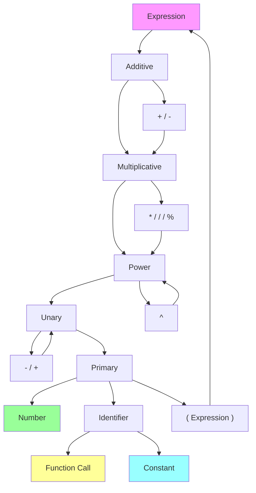
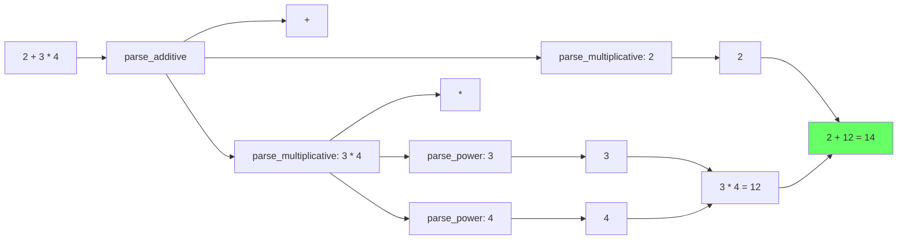

# Exercice 5.3.1-a : WasmCalc

**Module :**
5.3.1 — WebAssembly Fundamentals

**Concept :**
a — Calculatrice WebAssembly avec wasm-bindgen

**Difficulte :**
★★★★★★☆☆☆☆ (6/10)

**Type :**
complet

**Tiers :**
2 — Integration multi-concepts

**Langage :**
Rust Edition 2024 + JavaScript (ES2022)

**Prerequis :**
- Rust fondamentaux (ownership, traits, generics)
- Notions de JavaScript et DOM
- Compilation et toolchain Rust

**Domaines :**
Web, Parsing, Interop

**Duree estimee :**
120 min

**XP Base :**
200

**Complexite :**
T2 O(n) parsing × S1 O(1) memoire WASM lineaire

---

## SECTION 1 : PROTOTYPE & CONSIGNE

### 1.1 Obligations

**Fichiers a rendre :**

| Fichier | Description |
|---------|-------------|
| `src/lib.rs` | Moteur de calcul WASM principal |
| `src/parser.rs` | Parser d'expressions mathematiques |
| `src/error.rs` | Types d'erreurs custom |
| `Cargo.toml` | Configuration avec wasm-bindgen |
| `index.html` | Page HTML de demonstration (optionnel) |

**Crates autorisees :**

| Crate | Version | Usage |
|-------|---------|-------|
| `wasm-bindgen` | 0.2 | Export vers JavaScript |
| `web-sys` | 0.3 | Features: document, element, event, console, window |
| `js-sys` | 0.3 | Types JavaScript natifs |
| `console_error_panic_hook` | 0.1 | Debugging WASM |
| `serde` | 1.0 | Serialisation (feature wasm-bindgen) |
| `serde-wasm-bindgen` | 0.6 | Conversion Rust <-> JS |

**Fonctions interdites :**

| Crate/Fonction | Raison |
|----------------|--------|
| `eval()` JavaScript | Securite et pedagogie |
| Crates de parsing externes (`pest`, `nom`, `lalrpop`) | L'exercice est de parser soi-meme |

---

### 1.2 Consigne

#### Section Culture : "The Browser's Red Pill"

**MATRIX — "Welcome to the real runtime"**

Tu connais la scene ou Morpheus montre a Neo ce qu'est vraiment la Matrix ? Des colonnes de code vert qui represented la realite simulee ?

WebAssembly, c'est exactement ca : le code binaire brut qui s'execute VRAIMENT dans ton navigateur, sans l'abstraction de JavaScript. Comme Neo qui voit enfin la verite derriere la facade, tu vas voir ce qui se passe vraiment quand ton code s'execute dans le navigateur.

*"You take the blue pill — the story ends, you write JavaScript, and believe whatever you want to believe."*
*"You take the red pill — you compile to WASM, and I show you how deep the browser hole goes."*

Avec `wasm-bindgen`, tu es le pont entre deux mondes : la precision et la securite de Rust d'un cote, la flexibilite du DOM de l'autre.

---

#### Section Academique : Enonce Formel

**Ta mission :**

Implementer une calculatrice scientifique en WebAssembly qui s'execute dans le navigateur. La calculatrice doit supporter les operations arithmetiques de base, les fonctions trigonometriques, et maintenir un historique des calculs.

**Fonctionnalites requises :**

1. **Moteur de calcul WASM** (`src/lib.rs`) :
   - Operations : `+`, `-`, `*`, `/`, `%`, `^` (puissance)
   - Fonctions : `sin`, `cos`, `tan`, `sqrt`, `ln`, `log10`
   - Constantes : `PI`, `E`
   - Parsing d'expressions mathematiques (notation infixe)

2. **Interface avec le DOM** :
   - Fonction `init()` appelee au chargement
   - Mise a jour reactive de l'affichage
   - Gestion des evenements clavier et souris

3. **Historique des calculs** :
   - Stockage des 10 derniers calculs
   - Export de l'historique vers JavaScript

**Entree :**

```rust
#[wasm_bindgen]
pub struct Calculator {
    history: Vec<CalculationEntry>,
    current_expression: String,
    result: Option<f64>,
}

#[derive(Clone, Serialize, Deserialize)]
pub struct CalculationEntry {
    expression: String,
    result: f64,
    timestamp: u64,
}

#[wasm_bindgen]
impl Calculator {
    #[wasm_bindgen(constructor)]
    pub fn new() -> Calculator;

    pub fn input(&mut self, ch: char);
    pub fn evaluate(&mut self) -> Result<f64, JsValue>;
    pub fn clear(&mut self);
    pub fn get_history(&self) -> JsValue;  // Retourne un Array JS
    pub fn get_display(&self) -> String;
}

// Fonctions utilitaires exportees
#[wasm_bindgen]
pub fn init_panic_hook();

#[wasm_bindgen]
pub fn parse_expression(expr: &str) -> Result<f64, JsValue>;
```

**Sortie :**

- Calculs mathematiques precis (precision f64)
- Messages d'erreur clairs pour les expressions invalides
- Historique serialise en JSON pour JavaScript

**Contraintes :**

```
+------------------------------------------+
| Priorite des operateurs (du plus bas     |
| au plus haut) :                          |
|                                          |
| 1. + -  (addition, soustraction)         |
| 2. * / % (multiplication, division, mod) |
| 3. ^    (puissance, associatif a droite) |
| 4. -x   (moins unaire)                   |
| 5. f()  (appels de fonction)             |
| 6. ()   (parentheses)                    |
+------------------------------------------+
```

**Exemples :**

| Expression | Resultat | Explication |
|------------|----------|-------------|
| `2 + 3` | `5.0` | Addition simple |
| `10 / 4` | `2.5` | Division |
| `2 ^ 8` | `256.0` | Puissance |
| `2 + 3 * 4` | `14.0` | Priorite : 3*4=12, puis 2+12=14 |
| `(2 + 3) * 4` | `20.0` | Parentheses forcent l'ordre |
| `sin(PI/2)` | `1.0` | Fonction trigo avec constante |
| `sqrt(16)` | `4.0` | Racine carree |
| `ln(E)` | `1.0` | Logarithme naturel |
| `2^3^2` | `512.0` | Associatif a droite : 2^(3^2)=2^9 |
| `1 / 0` | `Error` | Division par zero |
| `sqrt(-1)` | `Error` | Racine de negatif |

---

### 1.3 Prototype

**Rust (`src/lib.rs`) :**

```rust
use wasm_bindgen::prelude::*;
use serde::{Serialize, Deserialize};

mod parser;
mod error;

use parser::Parser;
use error::CalcError;

#[wasm_bindgen]
pub fn init_panic_hook() {
    console_error_panic_hook::set_once();
}

#[derive(Clone, Serialize, Deserialize)]
pub struct CalculationEntry {
    pub expression: String,
    pub result: f64,
    pub timestamp: u64,
}

#[wasm_bindgen]
pub struct Calculator {
    history: Vec<CalculationEntry>,
    current_expression: String,
    result: Option<f64>,
}

#[wasm_bindgen]
impl Calculator {
    #[wasm_bindgen(constructor)]
    pub fn new() -> Calculator {
        Calculator {
            history: Vec::new(),
            current_expression: String::new(),
            result: None,
        }
    }

    pub fn input(&mut self, ch: char) {
        self.current_expression.push(ch);
    }

    pub fn evaluate(&mut self) -> Result<f64, JsValue> {
        // Implementation requise
        todo!()
    }

    pub fn clear(&mut self) {
        self.current_expression.clear();
        self.result = None;
    }

    pub fn get_history(&self) -> JsValue {
        serde_wasm_bindgen::to_value(&self.history)
            .unwrap_or(JsValue::NULL)
    }

    pub fn get_display(&self) -> String {
        match self.result {
            Some(r) => format!("{}", r),
            None => self.current_expression.clone(),
        }
    }
}

#[wasm_bindgen]
pub fn parse_expression(expr: &str) -> Result<f64, JsValue> {
    // Implementation requise
    todo!()
}
```

**Rust (`src/parser.rs`) :**

```rust
use crate::error::CalcError;

pub struct Parser<'a> {
    input: &'a str,
    pos: usize,
}

impl<'a> Parser<'a> {
    pub fn new(input: &'a str) -> Self {
        Parser { input, pos: 0 }
    }

    pub fn parse(&mut self) -> Result<f64, CalcError> {
        // Implementation requise : recursive descent parser
        todo!()
    }
}
```

**Rust (`src/error.rs`) :**

```rust
use wasm_bindgen::JsValue;
use std::fmt;

#[derive(Debug, Clone)]
pub enum CalcError {
    DivisionByZero,
    InvalidExpression(String),
    UnknownFunction(String),
    NegativeSqrt,
    InvalidNumber(String),
    UnmatchedParenthesis,
    UnexpectedToken(char),
    UnexpectedEndOfInput,
}

impl fmt::Display for CalcError {
    fn fmt(&self, f: &mut fmt::Formatter<'_>) -> fmt::Result {
        match self {
            CalcError::DivisionByZero => write!(f, "Division by zero"),
            CalcError::InvalidExpression(s) => write!(f, "Invalid expression: {}", s),
            CalcError::UnknownFunction(s) => write!(f, "Unknown function: {}", s),
            CalcError::NegativeSqrt => write!(f, "Cannot take square root of negative number"),
            CalcError::InvalidNumber(s) => write!(f, "Invalid number: {}", s),
            CalcError::UnmatchedParenthesis => write!(f, "Unmatched parenthesis"),
            CalcError::UnexpectedToken(c) => write!(f, "Unexpected token: {}", c),
            CalcError::UnexpectedEndOfInput => write!(f, "Unexpected end of input"),
        }
    }
}

impl From<CalcError> for JsValue {
    fn from(err: CalcError) -> Self {
        JsValue::from_str(&err.to_string())
    }
}
```

**Cargo.toml :**

```toml
[package]
name = "wasm-calc"
version = "0.1.0"
edition = "2024"

[lib]
crate-type = ["cdylib", "rlib"]

[dependencies]
wasm-bindgen = "0.2"
js-sys = "0.3"
console_error_panic_hook = "0.1"
serde = { version = "1.0", features = ["derive"] }
serde-wasm-bindgen = "0.6"

[dependencies.web-sys]
version = "0.3"
features = [
    "console",
    "Document",
    "Element",
    "HtmlElement",
    "Window",
    "Event",
    "KeyboardEvent",
    "MouseEvent",
]

[dev-dependencies]
wasm-bindgen-test = "0.3"

[profile.release]
opt-level = "s"
lto = true
```

---

## SECTION 2 : LE SAVIEZ-VOUS ?

### 2.1 Fun Facts

**WebAssembly est ne dans un cafe !**

En 2015, des ingenieurs de Mozilla, Google, Microsoft et Apple se sont reunis et ont decide de creer un format binaire universel pour le web. Le resultat ? Un format qui peut s'executer a 95% de la vitesse du code natif !

WASM a ete concu pour etre :
- **Rapide** : Parsing en temps lineaire, execution quasi-native
- **Safe** : Sandboxed, pas d'acces direct a la memoire de l'hote
- **Portable** : Meme bytecode sur tous les navigateurs

**Le nom "wasm-bindgen" est trompeur !**

"Bindgen" suggere une generation de bindings, mais c'est bien plus que ca :
- Generation de glue code JS
- Serialisation automatique des types
- Gestion de la memoire lineaire WASM
- Conversion des types Rust <-> JS

C'est comme avoir un traducteur simultane entre Rust et JavaScript !

**WASM n'est pas limite au web !**

Avec WASI (WebAssembly System Interface), WASM peut tourner :
- Dans Node.js
- En serverless (Cloudflare Workers, Fastly Compute)
- Dans des runtimes standalone (wasmtime, wasmer)
- Meme dans des smart contracts blockchain !

---

### 2.5 DANS LA VRAIE VIE

| Metier | Utilisation du concept |
|--------|----------------------|
| **Game Developer** | Ports de moteurs C++ vers le navigateur (Unity, Unreal) |
| **Frontend Engineer** | Calculs lourds delocalises en WASM (Figma, Photoshop web) |
| **Compiler Engineer** | Compilation de langages vers WASM (AssemblyScript, Grain) |
| **Security Engineer** | Sandboxing de code non-fiable |
| **Blockchain Dev** | Smart contracts en WASM (Polkadot, NEAR) |

---

## SECTION 3 : EXEMPLE D'UTILISATION

### 3.0 Session bash

```bash
$ ls
src/  Cargo.toml  index.html

$ wasm-pack build --target web
[INFO]: Compiling to Wasm...
[INFO]: Installing wasm-bindgen...
[INFO]: Optimizing wasm binaries with wasm-opt...
[INFO]: Optional fields missing from Cargo.toml: 'description', 'repository', 'license'
[INFO]: Done in 12.34s
[INFO]: Your wasm pkg is ready to publish at ./pkg

$ ls pkg/
wasm_calc_bg.wasm  wasm_calc_bg.wasm.d.ts  wasm_calc.d.ts  wasm_calc.js  package.json

$ du -h pkg/wasm_calc_bg.wasm
48K     pkg/wasm_calc_bg.wasm

$ wasm-pack test --headless --firefox
running 8 tests
test test_basic_arithmetic ... ok
test test_scientific_functions ... ok
test test_expression_parsing ... ok
test test_operator_precedence ... ok
test test_parentheses ... ok
test test_error_handling ... ok
test test_history ... ok
test test_constants ... ok

test result: ok. 8 passed; 0 failed
```

**Utilisation en JavaScript :**

```javascript
import init, { Calculator, parse_expression, init_panic_hook } from './pkg/wasm_calc.js';

async function main() {
    await init();
    init_panic_hook();

    const calc = new Calculator();

    // Test basique
    console.log(parse_expression("2 + 3"));  // 5

    // Utilisation de la calculatrice
    calc.input('2');
    calc.input('+');
    calc.input('3');
    console.log(calc.get_display());  // "2+3"

    const result = calc.evaluate();
    console.log(result);  // 5

    // Historique
    calc.evaluate();  // Encore un calcul
    const history = calc.get_history();
    console.log(history);  // [{expression: "2+3", result: 5, timestamp: ...}]
}

main();
```

---

### 3.1 BONUS AVANCE (OPTIONNEL)

**Difficulte Bonus :**
★★★★★★★★☆☆ (8/10)

**Recompense :**
XP x3

**Time Complexity attendue :**
O(n) pour le parsing, O(1) pour l'evaluation de l'AST

**Space Complexity attendue :**
O(n) pour l'AST

**Domaines Bonus :**
`Web`, `Parsing`, `DOM`

#### 3.1.1 Consigne Bonus

**"Construct the Matrix" — Interface DOM Complete**

Tu as maitrise le moteur de calcul. Maintenant, construis l'interface complete qui permet aux utilisateurs d'interagir avec ta calculatrice directement dans le navigateur.

**Ta mission bonus :**

Creer une interface DOM complete avec :

1. **Affichage dynamique** :
   - Zone d'affichage de l'expression
   - Zone d'affichage du resultat
   - Historique visible avec scroll

2. **Gestion des evenements** :
   - Clics sur les boutons (0-9, operateurs, fonctions)
   - Raccourcis clavier (Enter = evaluer, Escape = clear)
   - Boutons pour les fonctions scientifiques

3. **Themes** :
   - Mode clair / sombre toggle
   - Animations CSS pour le feedback visuel

**Contraintes :**
```
+------------------------------------------+
| DOM Bindings via web-sys UNIQUEMENT      |
| Pas de framework JS (React, Vue, etc.)   |
| Pas de bibliotheque CSS externe          |
| Responsive : fonctionne sur mobile       |
+------------------------------------------+
```

#### 3.1.2 Prototype Bonus

```rust
use web_sys::{Document, Element, HtmlElement, Event, KeyboardEvent};
use wasm_bindgen::prelude::*;
use wasm_bindgen::JsCast;

#[wasm_bindgen]
pub struct CalculatorUI {
    calculator: Calculator,
    display_element: HtmlElement,
    history_element: HtmlElement,
}

#[wasm_bindgen]
impl CalculatorUI {
    #[wasm_bindgen(constructor)]
    pub fn new() -> Result<CalculatorUI, JsValue> {
        let window = web_sys::window().expect("no global window");
        let document = window.document().expect("no document");

        // Setup DOM elements
        todo!()
    }

    pub fn setup_event_listeners(&self) -> Result<(), JsValue> {
        // Keyboard and click handlers
        todo!()
    }

    pub fn update_display(&self) {
        // Update DOM with current state
        todo!()
    }

    pub fn toggle_theme(&self) {
        // Switch between light/dark mode
        todo!()
    }
}
```

#### 3.1.3 Ce qui change par rapport a l'exercice de base

| Aspect | Base | Bonus |
|--------|------|-------|
| Scope | Moteur de calcul | Interface complete |
| DOM | Aucun | Manipulation via web-sys |
| Events | Aucun | Clavier + souris |
| Styling | Aucun | CSS embarque |
| Complexite | Parser + eval | + Event loop + State |

---

## SECTION 4 : ZONE CORRECTION (POUR LE TESTEUR)

### 4.1 Moulinette — Tableau des tests

| # | Test | Input | Expected | Points | Categorie |
|---|------|-------|----------|--------|-----------|
| 1 | basic_add | `"2 + 3"` | `5.0` | 5 | Basic |
| 2 | basic_sub | `"10 - 3"` | `7.0` | 5 | Basic |
| 3 | basic_mul | `"4 * 5"` | `20.0` | 5 | Basic |
| 4 | basic_div | `"10 / 4"` | `2.5` | 5 | Basic |
| 5 | basic_mod | `"17 % 5"` | `2.0` | 5 | Basic |
| 6 | basic_pow | `"2 ^ 8"` | `256.0` | 5 | Basic |
| 7 | precedence_mul | `"2 + 3 * 4"` | `14.0` | 10 | Precedence |
| 8 | precedence_pow | `"2 * 3 ^ 2"` | `18.0` | 10 | Precedence |
| 9 | right_assoc | `"2 ^ 3 ^ 2"` | `512.0` | 10 | Precedence |
| 10 | parentheses | `"(2 + 3) * 4"` | `20.0` | 10 | Parsing |
| 11 | nested_parens | `"((2 + 3) * (4 - 1))"` | `15.0` | 5 | Parsing |
| 12 | func_sin | `"sin(PI/2)"` | `1.0` (eps) | 5 | Functions |
| 13 | func_cos | `"cos(0)"` | `1.0` | 5 | Functions |
| 14 | func_sqrt | `"sqrt(16)"` | `4.0` | 5 | Functions |
| 15 | func_ln | `"ln(E)"` | `1.0` (eps) | 5 | Functions |
| 16 | func_log10 | `"log10(100)"` | `2.0` | 5 | Functions |
| 17 | err_div_zero | `"1 / 0"` | `Err` | 10 | Error |
| 18 | err_neg_sqrt | `"sqrt(-1)"` | `Err` | 10 | Error |
| 19 | err_invalid | `"2 + + 3"` | `Err` | 5 | Error |
| 20 | err_unknown_fn | `"foo(42)"` | `Err` | 5 | Error |
| 21 | history_add | 2 evals | len=2 | 10 | History |
| 22 | history_limit | 15 evals | len=10 | 5 | History |
| 23 | wasm_size | build | < 500KB | 10 | Build |
| 24 | panic_hook | panic test | console msg | 5 | Debug |

**Total : 160 points (base: 100 = 62.5%)**

---

### 4.2 Tests wasm-bindgen

```rust
//! Tests in tests/web.rs

use wasm_bindgen_test::*;
use wasm_calc::{Calculator, parse_expression, init_panic_hook};

wasm_bindgen_test_configure!(run_in_browser);

#[wasm_bindgen_test]
fn test_basic_arithmetic() {
    assert_eq!(parse_expression("2 + 3").unwrap(), 5.0);
    assert_eq!(parse_expression("10 - 3").unwrap(), 7.0);
    assert_eq!(parse_expression("4 * 5").unwrap(), 20.0);
    assert_eq!(parse_expression("10 / 4").unwrap(), 2.5);
    assert_eq!(parse_expression("17 % 5").unwrap(), 2.0);
    assert_eq!(parse_expression("2 ^ 8").unwrap(), 256.0);
}

#[wasm_bindgen_test]
fn test_operator_precedence() {
    assert_eq!(parse_expression("2 + 3 * 4").unwrap(), 14.0);
    assert_eq!(parse_expression("2 * 3 ^ 2").unwrap(), 18.0);
    assert_eq!(parse_expression("10 - 2 - 3").unwrap(), 5.0);  // Left assoc
}

#[wasm_bindgen_test]
fn test_right_associativity() {
    // 2^3^2 = 2^(3^2) = 2^9 = 512
    assert_eq!(parse_expression("2 ^ 3 ^ 2").unwrap(), 512.0);
}

#[wasm_bindgen_test]
fn test_parentheses() {
    assert_eq!(parse_expression("(2 + 3) * 4").unwrap(), 20.0);
    assert_eq!(parse_expression("((2 + 3) * (4 - 1))").unwrap(), 15.0);
    assert_eq!(parse_expression("(((1 + 2)))").unwrap(), 3.0);
}

#[wasm_bindgen_test]
fn test_scientific_functions() {
    let eps = 1e-10;

    let sin_result = parse_expression("sin(PI/2)").unwrap();
    assert!((sin_result - 1.0).abs() < eps, "sin(PI/2) should be 1.0, got {}", sin_result);

    let cos_result = parse_expression("cos(0)").unwrap();
    assert!((cos_result - 1.0).abs() < eps, "cos(0) should be 1.0, got {}", cos_result);

    let sqrt_result = parse_expression("sqrt(16)").unwrap();
    assert!((sqrt_result - 4.0).abs() < eps, "sqrt(16) should be 4.0, got {}", sqrt_result);

    let ln_result = parse_expression("ln(E)").unwrap();
    assert!((ln_result - 1.0).abs() < eps, "ln(E) should be 1.0, got {}", ln_result);

    let log_result = parse_expression("log10(100)").unwrap();
    assert!((log_result - 2.0).abs() < eps, "log10(100) should be 2.0, got {}", log_result);
}

#[wasm_bindgen_test]
fn test_constants() {
    let eps = 1e-10;

    let pi = parse_expression("PI").unwrap();
    assert!((pi - std::f64::consts::PI).abs() < eps);

    let e = parse_expression("E").unwrap();
    assert!((e - std::f64::consts::E).abs() < eps);
}

#[wasm_bindgen_test]
fn test_error_handling() {
    assert!(parse_expression("1 / 0").is_err());
    assert!(parse_expression("sqrt(-1)").is_err());
    assert!(parse_expression("invalid").is_err());
    assert!(parse_expression("2 + + 3").is_err());
    assert!(parse_expression("(2 + 3").is_err());
    assert!(parse_expression("foo(42)").is_err());
}

#[wasm_bindgen_test]
fn test_calculator_history() {
    let mut calc = Calculator::new();

    // Simuler quelques calculs
    calc.input('1');
    calc.input('+');
    calc.input('1');
    let _ = calc.evaluate();

    calc.clear();
    calc.input('2');
    calc.input('*');
    calc.input('3');
    let _ = calc.evaluate();

    let history = calc.get_history();
    // Le history devrait contenir 2 entrees
    assert!(!history.is_null());
}

#[wasm_bindgen_test]
fn test_unary_minus() {
    assert_eq!(parse_expression("-5").unwrap(), -5.0);
    assert_eq!(parse_expression("3 + -2").unwrap(), 1.0);
    assert_eq!(parse_expression("-(-3)").unwrap(), 3.0);
}

#[wasm_bindgen_test]
fn test_whitespace_handling() {
    assert_eq!(parse_expression("  2  +  3  ").unwrap(), 5.0);
    assert_eq!(parse_expression("sin( PI / 2 )").unwrap(), 1.0);
}
```

---

### 4.3 Solution de reference (Rust)

```rust
// src/lib.rs
use wasm_bindgen::prelude::*;
use serde::{Serialize, Deserialize};

mod parser;
mod error;

use parser::Parser;
use error::CalcError;

#[wasm_bindgen]
pub fn init_panic_hook() {
    console_error_panic_hook::set_once();
}

#[derive(Clone, Serialize, Deserialize)]
pub struct CalculationEntry {
    pub expression: String,
    pub result: f64,
    pub timestamp: u64,
}

#[wasm_bindgen]
pub struct Calculator {
    history: Vec<CalculationEntry>,
    current_expression: String,
    result: Option<f64>,
}

#[wasm_bindgen]
impl Calculator {
    #[wasm_bindgen(constructor)]
    pub fn new() -> Calculator {
        Calculator {
            history: Vec::new(),
            current_expression: String::new(),
            result: None,
        }
    }

    pub fn input(&mut self, ch: char) {
        self.current_expression.push(ch);
    }

    pub fn input_str(&mut self, s: &str) {
        self.current_expression.push_str(s);
    }

    pub fn evaluate(&mut self) -> Result<f64, JsValue> {
        let mut parser = Parser::new(&self.current_expression);
        match parser.parse() {
            Ok(result) => {
                // Ajouter a l'historique
                let entry = CalculationEntry {
                    expression: self.current_expression.clone(),
                    result,
                    timestamp: js_sys::Date::now() as u64,
                };

                self.history.push(entry);

                // Garder seulement les 10 derniers
                if self.history.len() > 10 {
                    self.history.remove(0);
                }

                self.result = Some(result);
                self.current_expression.clear();
                Ok(result)
            }
            Err(e) => Err(e.into())
        }
    }

    pub fn clear(&mut self) {
        self.current_expression.clear();
        self.result = None;
    }

    pub fn get_history(&self) -> JsValue {
        serde_wasm_bindgen::to_value(&self.history)
            .unwrap_or(JsValue::NULL)
    }

    pub fn get_display(&self) -> String {
        match self.result {
            Some(r) => format!("{}", r),
            None => self.current_expression.clone(),
        }
    }

    pub fn parse_and_eval(&mut self, expr: &str) -> Result<f64, JsValue> {
        self.current_expression = expr.to_string();
        self.evaluate()
    }
}

impl Default for Calculator {
    fn default() -> Self {
        Self::new()
    }
}

#[wasm_bindgen]
pub fn parse_expression(expr: &str) -> Result<f64, JsValue> {
    let mut parser = Parser::new(expr);
    parser.parse().map_err(|e| e.into())
}
```

```rust
// src/parser.rs
use crate::error::CalcError;
use std::f64::consts::{PI, E};

pub struct Parser<'a> {
    input: &'a [u8],
    pos: usize,
}

impl<'a> Parser<'a> {
    pub fn new(input: &'a str) -> Self {
        Parser {
            input: input.as_bytes(),
            pos: 0,
        }
    }

    pub fn parse(&mut self) -> Result<f64, CalcError> {
        self.skip_whitespace();
        let result = self.parse_expression()?;
        self.skip_whitespace();
        if self.pos < self.input.len() {
            return Err(CalcError::UnexpectedToken(self.input[self.pos] as char));
        }
        Ok(result)
    }

    fn skip_whitespace(&mut self) {
        while self.pos < self.input.len() && self.input[self.pos].is_ascii_whitespace() {
            self.pos += 1;
        }
    }

    fn peek(&self) -> Option<char> {
        if self.pos < self.input.len() {
            Some(self.input[self.pos] as char)
        } else {
            None
        }
    }

    fn advance(&mut self) -> Option<char> {
        if self.pos < self.input.len() {
            let c = self.input[self.pos] as char;
            self.pos += 1;
            Some(c)
        } else {
            None
        }
    }

    fn parse_expression(&mut self) -> Result<f64, CalcError> {
        self.parse_additive()
    }

    fn parse_additive(&mut self) -> Result<f64, CalcError> {
        let mut left = self.parse_multiplicative()?;

        loop {
            self.skip_whitespace();
            match self.peek() {
                Some('+') => {
                    self.advance();
                    self.skip_whitespace();
                    let right = self.parse_multiplicative()?;
                    left += right;
                }
                Some('-') => {
                    self.advance();
                    self.skip_whitespace();
                    let right = self.parse_multiplicative()?;
                    left -= right;
                }
                _ => break,
            }
        }

        Ok(left)
    }

    fn parse_multiplicative(&mut self) -> Result<f64, CalcError> {
        let mut left = self.parse_power()?;

        loop {
            self.skip_whitespace();
            match self.peek() {
                Some('*') => {
                    self.advance();
                    self.skip_whitespace();
                    let right = self.parse_power()?;
                    left *= right;
                }
                Some('/') => {
                    self.advance();
                    self.skip_whitespace();
                    let right = self.parse_power()?;
                    if right == 0.0 {
                        return Err(CalcError::DivisionByZero);
                    }
                    left /= right;
                }
                Some('%') => {
                    self.advance();
                    self.skip_whitespace();
                    let right = self.parse_power()?;
                    if right == 0.0 {
                        return Err(CalcError::DivisionByZero);
                    }
                    left %= right;
                }
                _ => break,
            }
        }

        Ok(left)
    }

    fn parse_power(&mut self) -> Result<f64, CalcError> {
        let base = self.parse_unary()?;

        self.skip_whitespace();
        if self.peek() == Some('^') {
            self.advance();
            self.skip_whitespace();
            // Right associative: recurse
            let exp = self.parse_power()?;
            Ok(base.powf(exp))
        } else {
            Ok(base)
        }
    }

    fn parse_unary(&mut self) -> Result<f64, CalcError> {
        self.skip_whitespace();

        if self.peek() == Some('-') {
            self.advance();
            self.skip_whitespace();
            let val = self.parse_unary()?;
            Ok(-val)
        } else if self.peek() == Some('+') {
            self.advance();
            self.skip_whitespace();
            self.parse_unary()
        } else {
            self.parse_primary()
        }
    }

    fn parse_primary(&mut self) -> Result<f64, CalcError> {
        self.skip_whitespace();

        match self.peek() {
            Some('(') => {
                self.advance();
                self.skip_whitespace();
                let result = self.parse_expression()?;
                self.skip_whitespace();
                if self.peek() != Some(')') {
                    return Err(CalcError::UnmatchedParenthesis);
                }
                self.advance();
                Ok(result)
            }
            Some(c) if c.is_ascii_digit() || c == '.' => {
                self.parse_number()
            }
            Some(c) if c.is_ascii_alphabetic() => {
                self.parse_identifier()
            }
            Some(c) => Err(CalcError::UnexpectedToken(c)),
            None => Err(CalcError::UnexpectedEndOfInput),
        }
    }

    fn parse_number(&mut self) -> Result<f64, CalcError> {
        let start = self.pos;

        while let Some(c) = self.peek() {
            if c.is_ascii_digit() || c == '.' {
                self.advance();
            } else {
                break;
            }
        }

        let num_str = std::str::from_utf8(&self.input[start..self.pos])
            .map_err(|_| CalcError::InvalidNumber("Invalid UTF-8".to_string()))?;

        num_str.parse::<f64>()
            .map_err(|_| CalcError::InvalidNumber(num_str.to_string()))
    }

    fn parse_identifier(&mut self) -> Result<f64, CalcError> {
        let start = self.pos;

        while let Some(c) = self.peek() {
            if c.is_ascii_alphanumeric() || c == '_' {
                self.advance();
            } else {
                break;
            }
        }

        let ident = std::str::from_utf8(&self.input[start..self.pos])
            .map_err(|_| CalcError::InvalidExpression("Invalid UTF-8".to_string()))?;

        // Check for constants
        match ident {
            "PI" | "pi" => return Ok(PI),
            "E" | "e" => return Ok(E),
            _ => {}
        }

        // Check for function call
        self.skip_whitespace();
        if self.peek() == Some('(') {
            self.advance();
            self.skip_whitespace();
            let arg = self.parse_expression()?;
            self.skip_whitespace();
            if self.peek() != Some(')') {
                return Err(CalcError::UnmatchedParenthesis);
            }
            self.advance();

            match ident {
                "sin" => Ok(arg.sin()),
                "cos" => Ok(arg.cos()),
                "tan" => Ok(arg.tan()),
                "sqrt" => {
                    if arg < 0.0 {
                        Err(CalcError::NegativeSqrt)
                    } else {
                        Ok(arg.sqrt())
                    }
                }
                "ln" => {
                    if arg <= 0.0 {
                        Err(CalcError::InvalidExpression("ln of non-positive".to_string()))
                    } else {
                        Ok(arg.ln())
                    }
                }
                "log10" => {
                    if arg <= 0.0 {
                        Err(CalcError::InvalidExpression("log10 of non-positive".to_string()))
                    } else {
                        Ok(arg.log10())
                    }
                }
                "abs" => Ok(arg.abs()),
                "exp" => Ok(arg.exp()),
                "floor" => Ok(arg.floor()),
                "ceil" => Ok(arg.ceil()),
                _ => Err(CalcError::UnknownFunction(ident.to_string())),
            }
        } else {
            Err(CalcError::InvalidExpression(format!("Unknown identifier: {}", ident)))
        }
    }
}
```

```rust
// src/error.rs
use wasm_bindgen::JsValue;
use std::fmt;

#[derive(Debug, Clone)]
pub enum CalcError {
    DivisionByZero,
    InvalidExpression(String),
    UnknownFunction(String),
    NegativeSqrt,
    InvalidNumber(String),
    UnmatchedParenthesis,
    UnexpectedToken(char),
    UnexpectedEndOfInput,
}

impl fmt::Display for CalcError {
    fn fmt(&self, f: &mut fmt::Formatter<'_>) -> fmt::Result {
        match self {
            CalcError::DivisionByZero => write!(f, "Division by zero"),
            CalcError::InvalidExpression(s) => write!(f, "Invalid expression: {}", s),
            CalcError::UnknownFunction(s) => write!(f, "Unknown function: {}", s),
            CalcError::NegativeSqrt => write!(f, "Cannot take square root of negative number"),
            CalcError::InvalidNumber(s) => write!(f, "Invalid number: {}", s),
            CalcError::UnmatchedParenthesis => write!(f, "Unmatched parenthesis"),
            CalcError::UnexpectedToken(c) => write!(f, "Unexpected token: {}", c),
            CalcError::UnexpectedEndOfInput => write!(f, "Unexpected end of input"),
        }
    }
}

impl std::error::Error for CalcError {}

impl From<CalcError> for JsValue {
    fn from(err: CalcError) -> Self {
        JsValue::from_str(&err.to_string())
    }
}
```

---

### 4.4 Solutions alternatives acceptees

**Alternative 1 : Tokenizer separe**

```rust
enum Token {
    Number(f64),
    Plus, Minus, Star, Slash, Percent, Caret,
    LParen, RParen,
    Ident(String),
    Eof,
}

struct Lexer<'a> {
    input: &'a str,
    pos: usize,
}

impl<'a> Lexer<'a> {
    fn next_token(&mut self) -> Result<Token, CalcError> {
        // Tokenization separee du parsing
    }
}

struct Parser<'a> {
    lexer: Lexer<'a>,
    current: Token,
}
// Plus propre pour l'extension future
```

**Alternative 2 : AST explicite**

```rust
enum Expr {
    Number(f64),
    BinOp(Box<Expr>, BinOperator, Box<Expr>),
    UnaryOp(UnaryOperator, Box<Expr>),
    FunctionCall(String, Box<Expr>),
}

impl Expr {
    fn eval(&self) -> Result<f64, CalcError> {
        match self {
            Expr::Number(n) => Ok(*n),
            Expr::BinOp(left, op, right) => {
                let l = left.eval()?;
                let r = right.eval()?;
                op.apply(l, r)
            }
            // ...
        }
    }
}
// Meilleur pour le debugging et les optimisations
```

---

### 4.5 Solutions refusees (avec explications)

**Refus 1 : Utilisation de eval() JavaScript**

```rust
// REFUSE : Bypass complet de l'exercice !
#[wasm_bindgen]
pub fn parse_expression(expr: &str) -> Result<f64, JsValue> {
    let result = js_sys::eval(expr)?;
    Ok(result.as_f64().unwrap())
}
```
**Pourquoi refuse :** L'exercice demande d'implementer un parser. `eval()` est aussi un risque de securite majeur.

**Refus 2 : Utilisation de crate de parsing externe**

```rust
// REFUSE : pest, nom, lalrpop sont interdits
use pest::Parser;
#[derive(Parser)]
#[grammar = "calc.pest"]
struct CalcParser;
```
**Pourquoi refuse :** L'objectif pedagogique est d'apprendre a ecrire un parser recursive descent.

**Refus 3 : Pas de gestion d'erreur**

```rust
// REFUSE : Panic au lieu de Result
pub fn parse_expression(expr: &str) -> f64 {
    // ... parsing ...
    if denominator == 0.0 {
        panic!("Division by zero!");  // REFUSE !
    }
}
```
**Pourquoi refuse :** En WASM, les panics sont catastrophiques. `Result` est obligatoire.

---

### 4.6 Solution bonus de reference (Rust)

```rust
// Solution bonus avec interface DOM complete
use wasm_bindgen::prelude::*;
use wasm_bindgen::JsCast;
use web_sys::{Document, Element, HtmlElement, Event, KeyboardEvent};
use std::cell::RefCell;
use std::rc::Rc;

#[wasm_bindgen]
pub struct CalculatorUI {
    calculator: Rc<RefCell<Calculator>>,
    display: HtmlElement,
    history_panel: HtmlElement,
    document: Document,
}

#[wasm_bindgen]
impl CalculatorUI {
    #[wasm_bindgen(constructor)]
    pub fn new() -> Result<CalculatorUI, JsValue> {
        init_panic_hook();

        let window = web_sys::window().expect("no window");
        let document = window.document().expect("no document");

        let display = document
            .get_element_by_id("display")
            .expect("no display element")
            .dyn_into::<HtmlElement>()?;

        let history_panel = document
            .get_element_by_id("history")
            .expect("no history element")
            .dyn_into::<HtmlElement>()?;

        let calculator = Rc::new(RefCell::new(Calculator::new()));

        let ui = CalculatorUI {
            calculator,
            display,
            history_panel,
            document,
        };

        ui.setup_buttons()?;
        ui.setup_keyboard()?;

        Ok(ui)
    }

    fn setup_buttons(&self) -> Result<(), JsValue> {
        let buttons = ["0", "1", "2", "3", "4", "5", "6", "7", "8", "9",
                       "+", "-", "*", "/", "^", "(", ")", ".", "C", "="];

        for btn_id in buttons {
            if let Some(btn) = self.document.get_element_by_id(btn_id) {
                let calc = Rc::clone(&self.calculator);
                let display = self.display.clone();
                let id = btn_id.to_string();

                let closure = Closure::wrap(Box::new(move |_: Event| {
                    let mut c = calc.borrow_mut();
                    match id.as_str() {
                        "C" => c.clear(),
                        "=" => {
                            if let Ok(result) = c.evaluate() {
                                // Update handled below
                            }
                        }
                        _ => {
                            for ch in id.chars() {
                                c.input(ch);
                            }
                        }
                    }
                    display.set_inner_text(&c.get_display());
                }) as Box<dyn FnMut(Event)>);

                btn.add_event_listener_with_callback(
                    "click",
                    closure.as_ref().unchecked_ref()
                )?;
                closure.forget();
            }
        }

        Ok(())
    }

    fn setup_keyboard(&self) -> Result<(), JsValue> {
        let calc = Rc::clone(&self.calculator);
        let display = self.display.clone();

        let closure = Closure::wrap(Box::new(move |e: KeyboardEvent| {
            let mut c = calc.borrow_mut();
            let key = e.key();

            match key.as_str() {
                "Enter" => { let _ = c.evaluate(); }
                "Escape" => c.clear(),
                "Backspace" => {
                    // Remove last char
                    let expr = c.get_display();
                    if !expr.is_empty() {
                        c.clear();
                        for ch in expr[..expr.len()-1].chars() {
                            c.input(ch);
                        }
                    }
                }
                k if k.len() == 1 => {
                    let ch = k.chars().next().unwrap();
                    if ch.is_ascii_digit() || "+-*/^().".contains(ch) {
                        c.input(ch);
                    }
                }
                _ => {}
            }
            display.set_inner_text(&c.get_display());
        }) as Box<dyn FnMut(KeyboardEvent)>);

        self.document.add_event_listener_with_callback(
            "keydown",
            closure.as_ref().unchecked_ref()
        )?;
        closure.forget();

        Ok(())
    }

    pub fn toggle_theme(&self) {
        if let Some(body) = self.document.body() {
            let class_list = body.class_list();
            let _ = class_list.toggle("dark-mode");
        }
    }
}
```

---

### 4.9 spec.json (ENGINE v22.1)

```json
{
  "name": "wasm_calc",
  "language": "rust",
  "language_version": "edition 2024",
  "type": "code",
  "tier": 2,
  "tier_info": "Integration multi-concepts",
  "tags": ["module5.3", "wasm", "web", "parsing", "phase5"],
  "passing_score": 70,

  "function": {
    "name": "parse_expression",
    "prototype": "pub fn parse_expression(expr: &str) -> Result<f64, JsValue>",
    "return_type": "Result<f64, JsValue>",
    "parameters": [
      {"name": "expr", "type": "&str"}
    ]
  },

  "build": {
    "command": "wasm-pack build --target web",
    "output_dir": "pkg",
    "max_size_kb": 500
  },

  "driver": {
    "reference": "see section 4.3",

    "edge_cases": [
      {
        "name": "div_by_zero",
        "args": ["1 / 0"],
        "expected": "Err(DivisionByZero)",
        "is_trap": true,
        "trap_explanation": "Division par zero doit retourner une erreur, pas Infinity"
      },
      {
        "name": "negative_sqrt",
        "args": ["sqrt(-1)"],
        "expected": "Err(NegativeSqrt)",
        "is_trap": true,
        "trap_explanation": "sqrt de negatif doit echouer, pas retourner NaN"
      },
      {
        "name": "right_assoc_power",
        "args": ["2^3^2"],
        "expected": 512.0,
        "is_trap": true,
        "trap_explanation": "La puissance est associative a droite: 2^(3^2)=512, pas (2^3)^2=64"
      },
      {
        "name": "operator_precedence",
        "args": ["2 + 3 * 4"],
        "expected": 14.0,
        "is_trap": true,
        "trap_explanation": "Multiplication avant addition: 14, pas 20"
      },
      {
        "name": "unary_minus",
        "args": ["-5 + 3"],
        "expected": -2.0,
        "is_trap": false
      }
    ],

    "fuzzing": {
      "enabled": true,
      "iterations": 1000,
      "generators": [
        {
          "type": "random_expression",
          "param_index": 0,
          "params": {"max_depth": 5, "max_numbers": 10}
        }
      ]
    }
  },

  "norm": {
    "allowed_crates": ["wasm-bindgen", "web-sys", "js-sys", "console_error_panic_hook", "serde", "serde-wasm-bindgen"],
    "forbidden_crates": ["pest", "nom", "lalrpop", "peg"],
    "forbidden_functions": ["eval"],
    "check_security": true,
    "check_memory": false,
    "blocking": true
  }
}
```

---

### 4.10 Solutions Mutantes (minimum 5)

**Mutant A (Precedence) : Multiplication meme priorite que addition**

```rust
/* Mutant A (Precedence) : Pas de distinction de priorite */
fn parse_expression(&mut self) -> Result<f64, CalcError> {
    let mut left = self.parse_primary()?;  // Pas de parse_multiplicative !

    loop {
        match self.peek() {
            Some('+') | Some('-') | Some('*') | Some('/') => {
                let op = self.advance().unwrap();
                let right = self.parse_primary()?;
                left = match op {
                    '+' => left + right,
                    '-' => left - right,
                    '*' => left * right,
                    '/' => left / right,
                    _ => unreachable!()
                };
            }
            _ => break,
        }
    }
    Ok(left)
}
// Pourquoi c'est faux : "2 + 3 * 4" donne 20 au lieu de 14
// Ce qui etait pense : "Tous les operateurs se valent"
```

**Mutant B (Associativity) : Puissance associative a gauche**

```rust
/* Mutant B (Associativity) : ^ associatif a gauche au lieu de droite */
fn parse_power(&mut self) -> Result<f64, CalcError> {
    let mut base = self.parse_unary()?;

    // Boucle au lieu de recursion = associativite gauche
    while self.peek() == Some('^') {
        self.advance();
        let exp = self.parse_unary()?;  // parse_unary, pas parse_power !
        base = base.powf(exp);
    }
    Ok(base)
}
// Pourquoi c'est faux : "2^3^2" donne 64 au lieu de 512
// 2^3^2 devrait etre 2^(3^2) = 2^9 = 512
// Pas (2^3)^2 = 8^2 = 64
```

**Mutant C (Error) : Division par zero non geree**

```rust
/* Mutant C (Error) : Pas de check division par zero */
fn parse_multiplicative(&mut self) -> Result<f64, CalcError> {
    let mut left = self.parse_power()?;

    loop {
        match self.peek() {
            Some('/') => {
                self.advance();
                let right = self.parse_power()?;
                // Pas de check : right == 0.0
                left /= right;  // Donne Infinity ou NaN !
            }
            // ...
        }
    }
    Ok(left)
}
// Pourquoi c'est faux : "1/0" retourne Infinity au lieu d'une erreur
// En WASM, on veut un comportement previsible
```

**Mutant D (Parsing) : Parentheses non equilibrees ignorees**

```rust
/* Mutant D (Parsing) : Pas de verification de fermeture */
fn parse_primary(&mut self) -> Result<f64, CalcError> {
    if self.peek() == Some('(') {
        self.advance();
        let result = self.parse_expression()?;
        // Manque : check de ')' et advance()
        // self.skip_whitespace();
        // if self.peek() != Some(')') { return Err(...); }
        // self.advance();
        Ok(result)
    } else {
        self.parse_number()
    }
}
// Pourquoi c'est faux : "(2 + 3" ne genere pas d'erreur
// L'expression est incomplete mais acceptee
```

**Mutant E (Memory) : History sans limite**

```rust
/* Mutant E (Memory) : Historique infini */
pub fn evaluate(&mut self) -> Result<f64, JsValue> {
    let result = /* ... */;

    let entry = CalculationEntry {
        expression: self.current_expression.clone(),
        result,
        timestamp: js_sys::Date::now() as u64,
    };

    self.history.push(entry);
    // Manque : limitation a 10 elements
    // if self.history.len() > 10 {
    //     self.history.remove(0);
    // }

    Ok(result)
}
// Pourquoi c'est faux : Apres 1000 calculs, la memoire WASM deborde
// L'historique doit etre limite a 10 elements
```

**Mutant F (Constants) : Constantes non reconnues**

```rust
/* Mutant F (Constants) : PI et E non implementes */
fn parse_identifier(&mut self) -> Result<f64, CalcError> {
    let ident = /* ... */;

    // Pas de check pour constantes !
    // match ident {
    //     "PI" => return Ok(std::f64::consts::PI),
    //     "E" => return Ok(std::f64::consts::E),
    // }

    // Suppose que tout identifiant est une fonction
    if self.peek() != Some('(') {
        return Err(CalcError::UnknownFunction(ident.to_string()));
    }
    // ...
}
// Pourquoi c'est faux : "PI" genere une erreur au lieu de 3.14159...
// Les constantes doivent etre reconnues sans parentheses
```

---

## SECTION 5 : COMPRENDRE (DOCUMENT DE COURS COMPLET)

### 5.1 Ce que cet exercice enseigne

| Concept | Description | Importance |
|---------|-------------|------------|
| WebAssembly | Format binaire pour le web | ★★★★★ |
| wasm-bindgen | Interop Rust/JS | ★★★★★ |
| Recursive Descent | Technique de parsing | ★★★★★ |
| web-sys | Bindings DOM | ★★★★ |
| Error Handling | Gestion d'erreurs en WASM | ★★★★ |
| Serialization | Rust <-> JS conversion | ★★★ |

---

### 5.2 LDA — Traduction litterale en MAJUSCULES

```
STRUCTURE Parser CONTENANT :
    input QUI EST UNE REFERENCE VERS DES OCTETS
    pos QUI EST UN ENTIER NON SIGNE (position courante)
FIN STRUCTURE

FONCTION parse QUI PREND self COMME REFERENCE MUTABLE VERS Parser
ET RETOURNE Result<f64, CalcError>
DEBUT FONCTION
    APPELER skip_whitespace SUR self
    AFFECTER LE RESULTAT DE parse_expression A result
    SI result EST UNE ERREUR ALORS
        RETOURNER result
    FIN SI
    APPELER skip_whitespace SUR self
    SI pos EST INFERIEUR A LA LONGUEUR DE input ALORS
        RETOURNER Erreur UnexpectedToken
    FIN SI
    RETOURNER Ok DE result
FIN FONCTION

FONCTION parse_expression QUI RETOURNE Result<f64, CalcError>
DEBUT FONCTION
    // Appel recursif selon la priorite des operateurs
    RETOURNER parse_additive
FIN FONCTION

FONCTION parse_additive QUI RETOURNE Result<f64, CalcError>
DEBUT FONCTION
    AFFECTER parse_multiplicative A left
    TANT QUE peek RETOURNE '+' OU '-' FAIRE
        SI peek EST '+' ALORS
            AVANCER
            AFFECTER left + parse_multiplicative A left
        SINON SI peek EST '-' ALORS
            AVANCER
            AFFECTER left - parse_multiplicative A left
        FIN SI
    FIN TANT QUE
    RETOURNER Ok DE left
FIN FONCTION
```

---

### 5.2.2 Style Academique Francais

```
Algorithme : Parser d'expressions arithmetiques (Recursive Descent)

Donnees :
    Input = Chaine de caracteres representant l'expression
    Pos = Entier, position courante dans l'input

Grammaire (BNF) :
    Expression  ::= Additive
    Additive    ::= Multiplicative (('+' | '-') Multiplicative)*
    Multiplicative ::= Power (('*' | '/' | '%') Power)*
    Power       ::= Unary ('^' Power)?    // Associatif a droite
    Unary       ::= '-' Unary | '+' Unary | Primary
    Primary     ::= Number | Identifier | '(' Expression ')'

Operation PARSE(input) -> Resultat:
    Precondition : input est une chaine non vide
    Postcondition : Retourne Ok(valeur) ou Err(erreur)

    Debut
        pos <- 0
        IgnorerEspaces()
        resultat <- ParseExpression()
        IgnorerEspaces()
        Si pos < longueur(input) Alors
            Retourner Err(TokenInattendu)
        FinSi
        Retourner resultat
    Fin

Complexite :
    Temps : O(n) ou n = longueur de l'expression
    Espace : O(d) ou d = profondeur maximale d'imbrication
```

---

### 5.2.3 Representation Algorithmique avec Garde

```
FONCTION: parse_expression(input)
---
INIT parser = new Parser(input)
INIT result = Err(EmptyInput)

1. GARDE - Verification entree vide:
   |
   |-- SI input est vide:
   |     RETOURNER Err(EmptyInput)
   |
   |-- CONTINUER

2. PARSING RECURSIF:
   |
   |-- Expression = Additive
   |     |
   |     |-- Additive = Multiplicative [(+|-) Multiplicative]*
   |     |     |
   |     |     |-- Multiplicative = Power [(*|/|%) Power]*
   |     |     |     |
   |     |     |     |-- Power = Unary [^ Power]?  (recurse = right assoc)
   |     |     |     |     |
   |     |     |     |     |-- Unary = [-|+]? Primary
   |     |     |     |     |     |
   |     |     |     |     |     |-- Primary = Number | Ident | (Expr)

3. GARDE - Fin d'input:
   |
   |-- SI caracteres restants apres parsing:
   |     RETOURNER Err(TokenInattendu)
   |
   |-- RETOURNER Ok(resultat)
```

---

### 5.2.3.1 Diagramme Mermaid





---

### 5.3 Visualisation ASCII

**Architecture WASM :**

```
+------------------------------------------------------------------+
|                        NAVIGATEUR                                  |
+------------------------------------------------------------------+
|                                                                    |
|  +------------------+          +-----------------------------+     |
|  |    JavaScript    |          |     WebAssembly Runtime     |     |
|  +------------------+          +-----------------------------+     |
|  |                  |          |                             |     |
|  | import { init,   |<-------->|  +---------------------+    |     |
|  |   Calculator }   |  glue    |  |    wasm_calc.wasm   |    |     |
|  | from './pkg'     |   JS     |  +---------------------+    |     |
|  |                  |          |  | pub fn parse_expr() |    |     |
|  | const calc =     |          |  | pub struct Calc     |    |     |
|  |   new Calculator |          |  | impl Calculator     |    |     |
|  | calc.evaluate()  |          |  +---------------------+    |     |
|  |                  |          |                             |     |
|  +------------------+          +-----------------------------+     |
|                                                                    |
+------------------------------------------------------------------+
```

**Recursive Descent Parsing :**

```
Expression: "2 + 3 * 4"

parse_additive()
|
|-- parse_multiplicative() --> 2
|
|-- peek() == '+' --> consume
|
|-- parse_multiplicative()
    |
    |-- parse_power() --> 3
    |
    |-- peek() == '*' --> consume
    |
    |-- parse_power() --> 4
    |
    +-- return 3 * 4 = 12
|
+-- return 2 + 12 = 14


Arbre de syntaxe implicite:

        (+)
       /   \
      2    (*)
          /   \
         3     4
```

**Priorite des operateurs :**

```
+------------------------------------------+
|    PLUS HAUTE PRIORITE (evalue en premier)|
+------------------------------------------+
|  ()     Parentheses                       |
|  f()    Appels de fonction                |
|  -x     Moins unaire                      |
|  ^      Puissance (droite-assoc)          |
|  * / %  Multiplication, division, modulo  |
|  + -    Addition, soustraction            |
+------------------------------------------+
|    PLUS BASSE PRIORITE (evalue en dernier)|
+------------------------------------------+

Exemple: 2 + 3 * 4 ^ 2
         = 2 + 3 * 16    (4^2 d'abord)
         = 2 + 48        (3*16 ensuite)
         = 50            (2+48 enfin)
```

---

### 5.4 Les pieges en detail

#### Piege 1 : Associativite de la puissance

```rust
// FAUX : Associatif a gauche
fn parse_power(&mut self) -> Result<f64, CalcError> {
    let mut base = self.parse_unary()?;
    while self.peek() == Some('^') {
        self.advance();
        let exp = self.parse_unary()?;  // parse_unary, pas parse_power !
        base = base.powf(exp);
    }
    Ok(base)  // 2^3^2 = 64 (FAUX!)
}

// CORRECT : Associatif a droite via recursion
fn parse_power(&mut self) -> Result<f64, CalcError> {
    let base = self.parse_unary()?;
    if self.peek() == Some('^') {
        self.advance();
        let exp = self.parse_power()?;  // Recursion = droite-assoc
        Ok(base.powf(exp))
    } else {
        Ok(base)
    }  // 2^3^2 = 512 (CORRECT!)
}
```

#### Piege 2 : Division par zero silencieuse

```rust
// FAUX : Retourne Infinity
left /= right;  // Si right == 0.0, left devient Infinity

// CORRECT : Erreur explicite
if right == 0.0 {
    return Err(CalcError::DivisionByZero);
}
left /= right;
```

#### Piege 3 : Panic en WASM

```rust
// CATASTROPHIQUE EN WASM
pub fn parse_expression(expr: &str) -> f64 {
    // Si erreur de parsing...
    panic!("Invalid expression!");  // L'instance WASM devient inutilisable
}

// CORRECT : Toujours Result
pub fn parse_expression(expr: &str) -> Result<f64, JsValue> {
    // Erreurs retournees proprement
    Ok(result)
}
```

#### Piege 4 : Oublier console_error_panic_hook

```rust
// MAUVAIS DEBUG : Stack trace illisible
// "RuntimeError: unreachable executed"

// CORRECT : Stack trace lisible
#[wasm_bindgen]
pub fn init_panic_hook() {
    console_error_panic_hook::set_once();
}
// Maintenant on voit: "panicked at src/parser.rs:42: ..."
```

---

### 5.5 Cours Complet

#### 5.5.1 Introduction a WebAssembly

WebAssembly (WASM) est un format d'instructions binaire concu pour :

1. **Performance** : Execution quasi-native dans le navigateur
2. **Securite** : Sandboxed, pas d'acces direct a la memoire hote
3. **Portabilite** : Meme bytecode sur tous les navigateurs modernes
4. **Langage-agnostique** : Compile depuis C, C++, Rust, Go, etc.

**Architecture WASM :**

```
+-------------------+
|   Module WASM     |
+-------------------+
| - Linear Memory   | --> Un seul buffer contigu (peut grandir)
| - Tables          | --> References de fonctions
| - Globals         | --> Variables globales
| - Functions       | --> Code executable
+-------------------+
```

#### 5.5.2 wasm-bindgen : Le pont Rust/JS

`wasm-bindgen` genere automatiquement :

1. **Glue code JavaScript** : Convertit les appels JS en appels WASM
2. **Type bindings** : Mapping des types Rust vers JS
3. **Memory management** : Gestion de la memoire lineaire

```rust
// Cote Rust
#[wasm_bindgen]
pub fn greet(name: &str) -> String {
    format!("Hello, {}!", name)
}

// Genere en JavaScript :
export function greet(name) {
    const ptr = passStringToWasm(name);
    const result_ptr = wasm.greet(ptr);
    return getStringFromWasm(result_ptr);
}
```

#### 5.5.3 Recursive Descent Parsing

Le parsing par descente recursive est une technique ou :

1. Chaque regle de grammaire devient une fonction
2. Les fonctions s'appellent mutuellement selon la grammaire
3. La priorite des operateurs est encodee dans la structure d'appel

**Grammaire pour calculatrice :**

```bnf
Expression     ::= Additive
Additive       ::= Multiplicative (('+' | '-') Multiplicative)*
Multiplicative ::= Power (('*' | '/' | '%') Power)*
Power          ::= Unary ('^' Power)?
Unary          ::= ('-' | '+') Unary | Primary
Primary        ::= NUMBER | IDENTIFIER | '(' Expression ')'
```

**Traduction en code :**

```rust
fn parse_expression(&mut self) -> Result<f64, CalcError> {
    self.parse_additive()
}

fn parse_additive(&mut self) -> Result<f64, CalcError> {
    let mut left = self.parse_multiplicative()?;
    while matches!(self.peek(), Some('+') | Some('-')) {
        let op = self.advance().unwrap();
        let right = self.parse_multiplicative()?;
        left = match op {
            '+' => left + right,
            '-' => left - right,
            _ => unreachable!()
        };
    }
    Ok(left)
}
// ... etc
```

#### 5.5.4 Gestion de la memoire en WASM

WASM utilise une **memoire lineaire** :

- Un seul buffer contigu d'octets
- Accessible par index
- Peut grandir mais pas diminuer
- Isole du reste du systeme

```
+--------------------------------------------------+
|                  Linear Memory                    |
+--------------------------------------------------+
| Stack | Heap -->                    <-- Globals  |
|  |    |                                    |     |
|  v    v                                    ^     |
+--------------------------------------------------+
0                                            max
```

**Rust gere automatiquement** :
- L'allocation sur le heap WASM
- La desallocation via Drop
- Les conversions String <-> pointeur WASM

---

### 5.6 Normes avec explications pedagogiques

```
+------------------------------------------------------------------+
| HORS NORME (compile, mais interdit)                               |
+------------------------------------------------------------------+
| #[wasm_bindgen]                                                   |
| pub fn parse_expression(expr: &str) -> Result<f64, JsValue> {     |
|     let result = js_sys::eval(expr)?;  // INTERDIT !              |
|     Ok(result.as_f64().unwrap())                                  |
| }                                                                 |
+------------------------------------------------------------------+
| CONFORME                                                          |
+------------------------------------------------------------------+
| #[wasm_bindgen]                                                   |
| pub fn parse_expression(expr: &str) -> Result<f64, JsValue> {     |
|     let mut parser = Parser::new(expr);                           |
|     parser.parse().map_err(|e| e.into())                          |
| }                                                                 |
+------------------------------------------------------------------+
| POURQUOI ?                                                        |
|                                                                   |
| - Securite : eval() execute du code arbitraire                    |
| - Pedagogie : On veut apprendre le parsing                        |
| - Performance : Un parser custom est plus rapide                  |
| - Controle : On maitrise les erreurs                              |
+------------------------------------------------------------------+
```

---

### 5.7 Simulation avec trace d'execution

**Scenario : Parsing de "2 + 3 * 4"**

```
+-------+----------------------------------+--------+-------------------+
| Etape | Fonction                         | pos    | Resultat partiel  |
+-------+----------------------------------+--------+-------------------+
|   1   | parse()                          | 0      | -                 |
|   2   | skip_whitespace()                | 0      | -                 |
|   3   | parse_expression()               | 0      | -                 |
|   4   | parse_additive()                 | 0      | -                 |
|   5   | parse_multiplicative()           | 0      | -                 |
|   6   | parse_power()                    | 0      | -                 |
|   7   | parse_unary()                    | 0      | -                 |
|   8   | parse_primary()                  | 0      | -                 |
|   9   | parse_number() -> 2.0            | 1      | 2.0               |
|  10   | <- retour a parse_multiplicative | 1      | left=2.0          |
|  11   | peek() -> ' '                    | 1      | -                 |
|  12   | skip_whitespace()                | 2      | -                 |
|  13   | peek() -> '+'                    | 2      | -                 |
|  14   | Pas '*', retour parse_additive   | 2      | left=2.0          |
|  15   | peek() -> '+'                    | 2      | -                 |
|  16   | advance() -> '+'                 | 3      | op='+'            |
|  17   | parse_multiplicative()           | 3      | -                 |
|  18   | parse_power/unary/primary        | 4      | -                 |
|  19   | parse_number() -> 3.0            | 5      | 3.0               |
|  20   | peek() -> '*'                    | 6      | -                 |
|  21   | advance() -> '*'                 | 7      | op='*'            |
|  22   | parse_power/unary/primary        | 8      | -                 |
|  23   | parse_number() -> 4.0            | 9      | 4.0               |
|  24   | 3.0 * 4.0 = 12.0                 | 9      | right=12.0        |
|  25   | <- retour parse_additive         | 9      | -                 |
|  26   | 2.0 + 12.0 = 14.0                | 9      | result=14.0       |
|  27   | skip_whitespace()                | 9      | -                 |
|  28   | pos == len, OK                   | 9      | Ok(14.0)          |
+-------+----------------------------------+--------+-------------------+
```

---

### 5.8 Mnemotechniques

#### MEME : "There is no DOM" -> "There is web-sys"

Comme Neo qui apprend a manipuler la Matrix directement, avec `web-sys` tu manipules le DOM sans passer par JavaScript !

```rust
// Tu ne vois plus le DOM comme un objet JavaScript...
// Tu le vois comme une structure Rust !

let document: Document = window.document().expect("no DOM in this Matrix");
let element: Element = document.create_element("div")?;
element.set_inner_html("<b>I am The One</b>");
```

*"You've been living in a JavaScript world, Neo. Let me show you how deep the Rust hole goes."*

---

#### MEME : "Precedence Inception"

Comme les niveaux de reve dans Inception, chaque niveau de parsing appelle le niveau inferieur :

```
+---------------------+
| parse_additive()    |  <-- Niveau 1 (reve le plus haut)
|   + -               |
+---------------------+
        |
        v
+---------------------+
| parse_multiplicative|  <-- Niveau 2
|   * / %             |
+---------------------+
        |
        v
+---------------------+
| parse_power()       |  <-- Niveau 3
|   ^                 |
+---------------------+
        |
        v
+---------------------+
| parse_primary()     |  <-- Niveau 4 (limbo)
|   nombre, ()        |
+---------------------+

"We need to go DEEPER" -- Dom Cobb parsant "2 + 3 * 4"
```

---

#### MEME : "WASM is Coming" (Game of Thrones)

```rust
// L'hiver (le parsing) arrive...
#[wasm_bindgen]
pub fn parse_expression(expr: &str) -> Result<f64, JsValue> {
    // "When you play the Game of Parsing,
    //  you either return Ok or you return Err.
    //  There is no panic."

    let mut parser = Parser::new(expr);
    parser.parse().map_err(|e| e.into())
}
```

---

### 5.9 Applications pratiques

| Application | Utilisation |
|-------------|-------------|
| **Figma** | Rendu vectoriel en WASM pour performance |
| **AutoCAD Web** | Calculs geometriques intensifs |
| **Google Earth** | Decodage de donnees geospatiales |
| **Photoshop Web** | Filtres d'image en temps reel |
| **1Password** | Cryptographie cote client |
| **Unity Web** | Moteur de jeu complet en WASM |

**Exemple concret : Tableur en ligne**

```rust
// Chaque cellule peut contenir une formule
#[wasm_bindgen]
pub struct Spreadsheet {
    cells: HashMap<(u32, u32), Cell>,
}

#[wasm_bindgen]
impl Spreadsheet {
    pub fn evaluate_cell(&self, row: u32, col: u32) -> Result<f64, JsValue> {
        let cell = self.cells.get(&(row, col))?;
        match &cell.content {
            Content::Formula(f) => {
                // Utilise notre parser !
                parse_expression(f)
            }
            Content::Number(n) => Ok(*n),
        }
    }
}
```

---

## SECTION 6 : PIEGES - RECAPITULATIF

| # | Piege | Consequence | Solution |
|---|-------|-------------|----------|
| 1 | Mauvaise associativite ^ | 2^3^2 = 64 au lieu de 512 | Recursion pour assoc. droite |
| 2 | Division par zero silencieuse | Infinity au lieu d'erreur | Check explicite |
| 3 | Panic en WASM | Instance WASM morte | Toujours Result |
| 4 | Pas de panic hook | Debug impossible | console_error_panic_hook |
| 5 | Priorite operateurs | 2+3*4 = 20 au lieu de 14 | Niveaux de parsing |
| 6 | Parentheses non fermees | "(2+3" accepte | Verifier ')' |
| 7 | Historique illimite | Memory overflow | Limiter a 10 |
| 8 | eval() JS | Bypass + securite | Parser custom |

---

## SECTION 7 : QCM

### Question 1 (3 points)
Quelle est la bonne evaluation de `2 ^ 3 ^ 2` ?

- A) 64
- B) 512
- C) 6
- D) 18
- E) 81
- F) Erreur de syntaxe
- G) 4096
- H) 128
- I) Depend du parser
- J) 9

**Reponse : B** — La puissance est associative a droite : 2^(3^2) = 2^9 = 512

---

### Question 2 (3 points)
Pourquoi `console_error_panic_hook` est-il important en WASM ?

- A) Il accelere l'execution
- B) Il reduit la taille du .wasm
- C) Il permet de voir les stack traces dans la console
- D) Il est requis par wasm-bindgen
- E) Il empeche les panics
- F) Il gere la memoire
- G) Il compile le code plus vite
- H) Il est necessaire pour web-sys
- I) Il n'est pas vraiment utile
- J) Il securise le code

**Reponse : C** — Sans lui, les panics donnent juste "unreachable executed" sans info utile.

---

### Question 3 (4 points)
Quelle fonction doit appeler `parse_additive` pour respecter la priorite des operateurs ?

- A) parse_expression
- B) parse_primary
- C) parse_multiplicative
- D) parse_power
- E) parse_unary
- F) parse_number
- G) Elle-meme (recursion)
- H) Aucune, elle est terminale
- I) parse_parentheses
- J) parse_function

**Reponse : C** — parse_additive appelle parse_multiplicative pour gerer * / % avant + -

---

### Question 4 (5 points)
Que retourne `parse_expression("1/0")` dans une implementation correcte ?

- A) Infinity
- B) NaN
- C) 0.0
- D) Err(DivisionByZero)
- E) Panic
- F) undefined (JS)
- G) Err(InvalidExpression)
- H) Ok(f64::INFINITY)
- I) null
- J) Compile error

**Reponse : D** — Une erreur explicite, pas Infinity ou NaN qui sont des valeurs valides en f64.

---

### Question 5 (5 points)
Quelle est la taille maximale recommandee pour un .wasm de calculatrice ?

- A) 10 KB
- B) 50 KB
- C) 100 KB
- D) 500 KB
- E) 1 MB
- F) 5 MB
- G) Pas de limite
- H) 1 KB
- I) 10 MB
- J) 256 KB

**Reponse : D** — 500 KB est une limite raisonnable. Au-dela, le temps de chargement impacte l'UX.

---

## SECTION 8 : RECAPITULATIF

| Critere | Valeur |
|---------|--------|
| **ID** | 5.3.1-a |
| **Nom** | wasm_calc |
| **Difficulte** | ★★★★★★☆☆☆☆ (6/10) |
| **Duree** | 120 min |
| **XP Base** | 200 |
| **XP Bonus** | x3 = 600 |
| **Langages** | Rust Edition 2024 + JavaScript ES2022 |
| **Concepts cles** | WASM, wasm-bindgen, recursive descent, web-sys |
| **Prerequis** | Rust fondamentaux, JavaScript, DOM |
| **Domaines** | Web, Parsing, Interop |

---

## SECTION 9 : DEPLOYMENT PACK (JSON COMPLET)

```json
{
  "deploy": {
    "hackbrain_version": "5.5.2",
    "engine_version": "v22.1",
    "exercise_slug": "5.3.1-a-wasm_calc",
    "generated_at": "2026-01-16",

    "metadata": {
      "exercise_id": "5.3.1-a",
      "exercise_name": "wasm_calc",
      "module": "5.3.1",
      "module_name": "WebAssembly Fundamentals",
      "concept": "a",
      "concept_name": "Calculatrice WebAssembly",
      "type": "complet",
      "tier": 2,
      "tier_info": "Integration multi-concepts",
      "phase": 5,
      "difficulty": 6,
      "difficulty_stars": "★★★★★★☆☆☆☆",
      "languages": ["rust", "javascript"],
      "language_versions": {
        "rust": "edition 2024",
        "javascript": "ES2022"
      },
      "duration_minutes": 120,
      "xp_base": 200,
      "xp_bonus_multiplier": 3,
      "bonus_tier": "AVANCE",
      "bonus_icon": "★",
      "complexity_time": "T2 O(n)",
      "complexity_space": "S1 O(1)",
      "prerequisites": ["rust_fundamentals", "javascript_dom", "toolchain"],
      "domains": ["Web", "Parsing", "Interop"],
      "domains_bonus": ["DOM"],
      "tags": ["wasm", "wasm-bindgen", "web-sys", "parsing", "calculator", "phase5"],
      "meme_reference": "Matrix - The Browser's Red Pill"
    },

    "files": {
      "spec.json": "/* Section 4.9 */",
      "references/rust/src/lib.rs": "/* Section 4.3 */",
      "references/rust/src/parser.rs": "/* Section 4.3 */",
      "references/rust/src/error.rs": "/* Section 4.3 */",
      "references/rust/Cargo.toml": "/* Section 1.3 */",
      "references/rust/src/lib_bonus.rs": "/* Section 4.6 */",
      "alternatives/rust/tokenizer_approach.rs": "/* Section 4.4 */",
      "alternatives/rust/ast_approach.rs": "/* Section 4.4 */",
      "mutants/mutant_a_precedence.rs": "/* Section 4.10 */",
      "mutants/mutant_b_associativity.rs": "/* Section 4.10 */",
      "mutants/mutant_c_error.rs": "/* Section 4.10 */",
      "mutants/mutant_d_parsing.rs": "/* Section 4.10 */",
      "mutants/mutant_e_memory.rs": "/* Section 4.10 */",
      "mutants/mutant_f_constants.rs": "/* Section 4.10 */",
      "tests/web.rs": "/* Section 4.2 */",
      "course/README.md": "/* Section 5 complete */"
    },

    "validation": {
      "expected_pass": [
        "references/rust/src/lib.rs",
        "references/rust/src/lib_bonus.rs",
        "alternatives/rust/tokenizer_approach.rs",
        "alternatives/rust/ast_approach.rs"
      ],
      "expected_fail": [
        "mutants/mutant_a_precedence.rs",
        "mutants/mutant_b_associativity.rs",
        "mutants/mutant_c_error.rs",
        "mutants/mutant_d_parsing.rs",
        "mutants/mutant_e_memory.rs",
        "mutants/mutant_f_constants.rs"
      ]
    },

    "commands": {
      "validate_spec": "python3 hackbrain_engine_v22.py --validate-spec spec.json",
      "build": "wasm-pack build --target web",
      "test": "wasm-pack test --headless --firefox",
      "check_size": "du -h pkg/wasm_calc_bg.wasm",
      "test_mutants": "python3 hackbrain_mutation_tester.py -r references/ -s spec.json --validate"
    }
  }
}
```

---

*Document genere selon HACKBRAIN v5.5.2 — L'excellence pedagogique ne se negocie pas*
