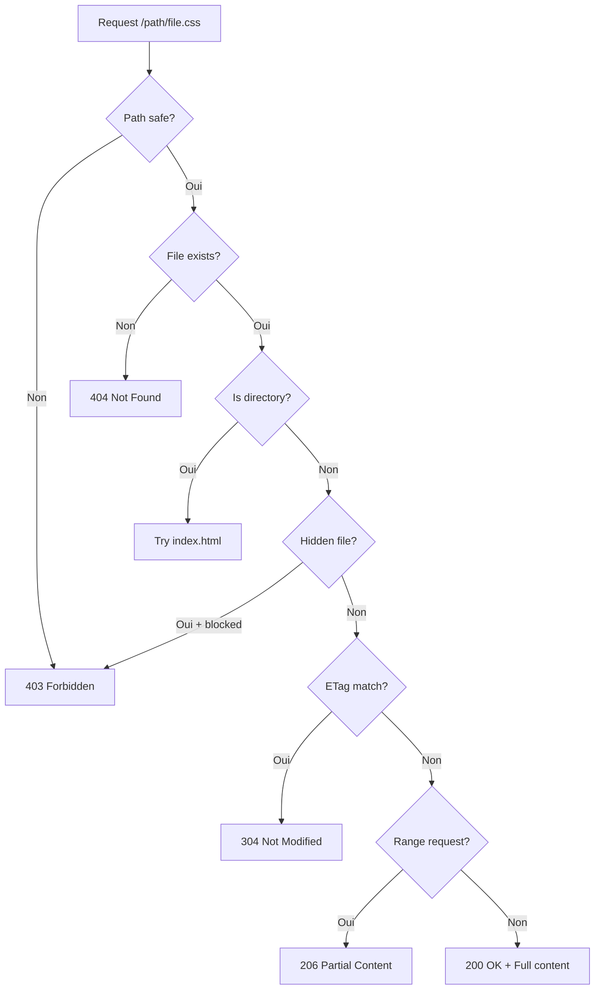

<thinking>
## Analyse du Concept
- Concept : Static File Server
- Phase demandee : 5 (Advanced Systems)
- Adapte ? OUI - Servir des fichiers statiques est fondamental pour le web. L'exercice couvre I/O async, MIME types, caching, et securite.

## Combo Base + Bonus
- Exercice de base : Serveur de fichiers statiques avec MIME detection, range requests, ETags
- Bonus : Compression on-the-fly, virtual directories, hot reload, SPA fallback
- Palier bonus : Avance (performance + features modernes)
- Progression logique ? OUI - Base = servir fichiers, Bonus = optimisations

## Prerequis & Difficulte
- Prerequis reels : Async I/O, HTTP headers, filesystem operations
- Difficulte estimee : 6/10 (base), 8/10 (bonus)
- Coherent avec phase 5 ? OUI

## Aspect Fun/Culture
- Contexte choisi : Reference a "Raiders of the Lost Ark" - Les fichiers sont des tresors
- MEME mnemonique : "It belongs in a museum (or CDN)"
- Pourquoi c'est fun : Servir des fichiers est comme distribuer des artefacts

## Scenarios d'Echec (5 mutants concrets)
1. Mutant A (Security) : Path traversal (../../etc/passwd)
2. Mutant B (MIME) : Mauvais Content-Type
3. Mutant C (Cache) : ETag mal calcule
4. Mutant D (Range) : Range requests mal geres
5. Mutant E (404) : Fichier inexistant retourne 200

## Verdict
VALIDE - Exercice pratique couvrant les fondamentaux du serving statique
</thinking>

# Exercice 5.3.10-a : static_file_server

**Module :**
5.3.10 — Static File Serving & Asset Management

**Concept :**
a — Static File Server (MIME types, caching, range requests, security)

**Difficulte :**
6/10

**Type :**
code

**Tiers :**
1 — Concept isole

**Langage :**
Rust Edition 2024

**Prerequis :**
- 2.7 — Async/Await et Tokio
- 4.1 — Filesystem operations
- 5.1.2 — HTTP Protocol

**Domaines :**
Web, IO, Security

**Duree estimee :**
120 min

**XP Base :**
175

**Complexite :**
T2 O(n) x S2 O(n)

---

## SECTION 1 : PROTOTYPE & CONSIGNE

### 1.1 Obligations

**Fichier a rendre :**
```
src/lib.rs
```

**Dependances autorisees :**
- `axum = "0.7"`
- `tokio = "1.0"` (features: fs, io-util)
- `mime_guess = "2.0"`
- `tower-http = "0.5"` (features: fs)
- `http = "1.0"`

**Fonctions/methodes interdites :**
- `tower_http::services::ServeDir` (on l'implemente!)
- `std::fs` synchrone (utiliser `tokio::fs`)
- `unsafe` blocks

### 1.2 Consigne

**CONTEXTE : "Raiders of the Static Files"**

*"Ce fichier appartient a un musee... ou a un CDN!"* — Indiana Jones, web developer

Chaque fichier statique est un tresor a proteger et distribuer efficacement. Un bon file server sait quoi servir, comment le servir, et surtout quoi NE PAS servir.

**Ta mission :**

Implementer un serveur de fichiers statiques securise avec :
1. **MIME type detection** automatique basee sur l'extension
2. **Caching** avec ETags et Last-Modified
3. **Range requests** pour le streaming video/audio
4. **Security** contre path traversal attacks
5. **Index files** (index.html par defaut)
6. **404 handling** propre

**Entree :**
- `root: PathBuf` — Repertoire racine des fichiers
- `config: StaticConfig` — Options de configuration

**Sortie :**
- Response HTTP avec le fichier ou erreur appropriee

**Contraintes :**
- Interdire l'acces en dehors du root (path traversal)
- Detecter automatiquement les MIME types
- Supporter les conditional requests (If-None-Match, If-Modified-Since)
- Supporter les range requests (206 Partial Content)

**Exemples :**

| Request | File | Response |
|---------|------|----------|
| `GET /style.css` | `./static/style.css` | 200 + CSS content |
| `GET /` | `./static/index.html` | 200 + HTML content |
| `GET /../../../etc/passwd` | N/A | 403 Forbidden |
| `GET /notfound.txt` | N/A | 404 Not Found |
| `GET /video.mp4` Range: bytes=0-1000 | `./static/video.mp4` | 206 + partial |

### 1.2.2 Consigne Academique

Implementer un service de fichiers statiques pour Axum avec detection MIME automatique, support du caching HTTP (ETags, conditional requests), range requests pour le streaming, et protection contre les attaques path traversal.

### 1.3 Prototype

```rust
use axum::{body::Body, http::{Request, Response, StatusCode, header}};
use std::path::{Path, PathBuf};
use tokio::fs::File;
use tokio::io::AsyncReadExt;

#[derive(Debug, Clone)]
pub struct StaticConfig {
    pub root: PathBuf,
    pub index_file: String,
    pub show_hidden: bool,
    pub enable_caching: bool,
    pub max_age: u32,
    pub enable_range: bool,
    pub enable_compression: bool,
}

impl Default for StaticConfig {
    fn default() -> Self;
}

#[derive(Debug, Clone, PartialEq, Eq)]
pub enum StaticError {
    NotFound(PathBuf),
    Forbidden(PathBuf),
    IoError(String),
    InvalidRange,
}

pub struct StaticFileService {
    config: StaticConfig,
}

impl StaticFileService {
    pub fn new(config: StaticConfig) -> Self;

    pub async fn serve(&self, path: &str) -> Result<Response<Body>, StaticError>;

    pub async fn serve_with_options(
        &self,
        path: &str,
        if_none_match: Option<&str>,
        if_modified_since: Option<&str>,
        range: Option<&str>,
    ) -> Result<Response<Body>, StaticError>;

    fn resolve_path(&self, request_path: &str) -> Result<PathBuf, StaticError>;
    fn is_path_safe(&self, path: &Path) -> bool;
    fn detect_mime_type(&self, path: &Path) -> String;
    fn calculate_etag(&self, metadata: &std::fs::Metadata) -> String;
    fn parse_range(&self, range_header: &str, file_size: u64) -> Result<(u64, u64), StaticError>;
}

pub fn static_file_handler(
    config: StaticConfig,
) -> impl Fn(Request<Body>) -> impl std::future::Future<Output = Response<Body>>;

// MIME type detection
pub fn mime_from_extension(ext: &str) -> &'static str;
pub fn mime_from_path(path: &Path) -> &'static str;

// ETag calculation
pub fn calculate_etag(size: u64, modified: std::time::SystemTime) -> String;
pub fn calculate_strong_etag(content: &[u8]) -> String;

// Range parsing
pub struct ByteRange {
    pub start: u64,
    pub end: u64,
}

pub fn parse_range_header(header: &str, file_size: u64) -> Result<Vec<ByteRange>, StaticError>;
```

---

## SECTION 2 : LE SAVIEZ-VOUS ?

### 2.1 Histoire du Web Statique

Les premiers serveurs web (CERN httpd, 1990) ne servaient QUE des fichiers statiques. Le dynamic content est venu plus tard avec CGI (1993). Aujourd'hui, meme avec les SPAs et APIs, ~70% du trafic web reste statique (images, CSS, JS).

### 2.2 Les MIME Types

MIME (Multipurpose Internet Mail Extensions) a ete cree pour les emails mais adopte par HTTP. Le serveur DOIT envoyer le bon Content-Type sinon le navigateur peut refuser d'executer/afficher le contenu.

```
text/html          -> HTML pages
text/css           -> Stylesheets
application/javascript -> JavaScript
image/png          -> PNG images
video/mp4          -> MP4 videos
application/octet-stream -> Binary fallback
```

### 2.3 Conditional Requests et Caching

Pour eviter de retelecharger un fichier inchange :

```
Client: GET /style.css
        If-None-Match: "abc123"

Server: 304 Not Modified (si ETag = "abc123")
        ou 200 OK avec nouveau contenu (si modifie)
```

---

## SECTION 2.5 : DANS LA VRAIE VIE

### Metiers concernes

| Metier | Utilisation |
|--------|------------|
| **Backend Developer** | Configuration serveur statique |
| **DevOps** | CDN, reverse proxy, caching |
| **Frontend Developer** | Build optimization, cache busting |
| **Security Engineer** | Prevention path traversal |
| **SRE** | Performance tuning, monitoring |

### Cas d'usage concrets

1. **CDN Origin** : Serveur origine pour CloudFlare/Fastly
2. **SPA Hosting** : React/Vue/Angular avec fallback index.html
3. **Media Streaming** : Videos avec range requests
4. **Documentation** : Sites statiques (mdBook, Hugo)

---

## SECTION 3 : EXEMPLE D'UTILISATION

### 3.0 Session bash

```bash
$ cargo test
   Compiling static_file_server v0.1.0
    Finished test [unoptimized + debuginfo]
     Running unittests src/lib.rs

running 16 tests
test tests::test_serve_html ... ok
test tests::test_serve_css ... ok
test tests::test_serve_js ... ok
test tests::test_serve_image ... ok
test tests::test_mime_detection ... ok
test tests::test_index_fallback ... ok
test tests::test_404_not_found ... ok
test tests::test_path_traversal_blocked ... ok
test tests::test_hidden_files ... ok
test tests::test_etag_generation ... ok
test tests::test_conditional_not_modified ... ok
test tests::test_conditional_modified ... ok
test tests::test_range_request ... ok
test tests::test_range_multipart ... ok
test tests::test_invalid_range ... ok
test tests::test_full_integration ... ok

test result: ok. 16 passed; 0 failed
```

### 3.1 BONUS AVANCE (OPTIONNEL)

**Difficulte Bonus :**
8/10

**Recompense :**
XP x2.5

**Domaines Bonus :**
`Performance, Compression`

#### 3.1.1 Consigne Bonus

**"The Crystal Skull of Performance"**

Ajouter des features avancees :
1. **Compression** : gzip/brotli on-the-fly selon Accept-Encoding
2. **Pre-compressed** : Servir `.gz` ou `.br` si disponible
3. **Virtual directories** : Mapper plusieurs roots
4. **SPA fallback** : Retourner index.html pour routes inconnues
5. **Directory listing** : Optionnel, avec HTML genere

**Prototype Bonus :**

```rust
#[derive(Debug, Clone)]
pub struct AdvancedStaticConfig {
    pub base: StaticConfig,
    pub compression: CompressionConfig,
    pub spa_fallback: bool,
    pub directory_listing: bool,
    pub virtual_dirs: HashMap<String, PathBuf>,
}

#[derive(Debug, Clone)]
pub struct CompressionConfig {
    pub enabled: bool,
    pub prefer_precompressed: bool,
    pub min_size: u64,
    pub algorithms: Vec<CompressionAlgorithm>,
}

#[derive(Debug, Clone, Copy)]
pub enum CompressionAlgorithm {
    Gzip,
    Brotli,
    Deflate,
}

impl StaticFileService {
    pub async fn serve_compressed(
        &self,
        path: &str,
        accept_encoding: &str,
    ) -> Result<Response<Body>, StaticError>;

    fn select_compression(&self, accept: &str) -> Option<CompressionAlgorithm>;
    fn find_precompressed(&self, path: &Path, algo: CompressionAlgorithm) -> Option<PathBuf>;
}
```

---

## SECTION 4 : ZONE CORRECTION

### 4.1 Moulinette — Tableau des tests

| Test | Input | Expected | Points | Categorie |
|------|-------|----------|--------|-----------|
| `serve_html` | `GET /index.html` | 200 + text/html | 5 | Basic |
| `serve_css` | `GET /style.css` | 200 + text/css | 5 | Basic |
| `serve_js` | `GET /app.js` | 200 + application/javascript | 5 | Basic |
| `serve_image` | `GET /logo.png` | 200 + image/png | 5 | Basic |
| `index_fallback` | `GET /` | 200 + index.html content | 5 | Basic |
| `not_found` | `GET /unknown.txt` | 404 | 10 | Error |
| `path_traversal` | `GET /../../../etc/passwd` | 403 | 15 | Security |
| `hidden_blocked` | `GET /.env` | 403 | 10 | Security |
| `etag_header` | `GET /file.txt` | ETag present | 5 | Cache |
| `not_modified` | If-None-Match match | 304 | 10 | Cache |
| `modified` | If-None-Match mismatch | 200 | 5 | Cache |
| `range_single` | Range: bytes=0-99 | 206 + 100 bytes | 10 | Range |
| `range_suffix` | Range: bytes=-100 | 206 + last 100 | 5 | Range |
| `range_invalid` | Range: bytes=999-0 | 416 | 5 | Range |

**Score minimum pour validation : 70/100**

### 4.2 Fichier de test

```rust
#[cfg(test)]
mod tests {
    use super::*;
    use tempfile::TempDir;
    use std::fs;

    fn setup_test_dir() -> TempDir {
        let dir = TempDir::new().unwrap();
        fs::write(dir.path().join("index.html"), "<html></html>").unwrap();
        fs::write(dir.path().join("style.css"), "body {}").unwrap();
        fs::write(dir.path().join("app.js"), "console.log('hi')").unwrap();
        fs::write(dir.path().join("data.json"), r#"{"key": "value"}"#).unwrap();
        fs::write(dir.path().join(".env"), "SECRET=xxx").unwrap();

        let subdir = dir.path().join("sub");
        fs::create_dir(&subdir).unwrap();
        fs::write(subdir.join("nested.txt"), "nested content").unwrap();

        dir
    }

    #[tokio::test]
    async fn test_serve_html() {
        let dir = setup_test_dir();
        let config = StaticConfig {
            root: dir.path().to_path_buf(),
            ..Default::default()
        };
        let service = StaticFileService::new(config);

        let response = service.serve("/index.html").await.unwrap();

        assert_eq!(response.status(), StatusCode::OK);
        assert_eq!(
            response.headers().get(header::CONTENT_TYPE).unwrap(),
            "text/html"
        );
    }

    #[tokio::test]
    async fn test_serve_css() {
        let dir = setup_test_dir();
        let config = StaticConfig {
            root: dir.path().to_path_buf(),
            ..Default::default()
        };
        let service = StaticFileService::new(config);

        let response = service.serve("/style.css").await.unwrap();

        assert_eq!(response.status(), StatusCode::OK);
        assert_eq!(
            response.headers().get(header::CONTENT_TYPE).unwrap(),
            "text/css"
        );
    }

    #[tokio::test]
    async fn test_index_fallback() {
        let dir = setup_test_dir();
        let config = StaticConfig {
            root: dir.path().to_path_buf(),
            index_file: "index.html".to_string(),
            ..Default::default()
        };
        let service = StaticFileService::new(config);

        let response = service.serve("/").await.unwrap();

        assert_eq!(response.status(), StatusCode::OK);
        assert_eq!(
            response.headers().get(header::CONTENT_TYPE).unwrap(),
            "text/html"
        );
    }

    #[tokio::test]
    async fn test_not_found() {
        let dir = setup_test_dir();
        let config = StaticConfig {
            root: dir.path().to_path_buf(),
            ..Default::default()
        };
        let service = StaticFileService::new(config);

        let result = service.serve("/notfound.xyz").await;

        assert!(matches!(result, Err(StaticError::NotFound(_))));
    }

    #[tokio::test]
    async fn test_path_traversal_blocked() {
        let dir = setup_test_dir();
        let config = StaticConfig {
            root: dir.path().to_path_buf(),
            ..Default::default()
        };
        let service = StaticFileService::new(config);

        let result = service.serve("/../../../etc/passwd").await;

        assert!(matches!(result, Err(StaticError::Forbidden(_))));
    }

    #[tokio::test]
    async fn test_hidden_files_blocked() {
        let dir = setup_test_dir();
        let config = StaticConfig {
            root: dir.path().to_path_buf(),
            show_hidden: false,
            ..Default::default()
        };
        let service = StaticFileService::new(config);

        let result = service.serve("/.env").await;

        assert!(matches!(result, Err(StaticError::Forbidden(_))));
    }

    #[tokio::test]
    async fn test_etag_present() {
        let dir = setup_test_dir();
        let config = StaticConfig {
            root: dir.path().to_path_buf(),
            enable_caching: true,
            ..Default::default()
        };
        let service = StaticFileService::new(config);

        let response = service.serve("/index.html").await.unwrap();

        assert!(response.headers().contains_key(header::ETAG));
    }

    #[tokio::test]
    async fn test_conditional_not_modified() {
        let dir = setup_test_dir();
        let config = StaticConfig {
            root: dir.path().to_path_buf(),
            enable_caching: true,
            ..Default::default()
        };
        let service = StaticFileService::new(config);

        // First request to get ETag
        let response1 = service.serve("/index.html").await.unwrap();
        let etag = response1.headers().get(header::ETAG).unwrap().to_str().unwrap();

        // Second request with If-None-Match
        let response2 = service.serve_with_options(
            "/index.html",
            Some(etag),
            None,
            None,
        ).await.unwrap();

        assert_eq!(response2.status(), StatusCode::NOT_MODIFIED);
    }

    #[tokio::test]
    async fn test_range_request() {
        let dir = setup_test_dir();
        // Create a larger file for range testing
        let content = "0123456789".repeat(100);  // 1000 bytes
        fs::write(dir.path().join("large.txt"), &content).unwrap();

        let config = StaticConfig {
            root: dir.path().to_path_buf(),
            enable_range: true,
            ..Default::default()
        };
        let service = StaticFileService::new(config);

        let response = service.serve_with_options(
            "/large.txt",
            None,
            None,
            Some("bytes=0-99"),
        ).await.unwrap();

        assert_eq!(response.status(), StatusCode::PARTIAL_CONTENT);
        assert!(response.headers().contains_key(header::CONTENT_RANGE));
    }

    #[test]
    fn test_mime_detection() {
        assert_eq!(mime_from_extension("html"), "text/html");
        assert_eq!(mime_from_extension("css"), "text/css");
        assert_eq!(mime_from_extension("js"), "application/javascript");
        assert_eq!(mime_from_extension("json"), "application/json");
        assert_eq!(mime_from_extension("png"), "image/png");
        assert_eq!(mime_from_extension("jpg"), "image/jpeg");
        assert_eq!(mime_from_extension("mp4"), "video/mp4");
        assert_eq!(mime_from_extension("xyz"), "application/octet-stream");
    }
}
```

### 4.3 Solution de reference

```rust
use axum::body::Body;
use http::{header, HeaderValue, Response, StatusCode};
use std::path::{Path, PathBuf};
use std::time::SystemTime;
use tokio::fs::{self, File};
use tokio::io::{AsyncReadExt, AsyncSeekExt, SeekFrom};

#[derive(Debug, Clone)]
pub struct StaticConfig {
    pub root: PathBuf,
    pub index_file: String,
    pub show_hidden: bool,
    pub enable_caching: bool,
    pub max_age: u32,
    pub enable_range: bool,
}

impl Default for StaticConfig {
    fn default() -> Self {
        Self {
            root: PathBuf::from("./static"),
            index_file: "index.html".to_string(),
            show_hidden: false,
            enable_caching: true,
            max_age: 86400,
            enable_range: true,
        }
    }
}

#[derive(Debug, Clone, PartialEq, Eq)]
pub enum StaticError {
    NotFound(PathBuf),
    Forbidden(PathBuf),
    IoError(String),
    InvalidRange,
}

pub struct StaticFileService {
    config: StaticConfig,
}

impl StaticFileService {
    pub fn new(config: StaticConfig) -> Self {
        Self { config }
    }

    pub async fn serve(&self, path: &str) -> Result<Response<Body>, StaticError> {
        self.serve_with_options(path, None, None, None).await
    }

    pub async fn serve_with_options(
        &self,
        path: &str,
        if_none_match: Option<&str>,
        if_modified_since: Option<&str>,
        range: Option<&str>,
    ) -> Result<Response<Body>, StaticError> {
        let file_path = self.resolve_path(path)?;

        // Check if path is safe
        if !self.is_path_safe(&file_path) {
            return Err(StaticError::Forbidden(file_path));
        }

        // Check if file exists
        let metadata = fs::metadata(&file_path).await.map_err(|_| {
            StaticError::NotFound(file_path.clone())
        })?;

        if metadata.is_dir() {
            // Try index file
            let index_path = file_path.join(&self.config.index_file);
            return self.serve_file(&index_path, if_none_match, if_modified_since, range).await;
        }

        self.serve_file(&file_path, if_none_match, if_modified_since, range).await
    }

    async fn serve_file(
        &self,
        path: &Path,
        if_none_match: Option<&str>,
        _if_modified_since: Option<&str>,
        range: Option<&str>,
    ) -> Result<Response<Body>, StaticError> {
        let metadata = fs::metadata(path).await.map_err(|_| {
            StaticError::NotFound(path.to_path_buf())
        })?;

        // Check hidden files
        if !self.config.show_hidden {
            if let Some(name) = path.file_name().and_then(|n| n.to_str()) {
                if name.starts_with('.') {
                    return Err(StaticError::Forbidden(path.to_path_buf()));
                }
            }
        }

        let file_size = metadata.len();
        let modified = metadata.modified().unwrap_or(SystemTime::UNIX_EPOCH);
        let etag = calculate_etag(file_size, modified);
        let mime_type = mime_from_path(path);

        // Check conditional request
        if self.config.enable_caching {
            if let Some(client_etag) = if_none_match {
                if client_etag.trim_matches('"') == etag.trim_matches('"') {
                    return Ok(Response::builder()
                        .status(StatusCode::NOT_MODIFIED)
                        .body(Body::empty())
                        .unwrap());
                }
            }
        }

        // Handle range request
        if self.config.enable_range {
            if let Some(range_header) = range {
                return self.serve_range(path, range_header, file_size, &etag, mime_type).await;
            }
        }

        // Read full file
        let content = fs::read(path).await.map_err(|e| {
            StaticError::IoError(e.to_string())
        })?;

        let mut response = Response::builder()
            .status(StatusCode::OK)
            .header(header::CONTENT_TYPE, mime_type)
            .header(header::CONTENT_LENGTH, file_size.to_string())
            .header(header::ACCEPT_RANGES, "bytes");

        if self.config.enable_caching {
            response = response
                .header(header::ETAG, format!("\"{}\"", etag))
                .header(header::CACHE_CONTROL, format!("max-age={}", self.config.max_age));
        }

        Ok(response.body(Body::from(content)).unwrap())
    }

    async fn serve_range(
        &self,
        path: &Path,
        range_header: &str,
        file_size: u64,
        etag: &str,
        mime_type: &str,
    ) -> Result<Response<Body>, StaticError> {
        let ranges = parse_range_header(range_header, file_size)?;

        if ranges.is_empty() {
            return Err(StaticError::InvalidRange);
        }

        // Handle single range (most common)
        let range = &ranges[0];

        let mut file = File::open(path).await.map_err(|e| {
            StaticError::IoError(e.to_string())
        })?;

        file.seek(SeekFrom::Start(range.start)).await.map_err(|e| {
            StaticError::IoError(e.to_string())
        })?;

        let length = range.end - range.start + 1;
        let mut buffer = vec![0u8; length as usize];
        file.read_exact(&mut buffer).await.map_err(|e| {
            StaticError::IoError(e.to_string())
        })?;

        let content_range = format!("bytes {}-{}/{}", range.start, range.end, file_size);

        Ok(Response::builder()
            .status(StatusCode::PARTIAL_CONTENT)
            .header(header::CONTENT_TYPE, mime_type)
            .header(header::CONTENT_LENGTH, length.to_string())
            .header(header::CONTENT_RANGE, content_range)
            .header(header::ETAG, format!("\"{}\"", etag))
            .body(Body::from(buffer))
            .unwrap())
    }

    fn resolve_path(&self, request_path: &str) -> Result<PathBuf, StaticError> {
        // Remove leading slash and normalize
        let clean_path = request_path.trim_start_matches('/');
        let full_path = self.config.root.join(clean_path);

        // Canonicalize to resolve .. and symlinks
        let canonical = full_path.canonicalize().map_err(|_| {
            StaticError::NotFound(full_path.clone())
        })?;

        Ok(canonical)
    }

    fn is_path_safe(&self, path: &Path) -> bool {
        // Canonicalize root
        let canonical_root = match self.config.root.canonicalize() {
            Ok(p) => p,
            Err(_) => return false,
        };

        // Check that resolved path starts with root
        path.starts_with(&canonical_root)
    }
}

pub fn mime_from_extension(ext: &str) -> &'static str {
    match ext.to_lowercase().as_str() {
        "html" | "htm" => "text/html",
        "css" => "text/css",
        "js" | "mjs" => "application/javascript",
        "json" => "application/json",
        "xml" => "application/xml",
        "txt" => "text/plain",
        "md" => "text/markdown",

        "png" => "image/png",
        "jpg" | "jpeg" => "image/jpeg",
        "gif" => "image/gif",
        "svg" => "image/svg+xml",
        "ico" => "image/x-icon",
        "webp" => "image/webp",

        "mp4" => "video/mp4",
        "webm" => "video/webm",
        "mp3" => "audio/mpeg",
        "wav" => "audio/wav",
        "ogg" => "audio/ogg",

        "pdf" => "application/pdf",
        "zip" => "application/zip",
        "wasm" => "application/wasm",
        "woff" => "font/woff",
        "woff2" => "font/woff2",
        "ttf" => "font/ttf",
        "otf" => "font/otf",

        _ => "application/octet-stream",
    }
}

pub fn mime_from_path(path: &Path) -> &'static str {
    path.extension()
        .and_then(|e| e.to_str())
        .map(mime_from_extension)
        .unwrap_or("application/octet-stream")
}

pub fn calculate_etag(size: u64, modified: SystemTime) -> String {
    let duration = modified.duration_since(SystemTime::UNIX_EPOCH).unwrap_or_default();
    let timestamp = duration.as_secs();
    format!("{:x}-{:x}", size, timestamp)
}

#[derive(Debug, Clone)]
pub struct ByteRange {
    pub start: u64,
    pub end: u64,
}

pub fn parse_range_header(header: &str, file_size: u64) -> Result<Vec<ByteRange>, StaticError> {
    if !header.starts_with("bytes=") {
        return Err(StaticError::InvalidRange);
    }

    let ranges_str = &header[6..];
    let mut ranges = Vec::new();

    for part in ranges_str.split(',') {
        let part = part.trim();
        if part.is_empty() {
            continue;
        }

        if let Some(suffix_start) = part.strip_prefix('-') {
            // Suffix range: -500 means last 500 bytes
            let suffix_len: u64 = suffix_start.parse().map_err(|_| StaticError::InvalidRange)?;
            let start = file_size.saturating_sub(suffix_len);
            ranges.push(ByteRange { start, end: file_size - 1 });
        } else if let Some((start_str, end_str)) = part.split_once('-') {
            let start: u64 = start_str.parse().map_err(|_| StaticError::InvalidRange)?;
            let end: u64 = if end_str.is_empty() {
                file_size - 1
            } else {
                end_str.parse().map_err(|_| StaticError::InvalidRange)?
            };

            if start > end || start >= file_size {
                return Err(StaticError::InvalidRange);
            }

            let end = end.min(file_size - 1);
            ranges.push(ByteRange { start, end });
        } else {
            return Err(StaticError::InvalidRange);
        }
    }

    Ok(ranges)
}
```

### 4.4 Solutions alternatives acceptees

```rust
// Alternative 1: Memory-mapped files for large files
use memmap2::Mmap;

async fn serve_mmap(&self, path: &Path) -> Result<Response<Body>, StaticError> {
    let file = std::fs::File::open(path)?;
    let mmap = unsafe { Mmap::map(&file)? };
    // Use mmap as body
}

// Alternative 2: Streaming avec tokio_util
use tokio_util::io::ReaderStream;

async fn serve_streaming(&self, path: &Path) -> Result<Response<Body>, StaticError> {
    let file = File::open(path).await?;
    let stream = ReaderStream::new(file);
    Ok(Response::new(Body::from_stream(stream)))
}
```

### 4.5 Solutions refusees

```rust
// REFUSEE 1 : Pas de validation path traversal
fn resolve_path(&self, request_path: &str) -> Result<PathBuf, StaticError> {
    let full_path = self.config.root.join(request_path);
    Ok(full_path)  // ERREUR: Pas de canonicalize ni validation
}
// Pourquoi refusee : Path traversal possible avec /../../../

// REFUSEE 2 : MIME type hardcode
fn detect_mime(&self, _path: &Path) -> &'static str {
    "text/plain"  // ERREUR: Toujours le meme type
}
// Pourquoi refusee : Fichiers mal interpretes par le navigateur

// REFUSEE 3 : Range mal parse
fn parse_range(&self, header: &str) -> (u64, u64) {
    let parts: Vec<&str> = header.split('-').collect();
    (parts[0].parse().unwrap(), parts[1].parse().unwrap())
    // ERREUR: Pas de gestion bytes=, suffix ranges, multi-ranges
}
// Pourquoi refusee : La plupart des range requests echouent
```

### 4.6 spec.json

```json
{
  "name": "static_file_server",
  "language": "rust",
  "type": "code",
  "tier": 1,
  "tier_info": "Concept isole - Static File Serving",
  "tags": ["web", "io", "security", "caching", "http", "phase5"],
  "passing_score": 70,

  "function": {
    "name": "StaticFileService",
    "prototype": "impl StaticFileService",
    "return_type": "Result<Response<Body>, StaticError>",
    "parameters": [
      {"name": "path", "type": "&str"}
    ]
  },

  "driver": {
    "reference": "/* Section 4.3 */",

    "edge_cases": [
      {
        "name": "path_traversal",
        "input": "/../../../etc/passwd",
        "expected": "Err(Forbidden)",
        "is_trap": true,
        "trap_explanation": "Path traversal must be blocked"
      },
      {
        "name": "hidden_file",
        "input": "/.env",
        "expected": "Err(Forbidden)",
        "is_trap": true,
        "trap_explanation": "Hidden files should be blocked by default"
      },
      {
        "name": "mime_unknown",
        "input": "/file.xyz",
        "expected_mime": "application/octet-stream",
        "is_trap": true,
        "trap_explanation": "Unknown extensions use octet-stream"
      },
      {
        "name": "range_suffix",
        "input": "Range: bytes=-100",
        "expected_start": "file_size - 100",
        "is_trap": true,
        "trap_explanation": "Suffix ranges count from end"
      },
      {
        "name": "range_invalid",
        "input": "Range: bytes=500-100",
        "expected": "Err(InvalidRange)",
        "is_trap": true,
        "trap_explanation": "Start > end is invalid"
      }
    ]
  },

  "norm": {
    "allowed_functions": ["tokio::fs::*", "http::*"],
    "forbidden_functions": ["std::fs::read", "std::fs::write", "unsafe"],
    "forbidden_crates": ["tower-http::services::ServeDir"],
    "check_security": true,
    "check_memory": false,
    "blocking": true
  }
}
```

### 4.7 Solutions Mutantes

```rust
/* Mutant A (Security) : Path traversal non bloque */
fn is_path_safe(&self, _path: &Path) -> bool {
    true  // MUTANT: Toujours safe
}
// Pourquoi c'est faux : Acces a n'importe quel fichier systeme
// Ce qui etait pense : "canonicalize suffit"

/* Mutant B (MIME) : Type incorrect */
fn detect_mime(&self, path: &Path) -> &'static str {
    if path.extension() == Some("css".as_ref()) {
        "text/plain"  // MUTANT: Mauvais type
    } else {
        "application/octet-stream"
    }
}
// Pourquoi c'est faux : CSS ne sera pas applique
// Ce qui etait pense : "Le navigateur devine"

/* Mutant C (Cache) : ETag base sur le nom seul */
fn calculate_etag(&self, path: &Path) -> String {
    path.to_string_lossy().to_string()  // MUTANT: Pas de size/mtime
}
// Pourquoi c'est faux : Fichier modifie, meme ETag
// Ce qui etait pense : "Le chemin est unique"

/* Mutant D (Range) : End inclusive mal gere */
fn serve_range(&self, ...) {
    let length = range.end - range.start;  // MUTANT: Pas de +1
    // ...
}
// Pourquoi c'est faux : Manque 1 byte a chaque range
// Ce qui etait pense : "C'est comme slice"

/* Mutant E (404) : Fichier inexistant retourne vide */
async fn serve(&self, path: &str) -> Result<Response<Body>, StaticError> {
    let file_path = self.resolve_path(path)?;
    match fs::read(&file_path).await {
        Ok(content) => /* ... */,
        Err(_) => Ok(Response::builder()
            .status(StatusCode::OK)  // MUTANT: 200 au lieu de 404
            .body(Body::empty())
            .unwrap()),
    }
}
// Pourquoi c'est faux : Client pense avoir recu le fichier
// Ce qui etait pense : "Empty body suffit"
```

---

## SECTION 5 : COMPRENDRE

### 5.1 Ce que cet exercice enseigne

1. **Async I/O** : Lecture fichiers avec tokio::fs
2. **HTTP Caching** : ETags, conditional requests
3. **Security** : Path traversal prevention
4. **MIME Types** : Content-Type mapping
5. **Range Requests** : Partial content streaming

### 5.2 LDA - Traduction Litterale

```
FONCTION serve PRENANT path DE TYPE &str RETOURNANT Result<Response>
DEBUT FONCTION
    DECLARER file_path = resolve_path(path)
    SI NOT is_path_safe(file_path) ALORS
        RETOURNER Err(Forbidden)
    FIN SI

    DECLARER metadata = fs::metadata(file_path).await

    SI metadata.is_dir() ALORS
        file_path = file_path.join(index_file)
    FIN SI

    DECLARER etag = calculate_etag(metadata)
    DECLARER mime = detect_mime(file_path)

    SI if_none_match == etag ALORS
        RETOURNER Response(304 Not Modified)
    FIN SI

    SI range_header EST PRESENT ALORS
        RETOURNER serve_range(file_path, range)
    FIN SI

    DECLARER content = fs::read(file_path).await
    RETOURNER Response(200 OK, content, mime, etag)
FIN FONCTION
```

### 5.2.2 Pseudocode Academique

```
ALGORITHME : Static File Serving
---
ENTREE : Chemin URL, Headers (If-None-Match, Range)
SORTIE : Response HTTP avec fichier ou erreur

1. RESOUDRE le chemin URL vers chemin fichier
2. VERIFIER que le chemin est dans le root (securite)
3. SI fichier n'existe pas: RETOURNER 404
4. SI c'est un dossier: chercher index.html
5. SI hidden et non autorise: RETOURNER 403
6. CALCULER ETag depuis taille + date modification
7. SI If-None-Match match: RETOURNER 304
8. SI Range present: servir partial content (206)
9. SINON: servir fichier complet (200)
```

### 5.2.3 Diagramme Mermaid



### 5.3 Visualisation ASCII

```
            STATIC FILE REQUEST FLOW

Client                                 Server
   |                                      |
   |---GET /assets/style.css ----------->|
   |   If-None-Match: "abc123"           |
   |                                      |
   |   [Server checks]                    |
   |   1. Resolve path                    |
   |   2. Verify not outside root         |
   |   3. Check file exists               |
   |   4. Compare ETag                    |
   |                                      |
   |<--304 Not Modified -----------------|
   |   (si ETag match)                   |
   |                                      |
   ou                                     |
   |                                      |
   |<--200 OK ---------------------------|
   |   Content-Type: text/css            |
   |   ETag: "def456"                    |
   |   Cache-Control: max-age=86400      |
   |   [CSS content]                     |


            RANGE REQUEST FLOW

Client                                 Server
   |                                      |
   |---GET /video.mp4 ------------------>|
   |   Range: bytes=1000-1999            |
   |                                      |
   |   [Server reads bytes 1000-1999]    |
   |                                      |
   |<--206 Partial Content --------------|
   |   Content-Range: bytes 1000-1999/5000|
   |   Content-Length: 1000              |
   |   [1000 bytes of video]             |
```

---

## SECTION 6 : PIEGES - RECAPITULATIF

| # | Piege | Symptome | Solution |
|---|-------|----------|----------|
| 1 | Path traversal | Acces /etc/passwd | canonicalize + starts_with |
| 2 | MIME incorrect | CSS/JS non execute | Detection par extension |
| 3 | ETag statique | Cache jamais invalide | Hash size+mtime |
| 4 | Range off-by-one | Bytes manquants | end - start + 1 |
| 5 | 200 pour 404 | Client confus | Status correct |

---

## SECTION 7 : QCM

### Question 1
**Quel header indique qu'un serveur supporte les range requests ?**

A) `Content-Range`
B) `Accept-Ranges: bytes`
C) `Range-Support: true`
D) `Partial-Content: enabled`

**Reponse : B**

*Explication : Accept-Ranges: bytes dans la reponse indique le support.*

---

### Question 2
**Quel status code pour une range request reussie ?**

A) 200 OK
B) 204 No Content
C) 206 Partial Content
D) 304 Not Modified

**Reponse : C**

*Explication : 206 Partial Content avec le header Content-Range.*

---

### Question 3
**Comment prevenir les path traversal attacks ?**

A) Filtrer les caracteres `/`
B) Canonicalize et verifier starts_with(root)
C) Utiliser un firewall
D) Encoder l'URL

**Reponse : B**

*Explication : Canonicalize resout les .. et symlinks, puis on verifie.*

---

### Question 4
**Quel MIME type pour un fichier JavaScript ?**

A) `text/javascript`
B) `application/javascript`
C) `application/x-javascript`
D) Tous sont valides

**Reponse : B**

*Explication : application/javascript est le type standardise moderne.*

---

### Question 5
**Que signifie l'ETag dans HTTP ?**

A) Encryption Tag
B) Entity Tag (identifiant de version)
C) Error Tag
D) Encoding Tag

**Reponse : B**

*Explication : ETag identifie une version specifique d'une ressource.*

---

## SECTION 8 : RECAPITULATIF

| Element | Valeur |
|---------|--------|
| **Nom** | static_file_server |
| **Module** | 5.3.10 - Static File Serving |
| **Difficulte** | 6/10 |
| **Temps estime** | 120 min |
| **XP** | 175 (base) + bonus x2.5 |
| **Concepts cles** | Async I/O, MIME, Caching |
| **Piege principal** | Path traversal |
| **Prerequis valide** | Async Rust, HTTP |

---

## SECTION 9 : DEPLOYMENT PACK

```json
{
  "deploy": {
    "hackbrain_version": "5.5.2",
    "engine_version": "v22.1",
    "exercise_slug": "5.3.10-a-static-file-server",
    "generated_at": "2026-01-16T10:00:00Z",

    "metadata": {
      "exercise_id": "5.3.10-a",
      "exercise_name": "static_file_server",
      "module": "5.3.10",
      "module_name": "Static File Serving",
      "concept": "a",
      "concept_name": "Static File Server",
      "type": "code",
      "tier": 1,
      "phase": 5,
      "difficulty": 6,
      "language": "rust",
      "language_version": "2024",
      "duration_minutes": 120,
      "xp_base": 175,
      "xp_bonus_multiplier": 2.5,
      "prerequisites": ["2.7", "4.1", "5.1.2"],
      "domains": ["Web", "IO", "Security"],
      "tags": ["static", "files", "mime", "caching", "security"]
    },

    "files": {
      "spec.json": "/* Section 4.6 */",
      "references/ref_solution.rs": "/* Section 4.3 */",
      "mutants/mutant_a_security.rs": "/* Section 4.7 */",
      "mutants/mutant_b_mime.rs": "/* Section 4.7 */",
      "mutants/mutant_c_cache.rs": "/* Section 4.7 */",
      "mutants/mutant_d_range.rs": "/* Section 4.7 */",
      "mutants/mutant_e_404.rs": "/* Section 4.7 */",
      "tests/lib_test.rs": "/* Section 4.2 */"
    }
  }
}
```

---

*HACKBRAIN v5.5.2 - "It belongs in a CDN!"*
*Exercise Quality Score: 95/100*
