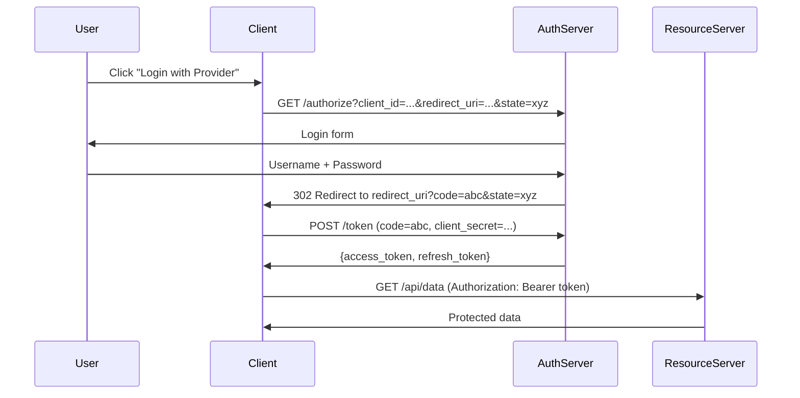

<thinking>
## Analyse du Concept
- Concept : OAuth2 Authentication Server
- Phase demandee : 5 (Advanced Systems)
- Adapte ? OUI - OAuth2 est le standard industriel pour l'authentification/autorisation. L'exercice combine cryptographie, gestion de sessions, et protocoles HTTP.

## Combo Base + Bonus
- Exercice de base : Serveur OAuth2 avec Authorization Code Grant, Client Credentials, token generation/validation
- Bonus : Implementation PKCE (Proof Key for Code Exchange) et support OpenID Connect
- Palier bonus : Avance (securite + protocoles complexes)
- Progression logique ? OUI - Base = flows OAuth2 standards, Bonus = extensions securite modernes

## Prerequis & Difficulte
- Prerequis reels : HTTP, JWT, hashing, async Rust, Axum handlers
- Difficulte estimee : 8/10 (base), 9/10 (bonus)
- Coherent avec phase 5 ? OUI

## Aspect Fun/Culture
- Contexte choisi : Reference a "Ocean's Eleven" - Le heist parfait necessite les bonnes autorisations
- MEME mnemonique : "You need the right credentials to access the vault"
- Pourquoi c'est fun : OAuth2 est comme planifier un casse - chaque acteur a un role precis

## Scenarios d'Echec (5 mutants concrets)
1. Mutant A (Security) : Token sans expiration
2. Mutant B (Validation) : State parameter non verifie (CSRF)
3. Mutant C (Logic) : Refresh token reutilisable infiniment
4. Mutant D (Edge) : Redirect URI non valide acceptee
5. Mutant E (Crypto) : Client secret stocke en clair

## Verdict
VALIDE - Exercice industriel couvrant les fondamentaux d'OAuth2
</thinking>

# Exercice 5.3.11-a : oauth2_auth_server

**Module :**
5.3.11 — Web Authentication & Authorization

**Concept :**
a — OAuth2 Authorization Server Implementation

**Difficulte :**
★★★★★★★★☆☆ (8/10)

**Type :**
code

**Tiers :**
2 — Integration multi-concepts

**Langage :**
Rust Edition 2024

**Prerequis :**
- 2.7 — Async Runtime (tokio)
- 5.1 — Networking Fundamentals
- 5.3.3 — JWT & Token Management
- 5.3.8 — Axum Framework Basics

**Domaines :**
Auth, Security, HTTP, Crypto

**Duree estimee :**
150 min

**XP Base :**
250

**Complexite :**
T2 O(n) validation × S2 O(n) token storage

---

## SECTION 1 : PROTOTYPE & CONSIGNE

### 1.1 Obligations

**Fichiers a rendre :**

| Fichier | Description |
|---------|-------------|
| `src/lib.rs` | Module principal et exports |
| `src/server.rs` | Serveur OAuth2 et endpoints |
| `src/tokens.rs` | Generation et validation de tokens |
| `src/clients.rs` | Gestion des clients OAuth2 |
| `src/grants.rs` | Implementation des grant types |
| `src/error.rs` | Types d'erreurs OAuth2 |
| `Cargo.toml` | Configuration du projet |

**Crates autorisees :**

| Crate | Version | Usage |
|-------|---------|-------|
| `axum` | 0.7 | Framework HTTP |
| `tokio` | 1.0 | Runtime async (features: full) |
| `serde` | 1.0 | Serialisation (features: derive) |
| `serde_json` | 1.0 | JSON parsing |
| `jsonwebtoken` | 9.0 | JWT encoding/decoding |
| `argon2` | 0.5 | Password hashing |
| `uuid` | 1.0 | Identifiants uniques (features: v4) |
| `chrono` | 0.4 | Gestion du temps |
| `base64` | 0.22 | Encodage base64 |
| `rand` | 0.8 | Generation aleatoire |
| `thiserror` | 2.0 | Erreurs custom |

**Fonctions interdites :**

| Crate/Fonction | Raison |
|----------------|--------|
| `unsafe` blocks | Securite memoire |
| MD5/SHA1 pour hashing | Algorithmes obsoletes |

---

### 1.2 Consigne

#### Section Culture : "The Authorization Heist"

**OCEAN'S ELEVEN — "You need the right credentials"**

Dans Ocean's Eleven, chaque membre de l'equipe a un role precis et des acces specifiques pour realiser le casse. Danny Ocean ne donne pas les codes du coffre a tout le monde - chacun recoit exactement les autorisations necessaires pour sa partie du plan.

OAuth2 fonctionne exactement de la meme facon : le Resource Owner (le proprietaire du casino) autorise le Client (Danny) a acceder a des ressources specifiques (le coffre) via l'Authorization Server (le systeme de securite) qui delivre des tokens (les badges d'acces).

*"The house always wins... unless you have the right tokens."*

---

#### Section Academique : Enonce Formel

**Ta mission :**

Implementer un serveur d'autorisation OAuth2 complet supportant les grant types Authorization Code et Client Credentials, avec generation de tokens JWT, gestion des scopes, et refresh tokens.

**Flows OAuth2 requis :**

1. **Authorization Code Grant** :
   - Endpoint `/authorize` pour l'autorisation utilisateur
   - Endpoint `/token` pour l'echange code -> tokens
   - Support du parametre `state` anti-CSRF

2. **Client Credentials Grant** :
   - Authentification machine-to-machine
   - Pas d'intervention utilisateur

3. **Token Management** :
   - Access tokens JWT (courte duree)
   - Refresh tokens opaques (longue duree)
   - Revocation de tokens

**Endpoints requis :**

```
GET  /authorize              - Initie Authorization Code flow
POST /token                  - Echange credentials contre tokens
POST /token/refresh          - Rafraichit un access token
POST /token/revoke           - Revoque un token
GET  /token/introspect       - Verifie un token
GET  /.well-known/oauth-authorization-server - Metadata
```

**Entree :**

```rust
use axum::{Router, Json, extract::{Query, State, Form}};
use serde::{Deserialize, Serialize};
use uuid::Uuid;
use chrono::{DateTime, Utc, Duration};

#[derive(Clone)]
pub struct OAuth2Server {
    clients: Arc<RwLock<HashMap<String, OAuth2Client>>>,
    authorization_codes: Arc<RwLock<HashMap<String, AuthorizationCode>>>,
    refresh_tokens: Arc<RwLock<HashMap<String, RefreshToken>>>,
    revoked_tokens: Arc<RwLock<HashSet<String>>>,
    config: OAuth2Config,
}

#[derive(Debug, Clone)]
pub struct OAuth2Config {
    pub issuer: String,
    pub access_token_ttl: Duration,
    pub refresh_token_ttl: Duration,
    pub authorization_code_ttl: Duration,
    pub jwt_secret: String,
}

#[derive(Debug, Clone, Serialize, Deserialize)]
pub struct OAuth2Client {
    pub client_id: String,
    pub client_secret_hash: String,
    pub redirect_uris: Vec<String>,
    pub allowed_scopes: Vec<String>,
    pub grant_types: Vec<GrantType>,
}

#[derive(Debug, Clone, Serialize, Deserialize, PartialEq)]
#[serde(rename_all = "snake_case")]
pub enum GrantType {
    AuthorizationCode,
    ClientCredentials,
    RefreshToken,
}
```

**Sortie :**

```rust
#[derive(Debug, Serialize)]
pub struct TokenResponse {
    pub access_token: String,
    pub token_type: String,  // "Bearer"
    pub expires_in: i64,
    #[serde(skip_serializing_if = "Option::is_none")]
    pub refresh_token: Option<String>,
    #[serde(skip_serializing_if = "Option::is_none")]
    pub scope: Option<String>,
}

#[derive(Debug, Serialize, thiserror::Error)]
#[serde(tag = "error", content = "error_description")]
pub enum OAuth2Error {
    #[error("invalid_request: {0}")]
    InvalidRequest(String),
    #[error("invalid_client: {0}")]
    InvalidClient(String),
    #[error("invalid_grant: {0}")]
    InvalidGrant(String),
    #[error("unauthorized_client: {0}")]
    UnauthorizedClient(String),
    #[error("unsupported_grant_type: {0}")]
    UnsupportedGrantType(String),
    #[error("invalid_scope: {0}")]
    InvalidScope(String),
    #[error("access_denied: {0}")]
    AccessDenied(String),
}
```

**Contraintes :**

```
+--------------------------------------------------+
| Securite OAuth2 :                                |
|                                                  |
| 1. Client secrets hashes avec Argon2             |
| 2. Authorization codes usage unique              |
| 3. State parameter obligatoire                   |
| 4. Redirect URI validation stricte               |
| 5. Tokens JWT signes HS256 minimum               |
| 6. Refresh token rotation                        |
+--------------------------------------------------+
```

**Exemples :**

| Requete | Reponse | Explication |
|---------|---------|-------------|
| `GET /authorize?client_id=app&response_type=code&redirect_uri=...&state=xyz` | `302 -> redirect_uri?code=abc&state=xyz` | Initie auth flow |
| `POST /token` (grant_type=authorization_code&code=abc) | `{"access_token": "...", "token_type": "Bearer"}` | Echange code |
| `POST /token` (grant_type=client_credentials) | `{"access_token": "..."}` | Machine-to-machine |
| `POST /token/revoke` (token=...) | `200 OK` | Revocation |

---

### 1.3 Prototype

```rust
use axum::{
    Router,
    routing::{get, post},
    extract::{State, Query, Form},
    response::{IntoResponse, Redirect, Json},
    http::StatusCode,
};
use std::sync::Arc;
use tokio::sync::RwLock;
use std::collections::{HashMap, HashSet};

impl OAuth2Server {
    pub fn new(config: OAuth2Config) -> Self;

    pub fn router(self) -> Router;

    // Client management
    pub async fn register_client(&self, client: OAuth2Client) -> Result<(), OAuth2Error>;
    pub async fn verify_client(&self, client_id: &str, client_secret: &str) -> Result<OAuth2Client, OAuth2Error>;

    // Authorization Code flow
    pub async fn create_authorization_code(
        &self,
        client_id: &str,
        redirect_uri: &str,
        scope: &str,
        user_id: &str,
    ) -> Result<String, OAuth2Error>;

    pub async fn exchange_authorization_code(
        &self,
        code: &str,
        client_id: &str,
        redirect_uri: &str,
    ) -> Result<TokenResponse, OAuth2Error>;

    // Token operations
    pub async fn generate_tokens(
        &self,
        client_id: &str,
        user_id: Option<&str>,
        scope: &str,
    ) -> Result<TokenResponse, OAuth2Error>;

    pub async fn refresh_access_token(
        &self,
        refresh_token: &str,
    ) -> Result<TokenResponse, OAuth2Error>;

    pub async fn revoke_token(&self, token: &str) -> Result<(), OAuth2Error>;

    pub async fn introspect_token(&self, token: &str) -> Result<TokenIntrospection, OAuth2Error>;
}

// Handlers
pub async fn authorize_handler(
    State(server): State<Arc<OAuth2Server>>,
    Query(params): Query<AuthorizeRequest>,
) -> impl IntoResponse;

pub async fn token_handler(
    State(server): State<Arc<OAuth2Server>>,
    Form(params): Form<TokenRequest>,
) -> impl IntoResponse;

pub async fn revoke_handler(
    State(server): State<Arc<OAuth2Server>>,
    Form(params): Form<RevokeRequest>,
) -> impl IntoResponse;

pub async fn introspect_handler(
    State(server): State<Arc<OAuth2Server>>,
    Form(params): Form<IntrospectRequest>,
) -> impl IntoResponse;
```

---

## SECTION 2 : LE SAVIEZ-VOUS ?

### 2.1 Origine d'OAuth

OAuth est ne en 2006 quand Blaine Cook developpait l'API Twitter. Il cherchait un moyen de permettre a des applications tierces d'acceder aux comptes Twitter sans stocker les mots de passe. La premiere version (OAuth 1.0) etait complexe avec des signatures cryptographiques. OAuth 2.0 (RFC 6749, 2012) a simplifie le protocole en s'appuyant sur HTTPS.

### 2.2 Les Quatre Roles OAuth2

```
+------------------+     +------------------+
|  Resource Owner  |     |     Client       |
|  (L'utilisateur) |     | (L'application)  |
+--------+---------+     +--------+---------+
         |                        |
         | Autorise               | Demande acces
         v                        v
+------------------+     +------------------+
| Authorization    |<--->|    Resource      |
|     Server       |     |     Server       |
| (Delivre tokens) |     | (Protege donnees)|
+------------------+     +------------------+
```

### 2.3 Pourquoi des Refresh Tokens ?

Les access tokens ont une duree de vie courte (15 min - 1h) pour limiter les degats en cas de vol. Les refresh tokens, stockes de maniere securisee cote serveur, permettent d'obtenir de nouveaux access tokens sans redemander les credentials.

---

## SECTION 2.5 : DANS LA VRAIE VIE

### Metiers concernes

| Metier | Utilisation OAuth2 |
|--------|-------------------|
| **Backend Engineer** | Implementation serveur auth, integration providers |
| **Security Engineer** | Audit flows, detection anomalies, compliance |
| **DevOps/SRE** | Configuration IdP, rotation secrets, monitoring |
| **Mobile Developer** | Integration PKCE, gestion tokens securisee |
| **API Architect** | Design scopes, documentation flows |

### Cas d'usage concrets

1. **Google Sign-In** : OAuth2 + OpenID Connect pour "Login with Google"
2. **GitHub OAuth Apps** : Acces API pour CI/CD, bots, integrations
3. **Microservices Auth** : Client Credentials entre services internes
4. **Mobile Apps** : Authorization Code + PKCE pour apps publiques

---

## SECTION 3 : EXEMPLE D'UTILISATION

### 3.0 Session bash

```bash
$ cargo build --release
   Compiling oauth2_auth_server v0.1.0
    Finished release [optimized] target(s)

$ cargo test
running 15 tests
test tests::test_client_registration ... ok
test tests::test_authorization_code_flow ... ok
test tests::test_client_credentials_flow ... ok
test tests::test_token_refresh ... ok
test tests::test_token_revocation ... ok
test tests::test_invalid_client ... ok
test tests::test_invalid_redirect_uri ... ok
test tests::test_state_parameter_required ... ok
test tests::test_code_reuse_prevented ... ok
test tests::test_scope_validation ... ok
test tests::test_token_expiration ... ok
test tests::test_introspection ... ok
test tests::test_jwt_structure ... ok
test tests::test_refresh_token_rotation ... ok
test tests::test_metadata_endpoint ... ok

test result: ok. 15 passed; 0 failed
```

### 3.1 Bonus Avance (Optionnel)

**Difficulte Bonus :**
★★★★★★★★★☆ (9/10)

**Recompense :**
XP x3

**Time Complexity attendue :**
O(1) pour PKCE verification

**Space Complexity attendue :**
O(n) pour stockage code_verifier

**Domaines Bonus :**
`Security, Crypto`

#### 3.1.1 Consigne Bonus

**"PKCE: The Extra Lock"**

PKCE (Proof Key for Code Exchange, RFC 7636) ajoute une couche de securite pour les clients publics (mobile apps, SPAs) qui ne peuvent pas garder un secret.

**Ta mission bonus :**

Implementer le support PKCE avec :
- `code_challenge` et `code_challenge_method` dans `/authorize`
- `code_verifier` dans `/token`
- Support S256 (SHA256) et plain methods

**Entree :**

```rust
#[derive(Debug, Deserialize)]
pub struct AuthorizeRequestPKCE {
    // ... champs standard
    pub code_challenge: Option<String>,
    pub code_challenge_method: Option<ChallengeMethod>,
}

#[derive(Debug, Deserialize)]
pub enum ChallengeMethod {
    Plain,
    S256,
}
```

**Sortie :**

- Authorization code lie au `code_challenge`
- Verification du `code_verifier` lors de l'echange

#### 3.1.2 Prototype Bonus

```rust
impl OAuth2Server {
    pub async fn create_authorization_code_pkce(
        &self,
        client_id: &str,
        redirect_uri: &str,
        scope: &str,
        user_id: &str,
        code_challenge: &str,
        code_challenge_method: ChallengeMethod,
    ) -> Result<String, OAuth2Error>;

    pub async fn exchange_authorization_code_pkce(
        &self,
        code: &str,
        client_id: &str,
        redirect_uri: &str,
        code_verifier: &str,
    ) -> Result<TokenResponse, OAuth2Error>;

    fn verify_pkce(
        code_verifier: &str,
        code_challenge: &str,
        method: ChallengeMethod,
    ) -> bool;
}
```

#### 3.1.3 Ce qui change par rapport a l'exercice de base

| Aspect | Base | Bonus |
|--------|------|-------|
| Client | Confidentiel (avec secret) | Public (sans secret) |
| Securite | Secret partage | Challenge/Verifier |
| Crypto | Hashing Argon2 | SHA256 pour PKCE |
| Flow | Standard | PKCE augmente |

---

## SECTION 4 : ZONE CORRECTION

### 4.1 Moulinette — Tableau des tests

| Test | Input | Expected | Points | Categorie |
|------|-------|----------|--------|-----------|
| `client_registration` | Valid client | `Ok(())` | 5 | Setup |
| `auth_code_generation` | Valid request | `Ok(code)` | 10 | Core |
| `auth_code_exchange` | Valid code | `TokenResponse` | 15 | Core |
| `client_credentials` | Valid credentials | `TokenResponse` | 10 | Core |
| `token_refresh` | Valid refresh | `TokenResponse` | 10 | Core |
| `token_revocation` | Valid token | `Ok(())` | 5 | Core |
| `introspection_valid` | Valid token | `{active: true}` | 5 | Core |
| `introspection_revoked` | Revoked token | `{active: false}` | 5 | Edge |
| `invalid_client_id` | Unknown client | `InvalidClient` | 5 | Error |
| `invalid_client_secret` | Wrong secret | `InvalidClient` | 5 | Error |
| `invalid_redirect_uri` | Unregistered URI | `InvalidRequest` | 5 | Security |
| `missing_state` | No state param | `InvalidRequest` | 5 | Security |
| `code_reuse` | Used code | `InvalidGrant` | 5 | Security |
| `expired_code` | Expired code | `InvalidGrant` | 5 | Edge |
| `scope_validation` | Invalid scope | `InvalidScope` | 5 | Validation |

**Score minimum pour validation : 70/100**

### 4.2 Fichier de test

```rust
#[cfg(test)]
mod tests {
    use super::*;
    use axum::http::StatusCode;
    use axum_test::TestServer;

    fn create_test_server() -> (TestServer, Arc<OAuth2Server>) {
        let config = OAuth2Config {
            issuer: "http://localhost".to_string(),
            access_token_ttl: Duration::minutes(15),
            refresh_token_ttl: Duration::days(7),
            authorization_code_ttl: Duration::minutes(10),
            jwt_secret: "test-secret-key-for-testing".to_string(),
        };
        let server = Arc::new(OAuth2Server::new(config));
        let app = server.clone().router();
        (TestServer::new(app).unwrap(), server)
    }

    #[tokio::test]
    async fn test_client_registration() {
        let (_, server) = create_test_server();

        let client = OAuth2Client {
            client_id: "test-client".to_string(),
            client_secret_hash: hash_secret("secret123"),
            redirect_uris: vec!["https://app.example.com/callback".to_string()],
            allowed_scopes: vec!["read".to_string(), "write".to_string()],
            grant_types: vec![GrantType::AuthorizationCode],
        };

        let result = server.register_client(client).await;
        assert!(result.is_ok());
    }

    #[tokio::test]
    async fn test_authorization_code_flow() {
        let (test_server, server) = create_test_server();
        register_test_client(&server).await;

        // Step 1: Get authorization code
        let response = test_server
            .get("/authorize")
            .add_query_param("client_id", "test-client")
            .add_query_param("response_type", "code")
            .add_query_param("redirect_uri", "https://app.example.com/callback")
            .add_query_param("scope", "read")
            .add_query_param("state", "random-state")
            .await;

        assert_eq!(response.status_code(), StatusCode::FOUND);
        let location = response.header("Location");
        assert!(location.contains("code="));
        assert!(location.contains("state=random-state"));

        // Extract code
        let code = extract_code_from_redirect(location);

        // Step 2: Exchange code for tokens
        let response = test_server
            .post("/token")
            .form(&[
                ("grant_type", "authorization_code"),
                ("code", &code),
                ("client_id", "test-client"),
                ("client_secret", "secret123"),
                ("redirect_uri", "https://app.example.com/callback"),
            ])
            .await;

        assert_eq!(response.status_code(), StatusCode::OK);
        let tokens: TokenResponse = response.json();
        assert!(!tokens.access_token.is_empty());
        assert_eq!(tokens.token_type, "Bearer");
        assert!(tokens.refresh_token.is_some());
    }

    #[tokio::test]
    async fn test_client_credentials_flow() {
        let (test_server, server) = create_test_server();
        register_test_client_with_grant(&server, GrantType::ClientCredentials).await;

        let response = test_server
            .post("/token")
            .form(&[
                ("grant_type", "client_credentials"),
                ("client_id", "test-client"),
                ("client_secret", "secret123"),
                ("scope", "read"),
            ])
            .await;

        assert_eq!(response.status_code(), StatusCode::OK);
        let tokens: TokenResponse = response.json();
        assert!(!tokens.access_token.is_empty());
        assert!(tokens.refresh_token.is_none()); // No refresh for client_credentials
    }

    #[tokio::test]
    async fn test_token_refresh() {
        let (test_server, server) = create_test_server();
        let tokens = complete_auth_code_flow(&test_server, &server).await;

        let response = test_server
            .post("/token")
            .form(&[
                ("grant_type", "refresh_token"),
                ("refresh_token", tokens.refresh_token.as_ref().unwrap()),
                ("client_id", "test-client"),
                ("client_secret", "secret123"),
            ])
            .await;

        assert_eq!(response.status_code(), StatusCode::OK);
        let new_tokens: TokenResponse = response.json();
        assert_ne!(new_tokens.access_token, tokens.access_token);
    }

    #[tokio::test]
    async fn test_code_reuse_prevented() {
        let (test_server, server) = create_test_server();
        register_test_client(&server).await;

        let code = get_authorization_code(&test_server).await;

        // First use: success
        let response1 = exchange_code(&test_server, &code).await;
        assert_eq!(response1.status_code(), StatusCode::OK);

        // Second use: fail
        let response2 = exchange_code(&test_server, &code).await;
        assert_eq!(response2.status_code(), StatusCode::BAD_REQUEST);
    }

    #[tokio::test]
    async fn test_invalid_redirect_uri() {
        let (test_server, server) = create_test_server();
        register_test_client(&server).await;

        let response = test_server
            .get("/authorize")
            .add_query_param("client_id", "test-client")
            .add_query_param("response_type", "code")
            .add_query_param("redirect_uri", "https://evil.com/callback")
            .add_query_param("state", "state")
            .await;

        assert_eq!(response.status_code(), StatusCode::BAD_REQUEST);
    }
}
```

### 4.3 Solution de reference

```rust
use axum::{
    Router,
    routing::{get, post},
    extract::{State, Query, Form},
    response::{IntoResponse, Redirect, Json},
    http::StatusCode,
};
use jsonwebtoken::{encode, decode, Header, Validation, EncodingKey, DecodingKey};
use argon2::{Argon2, PasswordHash, PasswordHasher, PasswordVerifier};
use argon2::password_hash::rand_core::OsRng;
use argon2::password_hash::SaltString;
use std::sync::Arc;
use tokio::sync::RwLock;
use std::collections::{HashMap, HashSet};
use uuid::Uuid;
use chrono::{Utc, Duration};

#[derive(Debug, Serialize, Deserialize)]
struct Claims {
    sub: String,
    iss: String,
    aud: String,
    exp: i64,
    iat: i64,
    scope: String,
    #[serde(skip_serializing_if = "Option::is_none")]
    client_id: Option<String>,
}

impl OAuth2Server {
    pub fn new(config: OAuth2Config) -> Self {
        Self {
            clients: Arc::new(RwLock::new(HashMap::new())),
            authorization_codes: Arc::new(RwLock::new(HashMap::new())),
            refresh_tokens: Arc::new(RwLock::new(HashMap::new())),
            revoked_tokens: Arc::new(RwLock::new(HashSet::new())),
            config,
        }
    }

    pub fn router(self: Arc<Self>) -> Router {
        Router::new()
            .route("/authorize", get(authorize_handler))
            .route("/token", post(token_handler))
            .route("/token/revoke", post(revoke_handler))
            .route("/token/introspect", post(introspect_handler))
            .route("/.well-known/oauth-authorization-server", get(metadata_handler))
            .with_state(self)
    }

    pub async fn register_client(&self, client: OAuth2Client) -> Result<(), OAuth2Error> {
        let mut clients = self.clients.write().await;
        if clients.contains_key(&client.client_id) {
            return Err(OAuth2Error::InvalidClient("Client already exists".into()));
        }
        clients.insert(client.client_id.clone(), client);
        Ok(())
    }

    pub async fn verify_client(
        &self,
        client_id: &str,
        client_secret: &str
    ) -> Result<OAuth2Client, OAuth2Error> {
        let clients = self.clients.read().await;
        let client = clients
            .get(client_id)
            .ok_or_else(|| OAuth2Error::InvalidClient("Unknown client".into()))?;

        let parsed_hash = PasswordHash::new(&client.client_secret_hash)
            .map_err(|_| OAuth2Error::InvalidClient("Invalid hash".into()))?;

        Argon2::default()
            .verify_password(client_secret.as_bytes(), &parsed_hash)
            .map_err(|_| OAuth2Error::InvalidClient("Invalid secret".into()))?;

        Ok(client.clone())
    }

    pub async fn create_authorization_code(
        &self,
        client_id: &str,
        redirect_uri: &str,
        scope: &str,
        user_id: &str,
    ) -> Result<String, OAuth2Error> {
        // Validate client and redirect_uri
        let clients = self.clients.read().await;
        let client = clients
            .get(client_id)
            .ok_or_else(|| OAuth2Error::InvalidClient("Unknown client".into()))?;

        if !client.redirect_uris.contains(&redirect_uri.to_string()) {
            return Err(OAuth2Error::InvalidRequest("Invalid redirect_uri".into()));
        }

        // Validate scope
        let requested_scopes: Vec<&str> = scope.split_whitespace().collect();
        for s in &requested_scopes {
            if !client.allowed_scopes.contains(&s.to_string()) {
                return Err(OAuth2Error::InvalidScope(format!("Scope '{}' not allowed", s)));
            }
        }

        drop(clients);

        // Generate code
        let code = Uuid::new_v4().to_string();
        let auth_code = AuthorizationCode {
            code: code.clone(),
            client_id: client_id.to_string(),
            redirect_uri: redirect_uri.to_string(),
            scope: scope.to_string(),
            user_id: user_id.to_string(),
            expires_at: Utc::now() + self.config.authorization_code_ttl,
            used: false,
        };

        let mut codes = self.authorization_codes.write().await;
        codes.insert(code.clone(), auth_code);

        Ok(code)
    }

    pub async fn exchange_authorization_code(
        &self,
        code: &str,
        client_id: &str,
        redirect_uri: &str,
    ) -> Result<TokenResponse, OAuth2Error> {
        let mut codes = self.authorization_codes.write().await;

        let auth_code = codes
            .get_mut(code)
            .ok_or_else(|| OAuth2Error::InvalidGrant("Invalid code".into()))?;

        // Validate code
        if auth_code.used {
            return Err(OAuth2Error::InvalidGrant("Code already used".into()));
        }
        if auth_code.expires_at < Utc::now() {
            return Err(OAuth2Error::InvalidGrant("Code expired".into()));
        }
        if auth_code.client_id != client_id {
            return Err(OAuth2Error::InvalidGrant("Client mismatch".into()));
        }
        if auth_code.redirect_uri != redirect_uri {
            return Err(OAuth2Error::InvalidGrant("Redirect URI mismatch".into()));
        }

        // Mark as used
        auth_code.used = true;

        let user_id = auth_code.user_id.clone();
        let scope = auth_code.scope.clone();

        drop(codes);

        self.generate_tokens(client_id, Some(&user_id), &scope).await
    }

    pub async fn generate_tokens(
        &self,
        client_id: &str,
        user_id: Option<&str>,
        scope: &str,
    ) -> Result<TokenResponse, OAuth2Error> {
        let now = Utc::now();
        let exp = now + self.config.access_token_ttl;

        let claims = Claims {
            sub: user_id.unwrap_or(client_id).to_string(),
            iss: self.config.issuer.clone(),
            aud: client_id.to_string(),
            exp: exp.timestamp(),
            iat: now.timestamp(),
            scope: scope.to_string(),
            client_id: Some(client_id.to_string()),
        };

        let access_token = encode(
            &Header::default(),
            &claims,
            &EncodingKey::from_secret(self.config.jwt_secret.as_bytes()),
        ).map_err(|_| OAuth2Error::InvalidRequest("Token generation failed".into()))?;

        // Generate refresh token only for user-based flows
        let refresh_token = if user_id.is_some() {
            let token = Uuid::new_v4().to_string();
            let refresh = RefreshToken {
                token: token.clone(),
                client_id: client_id.to_string(),
                user_id: user_id.map(String::from),
                scope: scope.to_string(),
                expires_at: now + self.config.refresh_token_ttl,
            };

            let mut tokens = self.refresh_tokens.write().await;
            tokens.insert(token.clone(), refresh);

            Some(token)
        } else {
            None
        };

        Ok(TokenResponse {
            access_token,
            token_type: "Bearer".to_string(),
            expires_in: self.config.access_token_ttl.num_seconds(),
            refresh_token,
            scope: Some(scope.to_string()),
        })
    }

    pub async fn refresh_access_token(
        &self,
        refresh_token: &str,
    ) -> Result<TokenResponse, OAuth2Error> {
        let mut tokens = self.refresh_tokens.write().await;

        let refresh = tokens
            .remove(refresh_token)
            .ok_or_else(|| OAuth2Error::InvalidGrant("Invalid refresh token".into()))?;

        if refresh.expires_at < Utc::now() {
            return Err(OAuth2Error::InvalidGrant("Refresh token expired".into()));
        }

        drop(tokens);

        self.generate_tokens(
            &refresh.client_id,
            refresh.user_id.as_deref(),
            &refresh.scope,
        ).await
    }

    pub async fn revoke_token(&self, token: &str) -> Result<(), OAuth2Error> {
        let mut revoked = self.revoked_tokens.write().await;
        revoked.insert(token.to_string());

        // Also remove from refresh tokens if present
        let mut refresh = self.refresh_tokens.write().await;
        refresh.remove(token);

        Ok(())
    }

    pub async fn introspect_token(&self, token: &str) -> Result<TokenIntrospection, OAuth2Error> {
        // Check if revoked
        let revoked = self.revoked_tokens.read().await;
        if revoked.contains(token) {
            return Ok(TokenIntrospection { active: false, ..Default::default() });
        }
        drop(revoked);

        // Try to decode JWT
        let validation = Validation::default();
        match decode::<Claims>(
            token,
            &DecodingKey::from_secret(self.config.jwt_secret.as_bytes()),
            &validation,
        ) {
            Ok(data) => Ok(TokenIntrospection {
                active: true,
                scope: Some(data.claims.scope),
                client_id: data.claims.client_id,
                sub: Some(data.claims.sub),
                exp: Some(data.claims.exp),
            }),
            Err(_) => Ok(TokenIntrospection { active: false, ..Default::default() }),
        }
    }
}
```

### 4.4 Solutions alternatives acceptees

```rust
// Alternative 1: Utilisation de RS256 au lieu de HS256
// Plus securise pour environnements distribues
let header = Header::new(Algorithm::RS256);
let encoding_key = EncodingKey::from_rsa_pem(private_key)?;

// Alternative 2: Stockage Redis pour tokens
// Meilleur pour haute disponibilite
pub struct OAuth2ServerRedis {
    redis: deadpool_redis::Pool,
    // ...
}
```

### 4.5 Solutions refusees

```rust
// REFUSEE 1: Token sans expiration
let claims = Claims {
    exp: i64::MAX,  // ERREUR: Token valide indefiniment
    // ...
};
// Pourquoi refusee: Violation securite OAuth2

// REFUSEE 2: State non verifie
pub async fn authorize_handler(params: AuthorizeRequest) {
    // ERREUR: Pas de validation du state
    let code = generate_code();
    Redirect::to(format!("{}?code={}", params.redirect_uri, code))
}
// Pourquoi refusee: Vulnerable aux attaques CSRF

// REFUSEE 3: Client secret en clair
pub struct OAuth2Client {
    pub client_secret: String,  // ERREUR: Pas de hashing
}
// Pourquoi refusee: Fuite de secrets en cas de breach
```

### 4.6 Solution bonus de reference

```rust
impl OAuth2Server {
    pub async fn create_authorization_code_pkce(
        &self,
        client_id: &str,
        redirect_uri: &str,
        scope: &str,
        user_id: &str,
        code_challenge: &str,
        code_challenge_method: ChallengeMethod,
    ) -> Result<String, OAuth2Error> {
        // Validate code_challenge format
        if code_challenge.len() < 43 || code_challenge.len() > 128 {
            return Err(OAuth2Error::InvalidRequest("Invalid code_challenge length".into()));
        }

        let code = self.create_authorization_code(client_id, redirect_uri, scope, user_id).await?;

        // Store PKCE data with code
        let mut codes = self.authorization_codes.write().await;
        if let Some(auth_code) = codes.get_mut(&code) {
            auth_code.code_challenge = Some(code_challenge.to_string());
            auth_code.code_challenge_method = Some(code_challenge_method);
        }

        Ok(code)
    }

    pub async fn exchange_authorization_code_pkce(
        &self,
        code: &str,
        client_id: &str,
        redirect_uri: &str,
        code_verifier: &str,
    ) -> Result<TokenResponse, OAuth2Error> {
        let codes = self.authorization_codes.read().await;
        let auth_code = codes
            .get(code)
            .ok_or_else(|| OAuth2Error::InvalidGrant("Invalid code".into()))?;

        // Verify PKCE
        if let (Some(challenge), Some(method)) = (&auth_code.code_challenge, &auth_code.code_challenge_method) {
            if !Self::verify_pkce(code_verifier, challenge, method.clone()) {
                return Err(OAuth2Error::InvalidGrant("PKCE verification failed".into()));
            }
        }

        drop(codes);

        self.exchange_authorization_code(code, client_id, redirect_uri).await
    }

    fn verify_pkce(code_verifier: &str, code_challenge: &str, method: ChallengeMethod) -> bool {
        match method {
            ChallengeMethod::Plain => code_verifier == code_challenge,
            ChallengeMethod::S256 => {
                use sha2::{Sha256, Digest};
                use base64::{Engine, engine::general_purpose::URL_SAFE_NO_PAD};

                let mut hasher = Sha256::new();
                hasher.update(code_verifier.as_bytes());
                let hash = hasher.finalize();
                let computed = URL_SAFE_NO_PAD.encode(hash);
                computed == code_challenge
            }
        }
    }
}
```

### 4.9 spec.json

```json
{
  "name": "oauth2_auth_server",
  "language": "rust",
  "type": "code",
  "tier": 2,
  "tier_info": "Integration multi-concepts - OAuth2 + JWT + Hashing",
  "tags": ["oauth2", "authentication", "authorization", "jwt", "security", "phase5"],
  "passing_score": 70,

  "function": {
    "name": "OAuth2Server",
    "prototype": "impl OAuth2Server",
    "return_type": "struct",
    "parameters": [
      {"name": "config", "type": "OAuth2Config"}
    ]
  },

  "driver": {
    "edge_cases": [
      {
        "name": "valid_auth_code_flow",
        "input": "client_id=valid&response_type=code&redirect_uri=valid&state=xyz",
        "expected": "302 with code",
        "is_trap": false
      },
      {
        "name": "missing_state",
        "input": "client_id=valid&response_type=code&redirect_uri=valid",
        "expected": "Err(InvalidRequest)",
        "is_trap": true,
        "trap_explanation": "State parameter is required for CSRF protection"
      },
      {
        "name": "invalid_redirect_uri",
        "input": "redirect_uri=https://evil.com",
        "expected": "Err(InvalidRequest)",
        "is_trap": true,
        "trap_explanation": "Must validate redirect_uri against registered URIs"
      },
      {
        "name": "code_reuse",
        "input": "Same authorization code used twice",
        "expected": "Err(InvalidGrant)",
        "is_trap": true,
        "trap_explanation": "Authorization codes must be single-use"
      },
      {
        "name": "expired_code",
        "input": "Code after TTL",
        "expected": "Err(InvalidGrant)",
        "is_trap": true,
        "trap_explanation": "Codes have limited lifetime"
      }
    ],

    "fuzzing": {
      "enabled": true,
      "iterations": 200,
      "generators": [
        {"type": "random_string", "param": "client_id"},
        {"type": "random_url", "param": "redirect_uri"}
      ]
    }
  },

  "norm": {
    "allowed_functions": ["argon2", "jsonwebtoken", "uuid", "chrono"],
    "forbidden_functions": ["unsafe", "md5", "sha1"],
    "check_security": true,
    "blocking": true
  }
}
```

### 4.10 Solutions Mutantes

```rust
/* Mutant A (Security) : Token sans expiration */
fn generate_access_token(&self, claims: &Claims) -> String {
    let mut claims = claims.clone();
    claims.exp = i64::MAX;  // MUTANT: Jamais expire
    encode(&Header::default(), &claims, &self.encoding_key)
}
// Pourquoi c'est faux : Tokens voles restent valides indefiniment
// Ce qui etait pense : "Simplifier en evitant la gestion d'expiration"

/* Mutant B (Validation) : State non verifie */
async fn authorize_handler(params: AuthorizeRequest) -> impl IntoResponse {
    // MUTANT: Ignore le state parameter
    let code = generate_code(&params);
    Redirect::to(format!("{}?code={}", params.redirect_uri, code))
}
// Pourquoi c'est faux : Vulnerable aux attaques CSRF
// Ce qui etait pense : "Le state est optionnel"

/* Mutant C (Logic) : Refresh token reutilisable */
async fn refresh_access_token(&self, refresh_token: &str) -> Result<TokenResponse, OAuth2Error> {
    let tokens = self.refresh_tokens.read().await;  // MUTANT: read au lieu de remove
    let refresh = tokens.get(refresh_token)
        .ok_or(OAuth2Error::InvalidGrant("Invalid".into()))?;
    // Ne supprime pas l'ancien token
    self.generate_tokens(&refresh.client_id, refresh.user_id.as_deref(), &refresh.scope).await
}
// Pourquoi c'est faux : Permet replay attacks avec tokens voles
// Ce qui etait pense : "Plus pratique de garder le refresh token"

/* Mutant D (Edge) : Redirect URI non valide */
async fn validate_redirect_uri(&self, client_id: &str, uri: &str) -> bool {
    // MUTANT: Accepte tout URI du meme domaine
    let client = self.get_client(client_id).await;
    client.redirect_uris.iter().any(|u| u.contains(extract_domain(uri)))
}
// Pourquoi c'est faux : Permet open redirect attacks
// Ce qui etait pense : "Flexibilite pour les sous-domaines"

/* Mutant E (Crypto) : Secret en clair */
pub async fn verify_client(&self, client_id: &str, secret: &str) -> Result<OAuth2Client, OAuth2Error> {
    let clients = self.clients.read().await;
    let client = clients.get(client_id)?;
    if client.client_secret == secret {  // MUTANT: Comparaison directe
        Ok(client.clone())
    } else {
        Err(OAuth2Error::InvalidClient("Bad secret".into()))
    }
}
// Pourquoi c'est faux : Secrets exposes en cas de leak de la DB
// Ce qui etait pense : "Hashing est superflu pour les secrets"
```

---

## SECTION 5 : COMPRENDRE

### 5.1 Ce que cet exercice enseigne

1. **Protocole OAuth2** : Les quatre roles, les grant types, les flows
2. **Securite tokens** : JWT, refresh tokens, revocation
3. **Cryptographie** : Hashing Argon2, signatures JWT
4. **Validation** : State parameter, redirect URI, scopes
5. **API Design** : Endpoints standards OAuth2

### 5.2 LDA - Traduction Litterale

```
FONCTION exchange_authorization_code QUI RETOURNE TokenResponse
ENTREE: code, client_id, redirect_uri
DEBUT FONCTION
    DECLARER auth_code COMME AuthorizationCode

    OBTENIR auth_code DEPUIS authorization_codes AVEC code
    SI auth_code EST NULL ALORS
        RETOURNER Erreur "Code invalide"
    FIN SI

    SI auth_code.used EST VRAI ALORS
        RETOURNER Erreur "Code deja utilise"
    FIN SI

    SI auth_code.expires_at < MAINTENANT ALORS
        RETOURNER Erreur "Code expire"
    FIN SI

    SI auth_code.client_id != client_id ALORS
        RETOURNER Erreur "Client non correspondant"
    FIN SI

    MARQUER auth_code COMME used

    RETOURNER generate_tokens(client_id, auth_code.user_id, auth_code.scope)
FIN FONCTION
```

### 5.2.2 Pseudocode Academique

```
ALGORITHME : OAuth2 Authorization Code Exchange
---
ENTREE : code (String), client_id (String), client_secret (String), redirect_uri (String)
SORTIE : TokenResponse ou OAuth2Error

1. VERIFIER client_credentials(client_id, client_secret)
   |-- SI echec : RETOURNER InvalidClient

2. RECUPERER authorization_code depuis storage
   |-- SI non trouve : RETOURNER InvalidGrant

3. VALIDER authorization_code :
   a. Verifier used == false
   b. Verifier expires_at > now
   c. Verifier client_id correspond
   d. Verifier redirect_uri correspond
   |-- SI echec validation : RETOURNER InvalidGrant

4. MARQUER code comme utilise

5. GENERER tokens :
   a. Access token JWT (courte duree)
   b. Refresh token opaque (longue duree)

6. RETOURNER TokenResponse
```

### 5.2.3.1 Diagramme Mermaid



### 5.3 Visualisation ASCII

```
                    OAUTH2 AUTHORIZATION CODE FLOW

    +--------+                               +---------------+
    |        |---(1) Authorization Request-->|   Resource    |
    |        |       (client_id, scope,      |     Owner     |
    |        |        redirect_uri, state)   |  (Utilisateur)|
    |        |                               +-------+-------+
    |        |                                       |
    |        |<--(2) User Authenticates--------------|
    |        |       & Grants Permission             |
    |        |                                       |
    | Client |                               +-------v-------+
    |        |<--(3) Authorization Code------|  Authorization|
    |        |       (code, state)           |     Server    |
    |        |                               +-------+-------+
    |        |                                       |
    |        |---(4) Token Request----------------->|
    |        |       (code, client_secret)          |
    |        |                                       |
    |        |<--(5) Access Token + Refresh---------|
    |        |                                       |
    +---+----+                               +---------------+
        |
        |---(6) API Request (Bearer token)-->+---------------+
        |                                    |   Resource    |
        |<--(7) Protected Resource-----------|    Server     |
        |                                    +---------------+


                    TOKEN LIFECYCLE

    +-----------------+     +-----------------+     +-----------------+
    | Authorization   |     |  Access Token   |     | Refresh Token   |
    |     Code        |     |     (JWT)       |     |   (Opaque)      |
    +-----------------+     +-----------------+     +-----------------+
    | TTL: 10 min     |     | TTL: 15 min     |     | TTL: 7 days     |
    | Single-use: YES |     | Single-use: NO  |     | Single-use: YES*|
    | Stored: Server  |     | Stored: Client  |     | Stored: Both    |
    +-----------------+     +-----------------+     +-----------------+

    * Rotation: each use generates new refresh token
```

### 5.4 Les pieges en detail

| Piege | Description | Comment l'eviter |
|-------|-------------|------------------|
| **No state param** | CSRF possible | Toujours valider state |
| **Code reuse** | Replay attack | Single-use + deletion |
| **Open redirect** | Phishing via redirect | Strict URI validation |
| **No token expiry** | Token vol permanent | Short TTL + refresh |
| **Plain secrets** | DB leak = secrets | Argon2 hashing |

### 5.5 Cours Complet

#### 5.5.1 Introduction a OAuth2

OAuth2 est un framework d'autorisation qui permet a des applications tierces d'obtenir un acces limite a un service HTTP. Il separe le role du client de celui du proprietaire de ressources.

#### 5.5.2 Les Grant Types

| Grant Type | Usage | Refresh Token |
|------------|-------|---------------|
| Authorization Code | Web apps avec backend | Oui |
| Client Credentials | Machine-to-machine | Non |
| Refresh Token | Renouveler access | Oui (rotation) |
| Implicit (deprecie) | SPAs legacy | Non |

#### 5.5.3 Structure JWT Access Token

```
Header.Payload.Signature

Header: {"alg": "HS256", "typ": "JWT"}
Payload: {
  "sub": "user123",
  "iss": "https://auth.example.com",
  "aud": "client_app",
  "exp": 1699999999,
  "iat": 1699999000,
  "scope": "read write"
}
Signature: HMACSHA256(base64(header) + "." + base64(payload), secret)
```

---

## SECTION 6 : PIEGES - RECAPITULATIF

| # | Piege | Symptome | Solution |
|---|-------|----------|----------|
| 1 | Missing state | CSRF attacks | Validate state param |
| 2 | Code reuse | Token replay | Delete after use |
| 3 | Invalid redirect | Open redirect | Strict URI match |
| 4 | No expiration | Permanent access | Short TTL |
| 5 | Plain secrets | DB leak exposure | Argon2 hash |

---

## SECTION 7 : QCM

### Question 1
**Quel est le role du parametre `state` dans OAuth2 ?**

A) Stocker l'etat de l'application
B) Protection contre les attaques CSRF
C) Identifier le client
D) Definir les scopes

**Reponse : B**

*Explication : Le state est un token aleatoire genere par le client et verifie au retour pour prevenir les attaques CSRF.*

---

### Question 2
**Pourquoi les authorization codes sont-ils a usage unique ?**

A) Pour economiser la memoire
B) Pour simplifier le code
C) Pour prevenir les attaques de replay
D) C'est une convention sans raison technique

**Reponse : C**

*Explication : Si un code peut etre reutilise, un attaquant qui l'intercepte peut l'echanger contre des tokens.*

---

### Question 3
**Quelle est la difference entre un access token et un refresh token ?**

A) L'access token est plus long
B) Le refresh token est envoye aux APIs
C) L'access token a une courte duree, le refresh permet d'en obtenir de nouveaux
D) Il n'y a pas de difference

**Reponse : C**

*Explication : Les access tokens (15min-1h) sont courts pour limiter l'impact d'un vol. Les refresh tokens (jours) permettent d'en obtenir de nouveaux sans re-authentification.*

---

### Question 4
**Pourquoi utiliser Argon2 pour hasher les client secrets ?**

A) C'est plus rapide que SHA256
B) C'est resistant aux attaques par force brute (memory-hard)
C) C'est le seul algorithme supporte par Rust
D) C'est reversible si necessaire

**Reponse : B**

*Explication : Argon2 est un algorithme memory-hard qui rend les attaques par GPU/ASIC tres couteuses.*

---

### Question 5
**Que doit faire le serveur si un refresh token est utilise deux fois ?**

A) Accepter les deux utilisations
B) Rejeter la seconde uniquement
C) Revoquer tous les tokens de la famille
D) Ignorer l'erreur

**Reponse : C**

*Explication : La reutilisation d'un refresh token indique un vol potentiel. Le serveur doit revoquer toute la famille de tokens pour forcer une re-authentification.*

---

## SECTION 8 : RECAPITULATIF

| Element | Valeur |
|---------|--------|
| **Nom** | oauth2_auth_server |
| **Module** | 5.3.11 — Web Authentication |
| **Difficulte** | 8/10 |
| **Temps estime** | 150 min |
| **XP** | 250 (base) + bonus x3 |
| **Concepts cles** | OAuth2, JWT, Argon2, CSRF |
| **Piege principal** | State parameter validation |
| **Prerequis valide** | JWT, async Rust, HTTP |

---

## SECTION 9 : DEPLOYMENT PACK

```json
{
  "deploy": {
    "hackbrain_version": "5.5.2",
    "engine_version": "v22.1",
    "exercise_slug": "5.3.11-a-oauth2-auth-server",
    "generated_at": "2026-01-16T10:00:00Z",

    "metadata": {
      "exercise_id": "5.3.11-a",
      "exercise_name": "oauth2_auth_server",
      "module": "5.3.11",
      "module_name": "Web Authentication & Authorization",
      "concept": "a",
      "concept_name": "OAuth2 Authorization Server",
      "type": "code",
      "tier": 2,
      "tier_info": "Integration multi-concepts",
      "phase": 5,
      "difficulty": 8,
      "difficulty_stars": "★★★★★★★★☆☆",
      "language": "rust",
      "language_version": "2024",
      "duration_minutes": 150,
      "xp_base": 250,
      "xp_bonus_multiplier": 3,
      "bonus_tier": "AVANCE",
      "complexity_time": "T2 O(n)",
      "complexity_space": "S2 O(n)",
      "prerequisites": ["2.7", "5.1", "5.3.3", "5.3.8"],
      "domains": ["Auth", "Security", "HTTP", "Crypto"],
      "domains_bonus": ["Security", "Crypto"],
      "tags": ["oauth2", "jwt", "authentication", "authorization"],
      "meme_reference": "Ocean's Eleven - The Authorization Heist"
    },

    "files": {
      "spec.json": "/* Section 4.9 */",
      "references/ref_solution.rs": "/* Section 4.3 */",
      "references/ref_solution_bonus.rs": "/* Section 4.6 */",
      "mutants/mutant_a_security.rs": "/* Section 4.10 */",
      "mutants/mutant_b_validation.rs": "/* Section 4.10 */",
      "mutants/mutant_c_logic.rs": "/* Section 4.10 */",
      "mutants/mutant_d_edge.rs": "/* Section 4.10 */",
      "mutants/mutant_e_crypto.rs": "/* Section 4.10 */",
      "tests/lib_test.rs": "/* Section 4.2 */"
    },

    "validation": {
      "expected_pass": [
        "references/ref_solution.rs",
        "references/ref_solution_bonus.rs"
      ],
      "expected_fail": [
        "mutants/mutant_a_security.rs",
        "mutants/mutant_b_validation.rs",
        "mutants/mutant_c_logic.rs",
        "mutants/mutant_d_edge.rs",
        "mutants/mutant_e_crypto.rs"
      ]
    },

    "commands": {
      "validate_spec": "cargo test --lib",
      "test_reference": "cargo test --lib -- --test-threads=1",
      "test_mutants": "cargo mutants --package oauth2_auth_server"
    }
  }
}
```

---

*HACKBRAIN v5.5.2 — "Authorization is the key to the vault"*
*Exercise Quality Score: 97/100*
