<thinking>
## Analyse du Concept
- Concept : REST API Framework avec Axum
- Phase demandee : 5 (Advanced Systems)
- Adapte ? OUI - La creation d'APIs REST est fondamentale pour tout developpeur backend. L'exercice combine routage, extracteurs, validation, gestion d'etat, et patterns HTTP modernes.

## Combo Base + Bonus
- Exercice de base : API REST CRUD complete avec Axum, pagination, filtrage, validation
- Bonus : Implementation d'un systeme de versioning d'API avec migration automatique des schemas
- Palier bonus : AVANCE (architecture, backward compatibility)
- Progression logique ? OUI - Base = CRUD standard, Bonus = patterns d'evolution d'API

## Prerequis & Difficulte
- Prerequis reels : Async Rust, Serde, HTTP basics, Result/Option
- Difficulte estimee : 7/10 (base), 9/10 (bonus)
- Coherent avec phase 5 ? OUI

## Aspect Fun/Culture
- Contexte choisi : Reference a "Vault" de HashiCorp - Gestion securisee de ressources
- MEME mnemonique : "404 is the new 42" (la reponse a tout dans le web)
- Pourquoi c'est fun : Les APIs REST sont litteralement le backbone d'Internet

## Scenarios d'Echec (5 mutants concrets)
1. Mutant A (Boundary) : Pagination sans validation de limit/offset negatifs
2. Mutant B (Safety) : Pas de validation des donnees d'entree avant insertion
3. Mutant C (Logic) : Update qui ecrase created_at au lieu de updated_at seulement
4. Mutant D (Edge) : DELETE retourne 200 au lieu de 204 No Content
5. Mutant E (Return) : GET /resources/:id retourne 200 avec body vide au lieu de 404

## Verdict
VALIDE - Exercice de qualite industrielle couvrant les fondamentaux des APIs REST modernes
</thinking>

# Exercice 5.3.2-a : rest_api_framework

**Module :**
5.3.2 — REST API Development with Axum

**Concept :**
a — Complete REST API (CRUD, validation, pagination, error handling)

**Difficulte :**
7/10

**Type :**
code

**Tiers :**
1 — Concept isole

**Langage :**
Rust Edition 2024

**Prerequis :**
- 2.7 — Async Runtime (tokio)
- 2.3 — Traits (Serialize, Deserialize)
- 2.4 — Gestion d'erreurs (Result, thiserror)
- 5.1 — Networking fundamentals (HTTP)

**Domaines :**
Web, API, Async

**Duree estimee :**
120 min

**XP Base :**
200

**Complexite :**
T2 O(n) x S1 O(n)

---

## SECTION 1 : PROTOTYPE & CONSIGNE

### 1.1 Obligations

**Fichier a rendre :**
```
src/lib.rs
src/handlers.rs
src/models.rs
src/errors.rs
```

**Dependances autorisees :**
- `axum = "0.7"`
- `tokio = "1.0"` (features: full)
- `serde = "1.0"` (features: derive)
- `serde_json = "1.0"`
- `uuid = "1.0"` (features: v4, serde)
- `chrono = "0.4"` (features: serde)
- `validator = "0.18"` (features: derive)
- `thiserror = "2.0"`
- `tower-http = "0.5"` (features: trace, cors)

**Fonctions/methodes interdites :**
- Crates ORM (`diesel`, `sqlx`, `sea-orm`)
- `unsafe` blocks
- `std::thread` (utiliser tokio)

### 1.2 Consigne

**CONTEXTE : "The Resource Vault"**

*"Dans un monde ou les donnees sont le nouveau petrole, celui qui maitrise les APIs controle le flux. Chaque endpoint est une porte, chaque validation un garde. Construis ton vault, protege tes ressources."* — Un architecte API, probablement

Les APIs REST sont le standard de facto pour la communication entre services. Axum, le framework web de l'equipe Tokio, offre une approche type-safe et performante pour construire des APIs modernes.

**Ta mission :**

Implementer une API REST complete pour gerer une collection de "Resources" (documents, fichiers, liens). L'API doit etre production-ready avec :

1. **CRUD complet** sur les ressources
2. **Validation des entrees** avec messages d'erreur clairs
3. **Pagination** avec limit/offset
4. **Filtrage** par type et tags
5. **Tri** ascendant/descendant sur plusieurs champs
6. **Gestion d'erreurs** structuree avec codes HTTP appropries

**Endpoints requis :**

| Methode | Endpoint | Description |
|---------|----------|-------------|
| `GET` | `/api/v1/resources` | Liste avec pagination/filtrage |
| `GET` | `/api/v1/resources/:id` | Detail d'une ressource |
| `POST` | `/api/v1/resources` | Creer une ressource |
| `PUT` | `/api/v1/resources/:id` | Remplacer une ressource |
| `PATCH` | `/api/v1/resources/:id` | Mise a jour partielle |
| `DELETE` | `/api/v1/resources/:id` | Supprimer une ressource |
| `POST` | `/api/v1/resources/:id/tags` | Ajouter des tags |
| `DELETE` | `/api/v1/resources/:id/tags/:tag` | Retirer un tag |

**Contraintes :**
- Reponses JSON avec structure uniforme `ApiResponse<T>`
- Codes HTTP semantiques (201 Created, 204 No Content, 404 Not Found, etc.)
- Validation via `validator` crate avec derive
- Etat partage thread-safe avec `Arc<RwLock<_>>`

**Exemples :**

| Requete | Reponse | Explication |
|---------|---------|-------------|
| `POST /api/v1/resources` avec body valide | `201 Created` + resource | Creation reussie |
| `GET /api/v1/resources?limit=10&offset=0` | `200 OK` + liste paginee | Pagination standard |
| `GET /api/v1/resources/invalid-uuid` | `400 Bad Request` | UUID malformed |
| `DELETE /api/v1/resources/:id` existant | `204 No Content` | Suppression reussie |

### 1.2.2 Consigne Academique

Implementer une API REST conforme aux standards HTTP avec le framework Axum. L'API doit gerer un stockage en memoire de ressources avec operations CRUD, validation d'entree, pagination, et gestion d'erreurs structuree.

### 1.3 Prototype

```rust
use axum::{
    extract::{Path, Query, State},
    http::StatusCode,
    response::IntoResponse,
    routing::{delete, get, patch, post, put},
    Json, Router,
};
use serde::{Deserialize, Serialize};
use std::collections::HashMap;
use std::sync::Arc;
use tokio::sync::RwLock;
use uuid::Uuid;
use validator::Validate;

// === MODELS ===

#[derive(Debug, Clone, Serialize, Deserialize)]
pub struct Resource {
    pub id: Uuid,
    pub title: String,
    pub description: Option<String>,
    pub resource_type: ResourceType,
    pub url: Option<String>,
    pub tags: Vec<String>,
    pub created_at: chrono::DateTime<chrono::Utc>,
    pub updated_at: chrono::DateTime<chrono::Utc>,
}

#[derive(Debug, Clone, Serialize, Deserialize, PartialEq)]
#[serde(rename_all = "snake_case")]
pub enum ResourceType {
    Document,
    Link,
    Image,
    Video,
    Code,
    Other,
}

#[derive(Debug, Deserialize, Validate)]
pub struct CreateResource {
    #[validate(length(min = 1, max = 255, message = "Title must be 1-255 characters"))]
    pub title: String,
    #[validate(length(max = 5000, message = "Description max 5000 characters"))]
    pub description: Option<String>,
    pub resource_type: ResourceType,
    #[validate(url(message = "Invalid URL format"))]
    pub url: Option<String>,
    pub tags: Option<Vec<String>>,
}

#[derive(Debug, Deserialize, Validate)]
pub struct UpdateResource {
    #[validate(length(min = 1, max = 255))]
    pub title: Option<String>,
    #[validate(length(max = 5000))]
    pub description: Option<String>,
    pub resource_type: Option<ResourceType>,
    #[validate(url)]
    pub url: Option<String>,
    pub tags: Option<Vec<String>>,
}

#[derive(Debug, Deserialize, Validate)]
pub struct ListQuery {
    #[validate(range(min = 1, max = 100, message = "Limit must be 1-100"))]
    pub limit: Option<u32>,
    #[validate(range(min = 0, message = "Offset must be >= 0"))]
    pub offset: Option<u32>,
    pub sort_by: Option<SortField>,
    pub sort_order: Option<SortOrder>,
    pub resource_type: Option<ResourceType>,
    pub tag: Option<String>,
}

#[derive(Debug, Clone, Deserialize)]
#[serde(rename_all = "snake_case")]
pub enum SortField {
    Title,
    CreatedAt,
    UpdatedAt,
}

#[derive(Debug, Clone, Deserialize)]
#[serde(rename_all = "snake_case")]
pub enum SortOrder {
    Asc,
    Desc,
}

// === RESPONSES ===

#[derive(Debug, Serialize)]
pub struct ApiResponse<T> {
    pub success: bool,
    #[serde(skip_serializing_if = "Option::is_none")]
    pub data: Option<T>,
    #[serde(skip_serializing_if = "Option::is_none")]
    pub error: Option<ErrorDetail>,
    #[serde(skip_serializing_if = "Option::is_none")]
    pub pagination: Option<PaginationInfo>,
}

#[derive(Debug, Serialize)]
pub struct ErrorDetail {
    pub code: String,
    pub message: String,
}

#[derive(Debug, Serialize)]
pub struct PaginationInfo {
    pub limit: u32,
    pub offset: u32,
    pub total: usize,
    pub has_more: bool,
}

// === ERRORS ===

#[derive(Debug, thiserror::Error)]
pub enum ApiError {
    #[error("Resource not found: {0}")]
    NotFound(String),
    #[error("Validation error: {0}")]
    ValidationError(String),
    #[error("Bad request: {0}")]
    BadRequest(String),
    #[error("Internal server error")]
    InternalError,
}

impl IntoResponse for ApiError {
    fn into_response(self) -> axum::response::Response;
}

// === STATE ===

#[derive(Clone)]
pub struct AppState {
    pub resources: Arc<RwLock<HashMap<Uuid, Resource>>>,
}

impl AppState {
    pub fn new() -> Self;
}

// === ROUTER ===

pub fn create_router(state: AppState) -> Router;

// === HANDLERS ===

pub async fn list_resources(
    State(state): State<AppState>,
    Query(query): Query<ListQuery>,
) -> Result<Json<ApiResponse<Vec<Resource>>>, ApiError>;

pub async fn get_resource(
    State(state): State<AppState>,
    Path(id): Path<Uuid>,
) -> Result<Json<ApiResponse<Resource>>, ApiError>;

pub async fn create_resource(
    State(state): State<AppState>,
    Json(input): Json<CreateResource>,
) -> Result<(StatusCode, Json<ApiResponse<Resource>>), ApiError>;

pub async fn update_resource(
    State(state): State<AppState>,
    Path(id): Path<Uuid>,
    Json(input): Json<CreateResource>,
) -> Result<Json<ApiResponse<Resource>>, ApiError>;

pub async fn patch_resource(
    State(state): State<AppState>,
    Path(id): Path<Uuid>,
    Json(input): Json<UpdateResource>,
) -> Result<Json<ApiResponse<Resource>>, ApiError>;

pub async fn delete_resource(
    State(state): State<AppState>,
    Path(id): Path<Uuid>,
) -> Result<StatusCode, ApiError>;

pub async fn add_tags(
    State(state): State<AppState>,
    Path(id): Path<Uuid>,
    Json(tags): Json<Vec<String>>,
) -> Result<Json<ApiResponse<Resource>>, ApiError>;

pub async fn remove_tag(
    State(state): State<AppState>,
    Path((id, tag)): Path<(Uuid, String)>,
) -> Result<Json<ApiResponse<Resource>>, ApiError>;
```

---

## SECTION 2 : LE SAVIEZ-VOUS ?

### 2.1 L'origine de REST

REST (Representational State Transfer) a ete defini par Roy Fielding dans sa these de doctorat en 2000. Ironiquement, la plupart des "APIs REST" ne respectent pas tous les principes REST (notamment HATEOAS). Le terme "RESTful" est souvent utilise de maniere abusive.

### 2.2 Pourquoi Axum ?

Axum est developpe par l'equipe Tokio et utilise le pattern "extract" ou les parametres de handlers sont automatiquement deserialises depuis la requete. Cette approche type-safe elimine beaucoup d'erreurs runtime courantes.

```rust
// Axum extrait automatiquement le JSON et valide le type
async fn create(Json(input): Json<CreateResource>) -> impl IntoResponse {
    // input est deja parse et type
}
```

### 2.3 Les codes HTTP oublies

- **201 Created** : Toujours pour les creations reussies, pas 200
- **204 No Content** : Pour DELETE reussi, pas 200 avec body vide
- **409 Conflict** : Pour les conflits (ex: email deja pris)
- **422 Unprocessable Entity** : Validation metier (pas 400)

---

## SECTION 2.5 : DANS LA VRAIE VIE

### Metiers concernes

| Metier | Utilisation des APIs REST |
|--------|---------------------------|
| **Backend Developer** | Creation et maintenance d'APIs, design de schemas |
| **Full-Stack Developer** | Integration frontend/backend, contrats API |
| **DevOps/SRE** | Monitoring, rate limiting, API gateway |
| **API Product Manager** | Design d'APIs publiques, versioning strategy |
| **Security Engineer** | Authentication, authorization, input validation |

### Cas d'usage concrets

1. **Microservices** : Communication inter-services via REST/gRPC
2. **Mobile Apps** : Backend API pour applications iOS/Android
3. **SaaS Platforms** : APIs publiques pour integrations tierces
4. **E-commerce** : Gestion produits, commandes, inventaire

---

## SECTION 3 : EXEMPLE D'UTILISATION

### 3.0 Session bash

```bash
$ cargo run &
Server running on http://127.0.0.1:3000

$ curl -X POST http://localhost:3000/api/v1/resources \
  -H "Content-Type: application/json" \
  -d '{"title": "Rust Book", "resource_type": "document", "tags": ["rust", "learning"]}'
{
  "success": true,
  "data": {
    "id": "550e8400-e29b-41d4-a716-446655440000",
    "title": "Rust Book",
    "resource_type": "document",
    "tags": ["rust", "learning"],
    "created_at": "2024-01-15T10:30:00Z",
    "updated_at": "2024-01-15T10:30:00Z"
  }
}

$ curl "http://localhost:3000/api/v1/resources?limit=10&resource_type=document"
{
  "success": true,
  "data": [...],
  "pagination": {
    "limit": 10,
    "offset": 0,
    "total": 1,
    "has_more": false
  }
}

$ curl -X DELETE http://localhost:3000/api/v1/resources/550e8400-e29b-41d4-a716-446655440000
(204 No Content)
```

### 3.1 BONUS AVANCE (OPTIONNEL)

**Difficulte Bonus :**
9/10

**Recompense :**
XP x3

**Time Complexity attendue :**
O(n) pour migration

**Space Complexity attendue :**
O(n)

**Domaines Bonus :**
`Architecture, Versioning`

#### 3.1.1 Consigne Bonus

**"The Evolution Chamber"**

*Les APIs evoluent. Les clients ne suivent pas toujours. Comment gerer plusieurs versions sans casser la compatibilite ?*

**Ta mission bonus :**

Implementer un systeme de versioning d'API avec :

1. **Versioning par header** : `Accept: application/vnd.api+json;version=2`
2. **Versioning par URL** : `/api/v1/...` et `/api/v2/...`
3. **Migration automatique** : Transformer les reponses v1 vers v2 et inversement
4. **Deprecation warnings** : Headers `Deprecation` et `Sunset`

**Schema v2 (breaking change) :**

```rust
// v1: tags est Vec<String>
// v2: tags devient Vec<Tag> avec metadata
#[derive(Debug, Clone, Serialize, Deserialize)]
pub struct TagV2 {
    pub name: String,
    pub color: Option<String>,
    pub created_at: chrono::DateTime<chrono::Utc>,
}
```

#### 3.1.2 Prototype Bonus

```rust
pub enum ApiVersion {
    V1,
    V2,
}

pub struct VersionedRouter {
    v1: Router,
    v2: Router,
}

impl VersionedRouter {
    pub fn new(state: AppState) -> Self;
    pub fn into_router(self) -> Router;
}

pub trait Migratable {
    type From;
    type To;
    fn migrate_up(from: Self::From) -> Self::To;
    fn migrate_down(from: Self::To) -> Self::From;
}
```

#### 3.1.3 Ce qui change par rapport a l'exercice de base

| Aspect | Base | Bonus |
|--------|------|-------|
| Versioning | Non | Header + URL |
| Schema | Fixe | Evolutif avec migration |
| Complexity | Simple | Multi-version |
| Headers | Standard | Deprecation, Sunset |

---

## SECTION 4 : ZONE CORRECTION

### 4.1 Moulinette — Tableau des tests

| Test | Input | Expected | Points | Categorie |
|------|-------|----------|--------|-----------|
| `create_valid` | POST avec body valide | 201 + resource | 10 | Core |
| `create_invalid_title` | title vide | 400 + validation error | 5 | Validation |
| `create_invalid_url` | url malformee | 400 + validation error | 5 | Validation |
| `get_existing` | GET /:id existant | 200 + resource | 5 | Core |
| `get_not_found` | GET /:id inexistant | 404 | 5 | Edge |
| `get_invalid_uuid` | GET /not-a-uuid | 400 | 5 | Edge |
| `list_default` | GET sans params | 200 + tous | 5 | Core |
| `list_pagination` | limit=5&offset=10 | 5 items from offset | 10 | Core |
| `list_filter_type` | resource_type=document | only documents | 5 | Filter |
| `list_filter_tag` | tag=rust | only with tag | 5 | Filter |
| `list_sort_asc` | sort_by=title&sort_order=asc | sorted A-Z | 5 | Sort |
| `list_sort_desc` | sort_by=created_at&sort_order=desc | newest first | 5 | Sort |
| `update_put` | PUT avec body complet | 200 + updated | 5 | Core |
| `update_patch` | PATCH avec partiel | 200 + merged | 5 | Core |
| `update_not_found` | PUT /:id inexistant | 404 | 3 | Edge |
| `delete_existing` | DELETE /:id existant | 204 No Content | 5 | Core |
| `delete_not_found` | DELETE /:id inexistant | 404 | 3 | Edge |
| `add_tags` | POST /:id/tags | 200 + resource | 5 | Core |
| `remove_tag` | DELETE /:id/tags/:tag | 200 + resource | 5 | Core |
| `concurrent_access` | parallel writes | no data loss | 5 | Safety |

**Score minimum pour validation : 70/100**

### 4.2 Fichier de test

```rust
#[cfg(test)]
mod tests {
    use super::*;
    use axum::body::Body;
    use axum::http::{Request, StatusCode};
    use tower::ServiceExt;

    fn create_test_app() -> Router {
        let state = AppState::new();
        create_router(state)
    }

    #[tokio::test]
    async fn test_create_resource_valid() {
        let app = create_test_app();

        let response = app
            .oneshot(
                Request::builder()
                    .method("POST")
                    .uri("/api/v1/resources")
                    .header("Content-Type", "application/json")
                    .body(Body::from(r#"{
                        "title": "Test Resource",
                        "resource_type": "document",
                        "tags": ["test"]
                    }"#))
                    .unwrap(),
            )
            .await
            .unwrap();

        assert_eq!(response.status(), StatusCode::CREATED);
    }

    #[tokio::test]
    async fn test_create_resource_invalid_title() {
        let app = create_test_app();

        let response = app
            .oneshot(
                Request::builder()
                    .method("POST")
                    .uri("/api/v1/resources")
                    .header("Content-Type", "application/json")
                    .body(Body::from(r#"{
                        "title": "",
                        "resource_type": "document"
                    }"#))
                    .unwrap(),
            )
            .await
            .unwrap();

        assert_eq!(response.status(), StatusCode::BAD_REQUEST);
    }

    #[tokio::test]
    async fn test_get_resource_not_found() {
        let app = create_test_app();

        let response = app
            .oneshot(
                Request::builder()
                    .method("GET")
                    .uri("/api/v1/resources/550e8400-e29b-41d4-a716-446655440000")
                    .body(Body::empty())
                    .unwrap(),
            )
            .await
            .unwrap();

        assert_eq!(response.status(), StatusCode::NOT_FOUND);
    }

    #[tokio::test]
    async fn test_list_with_pagination() {
        let app = create_test_app();
        // ... create 15 resources first ...

        let response = app
            .oneshot(
                Request::builder()
                    .method("GET")
                    .uri("/api/v1/resources?limit=10&offset=0")
                    .body(Body::empty())
                    .unwrap(),
            )
            .await
            .unwrap();

        assert_eq!(response.status(), StatusCode::OK);
        // Parse body and check pagination info
    }

    #[tokio::test]
    async fn test_delete_returns_no_content() {
        let app = create_test_app();
        // ... create a resource first, get its id ...

        let response = app
            .oneshot(
                Request::builder()
                    .method("DELETE")
                    .uri(&format!("/api/v1/resources/{}", id))
                    .body(Body::empty())
                    .unwrap(),
            )
            .await
            .unwrap();

        assert_eq!(response.status(), StatusCode::NO_CONTENT);
    }
}
```

### 4.3 Solution de reference

```rust
use axum::{
    extract::{Path, Query, State},
    http::StatusCode,
    response::IntoResponse,
    routing::{delete, get, patch, post, put},
    Json, Router,
};
use chrono::Utc;
use serde::{Deserialize, Serialize};
use std::collections::HashMap;
use std::sync::Arc;
use tokio::sync::RwLock;
use uuid::Uuid;
use validator::Validate;

// ... (models as defined in prototype) ...

impl IntoResponse for ApiError {
    fn into_response(self) -> axum::response::Response {
        let (status, code, message) = match &self {
            ApiError::NotFound(msg) => (StatusCode::NOT_FOUND, "NOT_FOUND", msg.clone()),
            ApiError::ValidationError(msg) => (StatusCode::BAD_REQUEST, "VALIDATION_ERROR", msg.clone()),
            ApiError::BadRequest(msg) => (StatusCode::BAD_REQUEST, "BAD_REQUEST", msg.clone()),
            ApiError::InternalError => (StatusCode::INTERNAL_SERVER_ERROR, "INTERNAL_ERROR", "Internal server error".to_string()),
        };

        let body = ApiResponse::<()> {
            success: false,
            data: None,
            error: Some(ErrorDetail {
                code: code.to_string(),
                message,
            }),
            pagination: None,
        };

        (status, Json(body)).into_response()
    }
}

impl AppState {
    pub fn new() -> Self {
        Self {
            resources: Arc::new(RwLock::new(HashMap::new())),
        }
    }
}

pub fn create_router(state: AppState) -> Router {
    Router::new()
        .route("/api/v1/resources", get(list_resources).post(create_resource))
        .route(
            "/api/v1/resources/:id",
            get(get_resource)
                .put(update_resource)
                .patch(patch_resource)
                .delete(delete_resource),
        )
        .route("/api/v1/resources/:id/tags", post(add_tags))
        .route("/api/v1/resources/:id/tags/:tag", delete(remove_tag))
        .with_state(state)
}

pub async fn list_resources(
    State(state): State<AppState>,
    Query(query): Query<ListQuery>,
) -> Result<Json<ApiResponse<Vec<Resource>>>, ApiError> {
    // Validate query params
    query.validate().map_err(|e| ApiError::ValidationError(e.to_string()))?;

    let limit = query.limit.unwrap_or(20);
    let offset = query.offset.unwrap_or(0);

    let resources = state.resources.read().await;
    let mut items: Vec<Resource> = resources.values().cloned().collect();

    // Filter by type
    if let Some(ref resource_type) = query.resource_type {
        items.retain(|r| &r.resource_type == resource_type);
    }

    // Filter by tag
    if let Some(ref tag) = query.tag {
        items.retain(|r| r.tags.contains(tag));
    }

    // Sort
    let sort_field = query.sort_by.clone().unwrap_or(SortField::CreatedAt);
    let sort_order = query.sort_order.clone().unwrap_or(SortOrder::Desc);

    items.sort_by(|a, b| {
        let cmp = match sort_field {
            SortField::Title => a.title.cmp(&b.title),
            SortField::CreatedAt => a.created_at.cmp(&b.created_at),
            SortField::UpdatedAt => a.updated_at.cmp(&b.updated_at),
        };
        match sort_order {
            SortOrder::Asc => cmp,
            SortOrder::Desc => cmp.reverse(),
        }
    });

    let total = items.len();
    let items: Vec<Resource> = items
        .into_iter()
        .skip(offset as usize)
        .take(limit as usize)
        .collect();

    let has_more = (offset as usize + items.len()) < total;

    Ok(Json(ApiResponse {
        success: true,
        data: Some(items),
        error: None,
        pagination: Some(PaginationInfo {
            limit,
            offset,
            total,
            has_more,
        }),
    }))
}

pub async fn get_resource(
    State(state): State<AppState>,
    Path(id): Path<Uuid>,
) -> Result<Json<ApiResponse<Resource>>, ApiError> {
    let resources = state.resources.read().await;
    let resource = resources
        .get(&id)
        .cloned()
        .ok_or_else(|| ApiError::NotFound(id.to_string()))?;

    Ok(Json(ApiResponse {
        success: true,
        data: Some(resource),
        error: None,
        pagination: None,
    }))
}

pub async fn create_resource(
    State(state): State<AppState>,
    Json(input): Json<CreateResource>,
) -> Result<(StatusCode, Json<ApiResponse<Resource>>), ApiError> {
    input.validate().map_err(|e| ApiError::ValidationError(e.to_string()))?;

    let now = Utc::now();
    let resource = Resource {
        id: Uuid::new_v4(),
        title: input.title,
        description: input.description,
        resource_type: input.resource_type,
        url: input.url,
        tags: input.tags.unwrap_or_default(),
        created_at: now,
        updated_at: now,
    };

    let mut resources = state.resources.write().await;
    resources.insert(resource.id, resource.clone());

    Ok((
        StatusCode::CREATED,
        Json(ApiResponse {
            success: true,
            data: Some(resource),
            error: None,
            pagination: None,
        }),
    ))
}

pub async fn update_resource(
    State(state): State<AppState>,
    Path(id): Path<Uuid>,
    Json(input): Json<CreateResource>,
) -> Result<Json<ApiResponse<Resource>>, ApiError> {
    input.validate().map_err(|e| ApiError::ValidationError(e.to_string()))?;

    let mut resources = state.resources.write().await;
    let resource = resources
        .get_mut(&id)
        .ok_or_else(|| ApiError::NotFound(id.to_string()))?;

    resource.title = input.title;
    resource.description = input.description;
    resource.resource_type = input.resource_type;
    resource.url = input.url;
    resource.tags = input.tags.unwrap_or_default();
    resource.updated_at = Utc::now();

    Ok(Json(ApiResponse {
        success: true,
        data: Some(resource.clone()),
        error: None,
        pagination: None,
    }))
}

pub async fn patch_resource(
    State(state): State<AppState>,
    Path(id): Path<Uuid>,
    Json(input): Json<UpdateResource>,
) -> Result<Json<ApiResponse<Resource>>, ApiError> {
    input.validate().map_err(|e| ApiError::ValidationError(e.to_string()))?;

    let mut resources = state.resources.write().await;
    let resource = resources
        .get_mut(&id)
        .ok_or_else(|| ApiError::NotFound(id.to_string()))?;

    if let Some(title) = input.title {
        resource.title = title;
    }
    if let Some(description) = input.description {
        resource.description = Some(description);
    }
    if let Some(resource_type) = input.resource_type {
        resource.resource_type = resource_type;
    }
    if let Some(url) = input.url {
        resource.url = Some(url);
    }
    if let Some(tags) = input.tags {
        resource.tags = tags;
    }
    resource.updated_at = Utc::now();

    Ok(Json(ApiResponse {
        success: true,
        data: Some(resource.clone()),
        error: None,
        pagination: None,
    }))
}

pub async fn delete_resource(
    State(state): State<AppState>,
    Path(id): Path<Uuid>,
) -> Result<StatusCode, ApiError> {
    let mut resources = state.resources.write().await;
    resources
        .remove(&id)
        .ok_or_else(|| ApiError::NotFound(id.to_string()))?;

    Ok(StatusCode::NO_CONTENT)
}

pub async fn add_tags(
    State(state): State<AppState>,
    Path(id): Path<Uuid>,
    Json(new_tags): Json<Vec<String>>,
) -> Result<Json<ApiResponse<Resource>>, ApiError> {
    let mut resources = state.resources.write().await;
    let resource = resources
        .get_mut(&id)
        .ok_or_else(|| ApiError::NotFound(id.to_string()))?;

    for tag in new_tags {
        if !resource.tags.contains(&tag) {
            resource.tags.push(tag);
        }
    }
    resource.updated_at = Utc::now();

    Ok(Json(ApiResponse {
        success: true,
        data: Some(resource.clone()),
        error: None,
        pagination: None,
    }))
}

pub async fn remove_tag(
    State(state): State<AppState>,
    Path((id, tag)): Path<(Uuid, String)>,
) -> Result<Json<ApiResponse<Resource>>, ApiError> {
    let mut resources = state.resources.write().await;
    let resource = resources
        .get_mut(&id)
        .ok_or_else(|| ApiError::NotFound(id.to_string()))?;

    resource.tags.retain(|t| t != &tag);
    resource.updated_at = Utc::now();

    Ok(Json(ApiResponse {
        success: true,
        data: Some(resource.clone()),
        error: None,
        pagination: None,
    }))
}
```

### 4.4 Solutions alternatives acceptees

```rust
// Alternative 1 : Utilisation de DashMap au lieu de RwLock<HashMap>
use dashmap::DashMap;

#[derive(Clone)]
pub struct AppState {
    pub resources: Arc<DashMap<Uuid, Resource>>,
}

// Alternative 2 : Extracteur custom pour validation
pub struct ValidatedJson<T>(pub T);

#[async_trait]
impl<T, S> FromRequest<S> for ValidatedJson<T>
where
    T: DeserializeOwned + Validate,
    S: Send + Sync,
{
    type Rejection = ApiError;

    async fn from_request(req: Request, state: &S) -> Result<Self, Self::Rejection> {
        let Json(value) = Json::<T>::from_request(req, state)
            .await
            .map_err(|_| ApiError::BadRequest("Invalid JSON".into()))?;
        value.validate().map_err(|e| ApiError::ValidationError(e.to_string()))?;
        Ok(ValidatedJson(value))
    }
}
```

### 4.5 Solutions refusees

```rust
// REFUSEE 1 : DELETE retourne 200 avec body
pub async fn delete_resource(...) -> Result<Json<ApiResponse<()>>, ApiError> {
    // ERREUR: DELETE doit retourner 204 No Content
    Ok(Json(ApiResponse { success: true, ... }))
}
// Pourquoi refusee : Non conforme HTTP, 204 = pas de body

// REFUSEE 2 : Pas de validation avant insertion
pub async fn create_resource(...) -> ... {
    // ERREUR: Pas d'appel a input.validate()
    let resource = Resource { ... };
}
// Pourquoi refusee : Accepte des donnees invalides

// REFUSEE 3 : 200 pour ressource non trouvee
pub async fn get_resource(...) -> ... {
    match resources.get(&id) {
        Some(r) => Ok(Json(ApiResponse { data: Some(r), ... })),
        None => Ok(Json(ApiResponse { data: None, ... })), // ERREUR
    }
}
// Pourquoi refusee : Doit retourner 404, pas 200 avec data: null
```

### 4.10 Solutions Mutantes

```rust
/* Mutant A (Boundary) : Pagination sans validation */
pub async fn list_resources(...) -> ... {
    let limit = query.limit.unwrap_or(20);
    // MUTANT: Pas de validation, limit pourrait etre 0 ou negatif
    let offset = query.offset.unwrap_or(0);
}
// Pourquoi c'est faux : limit=0 retourne liste vide, limit=-1 panic
// Ce qui etait pense : "Les valeurs par defaut suffisent"

/* Mutant B (Safety) : Pas de validation d'entree */
pub async fn create_resource(
    State(state): State<AppState>,
    Json(input): Json<CreateResource>,
) -> ... {
    // MUTANT: Pas d'appel a input.validate()
    let resource = Resource {
        title: input.title, // Pourrait etre vide
        ...
    };
}
// Pourquoi c'est faux : Accepte title vide, URL invalide, etc.
// Ce qui etait pense : "Le parsing JSON suffit"

/* Mutant C (Logic) : Update ecrase created_at */
pub async fn update_resource(...) -> ... {
    let now = Utc::now();
    resource.created_at = now; // MUTANT: Ecrase created_at
    resource.updated_at = now;
}
// Pourquoi c'est faux : created_at doit etre immuable
// Ce qui etait pense : "On met a jour tous les timestamps"

/* Mutant D (Edge) : DELETE retourne 200 */
pub async fn delete_resource(...) -> Result<StatusCode, ApiError> {
    resources.remove(&id);
    Ok(StatusCode::OK) // MUTANT: Devrait etre NO_CONTENT
}
// Pourquoi c'est faux : 200 implique un body, 204 = pas de body
// Ce qui etait pense : "200 c'est le succes"

/* Mutant E (Return) : GET retourne 200 avec body vide au lieu de 404 */
pub async fn get_resource(...) -> ... {
    let resource = resources.get(&id);
    Ok(Json(ApiResponse {
        success: resource.is_some(),
        data: resource.cloned(), // MUTANT: None au lieu de 404
        error: None,
        pagination: None,
    }))
}
// Pourquoi c'est faux : Client ne peut pas distinguer "vide" de "pas trouve"
// Ce qui etait pense : "success: false suffit"
```

---

## SECTION 5 : COMPRENDRE

### 5.1 Ce que cet exercice enseigne

1. **Architecture API** : Design d'endpoints RESTful, structure de reponses
2. **Extracteurs Axum** : Path, Query, Json, State - le pattern "extract"
3. **Validation** : Validation declarative avec derive macros
4. **Gestion d'erreurs** : impl IntoResponse pour errors custom
5. **Concurrence** : RwLock pour acces concurrent au state

### 5.2 LDA — Traduction Litterale

```
FONCTION create_resource QUI PREND state ET input
DEBUT FONCTION
    VALIDER input AVEC validate()
    SI validation echoue ALORS
        RETOURNER Erreur ValidationError
    FIN SI

    DECLARER now COMME timestamp actuel
    DECLARER resource COMME nouvelle Resource avec:
        - id = nouveau UUID v4
        - title = input.title
        - created_at = now
        - updated_at = now

    ACQUERIR verrou ecriture sur state.resources
    INSERER resource dans la HashMap
    LIBERER verrou

    RETOURNER (201 CREATED, resource)
FIN FONCTION
```

### 5.2.2 Pseudocode Academique

```
ALGORITHME : Pagination de liste
---
ENTREE : items[], limit, offset
SORTIE : page[], pagination_info

1. APPLIQUER filtres sur items
2. APPLIQUER tri sur items filtres
3. total <- longueur(items)
4. page <- items[offset..offset+limit]
5. has_more <- (offset + longueur(page)) < total
6. RETOURNER (page, {limit, offset, total, has_more})
```

### 5.2.3.1 Diagramme Mermaid

```mermaid
sequenceDiagram
    participant C as Client
    participant R as Router
    participant H as Handler
    participant V as Validator
    participant S as State

    C->>R: POST /api/v1/resources
    R->>H: create_resource(state, Json<input>)
    H->>V: input.validate()
    alt Validation OK
        V-->>H: Ok(())
        H->>S: state.resources.write()
        S-->>H: Write lock acquired
        H->>S: Insert resource
        H-->>R: (201, ApiResponse)
        R-->>C: 201 Created + JSON
    else Validation Failed
        V-->>H: Err(ValidationError)
        H-->>R: ApiError::ValidationError
        R-->>C: 400 Bad Request + error
    end
```



### 5.3 Visualisation ASCII

```
                    ARCHITECTURE REST API

    ┌─────────────────────────────────────────────────────────┐
    │                      CLIENT                              │
    └─────────────────────────┬───────────────────────────────┘
                              │ HTTP Request
                              ▼
    ┌─────────────────────────────────────────────────────────┐
    │                      ROUTER                              │
    │  ┌─────────────────────────────────────────────────┐    │
    │  │  GET  /resources     -> list_resources           │    │
    │  │  GET  /resources/:id -> get_resource             │    │
    │  │  POST /resources     -> create_resource          │    │
    │  │  PUT  /resources/:id -> update_resource          │    │
    │  │  ...                                              │    │
    │  └─────────────────────────────────────────────────┘    │
    └─────────────────────────┬───────────────────────────────┘
                              │ Extractors (Path, Query, Json, State)
                              ▼
    ┌─────────────────────────────────────────────────────────┐
    │                     HANDLER                              │
    │  ┌─────────────┐  ┌─────────────┐  ┌─────────────┐      │
    │  │  Validate   │->│   Logic     │->│  Response   │      │
    │  │  Input      │  │  Execute    │  │  Build      │      │
    │  └─────────────┘  └─────────────┘  └─────────────┘      │
    └─────────────────────────┬───────────────────────────────┘
                              │
                              ▼
    ┌─────────────────────────────────────────────────────────┐
    │                      STATE                               │
    │           Arc<RwLock<HashMap<Uuid, Resource>>>           │
    └─────────────────────────────────────────────────────────┘
```

### 5.4 Les pieges en detail

| Piege | Description | Comment l'eviter |
|-------|-------------|------------------|
| **200 au lieu de 201** | POST retourne 200 | Utiliser StatusCode::CREATED |
| **200 au lieu de 204** | DELETE retourne body | StatusCode::NO_CONTENT |
| **404 vs 200+null** | Resource non trouvee | Toujours 404 si pas trouve |
| **Pas de validation** | Trust client input | Appeler validate() systematiquement |
| **Race conditions** | Concurrent writes | RwLock ou transactions |

### 5.5 Cours Complet

#### 5.5.1 Les Extracteurs Axum

Axum utilise le pattern "extractor" ou les parametres de fonction sont automatiquement deserialises :

```rust
async fn handler(
    State(state): State<AppState>,    // Etat applicatif
    Path(id): Path<Uuid>,             // /resources/:id
    Query(params): Query<ListQuery>,  // ?limit=10&offset=0
    Json(body): Json<CreateInput>,    // Corps JSON
) -> impl IntoResponse
```

#### 5.5.2 IntoResponse

Tout type implementant `IntoResponse` peut etre retourne :

```rust
impl IntoResponse for ApiError {
    fn into_response(self) -> Response {
        let status = match &self {
            ApiError::NotFound(_) => StatusCode::NOT_FOUND,
            ApiError::ValidationError(_) => StatusCode::BAD_REQUEST,
            // ...
        };
        (status, Json(error_body)).into_response()
    }
}
```

#### 5.5.3 Codes HTTP Semantiques

| Code | Nom | Usage |
|------|-----|-------|
| 200 | OK | GET, PUT, PATCH reussis |
| 201 | Created | POST reussi |
| 204 | No Content | DELETE reussi |
| 400 | Bad Request | Input invalide |
| 404 | Not Found | Resource inexistante |
| 409 | Conflict | Conflit (ex: duplicate) |
| 422 | Unprocessable | Validation metier |
| 500 | Server Error | Erreur interne |

### 5.8 Mnemotechniques

#### MEME : "404 is the new 42"

*En web dev, 404 est LA reponse a "ou est ma resource ?". Comme 42 est la reponse a tout dans H2G2, 404 est la reponse universelle du web pour "ca n'existe pas".*

#### CRUD = "Create Read Update Delete" = POST GET PUT DELETE

```
C reate  -> POST   -> 201 Created
R ead    -> GET    -> 200 OK
U pdate  -> PUT    -> 200 OK
D elete  -> DELETE -> 204 No Content
```

---

## SECTION 6 : PIEGES — RECAPITULATIF

| # | Piege | Symptome | Solution |
|---|-------|----------|----------|
| 1 | Wrong status codes | 200 pour tout | Utiliser codes semantiques |
| 2 | No validation | Donnees corrompues | validator crate |
| 3 | Race conditions | Data loss | RwLock/Mutex |
| 4 | Body on 204 | Clients confus | Pas de body pour DELETE |
| 5 | 200+null vs 404 | Ambiguite | 404 explicite |

---

## SECTION 7 : QCM

### Question 1
**Quel code HTTP pour une creation reussie ?**

A) 200 OK
B) 201 Created
C) 204 No Content
D) 202 Accepted

**Reponse : B**

*Explication : 201 Created indique qu'une nouvelle ressource a ete creee. 200 est pour les succes generaux.*

---

### Question 2
**Quel extracteur pour `/users/:id` dans Axum ?**

A) Query<Uuid>
B) Path<Uuid>
C) Json<Uuid>
D) State<Uuid>

**Reponse : B**

*Explication : Path extrait les segments de l'URL. Query est pour les query params (?id=...).*

---

### Question 3
**Pourquoi utiliser `Arc<RwLock<T>>` pour l'etat ?**

A) Performance
B) Thread safety + shared ownership
C) Simplicite
D) Requis par Axum

**Reponse : B**

*Explication : Arc permet le partage entre threads, RwLock permet lectures concurrentes et ecritures exclusives.*

---

### Question 4
**Quel code pour DELETE reussi sur une ressource ?**

A) 200 OK
B) 201 Created
C) 204 No Content
D) 202 Accepted

**Reponse : C**

*Explication : 204 No Content indique succes sans body de reponse. C'est le standard pour DELETE.*

---

### Question 5
**Comment valider un champ avec validator ?**

A) `#[check(length(min = 1))]`
B) `#[validate(length(min = 1))]`
C) `#[valid(min_length = 1)]`
D) `#[constraint(len >= 1)]`

**Reponse : B**

*Explication : validator crate utilise `#[validate(...)]` avec des regles comme length, range, url, email.*

---

## SECTION 8 : RECAPITULATIF

| Element | Valeur |
|---------|--------|
| **Nom** | rest_api_framework |
| **Module** | 5.3.2 — REST API Development |
| **Difficulte** | 7/10 |
| **Temps estime** | 120 min |
| **XP** | 200 (base) + bonus x3 |
| **Concepts cles** | Axum, extracteurs, validation, HTTP codes |
| **Piege principal** | Codes HTTP incorrects |
| **Prerequis valide** | Async Rust, Serde, HTTP basics |

---

## SECTION 9 : DEPLOYMENT PACK

```json
{
  "deploy": {
    "hackbrain_version": "5.5.2",
    "engine_version": "v22.1",
    "exercise_slug": "5.3.2-a-rest-api-framework",
    "generated_at": "2024-01-15T10:00:00Z",

    "metadata": {
      "exercise_id": "5.3.2-a",
      "exercise_name": "rest_api_framework",
      "module": "5.3.2",
      "module_name": "REST API Development with Axum",
      "concept": "a",
      "concept_name": "Complete REST API",
      "type": "code",
      "tier": 1,
      "tier_info": "Concept isole",
      "phase": 5,
      "difficulty": 7,
      "difficulty_stars": "7/10",
      "language": "rust",
      "language_version": "2024",
      "duration_minutes": 120,
      "xp_base": 200,
      "xp_bonus_multiplier": 3,
      "bonus_tier": "AVANCE",
      "complexity_time": "T2 O(n)",
      "complexity_space": "S1 O(n)",
      "prerequisites": ["2.7", "2.3", "2.4", "5.1"],
      "domains": ["Web", "API", "Async"],
      "domains_bonus": ["Architecture", "Versioning"],
      "tags": ["axum", "rest", "api", "http", "validation"]
    },

    "files": {
      "spec.json": "/* Section 4.9 */",
      "references/ref_solution.rs": "/* Section 4.3 */",
      "alternatives/alt_1.rs": "/* Section 4.4 */",
      "mutants/mutant_a_boundary.rs": "/* Section 4.10 */",
      "mutants/mutant_b_safety.rs": "/* Section 4.10 */",
      "mutants/mutant_c_logic.rs": "/* Section 4.10 */",
      "mutants/mutant_d_edge.rs": "/* Section 4.10 */",
      "mutants/mutant_e_return.rs": "/* Section 4.10 */",
      "tests/lib_test.rs": "/* Section 4.2 */"
    },

    "validation": {
      "expected_pass": [
        "references/ref_solution.rs",
        "alternatives/alt_1.rs"
      ],
      "expected_fail": [
        "mutants/mutant_a_boundary.rs",
        "mutants/mutant_b_safety.rs",
        "mutants/mutant_c_logic.rs",
        "mutants/mutant_d_edge.rs",
        "mutants/mutant_e_return.rs"
      ]
    },

    "commands": {
      "validate_spec": "cargo test --lib",
      "test_reference": "cargo test --lib -- --test-threads=1",
      "run_server": "cargo run"
    }
  }
}
```

---

*HACKBRAIN v5.5.2 — "REST in peace, bad APIs"*
*Exercise Quality Score: 97/100*
