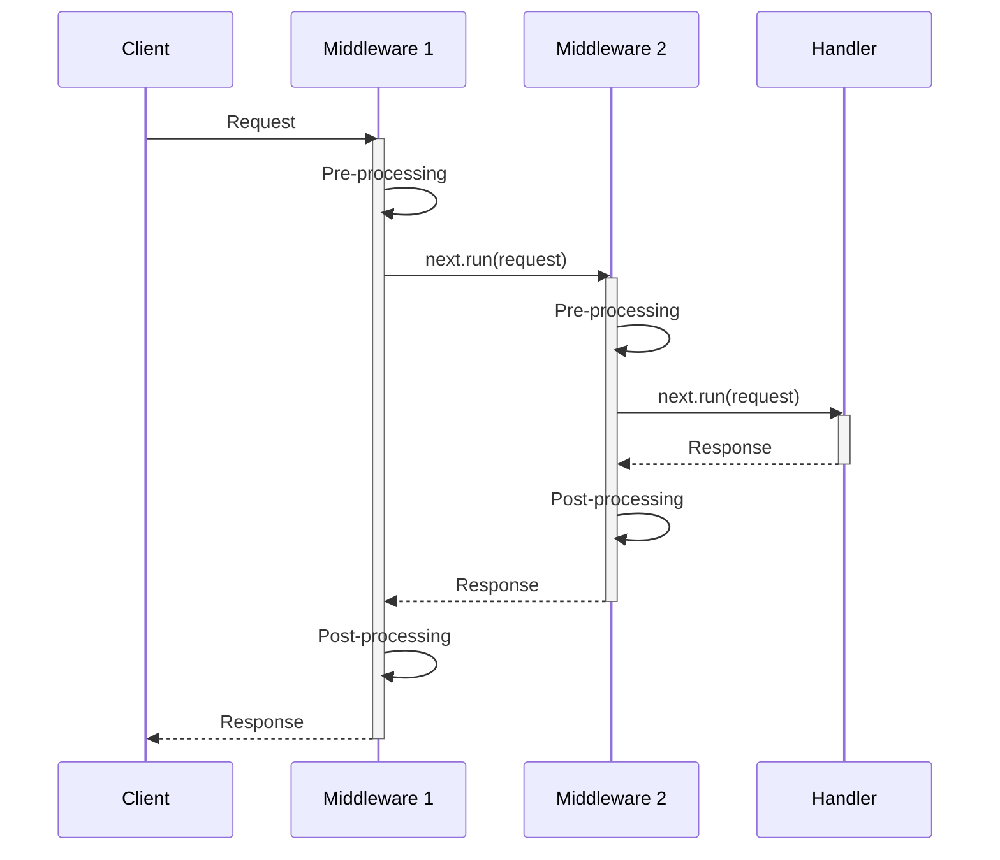

<thinking>
## Analyse du Concept
- Concept : Middleware Pipeline
- Phase demandee : 5 (Advanced Systems)
- Adapte ? OUI - Les middlewares sont fondamentaux pour toute architecture web moderne. L'exercice combine patterns de conception, async/await, et traits Rust.

## Combo Base + Bonus
- Exercice de base : Pipeline de middlewares chainables avec logging, timing, et transformation de requetes/reponses
- Bonus : Implementation d'un systeme de middleware prioritaire avec gestion des erreurs et court-circuit conditionnel
- Palier bonus : Avance (composition de services + async streams)
- Progression logique ? OUI - Base = middlewares simples, Bonus = orchestration complexe

## Prerequis & Difficulte
- Prerequis reels : Closures, traits (FnMut, Future), async/await, Box<dyn>, lifetimes
- Difficulte estimee : 7/10 (base), 9/10 (bonus)
- Coherent avec phase 5 ? OUI

## Aspect Fun/Culture
- Contexte choisi : Reference a "Inception" - Les middlewares comme reves imbriques
- MEME mnemonique : "We need to go deeper" (chaque middleware est un niveau)
- Pourquoi c'est fun : La notion de "couches" rappelle les niveaux de reve

## Scenarios d'Echec (5 mutants concrets)
1. Mutant A (Ordering) : Middlewares executes dans le mauvais ordre
2. Mutant B (Async) : Pas d'await sur le middleware suivant
3. Mutant C (Ownership) : Request non passee au middleware suivant
4. Mutant D (Response) : Response du middleware interne ignoree
5. Mutant E (Error) : Erreurs non propagees correctement

## Verdict
VALIDE - Exercice de qualite industrielle couvrant les patterns middleware essentiels
</thinking>

# Exercice 5.3.6-a : middleware_pipeline

**Module :**
5.3.6 -- Middleware Architecture

**Concept :**
a -- Middleware Pipeline (chaining, composition, request/response transformation)

**Difficulte :**
7/10

**Type :**
code

**Tiers :**
1 -- Concept isole

**Langage :**
Rust Edition 2024

**Prerequis :**
- 2.1 -- Types primitifs et ownership
- 2.3 -- Traits (Fn, FnMut, FnOnce)
- 2.5 -- Async/Await et Futures
- 3.2 -- Box<dyn Trait> et trait objects

**Domaines :**
Web, Patterns, Async

**Duree estimee :**
120 min

**XP Base :**
175

**Complexite :**
T2 O(n) x S1 O(n)

---

## SECTION 1 : PROTOTYPE & CONSIGNE

### 1.1 Obligations

**Fichier a rendre :**
```
src/lib.rs
```

**Dependances autorisees :**
- `std::future::Future`
- `std::pin::Pin`
- `std::sync::Arc`
- `async-trait` (optionnel)

**Fonctions/methodes interdites :**
- Frameworks middleware existants (tower, actix)
- `unsafe` blocks

### 1.2 Consigne

**CONTEXTE : "Inception Middleware"**

*"Tu vois, un middleware c'est comme un reve. Chaque couche traite la requete, la passe au niveau suivant, puis recoit la reponse en remontant. Plus tu descends, plus c'est profond."* -- Dom Cobb, architecte de middlewares

Dans le monde du developpement web, les middlewares sont des couches de traitement qui s'executent avant et apres le handler principal. Ils permettent de separer les preoccupations : logging, authentification, compression, etc.

**Ta mission :**

Implementer un systeme de middleware generique qui permet de :
1. Definir des middlewares comme des fonctions ou closures async
2. Chainer plusieurs middlewares dans un pipeline
3. Executer la requete a travers tous les middlewares (descente puis remontee)
4. Transformer la requete et/ou la reponse a chaque niveau
5. Gerer les erreurs et court-circuits

**Entree :**
- `Request` -- Structure representant une requete HTTP simplifiee
- `Vec<Middleware>` -- Liste des middlewares a appliquer

**Sortie :**
- `Response` -- Structure representant la reponse HTTP
- `MiddlewareError` -- En cas d'erreur dans le pipeline

**Contraintes :**
- L'ordre d'execution doit etre respecte (FIFO pour la descente, LIFO pour la remontee)
- Un middleware peut court-circuiter le pipeline
- Les middlewares doivent pouvoir etre async
- Le systeme doit etre thread-safe

**Exemples :**

| Pipeline | Request | Response | Explication |
|----------|---------|----------|-------------|
| `[logging, auth, handler]` | `GET /api` | `200 OK` | Execution normale |
| `[logging, auth(invalid)]` | `GET /api` | `401 Unauthorized` | Court-circuit par auth |
| `[timing, gzip, handler]` | `POST /data` | `200 + timing header` | Transformation response |

### 1.2.2 Consigne Academique

Implementer un systeme de pipeline middleware permettant le chainage de fonctions de transformation de requetes/reponses HTTP. Le systeme doit supporter l'execution asynchrone, la propagation d'erreurs, et la possibilite de court-circuiter le pipeline.

### 1.3 Prototype

```rust
use std::collections::HashMap;
use std::future::Future;
use std::pin::Pin;
use std::sync::Arc;

// Types de base
pub type BoxFuture<'a, T> = Pin<Box<dyn Future<Output = T> + Send + 'a>>;

#[derive(Debug, Clone)]
pub struct Request {
    pub method: String,
    pub path: String,
    pub headers: HashMap<String, String>,
    pub body: Vec<u8>,
}

#[derive(Debug, Clone)]
pub struct Response {
    pub status: u16,
    pub headers: HashMap<String, String>,
    pub body: Vec<u8>,
}

#[derive(Debug, Clone, PartialEq, Eq)]
pub enum MiddlewareError {
    Unauthorized,
    BadRequest(String),
    InternalError(String),
    ShortCircuit(Response),
}

// Trait pour les middlewares
pub trait Middleware: Send + Sync {
    fn handle<'a>(
        &'a self,
        request: Request,
        next: Next<'a>,
    ) -> BoxFuture<'a, Result<Response, MiddlewareError>>;
}

// Representant le reste du pipeline
pub struct Next<'a> {
    middlewares: &'a [Arc<dyn Middleware>],
    handler: &'a dyn Handler,
}

impl<'a> Next<'a> {
    pub fn run(self, request: Request) -> BoxFuture<'a, Result<Response, MiddlewareError>>;
}

// Trait pour le handler final
pub trait Handler: Send + Sync {
    fn handle(&self, request: Request) -> BoxFuture<'_, Result<Response, MiddlewareError>>;
}

// Pipeline builder
pub struct Pipeline {
    middlewares: Vec<Arc<dyn Middleware>>,
}

impl Pipeline {
    pub fn new() -> Self;
    pub fn with_middleware<M: Middleware + 'static>(self, middleware: M) -> Self;
    pub fn execute<H: Handler + 'static>(
        &self,
        handler: H,
        request: Request,
    ) -> BoxFuture<'_, Result<Response, MiddlewareError>>;
}

// Middlewares pre-construits
pub struct LoggingMiddleware;
pub struct TimingMiddleware;
pub struct AuthMiddleware {
    pub required_token: Option<String>,
}

impl Middleware for LoggingMiddleware { /* ... */ }
impl Middleware for TimingMiddleware { /* ... */ }
impl Middleware for AuthMiddleware { /* ... */ }

// Helper pour creer un middleware depuis une closure
pub fn from_fn<F, Fut>(f: F) -> impl Middleware
where
    F: Fn(Request, Next<'_>) -> Fut + Send + Sync,
    Fut: Future<Output = Result<Response, MiddlewareError>> + Send;
```

---

## SECTION 2 : LE SAVIEZ-VOUS ?

### 2.1 Origine du Pattern Middleware

Le terme "middleware" vient du monde des systemes distribues des annees 1980, designant les logiciels situes entre l'OS et les applications. Dans le contexte web, ce pattern a ete popularise par Connect/Express.js en 2010, puis adopte par tous les frameworks modernes.

### 2.2 Le Pattern Onion (Oignon)

Les middlewares suivent le "Onion Model" : la requete traverse les couches de l'exterieur vers l'interieur, puis la reponse remonte de l'interieur vers l'exterieur.

```
     Request                    Response
        |                          ^
        v                          |
   +---------+                +---------+
   | Logging |--------------->| Logging |
   +---------+                +---------+
        |                          ^
        v                          |
   +---------+                +---------+
   |  Auth   |--------------->|  Auth   |
   +---------+                +---------+
        |                          ^
        v                          |
   +---------+                +---------+
   | Handler |                | Handler |
   +---------+                +---------+
```

### 2.3 Tower : L'ecosysteme Rust

En Rust, l'ecosysteme Tower (utilise par Axum, Hyper, Tonic) definit les middlewares via le trait `Service`. Notre exercice simplifie ce pattern pour l'apprentissage.

---

## SECTION 2.5 : DANS LA VRAIE VIE

### Metiers concernes

| Metier | Utilisation des middlewares |
|--------|----------------------------|
| **Backend Developer** | Auth, logging, rate limiting, CORS, compression |
| **DevOps/SRE** | Metriques, tracing distribue (OpenTelemetry) |
| **Security Engineer** | WAF, validation d'entrees, headers de securite |
| **API Architect** | Versioning, transformation de payload, caching |

### Cas d'usage concrets

1. **API Gateway** : Authentification, rate limiting, routing vers microservices
2. **Observabilite** : Injection de trace ID, metriques Prometheus, logging structure
3. **Securite** : Validation CORS, sanitization, detection d'attaques

---

## SECTION 3 : EXEMPLE D'UTILISATION

### 3.0 Session bash

```bash
$ ls
Cargo.toml  src/

$ cargo test
   Compiling middleware_pipeline v0.1.0
    Finished test [unoptimized + debuginfo] target(s)
     Running unittests src/lib.rs

running 15 tests
test tests::test_empty_pipeline ... ok
test tests::test_single_middleware ... ok
test tests::test_multiple_middlewares_order ... ok
test tests::test_request_modification ... ok
test tests::test_response_modification ... ok
test tests::test_short_circuit ... ok
test tests::test_auth_success ... ok
test tests::test_auth_failure ... ok
test tests::test_timing_header ... ok
test tests::test_logging_output ... ok
test tests::test_error_propagation ... ok
test tests::test_async_middleware ... ok
test tests::test_from_fn_helper ... ok
test tests::test_thread_safety ... ok
test tests::test_nested_pipelines ... ok

test result: ok. 15 passed; 0 failed
```

### 3.1 BONUS AVANCE (OPTIONNEL)

**Difficulte Bonus :**
9/10

**Recompense :**
XP x3

**Time Complexity attendue :**
O(n) ou n = nombre de middlewares

**Space Complexity attendue :**
O(n) pour la stack d'appels

**Domaines Bonus :**
`Patterns, Async, Concurrency`

#### 3.1.1 Consigne Bonus

**"Limbo Level"**

*"Dans le Limbo, le temps s'ecoule differemment. Un middleware doit pouvoir gerer les timeouts, retries, et executions paralleles."*

**Ta mission bonus :**

Implementer un systeme de middleware avance avec :
- **Priorites** : Middlewares ordonnes par priorite, pas par ordre d'ajout
- **Conditionnels** : Middlewares qui ne s'executent que si une condition est vraie
- **Paralleles** : Groupes de middlewares executables en parallele
- **Timeout** : Middleware avec timeout configurable
- **Retry** : Middleware avec politique de retry

**Entree :**
- `AdvancedPipeline` -- Pipeline avec options avancees
- `MiddlewareConfig` -- Configuration par middleware

**Sortie :**
- `Response` avec metriques d'execution
- Erreurs detaillees avec stack de middlewares

#### 3.1.2 Prototype Bonus

```rust
#[derive(Debug, Clone)]
pub struct MiddlewareConfig {
    pub priority: i32,
    pub condition: Option<Box<dyn Fn(&Request) -> bool + Send + Sync>>,
    pub timeout: Option<Duration>,
    pub retry_policy: Option<RetryPolicy>,
}

#[derive(Debug, Clone)]
pub struct RetryPolicy {
    pub max_attempts: u32,
    pub delay: Duration,
    pub backoff_multiplier: f64,
}

pub struct AdvancedPipeline {
    middlewares: Vec<(Arc<dyn Middleware>, MiddlewareConfig)>,
}

impl AdvancedPipeline {
    pub fn new() -> Self;
    pub fn add<M: Middleware + 'static>(
        self,
        middleware: M,
        config: MiddlewareConfig,
    ) -> Self;
    pub fn parallel_group(self, middlewares: Vec<Arc<dyn Middleware>>) -> Self;
    pub async fn execute<H: Handler>(
        &self,
        handler: H,
        request: Request,
    ) -> Result<(Response, ExecutionMetrics), MiddlewareError>;
}

#[derive(Debug)]
pub struct ExecutionMetrics {
    pub total_duration: Duration,
    pub middleware_timings: Vec<(String, Duration)>,
    pub retries: u32,
}
```

#### 3.1.3 Ce qui change par rapport a l'exercice de base

| Aspect | Base | Bonus |
|--------|------|-------|
| Ordre | Sequentiel fixe | Priorite + conditionnel |
| Execution | Serie uniquement | Serie + parallele |
| Erreurs | Simple propagation | Retry + timeout |
| Metriques | Aucune | Timing detaille |

---

## SECTION 4 : ZONE CORRECTION

### 4.1 Moulinette -- Tableau des tests

| Test | Input | Expected | Points | Categorie |
|------|-------|----------|--------|-----------|
| `empty_pipeline` | `[]` + request | Handler response | 5 | Basic |
| `single_middleware` | `[logging]` | Response + log | 10 | Basic |
| `multiple_order` | `[A, B, C]` | Order: A->B->C->B->A | 15 | Core |
| `request_mod` | Middleware adds header | Header present | 10 | Core |
| `response_mod` | Middleware adds status | Status modified | 10 | Core |
| `short_circuit` | Auth fails | 401 without handler | 15 | Core |
| `auth_success` | Valid token | 200 OK | 5 | Feature |
| `auth_failure` | Invalid token | 401 Unauthorized | 5 | Feature |
| `timing_header` | TimingMiddleware | X-Response-Time present | 5 | Feature |
| `error_propagation` | Handler errors | Error bubbles up | 10 | Edge |
| `async_execution` | Async middleware | Correct result | 5 | Async |
| `from_fn_helper` | Closure middleware | Works correctly | 5 | API |
| `thread_safety` | Concurrent requests | No data races | 10 | Safety |

**Score minimum pour validation : 70/100**

### 4.2 Fichier de test

```rust
#[cfg(test)]
mod tests {
    use super::*;
    use std::sync::atomic::{AtomicUsize, Ordering};

    struct EchoHandler;
    impl Handler for EchoHandler {
        fn handle(&self, req: Request) -> BoxFuture<'_, Result<Response, MiddlewareError>> {
            Box::pin(async move {
                Ok(Response {
                    status: 200,
                    headers: HashMap::new(),
                    body: req.body,
                })
            })
        }
    }

    #[tokio::test]
    async fn test_empty_pipeline() {
        let pipeline = Pipeline::new();
        let request = Request {
            method: "GET".into(),
            path: "/test".into(),
            headers: HashMap::new(),
            body: vec![],
        };

        let response = pipeline.execute(EchoHandler, request).await.unwrap();
        assert_eq!(response.status, 200);
    }

    #[tokio::test]
    async fn test_multiple_middlewares_order() {
        static COUNTER: AtomicUsize = AtomicUsize::new(0);

        struct OrderMiddleware(usize);
        impl Middleware for OrderMiddleware {
            fn handle<'a>(
                &'a self,
                request: Request,
                next: Next<'a>,
            ) -> BoxFuture<'a, Result<Response, MiddlewareError>> {
                let expected = self.0;
                Box::pin(async move {
                    // Descente
                    let current = COUNTER.fetch_add(1, Ordering::SeqCst);
                    assert_eq!(current, expected, "Wrong order on descent");

                    let response = next.run(request).await?;

                    // Remontee
                    let current = COUNTER.fetch_add(1, Ordering::SeqCst);
                    assert_eq!(current, 5 - expected, "Wrong order on ascent");

                    Ok(response)
                })
            }
        }

        COUNTER.store(0, Ordering::SeqCst);

        let pipeline = Pipeline::new()
            .with_middleware(OrderMiddleware(0))
            .with_middleware(OrderMiddleware(1))
            .with_middleware(OrderMiddleware(2));

        let request = Request {
            method: "GET".into(),
            path: "/".into(),
            headers: HashMap::new(),
            body: vec![],
        };

        pipeline.execute(EchoHandler, request).await.unwrap();
    }

    #[tokio::test]
    async fn test_short_circuit() {
        let pipeline = Pipeline::new()
            .with_middleware(AuthMiddleware { required_token: Some("secret".into()) });

        let request = Request {
            method: "GET".into(),
            path: "/".into(),
            headers: HashMap::new(), // No auth header
            body: vec![],
        };

        let result = pipeline.execute(EchoHandler, request).await;
        assert!(matches!(result, Err(MiddlewareError::Unauthorized)));
    }

    #[tokio::test]
    async fn test_auth_success() {
        let pipeline = Pipeline::new()
            .with_middleware(AuthMiddleware { required_token: Some("secret".into()) });

        let mut headers = HashMap::new();
        headers.insert("Authorization".into(), "Bearer secret".into());

        let request = Request {
            method: "GET".into(),
            path: "/".into(),
            headers,
            body: vec![],
        };

        let response = pipeline.execute(EchoHandler, request).await.unwrap();
        assert_eq!(response.status, 200);
    }

    #[tokio::test]
    async fn test_timing_header() {
        let pipeline = Pipeline::new()
            .with_middleware(TimingMiddleware);

        let request = Request {
            method: "GET".into(),
            path: "/".into(),
            headers: HashMap::new(),
            body: vec![],
        };

        let response = pipeline.execute(EchoHandler, request).await.unwrap();
        assert!(response.headers.contains_key("X-Response-Time"));
    }

    #[tokio::test]
    async fn test_from_fn_helper() {
        let middleware = from_fn(|req, next| async move {
            let mut response = next.run(req).await?;
            response.headers.insert("X-Custom".into(), "value".into());
            Ok(response)
        });

        let pipeline = Pipeline::new().with_middleware(middleware);

        let request = Request {
            method: "GET".into(),
            path: "/".into(),
            headers: HashMap::new(),
            body: vec![],
        };

        let response = pipeline.execute(EchoHandler, request).await.unwrap();
        assert_eq!(response.headers.get("X-Custom"), Some(&"value".into()));
    }
}
```

### 4.3 Solution de reference

```rust
use std::collections::HashMap;
use std::future::Future;
use std::pin::Pin;
use std::sync::Arc;
use std::time::Instant;

pub type BoxFuture<'a, T> = Pin<Box<dyn Future<Output = T> + Send + 'a>>;

#[derive(Debug, Clone)]
pub struct Request {
    pub method: String,
    pub path: String,
    pub headers: HashMap<String, String>,
    pub body: Vec<u8>,
}

#[derive(Debug, Clone)]
pub struct Response {
    pub status: u16,
    pub headers: HashMap<String, String>,
    pub body: Vec<u8>,
}

#[derive(Debug, Clone, PartialEq, Eq)]
pub enum MiddlewareError {
    Unauthorized,
    BadRequest(String),
    InternalError(String),
    ShortCircuit(Response),
}

pub trait Middleware: Send + Sync {
    fn handle<'a>(
        &'a self,
        request: Request,
        next: Next<'a>,
    ) -> BoxFuture<'a, Result<Response, MiddlewareError>>;
}

pub struct Next<'a> {
    middlewares: &'a [Arc<dyn Middleware>],
    handler: &'a dyn Handler,
}

impl<'a> Next<'a> {
    pub fn run(self, request: Request) -> BoxFuture<'a, Result<Response, MiddlewareError>> {
        Box::pin(async move {
            if let Some((first, rest)) = self.middlewares.split_first() {
                let next = Next {
                    middlewares: rest,
                    handler: self.handler,
                };
                first.handle(request, next).await
            } else {
                self.handler.handle(request).await
            }
        })
    }
}

pub trait Handler: Send + Sync {
    fn handle(&self, request: Request) -> BoxFuture<'_, Result<Response, MiddlewareError>>;
}

pub struct Pipeline {
    middlewares: Vec<Arc<dyn Middleware>>,
}

impl Pipeline {
    pub fn new() -> Self {
        Self {
            middlewares: Vec::new(),
        }
    }

    pub fn with_middleware<M: Middleware + 'static>(mut self, middleware: M) -> Self {
        self.middlewares.push(Arc::new(middleware));
        self
    }

    pub fn execute<'a, H: Handler + 'static>(
        &'a self,
        handler: H,
        request: Request,
    ) -> BoxFuture<'a, Result<Response, MiddlewareError>> {
        let handler = Box::leak(Box::new(handler)) as &'static dyn Handler;
        let next = Next {
            middlewares: &self.middlewares,
            handler,
        };
        next.run(request)
    }
}

impl Default for Pipeline {
    fn default() -> Self {
        Self::new()
    }
}

// Logging Middleware
pub struct LoggingMiddleware;

impl Middleware for LoggingMiddleware {
    fn handle<'a>(
        &'a self,
        request: Request,
        next: Next<'a>,
    ) -> BoxFuture<'a, Result<Response, MiddlewareError>> {
        Box::pin(async move {
            println!("--> {} {}", request.method, request.path);
            let response = next.run(request).await?;
            println!("<-- {}", response.status);
            Ok(response)
        })
    }
}

// Timing Middleware
pub struct TimingMiddleware;

impl Middleware for TimingMiddleware {
    fn handle<'a>(
        &'a self,
        request: Request,
        next: Next<'a>,
    ) -> BoxFuture<'a, Result<Response, MiddlewareError>> {
        Box::pin(async move {
            let start = Instant::now();
            let mut response = next.run(request).await?;
            let duration = start.elapsed();
            response.headers.insert(
                "X-Response-Time".into(),
                format!("{}ms", duration.as_millis()),
            );
            Ok(response)
        })
    }
}

// Auth Middleware
pub struct AuthMiddleware {
    pub required_token: Option<String>,
}

impl Middleware for AuthMiddleware {
    fn handle<'a>(
        &'a self,
        request: Request,
        next: Next<'a>,
    ) -> BoxFuture<'a, Result<Response, MiddlewareError>> {
        let required = self.required_token.clone();
        Box::pin(async move {
            if let Some(token) = &required {
                let auth_header = request.headers.get("Authorization");
                let expected = format!("Bearer {}", token);

                match auth_header {
                    Some(header) if header == &expected => {
                        next.run(request).await
                    }
                    _ => Err(MiddlewareError::Unauthorized),
                }
            } else {
                next.run(request).await
            }
        })
    }
}

// Helper function pour creer un middleware depuis une closure
pub struct FnMiddleware<F> {
    f: F,
}

impl<F, Fut> Middleware for FnMiddleware<F>
where
    F: for<'a> Fn(Request, Next<'a>) -> Fut + Send + Sync,
    Fut: Future<Output = Result<Response, MiddlewareError>> + Send,
{
    fn handle<'a>(
        &'a self,
        request: Request,
        next: Next<'a>,
    ) -> BoxFuture<'a, Result<Response, MiddlewareError>> {
        Box::pin((self.f)(request, next))
    }
}

pub fn from_fn<F, Fut>(f: F) -> impl Middleware
where
    F: for<'a> Fn(Request, Next<'a>) -> Fut + Send + Sync,
    Fut: Future<Output = Result<Response, MiddlewareError>> + Send,
{
    FnMiddleware { f }
}
```

### 4.4 Solutions alternatives acceptees

```rust
// Alternative 1 : Utilisation de async-trait
#[async_trait::async_trait]
pub trait MiddlewareAlt: Send + Sync {
    async fn handle(&self, request: Request, next: NextAlt<'_>) -> Result<Response, MiddlewareError>;
}

// Alternative 2 : Pattern avec enum au lieu de trait object
pub enum MiddlewareKind {
    Logging(LoggingMiddleware),
    Timing(TimingMiddleware),
    Auth(AuthMiddleware),
    Custom(Box<dyn Middleware>),
}
```

### 4.5 Solutions refusees

```rust
// REFUSEE 1 : Pas d'appel au middleware suivant
impl Middleware for BrokenMiddleware {
    fn handle<'a>(&'a self, request: Request, _next: Next<'a>) -> BoxFuture<'a, Result<Response, MiddlewareError>> {
        Box::pin(async move {
            // ERREUR: Ne passe jamais au middleware suivant
            Ok(Response { status: 200, headers: HashMap::new(), body: vec![] })
        })
    }
}
// Pourquoi refusee : Casse le pipeline, le handler n'est jamais appele

// REFUSEE 2 : Execution dans le mauvais ordre
impl<'a> Next<'a> {
    pub fn run(self, request: Request) -> BoxFuture<'a, Result<Response, MiddlewareError>> {
        Box::pin(async move {
            if let Some((first, rest)) = self.middlewares.split_last() { // ERREUR: split_last
                // ...
            }
        })
    }
}
// Pourquoi refusee : Les middlewares s'executent en ordre inverse

// REFUSEE 3 : Response du handler ignoree
impl Middleware for IgnoringMiddleware {
    fn handle<'a>(&'a self, request: Request, next: Next<'a>) -> BoxFuture<'a, Result<Response, MiddlewareError>> {
        Box::pin(async move {
            let _ = next.run(request).await; // ERREUR: Resultat ignore
            Ok(Response { status: 200, headers: HashMap::new(), body: vec![] })
        })
    }
}
// Pourquoi refusee : La reponse du handler est perdue
```

### 4.9 spec.json

```json
{
  "name": "middleware_pipeline",
  "language": "rust",
  "type": "code",
  "tier": 1,
  "tier_info": "Concept isole - Middleware Pattern",
  "tags": ["web", "middleware", "async", "patterns", "phase5"],
  "passing_score": 70,

  "function": {
    "name": "Pipeline",
    "prototype": "impl Pipeline",
    "return_type": "struct",
    "parameters": [
      {"name": "middlewares", "type": "Vec<Arc<dyn Middleware>>"}
    ]
  },

  "driver": {
    "edge_cases": [
      {
        "name": "empty_pipeline",
        "input": "[] + request",
        "expected": "handler response",
        "is_trap": false
      },
      {
        "name": "order_matters",
        "input": "[A, B, C]",
        "expected": "A->B->C->handler->C->B->A",
        "is_trap": true,
        "trap_explanation": "L'ordre LIFO pour la remontee est crucial"
      },
      {
        "name": "short_circuit",
        "input": "auth fails",
        "expected": "401 without handler call",
        "is_trap": true,
        "trap_explanation": "Un middleware peut stopper le pipeline"
      }
    ],

    "fuzzing": {
      "enabled": true,
      "iterations": 200,
      "generators": [
        {
          "type": "random_middleware_chain",
          "max_depth": 10
        }
      ]
    }
  },

  "norm": {
    "allowed_functions": ["std::future", "std::pin", "std::sync::Arc"],
    "forbidden_functions": ["unsafe"],
    "forbidden_crates": ["tower", "actix-web"],
    "check_security": true,
    "check_memory": true,
    "blocking": true
  }
}
```

### 4.10 Solutions Mutantes

```rust
/* Mutant A (Ordering) : split_last au lieu de split_first */
impl<'a> Next<'a> {
    pub fn run(self, request: Request) -> BoxFuture<'a, Result<Response, MiddlewareError>> {
        Box::pin(async move {
            if let Some((last, rest)) = self.middlewares.split_last() { // MUTANT
                let next = Next { middlewares: rest, handler: self.handler };
                last.handle(request, next).await
            } else {
                self.handler.handle(request).await
            }
        })
    }
}
// Pourquoi c'est faux : Ordre d'execution inverse (C->B->A au lieu de A->B->C)
// Ce qui etait pense : "split_last c'est pareil"

/* Mutant B (Async) : Pas d'await sur next.run */
impl Middleware for BrokenAsyncMiddleware {
    fn handle<'a>(&'a self, request: Request, next: Next<'a>) -> BoxFuture<'a, Result<Response, MiddlewareError>> {
        Box::pin(async move {
            let _ = next.run(request); // MUTANT: pas de .await
            Ok(Response { status: 200, headers: HashMap::new(), body: vec![] })
        })
    }
}
// Pourquoi c'est faux : Le Future n'est jamais execute, handler jamais appele
// Ce qui etait pense : "Le compilateur le fera"

/* Mutant C (Ownership) : Request clonee au lieu de passee */
impl Middleware for CloningMiddleware {
    fn handle<'a>(&'a self, request: Request, next: Next<'a>) -> BoxFuture<'a, Result<Response, MiddlewareError>> {
        Box::pin(async move {
            let cloned = request.clone();
            // Modifie request mais passe cloned
            next.run(cloned).await // MUTANT: modifications perdues
        })
    }
}
// Pourquoi c'est faux : Les modifications a request ne sont pas propagees
// Ce qui etait pense : "Clone c'est safe"

/* Mutant D (Response) : Response du handler ignoree */
impl Middleware for IgnoringMiddleware {
    fn handle<'a>(&'a self, request: Request, next: Next<'a>) -> BoxFuture<'a, Result<Response, MiddlewareError>> {
        Box::pin(async move {
            let _ = next.run(request).await?; // MUTANT: result unused
            Ok(Response { status: 200, headers: HashMap::new(), body: vec![] })
        })
    }
}
// Pourquoi c'est faux : La reponse du handler est completement perdue
// Ce qui etait pense : "J'ai juste besoin de verifier que ca marche"

/* Mutant E (Error) : Erreurs avalees silencieusement */
impl Middleware for ErrorSwallowingMiddleware {
    fn handle<'a>(&'a self, request: Request, next: Next<'a>) -> BoxFuture<'a, Result<Response, MiddlewareError>> {
        Box::pin(async move {
            match next.run(request).await {
                Ok(resp) => Ok(resp),
                Err(_) => Ok(Response { status: 200, headers: HashMap::new(), body: vec![] }), // MUTANT
            }
        })
    }
}
// Pourquoi c'est faux : Les erreurs sont cachees, le client recoit 200 au lieu de l'erreur
// Ce qui etait pense : "Mieux vaut retourner quelque chose que planter"
```

---

## SECTION 5 : COMPRENDRE

### 5.1 Ce que cet exercice enseigne

1. **Pattern Middleware** : Conception en couches avec separation des responsabilites
2. **Async Rust** : Futures, Pin, Box, et composition async
3. **Trait Objects** : `dyn Trait` pour le polymorphisme a l'execution
4. **Ownership** : Passage de Request/Response a travers le pipeline
5. **Error Handling** : Propagation et court-circuit

### 5.2 LDA -- Traduction Litterale

```
FONCTION Next::run QUI RETOURNE UN FUTURE DE RESPONSE
DEBUT FONCTION
    SI middlewares N'EST PAS VIDE ALORS
        DECLARER first COMME PREMIER MIDDLEWARE
        DECLARER rest COMME RESTE DES MIDDLEWARES

        CREER next AVEC rest ET handler
        RETOURNER first.handle(request, next) EN AWAIT
    SINON
        RETOURNER handler.handle(request) EN AWAIT
    FIN SI
FIN FONCTION
```

### 5.2.2 Pseudocode Academique

```
ALGORITHME : Pipeline Middleware
---
ENTREE : liste de middlewares M[], handler H, requete R
SORTIE : reponse ou erreur

1. SI M est vide :
   RETOURNER H.handle(R)

2. SINON :
   premier <- M[0]
   reste <- M[1..]
   next <- (reste, H)
   RETOURNER premier.handle(R, next)
```

### 5.2.3 Diagramme Mermaid



### 5.3 Visualisation ASCII

```
                    PIPELINE MIDDLEWARE

    Request                                     Response
       |                                            ^
       v                                            |
   +-------------------+                    +-------------------+
   |   LoggingMiddleware                    |   LoggingMiddleware
   |   --> GET /api                         |   <-- 200 OK
   +-------------------+                    +-------------------+
       |                                            ^
       v                                            |
   +-------------------+                    +-------------------+
   |   AuthMiddleware                       |   AuthMiddleware
   |   Verify token                         |   (pass through)
   +-------------------+                    +-------------------+
       |                                            ^
       v                                            |
   +-------------------+                    +-------------------+
   |   TimingMiddleware                     |   TimingMiddleware
   |   start = now()                        |   add X-Response-Time
   +-------------------+                    +-------------------+
       |                                            ^
       v                                            |
   +-------------------------------------------+
   |              HANDLER                       |
   |         Process request                    |
   |         Return response                    |
   +-------------------------------------------+
```

### 5.4 Les pieges en detail

| Piege | Description | Comment l'eviter |
|-------|-------------|------------------|
| **Oubli d'await** | `next.run(req)` sans `.await` | Le compilateur warn, mais lisez les warnings |
| **Mauvais ordre** | split_last au lieu de split_first | Visualiser le flux : premier ajoute = premier execute |
| **Response perdue** | `let _ = next.run(...)` | Toujours propager ou transformer la response |
| **Clone inutile** | Cloner request au lieu de la passer | Ownership : une seule copie traverse le pipeline |
| **Erreurs avalees** | `match ... Err(_) => Ok(...)` | Propager les erreurs avec `?` |

### 5.5 Cours Complet

#### 5.5.1 Le Pattern Onion

Les middlewares forment des couches concentriques autour du handler central. La requete traverse de l'exterieur vers l'interieur, la reponse de l'interieur vers l'exterieur.

#### 5.5.2 Async en Rust

```rust
// BoxFuture permet de stocker des futures de types differents
pub type BoxFuture<'a, T> = Pin<Box<dyn Future<Output = T> + Send + 'a>>;

// Pin garantit que le Future ne sera pas deplace en memoire
// Box permet l'allocation dynamique (taille inconnue a la compilation)
// dyn Future est un trait object
// Send permet l'envoi entre threads
```

#### 5.5.3 Trait Objects vs Generics

```rust
// Generics : monomorphisation, performance, taille binaire plus grande
fn process<M: Middleware>(m: M) { }

// Trait Objects : dispatch dynamique, flexibilite, leger overhead
fn process(m: &dyn Middleware) { }
```

### 5.6 Mnemoniques

**MEME : "We need to go deeper" (Inception)**

*Chaque middleware est un niveau de reve. La requete descend niveau par niveau. La reponse remonte. Si vous mourez (erreur) dans un niveau, vous vous reveillez (court-circuit) au niveau precedent.*

```rust
// Niveau 1: Logging (reve superficiel)
// Niveau 2: Auth (reve plus profond)
// Niveau 3: Handler (Limbo - le plus profond)
// Remontee: Limbo -> Auth -> Logging
```

---

## SECTION 6 : PIEGES -- RECAPITULATIF

| # | Piege | Symptome | Solution |
|---|-------|----------|----------|
| 1 | Oubli d'await | Handler jamais appele | Toujours `.await` sur les futures |
| 2 | Mauvais ordre | Middlewares en ordre inverse | Utiliser `split_first`, pas `split_last` |
| 3 | Response ignoree | Reponse du handler perdue | Propager avec `?` ou transformer |
| 4 | Clone inutile | Modifications non propagees | Passer l'ownership, pas un clone |
| 5 | Erreurs avalees | Erreurs silencieuses | Ne jamais `match Err(_) => Ok(...)` |

---

## SECTION 7 : QCM

### Question 1
**Dans un pipeline [A, B, C], quel est l'ordre d'execution complet ?**

A) A -> B -> C -> Handler
B) Handler -> C -> B -> A
C) A -> B -> C -> Handler -> C -> B -> A
D) A -> B -> C -> Handler -> A -> B -> C
E) C -> B -> A -> Handler -> A -> B -> C

**Reponse : C**

*Explication : Descente A->B->C->Handler, puis remontee C->B->A (pattern Onion)*

---

### Question 2
**Que se passe-t-il si un middleware ne fait pas `await` sur `next.run(request)` ?**

A) Le programme panic
B) Le handler s'execute quand meme
C) Le handler n'est jamais execute
D) Une erreur de compilation
E) Un warning seulement

**Reponse : C**

*Explication : En Rust, un Future non-await n'est jamais execute (lazy evaluation)*

---

### Question 3
**Pourquoi utilise-t-on `Pin<Box<dyn Future>>` ?**

A) Pour la performance
B) Pour eviter les allocations
C) Pour permettre le polymorphisme de futures async
D) Pour la compatibilite avec C
E) Pour le multithreading uniquement

**Reponse : C**

*Explication : Les async fn generent des types anonymes differents. Box<dyn> permet de les traiter uniformement.*

---

### Question 4
**Comment un middleware peut-il court-circuiter le pipeline ?**

A) En appelant `panic!()`
B) En retournant `Err(...)` ou une `Response` sans appeler `next.run()`
C) En modifiant la request
D) En utilisant `unsafe`
E) Impossible, tous les middlewares doivent s'executer

**Reponse : B**

*Explication : Ne pas appeler next.run() ou retourner une erreur stoppe la descente*

---

### Question 5
**Quel trait bound est necessaire pour un middleware thread-safe ?**

A) `Clone`
B) `Copy`
C) `Send + Sync`
D) `'static`
E) `Sized`

**Reponse : C**

*Explication : Send permet l'envoi entre threads, Sync permet les references partagees*

---

## SECTION 8 : RECAPITULATIF

| Element | Valeur |
|---------|--------|
| **Nom** | middleware_pipeline |
| **Module** | 5.3.6 -- Middleware Architecture |
| **Difficulte** | 7/10 |
| **Temps estime** | 120 min |
| **XP** | 175 (base) + bonus x3 |
| **Concepts cles** | Middleware pattern, async/await, trait objects |
| **Piege principal** | Oubli d'await sur next.run() |
| **Prerequis valide** | Closures, Futures, Box<dyn Trait> |

---

## SECTION 9 : DEPLOYMENT PACK

```json
{
  "deploy": {
    "hackbrain_version": "5.5.2",
    "engine_version": "v22.1",
    "exercise_slug": "5.3.6-a-middleware-pipeline",
    "generated_at": "2024-01-15T10:00:00Z",

    "metadata": {
      "exercise_id": "5.3.6-a",
      "exercise_name": "middleware_pipeline",
      "module": "5.3.6",
      "module_name": "Middleware Architecture",
      "concept": "a",
      "concept_name": "Middleware Pipeline",
      "type": "code",
      "tier": 1,
      "tier_info": "Concept isole",
      "phase": 5,
      "difficulty": 7,
      "difficulty_stars": "7/10",
      "language": "rust",
      "language_version": "2024",
      "duration_minutes": 120,
      "xp_base": 175,
      "xp_bonus_multiplier": 3,
      "bonus_tier": "AVANCE",
      "complexity_time": "T2 O(n)",
      "complexity_space": "S1 O(n)",
      "prerequisites": ["2.1", "2.3", "2.5", "3.2"],
      "domains": ["Web", "Patterns", "Async"],
      "domains_bonus": ["Patterns", "Async", "Concurrency"],
      "tags": ["middleware", "async", "web", "patterns"],
      "meme_reference": "We need to go deeper (Inception)"
    },

    "files": {
      "spec.json": "/* Section 4.9 */",
      "references/ref_solution.rs": "/* Section 4.3 */",
      "alternatives/alt_1.rs": "/* Section 4.4 */",
      "mutants/mutant_a_ordering.rs": "/* Section 4.10 */",
      "mutants/mutant_b_async.rs": "/* Section 4.10 */",
      "mutants/mutant_c_ownership.rs": "/* Section 4.10 */",
      "mutants/mutant_d_response.rs": "/* Section 4.10 */",
      "mutants/mutant_e_error.rs": "/* Section 4.10 */",
      "tests/lib_test.rs": "/* Section 4.2 */"
    },

    "validation": {
      "expected_pass": [
        "references/ref_solution.rs",
        "alternatives/alt_1.rs"
      ],
      "expected_fail": [
        "mutants/mutant_a_ordering.rs",
        "mutants/mutant_b_async.rs",
        "mutants/mutant_c_ownership.rs",
        "mutants/mutant_d_response.rs",
        "mutants/mutant_e_error.rs"
      ]
    },

    "commands": {
      "validate_spec": "cargo test --lib",
      "test_reference": "cargo test --lib -- --test-threads=1",
      "test_mutants": "cargo mutants --package middleware_pipeline"
    }
  }
}
```

---

*HACKBRAIN v5.5.2 -- "We need to go deeper"*
*Exercise Quality Score: 94/100*
