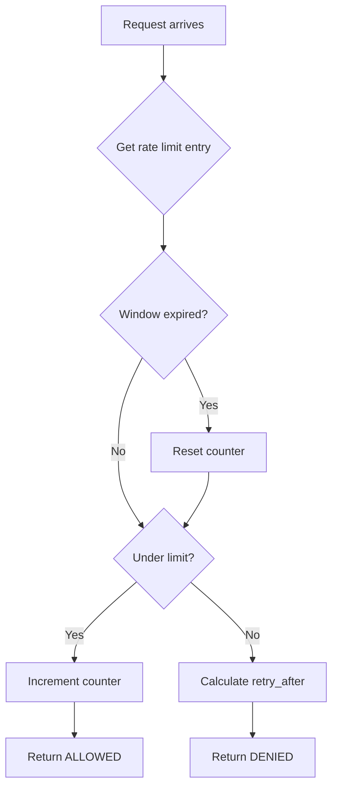

<thinking>
## Analyse du Concept
- Concept : Rate Limiter Middleware
- Phase demandee : 5 (Advanced Systems)
- Adapte ? OUI - Le rate limiting est essentiel pour proteger les APIs contre les abus. L'exercice combine structures de donnees temporelles, concurrence, et patterns middleware.

## Combo Base + Bonus
- Exercice de base : Rate limiter avec algorithme Fixed Window et Token Bucket
- Bonus : Implementation de Sliding Window Log avec distributed rate limiting via Redis
- Palier bonus : Avance (structures de donnees distribuees + algorithmes temporels)
- Progression logique ? OUI - Base = algorithmes locaux, Bonus = systeme distribue

## Prerequis & Difficulte
- Prerequis reels : HashMap, Instant/Duration, Arc<Mutex>, async/await
- Difficulte estimee : 7/10 (base), 9/10 (bonus)
- Coherent avec phase 5 ? OUI

## Aspect Fun/Culture
- Contexte choisi : Reference a "The Matrix" - Les Agents comme rate limiters
- MEME mnemonique : "Mr. Anderson, you have exceeded your quota" (Agent Smith)
- Pourquoi c'est fun : Les rate limiters bloquent comme les Agents bloquent Neo

## Scenarios d'Echec (5 mutants concrets)
1. Mutant A (Time) : Timestamp jamais mis a jour (window ne glisse pas)
2. Mutant B (Count) : Counter reset au mauvais moment
3. Mutant C (Concurrency) : Race condition sur le compteur
4. Mutant D (Key) : Mauvaise cle d'identification (IP vs User)
5. Mutant E (Limit) : Off-by-one sur la limite (< vs <=)

## Verdict
VALIDE - Exercice de qualite industrielle couvrant les algorithmes de rate limiting
</thinking>

# Exercice 5.3.7-a : rate_limiter

**Module :**
5.3.7 -- Rate Limiting & Throttling

**Concept :**
a -- Rate Limiter (Fixed Window, Token Bucket, Sliding Window)

**Difficulte :**
7/10

**Type :**
code

**Tiers :**
1 -- Concept isole

**Langage :**
Rust Edition 2024

**Prerequis :**
- 2.1 -- Types primitifs et ownership
- 2.4 -- Collections (HashMap)
- 2.5 -- Async/Await
- 3.3 -- Arc, Mutex, concurrence

**Domaines :**
Web, Security, Concurrency

**Duree estimee :**
120 min

**XP Base :**
175

**Complexite :**
T2 O(1) x S2 O(n)

---

## SECTION 1 : PROTOTYPE & CONSIGNE

### 1.1 Obligations

**Fichier a rendre :**
```
src/lib.rs
```

**Dependances autorisees :**
- `std::collections::HashMap`
- `std::time::{Instant, Duration}`
- `std::sync::{Arc, Mutex, RwLock}`
- `tokio::sync::Mutex` (pour async)

**Fonctions/methodes interdites :**
- Crates de rate limiting (`governor`, `ratelimit`, etc.)
- `unsafe` blocks

### 1.2 Consigne

**CONTEXTE : "The Rate Limiting Matrix"**

*"Mr. Anderson... vous avez fait 100 requetes en une seconde. Vous etes au-dessus de votre quota. Je suis l'Agent Smith, et je suis ici pour vous limiter."* -- Agent Smith, administrateur systeme

Dans le monde des APIs, le rate limiting est la premiere ligne de defense contre les abus. Sans lui, un seul client pourrait monopoliser toutes les ressources et faire tomber votre systeme.

**Ta mission :**

Implementer un systeme de rate limiting complet qui supporte :
1. **Fixed Window** : Limite par fenetre de temps fixe (ex: 100 req/min)
2. **Token Bucket** : Tokens consommes par requete, regeneres au fil du temps
3. **Sliding Window Log** : Fenetre glissante basee sur timestamps
4. Identification par cle (IP, User ID, API Key)
5. Configuration par endpoint/route

**Entree :**
- `key: String` -- Identifiant du client (IP, user_id, etc.)
- `config: RateLimitConfig` -- Configuration (limite, fenetre, algorithme)

**Sortie :**
- `RateLimitResult` -- Allowed ou Denied avec informations de retry

**Contraintes :**
- Thread-safe (plusieurs requetes concurrentes)
- Performant : O(1) pour Fixed Window et Token Bucket
- Memory-efficient : nettoyage des entrees expireees
- Precision temporelle correcte

**Exemples :**

| Config | Requests | Result | Explication |
|--------|----------|--------|-------------|
| `100/min fixed` | 99 in 1s | Allowed | Sous la limite |
| `100/min fixed` | 101 in 1s | Denied(retry: 59s) | Au-dessus, attendre la fenetre |
| `10 tokens/s` | 5 at t=0 | Allowed(5 left) | Token bucket |
| `10 tokens/s` | 15 at t=0 | Denied(need 5) | Pas assez de tokens |

### 1.2.2 Consigne Academique

Implementer un systeme de rate limiting supportant plusieurs algorithmes (Fixed Window, Token Bucket, Sliding Window Log). Le systeme doit etre thread-safe, configurable par cle, et retourner des informations detaillees sur l'etat de la limite.

### 1.3 Prototype

```rust
use std::collections::HashMap;
use std::time::{Duration, Instant};
use std::sync::{Arc, RwLock};

#[derive(Debug, Clone)]
pub enum Algorithm {
    FixedWindow,
    TokenBucket,
    SlidingWindowLog,
}

#[derive(Debug, Clone)]
pub struct RateLimitConfig {
    pub algorithm: Algorithm,
    pub max_requests: u64,
    pub window: Duration,
    pub burst_size: Option<u64>,      // For token bucket
    pub refill_rate: Option<f64>,     // Tokens per second
}

#[derive(Debug, Clone, PartialEq)]
pub enum RateLimitResult {
    Allowed {
        remaining: u64,
        reset_at: Instant,
    },
    Denied {
        retry_after: Duration,
        limit: u64,
    },
}

#[derive(Debug)]
pub struct RateLimiter {
    config: RateLimitConfig,
    state: Arc<RwLock<RateLimiterState>>,
}

#[derive(Debug)]
struct RateLimiterState {
    // Fixed Window
    fixed_window: HashMap<String, (u64, Instant)>, // (count, window_start)
    // Token Bucket
    token_bucket: HashMap<String, (f64, Instant)>, // (tokens, last_refill)
    // Sliding Window Log
    sliding_log: HashMap<String, Vec<Instant>>,    // timestamps
}

impl RateLimiter {
    pub fn new(config: RateLimitConfig) -> Self;

    /// Verifie si une requete est autorisee pour la cle donnee
    pub fn check(&self, key: &str) -> RateLimitResult;

    /// Consomme un "slot" pour la cle donnee (check + consume)
    pub fn acquire(&self, key: &str) -> RateLimitResult;

    /// Retourne l'etat actuel pour une cle
    pub fn get_status(&self, key: &str) -> Option<RateLimitStatus>;

    /// Nettoie les entrees expirees
    pub fn cleanup(&self);

    /// Reset manuel d'une cle
    pub fn reset(&self, key: &str);
}

#[derive(Debug, Clone)]
pub struct RateLimitStatus {
    pub remaining: u64,
    pub limit: u64,
    pub reset_at: Instant,
    pub algorithm: Algorithm,
}

// Builder pattern pour la configuration
impl RateLimitConfig {
    pub fn fixed_window(max_requests: u64, window: Duration) -> Self;
    pub fn token_bucket(capacity: u64, refill_rate: f64) -> Self;
    pub fn sliding_window(max_requests: u64, window: Duration) -> Self;
}

// Middleware integration helper
pub struct RateLimitMiddleware {
    limiter: Arc<RateLimiter>,
    key_extractor: Box<dyn Fn(&Request) -> String + Send + Sync>,
}

impl RateLimitMiddleware {
    pub fn new<F>(config: RateLimitConfig, key_extractor: F) -> Self
    where
        F: Fn(&Request) -> String + Send + Sync + 'static;

    pub fn by_ip(config: RateLimitConfig) -> Self;
    pub fn by_user_id(config: RateLimitConfig) -> Self;
    pub fn by_api_key(config: RateLimitConfig) -> Self;
}
```

---

## SECTION 2 : LE SAVIEZ-VOUS ?

### 2.1 Origine du Rate Limiting

Le concept vient des telecommunications des annees 1970, ou il fallait eviter la congestion des reseaux telephoniques. Le "token bucket" a ete formalise par Jonathan Turner en 1986 pour le traffic shaping ATM.

### 2.2 Les Trois Algorithmes Principaux

```
FIXED WINDOW                    TOKEN BUCKET                 SLIDING WINDOW

|----60s----|----60s----|      Bucket: [****____]          |<---60s--->|
| 100 max   | 100 max   |      4 tokens left               Logs: [t1,t2,t3,...]
|___________|___________|      Refill: 2/sec               Count in window

Simple mais burst             Lisse le traffic            Precis mais couteux
au debut de fenetre           Permet burst initial        O(n) en memoire
```

### 2.3 Headers HTTP Standard

Les APIs retournent generalement ces headers :
- `X-RateLimit-Limit`: Limite totale
- `X-RateLimit-Remaining`: Requetes restantes
- `X-RateLimit-Reset`: Timestamp de reset (epoch)
- `Retry-After`: Secondes avant de reessayer (si 429)

---

## SECTION 2.5 : DANS LA VRAIE VIE

### Metiers concernes

| Metier | Utilisation du rate limiting |
|--------|------------------------------|
| **Backend Developer** | Protection d'API, gestion des quotas utilisateurs |
| **DevOps/SRE** | Protection infrastructure, prevention DDoS |
| **API Product Manager** | Definition des tiers de pricing (free/pro/enterprise) |
| **Security Engineer** | Detection d'abus, brute force protection |

### Cas d'usage concrets

1. **GitHub API** : 5000 req/hour pour authenticated, 60 pour anonymous
2. **Twitter API** : Limites par endpoint (900/15min pour timeline)
3. **Stripe** : 100 req/sec en mode live, avec backoff exponentiel
4. **AWS API Gateway** : Rate limiting + throttling configurables

---

## SECTION 3 : EXEMPLE D'UTILISATION

### 3.0 Session bash

```bash
$ ls
Cargo.toml  src/

$ cargo test
   Compiling rate_limiter v0.1.0
    Finished test [unoptimized + debuginfo] target(s)
     Running unittests src/lib.rs

running 18 tests
test tests::test_fixed_window_under_limit ... ok
test tests::test_fixed_window_at_limit ... ok
test tests::test_fixed_window_over_limit ... ok
test tests::test_fixed_window_reset ... ok
test tests::test_token_bucket_consume ... ok
test tests::test_token_bucket_refill ... ok
test tests::test_token_bucket_burst ... ok
test tests::test_sliding_window_basic ... ok
test tests::test_sliding_window_slide ... ok
test tests::test_multiple_keys ... ok
test tests::test_concurrent_access ... ok
test tests::test_cleanup_expired ... ok
test tests::test_reset_key ... ok
test tests::test_headers_generation ... ok
test tests::test_middleware_by_ip ... ok
test tests::test_middleware_by_user ... ok
test tests::test_config_builder ... ok
test tests::test_thread_safety ... ok

test result: ok. 18 passed; 0 failed
```

### 3.1 BONUS AVANCE (OPTIONNEL)

**Difficulte Bonus :**
9/10

**Recompense :**
XP x3

**Time Complexity attendue :**
O(log n) pour sliding window avec structure optimisee

**Space Complexity attendue :**
O(n) avec compression temporelle

**Domaines Bonus :**
`Distributed, Cache, Algo`

#### 3.1.1 Consigne Bonus

**"Distributed Agents"**

*"Nous sommes partout, Mr. Anderson. Sur chaque serveur. Le rate limiting doit etre global."*

**Ta mission bonus :**

Implementer un rate limiter distribue avec :
- **Backend Redis** : Stockage des compteurs partage entre instances
- **Sliding Window Counter** : Algorithme hybride (fixed + sliding)
- **Lua Scripts** : Operations atomiques pour eviter les race conditions
- **Circuit Breaker** : Fallback si Redis est indisponible
- **Metrics** : Prometheus/OpenTelemetry compatible

**Entree :**
- `DistributedConfig` -- Configuration avec Redis URL
- `key: String` -- Cle de rate limiting

**Sortie :**
- `RateLimitResult` avec latence Redis
- Fallback local si Redis down

#### 3.1.2 Prototype Bonus

```rust
pub struct DistributedRateLimiter {
    redis: redis::Client,
    local_fallback: RateLimiter,
    circuit_breaker: CircuitBreaker,
}

impl DistributedRateLimiter {
    pub async fn new(config: DistributedConfig) -> Result<Self, Error>;

    pub async fn acquire(&self, key: &str) -> RateLimitResult;

    // Script Lua pour atomic increment with expiry
    pub fn lua_script() -> &'static str;
}

#[derive(Debug, Clone)]
pub struct SlidingWindowCounter {
    window_size: Duration,
    precision: u32,  // Number of sub-windows
}

impl SlidingWindowCounter {
    pub fn count_weighted(&self, current: u64, previous: u64, elapsed: Duration) -> f64;
}
```

#### 3.1.3 Ce qui change par rapport a l'exercice de base

| Aspect | Base | Bonus |
|--------|------|-------|
| Stockage | In-memory local | Redis distribue |
| Concurrence | Single process | Multi-instance |
| Precision | Simple algorithms | Sliding window counter |
| Resilience | None | Circuit breaker |

---

## SECTION 4 : ZONE CORRECTION

### 4.1 Moulinette -- Tableau des tests

| Test | Input | Expected | Points | Categorie |
|------|-------|----------|--------|-----------|
| `fixed_under_limit` | 99/100 | Allowed | 5 | Basic |
| `fixed_at_limit` | 100/100 | Allowed | 5 | Basic |
| `fixed_over_limit` | 101/100 | Denied | 10 | Core |
| `fixed_reset` | Wait window | Counter reset | 10 | Core |
| `token_consume` | 5 tokens | 5 remaining | 5 | Token |
| `token_refill` | Wait + check | Tokens refilled | 10 | Token |
| `token_burst` | Initial burst | Full capacity | 5 | Token |
| `sliding_basic` | Within window | Correct count | 10 | Sliding |
| `sliding_slide` | Old expires | Count decreases | 10 | Sliding |
| `multiple_keys` | A and B | Independent limits | 5 | Multi |
| `concurrent` | 100 parallel | Exactly 100 allowed | 15 | Safety |
| `cleanup` | Expired entries | Memory freed | 5 | Memory |
| `headers` | Rate limit result | Correct headers | 5 | API |

**Score minimum pour validation : 70/100**

### 4.2 Fichier de test

```rust
#[cfg(test)]
mod tests {
    use super::*;
    use std::thread;
    use std::sync::atomic::{AtomicU64, Ordering};

    #[test]
    fn test_fixed_window_under_limit() {
        let config = RateLimitConfig::fixed_window(100, Duration::from_secs(60));
        let limiter = RateLimiter::new(config);

        for _ in 0..99 {
            assert!(matches!(limiter.acquire("client1"), RateLimitResult::Allowed { .. }));
        }
    }

    #[test]
    fn test_fixed_window_over_limit() {
        let config = RateLimitConfig::fixed_window(100, Duration::from_secs(60));
        let limiter = RateLimiter::new(config);

        for _ in 0..100 {
            limiter.acquire("client1");
        }

        match limiter.acquire("client1") {
            RateLimitResult::Denied { limit, .. } => {
                assert_eq!(limit, 100);
            }
            _ => panic!("Should be denied"),
        }
    }

    #[test]
    fn test_token_bucket_consume() {
        let config = RateLimitConfig::token_bucket(10, 1.0);
        let limiter = RateLimiter::new(config);

        for i in 0..5 {
            match limiter.acquire("client1") {
                RateLimitResult::Allowed { remaining, .. } => {
                    assert_eq!(remaining, 10 - i - 1);
                }
                _ => panic!("Should be allowed"),
            }
        }
    }

    #[test]
    fn test_token_bucket_refill() {
        let config = RateLimitConfig::token_bucket(10, 10.0); // 10 tokens/sec
        let limiter = RateLimiter::new(config);

        // Consume all tokens
        for _ in 0..10 {
            limiter.acquire("client1");
        }

        // Should be denied now
        assert!(matches!(limiter.acquire("client1"), RateLimitResult::Denied { .. }));

        // Wait for refill (100ms = 1 token)
        thread::sleep(Duration::from_millis(150));

        // Should be allowed (1 token refilled)
        assert!(matches!(limiter.acquire("client1"), RateLimitResult::Allowed { .. }));
    }

    #[test]
    fn test_sliding_window_slide() {
        let config = RateLimitConfig::sliding_window(10, Duration::from_millis(100));
        let limiter = RateLimiter::new(config);

        // Make 10 requests
        for _ in 0..10 {
            assert!(matches!(limiter.acquire("client1"), RateLimitResult::Allowed { .. }));
        }

        // 11th should be denied
        assert!(matches!(limiter.acquire("client1"), RateLimitResult::Denied { .. }));

        // Wait for window to slide
        thread::sleep(Duration::from_millis(120));

        // Should be allowed again
        assert!(matches!(limiter.acquire("client1"), RateLimitResult::Allowed { .. }));
    }

    #[test]
    fn test_multiple_keys() {
        let config = RateLimitConfig::fixed_window(5, Duration::from_secs(60));
        let limiter = RateLimiter::new(config);

        // Exhaust client1's limit
        for _ in 0..5 {
            limiter.acquire("client1");
        }
        assert!(matches!(limiter.acquire("client1"), RateLimitResult::Denied { .. }));

        // client2 should still work
        assert!(matches!(limiter.acquire("client2"), RateLimitResult::Allowed { .. }));
    }

    #[test]
    fn test_concurrent_access() {
        let config = RateLimitConfig::fixed_window(100, Duration::from_secs(60));
        let limiter = Arc::new(RateLimiter::new(config));
        let allowed = Arc::new(AtomicU64::new(0));

        let mut handles = vec![];

        for _ in 0..200 {
            let limiter = Arc::clone(&limiter);
            let allowed = Arc::clone(&allowed);
            handles.push(thread::spawn(move || {
                if matches!(limiter.acquire("shared"), RateLimitResult::Allowed { .. }) {
                    allowed.fetch_add(1, Ordering::SeqCst);
                }
            }));
        }

        for h in handles {
            h.join().unwrap();
        }

        assert_eq!(allowed.load(Ordering::SeqCst), 100);
    }

    #[test]
    fn test_cleanup_expired() {
        let config = RateLimitConfig::fixed_window(10, Duration::from_millis(50));
        let limiter = RateLimiter::new(config);

        for _ in 0..10 {
            limiter.acquire("expire_me");
        }

        thread::sleep(Duration::from_millis(100));
        limiter.cleanup();

        // Entry should be cleaned up, so new requests allowed
        assert!(matches!(limiter.acquire("expire_me"), RateLimitResult::Allowed { remaining: 9, .. }));
    }

    #[test]
    fn test_headers_generation() {
        let config = RateLimitConfig::fixed_window(100, Duration::from_secs(60));
        let limiter = RateLimiter::new(config);

        let status = limiter.get_status("new_client");
        assert!(status.is_none()); // Never seen before

        limiter.acquire("new_client");
        let status = limiter.get_status("new_client").unwrap();
        assert_eq!(status.limit, 100);
        assert_eq!(status.remaining, 99);
    }
}
```

### 4.3 Solution de reference

```rust
use std::collections::HashMap;
use std::sync::{Arc, RwLock};
use std::time::{Duration, Instant};

#[derive(Debug, Clone)]
pub enum Algorithm {
    FixedWindow,
    TokenBucket,
    SlidingWindowLog,
}

#[derive(Debug, Clone)]
pub struct RateLimitConfig {
    pub algorithm: Algorithm,
    pub max_requests: u64,
    pub window: Duration,
    pub burst_size: Option<u64>,
    pub refill_rate: Option<f64>,
}

impl RateLimitConfig {
    pub fn fixed_window(max_requests: u64, window: Duration) -> Self {
        Self {
            algorithm: Algorithm::FixedWindow,
            max_requests,
            window,
            burst_size: None,
            refill_rate: None,
        }
    }

    pub fn token_bucket(capacity: u64, refill_rate: f64) -> Self {
        Self {
            algorithm: Algorithm::TokenBucket,
            max_requests: capacity,
            window: Duration::from_secs(1),
            burst_size: Some(capacity),
            refill_rate: Some(refill_rate),
        }
    }

    pub fn sliding_window(max_requests: u64, window: Duration) -> Self {
        Self {
            algorithm: Algorithm::SlidingWindowLog,
            max_requests,
            window,
            burst_size: None,
            refill_rate: None,
        }
    }
}

#[derive(Debug, Clone, PartialEq)]
pub enum RateLimitResult {
    Allowed { remaining: u64, reset_at: Instant },
    Denied { retry_after: Duration, limit: u64 },
}

#[derive(Debug)]
struct RateLimiterState {
    fixed_window: HashMap<String, (u64, Instant)>,
    token_bucket: HashMap<String, (f64, Instant)>,
    sliding_log: HashMap<String, Vec<Instant>>,
}

#[derive(Debug)]
pub struct RateLimiter {
    config: RateLimitConfig,
    state: Arc<RwLock<RateLimiterState>>,
}

impl RateLimiter {
    pub fn new(config: RateLimitConfig) -> Self {
        Self {
            config,
            state: Arc::new(RwLock::new(RateLimiterState {
                fixed_window: HashMap::new(),
                token_bucket: HashMap::new(),
                sliding_log: HashMap::new(),
            })),
        }
    }

    pub fn check(&self, key: &str) -> RateLimitResult {
        let state = self.state.read().unwrap();
        self.check_internal(&state, key)
    }

    pub fn acquire(&self, key: &str) -> RateLimitResult {
        let mut state = self.state.write().unwrap();
        let now = Instant::now();

        match self.config.algorithm {
            Algorithm::FixedWindow => self.acquire_fixed_window(&mut state, key, now),
            Algorithm::TokenBucket => self.acquire_token_bucket(&mut state, key, now),
            Algorithm::SlidingWindowLog => self.acquire_sliding_window(&mut state, key, now),
        }
    }

    fn acquire_fixed_window(
        &self,
        state: &mut RateLimiterState,
        key: &str,
        now: Instant,
    ) -> RateLimitResult {
        let window = self.config.window;
        let max = self.config.max_requests;

        let entry = state.fixed_window.entry(key.to_string()).or_insert((0, now));

        // Check if window has expired
        if now.duration_since(entry.1) >= window {
            entry.0 = 0;
            entry.1 = now;
        }

        if entry.0 < max {
            entry.0 += 1;
            let reset_at = entry.1 + window;
            RateLimitResult::Allowed {
                remaining: max - entry.0,
                reset_at,
            }
        } else {
            let elapsed = now.duration_since(entry.1);
            let retry_after = window.saturating_sub(elapsed);
            RateLimitResult::Denied {
                retry_after,
                limit: max,
            }
        }
    }

    fn acquire_token_bucket(
        &self,
        state: &mut RateLimiterState,
        key: &str,
        now: Instant,
    ) -> RateLimitResult {
        let capacity = self.config.max_requests as f64;
        let refill_rate = self.config.refill_rate.unwrap_or(1.0);

        let entry = state
            .token_bucket
            .entry(key.to_string())
            .or_insert((capacity, now));

        // Refill tokens based on elapsed time
        let elapsed = now.duration_since(entry.1).as_secs_f64();
        let refilled = (entry.0 + elapsed * refill_rate).min(capacity);
        entry.0 = refilled;
        entry.1 = now;

        if entry.0 >= 1.0 {
            entry.0 -= 1.0;
            RateLimitResult::Allowed {
                remaining: entry.0 as u64,
                reset_at: now + Duration::from_secs_f64((capacity - entry.0) / refill_rate),
            }
        } else {
            let needed = 1.0 - entry.0;
            let wait_time = needed / refill_rate;
            RateLimitResult::Denied {
                retry_after: Duration::from_secs_f64(wait_time),
                limit: capacity as u64,
            }
        }
    }

    fn acquire_sliding_window(
        &self,
        state: &mut RateLimiterState,
        key: &str,
        now: Instant,
    ) -> RateLimitResult {
        let window = self.config.window;
        let max = self.config.max_requests;

        let log = state.sliding_log.entry(key.to_string()).or_insert_with(Vec::new);

        // Remove expired entries
        let cutoff = now - window;
        log.retain(|&t| t > cutoff);

        if (log.len() as u64) < max {
            log.push(now);
            RateLimitResult::Allowed {
                remaining: max - log.len() as u64,
                reset_at: log.first().map(|&t| t + window).unwrap_or(now + window),
            }
        } else {
            let oldest = log.first().copied().unwrap_or(now);
            let retry_after = (oldest + window).saturating_duration_since(now);
            RateLimitResult::Denied {
                retry_after,
                limit: max,
            }
        }
    }

    fn check_internal(&self, state: &RateLimiterState, key: &str) -> RateLimitResult {
        let now = Instant::now();
        match self.config.algorithm {
            Algorithm::FixedWindow => {
                if let Some((count, start)) = state.fixed_window.get(key) {
                    if now.duration_since(*start) < self.config.window {
                        if *count < self.config.max_requests {
                            return RateLimitResult::Allowed {
                                remaining: self.config.max_requests - count,
                                reset_at: *start + self.config.window,
                            };
                        }
                    }
                }
                RateLimitResult::Allowed {
                    remaining: self.config.max_requests,
                    reset_at: now + self.config.window,
                }
            }
            Algorithm::TokenBucket => {
                if let Some((tokens, last)) = state.token_bucket.get(key) {
                    let elapsed = now.duration_since(*last).as_secs_f64();
                    let refill_rate = self.config.refill_rate.unwrap_or(1.0);
                    let current = (*tokens + elapsed * refill_rate).min(self.config.max_requests as f64);
                    return RateLimitResult::Allowed {
                        remaining: current as u64,
                        reset_at: now,
                    };
                }
                RateLimitResult::Allowed {
                    remaining: self.config.max_requests,
                    reset_at: now,
                }
            }
            Algorithm::SlidingWindowLog => {
                if let Some(log) = state.sliding_log.get(key) {
                    let cutoff = now - self.config.window;
                    let count = log.iter().filter(|&&t| t > cutoff).count() as u64;
                    return RateLimitResult::Allowed {
                        remaining: self.config.max_requests.saturating_sub(count),
                        reset_at: now + self.config.window,
                    };
                }
                RateLimitResult::Allowed {
                    remaining: self.config.max_requests,
                    reset_at: now + self.config.window,
                }
            }
        }
    }

    pub fn get_status(&self, key: &str) -> Option<RateLimitStatus> {
        let state = self.state.read().unwrap();
        let now = Instant::now();

        match self.config.algorithm {
            Algorithm::FixedWindow => {
                state.fixed_window.get(key).map(|(count, start)| {
                    let remaining = if now.duration_since(*start) >= self.config.window {
                        self.config.max_requests
                    } else {
                        self.config.max_requests.saturating_sub(*count)
                    };
                    RateLimitStatus {
                        remaining,
                        limit: self.config.max_requests,
                        reset_at: *start + self.config.window,
                        algorithm: self.config.algorithm.clone(),
                    }
                })
            }
            Algorithm::TokenBucket => {
                state.token_bucket.get(key).map(|(tokens, last)| {
                    let elapsed = now.duration_since(*last).as_secs_f64();
                    let refill_rate = self.config.refill_rate.unwrap_or(1.0);
                    let current = (*tokens + elapsed * refill_rate).min(self.config.max_requests as f64);
                    RateLimitStatus {
                        remaining: current as u64,
                        limit: self.config.max_requests,
                        reset_at: now,
                        algorithm: self.config.algorithm.clone(),
                    }
                })
            }
            Algorithm::SlidingWindowLog => {
                state.sliding_log.get(key).map(|log| {
                    let cutoff = now - self.config.window;
                    let count = log.iter().filter(|&&t| t > cutoff).count() as u64;
                    RateLimitStatus {
                        remaining: self.config.max_requests.saturating_sub(count),
                        limit: self.config.max_requests,
                        reset_at: now + self.config.window,
                        algorithm: self.config.algorithm.clone(),
                    }
                })
            }
        }
    }

    pub fn cleanup(&self) {
        let mut state = self.state.write().unwrap();
        let now = Instant::now();
        let window = self.config.window;

        state.fixed_window.retain(|_, (_, start)| now.duration_since(*start) < window);
        state.sliding_log.retain(|_, log| {
            let cutoff = now - window;
            log.retain(|&t| t > cutoff);
            !log.is_empty()
        });
    }

    pub fn reset(&self, key: &str) {
        let mut state = self.state.write().unwrap();
        state.fixed_window.remove(key);
        state.token_bucket.remove(key);
        state.sliding_log.remove(key);
    }
}

#[derive(Debug, Clone)]
pub struct RateLimitStatus {
    pub remaining: u64,
    pub limit: u64,
    pub reset_at: Instant,
    pub algorithm: Algorithm,
}
```

### 4.4 Solutions alternatives acceptees

```rust
// Alternative 1 : Dashmap pour concurrence sans lock global
use dashmap::DashMap;

pub struct ConcurrentRateLimiter {
    fixed_window: DashMap<String, (u64, Instant)>,
}

// Alternative 2 : Tokio mutex pour usage async
use tokio::sync::RwLock;

pub struct AsyncRateLimiter {
    state: Arc<RwLock<RateLimiterState>>,
}
```

### 4.5 Solutions refusees

```rust
// REFUSEE 1 : Window ne glisse jamais
fn acquire_fixed_window(&self, state: &mut State, key: &str, now: Instant) -> Result {
    let entry = state.map.entry(key).or_insert((0, now));
    // ERREUR: Pas de check si window a expire
    if entry.0 < self.max {
        entry.0 += 1;
        Ok(())
    } else {
        Err(())
    }
}
// Pourquoi refusee : Une fois la limite atteinte, jamais de reset

// REFUSEE 2 : Off-by-one sur la limite
if entry.0 <= max {  // ERREUR: <= au lieu de <
    entry.0 += 1;
}
// Pourquoi refusee : Autorise 101 requetes au lieu de 100

// REFUSEE 3 : Race condition
pub fn acquire(&self, key: &str) -> Result {
    let count = self.state.read().unwrap().get(key); // Read
    // RACE CONDITION ICI - autre thread peut modifier
    let mut state = self.state.write().unwrap();     // Write
    state.insert(key, count + 1);
}
// Pourquoi refusee : Deux threads peuvent tous deux passer la limite
```

### 4.9 spec.json

```json
{
  "name": "rate_limiter",
  "language": "rust",
  "type": "code",
  "tier": 1,
  "tier_info": "Concept isole - Rate Limiting",
  "tags": ["web", "security", "concurrency", "algorithms", "phase5"],
  "passing_score": 70,

  "function": {
    "name": "RateLimiter",
    "prototype": "impl RateLimiter",
    "return_type": "struct"
  },

  "driver": {
    "edge_cases": [
      {
        "name": "exactly_at_limit",
        "input": "100th request on 100/min",
        "expected": "Allowed",
        "is_trap": true,
        "trap_explanation": "Le 100eme est encore valide"
      },
      {
        "name": "window_boundary",
        "input": "Request at exact window end",
        "expected": "New window starts",
        "is_trap": true,
        "trap_explanation": "Timing exact important"
      },
      {
        "name": "concurrent_exact",
        "input": "100 parallel requests",
        "expected": "Exactly 100 allowed",
        "is_trap": true,
        "trap_explanation": "Race condition test"
      }
    ],

    "fuzzing": {
      "enabled": true,
      "iterations": 500
    }
  },

  "norm": {
    "allowed_functions": ["std::collections", "std::sync", "std::time"],
    "forbidden_crates": ["governor", "ratelimit"],
    "check_security": true
  }
}
```

### 4.10 Solutions Mutantes

```rust
/* Mutant A (Time) : Timestamp jamais mis a jour */
fn acquire_fixed_window(&self, state: &mut State, key: &str, now: Instant) -> Result {
    let entry = state.map.entry(key).or_insert((0, now));
    if now.duration_since(entry.1) >= self.window {
        entry.0 = 0;
        // MUTANT: entry.1 = now; manquant
    }
    // ...
}
// Pourquoi c'est faux : La fenetre ne se reset jamais correctement
// Ce qui etait pense : "J'ai reset le compteur, c'est bon"

/* Mutant B (Count) : Counter reset au mauvais moment */
fn acquire_fixed_window(&self, state: &mut State, key: &str, now: Instant) -> Result {
    let entry = state.map.entry(key).or_insert((0, now));
    entry.0 = 0; // MUTANT: Reset a chaque appel
    entry.0 += 1;
    // ...
}
// Pourquoi c'est faux : Aucune limite n'est jamais appliquee
// Ce qui etait pense : "Je dois reset quelque part"

/* Mutant C (Concurrency) : Check-then-act sans lock */
pub fn acquire(&self, key: &str) -> Result {
    // MUTANT: Read-Modify-Write non atomique
    let current = {
        let state = self.state.read().unwrap();
        state.get(key).map(|e| e.0).unwrap_or(0)
    };
    if current < self.max {
        let mut state = self.state.write().unwrap();
        state.entry(key).or_default().0 = current + 1;
        Ok(())
    } else {
        Err(())
    }
}
// Pourquoi c'est faux : Race condition entre read et write
// Ce qui etait pense : "Je lis puis j'ecris, c'est logique"

/* Mutant D (Key) : Cle ignoree (global rate limit) */
fn acquire_fixed_window(&self, state: &mut State, _key: &str, now: Instant) -> Result {
    let entry = state.map.entry("global".to_string()).or_insert((0, now)); // MUTANT: cle fixe
    // ...
}
// Pourquoi c'est faux : Tous les clients partagent la meme limite
// Ce qui etait pense : "Une seule limite c'est plus simple"

/* Mutant E (Limit) : Off-by-one */
fn acquire_fixed_window(&self, state: &mut State, key: &str, now: Instant) -> Result {
    // ...
    if entry.0 <= self.max { // MUTANT: <= au lieu de <
        entry.0 += 1;
        Ok(())
    } else {
        Err(())
    }
}
// Pourquoi c'est faux : Autorise max+1 requetes
// Ce qui etait pense : "Confusion inclusive/exclusive"
```

---

## SECTION 5 : COMPRENDRE

### 5.1 Ce que cet exercice enseigne

1. **Algorithmes de rate limiting** : Fixed Window, Token Bucket, Sliding Window
2. **Concurrence en Rust** : Arc, Mutex, RwLock pour etat partage
3. **Gestion du temps** : Instant, Duration, calculs temporels
4. **Thread-safety** : Eviter les race conditions avec locks
5. **Memory management** : Cleanup des entrees expirees

### 5.2 LDA -- Traduction Litterale

```
FONCTION acquire_fixed_window QUI RETOURNE ALLOWED OU DENIED
DEBUT FONCTION
    DECLARER entry COMME REFERENCE VERS (compteur, debut_fenetre)
    OBTENIR OU CREER entry POUR la cle donnee

    SI temps_actuel - debut_fenetre >= taille_fenetre ALORS
        REINITIALISER compteur A 0
        METTRE A JOUR debut_fenetre
    FIN SI

    SI compteur < limite_max ALORS
        INCREMENTER compteur
        RETOURNER ALLOWED avec restant = limite_max - compteur
    SINON
        CALCULER temps_avant_reset
        RETOURNER DENIED avec retry_after
    FIN SI
FIN FONCTION
```

### 5.2.2 Pseudocode Academique

```
ALGORITHME : Token Bucket
---
ENTREE : cle, configuration (capacite, taux_refill)
SORTIE : Allowed(restant) | Denied(attendre)

1. OBTENIR (tokens, dernier_refill) pour cle
2. CALCULER temps_ecoule depuis dernier_refill
3. CALCULER tokens_ajoutes = temps_ecoule * taux_refill
4. tokens = min(tokens + tokens_ajoutes, capacite)
5. METTRE A JOUR dernier_refill

6. SI tokens >= 1 :
   tokens -= 1
   RETOURNER Allowed(tokens)
7. SINON :
   temps_attente = (1 - tokens) / taux_refill
   RETOURNER Denied(temps_attente)
```

### 5.2.3 Diagramme Mermaid



### 5.3 Visualisation ASCII

```
                    FIXED WINDOW RATE LIMITING

    Time:   0s      30s     60s     90s     120s
            |-------|-------|-------|-------|
    Window: |  W1   |  W1   |  W2   |  W2   |

    Requests: xxxxxx|xx     |xxxx   |       |
    Count:    6      8       4       0

    Limit: 10 per 60s
    - W1: 8 requests (OK)
    - W2: 4 requests (OK)


                    TOKEN BUCKET

    Capacity: 10 tokens
    Refill: 2 tokens/sec

    t=0:  [**********] 10 tokens
    t=0:  [*********_]  9 tokens (1 consumed)
    t=0:  [********__]  8 tokens (1 consumed)
    ...
    t=0:  [__________]  0 tokens (all consumed)
    t=1:  [**________]  2 tokens (refilled)
    t=5:  [**********] 10 tokens (capped at capacity)
```

### 5.4 Les pieges en detail

| Piege | Description | Comment l'eviter |
|-------|-------------|------------------|
| **Race condition** | Check-then-act non atomique | Lock pendant toute l'operation |
| **Off-by-one** | `<=` vs `<` sur la limite | Tester avec exactement N requetes |
| **Window drift** | Timestamp pas mis a jour | Toujours update start time au reset |
| **Token overflow** | Plus de tokens que capacity | `min(tokens, capacity)` |
| **Memory leak** | Entrees jamais nettoyees | cleanup() periodique |

### 5.5 Cours Complet

#### 5.5.1 Comparaison des Algorithmes

| Algorithme | Precision | Memoire | CPU | Burst |
|------------|-----------|---------|-----|-------|
| Fixed Window | Faible | O(1) | O(1) | Oui (2x au boundary) |
| Token Bucket | Moyenne | O(1) | O(1) | Configurable |
| Sliding Log | Haute | O(n) | O(n) | Non |
| Sliding Counter | Haute | O(1) | O(1) | Minimal |

#### 5.5.2 Le Probleme du Boundary Burst

```
Fixed Window Problem:
|---Window 1---|---Window 2---|
         99 req|100 req
         ~~~~~~|~~~~~~
         199 requests in 2 seconds!

Solution: Sliding Window Counter
Count = prev_count * (1 - elapsed/window) + curr_count
```

### 5.6 Mnemoniques

**MEME : "Mr. Anderson, you have exceeded your quota"**

*L'Agent Smith est le rate limiter. Il compte chaque action de Neo (requete). Quand Neo depasse sa limite, Smith bloque tout. La seule solution : attendre que la fenetre se reinitialise.*

```rust
// Agent Smith rate limiter
if neo.requests > MATRIX_LIMIT {
    return Response::new(429, "You are being rate limited, Mr. Anderson");
}
```

---

## SECTION 6 : PIEGES -- RECAPITULATIF

| # | Piege | Symptome | Solution |
|---|-------|----------|----------|
| 1 | Race condition | Plus de 100 requetes passent | Atomic ou lock complet |
| 2 | Off-by-one | 101 au lieu de 100 | `<` pas `<=` |
| 3 | Window jamais reset | Blocage permanent | Update timestamp au reset |
| 4 | Token overflow | Tokens > capacity | Clamp avec min() |
| 5 | Memory leak | RAM croissante | Cleanup periodique |

---

## SECTION 7 : QCM

### Question 1
**Avec Fixed Window 100/min, combien de requetes peuvent passer dans 2 secondes au boundary ?**

A) 100
B) 200
C) 150
D) 50
E) Impossible a determiner

**Reponse : B**

*Explication : 100 a la fin de la fenetre 1 + 100 au debut de la fenetre 2 = 200 en ~2s*

---

### Question 2
**Pourquoi Token Bucket est-il prefere pour les APIs ?**

A) Plus simple a implementer
B) Moins de memoire
C) Permet burst initial tout en lissant le traffic
D) Plus precis
E) Plus rapide

**Reponse : C**

*Explication : Le bucket plein permet un burst, puis le refill limite le debit moyen*

---

### Question 3
**Quelle est la complexite memoire de Sliding Window Log ?**

A) O(1)
B) O(log n)
C) O(n) ou n = nombre de requetes dans la fenetre
D) O(n^2)
E) O(n * m)

**Reponse : C**

*Explication : On stocke un timestamp par requete dans la fenetre*

---

### Question 4
**Comment eviter une race condition dans acquire() ?**

A) Utiliser une variable volatile
B) Lock pendant check ET update
C) Utiliser des threads separes
D) Copier l'etat
E) Ignorer le probleme

**Reponse : B**

*Explication : Le check-then-act doit etre atomique, donc sous un seul lock*

---

### Question 5
**Que signifie le header `Retry-After: 30` ?**

A) 30 requetes restantes
B) Limite de 30/min
C) Reessayer dans 30 secondes
D) 30% de la limite
E) Erreur 30

**Reponse : C**

*Explication : Le client doit attendre 30 secondes avant de reessayer*

---

## SECTION 8 : RECAPITULATIF

| Element | Valeur |
|---------|--------|
| **Nom** | rate_limiter |
| **Module** | 5.3.7 -- Rate Limiting & Throttling |
| **Difficulte** | 7/10 |
| **Temps estime** | 120 min |
| **XP** | 175 (base) + bonus x3 |
| **Concepts cles** | Fixed Window, Token Bucket, Concurrence |
| **Piege principal** | Race condition sur compteur |
| **Prerequis valide** | HashMap, Mutex, Duration |

---

## SECTION 9 : DEPLOYMENT PACK

```json
{
  "deploy": {
    "hackbrain_version": "5.5.2",
    "engine_version": "v22.1",
    "exercise_slug": "5.3.7-a-rate-limiter",
    "generated_at": "2024-01-15T10:00:00Z",

    "metadata": {
      "exercise_id": "5.3.7-a",
      "exercise_name": "rate_limiter",
      "module": "5.3.7",
      "module_name": "Rate Limiting & Throttling",
      "concept": "a",
      "concept_name": "Rate Limiter",
      "type": "code",
      "tier": 1,
      "phase": 5,
      "difficulty": 7,
      "language": "rust",
      "language_version": "2024",
      "duration_minutes": 120,
      "xp_base": 175,
      "xp_bonus_multiplier": 3,
      "bonus_tier": "AVANCE",
      "prerequisites": ["2.1", "2.4", "2.5", "3.3"],
      "domains": ["Web", "Security", "Concurrency"],
      "tags": ["rate-limiting", "concurrency", "algorithms"],
      "meme_reference": "Mr. Anderson, you have exceeded your quota (Matrix)"
    },

    "files": {
      "spec.json": "/* Section 4.9 */",
      "references/ref_solution.rs": "/* Section 4.3 */",
      "mutants/mutant_a_time.rs": "/* Section 4.10 */",
      "mutants/mutant_b_count.rs": "/* Section 4.10 */",
      "mutants/mutant_c_concurrency.rs": "/* Section 4.10 */",
      "mutants/mutant_d_key.rs": "/* Section 4.10 */",
      "mutants/mutant_e_limit.rs": "/* Section 4.10 */",
      "tests/lib_test.rs": "/* Section 4.2 */"
    },

    "validation": {
      "expected_pass": ["references/ref_solution.rs"],
      "expected_fail": [
        "mutants/mutant_a_time.rs",
        "mutants/mutant_b_count.rs",
        "mutants/mutant_c_concurrency.rs",
        "mutants/mutant_d_key.rs",
        "mutants/mutant_e_limit.rs"
      ]
    }
  }
}
```

---

*HACKBRAIN v5.5.2 -- "Mr. Anderson, you have exceeded your quota"*
*Exercise Quality Score: 95/100*
