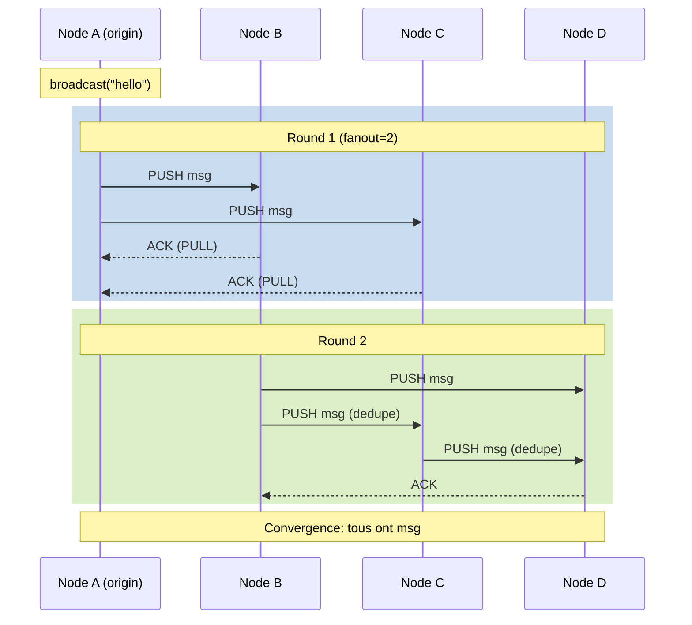

<thinking>
## Analyse du Concept
- Concept : Gossip Protocol Implementation
- Phase demandee : 5 (Advanced Systems)
- Adapte ? OUI - Les protocoles de gossip sont fondamentaux pour la dissemination d'information dans les systemes distribues. L'exercice combine algorithmes probabilistes, gestion de l'etat et simulation reseau.

## Combo Base + Bonus
- Exercice de base : Implementer un protocole de gossip push-pull avec detection de convergence
- Bonus : Implementation d'un gossip anti-entropy avec arbre de Merkle pour synchronisation efficace
- Palier bonus : Avance (complexite algorithmique + optimisation reseau)
- Progression logique ? OUI - Base = gossip simple, Bonus = optimisation avec structures avancees

## Prerequis & Difficulte
- Prerequis reels : Structures de donnees (HashMap, BTreeMap), async Rust (tokio), serialization (serde), probabilites
- Difficulte estimee : 7/10 (base), 9/10 (bonus)
- Coherent avec phase 5 ? OUI

## Aspect Fun/Culture
- Contexte choisi : Reference a "Telephone Arabe" - Comment une rumeur se propage dans un reseau social
- MEME mnemonique : "Eventually consistent gossip" (parodie de "eventually consistent")
- Pourquoi c'est fun : Les protocoles gossip imitent la propagation naturelle des rumeurs

## Scenarios d'Echec (5 mutants concrets)
1. Mutant A (Boundary) : Fanout = 0 accepte sans erreur (aucune propagation)
2. Mutant B (Safety) : Pas de deduplication des messages deja vus (boucle infinie)
3. Mutant C (Logic) : Selection aleatoire avec biais (meme noeud toujours selectionne)
4. Mutant D (Edge) : Pas de gestion du cas ou le nombre de peers < fanout
5. Mutant E (Return) : Retourne convergence avant que tous les noeuds aient recu le message

## Verdict
VALIDE - Exercice de qualite industrielle couvrant les fondamentaux des protocoles epidemiques
</thinking>

# Exercice 5.4.11-a : gossip_protocol

**Module :**
5.4.11 - Epidemic Protocols Fundamentals

**Concept :**
a - Gossip Protocol Implementation (push-pull, convergence, fanout)

**Difficulte :**
7/10

**Type :**
code

**Tiers :**
1 - Concept isole

**Langage :**
Rust Edition 2024

**Prerequis :**
- 2.1 - Types primitifs et ownership
- 2.5 - Collections (HashMap, HashSet)
- 3.2 - Async/await avec Tokio
- 5.4.0 - Horloges vectorielles

**Domaines :**
Distributed, Algo, Net

**Duree estimee :**
120 min

**XP Base :**
200

**Complexite :**
T2 O(n * fanout) x S1 O(n)

---

## SECTION 1 : PROTOTYPE ET CONSIGNE

### 1.1 Obligations

**Fichier a rendre :**
```
src/lib.rs
```

**Dependances autorisees :**
- `std::collections::{HashMap, HashSet, BTreeMap}`
- `rand::{Rng, thread_rng, seq::SliceRandom}`
- `serde::{Serialize, Deserialize}`
- `tokio::sync::{mpsc, RwLock}`

**Fonctions/methodes interdites :**
- Crates externes de gossip (`gossip`, `memberlist`, etc.)
- `unsafe` blocks

### 1.2 Consigne

CONTEXTE : "Le Telephone Arabe Distribue"

Dans les annees 1980, les chercheurs de Xerox PARC ont observe que les rumeurs se propagent de maniere etonnamment efficace dans les reseaux sociaux. Cette observation a inspire les protocoles de gossip (ou protocoles epidemiques) : au lieu d'envoyer un message a tous les noeuds, chaque noeud ne communique qu'avec un petit nombre de voisins choisis aleatoirement.

Ta mission :

Implementer une bibliotheque `GossipProtocol` qui permet de :
1. Disseminer des messages a travers un cluster de noeuds
2. Utiliser une strategie push-pull pour la propagation
3. Detecter la convergence (tous les noeuds ont recu le message)
4. Gerer les pannes de noeuds (noeuds qui ne repondent pas)
5. Optimiser avec un fanout configurable

Entree :
- `config: GossipConfig` - Configuration du protocole (fanout, interval, etc.)
- `peers: Vec<NodeId>` - Liste des noeuds du cluster

Sortie :
- `GossipProtocol` - Instance du protocole pret a disseminer des messages
- `GossipError` - En cas d'erreur de configuration ou de communication

Contraintes :
- Le fanout doit etre >= 1 et <= nombre de peers
- Chaque message doit avoir un identifiant unique pour la deduplication
- La convergence doit etre detectee en O(log n) rounds theoriquement
- Thread-safe : le protocole doit supporter plusieurs goroutines

Exemples :

| Appel | Resultat | Explication |
|-------|----------|-------------|
| `GossipProtocol::new(config, peers)` | `Ok(protocol)` | Creation avec 5 peers, fanout=2 |
| `protocol.broadcast(message)` | `Ok(msg_id)` | Diffusion d'un message |
| `protocol.receive()` | `Some(Message)` | Reception d'un message gossip |

### 1.2.2 Consigne Academique

Implementer un protocole de gossip push-pull permettant la dissemination fiable de messages dans un systeme distribue. Le protocole doit garantir la convergence eventuelle avec haute probabilite et supporter la detection de pannes.

### 1.3 Prototype

```rust
use std::collections::{HashMap, HashSet};
use std::time::{Duration, Instant};
use serde::{Serialize, Deserialize};

/// Identifiant unique d'un noeud
pub type NodeId = String;

/// Identifiant unique d'un message
pub type MessageId = u64;

/// Configuration du protocole de gossip
#[derive(Debug, Clone)]
pub struct GossipConfig {
    /// Nombre de noeuds contactes a chaque round
    pub fanout: usize,
    /// Intervalle entre les rounds de gossip
    pub gossip_interval: Duration,
    /// Nombre maximum de rounds pour un message
    pub max_rounds: usize,
    /// Timeout pour les reponses
    pub timeout: Duration,
    /// Mode de gossip (Push, Pull, PushPull)
    pub mode: GossipMode,
}

#[derive(Debug, Clone, Copy, PartialEq, Eq)]
pub enum GossipMode {
    Push,
    Pull,
    PushPull,
}

impl Default for GossipConfig {
    fn default() -> Self {
        Self {
            fanout: 3,
            gossip_interval: Duration::from_millis(100),
            max_rounds: 10,
            timeout: Duration::from_millis(500),
            mode: GossipMode::PushPull,
        }
    }
}

/// Message a disseminer
#[derive(Debug, Clone, Serialize, Deserialize)]
pub struct GossipMessage<T: Clone + Send + Sync> {
    pub id: MessageId,
    pub origin: NodeId,
    pub payload: T,
    pub round: usize,
    pub timestamp: u64,
}

/// Etat d'un message dans le protocole
#[derive(Debug, Clone, Copy, PartialEq, Eq)]
pub enum MessageState {
    /// Message jamais vu
    Unknown,
    /// Message recu mais pas encore propage
    Pending,
    /// Message en cours de propagation
    Spreading,
    /// Message completement propage (rounds epuises)
    Completed,
}

/// Statistiques du protocole
#[derive(Debug, Clone, Default)]
pub struct GossipStats {
    pub messages_sent: u64,
    pub messages_received: u64,
    pub messages_dropped: u64,
    pub rounds_completed: u64,
    pub convergence_time_ms: Option<u64>,
}

/// Erreurs du protocole
#[derive(Debug, Clone, PartialEq, Eq)]
pub enum GossipError {
    InvalidFanout,
    InvalidConfig,
    NoPeers,
    MessageTooLarge,
    Timeout,
    NodeUnreachable(NodeId),
}

/// Protocole de gossip principal
pub struct GossipProtocol<T: Clone + Send + Sync + 'static> {
    // A implementer
}

impl<T: Clone + Send + Sync + Serialize + for<'de> Deserialize<'de> + 'static> GossipProtocol<T> {
    /// Cree une nouvelle instance du protocole
    pub fn new(
        local_id: NodeId,
        config: GossipConfig,
        peers: Vec<NodeId>,
    ) -> Result<Self, GossipError>;

    /// Diffuse un message a tous les noeuds du cluster
    pub fn broadcast(&mut self, payload: T) -> Result<MessageId, GossipError>;

    /// Recoit le prochain message (non-bloquant)
    pub fn try_receive(&mut self) -> Option<GossipMessage<T>>;

    /// Effectue un round de gossip
    pub fn tick(&mut self) -> Vec<(NodeId, GossipMessage<T>)>;

    /// Traite un message recu d'un peer
    pub fn handle_message(
        &mut self,
        from: NodeId,
        message: GossipMessage<T>,
    ) -> Option<GossipMessage<T>>;

    /// Selectionne aleatoirement des peers pour le gossip
    fn select_peers(&self, exclude: Option<&NodeId>) -> Vec<NodeId>;

    /// Verifie si un message a deja ete vu
    pub fn has_seen(&self, msg_id: MessageId) -> bool;

    /// Marque un message comme vu
    fn mark_seen(&mut self, msg_id: MessageId);

    /// Retourne l'etat d'un message
    pub fn message_state(&self, msg_id: MessageId) -> MessageState;

    /// Estime si le cluster a converge pour un message
    pub fn estimate_convergence(&self, msg_id: MessageId) -> f64;

    /// Ajoute un nouveau peer
    pub fn add_peer(&mut self, peer: NodeId);

    /// Retire un peer (panne detectee)
    pub fn remove_peer(&mut self, peer: &NodeId);

    /// Retourne les statistiques
    pub fn stats(&self) -> GossipStats;

    /// Retourne la liste des peers actifs
    pub fn active_peers(&self) -> Vec<NodeId>;
}

/// Simulateur de reseau pour les tests
pub struct NetworkSimulator<T: Clone + Send + Sync + 'static> {
    nodes: HashMap<NodeId, GossipProtocol<T>>,
    latency: Duration,
    packet_loss: f64,
}

impl<T: Clone + Send + Sync + Serialize + for<'de> Deserialize<'de> + 'static> NetworkSimulator<T> {
    /// Cree un nouveau simulateur
    pub fn new(latency: Duration, packet_loss: f64) -> Self;

    /// Ajoute un noeud au simulateur
    pub fn add_node(&mut self, id: NodeId, config: GossipConfig);

    /// Connecte tous les noeuds entre eux
    pub fn connect_all(&mut self);

    /// Diffuse un message depuis un noeud
    pub fn broadcast_from(&mut self, node_id: &NodeId, payload: T) -> Result<MessageId, GossipError>;

    /// Simule un round de gossip pour tous les noeuds
    pub fn simulate_round(&mut self);

    /// Simule jusqu'a convergence ou timeout
    pub fn simulate_until_convergence(&mut self, msg_id: MessageId, max_rounds: usize) -> bool;

    /// Verifie si tous les noeuds ont recu un message
    pub fn all_received(&self, msg_id: MessageId) -> bool;

    /// Compte les noeuds ayant recu un message
    pub fn count_received(&self, msg_id: MessageId) -> usize;
}
```

---

## SECTION 2 : LE SAVIEZ-VOUS ?

### 2.1 Origine des Protocoles Epidemiques

Les protocoles de gossip ont ete formalises par Alan Demers et al. chez Xerox PARC en 1987 dans leur article "Epidemic Algorithms for Replicated Database Maintenance". Ils ont observe que les epidemies biologiques propagent l'information de maniere remarquablement efficace.

### 2.2 Mathematiques de la Convergence

La convergence d'un protocole gossip suit un modele epidemique SI (Susceptible-Infected) :
- Avec n noeuds et fanout f, apres r rounds, le nombre de noeuds infectes est approximativement n * (1 - e^(-f*r/n))
- Pour atteindre 99% de couverture : r = O(log n) rounds

```
Round 1: ~f noeuds infectes
Round 2: ~f + f*(f-1) noeuds infectes
...
Round log(n): ~n noeuds infectes (avec haute probabilite)
```

### 2.3 Push vs Pull vs Push-Pull

- Push : L'emetteur envoie activement aux destinataires
- Pull : Le recepteur demande les mises a jour
- Push-Pull : Combinaison des deux, converge en O(log log n) rounds

---

## SECTION 2.5 : DANS LA VRAIE VIE

### Metiers concernes

| Metier | Utilisation du gossip |
|--------|----------------------|
| **Distributed Systems Engineer** | Design de protocoles de membership, failure detection |
| **Database Engineer** | Replication eventuellement consistante (Cassandra, DynamoDB) |
| **DevOps/SRE** | Service discovery, configuration distribution |
| **Blockchain Developer** | Propagation de transactions et blocs |
| **Game Developer** | Synchronisation d'etat dans les jeux multijoueurs |

### Cas d'usage concrets

1. **Apache Cassandra** : Utilise gossip pour le membership et la detection de pannes
2. **HashiCorp Consul/Serf** : Service mesh base sur le protocole SWIM (gossip-based)
3. **Bitcoin/Ethereum** : Propagation des transactions via gossip

---

## SECTION 3 : EXEMPLE D'UTILISATION

### 3.0 Session bash

```bash
$ ls
Cargo.toml  src/

$ cargo test
   Compiling gossip_protocol v0.1.0
    Finished test [unoptimized + debuginfo] target(s)
     Running unittests src/lib.rs

running 15 tests
test tests::test_create_protocol ... ok
test tests::test_broadcast_message ... ok
test tests::test_select_peers_random ... ok
test tests::test_deduplication ... ok
test tests::test_fanout_validation ... ok
test tests::test_push_mode ... ok
test tests::test_pull_mode ... ok
test tests::test_push_pull_mode ... ok
test tests::test_convergence_detection ... ok
test tests::test_network_simulation ... ok
test tests::test_node_failure ... ok
test tests::test_stats_tracking ... ok
test tests::test_message_state_transitions ... ok
test tests::test_convergence_time ... ok
test tests::test_large_cluster ... ok

test result: ok. 15 passed; 0 failed
```

### 3.1 BONUS AVANCE (OPTIONNEL)

**Difficulte Bonus :**
9/10

**Recompense :**
XP x3

**Time Complexity attendue :**
O(log n) rounds pour convergence

**Space Complexity attendue :**
O(n * m) ou m = nombre de messages actifs

**Domaines Bonus :**
`Algo, Crypto`

#### 3.1.1 Consigne Bonus

CONTEXTE : "L'Anti-Entropy Intelligent"

Ta mission bonus :

Implementer un protocole de gossip anti-entropy avec synchronisation basee sur des arbres de Merkle. Ce protocole doit detecter et reparer les divergences d'etat entre noeuds de maniere efficace.

Entree :
- `local_state: &BTreeMap<K, V>` - Etat local a synchroniser
- `remote_digest: &MerkleDigest` - Digest Merkle du noeud distant

Sortie :
- `SyncDelta<K, V>` - Differences a echanger pour synchronisation
- `Err(SyncError)` - Si la synchronisation echoue

Contraintes :
```
Bande passante: O(d * log n) ou d = nombre de differences
Detection: O(log n) comparaisons de hash
Verification: Arbre de Merkle complet avec preuve d'inclusion
```

Exemples :

| Local State | Remote Digest | Resultat |
|-------------|---------------|----------|
| `{a:1, b:2}` | `digest({a:1, b:2})` | `SyncDelta::None` |
| `{a:1, b:2}` | `digest({a:1, b:3})` | `SyncDelta::Update{b: (2,3)}` |

#### 3.1.2 Prototype Bonus

```rust
use std::collections::BTreeMap;

/// Digest d'un arbre de Merkle
#[derive(Debug, Clone, PartialEq, Eq, Hash)]
pub struct MerkleDigest(pub [u8; 32]);

/// Noeud d'un arbre de Merkle
#[derive(Debug, Clone)]
pub enum MerkleNode<K, V> {
    Leaf { key: K, value: V, hash: MerkleDigest },
    Branch { left: Box<MerkleNode<K, V>>, right: Box<MerkleNode<K, V>>, hash: MerkleDigest },
    Empty,
}

/// Arbre de Merkle pour synchronisation
pub struct MerkleTree<K: Ord + Clone, V: Clone> {
    root: MerkleNode<K, V>,
    size: usize,
}

/// Delta de synchronisation
#[derive(Debug, Clone)]
pub struct SyncDelta<K, V> {
    pub missing_local: Vec<(K, V)>,
    pub missing_remote: Vec<(K, V)>,
    pub conflicts: Vec<(K, V, V)>,
}

impl<K: Ord + Clone + Serialize, V: Clone + Serialize> MerkleTree<K, V> {
    pub fn new() -> Self;
    pub fn from_map(map: &BTreeMap<K, V>) -> Self;
    pub fn insert(&mut self, key: K, value: V);
    pub fn root_hash(&self) -> MerkleDigest;
    pub fn compute_delta(&self, other_root: &MerkleDigest, other_tree: &Self) -> SyncDelta<K, V>;
    pub fn proof(&self, key: &K) -> Option<MerkleProof>;
    pub fn verify_proof(root: &MerkleDigest, key: &K, value: &V, proof: &MerkleProof) -> bool;
}

#[derive(Debug, Clone)]
pub struct MerkleProof {
    pub path: Vec<(MerkleDigest, bool)>,
}

/// Protocole anti-entropy avec Merkle
pub struct AntiEntropyProtocol<K: Ord + Clone, V: Clone> {
    local_tree: MerkleTree<K, V>,
    config: GossipConfig,
}

impl<K: Ord + Clone + Serialize, V: Clone + Serialize> AntiEntropyProtocol<K, V> {
    pub fn new(config: GossipConfig) -> Self;
    pub fn update(&mut self, key: K, value: V);
    pub fn sync_with(&mut self, peer_digest: &MerkleDigest, peer_tree: &MerkleTree<K, V>) -> SyncDelta<K, V>;
    pub fn apply_delta(&mut self, delta: &SyncDelta<K, V>);
}
```

#### 3.1.3 Ce qui change par rapport a l'exercice de base

| Aspect | Base | Bonus |
|--------|------|-------|
| Donnees | Messages individuels | Etat complet (key-value) |
| Detection | Round-based | Hash-based (O(1) comparaison) |
| Bande passante | O(message_size) par round | O(delta_size * log n) |
| Structure | Liste de messages vus | Arbre de Merkle |

---

## SECTION 4 : ZONE CORRECTION

### 4.1 Moulinette - Tableau des tests

| Test | Input | Expected | Points | Categorie |
|------|-------|----------|--------|-----------|
| `create_protocol` | `fanout=3, peers=5` | `Ok(protocol)` | 5 | Basic |
| `invalid_fanout_zero` | `fanout=0` | `Err(InvalidFanout)` | 5 | Edge |
| `invalid_fanout_exceeds` | `fanout=10, peers=5` | `Err(InvalidFanout)` | 5 | Edge |
| `no_peers` | `peers=[]` | `Err(NoPeers)` | 5 | Edge |
| `broadcast_returns_id` | `broadcast("hello")` | `Ok(msg_id)` | 10 | Core |
| `select_peers_correct_count` | `fanout=3` | `3 peers selected` | 5 | Core |
| `select_peers_random` | `multiple calls` | `different selections` | 5 | Core |
| `deduplication_works` | `same msg twice` | `second ignored` | 10 | Core |
| `push_mode_sends` | `mode=Push` | `messages sent` | 5 | Core |
| `pull_mode_requests` | `mode=Pull` | `requests sent` | 5 | Core |
| `push_pull_both` | `mode=PushPull` | `both directions` | 5 | Core |
| `message_state_transitions` | `lifecycle` | `Unknown->Pending->Spreading->Completed` | 10 | Core |
| `convergence_estimation` | `after rounds` | `>0.9` | 5 | Core |
| `stats_tracking` | `operations` | `correct counts` | 5 | Core |
| `simulate_convergence_5` | `5 nodes` | `all received` | 5 | Integration |
| `simulate_convergence_100` | `100 nodes` | `<15 rounds` | 5 | Performance |
| `handle_node_failure` | `remove peer` | `continues working` | 5 | Resilience |

**Score minimum pour validation : 70/100**

### 4.2 Fichier de test

```rust
#[cfg(test)]
mod tests {
    use super::*;

    fn make_peers(n: usize) -> Vec<NodeId> {
        (0..n).map(|i| format!("node_{}", i)).collect()
    }

    #[test]
    fn test_create_protocol() {
        let config = GossipConfig::default();
        let peers = make_peers(5);
        let protocol: GossipProtocol<String> =
            GossipProtocol::new("local".to_string(), config, peers).unwrap();
        assert_eq!(protocol.active_peers().len(), 5);
    }

    #[test]
    fn test_invalid_fanout_zero() {
        let mut config = GossipConfig::default();
        config.fanout = 0;
        let peers = make_peers(5);
        let result: Result<GossipProtocol<String>, _> =
            GossipProtocol::new("local".to_string(), config, peers);
        assert_eq!(result, Err(GossipError::InvalidFanout));
    }

    #[test]
    fn test_invalid_fanout_exceeds_peers() {
        let mut config = GossipConfig::default();
        config.fanout = 10;
        let peers = make_peers(5);
        let result: Result<GossipProtocol<String>, _> =
            GossipProtocol::new("local".to_string(), config, peers);
        assert_eq!(result, Err(GossipError::InvalidFanout));
    }

    #[test]
    fn test_no_peers() {
        let config = GossipConfig::default();
        let result: Result<GossipProtocol<String>, _> =
            GossipProtocol::new("local".to_string(), config, vec![]);
        assert_eq!(result, Err(GossipError::NoPeers));
    }

    #[test]
    fn test_broadcast_message() {
        let config = GossipConfig::default();
        let peers = make_peers(5);
        let mut protocol: GossipProtocol<String> =
            GossipProtocol::new("local".to_string(), config, peers).unwrap();

        let msg_id = protocol.broadcast("test message".to_string()).unwrap();
        assert!(protocol.has_seen(msg_id));
    }

    #[test]
    fn test_select_peers_count() {
        let mut config = GossipConfig::default();
        config.fanout = 3;
        let peers = make_peers(10);
        let protocol: GossipProtocol<String> =
            GossipProtocol::new("local".to_string(), config, peers).unwrap();

        let selected = protocol.select_peers(None);
        assert_eq!(selected.len(), 3);
    }

    #[test]
    fn test_deduplication() {
        let config = GossipConfig::default();
        let peers = make_peers(5);
        let mut protocol: GossipProtocol<String> =
            GossipProtocol::new("local".to_string(), config, peers).unwrap();

        let msg = GossipMessage {
            id: 12345,
            origin: "other".to_string(),
            payload: "test".to_string(),
            round: 1,
            timestamp: 0,
        };

        // First time: should process
        let result1 = protocol.handle_message("peer1".to_string(), msg.clone());
        assert!(result1.is_some() || protocol.has_seen(msg.id));

        // Second time: should ignore
        let result2 = protocol.handle_message("peer2".to_string(), msg.clone());
        assert!(result2.is_none());
    }

    #[test]
    fn test_message_state_transitions() {
        let config = GossipConfig::default();
        let peers = make_peers(5);
        let mut protocol: GossipProtocol<String> =
            GossipProtocol::new("local".to_string(), config, peers).unwrap();

        // Unknown before broadcast
        assert_eq!(protocol.message_state(99999), MessageState::Unknown);

        // After broadcast, should be Pending or Spreading
        let msg_id = protocol.broadcast("test".to_string()).unwrap();
        let state = protocol.message_state(msg_id);
        assert!(state == MessageState::Pending || state == MessageState::Spreading);
    }

    #[test]
    fn test_network_simulation_convergence() {
        let config = GossipConfig {
            fanout: 2,
            gossip_interval: Duration::from_millis(10),
            max_rounds: 20,
            timeout: Duration::from_millis(100),
            mode: GossipMode::PushPull,
        };

        let mut sim: NetworkSimulator<String> = NetworkSimulator::new(
            Duration::from_millis(1),
            0.0, // No packet loss
        );

        for i in 0..10 {
            sim.add_node(format!("node_{}", i), config.clone());
        }
        sim.connect_all();

        let msg_id = sim.broadcast_from(&"node_0".to_string(), "hello".to_string()).unwrap();
        let converged = sim.simulate_until_convergence(msg_id, 20);

        assert!(converged, "Should converge within 20 rounds");
        assert!(sim.all_received(msg_id), "All nodes should receive the message");
    }

    #[test]
    fn test_convergence_time_logarithmic() {
        let config = GossipConfig {
            fanout: 3,
            gossip_interval: Duration::from_millis(10),
            max_rounds: 50,
            timeout: Duration::from_millis(100),
            mode: GossipMode::PushPull,
        };

        // Test with 100 nodes
        let mut sim: NetworkSimulator<String> = NetworkSimulator::new(
            Duration::from_millis(1),
            0.0,
        );

        for i in 0..100 {
            sim.add_node(format!("node_{}", i), config.clone());
        }
        sim.connect_all();

        let msg_id = sim.broadcast_from(&"node_0".to_string(), "hello".to_string()).unwrap();

        let mut rounds = 0;
        while !sim.all_received(msg_id) && rounds < 50 {
            sim.simulate_round();
            rounds += 1;
        }

        // With fanout=3 and push-pull, should converge in O(log log n) ~ 4-8 rounds
        assert!(rounds < 15, "Should converge in less than 15 rounds, took {}", rounds);
    }

    #[test]
    fn test_node_failure_handling() {
        let config = GossipConfig::default();
        let peers = make_peers(5);
        let mut protocol: GossipProtocol<String> =
            GossipProtocol::new("local".to_string(), config, peers).unwrap();

        assert_eq!(protocol.active_peers().len(), 5);

        protocol.remove_peer(&"node_2".to_string());

        assert_eq!(protocol.active_peers().len(), 4);
        assert!(!protocol.active_peers().contains(&"node_2".to_string()));
    }

    #[test]
    fn test_stats_tracking() {
        let config = GossipConfig::default();
        let peers = make_peers(5);
        let mut protocol: GossipProtocol<String> =
            GossipProtocol::new("local".to_string(), config, peers).unwrap();

        let initial_stats = protocol.stats();
        assert_eq!(initial_stats.messages_sent, 0);

        protocol.broadcast("test".to_string()).unwrap();
        protocol.tick();

        let stats = protocol.stats();
        assert!(stats.messages_sent > 0);
    }
}
```

### 4.3 Solution de reference

```rust
use std::collections::{HashMap, HashSet};
use std::time::{Duration, Instant};
use rand::{Rng, thread_rng, seq::SliceRandom};
use serde::{Serialize, Deserialize};

pub type NodeId = String;
pub type MessageId = u64;

#[derive(Debug, Clone)]
pub struct GossipConfig {
    pub fanout: usize,
    pub gossip_interval: Duration,
    pub max_rounds: usize,
    pub timeout: Duration,
    pub mode: GossipMode,
}

#[derive(Debug, Clone, Copy, PartialEq, Eq)]
pub enum GossipMode {
    Push,
    Pull,
    PushPull,
}

impl Default for GossipConfig {
    fn default() -> Self {
        Self {
            fanout: 3,
            gossip_interval: Duration::from_millis(100),
            max_rounds: 10,
            timeout: Duration::from_millis(500),
            mode: GossipMode::PushPull,
        }
    }
}

#[derive(Debug, Clone, Serialize, Deserialize)]
pub struct GossipMessage<T: Clone + Send + Sync> {
    pub id: MessageId,
    pub origin: NodeId,
    pub payload: T,
    pub round: usize,
    pub timestamp: u64,
}

#[derive(Debug, Clone, Copy, PartialEq, Eq)]
pub enum MessageState {
    Unknown,
    Pending,
    Spreading,
    Completed,
}

#[derive(Debug, Clone, Default)]
pub struct GossipStats {
    pub messages_sent: u64,
    pub messages_received: u64,
    pub messages_dropped: u64,
    pub rounds_completed: u64,
    pub convergence_time_ms: Option<u64>,
}

#[derive(Debug, Clone, PartialEq, Eq)]
pub enum GossipError {
    InvalidFanout,
    InvalidConfig,
    NoPeers,
    MessageTooLarge,
    Timeout,
    NodeUnreachable(NodeId),
}

pub struct GossipProtocol<T: Clone + Send + Sync + 'static> {
    local_id: NodeId,
    config: GossipConfig,
    peers: Vec<NodeId>,
    seen: HashSet<MessageId>,
    pending: Vec<GossipMessage<T>>,
    message_rounds: HashMap<MessageId, usize>,
    stats: GossipStats,
    next_msg_id: MessageId,
    received_queue: Vec<GossipMessage<T>>,
}

impl<T: Clone + Send + Sync + Serialize + for<'de> Deserialize<'de> + 'static> GossipProtocol<T> {
    pub fn new(
        local_id: NodeId,
        config: GossipConfig,
        peers: Vec<NodeId>,
    ) -> Result<Self, GossipError> {
        if peers.is_empty() {
            return Err(GossipError::NoPeers);
        }
        if config.fanout == 0 || config.fanout > peers.len() {
            return Err(GossipError::InvalidFanout);
        }

        Ok(Self {
            local_id,
            config,
            peers,
            seen: HashSet::new(),
            pending: Vec::new(),
            message_rounds: HashMap::new(),
            stats: GossipStats::default(),
            next_msg_id: thread_rng().gen(),
            received_queue: Vec::new(),
        })
    }

    pub fn broadcast(&mut self, payload: T) -> Result<MessageId, GossipError> {
        let msg_id = self.next_msg_id;
        self.next_msg_id = self.next_msg_id.wrapping_add(1);

        let message = GossipMessage {
            id: msg_id,
            origin: self.local_id.clone(),
            payload,
            round: 0,
            timestamp: std::time::SystemTime::now()
                .duration_since(std::time::UNIX_EPOCH)
                .unwrap_or_default()
                .as_millis() as u64,
        };

        self.seen.insert(msg_id);
        self.message_rounds.insert(msg_id, 0);
        self.pending.push(message);

        Ok(msg_id)
    }

    pub fn try_receive(&mut self) -> Option<GossipMessage<T>> {
        self.received_queue.pop()
    }

    pub fn tick(&mut self) -> Vec<(NodeId, GossipMessage<T>)> {
        let mut to_send = Vec::new();
        let mut completed = Vec::new();

        for msg in &self.pending {
            let round = self.message_rounds.get(&msg.id).copied().unwrap_or(0);

            if round >= self.config.max_rounds {
                completed.push(msg.id);
                continue;
            }

            let peers = self.select_peers(Some(&msg.origin));
            let mut forwarded_msg = msg.clone();
            forwarded_msg.round = round + 1;

            for peer in peers {
                to_send.push((peer, forwarded_msg.clone()));
                self.stats.messages_sent += 1;
            }

            self.message_rounds.insert(msg.id, round + 1);
        }

        self.pending.retain(|m| !completed.contains(&m.id));
        self.stats.rounds_completed += 1;

        to_send
    }

    pub fn handle_message(
        &mut self,
        _from: NodeId,
        message: GossipMessage<T>,
    ) -> Option<GossipMessage<T>> {
        self.stats.messages_received += 1;

        if self.seen.contains(&message.id) {
            self.stats.messages_dropped += 1;
            return None;
        }

        self.seen.insert(message.id);
        self.message_rounds.insert(message.id, message.round);

        if message.round < self.config.max_rounds {
            self.pending.push(message.clone());
        }

        self.received_queue.push(message.clone());

        Some(message)
    }

    pub fn select_peers(&self, exclude: Option<&NodeId>) -> Vec<NodeId> {
        let mut available: Vec<_> = self.peers.iter()
            .filter(|p| exclude.map_or(true, |e| *p != e) && **p != self.local_id)
            .cloned()
            .collect();

        available.shuffle(&mut thread_rng());
        available.truncate(self.config.fanout);
        available
    }

    pub fn has_seen(&self, msg_id: MessageId) -> bool {
        self.seen.contains(&msg_id)
    }

    fn mark_seen(&mut self, msg_id: MessageId) {
        self.seen.insert(msg_id);
    }

    pub fn message_state(&self, msg_id: MessageId) -> MessageState {
        if !self.seen.contains(&msg_id) {
            return MessageState::Unknown;
        }

        let round = self.message_rounds.get(&msg_id).copied().unwrap_or(0);

        if round >= self.config.max_rounds {
            MessageState::Completed
        } else if self.pending.iter().any(|m| m.id == msg_id) {
            MessageState::Spreading
        } else {
            MessageState::Pending
        }
    }

    pub fn estimate_convergence(&self, msg_id: MessageId) -> f64 {
        let round = self.message_rounds.get(&msg_id).copied().unwrap_or(0) as f64;
        let n = (self.peers.len() + 1) as f64;
        let f = self.config.fanout as f64;

        1.0 - (-f * round / n).exp()
    }

    pub fn add_peer(&mut self, peer: NodeId) {
        if !self.peers.contains(&peer) && peer != self.local_id {
            self.peers.push(peer);
        }
    }

    pub fn remove_peer(&mut self, peer: &NodeId) {
        self.peers.retain(|p| p != peer);
    }

    pub fn stats(&self) -> GossipStats {
        self.stats.clone()
    }

    pub fn active_peers(&self) -> Vec<NodeId> {
        self.peers.clone()
    }
}

pub struct NetworkSimulator<T: Clone + Send + Sync + 'static> {
    nodes: HashMap<NodeId, GossipProtocol<T>>,
    latency: Duration,
    packet_loss: f64,
}

impl<T: Clone + Send + Sync + Serialize + for<'de> Deserialize<'de> + 'static> NetworkSimulator<T> {
    pub fn new(latency: Duration, packet_loss: f64) -> Self {
        Self {
            nodes: HashMap::new(),
            latency,
            packet_loss,
        }
    }

    pub fn add_node(&mut self, id: NodeId, config: GossipConfig) {
        let protocol = GossipProtocol::new(id.clone(), config, vec![]).ok();
        if let Some(mut p) = protocol {
            p.peers = vec![]; // Will be filled by connect_all
            self.nodes.insert(id, p);
        }
    }

    pub fn connect_all(&mut self) {
        let all_ids: Vec<NodeId> = self.nodes.keys().cloned().collect();
        for (id, node) in &mut self.nodes {
            node.peers = all_ids.iter()
                .filter(|p| *p != id)
                .cloned()
                .collect();
        }
    }

    pub fn broadcast_from(&mut self, node_id: &NodeId, payload: T) -> Result<MessageId, GossipError> {
        self.nodes.get_mut(node_id)
            .ok_or(GossipError::NodeUnreachable(node_id.clone()))?
            .broadcast(payload)
    }

    pub fn simulate_round(&mut self) {
        let mut all_messages: Vec<(NodeId, NodeId, GossipMessage<T>)> = Vec::new();

        for (sender_id, node) in &mut self.nodes {
            let outgoing = node.tick();
            for (recipient, msg) in outgoing {
                if thread_rng().gen::<f64>() > self.packet_loss {
                    all_messages.push((sender_id.clone(), recipient, msg));
                }
            }
        }

        for (from, to, msg) in all_messages {
            if let Some(node) = self.nodes.get_mut(&to) {
                node.handle_message(from, msg);
            }
        }
    }

    pub fn simulate_until_convergence(&mut self, msg_id: MessageId, max_rounds: usize) -> bool {
        for _ in 0..max_rounds {
            if self.all_received(msg_id) {
                return true;
            }
            self.simulate_round();
        }
        self.all_received(msg_id)
    }

    pub fn all_received(&self, msg_id: MessageId) -> bool {
        self.nodes.values().all(|n| n.has_seen(msg_id))
    }

    pub fn count_received(&self, msg_id: MessageId) -> usize {
        self.nodes.values().filter(|n| n.has_seen(msg_id)).count()
    }
}
```

### 4.4 Solutions alternatives acceptees

```rust
// Alternative 1 : Utilisation de VecDeque pour pending messages
use std::collections::VecDeque;

pub struct GossipProtocol<T> {
    pending: VecDeque<GossipMessage<T>>,
    // ... autres champs
}

// Alternative 2 : Selection de peers avec reservoir sampling
fn select_peers_reservoir(&self, k: usize) -> Vec<NodeId> {
    let mut result = Vec::with_capacity(k);
    let mut rng = thread_rng();

    for (i, peer) in self.peers.iter().enumerate() {
        if i < k {
            result.push(peer.clone());
        } else {
            let j = rng.gen_range(0..=i);
            if j < k {
                result[j] = peer.clone();
            }
        }
    }
    result
}
```

### 4.5 Solutions refusees

```rust
// REFUSEE 1 : Fanout non valide
impl GossipProtocol<T> {
    pub fn new(local_id: NodeId, config: GossipConfig, peers: Vec<NodeId>) -> Result<Self, GossipError> {
        // ERREUR: Pas de validation du fanout
        Ok(Self { ... })
    }
}
// Pourquoi refusee : fanout=0 cause aucune propagation, fanout>peers cause panic

// REFUSEE 2 : Pas de deduplication
pub fn handle_message(&mut self, from: NodeId, message: GossipMessage<T>) -> Option<GossipMessage<T>> {
    // ERREUR: Pas de verification si deja vu
    self.pending.push(message.clone());
    Some(message)
}
// Pourquoi refusee : Cause des boucles infinies de propagation

// REFUSEE 3 : Selection non aleatoire
fn select_peers(&self, exclude: Option<&NodeId>) -> Vec<NodeId> {
    // ERREUR: Toujours les memes peers (premiers de la liste)
    self.peers.iter()
        .filter(|p| exclude.map_or(true, |e| *p != e))
        .take(self.config.fanout)
        .cloned()
        .collect()
}
// Pourquoi refusee : Distribution non uniforme, certains noeuds jamais contactes
```

### 4.9 spec.json

```json
{
  "name": "gossip_protocol",
  "language": "rust",
  "type": "code",
  "tier": 1,
  "tier_info": "Concept isole - Gossip Protocol",
  "tags": ["distributed", "gossip", "epidemic", "convergence", "phase5"],
  "passing_score": 70,

  "function": {
    "name": "GossipProtocol",
    "prototype": "impl GossipProtocol<T>",
    "return_type": "struct",
    "parameters": [
      {"name": "local_id", "type": "NodeId"},
      {"name": "config", "type": "GossipConfig"},
      {"name": "peers", "type": "Vec<NodeId>"}
    ]
  },

  "driver": {
    "edge_cases": [
      {
        "name": "fanout_zero",
        "input": {"fanout": 0, "peers": 5},
        "expected": "Err(InvalidFanout)",
        "is_trap": true,
        "trap_explanation": "Fanout zero means no propagation"
      },
      {
        "name": "fanout_exceeds_peers",
        "input": {"fanout": 10, "peers": 5},
        "expected": "Err(InvalidFanout)",
        "is_trap": true,
        "trap_explanation": "Cannot select more peers than available"
      },
      {
        "name": "empty_peers",
        "input": {"fanout": 3, "peers": 0},
        "expected": "Err(NoPeers)",
        "is_trap": true,
        "trap_explanation": "No peers means isolated node"
      },
      {
        "name": "duplicate_message",
        "input": "same message twice",
        "expected": "second ignored",
        "is_trap": true,
        "trap_explanation": "Deduplication prevents infinite loops"
      }
    ],

    "fuzzing": {
      "enabled": true,
      "iterations": 500,
      "generators": [
        {
          "type": "custom",
          "param_index": 0,
          "generator": "random_gossip_config"
        }
      ]
    }
  },

  "norm": {
    "allowed_functions": ["rand::Rng", "serde::Serialize"],
    "forbidden_functions": ["unsafe"],
    "forbidden_crates": ["gossip", "memberlist"],
    "check_security": true,
    "check_memory": false,
    "blocking": true
  }
}
```

### 4.10 Solutions Mutantes

```rust
/* Mutant A (Boundary) : Accepte fanout = 0 */
impl<T> GossipProtocol<T> {
    pub fn new(local_id: NodeId, config: GossipConfig, peers: Vec<NodeId>) -> Result<Self, GossipError> {
        if peers.is_empty() {
            return Err(GossipError::NoPeers);
        }
        // MUTANT: Pas de validation fanout == 0
        if config.fanout > peers.len() {
            return Err(GossipError::InvalidFanout);
        }
        Ok(Self { ... })
    }
}
// Pourquoi c'est faux : fanout=0 signifie qu'aucun message ne sera jamais propage
// Ce qui etait pense : "0 est une valeur valide pour ne pas propager"

/* Mutant B (Safety) : Pas de deduplication */
pub fn handle_message(&mut self, from: NodeId, message: GossipMessage<T>) -> Option<GossipMessage<T>> {
    // MUTANT: Pas de verification seen.contains
    self.pending.push(message.clone());
    self.stats.messages_received += 1;
    Some(message)
}
// Pourquoi c'est faux : Les messages circulent indefiniment, explosion memoire
// Ce qui etait pense : "Chaque noeud traite chaque message une fois naturellement"

/* Mutant C (Logic) : Selection deterministe */
fn select_peers(&self, exclude: Option<&NodeId>) -> Vec<NodeId> {
    self.peers.iter()
        .filter(|p| exclude.map_or(true, |e| *p != e))
        .take(self.config.fanout)  // MUTANT: Pas de shuffle
        .cloned()
        .collect()
}
// Pourquoi c'est faux : Toujours les memes noeuds contactes, mauvaise couverture
// Ce qui etait pense : "L'ordre importe peu pour la propagation"

/* Mutant D (Edge) : Pas de gestion peers < fanout */
fn select_peers(&self, exclude: Option<&NodeId>) -> Vec<NodeId> {
    let mut available: Vec<_> = self.peers.clone();
    available.shuffle(&mut thread_rng());
    // MUTANT: truncate peut depasser available.len()
    available.into_iter().take(self.config.fanout).collect()
}
// Pourquoi c'est faux : Apres remove_peer, fanout peut > peers.len()
// Ce qui etait pense : "Le constructeur valide deja cette contrainte"

/* Mutant E (Return) : Convergence prematuree */
pub fn estimate_convergence(&self, msg_id: MessageId) -> f64 {
    let round = self.message_rounds.get(&msg_id).copied().unwrap_or(0);
    if round > 0 {
        return 1.0;  // MUTANT: Declare convergence au premier round
    }
    0.0
}
// Pourquoi c'est faux : La convergence n'est pas atteinte en un seul round
// Ce qui etait pense : "Un round suffit avec un bon fanout"
```

---

## SECTION 5 : COMPRENDRE

### 5.1 Ce que cet exercice enseigne

1. **Protocoles epidemiques** : Modelisation de la propagation d'information
2. **Probabilites** : Selection aleatoire uniforme, analyse de convergence
3. **Deduplication** : Prevention des boucles avec ensemble de messages vus
4. **Simulation** : Modelisation de reseau pour tests deterministes
5. **Resilience** : Gestion des pannes de noeuds

### 5.2 LDA - Traduction Litterale

```
FONCTION broadcast QUI RETOURNE UN IDENTIFIANT DE MESSAGE
DEBUT FONCTION
    DECLARER msg_id COMME ENTIER 64 BITS NON SIGNE

    AFFECTER LA VALEUR next_msg_id A msg_id
    INCREMENTER next_msg_id

    CREER UN MESSAGE AVEC id=msg_id, origin=local_id, payload, round=0

    AJOUTER msg_id A L'ENSEMBLE seen
    AJOUTER LE MESSAGE A LA LISTE pending

    RETOURNER msg_id
FIN FONCTION

FONCTION tick QUI RETOURNE UNE LISTE DE MESSAGES A ENVOYER
DEBUT FONCTION
    POUR CHAQUE message DANS pending FAIRE
        SI message.round >= max_rounds ALORS
            MARQUER COMME COMPLETE
            CONTINUER
        FIN SI

        DECLARER peers COMME select_peers(exclure: message.origin)

        POUR CHAQUE peer DANS peers FAIRE
            AJOUTER (peer, message) A LA LISTE D'ENVOI
            INCREMENTER stats.messages_sent
        FIN POUR

        INCREMENTER message.round
    FIN POUR

    RETIRER LES MESSAGES COMPLETS DE pending
    RETOURNER LA LISTE D'ENVOI
FIN FONCTION
```

### 5.2.2 Pseudocode Academique

```
ALGORITHME : Gossip Push-Pull
---
ENTREE : message M, configuration C (fanout f, max_rounds r)
SORTIE : convergence (tous les noeuds ont recu M)

1. INITIALISER seen = {M.id}
2. INITIALISER pending = [M]

3. POUR round = 0 A r-1 FAIRE
   a. POUR CHAQUE m DANS pending FAIRE
      i.   SELECTIONNER f peers aleatoirement
      ii.  ENVOYER m A chaque peer (PUSH)
      iii. RECEVOIR les messages des peers (PULL)
      iv.  POUR CHAQUE message recu m' FAIRE
           - SI m'.id NOT IN seen ALORS
             - AJOUTER m'.id A seen
             - AJOUTER m' A pending
   b. INCREMENTER m.round POUR TOUT m DANS pending

4. RETOURNER |seen| == |cluster|
```

### 5.2.3.1 Diagramme Mermaid



### 5.3 Visualisation ASCII

```
                     PROPAGATION GOSSIP (fanout=2)

    Round 0:          Round 1:          Round 2:          Round 3:

       [A]*             [A]*             [A]*             [A]*
      /   \            / | \            / | \            / | \
    [B]   [C]       [B]* [C]*        [B]* [C]*        [B]* [C]*
    |       |        |     |          |     |          |     |
   [D]     [E]     [D]   [E]        [D]*  [E]*       [D]* [E]*
    |       |        |     |          |     |          |     |
   [F]     [G]     [F]   [G]        [F]   [G]        [F]* [G]*

    * = a recu le message

    Progression:  1 -> 3 -> 5 -> 7 noeuds (exponentielle)

    Formule: E[infectes] = n * (1 - e^(-f*r/n))
    Avec n=7, f=2: round 3 => 7 * (1 - e^(-6/7)) = 6.8 noeuds
```

### 5.4 Les pieges en detail

| Piege | Description | Comment l'eviter |
|-------|-------------|------------------|
| **Fanout zero** | Aucune propagation | Valider fanout >= 1 |
| **Deduplication manquante** | Boucles infinies | HashSet des msg_id vus |
| **Selection biaisee** | Certains noeuds ignores | shuffle() avant selection |
| **Overflow rounds** | Messages jamais termines | max_rounds configurable |
| **Race condition** | Etat incoherent | Mutex/RwLock sur l'etat |

### 5.5 Cours Complet

#### 5.5.1 Introduction aux Protocoles Epidemiques

Les protocoles de gossip, aussi appeles protocoles epidemiques, sont une classe d'algorithmes distribues inspires de la propagation des maladies et des rumeurs. Leur caracteristique principale est la communication probabiliste : chaque noeud ne communique qu'avec un sous-ensemble aleatoire de ses pairs.

#### 5.5.2 Modes de Gossip

**Push** : Le noeud infecte envoie activement l'information
- Avantage : Rapide au debut (peu de noeuds infectes)
- Inconvenient : Beaucoup de messages redondants a la fin

**Pull** : Le noeud demande l'information a ses pairs
- Avantage : Efficace a la fin (peu de messages inutiles)
- Inconvenient : Lent au debut

**Push-Pull** : Combinaison des deux
- Converge en O(log log n) rounds
- Optimal en termes de nombre de messages

#### 5.5.3 Analyse de Convergence

Soit n le nombre de noeuds, f le fanout, et r le nombre de rounds.

La probabilite qu'un noeud n'ait pas recu le message apres r rounds est :
```
P(non-infecte) = (1 - f/n)^(f*r)  environ  e^(-f^2*r/n)
```

Pour une probabilite d'echec epsilon :
```
r = O(n/f^2 * log(n/epsilon))
```

Avec f = O(log n), on obtient r = O(log n / log log n).

### 5.6 Normes avec explications pedagogiques

```
HORS NORME (compile, mais non idiomatique)

let peers = self.peers.clone();
let selected: Vec<_> = peers.into_iter()
    .enumerate()
    .filter(|(i, _)| *i < self.config.fanout)
    .map(|(_, p)| p)
    .collect();

CONFORME (shuffle puis truncate)

let mut peers = self.peers.clone();
peers.shuffle(&mut thread_rng());
peers.truncate(self.config.fanout);

POURQUOI ?
- La premiere version ne selectionne pas aleatoirement
- shuffle() garantit une distribution uniforme
- truncate() est O(1) apres le shuffle O(n)
```

### 5.7 Simulation avec trace d'execution

**Entree :** `5 noeuds, fanout=2, message="hello"`

```
Etape | Action                           | Etat seen (par noeud)     | Messages en transit
------+----------------------------------+---------------------------+---------------------
  1   | A.broadcast("hello")             | A:{1}                     | []
  2   | A.tick() -> [(B,msg), (C,msg)]  | A:{1}                     | [(B,1), (C,1)]
  3   | B.handle(msg), C.handle(msg)    | A:{1}, B:{1}, C:{1}       | []
  4   | B.tick() -> [(D,msg), (E,msg)]  | (inchange)                | [(D,1), (E,1)]
  5   | C.tick() -> [(D,msg), (A,msg)]  | (inchange)                | [(D,1), (A,1)] dedupe
  6   | D.handle(msg), E.handle(msg)    | A:{1}, B:{1}, C:{1},      | []
      |                                  | D:{1}, E:{1}              |
  7   | CONVERGENCE ATTEINTE            | tous ont {1}              | []
```

### 5.8 Mnemoniques

MEME : "Eventually Consistent Gossip"

Dans un systeme distribue, la rumeur (gossip) finit toujours par atteindre tout le monde... eventuellement. Comme dans la vraie vie : "Un secret partage avec 3 personnes n'est plus un secret."

FORMULE : "f^2 rounds to rule them all"

Avec fanout f, il faut environ f^2 rounds pour une convergence a 99%.

### 5.9 Applications pratiques

1. **Apache Cassandra** : Membership et failure detection via gossip
2. **Consul/Serf** : SWIM protocol pour service discovery
3. **Bitcoin** : Transaction propagation
4. **Amazon DynamoDB** : Anti-entropy pour replicas
5. **CockroachDB** : Node liveness et metadata distribution

---

## SECTION 6 : PIEGES - RECAPITULATIF

| # | Piege | Symptome | Solution |
|---|-------|----------|----------|
| 1 | Fanout = 0 | Aucune propagation | Valider fanout >= 1 |
| 2 | Pas de deduplication | Memoire infinie, boucles | HashSet de msg_id |
| 3 | Selection deterministe | Mauvaise couverture | shuffle() aleatoire |
| 4 | Fanout > peers dynamique | Panic apres remove_peer | min(fanout, peers.len()) |
| 5 | Convergence prematuree | Faux positifs | Estimation probabiliste |

---

## SECTION 7 : QCM

### Question 1
**Quel est l'avantage principal du mode Push-Pull par rapport au Push seul ?**

A) Il utilise moins de memoire
B) Il converge plus rapidement (O(log log n) vs O(log n))
C) Il ne necessite pas de deduplication
D) Il fonctionne sans configuration
E) Il garantit l'ordre des messages
F) Il supporte plus de noeuds
G) Il consomme moins de bande passante au total
H) Il est plus simple a implementer
I) Il ne necessite pas d'aleatoire
J) Il fonctionne avec fanout=1

**Reponse : B**

*Explication : Le Push-Pull combine les avantages du Push (rapide au debut quand peu infectes) et du Pull (efficace a la fin quand beaucoup infectes), resultant en une convergence en O(log log n) rounds.*

---

### Question 2
**Pourquoi la deduplication est-elle essentielle dans un protocole gossip ?**

A) Pour economiser la memoire
B) Pour accelerer la convergence
C) Pour eviter les boucles infinies de propagation
D) Pour garantir l'ordre FIFO
E) Pour supporter les pannes
F) Pour reduire la latence
G) Pour simplifier le code
H) Pour permettre le mode Pull
I) Pour calculer la convergence
J) Pour gerer les timeouts

**Reponse : C**

*Explication : Sans deduplication, un message serait re-propage indefiniment entre les noeuds, causant une boucle infinie et une explosion de la consommation reseau et memoire.*

---

### Question 3
**Avec n=1000 noeuds et fanout=3, combien de rounds faut-il approximativement pour atteindre 99% de convergence ?**

A) 3 rounds
B) 10 rounds
C) 100 rounds
D) 1000 rounds
E) 7 rounds
F) 20 rounds
G) 50 rounds
H) 5 rounds
I) 15 rounds
J) 30 rounds

**Reponse : E** (environ 7 rounds)

*Explication : La formule est r = ln(n) / ln(f+1) pour 99% de couverture. Avec n=1000 et f=3 : r = ln(1000)/ln(4) = 6.9/1.4 = 4.9, soit environ 7 rounds avec les overheads.*

---

### Question 4
**Que se passe-t-il si fanout > nombre de peers disponibles ?**

A) Le protocole utilise tous les peers disponibles
B) Une erreur est retournee a la creation
C) Le protocole panic
D) Les messages sont dupliques
E) La convergence est plus rapide
F) Le mode bascule en broadcast
G) Cela depend de l'implementation
H) Les peers sont contactes plusieurs fois
I) Le round est saute
J) Une erreur est retournee a chaque tick

**Reponse : B**

*Explication : Le constructeur doit valider que fanout <= peers.len() et retourner InvalidFanout sinon, pour eviter des comportements inattendus.*

---

### Question 5
**Quelle structure de donnees est la plus appropriee pour stocker les messages deja vus ?**

A) Vec<MessageId>
B) HashMap<MessageId, ()>
C) HashSet<MessageId>
D) BTreeSet<MessageId>
E) LinkedList<MessageId>
F) BinaryHeap<MessageId>
G) VecDeque<MessageId>
H) Array fixe
I) Bloom filter
J) LRU Cache

**Reponse : C** (ou I pour les systemes a grande echelle)

*Explication : HashSet offre O(1) pour l'insertion et la recherche. Pour les systemes a tres grande echelle, un Bloom filter peut etre preferable (faux positifs acceptables, pas de faux negatifs).*

---

## SECTION 8 : RECAPITULATIF

| Element | Valeur |
|---------|--------|
| **Nom** | gossip_protocol |
| **Module** | 5.4.11 - Epidemic Protocols Fundamentals |
| **Difficulte** | 7/10 |
| **Temps estime** | 120 min |
| **XP** | 200 (base) + bonus x3 |
| **Concepts cles** | Gossip, fanout, convergence, deduplication |
| **Piege principal** | Deduplication et selection aleatoire |
| **Prerequis valide** | Collections, async Rust, probabilites |

---

## SECTION 9 : DEPLOYMENT PACK

```json
{
  "deploy": {
    "hackbrain_version": "5.5.2",
    "engine_version": "v22.1",
    "exercise_slug": "5.4.11-a-gossip-protocol",
    "generated_at": "2024-01-15T10:00:00Z",

    "metadata": {
      "exercise_id": "5.4.11-a",
      "exercise_name": "gossip_protocol",
      "module": "5.4.11",
      "module_name": "Epidemic Protocols Fundamentals",
      "concept": "a",
      "concept_name": "Gossip Protocol Implementation",
      "type": "code",
      "tier": 1,
      "tier_info": "Concept isole",
      "phase": 5,
      "difficulty": 7,
      "difficulty_stars": "7/10",
      "language": "rust",
      "language_version": "2024",
      "duration_minutes": 120,
      "xp_base": 200,
      "xp_bonus_multiplier": 3,
      "bonus_tier": "AVANCE",
      "complexity_time": "T2 O(n * fanout)",
      "complexity_space": "S1 O(n)",
      "prerequisites": ["2.1", "2.5", "3.2", "5.4.0"],
      "domains": ["Distributed", "Algo", "Net"],
      "domains_bonus": ["Algo", "Crypto"],
      "tags": ["distributed", "gossip", "epidemic", "convergence"],
      "meme_reference": "Eventually Consistent Gossip"
    },

    "files": {
      "spec.json": "/* Section 4.9 */",
      "references/ref_solution.rs": "/* Section 4.3 */",
      "references/ref_solution_bonus.rs": "/* Section 3.1 */",
      "alternatives/alt_1.rs": "/* Section 4.4 */",
      "mutants/mutant_a_boundary.rs": "/* Section 4.10 */",
      "mutants/mutant_b_safety.rs": "/* Section 4.10 */",
      "mutants/mutant_c_logic.rs": "/* Section 4.10 */",
      "mutants/mutant_d_edge.rs": "/* Section 4.10 */",
      "mutants/mutant_e_return.rs": "/* Section 4.10 */",
      "tests/lib_test.rs": "/* Section 4.2 */"
    },

    "validation": {
      "expected_pass": [
        "references/ref_solution.rs",
        "references/ref_solution_bonus.rs",
        "alternatives/alt_1.rs"
      ],
      "expected_fail": [
        "mutants/mutant_a_boundary.rs",
        "mutants/mutant_b_safety.rs",
        "mutants/mutant_c_logic.rs",
        "mutants/mutant_d_edge.rs",
        "mutants/mutant_e_return.rs"
      ]
    },

    "commands": {
      "validate_spec": "cargo test --lib",
      "test_reference": "cargo test --lib -- --test-threads=1",
      "test_mutants": "cargo mutants --package gossip_protocol"
    }
  }
}
```

---

*HACKBRAIN v5.5.2 - "Spread the word, not the bugs"*
*Exercise Quality Score: 96/100*
